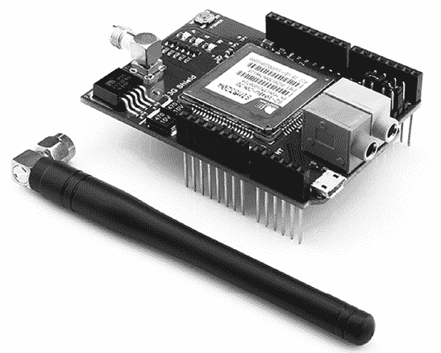
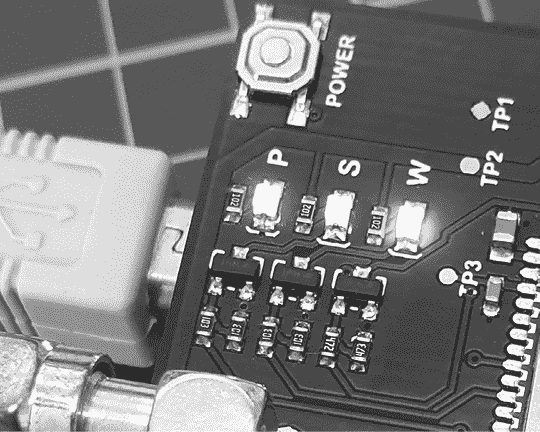
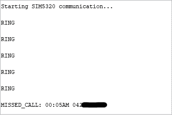
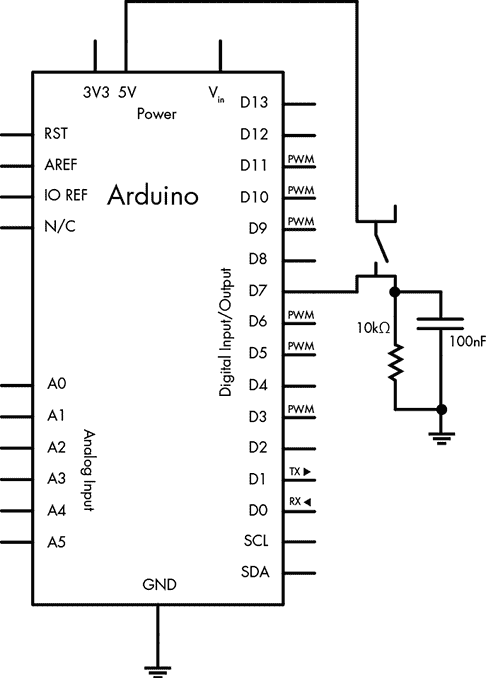
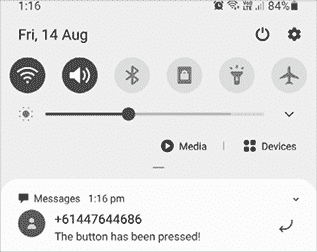
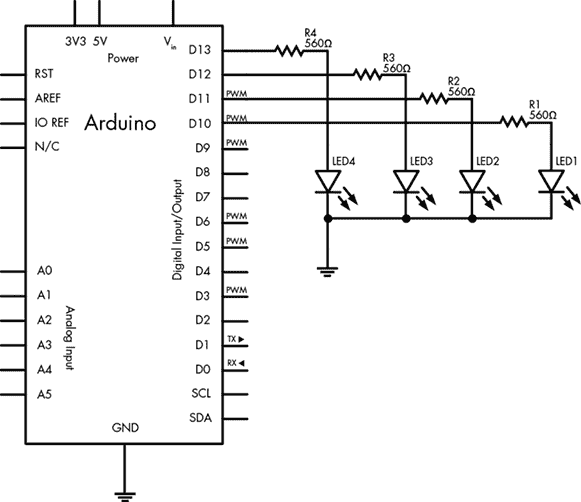

# 第二十二章：移动通信

在本章中，你将会：

+   当事件发生时，让你的 Arduino 拨打一个电话号码

+   使用 Arduino 发送短信到手机

+   通过手机的短信控制连接到 Arduino 的设备

你可以将 Arduino 项目连接到手机网络，实现 Arduino 与手机或固定电话之间的简单通信。凭借一些想象力，你可以为这种通信类型设计许多应用，包括本章中的一些项目。

在购买任何硬件之前，一定要先审阅本章内容，因为项目的成功将依赖于你的手机网络。你的网络必须能够做到以下几点：

+   在 UMTS（3G）850 MHz、900 MHz、1900 MHz 或 2100 MHz 频段下运行。

+   允许使用网络提供商未提供的设备。

为了使用这些项目，你可能需要选择预付费通话计划或提供大量短信的计划，以防你的程序出现错误，导致项目发送出多个短信（短消息服务，SMS）。此外，确保 SIM 卡使用时不要求输入 PIN 码。（你可以通过将 SIM 卡插入普通手机并在安全设置菜单中更改该设置来轻松完成此操作。）

## 硬件

所有项目都使用共同的硬件配置，因此我们将首先进行设置。你需要特定的硬件来完成本章中的项目，首先是 SIM5320 类型的 3G GSM 扩展板和天线，如图 22-1 所示。这个扩展板可以从 TinySine ([`www.tinyosshop.com/`](https://www.tinyosshop.com/))及其分销商处购买。SIM5320 扩展板有两种类型：SIM5320A 和 SIM5320E。

-E 版本使用 UMTS/HSDPA 900/2100 MHz 频段（主要供欧洲用户使用），而-A 版本使用 UMTS/HSDPA 850/1900 MHz 频段（主要供美国用户和使用 Telstra 网络的澳大利亚用户使用）。



图 22-1：附加天线的 3G 扩展板

你还需要一个电源供应。在某些情况下，3G 扩展板可能需要最多 2 A 的电流（比 Arduino 本身能够提供的电流还要多），如果在没有外部电源的情况下使用，将会损坏你的 Arduino。因此，你需要一个外部电源。这个电源可以是一个直流插头电源适配器、墙壁适配器电源（或者是一个大容量的 7.2V 可充电电池、太阳能电池板/电池源、12V 电池等，只要它不超过 12V DC），能够提供最多 2 A 的电流。

### 硬件配置与测试

现在让我们配置并测试硬件，确保 3G 模块可以与蜂窝网络和 Arduino 通信。我们首先需要设置串口通信跳线，因为 3G 模块通过串口与 Arduino 通信，方式与第十五章中使用的 GPS 模块相同。我们可以使用模块顶部右侧的跳线来设置模块与 Arduino 通信所使用的数字引脚。我们所有的项目将使用数字引脚 2 作为模块的发送引脚，数字引脚 3 作为接收引脚。要配置此设置，请在 TX2 和 RX3 引脚之间连接跳线，如 图 22-2 所示。


图 22-2：模块串口配置跳线

接下来，翻转模块，将 SIM 卡插入卡槽，如 图 22-3 所示。


图 22-3：已安装 SIM 卡

接下来，轻轻将 3G 模块插入 Arduino。连接外部电源和 Arduino 与 PC 之间的 USB 电缆。最后，就像使用手机一样，你需要使用模块左上角的电源按钮打开（和关闭）SIM 模块，如 图 22-4 所示。按住按钮 2 秒钟后松开。片刻之后，P（电源）和 S（状态）LED 会亮起，蓝色 LED 会开始闪烁，表示 3G 模块已成功注册到蜂窝网络。

供将来参考，模块的电源按钮连接到数字引脚 8，因此你可以从草图中控制电源，而无需手动开关按钮。



图 22-4：3G 模块电源按钮和状态 LED

现在输入并上传 列表 22-1 中显示的草图。

```
// Listing 22-11 #include <SoftwareSerial.h> // Virtual serial port2 SoftwareSerial cell(2,3);
char incoming_char = 0;
void setup()
{ // Initialize serial ports for communication Serial.begin(9600);3   cell.begin(4800); Serial.println("Starting SIM5320 communication...");
}
void loop()
{ // If a character comes in from 3G shield if( cell.available() > 0 ) { // Get the character from the cellular serial port incoming_char = cell.read(); // Print the incoming character to the Serial Monitor Serial.print(incoming_char); } // If a character is coming from the terminal to the Arduino... if( Serial.available() > 0 ) { incoming_char = Serial.read(); // Get the character from the terminal cell.print(incoming_char); // Send the character to the cellular module }
}
```

列表 22-1：3G 模块测试草图

这个草图简单地将来自 3G 模块的所有信息转发到串口监视器。3G 模块通过软件串口与 Arduino 的数字引脚 2 和 3 连接，这样它就不会干扰 Arduino 和 PC 之间的正常串口连接（该连接使用数字引脚 0 和 1）。我们为 3G 模块设置了一个虚拟串口，编号为 1、2 和 3。默认情况下，3G 模块通过串口以 4800 bps 的速度进行通信，这对于我们的项目来说已经足够了。

上传草图后，打开串口监视器窗口，等待大约 10 秒钟。然后，使用另一部电话拨打你 3G 模块的号码。你应该能看到类似于 图 22-5 中显示的数据。



图 22-5：列表 22-1 输出示例

当你拨打电话时，`RING` 通知会来自扩展板，而未接来电通知则会在你挂断电话时显示。如果你的移动网络支持来电显示，源电话号码将在时间后显示。（为了隐私保护，图 22-5 中的号码已经被打上了马赛克。）现在 3G 扩展板已经开始工作，我们可以利用其提供的各种功能来进行项目开发。

## 项目 #63：构建一个 Arduino 拨号器

在完成这个项目后，你的 Arduino 会在事件发生时拨打一个电话号码，事件由你的 Arduino 草图决定。例如，如果存储冷冻柜的温度超过某个水平，或者入侵报警系统被激活，你可以让 Arduino 从预设号码拨打给你，等待 20 秒钟后挂断。你的电话的来电显示将会把电话号码识别为 Arduino。

### 硬件

这个项目使用了章节开头描述的硬件以及你为应用选择的任何额外电路。为了演示，我们将使用按钮来触发电话拨打。

除了前面讨论的硬件外，创建这个项目还需要以下组件：

+   一个按钮

+   一个 10 kΩ 电阻

+   一个 100 nF 电容

+   各种连接线

+   一个面包板

### 电路图

按照 图 22-6 所示连接外部电路。



图 22-6：项目 63 的电路图

### 草图

输入 *但不要上传* 以下草图：

```
// Project 63 - Building an Arduino Dialer
#include <SoftwareSerial.h> // Virtual serial port
SoftwareSerial cell(2,3);
char incoming_char = 0;
void setup()
{ pinMode(7, INPUT);        // for button pinMode(8, OUTPUT);       // shield power control // initialize serial ports for communication Serial.begin(9600); cell.begin(4800);
}
void callSomeone()
{ // turn shield on1   Serial.println("Turning shield power on..."); digitalWrite(8, HIGH); delay(2000); digitalWrite(8, LOW); delay(10000);2   cell.println("ATD`xxxxxxxxxx`"); // dial the phone number `xxxxxxxxxx` // change `xxxxxxxxxx` to your desired phone number (with area code) Serial.println("Calling ..."); delay(20000);                  // wait 20 seconds3   cell.println("ATH");           // end call Serial.println("Ending call, shield power off.");   // turn shield off to conserve power4   digitalWrite(8, HIGH); delay(2000); digitalWrite(8, LOW);
}
void loop()
{5   if (digitalRead(7) == HIGH) {6     callSomeone(); }
} 
```

### 理解草图

在设置好软件串口和常规串口后，草图会等待按下连接到数字引脚 7 的按钮。当按钮被按下后，`callSomeone()` 函数会在第 6 步运行。在第 1 步时，数字引脚 8 会被切换为 `HIGH`，保持 2 秒钟，打开扩展板，并等待 10 秒钟让扩展板与移动网络注册。接下来，在第 2 步，草图发送拨打电话号码的指令。最后，在第 3 步通话结束后，扩展板在第 4 步关闭以节省电力。

你需要将 `xxxxxxxxxx` 替换为你希望 Arduino 拨打的电话号码。使用与手机拨号相同的方式。例如，如果你想让 Arduino 拨打 212.555.1212，你需要添加以下内容：

```
cell.println("ATD2125551212");
```

在输入电话号码后，你可以上传草图，等待一分钟让 3G 模块连接到网络，然后通过按下按钮来进行测试。将拨号功能集成到现有的草图中非常简单，因为只需要在第 2 步时调用它。之后，你可以找到触发条件——可能是温度传感器、光传感器，或者其他任何输入达到某个水平——来使 Arduino 拨打一个电话号码。

现在让我们通过发送短信把你的 Arduino 带入 21 世纪。

## 项目 #64：构建一个 Arduino 文字信息发送器

在本项目中，当事件发生时，Arduino 将向另一部手机发送短信。为简化代码，我们将使用 SerialGSM Arduino 库，您可以从[`github.com/meirm/SerialGSM/archive/master.zip`](https://github.com/meirm/SerialGSM/archive/master.zip)下载该库。安装库后，重新启动 Arduino IDE。

您将在本项目中使用的硬件与项目 63 中使用的硬件相同。

### 草图

将以下草图输入到 Arduino IDE 中，但*暂时不要上传*：

```
// Project 64 - Building an Arduino Texter
#include <SerialGSM.h>
#include <SoftwareSerial.h> // Virtual serial port1 SerialGSM cell(2, 3);
void sendSMS()
{2   cell.Message("The button has been pressed!"); cell.SendSMS();
}
void setup()
{ pinMode(7, INPUT);  // for button pinMode(8, OUTPUT); // shield power control // turn shield on Serial.println("Turning shield power on..."); digitalWrite(8, HIGH); delay(2000); digitalWrite(8, LOW); // initialize serial ports for communication Serial.begin(9600); cell.begin(4800); cell.Verbose(true); cell.Boot(); cell.FwdSMS2Serial();3   cell.Rcpt("`xxxxxxxxxxx`"); delay(10000);
}
void loop()
{4   if (digitalRead(7) == HIGH) { sendSMS(); }
}
```

### 理解草图

3G 扩展板如常在 1 处设置，并在`void setup()`中初始化。按钮按下事件在 4 处被检测到，并调用`sendSMS()`函数。这个简单的函数将短信发送到存储在 3 处的手机号码。

在上传草图之前，将`xxxxxxxxxxx`替换为接收者的手机号码；输入区号和号码，不要使用空格或括号。例如，要将短信发送到美国的 212.555.1212，您应存储`2125551212`。



图 22-7：接收到的示例短信

要发送的短信存储在第 2 步。（请注意，消息的最大长度为 160 个字符。）

存储了一个示例短信和目标号码后，上传草图，等待 30 秒钟，然后按下按钮。稍后，消息应送达目标手机，如图 22-7 所示。

项目 64 可以轻松集成到其他草图中，并且可以通过`switch case`语句根据参数比较数据发送不同的短信。

## 项目 #65：设置 SMS 远程控制

在本项目中，您将通过从手机发送短信来控制 Arduino 的数字输出引脚。您应该能够利用现有的知识来添加各种设备进行控制。我们将提供四个独立的数字输出，但您可以根据需要控制更多或更少的输出。

要打开或关闭四个数字输出（在此示例中为 10 到 13 号引脚），您需要以以下格式将短信发送到您的 Arduino：`#a``x``b``x``c``x``d``x`，将`x`替换为`0`（关闭）或`1`（打开）。例如，要打开所有四个输出，您将发送`#a1b1c1d1`。

### 硬件

本项目使用的是本章开始时描述的硬件，外加您选择的任何额外电路。我们将使用四个 LED 来指示数字输出的状态。因此，以下额外硬件是本示例所需的：

+   四个 LED

+   四个 560 Ω的电阻

+   各种连接线

+   一个面包板

### 原理图

按照图 22-8 所示连接外部电路。



图 22-8：项目 65 的原理图

### 草图

对于这个项目，我们并未使用 3G 模块库，而是直接依赖原始命令来控制该模块。此外，在整个草图中，我们没有打开或关闭模块，因为我们需要它处于开启状态才能监听传入的短信。输入并上传以下草图：

```
// Project 65 - Setting Up an SMS Remote Control
#include <SoftwareSerial.h>
SoftwareSerial cell(2,3);
char inchar;
void setup()
{ // set up digital output pins to control pinMode(10, OUTPUT); pinMode(11, OUTPUT); pinMode(12, OUTPUT); pinMode(13, OUTPUT); digitalWrite(10, LOW); // default state for I/O pins at power-up or reset, digitalWrite(11, LOW); // change as you wish digitalWrite(12, LOW); digitalWrite(13, LOW); // initialize the 3G shield serial port for communication cell.begin(4800); delay(30000);1   cell.println("AT+CMGF=1"); delay(200);2   cell.println("AT+CNMI=3,3,0,0"); delay(200);
}
void loop()
{ // if a character comes in from the cellular module...3   if(cell.available() > 0) { inchar = cell.read();4     if (inchar == '#') // the start of our command { delay(10); inchar = cell.read();5       if (inchar == 'a') { delay(10); inchar = cell.read(); if (inchar == '0') { digitalWrite(10, LOW); } else if (inchar == '1') { digitalWrite(10, HIGH); } delay(10); inchar = cell.read(); if (inchar == 'b') { inchar = cell.read(); if (inchar == '0') { digitalWrite(11, LOW); } else if (inchar == '1') { digitalWrite(11, HIGH); } delay(10); inchar = cell.read(); if (inchar == 'c') { inchar = cell.read(); if (inchar == '0') { digitalWrite(12, LOW); } else if (inchar == '1') { digitalWrite(12, HIGH); } delay(10); inchar = cell.read(); if (inchar == 'd') { delay(10); inchar = cell.read(); if (inchar == '0') { digitalWrite(13, LOW); } else if (inchar == '1') { digitalWrite(13, HIGH); } delay(10); } } cell.println("AT+CMGD=1,4"); // delete all SMS  } } } }
}
```

### 理解草图

在这个项目中，Arduino 监控从 3G 模块发送的每个文本字符。因此，在步骤 1 中，我们告诉模块将传入的短信转化为文本并将内容发送到虚拟串口。在步骤 2 之后，Arduino 在步骤 3 等待来自模块的文本消息。

由于从手机发送的命令并通过 3G 模块传递给 Arduino 控制引脚的指令以`#`开头，因此草图会等待文本消息中的井号（`#`）出现。在步骤 5 中，首先检查第一个输出参数`a`——如果后面跟着`0`或`1`，则分别关闭或开启引脚。对于接下来的三个由`b`、`c`和`d`控制的输出，过程会重复进行。

激发你的想象力，想象一下使用这个项目创造一个遥控器来控制各种事物——如灯光、泵、警报等，会是多么的简单。

## 展望未来

通过本章的三个项目，你已经建立了一个良好的框架，能够构建自己的项目，实现在蜂窝网络上的通信。你唯一受限的是想象力——例如，你可以在地下室淹水时接收短信，或者用手机开启空调。再次提醒，在让你的项目“自由飞翔”之前，记得留意网络费用。

此时，经过阅读（并且希望已经动手构建）本书中的 65 个项目后，你应该已经具备了创造自己的 Arduino 项目所需的理解、知识和信心。你已经掌握了创建多个项目的基本构建块，并且我相信你能够运用这些技术解决各种问题，同时享受乐趣。

我始终很高兴收到关于本书的反馈，您可以通过本书网页上的联系方式留言：[`nostarch.com/arduino-workshop-2nd-edition/`](https://nostarch.com/arduino-workshop-2nd-edition/)。

但请记住——这只是开始。你可以找到更多的硬件形式来进行操作，只要稍加思考和规划，你就可以与它们所有的设备进行合作。你会在互联网上找到庞大的 Arduino 用户社区（例如在[`forum.arduino.cc/`](http://forum.arduino.cc/)上的 Arduino 论坛），甚至在本地的黑客空间或俱乐部中也可以找到。

所以不要只是坐在那里——做点什么吧！
