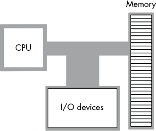
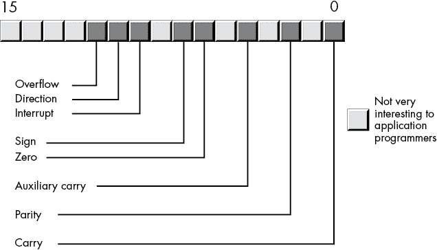
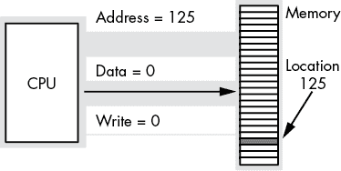
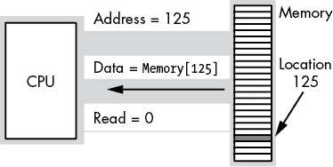
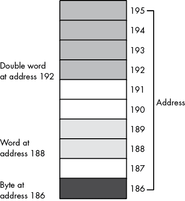

# 第一章：汇编语言的 Hello, World


本章是一个“快速入门”章节，旨在让你尽可能快速地开始编写基础的汇编语言程序。在本章结束时，你应该理解 Microsoft Macro Assembler (MASM) 程序的基本语法，以及学习后续章节中新汇编语言特性的前提条件。

本章内容包括：

+   MASM 程序的基本语法

+   英特尔中央处理器（CPU）架构

+   为变量分配内存

+   使用机器指令控制 CPU

+   将 MASM 程序与 C/C++ 代码链接，以便你能够调用 C 标准库中的例程

+   编写一些简单的汇编语言程序

## 1.1 你需要准备的

要学习使用 MASM 编写汇编语言程序，你需要一些先决条件：64 位版本的 MASM，文本编辑器（用于创建和修改 MASM 源文件）、链接器、各种库文件，以及 C++ 编译器。

如今的软件工程师只有在 C++、C#、Java、Swift 或 Python 代码运行过慢时，才会转向汇编语言，他们需要提升代码中某些模块（或函数）的性能。由于你在实际应用中通常会将汇编语言与 C++ 或其他高级语言（HLL）代码接口，因此本书也会这样操作。

另一个使用 C++ 的理由是 C 标准库。虽然不同的人为 MASM 创建了几个有用的库（例如 [`www.masm32.com/`](http://www.masm32.com/) 提供了一个很好的例子），但没有公认的标准库集。为了使 C 标准库能够立即在 MASM 程序中使用，本书提供了带有简短 C/C++ 主函数的示例，该主函数调用一个用 MASM 编写的汇编语言外部函数。将 C++ 主程序与 MASM 源文件一起编译，将生成一个可执行文件，你可以运行并进行测试。

学习汇编语言需要了解 C++ 吗？其实不需要。本书会为你提供运行示例程序所需的 C++ 知识。不过，汇编语言并不是你的第一门语言的最佳选择，因此本书假设你已经有一些 C/C++、Pascal（或 Delphi）、Java、Swift、Rust、BASIC、Python 或任何其他命令式或面向对象编程语言的经验。

## 1.2 在你的计算机上设置 MASM

MASM 是微软的产品，属于 Visual Studio 开发工具套件的一部分。由于它是微软的工具集，你需要运行某个版本的 Windows（截至写作时，Windows 10 是最新版本；但任何更新版本的 Windows 也可能可以运行）。附录 C 提供了如何安装 Visual Studio Community（“免费版”，包括 MASM 和 Visual C++ 编译器，以及你将需要的其他工具）的完整描述。请参阅该附录以获取更多详情。

## 1.3 在你的机器上设置文本编辑器

Visual Studio 包括一个文本编辑器，你可以用来创建和编辑 MASM 和 C++程序。因为你必须安装 Visual Studio 软件包来获得 MASM，所以你自动得到了一个生产级程序员文本编辑器，可以用来编辑你的汇编语言源文件。

然而，你可以使用任何可以处理纯 ASCII 文件（UTF-8 也可以）的编辑器来创建 MASM 和 C++源文件，比如 Notepad++或者来自[`www.masm32.com/`](https://www.masm32.com/)的文本编辑器。文字处理程序，如 Microsoft Word，不适合编辑程序源文件。

## 1.4 MASM 程序的结构

一个典型的（独立的）MASM 程序如下所示：清单 1-1。

```
; Comments consist of all text from a semicolon character
; to the end of the line.

; The ".code" directive tells MASM that the statements following
; this directive go in the section of memory reserved for machine
; instructions (code).

        .code

; Here is the "main" function. (This example assumes that the
; assembly language program is a stand-alone program with its
; own main function.)

main    PROC

`Machine instructions go here`

        ret    ; Returns to caller

main    ENDP

; The END directive marks the end of the source file.

        END
```

清单 1-1：简单的 Shell 程序

一个典型的 MASM 程序包含一个或多个*区段*，表示内存中出现的数据类型。这些区段以 MASM 语句开头，例如`.code`或`.data`。变量和其他内存值出现在*数据*区段中。机器指令出现在*代码*区段内的过程里，等等。汇编语言源文件中出现的各个区段是可选的，因此某个源文件中不一定会包含每一种类型的区段。例如，清单 1-1 只包含一个单独的代码区段。

`.code`语句是一个汇编器*指令*的例子——这是一条告诉 MASM 程序某些信息的语句，但并不是实际的 x86-64 机器指令。特别地，`.code`指令告诉 MASM 将其后的语句分组到一个为机器指令保留的特殊内存区段中。

## 1.5 运行你的第一个 MASM 程序

传统的第一个程序，受到 Brian Kernighan 和 Dennis Ritchie 的*《C 程序设计语言》*（普伦蒂斯·霍尔出版社，1978 年）的推广，是“Hello, world！”程序。这个程序的唯一目的是提供一个简单的示例，供学习新编程语言的人用来弄清楚如何使用编译和运行该语言程序所需的工具。

不幸的是，编写像“Hello, world！”这样简单的程序在汇编语言中是一项大工程。你必须学习几条机器指令和汇编器指令，更不用说 Windows 系统调用了，才能打印字符串“Hello, world！”在这个阶段，对初学汇编语言的程序员来说，这实在是要求太高了（对于那些想快速前进的人，可以查看附录 C 中的示例程序）。

然而，清单 1-1 中的程序外壳实际上是一个完整的汇编语言程序。你可以编译（*汇编*）并运行它。它不会产生任何输出，启动后会立即返回到 Windows。但是，它确实能运行，并且将作为展示如何汇编、链接和运行汇编语言源文件的机制。

MASM 是一个传统的 *命令行汇编器*，这意味着您需要从 Windows *命令行提示符*（通过运行 *cmd.exe* 程序获得）中运行它。为此，请在命令行提示符或 shell 窗口中输入类似以下的内容：

```
C:\>**ml64 programShell.asm /link /subsystem:console /entry:main**
```

这个命令告诉 MASM 汇编 *programShell.asm* 程序（我将 清单 1-1 保存到其中）为一个可执行文件，将结果链接为一个控制台应用程序（可以从命令行运行的程序），并在汇编语言源文件中的 `main` 标签处开始执行。假设没有发生错误，您可以通过在命令提示符窗口中键入以下命令来运行生成的程序：

```
C:\>**programShell**
```

Windows 应立即响应一个新的命令行提示符（因为 `programShell` 应用程序在开始运行后会将控制权交还给 Windows）。

## 1.6 运行您的第一个 MASM/C++ 混合程序

这本书通常将一个汇编语言模块（包含一个或多个用汇编语言编写的函数）与一个调用这些函数的 C/C++ 主程序结合在一起。由于编译和执行过程与独立的 MASM 程序略有不同，本节将演示如何创建、编译并运行一个混合汇编/C++ 程序。清单 1-2 提供了调用汇编语言模块的主要 C++ 程序。

```
// Listing 1-2

// A simple C++ program that calls an assembly language function.
// Need to include stdio.h so this program can call "printf()".

#include <stdio.h>

// extern "C" namespace prevents "name mangling" by the C++
// compiler.

extern "C"
{
    // Here's the external function, written in assembly
    // language, that this program will call:

    void asmFunc(void);
};

int main(void)
{
    printf("Calling asmMain:\n");
    asmFunc();
    printf("Returned from asmMain\n");
}
```

清单 1-2：一个示例 C/C++ 程序，*listing1-2.cpp*，调用一个汇编语言函数

清单 1-3 是对独立 MASM 程序的轻微修改，包含 C++ 程序调用的 `asmFunc()` 函数。

```
; Listing 1-3

; A simple MASM module that contains an empty function to be 
; called by the C++ code in Listing 1-2.

        .CODE

; (See text concerning option directive.)

        option  casemap:none

; Here is the "asmFunc" function.

        public  asmFunc
asmFunc PROC

; Empty function just returns to C++ code.

        ret    ; Returns to caller

asmFunc ENDP
        END
```

清单 1-3：一个 MASM 程序，*listing1-3.asm*，是 C++ 程序 清单 1-2 中调用的程序

清单 1-3 与原始 *programShell.asm* 源文件相比有三个变化。首先，新增了两个语句：`option` 语句和 `public` 语句。

`option` 语句告诉 MASM 使所有符号区分大小写。这是必要的，因为 MASM 默认情况下是不区分大小写的，并将所有标识符映射为大写字母（因此 `asmFunc()` 会变成 `ASMFUNC()`）。C++ 是一种区分大小写的语言，将 `asmFunc()` 和 `ASMFUNC()` 视为两个不同的标识符。因此，告诉 MASM 尊重标识符的大小写非常重要，以避免与 C++ 程序混淆。

*`public` 语句声明 `asmFunc()` 标识符将在 MASM 源/目标文件外部可见。如果没有这个语句，`asmFunc()` 只会在 MASM 模块内部可访问，C++ 编译时会抱怨 `asmFunc()` 是一个未定义的标识符。

清单 1-3 与 清单 1-1 之间的第三个区别是函数的名称从 `main()` 改为了 `asmFunc()`。如果汇编代码使用 `main()` 这个名称，C++ 编译器和链接器会感到困惑，因为 `main()` 也是 C++ 的主函数名称。

要编译和运行这些源文件，您可以使用以下命令：

```
C:\>**ml64 /c listing1-3.asm**
Microsoft (R) Macro Assembler (x64) Version 14.15.26730.0
Copyright (C) Microsoft Corporation.  All rights reserved.

 Assembling: listing1-3.asm

C:\>**cl listing1-2.cpp listing1-3.obj**
Microsoft (R) C/C++ Optimizing Compiler Version 19.15.26730 for x64
Copyright (C) Microsoft Corporation.  All rights reserved.

listing1-2.cpp
Microsoft (R) Incremental Linker Version 14.15.26730.0
Copyright (C) Microsoft Corporation.  All rights reserved.

/out:listing1-2.exe
listing1-2.obj
listing1-3.obj

C:\>**listing1-2**
Calling asmFunc:
Returned from asmFunc
```

`ml64` 命令使用 `` `/c` 选项，表示*仅编译*，并不会尝试运行链接器（因为 *listing1-3.asm* 不是独立程序，所以链接器运行会失败）。MASM 的输出是一个目标代码文件（*listing1-3.obj*），它作为下一个命令中 Microsoft Visual C++（MSVC）编译器的输入。``

``````The `cl` command runs the MSVC compiler on the *listing1-2.cpp* file and links in the assembled code (*listing1-3.obj*). The output from the MSVC compiler is the *listing1-2.exe* executable file. Executing that program from the command line produces the output we expect.    ## 1.7 An Introduction to the Intel x86-64 CPU Family    Thus far, you’ve seen a single MASM program that will actually compile and run. However, the program does nothing more than return control to Windows. Before you can progress any further and learn some real assembly language, a detour is necessary: unless you understand the basic structure of the Intel x86-64 CPU family, the machine instructions will make little sense.    The Intel CPU family is generally classified as a *von Neumann architecture machine*. Von Neumann computer systems contain three main building blocks: the *central processing unit* *(CPU)*, *memory*, and *input/output (I/0) devices*. These three components are interconnected via the *system bus* (consisting of the address, data, and control buses).The block diagram in Figure 1-1 shows these relationships.    The CPU communicates with memory and I/O devices by placing a numeric value on the address bus to select one of the memory locations or I/O device port locations, each of which has a unique numeric *address*. Then the CPU, memory, and I/O devices pass data among themselves by placing the data on the data bus. The control bus contains signals that determine the direction of the data transfer (to/from memory and to/from an I/O device).      Figure 1-1: Von Neumann computer system block diagram      Within the CPU, special locations known as *registers* are used to manipulate data. The x86-64 CPU registers can be broken into four categories: general-purpose registers, special-purpose application-accessible registers, segment registers, and special-purpose kernel-mode registers. Because the segment registers aren’t used much in modern 64-bit operating systems (such as Windows), there is little need to discuss them in this book. The special-purpose kernel-mode registers are intended for writing operating systems, debuggers, and other system-level tools. Such software construction is well beyond the scope of this text.    The x86-64 (Intel family) CPUs provide several *general-purpose registers* for application use. These include the following:    *   Sixteen 64-bit registers that have the following names: RAX, RBX, RCX, RDX, RSI, RDI, RBP, RSP, R8, R9, R10, R11, R12, R13, R14, and R15 *   Sixteen 32-bit registers: EAX, EBX, ECX, EDX, ESI, EDI, EBP, ESP, R8D, R9D, R10D, R11D, R12D, R13D, R14D, and R15D *   Sixteen 16-bit registers: AX, BX, CX, DX, SI, DI, BP, SP, R8W, R9W, R10W, R11W, R12W, R13W, R14W, and R15W *   Twenty 8-bit registers: AL, AH, BL, BH, CL, CH, DL, DH, DIL, SIL, BPL, SPL, R8B, R9B, R10B, R11B, R12B, R13B, R14B, and R15B    Unfortunately, these are not 68 independent registers; instead, the x86-64 overlays the 64-bit registers over the 32-bit registers, the 32-bit registers over the 16-bit registers, and the 16-bit registers over the 8-bit registers. Table 1-1 shows these relationships.    Because the general-purpose registers are not independent, modifying one register may modify as many as three other registers. For example, modifying the EAX register may very well modify the AL, AH, AX, and RAX registers. This fact cannot be overemphasized. A common mistake in programs written by beginning assembly language programmers is register value corruption due to the programmer not completely understanding the ramifications of the relationships shown in Table 1-1.      Table 1-1: General-Purpose Registers on the x86-64       | **Bits 0–63** | **Bits 0–31** | **Bits 0–15** | **Bits 8–15** | **Bits 0–7** | | --- | --- | --- | --- | --- | | RAX | EAX | AX | AH | AL | | RBX | EBX | BX | BH | BL | | RCX | ECX | CX | CH | CL | | RDX | EDX | DX | DH | DL | | RSI | ESI | SI |  | SIL | | RDI | EDI | DI |  | DIL | | RBP | EBP | BP |  | BPL | | RSP | ESP | SP |  | SPL | | R8 | R8D | R8W |  | R8B | | R9 | R9D | R9W |  | R9B | | R10 | R10D | R10W |  | R10B | | R11 | R11D | R11W |  | R11B | | R12 | R12D | R12W |  | R12B | | R13 | R13D | R13W |  | R13B | | R14 | R14D | R14W |  | R14B | | R15 | R15D | R15W |  | R15B |    In addition to the general-purpose registers, the x86-64 provides special-purpose registers, including eight *floating-point registers* implemented in the x87 *floating-point unit (FPU)*. Intel named these registers ST(0) to ST(7). Unlike with the general-purpose registers, an application program cannot directly access these. Instead, a program treats the floating-point register file as an eight-entry-deep stack and accesses only the top one or two entries (see “Floating-Point Arithmetic” in Chapter 6 for more details).    Each floating-point register is 80 bits wide, holding an extended-precision real value (hereafter just *extended precision*). Although Intel added other floating-point registers to the x86-64 CPUs over the years, the FPU registers still find common use in code because they support this 80-bit floating-point format.    In the 1990s, Intel introduced the MMX register set and instructions to support *single instruction, multiple data* *(SIMD)* operations. The *MMX register set* is a group of eight 64-bit registers that overlay the ST(0) to ST(7) registers on the FPU. Intel chose to overlay the FPU registers because this made the MMX registers immediately compatible with multitasking operating systems (such as Windows) without any code changes to those OSs. Unfortunately, this choice meant that an application could not simultaneously use the FPU and MMX instructions.    Intel corrected this issue in later revisions of the x86-64 by adding the *XMM register set*. For that reason, you rarely see modern applications using the MMX registers and instruction set. They are available if you really want to use them, but it is almost always better to use the XMM registers (and instruction set) and leave the registers in FPU mode.    To overcome the limitations of the MMX/FPU register conflicts, AMD/Intel added sixteen 128-bit XMM registers (XMM0 to XMM15) and the SSE/SSE2 instruction set. Each register can be configured as four 32-bit floating-point registers; two 64-bit double-precision floating-point registers; or sixteen 8-bit, eight 16-bit, four 32-bit, two 64-bit, or one 128-bit integer registers. In later variants of the x86-64 CPU family, AMD/Intel doubled the size of the registers to 256 bits each (renaming them YMM0 to YMM15) to support eight 32-bit floating-point values or four 64-bit double-precision floating-point values (integer operations were still limited to 128 bits).    The **RFLAGS* (or just *FLAGS*) register is a 64-bit register that encapsulates several single-bit Boolean (true/false) values.^(1) Most of the bits in the RFLAGS register are either reserved for kernel mode (operating system) functions or are of little interest to the application programmer. Eight of these bits (or *flags*) are of interest to application programmers writing assembly language programs: the overflow, direction, interrupt disable,^(2) sign, zero, auxiliary carry, parity, and carry flags. Figure 1-2 shows the layout of the flags within the lower 16 bits of the RFLAGS register.*  *    Figure 1-2: Layout of the FLAGS register (lower 16 bits of RFLAGS)      Four flags in particular are extremely valuable: the overflow, carry, sign, and zero flags, collectively called the *condition codes.*^(3) The state of these flags lets you test the result of previous computations. For example, after comparing two values, the condition code flags will tell you whether one value is less than, equal to, or greater than a second value.    One important fact that comes as a surprise to those just learning assembly language is that almost all calculations on the x86-64 CPU involve a register. For example, to add two variables together and store the sum into a third variable, you must load one of the variables into a register, add the second operand to the value in the register, and then store the register away in the destination variable. Registers are a middleman in nearly every calculation.    You should also be aware that, although the registers are called **general-purpose*, you cannot use any register for any purpose. All the x86-64 registers have their own special purposes that limit their use in certain contexts. The RSP register, for example, has a very special purpose that effectively prevents you from using it for anything else (it’s the *stack pointer*). Likewise, the RBP register has a special purpose that limits its usefulness as a general-purpose register. For the time being, avoid the use of the RSP and RBP registers for generic calculations; also, keep in mind that the remaining registers are not completely interchangeable in your programs.*   *## 1.8 The Memory Subsystem    The *memory subsystem* holds data such as program variables, constants, machine instructions, and other information. Memory is organized into cells, each of which holds a small piece of information. The system can combine the information from these small cells (or *memory locations*) to form larger pieces of information.    The x86-64 supports *byte-addressable memory*, which means the basic memory unit is a byte, sufficient to hold a single character or a (very) small integer value (we’ll talk more about that in Chapter 2).    Think of memory as a linear array of bytes. The address of the first byte is 0, and the address of the last byte is 2³² – 1\. For an x86 processor with 4GB memory installed,^(4) the following pseudo-Pascal array declaration is a good approximation of memory:    ``` Memory: array [0..4294967295] of byte; ```    C/C++ and Java users might prefer the following syntax:    ``` byte Memory[4294967296]; ```    For example, to execute the equivalent of the Pascal statement `Memory [125] := 0;`, the CPU places the value `0` on the data bus, places the address `125` on the address bus, and asserts the write line (this generally involves setting that line to `0`), as shown in Figure 1-3.      Figure 1-3: Memory write operation      To execute the equivalent of `CPU := Memory [125];`, the CPU places the address `125` on the address bus, asserts the read line (because the CPU is reading data from memory), and then reads the resulting data from the data bus (see Figure 1-4).      Figure 1-4: Memory read operation      To store larger values, the x86 uses a sequence of consecutive memory locations. Figure 1-5 shows how the x86 stores bytes, *words* (2 bytes), and *double words* (4 bytes) in memory. The memory address of each object is the address of the first byte of each object (that is, the lowest address).      Figure 1-5: Byte, word, and double-word storage in memory      ## 1.9 Declaring Memory Variables in MASM    Although it is possible to reference memory by using numeric addresses in assembly language, doing so is painful and error-prone. Rather than having your program state, “Give me the 32-bit value held in memory location 192 and the 16-bit value held in memory location 188,” it’s much nicer to state, “Give me the contents of `elementCount` and `portNumber`.” Using variable names, rather than memory addresses, makes your program much easier to write, read, and maintain.    To create (writable) data variables, you have to put them in a data section of the MASM source file, defined using the `.data` directive. This directive tells MASM that all following statements (up to the next `.code` or other section-defining directive) will define data declarations to be grouped into a read/write section of memory.    Within a `.data` section, MASM allows you to declare variable objects by using a set of data declaration directives. The basic form of a data declaration directive is    ``` `label`  `directive` ? ```    where `label` is a legal MASM identifier and `directive` is one of the directives appearing in Table 1-2.      Table 1-2: MASM Data Declaration Directives       | **Directive** | **Meaning** | | --- | --- | | `` `byte` (or `db`) `` | Byte (unsigned 8-bit) value | | `` `sbyte` `` | Signed 8-bit integer value | | `` `word` (or `dw`) `` | Unsigned 16-bit (word) value | | `` `sword` `` | Signed 16-bit integer value | | `` `dword` (or `dd`) `` | Unsigned 32-bit (double-word) value | | `` `sdword` `` | Signed 32-bit integer value | | `` `qword` (or `dq`) `` | Unsigned 64-bit (quad-word) value | | `` `sqword` `` | Signed 64-bit integer value | | `` `tbyte` (or `dt`) `` | Unsigned 80-bit (10-byte) value | | `` `oword` `` | 128-bit (octal-word) value | | `` `real4` `` | Single-precision (32-bit) floating-point value | | `` `real8` `` | Double-precision (64-bit) floating-point value | | `` `real10` `` | Extended-precision (80-bit) floating-point value |    The question mark (`?`) operand tells MASM that the object will not have an explicit value when the program loads into memory (the default initialization is zero). If you would like to initialize the variable with an explicit value, replace the `?` with the initial value; for example:    ``` hasInitialValue  sdword   -1 ```    Some of the data declaration directives in Table 1-2 have a signed version (the directives with the `s` prefix). For the most part, MASM ignores this prefix. It is the machine instructions you write that differentiate between signed and unsigned operations; MASM itself usually doesn’t care whether a variable holds a signed or an unsigned value. Indeed, MASM allows both of the following:    ```  .data u8   byte    -1    ; Negative initializer is okay i8   sbyte   250   ; even though +128 is maximum signed byte ```    All MASM cares about is whether the initial value will fit into a byte. The `-1`, even though it is not an unsigned value, will fit into a byte in memory. Even though `250` is too large to fit into a signed 8-bit integer (see “Signed and Unsigned Numbers” in Chapter 2), MASM will happily accept this because `250` will fit into a byte variable (as an unsigned number).    It is possible to reserve storage for multiple data values in a single data declaration directive. The string multi-valued data type is critical to this chapter (later chapters discuss other types, such as arrays in Chapter 4). You can create a null-terminated string of characters in memory by using the `byte` directive as follows:    ``` ; Zero-terminated C/C++ string. strVarName  byte 'String of characters', 0 ```    Notice the `, 0` that appears after the string of characters. In any data declaration (not just byte declarations), you can place multiple data values in the operand field, separated by commas, and MASM will emit an object of the specified size and value for each operand. For string values (surrounded by apostrophes in this example), MASM emits a byte for each character in the string (plus a zero byte for the `, 0` operand at the end of the string). MASM allows you to define strings by using either apostrophes or quotes; you must terminate the string of characters with the same delimiter that begins the string (quote or apostrophe).    ### 1.9.1 Associating Memory Addresses with Variables    One of the nice things about using an assembler/compiler like MASM is that you don’t have to worry about numeric memory addresses. All you need to do is declare a variable in MASM, and MASM associates that variable with a unique set of memory addresses. For example, say you have the following declaration section:    ```  .data i8   sbyte   ? i16  sword   ? i32  sdword  ? i64  sqword  ? ```    MASM will find an unused 8-bit byte in memory and associate it with the `i8` variable; it will find a pair of consecutive unused bytes and associate them with `i16`; it will find four consecutive locations and associate them with `i32`; finally, MASM will find 8 consecutive unused bytes and associate them with `i64`. You’ll always refer to these variables by their name. You generally don’t have to concern yourself with their numeric address. Still, you should be aware that MASM is doing this for you.    When MASM is processing declarations in a `.data` section, it assigns consecutive memory locations to each variable.^(5) Assuming `i8` (in the previous declarations) as a memory address of 101, MASM will assign the addresses appearing in Table 1-3 to `i8`, `i16`, `i32`, and `i64`.      Table 1-3: Variable Address Assignment       | **Variable** | **Memory address** | | --- | --- | | `i8` | 101 | | `i16` | 102 (address of `i8` plus 1) | | `i32` | 104 (address of `i16` plus 2) | | `i64` | 108 (address of `i32` plus 4) |    Whenever you have multiple operands in a data declaration statement, MASM will emit the values to sequential memory locations in the order they appear in the operand field. The label associated with the data declaration (if one is present) is associated with the address of the first (leftmost) operand’s value. See Chapter 4 for more details.    ### 1.9.2 Associating Data Types with Variables    During assembly, MASM associates a data type with every label you define, including variables. This is rather advanced for an assembly language (most assemblers simply associate a value or an address with an identifier).    For the most part, MASM uses the variable’s size (in bytes) as its type (see Table 1-4).      Table 1-4: MASM Data Types       | **Type** | **Size** | **Description** | | --- | --- | --- | | `byte` (`db`) | 1 | 1-byte memory operand, unsigned (generic integer) | | `sbyte` | 1 | 1-byte memory operand, signed integer | | `word` (`dw`) | 2 | 2-byte memory operand, unsigned (generic integer) | | `sword` | 2 | 2-byte memory operand, signed integer | | `dword` (`dd`) | 4 | 4-byte memory operand, unsigned (generic integer) | | `sdword` | 4 | 4-byte memory operand, signed integer | | `qword` (`dq`) | 8 | 8-byte memory operand, unsigned (generic integer) | | `sqword` | 8 | 8-byte memory operand, signed integer | | `tbyte` (`dt`) | 10 | 10-byte memory operand, unsigned (generic integer or BCD) | | `oword` | 16 | 16-byte memory operand, unsigned (generic integer) | | `real4` | 4 | 4-byte single-precision floating-point memory operand | | `real8` | 8 | 8-byte double-precision floating-point memory operand | | `real10` | 10 | 10-byte extended-precision floating-point memory operand | | `proc` | N/A | Procedure label (associated with `PROC` directive) | | `label`: | N/A | Statement label (any identifier immediately followed by a `:`) | | `constant` | Varies | Constant declaration (equate) using `=` or `EQU` directive | | `text` | N/A | Textual substitution using macro or `TEXTEQU` directive |    Later sections and chapters fully describe the `proc`, `label`, `constant`, and `text` types.    ## 1.10 Declaring (Named) Constants in MASM    MASM allows you to declare manifest constants by using the `=` directive. A *manifest constant* is a symbolic name (identifier) that MASM associates with a value. Everywhere the symbol appears in the program, MASM will directly substitute the value of that symbol for the symbol.    A manifest constant declaration takes the following form:    ``` `label` = `expression` ```    Here, `label` is a legal MASM identifier, and `expression` is a constant arithmetic expression (typically, a single literal constant value). The following example defines the symbol `dataSize` to be equal to `256`:    ``` dataSize = 256 ```    Most of the time, MASM’s `equ` directive is a synonym for the `=` directive. For the purposes of this chapter, the following statement is largely equivalent to the previous declaration:    ``` dataSize equ 256 ```    Constant declarations (*equates* in MASM terminology) may appear anywhere in your MASM source file, prior to their first use. They may appear in a .`data` section, a `.code` section, or even outside any sections.    ## 1.11 Some Basic Machine Instructions    The x86-64 CPU family provides from just over a couple hundred to many thousands of machine instructions, depending on how you define a machine instruction. But most assembly language programs use around 30 to 50 machine instructions,^(6) and you can write several meaningful programs with only a few. This section provides a small handful of machine instructions so you can start writing simple MASM assembly language programs right away.    ### 1.11.1 The mov Instruction    Without question, the `mov` instruction is the most oft-used assembly language statement. In a typical program, anywhere from 25 percent to 40 percent of the instructions are `mov` instructions. As its name suggests, this instruction moves data from one location to another.^(7) Here’s the generic MASM syntax for this instruction:    ``` mov    `destination_operand`, `source_operand` ```    The `source_operand` may be a (general-purpose) register, a memory variable, or a constant. The `destination_operand` may be a register or a memory variable. The x86-64 instruction set does not allow both operands to be memory variables. In a high-level language like Pascal or C/C++, the `mov` instruction is roughly equivalent to the following assignment statement:    ``` `destination_operand` = `source_operand` ; ```    The `mov` instruction’s operands must both be the same size. That is, you can move data between a pair of byte (8-bit) objects, word (16-bit) objects, double-word (32-bit), or quad-word (64-bit) objects; you may not, however, mix the sizes of the operands. Table 1-5 lists all the legal combinations for the `mov` instruction.    You should study this table carefully because most of the general-purpose x86-64 instructions use this syntax.      Table 1-5: Legal x86-64 `mov` Instruction Operands       | **Source*** | **Destination** | | --- | --- | | reg[8] | reg[8] | | reg[8] | mem[8] | | mem[8] | reg[8] | | constant** | reg[8] | | constant | mem[8] | | reg[16] | reg[16] | | reg[16] | mem[16] | | mem[16] | reg[16] | | constant | reg[16] | | constant | mem[16] | | reg[32] | reg[32] | | reg[32] | mem[32] | | mem[32] | reg[32] | | constant | reg[32] | | constant | mem[32] | | reg[64] | reg[64] | | reg[64] | mem[64] | | mem[64] | reg[64] | | constant | reg[64] | | constant[32] | mem[64] | | ^(*) reg[*n*] means an *n*-bit register, and mem[*n*] means an *n*-bit memory location.^(**) The constant must be small enough to fit in the specified destination operand. |    This table includes one important thing to note: the x86-64 allows you to move only a 32-bit constant value into a 64-bit memory location (it will sign-extend this value to 64 bits; see “Sign Extension and Zero Extension” in Chapter 2 for more information about sign extension). Moving a 64-bit constant into a 64-bit register is the only x86-64 instruction that allows a 64-bit constant operand. This inconsistency in the x86-64 instruction set is annoying. Welcome to the x86-64.    ### 1.11.2 Type Checking on Instruction Operands    MASM enforces some type checking on instruction operands. In particular, the size of an instruction’s operands must agree. For example, MASM will generate an error for the following:    ``` i8 byte ?     .     .     . mov ax, i8 ```    The problem is that you are attempting to load an 8-bit variable (`i8`) into a 16-bit register (AX). As their sizes are not compatible, MASM assumes that this is a logic error in the program and reports an error.^(8)    For the most part, MASM ignores the difference between signed and unsigned variables. MASM is perfectly happy with both of these `mov` instructions:    ``` i8 sbyte ? u8 byte  ?     .     .     . mov al, i8 mov bl, u8 ```    All MASM cares about is that you’re moving a byte variable into a byte-sized register. Differentiating signed and unsigned values in those registers is up to the application program. MASM even allows something like this:    ``` r4v real4 ? r8v real8 ?     .     .     . mov eax, r4v mov rbx, r8v ```    Again, all MASM really cares about is the size of the memory operands, not that you wouldn’t normally load a floating-point variable into a general-purpose register (which typically holds integer values).    In Table 1-4, you’ll notice that there are `proc`, `label`, and `constant` types. MASM will report an error if you attempt to use a `proc` or `label` reserved word in a `mov` instruction. The procedure and label types are associated with addresses of machine instructions, not variables, and it doesn’t make sense to “load a procedure” into a register.    However, you may specify a `constant` symbol as a source operand to an instruction; for example:    ``` someConst = 5     .     .     . mov eax, someConst ```    As there is no size associated with constants, the only type checking MASM will do on a constant operand is to verify that the constant will fit in the destination operand. For example, MASM will reject the following:    ``` wordConst = 1000     .     .     . mov al, wordConst ```    ### 1.11.3 The add and sub Instructions    The x86-64 `add` and `sub` instructions add or subtract two operands, respectively. Their syntax is nearly identical to the `mov` instruction:    ``` add `destination_operand`*,* `source_operand` sub `destination_operand`*,* `source_operand` ```    However, constant operands are limited to a maximum of 32 bits. If your destination operand is 64 bits, the CPU allows only a 32-bit immediate source operand (it will sign-extend that operand to 64 bits; see “Sign Extension and Zero Extension” in Chapter 2 for more details on sign extension).    The `add` instruction does the following:    ``` `destination_operand` = `destination_operand` + `source_operand` ```    The `sub` instruction does the calculation:    ``` `destination_operand` = `destination_operand` - `source_operand` ```    With these three instructions, plus some MASM control structures, you can actually write sophisticated programs.    ### 1.11.4 The lea Instruction    Sometimes you need to load the address of a variable into a register rather than the value of that variable. You can use the `lea` (*load effective address*) instruction for this purpose. The `lea` instruction takes the following form:    ``` lea    `reg64`, `memory_var` ```    Here, `reg64` is any general-purpose 64-bit register, and `memory_var` is a variable name. Note that `memory_var`’s type is irrelevant; it doesn’t have to be a `qword` variable (as is the case with `mov`, `add`, and `sub` instructions). Every variable has a memory address associated with it, and that address is always 64 bits. The following example loads the RCX register with the address of the first character in the `strVar` string:    ``` strVar  byte "Some String", 0     .     .     .     lea rcx, strVar ```    The `lea` instruction is roughly equivalent to the C/C++ unary `&` (*address-of*) operator. The preceding assembly example is conceptually equivalent to the following C/C++ code:    ``` char strVar[] = "Some String"; char *RCX;     .     .     .     RCX = &strVar[0]; ```    ### 1.11.5 The call and ret Instructions and MASM Procedures    To make function calls (as well as write your own simple functions), you need the `call` and `ret` instructions.    The `ret` instruction serves the same purpose in an assembly language program as the `return` statement in C/C++: it returns control from an assembly language procedure (assembly language functions are called *procedures*). For the time being, this book will use the variant of the `ret` instruction that does not have an operand:    ``` ret ```    (The `ret` instruction does allow a single operand, but unlike in C/C++, the operand does not specify a function return value. You’ll see the purpose of the `ret` instruction operand in Chapter 5.)    As you might guess, you call a MASM procedure by using the `call` instruction. This instruction can take a couple of forms. The most common is    ``` call `proc_name` ```    where `proc_name` is the name of the procedure you want to call.    As you’ve seen in a couple code examples already, a MASM procedure consists of the line    ``` `proc_name` proc ```    followed by the body of the procedure (typically ending with a `ret` instruction). At the end of the procedure (typically immediately after the `ret` instruction), you end the procedure with the following statement:    ``` `proc_name` endp ```    The label on the `endp` directive must be identical to the one you supply for the `proc` statement.    In the stand-alone assembly language program in Listing 1-4, the main program calls `myProc`, which will immediately return to the main program, which then immediately returns to Windows.    ``` ; Listing 1-4  ; A simple demonstration of a user-defined procedure.          .code  ; A sample user-defined procedure that this program can call.  myProc  proc         ret    ; Immediately return to the caller myProc  endp  ; Here is the "main" procedure.  main    PROC  ; Call the user-defined procedure.          call  myProc          ret    ; Returns to caller main    endp         end ```    Listing 1-4: A sample user-defined procedure in an assembly language program    You can compile this program and try running it by using the following commands:    ``` C:\>**ml64 listing1-4.asm /link /subsystem:console /entry:main** Microsoft (R) Macro Assembler (x64) Version 14.15.26730.0 Copyright (C) Microsoft Corporation.  All rights reserved.   Assembling: listing1-4.asm Microsoft (R) Incremental Linker Version 14.15.26730.0 Copyright (C) Microsoft Corporation.  All rights reserved.  /OUT:listing1-4.exe listing1-4.obj /subsystem:console /entry:main  C:\>**listing1-4** ```    ## 1.12 Calling C/C++ Procedures    While writing your own procedures and calling them are quite useful, the reason for introducing procedures at this point is not to allow you to write your own procedures, but rather to give you the ability to call procedures (functions) written in C/C++. Writing your own procedures to convert and output data to the console is a rather complex task (probably well beyond your capabilities at this point). Instead, you can call the C/C++ `printf()` function to produce program output and verify that your programs are actually doing something when you run them.    Unfortunately, if you call `printf()` in your assembly language code without providing a `printf()` procedure, MASM will complain that you’ve used an undefined symbol. To call a procedure outside your source file, you need to use the MASM `externdef` directive.^(9) This directive has the following syntax:    ``` externdef  `symbol`:`type` ```    Here, `symbol` is the external symbol you want to define, and `type` is the type of that symbol (which will be `proc` for external procedure definitions). To define the `printf()` symbol in your assembly language file, use this statement:    ``` externdef  printf:proc ```    When defining external procedure symbols, you should put the `externdef` directive in your `.code` section.    The `externdef` directive doesn’t let you specify parameters to pass to the `printf()` procedure, nor does the `call` instruction provide a mechanism for specifying parameters. Instead, you can pass up to four parameters to the `printf()` function in the x86-64 registers RCX, RDX, R8, and R9\. The `printf()` function requires that the first parameter be the address of a format string. Therefore, you should load RCX with the address of a zero-terminated string prior to calling `printf()`. If the format string contains any format specifiers (for example, `%d`), you must pass appropriate parameter values in RDX, R8, and R9\. Chapter 5 goes into great detail concerning procedure parameters, including how to pass floating-point values and more than four parameters.    ## 1.13 Hello, World!    At this point (many pages into this chapter), you finally have enough information to write this chapter’s namesake application: the “Hello, world!” program, shown in Listing 1-5.    ``` ; Listing 1-5   ; A "Hello, world!" program using the C/C++ printf() function to ; provide the output.          option  casemap:none         .data  ; Note: "10" value is a line feed character, also known as the ; "C" newline character.   fmtStr  byte    'Hello, world!', 10, 0          .code  ; External declaration so MASM knows about the C/C++ printf() ; function.          externdef  printf:proc          ; Here is the "asmFunc" function.          public  asmFunc asmFunc proc  ; "Magic" instruction offered without explanation at this point:          sub     rsp, 56  ; Here's where we'll call the C printf() function to print ; "Hello, world!" Pass the address of the format string ; to printf() in the RCX register. Use the LEA instruction ; to get the address of fmtStr.          lea     rcx, fmtStr         call    printf  ; Another "magic" instruction that undoes the effect of the  ; previous one before this procedure returns to its caller.          add    rsp, 56                  ret    ; Returns to caller          asmFunc endp         end ```    Listing 1-5: Assembly language code for the “Hello, world!” program    The assembly language code contains two “magic” statements that this chapter includes without further explanation. Just accept the fact that subtracting from the RSP register at the beginning of the function and then adding this value back to RSP at the end of the function are needed to make the calls to C/C++ functions work properly. Chapter 5 more fully explains the purpose of these statements.    The C++ function in Listing 1-6 calls the assembly code and makes the `printf()` function available for use.    ``` // Listing 1-6   // C++ driver program to demonstrate calling printf() from assembly  // language.   // Need to include stdio.h so this program can call "printf()".  #include <stdio.h>  // extern "C" namespace prevents "name mangling" by the C++ // compiler.  extern "C" {     // Here's the external function, written in assembly     // language, that this program will call:      void asmFunc(void); };  int main(void) {     // Need at least one call to printf() in the C program to allow      // calling it from assembly.      printf("Calling asmFunc:\n");     asmFunc();     printf("Returned from asmFunc\n"); } ```    Listing 1-6: C++ code for the “Hello, world!” program    Here’s the sequence of steps needed to compile and run this code on my machine:    ``` C:\>**ml64 /c listing1-5.asm** Microsoft (R) Macro Assembler (x64) Version 14.15.26730.0 Copyright (C) Microsoft Corporation.  All rights reserved.   Assembling: listing1-5.asm  C:\>**cl listing1-6.cpp listing1-5.obj** Microsoft (R) C/C++ Optimizing Compiler Version 19.15.26730 for x64 Copyright (C) Microsoft Corporation.  All rights reserved.  listing1-6.cpp Microsoft (R) Incremental Linker Version 14.15.26730.0 Copyright (C) Microsoft Corporation.  All rights reserved.  /out:listing1-6.exe listing1-6.obj listing1-5.obj  C:\>**listing1-6** Calling asmFunc: Hello, World! Returned from asmFunc ```    You can finally print “Hello, world!” on the console!    ## 1.14 Returning Function Results in Assembly Language    In a previous section, you saw how to pass up to four parameters to a procedure written in assembly language. This section describes the opposite process: returning a value to code that has called one of your procedures.    In pure assembly language (where one assembly language procedure calls another), passing parameters and returning function results are strictly a convention that the caller and callee procedures share with one another. Either the callee (the procedure being called) or the caller (the procedure doing the calling) may choose where function results appear.    From the callee viewpoint, the procedure returning the value determines where the caller can find the function result, and whoever calls that function must respect that choice. If a procedure returns a function result in the XMM0 register (a common place to return floating-point results), whoever calls that procedure must expect to find the result in XMM0\. A different procedure could return its function result in the RBX register.    From the caller’s viewpoint, the choice is reversed. Existing code expects a function to return its result in a particular location, and the function being called must respect that wish.    Unfortunately, without appropriate coordination, one section of code might demand that functions it calls return their function results in one location, while a set of existing library functions might insist on returning their function results in another location. Clearly, such functions would not be compatible with the calling code. While there are ways to handle this situation (typically by writing facade code that sits between the caller and callee and moves the return results around), the best solution is to ensure that everybody agrees on things like where function return results will be found prior to writing any code.    This agreement is known as an *application binary interface (***ABI)*. An ABI is a contract, of sorts, between different sections of code that describe *calling conventions* (where things are passed, where they are returned, and so on), data types, memory usage and alignment, and other attributes. CPU manufacturers, compiler writers, and operating system vendors all provide their own ABIs. For obvious reasons, this book uses the Microsoft Windows ABI.*   *Once again, it’s important to understand that when you’re writing your own assembly language code, the way you pass data between your procedures is totally up to you. One of the benefits of using assembly language is that you can decide the interface on a procedure-by-procedure basis. The only time you have to worry about adhering to an ABI is when you call code that is outside your control (or if that external code makes calls to your code). This book covers writing assembly language under Microsoft Windows (specifically, assembly code that interfaces with MSVC); therefore, when dealing with external code (Windows and C++ code), you have to use the Windows/MSVC ABI. The Microsoft ABI specifies that the first four parameters to `printf()` (or any C++ function, for that matter) must be passed in RCX, RDX, R8, and R9.    The Windows ABI also states that functions (procedures) return integer and pointer values (that fit into 64 bits) in the RAX register. So if some C++ code expects your assembly procedure to return an integer result, you would load the integer result into RAX immediately before returning from your procedure.    To demonstrate returning a function result, we’ll use the C++ program in Listing 1-7 (*c.cpp*, a generic C++ program that this book uses for most of the C++/assembly examples hereafter). This C++ program includes two extra function declarations: `getTitle()` (supplied by the assembly language code), which returns a pointer to a string containing the title of the program (the C++ code prints this title), and `readLine()` (supplied by the C++ program), which the assembly language code can call to read a line of text from the user (and put into a string buffer in the assembly language code).    ``` // Listing 1-7  // c.cpp   // Generic C++ driver program to demonstrate returning function // results from assembly language to C++. Also includes a // "readLine" function that reads a string from the user and // passes it on to the assembly language code.   // Need to include stdio.h so this program can call "printf()" // and string.h so this program can call strlen.  #include <errno.h> #include <stdio.h> #include <stdlib.h> #include <string.h>  // extern "C" namespace prevents "name mangling" by the C++ // compiler.  extern "C" {     // asmMain is the assembly language code's "main program":      void asmMain(void);      // getTitle returns a pointer to a string of characters     // from the assembly code that specifies the title of that     // program (that makes this program generic and usable     // with a large number of sample programs in "The Art of     // 64-Bit Assembly").      char *getTitle(void);      // C++ function that the assembly     // language program can call:      int readLine(char *dest, int maxLen);  };  // readLine reads a line of text from the user (from the // console device) and stores that string into the destination // buffer the first argument specifies. Strings are limited in // length to the value specified by the second argument // (minus 1).   // This function returns the number of characters actually // read, or -1 if there was an error.   // Note that if the user enters too many characters (maxlen or // more), then this function returns only the first maxlen-1 // characters. This is not considered an error.  int readLine(char *dest, int maxLen) {     // Note: fgets returns NULL if there was an error, else     // it returns a pointer to the string data read (which     // will be the value of the dest pointer).      char *result = fgets(dest, maxLen, stdin);     if(result != NULL)     {         // Wipe out the newline character at the         // end of the string:          int len = strlen(result);         if(len > 0)         {             dest[len - 1] = 0;         }         return len;     }   return -1; // If there was an error }  int main(void) {     // Get the assembly language program's title:      try     {         char *title = getTitle();                      printf("Calling %s:\n", title);         asmMain();         printf("%s terminated\n", title);     }     catch(...)     {         printf         (              "Exception occurred during program execution\n"             "Abnormal program termination.\n"         );     } } ```    Listing 1-7: Generic C++ code for calling assembly language programs    The `` `try..catch` block catches any exceptions the assembly code generates, so you get some sort of indication if the program aborts abnormally. ``   ````` Listing 1-8 provides assembly code that demonstrates several new concepts, foremost returning a function result (to the C++ program). The assembly language function `getTitle()` returns a pointer to a string that the calling C++ code will print as the title of the program. In the `.data` section, you’ll see a string variable `titleStr` that is initialized with the name of this assembly code (`Listing 1-8`). The `getTitle()` function loads the address of that string into RAX and returns this string pointer to the C++ code (Listing 1-7) that prints the title before and after running the assembly code.    This program also demonstrates reading a line of text from the user. The assembly code calls the `readLine()` function appearing in the C++ code. The `readLine()` function expects two parameters: the address of a character buffer (C string) and a maximum buffer length. The code in Listing 1-8 passes the address of the character buffer to the `readLine()` function in RCX and the maximum buffer size in RDX. The maximum buffer length must include room for two extra characters: a newline character (line feed) and a zero-terminating byte.    Finally, Listing 1-8 demonstrates declaring a character buffer (that is, an array of characters). In the `.data` section, you will find the following declaration:    ``` input byte maxLen dup (?) ```    The `maxLen` `` `dup (?)` operand tells MASM to duplicate the `(?)` (that is, an uninitialized byte) `maxLen` times. `maxLen` is a constant set to `256` by an equate directive (`=`) at the beginning of the source file. (For more details, see “Declaring Arrays in Your MASM Programs” in Chapter 4.) ``   ```` ``` ; Listing 1-8   ; An assembly language program that demonstrates returning ; a function result to a C++ program.          option  casemap:none  nl      =       10  ; ASCII code for newline maxLen  =       256 ; Maximum string size + 1           .data   titleStr byte    'Listing 1-8', 0 prompt   byte    'Enter a string: ', 0 fmtStr   byte    "User entered: '%s'", nl, 0  ; "input" is a buffer having "maxLen" bytes. This program ; will read a user string into this buffer.   ; The "maxLen dup (?)" operand tells MASM to make "maxLen" ; duplicate copies of a byte, each of which is uninitialized.  input    byte   maxLen dup (?)          .code          externdef   printf:proc         externdef   readLine:proc  ; The C++ function calling this assembly language module ; expects a function named "getTitle" that returns a pointer ; to a string as the function result. This is that function:           public getTitle getTitle proc  ; Load address of "titleStr" into the RAX register (RAX holds ; the function return result) and return back to the caller:           lea rax, titleStr          ret getTitle endp  ; Here is the "asmMain" function.          public  asmMain asmMain proc         sub     rsp, 56                  ; Call the readLine function (written in C++) to read a line ; of text from the console.   ; int readLine(char *dest, int maxLen)   ; Pass a pointer to the destination buffer in the RCX register. ; Pass the maximum buffer size (max chars + 1) in EDX. ; This function ignores the readLine return result. ; Prompt the user to enter a string:          lea     rcx, prompt         call    printf  ; Ensure the input string is zero-terminated (in the event ; there is an error):          mov     input, 0  ; Read a line of text from the user:          lea     rcx, input         mov     rdx, maxLen         call    readLine          ; Print the string input by the user by calling printf():          lea     rcx, fmtStr         lea     rdx, input         call    printf          add     rsp, 56         ret     ; Returns to caller          asmMain endp         end ```    Listing 1-8: Assembly language program that returns a function result    To compile and run the programs in Listings 1-7 and 1-8, use statements such as the following:    ``` C:\>**ml64 /c listing1-8.asm** Microsoft (R) Macro Assembler (x64) Version 14.15.26730.0 Copyright (C) Microsoft Corporation.  All rights reserved.   Assembling: listing1-8.asm  C:\>**cl /EHa /Felisting1-8.exe c.cpp listing1-8.obj** Microsoft (R) C/C++ Optimizing Compiler Version 19.15.26730 for x64 Copyright (C) Microsoft Corporation.  All rights reserved.  c.cpp Microsoft (R) Incremental Linker Version 14.15.26730.0 Copyright (C) Microsoft Corporation.  All rights reserved.  /out:listing1-8.exe c.obj listing1-8.obj  C:\> **listing1-8** Calling Listing 1-8: Enter a string: This is a test User entered: 'This is a test' Listing 1-8 terminated ```    The `/Felisting1-8.exe` command line option tells MSVC to name the executable file *listing1-8.exe*. Without the `/Fe` option, MSVC would name the resulting executable file *c.exe* (after *c.cpp*, the generic example C++ file from Listing 1-7).    ## 1.15 Automating the Build Process    At this point, you’re probably thinking it’s a bit tiresome to type all these (long) command lines every time you want to compile and run your programs. This is especially true if you start adding more command line options to the `ml64` and `cl` commands. Consider the following two commands:    ``` ml64 /nologo /c /Zi /Cp listing1-8.asm cl /nologo /O2 /Zi /utf-8 /EHa /Felisting1-8.exe c.cpp listing1-8.obj listing1-8 ```    The `/Zi` option tells MASM and MSVC to compile extra debug information into the code. The `/nologo` option tells MASM and MSVC to skip printing copyright and version information during compilation. The MASM `/Cp` option tells MASM to make compilations case-insensitive (so you don’t need the `options casemap:none` directive in your assembly source file). The `/O2` option tells MSVC to optimize the machine code the compiler produces. The `/utf-8` option tells MSVC to use UTF-8 Unicode encoding (which is ASCII-compatible) rather than UTF-16 encoding (or other character encoding). The `/EHa` option tells MSVC to handle processor-generated exceptions (such as memory access faults—a common exception in assembly language programs). As noted earlier, the `/Fe` option specifies the executable output filename. Typing all these command line options every time you want to build a sample program is going to be a lot of work.    The easy solution is to create a batch file that automates this process. You could, for example, type the three previous command lines into a text file, name it*l8.bat*, and then simply type `l8` at the command line to automatically execute those three commands. That saves a lot of typing and is much quicker (and less error-prone) than typing these three commands every time you want to compile and run the program.    The only drawback to putting those three commands into a batch file is that the batch file is specific to the *listing1-8.asm* source file, and you would have to create a new batch file to compile other programs. Fortunately, it is easy to create a batch file that will work with any single assembly source file that compiles and links with the generic *c.cpp* program. Consider the following *build.bat* batch file:    ``` echo off ml64 /nologo /c /Zi /Cp %1.asm cl /nologo /O2 /Zi /utf-8 /EHa /Fe%1.exe c.cpp %1.obj ```    The `%1` item in these commands tells the Windows command line processor to substitute a command line parameter (specifically, command line parameter number 1) in place of the `%1`. If you type the following from the command line    ``` build listing1-8 ```    then Windows executes the following three commands:    ``` echo off ml64 /nologo /c /Zi /Cp listing1-8.asm cl /nologo /O2 /Zi /utf-8 /EHa /Felisting1-8.exe c.cpp listing1-8.obj ```    With this *build.bat* file, you can compile several projects simply by specifying the assembly language source file name (without the *.asm* suffix) on the build command line.    The *build.bat* file does not run the program after compiling and linking it. You could add this capability to the batch file by appending a single line containing `%1` to the end of the file. However, that would always attempt to run the program, even if the compilation failed because of errors in the C++ or assembly language source files. For that reason, it’s probably better to run the program manually after building it with the batch file, as follows:    ``` C:\>**build listing1-8** C:\>**listing1-8** ```    A little extra typing, to be sure, but safer in the long run.    Microsoft provides another useful tool for controlling compilations from the command line: *makefiles*. They are a better solution than batch files because makefiles allow you to conditionally control steps in the process (such as running the executable) based on the success of earlier steps. However, using Microsoft’s make program (*nmake.exe*) is beyond the scope of this chapter. It’s a good tool to learn (and Chapter 15 will teach you the basics). However, batch files are sufficient for the simple projects appearing throughout most of this book and require little extra knowledge or training to use. If you are interested in learning more about makefiles, see Chapter 15 or “For More Information” on page 39.    ## 1.16 Microsoft ABI Notes    As noted earlier (see “Returning Function Results in Assembly Language” on page 27), the Microsoft ABI is a contract between modules in a program to ensure compatibility (between modules, especially modules written in different programming languages).^(10) In this book, the C++ programs will be calling assembly language code, and the assembly modules will be calling C++ code, so it’s important that the assembly language code adhere to the Microsoft ABI.    Even if you were to write stand-alone assembly language code, it would still be calling C++ code, as it would (undoubtedly) need to make Windows **application programming interface* *(API)* calls. The Windows API functions are all written in C++, so calls to Windows must respect the Windows ABI.*   *Because following the Microsoft ABI is so important, each chapter in this book (if appropriate) includes a section at the end discussing those components of the Microsoft ABI that the chapter introduces or heavily uses. This section covers several concepts from the Microsoft ABI: variable size, register usage, and stack alignment.    ### 1.16.1 Variable Size    Although dealing with different data types in assembly language is completely up to the assembly language programmer (and the choice of machine instructions to use on that data), it’s crucial to maintain the size of the data (in bytes) between the C++ and assembly language programs. Table 1-6 lists several common C++ data types and the corresponding assembly language types (that maintain the size information).      Table 1-6: C++ and Assembly Language Types       | **C++ type** | **Size (in bytes)** | **Assembly language type** | | --- | --- | --- | | `char` | 1 | `sbyte` | | `signed char` | 1 | `sbyte` | | `unsigned char` | 1 | `byte` | | `short int` | 2 | `sword` | | `short unsigned` | 2 | `word` | | `int` | 4 | `sdword` | | `unsigned (unsigned int)` | 4 | `dword` | | `long` | 4 | `sdword` | | `long int` | 4 | `sdword` | | `long unsigned` | 4 | `dword` | | `long int` | 8 | `sqword` | | `long unsigned` | 8 | `qword` | | `__int64` | 8 | `sqword` | | `unsigned __int64` | 8 | `qword` | | `Float` | 4 | `real4` | | `double` | 8 | `real8` | | `pointer` (for example, `void *`) | 8 | `qword` |    Although MASM provides signed type declarations (`sbyte`, `sword`, `sdword`, and `sqword`), assembly language instructions do not differentiate between the unsigned and signed variants. You could process a signed integer (`sdword`) by using unsigned instruction sequences, and you could process an unsigned integer (`dword`) by using signed instruction sequences. In an assembly language source file, these different directives mainly serve as a documentation aid to help describe the programmer’s intentions.^(11)    Listing 1-9 is a simple program that verifies the sizes of each of these C++ data types.    ``` // Listing 1-9   // A simple C++ program that demonstrates Microsoft C++ data // type sizes:  #include <stdio.h>  int main(void) {         char                v1;         unsigned char       v2;         short               v3;         short int           v4;         short unsigned      v5;         int                 v6;         unsigned            v7;         long                v8;         long int            v9;         long unsigned       v10;  long long int       v11;         long long unsigned  v12;         __int64             v13;         unsigned __int64    v14;         float               v15;         double              v16;         void *              v17;      printf     (         "Size of char:               %2zd\n"         "Size of unsigned char:      %2zd\n"         "Size of short:              %2zd\n"         "Size of short int:          %2zd\n"         "Size of short unsigned:     %2zd\n"         "Size of int:                %2zd\n"         "Size of unsigned:           %2zd\n"         "Size of long:               %2zd\n"         "Size of long int:           %2zd\n"         "Size of long unsigned:      %2zd\n"         "Size of long long int:      %2zd\n"         "Size of long long unsigned: %2zd\n"         "Size of __int64:            %2zd\n"         "Size of unsigned __int64:   %2zd\n"         "Size of float:              %2zd\n"         "Size of double:             %2zd\n"         "Size of pointer:            %2zd\n",         sizeof v1,         sizeof v2,         sizeof v3,         sizeof v4,         sizeof v5,         sizeof v6,         sizeof v7,         sizeof v8,         sizeof v9,         sizeof v10,         sizeof v11,         sizeof v12,         sizeof v13,         sizeof v14,         sizeof v15,         sizeof v16,         sizeof v17     );             } ```    Listing 1-9: Output sizes of common C++ data types    Here’s the build command and output from Listing 1-9:    ``` C:\>**cl listing1-9.cpp** Microsoft (R) C/C++ Optimizing Compiler Version 19.15.26730 for x64 Copyright (C) Microsoft Corporation.  All rights reserved.  listing1-9.cpp Microsoft (R) Incremental Linker Version 14.15.26730.0 Copyright (C) Microsoft Corporation.  All rights reserved.  /out:listing1-9.exe listing1-9.obj  C:\>**listing1-9** Size of char:                1 Size of unsigned char:       1 Size of short:               2 Size of short int:           2 Size of short unsigned:      2 Size of int:                 4 Size of unsigned:            4 Size of long:                4 Size of long int:            4 Size of long unsigned:       4 Size of long long int:       8 Size of long long unsigned:  8 Size of __int64:             8 Size of unsigned __int64:    8 Size of float:               4 Size of double:              8 Size of pointer:             8 ```    ### 1.16.2 Register Usage    **Register usage* in an assembly language procedure (including the main assembly language function) is also subject to certain Microsoft ABI rules. Within a procedure, the Microsoft ABI has this to say about register usage):^(12)*   **   Code that calls a function can pass the first four (integer) arguments to the function (procedure) in the RCX, RDX, R8, and R9 registers, respectively. Programs pass the first four floating-point arguments in XMM0, XMM1, XMM2, and XMM3. *   Registers RAX, RCX, RDX, R8, R9, R10, and R11 are *volatile*, which means that the function/procedure does not need to save the registers’ values across a function/procedure call. *   XMM0/YMM0 through XMM5/YMM5 are also volatile. The function/procedure does not need to preserve these registers across a call. *   RBX, RBP, RDI, RSI, RSP, R12, R13, R14, and R15 are nonvolatile registers. A procedure/function must preserve these registers’ values across a call. If a procedure modifies one of these registers, it must save the register’s value before the first such modification and restore the register’s value from the saved location prior to returning from the function/procedure. *   XMM6 through XMM15 are nonvolatile. A function must preserve these registers across a function/procedure call (that is, when a procedure returns, these registers must contain the same values they had upon entry to that procedure). *   Programs that use the x86-64’s floating-point coprocessor instructions must preserve the value of the floating-point control word across procedure calls. Such procedures should also leave the floating-point stack cleared. *   Any procedure/function that uses the x86-64’s direction flag must leave that flag cleared upon return from the procedure/function.    Microsoft C++ expects function return values to appear in one of two places. Integer (and other non-scalar) results come back in the RAX register (up to 64 bits). If the return type is smaller than 64 bits, the upper bits of the RAX register are undefined—for example, if a function returns a short int (16-bit) result, bits 16 to 63 in RAX may contain garbage. Microsoft’s ABI specifies that floating-point (and vector) function return results shall come back in the XMM0 register.    ### 1.16.3 Stack Alignment    Some “magic” instructions appear in various source listings throughout this chapter (they basically add or subtract values from the RSP register). These instructions have to do with stack alignment (as required by the Microsoft ABI). This chapter (and several that follow) supply these instructions in the code without further explanation. For more details on the purpose of these instructions, see Chapter 5.    ## 1.17 For More Information    This chapter has covered a lot of ground! While you still have a lot to learn about assembly language programming, this chapter, combined with your knowledge of HLLs (especially C/C++), provides just enough information to let you start writing real assembly language programs.    Although this chapter covered many topics, the three primary ones of interest are the x86-64 CPU architecture, the syntax for simple MASM programs, and interfacing with the C Standard Library.    The following resources provide more information about makefiles:    *   Wikipedia: [`en.wikipedia.org/wiki/Make_(software)`](https://en.wikipedia.org/wiki/Make_(software)) *   *Managing Projects with GNU Make* by Robert Mecklenburg (O’Reilly Media, 2004) *   *The GNU Make Book,* First Edition, by John Graham-Cumming (No Starch Press, 2015) *   *Managing Projects with make*, by Andrew Oram and Steve Talbott (O’Reilly & Associates, 1993)    For more information about MVSC:    *   *Microsoft Visual Studio websites: [`visualstudio.microsoft.com/`](https://visualstudio.microsoft.com/ ) and [`visualstudio.microsoft.com/vs/`](https://visualstudio.microsoft.com/vs/)* **   *Microsoft free developer offers: [`visualstudio.microsoft.com/free-developer-offers/`](https://visualstudio.microsoft.com/free-developer-offers/)**   **For more information about MASM:    *   *Microsoft, C++, C, and Assembler documentation: [`docs.microsoft.com/en-us/cpp/assembler/masm/masm-for-x64-ml64-exe?view=msvc-160/`](https://docs.microsoft.com/en-us/cpp/assembler/masm/masm-for-x64-ml64-exe?view=msvc-160/)* **   *Waite Group MASM Bible (covers MASM 6, which is 32-bit only, but still contains lots of useful information about MASM): [`www.amazon.com/Waite-Groups-Microsoft-Macro-Assembler/dp/0672301555/`](https://www.amazon.com/Waite-Groups-Microsoft-Macro-Assembler/dp/0672301555/)**   **For more information about the ABI:    *   The best documentation comes from Agner Fog’s website: [`www.agner.org/optimize/`](https://www.agner.org/optimize/). *   Microsoft’s website also has information on Microsoft ABI calling conventions (see [`docs.microsoft.com/en-us/cpp/build/x64-calling-convention?view=msvc-160`](https://docs.microsoft.com/en-us/cpp/build/x64-calling-convention?view=msvc-160) or search for *Microsoft calling conventions*).    ## 1.18 Test Yourself    1.  What is the name of the Windows command line interpreter program? 2.  What is the name of the MASM executable program file? 3.  What are the names of the three main system buses? 4.  Which register(s) overlap the RAX register? 5.  Which register(s) overlap the RBX register? 6.  Which register(s) overlap the RSI register? 7.  Which register(s) overlap the R8 register? 8.  Which register holds the condition code bits? 9.  How many bytes are consumed by the following data types?     1.  `word`     2.  `dword`     3.  `oword`     4.  `qword` with a `4 dup (?)` operand     5.  `real8` 10.  If an 8-bit (byte) memory variable is the destination operand of a `mov` instruction, what source operands are legal? 11.  If a `mov` instruction’s destination operand is the EAX register, what is the largest constant (in bits) you can load into that register? 12.  For the `add` instruction, fill in the largest constant size (in bits) for all the destination operands specified in the following table:               | **Destination** | **Constant size** |     | RAX |  |     | EAX |  |     | AX |  |     | AL |  |     | AH |  |     | mem[32] |  |     | mem[64] |  |  13.  What is the destination (register) operand size for the `lea` instruction? 14.  What is the source (memory) operand size of the `lea` instruction? 15.  What is the name of the assembly language instruction you use to call a procedure or function? 16.  What is the name of the assembly language instruction you use to return from a procedure or function? 17.  What does *ABI* stand for? 18.  In the Windows ABI, where do you return the following function return results?     1.  8-bit byte values     2.  16-bit word values     3.  32-bit integer values     4.  64-bit integer values     5.  Floating-point values     6.  64-bit pointer values 19.  Where do you pass the first parameter to a Microsoft ABI–compatible function? 20.  Where do you pass the second parameter to a Microsoft ABI–compatible function? 21.  Where do you pass the third parameter to a Microsoft ABI–compatible function? 22.  Where do you pass the fourth parameter to a Microsoft ABI–compatible function? 23.  What assembly language data type corresponds to a C/C++ `long int`? 24.  What assembly language data type corresponds to a C/C++ `long long unsigned`?****** ```` `````***``````*
