# 第二章：计算机数据表示与操作


许多初学者在学习汇编语言时遇到的一个主要难点是二进制和十六进制数字系统的常见使用。尽管十六进制数字有些陌生，但它们的优点远远超过缺点。理解二进制和十六进制数字系统非常重要，因为它们的使用简化了其他主题的讨论，包括位操作、符号数表示、字符编码和打包数据。

本章讨论了几个重要的概念，包括以下内容：

+   二进制和十六进制数字系统

+   二进制数据组织（位、半字节、字节、字和双字）

+   有符号和无符号数字系统

+   二进制值上的算术、逻辑、移位和旋转操作

+   位域和打包数据

+   浮点数和二进制十进制格式

+   字符数据

这是基础内容，本文的其余部分依赖于你对这些概念的理解。如果你已经在其他课程或学习中接触过这些术语，你至少应该浏览一下这些材料，然后再继续下一章。如果你对这些内容不熟悉，或者只模糊了解，你应该在继续之前认真学习这些内容。*本章的所有内容都很重要！*不要跳过任何内容。

## 2.1 数字系统

现代大多数计算机系统不使用十进制（基数 10）系统来表示数字值。相反，它们通常使用二进制或二的补码数字系统。

### 2.1.1 十进制系统回顾

你已经使用十进制数字系统很久了，可能已经习以为常。当你看到一个数字如 123 时，你并不会思考数字 123 的值；相反，你会脑海中生成这个值代表多少个项目的图像。然而，实际上，数字 123 代表的是：

1.  (1 × 10²) + (2 × 10¹) + (3 × 10⁰)

1.  或

1.  100 + 20 + 3

在十进制*位置数字系统*中，小数点左侧的每个数字表示一个值，这个值是 0 到 9 之间的某个数字，乘以 10 的逐渐增大的幂。小数点右侧的每个数字表示一个值，这个值是 0 到 9 之间的某个数字，乘以 10 的逐渐减小的负幂。例如，数字 123.456 表示的是：

1.  (1 × 10²) + (2 × 10¹) + (3 × 10⁰) + (4 × 10^(-1)) + (5 × 10^(-2)) + (6 × 10^(-3))

1.  或

1.  100 + 20 + 3 + 0.4 + 0.05 + 0.006

### 2.1.2 二进制数字系统

现代大多数计算机系统使用*二进制*逻辑操作。计算机通过两种电压水平（通常是 0V 和+2.4 至 5V）来表示值。这两种电压水平可以精确表示两个独特的值。它们可以是任何两个不同的值，但通常表示的是 0 和 1，二进制数字系统中的两个数字。

二进制计数系统的工作方式与十进制计数系统相似，区别在于二进制只允许使用数字 0 和 1（而不是 0 到 9），并且使用 2 的幂而非 10 的幂。因此，将二进制数转换为十进制非常简单。对于二进制字符串中的每个 1，添加 2^(*n*)，其中*n*是二进制数字的零基位置。例如，二进制值 11001010[2]表示如下：

1.  (1 × 2⁷) + (1 × 2⁶) + (0 × 2⁵) + (0 × 2⁴) + (1 × 2³) + (0 × 2²) + (1 × 2¹) + (0 × 2⁰)

1.  =

1.  128[10] + 64[10] + 8[10] + 2[10]

1.  =

1.  202[10]

将十进制转换为二进制稍微复杂一些。你必须找到那些 2 的幂，当它们相加时，得到十进制结果。

将十进制转换为二进制的一种简单方法是*偶数/奇数—除以二*算法。该算法使用以下步骤：

1.  如果数字是偶数，则输出 0。如果数字是奇数，则输出 1。

1.  将数字除以 2，舍去任何小数部分或余数。

1.  如果商为 0，则算法完成。

1.  如果商不为 0 且为奇数，则在当前字符串前插入 1；如果数字为偶数，则在二进制字符串前加 0。

1.  回到步骤 2 并重复。

二进制数字在高级语言中虽然不太重要，但在汇编语言程序中随处可见。因此，你应该熟悉它们。

### 2.1.3 二进制约定

从最纯粹的角度来看，每个二进制数都包含无限个数字（或*位*，即*二进制数字*的缩写）。例如，我们可以用以下任意一种方式表示数字 5：

1.  101 00000101 0000000000101 . . . 000000000000101

任何数量的前导零数字都可以出现在二进制数字前面而不会改变其值。因为 x86-64 通常以 8 位为一组，所以我们将所有二进制数字扩展为 4 位或 8 位的倍数。按照这个约定，我们将数字 5 表示为 0101[2]或 00000101[2]。

为了使较大的数字更易于阅读，我们将每组 4 个二进制位用下划线分隔。例如，我们将二进制值 1010111110110010 写成 1010_1111_1011_0010。

我们将按如下方式为每个比特编号：

1.  二进制数字中的最右侧比特是比特位置 0。

1.  每个向左的比特都被赋予下一个连续的比特编号。

一个 8 位二进制值使用第 0 到第 7 位：

1.  *X*[7] *X*[6] *X*[5] *X*[4] *X*[3] *X*[2] *X*[1] *X*[0]

一个 16 位二进制值使用第 0 到第 15 位：

1.  *X*[15] *X*[14] *X*[13] *X*[12] *X*[11] *X*[10] *X*[9] *X*[8] *X*[7] *X*[6] *X*[5] *X*[4] *X*[3] *X*[2] *X*[1] *X*[0]

一个 32 位二进制值使用第 0 到第 31 位，依此类推。

位 0 是*低位（**LO**）*位；有些人称其为*最低有效位*。最左边的位称为*高位*（**HO**）*位*，或*最高有效位*。我们将根据各自的比特编号来称呼中间的比特。

在 MASM 中，可以将二进制值指定为以`b`字符结尾的 0 或 1 数字字符串。记住，MASM 不允许在二进制数字中使用下划线。

## 2.2 十六进制计数系统

不幸的是，二进制数字冗长。表示值 202[10]需要八位二进制数字，但只需要三位十进制数字。当处理大数值时，二进制数字很快变得难以处理。不幸的是，计算机是以二进制为“思维方式”的，因此在大多数情况下，使用二进制计数系统非常方便。虽然我们可以在十进制和二进制之间进行转换，但这种转换并非小事。

十六进制（基数 16）计数系统解决了二进制系统中许多固有的问题：十六进制数字简洁，且将其转换为二进制以及反向转换都很简单。因此，大多数工程师使用十六进制计数系统。

因为十六进制数字的*基数*（进制）是 16，每个十六进制数字在十六进制小数点左边代表一个乘以 16 的逐次幂的值。例如，数字 1234[16]等于：

1.  (1 × 16³) + (2 × 16²) + (3 × 16¹) + (4 × 16⁰)

1.  或者

1.  4096 + 512 + 48 + 4 = 4660[10]

每个十六进制数字可以表示 0 到 15[10]之间的 16 个值。由于只有 10 个十进制数字，我们需要 6 个附加数字来表示 10[10]到 15[10]之间的值。我们没有为这些数字创建新的符号，而是使用字母 A 到 F。以下是所有有效的十六进制数字的示例：

1.  1234[16] DEAD[16] BEEF[16] 0AFB[16] F001[16] D8B4[16]

因为我们通常需要将十六进制数字输入到计算机系统中，而在大多数计算机系统中你无法输入下标来表示相关值的基数，所以我们需要一种不同的机制来表示十六进制数字。我们将采用以下 MASM 约定：

1.  所有十六进制值以数字字符开头，并且以*h*后缀结尾；例如，123A4h 和 0DEADh。

1.  所有二进制值以*b*字符结尾；例如，10010b。

1.  十进制数字没有后缀字符。

1.  如果基数可以从上下文中推断出来，本书可能会省略后缀的*h*或*b*字符。

以下是使用 MASM 符号表示的有效十六进制数字的几个示例：

1.  1234h 0DEADh 0BEEFh 0AFBh 0F001h 0D8B4h

如你所见，十六进制数字简洁且易于阅读。此外，你可以轻松地在十六进制和二进制之间进行转换。表 2-1 提供了所有你需要的转换信息，可以将任何十六进制数字转换为二进制数字，反之亦然。

表 2-1：二进制/十六进制转换

| **二进制** | **十六进制** |
| --- | --- |
| 0000 | 0 |
| 0001 | 1 |
| 0010 | 2 |
| 0011 | 3 |
| 0100 | 4 |
| 0101 | 5 |
| 0110 | 6 |
| 0111 | 7 |
| 1000 | 8 |
| 1001 | 9 |
| 1010 | A |
| 1011 | B |
| 1100 | C |
| 1101 | D |
| 1110 | E |
| 1111 | F |

要将十六进制数字转换为二进制数字，可以将每个十六进制数字对应的 4 位二进制替换。例如，要将 0ABCDh 转换为二进制值，根据表 2-1 将每个十六进制数字转换，如下所示：

| A | B | C | D | 十六进制 |
| --- | --- | --- | --- | --- |
| 1010 | 1011 | 1100 | 1101 | 二进制 |

将二进制数字转换为十六进制格式几乎同样简单：

1.  用 0 填充二进制数，确保该数字包含 4 位的倍数。例如，给定二进制数 1011001010，在数字的左侧加上 2 位，使其包含 12 位：001011001010。

1.  将二进制值分成 4 位一组；例如，0010_1100_1010。

1.  查找表 2-1 中的这些二进制值，并替换为相应的十六进制数字：2CAh。

与十进制和二进制之间，或十进制和十六进制之间的转换困难相比，这是多么简单！

由于在十六进制和二进制之间的转换是你将反复进行的操作，因此你应该花几分钟时间记住转换表。即使你有一个可以为你完成转换的计算器，你会发现手动转换要快得多，也更方便。

## 2.3 关于数字与表示的说明

许多人混淆了数字和它们的表示。一些学习汇编语言的学生常常问这样一个问题：“我在 EAX 寄存器中有一个二进制数。如何将它转换为 EAX 寄存器中的十六进制数？”答案是：“你不需要转换。”

尽管可以强烈论证内存或寄存器中的数字是以二进制表示的，但最好将内存或寄存器中的值视为*抽象的数值量*。像 128、80h 或 10000000b 这样的符号串并不是不同的数字；它们只是同一个抽象量的不同表示方式，我们称之为*一百二十八*。在计算机内部，数字就是数字，不管其表示方式如何；只有在输入或输出值时，表示方式才变得重要。

可读的人类格式的数值总是字符的串。要以人类可读的格式打印值 128，必须将数值 128 转换为字符序列“1”后跟“2”再跟“8”。这将提供数值量的十进制表示。如果你愿意，也可以将数值 128 转换为字符序列 80h。这是相同的数字，但我们已将其转换为不同的字符序列，因为（假设）我们想用十六进制表示而不是十进制。同样，如果我们想看到这个数字的二进制表示，我们必须将这个数值转换为一个包含 1 和七个 0 字符的字符串。

纯汇编语言没有通用的打印或写入函数，无法调用它们将数字量以字符串形式显示在控制台上。你可以编写自己的过程来处理这个过程（本书稍后会讨论一些这样的过程）。目前，本书中的 MASM 代码依赖于 C 标准库的 `printf()` 函数来显示数值。考虑一下 清单 2-1 中的程序，它将各种值转换为其十六进制等价物。

```
; Listing 2-1

; Displays some numeric values on the console.

        option  casemap:none

nl      =       10  ; ASCII code for newline

         .data
i        qword  1
j        qword  123
k        qword  456789

titleStr byte   'Listing 2-1', 0

fmtStrI  byte   "i=%d, converted to hex=%x", nl, 0
fmtStrJ  byte   "j=%d, converted to hex=%x", nl, 0
fmtStrK  byte   "k=%d, converted to hex=%x", nl, 0

        .code
        externdef   printf:proc

; Return program title to C++ program:

         public getTitle
getTitle proc

; Load address of "titleStr" into the RAX register (RAX holds
; the function return result) and return back to the caller:

         lea rax, titleStr
         ret
getTitle endp

; Here is the "asmMain" function.

        public  asmMain
asmMain proc

; "Magic" instruction offered without explanation at this point:

        sub     rsp, 56

; Call printf three times to print the three values i, j, and k:

; printf("i=%d, converted to hex=%x\n", i, i);

 lea     rcx, fmtStrI
        mov     rdx, i
        mov     r8, rdx
        call    printf

; printf("j=%d, converted to hex=%x\n", j, j);

        lea     rcx, fmtStrJ
        mov     rdx, j
        mov     r8, rdx
        call    printf

; printf("k=%d, converted to hex=%x\n", k, k);

        lea     rcx, fmtStrK
        mov     rdx, k
        mov     r8, rdx
        call    printf

; Another "magic" instruction that undoes the effect of the previous
; one before this procedure returns to its caller.

        add     rsp, 56

        ret     ; Returns to caller

asmMain endp
        end
```

清单 2-1：十进制到十六进制转换程序

清单 2-1 使用了第一章中的通用 *c.cpp* 程序（以及通用的 *build.bat* 批处理文件）。你可以通过以下命令在命令行中编译并运行该程序：

```
C:\>**build  listing2-1**

C:\>**echo off**
 Assembling: listing2-1.asm
c.cpp

C:\> **listing2-1**
Calling Listing 2-1:
i=1, converted to hex=1
j=123, converted to hex=7b
k=456789, converted to hex=6f855
Listing 2-1 terminated
```

## 2.4 数据组织

在纯数学中，一个值的表示可能需要任意数量的位。然而，计算机通常使用特定数量的位。常见的集合包括单个位、4 位的组合（称为 *半字*）、8 位（*字节*）、16 位（*字*）、32 位（*双字*，或 *双字节*）、64 位（*四字*，或 *四字节*）、128 位（*八字*，或 *八字节*）等等。

### 2.4.1 位

在二进制计算机中，数据的最小单位是单个位（*bit*）。通过一个位，你可以表示任何两个不同的项。例如，0 或 1，真或假，对或错。然而，你并*不*局限于表示二进制数据类型；你可以使用一个位来表示数字 723 和 1245，或者可能是红色和蓝色，甚至是红色和数字 3256。你可以用一个位表示*任何* *两个* 不同的值，但*仅*能表示两个值。

不同的位可以表示不同的内容。例如，您可以使用 1 位来表示 0 和 1 的值，而另一位则可以表示 true 和 false 的值。你如何通过查看这些位来区分它们呢？答案是，你无法做到。这说明了计算机数据结构的整体概念：*数据是你定义的样子*。如果你使用一位来表示布尔（真/假）值，那么这位（按照你的定义）表示 true 或 false。然而，你必须保持一致。如果你在程序的某一部分使用位来表示真或假，那么在之后的代码中不应再使用这个值来表示红色或蓝色。

### 2.4.2 半字

一个半字（nibble）是由 4 位组成的集合。通过一个半字，我们可以表示最多 16 个不同的值，因为 4 位的字符串有 16 种独特的组合：

```
0000
0001
0010
0011
0100
0101
0110
0111
1000
1001
1010
1011
1100
1101
1110
1111
```

半字节是一种有趣的数据结构，因为它需要 4 位来表示*二进制编码十进制（BCD）*数值^1 和十六进制数。在十六进制数的情况下，0、1、2、3、4、5、6、7、8、9、A、B、C、D、E 和 F 的值是用 4 位表示的。BCD 使用 10 个不同的数字（0、1、2、3、4、5、6、7、8 和 9），同样需要 4 位（因为我们只能用 3 位表示 8 个不同的值，而用 4 位表示的 6 个额外的值在 BCD 表示中从不使用）。实际上，任何 16 个不同的值都可以用半字节表示，虽然十六进制和 BCD 数字是我们通常用单个半字节表示的主要项。

### 2.4.3 字节

毫无疑问，x86-64 微处理器使用的最重要的数据结构就是字节，它由 8 位组成。在 x86-64 系统中，主存和 I/O 地址都是字节地址。这意味着 x86-64 程序可以单独访问的最小项是一个 8 位的值。要访问更小的数据项，必须读取包含该数据的字节并去除不需要的位。字节中的位通常按 0 到 7 的顺序编号，如图 2-1 所示。

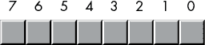

图 2-1：位编号

位 0 是 LO 位，即最低有效位，位 7 是 HO 位，即字节的最高有效位。我们将按位号引用其他所有位。

一个字节正好包含两个半字节（见图 2-2）。

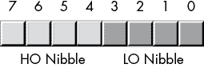

图 2-2：字节中的两个半字节

位 0 到 3 组成*低位半字节*，而位 4 到 7 构成*高位半字节*。由于一个字节恰好包含两个半字节，因此字节值需要两个十六进制数字表示。

因为一个字节包含 8 位，它可以表示 2⁸（256）个不同的值。通常，我们会用一个字节表示数值范围从 0 到 255、带符号数值范围从-128 到+127（见第 62 页的“带符号与无符号数”）、ASCII IBM 字符编码以及其他需要不超过 256 个不同值的特殊数据类型。许多数据类型的项数少于 256，所以 8 位通常足够。

由于 x86-64 是字节寻址的机器，操作整个字节比操作单独的位或半字节更高效。因此，使用一个完整的字节来表示不超过 256 项的数据类型是更高效的，即使使用少于 8 位的位数就足够。

字节的最重要用途之一可能就是存储字符值。在键盘上输入、在屏幕上显示以及在打印机上打印的字符都有对应的数字值。为了与外界进行通信，PC 通常使用变种的*ASCII 字符集*或*Unicode 字符集*。ASCII 字符集有 128 个已定义的编码。

字节也是你在 MASM 程序中可以创建的最小变量。要创建一个任意字节变量，你应该使用 `byte` 数据类型，如下所示：

```
 .data
byteVar  byte ?
```

`byte` 数据类型是一种部分未定义的数据类型。与 `byte` 对象相关联的唯一类型信息是其大小（1 字节）。^(2) 你可以将任何 8 位值（小的有符号整数、小的无符号整数、字符等）存储到一个字节变量中。跟踪你存入字节变量中的对象类型完全由你决定。

### 2.4.4 字

一个字是 16 位的一组数据。我们将字中的比特位从 0 到 15 编号，如图 2-3 所示。像字节一样，比特 0 是最低有效位。对于字，位 15 是最高有效位。引用字中的其他比特位时，我们将使用它们的比特位位置编号。

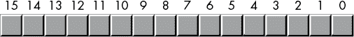

图 2-3：一个字中的比特位

一个字正好包含 2 个字节（因此包含四个半字）。比特 0 到 7 形成低位字节，比特 8 到 15 形成高位字节（参见图 2-4 和 2-5）。

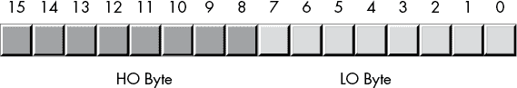

图 2-4：一个字中的 2 个字节

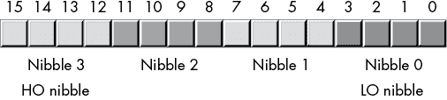

图 2-5：字中的半字

使用 16 位，你可以表示 2¹⁶（65,536）个值。这些值可以是 0 到 65,535 的范围，或者通常情况下，是 -32,768 到 +32,767 的有符号值，或者其他值数不超过 65,536 的数据类型。

字的三大主要用途是短的有符号整数值、短的无符号整数值和 Unicode 字符。无符号数值由对应字中比特位的二进制值表示。有符号数值使用二进制补码形式表示（参见第 67 页的“符号扩展和零扩展”）。作为 Unicode 字符，字可以表示最多 65,536 个字符，从而允许在计算机程序中使用非罗马字符集。Unicode 是一种国际标准，类似于 ASCII，它允许计算机处理非罗马字符，如汉字、希腊字母和俄语字符。

与字节一样，你也可以在 MASM 程序中创建字变量。要创建一个任意字变量，使用 `word` 数据类型，如下所示：

```
 .data
w        word  ?
```

### 2.4.5 双字

双字正如其名所示：一对字。因此，双字长度为 32 位，如图 2-6 所示。

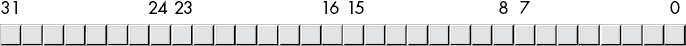

图 2-6：双字中的比特位编号

自然地，这个双字可以分为一个高位字和一个低位字，4 字节，或八个不同的半字（见图 2-7）。

双字（dword）可以表示各种内容。一个常见的双字用途是表示 32 位整数值（允许无符号数字范围为 0 到 4,294,967,295 或有符号数字范围为 -2,147,483,648 到 2,147,483,647）。32 位浮点值也可以存储在一个双字中。

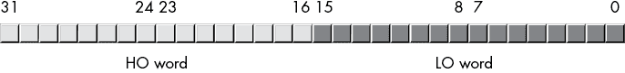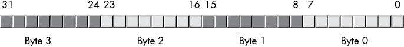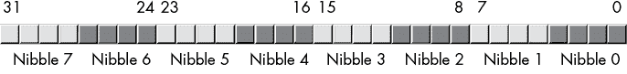

图 2-7：双字中的字节、字和字节组

你可以通过使用 `dword` 数据类型来创建一个任意的双字变量，如以下示例所示：

```
 .data
d     dword  ?
```

### 2.4.6 四字和八字

四字（64 位）值也很重要，因为 64 位整数、指针和某些浮点数据类型需要 64 位。同样，现代 x86-64 处理器的 SSE/MMX 指令集可以操作 64 位值。类似地，八字（128 位）值也很重要，因为 AVX/SSE 指令集可以操作 128 位值。MASM 允许通过使用 `qword` 和 `oword` 类型来声明 64 位和 128 位值，如下所示：

```
 .data
o     oword ?
q     qword ?
```

你不能直接使用标准指令（如 `mov`、`add` 和 `sub`）来操作 128 位整数对象，因为标准的 x86-64 整数寄存器每次只能处理 64 位。在第八章中，你将看到如何操作这些扩展精度值；第十一章描述了如何通过使用 SIMD 指令直接操作 `oword` 值。

## 2.5 位上的逻辑操作

我们将进行四种主要的逻辑操作（布尔函数），使用十六进制和二进制数字：与、或、异或（XOR）和非（NOT）。

### 2.5.1 与操作

*逻辑与操作*是一个*二元*操作（意味着它接受两个操作数）。^3 这些操作数是单独的二进制位。与操作如下所示：

```
0 and 0 = 0
0 and 1 = 0
1 and 0 = 0
1 and 1 = 1
```

表示逻辑与操作的一种简洁方式是使用真值表。*真值表*的形式如表 2-2 所示。

表 2-2：与真值表

| **与** | **0** | **1** |
| --- | --- | --- |
| 0 | 0 | 0 |
| 1 | 0 | 1 |

这就像你在学校遇到的乘法表一样。左列的值对应于与操作的左操作数，顶行的值对应于与操作的右操作数。位于行和列交点处的值（对于特定的输入值对）就是这两个值进行逻辑与操作后的结果。

在英语中，逻辑与操作是：“如果第一个操作数为 1，第二个操作数为 1，则结果为 1；否则，结果为 0。”我们也可以这样表述：“如果任一或两个操作数为 0，结果为 0。”

你可以使用逻辑与操作强制结果为 0：如果其中一个操作数为 0，则无论另一个操作数是什么，结果始终为 0。例如，在表 2-2 中，标记为 0 输入的行仅包含 0，标记为 0 的列也仅包含 0。相反，如果其中一个操作数为 1，结果则完全等于第二个操作数的值。这些与操作的结果非常重要，特别是当我们想要强制位为 0 时。我们将在下一节中探讨这些逻辑与操作的使用。

### 2.5.2 或操作

*逻辑 OR 运算* 也是一个二目运算。它的定义如下：

```
0 or 0 = 0
0 or 1 = 1
1 or 0 = 1
1 or 1 = 1
```

表 2-3 显示了 OR 运算的真值表。

表 2-3：OR 真值表

| **OR** | **0** | **1** |
| --- | --- | --- |
| 0 | 0 | 1 |
| 1 | 1 | 1 |

通俗地说，逻辑 OR 运算可以表示为：“如果第一个操作数或第二个操作数（或两者）为 1，结果为 1；否则结果为 0。”这也被称为 *包含或* 运算。

如果逻辑 OR 运算的一个操作数是 1，结果始终为 1，无论第二个操作数的值如何。如果一个操作数为 0，结果始终是第二个操作数的值。与逻辑 AND 运算一样，这是逻辑 OR 运算的一个重要副作用，将会非常有用。

注意，这种形式的包含逻辑 OR 运算与标准的英文含义有所不同。考虑以下句子：“我去商店 *或者* 去公园。”这样的句子意味着说话者要么去商店，要么去公园，但不会同时去两个地方。因此，逻辑 OR 的英文版本与包含或运算略有不同；实际上，这就是 *异或* 运算的定义。

### 2.5.3 XOR 运算

*逻辑* *XOR（**异或**运算）* 也是一个二目运算。它的定义如下：

```
0 xor 0 = 0
0 xor 1 = 1
1 xor 0 = 1
1 xor 1 = 0
```

表 2-4 显示了 XOR 运算的真值表。

表 2-4：XOR 真值表

| **XOR** | **0** | **1** |
| --- | --- | --- |
| 0 | 0 | 1 |
| 1 | 1 | 0 |

在英语中，逻辑 XOR 运算是：“如果第一个操作数或第二个操作数，但不是两者，等于 1，结果为 1；否则结果为 0。”异或运算比逻辑 OR 运算更接近英语中 *or* 这个词的含义。

如果逻辑异或运算的一个操作数是 1，结果总是另一个操作数的 *反转*；也就是说，如果一个操作数是 1，另一个操作数是 1 时结果是 0，另一个操作数是 0 时结果是 1。如果第一个操作数是 0，结果则完全是第二个操作数的值。这个特性让你可以选择性地反转位字符串中的位。

### 2.5.4 NOT 运算

逻辑 NOT 运算是一个 *单目运算*（意味着它只接受一个操作数）：

```
not 0 = 1
not 1 = 0
```

NOT 运算的真值表见 表 2-5。

表 2-5：NOT 真值表

| **非** | **0** | **1** |
| --- | --- | --- |
|  | 1 | 0 |

## 2.6 二进制数字和位字符串的逻辑运算

前一节定义了单比特操作数的逻辑函数。由于 x86-64 使用的是 8、16、32、64 或更多比特的分组，^(4) 我们需要扩展这些函数的定义，以处理超过 2 比特的情况。

x86-64 上的逻辑函数是以*逐位*（或*按位*）的方式操作的。给定两个值，这些函数首先对每个值的第 0 位进行操作，生成结果的第 0 位；然后对输入值的第 1 位进行操作，生成结果的第 1 位，依此类推。例如，如果你想计算以下两个 8 位数的逻辑与，你需要在每一列上独立执行逻辑与操作：

```
1011_0101b
1110_1110b
----------
1010_0100b
```

你也可以将这种逐位计算应用于其他逻辑函数。

要对两个十六进制数执行逻辑操作，应该先将它们转换为二进制。

通过使用逻辑与/或操作强制位为 0 或 1，以及通过使用逻辑异或操作反转位的能力，在处理位字符串时非常重要（例如二进制数）。这些操作使你能够选择性地操作位字符串中的某些位，而不影响其他位。

例如，如果你有一个 8 位二进制值*X*，并且你想保证第 4 到第 7 位是 0，你可以将值*X*与二进制值 0000_1111b 进行逻辑与操作。这个按位逻辑与操作会将高 4 位强制为 0，并保持低 4 位的*X*不变。同样，你可以通过分别将*X*与 0000_0001b 进行逻辑或操作和将*X*与 0000_0100b 进行逻辑异或操作，强制*X*的低位为 1，并反转*X*的第 2 位。

使用逻辑与、或和异或操作按这种方式操作位字符串，称为*掩码*位字符串。我们使用*掩码*这个术语，因为我们可以使用某些值（逻辑与的 1，逻辑或/异或的 0）来掩盖或暴露操作中的某些位，强制某些位为 0、1 或其反值。

x86-64 CPUs 支持四条指令，将这些按位逻辑操作应用于其操作数。这些指令是`and`、`or`、`xor`和`not`。`and`、`or`和`xor`指令使用与`add`和`sub`指令相同的语法：

```
and  `dest`, `source`
or   `dest`, `source`
xor  `dest`, `source`
```

这些操作数与 `add` 操作数具有相同的限制。具体来说，`source` 操作数必须是常量、内存或寄存器操作数，而 `dest` 操作数必须是内存或寄存器操作数。此外，操作数必须具有相同的大小，且不能同时为内存操作数。如果目标操作数是 64 位且源操作数是常量，则该常量限制为 32 位（或更少），CPU 将对该值进行符号扩展至 64 位（参见第 67 页的“符号扩展与零扩展”）。

这些指令通过以下公式计算明显的按位逻辑操作：

```
dest = `dest` `operator` `source`
```

x86-64 逻辑`not`指令，由于只有一个操作数，因此使用略有不同的语法。此指令的形式如下：

```
not  `dest` 
```

此指令计算出以下结果：

```
dest = not(`dest`)
```

`dest` 操作数必须是寄存器或内存操作数。此指令将指定目标操作数中的所有位进行反转。

列表 2-2 中的程序从用户输入两个十六进制值，并计算它们的逻辑 `and`、`or`、`xor` 和 `not`。

```
; Listing 2-2

; Demonstrate AND, OR, XOR, and NOT logical instructions.

            option  casemap:none

nl          =       10  ; ASCII code for newline

             .data
leftOp       dword   0f0f0f0fh
rightOp1     dword   0f0f0f0f0h
rightOp2     dword   12345678h

titleStr     byte   'Listing 2-2', 0

fmtStr1      byte   "%lx AND %lx = %lx", nl, 0
fmtStr2      byte   "%lx OR  %lx = %lx", nl, 0
fmtStr3      byte   "%lx XOR %lx = %lx", nl, 0
fmtStr4      byte   "NOT %lx = %lx", nl, 0

            .code
            externdef   printf:proc

; Return program title to C++ program:

            public getTitle
getTitle    proc

;  Load address of "titleStr" into the RAX register (RAX holds the
;  function return result) and return back to the caller:

            lea rax, titleStr
            ret
getTitle    endp

; Here is the "asmMain" function.

            public  asmMain
asmMain     proc

; "Magic" instruction offered without explanation at this point:

            sub     rsp, 56

; Demonstrate the AND instruction:

            lea     rcx, fmtStr1
            mov     edx, leftOp
            mov     r8d, rightOp1
            mov     r9d, edx  ; Compute leftOp
            and     r9d, r8d  ; AND rightOp1
            call    printf

            lea     rcx, fmtStr1
            mov     edx, leftOp
            mov     r8d, rightOp2
            mov     r9d, r8d
            and     r9d, edx
            call    printf

; Demonstrate the OR instruction:

            lea     rcx, fmtStr2
            mov     edx, leftOp
            mov     r8d, rightOp1
            mov     r9d, edx  ; Compute leftOp
            or      r9d, r8d  ; OR rightOp1
            call    printf

            lea     rcx, fmtStr2
            mov     edx, leftOp
            mov     r8d, rightOp2
            mov     r9d, r8d
            or      r9d, edx
            call    printf

; Demonstrate the XOR instruction:

            lea     rcx, fmtStr3
            mov     edx, leftOp
            mov     r8d, rightOp1
            mov     r9d, edx  ; Compute leftOp
            xor     r9d, r8d  ; XOR rightOp1
            call    printf

            lea     rcx, fmtStr3
            mov     edx, leftOp
            mov     r8d, rightOp2
            mov     r9d, r8d
 xor     r9d, edx
            call    printf

; Demonstrate the NOT instruction:

            lea     rcx, fmtStr4
            mov     edx, leftOp
            mov     r8d, edx  ; Compute not leftOp
            not     r8d
            call    printf

            lea     rcx, fmtStr4
            mov     edx, rightOp1
            mov     r8d, edx  ; Compute not rightOp1
            not     r8d
            call    printf

            lea     rcx, fmtStr4
            mov     edx, rightOp2
            mov     r8d, edx  ; Compute not rightOp2
            not     r8d
            call    printf

; Another "magic" instruction that undoes the effect of the previous
; one before this procedure returns to its caller.

            add     rsp, 56

            ret     ; Returns to caller

asmMain     endp
            end
```

列表 2-2：`and`、`or`、`xor` 和 `not` 示例

这是构建并运行此代码后的结果：

```
C:\MASM64>**build  listing2-2**

C:\MASM64>**ml64 /nologo /c /Zi /Cp  listing2-2.asm**
 Assembling: listing2-2.asm

C:\MASM64>**cl /nologo /O2 /Zi /utf-8 /Fe listing2-2.exe c.cpp  listing2-2.obj**
c.cpp

C:\MASM64> **listing2-2**
Calling Listing 2-2:
f0f0f0f AND f0f0f0f0 = 0
f0f0f0f AND 12345678 = 2040608
f0f0f0f OR  f0f0f0f0 = ffffffff
f0f0f0f OR  12345678 = 1f3f5f7f
f0f0f0f XOR f0f0f0f0 = ffffffff
f0f0f0f XOR 12345678 = 1d3b5977
NOT f0f0f0f = f0f0f0f0
NOT f0f0f0f0 = f0f0f0f
NOT 12345678 = edcba987
Listing 2-2 terminated
```

顺便说一句，你会经常看到以下“神奇”的指令：

```
xor `reg`, `reg`
```

将一个寄存器与其自身做异或操作会将该寄存器设置为 0。除了 8 位寄存器外，`xor` 指令通常比将立即数移入寄存器更高效。请考虑以下情况：

```
xor eax, eax  ; Just 2 bytes long in machine code
mov eax, 0    ; Depending on register, often 6 bytes long
```

处理 64 位寄存器时，节省的空间更大（因为立即数 `0` 本身就是 8 字节长）。

## 2.7 有符号和无符号数

到目前为止，我们将二进制数视为无符号值。二进制数 . . . 00000 代表 0，. . . 00001 代表 1，. . . 00010 代表 2，依此类推，直到无穷大。对于 *n* 位，我们可以表示 2^(*n*) 个无符号数。那么负数呢？如果我们将可能的组合的一半分配给负值，另一半分配给正值和 0，那么使用 *n* 位，我们可以表示的有符号值范围是 –2^(*n*)^(-1) 到 +2^(*n*)^(-1) –1。因此，我们可以使用单个 8 位字节表示负值 –128 到 –1 和非负值 0 到 127。使用 16 位字，可以表示范围从 –32,768 到 +32,767 的值。使用 32 位双字，可以表示范围从 –2,147,483,648 到 +2,147,483,647 的值。

在数学（和计算机科学）中，*补码方法*将负数和非负数（包括正数和零）编码为两个相等的集合，使得它们可以使用相同的算法（或硬件）进行加法运算，并无论符号如何都能得到正确的结果。

x86-64 微处理器使用 *二进制补码* 表示有符号数。在这种系统中，数字的高位（HO 位）是 *符号位*（将整数分为两个相等的集合）。如果符号位为 0，则该数为正数（或零）；如果符号位为 1，则该数为负数（采用补码形式，我稍后会描述）。以下是一些示例。

对于 16 位数：

+   8000h 是负数，因为高位（HO 位）为 1。

+   100h 是正数，因为高位（HO 位）为 0。

+   7FFFh 是正数。

+   0FFFFh 是负数。

+   0FFFh 是正数。

如果高位（HO 位）为 0，则该数为正数（或 0），并使用标准二进制格式。如果高位（HO 位）为 1，则该数为负数，并使用二进制补码形式（这就是支持负数和非负数加法的“神奇形式”，无需特殊硬件）。

要将正数转换为其负数的补码形式，使用以下算法：

1.  反转数字中的所有位；也就是说，应用逻辑非（NOT）功能。

1.  将反转结果加 1，并忽略高位（HO 位）中的进位。

这产生了满足补码形式数学定义的位模式。特别地，使用这种形式加法负数和非负数时会得到预期的结果。

例如，计算 -5 的 8 位等效值：

+   0000_0101b 5（以二进制表示）。

+   1111_1010b 反转所有位。

+   1111_1011b 加 1 得到结果。

如果我们取 -5 并对其执行二的补码操作，我们会得到原始值 0000_0101b，再次返回：

+   1111_1011b 对 -5 进行二的补码操作。

+   0000_0100b 反转所有位。

+   0000_0101b 加 1 得到结果 (+5)。

请注意，如果我们将 +5 和 –5 相加（忽略 HO 位的进位），我们得到预期的结果 0：

```
 1111_1011b         Two's complement for -5
    + 0000_0101b         Invert all the bits and add 1
      ----------
  (1) 0000_0000b         Sum is zero, if we ignore carry
```

以下示例提供了一些正负 16 位有符号值：

+   7FFFh: +32767，最大的 16 位正数

+   8000h: –32768，最小的 16 位负数

+   4000h: +16384

要将上述数字转换为其负数对（即取反），请执行以下操作：

```
7FFFh:      0111_1111_1111_1111b   +32,767
            1000_0000_0000_0000b   Invert all the bits (8000h)
            1000_0000_0000_0001b   Add 1 (8001h or -32,767)

4000h:      0100_0000_0000_0000b   16,384
            1011_1111_1111_1111b   Invert all the bits (0BFFFh)
            1100_0000_0000_0000b   Add 1 (0C000h or -16,384)

8000h:      1000_0000_0000_0000b   -32,768
            0111_1111_1111_1111b   Invert all the bits (7FFFh)
            1000_0000_0000_0000b   Add one (8000h or -32,768)
```

8000h 反转变为 7FFFh。加 1 后，我们得到 8000h！等一下，发生了什么？–（–32,768）等于 –32,768？当然不是。但值 +32,768 不能用 16 位有符号数表示，所以我们不能取反最小的负值。

通常，您不需要手动执行二的补码操作。x86-64 微处理器提供了一条指令，`neg`（*取反*），它为您执行此操作：

```
neg `dest` 
```

该指令计算 `dest` `=` `-``dest``; 操作数必须是一个内存位置或寄存器。`neg` 操作适用于字节、字、双字和四字大小的对象。因为这是一个有符号整数操作，所以只有对有符号整数值进行操作才有意义。位于列表 2-3 中的程序演示了对有符号 8 位整数值执行二的补码操作和 `neg` 指令。

```
; Listing 2-3

; Demonstrate two's complement operation and input of numeric values.

        option  casemap:none

nl       =      10  ; ASCII code for newline
maxLen   =      256

         .data
titleStr byte   'Listing 2-3', 0

prompt1  byte   "Enter an integer between 0 and 127:", 0
fmtStr1  byte   "Value in hexadecimal: %x", nl, 0
fmtStr2  byte   "Invert all the bits (hexadecimal): %x", nl, 0
fmtStr3  byte   "Add 1 (hexadecimal): %x", nl, 0
fmtStr4  byte   "Output as signed integer: %d", nl, 0
fmtStr5  byte   "Using neg instruction: %d", nl, 0

intValue sqword ?
input    byte   maxLen dup (?)

            .code
            externdef printf:proc
            externdef atoi:proc
            externdef readLine:proc

; Return program title to C++ program:

            public getTitle
getTitle    proc
            lea rax, titleStr
 ret
getTitle    endp

; Here is the "asmMain" function.

            public  asmMain
asmMain     proc

; "Magic" instruction offered without explanation at this point:

            sub     rsp, 56

; Read an unsigned integer from the user: This code will blindly
; assume that the user's input was correct. The atoi function returns
; zero if there was some sort of error on the user input. Later
; chapters in Ao64A will describe how to check for errors from the
; user.

            lea     rcx, prompt1
            call    printf

            lea     rcx, input
            mov     rdx, maxLen
            call    readLine

; Call C stdlib atoi function.

; i = atoi(str)

            lea     rcx, input
            call    atoi
            and     rax, 0ffh      ; Only keep LO 8 bits
            mov     intValue, rax

; Print the input value (in decimal) as a hexadecimal number:

            lea     rcx, fmtStr1
            mov     rdx, rax
            call    printf

; Perform the two's complement operation on the input number.
; Begin by inverting all the bits (just work with a byte here).

            mov     rdx, intValue
            not     dl             ; Only work with 8-bit values!
            lea     rcx, fmtStr2
            call    printf

; Invert all the bits and add 1 (still working with just a byte).

            mov     rdx, intValue
            not     rdx
            add     rdx, 1
            and     rdx, 0ffh      ; Only keep LO eight bits
 lea     rcx, fmtStr3
            call    printf

; Negate the value and print as a signed integer (work with a full
; integer here, because C++ %d format specifier expects a 32-bit
; integer). HO 32 bits of RDX get ignored by C++.

            mov     rdx, intValue
            not     rdx
            add     rdx, 1
            lea     rcx, fmtStr4
            call    printf

; Negate the value using the neg instruction.

            mov     rdx, intValue
            neg     rdx
            lea     rcx, fmtStr5
            call    printf

; Another "magic" instruction that undoes the effect of the previous
; one before this procedure returns to its caller.

            add     rsp, 56
            ret     ; Returns to caller
asmMain     endp
            end
```

列表 2-3: 二的补码示例

以下命令构建并运行列表 2-3 中的程序：

```
C:\>**build  listing2-3**

C:\>**echo off**
 Assembling: listing2-3.asm
c.cpp

C:\> **listing2-3**
Calling Listing 2-3:
Enter an integer between 0 and 127:123
Value in hexadecimal: 7b
Invert all the bits (hexadecimal): 84
Add 1 (hexadecimal): 85
Output as signed integer: -123
Using neg instruction: -123
Listing 2-3 terminated
```

除了二的补码操作（通过反转/加 1 和使用 `neg` 指令），此程序演示了一个新特性：用户数字输入。*数字输入* 是通过从用户读取输入字符串（使用 *c.cpp* 源文件中的 `readLine()` 函数）然后调用 C 标准库中的 `atoi()` 函数实现的。此函数需要一个单一的参数（通过 RCX 传递），该参数指向一个包含整数值的字符串。它将该字符串转换为相应的整数，并返回整数值给 RAX。^(5)

## 2.8 符号扩展与零扩展

将 8 位二的补码值转换为 16 位，反之将 16 位值转换为 8 位，可以通过 *符号扩展* 和 *收缩* 操作来实现。

要将有符号值从一定数量的位扩展到更多的位，将符号位复制到新格式中所有额外的位。例如，要将一个 8 位数扩展为 16 位数，复制 8 位数的第 7 位到 16 位数的第 8 到第 15 位。要将 16 位数扩展为双字，将第 15 位复制到双字的第 16 到第 31 位。

在操作不同长度的有符号值时，必须使用符号扩展。例如，要将一个字节数值添加到一个字（word）数值中，必须将字节数值符号扩展为字，然后再将两个数值相加。其他操作（特别是乘法和除法）可能需要扩展到 32 位；见表 2-6。

表 2-6：符号扩展

| **8 位** | **16 位** | **32 位** |
| --- | --- | --- |
| 80h | 0FF80h | 0FFFFFF80h |
| 28h | 0028h | 00000028h |
| 9Ah | 0FF9Ah | 0FFFFFF9Ah |
| 7Fh | 007Fh | 0000007Fh |
|  | 1020h | 00001020h |
|  | 8086h | 0FFFF8086h |

要将无符号值扩展为更大的数值，必须对该值进行零扩展，如表 2-7 所示。*零扩展*很简单——只需将 0 存入较大操作数的高字节（HO 字节）即可。例如，要将 8 位值 82h 零扩展到 16 位，你只需在高字节前添加一个 0，得到 0082h。

表 2-7：零扩展

| **8 位** | **16 位** | **32 位** |
| --- | --- | --- |
| 80h | 0080h | 00000080h |
| 28h | 0028h | 00000028h |
| 9Ah | 009Ah | 0000009Ah |
| 7Fh | 007Fh | 0000007Fh |
|  | 1020h | 00001020h |
|  | 8086h | 00008086h |

## 2.9 标志收缩与饱和

*符号* *收缩*，即将某个具有特定位数的值转换为具有较少位数的相同值，稍微复杂一些。给定一个*n*位数值，如果*m* < *n*，并不是总能将其转换为*m*位数值。例如，考虑值–448。作为 16 位有符号数，它的十六进制表示为 0FE40h。该数的绝对值太大，无法适应 8 位数值，因此不能进行 8 位符号收缩（这样做会导致溢出）。

为了正确地进行标志收缩，必须丢弃的高字节（HO 字节）必须全部为 0 或 0FFh，并且结果值的 HO 位必须与从数字中移除的*每个*位匹配。以下是一些示例（16 位到 8 位）：

+   0FF80h 可以进行符号收缩为 80h。

+   0040h 可以进行符号收缩为 40h。

+   0FE40h 不能进行 8 位标志收缩。

+   0100h 不能进行 8 位标志收缩。

如果你必须将较大的对象转换为较小的对象，并且愿意接受精度损失，可以使用*饱和*。通过饱和转换值时，如果较大值在较小对象的范围内，则将较大值复制到较小值中。如果较大值超出了较小对象的范围，则通过将值裁剪到较小对象范围内的最大（或最小）值来*裁剪*该值。

例如，当将一个 16 位有符号整数转换为 8 位有符号整数时，如果 16 位值的范围在–128 到+127 之间，你只需将 16 位对象的低字节（LO 字节）复制到 8 位对象。如果 16 位有符号值大于+127，则将值裁剪为+127，并将+127 存储到 8 位对象中。同样，如果值小于–128，则将最终的 8 位对象裁剪为–128。

尽管将值限制在较小对象的边界会导致精度损失，但有时这是可以接受的，因为替代方法是引发异常或以其他方式拒绝计算。对于许多应用程序，如音频或视频处理，裁剪后的结果仍然是可识别的，因此这是一个合理的转换。

## 2.10 简短插曲：控制转移指令简介

到目前为止，汇编语言示例一直在没有使用*条件执行*（即，在执行代码时做出决策的能力）的情况下勉强进行。事实上，除了`call`和`ret`指令外，你还没有看到任何影响汇编代码顺序执行的方法。

然而，本书正迅速接近一个阶段，在这个阶段，意义深远的示例需要能够有条件地执行不同的代码部分。本节简要介绍了条件执行的主题以及将控制转移到程序其他部分的方法。

### 2.10.1 `jmp`指令

或许最好的开始方式是讨论 x86-64 无条件控制转移指令——`jmp`指令。`jmp`指令有几种形式，但最常见的形式是

```
jmp `statement_label`
```

其中，`statement_label`是附加在`.code`部分机器指令上的标识符。`jmp`指令会立即将控制转移到由标签前缀的语句。这在语义上等同于高级语言中的`goto`语句。

这是一个在`mov`指令前面加上语句标签的示例：

```
stmtLbl: mov eax, 55
```

与所有 MASM 符号一样，语句标签有两个主要属性：一个地址（即紧跟标签后的机器指令的内存地址）和一个类型。类型是`label`，与`proc`指令的标识符类型相同。

语句标签不必与机器指令位于同一物理源行。考虑以下示例：

```
anotherLabel:
   mov eax, 55
```

这个示例在语义上等同于前一个示例。绑定到`anotherLabel`的值（地址）是紧跟标签后的机器指令的地址。在这种情况下，即使该`mov`指令出现在下一行，它仍然是`mov`指令（因为它仍然跟在标签后面，中间没有其他 MASM 语句生成代码）。

从技术上讲，你也可以跳转到`proc`标签，而不是语句标签。然而，`jmp`指令不会设置返回地址，因此如果过程执行`ret`指令，返回位置可能未定义。（第五章将更详细地探讨返回地址。）

### 2.10.2 条件跳转指令

尽管 `jmp` 指令的常见形式在汇编语言程序中不可或缺，但它并不提供有条件地执行不同代码段的能力——因此称其为 *无条件跳转*。^(6) 幸运的是，x86-64 CPU 提供了多种 *条件跳转指令*，顾名思义，这些指令允许条件性地执行代码。

这些指令测试 FLAGS 寄存器中的条件代码位（请参阅第一章中的《Intel x86-64 CPU 系列介绍》），以确定是否应进行分支。FLAGS 寄存器中有四个条件代码位，这些条件跳转指令会测试它们：进位、符号、溢出和零标志。^(7)

x86-64 CPU 提供了八条指令，用于测试这四个标志中的每一个（请参阅 表 2-8）。条件跳转指令的基本操作是，它们测试一个标志，查看它是已设置（`1`）还是清除（`0`），如果测试成功，则跳转到目标标签。如果测试失败，程序将继续执行条件跳转指令后的下一条指令。

表 2-8：测试条件代码标志的条件跳转指令

| **指令** | **说明** |
| --- | --- |
| `jc` `label` | 如果进位已设置，则跳转。如果进位标志已设置（`1`），则跳转到标签；如果进位标志清除（`0`），则继续执行。 |
| `jnc` `label` | 如果没有进位，则跳转。如果进位标志清除（`0`），则跳转到标签；如果进位标志已设置（`1`），则继续执行。 |
| `jo` `label` | 如果溢出，则跳转。如果溢出标志已设置（`1`），则跳转到标签；如果溢出标志清除（`0`），则继续执行。 |
| `jno` `label` | 如果没有溢出，则跳转。如果溢出标志清除（`0`），则跳转到标签；如果溢出标志已设置（`1`），则继续执行。 |
| `js` `label` | 如果符号（负数），则跳转。如果符号标志已设置（`1`），则跳转到标签；如果符号标志清除（`0`），则继续执行。 |
| `jns` `label` | 如果没有符号，则跳转。如果符号标志为清除（`0`），则跳转到标签；如果符号标志已设置（`1`），则继续执行。 |
| `jz` `label` | 如果为零，则跳转。如果零标志已设置（`1`），则跳转到标签；如果零标志清除（`0`），则继续执行。 |
| `jnz` `label` | 如果不为零，则跳转。如果零标志清除（`0`），则跳转到标签；如果零标志已设置（`1`），则继续执行。 |

要使用条件跳转指令，必须首先执行一个会影响一个（或多个）条件代码标志的指令。例如，无符号算术溢出将设置进位标志（同样，如果没有发生溢出，进位标志将被清除）。因此，可以在 `add` 指令之后使用 `jc` 和 `jnc` 指令，以查看计算过程中是否发生了（无符号）溢出。例如：

```
 mov eax, int32Var
    add eax, anotherVar
    jc  overflowOccurred

; Continue down here if the addition did not
; produce an overflow.

    .
    .
    .

overflowOccurred:

; Execute this code if the sum of int32Var and anotherVar
; does not fit into 32 bits.
```

不是所有的指令都会影响标志。在我们到目前为止看到的所有指令（`mov`、`add`、`sub`、`and`、`or`、`not`、`xor` 和 `lea`）中，只有 `add`、`sub`、`and`、`or`、`xor` 和 `not` 指令会影响标志。`add` 和 `sub` 指令会按照 表 2-9 所示的方式影响标志。

表 2-9：执行 `add` 或 `sub` 后的标志设置

| **标志** | **说明** |
| --- | --- |
| 进位 | 如果发生无符号溢出，则设置该标志（例如，将字节值 0FFh 和 01h 相加）。如果没有溢出，则清除该标志。请注意，从 0 中减去 1 也会清除进位标志（即，0 – 1 等同于 0 + （–1），而 –1 在二进制补码形式中表示为 0FFh）。 |
| 溢出 | 如果发生带符号溢出，则设置该标志（例如，将字节值 07Fh 和 01h 相加）。带符号溢出发生在次高位（HO 位）溢出到最高位（HO 位）（例如，当处理字节大小的计算时，7Fh 变为 80h，或 0FFh 变为 0）。 |
| 符号 | 如果结果的最高位（HO 位）被设置，则符号标志被设置。否则，符号标志清除（即，符号标志反映结果的 HO 位状态）。 |
| 零 | 如果计算结果为 0，则设置零标志；否则，清除该标志。 |

逻辑指令（`and`、`or`、`xor` 和 `not`）总是清除进位标志和溢出标志。它们将结果的最高位（HO 位）复制到符号标志，并在结果为零或非零时设置或清除零标志。

除了条件跳转指令，x86-64 CPU 还提供了一组条件移动指令。第七章介绍了这些指令。

### 2.10.3 `cmp` 指令与相应的条件跳转

`cmp`（*比较*）指令可能是执行条件跳转前最有用的指令。比较指令与 `sub` 指令的语法相同，实际上，它也会从第一个操作数中减去第二个操作数，并根据减法结果设置条件码标志。^(8) 但 `cmp` 指令不会将差值存回第一个（目标）操作数。`cmp` 指令的全部目的就是基于减法结果设置条件码标志。

尽管你可以在 `cmp` 指令之后立即使用 `jc`/`jnc`、`jo`/`jno`、`js`/`jns` 和 `jz`/`jnz` 指令（测试 `cmp` 如何设置各个标志），但在 `cmp` 指令的上下文中，标志名称的含义并不重要。从逻辑上讲，当你看到以下指令时（注意，`cmp` 指令的操作数语法与 `add`、`sub` 和 `mov` 指令相同），

```
cmp `left_operand`, `right_operand`
```

你可以将此指令理解为“将 `left_operand` 与 `right_operand` 进行比较。”你通常在比较后会问以下问题：

+   `left_operand` 是否等于 `right_operand`？

+   `left_operand` 是否不等于 `right_operand`？

+   `left_operand` 是否小于 `right_operand`？

+   `left_operand`是否小于或等于`right_operand`？

+   `left_operand`是否大于`right_operand`？

+   `left_operand`是否大于或等于`right_operand`？

到目前为止介绍的条件跳转指令没有（直观地）回答这些问题。

x86-64 CPU 提供了一组附加的条件跳转指令，如表 2-10 所示，允许你测试比较条件。

表 2-10：`cmp`指令后的条件跳转指令

| **指令** | **测试的标志** | **解释** |
| --- | --- | --- |
| `je` `标签` | `ZF == 1` | 如果相等则跳转。如果`left_operand`等于`right_operand`，则将控制转移到目标标签。这个指令与`jz`同义，因为如果两个操作数相等（它们的减法结果为 0），则会设置零标志。 |
| `jne` `标签` | `ZF == 0` | 如果不相等则跳转。如果`left_operand`不等于`right_operand`，则将控制转移到目标标签。这个指令与`jnz`同义，因为如果两个操作数不相等（它们的减法结果非零），则零标志会清除。 |
| `ja` `标签` | `CF == 0` 且 `ZF == 0` | 如果条件成立则跳转。如果*无符号*的`left_operand`大于*无符号*的`right_operand`，则将控制转移到目标标签。 |
| `jae` `标签` | `CF == 0` | 如果大于或等于则跳转。如果*无符号*的`left_operand`大于或等于*无符号*的`right_operand`，则将控制转移到目标标签。这个指令与`jnc`同义，因为如果`left_operand`大于或等于`right_operand`，则不会发生无符号溢出（实际上是下溢）。 |
| `jb` `标签` | `CF == 1` | 如果小于则跳转。如果*无符号*的`left_operand`小于*无符号*的`right_operand`，则将控制转移到目标标签。这个指令与`jc`同义，因为如果`left_operand`小于`right_operand`，则会发生无符号溢出（实际上是下溢）。 |
| `jbe` `标签` | `CF == 1` 或 `ZF == 1` | 如果小于或等于则跳转。如果*无符号*的`left_operand`小于或等于*无符号*的`right_operand`，则将控制转移到目标标签。 |
| `jg` `标签` | `SF == OF` 且 `ZF == 0` | 如果大于则跳转。如果*有符号*的`left_operand`大于*有符号*的`right_operand`，则将控制转移到目标标签。 |
| `jge` `标签` | `SF == OF` | 如果大于或等于则跳转。如果*有符号*的`left_operand`大于或等于*有符号*的`right_operand`，则将控制转移到目标标签。 |
| `jl` `标签` | `SF ≠ OF` | 如果小于则跳转。如果*有符号*的`left_operand`小于*有符号*的`right_operand`，则将控制转移到目标标签。 |

| `jle` `标签` | `ZF == 1` 或

`SF ≠ OF` | 如果小于或等于则跳转。如果*有符号*的`left_operand`小于或等于*有符号*的`right_operand`，则将控制转移到目标标签。 |

在表 2-10 中，最重要的事情之一是，独立的条件跳转指令用于有符号和无符号比较。考虑两个字节值 0FFh 和 01h。从无符号的角度看，0FFh 大于 01h。然而，当我们将其视为有符号数（使用二进制补码编号系统）时，0FFh 实际上是 -1，这显然小于 1。它们有相同的位表示，但在有符号或无符号数字的比较下，会得到完全不同的结果。

### 2.10.4 条件跳转同义词

一些指令是其他指令的同义词。例如，`jb` 和 `jc` 是相同的指令（即它们有相同的数字*机器码*编码）。这是为了方便和可读性。举个例子，在 `cmp` 指令之后，`jb` 比 `jc` 更有意义。MASM 定义了几个条件跳转指令的同义词，这使得编码变得稍微容易些。表 2-11 列出了许多这样的同义词。 

表 2-11：条件跳转同义词

| **指令** | **等价指令** | **描述** |
| --- | --- | --- |
| `ja` | `jnbe` | 如果大于，则跳转；如果不小于或等于，则跳转。 |
| `jae` | `jnb`, `jnc` | 如果大于或等于，则跳转；如果不小于，则跳转；如果无进位，则跳转。 |
| `jb` | `jc`, `jnae` | 如果小于，则跳转；如果有进位，则跳转；如果不大于或等于，则跳转。 |
| `jbe` | `jna` | 如果小于或等于，则跳转；如果不大于，则跳转。 |
| `jc` | `jb`, `jnae` | 如果有进位，则跳转；如果小于，则跳转；如果不大于或等于，则跳转。 |
| `je` | `jz` | 如果相等，则跳转；如果为零，则跳转。 |
| `jg` | `jnle` | 如果大于，则跳转；如果不小于或等于，则跳转。 |
| `jge` | `jnl` | 如果大于或等于，则跳转；如果不小于，则跳转。 |
| `jl` | `jnge` | 如果小于，则跳转；如果不大于或等于，则跳转。 |
| `jle` | `jng` | 如果小于或等于，则跳转；如果不大于，则跳转。 |
| `jna` | `jbe` | 如果不大于，则跳转；如果小于或等于，则跳转。 |
| `jnae` | `jb`, `jc` | 如果不大于或等于，则跳转；如果小于，则跳转；如果有进位，则跳转。 |
| `jnb` | `jae`, `jnc` | 如果不小于，则跳转；如果大于或等于，则跳转；如果无进位，则跳转。 |
| `jnbe` | `ja` | 如果不小于或等于，则跳转；如果大于，则跳转。 |
| `jnc` | `jnb`, `jae` | 如果无进位，则跳转；如果不小于，则跳转；如果大于或等于，则跳转。 |
| `jne` | `jnz` | 如果不相等，则跳转；如果不为零，则跳转。 |
| `jng` | `jle` | 如果不大于，则跳转；如果小于或等于，则跳转。 |
| `jnge` | `jl` | 如果不大于或等于，则跳转；如果小于，则跳转。 |
| `jnl` | `jge` | 如果不小于，则跳转；如果大于或等于，则跳转。 |
| `jnle` | `jg` | 如果不小于或等于，则跳转；如果大于，则跳转。 |
| `jnz` | `jne` | 如果不为零，则跳转；如果不相等，则跳转。 |
| `jz` | `je` | 如果为零，则跳转；如果相等，则跳转。 |

有一点非常重要：`cmp`指令只会为整数比较设置标志（这也涵盖了字符和其他可以用整数表示的类型）。具体来说，它不会比较浮点值并根据浮点比较设置标志。有关浮点运算（和比较）的更多信息，请参阅第六章中的“浮点运算”。

## 2.11 移位和旋转

另一类适用于位串的逻辑操作是*移位*和*旋转*操作。这两类操作可以进一步细分为左移、左旋转、右移和右旋转。

*左移操作*将位串中的每个位向左移动一个位置，如图 2-8 所示。

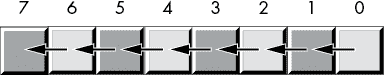

图 2-8：左移操作

位 0 移入位位置 1，位位置 1 中的先前值移入位位置 2，依此类推。我们将一个 0 移入位 0，先前的高位值将成为此操作的*进位*。

x86-64 提供了一个左移指令`shl`，用于执行这一有用的操作。`shl`指令的语法如下所示：

```
shl `dest`, `count`
```

`count`操作数可以是 CL 寄存器或范围为 0 到 *n* 的常数，其中 *n* 是目标操作数中位数减 1（例如，对于 8 位操作数，*n* = 7；对于 16 位操作数，*n* = 15；对于 32 位操作数，*n* = 31；对于 64 位操作数，*n* = 63）。`dest`操作数是一个典型的目标操作数，它可以是内存位置或寄存器。

当`count`操作数是常数 1 时，`shl`指令执行如图 2-9 所示的操作。

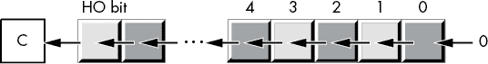

图 2-9：`shl` 1 操作

在图 2-9 中，*C* 表示进位标志——即，从操作数中移出的高位（HO 位）进入进位标志。因此，在执行`shl dest, 1`指令后，您可以通过立即测试进位标志来检测溢出（例如，使用`jc`和`jnc`）。

`shl`指令根据结果设置零标志（如果结果为零，则`z=1`，否则`z=0`）。如果结果的高位（HO 位）为 1，`shl`指令将设置符号标志。如果移位计数为 1，则如果高位（HO 位）发生变化（即，当高位原本是 1 时将 0 移入，或者原本是 0 时将 1 移入），则`shl`指令设置溢出标志；对于所有其他移位计数，溢出标志未定义。

将一个值向左移动一个数字位置，就等同于将它乘以它的基数（进制）。例如，将一个十进制数向左移动一个位置（在数字右侧添加一个 0）实际上是将其乘以 10（基数）：

```
1234 shl 1 = 12340
```

（`shl 1`表示将一位数字向左移动一个位置。）

因为二进制数的基数是 2，左移会使其乘以 2。如果你将一个值左移 *n* 次，它将被乘以 2^(*n*)。

*右移*操作的工作方式相同，只是我们将数据移动的方向相反。对于一个字节值，第 7 位移到第 6 位，第 6 位移到第 5 位，第 5 位移到第 4 位，以此类推。在右移期间，我们将 0 移入第 7 位，而第 0 位将是操作的进位输出（见图 2-10）。

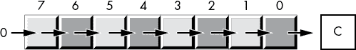

图 2-10：右移操作

正如你可能预期的那样，x86-64 提供了一个 `shr` 指令，它将在目标操作数中右移位。其语法类似于 `shl` 指令：

```
shr `dest`, `count`
```

该指令将 0 移入目标操作数的高位；其他位向右移动一个位置（从较高位编号移至较低位编号）。最后，第 0 位被移入进位标志。如果你指定移位次数为 1，`shr` 指令将执行图 2-11 中所示的操作。


图 2-11：通过 1 次操作进行 `shr` 移位

`shr` 指令根据结果设置零标志（如果结果为零，则 `ZF=1`，否则 `ZF=0`）。`shr` 指令清除符号标志（因为结果的高位总是 0）。如果移位计数为 1，当高位发生变化时，`shl` 会设置溢出标志（即当将 0 移入高位时，高位原本是 1，或者将 1 移入时，高位原本是 0）；对于其他移位计数，溢出标志是未定义的。

因为左移相当于乘以 2，因此右移大致相当于除以 2（或者通常情况下，除以该数的基数）。如果你进行 *n* 次右移，结果将是该数除以 2^(*n*)。

然而，右移仅相当于一个*无符号*的除以 2 操作。例如，如果将 254（0FEh）的无符号表示右移一位，得到的是 127（7Fh），正是你所期望的结果。然而，如果将 -2（0FEh）的二进制补码表示右移一位，得到的是 127（7Fh），这*不*正确。这个问题发生是因为我们将 0 移入了第 7 位。如果第 7 位原本是 1，我们就把它从负数变成了正数。在进行除以 2 操作时，这样做是不可取的。

要将右移用作除法运算符，我们必须定义第三种移位操作：*算术右移*。^(9) 这种操作与正常的右移操作（逻辑右移）相似，不同之处在于，算术右移操作将高位（HO）位的值复制回自身，而不是将 0 移入高位；也就是说，在移位操作期间，它不会修改高位，如图 2-12 所示。

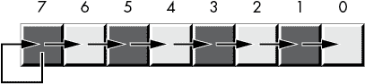

图 2-12：算术右移操作

算术右移通常会产生你预期的结果。例如，如果对 -2（0FEh）执行算术右移操作，结果将是 -1（0FFh）。然而，该操作总是将数字舍入为最接近的、*小于或等于实际结果* 的整数。例如，如果对 -1（0FFh）应用算术右移操作，结果是 -1，而不是 0。因为 -1 小于 0，算术右移操作会向 -1 舍入。这不是算术右移操作中的错误；它只是使用了不同（但有效）的整数除法定义。

x86-64 提供了一个算术右移指令，`sar`（*算术右移*）。此指令的语法几乎与 `shl` 和 `shr` 相同：

```
sar `dest`, `count`
```

对计数和目标操作数的常规限制适用。如果计数为 1，则此指令的操作如 图 2-13 所示。

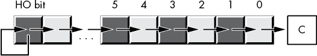

图 2-13：`sar` `dest``, 1` 操作

`sar` 指令根据结果设置零标志（`z=1` 如果结果为零，否则 `z=0`）。`sar` 指令将符号标志设置为结果的高位位。`sar` 指令执行后，溢出标志应始终被清除，因为该操作无法发生符号溢出。

*左旋转* 和 *右旋转* 操作的行为类似于左移和右移操作，只不过从一端移出的位会被旋转回另一端。图 2-14 说明了这些操作。

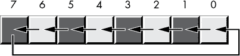

图 2-14：左旋转和右旋转操作

x86-64 提供了 `rol`（左旋转）和 `ror`（右旋转）指令，这些指令对其操作数执行基本操作。这两条指令的语法与移位指令相似：

```
rol `dest`, `count`
ror `dest`, `count`
```

如果移位计数为 1，这两条指令会将移出的位复制到进位标志中，如图 2-15 和 2-16 所示。

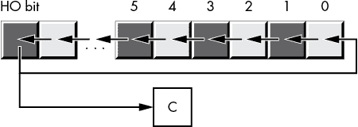

图 2-15：`rol` `dest``, 1` 操作

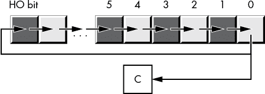

图 2-16：`ror` `dest``, 1` 操作

与移位指令不同，旋转指令不会影响符号标志或零标志的设置。OF 标志仅定义在 1 位旋转中；在所有其他情况下，它是未定义的（仅限 RCL 和 RCR 指令：零位旋转什么也不做——即不会影响任何标志）。对于左旋转，OF 标志设置为原始高位 2 位的异或值。对于右旋转，OF 标志设置为旋转后的高位 2 位的异或值。

在旋转操作中，通过进位移动输出位并将前一个进位值移回到移位操作的输入位通常更加方便。x86-64 的`rcl`（*通过进位左旋*）和`rcr`（*通过进位右旋*）指令为你实现了这一操作。这些指令使用以下语法：

```` ``` rcl `dest`, `count` rcr `dest`, `count` ```    The `count` operand is either a constant or the CL register, and the `dest` operand is a memory location or register. The `count` operand must be a value that is less than the number of bits in the `dest` operand. For a count value of 1, these two instructions do the rotation shown in Figure 2-17.  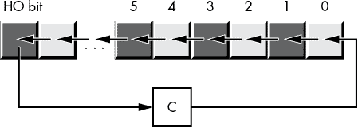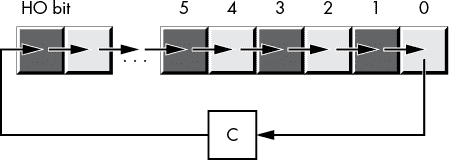    Figure 2-17: `rcl` `dest``, 1` and `rcr` `dest``, 1` operations      Unlike the shift instructions, the rotate-through-carry instructions do not affect the settings of the sign or zero flags. The OF flag is defined only for the 1-bit rotates. For left rotates, the OF flag is set if the original HO 2 bits change. For right rotates, the OF flag is set to the exclusive OR of the resultant HO 2 bits.    ## 2.12 Bit Fields and Packed Data    Although the x86-64 operates most efficiently on `byte`, `word`, `dword`, and `qword` data types, occasionally you’ll need to work with a data type that uses a number of bits other than 8, 16, 32, or 64\. You can also zero-extend a nonstandard data size to the next larger power of 2 (such as extending a 22-bit value to a 32-bit value). This turns out to be fast, but if you have a large array of such values, slightly more than 31 percent of the memory is going to waste (10 bits in every 32-bit value). However, suppose you were to repurpose those 10 bits for something else? By *packing* the separate 22-bit and 10-bit values into a single 32-bit value, you don’t waste any space.    For example, consider a date of the form 04/02/01\. Representing this date requires three numeric values: month, day, and year values. Months, of course, take on the values 1 to 12\. At least 4 bits (a maximum of 16 different values) are needed to represent the month. Days range from 1 to 31\. So it will take 5 bits (a maximum of 32 different values) to represent the day entry. The year value, assuming that we’re working with values in the range 0 to 99, requires 7 bits (which can be used to represent up to 128 different values). So, 4 + 5 + 7 = 16 bits, or 2 bytes.    In other words, we can pack our date data into 2 bytes rather than the 3 that would be required if we used a separate byte for each of the month, day, and year values. This saves 1 byte of memory for each date stored, which could be a substantial savings if you need to store many dates. The bits could be arranged as shown in Figure 2-18.  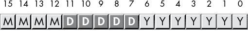    Figure 2-18: Short packed date format (2 bytes)      *MMMM* represents the 4 bits making up the month value, *DDDDD* represents the 5 bits making up the day, and *YYYYYYY* is the 7 bits composing the year. Each collection of bits representing a data item is a *bit field*. For example, April 2, 2001, would be represented as 4101h:    ``` 0100      00010   0000001      = 0100_0001_0000_0001b or 4101h  4          2       01 ```    Although packed values are *space-efficient* (that is, they make efficient use of memory), they are computationally *inefficient* (slow!). The reason? It takes extra instructions to unpack the data packed into the various bit fields. These extra instructions take additional time to execute (and additional bytes to hold the instructions); hence, you must carefully consider whether packed data fields will save you anything. The sample program in Listing 2-4 demonstrates the effort that must go into packing and unpacking this 16-bit date format.    ``` ; Listing 2-4   ; Demonstrate packed data types.          option  casemap:none  NULL    =       0 nl      =       10  ; ASCII code for newline maxLen  =       256  ; New data declaration section. ; .const holds data values for read-only constants.              .const ttlStr      byte    'Listing 2-4', 0 moPrompt    byte    'Enter current month: ', 0 dayPrompt   byte    'Enter current day: ', 0 yearPrompt  byte    'Enter current year '             byte    '(last 2 digits only): ', 0             packed      byte    'Packed date is %04x', nl, 0 theDate     byte    'The date is %02d/%02d/%02d'             byte    nl, 0             badDayStr   byte    'Bad day value was entered '             byte    '(expected 1-31)', nl, 0             badMonthStr byte    'Bad month value was entered '             byte    '(expected 1-12)', nl, 0 badYearStr  byte    'Bad year value was entered '             byte    '(expected 00-99)', nl, 0              .data month       byte    ? day         byte    ? year        byte    ? date        word    ?  input       byte    maxLen dup (?)              .code             externdef printf:proc             externdef readLine:proc             externdef atoi:proc  ; Return program title to C++ program:              public getTitle getTitle    proc             lea rax, ttlStr             ret getTitle    endp  ; Here's a user-written function that reads a numeric value from the ; user:   ; int readNum(char *prompt);   ; A pointer to a string containing a prompt message is passed in the ; RCX register.   ; This procedure prints the prompt, reads an input string from the ; user, then converts the input string to an integer and returns the ; integer value in RAX.  readNum     proc  ; Must set up stack properly (using this "magic" instruction) before ; we can call any C/C++ functions:              sub     rsp, 56  ; Print the prompt message. Note that the prompt message was passed to ; this procedure in RCX, we're just passing it on to printf:              call    printf  ; Set up arguments for readLine and read a line of text from the user. ; Note that readLine returns NULL (0) in RAX if there was an error.              lea     rcx, input             mov     rdx, maxLen             call    readLine  ; Test for a bad input string:              cmp     rax, NULL             je      badInput  ; Okay, good input at this point, try converting the string to an ; integer by calling atoi. The atoi function returns zero if there was ; an error, but zero is a perfectly fine return result, so we ignore ; errors.              lea     rcx, input      ; Ptr to string             call    atoi            ; Convert to integer  badInput:             add     rsp, 56         ; Undo stack setup             ret readNum     endp  ; Here is the "asmMain" function.              public  asmMain asmMain     proc             sub     rsp, 56  ; Read the date from the user. Begin by reading the month:              lea     rcx, moPrompt             call    readNum  ; Verify the month is in the range 1..12:              cmp     rax, 1             jl      badMonth             cmp     rax, 12             jg      badMonth  ; Good month, save it for now:              mov     month, al       ; 1..12 fits in a byte  ; Read the day:              lea     rcx, dayPrompt             call    readNum  ; We'll be lazy here and verify only that the day is in the range ; 1..31.              cmp     rax, 1             jl      badDay             cmp     rax, 31             jg      badDay  ; Good day, save it for now:              mov     day, al         ; 1..31 fits in a byte  ; Read the year:              lea     rcx, yearPrompt             call    readNum  ; Verify that the year is in the range 0..99.              cmp     rax, 0             jl      badYear             cmp     rax, 99             jg      badYear  ; Good year, save it for now:              mov     year, al        ; 0..99 fits in a byte  ; Pack the data into the following bits:   ;  15 14 13 12 11 10  9  8  7  6  5  4  3  2  1  0 ;   m  m  m  m  d  d  d  d  d  y  y  y  y  y  y  y              movzx   ax, month             shl     ax, 5             or      al, day             shl     ax, 7             or      al, year             mov     date, ax  ; Print the packed date:              lea     rcx, packed             movzx   rdx, date             call    printf  ; Unpack the date and print it:              movzx   rdx, date             mov     r9, rdx             and     r9, 7fh         ; Keep LO 7 bits (year)             shr     rdx, 7          ; Get day in position             mov     r8, rdx  and     r8, 1fh         ; Keep LO 5 bits             shr     rdx, 5          ; Get month in position             lea     rcx, theDate             call    printf               jmp     allDone  ; Come down here if a bad day was entered:  badDay:             lea     rcx, badDayStr             call    printf             jmp     allDone  ; Come down here if a bad month was entered:  badMonth:             lea     rcx, badMonthStr             call    printf             jmp     allDone  ; Come down here if a bad year was entered:  badYear:             lea     rcx, badYearStr             call    printf    allDone:                    add     rsp, 56             ret     ; Returns to caller asmMain     endp             end ```    Listing 2-4: Packing and unpacking date data    Here’s the result of building and running this program:    ``` C:\>**build  listing2-4**  C:\>**echo off**  Assembling: listing2-4.asm c.cpp  C:\> **listing2-4** Calling Listing 2-4: Enter current month: 2 Enter current day: 4 Enter current year (last 2 digits only): 68 Packed date is 2244 The date is 02/04/68 Listing 2-4 terminated ```    Of course, having gone through the problems with Y2K (Year 2000),^(10) you know that using a date format that limits you to 100 years (or even 127 years) would be quite foolish. To future-proof the packed date format, we can extend it to 4 bytes packed into a double-word variable, as shown in Figure 2-19. (As you will see in Chapter 4, you should always try to create data objects whose length is an even power of 2—1 byte, 2 bytes, 4 bytes, 8 bytes, and so on—or you will pay a performance penalty.)  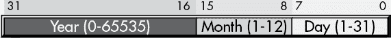    Figure 2-19: Long packed date format (4 bytes)      The Month and Day fields now consist of 8 bits each, so they can be extracted as a byte object from the double word. This leaves 16 bits for the year, with a range of 65,536 years. By rearranging the bits so the Year field is in the HO bit positions, the Month field is in the middle bit positions, and the Day field is in the LO bit positions, the long date format allows you to easily compare two dates to see if one date is less than, equal to, or greater than another date. Consider the following code:    ```  mov eax, Date1  ; Assume Date1 and Date2 are dword variables     cmp eax, Date2  ; using the Long Packed Date format     jna d1LEd2              `Do something if Date1 > Date2`  d1LEd2: ```    Had you kept the different date fields in separate variables, or organized the fields differently, you would not have been able to compare `Date1` and `Date2` as easily as for the short packed data format. Therefore, this example demonstrates another reason for packing data even if you don’t realize any space savings—it can make certain computations more convenient or even more efficient (contrary to what normally happens when you pack data).    Examples of practical packed data types abound. You could pack eight Boolean values into a single byte, you could pack two BCD digits into a byte, and so on.    A classic example of packed data is the RFLAGS register. This register packs nine important Boolean objects (along with seven important system flags) into a single 16-bit register. You will commonly need to access many of these flags. You can test many of the condition code flags by using the conditional jump instructions and manipulate the individual bits in the FLAGS register with the instructions in Table 2-12 that directly affect certain flags.      Table 2-12: Instructions That Affect Certain Flags       | **Instruction** | **Explanation** | | --- | --- | | `cld` | Clears (sets to `0`) the direction flag. | | `std` | Sets (to `1`) the direction flag. | | `cli` | Clears the interrupt disable flag. | | `sti` | Sets the interrupt disable flag. | | `clc` | Clears the carry flag. | | `stc` | Sets the carry flag. | | `cmc` | Complements (inverts) the carry flag. | | `sahf` | Stores the AH register into the LO 8 bits of the FLAGS register. (Warning: certain early x86-64 CPUs do not support this instruction.) | | `lahf` | Loads AH from the LO 8 bits of the FLAGS register. (Warning: certain early x86-64 CPUs do not support this instruction.) |    The `lahf` and `sahf` instructions provide a convenient way to access the LO 8 bits of the FLAGS register as an 8-bit byte (rather than as eight separate 1-bit values). See Figure 2-20 for a layout of the FLAGS register.  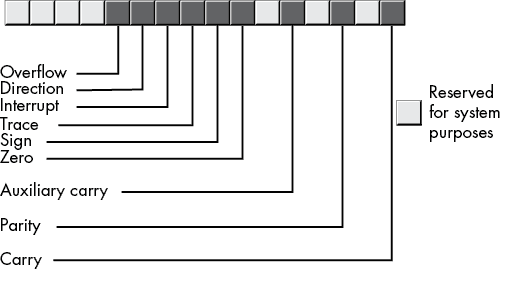    Figure 2-20: FLAGS register as packed Boolean data      The `lahf` (*load AH with the LO eight bits of the FLAGS register*) and the `sahf` (*store AH into the LO byte of the RFLAGS register*) use the following syntax:    ```  lahf         sahf ```    ## 2.13 IEEE Floating-Point Formats    When Intel planned to introduce a floating-point unit (the 8087 FPU) for its new 8086 microprocessor, it hired the best numerical analyst it could find to design a floating-point format. That person then hired two other experts in the field, and the three of them (William Kahan, Jerome Coonen, and Harold Stone) designed Intel’s floating-point format. They did such a good job designing the KCS Floating-Point Standard that the Institute of Electrical and Electronics Engineers (IEEE) adopted this format for its floating-point format.^(11)    To handle a wide range of performance and accuracy requirements, Intel actually introduced *three* floating-point formats: single-precision, double-precision, and extended-precision. The single- and double-precision formats corresponded to C’s float and double types or FORTRAN’s real and double-precision types. The extended-precision format contains 16 extra bits that long chains of computations could use as guard bits before rounding down to a double-precision value when storing the result.    ### 2.13.1 Single-Precision Format    The *single-precision format* uses aone’s complement 24-bit mantissa, an 8-bit excess-127 exponent, and a single sign bit. The *mantissa* usually represents a value from 1.0 to just under 2.0\. The HO bit of the mantissa is always assumed to be 1 and represents a value just to the left of the *binary point*.^(12) The remaining 23 mantissa bits appear to the right of the binary point. Therefore, the mantissa represents the value:    ``` 1.mmmmmmm mmmmmmmm ```    The `mmmm` characters represent the 23 bits of the mantissa. Note that because the HO bit of the mantissa is always 1, the single-precision format doesn’t actually store this bit within the 32 bits of the floating-point number. This is known as an *implied bit*.    Because we are working with binary numbers, each position to the right of the binary point represents a value (`0` or `1`) times a successive negative power of 2\. The implied 1 bit is always multiplied by 2⁰, which is 1\. This is why the mantissa is always greater than or equal to 1\. Even if the other mantissa bits are all 0, the implied 1 bit always gives us the value 1.^(13) Of course, even if we had an almost infinite number of 1 bits after the binary point, they still would not add up to 2\. This is why the mantissa can represent values in the range 1 to just under 2.    Although there is an infinite number of values between 1 and 2, we can represent only 8 million of them because we use a 23-bit mantissa (with the implied 24th bit always 1). This is the reason for inaccuracy in floating-point arithmetic—we are limited to a fixed number of bits in computations involving single-precision floating-point values.    The mantissa uses a *one’s* *complement* format rather than two’s complement to represent signed values. The 24-bit value of the mantissa is simply an unsigned binary number, and the sign bit determines whether that value is positive or negative. One’s complement numbers have the unusual property that there are two representations for 0 (with the sign bit set or clear). Generally, this is important only to the person designing the floating-point software or hardware system. We will assume that the value 0 always has the sign bit clear.    To represent values outside the range 1.0 to just under 2.0, the exponent portion of the floating-point format comes into play. The floating-point format raises 2 to the power specified by the exponent and then multiplies the mantissa by this value. The exponent is 8 bits and is stored in an *excess-127* format. In excess-127 format, the exponent 0 is represented by the value 127 (7Fh), negative exponents are values in the range 0 to 126, and positive exponents are values in the range 128 to 255\. To convert an exponent to excess-127 format, add 127 to the exponent value. The use of excess-127 format makes it easier to compare floating-point values. The single-precision floating-point format takes the form shown in Figure 2-21.  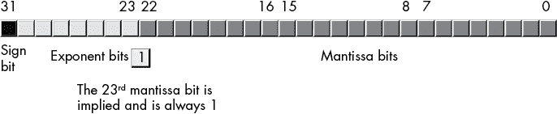    Figure 2-21: Single-precision (32-bit) floating-point format      With a 24-bit mantissa, you will get approximately six and a half (decimal) digits of precision (half a digit of precision means that the first six digits can all be in the range 0 to 9, but the seventh digit can be only in the range 0 to *x*, where *x* < 9 and is generally close to 5). With an 8-bit excess-127 exponent, the dynamic range^(14) of single-precision floating-point numbers is approximately 2^(±127), or about 10^(±38).    Although single-precision floating-point numbers are perfectly suitable for many applications, the precision and dynamic range are somewhat limited and unsuitable for many financial, scientific, and other applications. Furthermore, during long chains of computations, the limited accuracy of the single-precision format may introduce serious error.    ### 2.13.2 Double-Precision Format    The *double-precision format* helps overcome the problems of single-precision floating-point. Using twice the space, the double-precision format has an 11-bit excess-1023 exponent and a 53-bit mantissa (with an implied HO bit of 1) plus a sign bit. This provides a dynamic range of about 10^(±308) and 14.5 digits of precision, sufficient for most applications. Double-precision floating-point values take the form shown in Figure 2-22.  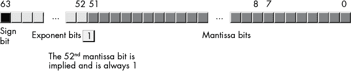    Figure 2-22: 64-bit double-precision floating-point format      ### 2.13.3 Extended-Precision Format    To ensure accuracy during long chains of computations involving double-precision floating-point numbers, Intel designed the *extended-precision format*. It uses 80 bits. Twelve of the additional 16 bits are appended to the mantissa, and 4 of the additional bits are appended to the end of the exponent. Unlike the single- and double-precision values, the extended-precision format’s mantissa does not have an implied HO bit. Therefore, the extended-precision format provides a 64-bit mantissa, a 15-bit excess-16383 exponent, and a 1-bit sign. Figure 2-23 shows the format for the extended-precision floating-point value.  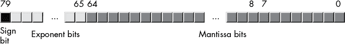    Figure 2-23: 80-bit extended-precision floating-point format      On the x86-64 FPU, all computations are done using the extended-precision format. Whenever you load a single- or double-precision value, the FPU automatically converts it to an extended-precision value. Likewise, when you store a single- or double-precision value to memory, the FPU automatically rounds the value down to the appropriate size before storing it. By always working with the extended-precision format, Intel guarantees that a large number of guard bits are present to ensure the accuracy of your computations.    ### 2.13.4 Normalized Floating-Point Values    To maintain maximum precision during computation, most computations use normalized values. A *normalized floating-point value* is one whose HO mantissa bit contains 1\. Almost any non-normalized value can be normalized: shift the mantissa bits to the left and decrement the exponent until a 1 appears in the HO bit of the mantissa.    Remember, the exponent is a binary exponent. Each time you increment the exponent, you multiply the floating-point value by 2\. Likewise, whenever you decrement the exponent, you divide the floating-point value by 2\. By the same token, shifting the mantissa to the left one bit position multiplies the floating-point value by 2; likewise, shifting the mantissa to the right divides the floating-point value by 2\. Therefore, shifting the mantissa to the left one position *and* decrementing the exponent does not change the value of the floating-point number at all.    Keeping floating-point numbers normalized is beneficial because it maintains the maximum number of bits of precision for a computation. If the HO *n* bits of the mantissa are all 0, the mantissa has that many fewer bits of precision available for computation. Therefore, a floating-point computation will be more accurate if it involves only normalized values.    In two important cases, a floating-point number cannot be normalized. Zero is one of these special cases. Obviously, it cannot be normalized because the floating-point representation for 0 has no 1 bits in the mantissa. This, however, is not a problem because we can exactly represent the value 0 with only a single bit.    In the second case, we have some HO bits in the mantissa that are 0, but the biased exponent is also 0 (and we cannot decrement it to normalize the mantissa). Rather than disallow certain small values, whose HO mantissa bits and biased exponent are 0 (the most negative exponent possible), the IEEE standard allows special *denormalized*values to represent these smaller values.^(15) Although the use of denormalized values allows IEEE floating-point computations to produce better results than if underflow occurred, keep in mind that denormalized values offer fewer bits of precision.    ### 2.13.5 Non-Numeric Values    The IEEE floating-point standard recognizes three special non-numeric values: –infinity, +infinity, and a special not-a-number (NaN). For each of these special numbers, the exponent field is filled with all 1 bits.    If the exponent is all 1 bits and the mantissa is all 0 bits, then the value is infinity. The sign bit will be `0` for +infinity, and `1` for –infinity.    If the exponent is all 1 bits and the mantissa is not all 0 bits, then the value is an invalid number (known as a *not-a-number* in IEEE 754 terminology). NaNs represent illegal operations, such as trying to take the square root of a negative number.    Unordered comparisons occur whenever either operand (or both) is a NaN. As NaNs have an indeterminate value, they cannot be compared (that is, they are incomparable). Any attempt to perform an unordered comparison typically results in an exception or some sort of error. Ordered comparisons, on the other hand, involve two operands, neither of which are NaNs.    ### 2.13.6 MASM Support for Floating-Point Values    MASM provides several data types to support the use of floating-point data in your assembly language programs. MASM floating-point constants allow the following syntax:    *   An optional `+` or `-` symbol, denoting the sign of the mantissa (if this is not present, MASM assumes that the mantissa is positive) *   Followed by one or more decimal digits *   Followed by a decimal point and zero or more decimal digits *   Optionally followed by an `e` or `E`, optionally followed by a sign (`+` or `-`) and one or more decimal digits    The decimal point or the `e`/`E` must be present in order to differentiate this value from an integer or unsigned literal constant. Here are some examples of legal literal floating-point constants:    ``` 1.234  3.75e2  -1.0  1.1e-1  1.e+4  0.1  -123.456e+789  +25.0e0  1.e3 ```    A floating-point literal constant must begin with a decimal digit, so you must use, for example, 0.1 to represent .1 in your programs.    To declare a floating-point variable, you use the `real4`, `real8`, or `real10` data types. The number at the end of these data type declarations specifies the number of bytes used for each type’s binary representation. Therefore, you use `real4` to declare single-precision real values, `real8` to declare double-precision floating-point values, and `real10` to declare extended-precision floating-point values. Aside from using these types to declare floating-point variables rather than integers, their use is nearly identical to that of `byte`, `word`, `dword`*,* and so on. The following examples demonstrate these declarations and their syntax:    ```  .data  fltVar1  real4  ? fltVar1a real4  2.7 pi       real4  3.14159 DblVar   real8  ? DblVar2  real8  1.23456789e+10 XPVar    real10 ? XPVar2   real10 -1.0e-104 ```    As usual, this book uses the C/C++ `printf()` function to print floating-point values to the console output. Certainly, an assembly language routine could be written to do this same thing, but the C Standard Library provides a convenient way to avoid writing that (complex) code, at least for the time being.    ## 2.14 Binary-Coded Decimal Representation    Although the integer and floating-point formats cover most of the numeric needs of an average program, in some special cases other numeric representations are convenient. In this section, we’ll discuss the *binary-coded decimal (BCD)* format because the x86-64 CPU provides a small amount of hardware support for this data representation.    BCD values are a sequence of nibbles, with each nibble representing a value in the range 0 to 9\. With a single byte, we can represent values containing two decimal digits, or values in the range 0 to 99 (see Figure 2-24).  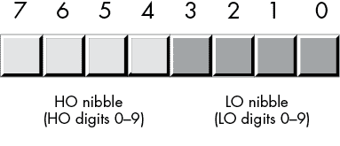    Figure 2-24: BCD data representation in memory      As you can see, BCD storage isn’t particularly memory efficient. For example, an 8-bit BCD variable can represent values in the range 0 to 99, while that same 8 bits, when holding a binary value, can represent values in the range 0 to 255\. Likewise, a 16-bit binary value can represent values in the range 0 to 65,535, while a 16-bit BCD value can represent only about one-sixth of those values (0 to 9999).    However, it’s easy to convert BCD values between the internal numeric representation and their string representation, and to encode multi-digit decimal values in hardware (for example, using a thumb wheel or dial) using BCD. For these two reasons, you’re likely to see people using BCD in embedded systems (such as toaster ovens, alarm clocks, and nuclear reactors) but rarely in general-purpose computer software.    The Intel x86-64 floating-point unit supports a pair of instructions for loading and storing BCD values. Internally, however, the FPU converts these BCD values to binary and performs all calculations in binary. It uses BCD only as an external data format (external to the FPU, that is). This generally produces more-accurate results and requires far less silicon than having a separate coprocessor that supports decimal arithmetic.    ## 2.15 Characters    Perhaps the most important data type on a personal computer is the `character` data type. The term *character* refers to a human or machine-readable symbol that is typically a non-numeric entity, specifically any symbol that you can normally type on a keyboard (including some symbols that may require multiple keypresses to produce) or display on a video display. Letters (*alphabetic characters*), punctuation symbols, numeric digits, spaces, tabs, carriage returns (enter), other control characters, and other special symbols are all characters.    Most computer systems use a 1- or 2-byte sequence to encode the various characters in binary form. Windows, macOS, FreeBSD, and Linux use either the ASCII or Unicode encodings for characters. This section discusses the ASCII and Unicode character sets and the character declaration facilities that MASM provides.    ### 2.15.1 The ASCII Character Encoding    The *American Standard Code for Information Interchange (ASCII) character set* maps 128 textual characters to the unsigned integer values 0 to 127 (0 to 7Fh). Although the exact mapping of characters to numeric values is arbitrary and unimportant, using a standardized code for this mapping is important because when you communicate with other programs and peripheral devices, you all need to speak the same “language.” ASCII is a standardized code that nearly everyone has agreed on: if you use the ASCII code 65 to represent the character `A`, then you know that a peripheral device (such as a printer) will correctly interpret this value as the character `A` whenever you transmit data to that device.    Despite some major shortcomings, ASCII data has become thestandard for data interchange across computer systems and programs.^(16) Most programs can accept ASCII data; likewise, most programs can produce ASCII data. Because you will be dealing with ASCII characters in assembly language, it would be wise to study the layout of the character set and memorize a few key ASCII codes (for example, for `0`, `A`, `a`, and so on). See Appendix A for a list of all the ASCII character codes.    The ASCII character set is divided into four groups of 32 characters. The first 32 characters, ASCII codes 0 to 1Fh (31), form a special set of nonprinting characters, the *control characters*. We call them control characters because they perform various printer/display control operations rather than display symbols. Examples include *carriage return*, which positions the cursor to the left side of the current line of characters;^(17) line feed, which moves the cursor down one line on the output device; and backspace, which moves the cursor back one position to the left.    Unfortunately, different control characters perform different operations on different output devices. Little standardization exists among output devices. To find out exactly how a control character affects a particular device, you will need to consult its manual.    The second group of 32 ASCII character codes contains various punctuation symbols, special characters, and the numeric digits. The most notable characters in this group include the space character (ASCII code 20h) and the numeric digits (ASCII codes 30h to 39h).    The third group of 32 ASCII characters contains the uppercase alphabetic characters. The ASCII codes for the characters `A` to `Z` lie in the range 41h to 5Ah (65 to 90). Because there are only 26 alphabetic characters, the remaining 6 codes hold various special symbols.    The fourth, and final, group of 32 ASCII character codes represents the lowercase alphabetic symbols, 5 additional special symbols, and another control character (delete). The lowercase character symbols use the ASCII codes 61h to 7Ah. If you convert the codes for the upper- and lowercase characters to binary, you will notice that the uppercase symbols differ from their lowercase equivalents in exactly one bit position. For example, consider the character codes for `E` and `e` appearing in Figure 2-25.  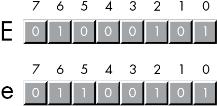    Figure 2-25: ASCII codes for *E* and *e*      The only place these two codes differ is in bit 5\. Uppercase characters always contain a 0 in bit 5; lowercase alphabetic characters always contain a 1 in bit 5\. You can use this fact to quickly convert between upper- and lowercase. If you have an uppercase character, you can force it to lowercase by setting bit 5 to 1\. If you have a lowercase character, you can force it to uppercase by setting bit 5 to 0\. You can toggle an alphabetic character between upper- and lowercase by simply inverting bit 5.    Indeed, bits 5 and 6 determine which of the four groups in the ASCII character set you’re in, as Table 2-13 shows.      Table 2-13: ASCII Groups       | **Bit 6** | **Bit 5** | **Group** | | --- | --- | --- | | 0 | 0 | Control characters | | 0 | 1 | Digits and punctuation | | 1 | 0 | Uppercase and special | | 1 | 1 | Lowercase and special |    So you could, for instance, convert any upper- or lowercase (or corresponding special) character to its equivalent control character by setting bits 5 and 6 to 0\.    Consider, for a moment, the ASCII codes of the numeric digit characters appearing in Table 2-14.      Table 2-14: ASCII Codes for Numeric Digits       | **Character** | **Decimal** | **Hexadecimal** | | --- | --- | --- | | 0 | 48 | 30h | | 1 | 49 | 31h | | 2 | 50 | 32h | | 3 | 51 | 33h | | 4 | 52 | 34h | | 5 | 53 | 35h | | 6 | 54 | 36h | | 7 | 55 | 37h | | 8 | 56 | 38h | | 9 | 57 | 39h |    The LO nibble of the ASCII code is the binary equivalent of the represented number. By stripping away (that is, setting to `0`) the HO nibble of a numeric character, you can convert that character code to the corresponding binary representation. Conversely, you can convert a binary value in the range 0 to 9 to its ASCII character representation by simply setting the HO nibble to `3`. You can use the logical AND operation to force the HO bits to 0; likewise, you can use the logical OR operation to force the HO bits to 0011b (3).    Unfortunately, you *cannot* convert a string of numeric characters to their equivalent binary representation by simply stripping the HO nibble from each digit in the string. Converting 123 (31h 32h 33h) in this fashion yields 3 bytes, 010203h, but the correct value for 123 is 7Bh. The conversion described in the preceding paragraph works only for single digits.    ### 2.15.2 MASM Support for ASCII Characters    MASM provides support for character variables and literals in your assembly language programs. Character literal constants in MASM take one of two forms: a single character surrounded by apostrophes or a single character surrounded by quotes, as follows:    ``` 'A'  "A"  ```    Both forms represent the same character (`A`).    If you wish to represent an apostrophe or a quote within a string, use the other character as the string delimiter. For example:    ``` 'A "quotation" appears within this string' "Can't have quotes in this string"  ```    Unlike the C/C++ language, MASM doesn’t use different delimiters for single-character objects versus string objects, or differentiate between a character constant and a string constant with a single character. A character literal constant has a single character between the quotes (or apostrophes); a string literal has multiple characters between the delimiters.    To declare a character variable in a MASM program, you use the `byte` data type. For example, the following declaration demonstrates how to declare a variable named `UserInput`:    ```  .data UserInput      byte ? ```    This declaration reserves 1 byte of storage that you could use to store any character value (including 8-bit extended ASCII/ANSI characters). You can also initialize character variables as follows:    ```  .data TheCharA      byte 'A' ExtendedChar  byte 128 ; Character code greater than 7Fh ```    Because character variables are 8-bit objects, you can manipulate them using 8-bit registers. You can move character variables into 8-bit registers, and you can store the value of an 8-bit register into a character variable.    ## 2.16 The Unicode Character Set    The problem with ASCII is that it supports only 128 character codes. Even if you extend the definition to 8 bits (as IBM did on the original PC), you’re limited to 256 characters. This is way too small for modern multinational/multilingual applications. Back in the 1990s, several companies developed an extension to ASCII, known as *Unicode*, using a 2-byte character size. Therefore, (the original) Unicode supported up to 65,536 character codes.    Alas, as well-thought-out as the original Unicode standard could be, systems engineers discovered that even 65,536 symbols were insufficient. Today, Unicode defines 1,112,064 possible characters, encoded using a variable-length character format.    ### 2.16.1 Unicode Code Points    A Unicode *code point* is an integer value that Unicode associates with a particular character symbol. The convention for Unicode code points is to specify the value in hexadecimal with a preceding U+ prefix; for example, U+0041 is the Unicode code point for the `A` character (41h is also the ASCII code for `A`; Unicode code points in the range U+0000 to U+007F correspond to the ASCII character set).    ### 2.16.2 Unicode Code Planes    The Unicode standard defines code points in the range U+000000 to U+10FFFF (10FFFFh is 1,114,111, which is where most of the 1,112,064 characters in the Unicode character set come from; the remaining 2047 code points are reserved for use as *surrogates*, which are Unicode extensions).^(18) The Unicode standard breaks this range up into 17 *multilingual planes*, each supporting up to 65,536 code points. The HO two hexadecimal digits of the six-digit code point value specify the multilingual plane, and the remaining four digits specify the character within the plane.    The first multilingual plane, U+000000 to U+00FFFF, roughly corresponds to the original 16-bit Unicode definition; the Unicode standard calls this the *Basic Multilingual Plane (BMP)*. Planes 1 (U+010000 to U+01FFFF), 2 (U+020000 to U+02FFFF), and 14 (U+0E0000 to U+0EFFFF) are supplementary (extension) planes. Unicode reserves planes 3 to 13 for future expansion, and planes 15 and 16 for user-defined character sets.    Obviously, representing Unicode code points outside the BMP requires more than 2 bytes. To reduce memory usage, Unicode (specifically the UTF-16 encoding; see the next section) uses 2 bytes for the Unicode code points in the BMP, and uses 4 bytes to represent code points outside the BMP. Within the BMP, Unicode reserves the surrogate code points (U+D800–U+DFFF) to specify the 16 planes after the BMP. Figure 2-26 shows the encoding.  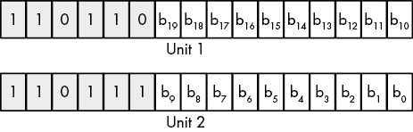    Figure 2-26: Surrogate code point encoding for Unicode planes 1 to 16      Note that the two words (unit 1 and unit 2) always appear together. The unit 1 value (with HO bits 110110b) specifies the upper 10 bits (b[10] to b[19]) of the Unicode scalar, and the unit 2 value (with HO bits 110111b) specifies the lower 10 bits (b[0] to b[9]) of the Unicode scalar. Therefore, bits b[16] to b[19] (plus one) specify Unicode plane 1 to 16\. Bits b[0] to b[15] specify the Unicode scalar value within the plane.    ### 2.16.3 Unicode Encodings    As of Unicode v2.0, the standard supports a 21-bit character space capable of handling over a million characters (though most of the code points remain reserved for future use). Rather than use a 3-byte (or worse, 4-byte) encoding to allow the larger character set, Unicode, Inc., allowed different encodings, each with its own advantages and disadvantages.    *UTF-32* uses 32-bit integers to hold Unicode scalars.^(19) The advantage to this scheme is that a 32-bit integer can represent every Unicode scalar value (which requires only 21 bits). Programs that require random access to characters in strings (without having to search for surrogate pairs) and other constant-time operations are (mostly) possible when using UTF-32\. The obvious drawback to UTF-32 is that each Unicode scalar value requires 4 bytes of storage (twice that of the original Unicode definition and four times that of ASCII characters).    The second encoding format the Unicode supports is *UTF-16*. As the name suggests, UTF-16 uses 16-bit (unsigned) integers to represent Unicode values. To handle scalar values greater than 0FFFFh, UTF-16 uses the surrogate pair scheme to represent values in the range 010000h to 10FFFFh (see the discussion of code planes and surrogate code points in the previous section). Because the vast majority of useful characters fit into 16 bits, most UTF-16 characters require only 2 bytes. For those rare cases where surrogates are necessary, UTF-16 requires two words (32 bits) to represent the character.    The last encoding, and unquestionably the most popular, is *UTF-8*. The UTF-8 encoding is upward compatible from the ASCII character set. In particular, all ASCII characters have a single-byte representation (their original ASCII code, where the HO bit of the byte containing the character contains a 0 bit). If the UTF-8 HO bit is 1, UTF-8 requires additional bytes (1 to 3 additional bytes) to represent the Unicode code point. Table 2-15 provides the UTF-8 encoding schema.      Table 2-15: UTF-8 Encoding       | **Bytes** | **Bits for code point** | **First code point** | **Last code point** | **Byte 1** | **Byte 2** | **Byte 3** | **Byte 4** | | --- | --- | --- | --- | --- | --- | --- | --- | | 1 | 7 | U+00 | U+7F | 0*xxxxxxx* |  |  |  | | 2 | 11 | U+80 | U+7FF | 110*xxxxx* | 10*xxxxxx* |  |  | | 3 | 16 | U+800 | U+FFFF | 1110*xxxx* | 10*xxxxxx* | 10*xxxxxx* |  | | 4 | 21 | U+10000 | U+10FFFF | 11110*xxx* | 10*xxxxxx* | 10*xxxxxx* | 10*xxxxxx* |    The `xxx...` bits are the Unicode code point bits. For multi-byte sequences, byte 1 contains the HO bits, byte 2 contains the next HO bits, and so on. For example, the 2-byte sequence 11011111b, 10000001b corresponds to the Unicode scalar 0000_0111_1100_0001b (U+07C1).    ## 2.17 MASM Support for Unicode    Unfortunately, MASM provides almost zero support for Unicode text in a source file. Fortunately, MASM’s macro facilities provide a way for you to create your own Unicode support for strings in MASM. See Chapter 13 for more details on MASM macros. I will also return to this subject in *The Art of 64-Bit Assembly*, Volume 2, where I will spend considerable time describing how to force MASM to accept and process Unicode strings in source and resource files.    ## 2.18 For More Information    For general information about data representation and Boolean functions, consider reading my book *Write Great Code*, Volume 1, Second Edition (No Starch Press, 2020), or a textbook on data structures and algorithms (available at any bookstore).    ASCII, EBCDIC, and Unicode are all international standards. You can find out more about the Extended Binary Coded Decimal Interchange Code (EBCDIC) character set families on IBM’s website ([`www.ibm.com/`](http://www.ibm.com/)). ASCII and Unicode are both International Organization for Standardization (ISO) standards, and ISO provides reports for both character sets. Generally, those reports cost money, but you can also find out lots of information about the ASCII and Unicode character sets by searching for them by name on the internet. You can also read about Unicode at [`www.unicode.org/`](http://www.unicode.org/). *Write Great Code* also contains additional information on the history, use, and encoding of the Unicode character set.    ## 2.19 Test Yourself    1.  What does the decimal value 9384.576 represent (in terms of powers of 10)? 2.  Convert the following binary values to decimal:     1.  1010     2.  1100     3.  0111     4.  1001     5.  0011     6.  1111 3.  Convert the following binary values to hexadecimal:     1.  1010     2.  1110     3.  1011     4.  1101     5.  0010     6.  1100     7.  1100_1111     8.  1001_1000_1101_0001 4.  Convert the following hexadecimal values to binary:          1.  12AF     2.  9BE7     3.  4A     4.  137F     5.  F00D     6.  BEAD     7.  4938  5.  Convert the following hexadecimal values to decimal:     1.  A     2.  B     3.  F     4.  D     5.  E     6.  C 6.  How many bits are there in a     1.  Word     2.  Qword     3.  Oword     4.  Dword     5.  BCD digit     6.  Byte     7.  Nibble 7.  How many bytes are there in a     1.  Word     2.  Dword     3.  Qword     4.  Oword 8.  How different values can you represent with a     1.  Nibble     2.  Byte     3.  Word     4.  Bit 9.  How many bits does it take to represent a hexadecimal digit? 10.  How are the bits in a byte numbered? 11.  Which bit number is the LO bit of a word? 12.  Which bit number is the HO bit of a dword? 13.  Compute the logical AND of the following binary values:     1.  0 and 0     2.  0 and 1     3.  1 and 0     4.  1 and 1 14.  Compute the logical OR of the following binary values:     1.  0 and 0     2.  0 and 1     3.  1 and 0     4.  1 and 1 15.  Compute the logical XOR of the following binary values:     1.  0 and 0     2.  0 and 1     3.  1 and 0     4.  1 and 1 16.  The logical NOT operation is the same as XORing with what value? 17.  Which logical operation would you use to force bits to 0 in a bit string? 18.  Which logical operation would you use to force bits to 1 in a bit string? 19.  Which logical operation would you use to invert all the bits in a bit string? 20.  Which logical operation would you use to invert selected bits in a bit string? 21.  Which machine instruction will invert all the bits in a register? 22.  What is the two’s complement of the 8-bit value 5 (00000101b)? 23.  What is the two’s complement of the signed 8-bit value –2 (11111110)? 24.  Which of the following signed 8-bit values are negative?     1.  1111_1111b     2.  0111_0001b     3.  1000_0000b     4.  0000_0000b     5.  1000_0001b     6.  0000_0001b 25.  Which machine instruction takes the two’s complement of a value in a register or memory location? 26.  Which of the following 16-bit values can be correctly sign-contracted to 8 bits?          1.  1111_1111_1111_1111     2.  1000_0000_0000_0000     3.  000_0000_0000_0001     4.  1111_1111_1111_0000     5.  1111_1111_0000_0000     6.  0000_1111_0000_1111     7.  0000_0000_1111_1111     8.  0000_0001_0000_0000  27.  What machine instruction provides the equivalent of an HLL `goto` statement? 28.  What is the syntax for a MASM statement label? 29.  What flags are the condition codes? 30.  *JE* is a synonym for what instruction that tests a condition code? 31.  *JB* is a synonym for what instruction that tests a condition code? 32.  Which conditional jump instructions transfer control based on an unsigned comparison? 33.  Which conditional jump instructions transfer control based on a signed comparison? 34.  How does the SHL instruction affect the zero flag? 35.  How does the SHL instruction affect the carry flag? 36.  How does the SHL instruction affect the overflow flag? 37.  How does the SHL instruction affect the sign flag? 38.  How does the SHR instruction affect the zero flag? 39.  How does the SHR instruction affect the carry flag? 40.  How does the SHR instruction affect the overflow flag? 41.  How does the SHR instruction affect the sign flag? 42.  How does the SAR instruction affect the zero flag? 43.  How does the SAR instruction affect the carry flag? 44.  How does the SAR instruction affect the overflow flag? 45.  How does the SAR instruction affect the sign flag? 46.  How does the RCL instruction affect the carry flag? 47.  How does the RCL instruction affect the zero flag? 48.  How does the RCR instruction affect the carry flag? 49.  How does the RCR instruction affect the sign flag? 50.  A shift left is equivalent to what arithmetic operation? 51.  A shift right is equivalent to what arithmetic operation? 52.  When performing a chain of floating-point addition, subtraction, multiplication, and division operations, which operations should you try to do first? 53.  How should you compare floating-point values for equality? 54.  What is a normalized floating-point value? 55.  How many bits does a (standard) ASCII character require? 56.  What is the hexadecimal representation of the ASCII characters 0 through 9? 57.  What delimiter character(s) does MASM use to define character constants? 58.  What are the three common encodings for Unicode characters? 59.  What is a Unicode code point? 60.  What is a Unicode code plane? ````
