# 第三章：内存访问和组织


第一章和第二章向你展示了如何在汇编语言程序中声明和访问简单的变量。本章将全面解释 x86-64 内存访问。在本章中，你将学习如何高效组织变量声明，以加速对数据的访问。你还将了解 x86-64 堆栈以及如何在堆栈上操作数据。

本章讨论了几个重要概念，包括以下内容：

+   内存组织

+   程序的内存分配

+   x86-64 内存寻址模式

+   间接寻址和缩放索引寻址模式

+   数据类型强制转换

+   x86-64 堆栈

本章将教你如何高效利用计算机的内存资源。

## 3.1 运行时内存组织

正在运行的程序根据数据类型以多种方式使用内存。以下是你在汇编语言程序中可能遇到的一些常见数据分类：

**代码**

1.  编码机器指令的内存值。

**未初始化的静态数据**

1.  程序为未初始化的变量分配的一块内存区域，这些变量在程序运行的整个过程中都存在；Windows 在将程序加载到内存时会将该存储区域初始化为 0。

**初始化静态数据**

1.  一块内存区域，在程序运行的整个过程中始终存在。然而，Windows 从程序的可执行文件中加载该区域中所有变量的值，因此当程序首次开始执行时，它们具有初始值。

**只读数据**

1.  类似于初始化静态数据，Windows 从可执行文件中加载该内存区域的初始数据。然而，这一内存区域被标记为*只读*，以防止数据被不小心修改。程序通常将常量和其他不变的数据存储在该内存区域（顺便提一下，操作系统也将代码区标记为只读）。

**堆**

1.  内存的这一特殊区域被指定为存储动态分配的存储空间。像 C 语言中的`malloc()`和`free()`这样的函数负责在堆区分配和释放存储空间。第四章中的“指针变量和动态内存分配”将更详细地讨论动态存储分配。

**堆栈**

1.  在内存的这一特殊区域，程序维护着过程和函数的局部变量、程序状态信息以及其他临时数据。有关堆栈区的更多信息，请参见第 134 页的“堆栈段及 push 和 pop 指令”。

这些是常见程序（无论是汇编语言程序还是其他类型的程序）中典型的内存区域。较小的程序可能不会使用所有这些区域（代码区、栈区和数据区是一个很好的最小配置）。复杂的程序可能会根据需要在内存中创建额外的区域。一些程序可能会将多个区域合并。例如，许多程序将代码区和只读数据区合并成同一区域（因为两个区域中的数据都被标记为只读）。一些程序将未初始化数据区和已初始化数据区合并在一起（*将未初始化变量初始化为 0*）。合并区域通常由链接器程序处理。有关合并区域的更多细节，请参阅 Microsoft 链接器文档。^(1)

Windows 通常将不同类型的数据存储在内存的不同区域（或 *段*）中。虽然通过运行链接器并指定不同的参数可以重新配置内存，但默认情况下，Windows 会按照与 图 3-1 相似的组织方式将 MASM 程序加载到内存中。^(2)

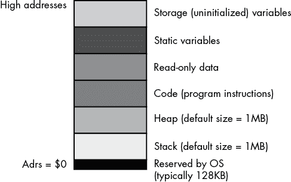

图 3-1：MASM 典型的运行时内存组织

Windows 保留最低的内存地址。通常，你的应用程序不能访问这些低地址中的数据（或执行指令）。操作系统保留这块空间的一个原因是帮助捕捉 NULL 指针引用：如果你尝试访问内存位置 0（NULL），操作系统将产生 *一般保护异常*（也称为 *段错误*），这意味着你访问了一个不包含有效数据的内存位置。

内存映射中的其余六个区域存储与程序相关的不同类型的数据。这些内存区域包括栈区、堆区、`.code` 区、`.data`（静态）区、`.const` 区和 `.data?`（存储）区。每个区域都对应 MASM 程序中可以创建的数据类型。接下来将详细描述 `.code`、`.data`、`.const` 和 `.data?` 区域。^(3)

### 3.1.1 `.code` 区

`.code` 区包含 MASM 程序中的机器指令。MASM 将你编写的每个机器指令翻译成一个或多个字节的值。在程序执行过程中，CPU 将这些字节值解释为机器指令。

默认情况下，当 MASM 链接程序时，它会告诉系统你的程序可以执行指令并从代码段读取数据，但不能写入数据到代码段。如果你尝试将任何数据存储到代码段，操作系统将产生一般保护异常。

### 3.1.2 `.data` 区

`.data`部分通常是放置变量的地方。除了声明静态变量外，你还可以将数据列表嵌入到`.data`声明部分。你在`.data`部分嵌入数据的方式与在`.code`部分嵌入数据的方式相同：你使用`byte`、`word`、`dword`、`qword`等指令。考虑以下示例：

```
 .data
b   byte    0
    byte    1,2,3

u   dword   1
    dword   5,2,10;

c   byte   ?
    byte   'a', 'b', 'c', 'd', 'e', 'f';

bn  byte   ?
    byte   true  ; Assumes true is defined as "1"
```

MASM 使用这些指令将数据放入`.data`内存段时，会在前面声明的变量后写入数据。例如，字节值`1`、`2`和`3`会在`b`的`0`字节后写入`.data`部分。由于这些值没有与标签关联，你无法在程序中直接访问它们。你可以使用索引寻址模式来访问这些额外的值。

在前面的示例中，请注意`c`和`bn`变量没有（显式的）初始值。然而，如果你没有提供初始值，MASM 将把`.data`部分的变量初始化为 0，因此 MASM 将 NULL 字符（ASCII 码为 0）分配给`c`作为其初始值。同样，MASM 将假定 false 为`0`，并将 false 分配给`bn`的初始值。`.data`部分中的变量声明总是会消耗内存，即使你没有为它们分配初始值。

### 3.1.3 `.const`部分

`.const`数据部分包含常量、表格以及在程序执行过程中不能更改的其他数据。你可以通过在`.const`声明部分中声明它们来创建只读对象。`.const`部分类似于`.data`部分，但有三个不同之处：

+   `.const`部分以保留字`.const`开头，而不是`.data`。

+   `.const`部分的所有声明都有一个初始化器。

+   系统不允许你在程序运行时向`.const`对象中的变量写入数据。

这是一个示例：

```
 .const
pi      real4     3.14159
e       real4     2.71
MaxU16  word      65535
MaxI16  sword     32767
```

所有`.const`对象声明必须有一个初始化器，因为你不能在程序控制下初始化值。对于许多用途，你可以将`.const`对象视为字面常量。然而，由于它们实际上是内存对象，它们表现得像（只读）`.data`对象。你不能在字面常量允许的地方使用`.const`对象；例如，你不能在寻址模式中使用它们作为位移（见第 122 页的《x86-64 寻址模式》），也不能在常量表达式中使用它们。实际上，你可以在读取`.data`变量合法的任何地方使用它们。

和`.data`部分一样，你可以通过使用`byte`、`word`、`dword`等数据声明在`.const`部分嵌入数据值，尽管所有声明都必须初始化。例如：

```
 .const
roArray byte     0
        byte     1, 2, 3, 4, 5
qwVal   qword    1
        qword    0
```

注意，你也可以在`.code`部分声明常量值。在该部分声明的数据值也是只读对象，因为 Windows 会对`.code`部分进行写保护。如果你确实在`.code`部分放置常量声明，应该小心将它们放置在程序不会尝试执行为代码的位置（例如在`jmp`或`ret`指令之后）。除非你在手动编码 x86 机器指令时使用数据声明（这通常很少见，且只有专家程序员会这样做），否则你不希望程序尝试将数据作为机器指令执行；结果通常是未定义的。^(4)

### 3.1.4 `.data?`部分

`.const`部分要求你初始化所有声明的对象。`.data`部分让你可选择性地初始化对象（或者让它们保持未初始化状态，在这种情况下，它们的默认初始值为`0`）。`.data?`部分让你声明那些在程序开始运行时总是未初始化的变量。`.data?`部分以`.data?`保留字开头，并包含没有初始化器的变量声明。以下是一个示例：

```
 .data?
UninitUns32 dword  ?
i           sdword ?
character   byte   ?
b           byte   ?
```

Windows 会在加载程序到内存时将所有`.data?`对象初始化为 0。然而，依赖这种隐式初始化可能并不是一个好主意。如果需要一个初始化为 0 的对象，请在`.data`部分声明它并明确将其设置为 0。

你在`.data?`部分声明的变量可能会在程序的可执行文件中占用更少的磁盘空间。这是因为 MASM 会将`.const`和`.data`对象的初始值写入可执行文件，但对于在`.data?`部分声明的未初始化变量，它可能使用一种紧凑的表示方式；不过请注意，这种行为取决于操作系统版本和对象模块格式。

### 3.1.5 程序中声明部分的组织

`.data`、`.const`、`.data?`和`.code`部分可以在程序中出现零次或多次。声明部分可以按任何顺序出现，以下示例说明了这一点：

```
 .data
i_static   sdword    0

           .data?
i_uninit   sdword    ?

           .const
i_readonly dword     5

 .data
j          dword     ?

           .const
i2         dword     9

           .data?
c          byte      ?

           .data?
d          dword     ?

           .code

      `Code goes here`

            end
```

各部分可以按任意顺序出现，且某个声明部分在程序中可能出现多次。如前所述，当多个相同类型的声明部分（例如前面示例中的三个`.data?`部分）出现在程序的声明部分时，MASM 会将它们组合成一个单独的组（顺序可以任意）。

### 3.1.6 内存访问和 4K 内存管理单元页面

x86-64 的*内存* *管理单元（**MMU**）*将内存划分为称为*页面*的块。^(5) 操作系统负责管理内存中的页面，因此应用程序通常不需要担心页面的组织。然而，在处理内存中的页面时，你应该注意几个问题：具体来说，CPU 是否允许访问某个给定的内存位置，以及该位置是可读/可写还是只读（写保护）。

每个程序节在内存中以连续的 MMU 页面出现。也就是说，`.const`节从 MMU 页面中的偏移量 0 开始，并且顺序地消耗内存中的页面，直到该节中的所有数据。内存中的下一个节（可能是`.data`）从紧接着上一个节的最后一页之后的下一个 MMU 页面中的偏移量 0 开始。如果上一个节（例如`.const`）没有消耗 4096 字节的整数倍，那么在该节数据的末尾和其最后一页的末尾之间会有填充空间（以确保下一个节从 MMU 页边界开始）。

每个新的节会在自己的 MMU 页面中开始，因为 MMU 通过使用页面的*粒度*来控制对内存的访问。例如，MMU 控制内存中的页面是可读/可写的还是只读的。对于``.const 节，你希望内存是只读的。对于`.data`节，你希望允许读写。因为 MMU 只能按页级别强制执行这些属性，所以你不能将`.data`节的信息和`.const`节放在同一个 MMU 页面中。``

````Normally, all of this is completely transparent to your code. Data you declare in a `.data` (or `.data?`) section is readable and writable, and data in a `.const` section (and `.code` section) is read-only (`.code` sections are also *executable*). Beyond placing data in a particular section, you don’t have to worry too much about the page attributes.    You do have to worry about MMU page organization in memory in one situation. Sometimes it is convenient to access (read) data beyond the end of a data structure in memory (for legitimate reasons—see Chapter 11 on SIMD instructions and Chapter 14 on string instructions). However, if that data structure is aligned with the end of an MMU page, accessing the next page in memory could be problematic. Some pages in memory are *inaccessible*; the MMU does not allow reading, writing, or execution to occur on that page.    Attempting to do so will generate an x86-64 *general protection (segmentation) fault* and abort the normal execution of your program.^(6) If you have a data access that crosses a page boundary, and the next page in memory is inaccessible, this will crash your program. For example, consider a word access to a byte object at the very end of an MMU page, as shown in Figure 3-2.  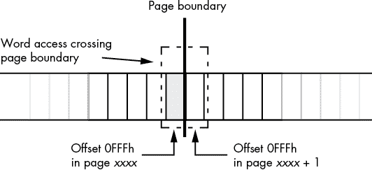    Figure 3-2: Word access at the end of an MMU page      As a general rule, you should never read data beyond the end of a data structure.^(7) If for some reason you need to do so, you should ensure that it is legal to access the next page in memory (alas, there is no instruction on modern x86-64 CPUs to allow this; the only way to be sure that access is legal is to make sure there is valid data after the data structure you are accessing).    ## 3.2 How MASM Allocates Memory for Variables    MASM associates a current *location counter* with each of the four declaration sections (`.code`, `.data`, `.const`, and `.data?`). These location counters initially contain `0`, and whenever you declare a variable in one of these sections (or write code in a code section), MASM associates the current value of that section’s location counter with the variable; MASM also bumps up the value of that location counter by the size of the object you’re declaring. As an example, assume that the following is the only `.data` declaration section in a program:    ```  .data b   byte   ?        ; Location counter = 0,  size = 1 w   word   ?        ; Location counter = 1,  size = 2 d   dword  ?        ; Location counter = 3,  size = 4 q   qword  ?        ; Location counter = 7,  size = 8 o   oword  ?        ; Location counter = 15, size = 16                     ; Location counter is now 31 ```    As you can see, the variable declarations appearing in a (single) `.data` section have contiguous offsets (location counter values) into the `.data` section. Given the preceding declaration, `w` will immediately follow `b` in memory, `d` will immediately follow `w` in memory, `q` will immediately follow `d`, and so on. These offsets aren’t the actual runtime address of the variables. At runtime, the system loads each section to a (base) address in memory. The linker and Windows add the base address of the memory section to each of these location counter values (which we call *displacements*, or *offsets*) to produce the actual memory address of the variables.    Keep in mind that you may link other modules with your program (for example, from the C Standard Library) or even additional `.data` sections in the same source file, and the linker has to merge the `.data` sections together. Each section has its own location counter that also starts from zero when allocating storage for the variables in the section. Hence, the offset of an individual variable may have little bearing on its final memory address.    Remember that MASM allocates memory objects you declare in `.const`, `.data`, and `.data?` sections in completely different regions of memory. Therefore, you cannot assume that the following three memory objects appear in adjacent memory locations (indeed, they probably will not):    ```  .data b   byte   ?      .const w   word    1234h      .data? d   dword   ? ```    In fact, MASM will not even guarantee that variables you declare in separate `.data` (or whatever) sections are adjacent in memory, even if there is nothing between the declarations in your code. For example, you cannot assume that `b`, `w`, and `d` are in adjacent memory locations in the following declarations, nor can you assume that they *won’t* be adjacent in memory:    ```  .data b   byte   ?      .data w   word   1234h      .data d   dword  ? ```    If your code requires these variables to consume adjacent memory locations, you must declare them in the same `.data` section.    ## 3.3 The Label Declaration    The `label` declaration lets you declare variables in a section (`.code`, `.data`, `.const`, and `.data?`) without allocating memory for the variable. The `label` directive tells MASM to assign the current address in a declaration section to a variable but not to allocate any storage for the object. That variable shares the same memory address as the next object appearing in the variable declaration section. Here is the syntax for the `label` declaration:    ``` `variable_name` label `type` ```    The following code sequence provides an example of using the `label` declaration in the `.const` section:    ```  .const abcd    label   dword         byte 'a', 'b', 'c', 'd' ```    In this example, `abcd` is a double word whose LO byte contains 97 (the ASCII code for `a`), byte 1 contains 98 (`b`), byte 2 contains 99 (`c`), and the HO byte contains 100 (`d`). MASM does not reserve storage for the `abcd` variable, so MASM associates the following 4 bytes in memory (allocated by the `byte` directive) with `abcd`.    ## 3.4 Little-Endian and Big-Endian Data Organization    Back in “The Memory Subsystem” in Chapter 1, this book pointed out that the x86-64 stores multi-byte data types in memory with the LO byte at the lowest address in memory and the HO byte at the highest address in memory (see Figure 1-5 in Chapter 1). This type of data organization in memory is known as *little endian*. Little-endian data organization (in which the LO byte comes first and the HO byte comes last) is a common memory organization shared by many modern CPUs. It is not, however, the only possible data organization.    The *big-endian* data organization reverses the order of the bytes in memory. The HO byte of the data structure appears first (in the lowest memory address), and the LO byte appears in the highest memory address. Tables 3-1, 3-2, and 3-3 describe the memory organization for words, double words, and quad words, respectively.      Table 3-1: Word Object Little- and Big-Endian Data Organizations       | **Data byte** | **Memory organization for little endian** | **Memory organization for big endian** | | --- | --- | --- | | 0 (LO byte) | base + 0 | base + 1 | | 1 (HO byte) | base + 1 | base + 0 |      Table 3-2: Double-Word Object Little- and Big-Endian Data Organizations       | **Data byte** | **Memory organization for little endian** | **Memory organization for big endian** | | --- | --- | --- | | 0 (LO byte) | base + 0 | base + 3 | | 1 | base + 1 | base + 2 | | 2 | base + 2 | base + 1 | | 3 (HO byte) | base + 3 | base + 0 |      Table 3-3: Quad-Word Object Little- and Big-Endian Data Organizations       | **Data byte** | **Memory organization for little endian** | **Memory organization for big endian** | | --- | --- | --- | | 0 (LO byte) | base + 0 | base + 7 | | 1 | base + 1 | base + 6 | | 2 | base + 2 | base + 5 | | 3 | base + 3 | base + 4 | | 4 | base + 4 | base + 3 | | 5 | base + 5 | base + 2 | | 6 | base + 6 | base + 1 | | 7 (HO byte) | base + 7 | base + 0 |    Normally, you wouldn’t be too concerned with big-endian memory organization on an x86-64 CPU. However, on occasion you may need to deal with data produced by a different CPU (or by a protocol, such as TCP/IP, that uses big-endian organization as its canonical integer format). If you were to load a big-endian value in memory into a CPU register, your calculations would be incorrect.    If you have a 16-bit big-endian value in memory and you load it into a 16-bit register, it will have its bytes swapped. For 16-bit values, you can correct this issue by using the `xchg` instruction. It has the syntax    ``` xchg `reg`, `reg` xchg `reg`, `mem` ```    where `reg` is any 8-, 16-, 32-, or 64-bit general-purpose register, and `mem` is any appropriate memory location. The `reg` operands in the first instruction, or the `reg` and `mem` operands in the second instruction, must both be the same size.    Though you can use the `xchg` instruction to exchange the values between any two arbitrary (like-sized) registers, or a register and a memory location, it is also useful for converting between (16-bit) little- and big-endian formats. For example, if AX contains a big-endian value that you would like to convert to little-endian form prior to some calculations, you can use the following instruction to swap the bytes in the AX register to convert the value to little-endian form:    ``` xchg al, ah ```    You can use the `xchg` instruction to convert between little- and big-endian form for any of the 16-bit registers AX, BX, CX, and DX by using the low/high register designations (AL/AH, BL/BH, CL/CH, and DL/DH).    Unfortunately, the `xchg` trick doesn’t work for registers other than AX, BX, CX, and DX. To handle larger values, Intel introduced the `bswap` (*byte swap*) instruction. As its name suggests, this instruction swaps the bytes in a 32- or 64-bit register. It swaps the HO and LO bytes, and the (HO – 1) and (LO + 1) bytes (plus all the other bytes, in opposing pairs, for 64-bit registers). The `bswap` instruction works for all general-purpose 32-bit and 64-bit registers.    ## 3.5 Memory Access    As you saw in “The Memory Subsystem” in Chapter 1, the x86-64 CPU fetches data from memory on the data bus. In an idealized CPU, the data bus is the size of the standard integer registers on the CPU; therefore, you would expect the x86-64 CPUs to have a 64-bit data bus. In practice, modern CPUs often make the physical data bus connection to main memory much larger in order to improve system performance. The bus brings in large chunks of data from memory in a single operation and places that data in the CPU’s *cache*, which acts as a buffer between the CPU and physical memory.    From the CPU’s point of view, the cache *is* memory. Therefore, when the remainder of this section discusses memory, it’s generally talking about data sitting in the cache. As the system transparently maps memory accesses into the cache, we can discuss memory as though the cache were not present and discuss the advantages of the cache as necessary.    On early x86 processors, memory was arranged as an array of bytes (8-bit machines such as the 8088), words (16-bit machines such as the 8086 and 80286), or double words (on 32-bit machines such as the 80386). On a 16-bit machine, the LO bit of the address did not physically appear on the address bus. So the addresses 126 and 127 put the same bit pattern on the address bus (126, with an implicit `0` in bit position 0), as shown in Figure 3-3.^(8)  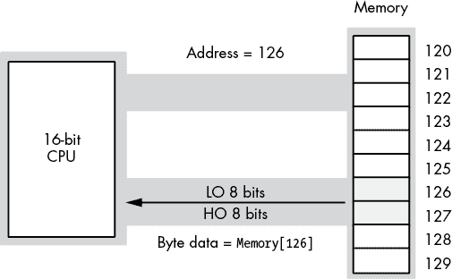    Figure 3-3: Address and data bus for 16-bit processors      When reading a byte, the CPU uses the LO bit of the address to select the LO byte or HO byte on the data bus. Figure 3-4 shows the process when accessing a byte at an even address (126 in this figure). Figure 3-5 shows the same operation when reading a byte from an odd address (127 in this figure). Note that in both Figures 3-4 and 3-5, the address appearing on the address bus is 126.  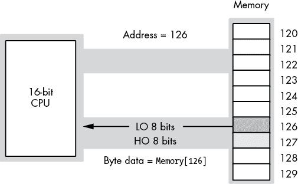    Figure 3-4: Reading a byte from an even address on a 16-bit CPU    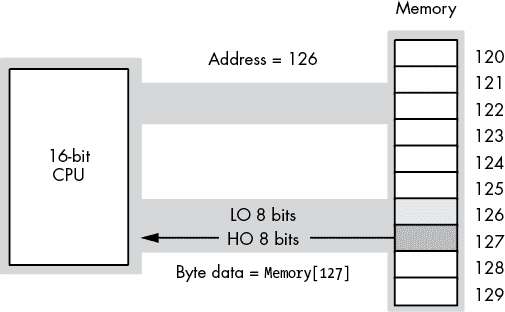    Figure 3-5: Reading a byte from an odd address on a 16-bit CPU      So, what happens when this 16-bit CPU wants to access 16 bits of data at an odd address? For example, suppose in these figures the CPU reads the word at address 125\. When the CPU puts address 125 on the address bus, the LO bit doesn’t physically appear. Therefore, the actual address on the bus is 124\. If the CPU were to read the LO 8 bits off the data bus at this point, it would get the data at address 124, not address 125.    Fortunately, the CPU is smart enough to figure out what is going on here, and extracts the data from the HO 8 bits on the address bus and uses this as the LO 8 bits of the data operand. However, the HO 8 bits that the CPU needs are not found on the data bus. The CPU has to initiate a second read operation, placing address 126 on the address bus, to get the HO 8 bits (which will be sitting in the LO 8 bits of the data bus, but the CPU can figure that out). The bottom line is that it takes two memory cycles for this read operation to complete. Therefore, the instruction reading the data from memory will take longer to execute than had the data been read from an address that was an integral multiple of two.    The same problem exists on 32-bit processors, except the 32-bit data bus allows the CPU to read 4 bytes at a time. Reading a 32-bit value at an address that is not an integral multiple of four incurs the same performance penalty. Note, however, that accessing a 16-bit operand at an odd address doesn’t always guarantee an extra memory cycle—only addresses whose remainder when divided by four is 3 incur the penalty. In particular, if you access a 16-bit value (on a 32-bit bus) at an address where the LO 2 bits contain 01b, the CPU can read the word in a single memory cycle, as shown in Figure 3-6.    Modern x86-64 CPUs, with cache systems, have largely eliminated this problem. As long as the data (1, 2, 4, 8, or 10 bytes in size) is fully within a cache line, there is no memory cycle penalty for an unaligned access. If the access does cross a cache line boundary, the CPU will run a bit slower while it executes two memory operations to get (or store) the data.  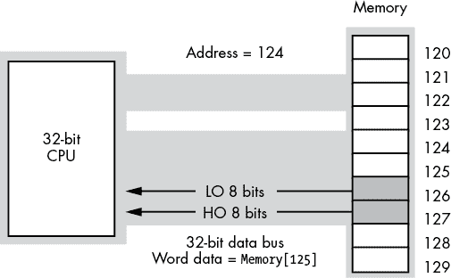    Figure 3-6: Accessing a word on a 32-bit data bus      ## 3.6 MASM Support for Data Alignment    To write fast programs, you need to ensure that you properly align data objects in memory. Proper *alignment* means that the starting address for an object is a multiple of a certain size, usually the size of an object if the object’s size is a power of 2 for values up to 32 bytes in length. For objects greater than 32 bytes, aligning the object on an 8-, 16-, or 32-byte address boundary is probably sufficient. For objects fewer than 16 bytes, aligning the object at an address that is the next power of 2 greater than the object’s size is usually fine. Accessing data that is not aligned at an appropriate address may require extra time (as noted in the previous section); so, if you want to ensure that your program runs as rapidly as possible, you should try to align data objects according to their size.    Data becomes misaligned whenever you allocate storage for different-sized objects in adjacent memory locations. For example, if you declare a byte variable, it will consume 1 byte of storage, and the next variable you declare in that declaration section will have the address of that byte object plus 1\. If the byte variable’s address happens to be an even address, the variable following that byte will start at an odd address. If that following variable is a word or double-word object, its starting address will not be optimal. In this section, we’ll explore ways to ensure that a variable is aligned at an appropriate starting address based on that object’s size.    Consider the following MASM variable declarations:    ```  .data dw  dword  ? b   byte   ? w   word   ? dw2 dword  ? w2  word   ? b2  byte   ? dw3 dword  ? ```    The first `.data` declaration in a program (running under Windows) places its variables at an address that is an even multiple of 4096 bytes. Whatever variable first appears in that `.data` declaration is guaranteed to be aligned on a reasonable address. Each successive variable is allocated at an address that is the sum of the sizes of all the preceding variables plus the starting address of that `.data` section. Therefore, assuming MASM allocates the variables in the previous example at a starting address of `4096`, MASM will allocate them at the following addresses:    ```  ; Start Adrs       Length dw    dword  ?      ;     4096           4 b     byte   ?      ;     4100           1 w     word   ?      ;     4101           2 dw2   dword  ?      ;     4103           4 w2    word   ?      ;     4107           2 b2    byte   ?      ;     4109           1 dw3   dword  ?      ;     4110           4 ```    With the exception of the first variable (which is aligned on a 4KB boundary) and the byte variables (whose alignment doesn’t matter), all of these variables are misaligned. The `w`, `w2`, and `dw2` variables start at odd addresses, and the `dw3` variable is aligned on an even address that is not a multiple of four.    An easy way to guarantee that your variables are aligned properly is to put all the double-word variables first, the word variables second, and the byte variables last in the declaration, as shown here:    ```  .data dw    dword  ? dw2   dword  ? dw3   dword  ? w     word   ? w2    word   ? b     byte   ? b2    byte   ? ```    This organization produces the following addresses in memory:    ```  ; Start Adrs          Length dw    dword   ?   ;     4096              4 dw2   dword   ?   ;     4100              4 dw3   dword   ?   ;     4104              4 w     word    ?   ;     4108              2 w2    word    ?   ;     4110              2 b     byte    ?   ;     4112              1 b2    byte    ?   ;     4113              1 ```    As you can see, these variables are all aligned at reasonable addresses. Unfortunately, it is rarely possible for you to arrange your variables in this manner. While many technical reasons make this alignment impossible, a good practical reason for not doing this is that it doesn’t let you organize your variable declarations by logical function (that is, you probably want to keep related variables next to one another regardless of their size).    To resolve this problem, MASM provides the `align` directive, which uses the following syntax:    ``` align `integer_constant` ```    The integer constant must be one of the following small unsigned integer values: 1, 2, 4, 8, or 16\. If MASM encounters the `align` directive in a `.data` section, it will align the very next variable on an address that is an even multiple of the specified alignment constant. The previous example could be rewritten, using the `align` directive, as follows:    ```  .data      align  4 dw   dword  ? b    byte   ?      align  2 w    word   ?      align  4 dw2  dword  ? w2   word   ? b2   byte   ?      align  4 dw3  dword  ? ```    If MASM determines that the current address (location counter value) of an `align` directive is not an integral multiple of the specified value, MASM will quietly emit extra bytes of padding after the previous variable declaration until the current address in the `.data` section is a multiple of the specified value. This makes your program slightly larger (by a few bytes) in exchange for faster access to your data. Given that your program will grow by only a few bytes when you use this feature, this is probably a good trade-off.    As a general rule, if you want the fastest possible access, you should choose an alignment value that is equal to the size of the object you want to align. That is, you should align words to even boundaries by using an `align 2` statement, double words to 4-byte boundaries by using `align 4`, quad words to 8-byte boundaries by using `align 8`, and so on. If the object’s size is not a power of 2, align it to the next higher power of 2 (up to a maximum of 16 bytes). Note, however, that you need only align `real80` (and `tbyte`) objects on an 8-byte boundary.    Note that data alignment isn’t always necessary. The cache architecture of modern x86-64 CPUs actually handles most misaligned data. Therefore, you should use the alignment directives only with variables for which speedy access is absolutely critical. This is a reasonable space/speed trade-off.    ## 3.7 The x86-64 Addressing Modes    Until now, you’ve seen only a single way to access a variable: the *PC-relative* addressing mode. In this section, you’ll see additional ways your programs can access memory by using x86-64 memory addressing modes. An *addressing mode* is a mechanism the CPU uses to determine the address of a memory location an instruction will access.    The x86-64 memory addressing modes provide flexible access to memory, allowing you to easily access variables, arrays, records, pointers, and other complex data types. Mastery of the x86-64 addressing modes is the first step toward mastering x86-64 assembly language.    The x86-64 provides several addressing modes:    *   Register addressing modes *   PC-relative memory addressing modes *   Register-indirect addressing modes: `[``reg`64`]` *   Indirect-plus-offset addressing modes: `[``reg`64 `+` `expression``]` *   Scaled-indexed addressing modes: `[``reg`64 `+` `reg`64 `*` `scale``]` and `[``reg`64 `+` `expression` `+` `reg`64 `*` `scale``]`    The following sections describe each of these modes.    ### 3.7.1 x86-64 Register Addressing Modes    The *register addressing modes* provide access to the x86-64’s general-purpose register set. By specifying the name of the register as an operand to the instruction, you can access the contents of that register. This section uses the x86-64 `mov` (*move*) instruction to demonstrate the register addressing mode. The generic syntax for the `mov` instruction is shown here:    ``` mov `destination`, `source` ```    The `mov` instruction copies the data from the `source` operand to the `destination` operand. The 8-, 16-, 32-, and 64-bit registers are all valid operands for this instruction. The only restriction is that both operands must be the same size. The following `mov` instructions demonstrate the use of various registers:    ``` mov ax, bx          ; Copies the value from BX into AX mov dl, al          ; Copies the value from AL into DL mov esi, edx        ; Copies the value from EDX into ESI mov rsp, rbp        ; Copies the value from RBP into RSP mov ch, cl          ; Copies the value from CL into DH mov ax, ax          ; Yes, this is legal! (Though not very useful) ```    The registers are the best place to keep variables. Instructions using the registers are shorter and faster than those that access memory. Because most computations require at least one register operand, the register addressing mode is popular in x86-64 assembly code.    ### 3.7.2 x86-64 64-Bit Memory Addressing Modes    The addressing modes provided by the x86-64 family include PC-relative, register-indirect, indirect-plus-offset, and scaled-indexed. Variations on these four forms provide all the addressing modes on the x86-64.    #### 3.7.2.1 The PC-Relative Addressing Mode    The most common addressing mode, and the one that’s easiest to understand, is the *PC-relative* (or *RIP-relative*) addressing mode. This mode consists of a 32-bit constant that the CPU adds with the current value of the RIP (instruction pointer) register to specify the address of the target location.    The syntax for the PC-relative addressing mode is to use the name of a symbol you declare in one of the many MASM sections (`.data`, `.data?`, `.const`, `.code`, etc.), as this book has been doing all along:    ``` mov al, symbol  ; PC-relative addressing mode automatically provides [RIP] ```    Assuming that variable `j` is an `int8` variable appearing at offset 8088h from RIP, the instruction `mov al, j` loads the AL register with a copy of the byte at memory location RIP + 8088h. Likewise, if `int8` variable `K` is at address RIP + 1234h in memory, then the instruction `mov K, dl` stores the value in the DL register to memory location RIP + 1234h (see Figure 3-7).  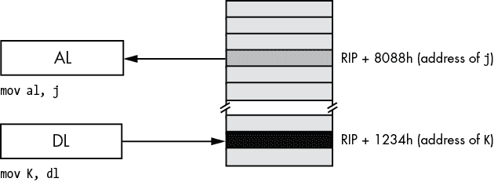    Figure 3-7: PC-relative addressing mode      MASM does not directly encode the address of `j` or `K` into the instruction’s *operation code* (or *opcode*, the numeric machine encoding of the instruction). Instead, it encodes a signed displacement from the end of the current instruction’s address to the variable’s address in memory. For example, if the next instruction’s opcode is sitting in memory at location 8000h (the end of the current instruction), then MASM will encode the value 88h as a 32-bit signed constant for `j` in the instruction opcode.    You can also access words and double words on the x86-64 processors by specifying the address of their first byte (see Figure 3-8).  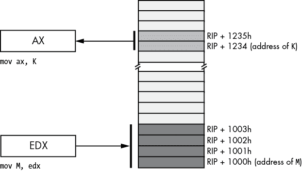    Figure 3-8: Accessing a word or dword by using the PC-relative addressing mode      #### 3.7.2.2 The Register-Indirect Addressing Modes    The x86-64 CPUs let you access memory indirectly through a register by using the *register-indirect* addressing modes. The term *indirect* means that the operand is not the actual address, but the operand’s value specifies the memory address to use. In the case of the register-indirect addressing modes, the value held in the register is the address of the memory location to access. For example, the instruction `mov [rbx], eax` tells the CPU to store EAX’s value at the location whose address is currently in RBX (the square brackets around RBX tell MASM to use the register-indirect addressing mode).    The x86-64 has 16 forms of this addressing mode. The following instructions provide examples of these 16 forms:    ``` mov [`reg`[64]], al  ```    where `reg`64 is one of the 64-bit general-purpose registers: RAX, RBX, RCX, RDX, RSI, RDI, RBP, RSP, R8, R9, R10, R11, R12, R13, R14, or R15\. This addressing mode references the memory location at the offset found in the register enclosed by brackets.    The register-indirect addressing modes require a 64-bit register. You cannot specify a 32-, 16-, or 8-bit register in the square brackets when using an indirect addressing mode. Technically, you could load a 64-bit register with an arbitrary numeric value and access that location indirectly using the register-indirect addressing mode:    ``` mov rbx, 12345678 mov [rbx], al   ; Attempts to access location 12345678 ```    Unfortunately (or fortunately, depending on how you look at it), this will probably cause the operating system to generate a protection fault because it’s not always legal to access arbitrary memory locations. As it turns out, there are better ways to load the address of an object into a register, and you’ll see those shortly.    You can use the register-indirect addressing modes to access data referenced by a pointer, you can use them to step through array data, and, in general, you can use them whenever you need to modify the address of a variable while your program is running.    The register-indirect addressing mode provides an example of an *anonymous* variable; when using a register-indirect addressing mode, you refer to the value of a variable by its numeric memory address (the value you load into a register) rather than by the name of the variable.    MASM provides a simple instruction that you can use to take the address of a variable and put it into a 64-bit register, the `lea` (*load effective address*) instruction:    ``` lea rbx, j ```    After executing this `lea` instruction, you can use the `[rbx]` register-indirect addressing mode to indirectly access the value of `j`.    #### 3.7.2.3 Indirect-Plus-Offset Addressing Mode    The indirect-plus-offset addressing modes compute an *effective address* by adding a 32-bit signed constant to the value of a 64-bit register.^(9) The instruction then uses the data at this effective address in memory.    The indirect-plus-offset addressing modes use the following syntax:    ``` mov [`reg`[64] + `constant`], `source` mov [`reg`[64] - `constant`], `source` ```    where `reg`64 is a 64-bit general-purpose register, `constant` is a 4-byte constant (±2 billion), and `source` is a register or constant value.    If `constant` is 1100h and RBX contains 12345678h, then    ``` mov [rbx + 1100h], al ```    stores AL into the byte at address 12346778h in memory (see Figure 3-9).  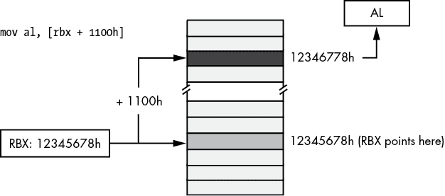    Figure 3-9: Indirect-plus-offset addressing mode      The indirect-plus-offset addressing modes are really handy for accessing fields of classes and records/structures. You will see how to use these addressing modes for that purpose in Chapter 4.    #### 3.7.2.4 Scaled-Indexed Addressing Modes    The *scaled-indexed addressing modes* are similar to the indexed addressing modes, except the scaled-indexed addressing modes allow you to combine two registers plus a displacement, and multiply the index register by a (scaling) factor of 1, 2, 4, or 8 to compute the effective address by adding in the value of the second register multiplied by the scaling factor. (Figure 3-10 shows an example involving RBX as the base register and RSI as the index register.)    The syntax for the scaled-indexed addressing modes is shown here:    ``` [`base_reg`[64] + `index_reg`[64]*`scale`] [`base_reg`[64] + `index_reg`[64]*`scale` + `displacement`] [`base_reg`[64] + `index_reg`[64]*`scale` - `displacement`] ```    `base_reg`64 represents any general-purpose 64-bit register, `index_reg`64 represents any general-purpose 64-bit register except RSP, and `scale` must be one of the constants 1, 2, 4, or 8.  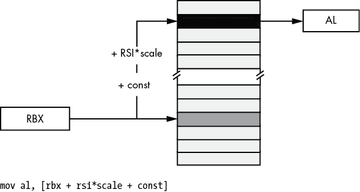    Figure 3-10: Scaled-indexed addressing mode      In Figure 3-10, suppose that RBX contains 1000FF00h, RSI contains 20h, and `const` is 2000h; then the instruction    ``` mov al, [rbx + rsi*4 + 2000h] ```    will move the byte at address 10011F80h—1000FF00h + (20h × 4) + 2000—into the AL register.    The scaled-indexed addressing modes are useful for accessing array elements that are 2, 4, or 8 bytes each. These addressing modes are also useful for accessing elements of an array when you have a pointer to the beginning of the array.    ### 3.7.3 Large Address Unaware Applications    One advantage of 64-bit addresses is that they can access a frightfully large amount of memory (something like 8TB under Windows). By default, the Microsoft linker (when it links together the C++ and assembly language code) sets a flag named `LARGEADDRESSAWARE` to true (`yes`). This makes it possible for your programs to access a huge amount of memory. However, there is a price to be paid for operating in `LARGEADDRESSAWARE` mode: the `const` component of the [`reg`64 + `const`] addressing mode is limited to 32 bits and cannot span the entire address space.    Because of instruction-encoding limitations, the `const` value is limited to a signed value in the range ±2GB. This is probably far more than enough when the register contains a 64-bit base address and you want to access a memory location at a fixed offset (less than ±2GB) around that base address. A typical way you would use this addressing mode is as follows:    ``` lea rcx, someStructure mov al, [rcx+fieldOffset] ```    Prior to the introduction of 64-bit addresses, the `const` offset appearing in the (32-bit) indirect-plus-offset addressing mode could span the entire (32-bit) address space. So if you had an array declaration such as    ```  .data buf byte   256 dup (?) ```    you could access elements of this array by using the following addressing mode form:    ``` mov al, buf[ebx]  ; EBX was used on 32-bit processors ```    If you were to attempt to assemble the instruction `mov al, buf[rbx]` in a 64-bit program (or any other addressing mode involving `buf` other than PC-relative), MASM would assemble the code properly, but the linker would report an error:    ``` error LNK2017: 'ADDR32' relocation to 'buf' invalid without /LARGEADDRESSAWARE:NO ```    The linker is complaining that in an address space exceeding 32 bits, it is impossible to encode the offset to the `buf` buffer because the machine instruction opcodes provide only a 32-bit offset to hold the address of `buf`.    However, if we were to artificially limit the amount of memory that our application uses to 2GB, then MASM can encode the 32-bit offset to `buf` into the machine instruction. As long as we kept our promise and never used any more memory than 2GB, several new variations on the indirect-plus-offset and scaled-indexed addressing modes become possible.    To turn off the large address–aware flag, you need to add an extra command line option to the `ml64` command. This is easily done in the *build.bat* file; let’s create a new *build.bat* file and call it *sbuild.bat.* This file will have the following lines:    ``` echo off ml64 /nologo /c /Zi /Cp %1.asm  cl /nologo /O2 /Zi /utf-8 /EHa /Fe%1.exe c.cpp %1.obj /link /largeaddressaware:no  ```    This set of commands (*sbuild.bat* for *small build*) tells MASM to pass a command to the linker that turns off the large address–aware file. MASM, MSVC, and the Microsoft linker will construct an executable file that requires only 32-bit addresses (ignoring the 32 HO bits in the 64-bit registers appearing in addressing modes).    Once you’ve disabled `LARGEADDRESSAWARE`, several new variants of the indirect-plus-offset and scaled-indexed addressing modes become available to your programs:    ``` `variable`[`reg`[64]] `variable`[`reg`[64] + `const`] `variable`[`reg`[64] - `const`] `variable`[`reg`[64] * `scale`] `variable`[`reg`[64] * `scale` + `const`] `variable`[`reg`[64] * `scale` - `const`] `variable`[`reg`[64] + `reg_not_RSP`[64] * `scale`] `variable`[`reg`[64] + `reg_not_RSP`[64] * `scale` + `const`] `variable`[`reg`[64] + `reg_not_RSP`[64] * `scale` - `const`] ```    where `variable` is the name of an object you’ve declared in your source file by using directives like `byte`, `word`, `dword`, and so on; `const` is a (maximum 32-bit) constant expression; and `scale` is 1, 2, 4, or 8\. These addressing mode forms use the address of `variable` as the base address and add in the current value of the 64-bit registers (see Figures 3-11 through 3-16 for examples).  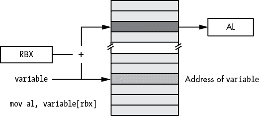    Figure 3-11: Base address form of indirect-plus-offset addressing mode      Although the small address forms (`LARGEADDRESSAWARE:NO`) are convenient and efficient, they can fail spectacularly if your program ever uses more than 2GB of memory. Should your programs ever grow beyond that point, you will have to completely rewrite every instruction that uses one of these addresses (that uses a global data object as the base address rather than loading the base address into a register). This can be very painful and error prone. Think twice before ever using the `LARGEADDRESSAWARE:NO` option.  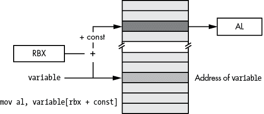    Figure 3-12: Small address plus constant form of indirect-plus-offset addressing mode    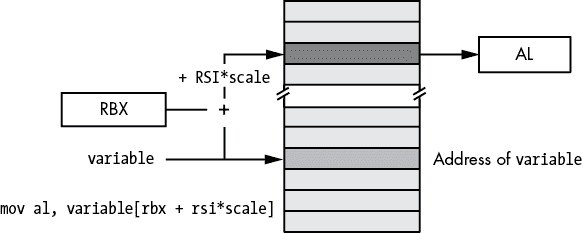    Figure 3-13: Small address form of base-plus-scaled-indexed addressing mode    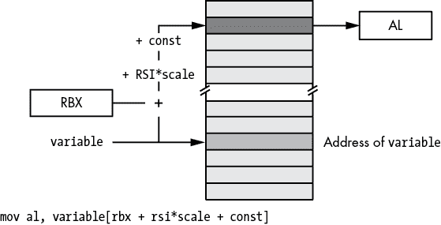    Figure 3-14: Small address form of base-plus-scaled-indexed-plus-constant addressing mode    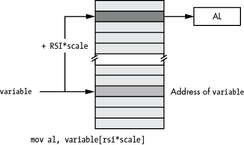    Figure 3-15: Small address form of scaled-indexed addressing mode    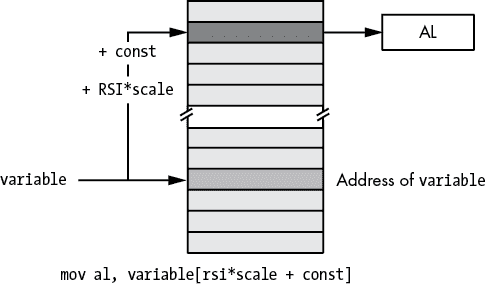    Figure 3-16: Small address form of scaled-indexed-plus-constant addressing mode      ## 3.8 Address Expressions    Often, when accessing variables and other objects in memory, we need to access memory locations immediately before or after a variable rather than the memory at the address specified by the variable. For example, when accessing an element of an array or a field of a structure/record, the exact element or field is probably not at the address of the variable itself. Address expressions provide a mechanism to attach an arithmetic expression to an address to access memory around a variable’s address.    This book considers an *address expression* to be any legal x86-64 addressing mode that includes a displacement (that is, variable name) or an offset. For example, the following are legal address expressions:    ``` [`reg`[64] + `offset`] [`reg`[64] + `reg_not_RSP`[64] * `scale` + `offset`] ```    Consider the following legal MASM syntax for a memory address, which isn’t actually a new addressing mode but simply an extension of the PC-relative addressing mode:    ``` `variable_name`[`offset`] ```    This extended form computes its effective address by adding the constant offset within the brackets to the variable’s address. For example, the instruction `mov al, Address[3]` loads the AL register with the byte in memory that is 3 bytes beyond the `Address` object (see Figure 3-17).    The `offset` value in these examples must be a constant. If `index` is an `int32` variable, then `variable``[``index``]` is not a legal address expression. If you wish to specify an index that varies at runtime, you must use one of the indirect or scaled-indexed addressing modes.    Another important thing to remember is that the offset in `Address``[``offset``]` is a byte address. Although this syntax is reminiscent of array indexing in a high-level language like C/C++ or Java, this does not properly index into an array of objects unless `Address` is an array of bytes.  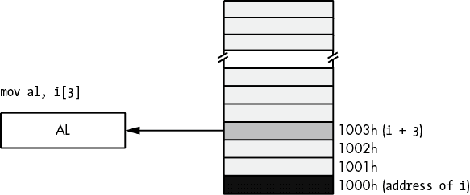    Figure 3-17: Using an address expression to access data beyond a variable      Until this point, the offset in all the addressing mode examples has always been a single numeric constant. However, MASM also allows a *constant expression* anywhere an offset is legal. A constant expression consists of one or more constant terms manipulated by operators such as addition, subtraction, multiplication, division, modulo, and a wide variety of others. Most address expressions, however, will involve only addition, subtraction, multiplication, and sometimes division. Consider the following example:    ``` mov al, X[2*4 + 1] ```    This instruction will move the byte at address `X + 9` into the AL register.    The value of an address expression is always computed at compile time, never while the program is running. When MASM encounters the preceding instruction, it calculates 2 × 4 + 1 on the spot and adds this result to the base address of `X` in memory. MASM encodes this single sum (base address of `X` plus 9) as part of the instruction; MASM does not emit extra instructions to compute this sum for you at runtime (which is good, because doing so would be less efficient). Because MASM computes the value of address expressions at compile time, all components of the expression must be constants because MASM cannot know the runtime value of a variable while it is compiling the program.    Address expressions are useful for accessing the data in memory beyond a variable, particularly when you’ve used the `byte`, `word`, `dword`, and so on, statements in a `.data` or `.const` section to tack on additional bytes after a data declaration. For example, consider the program in Listing 3-1 that uses address expressions to access the four consecutive bytes associated with variable `i`.    ``` ; Listing 3-1   ; Demonstrate address expressions.          option  casemap:none  nl      =       10  ; ASCII code for newline                  .const ttlStr          byte    'Listing 3-1', 0 fmtStr1         byte    'i[0]=%d ', 0 fmtStr2         byte    'i[1]=%d ', 0 fmtStr3         byte    'i[2]=%d ', 0 fmtStr4         byte    'i[3]=%d',nl, 0          .data i       byte    0, 1, 2, 3          .code         externdef printf:proc  ; Return program title to C++ program:           public getTitle getTitle proc          lea rax, ttlStr          ret getTitle endp  ; Here is the "asmMain" function.          public  asmMain asmMain proc         push    rbx                             ; "Magic" instruction offered without ; explanation at this point:          sub     rsp, 48          lea     rcx, fmtStr1         movzx   rdx, i[0]         call    printf          lea     rcx, fmtStr2         movzx   rdx, i[1]         call    printf          lea     rcx, fmtStr3         movzx   rdx, i[2]         call    printf          lea     rcx, fmtStr4         movzx   rdx, i[3]         call    printf          add     rsp, 48         pop     rbx         ret     ; Returns to caller asmMain endp         end ```    Listing 3-1: Demonstration of address expressions    Here’s the output from the program:    ``` C:\>**build listing3-1**  C:\>**echo off**  Assembling: listing3-1.asm c.cpp  C:\>**listing3-1** Calling Listing 3-1: i[0]=0 i[1]=1 i[2]=2 i[3]=3 Listing 3-1 terminated ```    The program in Listing 3-1 displays the four values `0`, `1`, `2`, and `3` as though they were array elements. This is because the value at the address of `i` is `0`. The address expression `i[1]` tells MASM to fetch the byte appearing at `i`’s address plus 1\. This is the value `1`, because the `byte` statement in this program emits the value `1` to the `.data` segment immediately after the value `0`. Likewise for `i[2]` and `i[3]`, this program displays the values `2` and `3`.    Note that MASM also provides a special operator, `this`, that returns the current location counter (current position) within a section. You can use the `this` operator to represent the address of the current instruction in an address expression. See “Constant Expressions” in Chapter 4 for more details.    ## 3.9 The Stack Segment and the push and pop Instructions    The x86-64 maintains the stack in the `stack` segment of memory. The *stack* is a dynamic data structure that grows and shrinks according to certain needs of the program. The stack also stores important information about the program, including local variables, subroutine information, and temporary data.    The x86-64 controls its stack via the RSP (stack pointer) register. When your program begins execution, the operating system initializes RSP with the address of the last memory location in the `stack` memory segment. Data is written to the `stack` segment by “pushing” data onto the stack and “popping” data off the stack.    ### 3.9.1 The Basic push Instruction    Here’s the syntax for the x86-64 `push` instruction:    ``` push  `reg`[16] push  `reg`[64] push  `memory`[16] push  `memory`[64] pushw `constant`[16] push  `constant`[32]  ; Sign extends `constant`[32] to 64 bits ```    These six forms allow you to push 16-bit or 64-bit registers, 16-bit or 64-bit memory locations, and 16-bit or 64-bit constants, but not 32-bit registers, memory locations, or constants.    The `push` instruction does the following:    ``` RSP   := RSP - `size_of_register_or_memory_operand` (2 or 8) [RSP] := `operand's_value` ```    For example, assuming that RSP contains 00FF_FFFCh, the instruction `push rax` will set RSP to 00FF_FFE4h and store the current value of RAX into memory location 00FF_FFE04, as Figures 3-18 and 3-19 show.  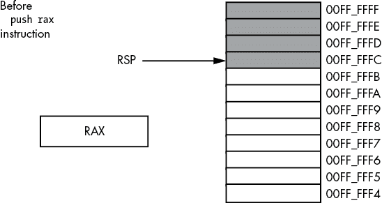    Figure 3-18: Stack segment before the `push rax` operation    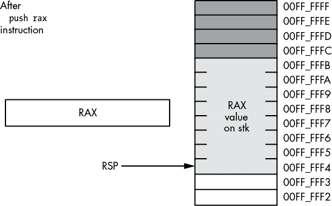    Figure 3-19: Stack segment after the `push rax` operation      Although the x86-64 supports 16-bit push operations, their primary use is in 16-bit environments such as Microsoft Disk Operating System (MS-DOS). For maximum performance, the stack pointer’s value should always be a multiple of eight; indeed, your program may malfunction under a 64-bit OS if RSP contains a value that is not a multiple of eight. The only practical reason for pushing fewer than 8 bytes at a time on the stack is to build up a quad word via four successive word pushes.    ### 3.9.2 The Basic pop Instruction    To retrieve data you’ve pushed onto the stack, you use the `pop` instruction. The basic `pop` instruction allows the following forms:    ``` pop `reg`[16] pop `reg`[64] pop `memory`[16] pop `memory`[64] ```    Like the `push` instruction, the `pop` instruction supports only 16-bit and 64-bit operands; you cannot pop an 8-bit or 32-bit value from the stack. As with the `push` instruction, you should avoid popping 16-bit values (unless you do four 16-bit pops in a row) because 16-bit pops may leave the RSP register containing a value that is not a multiple of eight. One major difference between `push` and `pop` is that you cannot pop a constant value (which makes sense, because the operand for `push` is a source operand, while the operand for `pop` is a destination operand).    Formally, here’s what the `pop` instruction does:    ``` `operand` := [RSP] RSP     := RSP + `size_of_operand` (2 or 8) ```    As you can see, the `pop` operation is the converse of the `push` operation. Note that the `pop` instruction copies the data from memory location `[RSP]` before adjusting the value in RSP. See Figures 3-20 and 3-21 for details on this operation.  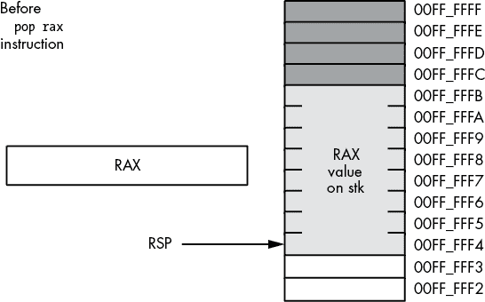    Figure 3-20: Memory before a `pop rax` operation    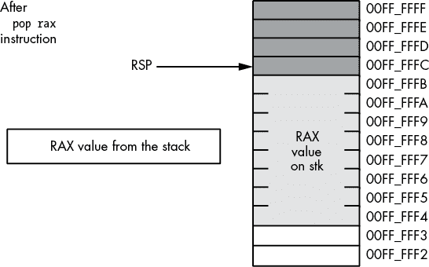    Figure 3-21: Memory after the `pop rax` operation      The value popped from the stack is still present in memory. Popping a value does not erase the value in memory; it just adjusts the stack pointer so that it points at the next value above the popped value. However, you should never attempt to access a value you’ve popped off the stack. The next time something is pushed onto the stack, the popped value will be obliterated. Because your code isn’t the only thing that uses the stack (for example, the operating system uses the stack, as do subroutines), you cannot rely on data remaining in stack memory once you’ve popped it off the stack.    ### 3.9.3 Preserving Registers with the push and pop Instructions    Perhaps the most common use of the `push` and `pop` instructions is to save register values during intermediate calculations. Because registers are the best place to hold temporary values, and registers are also needed for the various addressing modes, it is easy to run out of registers when writing code that performs complex calculations. The `push` and `pop` instructions can come to your rescue when this happens.    Consider the following program outline:    ```  `Some instructions that use the RAX register`   `Some instructions that need to use RAX, for a`  `different purpose than the above instructions`   `Some instructions that need the original value in RAX` ```    The `push` and `pop` instructions are perfect for this situation. By inserting a `push` instruction before the middle sequence and a `pop` instruction after the middle sequence, you can preserve the value in RAX across those calculations:    ```  `Some instructions that use the RAX register`       push rax   `Some instructions that need to use RAX, for a`  `different purpose than the above instructions`       pop rax   `Some instructions that need the original value in RAX` ```    This `push` instruction copies the data computed in the first sequence of instructions onto the stack. Now the middle sequence of instructions can use RAX for any purpose it chooses. After the middle sequence of instructions finishes, the `pop` instruction restores the value in RAX so the last sequence of instructions can use the original value in RAX.    ## 3.10 The Stack Is a LIFO Data Structure    You can push more than one value onto the stack without first popping previous values off the stack. However, the stack is a *last-in, first-out (**LIFO)* data structure, so you must be careful how you push and pop multiple values. For example, suppose you want to preserve RAX and RBX across a block of instructions; the following code demonstrates the obvious way to handle this:    ``` push rax push rbx  `Code that uses RAX and RBX goes here` pop rax pop rbx ```    Unfortunately, this code will not work properly! Figures 3-22 through 3-25 show the problem. Because this code pushes RAX first and RBX second, the stack pointer is left pointing at RBX’s value on the stack. When the `pop rax` instruction comes along, it removes the value that was originally in RBX from the stack and places it in RAX! Likewise, the `pop rbx` instruction pops the value that was originally in RAX into the RBX register. The result is that this code manages to swap the values in the registers by popping them in the same order that it pushes them.  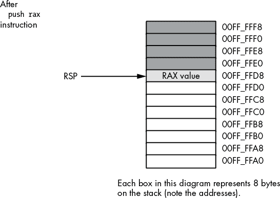    Figure 3-22: Stack after pushing RAX      To rectify this problem, you must note that the stack is a LIFO data structure, so the first thing you must pop is the last thing you push onto the stack. Therefore, you must always observe the following maxim: *always pop values in the reverse order that you push them.*    The correction to the previous code is shown here:    ``` push rax push rbx  `Code that uses RAX and RBX goes here` pop rbx pop rax ```  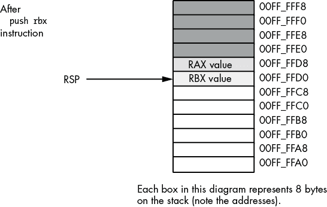    Figure 3-23: Stack after pushing RBX    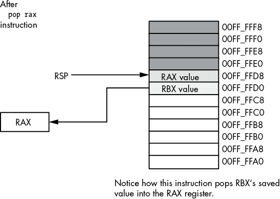    Figure 3-24: Stack after popping RAX      Another important maxim to remember is this: *always pop exactly the same number of bytes that you push.* This generally means that the number of pushes and pops must exactly agree. If you have too few pops, you will leave data on the stack, which may confuse the running program. If you have too many pops, you will accidentally remove previously pushed data, often with disastrous results.    A corollary to the preceding maxim is *be careful when pushing and popping data within a loop.* Often it is quite easy to put the pushes in a loop and leave the pops outside the loop (or vice versa), creating an inconsistent stack. Remember, it is the execution of the `push` and `pop` instructions that matters, not the number of `push` and `pop` instructions that appear in your program. At runtime, the number (and order) of the `push` instructions the program executes must match the number (and reverse order) of the `pop` instructions.  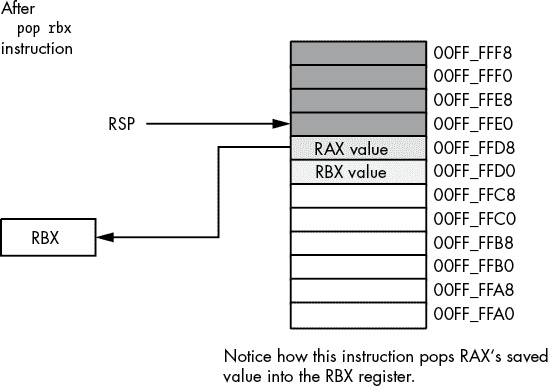    Figure 3-25: Stack after popping RBX      One final thing to note: *the Microsoft ABI requires the stack to be aligned on a 16-byte boundary.* If you push and pop items on the stack, make sure that the stack is aligned on a 16-byte boundary before calling any functions or procedures that adhere to the Microsoft ABI (and require the stack to be aligned on a 16-byte boundary).    ## 3.11 Other push and pop Instructions    The x86-64 provides four additional `push` and `pop` instructions in addition to the basic ones:    1.  `pushf` `popf` 2.  `pushfq` `popfq`    The `pushf`, `pushfq`, `popf`, and `popfq` instructions push and pop the RFLAGS register. These instructions allow you to preserve condition code and other flag settings across the execution of a sequence of instructions. Unfortunately, unless you go to a lot of trouble, it is difficult to preserve individual flags. When using the `pushf(q)` and `popf(q)` instructions, it’s an all-or-nothing proposition: you preserve all the flags when you push them; you restore all the flags when you pop them.    You should really use the `pushfq` and `popfq` instructions to push the full 64-bit version of the RFLAGS register (rather than pushing only the 16-bit FLAGs portion). Although the extra 48 bits you push and pop are essentially ignored when writing applications, you still want to keep the stack aligned by pushing and popping only quad words.    ## 3.12 Removing Data from the Stack Without Popping It    Quite often you may discover that you’ve pushed data onto the stack that you no longer need. Although you could pop the data into an unused register or memory location, there is an easier way to remove unwanted data from the stack—simply adjust the value in the RSP register to skip over the unwanted data on the stack.    Consider the following dilemma (in pseudocode, not actual assembly language):    ``` push rax push rbx   `Some code that winds up computing some values we want to keep`  `in RAX and RBX`  if(`Calculation_was_performed`) then      ; Whoops, we don't want to pop RAX and RBX!     ; What to do here?  else      ; No calculation, so restore RAX, RBX.      pop rbx     pop rax  endif; ```    Within the `then` section of the `if` statement, this code wants to remove the old values of RAX and RBX without otherwise affecting any registers or memory locations. How can we do this?    Because the RSP register contains the memory address of the item on the top of the stack, we can remove the item from the top of the stack by adding the size of that item to the RSP register. In the preceding example, we wanted to remove two quad-word items from the top of the stack. We can easily accomplish this by adding 16 to the stack pointer (see Figures 3-26 and 3-27 for the details):    ``` push rax push rbx   `Some code that winds up computing some values we want to keep`  `in RAX and RBX`  if(`Calculation_was_performed`) then      ; Remove unneeded RAX/RBX values     ; from the stack.      add rsp, 16  else   ; No calculation, so restore RAX, RBX.      pop rbx     pop rax  endif; ```  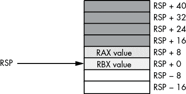    Figure 3-26: Removing data from the stack, before `add rsp, 16`    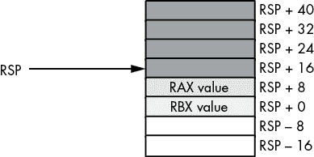    Figure 3-27: Removing data from the stack, after `add rsp, 16`      Effectively, this code pops the data off the stack without moving it anywhere. Also note that this code is faster than two dummy `pop` instructions because it can remove any number of bytes from the stack with a single `add` instruction.    ## 3.13 Accessing Data You’ve Pushed onto the Stack Without Popping It    Once in a while, you will push data onto the stack and will want to get a copy of that data’s value, or perhaps you will want to change that data’s value without actually popping the data off the stack (that is, you wish to pop the data off the stack at a later time). The x86-64 `[``reg`64 `±` `offset``]` addressing mode provides the mechanism for this.    Consider the stack after the execution of the following two instructions (see Figure 3-28):    ``` push rax push rbx ```  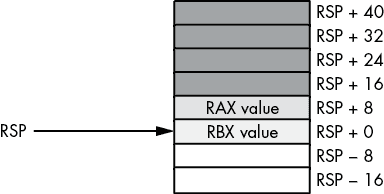    Figure 3-28: Stack after pushing RAX and RBX      If you wanted to access the original RBX value without removing it from the stack, you could cheat and pop the value and then immediately push it again. Suppose, however, that you wish to access RAX’s old value or another value even further up the stack. Popping all the intermediate values and then pushing them back onto the stack is problematic at best, impossible at worst. However, as you will notice from Figure 3-28, each value pushed on the stack is at a certain offset from the RSP register in memory. Therefore, we can use the `[rsp ±` `offset``]` addressing mode to gain direct access to the value we are interested in. In the preceding example, you can reload RAX with its original value by using this single instruction:    ``` mov rax, [rsp + 8] ```    This code copies the 8 bytes starting at memory address `rsp + 8` into the RAX register. This value just happens to be the previous value of RAX that was pushed onto the stack. You can use this same technique to access other data values you’ve pushed onto the stack.    The previous section pointed out how to remove data from the stack by adding a constant to the RSP register. That pseudocode example could probably be written more safely as this:    ``` push rax push rbx   `Some code that winds up computing some values we want to keep`  `in RAX and RBX`  if(`Calculation_was_performed`) then    `Overwrite saved values on stack with`  `new RAX/RBX values (so the pops that`  `follow won't change the values in RAX/RBX)`       mov [rsp + 8], rax      mov [rsp], rbx  endif pop rbx pop rax ```    In this code sequence, the calculated result was stored over the top of the values saved on the stack. Later, when the program pops the values, it loads these calculated values into RAX and RBX.    ## 3.14 Microsoft ABI Notes    About the only feature this chapter introduces that affects the Microsoft ABI is data alignment. As a general rule, the Microsoft ABI requires all data to be aligned on a natural boundary for that data object. A *natural boundary* is an address that is a multiple of the object’s size (up to 16 bytes). Therefore, if you intend to pass a word/sword, dword/sdword, or qword/sqword value to a C++ procedure, you should attempt to align that object on a 2-, 4-, or 8-byte boundary, respectively.    When calling code written in a Microsoft ABI–aware language, you must ensure that the stack is aligned on a 16-byte boundary before issuing a `call` instruction. This can severely limit the usefulness of the `push` and `pop` instructions. If you use the `push` instructions to save a register’s value prior to a call, you must make sure you push two (64-bit) values, or otherwise make sure the RSP address is a multiple of 16 bytes, prior to making the call. Chapter 5 explores this issue in greater detail.    ## 3.15 For More Information    An older, 16-bit version of my book *The Art of Assembly Language Programming* can be found at [`artofasm.randallhyde.com/`](https://artofasm.randallhyde.com/). In that text, you will find information about the 8086 16-bit addressing modes and segmentation. The published edition of that book (No Starch Press, 2010) covers the 32-bit addressing modes. Of course, the Intel x86 documentation (found at [`www.intel.com/`](http://www.intel.com/)) provides complete information on x86-64 address modes and machine instruction encoding.    ## 3.16 Test Yourself    1.  The PC-relative addressing mode indexes off which 64-bit register? 2.  What does *opcode* stand for? 3.  What type of data is the PC-relative addressing mode typically used for? 4.  What is the address range of the PC-relative addressing mode? 5.  In a register-indirect addressing mode, what does the register contain? 6.  Which of the following registers is valid for use with the register-indirect addressing mode?     1.  AL     2.  AX     3.  EAX     4.  RAX 7.  What instruction would you normally use to load the address of a memory object into a register? 8.  What is an effective address? 9.  What scaling values are legal with the scaled-indexed addressing mode? 10.  What is the memory limitation on a `LARGEADDRESSAWARE:NO` application? 11.  What is the advantage of using the `LARGEADDRESSAWARE:NO` option when compiling a program? 12.  What is the difference between the `.data` section and the `.data?` section? 13.  Which (standard MASM) memory sections are read-only? 14.  Which (standard MASM) memory sections are readable and writable? 15.  What is the location counter? 16.  Explain how to use the `label` directive to coerce data to a different type. 17.  Explain what happens if two (or more) `.data` sections appear in a MASM source file. 18.  How would you align a variable in the `.data` section to an 8-byte boundary? 19.  What does *MMU* stand for? 20.  If `b` is a byte variable in read/write memory, explain how a `mov ax, b` instruction could cause a general protection fault. 21.  What is an address expression? 22.  What is the purpose of the MASM PTR operator? 23.  What is the difference between a big-endian value and a little-endian value? 24.  If AX contains a big-endian value, what instruction could you use to convert it to a little-endian value? 25.  If EAX contains a little-endian value, what instruction could you use to convert it to a big-endian value? 26.  If RAX contains a big-endian value, what instruction could you use to convert it to a little-endian value? 27.  Explain, step by step, what the `push rax` instruction does. 28.  Explain, step by step, what the `pop rax` instruction does. 29.  When using the `push` and `pop` instructions to preserve registers, you must always pop the registers in the order that you pushed them. 30.  What does *LIFO* stand for? 31.  How do you access data on the stack without using the `push` and `pop` instructions? 32.  How can pushing RAX onto the stack before calling a Windows ABI–compatible function create problems?````
