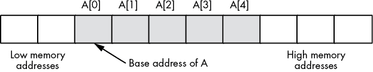
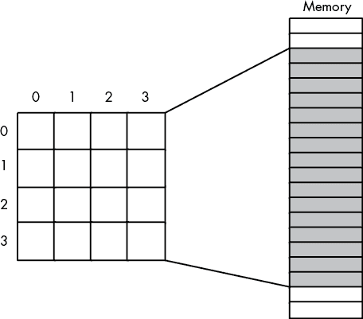
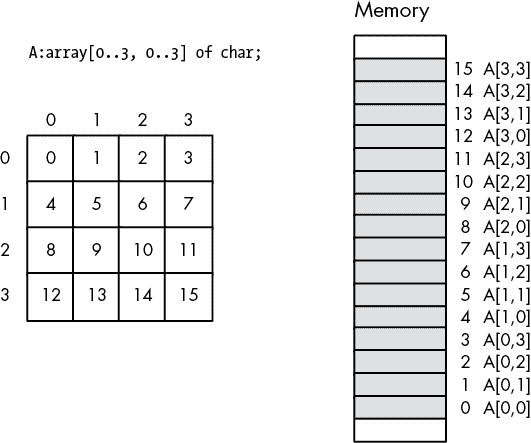
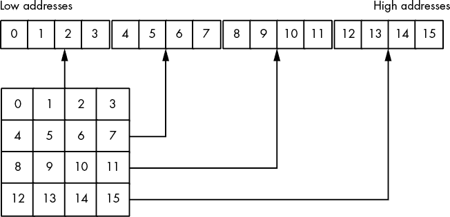
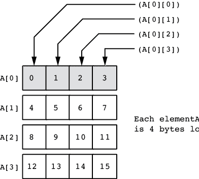
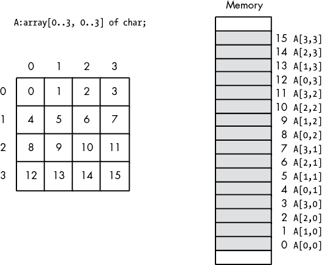
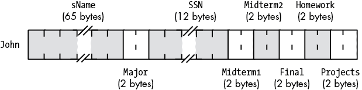
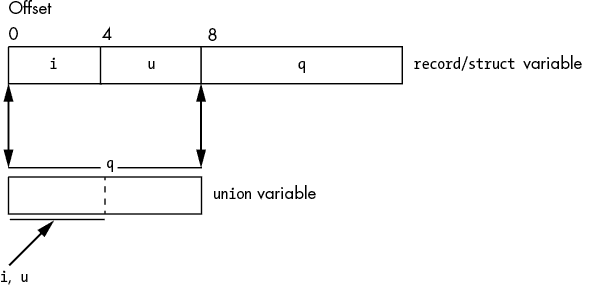

# 第四章：常量、变量和数据类型


第二章讨论了内存中数据的基本格式。第三章介绍了计算机系统如何在物理上组织这些数据。本章通过将 *数据表示* 概念与其实际的物理表示相连接，完成了这一讨论。如标题所示，本章主要涉及三个主题：常量、变量和数据结构。我并不假设你有数据结构的正式课程经验，尽管这样的经验会很有帮助。

本章讨论了如何声明和使用常量、标量变量、整数、数据类型、指针、数组、记录/结构体以及联合体。在进入下一章之前，你必须掌握这些内容。特别是，声明和访问数组似乎是初学汇编语言的程序员常遇到的各种问题。然而，本书其余部分依赖于你对这些数据结构及其内存表示的理解。不要试图跳过这部分内容，期望以后需要时再去学。你将马上用到这些知识，而试图在学习后续内容时再掌握这部分知识只会让你更加困惑。

## 4.1 `imul` 指令

本章介绍了数组和其他概念，这些概念将要求你扩展对 x86-64 指令集的理解。特别是，你需要学习如何将两个值相乘；因此，本节将讲解 `imul`（*整数乘法*）指令。

`imul` 指令有几种形式。本节不会覆盖所有形式，只讨论那些对于数组计算有用的形式（其余 `imul` 指令请参见第六章的“算术表达式”）。目前关注的 `imul` 变体如下：

```
; The following computes `destreg` = `destreg` * `constant`:

imul `destreg`[16], `constant`
imul `destreg`[32], `constant`
imul `destreg`[64], `constant`[32]

; The following computes `dest` = `src` * `constant`:

imul `destreg`[16], `srcreg`[16], `constant`
imul `destreg`[16], `srcmem`[16], `constant`

imul destreg[32], srcreg[32], `constant`
imul destreg[32], srcmem[32], `constant`

imul `destreg`[64], `srcreg`[64], `constant`[32]
imul `destreg`[64], `srcmem`[64], `constant`[32]

; The following computes `dest` = `destreg` * `src`:

imul `destreg`[16], `srcreg`[16]
imul `destreg`[16], `srcmem`[16]
imul `destreg`[32], `srcreg`[32]
imul `destreg`[32], `srcmem`[32]
imul `destreg`[64], `srcreg`[64]
imul `destreg`[64], `srcmem`[64]
```

请注意，`imul` 指令的语法与 `add` 和 `sub` 指令不同。特别是，目标操作数必须是寄存器（`add` 和 `sub` 都允许将内存操作数作为目标）。另外，`imul` 在最后一个操作数为常量时支持三个操作数。另一个重要的区别是，`imul` 指令只支持 16 位、32 位和 64 位操作数；它不支持 8 位操作数。最后，与大多数支持立即寻址模式的指令一样，CPU 限制常量大小为 32 位。对于 64 位操作数，x86-64 会将 32 位立即数扩展为 64 位。

`imul` 计算指定操作数的乘积，并将结果存储到目标寄存器中。如果发生溢出（因为 `imul` 只进行带符号整数值的乘法，所以溢出总是带符号溢出），该指令将同时设置进位标志和溢出标志。`imul` 不会改变其他条件码标志（例如，执行 `imul` 后，你不能有意义地检查符号标志或零标志）。

## 4.2 `inc` 和 `dec` 指令

正如到目前为止的几个例子所示，对寄存器或内存位置加 1 或减 1 是非常常见的操作。事实上，这些操作如此常见，以至于英特尔的工程师们专门设计了一对指令来执行这些特定的操作：`inc`（*增量*）和`dec`（*减量*）。

`inc`和`dec`指令使用以下语法：

```
inc `mem`/`reg`
dec `mem`/`reg`
```

单一操作数可以是任何合法的 8 位、16 位、32 位或 64 位寄存器或内存操作数。`inc`指令会对指定的操作数加 1，`dec`指令会对指定的操作数减 1。

这两条指令比对应的`add`或`sub`指令稍微短一些（它们的编码使用了更少的字节）。这两条指令与对应的`add`或`sub`指令之间还有一个细微的区别：它们不会影响进位标志。

## 4.3 MASM 常量声明

MASM 提供了三种指令，让你在汇编语言程序中定义常量。^(1) 总的来说，这三种指令被称为*equates*。你已经看过最常见的形式：

```
`symbol` = `constant_expression`
```

例如：

```
MaxIndex = 15
```

一旦你以这种方式声明了一个符号常量，你可以在任何对应的文字常量合法的地方使用该符号标识符。这些常量被称为*manifest* *constants*——符号表示，它们允许你在程序的任何地方将文字值替换为符号。

将其与`.const`变量进行对比；`.const`变量当然是一个常量，因为你无法在运行时更改其值。然而，`.const`变量与一个内存位置相关联；操作系统，而非 MASM 编译器，强制执行只读属性。尽管在程序运行时确实会崩溃，但像`mov ReadOnlyVar, eax`这样的指令是完全合法的。另一方面，写`mov MaxIndex, eax`（使用前面的声明）就像写`mov 15, eax`一样不合法。事实上，这两个语句是等价的，因为编译器在遇到这个常量时，会将`MaxIndex`替换为`15`。

常量声明非常适合定义在程序修改期间可能会变化的“魔法”数字。书中的大部分示例都使用了像`nl`（*换行符*）、`maxLen`和`NULL`这样的常量。

除了`=`指令外，MASM 还提供了`equ`指令：

```
`symbol` equ `constant_expression`
```

除了一些例外，这两个`equate`指令做的事情是一样的：它们定义了一个常量，MASM 将在源文件中每次遇到`symbol`时用`constant_expression`的值替代它。

这两者之间的第一个区别是 MASM 允许你重新定义使用`=`指令的符号。考虑以下代码片段：

```
maxSize  = 100

`Code that uses maxSize, expecting it to be 100`

maxSize  = 256

`Code that uses maxSize, expecting it to be 256`
```

你可能会质疑*常量*这个术语，因为在这个例子中，`maxSize`的值在源文件的多个点上发生了变化。然而，请注意，尽管`maxSize`的值在汇编过程中会变化，但在运行时，特定的字面常量（在这个例子中为 100 或 256）是永远不会改变的。

你无法重新定义通过`equ`指令声明的常量的值（无论是在运行时还是汇编时）。任何重新定义`equ`符号的尝试都会导致 MASM 的符号重定义错误。因此，如果你想防止在源文件中意外重新定义常量符号，应该使用`equ`指令，而不是`=`指令。

`=`和`equ`指令之间的另一个区别是，通过`=`定义的常量必须能表示为 64 位（或更小）整数。短字符字符串作为`=`操作数是合法的，但前提是它们的长度不超过八个字符（即适合 64 位值）。使用`equ`的等式则没有这种限制。

最终，`=`和`equ`之间的区别在于，`=`指令计算一个数值表达式的值并将该值保存下来，替代程序中出现该符号的位置。如果`equ`指令的操作数可以被简化为一个数值，它将以相同的方式工作。然而，如果`equ`操作数无法转换为数值，`equ`指令将把它的操作数保存为文本数据，并在符号位置替换为该文本数据。

由于数值/文本处理，`equ`偶尔会对其操作数感到困惑。考虑以下例子：

```
SomeStr  equ   "abcdefgh"
          .
          .
          .
memStr   byte  SomeStr
```

MASM 将报告错误（`initializer magnitude too large for specified size`或类似的错误），因为由八个字符`abcdefgh`构成的 64 位值将无法适配一个字节变量。然而，如果我们给字符串添加一个字符，MASM 将很乐意接受：

```
SomeStr  equ   "abcdefghi"
          .
          .
          .
memStr   byte  SomeStr
```

这两个例子之间的区别在于，在第一个例子中，MASM 决定它可以将字符串表示为 64 位整数，因此常量是一个四字常量，而不是字符字符串。在第二个例子中，MASM 无法将字符字符串表示为整数，因此它将操作数视为文本操作数，而不是数值操作数。当 MASM 在第二个例子中对`memStr`进行文本替换为`abcdefghi`时，MASM 能够正确地汇编代码，因为字符串是`byte`指令的完全合法操作数。

假设你真的希望 MASM 将八个或更少字符的字符串当作字符串而不是整数值来处理，那么有两种解决方案。第一种是将操作数用*文本定界符*括起来。MASM 在`equ`操作数字段中使用符号`<`和`>`作为文本定界符。因此，你可以使用以下代码来解决这个问题：

```
SomeStr  equ   <"abcdefgh">
          .
          .
          .
memStr   byte  SomeStr
```

由于 `equ` 指令的操作数有时可能会有些模糊，微软引入了第三种等式指令 `textequ`，用于在你想创建文本等式时使用。以下是使用文本等式的当前示例：

```
SomeStr  textequ   <"abcdefgh">
          .
          .
          .
memStr   byte      SomeStr
```

请注意，`textequ` 操作数必须始终使用文本定界符（`<` 和 `>`）在操作数字段中。

每当 MASM 在源文件中遇到用文本指令定义的符号时，它会立即将与该指令关联的文本替换为标识符。这与 C/C++ 中的 `#define` 宏有些相似（不过你无法指定任何参数）。考虑以下示例：

```
maxCnt  =       10
max     textequ <maxCnt>
max     =       max+1
```

MASM 会在整个程序中将 `maxCnt` 替换为 `max`（在 `textequ` 声明 `max` 后）。在此示例的第三行，这个替换结果是：

```
maxCnt  =       maxCnt+1
```

在程序的后续部分，MASM 会在每次遇到符号 `maxCnt` 时将其替换为 `11`。以后每次 MASM 遇到 `max`，它都会替换为 `maxCnt`，然后再将 `maxCnt` 替换为 `11`。

你甚至可以使用 MASM 文本等式做类似下面的操作：

```
mv    textequ  <mov>
        .
        .
        .
       mv      rax,0
```

MASM 会将 `mv` 替换为 `mov`，并将此序列中的最后一条语句编译成 `mov` 指令。大多数人会认为这是对汇编语言编程风格的巨大违反，但它是完全合法的。

### 4.3.1 常量表达式

到目前为止，本章给人的印象是，符号常量定义由标识符、可选的类型和字面常量组成。实际上，MASM 常量声明可能比这复杂得多，因为 MASM 允许将常量表达式（而不仅仅是字面常量）赋值给符号常量。通用常量声明有以下两种形式：

```
`identifier` =   `constant_expression`
`identifier` equ `constant_expression`
```

常量（整数）表达式采用你在 C/C++ 和 Python 等高级语言中习惯的形式。它们可以包含字面常量值、先前声明的符号常量以及各种算术运算符。

常量表达式运算符遵循标准的优先级规则（类似于 C/C++ 中的规则）；如果需要，可以使用括号来覆盖优先级。通常，如果优先级不明显，请使用括号明确指定评估顺序。表 4-1 列出了 MASM 允许在常量（和地址）表达式中使用的算术运算符。

表 4-1：常量表达式中允许的运算

| **算术运算符** |
| --- |
| `-`（一元取反） | 对紧随其后的表达式进行取反操作。 |
| `*` | 对星号两侧的整数或实数值进行乘法运算。 |
| `/` | 将左侧整数操作数除以右侧整数操作数，得到一个整数（截断）结果。 |
| `mod` | 将左侧整数操作数除以右侧整数操作数，产生一个整数余数。 |
| `/` | 将左侧数字操作数除以第二个数字操作数，得到一个浮点数结果。 |
| `+` | 将左右数字操作数相加。 |
| `-` | 从左侧数字操作数中减去右侧数字操作数。 |
| `[]` | `expr`1`[``expr`2`]`计算`expr`1 + `expr`2 的和。 |
| **比较运算符** |
| `EQ` | 比较左操作数与右操作数。如果相等，则返回真。* |
| `NE` | 比较左操作数与右操作数。如果不相等，则返回真。 |
| `LT` | 如果左操作数小于右操作数，则返回真。 |
| `LE` | 如果左操作数小于等于右操作数，则返回真。 |
| `GT` | 如果左操作数大于右操作数，则返回真。 |
| `GE` | 如果左操作数大于等于右操作数，则返回真。 |
| **逻辑运算符** |
| `AND` | 对布尔操作数，返回两操作数的逻辑与。 |
| `OR` | 对布尔操作数，返回两操作数的逻辑或。 |
| `NOT` | 对布尔操作数，返回逻辑否定（逆）。 |
| **一元运算符** |
| `HIGH` | 返回以下表达式的低 16 位的高字节。 |
| `HIGHWORD` | 返回以下表达式的低 32 位的高字。 |
| `HIGH32` | 返回操作符后面 64 位表达式的高 32 位。 |
| `LENGTHOF` | 返回操作符后面跟随的变量名称的数据元素个数。 |
| `LOW` | 返回操作符后面表达式的低字节。 |
| `LOWWORD` | 返回操作符后面表达式的低字。 |
| `LOW32` | 返回操作符后面表达式的低双字。 |
| `OFFSET` | 返回操作符后面符号在其相应节中的偏移量。 |

| `OPATTR` | 返回操作符后面表达式的属性。属性以位图的形式返回，含义如下：位 0：表达式中有代码标签。

位 1：该表达式是可重定位的。

位 2：该表达式是常量表达式。

位 3：该表达式使用直接寻址。

位 4：该表达式是一个寄存器。

位 5：该表达式不包含未定义符号。

位 6：该表达式是一个栈段内存表达式。

位 7：该表达式引用了一个外部标签。

位 8-11：语言类型（可能 64 位代码的值为 0）。 |

| `SIZE` | 返回符号声明中第一个初始化器的字节大小。 |
| --- | --- |
| `SIZEOF` | 返回为给定符号分配的字节大小。 |
| `THIS` | 返回当前程序计数器在某节内的地址表达式。必须在`this`后加上类型；例如，`this byte`。 |
| `$` | `this`的同义词。 |

### 4.3.2 `this`和`$`运算符

在表 4-1 中，最后两个运算符值得特别提及。`this`和`$`操作数（它们大致是同义词）返回当前所在节的偏移量。当前偏移量被称为*位置计数器*（参见第三章《MASM 如何分配变量内存》）。考虑以下内容：

```
someLabel equ $
```

这将设置标签的偏移量为程序中的当前位置。符号的类型将是 *语句标签*（例如，`proc`）。通常，人们使用 `$` 操作符来处理分支标签（以及高级特性）。例如，以下代码会创建一个无限循环（实际上会锁死 CPU）：

```
jmp $     ; "$" is equivalent to the address of the jmp instr
```

你也可以使用类似这样的指令，在源文件中跳过固定数量的字节（向前或向后）：

```
jmp $+5   ; Skip to a position 5 bytes beyond the jmp
```

大多数情况下，像这样创建操作数是疯狂的，因为它依赖于知道每条机器指令在汇编时编译成的机器码字节数。显然，这是一项高级操作，不建议初学汇编语言的程序员使用（即便是对于大多数高级汇编语言程序员来说，也很难推荐这种做法）。

`$` 操作符的一个实际应用（也许是最常见的用法）是计算源文件中数据声明块的大小：

```
someData     byte 1, 2, 3, 4, 5
sizeSomeData =    $-someData
```

地址表达式 `$-someData` 计算当前偏移量减去当前节中 `someData` 的偏移量。在这个例子中，它会得到 `5`，即 `someData` 操作数字段的字节数。在这个简单的例子中，使用 `sizeof someData` 表达式可能更为合适。它同样返回 `someData` 声明所需的字节数。然而，考虑以下语句：

```
someData     byte 1, 2, 3, 4, 5
             byte 6, 7, 8, 9, 0
sizeSomeData =    $-someData
```

在这种情况下，`sizeof someData` 仍然返回 `5`（因为它只返回附加到 `someData` 的操作数的长度），而 `sizeSomeData` 被设置为 `10`。

如果标识符出现在常量表达式中，那么该标识符必须是你之前在程序中通过 equate 指令定义的常量标识符。你不能在常量表达式中使用变量标识符；因为当 MASM 计算常量表达式时，变量的值在汇编时并未定义。此外，不要混淆编译时操作和运行时操作：

```
; Constant expression, computed while MASM
; is assembling your program:

x     = 5
y     = 6
Sum   = x + y

; Runtime calculation, computed while your program
; is running, long after MASM has assembled it:

     mov al, x
     add al, y
```

`this` 操作符与 `$` 操作符有一个重要区别：`$` 默认类型是语句标签，而 `this` 操作符允许你指定类型。`this` 操作符的语法如下：

```
this `type`
```

其中 `type` 是常见的数据类型之一（如 `byte`、`sbyte`、`word`、`sword` 等）。因此，`this proc` 就是直接等同于 `$` 的操作符。注意，以下两个 MASM 语句是等价的：

```
someLabel label byte
someLabel equ   this byte
```

### 4.3.3 常量表达式计算

MASM 会在汇编时立即解释常量表达式的值。它不会生成任何机器指令来计算前面例子中的常量表达式 `x + y`。相反，它直接计算这两个常量值的和。从那时起，MASM 会将值 `11` 关联到常量 `Sum`，就好像程序包含了语句 `Sum = 11` 而不是 `Sum = x + y`。另一方面，MASM 不会在 `mov` 和 `add` 指令的前面部分预先计算 `11` 的值；它会忠实地生成这两条指令的目标代码，而 x86-64 会在程序运行时（汇编完成后的一段时间）计算它们的和。

通常，常量表达式在汇编语言程序中并不复杂。通常，你是在加法、减法或乘法两个整数值。例如，以下等式集合定义了一组具有连续值的常量：

```
TapeDAT        =  0
Tape8mm        =  TapeDAT + 1
TapeQIC80      =  Tape8mm + 1
TapeTravan     =  TapeQIC80 + 1
TapeDLT        =  TapeTravan + 1
```

这些常量的值如下：`TapeDAT = 0`，`Tape8mm = 1`，`TapeQIC80 = 2`，`TapeTravan = 3`，`TapeDLT = 4`。顺便说一下，这个例子演示了如何在 MASM 中创建一个枚举数据常量列表。

## 4.4 MASM typedef 声明

假设你不喜欢 MASM 用于声明 `byte`、`word`、`dword`、`real4` 和其他变量的名称。假设你更喜欢 Pascal 的命名规则，或者 C 的命名规则。你希望使用像 *integer*、*float*、*double* 之类的术语。如果 MASM 是 Pascal，你可以在程序的 `type` 部分重新定义这些名称。对于 C，你可以使用 `typedef` 语句来完成这项任务。好吧，MASM 像 C/C++ 一样，也有自己的类型声明语句，同样可以让你创建这些名称的别名。MASM 的 `typedef` 语句格式如下：

```
`new_type_name`  typedef  `existing_type_name`
```

以下示例演示了如何在 MASM 程序中设置与 C/C++ 或 Pascal 兼容的名称：

```
integer   typedef  sdword
float     typedef  real4
double    typedef  real8
colors    typedef  byte
```

现在你可以使用更有意义的声明来声明你的变量，比如这些：

```
 .data
i          integer ?
x          float   1.0
HouseColor colors  ?
```

如果你使用 Ada、C/C++ 或 FORTRAN（或任何其他语言），你可以选择你更熟悉的类型名称。当然，这不会改变 x86-64 或 MASM 如何处理这些变量，但它确实让你可以创建更易读、易懂的程序，因为类型名称更能反映实际的底层类型。给 C/C++ 程序员的一个警告：不要过于兴奋去定义一个 `int` 数据类型。不幸的是，`int` 是一个 x86-64 的机器指令（*中断*），因此这是 MASM 中的保留字。

## 4.5 类型强制转换

尽管 MASM 在类型检查方面相对宽松，但 MASM 确保你为指令指定了适当的操作数大小。例如，考虑以下（错误的）程序，在列表 4-1 中。

```
; Listing 4-1

; Type checking errors.

        option  casemap:none

nl      =       10  ; ASCII code for newline

        .data
i8      sbyte   ?
i16     sword   ?
i32     sdword  ?
i64     sqword  ?

        .code

; Here is the "asmMain" function.

        public  asmMain
asmMain proc

 mov     eax, i8
        mov     al, i16
        mov     rax, i32
        mov     ax, i64

        ret     ; Returns to caller
asmMain endp
        end
```

列表 4-1：MASM 类型检查

MASM 会对这四条 `mov` 指令生成错误，因为操作数大小不兼容。`mov` 指令要求两个操作数的大小相同。第一条指令尝试将字节移动到 EAX，第二条指令尝试将字移动到 AL，第三条指令尝试将双字移动到 RAX。第四条指令尝试将四字移动到 AX。当你尝试汇编这个文件时，编译器的输出如下：

```
C:\>**ml64 /c listing4-1.asm**
Microsoft (R) Macro Assembler (x64) Version 14.15.26730.0
Copyright (C) Microsoft Corporation.  All rights reserved.

 Assembling: listing4-1.asm
listing4-1.asm(24) : error A2022:instruction operands must be the same size
listing4-1.asm(25) : error A2022:instruction operands must be the same size
listing4-1.asm(26) : error A2022:instruction operands must be the same size
listing4-1.asm(27) : error A2022:instruction operands must be the same size
```

虽然这是 MASM 中的一个好特性，^(2) 但有时它会造成一些困扰。考虑以下代码片段：

```
 .data
byte_values  label byte
             byte  0, 1

             .
             .
             .

             mov ax, byte_values
```

在这个示例中，假设程序员确实想要将从 `byte_values` 地址开始的字加载到 AX 寄存器中，因为他们想通过一条指令将 AL 置为 0，AH 置为 1（0 存储在 LO 内存字节中，1 存储在 HO 内存字节中）。MASM 会拒绝此操作，报类型不匹配错误（因为 `byte_values` 是字节对象，而 AX 是字对象）。

程序员可以将其分解为两条指令，一条将地址 `byte_values` 处的字节加载到 AL 中，另一条将地址 `byte_values[1]` 处的字节加载到 AH 中。不幸的是，这样的分解会使程序稍微低效一些（这可能正是最初使用单条 `mov` 指令的原因）。为了告诉 MASM 我们知道自己在做什么，并希望将 `byte_values` 变量视为 `word` 对象，我们可以使用类型强制转换。

*类型强制转换* 是告诉 MASM，你希望将一个对象当作一个显式类型来处理，而不管它的实际类型是什么。^(3) 要强制转换变量的类型，你可以使用以下语法：

```
`new_type_name` ptr `address_expression`
```

`new_type_name` 项是你希望与 `address_expression` 指定的内存位置关联的新类型。你可以在任何合法的内存地址处使用此强制转换操作符。为了纠正之前的示例，以避免 MASM 报告类型不匹配错误，你可以使用以下语句：

```
mov ax, word ptr byte_values
```

这条指令告诉 MASM 将 AX 寄存器加载为从内存地址 `byte_values` 开始的字。假设 `byte_values` 仍然包含其初始值，这条指令将把 0 加载到 AL 中，把 1 加载到 AH 中。

表 4-2 列出了所有 MASM 类型强制转换操作符。

表 4-2：MASM 类型强制转换操作符

| **指令** | **含义** |
| --- | --- |
| `byte ptr` | 字节（无符号 8 位）值 |
| `sbyte ptr` | 有符号 8 位整数值 |
| `word ptr` | 无符号 16 位（字）值 |
| `sword ptr` | 有符号 16 位整数值 |
| `dword ptr` | 无符号 32 位（双字）值 |
| `sdword ptr` | 有符号 32 位整数值 |
| `qword ptr` | 无符号 64 位（四字）值 |
| `sqword ptr` | 有符号 64 位整数值 |
| `tbyte ptr` | 无符号 80 位（10 字节）值 |
| `oword ptr` | 128 位（八字）值 |
| `xmmword ptr` | 128 位（八字）值——与 `oword ptr` 相同 |
| `ymmword ptr` | 256 位值（用于 AVX YMM 寄存器） |
| `zmmword ptr` | 512 位值（用于 AVX-512 ZMM 寄存器） |
| `real4 ptr` | 单精度（32 位）浮动点数值 |
| `real8 ptr` | 双精度（64 位）浮动点数值 |
| `real10 ptr` | 扩展精度（80 位）浮动点数值 |

当你将一个匿名变量指定为直接修改内存的指令操作数时（例如，`neg`、`shl`、`not`等），就需要使用类型强制。考虑以下语句：

```
not [rbx]
```

MASM 会在这个指令上生成错误，因为它无法确定内存操作数的大小。该指令没有提供足够的信息来判断程序应该对 RBX 指向的字节、RBX 指向的字（word）、RBX 指向的双字（double word）还是 RBX 指向的四字（quad word）进行位反转。你必须使用类型强制运算符来明确指定这些类型指令中的匿名引用的大小：

```
not byte ptr [rbx]
not dword ptr [rbx]
```

考虑以下语句（其中`byteVar`是一个 8 位变量）：

```
mov dword ptr byteVar, eax
```

如果没有类型强制运算符，MASM 会抱怨这个指令，因为它试图将一个 32 位寄存器存储到一个 8 位内存位置。初学者可能希望他们的程序能够汇编成功，于是可能会走捷径，使用类型强制运算符，如这个指令所示；这当然能让汇编器安静下来——它不再抱怨类型不匹配——因此初学者会很高兴。

然而，程序仍然是错误的；唯一的区别是 MASM 不再警告你关于错误的消息。类型强制运算符并没有解决尝试将一个 32 位的值存储到一个 8 位内存位置的问题——它只是允许指令将一个 32 位的值*从 8 位变量所指定的地址开始*存储。程序仍然存储 4 个字节，覆盖了内存中`byteVar`后面的 3 个字节。

这通常会产生意外的结果，包括程序中变量的虚假修改。^(4) 另一个较少见的情况是，当`byteVar`后面的 3 个字节没有分配到实际内存中，或这些字节恰好位于只读内存区时，程序可能会因一般保护错误而中止。关于类型强制运算符，重要的是要记住这一点：如果你无法准确描述这个运算符的作用，就不要使用它。

同时要记住，类型强制运算符并不会对内存中的数据进行任何转换。它仅仅告诉汇编器将内存中的位视为另一种类型。它不会自动将 8 位值扩展为 32 位，也不会将整数转换为浮动点数值。它只是告诉编译器将内存操作数的位模式视为不同类型。

## 4.6 指针数据类型

你可能已经在 Pascal、C 或 Ada 编程语言中亲自体验过指针，现在你可能开始担心了。当你第一次在高级语言中遇到指针时，几乎每个人都会有不好的经历。放心吧！实际上，在汇编语言中，指针比在高级语言中更容易处理。

此外，你在使用指针时遇到的大多数问题可能与指针本身无关，而是与试图用指针实现的链表和树等数据结构有关。另一方面，指针在汇编语言中的用途远不止与链表、树等可怕的数据结构相关。实际上，像数组和记录这样的简单数据结构，往往也涉及到指针的使用。所以，如果你对指针有深深的恐惧感，那就忘掉你对它们的所有认知吧。你将会学到指针其实是多么强大。

最好的起点可能是指针的定义。*指针*是一个内存位置，其值是另一个内存位置的地址。不幸的是，像 C/C++这样的高级语言往往把指针的简单性隐藏在一层抽象的墙后面。这个额外的复杂性（顺便说一下，这是有充分理由的）往往让程序员感到害怕，因为*他们不理解发生了什么*。

为了揭示发生了什么，考虑以下 Pascal 中的数组声明：

```
M: array [0..1023] of integer;
```

即使你不懂 Pascal，这里的概念也很容易理解。`M`是一个包含 1024 个整数的数组，索引范围从`M[0]`到`M[1023]`。这些数组元素中的每一个都可以保存一个独立的整数值，互不干扰。换句话说，这个数组提供了 1024 个不同的整数变量，每个变量通过数字（数组索引）而非名称来引用。

如果你遇到包含`M[0] := 100;`的程序，你可能根本不需要思考这条语句到底在做什么。它正在把值`100`存入数组`M`的第一个元素。现在考虑以下两条语句：

```
i := 0;      (Assume "i" is an integer variable)
M [i] := 100;
```

你应该毫不犹豫地同意，这两条语句执行的操作与`M[0] := 100;`是相同的。事实上，你可能会同意，你可以使用任何在 0 到 1023 范围内的整数表达式作为该数组的索引。以下语句依然执行与我们对索引 0 的单一赋值相同的操作：

```
i := 5;      (Assume all variables are integers)
j := 10;
k := 50;
m [i*j-k] := 100;
```

“好吧，那有什么意义？”你可能在想。“任何能产生 0 到 1023 范围内整数的东西都是合法的，那又怎样？”好吧，考虑以下内容：

```
M [1] := 0;
M [M [1]] := 100;
```

哇！现在需要一点时间来消化。不过，如果你慢慢理解，这就能明白了，你会发现这两条指令执行的是你一直在做的相同操作。第一条语句将`0`存储到数组元素`M[1]`中。第二条语句获取`M[1]`的值，这个值是一个整数，你可以将它用作数组`M`的索引，并使用该值（`0`）来控制它存储值`100`的位置。

如果你愿意接受这一点作为合理的——或许有点奇怪，但仍然可以使用——那么你将不会对指针产生任何问题。因为`M[1]`是一个指针！嗯，严格来说不是，但如果你把`M`改为*内存*并将这个数组视为整个内存，那么这就是指针的精确定义：一个其值是另一个内存位置的地址（或者如果你愿意说是索引）的内存位置。在汇编语言程序中，指针的声明和使用非常简单。你甚至不需要担心数组索引之类的东西。

### 4.6.1 在汇编语言中使用指针

一个 MASM 指针是一个 64 位值，可以包含另一个变量的地址。如果你有一个 dword 变量`p`，它包含 1000_0000h，那么`p`“指向”内存位置 1000_0000h。要访问`p`指向的 dword，你可以使用如下代码：

```
mov  rbx, p       ; Load RBX with the value of pointer p
mov  rax, [rbx]   ; Fetch the data that p points at
```

通过将`p`的值加载到 RBX 中，这段代码将值 1000_0000h 加载到 RBX 中（假设`p`包含 1000_0000h）。第二条指令将 RAX 寄存器加载为从 RBX 中偏移量所在位置开始的 qword。因为 RBX 现在包含 1000_0000h，所以这将从地址 1000_0000h 到 1000_0007h 加载 RAX。

为什么不直接使用类似`mov rax, mem`的指令从地址 1000_0000h 加载 RAX 呢（假设`mem`在地址 1000_0000h）？嗯，有几个原因。但主要原因是，这个`mov`指令总是从`mem`所在的位置加载 RAX。你不能改变它加载 RAX 的地址。然而，前面的指令总是从`p`指向的位置加载 RAX。这在程序控制下很容易改变。事实上，两个指令`mov rax, offset mem2`和`mov p, rax`会导致这两个指令在下一次执行时从`mem2`加载 RAX。考虑以下代码片段：

```
 mov rax, offset i
    mov p, rax
      .
      .
      .      ; Code that sets or clears the carry flag.

    jc skipSetp

       mov rax, offset j
       mov p, rax
        .
        .
        .

skipSetp:
    mov rbx, p           ; Assume both code paths wind up
    mov rax, [rbx]       ; down here
```

这个简单的示例展示了程序中的两条执行路径。第一条路径将变量`p`加载为变量`i`的地址。第二条路径将`p`加载为变量`j`的地址。两条执行路径最终会汇聚到最后两个`mov`指令，这些指令根据所采取的执行路径将 RAX 加载为`i`或`j`。在许多方面，这类似于高级语言（如 Swift）中的过程参数。执行相同的指令会根据`p`中存储的地址（`i`或`j`）访问不同的变量。

### 4.6.2 在 MASM 中声明指针

由于指针长度为 64 位，你可以使用 `qword` 类型为指针分配存储空间。然而，与其使用 qword 声明，一个更好的方法是使用 `typedef` 创建一个指针类型：

```
 .data
pointer   typedef qword
b         byte    ?
d         dword   ?
pByteVar  pointer b
pDWordVar pointer d
```

这个例子演示了在 MASM 中初始化以及声明指针变量是可能的。请注意，你可以在 `qword/pointer` 指令的操作数字段中指定静态变量（`.data`、`.const` 和 `.data?` 对象）的地址，因此你只能用静态对象的地址来初始化指针变量。

### 4.6.3 指针常量与指针常量表达式

MASM 允许在指针常量合法的任何地方使用非常简单的常量表达式。指针常量表达式有以下三种形式之一：^(5)

```
offset StaticVarName [PureConstantExpression]
offset StaticVarName + PureConstantExpression
offset StaticVarName - PureConstantExpression
```

`PureConstantExpression` 术语指的是不涉及任何指针常量的数字常量表达式。这种类型的表达式产生一个内存地址，该地址是 `StaticVarName` 变量在内存中指定字节数之前或之后（分别是 `-` 或 `+`）的地址。请注意，这里显示的前两种形式在语义上是等效的；两者都返回一个指针常量，其地址是静态变量和常量表达式之和。

由于你可以创建指针常量表达式，发现 MASM 允许通过使用等式定义显式指针常量也就不足为奇了。列表 4-2 中的程序演示了你如何做到这一点。

```
; Listing 4-2

; Pointer constant demonstration.

        option  casemap:none

nl      =       10

        .const
ttlStr  byte    "Listing 4-2", 0
fmtStr  byte    "pb's value is %ph", nl
        byte    "*pb's value is %d", nl, 0

        .data
b       byte    0
        byte    1, 2, 3, 4, 5, 6, 7

pb      textequ <offset b[2]>

        .code
        externdef printf:proc

; Return program title to C++ program:

         public getTitle
getTitle proc
         lea rax, ttlStr
         ret
getTitle endp

; Here is the "asmMain" function.

        public  asmMain
asmMain proc

; "Magic" instruction offered without
; explanation at this point:

        sub     rsp, 48

        lea     rcx, fmtStr
        mov     rdx, pb
        movzx   r8, byte ptr [rdx]
        call    printf

        add     rsp, 48
        ret     ; Returns to caller

asmMain endp
        end
```

列表 4-2：MASM 程序中的指针常量表达式

以下是此代码的汇编和执行：

```
C:\>**build listing4-2**

C:\>**echo off**
 Assembling: listing4-2.asm
c.cpp

C:\>**listing4-2**
Calling Listing 4-2:
pb's value is 00007FF6AC381002h
*pb's value is 2
Listing 4-2 terminated
```

请注意，打印的地址在不同的机器和不同版本的 Windows 上可能会有所不同。

### 4.6.4 指针变量与动态内存分配

指针变量是存储 C 标准库 `malloc()` 函数返回结果的完美地方。该函数返回其在 RAX 寄存器中分配的存储地址；因此，你可以在调用 `malloc()` 之后，直接用一个 `mov` 指令将地址存入指针变量。列表 4-3 演示了调用 C 标准库的 `malloc()` 和 `free()` 函数。

```
; Listing 4-3

; Demonstration of calls
; to C standard library malloc
; and free functions.

        option  casemap:none

nl      =       10

        .const
ttlStr  byte    "Listing 4-3", 0
fmtStr  byte    "Addresses returned by malloc: %ph, %ph", nl, 0

        .data
ptrVar  qword   ?
ptrVar2 qword   ?

        .code
        externdef printf:proc
        externdef malloc:proc
        externdef free:proc

; Return program title to C++ program:

         public getTitle
getTitle proc
         lea rax, ttlStr
         ret
getTitle endp

; Here is the "asmMain" function.

        public  asmMain
asmMain proc

; "Magic" instruction offered without
; explanation at this point:

        sub     rsp, 48

; C standard library malloc function.

; ptr = malloc(byteCnt);

 mov     rcx, 256        ; Allocate 256 bytes
        call    malloc
        mov     ptrVar, rax     ; Save pointer to buffer

        mov     rcx, 1024       ; Allocate 1024 bytes
        call    malloc
        mov     ptrVar2, rax    ; Save pointer to buffer

        lea     rcx, fmtStr
        mov     rdx, ptrVar
        mov     r8, rax         ; Print addresses
        call    printf

; Free the storage by calling
; C standard library free function.

; free(ptrToFree);

        mov     rcx, ptrVar
        call    free

        mov     rcx, ptrVar2
        call    free

        add     rsp, 48
        ret     ; Returns to caller

asmMain endp
        end
```

列表 4-3：演示 `malloc()` 和 `free()` 调用

这是我在构建并运行此程序时得到的输出。请注意，`malloc()` 返回的地址可能会因系统、操作系统版本等不同而有所不同。因此，你很可能得到与我在系统上获得的数字不同的结果。

```
C:\>**build listing4-3**

C:\>**echo off**
 Assembling: listing4-3.asm
c.cpp

C:\>**listing4-3**
Calling Listing 4-3:
Addresses returned by malloc: 0000013B2BC43AD0h, 0000013B2BC43BE0h
Listing 4-3 terminated
```

### 4.6.5 常见的指针问题

程序员在使用指针时会遇到五个常见问题。这些错误中的一些会导致程序立即停止并显示诊断信息；其他问题则较为微妙，可能会导致程序产生不正确的结果而不报告错误，或者仅仅影响程序的性能而没有显示错误。这五个问题如下：

1.  使用未初始化的指针

1.  使用包含非法值的指针（例如 NULL）

1.  在已经释放的存储空间上继续使用 `malloc()` 分配的存储

1.  程序完成后未能`free()`存储空间

1.  使用错误的数据类型访问间接数据

第一个问题是使用指针变量之前没有为指针分配有效的内存地址。初学者通常没有意识到，声明一个指针变量仅仅是为指针本身保留存储空间；它并没有为指针引用的数据保留存储空间。列表 4-4 中的简短程序演示了这个问题（不要尝试编译和运行这个程序，它会崩溃）。

```
; Listing 4-4

; Uninitialized pointer demonstration.
; Note that this program will not
; run properly.

        option  casemap:none

nl      =       10

        .const
ttlStr  byte    "Listing 4-4", 0
fmtStr  byte    "Pointer value= %p", nl, 0

        .data
ptrVar  qword   ?

        .code
        externdef printf:proc

; Return program title to C++ program:

         public getTitle
getTitle proc
         lea rax, ttlStr
         ret
getTitle endp

; Here is the "asmMain" function.

        public  asmMain
asmMain proc

; "Magic" instruction offered without
; explanation at this point:

        sub     rsp, 48

 lea     rcx, fmtStr
        mov     rdx, ptrVar
        mov     rdx, [rdx]      ; Will crash system
        call    printf

        add     rsp, 48
        ret     ; Returns to caller

asmMain endp
        end
```

列表 4-4：未初始化指针演示

尽管你在 `.data` 区段中声明的变量在技术上是初始化过的，但静态初始化仍然没有在该程序中为指针初始化有效地址（它将指针初始化为 `0`，即 NULL）。

当然，在 x86-64 上并没有真正意义上的未初始化变量。你真正拥有的是那些你明确赋予初始值的变量，以及那些恰好继承了分配给变量的存储空间时内存中所包含的任何位模式的变量。很多时候，这些在内存中闲置的垃圾位模式并不对应一个有效的内存地址。试图*解除引用*这样的指针（也就是访问它指向的内存中的数据）通常会引发*内存访问违例*异常。

然而，有时，这些内存中的随机位恰巧对应一个你可以访问的有效内存位置。在这种情况下，CPU 会访问指定的内存位置，而不会中止程序。虽然对一个初学者来说，这种情况可能看起来比停止程序更可取，但实际上这更糟糕，因为你的有缺陷的程序会继续运行而没有提示你出现问题。如果通过未初始化的指针存储数据，你很可能会覆盖内存中其他重要变量的值。这个缺陷可能会在程序中产生一些非常难以定位的问题。

程序员使用指针时的第二个问题是将无效的地址值存储到指针中。第一个问题实际上是第二个问题的一个特殊情况（内存中的垃圾位提供了无效地址，而不是你通过计算错误产生的）。后果是相同的；如果你尝试解除引用包含无效地址的指针，要么会得到内存访问违例异常，要么会访问一个意外的内存位置。

列出的第三个问题也被称为*悬空指针问题*。要理解这个问题，请考虑以下代码片段：

```
mov  rcx, 256
call malloc       ; Allocate some storage
mov  ptrVar, rax  ; Save address away in ptrVar
 .
 .    ; Code that uses the pointer variable ptrVar.
 .
mov   rcx, ptrVar
call  free        ; Free storage associated with ptrVar
  .
  .   ; Code that does not change the value in ptrVar.
  .
mov rbx, ptrVar
mov [rbx], al
```

在这个例子中，程序分配了 256 字节的存储空间，并将该存储空间的地址保存在`ptrVar`变量中。然后，代码使用这块 256 字节的存储空间一段时间，并释放了该存储空间，将其归还给系统供其他用途。请注意，调用`free()`不会以任何方式改变`ptrVar`的值；`ptrVar`仍然指向之前由`malloc()`分配的内存块。事实上，`free()`并不会改变该内存块中的任何数据，因此在从`free()`返回后，`ptrVar`仍然指向代码存储到该块中的数据。

然而，请注意，调用`free()`告诉系统程序不再需要这块 256 字节的内存块，系统可以将该内存区域用于其他用途。`free()`函数不能强制确保你永远不会再次访问这些数据；你只是承诺你不会。当然，前面的代码片段违反了这个承诺；正如你在最后两条指令中看到的，程序获取了`ptrVar`中的值，并访问了它在内存中指向的数据。

悬空指针最大的问题在于，你有很大一部分时间可以在没有问题的情况下使用它们。只要系统没有重新使用你已经释放的存储空间，使用悬空指针不会对程序产生不良影响。然而，随着每次调用`malloc()`，系统可能决定重新使用先前调用`free()`释放的内存。当发生这种情况时，任何尝试取消引用悬空指针的操作可能会产生意想不到的后果。问题可能从读取已经被覆盖的数据（通过数据存储的新合法使用）开始，到覆盖新数据，再到（最糟糕的情况）覆盖系统堆管理指针（这样做可能会导致程序崩溃）。解决方案很明确：*一旦你释放了与指针相关联的存储空间，就永远不要再使用该指针的值*。

所有问题中，第四个问题（未释放分配的存储）可能对程序的正常运行影响最小。以下代码片段演示了这个问题：

```
mov  rcx, 256
call malloc
mov  ptrVar, rax
 .              ; Code that uses ptrVar.
 .              ; This code does not free up the storage
 .              ; associated with ptrVar.
mov  rcx, 512
call malloc
mov  ptrVar, rax

; At this point, there is no way to reference the original
; block of 256 bytes pointed at by ptrVar.
```

在这个例子中，程序分配了 256 字节的存储空间，并通过使用`ptrVar`变量来引用这块存储。稍后，程序分配了另一块字节，并将`ptrVar`中的值覆盖为该新块的地址。请注意，`ptrVar`中之前的值丢失了。由于程序不再拥有这个地址值，因此无法调用`free()`来将存储空间返回给系统供以后使用。

结果是，这段内存不再对你的程序可用。虽然让 256 字节的内存对程序不可用似乎不是什么大问题，但如果这段代码位于一个不断重复的循环中，就不一样了。每次执行循环时，程序会丧失另外 256 字节的内存。经过足够次数的循环迭代后，程序将耗尽堆上的可用内存。这个问题通常被称为*内存泄漏*，因为它的效果就像是内存的位在程序执行过程中“泄漏”出你的计算机（导致可用存储越来越少）。

内存泄漏远比悬空指针危害小。实际上，内存泄漏只会带来两个问题：堆空间耗尽的风险（最终可能导致程序中止，尽管这种情况很少发生）以及由于虚拟内存页面交换引起的性能问题。尽管如此，你应该养成在使用完所有存储后立即释放它的习惯。当程序退出时，操作系统会回收所有存储，包括因内存泄漏而丢失的数据。因此，通过内存泄漏丢失的内存只会对程序造成影响，而不会影响整个系统。

指针的最后一个问题是缺乏类型安全的访问。这种情况可能发生，因为 MASM 无法也不会强制执行指针类型检查。例如，考虑 Listing 4-5 中的程序。

```
; Listing 4-5

; Demonstration of lack of type
; checking in assembly language
; pointer access.

          option  casemap:none

nl        =     10
maxLen    =     256

          .const
ttlStr    byte    "Listing 4-5", 0
prompt    byte    "Input a string: ", 0
fmtStr    byte    "%d: Hex value of char read: %x", nl, 0

          .data
bufPtr    qword   ?
bytesRead qword   ?

        .code
        externdef readLine:proc
        externdef printf:proc
 externdef malloc:proc
        externdef free:proc

; Return program title to C++ program:

         public getTitle
getTitle proc
         lea rax, ttlStr
         ret
getTitle endp

; Here is the "asmMain" function.

        public  asmMain
asmMain proc
        push    rbx             ; Preserve RBX

; "Magic" instruction offered without
; explanation at this point:

        sub     rsp, 40

; C standard library malloc function.
; Allocate sufficient characters
; to hold a line of text input
; by the user:

        mov     rcx, maxLen     ; Allocate 256 bytes
        call    malloc
        mov     bufPtr, rax     ; Save pointer to buffer

; Read a line of text from the user and place in
; the newly allocated buffer:

        lea     rcx, prompt     ; Prompt user to input
        call    printf          ; a line of text

        mov     rcx, bufPtr     ; Pointer to input buffer
        mov     rdx, maxLen     ; Maximum input buffer length
        call    readLine        ; Read text from user
        cmp     rax, -1         ; Skip output if error
        je      allDone
        mov     bytesRead, rax  ; Save number of chars read

; Display the data input by the user:

        xor     rbx, rbx        ; Set index to zero
dispLp: mov     r9, bufPtr      ; Pointer to buffer
        mov     rdx, rbx        ; Display index into buffer
        mov     r8d, [r9+rbx*1] ; Read dword rather than byte!
        lea     rcx, fmtStr
        call    printf

 inc     rbx             ; Repeat for each char in buffer
        cmp     rbx, bytesRead
        jb      dispLp

; Free the storage by calling
; C standard library free function.

; free(bufPtr);

allDone:
        mov     rcx, bufPtr
        call    free

        add     rsp, 40
        pop     rbx     ; Restore RBX
        ret             ; Returns to caller
asmMain endp
        end
```

Listing 4-5：类型不安全的指针访问示例

下面是构建和运行此示例程序的命令：

```
C:\>**build listing4-5**

C:\>**echo off**
 Assembling: listing4-5.asm
c.cpp

C:\>**listing4-5**
Calling Listing 4-5:
Input a string: Hello, World!
0: Hex value of char read: 6c6c6548
1: Hex value of char read: 6f6c6c65
2: Hex value of char read: 2c6f6c6c
3: Hex value of char read: 202c6f6c
4: Hex value of char read: 57202c6f
5: Hex value of char read: 6f57202c
6: Hex value of char read: 726f5720
7: Hex value of char read: 6c726f57
8: Hex value of char read: 646c726f
9: Hex value of char read: 21646c72
10: Hex value of char read: 21646c
11: Hex value of char read: 2164
12: Hex value of char read: 21
13: Hex value of char read: 5c000000
Listing 4-5 terminated
```

Listing 4-5 中的程序将用户输入的数据读取为字符值，然后以双字节的十六进制值显示数据。汇编语言的一个强大功能是，它允许你随意忽略数据类型，并且无需任何努力自动强制数据类型。然而，这种功能也有双刃剑的一面。如果你犯错，使用错误的数据类型访问间接数据，MASM 和 x86-64 可能不会捕捉到这个错误，导致程序产生不准确的结果。因此，在程序中使用指针和间接访问时，需要确保数据在使用时与数据类型保持一致。

这个演示程序有一个基本的缺陷，可能会为你带来问题：当读取输入缓冲区的最后两个字符时，程序会访问超出用户输入字符的数据。如果用户输入了 255 个字符（加上 `readLine()` 附加的零终止字节），程序将访问超出 `malloc()` 分配的缓冲区末尾的数据。从理论上讲，这可能导致程序崩溃。这又是一个因为使用错误的类型通过指针访问数据时可能出现的问题。

## 4.7 组合数据类型

*复合数据类型*，也称为*聚合数据类型*，是由其他（通常是标量）数据类型构建起来的数据类型。接下来的几节将涵盖几个较重要的复合数据类型 - 字符串，数组，多维数组，记录/结构体和联合体。字符串是复合数据类型的一个很好的例子；它是从一系列单个字符和其他数据构建起来的数据结构。

## 4.8 字符串

在整数值之后，*字符串* 可能是现代程序中使用最普遍的数据类型之一。x86-64 确实支持少量字符串指令，但这些指令实际上是用于块内存操作，而不是特定实现的字符字符串。因此，本节将提供几个字符串的定义，并讨论如何处理它们。

一般来说，字符串是一系列 ASCII 字符，具有两个主要特点：*长度* 和 *字符数据*。不同的语言使用不同的数据结构来表示字符串。汇编语言（至少是没有任何库例程的情况下）并不在乎如何实现字符串。您只需要创建一系列机器指令来处理以任何格式获取的字符串数据。

### 4.8.1 零终止字符串

毫无疑问，*零终止字符串* 是当今使用最广泛的字符串表示，因为这是 C、C++和其他语言的本地字符串格式。零终止字符串由以 0 字节结尾的零个或多个 ASCII 字符序列组成。例如，在 C/C++中，字符串`"abc"`需要 4 个字节：三个字符`a`、`b`和`c`，后跟一个`0`。正如您很快就会看到的，MASM 字符字符串与零终止字符串向上兼容，但同时，您应注意，在 MASM 中创建零终止字符串非常简单。在`.data`段中执行此操作的最简单方法是使用以下类似的代码：

```
 .data
zeroString byte   "This is the zero-terminated string", 0
```

每当字符字符串出现在`byte`指令中，就像在这里一样，MASM 将每个字符连续地发射到后续的内存位置。字符串末尾的零值终止了该字符串。

零终止字符串具有两个主要特点：它们易于实现，字符串可以是任意长度。另一方面，零终止字符串有一些缺点。首先，虽然通常不重要，但零终止字符串不能包含 NUL 字符（其 ASCII 代码为 0）。一般情况下，这不是问题，但偶尔会造成混乱。零终止字符串的第二个问题是，对它们的许多操作有些效率低下。例如，要计算零终止字符串的长度，必须扫描整个字符串以查找该 0 字节（计算字符直到 0 为止）。以下程序片段演示了如何计算前述字符串的长度：

```
 lea rbx, zeroString
          xor rax, rax    ; Set RAX to zero
whileLp:  cmp byte ptr [rbx+rax*1], 0
          je  endwhile

          inc rax
          jmp whileLp

endwhile:

; String length is now in RAX.
```

从这段代码可以看出，计算字符串长度所需的时间与字符串的长度成正比；随着字符串变长，计算其长度所需的时间也会增加。

### 4.8.2 长度前缀字符串

*长度前缀字符串* 格式克服了零终止字符串的一些问题。长度前缀字符串在像 Pascal 这样的语言中很常见；它们通常由一个长度字节和零个或多个字符值组成。第一个字节指定字符串的长度，随后的字节（最多指定长度个字节）是字符数据。在长度前缀方案中，字符串 `"abc"` 将由 4 个字节组成：`03`（字符串长度）后跟 `a`、`b` 和 `c`。你可以通过以下代码在 MASM 中创建长度前缀字符串：

```
 .data
lengthPrefixedString label byte;
        byte 3, "abc"
```

提前计算字符数并将其插入到字节语句中，如此处所示，可能会看起来像是一个大麻烦。幸运的是，有一些方法可以让 MASM 自动为你计算字符串长度。

长度前缀字符串解决了与零终止字符串相关的两个主要问题。长度前缀字符串可以包含 NUL 字符，并且对于零终止字符串中的一些相对低效的操作（例如，字符串长度计算），使用长度前缀字符串会更加高效。然而，长度前缀字符串也有其缺点。主要缺点是它们的长度最大限制为 255 个字符（假设使用的是 1 字节的长度前缀）。

当然，如果你遇到 255 个字符的字符串长度限制问题，可以通过根据需要使用任意数量的字节来创建长度前缀字符串。例如，*高级汇编器* *(HLA)* 使用 4 字节长度变体的长度前缀字符串，允许字符串长度达到 4GB。^(6) 关键点是，在汇编语言中，你可以根据自己的需要定义字符串格式。

如果你想在汇编语言程序中创建长度前缀字符串，你不希望手动计算字符串中的字符数并在代码中输出该长度。让汇编器帮你做这种繁琐的工作要好得多。这可以通过使用位置计数器操作符 (`$`) 来轻松实现，如下所示：

```
 .data
lengthPrefixedString label byte;
     byte lpsLen, "abc"
lpsLen = $-lengthPrefixedString-1
```

`lpsLen` 操作数在地址表达式中减去 1，因为 `$-lengthPrefixedString` 也包括了长度前缀字节，而这个字节并不算作字符串长度的一部分。

### 4.8.3 字符串描述符

另一种常见的字符串格式是*字符串描述符*。字符串描述符通常是一个小的数据结构（记录或结构，详见第 197 页的“记录/结构”），它包含几个描述字符串的数据字段。至少，字符串描述符可能会有指向实际字符串数据的指针和指定字符串中字符数（即字符串长度）的字段。其他可能的字段可能包括当前字符串占用的字节数^7、字符串可能占用的最大字节数、字符串编码（例如，ASCII、Latin-1、UTF-8 或 UTF-16），以及字符串数据结构设计者可能想到的任何其他信息。

到目前为止，最常见的描述符格式包括指向字符串数据的指针和一个大小字段，用于指定当前占用的字节数。请注意，这种特定的字符串描述符与长度前缀字符串不同。在长度前缀字符串中，长度位于字符数据之前。而在描述符中，长度和指针是捆绑在一起的，这一对通常与字符数据本身分开。

### 4.8.4 字符串指针

大多数情况下，汇编语言程序不会直接处理出现在 `.data`（或 `.const` 或 `.data?`）段中的字符串。相反，程序将处理指向字符串的指针（包括程序通过调用 `malloc()` 等函数动态分配的字符串）。清单 4-5 提供了一个简单的（如果不是坏的）示例。在这种应用程序中，您的汇编代码通常会将指向字符串的指针加载到基寄存器中，然后使用第二个（索引）寄存器来访问字符串中的各个字符。

### 4.8.5 字符串函数

不幸的是，极少数汇编程序提供您可以从汇编语言程序中调用的一组字符串函数^8。作为汇编语言程序员，您需要自己编写这些函数。幸运的是，如果您觉得任务有些艰巨，仍然有一些解决方案可供选择。

您可以调用的第一组字符串函数（无需自己编写）是 C 标准库字符串函数（来自 C 中的*string.h*头文件）。当然，您在调用 C 标准库函数时必须使用 C 字符串（以零终止的字符串），但通常这不是一个大问题。清单 4-6 提供了调用各种 C 字符串函数的示例。

```
; Listing 4-6

; Calling C Standard Library string functions.

          option  casemap:none

nl        =       10
maxLen    =     256

          .const
ttlStr    byte  "Listing 4-6", 0
prompt    byte  "Input a string: ", 0
fmtStr1   byte  "After strncpy, resultStr='%s'", nl, 0
fmtStr2   byte  "After strncat, resultStr='%s'", nl, 0
fmtStr3   byte  "After strcmp (3), eax=%d", nl, 0
fmtStr4   byte  "After strcmp (4), eax=%d", nl, 0
fmtStr5   byte  "After strcmp (5), eax=%d", nl, 0
fmtStr6   byte  "After strchr, rax='%s'", nl, 0
fmtStr7   byte  "After strstr, rax='%s'", nl, 0
fmtStr8   byte  "resultStr length is %d", nl, 0

str1      byte  "Hello, ", 0
str2      byte  "World!", 0
str3      byte  "Hello, World!", 0
str4      byte  "hello, world!", 0
str5      byte  "HELLO, WORLD!", 0

          .data
strLength dword ?
resultStr byte  maxLen dup (?)

        .code
        externdef readLine:proc
        externdef printf:proc
        externdef malloc:proc
        externdef free:proc

; Some C standard library string functions:

; size_t strlen(char *str)

        externdef strlen:proc

; char *strncat(char *dest, const char *src, size_t n)

        externdef strncat:proc

; char *strchr(const char *str, int c)

        externdef strchr:proc

; int strcmp(const char *str1, const char *str2)

        externdef strcmp:proc

; char *strncpy(char *dest, const char *src, size_t n)

        externdef strncpy:proc

; char *strstr(const char *inStr, const char *search4)

        externdef strstr:proc

; Return program title to C++ program:

         public getTitle
getTitle proc
         lea rax, ttlStr
 ret
getTitle endp

; Here is the "asmMain" function.

        public  asmMain
asmMain proc

; "Magic" instruction offered without
; explanation at this point:

        sub     rsp, 48

; Demonstrate the strncpy function to copy a
; string from one location to another:

        lea     rcx, resultStr  ; Destination string
        lea     rdx, str1       ; Source string
        mov     r8, maxLen      ; Max number of chars to copy
        call    strncpy

        lea     rcx, fmtStr1
        lea     rdx, resultStr
        call    printf

; Demonstrate the strncat function to concatenate str2 to
; the end of resultStr:

        lea     rcx, resultStr
        lea     rdx, str2
        mov     r8, maxLen
        call    strncat

        lea     rcx, fmtStr2
        lea     rdx, resultStr
        call    printf

; Demonstrate the strcmp function to compare resultStr
; with str3, str4, and str5:

        lea     rcx, resultStr
        lea     rdx, str3
        call    strcmp

        lea     rcx, fmtStr3
        mov     rdx, rax
        call    printf

        lea     rcx, resultStr
        lea     rdx, str4
        call    strcmp

        lea     rcx, fmtStr4
        mov     rdx, rax
        call    printf

 lea     rcx, resultStr
        lea     rdx, str5
        call    strcmp

        lea     rcx, fmtStr5
        mov     rdx, rax
        call    printf

; Demonstrate the strchr function to search for
; "," in resultStr:

        lea     rcx, resultStr
        mov     rdx, ','
        call    strchr

        lea     rcx, fmtStr6
        mov     rdx, rax
        call    printf

; Demonstrate the strstr function to search for
; str2 in resultStr:

        lea     rcx, resultStr
        lea     rdx, str2
        call    strstr

        lea     rcx, fmtStr7
        mov     rdx, rax
        call    printf

; Demonstrate a call to the strlen function:

        lea     rcx, resultStr
        call    strlen

        lea     rcx, fmtStr8
        mov     rdx, rax
        call    printf

        add     rsp, 48
        ret     ; Returns to caller
asmMain endp
        end
```

清单 4-6：从 MASM 源代码调用 C 标准库字符串函数

下面是构建和运行清单 4-6 的命令：

```
C:\>**build listing4-6**

C:\>**echo off**
 Assembling: listing4-6.asm
c.cpp

C:\>**listing4-6**
Calling Listing 4-6:
After strncpy, resultStr='Hello, '
After strncat, resultStr='Hello, World!'
After strcmp (3), eax=0
After strcmp (4), eax=-1
After strcmp (5), eax=1
After strchr, rax=', World!'
After strstr, rax='World!'
resultStr length is 13
Listing 4-6 terminated
```

当然，你可以提出一个很好的论点：如果你的所有汇编代码仅仅是调用一堆 C 标准库函数，那么你本来就应该一开始就用 C 编写应用程序。编写汇编代码的最大好处只有在你“用汇编语言思考”时才会发生，而不是用 C 语言思考。特别是，如果你停止使用以零为终止符的字符串，改用另一种字符串格式（如长度前缀或基于描述符的字符串，它们包含长度组件），你可以显著提高字符串函数调用的性能。

除了 C 标准库外，你还可以在互联网上找到许多用汇编语言编写的 x86-64 字符串函数。一个很好的起点是 MASM 论坛，网址是[`masm32.com/board/`](https://masm32.com/board/)（尽管名字如此，这个论坛支持 64 位以及 32 位的 MASM 编程）。第十四章将更详细地讨论用汇编语言编写的字符串函数。

## 4.9 数组

与字符串一样，数组可能是最常用的复合数据类型。然而，大多数初学程序员并不了解数组在内部是如何运作的，以及它们相关的效率权衡。令人惊讶的是，很多初学者（甚至是高级程序员！）在了解如何在机器级别处理数组之后，会从完全不同的角度看待数组。

从抽象的角度来看，*数组*是一种聚合数据类型，其成员（元素）都是相同类型的。通过整数索引选择数组的成员。^(9) 不同的索引选择数组的不同元素。本书假设整数索引是连续的（尽管这并不是必须的）。也就是说，如果数字 *x* 是数组的有效索引，且 *y* 也是有效索引，且 *x* < *y*，那么所有 *i* 满足 *x* < *i* < *y* 的值，都是有效的索引。

每当你对数组应用索引运算符时，结果是由该索引选择的特定数组元素。例如，`A[i]` 选择数组 `A` 中的第 *i* 个元素。并没有正式要求元素 `i` 必须在内存中紧挨着元素 `i+1`。只要 `A[i]` 始终引用相同的内存位置，且 `A[i+1]` 始终引用其对应位置（并且两者不同），那么数组的定义就得到了满足。

在本书中，我们假设数组元素占据内存中的连续位置。一个包含五个元素的数组将在内存中显示为如图 4-1 所示。



图 4-1：数组在内存中的布局

数组的*基地址*是数组第一个元素的地址，并且总是出现在内存的最低位置。第二个数组元素紧接着第一个元素存储在内存中，第三个元素紧跟第二个元素，以此类推。索引不要求从零开始。只要它们是连续的，索引可以从任何数字开始。然而，为了讨论的目的，本书将所有索引从零开始。

要访问数组的一个元素，你需要一个将数组索引转换为该元素地址的函数。对于一维数组，这个函数非常简单：

```
`element_address` = `base_address` + `((index` - `initial_index)` * `element_size)`
```

其中，`initial_index` 是数组中第一个索引的值（如果它是零，你可以忽略它），而 `element_size` 的值是单个数组元素的大小，以字节为单位。

### 4.9.1 在 MASM 程序中声明数组

在访问数组元素之前，你需要为该数组分配存储空间。幸运的是，数组声明是基于你已经见过的声明构建的。要为数组分配 *n* 个元素，你可以在变量声明部分使用如下声明：

```
`array_name`  `base_type` n dup (?)
```

`array_name` 是数组变量的名称，`base_type` 是该数组元素的类型。这个声明为数组分配了存储空间。要获取数组的基地址，只需使用 `array_name`。

`n` `dup (?)` 操作符告诉 MASM 将对象复制 `n` 次。现在让我们看一些具体的示例：

```
 .data

; Character array with elements 0 to 127.

CharArray  byte 128 dup (?)

; Array of bytes with elements 0 to 9.

ByteArray  byte  10 dup (?)

; Array of double words with elements 0 to 3.

DWArray    dword  4 dup (?)
```

这些示例都为未初始化的数组分配存储空间。你还可以通过在 `.data` 和 `.const` 部分使用如下声明来指定数组元素的初始化：

```
RealArray   real4  1.0, 1.0, 1.0, 1.0, 1.0, 1.0, 1.0, 1.0
IntegerAry  sdword 1, 1, 1, 1, 1, 1, 1, 1
```

这两个定义都创建了包含八个元素的数组。第一个定义将每个 4 字节的实数值初始化为 `1.0`，而第二个声明将每个 32 位整数（`sdword`）元素初始化为 `1`。

如果所有数组元素都有相同的初始值，你可以通过使用以下声明来节省一些工作：

```
RealArray   real4  8 dup (1.0)
IntegerAry  sdword 8 dup (1)
```

这些操作数字段告诉 MASM 复制括号内的值八次。在过去的示例中，这个值通常是 `?`（一个未初始化的值）。不过，你可以在括号内放入一个初始值，MASM 将复制这个值。实际上，你可以放入一个由逗号分隔的值列表，MASM 将复制括号内的所有内容：

```
RealArray   real4  4 dup (1.0, 2.0)
IntegerAry  sdword 4 dup (1, 2)
```

这两个示例也创建了包含八个元素的数组。它们的初始值分别是 1.0、2.0、1.0、2.0、1.0、2.0、1.0、2.0，以及 1、2、1、2、1、2、1、2。

### 4.9.2 访问一维数组的元素

要访问一个零基数组的元素，你可以使用以下公式：

```
`element_address` = `base_address` + `index` * `element_size`
```

如果你在 `LARGEADDRESSAWARE:NO` 模式下操作，对于 `base_address` 条目，你可以使用数组的名称（因为 MASM 会将数组第一个元素的地址与数组的名称关联起来）。如果你在大地址模式下操作，你需要将数组的基地址加载到 64 位（基）寄存器中；例如：

```
lea rbx, `base_address`
```

`element_size`条目表示每个数组元素的字节数。如果对象是字节数组，则`element_size`字段为 1（结果是非常简单的计算）。如果数组中的每个元素是一个字（或其他 2 字节类型），则`element_size`为 2，依此类推。要访问前一节中的`IntegerAry`数组的元素，你需要使用以下公式（大小为 4，因为每个元素是一个 sdword 对象）：

```
`element_address` = IntegerAry + (index * 4)
```

假设为`LARGEADDRESSAWARE:NO`，则与语句`eax = IntegerAry[index]`等效的 x86-64 代码如下：

```
mov rbx, index
mov eax, IntegerAry[rbx*4]
```

在大地址模式（`LARGEADDRESSAWARE:YES`）下，你需要将数组的地址加载到基址寄存器中；例如：

```
lea rdx, IntegerAry
mov rbx, index
mov eax, [rdx + rbx*4]
```

这两条指令并没有显式地将索引寄存器（RBX）乘以 4（`IntegerAry`中 32 位整数元素的大小）。相反，它们使用了缩放索引寻址模式来执行乘法。

另一个需要注意的地方是，这个指令序列并没有显式地计算基地址加上索引乘以 4 的和。相反，它依赖于缩放索引寻址模式隐式地计算这个和。指令`mov eax, IntegerAry[rbx*4]`从位置`IntegerAry + rbx*4`加载 EAX，即基地址加上`index*4`（因为 RBX 包含`index*4`）。类似地，`mov eax, [rdx+rbx*4]`在寻址模式中计算了这个相同的和。当然，你本可以使用

```
lea rax, IntegerAry
mov rbx, index
shl rbx, 2     ; Sneaky way to compute 4 * RBX
add rbx, rax   ; Compute base address plus index * 4
mov eax, [rbx]
```

用前面的指令序列替代，但为什么要用五条指令，而两三条就能完成相同的任务呢？这是一个很好的例子，说明了为什么你应该深入理解你的寻址模式。选择合适的寻址模式可以减小程序的体积，从而加速程序的执行。

然而，如果你需要乘以 1、2、4 或 8 以外的常数，则不能使用缩放索引寻址模式。类似地，如果你需要乘以一个不是 2 的幂的元素大小，你将无法使用`shl`指令将索引乘以元素大小；相反，你将不得不使用`imul`或其他指令序列来执行乘法。

x86-64 上的索引寻址模式非常适合访问一维数组的元素。实际上，它的语法甚至暗示着数组访问。需要记住的重要事项是，你必须记得将索引乘以元素的大小。如果忘记这么做，将会得到错误的结果。

本节中出现的示例假设`index`变量是一个 64 位值。实际上，数组的整数索引通常是 32 位整数或 32 位无符号整数。因此，你通常会使用以下指令将索引值加载到 RBX 中：

```
mov ebx, index  ; Zero-extends into RBX
```

由于将 32 位值加载到通用寄存器时，寄存器会自动扩展为 64 位，因此以前的指令序列（假定使用 64 位索引值）在使用 32 位整数作为数组索引时仍然能正常工作。

### 4.9.3 排序值数组

几乎所有关于数组的教科书在介绍数组时都会给出一个排序的例子。因为你可能已经在高级语言中见过如何进行排序，所以有必要快速看一下 MASM 中的排序。列表 4-7 使用了冒泡排序的变种，它对于短列表和几乎已排序的列表非常有效，但对其他情况却非常低效。^(10)

```
; Listing 4-7

; A simple bubble sort example.

; Note: This example must be assembled
; and linked with LARGEADDRESSAWARE:NO.

        option  casemap:none

nl      =       10
maxLen  =       256
true    =       1
false   =       0

bool    typedef ptr byte

        .const
ttlStr  byte    "Listing 4-7", 0
fmtStr  byte    "Sortme[%d] = %d", nl, 0

        .data

; sortMe - A 16-element array to sort:

sortMe  label   dword
        dword   1, 2, 16, 14
        dword   3, 9, 4,  10
        dword   5, 7, 15, 12
        dword   8, 6, 11, 13
sortSize = ($ - sortMe) / sizeof dword    ; Number of elements

; didSwap - A Boolean value that indicates
;          whether a swap occurred on the
;          last loop iteration.

didSwap bool    ?

        .code
        externdef printf:proc

; Return program title to C++ program:

         public getTitle
getTitle proc
         lea rax, ttlStr
         ret
getTitle endp

; Here's the bubblesort function.

;       sort(dword *array, qword count);

; Note: this is not an external (C)
; function, nor does it call any
; external functions. So it will
; dispense with some of the Windows
; calling sequence stuff.

; array - Address passed in RCX.
; count - Element count passed in RDX.

sort    proc
        push    rax             ; In pure assembly language
        push    rbx             ; it's always a good idea
        push    rcx             ; to preserve all registers
        push    rdx             ; you modify
        push    r8

        dec     rdx             ; numElements - 1

; Outer loop:

outer:  mov     didSwap, false

        xor     rbx, rbx        ; RBX = 0
inner:  cmp     rbx, rdx        ; while RBX < count - 1
        jnb     xInner

 mov     eax, [rcx + rbx*4]      ; EAX = sortMe[RBX]
        cmp     eax, [rcx + rbx*4 + 4]  ; If EAX > sortMe[RBX + 1]
        jna     dontSwap                ; then swap

        ; sortMe[RBX] > sortMe[RBX + 1], so swap elements:

        mov     r8d, [rcx + rbx*4 + 4]
        mov     [rcx + rbx*4 + 4], eax
        mov     [rcx + rbx*4], r8d
        mov     didSwap, true

dontSwap:
        inc     rbx                     ; Next loop iteration
        jmp     inner

; Exited from inner loop, test for repeat
; of outer loop:

xInner: cmp     didSwap, true
        je      outer

        pop     r8
        pop     rdx
        pop     rcx
        pop     rbx
        pop     rax
        ret
sort    endp

; Here is the "asmMain" function.

        public  asmMain
asmMain proc
        push    rbx

; "Magic" instruction offered without
; explanation at this point:

        sub     rsp, 40

; Sort the "sortMe" array:

        lea     rcx, sortMe
        mov     rdx, sortSize           ; 16 elements in array
        call    sort

; Display the sorted array:

        xor     rbx, rbx
dispLp: mov     r8d, sortMe[rbx*4]
        mov     rdx, rbx
        lea     rcx, fmtStr
        call    printf

 inc     rbx
        cmp     rbx, sortSize
        jb      dispLp

        add     rsp, 40
        pop     rbx
        ret     ; Returns to caller
asmMain endp
        end
```

列表 4-7：一个简单的冒泡排序示例

以下是汇编和运行此示例代码的命令：

```
C:\>**sbuild listing4-7**

C:\>**echo off**
 Assembling: listing4-7.asm
c.cpp

C:\>**listing4-7**
Calling Listing 4-7:
Sortme[0] = 1
Sortme[1] = 2
Sortme[2] = 3
Sortme[3] = 4
Sortme[4] = 5
Sortme[5] = 6
Sortme[6] = 7
Sortme[7] = 8
Sortme[8] = 9
Sortme[9] = 10
Sortme[10] = 11
Sortme[11] = 12
Sortme[12] = 13
Sortme[13] = 14
Sortme[14] = 15
Sortme[15] = 16
Listing 4-7 terminated
```

冒泡排序通过比较数组中相邻的元素来工作。`cmp`指令（在`; if EAX > sortMe[RBX + 1]`之前）比较 EAX（它包含`sortMe[rbx*4]`）和`sortMe[rbx*4 + 4]`。因为该数组中的每个元素是 4 字节（`dword`），所以索引`[rbx*4 + 4]`引用的是紧接着`[rbx*4]`之后的下一个元素。

正如冒泡排序的典型做法一样，如果最内层的循环完成时没有交换任何数据，那么这个算法就会终止。如果数据已经预先排序好，冒泡排序非常高效，只需对数据进行一轮遍历。不幸的是，如果数据没有排序（最糟糕的情况是数据按逆序排序），那么这个算法的效率非常低。然而，冒泡排序易于实现和理解（这也是入门教材继续使用它作为例子的原因）。

## 4.10 多维数组

x86-64 硬件可以轻松处理一维数组。不幸的是，当前没有能够轻松访问多维数组元素的魔法寻址模式。这需要一些工作和多条指令。

在讨论如何声明或访问多维数组之前，最好先弄清楚如何在内存中实现它们。第一个问题是如何将多维对象存储到一维内存空间中。

请暂时考虑一个形式为`A:array[0..3,0..3]` `of char;`的 Pascal 数组。这个数组包含 16 个字节，组织成四行四列的字符。你需要将这个数组中的每个 16 个字节与主存中的 16 个连续字节对应起来。图 4-2 展示了其中的一种做法。



图 4-2：将 4×4 数组映射到顺序内存位置

实际的映射并不重要，只要满足两个条件：（1）每个元素映射到唯一的内存位置（即，数组中的两个条目不会占用相同的内存位置），（2）映射是一致的（即，数组中的某个元素总是映射到相同的内存位置）。因此，你真正需要的是一个具有两个输入参数（行和列）的函数，它能够生成指向 16 个内存位置的线性数组的偏移量。

现在，任何满足这些约束条件的函数都能正常工作。事实上，只要映射一致，你可以随机选择一个映射。然而，真正想要的是一个在运行时计算高效并适用于任何大小数组（不仅仅是 4×4 或限制为二维）的映射。虽然有许多可能的函数符合这个要求，但有两个特别的函数被大多数程序员和高级语言使用：行主序排序和列主序排序。

### 4.10.1 行主序排序

*行主序排序*将连续的元素按行依次排列，然后再按列排列，分配到连续的内存位置。这种映射在图 4-3 中进行了展示。



图 4-3：行主序数组元素排序

行主序排序是大多数高级编程语言采用的方法。它易于在机器语言中实现和使用。你从第一行（第 0 行）开始，然后将第二行连接到它的末尾。接着，将第三行连接到列表的末尾，然后是第四行，依此类推（见图 4-4）。



图 4-4：4×4 数组的行主序排序的另一种视图

将索引值列表转换为偏移量的实际函数是对计算一维数组元素地址的公式的轻微修改。计算二维行主序数组偏移量的公式如下：

```
`element_address =`
     `base_address` + `(``col_index` * `row_size` + `row_index``)` * `element_size`
```

如常，`base_address`是数组第一个元素的地址（此例中为`A[0][0]`），`element_size`是数组中单个元素的字节大小。`col_index`是最左边的索引，`row_index`是数组的最右边索引。`row_size`是数组每一行中的元素数量（在此例中为 4，因为每行有四个元素）。假设`element_size`为 1，则该公式从基地址计算出以下偏移量：

```
Column          Row             Offset
Index           Index           into Array
0               0               0
0               1               1
0               2               2
0               3               3
1               0               4
1               1               5
1               2               6
1               3               7
2               0               8
2               1               9
2               2               10
2               3               11
3               0               12
3               1               13
3               2               14
3               3               15
```

对于三维数组，计算内存偏移量的公式如下：

```
`Address` = `Base +` `` `((depth_index` * `col_size` + `col_index)` * `row_size` + `row_index)` * `element_size` ``
```

`col_size`是列中的元素数量，`row_size`是行中的元素数量。在 C/C++ 中，如果你将数组声明为`type` `A[i][j][k];`，那么`row_size`等于`k`，`col_size`等于`j`。

对于一个四维数组，在 C/C++ 中声明为`type` `A[i][j][k][m];`，计算数组元素地址的公式如下所示：

```
`Address` = `Base` + 
     `(((left_index` * `depth_size` + `depth_index`*)* * `col_size` + `col_index)` *
     `row_size` + `row_index`*)* * `element_size`
```

`depth_size`等于`j`，`col_size`等于`k`，`row_size`等于`m`。`left_index`表示最左侧索引的值。

到现在你可能已经开始看出一种规律。有一个通用的公式可以计算具有*任意*维度的数组的内存偏移量；然而，你很少会使用超过四维的数组。

另一种理解行主序数组的方便方式是将其看作数组的数组。考虑以下单维的 Pascal 数组定义：

```
A: array [0..3] of sometype;
```

其中 `sometype` 是类型 `sometype = array [0..3] of char;`。

`A` 是一个一维数组。它的各个元素恰好是数组，但目前您可以忽略这一点。计算一维数组元素地址的公式如下：

```
`element_address` = `Base` +`index` * `element_size`
```

在这种情况下，`element_size` 恰好为 4，因为 `A` 的每个元素是一个由四个字符组成的数组。因此，这个公式计算的是这个 4×4 字符数组中每一行的基地址（见 图 4-5）。



图 4-5：将 4×4 数组视为数组的数组

当然，一旦你计算出一行的基地址，你可以重新应用一维公式来获得某个特定元素的地址。虽然这不会影响计算，但处理几个一维计算可能比处理一个复杂的多维数组计算更容易。

考虑一个 Pascal 数组定义为 `A:array [0..3, 0..3, 0..3, 0..3, 0..3] of char;`。您可以将这个五维数组视为一个一维数组的数组。以下 Pascal 代码提供了这样的定义：

```
type
 OneD   = array[0..3] of char;
 TwoD   = array[0..3] of OneD;
 ThreeD = array[0..3] of TwoD;
 FourD  = array[0..3] of ThreeD;
var
 A: array[0..3] of FourD;
```

`OneD` 的大小是 4 字节。因为 `TwoD` 包含四个 `OneD` 数组，所以它的大小是 16 字节。同样，`ThreeD` 是四个 `TwoD`，因此它的大小是 64 字节。最后，`FourD` 是四个 `ThreeD`，所以它的大小是 256 字节。为了计算 `A[b, c, d, e, f]` 的地址，您可以使用以下步骤：

1.  通过公式 `Base` `+ b *` `size` 计算 `A[b]` 的地址。此时 `size` 为 256 字节。将此结果作为下一步计算的新基地址。

1.  通过公式 `Base` `+ c *` `size` 计算 `A[b, c]` 的地址，其中 `Base` 是上一步骤中获得的值，`size` 为 64。将此结果作为下一步计算的新基地址。

1.  通过公式 `Base` `+ d *` `size` 计算 `A[b, c, d]` 的基地址，其中 `Base` 来自之前的计算，`size` 为 16。将此结果作为下一步计算的新基地址。

1.  使用公式 `Base` `+ e *` `size` 计算 `A[b, c, d, e]` 的地址，其中 `Base` 来自之前的计算，`size` 为 4。将该值作为下一步计算的基地址。

1.  最后，使用公式 `Base` `+ f *` `size` 计算 `A[b, c, d, e, f]` 的地址，其中 `Base` 来自之前的计算，`size` 为 1（显然，您可以忽略这最后的乘法）。此时获得的结果就是所需元素的地址。

你在汇编语言中很少能找到高维数组的一个主要原因是，汇编语言强调使用这些数组时的低效性。在 Pascal 程序中输入类似`A[b, c, d, e, f]`的东西很容易，但你并不了解编译器在处理这些代码时的细节。汇编语言程序员可不会那么轻率——他们明白使用高维数组时会遇到的麻烦。实际上，优秀的汇编语言程序员尽量避免使用二维数组，当使用二维数组变得绝对必要时，他们常常采用一些技巧来访问数组中的数据。

### 4.10.2 列优先排序

*列优先排序*是另一种高级语言中常用的计算数组元素地址的方法。FORTRAN 和各种 BASIC 方言（例如较旧版本的 Microsoft BASIC）都使用这种方法。

在行优先排序中，最右侧的索引随着连续内存位置的移动而增大最快。在列优先排序中，最左侧的索引增速最快。从图示来看，列优先排序的数组如图 4-6 所示。

使用列优先排序时，计算数组元素地址的公式与行优先排序类似。你只需反转计算中的索引和大小。



图 4-6：列优先数组元素排序

对于二维列优先数组：

```
`element_address` = `base_address` + `(row_index` * `col_size` + `col_index) *`
     `element_size`
```

对于三维列优先数组：

```
`Address` = `Base` +
     `((row_index` * `col_size` + `col_index)` *
     `depth_size` + `depth_index)` * `element_size`
```

对于四维列优先数组：

```
`Address` =
     `Base` + `(((row_index` * `col_size` + `col_index)` * `depth_size` + `depth_index)`
 `` `left_size` + `left_index)` * `element_size` ``
```

### 4.10.3 为多维数组分配存储

如果你有一个*m*×*n*的数组，它将有*m* × *n*个元素，并需要*m* × *n* × `element_size`字节的存储空间。要为数组分配存储，你必须预留这些内存。像往常一样，有多种方法可以完成此任务。要在 MASM 中声明一个多维数组，你可以使用如下声明：

```
`array_name` `element_type` `size`[1]*`size`[2]*`size`[3]*...*`size`[*n*] dup (?)
```

其中`size`1 到`size`n 是数组每个维度的大小。

例如，下面是一个 4×4 字符数组的声明：

```
GameGrid byte 4*4 dup (?)
```

这里是另一个示例，展示了如何声明一个三维字符串数组（假设数组保存的是 64 位指针指向字符串）：

```
NameItems qword 2 * 3 * 3 dup (?)
```

就像一维数组一样，你可以通过在声明后跟随数组常量的值来初始化数组的每个元素。数组常量忽略维度信息；重要的是数组常量中的元素数量与实际数组的元素数量一致。以下示例展示了带初始化器的`GameGrid`声明：

```
GameGrid byte 'a', 'b', 'c', 'd'
         byte 'e', 'f', 'g', 'h'
         byte 'i', 'j', 'k', 'l'
         byte 'm', 'n', 'o', 'p'
```

这个示例的布局旨在增强可读性（这总是一个好主意）。MASM 并不会将四行数据解释为数组中的数据行。人类会这样做，这也是为什么以这种方式编写数据很有益的原因。重要的是数组常量中有 16 个（4 × 4）字符。你可能会同意，这比下面的形式更容易阅读：

```
GameGrid byte  'a', 'b', 'c', 'd', 'e', 'f', 'g', 'h', 'i', 'j',
'k', 'l', 'm', 'n', 'o', 'p'
```

当然，如果你有一个大型数组，或者一个包含非常大行的数组，或一个具有多个维度的数组，那么很难做到具有良好的可读性。那时，仔细解释每一部分的注释就非常有用了。

对于一维数组，你可以使用`dup`操作符初始化大数组的每个元素，使其具有相同的值。以下示例初始化了一个 256×64 的字节数组，使得每个字节都包含值`0FFh`：

```
StateValue byte 256*64 dup (0FFh)
```

使用常量表达式来计算数组元素的数量，而不是简单地使用常量 16,384（256 × 64），更清楚地表明这段代码正在初始化一个 256×64 元素的数组，而不是简单的字面常量 16,384。

另一个你可以用来提高程序可读性的 MASM 技巧是使用*嵌套*`dup`*声明*。以下是一个 MASM 嵌套`dup`声明的示例：

```
StateValue byte 256 dup (64 dup (0FFh))
```

MASM 会根据`dup`操作符前面的常量指定的次数，复制括号内的内容；这包括嵌套的`dup`声明。这个示例表示：“将括号内的内容复制 256 次。”在括号内，有一个`dup`操作符，表示：“将`0FFh`复制 64 次”，所以外层的`dup`操作符将 64 个`0FFh`值的复制再复制 256 次。

使用“`dup` of `dup`（... of `dup`）”语法声明多维数组可能是一个好的编程习惯。这样可以更清楚地表明你正在创建一个多维数组，而不是一个包含大量元素的一维数组。

### 4.10.4 在汇编语言中访问多维数组元素

好吧，你已经看到过计算多维数组元素地址的公式。现在是时候看看如何使用汇编语言访问这些数组的元素了。

`mov`、`shl`和`imul`指令能够轻松地处理计算多维数组偏移量的各种方程式。我们首先考虑一个二维数组的情况：

```
 .data
i        sdword  ?
j        sdword  ?
TwoD     sdword  4 dup (8 dup (?))

           .
           .
           .

; To perform the operation TwoD[i,j] := 5;
; you'd use code like the following.
; Note that the array index computation is (i*8 + j)*4.

          mov ebx, i   ; Remember, zero-extends into RBX
          shl rbx, 3   ; Multiply by 8
          add ebx, j   ; Also zero-extends result into RBX^(11)
          mov TwoD[rbx*4], 5
```

请注意，这段代码*不*需要在 x86-64 架构上使用双寄存器寻址模式（至少在使用`LARGEADDRESSAWARE:NO`选项时不需要）。虽然像`TwoD[rbx][rsi]`这样的寻址模式看起来应该是访问二维数组的自然方式，但这并不是该寻址模式的目的。

现在考虑第二个示例，它使用了三维数组（再次假设使用`LARGEADDRESSAWARE:NO`）：

```
 .data
i       dword  ?
j       dword  ?
k       dword  ?
ThreeD  sdword 3 dup (4 dup (5 dup (?)))
          .
          .
          .

; To perform the operation ThreeD[i,j,k] := ESI;
; you'd use the following code that computes
; ((i*4 + j)*5 + k)*4 as the address of ThreeD[i,j,k].

          mov  ebx, i   ; Zero-extends into RBX
          shl  ebx, 2   ; Four elements per column
          add  ebx, j
          imul ebx, 5   ; Five elements per row
          add  ebx, k
          mov  ThreeD[rbx*4], esi
```

这段代码使用`imul`指令将 RBX 寄存器中的值乘以 5，因为`shl`指令只能将寄存器的值乘以 2 的幂。虽然有方法可以将寄存器中的值乘以其他常数，但`imul`指令更为方便。^(12) 还要记住，32 位通用寄存器上的操作会自动将结果扩展到 64 位寄存器中。

## 4.11 记录/结构体

另一个主要的复合数据结构是 Pascal 的*record*或 C/C++/C#的*structure*。^(13) Pascal 的术语可能更好，因为它通常避免与更通用的术语*数据结构*产生混淆。然而，MASM 使用术语*struct*，因此本书使用该术语。

而数组是同质的，其元素都是相同类型的，结构体中的元素可以具有不同的类型。数组让你通过整数索引选择特定的元素。使用结构体时，你必须通过名称选择一个元素（称为*字段*）。

结构体的主要目的是让你将不同但逻辑上相关的数据封装到一个单一的包裹中。Pascal 的学生记录声明是一个典型的例子：

```
student = 
     record
          Name:     string[64];
          Major:    integer;
          SSN:      string[11];
          Midterm1: integer;
 Midterm2: integer;
          Final:    integer;
          Homework: integer;
          Projects: integer;
     end;
```

大多数 Pascal 编译器会将记录中的每个字段分配到连续的内存位置。这意味着 Pascal 会为名称保留前 65 个字节，^(14) 接下来的 2 个字节存放专业代码（假设是 16 位整数），接下来的 12 个字节存放社会安全号码，依此类推。

### 4.11.1 MASM 结构体声明

在 MASM 中，你可以通过使用`struct`/`ends`声明来创建记录类型。你可以如下编码前面的记录：

```
student  struct
sName    byte    65 dup (?)  ; "Name" is a MASM reserved word
Major    word    ?
SSN      byte    12 dup (?)
Midterm1 word    ?
Midterm2 word    ?
Final    word    ?
Homework word    ?
Projects word    ?
student  ends
```

如你所见，MASM 声明与 Pascal 声明类似。为了忠实于 Pascal 声明，本例中使用了字符数组而不是字符串来表示`sName`和`SSN`（美国社会安全号码）字段。此外，MASM 声明假设整数是无符号的 16 位值（这对于此类型的数据结构可能是适当的）。

结构体中的字段名必须唯一；同一个字段名不能在同一记录中出现两次或更多次。然而，所有字段名对于该记录是局部的。因此，你可以在程序的其他地方或不同的记录中重用这些字段名。

`struct`/`ends`声明可以出现在源文件的任何位置，只要你在使用之前定义它即可。`struct`声明实际上并不会为`student`变量分配存储空间。相反，你必须明确声明一个`student`类型的变量。以下示例展示了如何做到这一点：

```
 .data
John    student  {}
```

这个奇怪的操作数（`{}`）是 MASM 的特色，你必须记住它。

`John`变量声明分配了 89 个字节的存储空间，如图 4-7 所示。



图 4-7：学生数据结构在内存中的存储

如果标签 `John` 对应于此记录的基地址，则 `sName` 字段位于偏移量 `John + 0`，`Major` 字段位于偏移量 `John + 65`，`SSN` 字段位于偏移量 `John + 67`，依此类推。

### 4.11.2 访问记录/结构字段

要访问结构的元素，你需要知道从结构开始到目标字段的偏移量。例如，`John` 变量中的 `Major` 字段位于 `John` 的基地址偏移量 65 处。因此，你可以使用以下指令将 AX 中的值存储到此字段：

```
mov word ptr John[65], ax
```

不幸的是，记住 `struct` 中所有字段的偏移量违背了使用结构的初衷。毕竟，如果你必须处理这些数字偏移量，为什么不直接使用字节数组而不是 `struct` 呢？

幸运的是，MASM 让你使用大多数高级语言中常用的机制来引用记录中的字段名称：点操作符。要将 AX 存储到 `Major` 字段中，你可以使用 `mov John.Major, ax`，而不是之前的指令。这更具可读性，也更容易使用。

使用点操作符不会引入新的寻址模式。指令 `mov John.Major, ax` 仍然使用 PC 相对寻址模式。MASM 只是将 `John` 的基地址与 `Major` 字段的偏移量（65）相加，以获得实际位移值并将其编码到指令中。

在处理你在某个静态段（`.data`、`.const` 或 `.data?`）中声明的 `struct` 变量并通过 PC 相对寻址模式访问时，点操作符效果很好。然而，当你有一个指向记录对象的指针时，会发生什么呢？考虑以下代码片段：

```
mov  rcx, sizeof student  ; Size of student struct
call malloc               ; Returns pointer in RAX
mov [rax].Final, 100
```

不幸的是，`Final` 字段名是 `student` 结构的局部名。因此，MASM 会抱怨在此代码序列中 `Final` 名称未定义。为了解决这个问题，你可以在使用指针引用时将结构名添加到点操作符的名称列表中。以下是前述代码的正确形式：

```
mov  rcx, sizeof student  ; Size of student struct
call malloc
mov [rax].student.Final, 100
```

### 4.11.3 嵌套 MASM 结构

MASM 允许你定义结构的字段，而这些字段本身是结构类型。考虑以下两个 `struct` 声明：

```
grades    struct
Midterm1  word  ?
Midterm2  word  ?
Final     word  ?
Homework  word  ?
Projects  word  ?
grades    ends

student   struct
sName     byte  65 dup (?)  ; "Name" is a MASM reserved word
Major     word  ?
SSN       byte  12 dup (?)
sGrades   grades {}
student   ends
```

现在，`sGrades` 字段保存了原本在 `grades` 结构中的所有单独的成绩字段。请注意，这个特定示例与之前的示例（见 图 4-7）具有相同的内存布局。`grades` 结构本身并没有添加任何新的数据，它只是将成绩字段组织到自己的子结构中。

要访问子字段，你可以使用与 C/C++（以及大多数支持记录/结构的其他高级语言）相同的语法。如果之前部分中出现的 `John` 变量声明是这种新的 `struct` 类型，你可以通过以下语句访问 `Homework` 字段：

```
mov ax, John.sGrades.Homework
```

### 4.11.4 初始化结构字段

下面是一个典型的结构声明：

```
 .data
structVar  structType  {}
```

会将`structType`中的所有字段保持未初始化状态（类似于其他变量声明中使用`?`操作数的效果）。MASM 允许你通过在结构体变量声明的操作数字段中提供一个由逗号分隔的项列表，来为结构体的所有字段提供初始值，如 Listing 4-8 所示。

```
; Listing 4-8

; Sample struct initialization example.

         option  casemap:none

nl       =       10

         .const
ttlStr   byte    "Listing 4-8", 0
fmtStr   byte    "aString: maxLen:%d, len:%d, string data:'%s'"
         byte    nl, 0

; Define a struct for a string descriptor:

strDesc  struct
maxLen   dword   ?
len      dword   ?
strPtr   qword   ?
strDesc  ends

         .data

; Here's the string data we will initialize the
; string descriptor with:

charData byte   "Initial String Data", 0
len      =      lengthof charData ; Includes zero byte

; Create a string descriptor initialized with
; the charData string value:

aString  strDesc {len, len, offset charData}

        .code
        externdef printf:proc

; Return program title to C++ program:

         public getTitle
getTitle proc
         lea rax, ttlStr
         ret
getTitle endp

; Here is the "asmMain" function.

        public  asmMain
asmMain proc

; "Magic" instruction offered without
; explanation at this point:

        sub     rsp, 48

; Display the fields of the string descriptor.

        lea     rcx, fmtStr
        mov     edx, aString.maxLen ; Zero-extends!
        mov     r8d, aString.len    ; Zero-extends!
        mov     r9,  aString.strPtr
        call    printf

        add     rsp, 48 ; Restore RSP
        ret             ; Returns to caller
asmMain endp
        end
```

Listing 4-8：初始化结构体的字段

以下是 Listing 4-8 的构建命令和输出：

```
C:\>**build listing4-8**

C:\>**echo off**
 Assembling: listing4-8.asm
c.cpp

C:\>**listing4-8**
Calling Listing 4-8:
aString: maxLen:20, len:20, string data:'Initial String Data'
Listing 4-8 terminated
```

如果结构体字段是数组对象，你需要使用特定的语法来初始化该数组数据。考虑以下结构体定义：

```
aryStruct struct
aryField1 byte    8 dup (?)
aryField2 word    4 dup (?)
aryStruct ends
```

初始化操作数必须是一个字符串或一个单一项。因此，以下内容是非法的：

```
a aryStruct {1,2,3,4,5,6,7,8,  1,2,3,4}
```

这（可能）是尝试用`{1,2,3,4,5,6,7,8}`初始化`aryField1`，并用`{1,2,3,4}`初始化`aryField2`。然而，MASM 不接受这种写法。MASM 只希望在操作数字段中有两个值（分别对应`aryField1`和`aryField2`）。解决方案是将两个数组常量分别放入各自的花括号中：

```
a aryStruct {{1,2,3,4,5,6,7,8}, {1,2,3,4}}
```

如果你为给定数组元素提供了太多初始化值，MASM 会报告错误。如果提供的初始化值太少，MASM 会默默地将其余数组项填充为 0 值：

```
a aryStruct {{1,2,3,4}, {1,2,3,4}}
```

该示例将`a.aryField1`初始化为`{1,2,3,4,0,0,0,0}`，并将`a.aryField2`初始化为`{1,2,3,4}`。

如果字段是字节数组，你可以用字符字符串（其字符数不超过数组大小）来替代字节值列表：

```
b aryStruct {"abcdefgh", {1,2,3,4}}
```

如果提供的字符数过少，MASM 会用 0 字节填充字节数组的其余部分；如果字符数过多，则会产生错误。

### 4.11.5 结构体数组

创建一个结构体数组是完全合理的操作。为此，你需要创建一个`struct`类型，然后使用标准的数组声明语法。以下示例演示了如何做到这一点：

```
recElement struct
   `Fields for this record` 
recElement ends
            .
            .
            .
           .data
recArray   recElement 4 dup ({})
```

要访问该数组的元素，你需要使用标准的数组索引技术。由于`recArray`是一个一维数组，你可以通过使用公式`base_address` `+` `index` `* lengthof(recElement)`来计算该数组元素的地址。例如，要访问`recArray`的一个元素，你可以使用如下代码：

```
; Access element i of recArray:
; RBX := i*lengthof(recElement)

   imul ebx, i, sizeOf recElement     ; Zero-extends EBX to RBX!
   mov  eax, recArray.someField[rbx]  ; LARGEADDRESSAWARE:NO!
```

索引规范跟随整个变量名称；请记住，这里是汇编语言，不是高级语言（在高级语言中，你可能会使用`recArray[i].someField`）。

自然，你也可以创建多维记录数组。你需要使用行主序或列主序函数来计算记录中元素的地址。唯一的变化（与数组讨论中的不同）是每个元素的大小是记录对象的大小：

```
 .data
rec2D   recElement 4 dup (6 dup ({}))
          .
          .
          .
; Access element [i,j] of rec2D and load someField into EAX:

     imul ebx, i, 6
     add  ebx, j
     imul ebx, sizeof recElement
     lea  rcx, rec2D  ; To avoid requiring LARGEADDRESS...
     mov  eax, [rcx].recElement.someField[rbx*1]
```

### 4.11.6 记录内字段对齐

为了在程序中实现最大性能，或者确保 MASM 的结构正确映射到高级语言中的记录或结构，你通常需要能够控制记录中字段的对齐方式。例如，你可能希望确保双字字段的偏移量是四的倍数。你可以使用`align`指令来做到这一点。下面创建了一个具有未对齐字段的结构：

```
Padded  struct
b       byte    ?
d       dword   ?
b2      byte    ?
b3      byte    ?
w       word    ?
Padded  ends
```

下面是 MASM 在内存中组织该结构字段的方式：^(15)

```
 Name                     Size Offset     Type

Padded . . . . . . . . . . . . . 00000009
  b  . . . . . . . . . . . . . .         00000000        byte
  d  . . . . . . . . . . . . . .         00000001        dword
  b2 . . . . . . . . . . . . . .         00000005        byte
  b3 . . . . . . . . . . . . . .         00000006        byte
  w  . . . . . . . . . . . . . .         00000007        word
```

正如你在这个示例中看到的，`d`和`w`字段都被对齐到奇数偏移量，这可能导致性能较慢。理想情况下，你希望`d`对齐到双字偏移（四的倍数），而`w`对齐到偶数偏移。

你可以通过向结构中添加`align`指令来解决这个问题，如下所示：

```
Padded  struct
b       byte    ?
        align   4
d       dword   ?
b2      byte    ?
b3      byte    ?
        align   2
w       word    ?
Padded  ends
```

现在，MASM 为这些字段使用以下偏移量：

```
Padded . . . . . . . . . . . . .         0000000C
  b  . . . . . . . . . . . . . .         00000000        byte
  d  . . . . . . . . . . . . . .         00000004        dword
  b2 . . . . . . . . . . . . . .         00000008        byte
  b3 . . . . . . . . . . . . . .         00000009        byte
  w  . . . . . . . . . . . . . .         0000000A        word
```

正如你所看到的，`d`现在对齐到了 4 字节偏移，而`w`对齐到了偶数偏移。

MASM 提供了一个额外的选项，允许你在`struct`声明中自动对齐对象。如果你为`struct`语句提供一个值（必须是 1、2、4、8 或 16），MASM 将自动将结构中的所有字段对齐到一个偏移量，该偏移量是字段大小的倍数或你作为操作数指定的值，*以较小者为准*。考虑以下示例：

```
Padded  struct  4
b       byte    ?
d       dword   ?
b2      byte    ?
b3      byte    ?
w       word    ?
Padded  ends
```

下面是 MASM 为此结构生成的对齐方式：

```
Padded . . . . . . . . . . . . .         0000000C
  b  . . . . . . . . . . . . . .         00000000        byte
  d  . . . . . . . . . . . . . .         00000004        dword
  b2 . . . . . . . . . . . . . .         00000008        byte
  b3 . . . . . . . . . . . . . .         00000009        byte
  w  . . . . . . . . . . . . . .         0000000A        word
```

请注意，MASM 正确地将`d`对齐到双字边界，将`w`对齐到字边界（在结构体内）。还请注意，`w`没有对齐到双字边界（即使结构体操作数是 4）。这是因为 MASM 使用操作数或字段大小中的较小者作为对齐值（而`w`的大小是 2）。

## 4.12 联合体

记录/结构定义根据字段的大小为记录中的每个字段分配不同的偏移量。这种行为与在`.data?`、`.data`或`.const`部分分配内存偏移量非常相似。MASM 提供了第二种结构声明类型，即`union`，它不会为每个对象分配不同的地址；相反，`union`声明中的每个字段都具有相同的偏移量：零。下面的示例演示了`union`声明的语法：

```
unionType union
 `Fields (syntactically identical to struct declarations)`
unionType ends
```

是的，似乎很奇怪，MASM 仍然使用`ends`来标记`union`的结束（而不是`endu`）。如果这真的让你困扰，只需像下面这样为`endu`创建一个`textequ`：

```
endu  textequ <ends>
```

现在，你可以尽情使用`endu`来标记`union`的结束。

你访问`union`的字段与访问结构体字段的方式完全相同：使用点符号和字段名称。以下是一个`union`类型声明及`union`类型变量的具体示例：

```
numeric  union
i        sdword  ?
u        dword   ?
q        qword   ?
numeric  ends
           .
           .
           .
         .data
number  numeric  {}
           .
           .
           .
     mov number.u, 55
           .
           .
           .
     mov number.i, -62
           .
           .
           .
     mov rbx, number.q
```

需要注意的是，联合体对象的所有字段在结构中具有相同的偏移量。在前面的示例中，`number.u`、`number.i` 和 `number.q` 字段都有相同的偏移量：零。因此，联合体的字段在内存中是重叠的；这类似于 x86-64 8 位、16 位、32 位和 64 位通用寄存器之间的重叠。通常，你一次只能访问一个联合体字段；你不能同时操作特定联合体变量的多个字段，因为写入一个字段会覆盖其他字段。在前面的示例中，任何对 `number.u` 的修改也会改变 `number.i` 和 `number.q`。

程序员通常出于两个原因使用联合体：节省内存或创建别名。节省内存是该数据结构功能的预期用途。为了了解其工作原理，让我们将前面示例中的 `numeric` `union` 与相应的结构类型进行比较：

```
numericRec  struct
i           sdword  ?
u           dword   ?
q           qword   ?
numericRec  ends
```

如果你声明一个变量，比如 `n`，类型为 `numericRec`，你可以像声明为 `numeric` 类型一样，通过 `n.i`、`n.u` 和 `n.q` 来访问各个字段。二者的区别在于，`numericRec` 类型的变量为每个字段分配了独立的存储空间，而 `numeric`（联合体）对象为所有字段分配相同的存储空间。因此，`sizeof numericRec` 的值为 16，因为该记录包含两个双字字段和一个四字字段（`real64`）。然而，`sizeof numeric` 的值为 8。原因是联合体的所有字段都占用相同的内存位置，联合体对象的大小是该对象最大字段的大小（见 图 4-8）。



图 4-8：`union` 与 `struct` 变量的布局

除了节省内存，程序员通常还使用联合体在代码中创建别名。如你所记得，*别名*是同一内存对象的不同名称。别名通常是程序中的一种混淆源，因此你应该谨慎使用它们；然而，有时使用别名非常方便。例如，在程序的某个部分，你可能需要不断使用类型强制转换来以不同类型引用一个对象。尽管你可以使用 MASM 的 `textequ` 来简化这个过程，另一种方法是使用一个 `union` 变量，并为你想要使用的不同类型创建相应的字段。例如，考虑以下代码：

```
CharOrUns union
chr       byte      ?
u         dword     ?
CharOrUns ends

          .data
v         CharOrUns {}
```

使用这样的声明，你可以通过访问 `v.u` 来操作一个 `uns32` 对象。如果你在某个时刻需要将该 `dword` 变量的低字节视为字符，你可以通过访问 `v.chr` 变量来实现；例如：

```
mov v.u, eax
mov ch, v.chr
```

你可以像在 MASM 程序中使用结构体一样使用联合体。特别是，`union` 声明可以作为结构体中的字段，`struct` 声明可以作为联合体中的字段，`array` 声明可以出现在联合体中，你可以创建联合体的数组，等等。

### 4.12.1 匿名联合体

在 `struct` 声明中，你可以放置一个 `union` 声明，而无需为 `union` 对象指定字段名称。以下示例演示了语法：

```
HasAnonUnion struct
r            real8    ?

             union
u            dword    ?
i            sdword   ?
             ends

s            qword    ?
HasAnonUnion ends

             .data
v            HasAnonUnion {}
```

每当匿名联合体出现在记录中时，你可以像访问记录中的未封闭字段一样访问联合体的字段。例如，在前面的示例中，你可以通过语法 `v.u` 和 `v.i` 来访问 `v` 的 `u` 和 `i` 字段。`u` 和 `i` 字段在记录中的偏移量相同（8，因为它们紧跟在 `real8` 对象之后）。`v` 的字段相对于 `v` 基地址的偏移量如下：

```
v.r           0
v.u           8
v.i           8
v.s          12
```

`sizeof(v)` 的值为 20，因为 `u` 和 `i` 字段仅占用 4 个字节。

MASM 还允许在联合体中使用匿名结构。更多详细信息请参阅 MASM 文档，语法和用法与结构体中的匿名联合体相同。

### 4.12.2 变体类型

联合体在程序中的一个重要用途是创建 *变体* 类型。变体变量可以在程序运行时动态改变其类型。一个变体对象在程序的某一点可以是整数，在程序的另一个部分可以切换为字符串，之后再变成实数值。许多高级语言（VHLL）系统使用动态类型系统（即变体对象）来减少程序的整体复杂性；事实上，许多 VHLL 的支持者坚信，动态类型系统的使用是你能用如此少的代码行编写复杂程序的原因之一。

当然，如果你可以在 VHLL 中创建变体对象，那么在汇编语言中当然也可以做到这一点。在本节中，我们将探讨如何使用联合体结构来创建变体类型。

在程序执行的任何时刻，一个变体对象具有特定的类型，但在程序控制下，变量可以切换为不同的类型。因此，当程序处理一个变体对象时，必须使用 `if` 语句或 `switch` 语句（或类似的结构）根据对象的当前类型执行不同的指令。高级语言（VHLL）系统会透明地处理这一过程。

在汇编语言中，你必须自己提供代码来测试类型。为了实现这一点，变体类型需要额外的信息，除了对象的值之外。具体而言，变体对象需要一个字段来指定对象的当前类型。这个字段（通常称为 *tag* 字段）是一个枚举类型或整数，用来指定对象在任何给定时刻的类型。以下代码演示了如何创建一个变体类型：

```
VariantType struct
tag         dword    ?  ; 0-uns32, 1-int32, 2-real64

            union
u           dword    ?
i           sdword   ?
r           real8    ?
 ends
VariantType ends

            .data
v           VariantType {}
```

程序将测试 `v.tag` 字段以确定 `v` 对象的当前类型。根据这个测试，程序将操作 `v.i`、`v.u` 或 `v.r` 字段。

当然，在操作变体对象时，程序的代码必须不断测试标签字段，并为 `dword`、`sdword` 或 `real8` 值执行不同的指令序列。如果你经常使用变体字段，那么编写程序处理这些操作（例如 `vadd`、`vsub`、`vmul` 和 `vdiv`）是非常有意义的。

## 4.13 微软 ABI 注释

微软 ABI 期望数组字段按照它们的*自然*大小对齐：从结构开始到某一字段的偏移量必须是该字段大小的倍数。除此之外，整个结构必须对齐到一个内存地址，该地址是结构中最大对象大小的倍数（最多 16 字节）。最后，整个结构的大小必须是结构中最大元素大小的倍数（你必须在结构末尾添加填充字节以适当填充结构的大小）。

微软 ABI 期望数组从内存中一个是元素大小的倍数的地址开始。例如，如果你有一个 32 位对象的数组，该数组必须从 4 字节边界开始。

当然，如果你不将数组或结构数据传递到另一种语言（你只在汇编代码中处理结构或数组），你可以随意对数据进行对齐（或不对齐）。

## 4.14 获取更多信息

关于内存中数据结构表示的更多信息，考虑阅读我的书 *编写高效代码*，第一卷（No Starch Press，2004）。如果你想深入讨论数据类型，可以查阅一本关于数据结构和算法的教科书。当然，MASM 在线文档（在 [`www.microsoft.com/`](https://www.microsoft.com/)）是一个很好的信息来源。

## 4.15 测试自己

1.  `imul` 指令的两个操作数形式是什么，它将一个寄存器与常量相乘？

1.  `imul` 指令的三个操作数形式是什么，它将一个寄存器与常量相乘，并将结果保存在目标寄存器中？

1.  `imul` 指令的语法是什么，它将一个寄存器与另一个寄存器相乘？

1.  什么是清单常量？

1.  你会使用哪个指令来创建清单常量？

1.  文本等式和数字等式之间有什么区别？

1.  解释如何使用等式定义长度大于八个字符的字面字符串。

1.  什么是常量表达式？

1.  你会使用哪个运算符来确定字节指令操作数字段中的数据元素个数？

1.  什么是位置计数器？

1.  哪个运算符返回当前的位置计数器？

1.  如何计算 `.data` 部分中两个声明之间的字节数？

1.  你如何使用 MASM 创建一组枚举数据常量？

1.  如何使用 MASM 定义你自己的数据类型？

1.  什么是指针（它是如何实现的）？

1.  如何在汇编语言中解引用一个指针？

1.  如何在汇编语言中声明指针变量？

1.  你会使用什么操作符来获取静态数据对象的地址（例如，在 `.data` 区段中）？

1.  使用指针时，程序中常见的五个问题是什么？

1.  什么是悬挂指针？

1.  什么是内存泄漏？

1.  什么是复合数据类型？

1.  什么是零终止字符串？

1.  什么是长度前缀字符串？

1.  什么是基于描述符的字符串？

1.  什么是数组？

1.  数组的基地址是什么？

1.  提供一个使用 `dup` 操作符声明数组的例子。

1.  描述如何创建一个在汇编时初始化元素的数组。

1.  访问一个

    1.  一维数组 `dword A[10]`？

    1.  二维数组 `word W[4, 8]` 的公式是什么？

    1.  三维数组 `real8 R[2, 4, 6]`？

1.  什么是行优先顺序？

1.  什么是列优先顺序？

1.  提供一个使用嵌套 `dup` 操作符声明二维数组（`word` 数组 `W[4, 8]`）的例子。

1.  什么是记录/结构体？

1.  在 MASM 中，使用哪些指令声明记录数据结构？

1.  你使用什么操作符来访问记录/结构体的字段？

1.  什么是联合？

1.  在 MASM 中，声明联合使用哪些指令？

1.  联合和记录/结构体中字段的内存组织有什么区别？

1.  结构体中的匿名联合是什么？
