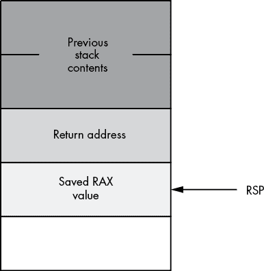
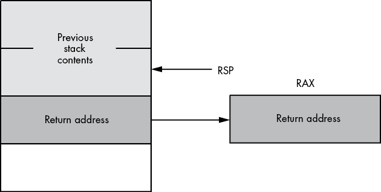
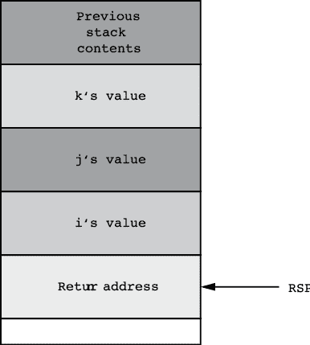
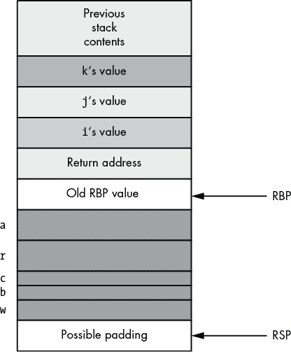
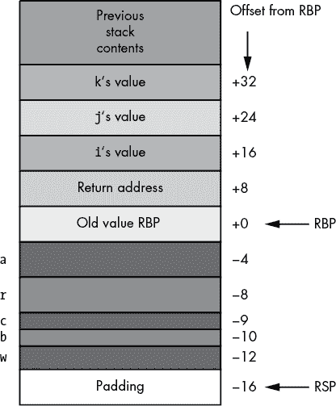
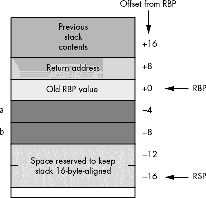
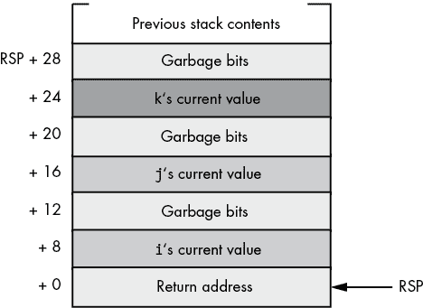
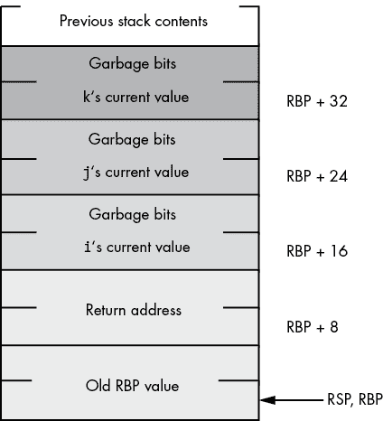

# 第五章：过程


在过程式编程语言中，代码的基本单元是过程。*过程* 是一组计算值或执行动作（如打印或读取字符值）的指令。本章讨论了 MASM 如何实现过程、参数和局部变量。通过本章内容的学习，您应该能够熟练编写自己的过程和函数，并完全理解参数传递和 Microsoft ABI 调用约定。

## 5.1 实现过程

大多数过程式编程语言通过使用调用/返回机制来实现过程。代码调用一个过程，过程执行其任务，然后返回给调用者。调用和返回指令提供了 x86-64 的 *过程调用机制*。调用代码通过 `call` 指令调用一个过程，过程通过 `ret` 指令返回给调用者。例如，以下 x86-64 指令调用 C 标准库的 `printf()` 函数：

```
call printf
```

可惜的是，C 标准库并没有提供你永远需要的所有例程。大多数时候，您需要自己编写过程。为此，您将使用 MASM 的过程声明功能。一个基本的 MASM 过程声明形式如下：

```
`proc_name` proc `options`
          `Procedure statements`
`proc_name` endp
```

过程声明出现在程序的 `.code` 部分。在前面的语法示例中，`proc_name` 代表您希望定义的过程名称。这可以是任何有效（且唯一）的 MASM 标识符。

下面是一个 MASM 过程声明的具体示例。该过程在进入过程中时，将 0 填充到 RCX 指向的 256 个双字中：

```
zeroBytes proc
          mov eax, 0
          mov edx, 256
repeatlp: mov [rcx+rdx*4-4], eax
          dec rdx
          jnz repeatlp
          ret
zeroBytes endp
```

正如你可能已经注意到的，这个简单的过程没有涉及添加和减去 RSP 寄存器值的“魔术”指令。当过程需要调用其他 C/C++ 代码（或其他使用 Microsoft ABI 兼容语言编写的代码）时，这些指令是 Microsoft ABI 的要求。因为这个小函数没有调用其他过程，所以它没有执行这些指令。还要注意，这段代码使用循环索引从 256 递减到 0，倒序填充这 256 个双字数组（从末尾到开头），而不是从头到尾填充。这是汇编语言中的一种常见技术。

您可以使用 x86-64 的 `call` 指令来调用此过程。当程序执行时，代码遇到 `ret` 指令时，过程会返回给调用者，并开始执行 `call` 指令后的第一条指令。示例 5-1 中的程序提供了调用 `zeroBytes` 例程的示例。

```
; Listing 5-1

; Simple procedure call example.

         option  casemap:none

nl       =       10

         .const
ttlStr   byte    "Listing 5-1", 0

        .data
dwArray dword   256 dup (1)

        .code

; Return program title to C++ program:

         public getTitle
getTitle proc
         lea rax, ttlStr
         ret
getTitle endp

; Here is the user-written procedure
; that zeroes out a buffer.

zeroBytes proc
          mov eax, 0
          mov edx, 256
repeatlp: mov [rcx+rdx*4-4], eax
          dec rdx
          jnz repeatlp
          ret
zeroBytes endp

; Here is the "asmMain" function.

        public  asmMain
asmMain proc

; "Magic" instruction offered without
; explanation at this point:

        sub     rsp, 48

 lea     rcx, dwArray
        call    zeroBytes 

        add     rsp, 48     ; Restore RSP
        ret                 ; Returns to caller
asmMain endp
        end
```

示例 5-1：一个简单过程的示例

### 5.1.1 调用和返回指令

x86-64 的`call`指令执行两项操作。首先，它将紧接着`call`指令之后的（64 位）指令地址压入栈中；然后它将控制转移到指定过程的地址。`call`指令压入栈中的值称为*返回地址*。

当过程想要返回调用者并继续执行紧跟在`call`指令后的第一条语句时，大多数过程通过执行`ret`（*返回*）指令返回给调用者。`ret`指令会从栈中弹出（64 位）返回地址，并间接将控制转移到该地址。

以下是最小化过程的示例：

```
minimal proc
        ret
minimal endp
```

如果你通过`call`指令调用这个过程，`minimal`将简单地从栈中弹出返回地址，并返回到调用者。如果你没有在过程里放入`ret`指令，程序将在遇到`endp`语句时不会返回到调用者。相反，程序会跳到在内存中紧接着过程后面的代码。

示例程序在 Listing 5-2 中演示了这个问题。主程序调用了`noRet`，该程序直接跳转到`followingProc`（打印消息`followingProc was called`）。

```
; Listing 5-2

; A procedure without a ret instruction.

               option  casemap:none

nl             =       10

              .const
ttlStr        byte    "Listing 5-2", 0
fpMsg         byte    "followingProc was called", nl, 0

              .code
              externdef printf:proc

; Return program title to C++ program:

              public getTitle
getTitle      proc
              lea rax, ttlStr
              ret
getTitle      endp

; noRet - Demonstrates what happens when a procedure
;         does not have a return instruction.

noRet         proc
noRet         endp

followingProc proc
              sub  rsp, 28h
              lea  rcx, fpMsg
              call printf
              add  rsp, 28h
              ret
followingProc endp

; Here is the "asmMain" function.

              public  asmMain
asmMain       proc
              push    rbx

              sub     rsp, 40   ; "Magic" instruction

              call    noRet

              add     rsp, 40   ; "Magic" instruction
              pop     rbx
              ret               ; Returns to caller
asmMain       endp
              end
```

Listing 5-2：缺少`ret`指令在过程中的影响

尽管在某些少见的情况下这种行为可能是期望的，但在大多数程序中通常表现为缺陷。因此，始终记得通过使用`ret`指令显式地从过程返回。

### 5.1.2 过程中的标签

过程可以包含语句标签，就像你程序中的主过程一样（毕竟，在 MASM 看来，书中大部分示例中的主过程`asmMain`只是另一个过程声明）。然而，请注意，在过程内定义的语句标签是*局部*的；这些符号在过程外部是*不可见*的。

在大多数情况下，过程中的*作用域符号*是很有用的（有关作用域的讨论，请参见第 234 页的“局部（自动）变量”）。你不必担心不同过程之间的*命名空间污染*（符号名称冲突）。然而，有时，MASM 的名称作用域可能会导致问题。你实际上可能想要引用过程外的语句标签。

在标签逐个处理的基础上，一种方法是使用全局语句标签声明。*全局语句标签*与过程中的普通语句标签类似，不同之处在于符号后面跟的是两个冒号而不是一个冒号，像这样：

```
globalSymbol:: mov eax, 0
```

全局语句标签在程序外部是可见的。你可以使用无条件或有条件跳转指令将控制转移到外部程序的全局符号；你甚至可以使用`call`指令调用该全局符号（在这种情况下，它变成了该程序的第二个入口点）。通常，程序拥有多个入口点被认为是糟糕的编程风格，使用多个入口点往往会导致编程错误。因此，你应该很少在汇编语言程序中使用全局符号。

如果由于某种原因，你不希望 MASM 将程序中的所有语句标签视为该程序的局部标签，可以通过以下语句打开或关闭作用域：

```
option scoped
option noscoped
```

`option noscoped`指令禁用程序中的作用域（适用于指令之后的所有程序）。`option scoped`指令重新启用作用域。因此，你可以为单个程序（或程序集合）关闭作用域，并立即将其重新启用。

## 5.2 保存机器的状态

看一下清单 5-3。该程序试图打印 20 行 40 个空格和一个星号。不幸的是，一个微妙的错误导致了无限循环。主程序使用`jnz printLp`指令创建一个循环，调用`PrintSpaces` 20 次。该函数使用 EBX 来计数它打印的 40 个空格，然后返回时 ECX 为 0。主程序接着打印一个星号和换行符，递减 ECX，然后重复，因为 ECX 不是 0（此时它总是包含 0FFFF_FFFFh）。

这里的问题是`print40Spaces`子程序没有保存 EBX 寄存器。*保存寄存器*意味着在进入子程序时保存寄存器的值，在离开时恢复它。如果`print40Spaces`子程序保存了 EBX 寄存器的内容，清单 5-3 将能够正常工作。

```
; Listing 5-3

; Preserving registers (failure) example.

               option  casemap:none

nl             =       10

              .const
ttlStr        byte    "Listing 5-3", 0
space         byte    " ", 0
asterisk      byte    '*, %d', nl, 0

              .code
              externdef printf:proc

; Return program title to C++ program:

              public getTitle
getTitle      proc
              lea rax, ttlStr
              ret
getTitle      endp

; print40Spaces - Prints out a sequence of 40 spaces
;                 to the console display.

print40Spaces proc
              sub  rsp, 48   ; "Magic" instruction
              mov  ebx, 40
printLoop:    lea  rcx, space
              call printf
              dec  ebx
              jnz  printLoop ; Until EBX == 0
              add  rsp, 48   ; "Magic" instruction
              ret
print40Spaces endp

; Here is the "asmMain" function.

              public  asmMain
asmMain       proc
              push    rbx

; "Magic" instruction offered without
; explanation at this point:

              sub     rsp, 40   ; "Magic" instruction

              mov     rbx, 20
astLp:        call    print40Spaces
              lea     rcx, asterisk
              mov     rdx, rbx
              call    printf
 dec     rbx
              jnz     astLp

              add     rsp, 40   ; "Magic" instruction
              pop     rbx
              ret     ; Returns to caller
asmMain       endp
              end
```

清单 5-3：包含意外无限循环的程序

你可以使用 x86-64 的`push`和`pop`指令来保存寄存器的值，暂时用于其他目的。考虑下面的`PrintSpaces`代码：

```
print40Spaces proc
              push rbx
              sub  rsp, 40   ; "Magic" instruction
              mov  ebx, 40
printLoop:    lea  rcx, space
              call printf
              dec  ebx
              jnz  printLoop ; Until EBX == 0
              add  rsp, 40   ; "Magic" instruction
              pop  rbx
              ret
print40Spaces endp
```

`print40Spaces`通过使用`push`和`pop`指令保存和恢复 RBX 寄存器。可以由调用者（包含调用指令的代码）或被调用者（子程序）负责保存寄存器。在前面的例子中，被调用者负责保存寄存器。

清单 5-4 展示了如果调用者保存寄存器（出于“保存机器状态，第 II 部分”第 280 页的原因，主程序将 RBX 的值保存在静态内存位置，而不是使用栈）的代码可能是什么样子。

```
; Listing 5-4

; Preserving registers (caller) example.

               option  casemap:none

nl             =       10

              .const
ttlStr        byte    "Listing 5-4", 0
space         byte    " ", 0
asterisk      byte    '*, %d', nl, 0

              .data
saveRBX       qword   ?

 .code
              externdef printf:proc

; Return program title to C++ program:

              public getTitle
getTitle      proc
              lea rax, ttlStr
              ret
getTitle      endp

; print40Spaces - Prints out a sequence of 40 spaces
;                 to the console display.

print40Spaces proc
              sub  rsp, 48   ; "Magic" instruction
              mov  ebx, 40
printLoop:    lea  rcx, space
              call printf
              dec  ebx
              jnz  printLoop ; Until EBX == 0
              add  rsp, 48   ; "Magic" instruction
              ret
print40Spaces endp

; Here is the "asmMain" function.

              public  asmMain
asmMain       proc
              push    rbx

; "Magic" instruction offered without
; explanation at this point:

              sub     rsp, 40

              mov     rbx, 20
astLp:        mov     saveRBX, rbx
              call    print40Spaces
              lea     rcx, asterisk
              mov     rdx, saveRBX
              call    printf
              mov     rbx, saveRBX
              dec     rbx
              jnz     astLp

              add     rsp, 40
              pop     rbx
              ret     ; Returns to caller
asmMain       endp
              end
```

清单 5-4：调用者保存寄存器的示例

被调用者保留寄存器有两个优点：空间和可维护性。如果被调用者（子程序）保留所有受影响的寄存器，则只有一份`push`和`pop`指令——即子程序中包含的那些。如果调用者保存寄存器中的值，则程序需要在每个调用周围设置一组保留指令。这不仅让程序变得更长，而且也更难维护。记住在每次过程调用时需要保存和恢复哪些寄存器并非易事。

另一方面，如果一个子程序保留了它所修改的所有寄存器，它可能不必要地保留某些寄存器。在之前的示例中，`print40Spaces`过程没有保存 RBX。尽管`print40Spaces`改变了 RBX，但这不会影响程序的运行。如果调用者保留了寄存器，它就不必保存自己不关心的寄存器。

保留寄存器的一个大问题是，随着时间的推移，程序可能会发生变化。你可能会修改调用代码或过程，以使用额外的寄存器。这样的变化，当然，可能会改变你必须保留的寄存器集合。更糟糕的是，如果修改发生在子程序本身，你将需要定位*每一个*调用该例程的地方，并验证该子程序不会更改调用代码所使用的任何寄存器。

汇编语言程序员在寄存器保留方面有一个常见约定：除非有充分理由（性能原因）做出不同的选择，否则大多数程序员会保留子程序修改的所有寄存器（且这些寄存器不会显式返回一个修改后的值）。这减少了程序中发生缺陷的可能性，因为子程序修改了调用者期望保留的寄存器。当然，你也可以遵循与微软 ABI 相关的规则，关于易失性和非易失性寄存器；然而，这样的调用约定给程序员（以及其他程序）带来了效率上的弊端。

保留寄存器并不是保留环境的全部。你还可以推入和弹出子程序可能更改的变量和其他值。由于 x86-64 允许你推入和弹出内存位置，你也可以轻松保留这些值。

## 5.3 过程与堆栈

由于过程使用堆栈来保存返回地址，在过程内推入和弹出数据时必须小心。考虑以下简单（但有缺陷的）过程：

```
MessedUp   proc

           push rax
           ret

MessedUp   endp
```

当程序遇到`ret`指令时，x86-64 堆栈呈现出图 5-1 所示的形式。



图 5-1：`MessedUp`过程中的`ret`指令之前的堆栈内容

`ret` 指令并不知道栈顶的值不是有效的地址。它只是弹出栈顶的任何值，并跳转到该位置。在这个例子中，栈顶包含了保存的 RAX 值。因为 RAX 推入栈中的值不太可能是正确的返回地址，所以这个程序可能会崩溃或表现出其他未定义的行为。因此，在过程内将数据推入栈时，必须确保在从过程返回之前正确弹出这些数据。

在执行 `ret` 指令之前，从栈中弹出额外数据也可能会对程序造成严重影响。请考虑以下有缺陷的过程：

```
MessedUp2  proc

           pop rax
           ret

MessedUp2  endp
```

当执行到该过程中的`ret`指令时，x86-64 栈的状态大致如下图 Figure 5-2 所示。



图 5-2：`MessedUp2` 中 `ret` 前的栈内容

再次强调，`ret` 指令会盲目地弹出栈顶的任何数据，并尝试返回到那个地址。与前面的例子不同，在前者中栈顶的内容不太可能是有效的返回地址（因为它包含了 RAX 的值），而在这个例子中，栈顶有可能包含有效的返回地址。然而，这个地址不会是 `messedUp2` 过程的正确返回地址；相反，它会是调用 `messedUp2` 过程的过程的返回地址。为了理解这段代码的效果，可以参考 Listing 5-5 中的程序。

```
; Listing 5-5

; Popping a return address by mistake.

               option  casemap:none

nl             =       10

              .const
ttlStr        byte    "Listing 5-5", 0
calling       byte    "Calling proc2", nl, 0
call1         byte    "Called proc1", nl, 0
rtn1          byte    "Returned from proc 1", nl, 0
rtn2          byte    "Returned from proc 2", nl, 0

              .code
              externdef printf:proc

; Return program title to C++ program:

              public getTitle
getTitle      proc
              lea rax, ttlStr
              ret
getTitle      endp

; proc1 - Gets called by proc2, but returns
;         back to the main program.

proc1         proc
              pop   rcx     ; Pops return address off stack
              ret
proc1         endp

proc2         proc
              call  proc1   ; Will never return

; This code never executes because the call to proc1
; pops the return address off the stack and returns
; directly to asmMain.

              sub   rsp, 40
              lea   rcx, rtn1
              call  printf
              add   rsp, 40
              ret
proc2         endp

; Here is the "asmMain" function.

              public asmMain
asmMain       proc

              sub   rsp, 40

              lea   rcx, calling
              call  printf

              call  proc2
              lea   rcx, rtn2
              call  printf

              add   rsp, 40
              ret           ; Returns to caller
asmMain       endp
              end
```

列表 5-5：从栈中弹出过多数据的影响

因为在进入 `proc1` 时栈顶有一个有效的返回地址，你可能会认为这个程序会正常运行（按预期）。然而，从 `proc1` 过程返回时，这段代码直接返回到 `asmMain` 程序，而不是返回到 `proc2` 过程中的正确返回地址。因此，所有在调用 `proc1` 之后的 `proc2` 过程中的代码都不会执行。

阅读源代码时，你可能会发现很难理解为什么那些语句没有执行，因为它们紧跟在对 `proc1` 过程的调用之后。除非你仔细观察，否则并不明显，程序正从栈中弹出一个额外的返回地址，因此并没有返回到 `proc2`，而是直接返回到调用 `proc2` 的地方。因此，在过程中操作栈时，你应该始终小心推入和弹出数据，并确保在你的过程中的每次推入和相应的弹出之间存在一对一的关系。^(1)

### 5.3.1 激活记录

每当你调用一个过程时，程序会为该过程调用关联某些信息，包括返回地址、参数和自动局部变量，这些信息是通过一种叫做*激活记录*的数据结构来管理的。^(2) 程序在调用（激活）过程时创建激活记录，结构中的数据按照记录的方式组织。

激活记录的构建始于调用过程的代码。调用者在栈上为参数数据（如果有的话）腾出空间并将数据复制到栈上。然后，`call`指令将返回地址推送到栈上。此时，激活记录的构建在过程内部继续。过程会推送寄存器和其他重要的状态信息，然后为局部变量在激活记录中腾出空间。过程可能还会更新 RBP 寄存器，使其指向激活记录的基地址。

要查看传统的激活记录是什么样的，请考虑以下 C++过程声明：

```
void ARDemo(unsigned i, int j, unsigned k)
{
     int a;
     float r;
     char c;
     bool b;
     short w
     .
     .
     .
}
```

每当程序调用`ARDemo`过程时，它会首先将参数数据推送到栈上。在原始的 C/C++调用约定中（忽略 Microsoft ABI），调用代码将参数按与其在参数列表中出现的顺序相反的顺序，从右到左推送到栈上。因此，调用代码首先将`k`参数的值推送到栈上，然后推送`j`参数的值，最后推送`i`参数的数据。在推送完参数后，程序调用`ARDemo`过程。进入`ARDemo`过程时，栈中包含这四个项目，排列方式如图 5-3 所示。通过反向推送参数，它们在栈中的顺序是正确的（第一个参数位于内存中的最低地址）。



图 5-3：进入`ARDemo`时的栈组织

`ARDemo`中的前几条指令会将当前的 RBP 值推送到栈上，然后将 RSP 的值复制到 RBP 寄存器中。^(3) 接下来，代码将栈指针向下移动，以在内存中为局部变量腾出空间。这会产生如图 5-4 所示的栈组织。



图 5-4：`ARDemo`的激活记录

#### 5.3.1.1 访问激活记录中的对象

要访问激活记录中的对象，必须使用从 RBP 寄存器到目标对象的偏移量。你需要特别关注的两个项目是参数和局部变量。你可以通过 RBP 寄存器的正偏移量访问参数；通过 RBP 寄存器的负偏移量访问局部变量，如图 5-5 所示。

英特尔专门保留了 RBP（基指针）寄存器，用作指向激活记录基址的指针。这就是为什么你应该避免将 RBP 寄存器用于常规计算的原因。如果你随意更改 RBP 寄存器中的值，可能会导致无法访问当前过程的参数和局部变量。

局部变量按其本地大小对齐（字符按 1 字节地址对齐，短整型/字按 2 字节地址对齐，长整型/整数/无符号整数/双字按 4 字节地址对齐，依此类推）。在`ARDemo`示例中，所有局部变量恰好都分配在适当的地址上（假设编译器按声明顺序分配存储空间）。



图 5-5：`ARDemo`激活记录中对象的偏移量

#### 5.3.1.2 使用 Microsoft ABI 参数约定

Microsoft ABI 对激活记录模型进行了若干修改，特别是：

+   调用者将前四个参数通过寄存器传递，而不是通过栈传递（尽管它仍然需要在栈上为这些参数保留存储空间）。

+   参数始终是 8 字节的值。

+   调用者必须在栈上保留（至少）32 字节的参数数据，即使参数少于五个（如果参数有五个或更多，则每个额外的参数还需要保留 8 字节）。

+   在`call`指令将返回地址压入栈之前，RSP 必须是 16 字节对齐的。

更多信息请参阅第一章中的“Microsoft ABI 说明”。你只需在调用 Windows 或其他 Microsoft ABI 兼容代码时遵循这些约定。对于你自己编写并调用的汇编语言过程，你可以使用任何你喜欢的约定。

### 5.3.2 汇编语言标准入口序列

过程的调用者负责在栈上分配参数存储空间，并将参数数据移动到适当的位置。在最简单的情况下，这只是通过使用 64 位`push`指令将数据压入栈中。`call`指令将返回地址压入栈。构建其余的激活记录是过程的责任。你可以通过以下汇编语言的*标准入口序列*代码来实现这一点：

```
push rbp          ; Save a copy of the old RBP value
mov rbp, rsp      ; Get ptr to activation record into RBP
sub rsp, `num_vars` ; Allocate local variable storage plus padding
```

如果过程没有任何局部变量，这里显示的第三条指令`sub rsp, num_vars`就不必要了。

`num_vars` 代表该过程所需的*局部变量*字节数，这是一个常数，应为 16 的倍数（以确保 RSP 寄存器在 16 字节边界上对齐）。^(4) 如果过程中的局部变量字节数不是 16 的倍数，你应该将该值四舍五入到下一个更高的 16 的倍数，然后再从 RSP 中减去这个常数。这样做会略微增加该过程为局部变量分配的存储量，但不会影响过程的其他操作。

如果一个符合 Microsoft ABI 的程序调用你的过程，栈将在执行`call`指令之前立即在 16 字节边界上对齐。由于返回地址向栈中添加了 8 个字节，进入你的过程时，栈将对齐到一个（*RSP mod 16*）== *8* 的地址（对齐到 8 字节地址，但未对齐到 16 字节地址）。将 RBP 推入栈中（以便在将 RSP 复制到 RBP 之前保存旧值）会再向栈中添加 8 个字节，因此 RSP 现在会是 16 字节对齐的。因此，假设在调用之前栈已经是 16 字节对齐的，并且从 RSP 中减去的数字是 16 的倍数，分配本地变量存储后，栈将是 16 字节对齐的。

如果你无法确保在进入你的过程时 RSP 是 16 字节对齐的（*RSP mod 16 == 8*），你可以通过在过程开始时使用以下序列强制 16 字节对齐：

```
push rbp
mov rbp, rsp
sub rsp, `num_vars`  ; Make room for local variables
and rsp, -16       ; Force qword stack alignment
```

–16 等价于 0FFFF_FFFF_FFFF_FFF0h。`and`指令序列强制栈对齐到 16 字节边界（它将栈指针中的值减少到 16 的倍数）。

`ARDemo` 激活记录只有 12 字节的本地存储。因此，从 RSP 中减去 12 来分配本地变量将无法保证栈是 16 字节对齐的。然而，前面序列中的`and`指令确保无论进入过程时 RSP 的值如何，RSP 始终是 16 字节对齐的（这会在图 5-5 中显示的那样，添加填充字节）。如果 RSP 没有按字节对齐，执行该指令所需的几个字节和 CPU 周期会得到丰厚的回报。当然，如果你知道栈在调用之前已经正确对齐，你可以省略额外的`and`指令，直接从 RSP 中减去 16，而不是 12（换句话说，保留比`ARDemo`过程需要的多 4 个字节，以保持栈对齐）。

### 5.3.3 汇编语言标准退出序列

在一个过程返回到它的调用者之前，需要清理激活记录。因此，标准的 MASM 过程和过程调用假设清理激活记录是过程的责任，尽管可以在过程和过程的调用者之间共享清理任务。

如果一个过程没有任何参数，则退出序列非常简单。它只需要三条指令：

```
mov rsp, rbp   ; Deallocate locals and clean up stack
pop rbp        ; Restore pointer to caller's activation record
ret            ; Return to the caller
```

在 Microsoft ABI 中（与纯汇编过程不同），清理栈上推送的任何参数是调用者的责任。因此，如果你编写的函数是从 C/C++（或其他符合 Microsoft ABI 的代码）调用的，你的过程无需做任何关于栈上参数的事情。

如果你正在编写只会从汇编语言程序中调用的过程，可以让被调用方（即过程）在返回调用方时清理栈上的参数，使用以下标准退出序列：

```
mov rsp, rbp    ; Deallocate locals and clean up stack
pop rbp         ; Restore pointer to caller's activation record
ret `parm_bytes`  ; Return to the caller and pop the parameters
```

`ret`指令的`parm_bytes`操作数是一个常量，指定在返回指令弹出返回地址后，从栈上移除的参数数据的字节数。例如，前面章节中的`ARDemo`示例代码为参数保留了三个四字（因为我们希望保持栈的 qword 对齐）。因此，标准退出序列将采用以下形式：

```
mov rsp, rbp
pop rbp
ret 24
```

如果你没有为`ret`指令指定一个 16 位常量操作数，x86-64 将不会在返回时从栈上弹出参数。执行完`call`到过程后的第一条指令时，这些参数仍然会留在栈上。类似地，如果你指定的值过小，某些参数将会在从过程返回时留在栈上。如果你指定的`ret`操作数过大，`ret`指令实际上会将一些调用者的数据从栈上弹出，通常会导致灾难性后果。

顺便提一下，Intel 在指令集中添加了一条特殊指令来缩短标准退出序列：`leave`。这条指令将 RBP 复制到 RSP，然后弹出 RBP。以下代码与之前介绍的标准退出序列等效：

```
leave
ret `optional_const`
```

选择权在你。大多数编译器会生成`leave`指令（因为它更简短），因此使用它是标准选择。

## 5.4 局部（自动）变量

大多数高级语言中的过程和函数允许你声明*局部变量*。这些变量通常只能在过程内部访问；它们无法被调用该过程的代码访问。

局部变量在高级语言中具有两个特殊属性：作用域和生命周期。标识符的*作用域*决定了该标识符在编译期间源文件中的可见性（可访问性）。在大多数高级语言中，过程的局部变量的作用域是该过程的主体；标识符在该过程外部不可访问。

而作用域是符号的编译时属性，*生命周期*是运行时属性。变量的生命周期是从存储首次绑定到该变量时开始，到存储不再可用时结束。静态对象（即你在`.data`、`.const`、`.data?`和`.code`段中声明的对象）具有与应用程序总运行时间相等的生命周期。程序在第一次加载到内存时为这些变量分配存储空间，这些变量在程序终止之前保持该存储空间。

局部变量（或者更准确地说，*自动变量*）在进入一个过程时会分配存储空间，并在过程返回时将这些存储空间归还以供其他用途。*自动*一词指的是程序在调用和返回过程时自动分配和释放变量的存储空间。

一个过程可以通过引用名称（使用相对 PC 寻址模式）来访问任何全局`.data`、`.data?`或`.const`对象，就像主程序访问这些变量一样。访问全局对象方便且简单。当然，访问全局对象会使程序更难阅读、理解和维护，因此你应尽量避免在过程内使用全局变量。虽然在某些情况下，在过程内访问全局变量可能是解决特定问题的最佳方案，但在这个阶段，你可能不会编写这样的代码，因此在这么做之前应仔细考虑你的选择。^(5)

### 5.4.1 自动（局部）变量的低级实现

你的程序通过使用来自激活记录基地址（RBP）的负偏移量来访问过程中的局部变量。考虑下面这个 MASM 过程，见清单 5-6（诚然，这个过程并不做什么，除了展示局部变量的使用）。

```
; Listing 5-6

; Accessing local variables.

               option  casemap:none
               .code

; sdword a is at offset -4 from RBP.
; sdword b is at offset -8 from RBP.

; On entry, ECX and EDX contain values to store
; into the local variables a and b (respectively):

localVars     proc
              push rbp
              mov  rbp, rsp
              sub  rsp, 16       ; Make room for a and b

              mov  [rbp-4], ecx  ; a = ECX
              mov  [rbp-8], edx  ; b = EDX

    ; Additional code here that uses a and b:

              mov   rsp, rbp
              pop   rbp
              ret
localVars     endp
```

清单 5-6：访问局部变量的示例过程

标准入口序列即使局部变量`a`和`b`只需要 8 个字节，也会分配 16 个字节的存储空间。这是为了保持栈的 16 字节对齐。如果某个过程不需要这么做，减去 8 个字节也完全可以。

`localVars`的激活记录见图 5-6。

当然，必须通过偏移量引用局部变量，从 RBP 寄存器算起，实在是太糟糕了。这个代码不仅难以阅读（`[RBP-4]`是`a`变量还是`b`变量？），而且也很难维护。例如，如果你决定不再需要`a`变量，那么你必须去找到每个出现`[RBP-8]`（访问`b`变量）的地方，并把它改成`[RBP-4]`。



图 5-6：`LocalVars`过程的激活记录

一个稍微更好的解决方案是为你的局部变量名创建等式。考虑清单 5-6 中所示修改后的清单 5-7。

```
; Listing 5-7

; Accessing local variables #2.

            option  casemap:none
            .code

; localVars - Demonstrates local variable access.

; sdword a is at offset -4 from RBP.
; sdword b is at offset -8 from RBP.

; On entry, ECX and EDX contain values to store
; into the local variables a and b (respectively):

a           equ     <[rbp-4]>
b           equ     <[rbp-8]>
localVars   proc
            push    rbp
            mov     rbp, rsp
            sub     rsp, 16  ; Make room for a and b

            mov     a, ecx
            mov     b, edx

    ; Additional code here that uses a and b:

            mov     rsp, rbp
            pop     rbp
 ret
localVars   endp
```

清单 5-7：使用等式的局部变量

这比清单 5-6 中的旧程序更易读且更易维护。实际上，可以改进这个等式系统。例如，以下四个等式完全合法：

```
a  equ <[rbp-4]>
b  equ a-4
d  equ b-4
e  equ d-4
```

MASM 会将`[RBP-4]`与`a`关联，将`[RBP-8]`与`b`关联，将`[RBP-12]`与`d`关联，将`[RBP-16]`与`e`关联。然而，过度使用花哨的等式并没有好处；如果你真的想让声明尽可能易于维护，MASM 提供了类似高级语言的局部变量（和参数）声明。

### 5.4.2 MASM 局部指令

为本地变量创建等式是一项繁琐且容易出错的工作。在定义等式时，很容易指定错误的偏移量，添加或删除过程中的本地变量也非常麻烦。幸运的是，MASM 提供了一条指令，让你能够指定本地变量，并且 MASM 会自动为本地变量填充偏移量。这个指令是 `local`，其语法如下：

```
local  `list_of_declarations`
```

`list_of_declarations` 是一个本地变量声明的列表，声明之间用逗号分隔。一个本地变量声明有两种主要形式：

```
`identifier`:`type`
`identifier` [`elements`]:`type`
```

在这里，`type` 是常见的 MASM 数据类型之一（`byte`、`word`、`dword` 等），`identifier` 是你要声明的本地变量的名称。第二种形式声明本地数组，其中 `elements` 是数组元素的数量。`elements` 必须是 MASM 在汇编时能够解析的常量表达式。

`local` 指令，如果出现在一个过程（procedure）中，必须是紧跟在过程声明（`proc` 指令）之后的第一条语句。一个过程可以有多个 `local` 语句；如果有多个 `local` 指令，它们必须紧随 `proc` 声明之后。下面是一个包含本地变量声明的代码片段示例：

```
procWithLocals proc
               local  var1:byte, local2:word, dVar:dword
               local  qArray[4]:qword, rlocal:real4
 local  ptrVar:qword
               local  userTypeVar:userType
                 .
                 .   ; Other statements in the procedure.
                 .
procWithLocals endp
```

MASM 会自动为你通过 `local` 指令声明的每个变量关联适当的偏移量。MASM 通过将变量的大小从当前偏移量（从零开始）中减去，然后将其舍入到对象大小的倍数来为变量分配偏移量。例如，如果 `userType` 被 `typedef` 定义为 `real8`，MASM 会像下面的 MASM 输出一样为 `procWithLocals` 中的本地变量分配偏移量：

```
var1 . . . . . . . . . . . . .        byte     rbp - 00000001
local2 . . . . . . . . . . . .        word     rbp - 00000004
dVar . . . . . . . . . . . . .        dword    rbp - 00000008
qArray . . . . . . . . . . . .        qword    rbp - 00000028
rlocal . . . . . . . . . . . .        dword    rbp - 0000002C
ptrVar . . . . . . . . . . . .        qword    rbp - 00000034
userTypeVar  . . . . . . . . .        qword    rbp - 0000003C
```

除了为每个本地变量分配偏移量外，MASM 还将 `[RBP-constant]` 寻址模式与每个符号关联。因此，如果你在过程内使用像 `mov ax, local2` 这样的语句，MASM 将会用 `[RBP-4]` 替代符号 `local2`。

当然，在进入过程时，你仍然需要在堆栈上分配本地变量的存储空间；也就是说，你仍然需要提供标准的入口（和标准退出）序列的代码。这意味着你必须加总所有本地变量所需的存储空间，以便在将 RSP 的值移动到 RBP 后从 RSP 中减去这个值。同样，这是重复性工作，如果你误算了本地变量存储的字节数，可能会成为过程中的缺陷源，因此在手动计算存储需求时必须小心。

MASM 确实为这个问题提供了一种解决方案（某种程度上）：`option` 指令。你已经看到过 `option casemap:none`、`option noscoped` 和 `option scoped` 指令；`option` 指令实际上支持许多参数，用于控制 MASM 的行为。使用 `local` 指令时，有两个操作数控制过程代码生成：`prologue` 和 `epilogue`。这些操作数通常有以下两种形式：

```
option prologue:PrologueDef
option prologue:none
option epilogue:EpilogueDef
option epilogue:none
```

默认情况下，MASM 假设 `prologue:none` 和 `epilogue:none`。当你将 `prologue` 和 `epilogue` 的值设置为 `none` 时，MASM 不会生成任何额外的代码来支持过程中的本地变量存储分配和释放；你将负责为该过程提供标准的入口和退出序列。

如果你在源文件中插入 `option prologue:PrologueDef`（默认序言生成）和 `option epilogue:EpilogueDef`（默认尾声生成），所有后续过程将自动为你生成适当的标准入口和退出序列（前提是过程内有本地指令）。MASM 会在过程的最后一个本地指令之后（在第一个机器指令之前）悄悄生成标准入口序列（*序言*），包括通常的标准入口序列指令。

```
push  rbp
mov   rbp, rsp
sub   rsp, `local_size`
```

其中 `local_size` 是一个常量，指定本地变量的数量，外加一个（可能的）额外量，用于保持栈对齐到 16 字节边界。（MASM 通常假设栈在 `push rbp` 指令之前是对齐到 *mod 16 == 8* 的边界。）

为了使 MASM 自动生成的序言代码正常工作，过程必须有且只有一个入口点。如果你定义了一个全局语句标签作为第二个入口点，MASM 就不知道在那个位置生成序言代码。除非你明确地自己包含标准入口序列，否则从第二个入口点进入过程会导致问题。这个故事的寓意是：过程应该有且只有一个入口点。

生成尾声的标准退出序列会更具挑战性。虽然一个汇编语言过程通常只有一个 *入口* 点，但常常有多个 *退出* 点。毕竟，退出点是由程序员通过放置 `ret` 指令来控制的，而不是通过某个指令（如 `endp`）。MASM 通过自动将找到的任何 `ret` 指令转换为标准退出序列来处理多个退出点的问题。

```
leave
ret
```

当然，假设 `option epilogue:EpilogueDef` 处于激活状态。

你可以控制 MASM 是否生成序言（标准入口序列）和尾声（标准退出序列），它们相互独立。因此，如果你希望自己编写 `leave` 指令（同时让 MASM 生成标准入口序列），是完全可以的。

关于 `prologue:` 和 `epilogue:` 选项的最后一点。在指定 `prologue:PrologueDef` 和 `epilogue:EpilogueDef` 之外，你还可以在 `prologue:` 或 `epilogue:` 选项后提供一个 *宏标识符*。如果你提供了宏标识符，MASM 会为标准入口或退出序列展开该宏。有关宏的更多信息，请参见第十三章中的《宏和 MASM 编译时语言》。

本书其余部分中的大多数示例程序继续使用`textequ`声明局部变量，而不是使用`local`指令，以使得`[RBP-constant]`寻址模式和局部变量偏移更加显式。

### 5.4.3 自动分配

自动存储分配的一个大优点是它能高效地在多个过程之间共享固定的内存池。例如，假设你依次调用三个过程，如下所示：

```
call ProcA
call ProcB
call ProcC
```

第一个过程（代码中的`ProcA`）在栈上分配其局部变量。返回时，`ProcA`释放该栈存储。进入`ProcB`时，程序通过*使用刚才由`ProcA`释放的相同内存位置*来分配`ProcB`的局部变量存储。同样，当`ProcB`返回并且程序调用`ProcC`时，`ProcC`使用`ProcB`最近释放的相同栈空间来存储它的局部变量。这种内存重用有效地利用了系统资源，可能是使用自动变量的最大优点。

现在你已经了解了汇编语言如何为局部变量分配和释放存储，就容易理解为什么自动变量在两次调用同一过程时不会保持其值。一旦过程返回到其调用者，自动变量的存储就丢失了，因此，值也就丢失了。因此，*你必须始终假设局部`var`对象在进入过程时是未初始化的*。如果你需要在多次调用同一过程时保持变量的值，你应该使用静态变量声明类型。

## 5.5 参数

尽管许多过程是完全自包含的，但大多数过程需要输入数据并将数据返回给调用者。*参数*是你传递给和从过程返回的数据。在纯汇编语言中，传递参数可能是一件真正麻烦的事。

讨论参数时，首先要考虑的是如何将它们传递给过程。如果你熟悉 Pascal 或 C/C++，你可能见过两种传递参数的方法：*按值传递*和*按引用传递*。在汇编语言中，任何在高级语言（HLL）中能做的事情都能在汇编语言中做（显然，高级语言代码会被编译成机器码），但你必须提供指令序列来以适当的方式访问这些参数。

当处理参数时，另一个你会面临的问题是*在哪里*传递参数。有很多地方可以传递参数：寄存器、栈、代码流、全局变量，或者它们的组合。本章涵盖了几种可能性。

### 5.5.1 值传递

按值传递的参数就是传递一个值——调用者将一个值传递给过程。值传递参数是仅用于输入的参数。你可以将它们传递给过程，但过程不能通过这些参数返回值。考虑以下的 C/C++函数调用：

```
CallProc(I);
```

如果你按值传递 `I`，无论在 `CallProc()` 内部发生什么，`CallProc()` 都不会改变 `I` 的值。

因为你必须将数据的副本传递给过程，所以应该仅将此方法用于传递小对象，如字节、字、双字和四字。按值传递大型数组和记录效率低下（因为你必须创建并传递该对象的副本给过程）。^(6)

### 5.5.2 按引用传递

要按引用传递参数，你必须传递变量的地址，而不是它的值。换句话说，你必须传递数据的指针。过程必须取消引用该指针以访问数据。按引用传递参数在需要修改实际参数或在过程之间传递大型数据结构时非常有用。由于 x86-64 中的指针宽度为 64 位，按引用传递的参数将是一个四字（quad-word）值。

你可以通过两种常见方式计算内存中对象的地址：`offset` 操作符或 `lea` 指令。你可以使用 `offset` 操作符获取你在 `.data`、`.data?`、`.const` 或 `.code` 段中声明的任何静态变量的地址。清单 5-8 演示了如何获取静态变量（`staticVar`）的地址，并将该地址传递给过程（`someFunc`），地址保存在 RCX 寄存器中。

```
; Listing 5-8

; Demonstrate obtaining the address
; of a static variable using offset
; operator.

            option  casemap:none

            .data
staticVar   dword   ?

            .code
            externdef someFunc:proc

getAddress  proc

 mov     rcx, offset staticVar
            call    someFunc

            ret
getAddress  endp

            end
```

清单 5-8：使用 `offset` 操作符获取静态变量的地址

使用 `offset` 操作符会引发一些问题。首先，它只能计算静态变量的地址；你无法获取自动（局部）变量或参数的地址，也不能计算涉及复杂内存寻址模式的内存引用的地址（例如，`[RBX+RDX*1-5]`）。另一个问题是，像 `mov rcx, offset staticVar` 这样的指令会生成大量字节（因为 `offset` 操作符返回的是 64 位常量）。如果你查看 MASM 生成的汇编列表（使用 `/Fl` 命令行选项），你可以看到这条指令有多大：

```
00000000  48/ B9                mov    rcx, offset staticVar
           0000000000000000 R
0000000A  E8 00000000 E        call    someFunc
```

正如你在这里看到的，`mov` 指令的长度是 10（0Ah）字节。

你已经看过多次获取变量地址的第二种方法：`lea` 指令（例如，在调用 `printf()` 之前，将格式化字符串的地址加载到 RCX 中）。清单 5-9 展示了将 清单 5-8 中的例子重写为使用 `lea` 指令的版本。

```
; Listing 5-9

; Demonstrate obtaining the address
; of a variable using the lea instruction.

            option  casemap:none

            .data
staticVar   dword   ?

            .code
            externdef someFunc:proc

getAddress  proc

            lea     rcx, staticVar
            call    someFunc

            ret
getAddress  endp
            end
```

清单 5-9：使用 `lea` 指令获取变量的地址

查看 MASM 为这段代码生成的列表，我们发现 `lea` 指令的长度只有 7 字节。

```
00000000  48/ 8D 0D       lea     rcx, staticVar
           00000000 R
00000007  E8 00000000 E   call    someFunc
```

所以，如果没有其他原因，使用 `lea` 指令而不是 `offset` 操作符会让你的程序更简短。

使用 `lea` 的另一个优点是它接受任何内存寻址模式，而不仅仅是静态变量的名称。例如，如果 `staticVar` 是一个 32 位整数数组，你可以通过使用类似这样的指令，将当前元素地址（由 RDX 寄存器索引）加载到 RCX 中：

```
lea rcx, staticVar[rdx*4]  ; Assumes LARGEADDRESSAWARE:NO
```

通过引用传递通常比按值传递效率低。你必须在每次访问时解引用所有按引用传递的参数；这比直接使用值要慢，因为通常需要至少两条指令。然而，在传递大型数据结构时，通过引用传递更快，因为你不需要在调用过程之前复制整个大型数据结构。当然，你可能需要通过指针访问该大型数据结构的元素（例如，数组），所以传递大型数组时，效率损失非常小。

### 5.5.3 低级参数实现

参数传递机制是调用者和被调用者（过程）之间的契约。双方必须就参数数据的出现位置和形式（例如，值或地址）达成一致。如果你的汇编语言过程只被你编写的其他汇编语言代码调用，那么你可以控制契约的双方，并决定如何以及在哪里传递参数。

然而，如果外部代码调用了你的过程，或者你的过程调用了外部代码，那么你的过程必须遵循外部代码使用的*调用约定*。在 64 位 Windows 系统上，该调用约定无疑是 Windows ABI。

在讨论 Windows 调用约定之前，我们将考虑你编写的代码的调用情况（因此，你完全控制调用约定）。接下来的章节将深入介绍在纯汇编语言代码中传递参数的各种方式（不涉及与 Microsoft ABI 相关的开销）。

#### 5.5.3.1 在寄存器中传递参数

在讨论了*如何*将参数传递给过程之后，接下来要讨论的是*在哪里*传递参数。这取决于这些参数的大小和数量。如果你传递的是少量参数，寄存器是传递它们的理想位置。如果你只传递一个参数，你应该使用表 5-1 中列出的寄存器，匹配相应的数据类型。

表 5-1：按大小划分的参数位置

| **数据大小** | **在此寄存器中传递** |
| --- | --- |
| 字节 | CL |
| 字 | CX |
| 双字 | ECX |
| 四字 | RCX |

这不是一条严格的规则。然而，这些寄存器非常方便，因为它们与 Microsoft ABI 中的第一个参数寄存器相匹配（大多数人会在此寄存器中传递一个参数）。

如果你在 x86-64 寄存器中传递多个参数到一个过程，你应该按以下顺序使用寄存器：

```
First                                           Last
RCX, RDX, R8, R9, R10, R11, RAX, XMM0/YMM0-XMM5/YMM5
```

一般来说，你应该通过通用寄存器传递整数和其他非浮动值，通过 XMM*x*/YMM*x* 寄存器传递浮动值。这不是一个强制要求，但微软为传递参数和局部变量（*volatile*）保留这些寄存器，因此使用这些寄存器传递参数不会干扰微软 ABI 的非易失性寄存器。当然，如果你打算让符合微软 ABI 的代码调用你的过程，你必须严格遵守微软调用约定（参见第 261 页“调用约定和微软 ABI”）。

当然，如果你在编写纯汇编语言代码（没有调用任何你没写的代码），你可以根据需要使用大多数通用寄存器（RSP 是例外，应该避免使用 RBP，但其他寄存器都可以使用）。XMM/YMM 寄存器也是如此。

举个例子，考虑 `strfill(s,c)` 过程，它将字符 `c`（通过 AL 传值）复制到 `s`（通过 RDI 传引用）中的每个字符位置，直到遇到零终止字节（Listing 5-10）。

```
; Listing 5-10

; Demonstrate passing parameters in registers.

            option  casemap:none

            .data
staticVar   dword   ?

            .code
            externdef someFunc:proc

; strfill - Overwrites the data in a string with a character.

;     RDI -  Pointer to zero-terminated string
;            (for example, a C/C++ string).
;      AL -  Character to store into the string.

strfill     proc
            push    rdi     ; Preserve RDI because it changes

; While we haven't reached the end of the string:

whlNot0:    cmp     byte ptr [rdi], 0
            je      endOfStr

; Overwrite character in string with the character
; passed to this procedure in AL:

            mov     [rdi], al

; Move on to the next character in the string and
; repeat this process:

            inc     rdi
            jmp     whlNot0

endOfStr:   pop     rdi
            ret
strfill     endp
            end
```

Listing 5-10：通过寄存器传递参数给 `strfill` 过程

要调用 `strfill` 过程，你需要在调用之前将字符串数据的地址加载到 RDI 中，将字符值加载到 AL 中。以下代码片段演示了典型的 `strfill` 调用：

```
lea  rdi, stringData ; Load address of string into RDI
mov  al, ' '         ; Fill string with spaces
call strfill
```

这段代码通过引用传递字符串，通过值传递字符数据。

#### 5.5.3.2 代码流中传递参数

另一个可以传递参数的地方是在 `call` 指令之后的代码流中。考虑以下 `print` 例程，它将一个字面常量字符串打印到标准输出设备：

```
call print
byte "This parameter is in the code stream.",0
```

通常，子程序会将控制权返回到紧接着 `call` 指令后的第一条指令。如果在这里发生这种情况，x86-64 会试图将 `"This..."` 的 ASCII 码解释为一条指令。这将产生不期望的结果。幸运的是，在从子程序返回之前，你可以跳过这个字符串。

那么，你如何访问这些参数呢？很简单。栈上的返回地址指向它们。考虑 Listing 5-11 中的 `print` 实现。

```
; Listing 5-11

; Demonstration passing parameters in the code stream.

        option  casemap:none

nl          =       10
stdout      =       -11

            .const
ttlStr      byte    "Listing 5-11", 0

            .data
soHandle    qword   ?
bWritten    dword   ?

            .code

            ; Magic equates for Windows API calls:

            extrn __imp_GetStdHandle:qword
            extrn __imp_WriteFile:qword

; Return program title to C++ program:

            public  getTitle
getTitle    proc
            lea     rax, ttlStr
            ret
getTitle    endp

; Here's the print procedure.
; It expects a zero-terminated string
; to follow the call to print.

print       proc
            push    rbp
            mov     rbp, rsp
            and     rsp, -16         ; Ensure stack is 16-byte-aligned
            sub     rsp, 48          ; Set up stack for MS ABI

; Get the pointer to the string immediately following the
; call instruction and scan for the zero-terminating byte.

            mov     rdx, [rbp+8]     ; Return address is here
            lea     r8, [rdx-1]      ; R8 = return address - 1
search4_0:  inc     r8               ; Move on to next char
            cmp     byte ptr [R8], 0 ; At end of string?
            jne     search4_0

; Fix return address and compute length of string:

            inc     r8               ; Point at new return address
            mov     [rbp+8], r8      ; Save return address
            sub     r8, rdx          ; Compute string length
            dec     r8               ; Don't include 0 byte

; Call WriteFile to print the string to the console:

; WriteFile(fd, bufAdrs, len, &bytesWritten);

; Note: pointer to the buffer (string) is already
; in RDX. The len is already in R8\. Just need to
; load the file descriptor (handle) into RCX:

            mov     rcx, soHandle    ; Zero-extends!
            lea     r9, bWritten     ; Address of "bWritten" in R9
            call    __imp_WriteFile

            leave
            ret
print       endp

; Here is the "asmMain" function.

            public  asmMain
asmMain     proc
            push    rbp
            mov     rbp, rsp
            sub     rsp, 40

; Call getStdHandle with "stdout" parameter
; in order to get the standard output handle
; we can use to call write. Must set up
; soHandle before first call to print procedure.

            mov     ecx, stdout      ; Zero-extends!
            call    __imp_GetStdHandle
            mov     soHandle, rax    ; Save handle

; Demonstrate passing parameters in code stream
; by calling the print procedure:

            call    print
            byte    "Hello, world!", nl, 0

; Clean up, as per Microsoft ABI:

            leave
            ret     ; Returns to caller

asmMain     endp
            end 
```

Listing 5-11：打印过程实现（使用代码流参数）

关于 Listing 5-11 中的机器习惯用法，有一个快速说明。指令

```
lea  r8, [rdx-1]
```

这实际上并不是将一个地址加载到 R8 中。实际上，这是一个算术指令，它计算 R8 = RDX – 1（通过一个指令，而不是通常需要的两条指令）。这是汇编语言程序中`lea`指令的常见用法。因此，这是一个你应该熟悉的小编程技巧。

除了展示如何在代码流中传递参数外，`print`例程还展示了另一个概念：*可变长度参数*。`call`后面的字符串可以是任何实际长度。以零终止的字节标记参数列表的结束。

我们有两种简单的方法来处理可变长度参数：要么使用特殊的终止值（如 0），要么传递一个特殊的长度值，告诉子程序你正在传递多少个参数。两种方法各有优缺点。

使用特殊值终止参数列表要求选择一个在列表中永远不会出现的值。例如，`print`使用 0 作为终止值，因此它无法打印 NUL 字符（其 ASCII 码是 0）。有时候，这并不是一个限制。指定长度参数是另一种可以用来传递可变长度参数列表的机制。虽然这种方式不需要任何特殊的代码，也不限制可以传递给子程序的值的范围，但设置长度参数并维护结果代码可能会变得非常麻烦。^(8)

尽管在代码流中传递参数具有便利性，但这种方法也有缺点。首先，如果你没有提供子程序所需的准确数量的参数，子程序会感到困惑。以`print`为例，它会打印一串字符直到遇到零终止字节，然后将控制权交还给该字节后的第一条指令。如果你没有提供零终止字节，`print`例程会愉快地将随后的操作码字节当作 ASCII 字符打印，直到遇到一个零字节。因为零字节经常出现在指令的中间，`print`例程可能会将控制权交给另一条指令的中间部分，这很可能会导致机器崩溃。

插入额外的 0 是程序员在使用`print`例程时遇到的另一个问题，这种情况比你想象的更为常见。在这种情况下，`print`例程会在遇到第一个零字节时返回，并尝试将随后的 ASCII 字符作为机器码执行。尽管存在问题，但代码流仍然是一个高效的传递参数的地方，尤其是当这些参数的值不发生变化时。

#### 5.5.3.3 在栈上传递参数

大多数高级语言使用栈来传递大量参数，因为这种方法相对高效。尽管在栈上传递参数的效率略低于在寄存器中传递参数，但寄存器集是有限的（特别是如果你只使用微软 ABI 为此目的保留的四个寄存器），你只能通过寄存器传递少量的值或引用参数。另一方面，栈允许你轻松传递大量的参数数据。这就是大多数程序将参数传递在栈上的原因（至少，当传递超过大约三个到六个参数时）。

要手动将参数传递到栈上，在调用子程序之前立即推送它们。子程序随后从栈内存中读取这些数据，并适当地处理它们。考虑以下高级语言函数调用：

```
CallProc(i,j,k);
```

在 32 位汇编语言的时代，你可以使用以下指令序列将这些参数传递给`CallProc`：

```
push  k  ; Assumes i, j, and k are all 32-bit
push  j  ; variables
push  i  
call  CallProc
```

不幸的是，随着 x86-64 64 位 CPU 的出现，32 位`push`指令从指令集中移除了（64 位`push`指令替代了它）。如果你想通过使用`push`指令将参数传递给过程，它们必须是 64 位操作数。^(9)

因为保持 RSP 在适当的边界（8 字节或 16 字节）对齐至关重要，微软的 ABI 要求每个参数在栈上占用 8 字节，因此不允许更大的参数出现在栈上。如果你控制着参数契约的双方（调用者和被调用者），你可以将更大的参数传递给你的过程。然而，确保所有参数的大小都是 8 字节的倍数是一个好主意。

一个简单的解决方案是使所有变量成为`qword`对象。然后，你可以在调用过程之前直接使用`push`指令将它们推送到栈上。然而，并不是所有对象都能完美地适应 64 位（例如字符）。即使是那些本可以是 64 位的对象（例如整数），通常也不需要使用那么多存储空间。

使用`push`指令处理较小对象的一种巧妙方法是使用类型强制转换。考虑以下`CallProc`的调用序列：

```
push  qword ptr k
push  qword ptr j
push  qword ptr i
call  CallProc
```

该序列将从与变量`i`、`j`和`k`关联的地址开始，推送 64 位的值，无论这些变量的大小如何。如果`i`、`j`和`k`是较小的对象（比如 32 位整数），这些`push`指令将把它们的值连同超出这些变量的数据一起推送到栈上。只要`CallProc`将这些参数值视为其实际大小（例如，32 位），并忽略为每个参数推送到栈上的高位数据，这通常是可行的。

将超出变量边界的额外数据推送到栈上可能会带来一个问题。如果变量正好位于内存页的末尾，并且下一页不可读，那么推送超出变量的数据可能会尝试从下一内存页推送数据，从而导致内存访问违规（这将崩溃你的程序）。因此，如果你使用这种技术，必须确保这些变量不出现在内存页的末尾（以免下一页不可访问）。最简单的做法是确保你在数据段中声明的最后一个变量不是你在栈上推送的变量。例如：

```
i    dword ?
j    dword ?
k    dword ?
pad  qword ?  ; Ensures that there are at least 64 bits
              ; beyond the k variable
```

尽管将额外数据推入一个变量是可行的，但这仍然是一种值得怀疑的编程实践。更好的技巧是完全放弃`push`指令，改用另一种方法将参数数据推送到栈上。

另一种将数据“推送”到栈上的方法是将 RSP 寄存器下移到适当的内存位置，然后通过使用`mov`（或类似的）指令将数据直接移入栈中。考虑以下`CallProc`的调用序列：

```
sub  rsp, 12
mov  eax, k
mov  [rsp+8], eax
mov  eax, j
mov  [rsp+4], eax
mov  eax, i
mov  [rsp], eax
call CallProc
```

尽管这比前面的示例需要两倍的指令（八条对比四条），但此序列是安全的（没有访问不可访问内存页的可能）。此外，它将准确地将参数所需的数据量推送到栈上（每个对象 32 位，总共 12 字节）。

这种方法的主要问题是，将一个不对齐到 8 字节边界的地址放入 RSP 寄存器是一个非常糟糕的主意。在最坏的情况下，栈如果没有按 8 字节对齐会崩溃程序；在最好的情况下，它会影响程序的性能。因此，即使你希望将参数作为 32 位整数传递，也应该在调用之前始终为栈上的参数分配 8 字节的倍数。前面的示例可以编码为如下：

```
sub  rsp, 16   ; Allocate a multiple of 8 bytes
mov  eax, k
mov  [rsp+8], eax
mov  eax, j
mov  [rsp+4], eax
mov  eax, i
mov  [rsp], eax
call CallProc
```

请注意，`CallProc`将简单地忽略以这种方式分配到栈上的额外 4 个字节（别忘了在返回时从栈上移除这些额外的存储）。

为了满足 Microsoft ABI 的要求（事实上，几乎所有 x86-64 CPU 的应用程序二进制接口都要求）每个参数精确消耗 8 字节（即使它们的原生数据大小更小），你可以使用以下代码（指令数量相同，只是多了一些栈空间）：

```
sub  rsp, 24   ; Allocate a multiple of 8 bytes
mov  eax, k
mov  [rsp+16], eax
mov  eax, j
mov  [rsp+8], eax
mov  eax, i
mov  [rsp], eax
call CallProc
```

`mov`指令将数据按 8 字节边界展开。栈上每个 64 位项的高位双字（HO dword）将包含垃圾数据（即栈内存中在此序列之前的数据）。这没关系；`CallProc`过程（假设）将忽略这些额外数据，仅对每个参数值的低 32 位（LO 32 bits）进行操作。

进入`CallProc`时，使用此序列，x86-64 的栈将如图 5-7 所示。



图 5-7：进入`CallProc`时的栈布局

如果你的过程包括标准的入口和退出序列，你可以通过从 RBP 寄存器索引直接访问激活记录中的参数值。考虑以下使用声明的`CallProc`的激活记录布局：

```
CallProc proc
         push  rbp      ; This is the standard entry sequence
         mov   rbp, rsp ; Get base address of activation record into RBP
          .
          .
          .
         leave
         ret   24
```

假设你已经将三个四字参数推送到栈上，它在执行`CallProc`中的`mov rbp, rsp`之后应该看起来像图 5-8。

现在你可以通过从 RBP 寄存器索引来访问参数：

```
mov eax, [rbp+32]    ; Accesses the k parameter
mov ebx, [rbp+24]    ; Accesses the j parameter
mov ecx, [rbp+16]    ; Accesses the i parameter
```



图 5-8：`CallProc`激活记录在标准入口序列执行后的状态

#### 5.5.3.4 访问堆栈上的值参数

访问按值传递的参数与访问局部变量对象没有什么不同。实现这一点的一种方法是使用等式，正如前面为局部变量所演示的那样。示例 5-12 提供了一个示例程序，其中的过程访问了由主程序按值传递给它的参数。

```
; Listing 5-12

; Accessing a parameter on the stack.

        option  casemap:none

nl          =       10
stdout      =       -11

            .const
ttlStr      byte    "Listing 5-12", 0
fmtStr1     byte    "Value of parameter: %d", nl, 0

            .data
value1      dword   20
value2      dword   30

            .code
            externdef printf:proc

; Return program title to C++ program:

            public  getTitle
getTitle    proc
            lea     rax, ttlStr
            ret
getTitle    endp

theParm     equ     <[rbp+16]>
ValueParm   proc
            push    rbp
            mov     rbp, rsp

            sub     rsp, 32         ; "Magic" instruction

            lea     rcx, fmtStr1
            mov     edx, theParm
            call    printf

            leave
            ret
ValueParm   endp

; Here is the "asmMain" function.

            public  asmMain
asmMain     proc
            push    rbp
            mov     rbp, rsp
            sub     rsp, 40

            mov     eax, value1
            mov     [rsp], eax      ; Store parameter on stack
            call    ValueParm

            mov     eax, value2
            mov     [rsp], eax
            call    ValueParm

; Clean up, as per Microsoft ABI:

            leave
            ret                     ; Returns to caller

asmMain     endp
            end
```

示例 5-12：值参数的演示

尽管你可以通过在代码中使用匿名地址`[RBP+16]`来访问`theParm`的值，但以这种方式使用等式会使你的代码更具可读性和可维护性。

### 5.5.4 使用`proc`指令声明参数

MASM 为使用`proc`指令声明过程的参数提供了另一种解决方案。你可以将参数列表作为操作数传递给`proc`指令，如下所示：

```
`proc_name`  proc  `parameter_list`
```

其中`parameter_list`是由逗号分隔的一个或多个参数声明的列表。每个参数声明的形式为

```
`parm_name`:`type`
```

其中`parm_name`是一个有效的 MASM 标识符，`type`是常见的 MASM 类型之一（`proc`，`byte`，`word`，`dword`等）。有一个例外，参数列表声明与局部指令的操作数相同：唯一的例外是 MASM 不允许将数组作为参数。（MASM 参数假设使用的是 Microsoft ABI，而 Microsoft ABI 只允许 64 位参数。）

作为`proc`操作数出现的参数声明假设执行了标准的入口序列，并且程序将从 RBP 寄存器访问参数，保存的 RBP 和返回地址值位于 RBP 寄存器的偏移量 0 和 8（因此第一个参数从偏移量 16 开始）。MASM 为每个参数分配 8 字节的偏移量（根据 Microsoft ABI）。举个例子，考虑以下参数声明：

```
procWithParms proc  k:byte, j:word, i:dword
                .
                .
                .
procWithParms endp
```

`k`的偏移量为`[RBP+16]`，`j`的偏移量为`[RBP+24]`，`i`的偏移量为`[RBP+32]`。再说一遍，这些偏移量始终是 8 字节，不论参数的数据类型是什么。

根据 Microsoft ABI，MASM 会在栈上为前四个参数分配存储空间，尽管你通常会将这些参数传递给 RCX、RDX、R8 和 R9 寄存器。这 32 字节的存储空间（从`RBP+16`开始）在 Microsoft ABI 术语中被称为*影子存储*。进入过程时，参数值不会出现在这个影子存储中（而是存储在寄存器中）。该过程可以将寄存器值保存在这个预分配的存储空间中，或者可以将影子存储用于任何它想要的目的（例如额外的局部变量存储）。然而，如果过程引用在`proc`操作数字段中声明的参数名，并期望访问参数数据，过程应该将这些寄存器中的值存储到该影子存储中（假设这些参数是通过 RCX、RDX、R8 和 R9 寄存器传递的）。当然，如果你在调用之前将这些参数压入栈中（在汇编语言中，忽略 Microsoft ABI 调用约定），那么数据已经就位，你就不需要担心影子存储的问题。

当调用一个在`proc`指令的操作数字段中声明了参数的过程时，别忘了 MASM 假定你按照参数列表中出现的反向顺序将参数压入栈中，以确保列表中的第一个参数位于栈上的最低内存地址。例如，如果你从前面的代码片段调用`procWithParms`过程，你通常会使用以下代码将参数压栈：

```
mov   eax, dwordValue
push  rax             ; Parms are always 64 bits
mov   ax, wordValue
push  rax
mov   al, byteValue
push  rax
call  procWithParms
```

另一种可能的解决方案（虽然稍微多占几个字节，但通常更快）是使用以下代码：

```
sub   rsp, 24         ; Reserve storage for parameters
mov   eax, dwordValue ; i
mov   [rsp+16], eax
mov   ax, wordValue
mov   [rsp+8], ax     ; j
mov   al, byteValue
mov   [rsp], al       ; k
call  procWithParms
```

别忘了，如果清理栈是被调用方的责任，那么你可能会在前两条指令后使用`add rsp, 24`指令来从栈中移除参数。当然，你也可以让过程本身通过将要加到 RSP 的数字指定为`ret`指令的操作数来清理栈，就像本章前面解释的那样。

### 5.5.5 访问栈上的引用参数

因为你将对象的地址作为引用参数传递，所以在过程内访问引用参数比访问值参数稍微复杂一些，因为你必须解引用指向引用参数的指针。

在示例 5-13 中，`RefParm`过程有一个按引用传递的单一参数。按引用传递的参数总是指向对象的（64 位）指针。为了访问与该参数相关的值，这段代码必须将该四字地址加载到一个 64 位寄存器中，并间接地访问数据。示例 5-13 中的`mov rax, theParm`指令将这个指针加载到 RAX 寄存器中，然后过程`RefParm`使用`[RAX]`寻址模式来访问`theParm`的实际值。

```
; Listing 5-13

; Accessing a reference parameter on the stack.

        option  casemap:none

nl          =       10

            .const
ttlStr      byte    "Listing 5-13", 0
fmtStr1     byte    "Value of parameter: %d", nl, 0

            .data
value1      dword   20
value2      dword   30

            .code
            externdef printf:proc

; Return program title to C++ program:

            public  getTitle
getTitle    proc
            lea     rax, ttlStr
            ret
getTitle    endp

theParm     equ     <[rbp+16]> 
RefParm     proc
            push    rbp
            mov     rbp, rsp

            sub     rsp, 32         ; "Magic" instruction

            lea     rcx, fmtStr1
            mov     rax, theParm    ; Dereference parameter
            mov     edx, [rax]
            call    printf

            leave
            ret
RefParm     endp

; Here is the "asmMain" function.

            public  asmMain
asmMain     proc
            push    rbp
            mov     rbp, rsp
            sub     rsp, 40

            lea     rax, value1
            mov     [rsp], rax      ; Store address on stack
            call    RefParm

 lea     rax, value2
            mov     [rsp], rax
            call    RefParm

; Clean up, as per Microsoft ABI:

            leave
            ret     ; Returns to caller

asmMain     endp
            end
```

示例 5-13：访问引用参数

以下是示例 5-13 的构建命令和程序输出：

```
C:\>**build listing5-13**

C:\>**echo off**
 Assembling: listing5-13.asm
c.cpp

C:\>**listing5-13**
Calling Listing 5-13:
Value of parameter: 20
Value of parameter: 30
Listing 5-13 terminated
```

如你所见，访问（小的）按引用传递的参数比访问值参数稍微低效一些，因为你需要额外的指令将地址加载到 64 位指针寄存器中（更不用说你还需要为此目的保留一个 64 位寄存器）。如果你频繁访问引用参数，这些额外的指令会开始累积，降低程序的效率。此外，很容易忘记取消引用一个引用参数并在计算中使用该值的地址。因此，除非你真的需要影响实际参数的值，否则应该使用按值传递来传递小的对象到过程。

传递大对象，如数组和记录，是使用引用参数变得高效的地方。当按值传递这些对象时，调用代码必须复制实际参数；如果它是一个大对象，复制过程可能效率低下。由于计算大对象的地址和计算小标量对象的地址一样高效，按引用传递大对象时不会损失效率。在过程内部，你仍然需要取消引用指针来访问对象，但由于间接访问的效率损失与复制大对象的成本相比是最小的。 示例 5-14 中的程序演示了如何使用按引用传递来初始化一个记录数组。

```
; Listing 5-14

; Passing a large object by reference.

 option  casemap:none

nl          =       10
NumElements =       24

Pt          struct
x           byte    ?
y           byte    ?
Pt          ends

            .const
ttlStr      byte    "Listing 5-14", 0
fmtStr1     byte    "RefArrayParm[%d].x=%d ", 0
fmtStr2     byte    "RefArrayParm[%d].y=%d", nl, 0

            .data
index       dword   ?
Pts         Pt      NumElements dup ({})

            .code
            externdef printf:proc

; Return program title to C++ program:

            public  getTitle
getTitle    proc
            lea     rax, ttlStr
            ret
getTitle    endp

ptArray     equ     <[rbp+16]> 
RefAryParm  proc
            push    rbp
            mov     rbp, rsp

            mov     rdx, ptArray
            xor     rcx, rcx        ; RCX = 0

; While ECX < NumElements, initialize each
; array element. x = ECX/8, y = ECX % 8.

ForEachEl:  cmp     ecx, NumElements
            jnl     LoopDone

            mov     al, cl
            shr     al, 3           ; AL = ECX / 8
            mov     [rdx][rcx*2].Pt.x, al

            mov     al, cl
            and     al, 111b        ; AL = ECX % 8
            mov     [rdx][rcx*2].Pt.y, al
            inc     ecx
            jmp     ForEachEl

LoopDone:   leave
 ret
RefAryParm  endp

; Here is the "asmMain" function.

            public  asmMain
asmMain     proc
            push    rbp
            mov     rbp, rsp
            sub     rsp, 40

; Initialize the array of points:

            lea     rax, Pts
            mov     [rsp], rax      ; Store address on stack
            call    RefAryParm

; Display the array:

            mov     index, 0
dispLp:     cmp     index, NumElements
            jnl     dispDone

            lea     rcx, fmtStr1
            mov     edx, index              ; Zero-extends!
            lea     r8, Pts                 ; Get array base
            movzx   r8, [r8][rdx*2].Pt.x    ; Get x field
            call    printf

            lea     rcx, fmtStr2
            mov     edx, index              ; Zero-extends!
            lea     r8, Pts                 ; Get array base
            movzx   r8, [r8][rdx*2].Pt.y    ; Get y field
            call    printf

            inc     index
            jmp     dispLp

; Clean up, as per Microsoft ABI:

dispDone:
            leave
            ret     ; Returns to caller

asmMain     endp
            end
```

示例 5-14：通过引用传递记录数组

以下是示例 5-14 的构建命令和输出：

```
C:\>**build listing5-14**

C:\>**echo off**
 Assembling: listing5-14.asm
c.cpp

C:\>**listing5-14**
Calling Listing 5-14:
RefArrayParm[0].x=0 RefArrayParm[0].y=0
RefArrayParm[1].x=0 RefArrayParm[1].y=1
RefArrayParm[2].x=0 RefArrayParm[2].y=2
RefArrayParm[3].x=0 RefArrayParm[3].y=3
RefArrayParm[4].x=0 RefArrayParm[4].y=4
RefArrayParm[5].x=0 RefArrayParm[5].y=5
RefArrayParm[6].x=0 RefArrayParm[6].y=6
RefArrayParm[7].x=0 RefArrayParm[7].y=7
RefArrayParm[8].x=1 RefArrayParm[8].y=0
RefArrayParm[9].x=1 RefArrayParm[9].y=1
RefArrayParm[10].x=1 RefArrayParm[10].y=2
RefArrayParm[11].x=1 RefArrayParm[11].y=3
RefArrayParm[12].x=1 RefArrayParm[12].y=4
RefArrayParm[13].x=1 RefArrayParm[13].y=5
RefArrayParm[14].x=1 RefArrayParm[14].y=6
RefArrayParm[15].x=1 RefArrayParm[15].y=7
RefArrayParm[16].x=2 RefArrayParm[16].y=0
RefArrayParm[17].x=2 RefArrayParm[17].y=1
RefArrayParm[18].x=2 RefArrayParm[18].y=2
RefArrayParm[19].x=2 RefArrayParm[19].y=3
RefArrayParm[20].x=2 RefArrayParm[20].y=4
RefArrayParm[21].x=2 RefArrayParm[21].y=5
RefArrayParm[22].x=2 RefArrayParm[22].y=6
RefArrayParm[23].x=2 RefArrayParm[23].y=7
Listing 5-14 terminated
```

从这个例子中可以看出，按引用传递大对象是非常高效的。

## 5.6 调用约定和 Microsoft ABI

在 32 位程序时代，不同的编译器和语言通常使用完全不同的参数传递约定。因此，用 Pascal 编写的程序无法调用 C/C++ 函数（至少，不能使用本地的 Pascal 参数传递约定）。类似地，C/C++ 程序也无法调用 FORTRAN、BASIC 或其他语言编写的函数，除非程序员特别处理。这就像是一个巴别塔的局面，因为各个语言之间不兼容。^(10)

为了解决这些问题，CPU 制造商（如英特尔）设计了一套协议，称为 *应用程序二进制接口* *(**ABI)*，以提供过程调用的一致性。遵循 CPU 制造商 ABI 的语言可以调用用其他也遵循相同 ABI 的语言编写的函数和过程。这为编程语言的互操作性带来了一定的理性。

对于在 Windows 上运行的程序，微软从 Intel ABI 中取出了一部分，创建了微软调用约定（通常人们称之为*微软 ABI*）。下一节将详细介绍微软调用约定。然而，首先值得讨论的是在微软 ABI 之前存在的许多其他调用约定。^(11)

较早的*正式*调用约定之一是*Pascal 调用约定*。在这种约定中，调用者按实际参数列表中参数出现的顺序（从左到右）将参数压入堆栈。在 80x86/x86-64 CPU 上，由于堆栈在内存中向下增长，第一个参数最终会位于堆栈的最高地址，而最后一个参数则位于堆栈的最低地址。

尽管参数在堆栈上的顺序可能看起来是倒置的，但计算机并不关心这一点。毕竟，过程会通过使用数字偏移量来访问参数，而它并不关心偏移量的具体值。^(12) 另一方面，对于简单的编译器来说，按源文件中出现的顺序推送参数更容易生成代码，因此 Pascal 调用约定使编译器编写者的工作稍微轻松一些（尽管优化编译器通常还是会重新排列代码）。

Pascal 调用约定的另一个特点是被调用者（即过程本身）负责在子程序返回时从堆栈中移除参数数据。这将清理代码局部化到过程内部，从而避免在每次调用该过程时都重复清理参数。

Pascal 调用约定的一个大缺点是处理可变参数列表较为困难。如果一个过程调用有三个参数，而第二个调用有四个参数，那么第一个参数的偏移量将根据实际参数的数量而变化。此外，如果参数的数量变化，过程清理堆栈也会变得更加困难（尽管这并非不可能）。对于 Pascal 程序来说，这不是一个问题，因为标准 Pascal 不允许用户编写的过程和函数有可变的参数列表。然而，对于像 C/C++ 这样的语言来说，这是一个问题。

由于 C（以及其他基于 C 的编程语言）支持变化的参数列表（例如`printf()`函数），C 采用了不同的调用约定：*C 调用约定*，也叫做*cdecl 调用约定*。在 C 中，调用方按实际参数列表中出现的反向顺序将参数推入堆栈。所以，它首先推入最后一个参数，然后推入第一个参数。由于堆栈是一个 LIFO 数据结构，第一个参数最终位于堆栈的最低地址处（并且与返回地址有固定的偏移，通常就在它上方；无论堆栈中有多少实际参数，情况都是如此）。此外，由于 C 支持变化的参数列表，清理堆栈上的参数是由调用方在函数返回后进行的。

第三种在 32 位 Intel 机器上常用的调用约定，*STDCALL*，基本上是 Pascal 和 C/C++调用约定的结合。参数是从右到左传递的（如同 C/C++）。然而，被调用方负责在返回之前清理堆栈上的参数。

这三种调用约定的一个问题是，它们都只使用内存来将参数传递给程序。当然，最有效的参数传递方式是在机器寄存器中。这导致了第四种常见的调用约定，即*FASTCALL 调用约定*。在这种约定中，调用程序将参数通过寄存器传递给程序。然而，由于寄存器是大多数 CPU 上的有限资源，FASTCALL 调用约定通常只通过寄存器传递前三到六个参数。如果需要更多参数，FASTCALL 会将其余的参数通过堆栈传递（通常按照反向顺序，如同 C/C++和 STDCALL 调用约定）。

## 5.7 Microsoft ABI 和 Microsoft 调用约定

本章已经多次提到 Microsoft ABI。现在是时候正式描述 Microsoft 调用约定了。

### 5.7.1 数据类型与 Microsoft ABI

正如《Microsoft ABI 注释》在第 1、3 和 4 章中所指出的，本机数据类型的大小为 1、2、4 和 8 字节（请参见第一章中的表 1-6）。所有这些变量应按其本机大小对齐存储。

对于参数，所有过程/函数的参数必须占用精确的 64 位。如果数据对象小于 64 位，则参数值的高位部分（超出实际参数本机大小的位）是未定义的（并且不保证为零）。过程应该仅访问参数本机类型的实际数据位，忽略高位部分。

如果参数的本机类型大于 64 位，则 Microsoft ABI 要求调用方通过引用传递该参数，而不是通过值传递（即，调用方必须传递数据的地址）。

### 5.7.2 参数位置

微软的 ABI 使用一种变种的 FASTCALL 调用约定，要求调用者通过寄存器传递前四个参数。表 5-2 列出了这些参数的寄存器位置。

表 5-2：FASTCALL 参数位置

| **参数** | **如果是标量/引用** | **如果是浮点数** |
| --- | --- | --- |
| 1 | RCX | XMM0 |
| 2 | RDX | XMM1 |
| 3 | R8 | XMM2 |
| 4 | R9 | XMM3 |
| 5 到 *n* | 在栈上，从右到左 | 在栈上，从右到左 |

如果过程有浮点参数，调用约定会跳过使用通用寄存器来传递相同参数位置的参数。假设你有以下 C/C++ 函数：

```
void someFunc(int a, double b, char *c, double d)
```

然后，微软的调用约定会期望调用者将 `a` 传递到（RCX 的低 32 位），`b` 传递到 XMM1，`c` 的指针传递到 R8，`d` 传递到 XMM3，跳过 RDX、R9、XMM0 和 XMM2。这个规则有一个例外：对于变参（参数数量不固定）或未声明原型的函数，浮点值必须在相应的通用寄存器中复制（请参阅 [`docs.microsoft.com/en-us/cpp/build/x64-calling-convention?view=msvc-160#parameter-passing/`](https://docs.microsoft.com/en-us/cpp/build/x64-calling-convention?view=msvc-160#parameter-passing/)）。

尽管微软的调用约定将前四个参数传递到寄存器中，但它仍然要求调用者为这些参数在栈上分配存储空间（*影子存储*）。^(13) 事实上，即使过程没有四个参数（或根本没有参数），微软调用约定也要求调用者在栈上为四个参数分配存储空间。调用者不需要将参数数据复制到栈存储区域——只需将参数数据保留在寄存器中即可。然而，这块栈空间必须存在。微软编译器假定栈空间已经存在，并会使用这块栈空间来保存寄存器值（例如，如果过程调用了另一个过程并需要保留寄存器值）。有时微软的编译器将此影子存储用作局部变量。

如果你调用了一个符合微软调用约定的外部函数（比如一个 C/C++ 库函数），并且没有为影子存储分配空间，应用程序几乎肯定会崩溃。

### 5.7.3 易失性与非易失性寄存器

正如第一章早期所提到的，微软的 ABI（应用二进制接口）将某些寄存器声明为易失性，其他的则为非易失性。*易失性*意味着一个过程可以修改寄存器的内容而不保留其值。*非易失性*则意味着如果一个过程修改了寄存器的值，必须保留该寄存器的原始值。表 5-3 列出了这些寄存器及其易失性。

表 5-3：寄存器易失性

| **寄存器** | **易失性/非易失性** |
| --- | --- |
| RAX | 易失性 |
| RBX | 非易失性 |
| RCX | 易失性 |
| RDX | 易失性 |
| RDI | 非易失性 |
| RSI | 非易失性 |
| RBP | 非易失性 |
| RSP | 非易失性 |
| R8 | 易失性 |
| R9 | 易失性 |
| R10 | 易失性 |
| R11 | 易失性 |
| R12 | 非易失性 |
| R13 | 非易失性 |
| R14 | 非易失性 |
| R15 | 非易失性 |
| XMM0/YMM0 | 易失性 |
| XMM1/YMM1 | 易失性 |
| XMM2/YMM2 | 易失性 |
| XMM3/YMM3 | 易失性 |
| XMM4/YMM4 | 易失性 |
| XMM5/YMM5 | 易失性 |
| XMM6/YMM6 | XMM6 非易失性，YMM6 的上半部分为易失性 |
| XMM7/YMM7 | XMM7 非易失性，YMM7 的上半部分为易失性 |
| XMM8/YMM8 | XMM8 非易失性，YMM8 的上半部分为易失性 |
| XMM9/YMM9 | XMM9 非易失性，YMM9 的上半部分为易失性 |
| XMM10/YMM10 | XMM10 非易失性，YMM10 的上半部分为易失性 |
| XMM11/YMM11 | XMM11 非易失性，YMM11 的上半部分为易失性 |
| XMM12/YMM12 | XMM12 非易失性，YMM12 的上半部分为易失性 |
| XMM13/YMM13 | XMM13 非易失性，YMM13 的上半部分为易失性 |
| XMM14/YMM14 | XMM14 非易失性，YMM14 的上半部分为易失性 |
| XMM15/YMM15 | XMM15 非易失性，YMM15 的上半部分为易失性 |
| FPU | 易失性，但 FPU 栈在返回时必须为空 |
| Direction flag | 必须在返回时清除 |

在一个过程内使用非易失性寄存器是完全合理的。但是，必须保存这些寄存器的值，以确保它们在函数返回时不会改变。如果你没有将影像存储用作其他用途，这是保存和恢复非易失性寄存器值的好地方；例如：

```
someProc  proc
          push  rbp
          mov   rbp, rsp
          mov   [rbp+16], rbx    ; Save RBX in parm 1's shadow
           .
           .  ; Procedure's code
           .
          mov    rbx, [rbp+16]   ; Restore RBX from shadow
          leave
          ret
someProc  endp
```

当然，如果你将影像存储用于其他目的，你总是可以将非易失性寄存器值保存在局部变量中，或者甚至可以将寄存器值压入和弹出栈：

```
someProc  proc        ; Save RBX via push
          push  rbx   ; Note that this affects parm offsets
          push  rbp
          mov   rbp, rsp
           .
           .  ; Procedure's code
           .
          leave
          pop   rbx   ; Restore RBX from stack
          ret
someProc  endp

someProc2 proc        ; Save RBX in a local
          push  rbp
          mov   rbp, rsp
          sub   rsp, 16       ; Keep stack aligned
          mov   [rbp-8], rbx  ; Save RBX
           .
           .  ; Procedure's code
           .
 mov   rbx, [rbp-8]  ; Restore RBX
          leave
          ret
someProc2 endp
```

### 5.7.4 栈对齐

正如我多次提到的，Microsoft ABI 要求每次调用过程时，栈必须对齐到 16 字节边界。当 Windows 将控制权转移到你的汇编代码（或当其他符合 Windows ABI 的代码调用你的汇编代码时），可以确保栈会对齐到一个 8 字节的边界，而该边界并不是 16 字节边界（因为返回地址在栈对齐到 16 字节后消耗了 8 字节）。如果在你的汇编代码中，你不关心 16 字节对齐，可以随意操作栈（不过，你应该至少保证栈对齐到 8 字节边界）。

另一方面，如果你计划调用使用 Microsoft 调用约定的代码，你需要确保在调用之前栈被正确对齐。可以通过两种方式来做到这一点：小心管理进入代码后的 RSP 寄存器修改（这样每次调用时你都知道栈是 16 字节对齐的），或者在调用前强制栈对齐到适当的边界。强制栈对齐到 16 字节可以使用如下指令轻松实现：

```
and rsp, -16
```

然而，你必须*在*设置参数之前执行此指令。如果你在调用指令之前立即执行此指令（但在将所有参数放入栈中之后），这可能会将 RSP 在内存中向下移动，从而使参数在进入过程时不在预期的偏移量处。

假设你不知道 RSP 的状态，并且需要调用一个期望五个参数（40 字节，不是 16 字节的倍数）的过程。这里是你通常会使用的调用顺序：

```
 sub rsp, 40  ; Make room for 4 shadow parms plus a 5th parm
  and rsp, -16 ; Guarantee RSP is now 16-byte-aligned

; Code to move four parameters into registers and the
; 5th parameter to location [RSP+32]:

  mov rcx, parm1
  mov rdx, parm2
  mov r8,  parm3
  mov r9,  parm4
  mov rax, parm5
  mov [rsp+32], rax
  call procWith5Parms
```

这段代码唯一的问题是很难在返回时清理栈（因为你无法准确知道`and`指令导致在栈上预留了多少字节）。不过，正如你将在下一部分看到的，通常你不会在单独的过程调用后清理栈，所以在这里不需要担心栈的清理。

### 5.7.5 参数设置和清理（或“这些魔法指令到底是什么？”）

微软 ABI 要求调用者设置参数，然后在函数返回时清理它们（从栈中移除）。理论上，这意味着调用一个符合微软 ABI 的函数应该看起来像以下内容：

```
; Make room for parameters. `parm_size` is a constant
; with the number of bytes of parameters required
; (including 32 bytes for the shadow parameters).

  sub rsp, `parm_size`

  `Code that copies parameters to the stack`

  call procedure

; Clean up the stack after the call:

  add rsp, `parm_size`
```

这个分配和清理序列有两个问题。首先，你必须为程序中的每个调用重复这个序列（`sub rsp`、`parm_size` 和 `add rsp,` `parm_size`），这可能会非常低效。其次，正如你在前一部分看到的那样，有时将栈对齐到 16 字节边界会强迫你向下调整栈一个未知的量，因此你不知道需要多少字节才能将 RSP 加回，以便清理栈。

如果你的程序中有多个调用分布在不同位置，你可以通过只执行一次该操作来优化参数在栈上的分配和回收过程。要理解这一点，可以考虑以下代码顺序：

```
; 1st procedure call:

  sub rsp, `parm_size`   ; Allocate storage for proc1 parms
  `Code that copies parameters to the registers and stack`
  call proc1
  add  rsp, `parm_size`  ; Clean up the stack

; 2nd procedure call:

  sub rsp, `parm_size2`  ; Allocate storage for proc2 parms
  `Code that copies parameters to the registers and stack`
  call proc2
  add rsp, `parm_size2`  ; Clean up the stack
```

如果你研究这段代码，你应该能够说服自己，第一次的`add`和第二次的`sub`有些多余。如果你修改第一次的`sub`指令，将栈大小减少到`parm_size`和`parm_size2`中的较大者，并用这个相同的值替换最后的`add`指令，你就可以消除两个调用之间出现的`add`和`sub`指令：

```
; 1st procedure call:

  sub rsp, `max_parm_size`   ; Allocate storage for all parms
  `Code that copies parameters to the registers and stack for proc1`
  call proc1

  `Code that copies parameters to the registers and stack for proc2`
  call proc2
  add rsp, `max_parm_size`   ; Clean up the stack
```

如果你确定在你的过程内所有调用所需的最大字节数，你可以消除整个过程中的所有单独的栈分配和清理（不要忘记，最小参数大小是 32 字节，即使过程没有任何参数，也因为影像存储需求）。

不过，更好的是，如果你的过程有局部变量，你可以将分配局部变量的`sub`指令与分配参数存储空间的指令结合起来。类似地，如果你使用标准的入口/退出序列，过程结束时的`leave`指令会自动释放所有参数（以及局部变量），当你退出过程时。

在本书中，你已经看到许多“神奇”的加法和减法指令，这些指令并没有太多的解释。现在你知道这些指令在做什么：它们在为局部变量和所有被调用过程的参数空间分配存储空间，同时保持栈的 16 字节对齐。

这里有一个使用标准入口/退出过程来设置局部变量和参数空间的过程的最后一个示例：

```
rbxSave  equ   [rbp-8]
someProc proc
         push  rbp
         mov   rbp, rsp
         sub   rsp, 48       ; Also leave stack 16-byte-aligned
         mov   rbxSave, rbx  ; Preserve RBX
          .
          .
          .
         lea   rcx, fmtStr
         mov   rdx, rbx      ; Print value in RBX (presumably)
         call  printf
          .
          .
          .
         mov   rbx, rbxSave  ; Restore RBX
         leave               ; Clean up stack
         ret
someProc endp
```

然而，如果你使用这个技巧为过程的参数分配存储空间，你将无法使用`push`指令将数据移入栈中。参数的存储空间已经在栈上分配；你必须使用`mov`指令（使用`[RSP+``常量``]`寻址模式）将数据复制到栈上（从第五个参数开始复制）。

## 5.8 函数与函数结果

*函数*是返回结果给调用者的过程。在汇编语言中，过程和函数之间几乎没有语法上的差异，这也是为什么 MASM 没有为函数提供特定声明的原因。然而，还是有一些语义上的差异；虽然你可以用相同的方式在 MASM 中声明它们，但使用方式不同。

*过程*是一系列完成任务的机器指令。执行过程的结果就是完成该活动。而函数则执行一系列机器指令，专门计算一个值并返回给调用者。当然，函数也可以执行某个活动，过程也可以计算值，但主要的区别在于函数的目的是返回一个计算结果；过程没有这个要求。

在汇编语言中，你不会使用特殊的语法来专门定义一个函数。对 MASM 而言，一切都是`proc`。一段代码通过程序员明确决定将函数结果（通常在寄存器中）通过过程的执行返回，从而变成一个函数。

x86-64 的寄存器是返回函数结果的最常见地方。C 标准库中的`strlen()`例程就是一个很好的例子，它将字符串的长度（你传递的地址作为参数）返回到 RAX 寄存器中。

按惯例，程序员通常在 AL、AX、EAX 和 RAX 寄存器中返回 8 位、16 位、32 位和 64 位（非浮点）结果。这是大多数高级语言返回这些类型结果的地方，也是 Microsoft ABI 规定返回函数结果的地方。例外是浮点值。Microsoft ABI 规定，应该在 XMM0 寄存器中返回浮点值。

当然，AL、AX、EAX 和 RAX 寄存器并没有什么特别神圣的地方。如果更方便，你可以将函数结果返回到任何寄存器中。当然，如果你调用的是一个符合 Microsoft ABI 的函数（如`strlen()`），你就只能期望函数的返回结果在 RAX 寄存器中（例如，`strlen()`在 RAX 中返回一个 64 位整数）。

如果你需要返回一个大于 64 位的函数结果，显然必须将其返回到 RAX 以外的地方（因为 RAX 只能存储 64 位值）。对于稍大于 64 位的值（例如 128 位，甚至可能多达 256 位），你可以将结果分割成几部分，并将这些部分返回到两个或更多的寄存器中。常见的做法是将 128 位的值返回到 RDX:RAX 寄存器对中。当然，XMM/YMM 寄存器也是返回大值的好地方。只需记住，这些方案不符合 Microsoft ABI，因此只有在调用你自己编写的代码时才实用。

如果你需要返回一个大型对象作为函数结果（比如一个包含 1000 个元素的数组），显然无法在寄存器中返回函数结果。你可以通过两种常见的方式来处理大型函数返回结果：要么将返回值作为引用参数传递，要么在堆上分配存储空间（例如，使用 C 标准库的`malloc()`函数）来存储该对象，并将指向它的指针返回到 64 位寄存器中。当然，如果你返回指向堆上分配的存储空间的指针，调用程序必须在使用完之后释放这段存储空间。

## 5.9 递归

*递归*发生在一个过程调用自身时。例如，下面是一个递归过程：

```
Recursive proc

          call Recursive
          ret

Recursive endp
```

当然，CPU 永远不会从这个过程返回。进入`Recursive`时，这个过程将立即再次调用自己，控制永远不会传递到过程的末尾。在这个特殊情况下，过度递归会导致无限循环。^(14)

像循环结构一样，递归需要一个终止条件来停止无限递归。`Recursive`可以通过如下方式重写，加入终止条件：

```
Recursive proc

          dec  eax
          jz   allDone
          call Recursive
allDone:
          ret

Recursive endp
```

对例程的这个修改使得`Recursive`根据 EAX 寄存器中显示的次数调用自身。在每次调用时，`Recursive`将 EAX 寄存器减 1，然后再次调用自己。最终，`Recursive`会将 EAX 减至 0，并从每个调用返回，直到返回到最初的调用者。

然而，到目前为止，并没有真正需要递归的情况。毕竟，你可以高效地按照以下方式编写该过程的代码：

```
Recursive proc
iterLp:
          dec  eax
          jnz  iterLp
          ret
Recursive endp
```

这两个例子都会根据 EAX 寄存器中传递的次数重复过程的主体。^(15) 事实证明，只有少数递归算法不能以迭代方式实现。然而，许多递归实现的算法比它们的迭代版本更高效，而且大多数情况下，算法的递归形式更容易理解。

*快速排序算法*可能是最著名的通常以递归形式出现的算法。该算法的 MASM 实现见清单 5-15。

```
; Listing 5-15

; Recursive quicksort.

        option  casemap:none

nl          =       10
numElements =       10

            .const
ttlStr      byte    "Listing 5-15", 0
fmtStr1     byte    "Data before sorting: ", nl, 0
fmtStr2     byte    "%d "   ; Use nl and 0 from fmtStr3
fmtStr3     byte    nl, 0
fmtStr4     byte    "Data after sorting: ", nl, 0

            .data
theArray    dword   1,10,2,9,3,8,4,7,5,6

            .code
            externdef printf:proc

; Return program title to C++ program:

            public  getTitle
getTitle    proc
            lea     rax, ttlStr
            ret
getTitle    endp

; quicksort - Sorts an array using the
;             quicksort algorithm.

; Here's the algorithm in C, so you can follow along:

  void quicksort(int a[], int low, int high)
  {
      int i,j,Middle;
      if(low < high)
      {
          Middle = a[(low+high)/2];
          i = low;
          j = high;
          do
          {
              while(a[i] <= Middle) i++;
              while(a[j] > Middle) j--;
              if(i <= j)
              {
                  swap(a[i],a[j]);
                  i++;
                  j--;
              }
          } while(i <= j);

          // Recursively sort the two subarrays.

          if(low < j) quicksort(a,low,j-1);
          if(i < high) quicksort(a,j+1,high);
      }
  }

; Args:
    ; RCX (_a):      Pointer to array to sort
    ; RDX (_lowBnd): Index to low bound of array to sort
    ; R8 (_highBnd): Index to high bound of array to sort

_a          equ     [rbp+16]        ; Ptr to array
_lowBnd     equ     [rbp+24]        ; Low bounds of array
_highBnd    equ     [rbp+32]        ; High bounds of array

; Local variables (register save area):

saveR9      equ     [rbp+40]        ; Shadow storage for R9
saveRDI     equ     [rbp-8]
saveRSI     equ     [rbp-16]
saveRBX     equ     [rbp-24]
saveRAX     equ     [rbp-32]

; Within the procedure body, these registers
; have the following meaning:

; RCX: Pointer to base address of array to sort.
; EDX: Lower bound of array (32-bit index).
; R8D: Higher bound of array (32-bit index).

; EDI: index (i) into array.
; ESI: index (j) into array.
; R9D: Middle element to compare against.

quicksort   proc
            push    rbp
            mov     rbp, rsp
            sub     rsp, 32

; This code doesn't mess with RCX. No
; need to save it. When it does mess
; with RDX and R8, it saves those registers
; at that point.

; Preserve other registers we use:

            mov     saveRAX, rax
            mov     saveRBX, rbx
            mov     saveRSI, rsi
            mov     saveRDI, rdi
            mov     saveR9, r9

            mov     edi, edx          ; i = low
            mov     esi, r8d          ; j = high

; Compute a pivotal element by selecting the
; physical middle element of the array.

            lea     rax, [rsi+rdi*1]  ; RAX = i+j
            shr     rax, 1            ; (i + j)/2
            mov     r9d, [rcx][rax*4] ; Middle = ary[(i + j)/2]

; Repeat until the EDI and ESI indexes cross one
; another (EDI works from the start toward the end
; of the array, ESI works from the end toward the
; start of the array).

rptUntil:

; Scan from the start of the array forward
; looking for the first element greater or equal
; to the middle element):

            dec     edi     ; To counteract inc, below
while1:     inc     edi     ; i = i + 1
            cmp     r9d, [rcx][rdi*4] ; While Middle > ary[i]
            jg      while1

; Scan from the end of the array backward, looking
; for the first element that is less than or equal
; to the middle element.

            inc     esi     ; To counteract dec, below
while2:     dec     esi     ; j = j - 1
 cmp     r9d, [rcx][rsi*4] ; While Middle < ary[j]
            jl      while2 

; If we've stopped before the two pointers have
; passed over one another, then we've got two
; elements that are out of order with respect
; to the middle element, so swap these two elements.

            cmp     edi, esi  ; If i <= j
            jnle    endif1

            mov     eax, [rcx][rdi*4] ; Swap ary[i] and ary[j]
            mov     r9d, [rcx][rsi*4]
            mov     [rcx][rsi*4], eax
            mov     [rcx][rdi*4], r9d

            inc     edi       ; i = i + 1
            dec     esi       ; j = j - 1

endif1:     cmp     edi, esi  ; Until i > j
            jng     rptUntil

; We have just placed all elements in the array in
; their correct positions with respect to the middle
; element of the array. So all elements at indexes
; greater than the middle element are also numerically
; greater than this element. Likewise, elements at
; indexes less than the middle (pivotal) element are
; now less than that element. Unfortunately, the
; two halves of the array on either side of the pivotal
; element are not yet sorted. Call quicksort recursively
; to sort these two halves if they have more than one
; element in them (if they have zero or one elements, then
; they are already sorted).

            cmp     edx, esi  ; If lowBnd < j
            jnl     endif2

            ; Note: a is still in RCX,
            ; low is still in RDX.
            ; Need to preserve R8 (high).
            ; Note: quicksort doesn't require stack alignment.

            push    r8
            mov     r8d, esi
            call    quicksort ; (a, low, j)
            pop     r8

endif2:     cmp     edi, r8d  ; If i < high
            jnl     endif3

            ; Note: a is still in RCX,
            ; High is still in R8D.
            ; Need to preserve RDX (low).
            ; Note: quicksort doesn't require stack alignment.

 push    rdx
            mov     edx, edi
            call    quicksort ; (a, i, high)
            pop     rdx

; Restore registers and leave:

endif3:
            mov     rax, saveRAX
            mov     rbx, saveRBX
            mov     rsi, saveRSI
            mov     rdi, saveRDI
            mov     r9, saveR9
            leave
            ret
quicksort   endp

; Little utility to print the array elements:

printArray  proc
            push    r15
            push    rbp
            mov     rbp, rsp
            sub     rsp, 40   ; Shadow parameters

            lea     r9, theArray
            mov     r15d, 0
whileLT10:  cmp     r15d, numElements
            jnl     endwhile1

            lea     rcx, fmtStr2
            lea     r9, theArray
            mov     edx, [r9][r15*4]
            call    printf

            inc     r15d
            jmp     whileLT10

endwhile1:  lea     rcx, fmtStr3
            call    printf
            leave
            pop     r15
            ret
printArray  endp

; Here is the "asmMain" function.

            public  asmMain
asmMain     proc
            push    rbp
            mov     rbp, rsp
            sub     rsp, 32   ; Shadow storage

; Display unsorted array:

            lea     rcx, fmtStr1
            call    printf
            call    printArray

; Sort the array:

            lea     rcx, theArray
            xor     rdx, rdx                ; low = 0
            mov     r8d, numElements-1      ; high = 9
            call    quicksort               ; (theArray, 0, 9)

; Display sorted results:

            lea     rcx, fmtStr4
            call    printf
            call    printArray

            leave
            ret     ; Returns to caller

asmMain     endp
            end
```

清单 5-15：递归快速排序程序

下面是快速排序程序的构建命令和示例输出：

```
C:\>**build listing5-15**

C:\>**echo off**
 Assembling: listing5-15.asm
c.cpp

C:\>**listing5-15**
Calling Listing 5-15:
Data before sorting:
1
10
2
9
3
8
4
7
5
6

Data after sorting:
1
2
3
4
5
6
7
8
9
10

Listing 5-15 terminated
```

请注意，这个快速排序过程使用寄存器处理所有局部变量。快速排序函数是一个*叶函数*；它不调用任何其他函数。因此，它不需要将堆栈对齐到 16 字节边界。此外，对于任何纯汇编过程（只会被其他汇编语言过程调用），像这种快速排序过程最好保存所有它修改过的寄存器的值（即使是易失性寄存器）。即使效率稍低，这也是一种良好的编程实践。

## 5.10 过程指针

x86-64 调用指令允许三种基本形式：基于程序计数器相对地址的调用（通过过程名）、通过 64 位通用寄存器的间接调用和通过四字长指针变量的间接调用。`call`指令支持以下（低级）语法：

```
call `proc_name`  ; Direct call to procedure `proc_name`
call reg64      ; Indirect call to procedure whose address
                ; appears in the reg[64]
call qwordVar   ; Indirect call to the procedure whose address
                ; appears in the qwordVar quad-word variable
```

我们在本书中一直使用第一种形式，因此这里不需要进一步讨论。第二种形式，即寄存器间接调用，通过指定的 64 位寄存器调用保存地址的过程。过程的地址是该过程内第一个要执行的指令的字节地址。在冯·诺依曼架构的机器（如 x86-64）上，系统将机器指令与其他数据一起存储在内存中。CPU 在执行指令之前从内存中获取指令操作码值。当你执行寄存器间接`call`指令时，x86-64 首先将返回地址压入堆栈，然后开始从寄存器值指定的地址获取下一个操作码字节（指令）。

上述`call`指令的第三种形式从内存中的一个四字长变量中获取过程的第一个指令地址。虽然该指令暗示调用使用了过程的直接寻址，但你应该意识到，任何合法的内存寻址模式在这里也是合法的。例如，`call procPtrTable[rbx*8]`是完全合法的；该语句从四字长数组（`procPtrTable`）中获取四字长并调用地址值为该四字长内容的过程。

MASM 将过程名称视为静态对象。因此，你可以通过使用`offset`操作符配合过程名称，或使用`lea`指令来计算过程的地址。例如，`offset` `proc_name`是`proc_name`过程的第一条指令的地址。所以，以下三种代码序列都会调用`proc_name`过程：

```
call `proc_name`
 .
 .
 .
mov  rax, offset `proc_name`
call rax
 .
 .
 .
lea   rax, `proc_name`
call  rax
```

由于过程的地址适合存储在 64 位对象中，你可以将这样的地址存储到四字变量中；实际上，你可以通过如下代码将过程的地址初始化到一个四字变量中：

```
p     proc
        .
        .
        .
p     endp
        .
        .
        .
       .data
ptrToP qword   offset p
        .
        .
        .
     call ptrToP ; Calls p if ptrToP has not changed
```

与所有指针对象一样，除非你已经用适当的地址初始化了该变量，否则不应尝试通过指针变量间接调用过程。你可以通过两种方式初始化过程指针变量：`.data`和`.const`对象允许使用初始化值，或者你可以计算一个例程的地址（作为 64 位值），并在运行时将该 64 位地址直接存储到过程指针中。以下代码片段演示了两种初始化过程指针的方式：

```
 .data
ProcPointer  qword  offset p   ; Initialize ProcPointer with 
                               ; the address of p
              .
              .
              .
             call ProcPointer  ; First invocation calls p

; Reload ProcPointer with the address of q.

             lea   rax, q
             mov  ProcPointer, rax
              .
              .
              .
             call  ProcPointer ; This invocation calls q
```

虽然本节中的所有示例都使用静态变量声明（`.data`、`.const`、`.data?`），但不要以为只能在静态变量声明部分声明简单的过程指针。你也可以将过程指针（实际上就是四字变量）声明为局部变量，作为参数传递，或者将它们声明为记录或联合体的字段。

## 5.11 过程参数

一个**过程指针**非常有用的地方是在参数列表中。通过传递过程的地址来选择多个过程中的一个进行调用是一种常见操作。当然，*过程参数*只是一个包含过程地址的四字变量，因此这与使用局部变量保存过程指针没有什么不同（当然，区别在于调用者通过过程地址间接初始化该参数）。

使用 MASM `proc`指令时，你可以通过使用`proc`类型说明符来指定过程指针类型；例如：

```
procWithProcParm proc  parm1:word, procParm:proc
```

你可以通过以下调用指令调用由此参数指向的过程：

```
call procParm
```

## 5.12 保存机器状态，第二部分

在第 220 页的“保存机器状态”中描述了使用`push`和`pop`指令来保存寄存器的状态，跨过程调用（被调用者寄存器的保护）。虽然这当然是保存寄存器跨过程调用的一种方法，但它并不是唯一的方式，也并不总是（甚至通常不是）保存和恢复寄存器的最佳方法。

`push` 和 `pop` 指令有几个主要优点：它们很简短（将一个 64 位寄存器推送或弹出只需要一个字节的指令操作码），并且它们可以与常量和内存操作数一起使用。然而，这些指令也有缺点：它们会修改栈指针，只能与 2 字节或 8 字节寄存器一起使用，它们只适用于通用整数寄存器（以及 FLAGS 寄存器），并且它们的速度可能比将寄存器数据移动到栈上的等效指令更慢。通常，更好的解决方案是保留局部变量空间中的存储，并简单地将寄存器移动到栈上的这些局部变量之间。

考虑以下使用 `push` 和 `pop` 指令来保存寄存器的过程声明：

```
preserveRegs proc
             push   rax
             push   rbx
             push   rcx
               .
               .
               .
             pop    rcx
             pop    rbx
             pop    rax
             ret
preserveRegs endp
```

你可以通过以下代码实现相同的功能：

```
preserveRegs proc
saveRAX      textequ <[rsp+16]>
saveRBX      textequ <[rsp+8]>
saveRCX      textequ <[rsp]>

             sub     rsp, 24      ; Make room for locals
             mov     saveRAX, rax
             mov     saveRBX, rbx
             mov     saveRCX, rcx
               .
               .
               .
             mov     rcx, saveRCX
             mov     rbx, saveRBX
             mov     rax, saveRAX
             add     rsp, 24      ; Deallocate locals
             ret
preserveRegs endp
```

这段代码的缺点在于，需要两个额外的指令来为存储局部变量（用于保存寄存器值）分配（和释放）栈空间。`push` 和 `pop` 指令自动分配这个存储空间，免去了你需要提供这些额外指令的麻烦。对于像这样的简单情况，`push` 和 `pop` 指令可能是更好的解决方案。

对于更复杂的过程，尤其是那些期望栈上传递参数或有局部变量的过程，过程已经在设置激活记录，从 RSP 中减去一个更大的数值不需要任何额外的指令：

```
 option  prologue:PrologueDef
             option  epilogue:EpilogueDef
preserveRegs proc    parm1:byte, parm2:dword
 local   localVar1:dword, localVar2:qword
             local   saveRAX:qword, saveRBX:qword
             local   saveRCX:qword

             mov     saveRAX, rax
             mov     saveRBX, rbx
             mov     saveRCX, rcx
               .
               .
               .
             mov     rcx, saveRCX
             mov     rbx, saveRBX
             mov     rax, saveRAX
             ret
preserveRegs endp
```

MASM 自动生成代码为 `saveRAX`、`saveRBX` 和 `saveRCX`（以及所有其他局部变量）分配栈上的存储，并在返回时清理局部存储。

当在栈上分配局部变量以及程序可能传递给它调用的函数的参数时，推送和弹出寄存器以保存它们会变得有问题。例如，考虑以下过程：

```
callsFuncs   proc
saveRAX      textequ <[rbp-8]>
saveRBX      textequ <[rbp-16]>
saveRCX      textequ <[rbp-24]>
             push    rbp
             mov     rbp, rsp
             sub     rsp, 48      ; Make room for locals and parms
             mov     saveRAX, rax ; Preserve registers in
             mov     saveRBX, rbx ; local variables
             mov     saveRCX, rcx

               .
               .
               .
             mov    [rsp], rax    ; Store parm1
             mov    [rsp+8], rbx  ; Store parm2
             mov    [rsp+16], rcx ; Store parm3
             call   theFunction
               .
               .
               .
             mov     rcx, saveRCX ; Restore registers
             mov     rbx, saveRBX
             mov     rax, saveRAX
             leave                ; Deallocate locals
             ret
callsFuncs   endp
```

如果这个函数在从 RSP 中减去 48 后将 RAX、RBX 和 RCX 推送到栈上，那么这些保存寄存器最终会出现在栈上，和函数传递给 `theFunction` 的 `parm1`、`parm2` 和 `parm3` 一起。正因如此，`push` 和 `pop` 指令在处理构建包含局部存储的激活记录的函数时表现不佳。

## 5.13 微软 ABI 说明

本章几乎已经完成了对微软调用约定的讨论。具体来说，一个符合微软 ABI 的函数必须遵循以下规则：

+   （标量）参数必须通过 RCX、RDX、R8 和 R9 传递，然后被推送到栈上。浮动点参数则用 XMM0、XMM1、XMM2 和 XMM3 来替代 RCX、RDX、R8 和 R9。

+   可变参数函数（如`printf()`）和未原型声明的函数，必须同时通过通用寄存器（整数寄存器）和 XMM 寄存器传递浮点值。（值得一提的是，`printf()`似乎仅通过整数寄存器传递浮点值就能正常工作，虽然这可能是使用本书编写时所用 MSVC 版本的一个偶然结果。）

+   所有参数的大小必须小于或等于 64 位；较大的参数必须通过引用传递。

+   在栈上，参数总是占用 64 位（8 字节），无论其实际大小如何；较小对象的高位（HO 位）是未定义的。

+   在`call`指令之前，栈必须按照 16 字节对齐。

+   寄存器 RAX、RCX、RDX、R8、R9、R10、R11 和 XMM0/YMM0 到 XMM5/YMM5 是易失的。调用者必须在调用之前保存这些寄存器的值，如果它需要在调用后继续使用这些值。还需注意，YMM0 到 YMM15 的高 128 位是易失的，调用者必须在调用之前保存这些寄存器的值，如果需要保存这些位。

+   寄存器 RBX、RSI、RDI、RBP、RSP、R12 到 R15，以及 XMM6 到 XMM15 是非易失的。如果被调用函数更改了这些寄存器的值，它必须保留这些寄存器的值。如前所述，虽然 YMM0L 到 YMM15L（低 128 位）是非易失的，但这些寄存器的高 128 位可以认为是易失的。然而，如果一个过程保存了 YMM0 到 YMM15 的低 128 位，它也可以保留所有位（这种在 Microsoft ABI 中的不一致性是为了支持在不支持 YMM 寄存器的 CPU 上运行的遗留代码）。

+   标量函数返回值（64 位或更小）会返回到 RAX 寄存器。如果数据类型小于 64 位，RAX 的高位（HO 位）是未定义的。

+   返回值大于 64 位的函数必须为返回值分配存储空间，并将该存储空间的地址作为第一个参数（RCX）传递给函数。返回时，函数必须在 RAX 寄存器中返回该指针。

+   函数返回浮点结果（双精度或单精度）时，结果会存放在 XMM0 寄存器中。

## 5.14 更多信息

本书的 32 位电子版（可在[`artofasm.randallhyde.com/`](https://artofasm.randallhyde.com/)找到）包含了一个关于高级和中级过程的完整“卷”。虽然这本书讲解的是 32 位汇编语言编程，但这些概念通过简单地使用 64 位地址而不是 32 位地址，同样适用于 64 位汇编。

本章所包含的信息涵盖了汇编程序员通常使用的 99%的材料，但还有一些关于过程和参数的附加信息，可能会引起您的兴趣。特别是，电子版介绍了更多的参数传递机制（按值/结果传递、按结果传递、按名称传递和按懒惰求值传递），并详细讨论了您可以传递参数的地方。电子版还涵盖了迭代器、懒惰计算和其他高级过程类型。最后，一本好的编译器构造教材会介绍有关过程运行时支持的更多细节。

关于 Microsoft ABI 的更多信息，请在 Microsoft 网站（或互联网）上搜索*Microsoft calling conventions*。

## 5.15 自测

1.  逐步解释`call`指令是如何工作的。

1.  逐步解释`ret`指令是如何工作的。

1.  `ret`指令带有数字常量操作数时，做了什么？

1.  返回地址会将什么值推送到栈上？

1.  什么是命名空间污染？

1.  如何在过程定义中声明一个单一的全局符号？

1.  如何使过程中的所有符号都无作用域（即，过程中的所有符号都是全局的）？

1.  解释如何使用`push`和`pop`指令来保存函数中的寄存器。

1.  被调用方保存的主要缺点是什么？

1.  被调用方保存的主要问题是什么？

1.  如果您在函数开始时将一个值推送到栈上，但在函数中未弹出它，会发生什么？

1.  如果您在函数中弹出多余的数据（即没有在函数中推送到栈上的数据），会发生什么？

1.  什么是激活记录？

1.  哪个寄存器通常指向一个激活记录，从而访问该记录中的数据？

1.  使用 Microsoft ABI 时，在栈上为典型参数保留了多少字节？

1.  过程的标准入口序列是什么（指令）？

1.  过程的标准退出序列是什么（指令）？

1.  如果当前 RSP 值未知，您可以使用什么指令强制栈指针对齐为 16 字节？

1.  变量的作用域是什么？

1.  变量的生命周期是什么？

1.  什么是自动变量？

1.  系统何时为自动变量分配存储空间？

1.  解释声明局部/自动变量的两种方式。

1.  给定以下过程源代码片段，提供每个局部变量的偏移量：

    ```
    procWithLocals proc
                   local  var1:word, local2:dword, dVar:byte
                   local  qArray[2]:qword, rlocal[2]:real4
                   local  ptrVar:qword
                     .
                     .   ; Other statements in the procedure.
                     .
              procWithLocals endp
    ```

1.  在源文件中插入哪些语句，才能告诉 MASM 自动生成过程的标准入口和标准退出序列？

1.  当 MASM 自动为一个过程生成标准入口序列时，它是如何确定将代码序列放在哪里的？

1.  当 MASM 自动为一个过程生成标准退出序列时，它是如何确定将代码序列放在哪里的？

1.  按值传递的参数向函数传递什么值？

1.  按引用传递的参数会传递什么值给函数？

1.  当将四个整数参数传递给函数时，Windows ABI 规定这些参数将如何传递？

1.  当将浮动点值作为前四个参数之一传递时，Windows ABI 要求这些值将如何传递？

1.  当将超过四个参数传递给函数时，Windows ABI 规定这些参数将如何传递？

1.  在 Windows ABI 中，易失性寄存器和非易失性寄存器有什么区别？

1.  在 Windows ABI 中，哪些寄存器是易失性的？

1.  在 Windows ABI 中，哪些寄存器是非易失性的？

1.  当在代码流中传递参数时，函数如何访问参数数据？

1.  什么是影像参数？

1.  如果一个函数有一个 32 位整数参数，它需要多少字节的影像存储？

1.  如果一个函数有两个 64 位整数参数，它需要多少字节的影像存储？

1.  如果一个函数有六个 64 位整数参数，它需要多少字节的影像存储？

1.  在以下`proc`声明中，MASM 会将每个参数与哪些偏移量关联？

    ```
    procWithParms proc  parm1:byte, parm2:word, parm3:dword, parm4:qword
    ```

1.  假设在前一个问题中，`parm4`是一个按引用传递的字符参数。你如何将该字符加载到 AL 寄存器中（请提供代码序列）？

1.  在以下`proc`代码片段中，MASM 会将每个局部变量与哪些偏移量关联？

    ```
    procWithLocals proc
                   local lclVar1:byte, lclVar2:word, lclVar3:dword, lclVar4:qword
    ```

1.  将一个大型数组传递给过程的最佳方法是什么？

1.  *ABI*代表什么？

1.  返回函数结果最常见的位置在哪里？

1.  什么是过程参数？

1.  你如何调用作为参数传递给函数/过程的过程？

1.  如果一个过程有局部变量，如何在该过程中保存寄存器是最好的方法？
