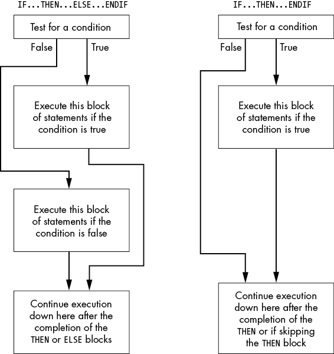
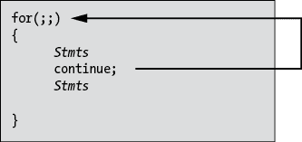
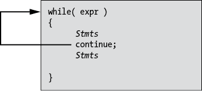
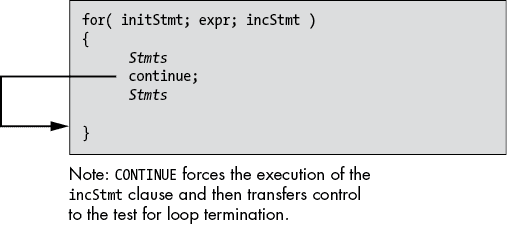
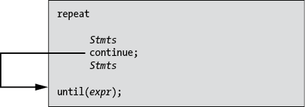

# 第七章：低级控制结构


本章讨论如何将高级语言（HLL）控制结构转换为汇编语言控制语句。到目前为止的示例采用了临时创建的方式构建汇编控制结构。现在是时候正式化如何控制汇编语言程序的操作了。完成本章后，你应该能够将 HLL 控制结构转换为汇编语言。

汇编语言中的控制结构由条件分支和间接跳转组成。本章讨论了这些指令，以及如何模拟 HLL 控制结构（如`if/else`、`switch`和循环语句）。本章还讨论了标签（条件分支和跳转语句的目标）以及汇编语言源文件中标签的作用域。

## 7.1 语句标签

在讨论跳转指令以及如何使用它们模拟控制结构之前，有必要深入讨论汇编语言中的语句标签。在汇编语言程序中，*标签*充当地址的符号名称。使用像`LoopEntry`这样的名称引用代码中的某个位置比使用像 0AF1C002345B7901Eh 这样的数字地址更为方便。因此，汇编语言的低级控制结构在源代码中大量使用标签（参见第二章的“简短绕道：控制转移指令介绍”）。

你可以对（代码）标签做三件事：通过（条件或无条件）跳转指令将控制转移到标签，使用`call`指令调用标签，以及获取标签的地址。当你想稍后在程序中间接地将控制转移到该地址时，获取标签的地址非常有用。

以下代码序列演示了在程序中获取标签地址的两种方式（使用`lea`指令和使用`offset`操作符）：

```
stmtLbl:
    .
    .
    .
  mov rcx, offset stmtLbl2
    .
    .
    .
  lea rax, stmtLbl
    .
    .
    .
stmtLbl2:
```

因为地址是 64 位的量，你通常会使用`lea`指令将地址加载到 64 位通用寄存器中。由于该指令使用当前指令的 32 位相对偏移量，因此指令编码比`mov`指令短得多（`mov`指令需要编码一个完整的 8 字节常量以及操作码字节）。

### 7.1.1 在过程中的使用局部符号

在`proc`/`endp`过程内定义的语句标签是*局部*的，从*词法* *作用域*的角度来看：该语句标签仅在该过程内可见；你不能在过程外引用该语句标签。列表 7-1 展示了你不能在另一个过程内引用符号（注意，由于此错误，该程序无法汇编）。

```
; Listing 7-1

; Demonstration of local symbols.
; Note that this program will not
; compile; it fails with an
; undefined symbol error.

        option  casemap:none

            .code

hasLocalLbl proc

localStmLbl:
            ret
hasLocalLbl endp

; Here is the "asmMain" function.

asmMain     proc

asmLocal:   jmp     asmLocal        ; This is okay
            jmp     localStmtLbl    ; Undefined in asmMain
asmMain     endp
            end
```

列表 7-1：词法作用域符号的演示

汇编此文件的命令（及相应的诊断消息）如下所示：

```
C:\>**ml64 /c listing7-1.asm**
Microsoft (R) Macro Assembler (x64) Version 14.15.26730.0
Copyright (C) Microsoft Corporation.  All rights reserved.

 Assembling: listing7-1.asm
listing7-1.asm(26) : error A2006:undefined symbol : localStmtLbl
```

如果你真的想在过程外部访问某个语句（或其他）标签，你可以使用`option`指令来关闭程序某一部分的局部作用域，正如第五章所述：

```
option noscoped
option scoped
```

第一种形式告诉 MASM 停止将符号（在`proc`/`endp`之间）限制为包含它们的过程的局部符号。第二种形式恢复了过程中的符号词法作用域。因此，使用这两个指令，你可以为源文件的各个部分打开或关闭作用域（如果你愿意，也可以只为单个语句设置作用域）。Listing 7-2 演示了如何使用`option`指令使单个符号在包含它的过程外部变为全局符号（注意，这个程序仍然存在编译错误）。

```
; Listing 7-2

; Demonstration of local symbols #2.
; Note that this program will not
; compile; it fails with two
; undefined symbol errors.

            option  casemap:none

            .code

hasLocalLbl proc

localStmLbl:
            option noscoped
notLocal:
            option scoped
isLocal:
            ret
hasLocalLbl endp

; Here is the "asmMain" function.

asmMain     proc

            lea     rcx, localStmtLbl  ; Generates an error
            lea     rcx, notLocal      ; Assembles fine
            lea     rcx, isLocal       ; Generates an error
asmMain     endp
            end
```

Listing 7-2：`option scoped`和`option noscoped`指令

这是 Listing 7-2 的构建命令（和诊断输出）：

```
C:\>**ml64 /c listing7-2.asm**
Microsoft (R) Macro Assembler (x64) Version 14.15.26730.0
Copyright (C) Microsoft Corporation.  All rights reserved.

 Assembling: listing7-2.asm
listing7-2.asm(29) : error A2006:undefined symbol : localStmtLbl
listing7-2.asm(31) : error A2006:undefined symbol : isLocal
```

正如你从 MASM 的输出中看到的，`notLocal`符号（出现在`option noscoped`指令之后）并未生成未定义符号错误。然而，`localStmtLbl`和`isLocal`符号，它们是`hasLocalLbl`过程的局部符号，在该过程外部是未定义的。

### 7.1.2 使用标签地址初始化数组

MASM 还允许你通过语句标签的地址来初始化四字（quad-word）变量。然而，在变量声明的初始化部分出现的标签有一些限制。最重要的限制是符号必须与尝试使用它的数据声明位于相同的词法作用域中。因此，要么`qword`指令必须出现在与语句标签相同的过程内，要么你必须使用`option noscoped`指令来使符号在过程内成为全局符号。Listing 7-3 展示了这两种初始化`qword`变量并将其与语句标签地址关联的方式。

```
; Listing 7-3

; Initializing qword values with the
; addresses of statement labels.

        option  casemap:none

            .data
lblsInProc  qword   globalLbl1, globalLbl2  ; From procWLabels

            .code

; procWLabels - Just a procedure containing private (lexically scoped)
;               and global symbols. This really isn't an executable
;               procedure.

procWLabels proc
privateLbl:
            nop     ; "No operation" just to consume space
            option  noscoped
globalLbl1: jmp     globalLbl2
globalLbl2: nop
            option  scoped
privateLbl2:
            ret
dataInCode  qword   privateLbl, globalLbl1
            qword   globalLbl2, privateLbl2
procWLabels endp

            end
```

Listing 7-3：使用语句标签地址初始化四字变量

如果你用以下命令编译 Listing 7-3，你将不会得到任何汇编错误：

```
ml64 /c /Fl listing7-3.asm
```

如果你查看 MASM 生成的*listing7-3.lst*输出文件，你会看到 MASM 正确地用语句标签的（相对于段/可重定位的）偏移量初始化了四字声明：

```
00000000                        .data
00000000           lblsInProc   qword   globalLbl1, globalLbl2
       0000000000000001 R
       0000000000000003 R
          .
          .
          .
 00000005           dataInCode  qword   privateLbl, globalLbl1
       0000000000000000 R
       0000000000000001 R
 00000015  0000000000000003 R   qword   globalLbl2, privateLbl2
       0000000000000004 R
```

将控制转移到过程内部的语句标签通常被认为是不好的编程实践。除非你有充分的理由这样做，否则你可能不应该这么做。

由于 x86-64 上的地址是 64 位量，你通常会使用`qword`指令（如前面示例所示）来用语句标签的地址初始化数据对象。然而，如果你的程序（总是会是）小于 2GB，并且你设置了`LARGEADDRESSAWARE:NO`标志（使用*sbuild.bat*），你可以使用`dword`数据声明来存放标签的地址。当然，正如本书多次提到的那样，在 64 位程序中使用 32 位地址，如果你的程序超出 2GB 存储空间时，可能会导致问题。

## 7.2 无条件控制转移（jmp）

`jmp`（*跳转*）指令无条件地将控制转移到程序中的另一个位置。此指令有三种形式：直接跳转和两种间接跳转。它们的形式如下：

```
jmp `label`
jmp `reg`[64]
jmp `mem`[64] 
```

第一条指令是一个*直接跳转*，你在之前的各种示例程序中已经见过这种跳转。对于直接跳转，通常通过使用语句标签来指定目标地址。标签要么出现在与可执行机器指令相同的行上，要么单独出现在可执行机器指令前的一行上。直接跳转完全等同于高级语言中的`goto`语句。^(1)

这是一个示例：

```
 `Statements`
          jmp laterInPgm
               .
               .
               .
laterInPgm:
 `Statements`
```

### 7.2.1 寄存器间接跳转

前面给出的第二种`jmp`指令形式——`jmp` `reg`64——是一种*寄存器间接跳转*指令，它将控制转移到指定的 64 位通用寄存器中存储的地址处的指令。要使用这种形式的`jmp`指令，必须在执行`jmp`之前将一个 64 位寄存器加载为机器指令的地址。当多个路径分别将寄存器加载不同地址时，控制将转移到由该路径到目前为止确定的适当位置。

清单 7-4 从用户处读取一个包含整数值的字符串。它使用 C 标准库函数`strtol()`将该字符串转换为二进制整数值。`strtol()`函数在报告错误时并不十分出色，因此该程序测试返回结果以验证输入是否正确，并使用寄存器间接跳转根据结果将控制转移到不同的代码路径。

清单 7-4 的第一部分包含常量、变量、外部声明和（通常的）`getTitle()`函数。

```
; Listing 7-4

; Demonstration of register-indirect jumps.

        option  casemap:none

nl          =       10
maxLen      =       256
EINVAL      =       22      ; "Magic" C stdlib constant, invalid argument
ERANGE      =       34      ; Value out of range

            .const
ttlStr      byte    "Listing 7-4", 0
fmtStr1     byte    "Enter an integer value between "
            byte    "1 and 10 (0 to quit): ", 0

badInpStr   byte    "There was an error in readLine "
            byte    "(ctrl-Z pressed?)", nl, 0

invalidStr  byte    "The input string was not a proper number"
            byte    nl, 0

rangeStr    byte    "The input value was outside the "
            byte    "range 1-10", nl, 0

unknownStr  byte    "There was a problem with strToInt "
            byte    "(unknown error)", nl, 0

goodStr     byte    "The input value was %d", nl, 0

fmtStr      byte    "result:%d, errno:%d", nl, 0

            .data
            externdef _errno:dword  ; Error return by C code
endStr      qword   ?
inputValue  dword   ?
buffer      byte    maxLen dup (?)

            .code
            externdef readLine:proc
            externdef strtol:proc
            externdef printf:proc

; Return program title to C++ program:

            public  getTitle
getTitle    proc
            lea     rax, ttlStr
            ret
getTitle    endp
```

清单 7-4 的下一部分是`strToInt()`函数，它是 C 标准库`strtol()`函数的封装器，更加彻底地处理用户输入的错误。请参阅函数的返回值注释。

```
; strToInt - Converts a string to an integer, checking for errors.

; Argument:
;    RCX -   Pointer to string containing (only) decimal
;            digits to convert to an integer.

; Returns:
;    RAX -   Integer value if conversion was successful.
;    RCX -   Conversion state. One of the following:
;            0 - Conversion successful.
;            1 - Illegal characters at the beginning of the
;                string (or empty string).
;            2 - Illegal characters at the end of the string.
;            3 - Value too large for 32-bit signed integer.

strToInt    proc
strToConv   equ     [rbp+16]        ; Flush RCX here
endPtr      equ     [rbp-8]         ; Save ptr to end of str
            push    rbp
 mov     rbp, rsp
            sub     rsp, 32h       ; Shadow + 16-byte alignment

            mov     strToConv, rcx ; Save, so we can test later

            ; RCX already contains string parameter for strtol:

            lea     rdx, endPtr    ; Ptr to end of string goes here
            mov     r8d, 10        ; Decimal conversion
            call    strtol

; On return:

;    RAX    - Contains converted value, if successful.
;    endPtr - Pointer to 1 position beyond last char in string.

; If strtol returns with endPtr == strToConv, then there were no
; legal digits at the beginning of the string.

            mov     ecx, 1         ; Assume bad conversion
            mov     rdx, endPtr
            cmp     rdx, strToConv
            je      returnValue

; If endPtr is not pointing at a zero byte, then we've got
; junk at the end of the string.

            mov     ecx, 2         ; Assume junk at end
            mov     rdx, endPtr
            cmp     byte ptr [rdx], 0
            jne     returnValue

; If the return result is 7FFF_FFFFh or 8000_0000h (max long and
; min long, respectively), and the C global _errno variable 
; contains ERANGE, then we've got a range error.

            mov     ecx, 0         ; Assume good input
            cmp     _errno, ERANGE
            jne     returnValue
            mov     ecx, 3         ; Assume out of range
            cmp     eax, 7fffffffh
            je      returnValue
            cmp     eax, 80000000h
            je      returnValue

; If we get to this point, it's a good number.

            mov     ecx, 0

returnValue:
            leave
            ret
strToInt    endp
```

清单 7-4 的最后一部分是主程序。这是我们最感兴趣的代码部分。它将 RBX 寄存器加载为基于`strToInt()`返回结果执行的代码地址。`strToInt()`函数返回以下几种状态中的一种（有关解释，请参见前面代码中的注释）：

+   有效输入

+   字符串开头存在非法字符

+   字符串末尾存在非法字符

+   范围错误

程序然后根据 RBX 中保存的值（指定`strToInt()`返回结果的类型）将控制转移到`asmMain()`的不同部分。

```
; Here is the "asmMain" function.

            public  asmMain
asmMain     proc
saveRBX     equ     qword ptr [rbp-8]      ; Must preserve RBX
            push    rbp
            mov     rbp, rsp
            sub     rsp, 48                ; Shadow storage

            mov     saveRBX, rbx           ; Must preserve RBX

            ; Prompt the user to enter a value
            ; between 1 and 10:

repeatPgm:  lea     rcx, fmtStr1
            call    printf

            ; Get user input:

            lea     rcx, buffer
            mov     edx, maxLen     ; Zero-extends!
            call    readLine
            lea     rbx, badInput   ; Initialize state machine
            test    rax, rax        ; RAX is -1 on bad input
            js      hadError        ; (only neg value readLine returns)

            ; Call strToInt to convert string to an integer and
            ; check for errors:

            lea     rcx, buffer     ; Ptr to string to convert
            call    strToInt
            lea     rbx, invalid
            cmp     ecx, 1
            je      hadError
            cmp     ecx, 2
            je      hadError

 lea     rbx, range
            cmp     ecx, 3
            je      hadError

            lea     rbx, unknown
            cmp     ecx, 0
            jne     hadError

; At this point, input is valid and is sitting in EAX.

; First, check to see if the user entered 0 (to quit
; the program).

            test    eax, eax        ; Test for zero
            je      allDone

; However, we need to verify that the number is in the
; range 1-10.

            lea     rbx, range
            cmp     eax, 1
            jl      hadError
            cmp     eax, 10
            jg      hadError

; Pretend a bunch of work happens here dealing with the
; input number.

            lea     rbx, goodInput
            mov     inputValue, eax

; The different code streams all merge together here to
; execute some common code (we'll pretend that happens;
; for brevity, no such code exists here).

hadError:

; At the end of the common code (which doesn't mess with
; RBX), separate into five different code streams based
; on the pointer value in RBX:

            jmp     rbx

; Transfer here if readLine returned an error:

badInput:   lea     rcx, badInpStr
            call    printf
            jmp     repeatPgm

; Transfer here if there was a non-digit character
; in the string:

invalid:    lea     rcx, invalidStr
 call    printf
            jmp     repeatPgm

; Transfer here if the input value was out of range:

range:      lea     rcx, rangeStr
            call    printf
            jmp     repeatPgm

; Shouldn't ever get here. Happens if strToInt returns
; a value outside the range 0-3.

unknown:    lea     rcx, unknownStr
            call    printf
            jmp     repeatPgm

; Transfer down here on a good user input.

goodInput:  lea     rcx, goodStr
            mov     edx, inputValue ; Zero-extends!
            call    printf
            jmp     repeatPgm

; Branch here when the user selects "quit program" by
; entering the value zero:

allDone:    mov     rbx, saveRBX    ; Must restore before returning
            leave
            ret                     ; Returns to caller

asmMain     endp
            end
```

清单 7-4：使用寄存器间接`jmp`指令

以下是清单 7-4 中的构建命令和程序示例运行：

```
C:\>**build listing7-4**

C:\>**echo off**
 Assembling: listing7-4.asm
c.cpp

C:\>**listing7-4**
Calling Listing 7-4:
Enter an integer value between 1 and 10 (0 to quit): ^Z
There was an error in readLine (ctrl-Z pressed?)
Enter an integer value between 1 and 10 (0 to quit): a123
The input string was not a proper number
Enter an integer value between 1 and 10 (0 to quit): 123a
The input string was not a proper number
Enter an integer value between 1 and 10 (0 to quit): 1234567890123
The input value was outside the range 1-10
Enter an integer value between 1 and 10 (0 to quit): -1
The input value was outside the range 1-10
Enter an integer value between 1 and 10 (0 to quit): 11
The input value was outside the range 1-10
Enter an integer value between 1 and 10 (0 to quit): 5
The input value was 5
Enter an integer value between 1 and 10 (0 to quit): 0
Listing 7-4 terminated
```

### 7.2.2 内存间接跳转

`jmp` 指令的第三种形式是 *内存间接* *跳转*，它从内存位置获取四字节值并跳转到该地址。这类似于寄存器间接 `jmp`，只不过地址出现在内存位置，而不是寄存器中。

列表 7-5 演示了这种形式的 `jmp` 指令的一种相当简单的使用方法。

```
; Listing 7-5

; Demonstration of memory-indirect jumps.

        option  casemap:none

nl          =       10

            .const
ttlStr      byte    "Listing 7-5", 0
fmtStr1     byte    "Before indirect jump", nl, 0
fmtStr2     byte    "After indirect jump", nl, 0

            .code
            externdef printf:proc

; Return program title to C++ program:

            public  getTitle
getTitle    proc
            lea     rax, ttlStr
            ret
getTitle    endp

; Here is the "asmMain" function.

            public  asmMain
asmMain     proc
            push    rbp
 mov     rbp, rsp
            sub     rsp, 48                 ; Shadow storage

            lea     rcx, fmtStr1
            call    printf
            jmp     memPtr

memPtr      qword   ExitPoint

ExitPoint:  lea     rcx, fmtStr2
            call    printf

            leave
            ret     ; Returns to caller

asmMain     endp
            end
```

列表 7-5: 使用内存间接 `jmp` 指令

以下是 列表 7-5 的构建命令和输出：

```
C:\>**build listing7-5**

C:\>**echo off**
 Assembling: listing7-5.asm
c.cpp

C:\>**listing7-5**
Calling Listing 7-5:
Before indirect jump
After indirect jump
Listing 7-5 terminated
```

请注意，如果你执行带有无效指针值的间接跳转，系统可能会崩溃。

## 7.3 条件跳转指令

尽管第二章已经概述了条件跳转指令，但在这里重复讨论并扩展这一内容是值得的，因为条件跳转是创建汇编语言控制结构的主要工具。

与无条件 `jmp` 指令不同，条件跳转指令没有间接形式。它们仅允许跳转到程序中的语句标签。

英特尔的文档为许多条件跳转指令定义了各种同义词或指令别名。表 7-1、7-2 和 7-3 列出了每个指令的所有别名，以及相对分支。你很快就会看到反向分支的用途。

表 7-1: `j``cc` 测试标志的指令

| **指令** | **描述** | **条件** | **别名** | **反向** |
| --- | --- | --- | --- | --- |
| `jc` | 如果有进位则跳转 | 进位 = 1 | `jb`, `jnae` | `jnc` |
| `jnc` | 如果没有进位则跳转 | 进位 = 0 | `jnb`, `jae` | `jc` |
| `jz` | 如果为零则跳转 | 零 = 1 | `je` | `jnz` |
| `jnz` | 如果不为零则跳转 | 零 = 0 | `jne` | `jz` |
| `js` | 如果符号则跳转 | 符号 = 1 |  | `jns` |
| `jns` | 如果没有符号则跳转 | 符号 = 0 |  | `js` |
| `jo` | 如果溢出则跳转 | 溢出 = 1 |  | `jno` |
| `jno` | 如果没有溢出则跳转 | 溢出 = 0 |  | `jo` |
| `jp` | 如果有奇偶性则跳转 | 奇偶性 = 1 | `jpe` | `jnp` |
| `jpe` | 如果奇偶性为偶则跳转 | 奇偶性 = 1 | `jp` | `jpo` |
| `jnp` | 如果无奇偶性则跳转 | 奇偶性 = 0 | `jpo` | `jp` |
| `jpo` | 如果奇偶性为奇则跳转 | 奇偶性 = 0 | `jnp` | `jpe` |

表 7-2: `j``cc` 无符号比较指令

| **指令** | **描述** | **条件** | **别名** | **反向** |
| --- | --- | --- | --- | --- |
| `ja` | 如果大于（`>`）则跳转 | 进位 = 0, 零 = 0 | `jnbe` | `jna` |
| `jnbe` | 如果不小于或等于（不是 `≤`）则跳转 | 进位 = 0, 零 = 0 | `ja` | `jbe` |
| `jae` | 如果大于或等于（`≥`）则跳转 | 进位 = 0 | `jnc`, `jnb` | `jnae` |
| `jnb` | 如果不小于（不是 `<`）则跳转 | 进位 = 0 | `jnc`, `jae` | `jb` |
| `jb` | 如果小于（`<`）则跳转 | 进位 = 1 | `jc`, `jnae` | `jnb` |
| `jnae` | 如果不大于或等于（不是 `≥`）则跳转 | 进位 = 1 | `jc`, `jb` | `jae` |
| `jbe` | 如果小于或等于（`≤`）则跳转 | 进位 = 1 或 零 = 1 | `jna` | `jnbe` |
| `jna` | 如果不大于（不是 `>`）则跳转 | 进位 = 1 或 零 = 1 | `jbe` | `ja` |
| `je` | 如果相等（`=`）则跳转 | 零 = 1 | `jz` | `jne` |
| `jne` | 如果不相等（`≠`）则跳转 | 零 = 0 | `jnz` | `je` |

表 7-3：`j``cc` 有符号比较指令

| **指令** | **描述** | **条件** | **别名** | **相反** |
| --- | --- | --- | --- | --- |
| `jg` | 如果大于（`>`）则跳转 | 符号 = 溢出或零 = 0 | `jnle` | `jng` |
| `jnle` | 如果不小于或等于（不是 `≤`）则跳转 | 符号 = 溢出或零 = 0 | `jg` | `jle` |
| `jge` | 如果大于或等于（`≥`）则跳转 | 符号 = 溢出 | `jnl` | `jnge` |
| `jnl` | 如果不小于（不是 `<`）则跳转 | 符号 = 溢出 | `jge` | `jl` |
| `jl` | 如果小于（`<`）则跳转 | 符号 `≠` 溢出 | `jnge` | `jnl` |
| `jnge` | 如果不大于或等于（不是 `≥`）则跳转 | 符号 `≠` 溢出 | `jl` | `jge` |
| `jle` | 如果小于或等于（`≤`）则跳转 | 符号 `≠` 溢出或零 = 1 | `jng` | `jnle` |
| `jng` | 如果不大于（不是 `>`）则跳转 | 符号 `≠` 溢出或零 = 1 | `jle` | `jg` |
| `je` | 如果相等（`=`）则跳转 | 零 = 1 | `jz` | `jne` |
| `jne` | 如果不相等（`≠`）则跳转 | 零 = 0 | `jnz` | `je` |

在许多情况下，你需要生成特定分支指令的相反分支（该部分稍后的例子中会出现）。除了两个例外外，*相反分支（N/No N）* 规则描述了如何生成相反分支：

+   如果 `j``cc` 指令的第二个字母不是 `n`，则在 `j` 后面插入一个 `n`。例如，`je` 变成 `jne`，`jl` 变成 `jnl`。

+   如果 `j``cc` 指令的第二个字母是 `n`，则从指令中去掉该 `n`。例如，`jng` 变成 `jg`，`jne` 变成 `je`。

该规则的两个例外是 `jpe`（*如果奇偶校验为偶*）和 `jpo`（*如果奇偶校验为奇*）。^(2) 但是，你可以使用别名 `jp` 和 `jnp` 来分别表示 `jpe` 和 `jpo`，并且 N/No N 规则适用于 `jp` 和 `jnp`。

x86-64 条件跳转指令使你能够根据特定条件将程序流程分为两条路径。假设你想在 BX 等于 CX 时递增 AX 寄存器。你可以使用以下代码来实现：

```
 cmp bx, cx
          jne SkipStmts;
          inc ax
SkipStmts:
```

不是直接检查相等并跳转到处理该条件的代码，常见的方法是使用相反的分支跳过你想在条件为真时执行的指令。也就是说，如果 BX *不* 等于 CX，则跳过递增指令。始终使用前面提到的相反分支（N/No N）规则来选择相反分支。

你还可以使用条件跳转指令来合成循环。例如，以下代码序列从用户读取一串字符，并将每个字符依次存储到数组的元素中，直到用户按下回车键（换行）为止：

```
 mov edi, 0
RdLnLoop:
      call getchar         ; Some function that reads a character
                           ; into the AL register
      mov Input[rdi], al   ; Store away the character
      inc rdi              ; Move on to the next character
      cmp al, nl           ; See if the user pressed ENTER
      jne RdLnLoop
```

条件跳转指令仅测试 x86-64 标志；它们不会影响任何标志。

从效率的角度来看，需要注意的是，每个条件跳转都有两种机器代码编码方式：一种是 2 字节形式，另一种是 6 字节形式。

2 字节形式由`j``cc`操作码和一个 1 字节的相对 PC 偏移组成。1 字节偏移允许指令将控制权转移到当前指令大约±127 字节范围内的目标指令。考虑到平均 x86-64 指令可能是 4 到 5 字节长，`j``cc`的 2 字节形式能够在大约 20 到 25 条指令范围内跳转到目标指令。

因为 20 到 25 条指令的范围对于所有条件跳转来说都不够，x86-64 提供了第二种（6 字节）形式，包含 2 字节操作码和 4 字节偏移。6 字节形式使你能够跳转到当前指令大约±2GB 范围内的指令，这对于任何合理的程序来说大多足够了。

如果有机会跳转到一个较近的标签，而不是远距离跳转（并且仍然能达到相同的结果），跳转到较近的标签将使你的代码更短，可能更快。

## 7.4 跳板

在极少数情况下，如果需要跳转到超出 6 字节`j``cc`指令范围的位置，可以使用如下的指令序列：

```
 jn`cc`  skipJmp  ; Opposite jump of the one you want to use
        jmp   destPtr  ; JMP PC-relative is also limited to ±2GB
destPtr qword destLbl  ; so code must use indirect jump
skipJmp:
```

相反的条件分支将控制权转移到代码中的正常*继续点*（即在条件为假时通常会继续执行的代码）。如果条件为真，控制权将转移到一个内存间接跳转，该跳转通过 64 位指针跳转到原始目标位置。

该序列被称为*跳板*，因为程序跳到这一点，再进一步跳到程序中的其他位置（就像跳床一样，可以让你跳得越来越高）。跳板对于使用 PC 相对寻址模式的调用和无条件跳转指令非常有用（因此，它们的范围仅限于当前指令的±2GB 范围）。

你很少会使用跳板将控制转移到程序中的另一个位置。然而，当将控制转移到动态链接库或操作系统子程序时，跳板非常有用，因为这些可能在内存中距离较远。

## 7.5 条件移动指令

有时，在比较或其他条件测试之后，你所需要做的只是将一个值加载到寄存器中（相反，如果测试或比较失败，则不加载该值）。因为分支指令的执行可能比较昂贵，x86-64 CPU 支持一组条件移动指令，`cmov``cc`。这些指令出现在表 7-4、7-5 和 7-6 中；这些指令的通用语法如下：

```
cmov*cc* `reg`[16], `reg`[16]
cmov*cc* `reg`[16], `mem`[16]
cmov*cc* `reg`[32], `reg`[32]
cmov*cc* `reg`[32], `mem`[32]
cmov*cc* `reg`[64], `reg`[64]
cmov*cc* `reg`[64], `mem`[64]
```

目标始终是一个通用寄存器（16、32 或 64 位）。你只能使用这些指令从内存加载数据到寄存器，或者将数据从一个寄存器复制到另一个寄存器；不能用它们来有条件地将数据存储到内存。

表 7-4：`cmov``cc` 测试标志的指令

| **指令** | **描述** | **条件** | **别名** |
| --- | --- | --- | --- |
| `cmovc` | 如果有进位，则移动 | 进位 = 1 | `cmovb`，`cmovnae` |
| `cmovnc` | 如果无进位，则移动 | 进位 = 0 | `cmovnb`，`cmovae` |
| `cmovz` | 如果为零，则移动 | 零标志 = 1 | `cmove` |
| `cmovnz` | 如果不为零，则移动 | 零标志 = 0 | `cmovne` |
| `cmovs` | 如果有符号标志，则移动 | 符号 = 1 |  |
| `cmovns` | 如果无符号标志，则移动 | 符号 = 0 |  |
| `cmovo` | 如果溢出，则移动 | 溢出 = 1 |  |
| `cmovno` | 如果无溢出，则移动 | 溢出 = 0 |  |
| `cmovp` | 如果有奇偶校验，则移动 | 奇偶校验 = 1 | `cmovpe` |
| `cmovpe` | 如果奇偶校验为偶，则移动 | 奇偶校验 = 1 | `cmovp` |
| `cmovnp` | 如果无奇偶校验，则移动 | 奇偶校验 = 0 | `cmovpo` |
| `cmovpo` | 如果奇偶校验为奇，则移动 | 奇偶校验 = 0 | `cmovnp` |

表 7-5: `cmov``cc` 指令用于无符号比较

| **指令** | **描述** | **条件** | **别名** |
| --- | --- | --- | --- |
| `cmova` | 如果大于（`>`），则移动 | 进位 = 0，零标志 = 0 | `cmovnbe` |
| `cmovnbe` | 如果不小于或等于（非`≤`），则移动 | 进位 = 0，零标志 = 0 | `cmova` |
| `cmovae` | 如果大于或等于（`≥`），则移动 | 进位 = 0 | `cmovnc`，`cmovnb` |
| `cmovnb` | 如果不小于（非`<`），则移动 | 进位 = 0 | `cmovnc`，`cmovae` |
| `cmovb` | 如果小于（`<`），则移动 | 进位 = 1 | `cmovc`，`cmovnae` |
| `cmovnae` | 如果不大于或等于（非`≥`），则移动 | 进位 = 1 | `cmovc`，`cmovb` |
| `cmovbe` | 如果小于或等于（`≤`），则移动 | 进位 = 1 或 零标志 = 1 | `cmovna` |
| `cmovna` | 如果不大于（非`>`），则移动 | 进位 = 1 或 零标志 = 1 | `cmovbe` |
| `cmove` | 如果相等（`=`），则移动 | 零标志 = 1 | `cmovz` |
| `cmovne` | 如果不相等（`≠`），则移动 | 零标志 = 0 | `cmovnz` |

表 7-6: `cmov``cc` 指令用于有符号比较

| **指令** | **描述** | **条件** | **别名** |
| --- | --- | --- | --- |
| `cmovg` | 如果大于（`>`），则移动 | 符号 = 溢出 或 零标志 = 0 | `cmovnle` |
| `cmovnle` | 如果不小于或等于（非`≤`），则移动 | 符号 = 溢出 或 零标志 = 0 | `cmovg` |
| `cmovge` | 如果大于或等于（`≥`），则移动 | 符号 = 溢出 | `cmovnl` |
| `cmovnl` | 如果不小于（非`<`），则移动 | 符号 = 溢出 | `cmovge` |
| `cmovl` | 如果小于（`<`），则移动 | 符号 ≠ 溢出 | `cmovnge` |
| `cmovnge` | 如果不大于或等于（非`≥`），则移动 | 符号 ≠ 溢出 | `cmovl` |
| `cmovle` | 如果小于或等于（`≤`），则移动 | 符号 ≠ 溢出 或 零标志 = 1 | `cmovng` |
| `cmovng` | 如果不大于（非`>`），则移动 | 符号 ≠ 溢出 或 零标志 = 1 | `cmovle` |
| `cmove` | 如果相等（`=`），则移动 | 零标志 = 1 | `cmovz` |
| `cmovne` | 如果不相等（`≠`），则移动 | 零标志 = 0 | `cmovnz` |

此外，一组条件浮点移动指令（`fcmov``cc`）将会在 FPU 堆栈中将数据在 ST0 和其他 FPU 寄存器之间移动。不幸的是，这些指令在现代程序中并不是特别有用。如果你有兴趣使用它们，可以查看 Intel 文档获取更多细节。

## 7.6 在汇编语言中实现常见控制结构

本节展示了如何使用纯汇编语言实现决策、循环和其他控制结构。

### 7.6.1 决策

在最基本的形式中，*决策*是代码中的一个分支，根据某个条件在两个可能的执行路径之间切换。通常（尽管并非总是如此），条件指令序列是通过条件跳转指令来实现的。条件指令对应于高级语言中的`if/then/endif`语句：

```
if(`expression`) then
    `Statements`
endif;
```

要将其转换为汇编语言，你必须编写评估`expression`的语句，然后在结果为假时跳过`statements`。例如，如果你有如下 C 语句：

```
if(a == b)
{
    printf("a is equal to b \ n");
} 
```

你可以将其转换为汇编语言，如下所示：

```
 mov  eax, a           ; Assume a and b are 32-bit integers
      cmp  eax, b
      jne  aNEb
      lea  rcx, aIsEqlBstr  ; "a is equal to b \ n"
      call printf
aNEb:
```

一般来说，条件语句可以分为三大类：`if`语句、`switch`/`case`语句和间接跳转。以下章节将描述这些程序结构、如何使用它们以及如何在汇编语言中编写它们。

### 7.6.2 `if/then/else`序列

最常见的条件语句是`if/then/endif`和`if/then/else/endif`语句。这两种语句的形式如图 7-1 所示。



图 7-1：`if``/``then``/``else``/``endif`和`if``/``then``/``endif`语句流程

`if/then/endif`语句只是`if/then/else/endif`语句的一种特殊情况（没有`else`块）。`if/then/else/endif`语句的基本实现形式如下所示（在 x86-64 汇编语言中）：

```
 `Sequence of statements to test a condition`
          j`cc` ElseCode;

 `Sequence of statements corresponding to the THEN block`
          jmp EndOfIf

ElseCode: 
 `Sequence of statements corresponding to the ELSE block`

EndOfIf:
```

其中`j``cc`表示条件跳转指令。

例如，要转换 C/C++语句

```
if(a == b)
    c = d;
else 
    b = b + 1;
```

转换为汇编语言时，你可以使用以下 x86-64 代码：

```
 mov eax, a
          cmp eax, b
          jne ElseBlk
          mov eax, d
          mov c, eax
          jmp EndOfIf;

ElseBlk:
          inc b

EndOfIf: 
```

对于像`(a == b)`这样的简单表达式，生成一个`if/then/else/endif`语句的适当代码几乎是微不足道的。如果表达式变得更复杂，代码的复杂性也会增加。考虑之前提到的这个 C/C++ `if`语句：

```
if(((x > y) && (z < t)) || (a != b))
    c = d;
```

要转换像这样的复杂`if`语句，可以将其分解为三个`if`语句，形式如下：

```
if(a != b) c = d;
else if(x > y)
     if(z < t)
           c = d;
```

这种转换来自以下 C/C++等价物：

```
if(`expr1` && `expr2`) `Stmt`;
```

等价于

```
if(`expr1`) if(`expr2`) `Stmt`;
```

和

```
if(`expr1` || `expr2`) `Stmt`;
```

等价于

```
if(`expr1`) `Stmt`;
else if(`expr2`) `Stmt`;
```

在汇编语言中，前者的`if`语句变成了

```
; if(((x > y) && (z < t)) || (a != b))c = d;

          mov eax, a
          cmp eax, b
          jne DoIf;
          mov eax, x
          cmp eax, y
          jng EndOfIf;
          mov eax, z
          cmp eax, t
          jnl EndOfIf;
DoIf:
          mov eax, d
          mov c, eax
EndOfIf:
```

汇编语言中复杂条件语句最大的难题可能是，在编写完代码后，试图弄清楚自己做了什么。高级语言的表达式要容易阅读和理解得多。写得好的注释对于清晰的汇编语言实现`if/then/else/endif`语句至关重要。下面是前一个例子的优雅实现：

```
; if ((x > y) && (z < t)) or (a != b)  c = d;
; Implemented as: 
; if (a != b) then goto DoIf: 

          mov eax, a
          cmp eax, b
          jne DoIf

; if not (x > y) then goto EndOfIf:

          mov eax, x
          cmp eax, y
          jng EndOfIf

; if not (z < t) then goto EndOfIf:

          mov eax, z
          cmp eax, t
          jnl EndOfIf

; THEN block:

DoIf:     
          mov eax, d
          mov c, eax

; End of IF statement.

EndOfIf:
```

诚然，对于这么简单的例子来说，这样做有些过头。下面的写法可能已经足够：

```
; if (((x > y) && (z < t)) || (a != b))  c = d;
; Test the Boolean expression:

          mov eax, a
          cmp eax, b
          jne DoIf
          mov eax, x
          cmp eax, y
          jng EndOfIf
          mov eax, z
          cmp eax, t
          jnl EndOfIf

; THEN block:

DoIf:
          mov eax, d
          mov c, eax

; End of IF statement.

EndOfIf: 
```

然而，当你的`if`语句变得复杂时，你的注释的密度（和质量）变得越来越重要。

### 7.6.3 使用完整布尔运算的复杂 if 语句

许多布尔表达式涉及合取（`and`）或析取（`or`）操作。本节描述了如何将这些布尔表达式转换为汇编语言。我们可以通过两种方式来实现：使用*完整布尔评估*或使用*短路布尔评估*。本节讨论了完整布尔评估，下一节将讨论短路布尔评估。

通过完整布尔评估的转换与将算术表达式转换为汇编语言几乎相同，如第六章所述。然而，对于布尔评估，你不需要将结果存储在变量中；一旦表达式的评估完成，你只需检查结果是`false`（0）还是`true`（1，或者非零），然后根据布尔表达式的要求采取相应的行动。通常，最后一条逻辑指令（`and`/`or`）会在结果为`false`时设置零标志，而在结果为`true`时清除零标志，因此你不必显式地测试结果。考虑以下`if`语句及其通过完整布尔评估转换为汇编语言的过程：

```
;     if(((x < y) && (z > t)) || (a != b))
;          `Stmt1` 

          mov  eax, x
 cmp   eax, y
          setl  bl        ; Store x < y in BL
          mov   eax, z
          cmp   eax, t
          setg  bh        ; Store z > t in BH
          and   bl, bh    ; Put (x < y) && (z > t) into BL
          mov   eax, a
          cmp   eax, b
          setne bh        ; Store a != b into BH
          or    bl, bh    ; Put (x < y) && (z > t) || (a != b) into BL
          je    SkipStmt1 ; Branch if result is false

 `Code for Stmt1 goes here`

SkipStmt1:
```

该代码在 BL 寄存器中计算一个布尔结果，然后在计算结束时测试该值，看它是否包含`true`或`false`。如果结果为`false`，则该序列会跳过与`Stmt1`相关的代码。在这个例子中，重要的是要注意，程序会执行计算布尔结果的每一条指令（直到`je`指令）。

### 7.6.4 短路布尔评估

如果你愿意付出更多的努力，通常可以通过使用*短路布尔评估*将布尔表达式转换为更简短、更快速的汇编语言指令序列。该方法试图通过执行部分指令来确定一个表达式是`true`还是`false`，这些指令是计算完整表达式所需的指令的一部分。

考虑表达式`a && b`。一旦我们确定`a`为`false`，就无需再评估`b`，因为这个表达式不可能为`true`。如果`b`表示一个复杂的子表达式而不是单一的布尔变量，那么仅评估`a`显然更高效。

作为一个具体的例子，考虑上一节中的子表达式`((x < y) && (z > t))`。一旦确定`x`不小于`y`，就无需检查`z`是否大于`t`，因为无论`z`和`t`的值如何，表达式都会为`false`。以下代码片段展示了如何实现该表达式的短路布尔评估：

```
; if((x < y) && (z > t)) then ...

          mov eax, x
          cmp eax, y
          jnl TestFails
          mov eax, z
          cmp eax, t
          jng TestFails

 `Code for THEN clause of IF statement`

TestFails:
```

代码一旦确定`x`不小于`y`，就会跳过后续的测试。当然，如果`x`小于`y`，程序必须测试`z`是否大于`t`；如果不是，程序会跳过`then`语句。只有当程序满足两个条件时，代码才会继续执行`then`语句。

对于逻辑`or`操作，方法类似。如果第一个子表达式计算结果为真，则不需要测试第二个操作数。无论此时第二个操作数的值为何，完整的表达式仍然为真。以下示例演示了如何使用短路求值与析取（`or`）结合：

```
; if(ch < 'A' || ch > 'Z')
;     then printf("Not an uppercase char");
; endif;

          cmp ch, 'A'
          jb ItsNotUC
          cmp ch, 'Z'
          jna ItWasUC

ItsNotUC:
 `Code to process ch if it's not an uppercase character`

ItWasUC:
```

因为连接词和析取词运算符是可交换的，所以如果更方便，你可以先计算左操作数或右操作数。^(3) 作为本节中的最后一个例子，考虑前一节中的完整布尔表达式：

```
; if(((x < y) && (z > t)) || (a != b)) `Stmt1` ;

          mov eax, a
          cmp eax, b
          jne DoStmt1
          mov eax, x
          cmp eax, y
          jnl SkipStmt1
          mov eax, z
          cmp eax, t
          jng SkipStmt1

DoStmt1:
 `Code for Stmt1 goes here`

SkipStmt1:
```

此示例中的代码首先评估`a != b`，因为它更短且更快，^(4) 而最后评估剩余的子表达式。这是汇编语言程序员用来编写更高效代码的常见技术。^(5)

### 7.6.5 短路与完全布尔求值

使用完全布尔求值时，表达式中每个语句都会执行；而短路布尔求值则可能不需要执行与布尔表达式相关的每个语句。如你在前两节中所见，基于短路求值的代码通常更短且更快。

然而，在某些情况下，短路布尔求值可能不会产生正确的结果。如果表达式中包含*副作用*，短路布尔求值会产生与完全布尔求值不同的结果。考虑以下 C/C++示例：

```
if((x == y) && (++z != 0)) `Stmt` ;
```

使用完全布尔求值时，你可能会生成以下代码：

```
 mov   eax, x      ; See if x == y
          cmp   eax, y
          sete  bl 
          inc   z           ; ++z
          cmp   z, 0        ; See if incremented z is 0
          setne bh
          and   bl, bh      ; Test x == y && ++z != 0
          jz    SkipStmt

 `Code for Stmt goes here`

SkipStmt:
```

使用短路布尔求值时，你可能会生成如下代码：

```
 mov eax, x      ; See if x == y
          cmp eax, y
          jne SkipStmt
          inc z           ; ++z - sets ZF if z becomes zero
          je  SkipStmt    ; See if incremented z is 0

 `Code for Stmt goes here`

SkipStmt:
```

请注意这两种转换之间一个微妙但重要的区别：如果`x`等于`y`，第一个版本仍然会在执行与`Stmt`相关的代码之前，*递增*`z`并*将其与 0 进行比较*；而短路版本则会跳过递增`z`的代码，前提是`x`等于`y`。因此，如果`x`等于`y`，这两段代码的行为是不同的。

这两种实现并没有什么特别错误的地方；根据具体情况，你可能希望或不希望代码在`x`等于`y`时递增`z`。然而，重要的是要意识到这两种方案会产生不同的结果，因此，如果代码对`z`的影响对你的程序很重要，你可以选择合适的实现方式。

许多程序利用短路布尔求值，并依赖程序不对表达式的某些部分进行求值。以下 C/C++代码片段演示了可能最常见的需要短路布尔求值的例子：

```
if(pntr != NULL && *pntr == 'a')  `Stmt` ;
```

如果`pntr`的值为`NULL`，则表达式为假，且无需评估表达式的其余部分。这个语句依赖于短路布尔评估来正确执行。如果 C/C++使用完整的布尔评估，表达式的后半部分将尝试解除引用一个`NULL`指针，而此时`pntr`为`NULL`。

考虑使用完整布尔评估来翻译这条语句：

```
; Complete Boolean evaluation:

          mov   rax, pntr
          test  rax, rax   ; Check to see if RAX is 0 (NULL is 0)
          setne bl
          mov   al, [rax]  ; Get *pntr into AL
          cmp   al, 'a'
          sete  bh
          and   bl, bh
          jz    SkipStmt

 `Code for Stmt goes here`

SkipStmt:
```

如果`pntr`包含`NULL (0)`，该程序将通过`mov al, [rax]`指令尝试访问内存位置 0 的数据。在大多数操作系统中，这将导致内存访问错误（一般保护错误）。

现在考虑短路布尔转换：

```
; Short-circuit Boolean evaluation:

      mov  rax, pntr   ; See if pntr contains NULL (0) and
      test rax, rax    ; immediately skip past Stmt if this
      jz   SkipStmt    ; is the case

 mov  al, [rax]   ; If we get to this point, pntr contains
      cmp  al, 'a'     ; a non-NULL value, so see if it points
      jne  SkipStmt    ; at the character "a"

 `Code for Stmt goes here`

SkipStmt:
```

在这个例子中，解除引用`NULL`指针的问题并不存在。如果`pntr`为`NULL`，这段代码会跳过尝试访问`pntr`所指向的内存地址的语句。

### 7.6.6 汇编语言中`if`语句的高效实现

在汇编语言中高效地编码`if`语句需要比简单地选择短路评估或完整布尔评估更多的思考。为了在汇编语言中编写尽可能快速的代码，你必须仔细分析情况并适当生成代码。以下段落提供了一些建议，你可以将它们应用到程序中以提高性能。

#### 7.6.6.1 了解你的数据！

程序员常常错误地认为数据是随机的。实际上，数据很少是随机的，如果你了解程序常用的值类型，你可以编写更好的代码。为了更好理解，考虑以下 C/C++语句：

```
if((a == b) && (c < d)) ++i;
```

由于 C/C++使用短路评估，该代码会先测试`a`是否等于`b`。如果是，它会测试`c`是否小于`d`。如果你预计`a`大多数情况下等于`b`，但不预计`c`大多数情况下小于`d`，那么这条语句的执行会比应该的慢。考虑以下 MASM 实现的代码：

```
 mov eax, a
          cmp eax, b
          jne DontIncI

          mov eax, c
          cmp eax, d
          jnl DontIncI

          inc i

DontIncI:
```

如你所见，如果`a`大多数时间等于`b`，且`c`大多数时间不小于`d`，你将不得不几乎每次执行所有六条指令，以确定表达式为假。现在考虑以下实现，它利用了这些知识，以及`&&`运算符是可交换的事实：

```
 mov eax, c
          cmp eax, d
          jnl DontIncI

          mov eax, a
          cmp eax, b
          jne DontIncI

          inc i

DontIncI:
```

代码首先检查`c`是否小于`d`。如果大多数情况下`c`小于`d`，则该代码会在典型情况下只执行三条指令后跳过到标签`DontIncI`（相比于前面例子中的六条指令）。

这个事实在汇编语言中比在高级语言中更加明显，这也是汇编程序通常比其高级语言（HLL）对应程序更快的主要原因之一：优化在汇编语言中比在高级语言中更为明显。当然，关键在于理解数据的行为，这样你才能做出像前述那样的明智决策。

#### 7.6.6.2 重新排列表达式

即使你的数据是随机的（或者你无法确定输入值如何影响你的决策），重新排列表达式中的项仍然可能是有益的。一些计算比其他计算要慢得多。例如，`div` 指令比简单的 `cmp` 指令要慢得多。因此，如果你有如下语句，你可能想要重新排列表达式，使得 `cmp` 先执行：

```
if((x % 10 = 0) && (x != y) ++x;
```

转换为汇编代码后，这条 `if` 语句变成了以下内容：

```
 mov  eax, x        ; Compute X % 10
          cdq                ; Must sign-extend EAX -> EDX:EAX
          idiv ten           ; "ten dword 10" in .const section
          test edx, edx      ; Remainder is in EDX, test for 0
          jnz  SkipIf

          mov  eax, x
          cmp  eax, y
          je   SkipIf

          inc  x

SkipIf:
```

`idiv` 指令的开销很大（通常比这个例子中大多数其他指令慢 50 到 100 倍）。除非余数为 0 的可能性比 `x` 等于 `y` 的可能性大 50 到 100 倍，否则最好先做比较，再进行余数计算：

```
 mov  eax, x
          cmp  eax, y
          je   SkipIf

          mov  eax, x     ; Compute X % 10
          cdq             ; Must sign-extend EAX -> EDX:EAX
          idiv ten        ; "ten dword 10" in .const section
          test edx, edx   ; See if remainder (EDX) is 0
          jnz  SkipIf

          inc  x

SkipIf:
```

因为 `&&` 和 `||` 运算符在短路求值发生时并不是交换律的，所以在进行此类变换时请谨慎考虑。这个例子可以正常工作，因为没有副作用或可能的异常被重新排列的 `&&` 运算符的求值方式所掩盖。

#### 7.6.6.3 解构你的代码

结构化代码有时比非结构化代码效率低，因为它引入了代码重复或额外的分支，而这些在非结构化代码中可能是不存在的。^(6) 大多数情况下，这是可以接受的，因为非结构化代码难以阅读和维护；为了可维护的代码牺牲一些性能通常是可以接受的。然而，在某些情况下，你可能需要尽可能高的性能，可能会选择牺牲代码的可读性。

将以前写的结构化代码重写为非结构化代码以提高性能被称为 *解构代码*。非结构化代码和解构代码的区别在于，非结构化代码一开始就是以那种方式编写的；而解构代码起初是结构化代码，并有意以非结构化的方式重写，以提高效率。纯粹的非结构化代码通常难以阅读和维护。解构代码则不那么糟糕，因为你仅将解构（非结构化代码）限制在那些绝对必要的部分。

解构代码的一种经典方法是使用 *代码移动*（将代码片段物理地移到程序的其他地方），把程序很少使用的代码移到经常执行的代码之外。代码移动可以通过两种方式提高程序效率。

首先，采取分支比不采取分支更昂贵（耗时）。^(7)如果你将不常用的代码移动到程序的另一个位置，并在少数情况下分支到它，大部分时间你将直接执行频繁执行的代码。

其次，顺序的机器指令会消耗缓存存储。如果你将不常执行的语句从正常的代码流中移到程序的其他部分（这些部分很少加载到缓存中），这将提高系统的缓存性能。

例如，考虑以下伪 C/C++语句：

```
if(`see_if_an_error_has_occurred`)
{
 `Statements to execute if no error`
}
else
{
 `Error-handling statements`
}
```

在普通代码中，我们通常不期望错误频繁发生。因此，你通常会期望前面的`if`语句的`then`部分比`else`语句执行得更频繁。前面的代码可以转化为以下的汇编代码：

```
 cmp `see_if_an_error_has_occurred`, true
     je HandleTheError

 `Statements to execute if no error`

     jmp EndOfIf;

HandleTheError:
 `Error-handling statements`
EndOfIf:
```

如果表达式为假，则这段代码会直接跳到正常语句，并跳过错误处理语句。那些将控制权从程序的一个点转移到另一个点的指令（例如，`jmp`指令）往往很慢。执行一系列顺序指令要比在程序中到处跳转要快得多。不幸的是，前面的代码并不允许这样做。

解决这个问题的一种方法是将代码中的`else`语句移到程序的其他位置。你可以将代码重写如下：

```
 cmp `see_if_an_error_has_occurred`, true
     je HandleTheError

 `Statements to execute if no error`

EndOfIf:
```

在程序的其他地方（通常在`jmp`指令之后），你会插入以下代码：

```
HandleTheError:
 `Error-handling statements`
     jmp EndOfIf;
```

程序并没有变得更短。你从原始序列中移除的`jmp`指令最终会到达`else`语句的末尾。然而，由于`else`语句很少执行，移动`jmp`指令从频繁执行的`then`语句到`else`语句会带来巨大的性能提升，因为`then`语句只通过直线代码执行。在许多时间关键的代码段中，这个技巧出奇的有效。

#### 7.6.6.4 计算而非分支

在 x86-64 系列的许多处理器中，分支（跳转）相比许多其他指令来说是昂贵的。因此，有时执行更多指令的顺序比执行少量涉及分支的指令要更好。

例如，考虑简单的赋值`eax = abs(eax)`。不幸的是，没有 x86-64 指令可以计算整数的绝对值。处理这个问题的显而易见的方法是使用一组指令，通过条件跳转来跳过`neg`指令（如果 EAX 为负，则该指令将 EAX 变为正值）：

```
 test eax, eax
          jns ItsPositive;

          neg eax

ItsPositive:
```

现在考虑以下的代码序列，这也能完成任务：

```
; Set EDX to 0FFFF_FFFFh if EAX is negative, 0000_0000 if EAX is
; 0 or positive:

          cdq

; If EAX was negative, the following code inverts all the bits in
; EAX; otherwise, it has no effect on EAX.

          xor eax, edx

; If EAX was negative, the following code adds 1 to EAX;
; otherwise, it doesn't modify EAX's value.

 and edx, 1   ; EDX = 0 or 1 (1 if EAX was negative)
          add eax, edx
```

这段代码会将 EAX 中的所有位反转，然后在 EAX 为负之前加 1；也就是说，它会将 EAX 中的值取反。如果 EAX 为零或正数，这段代码不会改变 EAX 中的值。

尽管这一序列需要四条指令，而不是前面例子所需的三条指令，但它没有控制转移指令，因此在许多 x86-64 架构的 CPU 上执行可能更快。当然，如果你使用之前介绍过的`cmovns`指令，使用以下三条指令也能实现（且没有控制转移）：

```
mov    edx, eax
neg    edx
cmovns eax, edx 
```

这也证明了为什么了解指令集很重要！

### 7.6.7 `switch/case`语句

C/C++的`switch`语句具有以下形式：

```
 switch(`expression`)
      {
          case `const1`:
 `Stmts1: Code to execute if`
 `expression equals const1`

          case `const2`:
 `Stmts2: Code to execute if`
 `expression equals const2`
            .
            .
            .
          case `constn`:
 `Stmtsn: Code to execute if`
 `expression equals constn`

          default:  ; Note that the default section is optional
 `Stmts_default: Code to execute if expression`
                           `does not equal`
                           `any of the case values`
      }
```

当该语句执行时，它会将`expression`的值与常量`const1`到`constn`进行比较。如果找到匹配的常量，相应的语句将执行。

C/C++对`switch`语句有一些限制。首先，`switch`语句只允许整数表达式（或者可以转化为整数的类型）。其次，`case`子句中的所有常量必须是唯一的。稍后这些限制的原因会变得清晰。

#### 7.6.7.1 `switch`语句语义

大多数入门编程教材通过将`switch/case`语句解释为一系列`if/then/elseif/else/endif`语句来介绍它。它们可能会声称以下两段 C/C++代码是等效的：

```
switch(`expression`)
{
    case 0: printf("i=0"); break;
    case 1: printf("i=1"); break;
    case 2: printf("i=2"); break;
}

if(eax == 0)
    printf("i=0");
else if(eax == 1)
    printf("i=1");
else if(eax == 2)
    printf("i=2");
```

虽然在语义上这两段代码可能是相同的，但它们的实现通常是不同的。`if/then/elseif/else/endif`链会对序列中的每个条件语句进行比较，而`switch`语句通常使用间接跳转来通过一次计算将控制权转移到多个语句中的任何一个。

#### 7.6.7.2 `if/else`实现`switch`

`switch`（以及`if/else/elseif`）语句可以用以下汇编语言代码编写：

```
; if/then/else/endif form:

          mov eax, i
          test eax, eax   ; Check for 0
          jnz Not0

 `Code to print "i = 0"`
          jmp EndCase

Not0:
          cmp eax, 1
          jne Not1

 `Code to print "i = 1"`
          jmp EndCase

Not1:
          cmp eax, 2
          jne EndCase;

 `Code to print "i = 2"`
EndCase: 
```

可能需要注意的唯一一件事是，确定最后一个`case`所需的时间比确定第一个`case`是否执行的时间要长。这是因为`if/else/elseif`版本实现了*线性搜索*，逐个检查从第一个到最后一个`case`值，直到找到匹配项。

#### 7.6.7.3 间接跳转`switch`实现

可以使用*间接跳转表*来实现更快的`switch`语句。该实现将`switch`表达式作为索引，指向一个地址表；每个地址指向要执行的目标`case`的代码。考虑以下示例：

```
; Indirect Jump Version.

        mov eax, i
        lea rcx, JmpTbl
        jmp qword ptr [rcx][rax * 8]

JmpTbl  qword Stmt0, Stmt1, Stmt2

Stmt0:
 `Code to print "i = 0"`
        jmp EndCase;

Stmt1:
 `Code to print "i = 1"`
        jmp EndCase;

Stmt2:
 `Code to print "i = 2"`

EndCase: 
```

首先，`switch`语句要求你创建一个指针数组，每个元素包含代码中一个语句标签的地址（这些标签必须附加到每个`switch`语句中对应`case`的执行指令序列上）。在前面的示例中，初始化了指向语句标签`Stmt0`、`Stmt1`和`Stmt2`地址的`JmpTbl`数组，起到了这个作用。我将这个数组放在了过程内部，因为这些标签是过程的局部标签。不过，请注意，你必须将数组放置在一个永远不会作为代码执行的地方（比如紧跟在`jmp`指令之后，如本例所示）。

程序将`i`的值加载到 RAX 寄存器中（假设`i`是 32 位整数，`mov`指令会将 EAX 零扩展到 RAX），然后使用这个值作为`JmpTbl`数组的索引（RCX 保存`JmpTbl`数组的基址），并将控制权转移到指定位置找到的 8 字节地址。例如，如果 RAX 包含 0，`jmp [rcx][rax * 8]`指令将从地址`JmpTbl+0`处取出四字数据（RAX × 8 = 0）。因为表中的第一个四字数据包含了`Stmt0`的地址，所以`jmp`指令将控制权转移到`Stmt0`标签后面的第一条指令。同样，如果`i`（因此 RAX）包含 1，那么间接的`jmp`指令将从表中偏移量为 8 的位置取出四字数据，并将控制权转移到`Stmt1`标签后面的第一条指令（因为`Stmt1`的地址出现在表的偏移量 8 的位置）。最后，如果`i`/RAX 包含 2，那么这段代码将控制权转移到`Stmt2`标签后面的语句，因为它出现在`JmpTbl`表中的偏移量 16 处。

随着更多（连续的）`case`的增加，跳转表的实现比`if/elseif`形式更高效（无论是在空间还是速度上）。除了简单的情况外，`switch`语句几乎总是更快，通常差距较大。只要`case`值是连续的，`switch`语句版本通常也更小。

#### 7.6.7.4 非连续跳转表条目与范围限制

如果你需要包括不连续的`case`标签，或者不能确定`switch`的值是否超出范围，会发生什么呢？在 C/C++的`switch`语句中，这种情况会将控制权转移到`switch`语句后面的第一条语句（或者转移到`default`语句，如果`switch`中有`default`语句的话）。

然而，在前面的示例中并不会发生这种情况。如果变量`i`不包含 0、1 或 2，执行前面的代码会产生未定义的结果。例如，如果`i`的值为 5，当你执行代码时，间接的`jmp`指令会获取`JmpTbl`中偏移量 40（5 × 8）处的 qword，并将控制转移到该地址。不幸的是，`JmpTbl`没有六个条目，因此程序将获取`JmpTbl`后面第六个 quad word 的值，并将其用作目标地址，这通常会导致程序崩溃或将控制转移到一个意外的位置。

解决方案是在间接`jmp`指令之前放置一些指令，验证`switch`选择值是否在合理范围内。在前面的例子中，我们可能希望在执行`jmp`指令之前验证`i`的值是否在 0 到 2 的范围内。如果`i`的值超出这个范围，程序应该直接跳转到`endcase`标签（这对应于跳到整个`switch`语句后的第一条语句）。以下代码提供了这种修改：

```
 mov eax, i
        cmp eax, 2
        ja  EndCase
        lea rcx, JmpTbl
        jmp qword ptr [rcx][rax * 8]

JmpTbl  qword Stmt0, Stmt1, Stmt2

Stmt0:
 `Code to print "i = 0"`
        jmp EndCase;

Stmt1:
 `Code to print "i = 1"`
        jmp EndCase;

Stmt2:
 `Code to print "i = 2"`

EndCase:
```

尽管前面的示例解决了选择值超出 0 到 2 范围的问题，但它仍然有几个严重的限制：

+   各 case 的值必须从 0 开始。也就是说，在这个示例中，最小的`case`常量必须是 0。

+   各 case 的值必须是连续的。

解决第一个问题很简单，可以分两步来处理。首先，在确定 case 值是否合法之前，你需要将 case 选择值与下限和上限进行比较。例如：

```
; SWITCH statement specifying cases 5, 6, and 7:
; WARNING: This code does *NOT* work.
; Keep reading to find out why.

     mov eax, i
     cmp eax, 5
     jb  EndCase
     cmp eax, 7              ; Verify that i is in the range
     ja  EndCase             ; 5 to 7 before the indirect jmp
     lea rcx, JmpTbl
     jmp qword ptr [rcx][rax * 8]

JmpTbl  qword Stmt5, Stmt6, Stmt7

Stmt5:
 `Code to print "i = 5"`
        jmp EndCase;

Stmt6:
 `Code to print "i = 6"`
        jmp EndCase;

Stmt7:
 `Code to print "i = 7"`

EndCase:
```

这段代码添加了一对额外的指令`cmp`和`jb`，用于测试选择值是否在 5 到 7 的范围内。如果不在此范围，控制将跳转到`EndCase`标签；否则，控制将通过间接的`jmp`指令转移。不幸的是，正如注释所指出的，这段代码是有问题的。

假设变量`i`的值为 5：代码会验证 5 是否在 5 到 7 的范围内，然后获取偏移量 40（5 × 8）处的 dword，并跳转到该地址。然而，像之前一样，这会加载表格边界之外的 8 个字节，并且不会将控制转移到一个已定义的位置。一种解决方案是在执行`jmp`指令之前，从 EAX 中减去最小的 case 选择值，如下例所示：

```
; SWITCH statement specifying cases 5, 6, and 7.
; WARNING: There is a better way to do this; keep reading.

     mov eax, i
     cmp eax, 5
     jb  EndCase
     cmp eax, 7              ; Verify that i is in the range
     ja  EndCase             ; 5 to 7 before the indirect jmp
     sub eax, 5              ; 5 to 7 -> 0 to 2
     lea rcx, JmpTbl
     jmp qword ptr [rcx][rax * 8]

JmpTbl  qword Stmt5, Stmt6, Stmt7

Stmt5:
 `Code to print "i = 5"`
        jmp EndCase;

Stmt6:
 `Code to print "i = 6"`
        jmp EndCase;

Stmt7:
 `Code to print "i = 7"`

EndCase: 
```

通过从 EAX 的值中减去 5，我们强制 EAX 在`jmp`指令之前取 0、1 或 2。因此，选择值为 5 时跳转到`Stmt5`，选择值为 6 时转移控制到`Stmt6`，选择值为 7 时跳转到`Stmt7`。

为了改进这段代码，你可以通过将`sub`指令合并到`jmp`指令的地址表达式中来消除`sub`指令。以下代码实现了这一点：

```
; SWITCH statement specifying cases 5, 6, and 7:

     mov eax, i
     cmp eax, 5
     jb  EndCase
     cmp eax, 7                           ; Verify that i is in the range
     ja  EndCase                          ; 5 to 7 before the indirect jmp
     lea rcx, JmpTbl
     jmp qword ptr [rcx][rax * 8 – 5 * 8] ; 5 * 8 compensates for zero index

JmpTbl  qword Stmt5, Stmt6, Stmt7

Stmt5:
 `Code to print "i = 5"`
        jmp EndCase;

Stmt6:
 `Code to print "i = 6"`
 jmp EndCase;

Stmt7:
 `Code to print "i = 7"`

EndCase:
```

C/C++的`switch`语句提供了一个`default`子句，当选择的值与任何 case 值不匹配时会执行。例如：

```
switch(`expression`)
{

    case 5:  printf("ebx = 5"); break;
    case 6:  printf("ebx = 6"); break;
    case 7:  printf("ebx = 7"); break;
    default
        printf("ebx does not equal 5, 6, or 7");
}
```

在纯汇编语言中实现`default`子句的等价物是很容易的。只需在代码开头的`jb`和`ja`指令中使用不同的目标标签。以下示例实现了类似前面示例的 MASM `switch`语句：

```
; SWITCH statement specifying cases 5, 6, and 7
; with a DEFAULT clause:

     mov eax, i
     cmp eax, 5 
     jb  DefaultCase
     cmp eax, 7                           ; Verify that i is in the range
     ja  DefaultCase                      ; 5 to 7 before the indirect jmp
     lea rcx, JmpTbl
     jmp qword ptr [rcx][rax * 8 – 5 * 8] ; 5 * 8 compensates for zero index

JmpTbl  qword Stmt5, Stmt6, Stmt7

Stmt5:
 `Code to print "i = 5"`
        jmp EndCase

Stmt6:
 `Code to print "i = 6"`
        jmp EndCase

Stmt7:
 `Code to print "i = 7"`
        jmp EndCase

DefaultCase:
 `Code to print "EBX does not equal 5, 6, or 7"`

EndCase:
```

如前所述的第二个限制（即`case`值需要是连续的）很容易通过在跳转表中插入额外的条目来处理。考虑以下 C/C++ `switch`语句：

```
switch(i)
{
    case 1  printf("i = 1"); break;
    case 2  printf("i = 2"); break;
    case 4  printf("i = 4"); break;
    case 8  printf("i = 8"); break;
    default:
        printf("i is not 1, 2, 4, or 8");
}
```

最小的`switch`值是 1，最大值是 8。因此，在间接`jmp`指令之前的代码需要将`i`中的值与 1 和 8 进行比较。如果值介于 1 和 8 之间，仍然可能`i`不包含合法的`case`选择值。然而，由于`jmp`指令使用`case`选择表对四字节表进行索引，表必须有八个四字节条目。

为了处理 1 到 8 之间不是`case`选择值的值，只需将`default`子句的语句标签（或者如果没有`default`子句，则指定`endswitch`后第一条指令的标签）放入跳转表中每个没有对应`case`子句的条目中。以下代码演示了这一技术：

```
; SWITCH statement specifying cases 1, 2, 4, and 8
; with a DEFAULT clause:

     mov eax, i
     cmp eax, 1
     jb  DefaultCase
     cmp eax, 8                           ; Verify that i is in the range
     ja  DefaultCase                      ; 1 to 8 before the indirect jmp
     lea rcx, JmpTbl
     jmp qword ptr [rcx][rax * 8 – 1 * 8] ; 1 * 8 compensates for zero index

JmpTbl  qword Stmt1, Stmt2, DefaultCase, Stmt4
        qword DefaultCase, DefaultCase, DefaultCase, Stmt8

Stmt1:
 `Code to print "i = 1"`
        jmp EndCase

Stmt2:
 `Code to print "i = 2"`
        jmp EndCase

Stmt4:
 `Code to print "i = 4"`
        jmp EndCase

Stmt8:
 `Code to print "i = 8"`
        jmp EndCase

DefaultCase:
 `Code to print "i does not equal 1, 2, 4, or 8"`

EndCase: 
```

#### 7.6.7.5 稀疏跳转表

当前`switch`语句的实现存在一个问题。如果`case`值包含不连续的、相隔很远的条目，跳转表可能会变得极其庞大。以下`switch`语句将生成一个非常大的代码文件：

```
switch(i)
{
    case 1:       `Stmt1` ;
    case 100:     `Stmt2` ;
    case 1000:    `Stmt3` ;
    case 10000:   `Stmt4` ;
    default:      `Stmt5` ;

}
```

在这种情况下，如果你使用一系列`if`语句来实现`switch`语句，而不是使用间接跳转语句，程序的体积将会更小。然而，要记住一点：跳转表的大小通常不会影响程序的执行速度。如果跳转表包含两个条目或两千个条目，`switch`语句将在一个固定的时间内执行多分支操作。`if`语句的实现则要求每个出现在`case`语句中的`case`标签都需要线性增长的时间。

使用汇编语言相对于像 Pascal 或 C/C++这样的高级语言（HLL）最大的优势之一是你可以选择诸如`switch`语句的实际实现方式。在某些情况下，你可以将`switch`语句实现为一系列`if/then/elseif`语句，或者将其实现为一个跳转表，或者使用这两者的混合方式：

```
switch(i)
{
    case 0:   `Stmt0` ;
    case 1:   `Stmt1` ;
    case 2:   `Stmt2` ;
    case 100: `Stmt3` ;
    default:  `Stmt4` ;

}
```

它可以变成如下：

```
mov eax, i
cmp eax, 100
je  DoStmt3;
cmp eax, 2
ja  TheDefaultCase
lea rcx, JmpTbl
jmp qword ptr [rcx][rax * 8]
 .
 .
 .
```

如果你愿意接受程序大小不超过 2GB（并使用`LARGEADDRESSAWARE:NO`命令行选项），你可以改进`switch`语句的实现，并节省一条指令：

```
; SWITCH statement specifying cases 5, 6, and 7
; with a DEFAULT clause:

     mov eax, i
     cmp eax, 5
     jb  DefaultCase
     cmp eax, 7                  ; Verify that i is in the range
     ja  DefaultCase             ; 5 to 7 before the indirect jmp
     jmp JmpTbl[rax * 8 – 5 * 8] ; 5 * 8 compensates for zero index

JmpTbl  qword Stmt5, Stmt6, Stmt7

Stmt5:
 `Code to print "i = 5"`
        jmp EndCase

Stmt6:
 `Code to print "i = 6"`
        jmp EndCase

Stmt7:
 `Code to print "i = 7"`
        jmp EndCase

DefaultCase:
 `Code to print "EBX does not equal 5, 6, or 7"`

EndCase:
```

这段代码移除了`lea rcx, JmpTbl`指令，并将`jmp [rcx][rax * 8 – 5 * 8]`替换为`jmp JmpTbl[rax * 8 – 5 * 8]`。这是一个小的改进，但仍然是一个改进（这个序列不仅少了一条指令，还减少了一个寄存器的使用）。当然，始终要注意编写不具备大地址意识的 64 位程序的危险。

一些`switch`语句具有稀疏的情况，但在整个情况集内有一些连续的情况组。考虑以下的 C/C++ `switch`语句：

```
switch(`expression`)
{
    case 0:
 `Code for case 0`
        break;

    case 1:
 `Code for case 1`
        break;

    case 2:
 `Code for case 2`
        break;

    case 10:
 `Code for case 10`
        break;

    case 11:
 `Code for case 11`
        break;

    case 100:
 `Code for case 100`
        break;

    case 101:
 `Code for case 101`
        break;

    case 103:
 `Code for case 101`
        break;

    case 1000:
 `Code for case 1000`
        break;

    case 1001:
 `Code for case 1001`
        break;

    case 1003:
 `Code for case 1001`
        break;

    default:
 `Code for default case`
        break;
} // end switch
```

你可以将一个由广泛分隔的（几乎）连续的情况组组成的`switch`语句转换为汇编语言代码，为每个连续组实现一个跳转表，然后使用比较指令来确定执行哪个跳转表指令序列。下面是前面 C/C++代码的一种可能实现：

```
; Assume expression has been computed and is sitting in EAX/RAX
; at this point...

         cmp   eax, 100
         jb    try0_11
         cmp   eax, 103
         ja    try1000_1003
         cmp   eax, 100
         jb    default
         lea   rcx, jt100
         jmp   qword ptr [rcx][rax * 8 – 100 * 8]
jt100    qword case100, case101, default, case103

try0_11: cmp   ecx, 11 ; Handle cases 0-11 here
         ja    defaultCase
         lea   rcx, jt0_11
         jmp   qword ptr [rcx][rax * 8]
jt0_11   qword case0, case1, case2, defaultCase 
         qword defaultCase, defaultCase, defaultCase
         qword defaultCase, defaultCase, defaultCase
         qword case10, case11

try1000_1003:
         cmp   eax, 1000
         jb    defaultCase
         cmp   eax, 1003
         ja    defaultCase
         lea   rcx, jt1000
         jmp   qword ptr [rcx][rax * 8 – 1000 * 8]
jt1000   qword case1000, case1001, defaultCase, case1003
           .
           .
           .
 `Code for the actual cases here`
```

这个代码序列将组 0 到 2 和组 10 到 11 合并为一个单一的组（需要七个额外的跳转表条目），以避免写入额外的跳转表序列。

当然，对于这样一组简单的情况，可能直接使用比较-分支序列更为容易。这个例子被简化了一些，仅仅是为了说明一个观点。

#### 7.6.7.6 其他`switch`语句替代方案

如果这些情况过于稀疏，除了逐个比较表达式的值外什么都做不了，会发生什么？代码是否注定要被转换成等效的`if/elseif/else/endif`序列？不一定。然而，在我们考虑其他替代方案之前，必须提到并非所有的`if/elseif/else/endif`序列都是一样的。回顾一下前面的例子。一个直接的实现可能是这样的：

```
if(unsignedExpression <= 11)
{
 `Switch for 0 to 11`
}
else if(unsignedExpression >= 100 && unsignedExpression <= 101)
{
 `Switch for 100 to 101`
}
else if(unsignedExpression >= 1000 && unsignedExpression <= 1001)
{
 `Switch for 1000 to 1001`
}
else
{
 `Code for default case`
}
```

相反，前面的实现首先测试值为 100，并根据比较结果（小于时为组 0 到 11，大于时为组 1000 到 1001）进行分支，从而有效地创建了一个小的*二分查找*，减少了比较的次数。在高级语言代码中很难看出节省了多少，但在汇编代码中，你可以计算出在最佳和最差情况下执行的指令数量，并看到比标准线性查找方法（仅仅按照`switch`语句中出现的顺序比较值）有所改进。^(8)

如果你的情况过于稀疏（完全没有有意义的分组），比如前面章节中给出的 1、10、100、1000、10000 的例子，你将无法（合理地）使用跳转表来实现`switch`语句。与其直接退化为线性查找（这可能很慢），更好的解决方案是对你的情况进行排序，并使用二分查找来测试它们。

使用二分查找时，你首先将表达式值与中间值进行比较。如果它小于中间值，你将在值列表的前半部分重复查找；如果它大于中间值，你将在值列表的后半部分重复查找；如果它相等，显然你会进入代码处理该测试。以下是 1、10、100、……示例的二分查找版本：

```
; Assume expression has been calculated into EAX.

        cmp eax, 100
        jb  try1_10
 ja  try1000_10000

 `Code to handle case 100 goes here`
        jmp AllDone

try1_10:
        cmp eax,1
        je  case1
        cmp eax, 10
        jne defaultCase

 `Code to handle case 10 goes here`
        jmp AllDone
case1:
 `Code to handle case 1 goes here`
        jmp AllDone

try1000_10000:
        cmp eax, 1000
        je  case1000
        cmp eax, 10000
        jne defaultCase

 `Code to handle case 10000 goes here`
        jmp AllDone

case1000:
 `Code to handle case 1000 goes here`
        jmp AllDone

defaultCase:
 `Code to handle defaultCase goes here`

AllDone:
```

本节中展示的技术有许多可能的替代方案。例如，一个常见的解决方案是创建一个包含记录（结构体）集合的表，每个记录条目是一个包含案例值和跳转地址的二元组。与其有一长串的比较指令，不如用一个简短的循环遍历所有表元素，寻找匹配的案例值并将控制转移到相应的跳转地址。这个方案比本节中的其他技术慢，但比传统的`if/elseif/else/endif`实现要短得多。^(9)

顺便提一下，`defaultCase`标签通常出现在（非跳转表）`switch`实现中的多个`j``cc`指令中。由于条件跳转指令有两种编码形式：一种是 2 字节格式，另一种是 6 字节格式，因此你应该尽量将`defaultCase`放置在这些条件跳转附近，以便尽可能使用短格式的指令。尽管本节中的示例通常将跳转表（它们消耗大量字节）紧跟在相应的间接跳转之后，但你可以将这些表移到程序的其他位置，以帮助保持条件跳转指令的简短。以下是考虑到这一点的早期 1、10、100、……示例的代码：

```
; Assume expression has been computed and is sitting in EAX/RAX
; at this point...

         cmp   eax, 100
         jb    try0_13
         cmp   eax, 103
         ja    try1000_1003
         lea   rcx, jt100
         jmp   qword ptr [rcx][rax * 8 – 100 * 8]

try0_13: cmp   ecx, 13      ; Handle cases 0 to 13 here
         ja    defaultCase
         lea   rcx, jt0_13
         jmp   qword ptr [rcx][rax * 8]

try1000_1003:
         cmp   eax, 1000    ; Handle cases 1000 to 1003 here
         jb    defaultCase
         cmp   eax, 1003
         ja    defaultCase
         lea   rcx, jt1000
         jmp   qword ptr [rcx][rax * 8 – 1000 * 8]

defaultCase:
 `Put defaultCase here to keep it near all the`
 `conditional jumps to defaultCase` 

         jmp   AllDone

jt0_13   qword case0, case1, case2, case3
         qword defaultCase, defaultCase, defaultCase
         qword defaultCase, defaultCase, defaultCase
         qword case10, case11, case12, case13
jt100    qword case100, case101, case102, case103
jt1000   qword case1000, case1001, case1002, case1003
           .
           .
           .
 `Code for the actual cases here`
```

## 7.7 状态机与间接跳转

另一种在汇编语言程序中常见的控制结构是*状态机*。状态机使用*状态变量*来控制程序流程。FORTRAN 编程语言通过分配的`goto`语句提供了这一功能。C 语言的某些变种（例如，GNU 的自由软件基金会的 GCC）也提供了类似的功能。在汇编语言中，间接跳转可以实现状态机。

那么，什么是状态机呢？简单来说，它是一段代码，通过进入和离开特定的*状态*来跟踪其执行历史。为了本章的目的，我们可以假设状态机是一段（某种方式下）记住其执行历史（其*状态*）并根据该历史执行代码段的代码。

从实际意义上讲，所有程序都是状态机。CPU 寄存器和内存中的值构成了该机器的状态。然而，我们将采用一个更加有限的视角。实际上，对于大多数目的来说，只有一个变量（或 RIP 寄存器中的值）表示当前状态。

现在让我们考虑一个具体的例子。假设你有一个过程，并且希望在第一次调用时执行一个操作，第二次调用时执行不同的操作，第三次调用时执行另一个操作，然后在第四次调用时再执行一个新的操作。在第四次调用后，它按顺序重复这四个操作。

例如，假设你希望在第一次调用时将 EAX 和 EBX 相加，在第二次调用时将它们相减，在第三次调用时将它们相乘，在第四次调用时将它们相除。你可以按照 Listing 7-6 中所示的方式实现这个过程。

```
; Listing 7-6

; A simple state machine example.

        option  casemap:none

nl          =       10

            .const
ttlStr      byte    "Listing 7-6", 0
fmtStr0     byte    "Calling StateMachine, "
            byte    "state=%d, EAX=5, ECX=6", nl, 0

fmtStr0b    byte    "Calling StateMachine, "
            byte    "state=%d, EAX=1, ECX=2", nl, 0

fmtStrx     byte    "Back from StateMachine, "
            byte    "state=%d, EAX=%d", nl, 0

fmtStr1     byte    "Calling StateMachine, "
            byte    "state=%d, EAX=50, ECX=60", nl, 0

fmtStr2     byte    "Calling StateMachine, "
            byte    "state=%d, EAX=10, ECX=20", nl, 0

fmtStr3     byte    "Calling StateMachine, "
            byte    "state=%d, EAX=50, ECX=5", nl, 0

            .data
state       byte    0

 .code
            externdef printf:proc

; Return program title to C++ program:

            public  getTitle
getTitle    proc
            lea     rax, ttlStr
            ret
getTitle    endp

StateMachine proc
             cmp    state, 0
             jne    TryState1

; State 0: Add ECX to EAX and switch to state 1:

             add    eax, ecx
             inc    state           ; State 0 becomes state 1
             jmp    exit

TryState1:
             cmp    state, 1
             jne    TryState2

; State 1: Subtract ECX from EAX and switch to state 2:

             sub    eax, ecx
             inc    state           ; State 1 becomes state 2
             jmp    exit

TryState2:   cmp    state, 2
             jne    MustBeState3

; If this is state 2, multiply ECX by EAX and switch to state 3:

             imul   eax, ecx
             inc    state           ; State 2 becomes state 3
             jmp    exit

; If it isn't one of the preceding states, we must be in state 3,
; so divide EAX by ECX and switch back to state 0.

MustBeState3:
             push   rdx          ; Preserve this 'cause it
                                 ; gets whacked by div
             xor    edx, edx     ; Zero-extend EAX into EDX
             div    ecx
             pop    rdx          ; Restore EDX's value preserved above
             mov    state, 0     ; Reset the state back to 0

exit:        ret

StateMachine endp

; Here is the "asmMain" function.

            public  asmMain
asmMain     proc
            push    rbp
            mov     rbp, rsp
            sub     rsp, 48         ; Shadow storage

            mov     state, 0        ; Just to be safe

; Demonstrate state 0:

            lea     rcx, fmtStr0
            movzx   rdx, state
            call    printf

            mov     eax, 5
            mov     ecx, 6
            call    StateMachine

            lea     rcx, fmtStrx
            mov     r8, rax
            movzx   edx, state
            call    printf

; Demonstrate state 1:

            lea     rcx, fmtStr1
            movzx   rdx, state
            call    printf

            mov     eax, 50
            mov     ecx, 60
            call    StateMachine

            lea     rcx, fmtStrx
            mov     r8, rax
            movzx   edx, state
            call    printf

; Demonstrate state 2:

            lea     rcx, fmtStr2
            movzx   rdx, state
            call    printf

            mov     eax, 10
            mov     ecx, 20
            call    StateMachine

            lea     rcx, fmtStrx
            mov     r8, rax
            movzx   edx, state
            call    printf

; Demonstrate state 3:

            lea     rcx, fmtStr3
            movzx   rdx, state
            call    printf

            mov     eax, 50
            mov     ecx, 5
            call    StateMachine

            lea     rcx, fmtStrx
            mov     r8, rax
            movzx   edx, state
            call    printf

; Demonstrate back in state 0:

            lea     rcx, fmtStr0b
            movzx   rdx, state
            call    printf

            mov     eax, 1
            mov     ecx, 2
            call    StateMachine

            lea     rcx, fmtStrx
            mov     r8, rax
            movzx   edx, state
            call    printf

            leave
            ret     ; Returns to caller

asmMain     endp
            end
```

Listing 7-6: 一个状态机示例

这是构建命令和程序输出：

```
C:\>**build listing7-6**

C:\>**echo off**
 Assembling: listing7-6.asm
c.cpp

C:\>**listing7-6**
Calling Listing 7-6:
Calling StateMachine, state=0, EAX=5, ECX=6
Back from StateMachine, state=1, EAX=11
Calling StateMachine, state=1, EAX=50, ECX=60
Back from StateMachine, state=2, EAX=-10
Calling StateMachine, state=2, EAX=10, ECX=20
Back from StateMachine, state=3, EAX=200
Calling StateMachine, state=3, EAX=50, ECX=5
Back from StateMachine, state=0, EAX=10
Calling StateMachine, state=0, EAX=1, ECX=2
Back from StateMachine, state=1, EAX=3
Listing 7-6 terminated
```

从技术上讲，这个过程本身并不是状态机。相反，变量`state`和`cmp/jne`指令构成了状态机。这个过程不过是通过`if/then/elseif`结构实现的一个`switch`语句。唯一不同的是它记住了被调用的次数^(10)，并根据调用次数表现得不同。

虽然这是一个*正确的*状态机实现，但效率并不高。敏锐的读者当然会意识到，通过使用实际的`switch`语句，而不是`if/then/elseif/endif`结构，这段代码可以稍微加速。然而，实际上还有更好的解决方案。

在汇编语言中，常见的做法是使用间接跳转来实现状态机。我们可以让`state`变量存储要在进入过程时执行的代码的*地址*，而不是包含像 0、1、2 或 3 这样的值。通过简单地跳转到该地址，状态机可以省去选择适当代码片段所需的测试。请参考 Listing 7-7 中使用间接跳转的实现。

```
; Listing 7-7

; An indirect jump state machine example.

        option  casemap:none

nl          =       10

            .const
ttlStr      byte    "Listing 7-7", 0
fmtStr0     byte    "Calling StateMachine, "
            byte    "state=0, EAX=5, ECX=6", nl, 0

fmtStr0b    byte    "Calling StateMachine, "
            byte    "state=0, EAX=1, ECX=2", nl, 0

fmtStrx     byte    "Back from StateMachine, "
            byte    "EAX=%d", nl, 0

fmtStr1     byte    "Calling StateMachine, "
            byte    "state=1, EAX=50, ECX=60", nl, 0

fmtStr2     byte    "Calling StateMachine, "
            byte    "state=2, EAX=10, ECX=20", nl, 0

fmtStr3     byte    "Calling StateMachine, "
            byte    "state=3, EAX=50, ECX=5", nl, 0

             .data
state        qword  state0

            .code
            externdef printf:proc

; Return program title to C++ program:

            public  getTitle
getTitle    proc
            lea     rax, ttlStr
            ret
getTitle    endp

; StateMachine version 2.0 - using an indirect jump.

             option noscoped     ; state`x` labels must be global
StateMachine proc

             jmp    state

; State 0: Add ECX to EAX and switch to state 1:

state0:      add    eax, ecx
             lea    rcx, state1
             mov    state, rcx
             ret

; State 1: Subtract ECX from EAX and switch to state 2:

state1:      sub    eax, ecx
             lea    rcx, state2
             mov    state, rcx
             ret

; If this is state 2, multiply ECX by EAX and switch to state 3:

state2:      imul   eax, ecx
             lea    rcx, state3
             mov    state, rcx
             ret

state3:      push   rdx          ; Preserve this 'cause it 
                                 ; gets whacked by div
             xor    edx, edx     ; Zero-extend EAX into EDX
             div    ecx
             pop    rdx          ; Restore EDX's value preserved above
             lea    rcx, state0
             mov    state, rcx
             ret

StateMachine endp
             option scoped

; Here is the "asmMain" function.

            public  asmMain
asmMain     proc
            push    rbp
            mov     rbp, rsp
            sub     rsp, 48         ; Shadow storage

            lea     rcx, state0
            mov     state, rcx      ; Just to be safe

; Demonstrate state 0:

            lea     rcx, fmtStr0
            call    printf

            mov     eax, 5
            mov     ecx, 6
            call    StateMachine

            lea     rcx, fmtStrx
            mov     rdx, rax
            call    printf

; Demonstrate state 1:

            lea     rcx, fmtStr1
            call    printf

            mov     eax, 50
            mov     ecx, 60
            call    StateMachine

            lea     rcx, fmtStrx
            mov     rdx, rax
            call    printf

; Demonstrate state 2:

            lea     rcx, fmtStr2
            call    printf

            mov     eax, 10
            mov     ecx, 20
            call    StateMachine

            lea     rcx, fmtStrx
            mov     rdx, rax
            call    printf

; Demonstrate state 3:

            lea     rcx, fmtStr3
            call    printf

            mov     eax, 50
            mov     ecx, 5
            call    StateMachine

            lea     rcx, fmtStrx
            mov     rdx, rax
            call    printf

; Demonstrate back in state 0:

            lea     rcx, fmtStr0b
            call    printf

            mov     eax, 1
            mov     ecx, 2
            call    StateMachine

            lea     rcx, fmtStrx
            mov     rdx, rax
            call    printf

            leave
            ret     ; Returns to caller

asmMain     endp
            end
```

Listing 7-7: 使用间接跳转的状态机

这是构建命令和程序输出：

```
C:\>**build listing7-7**

C:\>**echo off**
 Assembling: listing7-7.asm
c.cpp

C:\>**listing7-7**
Calling Listing 7-7:
Calling StateMachine, state=0, EAX=5, ECX=6
Back from StateMachine, EAX=11
Calling StateMachine, state=1, EAX=50, ECX=60
Back from StateMachine, EAX=-10
Calling StateMachine, state=2, EAX=10, ECX=20
Back from StateMachine, EAX=200
Calling StateMachine, state=3, EAX=50, ECX=5
Back from StateMachine, EAX=10
Calling StateMachine, state=0, EAX=1, ECX=2
Back from StateMachine, EAX=3
Listing 7-7 terminated
```

`StateMachine`过程开始时的`jmp`指令将控制转移到由`state`变量指向的位置。第一次调用`StateMachine`时，它指向`State0`标签。此后，每个代码子段都将`state`变量设置为指向适当的后续代码。

## 7.8 循环

*循环*表示构成典型程序的最终基本控制结构（顺序、决策和循环）。与汇编语言中的许多其他结构一样，你会发现自己在一些从未想过的地方使用循环。

大多数高级语言（HLL）都有隐式的循环结构。例如，考虑 BASIC 语句`if A$ = B$ then 100`。该`if`语句比较两个字符串，如果它们相等，则跳转到语句 100。在汇编语言中，你需要写一个循环，逐个字符地将`A$`中的字符与`B$`中的对应字符进行比较，只有当所有字符匹配时，才跳转到语句 100。^(11)

程序循环由三个组件组成：可选的*初始化组件*、可选的*循环终止测试*和*循环体*。组装这些组件的顺序可以显著影响循环的操作。程序中常见的三种组件排列是：`while` 循环、`repeat/until` 循环（在 C/C++ 中为 `do/while`）和无限循环（例如 C/C++ 中的 `for(;;)`）。

### 7.8.1 while 循环

最通用的循环是 `while` 循环。在 C/C++ 中，它具有以下形式：

```
while(`expression`) `statement(s)`;
```

在 `while` 循环中，终止测试出现在循环开始时。由于终止测试的位置，循环体可能永远不会执行，如果布尔表达式始终为假。

请考虑以下 C/C++ `while` 循环：

```
i = 0;
while(i < 100)
{
    ++i;
}
```

`i = 0;` 语句是该循环的初始化代码。`i` 是一个循环控制变量，因为它控制循环体的执行。`i < 100` 是循环终止条件：只要 `i` 小于 100，循环就不会终止。单一语句 `++i;`（*递增 i*）是循环体，它在每次循环迭代时执行。

一个 C/C++ `while` 循环可以通过 `if` 和 `goto` 语句轻松合成。例如，你可以用以下 C 代码替换之前的 C `while` 循环：

```
i = 0;
WhileLp:
if(i < 100)
{

    ++i;
      goto WhileLp;

}
```

更一般地，你可以按照以下方式构建任何 `while` 循环：

```
`Optional initialization code`

UniqueLabel:
if(`not_termination_condition`)
{
 `Loop body`
    goto UniqueLabel;

}
```

因此，你可以使用本章前面的技术将 `if` 语句转换为汇编语言，并添加一个 `jmp` 指令来生成 `while` 循环。本节中的示例翻译为以下纯 x86-64 汇编代码：^(12)

```
 mov i, 0
WhileLp:
          cmp i, 100
          jnl WhileDone
          inc i
          jmp WhileLp;

WhileDone:
```

### 7.8.2 repeat/until 循环

`repeat/until`（`do/while`）循环在循环结束时测试终止条件，而不是在循环开始时。在 Pascal 中，`repeat/until` 循环具有以下形式：

```
`Optional initialization code`
repeat

 `Loop body`

until(`termination_condition`);
```

这与以下 C/C++ `do/while` 循环类似：

```
`Optional initialization code`
do
{
 `Loop body`

}while(`not_termination_condition`);
```

该序列首先执行初始化代码，然后执行循环体，最后测试一个条件来判断是否需要重复循环。如果布尔表达式为假，则循环重复；否则，循环终止。你需要注意 `repeat/until` 循环的两点：终止测试出现在循环的末尾，并且因此，循环体总是至少执行一次。

与 `while` 循环一样，`repeat/until` 循环也可以通过 `if` 语句和 `jmp` 指令合成。你可以使用以下代码：

```
`Initialization code`
SomeUniqueLabel:

 `Loop body`

if(`not_termination_condition`) goto SomeUniqueLabel;
```

基于前面章节中介绍的内容，你可以轻松地在汇编语言中合成 `repeat/until` 循环。以下是一个简单的示例：

```
 repeat (`Pascal code`)

          write('Enter a number greater than 100:');
          readln(i);

     until(i > 100);

// This translates to the following if/jmp code:

     RepeatLabel:

          write('Enter a number greater than 100:');
          readln(`i`);

     if(`i` <= 100) then goto RepeatLabel;

// It also translates into the following assembly code:

RepeatLabel:

 call print
          byte "Enter a number greater than 100: ", 0
          call readInt  ; Function to read integer from user

          cmp  eax, 100 ; Assume readInt returns integer in EAX
          jng  RepeatLabel
```

### 7.8.3 forever/endfor 循环

如果`while`循环在循环开始时测试是否终止，`repeat/until/do/while`循环则在循环结束时检查是否终止，那么唯一剩下的测试终止位置就是在循环的中间。C/C++高级`for(;;)`循环，结合`break`语句，提供了这一功能。C/C++无限循环的形式如下：

```
for(;;)
{
 `Loop body`

}
```

没有显式的终止条件。除非另有说明，`for(;;)`构造形成一个无限循环。`break`语句通常用于处理循环终止。考虑以下使用`for(;;)`构造的 C++代码：

```
for(;;)
{
     cin >> `character`;
     if(`character` == '.') break;
     cout `<< character`;

}
```

将一个`for`（永远）循环转换为纯汇编语言很简单。你需要的仅仅是一个标签和一个`jmp`指令。此示例中的`break`语句实际上也只是一个`jmp`指令（或条件跳转）。上述代码的纯汇编语言版本如下所示：

```
foreverLabel:

          call getchar    ; Assume it returns char in AL
          cmp  al, '.'
          je   ForIsDone

          mov  cl, al     ; Pass char read from getchar to putchar
          call putcchar   ; Assume this prints the char in CL
          jmp  foreverLabel

ForIsDone:
```

### 7.8.4 `for`循环

标准的`for`循环是`while`循环的一种特殊形式，它重复执行循环体特定次数（这被称为*确定性*循环）。在 C/C++中，`for`循环的形式为：

```
for(`initialization_Stmt`; `termination_expression`; `inc_Stmt`)
{
 `Statements`

}
```

这相当于以下内容：

```
`initialization_Stmt`;
while(`termination_expression`)
{
 `Statements` 

    inc_Stmt;

}
```

传统上，程序使用`for`循环来处理数组和按顺序访问的其他对象。我们通常使用初始化语句初始化一个循环控制变量，然后用该变量作为数组（或其他数据类型）的索引。例如：

```
for(i = 0; i < 7; ++i)
{
     printf("Array Element = %d \ n", SomeArray[i]);

}
```

要将其转换为纯汇编语言，首先将`for`循环转换为等效的`while`循环：

```
i = 0;
while(i < 7)
{
    printf("Array Element = %d \ n", SomeArray[i]);
    ++i;
}
```

现在，使用第 433 页中“while 循环”的技术，将代码转换为纯汇编语言：

```
 xor  rbx, rbx      ; Use RBX to hold loop index
WhileLp:  cmp  ebx, 7
          jnl  EndWhileLp

          lea  rcx, fmtStr   ; fmtStr = "Array Element = %d", nl, 0
          lea  rdx, SomeArray
 mov  rdx, [rdx][rbx * 4] ; Assume SomeArray is 4-byte ints
          call printf

          inc  rbx
          jmp  WhileLp;

EndWhileLp:
```

### 7.8.5 `break`和`continue`语句

C/C++中的`break`和`continue`语句都转换为单一的`jmp`指令。`break`指令退出直接包含`break`语句的循环；`continue`语句重新开始包含`continue`语句的循环。

要将`break`语句转换为纯汇编语言，只需发出一个`goto/jmp`指令，将控制转移到循环的`end`语句之后，从而退出循环。你可以通过在循环体后放置一个标签，并跳转到该标签来实现。以下代码片段展示了这一技术在各种循环中的应用。

```
// Breaking out of a FOR(;;) loop:

for(;;)
{
 `Stmts`
          // break;
          goto BreakFromForever;
 `Stmts`
}
BreakFromForever:

// Breaking out of a FOR loop:

for(initStmt; expr; incStmt)
{
 `Stmts`
          // break;
          goto BrkFromFor;
 `Stmts`
}
BrkFromFor:

// Breaking out of a WHILE loop:

while(expr)
{
 `Stmts`
          // break;
          goto BrkFromWhile;
 `Stmts`
}
BrkFromWhile:

// Breaking out of a REPEAT/UNTIL loop (DO/WHILE is similar):

repeat
 `Stmts`
          // break;
          goto BrkFromRpt;
 `Stmts`
until(expr);
BrkFromRpt:
```

在纯汇编语言中，将适当的控制结构转换为汇编语言，并用`jmp`指令替换`goto`。

`continue`语句比`break`语句稍微复杂一些。其实现仍然是一个单一的`jmp`指令；然而，目标标签在不同的循环中不会指向相同的位置。图 7-2、7-3、7-4 和 7-5 展示了`continue`语句在每个循环中转移控制的位置。



图 7-2：`for(;;)`循环的`continue`目标



图 7-3：`continue`目标和`while`循环



图 7-4：`continue`目标和`for`循环



图 7-5：`continue`目标和`repeat``/``until`循环

以下代码片段展示了如何将`continue`语句转换为每种循环类型的适当`jmp`指令：

**`for(;;)/continue/endfor`**

```
; Conversion of FOREVER loop with continue
; to pure assembly:
 for(;;)
 {
 `Stmts`
      continue;
 `Stmts`
 }

; Converted code:

foreverLbl:
 `Stmts`
          ; continue;
          jmp foreverLbl
 `Stmts`
     jmp foreverLbl
```

**`while/continue/endwhile`**

```
; Conversion of WHILE loop with continue
; into pure assembly:

 while(expr)
 {
 `Stmts`
      continue;
 `Stmts`
 }

; Converted code:

whlLabel:
 `Code to evaluate expr`
     jcc EndOfWhile    ; Skip loop on expr failure
 `Stmts`
          ; continue;
          jmp whlLabel ; Jump to start of loop on continue
 `Stmts`
     jmp whlLabel      ; Repeat the code
EndOfWhile:
```

**`for/continue/endfor`**

```
; Conversion for a FOR loop with continue
; into pure assembly:

 for(initStmt; expr; incStmt)
 {
 `Stmts`
     continue;
 `Stmts`
 }

; Converted code:

 `initStmt`
ForLpLbl:
 `Code to evaluate expr`
          jcc EndOfFor     ; Branch if expression fails
 `Stmts`

          ; continue;
          jmp ContFor      ; Branch to incStmt on continue

 `Stmts`

ContFor:
 `incStmt`
          jmp ForLpLbl

EndOfFor:
```

**`repeat/continue/until`**

```
 repeat
      ` Stmts`
      continue;
      ` Stmts`
 until(expr);

 do
 {
      ` Stmts`
      continue;
      ` Stmts`

 }while(!expr);

; Converted code:

RptLpLbl:
     ` Stmts`
          ; continue;
          jmp ContRpt  ; Continue branches to termination test
          ` Stmts`
ContRpt:
     ` Code to test expr`
     j`cc` RptLpLbl      ; Jumps if expression evaluates false
```

### 7.8.6 寄存器使用与循环

考虑到 x86-64 访问寄存器的效率高于访问内存位置，寄存器是放置循环控制变量的理想位置（尤其适用于小型循环）。然而，寄存器是有限资源；只有 16 个通用寄存器（其中一些，如 RSP 和 RBP，是为特殊用途保留的）。与内存相比，尽管寄存器使用起来比内存高效，但你不能在寄存器中放置太多数据。

循环为寄存器带来了特殊的挑战。寄存器非常适合用作循环控制变量，因为它们操作高效，可以用作数组和其他数据结构的索引（这是循环控制变量的常见用途）。然而，由于寄存器的数量有限，使用寄存器时常常会遇到问题。请考虑以下代码，它无法正常工作，因为它试图重用一个已经在使用的寄存器（CX），从而导致外循环的控制变量被破坏：

```
 mov cx, 8
loop1:    
          mov cx, 4
loop2:
 `Stmts`
          dec cx
          jnz loop2

          dec cx
          jnz loop1
```

这里的目的是创建一组嵌套循环；也就是说，一个循环嵌套在另一个循环内部。内循环（`loop2`）应在外循环（`loop1`）执行八次的每一次中重复四次。不幸的是，两个循环都使用了相同的寄存器作为循环控制变量。因此，这会形成一个无限循环。由于在遇到第二个`dec`指令时 CX 寄存器的值总是 0，控制会始终转移到`loop1`标签（因为递减 0 会产生非零结果）。解决方法是保存并恢复 CX 寄存器，或使用不同的寄存器代替 CX 作为外循环的控制变量：

```
 mov cx, 8
loop1:
          push rcx
          mov  cx, 4
loop2:
 `Stmts`
          dec cx
          jnz loop2;

          pop rcx
          dec cx
          jnz loop1
or
          mov dx,8
loop1:
          mov cx, 4
loop2:
 `Stmts`
          dec cx
          jnz loop2

          dec dx
          jnz loop1
```

寄存器损坏是汇编语言程序中循环的主要错误来源之一，因此要时刻注意这个问题。

## 7.9 循环性能优化

由于循环是程序中性能问题的主要来源，它们是加速软件时首先需要关注的地方。虽然如何编写高效程序的讨论超出了本章的范围，但在设计程序中的循环时，你应该注意以下概念。它们的目的都是通过去除循环中的不必要指令，从而减少执行单次循环迭代所需的时间。

### 7.9.1 将终止条件移到循环末尾

请考虑以下三种类型的循环的流程图：

```
REPEAT/UNTIL loop:
     Initialization code
          Loop body
     Test for termination
     Code following the loop

WHILE loop:
     Initialization code
     Loop-termination test
          Loop body
          Jump back to test
     Code following the loop

FOREVER/ENDFOR loop:
     Initialization code
          Loop body part one
          Loop-termination test
          Loop body part two
          Jump back to Loop body part one
     Code following the loop
```

正如你所看到的，`repeat/until`循环是其中最简单的。这在这些循环的汇编语言实现中得到了体现。考虑以下语义上完全相同的`repeat/until`和`while`循环：

```
; Example involving a WHILE loop:

         mov  esi, edi
         sub  esi, 20

; while(ESI <= EDI)

whileLp: cmp  esi, edi
         jnle endwhile

 `Stmts`

         inc  esi
         jmp  whileLp
endwhile:

; Example involving a REPEAT/UNTIL loop:

         mov esi, edi
         sub esi, 20
repeatLp:

 `Stmts`

         inc  esi
         cmp  esi, edi
         jng  repeatLp
```

在循环末尾测试终止条件可以让我们从循环中移除`jmp`指令，这在循环嵌套在其他循环中时尤为重要。根据循环的定义，你可以很容易地看到该循环将执行恰好 20 次，这表明转换为`repeat/until`循环是微不足道的并且总是可行的。

不幸的是，情况并不总是这么简单。考虑以下 C 代码：

```
while(esi <= edi)
{
 `Stmts`
    ++esi;
}
```

在这个特定的例子中，我们在进入循环时完全不知道 ESI 寄存器包含什么。因此，我们不能假设循环体至少会执行一次。所以，在执行循环体之前，我们必须测试循环终止条件。可以在循环末尾通过加入一个`jmp`指令来进行测试：

```
 jmp WhlTest
TopOfLoop:
 `Stmts`
          inc  esi 
WhlTest:  cmp  esi, edi
          jle TopOfLoop
```

尽管代码与原始的`while`循环一样长，但`jmp`指令只执行一次，而不是在每次循环重复时执行。然而，这种效率的轻微提升是通过轻微的可读性损失来实现的（因此一定要加上注释）。第二段代码比原始实现更接近“意大利面条代码”。这种小小的性能提升常常以牺牲清晰度为代价。因此，你应该仔细分析代码，确保性能提升值得放弃清晰度。

### 7.9.2 执行反向循环

由于 x86-64 的标志位特性，从某个数值递减到（或递增到）0 的循环比从 0 到另一个值的循环效率更高。比较以下 C/C++的`for`循环与相应的汇编语言代码：

```
for(j = 1; j <= 8; ++j)
{
 `Stmts`
}

; Conversion to pure assembly (as well as using a
; REPEAT/UNTIL form):

mov j, 1
ForLp:
 `Stmts`
     inc j
     cmp j, 8
     jle ForLp
```

现在考虑另一个循环，它也有八次迭代，但它将循环控制变量从 8 递减到 1，而不是从 1 递增到 8，从而节省了每次循环重复时的比较操作：

```
 mov j, 8
LoopLbl:
 `Stmts`
     dec j
     jnz LoopLbl
```

节省每次迭代中`cmp`指令的执行时间可能会使代码运行更快。不幸的是，你无法强制所有循环都反向运行。然而，通过一些努力和技巧，你应该能够编写许多`for`循环，使它们反向操作。

上述例子之所以有效，是因为循环从 8 递减到 1。当循环控制变量变为 0 时，循环终止。如果你需要在循环控制变量变为 0 时执行循环会发生什么？例如，假设前面的循环需要从 7 递减到 0。只要下限是非负的，你可以将早期代码中的`jnz`指令替换为`jns`指令：

```
 mov j, 7
LoopLbl:
 `Stmts`
     dec j
     jns LoopLbl
```

该循环将重复八次，`j`的值从 7 递减到 0。当它将 0 递减到-1 时，它会设置标志位并终止循环。

请记住，有些值看起来可能是正数，但实际上是负数。如果循环控制变量是一个字节，则在二进制补码系统中，范围从 128 到 255 的值是负数。因此，使用任何在 129 到 255（或当然是 0）范围内的 8 位值初始化循环控制变量，在执行一次后就会终止循环。如果不小心，这可能会导致问题。

### 7.9.3 使用循环不变计算

*循环不变计算* 是一种出现在循环中的计算，结果始终相同。你不必在循环内部执行这样的计算。你可以在循环外部计算它们，并在循环内部引用这些计算的结果。以下 C 代码演示了一个不变计算：

```
for(i = 0; i < n; ++i)
{
    k = (j - 2) + i
}
```

因为 `j` 在整个循环执行过程中都不会改变，所以子表达式 `j - 2` 可以在循环外部计算：

```
jm2 = j - 2;
for(i = 0; i < n; ++i)
{
    k = jm2 + i;
}
```

尽管通过将子表达式 `j - 2` 计算移出循环，我们已经消除了一个指令，但这个计算仍然有一个不变的部分：将 `j - 2` 加到 `i` 上 *n* 次。由于这个不变的部分在循环中执行 *n* 次，因此我们可以将之前的代码转换为以下内容：

```
k = (j - 2) * n;
for(i = 0; i < n; ++i)
{
    k = k + i;
}
```

这将转换为以下汇编代码：

```
 mov  eax, j
      sub  eax, 2
      imul eax, n
      mov  ecx, 0
lp:   cmp  ecx, n
      jnl  loopDone
      add  eax, ecx   ; Single instruction implements loop body!
      inc  ecx
      jmp  lp
loopDone:
      mov  k, eax
```

对于这个特定的循环，实际上你可以在根本不使用循环的情况下计算结果（公式对应于之前的迭代计算）。尽管如此，这个简单的例子展示了如何从循环中消除循环不变计算。

### 7.9.4 展开循环

对于小型循环——即其主体只有几条语句的循环——处理循环所需的开销可能占总处理时间的一个重要比例。例如，看看以下 Pascal 代码及其相关的 x86-64 汇编语言代码：

```
 for i := 3 downto 0 do A[i] := 0;

          mov i, 3
          lea rcx, A
LoopLbl:
          mov ebx, i
          mov [rcx][rbx * 4], 0
          dec i
          jns LoopLbl
```

每次循环重复执行四条指令。只有一条指令执行期望的操作（将 0 移入 `A` 的一个元素）。剩余的三条指令控制循环。因此，需要 16 条指令才能完成逻辑上由 4 所要求的操作。

```` While we could make many improvements to this loop based on the information presented thus far, consider carefully exactly what this loop is doing—it’s storing four 0s into `A[0]` through `A[3]`. A more efficient approach is to use four `mov` instructions to accomplish the same task. For example, if `A` is an array of double words, the following code initializes `A` much faster than the preceding code:    ``` mov  A[0], 0 mov  A[4], 0 mov  A[8], 0 mov  A[12], 0 ```    Although this is a simple example, it shows the benefit of *loop unraveling* (also known as *loop* *unrolling*). If this simple loop appeared buried inside a set of nested loops, the 4:1 instruction reduction could possibly double the performance of that section of your program.    Of course, you cannot unravel all loops. Loops that execute a variable number of times are difficult to unravel because there is rarely a way to determine at assembly time the number of loop iterations. Therefore, unraveling a loop is a process best applied to loops that execute a known number of times, with the number of times known at assembly time.    Even if you repeat a loop a fixed number of iterations, it may not be a good candidate for loop unraveling. Loop unraveling produces impressive performance improvements when the number of instructions controlling the loop (and handling other overhead operations) represents a significant percentage of the total number of instructions in the loop. Had the previous loop contained 36 instructions in the body (exclusive of the four overhead instructions), the performance improvement would be, at best, only 10 percent (compared with the 300 to 400 percent it now enjoys).    Therefore, the costs of unraveling a loop—all the extra code that must be inserted into your program—quickly reach a point of diminishing returns as the body of the loop grows larger or as the number of iterations increases. Furthermore, entering that code into your program can become quite a chore. Therefore, loop unraveling is a technique best applied to small loops.    Note that the superscalar 80x86 chips (Pentium and later) have *branch-prediction hardware* and use other techniques to improve performance. Loop unrolling on such systems may actually *slow* the code because these processors are optimized to execute short loops. Whenever applying “improvements” to speed up your code, you should always measure the performance before and after to ensure there was sufficient gain to justify the change.    ### 7.9.5 Using Induction Variables    Consider the following Pascal loop:    ``` for i := 0 to 255 do csetVar[i] := []; ```    Here the program is initializing each element of an array of character sets to the empty set. The straightforward code to achieve this is the following:    ```  mov  i, 0      lea  rcx, csetVar FLp:       ; Compute the index into the array (assume that each      ; element of a csetVar array contains 16 bytes).       mov  ebx, i  ; Zero-extends into RBX!      shl  ebx, 4       ; Set this element to the empty set (all 0 bits).       xor  rax, rax      mov  qword ptr [rcx][rbx], rax      mov  qword ptr [rcx][rbx + 8], rax       inc  i      cmp  i, 256      jb   FLp; ```    Although unraveling this code will still improve performance, it will take 1024 instructions to accomplish this task, too many for all but the most time-critical applications. However, you can reduce the execution time of the body of the loop by using induction variables. An *induction variable* is one whose value depends entirely on the value of another variable.    In the preceding example, the index into the array `csetVar` tracks the loop-control variable (it’s always equal to the value of the loop-control variable times 16). Because `i` doesn’t appear anywhere else in the loop, there is no sense in performing the computations on `i`. Why not operate directly on the array index value? The following code demonstrates this technique:    ```  xor  rbx, rbx     ; i * 16 in RBX      xor  rax, rax     ; Loop invariant      lea  rcx, csetVar ; Base address of csetVar array FLp:      mov  qword ptr [rcx][rbx], rax      mov  qword ptr [rcx][rbx + 8], rax       add  ebx, 16      cmp  ebx, 256 * 16      jb   FLp ;    mov  ebx, 256    ; If you care to maintain same semantics as C code ```    The induction that takes place in this example occurs when the code increments the loop-control variable (moved into EBX for efficiency) by 16 on each iteration of the loop rather than by 1\. Multiplying the loop-control variable by 16 (and the final loop-termination constant value) allows the code to eliminate multiplying the loop-control variable by 16 on each iteration of the loop (that is, this allows us to remove the `shl` instruction from the previous code). Further, because this code no longer refers to the original loop-control variable (`i`), the code can maintain the loop-control variable strictly in the EBX register.    ## 7.10 For More Information    *Write Great Code*, Volume 2, by this author (Second Edition, No Starch Press, 2020) provides a good discussion of the implementation of various HLL control structures in low-level assembly language. It also discusses optimizations such as induction, unrolling, strength reduction, and so on, that apply to optimizing loops.    ## 7.11 Test Yourself    1.  What are the two typical mechanisms for obtaining the address of a label appearing in a program? 2.  What statement can you use to make all symbols global that appear within a procedure? 3.  What statement can you use to make all symbols local that appear within a procedure? 4.  What are the two forms of the indirect `jmp` instruction? 5.  What is a state machine? 6.  What is the general rule for converting a branch to its opposite branch? 7.  What are the two exceptions to the rule for converting a branch to its opposite branch? 8.  What is a trampoline? 9.  What is the general syntax of the conditional move instruction? 10.  What is the advantage of a conditional move instruction over a conditional jump? 11.  What are some disadvantages of conditional moves? 12.  Explain the difference between short-circuit and complete Boolean evaluation. 13.  Convert the following `if` statements to assembly language sequences by using complete Boolean evaluation (assume all variables are unsigned 32-bit integer values):          ```     if(x == y || z > t)     {      `Do something`     }          if(x != y && z < t)     {      `THEN statements`     }     else     {      `ELSE statements`     }     ```           14.  Convert the preceding statements to assembly language by using short-circuit Boolean evaluation (assume all variables are signed 16-bit integer values). 15.  Convert the following `switch` statements to assembly language (assume all variables are unsigned 32-bit integers):          ```     switch(s)     {        case 0:  ` case 0 code ` break;        case 1:  ` case 1 code ` break;        case 2:  ` case 2 code ` break;        case 3:  ` case 3 code ` break;     }          switch(t)     {        case 2:  ` case 0 code ` break;        case 4:  ` case 4 code ` break;        case 5:  ` case 5 code ` break;        case 6:  ` case 6 code ` break;        default:  `Default code`     }          switch(u)     {        case 10:  ` case 10 code ` break;        case 11:  ` case 11 code ` break;        case 12:  ` case 12 code ` break;        case 25:  ` case 25 code ` break;        case 26:  ` case 26 code ` break;        case 27:  ` case 27 code ` break;        default:   `Default code`     }     ```           16.  Convert the following `while` loops to assembly code (assume all variables are signed 32-bit integers):          ```     while(i < j)     {         `Code for loop body`     }          while(i < j && k != 0)     {         ` Code for loop body, part a`         if(m == 5) continue;         ` Code for loop body, part b`         if(n < 6) break;         ` Code for loop body, part c`     }          do     {        `Code for loop body`     } while(i != j);          do     {         ` Code for loop body, part a`         if(m != 5) continue;         ` Code for loop body, part b`         if(n == 6) break;      `Code for loop body, part c`     } while(i < j && k > j);          for(int i = 0; i < 10; ++i)     {        `Code for loop body`     }     ``` ````
