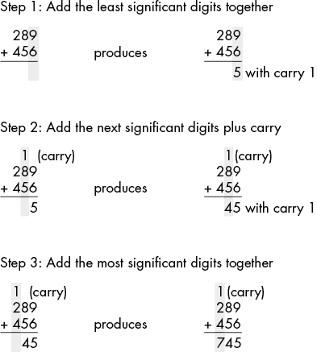
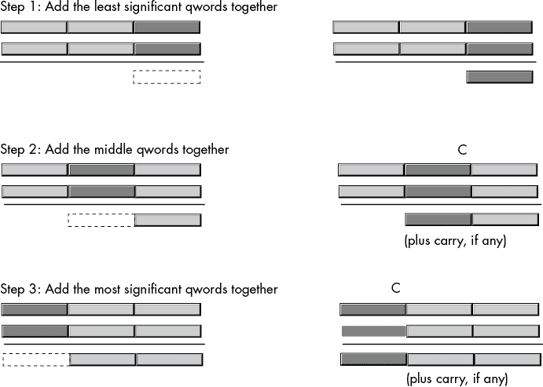
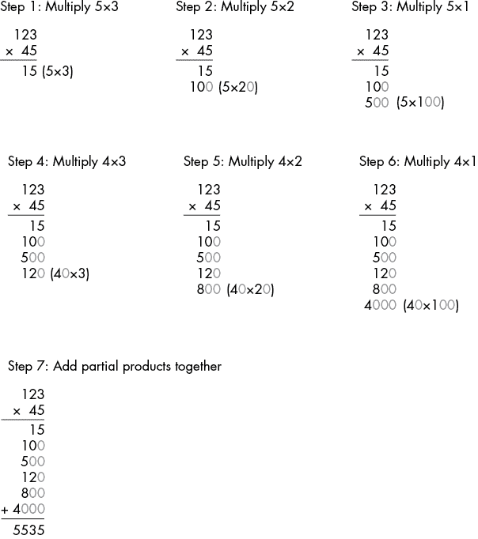
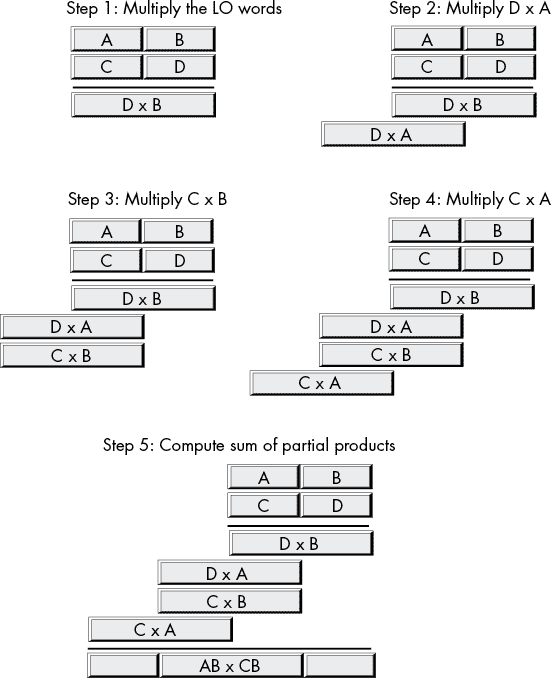
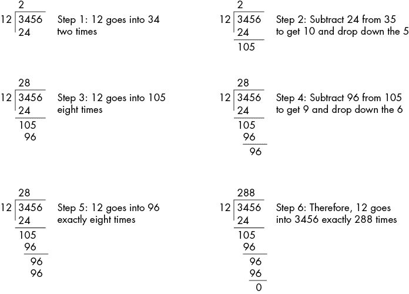
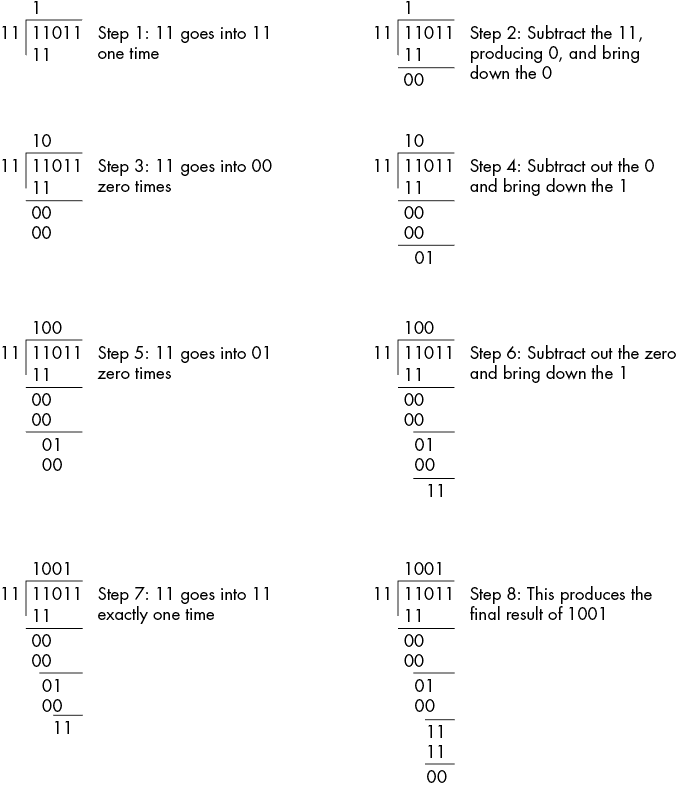
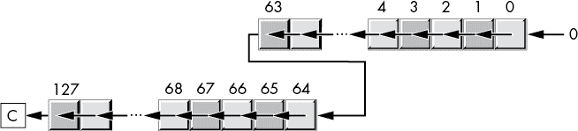
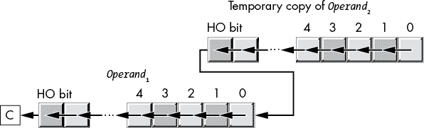
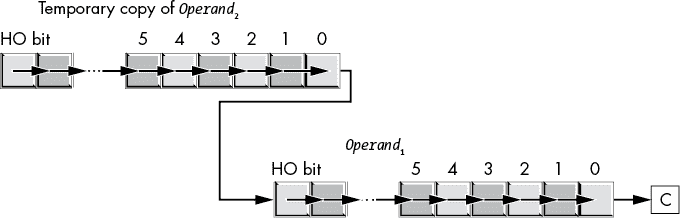

# 第八章：高级算术


本章介绍了扩展精度算术、不同大小操作数的算术运算以及十进制算术。通过本章的学习，你将知道如何对任何大小的整数操作数进行算术和逻辑运算，包括那些大于 64 位的操作数，并且如何将不同大小的操作数转换为兼容格式。最后，你将学习如何使用 x86-64 BCD 指令在 x87 FPU 上执行十进制算术，这使你能够在那些确实需要基数为 10 的操作的应用中使用十进制算术。

## 8.1 扩展精度运算

汇编语言相对于高级语言的一个大优势是，汇编语言不限制整数运算的大小。例如，标准的 C 编程语言定义了三种整数大小：`short int`、`int`和`long int`。^(1) 在 PC 上，这些通常是 16 位和 32 位整数。

尽管 x86-64 的机器指令限制你只能使用单条指令处理 8 位、16 位、32 位或 64 位整数，但你可以使用多条指令处理任何大小的整数。如果你想将 256 位整数相加，也不成问题。本节将介绍如何将各种算术和逻辑操作从 16 位、32 位或 64 位扩展到任意位数。

### 8.1.1 扩展精度加法

x86-64 的`add`指令将两个 8 位、16 位、32 位或 64 位的数字相加。执行`add`后，如果和的最高位（HO 位）溢出，x86-64 的进位标志将被设置。你可以利用这一信息执行扩展精度加法操作。^(2) 请考虑你手动执行多位数加法操作的方式（如图 8-1 所示）。



图 8-1：多位数相加

x86-64 处理扩展精度算术的方式与此相同，不同的是它不是每次添加一个数字，而是每次添加一个字节、字、双字或四字。考虑图 8-2 中的三个四字（192 位）加法操作。



图 8-2：将两个 192 位对象相加

如你所见，基本思路是将一个较大的操作分解为一系列较小的操作。由于 x86 处理器系列每次最多能相加 64 位（使用通用寄存器），因此该操作必须以 64 位或更少的块进行。以下是步骤：

1.  将两个低位四字相加，就像在手动算法中将两个低位数字相加一样，使用`add`指令。如果低位加法溢出，`add`会将进位标志设置为`1`；否则，它会清除进位标志。

1.  使用`adc`（*带进位加法*）指令，将两个 192 位值中的第二对四字相加，并加上之前加法的进位（如果有的话）。`adc`指令与`add`指令的语法相同，几乎执行相同的操作：

    ```
    adc `dest`, `source` ; `dest` := `dest` + `source` + `C`
    ```

    唯一的区别是，`adc`会将进位标志的值与源操作数和目标操作数一起加进去。它设置标志与`add`相同（包括如果发生无符号溢出则设置进位标志）。这正是我们需要的，用来加在 192 位和的中间两个双字上。

1.  使用`adc`再次将 192 位值的高位双字与中间两个四字之和的进位相加。

总结来说，`add`指令将低位四字加在一起，而`adc`将所有其他四字对加在一起。在扩展精度加法序列结束时，进位标志指示无符号溢出（如果设置），溢出标志指示符号溢出，符号标志表示结果的符号。零标志在扩展精度加法结束时没有任何实际意义（它只是表示两个高位四字的和为 0，并不表示整个结果为 0）。

例如，假设你有两个 128 位的值需要相加，定义如下：

```
 .data
X       oword   ?
Y       oword   ?
```

假设你还想将结果存储到第三个变量`Z`中，它也是一个`oword`。以下 x86-64 代码将完成此任务：

```
mov rax, qword ptr X    ; Add together the LO 64 bits
add rax, qword ptr Y    ; of the numbers and store the
mov qword ptr Z, rax    ; result into the LO qword of Z

mov rax, qword ptr X[8] ; Add together (with carry) the
adc rax, qword ptr Y[8] ; HO 64 bits and store the result
mov qword ptr Z[8], rax ; into the HO qword of Z
```

前三条指令将`X`和`Y`的低位四字加在一起，并将结果存储到`Z`的低位四字中。最后三条指令将`X`和`Y`的高位四字加在一起，连同低位字的进位，并将结果存储到`Z`的高位四字中。

请记住，`X`、`Y`和`Z`是`oword`对象（128 位），像`mov rax, X`这样的指令会尝试将 128 位值加载到 64 位寄存器中。要加载 64 位值，特别是低 64 位，`qword ptr`操作符会将符号`X`、`Y`和`Z`强制转换为 64 位。要加载高 64 位四字，你需要使用类似`X[8]`的地址表达式，并配合`qword ptr`操作符，因为 x86 内存空间按字节寻址，八个连续字节构成一个四字。

你可以通过使用`adc`将更高位的值加到一起，将这个算法扩展到任何位数。例如，要将声明为四个四字数组的两个 256 位值相加，你可以使用如下代码：

```
 .data
BigVal1 qword  4 dup (?)
BigVal2 qword  4 dup (?)
BigVal3 qword  4 dup (?)   ; Holds the sum
     .
     .
     .
; Note that there is no need for "qword ptr"
; because the base type of BitVal`x` is qword.

    mov rax, BigVal1[0]
    add rax, BigVal2[0]
    mov BigVal3[0], rax

    mov rax, BigVal1[8]
    adc rax, BigVal2[8]
    mov BigVal3[8], rax

    mov rax, BigVal1[16]
    adc rax, BigVal2[16]
    mov BigVal3[16], rax

    mov rax, BigVal1[24]
    adc rax, BigVal2[24]
    mov BigVal3[24], rax
```

### 8.1.2 扩展精度减法

就像它进行加法一样，x86-64 也以相同的方式进行多字节减法，除非它一次减去的是完整的字节、字、双字或四字，而不是十进制数字。你对低位字节、字、双字或四字使用`sub`指令，并对高位值使用`sub`与借位指令`sbb`（*带借位减法*）。

以下示例演示了一个使用 x86-64 上的 64 位寄存器的 128 位减法：

```
 .data
Left    oword   ?
Right   oword   ?
Diff    oword   ?
         .
         .
         .
    mov rax, qword ptr Left
    sub rax, qword ptr Right
    mov qword ptr Diff, rax

    mov rax, qword ptr Left[8]
    sbb rax, qword ptr Right[8]
    mov qword ptr Diff[8], rax
```

以下示例演示了一个 256 位减法：

```
 .data
BigVal1  qword 4 dup (?)
BigVal2  qword 4 dup (?)
BigVal3  qword 4 dup (?)
 .
     .
     .

; Compute BigVal3 := BigVal1 - BigVal2.

; Note: don't need to coerce types of
; BigVa1, BigVal2, or BigVal3 because
; their base types are already qword.

    mov rax, BigVal1[0]
    sub rax, BigVal2[0]
    mov BigVal3[0], rax

    mov rax, BigVal1[8]
    sbb rax, BigVal2[8]
    mov BigVal3[8], rax

    mov rax, BigVal1[16]
    sbb rax, BigVal2[16]
    mov BigVal3[16], rax

    mov rax, BigVal1[24]
    sbb rax, BigVal2[24]
    mov BigVal3[24], rax
```

### 8.1.3 扩展精度比较

不幸的是，没有“与借位比较”指令可以用来执行扩展精度比较。幸运的是，你可以通过仅使用`cmp`指令来比较扩展精度值，正如你将很快看到的那样。

考虑两个无符号值 2157h 和 1293h。这两个值的低字节不会影响比较结果。只需比较高字节，即 21h 和 12h，我们就可以知道第一个值大于第二个值。

你只需要在一对值的高字节相等时，查看这对值的两个字节。在所有其他情况下，比较高字节就足以告诉你这些值的一切。对于任意数量的字节，情况都是如此，而不仅仅是两个字节。以下代码通过首先比较它们的高四字（quad word）来比较两个有符号的 128 位整数，只有在高四字相等的情况下，才会比较它们的低四字：

```
; This sequence transfers control to location "IsGreater" if
; QwordValue > QwordValue2\. It transfers control to "IsLess" if
; QwordValue < QwordValue2\. It falls through to the instruction
; following this sequence if QwordValue = QwordValue2\. 
; To test for inequality, change the "IsGreater" and "IsLess"
; operands to "NotEqual" in this code.

 mov rax, qword ptr QWordValue[8]  ; Get HO qword
        cmp rax, qword ptr QWordValue2[8]
        jg  IsGreater
        jl  IsLess;

        mov rax, qword ptr QWordValue[0]  ; If HO qwords equal,
        cmp rax, qword ptr QWordValue2[0] ; then we must compare
        jg  IsGreater;                    ; the LO dwords
        jl  IsLess;

; Fall through to this point if the two values were equal.
```

要比较无符号值，可以使用`ja`和`jb`指令来代替`jg`和`jl`。

你可以通过前述序列合成任何比较，如下所示，演示了有符号比较；如果你想进行无符号比较，只需将`jg`、`jge`、`jl`和`jle`分别替换为`ja`、`jae`、`jb`和`jbe`。以下每个示例假设有这些声明：

```
 .data
OW1     oword  ?
OW2     oword  ?

OW1q    textequ <qword ptr OW1>
OW2q    textequ <qword ptr OW2>
```

以下代码实现了一个 128 位测试，检查`OW1 < OW2`（有符号）。如果`OW1 < OW2`，控制会转移到`IsLess`标签。如果不成立，控制会继续执行下一条语句：

```
 mov rax, OW1q[8]    ; Get HO dword
    cmp rax, OW2q[8]
    jg  NotLess
    jl  IsLess

    mov rax, OW1q[0]    ; Fall through to here if the HO
    cmp rax, OW2q[0]    ; qwords are equal
    jl  IsLess
NotLess:
```

这是一个 128 位测试，检查`OW1 <= OW2`（有符号）。如果条件成立，程序会跳转到`IsLessEq`：

```
 mov rax, OW1q[8]    ; Get HO dword
    cmp rax, OW2q[8]
    jg  NotLessEQ
    jl  IsLessEQ

 mov rax, QW1q[0]    ; Fall through to here if the HO
    cmp rax, QW2q[0]    ; qwords are equal
    jle IsLessEQ
NotLessEQ:
```

这是一个 128 位测试，检查`OW1 > OW2`（有符号）。如果此条件成立，程序会跳转到`IsGtr`：

```
 mov rax, QW1q[8]    ; Get HO dword
    cmp rax, QW2q[8]
    jg  IsGtr
    jl  NotGtr

    mov rax, QW1q[0]    ; Fall through to here if the HO
    cmp rax, QW2q[0]    ; qwords are equal
    jg  IsGtr
NotGtr:
```

以下是一个 128 位测试，检查`OW1 >= OW2`（有符号）。如果成立，代码会跳转到标签`IsGtrEQ`：

```
 mov rax, QW1q[8]    ; Get HO dword
    cmp rax, QW2q[8]
    jg  IsGtrEQ
    jl  NotGtrEQ

    mov rax, QW1q[0]    ; Fall through to here if the HO
    cmp rax, QW2q[0]    ; qwords are equal
    jge IsGtrEQ
NotGtrEQ:
```

这是一个 128 位测试，检查`OW1 == OW2`（有符号或无符号）。如果`OW1 == OW2`，代码会跳转到标签`IsEqual`。如果它们不相等，程序会继续执行下一条指令：

```
 mov rax, QW1q[8]    ; Get HO dword
    cmp rax, QW2q[8]
    jne NotEqual

    mov rax, QW1q[0]    ; Fall through to here if the HO
    cmp rax, QW2q[0]    ; qwords are equal
    je  IsEqual
NotEqual:
```

以下是一个 128 位测试，检查`OW1 != OW2`（有符号或无符号）。如果`OW1 != OW2`，该代码会跳转到标签`IsNotEqual`。如果它们相等，则继续执行下一条指令：

```
 mov rax, QW1q[8]    ; Get HO dword
    cmp rax, QW2q[8]
    jne IsNotEqual

 mov rax, QW1q[0]    ; Fall through to here if the HO
    cmp rax, QW2q[0]    ; qwords are equal
    jne IsNotEqual

; Fall through to this point if they are equal.
```

为了将前述代码推广到大于 128 位的对象，首先从对象的高四字开始比较，然后逐步比较它们的低四字，只要相应的双字（double word）相等。以下示例比较了两个 256 位值，检查第一个值是否小于或等于（无符号）第二个值：

```
 .data
Big1    qword  4 dup (?)
Big2    qword  4 dup (?)
         .
         .
         .
        mov rax, Big1[24]
        cmp rax, Big2[24]
        jb  isLE
        ja  notLE

        mov rax, Big1[16]
        cmp rax, Big2[16]
        jb  isLE
        ja  notLE

        mov rax, Big1[8]
        cmp rax, Big2[8]
        jb  isLE
        ja  notLE

        mov  rax, Big1[0]
        cmp  rax, Big2[0]
        jnbe notLE
isLE:
        `Code to execute if Big1 <= Big2`
          .
          .
          .
notLE:
        `Code to execute if Big1 > Big2`
```

### 8.1.4 扩展精度乘法

尽管 8×8、16×16、32×32 或 64×64 位乘法通常已经足够，但有时你可能需要将更大的值相乘。你可以使用 x86-64 单操作数的 `mul` 和 `imul` 指令进行扩展精度乘法操作，使用你在手动乘法时采用的相同技术。考虑一下你手动执行多位数乘法的方式（图 8-3）。



图 8-3：多位数乘法

x86-64 在执行扩展精度乘法时使用相同的方法，唯一的区别是它处理的是字节、字、双字和四字，而不是数字，如 图 8-4 所示。

执行扩展精度乘法时，最重要的一点是你还必须同时执行扩展精度加法。将所有部分积相加需要多次加法。



图 8-4：扩展精度乘法

清单 8-1 演示了如何使用 32 位指令将两个 64 位值相乘（得到一个 128 位结果）。从技术上讲，你可以使用单条指令执行 64 位乘法，但这个例子展示了一种方法，你可以通过使用 x86-64 的 64 位寄存器，而不是 32 位寄存器，轻松地将其扩展到 128 位。

```
; Listing 8-1

; 128-bit multiplication.

        option  casemap:none

nl          =       10

            .const
ttlStr      byte    "Listing 8-1", 0
fmtStr1     byte    "%d * %d = %I64d (verify:%I64d)", nl, 0

 .data
op1         qword   123456789
op2         qword   234567890
product     oword   ?
product2    oword   ?

            .code
            externdef printf:proc

; Return program title to C++ program:

            public  getTitle
getTitle    proc
            lea     rax, ttlStr
            ret
getTitle    endp

; mul64 - Multiplies two 64-bit values passed in RDX and RAX by
;         doing a 64x64-bit multiplication, producing a 128-bit result.
;         Algorithm is easily extended to 128x128 bits by switching the
;         32-bit registers for 64-bit registers.

; Stores result to location pointed at by R8.

mul64       proc
mp          equ     <dword ptr [rbp - 8]>     ; Multiplier
mc          equ     <dword ptr [rbp - 16]>    ; Multiplicand
prd         equ     <dword ptr [r8]>          ; Result

            push    rbp
            mov     rbp, rsp
            sub     rsp, 24

            push    rbx     ; Preserve these register values
            push    rcx

; Save parameters passed in registers:

            mov     qword ptr mp, rax
            mov     qword ptr mc, rdx

; Multiply the LO dword of multiplier times multiplicand.

            mov eax, mp
            mul mc          ; Multiply LO dwords
            mov prd, eax    ; Save LO dword of product
            mov ecx, edx    ; Save HO dword of partial product result

            mov eax, mp
            mul mc[4]       ; Multiply mp(LO) * mc(HO)
            add eax, ecx    ; Add to the partial product
            adc edx, 0      ; Don't forget the carry!
 mov ebx, eax    ; Save partial product for now
            mov ecx, edx

; Multiply the HO word of multiplier with multiplicand.

            mov eax, mp[4]  ; Get HO dword of multiplier
            mul mc          ; Multiply by LO word of multiplicand
            add eax, ebx    ; Add to the partial product
            mov prd[4], eax ; Save the partial product
            adc ecx, edx    ; Add in the carry!

            mov eax, mp[4]  ; Multiply the two HO dwords together
            mul mc[4]
            add eax, ecx    ; Add in partial product
            adc edx, 0      ; Don't forget the carry!

            mov prd[8], eax ; Save HO qword of result
            mov prd[12], edx

; EDX:EAX contains 64-bit result at this point.

            pop     rcx     ; Restore these registers
            pop     rbx
            leave
            ret    
mul64       endp

; Here is the "asmMain" function.

            public  asmMain
asmMain     proc
            push    rbp
            mov     rbp, rsp
            sub     rsp, 64         ; Shadow storage

; Test the mul64 function:

            mov     rax, op1
            mov     rdx, op2
            lea     r8, product
            call    mul64

; Use a 64-bit multiply to test the result:

            mov     rax, op1
            mov     rdx, op2
            imul    rax, rdx
            mov     qword ptr product2, rax

; Print the results:

            lea     rcx, fmtStr1
            mov     rdx, op1
 mov     r8,  op2
            mov     r9,  qword ptr product
            mov     rax, qword ptr product2
            mov     [rsp + 32], rax
            call    printf

            leave
            ret     ; Returns to caller

asmMain     endp
            end
```

清单 8-1：扩展精度乘法

该代码仅适用于无符号操作数。要将两个带符号值相乘，你必须在乘法前注意操作数的符号，取两个操作数的绝对值，进行无符号乘法，然后根据原始操作数的符号调整结果积的符号。带符号操作数的乘法留给你自己完成。

清单 8-1 中的示例相当直接，因为可以将部分积保存在不同的寄存器中。如果你需要将更大的值相乘，你将需要在临时（内存）变量中保存部分积。除此之外，清单 8-1 使用的算法可以推广到任意数量的双字。

### 8.1.5 扩展精度除法

你不能通过使用 `div` 和 `idiv` 指令合成一个通用的 *n*-位 / *m*-位除法操作——尽管一个较不通用的操作，将一个 *n*-位数除以一个 64 位数，可以通过使用 `div` 指令完成。一个通用的扩展精度除法需要一系列的移位和减法指令（这需要相当多的指令，运行速度较慢）。本节介绍了两种方法（使用 `div` 和移位减法）来进行扩展精度除法。

#### 8.1.5.1 使用 div 指令的特殊情况形式

将 128 位数除以 64 位数是由`div`和`idiv`指令直接处理的，只要结果商能够适应 64 位寄存器。然而，如果商无法适应 64 位，则必须执行扩展精度除法。

例如，假设你要将 0004_0000_0000_1234h 除以 2。天真直接的方法可能如下所示（假设值保存在名为`dividend`的一对四字变量中，`divisor`是一个包含 2 的四字变量）：

```
; This code does *NOT* work!

mov rax, qword ptr dividend[0]    ; Get dividend into EDX:EAX
mov rdx, qword ptr dividend[8]
div divisor                       ; Divide RDX:RAX by divisor
```

虽然这段代码在语法上是正确的，并且可以编译，但在运行时会引发除法错误异常。使用`div`时，商必须适应 RAX 寄存器，而 2_0000_091Ah 无法适应，因为它是一个 66 位的数值（如果你想查看它产生适合的结果，可以尝试除以 8）。

相反，诀窍是将被除数的（零扩展或符号扩展的）高双字除以除数，然后使用余数和被除数的低双字重复此过程，如下所示：

```
 .data
dividend  qword    1234h, 4
divisor   qword    2      ; dividend/divisor = 2_0000_091Ah
quotient  qword    2 dup (?)
remainder qword    ?
     .
     .
     .
    mov rax, dividend[8]
    xor edx, edx          ; Zero-extend for unsigned division
    div divisor
    mov quotient[8], rax  ; Save HO qword of the quotient
    mov rax, dividend[0]  ; This code doesn't zero-extend
    div divisor           ; RAX into RDX before div instr
    mov quotient[0], rax  ; Save LO qword of the quotient (91Ah)
    mov remainder, rdx    ; Save the remainder
```

`quotient`变量是 128 位，因为结果可能需要与被除数一样多的位数（例如，如果除以 1）。无论`dividend`和`divisor`操作数的大小如何，余数最多只有 64 位（在这种情况下）。因此，本示例中的`remainder`变量只是一个四字。

正确计算 128 / 64 的商，首先计算`dividend[8]` / `divisor`的 64 / 64 商。第一次除法得到的商成为最终商的高双字（HO double word）。此除法的余数成为 RDX 中的扩展，用于第二次除法操作的下半部分。代码的第二部分将`rdx:dividend[0]`除以`divisor`，以生成商的低四字（LO quad word）以及除法的余数。代码不会在第二个`div`指令之前将 RAX 零扩展到 RDX，因为 RDX 已经包含了不能被干扰的有效位。

上述 128 / 64 除法操作是通用除法算法的一个特例，用于将任意大小的值除以 64 位除数。通用算法如下：

1.  将被除数的高四字移动到 RAX 并将其零扩展到 RDX。

1.  进行除法操作。

1.  将 RAX 中的值存储到商结果变量的相应四字位置（在除法之前加载到 RAX 中的被除数四字位置）。

1.  将 RAX 加载为被除数中的下一个低四字，不修改 RDX。

1.  重复步骤 2 到 4，直到处理完被除数中的所有四字。

最后，RDX 寄存器将包含余数，商将出现在目标变量中，即步骤 3 存储结果的地方。Listing 8-2 展示了如何用 64 位除数除以 256 位数，从而得到一个 256 位商和一个 64 位余数。

```
; Listing 8-2

; 256-bit by 64-bit division.

        option  casemap:none

nl          =       10

            .const
ttlStr      byte    "Listing 8-2", 0
fmtStr1     byte    "quotient  = "
            byte    "%08x_%08x_%08x_%08x_%08x_%08x_%08x_%08x"
            byte    nl, 0

fmtStr2     byte    "remainder = %I64x", nl, 0

            .data

; op1 is a 256-bit value. Initial values were chosen
; to make it easy to verify the result.

op1         oword   2222eeeeccccaaaa8888666644440000h
            oword   2222eeeeccccaaaa8888666644440000h

op2         qword   2
result      oword   2 dup (0) ; Also 256 bits
remain      qword   0

            .code
            externdef printf:proc

; Return program title to C++ program:

            public  getTitle
getTitle    proc
            lea     rax, ttlStr
            ret
getTitle    endp

; div256 - Divides a 256-bit number by a 64-bit number.

; Dividend  - passed by reference in RCX.
; Divisor   - passed in RDX.

; Quotient  - passed by reference in R8.
; Remainder - passed by reference in R9.

div256      proc
divisor     equ     <qword ptr [rbp - 8]>
dividend    equ     <qword ptr [rcx]>
quotient    equ     <qword ptr [r8]>
remainder   equ     <qword ptr [r9]>

            push    rbp
            mov     rbp, rsp
            sub     rsp, 8

            mov     divisor, rdx

            mov     rax, dividend[24]  ; Begin div with HO qword
            xor     rdx, rdx           ; Zero-extend into RDS
            div     divisor            ; Divide HO word
            mov     quotient[24], rax  ; Save HO result

            mov     rax, dividend[16]  ; Get dividend qword #2
            div     divisor            ; Continue with division
            mov     quotient[16], rax  ; Store away qword #2

            mov     rax, dividend[8]   ; Get dividend qword #1
            div     divisor            ; Continue with division
            mov     quotient[8], rax   ; Store away qword #1

            mov     rax, dividend[0]   ; Get LO dividend qword
            div     divisor            ; Continue with division
            mov     quotient[0], rax   ; Store away LO qword

            mov     remainder, rdx     ; Save remainder

            leave
            ret
div256      endp

; Here is the "asmMain" function.

            public  asmMain
asmMain     proc
            push    rbp
            mov     rbp, rsp
            sub     rsp, 80         ; Shadow storage

; Test the div256 function:

            lea     rcx, op1
            mov     rdx, op2
 lea     r8, result
            lea     r9, remain
            call    div256

; Print the results:

            lea     rcx, fmtStr1
            mov     edx, dword ptr result[28]
            mov     r8d, dword ptr result[24]
            mov     r9d, dword ptr result[20]
            mov     eax, dword ptr result[16]
            mov     [rsp + 32], rax
            mov     eax, dword ptr result[12]
            mov     [rsp + 40], rax
            mov     eax, dword ptr result[8]
            mov     [rsp + 48], rax
            mov     eax, dword ptr result[4]
            mov     [rsp + 56], rax
            mov     eax, dword ptr result[0]
            mov     [rsp + 64], rax
            call    printf

            lea     rcx, fmtStr2
            mov     rdx, remain
            call    printf

            leave
            ret    ; Returns to caller

asmMain     endp
            end
```

Listing 8-2：无符号 128 / 32 位扩展精度除法

这是构建命令和程序输出（请注意，你可以通过简单地查看结果来验证除法是否正确，注意每个数字是原始值的一半）：

```
C:\>**build listing8-2**

C:\>**echo off**
 Assembling: listing8-2.asm
c.cpp

C:\>**listing8-2**
Calling Listing 8-2:
quotient  = 11117777_66665555_44443333_22220000_11117777_66665555_44443333_22220000
remainder = 0
Listing 8-2 terminated
```

你可以通过向序列中添加更多的 `mov`-`div`-`mov` 指令来扩展此代码以支持任意位数。像上一节的扩展精度乘法一样，这个扩展精度除法算法只适用于无符号操作数。要除以两个带符号的数，必须注意它们的符号，取它们的绝对值，进行无符号除法，然后根据操作数的符号设置结果的符号。

#### 8.1.5.2 通用 N 位除以 M 位

要使用大于 64 位的除数，必须通过使用移位和减法策略来实现除法，这种方法有效，但非常慢。与乘法一样，理解计算机如何执行除法的最佳方式是研究你是如何学习手工做长除法的。考虑操作 3456 / 12 以及你手动执行此操作时的步骤，如 图 8-5 所示。



图 8-5：手动逐位除法操作

这个算法在二进制中实际上更容易，因为在每一步中，你不需要猜测 12 能被余数除几次，也不需要将 12 乘以你的猜测来得到要减去的数。在二进制算法的每一步中，除数要么正好除尽余数一次，要么不除尽。举个例子，考虑 27（11011）除以 3（11）的除法，如 图 8-6 所示。



图 8-6：二进制长除法

以下算法以同时计算商和余数的方式实现了这个二进制除法操作：

```
Quotient := Dividend;
Remainder := 0;
for i := 1 to NumberBits do

    Remainder:Quotient := Remainder:Quotient SHL 1;
    if Remainder >= Divisor then

        Remainder := Remainder - Divisor;
        Quotient := Quotient + 1;

    endif
endfor
```

`NumberBits` 是 `Remainder`（余数）、`Quotient`（商）、`Divisor`（除数）和 `Dividend`（被除数）变量中的位数。`SHL` 是左移操作符。`Quotient := Quotient + 1;` 语句将 `Quotient` 的最低有效位设置为 `1`，因为该算法之前将 `Quotient` 左移了 1 位。清单 8-3 实现了这个算法。

```
; Listing 8-3

; 128-bit by 128-bit division.

        option  casemap:none

nl          =       10

            .const
ttlStr      byte    "Listing 8-3", 0
fmtStr1     byte    "quotient  = "
            byte    "%08x_%08x_%08x_%08x"
            byte    nl, 0

fmtStr2     byte    "remainder = "
            byte    "%08x_%08x_%08x_%08x"
            byte    nl, 0

fmtStr3     byte    "quotient (2)  = "
            byte    "%08x_%08x_%08x_%08x"
            byte    nl, 0

             .data

; op1 is a 128-bit value. Initial values were chosen
; to make it easy to verify the result.

op1         oword   2222eeeeccccaaaa8888666644440000h
op2         oword   2
op3         oword   11117777666655554444333322220000h
result      oword   ?
remain      oword   ?

            .code
            externdef printf:proc

; Return program title to C++ program:

            public  getTitle
getTitle    proc
            lea     rax, ttlStr
            ret
getTitle    endp

; div128 - This procedure does a general 128 / 128 division operation
;          using the following algorithm (all variables are assumed
;          to be 128-bit objects).

; Quotient := Dividend;
; Remainder := 0;
; for i := 1 to NumberBits do

;    Remainder:Quotient := Remainder:Quotient SHL 1;
;    if Remainder >= Divisor then

;      Remainder := Remainder - Divisor;
;      Quotient := Quotient + 1;

; endif
; endfor

; Data passed:

; 128-bit dividend, by reference in RCX.
; 128-bit divisor, by reference in RDX.

; Data returned:

; Pointer to 128-bit quotient in R8.
; Pointer to 128-bit remainder in R9.

div128      proc
remainder   equ     <[rbp - 16]>
dividend    equ     <[rbp - 32]>
quotient    equ     <[rbp - 32]>    ; Aliased to dividend
divisor     equ     <[rbp - 48]>

            push    rbp
            mov     rbp, rsp
            sub     rsp, 48

            push    rax
            push    rcx

            xor     rax, rax        ; Initialize remainder to 0
            mov     remainder, rax
            mov     remainder[8], rax

; Copy the dividend to local storage:

            mov     rax, [rcx]
            mov     dividend, rax
            mov     rax, [rcx+8]
            mov     dividend[8], rax

; Copy the divisor to local storage:

            mov     rax, [rdx]
            mov     divisor, rax
            mov     rax, [rdx + 8]
            mov     divisor[8], rax

            mov     cl, 128         ; Count off bits in CL

; Compute Remainder:Quotient := Remainder:Quotient SHL 1:

repeatLp:   shl     qword ptr dividend[0], 1  ; 256-bit extended-
            rcl     qword ptr dividend[8], 1  ; precision shift
            rcl     qword ptr remainder[0], 1 ; through remainder
            rcl     qword ptr remainder[8], 1

; Do a 128-bit comparison to see if the remainder
; is greater than or equal to the divisor.

            mov     rax, remainder[8]
            cmp     rax, divisor[8]
            ja      isGE
            jb      notGE

            mov     rax, remainder
            cmp     rax, divisor
            ja      isGE
            jb      notGE

; Remainder := Remainder - Divisor;

isGE:       mov     rax, divisor
            sub     remainder, rax
            mov     rax, divisor[8]
            sbb     remainder[8], rax

; Quotient := Quotient + 1;

            add     qword ptr quotient, 1
            adc     qword ptr quotient[8], 0

notGE:      dec     cl
            jnz     repeatLp

; Okay, copy the quotient (left in the dividend variable)
; and the remainder to their return locations.

            mov     rax, quotient[0]
            mov     [r8], rax
            mov     rax, quotient[8]
            mov     [r8][8], rax

            mov     rax, remainder[0]
            mov     [r9], rax
            mov     rax, remainder[8]
            mov     [r9][8], rax

            pop     rcx
            pop     rax
            leave
            ret

div128      endp

; Here is the "asmMain" function.

            public  asmMain
asmMain     proc
            push    rbp
            mov     rbp, rsp
            sub     rsp, 64        ; Shadow storage

; Test the div128 function:

            lea     rcx, op1
            lea     rdx, op2
            lea     r8, result
            lea     r9, remain
            call    div128

; Print the results:

            lea     rcx, fmtStr1
            mov     edx, dword ptr result[12]
            mov     r8d, dword ptr result[8]
            mov     r9d, dword ptr result[4]
            mov     eax, dword ptr result[0]
            mov     [rsp + 32], rax
            call    printf

            lea     rcx, fmtStr2
            mov     edx, dword ptr remain[12]
            mov     r8d, dword ptr remain[8]
            mov     r9d, dword ptr remain[4]
            mov     eax, dword ptr remain[0]
            mov     [rsp + 32], rax
            call    printf

; Test the div128 function:

            lea     rcx, op1
            lea     rdx, op3
            lea     r8, result
            lea     r9, remain
            call    div128

; Print the results:

            lea     rcx, fmtStr3
            mov     edx, dword ptr result[12]
            mov     r8d, dword ptr result[8]
            mov     r9d, dword ptr result[4]
            mov     eax, dword ptr result[0]
            mov     [rsp + 32], rax
            call    printf

            lea     rcx, fmtStr2
            mov     edx, dword ptr remain[12]
 mov     r8d, dword ptr remain[8]
            mov     r9d, dword ptr remain[4]
            mov     eax, dword ptr remain[0]
            mov     [rsp + 32], rax
            call    printf

            leave
            ret    ; Returns to caller

asmMain     endp
            end
```

清单 8-3：扩展精度除法

这是构建命令和程序输出：

```
C:\>**build listing8-3**

C:\>**echo off**
 Assembling: listing8-3.asm
c.cpp

C:\>**listing8-3**
Calling Listing 8-3:
quotient  = 11117777_66665555_44443333_22220000
remainder = 00000000_00000000_00000000_00000000
quotient (2)  = 00000000_00000000_00000000_00000002
remainder = 00000000_00000000_00000000_00000000
Listing 8-3 terminated
```

这段代码没有检查除数是否为 0（如果尝试除以 0，它会产生值 0FFFF_FFFF_FFFF_FFFFh）；它只处理无符号值，且非常慢（比 `div` 和 `idiv` 指令慢一个或两个数量级）。要处理除以 0 的情况，在运行此代码之前检查除数是否为 0，如果除数为 0，则返回适当的错误代码。处理带符号值的方式与前面的除法算法相同：注意符号，取操作数的绝对值，进行无符号除法，然后在结果中修正符号。

你可以使用以下技巧大幅提高这个除法的性能。检查除数变量是否仅使用 32 位。通常，尽管除数是一个 128 位变量，但它的值本身适合 32 位（即 `Divisor` 的高双字为 0），你可以使用 `div` 指令，它要快得多。改进后的算法稍微复杂一些，因为你首先需要比较高四字是否为 0，但总体来说，它运行得更快，同时仍然能够除以任何两个值对。

### 8.1.6 扩展精度取反运算

`neg` 指令没有提供通用的扩展精度形式。然而，取反等同于从 0 中减去一个值，因此我们可以通过使用 `sub` 和 `sbb` 指令轻松地模拟扩展精度取反。以下代码提供了一种简单的方法，通过使用扩展精度减法将一个（320 位）值从 0 中减去来实现取反：

```
 .data
Value  qword 5 dup (?) ; 320-bit value
        .
        .
        .
    xor rax, rax       ; RAX = 0
    sub rax, Value
    mov Value, rax

    mov eax, 0         ; Cannot use XOR here:
    sbb rax , Value[8] ; must preserve carry!
    mov Value[8], rax

    mov eax, 0         ; Zero-extends!
    sbb rax, Value[16]
    mov Value[16], rax

    mov eax, 0
    sbb rax, Value[24]
    mov Value[24], rax

    mov rax, 0
    sbb rax, Value[32]
    mov Value[32], rax
```

一种稍微更高效的方法来取反较小的值（128 位）是使用 `neg` 和 `sbb` 指令的组合。这个技巧利用了 `neg` 将操作数从 0 中减去的事实。特别地，它设置标志位的方式与 `sub` 指令将目标值从 0 中减去时相同。此代码的形式如下（假设你想要取反 RDX:RAX 中的 128 位值）：

```
neg rdx
neg rax
sbb rdx, 0
```

前两条指令对 128 位结果的高四字和低四字进行取反。然而，如果低四字取反时有借位（可以将 `neg rax` 看作是从 RAX 中减去 0，可能会产生进位/借位），这个借位不会从高四字中减去。序列末尾的 `sbb` 指令如果在取反 RAX 时没有发生借位，它不会从 RDX 中减去任何东西；如果取反时需要借位，它将从 RDX 中减去 1。

经过大量的工作，实际上可以将此方案扩展到超过 128 位。然而，在 256 位左右（当然，一旦超过 256 位），实际上使用从零减去的通用方案所需的指令更少。

### 8.1.7 扩展精度与运算

执行 *n* 字节与运算很简单：只需对两个操作数的相应字节进行与运算，并保存结果。例如，要对所有 128 位长的操作数执行与运算，你可以使用以下代码：

```
mov rax,  qword ptr source1
and rax,  qword ptr source2
mov qword ptr dest, rax

mov rax,  qword ptr source1[8]
and rax,  qword ptr source2[8]
mov qword ptr dest[8], rax
```

为了将此技巧扩展到任意数量的四字，你可以在操作数中逻辑地将相应的字节、字、双字或四字进行与运算。

这个序列根据最后一次 `and` 运算的结果设置标志位。如果你最后对高四字进行与运算，这将正确地设置除了零标志之外的所有标志。如果你需要在这个序列之后测试零标志，可以对两个结果的双字进行逻辑或操作（或者将它们与 0 进行比较）。

### 8.1.8 扩展精度或运算

多字节的逻辑或（OR）操作与多字节与（AND）操作的执行方式相同。你将两个操作数中对应的字节进行按位或运算。例如，要对两个 192 位的值进行逻辑或运算，可以使用以下代码：

```
mov rax,  qword ptr source1
or  rax,  qword ptr source2
mov qword ptr dest, rax

mov rax,  qword ptr source1[8]
or  rax,  qword ptr source2[8]
mov qword ptr dest[8], rax

mov rax,  qword ptr source1[16]
or  rax,  qword ptr source2[16]
mov qword ptr dest[16], rax
```

与前面的例子一样，这样做不会为整个操作正确设置零标志。如果您需要在执行扩展精度的 OR 操作后测试零标志，必须将所有结果的双字进行逻辑 OR 运算。

### 8.1.9 扩展精度异或操作

与其他逻辑操作一样，扩展精度的异或（XOR）操作会对两个操作数中的对应字节进行排他或运算，从而得到扩展精度的结果。以下代码序列对两个 64 位操作数进行运算，计算它们的异或结果，并将结果存储到一个 64 位变量中：

```
mov rax,  qword ptr source1
xor rax,  qword ptr source2
mov qword ptr dest, rax

mov rax,  qword ptr source1[8]
xor rax,  qword ptr source2[8]
mov qword ptr dest[8], rax
```

前两个部分关于零标志的评论，以及关于 XMM 和 YMM 寄存器的评论，在此处同样适用。

### 8.1.10 扩展精度 NOT 操作

`not` 指令会反转指定操作数中的所有位。通过在所有受影响的操作数上执行 `not` 指令来执行扩展精度的 NOT 操作。例如，要对 RDX:RAX 中的值执行 128 位的 NOT 操作，请执行以下指令：

```
not rax
not rdx
```

请记住，如果执行两次 NOT 指令，结果将返回原始值。此外，使用全 1（0FFh、0FFFFh、0FFFF_FFFFh 或 0FFFF_FFFF_FFFF_FFFFh）对一个值进行异或操作，所执行的操作与 `not` 指令相同。

### 8.1.11 扩展精度移位操作

扩展精度移位操作需要移位和旋转指令。本节描述了如何构造这些操作。

#### 8.1.11.1 扩展精度左移

128 位的 `shl`（*左移*）操作的形式如图 8-7 所示。



图 8-7：128 位左移操作

要通过机器指令完成此操作，首先需要将低位四字（LO qword）左移（例如，使用 `shl` 指令），并将来自第 63 位的输出捕获（方便的是，进位标志会为我们完成此操作）。然后，我们必须将此位移入高位四字（HO qword）的低位，同时将其他所有位向左移（并通过进位标志捕获输出）。

您可以使用 `shl` 和 `rcl` 指令来实现这种 128 位移位操作。例如，要将 RDX:RAX 中的 128 位数据左移一位，可以使用以下指令：

```
shl rax, 1
rcl rdx, 1
```

`shl` 指令会将一个 0 移入 128 位操作数的第 0 位，并将第 63 位移入进位标志。然后，`rcl` 指令将进位标志移入第 64 位，并将第 127 位移入进位标志。最终结果正是我们所需要的。

使用此技术，您每次只能将扩展精度的值移动 1 位。您不能使用 CL 寄存器将扩展精度操作数移动多个位，也不能在使用此技术时指定大于 1 的常数值。

要对大于 128 位的操作数执行左移操作，请使用额外的`rcl`指令。扩展精度左移操作始终从最低有效的四字（quad word）开始，每个随后的`rcl`指令作用于下一个更高有效位的双字（double word）。例如，要对一个内存位置执行 192 位的左移操作，可以使用以下指令：

```
shl qword ptr Operand[0], 1
rcl qword ptr Operand[8], 1
rcl qword ptr Operand[16], 1
```

如果需要将数据移位 2 位或更多位，可以选择重复前述的指令序列所需的次数（对于常数移位次数）或将这些指令放入循环中，以一定次数重复执行它们。例如，以下代码将 192 位的值`Operand`左移 CL 指定的位数：

```
ShiftLoop:
    shl qword ptr Operand[0], 1
    rcl qword ptr Operand[8], 1
    rcl qword ptr Operand[16], 1
    dec cl
    jnz ShiftLoop
```

#### 8.1.11.2 扩展精度右移和算术右移

实现`shr`（*右移*）和`sar`（*算术右移*）的方式类似，唯一的不同是你必须从操作数的最高有效字（HO word）开始，并逐步移至最低有效字（LO word）：

```
; Extended-precision SAR:

    sar qword ptr Operand[16], 1
    rcr qword ptr Operand[8], 1
    rcr qword ptr Operand[0], 1

; Extended-precision SHR:

    shr qword ptr Operand[16], 1
    rcr qword ptr Operand[8], 1
    rcr qword ptr Operand[0], 1
```

扩展精度移位会以不同于 8 位、16 位、32 位和 64 位对应指令的方式设置标志，因为旋转指令与移位指令对标志的影响不同。幸运的是，进位标志是你在移位操作后最常检查的标志，而扩展精度移位操作（即旋转指令）会正确设置此标志。

#### 8.1.11.3 高效的多比特扩展精度移位

`shld`和`shrd`指令让你能够高效地实现多位扩展精度移位。这些指令具有以下语法：

```
shld `Operand`[1], `Operand`[2], `constant`
shld `Operand`[1], `Operand`[2], `cl`
shrd `Operand`[1], `Operand`[2], `constant`
shrd `Operand`[1], `Operand`[2], `cl`
```

`shld`指令的工作原理如图 8-8 所示。



图 8-8: `shld`操作

`Operand`2 必须是 16 位、32 位或 64 位寄存器。`Operand`1 可以是寄存器或内存位置。两个操作数的大小必须相同。第三个操作数`constant`或`cl`指定要移位的位数，其值范围可以是 0 到*n* – 1，其中*n*是前两个操作数的大小。

`shld`指令将`Operand`2 中位的副本左移由第三个操作数指定的位数，将结果存储到由第一个操作数指定的位置。最高有效位（HO bits）移入进位标志，`Operand`2 的最高有效位移入`Operand`1 的最低有效位（LO bits）。第三个操作数指定移位的位数。如果位数是*n*，则`shld`将位*n* – 1 移入进位标志（显然，这条指令只保留最后一位移入进位标志）。`shld`指令按如下方式设置标志位：

+   如果移位计数为 0，`shld`不会影响任何标志。

+   进位标志包含从`Operand`1 的最高有效位（HO bit）移出的最后一位。

+   如果移位计数为 1，则如果`Operand`1 的符号位在移位过程中发生变化，溢出标志将为 1。如果移位计数不是 1，溢出标志是未定义的。

+   如果移位结果为 0，零标志将为 1。

+   符号标志将包含结果的高位（HO bit）。

`shrd` 指令类似于 `shld`，只不过它是将位向右移位，而不是向左移位。为了更清楚地理解 `shrd` 指令，请参考 图 8-9。



图 8-9：`shrd` 操作

`shrd` 指令会设置标志位，具体如下：

+   如果移位计数为 0，`shrd` 不会影响任何标志。

+   进位标志包含从 `Operand`1 的低位（LO bit）移出的最后一位。

+   如果移位计数为 1，当 `Operand`1 的高位（HO bit）发生变化时，溢出标志将为 1。如果计数不是 1，溢出标志则未定义。

+   如果移位结果为 0，零标志位将为 1。

+   符号标志将包含结果的高位（HO）位。

考虑以下代码序列：

```
 .data
ShiftMe qword   012345678h, 90123456h, 78901234h
     .
     .
     .
    mov  rax, ShiftMe[8]
    shld ShiftMe[16], rax, 6
 mov  rax, ShiftMe[0]
    shld ShiftMe[8], rax, 6
    shl  ShiftMe[0], 6
```

第一条 `shld` 指令将 `ShiftMe[8]` 的位移入 `ShiftMe[16]`，而不会影响 `ShiftMe[8]` 的值。第二条 `shld` 指令将 `ShiftMe` 的位移入 `ShiftMe[8]`。最后，`shl` 指令会将低双字（LO double word）适当的位数移位。

关于这段代码有两点需要注意。首先，与其他扩展精度左移操作不同，这个序列是从高四字（HO quad word）向低四字（LO quad word）移位。其次，进位标志不会包含来自高位移位操作的进位。如果需要在那时保留进位标志，必须在第一次 `shld` 指令后保存标志，并在 `shl` 指令后恢复标志。

你可以使用 `shrd` 指令执行扩展精度的右移操作。它的工作方式几乎与前面的代码序列相同，只是你从低四字（LO quad word）开始，最后处理高四字（HO quad word）。解决方案留给你作为练习。

### 8.1.12 扩展精度旋转操作

`rcl` 和 `rcr` 操作的扩展方式类似于 `shl` 和 `shr`。例如，要执行 192 位的 `rcl` 和 `rcr` 操作，使用以下指令：

```
rcl qword ptr Operand[0], 1
rcl qword ptr Operand[8], 1
rcl qword ptr Operand[16], 1

rcr qword ptr Operand[16], 1
rcr qword ptr Operand[8], 1
rcr qword ptr Operand[0], 1
```

这段代码与扩展精度移位操作的代码唯一不同之处是，第一条指令是 `rcl` 或 `rcr`，而不是 `shl` 或 `shr`。

执行扩展精度的 `rol` 或 `ror` 操作并不像简单的左移或右移那样，因为输入位的处理方式不同。你可以使用 `bt`、`shld` 和 `shrd` 指令来实现扩展精度的 `rol` 或 `ror` 指令。^3 以下代码展示了如何使用 `shld` 和 `bt` 指令执行 128 位扩展精度的 `rol` 操作：

```
; Compute rol RDX:RAX, 4:

        mov  rbx, rdx
        shld rdx, rax, 4
        shld rax, rbx, 4
        bt   rbx, 28        ; Set carry flag, if desired
```

扩展精度的 `ror` 指令类似；只需记住，你首先在对象的低端（LO）进行操作，最后在高端（HO）进行操作。

## 8.2 操作不同大小的操作数

有时，您可能需要对一对大小不同的操作数进行计算。例如，您可能需要将一个字（word）和一个双字（double word）相加，或者从一个字值中减去一个字节（byte）值。为此，需要将较小的操作数扩展到较大操作数的大小，然后对两个相同大小的操作数进行运算。对于带符号的操作数，您需要将较小的操作数符号扩展到与较大操作数相同的大小；对于无符号值，您则需要将较小的操作数零扩展。这适用于任何操作。

以下示例演示了如何将一个字节变量与一个字变量相加：

```
 .data
var1    byte    ?
var2    word    ?
         .
         .
         .
; Unsigned addition:

        movzx   ax, var1
        add     ax, var2

; Signed addition:

        movsx   ax, var1
        add     ax, var2
```

在这两种情况下，字节变量被加载到 AL 寄存器中，扩展为 16 位，然后与字操作数相加。如果您可以选择操作的顺序（例如，将 8 位值加到 16 位值），这段代码效果非常好。

有时，您无法指定操作的顺序。也许 16 位值已经在 AX 寄存器中，您想要加上一个 8 位值。对于无符号加法，您可以使用以下代码：

```
 mov ax, var2    ; Load 16-bit value into AX
    .               ; Do some other operations, leaving
    .               ; a 16-bit quantity in AX
    add al, var1    ; Add in the 8-bit value
    adc ah, 0       ; Add carry into the HO word
```

第一个 `add` 指令将 `var1` 中的字节加到累加器中的 LO 字节。`adc` 指令将加法中的进位加到累加器的 HO 字节中。如果省略了 `adc`，可能无法获得正确的结果。

将一个 8 位带符号操作数加到一个 16 位带符号值中会稍微复杂一些。不幸的是，您不能将一个立即数值（如前面的例子中）加到 AX 的 HO 字中，因为 HO 扩展字节可能是 0 或 0FFh。如果有可用的寄存器，最好的做法是：

```
mov   bx, ax      ; BX is the available register
movsx ax, var1
add   ax, bx
```

如果没有额外的寄存器，您可以尝试以下代码：

```
push  ax          ; Save word value
movsx ax, var1    ; Sign-extend 8-bit operand to 16 bits
add   ax, [rsp]   ; Add in previous word value
add   rsp, 2      ; Pop junk from stack
```

这种方式之所以有效，是因为 x86-64 可以推送 16 位寄存器。给出一点建议：不要让 RSP 寄存器错位（即不在 8 字节边界上）时间过长。如果您正在使用 32 位或 64 位寄存器，完成堆栈操作后，您必须推送整个 64 位寄存器并将 RSP 加 8。

另一种选择是将 16 位值存储到累加器中的内存位置，然后像以前一样继续操作：

```
mov   temp, ax
movsx ax, var1
add   ax, temp
```

所有这些示例都将一个字节值加到一个字值中。通过将较小的操作数零扩展或符号扩展到较大操作数的大小，您可以轻松地将两个不同大小的变量相加。

作为最后一个示例，考虑将一个 8 位带符号值与一个 oword（128 位）值相加：

```
 .data
OVal  qword   ?
BVal  byte    ?
     .
     .
     .
movsx rax, BVal
cqo
add   rax, qword ptr OVal
adc   rdx, qword ptr OVal[8]
```

## 8.3 十进制运算

x86-64 CPU 使用二进制编号系统来表示其本地的内部表示。在计算机早期，设计者认为十进制（基数为 10）运算对商业计算更为精确。数学家们已经证明，这并非如此；然而，某些算法依赖于十进制运算来生成正确的结果。因此，尽管十进制运算通常比二进制运算效率低且准确性差，但十进制运算的需求仍然存在。

为了在本地二进制格式中表示十进制数字，最常见的技术是使用*二进制编码十进制（**BCD**）*表示法。这使用 4 位来表示 10 个可能的十进制数字（见表 8-1）。这 4 位的二进制值等于对应的十进制值，范围是 0 到 9。当然，4 位可以表示 16 个不同的值；BCD 格式忽略剩余的六个位组合。因为每个 BCD 数字需要 4 位，我们可以使用一个字节表示一个两位数的 BCD 值。这意味着我们可以通过一个字节表示范围在 0 到 99 之间的十进制值（而不是在二进制格式下一个字节表示的 0 到 255 的范围）。

表 8-1：二进制编码十进制表示法

| **BCD 表示法** | **十进制等效值** |
| --- | --- |
| 0000 | 0 |
| 0001 | 1 |
| 0010 | 2 |
| 0011 | 3 |
| 0100 | 4 |
| 0101 | 5 |
| 0110 | 6 |
| 0111 | 7 |
| 1000 | 8 |
| 1001 | 9 |
| 1010 | 非法 |
| 1011 | 非法 |
| 1100 | 非法 |
| 1101 | 非法 |
| 1110 | 非法 |
| 1111 | 非法 |

### 8.3.1 字面 BCD 常量

MASM 不提供字面 BCD 常量，也不需要字面 BCD 常量。因为 BCD 仅仅是十六进制表示法的一种形式，不允许使用 0Ah 到 0Fh 的值，你可以通过使用 MASM 的十六进制表示法轻松创建 BCD 常量。例如，下面的`mov`指令将 BCD 值 99 复制到 AL 寄存器中：

```
mov al, 99h
```

需要牢记的重要一点是，你不能使用 MASM 字面十进制常量表示 BCD 值。也就是说，`mov al, 95`不会将 95 的 BCD 表示加载到 AL 寄存器中。相反，它会将 5Fh 加载到 AL 寄存器中，这是一个非法的 BCD 值。

### 8.3.2 使用 FPU 进行打包十进制运算

为了提高依赖于十进制运算的应用程序的性能，英特尔将十进制运算的支持直接集成到 FPU 中。FPU 支持精度高达 18 位十进制数字的值，并且在所有 FPU 算术能力下进行计算，从加法到超越操作。如果你能接受只有 18 位精度以及一些其他限制，那么在 FPU 上进行十进制运算是正确的选择。

FPU 仅支持一种 BCD 数据类型：一个 10 字节 18 位的打包十进制值。打包十进制格式使用前 9 个字节以标准的打包十进制格式存储 BCD 值。第一个字节包含两个低位数字（LO），第九个字节包含两个高位数字（HO）。第十个字节的高位（HO）位用于存储符号位，FPU 忽略第十个字节中剩余的位（因为使用这些位会产生 FPU 无法在本地浮点格式中精确表示的 BCD 值）。

FPU 对负 BCD 值使用补码表示。符号位如果数字为负则包含 1，如果数字为正则包含 0。如果数字为 0，符号位可以是 0 或 1，因为像二进制补码格式一样，0 有两种不同的表示。

MASM 的` tbyte `类型是用于定义打包 BCD 变量的标准数据类型。` fbld `和` fbstp `指令需要一个` tbyte `操作数（你可以用十六进制/BCD 值初始化它）。

FPU 并不完全支持十进制算术，而是提供了两条指令，` fbld `和` fbstp `，用于在将数据传入和传出 FPU 时，在打包十进制和二进制浮点格式之间进行转换。` fbld `（*浮动/BCD 加载*）指令在将 BCD 值转换为二进制浮点格式后，将一个 80 位的打包 BCD 值加载到 FPU 栈顶。同样，` fbstp `（*浮动/BCD 存储并弹出*）指令将浮点值从栈顶弹出，将其转换为打包 BCD 值，并将 BCD 值存储到目标内存位置。这意味着计算是使用二进制算术进行的。如果你有一个完全依赖十进制算术的算法，在使用 FPU 实现时，可能会失败。^(4)

打包 BCD 与浮点格式之间的转换并不是一个廉价的操作。` fbld `和` fbstp `指令可能会非常慢（例如，比` fld `和` fstp `慢两个数量级以上）。因此，如果你只进行简单的加减法，这些指令可能会很昂贵。

由于 FPU 将打包的十进制值转换为内部浮点格式，因此你可以在同一个计算中混合使用打包十进制、浮点和（二进制）整数格式。以下代码片段演示了如何实现这一点：

```
 .data
tb        tbyte    654321h
two       real8    2.0
one       dword    1

          fbld     tb 
          fmul     two
          fiadd    one
          fbstp    tb

; TB now contains: 1308643h.
```

FPU 将打包十进制值视为整数值。因此，如果你的计算产生了小数结果，` fbstp `指令将根据当前的 FPU 舍入模式对结果进行舍入。如果你需要处理小数值，你需要坚持使用浮点结果。

## 8.4 更多信息

唐纳德·克努斯（Donald Knuth）的*《计算机程序设计的艺术》*，第二卷：*半数值算法*（Addison-Wesley Professional，1997）包含了许多关于十进制算术和扩展精度算术的有用信息，尽管该书内容是通用的，并未描述如何在 x86-64 汇编语言中实现此操作。关于 BCD 算术的更多信息也可以在以下网站找到：

+   *BCD 算术教程，[`homepage.divms.uiowa.edu/~jones/bcd/bcd.html`](http://homepage.divms.uiowa.edu/~jones/bcd/bcd.html)*

**   *通用十进制算术，[`speleotrove.com/decimal/`](http://speleotrove.com/decimal/)* **   *英特尔十进制浮点数学库，[`software.intel.com/en-us/articles/intel-decimal-floating-point-math-library/`](https://software.intel.com/en-us/articles/intel-decimal-floating-point-math-library/)***

***## 8.5 自测

1.  提供计算 *x* = *y* + *z* 的代码，假设以下条件：

    1.  *x*、*y* 和 *z* 是 128 位整数

    1.  *x* 和 *y* 是 96 位整数，*z* 是 64 位整数

    1.  *x*、*y* 和 *z* 是 48 位整数

1.  提供计算 *x* = *y* − *z* 的代码，假设以下条件：

    1.  *x*、*y* 和 *z* 是 192 位整数

    1.  *x*、*y* 和 *z* 是 96 位整数

1.  提供计算 *x* = *y* × *z* 的代码，假设 *x*、*y* 和 *z* 是 128 位无符号整数。

1.  提供计算 *x* = *y* / *z* 的代码，假设 *x* 和 *y* 是 128 位带符号整数，*z* 是 64 位带符号整数。

1.  假设 *x* 和 *y* 是无符号的 128 位整数，将以下内容转换为汇编语言：

    1.  如果 (*x* == *y*) `则执行代码`

    1.  如果 (*x* < *y*) `则执行代码`

    1.  如果 (*x* > *y*) `则执行代码`

    1.  如果 (*x* ≠ *y*) `则执行代码`

1.  假设 *x* 和 *y* 是带符号的 96 位整数，将以下内容转换为汇编语言：

    1.  如果 (*x* == *y*) `则执行代码`

    1.  如果 (*x* < *y*) `则执行代码`

    1.  如果 (*x* > *y*) `则执行代码`

1.  假设 *x* 和 *y* 是带符号的 128 位整数，提供两种不同的方法将以下内容转换为汇编语言：

    1.  *x* = –*x*

    1.  *x* = –*y*

1.  假设 *x*、*y* 和 *z* 都是 128 位整数，转换以下内容为汇编语言：

    1.  *x* = *y* & *z* （按位逻辑与）

    1.  *x* = *y* | *z* （按位逻辑或）

    1.  *x* = *y* ^ *z* （按位逻辑异或）

    1.  *x* = ~*y* （按位逻辑非）

    1.  *x* = *y* << 1 （按位左移）

    1.  *x* = *y* >> 1 （按位右移）

1.  假设 *x* 和 *y* 是带符号的 128 位值，将 *x* = *y* >> 1 转换为汇编语言（按位算术右移）。

1.  提供汇编代码，通过进位标志（左移 1 位）旋转 *x* 的 128 位值。

1.  提供汇编代码，通过进位标志（右移 1 位）旋转 *x* 的 128 位值。***
