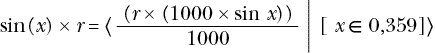

# 第十章：表查找


本章讨论了如何通过使用表查找来加速或减少计算的复杂性。在早期的 x86 编程中，用表查找替代昂贵的计算是提高程序性能的常用方法。今天，现代系统中的内存速度限制了通过表查找获得的性能提升。然而，对于复杂的计算，这仍然是编写高性能代码的可行技术。本章演示了使用表查找时的空间/速度权衡。

## 10.1 表

对于汇编语言程序员来说，*表*是一个包含初始化值的数组，一旦创建后这些值不会变化。在汇编语言中，你可以使用表进行多种用途：计算函数、控制程序流，或者只是进行查找。一般来说，表提供了一种快速执行操作的机制，代价是程序中的空间（额外的空间用于存储表格数据）。在本节中，我们将探讨表在汇编语言程序中的一些可能用途。

### 10.1.1 通过表查找计算函数

一个看似简单的高级语言算术表达式可能等同于相当多的 x86-64 汇编语言代码，因此可能计算代价很高。汇编语言程序员通常会预先计算许多值，并使用这些值的表查找来加速程序。这种方法的优点是更容易，而且通常效率更高。

考虑以下 Pascal 语句：

```
if (character >= 'a') and (character <= 'z') then 
      character := chr(ord(character) - 32);
```

这个 Pascal 的`if`语句将`character`变量的值从小写字母转换为大写字母，如果`character`位于`a`到`z`的范围内。执行相同操作的 MASM 代码需要七条机器指令，如下所示：

```
 mov al, character
        cmp al, 'a'
        jb  notLower
        cmp al, 'z'
        ja  notLower

        and al, 5fh  ; Same as sub(32, al) in this code
        mov character, al
notLower:
```

然而，使用表查找可以将这段序列减少到仅四条指令：

```
mov   al, character
lea   rbx, CnvrtLower
xlat
mov   character, al
```

`xlat`，或称翻译指令，执行以下操作：

```
mov al, [rbx + al * 1]
```

这条指令使用当前的 AL 寄存器值作为索引，查找在 RBX 中找到的数组的基地址。它获取数组中该索引位置的字节，并将该字节复制到 AL 寄存器中。英特尔称这条指令为*翻译*，因为程序员通常使用它通过查找表将字符从一种形式转换为另一种形式，就像我们在这里使用它一样。

在前面的示例中，`CnvrtLower`是一个 256 字节的表，在 0 到 60h 的索引位置存储值 0 到 60h，在 61h 到 7Ah 的索引位置存储值 41h 到 5Ah，在 7Bh 到 0FFh 的索引位置存储值 7Bh 到 0FFh。因此，如果 AL 中包含的值位于 0 到 60h 或 7Ah 到 0FFh 范围内，`xlat`指令返回相同的值，实际上 AL 保持不变。但是，如果 AL 中包含的值位于 61h 到 7Ah（即 ASCII 码 a 到 z 的范围），则`xlat`指令会将 AL 中的值替换为 41h 到 5Ah 范围内的值（即 ASCII 码 A 到 Z 的范围），从而将小写字母转换为大写字母。

随着函数复杂度的增加，查找表方法的性能优势大幅提升。虽然你几乎不会使用查找表将小写字母转换为大写字母，但考虑一下如果你想要交换字母大小写会发生什么；例如，通过计算：

```
 mov al, character
        cmp al, 'a'
        jb  notLower
        cmp al, 'z'
        ja  allDone

        and al, 5fh
        jmp allDone

notLower:
        cmp al, 'A'
        jb  allDone
        cmp al, 'Z'
        ja  allDone

        or  al, 20h
allDone:
        mov character, al
```

这段代码有 13 条机器指令。

计算这个相同函数的查找表代码如下：

```
mov   al, character
lea   rbx, SwapUL
xlat
mov   character, al
```

如你所见，当使用查找表来计算一个函数时，只有表格发生变化；代码保持不变。

#### 10.1.1.1 函数的定义域和值域

通过查找表计算的函数具有有限的*定义域*（它们接受的可能输入值的集合），因为函数的定义域中的每个元素都需要在查找表中有一项。例如，我们之前的大小写转换函数，其定义域是 256 字符的扩展 ASCII 字符集。像`sin`或`cos`这样的函数接受的是实数集（无限大）作为可能的输入值。你不会发现通过查找表实现一个定义域为实数集的函数很实用，因为你必须将定义域限制为一个较小的集合。

大多数查找表都非常小，通常只有 10 到 256 项。查找表很少超过 1000 项。大多数程序员没有耐心去创建（并验证正确性）一个 1000 项的查找表（不过，参见第 590 页的“生成查找表”部分，讨论如何通过编程生成查找表）。

基于查找表的函数的另一个限制是，定义域中的元素必须相当连续。查找表使用输入值作为查找表的索引，并返回该表项中的值。一个接受 0、100、1000 和 10,000 这些值的函数，由于输入值的范围，会需要 10,001 个不同的元素在查找表中。因此，你无法通过查找表有效地创建这样一个函数。在本节关于查找表的内容中，我们假设函数的定义域是一个相当连续的值集。

函数的*值域*是它产生的所有可能输出值的集合。从查找表的角度来看，函数的值域决定了每个表项的大小。例如，如果函数的值域是整数值 0 到 255，那么每个表项需要一个字节；如果值域是 0 到 65,535，那么每个表项需要 2 个字节，依此类推。

通过查找表实现的最佳函数是那些定义域和值域始终为 0 到 255（或该范围的子集）的函数。任何这样的函数都可以通过相同的两条指令来计算：`lea rbx, table`和`xlat`。唯一改变的只是查找表。之前展示的大小写转换例程就是这样一个好例子。

一旦函数的范围或域超出了 0 到 255，你就不能（方便地）使用`xlat`指令来计算函数值。需要考虑三种情况：

+   域超出了 0 到 255，但范围在 0 到 255 之间。

+   域在 0 到 255 之间，但范围超出了 0 到 255。

+   函数的域和范围都超出了 0 到 255。

我们将在接下来的章节中考虑这些情况。

#### 10.1.1.2 域超出 0 到 255，范围在 0 到 255 之间

如果一个函数的域超出了 0 到 255，但函数的范围落在该值集内，我们的查找表将需要超过 256 个条目，但每个条目可以用一个字节表示。因此，查找表可以是一个字节数组。除了那些可以使用`xlat`指令的查找，属于此类别的函数是最有效的。以下的 Pascal 函数调用

```
B := Func(X); 
```

其中`Func`是

```
function Func(X:dword):byte; 
```

可以很容易地转换为以下的 MASM 代码：

```
mov edx, X    ; Zero-extends into RDX!
lea rbx, FuncTable
mov al, [rbx][rdx * 1]
mov B, al
```

这段代码将函数参数加载到 RDX 寄存器中，使用该值（范围为 0 到??）作为索引访问`FuncTable`表，提取该位置的字节，并将结果存储到`B`中。显然，表中必须包含每个可能的`X`值的有效条目。例如，假设你想将一个 80×25 文本视频显示器上的光标位置（范围为 0 到 1999，80×25 显示器上有 2000 个字符位置）映射到屏幕上的`X`（0 到 79）或`Y`（0 到 24）坐标。你可以通过以下函数计算`X`坐标

```
X = Posn % 80;
```

和`Y`坐标通过公式

```
Y = Posn / 80;
```

（其中`Posn`是屏幕上的光标位置）。这可以通过以下 x86-64 代码计算：

```
mov ax, Posn
mov cl, 80
div cl

; X is now in AH, Y is now in AL.
```

然而，x86-64 上的`div`指令非常慢。如果你需要对每个写入屏幕的字符进行此计算，将严重降低视频显示代码的速度。以下代码通过表查找实现这两个功能，可能会显著提高代码的性能：

```
lea   rbx, yCoord
movzx ecx, Posn           ; Use a plain mov instr if Posn 
mov   al, [rbx][rcx * 1]  ; is uns32 rather than an 
lea   rbx, xCoord         ; uns16 value
mov   ah, [rbx][rcx * 1]
```

请记住，将值加载到 ECX 寄存器中会自动将该值零扩展到 RCX 寄存器。因此，这段代码中的`movzx`指令实际上会将`Posn`零扩展到 RCX，而不仅仅是 ECX。

如果你愿意接受`LARGEADDRESSAWARE:NO`链接选项的限制（请参见第三章中的《大地址不可知应用程序》），你可以稍微简化这段代码：

```
movzx ecx, Posn           ; Use a plain mov instr if Posn
mov   al, yCoord[rcx * 1] ; is uns32 rather than an
mov   ah, xCoord[rcx * 1] ; uns16 value
```

#### 10.1.1.3 域在 0 到 255 之间，范围超出 0 到 255，或两者都超出 0 到 255

如果一个函数的域在 0 到 255 之间，但范围超出了这个范围，查找表将包含 256 个或更少的条目，但每个条目将需要 2 个或更多字节。如果函数的范围和域都超出了 0 到 255，那么每个条目将需要 2 个或更多字节，且表将包含超过 256 个条目。

回顾第四章，索引一个一维数组（其中`table`是一个特例）的公式如下：

```
`element_address` *=* `Base` *+* `index`*`element_size`
```

如果函数的值域中的元素需要 2 个字节，那么在索引表格之前，必须将索引乘以 2。同样，如果每个条目需要 3、4 或更多字节，则必须将索引乘以每个表项的大小，然后才能作为索引使用。例如，假设你有一个由以下（伪）Pascal 声明定义的函数，`F(``x``)`：

```
function F(`x`:dword):word;
```

你可以使用以下 x86-64 代码创建此函数（当然，还需要适当命名的表`F`）：

```
movzx ebx, `x`
lea   r8, F
mov   ax, [r8][rbx * 2]
```

如果你可以接受`LARGEADDRESSAWARE:NO`的限制，你可以按如下方式减少：

```
movzx ebx, `x`
mov   ax, F[rbx * 2]
```

任何域较小且大多数是连续的函数都是通过表查找计算的良好候选。某些情况下，非连续的域也是可以接受的，只要可以将域强制转换为适当的值集（你已经看到的一个例子是处理`switch`语句表达式）。这种操作称为*条件化*，是下一节的主题。

#### 10.1.1.4 域条件化

*域条件化*是指对函数域中的一组值进行处理，使其更容易作为该函数的输入。考虑以下函数：

```
sin `x` = sin `x`|(x∈[–2π,2π])
```

这意味着（计算机）函数`sin(``x``)`等价于（数学）函数 sin *x*，其中

```
–2π <= `x` <= 2π
```

正如我们所知，正弦是一个圆形函数，它可以接受任何实数输入。然而，用于计算正弦的公式只接受这一小部分值。

这种范围限制不会带来任何实际问题；只需计算`sin(``x`` mod (2 * pi))`，我们就可以计算任何输入值的正弦。修改输入值以便能够轻松计算函数的过程称为*输入条件化*。在前面的例子中，我们计算了`x` `mod 2 * pi`并将结果作为`sin`函数的输入。这将`x`截断到`sin`所需的域，而不会影响结果。我们也可以将输入条件化应用于表查找。事实上，将索引缩放以处理字节条目就是一种输入条件化。考虑以下 Pascal 函数：

```
function val(`x`:word):word; begin
    case `x` of
        0: val := 1;
        1: val := 1;
        2: val := 4;
        3: val := 27;
        4: val := 256;
        otherwise val := 0;
    end;
end; 
```

这个函数计算 0 到 4 范围内的`x`的值，如果`x`超出此范围，则返回 0。由于`x`可以取 65,536 个不同的值（是 16 位字），创建一个包含 65,536 个字的表，其中只有前五个条目非零，似乎是相当浪费的。然而，如果我们使用输入条件化，我们仍然可以通过表查找计算这个函数。以下汇编语言代码展示了这一原理：

```
 mov   ax, 0      ; AX = 0, assume `x` > 4
        movzx ebx, `x`     ; Note that HO bits of RBX must be 0!
        lea   r8, val
        cmp   bx, 4
        ja    defaultResult

 mov   ax, [r8][rbx * 2]

defaultResult:
```

这段代码检查`x`是否超出了 0 到 4 的范围。如果是，它会手动将 AX 设置为 0；否则，它会通过`val`表查找函数值。通过输入条件化，你可以实现一些通过表查找否则难以实现的函数。

````### 10.1.2 Generating Tables    One big problem with using table lookups is creating the table in the first place. This is particularly true if the table has many entries. Figuring out the data to place in the table, then laboriously entering the data and, finally, checking that data to make sure it is valid, is very time-consuming and boring. For many tables, there is no way around this process. For other tables, there is a better way: using the computer to generate the table for you.    An example is probably the best way to describe this. Consider the following modification to the sine function:    This states that *x* is an integer in the range 0 to 359 and *r* must be an integer. The computer can easily compute this with the following code:    ``` Thousand dword 1000     .     .     . lea   r8, Sines movzx ebx, x mov   eax, [r8][rbx * 2] ; Get sin(`x`) * 1000 imul  r                  ; Note that this extends EAX into EDX idiv  Thousand           ; Compute (`r` *(sin(`x`) * 1000)) / 1000 ```    (This provides the usual improvement if you can live with the limitations of `LARGEADDRESSAWARE:NO`.)    Note that integer multiplication and division are not associative. You cannot remove the multiplication by 1000 and the division by 1000 because they appear to cancel each other out. Furthermore, this code must compute this function in exactly this order.    All that we need to complete this function is `Sines`, a table containing 360 different values corresponding to the sine of the angle (in degrees) times 1000\. The C/C++ program in Listing 10-1 generates this table for you.    ``` // Listing 10-1: GenerateSines   // A C program that generates a table of sine values for // an assembly language lookup table.  #include <stdlib.h> #include <stdio.h> #include <math.h>  int main(int argc, char **argv) {     FILE *outFile;     int angle;     int r;      // Open the file:          outFile = fopen("sines.asm", "w");      // Emit the initial part of the declaration to      // the output file:      fprintf     (          outFile,          "Sines:"  // sin(0) = 0     );      // Emit the sines table:          for(angle = 0; angle <= 359; ++angle)     {         // Convert angle in degrees to an angle in          // radians using:                  // radians = angle * 2.0 * pi / 360.0;                  // Multiply by 1000 and store the rounded          // result into the integer variable r.          double theSine =              sin             (                  angle * 2.0 *                  3.14159265358979323846 /                  360.0              );         r = (int) (theSine * 1000.0);           // Write out the integers eight per line to the          // source file.         // Note: If (angle AND %111) is 0, then angle          // is divisible by 8 and we should output a          // newline first.          if((angle & 7) == 0)         {             fprintf(outFile, "\n\tword\t");         }         fprintf(outFile, "%5d", r);  if ((angle & 7) != 7)         {             fprintf(outFile, ",");         }      } // endfor     fprintf(outFile, "\n");      fclose(outFile);     return 0;  } // end main ```    Listing 10-1: A C program that generates a table of sines    This program produces the following output (truncated for brevity):    ``` Sines:       word        0,   17,   34,   52,   69,   87,  104,  121       word      139,  156,  173,  190,  207,  224,  241,  258       word      275,  292,  309,  325,  342,  358,  374,  390       word      406,  422,  438,  453,  469,  484,  499,  515       word      529,  544,  559,  573,  587,  601,  615,  629       word      642,  656,  669,  681,  694,  707,  719,  731       word      743,  754,  766,  777,  788,  798,  809,  819       word      829,  838,  848,  857,  866,  874,  882,  891       word      898,  906,  913,  920,  927,  933,  939,  945       word      951,  956,  961,  965,  970,  974,  978,  981       word      984,  987,  990,  992,  994,  996,  997,  998       word      999,  999, 1000,  999,  999,  998,  997,  996       word      994,  992,  990,  987,  984,  981,  978,  974       word      970,  965,  961,  956,  951,  945,  939,  933       word      927,  920,  913,  906,  898,  891,  882,  874                                       .                                       .                                       .       word     -898, -891, -882, -874, -866, -857, -848, -838       word     -829, -819, -809, -798, -788, -777, -766, -754       word     -743, -731, -719, -707, -694, -681, -669, -656       word     -642, -629, -615, -601, -587, -573, -559, -544       word     -529, -515, -500, -484, -469, -453, -438, -422       word     -406, -390, -374, -358, -342, -325, -309, -292       word     -275, -258, -241, -224, -207, -190, -173, -156       word     -139, -121, -104,  -87,  -69,  -52,  -34,  -17 ```    Obviously, it’s much easier to write the C program that generated this data than to enter (and verify) this data by hand. Of course, you don’t even have to write the table-generation program in C (or Pascal/Delphi, Java, C#, Swift, or another high-level language). Because the program will execute only once, the performance of the table-generation program is not an issue.    Once you run your table-generation program, all that remains to be done is to cut and paste the table from the file (*sines.asm* in this example) into the program that will actually use the table.    ### 10.1.3 Table-Lookup Performance    In the early days of PCs, table lookups were a preferred way to do high-performance computations. Today, it is not uncommon for a CPU to be 10 to 100 times faster than main memory. As a result, using a table lookup may not be faster than doing the same calculation with machine instructions. However, the on-chip CPU cache memory subsystems operate at near CPU speeds. Therefore, table lookups can be cost-effective if your table resides in cache memory on the CPU. This means that the way to get good performance using table lookups is to use small tables (because there’s only so much room on the cache) and use tables whose entries you reference frequently (so the tables stay in the cache).    See *Write Great Code*, Volume 1 (No Starch Press, 2020) or the electronic version of *The Art of Assembly Language* at [`www.randallhyde.com/`](https://www.randallhyde.com/) for details concerning the operation of cache memory and how you can optimize your use of cache memory.    ## 10.2 For More Information    Donald Knuth’s *The Art of Computer Programming*, Volume 3: *Searching and Sorting* (Addison-Wesley Professional, 1998) contains a lot of useful information about searching for data in tables. Searching for data is an alternative when a straight array access won’t work in a given situation.    ## 10.3 Test Yourself    1.  What is the domain of a function? 2.  What is the range of a function? 3.  What does the `xlat` instruction do? 4.  Which domain and range values allow you to use the `xlat` instruction? 5.  Provide the code that implements the following functions (using pseudo-C prototypes and `f` as the table name):     1.  `byte f(byte input)`     2.  `word f(byte input)`     3.  `byte f(word input)`     4.  `word f(word input)` 6.  What is domain conditioning? 7.  Why might table lookups not be effective on modern processors?````
