# 第十一章：SIMD 指令


本章讨论了 x86-64 上的*向量指令*。这类特殊指令提供并行处理，传统上被称为*单指令，多数据（**SIMD**）*指令，因为字面上来说，一条指令同时作用于多个数据块。由于这种并发性，SIMD 指令通常可以比相应的*单指令，单数据（SISD）*或*标量*指令执行得更快（理论上，速度可以快 32 到 64 倍），而这些标准 x86-64 指令集中的标量指令就是这样。

x86-64 实际上提供了三组向量指令：多媒体扩展（MMX）指令集、流式 SIMD 扩展（SSE）指令集和高级向量扩展（AVX）指令集。本书不考虑 MMX 指令，因为它们已经过时（SSE 指令集有 MMX 指令的等效功能）。

x86-64 向量指令集（SSE/AVX）几乎与标量指令集一样大。关于 SSE/AVX 编程和算法，完全可以写成一本书。然而，这不是那本书；SIMD 和并行算法是超出本书范围的高级主题，因此本章仅介绍了一些 SSE/AVX 指令，并到此为止。

本章首先介绍一些前提信息。首先，它开始讨论 x86-64 向量架构和流数据类型。然后，讨论如何通过使用`cpuid`指令来检测各种向量指令的存在（并非所有 x86-64 CPU 都具备这些指令）。由于大多数向量指令需要特殊的内存对齐来处理数据操作数，本章还讨论了 MASM 段。

## 11.1 SSE/AVX 架构

让我们首先快速了解一下 x64-86 CPU 中的 SSE 和 AVX 功能。SSE 和 AVX 指令有几个变种：原始的 SSE，以及 SSE2、SSE3、SSE3、SSE4（SSE4.1 和 SSE4.2）、AVX、AVX2（AVX 和 AVX2 有时被称为 AVX-256），以及 AVX-512。SSE3 是在 Pentium 4F（Prescott）CPU 发布时引入的，这是英特尔的第一款 64 位 CPU。因此，你可以假设所有英特尔 64 位 CPU 都支持 SSE3 及之前的 SIMD 指令。

SSE/AVX 架构有三个主要的代际：

+   SSE 架构（在 64 位 CPU 上）提供了十六个 128 位的 XMM 寄存器，支持整数和浮点数据类型

+   AVX/AVX2 架构，支持十六个 256 位的 YMM 寄存器（同样支持整数和浮点数据类型）

+   AVX-512 架构，支持最多三十二个 512 位的 ZMM 寄存器

一般来说，本章的示例使用的是 AVX2 及以前的指令。有关 AVX-512 等附加指令集扩展的讨论，请参阅英特尔和 AMD CPU 手册。本章不会试图描述每一条 SSE 或 AVX 指令。大多数流式指令有非常专业的用途，并不适用于通用应用。

## 11.2 流式数据类型

SSE 和 AVX 编程模型支持两种基本数据类型：标量和向量。*标量*保存一个单精度或双精度浮点值。*向量*保存多个浮点数或整数值（根据标量数据类型（字节、字、双字、四字、单精度或双精度）和寄存器及内存大小（128 位或 256 位），值的数量在 2 到 32 之间）。

XMM 寄存器（XMM0 到 XMM15）可以容纳一个 32 位浮点值（标量）或四个单精度浮点值（向量）。YMM 寄存器（YMM0 到 YMM15）可以容纳八个单精度（32 位）浮点值（向量）；参见图 11-1。

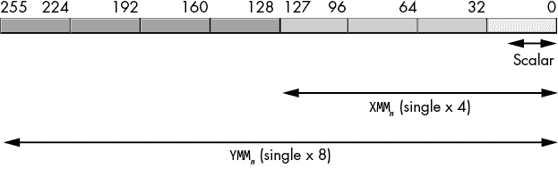

图 11-1：打包和标量的单精度浮点数据类型

XMM 寄存器可以容纳一个双精度标量值或一个包含一对双精度值的向量。YMM 寄存器可以容纳一个包含四个双精度浮点值的向量，如图 11-2 所示。

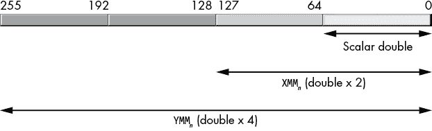

图 11-2：打包的和标量的双精度浮点类型

XMM 寄存器可以容纳 16 个字节值（YMM 寄存器可以容纳 32 个字节值），使 CPU 能够通过一条指令执行 16 个（32 个）字节大小的运算（图 11-3）。

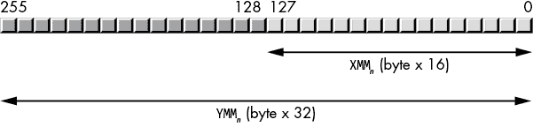

图 11-3：打包的字节数据类型

XMM 寄存器可以容纳八个字大小的值（YMM 寄存器可以容纳十六个字大小的值），使 CPU 能够通过一条指令执行八个（十六个）16 位字大小的整数运算（图 11-4）。

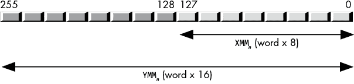

图 11-4：打包的字数据类型

XMM 寄存器可以容纳四个双字值（YMM 寄存器可以容纳八个双字值），使 CPU 能够通过一条指令执行四个（八个）32 位双字大小的整数运算（图 11-5）。

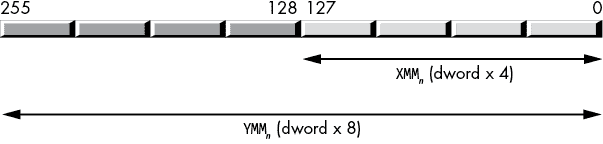

图 11-5：打包的双字数据类型

XMM 寄存器可以容纳两个四字值（YMM 寄存器可以容纳四个四字值），使 CPU 能够通过一条指令执行两个（四个）64 位四字运算（图 11-6）。

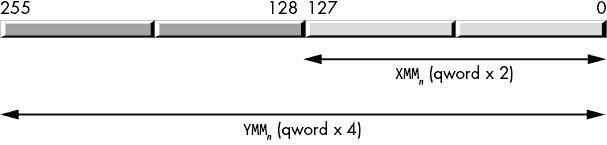

图 11-6：打包的四字数据类型

英特尔的文档将 XMM 和 YMM 寄存器中的向量元素称为 *通道*。例如，128 位的 XMM 寄存器有 16 个字节。位 0 到 7 是通道 0，位 8 到 15 是通道 1，位 16 到 23 是通道 2，……，位 120 到 127 是通道 15。256 位的 YMM 寄存器有 32 个字节大小的通道，而 512 位的 ZMM 寄存器有 64 个字节大小的通道。

类似地，128 位的 XMM 寄存器有八个 word 大小的通道（通道 0 到 7）。256 位的 YMM 寄存器有十六个 word 大小的通道（通道 0 到 15）。在支持 AVX-512 的 CPU 上，ZMM 寄存器（512 位）有三十二个 word 大小的通道，编号从 0 到 31。

XMM 寄存器有四个 dword 大小的通道（通道 0 到 3）；它还具有四个单精度（32 位）浮点通道（同样编号为 0 到 3）。YMM 寄存器有八个 dword 或单精度通道（通道 0 到 7）。AVX2 ZMM 寄存器有十六个 dword 或单精度大小的通道（编号为 0 到 15）。

XMM 寄存器支持两个 qword 大小的通道（或两个双精度通道），编号为 0 到 1。按预期，YMM 寄存器有两倍的数量（四个通道，编号为 0 到 3），而 AVX2 ZMM 寄存器则有四倍的数量（通道 0 到 7）。

若干 SSE/AVX 指令引用了这些寄存器中的各个通道。特别是，shuffle 和 unpack 指令允许在 SSE 和 AVX 操作数的通道之间移动数据。有关通道使用的示例，请参见第 625 页的“shuffle 和 unpack 指令”。

## 11.3 使用 cpuid 区分指令集

英特尔在 1978 年推出了 8086 微处理器（不久之后推出了 8088）。几乎每一代 CPU，英特尔都会向指令集添加新指令。直到本章为止，本书使用的指令通常在所有 x86-64 CPU（无论是英特尔还是 AMD）上都能使用。本章介绍了仅在后期型号的 x86-64 CPU 上可用的指令。为了允许程序员确定其应用程序正在使用的 CPU，以便动态避免在旧处理器上使用较新的指令，英特尔引入了 `cpuid` 指令。

`cpuid` 指令期望传递一个单一参数（称为 *leaf* 函数），该参数通过 EAX 寄存器传递。它根据 EAX 中传递的值，返回不同 32 位寄存器中的有关 CPU 的各类信息。应用程序可以测试返回的信息，以查看是否支持某些 CPU 功能。

随着英特尔引入新指令，它改变了 `cpuid` 的行为以反映这些变化。具体来说，英特尔改变了程序可以在 EAX 中传递给 `cpuid` 的合法值范围；这一点称为 *支持的最高功能*。因此，一些 64 位的 CPU 仅接受 0h 到 05h 范围内的值。本章讨论的指令可能要求传递 0h 到 07h 范围内的值。因此，当使用 `cpuid` 时，首先要做的事情是验证它是否接受 EAX = 07h 作为有效参数。

为了确定支持的最高功能，你需要将 EAX 加载为 0 或 8000_0000h，然后执行 `cpuid` 指令（所有 64 位 CPU 都支持这两个功能值）。返回值是你可以传递给 `cpuid` 的最大值。Intel 和 AMD 的文档（另请参见 [`en.wikipedia.org/wiki/CPUID`](https://en.wikipedia.org/wiki/CPUID)）会列出 `cpuid` 返回的各种 CPU 值；对于本章而言，我们只需要验证支持的最高功能是 01h（所有 64 位 CPU 都是如此）或 07h（对于某些指令）。

除了提供支持的最高功能外，`cpuid` 指令（EAX = 0h 或 8000_0002h）还会返回一个 12 字符的厂商 ID，存储在 EBX、ECX 和 EDX 寄存器中。对于 x86-64 芯片，这将是以下两种之一：

+   GenuineIntel（EBX 为 756e_6547h，EDX 为 4965_6e69h，ECX 为 6c65_746eh）

+   AuthenticAMD（EBX 为 6874_7541h，EDX 为 6974_6E65h，ECX 为 444D_4163h）

为了确定 CPU 是否可以执行大多数 SSE 和 AVX 指令，你需要执行 `cpuid`，EAX = 01h，并测试 ECX 寄存器中放置的各个位。对于一些更高级的特性（如高级位操作功能和 AVX2 指令），你需要执行 `cpuid`，EAX = 07h，并检查 EBX 寄存器中的结果。`cpuid` 指令（EAX = 1）会在 ECX 中的以下位返回有趣的 SSE/AVX 特性标志，如 表 11-1 所示；当 EAX = 07h 时，它会在 EBX 中返回位操作或 AVX2 标志，如 表 11-2 所示。如果该位被设置，则说明 CPU 支持特定的指令。

表 11-1：Intel `cpuid` 特性标志（EAX = 1）

| **位** | **ECX** |
| --- | --- |
| 0 | SSE3 支持 |
| 1 | PCLMULQDQ 支持 |
| 9 | SSSE3 支持 |
| 19 | CPU 支持 SSE4.1 指令 |
| 20 | CPU 支持 SSE4.2 指令 |
| 28 | 高级向量扩展 |

表 11-2：Intel `cpuid` 扩展特性标志（EAX = 7，ECX = 0）

| **位** | **EBX** |
| --- | --- |
| 3 | 位操作指令集 1 |
| 5 | 高级向量扩展 2（AVX2） |
| 8 | 位操作指令集 2 |

示例 11-1 查询 CPU 上的厂商 ID 和基本特性标志。

```
; Listing 11-1

; CPUID Demonstration.

        option  casemap:none

nl          =       10

            .const
ttlStr      byte    "Listing 11-1", 0

            .data
maxFeature  dword   ?
VendorID    byte    14 dup (0)

            .code
            externdef printf:proc

; Return program title to C++ program:

            public  getTitle
getTitle    proc
            lea     rax, ttlStr
            ret
getTitle    endp

; Used for debugging:

print       proc
            push    rax
            push    rbx
            push    rcx
            push    rdx
            push    r8
            push    r9
            push    r10
            push    r11

            push    rbp
            mov     rbp, rsp
            sub     rsp, 40
            and     rsp, -16

            mov     rcx, [rbp + 72]   ; Return address
            call    printf

            mov     rcx, [rbp + 72]
            dec     rcx
skipTo0:    inc     rcx
            cmp     byte ptr [rcx], 0
            jne     skipTo0
            inc     rcx
            mov     [rbp + 72], rcx

            leave
            pop     r11
            pop     r10
            pop     r9
            pop     r8
            pop     rdx
            pop     rcx
            pop     rbx
            pop     rax
            ret
print       endp

; Here is the "asmMain" function.

            public  asmMain
asmMain     proc
            push    rbx
            push    rbp
            mov     rbp, rsp
 sub     rsp, 56         ; Shadow storage

            xor     eax, eax
            cpuid
            mov     maxFeature, eax
            mov     dword ptr VendorID, ebx 
            mov     dword ptr VendorID[4], edx 
            mov     dword ptr VendorID[8], ecx

            lea     rdx, VendorID
            mov     r8d, eax
            call    print
            byte    "CPUID(0): Vendor ID='%s',  "
            byte    "max feature=0%xh", nl, 0

; Leaf function 1 is available on all CPUs that support
; CPUID, no need to test for it. 

            mov     eax, 1
            cpuid
            mov     r8d, edx
            mov     edx, ecx
            call    print
            byte    "cpuid(1), ECX=%08x, EDX=%08x", nl, 0

; Most likely, leaf function 7 is supported on all modern CPUs
; (for example, x86-64), but we'll test its availability nonetheless.

            cmp     maxFeature, 7
            jb      allDone

            mov     eax, 7
            xor     ecx, ecx
            cpuid
            mov     edx, ebx
            mov     r8d, ecx
            call    print
            byte    "cpuid(7), EBX=%08x, ECX=%08x", nl, 0

allDone:    leave
            pop     rbx
            ret     ; Returns to caller
asmMain     endp
            end
```

示例 11-1：`cpuid` 演示程序

在一台配备 Intel i7-3720QM CPU 的旧款 MacBook Pro Retina 上，通过 Parallels 运行，输出如下：

```
C:\>**build listing11-1**

C:\>**echo off**
 Assembling: listing11-1.asm
c.cpp

C:\>**listing11-1**
Calling Listing 11-1:
CPUID(0): Vendor ID='GenuineIntel', max feature=0dh
cpuid(1), ECX=ffba2203, EDX=1f8bfbff
cpuid(7), EBX=00000281, ECX=00000000
Listing 11-1 terminated
```

该 CPU 支持 SSE3 指令（ECX 的第 0 位为 1）、SSE4.1 和 SSE4.2 指令（ECX 的第 19 位和第 20 位为 1）以及 AVX 指令（第 28 位为 1）。这些基本上是本章描述的指令。大多数现代 CPU 都会支持这些指令（Intel 于 2012 年发布的 i7-3720QM 就支持这些指令）。该处理器不支持 Intel 指令集中的一些更有趣的扩展特性（如扩展的位操作指令集和 AVX2 指令集）。使用这些指令的程序无法在这台（古老的）MacBook Pro 上执行。

在一台较新的 CPU（iMac Pro 10 核 Intel Xeon W-2150B）上运行此程序，产生以下输出：

```
C:\>**listing11-1**
Calling Listing 11-1:
CPUID(0): Vendor ID='GenuineIntel', max feature=016h
cpuid(1), ECX=fffa3203, EDX=1f8bfbff
cpuid(7), EBX=d09f47bb, ECX=00000000
Listing 11-1 terminated
```

如你所见，通过查看扩展特性位，较新的 Xeon CPU 确实支持这些额外的指令。列表 11-2 中的代码片段提供了对 列表 11-1 的快速修改，用来测试 BMI1 和 BMI2 位操作指令集的可用性（将以下代码插入到 列表 11-1 中的 `allDone` 标签之前）。

```
; Test for extended bit manipulation instructions 
; (BMI1 and BMI2):

            and     ebx, 108h       ; Test bits 3 and 8
            cmp     ebx, 108h       ; Both must be set
            jne     Unsupported
            call    print
            byte    "CPU supports BMI1 & BMI2", nl, 0
            jmp     allDone 

Unsupported:
            call    print
            byte    "CPU does not support BMI1 & BMI2 "
            byte    "instructions", nl, 0

allDone:    leave
            pop     rbx
            ret     ; Returns to caller
asmMain     endp
```

列表 11-2：测试 BMI1 和 BMI2 指令集

这是在 Intel i7-3720QM CPU 上的构建命令和程序输出：

```
C:\>**build listing11-2**

C:\>**echo off**
 Assembling: listing11-2.asm
c.cpp

C:\>**listing11-2**
Calling Listing 11-2:
CPUID(0): Vendor ID='GenuineIntel', max feature=0dh
cpuid(1), ECX=ffba2203, EDX=1f8bfbff
cpuid(7), EBX=00000281, ECX=00000000
CPU does not support BMI1 & BMI2 instructions
Listing 11-2 terminated
```

这是相同的程序在 iMac Pro（Intel Xeon W-2150B）上运行的情况：

```
C:\>**listing11-2**
Calling Listing 11-2:
CPUID(0): Vendor ID='GenuineIntel', max feature=016h
cpuid(1), ECX=fffa3203, EDX=1f8bfbff
cpuid(7), EBX=d09f47bb, ECX=00000000
CPU supports BMI1 & BMI2
Listing 11-2 terminated
```

## 11.4 完整段语法与段对齐

如你所见，SSE 和 AVX 内存数据需要在 16 字节、32 字节甚至 64 字节的边界上进行对齐。虽然你可以使用 `align` 指令来对齐数据（详见第三章中的“MASM 对数据对齐的支持”），但在使用本书中介绍的简化段指令时，16 字节对齐以外的对齐将不起作用。如果需要超过 16 字节的对齐，则必须使用 MASM 完整段声明。

如果你想创建一个可以完全控制段属性的段，则需要使用 `segment` 和 `ends` 指令。^(1) 段声明的通用语法如下：

```
`segname`  segment `readonly` `alignment` '`class`'
         statements
`segname`  ends
```

`segname` 是一个标识符。它是段的名称（也必须出现在 `ends` 指令之前）。它不需要是唯一的；你可以有多个段声明使用相同的名称。当 MASM 输出代码到目标文件时，它会将具有相同名称的段合并。避免使用 `_TEXT`、`_DATA`、`_BSS` 和 `_CONST` 作为段名称，因为 MASM 分别将这些名称用于 `.code`、`.data`、`.data?` 和 `.const` 指令。

`readonly` 选项可以为空或是 MASM 保留字 `readonly`。这提示 MASM 该段将包含只读（常量）数据。如果你试图（直接）将值存储到在只读段中声明的变量，MASM 将会报错，指出不能修改只读段。

`alignment` 选项是可选的，它允许你指定以下选项之一：

+   `byte`

+   `word`

+   `dword`

+   `para`

+   `page`

+   `align(``n``)` （`n` 是一个常量，必须是 2 的幂）

对齐选项告诉 MASM，此特定段的第一个字节必须出现在对齐选项的倍数地址上。`byte`、`word` 和 `dword` 保留字指定 1 字节、2 字节或 4 字节的对齐。`para` 对齐选项指定段落对齐（16 字节）。`page` 对齐选项指定 256 字节的地址对齐。最后，`align(``n``)` 对齐选项允许你指定任何 2 的幂次方地址对齐（1、2、4、8、16、32 等等）。

默认的段对齐，如果你没有明确指定，是段落对齐（16 字节）。这也是简化段指令（`.code`、`.data`、`.data?`和`.const`）的默认对齐方式。

如果你有一些（SSE/AVX）数据对象，必须从一个是 32 字节或 64 字节倍数的地址开始，那么创建一个 64 字节对齐的新数据段就是你需要的。以下是一个这样的段示例：

```
dseg64  segment align(64)
obj64   oword   0, 1, 2, 3   ; Starts on 64-byte boundary
b       byte    0            ; Messes with alignment
        align   32           ; Sets alignment to 32 bytes
obj32   oword   0, 1         ; Starts on 32-byte boundary
dseg64  ends
```

可选的`class`字段是一个字符串（由撇号和单引号分隔），通常是以下名称之一：`CODE`、`DATA`或`CONST`。请注意，MASM 和微软链接器会将具有相同类名的段合并，即使它们的段名不同。

本章展示了这些段声明的示例，它们在需要时使用。

## 11.5 SSE、AVX 和 AVX2 内存操作数对齐

SSE 和 AVX 指令通常允许访问各种内存操作数大小。所谓的标量指令，操作单个数据元素，可以访问字节、字、双字和四字操作数。在许多方面，这些类型的内存访问类似于非 SIMD 指令的内存访问。SSE、AVX 和 AVX2 指令集扩展还可以访问内存中的*打包*或*向量*操作数。与标量内存操作数不同，严格的规则限制了对打包内存操作数的访问。本节讨论这些规则。

SSE 指令可以用单条指令访问最多 128 位的内存（16 字节）。大多数多操作数 SSE 指令可以将 XMM 寄存器或 128 位内存操作数指定为它们的源（第二）操作数。通常情况下，这些内存操作数必须出现在 16 字节对齐的内存地址上（也就是说，内存地址的低 4 位必须包含 0）。

因为段的默认对齐是`para`（16 字节），你可以通过使用`align`指令轻松确保任何 16 字节打包的数据对象是 16 字节对齐的：

```
align 16
```

如果你尝试在使用`byte`、`word`或`dword`对齐类型定义的段中使用`align 16`，MASM 会报告错误。在使用`para`、`page`或任何`align(``n``)`选项时，其中`n`大于或等于 16 时，它将正常工作。

如果你使用 AVX 指令访问 256 位（32 字节）内存操作数，你必须确保这些内存操作数从 32 字节的地址边界开始。不幸的是，`align 32`不起作用，因为默认的段对齐是`para`（16 字节）对齐，而段的对齐必须大于或等于该段内出现的任何`align`指令的操作数字段。因此，为了能够定义 AVX 指令可用的 256 位变量，你必须显式地定义一个在（最小）32 字节边界上对齐的（数据）段，例如以下内容：

```
avxData    segment  align(32)
           align    32    ; This is actually redundant here
someData   oword    0, 1  ; 256 bits of data
             .
             .
             .
avxData    ends
```

虽然说这有些多余，但它非常重要，值得一再强调：

> 几乎所有 AVX/AVX2 指令，如果你尝试在一个不是 32 字节对齐的地址访问一个 256 位对象，都会引发对齐错误。始终确保你的 AVX 打包操作数正确对齐。

如果你使用 AVX2 扩展指令与 512 位内存操作数，你必须确保这些操作数出现在内存中一个是 64 字节的倍数的地址上。至于 AVX 指令，你必须定义一个具有大于或等于 64 字节对齐的段，例如这样：

```
avx2Data   segment  align(64)
someData   oword    0, 1, 2, 3  ; 512 bits of data
             .
             .
             .
avx2Data   ends
```

请原谅重复，但重要的是要记住：

> 几乎所有 AVX-512 指令，如果你尝试在一个不是 64 字节对齐的地址访问一个 512 位对象，都会引发对齐错误。始终确保你的 AVX-512 打包操作数正确对齐。

如果你在同一个应用程序中使用 SSE、AVX 和 AVX2 数据类型，你可以通过为单个段使用 64 字节对齐选项来创建一个单一的数据段来保存所有这些数据值，而不是为每种数据类型的大小创建单独的段。记住，段的对齐必须*大于或等于*特定数据类型所要求的对齐方式。因此，64 字节对齐对于 SSE 和 AVX/AVX2 变量以及 AVX-512 变量都能很好地工作：

```
SIMDData   segment  align(64)
sseData    oword    0    ; 64-byte-aligned is also 16-byte-aligned
           align    32   ; Alignment for AVX data
avxData    oword    0, 1 ; 32 bytes of data aligned on 32 bytes
           align    64
avx2Data   oword    0, 1, 2, 3  ; 64 bytes of data
             .
             .
             .
SIMDData   ends
```

如果你指定的对齐选项远大于你需要的（例如 256 字节的 `page` 对齐），你可能会不必要地浪费内存。

当你的 SSE、AVX 和 AVX2 数据值是静态或全局变量时，`align` 指令表现良好。那么当你想要在栈上创建局部变量或在堆上创建动态变量时会发生什么呢？即使你的程序遵循微软的 ABI，你在进入程序（或进入一个过程）时，栈上的对齐保证只有 16 字节对齐。同样，根据你的堆管理函数，`malloc`（或类似函数）返回的地址也无法保证适合 SSE、AVX 或 AVX2 数据对象的对齐方式。

在一个过程内部，你可以通过过度分配存储、将对象的大小减去 1 添加到分配的地址，然后使用 `and` 指令将地址的低位清零（16 字节对齐对象清除 4 位，32 字节对齐对象清除 5 位，64 字节对齐对象清除 6 位）来为 16 字节、32 字节或 64 字节对齐的变量分配存储空间。然后你可以通过使用这个指针来引用该对象。下面的示例代码演示了如何做到这一点：

```
sseproc     proc
sseptr      equ     <[rbp - 8]>
avxptr      equ     <[rbp - 16]>
avx2ptr     equ     <[rbp - 24]>
            push    rbp
            mov     rbp, rsp
            sub     rsp, 160

; Load RAX with an address 64 bytes
; above the current stack pointer. A
; 64-byte-aligned address will be somewhere
; between RSP and RSP + 63.

            lea     rax, [rsp + 63]

; Mask out the LO 6 bits of RAX. This
; generates an address in RAX that is
; aligned on a 64-byte boundary and is
; between RSP and RSP + 63:

            and     rax, -64 ; 0FFFF...FC0h

; Save this 64-byte-aligned address as
; the pointer to the AVX2 data:

            mov     avx2ptr, rax

; Add 64 to AVX2's address. This skips
; over AVX2's data. The address is also
; 64-byte-aligned (which means it is
; also 32-byte-aligned). Use this as
; the address of AVX's data:

            add     rax, 64
            mov     avxptr, rax

; Add 32 to AVX's address. This skips
; over AVX's data. The address is also
; 32-byte-aligned (which means it is
; also 16-byte-aligned). Use this as
; the address of SSE's data:

            add     rax, 32
            mov     sseptr, rax
             .
             . `Code that accesses the`
             . `AVX2, AVX, and SSE data`
             . `areas using avx2ptr`,
             . `avxptr, and sseptr`

            leave
            ret
sseproc     endp
```

对于在堆上分配的数据，你可以做同样的事情：分配额外的存储（最多分配大小的两倍减去 1），将对象的大小减去 1（15、31 或 63）加到地址中，然后使用 -64、-32 或 -16 来屏蔽新形成的地址，以分别产生 64 字节、32 字节或 16 字节对齐的对象。

## 11.6 SIMD 数据移动指令

x86-64 CPU 提供了多种数据移动指令，用于在（SSE/AVX）寄存器之间复制数据、从内存加载寄存器以及将寄存器值存储到内存。以下小节描述了每条指令。

### 11.6.1 (v)movd 和 (v)movq 指令

对于 SSE 指令集，`movd`（*移动 dword*）和`movq`（*移动 qword*）指令将来自 32 位或 64 位通用寄存器或内存位置的值复制到 XMM 寄存器的低 dword 或 qword 中：^(2)

```
movd `xmm`[*n*], `reg`32/`mem`32
movq `xmm`[*n*], `reg`64/`mem`64
```

如图 11-7 和 11-8 所示，这些指令将值零扩展到 XMM 寄存器中的剩余高位（HO 位）。

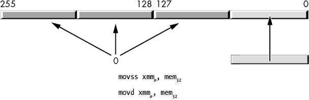

图 11-7：将 32 位值从内存移动到 XMM 寄存器（带零扩展）

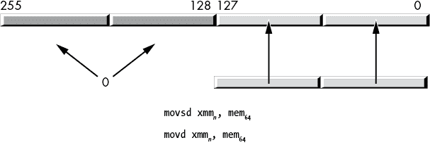

图 11-8：将 64 位值从内存移动到 XMM 寄存器（带零扩展）

以下指令将 XMM 寄存器的低 32 位或 64 位存储到 dword 或 qword 内存位置或通用寄存器：

```
movd `reg`[32]/`mem`[32], `xmm`n
movq `reg`[64]/`mem`[64], `xmm`n
```

`movq`指令还允许你将一个 XMM 寄存器的低 32 位（LO qword）数据复制到另一个 XMM 寄存器，但由于某些原因，`movd`指令不允许两个 XMM 寄存器操作数：

```
movq `xmm`n, `xmm`n
```

对于 AVX 指令，你可以使用以下指令：^(3)

```
vmovd `xmm`n, `reg`[32]/`mem`[32]
vmovd `reg`[32]/`mem`[32], `xmm`n
vmovq `xmm`n, `reg`[64]/`mem`[64]
vmovq `reg`[64]/`mem`[64], `xmm`n
```

具有 XMM 目标操作数的指令还会将它们的值零扩展到高位（最多扩展到位 255，不像标准 SSE 指令不会修改 YMM 寄存器的上位）。

因为`movd`和`movq`指令访问的是 32 位和 64 位内存值（而不是 128 位、256 位或 512 位值），所以这些指令不要求它们的内存操作数按 16 字节、32 字节或 64 字节对齐。当然，如果它们的操作数在内存中按 dword（`movd`）或 qword（`movq`）对齐，指令执行可能会更快。

### 11.6.2 (v)movaps、(v)movapd 和 (v)movdqa 指令

`movaps`（*移动对齐的打包单精度*）、`movapd`（*移动对齐的打包双精度*）和`movdqa`（*移动双四字对齐*）指令在内存与 XMM 寄存器之间或两个 XMM 寄存器之间移动 16 字节的数据。AVX 版本（带有`v`前缀）在内存与 XMM 或 YMM 寄存器之间，或两个 XMM 或 YMM 寄存器之间移动 16 字节或 32 字节的数据（涉及 XMM 寄存器的移动会将相应 YMM 寄存器的高位清零）。内存位置必须按 16 字节或 32 字节边界对齐（分别），否则 CPU 将生成未对齐访问错误。

这三条 `mov*` 指令将 16 字节数据加载到 XMM 寄存器中，理论上可以互换使用。实际上，Intel 可能会针对它们所移动的数据类型（单精度浮点值、双精度浮点值或整数值）对操作进行优化，因此最好根据所使用的数据类型选择适当的指令（有关说明，请参见第 622 页的“性能问题与 SIMD 移动指令”）。同样，所有三条 `vmov*` 指令将 16 或 32 字节的数据加载到 XMM 或 YMM 寄存器中，也可以互换使用。

这些指令具有以下形式：

```
movaps `xmm`n, `mem`[128]    vmovaps `xmm`n, `mem`[128]    vmovaps `ymm`n, `mem`[256]
movaps `mem`[128], `xmm`n    vmovaps `mem`[128], `xmm`n    vmovaps `mem`[256], `ymm`n
movaps `xmm`n, `xmm`n     vmovaps `xmm`n, `xmm`n     vmovaps `ymm`n, `ymm`n
movapd `xmm`n, `mem`[128]    vmovapd `xmm`n, `mem`[128]    vmovapd `ymm`n, `mem`[256]
movapd `mem`[128], `xmm`n    vmovapd `mem`[128], `xmm`n    vmovapd `mem`[256], `ymm`n
movapd `xmm`n, `xmm`n     vmovapd `xmm`n, `xmm`n     vmovapd `ymm`n, `ymm`n
movdqa `xmm`n, `mem`[128]    vmovdqa `xmm`n, `mem`[128]    vmovdqa `ymm`n, `mem`[256]
movdqa `mem`[128], `xmm`n    vmovdqa `mem`[128], `xmm`n    vmovdqa `mem`[256], `ymm`n
movdqa `xmm`n, `xmm`n     vmovdqa `xmm`n, `xmm`n     vmovdqa `ymm`n, `ymm`n
```

`mem`128 操作数应为一个包含四个单精度浮点值的向量（数组），用于 `(v)movaps` 指令；应为一个包含两个双精度浮点值的向量，用于 `(v)movapd` 指令；当使用 `(v)movdqa` 指令时，应为一个 16 字节的值（16 字节，8 个字，4 个双字或 2 个四字）。如果无法保证操作数在 16 字节边界上对齐，请改用 `movups`、`movupd` 或 `movdqu` 指令（请参见下一节）。

`mem`256 操作数应为一个包含八个单精度浮点值的向量（数组），用于 `vmovaps` 指令；应为一个包含四个双精度浮点值的向量，用于 `vmovapd` 指令；当使用 `vmovdqa` 指令时，应为一个 32 字节的值（32 字节，16 个字，8 个双字或 4 个四字）。如果无法保证操作数是 32 字节对齐的，请改用 `vmovups`、`vmovupd` 或 `vmovdqu` 指令。

尽管物理机器指令本身对内存操作数的数据类型并不特别关心，但 MASM 的汇编语法显然是关心的。如果指令与以下任一类型不匹配，则需要使用操作数类型强制转换。

+   `movaps` 指令允许 `real4`、`dword` 和 `oword` 操作数。

+   `movapd` 指令允许 `real8`、`qword` 和 `oword` 操作数。

+   `movdqa` 指令仅允许 `oword` 操作数。

+   `vmovaps` 指令允许 `real4`、`dword` 和 `ymmword ptr` 操作数（当使用 YMM 寄存器时）。

+   `vmovapd` 指令允许 `real8`、`qword` 和 `ymmword ptr` 操作数（当使用 YMM 寄存器时）。

+   `vmovdqa` 指令仅允许 `ymmword ptr` 操作数（当使用 YMM 寄存器时）。

通常你会看到 `memcpy`（*内存复制*）函数使用 `(v)movapd` 指令进行高性能操作。更多详情请访问 Agner Fog 的网站 [`www.agner.org/optimize/`](https://www.agner.org/optimize/)。

### 11.6.3 （v）movups、（v）movupd 和（v）movdqu 指令

当你无法保证打包数据的内存操作数位于 16 字节或 32 字节对齐的地址边界时，可以使用 `(v)movups`（*无对齐的打包单精度*）、`(v)movupd`（*无对齐的打包双精度*）和 `(v)movdqu`（*无对齐的双四字*）指令，在 XMM 或 YMM 寄存器与内存之间移动数据。

至于对齐的移动指令，所有不对齐的移动指令都做相同的事情：将 16（32）字节的数据从内存中复制到内存中，或者反之。不同数据类型的约定与对齐数据移动指令的约定相同。

### 11.6.4 对齐与不对齐移动的性能

列表 11-3 和 列表 11-4 提供了示范程序，展示了使用对齐和不对齐内存访问的 `mova*` 和 `movu*` 指令的性能。

```
; Listing 11-3

; Performance test for packed versus unpacked
; instructions. This program times aligned accesses.

        option  casemap:none

nl          =       10

            .const
ttlStr      byte    "Listing 11-3", 0

dseg        segment align(64) 'DATA'

; Aligned data types:

            align   64
alignedData byte    64 dup (0)
dseg        ends

            .code
            externdef printf:proc

; Return program title to C++ program:

            public  getTitle
getTitle    proc
            lea     rax, ttlStr
            ret
getTitle    endp

; Used for debugging:

print       proc

; Print code removed for brevity.
; See Listing 11-1 for actual code.

print       endp

; Here is the "asmMain" function.

            public  asmMain
asmMain     proc
            push    rbx
            push    rbp
            mov     rbp, rsp
            sub     rsp, 56         ; Shadow storage

            call    print
            byte    "Starting", nl, 0

            mov     rcx, 4000000000 ; 4,000,000,000
            lea     rdx, alignedData
            mov     rbx, 0
rptLp:      mov     rax, 15
rptLp2:     movaps  xmm0, xmmword ptr [rdx + rbx * 1]
            movapd  xmm0, real8 ptr   [rdx + rbx * 1]
            movdqa  xmm0, xmmword ptr [rdx + rbx * 1]
            vmovaps ymm0, ymmword ptr [rdx + rbx * 1]
            vmovapd ymm0, ymmword ptr [rdx + rbx * 1]
            vmovdqa ymm0, ymmword ptr [rdx + rbx * 1]
            vmovaps zmm0, zmmword ptr [rdx + rbx * 1]
            vmovapd zmm0, zmmword ptr [rdx + rbx * 1]

            dec     rax
            jns     rptLp2

            dec     rcx
            jnz     rptLp

            call    print
            byte    "Done", nl, 0

allDone:    leave
            pop     rbx
 ret     ; Returns to caller
asmMain     endp
            end
```

列表 11-3：对齐内存访问时序代码

```
; Listing 11-4

; Performance test for packed versus unpacked
; instructions. This program times unaligned accesses. 

        option  casemap:none

nl          =       10

            .const
ttlStr      byte    "Listing 11-4", 0

dseg        segment align(64) 'DATA'

; Aligned data types:

            align   64
alignedData byte    64 dup (0)
dseg        ends

            .code
            externdef printf:proc

; Return program title to C++ program:

            public  getTitle
getTitle    proc
            lea     rax, ttlStr
            ret
getTitle    endp

; Used for debugging:

print       proc

; Print code removed for brevity.
; See Listing 11-1 for actual code.

print       endp

; Here is the "asmMain" function.

            public  asmMain
asmMain     proc
            push    rbx
            push    rbp
            mov     rbp, rsp
 sub     rsp, 56         ; Shadow storage

            call    print
            byte    "Starting", nl, 0

            mov     rcx, 4000000000 ; 4,000,000,000
            lea     rdx, alignedData
rptLp:      mov     rbx, 15
rptLp2:
            movups  xmm0, xmmword ptr [rdx + rbx * 1]
            movupd  xmm0, real8 ptr   [rdx + rbx * 1]
            movdqu  xmm0, xmmword ptr [rdx + rbx * 1]
            vmovups ymm0, ymmword ptr [rdx + rbx * 1]
            vmovupd ymm0, ymmword ptr [rdx + rbx * 1]
            vmovdqu ymm0, ymmword ptr [rdx + rbx * 1]
            vmovups zmm0, zmmword ptr [rdx + rbx * 1]
            vmovupd zmm0, zmmword ptr [rdx + rbx * 1]
            dec     rbx
            jns     rptLp2

            dec     rcx
            jnz     rptLp

            call    print
            byte    "Done", nl, 0

allDone:    leave
            pop     rbx
            ret     ; Returns to caller
asmMain     endp
            end
```

列表 11-4：不对齐内存访问时序代码

列表 11-3 中的代码在 3GHz Xeon W CPU 上执行大约需要 1 分 7 秒。在相同的处理器上，列表 11-4 中的代码执行需要 1 分 55 秒。如你所见，某些情况下，在对齐的地址边界上访问 SIMD 数据是有优势的。

### 11.6.5 `(v)movlps` 和 `(v)movlpd` 指令

`(v)movl*` 指令和 `(v)movh*` 指令（见下节）可能看起来像是普通的移动指令。它们的行为与许多其他 SSE/AVX 移动指令相似。然而，这些指令的设计目的是支持浮点向量的打包和解包。具体而言，这些指令允许你将来自两个不同源的两对单精度浮点数或一对双精度浮点操作数合并到一个单一的 XMM 寄存器中。

`(v)movlps` 指令使用以下语法：

```
movlps  `xmm`[dest], `mem`[64]
movlps  `mem`[64],  `xmm`[src]
vmovlps `xmm`[dest], `xmm`[src], `mem`[64]
vmovlps `mem`[64],  `xmm`[src]
```

`movlps` `xmm`dest`,` `mem`64 形式将一对单精度浮点值复制到目标 XMM 寄存器的两个低 32 位通道，如 图 11-9 所示。此指令不改变高 64 位。

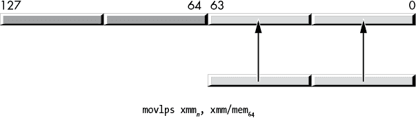

图 11-9：`movlps` 指令

`movlps` `mem`64`,` `xmm`src 形式将 XMM 源寄存器中的低 64 位（两个低单精度通道）复制到指定的内存位置。从功能上讲，这与 `movq` 或 `movsd` 指令等价（因为它将 64 位数据复制到内存），尽管如果 XMM 寄存器的低 64 位实际包含两个单精度值，则此指令可能会稍微更快一些（有关详细解释，请参见《性能问题与 SIMD 移动指令》一节，第 622 页）。

`vmovlps` 指令有三个操作数：一个目标 XMM 寄存器，一个源 XMM 寄存器和一个源（64 位）内存位置。该指令将内存位置中的两个单精度值复制到目标 XMM 寄存器的低 64 位。它还将源寄存器的高 64 位（也包含两个单精度值）复制到目标寄存器的高 64 位。图 11-10 显示了该操作。请注意，该指令通过一条指令合并了一对操作数。


图 11-10: `vmovlps` 指令

类似于 `movsd`，`movlpd`（*移动低字打包双精度*）指令将源操作数的低 64 位（一个双精度浮点值）复制到目标操作数的低 64 位。不同之处在于，`movlpd` 指令在从内存移动数据到 XMM 寄存器时不会进行零扩展，而 `movsd` 指令则会将值零扩展到目标 XMM 寄存器的上 64 位。（无论是 `movsd` 还是 `movlpd`，在 XMM 寄存器之间复制数据时都不会进行零扩展；当然，当将数据存储到内存时，零扩展也不适用。）^(4)

### 11.6.6 `movhps` 和 `movhpd` 指令

`movhps` 和 `movhpd` 指令将一个 64 位的值（`movhps` 为两个单精度浮点数，`movhpd` 为一个双精度浮点数）移动到目标 XMM 寄存器的高字部分。图 11-11 显示了 `movhps` 指令的操作；图 11-12 显示了 `movhpd` 指令。

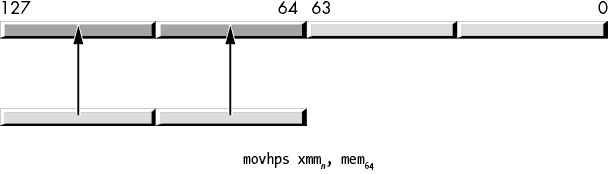

图 11-11: `movhps` 指令

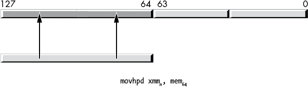

图 11-12: `movhpd` 指令

`movhps` 和 `movhpd` 指令也可以将 XMM 寄存器的高字（HO quad word）存储到内存中。允许的语法如下所示：

```
movhps `xmm`n, `mem`[64]
movhps `mem`[64], `xmm`n
movhpd `xmm`n, `mem`[64]
movhpd `mem`[64], `xmm`n
```

这些指令不会影响 YMM 寄存器的 128 到 255 位（如果 CPU 上存在 YMM 寄存器）。

通常你会使用 `movlps` 指令，然后再使用 `movhps` 指令将四个单精度浮点数加载到 XMM 寄存器中，浮点数来自两个不同的数据源（类似地，你可以使用 `movlpd` 和 `movhpd` 指令从不同源加载一对双精度值到一个 XMM 寄存器）。相反，你也可以使用该指令将一个向量结果拆分成两部分，并将这两部分存储到不同的数据流中。这可能就是该指令的预期用途。当然，如果你能将其用于其他目的，也可以尝试。

MASM（版本 14.15.26730.0，至少）似乎要求 `movhps` 操作数为 64 位数据类型，并不允许使用 `real4` 操作数。^(5) 因此，在使用此指令时，你可能需要显式地将一对 `real4` 值转换为 `qword ptr`：

```
r4m         real4   1.0, 2.0, 3.0, 4.0
r8m         real8   1.0, 2.0
              .
              .
              .
            movhps  xmm0, qword ptr r4m2
            movhpd  xmm0, r8m
```

### 11.6.7 `vmovhps` 和 `vmovhpd` 指令

尽管 AVX 指令扩展提供了 `vmovhps` 和 `vmovhpd` 指令，但它们并非 SSE `movhps` 和 `movhpd` 指令的简单扩展。这些指令的语法如下：

```
vmovhps `xmm`[dest], `xmm`[src], `mem`[64]
vmovhps `mem`[64],  `xmm`[src]
vmovhpd `xmm`[dest], `xmm`[src], `mem`[64]
vmovhpd `mem`[64],  `xmm`[src]
```

将数据存储到 64 位内存位置的指令行为类似于 `movhps` 和 `movhpd` 指令。将数据加载到 XMM 寄存器的指令有两个源操作数。它们将完整的 128 位（四个单精度值或两个双精度值）加载到目标 XMM 寄存器中。高 64 位来自内存操作数；低 64 位来自源 XMM 寄存器的低 64 位，如图 11-13 所示。这些指令还将值零扩展到（重叠的）YMM 寄存器的上 128 位。

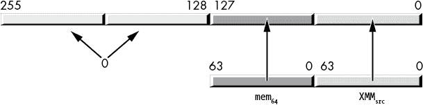

图 11-13：`vmovhpd` 和 `vmovhps` 指令

与 `movhps` 指令不同，MASM 正确接受 `real4` 源操作数用于 `vmovhps` 指令：

```
r4m         real4   1.0, 2.0, 3.0, 4.0
r8m         real8   1.0, 2.0
              .
              .
              .
            vmovhps xmm0, xmm1, r4m
            vmovhpd xmm0, xmm1, r8m
```

### 11.6.8 `movlhps` 和 `vmovlhps` 指令

`movlhps` 指令将一对 32 位单精度浮点值从源 XMM 寄存器的低 64 位移动到目标 XMM 寄存器的高 64 位。它保持目标寄存器的低 64 位不变。如果目标寄存器位于支持 256 位 AVX 寄存器的 CPU 上，此指令还将保持重叠 YMM 寄存器的高 128 位不变。

这些指令的语法如下：

```
movlhps  `xmm`[dest], `xmm`[src]
vmovlhps `xmm`[dest], `xmm`[src1], `xmm`[src2]
```

你不能使用此指令在内存和 XMM 寄存器之间移动数据；它仅在 XMM 寄存器之间传输数据。没有双精度版本的此指令。

`vmovlhps` 指令类似于 `movlhps`，但有以下不同之处：

+   `vmovlhps` 需要三个操作数：两个源 XMM 寄存器和一个目标 XMM 寄存器。

+   `vmovlhps` 将第一个源寄存器的低 64 位拷贝到目标寄存器的低 64 位。

+   `vmovlhps` 将第二个源寄存器的低 64 位拷贝到目标寄存器的 64 至 127 位。

+   `vmovlhps` 将结果零扩展到重叠 YMM 寄存器的上 128 位。

没有 `vmovlhpd` 指令。

### 11.6.9 `movhlps` 和 `vmovhlps` 指令

`movhlps` 指令的语法如下：

```
movhlps `xmm`[dest], `xmm`[src]
```

`movhlps` 指令将源操作数的高 64 位中的一对 32 位单精度浮点值拷贝到目标寄存器的低 64 位，而不改变目标寄存器的高 64 位（这是 `movlhps` 的反操作）。此指令仅在 XMM 寄存器之间拷贝数据；不允许使用内存操作数。

`vmovhlps` 指令需要三个 XMM 寄存器操作数；其语法如下：

```
vmovhlps `xmm`[dest], `xmm`[src1], `xmm`[src2]
```

该指令将第一个源寄存器的高 64 位复制到目标寄存器的高 64 位，将第二个源寄存器的高 64 位复制到目标寄存器的 0 到 63 位，最后将结果零扩展到覆盖的 YMM 寄存器的上位。

没有 `movhlpd` 或 `vmovhlpd` 指令。

### 11.6.10 (v)movshdup 和 (v)movsldup 指令

`movshdup` 指令将源操作数（内存或 XMM 寄存器）中的两个奇数索引的单精度浮点值移动，并将每个元素复制到目标 XMM 寄存器，如图 11-14 所示。

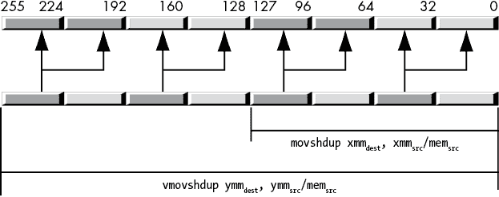

图 11-14: `movshdup` 和 `vmovshdup` 指令

该指令忽略 XMM 寄存器中偶数索引位置的单精度浮点值。`vmovshdup` 指令的工作方式相同，但作用于 YMM 寄存器，复制四个单精度值而不是两个（当然，还会将高位 0）。这些指令的语法如下所示：

```
movshdup  `xmm`[dest], `mem`[128]/`xmm`[src]
vmovshdup `xmm`[dest], `mem`[128]/`xmm`[src]
vmovshdup `ymm`[dest], `mem`[256]/`ymm`[src]
```

`movsldup` 指令的工作方式与 `movshdup` 指令相同，唯一不同的是它将源 XMM 寄存器中偶数索引位置的两个单精度值复制并重复到目标 XMM 寄存器。同样，`vmovsldup` 指令将源 YMM 寄存器中偶数索引位置的四个双精度值复制并重复，如图 11-15 所示。

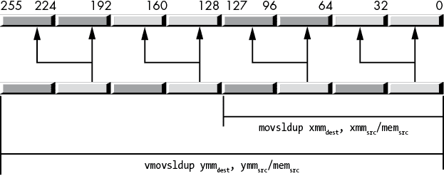

图 11-15: `movsldup` 和 `vmovsldup` 指令

语法如下：

```
movsldup  `xmm`[dest], `mem`[128]/`xmm`[src]
vmovsldup `xmm`[dest], `mem`[128]/`xmm`[src]
vmovsldup `ymm`[dest], `mem`[256]/`ymm`[src]
```

### 11.6.11 (v)movddup 指令

`movddup` 指令将 XMM 寄存器的低 64 位或 64 位内存位置中的双精度值复制并重复到目标 XMM 寄存器的低 64 位；然后，它还会将该值复制到目标寄存器的 64 到 127 位，如图 11-16 所示。

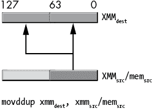

图 11-16: `movddup` 指令的行为

该指令不会影响 YMM 寄存器的高 128 位（如果适用）。该指令的语法如下：

```
movddup `xmm`[dest], `mem`[64]/`xmm`[src]
```

`vmovddup` 指令在 XMM 或 YMM 目标寄存器与 XMM 或 YMM 源寄存器或 128 位或 256 位内存位置之间进行操作。128 位版本的工作方式与 `movddup` 指令相同，但它会将目标 YMM 寄存器的高位清零。256 位版本将源值中偶数索引（0 和 2）处的一对双精度值复制到目标 YMM 寄存器中对应的索引，并将这些值复制到目标寄存器中的奇数索引位置，如图 11-17 所示。

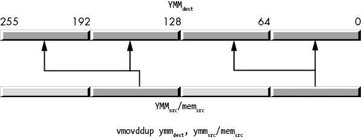

图 11-17: `vmovddup` 指令的行为

该指令的语法如下：

```
movddup  `xmm`[dest], `mem`[64]/`xmm`[src]
vmovddup `ymm`[dest], `mem`[256]/`ymm`[src]
```

### 11.6.12 (v)lddqu 指令

`(v)lddqu`指令在操作上与`(v)movdqu`完全相同。如果（内存）源操作数没有正确对齐并且跨越了内存中的缓存行边界，你有时可以使用此指令来提高性能。有关此指令及其性能限制的更多详细信息，请参阅 Intel 或 AMD 的文档（特别是优化手册）。

这些指令通常采用以下形式：

```
lddqu  `xmm`[dest], `mem`[128]
vlddqu `xmm`[dest], `mem`[128]
vlddqu `ymm`[dest], `mem`[256]
```

### 11.6.13 性能问题与 SIMD 移动指令

当你从编程模型层次查看 SSE/AVX 指令的语义时，你可能会质疑为什么某些指令出现在指令集中。例如，`movq`、`movsd`和`movlps`指令都可以从内存位置加载 64 位数据到 XMM 寄存器的 LO 64 位部分。为什么要这样做？为什么不使用一条指令直接将内存中的四字数据复制到 XMM 寄存器的 LO 64 位部分（无论是 64 位整数、一对 32 位整数、64 位双精度浮点值，还是一对 32 位单精度浮点值）？答案就在于*微架构*这个术语中。

x86-64 *宏架构*是软件工程师所看到的编程模型。在宏架构中，XMM 寄存器是一个 128 位的资源，在任何给定时刻，它可以容纳一个 128 位的位数组（或一个整数）、一对 64 位整数值、一对 64 位双精度浮点值、一组四个单精度浮点值、一组四个双字整数、八个字或 16 个字节。所有这些数据类型是相互叠加的，就像 8 位、16 位、32 位和 64 位的通用寄存器相互叠加一样（这被称为*别名*）。如果你将两个双精度浮点值加载到 XMM 寄存器中，然后修改位位置 0 到 15 的（整数）字，你实际上也在改变 XMM 寄存器的 LO 四字中的双精度值中相同的位（0 到 15）。x86-64 编程模型的语义要求这样做。

然而，从微体系结构的角度来看，并没有要求 CPU 在 CPU 中使用相同的物理位来存储整数、单精度和双精度值（即使它们被别名映射到同一个寄存器）。微体系结构可以为单个寄存器设置一组单独的位，用来存储整数、单精度和双精度值。例如，当你使用`movq`指令将 64 位加载到 XMM 寄存器时，该指令实际上可能会将位复制到底层的整数寄存器中（而不影响单精度或双精度子寄存器）。同样，`movlps`指令会将一对单精度值复制到单精度寄存器中，`movsd`指令则会将一个双精度值复制到双精度寄存器中（见图 11-18）。这些独立的子寄存器（整数、单精度和双精度）可以直接连接到处理它们特定数据类型的算术或逻辑单元，从而使对这些子寄存器的算术和逻辑操作更加高效。只要数据位于适当的子寄存器中，一切都能顺利进行。

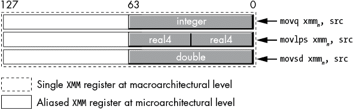

图 11-18：微体系结构级别的寄存器别名

然而，如果你使用`movq`指令将一对单精度浮点数加载到 XMM 寄存器中，然后尝试对这两个值执行单精度向量操作，会发生什么情况呢？从宏体系结构的角度来看，这两个单精度值正坐落在 XMM 寄存器的适当位置，因此这应该是一个合法操作。然而，从微体系结构的角度来看，这两个单精度浮点数坐落在整数子寄存器中，而不是单精度子寄存器中。底层微体系结构必须注意到这些值位于错误的子寄存器，并在执行单精度算术或逻辑操作之前将它们移动到适当的（单精度）子寄存器中。这可能会引入轻微的延迟（当微体系结构移动数据时），这就是为什么你应该始终为数据类型选择适当的移动指令。

### 11.6.14 对 SIMD 移动指令的一些最终评论

SIMD 数据移动指令是一组令人困惑的指令。它们的语法不一致，许多指令重复执行其他指令的操作，而且它们还存在一些令人困惑的不规则性问题。对于 x86-64 指令集的新手来说，可能会问：“为什么指令集是这样设计的？”为什么，确实是这样？

这个问题的答案是历史性的。最早的 x86 CPU 并没有 SIMD 指令集。Intel 为 Pentium 系列 CPU 增加了 MMX 指令集。在那个时候（1990 年代初期），当时的技术只允许 Intel 增加少量的指令，而且 MMX 寄存器的大小限制为 64 位。此外，软件工程师和计算机系统设计师才刚刚开始探索现代计算机的多媒体功能，因此当时并不完全清楚哪些指令（和数据类型）是支持我们几十年后所看到的软件所必需的。因此，最早的 SIMD 指令和数据类型在功能上是有限的。

随着时间的推移，CPU 获得了更多的硅资源，软件/系统工程师也发现了计算机的新用途（以及在这些计算机上运行的新算法），因此 Intel（和 AMD）通过添加新的 SIMD 指令来支持这些更现代的多媒体应用。例如，最初的 MMX 指令仅支持整数数据类型，因此 Intel 在 SSE 指令集中增加了浮点数支持，因为多媒体应用需要真实数据类型。随后，Intel 将整数类型从 64 位扩展到了 128 位、256 位，甚至 512 位。随着每次扩展，Intel（和 AMD）不得不保留旧的指令集扩展，以便允许现有软件在新的 CPU 上运行。

结果是，新的指令集不断堆积了与旧指令相同功能的新指令（并附带一些额外的功能）。这就是为什么像`movaps`和`vmovaps`这样的指令在功能上有显著重叠的原因。如果 CPU 资源早些时候就已到位（例如，能够在 CPU 上放置 256 位的 YMM 寄存器），那么几乎就不需要`movaps`指令了——`vmovaps`本可以完成所有工作。^(6)

从理论上讲，我们可以通过从头开始重新设计一个架构优雅的 x86-64 变种，设计一个最小的指令集来处理当前 x86-64 的所有活动，而不需要现有指令集中存在的所有冗余和臃肿。然而，这样的 CPU 将失去 x86-64 的主要优势：运行为 Intel 架构编写的数十年软件的能力。能够运行所有这些旧软件的代价是，汇编语言程序员（和编译器开发者）必须处理指令集中所有这些不规则性。

## 11.7 洗牌和解包指令

SSE/AVX *洗牌和解包指令*是移动指令的变体。除了移动数据之外，这些指令还可以重新排列出现在 XMM 和 YMM 寄存器不同通道中的数据。

### 11.7.1 (v)pshufb 指令

`pshufb` 指令是第一个打包字节洗牌 SIMD 指令（首次出现在 MMX 指令集中）。由于其起源，语法和行为与指令集中其他洗牌指令有所不同。其语法如下：

```
pshufb `xmm`[dest], `xmm`/`mem`[128]
```

第一个（目标）操作数是一个 XMM 寄存器，其字节车道将由 `pshufb` 洗牌（重新排列）。第二个操作数（可以是 XMM 寄存器或 128 位 oword 内存位置）是一个包含 16 个字节值的数组，这些值控制洗牌操作。如果第二个操作数是内存位置，该 oword 值必须在 16 字节边界上对齐。

第二个操作数中的每个字节（车道）都为第一个操作数中相应的字节车道选择一个值，如图 11-19 所示。

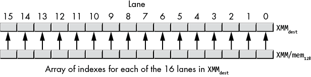

图 11-19：`pshufb` 指令的车道索引对应关系

第二个操作数中的 16 字节索引分别采用图 11-20 中所示的形式。

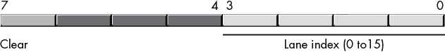

图 11-20：`phsufb` 字节索引

`pshufb` 指令会忽略索引字节中的第 4 到第 6 位。第 7 位是清除位；如果此位为 1，`pshufb` 指令将忽略车道索引位，并在 XMM[dest] 中对应的字节位置存储 0。如果清除位为 0，`pshufb` 指令将执行洗牌操作。

`pshufb` 洗牌操作是逐车道进行的。指令首先会创建 XMM[dest] 的临时副本。然后，对于每个索引字节（其 HO 位为 0），`pshufb` 将根据索引的 LO 4 位，从与该索引车道匹配的 XMM[dest] 车道中复制指定的车道，如图 11-21 所示。在此示例中，位于车道 6 的索引包含值 00000011b。该值选择临时（原始 XMM[dest]）值中车道 3 的值，并将其复制到 XMM[dest] 的车道 6。`pshufb` 指令会对所有 16 个车道重复此操作。

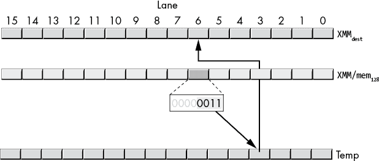

图 11-21：洗牌操作

AVX 指令集扩展引入了 `vpshufb` 指令。其语法如下：

```
vpshufb `xmm`[dest], `xmm`[src], `xmm`[index]/`mem`[128]
vpshufb `ymm`[dest], `ymm`[src], `ymm`[index]/`mem`[256]
```

AVX 变体添加了源寄存器（而不是使用 XMM[dest] 作为源和目标寄存器），并且与其不同的是，`vpshufb` 指令从 XMM[src] 寄存器中选择源字节，而不是在操作前创建 XMM[dest] 的临时副本并从该副本中选择值。除此之外，这些指令还将 YMM[dest] 的 HO 位清零，128 位变体与 SSE `pshufb` 指令的操作完全相同。

AVX 指令允许您指定 256 位的 YMM 寄存器，除了 128 位的 XMM 寄存器之外。^(7)

### 11.7.2 (v)pshufd 指令

SSE 扩展首次引入了 `pshufd` 指令。AVX 扩展增加了 `vpshufd` 指令。这些指令以类似于 `(v)pshufb` 指令的方式打乱 XMM 和 YMM 寄存器中的双字（*不是* 双精度值）。然而，打乱索引的指定方式与 `(v)pshufb` 不同。`(v)pshufd` 指令的语法如下：

```
pshufd  `xmm`[dest], `xmm`[src]/`mem`[128], `imm`[8]
vpshufd `xmm`[dest], `xmm`[src]/`mem`[128], `imm`[8]
vpshufd `ymm`[dest], `ymm`[src]/`me`m[256], `imm`[8]
```

第一个操作数（XMM[dest] 或 YMM[dest]）是目标操作数，用于存储被打乱的值。第二个操作数是源操作数，指令将从中选择双字以放入目标寄存器；通常，如果这是内存操作数，则必须将其对齐到适当的（16 字节或 32 字节）边界。第三个操作数是一个 8 位立即数，指定从源操作数中选择双字的索引。

对于带有 XMM[dest] 操作数的 `(v)pshufd` 指令，imm[8] 操作数的编码如 表 11-3 所示。位 0 到 1 中的值选择源操作数中的特定双字，并将其放入 XMM[dest] 操作数的双字 0 中。位 2 到 3 中的值选择源操作数中的一个双字，并将其放入 XMM[dest] 操作数的双字 1 中。位 4 到 5 中的值选择源操作数中的一个双字，并将其放入 XMM[dest] 操作数的双字 2 中。最后，位 6 到 7 中的值选择源操作数中的一个双字，并将其放入 XMM[dest] 操作数的双字 3 中。

表 11-3：`(v)pshufd` imm[8] 操作数值

| **位位置** | **目标通道** |
| --- | --- |
| 0 到 1 | 0 |
| 2 到 3 | 1 |
| 4 到 5 | 2 |
| 6 到 7 | 3 |

128 位 `pshufd` 与 `vpshufd` 指令的区别在于，`pshufd` 会保持底层 YMM 寄存器的高 128 位不变，而 `vpshufd` 会将底层 YMM 寄存器的高 128 位清零。

`vpshufd` 的 256 位变体（当使用 YMM 寄存器作为源和目标操作数时）仍然使用 8 位立即数操作数作为索引值。每个 2 位的索引值操作 YMM 寄存器中的两个双字值。位 0 到 1 控制双字 0 和 4，位 2 到 3 控制双字 1 和 5，位 4 到 5 控制双字 2 和 6，位 6 到 7 控制双字 3 和 7，如 表 11-4 所示。

表 11-4：`vpshufd` YMM[dest], YMM[src]/mem[src], imm[8] 的双字传输

| **索引** | **YMM/mem[src] [索引] 复制到** | **YMM/mem[src] [索引 + 4] 复制到** |
| --- | --- | --- |
| imm[8] 的位 0 到 1 | YMM[dest][0] | YMM[dest][4] |
| imm[8] 的位 2 到 3 | YMM[dest][1] | YMM[dest][5] |
| imm[8] 的位 4 到 5 | YMM[dest][2] | YMM[dest][6] |
| imm[8] 的位 6 到 7 | YMM[dest][3] | YMM[dest][7] |

256 位版本的灵活性稍差，因为它一次复制两个双字，而不是一个。它处理 LO 128 位的方式与 128 位版本相同；它还通过使用相同的洗牌模式，将源的高 128 位中的相应字道复制到 YMM 目标寄存器中。不幸的是，你无法通过 `vpshufd` 指令独立控制 YMM 寄存器的高低两半。如果你真的需要独立地洗牌双字，可以使用 `vshufb`，并使用合适的索引复制 4 字节（替代单个双字）。

### 11.7.3 (v)pshuflw 和 (v)pshufhw 指令

`pshuflw` 和 `vpshuflw` 以及 `pshufhw` 和 `vpshufhw` 指令支持在 XMM 或 YMM 寄存器内进行 16 位字的洗牌。这些指令的语法如下：

```
pshuflw  `xmm`[dest], `xmm`[src]/`mem`[128], `imm`[8]
pshufhw  `xmm`[dest], `xmm`[src]/`mem`[128], `imm`[8]

vpshuflw `xmm`[dest], `xmm`[src]/`mem`[128], `imm`[8]
vpshufhw `xmm`[dest], `xmm`[src]/`mem`[128], `imm`[8]

vpshuflw `ymm`[dest], `ymm`[src]/`mem`[256], `imm`[8]
vpshufhw `ymm`[dest], `ymm`[src]/`mem`[256], `imm`[8]
```

128 位的 `lw` 变种将源操作数的高 64 位复制到 XMM[dest] 操作数的相同位置。然后，它们使用索引（imm[8]）操作数选择 XMM[src]/mem[128] 操作数的 LO 四字双字（word lanes 0 到 3），并将其移动到目标操作数的 LO 4 个字道中。例如，如果 imm[8] 的低 2 位是 10b，那么 `pshuflw` 指令会将源的第 2 道复制到目标操作数的第 0 道中（参见图 11-22）。请注意，`pshuflw` 不会修改叠加的 YMM 寄存器的高 128 位，而 `vpshuflw` 会将高 128 位清零。

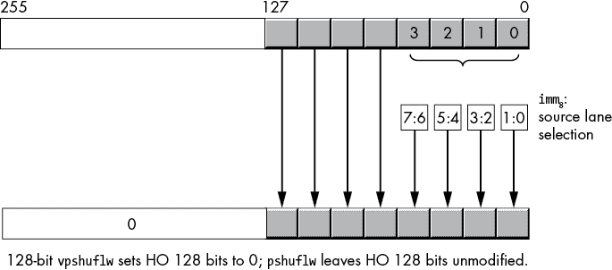

图 11-22: `(v)pshuflw` `xmm``,` `xmm``/``mem``,` `imm`8 操作

256 位的 `vpshuflw` 指令（具有 YMM 目标寄存器）一次复制两对字—一对在 YMM 目标寄存器的高 128 位，另一对在 LO 128 位，源位置为 256 位，如图 11-23 所示。索引（imm[8]）选择对于高低 128 位是相同的。

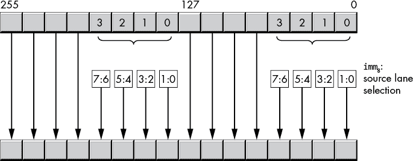

图 11-23: `vpshuflw` `ymm``,` `ymm``/``mem``,` `imm`8 操作

128 位的 `hw` 变种将源操作数的低 64 位复制到目标操作数的相同位置。然后，它们使用索引操作数选择源操作数中第 4 到第 7 个字（按 0 到 3 索引），并将其移动到目标操作数的高 4 个字道中（参见图 11-24）。

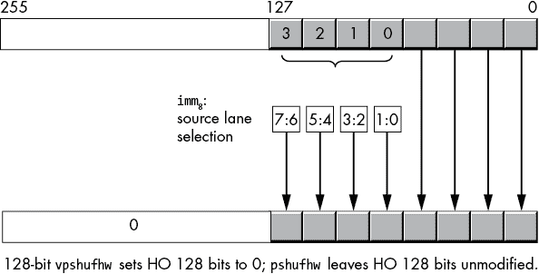

图 11-24: `(v)pshufhw` 操作

256 位的 `vpshufhw` 指令（具有 YMM 目标寄存器）一次复制两对字—一对在 YMM 目标寄存器的高 128 位和一对在 LO 128 位，源位置为 256 位，如图 11-25 所示。

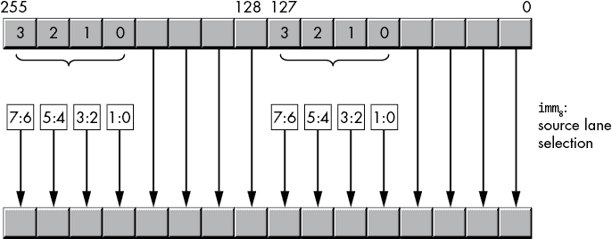

图 11-25: `vpshufhw` 操作

### 11.7.4 shufps 和 shufpd 指令

shuffle 指令（`shufps` 和 `shufpd`）从源操作数中提取单精度或双精度值，并将它们放置到目标操作数的指定位置。第三个操作数，一个 8 位立即数值，选择从源操作数中提取哪些值并移动到目标寄存器。以下是这两条指令的语法：

```
shufps `xmm`[src1/dest], `xmm`[src2]/`mem`[128], `imm`[8]
shufpd `xmm`[src1/dest], `xmm`[src2]/`mem`[128], `imm`[8]
```

对于 `shufps` 指令，第二个源操作数是一个 8 位立即数值，实际上是一个包含 2 位值的四元素数组。

imm[8] 位 0 和 1 从 XMM[src1/dest] 操作数的四个通道中选择一个单精度值，并将其存储到目标操作中的通道 0。位 2 和 3 从 XMM[src1/dest] 操作数的四个通道中选择一个单精度值，并将其存储到目标操作中的通道 1（目标操作数同样为 XMM[src1/dest]）。

imm[8] 位 4 和 5 从 XMM[src2]/mem[src2] 操作数的四个通道中选择一个单精度值，并将其存储到目标操作中的通道 2。位 6 和 7 从 XMM[src2]/mem[src2] 操作数的四个通道中选择一个单精度值，并将其存储到目标操作中的通道 3。

图 11-26 显示了 `shufps` 指令的操作。


图 11-26：`shufps` 操作

例如，指令

```
shufps xmm0, xmm1, 0E4h  ; 0E4h = 11 10 01 00
```

加载 XMM0 寄存器以下的单精度值：

+   XMM0[0 到 31] 来自 XMM0[0 到 32]

+   XMM0[32 到 63] 来自 XMM0[32 到 63]

+   XMM0[64 到 95] 来自 XMM1[63 到 95]

+   XMM0[96 到 127] 来自 XMM1[96 到 127]

如果第二个操作数（XMM[src2]/mem[src2]）与第一个操作数（XMM[src1/dest]）相同，则可以重新排列 XMM[dest] 寄存器中的四个单精度值（这可能就是指令名称 *shuffle* 的来源）。

`shufpd` 指令的工作方式类似，打乱双精度值。由于 XMM 寄存器中只有两个双精度值，因此只需一个位来选择这两个值中的一个。同样，因为目标寄存器中只有两个双精度值，指令只需要两个（单比特）数组元素来选择目标。结果，第三个操作数 imm[8] 实际上只是一个 2 位值；指令会忽略 imm[8] 操作数中的位 2 到 7。imm[8] 操作数的位 0 选择从 XMM[src1/dest] 操作数中选择通道 0 和位 0 到 63（如果为 0）或通道 1 和位 64 到 127（如果为 1），并将其放入 XMM[dest] 的通道 0 和位 0 到 63 中。imm[8] 操作数的位 1 选择从 XMM[src]/mem[128] 操作数中选择通道 0 和位 0 到 63（如果为 0）或通道 1 和位 64 到 127（如果为 1），并将其放入 XMM[dest] 的通道 1 和位 64 到 127 中。图 11-27 显示了这个操作。

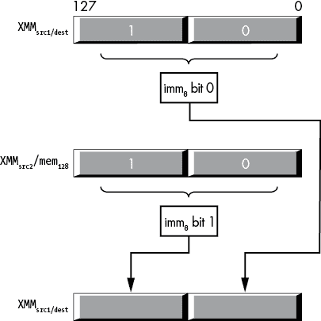

图 11-27：`shufpd` 操作

### 11.7.5 vshufps 和 vshufpd 指令

`vshufps`和`vshufpd`指令类似于`shufps`和`shufpd`。它们允许你在 128 位 XMM 寄存器或 256 位 YMM 寄存器中进行值的洗牌。^(8) `vshufps`和`vshufpd`指令有四个操作数：一个目标 XMM 或 YMM 寄存器，两个源操作数（src[1]必须是 XMM 或 YMM 寄存器，src[2]可以是 XMM 或 YMM 寄存器，或者是 128 位或 256 位的内存位置），以及一个 imm[8]操作数。它们的语法如下：

```
vshufps `xmm`[dest], `xmm`[src1], `xmm`[src2]/`mem`[128], `imm`[8]
vshufpd `xmm`[dest], `xmm`[src1], `xmm`[src2]/`mem`[128], `imm`[8]

vshufps `ymm`[dest], `ymm`[src1], `ymm`[src2]/`mem`[256], `imm`[8]
vshufpd `ymm`[dest], `ymm`[src1], `ymm`[src2]/`mem`[256], `imm`[8]
```

而 SSE 洗牌指令使用目标寄存器作为隐式源操作数，AVX 洗牌指令则允许你指定显式的目标和源操作数（它们可以完全不同，或完全相同，或是任何组合）。

对于 256 位的`vshufps`指令，imm[8] 操作数是一个包含四个 2 位值的数组（位 0:1, 2:3, 4:5, 和 6:7）。这些 2 位值从源位置选择四个单精度值中的一个，具体如表 11-5 所示。

表 11-5：`vshufps` 目标选择

|  | **目标** | **imm[8] 值** |
| --- | --- | --- |
| **imm[8] 位** |  | **00** | **01** | **10** | **11** |
| --- | --- | --- | --- | --- | --- |
| 76 54 32 **10** | 目标[0 到 31] | 源[1][0 到 31] | 源[1][32 到 63] | 源[1][64 到 95] | 源[1][96 到 127] |
|  | 目标[128 到 159] | 源[1][128 到 159] | 源[1][160 到 191] | 源[1][192 到 223] | 源[1][224 到 255] |
| 76 54 **32** 10 | 目标[32 到 63] | 源[1][0 到 31] | 源[1][32 到 63] | 源[1][64 到 95] | 源[1][96 到 127] |
|  | 目标[160 到 191] | 源[1][128 到 159] | 源[1][160 到 191] | 源[1][192 到 223] | 源[1][224 到 255] |
| 76 **54** 32 10 | 目标[64 到 95] | 源[2][0 到 31] | 源[2][32 到 63] | 源[2][64 到 95] | 源[2][96 到 127] |
|  | 目标[192 到 223] | 源[2][128 到 159] | 源[2][160 到 191] | 源[2][192 到 223] | 源[2][224 到 255] |
| **76** 54 32 10 | 目标[96 到 127] | 源[2][0 到 31] | 源[2][32 到 63] | 源[2][64 到 95] | 源[2][96 到 127] |
|  | 目标[224 到 255] | 源[2][128 到 159] | 源[2][160 到 191] | 源[2][192 到 223] | 源[2][224 到 255] |

如果两个源操作数相同，你可以随意重新排列单精度值的顺序（如果目标和两个源操作数相同，你可以在该寄存器内任意重新排列双字）。

`vshufps`指令还允许你指定 XMM 和 128 位内存操作数。在这种形式下，它的行为与`shufps`指令非常相似，不同之处在于你可以指定两个不同的 128 位源操作数（而不是只有一个 128 位源操作数），并且它会将对应的 YMM 寄存器的高 128 位清零。如果目标操作数与第一个源操作数不同，这种方式可能会很有用。如果`vshufps`的第一个源操作数与目标操作数相同，应该使用`shufps`指令，因为其机器编码更短。

`vshufpd` 指令是 `shufpd` 指令的扩展，支持 256 位（并增加了第二个源操作数）。由于 256 位 YMM 寄存器中包含四个双精度浮点数值，`vshufpd` 需要 4 位来选择源索引（而 `shufpd` 只需 2 位）。表 11-6 描述了 `vshufpd` 如何将数据从源操作数复制到目标操作数。

表 11-6：`vshufpd` 目标选择

|  | **目标** | **imm[8] 值** |
| --- | --- | --- |
| **imm[8] 位** |  | **0** | **1** |
| --- | --- | --- | --- |
| 7654 3 2 1 **0** | Dest[0 to 63] | Src[1][0 to 63] | Src[1][64 to 127] |
| 7654 3 2 **1** 0 | Dest[64 to 127] | Src[2][0 to 63] | Src[2][64 to 127] |
| 7654 3 **2** 1 0 | Dest[128 to 191] | Src[1][128 to 191] | Src[1][192 to 255] |
| 7654 **3** 2 1 0 | Dest[192 to 255] | Src[2][128 to 191] | Src[2][192 to 255] |

与 `vshufps` 指令类似，`vshufpd` 也允许你指定 XMM 寄存器，如果你想要 `shufpd` 的三操作数版本。

### 11.7.6 (v)unpcklps、(v)unpckhps、(v)unpcklpd 和 (v)unpckhpd 指令

解包（和合并）指令是洗牌指令的简化变种。这些指令将单精度和双精度浮点数值从源操作数的固定位置复制，并将这些值插入到目标操作数的固定位置。它们本质上是没有 imm[8] 操作数并且具有固定洗牌模式的洗牌指令。

`unpcklps` 和 `unpckhps` 指令从两个源中选择它们各自的单精度操作数的一半，将这些值合并（交错排列），然后将合并的结果存储到目标操作数中（目标操作数与第一个源操作数相同）。这两个指令的语法如下：

```
unpcklps `xmm`[dest], `xmm`[src]/`mem`[128]
unpckhps `xmm`[dest], `xmm`[src]/`mem`[128]
```

XMM[dest] 操作数既作为第一个源操作数，也作为目标操作数。XMM[src]/mem[128] 操作数是第二个源操作数。

两者的区别在于它们选择源操作数的方式。`unpcklps` 指令将两个低位单精度浮点数值从源操作数复制到位位置 32 到 63（dword 1）和 96 到 127（dword 3）。它保留目标操作数中的 dword 0 不变，并将原本在 dword 1 中的值复制到目标操作数的 dword 2 中。图 11-28 展示了此操作。

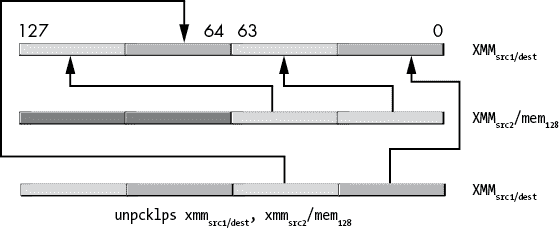

图 11-28：`unpcklps` 指令操作

`unpckhps` 指令将两个单精度浮点数值从两个源操作数复制到目标寄存器，如 图 11-29 所示。

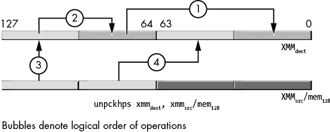

图 11-29：`unpckhps` 指令操作

`unpcklpd` 和 `unpckhpd` 指令的功能与 `unpcklps` 和 `unpckhps` 相同，只不过它们处理的是双精度浮点数值，而不是单精度浮点数值。图 11-30 和 11-31 展示了这两个指令的操作。

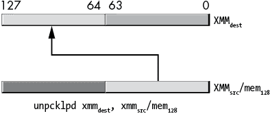

图 11-30：`unpcklpd`指令操作

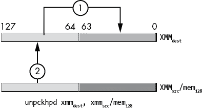

图 11-31：`unpckhpd`指令操作

`vunpcklps`、`vunpckhps`、`vunpcklpd`和`vunpckhpd`指令的语法如下：

```
vunpcklps `xmm`[dest], `xmm`[src1], `xmm`[src2]/`mem`[128]
vunpckhps `xmm`[dest], `xmm`[src1], `xmm`[src2]/`mem`[128]

vunpcklps `ymm`[dest], `ymm`[src1], `ymm`[src2]/`mem`[256]
vunpckhps `ymm`[dest], `ymm`[src1], `ymm`[src2]/`mem`[256]
```

它们的工作原理与非`v`变种相似，存在一些差异：

+   AVX 变种支持使用 YMM 寄存器和 XMM 寄存器。

+   AVX 变种需要三个操作数。第一个（目标）和第二个（源[1]）操作数必须是 XMM 或 YMM 寄存器。第三个（源[2]）操作数可以是 XMM 或 YMM 寄存器，或者是 128 位或 256 位内存位置。两操作数形式只是三操作数形式的一种特殊情况，其中第一个和第二个操作数指定相同的寄存器名称。

+   128 位变种会将 YMM 寄存器的 HO 位清零，而不是让这些位保持不变。

当然，带有 YMM 寄存器的 AVX 指令交错处理的单精度或双精度值的数量是原来的两倍。交错扩展按直观方式发生，`vunpcklps`（图 11-32）如下：

+   源[1]中的单精度值（位 0 到 31）首先被写入目标的位 0 到 31。

+   源[2]中的单精度值（位 0 到 31）被写入目标的位 32 到 63。

+   源[1]中的单精度值（位 32 到 63）被写入目标的位 64 到 95。

+   源[2]中的单精度值（位 32 到 63）被写入目标的位 96 到 127。

+   源[1]中的单精度值（位 128 到 159）首先被写入目标的位 128 到 159。

+   源[2]中的单精度值（位 128 到 159）被写入目标的位 160 到 191。

+   源[1]中的单精度值（位 160 到 191）被写入目标的位 192 到 223。

+   源[2]中的单精度值（位 160 到 191）被写入目标的位 224 到 256。

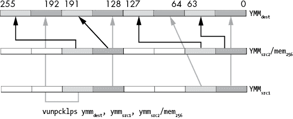

图 11-32：`vunpcklps`指令操作

`vunpckhps`指令（图 11-33）执行以下操作：

+   源[1]中的单精度值（位 64 到 95）首先被写入目标的位 0 到 31。

+   源[2]中的单精度值（位 64 到 95）被写入目标的位 32 到 63。

+   源[1]中的单精度值（位 96 到 127）被写入目标的位 64 到 95。

+   源[2]中的单精度值（位 96 到 127）被写入目标的位 96 到 127。

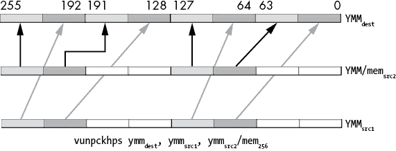

图 11-33：`vunpckhps`指令操作

同样，`vunpcklpd`和`vunpckhpd`用于移动双精度值。

### 11.7.7 整数解包指令

`punpck*`指令提供了一组整数解包指令，以补充浮点变种。这些指令出现在表 11-7 中。

表 11-7：整数解包指令

| 指令 | 描述 |
| --- | --- |
| `punpcklbw` | 解包低字节为字 |
| `punpckhbw` | 解包高字节为字 |
| `punpcklwd` | 解包低字为双字 |
| `punpckhwd` | 解包高字为双字 |
| `punpckldq` | 解包低双字为四字 |
| `punpckhdq` | 解包高双字为四字 |
| `punpcklqdq` | 解包低四字为双四字（双四字） |
| `punpckhqdq` | 解包高四字为双四字（双四字） |

#### 11.7.7.1 punpck* 指令

`punpck*` 指令从两个不同的源中提取一半的字节、字、双字或四字，并将这些值合并到目标 SSE 寄存器中。以下是这些指令的语法：

```
punpcklbw  `xmm`[dest], `xmm`[src]
punpcklbw  `xmm`[dest], `mem`[src]
punpckhbw  `xmm`[dest], `xmm`[src]
punpckhbw  `xmm`[dest], `mem`[src]
punpcklwd  `xmm`[dest], `xmm`[src]
punpcklwd  `xmm`[dest], `mem`[src]
punpckhwd  `xmm`[dest], `xmm`[src]
punpckhwd  `xmm`[dest], `mem`[src]
punpckldq  `xmm`[dest], `xmm`[src]
punpckldq  `xmm`[dest], `mem`[src]
punpckhdq  `xmm`[dest], `xmm`[src]
punpckhdq  `xmm`[dest], `mem`[src]
punpcklqdq `xmm`[dest], `xmm`[src]
punpcklqdq `xmm`[dest], `mem`[src]
punpckhqdq `xmm`[dest], `xmm`[src]
punpckhqdq `xmm`[dest], `mem`[src]
```

图 11-34 至 11-41 展示了这些指令的每个数据传输。

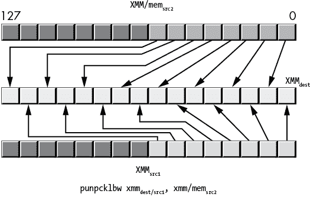

图 11-34: `punpcklbw` 指令操作

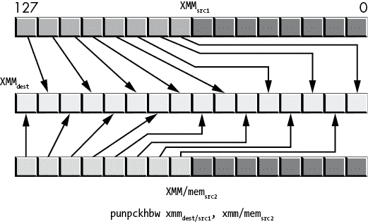

图 11-35: `punpckhbw` 操作

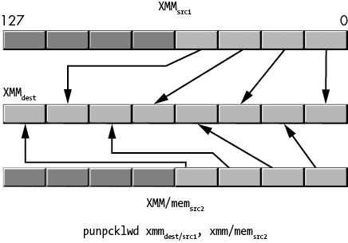

图 11-36: `punpcklwd` 操作

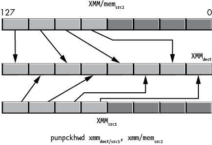

图 11-37: `punpckhwd` 操作

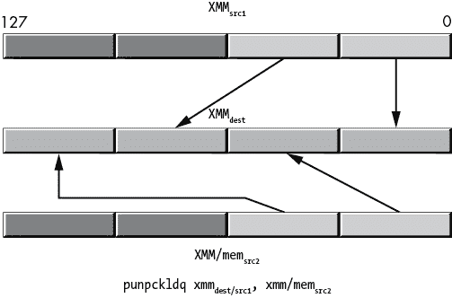

图 11-38: `punpckldq` 操作

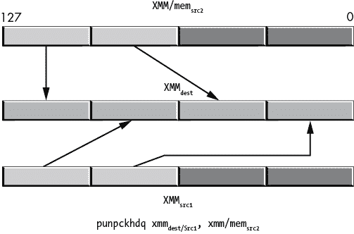

图 11-39: `punpckhdq` 操作

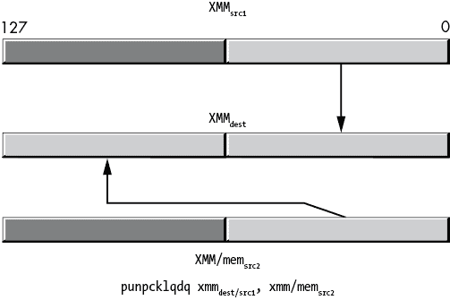

图 11-40: `punpcklqdq` 操作

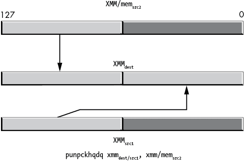

图 11-41: `punpckhqdq` 操作

#### 11.7.7.2 vpunpck* SSE 指令

AVX `vpunpck*` 指令提供了一组 AVX 整数解包指令，以补充 SSE 变体。这些指令出现在 表 11-8 中。

表 11-8: AVX 整数解包指令

| **指令** | **描述** |
| --- | --- |
| `vpunpcklbw` | 解包低字节为字 |
| `vpunpckhbw` | 解包高字节为字 |
| `vpunpcklwd` | 解包低字为双字 |
| `vpunpckhwd` | 解包高字为双字 |
| `vpunpckldq` | 解包低双字为四字 |
| `vpunpckhdq` | 解包高双字为四字 |
| `vpunpcklqdq` | 解包低四字为双四字（双四字） |
| `vpunpckhqdq` | 解包高四字为双四字（双四字） |

`vpunpck*` 指令从两个不同的源中提取一半的字节、字、双字或四字，并将这些值合并到目标 AVX 或 SSE 寄存器中。以下是这些指令的 SSE 形式语法：

```
vpunpcklbw  `xmm`[dest], `xmm`[src1], `xmm`[src2]/`mem`[128]
vpunpckhbw  `xmm`[dest], `xmm`[src1], `xmm`[src2]/`mem`[128]
vpunpcklwd  `xmm`[dest], `xmm`[src1], `xmm`[src2]/`mem`[128]
vpunpckhwd  `xmm`[dest], `xmm`[src1], `xmm`[src2]/`mem`[128]
vpunpckldq  `xmm`[dest], `xmm`[src1], `xmm`[src2]/`mem`[128]
vpunpckhdq  `xmm`[dest], `xmm`[src1], `xmm`[src2]/`mem`[128]
vpunpcklqdq `xmm`[dest], `xmm`[src1], `xmm`[src2]/`mem`[128]
vpunpckhqdq `xmm`[dest], `xmm`[src1], `xmm`[src2]/`mem`[128]
```

从功能上看，AVX 指令（`vunpck*`）和 SSE 指令（`unpck*`）之间的唯一区别是，SSE 变体保持 YMM AVX 寄存器的上半部分（位 128 到 255）不变，而 AVX 变体将结果零扩展到 256 位。有关这些指令操作的描述，请参见图 11-34 至 11-41。

#### 11.7.7.3 vpunpck* AVX 指令

AVX `vunpck*` 指令还支持使用 AVX YMM 寄存器，在这种情况下，解包和合并操作从 128 位扩展到 256 位。以下是这些指令的语法：

```
vpunpcklbw  `ymm`[dest], `ymm`[src1], `ymm`[src2]/`mem`[256]
vpunpckhbw  `ymm`[dest], `ymm`[src1], `ymm`[src2]/`mem`[256]
vpunpcklwd  `ymm`[dest], `ymm`[src1], `ymm`[src2]/`mem`[256]
vpunpckhwd  `ymm`[dest], `ymm`[src1], `ymm`[src2]/`mem`[256]
vpunpckldq  `ymm`[dest], `ymm`[src1], `ymm`[src2]/`mem`[256]
vpunpckhdq  `ymm`[dest], `ymm`[src1], `ymm`[src2]/`mem`[256]
vpunpcklqdq `ymm`[dest], `ymm`[src1], `ymm`[src2]/`mem`[256]
vpunpckhqdq `ymm`[dest], `ymm`[src1], `ymm`[src2]/`mem`[256]
```

### 11.7.8 `(v)pextrb`、`(v)pextrw`、`(v)pextrd` 和 `(v)pextrq` 指令

`(v)pextrb`、`(v)pextrw`、`(v)pextrd` 和 `(v)pextrq` 指令从 128 位 XMM 寄存器中提取一个字节、字、双字或四字，并将这些数据复制到通用寄存器或内存位置。这些指令的语法如下：

```
pextrb  `reg`[32], `xmm`[src], `imm`[8]   ; imm[8] = 0 to 15
pextrb  `reg`[64], `xmm`[src], `imm`[8]   ; imm[8] = 0 to 15
pextrb  `mem`[8], `xmm`[src], `imm`[8]    ; imm[8] = 0 to 15
vpextrb `reg`[32], `xmm`[src], `imm`[8]  ; imm[8] = 0 to 15
vpextrb `reg`[64], `xmm`[src], `imm`[8]  ; imm[8] = 0 to 15
vpextrb `mem`[8], `xmm`[src], `imm`[8]   ; imm[8] = 0 to 15

pextrw  `reg`[32], `xmm`[src], `imm`[8]  ; imm[8] = 0 to 7
pextrw  `reg`[64], `xmm`[src], `imm`[8]  ; imm[8] = 0 to 7
pextrw  `mem`[16], `xmm`[src], `imm`[8]  ; imm[8] = 0 to 7
vpextrw `reg`[32], `xmm`[src], `imm`[8]  ; imm[8] = 0 to 7
vpextrw `reg`[64], `xmm`[src], `imm`[8]  ; imm[8] = 0 to 7
vpextrw `mem`[16], `xmm`[src], `imm`[8]  ; imm[8] = 0 to 7

pextrd  `reg`[32], `xmm`[src], `imm`[8]  ; imm[8] = 0 to 3
pextrd  `mem`[32], `xmm`[src], `imm`[8]  ; imm[8] = 0 to 3
vpextrd `mem`[64], `xmm`[src], `imm`[8]  ; imm[8] = 0 to 3
vpextrd `reg`[32], `xmm`[src], `imm`[8]  ; imm[8] = 0 to 3
vpextrd `reg`[64], `xmm`[src], `imm`[8]  ; imm[8] = 0 to 3
vpextrd `mem`[32], `xmm`[src], `imm`[8]  ; imm[8] = 0 to 3

pextrq  `reg`[64], `xmm`[src], `imm`[8]  ; imm[8] = 0 to 1
pextrq  `mem`[64], `xmm`[src], `imm`[8]  ; imm[8] = 0 to 1
vpextrq `reg`[64], `xmm`[src], `imm`[8]  ; imm[8] = 0 to 1
vpextrq `mem`[64], `xmm`[src], `imm`[8]  ; imm[8] = 0 to 1
```

字节和字指令期望 32 位或 64 位的通用寄存器作为目标（第一个）操作数，或者一个与指令大小相同的内存位置（即，`pextrb` 期望一个字节大小的内存操作数，`pextrw` 期望一个字大小的操作数，以此类推）。源（第二）操作数是一个 128 位的 XMM 寄存器。索引（第三）操作数是一个 8 位的立即数，用来指定索引（通道号）。这些指令从由 8 位立即数指定的通道中提取字节、字、双字或四字，并将该值复制到目标操作数中。双字和四字变体分别需要 32 位或 64 位的通用寄存器。如果目标操作数是 32 位或 64 位的通用寄存器，则指令会根据需要将值扩展为 32 位或 64 位。

### 11.7.9 `(v)pinsrb`、`(v)pinsrw`、`(v)pinsrd` 和 `(v)pinsrq` 指令

`(v)pinsr{b,w,d,q}` 指令从通用寄存器或内存位置提取一个字节、字、双字或四字，并将该数据存储到 XMM 寄存器的一个通道中。这些指令的语法如下：^(9)

```
pinsrb  `xmm`[dest], `reg`[32], `imm`[8]          ; imm[8] = 0 to 15
pinsrb  `xmm`[dest], `mem`[8], `imm`[8]           ; imm[8] = 0 to 15
vpinsrb `xmm`[dest], `xmm`[src2], `reg`[32], `imm`[8]   ; imm[8] = 0 to 15
vpinsrb `xmm`[dest], `xmm`[src2], `mem`[8], `imm`[8]    ; imm[8] = 0 to 15

pinsrw  `xmm`dest, `reg`32, `imm`8          ; imm[*8*] = 0 to 7
pinsrw  `xmm`[dest], `mem`[16], `imm`[8]          ; imm[8] = 0 to 7
vpinsrw `xmm`[dest], `xmm`[src2], `reg`[32], `imm`[8]  ; imm[8] = 0 to 7
vpinsrw `xmm`[dest], `xmm`[src2], `mem`[16], `imm`[8]  ; imm[8] = 0 to 7

pinsrd  `xmm`[dest], `reg`[32], `imm`[8]          ; imm[8] = 0 to 3
pinsrd  `xmm`[dest], `mem`[32], `imm`[8]          ; imm[8] = 0 to 3
vpinsrd `xmm`[dest], `xmm`[src2], `reg`[32], `imm`[8]  ; imm[8] = 0 to 3
vpinsrd `xmm`[dest], `xmm`[src2], `mem`[32], `imm`[8]  ; imm[8] = 0 to 3

pinsrq  `xmm`[dest], `reg`[64], `imm`[8]          ; imm[8] = 0 to 1
pinsrq  `xmm`[dest], `xmm`[src2], `mem`[64], `imm`[8]  ; imm[8] = 0 to 1
vpinsrq `xmm`[dest], `xmm`[src2], `reg`[64], `imm`[8]  ; imm[8] = 0 to 1
vpinsrq `xmm`[dest], `xmm`[src2], `mem`[64], `imm`[8]  ; imm[8] = 0 to 1
```

目标（第一个）操作数是一个 128 位的 XMM 寄存器。`pinsr*` 指令期望内存位置或 32 位通用寄存器作为其源（第二）操作数（除了 `pinsrq` 指令，它们需要一个 64 位寄存器）。索引（第三）操作数是一个 8 位的立即数，用来指定索引（通道号）。

这些指令从通用寄存器或内存位置提取一个字节、字、双字或四字，并将其复制到由 8 位立即数指定的 XMM 寄存器中的通道。这些 `pinsr{b,w,d,q}` 指令保持底层 YMM 寄存器中的任何高位（HO）位不变（如果适用）。

`vpinsr{b,w,d,q}` 指令将数据从 XMM 源寄存器复制到目标寄存器，然后将字节、字、双字或四字复制到目标寄存器中指定的位置。这些指令会将值在底层 YMM 寄存器的高位（HO）扩展为零。

### 11.7.10 `(v)extractps` 和 `(v)insertps` 指令

`extractps` 和 `vextractps` 指令在功能上等同于 `pextrd` 和 `vpextrd`。它们从 XMM 寄存器中提取一个 32 位（单精度浮点数）值，并将其移动到一个 32 位的通用寄存器或 32 位的内存位置。这些 `(v)extractps` 指令的语法如下所示：

```
extractps  `reg`[32], `xmm`[src], `imm`[8]
extractps  `mem`[32], `xmm`[src], `imm`[8]
vextractps `reg`[32], `xmm`[src], `imm`[8]
vextractps `mem`[32], `xmm`[src], `imm`[8]
```

`insertps`和`vinsertps`指令将一个 32 位浮点值插入到 XMM 寄存器中，并可选择性地清除 XMM 寄存器中的其他通道。此类指令的语法如下：

```
insertps  `xmm`[dest], `xmm`[src], `imm`[8]
insertps  `xmm`[dest], `mem`[32], `imm`[8]
vinsertps `xmm`[dest], `xmm`[src1], `xmm`[src2], `imm`[8]
vinsertps `xmm`[dest], `xmm`[src1], `mem`[32], `imm`[8]
```

对于`insertps`和`vinsertps`指令，imm[8]操作数包含在表 11-9 中列出的字段。

表 11-9：`insertps`和`vinsertps`指令的 imm[8]位字段

| **位(bit)** | **含义** |
| --- | --- |
| 6 到 7 | （仅当源操作数是 XMM 寄存器时）：从源 XMM 寄存器中选择 32 位通道（0、1、2 或 3）。如果源操作数是 32 位内存位置，指令将忽略此字段并使用内存中的完整 32 位数据。 |
| 4 到 5 | 指定目标 XMM 寄存器中存储单精度值的通道。 |
| 3 | 如果设置，清零 XMM[dest]的第 3 通道。 |
| 2 | 如果设置，清零 XMM[dest]的第 2 通道。 |
| 1 | 如果设置，清零 XMM[dest]的第 1 通道。 |
| 0 | 如果设置，清零 XMM[dest]的第 0 通道。 |

在具有 AVX 扩展的 CPU 上，`insertps`不修改 YMM 寄存器的高位；`vinsertps`会清零高位。

`vinsertps`指令首先将 XMM[src1]寄存器复制到 XMM[dest]，然后执行插入操作。对应 YMM 寄存器的高位（HO 位）被设置为 0。

x86-64 架构不提供`(v)extractpd`或`(v)insertpd`指令。

## 11.8 SIMD 算术和逻辑操作

SSE 和 AVX 指令集扩展提供了多种标量和向量的算术与逻辑操作。

第六章中的“SSE 浮点运算”已经讨论了使用标量 SSE 指令集进行的浮点运算，因此本节不再重复这一讨论。相反，本节将讨论*向量*（或*打包*）算术和逻辑指令。

向量指令在 SSE 或 AVX 寄存器中的不同数据通道上并行执行多个操作。给定两个源操作数，典型的 SSE 指令将同时计算两个双精度浮点结果、两个四字整型计算、四个单精度浮点操作、四个双字整型计算、八个字整型计算或十六个字节计算。AVX 寄存器（YMM）将通道数量翻倍，因此并行计算的数量也翻倍。

图 11-42 展示了 SSE 和 AVX 指令如何执行并行计算；一个值从两个源位置的相同通道中取出，执行计算后，指令将结果存储到目标位置的相同通道中。这个过程对源操作数和目标操作数中的每个通道都同时发生。例如，如果一对 XMM 寄存器包含四个单精度浮点值，则 SIMD 打包浮点加法指令将在源操作数的相应通道中对单精度值进行加法，并将结果存储到目标 XMM 寄存器的相应通道中。

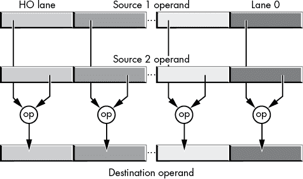

图 11-42：SIMD 并行算术和逻辑操作

某些操作——例如，逻辑与、ANDN（*与非*）、或、异或——不需要拆分为多个通道，因为这些操作无论指令大小如何，都能得到相同的结果。通道大小是一个单独的位。因此，相关的 SSE/AVX 指令会在不考虑通道大小的情况下操作其整个操作数。

## 11.9 SIMD 逻辑（按位）指令

SSE 和 AVX 指令集扩展提供了表 11-10 中显示的逻辑操作（使用 C/C++按位操作符语法）。

表 11-10：SSE/AVX 逻辑指令

| **操作** | **描述** |
| --- | --- |
| `andpd` | dest = dest 和 source（128 位操作数） |
| `vandpd` | dest = source1 和 source2（128 位或 256 位操作数） |
| `andnpd` | dest = dest 和 ~source（128 位操作数） |
| `vandnpd` | dest = source1 和 ~source2（128 位或 256 位操作数） |
| `orpd` | dest = dest &#124; source（128 位操作数） |
| `vorpd` | dest = source1 &#124; source2（128 位或 256 位操作数） |
| `xorpd` | dest = dest ^ source（128 位操作数） |
| `vxorpd` | dest = source1 ^ source2（128 位或 256 位操作数） |

这些指令的语法如下：

```
andpd   `xmm`[dest], `xmm`[src]/`mem`[128]
vandpd  `xmm`[dest], `xmm`[src1], `xmm`[src2]/`mem`[128]
vandpd  `ymm`[dest], `ymm`[src1], `ymm`[src2]/`mem`[256]

andnpd  `xmm`[dest], `xmm`[src]/`mem`[128]
vandnpd `xmm`[dest], `xmm`[src1], `xmm`[src2]/`mem`[128]
vandnpd `ymm`[dest], `ymm`[src1], `ymm`[src2]/`mem`[256]

orpd    `xmm`[dest], `xmm`[src]/`mem`[128]
vorpd   `xmm`[dest], `xmm`[src1], `xmm`[src2]/`mem`[128]
vorpd   `ymm`[dest], `ymm`[src1], `ymm`[src2]/`mem`[256]

xorpd   `xmm`[dest], `xmm`[src]/`mem`[128]
vxorpd  `xmm`[dest], `xmm`[src1], `xmm`[src2]/`mem`[128]
vxorpd  `ymm`[dest], `ymm`[src1], `ymm`[src2]/`mem`[256]
```

SSE 指令（没有`v`前缀）会保留底层 YMM 寄存器的 HO 位（如果适用）。带有`v`前缀的 AVX 指令（128 位操作数）会将其结果零扩展到 YMM 寄存器的 HO 位。

如果（第二个）源操作数是一个内存位置，它必须按适当的边界对齐（例如，mem[128]值为 16 字节，mem[256]值为 32 字节）。如果未对齐，将导致运行时内存对齐故障。

### 11.9.1 （v）ptest 指令

`ptest`指令（*打包测试*）类似于标准整数`test`指令。`ptest`指令对两个操作数执行逻辑与操作，如果结果为 0，则设置零标志。`ptest`指令会在第二个操作数与第一个操作数反转位的逻辑与结果为 0 时设置进位标志。`ptest`指令支持以下语法：

```
ptest  `xmm`[src1], `xmm`[src2]/`mem`[128]
vptest `xmm`[src1], `xmm`[src2]/`mem`[128]
vptest `ymm`[src1], `ymm`[src2]/`mem`[256]
```

### 11.9.2 字节移位指令

SSE 和 AVX 指令集扩展还支持一组逻辑和算术移位指令。首先要考虑的是 `pslldq` 和 `psrldq`。尽管它们以 `p` 开头，暗示它们是打包（向量）指令，但这些指令实际上只是 128 位的逻辑左移和右移指令。它们的语法如下：

```
pslldq  `xmm`[dest], `imm`[8]
vpslldq `xmm`[dest], `xmm`[src], `imm`[8]
vpslldq `ymm`[dest], `ymm`[src], `imm`[8]
psrldq  `xmm`[dest], `imm`[8]
vpsrldq `xmm`[dest], `xmm`[src], `imm`[8]
vpsrldq `ymm`[dest], `ymm`[src], `imm`[8]
```

`pslldq` 指令将目标 XMM 寄存器向左移动，移动的字节数由 imm[8] 操作数指定。该指令会在腾出的低字节位置填充 0。

`vpslldq` 指令从源寄存器（XMM 或 YMM）中获取值，将该值向左移动 imm[8] 字节，然后将结果存储到目标寄存器中。对于 128 位变体，该指令会将结果零扩展到底层 YMM 寄存器的 128 到 255 位（在支持 AVX 的 CPU 上）。

`psrldq` 和 `vpsrldq` 指令的操作方式与 `(v)pslldq` 类似，当然，它们是将操作数向右移位，而不是向左。它们是逻辑右移操作，因此会将 0 移入操作数的高字节，移出第 0 位的位会丢失。

`pslldq` 和 `psrldq` 指令移位的是 *字节* 而不是位。例如，许多 SSE 指令会生成字节掩码 0 或 0FFh，表示布尔结果。这些指令通过一次性移动整个字节，来移动这些字节掩码中的每一位。

### 11.9.3 位移指令

SSE/AVX 指令集扩展还提供了在两个或更多整数通道上并行工作的向量位移操作。这些指令提供了逻辑左移、逻辑右移和算术右移操作的字（word）、双字（dword）和四字（qword）变体，使用的语法如下：

```
`shift`  `xmm`[dest], `imm`[8]
`shift`  `xmm`[dest], `xmm`[src]/`mem`[128]
`vshift` `xmm`[dest], `xmm`[src], `imm`[8]
`vshift` `xmm`[dest], `xmm`[src], `mem`[128]
`vshift` `ymm`[dest], `ymm`[src], `imm`[8]
`vshift` `ymm`[dest], `ymm`[src], `xmm`/`mem`[128]
```

其中 `shift` = `psllw`、`pslld`、`psllq`、`psrlw`、`psrld`、`psrlq`、`psraw` 或 `psrad`，`vshift` = `vpsllw`、`vpslld`、`vpsllq`、`vpsrlw`、`vpsrld`、`vpsrlq`、`vpsraw`、`vpsrad` 或 `vpsraq`。

`(v)psl*` 指令将操作数向左移动；`(v)psr*` 指令将操作数向右移动。`(v)psll*` 和 `(v)psrl*` 指令是逻辑移位指令，会将 0 移入移位腾出的位位置。任何从操作数中移出的位都会丢失。`(v)psra*` 指令是算术右移指令，它们会在将该通道的位向右移时，复制该通道的高位（HO）位；所有从低位（LO）移出的位都会丢失。

SSE 的双操作数指令将其第一个操作数视为源操作数和目标操作数。第二个操作数指定移位的位数（可以是 8 位立即数常量，或存储在 XMM 寄存器或 128 位内存位置中的值）。无论移位计数的大小如何，只有计数的低 4、5 或 6 位是有效的（取决于通道大小）。

AVX 三操作数指令为移位操作指定了一个独立的源和目标寄存器。这些指令从源寄存器获取值，按指定的位数进行移位，并将移位后的结果存储到目标寄存器中。源寄存器保持不变（除非该指令明确指定源和目标操作数使用相同寄存器）。对于 AVX 指令，源和目标寄存器可以是 XMM（128 位）或 YMM（256 位）寄存器。第三个操作数可以是一个 8 位立即数、XMM 寄存器或 128 位内存位置。第三个操作数指定位移的位数（与 SSE 指令相同）。即使源和目标寄存器是 256 位的 YMM 寄存器，位移计数也需要指定为 XMM 寄存器。

`w` 后缀指令处理 16 位操作数（128 位目标操作数为 8 通道，256 位目标操作数为 16 通道）。`d` 后缀指令处理 32 位双字操作数（128 位目标操作数为 4 通道，256 位目标操作数为 8 通道）。`q` 后缀指令处理 64 位操作数（128 位操作数为 2 通道，256 位操作数为 4 通道）。

## 11.10 SIMD 整数算术指令

SSE 和 AVX 指令集扩展主要处理浮点计算。然而，它们也包括一组有符号和无符号整数算术运算。本节描述了 SSE/AVX 整数算术指令。

### 11.10.1 SIMD 整数加法

SIMD 整数加法指令见 表 11-11。这些指令不会影响任何标志，因此不会在执行过程中指示溢出（有符号或无符号）发生。程序本身必须确保源操作数都在适当的范围内，才能执行加法。如果加法过程中发生进位，则进位将丢失。

表 11-11: SIMD 整数加法指令

| **指令** | **操作数** | **描述** |
| --- | --- | --- |
| `paddb` | `xmm`[dest], `xmm`/`mem`[128] | 16 通道字节相加 |
| `vpaddb` | `xmm`[dest], `xmm`[src1], `xmm`[src2]/`mem`[128] | 16 通道字节相加 |
| `vpaddb` | `ymm`[dest], `ymm`[src1], `ymm`[src2]/`mem`[256] | 32 通道字节相加 |
| `paddw` | `xmm`[dest], `xmm`/`mem`[128] | 8 通道字相加 |
| `vpaddw` | `xmm`[dest], `xmm`[src1], `xmm`[src2]/`mem`[128] | 8 通道字相加 |
| `vpaddw` | `ymm`[dest], `ymm`[src1], `ymm`[src2]/`mem`[256] | 16 通道字相加 |
| `paddd` | `xmm`[dest], `xmm`/`mem`[128] | 4 通道双字相加 |
| `vpaddd` | `xmm`[dest], `xmm`[src1], `xmm`[src2]/`mem`[128] | 4 通道双字相加 |
| `vpaddd` | `ymm`[dest], `ymm`[src1], `ymm`[src2]/`mem`[256] | 8 通道双字相加 |
| `paddq` | `xmm`[dest], `xmm`/`mem`[128] | 2 通道四字相加 |
| `vpaddq` | `xmm`[dest], `xmm`[src1], `xmm`[src2]/`mem`[128] | 2 通道四字相加 |
| `vpaddq` | `ymm`[dest], `ymm`[src1], `ymm`[src2]/`mem`[256] | 4 通道四字节加法 |

这些加法指令被称为*垂直加法*，因为如果我们将两个源操作数堆叠在一起（在打印页面上），每个通道的加法操作是垂直发生的（一个源通道直接位于第二个源通道上方，进行相应的加法操作）。

打包加法忽略了加法操作中的任何溢出，只保留每次加法的低字节、字、双字或四字。例如，只要溢出不可能发生，这不是一个问题。然而，对于某些算法（尤其是常使用打包加法的音频和视频），截断溢出可能会产生异常的结果。

更简洁的解决方案是使用*饱和算术*。对于无符号加法，饱和算术会将溢出*剪裁*（或*饱和*）到指令大小能处理的最大值。例如，如果两个字节值的加法超过 0FFh，饱和算术会生成 0FFh——这是最大的无符号 8 位值（同样，饱和减法如果发生下溢则会产生 0）。对于有符号饱和算术，剪裁会发生在最大的正值和最小的负值处（例如，7Fh/+127 为正值，80h/–128 为负值）。

x86 SIMD 指令提供了有符号和无符号饱和算术，尽管这些操作仅限于 8 位和 16 位数值。^(10) 这些指令出现在表 11-12 中。

表 11-12：SIMD 整数饱和加法指令

| **指令** | **操作数** | **描述** |
| --- | --- | --- |
| `paddsb` | `xmm`[dest], `xmm`/`mem`[128] | 16 通道字节有符号饱和加法 |
| `vpaddsb` | `xmm`[dest], `xmm`[src1], `xmm`[src2]/`mem`[128] | 16 通道字节有符号饱和加法 |
| `vpaddsb` | `ymm`[dest], `ymm`[src1], `ymm`[src2]/`mem`[256] | 32 通道字节有符号饱和加法 |
| `paddsw` | `xmm`[dest], `xmm`/`mem`[128] | 8 通道字节有符号饱和加法 |
| `vpaddsw` | `xmm`[dest], `xmm`[src1], `xmm`[src2]/`mem`[128] | 8 通道字节有符号饱和加法 |
| `vpaddsw` | `ymm`[dest], `ymm`[src1], `ymm`[src2]/`mem`[256] | 16 通道字节有符号饱和加法 |
| `paddusb` | `xmm`[dest], `xmm`/`mem`[128] | 16 通道字节无符号饱和加法 |
| `vpaddusb` | `xmm`[dest], `xmm`[src1], `xmm`[src2]/`mem`[128] | 16 通道字节无符号饱和加法 |
| `vpaddusb` | `ymm`[dest], `ymm`[src1], `ymm`[src2]/`mem`[256] | 32 通道字节无符号饱和加法 |
| `paddusw` | `xmm`[dest], `xmm`/`mem`[128] | 8 通道字节无符号饱和加法 |
| `vpaddusw` | `xmm`[dest], `xmm`[src1], `xmm`[src2]/`mem`[128] | 8 通道字节无符号饱和加法 |
| `vpaddusw` | `ymm`[dest], `ymm`[src1], `ymm`[src2]/`mem`[256] | 16 通道字节无符号饱和加法 |

和往常一样，`padd*` 和 `vpadd*` 指令接受 128 位 XMM 寄存器（十六个 8 位加法或八个 16 位加法）。`padd*` 指令不会改变任何对应 YMM 目标寄存器的高 128 位（HO bits）；而 `vpadd*` 变体会清除这些高位。另外，注意到 `padd*` 指令只有两个操作数（目标寄存器也是源寄存器），而 `vpadd*` 指令有两个源操作数和一个目标操作数。使用 YMM 寄存器的 `vpadd*` 指令提供了双倍的并行加法数量。

### 11.10.2 横向加法

SSE/AVX 指令集还支持三种*横向加法*指令，列于表 11-13 中。

表 11-13：横向加法指令

| **指令** | **描述** |
| --- | --- |
| `(v)``phaddw` | 16 位（word）横向加法 |
| `(v)``phaddd` | 32 位（dword）横向加法 |
| `(v)``phaddsw` | 16 位（word）横向加法并饱和 |

横向加法指令将两个源操作数中的相邻字（word）或双字（dword）进行相加，并将结果的和存入目标位置，如图 11-43 所示。

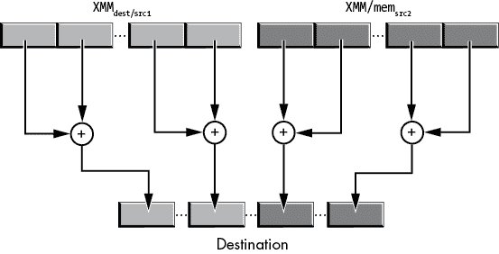

图 11-43：横向加法操作

`phaddw` 指令具有以下语法：

```
phaddw `xmm`[dest], `xmm`[src]/`mem`[128]
```

它计算以下内容：

```
temp[0 to 15]    = `xmm`[dest][0 to 15]        + `xmm`[dest][16 to 31]
temp[16 to 31]   = `xmm`[dest][32 to 47]       + `xmm`[dest][48 to 63]
temp[32 to 47]   = `xmm`[dest][64 to 79]       + `xmm`[dest][80 to 95]
temp[48 to 63]   = `xmm`[dest][96 to 111]      + `xmm`[dest][112 to 127]
temp[64 to 79]   = `xmm`[src]/`mem`[128][0 to 15]   + `xmm`[src]/`mem`[128][16 to 31]
temp[80 to 95]   = `xmm`[src]/`mem`[128][32 to 47]  + `xmm`[src]/`mem`[128][48 to 63]
temp[96 to 111]  = `xmm`[src]/`mem`[128][64 to 79]  + `xmm`[src]/`mem`[128][80 to 95]
temp[112 to 127] = `xmm`[src]/`mem`[128][96 to 111] + `xmm`[src]/`mem`[128][112 to 127]
`xmm`[dest] = temp
```

与大多数 SSE 指令一样，`phaddw` 不会影响对应 YMM 目标寄存器的高位，只会影响低 128 位（LO 128 bits）。

128 位 `vphaddw` 指令具有以下语法：

```
vphaddw `xmm`dest, `xmm`src1, `xmm`src2/`mem`128
```

它计算以下内容：

```
`xmm`[dest][0 to 15]    = `xmm`[src1][0 to 15]         + `xmm`[src1][16 to 31]
`xmm`[dest][16 to 31]   = `xmm`[src1][32 to 47]        + `xmm`[src1][48 to 63]
`xmm`[dest][32 to 47]   = `xmm`[src1][64 to 79]        + `xmm`[src1][80 to 95]
`xmm`[dest][48 to 63]   = `xmm`[src1][96 to 111]       + `xmm`[src1][112 to 127]
`xmm`[dest][64 to 79]   = `xmm`[src2]/`mem`[128][0 to 15]   + `xmm`[src2]/`mem`[128][16 to 31]
`xmm`[dest][80 to 95]   = `xmm`[src2]/`mem`[128][32 to 47]  + `xmm`[src2]/`mem`[128][48 to 63]
`xmm`[dest][96 to 111]  = `xmm`[src2]/`mem`[128][64 to 79]  + `xmm`[src2]/`mem`[128][80 to 95]
`xmm`[dest][111 to 127] = `xmm`[src2]/`mem`[128][96 to 111] + `xmm`[src2]/`mem`[128][112 to 127]
```

`vphaddw` 指令将对应 YMM 目标寄存器的高 128 位清零。

256 位 `vphaddw` 指令具有以下语法：

```
vphaddw `ymm`dest, `ymm`src1, `ymm`src2/`mem`256
```

`vphaddw` 并不是以直观的方式简单地扩展 128 位版本。相反，它混合计算如下（其中 `SRC1` 为 YMM[src1]，`SRC2` 为 YMM[src2]/mem[256]）：

```
`ymm`[dest][0 to 15]    = SRC1[16 to 31]   + SRC1[0 to 15]
`ymm`[dest][16 to 31]   = SRC1[48 to 63]   + SRC1[32 to 47]
`ymm`[dest][32 to 47]   = SRC1[80 to 95]   + SRC1[64 to 79]
`ymm`[dest][48 to 63]   = SRC1[112 to 127] + SRC1[96 to 111]
`ymm`[dest][64 to 79]   = SRC2[16 to 31]   + SRC2[0 to 15]
`ymm`[dest][80 to 95]   = SRC2[48 to 63]   + SRC2[32 to 47]
`ymm`[dest][96 to 111]  = SRC2[80 to 95]   + SRC2[64 to 79]
`ymm`[dest][112 to 127] = SRC2[112 to 127] + SRC2[96 to 111]
`ymm`[dest][128 to 143] = SRC1[144 to 159] + SRC1[128 to 143]
`ymm`[dest][144 to 159] = SRC1[176 to 191] + SRC1[160 to 175]
`ymm`[dest][160 to 175] = SRC1[208 to 223] + SRC1[192 to 207]
`ymm`[dest][176 to 191] = SRC1[240 to 255] + SRC1[224 to 239]
`ymm`[dest][192 to 207] = SRC2[144 to 159] + SRC2[128 to 143]
`ymm`[dest][208 to 223] = SRC2[176 to 191] + SRC2[160 to 175]
`ymm`[dest][224 to 239] = SRC2[208 to 223] + SRC2[192 to 207]
`ymm`[dest][240 to 255] = SRC2[240 to 255] + SRC2[224 to 239]
```

### 11.10.3 双字（Double-Word）大小的横向加法

`phaddd` 指令具有以下语法：

```
phaddd `xmm`[dest], `xmm`[src]/`mem`[128]
```

它计算以下内容：

```
temp[0 to 31]   = `xmm`[dest][0 to 31]       + `xmm`[dest][32 to 63]
temp[32 to 63]  = `xmm`[dest][64 to 95]      + `xmm`[dest][96 to 127]
temp[64 to 95]  = `xmm`[src]/`mem`[128][0 to 31]  + `xmm`[src]/`mem`[128][32 to 63]
temp[96 to 127] = `xmm`[src]/`mem`[128][64 to 95] + `xmm`[src]/`mem`[128][96 to 127]
`xmm`[dest] = temp
```

128 位 `vphaddd` 指令具有以下语法：

```
vphaddd `xmm`[dest], `xmm`[src1], `xmm`[src2]/`mem`[128]
```

它计算以下内容：

```
`xmm`dest[0 to 31]     = `xmm`src1[0 to 31]        + `xmm`src1[32 to 63]
`xmm`dest[32 to 63]    = `xmm`src1[64 to 95]       + `xmm`src1[96 to 127]
`xmm`dest[64 to 95]    = `xmm`src2/`mem`128[0 to 31]  + `xmm`src2/`mem`128[32 to 63]
`xmm`dest[96 to 127]   = `xmm`src2/`mem`128[64 to 95] + `xmm`src2/`mem`128[96 to 127]
(`ymm`dest[128 to 255] = 0)
```

与 `vphaddw` 类似，256 位 `vphaddd` 指令具有以下语法：

```
vphaddd `ymm`[dest], `ymm`[src1], `ymm`[src2]/`mem`[256]
```

它计算以下内容：

```
`ymm`[dest][0 to 31]    = `ymm`[src1][32 to 63]         + `ymm`[src1][0 to 31]
`ymm`[dest][32 to 63]   = `ymm`[src1][96 to 127]        + `ymm`[src1][64 to 95]
`ymm`[dest][64 to 95]   = `ymm`[src2]/mem[128][32 to 63]   + `ymm`[src2]/`mem`[128][0 to 31]
`ymm`[dest][96 to 127]  = `ymm`[src2]/mem[128][96 to 127]  + `ymm`[src2]/`mem`[128][64 to 95]
`ymm`[dest][128 to 159] = `ymm`[src1][160 to 191]       + `ymm`[src1][128 to 159]
`ymm`[dest][160 to 191] = `ymm`[src1][224 to 255]       + `ymm`[src1][192 to 223]
`ymm`[dest][192 to 223] = `ymm`[src2]/`mem`[128][160 to 191] + `ymm`[src2]/`mem`[128][128 to 159]
`ymm`[dest][224 to 255] = `ymm`[src2]/`mem`[128][224 to 255] + `ymm`[src2]/`mem`[128][192 to 223]
```

如果在横向加法过程中发生溢出，`(v)phaddw` 和 `(v)phaddd` 会忽略溢出，并将结果的低 16 位或 32 位存入目标位置。

`(v)phaddsw` 指令有以下形式：

```
phaddsw  `xmm`[dest], `xmm`[src]/`mem`[128]
vphaddsw `xmm`[dest], `xmm`[src1], `xmm`[src2]/`mem`[128]
vphaddsw `ymm`[dest], `ymm`[src1], `ymm`[src2]/`mem`[256]
```

`(v)phaddsw` 指令（*横向带饱和的有符号整数加法，字*）是 `(v)phaddw` 的一种稍有不同的形式：与仅将低位存入目标位置的结果不同，该指令会对结果进行饱和处理。*饱和*意味着任何（正）溢出都会导致值为 7FFFh，无论实际结果如何。类似地，任何负溢出都会导致值为 8000h。

饱和算术在音频和视频处理中的表现良好。如果使用标准的（环绕/取模）加法将两个声音样本相加，结果会产生难听的点击声。而饱和算术则会产生一个截断的音频信号。虽然这并不理想，但比起取模算术的结果，这听起来要好得多。类似地，在视频处理中，饱和算术会产生褪色（白色）的颜色，而不是取模算术所带来的奇怪颜色。

遗憾的是，双字操作数没有饱和水平加法（例如，用于处理 24 位音频）。

### 11.10.4 SIMD 整数减法

SIMD 整数减法指令见 表 11-14。与 SIMD 加法指令一样，这些指令不会影响任何标志；任何进位、借位、溢出或下溢信息都会丢失。这些指令将第二个源操作数从第一个源操作数中减去（对于仅支持 SSE 的指令，结果也作为目标操作数），并将结果存储到目标操作数中。

表 11-14: SIMD 整数减法指令

| **指令** | **操作数** | **描述** |
| --- | --- | --- |
| `psubb` | `xmm`[dest], `xmm`/`mem`[128] | 16 道字节减法 |
| `vpsubb` | `xmm`[dest], `xmm`[src], `xmm`/`mem`[128] | 16 道字节减法 |
| `vpsubb` | `ymm`[dest], `ymm`[src], `ymm`/`mem`[256] | 32 道字节减法 |
| `psubw` | `xmm`[dest], `xmm`/`mem`[128] | 8 道字减法 |
| `vpsubw` | `xmm`[dest], `xmm`[src], `xmm`/`mem`[128] | 8 道字减法 |
| `vpsubw` | `ymm`[dest], `ymm`[src], `ymm`/`mem`[256] | 16 道字减法 |
| `psubd` | `xmm`[dest], `xmm`/`mem`[128] | 4 道双字减法 |
| `vpsubd` | `xmm`[dest], `xmm`[src], `xmm`/`mem`[128] | 4 道双字减法 |
| `vpsubd` | `ymm`[dest], `ymm`[src], `ymm`/`mem`[256] | 8 道双字减法 |
| `psubq` | `xmm`[dest], `xmm`/`mem`[128] | 2 道四字减法 |
| `vpsubq` | `xmm`[dest], `xmm`[src], `xmm`/`mem`[128] | 2 道四字减法 |
| `vpsubq` | `ymm`[dest], `ymm`[src], `ymm`/`mem`[256] | 4 道四字减法 |

`(v)phsubw`、`(v)phsubd` 和 `(v)phsubsw` 水平减法指令的工作方式与水平加法指令相同，不同之处在于（当然）它们计算的是两个源操作数的差值，而不是和。有关水平加法指令的详细信息，请参见前面的章节。

同样，也有一组带符号和无符号字节和字饱和减法指令（见 表 11-15）。对于带符号指令，字节型指令会将正溢出饱和为 7Fh (+127)，负下溢饱和为 80h (–128)。字型指令会将值饱和为 7FFFh (+32,767) 和 8000h (–32,768)。无符号饱和指令会将值饱和为 0FFFFh (+65,535) 和 0。

表 11-15: SIMD 整数饱和减法指令

| **指令** | **操作数** | **描述** |
| --- | --- | --- |
| `psubsb` | `xmm`[dest]，`xmm`/`mem`[128] | 16 通道字节带符号饱和减法 |
| `vpsubsb` | `xmm`[dest]，`xmm`[src]，`xmm`/`mem`[128] | 16 通道字节带符号饱和减法 |
| `vpsubsb` | `ymm`[dest]，`ymm`[src]，`ymm`/`mem`[256] | 32 通道字节带符号饱和减法 |
| `psubsw` | `xmm`[dest]，`xmm`/`mem`[128] | 8 通道字节带符号饱和减法 |
| `vpsubsw` | `xmm`[dest]，`xmm`[src]，`xmm`/`mem`[128] | 8 通道字节带符号饱和减法 |
| `vpsubsw` | `ymm`[dest]，`ymm`[src]，`ymm`/`mem`[256] | 16 通道字节带符号饱和减法 |
| `psubusb` | `xmm`[dest]，`xmm`/`mem`[128] | 16 通道字节无符号饱和减法 |
| `vpsubusb` | `xmm`[dest]，`xmm`[src]，`xmm`/`mem`[128] | 16 通道字节无符号饱和减法 |
| `vpsubusb` | `ymm`[dest]，`ymm`[src]，`ymm`/`mem`[256] | 32 通道字节无符号饱和减法 |
| `psubusw` | `xmm`[dest]，`xmm`/`mem`[128] | 8 通道字节无符号饱和减法 |
| `vpsubusw` | `xmm`[dest]，`xmm`[src]，`xmm`/`mem`[128] | 8 通道字节无符号饱和减法 |
| `vpsubusw` | `ymm`[dest]，`ymm`[src]，`ymm`/`mem`[256] | 16 通道字节无符号饱和减法 |

### 11.10.5 SIMD 整数乘法

SSE/AVX 指令集扩展在一定程度上支持乘法。逐通道乘法要求两个*n*位值的操作结果能够适应*n*位，但是*n* × *n*的乘法可能会产生 2×*n*位的结果。因此，逐通道乘法操作会出现溢出丢失的问题。基础的打包整数乘法将一对通道相乘，并将结果的低位存储到目标通道。对于扩展算术，打包整数乘法指令会生成结果的高位。

表 11-16 中的指令处理 16 位乘法操作。`(v)pmullw`指令将源操作数中的 16 位值进行相乘，并将结果的低位存储到相应的目标通道。该指令适用于带符号和无符号值。`(v)pmulhw`指令计算两个带符号字节值的乘积，并将结果的高位存储到目标通道。对于无符号操作数，`(v)pmulhuw`执行相同的操作。通过使用相同的操作数执行`(v)pmullw`和`(v)pmulh(u)w`，你可以计算 16×16 位乘法的完整 32 位结果。（你可以使用`punpck*`指令将结果合并为 32 位整数。）

表 11-16：SIMD 16 位打包整数乘法指令

| **指令** | **操作数** | **描述** |
| --- | --- | --- |
| `pmullw` | `xmm`[dest]，`xmm`/`mem`[128] | 8 通道字节乘法，生成乘积的低 16 位 |
| `vpmullw` | `xmm`[dest]，`xmm`[src]，`xmm`/`mem`[128] | 8 通道字节乘法，生成乘积的低 16 位 |
| `vpmullw` | `ymm`[dest], `ymm`[src], `ymm`/`mem`[256] | 16 路 word 乘法，生成乘积的 LO word |
| `pmulhuw` | `xmm`[dest], `xmm`/`mem`[128] | 8 路 word 无符号乘法，生成乘积的 HO word |
| `vpmulhuw` | `xmm`[dest], `xmm`[src], `xmm`/`mem`[128] | 8 路 word 无符号乘法，生成乘积的 HO word |
| `vpmulhuw` | `ymm`[dest], `ymm`[src], `ymm`/`mem`[256] | 16 路 word 无符号乘法，生成乘积的 HO word |
| `pmulhw` | `xmm`[dest], `xmm`/`mem`[128] | 8 路 word 有符号乘法，生成乘积的 HO word |
| `vpmulhw` | `xmm`[dest], `xmm`[src], `xmm`/`mem`[128] | 8 路 word 有符号乘法，生成乘积的 HO word |
| `vpmulhw` | `ymm`[dest], `ymm`[src], `ymm`/`mem`[256] | 16 路 word 有符号乘法，生成乘积的 HO word |

表 11-17 列出了 32 位和 64 位版本的打包乘法指令。没有 `(v)pmulhd` 或 `(v)pmulhq` 指令；请参阅 `(v)pmuludq` 和 `(v)pmuldq` 以处理 32 位和 64 位打包乘法。

表 11-17：SIMD 32 位和 64 位打包整数乘法指令

| **指令** | **操作数** | **描述** |
| --- | --- | --- |
| `pmulld` | `xmm`[dest], `xmm`/`mem`[128] | 4 路 dword 乘法，生成乘积的 LO dword |
| `vpmulld` | `xmm`[dest], `xmm`[src], `xmm`/`mem`[128] | 4 路 dword 乘法，生成乘积的 LO dword |
| `vpmulld` | `ymm`[dest], `ymm`[src], `ymm`/`mem`[256] | 8 路 dword 乘法，生成乘积的 LO dword |
| `vpmullq` | `xmm`[dest], `xmm`[src], `xmm`/`mem`[128] | 2 路 qword 乘法，生成乘积的 LO qword |
| `vpmullq` | `ymm`[dest], `ymm`[src], `ymm`/`mem`[256] | 4 路 qword 乘法，生成乘积的 LO qword（仅在 AVX-512 CPU 上可用） |

在某个阶段，Intel 引入了 `(v)pmuldq` 和 `(v)pmuludq` 来执行有符号和无符号的 32×32 位乘法，生成一个 64 位的结果。这些指令的语法如下：

```
pmuldq   `xmm`[dest], `xmm`/`mem`[128]
vpmuldq  `xmm`[dest], `xmm`[src1], `xmm`/`mem`[128]
vpmuldq  `ymm`[dest], `ymm`[src1], `ymm`/`mem`[256]

pmuludq  `xmm`[dest], `xmm`/`mem`[128]
vpmuludq `xmm`[dest], `xmm`[src1], `xmm`/`mem`[128]
vpmuludq `ymm`[dest], `ymm`[src1], `ymm`/`mem`[256]
```

128 位变体乘以位于 0 和 2 路的双字，并将 64 位结果存储到 qword 路 0 和 1（dword 路 0 和 1、2 和 3）。在具有 AVX 寄存器的 CPU 上，^(11) `pmuldq` 和 `pmuludq` 不影响 YMM 寄存器的高 128 位。`vpmuldq` 和 `vpmuludq` 指令将结果扩展为 256 位。256 位变体乘以位于 0、2、4 和 6 路的双字，生成 64 位结果并将其存储到 qword 路 0、1、2 和 3（dword 路 0 和 1、2 和 3、4 和 5、6 和 7）。

`pclmulqdq` 指令提供了乘以两个 qword 值的能力，生成一个 128 位的结果。该指令的语法如下：

```
pclmulqdq  `xmm`[dest], `xmm`/`mem`[128], `imm`[8]
vpclmulqdq `xmm`[dest], `xmm`[src1], `xmm`[src2]/`mem`[128], `imm`[8]
```

这些指令将 XMM[dest] 和 XMM[src] 中的 qword 值相乘，并将 128 位的结果保留在 XMM[dest] 中。imm[8] 操作数指定要用作源操作数的 qword。`pclmulqdq` 的可能组合列在 表 11-18 中，`vpclmulqdq` 的组合列在 表 11-19 中。

表 11-18: `pclmulqdq` 指令的 imm[8] 操作数值

| **imm[8]** | **结果** |
| --- | --- |
| 00h | XMM[dest] = XMM[dest][0 到 63] * XMM/mem[128][0 到 63] |
| 01h | XMM[dest] = XMM[dest][64 到 127] * XMM/mem[128][0 到 63] |
| 10h | XMM[dest] = XMM[dest][0 到 63] * XMM/mem[128][64 到 127] |
| 11h | XMM[dest] = XMM[dest][64 到 127] * XMM/mem[128][64 到 127] |

表 11-19: `vpclmulqdq` 指令的 imm[8] 操作数值

| **imm[8]** | **结果** |
| --- | --- |
| 00h | XMM[dest] = XMM[src1][0 到 63] * XMM[src2]/mem[128][0 到 63] |
| 01h | XMM[dest] = XMM[src1][64 到 127] * XMM[src2]/mem[128][0 到 63] |
| 10h | XMM[dest] = XMM[src1][0 到 63] * XMM[src2]/mem[128][64 到 127] |
| 11h | XMM[dest] = XMM[src1][64 到 127] * XMM[src2]/mem[128][64 到 127] |

像往常一样，`pclmulqdq` 会保持对应的 YMM 目标寄存器的高 128 位不变，而 `vpcmulqdq` 会将这些位清零。

### 11.10.6 SIMD 整数平均值

`(v)pavgb` 和 `(v)pavgw` 指令计算两个字节或字的平均值。这些指令将源操作数和目标操作数中字节或字的值相加，然后将结果除以 2，四舍五入，并将平均结果存储在目标操作数的 lane 中。这些指令的语法如下：

```
pavgb  `xmm`[dest], `xmm`/`mem`[128]
vpavgb `xmm`[dest], `xmm`[src1], `xmm`[src2]/`mem`[128]
vpavgb `ymm`[dest], `ymm`[src1], `ymm`[src2]/`mem`[256]
pavgw  `xmm`[dest], `xmm`/`mem`[128]
vpavgw `xmm`[dest], `xmm`[src1], `xmm`[src2]/`mem`[128]
vpavgw `ymm`[dest], `ymm`[src1], `ymm`[src2]/`mem`[256]
```

128 位的 `pavgb` 和 `vpavgb` 指令计算 16 个字节大小的平均值（针对源和目标操作数中的 16 个 lane）。`vpavgb` 指令的 256 位变体计算 32 个字节大小的平均值。

128 位的 `pavgw` 和 `vpavgw` 指令计算 8 个字的平均值（针对源和目标操作数中的 8 个 lane）。`vpavgw` 指令的 256 位变体计算 16 个字节大小的平均值。

`vpavgb` 和 `vpavgw` 指令计算第一个 XMM 或 YMM 源操作数和第二个 XMM、YMM 或内存源操作数的平均值，将平均结果存储在目标 XMM 或 YMM 寄存器中。

不幸的是，没有 `(v)pavgd` 或 `(v)pavgq` 指令。毫无疑问，这些指令最初是为了混合 8 位和 16 位的音频或视频流（或照片处理）而设计的，但 x86-64 CPU 设计者从未认为有必要将其扩展到 16 位以上（尽管 24 位音频在专业音频工程师中很常见）。

### 11.10.7 SIMD 整数最小值和最大值

SSE4.1 指令集扩展添加了八个打包的整数 *最小值* 和 *最大值* 指令，如 表 11-20 所示。这些指令扫描一对 128 位或 256 位操作数的各个 lane，并将最大值或最小值从该 lane 复制到目标操作数的相同 lane。

表 11-20：SIMD 最小值和最大值指令

| **指令** | **描述** |
| --- | --- |
| `(v)``pmaxsb` | 目标字节通道设置为在相应源通道中找到的两个有符号字节值的最大值。 |
| `(v)``pmaxsw` | 目标字通道设置为在相应源通道中找到的两个有符号字值的最大值。 |
| `(v)``pmaxsd` | 目标双字通道设置为在相应源通道中找到的两个有符号双字值的最大值。 |
| `v``pmaxsq` | 目标四字通道设置为在相应源通道中找到的两个有符号四字值的最大值。（此指令需要 AVX-512 支持。） |
| `(v)``pmaxub` | 目标字节通道设置为在相应源通道中找到的两个无符号字节值的最大值。 |
| `(v)``pmaxuw` | 目标字通道设置为在相应源通道中找到的两个无符号字值的最大值。 |
| `(v)``pmaxud` | 目标双字通道设置为在相应源通道中找到的两个无符号双字值的最大值。 |
| `v``pmaxuq` | 目标四字通道设置为在相应源通道中找到的两个无符号四字值的最大值。（此指令需要 AVX-512 支持。） |
| `(v)``pminsb` | 目标字节通道设置为在相应源通道中找到的两个有符号字节值的最小值。 |
| `(v)``pminsw` | 目标字通道设置为在相应源通道中找到的两个有符号字值的最小值。 |
| `(v)``pminsd` | 目标双字通道设置为在相应源通道中找到的两个有符号双字值的最小值。 |
| `v``pminsq` | 目标四字通道设置为在相应源通道中找到的两个有符号四字值的最小值。（此指令需要 AVX-512 支持。） |
| `(v)``pminub` | 目标字节通道设置为在相应源通道中找到的两个无符号字节值的最小值。 |
| `(v)``pminuw` | 目标字通道设置为在相应源通道中找到的两个无符号字值的最小值。 |
| `(v)``pminud` | 目标双字通道设置为在相应源通道中找到的两个无符号双字值的最小值。 |
| `v``pminuq` | 目标四字通道设置为在相应源通道中找到的两个无符号四字值的最小值。（此指令需要 AVX-512 支持。） |

这些指令的通用语法如下：^(12)

```
pm`xxyz`  `xmm`[dest], `xmm`[src]/`mem`[128]
vpm`xxyz` `xmm`[dest], `xmm`[src1], `xmm`[src2]/`mem`[128]
vpm`xxyz` `ymm`[dest], `ymm`[src1], `ymm`[src2]/`mem`[256]
```

SSE 指令计算源操作数和目标操作数对应通道的最小值或最大值，并将最小值或最大值结果存储到目标寄存器对应通道中。AVX 指令计算两个源操作数相同通道中的最小值或最大值，并将最小值或最大值结果存储到目标寄存器对应通道中。

### 11.10.8 SIMD 整数绝对值

SSE/AVX 指令集扩展提供了三组用于计算有符号字节、字和双字整数绝对值的指令：`(v)pabsb`、`(v)pabsw` 和 `(v)pabsd`。^(13) 这些指令的语法如下：

```
pabsb  `xmm`[dest], `xmm`[src]/`mem`[128]
vpabsb `xmm`[dest], `xmm`[src]/`mem`[128]
vpabsb `ymm`[dest], `ymm`[src]/`mem`[256]

pabsw  `xmm`[dest], `xmm`[src]/`mem`[128]
vpabsw `xmm`[dest], `xmm`[src]/`mem`[128]
vpabsw `ymm`[dest], `ymm`[src]/`mem`[256]

pabsd  `xmm`[dest], `xmm`[src]/`mem`[128]
vpabsd `xmm`[dest], `xmm`[src]/`mem`[128]
vpabsd `ymm`[dest], `ymm`[src]/`mem`[256]
```

在支持 AVX 寄存器的系统上，SSE `pabsb`、`pabsw` 和 `pabsd` 指令不会修改 YMM 寄存器的高位。AVX 指令的 128 位版本（`vpabsb`、`vpabsw` 和 `vpabsd`）会将结果零扩展到高位。

### 11.10.9 SIMD 整数符号调整指令

`(v)psignb`、`(v)psignw` 和 `(v)psignd` 指令将源通道中找到的符号应用到相应的目标通道。其算法如下：

```
if source lane value is less than zero then
    negate the corresponding destination lane
else if source lane value is equal to zero
    set the corresponding destination lane to zero
else 
    leave the corresponding destination lane unchanged
```

这些指令的语法如下：

```
psignb  `xmm`[dest], `xmm`[src]/`mem`[128]
vpsignb `xmm`[dest], `xmm`[src1], `xmm`[src2]/`mem`[128]
vpsignb `ymm`[dest], `ymm`[src1], `ymm`[src2]/`mem`[256]

psignw  `xmm`[dest], `xmm`[src]/`mem`[128]
vpsignw `xmm`[dest], `xmm`[src1], `xmm`[src2]/`mem`[128]
vpsignw `ymm`[dest], `ymm`[src1], `ymm`[src2]/`mem`[256]

psignd  `xmm`[*dest*], `xmm`[*src*]/`mem`[*128*]
vpsignd `xmm`[*dest*], `xmm`[*src1*], `xmm`[*src2*]/`mem`[*128*]
vpsignd `ymm`[*dest*], `ymm`[*src1*], `ymm`[*src2*]/`mem`[*256*]
```

和往常一样，128 位 SSE 指令不会修改 YMM 寄存器的高位（如果适用），而 128 位 AVX 指令将结果零扩展到 YMM 寄存器的高位。

### 11.10.10 SIMD 整数比较指令

`(v)pcmpeqb`、`(v)pcmpeqw`、`(v)pcmpeqd`、`(v)pcmpeqq`、`(v)pcmpgtb`、`(v)pcmpgtw`、`(v)pcmpgtd` 和 `(v)pcmpgtq` 指令提供打包的有符号整数比较。这些指令在其操作数的各个通道中比较对应的字节、字、双字或四字（取决于指令后缀）。^(14) 它们将比较指令的结果存储到对应的目标通道中。

#### 11.10.10.1 SSE 等值比较指令

以下是 SSE *相等比较* 指令（`pcmpeq*`）的语法：

```
pcmpeqb `xmm`[dest], `xmm`[src]/`mem`[128]  ; Compares 16 bytes
pcmpeqw `xmm`[dest], `xmm`[src]/`mem`[128]  ; Compares 8 words
pcmpeqd `xmm`[dest], `xmm`[src]/`mem`[128]  ; Compares 4 dwords
pcmpeqq `xmm`[dest], `xmm`[src]/`mem`[128]  ; Compares 2 qwords
```

这些指令计算

```
`xmm`[dest][`lane`] = `xmm`[dest][`lane`] == `xmm`[src]/`mem`[128][`lane`]
```

其中，`lane` 对于 `pcmpeqb` 为 0 到 15，`pcmpeqw` 为 0 到 7，`pcmpeqd` 为 0 到 3，`pcmpeqq` 为 0 到 1。如果两个值在同一通道中相等，`==` 运算符会产生全为 1 的值；如果值不相等，则会产生全为 0 的值。

#### 11.10.10.2 SSE 大于比较指令

以下是 SSE *大于比较* 指令（`pcmpgt*`）的语法：

```
pcmpgtb `xmm`[dest], `xmm`[src]/`mem`[128]  ; Compares 16 bytes
pcmpgtw `xmm`[dest], `xmm`[src]/`mem`[128]  ; Compares 8 words
pcmpgtd `xmm`[dest], `xmm`[src]/`mem`[128]  ; Compares 4 dwords
pcmpgtq `xmm`[dest], `xmm`[src]/`mem`[128]  ; Compares 2 qwords
```

这些指令计算

```
`xmm`[dest][`lane`] = `xmm`[dest][`lane`] > `xmm`[src]/`mem`[128][`lane`]
```

其中，`lane` 与比较相等指令中的相同，`>` 运算符当 XMM[dest] 通道中的有符号整数大于对应 XMM[src]/MEM[128] 通道中的有符号值时，产生全为 1 的值。

在支持 AVX 的 CPU 上，SSE 打包整数比较保留底层 YMM 寄存器的高位值。

#### 11.10.10.3 AVX 比较指令

这些指令的 128 位变体具有以下语法：

```
vpcmpeqb `xmm`[dest], `xmm`[src1], `xmm`[src2]/`mem`[128]  ; Compares 16 bytes
vpcmpeqw `xmm`[dest], `xmm`[src1], `xmm`[src2]/`mem`[128]  ; Compares 8 words
vpcmpeqd `xmm`[dest], `xmm`[src1], `xmm`[src2]/`mem`[128]  ; Compares 4 dwords
vpcmpeqq `xmm`[dest], `xmm`[src1], `xmm`[src2]/`mem`[128]  ; Compares 2 qwords

vpcmpgtb `xmm`[dest], `xmm`[src1], `xmm`[src2]/`mem`[128]  ; Compares 16 bytes
vpcmpgtw `xmm`[dest], `xmm`[src1], `xmm`[src2]/`mem`[128]  ; Compares 8 words
vpcmpgtd `xmm`[dest], `xmm`[src1], `xmm`[src2]/`mem`[128]  ; Compares 4 dwords
vpcmpgtq `xmm`[dest], `xmm`[src1], `xmm`[src2]/`mem`[128]  ; Compares 2 qwords
```

这些指令的计算如下：

```
`xmm`[dest][`lane`] = `xmm`[src1][`lane`] == `xmm`[src2]/`mem`[128][`lane`]
`xmm`[dest][`lane`] = `xmm`[src1][`lane`] >  `xmm`[src2]/`mem`[128][`lane`]
```

这些 AVX 指令将 0 写入底层 YMM 寄存器的高位。

这些指令的 256 位变体具有以下语法：

```
vpcmpeqb `ymm`[dest], `ymm`[src1], `ymm`[src2]/`mem`[256]  ; Compares 32 bytes
vpcmpeqw `ymm`[dest], `ymm`[src1], `ymm`[src2]/`mem`[256]  ; Compares 16 words
vpcmpeqd `ymm`[dest], `ymm`[src1], `ymm`[src2]/`mem`[256]  ; Compares 8 dwords
vpcmpeqq `ymm`[dest], `ymm`[src1], `ymm`[src2]/`mem`[256]  ; Compares 4 qwords

vpcmpgtb `ymm`[dest], `ymm`[src1], `ymm`[src2]/`mem`[256]  ; Compares 32 bytes
vpcmpgtw `ymm`[dest], `ymm`[src1], `ymm`[src2]/`mem`[256]  ; Compares 16 words
vpcmpgtd `ymm`[dest], `ymm`[src1], `ymm`[src2]/`mem`[256]  ; Compares 8 dwords
vpcmpgtq `ymm`[dest], `ymm`[src1], `ymm`[src2]/`mem`[256]  ; Compares 4 qwords
```

这些指令的计算如下：

```
`ymm`[dest][`lane`] = `ymm`[src1][`lane`] == `ymm`[src2]/`mem`[256][`lane`]
`ymm`[dest][`lane`] = `ymm`[src1][`lane`] >  `ymm`[src2]/`mem`[256][`lane`]
```

当然，256 位和 128 位指令的主要区别在于，256 位变体支持更多的字节（32）、字（16）、双字（8）和四字（4）有符号整数通道。

#### 11.10.10.4 比较小于指令

没有打包的*比较小于*指令。你可以通过交换操作数并使用大于比较来合成小于比较。也就是说，如果*x* < *y*，那么*y* > *x*也成立。如果两个打包操作数都在 XMM 或 YMM 寄存器中，交换寄存器是相对容易的（特别是在使用三操作数 AVX 指令时）。如果第二个操作数是内存操作数，你必须首先将该操作数加载到寄存器中，以便你可以交换操作数（内存操作数必须始终是第二个操作数）。

#### 11.10.10.5 使用打包比较结果

问题仍然是如何处理从打包比较中获得的结果。SSE/AVX 打包的有符号整数比较不会影响条件码标志（因为它们比较多个值，而这些比较中只有一个可能被移入标志位）。相反，打包比较仅仅产生布尔结果。你可以使用这些结果与打包 AND 指令（`pand`、`vpand`、`pandn`、`vpandn`）、打包 OR 指令（`por`和`vpor`）或打包 XOR 指令（`pxor`和`vpxor`）来屏蔽或修改其他打包数据值。当然，你也可以提取单个通道值并通过条件跳转进行测试。以下部分描述了一种实现此目标的简便方法。

#### 11.10.10.6 （v）pmovmskb 指令

`(v)pmovmskb`指令从 XMM 或 YMM 寄存器中的所有字节提取 HO 位，并将 16 位或 32 位（分别）存储到通用寄存器中。这些指令将通用寄存器中的所有 HO 位设置为 0（除了用于存放掩码位的那些位）。语法如下：

```
pmovmskb  `reg`, `xmm`[src]
vpmovmskb `reg`, `xmm`[src]
vpmovmskb `reg`, `ymm`[src]
```

其中，`reg`是任何 32 位或 64 位的通用整数寄存器。`pmovmskb`和`vpmovmskb`指令在 XMM 源寄存器中的语义相同，但`pmovmskb`的编码更为高效。

`(v)pmovmskb`指令将每个字节通道的符号位复制到通用寄存器的相应位置。它将 XMM 寄存器中的位 7（通道 0 的符号位）复制到目标寄存器的位 0；它将 XMM 寄存器中的位 15（通道 1 的符号位）复制到目标寄存器的位 1；它将 XMM 寄存器中的位 23（通道 2 的符号位）复制到目标寄存器的位 2；以此类推。

128 位指令仅填充目标寄存器的第 0 至第 15 位（将所有其他位清零）。`vpmovmskb`指令的 256 位形式填充目标寄存器的第 0 至第 31 位（如果指定 64 位寄存器，则清零高位）。

你可以使用`pmovmskb`指令，在执行`(v)pcmpeqb`或`(v)pcmpgtb`指令后，从 XMM 或 YMM 寄存器中的每个字节通道提取单个位。考虑以下代码序列：

```
pcmpeqb  xmm0, xmm1
pmovmskb eax,  xmm0
```

在执行这两个指令后，如果 XMM0 的字节 0 与 XMM1 的字节 0 相等或不相等，EAX 的第 0 位将分别为 1 或 0。同样，EAX 的第 1 位将包含比较 XMM0 字节 1 和 XMM1 字节 1 的结果，以此类推，直到第 15 位，它比较 XMM0 和 XMM1 的 16 字节值。

不幸的是，`pmovmskw`、`pmovmskd`和`pmovmsq`指令并不存在。你可以通过使用以下代码序列来实现与`pmovmskw`相同的效果：

```
pcmpeqw  xmm0, xmm1
pmovmskb eax, xmm0
mov      cl, 0     ; Put result here
shr      ax, 1     ; Shift out lane 7 result
rcl      cl, 1     ; Shift bit into CL
shr      ax, 1     ; Ignore this bit
shr      ax, 1     ; Shift out lane 6 result
rcl      cl, 1     ; Shift lane 6 result into CL
shr      ax, 1     ; Ignore this bit
shr      ax, 1     ; Shift out lane 5 result
rcl      cl, 1     ; Shift lane 5 result into CL
shr      ax, 1     ; Ignore this bit
shr      ax, 1     ; Shift out lane 4 result
rcl      cl, 1     ; Shift lane 4 result into CL
shr      ax, 1     ; Ignore this bit
shr      ax, 1     ; Shift out lane 3 result
rcl      cl, 1     ; Shift lane 3 result into CL
shr      ax, 1     ; Ignore this bit
shr      ax, 1     ; Shift out lane 2 result
rcl      cl, 1     ; Shift lane 2 result into CL
shr      ax, 1     ; Ignore this bit
shr      ax, 1     ; Shift out lane 1 result
rcl      cl, 1     ; Shift lane 1 result into CL
shr      ax, 1     ; Ignore this bit
shr      ax, 1     ; Shift out lane 0 result
rcl      cl, 1     ; Shift lane 0 result into CL
```

由于`pcmpeqw`产生的是一个包含 0000h 或 0FFFFh 的字序列，而`pmovmskb`期望的是字节值，`pmovmskb`生成的结果是预期的两倍，每个奇数位都是前一个偶数位的重复（因为输入值要么是 0000h，要么是 0FFFFh）。这段代码会获取每个奇数位（从第 15 位开始并向下），跳过偶数位。虽然这段代码足够简单，但它相对较长且速度较慢。如果你愿意接受一个 8 位的结果，其中通道编号与位编号不匹配，你可以使用更高效的代码：

```
pcmpeqw  xmm0, xmm1
pmovmskb eax, xmm0
shr      al, 1     ; Move odd bits to even positions
and      al, 55h   ; Zero out the odd bits, keep even bits
and      ah, 0aah  ; Zero out the even bits, keep odd bits
or       al, ah    ; Merge the two sets of bits
```

这会将位按照图 11-44 中所示的方式交错排列。通常，处理这个重新排列在软件中是足够容易的。当然，你也可以使用 256 项查找表（见第十章）按你希望的方式重新排列这些位。当然，如果你只需要测试单个比特，而不是将其作为某种掩码使用，你可以直接测试`pmovmskb`保留在 EAX 中的位；无需将它们合并成一个字节。

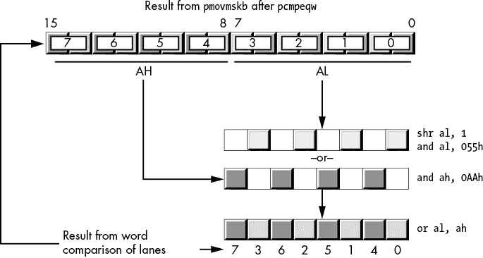

图 11-44：从`pcmpeqw`合并位

当使用双字或四字打包比较时，你也可以使用类似于此处为`pcmpeqw`提供的方案。然而，浮点掩码移动指令（见“(v)movmskps, (v)movmskpd 指令”第 676 页）通过打破使用适合数据类型的 SIMD 指令的规则，能更高效地完成这项工作。

### 11.10.11 整数转换

SSE 和 AVX 指令集扩展提供了多种指令，用于将整数值从一种形式转换为另一种形式。有零扩展和符号扩展指令，用于将较小的值转换为较大的值。其他指令则用于将较大的值转换为较小的值。本节将介绍这些指令。

#### 11.10.11.1 打包零扩展指令

*带零扩展的移动*指令执行在 表 11-21 中出现的转换。

表 11-21：SSE4.1 和 AVX 打包零扩展指令

| **语法** | **描述** |
| --- | --- |
| `pmovzxbw` `xmm`[dest]`,` `xmm`[src]`/``mem`[64] | 将 XMM[src]/mem[64] 中低 8 字节的八个字节值零扩展为 XMM[dest] 中的字值。 |
| `pmovzxbd` `xmm`[dest]`,` `xmm`[src]`/``mem`[32] | 将 XMM[src]/mem[32] 中低 4 字节的四个字节值零扩展为 XMM[dest] 中的双字值。 |
| `pmovzxbq` `xmm`[dest]`,` `xmm`[src]`/``mem`[16] | 将 XMM[src]/mem[16] 中低 2 字节的两个字节值零扩展为 XMM[dest] 中的四字值。 |
| `pmovzxwd` `xmm`[dest]`,` `xmm`[src]`/``mem`[64] | 将 XMM[src]/mem[64] 中低 8 字节的四个字值零扩展为 XMM[dest] 中的双字值。 |
| `pmovzxwq` `xmm`[dest]`,` `xmm`[src]`/``mem`[32] | 将 XMM[src]/mem[32] 中低 4 字节的两个字值零扩展为 XMM[dest] 中的四字值。 |
| `pmovzxdq` `xmm`[dest]`,` `xmm`[src]`/``mem`[64] | 将 XMM[src]/mem[64] 中低 8 字节的两个双字值零扩展为 XMM[dest] 中的四字值。 |

一组可比的 AVX 指令也存在（语法相同，但指令助记符前有 `v` 前缀）。如同往常一样，SSE 指令会保持 YMM 寄存器的上位比特不变，而 AVX 指令会将 0 存储到 YMM 寄存器的上位比特中。

AVX2 指令集扩展通过允许使用 YMM 寄存器来加倍通道数。它们与 SSE/AVX 指令采用相似的操作数（将 YMM 替换为目标寄存器，并加倍内存位置的大小），并处理两倍数量的通道，以在 YMM 目标寄存器中生成十六个字、八个双字或四个四字。有关详细信息，请参见 表 11-22。

表 11-22：AVX2 打包零扩展指令

| **语法** | **描述** |
| --- | --- |
| `v``pmovzxbw` `ymm`[dest]`,` `xmm`[src]`/``mem`[128] | 将 XMM[src]/mem[128] 中低 16 字节的十六个字节值零扩展为 YMM[dest] 中的字值。 |
| `v``pmovzxbd` `ymm`[dest]`,` `xmm`[src]`/``mem`[64] | 将 XMM[src]/mem[64] 中低 8 字节的八个字节值零扩展为 YMM[dest] 中的双字值。 |
| `v``pmovzxbq` `ymm`[dest]`,` `xmm`[src]`/``mem`[32] | 将 XMM[src]/mem[32] 中低 4 字节的四个字节值零扩展为 YMM[dest] 中的四字值。 |
| `v``pmovzxwd` `ymm`[dest]`,` `xmm`[src]`/``mem`[128] | 将 XMM[src]/mem[128] 中低 16 字节的八个字值零扩展为 YMM[dest] 中的双字值。 |
| `v``pmovzxwq` `ymm`[dest]`,` `xmm`[src]`/``mem`[64] | 将 XMM[src]/mem[64] 中低 8 字节的四个字值零扩展为 YMM[dest] 中的四字值。 |
| `v``pmovzxdq` `ymm`[dest]`,` `xmm`[src]`/``mem`[128] | 将 XMM[src]/mem[128] 中低 16 字节的四个双字值零扩展为 YMM[dest] 中的四字值。 |

#### 11.10.11.2 打包符号扩展指令

SSE/AVX/AVX2 指令集扩展提供了一组相似的指令，用于符号扩展字节、字和双字值。表 11-23 列出了 SSE 打包符号扩展指令。

表 11-23: SSE 打包符号扩展指令

| **语法** | **描述** |
| --- | --- |
| `pmovsxbw` `xmm`[dest]`,` `xmm`[src]`/``mem`[64] | 将 XMM[src]/mem[64] 中低 8 字节的八个字节值扩展为 XMM[dest] 中的字值。 |
| `pmovsxbq` `xmm`[dest]`,` `xmm`[src]`/``mem`[32] | 将 XMM[src]/mem[32] 中低 4 字节的四个字节值扩展为 XMM[dest] 中的双字值。 |
| `pmovsxbq` `xmm`[dest]`,` `xmm`[src]`/``mem`[16] | 将 XMM[src]/mem[16] 中低 2 字节的两个字节值扩展为 XMM[dest] 中的四字值。 |
| `pmovsxwd` `xmm`[dest]`,` `xmm`[src]`/``mem`[64] | 将 XMM[src]/mem[64] 中低 8 字节的四个字值扩展为 XMM[dest] 中的双字值。 |
| `pmovsxwq` `xmm`[dest]`,` `xmm`[src]`/``mem`[32] | 将 XMM[src]/mem[32] 中低 4 字节的两个字值扩展为 XMM[dest] 中的四字值。 |
| `pmovsxdq` `xmm`[dest]`,` `xmm`[src]`/mem`[64] | 将 XMM[src]/mem[64] 中低 8 字节的两个双字值扩展为 XMM[dest] 中的四字值。 |

还有一组对应的 AVX 指令（其助记符以 `v` 前缀为标识）。通常，SSE 和 AVX 指令的区别在于，SSE 指令不会改变 YMM 寄存器的高位（如果适用），而 AVX 指令则会将这些高位置为 0。

支持 AVX2 的处理器还允许 YMM[dest] 目标寄存器，这将使指令能够处理更多的（输出）值；见 表 11-24。

表 11-24: AVX 打包符号扩展指令

| **语法** | **描述** |
| --- | --- |
| `v``pmovsxbw` `ymm`[dest]`,` `xmm`[src]`/``mem`[128] | 将 XMM[src]/mem[128] 中低 16 字节的字节值扩展为 YMM[dest] 中的字值。 |
| `v``pmovsxbd` `ymm`[dest]`,` `xmm`[src]`/``mem`[64] | 将 XMM[src]/mem[64] 中低 8 字节的八个字节值扩展为 YMM[dest] 中的双字值。 |
| `v``pmovsxbq` `ymm`[dest]`,` `xmm`[src]`/``mem`[32] | 将 XMM[src]/mem[32] 中低 4 字节的四个字节值扩展为 YMM[dest] 中的四字值。 |
| `v``pmovsxwd` `ymm`[dest]`,` `xmm`[src]`/``mem`[128] | 将 XMM[src]/mem[128] 中低 16 字节的八个字值扩展为 YMM[dest] 中的双字值。 |
| `v``pmovsxwq` `ymm`[dest]`,` `xmm`[src]`/``mem`[64] | 将 XMM[src]/mem[64] 中低 8 字节的四个字值扩展为 YMM[dest] 中的四字值。 |
| `v``pmovsxdq` `ymm`[dest]`,` `xmm`[src]`/``mem`[128] | 将 XMM[src]/mem[128]的低 16 字节中的四个双字值符号扩展为 YMM[dest]中的四个四字值。 |

#### 11.10.11.3 打包符号扩展与饱和

除了将较小的有符号或无符号值转换为较大格式外，支持 SSE/AVX/AVX2 的 CPU 还能够通过饱和将较大值转换为较小值；请参见表 11-25。

表 11-25：SSE 打包符号扩展与饱和指令

| **语法** | **描述** |
| --- | --- |
| `packsswb` `xmm`[dest]`,` `xmm`[src]`/``mem`[128] | 使用符号饱和，将来自两个 128 位源的十六个有符号字值打包成一个 128 位目标寄存器中的十六个字节。 |
| `packuswb` `xmm`[dest]`,` `xmm`[src]`/``mem`[128] | 使用无符号饱和，将来自两个 128 位源的十六个无符号字值打包成一个 128 位目标寄存器中的十六个字节。 |
| `packssdw` `xmm`[dest]`,` `xmm`[src]`/``mem`[128] | 使用符号饱和，将来自两个 128 位源的八个有符号双字值打包成一个 128 位目标寄存器中的八个字节值。 |
| `packusdw` `xmm`[dest]`,` `xmm`[src]`/``mem`[128] | 使用无符号饱和，将来自两个 128 位源的八个无符号双字值打包成一个 128 位目标寄存器中的八个字。 |

饱和操作会检查其操作数，查看值是否超出结果的范围（有符号字节的范围是-128 到+127，无符号字节的范围是 0 到 255，有符号字的范围是-32,768 到+32,767，无符号字的范围是 0 到 65,535）。当饱和到字节时，如果有符号源值小于-128，字节饱和会将值设置为-128。当饱和到字时，如果有符号源值小于-32,768，有符号饱和会将值设置为-32,768。同样地，如果有符号字节或字值超过+127 或+32,767，饱和会分别将值替换为+127 或+32,767。对于无符号操作，饱和会将值限制为+255（字节）或+65,535（字）。无符号值永远不小于 0，因此无符号饱和会将值裁剪为+255 或+65,535。

支持 AVX 的 CPU 提供这些指令的 128 位变体，支持三个操作数：两个源操作数和一个独立的目标操作数。这些指令（助记符与 SSE 指令相同，但以`v`为前缀）具有以下语法：

```
vpacksswb  `xmm`[dest], `xmm`[src1], `xmm`[src2]/`mem`[128]
vpackuswb  `xmm`[dest], `xmm`[src1], `xmm`[src2]/`mem`[128]
vpackssdw  `xmm`[dest], `xmm`[src1], `xmm`[src2]/`mem`[128]
vpackusdw  `xmm`[dest], `xmm`[src1], `xmm`[src2]/`mem`[128]
```

这些指令大致等同于 SSE 变体，唯一的不同是，这些指令使用 XMM[src1]作为第一个源操作数，而不是 SSE 指令使用的 XMM[dest]。另外，SSE 指令不会修改 YMM 寄存器的高位（如果 CPU 上存在该寄存器），而 AVX 指令会将 0 存入 YMM 寄存器的高位。

支持 AVX2 的 CPU 还允许使用 YMM 寄存器（和 256 位内存位置），以便指令能够饱和更多的值（参见 表 11-26）。当然，在使用这些指令之前，请不要忘记检查 AVX2（和 AVX）兼容性。

表 11-26：AVX 打包符号扩展与饱和指令

| **语法** | **描述** |
| --- | --- |
| `v``packsswb` `ymm`[dest]`,` `ymm`[src1]`,` `ymm`[src2]`/``mem`[256] | 将来自两个 256 位源的 32 个有符号字值打包到一个 256 位目标寄存器的 32 个字节通道中，使用有符号饱和。 |
| `v``packuswb` `ymm`[dest]`,` `ymm`[src1]`,` `ymm`[src2]`/``mem`[256] | 将来自两个 256 位源的 32 个无符号字值打包到一个 256 位目标寄存器的 32 个字节通道中，使用无符号饱和。 |
| `v``packssdw` `ymm`[dest]`,` `ymm`[src1]`,` `ymm`[src2]`/``mem`[256] | 将来自两个 256 位源的 16 个有符号 dword 值打包到一个 256 位目标寄存器的 16 个字值中，使用有符号饱和。 |
| `v``packusdw` `ymm`[dest]`,` `ymm`[src1]`,` `ymm`[src2]`/``mem`[256] | 将来自两个 256 位源的 16 个无符号 dword 值打包到一个 256 位目标寄存器的 16 个字值中，使用无符号饱和。 |

## 11.11 SIMD 浮点算术运算

SSE 和 AVX 指令集扩展为“第六章中的 SSE 浮点算术”中的所有标量浮点指令提供了打包算术等效指令。本节不重复标量浮点操作的讨论；有关详细信息，请参见第六章。

128 位 SSE 打包浮点指令具有以下通用语法（其中 `instr` 是 表 11-27 中的浮点指令之一）：

```
`instr`ps `xmm`[dest], `xmm`[src]/`mem`[128]
`instr`pd `xmm`[dest], `xmm`[src]/`mem`[128]
```

*打包单精度*（`*ps`）指令同时执行四个单精度浮点运算。*打包双精度*（`*pd`）指令同时执行两个双精度浮点运算。像典型的 SSE 指令一样，这些打包算术指令计算

```
`xmm`[dest][`lane`] = `xmm`[dest][`lane`] `op` `xmm`[src]/`mem`[128][`lane`]
```

`lane` 在打包单精度指令中取值范围为 0 到 3，在打包双精度指令中取值范围为 0 到 1。`op` 表示操作（例如加法或减法）。当 SSE 指令在支持 AVX 扩展的 CPU 上执行时，SSE 指令会将 AVX 寄存器的高位保持不变。

128 位 AVX 打包浮点指令具有以下语法：^(15)

```
v`instr`ps `xmm`[dest], `xmm`[src1], `xmm`[src2]/`mem`[128] ; For dyadic operations
v`instr`pd `xmm`[dest], `xmm`[src1], `xmm`[src2]/`mem`[128] ; For dyadic operations
v`instr`ps `xmm`[dest], `xmm`[src]/`mem`[128]          ; For monadic operations
v`instr`pd `xmm`[dest], `xmm`[src]/`mem`[128]          ; For monadic operations
```

这些指令计算

```
`xmm`[dest][`lane`] = `xmm`[src1][`lane`] `op` `xmm`[src2]/`mem`[128][`lane`]
```

其中 `op` 对应于与特定指令相关的操作（例如，`vaddps` 执行打包单精度加法）。这些 128 位 AVX 指令会清除底层 YMM[dest] 寄存器的 HO 位。

256 位 AVX 打包浮点指令具有以下语法：

```
v`instr`ps `ymm`[dest], `ymm`[src1], `ymm`[src2]/`mem`[256] ; For dyadic operations
v`instr`pd `ymm`[dest], `ymm`[src1], `ymm`[src2]/`mem`[256] ; For dyadic operations
v`instr`ps `ymm`[dest], `ymm`[src]/`mem`[256]          ; For monadic operations
v`instr`pd `ymm`[dest], `ymm`[src]/`mem`[256]          ; For monadic operations
```

这些指令计算

```
`ymm`[dest][`lane`] = `ymm`[src1][`lane`] `op` `ymm`[src]/`mem`[256][`lane`]
```

其中，`op`对应于与特定指令关联的操作（例如，`vaddps`是打包的单精度加法）。由于这些指令操作的是 256 位操作数，它们计算的数据通道数是 128 位指令的两倍。具体来说，它们同时计算八个单精度结果（`v*ps`指令）或四个双精度结果（`v*pd`指令）。

表 11-27 提供了 SSE/AVX 打包指令的列表。

表 11-27：浮点数算术指令

| **指令** | **通道数** | **描述** |
| --- | --- | --- |
| `addps` | 4 | 加法四个单精度浮点数值 |
| `addpd` | 2 | 加法两个双精度浮点数值 |
| `vaddps` | 4/8 | 加法四个（128 位/XMM 操作数）或八个（256 位/YMM 操作数）单精度数值 |
| `vaddpd` | 2/4 | 加法两个（128 位/XMM 操作数）或四个（256 位/YMM 操作数）双精度数值 |
| `subps` | 4 | 减去四个单精度浮点数值 |
| `subpd` | 2 | 减去两个双精度浮点数值 |
| `vsubps` | 4/8 | 减去四个（128 位/XMM 操作数）或八个（256 位/YMM 操作数）单精度数值 |
| `vsubpd` | 2/4 | 减去两个（128 位/XMM 操作数）或四个（256 位/YMM 操作数）双精度数值 |
| `mulps` | 4 | 乘以四个单精度浮点数值 |
| `mulpd` | 2 | 乘以两个双精度浮点数值 |
| `vmulps` | 4/8 | 乘以四个（128 位/XMM 操作数）或八个（256 位/YMM 操作数）单精度数值 |
| `vmulpd` | 2/4 | 乘以两个（128 位/XMM 操作数）或四个（256 位/YMM 操作数）双精度数值 |
| `divps` | 4 | 除以四个单精度浮点数值 |
| `divpd` | 2 | 除以两个双精度浮点数值 |
| `vdivps` | 4/8 | 除以四个（128 位/XMM 操作数）或八个（256 位/YMM 操作数）单精度数值 |
| `vdivpd` | 2/4 | 除以两个（128 位/XMM 操作数）或四个（256 位/YMM 操作数）双精度数值 |
| `maxps` | 4 | 计算四个单精度浮点数值对的最大值 |
| `maxpd` | 2 | 计算两个双精度浮点数值对的最大值 |
| `vmaxps` | 4/8 | 计算四个（128 位/XMM 操作数）或八个（256 位/YMM 操作数）单精度数值对的最大值 |
| `vmaxpd` | 2/4 | 计算两个（128 位/XMM 操作数）或四个（256 位/YMM 操作数）双精度数值对的最大值 |
| `minps` | 4 | 计算四个单精度浮点数值对的最小值 |
| `minpd` | 2 | 计算两个双精度浮点数值对的最小值 |
| `vminps` | 4/8 | 计算四个（128 位/XMM 操作数）或八个（256 位/YMM 操作数）单精度数值对的最小值 |
| `vminpd` | 2/4 | 计算两个（128 位/XMM 操作数）或四个（256 位/YMM 操作数）双精度值对的最小值 |
| `sqrtps` | 4 | 计算四个单精度浮动值的平方根 |
| `sqrtpd` | 2 | 计算两个双精度浮动值的平方根 |
| `vsqrtps` | 4/8 | 计算四个（128 位/XMM 操作数）或八个（256 位/YMM 操作数）单精度值的平方根 |
| `vsqrtpd` | 2/4 | 计算两个（128 位/XMM 操作数）或四个（256 位/YMM 操作数）双精度值的平方根 |
| `rsqrtps` | 4 | 计算四个单精度浮动值的近似倒数平方根^(*) |
| `vrsqrtps` | 4/8 | 计算四个（128 位/XMM 操作数）或八个（256 位/YMM 操作数）单精度值的近似倒数平方根 |
| ^(*) 相对误差 ≤ 1.5 × 2^(-12)。 |

SSE/AVX 指令集扩展还包括浮点水平加法和减法指令。这些指令的语法如下：

```
haddps  `xmm`[dest], `xmm`[src]/`mem`[128]
vhaddps `xmm`[dest], `xmm`[src1], `xmm`[src2]/`mem`[128]
vhaddps `ymm`[dest], `ymm`[src1], `ymm`[src2]/`mem`[256]
haddpd  `xmm`[dest], `xmm`[src]/`mem`[128]
vhaddpd `xmm`[dest], `xmm`[src1], `xmm`[src2]/`mem`[128]
vhaddpd `ymm`[dest], `ymm`[src1], `ymm`[src2]/`mem`[256]

hsubps  `xmm`[dest], `xmm`[src]/`mem`[128]
vhsubps `xmm`[dest], `xmm`[src1], `xmm`[src2]/`mem`[128]
vhsubps `ymm`[dest], `ymm`[src1], `ymm`[src2]/`mem`[256]
hsubpd  `xmm`[dest], `xmm`[src]/`mem`[128]
vhsubpd `xmm`[dest], `xmm`[src1], `xmm`[src2]/`mem`[128]
vhsubpd `ymm`[dest], `ymm`[src1], `ymm`[src2]/`mem`[256]
```

至于整数水平加法和减法指令，这些指令在同一寄存器的相邻通道中加法或减法，并将结果存储到目标寄存器（通道 2），如图 11-43 所示。

## 11.12 SIMD 浮点比较指令

与整数打包比较类似，SSE/AVX 浮点比较比较两组浮点值（无论是单精度还是双精度，具体取决于指令语法），并将结果布尔值（所有 1 位表示真，所有 0 位表示假）存储到目标通道。然而，浮点比较比整数对应物更为全面。部分原因是浮点运算更为复杂；然而，CPU 设计师的硅预算不断增加也是原因之一。

### 11.12.1 SSE 和 AVX 比较

有两组基本的浮点比较：`(v)cmpps`，它比较一组打包的单精度值；和`(v)cmppd`，它比较一组打包的双精度值。这些指令并不直接将比较类型编码到助记符中，而是使用一个 imm[8]操作数，其值指定比较类型。这些指令的通用语法如下：

```
cmpps  `xmm`[dest], `xmm`[src]/`mem`[128], `imm`[8]
vcmpps `xmm`[dest], `xmm`[src1], `xmm`[src2]/`mem`[128], `imm`[8]
vcmpps `ymm`[dest], `ymm`[src1], `ymm`[src2]/`mem`[256], `imm`[8]

cmppd  `xmm`[dest], `xmm`[src]/`mem`[128], `imm`[8]
vcmppd `xmm`[dest], `xmm`[src1], `xmm`[src2]/`mem`[128], `imm`[8]
vcmppd `ymm`[dest], `ymm`[src1], `ymm`[src2]/`mem`[256], `imm`[8]
```

imm[8]操作数指定比较类型。共有 32 种可能的比较方式，详见表 11-28。

表 11-28: `cmpps`和`cmppd`指令的 imm[8]值^(†)

| **imm[8]** | **描述** | **结果** | **信号** |
| --- | --- | --- | --- |
|  |  | **A < B** | **A = B** | **A > B** | **Unord** |  |
| --- | --- | --- | --- | --- | --- | --- |
| 00h | EQ, 有序, 安静 | 0 | 1 | 0 | 0 | 否 |
| 01h | LT, 有序, 信号 | 1 | 0 | 0 | 0 | 是 |
| 02h | LE, 有序, 信号 | 1 | 1 | 0 | 0 | 是 |
| 03h | unordered，安静 | 0 | 0 | 0 | 1 | 否 |
| 04h | NE，unordered，安静 | 1 | 0 | 1 | 1 | 否 |
| 05h | NLT，unordered，信号 | 0 | 1 | 1 | 1 | 是 |
| 06h | NLE，unordered，信号 | 0 | 0 | 1 | 1 | 是 |
| 07h | ordered，安静 | 1 | 1 | 1 | 0 | 否 |
| 08h | EQ，unordered，安静 | 0 | 1 | 0 | 1 | 否 |
| 09h | NGE，unordered，信号 | 1 | 0 | 0 | 1 | 是 |
| 0Ah | NGT，unordered，信号 | 1 | 1 | 0 | 1 | 是 |
| 0Bh | 假，ordered，安静 | 0 | 0 | 0 | 0 | 否 |
| 0Ch | NE，ordered，安静 | 1 | 0 | 1 | 0 | 否 |
| 0Dh | GE，ordered，信号 | 0 | 1 | 1 | 0 | 是 |
| 0Eh | GT，ordered，信号 | 0 | 0 | 1 | 0 | 是 |
| 0Fh | 真，unordered，安静 | 1 | 1 | 1 | 1 | 否 |
| 10h | EQ，ordered，信号 | 0 | 1 | 0 | 0 | 是 |
| 11h | LT，ordered，安静 | 1 | 0 | 0 | 0 | 否 |
| 12h | LE，ordered，安静 | 1 | 1 | 0 | 0 | 否 |
| 13h | unordered，信号 | 0 | 0 | 0 | 1 | 是 |
| 14h | NE，unordered，信号 | 1 | 0 | 1 | 1 | 是 |
| 15h | NLT，unordered，安静 | 0 | 1 | 1 | 1 | 否 |
| 16h | NLE，unordered，安静 | 0 | 0 | 1 | 1 | 否 |
| 17h | ordered，信号 | 1 | 1 | 1 | 0 | 是 |
| 18h | EQ，unordered，信号 | 0 | 1 | 0 | 1 | 是 |
| 19h | NGE，unordered，安静 | 1 | 0 | 0 | 1 | 否 |
| 1Ah | NGT，unordered，安静 | 1 | 1 | 0 | 1 | 否 |
| 1Bh | 假，ordered，信号 | 0 | 0 | 0 | 0 | 是 |
| 1Ch | NE，ordered，信号 | 1 | 0 | 1 | 0 | 是 |
| 1Dh | GE，ordered，安静 | 0 | 1 | 1 | 0 | 否 |
| 1Eh | GT，ordered，安静 | 0 | 0 | 1 | 0 | 否 |
| 1Fh | 真， unordered，信号 | 1 | 1 | 1 | 1 | 是 |
| ^(†) 深色阴影条目仅在支持 AVX 扩展的 CPU 上可用。 |

“真”与“假”的比较总是将 true 或 false 存储到目标通道中。大多数情况下，这些比较并不是特别有用。`pxor`、`xorps`、`xorpd`、`vxorps` 和 `vxorpd` 指令可能更适合将 XMM 或 YMM 寄存器设置为 0。AVX2 之前，使用真比较是设置 XMM 或 YMM 寄存器所有位为 1 的最短指令，尽管 `pcmpeqb` 也常用于此（注意此后指令的微架构效率问题）。

请注意，非 AVX CPU 不支持 GT、GE、NGT 和 NGE 指令。在这些 CPU 上，可以使用反向操作（例如，使用 NLT 替代 GE），或交换操作数并使用相反条件（就像打包整数比较中所做的那样）。

### 11.12.2 无序与有序比较

无序关系在至少有一个源操作数是 NaN 时为真；有序关系在两个源操作数都不是 NaN 时为真。拥有有序和无序比较使您可以根据最终布尔结果的解释，将错误条件通过比较传递为假或真。无序结果，顾名思义，是不可比较的。当您比较两个值，其中一个不是数字时，必须始终将结果视为失败的比较。

为了处理这种情况，您可以使用有序或无序比较来强制结果为假或真，这与您最终期望的比较结果相反。例如，假设您正在比较一系列值，并希望在所有比较有效时，结果掩码为真（例如，您正在检查是否所有的 src[1] 值都大于相应的 src[2] 值）。在这种情况下，您会使用有序比较，如果被比较的某个值是 NaN，它将强制某个特定的元素为假。另一方面，如果您正在检查所有条件是否在比较后为假，则可以使用无序比较，如果任何值是 NaN，它将强制结果为真。

### 11.12.3 信号与静默比较

信号比较在操作产生静默 NaN 时会生成无效的算术操作异常 (IA)。静默比较不会抛出异常，只会在 MXCSR 中反映状态（请参见第六章中的“SSE MXCSR 寄存器”）。请注意，您也可以在 MXCSR 寄存器中屏蔽信号异常；如果要允许异常，则必须显式地将 MXCSR 中的 IM（*无效操作屏蔽*，位 7）设置为 0。

### 11.12.4 指令同义词

MASM 支持使用某些同义词，这样您就不必记住 32 种编码。表 11-29 列出了这些同义词。在此表中，*x1* 表示目标操作数（XMM[*n*] 或 YMM[*n*]），*x2* 表示源操作数（XMM[*n*]/mem[128] 或 YMM[*n*]/mem[256]，具体情况而定）。

表 11-29：常见打包浮点比较的同义词

| **同义词** | **指令** | **同义词** | **指令** |
| --- | --- | --- | --- |
| `cmpeqps` `x1``,` `x2` | `cmpps` `x1``,` `x2``, 0` | `cmpeqpd` `x1``,` `x2` | `cmppd` `x1``,` `x2``, 0` |
| `cmpltps` `x1``,` `x2` | `cmpps` `x1``,` `x2``, 1` | `cmpltpd` `x1``,` `x2` | `cmppd` `x1``,` `x2``, 1` |
| `cmpleps` `x1``,` `x2` | `cmpps` `x1``,` `x2``, 2` | `cmlepd` `x1``,` `x2` | `cmppd` `x1``,` `x2``, 2` |
| `cmpunordps` `x1``,` `x2` | `cmpps` `x1``,` `x2``, 3` | `cmpunordpd` `x1``,` `x2` | `cmppd` `x1``,` `x2``, 3` |
| `cmpneqps` `x1``,` `x2` | `cmpps` `x1``,` `x2``, 4` | `cmpneqpd` `x1``,` `x2` | `cmppd` `x1``,` `x2``, 4` |
| `cmpnltps` `x1``,` `x2` | `cmpps` `x1``,` `x2``, 5` | `cmpnltpd` `x1``,` `x2` | `cmppd` `x1``,` `x2``, 5` |
| `cmpnleps` `x1``,` `x2` | `cmpps` `x1``,` `x2``, 6` | `cmpnlepd` `x1``,` `x2` | `cmppd` `x1``,` `x2``, 6` |
| `cmpordps` `x1``,` `x2` | `cmpps` `x1``,` `x2``, 7` | `cmpordpd` `x1``,` `x2` | `cmppd` `x1``,` `x2``, 7` |

同义词允许你编写诸如

```
cmpeqps  xmm0, xmm1
```

而不是

```
cmpps  xmm0, xmm1, 0       ; Compare xmm0 to xmm1 for equality
```

显然，使用同义词可以使代码更易读和理解。并非所有的比较都有同义词。为了创建易读的同义词，对于 MASM 不支持的指令，可以使用宏（或更具可读性的符号常量）。有关宏的更多信息，请参阅第十三章。

### 11.12.5 AVX 扩展比较

这些指令的 AVX 版本支持三个寄存器操作数：目标 XMM 或 YMM 寄存器、源 XMM 或 YMM 寄存器，以及源 XMM 或 YMM 寄存器或 128 位或 256 位内存位置（后面跟着指定比较类型的 imm[8]操作数）。基本语法如下：

```
vcmpps `xmm`[dest], `xmm`[src1], `xmm`[src2]/`mem`[128], `imm`[8]
vcmpps `ymm`[dest], `ymm`[src1], `ymm`[src2]/`mem`[256], `imm`[8]

vcmppd `xmm`[dest], `xmm`[src1], `xmm`[src2]/`mem`[128], `imm`[8]
vcmppd `ymm`[dest], `ymm`[src1], `ymm`[src2]/`mem`[256], `imm`[8]
```

128 位的`vcmpps`指令比较 XMM[src1]寄存器每个通道中的四个单精度浮点值与相应的 XMM[src2]/mem[128]通道中的值，并将结果（全 1 位表示真，全 0 位表示假）存储到 XMM[dest]寄存器的相应通道。256 位的`vcmpps`指令比较 YMM[src1]寄存器每个通道中的八个单精度浮点值与相应的 YMM[src2]/mem[256]通道中的值，并将真或假的结果存储到 YMM[dest]寄存器的相应通道。

`vcmppd`指令比较两个通道（128 位版本）或四个通道（256 位版本）中的双精度值，并将结果存储到目标寄存器的相应通道中。

对于 SSE 比较指令，AVX 指令提供了同义词，省去了记忆 32 个 imm[8]值的需要。表 11-30 列出了这 32 个指令同义词。

表 11-30：AVX 打包比较指令

| **imm[8]** | **指令** |
| --- | --- |
| 00h | `vcmpeqps` 或 `vcmpeqpd` |
| 01h | `vcmpltps` 或 `vcmpltpd` |
| 02h | `vcmpleps` 或 `vcmplepd` |
| 03h | `vcmpunordps` 或 `vcmpunordpd` |
| 04h | `vcmpneqps` 或 `vcmpneqpd` |
| 05h | `vcmpltps` 或 `vcmpltpd` |
| 06h | `vcmpleps` 或 `vcmplepd` |
| 07h | `vcmpordps` 或 `vcmpordpd` |
| 08h | `vcmpeq_uqps` 或 `vcmpeq_uqpd` |
| 09h | `vcmpngeps` 或 `vcmpngepd` |
| 0Ah | `vcmpngtps` 或 `vcmpngtpd` |
| 0Bh | `vcmpfalseps` 或 `vcmpfalsepd` |
| 0Ch | `vcmpneq_oqps` 或 `vcmpneq_oqpd` |
| 0Dh | `vcmpgeps` 或 `vcmpgepd` |
| 0Eh | `vcmpgtps` 或 `vcmpgtpd` |
| 0Fh | `vcmptrueps` 或 `vcmptruepd` |
| 10h | `vcmpeq_osps` 或 `vcmpeq_ospd` |
| 11h | `vcmplt_oqps` 或 `vcmplt_oqpd` |
| 12h | `vcmple_oqps` 或 `vcmple_oqpd` |
| 13h | `vcmpunord_sps` 或 `vcmpunord_spd` |
| 14h | `vcmpneq_usps` 或 `vcmpneq_uspd` |
| 15h | `vcmpnlt_uqps` 或 `vcmpnlt_uqpd` |
| 16h | `vcmpnle_uqps` 或 `vcmpnle_uqpd` |
| 17h | `vcmpord_sps` 或 `vcmpord_spd` |
| 18h | `vcmpeq_usps` 或 `vcmpeq_uspd` |
| 19h | `vcmpnge_uqps` 或 `vcmpnge_uqpd` |
| 1Ah | `vcmpngt_uqps` 或 `vcmpngt_uqpd` |
| 1Bh | `vcmpfalse_osps` 或 `vcmpfalse_ospd` |
| 1Ch | `vcmpneq_osps` 或 `vcmpneq_ospd` |
| 1Dh | `vcmpge_oqps` 或 `vcmpge_oqpd` |
| 1Eh | `vcmpgt_oqps` 或 `vcmpgt_oqpd` |
| 1Fh | `vcmptrue_usps` 或 `vcmptrue_uspd` |

### 11.12.6 使用 SIMD 比较指令

对于整数比较（见第 662 页的“使用打包比较结果”），浮点比较指令生成一个布尔结果的向量，你可以用这个向量对数据通道执行进一步操作。你可以使用打包逻辑指令（`pand` 和 `vpand`，`pandn` 和 `vpandn`，`por` 和 `vpor`，以及 `pxor` 和 `vpxor`）来处理这些结果。你还可以提取单个通道的值，并用条件跳转来测试它们，尽管这绝对不是 SIMD 的处理方式；接下来的章节会描述一种提取这些掩码的方法。

### 11.12.7 (v)movmskps、(v)movmskpd 指令

`movmskps` 和 `movmskpd` 指令从它们的打包单精度和双精度浮点源操作数中提取符号位，并将这些位存储到通用寄存器的低 4 位（或 8 位）中。其语法为

```
movmskps  `reg`, `xmm`[src]
movmskpd  `reg`, `xmm`[src] 
vmovmskps `reg`, `ymm`[src]
vmovmskpd `reg`, `ymm`[src]
```

其中 `reg` 是任意 32 位或 64 位通用整数寄存器。

`movmskps` 指令从 XMM 源寄存器中的四个单精度浮点值中提取符号位，并将这些位复制到目标寄存器的低 4 位中，如图 11-45 所示。

`movmskpd` 指令将源 XMM 寄存器中的两个双精度浮点值的符号位复制到目标寄存器的第 0 位和第 1 位，如图 11-46 所示。

`vmovmskps` 指令从 XMM 和 YMM 源寄存器中的四个或八个单精度浮点值中提取符号位，并将这些位复制到目标寄存器的低 4 位或 8 位中。图 11-47 显示了使用 YMM 源寄存器的这一操作。

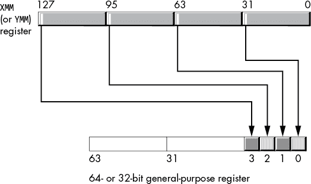

图 11-45: `movmskps` 操作

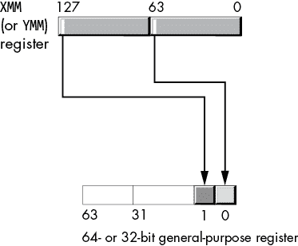

图 11-46: `movmskpd` 操作

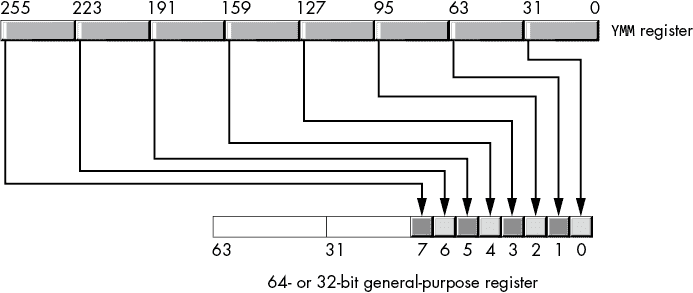

图 11-47: `vmovmskps` 操作

`vmovmskpd` 指令从源 YMM 寄存器中的四个双精度浮点值复制符号位到目标寄存器的第 0 到第 3 位中，如图 11-48 所示。

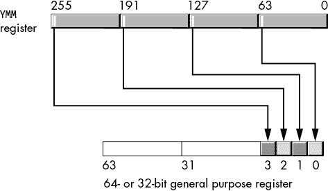

图 11-48: `vmovmskpd` 操作

当使用 XMM 源寄存器时，此指令将从两个双精度浮点值中复制符号位到目标寄存器的第 0 位和第 1 位。在所有情况下，这些指令会将结果零扩展到通用目标寄存器的高位。请注意，这些指令不允许使用内存操作数。

虽然这些指令的声明数据类型是打包单精度和打包双精度，但你也将使用这些指令处理 32 位整数（`movmskps`和`vmovmskps`）和 64 位整数（`movmskpd`和`vmovmskpd`）。具体来说，这些指令非常适合从各种通道中提取 1 位布尔值，尤其是在进行（dword 或 qword）打包整数比较之后，以及在进行单精度或双精度浮点比较后（请记住，虽然打包浮点比较比较的是浮点值，其结果实际上是整数值）。

考虑以下指令序列：

```
 cmpeqpd  xmm0, xmm1
         movmskpd rax,  xmm0      ; Moves 2 bits into RAX
         lea      rcx,  jmpTable
         jmp      qword ptr [rcx][rax*8]

jmpTable qword    nene
         qword    neeq
         qword    eqne
         qword    eqeq
```

由于`movmskpd`从 XMM0 提取 2 位并将它们存储到 RAX 中，因此这段代码可以使用 RAX 作为跳转表的索引来选择四个不同的分支标签。如果两个比较都产生不相等，`nene`标签下的代码会执行；当通道 0 的值相等但通道 1 的值不等时，跳转到`neeq`标签；当通道 0 的值不等但通道 1 的值相等时，跳转到`eqne`标签；最后，当两个通道的值都相等时，跳转到`eqeq`标签。

## 11.13 浮点转换指令

在之前的描述中，我介绍了几条指令，用于在各种标量浮点数和整数格式之间转换数据（详见第六章的“SSE 浮点转换”）。这些指令的变体也存在于打包数据转换中。表 11-31 列出了你将常用的许多这些指令。

表 11-31：SSE 转换指令

| **指令语法** | **描述** |
| --- | --- |
| `cvtdq2pd` `xmm`[dest]`,` `xmm`[src]`/``mem`[64] | 将 XMM[src]/mem[64]中的两个打包带符号双字整数转换为 XMM[dest]中的两个打包双精度浮点值。如果存在 YMM 寄存器，则此指令保持 HO 位不变。 |
| `vcvtdq2pd` `xmm`[dest]`,` `xmm`[src]`/``mem`[64] | （AVX）将 XMM[src]/mem[64]中的两个打包带符号双字整数转换为 XMM[dest]中的两个打包双精度浮点值。此指令将 0 存储到底层 YMM 寄存器的 HO 位。 |
| `vcvtdq2pd` `ymm`[dest]`,` `xmm`[src]`/``mem`[128] | （AVX）将 XMM[src]/mem[128]中的四个打包带符号双字整数转换为 YMM[dest]中的四个打包双精度浮点值。 |
| `cvtdq2ps` `xmm`[dest]`,` `xmm`[src]`/``mem`[128] | 将 XMM[src]/mem[128]中的四个打包带符号双字整数转换为 XMM[dest]中的四个打包单精度浮点值。如果存在 YMM 寄存器，则此指令保持 HO 位不变。 |
| `vcvtdq2ps` `xmm`[dest]`,` `xmm`[src]`/``mem`[128] | （AVX）将 XMM[src]/mem[128]中的四个打包带符号双字整数转换为 XMM[dest]中的四个打包单精度浮点值。如果存在 YMM 寄存器，则此指令将 0 写入 HO 位。 |
| `vcvtdq2ps` `ymm`[dest]`,` `ymm`[src]`/``mem`[256] | (AVX) 将 YMM[src]/mem[256] 中的八个打包的有符号双字整数转换为 YMM[dest] 中的八个打包的单精度浮点值。如果 YMM 寄存器存在，此指令将 HO 位写入 0。 |
| `cvtpd2dq` `xmm`[dest]`,` `xmm`[src]`/``mem`[128] | 将 XMM[src]/mem[128] 中的两个打包的双精度浮点值转换为 XMM[dest] 中的两个打包的有符号双字整数。如果 YMM 寄存器存在，此指令将保持 HO 位不变。浮点到整数的转换使用当前的 SSE 四舍五入模式。 |
| `vcvtpd2dq` `xmm`[dest]`,` `xmm`[src]`/``mem`[128] | (AVX) 将 XMM[src]/mem[128] 中的两个打包的双精度浮点值转换为 XMM[dest] 中的两个打包的有符号双字整数。此指令将 0 存入底层 YMM 寄存器的 HO 位。浮点到整数的转换使用当前的 AVX 四舍五入模式。 |
| `vcvtpd2dq` `xmm`[dest]`,` `ymm`[src]`/``mem`[256] | (AVX) 将 YMM[src]/mem[256] 中的四个打包的双精度浮点值转换为 XMM[dest] 中的四个打包的有符号双字整数。浮点到整数的转换使用当前的 AVX 四舍五入模式。 |
| `cvtpd2ps` `xmm`[dest]`,` `xmm`[src]`/``mem`[128] | 将 XMM[src]/mem[128] 中的两个打包的双精度浮点值转换为 XMM[dest] 中的两个打包的单精度浮点值。如果 YMM 寄存器存在，此指令将保持 HO 位不变。 |
| `vcvtpd2ps` `xmm`[dest]`,` `xmm`[src]`/``mem`[128] | (AVX) 将 XMM[src]/mem[128] 中的两个打包的双精度浮点值转换为 XMM[dest] 中的两个打包的单精度浮点值。此指令将 0 存入底层 YMM 寄存器的 HO 位。 |
| `vcvtpd2ps` `xmm`[dest]`,` `ymm`[src]`/``mem`[256] | (AVX) 将 YMM[src]/mem[256] 中的四个打包的双精度浮点值转换为 YMM[dest] 中的四个打包的单精度浮点值。 |
| `cvtps2dq` `xmm`[dest]`,` `xmm`[src]`/``mem`[128] | 将 XMM[src]/mem[128] 中的四个打包的单精度浮点值转换为 XMM[dest] 中的四个打包的有符号双字整数。如果 YMM 寄存器存在，此指令将保持 HO 位不变。浮点到整数的转换使用当前的 SSE 四舍五入模式。 |
| `vcvtps2dq` `xmm`[dest]`,` `xmm`[src]`/``mem`[128] | (AVX) 将 XMM[src]/mem[128] 中的四个打包的单精度浮点值转换为 XMM[dest] 中的四个打包的有符号双字整数。此指令将 0 存入底层 YMM 寄存器的 HO 位。浮点到整数的转换使用当前的 AVX 四舍五入模式。 |
| `vcvtps2dq` `ymm`[dest]`,` `ymm`[src]`/``mem`[256] | （AVX）将来自 YMM[src]/mem[256]的八个打包的单精度浮点值转换为 YMM[dest]中的八个打包的有符号双字整数。浮点到整数的转换使用当前的 AVX 舍入模式。 |
| `cvtps2pd` `xmm`[dest]`,` `xmm`[src]`/``mem`[64] | 将来自 XMM[src]/mem[64]的两个打包的单精度浮点值转换为 XMM[dest]中的两个打包的双精度值。如果存在 YMM 寄存器，此指令将保持 HO 位不变。 |
| `vcvtps2pd` `xmm`[dest]`,` `xmm`[src]`/``mem`[64] | （AVX）将来自 XMM[src]/mem[64]的两个打包的单精度浮点值转换为 XMM[dest]中的两个打包的双精度值。此指令将 0 存储到底层 YMM 寄存器的 HO 位。 |
| `vcvtps2pd` `ymm`[dest]`,` `xmm`[src]`/``mem`[128] | （AVX）将来自 XMM[src]/mem[128]的四个打包的单精度浮点值转换为 YMM[dest]中的四个打包的双精度值。 |
| `cvttpd2dq` `xmm`[dest]`,` `xmm`[src]`/``mem`[128] | 将来自 XMM[src]/mem[128]的两个打包的双精度浮点值转换为 XMM[dest]中的两个打包的有符号双字整数，使用截断。如果存在 YMM 寄存器，此指令将保持 HO 位不变。 |
| `vcvttpd2dq` `xmm`[dest]`,` `xmm`[src]`/``mem`[128] | （AVX）将来自 XMM[src]/mem[128]的两个打包的双精度浮点值转换为 XMM[dest]中的两个打包的有符号双字整数，使用截断。此指令将 0 存储到底层 YMM 寄存器的 HO 位。 |
| `vcvttpd2dq` `xmm`[dest]`,` `ymm`[src]`/``mem`[256] | （AVX）将来自 YMM[src]/mem[256]的四个打包的双精度浮点值转换为 XMM[dest]中的四个打包的有符号双字整数，使用截断。 |
| `cvttps2dq` `xmm`[dest]`,` `xmm`[src]`/``mem`[128] | 将来自 XMM[src]/mem[128]的四个打包的单精度浮点值转换为 XMM[dest]中的四个打包的有符号双字整数，使用截断。如果存在 YMM 寄存器，此指令将保持 HO 位不变。 |
| `vcvttps2dq` `xmm`[dest]`,` `xmm`[src]`/``mem`[128] | （AVX）将来自 XMM[src]/mem[128]的四个打包的单精度浮点值转换为 XMM[dest]中的四个打包的有符号双字整数，使用截断。此指令将 0 存储到底层 YMM 寄存器的 HO 位。 |
| `vcvttps2dq` `ymm`[dest]`,` `ymm`[src]`/``mem`[256] | （AVX）将来自 YMM[src]/mem[256]的八个打包的单精度浮点值转换为 YMM[dest]中的八个打包的有符号双字整数，使用截断。 |

## 11.14 对齐 SIMD 内存访问

大多数 SSE 和 AVX 指令要求它们的内存操作数位于 16 字节（SSE）或 32 字节（AVX）边界上，但这并不总是可能的。处理未对齐内存地址的最简单方法是使用不要求对齐内存操作数的指令，例如 `movdqu`、`movups` 和 `movupd`。然而，使用未对齐的数据移动指令的性能损失通常会削弱使用 SSE/AVX 指令的初衷。

相反，SIMD 指令对齐数据的技巧是通过使用标准的通用寄存器处理前几个数据项，直到达到一个正确对齐的地址。例如，假设你想使用 `pcmpeqb` 指令比较一个大字节数组中的 16 字节块。`pcmpeqb` 要求它的内存操作数位于 16 字节对齐的地址上，因此如果内存操作数尚未 16 字节对齐，你可以使用标准（非 SSE）指令处理数组中的前 1 到 15 个字节，直到你达到一个适合 `pcmpeqb` 的地址。例如：

```
cmpLp:  mov  al, [rsi]
        cmp  al, someByteValue
        je   foundByte
        inc  rsi
        test rsi, 0Fh
        jnz  cmpLp
 `Use SSE instructions here, as RSI is now 16-byte-aligned` 
```

将 RSI 与 0Fh 进行按位与运算，如果 RSI 的低 4 位包含 0，则会产生 0 的结果（并设置零标志）。如果 RSI 的低 4 位包含 0，则它所包含的地址是按 16 字节边界对齐的。^(16)

这种方法的唯一缺点是，在获得适当地址之前，你必须单独处理最多 15 字节。那是 6 × 15，或者 90 条机器指令。然而，对于大块数据（例如，超过约 48 或 64 字节），你可以摊销单字节比较的成本，这种方法就不那么糟糕了。

为了提高这段代码的性能，你可以修改初始地址，使其从 16 字节边界开始。将 RSI 中的值（在这个特定示例中）与 0FFFFFFFFFFFFFFF0h（–16）进行按位与运算，修改 RSI，使其保存包含原始地址的 16 字节块的起始地址。^(17)

```
 and  rsi, -16
```

为了避免匹配数据结构开始前的非预期字节，我们可以创建一个掩码来覆盖多余的字节。例如，假设我们使用以下指令序列快速比较每次 16 字节：

```
 sub      rsi, 16
cmpLp:     add      rsi, 16
           movdqa   xmm0, xmm2   ; XMM2 contains bytes to test
           pcmpeqb  xmm0, [rsi]
           pmovmskb eax, xmm0
           ptest    eax, eax
           jz       cmpLp
```

如果在执行此代码之前使用 AND 指令对 RSI 寄存器进行对齐，那么在比较前 16 字节时，我们可能会得到错误的结果。为了解决这个问题，我们可以创建一个掩码，消除任何来自非预期比较的位。为了创建这个掩码，我们从所有 1 位开始，并将与 16 字节块的开始到我们要比较的第一个实际数据项对应的位清零。可以使用以下表达式来计算此掩码：

```
-1 << (startAdrs & 0xF)  ; Note: -1 is all 1 bits
```

这将在数据比较之前的位置创建 0 位，并在其后创建 1 位（对于前 16 字节）。我们可以使用此掩码将 `pmovmskb` 指令的非预期位结果清零。以下代码片段演示了这一技巧：

```
 mov    rcx, rsi
           and    rsi, -16   ; Align to 16 bits
           and    ecx, 0fH   ; Strip out offset of start of data
           mov    ebx, -1    ; 0FFFFFFFFh – all 1 bits
           shl    ebx, cl    ; Create mask

; Special case for the first 1 to 16 bytes:

           movdqa   xmm0, xmm2
           pcmpeqb  xmm0, [rsi]
           pmovmskb eax, xmm0
           and      eax, ebx
           jnz      foundByte
cmpLp:     add      rsi, 16
           movdqa   xmm0, xmm2   ; XMM2 contains bytes to test
           pcmpeqb  xmm0, [rsi]
           pmovmskb eax, xmm0
           test     eax, eax
           jz       cmpLp
foundByte:
 `Do whatever needs to be done when the block of 16 bytes`
 `contains at least one match between the bytes in XMM2`
 `and the data at RSI` 
```

假设例如，地址已经对齐到 16 字节边界。将该值与 0Fh 做按位与操作会得到 0。将 -1 向左移动零位得到 -1（全是 1 位）。稍后，当代码将其与通过 `pcmpeqb` 和 `pmovmskb` 指令获得的掩码做按位与操作时，结果不会改变。因此，代码测试所有 16 个字节（如果原始地址是 16 字节对齐的话，我们希望如此）。

当 RSI 中的地址在低 4 位中具有 0001b 的值时，实际数据从 16 字节块的偏移量 1 开始。因此，在将 XMM2 中的值与 [RSI] 处的 16 字节进行比较时，我们希望忽略第一个字节。在这种情况下，掩码为 0FFFFFFFEh，除了位 0 为 0 外，其余均为 1。比较后，如果 EAX 的第 0 位包含 1（表示偏移 0 处的字节匹配），则按位与操作会将该位消除（将其替换为 0），以免影响比较。同样，如果块的起始偏移量是 2、3、...、15，`shl` 指令会修改 EBX 中的位掩码，将这些偏移量处的字节从首次比较操作中排除。结果是，只需 11 条指令即可完成与原始（逐字节比较）示例中最多 90 条指令相同的工作。

## 11.15 对齐字、双字和四字对象地址

在对齐非字节大小的对象时，你可以按对象的大小（以字节为单位）增加指针，直到获得一个 16 字节（或 32 字节）对齐的地址。但是，只有当对象大小为 2、4 或 8 时，这种方法才有效（因为其他任何值都可能错过那些是 16 的倍数的地址）。

例如，你可以逐字处理一个包含单词对象的数组的前几个元素（其中数组的第一个元素在内存中出现在偶数地址），每次增加指针值 2，直到你得到一个可以被 16（或 32）整除的地址。需要注意的是，这种方法只有在对象数组的起始地址是元素大小的倍数时才有效。例如，如果一个包含单词值的数组从内存中的奇数地址开始，你无法通过每次加 2 得到一个可以被 16 或 32 整除的地址，且在没有先将数据移动到另一个正确对齐的内存位置之前，无法使用 SSE/AVX 指令处理该数据。

## 11.16 用多个相同值填充 XMM 寄存器

对于许多 SIMD 算法，你可能需要在 XMM 或 YMM 寄存器中存储相同值的多个副本。你可以使用 `(v)movddup`、`(v)movshdup`、`(v)pinsd`、`(v)pinsq` 和 `(v)pshufd` 指令来处理单精度和双精度浮点数。例如，如果你有一个单精度浮点值 `r4var` 存储在内存中，并且你想要在整个 XMM0 中复制它，你可以使用以下代码：

```
movss  xmm0, r4var
pshufd xmm0, xmm0, 0    ; Lanes 3, 2, 1, and 0 from lane 0
```

要将一对双精度浮点数从 `r8var` 复制到 XMM0 中，你可以使用：

```
movsd  xmm0, r8var
pshufd xmm0, xmm0, 44h  ; Lane 0 to lanes 0 and 2, 1 to 1, and 3
```

当然，`pshufd`实际上是为双字整数操作设计的，因此在`movsd`或`movss`之后立即使用`pshufd`可能会涉及额外的延迟（时间）。尽管`pshufd`允许内存操作数，但该操作数必须是 16 字节对齐的 128 位内存操作数，因此它不适用于通过 XMM 寄存器直接复制浮点值。

对于双精度浮点值，你可以使用`movddup`将单个 64 位浮点数复制到 XMM 寄存器的低位到高位：

```
movddup xmm0, r8var
```

`movddup`指令允许不对齐的 64 位内存操作数，因此它可能是复制双精度值的最佳选择。

要在 XMM 寄存器中复制字节、字、双字或四字整数值，`pshufb`、`pshufw`、`pshufd`或`pshufq`指令是不错的选择。例如，要在 XMM0 中复制一个字节，你可以使用以下指令序列：

```
movzx  eax, byteToCopy
movd   xmm0, eax
pxor   xmm1, xmm1   ; Mask to copy byte 0 throughout
pshufb xmm0, xmm1
```

XMM1 操作数是一个包含掩码的字节数组，用于将数据从 XMM0 中的位置复制到 XMM0 自身。值 0 将 XMM0 中的字节 0 复制到 XMM0 中的所有其他位。通过简单地更改 XMM1 中的掩码值，你可以使用相同的代码复制字、双字和四字。或者，你也可以使用`pshuflw`或`pshufd`指令来完成此任务。这里是另一个变体，它将一个字节复制到 XMM0 中的所有位置：

```
movzx     eax, byteToCopy
mov       ah, al
movd      xmm0, eax
punpcklbw xmm0, xmm0    ; Copy bytes 0 and 1 to 2 and 3
pshufd    xmm0, xmm0, 0 ; Copy LO dword throughout
```

## 11.17 将一些常见常量加载到 XMM 和 YMM 寄存器

没有 SSE/AVX 指令可以将立即数常量加载到寄存器中。然而，你可以使用几个惯用法（技巧）将某些常见的常量值加载到 XMM 或 YMM 寄存器中。本节讨论了这些惯用法的一些例子。

向 SSE/AVX 寄存器加载 0 使用的惯用法与通用整数寄存器相同：将寄存器与自身进行异或。例如，要将 XMM0 中的所有位设置为 0，你可以使用以下指令：

```
pxor xmm0, xmm0
```

要将 XMM 或 YMM 寄存器中的所有位设置为 1，你可以使用`pcmpeqb`指令，如下所示：

```
pcmpeqb xmm0, xmm0
```

因为任何给定的 XMM 或 YMM 寄存器都等于它自身，所以该指令将 0FFh 存储到 XMM0 的所有字节中（或者任何你指定的 XMM 或 YMM 寄存器中）。

如果你想将 8 位值 01h 加载到 XMM 寄存器的所有 16 个字节中，你可以使用以下代码（来自 Intel）：

```
pxor    xmm0, xmm0
pcmpeqb xmm1, xmm1
psubb   xmm0, xmm1   ; 0 - (-1) is (1)
```

如果你想创建 16 位或 32 位结果（例如，XMM0 中的四个 32 位双字，每个包含值 00000001h），你可以在此示例中将`psubb`替换为`psubw`或`psubd`。

如果你希望 1 位位于不同的比特位置（而不是每个字节的比特 0），你可以在前面的序列之后使用`pslld`指令来重新定位这些位。例如，如果你想将 XMM0 寄存器加载为 8080808080808080h，你可以使用以下指令序列：

```
pxor    xmm0, xmm0
pcmpeqb xmm1, xmm1
psubb   xmm0, xmm1
pslld   xmm0, 7         ; 01h -> 80h in each byte
```

当然，你可以为`pslld`提供不同的立即数常量，以将寄存器中的每个字节加载为 02h、04h、08h、10h、20h 或 40h。

这是一个巧妙的技巧，你可以用它将 2^(*n*) – 1（直到第 *n* 位的所有 1 位）加载到 SSE/AVX 寄存器的所有通道中：^(18)

```
; For 16-bit lanes:

pcmpeqd  xmm0, xmm0     ; Set all bits to 1
psrlw    xmm0, 16 - `n`   ; Clear top 16 - `n` bits of xmm0

; For 32-bit lanes:

pcmpeqd  xmm0, xmm0     ; Set all bits to 1
psrld    xmm0, 32 - `n`   ; Clear top 16 - `n` bits of xmm0

; For 64-bit lanes:

pcmpeqd  xmm0, xmm0     ; Set all bits to 1
psrlq    xmm0, 64 - `n`   ; Clear top 16 - `n` bits of xmm0
```

你还可以通过左移而非右移来加载反向位（NOT(2^(*n*) – 1)，即从第 *n* 位到寄存器末尾的所有 1 位）：

```
; For 16-bit lanes:

pcmpeqd  xmm0, xmm0     ; Set all bits to 1
psllw    xmm0, `n`        ; Clear bottom `n` bits of xmm0

; For 32-bit lanes:

pcmpeqd  xmm0, xmm0     ; Set all bits to 1
pslld    xmm0, `n`        ; Clear bottom `n` bits of xmm0

; For 64-bit lanes:

pcmpeqd  xmm0, xmm0     ; Set all bits to 1
psllq    xmm0, `n`        ; Clear bottom `n` bits of xmm0
```

当然，你也可以通过将常量放入内存位置（最好是 16 字节或 32 字节对齐）来加载常量到 XMM 或 YMM 寄存器中，然后使用`movdqu`或`movdqa`指令将该值加载到寄存器中。不过，值得注意的是，如果内存中的数据没有出现在缓存中，这样的操作可能会比较慢。另一种可能性是，如果常量足够小，可以将常量加载到 32 位或 64 位的整数寄存器中，并使用`movd`或`movq`将该值复制到 XMM 寄存器中。

## 11.18 设置、清除、反转和测试 SSE 寄存器中的单个位

这是 Raymond Chen 提出的另一组技巧（[`blogs.msdn.microsoft.com/oldnewthing/20141222-00/?p=43333/`](https://blogs.msdn.microsoft.com/oldnewthing/20141222-00/?p=43333/)），用于设置、清除或测试 XMM 寄存器中的单个位。

要设置单个位（假设第 *n* 位是常量），同时清除其他所有位，你可以使用以下宏：

```
; setXBit - Sets bit `n` in SSE register xReg.

setXBit  macro   xReg, n
         pcmpeqb xReg, xReg   ; Set all bits in xReg
         psrlq   xReg, 63     ; Set both 64-bit lanes to 01h
         if      n lt 64
         psrldq  xReg, 8      ; Clear the upper lane
         else
         pslldq  xReg, 8      ; Clear the lower lane
         endif
         if      (n and 3fh) ne 0
         psllq   xReg, (n and 3fh)
         endif
         endm
```

一旦你可以用单个位的值填充 XMM 寄存器，你就可以使用该寄存器的值在另一个 XMM 寄存器中设置、清除、反转或测试该位。例如，要在 XMM1 中设置第 *n* 位，而不影响 XMM1 中的其他位，你可以使用以下代码序列：

```
setXBit xmm0, `n`      ; Set bit `n` in XMM1 to 1 without
por     xmm1, xmm0   ; affecting any other bits
```

要清除 XMM 寄存器中的第 *n* 位，你可以使用相同的指令序列，但将`vpandn`（与非）指令替换为`por`指令：

```
setXBit xmm0, `n`            ; Clear bit `n` in XMM1 without
vpandn  xmm1, xmm0, xmm1   ; affecting any other bits
```

要反转一个位，只需将`pxor`替换为`por`或`vpandn`：

```
setXBit xmm0, `n`      ; Invert bit `n` in XMM1 without
pxor    xmm1, xmm0   ; affecting any other bits
```

要测试一个位是否已设置，你有几种选择。如果你的 CPU 支持 SSE4.1 指令集扩展，你可以使用`ptest`指令：

```
setXBit xmm0, `n`      ; Test bit `n` in XMM1
ptest   xmm1, xmm0
jnz     bitNisSet    ; Fall through if bit `n` is clear
```

如果你使用的是不支持`ptest`指令的老款 CPU，你可以如下使用`pmovmskb`：

```
; Remember, psllq shifts bits, not bytes.
; If bit `n` is not in bit position 7 of a given
; byte, then move it there. For example, if `n` = 0, then
; (7 - (0 and 7)) is 7, so psllq moves bit 0 to bit 7.

movdqa   xmm0, xmm1
if       7 - (`n` and 7)
psllq    xmm0, 7 - (`n` and 7)
endif

; Now that the desired bit to test is sitting in bit position
; 7 of *some* byte, use pmovmskb to extract all bit 7s into AX:

pmovmskb eax, xmm0

; Now use the (integer) test instruction to test that bit:

test    ax, 1 shl (`n` / 8)
jnz     bitNisSet
```

## 11.19 使用单一递增索引处理两个向量

有时你的代码需要同时处理两块数据，在循环执行过程中，指针会同时递增到两块数据中。

一种简单的方法是使用缩放索引寻址模式。如果 R8 和 R9 中包含指向你要处理的数据的指针，你可以通过使用如下代码遍历两个数据块：

```
 dec rcx
blkLoop:  inc rcx
          mov eax, [r8][rcx * 4]
          cmp eax, [r9][rcx * 4]
          je  theyreEqual
          cmp eax, sentinelValue
          jne blkLoop
```

这段代码通过两个 dword 数组进行遍历并比较值（用于搜索数组中相同索引处的相等值）。该循环使用了四个寄存器：EAX 用于比较数组中的两个值，两个数组的指针（R8 和 R9），然后是 RCX 索引寄存器，用于遍历两个数组。

通过在此循环中递增 R8 和 R9 寄存器，可以消除循环中的 RCX（假设修改 R8 和 R9 中的值是可以接受的）：

```
 sub r8, 4
          sub r9, 4
blkLoop:  add r8, 4
 add r9, 4
          mov eax, [r8]
          cmp eax, [r9]
          je  theyreEqual
          cmp eax, sentinelValue
          jne blkLoop
```

这种方案在循环中需要额外的 `add` 指令。如果该循环的执行速度至关重要，插入这条额外的加法指令可能会成为一个障碍。

然而，你可以使用一个巧妙的技巧，这样你每次迭代时只需要增量一个寄存器：

```
 sub r9, r8            ; R9 = R9 - R8
          sub r8, 4
blkLoop:  add r8, 4
          mov eax, [r8]
          cmp eax, [r9][r8 * 1] ; Address = R9 + R8
          je  theyreEqual
          cmp eax, sentinelValue
          jne blkLoop
```

注释在这里是因为它们解释了所使用的技巧。在代码的开始部分，你从 R9 中减去 R8 的值，并将结果保留在 R9 中。在循环体内，你通过使用 `[r9][r8 * 1]` 缩放索引寻址模式来补偿这个减法（其有效地址是 R8 和 R9 的和，从而恢复 R9 至其原始值，至少在循环的第一次迭代时是如此）。现在，因为 `cmp` 指令的内存地址是 R8 和 R9 的和，向 R8 加 4 也会将 4 加到 `cmp` 指令使用的有效地址上。因此，在每次循环迭代时，`mov` 和 `cmp` 指令会查看各自数组的连续元素，但代码只需要增量一个指针。

这种方案在使用 SSE 和 AVX 指令处理 SIMD 数组时特别有效，因为 XMM 和 YMM 寄存器分别是 16 字节和 32 字节，所以你不能使用正常的缩放因子（1、2、4 或 8）来索引打包数据值的数组。你最终会在遍历数组时必须将 16（或 32）加到指针上，从而失去缩放索引寻址模式的一个优势。例如：

```
; Assume R9 and R8 point at (32-byte-aligned) arrays of 20 double values.
; Assume R10 points at a (32-byte-aligned) destination array of 20 doubles.

          sub     r9, r8     ; R9 = R9 - R8
          sub     r10, r8    ; R10 = R10 – R8
          sub     r8, 32
 mov     ecx, 5     ; Vector with 20 (5 * 4) double values
addLoop:  add     r8, 32
          vmovapd ymm0, [r8]
          vaddpd  ymm0, ymm0, [r9][r8 * 1] ; Address = R9 + R8
          vmovapd [r10][r8 * 1], ymm0      ; Address = R10 + R8
          dec     ecx
          jnz     addLoop
```

## 11.20 对齐两个地址到边界

前面的 `vmovapd` 和 `vaddpd` 指令要求它们的内存操作数必须是 32 字节对齐的，否则会触发一般保护错误（内存访问违规）。如果你能够控制数组在内存中的位置，可以为数组指定对齐方式。如果你无法控制数据在内存中的位置，则有两种选择：无论性能损失如何，处理非对齐数据，或将数据移动到合适对齐的位置。

如果你必须处理非对齐数据，你可以用非对齐的移动代替对齐的移动（例如，`vmovupd` 代替 `vmovdqa`），或者通过使用非对齐的移动将数据加载到 YMM 寄存器中，然后使用你想要的指令在该寄存器中操作数据。例如：

```
addLoop:  add     r8, 32
          vmovupd ymm0, [r8]
          vmovupd ymm1, [r9][r8 * 1]  ; Address = R9 + R8
          vaddpd  ymm0, ymm0, ymm1
          vmovupd [r10][r8 * 1], ymm0 ; Address = R10 + R8
          dec     ecx
          jnz     addLoop
```

可惜的是，`vaddpd` 指令不支持非对齐的内存访问，因此在进行打包加法操作之前，你必须先将第二个数组（由 R9 指向）的值加载到另一个寄存器（YMM1）中。这就是非对齐访问的缺点：不仅非对齐的移动操作更慢，而且你可能还需要使用额外的寄存器和指令来处理非对齐的数据。

当你有一个将在未来反复使用的数据操作数时，将数据移动到一个你可以控制其对齐方式的内存位置是一个选择。移动数据是一项昂贵的操作；然而，如果你有一个标准数据块将要与许多其他数据块进行比较，你可以将移动该数据块到新位置的成本分摊到所有需要执行的操作上。

移动数据尤其在当数据数组之一（或两者）出现在一个不是子元素大小的整数倍的地址时非常有用。例如，如果你有一个双字数组，它从一个奇数地址开始，你将永远无法将指针对齐到该数组数据的 16 字节边界，除非你移动数据。

## 11.21 处理长度不是 SSE/AVX 寄存器大小倍数的数据块

使用 SIMD 指令处理一个大数据集，同时处理 2、4、8、16 或 32 个值，通常可以使 SIMD 算法（*向量化*算法）的运行速度比 SISD（标量）算法快一个数量级。然而，有两个边界条件会带来问题：数据集的开始（当起始地址可能没有正确对齐时）和数据集的结束（当没有足够的数组元素来完全填充 XMM 或 YMM 寄存器时）。我已经处理了数据集开始部分的问题（数据未对齐）。本节将讨论后者的问题。

在大多数情况下，当数组末尾的数据用尽时（而 XMM 和 YMM 寄存器需要更多数据来执行打包操作），你可以使用前面提到的相同技术来对齐指针：将比必要的更多数据加载到寄存器中，并屏蔽掉不需要的结果。例如，如果在字节数组中只剩下 8 个字节需要处理，你可以加载 16 个字节，执行操作，并忽略最后 8 个字节的结果。在我在过去几节中使用的比较循环示例中，你可以执行以下操作：

```
movdqa   xmm0, [r8]
pcmpeqd  xmm0, [r9]
pmovmskb eax, xmm0
and      eax, 0ffh     ; Mask out the last 8 compares
cmp      eax, 0ffh
je       matchedData
```

在大多数情况下，访问数据结构末尾之外的数据（例如，访问本例中 R8、R9 指向的数据，或两者）是无害的。然而，正如你在第三章“内存访问和 4K 内存管理单元页面”中看到的那样，如果额外的数据恰好跨越了内存管理单元页面，并且该新页面不允许读取访问，那么 CPU 会生成一个通用保护故障（内存访问或分段故障）。因此，除非你知道有效数据在内存中紧随数组之后（至少在指令引用的范围内），否则你不应该访问该内存区域；这样做可能会导致你的软件崩溃。

这个问题有两种解决方案。首先，你可以在与寄存器大小相同的地址边界上对内存访问进行对齐（例如，XMM 寄存器的 16 字节对齐）。使用 SSE/AVX 指令访问数据结构末尾以外的数据将不会跨越页面边界（因为在 16 字节边界上对齐的 16 字节访问总是会落在同一 MMU 页面内，32 字节对齐的 32 字节访问也一样）。

第二种解决方案是在访问内存之前检查内存地址。虽然你不能访问新的页面而不可能触发访问故障^(19)，你可以检查地址本身，看看在该地址访问 16 个（或 32 个）字节是否会访问新页面中的数据。如果是，你可以在访问下一个页面的数据之前采取一些预防措施。例如，与你继续使用 SIMD 模式处理数据不同，你可以切换到 SISD 模式，使用标准的标量指令处理数据，直到数组的末尾。

要测试 SIMD 访问是否会跨越 MMU 页面边界，假设 R9 包含你即将使用 SSE 指令访问内存中 16 个字节的地址，可以使用如下代码：

```
mov  eax, r9d
and  eax, 0fffh
cmp  eax, 0ff0h
ja   willCrossPage
```

每个 MMU 页面的大小为 4KB，并且位于内存中的 4KB 地址边界上。因此，地址的低 12 位提供了该地址所关联的 MMU 页面的索引。前面的代码检查地址是否有大于 0FF0h（4080）的页面偏移量。如果是，则从该地址开始访问 16 个字节将会跨越页面边界。如果需要检查 32 字节访问，请检查 0FE0h 的值。

## 11.22 动态测试 CPU 特性

在本章的开始，我提到过，当测试 CPU 功能集以确定它支持哪些扩展时，最好的解决方案是根据某些功能的存在或缺失动态选择一组函数。为了演示如何动态测试并使用（或避免使用）某些 CPU 特性——特别是测试 AVX 扩展的存在——我将修改（并扩展）我至今在示例中使用的`print`过程。

我一直在使用的`print`过程非常方便，但它没有保留任何 SSE 或 AVX 寄存器，而`printf()`调用可能（合法地）修改这些寄存器。`print`的通用版本应该保留易失性的 XMM 和 YMM 寄存器以及通用寄存器。

问题在于，你不能编写一个适用于所有 CPU 的通用版本的`print`。如果只保留 XMM 寄存器，代码将在任何 x86-64 CPU 上运行。然而，如果 CPU 支持 AVX 扩展，并且程序使用了 YMM0 到 YMM5 寄存器，那么打印例程将只保留这些寄存器的低 128 位，因为它们与对应的 XMM 寄存器是别名。如果你保存了易失的 YMM 寄存器，代码将在不支持 AVX 扩展的 CPU 上崩溃。因此，诀窍是编写代码，动态地确定 CPU 是否具有 AVX 寄存器，并在它们存在时保留这些寄存器，否则只保留 SSE 寄存器。

实现这一点的简单方法，可能也是`print`函数最合适的解决方案，就是将`cpuid`指令直接嵌入`print`中，并在保存（和恢复）寄存器之前立即测试结果。以下是一个代码片段，展示了如何实现这一点：

```
AVXSupport  =     10000000h              ; Bit 28

print       proc

; Preserve all the volatile registers
; (be nice to the assembly code that
; calls this procedure):

            push    rax
            push    rbx                  ; CPUID messes with EBX
            push    rcx
            push    rdx
            push    r8
            push    r9
            push    r10
            push    r11

; Reserve space on the stack for the AVX/SSE registers.
; Note: SSE registers need only 96 bytes, but the code
; is easier to deal with if we reserve the full 128 bytes
; that the AVX registers need and ignore the extra 64
; bytes when running SSE code.

            sub     rsp, 192

; Determine if we have to preserve the YMM registers:

            mov     eax, 1
            cpuid
            test    ecx, AVXSupport      ; Test bits 19 and 20
            jnz     preserveAVX

; No AVX support, so just preserve the XXM0 to XXM3 registers:

            movdqu  xmmword ptr [rsp + 00], xmm0
            movdqu  xmmword ptr [rsp + 16], xmm1
            movdqu  xmmword ptr [rsp + 32], xmm2
            movdqu  xmmword ptr [rsp + 48], xmm3
            movdqu  xmmword ptr [rsp + 64], xmm4
            movdqu  xmmword ptr [rsp + 80], xmm5
            jmp     restOfPrint

; YMM0 to YMM3 are considered volatile, so preserve them:

preserveAVX: 
            vmovdqu ymmword ptr [rsp + 000], ymm0
            vmovdqu ymmword ptr [rsp + 032], ymm1
            vmovdqu ymmword ptr [rsp + 064], ymm2
            vmovdqu ymmword ptr [rsp + 096], ymm3
 vmovdqu ymmword ptr [rsp + 128], ymm4
            vmovdqu ymmword ptr [rsp + 160], ymm5

restOfPrint:
        `The rest of the print function goes here`
```

在`print`函数的末尾，当需要恢复所有内容时，你可以进行另一项测试，以确定是否恢复 XMM 或 YMM 寄存器。^(20)

对于其他函数，如果你不希望每次调用函数时都承担`cpuid`（以及保存它影响的所有寄存器）的开销，诀窍是编写*三个*函数：一个用于 SSE CPU，一个用于 AVX CPU，还有一个特殊的函数（你只需调用一次），该函数选择将来调用这两个中的哪一个。使这个方案高效的魔法是*间接调用*。你不会直接调用这些函数。相反，你将初始化一个指针，并将要调用的函数的地址赋给它，然后通过使用该指针间接调用这三个函数之一。对于当前的示例，我们将这个指针命名为`print`，并用第三个函数`choosePrint`的地址初始化它：

```
 .data
print     qword   choosePrint
```

这是`choosePrint`的代码：

```
; On first call, determine if we support AVX instructions
; and set the "print" pointer to point at print_AVX or
; print_SSE:

choosePrint proc
            push    rax             ; Preserve registers that get
            push    rbx             ; tweaked by CPUID
            push    rcx
            push    rdx

            mov     eax, 1
            cpuid
            test    ecx, AVXSupport ; Test bit 28 for AVX
            jnz     doAVXPrint

            lea     rax, print_SSE  ; From now on, call
            mov     print, rax      ; print_SSE directly

; Return address must point at the format string
; following the call to this function! So we have
; to clean up the stack and JMP to print_SSE.

            pop     rdx
            pop     rcx
            pop     rbx
 pop     rax
            jmp     print_SSE

doAVXPrint: lea     rax, print_AVX  ; From now on, call
            mov     print, rax      ; print_AVX directly

; Return address must point at the format string
; following the call to this function! So we have
; to clean up the stack and JMP to print_AUX.

            pop     rdx
            pop     rcx
            pop     rbx
            pop     rax
            jmp     print_AVX

choosePrint endp
```

`print_SSE`过程在没有 AVX 支持的 CPU 上运行，而`print_AVX`过程在支持 AVX 的 CPU 上运行。`choosePrint`过程执行`cpuid`指令以确定 CPU 是否支持 AVX 扩展；如果支持，它将`print`指针初始化为`print_AVX`过程的地址，如果不支持，它将`print_SSE`的地址存储到`print`变量中。

`choosePrint`不是一个显式的初始化过程，你不需要在调用`print`之前调用它。`choosePrint`过程只会执行*一次*（假设你是通过`print`指针调用它，而不是直接调用）。第一次执行后，`print`指针将包含适合 CPU 的打印函数的地址，`choosePrint`将不再执行。

你可以像调用任何其他`print`一样调用`print`指针；例如：

```
call print
byte "Hello, world!", nl, 0
```

在设置好 `print` 指针之后，`choosePrint` 必须将控制权转交给适当的打印过程（`print_SSE` 或 `print_AVX`），以完成用户期望的工作。由于保存的寄存器值位于堆栈上，并且实际的打印例程只期望返回地址，`choosePrint` 首先会恢复它保存的所有（通用）寄存器，然后跳转到（而不是调用）适当的打印过程。它执行跳转，而不是调用，因为指向格式字符串的返回地址已经位于堆栈顶部。从 `print_SSE` 或 `print_AVX` 过程返回后，控制将返回给调用 `choosePrint` 的程序（通过 `print` 指针）。

清单 11-5 展示了完整的 `print` 函数，包括 `print_SSE` 和 `print_AVX`，以及一个简单的主程序，它调用了 `print`。我已经扩展了 `print`，使其能够接受 R10 和 R11 中的参数，以及 RDX、R8 和 R9 中的参数（此函数保留 RCX 用于存放调用 `print` 后格式字符串的地址）。

```
; Listing 11-5

; Generic print procedure and dynamically
; selecting CPU features.

        option  casemap:none

nl          =       10

; SSE4.2 feature flags (in ECX):

SSE42       =       00180000h       ; Bits 19 and 20
AVXSupport  =       10000000h       ; Bit 28

; CPUID bits (EAX = 7, EBX register)

AVX2Support  =      20h             ; Bit 5 = AVX

            .const
ttlStr      byte    "Listing 11-5", 0

            .data
            align   qword
print       qword   choosePrint     ; Pointer to print function

; Floating-point values for testing purposes:

fp1         real8   1.0
fp2         real8   2.0
fp3         real8   3.0
fp4         real8   4.0
fp5         real8   5.0

            .code
            externdef printf:proc

; Return program title to C++ program:

            public  getTitle
getTitle    proc
            lea     rax, ttlStr
            ret
getTitle    endp

***************************************************************

; print - "Quick" form of printf that allows the format string to
;         follow the call in the code stream. Supports up to five
;         additional parameters in RDX, R8, R9, R10, and R11.

; This function saves all the Microsoft ABI–volatile,
; parameter, and return result registers so that code
; can call it without worrying about any registers being
; modified (this code assumes that Windows ABI treats
; YMM4 to YMM15 as nonvolatile).

; Of course, this code assumes that AVX instructions are
; available on the CPU.

; Allows up to 5 arguments in:

;  RDX - Arg #1
;  R8  - Arg #2
;  R9  - Arg #3
;  R10 - Arg #4
;  R11 - Arg #5

; Note that you must pass floating-point values in
; these registers, as well. The printf function
; expects real values in the integer registers. 

; There are two versions of this function, one that
; will run on CPUs without AVX capabilities (no YMM
; registers) and one that will run on CPUs that
; have AVX capabilities (YMM registers). The difference
; between the two is which registers they preserve
; (print_SSE preserves only XMM registers and will
; run properly on CPUs that don't have YMM register
; support; print_AVX will preserve the volatile YMM
; registers on CPUs with AVX support).

; On first call, determine if we support AVX instructions
; and set the "print" pointer to point at print_AVX or
; print_SSE:

choosePrint proc
            push    rax             ; Preserve registers that get
            push    rbx             ; tweaked by CPUID
            push    rcx
            push    rdx

            mov     eax, 1
            cpuid
            test    ecx, AVXSupport ; Test bit 28 for AVX
            jnz     doAVXPrint

            lea     rax, print_SSE  ; From now on, call
            mov     print, rax      ; print_SSE directly

; Return address must point at the format string
; following the call to this function! So we have
; to clean up the stack and JMP to print_SSE.

            pop     rdx
            pop     rcx
 pop     rbx
            pop     rax
            jmp     print_SSE

doAVXPrint: lea     rax, print_AVX  ; From now on, call
            mov     print, rax      ; print_AVX directly

; Return address must point at the format string
; following the call to this function! So we have
; to clean up the stack and JMP to print_AUX.

            pop     rdx
            pop     rcx
            pop     rbx
            pop     rax
            jmp     print_AVX

choosePrint endp

; Version of print that will preserve volatile
; AVX registers (YMM0 to YMM3):

print_AVX   proc

; Preserve all the volatile registers
; (be nice to the assembly code that
; calls this procedure):

            push    rax
            push    rbx
            push    rcx
            push    rdx
            push    r8
            push    r9
            push    r10
            push    r11

; YMM0 to YMM7 are considered volatile, so preserve them:

            sub     rsp, 256
            vmovdqu ymmword ptr [rsp + 000], ymm0
            vmovdqu ymmword ptr [rsp + 032], ymm1
            vmovdqu ymmword ptr [rsp + 064], ymm2
            vmovdqu ymmword ptr [rsp + 096], ymm3
            vmovdqu ymmword ptr [rsp + 128], ymm4
            vmovdqu ymmword ptr [rsp + 160], ymm5
            vmovdqu ymmword ptr [rsp + 192], ymm6
            vmovdqu ymmword ptr [rsp + 224], ymm7

            push    rbp

returnAdrs  textequ <[rbp + 328]>

            mov     rbp, rsp
            sub     rsp, 128
 and     rsp, -16

; Format string (passed in RCX) is sitting at
; the location pointed at by the return address,
; load that into RCX:

            mov     rcx, returnAdrs

; To handle more than 3 arguments (4 counting
; RCX), you must pass data on stack. However, to the
; print caller, the stack is unavailable, so use
; R10 and R11 as extra parameters (could be just
; junk in these registers, but pass them just
; in case):

            mov     [rsp + 32], r10
            mov     [rsp + 40], r11
            call    printf

; Need to modify the return address so
; that it points beyond the zero-terminating byte.
; Could use a fast strlen function for this, but
; printf is so slow it won't really save us anything.

            mov     rcx, returnAdrs
            dec     rcx
skipTo0:    inc     rcx
            cmp     byte ptr [rcx], 0
            jne     skipTo0
            inc     rcx
            mov     returnAdrs, rcx

            leave
            vmovdqu ymm0, ymmword ptr [rsp + 000]
            vmovdqu ymm1, ymmword ptr [rsp + 032]
            vmovdqu ymm2, ymmword ptr [rsp + 064]
            vmovdqu ymm3, ymmword ptr [rsp + 096]
            vmovdqu ymm4, ymmword ptr [rsp + 128]
            vmovdqu ymm5, ymmword ptr [rsp + 160]
            vmovdqu ymm6, ymmword ptr [rsp + 192]
            vmovdqu ymm7, ymmword ptr [rsp + 224]
            add     rsp, 256
            pop     r11
            pop     r10
            pop     r9
            pop     r8
            pop     rdx
            pop     rcx
            pop     rbx
            pop     rax
            ret
print_AVX   endp

; Version that will run on CPUs without
; AVX support and will preserve the
; volatile SSE registers (XMM0 to XMM3):

print_SSE   proc

; Preserve all the volatile registers
; (be nice to the assembly code that
; calls this procedure):

            push    rax
            push    rbx
            push    rcx
            push    rdx
            push    r8
            push    r9
            push    r10
            push    r11

; XMM0 to XMM3 are considered volatile, so preserve them:

            sub     rsp, 128
            movdqu  xmmword ptr [rsp + 00],  xmm0
            movdqu  xmmword ptr [rsp + 16],  xmm1
            movdqu  xmmword ptr [rsp + 32],  xmm2
            movdqu  xmmword ptr [rsp + 48],  xmm3
            movdqu  xmmword ptr [rsp + 64],  xmm4
            movdqu  xmmword ptr [rsp + 80],  xmm5
            movdqu  xmmword ptr [rsp + 96],  xmm6
            movdqu  xmmword ptr [rsp + 112], xmm7

            push    rbp

returnAdrs  textequ <[rbp + 200]>

            mov     rbp, rsp
            sub     rsp, 128
            and     rsp, -16

; Format string (passed in RCX) is sitting at
; the location pointed at by the return address,
; load that into RCX:

            mov     rcx, returnAdrs

; To handle more than 3 arguments (4 counting
; RCX), you must pass data on stack. However, to the
; print caller, the stack is unavailable, so use
; R10 and R11 as extra parameters (could be just
; junk in these registers, but pass them just
; in case):

            mov     [rsp + 32], r10
            mov     [rsp + 40], r11
            call    printf

; Need to modify the return address so
; that it points beyond the zero-terminating byte.
; Could use a fast strlen function for this, but
; printf is so slow it won't really save us anything.

            mov     rcx, returnAdrs
            dec     rcx
skipTo0:    inc     rcx
            cmp     byte ptr [rcx], 0
            jne     skipTo0
            inc     rcx
            mov     returnAdrs, rcx

            leave
            movdqu  xmm0, xmmword ptr [rsp + 00] 
            movdqu  xmm1, xmmword ptr [rsp + 16] 
            movdqu  xmm2, xmmword ptr [rsp + 32] 
            movdqu  xmm3, xmmword ptr [rsp + 48] 
            movdqu  xmm4, xmmword ptr [rsp + 64] 
            movdqu  xmm5, xmmword ptr [rsp + 80] 
            movdqu  xmm6, xmmword ptr [rsp + 96] 
            movdqu  xmm7, xmmword ptr [rsp + 112] 
            add     rsp, 128
            pop     r11
            pop     r10
            pop     r9
            pop     r8
            pop     rdx
            pop     rcx
            pop     rbx
            pop     rax
            ret
print_SSE   endp 

***************************************************************

; Here is the "asmMain" function.

            public  asmMain
asmMain     proc
            push    rbx
            push    rsi
            push    rdi
            push    rbp
            mov     rbp, rsp
            sub     rsp, 56         ; Shadow storage

; Trivial example, no arguments:

            call    print
            byte    "Hello, world!", nl, 0

; Simple example with integer arguments:

            mov     rdx, 1          ; Argument #1 for printf
            mov     r8, 2           ; Argument #2 for printf
 mov     r9, 3           ; Argument #3 for printf
            mov     r10, 4          ; Argument #4 for printf
            mov     r11, 5          ; Argument #5 for printf
            call    print
            byte    "Arg 1=%d, Arg2=%d, Arg3=%d "
            byte    "Arg 4=%d, Arg5=%d", nl, 0

; Demonstration of floating-point operands. Note that
; args 1, 2, and 3 must be passed in RDX, R8, and R9.
; You'll have to load parameters 4 and 5 into R10 and R11.

            mov     rdx, qword ptr fp1
            mov     r8,  qword ptr fp2
            mov     r9,  qword ptr fp3
            mov     r10, qword ptr fp4
            mov     r11, qword ptr fp5
            call    print
            byte    "Arg1=%6.1f, Arg2=%6.1f, Arg3=%6.1f "
            byte    "Arg4=%6.1f, Arg5=%6.1f ", nl, 0

allDone:    leave
            pop     rdi
            pop     rsi
            pop     rbx
            ret     ; Returns to caller
asmMain     endp
            end
```

清单 11-5：动态选择的打印过程

以下是 清单 11-5 中程序的构建命令和输出：

```
C:\>**build listing11-5**

C:\>**echo off**
 Assembling: listing11-5.asm
c.cpp

C:\>**listing11-5**
Calling Listing 11-5:
Hello, World!
Arg 1=1, Arg2=2, Arg3=3 Arg 4=4, Arg5=5
Arg1=   1.0, Arg2=   2.0, Arg3=   3.0 Arg4=   4.0, Arg5=   5.0
Listing 11-5 terminated
```

## 11.23 MASM 包含指令

如你所见，将 `print` 过程的源代码包含在本书每个示例清单中浪费了大量空间。在每个清单中包含上一节的新版本也是不切实际的。在第十五章，我将讨论包括文件、库和其他可以帮助你将大型项目分解成可管理部分的功能。不过，在此之前，讨论 MASM 的 `include` 指令是很有意义的，这样本书就能消除示例程序中的许多不必要的代码重复。

MASM 的 `include` 指令使用以下语法：

```
include  `source_filename`
```

其中 `source_filename` 是文本文件的名称（通常与包含此 `include` 指令的源文件在同一目录中）。MASM 会将源文件插入到汇编文件中，插入位置是 `include` 指令所在的位置，就像该文件中的文本出现在正在汇编的源文件中一样。

例如，我已经提取了与新打印过程相关的所有源代码（`choosePrint`、`print_AVX` 和 `print_SSE` 过程，以及 `print` qword 变量），并将它们插入到 *print.inc* 源文件中。^21 在本书后续的清单中，我将简单地在代码中放置以下指令，代替 `print` 函数：

```
include print.inc
```

我还将 `getTitle` 过程放入了一个单独的头文件 (*getTitle.inc*) 中，以便从示例清单中移除这些公共代码。

## 11.24 还有更多内容

本章甚至没有开始描述所有各种 SSE、AVX、AVX2 和 AVX512 指令。如前所述，大多数 SIMD 指令有特定的用途（例如，交织或解交织与视频或音频信息相关的字节），在其特定问题领域之外并不十分有用。其他指令（至少在本书写作时）是相当新的，今天许多使用中的 CPU 无法执行它们。如果你有兴趣了解更多 SIMD 指令，请查看下一节中的信息。

## 11.25 获取更多信息

关于 AMD CPU 的`cpuid`指令的更多信息，请参见 2010 年 AMD 文档《CPUID 规格》([`www.amd.com/system/files/TechDocs/25481.pdf`](https://www.amd.com/system/files/TechDocs/25481.pdf))。对于英特尔 CPU，请查看《英特尔架构与处理器识别与 CPUID 模型和家族编号》([`software.intel.com/en-us/articles/intel-architecture-and-processor-identification-with-cpuid-model-and-family-numbers/`](https://software.intel.com/en-us/articles/intel-architecture-and-processor-identification-with-cpuid-model-and-family-numbers/))。

微软官网（特别是 Visual Studio 文档）提供了关于 MASM `segment`指令和 x86-64 段的更多信息。例如，在互联网上搜索*MASM 段指令*，就会找到页面[`docs.microsoft.com/en-us/cpp/assembler/masm/segment?view=msvc-160/`](https://docs.microsoft.com/en-us/cpp/assembler/masm/segment?view=msvc-160/)。

关于所有 SIMD 指令的完整讨论可以在英特尔的文档中找到：*英特尔® 64 和 IA-32 架构软件开发者手册，* 第二卷：*指令集参考*。

你可以很容易地在英特尔的官网上找到这些文档；例如：

+   *[`software.intel.com/en-us/articles/intel-sdm/`](https://software.intel.com/en-us/articles/intel-sdm/)*

**   *[`software.intel.com/content/www/us/en/develop/download/intel-64-and-ia-32-architectures-sdm-combined-volumes-1-2a-2b-2c-2d-3a-3b-3c-3d-and-4.html`](https://software.intel.com/content/www/us/en/develop/download/intel-64-and-ia-32-architectures-sdm-combined-volumes-1-2a-2b-2c-2d-3a-3b-3c-3d-and-4.html)**

**AMD 的变体可以在[`www.amd.com/system/files/TechDocs/40332.pdf`](https://www.amd.com/system/files/TechDocs/40332.pdf)找到。

尽管本章介绍了许多 SSE/AVX/AVX2 指令及其功能，但并未花费太多时间描述如何在典型程序中使用这些指令。你可以很容易地在互联网上找到许多使用 SSE 和 AVX 指令的高效算法。以下网址提供了一些示例：

**SIMD 编程教程**

+   SSE 算术，由 Stefano Tommesani 编写，[`tommesani.com/index.php/2010/04/24/sse-arithmetic/`](https://tommesani.com/index.php/2010/04/24/sse-arithmetic/)

+   *x86/x64 SIMD 指令集列表，[`www.officedaytime.com/simd512e/`](https://www.officedaytime.com/simd512e/)*

**   *SIMD 编程基础，索尼计算机娱乐，[`ftp.cvut.cz/kernel/people/geoff/cell/ps3-linux-docs/CellProgrammingTutorial/BasicsOfSIMDProgramming.html`](http://ftp.cvut.cz/kernel/people/geoff/cell/ps3-linux-docs/CellProgrammingTutorial/BasicsOfSIMDProgramming.html)**

****排序算法**

+   “在英特尔 Skylake 上使用 AVX-512 矢量化的混合快速排序算法” 由 Berenger Bramas 撰写，[`arxiv.org/pdf/1704.08579.pdf`](https://arxiv.org/pdf/1704.08579.pdf)

+   “多核 SIMD 处理器上的寄存器级排序算法” 由田晓晨等人撰写，[`olab.is.s.u-tokyo.ac.jp/~kamil.rocki/xiaochen_rocki_IA3_SC13.pdf`](http://olab.is.s.u-tokyo.ac.jp/~kamil.rocki/xiaochen_rocki_IA3_SC13.pdf)

+   “使用 AVX 指令的快速快速排序实现” 由 Shay Gueron 和 Vlad Krasnov 撰写，[`citeseerx.ist.psu.edu/viewdoc/download?doi=10.1.1.1009.7773&rep=rep1&type=pdf`](http://citeseerx.ist.psu.edu/viewdoc/download?doi=10.1.1.1009.7773&rep=rep1&type=pdf)

**搜索算法**

+   “适用于子字符串搜索的 SIMD 友好算法” 由 Wojciech Mula 撰写，[`0x80.pl/articles/simd-strfind.html`](http://0x80.pl/articles/simd-strfind.html)

+   “利用流式 SIMD 扩展技术进行快速多字符串匹配” 由 Simone Faro 和 M. Oğuzhan Külekci 撰写，[`citeseerx.ist.psu.edu/viewdoc/download?doi=10.1.1.1041.3831&rep=rep1&type=pdf`](https://citeseerx.ist.psu.edu/viewdoc/download?doi=10.1.1.1041.3831&rep=rep1&type=pdf)

+   “现代处理器上的 k 叉搜索” 由 Benjamin Schlegel 等人撰写，[`event.cwi.nl/damon2009/DaMoN09-KarySearch.pdf`](https://event.cwi.nl/damon2009/DaMoN09-KarySearch.pdf)

## 11.26 自测

1.  你如何判断某个 SSE 或 AVX 特性是否在 CPU 上可用？

1.  为什么检查 CPU 的制造商很重要？

1.  使用 `cpuid` 获取特征标志时，EAX 设置应为多少？

1.  哪个特征标志位告诉你 CPU 支持 SSE4.2 指令？

1.  以下指令的默认段名称是什么？

    1.  `.code`

    1.  `.data`

    1.  `.data?`

    1.  `.const`

1.  默认的段对齐方式是什么？

1.  你如何创建一个对齐到 64 字节边界的数据段？

1.  哪些指令集扩展支持 YMM*x* 寄存器？

1.  什么是一个 lane？

1.  标量指令和矢量指令之间有什么区别？

1.  SSE 内存操作数（XMM）通常需要对齐到哪个内存边界？

1.  AVX 内存操作数（YMM）通常需要对齐到哪个内存边界？

1.  AVX-512 内存操作数（ZMM）通常需要对齐到哪个内存边界？

1.  你会使用哪条指令将数据从一个 32 位通用整数寄存器移动到 XMM 和 YMM 寄存器的低 32 位？

1.  你会使用哪条指令将数据从一个 64 位通用整数寄存器移动到 XMM 和 YMM 寄存器的低 64 位？

1.  你会使用哪三条指令从对齐的内存位置加载 16 字节到 XMM 寄存器中？

1.  你会使用哪三条指令从任意内存地址加载 16 字节到 XMM 寄存器中？

1.  如果你想将 XMM 寄存器中的 HO 64 位移动到另一个 XMM 寄存器的 HO 64 位，而不影响目标的 LO 64 位，应该使用哪个指令？

1.  如果你想将 XMM 寄存器中的双精度值复制到另一个 XMM 寄存器的两个四字（LO 和 HO）中，应该使用哪个指令？

1.  你会使用哪个指令重新排列 XMM 寄存器中的字节？

1.  你会使用哪个指令重新排列 XMM 寄存器中的双字通道？

1.  你会使用哪些指令从 XMM 寄存器中提取字节、字、双字或四字，并将它们移动到通用寄存器中？

1.  你会使用哪个指令将一个字节、字、双字或四字从通用寄存器插入到 XMM 寄存器中的某个位置？

1.  `andnpd`指令的作用是什么？

1.  你会使用哪个指令将 XMM 寄存器中的字节向左移动一个字节位置（8 位）？

1.  你会使用哪个指令将 XMM 寄存器中的字节向右移动一个字节位置（8 位）？

1.  如果你想将 XMM 寄存器中的两个四字向左移动*n*位，应该使用哪个指令？

1.  如果你想将 XMM 寄存器中的两个四字向右移动*n*位，应该使用哪个指令？

1.  当`paddb`指令中的和无法容纳在 8 位中时，会发生什么？

1.  垂直加法和水平加法之间的区别是什么？

1.  `pcmpeqb`指令将比较结果放在哪个地方？它是如何表示结果为真的？

1.  没有`pcmpltq`指令。解释如何比较一对 XMM 寄存器中的通道，以判断小于条件。

1.  `pmovmskb`指令的作用是什么？

1.  以下操作会执行多少次加法？

    1.  `addps`

    1.  `addpd`

1.  如果你有一个指向 RAX 中的数据的指针，并且希望将该地址强制对齐到 16 字节边界，应该使用哪个指令？

1.  如何将 XMM0 寄存器中的所有位设置为 0？

1.  如何将 XMM1 寄存器中的所有位设置为 1？

1.  在汇编时，使用哪个指令将源文件的内容插入当前源文件？
