# 第十二章：比特操作


操作内存中的比特，或许是汇编语言最著名的特性。即使是以比特操作著称的 C 语言，也没有提供如此完整的比特操作集。

本章讨论如何使用 x86-64 汇编语言在内存和寄存器中操作比特串。首先回顾至今为止涉及的比特操作指令，介绍一些新的指令，然后回顾内存中比特串的打包和解包信息，这是许多比特操作的基础。最后，本章讨论了几种以比特为核心的算法及其在汇编语言中的实现。

## 12.1 什么是比特数据？

*比特操作* 是指处理 *比特数据*：由非连续或不是 8 比特倍数长度的比特串构成的数据类型。通常，这些比特对象不代表数值整数，尽管我们不会对我们的比特串施加这一限制。

*比特串* 是由一个或多个比特组成的连续序列。它不需要从任何特定的位置开始或结束。例如，一个比特串可以从内存中一个字节的第 7 个比特开始，并继续到下一个字节的第 6 个比特。同样，比特串也可以从 EAX 的第 30 个比特开始，消耗 EAX 的上 2 个比特，然后从 EBX 的第 0 个比特继续，直到第 17 个比特。在内存中，比特必须是物理上连续的（即比特编号总是递增，除非跨越字节边界，而在字节边界，内存地址增加 1 字节）。在寄存器中，如果比特串跨越寄存器边界，应用程序定义延续的寄存器，但比特串总是从第二个寄存器的第 0 个比特继续。

*比特串* 是由所有相同值的比特组成的序列。*零串* 是一个只包含 0 的比特串，而 *一串* 是一个只包含 1 的比特串。*首个设置的比特* 是比特串中第一个包含 1 的比特的位置；也就是说，紧随可能的零串后的第一个 1 比特。*首个清除的比特* 也有类似的定义。*最后一个设置的比特* 是比特串中最后一个包含 1 的比特位置；其后的比特形成一个连续的零串。*最后一个清除的比特* 也有类似的定义。

*比特集* 是一个比特集合，未必是连续的，位于更大的数据结构中。例如，从双字中提取的比特 0 到 3、7、12、24 和 31 形成一个比特集。通常，我们将处理的比特集是 *容器对象*（封装比特集的数据结构）的一部分，其大小通常不超过大约 32 或 64 比特，尽管这个限制是完全人为的。比特串是比特集的特例。

一个*位偏移*是从边界位置（通常是字节边界）到指定位的位数。如第二章所述，我们从边界位置的 0 开始编号位。

一个*掩码*是一个位序列，我们用它来操作另一个值中的某些位。例如，位字符串 0000_1111_0000b 在与`and`指令配合使用时，会清除除了位 4 到 7 以外的所有位。同样，如果你将相同的值与`or`指令配合使用，它可以将目标操作数中的位 4 到 7 设置为 1。*掩码*这个术语来源于这些位字符串与`and`指令的结合使用。在这些情况下，1 和 0 位的作用就像你在涂漆时使用的遮蔽胶带；它们可以通过某些位而不改变它们，同时遮蔽（清除）其他位。

拥有这些定义后，我们已经准备好开始操作一些位了！

## 12.2 操作位的指令

位操作通常包括六项活动：设置位、清除位、反转位、测试和比较位、从位字符串中提取位以及将位插入位字符串。最基本的位操作指令是`and`、`or`、`xor`、`not`、`test`以及移位和旋转指令。以下段落回顾了这些指令，重点讨论了如何使用它们来操作内存或寄存器中的位。

### 12.2.1 `and`指令

`and`指令提供了用 0 替换位序列中不需要的位的功能。这条指令对于隔离与其他无关数据（或者至少是与位字符串或位集无关的数据）合并的位字符串或位集特别有用。例如，假设一个位字符串占用了 EAX 寄存器的 12 到 24 位；我们可以通过使用以下指令（见图 12-1）将 EAX 中的所有其他位清零，从而隔离这个位字符串：

```
and eax, 1111111111111000000000000b 
```

理论上，你可以使用`or`指令将所有不需要的位掩码为 1，而不是 0，但如果不需要的位位置包含 0，那么后续的比较和操作通常会更容易。

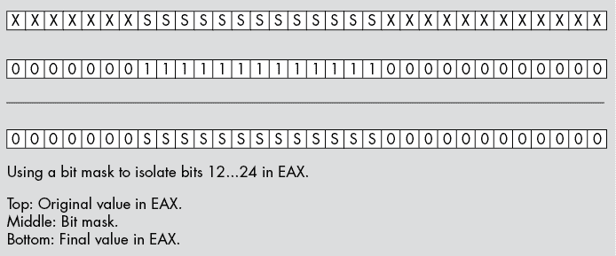

图 12-1：使用`and`指令隔离位字符串

一旦你清除了位集中的不需要的位，你通常可以直接对位集进行操作。例如，要检查 EAX 中 12 到 24 位的位字符串是否包含 12F3h，你可以使用以下代码：

```
and eax, 1111111111111000000000000b 
cmp eax, 1001011110011000000000000b 
```

这里有一个使用常量表达式的解决方案，它稍微容易理解一些：

```
and eax, 1111111111111000000000000b
cmp eax, 12F3h shl 12
```

为了让你在处理这个值时使用的常量和其他值更容易操作，你可以使用`shr`指令在掩码操作后，将位字符串与位 0 对齐，如下所示：

```
and eax, 1111111111111000000000000b
shr eax, 12
cmp eax, 12F3h
 `Other operations that require the bit string at bit #0` 
```

### 12.2.2 `or`指令

`or`指令特别有用，可以将一个位集插入到另一个位字符串中，使用以下步骤：

1.  清除源操作数中围绕位集的所有位。

1.  清除目标操作数中你希望插入位集的所有位。

1.  将位集和目标操作数进行 `OR` 操作。

例如，假设你有一个值，它位于 EAX 的位 0 到 12 中，你希望将其插入到 EBX 的位 12 到 24 中，而不影响 EBX 中的其他位。你应该首先从 EAX 中去掉位 13 及以上的位；然后从 EBX 中去掉位 12 到 24。接下来，你需要将 EAX 中的位进行移位，使得位串占据 EAX 中的位 12 到 24。最后，你将 EAX 中的值通过 `OR` 操作插入到 EBX 中（见 图 12-2），如图所示：

```
and eax, 1FFFh      ; Strip all but bits 0 to 12 from EAX
and ebx, 0FE000FFFh ; Clear bits 12 to 24 in EBX
shl eax, 12         ; Move bits 0 to 12 to 12 to 24 in EAX
or ebx,eax          ; Merge the bits into EBX
```

在 图 12-2 中，所需的位（AAAAAAAAAAAAA）形成一个位串。然而，即使你在操作一个不连续的位集，这个算法依然能正常工作。你所需要做的就是创建一个在适当位置上有 1 的位掩码。

在使用位掩码时，像前面几个例子那样使用字面数字常量是非常糟糕的编程风格。你应该始终在 MASM 中创建符号常量。通过将这些常量与一些常量表达式结合，你可以生成更易于阅读和维护的代码。当前的示例代码更合适的写法如下：

```
StartPosn = 12 
BitMask   = 1FFFh shl StartPosn ; Mask occupies bits 12 to 24
        . 
        .
        . 
   shl eax, StartPosn   ; Move into position
   and eax, BitMask     ; Strip all but bits 12 to 24 from EAX
   and ebx, not BitMask ; Clear bits 12 to 24 in EBX
   or  ebx, eax         ; Merge the bits into EBX
```

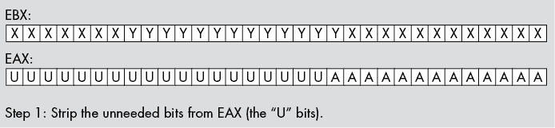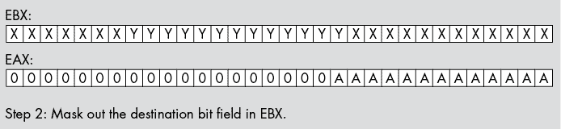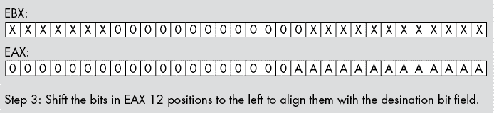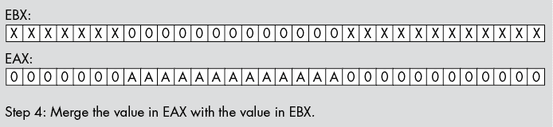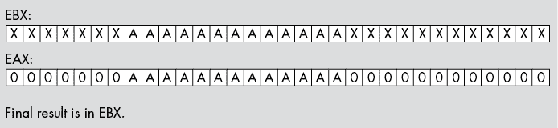

图 12-2：将 EAX 中的位 0 到 12 插入到 EBX 的位 12 到 24 中

使用编译时 `not` 操作符来反转位掩码，可以避免每次修改 `BitMask` 常量时需要创建另一个常量。如果需要维护两个相互依赖的符号，这在程序中并不是一个好的做法。

当然，除了将一个位集与另一个合并，`or` 指令还可以用于将位强制设置为 1。在源操作数中将某些位设置为 1，你可以通过使用 `or` 指令将目标操作数中的对应位强制设置为 1。

### 12.2.3 `xor` 指令

`xor` 指令允许你反转位集中的选定位。当然，如果你想反转目标操作数中的所有位，`not` 指令更合适；但是，如果你只想反转选定的位而不影响其他位，`xor` 是更好的选择。

`xor`操作的一个有趣事实是，它让你可以以几乎任何想象得到的方式操作已知数据。例如，如果你知道某个字段包含 1010b，你可以通过与 1010b 进行异或操作将该字段强制为 0。类似地，你可以通过与 0101b 进行异或操作将其强制为 1111b。虽然这看起来像是浪费，因为你可以很容易地使用`and`/`or`将这个 4 位字符串强制为 0 或全 1，但`xor`指令有两个优点。首先，你不只限于将字段强制为全 0 或全 1；你实际上可以通过`xor`将这些位设置为 16 种有效组合中的任何一种。其次，如果你需要同时操作目标操作数中的其他位，`and`/`or`可能无法完成这个任务。

例如，假设你知道某个字段包含 1010b，你想将其强制为 0，另一个字段在同一操作数中包含 1000b，并且你希望将该字段加 1（即将该字段设置为 1001b）。你无法通过单个`and`或`or`指令完成这两个操作，但你可以通过单个`xor`指令来实现；只需将第一个字段与 1010b 进行异或操作，将第二个字段与`0001b`进行异或操作。然而，记住，这个技巧只有在你知道目标操作数中某个已设置的位的当前值时才有效。

### 12.2.4 逻辑指令对标志的修改

除了在目标操作数中设置、清除和取反位外，`and`、`or`和`xor`指令还会影响 FLAGS 寄存器中的各种条件码。这些指令执行以下操作：

+   始终清除进位标志和溢出标志。

+   如果结果的 HO 位为 1，则设置符号标志；否则清除它；也就是说，这些指令将结果的 HO 位复制到符号标志中。

+   如果结果为零，则设置零标志；如果结果不为零，则清除零标志。

+   如果目标操作数的 LO 字节中设置的位数是偶数，则设置奇偶校验标志；如果设置的位数是奇数，则清除奇偶校验标志。

因为这些指令总是清除进位标志和溢出标志，所以你不能期望系统在执行这些指令时保留这两个标志的状态。许多汇编语言程序中常见的错误是假设这些指令不会影响进位标志。许多人会执行一个设置或清除进位标志的指令；执行一个`and`、`or`或`xor`指令；然后尝试测试上一个指令中进位标志的状态。这是行不通的。

这些指令的一个有趣方面是它们会将结果的高字节位（HO bit）复制到符号标志位中。因此，您可以通过测试符号标志来轻松测试高字节位（使用 `cmovs` 和 `cmovns`、`sets` 和 `setns`，或 `js` 和 `jns` 指令）。因此，许多汇编语言程序员会将一个重要的布尔变量放在操作数的高字节位中，以便在逻辑操作后通过使用符号标志轻松测试该变量的状态。

#### 12.2.4.1 奇偶标志

*奇偶校验*是一种最初由电报和其他串行通信协议使用的简单错误检测方案。其思路是计算字符中已设置的位数，并在传输中包含一个额外的位来指示该字符包含偶数或奇数个已设置的位。接收端也会计算这些位并验证额外的*奇偶*位是否指示了传输成功。奇偶标志的目的是帮助计算这个额外的位，尽管奇偶校验已由硬件接管。^(1)

x86-64 `and`、`or` 和 `xor` 指令会在其操作数的低字节（LO byte）包含偶数个已设置位时设置奇偶标志位。有一个重要的事实需要重申：奇偶标志位仅反映目标操作数的*低字节*中已设置位的数量；它不包括字、双字或其他大小操作数中的高字节（HO byte）。指令集仅使用低字节来计算奇偶性，因为使用奇偶校验的通信程序通常是面向字符的传输系统（如果一次传输超过 8 位，可以使用更好的错误检查方案）。

#### 12.2.4.2 零标志

零标志的设置是 `and`、`or` 和 `xor` 指令产生的更重要的结果之一。实际上，程序在执行 `and` 指令后如此频繁地引用此标志，以至于 Intel 添加了一个单独的指令 `test`，其主要目的是将两个结果进行逻辑与运算并设置标志，而不会对任何指令操作数产生其他影响。

零标志在执行 `and` 或 `test` 指令后有三个主要用途：（1）检查操作数中某一特定位是否被设置，（2）检查多个位集中是否至少有一个位为 1，（3）检查操作数是否为 0。使用（1）实际上是（2）的特例，其中位集仅包含一个位。我们将在接下来的段落中探讨这些用途。

要测试给定操作数中的特定位是否被设置，可以使用`and`和`test`指令与包含单一设置位的常量值进行操作。这会清除操作数中的所有其他位，如果操作数在该位位置包含 0，则在该位置留下 0，如果包含 1，则留下 1。因为结果中的其他所有位都是 0，所以如果该特定位为 0，则整个结果为 0；如果该位为 1，则整个结果为非零。x86-64 反映了这一状态在零标志中（Z = 1 表示该位为 0；Z = 0 表示该位为 1）。以下指令序列演示了如何测试 EAX 中第 4 位是否被设置：

```
 test eax, 10000b  ; Check bit #4 to see if it is 0 or 1
     jnz  bitIsSet

    `Do this if the bit is clear`
        .
        .
        .
bitIsSet:   ; Branch here if the bit is set
```

你还可以使用`and`和`test`指令来查看是否有多个位中的任何一位被设置。只需提供一个常量，该常量在你想要测试的所有位置上是 1（其他地方为 0）。将操作数与这样的常量进行与运算，如果操作数中的任何位被设置为 1，则会产生非零值。以下示例测试 EAX 中的值在第 1、2、4 和 7 位位置是否包含 1：

```
 test eax, 10010110b 
     jz   noBitsSet

    `Do whatever needs to be done if one of the bits is set`

noBitsSet: 
```

你不能仅使用单一的`and`或`test`指令来检查位集中所有对应的位是否等于 1。要实现这一点，你必须先屏蔽掉不在位集中的位，然后将结果与掩码本身进行比较。如果结果等于掩码，则位集中所有的位都包含 1。你必须使用`and`指令来执行此操作，因为`test`指令不会修改结果。以下示例检查位集（`bitMask`）中的所有位是否等于 1：

```
 and eax, bitMask 
     cmp eax, bitMask 
     jne allBitsArentSet 

; All the bit positions in EAX corresponding to the set 
; bits in bitMask are equal to 1 if we get here.

    `Do whatever needs to be done if the bits match`

allBitsArentSet: 
```

当然，一旦我们加入`cmp`指令，就不需要真正检查位集中所有的位是否都是 1 了。我们可以通过将适当的值作为操作数传递给`cmp`指令，来检查任意组合的值。

请注意，`test`和`and`指令只有在 EAX（或其他目标操作数）中的所有位在常量操作数中 1 出现的相应位置上都是 0 时，才会设置零标志。这提示了另一种检查位集中的所有 1 的方法：在使用`and`或`test`指令之前，将 EAX 中的值取反。然后，如果零标志被设置，则说明在（原始）位集中所有的位都是 1。例如：

```
not  eax 
test eax, bitMask 
jnz  NotAllOnes

; At this point, EAX contained all 1s in the bit positions 
; occupied by 1s in the bitMask constant. 

    `Do whatever needs to be done at this point`

NotAllOnes: 
```

前面的段落都暗示`bitMask`（源操作数）是一个常量，但你也可以使用变量或其他寄存器。只需在执行前面的`test`、`and`或`cmp`指令之前，先将该变量或寄存器加载适当的位掩码即可。

### 12.2.5 位测试指令

我们之前已经看到的另一组可以用来操作位的指令是 *位测试指令*。这些指令包括 `bt`（*位测试*）、`bts`（*位测试并置位*）、`btc`（*位测试并补码*）和 `btr`（*位测试并重置*）。`bt``x` 指令使用以下语法：

```
bt`x`  `bits_to_test`, `bit_number`
bt`x`  `reg`[16], `reg`[16]
bt`x`  `reg`[32], `reg`[32]
bt`x`  `reg`[64], `reg`[64]
bt`x`  `reg`[16], `constant`
bt`x`  `reg`[32], `constant`
bt`x`  `reg`[64], `constant`
bt`x`  `mem`[16], `reg`[16]
bt`x`  `mem`[32], `reg`[32]
bt`x`  `mem`[64], `reg`[64]
bt`x`  `mem`[16], `constant`
bt`x`  `mem`[32], `constant`
bt`x`  `mem`[64], `constant`
```

其中 `x` 代表无内容、`c`、`s` 或 `r`。

`bt``x` 指令的第二个操作数是一个位号，指定要检查的第一个操作数中的位。如果第一个操作数是寄存器，则第二个操作数必须包含一个值，该值在 0 到寄存器大小（以位为单位）减 1 之间；因为 x86-64 的最大（通用）寄存器为 64 位，所以该值的最大值为 63（对于 64 位寄存器）。如果第一个操作数是内存位置，则位数不限制在 0 到 63 的范围内。如果第二个操作数是常量，它可以是 0 到 255 之间的任何 8 位值。如果第二个操作数是寄存器，它没有（实际的）限制，实际上，它允许负的位偏移。

`bt` 指令将指定的位从第二个操作数复制到进位标志中。例如，`bt eax, 8` 指令将 EAX 寄存器的第 8 位复制到进位标志中。你可以在该指令执行后测试进位标志，以确定 EAX 中的第 8 位是被置位还是清零。

`bts`、`btc` 和 `btr` 指令在测试位的同时也会操作该位。这些指令可能会比较慢（取决于你使用的处理器），如果性能是你的主要关注点，应该避免使用它们，尤其是当你使用旧的 CPU 时。如果性能（与方便性相比）是一个问题，你应该始终尝试两种不同的算法——一种使用这些指令，另一种使用 `and` 和 `or` 指令——并测量性能差异；然后选择两者中最优的一种方法。

### 12.2.6 使用移位和旋转指令操作位

*移位和旋转指令*是另一组可以用来操作和测试位的指令。这些指令将高位（左移和旋转）或低位（右移和旋转）移入进位标志中。因此，在执行这些指令后，你可以测试进位标志以确定操作数的高位或低位的原始设置；例如：

```
shr  al, 1
jc   LOBitWasSet
```

移位和旋转指令的一个优点是它们会自动将操作数中的位向上或向下移动，这样下一个要测试的位就位于正确的位置；这在循环中操作时尤其有用。

移位和旋转指令对于对齐位串以及打包和解包数据非常有用。第二章中有一些这方面的示例，本章的早些示例也使用了移位指令来实现此目的。

## 12.3 进位标志作为位累加器

`bt``x`、移位和旋转指令根据操作和选定的位设置或清除进位标志。由于这些指令将“位结果”放入进位标志中，因此通常方便将进位标志视为位操作的 1 位寄存器或累加器。在本节中，我们将探索一些可能的操作，这些操作可以在进位标志中进行。

使用进位标志作为某种输入值的指令，对于操作进位标志中的位结果非常有用。例如：

+   `adc`, `sbb`

+   `rcl`, `rcr`

+   `cmc`, `clc`, 和 `stc`

+   `cmovc`, `cmovnc`

+   `jc`, `jnc`

+   `setc`, `setnc`

`adc`和`sbb`指令在加法或减法操作中加上或减去进位标志，因此，如果你已经将一个位结果计算到进位标志中，你可以通过使用这些指令将该结果计入加法或减法中。

要保存进位标志结果，你可以使用旋转通过进位指令（`rcl`和`rcr`），将进位标志移入目标操作数的低位或高位。这些指令对于将一组位结果打包到字节、字或双字值中非常有用。

`cmc`（*反向进位*）指令使你能够轻松地反转位操作的结果。你还可以使用`clc`和`stc`指令在涉及进位标志的一串位操作之前初始化进位标志。

测试进位标志的指令，如`jc`、`jnc`、`cmovc`、`cmovnc`、`setc`和`setnc`，在计算之后很有用，尤其是当结果保存在进位标志中时。

如果你有一系列位运算，并且想要测试这些运算是否产生特定的一组 1 位结果，你可以清空一个寄存器或内存位置，然后使用`rcl`或`rcr`指令将每个结果移入该位置。一旦位操作完成，比较寄存器或内存位置中的结果与常数值。如果你想测试涉及与（AND）和或（OR）的结果序列，可以使用`setc`和`setnc`指令将寄存器设置为 0 或 1，然后使用`and`和`or`指令合并结果。

## 12.4 打包和解包位串

一种常见的位操作是将位串插入操作数中，或者从操作数中提取位串。第二章提供了打包和解包此类数据的简单示例；现在是时候正式描述如何执行这些操作了。

就我们而言，我将假设我们正在处理适合一个字节、字、双字或四字操作数的位串。跨越对象边界的大位串需要额外的处理；我们将在本节稍后讨论跨越四字边界的位串。

在打包和解包位串时，我们必须考虑其起始位位置和长度。*起始位位置*是该位串中最低有效位（LO 位）在更大操作数中的位号。*长度*是操作数中的位数。

要将数据插入（打包）到目标操作数中，你首先需要一个右对齐的位串（即，从位位置 0 开始），并且该位串被零扩展到 8、16、32 或 64 位；然后将这些数据插入到另一个宽度为 8、16、32 或 64 位的操作数的适当起始位置中。不能保证目标位位置包含任何特定的值。

前两步（可以按任意顺序执行）是清除目标操作数中的相应位，并将位串（的副本）进行移位，使得低位（LO 位）从适当的位位置开始。第三步是将移位后的结果与目标操作数进行按位或（OR）运算。这将位串插入到目标操作数中（见图 12-3）。

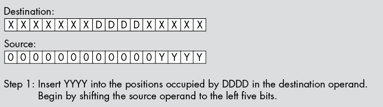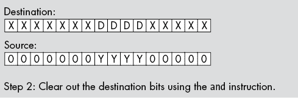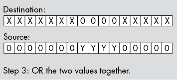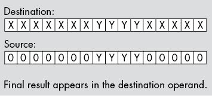

图 12-3：将位串插入到目标操作数中

以下三条指令将已知长度的位串插入到目标操作数中，如图 12-3 所示。这些指令假定源操作数在 BX 寄存器中，目标操作数在 AX 寄存器中：

```
shl  bx, 5 
and  ax, 1111111000011111b 
or   ax, bx 
```

如果在编写程序时无法知道长度和起始位置（即，必须在运行时计算它们），则可以使用查找表插入位串。假设我们有两个 8 位值：一个表示我们插入字段的起始位位置，另一个表示非零的 8 位长度值。还假设源操作数在 EBX 寄存器中，目标操作数在 EAX 寄存器中。列表 12-1 中的`mergeBits`过程演示了如何做到这一点。

```
; Listing 12-1

; Demonstrate inserting bit strings into a register.

; Note that this program must be assembled and linked
; with the "LARGEADDRESSAWARE:NO" option.

        option  casemap:none

nl          =       10

            .const
ttlStr      byte    "Listing 12-1", 0

; The index into the following table specifies the length 
; of the bit string at each position. There are 65 entries
; in this table (one for each bit length from 0 to 64). 

            .const
MaskByLen   equ     this qword
    qword   0
    qword   1,           3,           7,           0fh
    qword   1fh,         3fh,         7fh,         0ffh
    qword   1ffh,        3ffh,        7ffh,        0fffh
    qword   1fffh,       3fffh,       7fffh,       0ffffh
    qword   1ffffh,      3ffffh,      7ffffh,      0fffffh
    qword   1fffffh,     3fffffh,     7fffffh,     0ffffffh 
    qword   1ffffffh,    3ffffffh,    7ffffffh,    0fffffffh 
    qword   1fffffffh,   3fffffffh,   7fffffffh,   0ffffffffh

    qword   1ffffffffh,         03ffffffffh
    qword   7ffffffffh,         0fffffffffh

    qword   1fffffffffh,        03fffffffffh
    qword   7fffffffffh,        0ffffffffffh

    qword   1ffffffffffh,       03ffffffffffh
    qword   7ffffffffffh,       0fffffffffffh

    qword   1fffffffffffh,      03fffffffffffh
    qword   7fffffffffffh,      0ffffffffffffh

    qword   1ffffffffffffh,     03ffffffffffffh
    qword   7ffffffffffffh,     0fffffffffffffh

    qword   1fffffffffffffh,    03fffffffffffffh
    qword   7fffffffffffffh,    0ffffffffffffffh

    qword   1ffffffffffffffh,   03ffffffffffffffh
    qword   7ffffffffffffffh,   0fffffffffffffffh

    qword   1fffffffffffffffh,  03fffffffffffffffh
    qword   7fffffffffffffffh,  0ffffffffffffffffh

Val2Merge   qword   12h, 1eh, 5555h, 1200h, 120h
LenInBits   byte    5,     9,    16,    16,   12
StartPosn   byte    7,     4,     4,    12,   18

MergeInto   qword   0ffffffffh, 0, 12345678h
            qword   11111111h, 0f0f0f0fh

            include getTitle.inc
            include print.inc

            .code

; mergeBits(Val2Merge, MergeWith, Start, Length):
; Length (LenInBits[i]) value is passed in DL.
; Start (StartPosn[i]) is passed in CL.
; Val2Merge (Val2Merge[i]) and MergeWith (MergeInto[i])
; are passed in RBX and RAX.

; mergeBits result is returned in RAX.

mergeBits   proc
            push    rbx
            push    rcx
            push    rdx
            push    r8
            movzx   edx, dl         ; Zero-extends to RDX
            mov     rdx, MaskByLen[rdx * 8]
            shl     rdx, cl
            not     rdx
            shl     rbx, cl
            and     rax, rdx
            or      rax, rbx
            pop     r8
            pop     rdx
            pop     rcx
            pop     rbx
            ret
mergeBits   endp 

; Here is the "asmMain" function.

            public  asmMain
asmMain     proc
            push    rbx
            push    rsi
            push    rdi
            push    rbp
            mov     rbp, rsp
            sub     rsp, 56         ; Shadow storage

; The following loop calls mergeBits as
; follows:

;  mergeBits(Val2Merge[i], MergeInto[i], 
;            StartPosn[i], LenInBits[i]);

; Where "i" runs from 4 down to 0.

; Index of the last element in the arrays:

            mov     r10, (sizeof LenInBits) - 1
testLoop:   

; Fetch the Val2Merge element and write
; its value to the display while it is handy.

            mov     rdx, Val2Merge[r10 * 8]
            call    print
            byte    "merge( %x, ", 0
            mov     rbx, rdx

; Fetch the MergeInto element and write
; its value to the display.

            mov     rdx, MergeInto[r10 * 8]
            call    print
            byte    "%x, ", 0
            mov     rax, rdx

; Fetch the StartPosn element and write
; its value to the display.

            movzx   edx, StartPosn[r10 * 1] ; Zero-extends to RDX
            call    print
            byte    "%d, ", 0
            mov     rcx, rdx

; Fetch the LenInBits element and write
; its value to the display.

            movzx   edx, LenInBits[r10 * 1] ; Zero-extends to RDX
            call    print
            byte    "%d ) = ", 0

; Call mergeBits(Val2Merge, MergeInto,
;                StartPosn, LenInBits)

            call    mergeBits

; Display the function result (returned
; in RAX). For this program, the results
; are always 32 bits, so it prints only
; the LO 32 bits of RAX:

            mov     edx, eax
            call    print
            byte    "%x", nl, 0

; Repeat for each element of the array.

            dec     r10
 jns     testLoop

allDone:    leave
            pop     rdi
            pop     rsi
            pop     rbx
            ret     ; Returns to caller
asmMain     endp
            end
```

列表 12-1：插入位串，其中位串长度和起始位置是变量

这是列表 12-1 中程序的构建命令和输出。因为这个程序直接访问数组（而不是将数组的地址加载到寄存器中，这会使代码变得晦涩），所以这个程序必须使用`LARGEADDRESSAWARE:NO`标志进行构建，因此使用了*sbuild.bat*批处理文件（有关*sbuild.bat*的描述，请参见第三章中的“Large Address Unaware Applications”）。

```
C:\>**sbuild listing12-1**

C:\>**echo off**
 Assembling: listing12-1.asm
c.cpp

C:\>**listing12-1**
Calling Listing 12-1:
merge(120, f0f0f0f, 18, 12) = 4830f0f
merge(1200, 11111111, 12, 16) = 11200111
merge(5555, 12345678, 4, 16) = 12355558
merge(1e, 0, 4, 9) = 1e0
merge(12, ffffffff, 7, 5) = fffff97f
Listing 12-1 terminated
```

`MaskByLen`表中的每个条目（见列表 12-1）包含由表索引指定的 1 位数值。通过使用`mergeBits`中的`Length`参数值作为索引，可以从此表中获取一个具有与`Length`值相同数量的 1 位的值。`mergeBits`函数获取适当的掩码，将其向左移位，使得这一串 1 的低位（LO 位）与我们要插入数据的字段的起始位置对齐，然后反转该掩码，并使用反转后的值清除目标操作数中的相应位。

要从较大的操作数中提取比特串，你需要做的就是屏蔽掉不需要的位，然后将结果移动，直到比特串的最低位（LO 位）位于目标操作数的第 0 位。例如，要从 EBX 中提取从第 5 位开始的 4 位字段，并将结果保存在 EAX 中，你可以使用以下代码：

```
mov eax, ebx        ; Copy data to destination
and eax, 111100000b ; Strip unwanted bits
shr eax, 5          ; Right-justify to bit position 0
```

如果你在编写程序时不知道比特串的长度和起始位置，你仍然可以提取所需的比特串。代码类似于插入（虽然稍微简单一些）。假设你有我们在插入比特串时使用的`Length`和`Start`值，你可以通过以下代码提取相应的比特串（假设源操作数为 EBX，目标操作数为 EAX）：

```
movzx edx, Length
lea   r8, MaskByLen      ; Table from Listing 12-1
mov   rdx, [r8][rdx * 8]
mov   cl, StartingPosition
mov   rax, rbx
shr   rax, cl
and   rax, rdx
```

到目前为止的所有示例都假设比特串完全出现在一个四字（或更小）对象中。如果比特串的长度小于或等于 64 位，这种情况总是成立。然而，如果比特串的长度加上它在对象中起始位置的偏移量（模 8）大于 64，那么比特串将在对象内跨越一个四字边界。

提取这样的比特串需要最多三步操作：第一步操作提取比特串的起始位置（直到第一个四字边界），第二步操作复制整个四字（假设比特串的长度足够大，需要多个四字），最后一步操作复制位于比特串末尾的最后一个四字中的剩余位。该操作的实际实现留给你作为练习。

## 12.5 BMI1 指令用于提取位并创建位掩码

如果你的 CPU 支持 BMI1（*位操作指令集，第一集*）指令集扩展，^(2)你可以使用`bextr`（*位提取*）指令从 32 位或 64 位通用寄存器中提取比特。该指令的语法如下：

```
bextr `reg`[dest], `reg`[src], `reg`[ctrl]
bextr `reg`[dest], `mem`[src], `reg`[ctrl]
```

操作数必须具有相同的大小，并且必须是 32 位或 64 位寄存器（或内存位置）。

`bextr`指令将两个参数编码到`reg`ctrl 中：

+   `reg`ctrl 的第 0 到 7 位指定源操作数中的起始位位置（对于 32 位操作数，这必须是 0 到 31 之间的值，对于 64 位操作数，这必须是 0 到 63 之间的值）。

+   `reg`ctrl 的第 8 到 15 位指定了要从源操作数中提取的位数。

`bextr`指令将从`reg`src 或`mem`src 中提取指定的比特并将这些比特（移至第 0 位）存储在`reg`dest 中。一般来说，你应该尽量使用 RAX 和 EAX、RBX 和 EBX、RCX 和 ECX，或 RDX 和 EDX 作为`ctrl`寄存器，因为你可以通过使用 AH 和 AL、BH 和 BL、CH 和 CL、DH 和 DL 这四对 8 位寄存器来轻松操作起始值和长度值。示例 12-2 提供了`bextr`指令的快速演示。^(3)

```
; Listing 12-2

; Demonstrate extracting bit strings from a register.

        option  casemap:none

nl          =       10

            .const
ttlStr      byte    "Listing 12-2", 0

            include getTitle.inc
            include print.inc

; Here is the "asmMain" function.

            .code
            public  asmMain
asmMain     proc
            push    rbx
            push    rsi
            push    rdi
            push    rbp
            mov     rbp, rsp
            sub     rsp, 56         ; Shadow storage

; >>>> Unique code for various listings:

            mov     rax, 123456788abcdefh
            mov     bl, 4
            mov     bh, 16

            bextr   rdx, rax, rbx

            call    print
            byte    "Extracted bits: %x", nl, 0

; <<<< End of unique code.

allDone:    leave
            pop     rdi
            pop     rsi
 pop     rbx
            ret     ; Returns to caller
asmMain     endp
            end
```

示例 12-2：`bextr`指令示例

示例 12-2 会产生以下输出：

```
C:\>**build listing12-2**

C:\>**echo off**
 Assembling: listing12-2.asm
c.cpp

C:\>**listing12-2**
Calling Listing 12-2:
Extracted bits: bcde
Listing 12-2 terminated
```

BMI1 指令集扩展还包括一条提取寄存器中最低编号已设置位的指令：`blsi`（*提取最低已设置的孤立位*）。该指令的语法如下：

```
blsi `reg`[dest], `reg`[src]
blsi `reg`[dest], `mem`[src]
```

所有操作数必须大小相同，并且可以是 32 位或 64 位。此指令定位源操作数（寄存器或内存）中的最低已设置位。它将该位复制到目标寄存器，并将目标寄存器中的所有其他位清零。如果源值为 0，`blsi` 会将 0 复制到目标寄存器，并设置零标志和进位标志。 清单 12-3 是对该指令的简单演示（请注意，我已从 清单 12-2 中省略了公共代码）。

```
; >>>> Unique code for various listings.

mov     r8, 12340000h
blsi    edx, r8

call    print
byte    "Extracted bit: %x", nl, 0

; <<<< End of unique code.
```

清单 12-3：`blsi` 指令的简单演示

将其插入到一个示例程序壳中并运行，会产生以下输出：

```
Extracted bit: 40000
```

BMI1 `andn` 指令在与 `blsi` 配合使用时非常有用。`andn`（*与非*）指令具有以下通用语法：

```
andn `reg`[dest], `reg`[src1], `reg`[src2]
andn `reg`[dest], `reg`[src1], `mem`[src2]
```

所有操作数必须大小相同，并且必须是 32 位或 64 位。此指令对 `reg`src1 中值的倒数副本与第三个操作数（`src2` 操作数）进行逻辑与运算，并将结果存储到 `reg`dest 操作数中。

你可以在执行 `blsi` 指令后立即使用 `andn` 指令，从 `blsi` 的源操作数中移除最低编号的位。 清单 12-4 演示了此操作（和往常一样，省略了公共代码）。

```
; >>>> Unique code for various listings.

mov     r8, 12340000h
blsi    edx, r8
andn    r8, rdx, r8

; Output value 1 is in RDX (extracted bit),
; output value 2 in R8 (value with deleted bit).

call    print
byte    "Extracted bit: %x, result: %x", nl, 0

; <<<< End of unique code.
```

清单 12-4：提取并移除操作数中最低位的已设置位

运行此代码会产生以下输出：

```
Extracted bit: 40000, result: 12300000
```

提取 LO 位并保留其余位（如在 清单 12-4 中使用 `blsi` 和 `andn` 指令所做的）是如此常见的操作，以至于英特尔创建了一条专门处理此任务的指令：`blsr`（*重置最低已设置位*）。以下是其通用语法：

```
blsr `reg`[dest], `reg`[src]
blsr `reg`[dest], `mem`[src]
```

两个操作数必须大小相同，并且必须是 32 位或 64 位。此指令从源操作数中获取数据，将最低编号的已设置位清零，并将结果复制到目标寄存器。如果源操作数包含 0，此指令会将 0 复制到目标寄存器，并设置进位标志。

清单 12-5 演示了此指令的使用方法。

```
; >>>> Unique code for various listings.

mov     r8, 12340000h
blsr    edx, r8

; Output value 1 is in RDX (extracted bit), resulting value.

call    print
byte    "Value with extracted bit: %x", nl, 0

; <<<< End of unique code.
```

清单 12-5：`blsr` 指令示例

这是该代码片段的输出（插入到测试程序壳后）：

```
Value with extracted bit: 12300000
```

另一个有用的 BMI1 指令是 `blsmsk`。此指令通过查找最低编号的已设置位来创建一个位掩码。然后，它创建一个包含所有 1 位直到并包括最低已设置位的位掩码。`blsmsk` 指令将剩余位设置为 0。如果原始值为 0，`blsmsk` 会将目标寄存器中的所有位设置为 1，并设置进位标志。以下是 `blsmsk` 的通用语法：

```
blsmsk `reg`[dest], `reg`[src]
blsmsk `reg`[dest], `mem`[src]
```

清单 12-6 是一个示例代码片段及其将产生的输出。

```
; >>>> Unique code for various listings.

mov     r8, 12340000h
blsmsk  edx, r8

; Output value 1 is in RDX (mask).

call    print
byte    "Mask: %x", nl, 0

; <<<< End of unique code.
```

清单 12-6：`blsmsk` 示例

以下是示例输出：

```
Mask: 7ffff
```

特别注意，`blsmsk` 指令生成的掩码在源文件中最低编号的已设置位所处的位置上包含一个 1 位。通常，你实际上会希望得到一个位掩码，其中 1 位位于最低编号的已设置位之前的所有位置。使用 `blsi` 和 `dec` 指令可以轻松实现这一点，如列表 12-7 所示。

```
; >>>> Unique code for various listings.

mov     r8, 12340000h
blsi    rdx, r8
dec     rdx

; Output value 1 is in RDX (mask).

call    print
byte    "Mask: %x", nl, 0

; <<<< End of unique code.
```

列表 12-7：创建一个不包含最低编号的已设置位的位掩码

这是输出：

```
Mask: 3ffff
```

BMI1 指令集中的最后一条指令是 `tzcnt`（*尾随零计数*）。该指令具有以下通用语法：

```
tzcnt `reg`[dest], `reg`[src]
tzcnt `reg`[dest], `mem`[src]
```

和往常一样，操作数必须具有相同的大小。`tzcnt` 指令在 BMI1 指令中是独一无二的，因为它支持 16 位、32 位和 64 位操作数。

`tzcnt` 指令计算源操作数中从最低有效位开始向上数的零位数，并将零位计数存储到目标寄存器中。方便的是，零位的计数值也就是源操作数中第一个已设置位的位索引。如果源操作数为 0，该指令将设置进位标志（此时它还会将目标寄存器设置为操作数的大小）。

要使用 `bextr`、`blsi`、`blsr` 和 `blsmsk` 查找并提取零位，在执行这些指令之前反转源操作数。同样，为了使用 `tzcnt` 计算尾随已设置位的数量，首先要反转源操作数。^(4)

如果你在程序中使用了 `bextr`、`blsi`、`blsr`、`blsmsk`、`tzcnt` 或 `andn`，别忘了检查是否存在 BMI1 指令集扩展。并非所有 x86-64 CPU 都支持这些指令。

## 12.6 合并位集和分配位串

插入和提取位集与插入和提取位串的区别不大，前提是你插入的位集（或提取的位集）的形状与主对象中位集的形状相同。位集的*形状*指的是位集中文本的分布，而不考虑位集的起始位置。例如，一个包含位 0、4、5、6 和 7 的位集，其形状与包含位 12、16、17、18 和 19 的位集相同，因为这两个位集的分布是相同的。

插入或提取该位集的代码与上一节的代码几乎相同；唯一的不同是你使用的掩码值。例如，要将这个位集从 EAX 中的 0 位开始插入到 EBX 中从第 12 位开始的相应位集中，你可以使用以下代码：

```
and ebx, not 11110001000000000000b ; Mask out destination bits
shl eax, 12                        ; Move source bits into position
or  ebx, eax                       ; Merge the bit set into EBX
```

然而，假设你在 EAX 中的 0 到 4 位上有 5 个已设置的位，并且你希望将它们合并到 EBX 中的第 12、16、17、18 和 19 位上。你必须以某种方式在对 EBX 执行逻辑或运算之前，先分配这些位。考虑到这个特定的位集由两段 1 位组成，过程变得相对简化。以下代码以巧妙的方式分配这些位：

```
and ebx, not 11110001000000000000b
and eax, 11110001000000000000b  ; Mask out destination bits
shl eax, 2    ; Spread out bits: 1 to 4 goes to 3 to 6 and 0 goes to 2
btr eax, 2    ; Bit 2 -> carry and then clear bit 2
rcl eax, 13   ; Shift in carry and put bits into final position
or  ebx, eax  ; Merge the bit set into EBX
```

使用`btr`（*位测试和重置*）指令的这个技巧效果很好，因为我们在原始源操作数中只有 1 个位的位置不对。可惜的是，如果这些位相对于彼此都处于错误的位置，那么这个方案就不是一个高效的解决方案。稍后我们会看到一个更通用的解决方案。

提取这个位集并将位合并到位串中并不像看起来那么容易。然而，我们仍然有一些巧妙的技巧可以使用。考虑以下代码，它从 EBX 中提取位集，并将结果放入 EAX 中的位 0 到 4：

```
mov eax, ebx 
and eax, 11110001000000000000b  ; Strip unwanted bits
shr eax, 5                      ; Put bit 12 into bit 7, and so on
shr ah, 3                       ; Move bits 11 to 14 to 8 to 11
shr eax, 7                      ; Move down to bit 0
```

这段代码将（原始）位 12 移到位位置 7，即 AL 的 HO 位。同时，它将位 16 到 19 移到位 11 到 14（即 AH 的位 3 到 6）。然后，代码将 AH 中的位 3 到 6 移到位 0。这会将位集的 HO 位定位，使其与 AL 中剩下的位相邻。最后，代码将所有位移到位 0。再次强调，这并不是一个通用的解决方案，但它展示了如果仔细思考，这个问题的一个巧妙处理方式。

上述的合并和分配算法仅适用于它们特定的位集。一个更通用的解决方案（可能是允许你指定一个掩码，然后根据该掩码分配或合并位的方案）会更为复杂。以下代码演示了如何根据位掩码中的值来分配位于位串中的位：

```
; EAX - Originally contains a value into which we 
;       insert bits from EBX.
; EBX - LO bits contain the values to insert into EAX.
; EDX - Bitmap with 1s indicating the bit positions in 
;       EAX to insert.
; CL -  Scratchpad register.

          mov cl, 32      ; Count number of bits we rotate
          jmp DistLoop

CopyToEAX:
          rcr ebx, 1      ; Don't use SHR, must preserve Z-flag
          rcr eax, 1 
          jz  Done 
DistLoop: dec cl 
          shr edx, 1 
          jc  CopyToEAX 
          ror eax, 1      ; Keep current bit in EAX
          jnz DistLoop 

Done:     ror eax, cl     ; Reposition remaining bits 
```

如果我们将 EDX 加载为 11001001b，代码将把位 0 到 3 的值复制到 EAX 中的位 0、3、6 和 7 中。注意短路测试，它检查是否已耗尽 EDX 中的值（通过检查 EDX 中的 0）。旋转指令不影响零标志，但移位指令会。因此，之前的`shr`指令会在没有更多位可以分配时设置零标志（当 EDX 变为 0 时）。

合并位的通用算法比一般的分配算法稍微高效一些。以下是将位从 EBX 中提取出来，并通过 EDX 中的位掩码将结果保留在 EAX 中的代码：

```
; EAX - Destination register.
; EBX - Source register.
; EDX - Bitmap with 1s representing bits to copy to EAX.
; EBX and EDX are not preserved.

     xor eax, eax    ; Clear destination register 
     jmp ShiftLoop

ShiftInEAX:  
     rcl ebx, 1      ; EBX to EAX
     rcl eax, 1
ShiftLoop:   
     shl edx, 1      ; Check to see if we need to copy a bit
     jc  ShiftInEAX  ; If carry set, go copy the bit
     rcl ebx, 1      ; Current bit is uninteresting, skip it
     jnz ShiftLoop   ; Repeat as long as there are bits in EDX
```

这个过程还利用了移位和旋转指令的一个巧妙特性：移位指令会影响零标志，而旋转指令则不会。因此，`shl edx, 1`指令在 EDX 变为 0 时会设置零标志（经过移位后）。如果进位标志也被设置，代码将再次遍历循环，直到将一个位移入 EAX，但下一次代码将 EDX 左移 1 位时，EDX 仍然为 0，因此进位标志将被清除。在这一迭代中，代码将跳出循环。

另一种合并位的方法是通过查找表。通过一次获取一个字节的数据（这样你的表不会太大），你可以使用该字节的值作为查找表的索引，合并所有位直到位 0。最后，你可以将每个字节低位的位合并在一起。在某些情况下，这可能会产生一个更高效的合并算法。具体实现由你来决定。

## 12.7 使用 BMI2 指令合并和分配位字符串

英特尔的 BMI2（*位操作指令集，第二集*）^(5) 指令集扩展包括一组便捷的指令，可以用来插入或提取任意的位集：`pdep`（*并行位存储*）和 `pext`（*并行位提取*）。如果你的 CPU 支持这些指令，它们可以处理本章中许多使用非-BMI 指令的任务。它们确实是非常强大的指令。

这些指令具有以下语法：

```
pdep `reg`[dest], `reg`[src], `reg`[mask]
pdep `reg`[dest], `reg`[src], `mem`[mask]
pext `reg`[dest], `reg`[src], `reg`[mask]
pext `reg`[dest], `reg`[src], `mem`[mask]
```

所有操作数必须大小相同，并且必须为 32 位或 64 位。

`pext` 指令从源寄存器（第二个寄存器）提取任意的位字符串，并将这些位合并到目标寄存器中，从位 0 开始按连续的位位置排列。第三个操作数——掩码，控制着 `pext` 从源寄存器提取哪些位。

掩码操作数包含 `pext` 将从源寄存器提取的位位置上的 1 位。图 12-4 显示了这个位掩码的工作原理。对于掩码操作数中的每一个 1 位，`pext` 指令将源寄存器中对应的位复制到目标寄存器中下一个可用的位位置（从位 0 开始）。

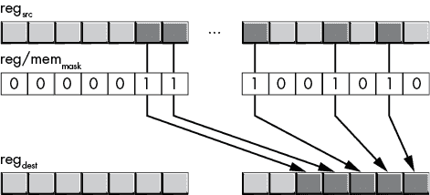

图 12-4：`pext` 指令的位掩码

清单 12-8 是一个示例程序片段及其输出，展示了 `pext` 指令（与往常一样，此清单省略了常见代码）。

```
; >>>> Unique code for various listings.

mov     r8d, 12340000h
mov     r9d, 0F0f000Fh
pext    edx, r8d, r9d

; Output value 1 is in RDX (mask).

call    print
byte    "Extracted: %x", nl, 0

; <<<< End of unique code.
------------------------------------------------------------------------------
Extracted: 240
```

清单 12-8：`pext` 指令示例

`pdep` 指令执行与 `pext` 相反的操作。它从源寄存器操作数的低位（LO 位）开始，获取连续的位集，并通过使用掩码操作数中的 1 位来决定这些位在目标寄存器中的分布，如 图 12-5 所示。`pdep` 指令将目标寄存器中的所有其他位设置为 0。

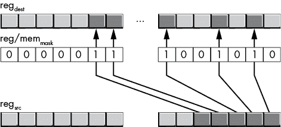

图 12-5：`pdep` 指令操作

清单 12-9 是 `pdep` 指令及其输出的示例。

```
mov     r8d, 1234h
mov     r9d, 0F0FF00Fh 
pdep    edx, r8d, r9d

; Output value 1 is in RDX (mask).

call    print
byte    "Distributed: %x", nl, 0
------------------------------------------------------------------------------
Distributed: 1023004
```

清单 12-9：`pdep` 指令示例

如果在程序中使用了 `pdep` 或 `pext` 指令，别忘了测试是否支持 BMI2 指令集扩展。并非所有 x86-64 CPU 都支持这些指令。请参见第十一章的 清单 11-2，查看如何检查是否支持 BMI2 指令集扩展。

## 12.8 位字符串的打包数组

尽管效率低得多，但完全可以创建大小不是 8 位倍数的元素数组。缺点是，计算数组元素的“地址”并操作该数组元素需要额外的工作。在本节中，我们将通过一些示例来看一看如何打包和解包数组元素，这些元素是任意位数长度的。

为什么你需要位对象数组？答案很简单：节省空间。如果一个对象只占 3 位，你可以通过打包数据，而不是为每个对象分配一个字节，将同样的空间装入 2.67 倍的元素。对于非常大的数组，这可以节省大量空间。当然，这种节省空间的代价是速度：你必须执行额外的指令来打包和解包数据，从而减慢对数据的访问速度。

在一个大块位中定位数组元素的位偏移量的计算几乎与标准数组访问相同：

```
`element_address_in_bits` = 
 `base_address_in_bits` + `index` * `element_size_in_bits` 
```

一旦你计算出元素的位地址，你需要将其转换为字节地址（因为我们在访问内存时必须使用字节地址），并提取指定的元素。由于数组元素的基地址（几乎）总是从字节边界开始，我们可以使用以下公式来简化这一任务：

b

```
`yte_of_1st_bit` = 
    `base_address` + (`index` * `element_size_in_bits`) / 8

`offset_to_1st_bit` = 
    (`index` * `element_size_in_bits`) % 8
```

例如，假设我们有一个包含 200 个三位对象的数组，我们可以按如下方式声明：

```
 .data
AO3Bobjects  byte (200 * 3)/8 + 2 dup (?)  ; "+2" handles truncation
```

前面维度中的常量表达式为足够的字节预留空间来存储 600 位（200 个元素，每个元素 3 位）。正如注释所指出的，这个表达式在末尾添加了 2 个额外的字节，以确保我们不会丢失任何奇数位^(6)，并且允许我们访问数组末尾之后的 1 个字节（当向数组存储数据时）。

现在，假设你想访问这个数组的第*i*个三位元素。你可以通过以下代码提取这些位：

```
; Extract the `i`th group of 3 bits in AO3Bobjects 
; and leave this value in EAX.

xor  ecx, ecx             ; Put `i` / 8 remainder here
mov  eax, i               ; Get the index into the array
lea  rax, [rax + rax * 2] ; RAX := RAX * 3 (3 bits/element)
shrd rcx, rax, 3          ; RAX / 8 -> RAX and RAX mod 8 -> RCX 
                          ; (HO bits)
shr  rax, 3               ; Remember, shrd doesn't modify EAX
rol  rcx, 3               ; Put remainder into LO 3 bits of RCX

; Okay, fetch the word containing the 3 bits we want to 
; extract. We have to fetch a word because the last bit or two 
; could wind up crossing the byte boundary (that is, bit offset 6 
; and 7 in the byte).

lea r8, AO3Bobjects
mov ax, [r8][rax * 1]
shr ax, cl                ; Move bits down to bit 0
and eax, 111b             ; Remove the other bits (incl HO RAX)
```

将一个元素插入到数组中要稍微复杂一点。除了计算数组元素的基地址和位偏移量外，你还需要创建一个掩码来清除目标位置中你要插入新数据的位。Listing 12-10 将 EAX 的低 3 位插入到`AO3Bobjects`数组的第*i*个元素中。

```
; Listing 12-10

; Creating a bit mask with blsi and dec.

        option  casemap:none

nl          =       10

            .const
ttlStr      byte    "Listing 12-10", 0

Masks       equ     this word
            word    not 0111b,            not 00111000b
            word    not 000111000000b,    not 1110b
            word    not 01110000b,        not 001110000000b
            word    not 00011100b,        not 11100000b

            .data
i           dword   5
AO3Bobjects byte    (200*3)/8 + 2 dup (?)   ; "+2" handles truncation

 include getTitle.inc
            include print.inc

            .code

; Here is the "asmMain" function.

            public  asmMain
asmMain     proc
            push    rbx
            push    rsi
            push    rdi
            push    rbp
            mov     rbp, rsp
            sub     rsp, 56           ; Shadow storage

            mov     eax, 7            ; Value to store

            mov     ebx, i            ; Get the index into the array
            mov     ecx, ebx          ; Use LO 3 bits as index
            and     ecx, 111b         ; into Masks table
            lea     r8, Masks
            mov     dx, [r8][rcx * 2] ; Get bit mask

; Convert index into the array into a bit index.
; To do this, multiply the index by 3:

            lea     rbx, [rbx + rbx * 2]

; Divide by 8 to get the byte index into EBX
; and the bit index (the remainder) into ECX:

            shrd    ecx, ebx, 3
            shr     ebx, 3
            rol     ecx, 3

; Grab the bits and clear those we're inserting.

            lea     r8, AO3Bobjects
            and     dx, [r8][rbx * 1]

; Put our 3 bits in their proper location.

            shl     ax, cl

; Merge bits into destination.

            or      dx, ax

; Store back into memory.

            mov     [r8][rbx * 1], dx

 mov     edx, dword ptr AO3Bobjects
            call    print
            byte    "value:%x", nl, 0

allDone:    leave
            pop     rdi
            pop     rsi
            pop     rbx
            ret     ; Returns to caller
asmMain     endp
            end
```

Listing 12-10：将值 7（111b）存储到一个 3 位元素的数组中

将 Listing 12-10 中的代码插入到 Shell 汇编文件中，产生以下输出：

```
value:38000
```

`print`语句打印`AO3Bobjects`的前 32 位。由于每个元素是 3 位，所以数组看起来像这样：

```
000 000 000 000 000 111 000 000 000 000 00 ...
```

其中第 0 位是最左边的位。为了让它们更易读，我们将 32 位翻转过来，并按 4 位分组（方便转换为十六进制），得到：

```
0000 0000 0000 0011 1000 0000 0000 0000
```

结果是 38000h。

Listing 12-10 使用查找表生成清除数组中适当位置所需的掩码。该数组的每个元素包含所有 1，除了需要为给定位偏移清除的三个 0（注意使用 `not` 运算符来反转表中的常量）。

## 12.9 搜索位

一个常见的位操作是定位位序列的结束。这个操作的一个特例是定位 16 位、32 位或 64 位值中第一个（或最后一个）设置或清除的位。在本节中，我们将探讨处理这种特例的方法。

*第一个设置位* 指的是在一个值中，从位 0 向高位扫描时，第一个包含 1 的位。对于 *第一个清除位*，也有类似的定义。*最后一个设置位* 是在一个值中，从高位向位 0 扫描时，第一个包含 1 的位。对于 *最后一个清除位*，也有类似的定义。

搜索第一个或最后一个位的一种明显方法是使用循环中的移位指令，并计算在移出 1（或 0）到进位标志之前的迭代次数。迭代次数指定了该位置。以下是一些示例代码，用于检查 EAX 中的第一个设置位，并将该位位置返回到 ECX：

```
 mov ecx, -32  ; Count off the bit positions in ECX
TstLp:    shr eax, 1    ; Check to see if current bit
                        ; position contains a 1
          jc  Done      ; Exit loop if it does 
          inc ecx       ; Bump up our bit counter by 1
          jnz TstLp     ; Exit if we execute this loop 32 times

Done:     add cl, 32    ; Adjust loop counter so it holds 
                        ; the bit position

; At this point, CL contains the bit position of the 
; first set bit. CL contains 32 if EAX originally 
; contained 0 (no set bits). 
```

这段代码唯一复杂的地方是，它运行的循环计数器是从 -32 到 0，而不是从 32 到 0。这样，在循环结束后计算位位置就稍微容易一些。

这个特定循环的缺点是它的开销很大。根据 EAX 中的原始值，这个循环可能会重复最多 32 次。如果你检查的值在 EAX 的低位经常有很多 0，这段代码就会运行得比较慢。

搜索第一个（或最后一个）设置位是一个非常常见的操作，因此 Intel 特意增加了几条指令来加速这一过程。这些指令是 `bsf` (*位扫描前进*) 和 `bsr` (*位扫描反向*)。它们的语法如下：

```
bsr `dest`[reg], `reg`[src] 
bsr `dest`[reg], `mem`[src] 
bsf `dest`[reg], `reg`[src] 
bsf `dest`[reg], `mem`[src] 
```

源操作数和目标操作数必须具有相同的大小（16 位、32 位或 64 位）。目标操作数必须是寄存器。源操作数可以是寄存器或内存位置。

`bsf` 指令扫描源操作数中第一个被设置的位（从位位置 0 开始）。`bsr` 指令通过从高位向低位扫描，查找源操作数中的最后一个被设置的位。如果这些指令在源操作数中找到一个已设置的位，它们会清除零标志并将该位位置放入目标寄存器中。如果源寄存器包含 0（即没有被设置的位），则这些指令会设置零标志，并在目标寄存器中留下一个不确定的值。你应该在这些指令执行后立即测试零标志，以验证目标寄存器的值。以下是一个示例：

```
mov ebx, SomeValue  ; Value whose bits we want to check
bsf eax, ebx        ; Put position of first set bit in EAX
jz  NoBitsSet       ; Branch if SomeValue contains 0
mov FirstBit, eax   ; Save location of first set bit
    .
    .
    .
```

你以相同的方式使用 `bsr` 指令，唯一的区别是它计算操作数中最后一个设置位的位置（即从高位向低位扫描时找到的第一个设置位）。

x86-64 CPU 不提供定位第一个包含 0 的位的指令。然而，你可以通过先取反源操作数（如果必须保留源操作数的值，则取反其副本），然后搜索第一个 1 位，来轻松扫描 0 位；这对应于原始操作数值中的第一个 0 位。

`bsf` 和 `bsr` 指令是复杂的 x86-64 指令，可能比其他指令更慢。在某些情况下，通过使用离散指令定位第一个设置的位可能会更快。但是，由于这些指令的执行时间因 CPU 而异，因此你应该在将它们用于时间关键代码之前测试它们的性能。

注意，`bsf` 和 `bsr` 指令不会影响源操作数。一种常见的操作是提取（并清除）操作数中找到的第一个或最后一个设置的位。如果源操作数在寄存器中，你可以在找到该位后使用 `btr`（或 `btc`）指令清除该位。下面是实现这一结果的一些代码：

```
 bsf ecx, eax       ; Locate first set bit in EAX
          jz  noBitFound     ; If we found a bit, clear it

          btr eax, ecx       ; Clear the bit we just found

noBitFound: 
```

在这一序列的末尾，零标志指示我们是否找到了一位（注意，`btr` 不会影响零标志）。

因为 `bsf` 和 `bsr` 指令只支持 16 位、32 位和 64 位操作数，所以你需要稍微不同的方式来计算 8 位操作数的第一个位位置。有几种合理的做法。首先，你可以将 8 位操作数零扩展到 16 位或 32 位，然后使用 `bsf` 或 `bsr` 指令。另一种选择是创建一个查找表，其中每个条目包含你用作索引的值的位数；然后，你可以使用 `xlat` 指令来“计算”值中的第一个位位置（你需要将值 0 作为特殊情况处理）。另一种解决方案是使用本节开头出现的移位算法；对于 8 位操作数来说，这并非完全低效的解决方案。

你可以使用 `bsf` 和 `bsr` 来确定一段位的大小，前提是操作数中只有一段连续的位。只需定位这一段中的第一个和最后一个位（如前面的例子所示），然后计算这两个值之间的差（加 1）。当然，这种方案仅在第一个和最后一个设置位之间没有中断的 0 时有效。

## 12.10 计数位

前一节中的最后一个例子展示了一个非常通用问题的特定案例：计数位。遗憾的是，这个例子有一个严重的限制：它只计算源操作数中出现的单一连续的 1 位。本节讨论了这个问题的更通用解决方案。

几乎每周，总有人在互联网上的新闻组中询问如何计算寄存器操作数中的位数。这是一个常见的请求，毫无疑问，许多汇编语言课程的教师布置了这个任务，作为教学手段，目的是让学生了解移位和旋转指令，具体如下：

```
; BitCount1:

; Counts the bits in the EAX register, 
; returning the count in EBX.

          mov cl, 32    ; Count the 32 bits in EAX
          xor ebx, ebx  ; Accumulate the count here
CntLoop:  shr eax, 1    ; Shift bit out of EAX and into carry
          adc bl, 0     ; Add the carry into the EBX register
          dec cl        ; Repeat 32 times
          jnz CntLoop 
```

这个“技巧”是，这段代码使用`adc`指令将进位标志的值加到 BL 寄存器中。由于计数将小于 32，结果会舒适地适应 BL 寄存器。

不管代码是否复杂，这条指令序列的执行速度都不算特别快。前面的循环总是执行 32 次，因此这段代码序列会执行 130 条指令（每次迭代 4 条指令，加上 2 条额外指令）。

为了提高效率，可以使用`popcnt`指令（*人口计数*，在 SSE 4.1 指令集中引入），它计算源操作数中 1 位的数量，并将结果存储到目标操作数中：

```
popcnt `reg`[dest], `reg`[src]
popcnt `reg`[dest], `mem`[src]
```

操作数必须大小相同，并且必须是 16 位、32 位或 64 位。

## 12.11 反转位串

另一个常见的编程项目是反转操作数中的位。这是一个独立有用的功能，也常被教学人员布置。这段程序将 LO 位与 HO 位交换，位 1 与次高位交换，依此类推。教学人员通常期待的解决方案如下：

```
; Reverse the 32 bits in EAX, leaving the result in EBX: 

               mov cl, 32     ; Move current bit in EAX to 
RvsLoop:       shr eax, 1     ; the carry flag

 rcl ebx, 1    ; Shift the bit back into 
                             ; EBX, backward
               dec cl  
               jnz RvsLoop 
```

和前面的例子一样，这段代码存在重复执行 32 次循环的问题，总共执行了 129 条指令（对于 32 位操作数，64 位操作数则需要翻倍）。通过展开循环，你可以将指令数减少到 64 条，但这依然有些昂贵。

优化问题的最佳解决方案通常是使用更好的算法，而不是试图通过选择更快的指令来调整代码。在前面的部分中，例如，我们通过替换更复杂的算法来加速位串计数，而不是使用简单的“移位计数”算法。在前面的示例中，关键是尽可能并行地进行大量工作。

假设我们只需要交换 32 位值中偶数位和奇数位。我们可以通过以下代码轻松地在 EAX 中交换偶数位和奇数位：

```
mov edx, eax        ; Make a copy of the odd bits
shr eax, 1          ; Move the even bits to the odd positions
and edx, 55555555h  ; Isolate the odd bits
and eax, 55555555h  ; Isolate the even bits
shl edx, 1          ; Move the odd bits to even positions
or  eax, edx        ; Merge the bits and complete the swap
```

交换偶数位和奇数位使我们能够部分地实现数字位的反转。在执行前面的代码序列后，你可以通过以下代码交换相邻的位对，来交换 32 位值中所有字节的位：

```
mov edx, eax        ; Make a copy of the odd-numbered bit pairs
shr eax, 2          ; Move the even bit pairs to the odd position
and edx, 33333333h  ; Isolate the odd pairs
and eax, 33333333h  ; Isolate the even pairs
shl edx, 2          ; Move the odd pairs to the even positions
or  eax, edx        ; Merge the bits and complete the swap
```

完成前面的序列后，你会交换 32 位寄存器中的相邻字节。同样，唯一的区别是位掩码和移位的长度。以下是代码：

```
mov edx, eax        ; Make a copy of the odd-numbered nibbles
shr eax, 4          ; Move the even nibbles to the odd position
and edx, 0f0f0f0fh  ; Isolate the odd nibbles
and eax, 0f0f0f0fh  ; Isolate the even nibbles
shl edx, 4          ; Move the odd pairs to the even positions
or  eax, edx        ; Merge the bits and complete the swap
```

你可能已经看出其中的模式，并且能推测出在接下来的两步中，你需要交换字节和字。你可以像前面的例子一样编写代码，但有一种更好的方法：使用`bswap`。`bswap`（*字节交换*）指令使用以下语法：

```
bswap `reg`[32] 
```

`bswap`指令交换指定 32 位寄存器中字节 0 和字节 3，以及字节 1 和字节 2，这正是反转比特时所需要的操作（以及在将数据在小端和大端数据格式之间转换时，这条指令的主要用途）。你可以直接使用`bswap eax`指令来完成工作，而无需再插入 12 条指令交换字节和字。在以下代码序列中展示了最终结果：

```
mov   edx, eax       ; Make a copy of the odd bits in the data
shr   eax, 1         ; Move the even bits to the odd positions
and   edx, 55555555h ; Isolate the odd bits
and   eax, 55555555h ; Isolate the even bits
shl   edx, 1         ; Move the odd bits to the even positions
or    eax, edx       ; Merge the bits and complete the swap

mov   edx, eax       ; Make a copy of the odd-numbered bit pairs
shr   eax, 2         ; Move the even bit pairs to the odd position
and   edx, 33333333h ; Isolate the odd pairs
and   eax, 33333333h ; Isolate the even pairs
shl   edx, 2         ; Move the odd pairs to the even positions
or    eax, edx       ; Merge the bits and complete the swap

mov   edx, eax       ; Make a copy of the odd-numbered nibbles
shr   eax, 4         ; Move the even nibbles to the odd position
and   edx, 0f0f0f0fh ; Isolate the odd nibbles
and   eax, 0f0f0f0fh ; Isolate the even nibbles
shl   edx, 4         ; Move the odd pairs to the even positions
or    eax,edx        ; Merge the bits and complete the swap

bswap eax            ; Swap the bytes and words
```

该算法只需要 19 条指令，并且比之前的比特移位循环执行得更快。当然，这个序列的内存消耗略高。如果你更倾向于节省内存而非时钟周期，那么循环可能是一个更好的解决方案。

## 12.12 合并比特串

另一个常见的比特串操作是通过合并或交错来自两个不同源的比特，生成一个单一的比特串。以下示例代码序列通过合并两个 16 位比特串中的交替比特，创建了一个 32 位比特串：

```
; Merge two 16-bit strings into a single 32-bit string.
; AX - Source for even-numbered bits.
; BX - Source for odd-numbered bits.
; CL  - Scratch register.
; EDX - Destination register.

          mov  cl, 16 
MergeLp:  shrd edx, eax, 1     ; Shift a bit from EAX into EDX
          shrd edx, ebx, 1     ; Shift a bit from EBX into EDX
          dec  cl 
          jne  MergeLp; 
```

这个特定的例子将两个 16 位值合并在一起，交替地将它们的比特插入到结果值中。为了更快地实现此代码，可以展开循环以减少一半指令的使用。

通过一些小的修改，我们可以将四个 8 位值合并在一起，或从源字符串中合并其他比特集合。例如，以下代码从 EAX 复制比特 0 到 5，从 EBX 复制比特 0 到 4，从 EAX 复制比特 6 到 11，从 EBX 复制比特 5 到 15，最后从 EAX 复制比特 12 到 15：

```
shrd edx, eax, 6
shrd edx, ebx, 5
shrd edx, eax, 6
shrd edx, ebx, 11
shrd edx, eax, 4
```

当然，如果你有 BMI2 指令集可用，你也可以使用`pextr`指令提取各种比特并将其插入到另一个寄存器中。

## 12.13 提取比特串

我们还可以在多个目的地之间提取并分配比特串中的比特。以下代码将 EAX 中的 32 位值并将交替的比特分配给 BX 和 DX 寄存器：

```
 mov cl, 16   ; Count the loop iterations
ExtractLp: shr eax, 1   ; Extract even bits to (E)BX
           rcr ebx, 1 
           shr eax, 1   ; Extract odd bits to (E)DX
           rcr edx, 1 
           dec cl       ; Repeat 16 times
           jnz ExtractLp
           shr ebx, 16  ; Need to move the results from the HO
           shr edx, 16  ; bytes of EBX and EDX to the LO bytes
```

该序列执行 99 条指令（循环内部 6 条，循环重复 16 次，加上循环外部 3 条）。你可以展开循环并使用其他技巧，但当一切完成后，可能不值得增加复杂性。

如果你有 BMI2 指令集扩展可用，你也可以使用`pext`指令高效地完成这项工作：

```
mov  ecx, 55555555h  ; Odd bit positions
pext edx, eax, ecx   ; Put odd bits into EDX
mov  ecx, 0aaaaaaaah ; Even bit positions
pext ebx, eax, ecx   ; Put even bits into EBX
```

## 12.14 搜索比特模式

另一个与比特相关的操作是搜索比特串中是否包含特定的比特模式。例如，你可能希望从比特串的某个特定位置开始，找到`1011b`第一次出现的比特索引。在本节中，我们将探讨一些简单的算法来完成这个任务。

要搜索特定的位模式，我们需要知道四件事：

+   要搜索的模式（*模式*）

+   我们要搜索的模式的长度

+   我们将要搜索的位串（*源*）

+   要搜索的位串的长度

搜索的基本思路是根据模式的长度创建一个掩码，并使用该掩码对源的副本进行掩码处理。然后我们可以直接将模式与掩码后的源进行比较，检查它们是否相等。如果相等，搜索完成；如果不相等，则增加位位置计数器，将源右移一个位置，并重试。你需要重复这个操作 `length``(``source``) -` `length``(``pattern``)` 次。如果在这些尝试之后仍未检测到位模式，算法就失败了（因为我们已经耗尽了源操作数中可能与模式长度匹配的所有位）。这里有一个简单的算法，搜索 EBX 寄存器中的 4 位模式：

```
 mov cl, 28       ; 28 attempts because 32 - 4 = 28
                           ; (len(src) - len(pat))
          mov ch, 1111b    ; Mask for the comparison
          mov al, `pattern`  ; Pattern to search for
          and al, ch       ; Mask unnecessary bits in AL
          mov ebx, `source`  ; Get the source value
ScanLp:   mov dl, bl       ; Copy the LO 4 bits of EBX
          and dl, ch       ; Mask unwanted bits
          cmp al, dl       ; See if we match the pattern
          jz  Matched
          dec cl           ; Repeat specified number of times
          shr ebx, 1 
          jnz ScanLp 

; Do whatever needs to be done if we failed to 
; match the bit string. 

 jmp Done

Matched: 

; If we get to this point, we matched the bit string. 
; We can compute the position in the original source as 28 - CL.

Done: 
```

位串扫描是字符串匹配的一个特殊情况。*字符串匹配*是计算机科学中研究得非常透彻的问题，你可以用于字符串匹配的许多算法同样适用于位串匹配。这些算法超出了本章的范围，但为了让你对其工作原理有所了解，你可以通过计算一个函数（如 `xor` 或 `sub`）在模式与当前源位之间的值，并将结果用作查找表的索引来决定可以跳过多少位。这些算法允许你跳过多个位，而不是在每次扫描循环迭代时只偏移一次（正如之前的算法所做的那样）。

## 12.15 获取更多信息

AMD Athlon 优化指南包含了用于基于位的计算的有用算法。要了解更多关于位查找算法的内容，请阅读一本关于数据结构和算法的教科书，并学习其中的字符串匹配算法章节。

关于位操作的终极书籍可能是 *Hacker’s Delight*（黑客的愉悦），第二版，作者是 Henry S. Warren（Addison-Wesley，2012）。虽然本书使用 C 编程语言举例，但几乎所有概念也适用于汇编语言程序。

## 12.16 自测

1.  你会使用什么通用指令来清除寄存器中的位？

1.  你可以使用什么指令清除寄存器中由位号指定的某一位？

1.  你会使用什么通用指令来设置寄存器中的位？

1.  你可以使用什么指令设置寄存器中由位号指定的某一位？

1.  你会使用什么通用指令来反转寄存器中的位？

1.  你可以使用什么指令反转寄存器中由位号指定的某一位？

1.  你会使用什么通用指令来测试寄存器中某一位（或一组位）是否为 0 或 1？

1.  你可以使用什么指令测试寄存器中由位号指定的单个位？

1.  你可以使用什么单一指令提取并合并一组位？

1.  你可以使用什么单一指令在寄存器中定位并插入一组位？

1.  你可以使用什么单一指令从较大的位串中提取一个位子串？

1.  什么指令允许你搜索寄存器中第一个已设置的位？

1.  什么指令允许你搜索寄存器中最后一个已设置的位？

1.  如何搜索寄存器中第一个未设置的位？

1.  如何搜索寄存器中最后一个未设置的位？

1.  你可以使用什么指令来计算寄存器中位的数量？
