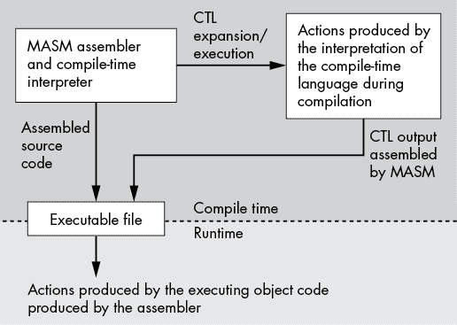
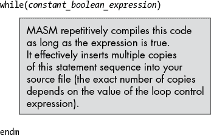

# 第十三章：宏和 MASM 编译时语言


本章讨论 MASM 编译时语言，包括非常重要的*宏展开功能*。*宏*是一个标识符，汇编程序会将其展开成额外的文本（通常是多行文本），允许你通过一个标识符来缩写大量代码。MASM 的宏功能实际上是一个*计算机语言中的计算机语言*；也就是说，你可以在 MASM 源文件中编写小型程序，这些程序的目的是生成其他 MASM 源代码，然后由 MASM 进行汇编。

这种*语言中的语言*，也称为*编译时语言*，由宏（编译时语言中的过程等效物）、条件语句（`if`语句）、循环和其他语句组成。本章介绍了 MASM 编译时语言的许多功能，并展示了如何使用它们来减少编写汇编语言代码的工作量。

## 13.1 编译时语言简介

MASM 实际上是将两种语言合并成一个程序。*运行时语言*是你在之前所有章节中阅读到的标准 x86-64/MASM 汇编语言。这被称为运行时语言，因为你编写的程序在运行可执行文件时执行。MASM 包含一个解释器，用于另一种语言，即 MASM *编译时语言（CTL）*。MASM 源文件包含 MASM CTL 和运行时程序的指令，MASM 在汇编（编译）期间执行 CTL 程序。一旦 MASM 完成汇编，CTL 程序就会终止（参见图 13-1）。



图 13-1：编译时执行与运行时执行

CTL 应用程序不是 MASM 生成的运行时可执行文件的一部分，尽管 CTL 应用程序可以*为你编写*部分运行时程序，事实上，这就是 CTL 的主要用途。通过自动代码生成，CTL 使你能够轻松而优雅地输出重复的代码。通过学习如何使用 MASM CTL 并正确应用它，你可以像开发高级语言应用程序一样快速开发汇编语言应用程序（甚至更快，因为 MASM 的 CTL 让你能够创建非常高级语言的构造）。

## 13.2 echo 和 .err 指令

你可能还记得第一章开始时提到的大多数人学习新语言时编写的典型第一个程序——“Hello, world！”程序。列表 13-1 提供了用 MASM 编译时语言编写的基本“Hello, world！”程序。

```
; Listing 13-1

; CTL "Hello, world!" program.

echo    Listing 13-1: Hello, world!
end
```

列表 13-1：CTL “Hello, world！” 程序

该程序中的唯一 CTL 语句是`echo`语句。^(1) `end`语句仅仅是为了让 MASM 保持正常运行。

`echo`语句在汇编 MASM 程序时显示其参数列表的文本表示。因此，如果你使用以下命令编译前面的程序

```
ml64 /c listing13-1.asm
```

MASM 汇编器将立即打印以下文本：

```
Listing 13-1: Hello, world! 
```

除了显示与`echo`参数列表相关的文本外，`echo`语句对程序的汇编没有任何影响。它对调试 CTL 程序非常宝贵，可以显示汇编过程的进度，以及在汇编过程中发生的假设和默认操作。

尽管汇编语言调用`print`也会将文本输出到标准输出，但在 MASM 源文件中的以下两组语句之间有一个很大的区别：

```
echo "Hello World"

call print
byte "Hello World", nl,0 
```

第一个语句在汇编过程中打印`"Hello World"`（并带有换行符），并且对可执行程序没有影响。最后两行不会影响汇编过程（除了将代码输出到可执行文件）。然而，当你运行可执行文件时，第二组语句会打印字符串`Hello World`，后面跟着换行符序列。

`.err`指令，类似于`echo`，将在汇编期间将字符串显示到控制台，但这必须是一个文本字符串（由`<`和`>`界定）。`.err`语句将文本作为 MASM 错误诊断的一部分显示。此外，`.err`语句还会增加错误计数，这将导致 MASM 在处理完当前源文件后停止汇编（不进行汇编或链接）。通常，当你的 CTL 代码发现一些问题，导致它无法生成有效代码时，你会使用`.err`语句在汇编过程中显示错误消息。例如：

```
.err <Statement must have exactly one operand>
```

## 13.3 编译时常量和变量

就像运行时语言一样，编译时语言也支持常量和变量。你可以通过使用`textequ`或`equ`指令来声明编译时常量。你可以通过使用`=`指令（编译时赋值语句）来声明编译时变量。例如：

```
inc_by equ 1
ctlVar = 0
ctlVar = ctlVar + inc_by
```

## 13.4 编译时表达式和运算符

MASM CTL 支持常量表达式在 CTL 赋值语句中的使用。有关常量表达式的讨论，请参见第四章中的“MASM 常量声明”（这些也是 CTL 表达式和运算符）。

除了本章中出现的运算符和函数，MASM 还包括一些你会发现有用的额外 CTL 运算符、函数和指令。以下小节将描述这些内容。

### 13.4.1 MASM 转义（!）运算符

第一个运算符是`!`运算符。当它放在另一个符号前面时，MASM 会将该字符视为文本，而不是特殊符号。例如，`!;`创建一个由分号字符组成的文本常量，而不是一个注释，后者会导致 MASM 忽略`；`符号后的所有文本（对于 C/C++程序员来说，这类似于字符串常量中的反斜杠转义字符`\`）。

### 13.4.2 MASM 评估（%）运算符

第二个有用的 CTL 操作符是`%`。百分号操作符使得 MASM 评估它后面的表达式，并用该表达式的值替换它。例如，考虑以下代码序列：

```
num10   =        10
text10  textequ  <10>
tn11    textequ  %num10 + 1
```

如果你在汇编语言源文件中组装这个序列，并指示 MASM 生成汇编清单，它会报告以下三个符号：

```
num10  . . . . . . . . . . . . .        Number   0000000Ah
text10 . . . . . . . . . . . . .        Text     10
tn11 . . . . . . . . . . . . . .        Text     11
```

`num10`被正确地报告为数值（十进制 10），`text10`被报告为文本符号（包含字符串`10`），而`tn11`被报告为文本符号（正如你所预期的，因为该代码序列使用`textequ`指令来定义它）。然而，MASM 不会包含字符串`%num10 + 1`，而是评估表达式`num10 + 1`，产生数值 11，然后将其转换为文本数据。（顺便说一下，若要在文本字符串中放置百分号，请使用文本序列`<!%>`。）

如果你将`%`操作符放在源代码行的第一列，MASM 将把该行的所有数值表达式转换为文本形式。这在使用`echo`指令时很有用。它使得`echo`显示数值常量的值，而不仅仅是显示常量的名称。

### 13.4.3 `catstr`指令

`catstr`函数具有以下语法：

```
`identifier`   catstr  `string1`, `string2`, ...
```

`identifier`是一个（直到此时）未定义的符号。`string1`和`string2`操作数是被`<`和`>`符号包围的文本数据。这个语句将把两个字符串的连接结果存储到`identifier`中。请注意，`identifier`是一个文本对象，而不是字符串对象。如果你在代码中指定该标识符，MASM 会用文本字符串替换标识符，并尝试将该文本数据作为源代码的一部分进行处理。

`catstr`语句允许两个或更多用逗号分隔的操作数。`catstr`指令将按照它们在操作数字段中出现的顺序连接文本值。以下语句生成文本数据`Hello, World!`：

```
helloWorld catstr <Hello>, <, >, <World!!>
```

在这个示例中需要使用两个感叹号，因为`!`是一个操作符，告诉 MASM 将下一个符号视为文本而非操作符。只有一个`!`符号时，MASM 会认为你尝试将`>`符号包含为字符串的一部分，并报告错误（因为没有关闭的`>`符号）。在文本字符串中使用`!!`告诉 MASM 将第二个`!`符号视为文本字符。

### 13.4.4 `instr`指令

`instr`指令用于在一个字符串中查找另一个字符串的存在。该指令的语法是

```
`identifier`  instr  `start`, `source`, `search`
```

其中，`identifier`是一个符号，MASM 将在其中放入`search`字符串在`source`字符串中的偏移量。搜索从`source`中的`start`位置开始。不同于常规，`source`中的第一个字符的位置是 1（而不是 0）。以下示例在字符串`Hello World`中搜索`World`（从字符位置 1 开始，即`H`字符的索引）：

```
WorldPosn  instr 1, <Hello World>, <World>
```

该语句将 `WorldPosn` 定义为值为 7 的数字（因为如果从位置 1 开始计数，字符串 `World` 在 `Hello World` 中的位置是 7）。

### 13.4.5 `sizestr` 指令

`sizestr` 指令计算字符串的长度。^(2) 该指令的语法为：

```
`identifier`  sizestr  `string`
```

其中，`identifier` 是 MASM 将存储字符串长度的符号，`string` 是该指令计算其长度的字符串字面量。举个例子，

```
hwLen sizestr <Hello World>
```

将符号 `hwLen` 定义为一个数字，并将其值设为 11。

### 13.4.6 `substr` 指令

`substr` 指令从较大的字符串中提取子字符串。该指令的语法为：

```
`identifier` substr `source`, `start`, `len`
```

其中，`identifier` 是 MASM 将创建的符号（类型为 `TEXT`，初始化为子字符串字符），`source` 是 MASM 从中提取子字符串的源字符串，`start` 是从字符串中开始提取的起始位置，`len` 是要提取的子字符串的长度。`len` 操作数是可选的；如果未指定，MASM 会假定你想要使用从 `start` 位置开始的字符串剩余部分作为子字符串。以下是一个从字符串 `Hello World` 中提取 `Hello` 的示例：

```
hString substr <Hello World>, 1, 5
```

## 13.5 条件汇编（编译时决策）

MASM 的编译时语言提供了一个 `if` 语句，它让你在汇编时做出决策。`if` 语句有两个主要用途。`if` 的传统用法是支持 *条件汇编*，根据程序中各种符号或常量值的状态，在汇编过程中决定是否包含或排除代码。第二个用途是支持 MASM 编译时语言中的标准 `if` 语句决策过程。本节将讨论这两个 `if` 语句的用途。

MASM 编译时 `if` 语句的最简单形式使用以下语法：

```
if `constant_boolean_expression`  
      `Text`  
endif 
```

在编译时，MASM 会评估 `if` 后面的表达式。该表达式必须是一个常量表达式，且结果为整数值。如果该表达式的值为真（非零），MASM 会继续处理源文件中的文本，就像 `if` 语句不存在一样。然而，如果表达式的值为假（零），MASM 会将 `if` 和对应的 `endif` 子句之间的所有文本视为注释（即忽略这些文本），如图 13-2 所示。


图 13-2：MASM 编译时 `if` 语句的操作

编译时表达式中的标识符必须是常量标识符或 MASM 编译时函数调用（具有适当的参数）。因为 MASM 在汇编时评估这些表达式，所以它们不能包含运行时变量。

MASM 的 `if` 语句支持可选的 `elseif` 和 `else` 子句，这些子句的行为直观易懂。`if` 语句的完整语法如下：

```
if `constant_boolean_expression1`
      `Text`  
elseif `constant_boolean_expression2`
      `Text`  
else 
      `Text`  
endif 
```

如果第一个布尔表达式的值为真，MASM 会处理直到 `elseif` 子句的文本。然后它会跳过所有文本（即将其视为注释），直到遇到 `endif` 子句。MASM 会在 `endif` 子句之后按正常方式继续处理文本。

如果第一个布尔表达式的值为假，MASM 会跳过所有文本，直到遇到 `elseif`、`else` 或 `endif` 子句。如果遇到 `elseif` 子句（如前面的例子），MASM 会评估与该子句相关联的布尔表达式。如果该表达式的值为真，MASM 会处理 `elseif` 和 `else` 子句之间的文本（或者如果没有 `else` 子句，则处理到 `endif` 子句）。如果在处理该文本时，MASM 遇到另一个 `elseif` 或如前所述的 `else` 子句，MASM 将忽略所有后续文本，直到找到相应的 `endif`。如果前面例子中的第一个和第二个布尔表达式的值都为假，MASM 将跳过它们关联的文本，开始处理 `else` 子句中的文本。

你可以通过包含零个或多个 `elseif` 子句，并根据需要提供 `else` 子句，创建几乎无限种的 `if` 语句序列。

条件汇编的传统用途之一是开发可以轻松配置为多个环境的软件。例如，`fcomip` 指令使得浮点比较变得简单，但该指令仅在 Pentium Pro 及更高版本的处理器上可用。为了在支持此指令的处理器上使用它，并在较旧的处理器上回退到标准浮点比较，大多数工程师使用条件汇编将不同的指令序列嵌入到同一个源文件中（而不是编写和维护两个版本的程序）。以下示例演示了如何做到这一点：

```
; Set true (1) to use FCOMI`xx` instrs.

PentProOrLater = 0
          . 
          . 
          . 
        if PentProOrLater

          fcomip st(0), st(1) ; Compare ST1 to ST0 and set flags

        else 

          fcomp               ; Compare ST1 to ST0
          fstsw ax            ; Move the FPU condition code bits
          sahf                ; into the FLAGS register

        endif 
```

如当前编写的代码片段，将编译 `else` 子句中的三条指令，并忽略 `if` 和 `else` 子句之间的代码（因为常量 `PentProOrLater` 为假）。通过将 `PentProOrLater` 的值更改为真，你可以告诉 MASM 编译单条 `fcomip` 指令，而不是三条指令序列。

尽管你只需维护一个源文件，但条件汇编并不能让你创建一个在所有处理器上都能高效运行的单一 *可执行文件*。使用这种技术时，你仍然需要创建两个可执行程序（一个用于 Pentium Pro 及更高版本的处理器，一个用于早期的处理器），通过编译源文件两次：第一次汇编时，你必须将 `PentProOrLater` 常量设置为假；第二次汇编时，你必须将其设置为真。

如果你熟悉其他语言中的条件汇编，如 C/C++，你可能会想知道 MASM 是否支持类似 C 的 `#ifdef` 语句。答案是肯定的，它支持。请考虑以下对前面代码的修改，使用了该指令：

```
; Note: uncomment the following line if you are compiling this 
; code for a Pentium Pro or later CPU. 

; PentProOrLater = 0       ; Value and type are irrelevant
          . 
          . 
          . 
ifdef PentProOrLater 

     fcomip st(0), st(1)   ; Compare ST1 to ST0 and set flags

else 

     fcomp                 ; Compare ST1 to ST0
     fstsw ax              ; Move the FPU condition code bits
     sahf                  ; into the FLAGS register

endif 
```

条件汇编的另一个常见用途是将调试和测试代码引入您的程序。许多 MASM 程序员使用的一种典型调试技巧是在代码中的关键点插入打印语句；这使得他们能够跟踪代码并在各个检查点显示重要的值。

然而，这种技术的一个大问题是，在完成项目之前，必须删除调试代码。还有两个进一步的问题如下：

+   程序员常常忘记删除一些调试语句，这会在最终程序中产生缺陷。

+   删除调试语句后，这些程序员常常发现他们在稍后的某个时刻需要这个语句来调试另一个问题。因此，他们不断地插入和删除相同的语句。

条件汇编可以为此问题提供解决方案。通过定义一个符号（比如`debug`）来控制程序中的调试输出，您可以通过修改一行源代码来启用或禁用*所有*调试输出。以下代码片段演示了这一点：

```
; Set to true to activate debug output.

debug   =    0
 . 
          . 
          . 
     if debug

        echo *** DEBUG build

        mov  edx, i
        call print
        byte "At point A, i=%d", nl, 0 

     else

     echo *** RELEASE build

     endif 
```

只要您将所有调试输出语句用如上所述的`if`语句包围，就不必担心调试输出会意外出现在最终应用程序中。通过将`debug`符号设置为 false，您可以自动禁用所有这些输出。同样，在调试语句完成即时目的后，您也不必将它们从程序中删除。通过使用条件汇编，您可以将这些语句保留在代码中，因为它们非常容易被禁用。以后，如果您决定在汇编过程中需要查看这些调试信息，您可以通过将`debug`符号设置为 true 重新启用它。

尽管程序配置和调试控制是条件汇编的两个常见的传统用途，但不要忘记，`if`语句提供了 MASM CTL 中的基本条件语句。您将在编译时程序中像使用 MASM 或其他语言中的`if`语句一样使用`if`语句。本章后续部分将展示大量使用`if`语句的示例。

## 13.6 重复汇编（编译时循环）

MASM 的`while..endm`、`for..endm`和`forc..endm`语句提供了编译时循环结构。^(3) `while`语句指示 MASM 在汇编期间重复处理相同的语句序列。这对于构建数据表以及为编译时程序提供传统的循环结构非常有用。

`while`语句使用以下语法：

```
while `constant_boolean_expression`
      `Text` 
endm 
```

当 MASM 在汇编过程中遇到 `while` 语句时，它会评估常量布尔表达式。如果表达式的结果为假，MASM 会跳过 `while` 和 `endm` 之间的文本（这种行为类似于 `if` 语句在表达式结果为假时的处理）。如果表达式的结果为真，MASM 会处理 `while` 和 `endm` 之间的语句，然后“跳回”源文件中的 `while` 语句开始处，并重复这个过程，如 Figure 13-3 所示。



图 13-3：MASM 编译时 `while` 语句操作

为了理解这个过程是如何工作的，考虑一下 Listing 13-2 中的程序。

```
; Listing 13-2

; CTL while loop demonstration program.

        option  casemap:none

nl          =       10

            .const
ttlStr      byte    "Listing 13-2", 0

            .data
ary         dword   2, 3, 5, 8, 13

            include getTitle.inc
            include print.inc

            .code

; Here is the "asmMain" function.

            public  asmMain
asmMain     proc
            push    rbx
            push    rbp
            mov     rbp, rsp
            sub     rsp, 56           ; Shadow storage

i           =       0            
            while   i LT lengthof ary ; 5  

            mov     edx, i            ; This is a constant!
            mov     r8d, ary[i * 4]   ; Index is a constant
            call    print
            byte    "array[%d] = %d", nl, 0

i           =       i + 1
            endm 

allDone:    leave
            pop     rbx
            ret     ; Returns to caller
asmMain     endp
            end
```

Listing 13-2：`w``hile``..``endm` 演示

这是 Listing 13-2 的构建命令和程序输出：

```
C:\>**build listing13-2**

C:\>**echo off**
 Assembling: listing13-2.asm
c.cpp

C:\>**listing13-2**
Calling Listing 13-2:
array[0] = 2
array[1] = 3
array[2] = 5
array[3] = 8
array[4] = 13
Listing 13-2 terminated
```

`while` 循环在汇编过程中会重复五次。每次循环时，MASM 汇编器会处理 `while` 和 `endm` 指令之间的语句。因此，前面的程序实际上等价于 Listing 13-3 中显示的代码片段。

```
.
.
.
mov     edx, 0          ; This is a constant!
mov     r8d, ary[0]     ; Index is a constant
call    print
byte    "array[%d] = %d", nl, 0

mov     edx, 1          ; This is a constant!
mov     r8d, ary[4]     ; Index is a constant
call    print
byte    "array[%d] = %d", nl, 0

mov     edx, 2          ; This is a constant!
mov     r8d, ary[8]     ; Index is a constant
call    print
byte    "array[%d] = %d", nl, 0

mov     edx, 3          ; This is a constant!
mov     r8d, ary[12]    ; Index is a constant
call    print
byte    "array[%d] = %d", nl, 0

mov     edx, 4          ; This is a constant!
mov     r8d, ary[16]    ; Index is a constant
call    print
byte    "array[%d] = %d", nl, 0
```

Listing 13-3：与 Listing 13-2 中的代码等价的程序

如你在这个例子中看到的，`while` 语句对于构建重复代码序列非常方便，尤其是对于展开循环。

MASM 提供了两种形式的 `for..endm` 循环。这两种循环的一般形式如下：

```
for `identifier`, <`arg1`, `arg2`, ..., `argn`> 
  . 
  . 
  . 
endm 

forc `identifier`, <`string`>
  . 
  . 
  . 
endm 
```

第一种 `for` 循环形式（普通 `for`）会对指定的 `<` 和 `>` 括号之间的每个参数执行一次代码。在每次循环重复时，它会将 `identifier` 设置为当前参数的文本：在第一次循环时，`identifier` 被设置为 `arg1`，第二次循环时设置为 `arg2`，以此类推，直到最后一次循环时，`identifier` 被设置为 `argn`。例如，下面的 `for` 循环会生成将 RAX、RBX、RCX 和 RDX 寄存器压入栈中的代码：

```
for  reg, <rax, rbx, rcx, rdx>
push reg
endm
```

这个 `for` 循环等价于以下代码：

```
push rax
push rbx
push rcx
push rdx
```

`forc` 编译时循环会对第二个参数指定的字符串中的每个字符重复其循环体。例如，下面的 `forc` 循环会为字符串中的每个字符生成一个十六进制字节值：

```
 forc   hex, <0123456789ABCDEF>
hexNum  catstr <0>,<hex>,<h>
        byte   hexNum
        endm
```

`for` 循环比 `forc` 循环更为有用。不过，`forc` 在某些情况下还是很方便的。大多数情况下，当你使用这些循环时，你会传递一组可变的参数，而不是一个固定的字符串。正如你很快会看到的，这些循环对于处理宏参数非常有用。

## 13.7 宏（编译时过程）

*宏*是语言处理器在编译过程中用其他文本替换的对象。宏是替换长且重复的文本序列为更短文本序列的绝佳工具。除了宏的传统角色（例如，C/C++中的`#define`），MASM 的宏还充当了类似编译时语言过程或函数的功能。

宏是 MASM 的主要功能之一。接下来的章节将探讨 MASM 的宏处理功能以及宏与其他 MASM CTL 控制结构之间的关系。

## 13.8 标准宏

MASM 支持一种简单直接的宏机制，允许你以类似声明过程的方式定义宏。一个典型的简单宏声明如下所示：

```
`macro_name` macro `arguments` 
      `Macro body`
          endm
```

以下代码是宏声明的具体示例：

```
neg128 macro 

       neg rdx 
       neg rax 
       sbb rdx, 0 

       endm 
```

执行此宏的代码将计算 RDX:RAX 中 128 位值的二补数（参见第八章中“扩展精度负值操作”部分的`neg`描述）。

要执行与`neg128`相关的代码，你需要在希望执行这些指令的地方指定宏的名称。例如：

```
mov    rax, qword ptr i128 
mov    rdx, qword ptr i128[8] 
neg128 
```

这看起来故意像是任何其他指令；宏的原始目的是创建合成指令，以简化汇编语言编程。

尽管你不需要使用`call`指令来调用宏，从程序的角度来看，调用宏执行的指令序列就像调用过程一样。你可以通过以下过程声明将此简单宏实现为过程：

```
neg128p  proc 

         neg   rdx
         neg   rax
         sbb   rdx, 0
         ret

neg128p  endp
```

以下两个语句都将使 RDX:RAX 中的值取反：

```
neg128
call   neg128p 
```

这两者之间的区别（宏调用与过程调用）在于，宏会将其文本内联展开，而过程调用则会发出对文本中其他地方相应过程的调用。也就是说，MASM 会将`neg128`的调用直接替换为以下文本：

```
neg  rdx
neg  rax
sbb  rdx, 0
```

另一方面，MASM 会将过程`call neg128p`替换为`call`指令的机器码：

```
call neg128p
```

你应该根据效率来选择宏调用还是过程调用。宏比过程调用稍快，因为你不需要执行`call`和相应的`ret`指令，但它们可能会使你的程序变大，因为每次宏调用都会展开为宏体的文本。如果宏体很大，而且你在程序中多次调用该宏，那么它将使最终的可执行文件变得更大。此外，如果宏体执行的指令超过几个简单指令，`call`和`ret`指令序列的开销对整体执行时间的影响较小，因此执行时间的节省几乎可以忽略不计。另一方面，如果过程的主体非常短（像前面的`neg128`示例），宏实现可能会更快，并且不会显著增加程序的大小。一个好的经验法则如下：

> 对于短小且时间关键的程序单元，使用*宏*。对于较长的代码块并且执行时间不那么关键时，使用*过程*。

相比于过程，宏有许多其他缺点。宏不能拥有局部（自动）变量，宏参数的工作方式与过程参数不同，宏不支持（运行时）递归，而且调试宏比过程更为困难（仅举几个缺点）。因此，除非性能至关重要，否则你不应将宏作为过程的替代品。

## 13.9 宏参数

像过程一样，宏允许你定义*参数*，使你能够在每次宏调用时提供不同的数据，这让你可以编写通用宏，其行为可以根据你提供的参数而变化。通过在编译时处理这些宏参数，你可以编写复杂的宏。

宏参数声明语法很简单。你需要在宏声明中提供一个参数名称列表，作为操作数：

```
neg128  macro reg64HO, reg64LO

        neg   reg64HO
        neg   reg64LO
        sbb   reg64HO, 0

        endm 
```

当你调用宏时，作为参数传递实际的参数值：

```
neg128  rdx, rax
```

### 13.9.1 标准宏参数展开

MASM 自动将类型`text`与宏参数关联。这意味着在宏展开过程中，MASM 会将你提供的文本替代为实际参数，并在所有出现形式参数名称的地方替换。*按文本替换传递*的语义与*按值传递*或*按引用传递*略有不同，因此在这里探讨这些差异是很有价值的。

考虑以下宏调用，使用前面章节中的`neg128`宏：

```
neg128 rdx, rax
neg128 rbx, rcx 
```

这两个调用展开成以下代码：

```
; neg128 rdx, rax 

     neg rdx 
     neg rax 
     sbb rdx, 0

; neg128 rbx, rcx 

     neg rbx 
     neg rcx 
     sbb rbx, 0 
```

宏调用不会像*值传递*那样创建参数的局部副本，也不会将实际参数的地址传递给宏。相反，形式为`neg128 rdx, rax`的宏调用等价于以下内容：

```
reg64HO  textequ <rdx> 
reg64LO  textequ <rax> 

         neg    reg64HO  
         neg    reg64LO  
         sbb    reg64HO, 0 
```

文本对象会立即将其字符串值展开为内联文本，产生`neg128 rdx, rax`的前述展开。

宏参数不限于内存、寄存器或常量操作数，就像指令或过程操作数一样。只要其扩展在任何使用正式参数的地方都是合法的，任何文本都是可以的。同样，正式参数可以出现在宏体中的任何位置，而不仅仅是内存、寄存器或常量操作数合法的位置。考虑以下宏声明和示例调用，它们展示了如何将一个正式参数扩展为一个完整的指令：

```
chkError macro instr, jump, target

         instr 
         jump  target 

         endm

     chkError <cmp eax, 0>, jnl, RangeError  ; Example 1
          .
          .
          . 
 chkError <test bl, 1>, jnz, ParityError ; Example 2

; Example 1 expands to:

     cmp  eax, 0 
     jnl  RangeError 

; Example 2 expands to:

     test bl, 1 
     jnz  ParityError
```

我们使用 `<` 和 `>` 括号将完整的 `cmp` 和 `test` 指令视为一个单一字符串（通常，这些指令中的逗号会将它们拆分为两个宏参数）。

通常，MASM 假设所有逗号之间的文本构成一个单一的宏参数。如果 MASM 遇到任何开括号符号（左括号、左大括号或左尖括号），它将包括所有文本直到适当的闭括号符号，忽略括号符号内可能出现的逗号。当然，MASM 不会将字符串常量中的逗号（和括号符号）视为实际参数的结束。所以以下宏和调用是完全合法的：

```
_print macro strToPrint 

       call print
       byte strToPrint, nl, 0 

      endm 
       . 
       . 
       . 
      _print "Hello, world!"
```

MASM 将字符串 `Hello, world!` 作为一个单独的参数处理，因为逗号出现在字面量字符串常量中，就像你的直觉所示的那样。

当 MASM 扩展你的宏参数时，可能会遇到一些问题，因为参数是作为文本而不是值进行扩展的。考虑以下宏声明和调用：

```
Echo2nTimes macro n, theStr
echoCnt     =     0
            while echoCnt LT n * 2

            call  print
            byte  theStr, nl, 0

echoCnt     =     echoCnt + 1
            endm
            endm
 . 
             . 
             . 
            Echo2nTimes  3 + 1, "Hello"
```

这个例子在汇编期间显示 `Hello` 五次，而不是你直觉上可能期望的八次。这是因为前面的 `while` 语句扩展为

```
while  echoCnt LT 3 + 1 * 2
```

`n` 的实际参数是 `3 + 1`；因为 MASM 将这个文本直接替换到 `n` 位置，所以你会得到一个错误的文本扩展。在编译时，MASM 计算 `3 + 1 * 2` 的值为 5，而不是值 8（如果 MASM 按值传递该参数，而不是通过文本替换传递的话，你会得到值 8）。

当传递可能包含编译时表达式的数字参数时，解决这个问题的常见方法是将宏中的正式参数用括号括起来；例如，你可以将前面的宏重写为：

```
Echo2nTimes macro n, theStr
echoCnt     =     0
            while echoCnt LT (n) * 2

            call  print
            byte  theStr, nl, 0

echoCnt     =     echoCnt + 1
            endm  ; while
            endm  ; macro
```

现在，调用扩展为以下代码，产生直观的结果：

```
while  echoCnt LT (3 + 1) * 2 
call   print
byte   theStr, nl, 0
endm
```

如果你无法控制宏的定义（可能它是你使用的库模块的一部分，你不能更改宏定义，因为这样做可能会破坏现有代码），还有一个解决此问题的方法：在宏调用中的参数前使用 MASM `%` 运算符，以便 CTL 解释器在扩展参数之前先计算表达式。例如：

```
Echo2nTimes  %3 + 1, "Hello"
```

这将导致 MASM 正确地生成八次对 `print` 过程的调用（及相关数据）。

### 13.9.2 可选和必需的宏参数

一般来说，MASM 会将宏参数视为可选参数。如果你定义一个需要两个参数的宏，并且只传递一个参数来调用该宏，MASM 通常不会对该调用提出警告。相反，它会简单地将空字符串替代第二个参数的扩展。有些情况下，这种做法是可以接受的，甚至可能是期望的。

然而，假设你在前面的 `neg128` 宏中省略了第二个参数。那样会编译成一个缺少操作数的 `neg` 指令，MASM 会报告错误；例如：

```
neg128      macro   `arg1`, `arg2`      ; Line 6
            neg     `arg1`            ; Line 7
            neg     `arg2`            ; Line 8
            sbb     `arg1`, 0         ; Line 9
            endm                    ; Line 10
                                    ; Line 11
            neg128  rdx             ; Line 12
```

这是 MASM 报告的错误：

```
listing14.asm(12) : error A2008:syntax error : in instruction
 neg128(2): Macro Called From
  listing14.asm(12): Main Line Code
```

`(12)` 表示错误发生在源文件的第 12 行。`neg128(2)` 行表示错误发生在 `neg128` 宏的第 2 行。这里有点难以看出究竟是什么导致了问题。

一种解决方案是在宏内部使用条件汇编来测试两个参数是否都存在。起初，你可能认为可以使用如下代码：

```
neg128  macro reg64HO, reg64LO

        if   reg64LO eq <>
        .err <neg128 requires 2 operands>
        endif

        neg  reg64HO
        neg  reg64LO
        sbb  reg64O, 0
        endm
         .
         .
         .
        neg128 rdx 
```

不幸的是，这种方式失败了，原因有几个。首先，`eq` 运算符不能与文本操作数一起使用。MASM 会在尝试应用该运算符之前扩展文本操作数，因此前面示例中的 `if` 语句实际上变成了

```
 if   eq
```

因为 MASM 将空字符串替代了 `eq` 运算符两侧的操作数。当然，这会导致语法错误。即使在 `eq` 运算符两侧有非空的文本操作数，这也会失败，因为 `eq` 期望的是数值型操作数。MASM 通过引入几个额外的条件 `if` 语句来解决这个问题，这些语句专门用于处理文本操作数和宏参数。表 13-1 列出了这些额外的 `if` 语句。

表 13-1：文本处理条件 `if` 语句

| **语句** | **文本操作数** | **含义** |
| --- | --- | --- |
| `ifb`^(*) | `arg` | 如果为空：如果 `arg` 被评估为空字符串，则为真。 |
| `ifnb` | `arg` | 如果不为空：如果 `arg` 被评估为非空字符串，则为真。 |
| `ifdif` | `arg1``,` `arg2` | 如果不同：如果 `arg1` 和 `arg2` 不同（区分大小写），则为真。 |
| `ifdifi` | `arg1``,` `arg2` | 如果不同：如果 `arg1` 和 `arg2` 不同（不区分大小写），则为真。 |
| `ifidn` | `arg1``,` `arg2` | 如果相同：如果 `arg1` 和 `arg2` 完全相同（区分大小写），则为真。 |
| `ifidni` | `arg1``,` `arg2` | 如果相同：如果 `arg1` 和 `arg2` 完全相同（不区分大小写），则为真。 |
| ^(*) `ifb` `arg` 是 `ifidn <``arg``>, <>` 的简写。 |

你可以像标准的 `if` 语句一样使用这些条件 `if` 语句。你也可以在这些 `if` 语句后面跟随一个 `elseif` 或 `else` 子句，但没有 `elseifb`、`elseifnb` 等变体（这些 `if` 语句后面只能跟一个带布尔表达式的标准 `elseif`）。

以下代码片段演示了如何使用`ifb`语句来确保`neg128`宏有正好两个参数。无需检查`reg64HO`是否为空；如果`reg64HO`为空，`reg64LO`也将为空，`ifb`语句会报告相应的错误：

```
neg128  macro reg64HO, reg64LO

        ifb  <reg64LO>
        .err <neg128 requires 2 operands>
        endif

 neg  reg64HO
        neg  reg64LO
        sbb  reg64HO, 0
        endm
```

使用`ifb`时要非常小心。很容易将文本符号传递给宏，最终测试该符号的名称是否为空，而不是文本本身。考虑以下例子：

```
symbol      textequ <>
            neg128  rax, symbol     ; Generates an error
```

`neg128`调用有两个参数，第二个参数不为空，因此`ifb`指令对参数列表是有效的。然而，在宏内部，当`neg128`扩展`reg64LO`并添加`neg`指令后，扩展结果为空字符串，从而产生错误（这正是`ifb`本应防止的情况）。

处理缺失宏参数的另一种方式是明确告诉 MASM 某个参数是必需的，可以在宏定义行上使用`:req`后缀。考虑以下`neg128`宏的定义：

```
neg128  macro reg64HO:req, reg64LO:req
        neg   reg64HO
        neg   reg64LO
        sbb   reg64HO, 0
        endm
```

使用`:req`选项后，如果缺少一个或多个宏参数，MASM 将报告以下信息：

```
listing14.asm(12) : error A2125:missing macro argument
```

### 13.9.3 默认宏参数值

处理缺失宏参数的一种方式是为这些参数定义默认值。考虑以下`neg128`宏的定义：

```
neg128  macro reg64HO:=<rdx>, reg64LO:=<rax>
        neg   reg64HO
        neg   reg64LO
        sbb   reg64HO, 0
        endm
```

`:=`运算符告诉 MASM，如果宏调用行上没有实际值，则将运算符右侧的文本常量替换为相关的宏参数。考虑以下两个`neg128`的调用：

```
neg128       ; Defaults to "RDX, RAX" for the args
neg128 rbx   ; Uses RBX:RAX for the 128-bit register pair
```

### 13.9.4 带有可变参数数量的宏

可以告诉 MASM 允许在宏调用中使用可变数量的参数：

```
varParms  macro varying:vararg 

     ` Macro body`

          endm 
           . 
           . 
           . 
          varParms 1 
          varParms 1, 2 
          varParms 1, 2, 3 
          varParms 
```

在宏内部，MASM 将创建一个文本对象，形式为`<``arg1``,` `arg2``, ...,` `argn``>`，并将该文本对象分配给关联的参数名称（在前面的示例中为`varying`）。您可以使用 MASM 的`for`循环来提取可变参数的单个值。例如：

```
varParms  macro varying:vararg 
          for   curArg, <varying>
          byte  curArg
          endm  ; End of FOR loop
          endm  ; End of macro

          varParms 1 
          varParms 1, 2 
          varParms 1, 2, 3
          varParms <5 dup (?)> 
```

这是包含此示例源代码的汇编输出清单：

```
 00000000                        .data
                       varParms  macro varying:vararg
                                 for   curArg, <varying>
                                 byte  curArg
                                 endm  ; End of FOR loop
                                 endm  ; End of macro

                                 varParms 1
 00000000  01         2          byte  1
                                 varParms 1, 2
 00000001  01         2          byte  1
 00000002  02         2          byte  2
                                 varParms 1, 2, 3
 00000003  01         2          byte  1
 00000004  02         2          byte  2
 00000005  03         2          byte  3
                                 varParms <5 dup (?)>
 00000006  00000005 [ 2          byte  5 dup (?)
            00
           ]
```

一个宏最多可以有一个`vararg`参数。如果一个宏有多个参数，并且也有`vararg`参数，那么`vararg`参数必须是最后一个参数。

### 13.9.5 宏扩展（&）运算符

在宏内部，您可以使用`&`运算符将宏名称（或其他文本符号）替换为其实际值。该运算符在任何地方都是有效的，甚至在字符串文字中也是如此。考虑以下示例：

```
expand      macro   parm
            byte    '&parm', 0
            endm    

            .data
            expand  a
```

本示例中的宏调用扩展为以下代码：

```
byte 'a', 0
```

如果出于某种原因，您需要在宏中输出字符串`'&parm'`（该宏将`parm`作为参数之一），则必须绕过扩展运算符。请注意，`'!&parm'`不会转义`&`运算符。一个有效的解决方案是重新编写`byte`指令：

```
expand      macro   parm
            byte    '&', 'parm', 0
            endm 
```

现在，`&`运算符不会在字符串内扩展`parm`。

## 13.10 宏中的局部符号

考虑以下宏声明：

```
jzc    macro  target

       jnz    NotTarget 
       jc     target 
NotTarget: 
       endm 
```

这个宏模拟了一条指令，只有在零标志和进位标志都被设置时，才会跳转到指定的目标位置。相反，如果零标志或进位标志有一个被清除，则该宏会将控制转移到宏调用后面的指令。

这个宏存在一个严重问题。考虑一下，如果你在程序中多次使用这个宏，会发生什么情况：

```
jzc Dest1 
  . 
  . 
  . 
jzc Dest2 
  . 
  . 
  . 
```

上述宏调用扩展为以下代码：

```
 jnz NotTarget 
         jc Dest1 
NotTarget: 
          . 
          . 
          . 
         jnz NotTarget 
         jc Dest2 
NotTarget: 
          . 
          . 
          . 
```

这两个宏调用在宏扩展过程中都会生成相同的标签`NotTarget`。当 MASM 处理此代码时，它会报告符号重复定义的错误。

MASM 解决这个问题的方法是允许在宏内部使用*局部符号*。局部宏符号是特定宏调用中唯一的符号。你必须通过使用`local`指令显式地告诉 MASM 哪些符号必须是局部的：

```
`macro_name`    macro  `optional_parameters` 
              local  `list_of_local_names`
         `Macro body`
              endm 
```

`list_of_local_names`是由一个或多个 MASM 标识符组成的序列，这些标识符由逗号分隔。每当 MASM 在特定的宏调用中遇到这些名称时，它会自动为该标识符替换一个唯一的名称。对于每个宏调用，MASM 都会为局部符号替换一个不同的名称。

你可以通过以下宏代码来修正`jzc`宏的问题：

```
jzc      macro   target
         local   NotTarget

         jnz     NotTarget
         jc      target
NotTarget: 

         endm 
```

现在，每当 MASM 处理这个宏时，它会自动为每个`NotTarget`的出现关联一个唯一的符号。这将防止在没有声明`NotTarget`为局部符号时出现符号重复错误。

MASM 为每个局部符号生成`??``nnnn`格式的符号，其中`nnnn`是一个（唯一的）四位十六进制数。因此，如果你在汇编清单中看到像`??0000`这样的符号，你就知道它们的来源。

宏定义可以包含多个`local`指令，每个指令有自己的一组局部名称。然而，如果在一个宏中有多个`local`语句，它们应该紧跟在`macro`指令之后。

## 13.11 exitm 指令

MASM 的`exitm`指令（仅能在宏内部使用）告诉 MASM 立即终止宏的处理。MASM 会忽略宏中的任何额外行。如果你把宏看作是一个过程，那么`exitm`就是返回语句。

`exitm`指令在条件汇编序列中非常有用。也许在检查某些宏参数是否存在（或不存在）之后，你可能希望停止宏的处理，以避免 MASM 产生额外的错误。例如，考虑之前的`neg128`宏：

```
neg128  macro reg64HO, reg64LO

        ifb   <reg64LO>
        .err  <neg128 requires 2 operands>
        exitm
        endif

        neg   reg64HO
        neg   reg64LO
        sbb   reg64HO, 0
        endm
```

如果在条件汇编中没有`exitm`指令，这个宏将尝试汇编`neg reg64LO`指令，并生成另一个错误，因为`reg64LO`会扩展为空字符串。

## 13.12 MASM 宏函数语法

最初，MASM 的宏设计允许程序员创建替代助记符。程序员可以使用宏来替换汇编语言源文件中的机器指令或其他语句（或语句序列）。宏只能在源文件中创建*整行*的输出文本。这使得程序员无法使用如下的宏调用：

```
mov rax, `some_macro_invocation`(`arguments`)
```

今天，MASM 支持额外的语法，允许你创建*宏函数*。一个 MASM 宏函数的定义看起来与普通宏定义完全相同，唯一的不同是：你使用一个带有文本参数的 `exitm` 指令来从宏中返回*函数结果*。请参考清单 13-4 中的 `upperCase` 宏函数。

```
; Listing 13-4

; CTL while loop demonstration program.

        option  casemap:none

nl          =       10

            .const
ttlStr      byte    "Listing 13-4", 0

; upperCase macro function.

; Converts text argument to a string, converting
; all lowercase characters to uppercase.

upperCase   macro   theString
            local   resultString, thisChar, sep
resultStr   equ     <> ; Initialize function result with ""
sep         textequ <> ; Initialize separator char with ""

            forc    curChar, theString

; Check to see if the character is lowercase.
; Convert it to uppercase if it is, otherwise
; output it to resultStr as is. Concatenate the
; current character to the end of the result string
; (with a ", " separator, if this isn't the first
; character appended to resultStr).

 if      ('&curChar' GE 'a') and ('&curChar' LE 'z')
resultStr   catstr  resultStr, sep, %'&curChar'-32
            else
resultStr   catstr  resultStr, sep, %'&curChar'
            endif

; First time through, sep is the empty string. For all
; other iterations, sep is the comma separator between
; values.

sep         textequ <, >
            endm    ; End for

            exitm   <resultStr>
            endm    ; End macro

; Demonstration of the upperCase macro function:

            .data
chars       byte    "Demonstration of upperCase"
            byte    "macro function:"
            byte    upperCase(<abcdEFG123>), nl, 0

            .code
            externdef printf:proc

; Return program title to C++ program:

            public  getTitle
getTitle    proc
            lea     rax, ttlStr
            ret
getTitle    endp

; Here is the "asmMain" function.

            public  asmMain
asmMain     proc
            push    rbx
            push    rbp
            mov     rbp, rsp
            sub     rsp, 56         ; Shadow storage

            lea     rcx, chars      ; Prints characters converted to uppercase
            call    printf

allDone:    leave
            pop     rbx
            ret     ; Returns to caller
asmMain     endp
            end
```

清单 13-4：示例宏函数

每当你调用一个 MASM 宏函数时，必须始终在宏名称后面加上一对括号，括号中包含宏的参数。即使宏没有参数，也必须包含一对空括号。这是 MASM 区分标准宏和宏函数的方式。

早期版本的 MASM 包含了诸如 `sizestr`（使用名称 `@sizestr`）等指令的函数。最近的 MASM 版本已经移除了这些函数。不过，你可以轻松编写自己的宏函数来替代这些丢失的函数。以下是 `@sizestr` 函数的一个快速替代：

```
; @sizestr - Replacement for the MASM @sizestr function
;            that Microsoft removed from MASM.

@sizestr    macro   theStr
            local   theLen
theLen      sizestr <theStr>
            exitm   <&theLen>
            endm
```

`exitm` 指令中的 `&` 运算符强制 `@sizestr` 宏展开与 `theLen` 本地符号关联的文本，并将其放入 `<` 和 `>` 字符串定界符中，然后返回该值给调用宏函数的人。没有 `&` 运算符时，`@sizestr` 宏将返回形如 `??0002` 的文本（MASM 为本地符号 `theLen` 创建的唯一符号）。

## 13.13 将宏作为编译时过程和函数

尽管程序员通常使用宏来展开成一系列机器指令，但并没有要求宏体中必须包含任何可执行指令。实际上，许多宏只包含编译时语言语句（例如 `if`、`while`、`for`、`=` 赋值等）。通过在宏体中仅放置编译时语言语句，你可以有效地使用宏编写编译时程序和函数。

以下 `unique` 宏是一个很好的编译时函数示例，它返回一个字符串结果：

```
unique macro 
       local  theSym
       exitm  <theSym>
       endm
```

每当你的代码引用此宏时，MASM 会将宏调用替换为文本 `theSym`。MASM 为本地宏符号生成唯一的符号，如 `??0000`。因此，每次调用 `unique` 宏时，都会生成一系列符号，如 `??0000`、`??0001`、`??0002`，以此类推。

## 13.14 编写编译时“程序”

MASM 编译时语言允许你编写短程序*来编写其他程序*——特别是自动化创建大型或复杂的汇编语言序列。以下小节提供了这类编译时程序的简单示例。

### 13.14.1 在编译时构建数据表

本书之前提到过，你可以编写程序来为你的汇编语言程序生成大型、复杂的查找表（请参见第十章中的“生成表格”讨论）。第十章提供了生成表格的 C++ 程序，可以将其粘贴到汇编程序中。在本节中，我们将使用 MASM 编译时语言在程序汇编过程中构建数据表，该程序使用这些表格。

编译时语言的一个常见用法是构建 ASCII 字符查找表，用于运行时的字母大小写转换，使用 `xlat` 指令。示例 13-5 演示了如何构建一个大写字母转换表和一个小写字母转换表。^(4) 请注意使用宏作为编译时过程，以减少生成表格代码的复杂性。

```
; Listing 13-5

; Creating lookup tables with macros.

        option  casemap:none

nl          =       10

            .const
ttlStr      byte    "Listing 13-5", 0
fmtStr1     byte    "testString converted to UC:", nl
            byte    "%s", nl, 0

fmtStr2     byte    "testString converted to LC:", nl
            byte    "%s", nl, 0

testString  byte    "This is a test string ", nl
            byte    "Containing UPPERCASE ", nl
            byte    "and lowercase chars", nl, 0

emitChRange macro   start, last
            local   index, resultStr
index       =       start
            while   index lt last
            byte    index
index       =       index + 1
            endm
            endm

; Lookup table that will convert lowercase
; characters to uppercase. The byte at each
; index contains the value of that index,
; except for the bytes at indexes "a" to "z".
; Those bytes contain the values "A" to "Z".
; Therefore, if a program uses an ASCII
; character's numeric value as an index
; into this table and retrieves that byte,
; it will convert the character to uppercase.

lcToUC      equ             this byte
            emitChRange     0, 'a'
            emitChRange     'A', %'Z'+1
            emitChRange     %'z'+1, 0ffh

; As above, but this table converts uppercase
; to lowercase characters.

UCTolc      equ             this byte
            emitChRange     0, 'A'
            emitChRange     'a', %'z'+1
            emitChRange     %'Z'+1, 0ffh

            .data

; Store the destination strings here:

toUC        byte    256 dup (0)
TOlc        byte    256 dup (0)     

            .code
            externdef printf:proc

; Return program title to C++ program:

            public  getTitle
getTitle    proc
            lea     rax, ttlStr
            ret
getTitle    endp

; Here is the "asmMain" function.

            public  asmMain
asmMain     proc
            push    rbx
            push    rdi
            push    rsi
            push    rbp
            mov     rbp, rsp
 sub     rsp, 56         ; Shadow storage

; Convert the characters in testString to uppercase:

            lea     rbx, lcToUC
            lea     rsi, testString
            lea     rdi, toUC
            jmp     getUC

toUCLp:     xlat
            mov     [rdi], al
            inc     rsi
            inc     rdi
getUC:      mov     al, [rsi]
            cmp     al, 0
            jne     toUCLp

; Display the converted string:

            lea     rcx, fmtStr1
            lea     rdx, toUC
            call    printf

; Convert the characters in testString to lowercase:

            lea     rbx, UCTolc
            lea     rsi, testString
            lea     rdi, TOlc
            jmp     getLC

toLCLp:     xlat
            mov     [rdi], al
            inc     rsi
            inc     rdi
getLC:      mov     al, [rsi]
            cmp     al, 0
            jne     toLCLp

; Display the converted string:

            lea     rcx, fmtStr2
            lea     rdx, TOlc
            call    printf

allDone:    leave
            pop     rsi
            pop     rdi
            pop     rbx
            ret     ; Returns to caller
asmMain     endp
            end
```

示例 13-5：使用编译时语言生成大小写转换表

以下是示例 13-5 中的程序构建命令和示例输出：

```
C:\>**build listing13-5**

C:\>**echo off**
 Assembling: listing13-5.asm
c.cpp

C:\>**listing13-5**
Calling Listing 13-5:
testString converted to UC:
THIS IS A TEST STRING
CONTAINING UPPERCASE
AND LOWERCASE CHARS

testString converted to LC:
this is a test string
containing uppercase
and lowercase chars

Listing 13-5 terminated
```

### 13.14.2 展开循环

第七章指出，你可以展开循环来提高某些汇编语言程序的性能。然而，这需要大量的额外输入，特别是当你有许多循环迭代时。幸运的是，MASM 的编译时语言功能，特别是 `while` 循环，能够提供帮助。只需少量额外输入和一次循环体复制，你就可以按需展开循环多次。

如果你只是想重复相同的代码序列一定次数，展开代码尤其简单。你所需要做的只是将一个 MASM `while..endm` 循环包裹在序列周围，并计数指定的迭代次数。例如，如果你想打印 `Hello World` 10 次，你可以按如下方式编码：

```
count = 0
while count LT 10
     call print
     byte "Hello World", nl, 0 

count = count + 1
endm
```

尽管这段代码看起来类似于高级语言中的 `while` 循环，但请记住其根本区别：前面的代码仅仅是程序中 10 次对 `print` 的直接调用。如果你使用实际的循环来编码，那么将只有一次 `print` 调用，并且会有很多额外的逻辑来循环返回并执行那次唯一的调用 10 次。

如果循环中的任何指令引用了循环控制变量或其他随每次迭代变化的值，那么展开循环会变得稍微复杂一些。一个典型的例子是一个将整数数组元素归零的循环：

```
 xor eax, eax   ; Set EAX and RBX to 0
        xor rbx, rbx
        lea rcx, array
whlLp:  cmp rbx, 20
        jae loopDone
        mov [rcx][rbx * 4], eax
        inc rbx
        jmp whlLp

loopDone: 
```

在这段代码片段中，循环使用循环控制变量（在 RBX 中）的值来索引 `array`。简单地复制 `mov [rcx][ebx * 4], eax` 20 次并不是展开该循环的正确方法。你必须用适当的常数索引（范围从 0 到 76，对应的循环索引乘以 4）替换示例中的 `rbx * 4`。正确展开这个循环应该生成以下代码序列：

```
mov  [rcx][0 * 4], eax
mov  [rcx][1 * 4], eax
mov  [rcx][2 * 4], eax
mov  [rcx][3 * 4], eax
mov  [rcx][4 * 4], eax
mov  [rcx][5 * 4], eax
mov  [rcx][6 * 4], eax
mov  [rcx][7 * 4], eax
mov  [rcx][8 * 4], eax
mov  [rcx][9 * 4], eax
mov [rcx][10 * 4], eax 
mov [rcx][11 * 4], eax 
mov [rcx][12 * 4], eax 
mov [rcx][13 * 4], eax 
mov [rcx][14 * 4], eax 
mov [rcx][15 * 4], eax 
mov [rcx][16 * 4], eax 
mov [rcx][17 * 4], eax 
mov [rcx][18 * 4], eax 
mov [rcx][19 * 4], eax 
```

你可以使用以下编译时代码序列轻松完成此操作：

```
iteration = 0
while iteration LT 20 
     mov [rcx][iteration * 4], eax
     iteration = iteration + 1
endm 
```

如果循环中的语句使用了循环控制变量的值，只有当这些值在编译时已知时，才能展开这样的循环。当用户输入（或其他运行时信息）控制迭代次数时，无法展开循环。

当然，如果代码序列在这个循环之前已经将 RCX 加载为`array`的地址，你也可以使用以下`while`循环来节省 RCX 寄存器的使用：

```
iteration = 0
while iteration LT 20 
     mov array[iteration * 4], eax
     iteration = iteration + 1
endm 
```

## 13.15 模拟高级语言过程调用

在汇编语言中调用过程（函数）是一个真正的麻烦。加载寄存器参数、将值推入栈中以及其他活动完全分散注意力。与对汇编语言函数的调用相比，高级语言的过程调用要更具可读性，并且更容易编写。宏提供了一种以类似高级语言的方式调用过程和函数的良好机制。

### 13.15.1 类似高级语言调用的无参数调用

当然，最简单的例子是调用一个没有参数的汇编语言过程：

```
someProc  macro
          call    _someProc
          endm

_someProc proc
            .
            .
            .
_someProc endp
            .
            .
            .
          someProc   ; Call the procedure
```

这个简单的例子展示了本书在通过宏调用过程时所使用的一些约定：

+   如果过程和所有对该过程的调用都发生在同一个源文件中，则将宏定义放置在过程之前，方便查找。（第十五章讨论了如果你从多个源文件调用过程时宏的位置问题。）

+   如果你通常会命名过程为`someProc`，将过程的名称更改为`_someProc`，然后将`someProc`用作宏名称。

虽然使用`someProc`形式的宏调用与使用`call someProc`调用过程的优势似乎有些可疑，但保持所有过程调用的一致性（通过对所有过程使用宏调用）有助于提高程序的可读性。

### 13.15.2 类似高级语言调用的单参数调用

下一步的复杂度是调用带有单个参数的过程。假设你正在使用微软的 ABI 并通过 RCX 传递参数，最简单的解决方案如下所示：

```
someProc  macro   parm1
          mov     rcx, parm1
          call    _someProc
          endm
           .
           .
           .
          someProc Parm1Value
```

如果你传递的是 64 位整数按值传递，此宏效果良好。如果参数是 8 位、16 位或 32 位值，则需要在`mov`指令中将 CL、CX 或 ECX 替换为 RCX。^(5)

如果你按引用传递第一个参数，你将需要将`lea`指令替换为本例中的`mov`指令。由于引用参数总是 64 位值，`lea`指令通常采用以下形式：

```
lea     rcx, `parm1`
```

最后，如果你传递的是`real4`或`real8`值作为参数，你需要将以下其中一条指令替换为前一个宏中的`mov`指令：

```
movss  xmm0, parm1  ; Use this for real4 parameters
movsd  xmm0, parm1  ; Use this for real8 parameters
```

只要实际参数是一个内存变量或适当的整数常量，这个简单的宏定义就能很好地工作，覆盖了大量的实际案例。

例如，要使用当前宏方案调用 C 标准库中的`printf()`函数并传入一个单一参数（格式字符串），你应该像下面这样写宏：^(6)

```
cprintf  macro  parm1
         lea    rcx, parm1
         call   printf
         endm
```

因此，你可以像这样调用这个宏：

```
cprintf fmtStr
```

其中`fmtStr`（假设）是位于`.data`段中的`byte`对象，包含了`printf`格式字符串。

对于更像高级语言的语法，我们应该允许类似以下的调用方式：

```
cprintf "This is a printf format string"
```

不幸的是，当前宏的写法会生成以下（语法上不正确的）语句：

```
lea   rcx, "This is a printf format string"
```

我们可以通过重新编写宏来修改它，从而允许这种调用：

```
cprintf  macro  parm1
         local  fmtStr
         .data
fmtStr   byte   parm1, nl, 0
         .code
         lea    rcx, fmtStr
         call   printf
         endm
```

使用字符串常量作为参数调用此宏，展开后的代码如下：

```
 .data
fmtStr   byte   "This is a printf format string", nl, 0
         .code
         lea    rcx, fmtStr  ; Technically, fmtStr will really be something
         call   printf       ; like ??0001
```

这个新版本宏的唯一问题是它不再接受像这样的调用：

```
cprintf fmtStr
```

其中`fmtStr`是`.data`段中的一个字节对象。我们确实希望有一个可以接受*两种*形式的宏。

### 13.15.3 使用`opattr`来确定参数类型

这其中的技巧在于`opattr`操作符（参见第四章中的表 4-1）。该操作符会根据后续表达式的类型返回一个设置了特定位的整数值。特别地，如果后续的表达式是可重定位的或者引用了内存，则会设置第 2 位。因此，如果像`fmtStr`这样的变量作为参数出现时，该位将被设置；而如果你传递一个字符串字面量作为参数（`opattr`实际上会对长度超过 8 个字符的字符串字面量返回 0 值，仅供参考），那么该位将保持清除。现在考虑清单 13-6 中的代码。

```
; Listing 13-6

; opattr demonstration.

        option  casemap:none

nl          =       10

            .const
ttlStr      byte    "Listing 13-6", 0

fmtStr      byte    nl, "Hello, World! #2", nl, 0

            .code
            externdef printf:proc

; Return program title to C++ program:

            public  getTitle
getTitle    proc
            lea     rax, ttlStr
            ret
getTitle    endp

; cprintf macro:

;           cprintf fmtStr
;           cprintf "Format String"

cprintf     macro   fmtStrArg
            local   fmtStr, attr, isConst

attr        =       opattr fmtStrArg
isConst     =       (attr and 4) eq 4
            if      (attr eq 0) or isConst
            .data   
fmtStr      byte    fmtStrArg, nl, 0
            .code
            lea     rcx, fmtStr

            else

 lea     rcx, fmtStrArg

            endif
            call    printf
            endm

atw         =       opattr "Hello World"
bin         =       opattr "abcdefghijklmnopqrstuvwxyz"

; Here is the "asmMain" function.

            public  asmMain
asmMain     proc
            push    rbx
            push    rdi
            push    rsi
            push    rbp
            mov     rbp, rsp
            sub     rsp, 56         ; Shadow storage

            cprintf "Hello World!"
            cprintf fmtStr

allDone:    leave
            pop     rsi
            pop     rdi
            pop     rbx
            ret     ; Returns to caller
asmMain     endp
            end
```

清单 13-6：宏中的`opattr`操作符

这是清单 13-6 的构建命令和示例输出：

```
C:\>**build listing13-6**

C:\>**echo off**
 Assembling: listing13-6.asm
c.cpp

C:\>**listing13-6**
Calling Listing 13-6:
Hello World!
Hello, World! #2
Listing 13-6 terminated
```

这个`cprintf`宏远非完美。例如，C/C++的`printf()`函数允许多个参数，而这个宏不支持。但该宏确实演示了如何根据传递给`cprintf`的参数类型来处理两种不同的`printf`调用。

### 13.15.4 使用固定数量参数的类高级语言调用

将宏调用机制从一个参数扩展到两个或更多（假设参数数量是固定的）相当简单。你只需要添加更多的形式参数并在宏定义中处理这些参数。清单 13-7 是第九章清单 9-11 的修改版，使用宏调用来调用`r10ToStr`、`e10ToStr`以及一些固定的`printf`调用（为了简洁，鉴于这是一个非常长的程序，这里仅包括宏和少数几个调用）。

```
 .
           .     ; About 1200 lines from Listing 9-10.
           .

; r10ToStr - Macro to create an HLL-like call for the 
;            _r10ToStr procedure.

; Parameters:

;   r10    - Must be the name of a real4, real8, or 
;            real10 variable.
;   dest   - Must be the name of a byte buffer to hold 
;            string result.

;   wdth   - Output width for the string. Either an
;            integer constant or a dword variable.

;   dPts   - Number of positions after the decimal
;            point. Either an integer constant or
;            a dword variable.

;   fill   - Fill char. Either a character constant
;            or a byte variable.

;   mxLen  - Maximum length of output string. Either
;            an integer constant or a dword variable.

r10ToStr     macro   r10, dest, wdth, dPts, fill, mxLen
             fld     r10

; dest is a label associated with a string variable:

             lea     rdi, dest

; wdth is either a constant or a dword var:

             mov     eax, wdth

; dPts is either a constant or a dword var
; holding the number of decimal point positions:

            mov     edx, dPts

; Process fill character. If it's a constant, 
; directly load it into ECX (which zero-extends
; into RCX). If it's a variable, then move with
; zero extension into ECX (which also zero-
; extends into RCX).

; Note: bit 2 from opattr is 1 if fill is 
; a constant.

            if      ((opattr fill) and 4) eq 4
            mov     ecx, fill
            else
            movzx   ecx, fill
            endif

; mxLen is either a constant or a dword var.

            mov     r8d, mxLen
            call    _r10ToStr
            endm

; e10ToStr - Macro to create an HLL-like call for the 
;            _e10ToStr procedure.

; Parameters:

;   e10   - Must be the name of a real4, real8, or 
;           real10 variable.
;   dest  - Must be the name of a byte buffer to hold 
;           string result.

;   wdth  - Output width for the string. Either an
;           integer constant or a dword variable.

;   xDigs - Number of exponent digits.

;   fill  - Fill char. Either a character constant
;           or a byte variable.

;   mxLen - Maximum length of output string. Either
;           an integer constant or a dword variable.

e10ToStr    macro   e10, dest, wdth, xDigs, fill, mxLen
            fld     e10

; dest is a label associated with a string variable:

            lea     rdi, dest

; wdth is either a constant or a dword var:

            mov     eax, wdth

; xDigs is either a constant or a dword var
; holding the number of decimal point positions:

            mov     edx, xDigs

; Process fill character. If it's a constant, 
; directly load it into ECX (which zero-extends
; into RCX). If it's a variable, then move with
; zero extension into ECX (which also zero-
; extends into RCX).

; Note: bit 2 from opattr is 1 if fill is 
; a constant.

            if      ((opattr fill) and 4) eq 4
            mov     ecx, fill
            else
            movzx   ecx, fill
            endif

; mxLen is either a constant or a dword var.

            mov     r8d, mxLen
            call    _e10ToStr
            endm

; puts - A macro to print a string using printf.

; Parameters:

;   fmt    - Format string (must be a byte
;            variable or string constant).

;   theStr - String to print (must be a
;            byte variable, a register,
;            or a string constant).

puts         macro   fmt, theStr
             local   strConst, bool

             lea     rcx, fmt

             if      ((opattr theStr) and 2)

; If memory operand:

             lea     rdx, theStr

             elseif  ((opattr theStr) and 10h)

; If register operand:

             mov     rdx, theStr

             else 

; Assume it must be a string constant.

            .data
strConst    byte    theStr, 0
            .code
            lea     rdx, strConst

            endif

            call    printf
            endm

            public  asmMain
asmMain     proc
            push    rbx
            push    rsi
            push    rdi
            push    rbp
            mov     rbp, rsp
            sub     rsp, 64         ; Shadow storage

; F output:

            r10ToStr r10_1, r10str_1, 30, 16, '*', 32
            jc      fpError
            puts    fmtStr1, r10str_1

            r10ToStr r10_1, r10str_1, 30, 15, '*', 32
            jc      fpError
            puts    fmtStr1, r10str_1
             .
             .    ; Similar code to Listing 9-10 with macro
             .    ; invocations rather than procedure calls.
; E output:

            e10ToStr e10_1, r10str_1, 26, 3, '*', 32
            jc      fpError
            puts    fmtStr3, r10str_1

            e10ToStr e10_2, r10str_1, 26, 3, '*', 32
            jc      fpError
            puts    fmtStr3, r10str_1
             .
             .    ; Similar code to Listing 9-10 with macro
             .    ; invocations rather than procedure calls.
```

清单 13-7：将浮点值转换为字符串的宏调用实现

将这些 HLL 样式的调用与清单 9-11 中的原始过程调用进行比较：

```
; F output:

fld     r10_1
lea     rdi, r10str_1
mov     eax, 30         ; fWidth
mov     edx, 16         ; decimalPts
mov     ecx, '*'        ; Fill
mov     r8d, 32         ; maxLength
call    r10ToStr
jc      fpError

lea     rcx, fmtStr1
lea     rdx, r10str_1
call    printf

fld     r10_1
lea     rdi, r10str_1
mov     eax, 30         ; fWidth
mov     edx, 15         ; decimalPts
mov     ecx, '*'        ; Fill
mov     r8d, 32         ; maxLength
call    r10ToStr
jc      fpError

lea     rcx, fmtStr1
lea     rdx, r10str_1
call    printf
.
.   ; Additional code from Listing 9-10.
.
; E output:

fld     e10_1
lea     rdi, r10str_1
mov     eax, 26         ; fWidth
mov     edx, 3          ; expDigits
mov     ecx, '*'        ; Fill
mov     r8d, 32         ; maxLength
call    e10ToStr
jc      fpError

lea     rcx, fmtStr3
lea     rdx, r10str_1
call    printf

fld     e10_2
lea     rdi, r10str_1
mov     eax, 26         ; fWidth
mov     edx, 3          ; expDigits
mov     ecx, '*'        ; Fill
mov     r8d, 32         ; maxLength
call    e10ToStr
jc      fpError

lea     rcx, fmtStr3
lea     rdx, r10str_1
call    printf
.
.   ; Additional code from Listing 9-10.
.
```

显然，宏版本更易于阅读（事实证明，它也更易于调试和维护）。

### 13.15.5 类似 HLL 的调用，带有可变参数列表

一些过程期望有一个可变数量的参数；C/C++中的`printf()`函数就是一个很好的例子。虽然有些过程只支持固定数量的参数，但使用可变参数列表编写它们可能会更好。例如，考虑本书中多次出现的`print`过程；它的字符串参数（跟在`print`调用后的代码流中）从技术上讲是一个单字符串参数。考虑以下调用`print`的宏实现：

```
print       macro   arg
            call    _print
            byte    arg, 0
            endm 
```

你可以如下调用这个宏：

```
print  "Hello, World!"
```

这个宏的唯一问题是，你通常希望在调用中提供多个参数，比如这样：

```
print  "Hello, World!", nl, "It's a great day!", nl
```

不幸的是，这个宏不能接受这个参数列表。然而，这似乎是`print`宏的自然用途，因此修改`print`宏来处理多个参数，并在调用`_print`函数后将它们合并为一个单一字符串是非常有意义的。列表 13-8 提供了这样的实现。

```
; Listing 13-8

; HLL-like procedure calls with
; a varying parameter list.

        option  casemap:none

nl          =       10

            .const
ttlStr      byte    "Listing 13-8", 0

            .code
            externdef printf:proc

 include getTitle.inc

; Note: don't include print.inc here
; because this code uses a macro for
; print.

; print macro - HLL-like calling sequence for the _print
;               function (which is, itself, a shell for
;               the printf function).

; If print appears on a line by itself (no; arguments), 
; then emit a string consisting of a single newline 
; character (and zero-terminating byte). If there are 
; one or more arguments, emit each argument and append 
; a single 0 byte after all the arguments.

; Examples:

;           print
;           print   "Hello, World!"
;           print   "Hello, World!", nl

print       macro   arg1, optArgs:vararg
            call    _print

            ifb     <arg1>

; If print is used by itself, print a
; newline character:

            byte    nl, 0

            else

; If we have one or more arguments, then
; emit each of them:

            byte    arg1

            for     oa, <optArgs>

            byte    oa

            endm

; Zero-terminate the string.

            byte    0

            endif
            endm

_print      proc
            push    rax
            push    rbx
 push    rcx
            push    rdx
            push    r8
            push    r9
            push    r10
            push    r11

            push    rbp
            mov     rbp, rsp
            sub     rsp, 40
            and     rsp, -16

            mov     rcx, [rbp + 72]   ; Return address
            call    printf

            mov     rcx, [rbp + 72]
            dec     rcx
skipTo0:    inc     rcx
            cmp     byte ptr [rcx], 0
            jne     skipTo0
            inc     rcx
            mov     [rbp + 72], rcx

            leave
            pop     r11
            pop     r10
            pop     r9
            pop     r8
            pop     rdx
            pop     rcx
            pop     rbx
            pop     rax
            ret
_print      endp

p           macro   arg
            call    _print
            byte    arg, 0
            endm      

; Here is the "asmMain" function.

            public  asmMain
asmMain     proc
            push    rbx
            push    rdi
            push    rsi
            push    rbp
            mov     rbp, rsp
            sub     rsp, 56         ; Shadow storage

            print   "Hello world"
            print
            print   "Hello, World!", nl

allDone:    leave
            pop     rsi
            pop     rdi
            pop     rbx
            ret     ; Returns to caller
asmMain     endp
            end
```

列表 13-8：`print`宏的可变参数实现

这是列表 13-8 中程序的构建命令和输出：

```
C:\>**build listing13-8**

C:\>**echo off**
 Assembling: listing13-8.asm
c.cpp

C:\>**listing13-8**
Calling Listing 13-8:
Hello world
Hello, World!
Listing 13-8 terminated
```

使用这个新的`print`宏，你现在可以通过简单地列出`print`调用中的参数，以类似 HLL 的方式调用`print`过程：

```
print "Hello World", nl, "How are you today?", nl
```

这将生成一个字节指令，将所有单独的字符串组件连接在一起。

顺便说一下，值得注意的是，传递一个包含多个参数的字符串给原始的（单参数）`print`版本是可能的。通过重写宏调用

```
print "Hello World", nl
```

如下所示：

```
print <"Hello World", nl>
```

你将得到期望的输出。MASM 会将`<`和`>`括号之间的所有内容视为一个单独的参数。然而，不断将这些括号放在多个参数周围是有点麻烦的（并且你的代码会不一致，因为单一参数不需要这些括号）。`print`宏的可变参数实现是一个更好的解决方案。

## 13.16 `invoke`宏

曾几何时，MASM 提供了一个特殊指令`invoke`，你可以用它来调用过程并传递参数（它与`proc`指令一起工作，确定过程所需的参数数量和类型）。当微软将 MASM 修改为支持 64 位代码时，它从 MASM 语言中移除了`invoke`语句。

然而，一些有创造力的程序员已经编写了 MASM 宏，用于在 64 位版本的 MASM 中模拟`invoke`指令。`invoke`宏不仅在自身使用时非常有用，而且还提供了一个很好的示例，展示了如何编写高级宏来调用过程。欲了解更多关于`invoke`宏的信息，请访问[`www.masm32.com/`](https://www.masm32.com/)并下载 MASM32 SDK。它包括一套用于 64 位程序的宏（和其他工具），其中就包括`invoke`宏。

## 13.17 高级宏参数解析

前面的章节提供了处理宏参数的示例，用于确定宏参数的类型，以便确定生成的代码类型。通过仔细检查参数的属性，宏可以根据需要做出各种选择来处理该参数。本节将介绍一些在处理宏参数时可以使用的更高级技巧。

显然，`opattr` 编译时操作符是在查看宏参数时可以使用的最重要工具之一。此操作符使用以下语法：

```
opattr `expression`
```

请注意，`opattr` 后面跟着一个通用地址表达式；你不限于使用单一符号。

`opattr` 操作符返回一个整数值，这是一个位掩码，指定了关联表达式的 `opattr` 属性。如果 `opattr` 后面的表达式包含前向引用符号或是非法表达式，`opattr` 将返回 0。微软的文档指出，`opattr` 返回的值如 表 13-2 所示。

表 13-2: `opattr` 返回值

| **位** | **含义** |
| --- | --- |
| 0 | 表达式中有代码标签。 |
| 1 | 表达式是可重定位的。 |
| 2 | 表达式是常量表达式。 |
| 3 | 表达式使用直接（PC 相对）寻址。 |
| 4 | 表达式是寄存器。 |
| 5 | 表达式不包含未定义的符号（已废弃）。 |
| 6 | 表达式是堆栈段内存表达式。 |
| 7 | 表达式引用了外部符号。 |
| 8–11 | 语言类型^(*) |
|  | 值 | 语言 |
|  | 0 | 无语言类型 |
|  | 1 | C |
|  | 2 | SYSCALL |
|  | 3 | STDCALL |
|  | 4 | Pascal |
|  | 5 | FORTRAN |
|  | 6 | BASIC |
| ^(*) 64 位代码通常不支持语言类型，因此这些位通常为 0。 |

老实说，微软的文档在解释 MASM 如何设置位时做得并不够好。例如，考虑以下 MASM 语句：

```
codeLabel:
opcl       =  opattr codeLabel ; Sets opcl to 25h or 0010_0101b
opconst    =  opattr 0         ; Sets opconst to 36 or 0010_0100b
```

`opconst` 的位 2 和 5 被设置，就像你从 表 13-2 中预期的一样。然而，`opcl` 的位 0、2 和 5 被设置；0 和 5 是有道理的，但位 2（表达式是常量表达式）则不合逻辑。如果在宏中，仅通过测试位 2 来判断操作数是否为常量（我必须承认，在本章的早期示例中我曾这样做过），当位 2 被设置时，你可能会陷入困境，因为你会假定它是一个常量。

可能最明智的做法是屏蔽掉位 0 到 7（或者也许只是位 0 到 6），并将结果与 8 位值进行比较，而不是使用简单的掩码。表 13-3 列出了你可以进行比较的一些常见值。

表 13-3: `opattr` 结果的 8 位值

| **值** | **含义** |
| --- | --- |
| 0 | 未定义（前向引用）符号或非法表达式 |
| 34 / 22h | 形式为 `[``reg` `+` `const``]` 的内存访问 |
| 36 / 24h | 常量 |
| 37 / 25h | 代码标签（过程名或带有 `:` 后缀的符号）或 `offset` `code_label` 形式 |
| 38 / 26h | 形式为 `offset` `label` 的表达式，其中 `label` 是 `.data` 部分中的变量 |
| 42 / 2Ah | 全局符号（例如，`.data` 部分中的符号） |
| 43 / 2Bh | 内存访问形式为 `[``reg` `+` `code_label``]`，其中 `code_label` 是带有 `:` 后缀的过程名或符号 |
| 48 / 30h | 寄存器（通用寄存器，MM，XMM，YMM，ZMM，浮动点/ST，或其他特殊用途寄存器） |
| 98 / 62h | 堆栈相对内存访问（内存地址形式为 `[rsp +` `xxx``]` 和 `[rbp +` `xxx``]`） |
| 165 / 0A5h | 外部代码符号（37 / 25h，位 7 设置） |
| 171 / ABh | 外部数据符号（43 / 2Bh，位 7 设置） |

也许 `opattr` 最大的问题，正如已经指出的，是它认为常量表达式是可以容纳在 64 位内的整数。这就导致了两个重要常量类型的问题：字符串字面量（长度超过 8 个字符）和浮动点常量。`opattr` 对这两者返回 0。^(8)

### 13.17.1 检查字符串字面量常量

尽管 `opattr` 无法帮助我们判断操作数是否为字符串，但我们可以利用 MASM 的字符串处理操作来测试操作数的第一个字符是否为引号。以下代码正是实现这个功能：

```
; testStr is a macro function that tests its
; operand to see if it is a string literal.

testStr     macro   strParm
            local   firstChar

            ifnb    <strParm>
firstChar   substr  <strParm>, 1, 1

            ifidn   firstChar,<!">

; First character was ", so assume it's
; a string.

            exitm   <1>
            endif   ; ifidn
            endif   ; ifnb

; If we get to this point in the macro,
; we definitely do not have a string.

            exitm   <0>
            endm
```

考虑以下两个 `testStr` 宏的调用：

```
isAStr  = testStr("String Literal")
notAStr = testStr(someLabel)
```

MASM 将把符号 `isAStr` 设置为值 1，`notAStr` 设置为值 0。

### 13.17.2 检查实常量

*实常量* 是 MASM 的 `opattr` 运算符不支持的另一种字面量类型。同样，编写一个宏来测试实常量可以解决这个问题。遗憾的是，解析实数不像检查字符串常量那么简单：没有一个单一的起始字符可以用来判断“嘿，我们这里有一个浮动点常量。”宏必须逐字符解析操作数并验证它。

首先，这里是定义 MASM 浮动点常量的语法：

```
Sign     ::= (+|-) 
Digit    ::= [0-9]
Mantissa ::= (Digit)+ | '.' Digit)+ | (Digit)+ '.' Digit*
Exp      ::= (e|E) Sign? Digit? Digit? Digit?
Real     ::= Sign? Mantissa Exp?
```

一个实数由一个可选符号、一个尾数和一个可选指数构成。尾数至少包含一个数字；它还可以包含一个小数点，且小数点两侧都可以有数字（或者其中一侧）。然而，尾数不能仅由小数点组成。

测试实常量的宏函数应该如下调用：

```
isReal = getReal(`some_text`)
```

其中 `some_text` 是我们想要测试的文本数据，以查看它是否为实常量。`getReal` 的宏可能如下：

```
; getReal - Parses a real constant.

; Returns:
;    true  - If the parameter contains a syntactically
;            correct real number (and no extra characters).
;    false - If there are any illegal characters or
;            other syntax errors in the numeric string.

getReal      macro   origParm
             local   parm, curChar, result

; Make a copy of the parameter so we don't
; delete the characters in the original string.

parm         textequ &origParm

; Must have at least one character:

            ifb     parm
            exitm   <0>
            endif

; Extract the optional sign:

            if      isSign(parm)
curChar     textequ extract1st(parm)        ; Skip sign char
            endif

; Get the required mantissa:

            if      getMant(parm) eq 0
            exitm   <0>                     ; Bad mantissa
            endif

; Extract the optional exponent:

result      textequ getExp(parm)    
            exitm   <&result>       

            endm    ; getReal
```

测试实常量是一个复杂的过程，因此逐步分析这个宏（以及所有附属宏）是值得的：

1.  创建原始参数字符串的副本。在处理过程中，`getReal` 会在解析字符串时删除参数字符串中的字符。此宏会创建副本，以防止修改传递给它的原始文本字符串。

1.  检查参数是否为空。如果调用者传入空字符串，结果就不是有效的实数常量，`getReal`必须返回`false`。重要的是要立即检查空字符串，因为后续代码假设字符串至少有一个字符。

1.  调用`getSign`宏函数。此函数（其定义稍后会出现）如果其参数的第一个字符是`+`或`-`符号，则返回`true`；否则，返回`false`。

1.  如果第一个字符是符号字符，调用`extract1st`宏：

    ```
    curChar     textequ extract1st(parm)        ; Skip sign char
    ```

    `extract1st`宏将其参数的第一个字符作为函数结果返回（此语句将其赋值给`curChar`符号），然后删除该参数的第一个字符。因此，如果传递给`getReal`的原始字符串是`+1`，这条语句将`+`放入`curChar`，并删除`parm`中的第一个字符（生成字符串`1`）。`extract1st`的定义稍后将在本节中给出。

    `getReal`实际上并未使用分配给`curChar`的符号字符。此次`extract1st`调用的目的仅仅是为了删除`parm`中的第一个字符。

1.  调用`getMant`。如果其字符串参数的前缀是有效的尾数， 此宏函数将返回`true`。如果尾数中没有至少一个数字字符，则返回`false`。注意，`getMant`会在遇到第一个非尾数字符时停止处理字符串（包括遇到第二个小数点时，如果尾数中有两个或更多小数点）。`getMant`函数不关心非法字符，它将剩余字符的检查留给`getReal`，在从`getMant`返回后，`getReal`来判断整个字符串是否有效。作为副作用，`getMant`会删除它处理的参数字符串中的所有前导字符。

1.  调用`getExp`宏函数来处理任何（可选的）尾部指数。`getExp`宏还负责确保没有垃圾字符跟随其后（这会导致解析失败）。

`isSign`宏比较简单。以下是它的实现：

```
; isSign - Macro function that returns true if the
;          first character of its parameter is a
;          "+" or "-".

isSign      macro   parm
            local   FirstChar
            ifb     <parm>
            exitm   <0>
            endif

FirstChar   substr  parm, 1, 1
            ifidn   FirstChar, <+>
            exitm   <1>
            endif
            ifidn   FirstChar, <->
            exitm   <1>
            endif
            exitm   <0>
            endm
```

此宏使用`substr`操作提取参数中的第一个字符，然后将其与符号字符（`+` 或 `-`）进行比较。如果是符号字符，则返回`true`，否则返回`false`。

`extract1st`宏函数移除传入参数的第一个字符，并将该字符作为函数结果返回。作为副作用，该宏函数还会删除它所传入参数的第一个字符。以下是`extract1st`的实现：

```
extract1st  macro   parm
            local   FirstChar
            ifb     <%parm>
 exitm   <>
            endif
FirstChar   substr  parm, 1, 1
            if      @sizestr(%parm) GE 2
parm        substr  parm, 2
            else
parm        textequ <>
            endif

            exitm   <FirstChar>
            endm
```

`ifb`指令检查参数字符串是否为空。如果为空，`extract1st`会立即返回空字符串，而不会进一步修改其参数。

请注意`parm`参数前的`%`运算符。`parm`参数实际上展开为持有实数常量的字符串变量的名称。由于在`getReal`函数中对原始参数进行的拷贝，这个展开结果像是`??0005`。如果你简单地指定`ifb <parm>`，`ifb`指令会看到`<??0005>`，而不是空白。将`%`运算符放在`parm`符号前，告诉 MASM 求值该表达式（即`??0005`符号），并用它求值后的文本来替换它（在这种情况下是实际的字符串）。

如果字符串不是空白，`extract1st`会使用`substr`指令提取字符串中的第一个字符，并将该字符赋值给`FirstChar`符号。`extract1st`宏函数将返回此值作为函数结果。

接下来，`extract1st`函数需要删除参数字符串中的第一个字符。它使用`@sizestr`函数（该函数的定义稍早在本章中）来确定字符字符串是否包含至少两个字符。如果是，`extract1st`使用`substr`指令从参数中提取从第二个字符位置开始的所有字符，并将这个子字符串重新赋值给传入的参数。如果`extract1st`正在处理字符串中的最后一个字符（即`@sizestr`返回 1 时），则代码不能使用`substr`指令，因为索引将超出范围。`if`指令的`else`部分会在`@sizestr`返回小于 2 的值时返回一个空字符串。

下一个`getReal`的附属宏函数是`getMant`。这个宏负责解析浮点常量的尾数部分。实现如下：

```
getMant     macro   parm
            local   curChar, sawDecPt, rpt
sawDecPt    =       0
curChar     textequ extract1st(parm)        ; Get 1st char
            ifidn   curChar, <.>            ; Check for dec pt
sawDecPt    =       1
curChar     textequ extract1st(parm)        ; Get 2nd char
            endif

; Must have at least one digit:

            if      isDigit(curChar) eq 0
            exitm   <0>                     ; Bad mantissa
            endif

; Process zero or more digits. If we haven't already
; seen a decimal point, allow exactly one of those.

; Do loop at least once if there is at least one
; character left in parm:

rpt         =       @sizestr(%parm)
            while   rpt

; Get the 1st char from parm and see if
; it is a decimal point or a digit:

curChar     substr  parm, 1, 1
            ifidn   curChar, <.>
rpt         =       sawDecPt eq 0
sawDecPt    =       1
            else
rpt         =       isDigit(curChar)
            endif

; If char was legal, then extract it from parm:

            if      rpt
curChar     textequ extract1st(parm)        ; Get next char
            endif

; Repeat as long as we have more chars and the
; current character is legal:

rpt         =       rpt and (@sizestr(%parm) gt 0)
            endm    ; while

; If we've seen at least one digit, we've got a valid
; mantissa. We've stopped processing on the first 
; character that is not a digit or the 2nd "." char.

            exitm   <1>
            endm    ; getMant
```

尾数必须至少包含一个十进制数字。它可以包含零次或一次小数点（小数点可以出现在第一个数字之前、尾数末尾，或者在一串数字的中间）。`getMant`宏函数使用本地符号`sawDecPt`来跟踪是否已经遇到过小数点。该函数首先将`sawDecPt`初始化为 false（0）。

一个有效的尾数必须至少有一个字符（因为它必须至少包含一个十进制数字）。因此，`getMant`接下来的操作是从参数字符串中提取第一个字符，并将该字符放入`curChar`。如果第一个字符是句点（小数点），宏会将`sawDecPt`设置为 true。

`getMant`函数使用`while`指令来处理尾数中所有剩余的字符。一个本地变量`rpt`控制`while`循环的执行。在`getMant`开始时，如果第一个字符是句点或十进制数字，`rpt`会被设置为 true。`isDigit`宏函数测试其参数的第一个字符，并在字符是 0 到 9 之间的一个时返回 true。`isDigit`的定义稍后会出现。

如果参数的第一个字符是点（`.`）或数字，`getMant` 函数会从字符串的开头删除该字符，并且如果新的参数字符串长度大于零，则第一次执行 `while` 循环的主体。

`while` 循环从当前参数字符串中获取第一个字符（暂时不删除它），并将其与数字或 `.` 字符进行比较。如果是数字，循环将从参数字符串中删除该字符并继续。如果当前字符是小数点，代码首先检查是否已经看到过小数点（使用 `sawDecPt`）。如果已经看到第二个小数点，函数返回 true（后续代码会处理第二个 `.` 字符）。如果代码还没有看到小数点，循环将 `sawDecPt` 设置为 true，并继续执行循环。

`while` 循环会在看到数字、小数点或长度大于零的字符串时重复执行。循环完成后，`getMant` 函数返回 true。`getMant` 只有在未看到至少一个数字（无论是字符串开头还是小数点后面的数字）时才返回 false。

`isDigit` 宏函数是一个暴力测试函数，它将第一个字符与 10 个数字进行比较。此函数不会从参数中删除任何字符。`isDigit` 的源代码如下：

```
isDigit     macro   parm
            local   FirstChar
            if      @sizestr(%parm) eq 0
            exitm   <0>
            endif

FirstChar   substr  parm, 1, 1
            ifidn   FirstChar, <0>
            exitm   <1>
            endif
            ifidn   FirstChar, <1>
            exitm   <1>
            endif
            ifidn   FirstChar, <2>
            exitm   <1>
            endif
            ifidn   FirstChar, <3>
            exitm   <1>
            endif
            ifidn   FirstChar, <4>
            exitm   <1>
 endif
            ifidn   FirstChar, <5>
            exitm   <1>
            endif
            ifidn   FirstChar, <6>
            exitm   <1>
            endif
            ifidn   FirstChar, <7>
            exitm   <1>
            endif
            ifidn   FirstChar, <8>
            exitm   <1>
            endif
            ifidn   FirstChar, <9>
            exitm   <1>
            endif
            exitm   <0>
            endm
```

唯一值得评论的是 `@sizestr` 中的 `%` 操作符（原因前文已解释）。

现在我们来看 `getReal` 中最后一个辅助函数：`getExp` (*获取指数*) 宏函数。以下是它的实现：

```
getExp      macro   parm
            local   curChar

; Return success if no exponent present.

            if      @sizestr(%parm) eq 0
            exitm   <1>
            endif

; Extract the next character, return failure
; if it is not an "e" or "E" character:

curChar     textequ extract1st(parm)
            if      isE(curChar) eq 0
            exitm   <0>
            endif

; Extract the next character:

curChar     textequ extract1st(parm)

; If an optional sign character appears,
; remove it from the string:

            if      isSign(curChar)
curChar     textequ extract1st(parm)        ; Skip sign char
            endif                           ; isSign

; Must have at least one digit:

            if      isDigit(curChar) eq 0
 exitm   <0>
            endif

; Optionally, we can have up to three additional digits:

            if      @sizestr(%parm) gt 0
curChar     textequ extract1st(parm)        ; Skip 1st digit
            if      isDigit(curChar) eq 0
            exitm   <0>
            endif
            endif

            if      @sizestr(%parm) gt 0
curChar     textequ extract1st(parm)        ; Skip 2nd digit
            if      isDigit(curChar) eq 0
            exitm   <0>
            endif
            endif

            if      @sizestr(%parm) gt 0
curChar     textequ extract1st(parm)        ; Skip 3rd digit
            if      isDigit(curChar) eq 0
            exitm   <0>
            endif
            endif

; If we get to this point, we have a valid exponent.

            exitm   <1>     
            endm    ; getExp
```

指数在实数常量中是可选的。因此，这个宏函数首先检查是否传入了一个空字符串。如果是，它会立即返回成功。再次强调，`ifb <%parm>` 指令必须在 `parm` 参数前加上 `%` 操作符。

如果参数字符串不为空，字符串的第一个字符必须是 `E` 或 `e` 字符。如果不是，函数返回 false。检查 `E` 或 `e` 是通过 `isE` 辅助函数完成的，其实现如下（注意使用了 `ifidni`，它不区分大小写）：

```
isE         macro   parm
            local   FirstChar
            if      @sizestr(%parm) eq 0
            exitm   <0>
            endif

FirstChar   substr  parm, 1, 1
            ifidni   FirstChar, <e>
            exitm   <1>
            endif
            exitm   <0>
            endm
```

接下来，`getExp` 函数查找可选的符号字符。如果它遇到符号字符，它会将其从字符串的开头删除。

至少需要一个数字，最多四个数字，跟在 `e` 或 `E` 和符号字符之后。`getExp` 中的其余代码处理这一部分内容。

列表 13-9 演示了本节中出现的宏代码片段。请注意，这是一个纯粹的编译时程序；它的所有活动都发生在 MASM 汇编源代码时，并不会生成任何可执行的机器代码。

```
; Listing 13-9

; This is a compile-time program.
; It does not generate any executable code.

; Several useful macro functions:

; mout       - Like echo, but allows "%" operators.

; testStr    - Tests an operand to see if it
;              is a string literal constant.

; @sizestr   - Handles missing MASM function.

; isDigit    - Tests first character of its
;              argument to see if it's a decimal
;              digit.

; isSign     - Tests first character of its
;              argument to see if it's a "+"
;              or a "-" character.

; extract1st - Removes the first character
;              from its argument (side effect)
;              and returns that character as
;              the function result.

; getReal    - Parses the argument and returns
;              true if it is a reasonable-
;              looking real constant.

; Test strings and invocations for the
; getReal macro:

 `Note: actual macro code appears in previous code snippets`
 `and has been removed from this listing` `for brevity` 

mant1       textequ <1>
mant2       textequ <.2>
mant3       textequ <3.4>
rv4         textequ <1e1>
rv5         textequ <1.e1>
rv6         textequ <1.0e1>
rv7         textequ <1.0e + 1>
rv8         textequ <1.0e - 1>
rv9         textequ <1.0e12>
rva         textequ <1.0e1234>
rvb         textequ <1.0E123>
rvc         textequ <1.0E + 1234>
rvd         textequ <1.0E - 1234>
rve         textequ <-1.0E - 1234>
rvf         textequ <+1.0E - 1234>
badr1       textequ <>
badr2       textequ <a>
badr3       textequ <1.1.0>
badr4       textequ <e1>
badr5       textequ <1ea1>
badr6       textequ <1e1a>

% echo get_Real(mant1) = getReal(mant1) 
% echo get_Real(mant2) = getReal(mant2)
% echo get_Real(mant3) = getReal(mant3)
% echo get_Real(rv4)   = getReal(rv4)
% echo get_Real(rv5)   = getReal(rv5)
% echo get_Real(rv6)   = getReal(rv6)
% echo get_Real(rv7)   = getReal(rv7)
% echo get_Real(rv8)   = getReal(rv8)
% echo get_Real(rv9)   = getReal(rv9)
% echo get_Real(rva)   = getReal(rva)
% echo get_Real(rvb)   = getReal(rvb)
% echo get_Real(rvc)   = getReal(rvc)
% echo get_Real(rvd)   = getReal(rvd)
% echo get_Real(rve)   = getReal(rve)
% echo get_Real(rvf)   = getReal(rvf)
% echo get_Real(badr1) = getReal(badr1)
% echo get_Real(badr2) = getReal(badr2)
% echo get_Real(badr3) = getReal(badr3)
% echo get_Real(badr4) = getReal(badr4)
% echo get_Real(badr5) = getReal(badr5)
% echo get_Real(badr5) = getReal(badr5)
        end
```

清单 13-9：包含`getReal`宏的编译时程序和测试代码

这是构建命令和（编译时）程序输出：

```
C:\>**ml64 /c listing13-9.asm**
Microsoft (R) Macro Assembler (x64) Version 14.15.26730.0
Copyright (C) Microsoft Corporation.  All rights reserved.

 Assembling: listing13-9.asm
get_Real(1) = 1
get_Real(.2) = 1
get_Real(3.4) = 1
get_Real(1e1)  = 1
get_Real(1.e1) = 1
get_Real(1.0e1) = 1
get_Real(1.0e + 1) = 1
get_Real(1.0e - 1) = 1
get_Real(1.0e12) = 1
get_Real(1.0e1234) = 1
get_Real(1.0E123) = 1
get_Real(1.0E + 1234) = 1
get_Real(1.0E - 1234) = 1
get_Real(-1.0E - 1234) = 1
get_Real(+1.0E - 1234) = 1
get_Real() = 0
get_Real(a) = 0
get_Real(1.1.0) = 0
get_Real(e1) = 0
get_Real(1ea1) = 0
get_Real(1ea1) = 0
```

### 13.17.3 检查寄存器

尽管`opattr`运算符提供了一个位来告诉你它的操作数是 x86-64 寄存器，但那只是`opattr`提供的唯一信息。特别是，`opattr`的返回值不会告诉你它遇到了哪个寄存器；无论是通用寄存器、XMM、YMM、ZMM、MM、ST 寄存器，还是其他寄存器；或者该寄存器的大小。幸运的是，通过一些工作，你可以使用 MASM 的条件汇编语句和其他运算符来确定所有这些信息。

首先，这里有一个简单的宏函数`isReg`，它根据操作数是否为寄存器返回 1 或 0。它是`opattr`运算符的简单封装，返回第 4 位的设置：

```
isReg       macro   parm
            local   result
result      textequ %(((opattr &parm) and 10h) eq 10h)
            exitm   <&result>
            endm
```

尽管此函数提供了一些便利，但它并没有提供`opattr`运算符已经提供的信息。我们希望知道操作数中出现的是哪个寄存器，以及该寄存器的大小。

清单 13-10（在线可访问：[`artofasm.randallhyde.com/`](http://artofasm.randallhyde.com/)）提供了一系列有用的宏函数和等式，用于在你自己的宏中处理寄存器操作数。接下来的段落描述了一些更有用的等式和宏。

清单 13-10 包含了一组将寄存器名称映射到数值的等式。这些等式使用类似`reg``XXX`的符号，其中`XXX`是寄存器名称（全部大写）。示例包括：`regAL`、`regSIL`、`regR8B`、`regAX`、`regBP`、`regR8W`、`regEAX`、`regEBP`、`regR8D`、`regRAX`、`regRSI`、`regR15`、`regST`、`regST0`、`regMM0`、`regXMM0`和`regYMM0`。

还有一个特殊的等式表示符号`regNone`，它代表非寄存器实体。这些等式为每个符号（`regNone`的值为 0）赋予 1 到 117 的数值范围。

所有这些等式的目的（通常来说，即为寄存器分配数值）是通过使用条件汇编，使在宏中测试特定寄存器（或寄存器范围）变得更加容易。

清单 13-10 中出现了一组有用的宏，用于将寄存器名称的文本形式（即 AL、AX、EAX、RAX 等）转换为其数值形式（`regAL`、`regAX`、`regEAX`、`regRAX`等）。实现这一功能的最通用宏函数是`whichReg(``register``)`。该函数接受一个文本对象，并返回该文本对应的`reg``XXX`值。如果传入的文本不是有效的通用寄存器、FPU、MMX、XMM 或 YMM 寄存器之一，`whichReg`将返回`regNone`。以下是一些`whichReg`调用的示例：

```
alVal  =       whichReg(al)
axTxt  textequ <ax>
axVal  =       whichReg(axTxt)

aMac   macro   parameter
       local   regVal
regVal =       whichReg(parameter)
       if      regVal eq regNone
       .err    <Expected a register argument>
       exitm
       endif
         .
         .
         .
       endm
```

`whichReg` 宏函数接受任何 x86-64 通用寄存器、FPU、MMX、XMM 或 YMM 寄存器。在许多情况下，你可能希望将寄存器的集合限制为这些寄存器的某个子集。因此，列表 13-11（也可以在线查看 [`artofasm.randallhyde.com/`](http://artofasm.randallhyde.com/)）提供了以下宏函数：

1.  `isGPReg(``text``)` 返回任何通用（8 位、16 位、32 位或 64 位）寄存器的非零寄存器值。如果参数不是这些寄存器之一，则返回 `regNone` (0)。

1.  `is8BitReg(``text``)` 返回任何通用 8 位寄存器的非零寄存器值。否则，返回 `regNone` (0)。

1.  `is16BitReg(``text``)` 返回任何通用 16 位寄存器的非零寄存器值。否则，返回 `regNone` (0)。

1.  `is32BitReg(``text``)` 返回任何通用 32 位寄存器的非零寄存器值。否则，返回 `regNone` (0)。

1.  `is64BitReg(``text``)` 返回任何通用 64 位寄存器的非零寄存器值。否则，返回 `regNone` (0)。

1.  `isFPReg(``text``)` 返回任何 FPU 寄存器（`ST`，以及 `ST(0)` 到 `ST(7)`）的非零寄存器值。否则，返回 `regNone` (0)。

1.  `isMMReg(``text``)` 返回任何 MMX 寄存器（`MM0` 到 `MM7`）的非零寄存器值。否则，返回 `regNone` (0)。

1.  `isXMMReg``(``text``)` 返回任何 XMM 寄存器（`XMM0` 到 `XMM15`）的非零寄存器值。否则，返回 `regNone` (0)。

1.  `isYMMReg``(``text``)` 返回任何 YMM 寄存器（`YMM0` 到 `YMM15`）的非零寄存器值。否则，返回 `regNone` (0)。

如果你需要其他寄存器分类，编写自己的宏函数以返回适当的值非常容易。例如，如果你想测试某个特定寄存器是否为 Windows ABI 参数寄存器（RCX、RDX、R8 或 R9）之一，你可以创建一个类似以下的宏函数：

```
isWinParm  macro  theReg
           local  regVal, isParm
regVal      =     whichReg(theReg)
isParm      =     (regVal eq regRCX) or (regVal eq regRDX)
isParm      =     isParm or (regVal eq regR8)
isParm      =     isParm or (regVal eq regR9)

            if    isParm
            exitm <%regVal>
            endif
            exitm <%regNone>
            endm
```

如果你已经将寄存器的文本形式转换为其数值形式，那么在某些情况下，你可能需要将该数值转换回文本形式，以便在指令中使用该寄存器。列表 13-10 中的 `toReg(``reg_num``)` 宏可以实现这一功能。如果你提供一个范围在 1 到 117 之间的值（这些是寄存器的数值），此宏将返回与该寄存器值对应的文本。例如：

```
mov toReg(1), 0    ; Equivalent to mov al, 0
```

（注意 `regAL` = 1。）

如果将 `regNone` 传递给 `toReg` 宏，`toReg` 会返回一个空字符串。任何超出 0 到 117 范围的值都会导致未定义符号错误消息。

在使用宏时，若已将一个寄存器作为参数传递，你可能会发现需要将该寄存器转换为更大的大小（例如，将 AL 转换为 AX、EAX 或 RAX；将 AX 转换为 EAX 或 RAX；或将 EAX 转换为 RAX）。示例 13-11 提供了几个宏来进行这种向上转换。这些宏函数接受寄存器编号作为输入参数，并生成一个包含实际寄存器名称的文本结果：

1.  `reg8To16` 将一个 8 位通用寄存器转换为其 16 位等效值^(8)

1.  `reg8To32` 将一个 8 位通用寄存器转换为其 32 位等效值

1.  `reg8To64` 将一个 8 位通用寄存器转换为其 64 位等效值

1.  `reg16To32` 将一个 16 位通用寄存器转换为其 32 位等效值

1.  `reg16To64` 将一个 16 位通用寄存器转换为其 64 位等效值

1.  `reg32To64` 将一个 32 位通用寄存器转换为其 64 位等效值

示例 13-10 中的另一个有用的宏函数是`regSize(``reg_value``)`宏。该函数返回作为参数传递的寄存器值的大小（以字节为单位）。以下是一些示例调用：

```
alSize    =  regSize(regAL)   ; Returns 1
axSize    =  regSize(regAX)   ; Returns 2
eaxSize   =  regSize(regEAX)  ; Returns 4
raxSize   =  regSize(regRAX)  ; Returns 8
stSize    =  regSize(regST0)  ; Returns 10
mmSize    =  regSize(regMM0)  ; Returns 8
xmmSize   =  regSize(regXMM0) ; Returns 16
ymmSize   =  regSize(regYMM0) ; Returns 32
```

示例 13-10 中的宏和常量在编写处理通用代码的宏时非常有用。例如，假设你想创建一个`putInt`宏，该宏接受任意的 8 位、16 位或 32 位寄存器操作数，并将该寄存器的值作为整数打印出来。你希望能够传递任何任意的（通用）寄存器，并在必要时进行符号扩展，然后再打印。示例 13-12 是该宏的一种可能实现。

```
; Listing 13-12

; Demonstration of putInt macro.

; putInt - This macro expects an 8-, 16-, or 32-bit
;          general-purpose register argument. It will
;          print the value of that register as an
;          integer.

putInt      macro   theReg
            local   regVal, sz
regVal      =       isGPReg(theReg)

; Before we do anything else, make sure
; we were actually passed a register:

            if      regVal eq regNone
            .err    <Expected a register>
            endif

; Get the size of the register so we can
; determine if we need to sign-extend its
; value:

sz          =       regSize(regVal)

; If it was a 64-bit register, report an
; error:

            if      sz gt 4
            .err    64-bit register not allowed
            endif

; If it's a 1- or 2-byte register, we will need
; to sign-extend the value into EDX:

            if      (sz eq 1) or (sz eq 2)
            movsx   edx, theReg

; If it's a 32-bit register, but is not EDX, we need
; to move it into EDX (don't bother emitting
; the instruction if the register is EDX;
; the data is already where we want it):

            elseif  regVal ne regEDX
            mov     edx, theReg
            endif

; Print the value in EDX as an integer:

            call    print
            byte    "%d", 0
            endm

        option  casemap:none

nl          =       10

            .const
ttlStr      byte    "Listing 13-12", 0

 `Note: several thousand lines of code omitted here`
 `for brevity. This includes most of the text from`
  `` `Listing 13-11 plus the putInt macro`              .code                          include getTitle.inc             include print.inc             public  asmMain asmMain     proc             push    rbx             push    rbp             mov     rbp, rsp             sub     rsp, 56         ; Shadow storage               call    print             byte    "Value 1:", 0             mov     al, 55             putInt  al                          call    print             byte    nl, "Value 2:", 0             mov     cx, 1234             putInt  cx                          call    print             byte    nl, "Value 3:", 0             mov     ebx, 12345678             putInt  ebx                          call    print             byte    nl, "Value 4:", 0             mov     edx, 1             putInt  edx             call    print             byte    nl, 0  allDone:    leave             pop     rbx             ret     ; Returns to caller asmMain     endp             end ``
```

示例 13-12: `putInt` 宏函数测试程序

以下是示例 13-12 的构建命令和示例输出：

```
C:\>**build listing13-12**

C:\>**echo off**
 Assembling: listing13-12.asm
c.cpp

C:\>**listing13-11**
Calling Listing 13-12:
Value 1:55
Value 2:1234
Value 3:12345678
Value 4:1
Listing 13-12 terminated
```

虽然示例 13-12 是一个相对简单的示例，但它应该能很好地帮助你了解如何使用示例 13-10 中的宏。

### 13.17.4 编译时数组

编译时*常量数组*是一个仅在编译时存在的数组——数组的数据在运行时不存在。遗憾的是，MASM 并没有直接支持这种有用的 CTL 数据类型。幸运的是，可以使用 MASM 的其他 CTL 功能来模拟编译时数组。

本节考虑了两种模拟编译时数组的方法：文本字符串和常量列表（每个数组元素一个常量）。常量列表可能是最简单的实现方法，因此本节首先考虑这种方法。

在清单 13-11（在线可用）中，提供了一个非常有用的函数，将字符串中的所有文本转换为大写字母（`toUpper`）。寄存器宏使用此宏将寄存器名称转换为大写字符（以便寄存器名称比较不区分大小写）。`toUpper` 宏相对简单。它提取字符串中的每个字符，检查该字符的值是否在 `a` 到 `z` 范围内，如果是，它会将该字符的值作为索引，查找数组（从 `a` 到 `z` 索引的数组）中对应的元素值（该元素的值将为 `A` 到 `Z`）。以下是 `toUpper` 宏：

```
; toUpper - Converts alphabetic characters to uppercase
;           in a text string.

toUpper     macro   lcStr
            local   result

; Build the result string in "result":

result      textequ <>

; For each character in the source string, 
; convert it to uppercase.

            forc    eachChar, <lcStr>

; See if we have a lowercase character:

            if      ('&eachChar' ge 'a') and ('&eachChar' le 'z')

; If lowercase, convert it to the symbol "lc_*" where "*"
; is the lowercase character. The equates below will map
; this character to uppercase:

eachChar    catstr  <lc_>,<eachChar>
result      catstr  result, &eachChar

            else

; If it wasn't a lowercase character, just append it
; to the end of the string:

result      catstr  result, <eachChar>

            endif
            endm            ; forc
 exitm   result  ; Return result string
            endm            ; toUpper
```

处理数组访问的“魔法”语句是以下两条语句：

```
eachChar    catstr  <lc_>,<eachChar>
result      catstr  result, &eachChar
```

`eachChar catstr` 操作在宏遇到小写字符时，会生成形如 `lc_a, lc_b,` . . . , `lc_z` 的字符串。`result catstr` 操作将形如 `lc_a` 等标签扩展为其对应的值，并将结果连接到 `result` 字符串的末尾（该字符串为寄存器名）。在清单 13-11 中 `toUpper` 宏之后，您将看到以下等式：

```
lc_a        textequ <A>
lc_b        textequ <B>
lc_c        textequ <C>
lc_d        textequ <D>
lc_e        textequ <E>
lc_f        textequ <F>
lc_g        textequ <G>
lc_h        textequ <H>
lc_i        textequ <I>
lc_j        textequ <J>
lc_k        textequ <K>
lc_l        textequ <L>
lc_m        textequ <M>
lc_n        textequ <N>
lc_o        textequ <O>
lc_p        textequ <P>
lc_q        textequ <Q>
lc_r        textequ <R>
lc_s        textequ <S>
lc_t        textequ <T>
lc_u        textequ <U>
lc_v        textequ <V>
lc_w        textequ <W>
lc_x        textequ <X>
lc_y        textequ <Y>
lc_z        textequ <Z>
```

因此，`lc_a` 将扩展为字符 `A`，`lc_b` 将扩展为字符 `B`，依此类推。这一系列等式构成了 `toUpper` 使用的查找表（数组）。该数组应该被命名为 `lc_`，数组的索引是数组名称的后缀（`a` 到 `z`）。`toUpper` 宏通过将 `character` 追加到 `lc_` 后来访问 `lc_[``character``]` 元素，然后扩展文本等式 `lc_``character`（扩展是通过应用 `&` 运算符到宏产生的 `eachChar` 字符串来实现的）。

请注意以下两点。首先，数组索引不一定必须是整数（或序数）值。任何任意的字符字符串都可以作为索引。^(9) 其次，如果提供的索引超出范围（即不在 `a` 到 `z` 之间），`toUpper` 宏将尝试扩展形如 `lc_``xxxx` 的符号，从而导致未定义的标识符。因此，如果提供一个超出范围的索引，MASM 将报告未定义的符号错误。但对于 `toUpper` 宏来说，这不会是一个问题，因为 `toUpper` 会在构造 `lc_``xxxx` 符号之前验证索引（通过条件 `if` 语句）。

清单 13-11 还提供了另一种实现编译时数组的方式：使用文本字符串来存储数组元素，并通过 `substr` 提取该字符串中的数组元素。`is``XX``BitReg` 宏（例如 `is8BitReg`、`is16BitReg` 等）将一些数据数组传递给更通用的 `lookupReg` 宏。以下是 `is16BitReg` 宏：^(10)

```
all16Regs   catstr <AX>,
                   <BX>,
                   <CX>,
                   <DX>,
                   <SI>,
                   <DI>,
                   <BP>,
                   <SP>,
                   <R8W>,
                   <R10W>,
                   <R11W>,
                   <R12W>,
                   <R13W>,
                   <R14W>,
                   <R15W>

all16Lens   catstr <2>, <0>,           ; AX
                   <2>, <0>,           ; BX
                   <2>, <0>,           ; CX 
                   <2>, <0>,           ; DX
                   <2>, <0>,           ; SI
                   <2>, <0>,           ; DI
                   <2>, <0>,           ; BP
                   <2>, <0>,           ; SP
                   <3>, <0>, <0>,      ; R8W
                   <3>, <0>, <0>,      ; R9W
                   <4>, <0>, <0>, <0>, ; R10W
                   <4>, <0>, <0>, <0>, ; R11W
                   <4>, <0>, <0>, <0>, ; R12W
                   <4>, <0>, <0>, <0>, ; R13W
                   <4>, <0>, <0>, <0>, ; R14W
                   <4>, <0>, <0>, <0>  ; R15W

is16BitReg  macro   parm
            exitm   lookupReg(parm, all16Regs, all16Lens)
            endm    ; is16BitReg
```

`all16Regs`字符串是一个寄存器名称的列表（所有名称都连接成一个字符串）。`lookupReg`宏将通过使用 MASM 的`instr`指令在这个寄存器名称字符串中查找用户提供的寄存器（`parm`）。如果`instr`在名称列表中找不到该寄存器，`parm`就不是一个有效的 16 位寄存器，`instr`返回值为 0。如果它在`all16Regs`中找到了`parm`所持有的字符串，则`instr`返回该匹配项在`all16Regs`中的（非零）索引。单独来看，一个非零索引并不意味着`lookupReg`找到了有效的 16 位寄存器。例如，如果用户提供`PR`作为寄存器名称，`instr`指令将返回`all16Regs`字符串中的非零索引（即`SP`寄存器最后一个字符的索引，`R`来自`R8W`寄存器名称的第一个字符）。同样，如果调用者将字符串`R8`传递给`is16BitReg`，`instr`指令将返回指向`R8W`条目的第一个字符的索引，但`R8`不是有效的 16 位寄存器。

尽管`instr`可以拒绝一个寄存器名称（通过返回 0），但是如果`instr`返回非零值，则需要额外的验证；这时`all16Lens`数组发挥作用。`lookupReg`宏使用`instr`返回的索引作为`all16Lens`数组的索引。如果该项为 0，则`all16Regs`中的索引不是有效的寄存器索引（它指向一个不在寄存器名称开头的字符串）。如果`all16Lens`中的索引指向非零值，`lookupReg`将此值与`parm`字符串的长度进行比较。如果它们相等，`parm`包含一个实际的 16 位寄存器名称；如果它们不相等，`parm`太长或太短，且不是有效的 16 位寄存器名称。以下是完整的`lookupReg`宏：

```
; lookupReg - Given a (suspected) register and a lookup table, convert
;             that register to the corresponding numeric form.

lookupReg   macro   theReg, regList, regIndex
            local   regUpper, regConst, inst, regLen, indexLen

; Convert (possible) register to uppercase:

regUpper    textequ toUpper(theReg)
regLen      sizestr <&theReg>

; Does it exist in regList? If not, it's not a register.

inst        instr   1, regList, &regUpper
            if      inst ne 0

regConst    substr  &regIndex, inst, 1
            if      &regConst eq regLen

; It's a register (in text form). Create an identifier of
; the form "reg`XX`" where "`XX`" represents the register name.

regConst    catStr  <reg>,regUpper

            ifdef   &regConst

; Return "reg`XX`" as function result. This is the numeric value
; for the register.

            exitm   regConst
            endif
            endif
            endif

; If the parameter string wasn't in regList, then return
; "regNone" as the function result:

            exitm   <regNone>
            endm    ; lookupReg
```

请注意，`lookupReg`还将寄存器值常量（`regNone`、`regAL`、`regBL`等）作为关联的编译时数组（见`regConst`定义）。

## 13.18 使用宏来编写宏

宏的一个高级用法是让宏调用创建一个或多个新的宏。如果你将一个宏声明嵌套在另一个宏中，调用那个（外层）宏将展开其中的宏定义，并在该点定义该宏。当然，如果你多次调用外层（封闭）宏，除非你在构造新宏时小心，否则可能会导致重复的宏定义（也就是说，通过每次调用外层宏时为它赋予一个新名称）。在某些情况下，能够动态生成宏是非常有用的。

考虑一下上一节中的编译时数组示例。如果你想使用*多个等式*方法创建一个编译时数组，你必须在使用该数组之前手动为所有数组元素定义等式。特别是当数组元素数量很大时，这个过程可能会显得非常繁琐。幸运的是，你可以很容易地创建一个宏来自动化这个过程。

以下宏声明接受两个参数：要创建的数组的名称和要放入数组的元素数量。这个宏生成一个定义列表（使用`=`指令，而不是`textequ`指令），每个元素都被初始化为 0：

```
genArray    macro   arrayName, elements
            local   index, eleName, getName

; Loop over each element of the array:

index       =       0
            while   index lt &elements

; Generate a textequ statement to define a single
; element of the array, for example:

; ary`XX` = 0

; where "`XX`" is the index (0 to (elements - 1)).

eleName     catstr  <&arrayName>,%index,< = 0>

; Expand the text just created with the catstr directive.

            eleName

; Move on to next array index:

index       =       index + 1
            endm    ; while

            endm    ; genArray
```

例如，以下宏调用创建了 10 个数组元素，命名为`ary0`到`ary9`：

```
genArray ary, 10
```

你可以通过直接使用名称`ary0`、`ary1`、`ary2`，...，`ary9`来访问数组元素。如果你想通过程序化方式访问这些数组元素（例如在编译时的`while`循环中），你需要使用`catstr`指令创建一个文本等式，将数组名称（`ary`）与索引连接起来。有没有更方便的方法，可以让宏函数为你创建这个文本等式呢？编写一个执行此操作的宏非常简单：

```
ary_get     macro   index
            local   element
element     catstr  <ary>,%index
            exitm   <element>
            endm
```

使用这个宏，你可以通过调用宏`ary_get(``index``)`轻松访问`ary`数组的元素。你还可以编写一个宏，将一个值存储到`ary`数组的指定元素中：

```
ary_set     macro   index, value
            local   assign
assign      catstr  <ary>, %index, < = >, %value
            assign
            endm
```

这两个宏非常有用，你可能希望在每次使用`genArray`宏创建数组时都包含它们。那么为什么不让``genArray 宏为你生成这些宏呢？列表 13-13 提供了一个实现，它正是这样做的。``

```` ``` ; Listing 13-13  ; This is a compile-time program. ; It does not generate any executable code.          option  casemap:none  genArray    macro   arrayName, elements             local   index, eleName, getName              ; Loop over each element of the array:  index       =       0             while   index lt &elements              ; Generate a textequ statement to define a single ; element of the array, for example:  ; ary`XX` = 0  ; where "`XX`" is the index (0 to (elements - 1)).  eleName     catstr  <&arrayName>,%index,< = 0>  ; Expand the text just created with the catstr directive:              eleName              ; Move on to next array index:  index       =       index + 1             endm    ; while              ; Create a macro function to retrieve a value from ; the array:  getName     catstr  <&arrayName>,<_get>  getName     macro   theIndex             local   element element     catstr  <&arrayName>,%theIndex             exitm   <element>             endm              ; Create a macro to assign a value to ; an array element.  setName     catstr  <&arrayName>,<_set>  setName     macro   theIndex, theValue             local   assign assign      catstr  <&arrayName>, %theIndex, < = >, %theValue  assign             endm              endm    ; genArray  ; mout - Replacement for echo. Allows "%" operator ;        in operand field to expand text symbols.  mout        macro   valToPrint             local   cmd cmd         catstr  <echo >, <valToPrint>             cmd             endm  ; Create an array ("ary") with ten elements:              genArray ary, 10              ; Initialize each element of the array to ; its index value:  index       = 0             while   index lt 10             ary_set index, index index       =       index + 1             endm              ; Print out the array values:  index       =       0             while   index lt 10              value       =       ary_get(index)             mout    ary[%index] = %value index       =       index + 1             endm                          end ```    Listing 13-13: A macro that writes another pair of macros    Here’s the build command and sample output for the compile-time program in Listing 13-13:    ``` C:\>**ml64 /c /Fl listing13-13.asm** Microsoft (R) Macro Assembler (x64) Version 14.15.26730.0 Copyright (C) Microsoft Corporation.  All rights reserved.   Assembling: listing13-13.asm ary[0] = 0 ary[1] = 1 ary[2] = 2 ary[3] = 3 ary[4] = 4 ary[5] = 5 ary[6] = 6 ary[7] = 7 ary[8] = 8 ary[9] = 9 ```    ## 13.19 Compile-Time Program Performance    When writing compile-time programs, keep in mind that MASM is interpreting these programs during assembly. This can have a huge impact on the time it takes MASM to assemble your source files. Indeed, it is quite possible to create infinite loops that will cause MASM to (seemingly) hang up during assembly. Consider the following trivial example:    ``` true        =     1             while true             endm ```    Any attempt to assemble a MASM source file containing this sequence will lock up the system until you press ctrl-C (or use another mechanism to abort the assembly process).    Even without infinite loops, it is easy to create macros that take a considerable amount of time to process. If you use such macros hundreds (or even thousands) of times in a source file (as is common for some complex print-type macros), it could take a while for MASM to process your source files. Be aware of this (and be patient if MASM seems to hang up—it could simply be your compile-time programs taking a while to do their job).    If you think a compile-time program has entered an infinite loop, the `echo` directive (or macros like `mout`, appearing throughout this chapter) can help you track down the infinite loop (or other bugs) in your compile-time programs.    ## 13.20 For More Information    Although this chapter has spent a considerable amount of time describing various features of MASM’s macro support and compile-time language features, the truth is this chapter has barely described what’s possible with MASM. Sadly, Microsoft’s documentation all but ignores the macro facilities of MASM. Probably the best place to learn about advanced macro programming with MASM is the MASM32 forum at [`www.masm32.com/board/index.php`](http://www.masm32.com/board/index.php).    Although it is an older book, covering MASM version 6, *The Waite Group’s Microsoft Macro Assembler Bible* by Nabajyoti Barkakati and this author (Sams, 1992) does go into detail about the use of MASM’s macro facilities (as well as other directives that are poorly documented these days). Also, the MASM 6.*x* manual can still be found online at various sites. While this manual is woefully outdated with respect to the latest versions of MASM (it does not, for example, cover any of the 64-bit instructions or addressing modes), it does a decent job of describing MASM’s macro facilities and many of MASM’s directives. Just keep in mind when reading the older documentation that Microsoft has *disabled* many features that used to be present in MASM.    ## 13.21 Test Yourself    1.  What does *CTL* stand for? 2.  When do CTL programs execute? 3.  What directive would you use to print a message (not an error) during assembly? 4.  What directive would you use to print an error message during assembly? 5.  What directive would you use to create a CTL variable? 6.  What is the MASM macro escape character operator? 7.  What does the MASM `%` operator do? 8.  What does the MASM macro `&` operator do? 9.  What does the `catstr` directive do? 10.  What does the MASM `instr` directive do? 11.  What does the `sizestr` directive do? 12.  What does the `substr` directive do? 13.  What are the main (four) conditional assembly directives? 14.  What directives could you use to create compile-time loops? 15.  What directive would you use to extract the characters from a MASM text object in a loop? 16.  What directives do you use to define a macro? 17.  How do you invoke a macro in a MASM source file? 18.  How do you specify macro parameters in a macro declaration? 19.  How do you specify that a macro parameter is required? 20.  How do you specify that a macro parameter is optional? 21.  How do you specify a variable number of macro arguments? 22.  Explain how you can manually test whether a macro parameter is present (without using the `:req` suffix). 23.  How can you define local symbols in a macro? 24.  What directive would you use (generally inside a conditional assembly sequence) to immediately terminate macro expansion without processing any additional statements in the macro? 25.  How would you return a textual value from a macro function? 26.  What operator could you use to test a macro parameter to see if it is a machine register versus a memory variable? ````
