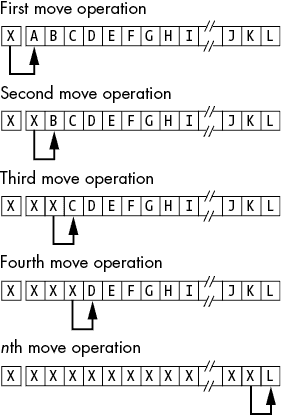
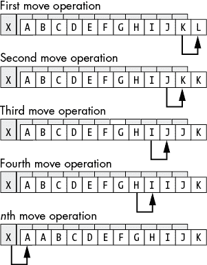
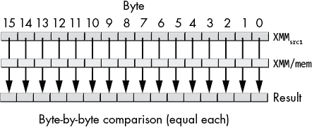

# 第十四章：字符串指令


*字符串*是存储在连续内存位置中的一组值。x86-64 CPU 可以处理四种类型的字符串：字节字符串、字字符串、双字字符串和四字字符串。

x86-64 微处理器系列支持几条专门用于处理字符串的指令。它们可以移动字符串、比较字符串、在字符串中查找特定值、将字符串初始化为固定值，并对字符串执行其他基础操作。x86-64 的字符串指令对于分配和比较数组、表格和记录也非常有用，它们可能大大加速你的数组操作代码。本章将探讨字符串指令的各种用途。

## 14.1 x86-64 字符串指令

所有 x86-64 系列处理器都支持五条字符串指令：`movs``x`、`cmps``x`、`scas``x`、`lods``x` 和 `stos``x`。^(1)（`x` = `b`、`w`、`d` 或 `q`，分别表示字节、字、双字或四字；本书通常在讨论这些字符串指令时省略 `x` 后缀。）移动、比较、扫描、加载和存储是你可以构建大多数其他字符串操作的基础。

字符串指令操作的是 *块*（连续的线性数组）内存。例如，`movs` 指令将一系列字节从一个内存位置移动到另一个位置，`cmps` 指令比较两个内存块，`scas` 指令扫描内存块以查找特定值。然而，源块和目标块（以及指令需要的任何其他值）并不是作为显式操作数提供的。相反，字符串指令使用特定寄存器作为操作数：

+   RSI（源索引）寄存器

+   RDI（目标索引）寄存器

+   RCX（计数）寄存器

+   AL、AX、EAX 和 RAX 寄存器

+   FLAGS 寄存器中的方向标志

例如，`movs`（*移动字符串*）指令将从 RSI 指定的源地址复制 RCX 个元素到 RDI 指定的目标地址。同样，`cmps` 指令将 RSI 指向的字符串（长度为 RCX）与 RDI 指向的字符串进行比较。

以下部分描述了如何使用这五条指令，首先是一个前缀，它使指令按照预期执行：对由 RSI 指向的字符串中的每个值重复操作。^(2)

### 14.1.1 rep、repe、repz、repnz 和 repne 前缀

单独使用时，字符串指令不会对数据字符串进行操作。例如，`movs` 指令只会复制一个字节、字、双字或四字。重复前缀告诉 x86-64 执行多字节字符串操作——具体来说，重复执行字符串操作最多 RCX 次。^(3)

带有重复前缀的字符串指令的语法如下：

```
rep prefix: 
     rep  movs`x`(`x` is b, w, d, or q)
 rep  stos`x`

repe prefix: (Note: repz is a synonym for repe)
     repe  cmps`x` 
     repe  scas`x`

repne prefix: (Note: repnz is a synonym for repne)
     repne  cmps`x`
     repne  scas`x`
```

通常不会将重复前缀与 `lods` 指令一起使用。

`rep` 前缀告诉 CPU “按 RCX 寄存器指定的次数重复此操作。” `repe` 前缀表示“当比较相等时，重复此操作，或重复 RCX 指定的次数（先满足的条件为止）。” `repne` 前缀的动作是“当比较不相等时，重复此操作，或重复 RCX 指定的次数。” 实际上，你会在大多数字符字符串比较中使用 `repe`；`repne` 主要与 `scas``x` 指令一起使用，用来在字符串中查找特定字符（如零终止字节）。

你可以使用重复前缀通过单条指令处理整个字符串。你也可以在不使用重复前缀的情况下使用字符串指令，作为字符串原始操作来合成更强大的字符串操作。

### 14.1.2 方向标志

FLAGS 寄存器中的 *方向标志* 控制 CPU 如何处理字符串。如果方向标志被清除，CPU 在处理每个字符串元素后会增加 RSI 和 RDI。例如，执行 `movs` 将会把 RSI 处的字节、字、双字或四字移动到 RDI，然后分别增加 RSI 和 RDI 1、2、4 或 8（依此类推）。当在此指令前指定 `rep` 前缀时，CPU 会为字符串中的每个元素增加 RSI 和 RDI（RCX 中的计数指定元素的数量）。完成后，RSI 和 RDI 寄存器将指向字符串之后的第一个元素。

如果方向标志被设置，x86-64 在处理每个字符串元素后会递减 RSI 和 RDI（同样，RCX 指定了重复字符串操作的元素数量）。之后，RSI 和 RDI 寄存器将指向字符串之前的第一个字节、字或双字。

你可以使用 `cld`（*清除方向标志*）和 `std`（*设置方向标志*）指令来改变方向标志的值。

微软 ABI 要求在进入一个（符合微软 ABI 的）过程时，方向标志必须被清除。因此，如果在过程内设置了方向标志，你应该在使用完它后始终清除该标志（特别是在调用其他代码或从过程返回之前）。

### 14.1.3 movs 指令

`movs` 指令使用以下语法：

```
movsb
movsw
movsd
movsq
rep  movsb
rep  movsw
rep  movsd
rep  movsq
```

`movsb`（*移动字符串，字节*）指令获取地址 RSI 处的字节，将其存储到地址 RDI，然后将 RSI 和 RDI 寄存器分别增加或减少 1。如果存在 `rep` 前缀，CPU 会检查 RCX 是否为 0。如果不是，它会将字节从 RSI 移动到 RDI 并递减 RCX 寄存器。这个过程会重复，直到 RCX 变为 0。如果 RCX 在初次执行时为 0，`movsb` 指令将不会复制任何数据字节。

`movsw`（*移动字符串，字长*）指令从地址 RSI 获取一个字，将其存储到地址 RDI，然后将 RSI 和 RDI 分别增加或减少 2。如果有`rep`前缀，CPU 会重复执行此过程 RCX 次。

`movsd`指令在双字（double words）上以类似的方式操作。在每次数据移动后，它会将 RSI 和 RDI 各增加或减少 4。

最后，`movsq`指令对四字（quad words）执行相同的操作。每次数据移动后，它会将 RSI 和 RDI 各增加或减少 8。

例如，这段代码将 384 字节从`CharArray1`复制到`CharArray2`：

```
CharArray1  byte 384 dup (?) 
CharArray2  byte 384 dup (?)
             . 
             . 
             . 
            cld
            lea  rsi, CharArray1
            lea  rdi, CharArray2
            mov  rcx, lengthof(CharArray1) ; = 384
        rep movsb
```

如果用`movsw`替换`movsb`，前面的代码将移动 384 个字（768 字节），而不是 384 个字节：

```
WordArray1  word 384 dup (?) 
WordArray2  word 384 dup (?)
             . 
             . 
             . 
            cld
            lea  rsi, WordArray1
            lea  rdi, WordArray2
            mov  rcx, lengthof(WordArray1) ; = 384
        rep movsw
```

记住，RCX 寄存器包含的是元素计数，而不是字节计数；幸运的是，MASM 中的`lengthof`操作符返回的是数组元素的数量（字长），而不是字节数量。

如果你在执行`movsq`、`movsb`、`movsw`或`movsd`指令之前设置了方向标志，CPU 将在每次移动一个字符串元素后递减 RSI 和 RDI 寄存器。这意味着，在执行`movsb`、`movsw`、`movsd`或`movsq`指令之前，RSI 和 RDI 寄存器必须指向各自字符串的最后一个元素。例如：

```
CharArray1 byte  384 dup (?) 
CharArray2 byte  384 dup (?) 
            . 
            . 
            . 
           std
           lea rsi, CharArray1[lengthof(CharArray1) - 1] 
           lea rdi, CharArray2[lengthof(CharArray1) - 1]
           mov rcx, lengthof(CharArray1);
       rep movsb
           cld
```

虽然有时从尾到头处理字符串是有用的（参见第 834 页的“比较扩展精度整数”），但通常情况下，你会按正向方向处理字符串。对于某一类字符串操作，能够在两种方向上处理字符串是必需的：当源和目标块重叠时移动字符串。考虑以下代码的执行：

```
CharArray1  byte ? 
CharArray2  byte 384 dup (?) 
             . 
             . 
             . 
            cld
            lea rsi, CharArray1
            lea rdi, CharArray2
            mov rcx, lengthof(CharArray2);
        rep movsb
```

这组指令将`CharArray1`和`CharArray2`当作一对 384 字节的字符串来处理。然而，`CharArray1`数组中的最后 383 个字节与`CharArray2`数组中的前 383 个字节重叠。让我们逐字节跟踪这段代码的执行。

当 CPU 执行`movsb`指令时，它会执行以下操作：

1.  将 RSI 指向的字节（`CharArray1`）复制到 RDI 指向的字节（`CharArray2`）。

1.  增加 RSI 和 RDI，并将 RCX 递减 1。现在 RSI 寄存器指向`CharArray1 + 1`（即`CharArray2`的地址），RDI 寄存器指向`CharArray2 + 1`。

1.  将 RSI 指向的字节复制到 RDI 指向的字节。然而，这个字节原本是从`CharArray1`位置复制过来的。因此，`movsb`指令将原本位于`CharArray1`位置的值复制到`CharArray2`和`CharArray2 + 1`位置。

1.  再次增加 RSI 和 RDI，并递减 RCX。

1.  将位于`CharArray1 + 2`（`CharArray2 + 1`）的字节复制到`CharArray2 + 2`位置。同样，这个值原本出现在`CharArray1`位置。

循环的每次重复都会将`CharArray1`中的下一个元素复制到`CharArray2`数组中下一个可用的位置。形象地看，类似于图 14-1。结果是`movsb`指令在字符串中复制了`X`。



图 14-1：在两个重叠数组之间复制数据（正向方向）

如果你真的希望在两个数组重叠时将一个数组移入另一个数组，你应该从两个字符串的末尾开始，逐个元素地将源字符串的每个元素移动到目标字符串，如图 14-2 所示。



图 14-2：使用反向复制复制重叠数组中的数据

设置方向标志并将 RSI 和 RDI 指向字符串的末尾，当两个字符串重叠并且源字符串的地址低于目标字符串时，这样可以让你（正确地）将一个字符串移动到另一个字符串。如果两个字符串重叠并且源字符串的地址高于目标字符串，则清除方向标志并将 RSI 和 RDI 指向两个字符串的开头。

如果两个字符串没有重叠，你可以使用任意一种技巧在内存中移动字符串。通常，清除方向标志进行操作是最简单的。

你不应该使用`movs``x`指令将一个数组填充为单一字节、字、双字或四字的值。另一个字符串指令`stos`在这种情况下要好得多。

如果你要从一个数组移动大量字节到另一个数组，使用`movsq`指令比使用`movsb`指令要更快。如果你要移动的字节数是 8 的偶数倍，那么这只是一个微不足道的变化；只需将要复制的字节数除以 8，将这个值加载到 RCX 寄存器中，然后使用`movsq`指令。如果字节数不能被 8 整除，你可以使用`movsq`指令复制数组中除了最后 1、2、……、7 个字节以外的所有字节（也就是说，除去字节数除以 8 后的余数）。例如，如果你想高效地移动 4099 个字节，你可以使用以下指令序列：

```
 lea  rsi, Source 
     lea  rdi, Destination 
     mov  rcx, 512     ; Copy 512 qwords = 4096 bytes
 rep movsq
     movsw             ; Copy bytes 4097 and 4098
     movsb             ; Copy the last byte
```

使用此技术复制数据时，最多只需要四个`movs``x`指令，因为你可以用不超过一个（每个）`movsb`、`movsw`和`movsd`指令来复制 1、……、7 个字节。如果两个数组按照四字对齐，这种方案最为高效。如果没有四字对齐，你可能需要将`movsb`、`movsw`或`movsd`指令（或所有三者）移到`movsq`指令之前或之后，以便`movsq`指令与四字对齐的数据一起工作。

如果你在程序执行时才知道要复制的块的大小，仍然可以使用如下代码来提高字节块移动的性能：

```
 lea  rsi, Source
     lea  rdi, Destination
     mov  rcx, Length
     shr  rcx, 3       ; Divide by 8
     jz   lessThan8    ; Execute movsq only if 8 or more bytes

 rep movsq             ; Copy the qwords

lessThan8: 
     mov  rcx, Length 
     and  rcx, 111b      ; Compute (Length mod 8)
     jz   divisibleBy8   ; Execute movsb only if # of bytes/8 <> 0

 rep movsb             ; Copy the remaining 1 to 7 bytes

divisibleBy8: 
```

在许多计算机系统上，`movsq`指令提供了一种快速的方式，将数据从一个位置复制到另一个位置。虽然在某些 CPU 上可能有更快的方式复制数据，但最终内存总线性能才是限制因素，而 CPU 通常比内存总线要快。因此，除非你有特别的系统，编写复杂的代码来提升内存到内存的传输速度可能是在浪费时间。

此外，英特尔在后来的处理器中改进了`movs``x`指令的性能，使得在复制相同数量字节时，`movsb`的效率与`movsw`、`movsd`和`movsq`相同。在这些后来的处理器上，使用`movsb`来复制指定数量的字节可能比之前提到的复杂方法更高效。

底线是：如果块移动的速度对你很重要，可以尝试几种不同的方法，并选择最快的（或者如果它们速度相同，选择最简单的，这种情况也很有可能）。

### 14.1.4 cmps 指令

`cmps`指令用于比较两个字符串。CPU 将 RDI 指向的值与 RSI 指向的值进行比较。当使用`repe`或`repne`前缀来比较整个字符串时，RCX 包含源字符串中的元素数量。像`movs`指令一样，MASM 允许此指令的几种形式：

```
cmpsb
cmpsw
cmpsd
cmpsq

repe   cmpsb
repe   cmpsw
repe   cmpsd
repe   cmpsq

repne  cmpsb
repne  cmpsw
repne  cmpsd
repne  cmpsq
```

如果没有重复前缀，`cmps`指令会将 RDI 位置的值与 RSI 位置的值相减，并根据结果更新标志（结果会被丢弃）。在比较完这两个位置后，`cmps`会根据`cmpsb`、`cmpsw`、`cmpsd`和`cmpsq`的不同，分别将 RSI 和 RDI 寄存器加 1、加 2、加 4 或加 8。如果方向标志为清除，`cmps`会递增 RSI 和 RDI 寄存器，否则会递减它们。

请记住，RCX 寄存器中的值决定了处理的元素数量，而不是字节数。因此，在使用`cmpsw`时，RCX 指定比较的字数。同样，`cmpsd`和`cmpsq`时，RCX 包含要处理的双字和四字的数量。

`repe`前缀会在元素相等并且 RCX 大于 0 时，比较字符串中的连续元素。`repne`前缀则在元素不相等时执行相同操作。

执行完`repne cmps`后，RCX 寄存器的值为 0（此时两个字符串完全不同），或者 RCX 包含两个字符串中比较的元素数量，直到找到匹配项。虽然这种形式的`cmps`指令对比较字符串并不特别有用，但它对于定位字节、字或双字数组中第一对匹配的元素非常有用。

#### 14.1.4.1 比较字符字符串

字符串通常使用 *字典顺序* 来比较，也就是你从小到大熟悉的标准字母顺序。我们比较对应的元素，直到遇到一个不匹配的字符或更短字符串的结尾。如果一对对应的字符不匹配，就基于该字符来比较两个字符串。如果两个字符串匹配到更短字符串的长度，那么就比较它们的长度。只有当两个字符串的长度相等，并且每对对应的字符都完全相同，两个字符串才被认为相等。字符串的长度只在两个字符串在更短字符串的长度范围内完全相等时才影响比较。例如，`Zebra` 小于 `Zebras`，因为它是较短的那个字符串；然而，尽管 `Zebra` 较短，它还是大于 `AAAAAAAAAAH!`。

对于（ASCII）字符字符串，请按以下方式使用 `cmpsb` 指令：

1.  清除方向标志。

1.  将 RCX 寄存器加载为较短字符串的长度。

1.  将 RSI 和 RDI 寄存器指向你要比较的两个字符串的第一个字符。

1.  使用 `repe` 前缀和 `cmpsb` 指令按字节逐一比较字符串。

1.  如果两个字符串相等，则比较它们的长度。

以下代码比较了几个字符字符串：

```
 cld
       mov  rsi, AdrsStr1
       mov  rdi, AdrsStr2
       mov  rcx, LengthSrc
       cmp  rcx, LengthDest
       jbe  srcIsShorter        ; Put the length of the 
                                ; shorter string in RCX
       mov  rcx, LengthDest 

srcIsShorter:
  repe cmpsb
       jnz   notEq              ; If equal to the length of the 
                                ; shorter string, cmp lengths
       mov   rcx, LengthSrc
       cmp   rcx, LengthDest

notEq: 
```

如果你使用字节来存储字符串长度，应该适当地调整此代码（即，使用 `movzx` 指令将长度加载到 RCX 寄存器中）。

#### 14.1.4.2 比较扩展精度整数

你还可以使用 `cmps` 指令来比较多字整数值（即扩展精度整数值）。由于进行字符串比较需要一定的设置，因此对于小于六个或八个双字长度的整数值，这种方法并不实际，但对于大整数值来说，非常适用。

与字符串不同，我们不能通过字典顺序来比较整数串。在比较字符串时，我们从最低有效字节到最高有效字节依次比较字符。而在比较整数时，我们必须从最高有效字节、字或双字开始，逐步比较到最低有效字节。所以，要比较两个 32 字节（256 位）的整数值，可以使用以下代码：

```
 std
     lea  rsi, SourceInteger[3 * 8]
     lea  rdi, DestInteger[3 * 8]
     mov  rcx, 4
repe cmpsq
     cld
```

该代码将整数从最重要的四字（qword）到最不重要的四字进行比较。`cmpsq` 指令在两个值不相等时停止，或者当 RCX 递减至 0 时停止（意味着两个值相等）。一如既往，标志提供比较结果。

### 14.1.5 `scas` 指令

`scas`（*扫描字符串*）指令用于在字符串中查找特定元素——例如，快速扫描另一个字符串中的 0。

与 `movs` 和 `cmps` 指令不同，`scas` 只需要一个目标字符串（由 RDI 指向）。源操作数是 AL（`scasb`）、AX（`scasw`）、EAX（`scasd`）或 RAX（`scasq`）寄存器中的值。`scas` 指令将累加器中的值（AL、AX、EAX 或 RAX）与由 RDI 指向的值进行比较，然后将 RDI 增加（或减少）1、2、4 或 8。CPU 根据比较结果设置标志。

`scas` 指令有以下几种形式：

```
scasb
scasw
scasd
scasq

repe   scasb
repe   scasw
repe   scasd
repe   scasq

repne  scasb
repne  scasw
repne  scasd
repne  scasq
```

使用 `repe` 前缀时，`scas` 扫描字符串，寻找一个与累加器中的值不匹配的元素。使用 `repne` 前缀时，`scas` 扫描字符串，寻找第一个与累加器中的值相等的元素。这有点反直觉，因为 `repe` `scas` 实际上是在扫描字符串，而累加器中的值与字符串操作数相等，`repne` `scas` 则是在扫描字符串，而累加器的值与字符串操作数不相等。

与 `cmps` 和 `movs` 指令一样，RCX 寄存器中的值指定了在使用重复前缀时要处理的元素数量，而不是字节数量。

### 14.1.6 `stos` 指令

`stos` 指令将累加器中的值存储到由 RDI 指定的位置。存储值后，CPU 会根据方向标志的状态增加或减少 RDI。虽然 `stos` 指令有很多用途，但它的主要用途是将数组和字符串初始化为常量值。例如，如果你有一个 256 字节的数组，想用 0 清空它，可以使用以下代码：

```
 cld
     lea  rdi, DestArray
     mov  rcx, 32          ; 32 quad words = 256 bytes
     xor  rax, rax         ; Zero out RAX
rep  stosq
```

这段代码写入的是 32 个四字，而不是 256 个字节，因为单个 `stosq` 操作比四个 `stosb` 操作要快（在一些旧的 CPU 上）。

`stos` 指令有八种形式：

```
stosb
stosw
stosd
stosq

rep  stosb
rep  stosw
rep  stosd
rep  stosq
```

`stosb` 指令将 AL 寄存器中的值存储到指定的内存位置，`stosw` 将 AX 寄存器存储到指定的内存位置，`stosd` 将 EAX 存储到指定的位置，`stosq` 将 RAX 存储到指定的位置。使用 `rep` 前缀时，这个过程会重复 RCX 寄存器指定的次数。

如果你需要初始化一个元素值不同的数组，你无法（轻易地）使用 `stos`。

### 14.1.7 `lods` 指令

`lods` 指令将由 RSI 指向的字节、字、双字或四字复制到 AL、AX、EAX 或 RAX 寄存器中，之后它会增加或减少 RSI 寄存器的值，步长为 1、2、4 或 8。使用 `lods` 从内存中获取字节（`lodsb`）、字（`lodsw`）、双字（`lodsd`）或四字（`lodsq`）以进行进一步处理。

与 `stos` 一样，`lods` 指令也有八种形式：

```
lodsb
lodsw
lodsd
lodsq

rep  lodsb
rep  lodsw
rep  lodsd
rep  lodsq
```

你可能永远不会在此指令中使用重复前缀，因为每次 `lods` 重复时，累加器寄存器都会被覆盖。重复操作结束时，累加器将包含从内存读取的最后一个值。^(4)

### 14.1.8 从 lods 和 stos 构建复杂的字符串函数

你可以使用 `lods` 和 `stos` 指令生成任何特定的字符串操作。例如，假设你需要一个将字符串中的所有大写字符转换为小写的字符串操作。你可以使用以下代码：

```
 mov rsi, StringAddress  ; Load string address into RSI
     mov rdi, rsi            ; Also point RDI here
     mov rcx, stringLength   ; Presumably, this was precomputed 
     jrcxz skipUC            ; Don't do anything if length is 0
rpt:
     lodsb                   ; Get the next character in the string
     cmp   al, 'A'
     jb    notUpper
     cmp   al, 'Z'
     ja    notUpper
     or    al, 20h           ; Convert to lowercase
notUpper:
     stosb                   ; Store converted char into string
     dec   rcx
     jnz   rpt               ; Zero flag is set when RCX is 0
skipUC:
```

`rpt` 循环获取 RSI 指定位置的字节，测试其是否为大写字母，如果是，则将其转换为小写字母（如果不是，则保持不变），然后将结果字符存储在 RDI 指定的位置，并重复这一过程，直到 RCX 中的值指定的次数为止。

由于 `lods` 和 `stos` 指令使用累加器作为中介位置，你可以使用任何累加器操作来快速操作字符串元素。这可以是像 `toLower`（或 `toUpper`）这样的简单函数，也可以是像数据加密这样的复杂操作。你甚至可以使用这一指令序列在将数据从一个字符串移动到另一个字符串时计算哈希值、校验和或 CRC 值。在移动字符串数据的同时，你对字符串逐字符进行的任何操作都是可行的。

## 14.2 x86-64 字符串指令的性能

在早期的 x86-64 处理器中，字符串指令提供了操作字符串和数据块的最有效方法。然而，这些指令并不是 Intel RISC 核心指令集的一部分，因此可能比使用离散指令执行相同操作时要慢（尽管它们更紧凑）。Intel 在后来的处理器上优化了 `movs` 和 `stos` 指令，使其尽可能快速运行，但其他字符串指令可能相对较慢。

和往常一样，建议通过使用不同的算法（包括使用和不使用字符串指令的算法）来实现性能关键的算法，并通过比较它们的性能来确定使用哪种解决方案。由于字符串指令相对于其他指令的运行速度取决于你使用的处理器，因此请在你预期代码运行的处理器上进行实验。

## 14.3 SIMD 字符串指令

SSE4.2 指令集扩展包括四条强大的字符字符串操作指令。这些指令最早在 2008 年推出，因此今天仍有一些计算机可能不支持它们。在尝试在广泛分发的商业应用程序中使用它们之前，请始终使用 `cpuid` 来确定这些指令是否可用（请参见第十一章中的“使用 cpuid 区分指令集”）。

处理文本和字符串片段的四条 SSE4.2 指令如下：

1.  `PCMPESTRI` 打包比较显式长度字符串，返回索引

1.  `PCMPESTRM` 打包比较显式长度字符串，返回掩码

1.  `PCMPISTRI` 打包比较隐式长度字符串，返回索引

1.  `PCMPISTRM` 打包比较隐式长度字符串，返回掩码

*隐式长度字符串*使用哨兵（尾部）字节标记字符串的结束，具体来说，是一个零终止字节（或在 Unicode 字符的情况下是字）。*显式长度字符串*是那些你需要提供字符串长度的字符串。

产生索引的指令返回源字符串中第一次（或最后一次）匹配的索引。返回位掩码的指令返回一个包含 0 或（全部）1 位的数组，标记两个输入字符串中每个匹配的出现位置。

打包比较字符串指令是 x86-64 指令集中最复杂的指令之一。这些指令的语法为

```
pcmp`X`str`Y`  `xmm`[src1], `xmm`[src2]/`mem`[src2], `imm`[8]
vpcmp`X`str`Y` `xmm`[src1], `xmm`[src2]/`mem`[src2], `imm`[8]
```

其中 `X` 为 `E` 或 `I`，`Y` 为 `I` 或 `M`。这两种形式都使用 128 位操作数（在这种情况下，`v` 前缀形式没有 256 位的 YMM 寄存器），并且与大多数 SSE 指令不同，`(v)pcmp``X``str``Y` 指令允许操作数不按 16 字节对齐（如果需要 16 字节对齐的内存操作数，它们将几乎无法用于其预期操作）。

`(v)pcmp``X``str``Y` 指令比较一对 XMM 寄存器中相应的字节或字，将各个比较结果合并成一个向量（位掩码），并返回所有比较的结果。`imm`[8] 操作数控制各种比较属性，如“比较类型”中所述（见下一页）。

### 14.3.1 打包比较操作数大小

立即数操作数的第 0 位和第 1 位指定字符串元素的大小和类型。元素可以是字节或字，或者它们可以作为无符号或有符号值用于比较（请参见 表 14-1）。

位 0 指定字（Unicode）或字节（ASCII）操作数。位 1 指定操作数是有符号还是无符号。通常，对于字符字符串，使用无符号比较。然而，在某些情况下（或处理整数而非字符的字符串时），你可能需要指定有符号比较。

表 14-1：打包比较 `imm`[8] 第 0 位和第 1 位

| **位(s)** | **位值** | **含义** |
| --- | --- | --- |
| 0–1 | 00 | 两个源操作数都包含 16 个无符号字节。 |
|  | 01 | 两个源操作数都包含 8 个无符号字。 |
|  | 10 | 两个源操作数都包含 16 个有符号字节。 |
|  | 11 | 两个源操作数都包含 8 个有符号字。 |

### 14.3.2 比较类型

立即数操作数的第 2 位和第 3 位指定指令如何比较这两个字符串。有四种比较类型，它们分别是：测试一个字符串中的字符与第二个字符串中的字符集合进行比较，测试一个字符串中的字符与字符范围进行比较，执行字符串的直接比较，或者在另一个字符串中搜索子字符串（见 表 14-2）。

表 14-2：打包比较 `imm`[8] 第 2 位和第 3 位

| **位(s)** | **位值** | **含义** |
| --- | --- | --- |
| 2–3 | 00 | 等于任何：比较第二个源字符串中的每个字符与第一个源操作数中出现的字符集合。 |
|  | 01 | 范围：将第二个源操作数中的每个值与第一个源操作数指定的一组范围进行比较。 |
|  | 10 | 每个相等：逐字符比较两个操作数的每个对应元素的相等性。 |
|  | 11 | 有序相等：在由第二个操作数指定的字符串中查找由第一个操作数指定的子字符串。 |

位 2 到 3 指定要执行的比较类型（在 Intel 术语中称为*聚合操作*）。*每个相等*（10b）可能是最容易理解的比较方式。打包的比较指令将比较字符串中每个相应的字符（最多到字符串的长度——稍后会详细说明），并为字符串中每个字节或字的比较结果设置一个布尔标志，如图 14-3 所示。这与 C/C++的`memcmp()`或`strcmp()`函数的操作类似。



图 14-3：每个相等聚合比较操作

*任意相等*比较将第二个源操作数中的每个字节与第一个源操作数中的字符进行比较，看它是否与其中的任何一个字符匹配（XMM[src2]/mem[src2]）。例如，如果 XMM[src1]包含字符串`abcdefABCDEF`（以及四个 0 字节），而 XMM[src2]/mem[src2]包含`12AF89C0`，则结果比较将产生 00101100b（在对应于字符 A、F 和 C 的位置上是 1）。还请注意，第一个字符（1）映射到位 0，A 和 F 字符分别映射到位 2 和 3。这类似于 C 标准库中的`strspn()`和`strcspn()`函数。

*有序相等*比较将在 XMM[src1]中查找每个可以在 XMM[src2]/mem[src2]操作数中找到的字符串。例如，如果 XMM[src2]/mem[src2]操作数包含字符串`never need shine`，而 XMM[src1]操作数包含字符串`ne`（用 0 填充），则有序相等比较将生成向量 0100000001000001b。这类似于 C 标准库中的`strstr()`函数。

*范围*比较聚合操作将 XMM[src1]操作数中的条目分成成对（在寄存器的偶数和奇数索引处）。第一个元素（字节或字）指定下限，第二个条目指定上限。XMM[src1]寄存器最多支持八个字节范围或四个字范围（如果需要更少的范围，可以将剩余的对填充为 0）。此聚合操作将 XMM[src2]/mem[src2]操作数中的每个字符与这些范围中的每个进行比较，如果字符在指定的范围内（包括在内），则在结果向量中存储 true，如果它超出了这些范围，则存储 false。

### 14.3.3 结果极性

立即数操作数的位 4 和位 5 指定结果的极性（见表 14-3）。本章将在稍后详细讨论这些位的含义（需要一些额外的注释）。

表 14-3: 打包比较 `imm`[8] 位 4 和 5

| **位** | **位值** | **含义** |
| --- | --- | --- |
| 4–5 | 00 | 正极性 |
|  | 01 | 负极性 |
|  | 10 | 正掩码 |
|  | 11 | 负掩码 |

### 14.3.4 输出处理

立即操作数的第 6 位指定指令结果（参见 表 14-4）。打包比较指令不使用第 7 位；它应始终为 0。

表 14-4: 打包比较 `imm`[8] 位 6（和 7）

| **位** | **位值** | **含义** |
| --- | --- | --- |
| 6 | 0 | 仅限 `(v)pcom``X``stri`，返回的索引存储在 ECX 中，是第一个结果。仅限 `(v)pcom``X``strm`，掩码出现在 XMM0 的低位，零扩展到 128 位。 |
|  | 1 | 仅限 `(v)pcom``X``stri`，返回的索引存储在 ECX 中，是最后一个结果。仅限 `(v)pcom``X``strm`，将位掩码扩展为字节或字掩码。 |
| 7 | 0 | 此位保留，应始终为 0。 |

`(v)pcmpestrm` 和 `(v)pcmpistrm` 指令生成一个位掩码结果并将其存储到 XMM0 寄存器中（这是固定的——CPU 不根据这些指令的操作数来确定）。如果 `imm`8 操作数的第 6 位是 0，这两个指令会将该位掩码打包成 8 或 16 位并存储到 XMM0 的低 8 位（或 16 位），并将该值零扩展到 XMM0 的高位。如果 `imm`8 位 6 是 1，这些指令将会将位掩码（每个字节或字的所有 1 位）存储到整个 XMM0 寄存器中。^(5)

`(v)pcmpestri` 和 `(v)pcmpistri` 指令生成一个索引结果，并将该值返回到 ECX 寄存器中。^(6) 如果 `imm`8 操作数的第 6 位是 0，这两个指令返回结果位掩码中最低位设置的位的索引（即，第一个匹配的比较）。如果 `imm`8 操作数的第 6 位是 1，这些指令返回结果位掩码中最高位设置的位的索引（即，最后一个匹配的比较）。如果结果位掩码中没有设置的位，这些指令将返回 16（用于字节比较）或 8（用于字比较）到 ECX 寄存器。尽管这些指令在内部生成位掩码结果以计算索引，但它们不会覆盖 XMM0 寄存器（与 `(v)pcmpestrm` 和 `(v)pcmpistrm` 指令不同）。

### 14.3.5 打包字符串比较长度

`(v)pcmp``X``str``Y` 指令有一个 16 字节（XMM 寄存器大小）的比较限制。即使在具有 32 字节 YMM 寄存器的 AVX 处理器上也是如此。要比较更大的字符串，需要执行多个 `(v)pcmp``X``str``Y` 指令。

`(v)pcmpistri`和`(v)pcmpistrm`指令使用隐式字符串长度。字符串出现在 XMM 寄存器或内存中，首字符（如果有）出现在 LO 字节中，后续字符按顺序排列。字符串以零终止字节或字结束。如果字符数超过 16（字节字符串）或 8（字字符串），则寄存器（或 128 位内存）大小将限制字符串的长度。

`(v)pcmpestri`和`(v)pcmpestrm`指令使用显式提供的字符串长度。RAX 和 EAX 寄存器指定 XMM[src1]中字符串的长度，RDX 和 EDX 寄存器指定 XMM[src2]/mem[src2]中字符串的长度。如果字符串长度大于 16（字节字符串）或 8（字字符串），指令会将长度饱和为 16 或 8。另外，`(v)pcmpestri`和`(v)pcmpestrm`指令会取长度的绝对值，因此-1 到-16 等同于 1 到 16。

显式长度指令将长度饱和为 16（或 8）的原因是允许程序在循环中处理更大的字符串。通过在循环中每次处理 16 字节（或 8 字）并递减总字符串长度（从某个大值递减到 0），打包字符串操作将在每次循环迭代时处理 16 个或 8 个字符，直到最后一次循环迭代。在这一点上，指令将处理字符串中剩余的（总长度对 16 或 8 取模）字符。

显式长度指令取长度的绝对值的原因是允许处理大字符串的代码将循环计数器（从大正值到 0 递减）或（从负值递增）到 0，以便程序能够更方便地操作。

当长度（隐式或显式）小于 16（字节）或 8（字）时，XMM 寄存器（或 128 位内存位置）中的某些字符将无效。具体来说，零终止字符后的每个字符（对于隐式长度字符串）或超出 RAX 和 EAX 或 RDX 和 EDX 中计数的部分将无效。无论是否存在无效字符，打包比较指令仍会通过比较字符串中的所有字符，生成一个中间位向量结果。

由于两个输入字符串（在 XMM[src1]和 XMM[src2]/mem[src2]中）的字符串长度不一定相等，因此有四种可能的情况：`src1`和`src2`都无效，恰好一个源操作数无效（另一个有效，所以这里有两种情况），或者两者都有效。根据哪个操作数有效或无效，打包比较指令可能会强制结果为真或假。表 14-5 列出了这些指令如何强制结果，具体取决于`imm`8 操作数指定的比较类型（聚合操作）。 

表 14-5：当源 1 和源 2 有效或无效时的比较结果

| **Src1** | **Src2** | **等任意** | **范围** | **等每个** | **等序** |
| --- | --- | --- | --- | --- | --- |
| 无效 | 无效 | 强制假 | 强制假 | 强制真 | 强制真 |
| 无效 | 有效 | 强制假 | 强制假 | 强制假 | 强制真 |
| 有效 | 无效 | 强制假 | 强制假 | 强制假 | 强制假 |
| 有效 | 有效 | 结果 | 结果 | 结果 | 结果 |

要理解此表中的条目，你必须分别考虑每种比较类型。

*等任意*比较会检查`src2`中每个出现的字符是否出现在`src1`指定的字符集内。如果`src1`中的某个字符无效，那意味着指令正在比较一个不在字符集中的字符；在这种情况下，你希望返回假（不论`src2`是否有效）。如果`src1`有效但`src2`无效，则你已经到达（或超过）字符串的末尾；这不是一个有效的比较，因此*等任意*也会在这种情况下强制返回假结果。

*范围*比较也是（某种意义上）将源字符串（`src2`）与一组字符（由`src1`中的范围指定）进行比较。因此，如果任一操作数无效，打包比较指令会强制返回假，原因与*等任意*比较相同。

*等每个*比较是传统的字符串比较操作，比较`src2`中的字符串与`src1`中的字符串。如果两个字符串中对应的字符无效，那么你已经越过了两个字符串的末尾。打包比较指令在这种情况下会强制返回真，因为这些指令实际上是在比较空字符串（空字符串是相等的）。如果一个字符串中的字符有效，而另一个字符串中对应的字符无效，那么你是在将实际字符与空字符串进行比较，这总是*不相等*；因此，打包字符串比较指令会强制返回假结果。

*等序*操作会在较大的字符串 XMM[src2]/mem[src2]中查找子字符串 XMM[src1]。如果你已经超出了两个字符串的末尾，你实际上是在比较空字符串（而且一个空字符串总是另一个空字符串的子字符串），因此，打包比较指令会返回一个真实结果。如果你已经到达`src1`字符串的末尾（即要查找的子字符串），即使`src2`中还有更多字符，结果也为真；因此，在这种情况下，打包比较会返回真。然而，如果你已经到达`src2`字符串的末尾，但`src1`（子字符串）字符串还没到末尾，*等序*操作就不可能返回真，因此，打包比较指令会在这种情况下强制返回假。

如果极性位（`imm`8 的第 4 到第 5 位）包含 00b 或 10b，则极性位不会影响比较操作。如果极性位是 01b，打包字符串比较指令在将数据复制到 XMM0（`(v)pcmpistrm`和`(v)pcmpestrm`）或计算索引（`(v)pcmpestri`和`(v)pcmpistri`）之前，会反转临时位图结果中的所有位。如果极性设置为 11b，则打包字符串比较指令仅在对应的`src2`字符有效时，才反转结果位。

### 14.3.6 打包字符串比较结果

关于打包字符串比较指令的最后一点要注意的是它们如何影响 CPU 标志。这些指令在 SSE/AVX 指令中比较特殊，因为它们会影响条件代码。然而，它们并不会以标准方式影响条件代码（例如，你不能像使用`cmps`指令那样，通过进位标志和零标志测试字符串是否小于或大于）。相反，这些指令重新定义了进位、零、符号和溢出标志的含义；此外，每条指令独立地定义这些标志的含义。

所有八条指令—`(v)pcmpestri`、`(v)pcmpistri`、`(v)pcmpestrm`和`(v)pcmpistrm`—如果（内部）结果位图中的所有位都是 0（无比较），则清除进位标志；如果位图中至少有 1 个位被设置，则设置进位标志。请注意，进位标志在应用极性后被设置或清除。

零标志指示`src2`的长度是否小于 16（对于字字符是 8）。对于`(v)pcmpestri`和`(v)pcmpestrm`指令，如果 EDX 小于 16（8），则设置零标志；对于`(v)pcmpistri`和`(v)pcmpistrm`指令，如果 XMM[src2]/mem[src2]包含空字符，则设置零标志。

符号标志指示`src1`的长度是否小于 16（对于字字符是 8）。对于`(v)pcmpestri`和`(v)pcmpestrm`指令，如果 EAX 小于 16（8），则设置符号标志；对于`(v)pcmpistri`和`(v)pcmpistrm`指令，如果 XMM[src1]包含空字符，则设置零标志。

溢出标志包含结果位图的第 0 位的设置（即，源字符串的第一个字符是否匹配）。这在执行等序比较后可能会很有用，可以用来检查子字符串是否是较大字符串的前缀（例如）。

## 14.4 对齐和内存管理单元页面

`(v)pcmp``X``str``Y`指令的优点在于它们不要求其内存操作数是 16 字节对齐的。然而，这种缺乏对齐性会产生一个特殊问题：单条`(v)pcmp``X``str``Y`指令的内存访问可能会跨越 MMU 页面边界。如在第三章“内存访问和 4K 内存管理单元页面”中所述，一些 MMU 页面可能无法访问，如果 CPU 尝试从这些页面读取数据，将生成一般保护错误。

如果字符串的长度小于 16 字节并且在页面边界之前结束，使用 `(v)pcmp``X``str``Y` 来访问该数据可能会导致意外的页面错误，因为它会从内存中读取完整的 16 字节数据，包括字符串末尾之后的数据。虽然访问超出字符串并跨越到新的、不可访问的 MMU 页面的数据是一个罕见的情况，但它确实可能发生，因此你需要确保不会跨越 MMU 页面边界访问数据，除非下一个 MMU 页面包含实际数据。

如果你已将地址对齐到 16 字节边界，并且从该地址开始访问 16 字节内存，你就不必担心会跨越新的 MMU 页面。MMU 页面包含 16 字节的整数倍（一个 MMU 页面包含 256 个 16 字节的块）。如果 CPU 从 16 字节边界开始访问 16 字节数据，那么该块的最后 15 字节会落在与第一个字节相同的 MMU 页面中。这就是为什么大多数 SSE 内存访问是安全的：它们要求 16 字节对齐的内存操作数。例外情况是未对齐的移动指令和 `(v)pcmp``X``str``Y` 指令。

通常你使用未对齐的移动指令（例如，`movdqu` 和 `movupd`）将 16 个实际字节的数据移动到 SSE/AVX 寄存器中；因此，这些指令通常不会访问内存中的额外字节。然而，`(v)pcmp``X``str``Y` 指令通常会访问超出实际字符串末尾的数据字节。这些指令会从内存中读取完整的 16 字节，即使字符串实际使用的字节少于 16 个。因此，在使用 `(v)pcmp``X``str``Y` 指令（以及其他未对齐的移动指令，如果你使用它们来读取数据结构的末尾之外的内容）时，你应该确保你提供的内存地址至少距离 MMU 页面末尾 16 字节，或者确保内存中的下一页包含有效数据。

如第三章所述，机器指令没有允许你测试内存页面是否能合法访问的指令。因此，你必须确保 `(v)pcmp``X``str``Y` 指令的任何内存访问都不会跨越页面边界。下一章提供了几个例子。

## 14.5 获取更多信息

Agner Fog 是全球顶尖的 x86(-64) 汇编语言优化专家之一。他的网站 ([`www.agner.org/optimize/#manuals/`](https://www.agner.org/optimize/#manuals/)) 详细介绍了优化内存移动和其他字符串指令的内容。如果你想编写快速的 x86 汇编语言字符串代码，强烈推荐这个网站。

T. Herselman 花费了大量时间编写快速的`memcpy`函数。你可以在[`www.codeproject.com/Articles/1110153/Apex-memmove-the-fastest-memcpy-memmove-on-x-x-EVE/`](https://www.codeproject.com/Articles/1110153/Apex-memmove-the-fastest-memcpy-memmove-on-x-x-EVE/)（或者搜索网络上的*Apex memmove*）找到他的成果。这段代码的长度无疑会让你决定继续使用`movs`指令（在现代 x86-64 CPU 上运行相当快）。

## 14.6 自我测试

1.  通用字符串指令支持什么大小的操作数？

1.  五个通用字符串指令是什么？

1.  `pcmp``X``str``Y`指令支持什么大小的操作数？

1.  `rep` `movsb`指令使用哪些寄存器？

1.  `cmpsw`指令使用哪些寄存器？

1.  `repne` `scasb`指令使用哪些寄存器？

1.  `stosd`指令使用哪些寄存器？

1.  如果你希望在每次字符串操作后递增 RSI 和 RDI 寄存器，应该设置什么方向标志？

1.  如果你希望在每次字符串操作后递减 RSI 和 RDI 寄存器，应该设置什么方向标志？

1.  如果一个函数或过程修改了方向标志，那么它在返回之前应该做什么？

1.  如果函数修改了方向标志的值，微软 ABI 要求函数在返回之前 _ 方向标志。

1.  哪些字符串指令是 Intel 为后来的 x86-64 CPU 优化的，以提高性能？

1.  你在使用`movs`指令之前，何时需要设置方向标志？

1.  你在使用`movs`指令之前，何时需要清除方向标志？

1.  如果方向标志没有正确设置，当你执行`movs`指令时会发生什么情况？

1.  通常使用哪个字符串前缀与`cmpsb`一起测试两个字符串是否相等？

1.  在比较两个字符串时，通常应该如何设置方向标志？

1.  在执行带有重复前缀的字符串指令之前，是否需要测试 RCX 是否为 0？

1.  如果你想在 C/C++字符串中查找一个以零终止的字节，最合适的（通用）字符串指令是什么？

1.  如果你想用 0 填充一块内存，最合适的字符串指令是什么？

1.  如果你想编写自己的字符串操作，你会使用哪些字符串指令？

1.  哪个字符串指令通常不与重复前缀一起使用？

1.  在使用`pcmp``X``str``Y`指令之前，你应该做什么？

1.  哪些 SSE 字符串指令自动处理零终止字符串？

1.  哪些 SSE 字符串指令需要显式的长度值？

1.  在`pcmp``X``str``Y`指令中，你应该在哪里传递显式长度？

1.  哪个`pcmp``X``str``Y`聚合操作用于搜索属于字符集合的字符？

1.  哪个`pcmp``X``str``Y`聚合操作用于比较两个字符串？

1.  哪个`pcmp``X``str``Y`聚合操作检查一个字符串是否是另一个字符串的子串？

1.  `pcmp``X``str``Y` 指令和 MMU 页有什么问题？
