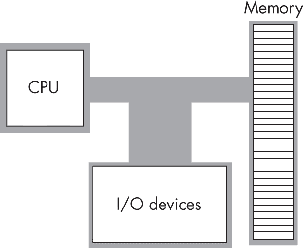
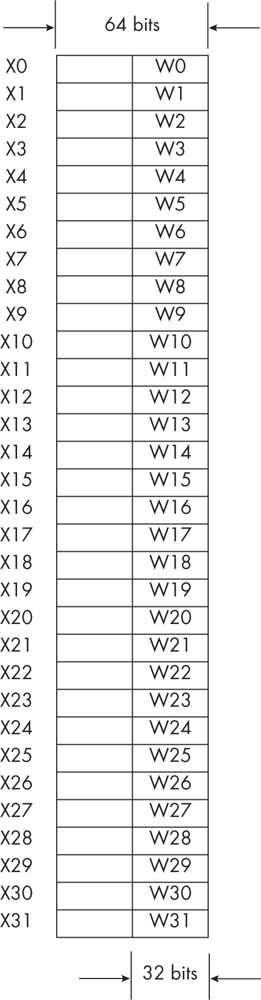
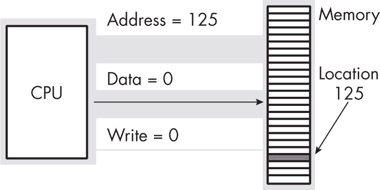
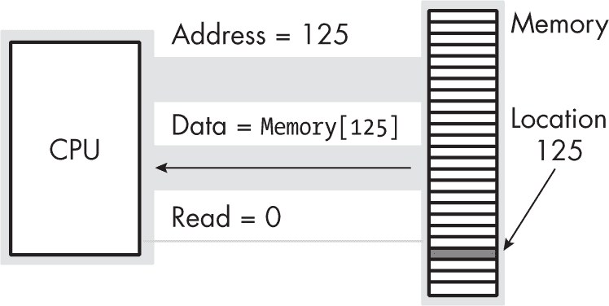
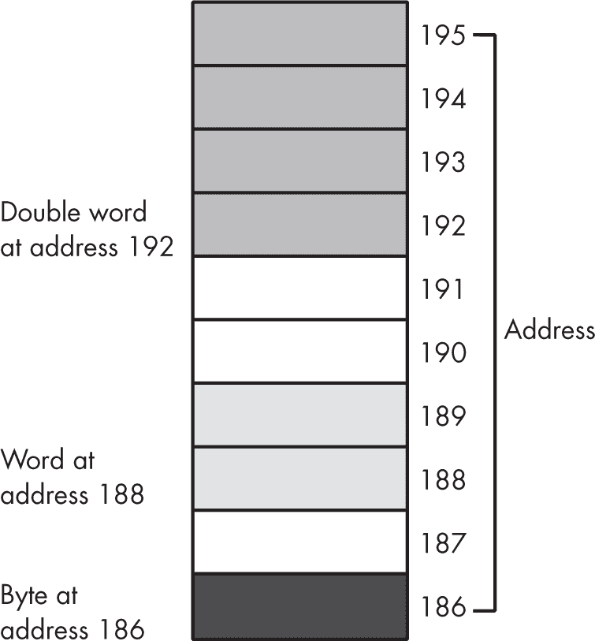

## 第一章：1 汇编语言的世界，你好


本章是一个“快速入门”章节，旨在让您尽可能快速地开始编写基本的汇编语言程序，为您学习后续章节中的新汇编语言特性提供必要的技能。您将学习 64 位 ARM 架构的基础知识以及 GNU 汇编器（Gas）程序的基本语法，Gas 是一个汇编语言编译器。

您还将学习为变量分配内存、通过使用机器指令控制 CPU，并将 Gas 程序与 C/C++代码链接，以便调用 C 标准库（C stdlib）中的例程。Linux 和 macOS 下运行的 Gas 汇编器是编写实际 ARM 汇编语言程序最常用的汇编器。供应商（特别是苹果公司）生产了 Gas 的变体，具有略微不同的语法；例如，在 macOS 下，Gas 被称为*Clang*或*Mach-O*汇编器。为了使本书中的源代码能够在 macOS 和 Linux 之间可移植，本章还介绍了一个头文件*aoaa.inc*，它消除了 Gas 和 Clang 汇编器之间的差异。

### 1.1 您需要的工具

要使用 Gas 学习汇编语言编程，您需要为您的平台准备一个汇编器版本，以及一个文本编辑器，用于创建和修改 Gas 源文件，还有一个链接器、各种库文件和一个 C++编译器。您将在本节中学习如何设置 Gas 汇编器和文本编辑器，其他工具将在本章后续部分介绍。

#### 1.1.1 设置 Gas

GNU 编译器集合（GCC）将 Gas 源代码作为其输出（然后 Gas 将其转换为目标代码）。因此，如果您的系统上已经安装了编译器套件，那么您也就拥有了 Gas。苹果 macOS 使用基于 LLVM 编译器套件的编译器，而不是 GCC，因此如果您使用 macOS，您需要安装其 Xcode 集成开发环境（IDE）以访问汇编器（见附录 C）。如果没有 GCC 编译器，请根据您的操作系统（OS）文档中的说明安装它。

> 注意

*GNU 汇编器和 Clang 汇编器的可执行文件名实际上是*as*（汇编器）。本书中的示例很少直接调用汇编器，因此您不会经常使用*as*程序。因此，本书使用*Gas*而不是*as*（或 Clang 汇编器）来指代汇编器。*

#### 1.1.2 设置文本编辑器

要编写 ARM 汇编语言程序，您需要某种程序员文本编辑器来创建汇编语言源文件。编辑器的选择取决于个人喜好以及操作系统或开发套件中可用的编辑器。

汇编语言源文件的标准后缀是 *.s*，因为在编译时，GCC 会在将 C/C++ 文件转换为汇编语言时发出这个后缀。对于手写的汇编语言源文件，*.S* 后缀是更好的选择，因为它告诉汇编器在汇编之前通过 C 预处理器（CPP）处理源文件。由于这样可以使用 CPP 宏（#define 语句）、条件编译和其他功能，因此本书中的所有示例文件都使用 *.S*。

GCC 总是生成汇编语言输出文件，然后由 Gas 处理。GCC 会自动调用汇编器，并在汇编完成后删除汇编源文件。

#### 1.1.3 理解 C/C++ 示例

现代软件工程师只有在 C/C++、C#、Java、Swift 或 Python 代码运行得过慢，需要提升某些模块或函数的性能时，才会进入汇编语言。书中的示例使用 C/C++，因为在实际应用中，你通常会将汇编语言与 C/C++ 或其他高级语言（HLL）代码进行接口对接。

C/C++ 标准库是使用该语言的另一个重要原因。为了让 C 标准库能够立即在 Gas 程序中使用，我提供了一个示例，其中包含一个简短的 C++ 主函数，该函数调用一个用汇编语言编写的外部函数（使用 Gas）。将 C++ 主程序与 Gas 源文件一起编译，生成一个单独的可执行文件，你可以运行并进行测试。

本书会手把手地教你运行示例高级语言程序所需的 C++，即使你不精通该语言，也能跟得上。不过，如果你对 C/C++ 有一点基础，会更加容易理解。本书至少假设你有使用 Pascal（或 Delphi）、Java、Swift、Rust、BASIC、Python 或其他任何命令式或面向对象的编程语言的经验。

### 1.2 汇编语言程序的结构

一个典型的（独立的）Gas 程序呈现出示例 1-1 所示的形式。

```
// Listing1-1.S
//
// Comments consist of all text from a //
// sequence to the end of the line.
// The .text directive tells Gas that the
// statements following this directive go in the
// section of memory reserved for machine
// instructions (code).

      ❶ .text

// Here is the main function. (This example assumes
// that the assembly language program is a
// stand-alone program with its own main function.)
//
// Under macOS, the main program must have the name
// _main beginning with an underscore. Linux
// systems generally don't require the underscore.
//
// The .global _main statement makes the _main
// procedure's name visible outside this source file
// (needed by the linker to produce an executable).

        .global _main, main

// The .align 2 statement tells the assembler to
// align the following code on a 4-byte boundary
// (required by the ARM CPU). The 2 operand
// specifies 2 raised to this power (2), which is 4.

 ❷ .align 2

// Here's the actual main program. It consists of a
// single ret (return) instruction that simply
// returns control to the operating system.

_main:
main:
        ret
```

汇编语言程序被分为*段*。有些段包含数据，有些包含常量，有些包含机器指令（可执行语句），依此类推。示例 1-1 包含一个单独的代码段，在 macOS 和 Linux 中称为*text*。`.text` 语句 ❶ 告诉汇编器，接下来的语句属于代码段。

在汇编语言源文件中，符号通常是局部的或私有的，仅限于某个源文件。在创建可执行源文件时，你必须将一个或多个符号传递给系统链接器——至少是主程序的名称。你可以通过使用 `.global` 语句来实现，并将全局名称作为操作数指定：在 macOS 中为 _main，在 Linux 中为 main。如果省略这个语句，在尝试编译源文件时会出现错误。

ARM 指令集要求所有机器指令在内存中以 32 位（4 字节）边界开始。因此，在 .text 区段中的第一条机器指令之前，您需要告诉汇编器将地址对齐到 4 字节边界。 .align 语句 ❷ 将其操作数指定的指数作为 2 的幂来对齐下一条指令。由于 2² 等于 4，因此此语句将下一条指令对齐到 4 字节边界。

在 ARM 汇编中，一个过程或函数仅由该函数的名称（此例中为 _main 或 main）后跟冒号组成。接下来是机器指令。此示例中的主程序由一条机器指令组成：ret（返回）。该指令立即将控制权返回给调用主程序的地方——即操作系统。

Gas 中的标识符类似于大多数高级语言中的标识符。Gas 标识符可以以美元符号（$）、下划线（_）或字母字符开头，并且可以后跟零个或多个字母数字、美元符号或下划线字符。符号区分大小写。

虽然清单 1-1 中的程序实际上什么也不做，但您可以通过它学习如何使用汇编器、链接器以及编写 ARM 汇编语言程序所需的其他工具，正如我们将在下一节中所做的那样。

### 1.3 运行您的第一个汇编语言程序

一旦您有了汇编源文件，就可以编译并运行该程序。理论上，您可以先运行汇编器（as），然后再运行链接器（ld，提供操作系统所需的适当库文件）。以下是在 macOS 上的操作示例（每行开头的 $ 是操作系统的 shell 提示符）：

```
$ as -arch arm64 Listing1-1.S -o Listing1-1.o 
$ ld -o Listing1-1 Listing1-1.o -lSystem \
 -syslibroot `xcrun -sdk macosx --show-sdk-path` \
 -e _main -arch arm64 
$ ./Listing1-1 
```

然而，命令行在不同的操作系统中有所不同，而且以这种方式生成可执行文件需要大量的输入。更简单的编译程序并生成可执行文件的方法是使用 GCC 编译器（g++），通过运行以下命令：

```
$ g++ -o Listing1-1 Listing1-1.S 
```

该命令行甚至可以在 macOS 上运行，macOS 使用 Clang 编译器而不是 GCC；macOS 为 Clang 创建了一个名为 g++ 的别名。在 macOS 上，您也可以使用 clang -o Listing1-1 Listing1-1.S 命令行。不过，本书将坚持使用 g++ 命令行，因为它在 macOS 和 Linux 上都有效。

g++ 命令足够智能，能够识别这是一个汇编语言源文件，并运行 Gas 来生成目标文件。GCC 接着会运行链接器（ld），并提供操作系统所需的所有默认库。

您可以按照以下方式从命令行运行生成的可执行文件：

```
$ ./Listing1-1 
```

该程序立即返回且没有任何输出，因为清单 1-1 只做这件事；它仅仅是用来演示如何编译和运行 ARM 汇编语言程序的。

除了减少所需输入的字符数外，使用 g++来汇编你的汇编语言源文件还提供了另一个好处：它是运行 CPP 的最简单方式，而本书中的许多示例文件都需要这个 CPP。你可以像下面这样单独调用 CPP 来处理汇编源文件，以查看 CPP 对你的汇编源文件所做的修改：

```
$ g++ -E Listing1-1.S 
```

你甚至可以使用以下命令将 CPP 的输出通过管道传递给 Gas：

```
$ g++ -E Listing1-1.S | as -o Listing1-1.o 
```

然而，在那时，你完全可以输入

```
$ g++ -o Listing1-1.o Listing1-1.S 
```

因为它更短且更易于输入。

### 1.4 运行你的第一个 Gas/C++混合程序

本书通常将包含一个或多个用汇编语言编写的函数的汇编语言模块与一个调用这些函数的 C/C++主程序相结合。由于编译和执行过程与独立的 Gas 程序略有不同，本节将演示如何创建、编译和运行一个混合汇编/C++程序。列表 1-2 提供了调用汇编语言模块的主要 C++程序。

```
// Listing1-2.S 
//
// A simple C++ program that calls 
// an assembly language function 
//
// Need to include stdio.h so this 
// program can call printf().

#include <stdio.h>

// extern "C" namespace prevents 
// "name mangling" by the C++
// compiler. 

extern "C"
{
    // Here's the external function, 
 // written in assembly language, 
    // that this program will call: 

     void asmMain(void); 
};

int main(void) 
{
    printf("Calling asmMain:\n"); 
    asmMain();
    printf("Returned from asmMain\n"); 
}
```

列表 1-3 是一个稍微修改过的独立 Gas 程序，其中包含 C++程序调用的 asmMain()函数。列表 1-3 和列表 1-1 之间的主要区别是函数名从 _main 更改为 _asmMain。如果我们继续使用 _main 这个名字，C++编译器和链接器会感到困惑，因为 _main 也是 C++主函数的名称。

```
// Listing1-3.S 
//
// A simple Gas module that contains 
// an empty function to be called by 
// the C++ code in Listing 1-2 

        .text 

// Here is the asmMain function: 

        .global _asmMain, asmMain 
        .align  2    // Guarantee 4-byte alignment. 
_asmMain: 
asmMain: 

// Empty function just returns to C++ code. 

        ret          // Returns to caller 
```

最后，为了编译和运行这些源文件，请运行以下命令：

```
$ g++ -o Listing1-2 Listing1-2.cpp Listing1-3.S 
$ ./Listing1-2 
Calling asmMain: 
Returned from asmMain 
$
```

诚然，这个汇编语言示例除了演示如何编译和运行一些汇编代码外，并没有做太多其他事情。要编写真正的汇编代码，你需要大量的支持代码。下一节将介绍提供部分支持的*aoaa.inc*头文件。

### 1.5 aoaa.inc 包含文件

本书中的示例代码旨在尽可能使 macOS 和 Linux 汇编器之间的代码具有可移植性，这是一项艰巨的任务，需要相当多的幕后高级技巧。许多这些技巧对于初学者 ARM 程序员来说有些过于高级，因此我将所有这些魔法代码包含在一个特殊的头文件*aoaa.inc*中，从此以后我会在大部分示例程序中使用它。

这个人类可读的包含文件几乎和典型的高级 C/C++头文件一样；它仅包含一些宏（例如 C/C++的#define 语句），帮助平滑处理 macOS 和 Linux 版本的汇编器之间的差异。当你读到本书的最后（特别是当你阅读第十三章时），头文件中的大部分内容将变得完全清晰。现在，我不会用高级宏和条件汇编的信息来分散你的注意力。

你可以在* [`<wbr>artofarm<wbr>.randallhyde<wbr>.com`](https://artofarm.randallhyde.com) *找到*aoaa.inc*及所有其他示例代码。如果你对这个文件的内容感兴趣，并且不想等到第十三章，可以将其加载到文本编辑器中查看。

要在汇编中包含此文件，请在你的汇编语言源文件中使用以下 CPP 语句：

```
#include "aoaa.inc"
```

就像在 C/C++ 中一样，这条语句将在汇编时自动将该文件的内容插入到当前源文件中（在 #include 语句处）。

Gas 有自己的 include 语句，使用方法如下：

```
.include "include_file_name"
```

然而，不要使用这个语句在源文件中包含 *aoaa.inc*。Gas 的 .include 指令在 CPP 运行之后执行，但 *aoaa.inc* 包含 CPP 宏、条件编译语句和其他必须由 CPP 处理的代码。如果你使用 .include 指令而不是 #include，CPP 将无法看到 *aoaa.inc* 文件的内容，而 Gas 在处理该文件时会产生错误。

在汇编过程中，*aoaa.inc* 文件必须与汇编源文件位于同一目录（或者你必须在 #include "aoaa.inc" 语句中提供文件的适当路径）。如果头文件不在当前目录，Gas 会提示找不到文件并终止汇编。还要记得在使用 #include "aoaa.inc" 时，使用 *.S* 后缀命名你的汇编源文件，否则 GCC 不会对这些文件运行 CPP。

### 1.6 ARM64 CPU 架构

到目前为止，你已经看到了成对的 Gas 程序，它们能够编译并运行。然而，这些程序中出现的语句目前仅仅是在将控制权返回给操作系统。在你学习一些真正的汇编语言之前，你需要了解 ARM CPU 家族的基本结构，这样你才能理解机器指令。

ARM CPU 家族通常被归类为冯·诺依曼架构机器。冯·诺依曼计算机系统包含三个主要组成部分：*中央处理单元（CPU）*、*内存*和*输入/输出（I/O）设备*。这三个组件通过*系统总线*（由地址、数据和控制总线组成）相互连接。图 1-1 展示了这种关系。



图 1-1：冯·诺依曼计算机系统框图

CPU 通过在地址总线上放置一个数字值来选择内存或 I/O 设备端口位置，从而与内存和 I/O 设备通信，每个位置都有一个唯一的二进制数字*地址*。然后，CPU、内存和 I/O 设备通过将数据放置在数据总线上相互传递数据。控制总线包含决定数据传输方向（到/从内存和到/从 I/O 设备）的信号。

#### 1.6.1 ARM CPU 寄存器

ARM CPU 寄存器分为两类：*通用寄存器*和*特殊用途内核模式寄存器*。特殊用途寄存器是为编写操作系统、调试器及其他系统级工具而设计的。这类软件的构建远远超出了本文的范围。

ARM64 支持 32 个通用 64 位寄存器（命名为 X0 至 X31）和 32 个通用 32 位寄存器（命名为 W0 至 W31）。这并不意味着总共有 64 个寄存器；相反，32 位寄存器覆盖了每个 64 位寄存器的低 32 位部分。(第二章将更深入地讨论低位（LO）部分。) 修改其中一个 32 位寄存器也会修改对应的 64 位寄存器，反之亦然，具体请参见图 1-2。



图 1-2：ARM 上的 32 位和 64 位寄存器

对于刚接触汇编语言的人来说，通常会惊讶于在 ARM64 上所有的计算都涉及一个寄存器。例如，要将两个变量相加，并将和存储到第三个变量中，你必须将其中一个变量加载到寄存器中，将第二个操作数加到寄存器中的值，然后将寄存器的值存储到目标变量中。寄存器几乎参与了每一个计算过程，因此它们在 ARM64 汇编语言程序中非常重要。

虽然这些寄存器被称为*通用寄存器*，但其中有一些具有特殊用途：

+   X31，在代码中通常称为*SP*，是*栈指针*，因为它用于在 ARM 上维护*硬件栈*（另一个非 RISC 或精简指令集计算机的特性），始终作为 64 位寄存器使用。由于它被用作栈指针，因此在大多数代码中，SP 不能用于其他用途。此寄存器只能通过少数指令访问。

+   XZR/WZR 寄存器（硬件上也称为 X31/W31）被称为*零寄存器*。它在读取时总是返回 0，是程序中获取常量 0 的便捷方式。

+   寄存器 X30 是*链接寄存器*，通常用*LR*而不是 X30 来表示。ARM CPU 使用这个寄存器保存*返回地址*，当代码执行函数调用时。(第五章将更详细地讨论 LR。) 此寄存器始终在 64 位模式下访问。虽然理论上你可以将 X30/W30 作为通用寄存器使用，但应该避免这样做，因为函数调用会清除此寄存器中的值。

+   尽管这个特殊用途不是硬件强制要求的，但大多数软件将 X29 用作 64 位的*帧指针（FP）*。软件通常使用这个寄存器来访问函数参数和局部变量。从技术上讲，你可以使用任何通用寄存器来实现这一目的，但使用 X29/FP 是惯例。

+   Apple 为其内部用途保留了 X18 寄存器。为 macOS、iOS、iPadOS 等编写的程序不得使用此寄存器。由于还有 29 个其他寄存器可用，本书中的示例不使用 X18，即使是 Linux 示例也是如此。

除了 32 个通用寄存器，ARM64 CPU 还拥有两个额外的特殊用途寄存器，用户程序可以访问：32 位的*处理器状态（PSTATE）*寄存器和 64 位的*程序计数器（PC）*寄存器。PC 寄存器始终包含正在执行的机器指令的地址。由于指令始终是 32 位长，CPU 在每次执行完一条指令并进入下一条指令时，会将该寄存器的值增加 4（有关此活动的更多内容，请参见第二章）。

> 注意

*32 位 ARM CPU 将 PSTATE 寄存器称为* CPSR *或* PSR*。你可能会在各种文档中看到这些名称的引用。*

PSTATE 寄存器宽度为 32 位（其中只有 16 位在写作时被使用），实际上它只是由一组单独的布尔标志组成。其布局如图 1-3 所示。


图 1-3：PSTATE 寄存器布局

大多数用户应用程序仅使用 PSTATE 寄存器中的 N、Z、C 和 V 位。这些位也称为*条件码*，它们具有以下含义：

**N**    负数（符号）标志，当指令产生负结果时设置

**Z**    零标志，当指令产生零结果时设置

**C**    进位标志，发生无符号算术溢出时设置

**V**    溢出标志，发生带符号算术溢出时设置

其余大多数标志对用户程序不可访问或几乎没有用处。UAO 和 PAN 控制 CPU 的访问特性，允许用户程序访问内核内存。SS 是调试时的单步控制位。IL 是非法指令标志，当 CPU 执行非法指令时设置。D、A、I 和 F 是中断标志。cEL 选择异常级别，通常用户模式为 00。SPS 选择要使用的堆栈指针（内核与用户模式）。

除了 32 个通用寄存器，ARM64 还提供了 32 个浮点寄存器和向量寄存器，用于处理非整数算术运算。第六章和第十一章在讨论浮点运算和单指令/多数据（SIMD）操作时，会更详细地讨论这些寄存器。

#### 1.6.2 内存子系统

一台运行现代 64 位操作系统的典型 ARM64 处理器可以访问最多 2⁴⁸个内存位置，约为 256TB——这可能远远超过你的任何程序所需的内存。由于 ARM64 支持字节寻址内存，基本的内存单元是字节，足以容纳一个字符或一个非常小的整数值（在第二章中有进一步讨论）。

因为 2⁴⁸ 是一个非常大的数字，以下讨论使用的是 32 位 ARM 处理器的 4GB 地址空间。将其扩展后，相同的讨论适用于 64 位 ARM 处理器。

> 注意

*虽然 ARM64 在软件中支持 64 位地址，但硬件仅支持 48 到 52 位地址用于虚拟内存操作。大多数操作系统将其限制为 48 位。*

将内存视为一个线性字节数组。第一个字节的地址是 0，最后一个字节的地址是 2³² – 1。对于 ARM 处理器，以下伪 Pascal 数组声明是内存的一个很好的近似：

```
Memory: array [0..4294967295] of byte; 
```

C/C++ 和 Java 用户可能更喜欢以下语法：

```
byte Memory[4294967296]; 
```

要执行等同于 Pascal 语句 Memory [125] := 0; 的操作，CPU 将值 0 放到数据总线中，将地址 125 放到地址总线中，并且触发写入线（通常是将该线设置为 0），如 图 1-4 所示。



图 1-4：内存写操作

要执行等同于 CPU := Memory [125]; 的操作，CPU 将地址 125 放到地址总线中，触发读取线（因为 CPU 正在从内存读取数据），然后从数据总线中读取相应的数据（见 图 1-5）。



图 1-5：内存读取操作

本讨论仅适用于访问内存中的单个字节。要存储大于单字节的值，如*半字*（2 字节）和*字*（4 字节），ARM 使用一系列连续的内存位置，如 图 1-6 所示。内存地址是每个对象的第一个字节的地址（即最低地址）。



图 1-6：内存中的字节、半字和字存储

ARM64 通常支持*非对齐内存访问*，意味着 CPU 可以在内存的任何地址读取或写入任意大小的对象——字节、半字、字或双字（dword）。然而，某些指令要求内存访问在传输的自然大小上对齐。通常，这意味着 16 位、32 位和 64 位内存访问必须在 2、4 或 8 的倍数地址上进行；否则，CPU 可能会引发异常。无论是否发生异常，CPU 通常能更快地访问在自然边界上对齐的内存位置。

现代 ARM 处理器不会直接连接到内存。相反，CPU 上有一个特殊的内存缓冲区，称为*缓存*（发音为“cash”），它充当 CPU 和主内存之间的高速中介。你将在第三章中学习如何设置内存对象的对齐方式以及缓存对数据对齐的影响。

### 1.7 在 Gas 中声明内存变量

在汇编语言中使用数字地址引用内存是可行的，但很痛苦且容易出错。与其让程序说，“给我内存位置 192 中保存的 32 位值和内存位置 188 中保存的 16 位值”，不如说，“给我元素计数（elementCount）和端口号（portNumber）的内容”。使用变量名而非内存地址，使程序更容易编写、阅读和维护。

要创建（可写的）数据变量，必须将它们放置在 Gas 源文件的数据部分中，该部分通过 `.data` 指令定义。`.data` 指令告诉 Gas，接下来的所有语句（直到下一个 `.text` 或其他定义节的指令）将定义数据声明，并将这些声明分组到内存的读/写部分。

在 `.data` 部分中，Gas 允许你通过一组数据声明指令声明变量对象。数据声明指令的基本形式是：

```
`label`: `directive value(s)`
```

其中，label 是合法的 Gas 标识符，directive 是以下列表中的某个指令之一：

`.byte    字节（8 位）值。一个或多个用逗号分隔的 8 位表达式出现在操作数字段中（值）。

`.hword**，** .short**，** .2byte    半字（16 位）值。一个或多个用逗号分隔的 16 位表达式出现在操作数字段中。

`.word**，** .4byte    字（32 位）值。一个或多个用逗号分隔的 32 位表达式出现在操作数字段中。

`.quad**，** .8byte    双字（64 位）值。一个或多个用逗号分隔的 64 位表达式出现在操作数字段中。`.quad` 是 ARM64 的一个不幸的误称，因为 64 位值实际上是双字，而不是四字（在 ARM 中，四字是 128 位）。这个术语源自 x86 和 68000 汇编语言时代的“quad word”。为了避免混淆，本书使用 `.dword` 指令代替 `.quad`。

`.dword    在 *aoaa.inc* 包含文件中出现的 `.dword` 宏是 `.quad` 指令的同义词，它为每个操作数发出 8 字节（64 位）。使用 `.dword` 比使用 `.quad` 更好。必须包含 *aoaa.inc* 文件才能使用此指令。

`.octa    八字（oword，128 位/16 字节）值。一个或多个用逗号分隔的 128 位表达式出现在操作数字段中。`.octa` 是 ARM64 的一个不幸的误称，因为 128 位值实际上是四字（quad word），而不是“八字”（在 ARM 中，八字是 256 位）。为了避免混淆，本书避免使用 `.octa` 指令，改为使用 `.qword`。

`.qword    这是在 *aoaa.inc* 包含文件中出现的一个宏。它是 `.octa` 指令的同义词，并为每个操作数发出 16 字节。必须包含 *aoaa.inc* 文件才能使用此指令。

`.ascii    字符串值。一个字符串常量（用引号括起来）出现在操作数字段中。请注意，Gas 不会在此字符串后加上 0 字节来终止字符串。

.asciz    零终止字符串值。一个单一的字符串常量（用引号括起来）出现在操作数字段中。Gas 将在字符串操作数的最后一个字符后发出 0。

.float    单精度浮动点值。一个或多个用逗号分隔的 32 位单精度浮动点表达式出现在操作数字段中。

.double    双精度浮动点值。一个或多个用逗号分隔的 64 位双精度浮动点表达式出现在操作数字段中。

Gas 为此列表中的某些指令提供了额外的同义词；请参阅第 1.12 节“更多信息”中的第 43 页链接。

以下是一些有效的 Gas 数据声明示例：

```
byteVar:    .byte   0 
halfVar:    .hword  1,2  // Actually reserves 2 half-words 
wordVar:    .word   -1 
dwordVar:   .dword  123456789012345 
str1:       .ascii  "Hello, world!\n"  // Uses C-style escape for newline 
str2:       .asciz  "How are you?\n"   // Sequences are legal. 
pi:         .float  3.14159 
doubleVar:  .double 1.23456e-2 
```

每当你以这种方式声明变量时，Gas 将会将输出目标代码文件中的当前位置与行首的标签关联。然后，它会将适当大小的数据值发出到该位置的内存中，并通过每个操作数发出时的大小来调整汇编器的*位置计数器*（该计数器跟踪当前的位置）。

这些数据声明指令中的标签字段是可选的。如果没有包含标签，Gas 将简单地在操作数字段中发出数据，从当前位置计数器开始，并在之后递增位置计数器。这在你想将控制字符或特殊的 Unicode 字符插入字符串时非常有用：

```
longStr:   .ascii "A bell character follows this string"
           .byte  7, 0   // Bell (7) and zero termination 
```

Gas 允许在引号字符串中使用 C 风格的转义序列。尽管 Gas 不支持完整的转义字符集，但它支持以下转义序列：

\b        退格符（0x08）

\n        换行符/换行（0x0A）

\r        回车符（0x0D）

\t        制表符（0x09）

\f        换页符（0x0C）

\\        反斜杠字符

\nnn    其中 nnn 是一个三位八进制值；将该值发出到代码流中。

\xhh    其中 hh 是一个两位十六进制值；将该值发出到代码流中。

Gas 不支持\a, \e, \f, \v, \', \", \?, \uhhhh 或\Uhhhh 转义序列。

#### 1.7.1 将内存地址与变量关联

使用像 Gas 这样的汇编器时，你不必担心数字内存地址。一旦你在 Gas 中声明了一个变量，汇编器就会将该变量与一组唯一的内存地址关联。例如，假设你有以下声明部分：

```
 .data
i8:   .byte   0
i16:  .hword  0
i32:  .word   0
i64:  .dword  0
```

Gas 将找到内存中未使用的 8 位字节，并将其与 i8 变量关联；它还会将一对连续的未使用字节与 i16 关联，将 4 个连续的未使用字节与 i32 关联，8 个连续的未使用字节与 i64 关联。你将始终通过它们的名称来引用这些变量，通常无需关心它们的数字地址。不过，请注意 Gas 会为你完成这些操作。

当 Gas 处理 .data 区段中的声明时，它会为每个变量分配连续的内存地址。假设 i8（在之前的声明中）是 101 号内存地址，Gas 会将出现在表 1-1 中的地址分配给 i8、i16、i32 和 i64。

表 1-1：变量地址分配

| 变量 | 内存地址 |
| --- | --- |
| i8 | 101 |
| i16 | 102（i8 地址加 1） |
| i32 | 104（i16 地址加 2） |
| i64 | 108（i32 地址加 4） |

从技术上讲，Gas 将偏移量分配给 .data 区段中的变量。Linux/macOS 在程序加载到内存时，会将这些偏移量转换为物理内存地址。

每当你在数据声明语句中有多个操作数时，Gas 会按照它们在操作数字段中出现的顺序将值输出到连续的内存位置。与数据声明相关的标签（如果有的话）将与第一个（最左边）操作数的值的地址相关联。有关更多详情，请参见第四章。

#### 1.7.2 对齐变量

如前所述，如果你的变量在*自然边界*上对齐（与对象的大小对齐），程序可能会运行得更快。对齐是通过 .align 指令完成的，你在列表 1-1 中已经见过这种指令。

字节变量不需要任何对齐。使用 .align 1 指令将半字对齐到偶数地址（2 字节边界）；记住，Gas 会将下一条语句对齐到一个边界，该边界等于 2*^n*，其中 *n* 是 .align 指令的操作数。对于字，使用 .align 2 指令。对于双字（.dword），使用 .align 3 指令。

例如，让我们回到之前给出的声明：

```
 .data 
i8:  .byte   0 
i16: .hword  0 
i32: .word   0 
i64: .dword  0 
```

在每个声明前（除了 i8）粘贴 .align 指令会让代码变得杂乱，且更难阅读：

```
 .data 
i8:  .byte   0  // No alignment necessary for bytes 
     .align  1 
i16: .hword  0 
     .align  2 
i32: .word   0 
     .align  3 
i64: .dword  0 
```

如果你的变量不需要按特定顺序声明，你可以通过先声明最大的变量，然后按递减顺序排序剩余的变量来清理代码。如果这样做，你只需要对齐声明列表中的第一个变量：

```
 .data 
     .align  3 
i64: .dword  0 
i32: .word   0 
i16: .hword  0 
i8:  .byte   0  // No alignment necessary for bytes 
```

由于 i64 声明紧随 .align 3 指令之后，i64 的地址将在 8 字节边界对齐。由于 i32 紧跟 i64 之后，它也将被 8 字节对齐（这当然也是 4 字节对齐）。这是因为 i64 在 8 字节边界对齐并占用 8 字节；因此，i64 后面的地址（i32 的地址）也会被 8 字节对齐。

同时，由于 i16 紧随 i32 之后，它将在 4 字节边界对齐（这也是一个偶数地址）。i8 的对齐方式无关紧要，但它恰好处于偶数地址，因为它紧随 i16 之后，i16 已经在 4 字节边界对齐并占用了 2 字节。

> 注意

*Gas 还提供了一个* .balign *指令，它的操作数必须是 2 的幂（1、2、4、8、16，...），用于直接指定对齐值，而不是作为 2 的幂。虽然本书使用* .align *指令，因为它是原始指令，但如果你更喜欢的话，也可以使用* .balign*。

字符串是字节的序列，因此它们的对齐通常无关紧要。然而，确实可以编写高性能的字符串函数，这些函数一次处理八个或更多字符。如果你有访问这样的库代码的权限，如果你的字符串按 8 字节边界对齐，它可能会运行得更快。

当然，浮点数和双精度数应该在 4 字节和 8 字节边界上对齐，以获得最佳性能。实际上，正如你将在 第十一章 中看到的，有时 16 字节对齐也更好。

#### 1.7.3 在 Gas 中声明命名常量

Gas 允许你使用 .equ 指令声明显式常量。一个 *显式常量* 是一个符号名称（标识符），Gas 将其与一个值关联。在程序中每次出现该符号时，Gas 会直接替换它的值。

一个显式常量声明的格式如下：

```
.equ `label`, `expression`
```

在这里，label 是一个合法的 Gas 标识符，expression 是一个常量算术表达式（通常是一个单一的字面常量值）。以下示例将符号 dataSize 定义为 256：

```
.equ dataSize, 256
```

常量声明，或者在 Gas 术语中称为 *equates*，可以出现在 Gas 源文件中的任何位置，位于第一次使用之前：可以在 .data 部分、.text 部分，甚至可以在任何部分之外。

一旦你使用 .equ 定义了一个常量符号，它就不能在汇编过程中进一步修改。如果你需要在汇编过程中重新分配与标签关联的值（参见 第十三章 了解你为什么需要这样做），可以使用 .set 指令：

```
 .set valueCanChange, 6
      .
      .  // valueCanChange has the value 6 here.
      .
    .set valueCanChange, 7

// From this point forward, valueCanChange has the value 7.
```

等式可以指定文本参数以及数字常量。

由于如果文件名后缀是 *.S*，Gas 会通过 CPP 运行你的源文件，你也可以使用 CPP 的 #define 宏定义来创建命名常量。尽管 .equ 指令可能是更好的选择，但 C 宏形式有一些优势，比如允许任意文本替代，而不仅仅是数字表达式替代。有关更多信息，请参见 第十三章。

#### 1.7.4 在 Gas 中创建寄存器别名并进行文本替换

当你开始编写更复杂的 ARM 汇编语言程序时，你会发现那 32 个通用寄存器名（X0 到 X30 和 SP）使得它们在程序中的值难以理解。从 BASIC 只支持像 A0、A1、B2 和 Z3 这样的变量名已经过去几十年了。为了避免通过使用无意义的两字符名称回到那些日子，Gas 提供了一种在程序中创建寄存器名称的更有意义的别名的方法：.req 指令。

.req 指令的语法是：

```
`symbolicName`  .req  `register`
```

其中，symbolicName 是任何有效的 Gas 标识符，register 是 32 位或 64 位寄存器名称之一。在源文件中这条语句之后，如果你使用 symbolicName 替代 register，Gas 将自动将该寄存器替换为名称。

遗憾的是，.req 指令仅适用于创建寄存器别名；你不能将其用作通用的文本替换工具。然而，如果你将汇编语言源文件命名为 *.S*，Gas/GCC 将首先通过 CPP 处理你的源文件。这使得你可以在汇编源文件中嵌入 C/C++ 的 #define 语句，并且 CPP 将乐意扩展你在这些语句中定义的任何符号，贯穿整个源文件。以下示例演示了如何使用 #define：

```
#define arrayPtr X0

// From this point forward, you can use arrayPtr in place of X0.
```

通常，你会使用 .req 来定义寄存器别名，而使用 #define 来进行其他文本替换，尽管我个人更倾向于在本书中使用 #define 语句来处理这两种情况。由于 #define 也接受参数，它具有灵活性。Gas 还支持通过*宏*进行文本替换；有关更多信息，请参见第十三章。

### 1.8 基础 ARM 汇编语言指令

到目前为止，本章中的编程示例仅包含使用 ret 指令的函数。本节将介绍一些其他指令，帮助你开始编写更有意义的汇编语言程序。

#### 1.8.1 ldr、str、adr 和 adrp

ARM 的一个显著的 RISC 特性是其采用的*加载/存储架构*。所有的计算活动都在 ARM 的寄存器中进行；唯一访问主内存的指令是那些从内存加载值或将值存储到内存的指令。

虽然 ARM64 有许多通用寄存器来存储变量值（因此可以避免使用内存），但大多数应用程序使用的变量数据量超过了所有寄存器所能容纳的大小。对于数组、结构体和字符串等较大的对象，这一点尤其如此。此外，编程约定——即后面章节中讨论的*应用程序二进制接口（ABI）*——通常保留了许多 ARM 寄存器，因此这些寄存器无法用于长时间保存应用程序变量。所以，变量必须存放在主内存中，并通过这些 ldr（加载）和 str（存储）指令来访问。

这是加载和存储指令的通用语法

```
ldr{`size`}  `reg`, `mem`
str{`size`}  `reg`, `mem`
```

其中，size 要么不存在，要么是字符序列 b、h、sb、sh 或 sw 之一；reg 是 ARM 的 32 位或 64 位寄存器之一；mem 是一种内存寻址模式，指定从内存中哪里获取数据。ldr 指令从 mem 指定的内存位置加载 reg 指定的寄存器。str 指令将寄存器操作数中的值存储到内存位置。

第二章更深入地讨论了大小操作数，但本章大致忽略了 ldr 和 str 指令上的大小后缀。没有大小前缀时，reg 操作数决定操作的大小。如果 reg 是 X*n*，则指令传输 64 位；如果是 W*n*，则指令传输 32 位。

mem 操作数要么是程序中变量的名称，通常位于 .data 部分（仅限 Linux），要么是一个用方括号（[]）括起来的寄存器名称。在后一种情况下，寄存器保存的是要访问的内存位置的数值地址。有关 mem 的更多信息，请参见第三章。

由于 macOS 要求你的应用程序必须以位置无关的方式编写（如我们在“Linux 与 macOS：位置无关可执行文件”一节中讨论的那样），你将无法使用以下形式的 ldr 指令：

```
ldr x0, i64   // i64 is a 64-bit variable declared
              // in the .data section by using .dword.
```

要访问 i64 变量，必须首先将其地址加载到 64 位寄存器中，然后通过使用*寄存器间接寻址模式*或 X*n* 来访问该数据。为此，可以使用 adr 和 adrp 指令将你想要访问的变量的地址放入寄存器中：

```
adr  `reg`64, `mem`
adrp `reg`64, `mem`
```

在这里，reg64 是一个 64 位通用寄存器的名称，mem 是一种内存寻址模式，类似于全局变量的名称。adr 指令将 reg 加载为内存变量的地址，如果操作数仅是一个变量的名称（像前面的 i64），那么 adr 指令要求地址距离该指令的偏移量必须在 ±1MB 之内。adrp 指令将 64 位目标寄存器加载为包含内存对象的页（4,096 字节边界）。该值的低 12 位将全为 0。

由于 macOS 的 PIE 要求，它不太接受如下的指令：

```
ldr x0, i64
```

在 Mac 上，你必须使用寄存器间接寻址模式来访问全局变量。不幸的是

```
adr x1, i64
```

失败的原因是相同的：你不能指定全局变量的名称。

在本书中，为了在 macOS 下将全局变量的地址加载到寄存器中，我们将使用以下语句：

```
lea `reg`, `mem`
```

*aoaa.inc* 中包含的 lea（加载有效地址）宏将展开为两条指令（取决于你的操作系统）。这些指令将第二个操作数（mem）的地址加载到第一个操作数（reg）指定的 64 位寄存器中。你可以在任何包含了 *aoaa.inc* 的项目中使用 lea，它通常会在源文件的开头被引入。

如前所述，*aoaa.inc* 宏使得本书中的代码能够在不同操作系统之间移植。然而，一旦你掌握了基本的 ARM 汇编语言编程，你可以选择使用适合操作系统的特定代码，这样有时可能会更加高效。有关 lea 的更多细节，请参见第七章。

结束关于获取变量地址的讨论时，我们来总结一下如何使用 ldr 和 str 加载和存储值：

```
 .data
i64:    .dword  0  // This also requires the aoaa.inc file.
         .
         .
         .
// Load i64's value into X0:

        lea x0, i64
        ldr x0, [x0]
         .
         .
         .
// Store X0 into i64:

        lea x1, i64
        str x0, [x1]
```

当将变量的值加载到 X0 时，你可以先将 X0 加载为该变量的地址，然后从 X0 保存的地址间接加载 X0 的值。这样最终只使用一个寄存器。然而，在将数据存储到内存时，你需要第二个寄存器来保存地址（在这个例子中是 X1）。

如果你在代码的小段落内多次引用特定变量，最好只将其地址加载到寄存器中一次，并多次重用该寄存器的值，而不是每次都重新加载地址：

```
lea x1, i64
ldr x0, [x1]
 .
 .
 .
str x0, [x1]
```

当然，这意味着在寄存器保存 i64 的地址时，你不能将该寄存器用于其他任何目的。幸运的是，正因为这个原因，ARM64 拥有大量的寄存器。

#### 1.8.2 mov

除了 ldr 和 str 指令外，mov 指令还处理两种额外的数据移动操作：在一对寄存器之间移动数据以及将常量复制到寄存器中。mov 的通用语法如下：

```
mov `reg`dest, `reg`src
mov `reg`dest, #`constant`
```

第一条 mov 指令将源寄存器（regsrc）中的数据复制到目标寄存器（regdest）中。这个指令相当于 C/C++语句 regdest = regsrc;。源寄存器和目标寄存器可以是任何通用寄存器，但它们必须具有相同的大小（32 位或 64 位）。

第二条 mov 指令将一个小的整数常量移动到目标寄存器中。作为指令一部分编码的常量被称为*立即数常量*，通常会以#字符为前缀（尽管 Gas 通常允许在指定字面数值常量时省略#）。第二章讨论了常量的限制，但现在假设任何小于±2,047 的常量都可以使用。

下面是两个 mov 指令的示例：

```
mov x1, x0   // X1 = X0
mov x2, #10  // X2 = 10
```

mov 指令有许多额外的变体，后续章节会深入讲解。例如，如果你遇到一个常量，无法通过单条 mov 指令加载到寄存器中，其他变体的 mov 指令允许你通过使用两到三条指令加载任何任意的 32 位或 64 位常量。与此同时，以下这种 ldr 指令的变体将把任何常量加载到寄存器中：

```
ldr `reg`, =`veryLargeConstant`
```

汇编器将简单地将 veryLargeConstant 存储在某个内存位置，然后将该内存位置的内容加载到指定的寄存器中。当你需要通过单条指令将大常量加载到寄存器中时，可以使用这个方便的伪指令。

#### 1.8.3 add 和 sub

add 和 sub 指令处理 ARM CPU 上的简单算术运算。这些指令有多种形式，在接下来的几章中会更深入地讨论。它们的基本形式如下：

```
add  `reg`dest, `reg`lsrc, `reg`rsrc // `reg`dest = `reg`lsrc + `reg`rsrc
add  `reg`dest, `reg`lsrc, #`const` // `reg`dest = `reg`lsrc + `const`
adds `reg`dest, `reg`lsrc, `reg`rsrc // `reg`dest = `reg`lsrc + `reg`rsrc
adds `reg`dest, `reg`lsrc, #`const` // `reg`dest = `reg`lsrc + `const`
sub  `reg`dest, `reg`lsrc, `reg`rsrc // `reg`dest = `reg`lsrc - `reg`rsrc
sub  `reg`dest, `reg`lsrc, #`const` // `reg`dest = `reg`lsrc - `const`
subs `reg`dest, `reg`lsrc, `reg`rsrc // `reg`dest = `reg`lsrc - `reg`rsrc
subs `reg`dest, `reg`lsrc, #`const` // `reg`dest = `reg`lsrc - `const`
```

在这里，regdest、reglsrc 和 regrsrc 是 32 位或 64 位寄存器（对于给定的指令，它们必须具有相同的大小），const 是一个范围在 0 到 4,095 之间的立即数常量。稍后你会学习如何指定更大的常量，但这些形式对于接下来几章的示例程序已经足够。

> 注意

*一些汇编器允许范围从 -4,095 到 +4,095，并在立即数为负时交换* add *和* sub *指令。*

带有 s 后缀的指令会影响条件码标志。它们根据以下列表中指定的条件设置标志：

**N**    如果算术操作产生负结果（高位或 HO 位被置位），则设置；如果产生非负结果（HO 位清零），则清除。

**Z**    如果算术操作产生 0 结果，则设置；如果产生非零结果，则清除。

**C**    如果加法操作产生无符号溢出（HO 位溢出），则设置；如果减法操作产生借位（无符号下溢），则清除，否则设置。

**V**    如果算术操作产生符号溢出（下一个高位以外的位溢出），则设置。

以下指令将源操作数取反，因为它们将源寄存器从 0 中减去（记住 WZR 和 XZR 是零寄存器，读取时返回 0）：

```
sub `reg`dest32, wzr, `reg`src32 // `reg`dest32 = - `reg`src32
sub `reg`dest64, xzr, `reg`src64 // `reg`dest64 = - `reg`src64
```

Gas 为这些指令提供了同义词：

```
neg  `reg`dest32, `reg`src32 // Negate instruction, no flags
negs `reg`dest32, `reg`src32 // Negate instruction, w/flags
neg  `reg`dest64, `reg`src64 // Negate instruction, no flags
negs `reg`dest64, `reg`src64 // Negate instruction, w/flags
```

这些形式更容易阅读。

#### 1.8.4 bl, blr 和 ret

调用过程和函数是通过 bl（分支并链接）和 blr（通过寄存器分支并链接）指令处理的。以下是它们的语法：

```
bl  `label`
blr X`n`
```

其中 label 是 .text 段中代码前的语句标签，Xn 代表其中一个 64 位寄存器。这两个指令将下一个指令的地址（bl 或 blr 指令后的指令）复制到链接寄存器 (LR/X30) 中，然后将控制权转移到目标标签或由 X*n* 内容指定的地址。

bl 指令确实有一个小的限制：它只能将控制权转移到当前指令 ±128MB 范围内的语句标签。这对于你编写的任何函数来说通常已经足够了。理论上，如果操作系统将代码加载到另一个段（除了 .text），它可能会被放置得足够远，以至于超出了这个范围。如果发生这种情况，操作系统的链接器可能会抱怨。由于此书通常将所有代码放置在 .text 段内，所以超出此限制的程序非常罕见。

blr 指令将 X*n* 中的完整 64 位地址复制到 PC 中（在将下一个指令的地址复制到 LR 后）。因此，blr 不受 bl 指令的范围限制。如果你在使用 bl 时遇到范围限制，可以通过以下序列克服它：

```
lea x0, `farAwayProcedure`
blr x0
```

这将把 farAwayProcedure 的地址加载到 X0 中（无论它在内存中的位置如何），然后通过 blr 将控制权转移到该过程。

ret 指令在到目前为止的几个示例中都有出现。它将 LR (X30) 寄存器的内容复制到 PC 中。假设 LR 在执行 bl 或 blr 指令后被加载了一个值，那么这将把控制权返回到 bl/blr 后的指令。

bl、blr 和 ret 指令有一个问题：ARM 架构只用 LR 寄存器跟踪单一的子程序调用。考虑以下代码片段：

```
someFunc:
        ret
         .
         .
         .
main:
        bl someFunc
        ret
```

当操作系统调用主程序时，它将 LR 寄存器加载为返回地址，指向操作系统。通常，当主程序完成执行时，它的 ret 指令会将控制转移到这个位置。然而，在这个例子中情况并非如此：当主程序开始执行时，它会立即通过 bl 指令调用 someFunc。这条指令将返回地址（主程序 ret 指令的地址）复制到 LR 寄存器中，覆盖了当前存储在其中的操作系统返回地址。当 someFunc 执行返回指令时，它将控制权返回给主程序。

从 someFunc 返回后，主程序执行 ret 指令。然而，LR 寄存器现在包含 someFunc 调用的返回地址，即主程序中 ret 指令的地址，因此控制转移到该位置，重新执行 ret。LR 寄存器的值没有改变；它仍然指向该 ret 指令，这意味着这段代码进入了一个无限循环，不断执行返回并将控制权转移回返回指令（LR 继续指向该位置）。

第三章讨论了解决此问题的高层次方案。暂时，我们必须在调用 someFunc 之前在主程序中保存 LR 寄存器的值。一个快速且粗略的方法是将其复制到另一个（主程序未使用的）寄存器中，并在最终返回之前恢复 LR：

```
someFunc:
        ret
         .
         .
         .
main:
        mov x1, lr
        bl someFunc
        mov lr, x1
        ret
```

这段代码将返回地址（保存在 LR 中）保存到 X1 寄存器，并在从 someFunc 返回后恢复它（对 someFunc 的调用覆盖了 LR 中的值）。

通常，将返回地址保存在 X1 寄存器中是一个不好的主意，因为 ARM 的设计者将 X1 保留用于传递参数。（在这个例子中使用 X1 是可行的，因为 someFunc 没有任何参数，它只是返回到调用者。）下一部分将更深入地讨论哪些寄存器被保留用于不同的目的。

### 1.9 ARM64 应用二进制接口

一个 CPU 的*应用二进制接口（ABI）*描述了程序如何使用寄存器、在函数间传递参数、表示数据以及许多其他约定。它的主要目的是提供编程语言和系统之间的互操作性。例如，ARM64 的 ABI 描述了允许 C/C++程序调用用 Swift、Pascal 和其他语言编写的函数的约定。由于 GCC（和 Clang）编译器遵循这些规则，因此你也必须遵循这些规则，以便在汇编语言代码和用 C/C++等高级语言编写的代码之间传递信息。

ABI 是一种*约定*，而不是绝对规则。它是被调用代码和调用代码之间的合约。当编写自己的汇编语言函数以供自己的汇编语言代码调用时，您没有义务使用 ABI，并且可以使用任何您喜欢的代码间通信方案。然而，如果从您的汇编函数调用 C/C++ 代码，或者如果您的汇编代码被 C/C++ 调用，您必须遵循 ARM64 ABI。由于本书使用了大量的 C/C++ 和汇编代码混合，理解 ARM64 ABI 对我们至关重要。

#### 1.9.1 寄存器使用

ARM64 ABI 保留了其 32 个通用寄存器中的一些用途，并定义了寄存器是*易失性*（即您不必保留其值）还是*非易失性*（即您必须在函数内保留其值）的情况。表 1-2 描述了 32 个 ARM 寄存器的特殊用途和易失性。

表 1-2：ARM64 ABI 寄存器约定

| 寄存器 | 易失性 | 特殊含义 |
| --- | --- | --- |
| X0/W0 | 是 | 在这里传递参数 1，返回函数结果。寄存器 X0 到 X7 也可以用作临时变量/本地变量，如果未用作参数的话。 |
| X1/W1 | 是 | 在这里传递参数 2，返回函数结果。 |
| X2/W2 | 是 | 在这里传递参数 3，返回函数结果。 |
| X3/W3 | 是 | 在这里传递参数 4，返回函数结果。 |
| X4/W4 | 是 | 在这里传递参数 5，返回函数结果。 |
| X5/W5 | 是 | 在这里传递参数 6，返回函数结果。 |
| X6/W6 | 是 | 在这里传递参数 7，返回函数结果。 |
| X7/W7 | 是 | 在这里传递参数 8，返回函数结果。 |
| X8/W8 | 是 | 指向大型函数返回结果（例如，通过值返回的大型 C 结构体）。 |

| X9/W9 X10/W10

X11/W11

X12/W12

X13/W13

X14/W14

X15/W15 | 是 是

是

是

是

是

是 | 可用作临时变量/本地变量。 |

| X16/W16/IP0 | 是，但是 ... | 您可以将此寄存器用作临时变量，但其值可能会在控制转移指令的执行过程中发生变化；系统链接器/加载器可能会使用此寄存器创建表面层，也称为跳板（更多信息请参见第七章）。 |
| --- | --- | --- |
| X17/W17/IP1 | 是，但是 ... | 您可以将此寄存器用作临时变量，但其值可能会在控制转移指令的执行过程中发生变化；系统链接器/加载器可能会使用此寄存器创建表面层，也称为跳板（更多信息请参见第七章）。 |
| X18/W18/Plat | 无访问 | 此寄存器保留供操作系统使用，应用程序不能修改其值。在 macOS 下，绝对不能修改此寄存器；在 Linux 下，如果保留其值，可以使用此寄存器，但安全起见，应避免使用此寄存器。 |

| X19/W19 X20/W20

X21/W21

X22/W22

X23/W23

X24/W24

X25/W25

X26/W26

X27/W27

X28/W28 | 无 | 无

无

无

无

无

无

无

无

无 | 使用此寄存器的函数必须保存并恢复该寄存器的值，以便它在函数返回时包含其原始值。 |

| X29/W29/FP | 不适用 | 保留用于系统帧指针。 |
| --- | --- | --- |
| X30/W30/LR | 不适用 | 保留用于保存函数返回地址。 |
| SP /X31/W31 | 不适用 | 保留用于系统栈指针。 |

方便的是，当在函数中使用易失性寄存器时，你不必在函数内保存（保存并恢复）它们的值。然而，这也意味着你不能指望它们在你通过 `bl` 或 `blr` 调用的任何函数中保持其值。非易失性寄存器将在你调用的函数之间保持其值，但如果在函数内修改它们，你必须显式地保存其值。

#### 1.9.2 参数传递和函数结果约定

第五章提供了关于汇编语言中参数传递和函数结果的完整讨论。然而，当调用用其他语言编写的函数（尤其是高级语言）时，你必须遵循该语言使用的约定。大多数高级语言使用 ARM ABI 作为参数传递的约定。

ARM ABI 使用寄存器 X0 到 X7 向函数传递最多八个整数参数。这些参数可以是 8 位、16 位、32 位或 64 位的实体。第一个参数传递在 X0 中，第二个在 X1 中，依此类推。如果传递少于八个参数，只需忽略该组中额外的寄存器。第五章讨论了如何传递超过八个参数以及如何传递大于 64 位的数据类型，包括数组和结构体。第六章介绍了如何将浮点值传递给函数。

你也可以在这些寄存器中返回函数结果。大多数函数将整数结果返回在 X0 中。如果你返回一个较大的对象值，比如结构体、数组或字符串，通常使用 X8 来返回指向该数据对象的指针。第六章讨论了如何返回浮点函数结果。

寄存器 X0 到 X7 是易失性的，意味着你不能指望被调用的函数在返回时保留原始的寄存器值。即使你没有使用所有八个寄存器来传递参数值，这也是成立的。如果你想在函数调用之间保留一个值，应该使用非易失性寄存器。

### 1.10 调用 C 库函数

本书中的所有编码示例迄今为止都直接返回给操作系统，表面上看似没有做任何事情。虽然理论上纯汇编语言程序是可以产生自己的输出的，但这需要大量的工作，且大部分超出了本书的范围。因此，本书调用了预写的 C/C++ 库代码来进行输入输出。本节讨论了如何实现这一点。

大多数使用库的汇编语言书籍通过调用现有的 *应用程序编程接口 (APIs)* 来与操作系统交互。这是一种合理的方法，但这种代码与特定操作系统紧密相关（有关示例，请参见第十六章）。本书则依赖于 C 标准库中的库函数，因为它在许多操作系统上都可用。

在大多数入门编程书籍中，提供的第一个编程示例通常是经典的“Hello, world!”程序。以下是用 C 语言编写的该程序：

```
#include <stdio.h>
int main(int argc, char **argv) 
{
   printf("Hello, world!\n"); 
}
```

除了实际的 printf() 语句外，迄今为止提供的汇编语言源文件已经实现了“Hello, world!”示例的目的：学习如何编辑、编译和运行一个简单的程序。

本书的大部分内容使用 C 的 printf() 函数来处理程序输出到控制台。这个函数需要一个或多个参数——即 *可变长度* 参数列表。第一个参数是 *格式字符串* 的地址。如果该字符串需要，额外的参数将提供要转换为字符串的数据显示。对于“Hello, world!”程序，格式字符串（"Hello, world!\n"）是唯一的参数。

C 标准库——以及所有 C 函数——遵循 ARM ABI。因此，printf() 期望其第一个参数，即格式字符串，在 X0 寄存器中。我们不是尝试将一个包含 14 个字符（包括换行符）的字符串传递给一个 64 位寄存器，而是将该字符串在内存中的地址传递过去。如果我们将字符串“Hello, world!\n”放置在 .text 区段中，并与程序一起（避免 CPU 将其当作代码执行），那么我们可以通过使用 lea 宏来计算该字符串的地址：

```
hwStr:   .asciz  "Hello, world!\n"
           . 
           . 
           . 
          lea    x0, hwStr 
```

一旦我们在 X0 寄存器中获取了该字符串的地址，调用 printf() 就可以将该字符串打印到标准输出设备上：

```
lea x0, hwStr 
bl  printf 
```

为了运行，本程序必须与 C 标准库以及类似清单 1-2 中的小型 C/C++ 程序链接。与其拿取那个程序，我将在清单 1-4 中创建一个稍微改进的版本，以供本书后续几乎所有示例程序使用。

```
// Listing1.4.cpp 
//
// Generic C++ driver program to call AoAA example programs 
// Also includes a "readLine" function that reads a string 
// from the user and passes it on to the assembly language 
// code 
//
// Need to include stdio.h so this program can call "printf"
// and stdio.h so this program can call strlen. 

#include <errno.h>
#include <stdio.h>
#include <stdlib.h>
#include <string.h>

// Extern "C" namespace prevents "name mangling" by the C++
// compiler: 

extern "C"
{
    // asmMain is the assembly language code's "main program":

    ❶ void asmMain(void); 

    // getTitle returns a pointer to a string of characters 
    // from the assembly code that specifies the title of that 
    // program (that makes this program generic and usable 
    // with a large number of sample programs in "The Art of 
    // ARM Assembly Language"):

  ❷ char *getTitle(void); 

    // C++ function that the assembly 
    // language program can call: 

❸ int readLine(char *dest, int maxLen); 

};

// readLine reads a line of text from the user (from the 
// console device) and stores that string into the destination 
// buffer the first argument specifies. Strings are limited in 
// length to the value specified by the second argument 
// (minus 1). 
//
// This function returns the number of characters actually 
// read, or -1 if there was an error. 
//
// If the user enters too many characters (maxLen or 
// more), this function returns only the first maxLen - 1 
// characters. This is not considered an error. 

int readLine(char *dest, int maxLen) 
{
    // Note: fgets returns NULL if there was an error, else 
    // it returns a pointer to the string data read (which 
    // will be the value of the dest pointer): 

    char *result = fgets(dest, maxLen, stdin); 
    if(result != NULL) 
    {
        // Wipe out the newline character at the 
        // end of the string: 

        int len = strlen(result); 
        if(len > 0) 
        {
            dest[len - 1] = 0; 
        }
        return len; 
    }
    return -1; // If there was an error 
}

int main(void) 
{
    // Get the assembly language program's title: 

    char *title = getTitle();

    printf("Calling %s:\n", title); 
    asmMain();
    printf("%s terminated\n", title); 

}
```

本程序相较于清单 1-2 中的程序，新增了一些功能。首先，汇编语言函数的名称已更改为 asmMain() ❶，即汇编语言主程序。此代码还需要第二个汇编函数，getTitle() ❷。该函数由汇编语言源代码提供，返回一个指向零终止字符串的指针，该字符串包含程序的标题。程序在调用 asmMain() 之前和之后都会显示该标题。

readLine() 函数出现在 C 程序中，它读取用户输入的一行文本，并将该文本存储到调用者指定的缓冲区 ❸。你可以从示例汇编代码中调用这个函数，这样就不必在汇编中编写该函数（这是更适合在 C 中完成的琐碎工作）。你将在后续章节中看到该函数调用的示例。

这个文件（在在线代码中显示为*Listing1-4.cpp* 或 *c.cpp*）要求汇编代码提供一个 getTitle() 函数，返回一个字符串的地址，以便 C 程序可以显示该名称。这个字符串被嵌入在汇编语言源文件中，因为本书中的大多数程序只使用一个版本的*c.cpp*。getTitle() 函数在每个程序中都是相同的。

```
getTitle: 
            lea     x0, title  // C expects pointer in X0\. 
            ret 
```

其中 title 是一个在程序的其他地方出现的零终止字符串（通常在 .data 区段）。该声明通常采用以下形式：

```
title:      .asciz "Listing1-5"
```

getTitle 函数返回该字符串的地址给 *c.cpp* 程序。紧跟 .asciz 指令后的字符串通常是汇编语言源文件的名称（在此示例中，我使用了 *Listing1-5*）。

#### 1.10.1 在多个操作系统下汇编程序

此时，我们可以轻松地为 Linux 或 macOS 编写一个“Hello, world!”程序，但每个操作系统的程序会略有不同。为了避免为每个操作系统使用不同的包含文件，我已经修改了*aoaa.inc*，使其查找几个符号定义：isMacOS 和 isLinux。两个符号必须通过 CPP 的 #define 声明来定义，其中一个必须为真（1），另一个为假（0）。*aoaa.inc* 文件使用这些符号来调整文件中适用于特定操作系统的定义。

理论上，我们可以使用如下代码来定义这些符号：

```
#define isMacOS (1)
#define isLinux (0)
#include "aoaa.inc"
```

然而，这将迫使每个示例程序都有两个版本，一个用于 macOS（如刚才给出的示例），另一个用于 Linux，包含以下语句：

```
#define isMacOS (0)
#define isLinux (1)
#include "aoaa.inc"
```

GCC 有一个更优的命令行选项，可以让你定义一个预处理器符号并为其赋值：

```
-D `name`=`value`
```

通过这种方式，以下命令将在汇编 *source.S* 文件之前自动定义符号：

```
g++ -D isMacOS=1 source.S
g++ -D isLinux=1 source.S
```

我们可以通过这种方式在命令行中指定操作系统，以便源文件（*source.S* 和 *aoaa.inc*）在 macOS 或 Linux 下无需任何修改。为了避免在汇编程序时需要额外的输入，我们将使用一种命令行程序，称为*shell 脚本*。

在编写这个用途的 shell 脚本时，我还进一步自动化了构建过程。该脚本名为*build*，接受一个示例文件的基本名称（不带后缀），并自动删除任何具有该基本名称的现有目标文件或可执行文件（在 Unix 术语中为*clean*操作）。然后，它确定*build*运行所在的操作系统，并自动生成适当的 GCC 命令行以构建示例。

例如，要构建一个名为 *example.S* 的文件，你将执行以下命令：

```
./build example
```

在 Linux 下，这将生成以下命令：

```
g++ -D isLinux=1 -o example c.cpp example.S
```

在 macOS 下，它将生成以下内容：

```
g++ -D isMacOS=1 -o example c.cpp example.S
```

*build*脚本还支持几个命令行选项：-c 和 -pie。-c（仅编译）选项生成以下命令行，它只将汇编文件汇编为目标文件；它不会编译*c.cpp*，也不会生成可执行文件：

```
./build -c example
```

这将根据需要执行以下命令：

```
g++ -c -D isMacOS=1 -o example.o example.S
```

或者

```
g++ -c -D isLinux=1 -o example.o example.S
```

-pie 选项仅适用于 Linux。它会发出相应的命令，告诉 Linux 生成一个位置无关的可执行文件（默认情况下，Linux 会生成一个位置相关的可执行文件）。由于 macOS 的汇编器始终生成 PIE 代码，因此在 macOS 下此选项会被忽略。

对于好奇的人，我已将这个 shell 脚本的文本提供在*build*文件中，没有进一步的注释，因为编写 shell 脚本超出了本书的范围：

```
#!/bin/bash
#
# build
#
# Automatically builds an Art of ARM Assembly
# example program from the command line
#
# Usage:
#
#    build {options} fileName
#
# (no suffix on the filename.)
#
# options:
#
#    -c: Assemble .S file to object code only.
#    -pie: On Linux, generate a PIE executable.

fileName=""
compileOnly=" "
pie="-no-pie"
cFile="c.cpp"
lib=" "
while [[$# -gt 0]]
do

    key="$1"
    case $key in

        -c)
        compileOnly='-c'
        shift
        ;;

        -pie)
        pie='-pie'
        shift
        ;;

        -math)
        math='-lm'
        shift
        ;;

        *)
        fileName="$1"
        shift
        ;;
    esac
done

# If -c option was provided, only assemble the .S
# file and produce an .o output file.
#
# If -c not specified, compile both c.cpp and the .S
# file and produce an executable:

if ["$compileOnly" = '-c']; then
    objectFile="-o $fileName".o
    cFile=" "
else
    objectFile="-o $fileName"
fi

# If the executable already exists, delete it:

if test -e "$fileName"; then
    rm "$fileName"
fi

# If the object file already exists, delete it:

if test -e "$fileName".o; then
    rm "$fileName".o
fi

# Determine what OS you're running under (Linux or Darwin [macOS]) and
# issue the appropriate GCC command to compile/assemble the files.

unamestr=$(uname)
if ["$unamestr" = 'Linux']; then
    g++  -D isLinux=1 $pie $compileOnly $objectFile  $cFile $fileName.S $math
elif ["$unamestr" = 'Darwin']; then
    g++  -D isMacOS=1  $compileOnly $objectFile $cFile  $fileName.S -lSystem $math
fi
```

如果你想了解其工作原理，可以查阅一本关于 GNU bash shell 解释器的书（请参见第 1.12 节，“更多信息”，在第 43 页）。

*build*脚本以电子形式提供，网址为*[`<wbr>artofarm<wbr>.randallhyde<wbr>.com`](https://artofarm.randallhyde.com)*。在 Linux 或 macOS 系统的 bash 命令行中执行以下命令，以使此文件可执行：

```
chmod u+x build
```

这使得*build*脚本变为可执行文件。有关 chmod 命令的更多信息，请参见附录 D。

#### 1.10.2 编写“Hello, World！”程序

现在，你已经完成了编写一个完整的“Hello, world！”程序的各个步骤，如 Listing 1-5 所示。

```
// Listing1-5.S
//
// The venerable "Hello, world!" program, written
// in ARM assembly by calling the C stdlib printf
// function
//
// aoaa.inc is the Art of ARM Assembly include file.
//
// This makes asmMain global and
// automatically converts it to _asmMain
// if this program is being assembled under macOS.
// It also converts printf to _printf for macOS.

            #include "aoaa.inc"

            .data

❶ title:      .asciz  "Listing 1-5"
saveLR:     .dword  0       // Save LR here.
hwStr:      .asciz  "Hello, world!\n"

            .text

// getTitle function, required by c.cpp, returns the
// name of this program. The title string must
// appear in the .text section:

 .align  2       // Code must be 4-byte aligned.

❷ getTitle:
            lea     x0, title
            ret

// Here's the main function called by the c.cpp function:

asmMain:

// LR is *highly* volatile and will be wiped
// out when this code calls the printf() function.
// We need to save LR in memory somewhere so we
// can return back to the OS using its value.
// For now, save it in the saveLR global
// variable:

            lea     x0, saveLR
            str     lr, [x0]

// Set up printf parameter (format string)
// and call printf():

          ❸ lea     x0, hwStr   // hwStr must be in .text.
            bl      printf      // Print the string.

// Back from printf(), restore LR with its original
// value so we can return to the OS:

          ❹ lea     x0, saveLR
            ldr     lr, [x0]

// Return to the OS:

            ret
```

标题字符串❶包含程序的标题（在本例中是“Listing 1-5”）。hwStr 变量包含主程序将传递给 printf()函数的“Hello, world!”字符串。getTitle()函数❷将标题字符串的地址返回给*c.cpp*程序。根据 ARM ABI，此函数将函数结果返回至 X0 寄存器。

进入 asmMain()函数（汇编语言主程序）时，代码必须保存 LR 寄存器的内容，因为调用 printf()将覆盖其值。这段代码将 LR 寄存器（它保存着返回到*c.cpp*主函数的地址）保存到.data 段中的 saveLR 全局变量❶。

> 注意

*以这种方式保存 LR 寄存器的值并不是一种好做法。在第三章中，你将了解 ARM 堆栈，并发现一个更好的地方来保存 LR 寄存器中保存的返回地址。*

实际打印“Hello, world!”的代码❸根据 ARM ABI 将 printf()格式字符串加载到 X0 寄存器中，然后使用 bl 指令调用 printf()。在返回到*c.cpp*之前，汇编代码必须使用保存在 saveLR 中的返回地址重新加载 LR 寄存器❹。

以下是构建并运行 Listing 1-5 中的程序的命令，以及程序的输出：

```
$ ./build Listing1-5
$ ./Listing1-5
Calling Listing1-5:
Hello, world!
Listing1-5 terminated
```

现在你已经拥有一个功能正常的汇编语言“Hello, world！”程序。

### 1.11 继续前进

本章为你提供了学习后续章节中新汇编语言特性的必要基础。你学习了 Gas 程序的基本语法、基本的 64 位 ARM 架构，以及如何使用*aoaa.inc*头文件使源文件在 macOS 和 Linux 之间可移植。你还学习了如何声明一些简单的全局变量，使用几条机器指令，以及如何将 Gas 程序与 C/C++代码组合，以便你可以调用 C 标准库中的例程（使用*build*脚本文件）。最后，你从命令行运行了该程序。

下一章将介绍*数据表示*，这是学习汇编语言的主要原因之一。

### 1.12 更多信息

+   有关 bash shell 解释器的更多信息，请访问参考手册中的*[`<wbr>www<wbr>.gnu<wbr>.org<wbr>/software<wbr>/bash<wbr>/manual<wbr>/bash<wbr>.html`](https://www.gnu.org/software/bash/manual/bash.html)*。

+   有关 GNU 汇编器的更多信息，请访问参考手册中的*[`<wbr>ftp<wbr>.gnu<wbr>.org<wbr>/old<wbr>-gnu<wbr>/Manuals<wbr>/gas<wbr>-2<wbr>.9<wbr>.1<wbr>/html<wbr>_chapter<wbr>/as<wbr>_toc<wbr>.html`](https://ftp.gnu.org/old-gnu/Manuals/gas-2.9.1/html_chapter/as_toc.html)*。

+   你可以在*[`<wbr>modexp<wbr>.wordpress<wbr>.com<wbr>/2018<wbr>/10<wbr>/30<wbr>/arm64<wbr>-assembly<wbr>/`](https://modexp.wordpress.com/2018/10/30/arm64-assembly/)*找到 64 位 ARM 汇编语言的在线指南。

+   如果你对在 Apple 平台上编程 ARM 汇编语言感兴趣，请参见*[`<wbr>developer<wbr>.apple<wbr>.com<wbr>/documentation<wbr>/xcode<wbr>/writing<wbr>-arm64<wbr>-code<wbr>-for<wbr>-apple<wbr>-platforms`](https://developer.apple.com/documentation/xcode/writing-arm64-code-for-apple-platforms)*。

+   ARM 开发者门户网站*[`<wbr>developer<wbr>.arm<wbr>.com`](https://developer.arm.com)*提供有关 ARM CPU 和 ARM 汇编语言编程的通用信息。
