## 第二章：2 数据表示与操作


许多初学者在学习汇编语言时遇到的一个主要障碍是二进制和十六进制计数系统的常见使用。然而，这些系统的优点远远超过它们的缺点：它们大大简化了其他主题的讨论，包括位操作、有符号数值表示、字符编码和打包数据。

本章讨论以下内容：

+   二进制和十六进制计数系统

+   二进制数据组织（位、半字节、字节、半字、字、双字）

+   有符号和无符号计数系统

+   二进制值的算术、逻辑、移位和旋转操作

+   位域和打包数据

+   浮动点和二进制编码十进制格式

+   字符数据

本书的其余部分依赖于你对这些基本概念的理解。如果你已经在其他课程或学习中熟悉这些术语，你仍然应该浏览这些材料，确保没有遗漏任何内容，并学习本章介绍的指令，然后再进行下一章。如果你对这些内容不熟悉或只部分了解，请在继续之前仔细研究。不要跳过任何部分：*本章中的所有内容都很重要*！

### 2.1 计数系统

大多数现代计算机系统并不使用十进制（基数为 10）系统来表示数值。相反，它们通常使用二进制计数系统。这是因为二进制（基数为 2）计数系统更接近用于表示计算机系统中数值的电子电路。

#### 2.1.1 十进制

你已经使用十进制计数系统这么长时间了，以至于你可能已经理所当然地接受它。当你看到像 123 这样的数字时，你不会想着数字 123 的值；相反，你会在脑海中生成这个值代表多少个物品的形象。然而，实际上，数字 123 表示的是：

(1 × 10²) + (2 × 10¹) + (3 × 10⁰)

或者

100 + 20 + 3

在十进制*位置计数系统*中，十进制点左侧的每个数字表示一个从 0 到 9 的值，并乘以 10 的逐渐增大的幂。十进制点右侧的数字表示一个从 0 到 9 的值，并乘以 10 的逐渐减小的负幂。例如，值 123.456 表示的是：

(1 × 10²) + (2 × 10¹) + (3 × 10⁰) + (4 × 10^(−1)) + (5 × 10^(−2)) + (6 × 10^(−3))

或者

100 + 20 + 3 + 0.4 + 0.05 + 0.006

#### 2.1.2 二进制

大多数现代计算机系统使用*二进制*逻辑进行操作。计算机使用两个电压水平（通常是 0 V 和 2.4 至 5 V）来表示数值。这两个电压水平可以表示正好两个唯一的值。这两个值可以是任何值，但通常代表二进制计数系统中的 0 和 1 这两个数字。

二进制计数系统与十进制计数系统类似，唯一不同的是，二进制只允许使用数字 0 和 1（而不是 0 到 9），并使用 2 的幂次方而不是 10 的幂次方。因此，将二进制数转换为十进制是容易的。对于二进制字符串中的每个 1，计算 2*^n*，其中 *n* 是该二进制数字的从零开始的位位置。例如，二进制值 11001010[2] 表示以下内容：

(1 × 2⁷) + (1 × 2⁶) + (0 × 2⁵) + (0 × 2⁴) + (1 × 2³) + (0 × 2²) + (1 × 2¹) + (0 × 2⁰)

= 128[10] + 64[10] + 8[10] + 2[10]

= 202[10]

将十进制数转换为二进制稍微困难一些。你必须找到那些幂次的 2，所有这些幂次加在一起才能得到十进制结果。

将十进制数转换为二进制的一种简单方法是 *偶/奇，除以 2* 算法，包含以下步骤：

1.  如果数字是偶数，输出 0；如果是奇数，输出 1。

2.  将数字除以 2，并舍去任何小数部分或余数。

3.  如果商为 0，算法结束。

4.  如果商不为 0 且是奇数，则在当前字符串前插入 1；如果数字是偶数，则在二进制字符串前加 0。

5.  返回到步骤 2，重复操作。

虽然二进制数字在高级语言（HLL）中几乎不重要，但它们在汇编语言程序中无处不在，因此确保你对它们感到熟悉。

从最纯粹的意义上讲，每个二进制数包含无限个数字（或*比特*，即*二进制数字*的简称）。例如，你可以用以下任意方式表示数字 5：

101

00000101

0000000000101

... 000000000000101

任何数量的前导零可以出现在二进制数字前面，而不会改变其值。由于 ARM 通常处理 8 比特一组的数字，本书将所有二进制数扩展为 4 位或 8 位的倍数。按照这一约定，你会将数字 5 表示为 0101[2] 或 00000101[2]。

为了让更大的数字更易读，我通常会用下划线分隔每组 4 个二进制比特。例如，我会将二进制值 1010111110110010 写作 1010_1111_1011_0010。 （Gas 实际上不允许在二进制数中间插入下划线；我这样做只是为了便于阅读。）

通常的约定是按以下方式编号每个比特：二进制数中最右边的比特是比特位置 0，向左的每个比特依次编号。一个 8 位的二进制值使用比特位置 0 到 7：

*X*[7] *X*[6] *X*[5] *X*[4] *X*[3] *X*[2] *X*[1] *X*[0]

一个 16 位的二进制值使用比特位置 0 到 15：

*X*[15] *X*[14] *X*[13] *X*[12] *X*[11] *X*[10] *X*[9] *X*[8] *X*[7] *X*[6] *X*[5] *X*[4] *X*[3] *X*[2] *X*[1] *X*[0]

一个 32 位的二进制值使用比特位置 0 到 31，以此类推。

比特 0 是*低位（LO）*比特；有些人称其为*最不重要的比特*。最左边的比特称为*高位（HO）*比特，或*最重要的比特*。我会用它们各自的比特编号来引用中间的比特。

在 Gas 中，你可以通过以 0b 序列开头的一串 0 和 1 来指定二进制值——例如，0b10111111。

#### 2.1.3 十六进制

不幸的是，二进制数字冗长：表示值 202[10]需要八个二进制数字，而只需三个十进制数字。处理大数值时，二进制数字迅速变得笨重。然而，由于计算机“以二进制思考”，在为计算机创建值时使用二进制计数系统是方便的。尽管你可以在十进制（人类最为习惯的表示方式）和二进制之间进行转换，但转换并非一项简单任务。此外，许多汇编语言常量在以二进制（而不是十进制）表示时更易于阅读和理解，因此通常使用二进制更为合适。

*十六进制*（基数为 16）计数系统解决了二进制系统固有的许多问题：十六进制数字简洁，而且转换为二进制很简单，反之亦然。因此，大多数工程师使用十六进制计数系统而不是二进制。

由于十六进制数字的*基数*（基数）为 16，每个十六进制数字在十六进制点左侧表示某个值，乘以 16 的连续幂。例如，数字 1,234[16]等于：

(1 × 16³) + (2 × 16²) + (3 × 16¹) + (4 × 16⁰)

或者

4,096[10] + 512[10] + 48[10] + 4[10] = 4,660[10]

每个十六进制数字可以表示从 0 到 15[10]的 16 个值。由于十进制只有 10 个数字，因此你需要额外的 6 个数字来表示 10[10]到 15[10]之间的值。为了避免为这些数字创建新的符号，约定使用字母 A 到 F。以下是有效十六进制数字的示例：

1234[16]

DEAD[16]

BEEF[16]

0AFB[16]

F001[16]

D8B4[16]

由于你经常需要将十六进制数字输入到计算机系统中，而在大多数计算机系统中你不能输入下标来表示相关值的基数，因此你需要使用不同的机制来表示十六进制数字。在本书中，我使用以下 Gas 约定：

+   所有十六进制值都有 0x 前缀（例如，0x123A4 和 0xDEAD）。

+   所有二进制值都以 0b 序列开头（例如，0b10010）。

+   十进制数字没有前缀字符。

+   如果上下文已经能明确基数，我可能会省略 0x 或 0b 前缀字符。

Gas 还允许使用以前导 0 开头且只包含 0 到 7 的数字的八进制（基数为 8）数字。然而，本书不使用八进制数字。

下面是使用 Gas 符号表示的有效十六进制数字示例：

0x1234

0xDEAD

0xBEEF

0xAFB

0xF001

0xD8B4

正如你所看到的，十六进制数字简洁且易于阅读。此外，你可以轻松地在十六进制和二进制之间进行转换。表 2-1 提供了将任何十六进制数字转换为二进制数字，或将其反向转换所需的所有信息。

要将十六进制数转换为二进制数，将每个十六进制数字替换为相应的 4 位二进制值。例如，要将 0xABCD 转换为二进制值，可以按照 表 2-1 将每个十六进制数字转换：A 变成 1010，B 变成 1011，C 变成 1100，D 变成 1101，得到二进制值 1010_1011_1100_1101。

表 2-1：二进制/十六进制转换

| 二进制 | 十六进制 | 十进制 |
| --- | --- | --- |
| 0000 | 0 | 0 |
| 0001 | 1 | 1 |
| 0010 | 2 | 2 |
| 0011 | 3 | 3 |
| 0100 | 4 | 4 |
| 0101 | 5 | 5 |
| 0110 | 6 | 6 |
| 0111 | 7 | 7 |
| 1000 | 8 | 8 |
| 1001 | 9 | 9 |
| 1010 | A | 10 |
| 1011 | B | 11 |
| 1100 | C | 12 |
| 1101 | D | 13 |
| 1110 | E | 14 |
| 1111 | F | 15 |

将二进制数转换为十六进制格式几乎同样简单：

1.  用 0 填充二进制数，确保数字包含 4 位的倍数。例如，给定二进制数 1011001010，在数字的左侧加上 2 位，使其包含 12 位：001011001010。

2.  将二进制值分成 4 位一组。在这个例子中，你将得到 0010_1100_1010。

3.  查找这些二进制值在 表 2-1 中的对应十六进制数字，并替换成适当的十六进制数字：0x2CA。

将其与十进制和二进制之间，或者十进制和十六进制之间的转换难度进行对比！

因为你需要反复进行十六进制与二进制之间的转换，所以花几分钟记住转换表是值得的。即使你有一个可以为你进行转换的计算器，一旦熟练掌握，手动转换会更加快捷和方便。

### 2.2 数字与表示

很多人将数字与其表示混淆。初学汇编语言的学生常常问：“我在 W0 寄存器中有一个二进制数；我如何将它转换为 W0 寄存器中的十六进制数？”答案是，“你不需要转换。”尽管可以强烈争辩说内存或寄存器中的数字是以二进制表示的，但最好将内存或寄存器中的值视为抽象的数字量。像 128、0x80 或 0b10000000 这样的符号串并不是不同的数字；它们只是代表人们所说的“128”这一数量的不同表示。在计算机内部，数字就是数字，无论其表示形式如何；只有在你以人类可读的形式输入或输出值时，表示形式才重要。

纯汇编语言没有通用的打印或写入函数，可以调用它们将数字量以字符串的形式显示在控制台上。第九章演示了如何编写自己的过程来处理这个过程。目前，本书中的 Gas 代码依赖于 C 标准库的 printf() 函数来显示数字值。考虑一下列表 2-1，它将各种十进制值转换为其十六进制等价值。

```
// Listing2-1.S
//
// Displays some numeric values on the console
#include "aoaa.inc"

            .data
// Program title, required by C++ code:

titleStr:   .asciz      "Listing 2-1"

// Format strings for three calls to printf():

fmtStrI:    .asciz      "i=%d, converted to hex=%x\n"
fmtStrJ:    .asciz      "j=%d, converted to hex=%x\n"
fmtStrK:    .asciz      "k=%d, converted to hex=%x\n"

// Some values to print in decimal and hexadecimal form:

            .align      2  // Be nice and word-align.
i:          .dword      1
j:          .dword      123
k:          .dword      456789
saveLR:     .dword      0

            .text
            .align      2      // Code must be word-aligned.
            .extern     printf // printf is outside this code.

// Return program title to C++ program:

getTitle:

// Load address of "titleStr" into the X0 register (X0 holds
// the function return result) and return back to the caller:

            lea x0, titleStr
            ret

// Here is the asmMain function:

            .global     asmMain
asmMain:
            sub         sp, sp, #64 // Magic instruction

// Save LR so we can return to C++ program:

            lea         x0, saveLR
            str         lr, [x0]

// Call printf three times to print the three values
// i, j, and k:
//
// printf("i=%d, converted to hex=%x\n", i, i);

          ❶ lea         x0, fmtStrI
            vparm2      i           // Get parameter 2
            vparm3      i           // Get parameter 3
            bl          printf

// printf("j=%d, converted to hex=%x\n", j, j);

          ❷ lea         x0, fmtStrJ
            vparm2      j
            vparm3      j
            bl          printf

// printf("k=%d, converted to hex=%x\n", k, k);

          ❸ lea         x0, fmtStrK
            vparm2      k
            vparm3      k
            bl          printf

// Restore LR so we can return to C++ program:

            lea         x0, saveLR
            ldr         lr, [x0]

            add         sp, sp, #64  // Magic instruction
            ret                      // Returns to caller
```

要模拟 C 语句

```
printf("i=%d, converted to hex=%x\n", i, i);
```

代码必须将三个参数❶加载到 X0、X1 和 X2 寄存器中：格式化字符串的地址(fmtStrI)和当前存储在变量 i 中的值（分别在 X1 和 X2 中传递两次）。请注意，vparm2 和 vparm3 宏会分别将它们的参数(i)加载到 X1 和 X2 寄存器中。同样，代码设置 X0、X1 和 X2 以打印存储在 j 和 k 变量中的值❷❸。

这个十进制到十六进制的转换程序使用了第一章中的通用*c.cpp*程序以及通用的*build* shell 脚本。你可以通过在命令行中使用以下命令来编译并运行该程序：

```
$ ./build Listing2-1
$ ./Listing2-1
Calling Listing2-1:
i=1, converted to hex=1
j=123, converted to hex=7b
k=456789, converted to hex=6f855
Listing2-1 terminated
```

正如你所看到的，这个程序以十进制和十六进制形式显示了 i、j 和 k 的初始化值。

### 2.3 数据组织

在纯数学中，一个值的表示可能需要任意数量的比特。另一方面，计算机通常使用固定数量的比特。常见的集合包括单个比特、4 个比特的组合（称为*半字节*）、8 个比特（*字节*）、16 个比特（*半字*或*hword*）、32 个比特（*字*）、64 个比特（*双字*或*dword*）、128 个比特（*四字*或*qword*）等。以下小节将描述 ARM CPU 如何组织这些比特组以及你可以使用它们表示的典型值。

#### 2.3.1 比特

二进制计算机上的最小数据单元是一个*比特*。通过一个比特，你可以表示两个不同的项目，如 0 或 1、真或假、对或错。然而，你*并不是*仅限于表示二进制数据类型；你可以使用一个比特来表示 723 和 1,245，或者可能是红色和蓝色，甚至是红色和数字 3,256。你可以用一个比特表示*任何*两个值，但*只能*用一个比特表示两个值。

不同的比特可以表示不同的东西。例如，你可以用一个比特表示值 0 和 1，而另一个比特可以表示真和假，另一个比特可以表示红色和蓝色。然而，你不能仅仅通过看一个比特来知道它表示什么。

这说明了计算机数据结构背后的整个理念：*数据是你定义的内容*。如果你用一个比特表示布尔值（真/假），那么根据你的定义，这个比特就代表真或假。然而，你必须保持一致。如果你在程序的某个地方使用一个比特表示真或假，你就不应当在后续用这个比特表示红色或蓝色。

#### 2.3.2 半字节

*半字节*是由 4 个比特组成的集合。通过半字节，你可以使用这 4 个比特的 16 种可能的独特组合来表示最多 16 个不同的值：

```
0000
0001
0010
0011
0100
0101
0110
0111
1000
1001
1010
1011
1100
1101
1110
1111
```

半字节需要 4 位来表示 *二进制编码十进制（BCD）* 数字和十六进制数字中的一个数字。对于十六进制数字，每个值 0、1、2、3、4、5、6、7、8、9、A、B、C、D、E 和 F 都用 4 位表示。BCD 使用 4 位二进制位来表示十进制数字中的每个数字（0、1、2、3、4、5、6、7、8、9）。

BCD 需要 4 位，因为 3 位只能表示 8 个不同的值，而表示 10 个值至少需要 4 位。（用 4 位表示的额外 6 个值在 BCD 表示法中从未使用。）实际上，任何 16 个不同的值都可以用半字节表示，尽管十六进制和 BCD 数字是你会用单个半字节表示的主要项。

#### 2.3.3 字节

毫无疑问，ARM 微处理器使用的最重要的数据结构是 *字节*，它由 8 位组成。ARM 的主存和 I/O 地址都是字节地址。这意味着，ARM 程序可以单独访问的最小项是 8 位值。要访问更小的数据项，必须先读取包含数据的字节，然后去除不需要的位。字节中的位通常从 0 到 7 编号，如 图 2-1 所示。

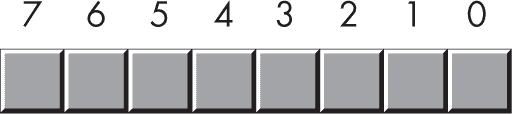

图 2-1：位编号

位 0 是 *LO 位* 或 *最低有效位*，位 7 是 *HO 位* 或 *最高有效位*，我将通过位号来指代其他任何位。

一个字节恰好包含 2 个半字节，如 图 2-2 所示。

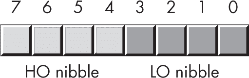

图 2-2：字节中的 2 个半字节

位 0 到 3 组成 *LO 半字节*，位 4 到 7 组成 *HO 半字节*。因为一个字节恰好包含 2 个半字节，所以字节值需要两个十六进制数字来表示。

由于一个字节包含 8 位，它可以表示 2⁸（256）个值。通常，汇编程序员使用一个字节来表示范围为 0 到 255 的数字值，范围为 -128 到 +127 的有符号数（参见第 2.6 节，“有符号与无符号数字”，在 第 65 页），字符编码，以及其他不超过 256 个值的特殊数据类型。许多数据类型的项数少于 256，因此 8 位通常足够。

因为 ARM 是一个字节寻址的机器，所以操作一个完整字节比操作单独的比特或半字节更高效。这意味着，即使使用不到 8 位的空间也能表示 2 到 256 项数据类型，使用完整字节来表示这些数据类型会更高效。

字节的最重要用途之一是存储字符值。键盘上输入的字符、屏幕上显示的字符以及打印机上打印的字符都有数值。为了与外界通信，个人计算机通常使用美国标准信息交换码（ASCII）字符集的变种或 Unicode 字符集。ASCII 字符集有 128 个定义的代码。（因为 Unicode 字符集有远多于 256 个字符，一个字节不足以表示所有 Unicode 字符；有关详细信息，请参见第 2.17 节，“Gas 对 Unicode 字符集的支持”，第 102 页。）

字节也是你在 Gas 程序中可以创建的最小变量。要创建一个任意字节变量，请使用.byte 数据类型，如下所示：

```
 .data
byteVar:  .byte   0
```

字节数据类型可保存任何 8 位值：小的带符号整数、小的无符号整数、字符等。你需要自己跟踪放入字节变量中的对象类型。

#### 2.3.4 半字

*半字*是 16 位的组合。半字中的位从 0 到 15 编号，如图 2-3 所示。与字节一样，位 0 是 LO 位。对于半字，位 15 是 HO 位。当引用半字中的其他任何位时，我将使用其位位置编号。

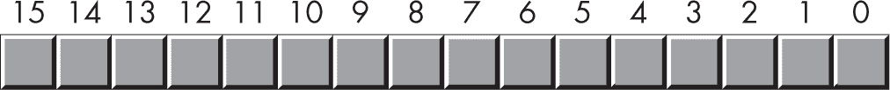

图 2-3：半字中的位编号

半字包含正好 2 个字节，如图 2-4 所示。位 0 到 7 组成 LO 字节，位 8 到 15 组成 HO 字节。

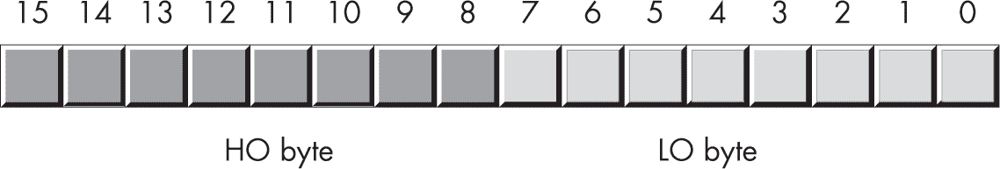

图 2-4：半字中的 2 个字节

半字还包含 4 个四分之一字，如图 2-5 所示。

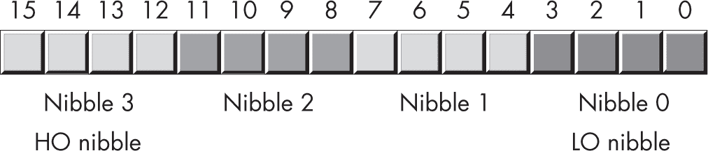

图 2-5：半字中的四分之一字

使用 16 位，你可以表示 2¹⁶（65,536）个值。这些值可以是 0 到 65,535 范围内的值，或者通常的带符号值–32,768 到+32,767，或任何其他没有超过 65,536 个值的数据类型。

半字的两个主要用途是存储短整型带符号数值和短整型无符号数值。无符号数值由与半字中的位相对应的二进制值表示。带符号数值使用二进制补码形式表示数值（参见第 2.6 节，“带符号数值与无符号数值”，第 65 页。）

与字节一样，你也可以在 Gas 程序中创建半字变量。要创建一个任意的半字变量，只需使用.hword 数据类型，如下所示：

```
 .data
hw:      .hword  0
```

这定义了一个 16 位变量（hw），初始值为 0。

#### 2.3.5 字

一个字的数量是 32 位，如图 2-6 所示。

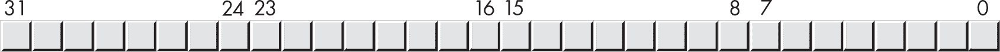

图 2-6：字中的位编号

自然地，这个字可以被分为 HO 半字和 LO 半字，4 个字节，或 8 个四分之一字，如图 2-7 所示。

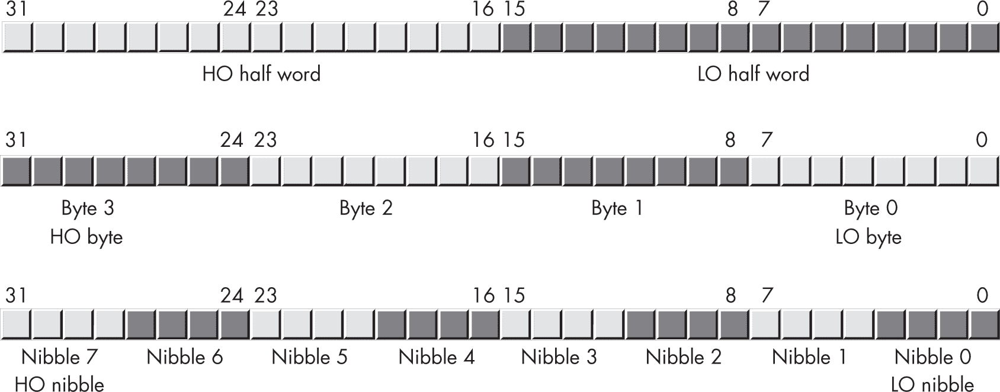

图 2-7：字中的半字、字节和四分之一字

单词可以表示各种事物。你通常用它们来表示 32 位整数值（允许无符号数字的范围为 0 到 4,294,967,295，或有符号数字的范围为 -2,147,483,648 到 +2,147,483,647）；32 位浮点值也可以适配为一个单词。

你可以通过使用 `.word` 声明来创建一个任意的单词变量，如下所示：

```
 .data
w:    .word   0
```

这定义了一个初始化为 0 的 32 位变量（w）。

#### 2.3.6 双字和四字

*双字*（64 位）值也很重要，因为 64 位整数、指针和某些浮点数据类型需要 64 位。类似地，*四字*（128 位）值也很重要，因为 ARM Neon 指令集可以操作 128 位值。*aoaa.inc* 包含文件包括 `.dword` 和 `.qword` 宏，这使得 Gas 可以通过使用 dword 和 qword 类型来声明 64 位和 128 位值：

```
 .data
dw:   .dword 0
qw:   .qword 0
```

如果没有 *aoaa.inc* 文件，标准的 Gas 指令是 `.quad`（用于双字）和 `.octa`（用于四字）。本书使用 `.dword` 和 `.qword`，因为它们更具描述性。

> 注意

*从技术上讲，Gas 确实支持* `.dword` *。是 macOS 汇编器（Clang 汇编器）不支持* `.dword` *，并且需要在* aoaa.inc *头文件中使用宏。*

你不能直接使用标准指令（如 mov、add 和 sub）操作 128 位整数对象，因为标准的 ARM 整数寄存器一次只能处理 64 位。在第八章中，你将看到如何操作这些 *扩展精度* 值；第十一章描述了如何通过使用 SIMD 指令直接操作 qword 值。

### 2.4 位的逻辑运算

尽管你可以使用字节、半字、单词等表示数值，但这些也是可以在位级别操作的位的组。此部分描述了单个位的操作以及如何在较大的数据结构中操作这些位。你通常会对十六进制和二进制数字进行四种逻辑操作（布尔函数）：与、或、异或（排他或）和非。

#### 2.4.1 与

与运算是 *二元* 的，这意味着它接受恰好两个单独的二进制位操作数，如下所示：

```
0 and 0 = 0
0 and 1 = 0
1 and 0 = 0
1 and 1 = 1
```

许多文献将与操作称为 *二元操作*。术语 *二元*（dyadic）与之含义相同，并避免与二进制计数系统的混淆。

一个 *真值表*，其形式如表 2-2 所示，是表示与运算的一种紧凑方式。

表 2-2：与运算真值表

| 与 | 0 | 1 |
| --- | --- | --- |
| 0 | 0 | 0 |
| 1 | 0 | 1 |

真值表的工作方式就像你在学校里遇到的乘法表一样。左列中的值对应与运算的左操作数。第一行中的值对应与运算的右操作数。行和列交点处的值（对于一对特定的输入值）是将这两个值进行与运算后的结果。

用英语描述，AND 操作是：“如果第一个操作数是 1 且第二个操作数是 1，结果是 1；否则，结果是 0。” 你也可以这么表述：“如果任一操作数是 0，结果是 0。”

你可以使用 AND 操作强制得到 0 结果：如果一个操作数是 0，结果始终是 0，无论另一个操作数是什么。例如，在表 2-2 中，标记为 0 输入的行仅包含 0，标记为 0 的列也仅包含 0。相反，如果一个操作数包含 1，结果正好是第二个操作数的值。AND 操作的这些结果很重要，特别是当你需要强制将位设置为 0 时。本章将探讨 AND 操作的这些应用，详见第 2.5 节“二进制数和位串的逻辑操作”，请参阅下一页。

#### 2.4.2 OR

OR 操作，也是二元操作，其定义如下：

```
0 or 0 = 0
0 or 1 = 1
1 or 0 = 1
1 or 1 = 1
```

表 2-3 展示了 OR 操作的真值表。

表 2-3：OR 真值表

| OR | 0 | 1 |
| --- | --- | --- |
| 0 | 0 | 1 |
| 1 | 1 | 1 |

口语中，OR 操作是：“如果第一个操作数或第二个操作数（或两者）为 1，结果是 1；否则，结果是 0。” 这也称为*包含或*操作。

如果 OR 操作的一个操作数是 1，结果始终为 1，不论第二个操作数的值如何。如果一个操作数是 0，结果总是第二个操作数的值。与 AND 操作一样，这是 OR 操作的一个重要副作用，证明在实际应用中非常有用。

包含或操作与标准英语意义之间存在差异。考虑句子：“我要去商店，*或者*我去公园。” 这样的说法意味着说话者要么去商店，要么去公园，而不会去两个地方。这种口语中使用的*或者*与*异或*操作更为类似，而不是包含或操作。

#### 2.4.3 XOR

XOR（异或）操作也是二元操作。其定义如下：

```
0 xor 0 = 0
0 xor 1 = 1
1 xor 0 = 1
1 xor 1 = 0
```

表 2-4 展示了 XOR 操作的真值表。

表 2-4：XOR 真值表

| XOR | 0 | 1 |
| --- | --- | --- |
| 0 | 0 | 1 |
| 1 | 1 | 0 |

用英语描述，XOR 操作是：“如果第一个操作数或第二个操作数为 1，但不是两者都为 1，结果是 1；否则，结果是 0。”

如果异或操作的一个操作数是 1，结果总是另一个操作数的*反转*值；也就是说，如果一个操作数是 1，且另一个操作数是 1，结果是 0；如果另一个操作数是 0，结果是 1。如果第一个操作数是 0，结果正好是第二个操作数的值。这个特性让你可以选择性地反转位串中的位。

#### 2.4.4 NOT

NOT 操作是*一元*的，意味着它只接受一个操作数：

```
not 0 = 1
not 1 = 0
```

表 2-5 展示了 NOT 操作的真值表。

表 2-5：NOT 真值表

| NOT | 0 | 1 |
| --- | --- | --- |
|  | 1 | 0 |

NOT 运算符会反转输入位的值。

### 2.5 二进制数和比特串上的逻辑运算

上一节定义了单比特操作数的逻辑函数。由于 ARM 使用 8、16、32、64 或更多位的分组，本节将这些函数的定义扩展到处理超过 2 个比特的情况。

ARM 上的逻辑函数是基于*逐位*（或*按位*）的。给定两个值，这些函数首先对每个值的第 0 位进行操作，生成结果的第 0 位；然后对输入值的第 1 位进行操作，生成结果的第 1 位，依此类推。例如，如果你想计算以下两个 8 位数字的与运算，你需要对每一列独立地进行与运算：

```
0b1011_0101
0b1110_1110
-----------
0b1010_0100
```

你可以将这种逐位计算应用于其他逻辑函数。要对两个十六进制数字执行逻辑运算，首先将它们转换为二进制。

使用 AND 或 OR 操作将位强制为 0 或 1，以及使用 XOR 操作反转位，在处理比特串（例如二进制数）时非常重要。这些操作可以让你选择性地操作比特串中的某些位，同时不影响其他位。

例如，如果你有一个 8 位二进制值*X*，并且想确保第 4 到第 7 位为 0，你可以将值*X*与二进制值 0000_1111 进行与运算。这个逐位与运算将强制第 4 位的高 4 位为 0，并保持*X*的低 4 位不变。同样，你可以通过将*X*与 0000_0001 进行或运算，然后与 0000_0100 进行异或运算，将*X*的低位强制为 1，并反转*X*的第 2 位。

以这种方式使用 AND、OR 和 XOR 操作来操作比特串被称为*屏蔽*比特串，因为你可以使用特定的值（AND 为 1，OR/XOR 为 0）来屏蔽或遮掩操作中强制为 0、1 或其反值的特定位。*屏蔽*这一术语源于涂料。画家使用胶带（遮蔽胶带）和纸张来遮掩（*屏蔽*）他们在绘画时想要保护的物体部分。类似地，程序员使用 1（通过 AND 操作）来保护他们希望保留为 0 的比特位置，而使用 0（通过 OR 操作）来保护他们希望强制为 1 的比特位置。

ARM-64 CPU 支持五条指令，将这些逐位逻辑运算应用于其操作数：and、ands、orr、eor 和 mvn。and、ands、orr 和 eor 指令使用与第一章中学到的 add 和 sub 指令相同的语法：

```
and   `dest`, `source`left, `source`right
ands  `dest`, `source`left, `source`right  // Affects the flags
orr   `dest`, `source`left, `source`right
eor   `dest`, `source`left, `source`right  // XOR operation
```

这些操作数有与加法操作数相同的限制。具体来说，左侧源操作数必须是寄存器操作数，右侧源操作数必须是寄存器或常量，目标操作数必须是寄存器。操作数还必须具有相同的大小。你将在第二章的 2.19 节“Operand2”中看到此语法的扩展。

orr 和 eor 指令没有带有“s”后缀的版本。如果你希望在这些指令执行后测试标志，你将不得不绕过这个指令集中的奇怪限制。

立即数（sourceright 操作数）与加法（add）和减法（sub）的立即数有完全不同的限制集。有关什么构成合法的立即数，请参阅第 2.19 节“操作数 2”，在第 106 页。

这些指令通过以下公式计算出明显的按位逻辑运算：

```
`dest` = `source`left `operator` `source`right
```

ARM 并没有实际的非（not）指令。相反，一个 mov 指令的变种执行这一功能：mvn（移位并取反）。该指令的格式如下：

```
mvn  `dest`, `source`
```

请注意，这条指令没有提供带有“s”后缀的形式，因此执行后不会更新条件码标志。

该指令计算出以下结果：

```
`dest` = not(`source`)
```

操作数必须都是寄存器。

清单 2-2 中的程序从用户输入两个十六进制值，并计算它们的逻辑与（AND）、或（OR）、异或（XOR）和非（NOT）运算。

```
// Listing2-2.S
//
// Demonstrate AND, OR, XOR, and NOT operations.

#include "aoaa.inc"

             .data
leftOp:      .dword     0xf0f0f0f
rightOp1:    .dword     0xf0f0f0f0
rightOp2:    .dword     0x12345678
result:      .dword     0
saveLR:      .dword     0

titleStr:    .asciz   "Listing 2-2"

fmtStr1:     .asciz   "%lx AND %lx = %lx\n"
fmtStr2:     .asciz   "%lx OR  %lx = %lx\n"
fmtStr3:     .asciz   "%lx XOR %lx = %lx\n"
fmtStr4:     .asciz   "NOT %lx = %lx\n"

             .text
             .align     2   // Make code word-aligned.

             .extern    printf

// Return program title to C++ program:

 .global     getTitle
getTitle:

// Load address of "titleStr" into the X0 register (X0 holds the
// function return result) and return back to the caller:

            lea     x0, titleStr
            ret

// Here is the "asmMain" function.

            .global asmMain
asmMain:

// "Magic" instruction offered without explanation at this point:

            sub     sp, sp, 64

// Save LR so we can return to C++ code:

            lea     x0, saveLR
            str     lr, [x0]

// Demonstrate the AND operation:

          ❶ lea     x0, leftOp
            ldr     x1, [x0]
            lea     x0, rightOp1
            ldr     x2, [x0]
            and     x3, x1, x2  // Compute left AND right.
            lea     x0, result
            str     x3, [x0]

            lea     x0, fmtStr1 // Print result.
            vparm2  leftOp
            vparm3  rightOp1
            vparm4  result
            bl      printf

// Demonstrate the OR operation:

          ❷ lea     x0, leftOp
            ldr     x1, [x0]
            lea     x0, rightOp1
            ldr     x2, [x0]
            orr     x3, x1, x2  // Compute left OR right.
            lea     x0, result
            str     x3, [x0]

            lea     x0, fmtStr2 // Print result.
            vparm2  leftOp
            vparm3  rightOp1
            vparm4  result
            bl      printf

// Demonstrate the XOR operation:

          ❸ lea     x0, leftOp
            ldr     x1, [x0]
            lea     x0, rightOp1
            ldr     x2, [x0]
            eor     x3, x1, x2  // Compute left XOR right.
            lea     x0, result
            str     x3, [x0]

            lea     x0, fmtStr3 // Print result.
            vparm2  leftOp
            vparm3  rightOp1
            vparm4  result
            bl      printf

// Demonstrate the NOT instruction:

          ❹ lea     x0, leftOp
            ldr     x1, [x0]
            mvn     w1, w1      // W1 = not W1 (32 bits)
            lea     x0, result
            str     x1, [x0]

            lea     x0, fmtStr4 // Print result.
            vparm2  leftOp
            vparm3  result
            bl      printf

          ❺ lea     x0, rightOp1
            ldr     x1, [x0]
            mvn     w1, w1      // W1 = not W1 (32 bits)
            lea     x0, result
            str     x1, [x0]

            lea     x0, fmtStr4 // Print result.
            vparm2  rightOp1
            vparm3  result
            bl      printf

          ❻ lea     x0, rightOp2
            ldr     x1, [x0]
            mvn     w1, w1      // W1 = not W1
            lea     x0, result
            str     x1, [x0]

            lea     x0, fmtStr4 // Print result.
            vparm2  rightOp2
            vparm3  result
            bl      printf

// Another "magic" instruction that undoes the effect of
// the previous one before this procedure returns to its
// caller:

 add     sp, sp, #64

// Restore LR so we can return to C++ code:

            lea     x0, saveLR
            ldr     lr, [x0]
            ret     // Returns to caller
```

该代码计算 leftOp 和 rightOp1 的逻辑与 ❶、或 ❷ 和异或 ❸。然后输出结果。接着，代码计算 leftOp ❹、rightOp1 ❺ 和 rightOp2 ❻ 的非（NOT）值，并打印它们的结果。

这是清单 2-2 中程序的构建命令和输出：

```
$ ./build Listing2-2
$ ./Listing2-2
Calling Listing2-2:
f0f0f0f AND f0f0f0f0 = 0
f0f0f0f OR  f0f0f0f0 = ffffffff
f0f0f0f XOR f0f0f0f0 = ffffffff
NOT f0f0f0f = f0f0f0f0
NOT f0f0f0f0 = f0f0f0f
NOT 12345678 = edcba987
Listing2-2 terminated
```

如你所见，AND 操作清除位，OR 操作设置位，而 XOR 和 NOT 操作反转位。

### 2.6 有符号和无符号数

到目前为止，本章将二进制数视为无符号值。二进制数 0 ... 00000 代表 0，0 ... 00001 代表 1，0 ... 00010 代表 2，以此类推，直到无穷大。使用 *n* 位，你可以表示 2*^n* 个无符号数字。

那负数呢？如果将可能的组合一半分配给负值，另一半分配给正值和零，那么使用 *n* 位，你可以表示有符号值的范围从 –2*^n*^(–1) 到 +2*^n*^(–1) – 1。这意味着你可以使用一个 8 位字节表示负值 –128 到 –1 和非负值 0 到 127。使用 16 位半字，你可以表示的范围是 –32,768 到 +32,767。使用 32 位字，你可以表示的范围是 –2,147,483,648 到 +2,147,483,647。

在数学和计算机科学中，*补码法* 将负数和非负数（包括正数和零）编码为两个相等的集合，以便它们可以使用相同的算法或硬件执行加法，并根据符号产生正确的结果。

ARM 微处理器使用 *二进制补码* 表示有符号整数。在这种系统中，数字的最高有效位（HO 位）是 *符号位*：整数被分为两个相等的集合。如果符号位为 0，数字为正（或零）；如果符号位为 1，数字为负（采用补码形式，我将在后面描述）。

以下是一些 16 位正数和负数的例子：

0x8000 是负数，因为高位（HO 位）是 1。

0x100 是正数，因为 HO 位是 0。

0x7FFF 是正数。

0xFFFF 是负数。

0xFFF 是正数。

如果 HO 位是 0，则该数字为正数（或零），并使用标准的二进制格式。如果 HO 位是 1，则该数字为负数，采用二补数形式：这种魔法形式支持负数和非负数的加法，无需特殊硬件。

你可以通过以下算法步骤将正数转换为其负的二补数形式：

1.  对数字中的所有位进行取反；即应用 NOT 函数。

2.  对取反后的结果加 1，并忽略 HO 位的进位。

这会生成一个符合补数形式数学定义的位模式。特别地，使用这种形式加法计算负数和非负数时，会产生预期的结果。

例如，要计算 –5 的 8 位等效值：

1.  将 5 写成二进制：0000_0101。

2.  对所有位进行取反：1111_1010。

3.  加 1 以获得结果：1111_1011。

如果对 –5 进行二补数运算，你会得到原始值 0000_0101：

1.  对 –5 取二补数：1111_1011。

2.  对所有位进行取反：0000_0100。

3.  加 1 以获得结果 0000_0101。

如果你将 +5 和 –5 相加（忽略 HO 位的进位），你将得到预期的结果 0：

```
 0b1111_1011     Take the two's complement for -5.
   + 0b0000_0101     Invert all the bits and add 1.
     -----------
(1)  0b0000_0000     Sum is zero, if you ignore carry.
```

以下示例提供了一些正负 16 位带符号值：

0x7FFF: +32,767，最大 16 位正数

0x4000: +16,384

0x8000: –32,768，最小 16 位负数

要将前面的数字转换为其负值（即取反），请执行以下操作：

```
0x7FFF: 0b0111_1111_1111_1111   +32,767
        0b1000_0000_0000_0000   Invert all the bits (8000h).
        0b1000_0000_0000_0001   Add 1 (8001h or -32,767).
x04000: 0b0100_0000_0000_0000   16,384
        0b1011_1111_1111_1111   Invert all the bits (0BFFFh).
        0b1100_0000_0000_0000   Add 1 (0C000h or -16,384).
0x8000: 0b1000_0000_0000_0000   -32,768
        0b0111_1111_1111_1111   Invert all the bits (7FFFh).
        0b1000_0000_0000_0000   Add 1 (8000h or -32,768).
```

0x8000 取反后变为 0x7FFF。加 1 后，得到 0x8000！等等，这怎么回事？–(–32,768) 还是 –32,768 吗？当然不是。但是，值 +32,768 不能用 16 位带符号数表示，因此无法对最小负值取反。

通常，你不需要手动执行二补数操作。ARM 微处理器提供了一条指令 `neg`（取反），可以为你执行这个操作：

```
neg  `dest`, `source`
negs `dest`, `source`  // Sets condition code flags
```

该指令计算 `dest = -source`，操作数必须是寄存器。由于这是一个带符号整数操作，因此只有在带符号整数值上进行操作才有意义。列表 2-3 演示了带符号 32 位整数值的二补数运算和 `neg` 指令。

```
// Listing2-3.S
//
// Demonstrates two's complement operation and input of
// numeric values

#include "aoaa.inc"

            .equ        maxLen, 256

            .data
titleStr:   .asciz      "Listing 2-3"

prompt1:    .asciz      "Enter an integer between 0 and 127:"
fmtStr1:    .asciz      "Value in hexadecimal: %x\n"
fmtStr2:    .asciz      "Invert all the bits (hexadecimal): %x\n"
fmtStr3:    .asciz      "Add 1 (hexadecimal): %x\n"
fmtStr4:    .asciz      "Output as signed integer: %d\n"
fmtStr5:    .ascii      "Negate again and output as signed integer:"
            .asciz      " %d\n"

fmtStr6:    .asciz      "Using neg instruction: %d\n"

intValue:   .dword      0
saveLR:     .dword      0

// The following reserves 256 bytes of storage to hold a string
// read from the user.

❶ input:      .space      maxLen, 0

            .text
            .align      2
            .extern     printf
            .extern     atoi
          ❷ .extern     readLine

// Return program title to C++ program:

            .global     getTitle
getTitle:
            lea         x0, titleStr
            ret

// Here is the asmMain function:

            .global     asmMain
asmMain:

// "Magic" instruction offered without explanation at this point:

            sub     sp, sp, #128

// Save LR so we can return to C++ program:

            lea     x0, saveLR
            str     lr, [x0]

// Read an unsigned integer from the user: this code will blindly
// assume that the user's input was correct. The atoi function
// returns zero if there was some sort of error on the user
// input. Later chapters in AoAA will describe how to check for
// errors from the user.

            lea     x0, prompt1
            bl      printf

            lea     x0, input
            mov     x1, #maxLen
            bl      readLine

// Call C stdlib strtol function:
//
// i = strtol(str, NULL, 10)

 ❸ lea     x0, input
            mov     x1, xzr
            mov     x2, #10
            bl      strtol
            lea     x1, intValue
            str     x0, [x1]

// Print the input value (in decimal) as a hexadecimal number:

            lea     x0, fmtStr1
            vparm2  intValue
            bl      printf

// Perform the two's complement operation on the input number.
// Begin by inverting all the bits:

            lea     x1, intValue
            ldr     x0, [x1]
            mvn     x0, x0      // Not X0
            str     x0, [x1]    // Store back into intValue.
            lea     x0, fmtStr2
            vparm2  intValue
            bl      printf

// Invert all the bits and add 1 (inverted value is in intValue):

            lea     x0, intValue
            ldr     x1, [x0]
            add     x1, x1, #1
            str     x1, [x0]    // Store back into intValue.
            lea     x0, fmtStr3
            vparm2  intValue
            bl      printf

            lea     x0, fmtStr4 // Output as integer rather
            vparm2  intValue    // than hexadecimal.
            bl      printf

// Negate the value and print as a signed integer. Note that
// intValue already contains the negated value, so this code
// will print the original value:

            lea     x0, intValue
            ldr     x1, [x0]
            mvn     x1, x1
            add     x1, x1, #1
            str     x1, [x0]
            lea     x0, fmtStr5
            vparm2  intValue
            bl      printf

// Negate the value using the neg instruction:

            lea     x0, intValue
            ldr     x1, [x0]
 neg     x1, x1
            str     x1, [x0]
            lea     x0, fmtStr6
            vparm2  intValue
            bl      printf

// Another "magic" instruction that undoes the effect of the
// previous one before this procedure returns to its caller:

            lea     x0, saveLR
            ldr     lr, [x0]
            add     sp, sp, #128
            ret     // Returns to caller
```

`.space` 指令❶在本章中是新的。这条指令保留一个缓冲区（字节数组）。第一个操作数指定要保留的字节数，第二个操作数指定为缓冲区中的每个字节赋值。此特定指令为用户输入的文本行预留了 256 字节。我们将在第四章中进一步讨论数组和数组的内存分配。

`readLine`函数❷由*c.cpp*源文件中的 C++代码提供。该函数需要两个参数：X0 寄存器中的缓冲区地址和 X1 寄存器中的最大输入计数（包括零终止字节的空间）。当调用此函数时，它将从标准输入设备读取一行文本，并将这些字符放入指定的缓冲区（零终止，如果输入大于 X1 中传递的值，则进行截断）。

`strtol`函数❸是一个 C 标准库函数，它将一个包含数字字符的字符串转换为长整型值（64 位）。此函数需要三个参数：X0 包含一个缓冲区的地址（该缓冲区包含待转换的字符串）；X1 指向数字字符串的末尾，如果包含 NULL（0），则被忽略；X2 包含用于转换的基数（进制）。该函数将转换后的值返回至 X0 寄存器。

这是第 2-3 节的构建命令和程序输出（在此次运行程序时，我提供了 123 作为输入）：

```
$ ./build Listing2-3
$ ./Listing2-3
Calling Listing2-3:
Enter an integer between 0 and 127:123
Value in hexadecimal: 7b
Invert all the bits (hexadecimal): ffffff84
Add 1 (hexadecimal): ffffff85
Output as signed integer: -123
Negate again and output as signed integer: 123
Using neg instruction: -123
Listing2-3 terminated
```

如你所见，程序会读取一个用户输入的十进制整数值，反转其位，增加 1（即二进制补码操作），然后显示结果。

### 2.7 符号扩展和零扩展

将一个小的二进制补码值转换为更多位数的值，可以通过*符号扩展*操作来完成。

要将带符号的值从一定的位数扩展到更多的位数，需要将符号位复制到新格式中所有的附加位中。例如，将一个 8 位数符号扩展到 16 位数时，复制 8 位数的第 7 位到 16 位数的第 8 到 15 位。将 16 位半字符号扩展为字时，复制 16 位数的第 15 位到字的第 16 到 31 位。同样，将 32 位字符号扩展为 64 位双字时，将字的第 31 位复制到双字的上 32 位中。

操作符操作有符号值时，必须使用符号扩展。比如，将一个带符号的字节值与一个字长值相加时，必须先将字节值符号扩展到字长，然后再加起来。其他操作（特别是乘法和除法）可能需要符号扩展到 32 位。表 2-6 提供了多个符号扩展示例。

表 2-6：符号扩展示例

| 8 位 | 16 位 | 32 位 |
| --- | --- | --- |
| 0x80 | 0xFF80 | 0xFFFFFF80 |
| 0x28 | 0x0028 | 0x00000028 |
| 0x9A | 0xFF9A | 0xFFFFFF9A |
| 0x7F | 0x007F | 0x0000007F |
| — | 0x1020 | 0x00001020 |
| — | 0x8086 | 0xFFFF8086 |

为了将无符号值扩展为更大的值，必须对该值进行*零扩展*。零扩展很简单——只需将零存储到更大操作数的高字节（HO 字节）中。例如，将 8 位值 0x82 扩展到 16 位时，向高字节前面添加一个零，得到 0x0082。表 2-7 提供了多个零扩展示例。

表 2-7：零扩展示例

| 8 位 | 16 位 | 32 位 |
| --- | --- | --- |
| 0x80 | 0x0080 | 0x00000080 |
| 0x28 | 0x0028 | 0x00000028 |
| 0x9A | 0x009A | 0x0000009A |
| 0x7F | 0x007F | 0x0000007F |
| — | 0x1020 | 0x00001020 |
| — | 0x8086 | 0x00008086 |

您可以通过相同的方法进行零扩展，以支持双字或四字操作。

### 2.8 符号压缩和饱和

*符号压缩*是将具有一定位数的值转换为相同值，但位数较少，这稍微复杂一些。如果*m* < *n*，您并不总能将一个*n*位的数字转换为一个*m*位的数字。例如，考虑值–448。作为一个 16 位带符号数，它的十六进制表示是 0xFE40。这个数的绝对值对于 8 位值来说太大，因此无法将其压缩为 8 位；这样做会导致溢出。

要正确地进行符号压缩，必须丢弃的高位（HO）位必须全为 0 或 1，并且结果值的高位必须与您从数字中移除的*每一个*位相匹配。以下是一些示例（16 位到 8 位）：

0xFF80 可以压缩为 0x80。

0x0040 可以压缩为 0x40。

0xFE40 无法压缩为 8 位符号数。

0x0100 无法压缩为 8 位。

如果您必须将较大的对象转换为较小的对象，并且愿意接受精度损失，可以使用*饱和*。通过饱和转换一个值时，如果较大的值不超出较小对象的范围，则将较大的值复制到较小的值中。如果较大的值超出较小值的范围，则通过将其设置为较小对象范围内的最大（或最小）值来*裁剪*该值。

例如，当将一个 16 位带符号整数转换为 8 位带符号整数时，如果 16 位值在–128 到+127 的范围内，您可以将 16 位对象的低字节复制到 8 位对象中。如果 16 位带符号值大于+127，则将值裁剪为+127，并将+127 存储到 8 位对象中。同样，如果值小于–128，则将最终的 8 位对象裁剪为–128。

尽管将值裁剪到较小对象的限制会导致精度损失，但有时这是可以接受的，因为替代方案是引发异常或以其他方式拒绝计算。对于许多应用程序，如音频或视频处理，裁剪后的结果仍然是可识别的，因此转换是一个合理的选择。

### 2.9 加载和存储字节和半字值

ARM 的内存是按字节寻址的。然而，到目前为止，本书中所有的加载和存储操作都是字或双字操作（由 ldr/str 寄存器的大小决定）。别担心：ARM CPU 提供了加载和存储字节、半字、字、双字，甚至四字的指令。

通用的 ldr 指令有以下几种形式：

```
ldr    `reg`, `mem`
ldrb   `reg`32, `mem`
ldrsb  `reg`, `mem`
ldrh   `reg`32, `mem`
ldrsh  `reg`, `mem`
ldrsw  `reg`64, `mem`
```

reg32 操作数只能是 32 位寄存器，而 reg64 操作数只能是 64 位寄存器。reg（无下标）操作数可以是 32 位或 64 位寄存器。

ldrb 和 ldrsb 指令从内存中加载一个字节到目标寄存器。由于寄存器总是 32 位或 64 位宽，当字节从内存加载到寄存器时，必须以某种方式进行扩展。ldrb 指令将内存中的字节零扩展到寄存器中。ldrsb 指令将内存中的字节符号扩展到寄存器中。零扩展仅适用于 32 位寄存器，但 ldrb 和 ldrh 指令会自动清除相应 64 位寄存器的高 32 位。如果你将一个字节或半字符号扩展到 32 位寄存器，这将清除相应 64 位寄存器的高 32 位。如果你希望将字节或半字扩展到整个 64 位寄存器中，请指定一个 64 位寄存器。

ldrh 和 ldrsh 指令类似地从内存中加载并扩展半字值，通过零扩展（ldrh）和符号扩展（ldrsh）。和之前一样，ldrh 指令接受一个 32 位寄存器，但它会自动在寄存器的整个 64 位范围内进行零扩展。

ldrsw 指令将从内存中获取一个 32 位有符号整数，并将其符号扩展到指定的 64 位寄存器。没有显式指令可以将 32 位扩展到 64 位；标准的 ldr 指令，如果操作数是 32 位寄存器，将自动完成此操作。

请注意，仅由标签组成的内存操作数（PC 相对寻址）仅对 ldr 和 ldrsw 指令有效。其他指令仅允许基于寄存器的寻址模式（例如，[X0]）。

ldr{size} 指令非常适用于从内存中加载和扩展字节、半字和字值。如果要扩展的值位于另一个寄存器中，你不想将该寄存器存储到内存中，因此可以将该值扩展到不同的寄存器中。幸运的是，ARM 提供了一组指令，sxtb、sxth 和 sxtw，专门用于这种情况：

```
sxtb `reg`dest, `reg`src  // Sign-extends LO byte of `reg`src
sxth `reg`dest, `reg`src  // Sign-extends LO half word of `reg`src
sxtw `reg`dest, `reg`src  // Sign-extends LO word of `reg`src
```

sxtw 指令需要一个 64 位目标寄存器。sxtb、sxth 和 sxtw 指令需要 32 位源寄存器，无论目标寄存器的大小如何。

ARM 不提供任何显式指令来将一个寄存器零扩展到另一个寄存器。然而，你可以使用一些技巧来实现相同的效果。每当你将数据从一个寄存器移动到一个 32 位寄存器时，ARM 会自动将目标 64 位寄存器的高 32 位清零。你可以利用这种行为将任何较小的值零扩展到较大的值。

以下指令将 W*m* 复制到 W*n*，并在过程中清除 X*n* 的高 32 位：

```
mov  w`n`, w`m`  // Zero-extends 32-bit W`m` into X`n`
```

以下指令将 W*m* 中的值与 0xFFFF 进行按位与运算，然后将结果存储到 W*n* 中，零扩展至 X*n* 的高位：

```
and  w`n`, w`m`, #0xFFFF  // Zero-extends 16 bits to 64
```

最后，以下指令通过 X*n* 将 W*m* 的低字节零扩展：

```
and  w`n`, w`m`, #0xFF  // Zero-extends 8 bits to 64
```

将字节和半字存储到内存比加载要简单得多。ARM 在存储到内存时不支持收缩或饱和。因此，字节和半字存储指令有以下两种形式：

```
strb `reg`32, `mem`
strh `reg`32, `mem`
```

`strb`指令将指定寄存器的低字节存储到内存中。`strh`指令将寄存器的低半字存储到内存中。寄存器必须是 32 位寄存器（如果你想存储 64 位寄存器的低字节或低半字，只需指定 32 位寄存器即可；这会做同样的事情）。请注意，`mem`必须是基于寄存器的寻址模式（这些指令不允许使用 PC 相对寻址模式）。

### 2.10 控制转移指令

到目前为止，汇编语言的示例一直没有使用*条件执行*，即在执行代码时做出决策的能力。事实上，除了`bl`和`ret`指令之外，我没有涉及任何影响汇编代码顺序执行的方法。然而，为了为本书的剩余部分提供有意义的示例，你很快就需要有条件地执行代码段的能力。暂时绕开加载和存储指令，本节简要介绍了条件执行以及将控制权转移到程序其他部分的相关内容。

#### 2.10.1 分支

或许最好的起点是讨论 ARM 无条件控制转移指令：`b`指令。`b`指令的形式如下：

```
b `statementLabel`
```

其中，`statementLabel`是附加到你`.text`段中的机器指令上的标识符。`b`指令会立即将控制权转移到由标签前缀标记的语句。这在语义上等价于高级语言中的`goto`语句。

这是一个在`mov`指令前面的语句标签示例：

```
stmtLbl: mov x0, #55
```

像所有 Gas 符号一样，语句标签也有一个与之关联的地址：标签后面紧跟的机器指令的内存地址。

语句标签不必与机器指令位于同一物理源代码行。考虑以下示例：

```
anotherLabel:
   mov x0, #55
```

这个示例在语义上与前一个示例等价。绑定到`anotherLabel`的值（地址）是紧跟该标签之后的机器指令的地址。在这种情况下，依然是`mov`指令，即使该`mov`指令出现在下一行（它仍然跟随标签，并且标签和`mov`语句之间没有任何会生成代码的其他 Gas 语句）。

从技术上讲，你也可以跳转到过程标签而不是语句标签。然而，`b`指令不会设置返回地址；如果过程执行了`ret`指令，返回位置可能未定义。第五章将更详细地探讨返回地址。

由于 b 作为指令助记符的命名不太合适（正如我们在“B 是坏名字”一节中讨论的那样），本书将使用 b.al 指令来表示跳转到当前源文件中的代码，并将 b 保留用于那些跳转到 ±1MB 范围外代码的少数情况。

#### 2.10.2 影响条件码标志的指令

在介绍 add、sub、and、orr、eor 和 neg 指令时，我指出它们通常有两种形式：

```
`instr`   `operands`
`instrs`  `operands`  // Only adds, subs, ands, and negs
```

带有 s 后缀的形式（例如 adds）将在指令执行完毕后更新 PSTATE 寄存器中的条件码标志。例如，adds 和 subs 指令将执行以下操作：

+   如果在算术操作中发生无符号溢出，则设置进位标志，否则清除进位标志。

+   如果发生有符号溢出，则设置溢出标志。

+   如果操作结果为零，则设置零标志。

+   如果操作结果为负（HO 位被设置），则设置负号（符号）标志。

虽然并非所有指令都支持 s 后缀，但许多执行某种计算的指令会允许此后缀。通过允许你选择哪些指令影响标志，ARM CPU 使你能够在执行一些你希望忽略其对标志影响的指令时，保留条件码。

正如其名字所示，这些条件码允许你测试特定的条件，并根据这些测试条件有条件地执行代码。下一节将描述如何测试条件码标志，并根据它们的设置做出决策。

#### 2.10.3 有条件跳转

尽管 b.al/b 指令在汇编语言程序中不可或缺，但它不提供有条件地执行代码段的功能——因此它被称为*无条件跳转*。幸运的是，ARM CPU 提供了丰富的*有条件跳转指令*，允许有条件地执行代码。

这些指令测试 PSTATE 寄存器中的条件码位，以确定是否应该跳转。PSTATE 寄存器中有四个条件码位，供这些有条件跳转指令测试：进位、符号、溢出和零标志。

ARM CPU 提供了八条指令，分别测试这四个标志，如表 2-8 所示。条件跳转指令的基本操作是测试一个标志，检查它是设置（1）还是清除（0），如果测试成功，则跳转到目标标签。如果测试失败，则程序继续执行紧接在条件跳转指令之后的下一条指令。

表 2-8：测试条件码标志的有条件跳转指令

| 指令 | 说明 |
| --- | --- |
| bcs label | 如果进位标志被设置，则跳转。如果进位标志被设置（1），则跳转到标签；如果进位标志清除（0），则控制流跳到下一条指令。 |
| bcc label | 如果进位标志清除，则跳转。如果进位标志为清除（0），则跳转到标签；如果进位标志设置（1），则继续执行下一条指令。 |
| bvs label | 如果溢出标志已设置，则跳转到标签（1）；如果溢出标志清除，则继续执行（0）。 |
| bvc label | 如果溢出标志清除，则跳转到标签（0）；如果溢出标志设置，则继续执行（1）。 |
| bmi label | 如果是负数，则跳转到标签。如果负（符号）标志已设置（1），则跳转；如果符号标志清除（0），则继续执行。 |
| bpl label | 如果是正数（或零），则跳转到标签。如果负标志清除（0），则跳转；如果符号位设置（1），则继续执行。 |
| beq label | 如果相等，则跳转到标签。如果零标志已设置（1），则跳转；如果零标志清除（0），则继续执行。 |
| bne label | 如果不相等，则跳转到标签。如果零标志清除（0），则跳转；如果零标志设置（1），则继续执行。 |

出于历史原因，Gas 还允许类似 b.condition（例如，b.cs、b.cc、b.vs 和 b.vc）格式的条件分支助记符。这种格式基于 32 位 ARM 指令集，该指令集通过使用“点条件”后缀允许大多数数据处理指令的条件执行。尽管 64 位 ARM 指令集不再支持这些条件指令，但它仍然允许为分支指令使用点条件语法。由于不带句点的条件分支更容易输入，因此大多数人在编写 64 位 ARM 汇编语言时使用这种形式。Linux 下的 Gas 似乎不支持 bal，但支持 b.al，而 macOS 的汇编器似乎可以很好地支持 b.al。这就是本书使用 b.al 作为无条件分支的原因。

要使用条件分支指令，首先必须执行一条会影响一个或多个条件码标志的指令。例如，无符号算术溢出会设置进位标志；如果没有发生溢出，进位标志将被清除。因此，你可以在执行 adds 指令后使用 bcs 和 bcc 指令来检查计算过程中是否发生了无符号溢出。例如，以下代码使用 bcs 检查无符号溢出：

```
 lea  x0, int32Var
    ldr  w0, [x0]
    lea  x1, anotherVar
    ldr  w1, [x1]
    adds w0, w0, w1
    bcs  overflowOccured

// Continue down here if the addition did not
// produce an overflow.

    .
    .
    .

overflowOccured:

// Execute this code if the sum of int32Var and anotherVar
// does not fit into 32 bits.
```

如前所述，adds（以及 subs/negs）根据有符号/无符号溢出、零结果或负结果设置条件码。ands 指令将结果的 HO 位复制到负标志中，并在产生零/非零结果时设置/清除零标志。

#### 2.10.4 cmp 和相应的条件分支

ARM 的 cmp 指令在与条件分支配合使用时非常有用。cmp 的语法是

```
cmp `left`, `right`
```

其中左操作数是寄存器（32 位或 64 位），右操作数可以是寄存器或小的立即数常量。该指令将左操作数与右操作数进行比较，并根据比较结果设置标志。然后，你可以使用条件分支指令根据比较结果转移控制。

尽管 cmp 指令没有 s 后缀，它仍然会设置条件码标志；事实上，这就是 cmp 存在的原因。技术上讲，cmp 并不是一个真正的指令，而是 subs 指令的别名（同义词），其目标操作数是 WZR 或 XZR。

执行比较指令后，你可能会问这些合理的问题：

+   左操作数是否等于右操作数？

+   左操作数是否不等于右操作数？

+   左操作数是否小于右操作数？

+   左操作数是否小于或等于右操作数？

+   左操作数是否大于右操作数？

+   左操作数是否大于或等于右操作数？

对于小于和大于的比较，你可能还会问：“这是有符号还是无符号比较？”

ARM 提供了在执行 cmp 后可以使用的条件分支来回答这些问题。表 2-9 列出了无符号比较的指令。

表 2-9：无符号条件分支

| 指令 | 测试的标志位 | 描述 |
| --- | --- | --- |
| beq | Z = 1 | 如果相等则分支；如果不相等则跳过。比较后，如果第一个 cmp 操作数等于第二个操作数，将会执行此分支。 |
| bne | Z = 0 | 如果不相等则分支；如果相等则跳过。比较后，如果第一个 cmp 操作数不等于第二个操作数，将会执行此分支。 |
| bhi | C = 1 且 Z = 0 | 如果较大则分支；如果不较大则跳过。比较后，如果第一个 cmp 操作数大于第二个操作数，将会执行此分支。 |
| bhs | C = 1 | 如果较大或相同则分支；如果不较大或相同则跳过。比较后，如果第一个 cmp 操作数大于或等于第二个操作数，将会执行此分支。 |
| blo | C = 0 | 如果较小则分支；如果不较小则跳过。比较后，如果第一个 cmp 操作数小于第二个操作数，将会执行此分支。 |
| bls | C = 0 或 Z = 1 | 如果较小或相同则分支；如果不较小或相同则跳过。比较后，如果第一个 cmp 操作数小于或等于第二个操作数，将会执行此分支。 |

如果左操作数和右操作数包含有符号整数值，请使用 表 2-10 中的有符号分支。

表 2-10：有符号条件分支

| 指令 | 测试的标志位 | 描述 |
| --- | --- | --- |
| beq | Z = 1 | 如果相等则分支；如果不相等则跳过。比较后，如果第一个 cmp 操作数等于第二个操作数，将会执行此分支。 |
| bne | Z = 0 | 如果不相等则分支；如果相等则跳过。比较后，如果第一个 cmp 操作数不等于第二个操作数，将会执行此分支。 |
| bgt | Z = 0 且 N = V | 如果大于则分支；如果小于或等于则跳过。比较后，如果第一个 cmp 操作数大于第二个操作数，将会执行此分支。 |
| bge | N = V | 如果大于或等于则跳转；如果小于则继续执行。在比较之后，如果第一个 cmp 操作数大于或等于第二个操作数，则会采取此分支。 |
| blt | N ≠ V | 如果小于则跳转；如果大于或等于则继续执行。在比较之后，如果第一个 cmp 操作数小于第二个操作数，则会采取此分支。 |
| ble | N ≠ V 或 Z = 1 | 如果小于或等于则跳转；如果大于则继续执行。在比较之后，如果第一个 cmp 操作数小于或等于第二个操作数，则会采取此分支。 |

至于之前基于条件码的分支，Gas 除了表 2-9 和表 2-10 中的形式，还允许使用 b.condition 的分支形式。事实证明，如“测试的标志”一栏所示，bcs 和 bhs 指令是同义的，bcc 和 blo 指令也是同义的。

重要的是，cmp 指令仅为整数比较设置标志，这也适用于字符和其他可以用整数值编码的类型。具体来说，指令不会比较浮动点值并为浮动点比较设置标志。

有时，基于相反条件进行跳转是很方便的。例如，你可能有如下逻辑：

```
 cmp x0, x1
    // Branch to geLbl if X0 is not less than X1.

    // Fall through to this code if X0 < X1.
     .
     .
     .
// Branch here if NOT(X0 < X1) (that is, X0 >= X1).
geLbl:
```

当然，*小于*的相反是*大于或等于*，所以这个伪代码可以写成如下：

```
 cmp x0, x1
    bge geLbl

    // Fall through to this code if X0 < X1.
     .
     .
     .
// Branch here if NOT(X0 < X1) (that is, X0 >= X1).
geLbl:
```

然而，使用相反的分支来跳过你想在某个条件下执行的代码（例如小于）可能会使代码变得更难阅读。人们通常会将 bge 指令理解为“因为比较结果大于或等于，所以跳转到标签”，而不是“如果比较结果小于，则继续执行”。

为了帮助使这种逻辑更加清晰，*aoaa.inc*包含文件包含了几个*相反分支*的宏。表 2-11 列出了这些宏及其含义。

表 2-11：相反分支

| 相反分支 | 等价于 | 含义 |
| --- | --- | --- |
| bnhs | blo | 如果不高于或相等则跳转。在比较之后，如果第一个 cmp 操作数不高于或相等（无符号）第二个操作数，则会采取此分支。 |
| bnhi | bls | 如果不高于则跳转。在比较之后，如果第一个 cmp 操作数不高于（无符号）第二个操作数，则会采取此分支。 |
| bnls | bhi | 如果不低于或相等则跳转。在比较之后，如果第一个 cmp 操作数不低于或相等（无符号）第二个操作数，则会采取此分支。 |
| bnlo | bhs | 如果不小于则跳转。在比较之后，如果第一个 cmp 操作数不小于（无符号）第二个操作数，则会采取此分支。 |
| bngt | ble | 如果不大于则跳转。在比较之后，如果第一个 cmp 操作数不大于（有符号）第二个操作数，则会采取此分支。 |
| bnge | blt | 如果不大于或等于则跳转。在比较后，如果第一个 cmp 操作数不大于或等于（带符号）第二个操作数，则执行此跳转。 |
| bnlt | bge | 如果不小于则跳转。在比较后，如果第一个 cmp 操作数不小于（带符号）第二个操作数，则执行此跳转。 |
| bnle | bgt | 如果不小于或等于则跳转。在比较后，如果第一个 cmp 操作数不小于或等于（带符号）第二个操作数，则执行此跳转。 |

你应当将这些相反分支的助记符理解为“在条件满足时跳过” （忽略 *not* 部分）。

### 2.11 移位与旋转

*移位* 和 *旋转* 操作是另一类应用于比特串的逻辑操作。这两个类别可以进一步细分为左移、左旋转、右移和右旋转。

*左移操作* 将每个比特在比特串中向左移动一位，如 图 2-8 所示。

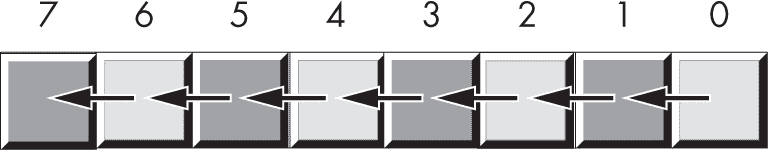

图 2-8：左移操作

比特 0 移入比特位置 1，原先在比特位置 1 的值移入比特位置 2，依此类推。你会将一个 0 移入比特 0，原来高位比特的值将丢失。

ARM 提供了一条逻辑左移指令 lsl，用于执行这个有用的操作。lsl 的语法如下：

```
lsl  `dest`, `source`, `count` // Does not affect any flags
```

计数操作数可以是一个寄存器，或者是范围在 0 到 *n* 之间的立即数，其中 *n* 是目标操作数位数减 1（例如，对于 32 位操作数，*n* = 31，对于 64 位操作数，*n* = 63）。目标和源操作数是寄存器。

当计数操作数为 1 时（无论是立即数还是寄存器中的值），lsl 指令会执行图 2-9 所示的操作。

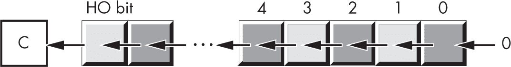

图 2-9：左移操作

如果计数值为 0，则不会发生移位，值保持不变。如果计数值大于 1，lsl 指令会将指定数量的比特位移（将 0 移入低位）。注意，lsl 指令不会影响任何标志位。

将一个值左移一位，相当于将其乘以基数（进制）。例如，将一个十进制数左移一位（在数字右边添加一个 0）实际上是将其乘以 10（基数）：

```
1234 shl 1 = 12340
// (shl 1 means shift one digit position to the left.)
```

因为二进制数的基数是 2，左移操作会使其乘以 2。如果你将一个值左移 *n* 次，它就相当于将该值乘以 2*^n*。

*右移* 操作的原理相同，只不过数据是向相反方向移动。对于一个字节值，比特 7 移入比特 6，比特 6 移入比特 5，比特 5 移入比特 4，依此类推。在右移过程中，你会将一个 0 移入比特 7（见 图 2-10）。

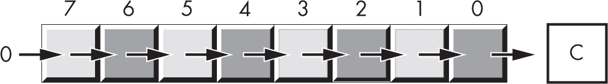

图 2-10：右移操作

正如你所期望的，ARM 提供了一个 lsl 指令，可以将位向目标操作数右移。其语法类似于 lsl 指令：

```
lsr  `dest`, `source`, `count` // Does not affect any flags
```

这个指令将一个 0 移入目标操作数的 HO 位，并将其他位向右移动一个位置（即，从较高的位数移到较低的位数）。

因为左移相当于乘以 2，所以右移大致相当于除以 2（或者一般来说，除以数字的基数）。如果你执行*n*次右移操作，你将把该数字除以 2*^n*。

然而，右移仅相当于*无符号*除以 2。例如，如果你将 254（0xFE）的无符号表示右移一个位置，你得到 127（0x7F），这正是你所期望的结果。然而，如果你将–2（0xFE）的二进制补码表示右移一个位置，你得到 127（0x7F），这*是不正确的*。这个问题发生是因为你将一个 0 移入了第 7 位。如果第 7 位之前是 1，那么你就将其从负数改为正数——在除以 2 时，这不是一个好做法。

为了将右移用作除法运算符，本章必须定义第三种右移操作：*算术右移*。不需要算术左移；标准的左移操作适用于有符号和无符号数字，前提是没有溢出发生。

算术右移的工作方式与普通的右移操作（逻辑右移）相同，除了它不是将 0 移入 HO 位，而是将 HO 位的值复制回自身。也就是说，右移操作不会修改 HO 位，如图 2-11 所示。

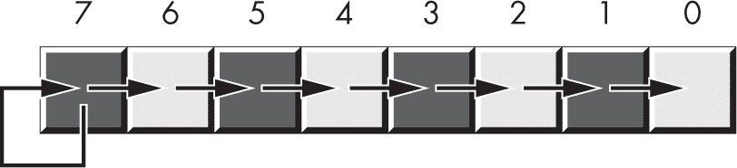

图 2-11：算术右移操作

算术右移通常会产生你预期的有符号整数结果。例如，如果你对–2（0xFE）执行算术右移操作，结果是–1（0xFF）。然而，这个操作总是将数字四舍五入到最接近的整数，该整数是*小于或等于实际结果*的。例如，如果你对–1（0xFF）执行算术右移操作，结果是–1，而不是 0。因为–1 小于 0，所以算术右移操作会朝–1 方向舍入。这不是算术右移操作的错误；它只是采用了一个不同（但有效的）整数除法定义。

ARM-64 提供了一个算术右移指令，asr（算术右移）。该指令的语法几乎与 lsl 相同：

```
asr  `dest`, `source`, `count` // Does not affect any flags
```

操作数的常规限制适用。如果计数为 1，则此指令按图 2-12 所示进行操作。

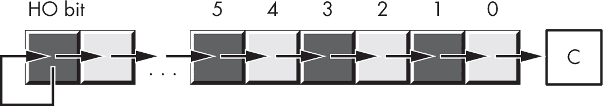

图 2-12：asr dest, source, #1 操作

如果计数值为 0，则不发生移位，值保持不变。如果计数值大于 1，则 asr 指令将指定数量的位进行移位（将 0 移入 LO 位置）。

*左旋*和*右旋*操作与移位左和移位右操作类似，不同之处在于，从一端移出的位会被重新移入另一端。图 2-13 展示了这些操作的示意图。

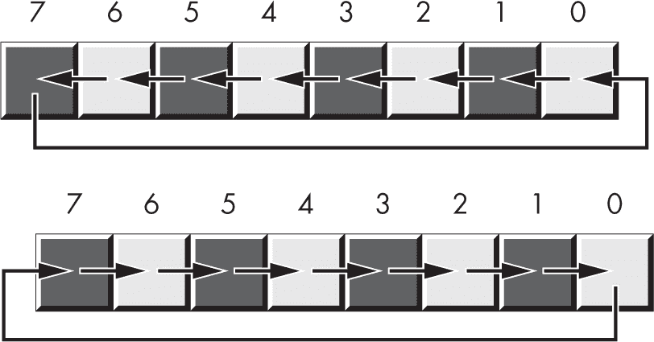

图 2-13：左旋和右旋操作

ARM 提供了 ror（右旋）指令，但没有左旋指令。右旋的语法与移位指令类似：

```
ror  `dest`, `source`, `count` // Does not affect any flags
```

图 2-14 展示了该指令在寄存器上的操作。请注意，这个指令不会影响任何标志。如果计数值为 0，则不发生旋转，值保持不变。如果计数值大于 1，旋转指令将指定数量的位进行旋转（将 0 移入适当的位置）。

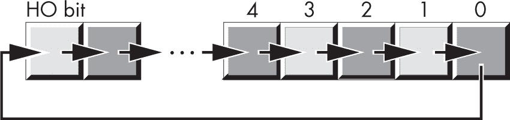

图 2-14：ror dest, source, #1 操作

如果你绝对需要进行 rol 操作，可以通过其他指令（在某种程度上）进行合成。第八章对此进行了更详细的说明。

### 2.12 位域与打包数据

尽管 ARM 在字节、半字、字和双字数据类型上操作最为高效，但偶尔你会需要处理使用 8、16、32 或 64 以外的位数的数据类型。你可以将非标准数据大小扩展为下一个更大的 2 的幂次方（例如将 22 位值扩展为 32 位值）；这种方法速度很快，但如果你有一个包含这些值的大数组，则大约有 31% 的内存会浪费（每个 32 位值中有 10 位是浪费的）。然而，假设你将这 10 位重新用于其他目的。通过*打包*这些单独的 22 位和 10 位值到一个 32 位值中，你就不会浪费任何空间。

例如，考虑一个日期格式为 04/02/01。表示这个日期需要三个数值：月、日和年值。当然，月份的取值范围是 1 到 12。表示月份至少需要 4 位，最多可以表示 16 种值。天数范围是 1 到 31，这意味着表示天数需要 5 位，最多表示 32 种值。年值，假设你处理的是 0 到 99 之间的值，需用 7 位表示，可以表示最多 128 个值。这意味着我们需要 2 字节来存储整个日期，因为 4 + 5 + 7 = 16 位。

换句话说，你可以将日期数据打包到 2 字节中，而不是使用 3 字节（如果每个月、日和年值都使用单独的字节）。这样每存储一个日期就节省了 1 字节的内存，如果你需要存储多个日期，这将带来显著的节省。这些位可以按 图 2-15 中所示的方式进行排列。


图 2-15：短打包日期格式（2 字节）

在图中，*MMMM*代表组成月份值的 4 个位，*DDDDD*代表组成日期的 5 个位，*YYYYYYY*代表组成年份的 7 个位。每一组表示数据项的位称为*位字段*。例如，2001 年 4 月 2 日将表示为 0x4101：

```
0100      00010   0000001  = 0100_0001_0000_0001b or 0x4101
4         2       01
```

尽管打包值是*节省空间*的（也就是说，它们有效利用了内存），但它们在计算上是*低效*的（很慢！）。这是因为解包打包到各个位字段中的数据需要额外的指令。这些指令需要额外的执行时间和额外的字节来存储指令；因此，你必须仔细考虑打包的数据字段是否真的能为你节省空间。列表 2-4 中的示例程序展示了打包和解包这种 16 位日期格式所付出的努力。

```
// Listing2-4.S
//
// Demonstrate packed data types.

#include "aoaa.inc"

             .equ    NULL, 0         // Error code
             .equ    maxLen, 256     // Max input line size

 .data

saveLRMain:  .dword  0
saveLRRN:    .dword  0

ttlStr:      .asciz  "Listing 2-4"
moPrompt:    .asciz  "Enter current month: "
dayPrompt:   .asciz  "Enter current day: "

yearPrompt:  .ascii  "Enter current year "
             .asciz  "(last 2 digits only): "

packed:      .ascii  "Packed date is %04x = "
             .asciz  "%02d/%02d/%02d\n"

theDate:     .asciz  "The date is %02d/%02d/%02d\n"

badDayStr:   .ascii  "Bad day value was entered "
             .asciz  "(expected 1-31)\n"

badMonthStr: .ascii "Bad month value was entered "
             .asciz "(expected 1-12)\n"

badYearStr:  .ascii "Bad year value was entered "
             .asciz "(expected 00-99)\n"

// These need extra padding so they can be printed
// as integers. They're really byte (and word) values.

month:      .dword  0
day:        .dword  0
year:       .dword  0
date:       .dword  0

m:          .dword  0
d:          .dword  0
y:          .dword  0

input:      .fill    maxLen, 0

            .text
            .align  2       // Word-align code
            .extern printf
            .extern readLine
            .extern strtol

// Return program title to C++ program:

            .global getTitle
getTitle:
            lea     x0, ttlStr
            ret

// Here's a user-written function that reads a numeric value from
// the user:
//
// int readNum(char *prompt);
//
// A pointer to a string containing a prompt message is passed in
// the X0 register.
//
// This procedure prints the prompt, reads an input string from
// the user, then converts the input string to an integer and
// returns the integer value in X0.

readNum:
            lea     x1, saveLRRN
            str     lr, [x1]        // Save return address.

// Must set up stack properly (using this "magic" instruction)
// before you can call any C/C++ functions:

            sub     sp, sp, #64

// Print the prompt message. Note that the prompt message was
// passed to this procedure in X0; we're just passing it on to
// printf:

            bl      printf

// Set up arguments for readLine and read a line of text from
// the user. Note that readLine returns NULL (0) in RAX if there
// was an error.

            lea     x0, input
            mov     x1, #maxLen
            bl      readLine

// Test for a bad input string:

            cmp     x0, #NULL
            beq     badInput

// Okay, good input at this point. Try converting the string
// to an integer by calling strtol. The strtol function returns
// 0 if there was an error, but this is a perfectly fine
// return result, so we ignore errors.

            lea     x0, input       // Ptr to string
            mov     x1, #NULL       // No end string pointer
            mov     x2, #10         // Decimal conversion
            bl      strtol          // Convert to integer.

badInput:
            add     sp, sp, #64     // Undo stack setup.
            lea     x1, saveLRRN    // Restore return address.
            ldr     lr, [x1]
            ret

// Here is the "asmMain" function:
            .global asmMain
asmMain:
            sub     sp, sp, #64     // Magic instruction
            lea     x0, saveLRMain
            str     lr, [x0]

// Read the date from the user. Begin by reading the month:

            lea     x0, moPrompt
            bl      readNum

// Verify the month is in the range 1..12:

            cmp     x0, #1
            blo     badMonth
            cmp     x0, #12
            bhi     badMonth

// Good month, save it for now:

            lea     x1, month
            strb    w0, [x1]    // 1..12 fits in a byte.

// Read the day:

            lea     x0, dayPrompt
            bl      readNum

// We'll be lazy here and verify only that the day is in
// the range 1..31.

            cmp     x0, #1
            blo     badDay
            cmp     x0, #31
            bhi     badDay

// Good day, save it for now:

            lea     x1, day
            strb    w0, [x1]    // 1..31 fits in a byte.

// Read the year:

            lea     x0, yearPrompt
            bl      readNum

// Verify that the year is in the range 0..99:

            cmp     x0, #0
            blo     badYear
 cmp     x0, #99
            bhi     badYear

// Good year, save it for now:

            lea     x1, year
            strb    w0, [x1] // 0..99 fits in a byte.

// Pack the data into the following bits:
//
//  15 14 13 12 11 10  9  8  7  6  5  4  3  2  1  0
//   m  m  m  m  d  d  d  d  d  y  y  y  y  y  y  y

            lea     x0, month
            ldrb    w1, [x0]
            lsl     w1, w1, #5

            lea     x0, day
            ldrb    w2, [x0]
            orr     w1, w1, w2
            lsl     w1, w1, #7

            lea     x0, year
            ldrb    w2, [x0]
            orr     w1, w1, w2

            lea     x0, date
            strh    w1, [x0]

// Print the packed date:

            lea     x0, packed
            vparm2  date
            vparm3  month
            vparm4  day
            vparm5  year
            bl      printf

// Unpack the date and print it:

            lea     x0, date
            ldrh    w1, [x0]

            // Extract month:

            lsr     w2, w1, #12
            lea     x0, m
            strb    w2, [x0]

            // Extract day:

            lsr     w3, w1, #7
            and     w3, w3, #0x1f
            lea     x0, d
            strb    w3, [x0]

 // Extract year:

            and     w1, w1, #0x7f
            lea     x0, y
            strb    w1, [x0]

            lea     x0, theDate
            vparm2  m
            vparm3  d
            vparm4  y
            bl      printf

            b.al    allDone

// Come down here if a bad day was entered:

badDay:
            lea     x0, badDayStr
            bl      printf
            b.al    allDone

// Come down here if a bad month was entered:

badMonth:
            lea     x0, badMonthStr
            bl      printf
            b.al    allDone

// Come here if a bad year was entered:

badYear:
            lea     x0, badYearStr
            bl      printf

allDone:
            add     sp, sp, #64
            lea     x0, saveLRMain
            ldr     lr, [x0]
            ret     // Returns to caller
```

以下是构建并运行此程序的结果：

```
$ ./build Listing2-4
$ ./Listing2-4
Calling Listing2-4:
Enter current month: 2
Enter current day: 4
Enter current year (last 2 digits only): 56
Packed date is 2238 = 02/04/56
The date is 02/04/56
Listing2-4 terminated
```

为 Y2K（2000 年）所引发的臭名昭著的问题让每个人都明白，使用仅限于 100 年（甚至 127 年）的日期格式是非常愚蠢的。如果你太年轻，无法记得这一场灾难，那么可以告诉你，20 世纪中后期的程序员通常只在日期中编码年份的最后两位数字。当 2000 年来临时，这些程序无法区分像 2024 年和 1924 年这样的日期。

为了避免这个问题，并使列表 2-4 中的打包日期格式具备未来兼容性，你可以将格式扩展到 4 字节，打包成一个双字变量，如图 2-16 所示。（正如你将在第三章和第四章中看到的那样，你应该始终尝试创建长度为 2 的偶数次幂的数据对象——即 1 字节、2 字节、4 字节、8 字节，以此类推——否则你将遭遇性能上的损失。）

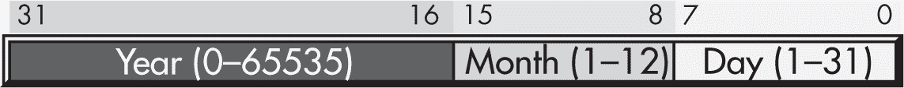

图 2-16：长打包日期格式（4 字节）

现在，月份和日期字段分别由 8 个位组成，因此它们可以从字中提取为字节对象。这留下了 16 个位给年份，支持 65,536 年的范围。通过重新排列这些位，使得年份字段位于高位（HO）位置，月份字段位于中位位置，日期字段位于低位（LO）位置，长日期格式允许你轻松比较两个日期，看看一个日期是否小于、等于或大于另一个日期。请考虑以下代码：

```
 lea x0, Date1  // Assume Date1 and Date2 are words.
     ldr x1, [x0]   // Using the long packed-date format
     lea x0, Date2
     ldr x2, [x0]
     cmp x1, x2
     ble d1LEd2

       // Do something if Date1 > Date2.

d1LEd2:
```

如果你将不同的日期字段保存在单独的变量中，或者以不同的方式组织字段，那么你就不能像短的打包日期格式那样轻松地比较 Date1 和 Date2。因此，这个例子展示了即使你没有意识到节省空间，打包数据的另一个原因：它可以使某些计算更加方便甚至更高效（这与通常打包数据时的情况相反）。

压缩数据类型的实际应用实例比比皆是。你可以将八个布尔值压缩成一个字节，将两个 BCD 数字压缩成一个字节，等等。一个经典的压缩数据示例是 PSTATE 寄存器（参见图 2-17）。这个寄存器将四个重要的布尔对象以及 12 个重要的系统标志压缩成一个 32 位寄存器。

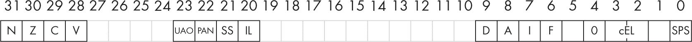

图 2-17：PSTATE 寄存器作为压缩布尔数据

通常，你会通过使用条件跳转指令来访问条件码标志。偶尔，你可能需要操作 PSTATE 寄存器中的单个条件码位。你可以使用 msr（移至系统寄存器）和 mrs（移系统寄存器）指令来实现这一点。

```
msr  `systemReg`, `reg`
mrs  `reg`, `systemReg`
```

其中，reg 是 ARM 的 64 位通用寄存器之一，systemReg 是一个特殊的*系统寄存器*名称。这里关注的系统寄存器是 NZCV，它以条件码标志命名。

以下指令将 PSTATE 寄存器中的第 28 到 31 位复制到 X0 中的相应位，并将 0 复制到 X0 中的所有其他位：

```
mrs  x0, nzcv
```

这条指令将 X0 中的第 28 到 31 位复制到 PSTATE 中的条件码位（不影响 PSTATE 中的其他位）：

```
msr  nzcv, x0
```

如果你想显式设置进位标志，而不影响其他任何条件码标志，可以按如下方式进行：

```
mrs  x0, nzcv
orr  x0, x0, #0x20000000  // Carry is in bit 29; set it.
msr  nzcv, x0
```

这条指令将一个 1 位按位或到 PSTATE 寄存器的进位标志中。

### 2.13 IEEE 浮点格式

回到 1976 年，当英特尔计划为其新的 8086 微处理器引入浮点协处理器时，它聘请了能找到的最优秀的数值分析师来设计浮点格式。那个人接着又聘请了另外两位该领域的专家，他们三人——威廉·卡汉、杰罗姆·库嫩和哈罗德·斯通——共同设计了英特尔的浮点格式。他们在设计 KCS 浮点标准时表现得非常出色，以至于电气与电子工程师协会（IEEE）采纳了这个格式作为其浮点格式。这个格式已经成为包括 Arm 在内的 CPU 厂商使用的标准。

IEEE-754 标准的单精度和双精度格式对应于 C 语言中的 float 和 double 类型，或者 FORTRAN 中的 real 和 double-precision 类型。这些相同的格式也适用于 ARM 汇编语言程序员。

#### 2.13.1 单精度格式

*单精度格式*使用 24 位的反码尾数、8 位的超出 127 的指数以及 1 位符号位。*反码*表示法由符号位和一个无符号的二进制数字组成，符号位表示该二进制数的符号。*尾数*（表示有效数字的部分）通常表示从 1.0 到接近 2.0 的值。尾数的 HO 位始终假定为 1，表示二进制点左边的值。（*二进制点*与*小数点*相同，只是它出现在二进制数中，而不是十进制数中。）其余的 23 个位（分数部分）出现在二进制点的右侧。

因此，尾数表示的值是：

```
1.`mmmmmmm mmmmmmmm`
```

mmmm 字符表示尾数的 23 位。由于尾数的 HO 位始终是 1，单精度格式实际上并不在浮点数的 32 位中存储这一位。这个 HO 位被称为*隐式位*。

因为你正在处理二进制数字，二进制点右侧的每个位置表示一个值（0 或 1）乘以 2 的连续负幂。隐式的 1 位始终乘以 2⁰，即 1。这就是为什么尾数总是大于或等于 1.0 的原因。即使其他尾数位全是 0，隐式的 1 位也始终给我们值 1.0。当然，即使二进制点后面有几乎无限多个 1 位，它们加起来仍然不会等于 2.0。这就是为什么尾数能表示范围从 1.0 到接近 2.0 的值。

隐式位始终为 1 有一个例外：IEEE 浮点格式支持*非标准化*值，其中 HO 位不是 0。但是，本书通常忽略非标准化值。

尽管在 1.0 和 2.0 之间有无限多个值，但你只能表示其中的 800 万个值，因为格式使用了一个 23 位的尾数（隐式的第 24 位始终为 1）。这就是浮点运算不精确的原因：你在涉及单精度浮点值的计算中被限制为固定数量的位。

如前所述，尾数使用反码格式，而不是二补码来表示有符号值。这意味着尾数的 24 位值仅仅是一个无符号的二进制数，符号位决定该值是正数还是负数。反码数有一个不寻常的特性，即 0.0 有两个表示（符号位设置或未设置）。通常，这对于设计浮点软件或硬件系统的人来说很重要。本书假设值 0.0 的符号位始终未设置。

为了表示超出 1.0 到接近 2.0 范围的值，浮点数格式的指数部分发挥作用。浮点数格式将 2 的指数指定的次方值进行提升，然后将尾数乘以该值。指数是 8 位，采用超额-127 格式存储。在*超额-127 格式*中，指数 0 由值 127（0x7F）表示，负指数的值在 1 到 126 之间，正指数的值在 128 到 254 之间（0 和 255 保留用于特殊情况）。要将指数转换为超额-127 格式，只需将 127 加到指数值上。使用超额-127 格式使得浮点数值的比较变得更加简单。

单精度浮点数格式如图 2-18 所示。

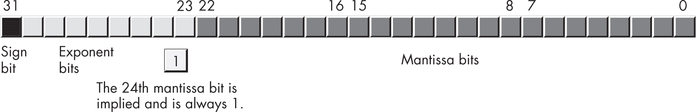

图 2-18：单精度（32 位）浮点数格式

在具有 24 位尾数的情况下，您将获得大约六个半（十进制）数字的精度（半个数字的精度意味着前六位数字可以在 0 到 9 的范围内，但第七位数字只能在 0 到*x*的范围内，其中*x* < 9，并且通常接近 5）。但请注意，只有六位数字是有保证的。使用 8 位超额-127 指数时，单精度浮点数的*动态范围*大约是 2 ^(± 127)，或大约是 10 ^(± 38)。这个动态范围是最小和最大正值之间的大小差异。

虽然单精度浮点数在许多应用中完全适用，但其精度和动态范围有些有限，不适合许多金融、科学及其他应用。此外，在长时间的计算过程中，单精度格式的有限精度可能会引入严重的误差。

#### 2.13.2 双精度格式

*双精度格式*有助于克服单精度浮点数的问题。双精度格式使用两倍空间，具有 11 位超额-1,023 指数和 53 位尾数（隐含有 1 个高位），加上一个符号位。双精度浮点数值的格式如图 2-19 所示。

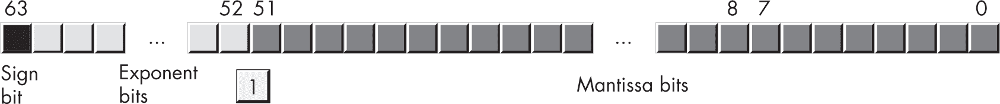

图 2-19：64 位双精度浮点数格式

第 53 位尾数位是隐含的，始终为 1。双精度格式提供大约 10 ^(± 308)的动态范围，并至少提供 15 位的精度，足以满足大多数应用的需求。

### 2.14 规范化浮点数值

为了在计算过程中保持最大精度，大多数计算使用标准化值。一个 *标准化的浮点值* 是其高位尾数位包含 1 的值。几乎所有非标准化的值都可以被标准化：将尾数位向左移动，并递减指数，直到尾数的高位出现 1。记住，指数是二进制指数。每次增加指数时，浮点值会乘以 2。同样，每次递减指数时，浮点值会除以 2。同理，将尾数向左移动一位会将浮点值乘以 2；而将尾数向右移动则会将浮点值除以 2。因此，将尾数向左移动一位 *并且* 递减指数，实际上并不会改变浮点数的值。

保持浮点数标准化能够保持计算的最大精度。如果尾数的高位 *n* 位全部为 0，那么尾数的可用精度就减少了这么多位。因此，涉及标准化值的浮点计算会更加精确。

在两个重要情况下，浮点数无法标准化。首先，浮点值 0.0 不能标准化，因为 0.0 的表示在尾数中没有 1 位。然而，这并不是问题，因为你可以仅用一个位精确表示 0.0。

在第二种情况下，尾数中的一些高位是 0，但偏置指数也为 0（并且无法递减指数以标准化尾数）。IEEE 标准允许特殊的 *非标准化* 值来表示这些较小的值（替代方法是将这些值下溢为 0）。尽管使用非标准化值比发生下溢时能得到更好的浮点计算结果，但请注意，非标准化值提供的精度较低。有些文献使用 *次正常* 这个术语来描述非标准化值。

#### 2.14.1 非数值

IEEE 浮点标准识别四个特殊的非数值：-无穷大、+无穷大，以及两个特殊的“非数值”（NaN）。对于这些特殊的数字，指数域填充所有 1 位。

如果指数全部为 1 位，且尾数全部为 0 位（不包括隐含位），则该值为无穷大。符号位为 0 时表示 +无穷大，符号位为 1 时表示 -无穷大。

如果指数全部为 1 位，且尾数不是全部 0 位，则该值为无效数字（在 IEEE 754 术语中称为 *NaN*）。NaN 代表非法操作，例如尝试对负数取平方根。

无序比较会在任何一个操作数（或两个操作数）是 NaN 时发生。由于 NaN 的值是不确定的，因此它们不可比较。任何尝试进行无序比较的操作通常会导致异常或某种错误。另一方面，有序比较则涉及两个操作数，其中没有一个是 NaN。

#### 2.14.2 Gas 对浮点值的支持

Gas 提供了几种数据声明，以支持在汇编语言程序中使用浮点数据。Gas 浮点常量允许以下语法：常量以可选的 + 或 − 符号开始，表示尾数的符号（如果没有这个符号，Gas 假定尾数为正）。接着是一个或多个十进制数字，然后是一个小数点和零个或多个十进制数字。之后可选地跟着一个 e 或 E，e 或 E 后面可以跟一个可选的符号（+ 或 −）和一个或多个十进制数字。

小数点或 e/E 必须存在，以区分浮点字面常量和整数或无符号字面常量。以下是一些合法的浮点字面常量示例：

```
1.234  3.75e2  -1.0  1.1e-1  1.e+4  0.1  -123.456e+300  +25.0e0
```

浮点字面常量必须以一个十进制数字开头，因此你必须在程序中使用 0.1 而不是 .1。

要声明一个浮点变量，可以使用 .single 或 .double 数据类型。除了使用这些类型声明浮点变量而不是整数外，它们的使用几乎与 .byte、.word、.dword 等类型相同。以下示例展示了这些声明及其语法：

```
 .data
fltVar1:  .single  0.0
fltVar1a: .single  2.7
pi:       .single  3.14159
DblVar:   .double  0.0
DblVar2:  .double  1.23456789e+10
DPVar:    .double  -1.0e-104
IntAsFP:  .double  -123
```

和往常一样，本书使用 C/C++ 的 printf() 函数将浮点值输出到控制台。确实，也可以编写汇编语言例程来实现相同的输出，但 C 标准库提供了一种便捷的方式，避免编写复杂的代码（至少在第九章之前是如此）。

浮点算术与整数算术不同；你不能使用 ARM 的 add 和 sub 指令来操作浮点值。本章仅介绍浮点格式；有关浮点算术和一般浮点操作的更多信息，请参见第六章。

在此期间，让我们考虑一些其他的数据格式。

### 2.15 二进制编码十进制表示法

尽管整数和浮点数格式可以满足大多数程序的数字需求，但在某些特殊情况下，其他数值表示形式会更为方便。本节扩展了之前介绍的 BCD 格式的定义。尽管 ARM CPU 并不提供对 BCD 的硬件支持，但它仍然是一些软件使用的常见格式，BCD 算术由程序员编写的软件函数提供。

BCD 值是一个由若干个半字节组成的序列，每个半字节表示一个 0 到 9 之间的值。通过一个字节，你可以表示包含两个十进制数字的值，或者 0 到 99 之间的值。图 2-20 显示了在一个字节中，由 4 个比特表示的两个 BCD 数字。

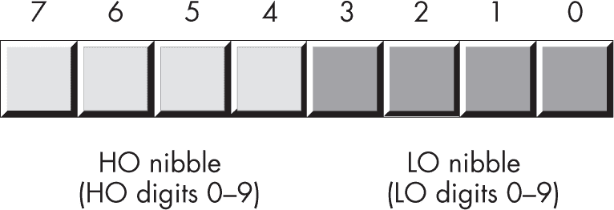

图 2-20：内存中两位 BCD 数据表示

如你所见，BCD 存储并不是特别节省内存。例如，一个 8 位 BCD 变量可以表示 0 到 99 之间的值，而同样的 8 位，当存储一个二进制值时，可以表示 0 到 255 之间的值。同样，16 位的二进制值可以表示 0 到 65,535 之间的值，而 16 位的 BCD 值只能表示这些值的大约六分之一（0 到 9,999）。

然而，转换 BCD 值在内部数值表示和字符串表示之间是很容易的，例如，使用 BCD 在硬件中通过刻度盘或旋钮对多位十进制值进行编码。基于这两个原因，你很可能会看到人们在嵌入式系统（如烤面包机、计算器、闹钟和核反应堆）中使用 BCD，但在通用计算机软件中很少使用。

不幸的是，ARM 上的所有 BCD 操作都必须通过软件函数来完成，因为 BCD 算术并未集成到 ARM 的硬件中。因此，涉及 BCD 算术的计算可能会很慢。由于 BCD 数据类型非常专业，只在少数几种情况中使用（例如，在嵌入式系统中），本书将不再进一步讨论它。

### 2.16 字符

也许在个人计算机中最重要的数据类型是字符数据类型。*字符*指的是通常是非数字实体的人类或机器可读的符号。具体来说，字符是任何你通常可以在键盘上输入（包括可能需要多个按键才能产生的符号）或在视频显示器上显示的符号。

字母（*字母字符*）、标点符号、数字、空格、制表符、回车符（ENTER）、其他控制字符和其他特殊符号都是字符。*数字字符*与数字是不同的：字符 1 与数字 1 的值是不同的。计算机（通常）使用两种内部表示法来处理数字字符（0，1，...，9）和数字值 0 到 9。

大多数计算机系统使用单字节或多字节序列以二进制形式编码各种字符。Linux 和 macOS 使用 ASCII 或 Unicode 编码来表示字符。本节讨论了 ASCII 和 Unicode 字符集以及 Gas 提供的字符声明功能。

#### 2.16.1 ASCII 字符编码

ASCII 字符集将 128 个文本字符映射到无符号整数值 0 到 127（0 到 0x7F）。虽然字符与数字值的确切映射是任意的且无关紧要，但你必须使用标准化的代码进行此映射，以便在与其他程序和外部设备通信时，大家都使用相同的“语言”。ASCII 是一个标准化的代码：如果你使用 ASCII 代码 65 表示字符 A，那么你就知道当你将数据传输给外部设备（如打印机）时，该设备会正确地将该值解读为字符 A。

尽管存在一些重大缺陷，ASCII 已经成为计算机系统和程序之间数据交换的标准。大多数程序都可以接收和生成 ASCII 数据。由于你将在汇编语言中处理 ASCII 字符，我建议你学习字符集的布局，并记住一些关键的 ASCII 代码（例如，0、A、a 等）。有关所有 ASCII 字符代码的列表，请参见附录 A。

今天，Unicode（特别是 UTF-8 编码）正在迅速取代 ASCII，因为 ASCII 字符集不足以处理国际字母表和其他特殊字符，正如你将在第十四章中看到的那样。然而，大多数现代代码仍然使用 ASCII，因此你应该熟悉它。

ASCII 字符集被划分为四组，每组 32 个字符。前 32 个字符，ASCII 代码 0 到 0x1F（31），形成了一组特殊的不可打印字符，即控制字符。它们被称为*控制字符*，因为它们执行各种打印机/显示控制操作，而不是显示符号。例子包括*回车符*，它将光标定位到当前行的左侧；*换行符*，它将光标在输出设备上移动到下一行；以及*退格符*，它将光标向左移动一个位置。（历史上，*回车符*指的是打字机上用来移动纸张的纸架：将纸架移动到最右侧可以使下一个输入的字符出现在纸张的左侧。）不幸的是，不同的控制字符在不同的输出设备上执行不同的操作。输出设备之间缺乏标准化。要了解控制字符如何影响特定设备，请查阅其手册。

第二组 32 个 ASCII 字符代码包含各种标点符号、特殊字符和数字字符。这组中最显著的字符包括空格字符（ASCII 代码 0x20）和数字字符（ASCII 代码 0x30 到 0x39）。

第三组 32 个 ASCII 字符包含大写字母字符。字符 A 到 Z 的 ASCII 代码范围是 0x41 到 0x5A（65 到 90）。由于只有 26 个字母字符，其余 6 个代码用来表示各种特殊符号。

第四组也是最后一组 32 个 ASCII 字符代码，表示小写字母符号、5 个额外的特殊符号和另一个控制字符（删除）。小写字母符号使用的 ASCII 码从 0x61 到 0x7A。如果你将大小写字符的代码转换为二进制，你会发现大写符号和其对应的小写符号在恰好一位上有所不同。例如，考虑图 2-21 中 E 和 e 的字符代码。

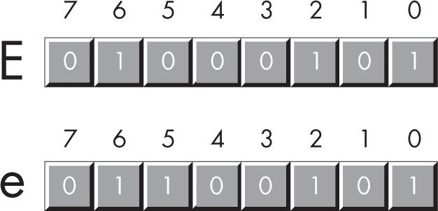

图 2-21：E 和 e 的 ASCII 码

大小写字母唯一的区别就在于第 5 位。大写字母在第 5 位总是 0；小写字母总是在第 5 位为 1。你可以利用这个特性快速进行大小写转换。你可以通过将第 5 位设置为 1 将大写字母转换为小写字母，或者通过将第 5 位设置为 0 将小写字母转换为大写字母。

的确，第 5 位和第 6 位决定了你所在的 ASCII 字符集中的四个组中的哪一组，正如表 2-12 所示。例如，你可以通过将第 5 位和第 6 位设置为 0，将任何大写或小写字母（或相应的特殊字符）转换为其等效的控制字符。

表 2-12：ASCII 组

| 第 6 位 | 第 5 位 | 组 |
| --- | --- | --- |
| 0 | 0 | 控制字符 |
| 0 | 1 | 数字和标点符号 |
| 1 | 0 | 大写字母和特殊字符 |
| 1 | 1 | 小写字母和特殊符号 |

请查看表 2-13 中的数字字符的 ASCII 码。

表 2-13：数字字符的 ASCII 码

| 字符 | 十进制 | 十六进制 |
| --- | --- | --- |
| 0 | 48 | 30h |
| 1 | 49 | 31h |
| 2 | 50 | 32h |
| 3 | 51 | 33h |
| 4 | 52 | 34h |
| 5 | 53 | 35h |
| 6 | 54 | 36h |
| 7 | 55 | 37h |
| 8 | 56 | 38h |
| 9 | 57 | 39h |

ASCII 码的低位半字节是所表示数字的二进制等效表示。通过去除（即设置为 0）数字字符的高位半字节，你可以将该字符代码转换为相应的二进制表示。相反，你可以通过简单地将高位半字节设置为 3，将 0 到 9 范围内的二进制值转换为其 ASCII 字符表示。你可以使用与操作将高位比特强制为 0；同样，你可以使用或操作将高位比特强制为 0b0011（3）。

不幸的是，你*不能*通过简单地去除每个数字字符中的高位半字节来将一个数字字符串转换为其等效的二进制表示。以这种方式转换 123（0x31, 0x32, 0x33）会得到 3 个字节，或者 0x010203，但 123 的正确值是 0x7B。前述的转换方法仅适用于单个数字。

#### 2.16.2 Gas 对 ASCII 字符的支持

Gas 提供对字符变量和字面量常量的支持，供你在汇编语言程序中使用。Gas 中的字符字面常量由一个字符组成，并用一对撇号（或单引号）括起来：

```
'A'
```

从技术上讲，Gas 中的字符常量由一个撇号后跟一个字符组成。Gas 还允许第二种形式，即字符被撇号包围。然而，macOS 汇编器只支持后一种形式，因此本书仅使用这种形式，以确保所有示例代码能够在两种系统上汇编。

要将撇号表示为字符常量，请使用反斜杠字符后跟撇号。例如：

```
'\''
```

你还可以在字符常量中使用其他转义字符序列。有关详细信息，请参见第 1.7 节“在 Gas 中声明内存变量”，第 16 页。

要在 Gas 程序中声明一个字符变量，请使用.byte 声明。例如，以下声明演示了如何声明一个名为 UserInput 的变量：

```
 .data
UserInput: .byte  0
```

这个声明预留了 1 字节的存储空间，你可以用它来存储任何字符值。你还可以按如下方式初始化字符变量：

```
 .data
TheCharA:     .byte 'A'
ExtendedChar: .byte 128  // Character code greater than 0x7F
```

因为字符变量是 8 位对象，所以你可以像操作任何 8 位值一样操作它们。你可以将字符变量移动到寄存器中，并将寄存器的低字节存储到字符变量中。

### 2.17 Gas 对 Unicode 字符集的支持

不幸的是，ASCII 仅支持 128 个字符编码。即使你将定义扩展到 8 位（正如 IBM 在原始 PC 上所做的那样），你也只能使用 256 个字符。这对于现代的跨国、多语言应用来说太小了。回到 1990 年代，几家公司开发了 ASCII 的扩展，称为*Unicode*，它使用了 2 字节的字符大小。因此，原始的 Unicode 支持最多 65,536 个字符编码。

尽管原始 Unicode 标准考虑得非常周全，但系统工程师发现即使是 65,536 个符号也不足够。今天，Unicode 定义了 1,112,064 个可能的字符（代码点），并使用可变长度的字符格式进行编码。

不幸的是，Gas 几乎不支持源文件中的 Unicode 文本。当然，如果你有一个支持编辑 UTF-8 源文件的文本编辑器，Gas 会接受字符和字符串文字中的 UTF-8 字符。然而，除了这些，Gas 可能不会对 Unicode 做太多处理（我没试过，但我怀疑 Gas 不会接受 UTF-16 或 UTF-32 源文件）。

第十四章详细介绍了 Unicode 格式及其实现。

### 2.18 机器代码

Gas 将人类可读的源文件转换为一种特殊的二进制形式，称为*机器代码*。对于许多（非 RISC）CPU 来说，可以在不深入了解汇编器生成的底层机器代码的情况下使用汇编语言。然而，对于 RISC 处理器，如 ARM，必须对底层机器代码有基本的理解，才能理解如何编写合适的汇编语言源代码。

像大多数 RISC CPU 一样，ARM64 将单个机器指令转换为一个 32 位值。这是 RISC 背后的基本原则之一：在给定的 CPU 上，指令始终是相同的长度，而这个长度几乎总是 32 位。变长指令是禁止的。然而，如果指令集支持立即数（汇编程序将其作为机器指令的一部分编码），并且你有 64 位寄存器，当指令限制为 32 位时，如何将 64 位立即数加载到寄存器中呢？简短的答案是：“你不能。”你可能还记得在第一章中提到的，立即数的范围非常小，现在你知道为什么了：这些常数必须编码到 32 位指令值中，并与大量其他信息一起编码。这严重限制了立即数的大小。

立即数并不是你在指令的 32 位值中必须编码的唯一内容。每个指令操作数都需要一定数量的位来编码。例如，ARM64 CPU 有 32 个通用寄存器，编码 32 个值需要 5 位。因此，每个操作数中的寄存器将占用 32 位指令中可用的 5 位。以下的加法指令将至少需要 15 位来编码三个寄存器（因为任何通用寄存器都可以作为目标寄存器、第一个源寄存器和第二个源寄存器）：

```
adds x0, x1, x2
```

除了寄存器和常数，ARM 指令中还必须编码其他信息，例如操作的大小（32 位与 64 位）。许多指令，如前面的加法指令，除了寄存器外，还允许立即数作为第二源操作数。必须有某种方式来区分这两种操作数形式，它们至少需要 1 位。许多指令还提供一个选项，在指令执行结束时更新标志，这又需要 1 位。还有许多额外的选项，本书尚未涉及。我们很快就会用尽可用的位数。

RISC 指令不仅必须是固定长度的，而且必须易于硬件解码。这意味着，对于所有指令，32 位指令中固定位置的若干位决定了指令的类型或分类。请参见图 2-22，这是 ARM64 的基本指令格式。

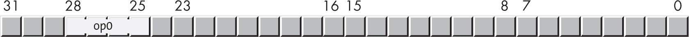

图 2-22：基本的 ARM 指令格式

op0 字段（op0 是*操作码 0*的缩写，通常缩写为*opcode*）指定指令的操作。在这个例子中，4 位字段将指令集分为七个组件，如表 2-14 所示。

表 2-14：指令编码中 op0 4 位字段

| op0 | 编码组或指令页面 |
| --- | --- |

| 0000 0001 |

0010

0011 | 保留/未分配 |

| 1000 1001 | 带立即常数的数据处理指令 |
| --- | --- |
| 1010 1011 | 分支、异常生成指令和系统指令 |

| 0100 0110

1100

1110 | 加载与存储 |

| 0101 1101 | 带寄存器的数据处理指令 |
| --- | --- |
| 0111 | 数据处理：SIMD 和浮点指令 |
| 1111 | 数据处理：SIMD 和浮点指令 |

考虑 表 2-14 中第二组的指令：带立即常数的数据处理指令。该组使用 图 2-23 中所示的解码。

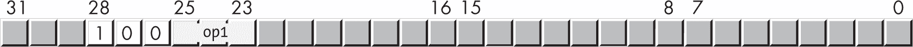

图 2-23：带立即常数的数据处理指令的编码

op1 中的 3 位（注意位 25 与 op0 共享）可以解码为 表 2-15 中所示。

表 2-15：op0 等于 0b100 的指令

| op1 | 解码组或指令页面 |
| --- | --- |
| 000 001 | PC 相对寻址模式指令 |
| 010 011 | 加法/减法立即数指令 |
| 100 | 逻辑立即数指令 |
| 101 | 移动宽立即数指令 |
| 110 | 位域指令 |
| 111 | 提取指令 |

现在考虑来自 表 2-15 的加法/减法立即数指令组。这些指令的完整编码显示在 图 2-24 中。

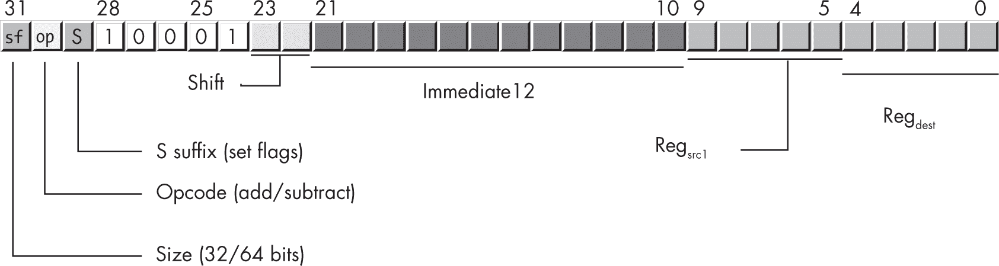

图 2-24：加法/减法立即数指令

加法和减法指令是一个典型的打包数据字段示例（如在第 2.12 节“位域和打包数据”中讨论，第 85 页）。这些字段具有以下含义：

**sf**    表示指令的大小（变种）。如果为 0，则为 32 位指令，Reg[src1] 和 Reg[dest] 字段指定的是 32 位寄存器；如果为 1，则为 64 位指令，寄存器为 64 位寄存器。

**op (bit 30)**    是操作码（位 24 到 28）的扩展。如果该位为 0，则指令为 add/adds 指令；如果该位为 1，则为 sub/subs 指令。

**S**    指定指令是否有 s 后缀（例如，adds）。如果该位为 1，则指令执行后会更新条件代码标志；如果该位为 0，则不会进行更新。

**Shift**    指定指令如何处理 Immediate12 字段。我将稍后更详细地讨论此字段。

**Immediate12**    是一个 12 位无符号整数值（0 到 +4,096）。此指令会将该值零扩展到指令的大小（32 位或 64 位）。

**Reg****[src]**    指定源寄存器，即指令的第二个操作数。

**Reg****[dest]**    指定目标寄存器，即指令的第一个操作数。

Shift 字段依赖于 Immediate12 字段，且稍微复杂。该字段可能包含 0b00 或 0b01（0b10 和 0b11 是保留值）。如果该字段包含 0b00，指令使用 Immediate12 字段的零扩展值；然而，如果该字段包含 0b01，指令首先将 Immediate12 左移 12 位，然后使用该移位后的值。这种移位形式在进行指针运算和添加页面偏移时非常有用（请参见 第三章 以了解内存管理页面的解释）。

如果加法和减法指令仅限于 12 位立即数（可能左移 12 位），那么如何将 32 位或 64 位常量加到寄存器中呢？你不能直接这么做；相反，你必须先将常量加载到另一个寄存器中，然后使用该寄存器作为第二源操作数，而不是立即数常量。正如我之前指出的，mov 指令和立即数常量也存在同样的问题。与加法和减法一样，mov 指令仅限于 32 位，这意味着你不能通过单个 mov 指令将 32 位或 64 位常量加载到寄存器中。这里的关键字是 *单个*。你可以通过多条 mov 指令将 32 位或 64 位常量加载到寄存器中。下一节将讨论如何实现这一点。

### 2.19 Operand2

大多数 ARM 数据处理指令（如加法和减法）需要三个操作数：一个目标操作数和两个源操作数。在下面的指令中，X0 是目标操作数，X1 是第一个源操作数，X2 是第二个源操作数：

```
add  x0, x1, x2  // Computes X0 = X1 + X2
```

到目前为止，我在本书中使用寄存器和立即数常量作为第二源操作数。然而，ARM CPU 支持几种格式的第二操作数，这些格式被称为 *Operand2*。这些格式如 表 2-16 所示，功能非常强大，使得 Operand2 在 ARM 上成为传奇。

表 2-16：Operand2 允许的字段

| Operand2 | 描述 |
| --- | --- |
| #immediate | 一个 12 位的立即数，范围为 0–4,095（用于算术指令），或者一个 16 位的立即数（用于移动指令）。 |
| #pattern | 一个常量，用于指定 0 和 1 的排列。用于生成逻辑指令的位掩码。仅用于逻辑指令。 |
| Wn 或 Xn | 其中一个通用寄存器（32 位或 64 位）。 |
| Wn shiftOp #imm | 32 位寄存器的内容按 #imm 操作数指定的位置数进行移位（0–31）。shiftOp 可以是 lsl、lsr、asr 或 ror。 |
| Xn shiftOp #imm | 将 64 位寄存器的内容按 #imm 操作数指定的位置数进行移位（0–63）。 |
| Wn extendOp #imm | 32 位寄存器的内容经过零扩展或符号扩展，然后左移由立即数指定的位数（0–31）。此形式不能用于逻辑指令，因为符号扩展不适用于逻辑操作。extendOp 可以是 uxtb、uxth、uxtw、uxtx、sxtb、sxth、sxtw 或 sxtx。 |
| Xn extendOp #imm | 64 位寄存器的内容经过零扩展或符号扩展后，再通过立即数值（0–31）向左移动。此形式不适用于逻辑指令，因为符号扩展不适用于这些指令。 |

以下各节描述了这些 Operand2 形式的详细信息。

#### 2.19.1 #immediate

Operand2 的立即数形式，或 #immediate，是它更常见的用法之一（另一个是 32 个通用寄存器中的一个）。由于立即数操作数作为 32 位指令值的一部分进行编码，它的长度通常远小于 32 位。如你所见，算术指令只允许使用一个 12 位的无符号整数作为立即数操作数。其他指令允许不同大小的立即数操作数。例如，mov 指令允许 16 位的无符号立即数操作数。

尽管你在程序中遇到的许多立即数常量会适配到 12 位或 16 位，但有些值无法适配。如本章前面所提到的，在这种情况下，你需要加载一个更大的常量到寄存器中，并使用该寄存器中的值，而不是使用立即数常量。请参见第 2.20 节《大常量》，第 111 页了解如何处理这种情况。

#### 2.19.2 #pattern

ARM 逻辑指令（如 and、orr 和 eor）提供一个 13 位的立即数（#pattern）字段，并将其编码到 32 位指令中。然而，这并不是一个直接的 13 位立即数值，而是由 3 个独立的位字段组合而成的 *位掩码模式*。第十二章更详细地描述了这些位掩码的使用。在此之前，请理解，逻辑指令对立即数常量的支持有一些奇怪的限制。

Arm 编译器 Armasm 用户指南中的条目较难理解。基本上，它说明了逻辑指令的立即数常量由包含一段 1 位序列的二进制值组成，1 位序列后跟（可能前面也有）0 位序列。每个序列的长度可以是 2、4、8、16、32 或 64 位。以下是这种立即数常量的合法示例：

```
and     x0, x0, #0b1
and     x0, x0, #0b11
and     x0, x0, #0b111
and     x0, x0, #0b1110
and     x0, x0, #0b11100
```

在每种情况下，都有一个单独的 1 位序列，可能被 0 位序列包围。

以下示例不是合法的立即数常量：

```
and     x0, x0, #0b101
and     x0, x0, #0b10101
and     x0, x0, #0b1110111
and     x0, x0, #0b101100
```

这些示例是非法的，因为它们在相同的立即数常量中包含多个连续的 1 位。

“相同元素的向量”这一短语（来自 Armasm 指南）告诉我们，如果序列的长度小于寄存器大小（32 或 64 位），则指令会在寄存器中复制该序列，以填充到 32 位或 64 位。因此，如果存在多个 1 位序列且每个序列的长度是 2、4、8、16 或 32 位的倍数，那么立即数常量中可能会有多个连续的 1 位序列。以下是合法示例：

```
// This AND instruction contains 4 copies of the sequence
// 0b11110000:

        and     w0, w0, #0b11110000111100001111000011110000

// This sequence is legal because it contains 16 copies of
// the 2-bit sequence 0b10:

        and     w0, w0, #0b01010101010101010101010101010101

// This sequence is legal because it contains 2 copies of
// the 32-bit sequence 0b11111111111111110000000000000000:

        and     x0, x0, #0xFFFF0000FFFF0000
```

但是，如果你想使用“相同元素的向量”方案，你必须提供一个完全填充目标寄存器的常量。以下示例是非法的，因为它在 32 位 W0 寄存器的 HO 16 位内有两个不一致的 16 位段：

```
and     w0, w0, #0b1111000011110000
```

这种方案令人困惑，但仅用几个比特就能生成最常见的立即数类型，因此其复杂性是值得的。

如果你不小心提供了不合适的常量，Gas 会返回错误信息，例如：错误：预期兼容的寄存器或逻辑立即数，或者错误：操作数 3 中的立即数超出范围——'and w0,w0,#0b1111000011110000'。

#### 2.19.3 寄存器

Operand2 最常见的形式是 ARM 的通用寄存器（32 位或 64 位）。鉴于到目前为止，寄存器已在大多数示例中出现，因此无需进一步讨论这种形式。

#### 2.19.4 移位寄存器

另一个 Operand2 形式将 ARM 寄存器与移位操作结合。此形式向指令添加了一个额外的操作数，该操作数包括表 2-17 中的移位运算符之一和一个小的立即数（范围从 0 到 *n*，其中 *n* 是目标寄存器的大小）。

表 2-17: Operand2 移位运算符

| 运算符 | 描述 |
| --- | --- |
| lsl #imm | 将 Operand2 寄存器的值逻辑左移 imm 位并使用结果。 |
| lsr #imm | 将 Operand2 寄存器的值逻辑右移 imm 位并使用结果。 |
| asr #imm | 算术右移 Operand2 寄存器的值 imm 位并使用结果。 |
| ror #imm | 将 Operand2 寄存器的值逻辑右移 imm 位并使用结果。此形式仅适用于逻辑指令。 |

正如你在第四章中看到的，使用移位寄存器 Operand2 形式在对数组和其他数据结构进行索引时非常方便。

要使用移位寄存器 Operand2 形式，只需在指令的操作数列表末尾添加一个额外的操作数，使用表 2-17 中出现的运算符之一。以下是一些示例：

```
add w0, w1, w2, lsl #4  // W0 = W1 + (W2 << 4)
sub x0, x1, x2, lsr #1  // X0 = X1 - (X2 >> 1)
add x0, x1, x2, asr #1  // X0 = X1 + (X2 asr 1)
and x0, x1, x2, ror #2  // X0 = X1 & (X2 ror 2)
```

正如注释所示，这些指令中的每一条都会在使用 W2 或 X2 的值作为第二个源操作数之前对其进行移位。

#### 2.19.5 扩展寄存器

最后一组 Operand2 形式提供了零扩展和符号扩展，并且可以对 Operand2 寄存器进行可选的逻辑左移。基本指令语法为：

```
instr  `reg`dest`, reg`src1`, reg`src2`, extendop #optional_imm`
```

其中 extendop 是表 2-18 中的某个运算符。如果没有提供 #optional_imm 值，则默认为 0。

表 2-18: 扩展运算符

| 扩展运算符 | 描述 |
| --- | --- |
| uxtb #optional_imm | 将 regsrc2 的低位字节零扩展到 regdest 和 regsrc1 的大小。regsrc2 操作数应为字长寄存器（Wn），无论 regdest 和 regsrc1 的大小如何。（Gas 似乎接受双字寄存器，并用相应的字寄存器替代。）如果有可选的立即数值，则该值必须在 0 到 4 之间，并将根据指定的位数将扩展结果进行移位。 |
| uxth #optional_imm | 将 regsrc2 的低位半字零扩展到 regdest 的大小。regsrc2 操作数应为字长寄存器（Wn），无论 regdest 和 regsrc1 的大小如何。如果有可选的立即数值，则该值必须在 0 到 4 之间，并将根据指定的位数将扩展结果进行移位。 |
| uxtw #optional_imm | 将 regsrc2 的低位字零扩展到 regdest 的大小。regsrc2 操作数应为字长寄存器（Wn），无论 regdest 和 regsrc1 的大小如何。如果有可选的立即数值，则该值必须在 0 到 4 之间，并将根据指定的位数将扩展结果进行移位。请注意，如果所有寄存器都是字长寄存器（Wn），则该操作符等同于 lsl #optional_imm。 |
| uxtx #optional_imm | 此操作符仅在所有寄存器为 64 位时适用。如果 Operand2 寄存器后面没有扩展（或移位）操作符，则这是默认条件。 |
| sxtb #optional_imm | 将 regsrc2 的低位字节符号扩展到 regdest 和 regsrc1 的大小。regsrc2 操作数应为字长寄存器（Wn），无论 regdest 和 regsrc1 的大小如何。如果有可选的立即数值，则该值必须在 0 到 4 之间，并将根据指定的位数将扩展结果进行移位。 |
| sxth #optional_imm | 将 regsrc2 的低位半字符号扩展到 regdest 的大小。regsrc2 操作数应为字长寄存器（Wn），无论 regdest 和 regsrc1 的大小如何。如果有可选的立即数值，则该值必须在 0 到 4 之间，并将根据指定的位数将扩展结果进行移位。 |
| sxtw #optional_imm | 将 regsrc2 的低位字符号扩展到 regdest 的大小。regsrc2 操作数必须为字长寄存器（Wn），无论 regdest 和 regsrc1 的大小如何。如果有可选的立即数值，则该值必须在 0 到 4 之间，并将根据指定的位数将扩展结果进行移位。如果所有寄存器都是字长寄存器（Wn），该操作符等同于 lsl #optional_imm。请注意，当所有寄存器都是字长时，推荐使用 uxtw，而不是此形式（两者在字长寄存器上执行相同的操作）。 |
| sxtx #optional_imm | 此操作符仅在所有寄存器为 64 位时适用。实际上，它与 uxtx 相同（推荐使用 uxtx 形式）。 |
| lsl #optional_imm | 如果扩展操作符是多余的（uxtx/sxtx 对于双字，uxtw/sxtw 对于字寄存器），应使用 lsl 操作符以确保清晰（它们是相同的操作）。 |

扩展操作符对于混合大小的算术运算非常有用。第八章 讨论了这一点，内容涉及操作不同大小的操作数。### 2.20 大常数

在本章的多个地方，已经推迟了解决无法装入 12 位或 16 位的立即常数的问题。现在是时候纠正这个遗漏了。

如前所述，如果你需要一个常数用于算术或逻辑运算，而该常数无法容纳在指令编码中为常数预留的位数中，你将不得不先将该常数加载到寄存器中，然后再对寄存器进行操作，而不是直接使用常数。这种方案的缺点是，你至少需要一条额外的指令，通常还需要更多的指令，先将常数加载到临时寄存器中，然后才能在算术操作中使用该值。例如，假设你想将 40,000 加到 X1 寄存器中。以下指令将无法工作，因为 40,000 不能装入 12 位：

```
add x1, x1, #40000
```

然而，由于 40,000 可以装入 16 位，你可以执行以下操作：

```
mov x0, #40000  // Works, because mov allows 16-bit consts
add x1, x1, x0  // Add 40000 to X1.
```

不幸的是，你的程序会变得稍微大一些（mov 指令额外需要 4 字节），也会稍微慢一些（需要执行两条指令而不是一条），但这是它能够达到的最高效率了。

如果你想添加一个不能装入 16 位的常数（比如 400,000），该怎么办？这个问题有几个解决方案。首先，正如你在第一章中看到的，ldr 指令的变体允许你将任何大小的常数加载到寄存器中（32 位或 64 位）。该指令形式具有以下语法

```
ldr `reg`, =`largeConstant`
```

其中 reg 是一个通用寄存器（32 位或 64 位），而 largeConstant 是一个立即数（字面值或符号值），它将适合指定的寄存器。该指令形式将在 .text 区段中分配存储空间（该区段是只读的），并用指定的常数初始化该存储空间。当 ldr 指令执行时，它将把该内存位置的内容加载到指定的寄存器中。

这一条指令是将大常数加载到寄存器中的一种便捷方式。然而，这种方法存在一些问题。首先，在 ARM 上访问内存是一个相对较慢的过程。其次，由于 Gas 会将常数插入到你的 .text 区段中，这可能会影响你程序中其他代码的性能；尽管这种情况很少发生，且通常不需要担心，但仍需记住这一点。

幸运的是，你可以通过其他方式将更大的常数加载到通用寄存器中。这些技术涉及 mov 指令的其他变体：movz、movk 和 mvn。

#### 2.20.1 movz

movz 指令（移动并清零）具有以下语法

```
movz `reg`dest, #`imm`1
movz `reg`dest, #`imm`1, lsl #`imm`2
```

其中，regdest 是任何通用的（32 位或 64 位）寄存器，imm1 是一个 16 位立即数常量，imm2 是 0、16、32 或 48 四个值之一（如果 lsl #imm2 操作数未出现，则默认为 0）。

movz 指令将取 imm1 常量，并按 imm2 常量指定的位数向左移位（其他位位置填充 0，因此名称中有 *清零* 的含义）。然后，它会将该移位后的常量移动到目标寄存器中。以下三个指令完全相同，都会将常量 122 加载到 X0 寄存器中：

```
mov  x0, #122
movz x0, #122
movz x0, #122, lsl #0
```

mov 和 movz 的区别在于，mov 会对你提供的立即数进行符号扩展，而 movz 会进行零扩展。对于小于 0x8000 的值，两者将把相同的常量加载到目标寄存器中（实际上，汇编器可能会将 movz 指令转换为 mov，如果两者产生相同的结果）。请记住，移位值只能是 0、16、32 或 48；不能为此指令指定任意的位移值。

movz 指令在你想要将一个 16 位的值加载到 32 位寄存器的高半字 (HO half word) 或 64 位寄存器的三个高半字 (1、2 或 3) 中时非常有用。

#### 2.20.2 movk

尽管 movz 指令允许将一些大于 65,535 的值加载到寄存器中，但它并不是加载 32 位和 64 位常量到寄存器的通用解决方案。movk 指令（与 movz 和 mov 配合使用）满足了这一需求。movk 指令（移动并保留不受影响的位）的语法与 movz 非常相似：

```
movk `reg`dest, #`imm`1 // Default is "lsl #0"
movk `reg`dest, #`imm`1, lsl #`imm`2
```

movk 指令将立即数操作数按 0、16、32 或 48 位进行移位，然后将该值合并到目标寄存器中。（它不会将其他位清零，而是保留它们的原始值。）

要将一个 32 位立即数加载到 W0 寄存器中，请使用以下指令序列：

```
mov  w0, #LO_16_bits
movk w0, #HO_16_bits, lsl #16
```

要将完整的 64 位值加载到 X0 寄存器中，请使用以下指令：

```
mov  x0, #LO_16_bits
movk x0, #Bits_16_to_31, lsl #16
movk x0, #Bits_32_to_47, lsl #32
movk x0, #HO_16_bits, lsl #48
```

大多数情况下，立即数不需要完整的 64 位，因此你可能只需要两条或三条指令，而不是完整的四条。然而，加载 64 位常量到寄存器中永远不需要超过四条指令（加载 32 位常量时永远不需要超过两条指令）。

#### 2.20.3 movn

movn（取反移动）指令是 mov 的另一种变体，它在将立即数加载到目标寄存器之前，会对其进行逻辑取反。语法与 movz 相同（当然是将 movz 换成 movn）：

```
movn `reg`dest, #`imm`1    // Default shift is lsl #0.
movn `reg`dest, #`imm`1, lsl #`imm`2
```

movn 指令将立即数按 0、16、32 或 48 位进行移位，然后将整个（32 位或 64 位）位串取反，再将其赋值给目标寄存器。

考虑以下示例：

```
movn x1, #0xff, lsl 16
```

该指令将 0xFFFFFFFFFF00FFFF 加载到 X1 寄存器中。（0xFF 向左移位 16 位，然后取反所有位。）

特别是在将负常量加载到寄存器时，movn 指令可以帮助减少加载 64 位常量所需的指令数。然而，32 位常量如果不能放入 16 位，通常需要两条指令才能完成加载。与 mvn 指令不同，它允许移位立即数常量。

### 2.21 继续前进

本章涵盖了基本数据类型、表示以及这些数据类型上的操作。包括十进制、二进制和十六进制计数系统，以及机器级数据，如位、字节等。它讨论了位和位串的逻辑操作、有符号和无符号整数表示，以及符号扩展和零扩展，扩展了数字所使用的位数，此外还有符号收缩和饱和操作，用于减少数字所使用的位数。它还介绍了浮点数、BCD 数据格式以及字符数据（包括 ASCII 和 Unicode 字符）。

本章还包括了机器指令编码的信息，并介绍了 ARM 汇编语言指令，用于加载和存储内存值，比较和分支指令用于控制程序流，以及移位和旋转指令。它描述了如何将数据打包成位字段，常量和其他操作数的 Operand2 格式，以及如何将不能放入 32 位指令编码中的大常量加载到寄存器中。

简而言之，本章提供了处理汇编语言程序中各种类型常量的工具和技术。虽然常量是任何汇编语言程序的重要组成部分，但能够操作变量数据是大多数计算机系统的基础。下一章将讨论 ARM 内存子系统以及如何创建和高效使用基于内存的变量。

### 2.22 更多信息

+   关于数据表示和布尔函数的一般信息，可以考虑阅读我的书《*写出伟大的代码*》第一卷，第 2 版（No Starch Press，2020 年），或者一本关于数据结构和算法的教科书。

+   ASCII 和 Unicode 都是国际标准化组织（ISO）标准，ISO 为这两种字符集提供了报告。通常，这些报告需要付费，但你也可以通过在互联网上搜索它们的名称找到大量关于 ASCII 和 Unicode 字符集的信息。你还可以在 *[`<wbr>www<wbr>.unicode<wbr>.org`](https://www.unicode.org)* 阅读关于 Unicode 的内容。最后，前面提到的《*写出伟大的代码*》包含了关于 Unicode 字符集的历史、使用和编码的额外信息。

+   关于更多 ARM CPU 的信息，请参阅 *[`<wbr>developer<wbr>.arm<wbr>.com`](https://developer.arm.com)*。

+   要了解更多关于 IEEE 单精度浮点格式的信息，请参阅 *[`<wbr>en<wbr>.wikipedia<wbr>.org<wbr>/wiki<wbr>/Single<wbr>-precision<wbr>_floating<wbr>-point<wbr>_format`](https://en.wikipedia.org/wiki/Single-precision_floating-point_format)*。

+   了解更多关于 IEEE 浮点双精度格式的信息，访问*[`<wbr>en<wbr>.wikipedia<wbr>.org<wbr>/wiki<wbr>/Double<wbr>-precision<wbr>_floating<wbr>-point<wbr>_format`](https://en.wikipedia.org/wiki/Double-precision_floating-point_format)*。
