## 第三章：3 内存访问与组织


第一章和第二章向你展示了如何在汇编语言程序中声明和访问简单变量。本章将全面解释 ARM 内存访问。你将学习如何高效组织变量声明，以加快对其数据的访问。你还将了解 ARM 堆栈以及如何在堆栈上操作数据。

本章讨论了几个重要概念，包括以下内容：

+   内存组织

+   内存访问与内存管理单元

+   独立位置的可执行文件与地址空间布局随机化

+   变量存储与数据对齐

+   字节序（内存字节顺序）

+   ARM 内存寻址模式与地址表达式

+   堆栈操作、返回地址与保存寄存器数据

本章将教你如何高效利用计算机的内存资源。

### 3.1 运行时内存组织

运行中的程序以多种方式使用内存，具体取决于数据的类型。以下是你在汇编语言程序中会遇到的一些常见数据分类：

**代码**    编码机器指令的内存值（在 Linux 和 macOS 中也称为*文本*段）。

**未初始化的静态数据**    程序为未初始化变量预留的内存区域，这些变量在程序运行期间始终存在；操作系统在将程序加载到内存时会将该存储区域初始化为 0。

**初始化的静态数据**    一个在程序运行期间始终存在的内存区域。然而，操作系统会从程序的可执行文件中加载该区域内所有变量的值，因此在程序首次执行时，这些变量具有初始值。

**只读数据**    与初始化的静态数据类似，操作系统从可执行文件中加载此内存段的初始数据。然而，此段被标记为*只读*，以防止数据被意外修改。程序通常将常量和其他不变的数据放入此段（代码段也由操作系统标记为只读）。

**堆**    此特殊的内存区域用于存放动态分配的存储。诸如 C 语言的 malloc()和 free()等函数负责在堆区分配和释放存储空间。第 4.4.4 节“指针变量与动态内存分配”在第 178 页中详细讨论了动态存储分配。

**堆栈**    在此特殊内存区域中，程序维护过程和函数的局部变量、程序状态信息及其他临时数据。有关堆栈部分的更多信息，请参见第 3.9 节“推入与弹出操作”，见第 155 页。

这些是你在常见程序中会找到的典型区域，无论是汇编语言程序还是其他语言的程序。较小的程序可能不会使用所有这些区域，但大多数程序至少会有代码区、栈区和数据区。复杂的程序可能会为自己的目的创建额外的内存区域。某些程序可能会将这些区域合并。例如，许多程序会将代码区和只读数据区合并到内存中的同一区域（因为这两个区域中的数据都被标记为只读）。有些程序会将已初始化和未初始化的数据区合并，将未初始化的变量初始化为 0。合并区域通常由链接器程序处理。有关 GNU 链接器的更多信息，请参见第 3.12 节“更多信息”，第 167 页。

Linux 和 macOS 倾向于将不同类型的数据放入内存的不同区域（或称为*段*）。虽然通过运行链接器并指定各种参数，可以重新配置内存，以满足自己的选择，但一种典型的组织方式可能类似于图 3-1 中的内容。

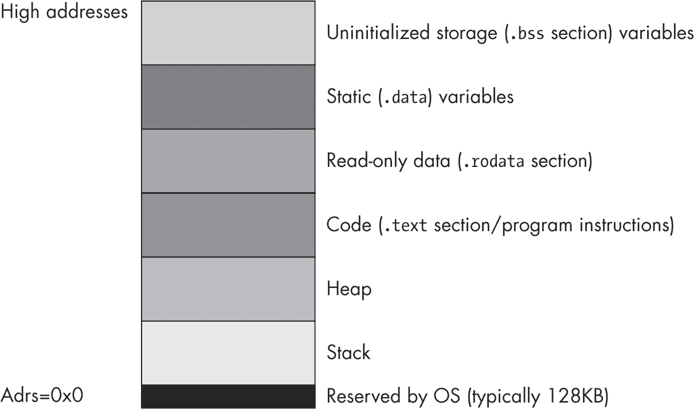

图 3-1：Linux/macOS 示例运行时内存组织

这张图仅仅是一个示例。实际的程序可能会以不同的方式组织内存，尤其是在使用地址空间布局随机化时，稍后在本章中会讨论这一点。

操作系统保留了最低的内存地址。通常情况下，你的应用程序无法访问这些低地址中的数据（或执行指令）。操作系统保留这些空间的一个原因是为了帮助捕捉 NULL 指针引用：如果你尝试访问内存地址 0x0（NULL），操作系统会生成*段错误*（也称为*一般保护错误*），意味着你访问了一个不包含有效数据的内存位置。

内存映射中的其余六个区域包含与程序相关的不同类型的数据。这些内存区域包括栈区、堆区、.text（代码）区、.data 区、.rodata（只读数据）区和.bss（未初始化数据）区。每个内存区域对应着你在 Gas 程序中可以创建的某种数据类型。接下来我将详细描述.text、.data、.rodata 和.bss 区域。（操作系统提供栈区和堆区；你通常在汇编语言程序中不会声明这两个区域，所以这里不再讨论它们。）

#### 3.1.1 . text 区

.text 区包含在 Gas 程序中出现的机器指令。Gas 会将你编写的每一条机器指令转换为一个或多个字值的序列。在程序执行过程中，CPU 会将这些 32 位的字值解释为机器指令。

默认情况下，当 GCC/Gas/*ld* 链接你的程序时，它会告诉系统，程序可以从代码段执行指令和读取数据，但不能向代码段写入数据。如果你尝试将任何数据存储到代码段中，操作系统将生成段错误。

#### 3.1.2 .data 节段

你通常会将变量放入 .data 节段中。除了声明静态变量外，你还可以将数据列表嵌入到 .data 声明节段中。你使用与将数据嵌入到 .text 节段中相同的技术来将数据嵌入到 .data 节段中：使用 .byte、.hword、.word、.dword 等指令。考虑以下示例：

```
 .data 
bb:  .byte    0 
     .byte    1,2,3 

u:   .word    1 
     .dword   5,2,10 

c:   .byte    0 
     .byte    'a', 'b', 'c', 'd', 'e', 'f' 

bn:  .byte    0 
     .byte    true  // Assumes true is defined as 1 
```

Gas 使用这些指令将值放入 .data 内存段时，会在前面的变量之后写入该段。例如，字节值 1、2、3 会在 bb 的 0 字节后写入 .data 节段。由于这些值没有关联标签，你无法在程序中对这些值进行符号访问。你可以使用索引寻址模式（本章稍后会介绍）来访问这些额外的值。

#### 3.1.3 只读数据节段

Gas 没有提供单独的指令来创建存放只读常量的节段。然而，你可以轻松地使用 Gas 的 .section 指令创建一个通用的只读常量节段，如下所示：

```
.section .rodata, ""
```

大多数程序按照惯例使用 .rodata 标识符来表示只读数据。例如，GCC 使用该名称来表示只读常量节段。你可以在这里使用任何你选择的标识符。例如，我通常使用 .const 作为常量节段的名称。然而，由于 GCC 使用 .rodata，我将在本书中遵循这一惯例。稍后我会更多地讲解 .section 指令；目前，请注意，只要第二个参数是空字符串，Gas 就会通过这个指令创建一个只读数据节段。

.section .rodata 节段存放常量、表格和程序在执行期间无法更改的其他数据。这个节段与 .data 节段类似，但有两个区别：

+   .rodata 节段是通过 .section .rodata, "" 定义的，而不是 .data。

+   系统不允许你在程序运行时向 .rodata 对象中的变量写入数据。

这是一个例子：

```
 .section  .rodata, ""
pi:      .single   3.141592653589793 // (rounded) 
e:       .single   2.718281828459045 // (rounded) 
MaxU16:  .hword    65535 
MaxI16:  .hword    32767 
```

在许多情况下，你可以将 .rodata 对象视为字面常量。然而，因为它们实际上是内存对象，它们的行为类似于只读 .data 对象。你不能在字面常量允许出现的地方使用 .rodata 对象。例如，你不能在寻址模式中将它们用作 *位移*（相对于基指针的常量 *偏移量*）（参见第 3.6 节，“ARM 内存寻址模式”，第 140 页），在常量表达式中，或者作为立即数。在实践中，你可以在任何允许读取 .data 变量的地方使用它们。

与 .data 段一样，你可以通过使用 .byte、.hword、.word、.dword 等数据声明，在 .rodata 段中嵌入数据值。例如：

```
 .section  .rodata, ""
roArray: .byte     0 
         .byte     1, 2, 3, 4, 5 
dwVal:   .dword    1 
         .dword    0 
```

你也可以在 .text 段中声明常量值。你在该段中声明的数据值也是只读对象，因为 Linux 和 macOS 会对 .text 段进行写保护。如果你确实将常量声明放在 .text 段中，请注意将它们放置在程序不会试图将其作为代码执行的位置（例如在 b.al 或 ret 指令之后）。除非你使用数据声明来手动编码 ARM 机器指令（这很少见，通常只由专家程序员执行），否则你不希望程序试图将数据当作机器指令执行；结果通常是未定义的。

> 注意

*从技术上讲，在 .text 段中执行数据的结果是明确定义的：机器将解码你放入内存中的任何位模式作为机器指令。然而，很少有人能查看一段数据并将其解释为机器指令。*

#### 3.1.4 .bss 段

.data 段要求你初始化对象，即使你只是将默认值 0 放入操作数字段中。 .bss（块由符号开始）段允许你声明在程序开始运行时始终未初始化的变量。该段以 .bss 保留字开始，并包含变量声明，其初始化器必须始终为 0。以下是一个例子：

```
 .bss 
UninitUns32: .word  0 
i:           .word  0 
character:   .byte  0 
bb:          .byte  0 
```

操作系统会在将程序加载到内存时将所有 .bss 对象初始化为 0。然而，依赖这种隐式初始化可能不是一个好主意。如果你需要一个初始化为 0 的对象，请在 .data 段中声明它，并显式地将其设置为 0。

令人烦恼的是，Gas 要求在声明 .bss 段中的变量时显式提供一个初始化值为 0。优秀的汇编语言程序员不喜欢这样做，因为为他们的源代码提供一个显式值会告诉读者，他们期望该变量在程序运行时包含该值。如果程序显式地不期望该变量被初始化，那么最好告诉读者这一点。

一种非常古老的惯例是使用表达式 .-. 作为这种声明操作数字段的表示。例如：

```
 .bss 
UninitUns32: .word  .-. 
i:           .word  .-. 
character:   .byte  .-. 
bb:          .byte  .-. 
```

Gas 用当前位置计数器的当前值（参见第 3.2 节，“变量的 Gas 存储分配”，第 131 页）替代了句点 (.)。表达式 location_counter 减去 location_counter 等于 0，这符合 .bss 段中初始化器的 Gas 要求。这种奇怪的语法让读者知道，你并不期望变量在程序运行时显式地初始化为 0。

如果 .-. 对你来说太奇怪（或者你不想输入三个字符），我通常会使用类似这样的表达式来获得相同的结果：

```
 .equ   _, 0  // "_" is a legitimate identifier 
             .bss 
UninitUns32: .word  _
i:           .word  _
character:   .byte  _
bb:          .byte  _
```

本书倾向于使用 .-. 形式（当没有明确指定 0 时），因为这种形式具有历史先例。然而，这种形式有一个缺点：它不适用于 .qword 声明（这是 Gas 的一个限制）。

你在 .bss 部分声明的变量可能会在程序的可执行文件中占用更少的磁盘空间。这是因为 Gas 会将 .rodata 和 .data 对象的初始值写入可执行文件，但它可能会对你在 .bss 部分声明的未初始化变量使用紧凑的表示方法。请注意，这种行为依赖于操作系统版本和目标模块格式。

#### 3.1.5 .section 指令

.section 指令允许你使用任何你喜欢的名称创建部分（.rodata 部分就是一个例子）。此指令的语法是：

```
.section `identifier`, `flags` 
```

其中 identifier 是任何合法的 Gas 标识符（不必以句点开头），flags 是一个用引号括起来的字符串。字符串的内容根据操作系统的不同而有所变化，但 Linux 和 macOS 都支持以下字符：

b    部分是一个 .bss 部分，将保存未初始化的数据。所有数据声明必须具有 0 初始值。

x    部分包含可执行代码。

w    部分包含可写数据。

a    部分是可分配的（数据部分必须存在）。

d    部分是数据部分。

flags 字符串可以包含零个或多个这些字符，尽管某些标志（如 "b" 和 "x" 或 "d"）是互斥的。如果字符串中没有 "w" 标志，该部分将是只读的。以下是一些典型的 .section 声明：

```
.section aDataSection, "adw" // Typical data section 
.section .const, ""          // Like .rodata 
.section .code, "x"          // Code section (like .text) 
```

每个你定义的独特部分将分配给自己的内存块（如 图 3-1 中所示的块）。GNU 链接器/加载器将在将它们分配到内存块时合并所有相同名称的部分。

#### 3.1.6 声明部分

.data、.rodata、.bss、.text 和其他命名部分在你的程序中可能出现零次或多次。声明部分可以按任何顺序出现，正如下面的示例所示：

```
 .data
i_static:   .word     0

            .bss
i_uninit:   .word     .-.

 .section  .rodata, ""
i_readonly: .word     5

            .data
j:          .word     0

            .section  .rodata, ""
i2:         .word     9

            .bss
c:          .byte     .-.

            .bss
d:          .word     .-.

            .text

`Code goes here.`
```

这些部分可以按任意顺序出现，且给定的声明部分可以在程序中出现多次。如前所述，当多个相同类型的声明部分（例如前面示例中的三个 .bss 部分）出现在程序的声明部分时，Gas 会将它们合并为一个组，以任何它喜欢的顺序。

#### 3.1.7 内存访问和 MMU 页

ARM 的 *内存管理单元（MMU）* 将内存划分为称为 *页* 的块。操作系统负责管理内存中的页，因此应用程序通常不需要关心页的组织。然而，在处理内存中的页时，确保你了解 CPU 是否允许访问给定的内存位置，以及该位置是可读/写还是只读（写保护）。

每个程序部分在内存中都出现在连续的 MMU 页面中。也就是说，.rodata 部分从 MMU 页面中的偏移量 0 开始，并依次消耗该部分中所有数据所占用的内存页面。内存中的下一个部分（可能是 .data）从紧跟在上一个部分的最后一页后的下一个 MMU 页面的偏移量 0 开始。如果上一个部分（例如 .rodata）没有消耗 4,096 字节的整数倍，则该部分数据的末尾与最后一页的末尾之间会有填充空间，以确保下一个部分从 MMU 页面边界开始。

每个新的部分都会在它自己的 MMU 页面中开始，因为 MMU 通过使用页面*粒度*来控制对内存的访问。例如，MMU 控制内存中的页面是可读/可写还是只读。对于 .rodata 部分，你希望内存是只读的。对于 .data 部分，你希望允许读取和写入。因为 MMU 只能按页面逐页强制执行这些属性，所以你不能将 .data 部分的信息与 .rodata 部分放在同一个 MMU 页面中。

通常，所有这些对你的代码都是完全透明的。你在 .data（或 .bss）部分声明的数据是可读且可写的，而 .rodata 或 .text 部分的数据是只读的（.text 部分也可以执行）。除了将数据放在特定的部分之外，你无需过多担心页面属性。

在一种情况下，你确实需要关注内存中的 MMU 页面组织。有时，访问（读取）内存中数据结构末尾之外的数据是方便的。然而，如果该数据结构与 MMU 页面的末尾对齐，访问内存中的下一页可能会遇到问题。内存中的某些页面是*不可访问的*；MMU 不允许对该页面进行读取、写入或执行操作。尝试这样做将产生 ARM *段错误*。这通常会崩溃你的程序，除非你已经设置了异常处理程序来处理段错误。如果你有一次数据访问跨越了页面边界，并且内存中的下一页不可访问，那么这将崩溃你的程序。例如，考虑对 MMU 页面末尾的字节对象进行半字访问，如 图 3-2 所示。

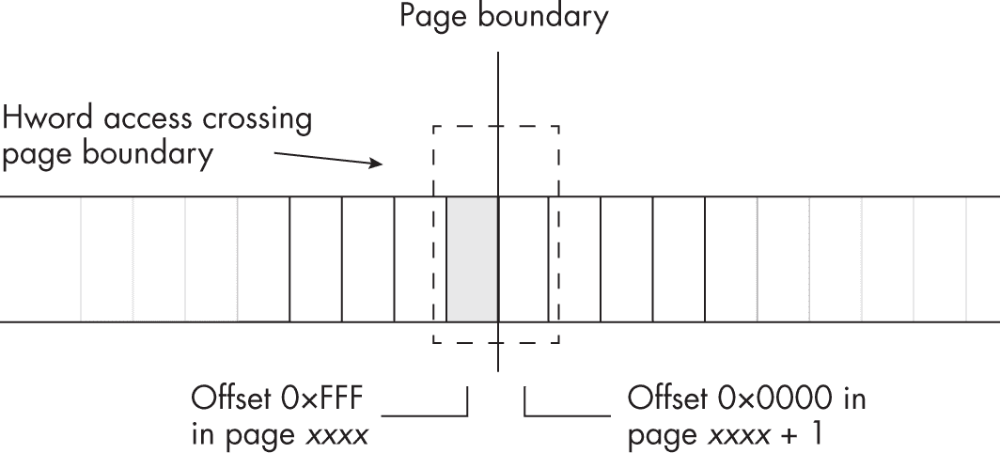

图 3-2：内存管理页末尾的半字访问

一般来说，你不应该读取数据结构末尾之外的数据。如果出于某种原因你必须这么做，确保访问内存中下一页是合法的。不言而喻，你永远不应写入数据结构末尾之外的数据；这样做总是错误的，可能带来比仅仅让程序崩溃更严重的问题（包括严重的安全问题）。

#### 3.1.8 PIE 和 ASLR

如第一章中所述，macOS 强制所有代码使用位置无关的可执行文件（PIE）格式。Linux 并不绝对要求这样做，但如果你选择，可以编写 PIE 代码。PIE 代码有两个主要原因：共享库和安全性，这些在《Linux 与 macOS：位置无关的可执行文件》一文中已在第 23 页中详细讲解。然而，由于 PIE 代码的行为深刻影响了你编写 ARM 汇编语言的方式，因此值得花些时间进一步讨论 PIE，尤其是*地址空间布局随机化（ASLR）*。

ASLR 是操作系统的一种尝试，旨在阻止各种试图搞清楚代码和数据在应用程序中位置的攻击（黑客）。在 PIE 和 ASLR 之前，大多数操作系统总是将可执行代码和数据加载到内存中的相同地址，这使得黑客容易修补或以其他方式干扰可执行程序。通过将代码和数据段加载到随机内存位置，PIE/ASLR 使得攻击者更难接触到正在执行的代码。

由于 ASLR，正在执行的程序在内存中的布局实际上不会像图 3-1 所示那样。对于某个程序执行实例，它可能类似于图 3-3 所示。

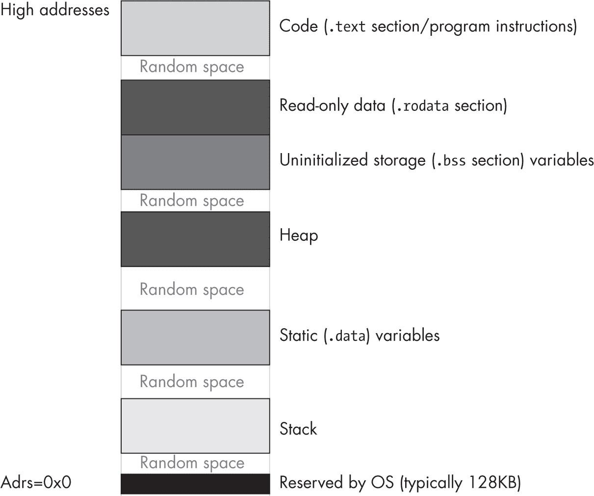

图 3-3：应用程序执行的一种可能的内存布局

然而，在程序的下一次运行中，代码段可能会被重新排列，并放置到内存中的不同位置。

虽然 PIE/ASLR 使得黑客更难利用你的代码，但它也对 ARM 的指令集产生了很大影响。考虑以下（合法的）ARM ldr 指令：

```
ldr w0, someWordVar  // Assume someWordVar is in .data 
```

xs

这通常会从位于.data 段中的 32 位变量 someWordVar 加载 W0 寄存器。该指令使用*PC 相对寻址模式*，这意味着该指令编码了从 ldr 指令的地址到内存中 someWordVar 变量的偏移量。然而，如果你在 macOS 下汇编这个程序，你会得到以下错误：

```
error: unknown AArch64 fixup kind! 
```

在 Linux 下（Ubuntu 和 Raspberry Pi OS 似乎有所不同；你的使用情况可能有所不同），你会看到类似以下内容：

```
relocation truncated to fit: R_AARCH64_LD_PREL_LO19 against `.data' 
```

这是一个真实的 ARM64 指令，*应该*可以工作。事实上

```
ldr reg, =constant 
```

这只是该指令的一种特殊形式，而且它确实有效。

这个问题源于 ARM 32 位指令长度。如果你查阅 ARM 参考手册中的 ldr 指令编码，你会发现它为内存位置的地址预留了 19 位。这实际上是一个*偏移量*（以字节为单位的距离），表示相对于 ldr 指令的地址（即 19 位字段的值会加到程序计数器 PC 上，从而得到实际的内存地址）。因为它引用的数据在 .text 区段，并且 .text 区段中的所有内容都是按字对齐的，因此这个 19 位的偏移量实际上是一个字偏移，而不是字节偏移。这有效地为 ldr 指令提供了额外的 2 位（低 2 位总是为 0）。这个有效的 21 位偏移量使得 ldr 指令可以访问离 ldr 指令 ±1MB 以内的数据。

不幸的是，当访问位于 .data 区段的数据时，由于操作系统很友善地将其放置在一个随机地址（可能距离超过 1MB），ldr 指令的 21 位范围将不足以访问该数据。这就是为什么 Gas 会报错，提示尝试用 ldr 指令访问 .data 区段的变量。底线是，除非数据也在 .text 区段并且与 ldr 指令的距离不超过 ±1MB，否则不能直接使用该指令来访问数据。

#### 3.1.9 .pool 区段

.pool 区段是你程序中的一个 Gas 伪区段。如前所述，以下指令通过将常量放置在内存中的某个位置，然后将该内存位置的内容加载到目标寄存器中，来将一个大常量加载到寄存器中：

```
ldr reg, =largeConstant 
```

换句话说，这个指令完全等价于以下两种情况中的任意一种：

```
 ldr x0, a64_bit_constant 
    ldr w0, a32_bit_constant 
     . 
     . 
     . 
// Somewhere in the .text section that will never 
// be executed as code: 

a64_bit_constant: .dword  `The_Actual_64bit_Constant_Value` 
a32_bit_constant: .word   `The_Actual_32bit_Constant_Value` 
```

Gas 会自动找出合适的地方来放置这些常量：将它们放在引用这些常量的指令附近，但不在代码路径中。

如果你希望控制这些常量在 .text 区段中的位置，可以使用 .pool 指令。无论你将此指令放置在 .text 区段中的何处（并且必须放在 .text 区段内），Gas 都会生成它所产生的常量。只要确保，如果你在代码中放置 .pool 指令，应该把它放在一个无条件跳转或返回指令之后，这样程序流就不会试图将这些数据作为机器指令执行。

通常，你不需要在源代码中放置 .pool 指令，因为 Gas 会合理地找到一个合适的位置来放置数据。然而，如果你打算在 .text 区段中插入你自己的数据，你可能需要插入 .pool 指令，并将数据声明紧跟其后。请注意，.pool 后的数据是 .text 区段的一部分，因此你可以继续在 .pool 后面放置机器指令。

### 3.2 Gas 变量存储分配

Gas 会为每个声明节（.text、.data、.rodata、.bss 以及任何其他命名节）关联一个当前的*位置计数器*。这些位置计数器初始值为 0。每当你在这些节中声明一个变量（或在代码节中编写代码时），Gas 会将该节的当前位置计数器的当前值与标签关联，并将该位置计数器的值增加你正在声明的对象的大小。

例如，假设以下是程序中唯一的 .data 声明节：

```
 .data
bb: .byte  0        // Location counter = 0, size = 1
s:  .hword 0        // Location counter = 1, size = 2
w:  .word  0        // Location counter = 3, size = 4
d:  .dword 0        // Location counter = 7, size = 8
q:  .qword 0        // Location counter = 15, size = 16
                    // Location counter is now 31.
```

在同一个 .data 节中列出的变量声明具有连续的偏移量（位置计数器值）。根据前面的声明，s 会紧跟在内存中的 bb 后面，w 会紧跟在 s 后面，d 会紧跟在 w 后面，以此类推。这些偏移量并不是变量的实际运行时地址。在运行时，系统会将每个节加载到内存中的基址。链接器和操作系统将内存节的基址加到这些位置计数器值（通常称为*位移*或*偏移量*）上，从而生成变量的实际内存地址。

请记住，你可能会将其他模块与程序链接（例如，来自 C 标准库的模块）或甚至在同一源文件中添加额外的 .data 节，而链接器必须合并这些 .data 节。每个独立的节（即使它与其他节同名）都有自己的位置计数器，在为该节中的变量分配存储时，该计数器从 0 开始。因此，单个变量的偏移量可能与其最终的内存地址几乎没有关系。

Gas 在 .rodata、.data 和 .bss 节中分配的内存对象位于内存的完全不同区域。因此，你不能假设以下三个内存对象会出现在相邻的内存位置（实际上，它们很可能不会）：

```
 .data
bb: .byte    0

    .section .rodata, ""
w:  .word    0x1234

    .bss
d:  .dword   .-.
```

实际上，Gas 甚至不会保证你在不同的 .data（或其他）节中声明的变量在内存中是相邻的，即使你的代码中这些声明之间没有任何内容。例如，你不能假设以下声明中的 bb、w 和 d 是否在相邻的内存位置：

```
 .data
bb: .byte   0

    .data
w:  .word   0x1234

    .data
d:  .dword  0
```

如果你的代码要求这些变量占用相邻的内存位置，你必须将它们声明在同一个 .data 节中。

### 3.3 小端和大端数据组织

正如你在第 1.6.2 节《内存子系统》中学到的，在第 14 页，ARM 在内存中存储多字节数据类型时，将低字节存储在内存中最低地址位置，高字节存储在最高地址位置（见图 1-6）。这种内存数据组织方式被称为*小端*。小端数据组织中，低字节先存储，高字节最后存储，这在许多现代 CPU 中是常见的。然而，这并不是唯一的可能方式。

*大端*数据组织会反转内存中字节的顺序。数据结构的高位字节首先出现在最低内存地址，低位字节则出现在最高内存地址。表 3-1 描述了半字的内存组织。

表 3-1：半字对象内存组织

| 数据字节 | 小端 | 大端 |
| --- | --- | --- |
| 0 (低位字节) | base + 0 | base + 1 |
| 1 (高位字节) | base + 1 | base + 0 |

表 3-2 描述了字的内存组织。

表 3-2：字对象内存组织

| 数据字节 | 小端 | 大端 |
| --- | --- | --- |
| 0 (低位字节) | base + 0 | base + 3 |
| 1 | base + 1 | base + 2 |
| 2 | base + 2 | base + 1 |
| 3 (高位字节) | base + 3 | base + 0 |

表 3-3 描述了双字的内存组织。

表 3-3：双字对象内存组织

| 数据字节 | 小端 | 大端 |
| --- | --- | --- |
| 0 (低位字节) | base + 0 | base + 7 |
| 1 | base + 1 | base + 6 |
| 2 | base + 2 | base + 5 |
| 3 | base + 3 | base + 4 |
| 4 | base + 4 | base + 3 |
| 5 | base + 5 | base + 2 |
| 6 | base + 6 | base + 1 |
| 7 (高位字节) | base + 7 | base + 0 |

通常，你不会太关注 ARM CPU 上的大端内存组织。然而，有时你可能需要处理由不同 CPU（或协议，如传输控制协议/互联网协议，简称 TCP/IP）产生的数据，这些数据使用大端组织作为其标准整数格式。如果你将一个大端值从内存加载到 CPU 寄存器中，这个值将会不正确。

如果你有一个 16 位的大端值在内存中，并将其加载到寄存器中，它的字节将会被交换。对于 16 位的值，你可以通过使用 rev16 指令来修正这个问题，该指令的语法如下：

```
rev16 `reg`dest`, reg`src 
```

在这里，regdest 和 regsrc 是任何 32 位或 64 位的通用寄存器（两者必须相同大小）。这条指令会交换源寄存器中每个 16 位半字中的 2 个字节；也就是说，它在 32 位寄存器中作用于 hword0 和 hword1，在 64 位寄存器中作用于 hword0、hword1、hword2 和 hword3。例如：

```
ldr     w1, =0x12345678 
rev16   w1, w1 
```

将会在 W1 寄存器中产生 0x34127856，交换了字节 0 和 1 以及字节 2 和 3。

如果你有一个 32 位的值在寄存器中（无论是 32 位还是 64 位），你可以通过使用 rev32 指令交换该寄存器中的 4 个字节：

```
rev32 `reg`dest, `reg`src 
```

再次提醒，寄存器可以是 32 位或 64 位，但两者必须相同大小。在 32 位寄存器中，这将交换字节 0 和 3 以及字节 1 和 2。在 64 位寄存器中，它将交换字节 0 和 3、1 和 2、7 和 4，以及 6 和 5（参见图 3-4）。

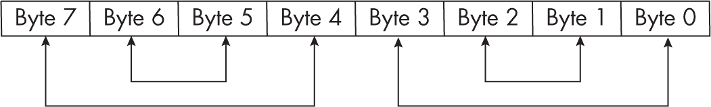

图 3-4：rev32 指令的操作

rev 指令将会在 64 位寄存器中交换字节 7 和 0、字节 6 和 1、字节 5 和 2、字节 4 和 3（参见图 3-5）。


图 3-5：rev 指令的操作

rev 指令仅接受 64 位寄存器。

### 3.4 内存访问

第 1.6.2 节，“内存子系统”，在第 14 页中描述了 ARM CPU 如何通过数据总线从内存中获取数据。在理想化的 CPU 中，数据总线的大小与 CPU 上标准的整数寄存器大小相同；因此，你可以预期 ARM CPU 会有一个 64 位的数据总线。但实际上，现代 CPU 通常会将物理数据总线与主内存的连接做得更大，以提高系统性能。总线通过一次操作将大块数据从内存中提取出来，并将这些数据放入 CPU 的*缓存*中，缓存充当着 CPU 与物理内存之间的缓冲区。

从 CPU 的角度来看，缓存*就是*内存。因此，当本节的其余部分讨论内存时，通常指的是缓存中的数据。由于系统会透明地将内存访问映射到缓存中，我们可以像讨论没有缓存一样讨论内存，并根据需要讨论缓存的优势。

在 ARM 之前的早期处理器中，内存是按字节数组（8 位机器，如 Intel 8088）、半字（16 位机器，如 Intel 8086 和 80286）或字（32 位机器，如 32 位 ARM CPU）进行排列的。在 16 位机器上，地址的 LO 位在物理上不会出现在地址总线上。这意味着地址 126 和 127 在地址总线上会显示相同的位模式（126，LO 位是 0），如图 3-6 所示。

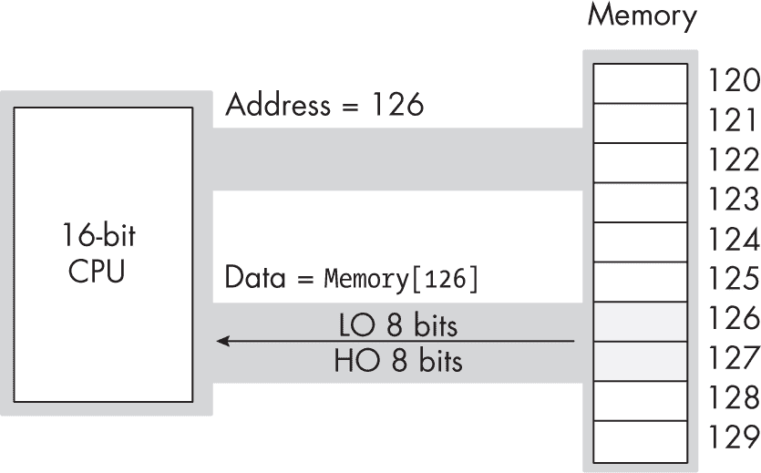

图 3-6：16 位处理器的地址总线和数据总线

在读取字节时，CPU 使用地址的 LO 位来选择数据总线上的 LO 字节或 HO 字节。图 3-7 展示了在偶数地址（图中的地址 126）访问字节时的过程。

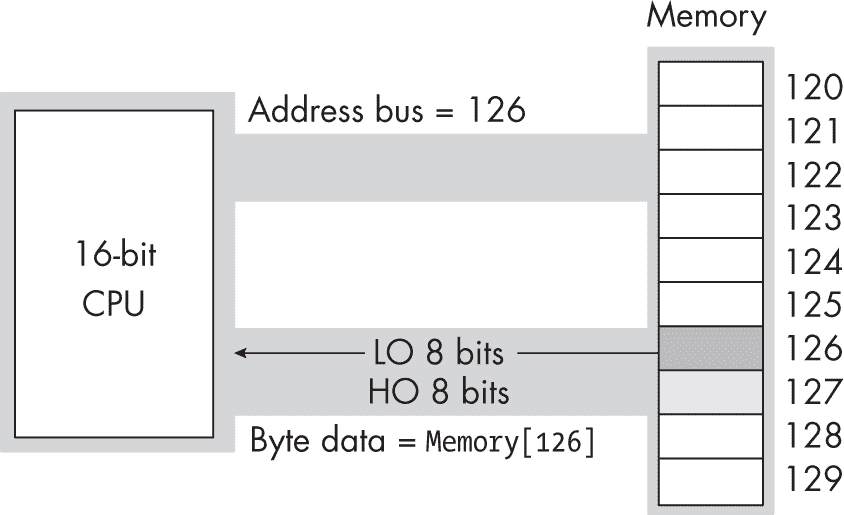

图 3-7：在 16 位 CPU 上从偶数地址读取一个字节

图 3-8 展示了在奇数地址上读取字节的内存访问（图中地址 127）。请注意，在图 3-7 和图 3-8 中，出现在地址总线上的地址都是 126。

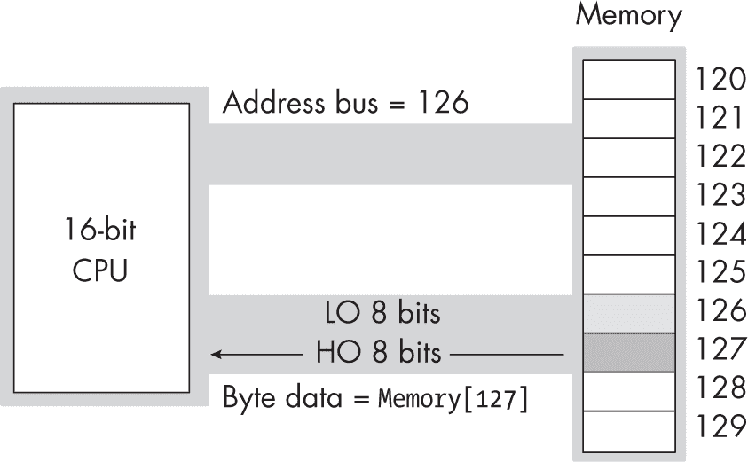

图 3-8：在 16 位 CPU 上从奇数地址读取一个字节

当这个 16 位 CPU 想要在奇数地址访问 16 位数据时，会发生什么情况？例如，假设在这些图中，CPU 读取地址 125 的字。当 CPU 将地址 125 放到地址总线上时，LO 位不会在物理上出现。因此，总线上实际的地址是 124。如果 CPU 此时从数据总线上读取 LO 的 8 位，它将得到地址 124 的数据，而不是地址 125 的数据。

幸运的是，CPU 足够智能，能够搞清楚发生了什么：它从数据总线的高 8 位提取数据，并将其作为数据操作数的低 8 位使用。然而，CPU 所需的高 8 位并不在数据总线上。CPU 必须发起第二次读取操作，将地址 126 放到地址总线上，以获取高 8 位（这些将位于数据总线的低 8 位，但 CPU 可以识别出来）。这个读取操作需要两个内存周期才能完成。因此，读取内存中的数据的指令将比从地址是 2 的倍数（16 位对齐）读取数据时的执行时间更长。

在 32 位处理器上也存在相同的问题，只是 32 位数据总线允许 CPU 一次读取 4 字节。在一个不是 4 的整数倍地址上读取 32 位值会产生相同的性能惩罚。然而，在奇数地址上访问 16 位操作数并不总是保证会有额外的内存周期——只有当地址除以 4 后余数为 3 时才会产生惩罚。特别是，如果你在一个地址上访问 16 位值（在 32 位总线上），该地址的低 2 位包含 0b01，CPU 可以在一个内存周期内读取该字，如图 3-9 所示。

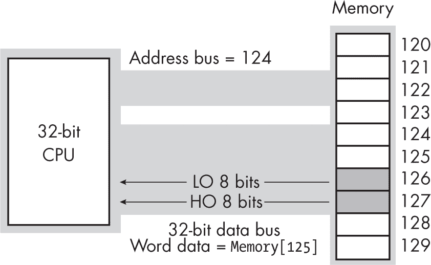

图 3-9：在 32 位数据总线上访问一个字

现代带有缓存系统的 ARM CPU 已经基本消除了这个问题。只要数据（1、2、4 或 8 字节大小）完全位于一个*缓存行*内——一个由处理器定义的字节数——对未对齐访问不会产生内存周期惩罚。如果访问跨越了缓存行边界，CPU 在执行两个内存操作以获取（或存储）数据时会稍微变慢。### 3.5 气体对数据对齐的支持

要编写快速的程序，必须确保正确地对齐内存中的数据对象。正确的*对齐*意味着对象的起始地址是某个大小的倍数——通常是对象的大小，如果对象的大小是 2 的幂并且长度不超过 32 字节。对于大于 32 字节的对象，将对象对齐到 8、16 或 32 字节的地址边界通常就足够了。对于小于 16 字节的对象，将对象对齐到一个大于或等于对象大小的下一个 2 的幂的地址通常是可以的。

如前一节所述，访问未按适当地址对齐的数据可能需要额外的时间。因此，如果你希望确保程序运行尽可能快，你应该尝试根据数据对象的大小来对齐数据。

每当你为不同大小的对象分配存储空间并且这些对象位于相邻的内存位置时，数据就会发生错位。例如，如果你声明一个 byte 变量，它将占用 1 字节存储空间，那么你在该声明部分中声明的下一个变量的地址将是该 byte 对象的地址加 1。如果 byte 变量的地址恰好是偶数地址，则紧随其后的变量将从一个奇数地址开始。如果那个变量是 half-word、word 或 dword 对象，它的起始地址将不理想。

在这一节中，我们将探索确保变量根据其大小在适当的起始地址对齐的方法。考虑以下 Gas 变量声明：

```
 .data 
w:  .word  0 
bb: .byte  0 
s:  .hword 0 
w2: .word  0 
s2: .hword 0 
b2: .byte  0 
dw: .dword 0 
```

程序中的第一个 .data 声明将其变量放置在一个是 4,096 字节的偶数倍的地址上。无论哪个变量首先出现在该 .data 声明中，都保证会被对齐到一个合理的地址。每个后续变量的地址是所有前面变量大小之和，再加上该 .data 部分的起始地址。

因此，假设 Gas 在前面的例子中将变量分配到起始地址为 4096 的位置，它将按照以下地址分配这些变量：

```
 // Start Adrs       Length 
w:    .word   0      //    4096            4 
bb:   .byte   0      //    4100            1 
s:    .hword  0      //    4101            2 
w2:   .word   0      //    4103            4 
s2:   .hword  0      //    4107            2 
b2:   .byte   0      //    4109            1 
dw:   .dword  0      //    4110            8 
```

除了第一个变量（它在 4KB 边界上对齐）和 byte 变量（它们的对齐无关紧要）之外，所有这些变量都是错位的。s、s2 和 w2 变量从奇数地址开始，而 dw 变量虽然在一个偶数地址上对齐，但它并不是 8 的倍数（虽然对齐到 word，但没有对齐到 dword）。

保证变量正确对齐的一种简单方法是将所有的 dword 变量放在最前面，word 变量放在第二，half-word 变量放在第三，最后将 byte 变量放在声明的末尾，如下所示：

```
 .data 
dw:   .dword  0 
w:    .word   0 
w2:   .word   0 
s:    .hword  0 
s2:   .hword  0 
bb:   .byte   0 
b2:   .byte   0 
```

该组织在内存中生成以下地址：

```
 //  Start Adrs     Length 
dw:    .dword  0   //     4096          8 
w2:    .word   0   //     4104          4 
w3:    .word   0   //     4108          4 
s:     .hword  0   //     4112          2 
s2:    .hword  0   //     4114          2 
bb:    .byte   0   //     4116          1 
b2:    .byte   0   //     4117          1 
```

这些变量都对齐到了合理的地址。

不幸的是，你很少能以这种方式安排你的变量。虽然有许多技术原因使得这种对齐不可能实现，但一个实际的原因是，它不会让你按照逻辑功能来组织变量声明（也就是说，你可能希望将相关的变量放在一起，而不管它们的大小）。

为了解决这个问题，Gas 提供了 .align 和 .balign 指令。如第 1.2 节“汇编语言程序的结构”中所述，在 第 5 页，.align 参数是一个将提高到 2 的幂的值，.balign 的操作数是必须是 2 的幂（1、2、4、8、16 等）的整数。这些指令确保下一个内存对象会对齐到指定的大小。

默认情况下，这些指令会用 0 填充它们跳过的数据字节；在.text 段中，Gas 通过使用 nop（无操作）指令来对齐代码。如果你希望使用不同的填充值，这两个指令允许第二个操作数：

```
.align  pwr2Alignment, padValue 
.balign alignment, padValue 
```

在这里，padValue 必须是一个 8 位常量，指令将使用它作为填充值。Gas 还允许第三个参数，这是最大允许的填充量；更多详情请参见 Gas 文档。

之前的示例可以使用.align 指令重写，如下所示：

```
 .data 
     .align  2   // Align on 4-byte boundary. 
w:   .word   0 
bb:  .byte   0 
     .align  1   // Align on 2-byte boundary. 
s:   .hword  0 
     .align  2   // Align on 4-byte boundary. 
w2:  .word   0 
s2:  .hword  0 
b2:  .byte   0 
     .align  3   // Align on 8-byte boundary. 
dw:  .dword  0 
```

如果 Gas 判断某个.align 指令的当前地址（位置计数器值）不是指定值的整数倍，Gas 会在前一个变量声明之后静默地添加额外的填充字节，直到.data 段中的当前地址是指定值的整数倍。这会使你的数据增大几个字节，以换取更快的访问速度。由于使用此功能时数据只会稍微增大一些，这可能是一个值得的折中。

一般来说，如果你想要最快的访问速度，选择一个与要对齐对象大小相等的对齐值。也就是说，将半字对齐到偶数边界，使用.align 1 指令；将字对齐到 4 字节边界，使用.align 2；将双字对齐到 8 字节边界，使用.align 3，依此类推。如果对象的大小不是 2 的幂次方，则将其对齐到下一个较大的 2 的幂次方。

数据对齐并非总是必需的，因为现代 ARM CPU 的缓存架构能够处理大部分非对齐数据。只有当变量需要极快的访问速度时，才应使用对齐指令。

### 3.6 ARM 内存寻址模式

大多数情况下，ARM 使用的是非常标准的 RISC *加载/存储架构*。这意味着它几乎通过使用从内存加载寄存器或将寄存器中存储的值存储到内存的指令来完成所有的内存访问。加载和存储指令通过使用内存*寻址模式*来访问内存，寻址模式是 CPU 用来确定内存位置地址的机制。ARM 的内存寻址模式提供了灵活的内存访问方式，使你可以轻松访问变量、数组、结构体、指针及其他复杂数据类型。掌握 ARM 的寻址模式是掌握 ARM 汇编语言的重要一步。

除了加载和存储，ARM 还使用了*原子指令*。大多数情况下，这些指令是加载和存储指令的变体，额外增加了一些多处理器应用所需的功能。原子指令超出了本文的讨论范围；更多信息，请参阅 ARM V8 参考手册。

到目前为止，本书只介绍了两种访问内存的机制：在第一章中介绍的寄存器间接寻址模式（例如，[X0]），以及在第 3.1.8 节 “PIE 和 ASLR”中讨论的 PC 相对寻址模式。然而，ARM 提供了超过六种（根据你的计算方式）访问内存数据的模式。以下各节将描述这些模式。

#### 3.6.1 PC 相对地址

PC 相对寻址模式仅在从 .text 段中获取值时有用，因为其他段很可能超出了该寻址模式的±1MB 范围。因此，直接访问 .text 段中的常量数据比访问 .rodata 段（或其他只读段）中的数据要容易得多。

在 .text 段使用 PC 相对寻址模式时，会遇到一些问题。首先，由于 32 位指令编码中嵌入的 19 位偏移量被左移了 2 位来产生字的偏移量（如前所述），因此使用此寻址模式时只能加载字和双字值——不能加载字节或半字。例如，你可以使用寄存器间接寻址模式访问 .text 段中的字节和半字值，但不能使用 PC 相对寻址模式。

使用 PC 相对寻址模式访问 .text 段中的数据时，请记住以下几点：

+   在 macOS 上，.text 段中的所有标签必须按 4 字节对齐，即使与该标签关联的数据不需要这种对齐（例如字节和半字）。

+   .text 段中的数据值不能引用其他段（例如，第四章中讨论的指针常量）。然而，这些对象可以引用 .text 段中本身的数据（这对于*跳转表*来说很重要，详见第七章）。

+   数据必须位于引用它的指令的±1MB 范围内。例如，你不能创建超过 1MB 的数组数据。

+   使用 PC 相对寻址模式时，仅允许字（word）和双字（dword）访问。

+   由于数据位于 .text 段中，它是只读的；你不能在 .text 段中放置变量。

要使用 PC 相对寻址模式，只需引用你用于声明 .text 段中对象的标签：

```
 ldr w0, wordVar 
           . 
           . 
           . 
wordVar: .word 12345 
```

别忘了，你在 .text 段中声明的所有数据需要处于执行路径之外，最好放在 .pool 段中。（当我在第五章讨论代码流中的参数传递时，你会看到这个规则的一个例外。）

#### 3.6.2 寄存器间接

到目前为止，本书中的大多数示例都使用了寄存器间接寻址模式。*间接*寻址意味着操作数不是实际地址，而是操作数的值指定了要使用的内存地址。在寄存器间接寻址模式下，寄存器中保存的值是要访问的内存位置的地址。例如，指令

```
ldr x0, [x1] 
```

告诉 CPU 从当前存储在 X1 中的地址位置加载 X0 的值。X1 周围的方括号告诉 Gas 使用寄存器间接寻址模式。

ARM 有 32 种这种寻址模式，每一种都对应 32 个通用 64 位寄存器（尽管 X31 是非法的；应使用 SP 代替）。在使用间接寻址模式时，你不能在方括号中指定 32 位寄存器。

从技术上讲，你可以将一个任意数值加载到 64 位寄存器中，然后通过使用寄存器间接寻址模式间接访问该位置：

```
ldr x1, =12345678 
ldr x0, [x1]    // Attempts to access location 12345678 
```

不幸的是（或幸运的是，取决于你如何看待它），这可能会导致操作系统产生段错误，因为并非总是合法访问任意的内存位置。正如你很快会看到的，还有更好的方法将对象的地址加载到寄存器中。

你可以使用寄存器间接寻址模式来访问指针引用的数据、遍历数组数据，以及在程序运行时任何需要修改对象地址的情况。

在使用寄存器间接寻址模式时，你通过变量的数值内存地址（即加载到寄存器中的值）来引用变量，而不是通过变量的名称。这是使用 *匿名变量* 的一个例子。

*aoaa.inc* 包含文件提供了 lea 宏，你可以使用它获取变量的地址并将其放入一个 64 位寄存器中：

```
lea x1, j 
```

执行这个 lea 指令后，你可以使用 [x1] 寄存器间接寻址模式间接访问 j 的值（这是到目前为止几乎所有示例访问内存的方式）。在第 3.8 节“获取内存对象的地址”，第 153 页 中，你将看到 lea 宏是如何工作的。

#### 3.6.3 间接加偏移

考虑以下数据声明，它类似于本书中给出的其他示例：

```
bVar:  .byte 0, 1, 2, 3 
```

如果你将 X1 加载为 bVar 的地址，你可以使用如下指令访问该字节（0）：

```
ldrb w1, [x1]   // Load byte at bVar (0) into W1\. 
```

要访问内存中该 0 后面的其他 3 个字节，你可以使用 *间接加偏移* 寻址模式。以下是该模式的语法：

```
[X`n`|SP, #`signed_expression`] 
```

Xn|SP 表示 X0 到 X30 或 SP，signed_expression 是一个小整数表达式，范围为 –256 到 +255。这个特定的寻址模式将计算 X*n*（*n* = 0 到 30，或 SP）中地址与有符号常量的和，并将其作为 *有效内存地址*（即要访问的内存地址）使用。

例如，如果 X1 包含前一个示例中的 bVar 的地址，以下指令将获取 bVar 之后的字节（即该示例中包含 1 的字节）：

```
ldrb  w0, [x1, #1] // Fetch byte at address X1 + 1\. 
```

再次提醒，32 位指令大小严重限制了该寻址模式的范围（只有 9 位可用于有符号偏移量）。如果需要更大的偏移量，必须显式地将值添加到 X1 中的地址中（如果需要保持 X1 中的基地址，可能需要使用不同的寄存器）。例如，以下代码通过使用 X2 来保存有效地址来实现这一点：

```
add  x2, x1, #2000  // Access location X1 + 2000\. 
ldrb w2, [x2] 
```

这将计算出 X2 = X1 + 2000，并将该地址处的字加载到 W2 中。

#### 3.6.4 带缩放的间接加偏移

*带缩放的间接加偏移*寻址模式是间接加偏移模式的一种稍微复杂的变体。它将一个 12 位的无符号常数嵌入到指令编码中，并根据数据传输的大小将该常数缩放（乘以）1、2、4 或 8。这为间接加偏移模式的 9 位有符号偏移量提供了范围扩展。

该寻址模式与间接加偏移寻址模式使用相同的语法，只是它不允许有符号偏移量：

```
[X`n`|SP, #`unsigned_expression`] 
```

对于字节传输（ldrb），无符号表达式可以在 0 到 0xFFF（4,095）范围内。对于半字传输（ldrh），无符号表达式可以在 0 到 0x1FFE 范围内，但偏移量必须是偶数。对于字传输（ldr），无符号表达式必须在 0 到 0x3FFC 范围内，并且必须是 4 的倍数。对于双字传输，无符号表达式必须在 0 到 0x7FF8 范围内，并且必须是 8 的倍数。正如你将在第四章中看到的，这些数字非常适合访问字节、半字、字或双字数组的元素。

通常，汇编器会根据寻址模式中偏移量的值自动选择间接加偏移和带缩放的间接加偏移寻址模式。有时，这个选择可能会有歧义。例如：

```
ldr  w0, [X2, #16] 
```

在这里，汇编器可以选择带缩放或不带缩放的寻址模式。通常，它会选择带缩放的形式。它的选择不应影响你的代码；无论选择哪种形式，都会将相应的内存单词加载到 W0 寄存器中。

如果出于某种原因，你希望显式指定不带缩放的寻址模式，可以使用 ldur 和 stur 指令（加载或存储不带缩放的寄存器）。

#### 3.6.5 预索引

*预索引*寻址模式与间接加偏移寻址模式非常相似，因为它结合了一个 64 位寄存器和一个有符号的 9 位偏移量。然而，这种寻址模式会在访问内存之前将寄存器和偏移量的和复制到寄存器中。最终，它访问的地址与间接加偏移模式相同，但一旦指令完成，索引寄存器将指向内存中的索引位置。该模式在通过循环递增寄存器访问数组和其他数据结构时非常有用。

预索引寻址模式的语法如下：

```
[X`n`|SP, #`signed_expression`]!  // X`n`|SP has the usual meaning. 
```

该序列末尾的!符号区分了预索引寻址模式。与间接加偏移模式类似，signed_expression 值是有限制的——在这种情况下，限制为 9 位（–256 到+255）。

以下代码片段使用了该寻址模式：

```
bVar:  .byte 0, 1, 2, 3 
         . 
         . 
         . 
        lea  x0, bVar-1  // Initialize with adrs of bVar – 1\. 
        mov  x1, 4 
loop:   ldrb w2, [x0, #1]! 

 `Do something with the byte in W2.` 

        subs x1, x1, #1 
        bne  loop 
```

在该循环的第一次迭代中，寻址模式将 1 加到 X0，使其指向 bVar 数组中第一个字节（4 字节数组）。这也使得 X0 指向该第一个字节。在每次成功的循环迭代中，X0 递增 1，访问 bVar 数组中的下一个字节。

subs 指令将在 X1 递减到 0 时设置 Z 标志。当发生这种情况时，bne（如果 Z = 0 则分支）指令将跳过，终止循环。

#### 3.6.6 后索引

后索引寻址模式与预索引寻址模式非常相似，只是它在用有符号的立即数值更新寄存器之前，使用寄存器的值作为内存地址。后索引寻址模式的语法如下：

```
[X`n`|SP], #`signed_expression` // X`n`|SP has the usual meaning. 
```

同样，signed_expression 的值限制为 9 位（–256 到+255）。

上一节中的示例可以通过使用后索引寻址模式进行改写并稍作改进：

```
bVar:  .byte 0, 1, 2, 3 
         . 
         . 
         . 
        lea  x0, bVar 
        mov  x1, 4 
loop:   ldrb w2, [x0], #1 

 `Do something with the byte in W2.` 

        subs x1, x1, #1 
        bne  loop 
```

这个例子开始时 X0 指向 bVar，并以 X0 指向超出（四元素）bVar 数组的第一个字节结束。在该循环的第一次迭代中，ldr 指令首先使用 X0 中的值，指向 bVar，然后在取出 X0 指向的字节后递增 X0。

#### 3.6.7 缩放索引

*缩放索引*寻址模式包含两个寄存器组件（而不是一个寄存器和一个立即数），它们共同形成有效地址。该模式的语法如下：

```
[X`n`|SP, X`i`] 
[X`n`|SP, W`i`, `extend`] 
[X`n`|SP, X`i`, `extend`] 
```

第一种形式最容易理解：它通过将 X*n*（或 SP）和 X*i*中的值相加来计算有效地址（EA）。通常，X*n*（或 SP）被称为*基地址*，而 X*i*中的值是索引（必须是 X0 到 X30 或 XZR）。基地址是对象的最低内存地址，索引是相对于该基地址的偏移量（有点类似于间接加偏移寻址模式中的立即数）。这就是一个简单的*基地址 + 索引*寻址模式：不进行缩放。

基地址 + 索引形式在以下情况中非常有用：

+   你有一个指向数组对象的指针存储在寄存器中（X*n*，基地址），并且你想通过整数索引（通常是内存变量中的索引）访问该数组的元素。在这种情况下，你会将索引加载到索引寄存器（X*i*）中，并使用基址+索引模式来访问实际元素。

+   你想使用间接加偏移寻址模式，但偏移量超出了-256 到+255 的范围。在这种情况下，你可以将较大的偏移量加载到 X*i*寄存器中，并使用基址+索引寻址模式访问内存位置，无论偏移量是多少。

缩放索引寻址模式的第二种和第三种形式提供了扩展/缩放操作，对于索引大于字节的数组元素来说非常有用。在这两种缩放索引模式中，一种使用 32 位寄存器作为索引寄存器，另一种使用 64 位寄存器。

32 位形式是方便的，因为大多数情况下，数组的索引都保存在 32 位整数变量中。如果将这个 32 位整数加载到 32 位寄存器（W*i*）中，就可以轻松地将其用作数组的索引。

```
[X`n`, W`i`, `extend`] 
```

缩放索引寻址模式的形式。

最终，所有有效地址都是 64 位的。特别是，当 CPU 将 X*n*和 W*i*相加时，它必须先以某种方式将 W*i*索引值扩展到 64 位，然后再进行相加。扩展操作符告诉 Gas 如何将 W*i*扩展到 64 位。

扩展的最简单形式如下：

```
[X`n`|SP, W`i`, uxtw] 
[X`n`|SP, W`i`, sxtw] 
```

[Xn|SP, Wi, uxtw]形式会在将 W*i*加到 X*n*之前，先将 W*i*零扩展到 64 位，而[Xn|SP, Wi, sxtw]形式则会在加法之前，将 W*i*符号扩展到 64 位。

另一种缩放索引寻址模式引入了*缩放*组件。这种形式允许你根据数组元素的大小（1、2、4 或 8 字节）加载字节、半字、字或双字数组中的元素。这些特定形式并不是可以与任意的 ldr 或 str 指令一起使用的独立寻址模式。相反，每种寻址模式形式都与特定的指令大小相关联。以下是 ldrb/ldrsb 和 strb 指令的允许语法（W*d*是 32 位目标寄存器，W*s*是 32 位源寄存器）：

```
ldrb  W`d`, [X`n`|SP, W`i`, sxtw #0]  // #0 is optional; 
ldrb  W`d`, [X`n`|SP, W`i`, uxtw #0]  // 0 is default shift. 
ldrb  W`d`, [X`n`|SP, X`i`, lsl #0] 

ldrsb W`d`, [X`n`|SP, W`i`, sxtw #0] 
ldrsb W`d`, [X`n`|SP, W`i`, uxtw #0] 
ldrsb W`d`, [X`n`|SP, X`i`, lsl #0] 

strb  W`s`, [X`n`|SP, W`i`, sxtw #0] 
strb  W`s`, [X`n`|SP, W`i`, uxtw #0] 
strb  W`s`, [X`n`|SP, X`i`, lsl #0] 
```

这些形式会对 W*i*（或 X*i*）进行零扩展或符号扩展，并将结果与 X*n*相加，生成有效地址。之前的指令等价于以下形式（因为#0 是可选的）：

```
ldrb  W`d`, [X`n`|SP, W`i`, sxtw] 
ldrb  W`d`, [X`n`|SP, W`i`, uxtw] 
ldrb  W`d`, [X`n`|SP, X`i`] 

ldrsb W`d`, [X`n`|SP, W`i`, sxtw] 
ldrsb W`d`, [X`n`|SP, W`i`, uxtw] 
ldrsb W`d`, [X`n`|SP, X`i`] 

strb  W`s`, [X`n`|SP, W`i`, sxtw] 
strb  W`s`, [X`n`|SP, W`i`, uxtw] 
strb  W`s`, [X`n`|SP, X`i`] 
```

对于 ldrh/ldrsh 和 strh 指令，你可以指定 0（×1）或 1（×2）作为缩放因子：

```
ldrh  W`d`, [X`n`|SP, W`i`, sxtw #1]  // #0 is also legal, or 
ldrh  W`d`, [X`n`|SP, W`i`, uxtw #1]  // no immediate value (which 
ldrh  W`d`, [X`n`|SP, X`i`, lsl #1]   // defaults to 0). 

ldrsh W`d`, [X`n`|SP, W`i`, sxtw #1] 
ldrsh W`d`, [X`n`|SP, W`i`, uxtw #1] 
ldrsh W`d`, [X`n`|SP, X`i`, lsl #1] 

strh  W`s`, [X`n`|SP, W`i`, sxtw #1] 
strh  W`s`, [X`n`|SP, W`i`, uxtw #1] 
strh  W`s`, [X`n`|SP, X`i`, lsl #1] 
```

在缩放因子为#1 时，这些寻址模式计算 W*i* × 2 或 X*i* × 2（在进行任何零扩展或符号扩展后），然后将结果与 X*n*中的值相加以生成 EA。这会缩放 EA，以访问半字值（每个数组元素 2 个字节）。如果缩放因子为#0，则不进行缩放，因为缩放因子是 2⁰。前面的代码必须将 W*i*或 X*i*乘以适当的缩放因子（如有需要）。

对于 32 位的 ldr 指令（W*d*为目标寄存器）和 str 指令（W*s*为 32 位源寄存器），允许的缩放因子为 0（×1）或 2（×4）：

```
ldr  W`d`, [X`n`|SP, W`i`, sxtw #2]  // #0 is also legal, or 
ldr  W`d`, [X`n`|SP, W`i`, uxtw #2]  // no immediate value (which 
ldr  W`d`, [X`n`|SP, X`i`, lsl #2]   // defaults to 0). 

str  W`s`, [X`n`|SP, W`i`, sxtw #2] 
str  W`s`, [X`n`|SP, W`i`, uxtw #2] 
str  W`s`, [X`n`|SP, X`i`, lsl #2] 
```

最后，对于 64 位的 ldr 和 str 指令，允许的缩放因子是 0（×1）和 3（×8）：

```
ldr  X`d`, [X`n`|SP, W`i`, sxtw #3]  // #0 is also legal, or 
ldr  X`d`, [X`n`|SP, W`i`, uxtw #3]  // no immediate value (which 
ldr  X`d`, [X`n`|SP, X`i`, lsl #3]   // defaults to 0). 

str  X`s`, [X`n`|SP, W`i`, sxtw #3] 
str  X`s`, [X`n`|SP, W`i`, uxtw #3] 
str  X`s`, [X`n`|SP, X`i`, lsl #3] 
```

在下一章中，你将看到缩放索引寻址模式的主要用途，届时会讨论如何访问数组元素。

### 3.7 地址表达式

通常，在访问内存中的变量和其他对象时，你需要访问位于变量前后的位置，而不是变量本身的地址。例如，在访问数组元素或结构体字段时，确切的元素或字段可能并不位于变量的地址本身。*地址表达式*提供了一种机制，可以在变量地址的偏移量处访问内存。

考虑以下合法的 Gas 语法，用于表示内存地址。这并不是一种新的寻址模式，而只是对 PC 相对寻址模式的扩展：

```
`varName` + `offset`
```

这种形式通过将常量偏移量加到变量的地址来计算其有效地址。例如，指令

```
ldr w0, i + 4
```

将 W0 寄存器加载为内存中距离 i 对象（假设它位于.text 段）4 个字节的字数据；见图 3-10。

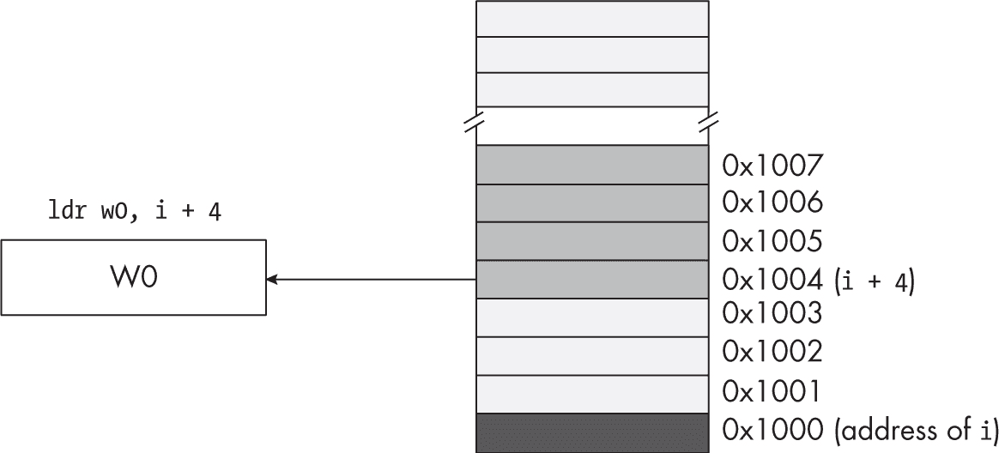

图 3-10：使用地址表达式访问超出变量的数据

这个例子中的偏移量值必须是常量（例如，3）。如果 Index 是一个字变量，那么 varName + Index 就不是一个合法的地址表达式。如果你希望指定一个在运行时变化的索引，则必须使用间接寻址模式或缩放索引寻址模式之一。还要记住，varName + offset 中的偏移量是字节地址。除非 varName 是字节数组，否则这不能正确地为一个对象数组建立索引。

> 注

*在使用 PC 相对寻址模式时，ARM CPU 不允许使用* ldrb *和* ldrh *指令。你只能在使用这种寻址模式时加载字或双字。此外，因为这些指令不会编码偏移量的低 2 位，所以你通过地址表达式指定的任何偏移量必须是 4 的倍数。*

到目前为止，寻址模式示例中的偏移量始终是单一的数字常量。然而，Gas 也允许常量表达式出现在任何合法的偏移量位置。一个*常量表达式*由一个或多个常量项组成，这些常量项通过加法、减法、乘法、除法等运算符进行操作，具体如表 3-4 所示。请注意，同一优先级的运算符是左结合的。

表 3-4：Gas 常量表达式运算符

| 操作符 | 优先级 | 描述 |
| --- | --- | --- |
| + | 3 | 一元加号（对表达式没有影响） |
| - | 3 | 一元负号（取反表达式） |
| * | 2 | 乘法 |
| / | 2 | 除法 |
| << | 2 | 左移 |
| >> | 2 | 右移 |
| &#124; | 1 | 按位或 |
| & | 1 | 按位与 |
| ^ | 1 | 按位异或 |
| ! | 1 | 按位与非 |
| + | 0 | 加法 |
| - | 0 | 减法 |

然而，大多数地址表达式仅涉及加法、减法、乘法，有时还涉及除法。考虑以下示例：

```
ldr w0, X + 2*4
```

该指令将把地址 X + 8 处的字节移动到 W0 寄存器中。

值 X + 2*4 是一个地址表达式，它总是在编译时计算，而不是在程序运行时计算。当 Gas 遇到前面的指令时，它会计算

```
2 × 4
```

该结果立即添加到.text 段中的 X 基地址上。Gas 将此单一的和（X 的基地址加 8）作为指令的一部分进行编码；它不会发出额外的指令（那样会浪费时间）在运行时为你计算这个和。因为 Gas 在编译时计算地址表达式的值，所以在编译程序时 Gas 无法知道变量的运行时值，因此表达式中的所有组成部分必须是常量。

地址表达式在访问内存中的数据时非常有用，特别是当你在.data 或.text 段中使用了像.byte、.hword、.word 等指令，向数据声明后附加了额外的值时。例如，考虑在示例 3-1 中的程序，使用地址表达式访问与内存对象 i 关联的四个连续的字（每个字在内存中相隔 4 字节）。

```
// Listing3-1.S
//
// Demonstrates address expressions

#include "aoaa.inc"

            .data
saveLR:     .dword      0
outputVal:  .word       0

ttlStr:     .asciz      "Listing 3-1"
fmtStr1:    .asciz      "i[0]=%d "
fmtStr2:    .asciz      "i[1]=%d "
fmtStr3:    .asciz      "i[2]=%d "
fmtStr4:    .asciz      "i[3]=%d\n"

            .text
            .extern     printf

            .align      2
i:          .word       0, 1, 2, 3

// Return program title to C++ program:

            .global     getTitle
getTitle:
            lea         x0, ttlStr
            ret

// Here is the asmMain function:

            .global     asmMain
asmMain:

// "Magic" instruction offered without
// explanation at this point:

            sub     sp, sp, #256

// Save LR so we can return to the C++
// program later:

            lea     x0, saveLR
            str     lr, [x0]

// Demonstrate the use of address expressions:

            lea     x0, fmtStr1
          ❶ ldr     w1, i + 0
            lea     x2, outputVal
            str     w1, [x2]
            vparm2  outputVal
            bl      printf

            lea     x0, fmtStr2
          ❷ ldr     w1, i + 4
            lea     x2, outputVal
            str     w1, [x2]
            vparm2  outputVal
            bl      printf

            lea     x0, fmtStr3
          ❸ ldr     w1, i + 8
            lea     x2, outputVal
            str     w1, [x2]
            vparm2  outputVal
            bl      printf

            lea     x0, fmtStr4
          ❹ ldr     w1, i + 12
            lea     x2, outputVal
            str     w1, [x2]
            vparm2  outputVal
            bl      printf

            lea     x0, saveLR
            ldr     lr, [x0]
            add     sp, sp, #256
            ret
```

从位置 i + 0 加载 W1 会从字数组❶中获取 0。 从位置 i + 4 加载 W1 会从数组中的第二个字获取 1，该字位于第一个元素 4 字节之外❷。 从位置 i + 8 加载 W1 会从数组中的第三个字获取 2，该字位于第一个元素 8 字节之外❸。 从位置 i + 12 加载 W1 会从数组中的第四个字获取 3，该字位于第一个元素 12 字节之外❹。

以下是程序的输出：

```
$ ./build Listing3-1
$ ./Listing3-1
Calling Listing3-1:
i[0]=0 i[1]=1 i[2]=2 i[3]=3
Listing3-1 terminated
```

由于 i 地址处的值为 0，输出会显示四个值 0、1、2 和 3，仿佛它们是数组元素。地址表达式 i + 4 告诉 Gas 获取位于 i 地址加 4 的位置的字。这个值是 1，因为该程序中的.word 语句在（字/4 字节）值 0 之后将值 1 写入.text 段。类似地，对于 i + 4 和 i + 8，该程序分别显示值 2 和 3。

### 3.8 获取内存对象的地址

到目前为止，本书已经使用 lea 宏来获取内存对象的地址。现在，本章提供了必要的前提信息，接下来，我们将不再将 lea 视为一个黑盒，而是深入探讨这个宏究竟为你做了什么。

ARM CPU 提供了两条指令来计算汇编语言程序中符号的有效地址。第一条是 adr：

```
adr  X`d`, `label`
```

该指令将 64 位目标寄存器（X*d*）加载为指定标签的地址。由于指令编码（操作码，或*操作码*）限制为 32 位，因此 adr 指令有一个重要的限制：它在操作码中只能容纳一个 21 位的偏移量，因此标签必须是相对于程序计数器（PC）的地址，并且距离 adr 指令的距离在±1MB 以内。这实际上将 adr 指令限制为只能获取.text 段内符号的地址。

为了解决这个问题，ARM CPU 还提供了 adrp（页面地址）指令。该指令的语法与 adr 指令大致相同：

```
adrp X`d`, `label`
```

该指令将包含标签的 MMU 页面的地址加载到目标寄存器中。通过将标签在该页面中的偏移量加到 X*d*中的值，你可以获得内存对象的实际地址，代码大致如下：

```
adrp X`d`, `label`
add  X`d`, X`d`, `page_offset_of_label`
```

到此为止，X*d*将包含标签的地址。

这种方案存在几个问题：首先，计算标签符号的页面偏移在 macOS 和 Linux 中的方式不同。其次，当你使用上述语法尝试 adrp 指令时，你会发现 Gas 在 macOS 上会拒绝该语法。

让我们首先考虑 Linux 对这些问题的解决方案，因为它们比 macOS 的解决方案稍微简单一些。如果你没有创建 PIE 应用程序，并且符号距离不超过±1MB，那么你不需要使用 adrp 指令。相反，你可以仅使用 adr 指令。如果数据距离 adr 指令超过±1MB，则必须使用 adrp 版本。如果你需要引用.text 段之外的内存对象，则必须使用 adrp/add 序列。以下是执行此操作的代码：

```
adrp x0, `label`
add  x0, x0, :lo12:`label`
```

:lo12: 项目是一个特殊的操作符，告诉 Gas 提取标签的可重定位地址的 LO 12 位；这个值是指向一个 4,096 字节内存管理页面的索引。有关此操作符的更多信息，请参见第 3.12 节，“更多信息”，位于 第 167 页。不幸的是，macOS 汇编器使用完全不同的语法来获取地址的 LO 12 位；你必须使用以下内容：

```
adrp x0, `label`@PAGE
add  x0, x0, `label`@PAGEOFF
```

lea 宏解决了这个问题，自动扩展成适用于你使用的操作系统的适当指令序列。

### 3.9 推送和弹出操作

ARM 在内存的堆栈段中维护一个硬件堆栈（操作系统为此保留存储空间）。*堆栈* 是一种动态数据结构，随着程序的需要而增长和缩小。它还存储程序的关键信息，包括局部变量、子程序信息和临时数据。

ARM CPU 通过 SP 寄存器控制其堆栈。当程序开始执行时，操作系统将 SP 初始化为堆栈内存段中最后一个内存位置的地址。数据通过*推送*数据到堆栈和*弹出*数据从堆栈中移出，写入堆栈段。

ARM 堆栈必须始终保持 16 字节对齐——也就是说，SP 寄存器必须始终包含一个 16 的倍数值。如果你将 SP 寄存器加载一个不满足 16 字节对齐的值，应用程序将立即因总线错误而终止。堆栈的主要用途之一是提供一个临时存储区域，用来保存如寄存器值等内容。你通常会将一个寄存器的值推入堆栈，执行一些操作（如调用一个函数），然后在你想恢复该值时，将其从堆栈弹出并放回寄存器中。然而，通用寄存器只有 64 位（8 字节）；将一个双字值推入堆栈将导致堆栈不再 16 字节对齐，从而导致系统崩溃。

在本节中，我将描述如何推送和弹出寄存器值。接着，我将介绍三种解决推送不保持堆栈 16 字节对齐的双字值问题的方法：浪费存储；同时推送两个寄存器；以及在堆栈上保留存储空间，然后将寄存器的数据移动到该预留区域。

#### 3.9.1 使用双重加载和存储

ldp 指令将同时从内存中加载两个寄存器。该指令的通用语法如下所示：

```
ldp  X`d`1, X`d`2, `mem`  // `mem` is any addressing mode
ldp  W`d`1, W`d`2, `mem`  // except PC-relative.
```

第一种形式将从指定的内存位置加载 Xd1，并从 8 字节后的位置加载 Xd2。第二种形式将从指定的内存位置加载 Wd1，并从 4 字节后的位置加载 Wd2。

stp 指令具有类似的语法，它将一对寄存器存储到相邻的内存位置：

```
stp  X`d`1, X`d`2, `mem`  // Store X`d`1 to mem, X`d`2 to mem + 8.
stp  W`d`1, W`d`2, `mem`  // Store W`d`1 to mem, W`d`2 to mem + 4.
                   // `mem` is any addressing mode except
                   // PC-relative.
```

这些指令有许多用途。就栈的使用而言，加载和存储一对 64 位寄存器的形式将一次操作 16 字节——这正是你在推送和弹出栈上数据时所需要的。

#### 3.9.2 执行基本的推入操作

许多 CPU，如 Intel x86-64，提供了一个显式指令，可以将寄存器压入栈中。由于 16 字节栈对齐要求，你不能将一个单独的 8 字节寄存器压入栈中（否则会产生栈错误）。然而，如果你愿意在栈上使用 16 字节的空间来保存一个寄存器的值，你可以使用以下指令将该寄存器的值压入栈中：

```
str X`s`, [sp, #-16]! 
```

请记住，预索引寻址模式会首先将 -16 加到 SP 上，然后将 X*s*（源寄存器）的值存储到 SP 指向的新位置。该存储操作只会写入由 SP 向下移动 16 字节创建的 16 字节块的低 8 字节（浪费高 8 字节）。然而，这种方案让 CPU 保持正常运行，因此你不会遇到总线错误。

该推入操作执行了以下操作：

```
SP := SP - 16 
[SP] := X`s` 
```

例如，假设 SP 的值为 0x00FF_FFE0，指令

```
str x0, [sp, #-16]! 
```

会将 SP 设置为 0x00FF_FFD0，并将 X0 的当前值存储到内存位置 0x00FF_FFD0，如图 3-11 和图 3-12 所示。

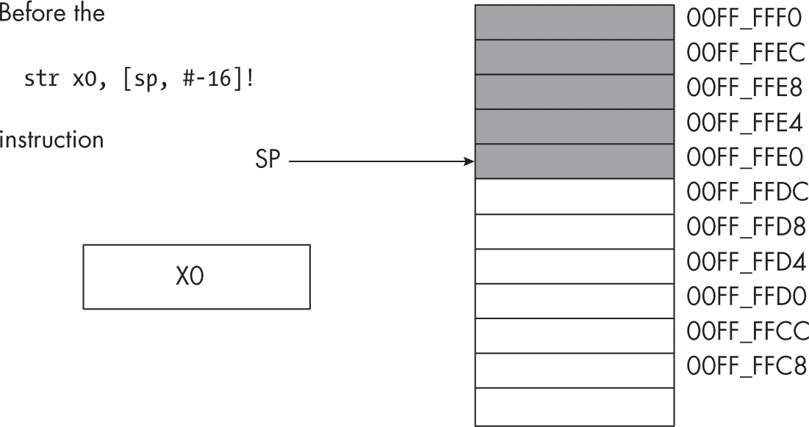

图 3-11：`str x0, [sp, #-16]!` 操作前的栈段

`str` 指令执行后，栈的情况如图 3-12 所示。

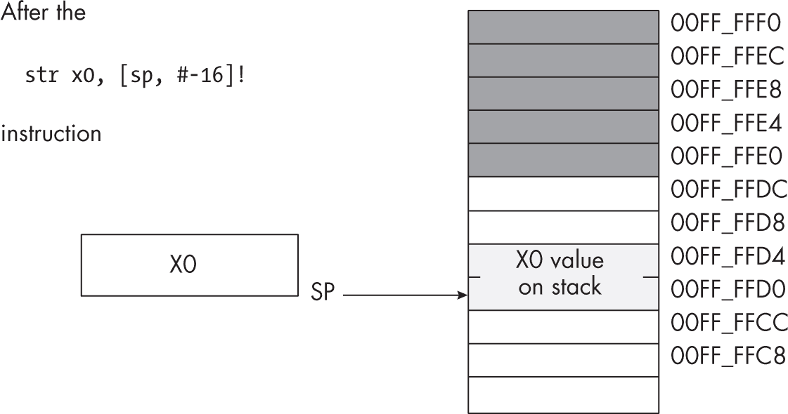

图 3-12：执行 `str x0, [sp, #-16]!` 操作后的栈段

虽然这会浪费栈上的 8 字节空间（显示在地址 0x00FF_FFD8 到 0x00FF_FFDF 之间），但这种使用可能是暂时的，栈空间将在程序稍后弹出数据时被回收。

#### 3.9.3 执行基本的弹出操作

弹出操作可以通过使用后索引寻址模式和 `ldr` 指令来处理：

```
ldr X`d`, [sp], #16 
```

该指令从栈中获取数据（SP 所指向的位置），并将数据复制到目标寄存器（X*d*）。操作完成后，该指令会调整 SP 值，减少 16，使其恢复到原始值（即推送操作之前的值）。图 3-13 显示了弹出操作前的栈。

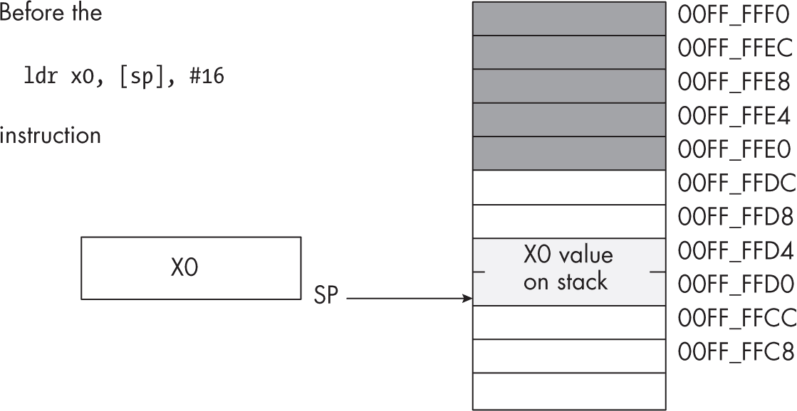

图 3-13：`str` 操作前的栈

图 3-14 显示了执行 `ldr` 后的栈组织。

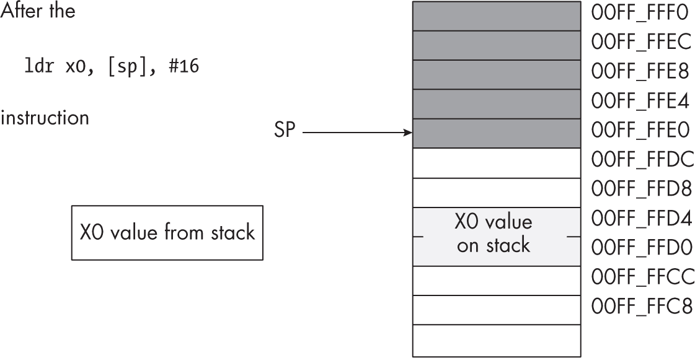

图 3-14：弹出操作后的栈

弹出一个值并不会清除内存中的值；它只是调整栈指针，使其指向弹出值上方的下一个值。然而，绝不要尝试访问你从栈中弹出的值。下一次将某个值压入栈时，弹出的值会被彻底覆盖。因为不仅仅是你的代码在使用栈（例如，操作系统使用栈来执行子例程），所以你不能依赖于数据在弹出栈后仍然存在于栈内存中。

#### 3.9.4 至少保存两个寄存器

如果你需要保存至少两个寄存器，你可以通过使用 stp 指令而不是 str 来回收图 3-11 和 3-12 中显示的浪费空间。以下代码片段演示了如何同时推送和弹出 X0 和 X7：

```
stp  x0, x7, [sp, #-16]!
 .
 .   // Use X0 and X7 for other purposes.
 .
ldp  x0, x7, [sp], #16  // Restore X0 and X7.
```

将数据推入栈的第三种方法是将 SP 向下移动一个 16 字节的倍数，然后通过索引 SP 寄存器将值存储到栈区域。以下代码基本上做了与 stp/ldp 配对相同的事情：

```
sub  sp, sp, #16   // Make room for X0 and X7.
stp  x0, x7, [sp]
 .
 .   // Use X0 and X7 for other purposes.
 .
ldp  x0, x7, [sp]
add  sp, sp, #16
```

虽然这显然需要更多的指令（因此，执行时间更长），但它使得你只需在函数内为栈分配一次存储空间，并在整个函数执行过程中重用该空间。你将在第五章中看到此类示例。

#### 3.9.5 在栈上保存寄存器值

正如你在之前的示例中看到的，栈是一个临时保存寄存器的好地方，这样它们就可以被用于其他目的。考虑以下程序大纲：

```
`Some instructions that use the X20 register.`

`Some instructions that need to use X20, for a`
`different purpose than the above instructions.`

`Some instructions that need the original value in X20.`
```

推送和弹出操作非常适合这种情况。通过在中间序列之前插入一个推送序列，并在中间序列之后插入一个弹出序列，你可以在这些计算之间保存 X20 的值：

```
`Some instructions that use the X20 register.`

     str x20, [sp, #-16]!

`Some instructions that need to use X20, for a`
`different purpose than the above instructions.`

 ldr x20, [sp], #16

`Some instructions that need the original value in X20.`
```

这个推送序列将第一个指令序列中计算出的数据复制到栈上。现在，中间指令序列可以将 X20 用于任何它选择的用途。在中间指令序列执行完毕后，弹出序列将恢复 X20 中的值，这样最后的指令序列就可以使用 X20 中的原始值。

#### 3.9.6 在栈上保存函数返回地址

在到目前为止的示例程序中，我通过使用如下指令来保存出现在链接寄存器（LR）中的返回地址：

```
lea  x0, saveLR
str  lr, [x0]
 .
 .
 .
lea  x0, saveLR
ldr  lr, [x0]
ret
```

我也提到过，这是一种*真正糟糕*的保存 LR 值的方式。它需要六条指令来完成（记住，lea 会展开成两条指令），使得它比需要的更慢且更庞大。当你有一个用户编写的函数调用另一个函数时，这个方案也会产生问题：突然之间，你需要两个独立的 saveLR 变量，每个函数一个。在递归（参见第五章）或更糟糕的多线程代码中，这个机制完全失效。

幸运的是，保存返回地址到堆栈是完美的解决方案。堆栈的 LIFO 结构（见下一节）完全模拟了（嵌套）函数调用和返回的方式，而且仅需要一条指令就可以将 LR 压入堆栈或从堆栈中弹出 LR。之前的代码序列可以轻松替换为：

```
str  lr, [sp, #-16]!
 .
 .
 .
ldr  lr, [sp], #16
ret
```

使用堆栈保存和恢复 LR 寄存器可能是堆栈最常见的使用方式。第五章详细讨论了管理返回地址和其他与函数相关的值。

### 3.10 压栈和弹栈数据

你可以在不先弹出先前值的情况下将多个值压入堆栈。然而，堆栈是一个*后进先出（LIFO）* 数据结构，因此你在压栈和弹栈多个值时必须小心。

例如，假设你想在一组指令块之间保留 X0 和 X1。以下代码演示了一个明显的（但不正确的）处理方式：

```
str  x0, [sp, #-16]!
str  x1, [sp, #-16]!
   `Code that uses X0 and X1 goes here.`
ldr  x0, [sp], #16
ldr  x1, [sp], #16
```

不幸的是，这段代码无法正常工作！图 3-15 到 3-18 展示了这个问题，这些图中的每个框表示 8 字节（注意地址）。由于这段代码先压入 X0，再压入 X1，堆栈指针最终指向堆栈中 X1 的值。

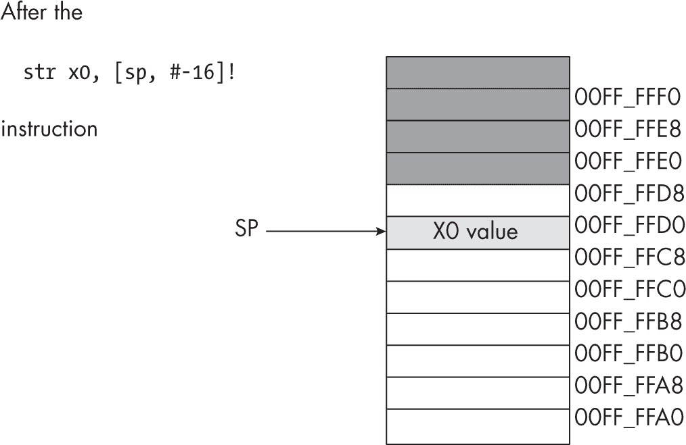

图 3-15：压入 X0 后的堆栈

图 3-16 展示了压入第二个寄存器（X1）后的堆栈。

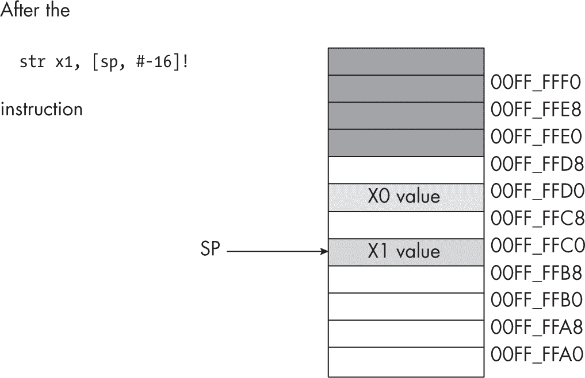

图 3-16：压入 X1 后的堆栈

当 ldr x0, [sp], #16 指令执行时，它从堆栈中移除最初在 X1 中的值并将其放入 X0（见图 3-17）。

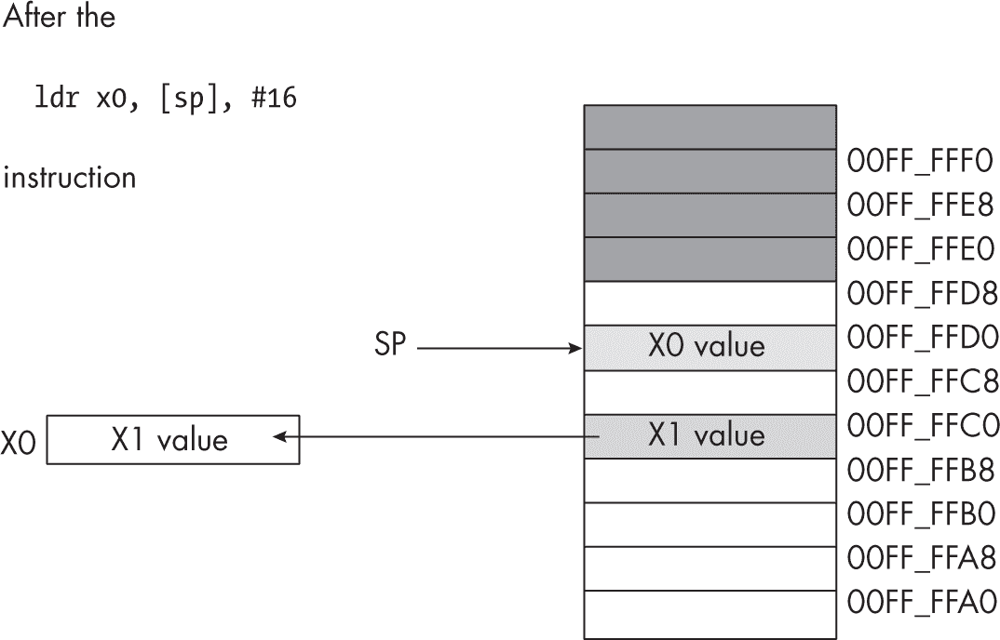

图 3-17：弹出 X0 后的堆栈

同样，ldr x1, [sp], #16 指令将最初在 X0 中的值弹出并存入 X1 寄存器。最终，这段代码通过以与压栈顺序相同的顺序弹栈来交换寄存器中的值（见图 3-18）。

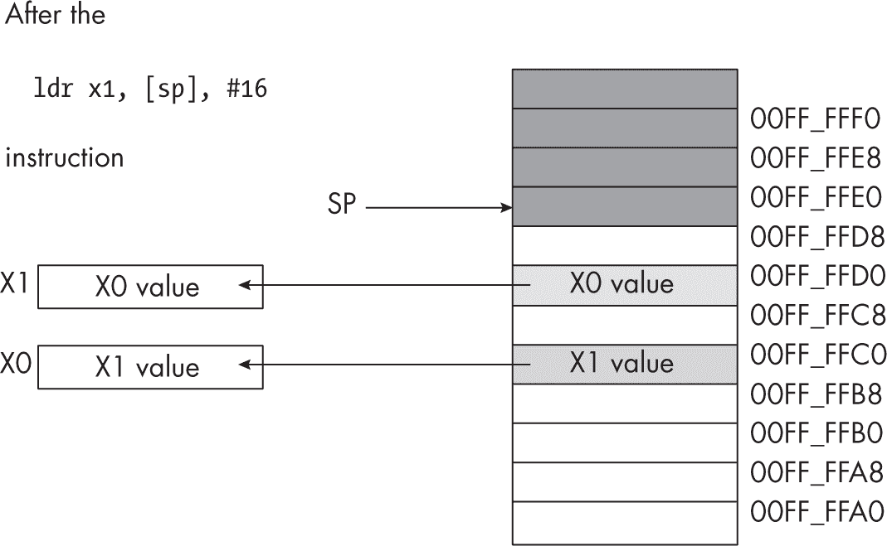

图 3-18：弹出 X1 后的堆栈

为了纠正这个问题，因为堆栈是 LIFO 数据结构，你必须首先弹出的是最后压入堆栈的内容。因此，*始终按照相反的顺序弹出值。*

对前一段代码的修正如下所示：

```
str  x0, [sp, #-16]!
str  x1, [sp, #-16]!
   `Code that uses X0 and X1 goes here.`
ldr  x1, [sp], #16
ldr  x0, [sp], #16
```

还要记住，*始终弹出你压入的相同数量的字节。* 一般来说，这意味着你需要相同数量的压栈和弹栈操作。如果弹栈操作太少，你将把数据留在堆栈中，这可能会干扰正在运行的程序。如果弹栈操作太多，你会意外地移除先前压入的数据，通常会导致灾难性的结果。

由此产生的结论是，*在循环中推送和弹出数据时要小心*。很容易将推送操作放在循环内，而将弹出操作放在循环外（或反之），这会导致栈不一致。记住，重要的是执行推送和弹出操作，而不是程序中推送和弹出操作的数量。运行时，程序执行的推送操作数量（及顺序）必须与弹出操作的数量（及相反顺序）匹配。

最后，记住*ARM 要求栈必须按照 16 字节边界对齐*。如果你在栈上进行推送和弹出操作（或使用任何其他操作栈的指令），确保在调用任何遵循 ARM 要求的函数或过程之前，栈已按照 16 字节边界对齐。

#### 3.10.1 在不弹出数据的情况下从栈中移除数据

你可能经常会发现自己将不再需要的数据推送到栈上。虽然你可以将数据弹出到一个未使用的寄存器中，但有一种更简单的方法来移除栈中不需要的数据：只需调整 SP 寄存器中的值，以跳过栈中不需要的数据。

考虑以下困境（伪代码，不是实际汇编语言）：

```
str  x0, [sp, #-16]!  // Push X0\. 
str  x1, [sp, #-16]!  // Push X1\. 

`Some code that winds up computing some values we want` 
`to keep in X0 and X1.` 

if(`Calculation_was_performed`) then 

      // Whoops, we don't want to pop X0 and X1! 
      // What to do here? 

else 

      // No calculation, so restore X1, X0\. 

      ldr  x1, [sp], #16 
      ldr  x0, [sp], #16 

endif; 
```

在 if 语句的 then 部分，这段代码希望移除 X0 和 X1 的旧值，同时不影响任何其他的寄存器或内存位置。你该如何做到这一点？

因为 SP 寄存器包含栈顶项的内存地址，我们可以通过将该项的大小加到 SP 寄存器来移除栈顶的项。在之前的示例中，我们希望从栈顶移除两个双字项。我们可以通过将 16 加到栈指针来轻松实现这一点：

```
str  x0, [sp, #-16]!  // Push X0 
str  x1, [sp, #-16]!  // Push X1 

`Some code that winds up computing some values we want to keep` 
`into rax and rbx.` 

if(`Calculation_was_performed`) then 

     // Remove unneeded X0/X1 values 
     // from the stack. 

     add  sp, sp, #32 

else 

     // No calculation, so restore X1, X0\. 

 ldr  x1, [sp], #16 
     ldr  x0, [sp], #16 

endif; 
```

实际上，这段代码从栈中弹出数据，但并未将其移到其他地方。这个代码比两个虚拟的弹出操作要快，因为它可以通过一个加法指令从栈中移除任意数量的字节。

记住，保持栈在一个四字（16 字节）边界上对齐。这意味着，当从栈中移除数据时，你应该始终将一个 16 的倍数加到 SP 寄存器中。

#### 3.10.2 在不弹出数据的情况下访问推送到栈的数据

偶尔，你可能会将数据推送到栈中，并希望获取该数据的值的副本，或者你可能希望在不弹出数据的情况下更改该数据的值（即，你希望稍后弹出数据）。ARM 的[SP, #±offset]寻址模式提供了这一机制。

考虑执行以下指令后的栈：

```
stp  x0, x1, [sp, #-16]!  // Push X0 and X1\. 
```

这会产生图 3-19 所示的栈结果。

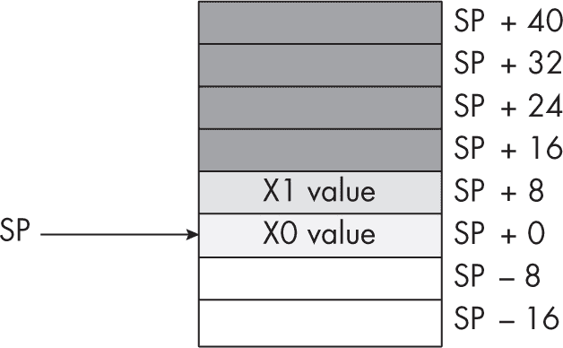

图 3-19：推送 X0 和 X1 后的栈

如果你想在不移除 X0 值的情况下访问其原始值，可以通过弹出该值，然后立即将其重新压入来“作弊”。不过，假设你希望访问 X1 的旧值或堆栈中更高位置的其他值。弹出所有中间值并将它们重新压入堆栈，最多是个问题，最坏情况下甚至不可能。

然而，正如图 3-19 所示，每个压入堆栈的值在内存中都位于与 SP 寄存器的某个偏移量位置。因此，我们可以使用[SP, #±offset]寻址模式直接访问我们感兴趣的值。在前面的示例中，你可以通过使用这条单指令来重新加载 X1 的原始值：

```
ldr  x1, [sp, #8] 
```

这段代码将从内存地址 SP + 8 开始的 8 个字节复制到 X1 寄存器中。这个值恰好是之前压入堆栈的 X1 值。你可以使用相同的技术访问其他已经压入堆栈的数据值。

别忘了，值从 SP 寄存器到堆栈的偏移量在每次压入或弹出数据时都会发生变化。滥用这一特性可能会导致代码难以修改；如果在代码中广泛使用此特性，将使得在你首次将数据压入堆栈和你决定再次访问这些数据之间，推送和弹出其他数据项变得困难。

上一节指出了如何通过向 SP 寄存器添加常数来从堆栈中移除数据。这个伪代码示例可能可以更安全地写成如下：

```
stp  x0, x1, [sp, #-16]! 

`Some code that winds up computing some values we want` 
`to keep into X0 and X1.` 

if(Calculation_was_performed) then 

     // Overwrite saved values on the stack with 
     // new X0/X1 values (so the pops that 
     // follow won't change the values in X0/X1). 

     stp  x0, x1, [sp] 

endif; 
ldp  x0, x1, [sp], #16 
```

在这段代码序列中，计算结果被存储在堆栈上已保存的值之上。稍后，当程序弹出这些值时，它将这些计算值加载到 X0 和 X1 寄存器中。

### 3.11 继续前进

本章讨论了内存的组织和访问，以及如何在 ARM CPU 上创建和访问内存变量。内容涵盖了在访问数据结构的末尾超出数据区域并跨越到新的 MMU 页面时可能出现的问题，接着讨论了小端和大端内存组织方式，以及如何使用 ARM 内存寻址模式和地址表达式，以多种方式访问这些内存对象。你还学习了如何在内存中对数据进行对齐以提高性能，如何获取内存对象的地址，以及 ARM 堆栈结构的目的。

到目前为止，本书通常只使用了基本数据类型，如不同大小的整数、字符、布尔对象和浮点数。更复杂的数据类型，如指针、数组、字符串和结构体，将在下一章讨论。

### 3.12 更多信息

+   详见 *[`<wbr>ftp<wbr>.gnu<wbr>.org<wbr>/old<wbr>-gnu<wbr>/Manuals<wbr>/gas<wbr>-2<wbr>.9<wbr>.1<wbr>/html<wbr>_chapter<wbr>/as<wbr>_toc<wbr>.html`](https://ftp.gnu.org/old-gnu/Manuals/gas-2.9.1/html_chapter/as_toc.html)*，了解更多关于 GNU 汇编器的细节。

+   了解更多关于 GNU 链接器的信息，请访问 *[`<wbr>ftp<wbr>.gnu<wbr>.org<wbr>/old<wbr>-gnu<wbr>/Manuals<wbr>/ld<wbr>-2<wbr>.9<wbr>.1<wbr>/html<wbr>_mono<wbr>/ld<wbr>.html`](https://ftp.gnu.org/old-gnu/Manuals/ld-2.9.1/html_mono/ld.html)*。

+   有关 macOS (LLVM) 链接器的更多信息，请参见 *[`<wbr>lld<wbr>.llvm<wbr>.org`](https://lld.llvm.org)*。

+   访问 ARM 开发者网站 *[`<wbr>developer<wbr>.arm<wbr>.com`](https://developer.arm.com)*，了解更多有关 ARM CPU 的信息。

+   Wikipedia 提供了对地址空间布局随机化的解释，详情见 *[`<wbr>en<wbr>.wikipedia<wbr>.org<wbr>/wiki<wbr>/Address<wbr>_space<wbr>_layout<wbr>_randomization`](https://en.wikipedia.org/wiki/Address_space_layout_randomization)*。

+   要更好地理解位置无关可执行文件，请参阅 *[`<wbr>en<wbr>.wikipedia<wbr>.org<wbr>/wiki<wbr>/Position<wbr>-independent<wbr>_code`](https://en.wikipedia.org/wiki/Position-independent_code)*。

+   有关 :lo12: 运算符的信息，请参阅文档中的“汇编表达式”部分，文档可从 *[`<wbr>developer<wbr>.arm<wbr>.com<wbr>/documentation<wbr>/100067<wbr>/0612<wbr>/armclang<wbr>-Integrated<wbr>-Assembler`](https://developer.arm.com/documentation/100067/0612/armclang-Integrated-Assembler)* 下载。
