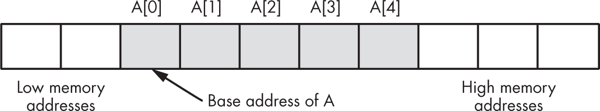
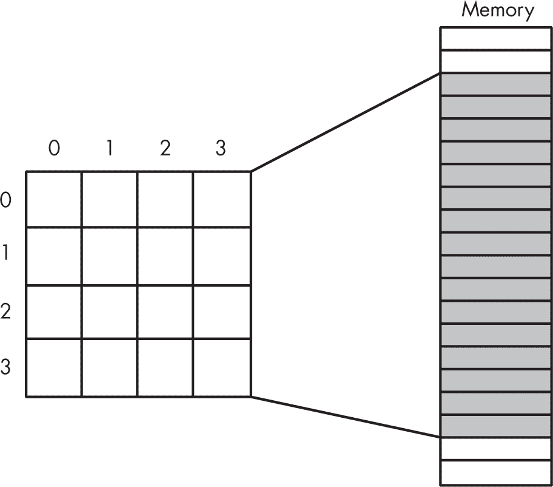
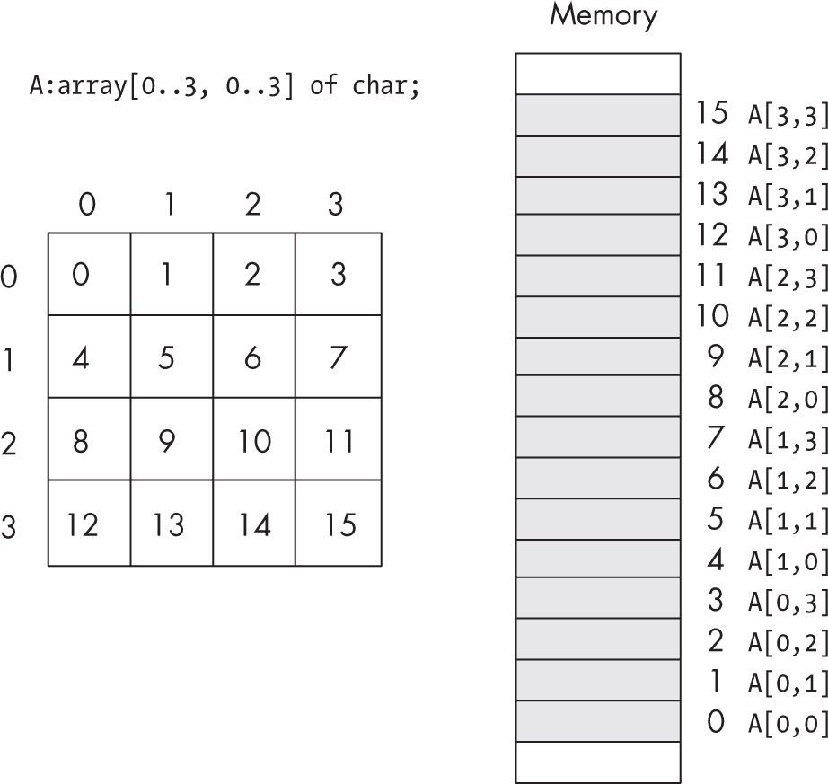
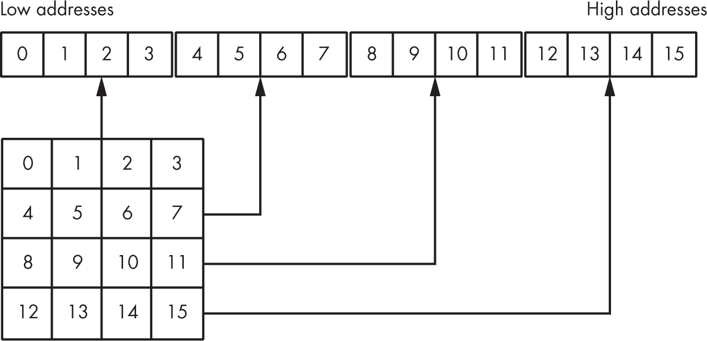
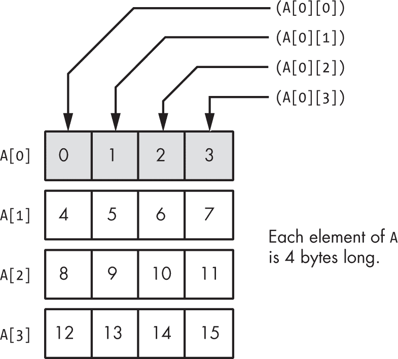
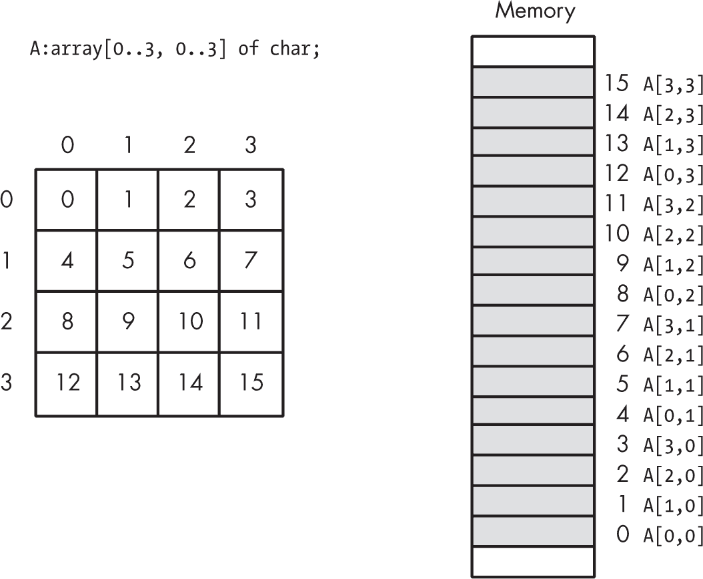
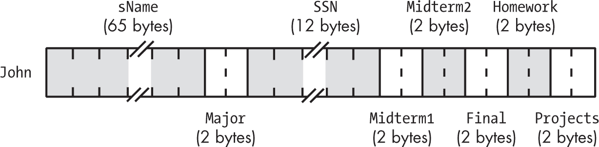
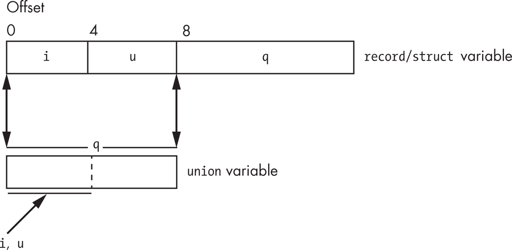

## 第四章：4 常量、变量和数据类型


第二章讨论了内存中数据的基本格式，和第三章介绍了计算机系统如何在物理上组织这些数据。这一章通过将*数据表示*的概念与其实际物理表示连接起来，完成了对这一主题的讨论。我将集中讨论三个主要话题：常量、变量和数据结构。

本章假设你没有接受过正式的数据结构课程，尽管这种经验会很有帮助。你将学习如何声明和使用常量、标量变量、整数、数据类型、指针、数组、结构体和联合体。在进入下一章之前，务必掌握这些主题。特别是，声明和访问数组对初学汇编语言的程序员来说，似乎存在许多问题，但本书的其余部分依赖于你对这些数据结构及其内存表示的理解。不要抱着稍后根据需要再补充的心态略过这些内容；你需要立刻全面理解它。

### 4.1 气体常数声明

可能的第一步是通过常量声明为文字常量值附加一个名称。Gas 提供了四个指令，统称为*等式*，允许你在汇编语言程序中定义常量。你已经看到最常用的形式，即 .equ：

```
.equ `symbol`, `constantExpression`
```

例如：

```
.equ MaxIndex, 15
```

一旦你以这种方式声明了符号常量，就可以在程序中任何符号常量合法的地方使用这个符号标识符。这些常量被称为*显式常量*——符号表示，允许你在程序的任何地方将符号替换为文字常量的值。

> 注意

*从技术上讲，你也可以使用 CPP 宏在 Gas 中定义常量。详情请见第十三章。*

将此与 .rodata 对象进行对比：.rodata 值是常量值，因为在运行时你不能更改它。然而，内存位置与 .rodata 声明相关联，操作系统而不是 Gas 汇编器强制执行只读属性。虽然以下指令序列在程序运行时会崩溃，但编写它是完全合法的：

```
lea  x0, ReadOnlyVar
str  x1, [x0]
```

另一方面，使用前面声明的内容写以下内容也是不合法的：

```
str  x1, MaxIndex
```

与此写法相比：

```
str  x1, #15
```

实际上，这两个语句是等价的：编译器在遇到这个常量时，会将 15 替换为 MaxIndex。

常量声明非常适合定义在程序修改过程中可能改变的魔法数字。例子包括像 nl（换行符）、maxLen 和 NULL 这样的常量。

GNU .set 指令使用以下语法：

```
.set `label`, `expression`
```

这在语义上等价于以下内容：

```
`label` = `expression`
```

.set 和 = 指令都允许你重新定义之前用这些指令定义的符号。

例如：

```
maxLen = 10

`At this point in the code, Gas will replace maxLen with 10.`

maxLen = 256

`In this section of the code, maxLen gets replaced by 256.`
```

你将会在第十三章中看到如何利用这个功能，那里讨论了宏和 Gas 的编译时语言。

注意，.equ 也允许你重新定义源文件中的符号。这些对同一指令的多个同义词是 Gas 为保持与多种汇编器及其版本的兼容性所做的尝试。

Gas 提供的最后一个等号指令是.equiv：

```
.equiv `symbol, expression`
```

与其他三个指令不同，.equiv 会在符号已经定义的情况下产生错误。因此，除非你真的需要在程序中重新定义符号，否则这很可能是最安全的等号指令。

出现在这些等号中的表达式限制为 64 位。如果你指定一个超过 64 位的值，汇编器会报告错误。

### 4.2 位置计数器运算符

一个你将经常使用的非常特殊的常量是当前的定位计数器值。如前一章所述，Gas 会在常量表达式中用当前段的定位计数器的值来替代单个句点（.）。理论上，你可以使用这个运算符将指向变量的指针嵌入到该变量本身中：

```
ptrVar:  .dword  .   // Stores the address of ptrVar in ptrVar
```

然而，这并不是特别有用。更好的做法是使用位置计数器运算符来计算特定段内的偏移量和长度。如果你从位置计数器中减去段内的一个标签，得到的差值就是从代码中的那个点到指定标签的（有符号）距离。这使你能够计算字符串长度、函数长度以及其他涉及在某一段内测量字节距离的值。

这是一个使用这种技术计算字符串长度的例子：

```
someStr:  .ascii  "Who wants to manually count the characters"
          .asciz  "in this string to determine its length?"
ssLen     =       .-someStr
```

这会计算 Gas 发出的所有字节（包括字符串指令的零终止字节）。你可以使用这种技术来计算任何数据对象的长度，而不仅仅是字符串中的字符。

直观地说，位置计数器常量（.）与像 0 这样的字面常量之间有一个微妙的区别。常量 0 无论在源文件中的哪个地方出现，其值始终相同，而位置计数器常量在源文件中会有不同的值。高级语言（HLL）会将这两种常量与不同的类型关联。接下来的章节将讨论汇编语言中的类型，包括可重定位类型（位置计数器就是汇编语言中的可重定位类型）。

### 4.3 数据类型和 Gas

像大多数传统的（即 1960 年代的）汇编器一样，Gas 是完全*无类型的*。它依赖你——程序员——通过选择指令来理解你在程序中使用的所有数据类型。特别地，Gas 非常乐意接受以下任何语句：

```
 .text
    .align 2
wv: .word  0
      .
      .
      .
    ldr   w0, wv  // Yes, this one's "type correct."
    ldr   x0, wv  // Loads more data than is present
```

第二条指令从一个 32 位变量加载 64 位数据。然而，Gas 接受了这个错误的代码，并且在你指定的地址加载了 64 位数据，这个地址可能包括你在.text 段中放置的 wv 声明之后的 32 位数据。

使用错误的数据类型访问数据可能会导致代码中出现微妙的缺陷。强类型的高阶语言（HLL）有一个优势，即能够捕捉到大多数由于数据类型误用而导致的程序错误。然而，汇编语言几乎没有类型检查。类型检查是*你*在汇编语言中的责任。接下来的 4.4 节“指针数据类型”将详细讨论这个问题。另见第 176 页中的“可重定位和绝对表达式”，它描述了 Gas 在代码中提供少量类型检查的少数几种情况。

### 4.4 指针数据类型

如果你在第一次接触高阶语言（HLL）中的指针时遇到过不好的经历，不必担心：在汇编语言中，指针更容易处理。你当时遇到的指针问题可能与使用它们时试图实现的链表和树形数据结构有关。另一方面，指针在汇编语言中有许多用途，这些用途与链表、树和其他复杂的数据结构无关。实际上，像数组和结构体这样简单的数据结构通常会使用指针。

*指针*是一个内存位置，其值是另一个内存位置的地址。不幸的是，像 C/C++这样的高阶语言（HLL）往往把指针的简单性隐藏在抽象的墙后。这种额外的复杂性往往会让程序员感到害怕，因为他们不明白幕后发生了什么。

为了说明指针是如何工作的，考虑一下 Pascal 中的以下数组声明：

```
M: array [0..1023] of integer;
```

即使你不懂 Pascal，概念也很简单。M 是一个包含 1,024 个整数的数组，索引从 M[0]到 M[1023]。每个数组元素都可以独立地保存一个整数值。换句话说，这个数组给你提供了 1,024 个整数变量，每个变量通过数字（数组索引）进行引用。

很容易看出，语句 M[0]:=100;将值 100 存储到数组 M 的第一个元素中。以下两个语句执行相同的操作：

```
i := 0; (* Assume "i" is an integer variable. *)
M [i] := 100;
```

事实上，你可以使用任何在 0 到 1,023 范围内的整数表达式作为该数组的索引。以下语句仍然执行与我们对索引 0 的单次赋值相同的操作：

```
i := 5;      (* Assume all variables are integers. *)
j := 10;
k := 50;
M [i*j-k] := 100;
```

“好吧，那到底有什么意义？”你可能会想。“任何在 0 到 1,023 范围内生成整数的东西都是合法的。那又怎样？”考虑一下下面的代码，它添加了一个有趣的间接层：

```
M [1] := 0;
M [M [1]] := 100;
```

经过一番思考，你应该明白这两条指令执行的操作与之前的示例完全相同。第一条语句将 0 存储到数组元素 M[1]中。第二条语句获取 M[1]的值，这是一个合法的数组索引，并利用该值（0）来控制它存储值 100 的位置。

如果你愿意接受这一点作为合理的，你将不会遇到指针的问题。如果你将 M 改为 *memory*，并假设这个数组表示系统内存，那么 M[1] 就是一个指针：即一个内存位置，其值是另一个内存位置的地址（或索引）。指针在汇编语言程序中很容易声明和使用；你甚至不需要担心数组索引。

好的，本节已经使用 Pascal 数组作为指针的示例，这没问题，但如何在 ARM 汇编语言程序中使用指针呢？

#### 4.4.1 汇编语言中的指针使用

一个 ARM64 指针是一个 64 位的值，它可以包含另一个变量的地址。对于一个包含 0x1000_0000 的双字（dword）变量 p，p “指向”内存位置 0x1000_0000。要访问 p 所指向的双字，你可以使用类似以下的代码：

```
lea x0, p      // Load X0 with the 
ldr x0, [x0]   // value of pointer p. 
ldr x1, [x0]   // Fetch the data at which p points. 
```

通过将 p 的值加载到 X0 寄存器中，这段代码将值 0x1000_0000 加载到 X0（假设 p 的值为 0x1000_0000）。第二条指令将 X1 寄存器加载为从 X0 中偏移位置开始的双字（dword）。因为 X0 现在包含 0x1000_0000，所以这将从 0x1000_0000 到 0x1000_0007 的位置加载 X1。

为什么不直接从地址 0x1000_0000 加载 X1 呢，像这样？

```
lea x1, varAtAddress1000_0000 
ldr x1, [x1] 
```

不这样做的主要原因是，这条 ldr 指令总是从位置 varAtAddress1000_0000 加载 X1。你无法更改加载 X1 的地址。

然而，前面的指令总是从 p 所指向的位置加载 X1。这在程序控制下很容易改变。考虑以下伪代码指令序列：

```
 lea x0, i 
    lea x1, p      // Set p = address of i. 
    str x0, [x1] 

`Some code that sets or clears the carry flag ...` 

    bcc skipSetp 

 lea x0, j 
       lea x1, p   // Set p = address of j. 
       str x0, [x1] 
        . 
        . 
        . 

skipSetp:          // Assume both code paths wind up 
    lea x0, p      // down here. 
    ldr x0, [x0]   // Load p into X0\. 
    ldr x1, [x0]   // X1 = i or j, depending on path here. 
```

这个简短的例子展示了程序中的两条执行路径。第一条路径将变量 p 加载为变量 i 的地址。第二条路径将 p 加载为变量 j 的地址。两条执行路径最终汇聚到最后两条 ldr 指令，这些指令根据执行路径加载 i 或 j 到 X1。就很多方面来说，这就像是一个类似 Swift 之类高级语言中过程的参数。执行相同的指令会根据 p 中的地址（i 或 j）访问不同的变量。

#### 4.4.2 Gas 中的指针声明

因为指针是 64 位长的，你可以使用 .dword 指令为你的指针分配存储空间：

```
 .data 
bb:        .byte   .-.  // Uninitialized 
           .align  3 
d:         .dword  .-.  // Uninitialized 
pByteVar:  .dword  bb   // Initialized with the address of bb 
pDWordVar: .dword  d    // Initialized with the address of d 
```

这个例子演示了在 Gas 中初始化和声明指针变量是可能的。你可以在 .dword 指令的操作数字段中指定静态变量的地址（.data、.rodata 和 .bss 对象），因此你可以通过使用此技术，仅用静态对象的地址来初始化指针变量。

请记住，macOS 不允许你获取 .text 部分符号的地址，因为 PIE 代码的限制。

#### 4.4.3 指针常量和表达式

Gas 允许在指针常量合法的地方使用非常简单的常量表达式。指针常量表达式具有以下几种形式：

```
`StaticVarName` + `PureConstantExpression` 
`StaticVarName` - `PureConstantExpression` 
```

PureConstantExpression 术语是一个数值常量表达式，不涉及任何指针常量（使用 Gas 术语称为*绝对常量*）。这种类型的表达式生成一个内存地址，该地址位于 StaticVarName 变量前后指定字节数的位置（分别为-或+）。这里展示的前两种形式语义上是等效的：它们都返回一个指针常量，其地址是静态变量和常量表达式的和。

由于您可以创建指针常量表达式，Gas 允许您通过使用等式定义显式指针常量，这也就不足为奇了。列表 4-1 演示了如何做到这一点。

```
// Listing4-1.S 
//
// Pointer constant demonstration 

#include "aoaa.inc"

          .section  .rodata, ""
ttlStr:   .asciz    "Listing 4-1"
fmtStr:   .ascii    "pb's value is %p\n"
          .asciz    "*pb's value is %d\n"

          .data 
bb:       .byte     0 
          .byte     1, 2, 3, 4, 5, 6, 7 

❶ pb        =         bb + 2     // Address of "2" in bb 

❷ pbVar:   .dword     pb 

pbValue: .word      0 

         .text 
         .align     2 
         .extern    printf 

// Return program title to C++ program: 

         .global    getTitle 
getTitle: 
         lea        x0, ttlStr 
         ret 

// Here is the asmMain function: 

        .global     asmMain 
asmMain: 
        sub     sp, sp, #64     // Reserve space on stack. 
        str     lr, [sp, #56]   // Save return address. 

        lea     x0, pbVar       // Get pbVar. 
        ldr     x0, [x0] 
        ldrb    w0, [x0]        // Fetch data at *pbVar. 
      ❸ lea     x1, pbValue     // Save in pbValue for now. 
        str     w0, [x1] 

// Print the results: 

        lea     x0, fmtStr 
      ❹ vparm2  pbVar 
      ❺ vparm3  pbValue 
        bl      printf 

        ldr     lr, [sp, #56]   // Restore return address. 
        add     sp, sp, #64 
        ret     // Returns to caller 
```

等式 pb = bb + 2 将常量 pb 初始化为 bb 数组中第三个元素❶（索引为 2）的地址。声明 pbVar: .dword pb ❷创建一个指针变量（命名为 pbVar），并将 pb 常量的值初始化给它。因为 pb 是 bb[2]的地址，所以这条语句将 pbVar 初始化为 bb[2]的地址。程序将 pbVar 中存储的值存入 pbValue 变量❸，然后将 pbVar❹和 pbValue❺传递给 printf()函数以打印它们的值。

这里是构建命令和示例输出：

```
$ ./build Listing4-1 
$ ./Listing4-1 
Calling Listing4-1: 
pb's value is 0x411042 
*pb's value is 2 
Listing4-1 terminated 
```

打印出来的地址在不同的机器和操作系统上可能会有所不同。

#### 4.4.4 指针变量与动态内存分配

指针变量是存储 C 标准库 malloc()函数返回结果的完美位置。该函数返回它分配的存储地址，通过 X0 寄存器返回；因此，您可以在调用 malloc()之后直接将地址存入指针变量。列表 4-2 演示了调用 C 标准库 malloc()和 free()函数的过程。

```
// Listing4-2.S 
//
// Demonstration of calls 
// to C stdlib malloc 
// and free functions 

#include "aoaa.inc"

            .section    .rodata, ""
ttlStr:     .asciz      "Listing 4-2"
fmtStr:     .asciz      "Addresses returned by malloc: %p, %p\n"

            .data 
ptrVar:     .dword      .-. 
ptrVar2:    .dword      .-. 

            .text 
            .align      2 
            .extern     printf 
            .extern     malloc 
            .extern     free 

// Return program title to C++ program: 

            .global     getTitle 
getTitle: 
            lea         x0, ttlStr 
            ret 

// Here is the "asmMain" function: 

            .global     asmMain 
asmMain: 
            sub         sp, sp, #64     // Space on stack 
            str         lr, [sp, #56]   // Save return address. 

// C stdlib malloc function 
//
// ptr = malloc(byteCnt); 
//
// Note: malloc has only a single parameter; it 
// is passed in X0 as per ARM/macOS ABI. 

          ❶ mov         x0, #256        // Allocate 256 bytes. 
            bl          malloc 
            lea         x1, ptrVar      // Store pointer into 
            str         x0, [x1]        // ptrVar variable. 

            mov         x0, #1024       // Allocate 1,024 bytes. 
            bl          malloc 
            lea         x1, ptrVar2     // Store pointer into 
            str         x0, [x1]        // ptrVar2 variable. 

// Print the addresses of the two malloc'd blocks: 

            lea         x0, fmtStr 
            vparm2      ptrVar 
            vparm3      ptrVar2 
            bl          printf 

// Free the storage by calling 
// C stdlib free function. 
//
// free(ptrToFree); 
//
// Once again, the single parameter gets passed in X0\. 

          ❷ lea         x0, ptrVar 
            ldr         x0, [x0] 
            bl          free 

            lea         x0, ptrVar2 
            ldr         x0, [x0] 
            bl          free 

            ldr         lr, [sp, #56]   // Get return address. 
            add         sp, sp, #64     // Clean up stack. 
            ret 
```

由于 malloc()❶和 free()❷只有一个参数，您将这些参数通过 X0 寄存器传递给它们。对于 malloc()的调用，您传递一个整数值，指定您希望在堆上分配的存储量。对于 free()，您传递指向要返回给系统的存储（之前由 malloc()分配）的指针。

这里是构建命令和示例输出：

```
$ ./build Listing4-2 
$ ./Listing4-2 
Calling Listing4-2: 
Addresses returned by malloc: 0x240b46b0, 0x240b47c0 
Listing4-2 terminated 
```

如常所见，您获得的地址会因操作系统不同，甚至因程序运行不同而有所变化。

#### 4.4.5 常见指针问题

在大多数编程语言中，程序员会遇到五种常见问题。其中一些错误会导致程序立即停止并显示诊断消息；而其他问题则更为隐蔽，可能会导致不正确的结果，或者仅仅影响程序的性能而没有报告错误。这五个问题如下：

+   使用未初始化的指针（非法内存访问）

+   使用包含非法值的指针（例如，NULL）

+   在存储已被释放后继续使用通过 malloc()分配的存储

+   在程序使用完存储后未调用 free()释放存储

+   使用错误数据类型访问间接数据

以下子章节描述了这些问题的每个方面、其影响以及如何避免它们。

##### 4.4.5.1 由于未初始化指针导致的非法内存访问

初学者往往没有意识到，声明一个指针变量只会为指针本身保留存储空间；它并不会为指针所引用的数据保留存储空间。因此，如果你尝试取消引用一个不包含有效内存地址的指针，就会遇到问题。列表 4-3 演示了这个问题（不要尝试编译和运行这个程序；它会崩溃）。

```
// Listing4-3.S 
//
// Uninitialized pointer demonstration 
// This program will not run properly. 

#include "aoaa.inc"

            .section    .rodata, ""
ttlStr:     .asciz      "Listing 4-3"
fmtStr:     .asciz      "Pointer value= %p\n"

            .data 
❶ ptrVar:     .dword      .-.   // ".-." means uninitialized. 

            .text 
            .align      2 
            .extern     printf 

// Return program title to C++ program: 

            .global     getTitle 
getTitle: 
 lea         x0, ttlStr 
            ret 

// Here is the "asmMain" function: 

            .global     asmMain 
asmMain: 
            sub         sp, sp, #64     // Stack storage 
            str         lr, [sp, #56]   // Save return address. 

          ❷ lea         x0, ptrVar 
            ldr         x1, [x0]        // Get ptrVar into X1\. 
            ldr         x2, [x1]        // Will crash the system 

            ldr         lr, [sp, #56]   // Retrieve return adrs. 
            add         sp, sp, #64     // Restore stack. 
            ret 
```

尽管你在.data 段声明的变量从技术上来说是初始化过的，静态初始化仍然没有为程序中的指针❶提供一个有效的地址（而是用 0，即 NULL）。

当然，在 ARM 架构上没有真正未初始化的变量。你可以显式地为某个变量赋予初始值，也可以有些变量继承了分配存储空间时内存中的任意位模式。很多时候，这些垃圾位模式并不对应有效的内存地址。试图*取消引用*这样的指针（即访问指针指向的内存中的数据❷）通常会引发*内存访问违规*异常（段错误）。

然而，有时这些内存中的随机位恰好对应于一个你可以访问的有效内存位置。在这种情况下，CPU 将访问指定的内存位置而不会终止程序。虽然对一个天真的程序员来说，这种情况看起来可能比停止程序更可取，但实际上这更糟糕，因为你的有缺陷的程序继续运行而没有提醒你出现问题。如果你通过一个未初始化的指针存储数据，你可能会覆盖内存中其他重要变量的值。这个缺陷可能会在你的程序中产生一些难以定位的问题。

##### 4.4.5.2 无效地址

第二个常见的问题是将无效的地址值存入指针中。前一个问题实际上是第二个问题的一个特例（无效地址是由内存中的垃圾位提供的，而不是你通过错误计算产生的）。其后果是相同的：如果你尝试取消引用一个包含无效地址的指针，要么会发生内存访问违规异常，要么会访问一个意外的内存位置。

##### 4.4.5.3 悬空指针问题

第三个问题是在释放内存后继续使用通过 malloc()分配的存储，这也被称为*悬空指针问题*。为了理解这个问题，考虑以下代码片段：

```
mov  x0, #256 
bl   malloc       // Allocate some storage. 
lea  x1, ptrVar 
str  x0, [x1]     // Save address away in ptrVar. 
 . 
 .    ` Code that uses the pointer variable ptrVar` 
 . 
lea  x0, ptrVar   // Pass ptrVar's value to free. 
ldr  x0, [x0] 
bl   free         // Free storage associated with ptrVar. 
 . 
 .    `Code that does not change the value in ptrVar` 
 . 
lea  x0, ptrVar 
ldr  x1, [x0] 
strb w2, [x1] 
```

这段代码分配了 256 字节的存储空间，并将该存储的地址保存在 ptrVar 变量中。它随后使用这块 256 字节的存储一段时间，并释放该存储，将其返还给系统用于其他用途。

调用 free()不会以任何方式改变 ptrVar 的值；ptrVar 仍然指向之前 malloc()分配的内存块。ptrVar 中的值是一个*悬空指针*，或者称为*野指针*——它指向一个已被释放的存储。在这个例子中，free()并没有改变 malloc()分配的内存块中的任何数据，因此在从 free()返回后，ptrVar 仍然指向该块中由这段代码存储的数据。然而，调用 free()会告诉系统程序不再需要这个 256 字节的内存块，因此系统可以将这块内存用于其他用途。

free()函数无法强制保证你永远不会再访问这些数据；你只是承诺你不会这样做。当然，前面的代码段破坏了这个承诺；正如你在最后三条指令中看到的，程序取出了 ptrVar 中的值，并访问了它指向的内存数据。

悬空指针最大的问题是，你通常可以不受影响地使用它们。只要系统没有重用你已释放的存储，悬空指针不会产生负面影响。然而，每次调用 malloc()时，系统可能决定重用前一次调用 free()释放的内存。当这种情况发生时，任何尝试解引用悬空指针的操作都可能产生意想不到的后果。问题可能从读取被覆盖的数据（由新的、合法的数据存储使用覆盖）开始，到覆盖新数据，再到最坏的情况，覆盖系统堆管理指针，最终导致程序崩溃。解决方案很明确：*在释放与指针相关的存储后，绝不再使用该指针的值*。##### 4.4.5.4 内存泄漏

在本节开始时列出的所有指针问题中，未释放分配的存储可能会对程序产生最小的负面影响。以下代码片段演示了这个问题：

```
mov  x0, #256 
bl   malloc 
lea  x1, ptrVar 
str  x0, [x1] 

`Code that uses ptrVar` 
`This code does not free up the storage` 
`associated with ptrVar.` 

mov  x0, #512 
bl   malloc 
lea  x1, ptrVar 
str  x0, [x1] 

// At this point, there is no way to reference the original 
// block of 256 bytes pointed at by ptrVar. 
```

在这个例子中，程序分配了 256 字节的存储，并通过 ptrVar 变量引用它。之后，程序分配了另一个字节块，并用这个新块的地址覆盖 ptrVar 中的值。原本在 ptrVar 中的值丢失了。由于程序不再拥有这个地址值，无法调用 free()来释放存储，以供后续使用。

结果是，这 256 字节的内存不再可用于你的程序。虽然这看起来只是一个小成本，但假设这段代码处于一个重复循环中。每次执行循环时，程序都会失去另外 256 字节的内存，最终耗尽堆内存中可用的空间。这个问题通常被称为*内存泄漏*，因为它就像是内存中的位在程序执行过程中不断从计算机中“泄漏”出来。

内存泄漏比悬挂指针危害小得多。它们只会带来两个问题：堆空间可能耗尽的危险（这最终可能导致程序中止，尽管这种情况很少发生）和由于虚拟内存页面交换导致的性能问题。尽管如此，你应该养成在使用完所有存储后始终释放它们的习惯。当程序退出时，操作系统会回收所有存储，包括由于内存泄漏丢失的数据。因此，通过内存泄漏丢失的内存仅对你的程序丢失，而不是整个系统。

##### 4.4.5.5 缺乏类型安全访问

因为 Gas 无法也不执行指针类型检查，你可以将数据结构的地址加载到寄存器中，并将该数据当作完全不同的类型进行访问（这通常会导致程序中的逻辑错误）。例如，考虑清单 4-4。

```
// Listing4-4.S 
//
// Demonstration of lack of type 
// checking in assembly language 
// pointer access 

#include "aoaa.inc"

maxLen       =          256 

            .section    .rodata, ""
ttlStr:     .asciz      "Listing 4-4"
prompt:     .asciz      "Input a string: "
fmtStr:     .asciz      "%d: Hex value of char read: %x\n"

            .data 
valToPrint: .word       .-. 
bufIndex:   .dword      .-. 
bufPtr:     .dword      .-. 
bytesRead:  .dword      .-. 

            .text 
            .align      2 
            .extern     readLine 
            .extern     printf 
            .extern     malloc 
            .extern     free 

// Return program title to C++ program: 

            .global     getTitle 
getTitle: 
            lea         x0, ttlStr 
            ret 

// Here is the asmMain function: 

            .global     asmMain 
asmMain: 

            sub     sp, sp, #64     // Reserve stack space. 
            str     lr, [sp, #56]   // Save return address. 

// C stdlib malloc function 
// Allocate sufficient characters 
// to hold a line of text input 
// by the user: 

            mov     x0, #maxLen     // Allocate 256 bytes. 
            bl      malloc 
            lea     x1, bufPtr      // Save pointer to buffer. 
            str     x0, [x1] 

// Read a line of text from the user and place in 
// the newly allocated buffer: 

        lea     x0, prompt      // Prompt user to input 
        bl      printf          // a line of text. 

        lea     x0, bufPtr 
        ldr     x0, [x0]        // Pointer to input buffer 
        mov     x1, #maxLen     // Maximum input buffer length 
        bl      readLine        // Read text from user. 
        cmp     x0, #-1         // Skip output if error. 
        beq     allDone 
        lea     x1, bytesRead 
        str     x0, [x1]        // Save number of chars read. 

// Display the data input by the user: 

        mov     x1, #0          // Set index to 0\. 
        lea     x0, bufIndex 
        str     x1, [x0] 
dispLp: lea     x0, bufIndex    // Get buffer index 
        ldr     x1, [x0]        // into X1\. 
        lea     x2, bufPtr      // Get pointer to buffer. 
        ldr     x2, [x2] 
        ldr     w0, [x2, x1]    // Read word rather than byte! 
        lea     x1, valToPrint 
        str     w0, [x1] 
        lea     x0, fmtStr 
        vparm2  bufIndex 
        vparm3  valToPrint 
        bl      printf 

        lea     x0, bufIndex    // Increment index by 1\. 
        ldr     x1, [x0] 
        add     x1, x1, #1 
        str     x1, [x0] 

        lea     x0, bytesRead   // Repeat until 
        ldr     x0, [x0]        // you've processed "bytesRead"
        cmp     x1, x0          // bytes. 
        blo     dispLp 

// Free the storage by calling 
// C stdlib free function. 
//
// free(bufPtr) 

allDone: 
        lea     x0, bufPtr 
        ldr     x0, [x0] 
        bl      free 

        ldr     lr, [sp, #56]   // Restore return address. 
        add     sp, sp, #64 
        ret     // Returns to caller 
```

下面是构建并运行清单 4-4 中程序的命令：

```
$ ./build Listing4-4 
$ ./Listing4-4 
Calling Listing4-4: 
Input a string: Hello world 
0: Hex value of char read: 6c6c6548 
1: Hex value of char read: 6f6c6c65 
2: Hex value of char read: 206f6c6c 
3: Hex value of char read: 77206f6c 
4: Hex value of char read: 6f77206f 
5: Hex value of char read: 726f7720 
6: Hex value of char read: 6c726f77 
7: Hex value of char read: 646c726f 
8: Hex value of char read: 646c72 
9: Hex value of char read: 646c 
10: Hex value of char read: 64 
11: Hex value of char read: 0 
Listing4-4 terminated 
```

清单 4-4 从用户读取数据作为字符值，然后将数据以双字节十六进制值的形式显示。虽然汇编语言允许你随意忽略数据类型并自动将数据强制转换，而无需任何努力，但这种能力是一把双刃剑。如果你犯了错误，使用错误的数据类型访问间接数据，Gas 和 ARM 可能不会捕捉到这个错误，导致程序产生不准确的结果。因此，在使用指针和间接访问数据时，你需要确保在数据类型上保持一致。

这个演示程序有一个基本的缺陷，可能会给你带来问题：当读取输入缓冲区的最后两个字符时，程序访问了用户输入的字符之外的数据。如果用户输入 255 个字符（加上 readLine() 添加的零终止字节），这个程序将访问 malloc() 分配的缓冲区末尾之外的数据。理论上，这可能导致程序崩溃。这又是一个在通过指针访问数据时使用错误类型可能发生的问题。

尽管指针存在许多问题，它们在访问常见数据结构（如数组、结构体和字符串）时是必不可少的。因此，本章在介绍这些其他 *复合数据类型* 之前讨论了指针。然而，随着指针部分讨论完毕，现在是时候看看这些其他数据类型了。

### 4.5 复合数据类型

*复合数据类型*，也叫做 *聚合数据类型*，是由其他通常是标量类型的数据构建而成的。例如，字符串就是一种复合数据类型，因为它是由一系列单独的字符和其他数据构成的。以下各节将介绍几种重要的复合数据类型：字符字符串、数组、多维数组、结构体和联合体。

### 4.6 字符字符串

在整数值之后，字符字符串可能是现代程序中使用的最常见数据类型。本节提供了几种字符字符串的定义（普遍使用的零终止字符串、效率更高的长度前缀字符串以及这两者的其他组合），并讨论了如何处理这些字符串。

通常，*字符字符串*是一个由 ASCII 字符组成的序列，具有两个主要属性：长度和字符数据。不同的语言使用不同的数据结构来表示字符串。对于汇编语言（至少在没有库函数的情况下），你可以选择以任何格式实现字符串——可能基于格式与高级语言（HLL）的兼容性，或者希望提高字符串函数的执行速度。你所需要做的就是创建一系列机器指令，以处理字符串数据，不管字符串采用何种格式。

字符串也可以包含 Unicode 字符。本节中的所有示例使用 ASCII（因为 Gas 更好地支持 ASCII 字符）。这些原理同样适用于 Unicode，只需要相应地扩展所使用的存储量。

#### 4.6.1 零终止字符串

零终止字符串是当前使用最广泛的字符串表示形式，因为这是 C、C++ 和其他语言的本地字符串格式。*零终止字符串*由一个或多个 ASCII 字符组成，以一个 0 字节结束。例如，在 C/C++ 中，字符串 "abc" 需要 4 个字节：三个字符 a、b 和 c，后跟一个包含 0 的字节。

要在 Gas 中创建零终止字符串，只需使用 .asciz 指令。最简单的方法是将其放在 .data 部分，代码如下：

```
 .data 
zeroString: .asciz  "This is the zero-terminated string"
```

每当字符字符串出现在 .asciz 指令中，如此处所示，Gas 会将字符串中的每个字符输出到连续的内存位置，并以一个 0 字节终止整个字符串。

对于长度超过单行源代码的零终止字符串，有几种处理方法。首先，你可以对长字符串中的每一行源代码，除了最后一行，使用 .ascii 指令。例如：

```
 .data 
longZString: .ascii  "This is the first line"
             .ascii  "This is the second line"
             .asciz  "This is the last line"
```

.asciz 指令会将整个字符串以零字节终止。但是，如果你愿意，你总是可以使用 .byte 指令显式地自己添加零终止字节：

```
 .data 
longZString: .ascii  "This is the first line"
             .ascii  "This is the second line"
             .ascii  "This is the last line"
             .byte   0 
```

使用你喜欢的方案。一些人更倾向于使用显式的 .byte 指令，因为它容易添加或删除字符串，而不必担心将 .ascii 改为 .asciz（或反之亦然）。

零终止字符串有两个主要特点：它们易于实现，并且字符串的长度可以是任意的。然而，它们也有一些缺点。首先，零终止字符串不能包含 NUL 字符（其 ASCII 码为 0）。通常这不会是问题，但偶尔也会造成困扰。其次，许多零终止字符串的操作效率较低。例如，要计算零终止字符串的长度，你必须扫描整个字符串，寻找那个 0 字节（计算字符直到 0 字节）。下面的程序片段展示了如何计算前面字符串的长度：

```
 lea   x1, longZString 
          mov   x2, x1         // Save pointer to string. 
whileLp:  ldrb  w0, [x1], #1   // Fetch next char and inc X1\. 
          cmp   w0, #0         // See if 0 byte. 
          bne   whileLp        // Repeat while not 0\. 
          sub   x0, x1, x2     // X0 = X1 - X2 
          sub   x0, x0, #1     // Adjust for extra increment. 

// String length is now in X0\. 
```

这段代码保存了初始字符串地址（在 X2 中），然后通过将最终指针（刚好在 0 字节之后）与初始地址相减来计算长度。额外的减 1 操作是因为我们通常不将零终止字节计入字符串的长度。

如你所见，计算字符串长度所需的时间与字符串的长度成正比；随着字符串变长，计算其长度的时间也变得更长。

#### 4.6.2 长度前缀字符串

长度前缀字符串格式克服了零终止字符串的一些问题。*长度前缀字符串* 在像 Pascal 这样的语言中很常见；它们通常由一个长度字节和零个或多个字符值组成。第一个字节指定字符串的长度，接下来的字节（直到指定的长度）是字符数据。在长度前缀方案中，字符串 "abc" 将由 4 个字节组成：3（字符串长度），后跟 a、b 和 c。你可以通过以下代码在 Gas 中创建长度前缀字符串：

```
 .data 
lengthPrefixedString: .byte   3 
                      .ascii "abc"
```

提前计算字符数并将其插入到字节语句中，像这里做的那样，可能看起来是一件非常麻烦的事。幸运的是，有方法可以让 Gas 自动为你计算字符串的长度。

长度前缀字符串解决了零终止字符串的两个主要问题。长度前缀字符串可以包含 NUL 字符，而在零终止字符串上进行的相对低效的操作（例如，字符串长度）在使用长度前缀字符串时更加高效。然而，长度前缀字符串也有其缺点；最重要的是，它们的最大长度限制为 255 个字符（假设使用 1 字节长度前缀）。

当然，如果你遇到 255 字符的字符串长度限制问题，可以通过使用所需字节数来创建长度前缀字符串。例如，高级汇编语言（HLA）使用 4 字节长度变体的长度前缀字符串，允许字符串的长度达到 4GB。（有关 HLA 的更多信息，请参见第 4.11 节，第 221 页。）在汇编语言中，你可以根据需要定义字符串格式。

要在汇编语言程序中创建长度前缀字符串，你不想手动计算字符串中的字符并在代码中输出该长度。最好让汇编器通过使用位置计数器操作符（.）为你完成这类繁重的工作，如下所示：

```
 .data 
lengthPrefixedString: .byte  lpsLen 
                      .ascii "abc"
lpsLen                =      . - lengthPrefixedString - 1 
```

lpsLen 操作数在地址表达式中减去 1，因为

```
. - lengthPrefixedString 
```

还包括长度前缀字节，这不被视为字符串长度的一部分。

Gas 不要求你在使用 .byte 指令中的操作数字段之前定义 lpsLen。Gas 足够聪明，可以在它在等式语句中定义之后回溯并填充该值。

#### 4.6.3 字符串描述符

另一种常见的字符串格式是字符串描述符。*字符串描述符* 通常是一个小型数据结构（见第 4.8 节，“结构体”，在第 212 页），包含描述字符串的多个数据项。

至少，字符串描述符可能会有指向实际字符串数据的指针和一个字段，指定字符串中的字符数（即字符串长度）。其他可能的字段包括当前字符串占用的字节数、字符串可能占用的最大字节数、字符串编码（例如，ASCII、Latin-1、UTF-8 或 UTF-16），以及字符串数据结构设计者可能想到的其他信息。

迄今为止，最常见的描述符格式包含指向字符串数据的指针以及一个大小字段，指定当前由该字符串数据占用的字节数。请注意，这种特定的字符串描述符与长度前缀字符串不同。在长度前缀字符串中，长度紧接在字符数据之前。在描述符中，长度和指针一起存放，通常与字符数据本身是分开的。

#### 4.6.4 指向字符串的指针

通常，汇编语言程序不会直接处理出现在 .data（或 .text、.rodata、.bss）部分的字符串。相反，程序会处理指向字符串的指针（包括程序通过调用 malloc() 等函数动态分配存储的字符串）。清单 4-4 提供了一个简单（但有缺陷）的示例。在这种应用中，汇编代码通常会将指向字符串的指针加载到基址寄存器中，然后使用第二个（索引）寄存器访问字符串中的单个字符。

#### 4.6.5 字符串函数

不幸的是，少数汇编器提供你可以从汇编语言程序中调用的字符串函数。作为汇编语言程序员，你需要自己编写这些函数。幸运的是，如果你觉得自己没有足够的能力来完成这个任务，还是有一些解决方案可以使用的。

你可以调用的第一组字符串函数，且无需自己编写，是 C 标准库中的字符串函数，这些函数位于 C 的 *string.h* 头文件中。当然，在调用 C 标准库函数时，你必须在代码中使用 C 字符串（以零终止的字符串），但这通常不是一个大问题。列表 4-5 提供了调用各种 C 字符串函数的示例，详细描述请见 附录 E。

```
// Listing4-5.S 
//
// Calling C stdlib string functions

#include "aoaa.inc"

maxLen      =           256 
saveLR      =           56 

            .section    .rodata, ""
ttlStr:     .asciz      "Listing 4-5"
prompt:     .asciz      "Input a string: "
fmtStr1:    .asciz      "After strncpy, resultStr='%s'\n"
fmtStr2:    .asciz      "After strncat, resultStr='%s'\n"
fmtStr3:    .asciz      "After strcmp (3), W0=%d\n"
fmtStr4:    .asciz      "After strcmp (4), W0=%d\n"
fmtStr5:    .asciz      "After strcmp (5), W0=%d\n"
fmtStr6:    .asciz      "After strchr, X0='%s'\n"
fmtStr7:    .asciz      "After strstr, X0='%s'\n"
fmtStr8:    .asciz      "resultStr length is %d\n"

str1:       .asciz      "Hello, "
str2:       .asciz      "World!" 
str3:       .asciz      "Hello, World!" 
str4:       .asciz      "hello, world!" 
str5:       .asciz      "HELLO, WORLD!" 

            .data 
strLength:  .dword      .-. 
resultStr:  .space      maxLen, .-. 
resultPtr:  .dword      resultStr 
cmpResult:  .dword      .-. 

            .text 
            .align      2 
            .extern     readLine 
            .extern     printf 
            .extern     malloc 
            .extern     free 

// Some C stdlib string functions: 
//
// size_t strlen(char *str) 

            .extern     strlen 

// char *strncat(char *dest, const char *src, size_t n) 

            .extern     strncat 

// char *strchr(const char *str, int c) 

            .extern     strchr 

// int strcmp(const char *str1, const char *str2) 

            .extern     strcmp 

// char *strncpy(char *dest, const char *src, size_t n) 

            .extern     strncpy 

// char *strstr(const char *inStr, const char *search4) 

            .extern     strstr 

// Return program title to C++ program: 

            .global     getTitle 
getTitle: 
            lea         x0, ttlStr 
            ret 

// Here is the "asmMain" function. 

            .global     asmMain 
asmMain: 
        sub     sp, sp, #64         // Allocate stack space. 
        str     lr, [sp, #saveLR]   // Save return address. 

// Demonstrate the strncpy function to copy a 
// string from one location to another: 

        lea     x0, resultStr   // Destination string 
        lea     x1, str1        // Source string 
        mov     x2, #maxLen     // Max number of chars to copy 
        bl      strncpy 

        lea     x0, fmtStr1 
        vparm2  resultPtr 
        bl      printf 

// Demonstrate the strncat function to concatenate str2 to 
// the end of resultStr: 

        lea     x0, resultStr 
        lea     x1, str2 
        mov     x2, #maxLen 
        bl      strncat 

        lea     x0, fmtStr2 
        vparm2  resultPtr 
        bl      printf 

// Demonstrate the strcmp function to compare resultStr 
// with str3, str4, and str5: 

        lea     x0, resultStr 
        lea     x1, str3 
        bl      strcmp 
        lea     x1, cmpResult 
        str     x0, [x1] 

        lea     x0, fmtStr3 
        vparm2  cmpResult 
        bl      printf 

        lea     x0, resultStr 
        lea     x1, str4 
        bl      strcmp 
 lea     x1, cmpResult 
        str     x0, [x1] 

        lea     x0, fmtStr4 
        vparm2  cmpResult 
        bl      printf 

        lea     x0, resultStr 
        lea     x1, str5 
        bl      strcmp 
        lea     x1, cmpResult 
        str     x0, [x1] 

        lea     x0, fmtStr5 
        vparm2  cmpResult 
        bl      printf 

// Demonstrate the strchr function to search for 
// ',' in resultStr: 

        lea     x0, resultStr 
        mov     x1, #',' 
        bl      strchr 
        lea     x1, cmpResult 
        str     x0, [x1] 

        lea     x0, fmtStr6 
        vparm2  cmpResult 
        bl      printf 

// Demonstrate the strstr function to search for 
// str2 in resultStr: 

        lea     x0, resultStr 
        lea     x1, str2 
        bl      strstr 
        lea     x1, cmpResult 
        str     x0, [x1] 

        lea     x0, fmtStr7 
        vparm2  cmpResult 
        bl      printf 

// Demonstrate a call to the strlen function: 

        lea     x0, resultStr 
        bl      strlen 
        lea     x1, cmpResult 
        str     x0, [x1] 

        lea     x0, fmtStr8 
        vparm2  cmpResult 
        bl      printf 

 ldr     lr, [sp, #saveLR]   // Restore return address. 
        add     sp, sp, #64         // Deallocate storage. 
        ret     // Returns to caller 
```

这是来自列表 4-5 的构建命令和示例输出：

```
$ ./build Listing4-5 
$ ./Listing4-5 
Calling Listing4-5: 
After strncpy, resultStr='Hello, ' 
After strncat, resultStr='Hello, World!' 
After strcmp (3), W0 = 0 
After strcmp (4), W0=-128 
After strcmp (5), W0 = 128 
After strchr, X0=', World!' 
After strstr, X0='World!' 
resultStr length is 13 
Listing4-5 terminated 
```

当然，你可以提出一个有力的论点，如果你的所有汇编代码只是调用一堆 C 标准库函数，那么你本应一开始就用 C 编写应用程序。编写汇编语言代码的主要好处仅在于你“用”汇编语言思考，而不是 C。

特别是，如果你停止使用零终止字符串并改用另一种字符串格式（如长度前缀或基于描述符的字符串，其中包含长度组件），你可以显著提高字符串函数调用的性能。对于那些希望避免使用零终止字符串与 C 标准库一起使用的低效性的读者，第十四章介绍了一些纯汇编字符串函数。

### 4.7 数组

与字符串一样，数组可能是最常用的复合数据类型。然而，大多数初学者并不了解它们的内部操作或相关的效率权衡。令人惊讶的是，很多初学者（甚至是高级程序员！）一旦学会如何在机器级别处理数组后，就会从完全不同的角度来看待数组。

从抽象的角度来看，*数组*是一种聚合数据类型，其成员（元素）类型相同。选择数组中的成员是通过整数索引（或其他顺序类型，如布尔值或字符）。不同的索引选择数组中的独特元素。本书假设整数索引是连续的，尽管这并非必须的。也就是说，如果数字 *x* 是有效的数组索引，且 *y* 也是有效的索引，且 *x* < *y*，那么所有满足 *x* < *i* < *y* 的 *i* 都是有效的索引。大多数高级语言使用连续的数组索引，它们是最有效的，因此在此使用。

每当你将索引操作符应用于数组时，结果就是由该索引选择的特定数组元素。例如，A[i] 选择数组 A 中的第 *i* 个元素。在内存中，并没有正式要求元素 i 和元素 i + 1 彼此接近；只要 A[i] 始终指向相同的内存位置，且 A[i + 1] 始终指向其对应位置（并且两者不同），那么数组的定义就满足要求。

如前所述，本书假设数组元素占据内存中的连续位置。具有五个元素的数组将在内存中显示为 图 4-1 所示。



图 4-1：内存中的数组布局

数组的*基地址*是该数组第一个元素的地址，并且总是出现在最低的内存位置。第二个数组元素紧跟在第一个元素后面，第三个元素紧跟在第二个元素后面，以此类推。索引不一定要求从 0 开始。它们可以从任何数字开始，只要是连续的。然而，为了讨论的方便，本书将所有索引从 0 开始。

要访问数组的元素，你需要一个函数将数组索引转换为被索引元素的地址。对于一维数组，这个函数非常简单：

```
`Element_Address` =
 `Base_Address` + `((Index` - `Initial_Index)` × `Element_Size)` 
```

这里，Initial_Index 是数组中第一个索引的值（如果为 0，则可以忽略），Element_Size 是单个数组元素的大小，以字节为单位（这可能包括用于保持元素对齐的填充字节）。

#### 4.7.1 在 Gas 程序中声明数组

在访问数组元素之前，必须为该数组预留存储空间。幸运的是，数组声明基于你已经看到的声明。为了为数组分配 *n* 个元素，你可以在其中一个变量声明部分使用如下声明：

```
`ArrayName`: .fill  `n`, `element_size`, `initial_value` 
```

ArrayName 是数组变量的名称，n 是数组元素的数量，element_size 是单个元素的大小（以字节为单位），initial_value 是要分配给每个数组元素的初始值。element_size 和 initial_value 参数是可选的，默认为 1 和 0。

例如，要声明一个包含 16 个 32 位字的数组，可以使用以下代码：

```
wordArray:   .fill    16, 4 
```

这将为 16 个 4 字节的字保留空间，每个字的初始值为 0（默认初始值）。

element_size 的值不能超过 8；如果超过，Gas 会将值截断为 8。出于历史（Gas）原因，建议将初始值限制为 32 位；更大的值会以不直观的方式进行转换（并且在 macOS 和 Linux 上有所不同）。作为一般规则，我强烈建议在使用 .fill 指令时，将每个数组元素的默认初始值设置为 0。

> 注意

*如果在 .bss 部分使用 .fill 指令，则初始值必须为空或设置为 0。*

.fill 指令的替代方法是 .space

```
`ArrayName:`  .space `size`, `fill` 
```

其中 size 是为数组分配的字节数，fill 是一个可选的 8 位值，Gas 将使用它初始化数组的每个字节。如果没有提供 fill 参数，Gas 会使用默认值 0。

要声明一个非字节类型的数组，必须计算出大小参数，即 numberOfElements × elementSize。例如，要创建一个 16 元素的字数组，可以使用以下声明：

```
wordArray:   .space    16 * (4)   // word wordArray[16] 
```

由于填充参数不存在，Gas 将使用包含 0 的字节初始化该数组。我建议在表达式中将元素大小放在括号中，以更好地记录你的意图；这可以将元素大小与元素计数区分开来。正如你在第 4.7.4 节“实现多维数组”中所见，第 203 页，元素计数可能是基于每个维度大小的表达式。

要获取这些数组的基地址，只需在地址表达式中使用 ArrayName 或 wordArray。如果你更倾向于为每个元素初始化不同的值，你必须在指令 .byte、.hword、.word、.dword 等中手动提供这些值。以下是一个用值 0 到 15 初始化的 16 字元素数组：

```
wordArray:    .word   0, 1, 2, 3, 4, 5, 6, 7 
              .word   8, 9, 10, 11, 12, 13, 14, 15 
```

如果你需要用不同的值初始化一个大数组，最好是编写一个外部程序（可能是用 C/C++ 等高级语言编写），或者使用 Gas 的宏功能来生成该数组。我在第十章和第十三章中进一步讨论了这个问题。

#### 4.7.2 访问一维数组的元素

要访问一个零基数组的元素，请使用以下公式：

```
`Element_Address` = `Base_Address` + `index` × `Element_Size` 
```

如果数组位于你的 .text 区段内（常量数组），或者你正在编写一个 Linux 应用程序且数组与访问该数组的代码的距离不超过±1MB，你可以使用数组的名称作为 Base_Address 条目的值。这是因为 Gas 将数组第一个元素的地址与该数组的名称关联起来。

否则，你需要将数组的基地址加载到 64 位寄存器中。例如：

```
lea x1, `Base_Address` 
```

Element_Size 条目表示每个数组元素的字节数。如果对象是字节数组，则 Element_Size 字段为 1（导致非常简单的计算）。如果数组的每个元素是半字（或其他 2 字节类型），则 Element_Size 为 2，以此类推。要访问前面章节中的 wordArray 数组的元素，你可以使用以下公式（大小为 4，因为每个元素是一个字对象）：

```
`Element_Address` = wordArray + (`index` × 4) 
```

等价于语句 w0 = wordArray[index] 的 ARM 代码如下：

```
lea x1, index   // Assume index is a 32-bit integer. 
ldr w1, [x1]    // Get index into W1\. 
lea x2, wordArray 
ldr w0, [x2, w1, uxtw #2] // index * 4 and zero-extended 
```

该指令序列并未明确计算基地址加上索引乘以 4（即 wordArray 中 32 位整数元素的大小）。相反，它依赖于缩放索引寻址模式（uxtx #2 操作数）来隐式计算这个和。该指令

```
ldr w0, [x2, w1, uxtw #2] 
```

从位置 X2 + W1 * 4 加载 W0，这是基地址加上索引 * 4（因为 W1 包含索引）。

要乘以 1、2、4 或 8 以外的常数（这是使用缩放索引寻址模式时可能的立即移位常数），你需要使用 lsl 指令来乘以元素大小（如果乘以 2 的幂），或者使用 mul 指令。稍后会看到一些示例。

ARM 上的缩放索引寻址模式是访问一维数组元素的自然寻址模式。确保记得将索引乘以元素的大小；如果不这么做，会导致不正确的结果。

本节中的示例假设索引变量是 32 位值，这是数组索引常见的类型。如果要使用较小的整数，您需要将其扩展为 32 位。如果要使用 64 位整数，只需调整缩放索引寻址模式以使用 64 位索引寄存器，并使用左移缩放，而无需零扩展或符号扩展。

#### 4.7.3 排序一个值的数组

在介绍数组时，书籍通常会介绍数组元素的排序。为了承认这一历史先例，本节简要介绍了在 Gas 中的简单排序。此节中呈现的程序使用了冒泡排序的变体，它对于短列表数据和几乎已排序的列表非常有效，但对于其他几乎所有情况都表现不佳。然而，冒泡排序易于实现和理解，这也是为什么本书及其他入门书籍继续在示例中使用它的原因。

由于列表 4-6 的相对复杂性，我将在源代码中插入注释，而不是在最后解释。我们首先像往常一样包含 *aoaa.inc*。

```
// Listing4-6.S 
//
// A simple bubble sort example 

#include "aoaa.inc"
```

立刻开始进行一些编码改进，相较于本书中许多前面的示例。那些示例，如列表 4-1，使用了“魔法”数字，比如 64 表示分配的堆栈空间大小，56 表示我保留 LR 寄存器的堆栈分配偏移量。我在代码中直接使用了这些字面常量，以便尽可能地透明；然而，良好的编程风格要求使用符号名称替代这些魔法数字。下面的两个等式就完成了这一点。

```
// Listing4-6.S (cont.) 

stackAlloc  =   64   // Space to allocate on stack 
saveLR      =   56   // Save LR here (index into stack frame). 
```

源文件中的接下来的几行语句定义了堆栈框架中的偏移量（分配的堆栈存储区域），程序可以在其中保存寄存器值。在迄今为止的所有示例程序中，我将（全局）变量放置在内存位置。这不是 RISC 汇编语言编程的合适范式。

ARM ABI 保留寄存器 X19 到 X28 用作非易失性（永久）变量存储。*非易失性*意味着您可以调用函数（如 printf()），而无需担心这些寄存器的值会被更改。使用非易失性寄存器的缺点是，进入代码时必须保留它们的值。以下两个等式指定了用于寄存器保留的堆栈分配区的偏移量。此代码将使用寄存器 X19 和 X20 作为循环控制变量：

```
// Listing4-6.S (cont.) 

x19Save     =   saveLR - 8   // Save X19 here. 
x20Save     =   x19Save - 8  // Save X20 here. 
```

剩余的等式定义了代码中使用的其他常量：

```
// Listing4-6.S (cont.) 

maxLen      =   256 
true        =   1 
false       =   0 
```

接下来是常规的只读和可写数据段。特别是，`.data` 段包含 `sortMe` 数组，它将成为排序操作的对象。此外，这段语句还包含 `getTitle` 函数，该函数是 *c.cpp* 程序所需的：

```
// Listing4-6.S (cont.) 

            .section    .rodata, ""
ttlStr:     .asciz      "Listing 4-6"
fmtStr:     .asciz      "Sortme[%d] = %d\n"

            .data 

// sortMe - A 16-element array to sort: 

sortMe: 
            .word   1, 2, 16, 14 
            .word   3, 9, 4,  10 
            .word   5, 7, 15, 12 
            .word   8, 6, 11, 13 
sortSize    =       (. - sortMe) / 4   // Number of elements 

// Holds the array element during printing: 

valToPrint: .word   .-. 
i:          .word   .-. 

            .text 
            .align  2 
            .extern printf 

// Return program title to C++ program: 

            .global getTitle 
getTitle: 
            lea     x0, ttlStr 
            ret 
```

现在我们来看看冒泡排序函数本身：

```
// Listing4-6.S (cont.) 
//
// Here's the bubble-sort function. 
//
//       sort(dword *array, qword count) 
//
// Note: this is not an external (C) 
// function, nor does it call any 
// external functions, so it will 
// dispense with some of the OS-calling-
// sequence stuff. 
//
// array- Address passed in X0 
// count- Element count passed in X1 
//
// Locals: 
//
// W2 is "didSwap" Boolean flag. 
// X3 is index for outer loop. 
// W4 is index for inner loop. 
```

冒泡排序函数可以直接使用寄存器名称，比如 X0、X1、W2 和 X3 来作为所有局部变量。然而，以下的 `#define` 语句允许你使用更具意义的名称。X5、X6 和 X7 是纯粹的临时寄存器（没有附加任何有意义的名称），所以这段代码继续使用 ARM 寄存器名称来表示这些临时或局部对象。技术上讲，X0 到 X7 是为参数保留的。由于排序函数只有两个参数（数组和计数），它使用 X2 到 X7 作为局部变量（这是可以的，因为根据 ARM ABI，这些寄存器是易失性的）：

```
// Listing4-6.S (cont.) 

#define array   x0 
#define count   x1 
#define didSwap w2 
#define index   x3 
```

刚刚定义的 `count` 参数包含数组元素的数量（在主程序中将为 16）。因为使用字节计数比使用（字）元素计数更为方便，所以以下代码将 `count`（X1）乘以 4，方法是将其左移 2 位。此外，循环执行 `count – 1` 次，所以这段代码也通过减去 1 来预处理 `count`：

```
// Listing4-6.S (cont.) 

sort:

        sub     count, count, #1   // numElements - 1 
        lsl     count, count, #2   // Make byte count. 
```

冒泡排序通过进行 `count - 1` 次遍历数组来工作，其中 `count` 是元素的数量。在每次遍历中，它比较每一对相邻的数组元素；如果第一个元素大于第二个元素，程序就会交换它们。在每次遍历的末尾，一个元素将被移动到它的最终位置。作为一种优化，如果没有发生交换，那么所有元素已经就位，排序将终止：

```
// Listing4-6.S (cont.) 
//
// Outer loop 

outer:  mov     didSwap, #false 

        mov     index, #0          // Outer loop index 
inner:  cmp     index, count       // while outer < count - 1 
        bhs     xInner 

        add     x5, array, index   // W5 = &array[index] 
        ldr     w6, [x5]           // W6 = array[index] 
        ldr     w7, [x5, #4]       // W7 = array[index + 1] 
        cmp     w6, w7             // If W5 > W 
        bls     dontSwap           // then swap. 

        // sortMe[index] > sortMe[index + 1], so swap elements. 

        str     w6, [x5, #4] 
        str     w7, [x5] 
        mov     didSwap, #true 

dontSwap: 
        add     index, index, #4    // Next word 
        b.al    inner 

// Exited from inner loop, test for repeat 
// of outer loop: 

xInner: cmp     didSwap, #true 
        beq     outer 

        ret 
```

主程序首先通过保存它使用的不可变寄存器（LR, X19 和 X20）来开始：

```
// Listing4-6.S (cont.) 
//
// Here is the asmMain function: 

            .global asmMain 
asmMain: 

            sub     sp, sp, #stackAlloc   // Allocate stack space. 
            str     lr, [sp, #saveLR]     // Save return address. 
            str     x19, [sp, #x19Save]   // Save nonvolatile 
            str     x20, [sp, #x20Save]   // X19 and X20\. 
```

接下来，主程序调用排序函数来对数组进行排序。根据 ARM ABI，程序将第一个参数（数组的地址）传递给 X0，第二个参数（元素计数）传递给 X1：

```
// Listing4-6.S (cont.) 
//
// Sort the "sortMe" array: 

            lea     x0, sortMe 
            mov     x1, #sortSize   // 16 elements in array 
            bl      sort 
```

一旦排序完成，程序执行一个循环来显示数组中的 16 个值。这个循环使用不可变寄存器 X19 和 X20 来保存数组的基地址和循环索引，因此这些值在每次循环迭代时不需要重新加载。因为它们是不可变的，我们知道 `printf()` 不会干扰它们的值：

```
// Listing4-6.S (cont.) 
//
// Display the sorted array. 

            lea     x19, sortMe 
            mov     x20, xzr                 // X20 = 0 (index) 
dispLp:     ldr     w0, [x19, x20, lsl #2]   // W0 = sortMe[X20] 
            lea     x1, valToPrint 
            str     w0, [x1] 
            lea     x1, i 
            str     x20, [x1] 

            lea     x0, fmtStr      // Print the index 
            vparm2  i               // and array element 
            vparm3  valToPrint      // on this loop iteration. 
            bl      printf 

            add     x20, x20, #1    // Bump index by 1\. 
            cmp     x20, #sortSize  // Are we done yet? 
            blo     dispLp 
```

一旦输出完成，主程序必须在返回 C++ 程序之前恢复这些不可变寄存器：

```
// Listing4-6.S (cont.) 

            ldr     x19, [sp, #x19Save]  // Restore nonvolatile 
            ldr     x20, [sp, #x20Save]  // registers. 
            ldr     lr, [sp, #saveLR]    // Restore rtn adrs. 
            add     sp, sp, #stackAlloc  // Restore stack. 
            ret     // Returns to caller 
```

你可以通过使用 `stp` 和 `ldp` 指令来稍微优化这个程序，从而同时保存 X19 和 X20 寄存器。为了强调将保存和恢复两个寄存器作为独立操作，我在这里没有进行这个优化。然而，你应该养成以这种方式优化代码的习惯，以便能够享受到使用汇编语言的好处。

这是第 4-6 号清单的构建命令和输出：

```
$ ./build Listing4-6 
$ ./Listing4-6 
Calling Listing4-6: 
Sortme[0] = 1 
Sortme[1] = 2 
Sortme[2] = 3 
Sortme[3] = 4 
Sortme[4] = 5 
Sortme[5] = 6 
Sortme[6] = 7 
Sortme[7] = 8 
Sortme[8] = 9 
Sortme[9] = 10 
Sortme[10] = 11 
Sortme[11] = 12 
Sortme[12] = 13 
Sortme[13] = 14 
Sortme[14] = 15 
Sortme[15] = 16 
Listing4-6 terminated 
```

像典型的冒泡排序算法一样，如果最内层的循环在没有交换任何数据的情况下完成，算法就会终止。如果数据已经是预排序的，冒泡排序是非常高效的，仅需对数据进行一次遍历。不幸的是，如果数据没有排序（或者，最糟糕的情况是，数据按反向顺序排序），那么这个算法非常低效。第五章提供了一个更高效的排序算法——快速排序的 ARM 汇编语言示例。

#### 4.7.4 实现多维数组

ARM 硬件可以轻松处理一维数组。然而，不幸的是，访问*多维数组*的元素需要一些工作并且需要多个指令。

在讨论如何声明或访问多维数组之前，我将向你展示如何在内存中实现它们。首先，如何将一个多维对象存储到一维内存空间中？请先考虑一下这个形式的 Pascal 数组：

```
A:array[0..3,0..3] of char; 
```

这个数组包含 16 字节，组织成四行四列的字符。你必须以某种方式将这个数组中的 16 个字节与主存中的 16 个连续字节进行对应。图 4-2 展示了实现这一目标的一种方法。



图 4-2：将 4×4 数组映射到连续的内存位置

实际的映射方式并不重要，只要满足两个条件：（1）每个元素都映射到一个唯一的内存位置（数组中的两个条目不能占用相同的内存位置），以及（2）映射是一致的（数组中的某个特定元素总是映射到相同的内存位置）。因此，你需要一个具有两个输入参数（行和列）的函数，它能够生成一个偏移量，指向一个包含 16 个内存位置的线性数组。

任何满足这些约束的函数都能正常工作。事实上，你可以随机选择一个映射，只要它是一致的。然而，你实际上需要一个在运行时高效计算的映射，并且能够适应任意大小的数组（不仅仅是 4×4，甚至不限于二维数组）。虽然许多可能的函数都符合这个要求，但有两个特别常用，它们是大多数程序员和高级语言（HLL）使用的：行优先顺序和列优先顺序。

##### 4.7.4.1 行优先顺序

*行优先顺序*将连续的元素按行依次排列，然后向下排列列，并将这些元素映射到连续的内存位置。图 4-3 展示了这种映射方式。



图 4-3：数组元素的行优先顺序

行优先顺序是大多数高级语言（HLL）使用的方法。它在机器语言中容易实现和使用：你从第一行（行 0）开始，然后将第二行连接到第一行的末尾。接着将第三行连接到列表的末尾，再将第四行连接上，依此类推（见图 4-4）。



图 4-4：4×4 数组的行优先顺序的另一种视图

将索引值列表转换为偏移量的函数是对计算单维数组元素地址公式的轻微修改。计算二维行主序数组偏移量的公式如下：

```
`Element_Address` =
    `Base_Address` +
      (`colindex` × `row_size` + `rowindex`) × `Element_Size` 
```

如常，Base_Address 是数组第一个元素的地址（在这个例子中是 A[0][0]），Element_Size 是数组单个元素的大小，单位是字节。colindex 是最左边的索引，rowindex 是数组中的最右边的索引。row_size 是数组中一行的元素数量（在此例中为 4，因为每行有四个元素）。假设 Element_Size 为 1，这个公式计算出从基地址开始的以下偏移量：

```
Column          Row             Offset 
Index                           into Array 
0               0               0 
0               1               1 
0               2               2 
0               3               3 
1               0               4 
1               1               5 
1               2               6 
1               3               7 
2               0               8 
2               1               9 
2               2               10 
2               3               11 
3               0               12 
3               1               13 
3               2               14 
3               3               15 
```

对于一个三维数组，计算内存偏移量的公式如下：

```
`Address` =
    `Base` + ((`depthindex` × `col_size` + `colindex`) × `row_size` +
             `rowindex`) × `Element_Size` 
```

col_size 是列中项目的数量，row_size 是行中项目的数量。

在 C/C++ 中，如果你声明数组为

```
`type` A[i][j][k]; 
```

那么 row_size 等于 k，col_size 等于 j。

对于一个四维数组，在 C/C++ 中声明为

```
`type` A[i][j][k][m]; 
```

计算数组元素地址的公式如下所示：

```
`Address` =
    `Base` +
      (((`LeftIndex` × `depth_size` + `depthindex`) × `col_size` +
         `colindex`) × `row_size` + `rowindex`) × `Element_Size` 
```

depth_size 等于 j，col_size 等于 k，row_size 等于 m。LeftIndex 表示最左边索引的值。

到现在为止，你可能已经开始看到一个模式了。一个通用的公式可以计算 *任何* 维度数组的内存偏移量；然而，你很少会使用超过四维的数组。

另一种方便的思考行主序数组的方式是将其视为数组的数组。考虑以下单维 Pascal 数组定义：

```
A: array [0..3] of `sometype`; 
```

其中 sometype 是类型 sometype = array [0..3] of char; 且 A 是一个单维数组。它的各个元素恰好是数组，但目前你可以暂时忽略这一点。

这是计算单维数组中元素地址的公式：

```
`Element_Address` = `Base` + `Index` × `Element_Size` 
```

在这种情况下，Element_Size 恰好为 4，因为 A 中的每个元素是由四个字符组成的数组。因此，这个公式计算出这个 4×4 字符数组中每一行的基地址（见 图 4-5）。



图 4-5：将一个 4×4 数组视为数组的数组

当然，一旦你计算出一行的基地址，你可以重新应用单维数组的公式来获得特定元素的地址。虽然这不会影响计算，但处理多个单维计算可能比处理复杂的多维数组计算要容易一些。

考虑如下定义的 Pascal 数组：

```
A:array [0..3, 0..3, 0..3, 0..3, 0..3] of char; 
```

你可以将这个五维数组看作是一个单维数组的数组。以下是一个 Pascal 代码提供的定义：

```
type 
 OneD = array[0..3] of char; 
 TwoD = array[0..3] of OneD; 
 ThreeD = array[0..3] of TwoD; 
 FourD = array[0..3] of ThreeD; 
var 
 A: array[0..3] of FourD; 
```

OneD 的大小是 4 字节。因为 TwoD 包含四个 OneD 数组，所以它的大小为 16 字节。同样，ThreeD 是四个 TwoD 数组，因此它的大小为 64 字节。最后，FourD 是四个 ThreeD 数组，因此它的大小为 256 字节。要计算 A[b, c, d, e, f] 的地址，可以按照以下步骤进行：

计算 A[b] 的地址，公式为 Base + b × size。此处 size 为 256 字节。将此结果作为下一步计算的基地址。

计算 A[b, c] 的地址，使用公式 Base + c × size，其中 Base 是前一步得到的值，size 为 64。将结果作为下一步计算的基地址。

计算 A[b, c, d] 的基地址，使用公式 Base + d × size，其中 Base 来自前一步的计算，size 为 16。将此结果作为下一步计算的基地址。

计算 A[b, c, d, e] 的地址，使用公式 Base + e × size，其中 Base 来自前一步的计算，size 为 4。将此值作为下一步计算的基地址。

最后，使用公式 Base + f × size 计算 A[b, c, d, e, f] 的地址，其中 Base 来自前一步的计算，size 为 1（显然，你可以忽略这个最后的乘法）。此时得到的结果就是所需元素的地址。

你不会在汇编语言中找到更高维数组的主要原因之一是，汇编语言强调了这种访问方式的低效性。像 A[b, c, d, e, f] 这样的表达式在 Pascal 程序中很容易出现，而你可能没有意识到编译器在做什么。汇编语言程序员不会这么随意——他们看得到使用高维数组时所面临的混乱。事实上，好的汇编语言程序员尽量避免使用二维数组，并且在使用此类数组时，如果确实必须使用，它们往往会采取一些技巧来访问数据。

##### 4.7.4.2 列主序列

*列主序列*是高级语言常用来计算数组元素地址的另一种方法。FORTRAN 和各种 BASIC 方言（例如旧版本的 Microsoft BASIC）使用这种方法。

在行主序列中，最右边的索引随着你在连续的内存位置中移动而增加得最快；而在列主序列中，最左边的索引增加得最快。从图示上看，列主序列的数组组织如 图 4-6 所示。



图 4-6：数组元素的列主序列排列

使用列主序列时，计算数组元素地址的公式与行主序列类似。你只需要将计算中的索引和大小反转。

对于二维列主序列数组：

```
`Element_Address` = `Base_Address` +
                (`rowindex` × `col_size` + `colindex`) × `Element_Size` 
```

对于三维列主序列数组：

```
`Address` = `Base` + ((`rowindex` × `col_size` + `colindex`) ×
        `depth_size` + `depthindex`) × `Element_Size` 
```

对于四维列主序列数组：

```
`Address` =
    `Base` + (((`rowindex` × `col_size` + `colindex`) × `depth_size` +
      `depthindex`) × `Left_size` + `Leftindex`) × `Element_Size` 
```

更高维数组的计算公式按类似的方式进行。

##### 4.7.4.3 多维数组的存储分配

如果你有一个*m*×*n*的数组，它将包含*m* × *n*个元素，并需要*m* × *n* × Element_Size 字节的存储空间。要为数组分配存储空间，你必须预留这块内存。像往常一样，你可以通过多种方式完成这项任务。在 Gas 中，声明多维数组最常见的方法是使用.space 指令：

```
`ArrayName`: .space `size`1 * `size`2 * `size`3 * ... * `size`n * (`Element_Size`) 
```

这里，size1 到 sizen 是数组各维度的大小，(Element_Size) 是单个元素的大小（以字节为单位）。我建议在这个表达式的 Element_Size 部分加上括号，以强调它不是多维数组中的另一个维度。

例如，这里是一个 4×4 字符数组的声明：

```
GameGrid: .space 4 * 4 // `Element_Size` is 1\. 
```

这是另一个示例，展示如何声明一个三维字符串数组（假设该数组存储 64 位指针指向字符串）：

```
NameItems: .space 2 * 3 * 3 * (8)  // dword NameItems[2, 3, 3] 
```

与一维数组类似，你可以通过在声明后跟上数组常量的值来初始化数组的每个元素。数组常量忽略维度信息；唯一重要的是数组常量中的元素数量与实际数组中的元素数量相匹配。以下示例展示了带有初始化器的 GameGrid 声明：

```
GameGrid: .byte 'a', 'b', 'c', 'd' 
          .byte 'e', 'f', 'g', 'h' 
          .byte 'i', 'j', 'k', 'l' 
          .byte 'm', 'n', 'o', 'p' 
```

这个示例的布局旨在增强可读性。Gas 并不会将这四行分开的代码解释为数组中的数据行；人类会这样理解，这也是为什么以这种方式编写数据更好的原因。如果你有一个大型数组，或者数组的行非常大，或者数组有多个维度，那么几乎不可能得到可读的代码；在这种情况下，仔细解释每个细节的注释会非常有用。

使用常量表达式来计算数组元素的数量，而不是直接使用常量 16（4 × 4），更清楚地表明这段代码是在初始化一个 4×4 元素的数组，而不仅仅是一个简单的字面常量 16。

##### 4.7.4.4 如何访问多维数组的元素

要访问多维数组的元素，你需要能够进行两个值的乘法运算；这可以通过使用 mul（乘法）和 madd（乘法加法）指令来实现。

mul 和 madd 指令具有以下语法：

```
mul  `reg`d`, reg`1`, reg`r  // `reg`d = `reg`l * `reg`r 
madd `reg`d`, reg`l`, reg`r`, reg`a   // `reg`d = `reg`l * `reg`r + `reg`a 
```

其中，regd 是目标寄存器（32 位或 64 位），regl 和 regr 是源寄存器（左操作数和右操作数），而 rega 是第三个源操作数。这些指令执行注释中描述的计算。

这些指令没有带有“s”后缀的形式，因此在执行后不会更新标志位。一个*n*位 × *n*位的乘法可以产生一个 2 × *n*位的结果；然而，这些指令只在目标寄存器中保留*n*位，任何溢出都会丢失。遗憾的是，这些指令不允许使用立即数操作数，尽管这会很有用。

multiply 指令有几个其他变种，用于其他目的。这些内容在第六章中有详细介绍。

现在你已经看过计算多维数组元素地址的公式，是时候看看如何使用汇编语言访问这些数组的元素了。ldr、lsl 和 mul/madd 指令可以轻松处理计算多维数组偏移量的各种方程。首先，考虑一个二维数组：

```
 .data 
i:       .word  .-. 
j:       .word  .-. 
TwoD:    .word  4 * 8  * (4) 
           . 
           . 
           . 
// To perform the operation TwoD[i,j] := 5; 
// you'd use code like the following. 
// Note that the array index computation is (i * 4 + j) * 4\. 

         lea x0, i 
         ldr w0, [x0]    // Clears HO bits of X0 
         lsl x0, x0, #2  // Multiply i by 4\. 
         lea x1, j 
         ldr w1, [x1] 
         add w0, w0, w1  // W0 = i * 4 + j 
         lea x1, TwoD    // X1 = base 
         mov w2, #5      // [TwoD + (i * 4 + j) * 4] = 5 
         str w2, [x1, x0, lsl #2] // Scaled by 4 (element size) 
```

现在考虑一个使用三维数组的第二个例子：

```
 .data 
i:      .word  .-. 
j:      .word  .-. 
k:      .word  .-. 
ThreeD: .space 3 * 4 * 5 * (4) // word ThreeD[3, 4, 5] 
          . 
          . 
          . 
// To perform the operation ThreeD[i,j,k] := W7; 
// you'd use the following code that computes 
// ((i * 4 + j) * 5 + k) * 4 as the address of ThreeD[i,j,k]. 

          lea  x0, i 
          ldr  w0, [x0] 
          lsl  w0, w0, #2  // Four elements per column 
          lea  x1, j       // Add in j. 
          ldr  w1, [x1] 
          add  w0, w0, w1 
          mov  w1, #5      // Five elements per row 
          lea  x2, k 
          ldr  w2, [x2] 
          madd w0, w0, w1, w2 // ((i * 4 + j) * 5 + k) 
          lea  x1, ThreeD 
          str  w7, [x1, w0, uxtw #2] // ThreeD[i,j,k] = W7 
```

这段代码使用 madd 指令将 W0 中的值乘以 5，并同时加上 k 索引。因为 lsl 指令只能将寄存器的值乘以 2 的幂，所以我们必须在这里进行乘法运算。虽然也有方法可以将寄存器中的值乘以 2 以外的常数，但 madd 指令更方便，特别是它还可以同时处理加法操作。

### 4.8 结构体

另一个重要的复合数据结构是 Pascal 的 *record* 或 C/C++/C# 的 *struct*。Pascal 的术语可能更好，因为它避免了与更通用的术语 *数据结构* 的混淆。然而，本书使用 *struct* 这个术语，因为基于 C 的语言现在更为常用。（在其他语言中，记录和结构也有其他名称，但大多数人至少能认出其中之一。）

而数组是同质的，所有元素都是相同类型，结构体中的元素可以具有不同类型。数组通过整数索引让你选择特定的元素。而在结构体中，你必须通过偏移量（相对于结构体的开始）选择一个元素，称为 *字段*。

结构体的主要目的是让你将不同但在逻辑上相关的数据封装到一个单独的包中。Pascal 记录声明一个假设的学生数据结构是一个典型的例子：

```
student =
     record 
          sName:    string[64]; 
          Major:    integer; 
          SSN:      string[11]; 
          Midterm1: integer; 
          Midterm2: integer; 
          Final:    integer; 
          Homework: integer; 
          Projects: integer; 
     end; 
```

大多数 Pascal 编译器会将记录中的每个字段分配到连续的内存位置。这意味着 Pascal 会为名称保留前 65 字节，接下来的 2 字节存储 Major 代码（假设为 16 位整数），接下来的 12 字节存储社会安全号码，依此类推。（字符串需要额外的一个字节，用于编码字符串的长度，除了所有字符外。）John 变量声明会在内存中分配 89 字节存储空间，如 图 4-7 所示（假设没有对字段进行填充或对齐）。



图 4-7：内存中的学生数据结构

如果标签 John 对应于该记录的基地址，则 sName 字段位于偏移量 John + 0，Major 字段位于偏移量 John + 65，SSN 字段位于偏移量 John + 67，以此类推。在汇编语言中，如果 X0 保存了 John 结构的基地址，可以通过以下指令访问 Major 字段：

```
ldrh  w0, [x0, #65] 
```

这将 W0 加载为位于 John + 65 地址的 16 位值。

#### 4.8.1 处理结构体的有限气体支持

不幸的是，Gas 仅通过`.struct`指令提供对结构的极少支持（请参阅“Linux .struct Directive” 第 217 页）。更不幸的是，macOS 汇编器不支持`.struct`。

在 macOS 和 Linux 下使用结构，你需要一种方法来指定结构的所有字段的偏移量，以便在寄存器间接加偏移地址模式中使用（例如前一节最后一个示例行中）。理论上，你可以手动使用等式来定义所有的偏移量：

```
.equ sName, 0 
.equ Major, 65 
.equ SSN, 67 
.equ Mid1, 79 
.equ Mid2, 81 
.equ Final, 83 
.equ Homework, 85 
.equ Projects, 87 
```

然而，这种方法绝对是可怕的、容易出错的，而且难以维护。理想的方法是提供一个结构名称（类型名称）和字段名称及其类型的列表。从这些信息中，你可以得到所有字段的偏移量，以及整个结构的大小（你可以使用`.space`指令为结构分配存储空间）。

*aoaa.inc* 包含多个宏定义，可以帮助你在汇编语言源文件中声明和使用结构。这些宏并不是非常强大，但是在小心使用时，它们能完成任务。表 4-1 列出了这些宏及其参数。字段名称在整个程序中必须是唯一的，不仅仅在结构定义中。另外，请注意，struct/ends 宏不支持嵌套。

表 4-1：aoaa.inc 宏定义结构

| Macro | Argument(s) | 描述 |
| --- | --- | --- |
| struct | name, offset | 开始一个结构定义。offset 字段是可选的，可以是一个（较小的）负数或 0。默认（也是最常用的）值为 0。 |
| ends | name | 结束结构定义。name 参数必须与 struct 调用中提供的名称匹配。 |
| byte | name, elements | 创建一个 byte 类型的字段。name 是唯一的字段名称。elements 是可选的（默认值为 1），指定数组元素的数量。 |
| hword | name, elements | 创建一个 hword 类型的字段。name 是（唯一的）字段名称。elements 是可选的（默认值为 1），指定数组元素的数量。 |
| word | name, elements | 创建一个 word 类型的字段。name 是唯一的字段名称。elements 是可选的（默认值为 1），指定数组元素的数量。 |
| dword | name, elements | 创建一个 dword 类型的字段。name 是唯一的字段名称。elements 是可选的（默认值为 1），指定数组元素的数量。 |
| qword | name, elements | 创建一个 qword 类型的字段。name 是唯一的字段名称。elements 是可选的（默认值为 1），指定数组元素的数量。 |
| single | name, elements | 创建一个 single 类型的字段。name 是唯一的字段名称。elements 是可选的（默认值为 1），指定数组元素的数量。 |
| double | name, elements | 创建一个类型为 double 的字段。name 是唯一的字段名称。elements 是可选的（默认值为 1），指定数组元素的数量。 |

对于字符串，你可以指定一个 dword 字段（用于保存字段的指针），或者指定一个足够数量的字节字段来保存字符串中的所有字符。

上一节中的学生示例可以按如下方式编码：

```
struct student 
    byte  sName, 65 // Includes zero-terminating byte 
    hword Major 
    byte  SSN, 12   // Includes zero-terminating byte 
    hword Midterm1 
    hword Midterm2 
    hword Final 
    hword Homework 
    hword Projects 
ends student 
```

你可以像这样声明一个类型为 student 的变量：

```
student John 
```

ends 宏会自动生成一个与结构名称相同的宏，因此你可以像使用指令一样使用它，为结构类型的实例分配足够的空间。

你可以按如下方式访问 John 的字段：

```
lea  x0, John 
ldrh w1, [x0, #Midterm1] 
ldrh w2, [x0, #Midterm2] 
ldrh w3, [x0, #Final]   // And so on ... 
```

这个宏包有几个问题。首先，字段名称必须在整个汇编语言源文件中唯一（与标准结构不同，标准结构中的字段名称仅对结构本身有效）。因此，这些结构往往会受到*命名空间污染*的影响，这种情况发生在你尝试将一些字段名用于其他目的时。例如，sName 很可能会在源文件的其他地方再次使用，因为它是一个常见的标识符。解决这个问题的快速且粗略的办法是始终在字段名前加上结构名称和一个句点。例如：

```
struct student 
    byte  student.sName, 65 
    hword student.Major 
 byte  student.SSN, 12 
    hword student.Midterm1 
    hword student.Midterm2 
    hword student.Final 
    hword student.Homework 
    hword student.Projects 
ends student 
```

这需要更多的输入，但大多数时候它能解决命名空间污染的问题。

请考虑本节中给出的学生 John 宏调用/声明。此宏扩展为

```
John:  .fill student.size 
```

其中 student.size 是 struct 宏生成的额外字段，指定结构的总大小（以字节为单位）。

struct 宏接受第二个（可选）参数：结构中字段的*起始偏移量*。默认情况下，这个值为 0。如果你在此处提供一个负数，struct 生成的指令/宏将有所不同。请考虑以下结构定义：

```
struct HLAstring, -4 
word   HLAstring.len 
byte   HLAstring.chars, 256 
ends   HLAstring 
```

HLA 字符串实际上与此处提供的结构略有不同，但这确实是负起始偏移的一个很好的示例。

struct 生成的 HLAstring 宏执行以下操作：

```
 HLAstring myString 
         // Expands to 
           .fill      4 
myString:  .fill      256 
```

这个扩展将 myString 标签放置在结构开始后的前 4 个字节处。这是因为 HLAstring.len 字段的偏移量为 -4，意味着长度字段从结构的基地址前 4 个字节开始（结构变量的名称总是与基地址相关联）。你将在下一章看到这个特性的一些重要用途。

struct 宏不允许正偏移量（大于 0 的值）。如果你指定正值，它将在汇编时生成错误。

struct 宏的一个问题是它没有提供初始化结构字段的方法。要了解如何做到这一点，请继续阅读。

#### 4.8.2 初始化结构

结构体宏定义在编译时无法初始化结构体的字段。你必须在运行时分配值，或者使用 Gas 指令手动构建结构体变量。例如：

```
John:    .asciz  "John Somebody"   // sName 
         .space  65 - (.-John)     // Must be 65 bytes long! 
         .hword  0                 // Major 
         .asciz  "123-45-6578"     // SSN-Exactly 12 bytes long 
         .hword  75                // Midterm1 
         .hword  82                // Midterm2 
         .hword  90                // Final 
         .hword  72                // Homework 
         .hword  80                // Projects 
```

这将结构体的字段初始化为相应的值。

#### 4.8.3 创建结构体数组

程序设计中的常见模式是创建结构体数组。为此，首先创建一个结构体类型，并在声明数组变量时将其大小乘以数组元素的个数，如下例所示：

```
numStudents = 30 
   . 
   . 
   . 
Class:  .fill student.size * numStudents 
```

要访问该数组的元素，可以使用标准的数组索引技术。由于类是一个一维数组，你可以通过以下公式计算该数组元素的地址：baseAddress + index × student.size。例如，要访问类中的一个元素，你可以使用如下代码：

```
// Access field Final, of element i of class: 
// X1 := i * student.size + offset Final 

    lea  x1, i 
    ldr  x1, [x1] 
    mov  x2, #student.size 
    mov  x3, #student.Final 
    madd x1, x1, x2, x3   // Include offset to field. 
    lea  x2, class 
    ldrh w0, [x2, x1]     // Accesses class[i].Final 
```

你必须在要访问的字段的偏移量中加上偏移量。不幸的是，缩放索引寻址模式在寻址模式中没有包括偏移量组件，但 madd 通过将这一加法作为乘法的一部分，为我们节省了一条指令。

自然，你也可以创建结构体的多维数组，使用行主序或列主序函数来计算该结构体中元素的地址。唯一的变化是每个元素的大小是结构体对象的大小：

```
 .data 

numStudents = 30 
numClasses  = 2 

// student Instructor[numClasses][numStudents] 

Instructor:   .fill  numStudents * numClasses * (student.size) 
whichClass:   .dword 1 
whichStudent: .dword 10 
          . 
          . 
          . 
// Access element [whichClass,whichStudent] of class 
// and load Major into W0: 

     lea  x0, whichClass 
     ldr  x1, [x0] 
     mov  x2, #numStudents    // X1 = whichClass * numStudents 
     mul  x1, x1, x2 
     lea  x0, whichStudent 
     ldr  x2, [x0]            // X1 = (whichClass * numStudents +
     add  x1, x1, x2          //  numStudents) 
     mov  x2, #student.size   //   * sizeStudent + offset Major 
     mov  x3, #Major 
     madd x1, x1, x2, x3 

     lea  x0, Instructor // W0 =  Instructor[whichClass] 
     ldrh w0, [x0, x1]   //         [whichStudent].Major 
```

这演示了如何访问结构体数组的字段。

#### 4.8.4 对齐结构体中的字段

为了在程序中实现最佳性能，或者确保 Gas 结构体正确映射到高级语言中的记录或结构体，你通常需要能够控制结构体内字段的对齐方式。例如，你可能希望确保双字字段的偏移量是 4 的倍数。你可以使用 salign 宏来实现这一点。以下代码创建了一个字段对齐的结构体：

```
struct tst 
byte bb 
salign 2   // Aligns offset to next 4-byte boundary 
byte c 
ends tst 
```

至于.align 指令，salign 宏将结构体的偏移量对齐到 2*^n*，其中*n*是 salign 参数中指定的值。在这个例子中，c 的偏移量被设置为 4（该宏将字段偏移从 1 向上调整为 4）。

字段对齐由你在创建结构体变量时决定。然而，如果你要与一个使用结构体的高级语言（HLL）中的代码进行链接，你需要确定该语言特定的字段对齐方式。大多数现代高级语言使用*自然对齐*：字段会对齐到与该字段大小（或该字段元素的大小）相同的边界。结构体本身会在地址上对齐到最大对象的大小。有关详细信息，请参阅第 4.11 节，“更多信息”，在第 221 页上查看相关链接。

### 4.9 共用体

*共用体*（如 C/C++中的共用体）与结构体类似，它们创建一个包含多个字段的聚合数据类型。然而，与结构体不同的是，共用体的所有字段都占据数据结构中的相同偏移量。

程序员通常使用联合体有两个原因：节省内存或创建别名。节省内存是该数据结构功能的预期用途。为了理解它是如何工作的，考虑以下结构体类型：

```
struct numericRec 
       word  i 
       word  u 
       dword q 
ends   numericRec 
```

如果你声明一个类型为 numericRec 的变量，例如 n，你可以通过 n.i、n.u 和 n.q 访问各个字段。结构体会为每个字段分配不同的偏移量，有效地为每个字段分配独立的存储空间。而联合体则为这些字段分配相同的偏移量（通常为 0），为每个字段分配相同的存储空间。

对于结构体而言，numericRec.size 的大小是 16，因为结构体包含两个字字段和一个双字字段。然而，相应的联合体的大小将是 8。这是因为联合体的所有字段占用相同的内存位置，而联合体对象的大小是该对象最大字段的大小（见图 4-8）。



图 4-8：联合体与结构体变量的布局

程序使用联合体有几个目的：节省内存、覆盖数据类型，以及创建*变体类型*（动态类型值，其类型可以在执行期间发生变化）。由于你可能不会在汇编语言程序中频繁使用联合体，因此我没有在*aoaa.inc*包含文件中创建联合体宏。然而，如果你真的需要联合体宏，你可以参考第十三章的信息，以及*aoaa.inc*中结构体宏的源代码，自己编写一个。

### 4.10 继续前进

本章结束了本书中关于计算机组织部分的内容，涉及了内存、常量、数据和数据类型的组织。讨论了内存变量和数据类型、数组、行主序和列主序、结构体和联合体，以及字符串，包括零终止、长度前缀和描述符字符串。还讨论了使用指针时可能遇到的问题，包括未初始化的指针、非法指针值、悬空指针、内存泄漏和类型不安全访问。

现在是时候开始认真学习汇编语言*编程*了。本书的下一部分将开始讨论过程和函数（第五章）、算术运算（第六章）、低级控制结构（第七章）和高级算术运算（第八章）。

### 4.11 更多信息

+   关于数据结构在内存中表示的更多信息，请阅读我的书《写出伟大的代码》第一卷，第 2 版（No Starch Press，2020 年）。关于数据类型的深入讨论，请参考数据结构与算法的教科书，如《算法导论》第三版（MIT Press，2009 年），作者为 Thomas H. Cormen、Charles E. Leiserson、Ronald L. Rivest 和 Clifford Stein。

+   你可以在手册中找到有关 GNU 汇编器（包括.struct 指令）的信息，链接为 *[`<wbr>ftp<wbr>.gnu<wbr>.org<wbr>/old<wbr>-gnu<wbr>/Manuals<wbr>/gas<wbr>-2<wbr>.9<wbr>.1<wbr>/html<wbr>_chapter<wbr>/as<wbr>_toc<wbr>.html`](https://ftp.gnu.org/old-gnu/Manuals/gas-2.9.1/html_chapter/as_toc.html)*。

+   如第三章所述，你可以在开发者网站上找到更多关于 ARM 处理器的信息，网址为 *[`<wbr>developer<wbr>.arm<wbr>.com`](https://developer.arm.com)*。如果你特别想了解字段对齐的更多内容，请参考 *[`<wbr>developer<wbr>.arm<wbr>.com<wbr>/documentation<wbr>/dui0491<wbr>/i<wbr>/C<wbr>-and<wbr>-C<wbr>-<wbr>-<wbr>-Implementation<wbr>-Details<wbr>/Structures<wbr>-<wbr>-unions<wbr>-<wbr>-enumerations<wbr>-<wbr>-and<wbr>-bitfields<wbr>?lang<wbr>=en`](https://developer.arm.com/documentation/dui0491/i/C-and-C---Implementation-Details/Structures--unions--enumerations--and-bitfields?lang=en)*。

+   关于悬空指针的更多内容，请参见 *[`<wbr>en<wbr>.wikipedia<wbr>.org<wbr>/wiki<wbr>/Dangling<wbr>_pointer`](https://en.wikipedia.org/wiki/Dangling_pointer)*。

+   想了解更多关于高级汇编器的信息，可以查看我网站上的在线资源，链接为 *[`<wbr>www<wbr>.randallhyde<wbr>.com<wbr>/AssemblyLanguage<wbr>/HighLevelAsm<wbr>/`](https://www.randallhyde.com/AssemblyLanguage/HighLevelAsm/)*。
