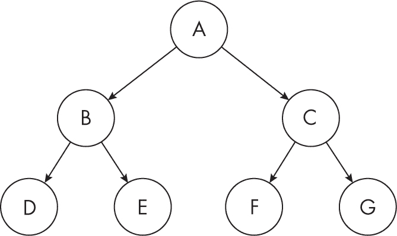
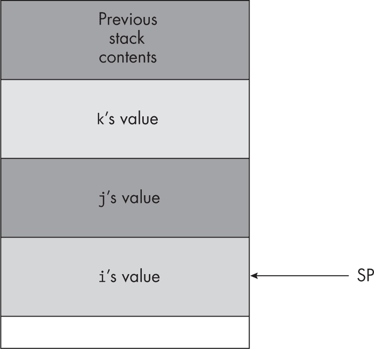
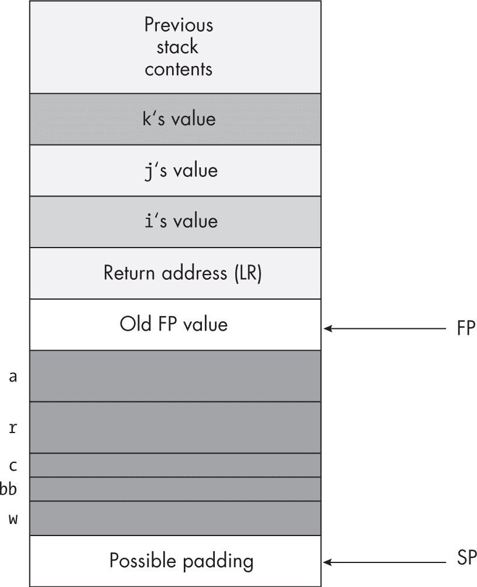
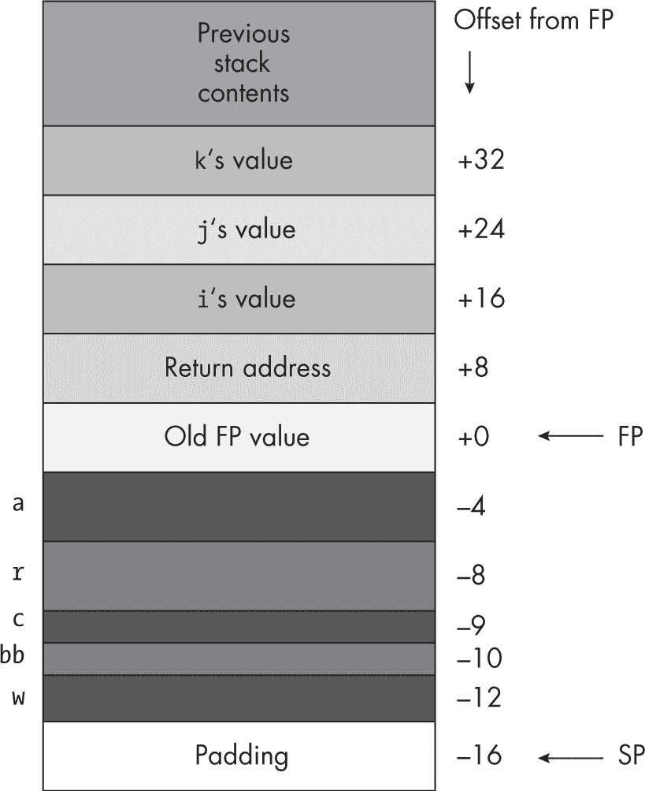
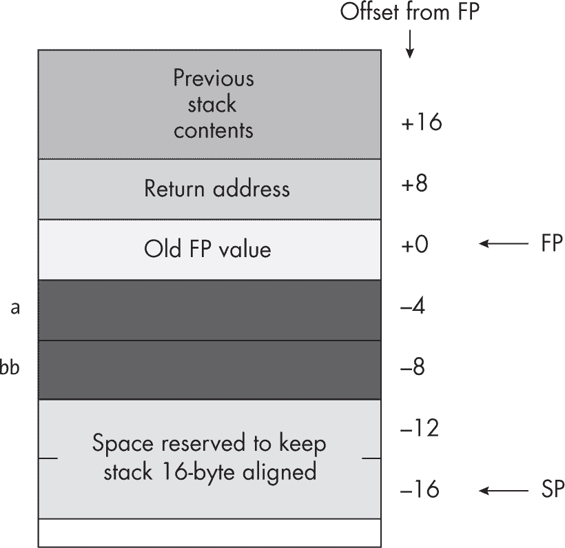
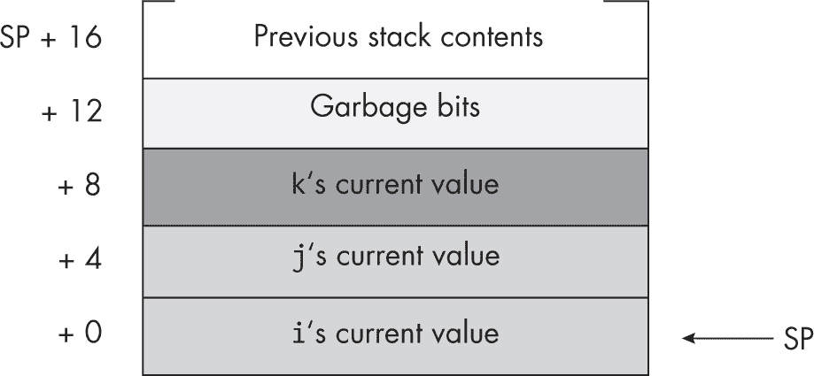
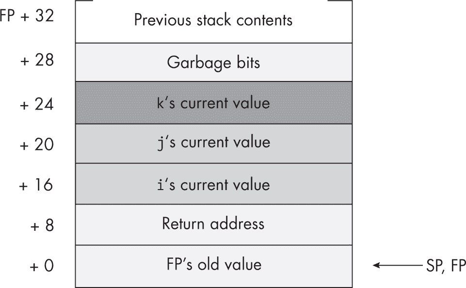

## 第五章：5 过程


在过程式编程语言中，代码的基本单元是过程。*过程*是一组指令，用来计算一个值或执行一个动作，例如打印或读取字符值。本章讨论了 Gas 如何实现过程、参数和局部变量。到本章结束时，你应该能够熟练地编写自己的过程和函数。你还将完全理解参数传递和 ARM 应用程序二进制接口（ABI）调用约定。

本章涵盖了以下几个主题：

+   汇编语言编程风格介绍，以及一些*aoaa.inc*宏，以提高程序的可读性

+   Gas 过程/函数及其实现（包括使用 bl、br 和 ret 指令），以及更多*aoaa.inc*宏，允许在源文件中更好地声明过程

+   激活记录、自动变量、局部符号、寄存器保存和 ARM 堆栈

+   向过程传递参数的各种方式，包括按值传递和按引用传递，以及如何使用过程指针和过程参数

本章还讨论了如何将函数结果返回给调用者，以及如何调用和使用递归函数。

### 5.1 汇编语言编程风格

直到本章为止，我没有强调良好的汇编语言编程风格，原因有两个。首先，本书假设你已经通过对高级语言（HLL）的经验了解了良好编程风格的重要性。其次，到目前为止引用的程序相对简单，编程风格在简单代码中并不重要。然而，随着你开始编写更复杂的 ARM 汇编语言程序，风格变得更加重要。

正如你现在可能已经能察觉到的，ARM 汇编语言代码的可读性远不如用 C/C++、Java 或 Swift 等高级语言编写的代码。因此，作为汇编语言程序员，你必须付出额外的努力，编写尽可能可读和易于维护的汇编代码。正如我指出的，GNU 汇编器（Gas）并不是作为一个供汇编语言程序员使用的工具，而是作为 GCC 编译器的后端，用来处理编译器的输出。由于这一点，以及 Gas 试图吸收尽可能多的来自众多汇编语言（不仅仅是 ARM 的汇编语言）特性，使用 Gas 编写高质量代码是一项困难的任务。

幸运的是，你可以使用 Gas 的宏处理器（以及利用 CPP 的能力）来对 Gas 汇编语言进行一些修改，从而访问一些能帮助你改善编程风格的功能。*aoaa.inc* 包含了相当数量的预定义宏和符号定义，帮助实现这一目标。第十三章逐行介绍了 *aoaa.inc* 的内容，并解释了如何使用这些宏以及如何创建你自己的宏，以提高 ARM 汇编语言程序的可读性。

当你编写汇编语言源文件时，可以随意将 *aoaa.inc* 包含在代码中，或将代码中的任何功能整合进你的汇编语言源文件。即使你不需要 *aoaa.inc* 提供的跨平台可移植性，它的宏和其他定义仍然可以帮助你编写更具可读性和可维护性的代码。*aoaa.inc* 头文件是开源的，并且遵循 Creative Commons 4.0 Attribution 许可协议（详见第 290 页的第 5.12 节，“更多信息”）。

作为使用宏使代码更具可读性的示例，考虑一下 *aoaa.inc* 中的 .code 宏。它展开成以下两个语句：

```
.text 
.align 2 
```

一般来说，你应始终确保 .text 段对齐在字边界（如果在前面的代码段中声明了一些长度不是 4 的倍数的数据，代码可能会出现错位）。始终对齐 .text 段是良好的编程风格，这样可以确保指令从正确的地址开始。为了避免代码中充斥着大量多余的 .align 指令，我建议使用 .code 指令来自动处理对齐。减少杂乱的代码使得你的代码更容易阅读。

*aoaa.inc* 头文件包含了几个额外的宏，接下来我将在本章的其余部分介绍，这些宏将 1960 年代风格的 Gas 语法与更现代的汇编器（如 Microsoft 宏汇编器 MASM 和针对 x86 处理器系列的 HLA 汇编器）中的功能相结合。使用这些功能（如正式的过程声明和局部变量声明）可以帮助你编写更易于阅读的汇编语言源代码。

即使在编写传统的汇编语言源代码时，你也可以遵循一些规则来提高代码的可读性。在本书中，我通常将汇编语言语句组织如下（大括号表示可选项，实际源代码中并不出现）：

```
{`Label`:}   {{`instruction`}     `operands`}  {// `Comment`}
```

一般而言，我尽量将所有标签定义放在第一列，并将所有指令助记符对齐到第二列。我会尽量将操作数放在第三列。列之间的空格数量并不重要，但要确保助记符通常会对齐在同一列，操作数则倾向于从下一列开始。这是传统的汇编语言编程风格，也是大多数汇编语言程序员在阅读你的代码时希望看到的格式。

> 注意

*由于格式化原因，本书常常压缩列之间的空白，并且有时会变化每列在同一列表中的位置。这是为了确保源代码行能在书中保持在一行内。在正常的源文件中，你应该尽量保持所有列对齐（第二列使用两个 4 字符的制表符位置，第三列大约在字符位置 16，依此类推）。*

一般来说，不要像在高级语言中那样对语句进行缩进。汇编语言不是块结构化语言，不适合采用在块结构语言中有效的缩进技巧。如果需要将一系列语句区分开，最好的方法是插入两行或更多的空行在这些语句前后。注释也很有用，可以帮助区分两个独立的、松散耦合的代码块。

Gas 通常期望一个完整的汇编语言指令出现在源代码的一行中。理论上，你可以在换行符前使用反斜杠字符，将单条语句拆分成两行：

```
b.al   \
  targetLabel 
```

然而，这几乎从来没有合理的理由去这么做。除非有非常好的理由将指令分成多行，否则应该将指令保持在同一行（例如，如果源代码行因为某些原因变得异常长，尽管这种情况很少见）。标签字段是这个规则的一个例外：即使标签与程序中的下一条机器指令相关联，也可以单独占一行。

Gas（在 Linux 下）允许将多个汇编语言指令放在同一行，用分号分隔。然而，将多条语句放在同一行的做法，在汇编语言中比在高级语言中更不推荐——不要这么做。无论如何，macOS 汇编器不支持这一特性。

在解决了一些汇编语言风格的基本指南之后，现在是时候考虑本章的主要主题：汇编语言中的过程（函数）。

### 5.2 Gas 过程

大多数过程式编程语言通过调用/返回机制来实现过程。代码调用过程，过程执行其编写的操作，然后返回给调用者。调用和返回操作提供了 ARM 的*过程调用机制*。调用代码通过 bl 指令调用过程，过程通过 ret 指令返回给调用者。例如，以下 ARM 指令调用了 C 标准库中的 printf() 函数：

```
bl printf 
```

可惜，C 标准库并没有提供你所需要的所有例程。大多数情况下，你需要编写自己的 Gas 过程。一个基本的 Gas 过程声明格式如下：

```
`procName`: 
 `Procedure statements` 
    ret 
```

从技术上讲，过程并不需要以 ret 指令结束；ret 可以位于过程的中间，最后以 b.al 指令结尾。然而，作为一种良好的编程风格，建议使用 ret 指令（或等效的指令）作为过程体的最后一条指令。

过程声明出现在程序的 .text 段中。在上述语法示例中，procName 表示你希望定义的过程名称。这个名称可以是任何有效的（且唯一的）Gas 标识符。

下面是一个 Gas 过程声明的具体示例。这个过程在进入时会将 0 存储到 X0 所指向的 256 个字中：

```
zeroBytes: 
          mov  x1, #256*4     // 1,024 bytes = 256 words 
repeatlp: subs x1, x1, #4 
          str  wzr, [x0, x1]  // Store *after* subtraction! 
          bne  repeatlp       // Repeat while X1 >= 0\. 
          ret 
```

正如你可能已经注意到的，这个简单的过程没有涉及那些“魔法”指令，这些指令用于在 SP 寄存器上加减值。当过程会调用其他 C/C++ 代码（或其他符合 ARM ABI 的语言编写的代码）时，这些指令是 ARM ABI 的要求。由于这个小函数并不调用其他过程，因此它不执行这些代码。

还需要注意的是，这段代码使用循环索引从 1,024 递减到 0，每次递减 4，并倒序（从后到前）填充 256 字的数组，而不是从前到后填充。这是汇编语言中的常见技巧。最后，这段代码在将 0 存储到内存之前会将 X1 减少 4。原因是循环索引（X1）初始化时就在 X0 所指向的数组末尾之外。str 指令不会影响标志，因此 bne 指令会响应 subs 指令设置的标志。

你可以使用 ARM 的 bl 指令来调用这个过程。当程序执行时，代码跳转到 ret 指令，过程返回到调用它的地方，并开始执行 bl 指令之后的第一条指令。清单 5-1 提供了一个调用 zeroBytes 例程的示例。

```
// Listing5-1.S 
//
// Simple procedure call example 

#include "aoaa.inc"

stackSpace  =       64 
saveLR      =       56 

            .section .rodata, ""
ttlStr:     .asciz   "Listing 5-1"

 .data 
wArray:     .space   256 * (4), 0xff // Fill with 0xFF. 

            .text 
            .align   2 

// getTitle 
//
// Return program title to C++ program: 

            .global getTitle 
getTitle: 
            lea     x0, ttlStr 
            ret 

// zeroBytes 
//
// Here is the user-written procedure 
// that zeros out a 256-word buffer. 
// On entry, X0 contains the address 
// of the buffer. 

zeroBytes: 
            mov     x1, #256 * 4 
repeatlp:   subs    x1, x1, #4 
            str     wzr, [x0, x1] // Store *after* subtraction! 
            bne     repeatlp      // Repeat while X1 != 0\. 
            ret 

// Here is the asmMain function: 

            .global asmMain 
asmMain: 
            sub     sp, sp, #stackSpace // Reserve stack storage. 
            str     lr, [sp, #saveLR] 

            lea     x0, wArray 
            bl      zeroBytes 

            ldr     lr, [sp, #saveLR]   // Restore return address. 
            add     sp, sp, #stackSpace // Clean up stack. 
            ret     // Returns to caller 
```

我不会涉及构建或运行命令，因为这个程序除了显示它已运行并终止之外，不会产生任何实际输出。

Gas 语言并没有我们所说的程序组件的语法概念，像过程（或函数）这样的结构。它有可以用`bl`指令调用的标签，以及可以用`ret`指令返回的过程。然而，它没有可以用来在汇编源文件中区分一个过程与另一个过程的语法实体。

到目前为止，本书中的几个过程通过使用标签和返回语句来区分过程中的代码。例如，以下过程以`zeroBytes`开始，并以`ret`结束：

```
zeroBytes: 
          mov  x1, #256 * 4 
repeatlp: subs x1, x1, #4 
          str  wzr, [x0, x1] // Store *after* subtraction! 
          bge  repeatlp      // Repeat while X1 >= 0\. 
          ret 
```

在过程之前立即添加注释可能有助于将其与前面的代码区分开。然而，阅读代码的人需要努力区分`zeroBytes`标签和`repeatlp`标签。实际上，完全可以使用这两个标签作为过程的入口点（`zeroBytes`总是从传入的 X0 地址开始清零 256 个字，而`repeatlp`则会清零 X1/4 指定数量的字）。当然，过程并不一定只能使用单一的`ret`指令（或者根本不使用，因为还有其他方式可以从过程返回）。因此，依赖一个语句标签和`ret`指令来界定过程并不总是合适的。

尽管在你的 Gas 过程的开始和结束处添加注释以澄清发生了什么总是一个好主意，但解决这个问题的最佳方式是使用*语法糖*——这些语句可以澄清含义，而不会生成任何代码——来界定过程。虽然 Gas 没有提供这样的语句，但你可以为相同的目的编写自己的宏。`*aoaa.inc*`包含文件提供了几个这样的宏：`proc`和`endp`。以下是它们的语法：

```
proc `procedureName` {, public}  // Braces denote optional item. 

     `Body of the procedure` 

endp `procedureName` 
```

这里，`procedureName`将是过程的名称，你必须在`proc`和`endp`语句中提供相同的名称。`, public`参数是可选的，正如元符号大括号所表示的。如果提供了`public`参数，`proc`宏将自动为过程生成`.global`指令。

这是一个使用`proc`和`endp`宏与`getTitle`函数的非常简单的示例：

```
proc    getTitle, public 
lea     x0, ttlStr 
ret 
endp    getTitle 
```

这些宏为`getTitle`过程生成了常见的语句：

```
 .global     getTitle  // Generated by public 
getTitle:    // Generated by proc 
             lea         x0, ttlStr 
             ret 
```

`endp`宏在程序中并不会生成任何内容。它仅仅是检查传递的标识符，以确保它与`proc`宏调用中的过程名称相匹配。

因为`proc`和`endp`语句可以整洁地将一个过程的主体与程序中的其他代码隔离开来，从这一点开始，本书将使用这些语句定义过程。我建议你也利用这些宏来帮助使你自己未来的过程更加易读。

高级语言中的过程和函数提供了本地符号这一有用的特性。下一节将介绍 Gas 支持的有限形式的本地标签。

#### 5.2.1 Gas 本地标签

与高级语言（HLL）不同，Gas 不支持 *词法作用域符号*。你在一个程序中定义的标签，并不局限于该程序的作用域。除了一个特殊情况外，你在 Gas 程序中定义的符号，包括用 proc/endp 定义的符号，都是在整个源文件中可见的。

然而，Gas 确实支持一种有限形式的 *本地标签*，它由一个数字字符和一个冒号组成（0: 到 9:）。在代码中，使用 Nb 或 Nf 来引用这些符号，其中 N 是数字（0 到 9）。形式为 Nb 的符号引用源文件中前一个 N: 标签（b 代表 *后退*）。形式为 Nf 的符号引用源文件中下一个 N: 标签（f 代表 *前进*）。

下面是一个 Gas 本地标签的示例，位于 zeroBytes 程序中（改写自前一节）：

```
 proc zeroBytes 
          mov  x1, #256 * 4 
0:        subs x1, x1, #4 
          str  wzr, [x0, x1] // Store *after* subtraction! 
          bne  0b            // Repeat while X1 != 0\. 
          ret 
          endp zeroBytes 
```

本地标签在没有充分理由使用更有意义的名称时非常有用。然而，使用这些本地符号时要小心。当适量使用时，它们有助于减少程序中无意义标签的干扰，但使用过多会破坏程序的可读性（“这个代码跳转到哪个 0 标签？”）。

使用本地标签时，目标标签应仅位于几条指令之内；如果代码跳转的距离过远，你在以后优化代码时有可能会在源代码和目标标签之间插入相同的本地标签。这会产生不良后果，并且 Gas 不会提醒你错误。

#### 5.2.2 bl、ret 和 br

一旦你可以声明一个程序，接下来的问题是如何调用（和返回）一个程序。如你在本书中多次看到的那样，你通过使用 bl 调用程序，并通过使用 ret 从程序中返回。本节将更详细地介绍这些指令（以及 br 指令），包括它们使用的效果。

ARM bl 指令做两件事：它将紧随 bl 指令后的（64 位）地址复制到 LR 寄存器中，然后将控制转移到指定程序的地址。bl 复制到 LR 的值被称为 *返回地址*。

当一个程序希望返回调用者并继续执行 bl 指令之后的第一条语句时，通常通过执行 ret 指令返回给调用者。ret 指令通过间接转移控制到 LR 寄存器（X30）中保存的地址。

ARM ret 指令有两种形式

```
ret
ret `reg`64
```

其中 reg64 是 ARM 的三十二个 64 位寄存器之一。如果出现 64 位寄存器操作数，CPU 使用该寄存器中保存的地址作为返回地址；如果没有寄存器，默认使用 X30（LR）。

ret 指令实际上是 br（通过寄存器间接分支）指令的一个特殊情况。br 的语法是

```
br  `reg`64
```

其中 reg64 是 ARM 的三十二个 64 位寄存器之一。该指令还将控制权转移到指定寄存器中保存的地址。而 ret reg64 指令向 CPU 提供一个提示，表示这是一个实际的子程序返回，而 br reg64 指令则没有提供这样的提示。在某些情况下，如果给出提示，ARM 可以更快地执行代码。第七章 介绍了 br 指令的一些用法。

以下是一个最小化 Gas 过程的示例：

```
proc minimal
ret
endp minimal
```

如果你调用这个过程并使用 bl 指令，minimal 将简单地返回到调用者。如果你没有在过程中放置 ret 指令，当程序遇到 endp 语句时，它不会返回到调用者。相反，程序将继续执行紧跟在过程之后的代码。

示例 5-2 演示了这个问题。主程序调用了 noRet，它直接跳转到 followingProc（打印出 followingProc was called 消息）。

```
// Listing5-2.S
//
// A procedure without a ret instruction

#include "aoaa.inc"

stackSpace  =           64
saveLR      =           56

            .section    .rodata, ""
ttlStr:     .asciz      "Listing 5-2"
fpMsg:      .asciz      "followingProc was called\n"

            .code
            .extern     printf

// Return program title to C++ program:

            proc    getTitle, public
            lea     x0, ttlStr
            ret
            endp    getTitle

// noRet
//
// Demonstrates what happens when a procedure
// does not have a return instruction

            proc    noRet
            endp    noRet

            proc    followingProc
            sub     sp, sp, #stackSpace
            str     lr, [sp, #saveLR]

            lea     x0, fpMsg
            bl      printf

            ldr     lr, [sp, #saveLR]
            add     sp, sp, #stackSpace
            ret
            endp    followingProc

// Here is the asmMain function:

            proc    asmMain, public
            sub     sp, sp, #stackSpace
            str     lr, [sp, #saveLR]

 bl      noRet

            ldr     lr, [sp, #saveLR]
            add     sp, sp, #stackSpace
            ret
            endp    asmMain
```

如你所见，noRet 中没有 ret 指令，因此当主程序（asmMain）调用 noRet 时，它将直接跳转到 followingProc。以下是构建命令和示例执行：

```
$ ./build Listing5-2
$ ./Listing5-2
Calling Listing5-2:
followingProc was called
Listing5-2 terminated
```

尽管在某些罕见情况下这种行为可能是理想的，但在大多数程序中通常表示一个缺陷。因此，请始终记得使用 ret 指令显式地从过程返回。

### 5.3 保存机器状态

示例 5-3 尝试打印 20 行，每行 40 个空格和一个星号。

```
// Listing5-3.S
//
// Preserving registers (failure) example

#include "aoaa.inc"

stackSpace  =           64
saveLR      =           56
saveX19     =           48

            .section    .rodata, ""
ttlStr:     .asciz      "Listing 5-3"
space:      .asciz      " "
asterisk:   .asciz      "*, %d\n"

            .data
loopIndex:  .word       .-.     // Used to print loop index value

            .code
            .extern     printf

// getTitle
//
// Return program title to C++ program:

            proc    getTitle, public
            lea     x0, ttlStr
 ret
            endp    getTitle

// print40Spaces
//
// Prints out a sequence of 40 spaces
// to the console display

            proc    print40Spaces
            sub     sp, sp, #stackSpace
            str     lr, [sp, #saveLR]

            mov     w19, #40
printLoop:  lea     x0, space
            bl      printf
            subs    w19, w19, #1
            bne     printLoop // Until W19 == 0
            ldr     lr, [sp, #saveLR]
            add     sp, sp, #stackSpace
            ret
            endp    print40Spaces

// Here is the asmMain function:

            proc    asmMain, public

            sub     sp, sp, #stackSpace
            str     lr, [sp, #saveLR]   // Save return address.
            str     x19, [sp, #saveX19] // Must preserve nonvolatile register.

            mov     w19, #20
astLp:      bl      print40Spaces
            lea     x0, loopIndex
            str     w19, [x0]
            lea     x0, asterisk
            vparm2  loopIndex
            bl      printf
            subs    w19, w19, #1
            bne     astLp

            ldr     x19, [sp, #saveX19]
            ldr     lr, [sp, #saveLR]
            add     sp, sp, #stackSpace
            ret     // Returns to caller
            endp    asmMain
```

不幸的是，一个微妙的错误导致了无限循环。主程序使用 bne printLoop 指令创建一个循环，该循环调用 Print40Spaces 20 次。此函数使用 W19 来计数它打印的 40 个空格，然后返回时 W19 的值为 0。主程序打印一个星号和换行符，递减 W19，然后因为 W19 不为 0（此时它将始终为 -1）而继续重复。

这里的问题是 print40Spaces 子程序没有保存 W19 寄存器。保存寄存器意味着你在进入子程序时保存它，并在离开之前恢复它。如果 print40Spaces 子程序保存了 W19 寄存器的内容，那么示例 5-3 会正常运行。无需构建和运行该程序；它只是进入了一个无限循环。

请考虑以下的 print40Spaces 代码：

```
 proc    print40Spaces
            sub     sp, sp, #stackSpace
            str     lr, [sp, #saveLR]
            str     x19, [sp, #saveX19]

            mov     w19, #40
printLoop:  lea     x0, space
            bl      printf
            subs    w19, w19, #1
            bne     printLoop // Until W19 == 0
            ldr     lr, [sp, #saveLR]
            ldr     x19, [sp, #saveX19]
            add     sp, sp, #stackSpace
            ret
            endp    print40Spaces
```

这个变体的 print40Spaces 会在栈上保存并恢复 X19 寄存器以及 LR 寄存器。由于 X19 是一个非易失性寄存器（在 ARM ABI 中），所以它的保存责任由被调用者（即过程）承担。

请注意，print40Spaces 使用的是 X19 而不是 X0 到 X15 寄存器，特别是因为 X19 是非易失性的。printf() 函数不需要保存 X0 到 X15，因为它们在 ARM ABI 中是*易失性*寄存器。任何尝试使用这些寄存器的操作都可能失败，因为 printf() 不必保留它们的值。

一般来说，调用者（包含调用指令的代码）或被调用方（子程序）都可以负责保留寄存器。在遵循 ARM ABI 时，调用者负责保留易失性寄存器，而被调用方负责保留非易失性寄存器。当然，当你编写自己的子程序时，如果这些子程序不会被 ABI 兼容的函数调用，也不调用任何 ABI 兼容的函数，你可以选择任何你喜欢的寄存器保留方案。

清单 5-4 显示了清单 5-3 中程序的修正版本，该版本在调用 print40Spaces 时正确地保留了 X19 寄存器。

```
// Listing5-4.S
//
// Preserving registers (successful) example

#include "aoaa.inc"

stackSpace  =           64
saveLR      =           56
saveX19     =           48

 .section    .rodata, ""
ttlStr:     .asciz      "Listing 5-4"
space:      .asciz      " "
asterisk:   .asciz      "*, %d\n"

            .data
loopIndex:  .word       .-.     // Used to print loop index value

            .code
            .extern     printf

// Return program title to C++ program:

            proc    getTitle, public
            lea     x0, ttlStr
            ret
            endp    getTitle

// print40Spaces
//
// Prints out a sequence of 40 spaces
// to the console display

            proc    print40Spaces
            sub     sp, sp, #stackSpace
            str     lr, [sp, #saveLR]
            str     x19, [sp, #saveX19]

            mov     w19, #40
printLoop:  lea     x0, space
            bl      printf
            subs    w19, w19, #1
            bne     printLoop // Until W19 == 0
            ldr     lr, [sp, #saveLR]
            ldr     x19, [sp, #saveX19]
            add     sp, sp, #stackSpace
            ret
            endp    print40Spaces

// Here is the asmMain function:

            proc    asmMain, public

            sub     sp, sp, #stackSpace
            str     lr, [sp, #saveLR]   // Save return address.
            str     x19, [sp, #saveX19] // Must preserve nonvolatile register.

            mov     w19, #20
astLp:      bl      print40Spaces
            lea     x0, loopIndex
            str     w19, [x0]
            lea     x0, asterisk
            vparm2  loopIndex
            bl      printf
 subs    w19, w19, #1
            bne     astLp

            ldr     lr, [sp, #saveLR]
            ldr     x19, [sp, #saveX19]
            add     sp, sp, #stackSpace
            ret     // Returns to caller
            endp    asmMain
```

以下是清单 5-4 的构建命令和示例输出：

```
$ ./build Listing5-4
$ ./Listing5-4
Calling Listing5-4:
                                        *, 20
                                        *, 19
                                        *, 18
                                        *, 17
                                        *, 16
                                        *, 15
                                        *, 14
                                        *, 13
                                        *, 12
                                        *, 11
                                        *, 10
                                        *, 9
                                        *, 8
                                        *, 7
                                        *, 6
                                        *, 5
                                        *, 4
                                        *, 3
                                        *, 2
                                        *, 1
Listing5-4 terminated
```

如你所见，程序正确执行，没有进入无限循环。

被调用方保留寄存器有两个优点：节省空间和易于维护。如果被调用方（子程序）保留所有受影响的寄存器，那么只有一份 str 和 ldr 指令存在——即子程序中的指令。如果调用方保存寄存器中的值，那么程序在每次调用时需要一组保留指令。这不仅使程序更长，而且更难以维护。记住每次调用时哪些寄存器需要保存和恢复并不容易。

另一方面，如果一个子程序保留了它所修改的所有寄存器，它可能会不必要地保存一些寄存器。如果调用者已经保存了这些寄存器，那么子程序就不需要保存它不关心的寄存器。

保留寄存器的一个大问题是你的程序可能会随着时间的推移发生变化。你可能会修改调用代码或过程，以使用额外的寄存器。当然，这些变化可能会改变你必须保留的寄存器集合。更糟糕的是，如果修改发生在子程序本身，你将需要定位*每一个*调用该子程序的地方，并验证该子程序是否不会更改调用代码使用的任何寄存器。

汇编语言程序员通常在寄存器保留方面遵循一种常见约定：除非有充分的理由（性能问题）做出不同的处理，否则大多数程序员会保留每个子程序修改的寄存器（且该寄存器没有显式返回值）。这样可以减少程序出现缺陷的可能性，因为子程序修改了调用方期望被保留的寄存器。当然，你也可以遵循有关 ARM ABI 的规则，处理易失性和非易失性寄存器；然而，这种调用约定会对程序员和其他程序带来低效。虽然本书一般遵循 ARM ABI 的易失性和非易失性寄存器规则，但许多示例在一个过程里保留所有受影响的寄存器。

保留环境不仅仅是保留寄存器。你还可以保留子程序可能会改变的变量和其他值。

### 5.4 调用树、叶过程和堆栈

假设有一个过程 A 调用了另外两个过程 B 和 C。还假设 B 调用了两个过程 D 和 E，C 调用了两个过程 F 和 G。我们可以通过使用*调用树*来表示这个调用顺序，如图 5-1 所示。



图 5-1：调用树示意图

整个调用图是树形结构，底部那些不调用其他过程的过程——在这个例子中是 D、E、F 和 G——被称为*叶过程*。

叶过程与非叶过程在 ARM 汇编语言中有所不同，因为它们可以将返回地址保留在 LR 寄存器中，而不是保存到内存（堆栈）。由于叶过程不会通过 bl 指令进行其他调用，因此在进入过程时，该过程不会修改 LR 中的值。（这假设过程不会显式地修改 LR，但通常来说，修改 LR 没有什么好的理由。）因此，叶过程可能比非叶过程稍微高效一些，因为它们不需要保留 LR 寄存器中的值。叶过程还可以充分利用易失性寄存器集，而不用担心它们的值在调用其他过程时被扰乱。

非叶过程必须保留 LR 寄存器中的值，因为它们所调用的过程（通过 bl 指令）会覆盖 LR 中的值。一个过程可以在几个地方保留 LR：在另一个寄存器中、在堆栈上，或者在全局内存位置，就像我们在第三章介绍堆栈之前的例子那样。

我已经指出，在几乎所有情况下，使用全局变量来保存 LR 是一个不好的选择。这个方案只能处理一层调用，在使用递归（参见第 5.8 节，“递归”，第 277 页）或编写多线程应用程序时完全失效。它的速度较慢，代码更多，而且比其他方案使用起来不方便。

你可以使用另一个寄存器临时保存返回地址，同时调用另一个过程。当然，这个寄存器必须是非易失性的（或者至少，被调用的过程不能修改这个寄存器的值），这样它就能在你调用的过程返回时仍然保存返回地址。像这样使用寄存器来保存 LR 是非常快速的。不幸的是，确保其他过程不会修改保存的值通常意味着你必须在第二个过程中保留这个值。由于你仍然需要将该值写入内存（并且再次读取它），那么你不如直接将 LR 保存在内存中。

保存返回地址到 LR 最常见的位置是堆栈。通常，过程中的第一条指令会将 LR 寄存器的内容移动到堆栈中。这通常有两种方式。第一种是直接将 LR 寄存器压入堆栈：

```
str lr, [sp, #-16]!
```

第二步是将堆栈向下调整，并将 LR 存入刚刚创建的存储区域：

```
sub sp, sp, #`someAmount`   // Make room for LR on stack.
str lr, [sp, #`someOffset`] // Store LR into space allocated on stack.
```

这里，someAmount 是 16 的倍数（或其他保持堆栈 16 字节对齐的值），而 someOffset 是通过 sub 指令在堆栈上刚分配的空间的索引。

注意，前面的示例使用了预索引寻址模式来将 SP 向下调整，并将 LR 存入空出的空间（由于堆栈对齐问题，这实际上保留了 16 个字节，虽然只使用了其中的 8 个字节）。后面的示例使用了间接加偏移寻址模式，简单地将返回地址存入由 sub 指令分配的存储区域。本书通常使用后一种形式，因为 sub 的成本通常与其他使用堆栈的代码共享。

通过使用预索引寻址模式浪费 8 个字节不会成为问题。正如你将很快看到的，通常你会希望保留 FP 寄存器的值和返回地址，因此你通常会使用像以下这些不会浪费内存的 stp 指令：

```
stp fp, lr, [sp, #-16]!
```

或

```
sub sp, sp, #`someAmount`
stp fp, lr, [sp, #`someOffset`]
```

以下小节将介绍在过程调用中堆栈的使用，包括激活记录、如何访问激活记录中的数据（本地和自动变量以及参数）、ARM ABI 如何影响激活记录和参数传递，以及如何构建和销毁激活记录。

#### 5.4.1 激活记录

当你调用一个过程时，程序会将一些信息与该过程调用关联起来，包括返回地址、参数和自动本地变量（我将在后续章节中讨论）。为此，程序使用一种名为*激活记录*的数据结构，也称为*堆栈帧*。程序在调用（激活）过程时创建激活记录，记录中的数据以与结构体相同的方式进行组织。

本节讨论了一个假设编译器创建的传统激活记录，忽略了 ARM ABI 的参数传递约定。本章后续的章节将介绍 ARM ABI 约定。

激活记录的构建始于调用过程的代码。调用者在堆栈上为参数数据（如果有的话）腾出空间，并将数据复制到堆栈上。然后，bl 指令将返回地址传入过程。此时，激活记录的构建继续在过程内部进行。过程通常将 LR 中的值与其他寄存器和其他重要的状态信息一起推送到堆栈上，然后为本地变量在激活记录中腾出空间。过程还可能更新 FP 寄存器（X29），使其指向激活记录的基地址。

为了了解传统的激活记录是什么样的，可以考虑以下 C++过程声明：

```
void ARDemo(unsigned i, int j, unsigned k) 
{
     int a; 
     float r; 
     char c; 
     bool bb; 
 short w; 
      . 
      . 
      . 
}
```

每当程序调用该 ARDemo 过程时，它会首先将参数数据推入栈中。在原始的 C/C++ 调用约定中（忽略 ARM ABI），调用代码将所有参数按与它们在参数列表中出现的顺序相反的顺序推入栈中，从右到左。因此，调用代码首先推入 k 参数的值，然后是 j 参数的值，最后是 i 参数的数据（为了保持栈对齐，可能会为参数添加填充）。

接下来，程序调用 ARDemo。ARDemo 过程刚一进入时，栈中就包含了这三个项目，并按图 5-2 所示的顺序排列。由于程序是逆序将参数推入栈中，因此它们按正确的顺序出现在栈上，且第一个参数位于内存中的最低地址。



图 5-2：ARDemo 进入时的栈组织结构

ARDemo 中的前几个指令将当前的 LR 和 FP 值推入栈中，然后将 SP 的值复制到 FP。接下来，代码会将栈指针向下调整到内存中，为局部变量腾出空间。这会产生图 5-3 所示的栈组织结构。



图 5-3：ARDemo 的激活记录

由于局部变量在激活记录中可以是任意大小，因此它们的总存储空间可能不是 16 字节的倍数。然而，整个局部变量块必须是 16 字节的倍数，以确保栈指针（SP）保持在 ARM CPU 所要求的 16 字节对齐边界上——因此，图 5-3 中可能会出现填充。

#### 5.4.2 激活记录中的对象

要访问激活记录中的对象，可以使用从 FP 寄存器到目标对象的偏移量。你最关心的两个项目是参数和局部变量。你可以通过从 FP 寄存器的正偏移量访问参数；可以通过从 FP 寄存器的负偏移量访问局部变量，正如图 5-4 所示（该图假设 i、j 和 k 参数都是 64 位整数，并已适当填充到 8 字节每个）。

ARM 特别为 X29/FP 寄存器保留了作为激活记录基址指针的用途。这就是为什么你应该避免将 FP 寄存器用于一般计算。如果你随意更改 FP 寄存器的值，可能会导致无法访问当前过程的参数和局部变量。



图 5-4：ARDemo 激活记录中对象的偏移量

局部变量按照与其本地大小相等的偏移量进行对齐：字符（chars）对齐在 1 字节地址上；短整数（shorts/hwords）对齐在 2 字节地址上；长整数、整数、无符号整数和字（longs、ints、unsigned 和 words）对齐在 4 字节地址上，依此类推。在 ARDemo 示例中，所有局部变量恰好都分配在适当的地址上（假设编译器按声明顺序分配存储）。

#### 5.4.3 ARM ABI 参数传递约定

ARM ABI 对激活记录模型进行了若干修改：

+   调用者通过寄存器（X0 至 X7）传递前八个（非浮点）参数，而不是通过栈传递。

+   参数始终是 8 字节值，无论是在寄存器中还是在栈上（如果形式参数小于 8 字节，则未使用的高位（HO bits）是未定义的）。

+   大于 16 字节的结构体和联合体通过值传递在栈上，位于其他参数之上，但在正常的参数位置（寄存器或栈上）传递指向该值的指针。8 字节（或更少）的结构体和联合体通过 64 位寄存器传递；9 到 16 字节的结构体和联合体通过两个连续的寄存器传递。

你只需在调用符合 ARM ABI 的代码时遵循这些约定。对于你编写和调用的汇编语言过程，你可以使用任何约定。

苹果的调用约定对于 macOS（iOS、iPadOS 等）与标准 ARM ABI 稍有不同。如果你进行以下操作，可能会影响你的汇编代码：

+   向过程传递超过八个参数

+   向变参过程传递参数

当通过栈传递参数时——即当你向函数传递超过八个参数时——苹果将它们打包在栈上，这意味着它不会简单地为每个参数分配 8 字节的栈空间。它确实确保每个值在内存中按照其自然大小进行对齐（字符 = 1 字节，半字 = 2 字节，字 = 4 字节，依此类推）。

*变参过程* 是指具有可变数量参数的过程，例如 C 的 printf() 函数。苹果将所有变参参数放在栈上，并为每个参数分配 8 字节，不管其类型如何。这就是 *aoaa.inc* 中 vparm2、vparm3 等宏的目的：macOS 下的 printf() 调用必须将参数传递到栈上，而在 Linux 下的相同调用则将前八个参数传递到寄存器中。

vparm2、vparm3 等宏根据操作系统自动生成适当的代码（无论是将参数放入栈中还是通过寄存器传递）。

#### 5.4.4 标准入口序列

一个过程的调用者负责为参数在栈上分配存储并将参数数据移动到适当的位置。在最简单的情况下，这只是通过使用 `str` 或 `stp` 指令将数据移动到栈上。构建其余的激活记录是过程的责任。你可以通过使用以下汇编语言的*标准入口序列*代码来实现：

```
stp fp, lr, [sp, #-16]!   // Save LR and FP values.
mov fp, sp                // Get activation record ptr in FP.
sub sp, sp, #`NumVars`      // Allocate local storage.
```

`mov fp, sp` 指令将当前保存在 SP 中的地址复制到 FP 寄存器。由于 SP 当前指向栈上压入的旧 FP 值，执行此指令后，FP 将指向原始的 FP 值，如图 5-4 所示。当在标准入口序列中使用 `stp` 指令时，确保将 FP 寄存器作为第一个参数，以便它存储在 [SP] 位置，而 LR 存储在 [SP, #8] 位置。这确保了在执行 `mov` 指令后，FP 会指向旧的 FP 值。

在第三条指令中，NumVars 代表过程所需的本地变量的字节数，这是一个常量，应该是 16 的倍数，以确保 SP 寄存器在 16 字节边界上对齐。如果过程中的本地变量字节数不是 16 的倍数，则在从 SP 中减去该常量之前，将该值向上舍入到下一个更高的 16 的倍数。这样做会稍微增加过程用于本地变量的存储量，但不会影响过程的操作。如果过程没有本地变量或调用其他函数，

```
sub sp, sp, #`NumVars`
```

指令不是必须的。

理论上，你可以使用任何寄存器来访问栈帧中的数据。然而，操作系统，尤其是调试器应用程序，通常依赖于激活记录的构建，其中 FP 指向激活记录中的旧 FP 值。

如果一个符合 ARM ABI 的程序调用你的过程，在执行 `bl` 指令之前，栈将被对齐到 16 字节边界。将 LR 和 FP 压入栈中（在将 SP 复制到 FP 之前）会再增加 16 字节的栈空间，以确保 SP 保持 16 字节对齐。因此，假设在调用之前栈已经是 16 字节对齐的，并且从 SP 中减去的数字是 16 的倍数，那么在为本地变量分配存储之后，栈仍然会保持 16 字节对齐。

前一节中的 ARDemo 激活记录只有 12 字节的本地存储。因此，从 SP 中减去 12 字节用于本地变量将无法保持栈的 16 字节对齐。ARDemo 程序中的入口序列必须减去 16（其中包括 4 字节的填充），以保持栈的正确对齐（如图 5-4 所示）。

一个可能的替代入口代码序列，与前面的示例等效，其形式如下：

```
sub sp, sp, #`numVars` + 16   // Space for locals and SP/LR
stp fp, lr, [sp, #`numVars`]
add fp, sp, #`numVars`
```

ARM ABI 调用约定建议将 LR 和 FP 值保存*在*局部变量的下面。然而，在分配局部变量的同时，分配额外的参数空间以支持从当前过程的额外过程调用通常是方便的。如果将 LR 和 FP 值保存在激活记录的底部，你将需要额外的指令来为这些参数腾出空间，而在过程返回时清理激活记录将更加复杂。

因为你将频繁使用标准的入口序列，*aoaa.inc* 包含文件提供了一个宏来为你生成该序列：

```
enter `numVars`
```

唯一的常量参数是要分配的栈空间大小（用于局部变量和其他内存对象），除了为保存 LR 和 FP 寄存器所预留的 16 字节之外。这个宏会为入口序列生成以下指令序列：

```
stp fp, lr, [sp, #-16]!
mov fp, sp
sub sp, sp, #(`numVars` + 15) & 0xFFFFFFFFFFFFFFF0
```

最终的表达式涉及 numVars，确保在栈上分配的空间是 16 字节的倍数，以保持栈的 16 字节对齐。

#### 5.4.5 标准退出序列

汇编语言程序的标准退出序列如下：

```
mov sp, fp             // Deallocates storage for all the local vars
ldp fp, lr, [sp], #16  // Pop FP and return address.
ret                    // Return to caller.
```

在 *aoaa.inc* 包含文件中，leave 宏展开为原始的标准退出序列。

### 5.5 局部变量

大多数高级语言中的过程和函数允许你声明局部变量（也称为*自动变量*）。前面章节提到过，过程将局部变量保存在激活记录中，但它们并没有真正定义如何创建和使用它们。本节（及其后续小节）将定义局部变量，并描述如何为其分配存储空间并使用它们。

局部变量在高级语言中有两个特殊的属性：作用域和生命周期*。* 标识符的*作用域*决定了该标识符在编译期间在源文件中可见（可访问）的范围。在大多数高级语言中，过程的局部变量的作用域是该过程的主体；标识符在该过程外部不可访问。遗憾的是，Gas 不支持过程中的局部作用域变量，因为 Gas 没有语法来确定过程的边界。

作用域是符号的编译时属性，而生命周期是运行时属性。变量的*生命周期*是一个时间范围，从存储首次绑定到变量的那一刻，直到存储不再可用的时刻。静态对象（那些你在 .data、.rodata、.bss 和 .text 部分声明的对象）具有与应用程序总运行时间等同的生命周期。程序在加载到内存时为这些变量分配存储空间，并且这些变量在程序终止之前保持该存储空间。

局部变量，更准确地说是*自动变量*，在进入过程时会分配存储空间。该存储空间在过程返回调用者时会被释放，供其他用途。*自动*这一名称意味着程序在调用和返回过程中自动分配和释放变量的存储。

在 Linux 下，一个过程可以像主程序访问全局变量一样，使用 PC 相对寻址模式访问任何全局的.data、.bss 或.rodata 对象（遗憾的是，macOS 的 PIE 格式不允许轻松访问非.text 节的对象）。访问全局对象是方便且简单的。然而，访问全局对象会让程序更难阅读、理解和维护，因此应该避免在过程内使用全局变量。

尽管在过程内访问全局变量有时可能是解决特定问题的最佳方案，但你在这个阶段可能不会编写这样的代码，因此在这么做之前需要仔细考虑你的选择。（一个合法使用全局变量的例子可能是在多线程应用程序中共享线程间的数据，这稍微超出了本章的范围。）

然而，这种反对访问全局变量的论点并不适用于其他全局符号。在程序中访问全局常量、类型、过程和其他对象是完全合理的。

#### 5.5.1 自动变量的低级实现

你的程序通过使用从激活记录基址（FP）负偏移量来访问过程中的局部变量。请参考列表 5-5 中的 Gas 过程，主要用于演示局部变量的使用。

```
// Listing5-5.S
//
// Accessing local variables

#include "aoaa.inc"

               .text

// local_vars
//
// Word a is at offset -4 from FP.
// Word bb is at offset -8 from FP.
//
// On entry, W0 and W1 contain values to store
// into the local variables a & bb (respectively).

            proc    local_vars
            enter   8

            str     w0, [fp, #-4]   // a = W0
            str     w1, [fp, #-8]   // bb = W1

    // Additional code here that uses a & bb

            leave
            endp    local_vars
```

这个程序无法运行，因此我不会提供构建命令。enter 宏实际上会分配 16 字节的存储，而不是参数指定的 8 字节（用于局部变量 a 和 bb），以保持栈的 16 字节对齐。

local_vars 的激活记录出现在图 5-5 中。



图 5-5：local_vars 过程的激活记录

当然，通过 FP 寄存器的数值偏移来引用局部变量是非常糟糕的。这段代码不仅难以阅读（[FP, #-4]是 a 变量还是 bb 变量？），而且也难以维护。例如，如果你决定不再需要 a 变量，你就得找到每一个[FP, #-8]（访问 bb 变量）的地方，并将其改成[FP, #-4]。

一个稍微更好的解决方案是为你的局部变量名创建等式。请参考列表 5-5 的修改版，如列表 5-6 所示。

```
// Listing5-6.S
//
// Accessing local variables #2

#include "aoaa.inc"

            .code

// local_vars
//
// Demonstrates local variable access
//
// Word a is at offset -4 from FP.
// Word bb is at offset -8 from FP.
//
// On entry, W0 and W1 contain values to store
// into the local variables a & bb (respectively).

#define a [fp, #-4]
#define bb [fp, #-8]

            proc    local_vars
            enter   8

 str     w0, a
            str     w1, bb

    `Additional code here that uses a & bb.`

            leave
            endp    local_vars
```

在列表 5-6 中，CPP 用适当的间接加偏移寻址模式替换了 a 和 bb，以便在栈上访问这些局部变量。这比列表 5-5 中的程序更容易阅读和维护。然而，这种方法仍然需要一些手动工作来设置 #define 语句中的局部变量偏移量，并且修改代码（在添加或删除局部变量时）可能会导致维护问题。我将在下一节提供一个更好的解决方案。

自动存储分配的一个大优点是，它能够有效地在多个过程之间共享一块固定的内存池。例如，假设你依次调用三个过程，像这样：

```
bl ProcA
bl ProcB
bl ProcC
```

在这个例子中，ProcA 在栈上分配它的局部变量。返回时，ProcA 会释放这块栈存储空间。进入 ProcB 时，程序通过使用 ProcA 刚刚释放的内存位置来分配 ProcB 的局部变量存储空间。同样，当 ProcB 返回并且程序调用 ProcC 时，ProcC 使用与 ProcB 最近释放的相同栈空间来存储它的局部变量。这种内存重用有效地利用了系统资源，可能是使用自动变量的最大优点。

现在你已经了解了汇编语言如何分配和释放局部变量的存储空间，就很容易理解为什么自动变量在两次调用同一个过程之间不会保持它们的值。一旦过程返回到调用者，自动变量的存储就会丢失，因此，值也会丢失。因此，*你必须始终假设进入过程时局部变量对象是未初始化的*。如果你需要在两次调用过程之间保持变量的值，应该使用静态变量声明类型中的一种。

#### 5.5.2 locals 宏

使用等式来维护局部变量引用是一项繁重的工作。诚然，这比在所有局部变量引用中使用魔法数字要好，但即使使用等式，在过程中插入和删除局部变量仍然需要时间和精力。真正理想的情况是有一个声明部分，可以像在高级语言中那样声明局部变量，并让汇编器负责维护所有进入激活记录的偏移量。*aoaa.inc* 头文件提供了一组宏，你可以用它们来自动化创建局部变量的过程。本节将介绍这些宏。

激活记录是一个*记录*（结构体）。理论上，你可以使用第四章中的 struct 宏来定义激活记录。然而，修改 struct/ends 宏来为局部变量创建更好的东西其实并不难。为了实现这一点，*aoaa.inc* 包含了两个额外的宏，用于声明局部变量：locals 和 endl。你可以几乎像使用 struct/ends 宏那样使用这些宏。

```
locals `procName`
  `declarations (same as for struct)`
endl   `procName`
```

其中 procName 是标识符（通常是与局部变量关联的过程的名称）。

像 ends 宏一样，endl 生成一个名为 procName.size 的符号，这是一个等式，设置为局部变量空间的大小。你可以将这个值提供给 enter 宏，以指定为局部变量保留的空间量：

```
 proc   myProc

    locals myProc
    dword  mp.ptrVar
    word   mp.counter
    byte   mp.inputChar
    salign 4
    word   mp.endIndex
    endl   myProc

    enter  myProc.size

`Insert procedure's body here.`

    leave
    endp   myProc
```

locals/endl 声明创建了一组等式，这些等式的值对应于激活记录中符号的偏移量。例如，前面的示例中的符号具有以下值：

mp.ptrVar    –8

mp.counter    –12

mp.inputChar    –13

mp.endIndex    –20

你可以使用这些偏移量与[FP, #offset]寻址模式来引用激活记录中的局部变量。例如：

```
ldr w0, [fp, #mp.counter]
ldr x1, [fp, #mp.ptrVar]
str w0, [x1]
```

这比在 .data 区访问全局变量要容易得多！

当为局部变量和 endl 宏之间的变量分配偏移量时，声明宏首先通过变量声明的大小减少偏移量计数器，然后将减少后的偏移值分配给符号。指定 salign 指令将会将偏移量调整到指定的边界（2*^n*，其中 *n* 是 salign 操作数的值）。下一个声明将不使用此偏移量，而是首先通过声明的大小递减运行中的偏移量计数器，并将该偏移量分配给变量。在之前的示例中，salign 指令将运行偏移量设置为 –16（因为当时分配了 13 字节的变量）。接下来的变量偏移量是 –20，因为 mp.endIndex 消耗了 4 字节。

如我之前所提到的，Gas 不支持词法作用域局部变量名的概念，这些变量名对于一个过程是私有的。因此，你在 locals/endl 块内声明的所有符号在整个源文件中都是可见的。这可能导致 *命名空间污染*，你可能会在一个过程内创建名字，而不能在另一个过程中重复使用这些名字。

在本节的示例中，我使用一种惯例，并且在本书中始终使用这种惯例，以避免命名空间污染：我使用形式为 proc.local 的局部变量名，其中 proc 是过程的名称（或过程名称的缩写），local 是我要使用的具体局部变量名称。例如，mp.ptrVar 是 myProc（mp）过程中的 ptrVar 局部变量。

### 5.6 参数

尽管许多过程是完全自包含的，大多数过程仍需要输入数据并将数据返回给调用者（参数）。

讨论参数时，第一个需要考虑的方面是我们如何将参数传递给过程。如果你熟悉 Pascal 或 C/C++，你可能见过两种传递参数的方式：按值传递和按引用传递。你在高级语言中能做的任何事情，都能在汇编语言中实现（显然，高级语言代码最终会被编译成机器代码），但你必须提供合适的指令序列来访问这些参数。

处理参数时，另一个需要关注的问题是*你在哪里传递它们*。传递参数有许多方式：通过寄存器、栈、代码流、全局变量或它们的组合。以下小节将介绍几种可能性。

#### 5.6.1 按值传递

按值传递的参数就是这样——调用者将一个值传递给过程。按值传递的参数仅为输入参数。你可以将它们传递给过程，但过程不能通过它们返回值。考虑以下 C/C++ 函数调用：

```
CallProc(I);
```

如果你按值传递 I，那么无论 CallProc() 内部如何操作，I 的值都不会改变。

因为你必须将数据的副本传递给过程，所以这种方法仅适用于传递像字节、字、双字和四字等小对象。按值传递大型数组和记录效率低，因为你必须创建并传递对象的副本给过程。

#### 5.6.2 按引用传递

为了按引用传递参数，你必须传递一个变量的地址，而不是它的值。换句话说，你必须传递指向数据的指针。过程必须解除引用该指针才能访问数据。当你需要修改实际参数，或者在过程之间传递大型数据结构时，按引用传递参数是很有用的。因为在 ARM 上指针是 64 位宽的，所以你按引用传递的参数将由一个双字值组成，通常保存在一个通用寄存器中。

你可以使用 lea 宏获取你在 .data、.bss、.rodata 或 .text 段中声明的任何静态变量的地址。清单 5-7 演示了如何获取静态变量（staticVar）的地址，并将该地址传递给一个过程（someFunc），地址通过 X0 寄存器传递。

```
// Listing5-7.S
//
// Demonstrate obtaining the address
// of a variable by using the lea instruction.

#include "aoaa.inc"

            .data
staticVar:  .word   .-.

            .code
            .extern someFunc

            proc    get_address
            enter   0
            lea     x0, staticVar
            bl      someFunc
            leave
            endp    get_address
```

计算非静态变量的地址则需要更多的工作。不幸的是，adr 和 adrp 指令只计算与程序计数器（PC）相关的内存访问地址。如果你的变量是通过其他 ARM 寻址模式引用的，你将不得不手动计算有效地址。

表格 5-1 描述了有效地址计算的过程。在表格中，[Xn, #const]（缩放形式）寻址模式描述的是机器编码，而不是汇编语法。在源代码中，缩放和非缩放形式共享相同的语法：[Xn, #const]。汇编程序会根据常数的值选择正确的机器编码。

表格 5-1：有效地址计算

| 寻址模式 | 有效地址 | 描述 |
| --- | --- | --- |
| [Xn] | Xn | 对于寄存器间接寻址模式，有效地址就是寄存器中保存的值。 |
| [Xn, #const] | Xn + const | 对于间接加偏移寻址模式，有效地址是 Xn 寄存器和常量的和。假设常量范围为 -256 到 +255，且偏移为 0。 |
| [Xn, #const] | Xn + const (scaled) | 对于带标度的间接加偏移模式（其中标度因子由加载或存储的数据大小决定），常量在与 Xn 寄存器相加之前，必须先乘以内存操作数的大小。对于 strb/ldrb，乘数为 1；对于 strh/ldrh，乘数为 2；对于 str/ldr（字寄存器），乘数为 4；对于 str/ldr（双字寄存器），乘数为 8。对于 strb/ldrb，常量必须在 0 到 4,096 之间。对于 strh/ldrh，常量必须在 0 到 8,191 之间，并且必须是偶数。对于使用字寄存器操作数的 ldr/str，常量必须在 0 到 16,383 之间，并且必须是 4 的倍数。对于使用双字寄存器操作数的 ldr/str，常量必须在 0 到 32,767 之间，并且必须是 8 的倍数。 |
| [Xn, #const]! | Xn + const | 对于预索引寻址模式，有效地址是 Xn 寄存器和常量的和。 |
| [Xn], #const | Xn | 对于后索引寻址模式，有效地址就是 Xn 寄存器中的值。 |
| [Xn, Xm] | Xn + Xm | 对于标度索引寻址模式，标度因子为 1 时，有效地址是两个寄存器的和（如果指定，Xm 为符号扩展或零扩展）。 |
| [Xn, Xm, extend #s] | Xn + (Xm << s) | 对于带有移位扩展的标度索引寻址模式，有效地址是 Xn 与 Xm 寄存器的值左移 s 位后的和（如果指定，Xm 为零扩展或符号扩展）。 |

假设一个过程有一个局部变量，并且你想通过引用将该变量传递给第二个过程。由于你使用 [FP, #offset] 寻址模式访问局部变量，有效地址为 FP + 偏移量。你必须使用以下指令来计算该变量的地址（将地址存放在 X0 中）：

```
add x0, fp, #`offset`
```

示例 5-8 演示了将局部变量作为引用参数传递给过程。

```
// Listing5-8.S
//
// Demonstrate passing a local variable
// by reference to another procedure.

#include "aoaa.inc"

            .data
staticVar:  .word   .-.

            .code
            .extern aSecondFunction

            proc    demoPassLclByRef

            locals  ga
            word    ga.aLocalVariable
            endl    ga

            enter   ga.size
            add     x0, fp, #ga.aLocalVariable // Pass parameter in X0.
            bl      aSecondFunction

            leave
            endp    demoPassLclByRef
```

通过引用传递通常比通过值传递效率低。你必须在每次访问时解引用所有按引用传递的参数；这比简单地使用值更慢，因为通常至少需要两条指令：一条将地址取到寄存器中，另一条通过该寄存器间接取值。

然而，在传递大型数据结构时，通过引用传递更为高效，因为你不需要在调用过程之前复制这个大型数据结构。当然，你可能需要通过指针来访问该大型数据结构的元素（比如数组），所以通过引用传递大型数组时，效率损失几乎可以忽略不计。

#### 5.6.3 使用低级参数实现

参数传递机制是调用者与被调用者（过程）之间的契约。双方必须达成一致，确定参数数据的出现位置以及它的形式（例如，值或地址）。

如果你的汇编语言过程仅由你编写的其他汇编语言代码调用，那么你控制着双方的契约协商，并可以决定参数的传递位置和方式。然而，如果外部代码调用你的过程，或者你的过程调用外部代码，那么你的过程必须遵守外部代码使用的任何调用约定。

在讨论特定的调用约定之前，本节首先考虑了你自己编写的调用代码的情况（因此，你对其调用约定拥有完全的控制权）。接下来的各节描述了你可以在纯汇编语言代码中传递参数的各种方式（没有与 ARM 或 macOS ABI 相关的开销）。

##### 5.6.3.1 通过寄存器传递参数

在简要介绍了*如何*传递参数之后，接下来要讨论的是*在哪里*传递参数。这取决于参数的大小和数量。如果你传递的是少量的参数，寄存器是一个非常好的传递位置。如果你传递的是单个参数，将该数据传递在 X0 中，如表 5-2 所述。

表 5-2：参数大小与位置

| 参数大小 | 位置 |
| --- | --- |
| 字节 | 将字节参数传递在 W0 的低字节部分。 |
| 半字 | 将半字参数传递在 W0 的低半字部分。 |
| 字 | 将字传递在 W0 中。 |
| 双字 | 将双字传递在 X0 中。 |
| > 8 字节 | 我建议在 X0 中传递指向数据结构的指针，或者如果是 16 字节或更少，在 X0/X1 中传递值。 |

当在 X0 中传递少于 32 位的数据时，macOS ABI 要求该值在整个 X0 寄存器中进行零扩展或符号扩展。ARM ABI 则没有这个要求。当然，在向你编写的汇编语言过程传递数据时，由你来定义如何处理高位。最安全的做法是将值零扩展或符号扩展到高位（取决于值是无符号还是有符号），这种做法在任何地方都具有可移植性。

如果你需要传递超过 8 个字节的参数，你也可以通过多个寄存器传递这些数据（例如，在 macOS 和 Linux 中，C/C++编译器会通过两个寄存器传递一个 16 字节的结构）。无论你是将参数作为指针传递，还是通过多个寄存器传递，都取决于你。

对于通过寄存器传递参数，ARM ABI 保留了 X0 到 X7 寄存器。当然，在纯汇编语言代码中（它不会调用或被 ARM ABI 兼容代码调用），你可以使用任何你选择的寄存器。然而，X0 到 X7 应该是你的首选，除非你能提供使用其他寄存器的充分理由。

八个参数可能涵盖了 95%的程序。 如果你传递给纯汇编程序的参数超过八个，没人会阻止你使用更多的寄存器（例如，X8 到 X15）。同样，如果你真的想这么做，也没人会阻止你通过多个寄存器传递大对象。

##### 5.6.3.2 在代码流中传递参数

你还可以在`bl`指令后立即在代码流中传递参数。考虑以下打印例程，它将一个字面字符串常量打印到标准输出设备：

```
bl      print
.asciz "This parameter is in the code stream..."
```

通常，一个子程序会将控制权返回到`bl`指令后的第一条指令。如果在这里发生这种情况，ARM 将尝试将"This..."的 ASCII 码解释为一条指令。这将产生不希望出现的结果。幸运的是，你可以在从子程序返回之前跳过这个字符串。

然而，ARM CPU 的设计存在一个大问题：所有指令必须在内存中按照字对齐。因此，出现在代码流中的参数数据必须是 4 字节的倍数（在这个例子中，我选择了包含 39 个字符的字符串，这样零终止字节使整个序列达到了 40 字节）。

那么，如何访问这些参数呢？很简单：LR 中的返回地址指向它们。请参考清单 5-9 中`print`的实现。

```
// Listing5-9.S
//
// Demonstrate passing parameters in the code stream

#include "aoaa.inc"

            .text
            .pool
ttlStr:     .asciz      "Listing 5-9"
            .align      2

// getTitle
//
// Return program title to C++ program:

            proc    getTitle, public
            lea     x0, ttlStr
            ret
            endp    getTitle

// print
//
// Here's the print procedure.
// It expects a zero-terminated string
// to follow the call to print:

rtnAdrs     =       8           // Offset to rtn adrs from FP.

            proc    print

 ❶ locals  print
            qword   print.x0X1Save   // Register save area.
            qword   print.x2X3Save
            qword   print.x4X5Save
            qword   print.x6X7Save
            qword   print.x8X9Save
            qword   print.x10X11Save
            qword   print.x12X13Save
            qword   print.x14X15Save
            endl    print

            enter   print.size

// Assembly language convention--save all the registers
// whose values we change. Spares caller from having to
// preserve volatile registers.
// Note: this code calls ABI function write, so you must
// preserve all the volatile registers.

            stp     x0, x1, [fp, #print.x0X1Save]
            stp     x2, x3, [fp, #print.x2X3Save]
            stp     x4, x5, [fp, #print.x4X5Save]
            stp     x6, x7, [fp, #print.x6X7Save]
            stp     x8, x9, [fp, #print.x8X9Save]
            stp     x10, x11, [fp, #print.x10X11Save]
            stp     x12, x13, [fp, #print.x12X13Save]
            stp     x14, x15, [fp, #print.x14X15Save]

// Compute the length of the string immediately following
// the call to this procedure:

          ❷ mov     x1, lr              // Get pointer to string.
search4_0:  ldrb    w2, [x1], #1        // Get next char.
            cmp     w2,  #0             // At end of string?
            bne     search4_0           // If not, keep searching.
            sub     x2, x1, lr          // Compute string length.

// LR now points just beyond the 0 byte. We need to
// make sure this address is 4-byte aligned:

          ❸ add     x1, x1, #3
            and     x1, x1, #-4         // 0xfff...fff0

// X1 points just beyond the 0 byte and padding.
// Save it as the new return address:

          ❹ str     x1, [fp, #rtnAdrs]

// Call write to print the string to the console.
//
// write(fd, bufAdrs, len);
//
// fd in X0 (this will be 1 for stdout)
// bufAdrs in X1
// len in X2

          ❺ mov     x0, #1         // stdout = 1
            mov     x1, lr         // Pointer to string
            bl      write

// Restore the registers we used:

          ❻ ldp     x0, x1, [fp, #print.x0X1Save]
            ldp     x2, x3, [fp, #print.x2X3Save]
            ldp     x4, x5, [fp, #print.x4X5Save]
            ldp     x6, x7, [fp, #print.x6X7Save]
            ldp     x8, x9, [fp, #print.x8X9Save]
            ldp     x10, x11, [fp, #print.x10X11Save]
            ldp     x12, x13, [fp, #print.x12X13Save]
            ldp     x14, x15, [fp, #print.x14X15Save]
            leave                  // Return to caller.
            endp    print

// Here is the asmMain function:

            proc    asmMain, public
            enter   64

// Demonstrate passing parameters in code stream
// by calling the print procedure:

            bl      print
          ❼ .asciz  "Hello, world!!\n"

            leave   // Returns to caller
            endp    asmMain
```

打印过程 ❶ 保存它所修改的所有寄存器（即使是易失性寄存器，因为调用`write()`可能会覆盖它们）。这是汇编语言的常规约定，但对于打印来说尤其重要，因为你希望能够打印（调试）信息，而不必在每次调用之间保存寄存器值。

当进入打印过程时，LR 指向要打印的字符串 ❷。这段代码扫描该字符串以找到零终止字节；这个扫描会产生字符串的长度和（大致的）返回地址。

因为代码必须在 4 字节对齐的边界上执行，返回地址不一定是零终止字节后的一个字节。相反，代码可能需要将字符串指针的末尾填充 1 到 3 字节，以便在 `.text` 区段中跳到下一个字边界 ❸。将 3 加上后，再与 0xFFFFFFFFFFFFFFFC（-4）进行按位与运算，填充返回地址到适当的边界。然后，代码会将返回地址覆盖原有的堆栈地址 ❹。

一旦你得到字符串的长度，就可以调用 C 标准库的写入函数来打印它 ❺（如果第一个参数是 0，则将字符串打印到标准输出设备）。在退出时，代码会恢复之前保存的寄存器 ❻。

在这个例程中，我添加了两个感叹号 ❼，使得字符串的长度（包括零终止字节）成为 4 的倍数。这确保了接下来的指令能够在 4 字节对齐的边界上执行。

为了避免总线错误，打印调用后跟随的数据长度必须是 4 字节的倍数，以确保下一条指令能够正确地在 4 字节对齐的边界上执行。字符串本身的长度不必是 4 字节的倍数；在零终止字节后加上任意的填充字节是可以的。你可以不必计算字符串中的字符数，而是使用 Gas 的 `.p2align` 指令。这个指令会将位置计数器对齐到一个是 2*^n* 字节倍数的边界，其中 *n* 是 `.p2align` 操作数字段中的第一个值。例如

```
.p2align 2
```

将位置计数器填充到下一个字边界。

使用 `.p2align 2` 指令，你可以如下所示调用打印过程，传递任意长度的字符串：

```
bl        print
.asciz    "Hello, world!\n"
.p2align  2
```

记得在代码中加入 `.p2align 2` 指令可能会很困难，更不用说需要输入它还很麻烦，而且会让你的代码变得杂乱。为了解决这个问题，*aoaa.inc* 包含了一个 `wastr`（字对齐字符串）宏，它会自动为你添加填充：

```
bl       print
wastr    "Hello, world!\n"
```

除了展示如何在代码流中传递参数外，打印例程还展示了另一个概念：*可变长度参数*（字符串的长度可以是任意长）。跟在 `bl` 后面的字符串可以是任何实际长度。以零终止的字节标记参数列表的结束。你可以通过两种简单的方式处理可变长度参数：要么使用一个特殊的终止值（如 0），要么传递一个特殊的长度值，告诉子例程你传递了多少参数。两种方法各有优缺点。

使用特殊值来终止参数列表要求选择一个永远不会出现在列表中的值。例如，print 使用 0 作为终止值，因此它不能打印 NUL 字符（其 ASCII 码为 0）。有时，这并不是一个限制。指定长度参数是另一种可以用来传递可变长度参数列表的机制。虽然这不需要任何特殊代码，也不会限制可以传递给子例程的值范围，但设置长度参数并维护结果代码可能会成为一个真正的噩梦；尤其是在参数列表经常变化的情况下，这一点尤为明显。

尽管在代码流中传递参数带来了便利，但这种方法也有缺点。首先，如果没有提供程序所需的精确数量的参数，子例程将会混淆。考虑 print 的例子。它打印一串字符直到遇到一个零终止字节，然后将控制权返回到该字节后的第一条指令。如果没有提供零终止字节，print 例程会很高兴地将随后的操作码字节作为 ASCII 字符打印，直到找到一个 0 字节。由于 0 字节经常出现在指令的中间，print 例程可能会将控制权返回到另一条指令的中间，这可能会导致机器崩溃。

在 ARM 上，必须确保传递的参数在代码流中是 4 字节的倍数。紧随其后的指令必须位于字边界上。尽管存在一些问题，然而，代码流仍然是传递那些值不变的参数的高效方式。

##### 5.6.3.3 在栈上传递参数

大多数高级语言（HLL）使用栈来传递大量参数，因为这种方法相当高效。尽管在栈上传递参数的效率稍逊于在寄存器中传递，但寄存器集是有限的（尤其是如果你只限于 ARM ABI 为此目的预留的 8 个寄存器）。另一方面，栈允许你轻松地传递大量参数数据。这就是为什么大多数程序在栈上传递参数的原因（至少在传递超过 8 个参数时）。

要手动在栈上传递参数，在调用子例程之前立即将其压入栈中（只需记住保持栈的 16 字节对齐）。子例程随后从栈内存中读取这些数据并进行适当的操作。考虑以下 HLL 函数调用：

```
CallProc(i,j,k);
```

因为保持 SP 在 16 字节边界上对齐至关重要，所以你不能仅通过 str 指令一次推送一个参数，也不能推送小于 32 位的值。假设 i、j 和 k 是 32 位整数，你需要将它们以某种方式打包成一个 128 位的单元（包括多余的 32 位未使用数据），然后将 16 字节推送到栈上。这是非常不方便的，因此 ARM 代码几乎从不将单个（甚至成对的）寄存器值推送到栈上。

在 ARM 汇编语言中常见的解决方案是，首先将栈下移所需的字节数（加上任何填充字节，以确保栈对齐正确），然后将参数存储到这样分配的栈空间中。例如，要调用 CallProc，你可以使用如下代码：

```
sub sp, sp, #16   // Allocate space for parameters.
str w0, [sp]      // Assume i is in W0,
str w1, [sp, #4]  // j is in W1, and
str w2, [sp, #8]  // k is in W2.
bl  CallProc
add sp, sp, #16   // Caller must clean up stack.
```

sub 指令在栈上分配了 16 字节；你只需要 12 字节来存放三个 32 位参数，但必须分配 16 字节以保持栈对齐。

这三条 str 指令将参数数据（假定该代码将其存储在 W0、W1 和 W2 中）存储到从 SP + 0 到 SP + 11 的 12 字节中。CallProc 将简单地忽略栈上分配的额外 4 字节。

在这个例子中，三个 32 位整数被打包到内存中，每个整数在栈上占用 4 字节。因此，i 参数在进入 CallProc 时位于 SP + 0，j 参数位于 SP + 4，k 参数位于 SP + 8（见 图 5-6）。



图 5-6：进入 CallProc 时的栈布局

如果你的过程包含标准的入口和退出序列，你可以通过从 FP 寄存器索引直接访问激活记录中的参数值。考虑以下声明的 CallProc 激活记录布局：

```
proc  CallProc
enter 0         // No local variables
  .
  .
  .
leave
endp  CallProc
```

此时，i 的值可以在 [FP, #16] 找到，j 的值可以在 [FP, #20] 找到，k 的值可以在 [FP, #24] 找到（见 图 5-7）。



图 5-7：标准入口序列后的 CallProc 激活记录

在 CallProc 过程内，你可以使用以下指令访问参数值：

```
ldr w0, [fp, #16]
ldr w1, [fp, #20]
ldr w2, [fp, #24]
```

当然，像这样使用魔法数字来引用参数偏移量仍然是一个不好的主意。最好使用等式，或者更好的是，创建一个类似于结构体和局部变量的声明宏来定义过程的参数。*aoaa.inc* 文件包含了这样一个宏：args（和 enda）。清单 5-10 演示了该宏的使用。

```
// Listing5-10.S
//
// Accessing a parameter on the stack

#include "aoaa.inc"

            .data
value1:     .word   20
value2:     .word   30
pVar:       .word   .-.

ttlStr:     .asciz  "Listing 5-10"
fmtStr1:    .asciz  "Value of parameter: %d\n"

            .code
            .extern printf

// getTitle
//
// Return program title to C++ program.

            proc    getTitle, public
            lea     x0, ttlStr
 ret
            endp    getTitle

// valueParm
//
// Passed a single parameter (vp.theParm) by value

            proc    valueParm

            args    vp          // Declare the
            word    vp.theParm  // parameter.
            enda    vp

            enter   64          // Alloc space for printf.

// vparms macro accepts only global variables.
// Must copy parameter to that global to print it:

            lea     x0, fmtStr1
            ldr     w1, [fp, #vp.theParm]
            lea     x2, pVar
            str     w1, [x2]
            vparm2  pVar
            bl      printf

            leave
            ret
            endp    valueParm

// Here is the asmMain function:

            proc    asmMain, public
            enter   64

            lea     x0, value1
            ldr     w1, [x0]
            str     w1, [sp]        // Store parameter on stack.
            bl      valueParm

            lea     x0, value2
            ldr     w1, [x0]
            str     w1, [sp]        // Store parameter on stack.
            bl      valueParm

            leave
            endp    asmMain
```

args 宏需要一个参数列表名称，可以是过程名称或其缩写，此外还可以指定一个可选的第二个参数作为起始偏移量。第二个参数默认为 16，这是一个适用于使用标准入口序列的过程的合适值（该序列将 LR 和 FP 寄存器压入栈中）。你声明的参数的偏移量是相对于过程中的 FP 的偏移量。

这是第 5-10 号列表的构建命令和示例输出：

```
% ./build Listing5-10
% ./Listing5-10
Calling Listing5-10:
Value of parameter: 20
Value of parameter: 30
Listing5-10 terminated
```

如果你的程序没有使用标准的进入顺序，你可以将一个显式的偏移量作为第二个参数。例如：

```
args procName, 0
```

如果在过程中没有将任何内容推入栈中（或分配局部变量），使用 0 是一个不错的值；这样偏移量是基于 SP，而不是基于 FP。

##### 5.6.3.4 被调用者与调用者栈清理中的参数移除

在通过栈传递参数时，这些参数最终必须从栈中移除。ARM ABI 规定调用者负责移除它推入栈中的所有参数。本书中大多数示例程序到目前为止已经（隐式地）完成了这一操作。

每次调用过程后移除参数是缓慢且低效的。幸运的是，一个简单的优化消除了为每个函数调用分配和释放参数存储的需要。进入过程时，在分配局部变量的存储空间时，额外分配一些存储空间，用于存储过程传递给其他函数的参数。事实上，这也是本书中大多数过程开始时“魔术栈分配”指令的目的。到目前为止的示例通常在栈上保留了 64 或 256 字节的存储空间（分别足够存储 8 到 32 个 64 位参数）。

像在 macOS 上运行的 printf() 这样的函数，通过栈传递参数时，可以在调用函数之前将数据存储到这个区域。返回函数时，代码无需担心清理参数，因为该栈空间现在可以供下一个需要栈参数的函数使用。

当然，最终这些参数必须从栈中释放。这发生在过程执行 leave 宏时（或手动将 FP 复制到 SP，这是 leave 扩展的一部分）。当使用 enter 和 leave 分配这些栈空间用于参数，以及过程可能需要的任何局部变量时，你只需要分配和释放栈空间一次，而不是为每个单独的过程调用分配和释放。

如果你的程序没有任何局部变量，你可以像以下代码那样轻松分配栈空间来存储参数：

```
proc  myProc
enter 64    // Allocate 64 bytes for parameter usage.
  .
  .
  .
leave       // Deallocate storage and returns.
endp  myProc
```

如果你的程序需要局部变量存储，只需将额外的栈空间作为虚拟局部变量放在局部变量声明的末尾：

```
proc   myProc

locals mp
word   mp.local1
dword  mp.local2
byte   mp.local3
byte   mp.stack, 64 // Allocate 64 bytes for parms.
endl   mp

enter  mp.size      // Allocate locals and stack space.
  .
  .
  .
leave               // Deallocate storage and returns.
endp   myProc
```

请记住，enter 总是分配 16 字节的倍数空间，因此我们知道栈存储会对齐到 16 字节边界。

##### 5.6.3.5 向 C/C++ 的 printf() 函数传递参数

在 Linux 下，你通过寄存器传递前八个 printf() 参数，就像你处理任何其他非变参函数一样。而在 macOS 下，这些参数总是通过栈传递，每个参数占一个双字（dword）。直到现在，本书使用了 vparmsn 宏来处理传递参数方式的差异（当然，也为了避免处理栈，因为本书在前几章并未涉及栈的相关内容）。

本书的写作目标是编写可在 Linux 和 macOS 之间移植的代码，仅在必要时使用特定于操作系统的代码；这也是在调用 printf() 时使用 vparmsn 宏的动机之一。现在你已经了解了这两种操作系统如何传递变参，可能会想用比 vparmsn 宏更灵活的方式来传递参数。不过，编写可移植代码有很大的好处（至少对本书中的源代码而言）。幸运的是，通过一些技巧，完全可以在不使用 vparmsn 宏的情况下，直接将参数传递给 printf()，并且让代码在这两种操作系统上都能组装和运行。

第一个规则是将每个 printf() 的参数加载到 X0 到 X7 寄存器中。这会将参数放置到 Linux 期望的位置。一旦参数进入这些寄存器，你还需要将它们存储到栈的存储区（SP + 0、SP + 8、SP + 16、...、SP + 56），这是 macOS 期望它们的位置。下面是一个典型的 printf() 调用，打印 X0、X5 和 X7 中的值：

```
locals mp
Byte   mp.stack, 24
endl   mp
 .
 .
 .
enter mp.size
 .
 .
 .
mov  x1, x0         // Put data in appropriate registers first.
mov  x2, x5
mov  x3, x7
lea  x0, fmtStr
str  x1, [sp]       // For macOS, store the arguments
str  x2, [sp, #8]   // onto the stack in their
str  x3, [sp, #16]  // appropriate locations.
bl   printf         // Then call printf.
```

严格来说，在 Linux 环境下运行时，str 指令并不是必需的。为了生成稍微更高效的代码，我在 *aoaa.inc* 包含文件中提供了以下的 mstr 宏：

```
mstr register, memory
```

这个宏在 Linux 下不会生成任何代码，而在 macOS 下则会生成相应的 str 指令。如果你使用 mstr 重写之前的代码，它在 Linux 下不会生成任何多余的代码：

```
locals mp
Byte   mp.stack, 24
endl   mp
 .
 .
 .
enter mp.size
 .
 .
 .
mov  x1, x0         // Put data in appropriate registers first.
mov  x2, x5
mov  x3, x7
lea  x0, fmtStr
mstr x1, [sp]       // For macOS, store the arguments
mstr x2, [sp, #8]   // onto the stack in their
mstr x3, [sp, #16]  // appropriate locations.
bl   printf         // Then call printf.
```

当然，如果你只为 Linux 编写代码，并且完全不关心 macOS 的移植性，你可以完全去掉 mstr 指令，从而减少一些杂乱的代码。

#### 5.6.4 访问栈上的引用参数

因为你传递的是对象的地址作为引用参数，所以在过程内部访问引用参数比访问值参数稍微困难一些，你必须解引用引用参数的指针。

考虑列表 5-11，它演示了一个单一的引用传递参数。

```
// Listing5-11.S
//
// Accessing a reference parameter on the stack

#include "aoaa.inc"

            .data
value1:     .word   20
value2:     .word   30

ttlStr:     .asciz  "Listing 5-11"
fmtStr1:    .asciz  "Value of reference parameter: %d\n"

            .code
            .extern printf

// getTitle
//
// Return program title to C++ program.

            proc    getTitle, public
            lea     x0, ttlStr
            ret
            endp    getTitle

// refParm
//
// Expects a pass-by-reference parameter on the stack

            proc    refParm

            args    rp
            dword   rp.theParm
            enda    rp

            enter   64              // Alloc space for printf.

            lea     x0, fmtStr1
          ❶ ldr     x1, [fp, #rp.theParm]
            ldr     w1, [x1]
 ❷ mstr    x1, [sp]
            bl      printf

            leave
            endp    refParm

// Here is the asmMain function:

            proc    asmMain, public
            enter   64

// Pass the address of the arguments on the
// stack to the refParm procedure:

          ❸ lea     x0, value1
            str     x0, [sp]        // Store address on stack.
            bl      refParm

            lea     x0, value2
            str     x0, [sp]        // Store address on stack.
            bl      refParm

            leave

            endp    asmMain
```

refParm 过程将引用参数（一个 64 位指针）加载到 X1 1 中，然后立即通过获取 X1 地址中的 32 位字来解引用此指针。mstr 宏 ❷ 将第二个参数存储到栈中（在 macOS 下）。为了将一个变量通过引用传递给 refParm ❸，你必须计算它的有效地址并将其传递过去。

下面是列表 5-11 中程序的构建命令和示例输出：

```
$ ./build Listing5-11
$ ./Listing5-11
Calling Listing5-11:
Value of reference parameter: 20
Value of reference parameter: 30
Listing5-11 terminated
```

如你所见，访问（小型）按引用传递的参数比访问值参数效率稍低，因为你需要额外的指令将地址加载到 64 位指针寄存器中（更不用说你还需要为此目的保留一个 64 位寄存器）。如果频繁访问引用参数，这些额外的指令会累积起来，降低程序的效率。

此外，容易忘记解引用引用参数并在计算中使用值的地址。因此，除非你确实需要影响实际参数的值，否则你应该使用按值传递将小对象传递给过程。

传递大型对象，如数组和记录，是使用引用参数变得高效的地方。当按值传递这些对象时，调用代码必须复制实际参数；如果是大型对象，复制过程可能效率低下。因为计算大型对象的地址与计算小型标量对象的地址一样高效，所以按引用传递大型对象时不会丧失效率。在过程内，你仍然需要解引用指针以访问对象，但与复制大型对象的成本相比，由间接访问引起的效率损失可以忽略不计。

示例 5-12 演示了如何使用按引用传递来初始化结构体数组。

```
// Listing5-12.S
//
// Passing a large object by reference

#include "aoaa.inc"

NumElements =       24

// Here's the structure type:

            struct  Pt
            byte    pt.x
            byte    pt.y
            ends    Pt

            .data

ttlStr:     .asciz  "Listing 5-12"
fmtStr1:    .asciz  "refArrayParm[%d].x=%d"
fmtStr2:    .asciz  "refArrayParm[%d].y=%d\n"

            .code
            .extern printf

// getTitle
//
// Return program title to C++ program.

            proc    getTitle, public
            lea     x0, ttlStr
            ret
            endp    getTitle

// refAryParm
//
// Passed the address of an array of Pt structures
// Initializes each element of that array

            proc    refAryParm

 args    rap
            dword   rap.ptArray     // Reference parameter
            enda    rap

            enter   0               // No stack space needed!

// Get the base address of the array into X1:

          ❶ ldr     x1, [fp, #rap.ptArray]

// While X0 < NumElements, initialize each
// array element. x = X0/8, y = X0 % 8:

            mov     x0, xzr             // Index into array.
ForEachEl:  cmp     x0, #NumElements    // While we're not done
            bhs     LoopDone

// Compute address of ptArray[X0].
// Element adrs = base address (X1) + index (X19) * size (2):

          ❷ add     x3, x1, x0, lsl #1  // X3 = X1 + X0 * 2

// Store index / 8 into x field:

            lsr     x2, x0, #3          // X2 = X0 / 8
            strb    w2, [x3, #pt.x]     // ptArray[X0].x = X0/8

// Store index % 8 (mod) into y field:

            and     x2, x0, #0b111      // X2 = X0 % 8
            strb    w2, [x3, #pt.y]     // ptArray[X0].y = X0 % 8

// Increment index and repeat:

            add     x0, x0, #1
            b.al    ForEachEl

LoopDone:   leave
            endp    refAryParm

// Here is the asmMain function:

            proc    asmMain, public

// Easier to access local variables than globals, so let's
// make everything a local variable:

            locals  am
            word    saveX19
            byte    Pts, NumElements * (Pt.size)
            byte    stackSpace, 64
            endl    am

            enter   am.size             // Reserve space.

 str     x19, [fp, #saveX19] // Save nonvolatile reg.

// Initialize the array of points:

          ❸ add     x0, fp, #Pts    // Compute address of Pts.
            str     x0, [sp]        // Pass address on stack.
            bl      refAryParm

// Display the array:

            mov     x19, xzr        // X19 is loop counter.
dispLp:     cmp     x19, #NumElements
            bhs     dispDone

// Print the x field:

            lea     x0, fmtStr1
            mov     x1, x19
            mstr    x1, [sp]
            add     x3, fp, #Pts         // Get array base address.
            add     x3, x3, x19, lsl #1  // Index into array.
            ldrb    w2, [x3, #pt.x]      // Get ptArray[X0].x.
            mstr    x2, [sp, #8]
            bl      printf

// Print the y field:

            lea     x0, fmtStr2
            mov     x1, x19
            mstr    x1, [sp]
            add     x3, fp, #Pts         // Get array base address.
            add     x3, x3, x19, lsl #1  // Index into array.
            ldrb    w2, [x3, #pt.y]      // Get ptArray[X0].x.
            mstr    x2, [sp, #8]
            bl      printf

// Increment index and repeat:

            add     x19, x19, #1
            b.al    dispLp

dispDone:
            ldr     x19, [fp, #saveX19]  // Restore X19.
            leave
            endp    asmMain
```

该代码计算了 Pts 数组的地址，并将该数组（按引用）传递给 refAryParm 过程❸。它将该地址加载到 X1 ❶，并使用该指针值作为 refAryParm 处理的数组的基地址❷。

这是构建命令和示例输出：

```
$ ./build Listing5-12
$ ./Listing5-12
Calling Listing5-12:
refArrayParm[0].x=0 refArrayParm[0].y=0
refArrayParm[1].x=0 refArrayParm[1].y=1
refArrayParm[2].x=0 refArrayParm[2].y=2
refArrayParm[3].x=0 refArrayParm[3].y=3
refArrayParm[4].x=0 refArrayParm[4].y=4
refArrayParm[5].x=0 refArrayParm[5].y=5
refArrayParm[6].x=0 refArrayParm[6].y=6
refArrayParm[7].x=0 refArrayParm[7].y=7
refArrayParm[8].x=1 refArrayParm[8].y=0
refArrayParm[9].x=1 refArrayParm[9].y=1
refArrayParm[10].x=1 refArrayParm[10].y=2
refArrayParm[11].x=1 refArrayParm[11].y=3
refArrayParm[12].x=1 refArrayParm[12].y=4
refArrayParm[13].x=1 refArrayParm[13].y=5
refArrayParm[14].x=1 refArrayParm[14].y=6
refArrayParm[15].x=1 refArrayParm[15].y=7
refArrayParm[16].x=2 refArrayParm[16].y=0
refArrayParm[17].x=2 refArrayParm[17].y=1
refArrayParm[18].x=2 refArrayParm[18].y=2
refArrayParm[19].x=2 refArrayParm[19].y=3
refArrayParm[20].x=2 refArrayParm[20].y=4
refArrayParm[21].x=2 refArrayParm[21].y=5
refArrayParm[22].x=2 refArrayParm[22].y=6
rRefArrayParm[23].x=2 refArrayParm[23].y=7
Listing5-12 terminated
```

此输出显示了 refAryParm 过程是如何初始化数组的。

### 5.7 函数及其返回结果

*函数*是将结果返回给调用者的过程。在汇编语言中，过程和函数之间的语法差异很小。这就是为什么*aoaa.inc*没有为函数提供特定宏声明的原因。然而，语义上仍然存在差异；虽然你可以在 Gas 中以相同的方式声明它们，但使用方式却不同。

*过程*是一系列完成任务的机器指令。过程执行的最终结果是完成该活动。而函数则执行一系列机器指令，专门计算一个值并返回给调用者。当然，函数也可以执行某些活动，过程也可以计算值，但主要的区别是函数的目的是返回一个计算结果；过程则没有这个要求。

在汇编语言中，你不会使用特殊语法来专门定义一个函数。在 Gas 中，一切都是过程。当程序员明确决定通过过程的执行返回函数结果时，代码段才变成函数。

寄存器是返回函数结果最常见的地方。C 标准库中的 strlen() 函数就是一个很好示例，它在 CPU 的一个寄存器中返回一个值。它会将字符串的长度（你作为参数传递的字符串地址）返回在 X0 寄存器中。

按照惯例，程序员会尝试将 8 位、16 位和 32 位的结果返回在 W0 寄存器中，而将 64 位值返回在 X0 寄存器中。这是大多数高级语言（HLL）返回这些类型结果的地方，也是 ARM ABI 规范中规定返回函数结果的地方。例外的是浮点值；我会在第六章中讨论浮点函数结果。

W0/X0 寄存器并没有什么特别神圣的地方。如果更方便的话，你可以在任何寄存器中返回函数结果。当然，如果你调用的是符合 ARM ABI 规范的函数，比如 strlen()，那么你只能期待函数的返回结果在 X0 寄存器中。例如，strlen() 函数会将一个整数返回在 X0 中。

如果你需要返回一个大于 64 位的函数结果，显然必须将其返回到 X0 以外的地方（因为 X0 只能容纳 64 位值）。对于稍大于 64 位的值（例如 128 位，甚至可能是 256 位），你可以将结果分割成若干部分，并在两个或更多寄存器中返回这些部分。看到函数将 128 位值返回在 X1:X0 寄存器对中并不罕见。只是要记住，这些方案不符合 ARM ABI 规范，因此仅在调用你自己编写的代码时才实际可用。

如果你需要返回一个较大的对象作为函数结果（比如一个包含 1000 个元素的数组），显然你不可能将函数结果返回在寄存器中。当返回超过 64 位的函数结果时，ARM ABI 规范要求调用者为结果分配存储空间，并在 X8 中传递指向该存储空间的指针。函数将结果放入该存储空间，调用者在返回时从该位置检索数据。

### 5.8 递归

*递归* 是指一个过程调用它自身。例如，以下是一个递归过程：

```
proc  Recursive
enter 0
bl    Recursive
leave
endp  Recursive
```

当然，CPU 永远不会从这个过程返回。在进入 Recursive 时，这个过程会立即再次调用自身，控制永远不会传递到过程的末尾。在这种情况下，失控的递归会导致逻辑上的无限循环，进而产生栈溢出，此时操作系统会引发异常并停止程序。

类似于循环结构，递归需要一个终止条件来避免无限递归。递归可以在加上终止条件后重写如下：

```
 proc  Recursive
          enter 0
 subs  x0, x0, #1
          beq   allDone
          bl    Recursive
allDone:
          leave
          endp  Recursive
```

对该例程的修改使得 Recursive 按照 X0 寄存器中显示的次数调用自身。每次调用时，Recursive 将 X0 寄存器减 1，然后再次调用自身。最终，Recursive 将 X0 减到 0 并从每个调用中返回，直到它返回到原始调用者。

到目前为止，本节中还没有真正需要递归的地方。毕竟，你可以高效地按照以下方式编写这个过程：

```
 proc  Recursive
          enter 0
iterLp:
          subs  x0, x0, #1
          bne   iterLp
          leave
          endp  Recursive
```

这两个最后的例子会根据 X0 寄存器传入的次数重复执行过程的主体。（后一种版本会显著更快，因为它没有 bl/ret 指令的开销。）事实证明，并不是所有的递归算法都能以迭代的方式实现。然而，许多递归实现的算法比其迭代版本更高效，而且大多数情况下递归形式的算法更容易理解。

*快速排序算法*可能是最著名的通常以递归形式出现的算法。列表 5-13 展示了该算法的 Gas 实现。

```
// Listing5-13.S
//
// Recursive quicksort

#include "aoaa.inc"

numElements =       10

            .data
ttlStr:     .asciz  "Listing 5-13"
fmtStr1:    .asciz  "Data before sorting: \n"
fmtStr2:    .ascii  "%d"   // Use nl and 0 from fmtStr3
fmtStr3:    .asciz  "\n"
fmtStr4:    .asciz  "Data after sorting: \n"
fmtStr5:    .asciz  "ary=%p, low=%d, high=%d\n"

theArray:   .word   1,10,2,9,3,8,4,7,5,6

 .code
            .extern printf

// getTitle
//
// Return program title to C++ program.

            proc    getTitle, public
            lea     x0, ttlStr
            ret
            endp    getTitle

// quicksort
//
// Sorts an array using the quicksort algorithm
//
// Here's the algorithm in C, so you can follow along:
//
// void quicksort(int a[], int low, int high)
// {
//     int i,j,Middle;
//     if(low < high)
//     {
//         Middle = a[(low + high)/2];
//         i = low;
//         j = high;
//         do
//         {
//             while(a[i] <= Middle) i++;
//             while(a[j] > Middle) j--;
//             if(i <= j)
//             {
//                 swap(a[i],a[j]);
//                 i++;
//                 j--;
//             }
//         } while(i <= j);
//
//         // Recursively sort the two subarrays:
//
//         if(low < j) quicksort(a,low,j);
//         if(i < high) quicksort(a,i,high);
//     }
//}
//
// Args:
//    X19 (_a):       Pointer to array to sort
//    X20 (_lowBnd):  Index to low bound of array to sort
//    X21 (_highBnd): Index to high bound of array to sort
//
// Within the procedure body, these registers
// have the following meanings:
//
// X19: Pointer to base address of array to sort
// X20: Lower bound of array (32-bit index)
// X21: Higher bound of array (32-bit index)
//
// X22: index (i) into array
// X23: index (j) into array
// X24: Middle element to compare against
//
// Create definitions for variable names as registers
// to make the code more readable:

#define array x19
#define lowBnd x20
#define highBnd x21
#define i x22
#define j x23
#define middle w24

            proc    quicksort

            locals  qsl
            dword   qsl.saveX19
            dword   qsl.saveX20
            dword   qsl.saveX21
            dword   qsl.saveX22
            dword   qsl.saveX23
            dword   qsl.saveX24
            dword   qsl.saveX0
            byte    qsl.stackSpace, 32
            endl    qsl

            enter   qsl.size

// Preserve the registers this code uses:

            str     x0, [fp, #qsl.saveX0]
            str     x19, [fp, #qsl.saveX19]
            str     x22, [fp, #qsl.saveX22]
            str     x23, [fp, #qsl.saveX23]
            str     x24, [fp, #qsl.saveX24]

            cmp     lowBnd, highBnd
            bge     endif3

            mov     i, lowBnd        // i = low
            mov     j, highBnd       // j = high

// Compute a pivotal element by selecting the
// physical middle element of the array:
//
// Element address = ((i + j) / 2) * 4 (4 is element size)
//                 = ((i + j) * 2)

            add     x0, i, j
            lsr     x0, x0, #1

// Middle = ary[(i + j) / 2]:

            ldr     middle, [array, x0, lsl #2]

// Repeat until the i and j indices cross each
// other (i works from the start toward the end
// of the array, j works from the end toward the
// start of the array):

rptUntil:

// Scan from the start of the array forward,
// looking for the first element greater or equal
// to the middle element:

            sub     i, i, #1        // To counteract add, below
while1:     add     i, i, #1        // i = i + 1
            ldr     w1, [array, i, lsl #2]
            cmp     middle, w1      // While middle <= ary[i]
            bgt     while1

// Scan from the end of the array backward, looking
// for the first element that is less than or equal
// to the middle element:

            add     j, j, #1     // To counteract sub, below
while2:     sub     j, j, #1     // j = j - 1
            ldr     w1, [array, j, lsl #2]
            cmp     middle, w1   // while middle >= a[j]
            blt     while2

// If you've stopped before the two pointers have
// passed over each other, you have two
// elements that are out of order with respect
// to the middle element, so swap these two elements:

            cmp     i, j        // If i <= j
            bgt     endif1

            ldr     w0, [array, i, lsl #2]
            ldr     w1, [array, j, lsl #2]
            str     w0, [array, j, lsl #2]
            str     w1, [array, i, lsl #2]

            add     i, i, #1
            sub     j, j, #1

endif1:     cmp     i, j        // Until i > j
            ble     rptUntil

// The code has just placed all elements in the array in
// their correct positions with respect to the middle
// element of the array. Unfortunately, the
// two halves of the array on either side of the pivotal
// element are not yet sorted. Call quicksort recursively
// to sort these two halves if they have more than one
// element in them (if they have zero or one elements,
// they are already sorted).

            cmp     lowBnd, j   // If lowBnd < j
            bge     endif2

            // Note: a is still in X19,
            // Low is still in X20.

            str     highBnd, [fp, #qsl.saveX21]
            mov     highBnd, j
            bl      quicksort   // (a, low, j)
            ldr     highBnd, [fp, #qsl.saveX21]

endif2:     cmp     i, highBnd  // If i < high
            bge     endif3

            // Note: a is still in X19,
            // High is still in X21.

            str     lowBnd, [fp, #qsl.saveX20]
            mov     lowBnd, i
            bl      quicksort   // (a, i + 1, high)
            ldr     lowBnd, [fp, #qsl.saveX20]

// Restore registers and leave:

endif3:
            ldr     x0,  [fp, #qsl.saveX0]
            ldr     x19, [fp, #qsl.saveX19]
            ldr     x22, [fp, #qsl.saveX22]
            ldr     x23, [fp, #qsl.saveX23]
            ldr     x24, [fp, #qsl.saveX24]
            leave
            endp    quicksort

// printArray
//
// Little utility to print the array elements

            proc    printArray

            locals  pa
            dword   pa.saveX19
            dword   pa.saveX20
            endl    pa

            enter   pa.size
            str     x19, [fp, #pa.saveX19]
            str     x20, [fp, #pa.saveX20]

            lea     x19, theArray
            mov     x20, xzr
whileLT10:  cmp     x20, #numElements
            bge     endwhile1

            lea     x0, fmtStr2
            ldr     w1, [x19, x20, lsl #2]
            mstr    w1, [sp]
            bl      printf

            add     x20, x20, #1
            b.al    whileLT10

endwhile1:  lea     x0, fmtStr3
            bl      printf

            ldr     x19, [fp, #pa.saveX19]
            ldr     x20, [fp, #pa.saveX20]
            leave
            endp    printArray

// Here is the asmMain function:

            proc    asmMain, public

            locals  am
            dword   am.savex19
            dword   am.savex20
            dword   am.savex21
            byte    am.stackSpace, 64
            endl    am

            enter   am.size

            str     array, [fp, #am.saveX19]
            str     lowBnd, [fp, #am.saveX20]
            str     highBnd, [fp, #am.saveX21]

// Display unsorted array:

            lea     x0, fmtStr1
            bl      printf
            bl      printArray

// Sort the array:

            lea     array, theArray
            mov     lowBnd, xzr               // low = 0
            mov     highBnd, #numElements - 1 // high = 9
            bl      quicksort                 // (theArray, 0, 9)

// Display sorted results:

            lea     x0, fmtStr4
            bl      printf
            bl      printArray

 ldr     array, [fp, #am.saveX19]
            ldr     lowBnd, [fp, #am.saveX20]
            ldr     highBnd, [fp, #am.saveX21]
            leave
            endp    asmMain
```

以下是列表 5-13 的构建命令和输出：

```
$ ./build Listing5-13
$ ./Listing5-13
Calling Listing5-13:
Data before sorting:
1
10
2
9
3
8
4
7
5
6

Data after sorting:
1
2
3
4
5
6
7
8
9
10

Listing5-13 terminated
```

该输出展示了数组在排序之前和经过快速排序过程后排序后的内容。

### 5.9 过程指针和过程参数

ARM 的 bl 指令支持间接形式：blr。该指令的语法如下：

```
blr `reg`64  // Indirect call through `reg`64
```

这个指令从指定的寄存器中获取一个过程的第一条指令的地址。它等效于以下伪指令：

```
add lr, pc, #4  // Set LR to return address (PC is pointing at mov).
mov pc, `reg`64 // Transfer control to specified procedure.
```

Gas 将过程名称视为静态对象。因此，你可以通过使用 lea 宏和过程名称来计算一个过程的地址。例如

```
lea x0, procName
```

将`procName`过程的第一条指令的地址加载到 X0 寄存器中。以下代码序列最终会调用`procName`过程：

```
lea x0, procName
blr x0
```

因为过程的地址适合存储在一个 64 位对象中，你可以将该地址存储到一个双字变量中；事实上，你可以通过以下代码将过程的地址初始化到双字变量中：

```
 proc  p
        .
        .
        .
       endp  p
        .
        .
        .
       .data
ptrToP:
       .dword  p
        .
        .
        .
       lea  x0, ptrToP
       ldr  x0, [x0]
       blr  x0    // Calls p if ptrToP has not changed
```

请注意，尽管 macOS 不允许你在.text 段中使用外部地址初始化一个 dword 变量，但它允许你使用.text 段内某些代码的地址初始化一个指针（无论在任何段中）。

和所有指针对象一样，除非你已经用合适的地址初始化了指针变量，否则不要尝试通过指针变量间接调用一个过程。你可以通过两种方式初始化过程指针变量：你可以在.data、.text 和.rodata 段中创建带有初始化器的 dword 变量，或者你可以计算一个例程的地址（作为 64 位值）并在运行时将该 64 位地址直接存储到过程指针中。以下代码片段演示了两种初始化过程指针的方法：

```
 .data
ProcPointer: .dword  p    // Initialize ProcPointer with
                          // the address of p.
 .
              .
              .
             lea  x0, ProcPointer
             ldr  x0, [x0]
             blr  x0  // First invocation calls p.

// Reload ProcPointer with the address of q:

             lea  x0, q
             lea  x1, ProcPointer
             str  x0, [x1]
              .
              .
              .
             lea  x0, ProcPointer
             ldr  x0, [x0]
             blr  x0  // This invocation calls q.
```

尽管本节中的所有示例都使用静态变量声明（.data、.text、.bss 和 .rodata），但你并不限于在静态变量声明部分声明简单的程序指针。你还可以将程序指针（它们只是双字变量）声明为局部变量、作为参数传递，或者将它们声明为记录或联合体的字段。

程序指针在参数列表中也非常宝贵。通过传递程序的地址来选择多个程序中的一个进行调用是一种常见操作。*过程参数*仅仅是一个包含程序地址的双字参数，因此传递一个过程参数实际上与使用局部变量保存程序指针没有什么不同（当然，调用者会用间接调用的程序地址来初始化这个参数）。

### 5.10 程序定义的栈

使用预索引和后索引寻址模式，再配合 ARM 的 64 位寄存器，可以创建不使用 SP 寄存器的软件控制栈。由于 ARM CPU 提供了硬件栈指针寄存器，可能并不明显为什么你要考虑使用另一个栈。正如你所学到的，ARM 硬件栈的一个限制是它必须始终保持 16 字节对齐。返回地址和你可能希望保留在栈上的其他值通常为 8 字节或更小。例如，不能单独将 LR 寄存器压入栈中，否则会引发总线错误。然而，如果你创建自己的栈，就不会遇到这个问题。

也许你在想，为什么会有人在程序中使用第二个栈。如果正常的硬件栈能正常工作，为什么要增加第二个栈的复杂性？在几种情况下，拥有两个栈是有用的。特别是协程、生成器和迭代器可以利用额外的栈指针。请参阅第 5.12 节“更多信息”（第 290 页）中的 Wikipedia 链接了解更多相关信息。当然，正如前面所指出的，不必将栈指针对齐到 16 字节是使用程序定义栈的另一个好理由。

创建自己的栈有两个缺点：你必须为此目的专门分配一个 ARM 的寄存器，并且必须显式地为该栈分配存储空间（操作系统在运行程序时会自动分配硬件栈）。

你可以轻松地在 .data 段中分配存储空间。一个典型的栈至少会有 128 到 256 字节的存储空间。以下是一个分配 256 字节栈的简单示例：

```
 .data
smallStk:    .fill  256
endSmallStk:
```

如果在你的程序中使用自动变量，可能需要超过 256 字节的存储空间；请参见第 5.4.1 节“激活记录”（第 244 页）和第 5.5 节“局部变量”（第 250 页）。

通常，栈从分配的内存空间的末端开始，并向较小的内存地址方向增长。在这个例子中，将 endSmallStk 标签放在栈的末端，给你一个句柄来初始化栈指针。

由于 ARM 使用 SP 作为硬件栈指针，因此你必须为程序定义的栈指针使用不同的寄存器。这个寄存器需要是一个非易失性寄存器——你不希望像 printf()这样的函数调用干扰你的栈。由于 X30 已被用于 LR，X29 保留用于 FP（参见第一章），所以 X28 是一个很好的用户定义栈指针（USP）选择。你可以将它初始化为指向 smallStk 末尾，如下所示：

```
#define usp  x28   // Use a reasonable name for the user SP.
         .
         .
         .
        lea usp, endSmallStk
```

这样，USP 寄存器将指向栈的末端，这正是你希望的；栈指针应指向当前栈顶，当栈为空时，正如初始化后那样，栈指针不会指向有效的栈地址。

要在栈上推送和弹出数据，可以使用相同的 str 和 ldr 指令，以及预索引和后索引寻址模式，就像操作硬件栈一样。唯一的区别是你需要指定 USP 寄存器（X28），并且不必保持栈对齐到 16 字节（实际上，技术上你不需要保持对齐，但如果你保持对齐到字或双字，速度会更快）。下面是如何将 LR 寄存器推送到用户栈并弹出：

```
str lr, [usp, #-8]!  // Pre-decrement addressing mode
 .
 .
 .
ldr lr, [usp], #8    // Post-increment addressing mode
ret
```

清单 5-14 是使用软件栈重写清单 5-4。

```
// Listing5-14.S
//
// Demonstrating a software stack

#include "aoaa.inc"

#define usp x28     // Program-defined stack pointer

stackSpace  =           64  // Space on the HW stack
saveLRUSP   =           48  // 16 bytes to hold LR and USP

            .section    .rodata, ""
ttlStr:     .asciz      "Listing 5-14"
space:      .asciz      " "
asterisk:   .asciz      "*, %ld\n"

            .data
loopIndex:  .dword       .-.     // Used to print loop index value

// Here's the software-based stack this program will use
// to store return addresses and the like:

            .align      3
smallStk:   .fill       256, .-.
endSmallStk:

            .code
            .extern     printf

// getTitle
//
// Return program title to C++ program.

            proc    getTitle, public
            lea     x0, ttlStr
            ret
            endp    getTitle

// print40Spaces
//
// Prints out a sequence of 40 spaces
// to the console display

            proc    print40Spaces
          ❶ stp     lr, x19, [usp, #-16]! // Preserve LR and X19.

            mov     w19, #40
printLoop:  lea     x0, space
            bl      printf
 subs    w19, w19, #1
            bne     printLoop // Until w19 == 0

          ❷ ldp     lr, x19, [usp], #16 // Restore LR and X19.
            ret
            endp    print40Spaces

// Here is the asmMain function:

            proc    asmMain, public
          ❸ sub     sp, sp, #stackSpace       // HW stack space
            stp     lr, usp, [sp, #saveLRUSP] // Save on HW stack.

          ❹ lea     usp, endSmallStk   // Initialize USP.
          ❺ str     x19, [usp, #-16]!  // Save X19 on SW stk.

            mov     x19, #20
astLp:      bl      print40Spaces
            lea     x0, loopIndex
            str     x19, [x0]
            lea     x0, asterisk
            vparm2  loopIndex
            bl      printf
            subs    x19, x19, #1
            bne     astLp

          ❻ ldr     x19, [usp], #16  // Restore from SW stack.
          ❼ ldp     lr, usp, [sp, #saveLRUSP]
            add     sp, sp, #stackSpace
            ret     // Returns to caller
            endp    asmMain
```

进入 print40Spaces 时，代码将 LR 和 X19 寄存器推送到软件栈 ❶，使用 stp 指令同时保存这两个寄存器。预索引寻址模式将 USP 减少 16；然后该指令将两个 8 位寄存器存储到软件栈中。返回之前，print40Spaces 使用 lpd 指令和后索引寻址模式从软件栈恢复 LR 和 X19 寄存器 ❷。

尽管这个程序演示了如何使用软件控制的栈，但它仍然需要在几个目的上使用硬件栈。特别是，printf()函数会将其返回地址（以及参数）推送到硬件栈中。因此，主程序为此目的在硬件栈上设置了存储空间 ❸。程序还必须在初始化 USP 寄存器指向 smallStack 数据区末尾之前，保存 USP 寄存器（X28）。刚分配的硬件栈空间正是保存它的理想位置。只要代码在此处保存 USP 寄存器，它也可以同时保存 LR 寄存器，因为你必须始终向硬件栈写入 16 字节。

一旦代码保存了 USP 的值（因为它是一个非易失性寄存器），下一步是用小栈内存缓冲区末尾的地址初始化 USP ❹。将 endSmallStk 的地址加载到 USP 中即可完成此操作。栈初始化后，代码可以使用它；例如，以下语句将非易失性寄存器 X19 推送到软件栈中 ❺（以便为 C++ 程序保存它）。

离开之前，代码从软件栈中弹出 X19 非易失性寄存器，以恢复其值 ❻。最后，主程序从硬件栈中恢复 USP 和 LR（并清理已分配的存储），然后再返回 C++ 代码 ❼。

为了证明它确实有效，以下是 Listing 5-14 中程序的构建命令和示例输出：

```
$ ./build Listing5-14
$ ./Listing5-14
Calling Listing5-14:
                                        *, 20
                                        *, 19
                                        *, 18
                                        *, 17
                                        *, 16
                                        *, 15
                                        *, 14
                                        *, 13
                                        *, 12
                                        *, 11
                                        *, 10
                                        *, 9
                                        *, 8
                                        *, 7
                                        *, 6
                                        *, 5
                                        *, 4
                                        *, 3
                                        *, 2
                                        *, 1
Listing5-14 terminated
```

如您所见，Listing 5-14 产生的输出与 Listing 5-4 相同。

### 5.11 继续前进

本章涵盖了大量内容，包括汇编语言编程风格的介绍、基本的 Gas 过程语法、本地标签、过程的调用与返回、寄存器保护、激活记录、函数结果等。有了这些信息，您已准备好在下一章学习如何编写用于计算算术结果的函数。

### 5.12 更多信息

+   欲了解更多关于 Creative Commons 4.0 Attribution 许可证的详情，请访问 *[`<wbr>creativecommons<wbr>.org<wbr>/licenses<wbr>/by<wbr>/4<wbr>.0<wbr>/`](https://creativecommons.org/licenses/by/4.0/)*。

+   ARM 开发者网站提供了关于 AARCH64（ARM64）调用约定和 ABI 的更多信息，详见 *[`<wbr>github<wbr>.com<wbr>/ARM<wbr>-software<wbr>/abi<wbr>-aa<wbr>/releases`](https://github.com/ARM-software/abi-aa/releases)*。

+   Wikipedia 提供了关于协程、生成器和迭代器的有用条目，您可以参考 *[`<wbr>en<wbr>.wikipedia<wbr>.org<wbr>/wiki<wbr>/Coroutine`](https://en.wikipedia.org/wiki/Coroutine)*。
