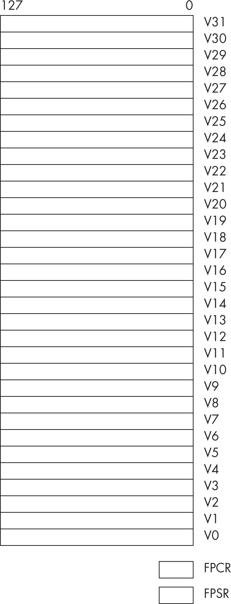
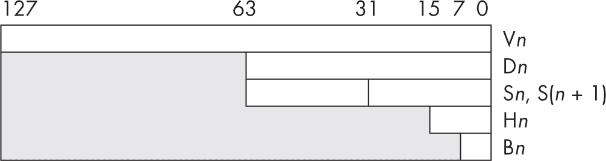
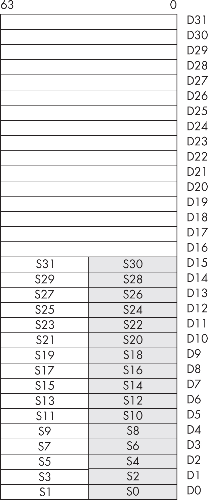
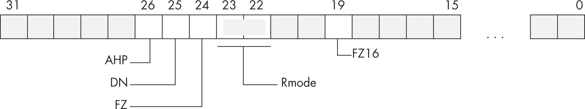
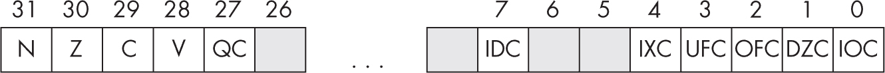

## 第六章：6 算术运算


本章讨论了汇编语言中的算术运算，包括 ARM 处理器上的浮点运算和对实数运算的架构支持。在本章结束时，你应该能够将高阶语言（如 Pascal、Swift 和 C/C++）中的算术表达式和赋值语句转换为 ARM 汇编语言。你将学习如何将浮点值作为参数传递给过程，并将实数值作为函数结果返回。

### 6.1 额外的 ARM 算术指令

在学习如何在汇编语言中编码算术表达式之前，你应该先学习 ARM 指令集中的其他算术指令。前面的章节已经涵盖了大部分的算术和逻辑指令，因此本节将介绍剩余的少数几条指令。

#### 6.1.1 乘法

第四章简要介绍了使用 mul 和 madd 指令进行的乘法。作为提醒，这些指令如下：

```
mul   X`d`, X`s`1, X`s`2       // X`d` = X`s`1 * X`s`2
madd  X`d`, X`s`1, X`s`2, X`s`3  // X`d` = X`s`1 * X`s`2 + X`s`3
```

只要没有发生溢出，这些指令对无符号和有符号乘法都能产生正确的结果。

这些指令将两个 64 位整数相乘并产生一个 64 位的结果。两个*n*位数相乘实际上可能会产生一个 2 × *n*位的结果，这意味着将两个 64 位寄存器相乘可能会产生一个最多 128 位的结果。这些指令会忽略任何溢出，并且只保留结果的低 64 位（第八章讨论了如何生成完整的 128 位结果，如果你需要的话）。

你还可以为这两条指令指定 32 位寄存器：

```
mul   W`d`, W`s`1, W`s`2       // W`d` = W`s`1 * W`s`2
madd  W`d`, W`s`1, W`s`2, W`s`3  // W`d` = W`s`1 * W`s`2 + W`s`3
```

这些指令会生成 32 位结果，忽略任何溢出。还有两条额外的乘法指令：乘法并减法、乘法并取负：

```
msub  W`d`, W`s`1, W`s`2, W`s`3   // W`d` = W`s`1 * W`s`2 - W`s`3
msub  X`d`, X`s`1, X`s`2, X`s`3   // X`d` = X`s`1 * X`s`2 + X`s`3
mneg  W`d`, W`s`1, W`s`2        // W`d` = -(W`s`1 * W`s`2)
mneg  X`d`, X`s`1, X`s`2        // X`d` = -(X`s`1 * X`s`2)
```

和之前的指令一样，这些乘法操作会忽略 32 位或 64 位之外的溢出。

ARM 不提供会影响条件码标志的乘法指令。这些指令没有带有 s 后缀的版本。

#### 6.1.2 除法和取模

ARM64 CPU 仅提供两条除法指令：

```
sdiv  X`d`, X`s`1, X`s`2  // X`d` = X`s`1 / X`s`2 (signed division)
udiv  X`d`, X`s`1, X`s`2  // X`d` = X`s`1 / X`s`2 (unsigned division)
```

与乘法不同，对于有符号和无符号整数值，你必须使用不同的指令。

除法有两个特殊情况需要考虑：除以 0 和将最小的负数除以–1（在数学上会导致溢出）。除以 0 的结果是 0，但没有任何错误提示。将 0x8000000000000000（最小的 64 位负数）除以 0xFFFFFFFFFFFFFFFF（–1）的有符号除法（sdiv）会得到 0x8000000000000000，同样也不会提示错误。32 位除法也会得到类似的结果：0x80000000 / 0xFFFFFFFF。在除法前，你必须明确检查这些操作数，以便捕捉这些错误。

ARM64 CPU 上没有单一指令来计算除法操作后的余数。您可以通过组合除法和乘法操作来计算余数：

```
mod(x0, x1) = x0 - (x0 / x1) * x1
```

或者，您可以通过使用以下两条指令来计算相同的结果：

```
udiv x2, x0, x1
msub x3, x2, x1, x0
```

在此序列之后，X2 和 X3 保存以下值

```
x2 = x0 / x1
x3 = x0 % x1  // % is C modulo (remainder) operator.
```

从而在 X3 中提供模运算结果。

#### 6.1.3 cmp 操作回顾

如第 2.10.4 节“cmp 和相应的条件分支”中所述，见 第 78 页，cmp 指令会根据减法操作（左操作数 - 右操作数）的结果更新 ARM 的标志。根据 ARM 设置标志的方式，您可以将此指令理解为“将左操作数与右操作数进行比较”。您可以通过使用条件分支指令来测试比较的结果（有关条件分支的详细内容，请参见第二章，有关控制结构实现的更多内容，请参见第七章）。

在探索 cmp 时，一个好的起点是准确查看它如何影响标志。考虑以下 cmp 指令：

```
cmp w0, w1
```

这条指令执行 W0 - W1 的计算，并根据计算结果设置标志。标志的设置如下：

**Z**    当且仅当 W0 = W1 时，零标志会被设置。这是 W0 – W1 产生零结果的唯一情况。因此，您可以使用零标志来测试相等或不相等。

**N**    如果结果为负数，负（符号）标志会被设置为 1。您可能认为只有当 W0 小于 W1 时该标志才会被设置，但事实并非总是如此。如果 W0 = 0x7FFFFFFFh 且 W1 = -1（0xFFFFFFFF），那么从 W0 中减去 W1 会得到 0x80000000，这是负数（因此负标志会被设置）。至少对于带符号比较，负标志不会包含正确的状态。对于无符号操作数，考虑 W0 = 0xFFFFFFFF 和 W1 = 1。在这里，W0 大于 W1，但它们的差值是 0xFFFFFFFEh，这仍然是负数。事实证明，负标志和溢出标志结合起来，可以用于比较两个带符号值。

**V**    在执行 cmp 操作后，如果 W0 和 W1 的差值导致符号溢出或下溢，溢出标志会被设置。如前所述，符号标志和溢出标志在执行带符号比较时都会被使用。

**C**    如果从 W0 中减去 W1 时需要借位（无符号溢出或下溢），则会设置进位标志。仅当 W0 小于 W1 且 W0 和 W1 都是无符号值时，才会发生这种情况。

表 6-1 显示了 cmp 指令在比较无符号或带符号值之后如何影响标志。

表 6-1：cmp 操作后的条件代码设置

| 标志 | 无符号结果 | 带符号结果 |
| --- | --- | --- |
| 零（Z） | 相等/不相等 | 相等/不相等 |
| 进位（C） | 左边 ≥ 右边（C = 1） 左边 < 右边（C = 0） | 无意义 |
| 溢出（V） | 无意义 | 请参阅本节讨论 |
| 符号（N） | 无意义 | 请参阅本节讨论 |

鉴于 cmp 指令以这种方式设置标志，你可以通过以下标志测试两个有符号操作数的比较：

```
cmp `Left`, `Right`
```

对于有符号比较，N 和 V 标志组合起来有以下含义：

+   如果[N != V]，则左操作数 < 右操作数（有符号比较）。

+   如果[N == V]，则左操作数 ≥ 右操作数（有符号比较）。

要理解为什么这些标志以这种方式设置，可以参考表 6-2 中的 32 位示例。这些值可以轻松地扩展为 64 位，结果是相同的。

表 6-2：减法后的符号和溢出标志设置（32 位值）

| 左操作数 | 减法 | 右操作数 | N | V |
| --- | --- | --- | --- | --- |
| 0xFFFFFFFF (–1) | – | 0xFFFFFFFE (–2) | 0 | 0 |
| 0x80000000 (–20 亿+) | – | 0x000000001 | 0 | 1 |
| 0xFFFFFFFE (–2) | – | 0xFFFFFFFF (–1) | 1 | 0 |
| 0x7FFFFFFF (20 亿+) | – | 0xFFFFFFFF (–1) | 1 | 1 |

记住，cmp 操作实际上是减法；因此，表 6-2 中的第一个示例计算（–1）–（–2），结果是+1。结果为正，且没有发生溢出，因此 N 和 V 标志都是 0。因为（N == V），左操作数大于或等于右操作数。

cmp 指令在第二个示例中将计算（–2,147,483,648）–（+1），结果为（–2,147,483,649）。由于 32 位有符号整数无法表示此值，该值会回绕到 0x7FFFFFFF（+2,147,483,647），并设置溢出标志。结果为正（至少作为 32 位值），因此 CPU 会清除负标志。因为（N == V）在此情况下，左操作数小于右操作数。

在第三个示例中，cmp 计算（–2）–（–1），结果是（–1）。没有发生溢出，因此 V 为 0；结果为负数，因此 N 为 1。因为（N != V），左操作数小于右操作数。

在最后一个示例中，cmp 计算（+2,147,483,647）–（–1）。这会产生（+2,147,483,648），设置溢出标志。此外，值会回绕到 0x80000000（−2,147,483,648），因此负标志也被设置。因为（N == V）为 0，左操作数大于或等于右操作数。

cmn（比较负数）指令将第一个源操作数与取反后的第二个操作数进行比较；与 cmp 一样，它设置标志并忽略结果。它也像 cmp 一样，是另一个指令 add 的别名：

```
add wzr, W`s`1, W`s`2
add xzr, X`s`1, X`s`2
```

这是因为 cmp 等同于一个 sub 指令，使用 WZR/XZR 作为目标寄存器；当比较一个取反的值时，得到的表达式为 left – (–right)，这在数学上等价于 left + right。

将 add 用作 cmn 的同义词存在一个问题：如果第二个（右侧）操作数为 0，add 并不会正确设置进位标志。因此，如果右侧操作数有可能是 0，你不能在 cmn 指令之后使用无符号条件码（hs、hi、ls 或 lo）。通常这不会是问题，因为按定义，cmn 用于比较有符号值，并且你应该在使用该指令后使用有符号条件。

可以说，cmn 存在的主要原因是操作数 2 的立即数值必须在 0 到 4,095 的范围内。你不能通过 cmp 指令将寄存器与负的立即数值进行比较。cmn 指令也仅限于范围 0 到 4,095 的常数，但它会在比较前对立即数值进行取反，从而允许在 –1 到 –4,095 的范围内使用负常数（–0 仍然为 0）。

#### 6.1.4 条件指令

在原始的 32 位 ARM 架构中，大多数数据处理指令都是条件性的。你可以根据 PSTATE 条件码标志设置，选择性地执行诸如加法等指令。可惜的是，在 64 位模式下，测试 16 种可能条件所需的 4 位（与条件分支指令相同）被其他编码所占用。然而，条件指令执行仍然很有用，因此 ARM64 保留了一些常用的条件指令。

第一个条件指令是 csel（条件选择）

```
csel W`d`, W`s`1, W`s`2, `cond`  // if(`cond`) then W`d` = W`s`1 else W`d` = W`s`2 
csel X`d`, X`s`1, X`s`2, `cond`  // if(`cond`) then X`d` = X`s`1 else X`d` = X`s`2 
```

其中 cond 是以下条件规范之一

```
cs, cc, eq, ne, mi, pl, vs, vc, hs, hi, ls, lo, gt, ge, lt, le 
```

这些定义与条件分支指令的含义相同。

*aoaa.inc* 包含文件提供了以下相反条件的定义：

```
nhs, nhi, nls, nlo, ngt, nge, nlt, nle 
```

这些分别是 lo、ls、hi、hs、le、lt、ge 和 gt 的同义词。

正如其名称所示，csel 指令根据当前标志设置，选择两个源操作数中的一个并复制到目标寄存器。例如，以下指令

```
csel x0, x1, x2, eq 
```

如果零标志被设置，它将复制 X1 到 X0；否则，它将复制 X2 到 X0。

csinc 指令允许执行条件选择（如果条件为真）或递增（如果条件为假）操作：

```
csinc W`d`, W`s`1, W`s`2, `cond`  // if(`cond`) then W`d` = W`s`1 else W`d` = W`s`2 + 1 
csinc X`d`, X`s`1, X`s`2, `cond`  // if(`cond`) then X`d` = X`s`1 else X`d` = X`s`2 + 1 
```

有时使用预定义的宏 cinc 更加方便：

```
cinc W`d`, W`s1`, `cond`  // csinc  W`d`, W`s`1, W`s`1, invert(`cond`) 
cinc X`d`, X`s`1, `cond`  // csinc  X`d`, X`s`1, X`s`1, invert(`cond`) 
```

也就是说，如果条件为真，cinc 会递增并将源复制到目标寄存器；否则，它仅复制源而不进行递增。当然，如果你只是想有条件地递增某个特定寄存器，源和目标寄存器可以相同。请注意，cinc 宏的条件与 csinc 指令的条件相反。

接下来的两个条件指令是 csinv 和 csneg，它们会有条件地对值进行取反或求负：

```
csinv W`d`, W`s`1, W`s`2, `cond`  // if(`cond)` then W`d` = W`s`1  else W`d` = not W`s`2 
csinv X`d`, X`s`1, X`s`2, `cond`  // if(`cond)` then X`d` = X`s`1 else X`d` = not X`s`2 
csneg W`d`, W`s`1, W`s`2, `cond`  // if(`cond)` then W`d` = W`s`1 else W`d` = -W`s`2 
csneg X`d`, X`s`1, X`s`2, `cond`  // if(`cond)` then X`d` = X`s`1 else X`d` = -X`s`2 
```

还有 cinv 和 cneg 宏，它们只使用一个源操作数（类似于 cinc）。cset 和 csetm 宏是 csinc 和 cinv 的变体：

```
cset  Wd, `cond`  // if(`cond`) then W`d` = 1 else W`d` = 0 
cset  X`d`, `cond`  // if(`cond`) then X`d` = 1 else X`d` = 0 
csetm W`d`, `cond`  // if(`cond`) then W`d` = -1 else W`d` = 0 
csetm X`d`, `cond`  // if(`cond`) then X`d` = -1 else X`d` = 0 
```

cset 宏等同于将 WZR 或 XZR 作为源操作数的 cinc，而 csetm 宏等同于将 WZR 或 XZR 作为源操作数的 cinv。这些宏用于根据条件码将寄存器设置为布尔值（真/–1 或假/0）。

最后，ARM 还支持两条条件比较指令，ccmp 和 ccmn（条件比较负数），每条指令都有几种形式：

```
ccmp  W`d`, W`s`, #`nzcv4`, `cond` 
ccmp  X`d`, X`s`, #`nzcv4`, `cond` 
ccmp  W`d`, #imm5, #`nzcv4`, `cond` 
ccmp  X`d`, #imm5, #`nzcv4`, `cond` 
ccmn  W`d`, W`s`, #`nzcv4`, `cond` 
ccmn  X`d`, X`s`, #`nzcv4`, `cond` 
ccmn  W`d`, #imm5, #`nzcv4`, `cond` 
ccmp  X`d`, #imm5, #`nzcv4`, `cond` 
```

而 ccmp 通过将第二个操作数从第一个操作数中减去来进行比较，ccmn 则通过将第二个操作数加到第一个操作数上来进行比较。这些指令会测试提供的条件（cond）。如果条件为假，这些指令会将 4 位立即数 #nzcv4 直接复制到条件码中（第 3 位到 N，第 2 位到 Z，第 1 位到 C，第 0 位到 V）。

如果 cond 指定的条件为真，这些指令会将目标寄存器与源操作数（寄存器或 5 位无符号立即数）进行比较，并根据比较结果设置条件码位。正如你在本章后面将看到的，条件比较在评估复杂的布尔表达式时非常有用。

### 6.2 内存变量与寄存器

在开始将算术表达式转换为汇编语言语句之前，让我们先总结一下前五章关于变量的讨论。正如我多次指出的，ARM 基于加载/存储架构。ARM 配备了许多通用寄存器，你可以用它们来代替内存位置存储更常用的变量。通过仔细规划，你应该能够将大多数常用的变量保存在寄存器中。

考虑以下 C/C++ 语句及其转换为 ARM 汇编语言的代码：

```
x = y * z;

// Conversion to ARM assembly if x, y, and z are 32-bit
// memory variables in the .data section:

lea  x0, y     // Remember, lea expands to two instructions.
ldr  w0, [x0]
lea  x1, z
ldr  w1, [x1]
mul  w0, w0, w1
lea  x1, x
str  w0, [x1]
```

如果你将 x、y 和 z 分别保存在寄存器 W19、W20 和 W21 中，那么将该表达式转换为汇编语言的代码如下：

```
mul x19, x20, x21
```

这仅为前述转换大小的十分之一，且速度更快。

在像 ARM 这样的 RISC CPU 中，保持变量在寄存器中而不是内存中是一种更好的做法。作为汇编语言程序员，你的工作是仔细选择保存在寄存器中的变量和必须保存在内存中的（使用频率较低的）值。你可以通过计算在执行过程中访问变量的次数来做到这一点，将访问频率最高的变量保存在寄存器中，将访问频率最低的变量保存在内存中。

#### 6.2.1 易失性寄存器与非易失性寄存器的使用

如果你在汇编代码中遵循 ARM ABI，你还必须注意过程中的易失性寄存器和非易失性寄存器之间的差异。使用非易失性寄存器是有成本的：如果你修改了非易失性寄存器的值，你必须在过程内保存寄存器的原始值。这通常涉及在过程的激活记录中分配存储空间，在进入过程时存储非易失性寄存器的值，并在返回之前恢复该寄存器的值。

使用易变寄存器意味着你可以避免为保存它们所需的开销和存储空间。然而，如果你调用了其他过程，而这些过程没有显式保存易变寄存器的内容，那么易变寄存器的内容可能会受到干扰。因为是调用者负责在其他函数调用之间保存任何易变寄存器的内容，所以如果你在过程内调用其他函数，你最好使用非易变寄存器（假设有可用的寄存器）。

当然，这假设你所调用的函数遵循 ARM ABI 约定。例如，如果你调用的汇编语言函数保留了它们修改的所有寄存器值，即使 ARM ABI 将它们视为易变寄存器，你也不需要担心保存这些寄存器。

#### 6.2.2 全局变量与局部变量

如果你必须使用内存——因为你没有足够的寄存器资源，或者因为你需要操作一个无法适应寄存器的大数据结构——你可以将必须保留的变量放入内存中。你可以将它们放在全局静态数据段（如 .data、.bss 等）中，或者放在你为当前过程创建的激活记录中。

当你学习高级语言编程时，可能被教导要避免在程序中使用全局变量。这个建议在 ARM 汇编语言中更为适用，尤其是在 macOS 上编程时。在 macOS 下，正如你多次看到的那样，访问全局数据比访问激活记录中的局部数据更昂贵。要从全局（.data）内存中获取一个 32 位变量，需要使用以下代码：

```
lea x0, globalVariable // Remember, this is two instructions.
ldr w0, [x0]
```

从局部变量中获取数据只需一条指令（前提是该变量在激活记录中的偏移量相对较小）：

```
ldr w0, [fp, #localVariable]
```

这意味着，访问局部变量所需的指令数量是访问全局变量的三分之一。

当然，如果你在 Linux 上运行，并且不需要你的汇编代码也能在 macOS 上运行，你也可以通过使用单条指令和 PC 相对寻址模式来访问全局变量：

```
ldr w0, globalVariable
```

只需记住，数据必须位于该指令的±1MB 范围内。当编写较大应用程序时，超出这个限制是非常容易的。

局部变量也不是没有限制。通常，激活记录的存储限制约为 ±256 字节，如果你能使用缩放间接加偏移寻址模式来处理半字、字和双字变量，存储空间会稍微多一点。幸运的是，在单个过程中，你很少会超过这个字节数的标量（非数组/非结构体）变量。如果你确实需要更多空间，你必须计算变量在激活记录中的有效地址，这将需要和访问全局变量一样多的指令。

#### 6.2.3 轻松访问全局变量

为了使访问`.data`或`.bss`节中的全局变量和访问激活记录中的局部变量一样容易，你可以创建一个静态激活记录。局部变量容易访问，因为你使用间接加偏移量（或缩放的间接加偏移量）寻址模式，从 FP 寄存器索引。如果 FP 指向静态数据节的等效位置呢？尽管 ARM 没有提供 SB（静态基址）寄存器，但没有任何限制阻止你创建自己的寄存器：

```
#define SB X28
```

在这个示例中，我选择使用 X28，因为它是 ARM ABI 中的一个非易失性寄存器，且位于 FP（X29）寄存器下方。

清单 6-1 演示了如何使用 SB 寄存器（X28）高效访问全局变量。

```
// Listing6-1.S
//
// Demonstrate using X28 as a "static base"
// register to conveniently access global
// variables.

        #include    "aoaa.inc"

#define sb X28          // Use X28 for SB register.

// Declaration of global variables:

        struct  globals_t
        word    g1
        dword   g2
        hword   g3
        byte    g4,128
        ends    globals_t

        .data

        globals_t globals       // Global variables go here.

        .text
        .pool
ttlStr: wastr  "Listing 6-1"

        proc    getTitle, public
        lea     x0, ttlStr
        ret
        endp    getTitle

        proc    asmMain, public

        locals  am
        dword   saveSB             // Save X28 here.
        byte    stackSpace, 64     // Generic stack space
        endl    am

        enter   am.size            // Reserve space for locals.
        str     sb, [fp, #saveSB]  // Preserve SB register.
        lea     sb, globals        // Initialize with address.

        mov     w0, #55            // Just demonstrate the
        str     w0, [sb, #g1]      // use of the static
        add     x0, x0, #44        // base record in the
        str     x0, [sb, #g2]      // .data section.
 and     w0, w0, #0xff
        strh    w0, [sb, #g3]

        ldr     sb, [fp, #saveSB]  // Restore SB register.
        leave                      // Return to caller.
        endp    asmMain
```

请记住，[sb, #offset]寻址模式的范围限制为±256 字节（或者在使用缩放的间接加偏移量模式时，最多为 1KB），因此最好将非标量（复合）变量放在静态记录之外。

如写出，清单 6-1 中的 globals 记录仅提供 256 字节的存储空间（因为所有结构字段偏移量都是正数或 0）。以下声明将偏移量从-256 开始，在静态记录中提供额外的 256 字节存储空间：

```
struct  globals_t, -256
word    g1
dword   g2
hword   g3
byte    g4,128
ends    globals_t
```

然而，如果你这样做，你必须适当地调整加载到 SB 中的值，如下所示：

```
lea sb, globals+256  // Initialize with address.
```

这样 SB 将指向 globals_t 结构中的正确位置。

### 6.3 算术表达式

初次接触汇编语言的初学者可能会感到最大的震惊是缺乏熟悉的算术表达式。大多数高级语言中的算术表达式与代数表达式相似。例如，在 C 语言中，你可以写出类似以下的代数式：

```
x = y * z;
```

在汇编语言中，如果这些变量位于内存位置（假设它们是局部变量），你需要使用多个语句来完成相同的任务：

```
ldr w0, [fp, #y]
ldr w1, [fp, #z]
mul w0, w0, w1
str w0, [fp, #x]

// If you can keep x, y, and z in registers:

mul x0, x1, x2  // Assume x = X0, y = X1, and z = X2.
```

显然，高级语言版本更容易输入、阅读和理解。尽管涉及很多打字，转换算术表达式为汇编语言并不困难。通过分步解决问题，就像你手动解决问题一样，你可以轻松地将任何算术表达式分解为等效的汇编语言语句序列。

#### 6.3.1 简单赋值

转换为汇编语言最简单的表达式是*简单赋值*，它将一个值复制到一个变量中，具有两种形式：

```
`variable` = `constant`
```

或者

```
`var1` = `var2`
```

如果你的变量位于寄存器中，将这些语句转换为汇编语言是很简单的：

```
mov `variable`, #`constant`  // Assumption: constant fits in 16 bits.
mov `var1`, `var2`
```

该 mov 指令将源常量或寄存器复制到目标寄存器中。

如果常量太大，你将不得不使用 movk 序列（见第 2.20.2 节，“movk”，在第 112 页）或 ldr 的常量形式：

```
ldr `register`, =`constant`
```

如果源变量在内存中，你必须使用 ldr 指令从内存中获取数据，如以下示例所示：

```
ldr `register`, [fp, #`offset`]  // Assuming a local variable
ldr `register`, [sb, #`offset`]  // Assuming variable is in static record

lea `reg`64, `GlobalVariable`     // Global variable in arbitrary memory
ldr `register`, [`reg`64]
```

如果目标是内存变量，必须先将源变量或常量加载到寄存器中（如果它尚未在寄存器中），然后使用 str 指令将值存储到内存变量中：

```
str `register`, [fp, #`offset`]
str `register`, [sb, #`offset`]

lea `reg`64, `GlobalVariable`
str `register`, [`reg`64]
```

显然，最有效的代码是在两个变量都在寄存器中，或者目标是寄存器且源值是一个小常量的情况下，在这种情况下只需一条 mov 指令即可。

#### 6.3.2 简单表达式

下一层复杂度是 *简单表达式*，其形式为

```
`var1` = `term1 op term2`;
```

其中，var1 是一个变量，term1 和 term2 是变量或常量，op 是一个算术操作符（加法、减法、乘法等）。大多数表达式采取这种形式。因此，ARM 架构专门针对这种类型的表达式进行了优化，这一点也不足为奇。

假设 var1、term1 和 term2 都在寄存器中，典型的转换形式如下：

```
`op`  `var1`, `term1`, `term2`
```

其中，op 是与指定操作对应的助记符（例如，+ 是 add，– 是 sub，等等）。

请注意，简单表达式

```
`var1` = `const1` op `const2`;
```

通过编译时表达式和单条 mov 指令可以轻松处理。例如，计算

```
`var1` = 5 + 3;
```

你将使用单条指令：

```
mov `var1`, #5 + 3
```

如果 term2 是一个（足够小的）常量，通常可以使用如下形式的指令：

```
`op`  `var1`, `term1`, #`constant`
```

然而，存在一些例外情况。某些指令，如 mul 和 udiv/sdiv，不允许立即数操作数。在这种情况下，你需要使用两条指令

```
`mov someReg`, #`constant`
`op`  `var1`, `term1`, `someReg`
```

在这里，someReg 是一个可用的临时寄存器。

如果 term1 是常量，而 term2 是寄存器，则对于交换律操作，你只需在指令中交换两个源操作数即可。例如

```
x0 = 25 + x1;
```

变成这样：

```
add x0, x1, #25
```

对于非交换的操作（如减法和除法），这种方案不起作用。你可能需要在操作之前将常量加载到寄存器中。

当然，如果常量太大（通常是算术指令的 12 位），你将需要先使用 mov、movk 或 ldr 指令将该常量加载到寄存器中。

如果你的操作数是内存变量而不是寄存器（或常量），则需要使用 ldr 指令将内存变量加载到寄存器中，然后再进行操作。同样，如果目标变量在内存中，操作完成后需要使用 str 指令将值存储到内存变量中。例如

```
x = y + z;  // x, y, and z are all 32-bit memory variables.
```

变成这样：

```
ldr w0, [fp, #y]   // Assuming y is a local variable
ldr w1, [sb, #z]   // Assuming z is in the static base record
add w2, w0, w1
lea x3, globalVar  // Assuming globalVar is a global variable
str w2, [x3]       // in the .data section
```

这里是一些常见简单表达式的示例（假设 x、y 和 z 分别在 W0、W1 和 W2 寄存器中）：

```
// x = y + z;  // Signed or unsigned

          add w0, w1, w2

// x = y - z;  // Signed or unsigned

          sub w0, w1, w2

// x = y * z;  // Signed or unsigned

          mul w0, w1, w2

// x = y / z;  // Unsigned div

          udiv w0, w1, w2

// x = y / z;  // Signed div

          sdiv w0, w1, w2

// x = y % z;  // Unsigned remainder

          udiv  x0, x1, x2
          msub  x0, x0, x2, x1

// x = y % z;  // Signed remainder

          sdiv  x0, x1, x2
          msub  x0, x0, x2, x1
```

如果任一操作数是内存变量，首先必须使用 ldr 指令将其加载到寄存器中。如果操作数是常量，则请按照上一节的指导进行处理。

#### 6.3.3 复杂表达式

一个 *复杂表达式* 是指包含两个以上项和一个运算符的任何算术表达式。这样的表达式通常出现在用高级语言编写的程序中。复杂表达式可能包含括号来覆盖运算符优先级、函数调用、数组访问等。本节概述了转换此类表达式的规则。

容易转换为汇编语言的复杂表达式通常包含三个项和两个运算符。以下是一个例子：

```
w = w - y - z;
```

显然，这个语句的直接汇编语言转换需要两个子指令。然而，即使是像这样的简单表达式，转换也不是小事。你可以通过两种方式将上述语句转换为汇编语言（假设 w 在 W0 中，y 在 W1 中，z 在 W2 中）：

```
sub w0, w0, w1
sub w0, w0, w2
```

或者

```
sub w3, w1, w2
sub w0, w0, w3
```

两种方法可能会产生不同的结果，第一个转换大体上遵循 C 语言语义。问题在于结合性。前面的第二个序列计算 w = w - (y - z)，这与 w = (w - y) - z 不同。子表达式周围括号的位置会影响结果。

*优先级*，即操作发生的顺序，是另一个问题。考虑以下表达式：

```
x = w * y + z;
```

再次，你可以通过两种方式来计算这个表达式：

```
x = (w * y) + z;
```

或者

```
x = w * (y + z);
```

到现在为止，你可能会觉得这个解释有些疯狂——每个人都知道正确的方式是使用前一种形式来计算这些表达式。然而，这并不总是正确的。例如，APL 编程语言仅从右到左计算表达式，并且不赋予任何运算符优先级。所谓的“正确”方法完全取决于你如何定义算术系统中的优先级。

考虑以下表达式：

```
x `op1` y `op2` z
```

如果 op1 的优先级高于 op2，则此表达式计算为 (x op1 y) op2 z*.* 否则，如果 op2 的优先级高于 op1，则表达式计算为 x op1 (y op2 z)。根据涉及的运算符和操作数，这两个计算可能会产生不同的结果。

大多数高级语言（HLL）使用一组固定的优先级规则来描述包含两个或更多不同运算符的表达式的计算顺序。这些编程语言通常在加法和减法之前计算乘法和除法。那些支持指数运算的语言（例如 FORTRAN 和 BASIC）通常在乘法和除法之前计算指数运算。这些规则是直观的，因为大多数人在上高中之前就学到了它们。

在将表达式转换为汇编语言时，必须确保首先计算具有最高优先级的子表达式。以下示例演示了这一技术（假设乘法的优先级高于加法）：

```
// w = x + y * z;  // Assume w = W0, x = W1, y = W2, and z = W3.

mul w4, w2, w3  // W4 = W2 * W3
add w0, w1, w4  // W0 = W1 + (W2 * W3)
```

如果在一个表达式中出现的两个操作符具有相同的优先级，则使用结合性规则来确定求值顺序。大多数操作符是*左结合*的，这意味着它们从左到右求值。加法、减法、乘法和除法都是左结合的。*右结合*的操作符从右到左求值。FORTRAN 中的幂运算符就是一个右结合操作符的好例子。例如：

```
2**2**3
```

等于

```
2**(2**3)
```

不是

```
(2**2)**3
```

优先级和结合性规则决定了求值的顺序。间接地，这些规则告诉你在表达式中该把括号放在哪里，以确定求值顺序。当然，你始终可以使用括号来覆盖默认的优先级和结合性。然而，最重要的一点是，你的汇编代码必须在其他操作之前完成某些操作，以正确计算给定表达式的值。以下示例演示了这一原则：

```
// w = x - y - z  // Assume w = W0, x = W1, y = W2, and z = W3.

sub  w0, w1, w2  // Evaluate from left to right.
sub  w0, w0, w3  // W0 = (x - y) - z

// w = x + y * z

mul  w0, w2, w3  // Must compute y * z first.
add  w0, w0, w1  // W0 = (W2 * W3) + W1  (commutative)
```

或者，更好的是

```
madd w0, w2, w3, w1  // W0 = (W2 * W3) + W1

// w = x / y - z

sdiv w0, w1, w2  // Division has highest precedence.
sub  w0, w0, w3  // W0 = (W1 / W2) - W3

// w = x * y * z

mul  w0, w1, w2  // Commutative, so order doesn't matter.
mul  w0, w0, w3
```

结合性规则有一个例外：如果一个表达式涉及乘法和除法，通常最好先进行乘法。例如，给定如下形式的表达式

```
w = x / y * z;  // Note: this is (x / y) * z, not x / (y * z).
```

通常最好先计算 x * z，然后将结果除以 y，而不是先将 x 除以 y，再将商乘以 z。先进行乘法运算能提高计算的精确度。记住，（整数）除法通常会产生不精确的结果。例如，如果你计算 5 / 2，你将得到 2，而不是 2.5。计算(5 / 2) × 3 得到 6。然而，计算(5 × 3) / 2 得到 7，这比实际商 7.5 更接近。

因此，如果你遇到如下形式的表达式

```
w = x / y * z;  // Assume w = W0, x = W1, y = W2, and z = W3.
```

你通常可以将其转换为以下汇编代码：

```
mul  w0, w1, w3   // w = x * z
sdiv w0, w0, w2   // w = (x * z) / y
```

如果乘法可能会导致溢出，首先进行除法运算可能会更好。

如果你编码的算法依赖于除法运算的截断效果，那么不能使用这个技巧来优化算法。这个故事的教训是，你应该始终确保完全理解你要转换成汇编语言的任何表达式。如果语义要求你必须首先执行除法操作，那就照做。

请考虑以下语句：

```
w = x - y * z;  // Assume w = W0, x = W1, y = W2, and z = W3.
```

因为减法不是交换律的，你不能先计算 y * x，然后从结果中减去 x。你不能使用简单的乘法和减法序列，而是必须使用一个临时寄存器来保存乘积。例如，以下两个指令使用 W4 作为临时寄存器：

```
mul  w4, w2, w3  // temp = y * z
sub  w0, w1, w4  // w = x - (y * z)
```

随着表达式复杂度的增加，临时变量的需求也会增加。请考虑以下 C 语句：

```
w = (a + bb) * (y + z);
```

按照常规的代数计算规则，首先计算括号内的子表达式（即优先级最高的两个子表达式），并将它们的值暂时保留。当你计算出两个子表达式的值后，就可以计算它们的乘积。处理这种复杂表达式的一种方法是将其简化为一系列简单表达式，其结果存储在临时变量中。例如，你可以将上面的单个表达式转换为以下的表达式序列：

```
temp1 = a + bb;
temp2 = y + z;
w = temp1 * temp2;
```

由于将简单表达式转换为汇编语言很容易，现在转换前面的复杂表达式为汇编语言变得十分简单，如下面的代码所示：

```
// Assume w = W0, y = W1, z = W2, a = W3, and bb = W4.

add  w5, w3, w4  // temp1 (W5) = a + bb
add  w6, w1, w2  // temp2 (W6) = y + z
mul  w0, w5, w6  // w = temp1 * temp2
```

这是另一个复杂算术转换的例子：

```
x = (y + z) * (a - bb) / 10;
```

你可以将其转换为一组四个简单表达式：

```
temp1 = (y + z)
temp2 = (a - bb)
temp1 = temp1 * temp2
x = temp1 / 10
```

你可以将这四个表达式转换成以下的汇编语言语句：

```
// Assume x = W0, y = W1, z = W2, a = W3, and bb = W4.

add  w5, w1, w2  // temp1 (W5) = y + z
sub  w6, w3, w4  // temp2 (W6) = a - bb
mul  w5, w5, w6  // temp1 = temp1 * temp2
mov  w6, #10     // Need a temp to hold constant 10.
sdiv w0, w5, w6  // x = temp1 / 10
```

最重要的是，确保为了效率，临时值保存在寄存器中。只有当寄存器用尽时，才使用内存位置来保存临时值。

简而言之，正如你所看到的，将复杂的表达式转换为汇编语言与手动求解表达式有所不同。你并不是在每个计算阶段计算结果，而是编写汇编代码来计算结果。

#### 6.3.4 交换律运算符

如果 op 表示一个运算符，则如果以下关系始终成立，则该运算符是*交换律*的：

```
(A `op` B) = (B `op` A)
```

正如你在上一节学到的，交换律运算符容易转换，因为其操作数的顺序不重要，这使得你可以重排计算，通常能使计算更加简便或高效。重排计算往往能减少临时变量的使用。每当你在表达式中遇到交换律运算符时，检查是否可以使用更好的顺序来提高代码的大小或速度。

表 6-3 列出了通常在高级语言中找到的交换律运算符。

表 6-3：交换律二元（双操作数）运算符

| Pascal | C/C++及类似语言 | 描述 |
| --- | --- | --- |
| + | + | 加法 |
| * | * | 乘法 |
| and | && 或 & | 逻辑与按位与 |
| or | &#124;&#124; 或 &#124; | 逻辑或按位或 |
| xor | ^ | 逻辑或按位异或 |
| = | == | 等于 |
| <> | != | 不等于 |

表 6-4 列出了许多非交换律运算符。

表 6-4：非交换二元运算符

| Pascal | C/C++及类似语言 | 描述 |
| --- | --- | --- |
| - | - | 减法 |
| / 或 div | / | 除法 |
| mod | % | 余数（模） |
| < | < | 小于 |
| <= | <= | 小于或等于 |
| > | > | 大于 |
| >= | >= | 大于或等于 |

如果遇到其他类型的运算符，请检查相关的高级语言定义，确定它们是交换律运算符还是非交换律运算符，并确定它们的优先级和结合性。

### 6.4 逻辑表达式

考虑以下来自 C/C++ 程序的逻辑（布尔）表达式：

```
bb = ((x == y) && (a <= c)) || ((z - a) != 5);
```

在这里，bb 是一个布尔变量，其他变量都是整数。

尽管只需要一个比特来表示布尔值，大多数汇编语言程序员会分配一个完整的字节，甚至一个字（word）来表示布尔变量。大多数程序员（实际上，一些编程语言如 C）选择 0 表示 *假*（false），而其他任何值表示 *真*（true）。有些人喜欢用 1 和 0 来分别表示真和假，不允许其他值。还有一些人选择使用全 1 位（0xFFFF_FFFF_FFFF_FFFF、0xFFFF_FFFF、0xFFFF 或 0xFF）表示真，0 表示假。你也可以使用正值表示真，负值表示假。

所有这些机制都有各自的优缺点。仅使用 0 和 1 来表示假（false）和真（true）有两个很大的优点。首先，cset 指令可以产生这种结果，因此该方案与该指令兼容。其次，ARM 逻辑指令（and, orr, eor 和 mvn）正如你所期望的那样，操作这些值。如果你有两个布尔变量 a 和 bb，以下指令将对这两个变量执行基本的逻辑操作：

```
// d = a AND bb;  // Assume d = W0, a = W1, and bb = W2.

and w0, w1, w2

// d = a || bb;

orr w0, w1, w2

// d = a XOR bb;

eor w0, w1, w2

// bb = NOT a;
//
// (NOT 0) does not equal 1.
// The AND instruction corrects this problem.

mvn w2, w1
and w2, w2, #1

// Here's an alternative solution (for NOT) using EOR:

eor w2, w1, #1  // Inverts bit 0
```

mvn 指令无法正确计算逻辑取反操作。0 的按位 NOT 结果是 0xFF（假设是字节值），而 1 的按位 NOT 结果是 0FEh。两者的结果都不是 0 或 1。然而，将结果与 1 做与运算（AND）会得到正确的结果。你可以通过使用 eor 指令（如最后给出的 eor 示例所示）更高效地实现取反操作，因为它只影响最低有效位（LO 位）。

使用 0 表示假（false），而其他任何值表示真（true）有许多微妙的优点。真假测试通常隐式地包含在任何逻辑指令的执行中。然而，这种机制有一个主要的缺点：你不能总是使用 ARM 的 and、orr、eor 和 mvn 指令来实现同名的布尔运算。考虑以下两个值 0x55 和 0xAA。它们都是非零值，因此它们都表示真（true）。然而，如果你使用 ARM 的 and 指令对 0x55 和 0xAA 进行逻辑与运算，结果将是 0。真与真应该得到真，而不是假（false）。尽管你可以处理这种情况，但通常需要额外的一些指令，且计算布尔运算时效率较低。

使用非零值表示真，0 表示假是 *算术逻辑系统*。使用 0 和 1 两个不同值来表示假和真的是一个 *布尔逻辑系统*，简称布尔系统。你可以根据需要选择使用这两种系统。考虑这个布尔表达式：

```
bb = ((x == y) and (a <= d)) || ((z - a) != 5);
```

结果的简单表达式可能如下所示：

```
// Assume bb = W0, x = W1, y = W2, a = W3, d = W4, and z = W5.

cmp  w1, w2
cset w6, eq      // temp1 (W6) = x == y

cmp  w3, w4
cset w7, le      // temp2 (W7) = a <= d
and  w6, w6, w7  // temp1 = (x == y) && (a <= d)

sub  w7, w5, w3  // temp2 = z - a
cmp  w7, #5
cset w7, ne      // temp2 = (z - a) != 5

orr  w0, w6, w7  // W0 = temp1 || temp2
```

在处理布尔表达式时，不要忘记你可以通过代数变换简化代码来优化它。在第七章中，你还将看到如何使用控制流来计算布尔结果，这比本节示例中使用的方法可能更高效。

### 6.5 条件比较和布尔表达式

条件比较指令 ccmp 在汇编语言中编码复杂的布尔表达式时非常有用。考虑以下布尔表达式：

```
bb = (x == y) && (a <= d)
```

使用上一节的逻辑，你可以将其转换为以下汇编语言代码：

```
// Assume bb = W0, x = W1, y = W2, a = W3, and d = W4.

cmp  w1, w2
cset w5, eq   // temp1 (W5) = x == y

cmp  w3, w4
cset w6, le   // temp2 (W6) = a <= d
and  w0, w5, w6   // bb = (x == y) && (a <= d)
```

通过使用条件比较指令，你可以将临时值保存在条件代码标志中，从而缩短代码长度：

```
cmp  w1, w2
ccmp w3, w4, #0, eq
cset w0, le
```

第一个 cmp 指令如果 x 等于 y，会设置 Z 标志。如果该条件为假，则整个逻辑表达式必须返回假。如果条件为真，这段代码必须测试 a 是否小于或等于 d。

假设 x 不等于 y，在第一次 cmp 指令之后，Z 标志将被清除。在这种情况下，ccmp 指令不会将 W3（a）与 W4（d）进行比较，而是将标志加载为 0b0000（因为当条件 eq 为真时，ccmp 指令只比较前两个操作数；此时它不为真）。由于所有标志都被清除（即 N == V 且 Z != 1），cset 指令的 le 条件为假；因此，该指令将把 0 存入 W0（bb），这正是你想要的。

另一方面，如果 x 等于 y，则 ccmp 指令的 eq 条件为真，并将比较 W3（a）与 W4（d）的值。如果 a 小于或等于 d，N、V 和 Z 标志将被设置，以使得 cset 指令将 1 移动到 W0 中。否则，cset 将把 0 移动到 W0，这同样是你想要的。这个只有三条指令的序列完成了早期五条指令的工作，是一个巨大的胜利。

#### 6.5.1 使用 ccmp 实现与运算

考虑这个 C/C++逻辑表达式：

```
(a cc1 bb) && (c cc2 d)
```

一般来说，要将包含逻辑与操作符（&&）的表达式转换为 ARM 汇编，使用条件比较指令，你需要按照以下五个步骤进行：

1.  比较与运算符左侧的操作数 cc1（见表 6-5）。

2.  在第一次比较之后，立即执行 ccmp 指令，提供 cc1 作为条件字段。

3.  从对面一列的表 6-5 中选择相应的#nzcv 编码，以匹配 cc2。完整的 ccmp 指令应为：

```
ccmp c, d, #nzcvop, cc1
```

4.  序列中的最后一条指令应当测试 cc2，如以下示例所示：

```
cset x0, cc2
```

5. 如果 cc1 失败，ccmp 指令将会把标志设置为 #nzcvop 的值，而不是比较 c 和 d。由于你希望布尔表达式在这种情况下为假，选择一个与 cc2 相反的 #nzcvop 值，以使得接下来的测试（例如 cset）返回假结果。如果在执行 ccmp 指令时 cc1 为真，ccmp 将会比较 c 和 d 并设置标志。

表 6-5：条件运算符、反义和 NZCV 设置

| C/C++ | 运算符 | #nzcv | 反义 | #nzcvop |
| --- | --- | --- | --- | --- |
| == | eq | 0b0100 | ne | 0b0000 |
| != | ne | 0b0000 | eq | 0b0100 |
| > (无符号) | hi | 0b0010 | ls | 0b0100 |
| >= (无符号) | hs | 0b0110 | lo | 0b0000 |
| < (无符号) | lo | 0b0000 | hs | 0b0110 |
| <= (无符号) | ls | 0b0100 | hi | 0b0010 |
| > (有符号) | gt | 0b0000 | le | 0b0101 |
| >= (有符号) | ge | 0b0100 | lt | 0b0001 |
| < (有符号) | lt | 0b0001 | ge | 0b0100 |
| <= (有符号) | le | 0b0101 | gt | 0b0000 |
| 同 hs | cs | 0b0010 | cc | 0b0000 |
| 同 lo | cc | 0b0000 | cs | 0b0010 |
| N/A | vs | 0b0001 | vc | 0b0000 |
| N/A | vc | 0b0000 | vs | 0b0001 |
| N/A | mi | 0b1000 | pl | 0b0000 |
| N/A | pl | 0b0000 | mi | 0b1000 |

因为保持第三个 ccmp 操作数的标志设置在脑海中是困难且容易出错的，*aoaa.inc* 包含了多个定义，使得选择这些值变得更容易，同时还包含了一些用于反义条件的定义。表 6-6 列出了这些定义及其值。

表 6-6：NZCV 常量定义

| 条件 | 定义 | 值 |
| --- | --- | --- |
| eq | cceq | 0b0100 (nZcv) |
| ne | ccne | 0b0000 (nzcv) |
| hi | cchi | 0b0010 (nzCv) |
| hs | cchs | 0b0110 (nZCv) |
| lo | cclo | 0b0000 (nzcv) |
| ls | ccls | 0b0100 (nZcv) |
| gt | ccgt | 0b0000 (nzcv) |
| ge | ccge | 0b0100 (nZcv) |
| lt | cclt | 0b0001 (nzcV) |
| le | ccle | 0b0101 (nZcV) |
| cs | cccs | 0b0010 (nzCv) |
| cc | cccc | 0b0000 (nzcv) |
| vs | ccvs | 0b0001 (nzcV) |
| vc | ccvc | 0b0000 (nzcV) |
| mi | ccmi | 0b1000 (Nzcv) |
| pl | ccpl | 0b0000 (nzcv) |

表 6-7 列出了常见的反义（对立条件）。

表 6-7：NZCV 反义常量

| 条件 | 定义 | 相同的 |
| --- | --- | --- |
| 非 hi | ccnhi | ccls |
| 非 hs | ccnhs | cclo |
| 非 lo | ccnlo | cchs |
| 非 ls | ccnls | cchi |
| 非 gt | ccngt | ccle |
| 非 ge | ccnge | cclt |
| 非 lt | ccnlt | ccge |
| 非 le | ccnle | ccgt |

使用这些符号代替立即数 ccmp 指令操作数，可以使你的代码更易于阅读和理解。

有时，在条件指令中指定相反条件可能会造成混淆。比如，容易认为“小于”的相反是“大于”，而实际上应该是“大于或等于”。为减少这种混淆，*aoaa.inc*包含文件还提供了几个相反条件的定义，如表 6-8 所列。

表 6-8：相反条件定义

| Condition | 相反定义 |
| --- | --- |
| lo | nlo（与 hs 相同） |
| ls | nls（与 hi 相同） |
| hi | nhi（与 ls 相同） |
| hs | nhs（与 lo 相同） |
| gt | ngt（与 le 相同） |
| ge | nge（与 lt 相同） |
| lt | nlt（与 ge 相同） |
| le | nle（与 gt 相同） |

通过使用*aoaa.inc*定义，你可以让你的代码更容易阅读和理解。

#### 6.5.2 使用 ccmp 实现析取

条件比较也可以用来模拟析取（逻辑或）。考虑以下表达式：

```
bb = (x == y) || (a <= d)
```

这是该表达式转换为汇编语言的过程：

```
cmp  w1, w2
ccmp w3, w4, #0b0100, ne  // 0b0100 is .Z.. or use #cceq
cset w0, le               // or #ccle
```

请注意，条件比较指令如何测试不等于条件。如果 x 等于 y，则不需要进行此比较。在这种情况下，ccmp 指令会将 0b0100 加载到条件码中，这将使 Z 设为 1 并清除所有其他标志。当 cset 指令测试小于或等于时，存在相等条件（Z = 1），将 W0（bb）设为 1。比较 a 和 d 在 bb 值的计算中没有任何作用。

如果 x 不等于 y，当程序执行 ccmp 指令时，ne 条件将会存在。因此，ccmp 将比较 a 和 d，并根据该比较设置条件码位。此时，cset 指令将根据 a 和 d 的比较设置 bb 的值。

以下算法描述了如何通过条件比较将包含析取（disjunction）的表达式转换为 ARM 汇编语言：

```
(a cc1 bb) || (c cc2 d)
```

以下是转换过程中需要遵循的四个步骤：

1. 比较析取操作符左侧的操作数（操作符为 cc1）。

2. 在第一次 cmp 指令之后，立即执行 ccmp 指令，提供 cc1 的相反条件作为条件字段（返回表 6-5 查找相反条件）。

3. 选择与 cc2 匹配的#nzcv 编码，参见表 6-5 中的常规列。完整的 ccmp 指令应如下所示：

```
ccmp c, d, #nzcv, opposite(cc1)
```

4. 序列中的最后一条指令应测试 cc2。例如：

```
cset x0, cc2
```

如果 cc1 成功，ccmp 指令将会将标志设置为#nzcvop 值，并且不再比较 c 与 d，因为你已经为 ccmp 条件选择了 cc1 的相反条件。由于你希望布尔表达式在这种情况下为真，因此选择一个与 cc2 相同的#nzcvop 值，使得接下来的测试（例如 cset）产生真实的结果。如果执行 ccmp 指令时 cc1 为假，ccmp 将比较 c 和 d，并根据接下来的测试设置适当的标志。

#### 6.5.3 处理复杂布尔表达式

你可以通过在序列中添加额外的 ccmp 指令来扩展布尔表达式。只需记住，至少在 C/C++中，连接的优先级高于析取，所以当表达式中包含两者运算符时，你必须调整评估顺序，首先处理连接。

还需要注意的是，ccmp 方案使用*完整的布尔评估*（意味着它会评估布尔表达式的每个子项），而 C++编程语言使用*短路布尔评估*（这可能不会计算所有的子项）。第七章对这两种形式进行了更详细的介绍，但目前只需知道这两种形式可能会产生不同的结果。

### 6.6 机器和算术习惯用法

*习惯用法*是指特殊的个性特征（独特性）。一些算术操作和 ARM 指令具有你可以利用的特性，在编写汇编语言代码时可以发挥作用。有些人称使用机器和算术习惯用法为*技巧编程*，而你应该始终避免在编写良好程序时使用这些技巧。虽然仅仅为了使用技巧而使用技巧是不明智的，但许多机器和算术习惯用法是广为人知的，并且在汇编语言程序中很常见。本节概述了你最常见的习惯用法。

#### 6.6.1 无需 mul 的乘法

当乘以常数时，有时你可以通过使用移位、加法和减法来代替乘法指令，从而编写等效代码。尽管使用 mul 指令与其他算术指令在性能上的差异很小，但某些涉及移位的寻址模式变体可以避免额外的乘法指令。

记住，lsl 指令计算的结果与将指定操作数乘以 2 的结果相同。将操作数左移两位将其乘以 4，左移三位将其乘以 8。一般来说，将操作数左移*n*位将其乘以 2*^n*。你可以通过一系列的移位和加法或移位和减法来将任何值乘以常数。例如，要将 W0 寄存器乘以 10，你只需先将其乘以 8，然后再加上原始值的 2 倍。即，10 × W0 = 8 × W0 + 2 × W0。你可以使用以下代码来实现这一点：

```
lsl w0, w0, #1          // W0 = W0 * 2
add w0, w0, w0, lsl #2  // W0 = (W0 * 2) + (W0 * 8)
```

第一条指令将 W0 乘以 2，因此当第二条指令将 W0 左移 2 位时，实际上是将原始 W0 值左移 3 位。

从指令时序来看，你会发现乘法指令与 lsl 或 add 指令的执行速度相同，因此第二个序列并不更快。然而，如果你必须将常数 10 加载到寄存器中以进行乘以 10 的操作，这个序列并不比乘法指令慢。如果你已经在其他计算中进行了移位操作，这个序列可能会更快。

你还可以通过结合移位和减法来执行乘法操作。考虑下面的乘以 7 的例子：

```
sub w0, w0, w0, lsl #3  // Actually computes W0 * (-7)
neg w0, w0              // Fix sign.
```

初学汇编语言的程序员常犯一个错误，即用 1 或 2 相加或相减，而不是使用 W0 × 1 或 W0 × 2。下面的代码并没有计算 W0 × 7：

```
lsl w0, w0, #3
sub w0, w0, #1
```

其实，这段代码计算的是(8 × W0) – 1，结果完全不同（除非 W0 = 1）。在使用移位、加法和减法来执行乘法操作时要小心这个陷阱。

操作数 2 寻址模式的变化，尤其是涉及 lsl 的那些变化，对于将移位操作与其他算术操作结合起来非常有用。例如，考虑下面这对指令：

```
lsl w0, w0, #3
add w1, w1, w0
```

你可以很容易地用一条指令替换这段代码：

```
add w1, w1, w0, lsl #3
```

因为像 ARM 这样的 RISC CPU 通常能够在单个 CPU 时钟周期内执行大多数指令，所以使用*强度削减优化*（例如，用移位和加法替代乘法）很少能够带来好处。一般来说，单个移位指令（用于乘以 2 的幂）可能比乘法指令（mul）效果更好；超出这个范围，除非你需要这些移位和加法来进行其他计算，否则通常不会提高速度。

#### 6.6.2 没有 sdiv 或 udiv 的除法

正如 lsl 指令对于模拟乘以 2 的幂非常有用一样，lsr 和 asr 指令可以模拟除以 2 的幂。不幸的是，你不能轻松地通过移位、加法和减法来执行除以任意常数的操作。因此，这个技巧只在除以 2 的幂时有用。另外，别忘了，asr 指令是向负无穷大舍入的，而 sdiv 指令则是向 0 舍入的。

在 ARM64 CPU 上，除法指令的执行时间通常是其他指令的两倍。因此，如果你能够通过使用一个右移指令模拟除以 2 的幂，代码的执行速度将稍微提高。你还可以通过乘以倒数来进行除法。通常，乘法比除法要快，因为乘法指令比除法指令执行得更快。

在处理整数时，如果想要乘以倒数，你必须采取一些技巧。如果你想乘以 1/10，事先将 1/10 加载到 ARM 整数寄存器中是做不到的。将 1/10 乘以 10 进行运算，然后再用 10 除以结果以得到最终结果是行不通的。实际上，这会使性能更差，因为你现在需要执行一次乘法（乘以 10）和一次除法（除以 10）。但是，假设你将 1/10 乘以 65,536（即 6,554），执行乘法后再除以 65,536，看看下面这段代码，它实现了 W0 除以 10：

```
mov w1, #6554
mul w0, w0, w1
lsr w0, w0, #16  // Division by 65,536
```

这段代码将 W0 / 10 存放在 W0 寄存器中。要理解这如何工作，可以考虑使用 mul 指令将 W0 乘以 65,536（0x1_0000）时会发生什么。这会将 W0 的低 16 位移动到高 16 位，并将低 16 位设置为 0（乘以 0x1_0000 相当于左移 16 位）。将 W0 乘以 6,554（65,536 除以 10）后，W0 除以 10 的结果会放入 W0 寄存器的高 16 位。

乘以倒数仅在除以常数（如 10）时有效。虽然你可以通过多条指令强制执行将寄存器除以非恒定值的计算，但到那时 udiv/sdiv 指令显然会更快；而乘以倒数是否比除法更快仍然值得怀疑。

#### 6.6.3 使用与运算实现模 N 计数器

要实现一个计数器变量，该变量从 0 计数到 2*^n* – 1 然后重置为 0，可以使用以下代码：

```
add w0, w0, #1
and w0, w0, #`nBits`
```

其中 nBits 是一个包含*n*个 1 位、右对齐的二进制值。例如，要创建一个从 0 计数到 15（2⁴ – 1）的计数器，你可以使用以下代码：

```
add w0, w0, #1
and w0, w0, #0b1111
```

#### 6.6.4 避免不必要的复杂机器习语

你刚刚学习的机器习语在提高老旧的复杂指令集计算机（CISC）的性能时效果很好，这些计算机通常需要执行每条指令时消耗不同数量的 CPU 时钟周期。例如，在 x86 CPU 上，像除法这样的复杂指令可能需要超过 50 个时钟周期。RISC CPU，如 ARM，试图在一个时钟周期内执行指令。虽然 ARM 并不总是能做到这一点（例如 sdiv 和 udiv 稍慢一些），但所需的额外时间不足以让我们用其他长指令序列来替代这条指令。

使用机器习语会使你的代码更难以阅读和理解。如果使用机器习语没有明显的性能提升，最好使用更易于理解的代码。之后在你项目中工作的人（包括未来的你）会感谢你。

### 6.7 浮点和有限精度运算

在讨论 ARM CPU 如何实现浮点运算之前，首先描述浮点运算背后的数学理论以及你在使用过程中会遇到的问题是很有价值的。本节将介绍一个简化模型，来解释浮点运算以及为什么你不能将标准代数规则应用于涉及浮点运算的计算。

#### 6.7.1 基础浮点术语

整数运算无法表示小数值。因此，现代 CPU 支持*实数*运算的近似：*浮点运算*。为了表示实数，大多数浮点格式采用科学记数法，并使用一定数量的位来表示尾数，较少的位来表示指数。

例如，在数字 3.456e+12 中，尾数是 3.456，而指数位是 12。因为计算机中的位数是固定的，所以计算机只能表示尾数中的某些数字（称为 *有效数字*）。例如，如果浮动点表示只能处理三个有效数字，那么 3.456e+12 中的第四位数字（6）就无法准确表示，因为三个有效数字只能正确表示 3.45e+12 或 3.46e+12。

因为基于计算机的浮动点表示也使用有限的位数来表示指数，所以该指数也有一个有限的值范围，大约从单精度格式的 10 ^(± 38) 到双精度格式的 10 ^(± 308)。这被称为值的*动态范围*。非标准化数（我稍后会定义）可以表示小到 ±4.94066 × 10^(–324) 的值。

#### 6.7.2 有限精度算术与准确性

浮动点算术的一个大问题是它不遵循标准的代数规则。标准代数规则仅适用于 *无限精度* 算术。因此，如果你将一个代数公式转化为代码，这段代码可能会产生与你（数学上）期望的不同结果。这可能会在你的软件中引入缺陷。

考虑简单的语句 *x* = *x* + 1，其中 *x* 是一个整数。在任何现代计算机上，这个语句遵循正常的代数规则，*只要没有溢出发生*。也就是说，这个语句仅对某些 *x* 的值有效（*minint* ≤ *x* < *maxint*）。大多数程序员对此不会有问题，因为他们非常清楚程序中的整数并不遵循标准的代数规则（例如，5 / 2 不等于 2.5）。

整数不遵循标准的代数规则，因为计算机用有限的位数表示它们。你无法表示任何超出最大整数或小于最小整数的（整数）值。浮动点值也有这个问题，而且问题更严重。毕竟，整数是实数的一个子集。因此，浮动点值必须表示同一无限集合的整数。然而，在任何两个整数之间存在无限多个实数值。除了必须将值限制在最大和最小范围之间之外，你还无法表示任何一对整数之间的所有值。

为了演示有限精度算术的影响，本章采用了一种简化的十进制浮动点格式作为我们的示例。该格式提供了一个三位有效数字的尾数和一个两位数的十进制指数。尾数和指数都是有符号值，如图 6-1 所示。


图 6-1：浮动点格式

在进行科学计数法的加减法时，必须调整两个值，使它们的指数相同。乘法和除法则不要求指数相同；相反，乘法后的指数是两个操作数指数的和，而除法后的指数是被除数和除数指数的差。

例如，当加上 1.2e1 和 4.5e0 时，你必须调整这两个值，使它们具有相同的指数。实现这一点的一种方法是将 4.5e0 转换为 0.45e1，然后相加，得到 1.65e1。由于计算和结果只需要三位有效数字，因此你可以通过图 6-1 中所示的表示法来计算正确的结果。

然而，假设你要将两个值 1.23e1 和 4.56e0 相加。尽管这两个值都可以使用三位有效数字格式表示，但计算和结果并不适合三位有效数字。也就是说，1.23e1 + 0.456e1 需要四位精度才能计算出正确的结果 1.686，因此你必须将结果*四舍五入*或*截断*为三位有效数字。四舍五入通常能产生最准确的结果，因此应将结果四舍五入为 1.69e1。

事实上，四舍五入并不是在两个值相加后发生的（即，得到和 1.686e1 并四舍五入为 1.69e1），而是在将 4.56e0 转换为 0.456e1 时发生的，因为保持值 0.456e1 需要四位精度。因此，在转换过程中，你必须将 0.456e1 四舍五入为 0.46e1，以便结果适应三位有效数字。1.23e1 和 0.46e1 的和然后得出最终四舍五入的和 1.69e1。

如你所见，*精度*（计算中保持的数字或位数）影响了*准确性*（计算的正确性）。在加法/减法示例中，由于你在计算过程中保持了四个有效数字*在*计算中（具体来说，在将 4.56e0 转换为 0.456e1 时），你可以对结果进行四舍五入。如果你的浮点计算在计算过程中只保留了三位有效数字，你就不得不截断较小数字的最后一位，得到 0.45e1，并得出 1.68e1 的和，这个结果的准确性更低。

为了提高浮点计算的精确度，保持一个或多个额外的数字用于计算中是有用的，例如将 4.56e0 转换为 0.456e1 时使用的额外数字。计算过程中可用的额外数字被称为*保护数字*（在二进制格式中称为*保护位*）。它们在长链计算中能大大提高精度。

#### 6.7.3 浮点计算中的误差

在一系列浮点数运算中，误差可能会积累，并极大地影响计算结果。例如，假设你将 1.23e3 加到 1.00e0。若在加法前调整数字，使它们的指数相同，就会变成 1.23e3 + 0.001e3。即使进行四舍五入，这两个数的和仍然是 1.23e3。这看起来似乎很合理；毕竟，你只能保留三位有效数字，因此加一个小的数值不应该影响结果。

然而，假设你将 1.00e0 加到 1.23e3 上*十次*（尽管这些操作不是在同一个计算中进行的，在计算过程中，保护数字可以保持第四位数字）。第一次将 1.00e0 加到 1.23e3 时，你得到 1.23e3。第二次、第三次、第四次……直到第十次，你仍然得到相同的结果 1.23e3。另一方面，如果你先将 1.00e0 加到自身十次，再将结果（1.00e1）加到 1.23e3，你将得到不同的结果：1.24e3。请记住，有限精度运算中的这个重要原则：

> 在进行复杂运算时，注意评估顺序，因为它可能会影响结果的准确性。

如果浮点数的相对大小（即指数）接近，当进行加法和减法时，你将得到更准确的结果。如果你进行的是包含加法和减法的连锁计算，尽量适当分组这些数值。

在计算加法和减法时，你还可能遇到*虚假的精度*。考虑计算 1.23e0 – 1.22e0，结果为 0.01e0。虽然该结果在数学上等同于 1.00e–2，但后一种形式暗示最后两位数字正好为 0。遗憾的是，此时你只有一个有效数字（记住，原始结果是 0.01e0，那两个前导 0 是有效数字）。实际上，一些浮点单元（FPU）或软件包可能会在低位位置插入随机数字（或位）。这突出了关于有限精度运算的第二条重要规则：

> 在进行两个符号相同的数字相减（或两个符号不同的数字相加）时，请注意结果可能包含高阶的有效数字（位），这些数字为 0。这会使最终结果的有效数字（位）减少相同的数量。如果可能的话，尽量调整你的计算方式，避免这种情况。

单独来看，乘法和除法并不会产生特别差的结果。然而，它们往往会放大已经存在的误差。例如，如果你应该将 1.24e0 乘以 2，但却将 1.23e0 乘以 2，那么结果会更加不准确。这也导致了关于有限精度运算的第三条重要规则：

> 在进行一连串包含加法、减法、乘法和除法的计算时，尽量先执行乘法和除法操作。

通常，通过应用正常的代数变换，你可以调整计算顺序，使得乘法和除法操作优先执行。例如，假设你想计算 *x* * (*y* + *z*)。通常，你会先将 *y* 和 *z* 相加，然后将它们的和乘以 *x*。然而，如果你将 *x* * (*y* + *z*) 转换为 *x* * *y* + *x* * *z* 并首先进行乘法运算，你的结果将更加精确。当然，缺点是你现在需要执行两次乘法而不是一次，所以结果可能会更慢。

乘法和除法也有其问题。当乘以两个非常大或非常小的数字时，*溢出* 或 *下溢* 很可能发生。当除以一个小数和一个大数，或者将大数除以一个小（分数）数时，也会发生类似的情况。这就引出了我们在乘法或除法中应该遵循的第四条规则：

> 在乘法和除法运算中，尽量安排乘法，使得它们将大数和小数相乘；同样，尝试将相对大小相同的数进行除法运算。

#### 6.7.4 浮点值比较

由于任何计算中都会存在不准确性（包括将输入字符串转换为浮点值），你*永远不要*比较两个浮点值是否相等。在二进制浮点格式中，不同的计算结果可能会在最不重要的位上有所不同，即使它们产生相同的（数学）结果。例如，1.31e0 + 1.69e0 应该产生 3.00e0。同样，1.50e0 + 1.50e0 也应该产生 3.00e0。然而，如果你将 (1.31e0 + 1.69e0) 与 (1.50e0 + 1.50e0) 进行比较，你可能会发现这些和*不*相等。

只有当两个操作数的所有位（或数字）完全相同时，平等性测试才会成功。因为在两个不同的浮点计算中，它们应该产生相同的结果，但这不一定成立，直接的平等性测试可能无法正常工作。因此，使用以下测试：

```
if `Value1` >= (`Value2` - `error`) and `Value1` <= (`Value2` + `error`) then ...
```

另一种常见的方法来处理相同的比较是使用如下形式的语句：

```
if abs(`Value1` - `Value2`) <= `error` then ...
```

在这些语句中，误差应该是一个稍大于你计算中可能出现的最大误差值的数值。确切的值将取决于你使用的具体浮点格式。简而言之，遵循以下最终规则：

> 在比较两个浮点数时，始终比较一个值，看看它是否在第二个值加上或减去一个小的误差值的范围内。

使用浮点值时可能会出现许多其他小问题。本书仅指出了一些主要问题，并会提醒你，由于有限精度运算中的不准确性，你不能像对待实数运算一样对待浮点运算。有关数值分析或科学计算的好书可以帮助你了解这些细节。如果你计划在任何语言中处理浮点运算，花时间研究有限精度运算对计算的影响（见第 6.13 节，“更多信息”，第 352 页）。

现在你已经了解了浮点运算的理论，接下来我们将回顾 ARM 对浮点运算的实现。

### 6.8 ARM 上的浮点运算

当 ARM CPU 首次设计时，浮点运算是 RISC CPU 回避的“复杂”指令之一。需要浮点运算的人不得不通过软件实现它。随着时间的推移，人们逐渐意识到高性能系统需要快速的浮点运算，因此它被加入到了 ARM 的指令集中。

ARM64 支持 IEEE 单精度和双精度浮点格式（见第 2.13 节，“IEEE 浮点格式”，第 93 页），以及在 IEEE 标准后期版本中出现的 16 位半精度浮点格式。为了支持浮点运算，ARM 提供了额外的寄存器组，并通过合适的浮点指令增强了指令集。最初，这些类型的指令由协处理器处理——协处理器是专门处理浮点指令的芯片（而主 CPU 处理整数运算）。在 ARM64 架构中，FPU（浮点单元）被集成进主 CPU 的集成电路中。

以下小节介绍了浮点寄存器集、浮点状态寄存器和浮点控制寄存器。这些是 ARM CPU 上浮点硬件中程序员可见的组件。

#### 6.8.1 Neon 寄存器

为了支持浮点运算，ARM64 提供了第二组专门设计用来存储浮点和其他值的 32 个寄存器。这些被称为*Neon 寄存器*，因为除了支持标量浮点（FP）运算外，它们还支持使用 Neon 指令集扩展进行的向量运算，相关内容见第十一章。

32 个主要的 FP/Neon 寄存器每个为 128 位。就像通用寄存器根据其大小（W*n*和 X*n*）被分为两组一样，FP/Neon 寄存器也根据大小分为五组：

**V0 到 V31**    128 位的*向量*寄存器（用于 Neon 指令），也称为 Q0 到 Q31，qword 寄存器。V*n*名称支持向量操作的特殊语法。

**D0 到 D31**    64 位的*双精度*浮点寄存器。

**S0 到 S31**    32 位的*单精度*浮点寄存器。

**H0 到 H31**    16 位的*半精度*浮点寄存器。

**B0 到 B31**    8 位的*字节*寄存器。

除了 32 个主寄存器外，该集合还包括两个特殊用途的浮点寄存器：浮点状态寄存器（FPSR）和浮点控制寄存器（FPCR），如图 6-2 所示。在以下小节中你将进一步了解这些寄存器。



图 6-2：FP/Neon 寄存器

B*n*、H*n*、S*n*、D*n*和 V*n*寄存器互相覆盖，如图 6-3 所示。



图 6-3：FP/Neon 寄存器覆盖

由于历史原因，偶数编号的单精度寄存器（S0, S2, ..., S30）被映射到 D0 到 D15 中的第 0 到第 31 位，奇数编号的单精度寄存器被映射到第 32 到第 64 位。没有 S*n*寄存器映射到 D16 到 D31（见图 6-4）。



图 6-4：Sn 寄存器如何覆盖 Dn 寄存器

以下章节主要集中在 D*n*和 S*n*寄存器集。本书不深入讨论半精度浮点算术，因为它主要用于图形处理单元（GPU）和某些图形例程。浮点硬件实际上并不处理半精度值——它仅允许你在半精度和单精度或双精度值之间转换。

大多数 ARM 浮点指令作用于 D*n*或 S*n*寄存器。本章将这些寄存器统称为 F*n*，意味着你可以将任何双精度或单精度寄存器替代为 F*n*。我还会根据需要指出例外情况。向量寄存器（V*n*）是第十一章的内容。

#### 6.8.2 控制寄存器

*浮点控制寄存器（FPCR）*指定某些浮点操作如何进行。尽管该寄存器是 32 位的，但只有 6 个位被使用，正如你在图 6-5 中所看到的。



图 6-5：FPCR 布局

表 6-9 描述了这些位的含义。

表 6-9：FPCR 位

| 位(s) | 名称 | 描述 |
| --- | --- | --- |
| 19 | FZ16 | 半精度算术的零值清除模式。0 = 禁用，1 = 启用。此模式将非规范化值替换为 0。结果可能不如精确，但指令可能执行得更快。 |
| 22, 23 | Rmode | 舍入模式：00 = 四舍五入到最接近的值，01 = 向+∞舍入，10 = 向-∞舍入，11 = 截断（向 0 舍入）。 |
| 24 | FZ | 单精度和双精度算术的零值清除模式。 |
| 25 | DN | 默认 NaN（非数字）模式。0 = 禁用默认 NaN 模式，1 = 启用。当禁用时，NaN 会在算术操作中传播；当启用时，无效操作返回默认 NaN。 |
| 26 | AHP | 备用半精度位。启用（1）备用半精度模式或（0）IEEE 半精度模式。 |

在大多数情况下，你会将这些位保持为 0。当你希望截断而不是舍入浮点计算时，将 Rmode 设置为 0b11 是一个合理的变化。

要操作 FPCR 寄存器，请使用 mrs（将系统移动到寄存器）和 msr（将寄存器移动到系统）指令，指定 FPCR 作为系统寄存器：

```
mrs  X`n`, FPCR  // Copies FPCR to X`n`
msr  FPCR, X`n`  // Copies X`n` to FPCR
```

例如，要清除 FPCR 中的所有（已定义）位，可以使用以下指令：

```
mrs  x0,   fpcr
mov  x1,   #0xffff          // Load 0xf836ffff into X1, which is
movk x1,   #0xf836, lsl #16 // not a valid logical instr immediate value.
and  x0,   x0, x1           // Must put it in a register.
msr  fpcr, x0
```

使用以下指令将舍入模式设置为截断：

```
mrs  x0, fpcr
orr  x0, x0, #0x00c00000 // Is valid logical instr immediate value
msr  fpcr, x0
```

默认的 FPCR 设置在热重启时未知，因此在执行浮点操作之前，你应始终初始化此寄存器。

#### 6.8.3 状态寄存器

FPSR 保存关于 ARM 浮点硬件的状态信息。读取此寄存器提供当前的浮点状态，而写入它则可以清除异常条件。尽管这是一个 32 位寄存器，但仅定义了 11 个位，实际上在 64 位模式下仅使用其中 7 个位（参见图 6-6）。 



图 6-6：FPSR 布局

表 6-10 描述了 FPSR 中每个位的用途。

表 6-10：FPSR 位

| 位 | 名称 | 定义 |
| --- | --- | --- |
| 0 | IOC | 无效操作累计标志。当一个操作的结果没有数学意义或无法表示时，设置此位。 |
| 1 | DZC | 除零累计标志。当发生除零操作时，设置此位。 |
| 2 | OFC | 溢出累计标志。当浮点操作导致溢出时，设置此位。 |
| 3 | UFC | 下溢累计标志。当在算术操作中发生下溢时，设置此位。 |
| 4 | IXC | 不精确累计标志。当浮点操作产生不精确结果时，通常会设置此位。 |
| 7 | IDC | 输入非正规化累计标志。当一个非正规化的输入操作数在计算中被替换为零时，设置此位。 |
| 27 | QC | 饱和累计标志。当饱和指令剪裁一个值时，设置此标志。有关饱和指令的讨论，请参见第十一章。 |
| 28–31 | N, C, Z, V | 这些标志仅在 32 位模式下使用。在 64 位模式下，浮点比较和其他指令直接设置 PSTATE 寄存器中的 N、Z、C 和 V 标志。 |

你可以通过 mrs 和 msr 指令读取和写入 FPSR，使用 FPSR 作为系统寄存器名称。读取 FPSR 以确定是否发生了任何浮点异常，写入 FPSR 则可以清除异常位（通过将 0 写入寄存器中的受影响位）。例如，以下代码清除 FPSR 中的无效操作累计标志：

```
mrs  x0, FPSR
and  x0, x0, #-2  // Clear IOC bit (-2 is 0xFFFF...FE).
msr  FPSR, x0
```

### 6.9 浮点指令

FPU 向 ARM 指令集添加了许多指令。我将这些指令分类为数据传输指令、转换指令、算术指令、比较指令和杂项指令。本节描述了这些类别中的每条指令。

#### 6.9.1 FPU 数据传输指令

*数据传输指令*在内部 FPU 寄存器和内存之间传输数据。该类别的指令包括 ldr/ldur、str/stur、ldp/ldnp、stp/stnp 和 fmov。

##### 6.9.1.1 ldr/ldur 和 str/stur

ldr 和 str 指令从内存位置加载一个 FPU 寄存器，使用正常的内存寻址模式。ldur/stur 指令强制执行一个未缩放的加载或存储操作，适用于汇编器可能选择缩放的间接加偏移模式的情况。通常，你会让汇编器为你选择合适的底层机器编码，而不是使用 ldur/stur。

使用此指令时，你可以指定任何 FPU 寄存器的名称。例如，以下代码从内存中加载指定的浮点寄存器：

```
ldr q0, [x0]  // Loads 128 bits from memory
ldr d0, [x0]  // Loads 64 bits from memory
ldr s0, [x0]  // Loads 32 bits from memory
ldr b0, [x0]  // Loads 8 bits from memory
```

##### 6.9.1.2 ldp/ldnp 和 stp/stnp

ldp 和 stp 指令的工作方式类似于它们的整数对应指令，作用于浮点寄存器：它们一次加载或存储一对寄存器。这些指令不支持 H*n* 或 B*n* 寄存器；你只能使用这些指令加载字（word）、双字（dword）或四字（qword）FPU 寄存器。

以下示例演示了如何从内存中加载 256 位、128 位和 64 位的数据：

```
ldp q0, q1, [x0]  // Loads 256 bits from memory
ldp d0, d1, [x0]  // Loads 128 bits from memory
ldp s0, s1, [x0]  // Loads 64 bits from memory
```

ldnp 和 stnp 指令执行非暂时性加载和存储操作。这通知 CPU 你不打算在不久的将来再次访问指定的内存位置，因此 CPU 不会将数据复制到缓存中（这是汇编语言中能做的，而高级语言中无法做到的一个便利示例）。这可以通过帮助防止称为 *thrashing* 的情况，从而提高性能，在这种情况下，CPU 不断地将数据从缓存中移入移出。

##### 6.9.1.3 fmov

fmov 指令在两个大小相同的浮点寄存器之间（这两个寄存器都是 32 位或 64 位）或在一个 32 位或 64 位通用寄存器（GP 寄存器）和一个大小相同的浮点寄存器之间传输数据。以下是该指令的允许语法：

```
fmov S`d`, S`n`  // Move data between two 32-bit FP registers.
fmov D`d`, D`n`  // Move data between two 64-bit FP registers.
fmov S`d`, W`n`  // Move data from a 32-bit GP to an FP register.
fmov W`d`,  S`n`  // Move data from a 32-bit FP to a GP register.
fmov D`d`, X`n`  // Move data from a 64-bit GP to an FP register.
fmov X`d`,  D`n`  // Move data from a 64-bit FP to a GP register.
```

将通用寄存器的值移动到浮点寄存器并不会将 GP 寄存器中的整数值转换为浮点值；这种 fmov 操作假定 GP 寄存器包含的是浮点数的位模式。同样，将浮点寄存器的值移动到通用寄存器也不会将浮点值转换为整数。

##### 6.9.1.4 带立即数操作数的 fmov

ARM 提供了一个 fmov 指令，允许使用非常有限的立即数操作数。其语法如下：

```
fmov S`d`, #`fimm`
fmov D`d`, #`fimm`
```

其中 fimm 是一个来自非常小集合的浮点常量。允许的值是 ±*n* / 16 × 2*^m*，其中 16 ≤ *n* ≤ 31 且 -3 ≤ *m* ≤ 4。这意味着你可以表示诸如 1.0 或 -2.0 这样的值，但不能表示 1.2345e5。

你不能通过这种立即数形式表示值 0.0。然而，你可以通过以下两条指令之一将 0.0 加载到浮点寄存器中：

```
fmov S`d`, wzr
fmov D`d`, xzr
```

如果你想将一个任意浮点常数加载到寄存器中，你需要将该常数放入一个内存位置，使用 .single 或 .double 指令，然后从该位置加载寄存器。遗憾的是，ldr 指令不接受浮点立即数操作数：

```
ldr d0, =10.0   // Generates an error
```

幸运的是，PC 相对寻址模式是有效的，因此你可以访问在 .text 区段中初始化的内存位置（最好在 .pool 区域中），如下例所示：

```
 .code
        .pool
fp10:   .double 10.0
         .
         .
         .
        ldr     d0, fp10
```

通过添加 .pool 指令，Gas 还可以将其他汇编生成的常数嵌入到这个区域中。

#### 6.9.2 FPU 算术指令

ARM CPU 提供了一大套浮点指令，能够对单精度和双精度浮点值进行操作。与整数操作一样，这些指令大多数都需要三个（浮点）寄存器操作数：一个目标寄存器，一个左侧源寄存器和一个右侧源寄存器。

表 6-11 列出了算术指令的语法。在此表中，Fd、Fn、Fm 和 Fa 代表浮点寄存器，依据指令的精度，可能是 S*n* 或 D*n*（*n* = 0 到 31）。对于给定的指令，所有寄存器必须具有相同的大小（32 位或 64 位）。

表 6-11：浮点算术指令

| 指令 | 操作数 | 描述 |
| --- | --- | --- |
| fadd | Fd, Fn, Fm | Fd = Fn + Fm |
| fsub | Fd, Fn, Fm | Fd = Fn – Fm |
| fmul | Fd, Fn, Fm | Fd = Fn × Fm |
| fnmul | Fd, Fn, Fm | Fd = –(Fn × Fm) |
| fmadd | Fd, Fn, Fm, Fa | Fd = Fa + Fn × Fm |
| fmsub | Fd, Fn, Fm, Fa | Fd = Fa – Fn × Fm |
| fnmadd | Fd, Fn, Fm, Fa | Fd = –(Fa + Fn × Fm) |
| fnmsub | Fd, Fn, Fm, Fa | Fd = –(Fa – Fn × Fm) |
| fdiv | Fd, Fn, Fm | Fd = Fn / Fm |
| fmax | Fd, Fn, Fm | Fd = max(Fn, Fm)，若任一操作数为 NaN，则结果为 NaN |
| fmaxnm | Fd, Fn, Fm | Fd = max(Fn, Fm)，若另一个操作数为（安静的）NaN，则结果为数字 |
| fmin | Fd, Fn, Fm | Fd = min(Fn, Fm)，若任一操作数为 NaN，则结果为 NaN |
| fminnm | Fd, Fn, Fm | Fd = min(Fn, Fm)，若另一个操作数为（安静的）NaN，则结果为数字 |
| fabs | Fd, Fn | Fd = fabs(Fn)，绝对值 |
| fneg | Fd, Fn | Fd = –Fn |
| fsqrt | Fd, Fn | Fd = sqrt(Fn) |

许多操作可能会引发某种异常。例如，fdiv 操作会在发生除以 0 的情况下设置 FPSR 中的 DZC 标志。一些操作，如 fsqrt，可能会产生无效结果——例如，当尝试对负数取平方根时。在一系列浮点指令执行后，检查 FPSR 以查看所获得的结果是否有效。FPSR 位是粘性的，一旦发生异常，它们会保持设置状态；这使得你可以在计算链条的末尾检查错误，而不必在每条浮点指令后都进行检查。

#### 6.9.3 浮点比较

ARM 提供了一个浮点比较和条件比较指令。两者都有几种形式。

```
fcmp   F`d`, F`s` 
fcmpe  F`d`, F`s` 
fcmp   F`d`, #0.0 
fcmpe  F`d`, #0.0 

fccmp  F`d`, F`s`, #`nzcv`, `cond` 
fccmpe F`d`, F`s`, #`nzcv`, `cond` 
```

其中 nzcv 和 cond 的含义与 ccmp 指令中的相同。

带有 e 后缀的指令在比较过程中如果任一操作数是 NaN，会触发异常。处理这些指令引发的异常超出了本书的范围，因此后续示例代码仅使用不带 e 后缀的形式。

fcmp 指令将一个 FPU 寄存器与另一个 FPU 寄存器或立即数 0.0 进行比较。如果你需要与其他浮点常数进行比较，你必须先将其加载到一个寄存器中。请注意，fccmp 不提供允许与 0.0 比较的形式（尽管你可以将 XZR 或 WZR 复制到另一个 FPU 寄存器，并与其进行比较）。

##### 6.9.3.1 比较逻辑

fcmp 指令根据比较设置 (PSR，而非 FPSR) 条件码位 N、Z、C 和 V，允许你使用条件分支和其他条件指令来测试比较结果。然而，这些设置的行为与整数比较有所不同。首先，浮点值始终是有符号的，因此没有无符号和有符号的比较；其次，浮点比较可能是无序的。

*无序比较*发生在你比较的两个值中有一个或两个是 NaN，因为在这种情况下，这两个值是不可比较的。最多，你可以说它们不相等；更安全的做法是直接说结果是无序的，就这么处理。通常，如果比较的结果是无序的，说明出现了严重问题，你需要采取纠正措施。

避免此问题的一种方法是使用 fcmpe 形式，它可以生成异常，并让异常处理程序处理无序值。然而，如前所述，处理这些异常超出了本书的范围，因此我建议坚持使用 fcmp。

fcmp 指令设置 N、Z、V 和 C 标志，以便在比较后可以测试这些标志来判断有序或无序结果。好消息是，你可以通过使用正常的条件分支和其他指令来处理有序和无序的比较。坏消息是，fcmp 结果稍微改变了这些条件分支指令的定义。表 6-12 描述了 fcmp 如何设置这些标志。

表 6-12: fcmp 设置的标志

| 条件 | 含义 |
| --- | --- |
| EQ | 相等 |
| NE | 不相等，或无序 |
| GE | 大于或等于 |
| LT | 小于，或无序 |
| GT | 大于 |
| LE | 小于或等于，或无序 |
| HI | 大于，或无序 |
| HS/CS | 大于或等于，或无序 |
| LO/CC | 小于 |
| LS | 小于或等于 |
| MI | 小于 |
| PL | 大于或等于，或无序 |
| VS | 无序 |
| VC | 有序 |

表 6-12 中有两点很容易被忽略：

+   如果比较结果是无序的，`fcmp`指令会设置 V 标志。

+   浮点比较使用有符号和无符号测试，而浮点值本身是有符号值。

你会注意到，GE 和 GT 是有序比较，而 LE 和 LT 处理无序比较。同样，LS 和 LO 是有序比较，而 HI 和 HS 也处理无序比较。乍一看，这可能有些奇怪；为什么不把一个集合（有符号或无符号）设置为有序，另一个集合设置为无序呢？

然而，你需要两个相反的测试（例如，LE 和 GT，或者 LT 和 GE）来处理所有可能的结果。某个结果是无序的。因此，其中一个相反的比较需要处理无序情况，这样每对测试就能全面覆盖条件（同样的逻辑适用于 HI-LS 和 HS-LO）。你始终可以测试溢出标志（V）来查看比较是有序还是无序。

##### 6.9.3.2 条件比较

条件浮点比较指令`fccmp`是整数条件比较指令的浮点类对应物。你可以使用它来简化涉及合取（AND）和析取（OR）的复杂布尔表达式，如前面所述（参见第 6.5 节，“条件比较和布尔表达式”，第 314 页）。

##### 6.9.3.3 相等比较

如第 6.7 节“浮点数与有限精度算术”（第 322 页）所讨论的，你在比较两个浮点值时（特别是相等比较）要非常小心。两个计算中的微小误差，在使用无限精度实数算术时可能产生相同的结果，但在使用有限精度浮点算术时可能会得出不同的结果。如果你想比较两个值是否相等，应该计算它们的差值，并确定其绝对值是否在可接受的误差范围内。

关键问题是如何确定误差的可接受范围。因为这些（假定相等的）浮点值之间的差异会表现在尾数的低位（LO 位），所以误差值应该对应于这些位置中的某个 1 位。

示例 6-2 展示了如何计算这个误差值。

```
// Listing6-2.S 
//
// Demonstrate comparing two floating-point 
// values for equality by using a difference 
// and error range comparison. 

        #include    "aoaa.inc"

// The following bit mask will keep the 
// exponent bits in a 64-bit double-precision 
// floating-point value. It zeros out the 
// remaining sign and mantissa bits. 

❶ maskFP  =       0x7FF0000000000000 

// bits is the number of bits you want to 
// mask out at the bottom of the mantissa. 
// It must be greater than 0: 

❷ bits    =       4 
bitMask =       (1 << bits)-1 

// expPosn is the position of the first 
// exponent bit in the double-precision 
// format: 

expPosn =       52 

        .text 
        .pool 
ttlStr: wastr   "Listing 6-2"
fmtStr: wastr   "error for (%24.16e) = %e\n"
difMsg: wastr   "Difference:%e\n"
values: wastr   "Value1=%23.16e, Value2=%23.16e\n"
eqMsg:  wastr   "Value1 == Value2\n"
neMsg:  wastr   "Value1 != Value2\n"

// When value2 is somewhere between 
// 8e-323 and 9e-323, the 
// comparison becomes not equal: 

value1: .double 1.0e-323 
value2: .double 9e-323 

// Generic values to compare: 

// value1: .double   1.2345678901234567 
// value2: .double   1.234567890123456 

// getTitle 
//
// Return pointer to program title 
// to the C++ code: 

        proc    getTitle, public 
        lea     x0, ttlStr 
        ret 
        endp    getTitle 

// computeError 
//
// Given a double-precision floating-point 
// value in D0, this function computes an 
// error range value for use in comparisons. 
// If the difference between two FP values 
// (one of which is the value passed in D0) 
// is less than the error range value, you 
// can consider the two values equal. 

      ❸ proc    computeError 

        // Preserve all registers this code 
        // modifies: 

        locals  ce 
 qword   ce.saveX01 
        byte    stack, 64 
        endl    ce 

        enter   ce.size 
        stp     x0, x1, [fp, #ce.saveX01] 

        // Move the FP number into X0 so you can mask 
        // bits: 

        fmov    x0, d0 

        // Generate mask to extract exponent: 

      ❹ and     x0, x0, #maskFP     // Extract exponent bits. 
        lsr     x1, x0, #expPosn    // Put exponent in bits 0-10\. 

        // We need to normalize the value, 
        // if possible: 

      ❺ cmp     x1, #(expPosn - bits - 1) 
        blo     willBeDenormal 

        // If the result won't be a subnormal 
        // (denormalized value), then set 
        // the mantissa bits to all 0s 
        // (plus the implied 1 bit) and 
        // decrement the exponent to move 
        // the "bits" position up to the 
        // implied bit: 

      ❻ sub     x1, x1, #expPosn-bits // Adjust exponent. 
        lsl     x0, x1, #expPosn      // Put exponent back. 
        b.al    allDone 

// If the result will be denormalized, handle that 
// situation down here: 

❼ willBeDenormal: 
        mov     x0, #bitMask 
        lsl     x0, x0, x1  // Shift as much as you can. 

allDone: 
        fmov    d0, x0      // Return in D0\. 
        ldp     x0, x1, [fp, #ce.saveX01] 
        leave 
        endp    computeError 

///////////////////////////////////////////////////////// 
//
// Here's the asmMain procedure: 

        proc    asmMain, public 

        locals  am 
        double  am.error 
 double  am.diff 
        byte    am.stackSpace, 64 
        endl    am 

        enter   am.size 

// Display the values you're going to compare: 

        ldr     d0, value1 
        str     d0, [sp] 
        ldr     d1, value2 
        str     d1, [sp, #8] 
        lea     x0, values 
        bl      printf 

// Compute the error value: 

        ldr     d0, value1 
        bl      computeError 
        str     d0, [fp, #am.error] 

// Print the error value: 

        str     d0, [sp, #8] 
        ldr     d1, value1 
        str     d1, [sp] 
        lea     x0, fmtStr 
        bl      printf 

// Compute the difference of the 
// two values you're going to compare 
// and print that difference: 

        ldr     d0, value1 
        ldr     d1, value2 
        fsub    d0, d0, d1 
        str     d0, [fp, #am.diff] 
        str     d0, [sp] 
        lea     x0, difMsg 
        bl      printf 

// Compare the difference of the two 
// numbers against the error range. 

        ldr     d1, [fp, #am.error] 
        ldr     d0, [fp, #am.diff] 
        fabs    d0, d0              // Must be abs(diff)! 
        fcmp    d0, d1 
        ble     isEqual 

// Print whether you should 
// treat these values as equal: 

        lea     x0, neMsg 
        b.al    printIt 

isEqual: 
        lea     x0, eqMsg 
printIt: 
        bl      printf 

        leave                       // Return to caller. 
        endp    asmMain 
```

当将掩码 0x7FF0_0000_0000_0000 ❶与双精度浮点值做与运算时，它会剥离出尾数和符号位，保留在第 52 到 62 位（11 位指数）的位置上的指数。

本清单中的位常量❷确定在生成误差值时代码将消除尾数中低位（LO 位）的数量（当前为 4 位，因此尾数的 4 个低位变得不重要，但在大多数情况下，对于单精度比较应为 2 到 3 位，对于双精度比较应为 3 到 4 位）。一旦 computeError 函数生成误差值，主程序就会使用该误差值来比较两个浮点数，并报告它们是否应该视为相等（它们的差异小于误差值）或不相等（它们的差异较大）。bitMask 值只是由 1 位组成的字符串（在清单 6-2 中为 4 位）。

程序 computeError❸接收一个浮点值到 D0 寄存器。此函数为该浮点数计算误差值，以便在与第二个数字比较时，如果它们应该被视为相等，其差异将小于误差值。此函数将误差值返回到 D0 寄存器。

为了计算误差值，computeError 首先将指数移到位 0 到 10，以便更容易操作❹。如果指数小于 52 – 5 位，则误差值将变为一个次规范（非规范化）数字。代码确定误差值将是规范化还是次规范❺。

如果结果将是一个规范化的数字，代码会通过 52 位生成误差值（如果位数是 4，则为 47 位），然后将指数移回到其正确的位置❻。尾数和符号位将全部为 0；然而，双精度数字的隐含位将为 1，因为指数不为 0。

如果误差值变为次规范，代码将指数设为 0，表示一个非规范化值，并将 bitMask 值向左移动指定的位数，位数由指数减去位数值❼确定。

这是清单 6-2 的构建命令和示例输出：

```
$ ./build Listing6-2 
$ ./Listing6-2 
Calling Listing6-2: 
Value1 = 9.8813129168249309e-324, Value2 = 8.8931816251424378e-323 
error for (7.4109846876186982e-323) = 9.881313e-324 
Difference:-7.905050e-323 
Value1 != Value2 
Listing6-2 terminated 
```

这表明，Value1 和 Value2 之间的差异肯定超出了此比较所允许的误差范围。

##### 6.9.3.4 条件选择指令

尽管 ARM 不支持整数指令集中所有的条件指令，但它支持最常用的条件指令：条件选择指令，或称 fcsel。fcsel 指令的语法如下：

```
fcsel F`d`, F`t`, F`f`, `cond`
```

该指令将测试条件，如果条件为真，则将 Ft 复制到 Fd；如果条件为假，则将 Ff 复制到 Fd。

#### 6.9.4 浮点数转换指令

ARM 指令集包含各种各样的指令，用于在不同的浮点格式之间以及在带符号/无符号整数和浮点格式之间进行转换。某些 CPU 甚至支持浮点与定点格式之间的转换。本节将描述这些转换。

##### 6.9.4.1 fcvt

fcvt 指令在三种支持的浮点格式（半精度、单精度和双精度）之间进行转换。这是为数不多的支持 H*n* 寄存器的指令之一（ldr 和 str 是其他支持的指令）。该指令的语法如下：

```
fcvt H`d`, S`s`
fcvt H`d`, D`s`
fcvt S`d`, H`s`
fcvt S`d`, D`s`
fcvt D`d`, H`s`
fcvt D`d`, S`s`
```

这些指令将其源操作数转换为目标操作数的类型，并将转换后的数据复制到目标操作数中。当然，并非所有转换都能毫无错误地发生——请注意，将较大尺寸格式转换为较小尺寸格式可能会导致下溢和下溢异常。在进行此类操作后，您可能需要考虑检查 FPSR：

```
fcvt s0, d1
mrs  x0, FPSR
mov  w1, #0x8c
ands w0, w0, w1  // UFC, OFC, and IDC bits
bne  badCvt
```

这段代码演示了如何检查 UFC、OFC 和 IDC 位，以查看转换后是否发生了错误。

##### 6.9.4.2 浮点数与整数之间的转换

表 6-13 中的指令在各种浮点数（单精度和双精度）与整数格式之间进行转换。这些指令的语法如下：

```
fcvt{`m`}{s|u} R`d`, F`n`
```

其中 m 是 a、m、n、p 或 z，表示舍入模式（参见表 6-13，其中 FP = 浮点数，SI = 有符号整数，UI = 无符号整数）。Fn 表示任何单精度或双精度浮点寄存器，Rd 表示任何通用寄存器（W*d* 或 X*d*）。

表 6-13: fcvt{m}{s|u} 转换指令

| 指令 | 描述 |
| --- | --- |
| fcvtas | 将浮点数转换为有符号整数；舍入远离 0。 |
| fcvtau | 将浮点数转换为无符号整数；舍入远离 0。 |
| fcvtms | 将浮点数转换为有符号整数；舍入到负无穷（向下取整）。 |
| fcvtmu | 将浮点数转换为无符号整数；舍入到负无穷（向下取整）。 |
| fcvtns | 将浮点数转换为有符号整数；舍入到偶数（标准 IEEE 舍入）。 |
| fcvtnu | 将浮点数转换为无符号整数；舍入到偶数（标准 IEEE 舍入）。 |
| fcvtps | 将浮点数转换为有符号整数；舍入到正无穷（向上取整）。 |
| fcvtpu | 将浮点数转换为无符号整数；舍入到正无穷（向上取整）。 |
| fcvtzs | 将浮点数转换为有符号整数；舍入到 0（截断）。 |
| fcvtzu | 将浮点数转换为有符号整数；舍入到 0（截断）。 |

除了将浮点值转换为整数外，ARM 还提供了两条指令，将整数转换为浮点值：

```
scvtf F`d`, R`d`  // Same register meanings as for fcv*
ucvtf F`d`, R`d`  // instructions
```

scvtf 指令将有符号整数转换为浮点值，ucvtf 指令将无符号整数转换为浮点数。请注意，某些整数值不能被单精度或双精度值精确表示。例如，双精度浮点数有 56 位尾数，因此无法精确表示所有 64 位整数。

##### 6.9.4.3 定点转换

一些 64 位 ARM CPU 支持将定点二进制值与浮点值之间进行转换。这些指令的形式如下：

```
fcvtzs R`d`, F`s`, #`bits`
fcvtzu R`d`, F`s`, #`bits`
scvtf  F`d`, R`s`, #`bits`
ucvtf  F`d`, F`s`, #`bits`
```

这里，bits 是通用寄存器中二进制点右侧的位数。它是一个常量，范围从 0 到比通用寄存器大小少 1。例如，在一个 64 位寄存器中，32 的值表示二进制点左右各有 32 位的固定点数。

##### 6.9.4.4 舍入

ARM 提供了几条浮点舍入指令。它们与浮点到整数的转换类似，都是将实数舍入为整数值。然而，这些指令产生的不是二进制整数值，而是浮点结果，这些结果恰好是整数（或者说是这些整数的浮点表示）。

这些指令都将一对浮点寄存器作为操作数。两个寄存器必须具有相同的大小（单精度或双精度）。通用语法如下：

```
frint{`m`} F`d`, F`s`  // Both registers must be S`n` or D`n`.
```

指令描述出现在 表 6-14 中。

表 6-14：frint{m} 指令

| 指令 | 描述 |
| --- | --- |
| frinta | 向 0 远离舍入。 |
| frinti | 使用 FPCR 中的 Rmode 设置进行舍入。 |
| frintm | 向负无穷方向舍入。 |
| frintn | 正常舍入，精确的 0.5 舍入到最近的偶数值。 |
| frintp | 向正无穷方向舍入。 |
| frintx | 使用 FPCR 模式进行舍入；如果值最初不是整数，则引发异常。 |
| frintz | 向 0 舍入。 |

现在，您已经回顾了浮点转换指令，我将向您展示如何在与其他程序接口的代码中使用浮点指令。

### 6.10 ARM ABI 与浮点寄存器

ARM ABI 将 V0 到 V7 和 V16 到 V31 视为易失性寄存器。调用者必须在过程调用之间保存这些寄存器的值，如果需要它们在调用之间保持不变。

寄存器 V8 到 V15 是非易失性的。如果被调用函数修改了这些寄存器的值，它必须在过程内部保存它们。当然，这些寄存器的优势在于，一旦过程保存了它们（为了调用者），它就不必担心任何它调用的函数修改这些寄存器。

调用者将前八个浮点参数通过寄存器传递给一个过程。当传递整数和浮点参数的组合时，调用者将非浮点参数通过通用寄存器（X0 到 X7）传递，浮点参数通过浮点寄存器传递。如果浮点参数的数量超过八个，调用者会将浮点参数放入栈中。

参数被分配到下一个可用的寄存器，而不是根据参数在参数列表中的位置分配寄存器号。考虑以下 C 函数原型：

```
void p
(
    int i,
    double d,
    int j,
    int k,
    double e,
    int l,
    double f,
    double g,
    double h
);
```

ARM ABI 会将 表 6-15 中的寄存器与这些正式参数关联：

表 6-15：寄存器的参数分配

| 寄存器 | 参数 |
| --- | --- |
| X0 | i |
| D0 | d |
| X1 | j |
| X2 | k |
| D1 | e |
| X3 | l |
| D2 | f |
| D3 | g |
| D4 | h |

如果一个函数通过引用传递浮点参数，则该浮点值的地址将通过下一个可用的通用寄存器传递（对于通过引用传递的参数，没有浮点寄存器）。

如果一个函数返回浮点结果，它会将该值返回到 D0（或者 S0，如果语言支持将单精度浮点数作为函数返回结果）。有关将向量（多个浮点值）作为函数结果返回的详细信息，请参见第十一章（提示：V0）。如果一个函数返回一个浮动点值数组，则调用者必须为该数组分配存储空间，并通过 X8 传递该数组的指针。函数将在返回之前将结果存储到该存储空间中。

### 6.11 使用 C 标准库数学函数

尽管 ARM 指令集提供了一组计算基本算术运算的机器指令，但它没有用于计算复杂数学函数（如正弦、余弦和正切）的指令。你可以（如果具备相应的知识）用汇编语言编写这些函数，但有一个更简单的解决方案：调用已经为你编写的函数。特别是，C 标准库包含了许多有用的数学函数，你可以使用它们。本节将介绍如何调用其中的几个。

作为一个演示将浮点值传递给函数的示例程序，列表 6-3 调用了各种 C 标准库<math.h>函数（特别是 sin()、cos()和 tan()）。这些函数中的每一个都接受一个双精度参数并返回一个双精度结果。

```
// Listing6-3.S
//
// Demonstrates calling various C stdlib
// math functions

#include    "aoaa.inc"

        .text
        .extern sin  // C stdlib functions
        .extern cos  // this program calls
        .extern tan

        .pool
ttlStr: wastr   "Listing 6-3"

// Format strings for each of the outputs:

piStr:  wastr   "%s(pi) = %20.14e\n"
pi2Str: wastr   "%s(pi/2) = %20.14e\n"
pi4Str: wastr   "%s(pi/4) = %20.14e\n"
pi8Str: wastr   "%s(pi/8) = %20.14e\n\n"

// Function names (printed as %s argument
// in the format strings):

sinStr: wastr   "sin"
cosStr: wastr   "cos"
tanStr: wastr   "tan"

// Sample values to print for each
// of the functions:

pi:     .double 3.141592653588979
pi2:    .double 1.5707963267949
pi4:    .double 0.7853981639745
pi8:    .double 0.39269908169872

// getTitle
//
// Return pointer to program title
// to the C++ code.

        proc    getTitle, public
        lea     x0, ttlStr
        ret
        endp    getTitle

// Trampolines to the C stdlib math functions.
// These are necessary because lea can't take
// the address of a function that could be
// very far away (as the dynamic libraries
// probably are).
//
// Note: Must use real "b" instruction here
// rather than "b.al" because external
// functions are likely out of range.

      ❶ proc    sinVeneer
        b       sin
        endp    sinVeneer

        proc    cosVeneer
        b       cos
        endp    cosVeneer

        proc    tanVeneer
        b       tan
        endp    tanVeneer

// doPi(char *X0, func X1)
//
// X0-  Contains the address of a function
//      that accepts a single double and
//      returns a double result.
// X1-  Contains the address of a string
//      specifying the function name.
//
// This function calls the specified function
// passing PI divided by 1, 2, 4, and 8 and
// then prints the result that comes back.

      ❷ proc    doPi

        locals  dp
        dword   dp.saveX1
        dword   dp.saveX0
        dword   dp.saveX19
        byte    dp.stackSpace, 64
        endl    dp

        // Set up activation record and save register values:

        enter   dp.size
        stp     x0, x1, [fp, #dp.saveX0]  // X1 -> saveX1, too
        str     x19, [fp, #dp.saveX19]    // Preserve nonvolatile.

        mov     x19, x0                   // Keep address in nonvolatile.

        // Call the function for various values
        // of pi/n:

      ❸ ldr     d0, pi
        blr     x19           // Call function.
        mstr    d0, [sp, #8]  // Save func result as parm.
        ldr     x1, [fp, #dp.saveX1]
        mstr    x1, [sp]
        lea     x0, piStr
        bl      printf

        ldr     d0, pi2
        blr     x19             // Call function.
        mstr    d0, [sp, #8]
        lea     x0, piStr
        ldr     x1, [fp, #dp.saveX1]
        mstr    x1, [sp]
        lea     x0, pi2Str
        bl      printf

        ldr     d0, pi4
        blr     x19             // Call function.
        mstr    d0, [sp, #8]
        lea     x0, piStr
        ldr     x1, [fp, #dp.saveX1]
        mstr    x1, [sp]
        lea     x0, pi4Str
        bl      printf

        ldr     d0, pi8
        blr     x19             // Call function.
        mstr    d0, [sp, #8]
        lea     x0, piStr
        ldr     x1, [fp, #dp.saveX1]
 mstr    x1, [sp]
        lea     x0, pi8Str
        bl      printf

        // Restore nonvolatile register
        // and return:

        ldr     x19, [fp, #dp.saveX19]
        leave
        endp    doPi

/////////////////////////////////////////////////////////
//
// Here's the asmMain procedure:

        proc    asmMain, public
        enter   64              // Generic entry

        // Load X0 with the address
        // of the veneer (trampoline) function
        // that calls the C stdlib math function,
        // load X1 with the function's name,
        // then call doPi to call the function
        // and print the results:

      ❹ lea     x0, sinVeneer   // SIN(x) output
        lea     x1, sinStr
        bl      doPi

        lea     x0, cosVeneer   // COS(x) output
        lea     x1, cosStr
        bl      doPi

        lea     x0, tanVeneer   // TAN(x) output
        lea     x1, tanStr
        bl      doPi

        leave                   // Return to C/C++ code.
        endp    asmMain
```

这个程序间接调用了 sin()、cos()和 tan()函数——特定函数的地址作为参数传递给 doPi 过程。不幸的是，macOS 的 PIE 功能阻止你通过使用 lea 宏来获取这样的函数的地址，因为无法预测操作系统在运行时会将动态链接（共享）库加载到何处；它可能会远远超出 lea 所允许的±4GB 范围。因此，这段代码为这些函数创建了跳板，操作系统可以修补这些跳板以将控制转移到函数在内存中的位置❶。这些跳板仅对 macOS 必要；虽然它们在 Linux 代码中也能工作，但 Linux 允许你使用 lea 获取 C 标准库函数的地址。

doPi 函数❷将 X0、X1 和 X19 的值保存在激活记录中。保存 X19 是必要的，因为它是一个不可丢失的寄存器。保存 X0 和 X1 是必要的，因为该过程需要它们的值以进行 printf()调用，而这些寄存器是易失性的。

doPi 函数体会调用适当的函数（sin()、cos() 或 tan()）四次，分别使用 π、π/2、π/4 和 π/8 作为输入值，然后显示这些函数返回的结果 ❸。注意 doPi 如何通过使用 blr 指令间接调用函数——函数的地址最初是通过 X0 寄存器传递给 doPi 的。

主要程序将跳板函数（veneer）地址加载到 X0 寄存器中，同时加载一个字符串指针，并调用 doPi 计算值并打印结果 ❹。（跳板函数和 veneer 在第七章中有进一步解释。）仅在 macOS 上需要将跳板函数的地址加载到 X0 寄存器；在 Linux 上，你可以直接加载 sin()、cos() 或 tan() 函数的地址，从而避免跳板函数带来的轻微低效。

以下是列表 6-3 的构建命令和示例输出：

```
$ ./build -math Listing6-3
$ ./Listing6-3
Calling Listing6-3:
sin(pi) = 8.14137986335080e-13
sin(pi/2) = 1.00000000000000e+00
sin(pi/4) = 7.07106781594585e-01
sin(pi/8) = 3.82683432365086e-01

cos(pi) = -1.00000000000000e+00
cos(pi/2) = -3.49148133884313e-15
cos(pi/4) = 7.07106780778510e-01
cos(pi/8) = 9.23879532511288e-01

tan(pi) = -8.14137986335080e-13
tan(pi/2) = -2.86411383293069e+14
tan(pi/4) = 1.00000000115410e+00
tan(pi/8) = 4.14213562373090e-01

Listing6-3 terminated
```

你会注意到这个构建命令和书中大多数其他命令之间的一个区别：-math 参数。这个参数告诉 Linux 链接 C 标准库中的数学库函数（macOS 会自动链接此库）。如果没有 -math 选项，当你尝试构建程序时会遇到链接错误。

C 标准库包含许多你可能觉得有用的双精度函数。你可以在网上查看它们的详细信息。许多这些函数在汇编语言中是不必要的，因为它们对应着一到两条机器指令。然而，库中包含了一些复杂的函数，这些函数你可能不想自己编写。

你可能会在网上找到一些声称比 C 标准库中的函数更快的各种函数。使用这些函数时要小心，因为它们通常不准确。如果你没有扎实的数值分析基础，最好不要尝试自己编写这些函数。

### 6.12 继续前进

本章涵盖了大量内容：剩余的算术指令（包括乘法、除法和取余，以及 cmp 和各种条件指令）、将变量保存在寄存器而非内存位置、以及正确使用易失性和非易失性寄存器。还讨论了如何创建结构以提供对全局变量的高效访问、将算术和逻辑表达式（整数和浮点）转换为机器指令等效项，并调用用 C/C++ 编写的函数。

拥有这些信息后，你现在可以将像 C/C++ 这样的高级语言中的算术表达式转换为 ARM 汇编语言。你编程技能中唯一缺失的基本技能是对汇编语言中的控制结构的良好理解，下一章你将学习这些内容。

### 6.13 获取更多信息

+   我的书《写出优秀代码》，第一卷（No Starch Press，2020）包括有关缓存和抖动的章节。

+   请参考 Wikipedia 了解有关定点算术的详细信息：[`<wbr>en<wbr>.wikipedia<wbr>.org<wbr>/wiki<wbr>/Fixed<wbr>-point<wbr>_arithmetic`](https://en.wikipedia.org/wiki/Fixed-point_arithmetic)。

+   你可以通过以下资源了解更多关于有限精度算术的内容：

    +   一份来自中康涅狄格州中央大学的互动问卷形式的教程：*[`chortle.ccsu.edu/assemblytutorial/Chapter-29/ass29_10.html`](https://chortle.ccsu.edu/assemblytutorial/Chapter-29/ass29_10.html)*。

    +   关于这一主题的 Python 文档：*[`docs.python.org/3/tutorial/floatingpoint.html`](https://docs.python.org/3/tutorial/floatingpoint.html)*。

+   有关使用浮点算术编写更好代码的更多信息，请参阅精算学会网站上的以下帖子：*[`www.soa.org/news-and-publications/newsletters/compact/2014/may/com-2014-iss51/losing-my-precision-tips-for-handling-tricky-floating-point-arithmetic`](https://www.soa.org/news-and-publications/newsletters/compact/2014/may/com-2014-iss51/losing-my-precision-tips-for-handling-tricky-floating-point-arithmetic)*。

+   维基百科对 C 标准库数学函数进行了记录：*[`en.wikipedia.org/wiki/C_mathematical_functions`](https://en.wikipedia.org/wiki/C_mathematical_functions)*。

+   如果你坚持自己编写超越函数，可以尝试找到以下书籍的副本（已长期绝版），被誉为超越函数的“圣经”：《计算机近似法》，由 John F. Hart、E.W. Cheney 和 Charles L. Lawson 编著（Krieger 出版社，1978 年）。
