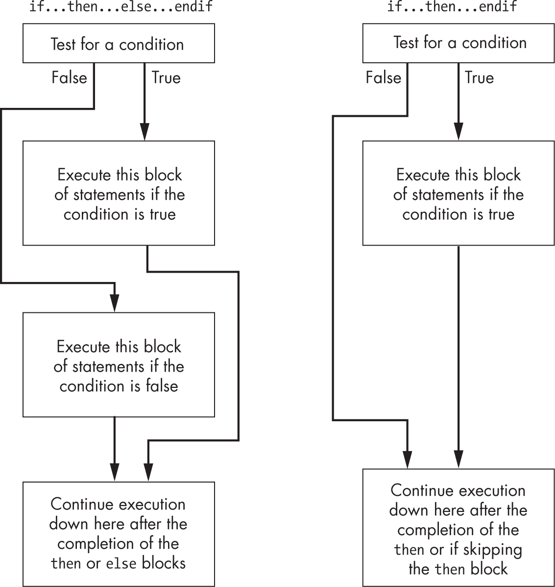
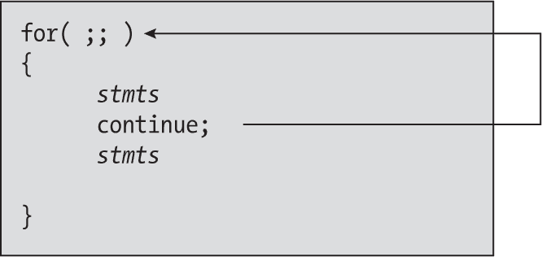
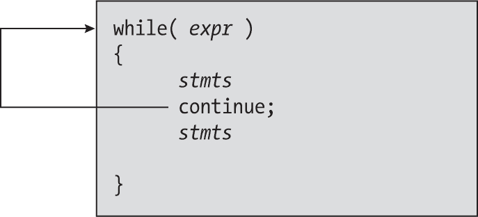
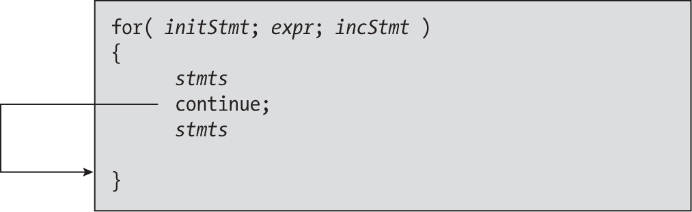

## 第七章：7 低级控制结构


本书至此为止的示例采用了临时的方法创建汇编控制结构。现在是时候规范化如何控制汇编语言程序的操作了。完成本章后，你应该能够将高级语言的控制结构转换为汇编语言控制语句。

汇编语言中的控制结构包括条件分支和间接跳转。本章将讨论这些指令以及如何模拟高级语言中的控制结构，例如 if...else、switch 和循环语句。本章还将讨论标签、条件分支和跳转语句的目标，以及标签在汇编语言源文件中的作用域。

### 7.1 语句标签

在讨论跳转指令以及如何使用它们来模拟控制结构之前，有必要深入讨论汇编语言中的语句标签。*标签*在汇编语言程序中充当地址的符号名称。使用像 LoopEntry 这样的名称来引用代码中的某个位置，比使用像 0xAF1C002345B7901E 这样的数字地址要方便得多。因此，汇编语言的低级控制结构在源代码中大量使用标签（参见第 2.10 节“控制转移指令”中的第 74 页）。

你可以对代码标签执行三种操作：通过条件跳转或无条件跳转指令将控制转移到标签、通过 bl 指令调用标签、以及获取标签的地址。最后一种操作在你想要稍后在程序中间接地将控制转移到该地址时非常有用。

以下代码序列演示了如何使用 lea 宏在程序中获取标签的地址：

```
stmtLbl:
   .
   .
   .
  lea x0, stmtLbl
   .
   .
   .
stmtLbl2:
```

由于地址是 64 位的，通常会使用 lea 指令将地址加载到 64 位通用寄存器中。有关如何在程序中获取标签地址的更多信息，请参见第 7.5 节“获取程序中符号的地址”中的第 364 页。

### 7.2 使用语句标签初始化数组

Gas 允许你使用语句标签的地址来初始化双字对象。列表 7-1 中的代码片段演示了如何做到这一点。

```
// Listing7-1.S
//
// Initializing qword values with the
// addresses of statement labels

#include "aoaa.inc"

            .data
            .align   3    // Align on dword boundary.
lblsInProc: .dword   globalLbl1, globalLbl2  // From procWLabels

            .code

// procWLabels
//
// Just a procedure containing private (lexically scoped)
// and global symbols. This really isn't an executable
// procedure.

             proc    procWLabels

globalLbl1:  b.al    globalLbl2
globalLbl2:
             ret
             endp    procWLabels

             .pool
             .align  3   // dword align
dataInCode:  .dword  globalLbl2, globalLbl1
```

你可能记得，.text 节中的指针不能引用该节之外的对象；然而，其他节（例如.data 节）中的指针是可以引用.text 节中的符号的。

由于 ARM 上的地址是 64 位的，通常会使用.dword 指令，如前面的示例所示，通过语句标签的地址来初始化数据对象。

### 7.3 无条件控制转移

`b.al`（分支）指令无条件地将控制转移到程序中的另一点。该指令有三种形式：两种基于 PC 的相对分支和一个间接跳转。这些指令的形式如下：

```
b    `label`   // Range is ±128MB.
b.al `label`   // Range is ±1MB.
br   `reg`64
```

前两条指令是*PC 相对分支*，你在之前的多个示例程序中已经见过。对于 PC 相对分支，通常通过使用语句标签来指定目标地址。该标签出现在可执行机器指令的同一行，或单独出现在其前一行。直接跳转完全等同于高级语言中的`goto`语句。

这里是一个直接跳转的例子，它将控制转移到程序中其他地方的标签：

```
 `statements`
           b laterInPgm   // Or b.al laterInPgm
               .
               .
               .
laterInPgm:
           `statements`
```

与高级语言不同，通常你的老师会禁止你使用`goto`语句，你会发现，在汇编语言中使用`b/b.al`指令是必不可少的。

### 7.4 寄存器间接跳转

之前给出的`br reg64`分支指令的第三种形式是*寄存器间接跳转*指令，它将控制转移到指定 64 位通用寄存器中地址所指向的指令。要使用`br`指令，必须在执行`br`之前，将一个 64 位寄存器加载为机器指令的地址。当多个路径将不同地址加载到寄存器中并汇聚到同一`br`指令时，控制将转移到由到该点为止的路径确定的适当位置。

清单 7-2 读取用户输入的字符字符串，这些字符串包含一个整数值。它使用`strtol()`将该字符串转换为二进制整数值。这个 C 语言标准库函数在报告错误方面做得不够好，因此这个程序测试返回结果以验证输入是否正确，并使用寄存器间接跳转根据结果将控制转移到不同的代码路径。

清单 7-2 的第一部分包含常量、变量、外部声明和（通常的）`getTitle()`函数。

```
// Listing7-2.S
//
// Demonstrate indirect jumps to
// control flow through a program.

#include    "aoaa.inc"

maxLen      =       256
EINVAL      =       22     // "Magic" C stdlib constant, invalid argument
ERANGE      =       34     // Value out of range

            .data
buffer:     .fill   256, 0 // Input buffer

            .text
            .pool
ttlStr:     wastr   "Listing 7-2"

fmtStrA:    wastr   "value=%d, error=%d\n"

fmtStr1:    .ascii  "Enter an integer value between "
            wastr   "1 and 10 (0 to quit): "

badInpStr:  .ascii  "There was an error in readLine "
            wastr   "(ctrl-D pressed?)\n"

invalidStr: wastr   "The input string was not a proper number\n"

rangeStr:   .ascii  "The input value was outside the "
            wastr   "range 1-10\n"

unknownStr: .ascii  "The was a problem with strToInt "
            wastr   "(unknown error)\n"

goodStr:    wastr   "The input value was %d\n"

fmtStr:     wastr   "result:%d, errno:%d\n"

// getTitle
//
// Return pointer to program title
// to the C++ code.

        proc    getTitle, public
        lea     x0, ttlStr
        ret
        endp    getTitle
```

清单 7-2 的下一部分是`strToInt`函数，它是 C 语言标准库`strtol()`函数的封装，能够更全面地处理用户输入的错误。请参见函数的返回值注释：

```
// Listing7-2.S (cont.)
//
// strToInt
//
// Converts a string to an integer, checking for errors
//
// Argument:
//    X0-   Pointer to string containing (only) decimal
//              digits to convert to an integer
//
// Returns:
//    X0-   Integer value if conversion was successful.
//    X1-   Conversion state. One of the following:
//          0- Conversion successful
//          1- Illegal characters at the beginning of the
//                 string (or empty string)
//          2- Illegal characters at the end of the string
//          3- Value too large for 32-bit signed integer

            proc    strToInt

            locals  sti
            dword   sti.saveX19
            dword   sti.endPtr
            word    sti.value
            byte    sti.stackSpace, 64
 endl    sti

            enter   sti.size

            mov     x19, x0         // Save, so you can test later.

// X0 already contains string parameter for strtol,
// X1 needs the address of the string to convert, and
// X2 needs the base of the conversion (10).

          ❶ add     x1, fp, #sti.endPtr
            mov     x2, #10             // Decimal conversion
            bl      strtol

// On return:
//
//    X0-    Contains converted value, if successful
//    endPtr-Pointer to 1 position beyond last char in string
//
// If strtol returns with endPtr == strToConv, then there were no
// legal digits at the beginning of the string.

            mov     x1, #1                // Assume bad conversion.
            ldr     x2, [fp, #sti.endPtr] // Is startPtr = endPtr?
            cmp     x19, x2
            beq     returnValue

// If endPtr is not pointing at a 0 byte, you have
// junk at the end of the string.

            mov     x1, #2        // Assume junk at end.
            ldrb    w3, [x2]      // Byte at endPtr.
            cmp     x3, #0        // Is it zero?
            bne     returnValue   // Return error if not 0.

// If the return result is 0x7fff_ffff or 0x8000_0000
// (max long and min long, respectively), and the C
// global _errno variable contains ERANGE, you have
// a range error.

            str     w0, [fp, #sti.value] // Get C errno value.
          ❷ getErrno                     // Magic macro
            mov     x2, x0
            ldr     w0, [fp, #sti.value]

            mov     x1, 0         // Assume good input.
            cmp     w2, #ERANGE   // errno = out of range?
            bne     returnValue
            mov     x1, #3        // Assume out of range.

            mov     x2, 0xffff
            movk    x2, 0x7fff, lsl #16

            cmp     w0, w2
            beq     returnValue

 mvn     w2, w2        // W2 = 0x8000_0000
            cmp     w0, w2
            beq     returnValue

// If you get to this point, it's a good number.

            mov     x0, #0

returnValue:
            leave
            endp    strToInt
```

`strtol()` ❶ 函数期望一个指向字符串结束指针变量的指针。`strToInt`过程在激活记录中为此指针预留了空间。此代码计算该指针变量的地址，并将其传递给`strtol()`函数。

获取 C 语言的`errno`变量 ❷ 在 macOS 和 Linux（或者更可能是 Clang 与 GCC）中处理方式不同。`getErrno`宏在*aoaa.inc*包含文件中生成适合这两个系统的代码。它将`errno`返回到 X0 寄存器。

清单 7-2 的最后部分是主程序，也是代码中最有趣的部分，因为它演示了如何调用`strToInt`函数：

```
// Listing7-2.S (cont.)
//
// Here's the asmMain procedure:

            proc    asmMain, public

            locals  am
            dword   am.saveX19              // Nonvolatile
            byte    am.stackSpace, 64
            endl    am

            enter   am.size
            str     x19, [fp, #am.saveX19]  // Must preserve X19.

// Prompt the user to enter a value
// from 1 to 10:

repeatPgm:  lea     x0, fmtStr1
            bl      printf

// Get user input:

            lea     x0, buffer
            mov     x1, #maxLen
            bl      readLine

            lea     x19, badInput // Initialize state machine.
          ❶ ands    w0, w0, w0    // X0 is -1 on bad input.
 bmi     hadError       // Only neg value readLine returns.

// Call strtoint to convert string to an integer and
// check for errors:

            lea     x0, buffer     // Ptr to string to convert
            bl      strToInt
            lea     x19, invalid
            cmp     w1, #1
            beq     hadError
            cmp     w1, #2
            beq     hadError

            lea     x19, range
            cmp     w1, #3
            beq     hadError

            lea     x19, unknown
            cmp     w1, #0
            bne     hadError

// At this point, input is valid and is sitting in X0.
//
// First, check to see if the user entered 0 (to quit
// the program):

          ❷ ands    x0, x0, x0     // Test for zero.
            beq     allDone

// However, we need to verify that the number is in the
// range 1-10:

            lea     x19, range
            cmp     x0, #1
            blt     hadError
            cmp     x0, #10
            bgt     hadError

// Pretend a bunch of work happens here dealing with the
// input number:

            lea     x19, goodInput

// The different code streams all merge together here to
// execute some common code (for brevity, we'll pretend that happens;
// no such code exists here):

hadError:

// At the end of the common code (which mustn't mess with
// X19), separate into five code streams based
// on the pointer value in X19:

          ❸ br      x19

// Transfer here if readLine returned an error:

badInput:   lea     x0, badInpStr
            bl      printf
            b.al    allDone

// Transfer here if there was a nondigit character
// in the string:

invalid:    lea     x0, invalidStr
            bl      printf
            b.al    repeatPgm

// Transfer here if the input value was out of range:

range:      lea     x0, rangeStr
            bl      printf
            b.al    repeatPgm

// Shouldn't ever get here. Happens if strToInt returns
// a value outside the range 0-3:

unknown:    lea     x0, unknownStr
            bl      printf
            b.al    repeatPgm

// Transfer down here on a good user input:

goodInput:  mov     w1, w0
            lea     x0, goodStr
            mstr    w1, [sp]
            bl      printf
            b.al    repeatPgm

// Branch here when the user selects "quit program" by
// entering the value 0:

allDone:    ldr     x19, [fp, #am.saveX19] // Must restore before returning.
            leave

            endp    asmMain
```

主函数根据 strToInt 返回结果加载 X19 寄存器，指定要执行的代码的地址。strToInt 函数返回以下几种状态之一（请参阅前面的代码注释以了解解释）：

+   有效输入

+   字符串开头的非法字符

+   字符串末尾的非法字符

+   范围错误

程序接着根据 X19 中保存的值转移控制到 asmMain 的不同部分，X19 指定了 strToInt 返回结果的类型。

readline 函数返回 –1 ❶ 如果读取用户输入的文本行时发生错误，这通常发生在检测到文件结尾时。这是 readline 唯一返回的负值，因此这段代码并不直接检查 –1，而是检查 readline 是否返回了负值。这个检查有点巧妙，但它是一种标准技巧；任何时候将一个值与自己进行 AND 运算，都会得到原始值。在这个例子中，代码使用 ands 指令，如果值为 0，Z 标志会被设置，如果数字为负数，N 标志会被设置 ❷。因此，之后测试 N 标志可以检查错误情况。注意，cmp x0, #0 指令也能达到同样的目的。

再次说明，这段代码使用 ands 指令 ❷ 将结果与 0 进行比较。这一次，它实际上是在检查值是否为 0（通过 Z 标志），并紧接着使用 beq 指令进行检查。这就是列表 7-2 中的程序使用 br（通过寄存器间接分支）指令实现逻辑 ❸ 的地方。

下面是列表 7-2 的构建命令和示例运行：

```
$ ./build Listing7-2
$ ./Listing7-2
Calling Listing7-2:
Enter an integer value between 1 and 10 (0 to quit): a123
The input string was not a proper number
Enter an integer value between 1 and 10 (0 to quit): 123a
The input string was not a proper number
Enter an integer value between 1 and 10 (0 to quit): 1234567890123
The input value was outside the range 1-10
Enter an integer value between 1 and 10 (0 to quit): -1
The input value was outside the range 1-10
Enter an integer value between 1 and 10 (0 to quit): 11
The input value was outside the range 1-10
Enter an integer value between 1 and 10 (0 to quit): 5
The input value was 5
Enter an integer value between 1 and 10 (0 to quit): 0
Listing7-2 terminated
```

这个示例运行展示了几种错误输入，包括非数字输入、超出范围的值、合法值，以及输入 0 来退出程序。

### 7.5 获取程序中符号的地址

列表 7-2 计算了 .text 段中各种符号的地址，以便将这些地址加载到寄存器中以备后用。在汇编语言程序中，获取程序中符号的运行时地址是一项常见操作，因为这就是通过寄存器间接访问数据（和代码）的方法。

本章涵盖了控制结构，本节讨论了如何获取程序中语句标签的地址。本节中的很多信息是本书前面章节的复习材料，但我把它们汇总在这里以供参考，并扩展了讨论。

#### 7.5.1 重新审视 lea 宏

列表 7-2 使用 lea 宏将 64 位寄存器初始化为一个通过 br 指令跳转到的位置的地址。这个宏在本书中一直是获取符号地址的首选方法。然而，请记住，lea 是一个宏，并且

```
lea x0, symbol
```

转换成这样：

```
// Under macOS:

    adrp x0, symbol@PAGE
    add  x0, x0, symbol@PAGEOFF

// Under Linux:

    adrp x0, symbol
    add  x0, x0, :lo12:symbol
```

这两条指令序列允许 lea 宏在 ±4GB 范围内计算 PC 相对符号的地址。adr 指令也可以计算符号的地址，但它只支持 ±1MB 范围（请参见第 1.8.1 节，“ldr、str、adr 和 adrp”，见 第 23 页）。

当获取 .text 段中附近语句标签的地址时，使用 adr 指令会更加高效：

```
adr x0, symbol
```

唯一的失败情况是，如果你的 .text 段非常大，符号距离 adr 指令超过 1MB。使用 lea 宏的主要原因是为了获取位于不同段中的符号地址（特别是在 macOS 上，PIE/ASLR 策略可能会将该段定位在距离 ±1MB 以上的位置）。

如果你想计算的符号/内存位置的地址距离当前指令超过 ±4GB，你将不得不使用以下章节中某种方法来获取它的地址。

#### 7.5.2 静态计算符号的地址

由于内存地址是 64 位的，并且 .dword 指令允许你用 64 位值初始化一个 dword 对象，那么是不是可以用程序中另一个符号的 64 位地址来初始化这样一个对象呢？答案取决于你运行的操作系统。

在 Linux 下，即使运行 PIE 代码，执行以下操作是完全合法的：

```
varPtr:  .dword `variable`
```

其中变量是出现在.data、.bss、.rodata 或 .text 段中的符号名称。当 Linux 将可执行程序加载到内存时，它会自动将此 dword 内存位置修补为该符号在内存中的地址（无论 Linux 将其加载到哪里）。根据段的不同，你可能可以通过使用以下指令，假设该符号在 ldr 指令的 PC 相对范围内，直接将此位置的内容加载到 X0 寄存器中：

```
ldr x0, varPtr
```

不幸的是，这种方案可能在 macOS 上不可行，因为在 macOS 中，你不允许在 .text 段中使用绝对地址。如果你将 varPtr 移到 .data 段，macOS 会接受指针初始化，但会因非法的绝对地址拒绝 ldr 指令。当然，你可以使用 lea 宏将 varPtr 的地址加载到 X0，然后通过 [X0] 寻址模式获取变量的地址；然而，在那时，你完全可以直接使用 lea 指令将变量的地址加载到 X0。无论如何，你又回到了 lea 宏的 ±4GB 限制。

你可以通过使用相对地址而不是绝对地址来绕过 macOS 的绝对地址限制。*相对地址*只是内存中某个固定点的偏移量（例如，PC 相对地址是相对于存储在 PC 寄存器中的地址的偏移量）。你可以使用以下语句创建一个自相关的 64 位指针：

```
varPtr:  .dword `variable`-.  // "." is same as "varPtr" here.
```

这将初始化该 64 位内存位置，存储从 varPtr 对象到目标内存位置（变量）的距离（以字节为单位）。这被称为*自相对指针*，因为偏移量是相对于指针变量本身的。事实证明，macOS 的汇编器对于这个地址表达式（即使在.text 段中）也能正常工作，因为它不是一个绝对地址。

当然，你不能简单地将这 64 位加载到寄存器中并访问它们所指向的内存位置。该值是一个偏移量，而不是一个地址。然而，如果你将 varPtr 的地址加到它的内容上，你就能得到变量的地址，具体如下代码所示：

```
adr x0, varPtr   // Assume varPtr is in .text and nearby.
ldr x1, varPtr   // Get varPtr address and contents, then
add x0, x0, x1   // add them together for `variable`'s address.
```

这一序列解决了 macOS 下地址的问题，并且在 Linux 下也能很好地工作。因为这一序列在两个操作系统下都能工作，本书在从内存中获取变量地址时采用了这一方案。

在 macOS 下，这一序列要求 varPtr 与指令处于同一.text 段中。否则，macOS 会抱怨 varPtr 是一个绝对地址，并拒绝此代码。由于本书假设代码在 Linux 和 macOS 下都能正常工作，因此我会将这些标签保留在.text 段中。

在 Linux 下，单条 ldr 指令也能正常工作，因此如果你只编写 Linux 代码，使用单条 ldr 指令会更高效。

#### 7.5.3 动态计算内存对象的地址

计算非静态内存对象的地址比计算静态内存对象（如.data、.bss、.text、.rodata 等）的地址稍微复杂一些。

由于每条 ARM 机器指令的长度恰好为 32 位，因此你可以将只包含机器指令的.text 段视为一个字数组，其中每个字的值恰好是机器指令的编码。（这个视角并不是 100%准确的；如果.text 段既包含数据又包含指令，那么将.text 段视为指令数组会有一定的局限性。然而，如果你仅限于那些只包含指令的区域，一切都会正常。）

有了这一点，就可以通过使用第 4.7 节“数组”（见第 194 页）中有关数组的技巧来操作.text 段中的值。这包括索引数组和计算数组元素的有效地址等技巧。

> 注意

*第 5.6.2 节，“按引用传递”，见第 256 页，描述了一种计算你通过 ARM 的各种寻址模式引用的对象的有效地址的过程。有关数据对象的内容，请参见该讨论。*

请看下面这段从列表 7-2 中剪切出来的任意指令序列：

```
goodInput:  mov     w1, w0
            lea     x0, goodStr
            mstr    w1, [sp]
            bl      printf
            b.al    repeatPgm
```

标签 goodInput 是包含这短序列五条指令的五个字的数组的基地址。当然，你可以通过使用 adr 指令（或者如果序列距离较远，则使用 lea 指令）来获取这个数组的基地址。一旦你将这个基地址存入寄存器（例如 X0），你就可以使用数组索引计算来计算数组中某个特定条目的地址：

```
`element_address` = `base_address` + `index` × `element_size`
```

element_size 值为 4，因为每条指令是 32 位的。索引 0 指定 mov 指令，索引 1 指定 adr 指令，依此类推。

给定 X1 中的索引值，你可以使用以下代码直接将控制转移到这五条指令中的一条：

```
adr x0, goodInput
add x0, x0, x1, lsl #2
br  x0
```

add 指令在将索引（X1）乘以 4 后加到基地址上。这计算出指定指令在序列中的字节地址；然后 br 将控制转移到该指令。

在许多方面，这类似于一个 switch 或 case 语句，每个指令与序列中的一个唯一案例相关联。本章将在 7.6.7 节“switch...case 语句”中讨论此类控制结构，见第 389 页。在此之前，只需知道，你可以通过正常的有效地址计算动态计算这个序列中某条指令的地址。

#### 7.5.4 使用外壳

在极少数情况下，如果你需要跳转到超出条件分支指令范围的位置，你可以使用如下指令序列：

```
 b`cc`opposite  skipJmp
         lea       x16, destLbl
 br        x16
skipJmp:
```

其中 bccopposite 是你想要采取的分支的对立分支。这个对立分支跳过将控制转移到目标位置的代码。这为你提供了 lea 宏的 4GB 范围，如果你是跳转到程序中的代码，这个范围应该足够了。对立的条件分支将控制转移到代码中的正常*顺序执行点*（如果条件为假，你通常会跳转到这个点）。如果条件为真，控制将转移到一个通过 64 位指针跳转到原始目标位置的内存间接跳转。

这个序列被称为*外壳*（或*蹦床*），因为程序跳到这一点以便进一步执行——就像跳到蹦床上让你越跳越高一样。外壳对于使用 PC 相对寻址模式的调用和无条件跳转指令非常有用（因此其范围限制在当前指令周围的±1MB）。你很少会使用外壳跳转到程序中的另一个位置，因为你不太可能编写如此大的汇编语言程序。

请注意在此示例中使用了 X16 寄存器。ARM ABI 保留了 X16 和 X17 寄存器用于动态链接和外层使用。您可以自由地将这两个寄存器作为易失性寄存器使用，前提是执行分支指令时，它们的内容可能会发生变化（无论何种类型的分支指令，通常是 bl 指令）。编译器和链接器通常会修改超出范围的分支指令，将代码转移到一个附近的外层，再由该外层转移控制到实际目的地。在创建您自己的外层时，使用这些寄存器作为临时寄存器是合理的做法。

分支到此范围外的代码通常意味着您将控制转移到共享（或动态链接）库中的一个函数。有关此类库的详细信息，请参阅操作系统的相关文档。

表 7-1 列出了对立条件；有关 *aoaa.inc* 中可用的对立分支宏，请参见 表 2-11 和 第 82 页。

表 7-1：对立条件

| 分支条件 | 对立 |
| --- | --- |
| eq | ne |
| ne | eq |
| hi | ls |
| hs | lo |
| lo | hs |
| ls | hi |
| gt | le |
| ge | lt |
| lt | ge |
| le | gt |
| cs | cc |
| cc | cs |
| vs | vc |
| vc | vs |
| mi | pl |
| pl | mi |

如果目标位置超出了 lea 宏的±4GB 范围，则需要创建一个 4 字节指针（偏移量）指向实际位置，并使用如下代码：

```
 adr     x16, destPtr
    ldr     x17, destPtr
    add     x16, x16, x17
    br      x16
destPtr:
    .dword  destination-.  // Same as "destination-destPtr"
```

这一特定的序列足够有用，以至于 *aoaa.inc* 包含文件提供了一个宏来扩展它：

```
goto destination
```

如果需要调用一个超过±4GB 范围的过程，您可以发出类似的代码：

```
 adr     x16, destPtr
    ldr     x17, destPtr
    add     x16, x16, x17
    blr     x16
    b.al    skipAdrs
destPtr:
    .dword  destination-.
skipAdrs:
```

然而，做法更简单的是：

```
 bl      veneer
     .
     .
     .
veneer:
    goto `destination`
```

通过讨论外层代码后，下一节将讨论如何在汇编语言中实现类似于高级语言（HLL）的控制结构。

### 7.6 在汇编语言中实现常见控制结构

本节将向您展示如何使用纯汇编语言实现类似于高级语言（HLL）的控制结构，如决策、循环和其他控制结构。最后，将展示一些用于创建常见循环的 ARM 指令。

在接下来的许多示例中，本章假设各种变量是激活记录中的局部变量（通过 FP 寄存器索引）或通过 SB（X28）寄存器索引的静态/全局变量。我们假定已为所有变量的标识符做出适当的结构声明，并且 FP/SB 寄存器已正确初始化以指向这些结构。

#### 7.6.1 决策

在最基本的形式中，*决策*是代码中的一个分支，它根据某个条件在两条可能的执行路径之间切换。通常（但并非总是），条件指令序列是通过条件跳转指令实现的。条件指令对应于高级语言（HLL）中的以下 if...then...endif 语句：

```
if(`expression`) then
    `statements`
endif;
```

要将其转换为汇编语言，必须编写评估表达式的语句，并在结果为假时绕过这些语句。例如，如果你有如下的 C 语句：

```
if(aa == bb)
{
    printf("aa is equal to bb\n");
}
```

你可以将其转换为汇编语言，如下所示：

```
 ldr  w0, [fp, #aa]    // Assume aa and bb are 32-bit integers.
      ldr  w1, [fp, #bb]
      cmp  w0, w1
      bne  aNEb             // Use opposite branch to skip then
      lea  x0, aIsEqlBstr   // " aa is equal to bb\n".
      bl   printf
aNEb:
```

通常，条件语句可以分为三类：if 语句、switch...case 语句和间接跳转。接下来，你将学习这些程序结构，如何使用它们以及如何在汇编语言中编写它们。

#### 7.6.2 if...then...else 序列

最常见的条件语句是 if...then...endif 和 if...then...else...endif 语句。这两个语句的形式如图 7-1 所示。



图 7-1：if...then...else...endif 和 if...then...endif 语句

if...then...endif 语句只是 if...then...else...endif 语句的特殊情况（没有 else 块）。在 ARM 汇编语言中，if...then...else...endif 语句的基本实现看起来像这样：

```
 `Sequence of statements to test a condition`
          b`cc` ElseCode;

    `Sequence of statements corresponding to the THEN block`

          b.al EndOfIf

ElseCode:
    `Sequence of statements corresponding to the ELSE block`

EndOfIf:
```

其中 bcc 代表条件分支指令（通常是条件测试的相反分支）。

例如，假设你想将 C/C++ 语句转换为汇编语言：

```
if(aa == bb)
    c = d;
else
    bb = bb + 1;
```

为此，你可以使用以下 ARM 代码：

```
 ldr  w0, [fp, #aa]   // aa and bb are 32-bit integers
          ldr  w1, [fp, #bb]   // in the current activation record.
          cmp  w0, w1
          bne  ElseBlk         // Use opposite branch to goto else.
          ldr  w0, [sb, #d]    // Assume c and d are 32-bit static
          str  w0, [sb, #c]    // variables in the static base
          b.al EndOfIf         // structure (pointed at by SB).

ElseBlk:
          ldr w0, [fp, #bb]
          add w0, w0, #1
          str w0, [fp, #bb]

EndOfIf:
```

对于像 (aa == bb) 这样的简单表达式，为 if...then...else...endif 语句生成正确的代码是容易的。如果表达式变得更复杂，代码的复杂性也会增加。考虑以下 C/C++ if 语句：

```
if(((x > y) && (z < t)) || (aa != bb))
    c = d;
```

要将一个复杂的 if 语句转换为如下所示的三条 if 语句序列（假设使用短路求值；详情见第 7.6.5 节，“短路与完整布尔求值”，在第 382 页）：

```
if(aa != bb)
    c = d;
else if(x > y)
    if(z < t)
         c = d;
```

这个转换来自以下 C/C++ 等式：

```
if(`expr1` && `expr2`) `stmt`;
```

等同于

```
if(`expr1`) if(`expr2`) `stmt`;
```

和

```
if(expr1 || `expr2`) `stmt`;
```

等同于

```
if(`expr1`) `stmt`;
else if(`expr2`) `stmt`;
```

在汇编语言中，前面的 if 语句变成如下所示：

```
// if(((x > y) && (z < t)) || (aa != bb))
//      c = d;
//
// Assume x = W0, y = W1, z = W2, t = W3, aa = W4, bb = W5, c = W6, and d = W7
// and all variables are signed integers.

          cmp  w4, w5     // (aa != bb)?
          bne  DoIf
          cmp  w0, w1     // (x > y)?
          bngt EndOfIf    // Not greater than
          cmp  w2, w3     // (z < t)?
          bnlt EndOfIf    // Not less than
DoIf:
          mov  w6, w7     // c = d
EndOfIf:
```

注意使用相反分支，表明掉落是要考虑的主要条件。

汇编语言中复杂条件语句的最大问题是，在写完代码后很难弄清楚自己做了什么。高级语言表达式更容易阅读和理解，因此，良好的注释对于清晰的汇编语言实现 if...then...else...endif 语句至关重要。以下代码展示了前面示例的优雅实现：

```
// if(((x > y) && (z < t)) || (aa != bb))
//      c = d;
//
// Assume x = W0, y = W1, z = W2, t = W3, aa = W4, bb = W5, c = W6, 
// and d = W7.
//
// Implemented as:
//
// if (aa != bb) then goto DoIf

          cmp  w4, w5   // (aa != bb)?
          bne  DoIf

// if not (x > y) then goto EndOfIf

          cmp  w0, w1   // (x > y)?
          bngt EndOfIf  // Not greater than

// if not (z < t) then goto EndOfIf

          cmp  w2, w3   // (z < t)?
          bnlt EndOfIf  // Not less than

// true block:

DoIf:
          mov w6, w7   // c = d
EndOfIf:
```

每当你在汇编语言中工作时，不要忘记稍微停下来，看看是否可以用汇编语言重新思考解决方案，而不是扮演“人类 C/C++ 编译器”的角色。在处理复杂的布尔表达式时，你的第一个想法应该是：“我能否使用条件比较指令来解决这个问题？”以下示例正是这么做的：

```
// if(((x > y) && (z < t)) || (aa != bb))
//      c = d;
//
// Assume x = W1, y = W2, z = W3, t = W4, aa = W5, bb = W6, c = W0, and d = W7.

            cmp    w1, w2              // x > y   ? gt : ngt (C ternary ?: op)
            ccmp   w3, w4, #ccnlt, gt  // x > y   ? gt : ngt
            ccmp   w5, w6, #ccne, nlt  // nlt   ? (a != bb ? ne : nne) : ne
            csel   w0, w7, w0, ne      // if(ne) c = d
```

cmp 指令设置（x > y）的标志。第一条 ccmp 指令设置标志来模拟符号 ge（不小于），如果（x <= y），或者基于（z < t）的比较，如果（x > y）。在执行第一条 ccmp 指令后，如果（x > y）&&（z < t），则 N ≠ V。

在执行第二条 ccmp 指令时，如果 N ≠ V（意味着符号小于），代码会设置 NZCV 来模拟 ne，并且不再比较 aa 和 bb（因为析取操作符的左侧已经为真，无需再计算第三个括号表达式）。设置 Z = 0 意味着 csel 指令会将 d 复制到 c（基于 ne 条件）。

如果在执行第二条 ccmp 指令时 N = V，ge 条件为真，这意味着与操作结果为假，你必须测试 aa 是否不等于 bb。这将为 csel 指令设置适当的标志。列表 7-3 展示了该条件比较代码的执行。

```
// Listing7-3.S
//
// Demonstrate the ccmp instruction
// handling complex Boolean expressions.

#include    "aoaa.inc"

            .data

xArray:     .word   -1, 0, 1,-1, 0, 1,-1, 0, 1, 1
yArray:     .word   -1,-1,-1, 0, 0, 0, 1, 1, 1, 0
zArray:     .word   -1, 0, 1,-1, 0, 1,-1, 0, 1, 0
tArray:     .word    0, 0, 0, 1, 1, 1,-1,-1,-1, 1
aArray:     .word    0, 0, 0,-1,-1,-1, 1, 1, 1, 1
bArray:     .word   -1, 0, 1,-1, 0, 1,-1, 0, 1, 1
size        =       10

            .text
            .pool
ttlStr:     wastr   "Listing 7-3"
fmtStr1:    .ascii  "((x > y) && (z < t)) || (aa != bb)\n"
            .ascii  " x  y  z  t aa bb Result\n"
            wastr   "-- -- -- -- -- -- ------\n"
fmtStr2:    wastr   "%2d %2d %2d %2d %2d %2d   %2d\n"

// getTitle
//
// Return pointer to program title
// to the C++ code:

            proc    getTitle, public
            adr     x0, ttlStr
            ret
            endp    getTitle

/////////////////////////////////////////////////////////
//
// Here's the asmMain procedure:

            proc    asmMain, public

            locals  am
            qword   saveX1920
            qword   saveX2122
            qword   saveX2324
            dword   saveX25
            byte    stackSpace, 64
            endl    am

 enter   am.size

// Save nonvolatile registers and initialize
// them to point at xArray, yArray, zArray,
// tArray, aArray, and bArray:

            stp     x19, x20, [fp, #saveX1920]
            stp     x21, x22, [fp, #saveX2122]
            stp     x23, x24, [fp, #saveX2324]
            str     x25, [fp, #saveX25]

#define x   x19
#define y   x20
#define z   x21
#define t   x22
#define aa  x23
#define bb  x24

            lea     x, xArray
            lea     y, yArray
            lea     z, zArray
            lea     t, tArray
            lea     aa, aArray
            lea     bb, bArray

            lea     x0, fmtStr1
            bl      printf

// Loop through the array elements
// and print their values along
// with the result of
// ((x > y) && (z < t)) || (aa != bb)

            mov     x25, #0
rptLp:      ldr     w1, [x, x25, lsl #2]    // W1 = x[X25]
            ldr     w2, [y, x25, lsl #2]    // W2 = y[X25]
            ldr     w3, [z, x25, lsl #2]    // W3 = z[X25]
            ldr     w4, [t, x25, lsl #2]    // W4 = t[X25]
            ldr     w5, [aa, x25, lsl #2]   // W5 = aa[X25]
            ldr     w6, [bb, x25, lsl #2]   // W6 = bb[X25]

            cmp     w1, w2
            ccmp    w3, w4, #ccnlt, gt
            ccmp    w5, w6, #ccne, nlt
            cset    w7, ne

            lea     x0, fmtStr2
            mstr    w1, [sp]
            mstr    w2, [sp, #8]
            mstr    w3, [sp, #16]
            mstr    w4, [sp, #24]
            mstr    w5, [sp, #32]
            mstr    w6, [sp, #40]
            mstr    w7, [sp, #48]
 bl      printf
            add     x25, x25, #1
            cmp     x25, #size
            blo     rptLp

// Restore nonvolatile register values
// and return:

            ldp     x19, x20, [fp, #saveX1920]
            ldp     x21, x22, [fp, #saveX2122]
            ldp     x23, x24, [fp, #saveX2324]
            ldr     x25, [fp, #saveX25]

            leave
            endp    asmMain
```

以下是列表 7-3 的构建命令和示例输出：

```
$ ./build Listing7-3
$ ./Listing7-3
Calling Listing7-3:
((x > y) && (z < t)) || (aa != bb)
 x  y  z  t aa bb Result
-- -- -- -- -- -- ------
-1 -1 -1  0  0 -1      1
 0 -1  0  0  0  0      0
 1 -1  1  0  0  1      1
-1  0 -1  1 -1 -1      0
 0  0  0  1 -1  0      1
 1  0  1  1 -1  1      1
-1  1 -1 -1  1 -1      1
 0  1  0 -1  1  0      1
 1  1  1 -1  1  1      0
 1  0  0  1  1  1      1
Listing7-3 terminated
```

输出显示了给定表达式的真值表。

#### 7.6.3 使用完整布尔评估的复杂 if 语句

许多布尔表达式涉及与（AND）或或（OR）操作。你可以通过两种方式将这样的布尔表达式转换成汇编语言：使用*完整布尔评估*或使用*短路布尔评估*。本节讨论完整布尔评估，下一节讨论短路布尔评估。

通过完整布尔评估进行转换几乎与将算术表达式转换为汇编语言相同，详见第 6.4 节“逻辑表达式”，第 312 页。然而，对于布尔评估，你不需要将结果存储在变量中；一旦表达式评估完成，你只需要检查结果是假的（0）还是正确的（1，或非零），然后执行布尔表达式指示的操作。记住，只有 ands 指令会设置零标志；没有 orrs 指令。考虑以下 if 语句及其通过完整布尔评估转换为汇编语言的例子：

```
//     if(((x < y) && (z > t)) || (aa != bb))
//          `Stmt1` ;
//
// Assume all variables are 32-bit integers and are local
// variables in the activation record.

          ldr  w0, [fp, #x]
          ldr  w1, [fp, #y]
          cmp  w0, w1
          cset w7, lt        // Store x < y in W7.
          ldr  w0, [fp, #z]
          ldr  w1, [fp, #t]
          cmp  w0, w1
          cset w6, gt        // Store z > t in W6.
          and  w6, w6, w7    // Put (x < y) && (z > t) into W6.
          ldr  w0, [fp, #aa]
          ldr  w1, [fp, #bb]
          cmp  w0, w1
          cset w0, ne        // Store aa != bb into W0.
          orr  w0, w0, w6    // Put (x < y) && (z > t) ||
          cmp  w0, #0        //    (aa != bb) into W0.
          beq  SkipStmt1     // Branch if result is false.

      `Code for Stmt1`

SkipStmt1:
```

这段代码计算一个布尔结果到 W0 寄存器，然后，在计算结束时，测试该值看它是包含真还是假。如果结果为假，这段序列会跳过与 Stmt1 相关的代码。重要的是，程序会执行每一条计算布尔结果的指令（直到 beq 指令）。

到现在你应该已经认识到，通过使用 ccmp 指令，我们可以改进这段代码：

```
 ldr  w0, [fp, #x]
          ldr  w1, [fp, #y]
          cmp  w0, w1
          ldr  w0, [fp, #z]
          ldr  w1, [fp, #t]
          ccmp w0, w1, #ccngt, lt
          ldr  w0, [fp, #aa]
          ldr  w1, [fp, #bb]
          ccmp w0, w1, #cceq, gt
          beq  SkipStmt1     // Branch if result is false.

      `Code for Stmt1`

SkipStmt1:
```

代码仍然比平常稍长，但这是因为在这个例子中使用了内存变量而不是寄存器。即使这个例子使用了 ccmp 指令，代码仍然会执行每一条指令，即使条件在一开始就变为假，且永远不会变为真。

#### 7.6.4 短路布尔评估

如果你愿意付出更多的努力（并且你的布尔表达式不依赖副作用），你通常可以通过使用*短路布尔评估*将布尔表达式转换为更快速的汇编语言指令序列。这种方法试图通过只执行计算完整表达式的一部分指令，来判断一个表达式是真还是假。

考虑表达式 aa && bb。一旦你确定 aa 为假，就不需要再评估 bb，因为无论 bb 的值是什么，表达式都无法为真。如果 bb 表示一个复杂的子表达式，而不是一个单一的布尔变量，那么只评估 aa 会显得更加高效。

作为一个具体的例子，考虑子表达式((x < y) && (z > t))。一旦你确定 x 不小于 y，就无需再检查 z 是否大于 t，因为无论 z 和 t 的值如何，表达式都会为假。以下代码片段展示了如何为这个表达式实现短路布尔评估：

```
// if((x < y) && (z > t)) then ...

          ldr  w0, [fp, #x]
          ldr  w1, [fp, #y]
          cmp  w0, w1
          bnlt TestFails
          ldr  w0, [fp, #z]
          ldr  w1, [fp, #t]
          cmp  w0, w1
          bngt TestFails

 `Code for THEN clause of IF statement`

TestFails:
```

一旦代码确定 x 不小于 y，它就跳过任何进一步的测试。当然，如果 x 小于 y，程序必须测试 z 是否大于 t；如果不是，程序会跳过 then 语句块。只有当程序满足两个条件时，代码才会进入 then 语句块。

对于逻辑“或”操作，技巧是类似的。如果第一个子表达式的值为真，就无需再测试第二个操作数。无论第二个操作数的值是什么，整个表达式仍然会为真。以下例子展示了如何在使用析取（||）时应用短路评估：

```
// if(W0 < 'A' || W0 > 'Z')
//     then printf("Not an uppercase char");
// endif;

          cmp  w0, #'A'
          blo  ItsNotUC
          cmp  w0, #'Z'
          bnhi ItWasUC

ItsNotUC:
 `Code to process W0 if it's not an uppercase character`

ItWasUC:
```

由于合取和析取运算符是可交换的，如果更方便，你可以先评估左侧或右侧操作数。

请注意，有些表达式依赖于最左侧子表达式的评估方式，以确保最右侧子表达式的有效性；例如，在 C/C++中，if(x != NULL && x -> y)就是一个常见的测试。

作为本节的最后一个例子，考虑上一节中的完整布尔表达式：

```
// if(((x < y) && (z > t)) || (aa != bb))  `Stmt1` ;

          ldr  w0, [sb, #aa]   // Assume aa and bb are globals.
          ldr  w1, [sb, #bb]
          cmp  w0, w1
          bne  DoStmt1
          ldr  w0, [fp, #x]   // Assume x, y, z, and t
          ldr  w1, [fp, #y]   // are all locals.
          cmp  w0, w1
          bnlt SkipStmt1
          ldr  w0, [fp, #z]
          ldr  w1, [fp, #t]
          cmp  w0, w1
          bngt SkipStmt1

DoStmt1:
 `Code for Stmt1`

SkipStmt1:
```

这个例子中的代码首先评估 aa != bb，因为它更短且更快，然后最后评估剩余的子表达式。这是汇编语言程序员常用的技巧，用来编写更高效的代码。

当然，这假设所有的比较在真或假之间的概率是相等的。如果你能预测子表达式 aa != bb 在绝大多数情况下为假，那么最好将该条件最后测试。

#### 7.6.5 短路与完全布尔评估

使用完全布尔评估时，表达式中每个语句都会执行；而短路布尔评估则可能不需要执行与布尔表达式相关的每个语句。正如你在前两节中看到的，基于短路评估的代码通常更简洁，且可能更快。

然而，短路布尔评估在某些情况下可能无法产生正确的结果。给定一个带有 *副作用*（表达式中变量的变化）的表达式，短路布尔评估会产生与完全布尔评估不同的结果。考虑以下 C/C++ 示例：

```
if((x == y) && (++z != 0))  `Stmt`;
```

使用完全布尔评估时，你可能会生成如下代码：

```
 ldr  w0, [fp, #x]      // See if x == y.
          ldr  w1, [fp, #y]
          cmp  w0, w1
          ldr  w2, [fp, #z]
          add  w2, w1, 1         // ++z
          str  w2, [fp, #z]
          ccmp w2, #0, #cceq, eq
          beq  SkipStmt

 `Code for Stmt`

SkipStmt:
```

ccmp 指令将 z 增加后的值与 0 进行比较，但仅在 x 等于 y 时执行。如果 x 不等于 y，ccmp 指令会将 Z 标志设置为 1，从而控制转移到 SkipStmt，并执行以下 beq 指令。

使用短路布尔评估时，你可能会生成如下代码：

```
 ldr  w0, [fp, #x]      // See if x == y.
          ldr  w1, [fp, #y]
          cmp  w0, w1
          bne  SkipStmt
          ldr  w2, [fp, #z]
          adds w2, w1, 1         // ++z -- sets Z flag if z
          str  w2, [fp, #z]      // becomes 0.
          beq  SkipStmt          // See if incremented z is 0.

 `Code for Stmt`

SkipStmt:
```

这两种转换之间存在一个微妙但重要的差异：如果 x 等于 y，第一种版本仍然会 *递增* z，并 *与 0 进行比较*，然后才执行与 Stmt 相关的代码。另一方面，短路版本在发现 x 等于 y 时会跳过递增 z 的代码。因此，如果 x 等于 y，这两段代码的行为是不同的。

两种实现方式都没有错；根据具体情况，你可能希望或不希望当 x 等于 y 时，代码增加 z 的值。然而，重要的是要意识到这两种方案会产生不同的结果，因此如果此代码对 z 的影响对程序至关重要，你可以选择合适的实现。

许多程序利用短路布尔评估，并依赖程序不评估表达式的某些部分。以下 C/C++ 代码片段演示了可能最常见的需要短路布尔评估的例子：

```
if(pntr != NULL && *pntr == 'a')  `Stmt`;
```

如果 pntr 结果为 NULL，则该表达式为假，不需要评估表达式的其余部分。此语句依赖于短路布尔评估才能正确操作。如果 C/C++ 使用完全布尔评估，表达式的后半部分将尝试取消引用一个 NULL 指针，而此时 pntr 为 NULL。

考虑使用完全布尔评估翻译该语句：

```
// Complete Boolean evaluation:

          ldr  x0, [fp, #pntr]
          cmp  x0, #0    // Check to see if X0 is 0 (NULL is 0).
          cset w1, ne    // w1 = pntr != NULL
          ldrb w0, [x0]  // Get *pntr into W0.
          cmp  w0, #'a'
          cset w2, eq
          ands w1, w1, w2
          beq  SkipStmt

  `    Code for Stmt`

SkipStmt:
```

如果 pntr 包含 NULL（0），该程序将尝试通过 ldrb w0, [x0] 指令访问内存中位置为 0 的数据。在大多数操作系统中，这将导致内存访问故障（段错误）。

现在考虑短路布尔转换：

```
 ldr  x0, [fp, #pntr] // See if pntr contains NULL (0)
      cmp  x0, #0          // and immediately skip past Stmt
      beq  SkipStmt        // if this is the case.

 ldrb w0, [x0]        // If we get to this point, pntr
      cmp  w0, #'a'        // contains a non-NULL value, so see
      bne  SkipStmt        // if it points at the character 'a'.

 `Code for Stmt`

SkipStmt:
```

在这个例子中，取消引用 NULL 指针的问题不存在。如果 pntr 包含 NULL，这段代码会跳过那些尝试访问 pntr 所包含的内存地址的语句。

#### 7.6.6 在汇编语言中高效实现 if 语句

在汇编语言中高效地编码 if 语句比仅仅选择短路求值而不是完全布尔求值需要更多的思考。为了编写能够尽可能快速执行的汇编语言代码，你必须仔细分析情况并适当生成代码。以下段落提供了一些建议，可以帮助你提升程序的性能。

##### 7.6.6.1 了解你的数据

程序员经常错误地假设数据是随机的。实际上，数据很少是随机的，如果你了解程序常用的值的类型，你就可以编写更好的代码。为了理解如何做到这一点，考虑下面的 C/C++ 语句：

```
if((aa == bb) && (c < d)) ++i;
```

因为 C/C++ 使用短路求值，这段代码将测试 aa 是否等于 bb。如果是，它将测试 c 是否小于 d。如果你期望 aa 大多数时候等于 bb，但不期望 c 大多数时候小于 d，这段代码的执行速度将比预期的要慢。考虑以下 Gas 实现的代码：

```
 ldr  w0, [fp, #aa]
          ldr  w1, [fp, #bb]
          cmp  w0, w1
          bne  DontIncI

          ldr  w0, [fp, #c]
          ldr  w1, [fp, #d]
          cmp  w0, w1
          bnlt DontIncI

          ldr  w0, [sb, #i]
          add  w0, w0, #1
          str  w0, [sb, #i]

DontIncI:
```

如你所见，如果 aa 大多数时候等于 bb，且 c 大多数时候不小于 d，你将几乎每次都执行前八条指令，以确定表达式是假的。现在，考虑以下实现，它利用了这一知识以及 && 运算符是交换律的事实：

```
 ldr  w0, [fp, #c]
          ldr  w1, [fp, #d]
          cmp  w0, w1
          bnlt DontIncI

          ldr  w0, [fp, #aa]
          ldr  w1, [fp, #bb]
          cmp  w0, w1
          bne  DontIncI

          ldr  w0, [sb, #i]
          add  w0, w0, #1
          str  w0, [sb, #i]

DontIncI:
```

代码首先检查 c 是否小于 d。如果大多数情况下 c 不小于 d，这段代码将在典型情况下只执行三条指令后跳转到标签 DontIncI，而与之前的例子相比，它需要执行七条指令。

像这样的优化在汇编语言中比在高级语言（HLL）中更为明显，这也是汇编程序通常比高级语言程序更快的主要原因之一。关键在于理解数据的行为，以便做出明智的决策。

##### 7.6.6.2 重排表达式

即使你的数据是随机的，或者你无法确定输入值将如何影响你的决策，重新排列表达式中的项仍然可能是有益的。一些计算的执行时间远比其他的要长。例如，计算余数比简单的 cmp 指令慢。因此，如果你有像下面这样的语句，你可能想要重新排列表达式，使 cmp 语句排在前面：

```
if((x % 10 = 0) && (x != y)) ++x;
```

直接转换为汇编代码后，这个 if 语句变成了以下形式：

```
 ldr   w1, [fp, #x]      // Compute x % 10.
          mov   w2, #10
          udiv  w0, w1, w2
          msub  w0, w0, w2, w1
          cmp   w0, #0
          bne   SkipIf

 ldr   w0, [fp, #x]
          ldr   w1, [fp, #y]
          cmp   w0, w1
          beq   SkipIf

          add   w0, w0, #1        // ++x
          str   w0, [fp, #x]

SkipIf:
```

余数计算很耗时（大约是此例中其他指令速度的三分之一）。除非余数为 0 的可能性比 x 等于 y 的可能性大三倍，否则最好先进行比较，然后再进行余数计算：

```
 ldr   w1, [fp, #x]      // Compute x % 10.
          ldr   w1, [fp, #y]
          cmp   w0, w1
          beq   SkipIf

          ldr   w1, [fp, #x]
          mov   w2, #10
          udiv  w0, w1, w2
          msub  w0, w0, w2, w1
          cmp   w0, #0
          bne   SkipIf

          add   w1, w1, #1        // ++x
          str   w1, [fp, #x]

SkipIf:
```

&& 和 || 运算符在数学意义上是可交换的，即无论先计算左侧还是右侧，逻辑结果是相同的。但在执行时，它们并不是可交换的，因为评估顺序可能导致跳过第二个子表达式的评估；特别是，如果表达式中存在副作用，这些运算符可能不具有可交换性。这个例子没有问题，因为没有副作用或可能被重新排序的 && 运算符屏蔽的异常。

##### 7.6.6.3 解构代码

结构化代码有时比非结构化代码效率低，因为它可能引入代码重复或额外的分支，这些在非结构化代码中可能不存在。大多数时候，这是可以容忍的，因为非结构化代码难以阅读和维护；为了可维护的代码而牺牲一些性能通常是可以接受的。然而，在某些情况下，你可能需要尽可能多的性能，并可能选择牺牲代码的可读性。

在高级语言中，你通常可以通过编写结构化代码来避免问题，因为编译器会优化它，生成非结构化的机器代码。不幸的是，在汇编语言中，你得到的机器代码与所写的汇编代码完全等效。

将之前编写的结构化代码重新编写为非结构化代码以提高性能被称为*解构代码*。非结构化代码和解构代码的区别在于，非结构化代码一开始就是以这种方式编写的；解构代码最初是结构化代码，并被故意以非结构化的方式编写，以提高其效率。纯粹的非结构化代码通常难以阅读和维护。解构代码则不那么糟糕，因为你将代码的“非结构化”限制在那些绝对需要的部分。

解构代码的经典方法之一是使用*代码移动*，将代码的某些部分物理移到程序的其他地方。你将程序中不常用的代码移到不妨碍大多数时候执行的代码的地方。

代码移动可以通过两种方式提高程序的效率。首先，执行的分支比未执行的分支更昂贵（耗时）。如果你将不常用的代码移到程序的另一个位置，并在分支被执行的少数情况下跳转到它，大多数时候你将直接跳到最常执行的代码。其次，顺序的机器指令会消耗缓存存储。如果你将不常执行的语句移出正常的代码流，放到程序中一个不常加载到缓存中的部分，这将提高系统的缓存性能。

例如，考虑以下伪 C/C++ 语句：

```
if(`See_If_an_Error_Has_Occurred`) 
{
    ` Statements to execute if no error` 
}
else 
{
     `Error-handling statements` 
}
```

在正常的代码中，你不期望错误发生得很频繁。因此，你通常期望前面 if 语句中的 then 部分比 else 子句更常执行。前面的代码可能会翻译成以下汇编代码：

```
 cmp `See_If_an_Error_Has_Occurred`, #true 
     beq HandleTheError 

 `Statements to execute if no error` 

     b.al EndOfIf 

HandleTheError: 
    `       Error-handling statements` 
EndOfIf: 
```

如果表达式为假，这段代码会跳过错误处理语句，直接执行正常的语句。将程序中的控制从一个点转移到另一个点的指令（例如，b.al 指令）通常会很慢。执行一组顺序指令比在程序中到处跳转要快得多。不幸的是，前面的代码并不允许这样做。

解决这个问题的一种方法是将代码中的 else 子句移动到程序的其他地方。你可以像下面这样重写代码：

```
 cmp `See_If_an_Error_Has_Occurred`, #true 
     beq HandleTheError 

 `Statements to execute if no error` 

EndOfIf: 

  // At some other point in your program (typically after a b.al 
  // or ret instruction), you would insert the following code: 

HandleTheError: 
 `Error-handling statements` 
     b.al EndOfIf 
```

程序并没有变得更短。你从原始序列中移除的 b.al 最终会出现在 else 子句的末尾。然而，由于 else 子句很少执行，将 b.al 指令从经常执行的 then 子句移到 else 子句是一个巨大的性能提升，因为 then 子句仅使用直线代码执行。这种技巧在许多时间关键的代码段中非常有效。

##### 7.6.6.4 计算而非分支

在 ARM 处理器中，与许多其他指令相比，分支操作是昂贵的。因此，有时执行更多的顺序指令比执行较少的涉及分支的指令要好。

例如，考虑简单的赋值 w0 = abs(w0)。不幸的是，没有 ARM 指令可以计算整数的绝对值。处理此问题的显而易见方法是使用一个指令序列，通过条件跳转跳过 neg 指令（如果 W0 为负值，neg 指令会使 W0 变为正值）：

```
 cmp w0, #0
          bpl ItsPositive

          neg w0, w0

ItsPositive:
```

现在考虑以下序列，它也能完成任务：

```
 cmp  w0, #0
          cneg w0, w0, mi
```

不仅指令集更短，而且不涉及任何分支，因此运行速度更快。这展示了为什么了解指令集是很重要的！

你见过的另一个计算与分支的例子是使用 ccmp 指令处理布尔表达式中的合取与析取（见第 7.6.5 节，“短路与完全布尔运算”，在 第 382 页）。虽然它们通常比短路求值执行更多的指令，但不涉及任何分支，而且这通常意味着代码运行得更快。

有时，无法通过不使用分支来计算。对于某些类型的分支（特别是多路分支），你可以将计算与单一的分支结合起来处理复杂的操作，正如下一节所讨论的那样。

#### 7.6.7 switch...case 语句

C/C++ 的 switch 语句采用以下形式：

```
 switch(`expression`) 
      {
         case `const1`: 
           `Code to execute if` 
 `expression equals const1` 

         case `const2`: 
           `Code to execute if` 
 `expression equals const2` 
           . 
           . 
           . 
         case `constn`: 
           `Code to execute if` 
 `expression equals constn` 

         default:  // Note that the default section is optional. 
           `Code to execute if expression` 
 `does not equal any of the case values` 

      }
```

当这条语句执行时，它会检查表达式的值与常量 const1 到 constn 的匹配情况。如果找到匹配项，相应的语句将执行。

C/C++对 switch 语句有一些限制。首先，它只允许一个整数表达式（或其底层类型可以是整数的表达式）。其次，所有 case 子句中的常量必须是唯一的。接下来的几个小节将描述 switch 语句的语义以及各种实现方式，并澄清这些限制的原因。

##### 7.6.7.1 switch 语句的语义

大多数入门级编程教材通过将 switch...case 语句解释为一系列 if...then...elseif...else...endif 语句来介绍它们。它们可能会声称以下两段 C/C++代码是等效的：

```
switch(`w0)` 
{
    case 0: printf("i=0"); break; 
    case 1: printf("i=1"); break; 
    case 2: printf("i=2"); break; 
}

if(w0 == 0) 
    printf("i=0");
else if(w0 == 1) 
    printf("i=1");
else if(w0 == 2) 
    printf("i=2");
```

虽然语义上这两段代码是相同的，但它们的实现通常是不同的。if...then...elseif...else...endif 链条会对序列中的每个条件语句进行比较，而 switch 语句通常使用间接跳转，通过单一的计算将控制权转移到多个语句中的任何一个。

##### 7.6.7.2 if...else 实现 switch

switch（和 if...else...elseif）语句可以用以下汇编代码编写：

```
// if...then...else...endif form: 

          ldr w0, [fp, #i] 
          cmp w0, #0         // Check for 0\. 
          bne Not0 

  `Code to print "i = 0"`

          b.al EndCase 

Not0: 
          cmp w0, #1 
          bne Not1 

 `Code to print "i = 1"`

          b.al EndCase 

Not1: 
          cmp w0, #2 
          bne EndCase 

  `Code to print "i = 2"`

EndCase: 
```

这段代码需要更长的时间来确定最后一个 case 应该执行，而不是判断第一个 case 是否执行。这是因为 if...else...elseif 版本会通过 case 值进行线性查找，一个一个地检查，直到找到匹配项。

##### 7.6.7.3 间接跳转的 switch 实现

通过使用*间接跳转表*（包含跳转目标地址的表），可以实现更快的 switch 语句。这种实现将 switch 表达式作为索引，查找地址表中的项；每个地址指向相应 case 的代码进行执行。以下示例演示了如何使用跳转表：

```
// Indirect jump version 

        ldr  w0, [fp, #i]   // Zero-extends into X0! 
      ❶ adr  x1, JmpTbl 
      ❷ ldr  x0, [x1, x0, lsl #3] 
      ❸ add  x0, x0, x1 
        br   x0 

JmpTbl: .dword Stmt0-JmpTbl, Stmt1-JmpTbl, Stmt2-JmpTbl 

Stmt0: 

 `Code to print "i = 0"`

        b.al EndCase 

Stmt1: 

 `Code to print "i = 1"`

         b.al EndCase 

Stmt2: 

 `Code to print "i = 2"`

EndCase: 
```

要使用缩放索引寻址模式，代码首先将跳转表（JmpTbl）的地址加载到 X1 ❶中。由于 JmpTbl 位于.text 段（并且离当前位置较近），代码使用 PC 相对寻址模式。

代码从 JmpTbl 中获取第*i*项 ❷。由于跳转表中的每一项长度为 8 字节，代码必须将索引（i，存储在 X0 中）乘以 8，这由 lsl #3 参数处理。基地址（存储在 X1 中）加上索引乘以 8 得到 JmpTbl 中相应项的地址。

由于 JmpTbl 中的项是偏移量，而不是绝对地址（请记住，macOS 不允许在.text 段中使用绝对地址），你必须通过加上跳转表的基地址 ❸来将偏移量转换为绝对地址（因为表中的每一项都是相对于基地址的偏移）。以下 br 指令将控制权转移到 switch 语句中相应的 case。

首先，switch 语句要求你创建一个指针数组，每个元素包含你代码中某个语句标签的地址；这些标签必须附加到要为每个 case 执行的指令序列上。如代码注释所示，macOS 在这里不允许使用绝对地址，因此代码使用跳转表的基地址的偏移量，这对于 Linux 也适用。在这个例子中，初始化为 Stmt0、Stmt1 和 Stmt2 标签的偏移量的 JmpTbl 数组就起到了这个作用。你必须将跳转表数组放置在一个永远不会被执行为代码的位置（比如紧接着 br 指令之后，正如这个例子中所示）。

程序将 W0 寄存器加载为 i 的值（假设 i 是 32 位无符号整数，ldr 指令将 W0 零扩展到 X0）。然后，它将这个值用作 JmpTbl 数组的索引（W1 保存 JmpTbl 数组的基地址），并将控制转移到指定位置找到的 8 字节地址。例如，如果 W0 包含 0，br x0 指令将从地址 JmpTbl+0 获取双字（W0 × 8 = 0）。由于表中的第一个双字包含 Stmt0 的偏移量，br 指令将控制转移到 Stmt0 标签后面的第一条指令。同样，如果 i（因此 W0）包含 1，那么间接 br 指令会从表中的偏移量 8 获取双字，并将控制转移到 Stmt1 标签后面的第一条指令（因为 Stmt1 的偏移量出现在表中的偏移量 8 处）。最后，如果 i（W0）包含 2，那么这段代码将控制转移到 Stmt2 标签后面的语句，因为它出现在 JmpTbl 表中的偏移量 16 处。

当你添加更多（连续的）case 时，跳转表的实现比 if...elseif 形式更高效（在空间和速度方面）。除了简单的情况，switch 语句几乎总是更快，通常差距很大。只要 case 值是连续的，switch 语句版本通常也更小。

##### 7.6.7.4 非连续跳转表项与范围限制

如果你需要包含非连续的 case 标签，或者不能确定 switch 值是否会超出范围，会发生什么？在 C/C++的 switch 语句中，遇到这种情况时，控制将转移到 switch 语句后的第一个语句（或者，如果 switch 中有默认 case，则转移到默认 case）。

然而，在前一节的示例中并未发生这种情况。如果变量 i 的值不包含 0、1 或 2，执行之前的代码会产生未定义的结果。例如，如果在执行代码时 i 的值为 5，间接 br 指令会在 JmpTbl 中获取偏移量 40（5 × 8）处的 dword，并将控制转移到该偏移量。不幸的是，JmpTbl 并没有六个条目，因此程序会获取 JmpTbl 后面第六个双字的值，并将其作为目标偏移量，这通常会导致程序崩溃或将控制转移到一个意外的位置。

解决方法是在间接 br 指令之前放置一些指令，以验证 switch 选择值是否在合理范围内。在之前的例子中，你需要验证 i 的值是否在 0 到 2 的范围内，然后再执行 br 指令。如果 i 的值超出这个范围，程序应该直接跳转到 endcase 标签，这对应于跳转到整个 switch 语句后的第一条语句。以下代码提供了这个修改：

```
 ldr  w0, [fp, #i]  // Zero-extends into X0! 
        cmp  w0, #2        // Default case if i > 2 
        bhi  EndCase 
        adr  x1, JmpTbl 
        ldr  x0, [x1, x0, lsl #3] 
        add  x0, x0, x1 
        br   x0 

JmpTbl: .dword Stmt0-JmpTbl, Stmt1-JmpTbl, Stmt2-JmpTbl 

Stmt0: 

 `Code to print "i = 0"`

        b.al EndCase 

Stmt1: 

 `Code to print "i = 1"`

        b.al EndCase 

Stmt2: 

 `Code to print "i = 2"`

EndCase: 
```

尽管这段代码处理了选择值超出 0 到 2 范围的问题，但它仍然存在两个严重的限制：

+   各种情况必须从值 0 开始。也就是说，最小的情况常量必须为 0。

+   情况值必须是连续的。

解决第一个问题很容易，可以通过两步来处理。首先，你需要将选择值与上下界进行比较，然后确定该值是否有效，如下例所示：

```
// SWITCH statement specifying cases 5, 6, and 7: 
// WARNING: This code does *NOT* work. 
// Keep reading to find out why. 

        ldr  w0, [fp, #i]  // Zero-extends into X0! 
        cmp  w0, #5        // Verify i is in the range 
        blo  EndCase       // 5 to 7 before indirect 
        cmp  w0, #7        // branch executes. 
        bhi  EndCase 
        adr  x1, JmpTbl 
        ldr  x0, [x1, x0, lsl #3] 
        add  x0, x0, x1 
        br   x0 

JmpTbl: .dword Stmt5-JmpTbl, Stmt6-JmpTbl, Stmt7-JmpTbl 

Stmt5: 
 `Code to print "i = 5"`

        b.al EndCase 

Stmt6: 
 `Code to print "i = 6"`

        b.al EndCase 

Stmt7: 
 `Code to print "i = 7"`

EndCase: 
```

这段代码添加了一对额外的指令，cmp 和 blo，用于测试选择值，以确保其在 5 到 7 的范围内。如果不在该范围内，控制将跳转到 EndCase 标签；否则，控制通过间接 br 指令转移。不幸的是，正如注释所指出的，这段代码是有问题的。

考虑当变量 i 的值为 5 时会发生什么：代码将验证 5 是否在 5 到 7 的范围内，然后会获取偏移量 40（5 × 8）处的 dword，并跳转到该地址。然而，和之前一样，这会加载表格边界之外的 8 字节，并且不会将控制转移到一个定义的位置。一个解决方案是在执行 br 指令之前，从 W0 中减去最小的情况选择值，如下例所示：

```
// SWITCH statement specifying cases 5, 6, and 7: 

        ldr  w0, [fp, #i]  // Zero-extends into X0! 
        subs w0, w0, #5    // Subtract smallest range. 
        blo  EndCase       // Subtract sets flags same as cmp! 
 cmp  w0, #7-5      // Verify in range 5 to 7\. 
        bhi  EndCase 
        adr  x1, JmpTbl 
        ldr  x0, [x1, x0, lsl #3] 
        add  x0, x0, x1 
        br   x0 

JmpTbl: .dword Stmt5-JmpTbl, Stmt6-JmpTbl, Stmt7-JmpTbl 

Stmt5: 
 `Code to print "i = 5"`
        b.al EndCase 

Stmt6: 
 `Code to print "i = 6"`
        b.al EndCase 

Stmt7: 
 `Code to print "i = 7"`

EndCase: 
```

通过从 W0 中减去 5，代码强制 W0 在 br 指令之前取值为 0、1 或 2。因此，选择值为 5 会跳转到 Stmt5，选择值为 6 会将控制转移到 Stmt6，而选择值为 7 会跳转到 Stmt7。

这段代码有一个小技巧：subs 指令发挥了双重作用。它不仅将 switch 表达式的下限调整为 0，而且还作为下限与 5 的比较。记住，cmp 指令的作用和 subs 指令一样，会设置标志。因此，减去 5 等同于与 5 比较，就标志设置而言。当将 W0 中的值与 7 进行比较时，实际上应该与 2 进行比较，因为我们已经从原始索引值中减去了 5。

你可以通过另一种方式处理不以 0 开头的情况：

```
// SWITCH statement specifying cases 5, 6, and 7: 

        ldr  w0, [fp, #i]  // Zero-extends into X0! 
        cmp  w0, #5        // Verify the index is in 
        blo  EndCase       // the range 5 to 7\. 
        cmp  w0, #7 
        bhi  EndCase 
        adr  x1, JmpTbl - 5*8 // Base address - 40 
        ldr  x0, [x1, x0, lsl #3] 
        add  x0, x0, x1 
        br   x0 

JmpTbl: .dword Stmt5-JmpTbl, Stmt6-JmpTbl, Stmt7-JmpTbl 

Stmt5: 

 `Code to print "i = 5"`

        b.al EndCase 

Stmt6: 

 `Code to print "i = 6"`

        b.al EndCase 

Stmt7: 

 `Code to print "i = 7"`

EndCase: 
```

这个示例在将跳转表的基地址加载到 X1 时，从跳转表基地址减去 40（5 × 8）。索引仍然在 5 到 7 的范围内，偏移量为 40 到 56；但是，由于基地址现在指定在实际表之前的 40 字节，因此数组索引计算正确地索引到了跳转表条目。

C/C++ 的 switch 语句提供了一个 default 子句，当 case 选择值与任何 case 值不匹配时，该子句会执行。以下的 switch 语句包含了一个 default 子句：

```
switch(`expression`) 
{

    case 5:  printf("expression = 5"); break; 
    case 6:  printf("expression = 6"); break; 
    case 7:  printf("expression = 7"); break; 
    default: 
        printf("expression does not equal 5, 6, or 7");
}
```

在纯汇编语言中实现等效的 default 子句很简单：只需在代码开头的 blo 和 bhi 指令中使用不同的目标标签。以下示例实现了一个类似于前面那个的 switch 语句：

```
// SWITCH statement specifying cases 5, 6, and 7: 

        ldr  w0, [fp, #i]     // Zero-extends into X0! 
        cmp  w0, #5           // Verify the index is in 
        blo  DefaultCase      // the range 5 to 7\. 
        cmp  w0, #7 
 bhi  DefaultCase 
        adr  x1, JmpTbl - 5 * 8 // Base address - 40 
        ldr  x0, [x1, x0, lsl #3] 
        add  x0, x0, x1 
        br   x0 

JmpTbl: .dword Stmt5-JmpTbl, Stmt6-JmpTbl, Stmt7-JmpTbl 

Stmt5: 

 `Code to print "i = 5"`

        b.al EndCase 

Stmt6: 

 `Code to print "i = 6"`

        b.al EndCase 

Stmt7: 

 `Code to print "i = 7"`

        b.al EndCase 

DefaultCase: 

  `Code to print` `"expression does not equal 5, 6, or 7"`

EndCase: 
```

前面提到的第二个限制，即 case 值需要是连续的，可以通过在跳转表中插入额外条目来轻松处理。考虑以下 C/C++ 的 switch 语句：

```
switch(i) 
{
    case 1:  printf("i = 1"); break; 
    case 2:  printf("i = 2"); break; 
    case 4:  printf("i = 4"); break; 
    case 8:  printf("i = 8"); break; 
    default: 
        printf("i is not 1, 2, 4, or 8");
}
```

最小的 switch 值是 1，最大值是 8。因此，在间接 br 指令之前的代码需要将 i 的值与 1 和 8 进行比较。如果值在 1 到 8 之间，仍然有可能 i 不包含一个合法的 case 选择值。然而，由于 br 指令是通过双字表来索引的，因此该表必须有八个双字条目。

为了处理 1 到 8 之间不作为 case 选择值的情况，只需将 default 子句的语句标签（或在没有 default 子句时，指定 switch 结束后第一条指令的标签）放入每个没有相应 case 子句的跳转表条目中。以下代码演示了这一技术：

```
// SWITCH statement specifying cases 1, 2, 4, and 8: 

        ldr  w0, [fp, #i]     // Zero-extends into X0! 
        cmp  w0, #1           // Verify the index is in 
        blo  DefaultCase      // the range 1 to 8\. 
        cmp  w0, #8 
        bhi  DefaultCase 
        adr  x1, JmpTbl - 1 * 8 // Base address - 8 
        ldr  x0, [x1, x0, lsl #3] 
        add  x0, x0, x1 
        br   x0 

JmpTbl: .dword Stmt1-JmpTbl 
        .dword Stmt2-JmpTbl 
        .dword DefaultCase-JmpTbl // Case 3 
        .dword Stmt4-JmpTbl 
        .dword DefaultCase-JmpTbl // Case 5 
        .dword DefaultCase-JmpTbl // Case 6 
        .dword DefaultCase-JmpTbl // Case 7 
        .dword Stmt8-JmpTbl 

Stmt1: 

 `Code to print "i = 1"`

        b.al EndCase 

Stmt2: 

 `Code to print "i = 2"`

        b.al EndCase 

Stmt4: 

 `Code to print "i = 4"`

        b.al EndCase 

Stmt8: 

 `Code to print "i = 8"`

        b.al EndCase 

DefaultCase: 

 `Code to print` `"expression does not equal 1, 2, 4, or 8"`

EndCase: 
```

这段代码使用 cmp 指令确保 switch 值在 1 到 8 的范围内，并在符合条件时将控制转移到 DefaultCase 标签。

##### 7.6.7.5 稀疏跳转表

当前的 switch 语句实现存在一个问题。如果 case 值包含非连续的、间隔很大的条目，跳转表可能变得异常庞大。以下的 switch 语句将生成一个极其庞大的代码文件：

```
switch(i) 
{
    case 1:        `Stmt1` ; 
    case 100:      `Stmt2` ; 
    case 1000:     `Stmt3` ; 
    case 10000:    `Stmt4` ; 
    default:       `Stmt5` ; 

} 
```

在这种情况下，如果你使用一系列 if 语句来实现 switch 语句，而不是使用间接跳转语句，那么你的程序会变得更小。然而，跳转表的大小通常不会影响程序的执行速度。无论跳转表包含 2 个条目还是 2000 个条目，switch 语句都将在恒定的时间内执行多重分支。if 语句的实现则需要随着 case 语句中每个标签的增加而线性增长所需的时间。

使用汇编语言而非像 Swift 或 C/C++ 这样的高级语言的最大优势之一是，你可以选择像 switch 语句这样的语句的实际实现方式。在某些情况下，你可以将 switch 语句实现为一系列 if...then...elseif 语句，也可以将其实现为跳转表，或者你可以使用两者的混合体。以下代码示例演示了将 if...then...elseif 和跳转表实现结合在一起，以实现相同的控制结构：

```
switch(i) 
{
    case 0:    `Stmt0` ; 
    case 1:    `Stmt1` ; 
    case 2:    `Stmt2` ; 
    case 100:  `Stmt3` ; 
    default:   `Stmt4` ; 

} 
```

这段代码可能会变成以下内容：

```
 ldr  w0, [fp, #i] 
        cmp  w0, #100         // Special case 100 
        beq  DoStmt3 
        cmp  w0, #2 
        bhi  DefaultCase 
        adr  x1, JmpTbl 
        ldr  x0, [x1, x0, lsl #3] 
        add  x0, x0, x1 
        br   x0 
         . 
         . 
         . 
```

有些 switch 语句包含稀疏的 case，但这些 case 通常会被分组成连续的簇。考虑下面这个 C/C++ switch 语句：

```
switch(`expression`) 
{
    case 0: 

  `Code for case 0` 

        break; 

    case 1: 

  `Code for case 1` 

        break; 

    case 2: 

  `Code for case 2` 

        break; 

    case 10: 

  `Code for case 10` 

        break; 

    case 11: 

 `Code for case 11` 

        break; 

    case 100: 

 `Code for case 100` 

        break; 

    case 101: 

  `Code for case 101` 

        break; 

    case 103: 

  `Code for case 103` 

        break; 

    case 1000: 

  `Code for case 1000` 

        break; 

    case 1001: 

  `Code for case 1001` 

        break; 

    case 1003: 

  `Code for case 1003` 

        break; 

    default: 

 `Code for default case` 

        break; 
} // End switch. 
```

你可以将由多个相邻（几乎）连续的 case 组成的 switch 语句转换为汇编语言代码，方法是为每个连续的 group 实现一个跳转表，然后使用比较指令来确定执行哪个跳转表指令序列。下面是前面 C/C++ 代码的一种可能实现方式：

```
// Assume expression has been computed and is sitting in X0 
// at this point ... 

         cmp   x0, #100 
         blo   try0_11 
         cmp   x0, #103 
 bhi   try1000_1003 
         adr   x1, jt100 - 100*8 
         ldr   x0, [x1, x0, lsl #3] 
         add   x0, x0, x1 
         br    x0 

jt100:   .dword case100-jt100, case101-jt100 
         .dword default-jt100, case103-jt100 

try0_11: cmp   x0, #11 // Handle cases 0-11 here. 
         bhi   default 
         adr   x1, jt0_11 
         ldr   x0, [x1, x0, lsl #3] 
         add   x0, x0, x1 
         br    x0 

jt0_11:  .dword case0-jt0_11, case1-jt0_11, case2-jt0_11 
         .dword default-jt0_11, default-jt0_11 
         .dword default-jt0_11, default-jt0_11 
         .dword default-jt0_11, default-jt0_11 
         .dword default-jt0_11, case10-jt0_11, case11-jt0_11 

try1000_1003: 
         cmp   x0, #1000 
         blo   default 
         cmp   x0, #1003 
         bhi   default 
         adr   x1, jt1000 - 1000*8 
         ldr   x0, [x1, x0, lsl #3] 
         add   x0, x0, x1 
         br    x0 
jt1000:  .dword case1000-jt1000, case1001-jt1000 
         .dword default-jt1000, case1003-jt1000 
           . 
           . 
           . 
 `Code for the actual cases here` 
```

这段代码将 0 到 2 组和 10 到 11 组合并为一个单独的组（需要额外的七个跳转表条目），以便节省不必编写额外的跳转表序列。对于这样简单的一组 case，使用比较与分支序列更为方便，但我简化了这个示例以演示多个跳转表。

##### 7.6.7.6 其他 switch 语句的替代方案

如果 case 太稀疏，只能逐个比较表达式的值会发生什么情况？在这种情况下，代码不一定注定要被转换为等同于 if...elseif...else...endif 的语句。然而，在考虑其他替代方案之前，请记住，并非所有的 if...elseif...else...endif 语句都是一样的。回顾前一节中的最后一个示例（稀疏的 switch 语句）。一种简单的实现可能是这样的：

```
if(unsignedExpression <= 11) 
{
  `Switch for 0 to 11.` 
}
else if(unsignedExpression >= 100 && unsignedExpression <= 103) 
{
  `Switch for 100 to 103.` 
}
else if(unsignedExpression >= 1000 && unsignedExpression <= 1003) 
{
  `Switch for 1000 to 1003.` 
}
else 
{
 `Code for default case` 
}
```

相反，前一种实现首先对值 100 进行测试，并根据比较结果分支到小于（情况 0 到 11）或大于（情况 1000 到 1001），有效地创建了一个小的*二分查找*，减少了比较的次数。虽然在高级语言代码中很难看到节省的地方，但在汇编代码中，你可以计算出在最佳和最差情况下执行的指令数量，并看到相较于标准的*线性搜索*方法（只是按顺序比较 switch 语句中出现的情况值），有所改进。（当然，如果你在稀疏的 switch 语句中有许多分组，二分查找平均会比线性查找快得多。）

如果你的情况过于稀疏（根本没有有意义的分组），比如在第 7.6.7.5 节《稀疏跳转表》中的 1, 10, 100, 1,000, 10,000 的示例（见第 399 页），你就无法合理地通过跳转表来实现 switch 语句。与其转而使用直接的线性搜索（可能很慢），更好的解决方案是对你的情况进行排序，并通过二分查找来测试它们。

使用*二分查找*，你首先将表达式值与中间的情况值进行比较。如果小于中间值，你就对值列表的前半部分继续搜索；如果大于中间值，你就对值列表的后半部分继续搜索；如果相等，显然你就进入代码处理该测试。以下代码展示了 1, 10, 100, ... 示例的二分查找版本：

```
// Assume expression has been calculated into X0\. 

        cmp x0, #100 
        blo try1_10 
        bhi try1000_10000 

 `Code to handle case 100` 

        b.al AllDone 

try1_10: 
        cmp x0, #1 
        beq case1 
        cmp x0, #10 
        bne defaultCase 

 `Code to handle case 10` 

        b.al AllDone 
case1: 
  `  Code to handle case 1` 

        b.al AllDone 

try1000_10000: 
        cmp x0, #1000 
        beq case1000 
        mov x1, #10000   // cmp can't handle 10000\. 
        cmp x0, x1 
        bne defaultCase 

 `Code to handle case 10,000` 

        b.al AllDone 

case1000: 

 `Code to handle case 1,000` 

        b.al AllDone 

defaultCase: 

 `Code to handle defaultCase` 

AllDone: 
```

本节中介绍的技术有许多可能的替代方案。例如，一个常见的解决方案是创建一个表，表中包含一组记录，每条记录是一个包含情况值和跳转地址的二元组。与其有一长串比较指令，不如使用一个短循环来遍历所有表元素，搜索情况值，并在匹配时将控制转移到相应的跳转地址。这个方案比本节中的其他技术要慢，但比传统的 if...elseif...else...endif 实现要简洁得多。稍加努力，如果表是有序的，你也可以使用二分查找。

##### 7.6.7.7 跳转表大小减少

到目前为止，所有的 switch 语句示例都使用了双字数组作为跳转表。使用 64 位偏移量，这些跳转表可以将控制转移到 ARM 地址空间中的任何位置。实际上，这个范围几乎从不需要。大多数偏移量将是相对较小的数字（通常小于±128，或±32,767）。这意味着跳转表项的高位可能全是 0 或全是 1（如果偏移量为负）。通过稍微修改通过跳转表传递控制的指令，将表的大小减半是很容易的：

```
 adr  x1, JmpTbl 
        ldr  w0, [x1, x0, lsl #2]   // X4 for 32-bit entries 
        add  x0, x1, w0, sxtw       // Sign-extend W0 to 64 bits. 
        br   x0 

JmpTbl: .word Stmt1-JmpTbl, ... 
```

这个示例对本章中的其他示例做了三处修改：

+   扩展索引寻址模式（ldr 指令）将索引（在 X0 中）按 4 缩放，而不是按 8 缩放（因为我们访问的是字数组而不是双字数组）。  

+   add 指令在将值与 X1 相加之前，对 W0 进行符号扩展至 64 位。  

+   跳转表包含字条目而不是双字条目。

这个修改将 case 标签的范围限制在跳转表周围的 ±2GB 范围内，而不是完整的 64 位地址空间——对于大多数程序来说，这几乎不算限制。作为交换，跳转表的大小现在只有原来的一半。  

在你产生将表项大小减小为 16 位（从而获得 ±32K 范围）的狡猾想法之前，请注意，macOS 和 Linux 的目标代码格式——分别为 Mach-O 和可执行链接格式（ELF）——都不支持 16 位可重定位偏移量；32 位偏移量是你能做的最好选择。  

### 7.7 状态机和间接跳转  

汇编语言程序中常见的另一种控制结构是状态机。简单来说，*状态机* 是一段通过进入和退出某些状态来跟踪其执行历史的代码。状态机使用 *状态变量* 来控制程序流程。FORTRAN 编程语言通过分配的 goto 语句提供了这种能力。某些 C 的变种，如自由软件基金会的 GNU GCC，也提供了类似的功能。在汇编语言中，间接跳转可以实现状态机。  

从某种意义上讲，所有程序都是状态机。CPU 寄存器和内存中的值构成了该机器的状态。然而，本章使用了一个更为有限的定义。在大多数情况下，只有一个单一的变量（或 PC 寄存器中的值）表示当前状态。  

以状态机为具体例子，假设你有一个过程，并且希望在第一次调用时执行一个操作，第二次调用时执行另一个操作，第三次调用时执行第三个操作，然后在第四次调用时执行一个新的操作。第四次调用后，代码将按顺序重复这四个操作。例如，假设你希望该过程第一次调用时将 W0 和 W1 相加，第二次调用时将它们相减，第三次调用时将它们相乘，第四次调用时将它们相除。你可以按以下列表 7-4 实现此过程。  

```
// Listing7-4.S
//
// A simple state machine example

#include    "aoaa.inc"

❶ #define     state   x19

            .code
            .extern printf

ttlStr:     wastr   "Listing 7-4"
fmtStr0:    .ascii  "Calling StateMachine, "
            wastr   "state=%d, W20 = 5, W21 = 6\n"

fmtStr0b:   .ascii  "Calling StateMachine, "
            wastr   "state=%d, W20 = 1, W21 = 2\n"

fmtStrx:    .ascii  "Back from StateMachine, "
            wastr   "state=%d, W20=%d\n"

fmtStr1:    .ascii  "Calling StateMachine, "
            wastr   "state=%d, W20 = 50, W21 = 60\n"

fmtStr2:    .ascii  "Calling StateMachine, "
            wastr   "state=%d, W20 = 10, W21 = 20\n"

fmtStr3:    .ascii  "Calling StateMachine, "
            wastr   "state=%d, W20 = 50, W21 = 5\n"

// getTitle
//
// Return pointer to program title
// to the C++ code.

            proc    getTitle, public
            adr     x0, ttlStr
            ret
            endp    getTitle

// State machine is a leaf procedure. Don't bother
// to save LR on stack.
//
// Although "state" is technically a nonvolatile
// register, the whole point of this procedure
// is to modify it, so we don't preserve it.
// Likewise, X20 gets modified by this code,
// so it doesn't preserve its value either.

            proc   StateMachine
            cmp    state, #0
            bne    TryState1

// State 0: Add W21 to W20 and switch to state 1:

            add    w20, w20, w21
            add    state, state, #1  // State 0 becomes state 1.
            b.al   exit

TryState1:
            cmp    state, #1
            bne    TryState2

// State 1: Subtract W21 from W20 and switch to state 2:

            sub    w20, w20, w21
            add    state, state, 1   // State 1 becomes state 2.
            b.al   exit

TryState2:  cmp    state, #2
            bne    MustBeState3

// If this is state 2, multiply W21 by W20 and switch to state 3:

            mul    w20, w20, w21
            add    state, state, #1  // State 2 becomes state 3.
            b.al   exit

// If it isn't one of the preceding states, we must be in
// state 3, so divide W20 by W21 and switch back to state 0.

MustBeState3:
            sdiv    w20, w20, w21
            mov     state, #0        // Reset the state back to 0.

exit:       ret
            endp    StateMachine

/////////////////////////////////////////////////////////
//
// Here's the asmMain procedure:

            proc    asmMain, public

            locals  am
            dword   saveX19
            dword   saveX2021
 byte    stackSpace, 64
            endl    am

            enter   am.size

// Save nonvolatile registers and initialize
// them to point at xArray, yArray, zArray,
// tArray, aArray, and bArray:

          ❷ str     state, [fp, #saveX19]
            stp     x20, x21, [fp, #saveX2021]
          ❸ mov     state, #0

// Demonstrate state 0:

            lea     x0, fmtStr0
            mov     x1, state
            mstr    x1, [sp]
            bl      printf

            mov     x20, #5
            mov     x21, #6
            bl      StateMachine

          ❹ lea     x0, fmtStrx
            mov     x1, state
            mov     x2, x20
            mstr    x1, [sp]
            mstr    x2, [sp, #8]
            bl      printf

// Demonstrate state 1:

            lea     x0, fmtStr1
            mov     x1, state
            bl      printf

            mov     x20, #50
            mov     x21, #60
            bl      StateMachine

          ❺ lea     x0, fmtStrx
            mov     x1, state
            mov     x2, x20
            mstr    x1, [sp]
            mstr    x2, [sp, #8]
            bl      printf

// Demonstrate state 2:

            lea     x0, fmtStr2
            mov     x1, state
            mstr    x1, [sp]
            bl      printf

 mov     x20, #10
            mov     x21, #20
            bl      StateMachine

          ❻ lea     x0, fmtStrx
            mov     x1, state
            mov     x2, x20
            mstr    x1, [sp]
            mstr    x2, [sp, #8]
            bl      printf

// Demonstrate state 3:

            lea     x0, fmtStr3
            mov     x1, state
            mstr    x1, [sp]
            bl      printf

            mov     x20, #50
            mov     x21, #5
            bl      StateMachine

          ❼ lea     x0, fmtStrx
            mov     x1, state
            mov     x2, x20
            mstr    x1, [sp]
            mstr    x2, [sp, #8]
            bl      printf

// Demonstrate back in state 0:

            lea     x0, fmtStr0b
            mov     x1, state
            mstr    x1, [sp]
            bl      printf

            mov     x20, #1
            mov     x21, #2
            bl      StateMachine

          ❽ lea     x0, fmtStrx
            mov     x1, state
            mov     x2, x20
            mstr    x1, [sp]
            mstr    x2, [sp, #8]
            bl      printf

// Restore nonvolatile register values
// and return.

            ldr     state, [fp, #saveX19]
            ldp     x20, x21, [fp, #saveX2021]
            leave   // Return to C/C++ code.
            endp    asmMain
```

这段代码使用 X19 来维护状态变量 ❶。主程序保存 X19（和 X20）❷，然后将状态机初始化为状态 0 ❸。接着，代码依次调用状态机函数，并打印从状态 0 ❹、1 ❺、2 ❻ 和 3 ❼ 的结果。执行完状态 3 后，代码返回到状态 0 并打印结果 ❽。  

这是构建命令和程序输出：  

```
$ ./build Listing7-4
$ ./Listing7-4
Calling Listing7-4:
Calling StateMachine, state=0, W20 = 5, W21 = 6
Back from StateMachine, state=1, W20 = 11
Calling StateMachine, state=1, W20 = 50, W21 = 60
Back from StateMachine, state=2, W20=-10
Calling StateMachine, state=2, W20 = 10, W21 = 20
Back from StateMachine, state=3, W20 = 200
Calling StateMachine, state=3, W20 = 50, W21 = 5
Back from StateMachine, state=0, W20 = 10
Calling StateMachine, state=0, W20 = 1, W21 = 2
Back from StateMachine, state=1, W20 = 3
Listing7-4 terminated
```

从技术上讲，StateMachine 过程本身并不是状态机。实际上，状态变量和 cmp/bne 指令构成了状态机。这个过程不过是通过 if...then...elseif 构造实现的一个 switch 语句。唯一独特的是，它记住了它被调用的次数（或者更准确地说，是按 4 的模数计算的调用次数），并根据调用次数的不同而表现得不同。

虽然这是一个*正确的*状态机实现，但它并不特别高效。机智的读者可能会意识到，通过使用实际的 switch 语句而不是 if...then...elseif...endif 实现，可以让这段代码运行得更快。然而，还有一个更好的解决方案。

在汇编语言中，使用间接跳转来实现状态机是很常见的。我们可以不使用包含 0、1、2 或 3 之类值的状态变量，而是将状态变量加载为进入过程时要执行的代码的*地址*。通过简单地跳转到该地址，状态机可以省去选择合适代码片段所需的测试。考虑一下列表 7-5 中使用间接跳转的实现。

```
// Listing7-5.S
//
// An indirect jump state machine example

#include    "aoaa.inc"

#define     state   x19

 .code
            .extern printf

ttlStr:     wastr   "Listing 7-5"
fmtStr0:    .ascii  "Calling StateMachine, "
            wastr   "state=%d, W20 = 5, W21 = 6\n"

fmtStr0b:   .ascii  "Calling StateMachine, "
            wastr   "state=%d, W20 = 1, W21 = 2\n"

fmtStrx:    .ascii  "Back from StateMachine, "
            wastr   "state=%d, W20=%d\n"

fmtStr1:    .ascii  "Calling StateMachine, "
            wastr   "state=%d, W20 = 50, W21 = 60\n"

fmtStr2:    .ascii  "Calling StateMachine, "
            wastr   "state=%d, W20 = 10, W21 = 20\n"

fmtStr3:    .ascii  "Calling StateMachine, "
            wastr   "state=%d, W20 = 50, W21 = 5\n"

// getTitle
//
// Return pointer to program title
// to the C++ code.

            proc    getTitle, public
            adr     x0, ttlStr
            ret
            endp    getTitle

// State machine is a leaf procedure. Don't bother
// to save LR on stack.
//
// Although "state" is technically a nonvolatile
// register, the whole point of this procedure
// is to modify it, so we don't preserve it.
// Likewise, x20 gets modified by this code,
// so it doesn't preserve its value either.

            proc    StateMachine
          ❶ br      state   // Transfer control to current state.

// State 0: Add W21 to W20 and switch to state 1:

state0:
            add   w20, w20, w21
          ❷ adr   state, state1   // Set next state.
            ret

// State 1: Subtract W21 from W20 and switch to state 2:

state1:
            sub   w20, w20, w21
 adr   state, state2   // Switch to state 2.
            ret

// If this is state 2, multiply W21 by W20 and switch to state 3:

state2:
            mul   w20, w20, w21
            adr   state, state3   // Switch to state 3.
            ret

// If it isn't one of the preceding states, we must be in
// state 3, so divide W20 by W21 and switch back to state 0.

state3:
            sdiv    w20, w20, w21
            adr     state, state0
            ret
            endp    StateMachine

/////////////////////////////////////////////////////////
//
// Here's the asmMain procedure:

            proc    asmMain, public

            locals  am
            dword   saveX19
            dword   saveX2021
            byte    stackSpace, 64
            endl    am

            enter   am.size

// Save nonvolatile registers and initialize
// them to point at xArray, yArray, zArray,
// tArray, aArray, and bArray:

            str     state, [fp, #saveX19]
            stp     x20, x21, [fp, #saveX2021]

// Initialize state machine:

          ❸ adr     state, state0

// Demonstrate state 0:

            lea     x0, fmtStr0
            mov     x1, state
            mstr    x1, [sp]
            bl      printf

 mov     x20, #5
            mov     x21, #6
            bl      StateMachine

            lea     x0, fmtStrx
            mov     x1, state
            mov     x2, x20
            mstr    x1, [sp]
            mstr    x2, [sp, #8]
            bl      printf

// Demonstrate state 1:

            lea     x0, fmtStr1
            mov     x1, state
            bl      printf

            mov     x20, #50
            mov     x21, #60
            bl      StateMachine

            lea     x0, fmtStrx
            mov     x1, state
            mov     x2, x20
            mstr    x1, [sp]
            mstr    x2, [sp, #8]
            bl      printf

// Demonstrate state 2:

            lea     x0, fmtStr2
            mov     x1, state
            mstr    x1, [sp]
            bl      printf

            mov     x20, #10
            mov     x21, #20
            bl      StateMachine

            lea     x0, fmtStrx
            mov     x1, state
            mov     x2, x20
            mstr    x1, [sp]
            mstr    x2, [sp, #8]
            bl      printf

// Demonstrate state 3:

            lea     x0, fmtStr3
            mov     x1, state
            mstr    x1, [sp]
            bl      printf

 mov     x20, #50
            mov     x21, #5
            bl      StateMachine

            lea     x0, fmtStrx
            mov     x1, state
            mov     x2, x20
            mstr    x1, [sp]
            mstr    x2, [sp, #8]
            bl      printf

// Demonstrate back in state 0:

            lea     x0, fmtStr0b
            mov     x1, state
            mstr    x1, [sp]
            bl      printf

            mov     x20, #1
            mov     x21, #2
            bl      StateMachine

            lea     x0, fmtStrx
            mov     x1, state
            mov     x2, x20
            mstr    x1, [sp]
            mstr    x2, [sp, #8]
            bl      printf

// Restore nonvolatile register values
// and return:

            ldr     state, [fp, #saveX19]
            ldp     x20, x21, [fp, #saveX2021]
            leave   // Return to C/C++ code.
            endp    asmMain
```

这段代码与列表 7-4 的结构相同。主要的不同之处在于，这段代码假设状态机的目标地址在 X19 中，而不是一个状态编号。

在 StateMachine 过程的开始部分，br 指令❶将控制权转移到由状态变量（X19）指向的位置。第一次调用 StateMachine 时，它指向 state0 标签。之后，每个代码子段都会将状态变量设置为指向相应的后续代码。在每个状态机状态内❷，代码将 X19 设置为状态机下一个入口点的地址（而不是设置状态编号）。主程序使用 State0 标签的地址❸来初始化状态机，而不是使用值 0。除此之外，这个主程序与列表 7-4 中的基本相同。

这是构建命令和程序输出：

```
$ ./build Listing7-5
$ ./Listing7-5
Calling Listing7-5:
Calling StateMachine, state=4196420, W20 = 5, W21 = 6
Back from StateMachine, state=4196432, W20 = 11
Calling StateMachine, state=4196432, W20 = 50, W21 = 60
Back from StateMachine, state=4196444, W20=-10
Calling StateMachine, state=4196444, W20 = 10, W21 = 20
Back from StateMachine, state=4196456, W20 = 200
Calling StateMachine, state=4196456, W20 = 50, W21 = 5
Back from StateMachine, state=4196420, W20 = 10
Calling StateMachine, state=4196420, W20 = 1, W21 = 2
Back from StateMachine, state=4196432, W20 = 3
Listing7-5 terminated
```

这个输出展示了列表 7-5 的行为与列表 7-4 类似。

### 7.8 循环

循环是构成典型程序的最后一种基本控制结构（顺序、选择和循环）。大多数高级语言（HLL）都将隐式的循环结构隐藏了起来。例如，考虑 BASIC 语句 if A$ = B$ then 100。这个 if 语句比较两个字符串，如果它们相等，就跳转到语句 100。在汇编语言中，你需要编写一个循环，逐个比较 A$ 中的每个字符与 B$ 中对应位置的字符，然后仅当所有字符匹配时才跳转到语句 100。（C 标准库提供了 strcmp 例程来为你比较字符串，实际上隐藏了这个循环。然而，如果你自己编写这个函数，操作的循环性质将变得显而易见。）

程序循环由三个部分组成：一个可选的初始化部分，一个可选的循环终止测试，和循环体。你将这些部分组装的顺序可以显著影响循环的执行。程序中经常出现三种排列组合：`while` 循环、`repeat...until` 循环（C/C++ 中的 `do...while`）和无限循环（例如 C/C++ 中的 `for(;;)`）。本节将涵盖这三种循环类型，以及 C 风格的 `for` 循环（确定性循环）、循环中的寄存器使用和如何跳出循环。

#### 7.8.1 `while`

最通用的循环是 `while` 循环。在 C/C++ 中，它采用以下形式：

```
while(`expression`) `statement(s)`; 
```

在 `while` 循环中，终止测试出现在循环开始时。由于终止测试的位置，循环体可能永远不会执行，如果布尔表达式始终为假。

考虑以下 C/C++ `while` 循环：

```
i = 0; 
while(i < 100) 
{
    ++i; 
}
```

`i = 0;` 语句是此循环的初始化代码。`i` 是一个循环控制变量，因为它控制着循环体的执行。`i < 100` 是循环终止条件：只要 `i` 小于 100，循环就不会终止。单个语句 `++i;`（递增 `i`）是循环体，在每次循环迭代时执行。

C/C++ `while` 循环可以通过 `if` 和 `goto` 语句轻松合成。例如，你可以用以下 C 代码替代前面的 C `while` 循环：

```
i = 0; 
WhileLp: 
if(i < 100) 
{

    ++i; 
      goto WhileLp; 

} 
```

更一般地，你可以按如下方式构造任何`while`循环：

```
`Optional initialization code` 

UniqueLabel: 
if(`not_termination_condition`) 
{
    `Loop body` 
    goto UniqueLabel; 

} 
```

因此，你可以使用本章前面提到的技术，将 `if` 语句转换为汇编语言，并添加一个 `b.al` 指令来生成 `while` 循环。本节中的示例将转换为以下纯 ARM 汇编代码：

```
 mov  w0, #0 
WhileLp: 
          cmp  w0, #100 
          bnlt WhileDone 

 `Loop body` 

          add  w0, w0, #1   // ++i 
          b.al WhileLp 

WhileDone: 
```

GCC 实际上会将大多数 `while` 语句转换为与本节展示的不同的 ARM 代码。差异的原因出现在第 7.9.1 节，“将终止条件移动到循环末尾”，在第 428 页中，探讨了如何编写更高效的循环代码。

#### 7.8.2 `repeat...until`

`repeat...until` 循环，也称为 C 中的 `do...while` 循环，它在循环的末尾测试终止条件，而不是在循环开始时。在 Pascal 中，`repeat...until` 循环采用以下形式：

```
`Optional initialization code` 
repeat 

    `Loop body` 

until(`termination_condition`); 
```

这与以下的 C/C++ `do...while` 循环相当：

```
`Optional initialization code` 
do 
{
    `Loop body` 

}while(`not_termination_condition`); 
```

这个序列执行初始化代码，然后执行循环体，最后测试一个条件以判断循环是否应该重复。如果布尔表达式的结果为假，循环会重复；否则，循环终止。在 `repeat...until` 循环中，终止测试出现在循环末尾，因此，循环体总是至少执行一次。

与 `while` 循环类似，`repeat...until` 循环可以通过 `if` 语句和 `b.al`（分支）语句合成。以下是这样一种实现的示例：

```
`Initialization code` 
SomeUniqueLabel: 

    `Loop body` 

if(`not_the_termination_condition`) goto SomeUniqueLabel; 
```

基于前面章节中提供的内容，你可以轻松地在汇编语言中合成`repeat...until`循环，如以下简单示例所示：

```
 repeat (* Pascal code *)

          write('Enter a number greater than 100:'); 
          readln(i); 

     until(i > 100); 

// This translates to the following if/jmp code: 

     RepeatLabel: 

          write('Enter a number greater than 100:'); 
          readln(`i`); 

     if(`i` <= 100) then goto RepeatLabel; 

// It also translates into the following assembly code: 

RepeatLabel: 

          bl    print 
          wastr "Enter a number greater than 100: "
          bl    readInt // Function to read integer from user 

          cmp   w0, #100 // Assume readInt returns integer in W0\. 
          bngt  RepeatLabel 
```

`repeat...until`循环有一个稍微高效的实现，因为它结合了循环终止测试和跳转回循环开始的操作。

#### 7.8.3 forever/endfor

如果`while`循环在循环开始时测试终止条件，而`repeat...until`和`do...while`循环在循环结束时测试终止条件，那么唯一剩下的测试终止条件的位置就是循环中间。C/C++的高级`for(;;)`循环，结合`break`语句，提供了这个功能。C/C++的无限循环采用以下形式：

```
for(;;)
{
    `Loop body` 

} 
```

没有显式的终止条件。`for(;;)`结构形成了一个无限循环。`break`语句通常用于处理循环的终止。考虑以下使用`for(;;)`结构的 C++代码：

```
for(;;)
{
     cin >> `character`; 
     if(`character` == '.') break; 
     cout << `character`; 

} 
```

将一个`for(;;)`循环转换为纯汇编语言是很简单的：你只需要一个标签和一个`b.al`指令。此示例中的`break`语句也仅仅是一个`b.al`指令（或条件跳转）。上述代码的纯汇编语言版本大致如下：

```
foreverLabel: 

          bl   getchar    // Assume it returns char in W0\. 
          cmp  w0, #'.' 
          beq  ForIsDone 

          bl   putcchar   // Assume this prints the char in W0\. 
          b.al foreverLabel 

ForIsDone: 
```

如你所见，`forever`循环有一个非常简单的实现。

#### 7.8.4 for

标准的`for`循环是`while`循环的一种特殊形式，它使得循环体重复特定次数，这被称为*确定性*循环。在 C/C++中，`for`循环的形式如下：

```
for(`Initialization_Stmt`; `Termination_Expression`; `inc_Stmt`) 
{
    `statements` 

} 
```

这等价于以下内容：

```
`Initialization_Stmt`; 
while(`Termination_Expression`) 
{
    `statements` 

    `inc_Stmt`; 

} 
```

传统上，程序使用`for`循环来处理数组和其他按顺序访问的对象。你通常用初始化语句初始化一个循环控制变量，然后将该变量作为数组（或其他数据类型）的索引，如以下示例所示：

```
for(i = 0; i < 7; ++i) 
{
    printf("Array Element = %d /n", SomeArray[i]); 

} 
```

要将其转换为纯汇编语言，首先将`for`循环转换为等效的`while`循环：

```
i = 0; 
while(i < 7) 
{
    printf("Array Element = %d \n", SomeArray[i]); 
    ++i; 
} 
```

现在，使用第 7.8.1 节“while”中的技术（见第 415 页），将代码翻译成纯汇编语言：

```
 mov  x19, #0               // Use X19 to hold loop index. 
WhileLp:  cmp  x19, #7 
          bnlt EndWhileLp 

          lea  x0, fmtStr            // fmtStr = "Array Element = %d\n"
          lea  x1, SomeArray 
          ldr  w1, [x1, x19, lsl #2] // SomeArray is word array. 
          mstr x1, [sp] 
          bl   printf 

          add  x19, x19, #1   // ++i 
          b.al WhileLp; 

EndWhileLp: 
```

这是在汇编语言中实现`while`循环的一个相当高效的实现，尽管对于执行固定次数的`for`循环，你可能会考虑使用`cbnz`指令（见第 7.8.6 节，“ARM 循环指令”，第 425 页）。

#### 7.8.5 break 和 continue

C/C++的`break`和`continue`语句都转换为单一的`b.al`指令。`break`语句退出直接包含`break`语句的循环；`continue`语句重新启动包含`continue`语句的循环。

要将`break`语句转换为纯汇编语言，只需发出一个`goto/b.al`指令，将控制转移到循环结束后紧接着的第一条语句以退出循环。你可以通过在循环体后放置一个标签并跳转到该标签来实现这一点。以下代码片段演示了这种技术在不同循环中的应用：

```
// Breaking out of a FOR(;;) loop: 

for(;;)
{
 `stmts` 
      // break; 
      goto BreakFromForever; 
    `  stmts` 
}
BreakFromForever: 

// Breaking out of a FOR loop: 

for(`initStmt`; `expr; incStmt`) 
{
      `stmts` 

      // break; 
      goto BrkFromFor; 

      `stmts` 
}
BrkFromFor: 

// Breaking out of a WHILE loop: 

while(`expr`) 
{
      `stmts` 

      // break; 
      goto BrkFromWhile; 

      `stmts` 
}
BrkFromWhile: 

// Breaking out of a REPEAT...UNTIL loop (do...while is similar): 

repeat 
      `stmts` 

      // break; 
      goto BrkFromRpt; 

      `stmts` 
until(`expr`); 
BrkFromRpt: 
```

在纯汇编语言中，将适当的控制结构转换为汇编，并将 goto 替换为 b.al 指令。

continue 语句比 break 语句稍微复杂一些。实现仍然是一个 b.al 指令；然而，目标标签在每个循环中不会出现在相同的位置。图 7-2 至 图 7-5 显示了每个循环中 continue 语句的控制转移位置。

图 7-2 显示了带有 continue 语句的 for(;;) 循环。



图 7-2：continue 目标和 for(;;) 循环

图 7-3 显示了带有 continue 语句的 while 循环。



图 7-3：continue 目标和 while 循环

图 7-4 显示了带有 continue 语句的 C/C++ for 循环。



图 7-4：continue 目标和 for 循环

请注意，在 图 7-4 中，continue 语句强制执行 incStmt，然后将控制权转移到测试循环终止条件的位置。

图 7-5 显示了一个带有 continue 语句的 repeat...until 循环。


图 7-5：continue 目标和 repeat...until 循环

以下代码片段演示了如何将 continue 语句转换为每种循环类型的适当 b.al 指令：

```
// for(;;)/continue/endfor 
// Conversion of forever loop with continue 
// to pure assembly: 
// for(;;)
// {
//      `stmts` 
//      continue; 
//      `stmts` 
//}
//
// Converted code: 

foreverLbl: 

      `stmts` 

      // continue; 
      b.al foreverLbl 

      `stmts` 

      b.al foreverLbl 

// while/continue/endwhile 
// Conversion of while loop with continue 
// into pure assembly: 
//
// while(expr) 
// {
//      `stmts` 
//      continue; 
//      `stmts` 
//}
//
// Converted code: 

whlLabel: 

 `Code to evaluate expr` 

 b`cc` EndOfWhile      // Skip loop on expr failure. 

      `stmts` 

      // continue; 
      b.al whlLabel      // Jump to start of loop on continue. 

      `stmts` 

      b.al whlLabel      // Repeat the code. 
EndOfWhile: 

// for/continue/endfor 
// Conversion for a for loop with continue 
// into pure assembly: 
//
// for(`initStmt`; `expr`; `incStmt`) 
// {
//      `stmts` 
//      continue; 
//      `stmts` 
//}
//
// Converted code: 

        `initStmt` 
ForLpLbl: 

 `Code to evaluate expr` 

        b`cc` EndOfFor     // Branch if expression fails. 

        `stmts` 

        // continue; 
        b.al ContFor     // Branch to incStmt on continue. 

        `stmts` 

ContFor: 

        `incStmt` 

        b.al ForLpLbl 

EndOfFor: 

// repeat...continue...until 
// repeat 
//      `stmts` 
//      continue; 
//      `stmts` 
// until(`expr`); 
//
// do 
// {
//      `stmts` 
//      continue; 
//      `stmts` 
//
//}while(!`expr`); 
//
// Converted code: 

RptLpLbl: 

      `stmts` 

      // continue; 
      b.al ContRpt     // Continue branches to termination test. 

      `stmts` 

ContRpt: 

  `Code to test expr` 

      b`cc` RptLpLbl     // Jumps if expression evaluates false. 
```

在每种情况下，b.al 指令将控制权转移到循环中测试循环条件并增加循环控制变量（对于 for 循环），或者转移到循环体的开头。

#### 7.8.6 ARM 循环指令

ARM CPU 提供了四条机器指令，适用于创建循环。这些指令违反了 RISC 原则“每条指令只做一件事”，但它们还是非常实用，即使它们有些“CISC”风格。

前两条指令测试寄存器的值，并在该寄存器等于或不等于 0 时进行分支。这两条指令是 cbz（比较并在零时分支）和 cbnz（比较并在非零时分支）。它们的语法是：

```
cbz  w`n`, `label` 
cbz  x`n`, `label` 
cbnz w`n`, `label` 
cbnz x`n`, `label` 
```

其中，X*n* 和 W*n* 是要与 0 比较的寄存器，label 是当前指令 ±1MB 范围内的语句标签。

这些指令等价于以下内容：

```
cmp w`n`, wzr   // cbz w`n`, `label` 
beq `label` 

cmp x`n`, xzr   // cbz x`n`, `label` 
beq `label` 

cmp w`n`, wzr   // cbnz w`n`, `label` 
bne `label` 

cmp x`n`, xzr   // cbnz x`n`, `label` 
bne `label` 
```

另一对有用的指令是 tbz（测试位为 0 并分支）和 tbnz（测试位非 0 并分支）。这些指令会测试寄存器中的某个位，并根据该位的值（0 或非零）进行分支。这些指令的语法是：

```
tbz  w`n`, #`imm`6, `label` 
tbz  x`n`, #`imm`6, `label` 
tbnz w`n`, #`imm`6, `label` 
tbnz x`n`, #`imm`6, `label` 
```

其中，X*n* 和 W*n* 是要测试的寄存器，*imm**[6]* 是 64 位寄存器范围内 0–63 位的位数，或 32 位寄存器范围内 0–31 位的位数，label 是当前指令 ±32KB 范围内的语句标签。tbz 指令会在寄存器中的指定位为 0 时跳转到该标签，而 tbnz 指令则在该位不为 0 时跳转。

#### 7.8.7 寄存器使用与循环

鉴于 ARM 对寄存器的访问效率比内存位置更高，寄存器是放置循环控制变量的理想位置（特别是对于小循环）。然而，寄存器是有限资源，尽管 ARM 提供了许多寄存器。与内存不同，你不能在寄存器中放入大量数据。

循环对寄存器提出了特殊挑战。寄存器非常适合用作循环控制变量，因为它们操作高效，并且可以作为数组和其他数据结构的索引（这是循环控制变量的常见用途）。然而，由于寄存器的数量有限，当以这种方式使用寄存器时，往往会出现问题。如果在循环内调用其他函数/过程，这会使你只能使用非易失性寄存器来作为循环控制变量。这在以下代码中表现得尤为明显，嵌套循环无法正常工作，因为它尝试重用已经在使用的寄存器（X19），导致外层循环的控制变量被损坏：

```
 mov  w19, #8 
loop1: 
          mov  w19, #4 
loop2: 
          `stmts` 

 subs w19, w19, #1 
          bne  loop2 

          subs w19, w19, #1 
          bne  loop1 
```

这里的目的是创建一组嵌套循环，一个循环嵌套在另一个循环内。内层循环（loop2）应该在外层循环（loop1）执行八次时重复执行四次。不幸的是，这两个循环使用相同的寄存器作为循环控制变量。因此，这会形成一个无限循环。因为 W19 在遇到第二个 `subs` 指令时总是为 0，所以控制总是会转移到 loop1 标签（因为将 0 减去会产生非零结果）。

解决方案是保存并恢复 W19 寄存器，或者使用不同的寄存器代替 W19 作为外层循环的控制变量；以下代码展示了如何在循环执行过程中保存 W19：

```
 mov w19, #8 
loop1: 
          str  w19, [sp, #-16]!   // Push onto stack. 
          mov  w19, #4 
loop2: 
        `  stmts` 

          subs w19, w19, #1 
          bne  loop2 

          ldr  w19, [sp], #16     // Pop off the stack. 
          subs w19, w19, #1       // Decrement W19\. 
          bne  loop1 

`or` 

          mov  w19,#8 
loop1: 
          mov  w20, #4 
loop2: 
          `stmts` 

          subs w20, w20, #1 
          bne  loop2 

          subs w19, w19, #1 
          bne  loop1 
```

寄存器损坏是汇编语言程序中循环错误的主要来源之一，因此要时刻留意这个问题。

到目前为止，本章主要集中在汇编语言中各种类型循环的正确实现。下一部分将开始讨论如何在汇编语言中高效编写循环。

### 7.9 循环性能改进

由于循环是程序中性能问题的主要来源，因此在尝试加速软件时，循环是最需要关注的地方。有关如何编写高效程序的详细讨论超出了本章的范围，但在设计程序中的循环时，你应该了解以下概念。这些概念的目的都是通过去除循环中的不必要指令，减少每次循环迭代的执行时间。

#### 7.9.1 将终止条件移至循环末尾

正如你可能已经注意到的，`repeat...until` 循环比 `while` 循环稍微高效。这是因为 `repeat...until` 成功地将循环的布尔测试与返回到循环起始点的分支结合在了一起。你可以改进其他循环，使其稍微高效一些。考虑以下三种类型的循环的流程图：

```
`repeat...until loop:` 
 `Initialization code` 
 `Loop body` 
 `Test for termination and branch back if necessary.` 
 `Code following the loop` 

`while loop:` 
 `Initialization code` 
 `Loop-termination test` 
 `Loop body` 
 `Jump back to test.` 
 `Code following the loop` 

`forever/endfor loop:` 
 `Initialization code` 
 `Loop body part 1` 
 `Loop-termination test` 
 `Loop body part 2` 
 `Jump back to loop body part 1` 
     `Code following the loop` 
```

`repeat...until` 循环是这些循环中最简单的。这一点在这些循环的汇编语言实现中得到了体现。考虑以下语义完全相同的 `repeat...until` 和 `while` 循环：

```
// Example involving a while loop: 

         mov  w0, w1 
         sub  w0, w0, #20 

// while(W0 <= W1) 

whileLp: cmp  w0, w1 
         bnle endwhile 

         `stmts` 

         add  w0, w0, #1 
         b.al whileLp 
endwhile: 

// Example involving a repeat...until loop: 

         mov  w0, w1 
         sub  w0, w0, #20 
repeatLp: 

        ` stmts` 

         add  w0, w0, #1 
         cmp  w0, w1 
         bngt repeatLp 
```

在循环末尾测试终止条件允许你从循环中移除一个 `b.al` 指令，如果循环嵌套在其他循环中，这可能会非常重要。根据循环的定义，你可以轻松看出该循环将精确执行 20 次，这表明将其转换为 `repeat...until` 循环是微不足道且始终可行的。不幸的是，这并不总是这么简单。

考虑以下 C 代码：

```
while(w0 <= w1) 
{
    `stmts` 

    ++w0; 
}
```

在这个例子中，你不知道进入循环时 W0 中包含什么。因此，你不能假设循环体至少会执行一次。这意味着你必须在执行循环体之前测试循环是否终止。这个测试可以放在循环的末尾，并加上一条 `b.al` 指令：

```
 b.al WhlTest 
TopOfLoop: 

        `  stmts` 

          add  w0, w0, #1 
WhlTest:  cmp  w0, w1 
          ble TopOfLoop 
```

尽管代码与原始 `while` 循环一样长，但 `b.al` 指令仅执行一次，而不是在每次循环时都执行。然而，效率的轻微提升是通过略微降低可读性来实现的，因此一定要加上注释。第二段代码也比原始实现更接近“意大利面条代码”（spaghetti code）。这种微小的性能提升常常需要付出可读性的代价。仔细分析你的代码，确保这种性能提升值得牺牲清晰度。

#### 7.9.2 反向执行循环

由于 ARM 上标志的特性，从某个数递减到（或递增到）0 的循环比从 0 执行到另一个值的循环更高效。比较以下的 C/C++ `for` 循环和相应的汇编语言代码：

```
for(j = 1; j <= 8; ++j) 
{
    `  stmts` 
}

// Conversion to pure assembly (as well as using a 
// REPEAT...UNTIL form): 

mov w0, #1     // Assume j = W0\. 
ForLp: 

      `stmts` 

      add w0, w0, #1 
      cmp w0, #8 
      ble ForLp 
```

现在考虑另一个循环，它也有八次迭代，但它的循环控制变量从 8 递减到 1，而不是从 1 递增到 8，从而在每次循环时节省一次比较操作：

```
 mov  w0, #8  // Assume j = W0\. 
LoopLbl: 

    ` stmts` 

     subs w0, w0, #1 
     bne  LoopLbl 
```

节省每次迭代中 `cmp` 指令的执行时间可能会导致更快的代码。不幸的是，你无法强制所有循环都反向执行。然而，通过一点努力和一些强制，你应该能够编写许多 `for` 循环，使其反向运行。

之前的例子效果很好，因为循环从 8 递减到 1。循环在循环控制变量变为 0 时终止。如果你需要在循环控制变量变为 0 时执行循环，会发生什么情况？例如，假设前面的循环需要从 7 递减到 0。如果下界是非负数，你可以用 bpl 指令代替早期代码中的 bne 指令：

```
 mov  w0, #7   // Assume j = W0\. 
LoopLbl: 

    ` stmts` 

     subs w0, w0, #1 
     bpl  LoopLbl 
```

这个循环将重复八次，W0（j）将取值从 7 到 0。当 W0 从 0 递减到 -1 时，它设置符号标志，循环终止。

请记住，有些值看起来是正数，但实际上是负数。如果循环控制变量是一个字（word），则在二进制补码系统中，范围从 2,147,483,648 到 4,294,967,295 的值是负数。因此，用此范围内的任何 32 位值（或者当然是 0）初始化循环控制变量，将在执行一次后终止循环。如果不小心，这可能会给你带来麻烦。

#### 7.9.3 消除循环不变计算

A *循环不变计算* 是一种出现在循环中的计算，其结果始终相同。你无需在循环内部进行这样的计算，而可以将它们计算到循环外部，并在循环内部引用计算的值。以下 C 代码演示了一个不变计算：

```
for(i = 0; i < n; ++i) 
{
    k = (j - 2) + i 
    `Other code` 
}
```

因为 j 在整个循环执行过程中始终不变，子表达式 j - 2 可以在循环外部计算：

```
jm2 = j - 2; 
for(i = 0; i < n; ++i) 
{

    k = jm2 + i; 
    `Other code` 
}
```

这转换为以下汇编代码，将不变计算移到循环外部：

```
 ldr  w19, [fp, #j] 
      sub  w19, w19, #2 
 mov  w20, #0         // Assume W20 = i. 
lp:   cmp  w20, #n 
      bnlt loopDone 
      add  w21, w19, w20   // k = jm2 + i 
      add  w20, w20, #1 

      `Other code` 

      b.al lp 
loopDone: 
```

#### 7.9.4 解开循环

对于小循环——那些循环体仅由少数语句组成的循环——处理循环所需的开销可能占总处理时间的一个显著比例。例如，考虑以下 Pascal 代码及其对应的 ARM 汇编语言代码：

```
 for i := 3 downto 0 do A[i] := 0; 

          mov  w19, #3       // Assume i = W19\. 
          add  x20, fp, #A   // LEA X20,A, assuming A is local. 
LoopLbl: 
          str  wzr, [x20, x19, lsl #2] 
          subs w19, w19, #1 
          bpl  LoopLbl 
```

每次循环执行三条指令。只有一条指令在执行所需的操作（将 0 移动到 A 的一个元素中）。其余两条指令控制循环。因此，执行逻辑上由 4 所需的操作需要 12 条指令。

虽然基于迄今为止提供的信息我们可以对这个循环做出许多改进，但请仔细考虑这个循环到底在做什么：它将四个 0 存储到 A[0] 到 A[3] 中。一种更高效的方法是使用四条 str 指令来完成相同的任务。例如，如果 A 是一个字数组，以下代码比前面的代码更快地初始化 A：

```
str  wzr, [fp, #A + 0] 
str  wzr, [fp, #A + 4] 
str  wzr, [fp, #A + 8] 
str  wzr, [fp, #A + 12] 
```

虽然这是一个简单的例子，但它展示了*循环解开*（也称为*循环展开*）的好处，该方法通过在源代码中重复循环体来实现每次迭代。如果这个简单的循环出现在一组嵌套循环中，3:1 的指令减少可能会将该部分程序的性能提高一倍。（此时不提到你可以通过将双字存储到 A + 0 和 A + 8 来将其减少为两条指令，尽管那是另一种优化，实在是太不合适了。）

当然，你无法解开所有的循环。执行可变次数的循环很难解开，因为通常没有办法在汇编时确定循环的迭代次数。因此，解开循环是一种最适合应用于已知循环次数的循环的过程，且循环的执行次数在汇编时是已知的。

即使你重复执行一个固定次数的循环，它也可能不是循环解开的好候选。循环解开能带来显著的性能提升，特别是当控制循环的指令数量（以及处理其他开销操作的指令）占循环总指令数的一个重要比例时。如果前面的循环体包含了 36 条指令（不包括 3 条开销指令），性能提升最多也只能达到 10%，而现在的提升幅度为 300%到 400%。

因此，解开循环的成本——所有必须插入到程序中的额外代码——会随着循环体的增大或迭代次数的增加而迅速达到收益递减的临界点。此外，将这些代码输入到程序中也可能变得非常繁琐。因此，循环解开技术最好应用于小型循环。

#### 7.9.5 使用归纳变量

本节介绍了基于归纳变量的优化。*归纳变量*是指其值完全依赖于另一个变量的值。考虑以下 Pascal 循环：

```
for i := 0 to 255 do csetVar[i] := [];
```

这里程序正在初始化字符集数组的每个元素为一个空集合。实现这一功能的直接代码如下：

```
 str  wzr, [fp, #i] 
     lea  x20, csetVar 
FLp: 

     // Assume that each element of a csetVar 
     // array contains 16 bytes (256 bits). 

     ldr  w19, [fp, #i] 
     lsl  w19, w19, #4     // i * 16 (element size) 

     // Set this element to the empty set (all 0 bits). 

     str  xzr, [x20, x19]  // Fill in first 8 bytes. 
     add  x20, x20, #8 
     str  xzr, [x20, x19]  // Initialize second 8 bytes. 
     sub  x20, x20, #8 

 ldr  w19, [fp, #i] 
     add  w19, w19, #1 
     str  w19, [fp, #i] 
     cmp  w19, #256     // Quit if at end of array. 
     blo  FLp 
```

尽管解开这段代码仍然会提高性能，但实现这一任务将需要 2,304 条指令——对于大多数应用程序而言，这个数量太多，只有在最为关键的时间敏感型应用中才可能考虑。然而，你可以通过使用归纳变量来减少循环体的执行时间。

在前面的示例中，数组 csetVar 的索引跟踪循环控制变量；它总是等于循环控制变量的值乘以 16。由于 i 在循环中没有出现在其他地方，因此没有必要对 i 进行计算。为什么不直接对数组索引值进行操作？此外，由于缩放索引寻址模式不支持整数偏移量成分，代码会不断地加 8 或减 8 来初始化每个字符集元素的后半部分。这一计算也可以被融入到循环控制变量的归纳中。以下代码演示了这一技巧：

```
 lea  x20, csetVar 
     add  x19, x20, #255 * 16  // Compute array ending address. 
FLp: 

     // Set current element to the empty set (all 0 bits). 

     str  xzr, [x20]       // Fill in first 8 bytes. 
     str  xzr, [x20, #8]   // Fill in second 8 bytes. 

     add  w20, x20, #16    // Move on to next element. 
     cmp  x20, x19 
     blo  FLp 
```

这个示例中的归纳发生在代码通过将数组的地址初始化到循环控制变量中（为了提高效率，将其移入 X20）并在每次循环迭代时将其增加 16，而不是增加 1。这使得代码可以使用间接加偏移寻址模式（而不是缩放索引寻址模式），因为不需要移位。一旦代码可以使用间接加偏移模式，它就可以省略对循环控制变量的加法和减法操作，以便访问每个字符集数组元素的后半部分。

### 7.10 继续前进

在掌握本章及之前各章的内容后，你应该能够将许多高级语言程序转换为汇编代码。

本章涵盖了有关汇编语言中实现循环的几个概念。讨论了语句标签，包括如何使用它们的地址，如何高效地在程序中表示指向标签的指针，使用无条件和间接分支，操作外壳，以及如何将控制转移到 ARM 分支范围之外的语句。接着讲解了决策：如何实现 if...then...else...elseif、switch 语句、汇编语言中的状态机、布尔表达式，以及完全/短路求值。还描述了如何利用 32 位 PC 相对地址来减小跳转表（和指针）的大小。最后，本章描述了各种类型的循环、提高循环性能以及支持循环构造的特殊 ARM 机器指令。

你现在已经准备好开始编写一些真正的汇编语言代码。从下一章开始，你将学习一些中级汇编语言编程，帮助你编写在高级语言中难以或不可能编写的代码。

### 7.11 更多信息

+   我的书《*编写优秀的代码*》，第二卷，第二版（No Starch Press，2020）提供了关于在低级汇编语言中实现各种高级语言控制结构的良好讨论。它还讨论了诸如归纳、展开、强度减少等优化方法，这些方法适用于优化循环。
