## 第八章：8 高级算术


本章讲解了扩展精度算术和不同大小操作数的算术运算。到本章结束时，你应该能够了解如何对任意大小的整数操作数执行算术和逻辑运算，包括超过 64 位的操作数，以及如何将不同大小的操作数转换为兼容的格式。

### 8.1 扩展精度运算

汇编语言不限制整数运算的大小，这是与高级语言（HLLs）相比的一个主要优势，高级语言通常依赖于汇编语言编写的函数来处理扩展精度算术。例如，标准 C 语言定义了四种整数大小：short int、int、long int 和 long long int。在 PC 上，这些通常是 16 位、32 位和 64 位整数。

尽管 ARM 的机器指令限制你使用单一指令处理 32 位或 64 位整数，但你可以使用多个指令处理任意大小的整数。本节描述了如何将各种算术和逻辑操作从 32 位或 64 位扩展到任意位数。

#### 8.1.1 加法

ARM 的`add`/`adds`指令可以加两个 32 位或 64 位数字。执行`adds`后，如果和的高位（HO 位）发生溢出，ARM 会设置进位标志。你可以利用这一信息进行扩展精度的加法运算。（本书将*多位数*和*多字节*视为*扩展精度*的同义词。）

考虑你手动执行多位数加法运算的方式，如图 8-1 所示。

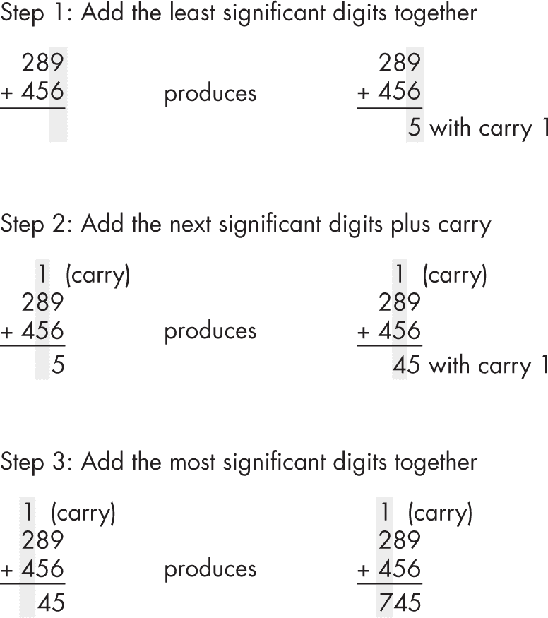

图 8-1：多位数加法

ARM 以相同的方式处理扩展精度算术，不同之处在于，它不是一次加一个数字，而是一次加一个字或双字，将较大的操作分解为一系列较小的操作。例如，考虑图 8-2 中展示的三双字（192 位）加法操作。

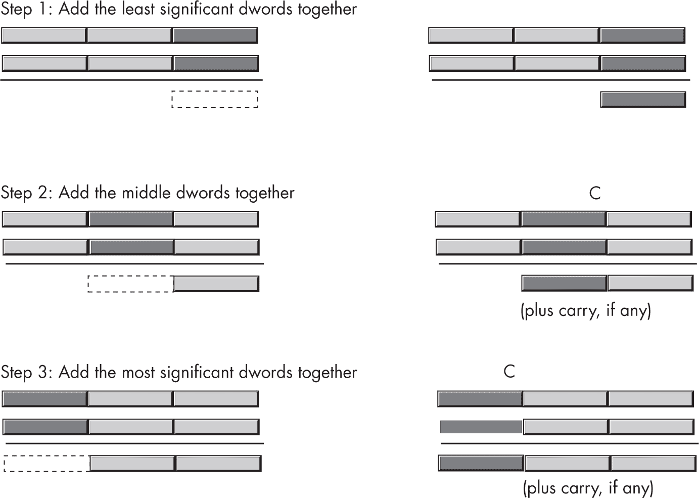

图 8-2：将两个 192 位对象相加

由于 ARM 处理器系列每次最多只能加 64 位（使用通用寄存器），因此运算必须按 64 位或更小的块进行，遵循以下步骤：

1.  就像在手动算法中将两个十进制数的低位数字相加一样，将两个低位双字相加，使用`adds`指令。如果低位相加时有进位，`adds`会将进位标志设置为 1；否则，进位标志会被清除。

2.  将两个 192 位值中的第二对双字以及前一次加法的进位（如果有）加在一起，使用`adcs`（带进位加法）指令。`adcs`指令的语法与`adds`相同，执行的几乎是相同的操作：

```
adcs dest, source1, source2 // dest := source1 + source2 + C
```

唯一的区别是 adcs 指令在加源操作数的同时加上了进位标志的值。它设置标志的方式与 adds 指令相同（包括在发生无符号溢出时设置进位标志）。这正是我们需要的，以便将 192 位和的中间两个双字加在一起。

3. 使用 adcs 将 192 位值的高阶双字与中间两个四字的和的进位相加。（如果你不需要指令后的标志设置，也可以使用普通的 adc 指令。）

总结来说，adds 指令将低阶双字相加，而 adcs 指令将所有其他双字对相加。在扩展精度加法序列结束时，进位标志表示无符号溢出（如果设置），溢出标志表示符号溢出，而符号标志表示结果的符号。零标志在扩展精度加法结束时没有实际意义；它仅表示两个高阶双字的和为 0，并不表示整个结果为 0。

例如，假设你有两个 128 位的值需要相加，定义如下：

```
 .data
X:      .qword   0
Y:      .qword   0
```

假设你想将和存储在第三个变量 Z 中，Z 也是一个四字。以下 ARM 代码将完成这项任务：

```
lea   x0, X
ldr   x3, [x0]    // Add together the LO 64 bits
lea   x1, Y       // of the numbers and store the
ldr   x4, [x1]    // result into the LO dword of Z.
adds  x5, x3, x4
lea   x2, Z
str   x5, [x2]

ldr   x3, [x0, #8]    // Add together the HO 64 bits (with
ldr   x4, [x1, #8]    // carry) and store the result into
adcs  x5, x3, x4      // the HO dword of Z.
str   x5, [x2, #8]
```

前七条指令将 X 和 Y 的低阶双字相加，并将结果存储到 Z 的低阶双字中。最后四条指令将 X 和 Y 的高阶双字加在一起，并加上低阶字的进位，将结果存储到 Z 的高阶双字中。

你可以通过使用 adcs 指令将更高阶的值加在一起，来扩展此算法到任何位数。例如，要将两个声明为四个双字数组的 256 位值加在一起，你可以使用如下代码：

```
 .data
BigVal1: .space  4*8        // Array of four double words
BigVal2: .space  4*8
BigVal3: .space  4*8        // Holds the sum
     .
     .
     .
    lea  x0, BigVal1
    lea  x1, BigVal2
    lea  x2, BigVal3

 ldr  x4, [x0]           // BigVal1[0]
    ldr  x5, [x1]           // BigVal2[0]
    adds x6, x4, x5
    str  x6, [x2]           // BigVal3[0]

    ldr  x4, [x0, #8]       // BigVal1[1]
    ldr  x5, [x1, #8]       // BigVal2[1]
    adcs x6, x4, x5
    str  x6, [x2, #8]       // BigVal3[1]

    ldr  x4, [x0, #16]      // BigVal1[2]
    ldr  x5, [x1, #16]      // BigVal2[2]
    adcs x6, x4, x5
    str  x6, [x2, #16]      // BigVal3[2]

    ldr  x4, [x0, #24]      // BigVal1[3]
    ldr  x5, [x1, #24]      // BigVal2[3]
    adcs x6, x4, x5
    str  x6, [x2, #24]      // BigVal3[3]
```

这会产生一个 256 位的和，并将其存储在内存位置 BigVal3 中。

#### 8.1.2 减法

ARM 也以手动方式执行多字节减法，只是它一次减去整字或双字，而不是十进制位。使用 subs 指令在低阶字或双字上进行操作，并在高阶值上使用 sbc/sbcs（带进位减法）指令。

以下示例演示了使用 ARM 的 64 位寄存器进行 128 位减法：

```
 .data
Left:   .qword   .-.
Right:  .qword   .-.
Diff:   .qword   .-.
     .
     .
     .
    lea  x0, Left
    ldr  x3, [x0]
    lea  x1, Right
    ldr  x4, [x1]
    subs x5, x3, x4
    lea  x2, Diff
    str  x5, [x2]

    ldr  x3, [x0, #8]
    ldr  x4, [x1, #8]
    sbcs x5, x3, x4
    str  x5, [x2, #8]
```

以下示例演示了 256 位减法：

```
 .data
BigVal1: .space  4*8      // Array of four dwords
BigVal2: .space  4*8
BigVal3: .space  4*8
     .
     .
     .

// Compute BigVal3 := BigVal1 - BigVal2.

    lea  x0, BigVal1
    lea  x1, BigVal2
    lea  x2, BigVal3

    ldr  x4, [x0]           // BigVal1[0]
    ldr  x5, [x1]           // BigVal2[0]
    subs x6, x4, x5
    str  x6, [x2]           // BigVal3[0]

    ldr  x4, [x0, #8]       // BigVal1[1]
    ldr  x5, [x1, #8]       // BigVal2[1]
    sbcs x6, x4, x5
    str  x6, [x2, #8]       // BigVal3[1]

    ldr  x4, [x0, #16]      // BigVal1[2]
    ldr  x5, [x1, #16]      // BigVal2[2]
    sbcs x6, x4, x5
    str  x6, [x2, #16]      // BigVal3[2]

    ldr  x4, [x0, #24]      // BigVal1[3]
    ldr  x5, [x1, #24]      // BigVal2[3]
    sbcs x6, x4, x5
    str  x6, [x2, #24]      // BigVal3[3]
```

这会产生一个 256 位的差值，并将其存储在内存位置 BigVal3 中。

#### 8.1.3 比较

不幸的是，没有可以用来执行扩展精度比较的“带进位比较”指令。然而，你可以通过仅使用 cmp 指令来比较扩展精度值。

假设你想比较两个无符号值 0x2157 和 0x1293。这两个值的低字节不会影响比较的结果。仅比较高字节，0x21 与 0x12，就能得出第一个值大于第二个值的结论。

如果高位字节相等，则必须查看一对值的两个字节。在其他情况下，比较高位字节即可得知有关值的所有信息。这适用于任何字节数，而不仅仅是两个字节。以下代码首先比较两个有符号 128 位整数的高位双字，如果高位四字相等，则再比较它们的低位双字：

```
// This sequence transfers control to location "IsGreater" if
// DwordValue > DwordValue2\. It transfers control to "IsLess" if
// DwordValue < DwordValue2\. It falls through to the instruction
// following this sequence if DwordValue = DwordValue2.
// To test for inequality, change the "IsGreater" and "IsLess"
// operands to "NotEqual" in this code.

        ldr x0, [fp, #DwordValue+8]   // Get HO dword.
        ldr x1, [fp, #DwordValue2 + 8]
        cmp x0, x1
        bgt IsGreater
        blt IsLess

        ldr x0, [fp, #DwordValue+0]   // If HO qwords equal,
        ldr x1, [fp, #DwordValue2 + 0] // then we must compare
        cmp x0, x1                    // the LO dwords.
        bgt IsGreater
        blt IsLess

// Fall through to this point if the two values are equal.
```

比较无符号值时，使用 bhi 和 blo 指令替代 bgt 和 blt。

你可以通过以下示例合成任何比较操作，这些示例演示了有符号比较；如果你想进行无符号比较，只需将 bhi、bhs、blo 和 bls 分别替换为 bgt、bge、blt 和 ble 即可。以下每个示例都假设有以下声明：

```
locals  lcl
oword   OW1
oword   OW2
byte    stkSpace, 64
endl    lcl
```

以下代码实现了一个 128 位测试，用来判断 OW1 是否小于 OW2（有符号）。如果 OW1 小于 OW2，控制会跳转到 IsLess 标签。如果条件不成立，控制会继续执行下一个语句（标签 NotLess）：

```
 ldr x0, [fp, #OW1 + 8]   // Gets HO dword
    ldr x1, [fp, #OW2 + 8]
    cmp x0, x1
    bgt NotLess
    blt IsLess

    ldr x0, [fp, #OW1 + 0]   // Fall through to here if the HO
    ldr x1, [fp, #OW2 + 0]   // dwords are equal.
    cmp x0, x1
    blt IsLess
NotLess:
```

这是一个 128 位的测试，用来判断 OW1 是否小于或等于 OW2（有符号）。如果条件成立，代码会跳转到 IsLessEQ 标签：

```
 ldr x0, [fp, #OW1 + 8]   // Gets HO dword
    ldr x1, [fp, #OW2 + 8]
    cmp x0, x1
    bgt NotLessEQ
    blt IsLessEQ

    ldr x0, [fp, #OW1 + 0]   // Fall through to here if the HO
    ldr x1, [fp, #OW2 + 0]   // dwords are equal.
    cmp x0, x1
    ble IsLessEQ
NotLessEQ:
```

这是一个 128 位的测试，用来判断 OW1 是否大于 OW2（有符号）。如果条件成立，程序将跳转到 IsGtr 标签：

```
 ldr x0, [fp, #OW1 + 8]   // Gets HO dword
    ldr x1, [fp, #OW2 + 8]
    cmp x0, x1
    bgt IsGtr
    blt NotGtr

    ldr x0, [fp, #OW1 + 0]   // Fall through to here if the HO
    ldr x1, [fp, #OW2 + 0]   // dwords are equal.
    cmp x0, x1
    bgt IsGtr
NotGtr:
```

以下是一个 128 位的测试，用来判断 OW1 是否大于或等于 OW2（有符号）。如果条件成立，代码将跳转到 IsGtrEQ 标签：

```
 ldr x0, [fp, #OW1 + 8]   // Gets HO dword
    ldr x1, [fp, #OW2 + 8]
    cmp x0, x1
    bgt IsGtrEQ
    blt NotGtrEQ

    ldr x0, [fp, #OW1 + 0]   // Fall through to here if the HO
    ldr x1, [fp, #OW2 + 0]   // dwords are equal.
    cmp x0, x1
    bge IsGtrEQ
NotGtrEQ:
```

这是一个 128 位的测试，用来判断 OW1 是否等于 OW2（有符号或无符号）。如果 OW1 等于 OW2，代码会跳转到 IsEqual 标签。如果它们不相等，则会继续执行下一个指令：

```
 ldr x0, [fp, #OW1 + 8]   // Gets HO dword
    ldr x1, [fp, #OW2 + 8]
 cmp x0, x1
    bne NotEqual

    ldr x0, [fp, #OW1 + 0]   // Fall through to here if the HO
    ldr x1, [fp, #OW2 + 0]   // dwords are equal.
    cmp x0, x1
    beq IsEqual
NotEqual:                  // Fall through to here if not equal.
```

以下是一个 128 位的测试，用来判断 OW1 是否不等于 OW2（有符号或无符号）。如果 OW1 不等于 OW2，代码会跳转到 IsNotEqual 标签。如果它们相等，则会继续执行下一个指令：

```
ldr x0, [fp, #OW1 + 8]   // Gets HO dword
ldr x1, [fp, #OW2 + 8]
cmp x0, x1
bne NotEqual

ldr x0, [fp, #OW1 + 0]   // Fall through to here if the HO
ldr x1, [fp, #OW2 + 0]   // dwords are equal.
cmp x0, x1
bne NotEqual

// Fall through to here if they are equal.
```

为了将前面的代码推广到大于 128 位的对象，首先比较对象的高位双字（HO 双字），然后逐步向低位双字（LO 双字）比较，前提是对应的双字相等。以下示例比较两个 256 位的值，判断第一个值是否小于或等于（无符号）第二个值：

```
 locals cmp256
        dword  Big1, 4
        dword  Big2, 4
        endl   cmp256

         .
         .
         .
        ldr  x0, [fp, #Big1 + 24]
        ldr  x1, [fp, #Big2 + 24]
        cmp  x0, x1
        blo  isLE
        bhi  notLE

        ldr  x0, [fp, #Big1 + 16]
        ldr  x1, [fp, #Big2 + 16]
        cmp  x0, x1
        blo  isLE
        bhi  notLE

 ldr  x0, [fp, #Big1 + 8]
        ldr  x1, [fp, #Big2 + 8]
        cmp  x0, x1
        blo  isLE
        bhi  notLE

        ldr  x0, [fp, #Big1 + 0]
        ldr  x1, [fp, #Big2 + 0]
        cmp  x0, x1
        bnls notLE
isLE:

 `Code to execute if Big1 <= Big2`
         .
         .
         .
notLE:

 `Code to execute if Big1 > Big2`
```

假设，在 notLE 标签之前有一个分支，用于跳过如果 Big1 > Big2 时需要执行的代码。

#### 8.1.4 乘法

尽管 64 × 64 位乘法（或较小的变体）通常足够使用，但有时你可能需要乘以更大的值。使用 ARM 的单操作数 umul 和 smul 指令来执行扩展精度乘法操作，采用手动乘法时相同的技巧。

你可能会使用手动的方法执行多位数乘法，如图 8-3 所示。

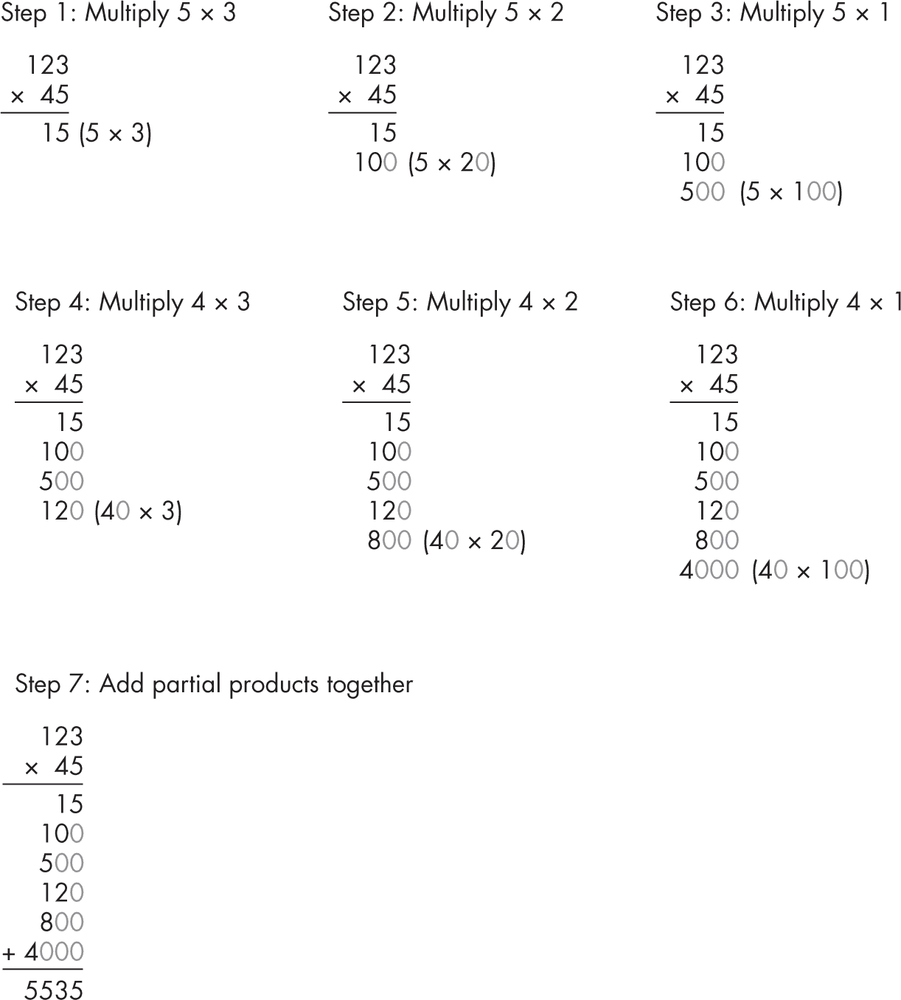

图 8-3：多位数乘法

ARM 以相同的方式执行扩展精度乘法，但使用字和双字而不是数字，如图 8-4 所示。

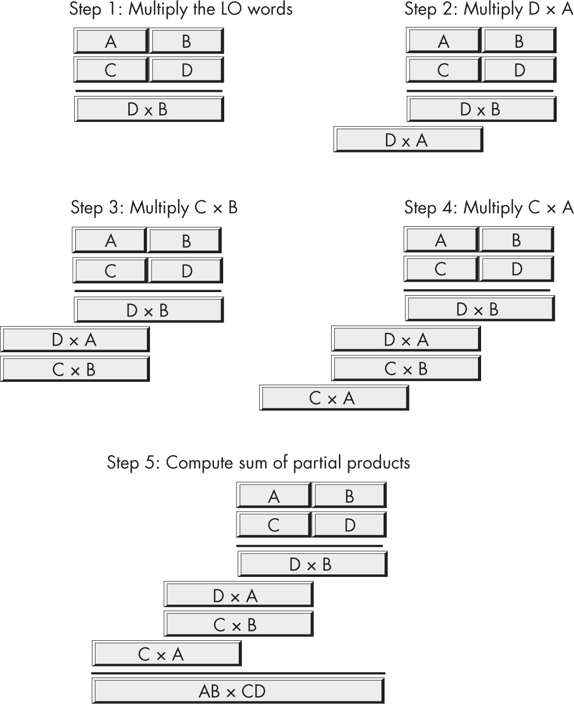

图 8-4：扩展精度乘法

执行扩展精度乘法时，请记住，你还必须同时执行扩展精度加法。将所有部分积相加需要多次加法操作。

到目前为止，你所看到的 umul 和 smul 指令将两个 *n* 位操作数（32 位或 64 位）相乘，产生 *n* 位结果，忽略任何溢出。你不能轻易使用这些指令进行多精度乘法运算。幸运的是，ARM CPU 提供了两组扩展精度乘法指令，可以完成这项工作：一组用于 32 × 32 乘法（产生 64 位结果），另一组用于 64 × 64 乘法（产生 128 位结果）。

以下是产生 64 位结果的指令：

```
smull  Xdest, Wsrc1, Wsrc2        // Xdest = Wsrc1 * Wsrc2 (signed long)
umull  Xdest, Wsrc1, Wsrc2        // Xdest = Wsrc1 * Wsrc2 (unsigned long)

smnegl Xdest, Wsrc1, Wsrc2        // Xdest = -(Wsrc1 * Wsrc2)
umnegl Xdest, Wsrc1, Wsrc2        // Xdest = -(Wsrc1 * Wsrc2)

smaddl Xdest, Wsrc1, Wsrc2, Xsrc3  // Xdest = (Wsrc1 * Wsrc2) + Xsrc3
umaddl Xdest, Wsrc1, Wsrc2, Xsrc3  // Xdest = (Wsrc1 * Wsrc2) + Xsrc3

smsubl Xdest, Wsrc1, Wsrc2, Xsrc3  // Xdest = (Wsrc1 * Wsrc2) - Xsrc3
umsubl Xdest, Wsrc1, Wsrc2, Xsrc3  // Xdest = (Wsrc1 * Wsrc2) - Xsrc3
```

smull（带符号长整型乘法）和 umull（无符号长整型乘法）指令将 32 位寄存器相乘，产生 64 位结果，并将结果存储在 64 位目标寄存器中。smnegl 和 umnegl 也会将两个 32 位值相乘，但在将 64 位结果存储到目标寄存器之前会对结果取反。

smaddl/umaddl 和 smsubl/umsubl 指令将它们的 32 位操作数相乘，产生 64 位结果，然后在将结果存储到 64 位目标寄存器之前，再将一个 64 位寄存器加或减到结果中。例如，你可以使用 smaddl/umaddl 指令来将 C × B 相乘，并同时加上 D × A，如 图 8-4 所示。

32 × 32 乘法指令看似有用，但实际上不如它们看起来那样有用，因为现有的 mxxx 指令将接受 64 位操作数（产生 64 位结果）。你可以轻松地将一个 32 位值零扩展或符号扩展到 64 位寄存器，并使用标准乘法指令实现与长整型乘法指令相同的结果。

你可以使用 32 位长整型乘法指令来合成更大的乘法（例如，128 位乘法）。然而，ARM 提供了两条更适合此操作的附加指令：smulh 和 umulh（带符号和无符号高位乘法）：

```
smulh  Xdest, Xsrc1, Xsrc2   // Xdest = (Xsrc1 * Xsrc2) asr 64
umulh  Xdest, Xsrc1, Xsrc2   // Xdest = (Xsrc1 * Xsrc2) lsr 64
```

这些指令将两个 64 位源操作数相乘，并将 128 位结果的高 64 位存储到目标寄存器中。标准的 mul 指令产生结果的低 64 位，因此在 mul 和 smulh/umulh 指令之间，你可以计算出完整的 128 位结果：

```
// Multiply X0 × X1, producing a 128-bit result in X3:X2
// (unsigned).

    mul    x2, x0, x1
    umulh  x3, x0, x1
```

对于带符号的乘法，只需将 smulh 替换为 umulh 即可。

要将更大的值相乘，可以使用 mul、umulh 和 smulh 指令来实现 图 8-4 所示的算法。示例 8-1 展示了如何使用 64 位指令将两个 128 位值相乘（产生一个 256 位的结果）。

```
// Listing8-1.S
//
// 128-bit multiplication

#include "aoaa.inc"

            .code
            .extern printf

ttlStr:     wastr   "Listing 8-1"

fmtStr1:    .ascii  "%016lx_%016lx * %016lx_%016lx  = \n"
            wastr   "    %016lx_%016lx_%016lx_%016lx\n"

op1:        .qword  0x10001000100010001000100010001000
op2:        .qword  0x10000000000000000000000000000000

// Return program title to C++ program:

            proc    getTitle, public
            lea     x0, ttlStr
            ret
            endp    getTitle

// mul128
//
// Multiplies two unsigned 128-bit values passed on the stack by
// doing a 128x128-bit multiplication, producing a 256-bit
// result
//
// Stores result to location pointed at by X8

          ❶ proc    mul128

            args    a128
            qword   m128.mp    // Multiplier
            qword   m128.mc    // Multiplicand
            enda    a128

            locals  m128
            qword   m128.saveX01
            qword   m128.saveX23
            qword   m128.saveX45
            qword   m128.saveX67
            byte    stkSpace, 64
            endl    m128

            enter   m128.size

          ❷ stp     x0, x1, [fp, #m128.saveX01]  // Preserve
            stp     x2, x3, [fp, #m128.saveX23]  // these
            stp     x4, x5, [fp, #m128.saveX45]  // register
            stp     x6, x7, [fp, #m128.saveX67]  // values.

// Load operands into registers:

          ❸ ldr     x0, [fp, #m128.mp]
            ldr     x1, [fp, #m128.mp+8]
 ldr     x2, [fp, #m128.mc]
            ldr     x3, [fp, #m128.mc+8]

// X5:X4 = X0 * X2

            mul     x4, x0, x2
            umulh   x5, x0, x2

// X6:X7 = X1 * X2, then X5 = X5 + X7 (and save carry for later):

            mul     x7, x1, x2
            umulh   x6, x1, x2
            adds    x5, x5, x7

// X7 = X0 * X3, then X5 = X5 + X7 + C (from earlier):

            mul     x7, x0, x3
            adcs    x5, x5, x7
            umulh   x7, x0, x3
            adcs    x6, x6, x7  // Add in carry from adcs earlier.

// X7:X2 = X3 * X1

            mul     x2, x3, x1
            umulh   x7, x3, x1

            adc     x7, x7, xzr  // Add in C from previous adcs.
            adds    x6, x6, x2   // X6 = X6 + X2
            adc     x7, x7, xzr  // Add in carry from adds.

// X7:X6:X5:X4 contains 256-bit result at this point:

          ❹ stp     x4, x5, [x8]      // Save result to location
            stp     x6, x7, [x8, #16] // pointed at by X8.

            ldp     x0, x1, [fp, #m128.saveX01] // Restore
            ldp     x2, x3, [fp, #m128.saveX23] // saved
            ldp     x4, x5, [fp, #m128.saveX45] // registers.
            ldp     x6, x7, [fp, #m128.saveX67]
            leave
            endp    mul128

// Here is the asmMain function:

            proc    asmMain, public
            locals  am
            oword   product
            byte    stkSpace, 128
            endl    am

            enter   am.size

            str     xzr, [fp, #product]

// Test the mul128 function:

          ❺ lea     x2, op1
            ldp     x0, x1, [x2]
            stp     x0, x1, [sp]

            lea     x2, op2
            ldp     x0, x1, [x2]
            stp     x0, x1, [sp, #16]
            add     x8, fp, #product
            bl      mul128

// Print the result:

          ❻ lea     x0, op1         // Note: display HO
            ldr     x1, [x0, #8]    // dwords first so the
            mstr    x1, [sp]        // values appear normal.

            ldr     x2, [x0]
            mstr    x2, [sp, #8]

            lea     x0, op2
            ldr     x3, [x0, #8]
            mstr    x3, [sp, #16]
            ldr     x4, [x0]
            mstr    x4, [sp, #24]

            ldr     x5, [fp, #product+24]
            mstr    x5, [sp, #32]

            ldr     x6, [fp, #product+16]
            mstr    x6, [sp, #40]

            ldr     x7, [fp, #product+8]
            mstr    x7, [sp, #48]

            ldr     x0, [fp, #product]
// Under macOS, all arguments must be on stack for printf,
// under Linux, only eighth argument is on stack.

EightthArg   =       56  // For macOS
//EightthArg =       0   // For Linux

             str     x0, [sp, #EighthArg]

             lea     x0, fmtStr1
             bl      printf

             leave   // Returns to caller
             endp    asmMain
```

mul128 过程❶将堆栈中传递的两个 128 位值相乘（注意这不符合 ARM ABI）。尽管在 ARM ABI 中 X0 到 X7 是易失的，但此函数很好地保存了这些寄存器❷。代码将堆栈中的两个 128 位值加载到 X1:X0 和 X3:X2 寄存器对❸中。128 位乘法算法如下，程序注释中有详细说明。

该代码将 256 位的结果存储到通过 X8 寄存器传递给此函数的内存位置❹；然后，mul128 函数恢复保存的寄存器并返回给调用者。主程序调用 mul128 ❺并显示结果（以十六进制形式）❻。

这是清单 8-1 的构建命令和输出：

```
$ ./build Listing8-1
$ ./Listing8-1
Calling Listing8-1:
1000100010001000_1000100010001000 * 1000000000000000_0000000000000000  =
    0100010001000100_0100010001000100_0000000000000000_1000100010001000
Listing8-1 terminated
```

该代码仅适用于无符号操作数。要乘以两个有符号值，必须将 umulh 指令更改为 smulh。

清单 8-1 相对简单，因为可以将部分积保存在不同的寄存器中。如果需要将更大的值相乘，就需要将部分积保存在临时（内存）变量中。除此之外，清单 8-1 使用的算法可以推广到任何数量的字。

#### 8.1.5 除法

你不能使用 sdiv 和 udiv 指令合成通用的 *n* 位 / *m* 位除法操作。通用的扩展精度除法需要一系列移位和减法操作，这需要很多指令并且执行速度较慢。本节介绍了扩展精度除法的算法。

与乘法类似，理解计算机如何执行除法的最佳方法是研究你可能被教导的手工长除法方法。考虑你手动将 3,456 除以 12 的步骤，如图 8-5 所示。

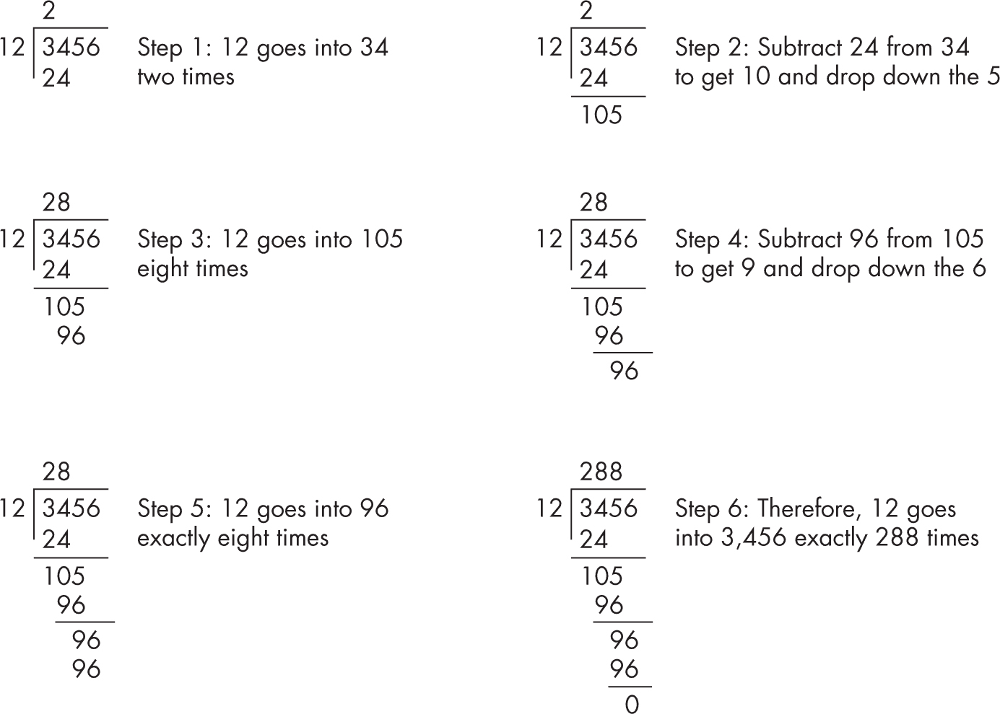

图 8-5：手动逐位除法操作

在二进制下，算法更容易，因为你不需要在每一步猜测 12 多少次能进入余数，也不需要将 12 乘以你的猜测来得到要减去的数值。在二进制算法的每一步，除数要么将余数整除一次，要么完全不能整除。例如，图 8-6 展示了如何用二进制将 27 除以 3（即将 11011 除以 11）。

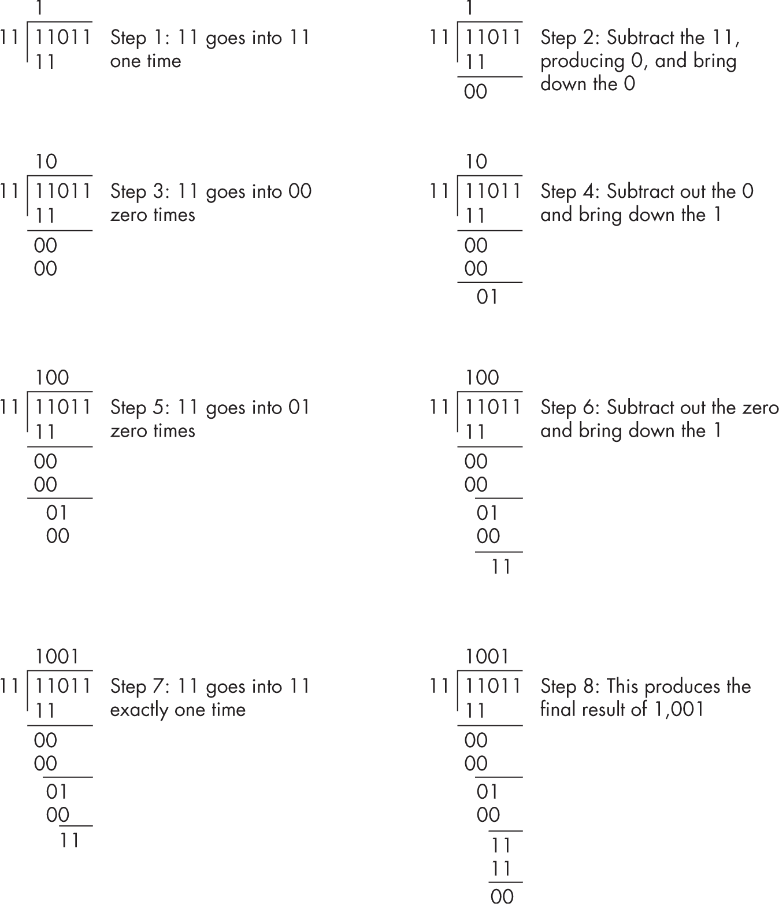

图 8-6：二进制的长除法

以下算法以一种同时计算商和余数的方式实现了二进制除法操作：

```
Quotient := Dividend;
Remainder := 0;
for i := 1 to NumberBits do

    Remainder:Quotient := Remainder:Quotient LSL 1;
    if Remainder >= Divisor then

        Remainder := Remainder - Divisor;
        Quotient := Quotient + 1;

    endif
endfor
```

NumberBits 是余数、商、除数和被除数变量中的位数。LSL 是左移操作符。语句 Quotient := Quotient + 1; 将商的最低有效位（LO bit）设置为 1，因为该算法之前将商左移了 1 位。清单 8-2 实现了这个算法。

```
// Listing8-2.S
//
// 128-bit by 128-bit division

#include "aoaa.inc"

            .data

// op1 is a 128-bit value. Initial values were chosen
// to make it easy to verify the result.

op1:        .qword   0x2000400060008000A000C000E0001000
op2:        .qword   2
op3:        .qword   0xEEEECCCCAAAA88886666444422221111
result:     .qword   0
remain:     .qword   0

            .code
            .extern  printf

ttlStr:     wastr    "Listing 8-2"
fmtStr1:    .ascii   "quotient  = "
            wastr    "%016lx_%016lx\n"

fmtStr2:    .ascii   "remainder = "
            wastr    "%016lx_%016lx\n"

fmtStr3:    .ascii   "quotient (2)  = "
            wastr    "%016lx_%016lx\n"

// Return program title to C++ program:

            proc     getTitle, public
            lea      x0, ttlStr
            ret
            endp     getTitle

// div128
//
// This procedure does a general 128 / 128 division operation
// using the following algorithm (all variables are assumed
// to be 128-bit objects):
//
// Quotient := Dividend
// Remainder := 0
// for i := 1 to NumberBits do
//
//  Remainder:Quotient := Remainder:Quotient SHL 1
//  if Remainder >= Divisor then
//
//      Remainder := Remainder - Divisor
//      Quotient := Quotient + 1
//
// endif
// endfor
//
// Data passed:
//
// 128-bit dividend, by reference in X0
// 128-bit divisor, by reference in X1
//
// Data returned:
//
// Pointer to 128-bit quotient in X8
// Pointer to 128-bit remainder in X9

          ❶ proc    div128

#define remainderL  x10
#define remainderH  x11
#define dividendL   x12
#define dividendH   x13
#define quotientL   dividendL
#define quotientH   dividendH
#define divisorL    x14
#define divisorH    x15

            locals  d128
            dword   saveX0
            qword   saveX1011
            qword   saveX1213
            qword   saveX1415
            byte    stkSpace, 64
            endl    d128

quotient    =       dividend        // Alias to dividend

            enter   d128.size       // Set up activation record.

// Preserve registers div128 modifies:

          ❷ str     x0, [fp, #saveX0]
            stp     x10, x11, [fp, #saveX1011]
            stp     x12, x13, [fp, #saveX1213]
            stp     x14, x15, [fp, #saveX1415]

// Initialize remainder with 0:

          ❸ mov     remainderL, #0
            mov     remainderH, #0

// Copy the dividend to local storage:

            ldp     dividendL, dividendH, [x0]

// Copy the divisor to local storage:

            ldp     divisorL, divisorH, [x1]

            mov     w0, #128           // Count off bits in W0.

// Compute Remainder:Quotient := Remainder:Quotient LSL 1
//
// Note: adds x, x, x is equivalent to lsl x, x, #1
//       adcs x, x, x is equivalent to rol x, x, #1
//                    (if rol existed)
//
// The following four instructions perform a 256-bit
// extended-precision shift (left) dividend through
// remainder:

repeatLp:   adds    dividendL, dividendL, dividendL
            adcs    dividendH, dividendH, dividendH
            adcs    remainderL, remainderL, remainderL
            adc     remainderH, remainderH, remainderH

// Do a 128-bit comparison to see if the remainder
// is greater than or equal to the divisor:

            cmp     remainderH, divisorH
            bhi     isGE
            blo     notGE

            cmp     remainderL, divisorL
            bhi     isGE
            blo     notGE

// Remainder := Remainder - Divisor

isGE:       subs    remainderL, remainderL, divisorL
            sbc     remainderH, remainderH, divisorH

// Quotient := Quotient + 1:

            adds    quotientL, quotientL, #1
            adc     quotientH, quotientH, xzr

// Repeat for 128 bits:

notGE:      subs    w0, w0, #1
            bne     repeatLp

// Okay, copy the quotient (left in the Dividend variable)
// and the remainder to their return locations:

          ❹ stp     quotientL, quotientH, [x8]
            stp     remainderL, remainderH, [x9]

// Restore the registers div128 modified:

          ❺ ldr     x0, [fp, #saveX0]
            ldp     x10, x11, [fp, #saveX1011]
            ldp     x12, x13, [fp, #saveX1213]
            ldp     x14, x15, [fp, #saveX1415]
            leave   // Return to caller.
            endp    div128

// Here is the asmMain function:

            proc    asmMain, public

            locals  am
            byte    am.stkSpace, 64
            endl    am

            enter   am.size         // Sets up activation record

// Test the div128 function:

          ❻ lea     x0, op1
            lea     x1, op2
            lea     x8, result
            lea     x9, remain
            bl      div128

// Print the results:

            ldr     x1, [x8, #8]    // X8 still points at result.
            mstr    x1, [sp]
            ldr     x2, [x8]
            mstr    x2, [sp, #8]

            lea     x0, fmtStr1
            bl      printf

            lea     x9, remain      // Assume printf munged X9,
            ldr     x1, [x9, #8]    // must reload.
            mstr    x1, [sp]
            ldr     x2, [x9]
            mstr    x2, [sp, #8]

            lea     x0, fmtStr2
            bl      printf

// Test the div128 function (again):

            lea     x0, op3
            lea     x1, op2
            lea     x8, result
            lea     x9, remain
            bl      div128

// Print the results:

            ldr     x1, [x8, #8]    // X8 still points at result.
            mstr    x1, [sp]
            ldr     x2, [x8]
            mstr    x2, [sp, #8]

            lea     x0, fmtStr3
            bl      printf

            lea     x9, remain      // Must reload
            ldr     x1, [x9, #8]    // (because of printf).
            mstr    x1, [sp]
            ldr     x2, [x9]
            mstr    x2, [sp, #8]

            lea     x0, fmtStr2
            bl      printf

            leave   // Returns to caller
            endp    asmMain
```

div128 函数 ❶ 是一个 128 × 128 位的除法操作，它同时生成商和余数。与之前给出的扩展精度乘法不同，这个函数通过引用传递其参数（在 X0 和 X1 中），而不是通过栈上的值。它将 128 位的商存储在 X8 指向的位置，将余数存储在 X9 指向的位置。与乘法代码一样，div128 函数 ❷ 会保存它修改的所有易失性寄存器。

接下来是除法算法 ❸，如程序注释中所描述的。代码将商和余数存储起来 ❹，然后恢复已保存的寄存器 ❺。主程序 ❻ 通过一对调用来演示 div128 函数，并包含显示结果的代码。

以下是构建命令和程序输出：

```
$ ./build Listing8-2
$ ./Listing8-2
Calling Listing8-2:
quotient  = 1000200030004000_5000600070000800
remainder = 0000000000000000_0000000000000000
quotient (2)  = 7777666655554444_3333222211110888
remainder = 0000000000000000_0000000000000001
Listing8-2 terminated
```

该代码未检查除以 0 的情况（如果尝试除以 0，它会产生商 0xFFFF_FFFF_FFFF_FFFF）。它仅处理无符号值，并且非常慢，比 sdiv/udiv 指令差几个数量级。为了处理除以 0 的情况，在执行此代码之前请检查除数是否为 0，并在除数为 0 时返回适当的错误代码。处理有符号值时，请注意符号，取操作数的绝对值，执行无符号除法，然后通过设置结果为负值来修正符号（如果操作数符号不同）。

#### 8.1.6 取反

neg 指令没有提供通用的扩展精度形式。然而，取反等同于从 0 中减去一个值，因此可以通过使用 subs 和 sbcs 指令轻松模拟扩展精度的取反。

以下代码提供了一种简单的方法，通过从 0 中减去一个值来取反（320 位值），使用扩展精度减法：

```
ldr  x0, [fp, #value320]
subs x0, xzr, x0
str  x0, [fp, #value320]

ldr  x0, [fp, #value320 + 8]
sbcs x0, xzr, x0
str  x0, [fp, #value320 + 8]

ldr  x0, [fp, #value320 + 16]
sbcs x0, xzr, x0
str  x0, [fp, #value320 + 16]

ldr  x0, [fp, #value320 + 24]
sbcs x0, xzr, x0
str  x0, [fp, #value320 + 24]

ldr  x0, [fp, #value320 + 32]
sbcs x0, xzr, x0
str  x0, [fp, #value320 + 32]
```

你可以通过使用我为扩展精度减法提供的方案，将此算法扩展到任意数量的位（或缩减为更少的位）。

#### 8.1.7 AND

执行 *n* 字节的 AND 操作很简单：只需对两个操作数之间的相应字节进行 AND 运算，并保存结果。例如，要对所有 128 位长的操作数执行 AND 操作，可以使用以下代码：

```
ldp x0, x1, [fp, #source1]
ldp x2, x3, [fp, #source2]
and x2, x2, x0
and x3, x3, x1
stp x2, x3, [fp, #dest]
```

要将此技术扩展到任意数量的双字（dword），在操作数中对相应的双字执行逻辑与操作（AND）。

在执行 AND 序列后测试标志时，请记住，and 指令只会为 AND 序列中的特定部分设置标志。如果将最后一个 and 转换为 ands 指令，它会正确设置 N 标志，但不会正确设置 Z 标志。要设置 Z 标志（表示整个 128 位结果为 0），可以使用 ccmp（条件比较）指令来测试 ands 指令中的 Z 标志，并将 X2 与 0 进行比较（请参见第 6.1.4 节“条件指令”，在第 297 页）：

```
ldp  x0, x1, [fp, #source1]
ldp  x2, x3, [fp, #source2]
and  x2, x2, x0
ands x3, x3, x1
stp  x2, x3, [fp, #dest]
ccmp x2, #0, 0b0100, eq   // Sets Z if X3 == 0 && X2 == 0
```

如果在这个序列后你需要测试 N 标志和 Z 标志，可以考虑使用 tbz/tbnz 指令来测试寄存器 X3 中的 HO 位，它包含符号位。

#### 8.1.8 或运算

多字节的逻辑或操作与多字节的与操作执行方式相同：你将两个操作数中对应的字节进行或运算。例如，要对两个 256 位的值进行逻辑或操作，可以使用以下代码：

```
ldp x0, x1, [fp, #source1]
ldp x2, x3, [fp, #source1 + 16]
ldp x4, x5, [fp, #source2]
ldp x6, x7, [fp, #source2 + 16]

orr x0, x0, x4
orr x1, x1, x5
orr x2, x2, x6
orr x3, x3, x7

stp x0, x1, [fp, #dest]
stp x2, x3, [fp, #dest+16]
```

记住，orr 指令不会影响任何标志（并且没有 orrs 指令）。如果你需要在扩展精度的或操作后测试零标志，必须将所有结果双字与 0 进行比较。

你还可以使用 V*n*寄存器执行扩展精度的逻辑操作，最多一次处理 128 位。有关更多详细信息，请参阅第 11.13 节“在实际程序中使用 SIMD 指令”，见第 699 页。

#### 8.1.9 异或

与其他逻辑操作一样，扩展精度的 XOR 操作会对两个操作数中对应的字节进行异或运算，得到扩展精度的结果。以下代码序列作用于两个 128 位的操作数，计算它们的异或，并将结果存储到一个 128 位的变量中：

```
ldp x0, x1, [fp, #source1]
ldp x2, x3, [fp, #source2]
eor x2, x2, x0
eor x3, x3, x1
stp x2, x3, [fp, #dest]
```

前一节中关于零标志的评论也适用于这里，以及关于 V*n*寄存器的评论。

#### 8.1.10 非操作

mvn 指令会反转指定操作数的所有位。通过在所有受影响的操作数上执行 mvn 指令，执行扩展精度的 NOT 操作。例如，要对 X1:X0 中的值执行 128 位的 NOT 操作，可以执行以下指令：

```
mvn x0, x0
mvn x1, x1
```

如果你执行两次 mvn 指令，你会得到原始值。同样，用所有 1 的值（例如 0xFF、0xFFFF、0xFFFF_FFFF 或 0xFFFF_FFFF_FFFF_FFFF）对某个值进行异或运算，效果与 mvn 指令相同。

#### 8.1.11 移位操作

ARM 上的扩展精度移位操作存在一些问题。传统上，实现扩展精度移位的方法是将一个位从一个寄存器移到进位标志中，然后将该进位位旋转到另一个寄存器中。不幸的是，ARM 没有提供这样的指令，因此需要采用不同的方法。

具体的实现方法取决于以下两个因素，详见下面的子章节：需要移位的位数和移位的方向。

##### 8.1.11.1 左移

128 位的 lsl（逻辑左移）呈现出图 8-7 所示的形式。

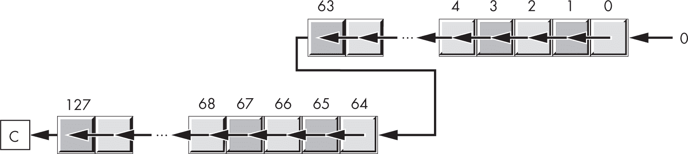

图 8-7：128 位左移操作

为了使用机器指令实现这一操作，你必须首先将 LO 双字左移（例如，使用 lsls 指令），并从第 63 位捕获输出（幸运的是，进位标志会为我们做到这一点）。接着，将该位移入 HO 双字的 LO 位，同时将所有其他位左移（并通过进位标志捕获输出）。没有指令专门将进位标志旋转到寄存器中，但你可以使用神奇的指令 adc/adcs 来实现此功能，只要你提供适当的操作数。

记住，左移操作等同于乘以 2。将一个值加到它自身上，正是乘以 2 的定义。因此，lsls 和 adds 指令都可以将操作数左移，并将溢出位移入进位标志。为了让 adds 像左移操作一样工作，你必须在两个源操作数位置提供相同的操作数：

```
adds x0, x0, x0  // Same as lsl x0, x0, #1
```

adcs 指令（使用相同的操作数）也将所有位左移一个位置，并将进位标志移入第 0 位（同时将 HO 位移入进位标志，操作结束时如此）。这实际上是一个单比特的*进位左旋操作*，如图 8-8 所示。

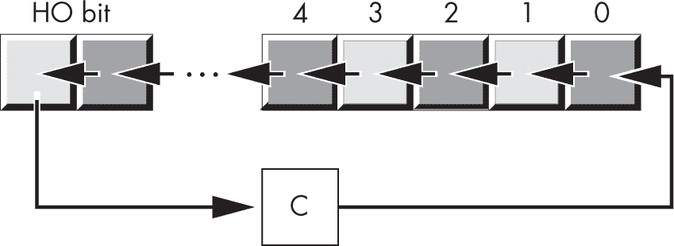

图 8-8：通过进位左旋操作

你可以使用 adds 和 adcs 指令实现 128 位的左移。例如，要将 X1:X0 中的 128 位数据左移一位，可以使用以下指令：

```
adds x0, x0, x0
adcs x1, x1, x1
```

adds 指令将 0 移入 128 位操作数的第 0 位，并将第 63 位移入进位标志。接着，adcs 指令将进位标志移入第 64 位，并将第 127 位移入进位标志，从而得到你想要的结果，如图 8-9 所示。

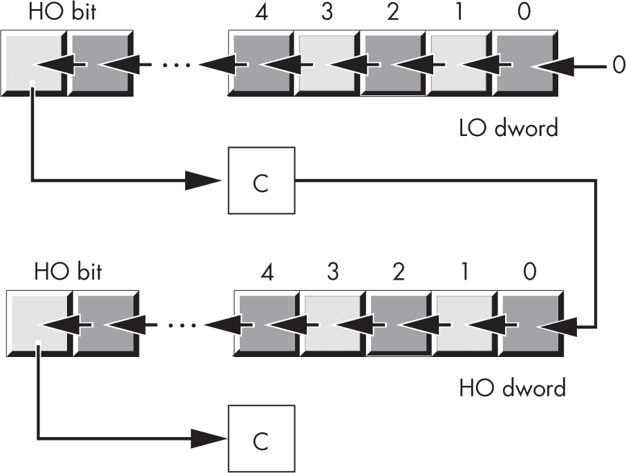

图 8-9：使用 adds/adcs 指令进行扩展精度左移

使用这种技巧，你只能一次性将扩展精度值左移 1 位。你无法通过寄存器将扩展精度操作数左移多个比特，也无法在使用此技术时指定大于 1 的常量值。

要对大于 128 位的操作数进行左移，使用额外的 adcs 指令。扩展精度左移操作总是从最低有效双字开始，每个随后的 adcs 指令操作下一个更高位的双字。例如，要对一个内存位置执行 192 位的左移操作，你可以使用以下指令：

```
adds x0, x0, x0
adcs x1, x1, x1
adcs x2, x2, x2
```

如果你需要将数据左移 2 位或更多位，可以重复前面的指令序列以实现固定次数的左移，或者将这些指令放入循环中，以便按需重复执行。例如，以下代码将 X0、X1 和 X2 中的 192 位值左移 W3 中指定的位数：

```
ShiftLoop:
    adds x0, x0, x0
    adcs x1, x1, x1
    adcs x2, x2, x2
    subs w3, w3, #1
    bne  ShiftLoop
```

这个多位移位的唯一问题是，当移位超过几个位时，它可能会运行得比较慢。通常，我们说这个算法是 O(n)，意味着运行时间与我们左移的位数成正比。

一条可以同时移位多个位的指令，就像 lsl 指令那样，将有助于解决这个问题。如果存在 rol 指令，你可以用它将 X1:X0 中的 128 位值向左移 8 位：

```
rol     x2, x0, #8       // Shift HO 8 bits into LO 8
and     x2, x2, #0xFF    // bits and clear other bits.
lsl     x0, x0, #8       // Shift X0 8 bits.
lsl     x1, x1, #8       // Shift X1 8 bits.
orr     x1, x1, x2       // Merge in LO 8 bits.
```

不幸的是，ARM CPU 的指令集没有 rol 指令；不过，你可以使用 ror 指令来做任何 rol 指令可以做的事。对于范围在 1–63 之间的任何位移，rol(n) 等同于 ror((64 - n) % 64)，其中 rox(n) 意味着“将值左/右旋转 *n* 位”。对于 rol(0) 的特殊情况，ror(0) ((64 - 0) % 64) 是 0，也会将值旋转 0 位。因此，你可以用这个来替换之前的无法编译代码：

```
ror     x2, x0, #64-8    // Shift HO 8 bits into LO 8
and     x2, x2, #0xFF    // bits and clear other bits.
lsl     x0, x0, #8       // Shift X0 8 bits.
lsl     x1, x1, #8       // Shift X1 8 bits.
orr     x1, x1, x2       // Merge in LO 8 bits.
```

当 *n* 大于 2 或 3 时，这个序列的执行速度比之前给出的 adds/adcs 循环要快得多。

图 8-10 到 图 8-14 显示了此扩展精度左移操作的过程。

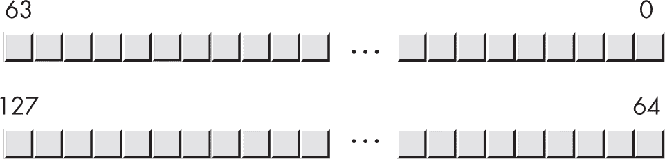

图 8-10：使用 ror 进行的扩展精度左移，移位前

在 图 8-11 中，算法会临时复制从第 0 位到第 63 位的位并将值左移 8 位。

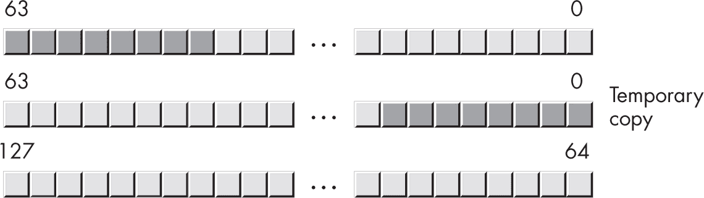

图 8-11：步骤 1：制作临时副本并移位

图 8-12 显示了将原始值左移 8 位（这会清除 LO 位）并通过与操作清除 HO 临时位。

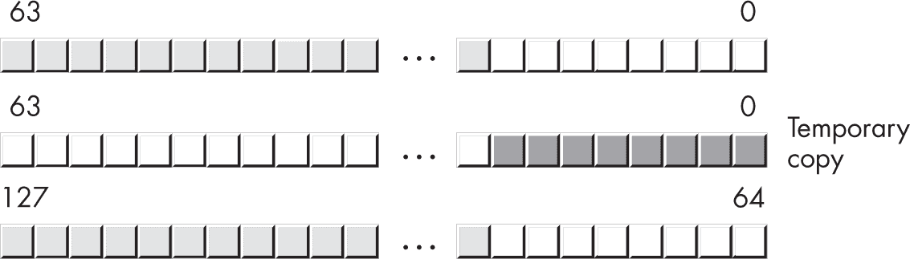

图 8-12：步骤 2：移位并清除位

图 8-13 显示了临时 dword 和 HO dword 的合并（或操作）。

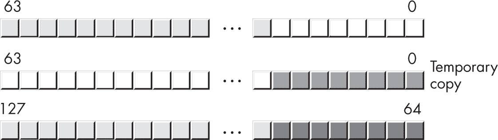

图 8-13：步骤 3：合并临时和 HO dword

图 8-14 显示了移位后的结果。

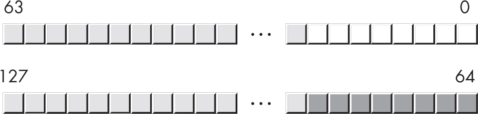

图 8-14：步骤 4：移位后

要实现一个可变的扩展精度左移操作，代码需要生成一个位掩码来清除 LO 位（之前代码中的 and 指令）。事实证明，你可以通过以下代码生成一个 *n* 位移的掩码：

```
mov x3, #1
lsl x3, x3, x4   // Assume X4 contains the shift count.
sub x3, x3, #1   // Generates 1 bits in positions 0 to (n-1)
and x2, x2, x3   // Clears unused bits of X2
```

这里的技巧是 lsl(n) 生成 2*^n*，然后，2*^n* - 1 是从第 0 位到第 *n* - 1 位的全 1 位。 ##### 8.1.11.2 右移和算术右移

不幸的是，像使用 adds/adcs 指令的技巧并不能让你执行 *通过进位右旋* 操作（将所有位通过进位向右移，并将原始进位重新移入 HO 位）。因此，要执行扩展精度右移（或算术右移），你必须再次使用 ror 指令。以下是一个示例，将 128 位值从 X1:X0 右移 8 位：

```
ror x2, x1, #8            // Shifts bits 64-71 into HO
and x2, x2, #0xFF << 56   // 8 bits and clears bits 64-119
lsr x1, x1, #8            // Shifts X1 8 bits
lsr x0, x0, #8            // Shifts X0 8 bits
orr x0, x0, x2            // Merges in bits 56-63
```

该扩展精度的算术右移操作的代码类似：

```
ror x2, x1, #8            // Shifts bits 64-71 into HO
and x2, x2, #0xFF << 56   // 8 bits and clears bits 64-119
asr x1, x1, #8            // Arithmetic shift X1 8 bits
lsr x0, x0, #8            // Shifts X0 8 bits
orr x0, x0, x2            // Merges in bits 56-63
```

在这种情况下，你将 asr 指令替换了 HO 双字上的 lsr 指令。请注意，LO 双字仍然使用 lsr 指令；lsr 是必要的，它将 0 填充到 HO 位，以便 orr 指令能够正确合并从 HO 双字移出的位。

作为最后一个例子，以下是一个 192 位的算术右移操作，将 X2:X1:X0 中的位向右移动 4 位：

```
ror x3, x2, #4            // Temp copy holding bits 128-131
And x3, x3, #0xF << 60    // Clears all but HO 4 bits of temp
asr x2, x2, #4            // Arithmetic shift right X2 4 bits
ror x4, x2, #4            // Temp (2) copy holding bits 64-67
And x4, x4, #0xF << 60    // Clears all but HO 4 bits of temp2
lsr x2, x2, #4            // Shifts the original 3 dwords 4 bits
lsr x1, x1, #4
lsr x0, x0, #4
orr x1, x1, x3            // Merges in bits 124-127
orr x0, x0, x4            // Merges in bits 60-63
```

Neon 指令允许你将 128 位值左右移动；详细信息请参见第十一章。

### 8.2 对不同大小操作数的操作

有时，你可能需要对一对不同大小的操作数进行计算（*混合大小*或*混合模式*算术运算）。例如，你可能需要将一个字与一个双字相加，或者从一个字值中减去一个字节值。为了做到这一点，将较小的操作数扩展到较大操作数的大小，然后对两个相同大小的操作数进行操作。对于符号操作数，将较小的操作数符号扩展到与较大操作数相同的大小；对于无符号值，将较小的操作数零扩展。这适用于任何运算。

以下例子演示了字节变量、半字变量和双字变量的加法操作：

```
locals  lcl
byte    var1
hword   var2
align   3
dword   var3
endl    lcl
 .
 .
 .
// Unsigned addition (8-bit + 16-bit addition
// producing a 16-bit result):

ldrb    w0, [fp, #var1] // Zero-extends byte to 32 bits
ldrh    w1, [fp, #var2] // Zero-extends hword to 32 bits
add     w0, w0, w1      // Adds 32 bits
strh    w0, [fp, #var2] // Store LO 16 bits in var2.

// Signed addition (8-bit + 16-bit addition
// producing a 16-bit result):

ldrsb   w0, [fp, #var1] // Sign-extends byte to 32 bits
ldrsh   w1, [fp, #var2] // Sign-extends hword to 32 bits
add     w0, w0, w1      // Adds 32 bits
strh    w0, [fp, #var2] // Store LO 16 bits in var2.
```

在这两种情况下，字节变量被加载到 W0 寄存器中，扩展为 32 位，然后与半字操作数相加（半字操作数也扩展为 32 位）。

所有这些例子都是将字节值与半字值相加。通过将操作数零扩展或符号扩展为相同的大小，你可以轻松地将任何两个不同大小的变量相加。

作为最后一个例子，考虑将一个 8 位的符号值加到一个 qword（128 位）值上：

```
ldrsb   x0, [fp, #var1] // Sign-extends byte to 64 bits
asr     x1, x0, #63     // Sneaky sign-extend to 128 bits
ldp     x2, x3, [fp, #var3]
adds    x2, x2, x0      // Adds LO dwords
adc     x3, x3, x1      // Adds HO dwords
stp     x2, x3, [fp, #var3]
```

该代码中的技巧是 asr 指令。此指令通过将 X0 中的符号位复制到 X1 中，从而将 X0 符号扩展到 X1:X0（算术右移 63 位实际上将位 63 复制到位 0–62）。一旦 X0 已被符号扩展到 X1，你就拥有了一个 128 位的值 X1:X0，可以将其与变量 var3 中的 128 位值相加。

本章前面的例子假设不同大小的操作数是内存变量。它们使用了 ldrb/ldrsb 和 ldrh/ldrsh 指令将 8 位和 16 位操作数零扩展或符号扩展为 32 位（也可以通过提供 64 位寄存器将操作数扩展到 64 位）。虽然这些例子没有演示 32 位和 64 位操作数的混合使用，但你也可以使用 ldrsw 指令将 32 位符号扩展为 64 位。

如果你的操作数已经在寄存器中（而不是内存中），你可以使用 uxtb/uxth/uxtw 和 sxtb/sxth/sxtw 指令来零扩展或符号扩展操作数。例如，以下代码将 W0 中的 32 位值符号扩展到 128 位：

```
// Assume 8-bit value is in W0 and 128-bit value is in X3:X2.
// Add byte in W0 to 128-bit value in X3:X2.

sxtb    x0, w0          // Sign-extends byte to 64 bits
asr     x1, x0, #63     // Sneaky sign-extend to 128 bits
adds    x2, x2, x0      // Adds LO dwords
adc     x3, x3, x1      // Adds HO dwords
```

当将较小的值加到 32 位或 64 位寄存器中，而不需要将较小的值符号扩展到 128 位或更高时，你可以在算术指令中使用操作数 2 的符号扩展修饰符，将较小的值零扩展或符号扩展到较大的大小：

```
// Add 8-bit unsigned value in W0 to 32-bit value in W1:

add    w1, w1, w0, uxtb #0

// Add 8-bit signed value in W0 to 32-bit value in W1:

add    w1, w1, w0, sxtb #0

// Add 16-bit unsigned value in W0 to 32-bit value in W1:

add    w1, w1, w0, uxth #0

// Add 16-bit signed value in W0 to 32-bit value in W1:

add    w1, w1, w0, sxth #0

// Add 32-bit unsigned value in W0 to 64-bit value in X1:

add    x1, x1, w0, uxtw #0

// Add 32-bit signed value in W0 to 64-bit value in X1:

add    x1, x1, w0, sxtw #0
```

要将字节和半字添加到 64 位双字中，只需在此代码中将 W1 寄存器改为 X1。

### 8.3 继续前进

扩展精度算术在高级语言（HLLs）中是困难的，甚至是无法实现的，但在汇编语言中相对容易。本章描述了 ARM 汇编语言中的扩展精度算术、比较和逻辑运算。最后讨论了混合模式（混合大小）算术，其中操作数的大小不同。

拥有本章提供的信息后，处理大多数高级语言中难以实现的算术和逻辑操作变得轻松。下一章将介绍数值到字符串的转换，当转换大于 64 位的值时，将使用这些扩展精度操作。

### 8.4 更多信息

+   ARM 指令集缺少的一个算术特性是*十进制算术*（基数 10），这意味着如果需要，你必须在软件中执行该算术操作。尽管大部分代码是用 C 编写的，但如果你想实现十进制算术，请访问[十进制算术网站](https://speleotrove.com/decimal/)。

+   唐纳德·克努斯的*《计算机程序设计的艺术，第 2 卷：半数值算法》*（Addison-Wesley Professional，1997 年）包含了关于十进制算术和扩展精度算术的许多有用信息，尽管该书内容较为通用，描述的是如何在 MIXAL 汇编语言中实现这些操作，而非 ARM 汇编语言。
