## 第十一章：11 NEON 和 SIMD 编程


本章讨论了 ARM 上的矢量指令。这一特殊类型的指令提供了并行处理，传统上被称为 *单指令多数据（SIMD）* 指令，因为，字面上说，一条指令可以同时作用于多个数据单元。由于这种并发性，SIMD 指令通常比标准 ARM 指令集中的 *单指令单数据（SISD）* 指令执行速度快得多（理论上，可以快 32 到 64 倍）。

矢量指令，也称为 *Neon 指令集* 或 *ARM 高级 SIMD*，为标准标量指令提供了扩展。标准的 *标量指令* 每次操作一个数据单元，而 Neon 指令则同时操作一个数据对象的 *矢量*（即数组）。

本章简要回顾了 SIMD 指令的历史，然后讨论了 ARM Neon 架构（包括矢量寄存器）和 Neon 数据类型。接下来的大部分内容将讲解 Neon 指令集。关于 SIMD 编程的完整论述超出了本书的范围；然而，写这章时至少提供一些 SIMD 编程示例以展示 SIMD 编程的优势是必要的，因此本章的最后将给出一些例子，展示比托尼排序和数字到十六进制字符串的转换。

### 11.1 SIMD 指令扩展的历史

Neon 指令集扩展是在 ARM 创建之后很久才加入到 ARM 指令集中的。ARM 创建 Neon 是为了应对英特尔 x86 CPU 家族的竞争。要理解为什么 Neon 指令集与标准指令集有如此根本的不同，必须了解 SIMD（矢量）指令集的历史。

第一个矢量计算机是超级计算机，如 CDC Star-100、德州仪器的高级科学计算机（ASC）和 Cray 计算机，它们可以用单条指令操作一个数据矢量。这些矢量计算机是早期 SIMD 计算机的前身，如 Thinking Machines 的 CM-1 和 CM-2。最终，随着英特尔在其低成本 i860（后来是 Pentium 处理器）上引入 SIMD 特性，超级计算机开始远离 SIMD 方法。

英特尔多媒体扩展（MMX）指令集是第一个广泛采用的桌面 SIMD 架构。英特尔将并行整数运算指令添加到传统的 x86 指令集中，以加速数字音频处理和其他数字信号处理应用。之后，PowerPC 推出了更强大的 AltiVec 架构（其中包括对单精度浮点值的支持）。随后，英特尔推出了 SSE2 和 SSE3、AVX、AVX2 和 AVX-512 SIMD 指令架构（现在包括完全的双精度浮点支持）。

英特尔在其 x86 系列 CPU 中添加向量指令的方法有些拗口。由于上世纪 90 年代中期 CPU 的晶体管预算有限，英特尔在其早期的奔腾处理器中增加了一些向量指令（MMX），然后随着其 CPU 的增大和可用晶体管数量的增加，扩展了 SIMD 指令集，支持实现更先进的特性。这一演变产生了一些杂乱无章的情况，新的指令集复制并淘汰了旧的指令（新指令集能够处理更多的数据或以不同的方式处理数据）。

到了 ARM 通过其 *Neon 高级 SIMD* 指令添加 SIMD 指令时，英特尔已经经历了多代 SIMD 指令；ARM 能够从英特尔的指令集中挑选出更有趣且实用的指令，抛弃了所有不必要的遗留指令。因此，Neon 指令集比英特尔的 MMX/SSE/AVX 指令集要简洁得多，理解起来也容易得多。

### 11.2 向量寄存器

ARM 提供了 32 个主 FP/Neon 寄存器，每个大小为 128 位，按其大小分为五组：

+   V0 到 V31，为 128 位向量寄存器（用于 Neon 指令），也可以引用为 Q0 到 Q31，qword 寄存器；V*n* 名称支持向量操作的特殊语法

+   D0 到 D31，为 64 位双精度浮点寄存器

+   S0 到 S31，为 32 位单精度浮点寄存器

+   H0 到 H31，为 16 位半精度浮点寄存器

+   B0 到 B31，为 8 位字节寄存器

图 11-1 显示了向量寄存器的布局。

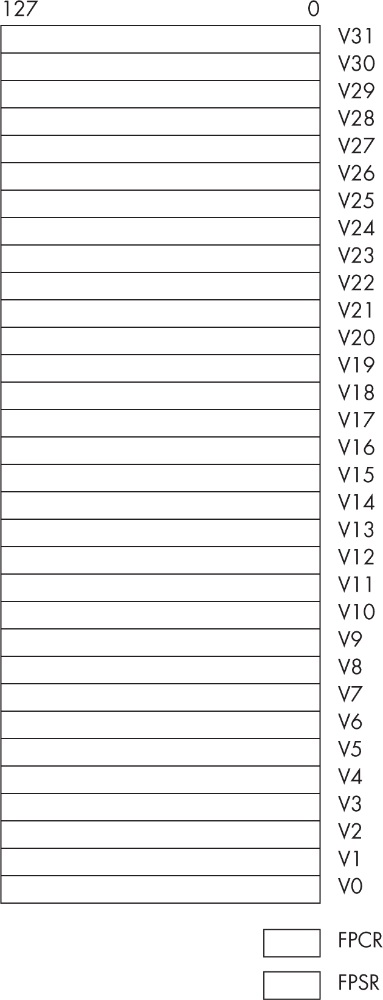

图 11-1：FP/Neon 寄存器

B*n*、H*n*、S*n*、D*n* 和 V*n* 寄存器彼此重叠，如 图 11-2 所示。

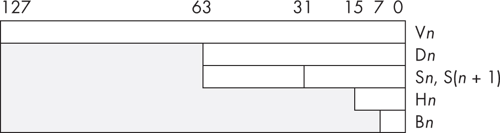

图 11-2：字节、半字、单精度、双精度和向量寄存器重叠

有关标量浮点寄存器 D*n*、S*n* 和 H*n* 的更多信息，请参见 第六章。不过请记住，如果在代码中混合使用向量和浮点操作，则这些指令共享相同的寄存器集合。

图 11-1 和 图 11-2 给人一种印象，即 V*n* 寄存器是 128 位寄存器（可以作为一个 128 位的值进行操作）。实际上，V*n* 寄存器是包含 16 个 8 位、8 个 16 位、4 个 32 位、2 个 64 位或（单个）128 位值的向量，正如 图 11-3 所示。

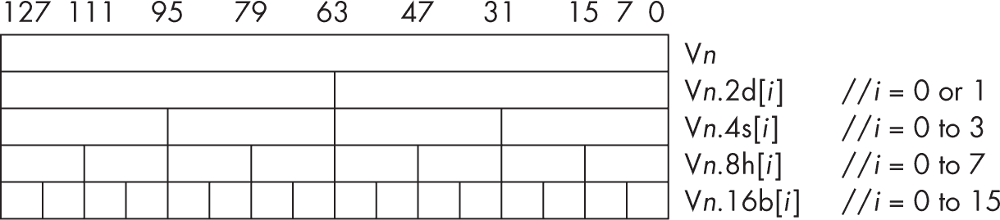

图 11-3：向量寄存器重叠

当指令操作某个向量寄存器的特定元素时，可以通过以下寄存器名称引用该元素（在所有情况下，*n* 代表一个向量寄存器编号，范围从 0 到 31）：

+   V*n* 或 Q*n* 当引用整个 128 位寄存器时

+   V*n*.B 当将整个寄存器视为 16 字节的数组时

+   当将整个寄存器视为八个半字组成的数组时，使用 V*n*.H。

+   当将整个寄存器视为四个字（单精度值）组成的数组时，使用 V*n*。

+   当将整个寄存器视为两个双字（双精度值）组成的数组时，使用 V*n*.D。

+   当引用位位置 0 到 63 或 64 到 127 中的 64 位双精度时，使用 V*n*.2D[0]或 V*n*.2D[1]。

+   当访问位位置 0 到 31、32 到 63、64 到 95 或 96 到 127 中的 32 位单精度值时，使用 V*n*.4S[0]、V*n*.4S[1]、V*n*.4S[2]、V*n*.4S[3]。

+   当访问位位置 0 到 15、16 到 31、...、112 到 127 中的 16 位半字值时，使用 V*n*.8H[0]、V*n*.8H[1]、...、V*n*.8H[7]。

+   当访问位位置 0 到 7、8 到 15、...、120 到 127 中的 8 位字节时，使用 V*n*.16B[0]、V*n*.16B[1]、...、V*n*.16B[15]。

选择确切名称将取决于指令和情况。你将在下一节“向量数据移动指令”中看到这些寄存器的使用示例，特别是 11.3.4 节“向量加载与存储”，在第 632 页。

图 11-2 和图 11-3 展示了与向量寄存器中数据相关的五种基本类型：字节、半字、单精度值、双精度值和 128 位四字（qword）。事实上，32 位（单精度）和 64 位（双精度）字段支持浮点（单精度和双精度）和整数（字和双字）类型，将类型的总数增加到七种。

除了特殊的 128 位情况外，向量寄存器包含字节、半字、字和四字（qword）的数组。由于你将在本章讨论向量操作时了解的原因，每个数组元素被称为*lane*。在使用两个向量寄存器执行操作时，CPU 通常通过使用两个源寄存器中对应的 lane 中的操作数来计算结果，并将结果存储在目标寄存器中的相应 lane 中。例如，假设 V1 在高 64 位（lane 1）包含 2.0，在低 64 位（lane 0）包含 1.0，而 V2 在 lane 1 中包含 20.0，在 lane 0 中包含 10.0。将这两个向量寄存器相加并将结果存储在 V3 中，会在 lane 1 中得到 22.0，在 lane 0 中得到 11.0。

尽管向量寄存器通常包含数据数组（在执行 SIMD 操作时），但不要忘记，浮点寄存器（D*n*和 S*n*）也覆盖了向量寄存器。当执行正常的浮点操作时（参见第六章），这些寄存器只包含单一的值，而不是值的数组。这些单一值被称为*标量*。

很少有操作将整个 128 位 Neon 寄存器视为标量值。那些将其视为标量值的操作（主要是加载和存储指令）使用名称 Q*n*来表示标量值，而不是 V*n*（向量值）。

### 11.3 向量数据移动指令

移动指令是 Neon 指令集中的最常见整数和浮点指令。在这一节中，你将学习如何使用这些指令在寄存器之间移动数据、将常量加载到 Neon 寄存器中，以及将向量寄存器从内存加载和存储。

#### 11.3.1 寄存器之间的数据传输

你可以使用 mov 指令在向量寄存器之间移动数据。不幸的是，显然的语法无法正常工作：

```
mov v0, v1  // Generates a syntax error
```

mov 指令将向量元素复制到向量寄存器。它可以在两个向量寄存器之间复制数据，或者在通用寄存器（X*n* 或 W*n*）和向量寄存器之间复制数据。具体语法取决于你要复制的数据量以及源寄存器和目标寄存器的位置（向量寄存器或通用寄存器）。

将数据从 32 位通用寄存器（W*m*）移动到向量寄存器（V*n*）使用以下语法之一：

```
mov V`n`.B[`i`], W`m`  // Inserts LO byte of W`m` into V`n`[`i`] (`i` = 0 to 15)
mov V`n`.H[`i`], W`m`  // Inserts LO hword of W`m` into V`n`[`i`] (`i` = 0 to 7)
mov V`n`.S[`i`], W`m`  // Inserts W`m` into V`n`[`i`] (`i` = 0 to 3)
```

索引 i 必须是一个字面整数常量，如下例所示：

```
mov v0.b[15], w0  // Copy LO byte of W0 into lane 15 of V0.
mov v1.h[0], w2   // Copy LO hword of W2 into lane 0 of W1.
mov v2.s[2], w1   // Copy W1 into lane 2 of V2.
```

将数据从 64 位通用寄存器（X*m*）移动到向量寄存器（V*n*）使用以下语法：

```
mov V`n`.D[`i`], X`m`   // Inserts X`m` into V`n`[`i`] (`i` = 0 to 1)
```

我在这些示例中使用了*插入*这个词，因为 mov 指令只将字节、半字、字或双字复制到向量寄存器中，由索引 *i* 指定的位置。它不会影响 V*n* 中的其他数据。例如：

```
mov v0.b[4], w0
```

只将 W0 中的 LO 字节插入到 V0 寄存器的第 4 个 lane；它不会更改 V0 中的其他字节。只有使用 W*m* 寄存器时，才能移动字节、半字和字。如果你在指令中使用 X*m*，你只能移动 64 位。向量寄存器的类型指定为 S（单精度）用于 32 位，D（双精度）用于 64 位。即使是在复制 32 位和 64 位整数时，你也要使用这个指定。

> 注意

*ARM 指令* ins *(插入) 是* mov *的同义词，用于将数据从通用寄存器复制到向量寄存器——这也是我们说这些指令*插入*数据而不是说它们*复制*数据的另一个原因。*

之前的示例将值从 32 位或 64 位通用寄存器复制到向量寄存器。你还可以通过以下语法将数据从一个向量寄存器（V*n*）复制到另一个向量寄存器（V*m*）：

```
mov V`m`.8B, V`n`.8B    // Copy 64 bits.
mov V`m`.16B, V`n`.16B  // Copy 128 bits.
```

这些指令将 64 位（8 字节，四个半字，两个字或一个双字）或 128 位（16 字节，八个半字，四个单精度值或两个双字/双精度值）从一个向量寄存器复制到另一个向量寄存器。理论上，你应该能够输入类似 mov v1, v0 或 mov q1, q0 的语法，将 128 位向量寄存器 V0（Q0）的内容移动到 V1（Q1）。可惜的是，Gas 不接受这种语法，因此你需要使用之前的四个指令之一，如下例所示：

```
mov v0.16b, v1.16b  // Copies V1 to V2
```

你还可以从一个向量寄存器中提取单个字节，并使用以下语法将其插入到另一个向量寄存器的任意 lane 中：

```
mov V`m`.B[`i1`], V`n`.B[`i2`]
```

其中 `i2` 是源向量中字节的索引，`i1` 是目标索引。两个索引必须在 0 到 15 的范围内。

你还可以从一个向量中提取半字并将其插入到另一个向量中：

```
mov V`m`.H[`i1`], V`n`.H[`i2`]
```

对于字节，规则相同，只是两个索引值必须在 0 到 7 的范围内。

你可以使用以下语法复制字（单精度值）和双字（双精度值）：

```
mov V`m`.S[`i1`], V`n`.S[`i2`]  // i1 and i2 must be in range 0 to 3.
mov V`m`.D[`i3`], V`n`.D[`i4`]  // i3 and i4 must be in range 0 to 1.
```

这是一个示例，展示了如何将 V0 和 V1 的低 64 位（LO dwords）复制并合并到 V2 的两个 64 位中：

```
mov v2.d[0], v0.d[0]
mov v2.d[1], v1.d[0]
```

到目前为止，我已经描述了如何将数据从通用寄存器移动到向量寄存器，以及在两个向量寄存器之间移动数据。唯一缺少的组合是将数据从向量寄存器移动到通用寄存器，这是通过以下的 `mov`、`umov` 和 `smov` 指令来实现的：

```
mov  W`n`, V`m`.S[`i0`]  // Copies 32 bits
mov  X`n`, V`m`.D[`i1`]  // Copies 64 bits

umov W`n`, V`m`.B[`i1`]  // Zero-extends byte to 32 bits
umov W`n`, V`m`.H[`i2`]  // Zero-extends hword to 32 bits
umov X`n`, V`m`.D[`i3`]  // Copies 64 bits

smov W`n`, V`m`.B[`i5`]  // Sign-extends byte to 32 bits
smov W`n`, V`m`.H[`i6`]  // Sign-extends hword to 32 bits
smov X`n`, V`m`.B[`i5`]  // Sign-extends byte to 64 bits
smov X`n`, V`m`.H[`i6`]  // Sign-extends hword to 64 bits
smov X`n`, V`m`.S[`i7`]  // Sign-extends word to 64 bits
```

没有将 8 位或 16 位扩展到 64 位的零扩展操作。将数据零扩展到 W*n* 会自动将零扩展到 X*n* 的上 32 位。以下是这些指令的示例：

```
mov  w0, v0.s[0]  // Copy lane 0 (word) of V0 to W0.
mov  x1, v7.d[1]  // Copy lane 1 (dword) of V7 to X1.
umov w0, v1.b[2]  // Copy and zero-extend V1[2] byte to W0.
smov x1, v0.s[3]  // Copy and sign-extend V0[3] (word) to X1.
```

请记住，`smov x1, v0.s[3]` 是将一个整数值移动到寄存器中，尽管指定的类型是 S（单精度）。

#### 11.3.2 向量加载立即数指令

ARM CPU 提供了一组有限的指令，允许将某些立即数常量加载到向量寄存器中。这些指令的整数版本只允许使用无符号的 8 位立即操作数，可以直接使用或左移 1、2 或 3 字节（用 0 或 1 填充空出的位）。此外，这些立即数指令将数据复制到字节数组、半字数组或字数组的每个通道中。浮点版本的这些指令允许有限的浮点常量（与标量浮点常量的限制相同；请参见第 6.9.1.4 节“带立即操作数的 fmov”在第 334 页）。

标准的 *立即数移动* 指令是 `movi`。

```
movi V`n`.`size`, #`uimm8`
movi V`n`.`size`, #`uimm8`, lsl #`c` // `size` = 4H, 8H, 2S, or 4S
movi V`n`.`size`, #`uimm8`, msl #`c` // `size` = 2S or 4S
movi V`n`.2D, #`uimm64`
movi D`n`, #`uimm64`
```

其中，size 可以是 16B、8B、4H、8H、2S 或 4S；`uimm8` 是一个 8 位常量；`uimm64` 是 0 或 0xFFFFffffFFFFffff。对于 4H、8H、2S 和 4S 大小的指令，`lsl #c` 组件是可选的。对于 2S 和 4S 大小，`msl #c` 选项是可选的。`movi` 指令将指定的立即数初始化到向量寄存器的所有通道中，或者只初始化 LO 64 位的通道。接下来的段落将描述每个指令的具体变体。

`movi Vn.8B, #uimm8` 指令将指定的常量填充到 V*n* 的 LO 8 字节中，并将寄存器的 HO 64 位填充为 0。例如：

```
movi v0.8b, #0x80
```

将 0x80808080 加载到 V0 中。

`movi Vn.16B, #uimm8` 指令将指定的常量填充到 V*n* 的所有 16 个字节中。每个通道都会接收 `uimm8` 值的副本。

`movi Vn.4H, #uimm8` 指令将指定的 `uimm8` 常量填充到 V*n* 的 LO 64 位中的四个半字通道，并将 V*n* 的 HO 64 位填充为 0。由于该指令仅接受 8 位立即数常量，因此每个半字通道的 HO 8 位将包含 0。例如：

```
movi v1.4h, #1
```

将 0x0001000100010001 加载到 V1。

movi Vn.4H, #uimm8, lsl #0 指令与 movi Vn.4H, #uimm8 完全相同。如果移位常量是 #8，则该指令将在将立即数存储到四个半字通道（V*n* 的低 64 位）之前，将立即数向左移位 8 个位置。在这种情况下，这些通道的每个低 8 位将包含 0。例如：

```
movi v1.4h, #1, lsl #8
```

将 0x0100010001000100 加载到 V1。

movi Vn.8H, #uimm8 和 movi Vn.8H, #uimm8, lsl #c 指令与 4H 指令做的事情相同，唯一不同的是它们将立即数（通过 0 或 8 位移位）存储到 V*n* 寄存器的所有八个通道中。

movi Vn.2S, #uimm8 指令将 V*n* 的低 64 位中的两个字（单精度）通道填充为 uimm8 常量，并将 V*n* 的高 64 位填充为 0。因为该指令仅接受 8 位立即数常量，所以每个字通道的高 24 位将包含 0。尽管类型说明符为 S，但该指令为通道分配的是整数常量，而非浮点常量。如果存在可选的移位子句（movi Vn.2S, #uimm8, lsl #c，其中 c 是 0、8、16 或 24），该指令将在将常量存储到两个通道之前，按指定的位数移位 8 位常量。以下是一些示例：

```
movi v3.2s, #1          // Loads 0x0000000100000001 into V3
movi v4.2s, #1, lsl #8  // Loads 0x0000010000000100 into V4
movi v5.2s, #1, lsl #16 // Loads 0x0001000000010000 into V5
movi v6.2s, #1, lsl #24 // Loads 0x0100000001000000 into V6
```

movi Vn.2S, #uimm8, msl #c 指令几乎与其 lsl 对应指令相同，唯一的区别是它在左移操作中将 1 位而非 0 位移入空出的位。移位计数限制为 8 或 16，而不是 0、8、16 和 24（一个令人烦恼的不一致）。例如：

```
movi v5.2s, #1, msl #16
```

将 0x0001FFFF0001FFFF 加载到 V5。

movi Vn.4S, #uimm8 指令将 uimm8 常量复制到 V*n* 中的四个字（单精度）通道。否则，该指令（以及带移位的变体）与 2S 版本的行为完全相同。

movi Vn.2D, #uimm64 指令将常量 0 或 -1 加载到 V*n* 寄存器的两个双字通道中。再次提醒，这些是整数常量，而不是浮点常量，尽管使用了 2D 类型说明符。

第二条立即数移动指令是 mvni（移动并*非*立即数）。它支持以下语法：

```
mvni V`n`.`size`, #`uimm8` {, (lsl | msl) #`c`}
```

其中，size 和 uimm8 的含义与 movi 中给出的含义相同。

操作与 movi 相同，不同之处在于 mvni 在将数据存储到 V*n* 目标寄存器的通道中之前，会将所有位反转。V*n* 的高 64 位仍会为 4H 和 2S 类型说明符接收 0，如以下示例所示：

```
mvni v2.4h, #1, lsl #8  // Loads 0xFEFFfeffFEFFfeff into V2
mvni v4.2s, #2, msl #8  // Loads 0xFFFFFD00fffffd00 into V4
```

注意 mvni 指令没有 2D 类型。这些指令是不必要的，因为两个允许的 movi uimm64 常量已经是彼此的反向。如果你想要反转的位，只需使用另一个 uimm64 常量（0 与 -1）并结合 movi 指令使用。

移动立即数指令的第三种形式，fmov，允许你将某些浮点常量加载到向量寄存器的各个通道中。允许的语法如下：

```
fmov V`n`.2S, #`fimm`
fmov V`n`.4S, #`fimm`
fmov V`n`.2D, #`fimm`
```

浮点立即数常量（fimm）必须是由以下方式定义的值

±*n* ÷ 16 × 2*r*

其中 16 ≤ *n* ≤ 31 且 –3 ≤ *r* ≤ 4。你不能通过此公式表示 0.0；如果需要将 0.0 加载到向量寄存器的各个通道中，只需使用 movi 指令将整数常量 0 加载到这些通道（所有位为 0 即为 0.0）：

```
fmov v0.2s, #1.0  // Loads [0.0, 0.0, 1.0, 1.0] into V0
fmov v0.2d, #2.0  // Loads [2.0, 2.0] into V0
```

移动立即数指令只将某些常量值加载到向量寄存器中。以下是你可以作为立即数浮点常量加载的确切值（Gas 只接受这些值）：

```
 0.1250000  0.1328125   0.1406250   0.1484375
 0.1562500  0.1640625   0.1718750   0.1796875
 0.1875000  0.1953125   0.2031250   0.2109375
 0.2187500  0.2265625   0.2343750   0.2421875
 0.2500000  0.2656250   0.2812500   0.2968750
 0.3125000  0.3281250   0.3437500   0.3593750
 0.3750000  0.3906250   0.4062500   0.4218750
 0.4375000  0.4531250   0.4687500   0.4843750
 0.5000000  0.5312500   0.5625000   0.5937500
 0.6250000  0.6562500   0.6875000   0.7187500
 0.7500000  0.7812500   0.8125000   0.8437500
 0.8750000  0.9062500   0.9375000   0.9687500
 1.00       1.0625      1.125       1.1875
 1.25       1.3125      1.375       1.4375
 1.50       1.5625      1.625       1.6875
 1.75       1.8125      1.875       1.9375
 2.00       2.1250      2.250       2.3750
 2.50       2.6250      2.750       2.8750
 3.00       3.1250      3.250       3.3750
 3.50       3.6250      3.750       3.8750
 4.00       4.2500      4.500       4.7500
 5.00       5.2500      5.500       5.7500
 6.00       6.2500      6.500       6.7500
 7.00       7.2500      7.500       7.7500
 8.0        8.5         9.0         9.5
10.0       10.5        11.0        11.5
12.0       12.5        13.0        13.5
14.0       14.5        15.0        15.5
16.0       17.0        18.0        19.0
20.0       21.0        22.0        23.0
24.0       25.0        26.0        27.0
28.0       29.0        30.0        31.0
```

基于程序通常使用 Neon 寄存器的方式，这是一个合理的值集合，可以编码成 32 位指令操作码。要加载更大或不同的常量，请参见下一页第 11.3.4 节，“向量加载与存储”。

#### 11.3.3 寄存器或通道值复制

dup 指令允许你将保存在通用寄存器或向量寄存器单一通道中的值复制到向量寄存器的所有通道中。此指令支持以下形式：

```
dup V`n`.2D, X`m`        // Copy X`m` into lanes 0-1 (64 bits each) in V`n`.

dup V`n`.8B, W`m`        // LO 8 bits of W`m` to lanes 0-7 in V`n`
dup V`n`.16B, W`m`       // LO 8 bits of W`m` to lanes 0-15 in V`n`

dup V`n`.4H, W`m`        // LO 16 bits of W`m` to lanes 0-3 in V`n`
dup V`n`.8H, W`m`        // LO 16 bits of W`m` to lanes 0-7 in V`n`

dup V`n`.2S, W`m`        // W`m` to lanes 0-1 in V`n`
dup V`n`.4S, W`m`        // W`m` to lanes 0-3 in V`n`

dup V`n`.8B, V`m`.B[`i1`]  // Dup V`m` lane `i1` through lanes 0-7 in V`n`.
dup V`n`.16B, V`m`.B[`i2`] // Dup V`m` lane `i2` through lanes 0-15 in V`n`.

dup V`n`.4H, V`m`.H[`i3`]  // Dup V`m` lane `i3` through lanes 0-3 in V`n`.
dup V`n`.8H, V`m`.H[`i4`]  // Dup V`m` lane `i4` through lanes 0-7 in V`n`.

dup V`n`.2S, V`m`.S[`i5`]  // Dup V`m` lane `i5` through lanes 0-1 in V`n`.
dup V`n`.4S, V`m`.S[`i6`]  // Dup V`m` lane `i6` through lanes 0-3 in V`n`.

dup V`n`.2D, V`m`.D[`i7`]  // Dup V`m` lane `i7` through lanes 0-1 in V`n`.
```

每对指令中的第一条指令仅复制 V*n* 的 LO 64 位数据；每对指令中的第二条指令复制完整的 128 位数据。这两条单独的指令复制 128 位数据。

#### 11.3.4 向量加载与存储

mov、movi、mvni、fmov 和 dup 指令可以在向量寄存器之间以及在通用寄存器和向量寄存器之间移动数据，并且可以将常量加载到向量寄存器中。然而，它们不允许你从内存加载寄存器或将向量寄存器中的值存储到内存中。Neon 指令集提供了几条加载和存储指令来处理这些任务。

因为加载和存储指令是最基础的，所以本节首先讨论它们。要加载或存储整个 128 位的向量寄存器，请使用以下语法

```
ldr Q`n`, `memory`
str Q`n`, `memory`
```

其中内存是常见的 ARM 内存寻址模式之一（与标量 ldr 和 str 指令相同）。注意使用 Q*n* 来表示寄存器（而非 V*n*）。这是 Q*n* 寄存器合法使用的少数几个地方之一（让人想知道为什么不直接使用 V*n*）。这些指令将加载或存储完整的 16 字节，即 128 位。

stp 指令还允许使用向量寄存器（Q*n*）操作数：

```
ldp Q`n`, Q`m`, `memory`
stp Q`n`, Q`m`, `memory`
```

请注意，这些指令中的 n 和 m 不必是连续的数字，而可以是 0 到 31 范围内的任意值。

#### 11.3.5 交错加载与存储

Neon 指令集提供了加载和存储指令，将数据加载到多个向量寄存器的单个通道中。这些指令从内存加载交错的数据到一个、两个、三个或四个向量寄存器中。加载（ld1、ld2、ld3 和 ld4）和存储（st1、st2、st3 和 st4）指令分别支持非交错数据、交错数据对、交错数据三元组和交错数据四元组。以下小节将描述这些类型的交错加载和存储指令。  

##### 11.3.5.1 交错加载和存储寻址模式  

交错的加载和存储指令访问内存，但它们不支持 ARM 内存寻址模式的完整集合，仅支持三种  

```
`instr`  {`register_list`}, [X`n`]
`instr`  {`register_list`}, [X`n`], X`m`
`instr`  {`register_list`}, [X`n`], #`imm`
```

其中，instr 是 ldn/stn 之一，register_list 是一个以逗号分隔的 Q*n* 寄存器集合，加载和存储指令将在从内存加载数据或向内存存储数据时使用这些寄存器。（以下章节将更详细地讨论寄存器 _list。）  

标准的寄存器间接寻址模式是[Xn]。ldn/stn 指令将访问存储在通用寄存器 X*n* 中的内存地址的数据。  

[Xn], Xm 寻址模式将有效地址计算为 X*n* 和 X*m* 中值的和。这是一个后增量寻址模式；在访问指定的内存地址后，立即将 X*m* 的值加到 X*n* 中。  

[Xn], #imm 寻址模式也是一种后增量寻址模式，它将有效地址计算为 Xn + imm 的和，然后在引用地址后将立即数加到 X*n* 中。立即数的值限制为常数 1、2、4、8、16、32、48 或 64，register_list 操作数决定了你必须使用的值。以下章节将描述每个版本指令的允许立即常数。  

##### 11.3.5.2 ld1/st1  

ld1 指令从顺序（非交错）内存位置加载一到四个寄存器的数据。使用单一向量寄存器时，该指令的语法如下  

```
ld1 {V`n.`8B}, `memory`
ld1 {V`n.`16B}, `memory`
ld1 {V`n.`B}[`index`], `memory`

ld1 {V`n.`4H}, `memory`
ld1 {V`n.`8H}, `memory`
ld1 {V`n.`H}[`index`], `memory`

ld1 {V`n.`2S}, `memory`
ld1 {V`n.`4S}, `memory`
ld1 {V`n.`S}[`index`], `memory`

ld1 {V`n.`2D}, `memory`
ld1 {V`n.`D}[`index`], `memory`
```

其中，memory 是以下之一：  

[Xn]  

[Xn], Xm  

[Xn], #imm  

如果存在 imm 操作数，它必须与寄存器操作数的大小匹配。也就是说，对于 B 必须是 1；对于 8B，必须是 8；对于 16B，必须是 16；对于 H，必须是 2；依此类推。  

使用 {Vn.8B} 寄存器列表操作数的 ld1 指令将 8 字节数据加载到 V*n* 的低 64 位中，而 {Vn.16B} 寄存器列表操作数则加载 16 字节。

使用 4H 或 2S 类型说明时，ld1 寄存器还会将 64 位（四个 hword 或两个 word）加载到 V*n* 的 LO 64 位中。使用 8H 或 4S 类型时，ld1 指令将 128 位数据加载到 V*n* 中。虽然 8B、4H 和 2S 类型与 16B、8H、4S 和 2D 类型看起来可以互换（它们将相同量的数据加载到 V*n* 中），但你应该尽量选择最适合你操作数据的类型。这样不仅能提高文档的质量，还有助于 ARM CPU 的内部微架构根据你使用的数据类型更好地优化其操作。

使用裸 B、H、S 或 D 类型说明时，ld1 指令从内存中加载 V*n* 中的单个 lane 数据。此操作不会影响 V*n* 中其他 lanes 的数据。这是 ld1 指令最重要的变种，因为它允许你一次从内存的不同位置将数据逐步构建到向量寄存器中的每个 lane。

为什么 ld1 指令需要在向量寄存器规格说明周围加上大括号？该指令的目标操作数实际上是一个寄存器*列表*。你可以在这个列表中指定一个到四个寄存器，如下所示的示例：

```
ld1 {v1.8b}, [x0]
ld1 {v1.8b, v2.8b}, [x0]
ld1 {v1.8b, v2.8b, v3.8b}, [x0]
ld1 {v1.8b, v2.8b, v3.8b, v4.8b}, [x0]
```

该列表中可以出现的寄存器有两个限制：

+   它们必须是连续编号的寄存器（V0 紧随 V31 之后）。

+   列表中所有寄存器的类型说明必须相同。

如果列表中有两个或更多连续编号的寄存器，你可以使用简写形式：

```
{V`n`.`t` - V(`n` + `m`).t}
```

其中 m 是 1、2 或 3，t 是常见的向量类型之一，如下所示的示例：

```
ld1 {v1.8b}, [x0]
ld1 {v1.8b - v2.8b}, [x0]
ld1 {v1.8b - v3.8b}, [x0]
ld1 {v1.8b - v4.8b}, [x0]
```

当你在列表中指定多个寄存器时，ld1 指令将从连续的位置加载值到寄存器中。例如，以下代码将从 X0 持有的地址加载 V0，加载 16 字节的数据；从 X0 + 16 加载 V1，加载 16 字节的数据；从 X0 + 32 加载 V2，加载 16 字节的数据：

```
ld1 {v0.16b, v1.16b, v2.16b}, [x0]
```

st1 指令支持相同的指令语法（当然，你需要将 st1 助记符替换为 ld1）。它将寄存器中的内容或寄存器中的某些 lane 数据存储到指定的内存位置。下面是一个示例，演示了将 V0 和 V1 的值存储到由 X0 指定的位置：

```
st1 {v0.16b, v1.16b}, [x0]
```

该指令将 V0 中的值存储到 X0 所持有的地址，并将 V1 中的值存储到地址 X0 + 16。

##### 11.3.5.3 ld2/st2

ld2 和 st2 指令用于加载和存储交错数据。这两个指令使用以下语法：

```
ld2 {V`n`.`t1`, V`(n + 1)`.`t1`}, `memory`
ld2 {V`n`.`t2`, V`(n + 1)`.`t2`}[`index`], `memory`
st2 {V`n`.`t1`, V`(n + 1)`.`t1`}, `memory`
st2 {V`n`.`t2`, V`(n + 1)`.`t2`}[`index`], `memory`
```

其中寄存器列表必须包含恰好两个寄存器，并且它们的寄存器编号必须是连续的。t1 大小为 8B、16B、4H、8H、2S、4S 或 2D，而 t2 则是 B、H、S 或 D。字面常数索引是该类型大小的合适 lane 编号（B 为 0 到 15，H 为 0 到 7，S 为 0 到 3，D 为 0 到 1）。最后，内存是第 633 页中描述的寻址模式之一，详见第 11.3.5.1 节，“交错加载和存储寻址模式”。

带索引的变种（加载一个通道到两个寄存器）将从指定的内存地址加载第一个寄存器的通道，并在 n 字节后加载第二个寄存器的通道（其中 n 是通道的大小，以字节为单位）。

带有 t1 类型规格的 ld2 指令（例如 8B、16B、4H、8H 等），同时一次加载两个寄存器的一个值（指定类型：B、H、S 或 D），并交替将目标通道分配给两个寄存器。例如

```
ld2 {v0.8b, v1.8b}, [x0]
```

从内存位置 X0、X0 + 2、X0 + 4、X0 + 6、X0 + 8、X0 + 10、X0 + 12 和 X0 + 14 加载 V0 的 LO 8 字节。它从位置 X0 + 1、X0 + 3、X0 + 5、X0 + 7、X0 + 9、X0 + 11、X0 + 13 和 X0 + 15 加载 V1 的 LO 8 字节。这样就解交错了内存中的数据，将偶数字节加载到 V0 中，将奇数字节加载到 V1 中。图 11-4 显示了 ld2 如何从 X0 提取交错数据，并将解交错的结果存储到 V0 和 V1 中。

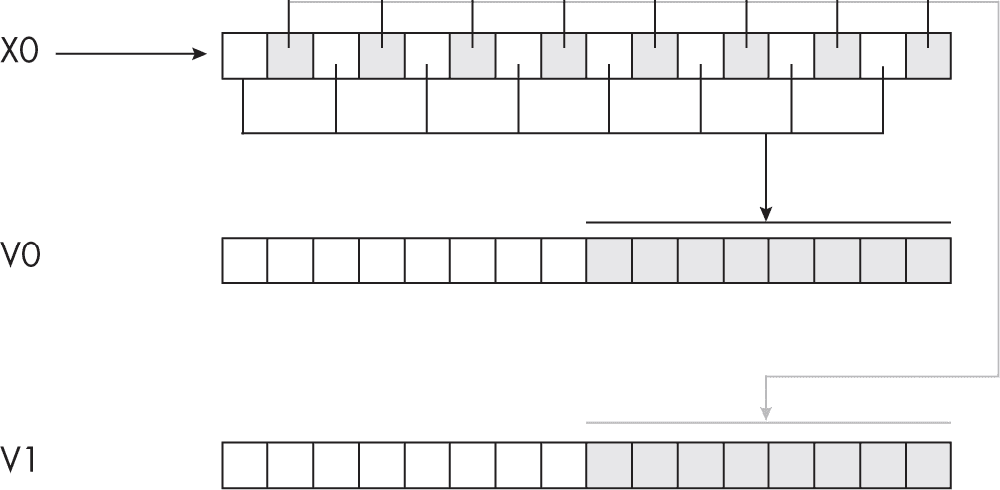

图 11-4：ld2 解交错操作

如果你指定了半字类型（4H 或 8H），则 ld2 指令将对 16 位值进行解交错（偶数和奇数半字）。这对于解交错左右声道的数字音频轨道（每个样本 16 位）特别有用。

如果你指定了 2S/4S 或 2D，这个指令将解交错字或双字。例如，如果你有一个浮点复数数组，ld2 指令可以解交错实部和虚部。

因为 ld2 解交错的是成对的对象，寄存器列表必须恰好包含两个寄存器。汇编器会拒绝任何其他数量的寄存器列表。

st2 指令使用相同的语法（当然是将 st2 替换为 ld2）。该指令将指定类型的两个寄存器中的数据通道存储到内存中，交错存储这两个寄存器之间的数据。存储操作基本上是反转了图 11-4 中的箭头（即将数据从 V0 和 V1 复制到 X0 中，交错这两个数据集）。

##### 11.3.5.4 ld3/st3

ld3 和 st3 指令的行为类似于 ld2/st2，不同之处在于它们（解）交错内存中的三个对象，而不是两个，并且寄存器列表必须包含恰好三个寄存器。

使用 ld3/st3 指令的常见示例是将由 3 字节组成的红、绿、蓝（RGB）值进行（解）交错——其中红色、绿色和蓝色值各占 8 位——存储在内存中。使用 ld3 指令，你可以将由 3 字节 RGB 值组成的数组解交错成独立的红色、绿色和蓝色字节数组。你可以使用 st3 指令将红色、绿色和蓝色值交错成 RGB 数组。

##### 11.3.5.5 ld4/st4

最后，正如你现在可能已经猜到的那样，ld4 指令将从内存中复制四个连续的值，并将这些值存储到由四元素寄存器列表指定的四个寄存器的同一通道中：

```
ld4 {v4.d, v5.d, v6.d, v7.d}[0], [x0]
```

该指令将从 X0 地址开始的四个 dword 复制到 V4、V5、V6 和 V7 的第 0 条通道中。图 11-5 展示了 ld4 指令的操作方式。

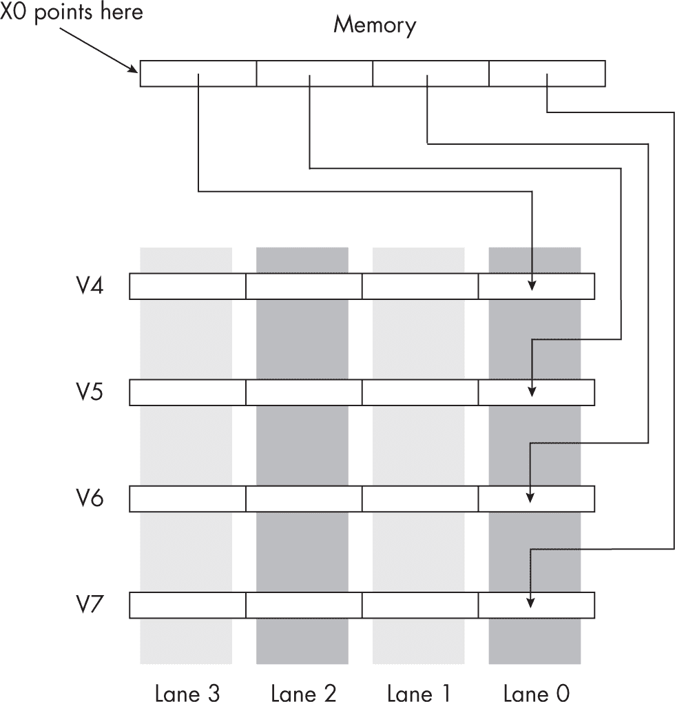

图 11-5：ld4 指令操作

ld4/st4 指令对于（解）交织由四个对象组成的内存数据非常有用。例如，假设你有一个内存中的 CMYK（青色-品红色-黄色-黑色）颜色像素数组，如图 11-6 所示。

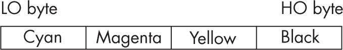

图 11-6：内存中的 CMYK 像素布局

当将图像提交给打印服务时，通常需要提供颜色分离——即四个独立的图像，分别只包含青色像素、品红色像素、黄色像素和黑色像素。因此，你需要从全彩图像中提取所有青色像素，并为其创建一个单独的图像；品红色、黄色和黑色像素也同样需要处理。

你可以使用 ld4 指令从原始图像中提取青色、品红色、黄色和黑色的值，并将这些像素放置到四个独立的向量寄存器中。例如，假设 X0 指向内存中第一个 CMYK 像素（32 位）

```
ld4 {v0.b - v3.b}[0], [x0]
```

将提取 X0 指向的 4 个字节，并将它们分配到 V0（青色）、V1（品红色）、V2（黄色）和 V3（黑色）的第 0 条通道。如果你将 X0 加 4 并重复这条指令，指定通道 1 而不是通道 0，这将把第二个像素分离到 V0–V4 的第 1 条通道中。再重复 14 次，你将得到 16 个青色像素存储在 V0 中，16 个品红色像素存储在 V1 中，16 个黄色像素存储在 V2 中，16 个黑色像素存储在 V3 中。然后，你可以将这四个寄存器存储到图像区域中，用于保存四种颜色的分离图像。对所有四色图像中的像素重复这个过程，就可以得到你需要的颜色分离。

当然，你可以使用 8B 和 16B 类型来同时处理 8 个或 16 个像素：

```
ld4 {v0.16b - v3.16b}, [x0]
```

该指令将 64 字节复制到 V0、V1、V2 和 V3，每四个字节分别进入四个寄存器的连续通道：V0 接收偏移量*i* % 4 的字节，V1 接收偏移量(*i* % 4) + 1 的字节，以此类推，其中*i*是内存中的字节索引。

##### 11.3.5.6 ldnr

ld1、ld2、ld3 和 ld4 指令将一个到四个寄存器的通道加载到内存中连续的值，解交织一个交织的对象数组（字节、半字、字或 dword）。而 ld1r、ld2r、ld3r 和 ld4r 指令也解交织一个交织的对象，但内存对象是一个单一对象，指令会将其复制到所有的向量寄存器通道中。

这些指令的语法与 ldn 指令相同，只是在助记符上增加了 r 后缀：

```
ld1r {V`n`.`t`}, `memory`
ld2r {V`n`.`t,` V`(n + 1)`.`t`}, `memory`
ld3r {V`n`.`t,` V`(n + 1)`.`t,` V`(n + 2)`.`t`}, `memory`
ld4r {V`n`.`t,` V`(n + 1)`.`t,` V`(n + 2)`.`t,` V`(n + 3)`.`t`}, `memory`
```

.t 表示通道类型（稍后会详细说明），内存则是常规的 ldn 寻址模式。你也可以使用范围语法

```
V`n`.`t -` V(`n` + `m`).`t`
```

当在列表中指定两个或更多寄存器时。

对于这些指令，允许的类型有 8B、16B、4H、8H、2S、4S 和 2D。当与 ld1r 指令一起使用时，这些类型规格执行以下操作：

+   8B 将内存中找到的字节复制到 V*n* 的前 8 条道中，并在每条道中复制该字节。

+   16B 将内存中找到的字节复制到 V*n* 的所有 16 条道中，并在每条道中复制该字节。

+   4H 将内存中找到的 hword 复制到 V*n* 的前 4 条道中。

+   8H 将内存中找到的 hword 复制到 V*n* 的所有 8 条道中。

+   2S 将内存中找到的 word 复制到 V*n* 的前 2 条道中。

+   4S 将内存中找到的 word 复制到 V*n* 的所有 4 条道中。

+   2D 将内存中找到的 dword 复制到 V*n* 的 2 条 dword 道中。

ld1r 指令从内存中只获取单个道的值，并将其写入目标寄存器的所有道。ld2r 指令从连续的内存位置获取两个道对象，并将第一个值复制到第一个寄存器的所有道中，第二个值复制到第二个寄存器的所有道中。ld3r 指令从内存中获取三个道对象，并将它们分别复制到第一个、第二个和第三个寄存器中。最后，ld4r 指令从内存中获取四个道对象，并将它们用于初始化四个寄存器的道。

#### 11.3.6 寄存器交错与解交错

ldn/stn 和 ldnr 指令在内存和向量寄存器之间操作。当你需要交错和解交错出现在向量寄存器中的数据，并将结果保留在向量寄存器中时，可以使用 trn1、trn2、zip1、zip2、uzip1、uzip2 和 ext 指令。

##### 11.3.6.1 trn1 和 trn2

trn1 和 trn2（转置）指令——之所以称之为转置，是因为你可以使用它们转置一个 2 × 2 矩阵（或者稍加努力处理更大的数组）中的元素——从两个源寄存器中提取数据，并将这些数据交错到目标寄存器中。这些指令使用以下语法：

```
trn1 V`d`.`t`, V`a`.`t`, V`b`.`t`
trn2 V`d`.`t`, V`a`.`t`, V`b`.`t`
```

其中 t 可以是 8B、16B、4H、8H、2S、4S 或 2D。d（目标寄存器）、a 和 b 是寄存器编号，范围为 0 到 31。这些寄存器编号是任意的（它们不必是连续的值，正如 ldn/stn 和 ldnr 指令的情况）。

trn1 指令将 Va.t 中偶数编号道的数据复制到 Vd.t 中对应的道，并将 Vb.t 中偶数编号道的数据复制到 Vd.t 中的奇数道，同时忽略 Va.t 和 Vb.t 中的奇数编号道。例如，考虑以下指令：

```
trn1 v0.4s, v2.4s, v4.4s
```

此指令交错 V2 和 V4 中的交替字节，将结果保留在 V0 中，如 图 11-7 所示。

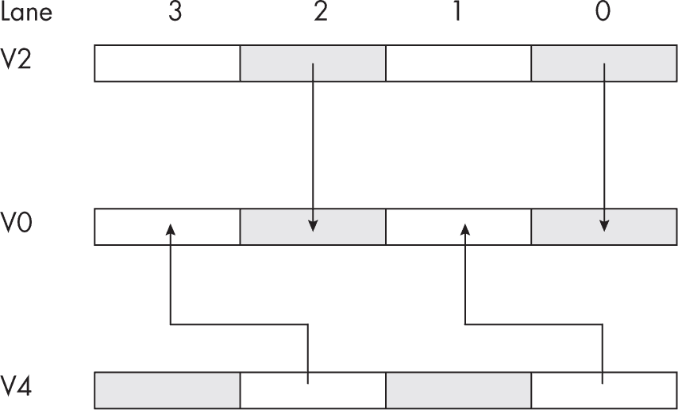

图 11-7：trn1 v0.4s、v2.4s、v4.4s 操作

trn2 指令将 Va.t 和 Vb.t 中奇数编号道的值复制到 Vd.t 中交替的道中，如 图 11-8 所示（与 trn1 类似，只是交换了源位置）。

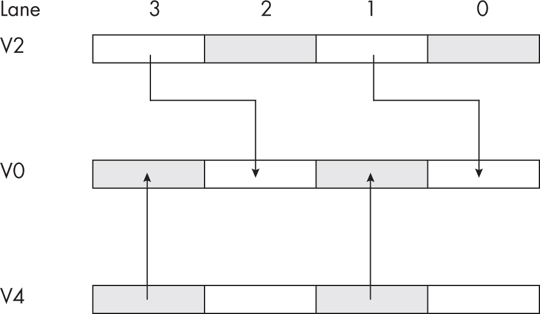

图 11-8：trn2 v0.4s, v2.4s, v4.4s 操作

考虑如 图 11-9 所示的 V2 和 V3 中存储的 2×2 双精度矩阵（注意数组元素的位置，与通常的期望不同）。

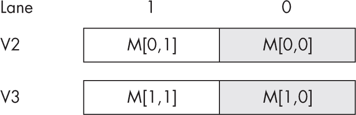

图 11-9：V2 和 V3 中存储的 2×2 矩阵

以下两个指令将转置此矩阵，并将结果保留在 V0 和 V1 中：

```
trn1 v0.2d, v2.2d, v3.2d
trn2 v1.2d, v2.2d, v3.2d
```

当然，trn1 和 trn2 通常用于重新排列和交错向量寄存器中的值，即使你不是在转置 2×2 矩阵。

##### 11.3.6.2 zip1 和 zip2

zip1 和 zip2 指令与 trn1 和 trn2 类似，都是从两个源寄存器中获取数据并生成交错结果。*zip* 这个名字来源于 *zipper*（拉链）：指令就像拉链一样将两边的元素交错在一起。除了助记符外，其语法与 trn1 和 trn2 完全相同。

```
zip1 V`d`.`t`, V`a`.`t`, V`b`.`t`
zip2 V`d`.`t`, V`a`.`t`, V`b`.`t`
```

其中 t 可以是 8B、16B、4H、8H、2S、4S 或 2D（指令中的所有类型必须相同）。

zipn 和 trnn 指令在选择源通道进行交错时有所不同。zip1 指令从源寄存器的开始部分交错通道值（消耗了每个源寄存器的一半通道并忽略剩余的通道）。参见 图 11-10 了解示例。

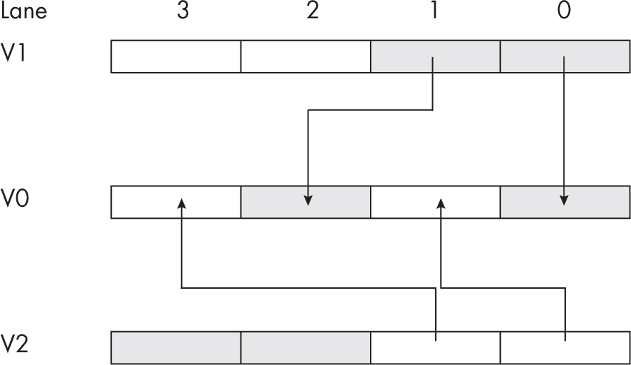

图 11-10：zip1 v0.4s, v1.4s, v2.4s 操作

zip2 指令的工作方式类似，只不过它处理源寄存器中通道的后半部分。图 11-11 显示了一个示例。

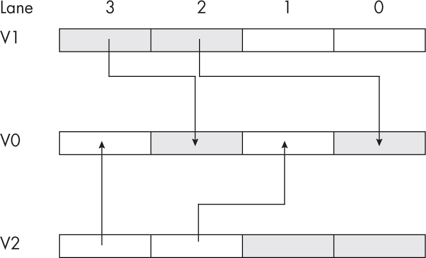

图 11-11：zip2 v0.4s, v1.4s, v2.4s 操作

从这些图中可以看出，zip1 和 zip2 指令通常用于仅使用寄存器创建交错数据。

##### 11.3.6.3 uzp1 和 uzp2

uzp1 和 uzp2（unzip1 和 unzip2）指令是 zip1 和 zip2 的逆操作。它们从两个源寄存器中取出交错数据，并在目标寄存器中生成解交错的数据。它们的语法与 trnn 和 zipn 指令相同：

```
uzp1 V`d`.`t`, V`a`.`t`, V`b`.`t`
uzp2 V`d`.`t`, V`a`.`t`, V`b`.`t`
```

如常，t 可以是 8B、16B、4H、8H、2S、4S 或 2D。

uzp1 指令将 Va.t 中的偶数通道复制到 Vd.t 的前半部分，然后将 Vb.t 中的偶数通道附加到 Vd.t 的末尾。参见 图 11-12 了解示例。

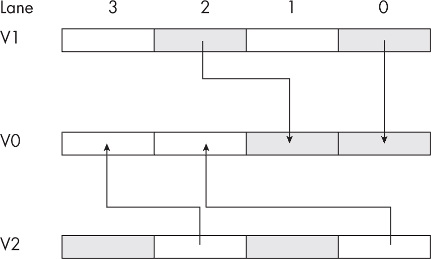

图 11-12：uzp1 v0.4s, v1.4s, v2.4s 操作

uzp2 指令从源寄存器中复制奇数通道。图 11-13 显示了 uzp2 指令的一个示例。

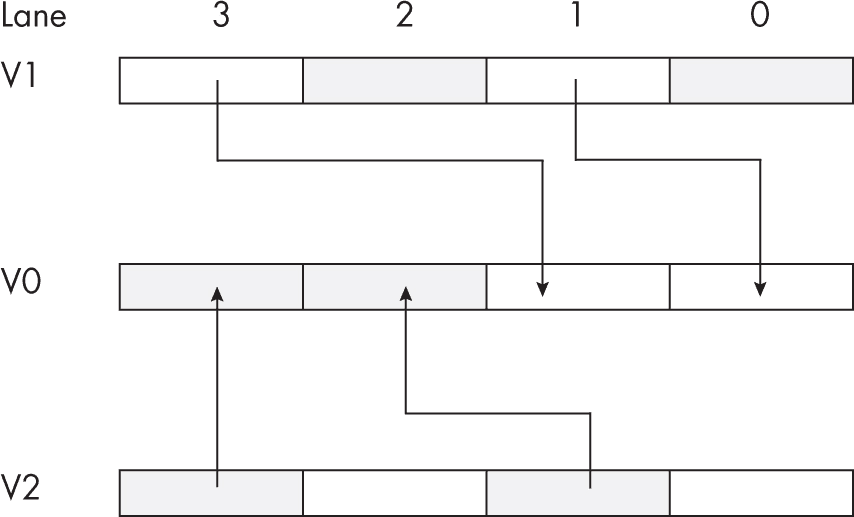

图 11-13：uzp2 v0.4s, v1.4s, v2.4s 操作

如果类型说明符是 64 位（8B、4H 或 2S），则 uzp1 和 uzp2 指令会在目标寄存器的高位通道中填充 0。

##### 11.3.6.4 ext

ext（提取）指令通过从一个向量中提取 *n* 字节和从第二个向量中提取 8-*n*（或 16-*n*）字节，创建一个 8 字节或 16 字节的向量。此指令允许您从两个向量中提取一个 8 字节或 16 字节的向量。此指令的语法如下

```
ext V`d`.8B, V`s`1.8B, V`s`2.8B, #`n`
ext V`d`.16B, V`s`1.16B, V`s`2.16B, #`n`
```

其中 n 是起始索引，Vd 是目标寄存器，Vs1 和 Vs2 是源寄存器。

ext Vd.8B, Vs1.8B, Vs2.8B, #n 指令从 Vs2 中提取 LO n 字节并将其复制到 Vd 中 LO 64 位的 HO n 字节中*。* 它还从 Vs1 中提取 LO 8-n 字节并将其复制到 Vd 的 LO 8-n 字节中。有关 ext 的示例，请参见 图 11-14。

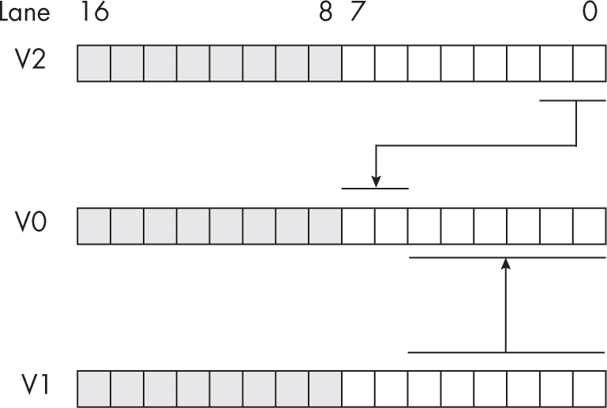

图 11-14：ext v0.8B, v1.8B, v2.8B, #2 指令

ext Vd.16B, Vs1.16B, Vs2.16B, #n 指令从 Vs2 中提取 LO n 字节并将其复制到 Vd 的 HO n 字节中*。* 它还从 Vs1 中提取 LO 16-n 字节并将其复制到 Vd 的 LO 16-n 字节中（有关示例，请参见 图 11-15）。

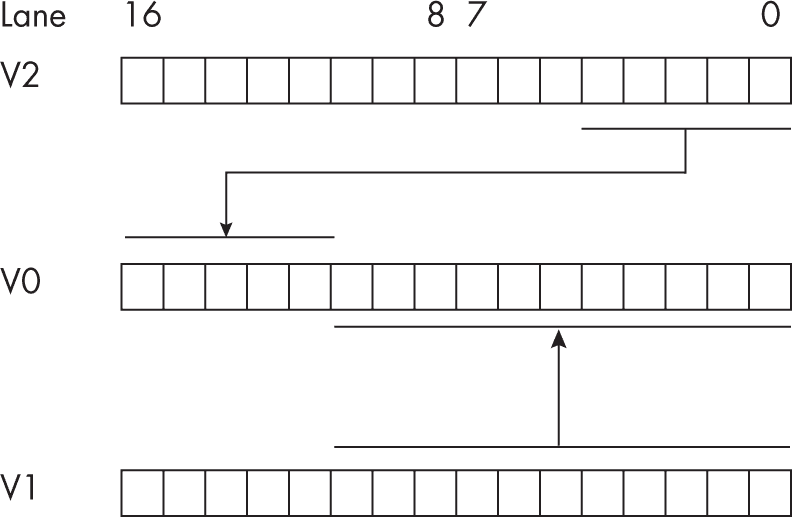

图 11-15：ext v0.16B, v1.16B, v2.16B, #5 指令

此指令仅支持 8B 和 16B 类型。通过选择合适的索引值（n），您可以轻松提取 hwords、words 或 dwords，该索引值包含您要提取的所有对象。

#### 11.3.7 使用 tbl 和 tbx 进行表查找

tbl 和 tbx（表查找）指令允许您用查找表中最多包含 64 个条目的值交换一个寄存器中的所有字节值。这些指令的语法如下

```
tbl V`d`.8B, {`table_list`}, V`s`.8B
tbl V`d`.16B, {`table_list`}, V`s`.16B
tbx V`d`.8B, {`table_list`}, V`s`.8B
tbl V`d`.16B, {`table_list`}, V`s`.16B
```

其中 table_list 是一个包含一个至四个（连续编号）寄存器的列表，这些寄存器都必须附加 16B 类型。（您也可以使用 Vn.t - Vm.t 语法，其中 m > n 且 m < (n + 4)。）这个寄存器列表提供了一个查找表，包含 16、32、48 或 64 个条目。第一个寄存器的 LO 字节是表中的索引 0；最后一个寄存器的 HO 字节是表中的索引 15、31、47 或 63。

tbl 指令从源寄存器（Vs.t）中提取每个字节，并将其值用作查找表的索引。它从表中提取该索引处的字节，并将其复制到目标寄存器中对应的位置——即与提取源字节相同的字节索引；因此，这相当于 Vd[i] = table[Vs[i]]。如果值超出范围（大于 15、31、47 或 63，具体取决于表的大小），tbl 指令会在目标寄存器的相应位置存储 0。tbx 指令的工作方式与 tbl 类似，不同之处在于如果源值超出范围，它会保持目标位置不变。

对于非常小的表（64 个条目或更少），你可以使用 tbl 和 tbx 来实现查找表，如第十章所述。然而，这两个指令的主要目的是提供任意向量排列，例如 trn1/trn2、zip1/zip2、uzp1/uzp2 和 ext 指令。例如，假设你想反转向量寄存器中所有 16 个字节的位置（交换索引 0 和 15，1 和 14，2 和 13，3 和 12，以此类推）。图 11-16 显示了一个 16 字节字节序交换操作，双向箭头指向字节交换的两个位置。

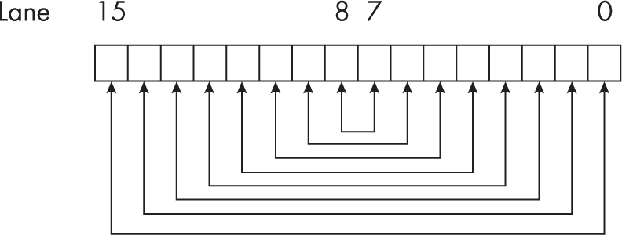

图 11-16：16 字节字节序交换

如果你加载一个向量寄存器，包含以下 16 字节值

```
0x000102030405060708090a0b0c0d0e0f
```

然后在源寄存器中使用该值作为 tbl（或 tbx）指令，tbl（或 tbx）将在作为 table_list 提供的单个 16 字节寄存器中交换字节，并将交换后的字节存储到目标寄存器中。假设你已经将该值加载到 V0，以下指令将交换{V1}中的字节，将结果放入 V2：

```
tbl v2.16b, {v1.16b}, v0.16b
```

在你将 V1 加载为待交换的字节并执行此指令后，V2 将包含交换后的值。

要将 tbl 或 tbx 用作向量排列指令，请将排列索引加载到源寄存器（此示例中为 V0）。索引的值始终在 0 到 15 的范围内，用于选择 table_list 中的特定条目。对于真正的排列，源寄存器中的每个值（0 到 15）将恰好出现一次，并且表 _list 中始终只有一个寄存器。因为你将源寄存器中的值限制在 0 到 15 的范围内，所以表索引值总是有效的，因此可以使用 tbl 或 tbx。只要值不超出范围，两者的功能是完全相同的。

当然，你可以通过在源寄存器中指定不同的值，使用你喜欢的任何排列方式。与 ext 指令一样，tbl 和 tbx 仅支持 8B 和 16B 通道类型。然而，通过选择源寄存器通道值的位置来排列半字、字和双字，合成其他类型（至少对于排列来说）是相当容易的。显然，对于表查找操作（而不是排列），你仅限于使用 8 位值，因此半字、字和双字类型没有任何意义。

#### 11.3.8 使用 rev16、rev32 和 rev64 进行字节序交换

rev16、rev32 和 rev64 指令类似于它们的标量对应指令 rev16、rev32 和 rev（参见第 3.3 节，“小端和大端数据组织”，第 133 页），当然，它们操作的是向量源寄存器中的通道，而不是通用整数寄存器。它们的语法如下：

```
rev16 V`d.t1`, V`s.t1`  // Swap the bytes in the half-word lanes.
rev32 V`d.t2`, V`s.``t2`  // Swap the bytes in the word lanes.
rev64 V`d.t1`, V`s.t3`  // Swap the bytes in the double-word lanes.
```

这些指令的合法类型和通道数量见表 11-1。

表 11-1：rev*指令的合法类型和通道数量

| t | 类型和通道数量 |
| --- | --- |
| t1 | 8B, 16B |
| t2 | 8B, 16B, 4H, 或 8H |
| t3 | 8B, 16B, 4H, 8H, 2S, 或 4S |

如果通道数和类型是 8B、4H 或 2S，指令仅在源寄存器的低 64 位上操作（并清除目标寄存器的高 64 位）。如果通道数和类型是 16B、8H 或 4S，这些指令将在源寄存器的 128 位全范围内进行操作。

### 11.4 垂直和水平操作

迄今为止，矢量操作是*垂直*的，意味着它们在多个寄存器中的同一通道上进行操作（在大多数图示中，当寄存器按堆叠方式排列时，显示了垂直的操作方向）。考虑以下矢量加法指令：

```
add v0.16b, v1.16b, v2.16b
```

至于标量加法操作（例如，add w0, w1, w2），该指令将两个源寄存器（V1.16B 和 V2.16B）的值相加，产生一个结果存储在目标寄存器中。然而，这并不是一次 128 位的加法操作，而是一个 8 位操作重复执行 16 次。矢量操作通常是逐通道进行的，并行执行多个小的操作。对于此特定指令，CPU 将 16 个字节值相加，产生 16 个独立的字节结果。这就是 SIMD 编程的神奇之处：通过一条指令做 16 倍的工作（因此它的执行速度大约比逐个执行这 16 个字节加法快 16 倍）。

图 11-17 展示了加法指令的逐通道操作，逐通道加法按照箭头方向进行。

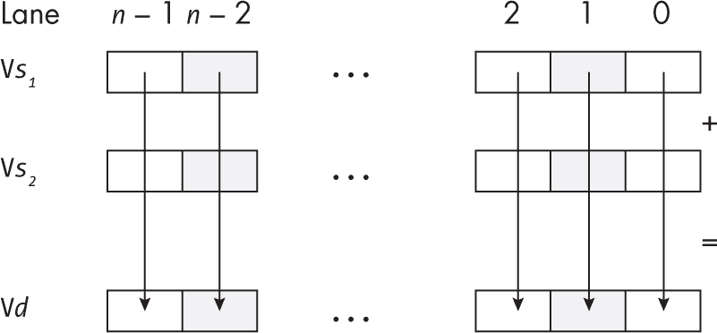

图 11-17：逐通道操作

逐通道操作彼此独立，这意味着如果发生进位、溢出或其他异常情况，这些异常仅限于单个通道的范围。由于只有一组 NVZC 条件码标志，矢量指令无法（也不会）影响这些标志。如果发生无符号进位（例如，在字节通道中执行 255 + 1 时），求和结果会自动回绕，并且没有溢出或下溢的标识。通常，处理溢出的方法与处理标量运算时的方式完全不同。本章在后续章节讨论饱和操作时，会介绍一些处理溢出的方法。

某些矢量指令提供*水平操作*，也称为*归约操作*。与其在两个寄存器之间逐通道操作，这些操作是在单个矢量寄存器内的所有通道上进行操作，产生一个标量结果。例如，addv 指令会产生一个单一矢量寄存器中所有通道的总和。

### 11.5 SIMD 逻辑操作

由于逻辑（布尔）运算是按位计算的，矢量逻辑运算具有独特之处，你可以利用它们执行 128 个独立的位操作。无论你将源操作数视为 16 个 1 字节的值，还是作为 1 个 128 字节的值，结果是相同的。因此，矢量逻辑运算仅支持两种类型：8B（用于 64 位操作数）和 16B（用于 128 位操作数）。如果你真的想对 4H 或 2S 操作数进行运算，只需指定 8B；你会得到相同的结果。同样，对于 8H、4S 或 2D 操作数，指定 16B 也会得到相同的结果。

Neon 指令集支持八种逻辑指令，如表 11-2 所示。这里，t 是 8B 或 16B，Vd 是目标寄存器，Vs1 是左侧源寄存器，Vs2 是右侧源寄存器（对于 not 指令，Vs 是唯一的源寄存器）。

表 11-2: Neon 逻辑指令

| 记忆法 | 语法 | 描述 |
| --- | --- | --- |
| and | and Vd.t, Vs1.t, Vs2.t | Vd = Vs1 & Vs2 |
| orr | orr Vd.t, Vs1.t, Vs2.t | Vd = Vs1 &#124; Vs2 |
| orn | orn Vd.t, Vs1.t, Vs2.t | Vd = Vs1 &#124; ~(Vs2) |
| eor | eor Vd.t, Vs1.t, Vs2.t | Vd = Vs1 ^ Vs2 |
| bic | bic Vd.t, Vs1.t, Vs2.t | Vd = Vs1 & ~(Vs2)（位清除） |
| bif | bif Vd.t, Vs1.t, Vs2.t | 如果为假则插入位 |
| bit | bit Vd.t, Vs1.t, Vs2.t | 如果为真则插入位 |
| bsl | bsl Vd.t, Vs1.t, Vs2.t | 按位选择 |
| not | not Vd.t, Vs.t | Vd = ~Vs |

and、orr 和 eor 指令执行常规逻辑运算（与标量相同），无需进一步解释。orn 指令与 bic 类似，因其在进行 OR 运算之前会反转第二个源操作数。

bic（位清除）指令在 Vs1 的值中清除所有在 Vs2 中为 1 的位置的位，并将结果存储到 Vd 中。注意，不需要 bis（位设置）指令，因为 orr 会在 Vd 中设置位。

bif（如果为假则插入位）和 bit（如果为真则插入位）指令之所以不同寻常，是因为它们在计算过程中使用了三个操作数（而不是使用两个输入的函数，并将结果存储到第三个操作数中）。bif 指令会在 Vs2 中相应位为 0 的位置，将 Vs1 中的位复制到 Vd 中。在 Vs2 中为 1 的位置，此指令会保留 Vd 中对应位的不变。bit 指令的工作方式类似，除了它会在 Vs2 中相应位为 1 时复制位（而不是 0）。

bsl（按位选择）指令根据 Vd 的原始内容，从 Vs1 或 Vs2 中选择位并将其复制到 Vd 中。如果 Vd 在某个位位置上原本为 1，则 bsl 会从 Vs1 中选择对应的位。否则，它会从 Vs2 中选择该位。

not 指令反转源寄存器中的所有位，并将结果存储到目标寄存器中。此指令与其他逻辑指令不同，只有一个源操作数。

Neon 指令集支持一些 orr 和 bic 指令的特殊立即数版本

```
orr V`d.t`, #`imm`
orr V`d.t`, #`imm,` lsl  #`shift`
bic V`d.t`, #`imm`
bic V`d.t`, #`imm,` lsl #`shift`
```

其中 imm 是一个无符号 8 位立即数；类型（t）是 2S、4S、4H 或 8H；移位（shift）为 0 或 8（如果 t 是 4H/8H），或者 0、8、16 或 24（如果 t 是 2S 或 4S）。如果没有指定移位，则默认为 0。这些指令需要 H 和 S 类型而非 B 类型，因为它们在 Vd.t 中通过各通道的字节复制立即数值。### 11.6 SIMD 移位操作

移位指令通常被认为是逻辑运算。然而，从向量的角度来看，它们更准确地应该被视为算术运算，因为移位操作可能会产生溢出。向量移位操作通过四种方式处理溢出：

+   忽略移位操作的进位（截断）

+   饱和移位结果

+   对结果进行四舍五入

+   提供扩展的移位操作，其目标操作数大于源寄存器

本节描述了这些不同的移位操作。

> 注意

*Neon 指令集使用基于* shr *和* shl *的助记符来表示左移和右移。这与标量整数指令集使用的* lsl*、* lsr* 和* asr* 指令有所不同。我想不出为什么他们要这么做；如果他们保持一致的命名规则，指令集会更容易学习。*

#### 11.6.1 左移指令

shl 指令将向量寄存器的每个通道按指定的位数向左移位。该指令会将 0 填充到（空出的）LO 位中。任何从通道的 HO 位溢出的进位都会丢失。语法如下：

```
shl V`d`.8B, V`s`.8B, #`imm`
shl V`d`.16B, V`s`.16B, #`imm`
shl V`d`.4H, V`s`.4H, #`imm`
shl V`d`.8H, V`s`.8H, #`imm`
shl V`d`.2S, V`s`.2S, #`imm`
shl V`d`.4S, V`s`.4S, #`imm`
shl V`d`.2D, V`s`.2D, #`imm`
```

其中 Vd 是目标寄存器，Vs 是源寄存器。立即数值必须在表 11-3 中列出的范围内（取决于指定的类型）。如果立即数移位值超出这些范围，汇编器将报告错误。

表 11-3：有效的 shl 移位值

| 类型 | 移位范围 |
| --- | --- |
| 8B/16B | 0 到 7 |
| 4H/8H | 0 到 15 |
| 2S/4S | 0 到 31 |
| 2D | 0 到 63 |

还有一个标量 shl 指令，它作用于向量寄存器的 LO dword，语法如下：

```
shl D`d`, D`s`, #`imm`
```

其中 Dd 是目标标量寄存器，Ds 是源寄存器（对应 Vd 和 Vs 的 LO 64 位）。imm 移位计数必须在 0 到 63 的范围内。请注意，该指令会将 Dd 的 HO 64 位清零。

要按可变的位数移位各通道，请参见第 11.6.9 节，“按可变位数移位”，在第 657 页。

#### 11.6.2 饱和左移

饱和左移指令 uqshl、sqshl 和 sqshlu 将向量中的各通道向左移位指定的位数。如果发生溢出（无论是有符号还是无符号），这些指令会根据指令的类型将结果饱和到最大的（有符号或无符号）值。此类指令的语法如下：

```
uqshl  V`d.t`, V`s.t`, #`imm`
uqshl  V`d.t`, V`s.t`, V`c.t`
sqshl  V`d.t`, V`s.t`, #`imm`
sqshl  V`d.t`, V`s.t`, V`c.t`
sqshlu V`d.t`, V`s.t`, #`imm`
sqshlu V`d.t`, V`s.t`, V`c.t`
```

其中 Vd 是目标寄存器，Vs 是源寄存器，imm 是一个合适的立即移位常数，或者 Vc 在 LO 字节中包含移位计数，t 是 8B、16B、4H、8H、2S、4S 或 2D 类型。t 的规范必须与 Vd 和 Vs 相同。

移位值的范围取决于通道类型；请参见前一节中的表 11-3 以查看合法的立即数值。对于立即数值，如果移位常数超出范围，汇编器会报告错误。对于寄存器移位计数变体，如果 LO 字节包含超出范围的值，则当某个通道包含非零值时，指令将始终饱和结果（请参见后面关于饱和的讨论）。uqshl 指令将值左移一位，将结果存储在目标寄存器的相应通道中。如果 HO 位被设置（在移位之前），该指令将在目标通道中存储所有 1 位（最大无符号值）。例如，如果 V1 中的某个通道包含 0x7F，则在执行以下操作后，相应的通道将包含 0xFE（0x7F 左移一位）：

```
uqshl v0.16b, v1.16b, #1
```

然而，如果源通道包含 0x80 到 0xFF 之间的值，则将其左移一位会在目标通道中产生 0xFF。通常，如果任何非 0 位被从源通道移出，相应的目标通道将包含 0xFF。

sqshl 指令是一个有符号饱和左移操作。对于有符号值，如果一个通道的高两位包含不同的值，左移时会发生溢出。对于负源值（HO 位被设置），溢出将饱和为一个结果，其中 HO 位被设置，所有其他位为 0（例如，对于半字类型，0xa000 将饱和为 0x8000）。

sqshlu 指令类似于 sqshl，不同之处在于它将目标视为无符号值。正值（包括 0）源值将像 uqshl 指令一样向左移位，而负源值（HO 位被设置）将饱和为 0。

还有 uqshl、sqshl 和 sqshlu 指令的标量版本。

```
uqshl  R`d`, R`s`, #`imm`
sqshl  R`d`, R`s`, #`imm`
sqshlu R`d`, R`s`, #`imm`
```

其中 Rn（n = d 或 s）是 B*n*、H*n*、S*n*或 D*n*中的一个寄存器，d、s 和 imm 具有通常的含义和限制。与普通的 shl 指令不同，这些指令支持字节、半字和字寄存器，以及双字寄存器。

对于向量指令，uqshl 指令执行无符号饱和。如果任何位被移出源寄存器的 HO 位，这些指令将目标（B*n*、H*n*、S*n*或 D*n*）设置为所有 1 位。这些指令将结果通过包含 R*d*的其余向量寄存器进行零扩展。

sqshl 指令执行有符号饱和，结果保存在目标（标量）寄存器中。该指令将相应向量寄存器的剩余 HO 位清零（即所有超出标量寄存器大小的 HO 位）。

sqshlu 指令对有符号源值执行移位操作，但将其饱和为无符号值（负值结果饱和为 0，类似于此指令的向量寄存器版本）。

#### 11.6.3 左移长整数

*左移长整数* 指令 sshll、sshll2、ushll 和 ushll2 提供了一种处理移位操作溢出的方法。这些指令将通道中的值符号扩展或零扩展到两倍大小，然后对扩展后的源值进行左移，并将结果存储到（双倍大小的）目标通道中。以下是这些指令的语法：

```
ushll  V`d.t2`, V`s`.`t`, #`imm`
sshll  V`d.t2`, V`s`.`t`, #`imm`
```

其中 t2 是双倍大小的类型，可以是 8H、4S 或 2D；t 是原始类型，可以是 8B、4H 或 2S。imm 是移位计数，应该在 0 到 n – 1 的范围内，其中 n 是 t 类型中的位数。

ushll 指令将源通道中的值零扩展到两倍大小，对零扩展后的结果进行指定的位移，然后将结果存储到相应的（双倍大小的）目标通道中。sshll 指令将源通道值符号扩展到两倍大小，然后对结果进行移位，并将结果存储到双倍大小的目标通道中。

由于这些指令将其值的大小加倍，因此它们仅在源寄存器的低 64 位上操作（字节的通道 0 到 7，半字的通道 0 到 3，字的通道 0 到 1）。这些指令忽略源寄存器的高 64 位。

为了处理源寄存器的高 64 位，ARM 提供了 ushll2 和 sshll2 指令：

```
ushll2 V`d.t4`, V`s.t3`, #`imm`
sshll2 V`d.t4`, V`s.t3`, #`imm`
```

这些指令实现的操作与 ushll 和 sshll 指令相同，不同之处在于它们从高 64 位（HO 64 bits）而不是低 64 位（LO 64 bits）中获取源操作数。为了表示这一点，t4/t3 类型对必须是 8H/16B、4S/8H 或 2D/4S。imm 位移值必须与源通道的位大小匹配（对于 8H/16B 为 0 到 15，对于 4S/8H 为 0 到 31，对于 2D/4S 为 0 到 63）。

ushll、ushll2、sshll 和 sshll2 指令没有标量版本。如果需要此操作，只需使用向量版本，并在必要时将高 64 位清零。

#### 11.6.4 移位与插入

sli 和 sri 指令允许你将源操作数按指定的位数进行移位，然后（使用其他指令）将其他位插入移位操作腾出的（0 位）位置。以下是这些指令的语法：

```
sli V`d.t`, V`s.t`, #`imm`
sri V`d.t`, V`s.t`, #`imm`
```

其中 *t* 是常见的类型集合：8B、16B、4H、8H、2S、4S 或 2D。对于 sli 指令，imm 是位移计数，必须在 0 到 n – 1 的范围内，其中 n 是一个通道的位数。对于 sri 指令，立即数是一个计数值，范围为 1 到 n。

sli 指令将 Vs.t 中的每个通道按指定的位数向左移位。然后，它将 Vd.t 的 n - imm 低位（LO bits）通过逻辑或运算与结果合并（替换被移位进来的 0），并将结果存回 Vd.t，如 图 11-18 所示。

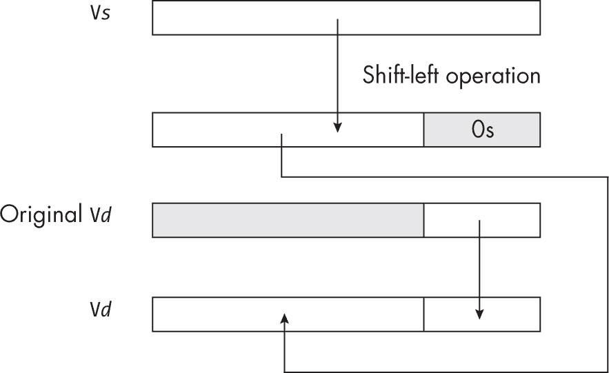

图 11-18：sli 指令操作

例如，要移入 1 位而不是 0 位，你可以先将目标寄存器加载为全 1 位，然后执行 sli 指令，如以下代码所示：

```
movi    v0.16b, #0xff
movi    v1.4s, #0x1
sli     v0.4s, v1.4s, #4
```

这会在 V0 中生成 0x0000001f0000001f0000001f0000001f。

sri 指令将 Vs.t 中每个通道右移指定的位数，然后将 n - imm 高位的 Vd.t 与结果进行逻辑或运算（替换被移入的 0），然后将结果存回 Vd.t，如图 11-19 所示。

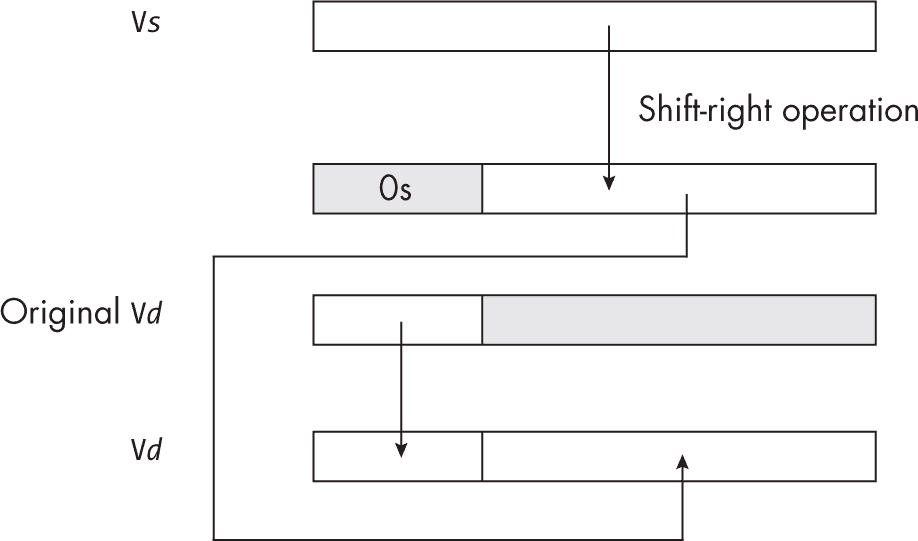

图 11-19：sri 指令操作

sli 和 sri 指令的标量版本具有以下语法：

```
sli D`d`, D`s`, #`imm`  // `imm` = 0 to 63
sri D`d`, D`s`, #`imm`  // `imm` = 1 to 64
```

这些指令作用于指定向量寄存器（Dn）的低 64 位，并将目标寄存器的高 64 位清零。

#### 11.6.5 带符号和无符号右移

由于算术左移和逻辑左移本质上是相同的操作，ARM 使用单一指令来执行这两种操作：shl。然而，右移的逻辑和算术移位有所不同。因此，Neon 指令集提供了两条指令，sshr 和 ushr，分别用于带符号和无符号的右移（即算术右移和逻辑右移）。

如第二章所述，左移操作相当于乘以 2，右移操作大致等同于除以 2。我说是*大致*相同，因为带符号和无符号数的行为有所不同。例如，当你将值 1 右移一个位置时，结果是 0。如果你将带符号值–1（全 1 位）使用算术右移操作右移，结果则是–1。在一种情况下，移位是向 0 舍入，而在另一种情况下则是远离 0 舍入。两种情况都没有特别正确或错误，但无法选择舍入方向可能会成为问题。

使用标量指令时，你可以通过在移位后将进位标志添加到结果中来逆转这种舍入效果：

```
asr  x0, x0, #1
adc  x0, x0, xzr // -1 -> 0 and 1 -> 1
```

由于向量操作不会跟踪移位中的进位标志，因此你无法选择纠正这一点。Neon 指令集因此提供了舍入移位指令 srshr 和 urshr，这些指令会为你添加进位。

Neon 右移指令的语法如下所示：

```
ushr  V`d`.`t`, V`s`.`t`, #`imm`  // Unsigned (logical) shift right
urshr V`d`.`t`, V`s`.`t`, #`imm`  // Unsigned rounding shift right
sshr  V`d`.`t`, V`s`.`t`, #`imm`  // Signed (arithmetic) shift right
srshr V`d`.`t`, V`s`.`t`, #`imm`  // Signed rounding shift right
```

向量寄存器允许的类型是常见的 8B、16B、4H、8H、2S、4S 或 2D。舍入变体（在助记符中第二个字符为 r）会在移位操作后将进位标志添加回目标通道。

sshr、srshr、ushr 和 urshr 指令也有标量版本：

```
sshr  D`d`, D`s`, #`imm`
srshr D`d`, D`s`, #`imm`
ushr  D`d`, D`s`, #`imm`
urshr D`d`, D`s`, #`imm`
```

这些指令操作在由 Dd（目标）和 Ds（源）指定的向量寄存器的低 64 位上。imm 移位操作数必须在 1 到 64 的范围内。它们会将相应 Vd 寄存器的高 64 位置为零。除此之外，它们与其向量组件是相同的。

#### 11.6.6 累积右移

累积右移指令具有以下语法：

```
usra  V`d.t`, V`s.t`, #`imm`
ursra V`d.t`, V`s.t`, #`imm`
ssra  V`d.t`, V`s.t`, #`imm`
srsra V`d.t`, V`s.t`, #`imm`
```

这些指令与右移指令基本相同，但它们将移位后的值添加到相应的目标通道中（而不是仅仅存储移位后的值）。

#### 11.6.7 缩小右移

shrn, shrn2, rshrn 和 rshrn2 指令提供了与 shll 和 shll2 指令相反的操作。与将操作数大小翻倍的移位操作不同，它们会将大小减半（“缩小”）。这些指令的语法如下：

```
shrn   V`d.t1`, V`s.t2`, #`imm`
shrn2  V`d.t3`, V`s.t4`, #`imm`
rshrn  V`d.t1`, V`s.t2`, #`imm`
rshrn2 V`d.t3`, V`s.t4`, #`imm`
```

其中：

t1 是 8B, 4H 或 2S

t2 是 8H, 4S 或 2D

t3 是 8B, 16B, 4H, 8H, 2S 或 4S

t4 是 8H, 4S 或 2D

shrn 指令将每个通道右移指定数量的位（从左侧移入 0）；提取低 8、16 或 32 位（具体取决于 t1 的大小）；并将结果存储到目标寄存器中相同通道编号的位置。shrn 指令会忽略（截断）任何无法适应目标通道的高位（回忆一下，目标通道大小是源通道的一半）。该指令会将目标寄存器的高 64 位置为零。

shrn2 指令执行完全相同的操作，但将结果存储到高 64 位。

rshrn 和 rshrn2 指令与 shrn 和 shrn2 指令做的是一样的操作，但在缩小之前会对移位结果进行四舍五入。rshrn 指令还会清除目标寄存器的上半部分。

由于缩小右移指令会丢弃除了适合目标通道的低位之外的所有高位，你可能会认为需要一组单独的指令来提取右移操作后的高位。但实际上并不需要这样的指令；只需在 shrn, shrn2, rshurn 或 rshrn2 的移位计数中添加 8、16 或 32 即可提取高位。

#### 11.6.8 饱和右移与缩小

标准的缩小右移指令在将结果缩小到源通道大小的一半时，会截断任何高位（HO）位。饱和右移指令在移位后的值如果无法适应目标通道时，会将其饱和。有关这些指令的语法，请参考 表 11-4。

表 11-4: 按通道饱和右移与缩小指令

| 助记符 | 语法 | 描述 |
| --- | --- | --- |
| uqshrn | uqshrn Vd.t1, Vs.t2, #imm | 无符号右移 imm 位并进行缩小。将数据存储到 Vd 的低 64 位。 |
| uqrshrn | uqrshrn Vd.t1, Vs.t2, #imm | 无符号右移 imm 位并进行缩小和四舍五入。将数据存储到 Vd 的低 64 位。 |
| sqshrn | sqshrn Vd.t1, Vs.t2, #imm | 按 imm 位数有符号右移并进行缩小处理。将数据存储到 Vd 的低 64 位。 |
| sqrshrn | sqrshrn Vd.t1, Vs.t2, #imm | 按 imm 位数有符号右移，并进行缩小和四舍五入处理。将数据存储到 Vd 的低 64 位。 |
| sqshrun | sqshrun Vd.t1, Vs.t2, #imm | 按 imm 位数有符号右移，并进行缩小和饱和处理为无符号数。将数据存储到 Vd 的低 64 位。 |
| sqrshrun | sqrshrun Vd.t1, Vs.t2, #imm | 按 imm 位数有符号右移，并进行缩小、四舍五入和饱和处理为无符号数。将数据存储到 Vd 的低 64 位。 |
| uqshrn2 | uqshrn2 Vd.t3, Vs.t4, #imm | 按 imm 位数无符号右移并进行缩小处理。将数据存储到 Vd 的高 64 位。 |
| uqrshrn2 | uqrshrn2 Vd.t3, Vs.t4, #imm | 按 imm 位数无符号右移并进行缩小和四舍五入处理。将数据存储到 Vd 的高 64 位。 |
| sqshrn2 | sqshrn2 Vd.t3, Vs.t4, #imm | 按 imm 位数有符号右移并进行缩小处理。将数据存储到 Vd 的高 64 位。 |
| sqrshrn2 | sqrshrn2 Vd.t3, Vs.t4, #imm | 按 imm 位数有符号右移，并进行缩小和四舍五入处理。将数据存储到 Vd 的高 64 位。 |
| sqshrun2 | sqshrun2 Vd.t3, Vs.t4, #imm | 按 imm 位数有符号右移，并进行缩小和饱和处理为无符号数。将数据存储到 Vd 的高 64 位。 |
| sqrshrun2 | sqrshrun2 Vd.t3, Vs.t4, #imm | 按 imm 位数有符号右移，并进行缩小、四舍五入和饱和处理为无符号数。将数据存储到 Vd 的高 64 位。 |

表 11-5 列出了 表 11-4 中出现的饱和右移指令的合法类型和通道数。

表 11-5：饱和右移类型和通道数

| t | 法律类型和通道数 |
| --- | --- |
| t1/t2 | 8B/8H, 4H/4S, 或 2S/2D |
| t3/t4 | 16B/8H, 8H/4S, 或 4S/2D |

带有 2 后缀的指令将其缩小的结果存储到目标寄存器的高 64 位。没有此后缀的指令将清零目标寄存器的高 64 位。

uqrshrn、sqrshrn、uqrshrn2 和 sqrshrn2 指令在对结果进行饱和之前，会先对移位结果进行四舍五入（如果需要进行饱和）。四舍五入是通过将源通道移出的最后一位加回到值中来实现的。

带有 s 前缀的指令对有符号值进行操作，而带有 u 前缀的指令则对无符号值进行操作。无符号值在目标通道大小无法容纳时会饱和为全 1 位，而有符号值会饱和为高位 1 和其他位 0，或者高位 0 和所有其他位 1。

sqrshrun 和 sqrshrun2 指令执行以下操作：

+   执行按指定位数的算术右移操作

+   通过将最后移出的位加回结果来对结果进行四舍五入

+   如果结果无法容纳在目标通道内，则将结果饱和为最大无符号值（全 1 位）；负值则饱和为 0。

+   将饱和结果存储到目标通道中

sqrshrun 指令将结果存储到目标寄存器的低 64 位中；sqrshrun2 将结果存储到目标寄存器的高 64 位中。

这些指令也有标量版本：

```
sqshrn B`d`, H`s`, #`imm`
sqshrn H`d`, S`s`, #`imm`
sqshrn S`d`, D`s`, #`imm`

uqshrn B`d`, H`s`, #`imm`
uqshrn H`d`, S`s`, #`imm`
uqshrn S`d`, D`s`, #`imm`

sqrshrn B`d`, H`s`, #`imm`
sqrshrn H`d`, S`s`, #`imm`
sqrshrn S`d`, D`s`, #`imm`

uqrshrn B`d`, H`s`, #`imm`
uqrshrn H`d`, S`s`, #`imm`
uqrshrn S`d`, D`s`, #`imm`

sqshrun B`d`, H`s`, #`imm`
sqshrun H`d`, S`s`, #`imm`
sqshrun S`d`, D`s`, #`imm`

sqrshrun B`d`, H`s`, #`imm`
sqrshrun H`d`, S`s`, #`imm`
sqrshrun S`d`, D`s`, #`imm`
```

请注意，这些指令会清除基础向量寄存器中超出指定标量寄存器的上位位。

#### 11.6.9 按变量数量的位数移位

要按变量数量的位数移位某个通道，使用以下其中之一指令：

```
sshl   V`d.t`, V`s.t`, V`c.t`
ushl   V`d.t`, V`s.t`, V`c.t`
sqshl  V`d.t`, V`s.t`, V`c.t`
uqshl  V`d.t`, V`s.t`, V`c.t`
srshl  V`d.t`, V`s.t`, V`c.t`
urshl  V`d.t`, V`s.t`, V`c.t`
sqrshl V`d.t`, V`s.t`, V`c.t`
uqrshl V`d.t`, V`s.t`, V`c.t`
```

其中 t 是常见的 8B、16B、4H、8H、2S、4S 或 2D。

Vc.t 保持有符号的移位计数值在低字节中。对于正值（范围 0 到 0x7F），指令将一个通道的位左移相应数量的位。对于负值（0xFF 到 0x80；–1 到 –128），尽管使用了 shl 助记符，指令还是会将位右移。有关通过使用寄存器指定移位计数时的合法范围，请参见表 11-6。

表 11-6: 合法的 Vc.t 移位范围

| 类型 | 无符号（SHL） | 有符号（SHR） |
| --- | --- | --- |
| 8B/16B | 0 到 7 | –1 到 –7 |
| 4H/8H | 0 到 15 | –1 到 –15 |
| 2S/4S | 0 到 31 | –1 到 –31 |
| 2D | 0 到 63 | –1 到 –63 |

超出表 11-6 中列出的范围的值将产生表 11-7 中显示的结果。

表 11-7: 当计数超过允许范围时的移位结果

| 移位指令 | 正数计数，正溢出 | 正数计数，负溢出 | 负数计数，正值 | 负数计数，负值 |
| --- | --- | --- | --- | --- |
| sshl | 0 | 0 | 0 | –1（全 1 位） |
| ushl | 0 | 0 | 0 | 0 |
| sqshl | 高位位 0，其它位 1（例如，0x7F） | 高位位 1，其它位 0（例如，0x80） | 0 | –1（全 1 位） |
| uqshl | 全 1 位（例如，0xff） | 全 1 位（例如，0xff） | 0 | 0 |
| srshl | 0 | 0 | 0 | 0（–1 + 进位） |
| urshl | 0 | 0 | 0 | 1（0 + 进位） |
| sqshl | 高位位 0，其它位 1（例如，0x7F） | 高位位 1，其它位 0（例如，0x80） | 0 | –1（全 1 位） |
| uqshl | –1（全 1 位） | –1（全 1 位） | 0 | 0 |
| sqrshl | 高位位 0，其它位 1（例如，0x7F） | 高位位 1，其它位 0（例如，0x80） | 0 | 0（–1 + 进位） |
| uqrshl | –1（全 1 位） | –1（全 1 位） | 0 | 1（0 + 进位） |

在这些指令中使用 shf（用于移位）可能比 shl 更合适，因为该名称更符合操作。只需记住，Vc.t 中低字节的值是有符号整数，负值表示右移。

Neon 的 shl 指令也有一些标量饱和版本

```
sqshl    R`d`, R`s`, R`c`
uqshl    R`d`, R`s`, R`c`
sqrshl   R`d`, R`s`, R`c`
uqrshl   R`d`, R`s`, R`c`
```

其中 R 代表标量寄存器名称之一（B、H、S 或 D）。这些指令将标量寄存器 Rs 中的值按 Rc 的 LO 字节指定的位数进行移位，并将移位结果存储在 Rd 中。Rc 被视为一个有符号数；正值将 Rs 左移，而负值将 Rs 右移。如果在移位过程中发生溢出（有符号或无符号，根据情况），这些指令将 Rd 设置为最大正有符号或无符号值。

如果 sqshl 指令的移位计数为负，CPU 将执行算术右移操作，右移时将复制 HO 位。正值（以及 0）源值将饱和为 0，负值源值将饱和为 -1（所有 1 位）。

sqrshl 和 uqrshl 指令是饱和移位指令的特殊舍入版本。在右移操作期间（即 Rc 为负时），这些指令通过在最后一个移出的位是 1 时加 1 来舍入结果。

### 11.7 SIMD 算术操作

Neon 指令集包括几个常见的算术操作，包括加法、减法和乘法。唯一的例外是没有除法操作；相反，你必须计算倒数并用该值相乘（使用提供的指令来估算倒数）。

#### 11.7.1 SIMD 加法

Neon 提供了一套广泛的指令，用于加法通道（忽略溢出）、加法并饱和（当发生溢出时）或执行水平加法。

##### 11.7.1.1 向量加法

Neon 指令集提供了几种可以在向量寄存器中的通道内加法整数和浮点值的指令，如表 11-8 所列。这些指令计算 Vd = Vl + Vr，其中 Vd 是目标寄存器，Vl 是左操作数，Vr 是右操作数。

表 11-8: Neon 加法指令

| 指令助记符 | 语法 | 描述 |
| --- | --- | --- |
| add | add Vd.t1, Vl.t1, Vr.t1 | 逐通道计算整数和 |
| fadd | fadd Vd.t2, Vl.t2, Vr.t2 | 逐通道计算浮点数和 |
| sqadd | sqadd Vd.t1, Vl.t1, Vr.t1 | 逐通道计算带饱和的有符号整数和 |
| uqadd | uqadd Vd.t1, Vl.t1, Vr.t1 | 逐通道计算无符号整数和，带饱和 |
| saddl | saddl Vd.t3, Vl.t4, Vr.t4 | 逐通道计算带长扩展的有符号整数和 |
| uaddl | uaddl Vd.t3, Vl.t4, Vr.t4 | 逐通道计算带长扩展的无符号整数和 |
| saddl2 | saddl2 Vd.t5, Vl.t6, Vr.t6 | 逐通道计算带长扩展的有符号整数和 |
| uaddl2 | uaddl2 Vd.t5, Vl.t6, Vr.t6 | 逐通道计算带长扩展的无符号整数和 |
| saddw | saddw Vd.t3, Vl.t3, Vr.t4 | 逐通道计算带宽扩展的有符号整数和 |
| uaddw | uaddw Vd.t3, Vl.t3, Vr.t4 | 逐通道计算带宽扩展的无符号整数和 |
| saddw2 | saddw2 Vd.t5, Vl.t6, Vr.t6 | 执行逐道有符号整数和，带有宽扩展 |
| uaddw2 | uaddw2 Vd.t5, Vl.t6, Vr.t6 | 执行逐道无符号整数和，带有宽扩展 |
| addhn | addhn Vd.t4, Vl.t3, Vr.t3 | 执行逐道加法并进行缩小 |
| raddhn | raddhn Vd.t4, Vl.t3, Vr.t3 | 执行逐道加法，带四舍五入和缩小 |
| addhn2 | addhn2 Vd.t6, Vl.t5, Vr.t5 | 执行逐道加法并进行缩小（使用高位） |
| raddhn2 | raddhn2 Vd.t6, Vl.t5, Vr.t5 | 执行逐道加法，带有四舍五入和缩小（使用高位） |
| shadd | shadd Vd.t7, Vl.t7, Vr.t7 | 执行逐道有符号加法，带缩小 |
| uhadd | uhadd Vd.t7, Vl.t7, Vr.t7 | 执行逐道无符号加法，并进行缩小 |
| srhadd | srhadd Vd.t7, Vl.t7, Vr.t7 | 执行逐道有符号加法，带四舍五入和缩小 |
| urhadd | urhadd Vd.t7, Vl.t7, Vr.t7 | 执行逐道无符号加法，并进行四舍五入和缩小 |
| addp | addp Vd.t1, Vl.t1, Vr.t1 | 执行向量逐对相加 |
| faddp | faddp Vd.t2, Vl.t2, Vr.t2 | 执行向量浮点数逐对相加 |
| saddlp | saddlp Vd.t8, Vl.t9 | 执行向量逐对相加，有符号长整数 |
| uaddlp | uaddlp Vd.t8, Vl.t9 | 执行向量逐对相加，无符号长整数 |
| saddalp | saddalp Vd.t8, Vl.t9 | 执行向量逐对相加并累加，有符号长整数 |
| uaddalp | uaddalp Vd.t8, Vl.t9 | 执行向量逐对相加并累加，无符号长整数 |

表 11-9 列出了加法和减法指令的合法类型。

表 11-9：向量加法和减法的合法类型

| t | 合法类型 |
| --- | --- |
| t1 | 8B, 16B, 4H, 8H, 2S, 4S, 或 2D |
| t2 | 2S, 4S, 或 2D |
| t3/t4 | 8H/8B, 4S/4H, 或 2D/2S |
| t5/t6 | 8H/16B, 4S/8H, 或 2D/4S |
| t7 | 8B, 16B, 4H, 8H, 2S, 或 4S |
| t8/t9 | 4H/8B, 8H/16B, 2S/4H, 4S/8H, 1D/2S, 或 2D/4S |

本节其余部分更详细地描述了表 11-8 中的每个加法指令。

add 指令使用向量寄存器操作数执行逐道加法。任何溢出（有符号或无符号）都被忽略，和的结果保留结果的低位。如果类型为 8B、4H 或 2S，add 指令仅加上寄存器低 64 位的道，并将目标寄存器的高 64 位清零。图 11-20 展示了 16B 逐道加法的示例。

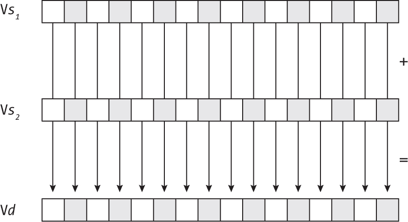

图 11-20：使用 add Vd.16b, Vs1.16b, Vs2.16b 进行 16B 逐道加法

fadd 指令使用向量寄存器操作数，将两个或四个道的单精度值相加，或一对双精度浮点值相加。使用 2S 类型时，fadd 指令会清除目标寄存器的高 64 位。

sqadd 和 uqadd 指令逐通道进行加法（分别为符号和无符号加法），但是在溢出（或者在加法时出现符号数下溢）情况下会饱和结果。与加法指令类似，接受 64 位源操作数的指令会生成 64 位结果，并将目标寄存器的高 64 位清零。

saddl 和 uaddl 指令获取源寄存器低 64 位中的通道，将这些值符号扩展或零扩展为其大小的两倍，计算和，并将结果存储到完整的目标寄存器中（具有双倍大小的通道）。目标寄存器类型必须指定为源寄存器类型的两倍大小（见 图 11-21）。因为两个 *n* 位数的和最多需要 *n* + 1 位，这些指令将生成正确的结果，不会发生溢出或下溢。

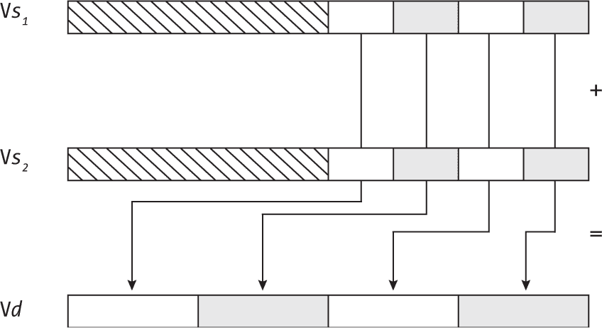

图 11-21：一个 uaddl 操作（uaddl Vd.4s, Vs1.4h, Vs2.4h）

saddl2 和 uaddl2 指令同样对源寄存器中一半通道的值进行符号扩展或零扩展，并在目标寄存器的完整 128 位中生成和。然而，saddl2 和 uaddl2 指令计算的是源寄存器中高 64 位的通道和（见 图 11-22）。

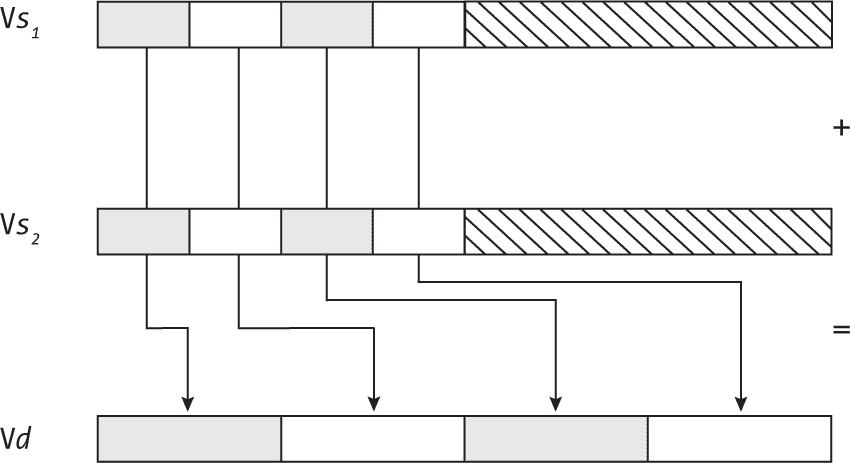

图 11-22：一个 saddl2 操作（saddl2 Vd.4s, Vs1.8h, Vs2.8h）

尽管 saddl2 和 uaddl2 指令的源操作数只有 64 位，但你必须指定 128 位类型（16B、8H、4S）作为源类型，因为该指令从 128 位值的高 64 位中提取数据。

saddw、uaddw、saddw2 和 uaddw2 指令允许你生成两个操作数大小不同的和。saddw 和 uaddw 指令期望第二个源操作数的类型是第一个源操作数和目标操作数类型的一半，尽管你为所有三个操作数指定了相同数量的通道。这些指令将分别对第二个源操作数的通道进行符号扩展或零扩展，以适应其他两个操作数的大小，计算和，并将数据存储到目标通道中（见 图 11-23）。

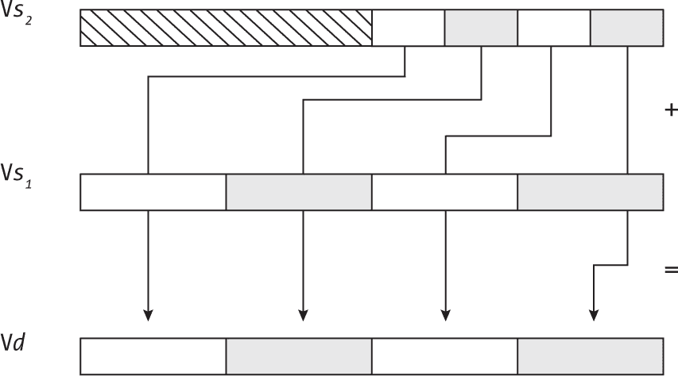

图 11-23：一个 uaddw 操作（uaddw Vd.4s, Vs1.4s, Vs2.4h）

saddw2 和 uaddw2 指令同样对第二个源操作数进行符号扩展或零扩展，但它们操作的是高 64 位而不是低 64 位（见 图 11-24）。你必须为第二个操作数指定双倍的通道数量，这样指令才能操作第二个源操作数的完整 128 位。

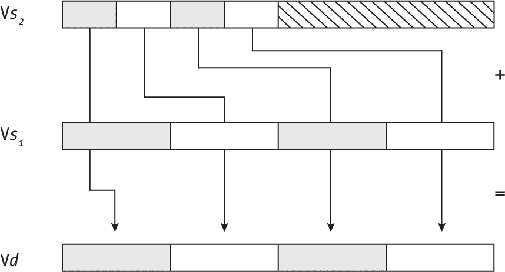

图 11-24：一个 saddw2 操作（saddw2 Vd.4s, Vs1.4s, Vs2.4h）

使用 saddw、uaddw、saddw2 和 uaddw2 指令时可能会发生溢出（下溢），例如当将 0xFFFF 和 0x01 相加时。这些指令会忽略溢出并保留结果的低位（LO）位。

addhn（向量加法并缩小）和 raddhn（向量加法、舍入并缩小）指令将指定的通道相加，然后通过仅保留高位（HO）位来*缩小*结果。这些指令的目标类型是源类型的一半大小。例如，如果将半字通道相加，缩小的结果只会保留高位字节（HO）。

raddhn 指令在将结果存储到目标寄存器之前进行舍入。如果结果的低半部分的高位（HO 位）为 1，raddhn 会将高字节（HO byte）加 1；否则，它返回与 addhn 相同的结果。考虑以下指令：

```
raddhn  v0.8b, v1.8h, v2.8h
```

如果 V2 包含 0x00010001，V1 包含 0xFE7FFE7F，那么在执行此指令后，V0 将包含 0xFFFF。如果 V1 包含 0xFE7EFE7E，V0 则会包含 0xFEFE。

执行 addhn 和 raddhn 时仍然可能发生溢出。将半字 0xFFFF 和 0x0001 相加将会在相应的目标字节通道中产生 0x00。

addhn2 和 raddhn2 指令也会进行*加法和缩小*（如果指定，则进行舍入）；然而，它们将结果存储在目标寄存器的高 64 位（HO 64 位）中，并且保持目标寄存器的低 64 位（LO 64 位）不变。由于这些指令操作的是目标寄存器的高 64 位，因此目标的通道数必须是源寄存器的两倍。例如：

```
addhn2  v0.16b, v1.8h, v2.8h
```

将 V1 和 V2 的低 8 个半字相加，并将每个通道加法的高 8 位结果存储到 V0 的高 8 字节中（保持低 8 字节不变）。你必须将目标寄存器的类型指定为 16B，即使此指令仅将 8 字节存储到寄存器中。

shadd、uhadd、srhadd 和 urhadd 指令将一对通道相加，右移 1 位（对于包含 r 的指令，可以选择舍入），并将结果存储到目标通道中。像往常一样，以 s 开头的指令处理有符号值，而以 u 开头的指令处理无符号值。由于*n* 位的加法永远不会产生超过*n* + 1 位的结果，而除以 2 等同于右移 1 位，这些指令永远不会导致溢出。考虑两个最大的单字节值相加，0xFF + 0xFF = 0x1FE。将此和右移 1 位后得到 0xFF，它正好适合 8 位。即使舍入，也不会发生溢出。

这些指令特别适用于处理数字音频。例如，假设你想要混合两个 16 位音频轨道。仅仅对两个轨道的半字进行求和，会使音量提高 3 分贝（dB）（相当于将数字值翻倍）。在求和后将结果减半，能够将音量提升降低 3 dB。urhadd 指令非常适合混合这些轨道，因为它会将结果除以 2，从而对两个轨道的值进行平均。

##### 11.7.1.2 配对加法

到目前为止，所有加法操作都在源操作数中对应的通道上进行，生成的结果会存储在目标寄存器的相同通道中。这被称为*纵向加法*，因为数据从一个寄存器流向另一个寄存器，呈垂直流动，如之前在图 11-20 中所示。偶尔，你可能想要对向量中的相邻元素求和，而不是对两个向量中对应通道的元素进行求和（横向加法）。你可以通过表 11-8 中的*配对加法*指令来实现这一点。

配对加法指令，顾名思义，是在向量中加相邻的通道对。由于结果需要的通道数是源通道数的一半，因此配对加法会从两个源寄存器中生成一个单一的向量结果。考虑以下示例，它对 V1 和 V2 中的半字进行配对加法，生成 V0 中的配对和：

```
addp  v0.4s, v2.4s, v1.4s
```

该指令计算以下结果：

V0[0] = V2[0] + V2[1]

V0[1] = V2[2] + V2[3]

V0[2] = V1[0] + V1[1]

V0[3] = V1[2] + V1[3]

图 11-25 展示了这个操作。

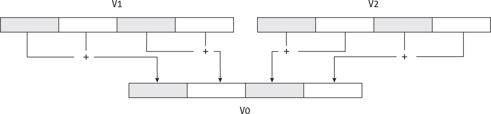

图 11-25：addp v0.4s, v2.4s, v1.4s 指令

该指令还有一个浮点版本，用于在一对向量中相邻的单精度或双精度值之间进行加法运算：faddp。例如，以下指令执行与之前的 addp 整数示例相同的操作，但添加的是相邻的单精度浮点值，而不是 32 位整数值：

```
faddp  v0.4s, v1.4s, v2.4s
```

addp 指令在加法过程中会忽略任何溢出。为了获得正确的结果，可以使用 saddlp 和 uaddlp 指令（有符号和无符号配对加法长操作）在加法前对数据通道值进行符号扩展或零扩展。这两个指令的语法与其他加法指令不同：它们只有两个寄存器操作数（一个源寄存器和一个目标寄存器）。例如，以下指令将结果的大小加倍，存入目标操作数，同时对源操作数的相邻元素进行求和，因此不需要第二个寄存器操作数：

```
saddlp  v0.2d, v1.4s
```

请注意，目标寄存器的类型大小必须是源寄存器的两倍，并且通道数必须是源寄存器的一半。

uaddalp 和 saddalp 指令在功能上类似于 uaddlp 和 saddlp，但它们不是简单地将成对的和存储到目标道中，而是将和加到目标道中已有的值上。

##### 11.7.1.3 向量饱和累加

Neon 指令集包括两条指令，将源向量的道相加并将结果存入目标向量的相应道中。这些指令是

```
usqadd  V`d`.t, V`s`.t  // Add lanes of V`s` to V`d`.
suqadd  V`d`.t, V`s`.t  // Add lanes of V`s` to V`d`.
```

其中 t 为 8B、4H 或 2S，当操作寄存器的低 64 位时，或 16B、8H、4S 或 2D，当操作所有 128 位时。64 位变体会清除 Vd 的高 64 位。

这些指令的特别之处在于，它们允许将（饱和后）一个无符号输入值添加到一个有符号值中，或者将一个有符号数值添加到一个无符号值中（通常指令只对一种数据类型操作）。

usqadd 指令将源道中的有符号值添加到相应目标道中的无符号值。如果和超过了目标道大小的最大无符号值，该指令会将道饱和到最大值。如果和变为负值，该指令会将目标道饱和为 0。例如，如果一个半字目标道包含 0xFFF0，而相应源道包含 0xFF，usqadd 指令（使用 4H 或 8H 类型）将使目标道的结果为 0xFFFF。另一方面，如果目标道包含 0x08，源道包含 0xFFF0（–16），那么它们的和将使目标道的结果为 0。

suqadd 指令是相反操作：它将一个无符号源操作数加到一个有符号目标操作数中，饱和到最大的有符号值。例如，如果目标半字道包含 0x7FF0，而相应的源道包含 0x00FF，它们的和将产生 0x7FFF，最大的有符号值。注意，如果目标操作数包含 0xFFFF（–1），而源操作数为 0x0002，你将得到 0x0001 作为目标道的结果（–1 + 2 = 1）。

usqadd 和 suqadd 指令也有标量变体

```
usqadd  `Rd`, `Rs`   // Add `Rs` to `Rd`.
suqadd  `Rd`, `Rs`   // Add `Rs` to `Rd`.
```

其中 Rd 和 Rs 是标量寄存器 Bn、Hn、Sn 或 Dn 中的一个。

suqadd 指令在溢出时始终会产生最大的有符号值，因为你无法通过将一个无符号数加到其上来减少该值。

##### 11.7.1.4 水平加法

addv（跨向量加法）指令计算单个源向量寄存器中所有道的和，并将结果存入另一个向量寄存器的标量元素中（这称为 *归约*）。该指令的语法如下

```
addv `Rd`, V`s.t`
```

其中 R 是目标寄存器，且是 B*n*、H*n* 或 S*n* 中的一个。合法的向量寄存器类型和道数取决于标量寄存器；表 11-10 列出了有效的类型。

表 11-10：addv 指令的有效向量寄存器类型

| 标量寄存器 (Rd) | 有效道数和类型 |
| --- | --- |
| Bd | 8B 或 16B |
| Hd | 4H 或 8H |
| Sd | 4S |

此指令对于对数组元素求和非常有用。不幸的是，目标标量类型必须与源数据 lane 的类型相同，并且任何溢出都会被忽略。没有指令可以将和结果零扩展或符号扩展为双倍大小的结果。因此，如果可能发生溢出，建议在执行 addv 之前，将向量元素零扩展或符号扩展为下一个更大的大小。可以使用 saddlp 或 uaddlp 指令来添加相邻的两个元素并分别进行符号或零扩展，然后使用 addv 指令对得到的双倍大小的 lane 进行求和。

addvl 指令是 ARM *可扩展向量扩展（SVE）*的一部分，超出了本书的范围。虽然你可能会认为 addvl 是 addv 指令的长版本，但实际上它的功能完全不同。详细信息请参阅 ARM SVE 文档。

##### 11.7.1.5 标量饱和加法和标量逐对加法

Neon 指令集还提供了几条饱和标量加法指令。

```
sqadd  `Rd`, `Rs`1, `Rs`2
uqadd  `Rd`, `Rs`1, `Rs`2
```

其中 R 代表标量寄存器名称之一 B、H、S 或 D。这些指令对指定 V 寄存器的低位中的 8 位、16 位、32 位或 64 位有符号或无符号整数值进行操作（请参见图 11-2，了解 V*n*、B*n*、H*n*、S*n* 和 D*n* 寄存器之间的对应关系）。这些指令的功能与其向量版本相同，唯一不同的是，它们只对标量值进行操作，而不是对每个 lane 执行向量操作。

以下是 addp 和 faddp 指令的标量变体：

```
addp   D`d`, V`s`.2D
faddp  S`d`, V`s`.2S
faddp  D`d`, V`s`.2D
```

请注意这些指令的 lane 数量和类型支持的限制。

addp 指令忽略（丢弃）源向量中两个双字元素相加时的溢出。addpl 和 addpl2 指令没有标量版本。如果需要该指令的扩展精度版本，请使用实际的 addpl 和 addpl2 指令（与第二个包含零的向量一起使用）。

#### 11.7.2 减法

尽管 Neons 指令集中用于减法的指令数量不如加法指令多，但大多数加法指令都具有相应的减法补充指令。表 11-11 提供了各种向量减法指令及相关数据类型的语法；这些指令通常计算 Vd = Vl *–* Vr（除非有特别说明），其中 Vd = 目标寄存器，Vl = 左操作数，Vr = 右操作数。

表 11-11：Neon 减法指令

| 指令助记符 | 语法 | 描述 |
| --- | --- | --- |
| sub | sub Vd.t1, Vl.t1, Vr.t1 | 执行按 lane 逐位整数差值 |
| fsub | fsub Vd.t2, Vl.t2, Vr.t2 | 执行按 lane 逐位浮点数差值 |
| uqsub | uqsub Vd.t1, Vl.t1, Vr.t1 | 执行按 lane 逐位无符号整数减法并带饱和处理 |
| sqsub | sqsub Vd.t1, Vl.t1, Vr.t1 | 执行按 lane 逐位有符号整数减法并带饱和处理 |
| usubl | usubl Vd.t3, Vl.t4, Vr.t4 | 计算按位无符号长整型减法 |
| ssubl | ssubl Vd.t3, Vl.t4, Vr.t4 | 计算按位签名长整型减法 |
| usubl2 | usubl2 Vd.t5, Vl.t6, Vr.t6 | 计算 Vr 上半部分的按位无符号长整型减法 |
| ssubl2 | ssubl2 Vd.t5, Vl.t6, Vr.t6 | 计算 Vr 上半部分的按位签名长整型减法 |
| usubw | usubw Vd.t3, Vl.t3, Vr.t4 | 计算按位无符号宽整型减法 |
| ssubw | ssubw Vd.t3, Vl.t3, Vr.t4 | 计算按位签名宽整型减法 |
| usubw2 | usubw2 Vd.t5, Vl.t4, Vr.t6 | 计算涉及 Vl 上半部分的按位无符号宽整型减法 |
| ssubw2 | ssubw2 Vd.t5, Vl.t5, Vr.t6 | 计算涉及 Vl 上半部分的按位签名宽整型减法 |
| subhn | subhn Vd.t4, Vl.t3, Vr.t3 | 计算按位减法并进行缩小 |
| rsubhn | rsubhn Vd.t4, Vl.t3, Vr.t3 | 计算按位减法并进行舍入和缩小 |
| subhn2 | subhn2 Vd.t6, Vl.t5, Vr.t5 | 计算按位减法并进行缩小（使用高位位元） |
| rsubhn2 | rsubhn2 Vd.t6, Vl.t5, Vr.t5 | 计算按位减法并进行舍入和缩小（使用高位位元） |
| uhsub | uhsub Vd.t7, Vl.t7, Vr.t7 | 计算按位无符号减法并进行二分 |
| shsub | shsub Vd.t7, Vl.t7, Vr.t7 | 计算按位签名减法并进行二分 |

这些指令的行为与它们的加法对应指令非常相似，当然，区别在于它们是减去通道中的值，而不是加上这些值。详情请见前一节。

还有一个饱和标量减法指令：

```
sqsub  R`d`, R`s`1, R`s`2
uqsub  R`d`, R`s`1, R`s`2
```

这将两个源标量寄存器（B*n*、H*n*、S*n* 或 D*n*）相减，产生一个标量结果。

#### 11.7.3 绝对差

除了常规的减法指令，Neon 指令集还包括几条指令，用于计算对应通道中值的差，并计算该差值的绝对值。这些指令非常方便用于计算距离和其他向量（如物理学中的向量）计算。

表 11-12 列出了可用的绝对差指令。在语法列中，Vd = 目标寄存器，Vl = 左操作数，Vr = 右操作数。每条指令通常计算 Vd = abs(Vl *–* Vr)，除非另有说明。

表 11-12：Neon 绝对差指令

| 指令助记符 | 语法 | 描述 |
| --- | --- | --- |
| uabd | uabd Vd.t1, Vl.t1, Vr.t1 | 向量无符号绝对差；各通道包含无符号值。 |
| sabd | sabd Vd.t1, Vl.t1, Vr.t1 | 向量签名绝对差；各通道包含签名值。 |
| uaba | uaba Vd.t1, Vl.t1, Vr.t1 | 向量无符号绝对差并累加；Vd = Vd + abs(Vl – Vr)，其中各通道包含无符号值。 |
| saba | saba Vd.t1, Vl.t1, Vr.t1 | 向量有符号绝对差并累加；Vd = Vd + abs(Vl – Vr)，其中通道包含有符号值。 |
| uabdl | uabdl Vd.t2, Vl.t3, Vr.t3 | 向量无符号绝对差长整型；通道包含无符号值。 |
| sabdl | sabdl Vd.t2, Vl.t3, Vr.t3 | 向量有符号绝对差长整型；通道包含有符号值。 |
| uabal | uabal Vd.t2, Vl.t3, Vr.t3 | 向量无符号绝对差长整型并累加；Vd = Vd + abs(Vl – Vr)，其中通道包含无符号值。 |
| sabal | sabal Vd.t2, Vl.t3, Vr.t3 | 向量有符号绝对差长整型并累加；Vd = Vd + abs(Vl – Vr)，其中通道包含有符号值。 |
| uabdl2 | uabdl2 Vd.t4, Vl.t5, Vr.t5 | 向量无符号绝对差长整型；通道包含无符号值。使用 Vl 和 Vr 的高 64 位。 |
| sabdl2 | sabdl2 Vd.t4, Vl.t5 Vr.t5 | 向量有符号绝对差长整型；通道包含有符号值。使用 Vl 和 Vr 的高 64 位。 |
| uabal2 | uabal2 Vd.t4, Vl.t5, Vr.t5 | 向量无符号绝对差长整型并累加；Vd = Vd + abs(Vl – Vr)，其中通道包含无符号值。使用 Vl 和 Vr 的高 64 位。 |
| sabal2 | sabal2 Vd.t4, Vl.t5, Vr.t5 | 向量有符号绝对差长整型并累加；Vd = Vd + abs(Vl – Vr)，其中通道包含有符号值。使用 Vl 和 Vr 的高 64 位。 |
| fabd | fabd Vd.t6, Vl.t6, Vr.t6 | 向量浮点绝对差；通道包含浮点值。 |
| fabd | fabd Sd, Sl, Sr | 标量单精度浮点绝对差；Sd = abs(Sl – Sr)。 |
| fabd | fabd Dd, Dl, Dr | 标量双精度浮点绝对差；Dd = abs(Dl – Dr)。 |

表 11-13 列出了绝对差指令的合法类型。

表 11-13：绝对差指令的合法类型

| t | 合法类型 |
| --- | --- |
| t1 | 8B, 16B, 4H, 8H, 2S, 或 4S |
| t2/t3 | 8H/8B, 4S/4H, 或 2D/2S |
| t4/t5 | 8H/16B, 4S/8H, 或 2D/4S |
| t6 | 2S, 4S, 或 2D |

uabd 和 sabd 指令计算每个通道的差值，取差值的绝对值，并将结果存储到目标通道中。尽管这两条指令分别操作无符号和有符号源操作数，但结果始终是无符号值。实际上，这些只是 sub 指令的变种，它们取结果的绝对值。只要你将结果视为无符号数（尤其是在 sabd 指令的情况下），这些指令不会产生溢出（下溢）。

uaba 和 saba 指令将差值的绝对值加到目标寄存器的相应通道。如果发生溢出（在加法过程中），这些指令将低位（通道大小）存储到相应的目标通道中。对于带符号操作，如果 Vl 包含最小负值（例如，字节类型的 0x80）且 Vr 为 0，则会发生溢出，指令最终将最小负值加到目标通道中。

这些指令的后缀-l 和后缀-l2 变体执行长整型计算。uabdl 和 sabdl 指令首先将通道值进行零扩展或符号扩展（分别），将其扩展为原来通道大小的两倍，然后计算绝对值差，并将结果存入相应的双倍大小通道中。uabdl2 和 sabdl2 指令执行相同的操作，但从源操作数的高 64 位获取通道数据（请参见图 11-21 和图 11-22，并替换适当的指令，查看具体实现）。

fabd 指令计算两个浮点值的绝对差。对于向量寄存器操作数，它一次处理两个双精度或四个单精度浮点值。该指令也支持标量操作（单精度或双精度），通过指定 D*n* 或 S*n* 寄存器作为操作数。不幸的是，目前没有浮点数绝对差和累加指令。你可以通过在 fabd 指令后跟一个 fadd 指令来模拟该指令（使用一个备用向量寄存器来存储 fabd 的临时结果）。

#### 11.7.4 向量乘法

Neon 指令集包括几条指令，用于计算向量寄存器中对应通道的乘积（包括整数和浮点数乘积）。标准的向量乘法指令见表 11-14。请注意，Vl 是左操作数，Vr 是右操作数。

表 11-14：Neon 向量乘法指令

| 助记符 | 语法 | 描述 |
| --- | --- | --- |
| mul | mul Vd.t1, Vl.t1, Vr.t1 | 乘法：Vd = Vl × Vr。忽略溢出，保留结果的低位（逐通道）。 |
| mla | mla Vd.t1, Vl.t1, Vr.t1 | 乘法并累加：Vd = Vd + Vl × Vr。忽略溢出，保留结果的低位（逐通道）。 |
| mls | mls Vd.t1, Vl.t1, Vr.t1 | 乘法并减法：Vd = Vd − Vl × Vr。忽略溢出，保留结果的低位（逐通道）。 |
| smull | smull Vd.t2, Vl.t3, Vr.t3 | 带符号扩展乘法：Vd = Vl × Vr。将 Vl 的低半部分与 Vr 相乘，并将扩展精度的结果存储到 Vd 的各个通道中（双通道大小，逐通道结果）。 |
| umull | umull Vd.t2, Vl.t3, Vr.t3 | 无符号扩展乘法：Vd = Vl × Vr。将 Vl 的低半部分与 Vr 相乘，并将扩展精度的结果存储到 Vd 的各个通道中（双通道大小，逐通道结果）。 |
| smull2 | smull2 Vd.t4, Vl.t5, Vr.t5 | 带符号扩展乘法：Vd = Vl × Vr。将 Vl 的高半部分与 Vr 相乘，并将扩展精度结果存储在 Vd 的各个 lane 中（双 lane 大小，逐 lane 结果）。 |
| umull2 | umull2 Vd.t4, Vl.t5, Vr.t5 | 无符号扩展乘法：Vd = Vl × Vr。将 Vl 的高半部分与 Vr 相乘，并将扩展精度结果存储在 Vd 的各个 lane 中（双 lane 大小，逐 lane 结果）。 |
| smlal | smlal Vd.t2, Vl.t3, Vr.t3 | 带符号扩展乘法并累加：Vd = Vd + Vl × Vr。将 Vl 的低半部分与 Vr 相乘，并将扩展精度结果加到 Vd 的各个 lane 中（双 lane 大小，逐 lane 结果）。 |
| umlal | umlal Vd.t2, Vl.t3, Vr.t3 | 无符号扩展乘法并累加：Vd = Vd + Vl × Vr。将 Vl 的低半部分与 Vr 相乘，并将扩展精度结果加到 Vd 的各个 lane 中（双 lane 大小，逐 lane 结果）。 |
| smlal2 | smlal2 Vd.t4, Vl.t5, Vr.t5 | 带符号扩展乘法并累加：Vd = Vd + Vl × Vr。将 Vl 的高半部分与 Vr 相乘，并将扩展精度结果加到 Vd 的各个 lane 中（双 lane 大小，逐 lane 结果）。 |
| umlal2 | umlal2 Vd.t4, Vl.t5, Vr.t5 | 无符号扩展乘法并累加：Vd = Vd + Vl × Vr。将 Vl 的高半部分与 Vr 相乘，并将扩展精度结果加到 Vd 的各个 lane 中（双 lane 大小，逐 lane 结果）。 |
| smlsl | smlsl Vd.t2, Vl.t3, Vr.t3 | 带符号扩展乘法并减法：Vd = Vd – Vl × Vr。将 Vl 的低半部分与 Vr 相乘，并将其从 Vd 的扩展精度值中减去（双 lane 大小，逐 lane 结果）。 |
| umlsl | umlsl Vd.t2, Vl.t3, Vr.t3 | 无符号扩展乘法并减法：Vd = Vd – Vl × Vr。将 Vl 的低半部分与 Vr 相乘，并将其从 Vd 的扩展精度值中减去（双 lane 大小，逐 lane 结果）。 |
| smlsl2 | smlsl2 Vd.t4, Vl.t5, Vr.t5 | 带符号扩展乘法并减法：Vd = Vd – Vl × Vr。将 Vl 的高半部分与 Vr 相乘，并将其从 Vd 的扩展精度值中减去（双 lane 大小，逐 lane 结果）。 |
| umlsl2 | umlsl2 Vd.t4, Vl.t5, Vr.t5 | 无符号扩展乘法并减法：Vd = Vd – Vl × Vr。将 Vl 的高半部分与 Vr 相乘，并将其从 Vd 的扩展精度值中减去（双 lane 大小，逐 lane 结果）。 |
| fmul | fmul Vd.t6, Vl.t6, Vr.t6 | 浮点乘法：Vd = Vl × Vr。将 Vl 和 Vr 各自 lane 中的浮点数值相乘，并将乘积存储到对应的 Vd lanes 中（逐 lane）。 |
| fmulx | fmulx Vd.t6, Vl.t6, Vr.t6 | 浮点乘法：Vd = Vl × Vr。将 Vl 和 Vr 各自 lane 中的浮点数值相乘，并将乘积存储到对应的 Vd lanes 中（逐 lane）。该变体处理一个源操作数为 0，另一个为±∞的情况，结果为±2（当是–∞时为–2，否则为+2）。 |
| fmla | fmla Vd.t6, Vl.t6, Vr.t6 | 浮点乘法并累加：Vd = Vd + Vl × Vr（逐 lane）。 |
| fmls | fmls Vd.t6, Vl.t6, Vr.t6 | 浮点乘法减法：Vd = Vd – Vl × Vr（逐 lane）。 |

表 11-15 列出了表 11-14 中指令的合法类型。

表 11-15：向量乘法指令的合法类型

| t | 类型 | 备注 |
| --- | --- | --- |
| t1 | 8B、16B、4H、8H、2S 或 4S | 8B、4S 和 2S 仅在 LO 64 位上操作。 |
| t2/t3 | 8H/8B、4S/4H 或 2D/2S | t3 lanes 来源于 LO 64 位。 |
| t4/t5 | 8H/16B、4S/8H 或 2D/4S | t5 lanes 来源于 HO 64 位。 |
| t6 | 2S、4S 或 2D |  |

还有 pmul、pmull 和 pmull2（多项式乘法）指令。然而，多项式乘法并不是传统的乘法操作，关于这一点的讨论超出了本书的范围。有关这些指令的更多细节，请参阅 Arm 文档。

##### 11.7.4.1 向量饱和乘法与双倍

向量饱和乘法和双倍指令基于标准的乘法、乘法累加和乘法减法指令，产生扩展精度（长整型）结果，将乘积加倍并使结果饱和。本指令集中的指令列在表 11-16 中，计算公式为 Vd = 饱和({Vd ±}(Vl × Vr) × 2)，其中 Vd 是目标操作数，Vl 是左操作数，Vr 是右操作数；{Vd ±}表示 Vd ±是可选的源操作数。

表 11-16：带饱和的向量乘法和双倍指令

| 助记符 | 语法 | 描述 |
| --- | --- | --- |
| sqdmull | sqdmull Vd.t1, Vl.t2, Vr.t2 | Vd = (Vl × Vr) × 2（逐 lane） |
| sqdmlal | sqdmlal Vd.t1, Vl.t2, Vr.t2 | Vd = Vd + (Vl × Vr) × 2（逐 lane） |
| sqdmlsl | sqdmlsl Vd.t1, Vl.t2, Vr.t2 | Vd = Vd − (Vl × Vr) × 2（逐 lane） |
| sqdmull2 | sqdmull2 Vd.t3, Vl.t4, Vr.t4 | Vd = (Vl × Vr) × 2（逐 lane，HO 64 位来源） |
| sqdmlal2 | sqdmlal2 Vd.t3, Vl.t4, Vr.t4 | Vd = Vd + (Vl × Vr) × 2（逐 lane，HO 64 位） |
| sqdmlsl2 | sqdmlsl2 Vd.t3, Vl.t4, Vr.t4 | Vd = Vd – (Vl × Vr) × 2（逐 lane，HO 64 位） |
| sqdmull | sqdmull Vd.t5, Vl.t6, Vr.t7[x] | Vd = (Vl × Vr) × 2（Vl lanes × Vr[x] 标量） |
| sqdmlal | sqdmlal Vd.t5, Vl.t6, Vr.t7[x] | Vd = Vd + (Vl × Vr) × 2（Vl lanes × Vr[x] 标量） |
| sqdmlsl | sqdmlsl Vd.t5, Vl.t6, Vr.t7[x] | Vd = Vd – (Vl × Vr) × 2（Vl lanes × Vr[x] 标量） |
| sqdmull2 | sqdmull2 Vd.t8, Vl.t9, Vr.t10[x] | Vd = (Vl × Vr) × 2（Vl lanes × Vr[x] 标量，HO 64 位） |
| sqdmlal2 | sqdmlal2 Vd.t8, Vl.t9, Vr.t10[x] | Vd = Vd + (Vl × Vr) × 2（Vl lanes × Vr[x] 标量，HO 64 位） |
| sqdmlsl2 | sqdmlsl2 Vd.t8, Vl.t9, Vr.t10[x] | Vd = Vd – (Vl × Vr) × 2（Vl lanes × Vr[x] 标量，HO 64 位） |

合法的类型和 lane 数目列在表 11-17 中。

表 11-17：带饱和的向量乘法和双倍合法类型与 lane 数目

| t | 类型和 lane 数目 |
| --- | --- |
| t1/t2 | 4S/4H 或 2D/2S |
| t3/t4 | 4S/8H，或 2D/4S |
| t5/t6/t7 | 4S/4H/H，或 2D/2S/S |
| t8/t9/t10 | 4S/8H/H，或 2D/4S/S |

这些指令都将其源操作数进行符号扩展，扩展为原来大小的两倍，并进行乘法运算，生成一个乘积。然后，它们将该乘积乘以 2。标准的乘法变体会饱和并将该乘积存储到相应的目标 lane 中。乘法累加变体会将乘积（乘以 2）加到目标中，并饱和结果。乘法减法变体会将乘积（乘以 2）从目标中减去，并饱和结果。

没有 2 后缀的指令从第一个源寄存器的 LO 64 位中提取它们的 lane，而带有 2 后缀的指令则从第二个源寄存器的 HO 64 位中提取它们的 lane。

表 11-16 中的最后六条指令将 Vl 中的各条 lane 与从 Vr 中的某一 lane 选择的标量值相乘（由[x]索引操作符选择）。这里，x 必须是适合源类型的值（字节为 0 到 7，半字为 0 到 3，字为 0 到 1）。对于最后六种形式，如果 t10 是 H，则 Vr 寄存器号（r）必须在 0 到 15 的范围内。

有几个“简短”版本的 sqdmul*指令不将目标寄存器中的类型大小加倍：sqdmulh 和 sqrdmulh。这些指令也会对源操作数进行相乘，将结果加倍并饱和。但是，它们仅将结果的 HO 64 位存储到目标 lane 中（经过饱和和可能的四舍五入）。表 11-18 列出了这些指令。

表 11-18：饱和乘法和双倍指令，HO 位

| 助记符 | 语法 | 描述 |
| --- | --- | --- |
| sqdmulh | sqdmulh Vd.t1, Vl.t1, Vr.t1 | 按 lane 逐个相乘，结果加倍，饱和并保留乘积的 HO 半部分。 |
| sqrdmulh | sqrdmulh Vd.t1, Vl.t1, Vr.t1 | 按 lane 逐个相乘，结果加倍，四舍五入，饱和并保留乘积的 HO 半部分。 |
| sqdmulh | sqdmulh Vd.t2, Vl.t3, Vr.t4[x] | 将 Vl 中的各条 lane 与 Vr[x]选择的标量相乘；将结果加倍，饱和并保留乘积的 HO 半部分。 |
| sqrdmulh | sqrdmulh Vd.t2, Vl.t3, Vr.t4[x] | 将 Vl 中的各条 lane 与 Vr[x]选择的标量相乘；将结果加倍，四舍五入，饱和并保留乘积的 HO 半部分。 |
| sqdmulh | sqdmulh Rd, Rl, Rr | sqdmulh 的标量版本。 |
| sqrdmulh | sqrdmulh Rd, Rl, Rr | sqrdmulh 的标量版本。 |

在本表中，t1 是 4H、8H、2S 或 4S。对于 4H 和 2S 类型，指令仅处理寄存器的 LO 64 位；而 8H 和 4S 类型使用寄存器的全部 128 位。

类型说明 t2/t3/t4 是 4H/4H/H，8H/8H/H，2S/2S/S，或 4S/S；4H 和 2S 类型与寄存器的 LO 64 位一起使用，而 8H 和 4S 类型则处理寄存器的全部 128 位。如果类型是 H，则 Vr 的寄存器号必须在 0 到 15 的范围内。

如果[x]索引出现在 Vr*.*t4 后面，则该指令将 Vl 中的通道与从 Vr 的通道 x 提取的标量值相乘，Vr 必须是适合源类型的值（字节为 0 到 7，半字为 0 到 3，字为 0 到 1）。

这些指令有两种标量变体。R（在 Rd、Rl 和 Rr 中）必须是 H 或 S。例如

```
sqdmulh h0, h1, h2
```

计算 H0 = 饱和(H1 × H2 × 2)。

##### 11.7.4.2 向量与标量元素相乘

Neon 指令集提供了多条指令，将向量的所有元素与单一标量值相乘，如表 11-19 所列。

表 11-19：向量与标量相乘指令

| 记忆法 | 语法 | 描述 |
| --- | --- | --- |
| mul | mul Vd.t1, Vl.t1, Vr.t2[x] | 将整数向量元素与标量值相乘。将 Vl 中的每个通道与 Vr[x]（标量值）相乘，并将乘积存储到 Vd 中相应的通道（即，对于每个通道 i，Vd[i] = Vl[i] × Vr[x]）。 |
| mla | mla Vd.t1, Vl.t1, Vr.t2[x] | 将向量元素与标量相乘并累加。对于每个通道 i，Vd[i] = Vd[i] + Vl[i] × Vr[x]。 |
| mls | mls Vd.t1, Vl.t1, Vr.t2[x] | 将向量元素与标量相乘并减法。对于每个通道 i，Vd[i] = –d[i] – Vl[i] × Vr[x]。 |
| smull | smull Vd.t3, Vl.t4, Vr.t5[x] | 有符号向量与标量相乘，长整型。将 Vl 中的（LO）通道扩展为两倍大小，乘以 Vr[x]，并将结果存储到 Vd 中双倍大小的通道。仅使用 Vl 的 LO 64 位。 |
| smlal | smlal Vd.t3, Vl.t4, Vr.t5[x] | 有符号向量与标量相乘并累加，长整型。类似于 smull，但将乘积累加到 Vd 中，而不是仅仅存储到 Vd 中。 |
| smlsl | smlsl Vd.t3, Vl.t4, Vr.t5[x] | 有符号向量与标量相乘并减法，长整型。类似于 smull，但将乘积从 Vd 中减去，而不是仅仅存储到 Vd 中。 |
| smull2 | smull2 Vd.t6, Vl.t7, Vr.t8[x] | 有符号向量与标量相乘，长整型。将 Vl 中的（HO）通道扩展为两倍大小，乘以 Vr[x]，并将结果存储到 Vd 中双倍大小的通道。仅使用 Vl 的 HO 64 位。 |
| smlal2 | smlal2 Vd.t6, Vl.t7, Vr.t8[x] | 有符号向量与标量相乘并累加，长整型（HO 源）。类似于 smull2，但将乘积累加到 Vd 中，而不是仅仅存储到 Vd 中。 |
| smlsl2 | smlsl2 Vd.t6, Vl.t7, Vr.t8[x] | 有符号向量与标量相乘并减法，长整型（HO 源）。类似于 smull2，但将乘积从 Vd 中减去，而不是仅仅存储到 Vd 中。 |
| umull | umull Vd.t3, Vl.t4, Vr.t5[x] | 无符号向量与标量相乘，长整型。将 Vl 中的（LO）通道扩展为两倍大小，乘以 Vr[x]，并将结果存储到 Vd 中双倍大小的通道。仅使用 Vl 的 LO 64 位。 |
| umlal | umlal Vd.t3, Vl.t4, Vr.t5[x] | 无符号向量与标量相乘并累加，长整型。类似于 umull，但将乘积累加到 Vd 中，而不是仅仅存储到 Vd 中。 |
| umlsl | umlsl Vd.t3, Vl.t4, Vr.t5[x] | 无符号向量与标量相乘并相减，长整型。与 umull 类似，但将乘积从 Vd 中减去，而不仅仅是存储到 Vd。 |
| umull2 | umull2 Vd.t6, Vl.t7, Vr.t8[x] | 无符号向量与标量相乘，长整型。将 Vl 中的（HO）通道零扩展到其大小的两倍，与 Vr[x] 相乘，并将结果存储到 Vd 中的双倍大小的通道中。仅使用 Vl 中的 HO 64 位。 |
| umlal2 | umlal2 Vd.t6, Vl.t7, Vr.t8[x] | 无符号向量与标量相乘并累加，长整型（HO 源）。与 umull2 类似，但将乘积累加到 Vd 中，而不仅仅是存储到 Vd。 |
| umlsl2 | umlsl2 Vd.t6, Vl.t7, Vr.t8[x] | 无符号向量与标量相乘并相减，长整型（HO 源）。与 umull2 类似，但将乘积从 Vd 中减去，而不仅仅是存储到 Vd。 |
| fmul | fmul Vd.t9, Vl.t10, Vr.t11[x] | 浮点向量与标量相乘。将 Vl 中每个通道与 Vr[x]（标量值）相乘，并将乘积存储到 Vd 的相应通道中（即，对于每个通道 i，Vd[i] = Vl[i] × Vr[x]）。 |
| fmulx | fmulx Vd.t9, Vl.t10, Vr.t11[x] | 类似于 fmul，但它是一个特殊变体，处理其中一个源操作数为 0，另一个为 ±∞ 的情况。这样会生成值 ±2（如果是 -∞ 则为 -2，否则为 +2）。 |
| fmla | fmla Vd.t9, Vl.t10, Vr.t11[x] | 浮点向量与标量相乘并累加。将 Vl 中每个通道与 Vr[x]（标量值）相乘，并将乘积加到 Vd 的相应通道中（即，对于每个通道 i，Vd[i] = Vd[i] + Vl[i] × Vr[x]）。 |
| fmls | fmls Vd.t9, Vl.t10, Vr.t11[x] | 浮点向量与标量相乘并相减。将 Vl 中每个通道与 Vr[x]（标量值）相乘，并将乘积从 Vd 的相应通道中减去（即，对于每个通道 i，Vd[i] = Vd[i] - Vl[i] × Vr[x]）。 |

表 11-20 列出了 表 11-19 中指令的合法类型和通道数量。

表 11-20：向量与标量相乘的合法类型和通道数量

| t | 合法类型和通道数量 |
| --- | --- |
| t1/t2 | 4H/H，8H/H，2S/S，或 4S/S |
| t3/t4/t5 | 4S/4H/H 或 2D/2S/S |
| t6/t7/t8 | 4S/8H/H，或 2D/4S/S |
| t9/t10/t11 | 2S/2S/S，4S/S，或 2D/D |

图 11-26 显示了 mul、mla、mls、fmul、fmla 和 fmls 指令的基本操作。

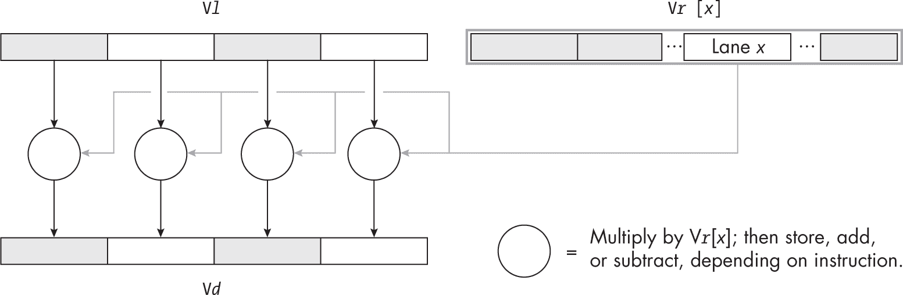

图 11-26：向量与标量相乘操作

图 11-27 显示了 smull、umull、smlal、umlal、smlsl 和 umlsl 指令的基本操作。

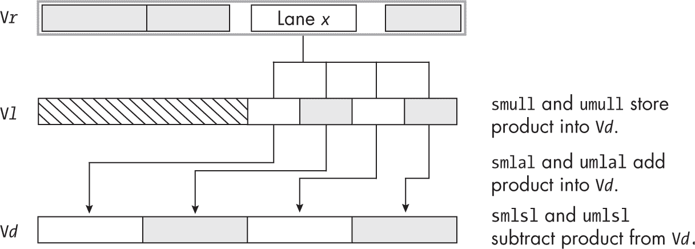

图 11-27：向量与标量相乘，长整型（LO 位）

图 11-28 显示了 smull2、umull2、smlal2、umlal2、smlsl2 和 umlsl2 指令的基本操作。

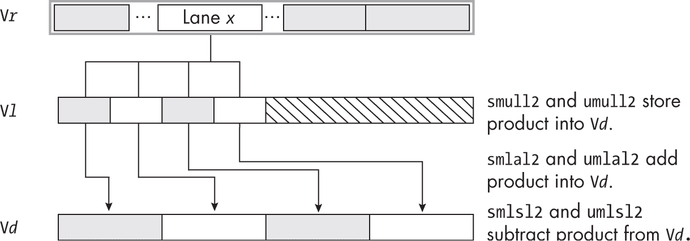

图 11-28：向量与标量相乘，长整型（HO 位）

由于两个*n*位数的乘积适合存储在 2*n*位中，smul/smul2 和 umul/umul2 指令不会产生溢出。但是，请注意，在乘法之后的加法或减法可能需要一个附加位（2*n* + 1 位）。如果发生这种情况，这些指令将忽略溢出并保留 LO 位。

##### 11.7.4.3 标量乘法与向量元素

Neon 指令集提供了 fmls 指令的变体，将标量寄存器（Sn 或 Dn）与向量元素（Vn[x]）相乘，并将结果存储回标量寄存器中。表 11-21 列出了这些指令的语法，其中 Fl 是左侧源操作数，Vr 是右侧源操作数。

表 11-21：浮点标量乘法与向量元素指令

| 助记符 | 语法 | 描述 |
| --- | --- | --- |
| fmul | fmul Fd, Fl, Vr.t[x] | Fd = Fl × Vr.t[x] |
| fmulx | fmulx Fd, Fl, Vr.t[x] | Fd = Fl × Vr.t[x]。处理 Fl = 0.0 且 Vr.t 为±∞的情况，结果为±2.0。 |
| fmla | fmla Fd, Fl, Vr.t[x] | Fd = Fd + Fl × Vr.t[x] |
| fmls | fmls Fd, Fl, Vr.t[x] | Fd = Fd – Fl × Vr.t[x] |

寄存器 Fd 和 Fl 分别是标量浮点寄存器（Sn 或 Dn）之一。类型 t 必须匹配大小（S 或 D）。如果类型是单精度（Sn），则 Vr 必须是 V0 到 V15 范围内的寄存器。

这些乘法指令没有整数等效指令。

#### 11.7.5 向量除法

Neon 指令集不提供执行整数除法的向量指令。然而，它确实提供了一条指令来执行一对向量中每个通道的浮点数除法。

```
fdiv V`d.t`, V`l.t`, V`r.t`  // Computes V`d` = V`l` / V`r` (lane by lane)
```

其中 t 是 2S，4S 或 2D。（除以零会在目标通道中产生 NaN。）

由于浮点数除法相对较慢，特别是在遍历所有通道时，Neon 指令集包含一对可以计算浮点数倒数的指令。与除法相比，乘以倒数通常要快得多。如果你正在除以一个常量，可以在汇编时预先计算倒数值，并使用该值（没有运行时开销）。如果值是一个无法在汇编时计算的变量，可以使用 frecpe 指令来*近似*所有通道中向量寄存器的倒数。

```
frecpe V`d.t`, V`s.t`
```

其中 t 是 2S，4S 或 2D（2S 操作寄存器的低 64 位）。

存在 frecpe 的标量版本。

```
frecpe `Rd`, `Rs`
```

其中 Rd 和 Rs 是 S*n*或 D*n*。

frecpe 指令产生一个倒数近似值，其与正确值的误差不超过 8 位——虽然不太精确，但足以应对快速而粗略的计算。如果你需要更好的精度，可以使用 frecps 指令（语法相同，仅助记符不同）来计算 Newton-Raphson 倒数近似算法的另一步，代码如下：

```
// Compute V0.4S = V1.4S / V2.4S by computing the reciprocal
// of V2 and multiplying V1 by this reciprocal value:

    frecpe  v3.4s, v2.4s         // Get first approximation.
    frecps  v0.4s, v1.4s, v3.4s  // *** Refinement step
    fmul    v3.4s, v3.4s, v0.4s  // *** Refinement step (cont.)

// Repeat "Refinement step" as many times as desired here.

    fmul    v0.4s, v1.4s, v3.4s  // Compute quotient.
```

你重复细化步骤的次数越多，结果就越精确。然而，在某个时刻，执行这些浮点指令的成本将超过单个 fdiv 指令的执行时间，因此要小心使用 frecps，因为它的收益递减。

有一个 urecpe 指令用于估算定点倒数，但定点运算超出了本书的范围。如需了解更多内容，请参阅 ARM 架构参考手册，该手册在第 11.15 节“更多信息”中提供链接，见第 700 页。

#### 11.7.6 符号操作

Neon 指令集包括四条指令，可以使你对向量寄存器中的各条进行取反或取绝对值操作。

```
abs   V`d.t1`, V`s.t1`
neg   V`d.t1`, V`s.t1`
sqabs V`d.t1`, V`s.t1`
sqneg V`d.t1`, V`s.t1`
fabs  V`d.t2`, V`s.t2`
fneg  V`d.t2`, V`s.t2`
```

其中 t1 代表常见的整数类型（8B、16B、4H、8H、2S、4S 或 2D），t2 代表常见的浮点类型（2S、4S 和 2D）。8B、4H 和 2S 类型仅引用向量寄存器中的低 64 位。

abs 和 fabs 指令计算源寄存器中每个条目的绝对值，并将结果存储到目标寄存器中。显然，abs 操作有符号整数值，而 fabs 操作浮点值。

neg 和 fneg 指令对源寄存器中的条目取反（改变符号），并将取反后的结果保存在对应的目标条目中。如预期，neg 作用于有符号整数，fneg 作用于浮点值。

sqabs 和 sqneg 指令是 abs 和 neg 指令的特殊饱和变体，永远不会溢出。当你取其绝对值或取反时，最小值（例如，字节值的 0x80）会发生溢出；在这两种情况下，结果都将是相同的。sqabs 和 sqneg 指令将在你尝试取反或取绝对值时，产生最大正值（例如，字节值的 0x7F）。

abs、neg、sqabs 和 sqneg 指令也有标量版本，如表 11-22 所示。对于 abs 和 neg，Rd 和 Rs 只能是 Dn；对于 sqabs 和 sqneg，Rd 和 Rs 可以是标量寄存器 Bn、Hn、Sn 或 Dn。

表 11-22：标量符号操作

| 助记符 | 语法 | 描述 |
| --- | --- | --- |
| abs | abs Rd, Rs | Rd = abs(Rs) |
| neg | neg Rd, Rs | Rd = –Rs |
| sqabs | sqabs Rd, Rs | Rd = abs(Rs)，饱和到最大有符号值 |
| sqneg | sqneg Rd, Rs | Rd = –Rs，饱和到有符号范围 |

表 11-22 中的指令作用于指定寄存器中的标量值。

#### 11.7.7 最小值和最大值

Neon 指令集提供了几条指令，从两个向量寄存器中选择对应条目的最小值或最大值，并将该值存储到目标寄存器的对应条目中，如表 11-23 所示。

表 11-23：向量最小值和最大值指令

| 助记符 | 语法 | 描述 |
| --- | --- | --- |
| smin | smin Vd.t1, Vl.t1, Vr.t1 | Vd = min(Vl, Vr)（有符号整数值） |
| smax | smax Vd.t1, Vl.t1, Vr.t1 | Vd = max(Vl, Vr)（有符号整数值） |
| umin | umin Vd.t1, Vl.t1, Vr.t1 | Vd = min(Vl, Vr)（无符号整数值） |
| umax | umax Vd.t1, Vl.t1, Vr.t1 | Vd = max(Vl, Vr)（无符号整数值） |
| fmin | fmin Vd.t2, Vl.t2, Vr.t2 | Vd = min(Vl, Vr)（浮点值） |
| fmax | fmax Vd.t2, Vl.t2, Vr.t2 | Vd = max(Vl, Vr)（浮点值） |
| fminnm | fminnm Vd.t2, Vl.t2, Vr.t2 | Vd = min(Vl, Vr)（浮点值） |
| fmaxnm | fmaxnm Vd.t2, Vl.t2, Vr.t2 | Vd = max(Vl, Vr)（浮点值） |

在此表中，t1 必须是 8B、16B、4H、8H、2S 或 4S。如果 t1 是 8B、4H 或 2S，则指令仅作用于向量寄存器中低 64 位的通道；如果是 16B、8H 或 4S，则指令作用于整个 128 位的向量寄存器。

类型 t2 必须是 2S、4S 或 2D。如果是 2S，指令仅作用于向量寄存器中低 64 位的通道；否则，作用于整个 128 位。

fmin 和 fmax 指令如果对应源通道之一（或两个）包含 NaN，则返回 NaN。而 fminnm 和 fmaxnm 指令则在一个通道包含有效数字，另一个通道包含 NaN 时返回有效数字。如果两个通道都包含有效的浮点值，则所有四条指令的行为相同，返回最小值或最大值（视情况而定）。

##### 11.7.7.1 逐对最小值与最大值

最小值和最大值指令也有逐对变体，如表 11-24 所示，其中 t1 和 t2 与逐通道指令相同。

表 11-24：逐对最小值与最大值指令

| 助记符 | 语法 | 描述 | 作用于 |
| --- | --- | --- | --- |
| sminp | sminp Vd.t1, Vl.t1, Vr.t1 | Vd = pairwise_min(Vl, Vr) | 有符号整数 |
| smaxp | smaxp Vd.t1, Vl.t1, Vr.t1 | Vd = pairwise_max(Vl, Vr) | 有符号整数 |
| uminp | uminp Vd.t1, Vl.t1, Vr.t1 | Vd = pairwise_min(Vl, Vr) | 无符号整数 |
| umaxp | umaxp Vd.t1, Vl.t1, Vr.t1 | Vd = pairwise_max(Vl, Vr) | 无符号整数 |
| fminp | fminp Vd.t2, Vl.t2, Vr.t2 | Vd = pairwise_min(Vl, Vr) | 浮点值 |
| fmaxp | fmaxp Vd.t2, Vl.t2, Vr.t2 | Vd = pairwise_max(Vl, Vr) | 浮点值 |
| fminnmp | fminnmp Vd.t2, Vl.t2, Vr.t2 | Vd = pairwise_min(Vl, Vr) | 浮点值 |
| fmaxnmp | fmaxnmp Vd.t2, Vl.t2, Vr.t2 | Vd = pairwise_max(Vl, Vr) | 浮点值 |

逐对拓扑结构与 addp 指令相同（有关 uminp 示例，见图 11-29）。

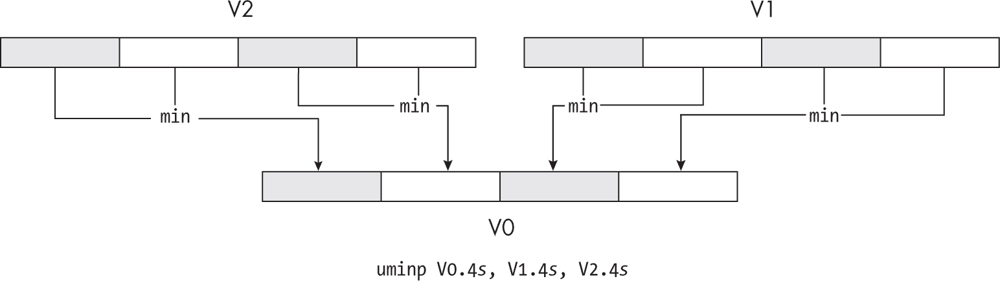

图 11-29：逐对最小值与最大值操作

还有一组逐对标量浮点数最小值和最大值指令，如表 11-25 所示，其中 Rd/t 必须是 Sn/2S 或 Dn/2D。

表 11-25：成对标量浮点最小值和最大值指令

| 助记符 | 语法 | 描述 |
| --- | --- | --- |
| fmaxp | fmaxp Rd, Vs.t | Rd = max(Vs) |
| fmaxnmp | fmaxnmp Rd, Vs.t | Rd = max(Vs)（选择数字而非 NaN） |
| fminp | fminp Rd, Vs.t | Rd = min(Vs) |
| fminnmp | fminnmp Rd, Vs.t | Rd = min(Vs)（选择数字而非 NaN） |

这些指令没有整数版本。

##### 11.7.7.2 水平最小值和最大值

水平最小值和最大值指令选择单个向量内的最小值或最大值，如表 11-26 所示。

表 11-26：水平（跨向量）最小值和最大值指令

| 助记符 | 语法 | 描述 |
| --- | --- | --- |
| sminv | sminv Rd, Vs.t1 | 从 Vs 中提取最小有符号通道值并存储到 Rd 中。 |
| smaxv | smaxv Rd, Vs.t1 | 从 Vs 中提取最大有符号通道值并存储到 Rd 中。 |
| uminv | uminv Rd, Vs.t1 | 从 Vs 中提取最小无符号通道值并存储到 Rd 中。 |
| umaxv | umaxv Rd, Vs.t1 | 从 Vs 中提取最大无符号通道值并存储到 Rd 中。 |
| fminv | fminv Sd, Vs.t2 | 从 Vs 中提取最小实数通道值并存储到 Sd 中。 |
| fmaxv | fmaxv Sd, Vs.t2 | 从 Vs 中提取最大实数通道值并存储到 Rd 中。 |
| fminnmv | fminnmv Sd, Vs.t2 | 从 Vs 中提取最小实数通道值并存储到 Sd 中。 |
| fmaxnmv | fmaxnmv Sd, Vs.t2 | 从 Vs 中提取最大实数通道值并存储到 Rd 中。 |

在此表中，Rd/t1 是 B/8B，B/16B，H/4H，H/8H，或 S/4S。如果 t1 是 8B 或 4H，则指令仅在 Vs 的低 64 位通道上操作。对于浮点最小值和最大值，只有单精度操作数是合法的；t2 必须是 2S 或 4S（在源寄存器的低 64 位或完整 128 位上操作）。至于标准的 fmin 和 fmax 指令，nm 变种的不同之处在于，如果操作数之一是 NaN，则返回数值。

### 11.8 浮点数与整数转换

Neon 指令集提供了若干指令，用于在浮点数和整数（或定点数）格式之间进行转换。第 6.9.4 节“浮点转换指令”中，第 343 页提供了在标量寄存器上操作时这些转换指令的示例；以下子节展示了其向量等价版本。

#### 11.8.1 浮点数到整数

Neon 指令集提供了 fcvt*指令的向量等价版本，这些指令将浮点值转换为其整数等价物，如表 11-27 所示。

表 11-27：浮点数到整数转换指令

| 助记符 | 语法 | 描述 |
| --- | --- | --- |
| fcvtns | fcvtns Vd.t, Vs.t | 四舍五入到最接近的有符号整数。正好一半时四舍五入到最接近的偶数整数。 |
| fcvtas | fcvtas Vd.t, Vs.t | 四舍五入到最接近的有符号整数。正好一半时舍去零。 |
| fcvtps | fcvtps Vd.t, Vs.t | 向+∞方向四舍五入（有符号整数）。 |
| fcvtms | fcvtms Vd.t, Vs.t | 向下舍入到–∞（有符号整数）。 |
| fcvtzs | fcvtzs Vd.t, Vs.t | 向 0 舍入（有符号整数）。 |
| fcvtnu | fcvtnu Vd.t, Vs.t | 四舍五入至最近的无符号整数。正好一半时四舍五入到最近的偶数。 |
| fcvtau | fcvtau Vd.t, Vs.t | 向最近的无符号整数舍入。正好一半时远离 0 舍入。 |
| fcvtpu | fcvtpu Vd.t, Vs.t | 向+∞舍入（无符号整数）。 |
| fcvtmu | fcvtmu Vd.t, Vs.t | 向下舍入到–∞（无符号整数）。 |
| fcvtzu | fcvtzu Vd.t, Vs.t | 向 0 舍入（无符号整数）。 |

在此表中，t 是 2S（仅使用向量寄存器的 LO 64 位）、4S 或 2D。源操作数始终假定包含浮点值（单精度或双精度），目标通道将接收有符号或无符号整数值（字或双字）。注意，当将负浮点值转换为无符号整数时，转换会饱和到 0.0。

fcvtz*指令也有一些定点变体：

```
fcvtzs V`d.t`, V`s.t`, #`imm`
fcvtzu V`d.t`, V`s.t`, #`imm`
```

imm 操作数指定要在定点值中保留的小数位数（对于单精度或字类型，必须是 1 到 31，对于双精度或双字类型，必须是 1 到 63）。由于整数操作比浮点计算要稍快，因此有时将操作数转换为定点，执行一系列计算，然后将结果转换回浮点数可能更快。但是，本书不会深入讨论定点运算，所以不会进一步讨论这种技巧。有关更多信息，请参见第 11.15 节，“更多信息”，第 700 页。

#### 11.8.2 整数到浮点数

ucvtf 和 scvtf 指令分别将 32 位和 64 位整数转换为单精度和双精度值。它们的语法大致与 fcvt*相同：

```
scvtf V`d.t`, V`s.t`
ucvtf V`d.t`, V`s.t`
```

与 fcvt*一样，t 必须是 2S、4S 或 2D（2S 只转换 LO 的 64 位）。 

由于双精度值只有 56 位尾数，而单精度值只有 24 位尾数，因此不能精确表示某些 32 位和 64 位整数为单精度或双精度浮点数。在这些情况下，scvtf 和 ucvtf 指令会产生最接近的近似值。然而，请记住，执行*cvtf 后跟 fcvt*指令可能无法返回完全相同的整数。

#### 11.8.3 浮点数格式之间的转换

Neon 指令集提供了三条指令，可以将较小的浮点格式转换为较大的格式，或者将较大的格式转换为较小的格式。这是 ARM 指令集中少数支持半精度（16 位）浮点数的指令之一。表 11-28 展示了可用的指令。

表 11-28：浮点数转换指令

| 助记符 | 语法 | 描述 按通道转换 |
| --- | --- | --- |
| fcvtl | fcvtl Vd.t1, Vs.t2 | 通过使用源寄存器的 LO 64 位，从较小的尺寸转换到下一个较大的尺寸。 |
| fcvtl2 | fcvtl2 Vd.t3, Vs.t4 | 通过使用源寄存器的上 64 位，从较小的尺寸转换到下一个较大的尺寸（不影响目标寄存器的 LO 位）。 |
| fcvtn | fcvtn Vd.t5, Vs.t6 | 通过使用目标寄存器的 LO 64 位，从较大的尺寸转换到较小的尺寸。 |
| fcvtn2 | fcvtn2 Vd.t7, Vs.t8 | 通过使用目标寄存器的 HO 64 位，从较大的尺寸转换到较小的尺寸（不影响目标寄存器的 LO 位）。 |
| fcvtxn | fcvtxn Vd.2S, Vs.2D | 类似于 fcvtn，除了四舍五入的方式不同（见文本）。 |
| fcvtxn2 | fcvtxn2 Vd.4S, Vs.2D | 类似于 fcvtn2，除了四舍五入的方式不同（见文本）。 |

表 11-28 中的指令的合法类型和通道数在表 11-29 中列出，其中 H = 16 位半精度浮点数，S = 32 位单精度浮点数，D = 64 位双精度浮点数。 |

表 11-29：浮点数转换的合法类型和通道数 |

| t | 类型和通道数 |
| --- | --- |
| t1/t2 | 4S/4H 或 2D/2S |
| t3/t4 | 4S/8H 或 2D/4S |
| t5/t6 | 4H/4S 或 2S/2D |
| t7/t8 | 8H/4S 或 4S/2D |

从较小尺寸转换到较大尺寸时，总是产生精确结果。从较大尺寸转换到较小尺寸时，可能需要将结果四舍五入以适应较小的尺寸（在最坏的情况下，如果较大的值无法在较小的浮点格式中表示，则会发生溢出或下溢）。 |

在将较大值四舍五入以适应较小格式时，fcvtn 和 fcvtn2 指令使用标准的 IEEE-754 四舍五入到最接近偶数的算法。在某些情况下，这可能无法产生最佳结果。例如，将半精度值转换为双精度值时，通常最好四舍五入到最接近的奇数（这需要两步：将半精度转换为单精度，然后将单精度转换为双精度）。fcvtxn 和 fcvtxn2 指令采用这种非 IEEE 四舍五入方案，以产生更好的结果。 |

#### 11.8.4 四舍五入为最接近的整数浮点值 |

某些算法需要将浮点值四舍五入为整数，但要求结果保持在浮点格式中。表 11-30 中列出的 frint*指令提供了这一功能。 |

表 11-30：四舍五入浮点值为整数值 |

| 助记符 | 语法 | 描述 |
| --- | --- | --- |
| frintn | frintn Vd.t, Vs.t | 四舍五入到最接近的整数。恰好一半时四舍五入到最接近的偶数。 |
| frinta | frinta Vd.t, Vs.t | 四舍五入到最接近的整数。恰好一半时远离 0 进行四舍五入。 |
| frintp | frintp Vd.t, Vs.t | 向 +∞ 四舍五入。 |
| frintm | frintm Vd.t, Vs.t | 向 -∞ 四舍五入。 |
| frintz | frintz Vd.t, Vs.t | 向 0 舍入。 |
| frinti | frinti Vd.t, Vs.t | 使用 FPCR 舍入模式进行舍入。 |
| frintx | frintx Vd.t, Vs.t | 使用 FPCR 舍入模式并进行精确度测试的舍入。 |

在此表格中，t 必须是 2S、4S 或 2D。如果是 2S，这些指令仅使用寄存器的 LO 64 位。

frintx 指令会在四舍五入结果与原始源值不相等时生成浮点不精确结果异常。通常除非你有合适的异常处理程序，否则不会使用此指令。

### 11.9 向量平方根指令

Neon 指令集提供了两条指令，用于计算浮点值的平方根和计算（并改进）浮点值平方根倒数的估计值。表 11-31 列出了这些指令。

表 11-31：向量平方根指令

| 助记符 | 语法 | 描述 每条操作 |
| --- | --- | --- |
| fsqrt | fsqrt Vd.t, Vs.t | 计算源的平方根并存储到目标中 |
| frsqrte | frsqrte Vd.t, Vs.t | 牛顿-拉夫森法的平方根倒数逼近的第一步 |
| frsqrts | frsqrts Vd.t, Vs1.t, Vs2.t | 牛顿-拉夫森逼近法的附加步骤 |

在表格中，t 必须是 2S、4S 或 2D。如果是 2S，这些指令将在向量寄存器的 LO 64 位中操作。

这三条指令也有标量版本

```
fsqrt   R`d`, R`s`
frsqrte R`d`, R`s`
frsqrts R`d`, R`s1,` R`s2`
```

其中 Rd 和 Rs 是浮点标量寄存器 Sn 或 Dn 中的一个。

请注意，frsqrts 指令将两个源寄存器中相应的浮点值相乘，将每个积从 3.0 中减去，然后将这些结果除以 2.0，并将结果放入目标寄存器中。

### 11.10 向量比较

向量比较与普通（通用寄存器）比较本质上不同。当比较通用寄存器（甚至单个浮点标量值）时，ARM CPU 根据比较结果设置条件码；接下来的代码会使用条件分支等方式测试这些条件码。但在进行向量元素比较时，这种方案不起作用，因为 CPU 始终并行执行多个比较。由于只有一组条件码，CPU 无法将多个比较的结果存入条件码中，因此向量比较需要不同的机制才能将比较结果提供给程序。

与生成小于、大于或相等结果的通用比较（在条件码中）不同，向量比较要求进行特定的比较，例如，“该向量的元素是否大于另一个向量的元素？” 结果是每一行比较的真或假。向量比较会将真或假的结果存储到目标向量的相应行中。向量比较使用行中的所有 0 位表示假，使用行中的所有 1 位表示真。

Neon 有两组通用的向量比较指令：一组用于整数比较，另一组用于浮点数比较。以下小节将讨论每种形式。

#### 11.10.1 向量整数比较

表 11-32 列出了通用的向量整数比较指令，其中 t 为 8B、16B、4H、8H、2S、4S 或 2D。对于 8B、4H 和 2S 类型，这些指令仅操作寄存器的低 64 位，并清除目标寄存器的高 64 位。

表 11-32：向量整数比较指令

| 助记符 | 语法 | 描述 按行比较 |
| --- | --- | --- |
| cmeq | cmeq Vd.t, Vl.t, Vr.t | 有符号或无符号相等比较 |
| cmhs | cmhs Vd.t, Vl.t, Vr.t | 无符号大于或等于比较（Vd = Vl ≥ Vr） |
| cmhi | cmhi Vd.t, Vl.t, Vr.t | 无符号大于比较（Vd = Vl > Vr） |
| cmge | cmge Vd.t, Vl.t, Vr.t | 有符号大于或等于比较（Vd = Vl ≥ Vr） |
| cmgt | cmgt Vd.t, Vl.t, Vr.t | 有符号大于比较（Vd = Vl > Vr） |

没有 cmne 指令。如果你需要这种比较，你可以反转目标寄存器中的所有位（使用 not 指令），或者你可以使用 0 位表示真，使用 1 位表示假。同样，没有 cmls、cmlo、cmle 或 cmlt 指令；你可以通过反转操作数从 cmgt、cmge、cmhs 或 cmhi 中推导出这些指令。

这些指令有标量变体，如表 11-33 所示，其中 Rd、Rl 和 Rr 必须是 Dn。

表 11-33：标量整数比较指令

| 助记符 | 语法 | 描述 标量寄存器比较 |
| --- | --- | --- |
| cmeq | cmeq Rd, Rl, Rr | 有符号或无符号相等比较 |
| cmhs | cmhs Rd, Rl, Rr | 无符号大于或等于比较（Rd = Rl ≥ Rr） |
| cmhi | cmhi Rd, Rl, Rr | 无符号大于比较（Rd = Rl > Rr） |
| cmge | cmge Rd, Rl, Rr | 有符号大于或等于比较（Rd = Rl ≥ Rr） |
| cmgt | cmgt Rd, Rl, Rr | 有符号大于比较（Rd = Rl > Rr） |

存在一组特殊的向量比较指令，用于将单个向量的通道与 0 进行比较。这可以避免为这个常见的情况设置一个包含全 0 的寄存器。可用的指令仅执行有符号比较（因为将无符号值与 0 比较没有太大意义）。表 11-34 列出了这些指令。

表 11-34: 与 0 进行的有符号向量比较

| 助记符 | 语法 | 描述 逐通道与 0 进行比较 |
| --- | --- | --- |
| cmeq | cmeq Vd.t, Vl.t, #0 | 与 0 相等的有符号比较 |
| cmge | cmge Vd.t, Vl.t, #0 | 向量通道大于或等于 0 的有符号比较 |
| cmgt | cmgt Vd.t, Vl.t, #0 | 向量通道大于 0 的有符号比较 |
| cmle | cmle Vd.t, Vl.t, #0 | 向量通道小于或等于 0 的有符号比较 |
| cmlt | cmlt Vd.t, Vl.t, #0 | 向量通道小于 0 的有符号比较 |

类型 t 必须是 8B、16B、4H、8H、2S、4S 或 2D。对于 8B、4H 和 2S 类型，这些指令仅作用于寄存器的低 64 位，并清除目标寄存器的高 64 位。对于这些指令，唯一合法的立即数是 0。

表 11-35 列出了这些指令的标量版本。

表 11-35: 与 0 进行的标量向量比较

| 助记符 | 语法 | 描述 与 0 进行的标量寄存器比较 |
| --- | --- | --- |
| cmeq | cmeq Rd, Rl, #0 | 寄存器等于 0 的有符号比较 |
| cmge | cmge Rd, Rl, #0 | 寄存器大于或等于 0 的有符号比较 |
| cmgt | cmgt Rd, Rl, #0 | 寄存器大于 0 的有符号比较 |
| cmle | cmle Rd, Rl, #0 | 寄存器小于或等于 0 的有符号比较 |
| cmlt | cmlt Rd, Rl, #0 | 寄存器小于 0 的有符号比较 |

在此表中，Rd、Rl 和 Rr 必须是 Dn。

#### 11.10.2 向量浮点数比较

你也可以比较向量寄存器中各通道的浮点数值。表 11-36 列出了用于此目的的各种 fcm*指令，其中 t 为 2S、4S 或 2D。如果 t 是 2S，这些指令仅使用寄存器的低 64 位。

表 11-36: 向量浮点数比较指令

| 助记符 | 语法 | 描述 逐通道比较 |
| --- | --- | --- |
| fcmeq | fcmeq Vd.t, Vl.t, Vr.t | 浮点数相等比较 |
| fcmge | fcmge Vd.t, Vl.t, Vr.t | 浮点数比较 (Vd = Vl ≥ Vr) |
| fcmgt | fcmgt Vd.t, Vl.t, Vr.t | 浮点数比较 (Vd = Vl > Vr) |

表 11-37 列出了将向量寄存器的通道与 0.0 进行比较的 fcm*指令变体，其中 t 为 2S、4S 或 2D。如果 t 是 2S，这些指令仅使用寄存器的低 64 位。

表 11-37: 与 0.0 进行的向量浮点数比较

| 助记符 | 语法 | 描述 每个通道与 0.0 进行逐通道比较 |
| --- | --- | --- |
| fcmeq | fcmeq Vd.t, Vl.t, #0 | 寄存器等于 0.0 的浮点数比较 |
| fcmge | fcmge Vd.t, Vl.t, #0 | 大于或等于 0.0 的浮点数比较 |
| fcmgt | fcmgt Vd.t, Vl.t, #0 | 大于 0.0 的浮点数比较 |
| fcmle | fcmle Vd.t, Vl.t, #0 | 浮点数比较，寄存器小于或等于 0.0 |
| fcmlt | fcmlt Vd.t, Vl.t, #0 | 小于 0.0 的浮点数比较 |

请注意，立即数常量为 0（与 0.0 比较），尽管这是浮点数比较。此指令的唯一合法操作数是 #0。

至于整数比较，fcm* 指令提供了一组标量指令，这些指令也会将 true（所有 1 位）或 false（所有 0 位）存储到目标寄存器（与 fcmp 指令不同，后者会设置条件代码标志）。表 11-38 列出了这些指令的标量版本，其中 Rd、Rl 和 Rr 必须是 Sn 或 Dn*。

表 11-38：向量浮点数比较的标量变体

| 助记符 | 语法 | 描述 标量寄存器比较（包括与 0.0 比较） |
| --- | --- | --- |
| fcmeq | fcmeq Rd, Rl, Rr | 浮点数相等比较 |
| fcmge | fcmge Rd, Rl, Rr | 浮点数比较（Rd = Rl ≥ Rr） |
| fcmgt | fcmgt Rd, Rl, Rr | 浮点数比较（Rd = Rl > Rr） |
| fcmeq | fcmeq Rd, Rl, #0 | 等于 0.0 的浮点数比较 |
| fcmge | fcmge Rd, Rl, #0 | 大于或等于 0.0 的浮点数比较 |
| fcmgt | fcmgt Rd, Rl, #0 | 大于 0.0 的浮点数比较 |
| fcmle | fcmle Rd, Rl, #0 | 小于或等于 0.0 的浮点数比较 |
| fcmlt | fcmlt Rd, Rl, #0 | 小于 0.0 的浮点数比较 |

Neon 还有几个额外的浮点数比较：fac*（向量浮点绝对值比较）。这些指令比较源向量寄存器中相应元素的绝对值，并相应地设置目标寄存器。表 11-39 列出了这些指令。

表 11-39：浮点数绝对值比较

| 助记符 | 语法 | 描述 |
| --- | --- | --- |
| facge | facge Vd.t, Vl.t, Vr.t | 浮点数比较（Vd = abs(Vl) ≥ abs(Vr)) |
| facgt | facgt Vd.t, Vl.t, Vr.t | 浮点数比较（Vd = abs(Vl) > abs(Vr)) |

没有 faceq 指令，因为没有必要使用；只需使用 fcmeq。

fac* 指令也有标量版本，列在表 11-40 中。

表 11-40：标量浮点绝对值比较

| 助记符 | 语法 | 描述 |
| --- | --- | --- |
| facge | facge Rd, Rl, Rr | 浮点数比较（Rd = abs(Rl) ≥ abs(Rr)) |
| facgt | facgt Rd, Rl, Rr | 浮点数比较（Rd = abs(Rl) > abs(Rr)) |

请注意，Rd、Rl 和 Rr 必须是 Sn 或 Dn。

#### 11.10.3 向量位测试指令

Neon 指令集提供了 tst 指令的向量版本 cmtst，其语法如下：

```
cmtst V`d.t`, V`l.t`, V`r.t`
```

其中，t 可以是 8B、16B、4H、8H、2S、4S 或 2D。如果 t 是 8B、4H 或 2S，则该指令仅对源寄存器的低 64 位进行操作，并清除目标寄存器的高 64 位。

该指令对 Vl 和 Vr 进行逐通道的逻辑 AND 操作。如果结果非零，则将所有 1 位存储到相应的目标通道中。否则，将所有 0 存储到目标通道中。

该指令也有一个标量版本：

```
cmtst D`d,` D`l,` D`r`
```

这种形式仅支持 64 位寄存器操作数（D*n*）。

#### 11.10.4 向量比较结果

在你的编程经验中，包括使用高级语言（HLLs）时，你可能已经习惯了使用比较结果（如布尔表达式）来改变控制流（例如通过 if/then/else 语句）。向量比较呈现了一种完全不同的范式，因为比较中的各个通道可能产生不同的结果。如何应对这种情况是最好的方式？

首先，考虑简单的内容：涉及 AND、OR 和其他逻辑运算符的复杂布尔表达式。由于向量比较会计算出方便的结果（全是 1 或全是 0），因此很容易计算出类似这样的内容：

```
(V1 > V2) AND (V3 < V4)  // Assume unsigned 8H lanes.
```

考虑以下代码：

```
cmhi v0.4h, v1.4h, v2.4h
cmhi v5.4h, v4.4h, v3.4h  // Same as cmlo v5.4h, v3.4h, v4.4h
and  v0.8b, v0.8b, v5.8b  // (assuming cmlo existed)
```

这会将先前布尔计算的结果（0x0000 或 0xFFFF）保留在 V0 寄存器的低 64 位中（通道 0 到 3；请记住，and 指令仅允许 8B 和 16B 类型，但它们会产生与 4H 类型合法时相同的结果）。

你可以使用类似的指令序列进行 OR、NOT 以及任何其他逻辑向量操作（见 表 11-2）。此类计算将使用完整布尔求值。

> 注意

*短路求值对于向量操作没有意义；有关完整布尔求值的更多信息，请参见第 7.6.3 节，“使用完整布尔求值的复杂*if*语句，”见 第 378 页。*

如果你绝对、坚决必须基于所有向量比较的结果跳转到某些位置，请记住，分支位置的数量会随着通道数的增加而呈指数增长（具体来说，它有 2*^n* 种不同的可能性，其中 *n* 是通道数）。例如，如果你执行以下指令：

```
cmeq v0.4h, v1.4h, v2.4h
```

然后，V0 的低 64 位将包含四个布尔值，产生四个比较的 16 种组合。虽然很丑，但你可以创建一个跳转表（参见第 7.6.7.3 节，“间接跳转开关实现，”见 第 391 页），表中有 16 个条目，然后通过如下代码转移控制：

```
ldr     q3, mask             // mask: .hword 0b1000, 0b100, 0b10, 0b1
cmeq    v0.4h, v1.4h, v2.4h
and     v0.8b, v0.8b, v3.8b  // Keep 1 bit of each lane.
addv    h0, v0.4h            // Merge the bits into H0.
umov    w0, v0.h[0]
adr     x1, JmpTbl
ldr     x0, [x1, x0, lsl #3]
add     x0, x0, x1
br      x0
```

其中，mask 是：

```
mask:   .dword  0x0008000400020001
```

JmpTbl 是一个包含 16 个条目的.dword 表格，其中每个条目是跳转标签的偏移量，基于四个通道比较的真与假所有组合。此代码将通道 0 的位 0 移动到 X0 的位 0，通道 1 的位 0 移动到 X0 的位 1，通道 2 的位 0 移动到 X0 的位 2，通道 3 的位 0 移动到 X0 的位 3。这形成了一个 4 位索引（16 个可能值）到 JmpTbl。

从理论上讲，你可以创建一个包含 16 个条目的跳转表并编写代码来传递控制，但这将非常丑陋，根本不值得认真考虑。

有时你不需要知道矢量比较中匹配的具体配置，只需要知道是否存在任何匹配项。例如，假设你在查找字符字符串中的 0 字节（例如在计算零终止字符串的长度时）。你可以一次从字符串中加载 16 个字符，并通过将它们全部与 0 进行比较来搜索 0 字节：

```
cmeq  v0.16b, v1.16b, #0  // Assume V1 contains 16 chars.
```

该指令将 V0 中对应的通道设置为 0xFF，表示 V1 中任何包含 0 字节的通道。你可以使用以下序列来检查是否有任何 0 字节：

```
cmeq v0.16b, v1.16b, #0  // Check for a 0 byte.
addv b0, v0.16b          // Sum comparison bytes.
umov w0, v0.b[0]         // Put sum where you can compare it.
cmp  w0, #0              // See if there were any 0 bytes.
beq  noZeroBytes         // No 0s, go fetch 16 more bytes.
```

在 SIMD 范式中，理想的解决方案是并行进行计算，并使用掩码禁用某些计算。例如，假设你有一个 32 位整数的矢量，你希望将另一个矢量的通道加到它上面，前提是你不想对包含大于 16 位（0xFFFF）的值的通道进行加法。考虑以下代码：

```
// Add V1.S to V0.S, but don't add a value to a particular
// lane in V0 if its value exceeds 0xFFFF.
//
// Note: Assume V2 contains 0x0000FFFF0000ffff0000FFFF0000ffff.

        // no cmls v3.4s, v0.4s, v2.4s, so use the following:

        cmhi    v3.4s, v2.4s, v0.4s

        and     v4.16b, v1.16b, v3.16b
        add     v0.4s, v0.4s, v4.4s
```

and 指令将大于 0xFFFF 的 dword 通道设置为 0，以便它们不会影响最终的通道和。

### 11.11 使用 SIMD 代码的排序示例

排序数据是常见的矢量化解决方案。列表 11-1 演示了使用矢量化的比顿排序算法对八个元素进行简单排序。

```
// Listing11-1.S
//
// Demonstrates a simple bitonic sort
// of eight elements, using vector instructions

        #include    "aoaa.inc"
        .text

        .pool
ttlStr: wastr  "Listing 11-1"

// Format strings for printf:

fmtPV:  wastr   " %016llx %016llx"
nl:     wastr   "\n"

// Sample data to sort
// (eight unsigned 32-bit integers
// to be loaded into vector
// registers):

qval1:  .word   8, 7, 6, 4
qval2:  .word   3, 2, 1, 0

// Lookup tables for TBL instruction,
// used to move around integers
// within the vector registers
//
// TBL works with bytes; the following
// constants map 32-bit integers to
// a block of 4 bytes in the
// vector registers:

_a = 0x03020100
_b = 0x07060504
_c = 0x0b0a0908
_d = 0x0f0e0d0c

_e = 0x13121110
_f = 0x17161514
_g = 0x1b1a1918
_h = 0x1f1e1d1c

_e1 = 0x03020100    // Special case
_f1 = 0x07060504    // for single-
_g1 = 0x0b0a0908    // register lists
_h1 = 0x0f0e0d0c

lut1:   .word   _f1, _e1, _h1, _g1
lut2:   .word   _a, _f, _c, _h
lut3:   .word   _b, _e, _d, _g
lut4:   .word   _h1, _g1, _f1, _e1
lut5:   .word   _a, _b, _g, _h
lut6:   .word   _c, _d, _f, _e
lut7:   .word   _a, _e, _b, _f
lut8:   .word   _c, _g, _d, _h
lut9:   .word   _a, _e, _b, _f
lut10:  .word   _c, _g, _d, _h

// Usual function that returns
// a pointer to the name of this
// program in the X0 register:

        proc    getTitle, public
        lea     x0, ttlStr
        ret
        endp    getTitle

// printV
//
// Prints the two 128-bit values sitting
// on the top of the stack (prior to call)
// as hexadecimal values:

        proc    printV

        locals  p
        qword   p.v0
        qword   p.v1
        qword   p.v2
        qword   p.v3
        qword   p.v4
        byte    p.stk, 64
        endl    p

        enter   p.size

        // Preserve vector registers
        // (this program uses them):

        str     q0, [fp, #p.v0]
        str     q1, [fp, #p.v1]
        str     q2, [fp, #p.v2]
        str     q3, [fp, #p.v3]
        str     q4, [fp, #p.v4]

        // Print the first value on
        // the stack:

        ldr     w1, [fp, #16]
        ldr     w2, [fp, #20]
        ldr     w3, [fp, #24]
        ldr     w4, [fp, #28]
        lea     x0, fmtPV
        mstr    x1, [sp]
 mstr    x2, [sp, #8]
        mstr    x3, [sp, #16]
        mstr    x4, [sp, #24]
        bl      printf

        // Print the second value on
        // the stack:

        ldr     w1, [fp, #32]
        ldr     w2, [fp, #36]
        ldr     w3, [fp, #40]
        ldr     w4, [fp, #44]
        lea     x0, fmtPV
        mstr    x1, [sp]
        mstr    x2, [sp, #8]
        mstr    x3, [sp, #16]
        mstr    x4, [sp, #24]
        bl      printf

        lea     x0, nl
        bl      printf

        ldr     q0, [fp, #p.v0]
        ldr     q1, [fp, #p.v1]
        ldr     q2, [fp, #p.v2]
        ldr     q3, [fp, #p.v3]
        ldr     q4, [fp, #p.v4]
        leave
        endp    printV

// Here's the main program:

        proc    asmMain, public

        // Reserve stack space for parameters:

        locals  am
        byte    am.stk, 64
        endl    am

        enter   am.size

        // Load the values to sort
        // into V0 and V1:

        ldr     q0, qval1
        ldr     q1, qval2

        // Bitonic sort of eight
        // elements:

        // Step 1:

        umin    v2.4s, v0.4s, v1.4s
        umax    v3.4s, v0.4s, v1.4s

 // Step 2:

        ldr     q4, lut1
        tbl     v3.16b, {v3.16b}, v4.16b

        umin    v0.4s, v2.4s, v3.4s
        umax    v1.4s, v2.4s, v3.4s
        ldr     q4, lut2
        tbl     v2.16b, {v0.16b, v1.16b}, v4.16b
        ldr     q4, lut3
        tbl     v3.16b, {v0.16b, v1.16b}, v4.16b

        // Step 3:

        umin    v0.4s, v2.4s, v3.4s
        umax    v1.4s, v2.4s, v3.4s

        // Step 4:

        ldr     q4, lut4
        tbl     v1.16b, {v1.16b}, v4.16b

        umin    v2.4s, v0.4s, v1.4s
        umax    v3.4s, v0.4s, v1.4s

        ldr     q4, lut5
        tbl     v0.16b, {v2.16b, v3.16b}, v4.16b
        ldr     q4, lut6
        tbl     v1.16b, {v2.16b, v3.16b}, v4.16b

        uminp   v2.4s, v0.4s, v1.4s
        umaxp   v3.4s, v0.4s, v1.4s

        ldr     q4, lut7
        tbl     v0.16b, {v2.16b, v3.16b}, v4.16b
        ldr     q4, lut8
        tbl     v1.16b, {v2.16b, v3.16b}, v4.16b

        umin    v2.4s, v0.4s, v1.4s
        umax    v3.4s, v0.4s, v1.4s

        // Merge results:

        ldr     q4, lut9
        tbl     v0.16b, {v2.16b, v3.16b}, v4.16b
        ldr     q4, lut10
        tbl     v1.16b, {v2.16b, v3.16b}, v4.16b

        str     q0, [sp]
        str     q1, [sp, #16]
        bl      printV

        leave                       // Return to caller.
        endp    asmMain
```

以下是构建命令和示例输出，适用于列表 11-1：

```
% ./build Listing11-1
% ./Listing11-1
Calling Listing11-1:
00000000 00000001 00000002 00000003 00000004 00000006 00000007 00000008
Listing11-1 terminated
```

如你所见，这段代码正确地对数据进行了排序。

### 11.12 使用 SIMD 代码的数字到十六进制字符串示例

列表 11-2 是一个 Neon 示例，你应该熟悉：第九章中的 dtoStr 函数，将 dword 转换为十六进制字符串。这是一个将现有代码转换为 SIMD 的实用示例。

```
// Listing11-2.S

`Usual source file information at the beginning of the file,`
`deleted for brevity`

// dtoStr
//
//  Converts the dword passed in X1 to 16
//  hexadecimal digits (stored into buffer pointed
//  at by X0; buffer must have at least 24 bytes
//  available)

    .equ    convert0toA, 'A' - ('0' + 10)    // val + '0' to val + 'A'
    .equ    invert0ToA,  ~convert0toA & 0xFF // Invert the bits for BIC.

    proc    dtoStr
    stp     q0, q1, [sp, #-32]!     // Preserve registers.

    rev     x1, x1                  // Reverse bytes (for output).
    mov     v0.d[0], x1             // Set V0 to the LO nibbles
    rev     x1, x1                  // and V1 to the HO nibbles,
    ushr    v1.8b, v0.8b, #4        // also, restore X1.
    bic     v0.4h, #0xf0
    bic     v0.4h, #0xf0, lsl #8

    zip1    v0.16b, v1.16b, v0.16b  // Interleave the HO and LO nibbles.

    orr     v0.8h, #0x30            // Convert binary to ASCII,
    orr     v0.8h, #0x30, lsl #8    // note only 0-9 will be correct.

    movi    v1.16b, #'9'            // Determine which bytes
    cmgt    v1.16b, v0.16b, v1.16b  // should be A-F.

    bic     v1.8h, #invert0ToA      // Update bytes that should be A-F.
    bic     v1.8h, #invert0ToA, lsl #8
    add     v0.16b, v0.16b, v1.16b

 str     q0, [x0]                // Output the string.
    strb    wzr, [x0, #16]

    ldp     q0, q1, [sp], #32       // Restore registers.
    ret
    endp    dtoStr
```

以下是构建命令和示例输出，适用于列表 11-2：

```
% ./build Listing11-2
% ./Listing11-2
Calling Listing11-2:
Value(fedcba9876543210) = string(FEDCBA9876543210)
Listing11-2 terminated
```

如果你对这段代码进行计时，你会发现它比第九章中的标量代码运行得明显更快。

### 11.13 SIMD 指令在实际程序中的应用

如果你已经读完本章，但不确定如何在实际程序中应用 SIMD 指令，不必觉得自己错过了什么。*SIMD*也可以代表“*S*IMD *I*nstruction sets are *M*assively *D*ifficult to use”（SIMD 指令集非常难用）。尽管 ARM 的 Neon 指令集比 Intel 的 SSE/AVX 扩展更具通用性，但 SIMD 指令的设计初衷是加速非常具体的算法的执行。我喜欢用这本书的技术审阅人 Tony Tribelli 的话来重新表述 SIMD 指令的适用性：“我看着一条特定的 SIMD 指令，问自己，‘这条指令是为哪个基准测试设计的？’”也就是说，SIMD 指令似乎是为了让某个基准测试程序运行得更快，从而让 ARM 的 CPU 看起来更好，虽然这条指令可能在该基准测试以外的地方并不有用。

从很多方面来看，这个说法是完全正确的：许多 SIMD 指令是为了解决一个特定的问题而创建的，它们在解决该问题之外的适用性几乎是偶然的。如果你无法弄清楚如何使用某个指令，可能是因为你还没有发现它最初设计用来解决的那个问题。

如果没有别的，向量寄存器的通道是存储临时值的好地方，尤其是在你已经使用了所有通用寄存器时。你可以使用 mov 指令在通用寄存器和向量寄存器的通道之间复制数据；这比将寄存器溢出到内存要快得多。

如果你真想使用 Neon 指令集进行高性能计算，参考下一页的 11.15 节，“更多信息”，或者在互联网上搜索“SIMD 并行算法”或“SIMD 向量算法”。

### 11.14 继续前进

这一长章节涵盖了许多指令内容。它从 SIMD 指令集的简短历史开始；讲解了 ARM 上的向量寄存器；讨论了 SIMD 数据类型、通道和标量操作；然后介绍了 Neon 指令集。本章最后通过一对简短的示例展示了如何使用向量寄存器进行比特排序和数值到十六进制字符串的转换。这些都是在 ARM 上使用 SIMD 指令的有用方式。尽管 SIMD 指令在一般程序中不常见，但只要稍加思考，你应该能在某些情况下利用它们加速代码。

剩下的几章将使用 SIMD 指令来提高性能。第十二章使用 Neon 指令来提升各种位操作的性能，第十四章使用 Neon 指令来实现快速的内存移动操作。你可以将本章学到的内容应用到之前章节中你学到的那些能从 SIMD 指令中获益的算法，比如数值到十六进制字符串的代码。我将留给你来实现这些改动。

### 11.15 更多信息

+   有关定点算术和其他 Neon 指令及数据类型的更多信息，请查阅 ARM 架构参考手册 *[`<wbr>developer<wbr>.arm<wbr>.com<wbr>/documentation<wbr>/ddi0487<wbr>/latest`](https://developer.arm.com/documentation/ddi0487/latest)*。

+   有关 ARM 可扩展向量扩展（SVE）的更多信息，请参阅文档 *[`<wbr>developer<wbr>.arm<wbr>.com<wbr>/documentation<wbr>/102476<wbr>/0001<wbr>/SVE<wbr>-architecture<wbr>-fundamentals`](https://developer.arm.com/documentation/102476/0001/SVE-architecture-fundamentals)*。

+   ARM 提供了有关在 32 位 CPU 上实现定点算术的指南，详情请见 *[`<wbr>developer<wbr>.arm<wbr>.com<wbr>/documentation<wbr>/dai0033<wbr>/a`](https://developer.arm.com/documentation/dai0033/a)*。

+   有兴趣了解 ARM SVE 上的向量排序的人可以参考 Bérenger Bramas 的文章《基于 ARM 可扩展向量扩展（SVE）的快速向量化排序实现》作为一个实现示例： *[`<wbr>arxiv<wbr>.org<wbr>/pdf<wbr>/2105<wbr>.07782<wbr>.pdf`](https://arxiv.org/pdf/2105.07782.pdf)*。

+   有关使用 ARM 进行向量排序的更多信息，请参阅 CMSIS DSP 软件库中的向量排序算法页面： *[`<wbr>arm<wbr>-software<wbr>.github<wbr>.io<wbr>/CMSIS<wbr>_5<wbr>/DSP<wbr>/html<wbr>/group<wbr>_<wbr>_Sorting<wbr>.html`](https://arm-software.github.io/CMSIS_5/DSP/html/group__Sorting.html)*。

+   ARM 文档还提供了关于 Neon 上向量排序的更多细节，详情请见 *[`<wbr>developer<wbr>.arm<wbr>.com<wbr>/documentation<wbr>/den0018<wbr>/a<wbr>/NEON<wbr>-Code<wbr>-Examples<wbr>-with<wbr>-Optimization<wbr>/Median<wbr>-filter<wbr>/Basic<wbr>-principles<wbr>-and<wbr>-bitonic<wbr>-sorting`](https://developer.arm.com/documentation/den0018/a/NEON-Code-Examples-with-Optimization/Median-filter/Basic-principles-and-bitonic-sorting)*。

+   Mark Blacher、Joachim Giesen 和 Lars Kühne 所著的《原始类型的快速且稳健的向量化原地排序》*[`<wbr>drops<wbr>.dagstuhl<wbr>.de<wbr>/opus<wbr>/volltexte<wbr>/2021<wbr>/13775<wbr>/pdf<wbr>/LIPIcs<wbr>-SEA<wbr>-2021<wbr>-3<wbr>.pdf`](https://drops.dagstuhl.de/opus/volltexte/2021/13775/pdf/LIPIcs-SEA-2021-3.pdf)* 介绍了使用比托尼排序算法的向量指令进行快速排序（虽然是为 AVX2 编写的，但可以很容易地转化为 Neon）。

+   有关 SIMD 图像处理算法的讨论，请参阅 Eric Welch 的硕士论文《使用 SIMD 指令进行两种图像处理算法的研究》 *[`<wbr>scholarworks<wbr>.rit<wbr>.edu<wbr>/cgi<wbr>/viewcontent<wbr>.cgi?wbr>?article<wbr>=3686&context<wbr>=theses`](https://scholarworks.rit.edu/cgi/viewcontent.cgi?article=3686&context=theses)*。

+   另一篇关于 SIMD 信号处理算法的硕士论文是 Sharan Yagneswar 的《SIMD 架构下信号处理算法的性能优化》，可以在 *[`<wbr>www<wbr>.diva<wbr>-portal<wbr>.org<wbr>/smash<wbr>/get<wbr>/diva2:1138490<wbr>/FULLTEXT01<wbr>.pdf`](https://www.diva-portal.org/smash/get/diva2:1138490/FULLTEXT01.pdf)* 找到。
