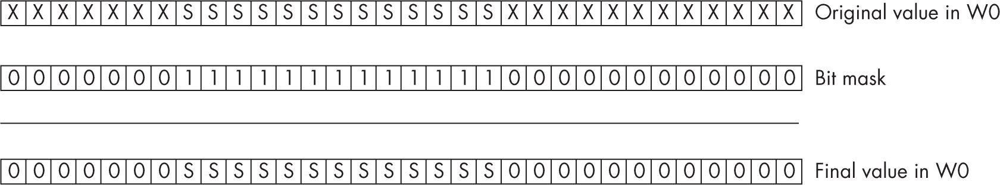
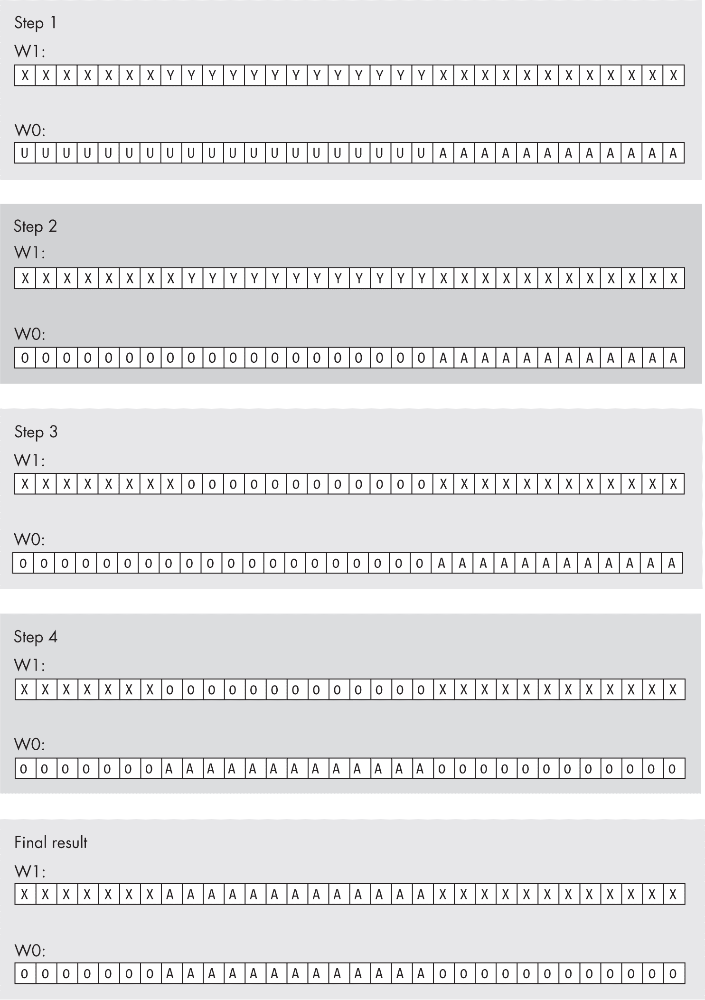
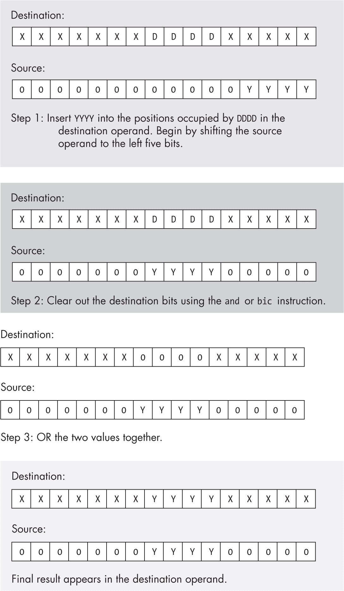

## 第十二章：12 位操作


在内存中操作比特可能是汇编语言最著名的特点。即使是以位操作著称的 C 编程语言，也没有提供如此完整的位操作指令集。

本章讨论如何使用 ARM 汇编语言操作内存和寄存器中的比特串。首先回顾到目前为止涵盖的位操作指令，引入一些新的指令，然后回顾内存中比特串的打包和解包信息，这为许多位操作提供了基础。最后，本章讨论了几种以位为中心的算法及其在汇编语言中的实现。

### 12.1 什么是比特数据？

*位操作*是指操作*比特数据*，这是一种由不连续或不是 8 位整数倍的比特串组成的数据类型。通常，这些比特对象不会表示数值整数，尽管我不会对比特串做出此限制。

*比特串*是由一个或多个比特组成的连续序列。它不一定要从特定的位置开始或结束。例如，比特串可以从内存中某字节的第 7 位开始，并延续到下一个字节的第 6 位。同样，比特串可以从 W0 寄存器的第 30 位开始，消耗 W0 的高 2 位，然后继续从 W1 寄存器的第 0 位到第 17 位。在内存中，比特必须是物理上连续的（也就是说，位编号总是递增，除非跨越字节边界，且字节边界处内存地址增加 1 字节）。在寄存器中，如果比特串跨越寄存器边界，应用程序定义继续使用的寄存器，但比特串总是从该第二个寄存器的第 0 位继续。

*位运行*是指所有位值相同的比特序列。*0 的连续运行*是包含所有 0 的比特串，而*1 的连续运行*是包含所有 1 的比特串。*第一个置位比特*是比特串中第一个包含 1 的位的位置——即，在可能存在的 0 连续运行后第一个 1 位。*第一个清除位*也有类似的定义。*最后一个置位比特*是比特串中最后一个包含 1 的比特位置；该位置之后的比特构成一个不间断的 0 连续运行。*最后一个清除位*也有类似的定义。

*比特集*是指在一个更大的数据结构内，可能不连续的一组比特。例如，双字中的第 0 到第 3 位、第 7 位、第 12 位、第 24 位和第 31 位构成一个比特集。通常，我们会处理作为*容器对象*（封装比特集的数据结构）一部分的比特集，容器的大小通常不超过 32 或 64 位，尽管这个限制是完全人为的。比特串是比特集的特殊情况。

*位偏移* 是从边界位置（通常是字节边界）到指定位的位数。如第二章所述，这些位从边界位置的 0 开始编号。

*掩码* 是一个位串，用来操作另一个值中的某些位。例如，位串 0b0000_1111_0000，当与 and 指令一起使用时，会掩蔽（清除）除了第 4 到 7 位之外的所有位。同样，如果你使用相同的值与 orr 指令一起使用，它可以设置目标操作数中的第 4 到 7 位。术语 *掩码* 源自这些位串与 and 指令的使用，其中 1 和 0 位就像画画时用的遮蔽胶带：它们让某些位保持不变，同时掩蔽掉（清除）其他位。

拥有这些定义后，你已准备好开始操作位了！

### 12.2 操作位的指令

让我们从回顾本书迄今为止介绍的操作位的指令开始，同时介绍一些额外的位操作指令。

位操作通常包括六个活动：设置位、清除位、反转位、测试和比较位、从位串中提取位以及将位插入到位串中。最基本的位操作指令有 and/ands bic、orr、orn、eor、mvn（非）、tst 以及移位和旋转指令。本节讨论这些指令，重点讲解如何使用它们在内存或寄存器中操作位。

#### 12.2.1 隔离、清除和测试位

and/ands 指令提供了清除位序列中位的功能。此指令对于隔离一个与其他无关数据（或者至少是与位串或位集无关的数据）合并的位串或位集特别有用。例如，如果一个位串占用了 W0 寄存器中的第 12 到 24 位，你可以通过以下指令将 W0 中的其他所有位清零，从而隔离这个位串：

```
and w0, w0, 0b1111111111111000000000000
```

图 12-1 展示了此指令的结果。



图 12-1：使用 and 指令隔离位串

一旦你清除了位集中的不需要的位，通常可以就地对位集进行操作。例如，要检查 W0 中第 12 到 24 位的位串是否包含 0x2F3，可以使用以下代码：

```
mov w1, #0x2f3
lsl w1, w1,   #12 // Make it 0x2f3000.
and w0, w0,   #0b1111111111111000000000000
cmp w0, w1  // 0b0001011110011000000000000
```

你不能在 cmp 指令中使用立即数 0x2F3000，因此此代码首先将该常数加载到 W1 中，并将 W0 与 W1 进行比较。同样，你也不能使用 movz 将 0x2F3 左移 12 位后加载，因为 movz 只允许 0、16、32 或 48 位的移位；此外，0x2F3 也不是一个逻辑立即数模式，因此不能使用 mov 指令与 0x2F3000 一起使用。

> 注意

*指令* mov w1, #logical_pattern *等同于* orr w1, wzr, #logical_pattern*。

为了使与此值一起使用的常数更容易处理，你可以使用 lsr 指令将位串对齐到第 0 位，方法是先屏蔽掉其他位，如下所示：

```
and w0, w0, #0b1111111111111000000000000
lsr w0, w0, #12
cmp w0, #0x2F3
```

普通的 and 指令不会影响任何条件码标志。如果你希望根据 AND 操作的结果更新 N 和 Z 标志，请使用 ands 变体，记住该指令会始终清除进位标志和溢出标志。

如果你希望将 ands 操作的结果捕获到 N 和 Z 标志中，但又不想保留逻辑结果，你可以使用 tst 指令。这相当于（并且是）使用 WZR 或 XZR 作为目标寄存器的 ands 指令（该操作会丢弃结果）。

别忘了你还可以使用 and 指令与向量寄存器一起使用（无论是向量操作还是标量操作）；不过请记住，向量 and 指令不会影响标志位（没有 ands 变体）。

因为 tst 是 ands 的别名，并且没有向量 ands 指令，Neon 指令集提供了 cmtst 指令。

```
cmtst V`d.t`, V`d.t`, V`d.t`
```

其中 t 为 8B、16B、4H、8H、2S、4S 或 2D（8B、4H 和 2S 类型操作 V*n* 的低 64 位，而其他类型则操作所有 128 位）。

该指令逻辑与（AND）Vd.t 中的每一条 lane 和 Vd.t 本身。如果结果不为 0，cmtst 会将目标 lane 设置为全 1；如果结果为 0，则将目标 lane 设置为全 0。你可以使用结果作为进一步向量（位）操作的位掩码。

#### 12.2.2 设置和插入位

orr 指令对于将一个位集插入到另一个位串中尤其有用（无论是在通用寄存器还是向量寄存器中），可以通过以下步骤实现：

1.  清除源操作数中位集周围的所有位。

2.  清除目标操作数中你希望插入位集的所有位。

3.  将位集和目标操作数进行 OR 操作。

例如，假设你有一个值位于 W0 的第 0 到 11 位，你希望将其插入到 W1 的第 12 到 23 位中，而不影响 W1 中的其他位。你将首先从 W0 中清除第 12 位及更高位，然后从 W1 中清除第 12 到 23 位。接下来，你会将 W0 中的位向左移，使得位串占据 W0 的第 12 到 23 位。最后，你会使用 OR 操作将 W0 中的值与 W1 中的值合并，如下代码所示：

```
and     w0, w0, #0xFFF   // Strip all but bits 0 to 11 from W0.
bic     w1, w1, 0xFFF000 // Clear bits 12 to 23 in W1.
lsl     w0, w0, 12       // Move bits 0 through 11 to 12 through 23 in W0.
orr     w1, w1, w0       // Merge the bits into W1.
```

图 12-2 显示了这四条指令的结果。



图 12-2：将 W0 的第 0 到 11 位插入到 W1 的第 12 到 23 位中

图 12-2 中的步骤 1 清除了 W0 中的 U 位。清除 U 位后，步骤 2 屏蔽目标位字段（Y）。步骤 3 将 A 位（W0 中的第 0 到 11 位）左移 12 位，将它们与目标位字段对齐。步骤 4 将 W0 中的值与 W1 中的值进行 OR 操作，最终结果保留在 W1 中。

在图 12-2 中，所需的位（AAAAAAAAAAAA）形成了一个位串。然而，即使你操作的是一个非连续的位集合，这个算法仍然有效——你只需要创建一个在适当位置上有 1 的位掩码。

在处理位掩码时，使用字面数字常量是非常不好的编程风格，正如前面几个示例所示。到目前为止，我使用了“魔法数字”，因为示例很简单，使用字面常量在这种情况下更清晰。然而，你应该始终在 Gas 中创建符号常量。将这些常量与常量表达式结合使用，可以生成更易于阅读和维护的代码。之前的示例代码应该更恰当地写成以下形式：

```
StartPosn = 12;
BitMask   = 0xFFF << StartPosn  // Mask occupies bits 12 to 23.
   .
   .
   .
  lsl w0, w0, #StartPosn  // Move into position.
  and w0, w0, #BitMask    // Strip all but bits 12 to 23.
  and w1, w1, #~BitMask   // Clear bits 12 to 23 in W1.
  orr w1, w1, w0          // Merge the bits into W1.
```

使用编译时的 NOT 操作符（~）进行位掩码反转，可以避免在程序中创建另一个常量，该常量在修改 BitMask 常量时需要一起更改。维护两个相互依赖的符号不是一个好的实践。

当然，除了将一个位集与另一个合并外，orr 指令还可以用于将位强制设置为 1。在源操作数中将不同的位设置为 1，你可以使用 orr 指令将目标操作数中相应的位强制设置为 1。

你可以使用 orn（OR NOT）指令在目标中插入 1 位，只要源中有 0 位。在其他方面，此指令与 orr 行为相同。

如果 and w1, w1, #~BitMask 无法组装，因为 Gas 不接受立即数常量，请改用 bic w1, w1, #BitMask，如下一节所述。

#### 12.2.3 清除位

而 orr 指令适用于设置寄存器中的位，bic 指令则用于清除它们。

```
bic  `Rd`, `Rl`, `Rr`  // `Rd` = `Rl` && ~`Rr`
bics `Rd`, `Rl`, `Rr`  // Also affects condition codes
```

其中 Rd、Rl 和 Rr 都是 W*n* 或 X*n*。bics 指令根据 Rd 中的值设置 N 和 Z 条件码。在 Rr 中出现 1 位的每个位置，bic 指令会清除 Rl 中相应的位（并将结果存储到 Rd 中）。

此指令的向量版本允许你在 64 位或 128 位向量寄存器中清除任意的位。

```
bic Vd.`t`, Vl.`t`, Vr.`t`
```

当 t = 8B 时为 64 位，t = 16B 时为 128 位。此指令还有一个立即数版本。

```
bic Vd.`t`, #imm8
bic Vd.`t`, #imm8, lsl #`shift`
```

当 t = 4H 时为 64 位，t = 8H 时为 128 位，或者 t = 2S 时为 64 位，t = 4S 时为 128 位。可选的移位值可以是 0 或 8 用于半字道，或者 0、8、16 或 24 用于字道。

#### 12.2.4 翻转位

eor 指令允许你翻转位集（通用寄存器或向量寄存器）中选定的位。如果你想翻转目标操作数中的所有位，mvn（非）指令更合适；然而，要翻转选定的位而不影响其他位，eor 是更合适的选择。

`eor` 指令让你几乎可以用任何你能想象的方式操控已知数据。例如，如果你知道一个字段包含 `0b1010`，你可以通过与 `0b1010` 进行异或操作将该字段强制设置为 0。同样，你也可以通过与 `0b0101` 进行异或操作将其强制设置为 `0b1111`。

尽管这看起来像是浪费，因为你可以通过使用 `and` 或 `orr` 指令轻松将这个 4 位字符串强制设置为 0 或全 1，但 `eor` 指令有两个优点。首先，你不仅限于将字段强制设置为全 0 或全 1；你可以通过 `eor` 将这些位设置为 16 种有效组合中的任意一种。其次，如果你需要同时操作目标操作数中的其他位，`and` 或 `orr` 可能无法完成这项工作。

例如，假设一个字段包含 `0b1010`，你希望将其强制设置为 0，而同一操作数中的另一个字段包含 `0b1000`，你希望将该字段递增 1（即设置为 `0b1001`）。你无法通过单一的 `and` 或 `orr` 指令同时完成这两个操作，但你可以通过一条 `eor` 指令实现：只需将第一个字段与 `0b1010` 进行异或操作，将第二个字段与 `0b0001` 进行异或操作。然而，请注意，这个技巧仅在你知道目标操作数中某个位的当前值时才有效。

`eon`（异或非）与 `eor` 的工作原理相同，只不过它在目标操作数中，当右侧源操作数为 0 时，会反转目标操作数中的位。

#### 12.2.5 移位与旋转

移位和旋转指令是另一组可以用来操控和测试位的指令。标准和 Neon 指令集提供了多种移位和旋转指令，允许你根据需要重新排列位数据：

asr    整数算术右移

lsl    整数逻辑左移

lsr    整数逻辑右移

ror    整数右旋

shl    向量或标量向左或向右移位

ushl**,** sshl**,** ushr**, 和** sshr    向量或标量右移

sli    向左移位向量或标量并插入

sri    向量或标量右移并插入

除了这些通用的移位和旋转指令，还有一些专用变体，如饱和、舍入、狭窄和扩展。通常，这些专用指令对于位操作并不那么有用。

整数移位和旋转指令（那些作用于通用寄存器的指令）在将位移到最终位置时非常有用，尤其是在从多个源构造位字符串时。如你在第 2.12 节《位字段和打包数据》中看到的，在 第 85 页，你可以使用移位和旋转指令（配合逻辑指令）来打包和解包数据。

然而，移位和旋转指令的最大问题是它们没有提供设置条件码的选项。例如，在许多其他 CPU（包括 32 位 ARM 指令集）中，移位或旋转指令将最后移出寄存器的比特存储在进位标志中。这些指令通常根据最终结果设置 Z 和 N 标志。这对于许多操作非常方便，特别是那些使用循环处理寄存器中每个比特的操作；例如，你可以通过使用右移指令将比特从寄存器中移出，将输出比特捕获到进位标志（使用 bcc 或 bcs 测试该比特），并且还能测试零标志以检查寄存器中是否还有更多（设置）比特。这在 ARM 上是不可能的（通过单个移位或旋转指令）。

这个规则有一个例外。虽然移位不会影响进位标志，但 adds 指令会。使用像这样的指令：

```
adds w0, w0, w0
```

等同于对 W0 执行左移（1 位），设置所有条件码标志（包括将从第 31 位移出的位捕获到进位标志中）。adcs 指令的行为类似于“通过进位旋转 1 位”指令（请参见第 8.1.11.1 节，“左移”，在第 467 页）。由于第二章和第八章已经涵盖了使用移位指令插入和提取比特数据（打包字段），本章不再进一步讨论。

向量移位指令值得进一步讨论，因为它们包括有趣的变体（sli 和 sri），并且没有提供旋转指令。模拟向量左旋转需要三条指令：

```
// Simulate rol v1.4s, v1.4s, #4:

        ushr    v2.4s, v1.4s, #28      // HO 4 bits to 0:3
        shl     v1.4s, v1.4s, #4       // Bits 0:27 to 4:31
        orr     v1.16b, v1.16b, v2.16b // Merge in LO bits.
```

这个代码的最大问题是它需要一个额外的寄存器来保存临时结果。

以下是实现向量右旋转的指令：

```
// Simulate ror v1.4s, v1.4s, #4:

        shl    v2.4s, v1.4s, #28      // Bits 0:3 to 28:31
        ushr   v1.4s, v1.4s, #4       // Bits 4:31 to 0:27
        orr    v1.16b, v1.16b, v2.16b // Merge bits.
```

有关 sli 和 sri 指令的更多信息，请参阅第 11.6.4 节，“移位与插入”，在第 652 页。

由于向量移位指令仅作用于通道，因此无法通过单个指令直接对所有 128 位的向量寄存器进行移位。然而，通过五条指令，你可以完成它：

```
// Simulate shl for 128 bits:

        ushr    v2.2d, v1.2d, #60      // Save bits 60:63.
        mov     v2.b[8], v2.b[0]       // Move into HO dword.
        mov     v2.b[0],  wzr          // No mask at original
        Shl     v1.4s, v1.4s, #4       // Shift bits left.
        orr     v1.16b, v1.16b, v2.16b // Merge bits 60:63.
```

我将留给你去执行右移操作，它只是对 shl 代码的简单修改。

#### 12.2.6 条件指令

csel、csinc/cinc、csinv/cinv、cset 和 csetm 指令对于操作比特也非常有用。特别是，cset 和 csetm 可以根据条件码帮助你初始化寄存器为 0、1 或全 1 比特。所有这些指令对于处理已设置条件码的操作非常有用（请参见第 12.3 节，“算术与逻辑指令对标志的修改”，在第 715 页）。这些条件指令没有向量等效指令。

#### 12.2.7 计数比特

cls 和 clz 指令允许你计算前导 1 位和 0 位（*前导*指从 HO 位位置到 LO 位位置）。cnt 指令（人口计数）计算（向量）寄存器中字节通道中的所有已设置位。这些指令的语法如下：

```
cls `Rd`, `Rs`
clz `Rd`, `Rs`
cls V`d.t1`, V`s.t1`
clz V`d.t1`, V`s.t1`
cnt V`d.t2`, V`s.t2`
```

其中 Rd 和 Rs 是 W*n* 或 X*n*；t1 是 8B、16B、4H、8H、2S 或 4S；t2 是 8B 或 16B。对于向量指令，如果操作数是 8B、4H 或 2S，指令仅在向量寄存器的 LO 64 位上操作。

cls 指令（通用寄存器形式）计算 Rs 中前导符号位的数量，并将该计数存储到 Rd 中。该指令计算与 HO 位匹配的位数（HO 位以下的位）。请注意，符号（HO）位不包括在计数中。

clz 指令的作用相同，但会计算包括符号位在内的前导 0 位的数量。要计算实际的前导 1 位数量（包括 HO 符号位），请反转源寄存器的值并使用 clz 指令计算 0 位。

cls 和 clz 指令的向量版本以与标量版本相同的方式计算源寄存器中每个通道的前导 1 或 0 位的数量，并将此计数存储到目标寄存器的相应通道中。

cnt 指令计算源寄存器中每个字节（通道）中已设置位的数量，并将该位数存储到目标寄存器的相应通道中。要查找向量寄存器（64 位或 128 位）的总人口（位）计数，请使用 addv 指令将目标寄存器中的所有字节求和。要计算 hwords、words 或 dwords 的人口计数，请使用 addp 指令将字节对加起来（以生成 hword 计数）。你可以使用第二个 addp 指令（同样是在字节对上，生成字节结果数组）来计数 hwords 对，生成 word 计数，依此类推。

#### 12.2.8 位反转

rbit 指令会反转源操作数中的位，并将反转后的结果存储到目标操作数中。其语法如下：

```
rbit W`d`, W`s`
rbit X`d`, X`s`
rbit V`d.t`, V`s.t` // `t` = 8B or 16B
```

对于 32 位寄存器操作数，该指令交换位置 0 和 31 的位，1 和 30 的位，2 和 29 的位，...，以及 15 和 16 的位。对于 64 位操作数，rbit 会交换位置 0 和 63 的位，1 和 62 的位，2 和 61 的位，...，以及 31 和 32 的位。对于向量操作数，它会反转源向量寄存器中每个字节通道的位，并将结果存储到目标向量寄存器的相应字节通道中。

该指令的向量变体仅反转字节通道中的位。要反转 16 位、32 位或 64 位对象中的位，还需要执行 8 位通道的 rev16、rev32 或 rev64 指令（在 rbit 之前或之后）。例如，以下两个指令会反转 64 位向量寄存器中的所有位：

```
rbit  v1.16b, v1.16b  // Do a 2D bit reversal; first bits,
rev64 v1.16b, v1.16b  // then bytes.
```

你可以使用类似的代码（使用 rev32）来反转向量寄存器中两个双字的位。

#### 12.2.9 位插入与选择

bif（如果为假则插入位）、bit（如果为真则插入位）和 bsl（位选择）指令允许你操作向量寄存器中的单个位。这些指令的语法如下：

```
bif V`d.t`, V`s.t`, V`m.t`    // `t` = 8B (64 bits) or 16B (128 bits)
bit V`d.t`, V`s.t`, V`m.t`    // V`d` = dest, V`s` = source, V`m` = mask
bsl V`d.t`, V`s1.t`, V`s0.t`
```

bif 指令首先考虑掩码寄存器；Vm 中出现 0 位的地方，指令将对应的位从 Vs（源）复制到 Vd（目标）的相同位置。Vm 中出现 1 位的地方，bif 指令保持 Vd 中对应的位不变。

bit 指令与 bif 指令相同，唯一不同的是它在相反的条件下复制位（当 Vm 中为 1 时）。

bsl 指令使用 Vd 中的（原始）位来选择 Vs1 或 Vs0 中对应的位。Vd 中出现 1 的位置，bsl 将从 Vs1 中复制相应的位到 Vd；Vd 中出现 0 的位置，bsl 将从 Vs0 中复制相应的位到 Vd。

#### 12.2.10 使用 ubfx 的位提取

ubfx 指令允许你从源寄存器中的某一位置提取任意数量的位，并将这些位移至目标寄存器的第 0 位。语法为：

```
ubfx `Rd`, `Rs`, #`lsb`, #`len`
```

其中 Rd 和 Rs 都可以是 W*n* 或 X*n*，lsb 是提取的起始位位置，len 是要提取的位串大小。lsb 和 len 的总和不得超过寄存器的大小。

ubfx 指令从 Rs 中提取 len 位，从 lsb 位开始。它将该位串存储到 Rd（从位 0 开始），并将 Rd 的高位清零。例如：

```
ubfx x0, x1, #8, #16
```

将 X1 中的第 8 到 23 位复制到 X0 中的第 0 到 15 位（并将 X0 中的第 16 到 63 位清零）。

#### 12.2.11 使用 ubfiz 的位移动

ubfiz（无符号位域插入零）将来自源寄存器的低位复制到目标寄存器的任何位置，作为 ubfx 指令的反向操作。该指令的语法为：

```
ubfiz `Rd`, `Rs`, #`posn`, #`len`
```

其中 Rd 和 Rs 都可以是 W*n* 或 X*n*，posn 是目标位置，Rs 中的第 0 位将被移动到该位置，len 是位串的大小。例如：

```
ubfiz w1, w0, #12, #8
```

将 W0 中的第 0 到 7 位复制到 W1 中的第 12 到 19 位。

#### 12.2.12 使用 ubfm 的位移动

ubfm 指令（无符号位域移动）将源寄存器中的低位复制到目标寄存器中的任意位置（并将目标寄存器中的其他位置填充为 0）。该指令的语法为：

```
ubfm `Rd`, `Rs`, #`immr`, #`imms`
```

其中 Rd 和 Rs 都可以是 W*n* 或 X*n*，immr 和 imms 的值范围是 32 位操作为 0 到 31，64 位操作为 0 到 63。此指令根据 immr 和 imms 的值执行以下两种操作之一：

+   如果 immr ≤ imms，则取 immr 到 imms 之间的位，并向右旋转 immr 位。

+   如果 immr > imms，则取 imms + 1 个低位并向右旋转 immr 位。

ubfm 指令是许多 ARM 指令集中的基础指令（别名）：lsl Rd, Rs, #shift 等价于

```
ubfm `Rd`, `Rs`, #(`Rsize` - `shift`) % `Rsize`, #`Rsize` - 1 - `shift`
```

其中 Rsize 是寄存器的大小（32 位或 64 位）。

与此同时，lsr Rd, Rs, #shift 等价于

```
ubfm `Rd`, `Rs`, #`shift`, #`Rsize` - 1 // `Rsize` is register size.
```

并且 ubfiz Rd, Rs, #lsb, #width 等价于

```
ubfm `Rd`, `Rs`, #(`Rsize`-`lsb`) % `Rsize`, #`width` - 1
```

其中 Rsize 是寄存器的大小（32 或 64）。最后，ubfx Rd, Rs, #lsb, #width 等价于

```
ubfm `Rd`, `Rs`, #`lsb`, #`lsb` + `width` - 1
```

其中 lsb 是要移动的位串的 LO 位，width 是要移动的位数。

#### 12.2.13 使用 extr 进行位提取

extr 指令允许你从一对寄存器中提取一个位串，语法为

```
extr `Rd`, `Rl`, `Rr`, #`posn`
```

其中 Rd、Rl 和 Rr 都是 W*n* 或 X*n*，而 posn 是一个常数，范围从 0 到寄存器大小减 1（31 或 63）。

该指令首先将 Rl 和 Rr 寄存器连接起来，形成一个 64 位或 128 位的位串。然后，它从该位串中提取 32 或 64 位（具体取决于寄存器大小），从位位置 posn 开始。

> 注意

*ror*（立即数）指令是*extr*的别名，获取方法是将*Rl*和*Rr*设置为相同的寄存器。

#### 12.2.14 使用 tbz 和 tbnz 进行位测试

tbz（测试位零）和 tbnz（测试位非零）指令允许你根据寄存器中是否设置了特定的位来分支到某个位置，使用以下语法：

```
tbz `Rs`, #`imm`, `target` // R`s` = W`n` or X`n`, `imm` = 0 to 31 (W`n`) or
tbnz `Rs`, #`imm`, `target` // 0 to 63 (X`n`). `target` is a stmt label.
```

这些指令测试 Rs 中由 imm 指定的位，看它是 0 还是 1。tbz 指令会将控制转移到指定的目标标签（如果位为 0 时），而 tbnz 则在位为 1 时将控制转移到指定目标标签（如果位为 0 时则继续执行）。

你可以使用这些指令将任何寄存器变成一个 32 位或 64 位的“伪条件码寄存器”，使你可以根据该寄存器中特定位是否被设置或清除来进行分支。尽管没有指令会自动设置或清除这些“条件码”，你可以使用本章中的任何位操作指令来操作这些伪条件码。

别忘了你还可以使用 cbz（如果为零则比较并分支）和 cbnz（如果不为零则比较并分支）指令，将寄存器与 0 进行比较，并在其等于 0 时（cbz）或不等于 0 时（cbnz）转移控制。这在 addv、orr 或其他不设置 Z 标志的指令之后特别有用，用来查看它们是否产生了零（或非零）结果。

### 12.3 算术和逻辑指令对标志的修改

在前面的章节中，指令操作了通用寄存器和向量寄存器中的位。尽管 PSR 不是通用寄存器，但请记住，ands、bics 和 tst 指令会根据计算结果设置 N 和 Z 标志。如果结果的 HO（符号）位为 1，这些指令会设置 N 标志；如果结果为 0，这些指令会设置 Z 标志。否则，它们会清除这些标志。

你还可以使用 adds、adcs、subs、sbcs、negs、ngcs、cmp、ccmp 和 ccmn 指令来设置标志。特别要记住的是

```
adds `Rd`, `Rn`, `Rn` // `R` = X or W
```

将 Rn 中的值向左移动一位，并将（原始的）HO 位移入进位标志。如果两个原始的 HO 位包含 0b01 或 0b10，则该指令会设置溢出标志。如果结果的 HO 位是 1，则会设置负数标志。最后，如果加法结果为 0，当然会设置零标志。

另外请注意，指令

```
adcs `Rn`, `Rn`, `Rn` // `R` = X or W
```

等效于“将 Rn 向左旋转 1 位通过进位标志”指令。您可以使用此指令根据 Rn 的 HO 位设置进位标志，并将先前的进位标志值捕获到 Rn 的 LO 位。

请记住，只有对通用寄存器进行操作的算术和逻辑指令（并且带有 s 后缀）才会影响标志位。特别地，向量指令不会影响标志位。

尽管它不是算术或逻辑指令，但 mrs（将寄存器值移入状态寄存器）指令，通过目标字段 NZCV，将所有标志设置为通用寄存器第 28 到第 31 位的值。这提供了一种快速的方式，通过 4 位创建多重分支。考虑以下代码（取自第 11.10.4 节，“向量比较结果”，见 第 691 页）：

```
 lea     r3, mask            // 0x0008000400020001
        ldr     q3, [r3]
        cmeq    v0.4h, v1.4h, v2.4h
        and     v0.8b, v0.8b, v3.8b // Keep LO bit of each lane.
        addv    h0, v0.4h           // Merge the bits into H0.
        umov    w0, v0.h[0]
        lsl     w0, w0, #28
        mrs     x0, nzcv
```

现在，您可以测试 N、Z、C 和 V 标志，看看 V1 中的第 3、2、1 或 0 号通道是否与 V2 中对应的通道相等。

本节提供了一个通用的介绍，说明如何设置条件码标志以捕获位值。由于带有 s 后缀的指令对标志位的影响不同，因此讨论指令如何影响各个条件码标志非常重要；接下来的章节将处理这一任务。

#### 12.3.1 零标志

零标志（Z）设置是 ands 指令生成的最重要结果之一。事实上，程序在 ands 指令执行后非常频繁地引用此标志，因此 ARM 添加了一个单独的 tst 指令，其主要目的是逻辑与两个结果并设置标志，而不会影响任何指令的操作数。

> 注意

*从技术上讲，* tst *并不是一条新指令，而是* ands *的别名，当目标寄存器为 WZR 或 XZR 时。*

零标志可用于检查执行 ands 或 tst 指令后的三件事：操作数中的某一特定位是否被设置，多个位集合中是否至少有一个位为 1，以及操作数是否为 0。第一种用法实际上是第二种用法的一个特例，其中位集合仅包含一个位。接下来的段落将探讨这些用途的每一种。

要测试某一特定的位是否在给定操作数中被设置，可以使用 `ands` 或 `tst` 指令将操作数与包含单个设置位的常数值进行按位与运算。这样可以清除操作数中的所有其他位，如果操作数中该位位置为 0，则测试位的结果为 0，如果为 1，则结果为 1。因为结果中的所有其他位都是 0，所以如果该特定位为 0，则整个结果为 0；如果该位为 1，则结果为非零。ARM CPU 会在零标志位（Z = 1 表示位为 0；Z = 0 表示位为 1）中反映这一状态。以下指令序列演示了如何测试 W0 中的第 4 位是否被设置：

```
 tst w0, 0b10000  // Check bit #4 to see if it is 0/1.
  bne bitIsSet

 `Do this if the bit is clear.`
   .
   .
   .
bitIsSet:   // Branch here if the bit is set.
```

你还可以使用 `ands` 和 `tst` 指令来检查多个位中的任何一个是否被设置。只需提供一个常数，该常数在你想要测试的所有位置上为 1，其他位置为 0。将操作数与这种常数进行按位与运算，如果操作数中被测试的位包含 1，则结果为非零值。以下示例测试 W0 中的值在第 1 位和第 2 位是否包含 1：

```
 tst w0, 0b0110
    beq noBitsSet

 `Do whatever needs to be done if one of the bits is set.`

noBitsSet:
```

你不能仅使用一条 `ands` 或 `tst` 指令来检查位集中的所有对应位是否都等于 1。要实现这一点，必须先屏蔽掉不在位集中的位，然后将结果与掩码本身进行比较。如果结果等于掩码，则位集中的所有位都包含 1。你必须使用 `ands` 指令来完成此操作，因为 `tst` 指令不会修改结果。以下示例检查位集（bitMask）中的所有位是否都等于 1：

```
 ldr  w1, =bitMask     // Assume not valid immediate const.
    ands w0, w0, w1
    cmp  w0, w1
    bne  allBitsArentSet

// All the bit positions in W0 corresponding to the set
// bits in bitMask are equal to 1 if we get here.

 `Do whatever needs to be done if the bits match.`

allBitsArentSet:
```

当然，一旦你在其中使用了 `cmp` 指令，就不需要检查位集中所有位是否都是 1。你可以通过指定适当的值作为 `cmp` 的操作数来检查任何组合的值。

只有当 W0（或其他目标操作数）中在常数操作数中为 1 的位置上的所有位都为 0 时，`tst` 和 `ands` 指令才会设置零标志。这表明另一种检查位集中的所有位是否为 1 的方法：在使用 `ands` 或 `tst` 指令之前，先对 W0 的值进行取反。在这种情况下，如果零标志被设置，就知道（原始的）位集包含了所有的 1。例如，以下代码检查位掩码中由 1 指定的任何位是否非零：

```
 ldr  w1, =bitMask     // Assume not valid immediate const.
    mvn  w0, w0
    tst  w0, w1
    bne  NotAllOnes

// At this point, W0 contained all 1s in the bit positions
// occupied by 1s in the bitMask constant.

 `Do whatever needs to be done at this point.`

NotAllOnes:
```

前面的段落都建议位掩码（源操作数）是常数，但你也可以使用变量或其他寄存器。只需在执行前面的 `tst`、`ands` 或 `cmp` 指令之前，将该变量或寄存器加载适当的位掩码。

#### 12.3.2 负标志

tst 和 ands 指令如果结果的 HO 位被设置，还会设置负数标志（N，也称为符号标志）。这允许你测试寄存器中的两个独立位，假设其中一个是 HO 位。使用这些指令时，掩码值必须在 HO 位和你想要测试的另一个位位置上都包含 1。执行 tst 或 ands 指令后，你必须先检查 N 标志，再测试 Z 标志（因为如果 HO 位被设置，Z 标志会被清除）。

如果 HO 位被设置，并且你还想查看另一个位是否被设置，你必须再次测试该位（或者使用 cmp 指令，如前一节所述）。

#### 12.3.3 进位标志和溢出标志

影响标志的逻辑指令（ands 和 tst）会清除进位标志和溢出标志。然而，算术指令（adds、adcs、subs、sbcs、negs、ngcs、cmp、ccmp 和 ccmn）会修改这些标志。特别地，当两个源操作数相同时，adds 和 adcs 会将（原始）源的 HO 位移入进位标志。

对最小负值（例如，字值 0x80000000）取反将设置溢出标志：

```
orr     w1, wzr, #0x80000000  // mov x1, #0x80000000
negs    w1, w1                // Sets V (and N) flags
```

请参阅 ARM AARCH64 文档，以确定各种指令如何影响进位标志和溢出标志。请注意，许多指令不会影响这两个标志（特别是溢出标志），即使它们会影响 N 标志和 Z 标志。

### 12.4 打包和解包位字符串

将位字符串插入操作数中或从操作数中提取位字符串是常见操作。第二章提供了简单的打包和解包数据的例子；这一节正式描述了如何执行这些操作，现在你已经学会了更多指令并拥有更多工具。

#### 12.4.1 将一个位字符串插入另一个位字符串

本章的讨论假设我们处理的是适合于字节、半字、字或双字操作数的位字符串。跨越对象边界的大型位字符串需要额外的处理；我将在本节稍后讨论跨越双字边界的位字符串。

在打包和解包位字符串时，你必须考虑它的起始位位置和长度。*起始位位置*是字符串在操作数中的 LO 位的位号。*长度*是字符串中的位数。

要将数据插入（打包）到目标操作数中，首先使用一个合适长度的位字符串，它是右对齐的（从位位置 0 开始），并且扩展为 8、16、32 或 64 位。接下来，将此数据插入到另一个宽度为 8、16、32 或 64 位的操作数中的适当起始位置。目标位位置的值没有保证。

前两步（可以按任意顺序进行）是清除目标操作数中对应的位，并将位串的副本移位，使 LO 位开始于适当的位位置。第三步是将移位结果与目标操作数做 OR 操作。这将把位串插入到目标操作数中。图 12-3 描述了这一过程。



图 12-3：将位串插入目标操作数

以下三条指令将已知长度的位串插入目标操作数，如 图 12-3 所示。这些指令假设源位串位于 W1（在位串外的位为 0），目标操作数位于 W0：

```
lsl  w1, w1, #5
bic  w0, w0, #0b111100000
orr  w0, w0, w1
```

对于目标位位置和位串长度为常量（在汇编时已知）的特殊情况，ARM CPU 提供了一条指令来处理位插入：bfi（位域插入）。其语法如下：

```
bfi `Rd`, `Rs`, #`posn`, #`len`
```

其中 Rd 和 Rs 都可以是 W*n* 或 X*n*。posn 和 len 的和不得超过寄存器的大小（W*n* 为 32，X*n* 为 64）。

bfi 指令将 Rs 的 LO len 位插入到目标寄存器（Rd）中，从位位置 posn 开始。考虑以下指令：

```
bfi w0, w1, #12, #16
```

假设 W0 包含 0x33333333（目标值），W1 包含 0x1200（插入值）。这将使 W0 中的值变为 0x31200333。

如果在编写程序时不知道长度和起始位置（即你需要在运行时计算它们），则必须使用多条指令来进行位串插入。假设你有两个值——一个是要插入字段的起始位位置，另一个是非零的长度值——并且源操作数位于 W1，目标操作数位于 W0。列表 12-1 中的 mergeBits 过程演示了如何将位串从 W1 插入到 W0。

```
// Listing12-1.S
//
// Demonstrate inserting bit strings into a register.
//
// Note that this program must be assembled and linked
// with the "LARGEADDRESSAWARE:NO" option.

#include    "aoaa.inc"

            .text
            .pool

ttlStr:     wastr   "Listing 12-1"

// Sample input data for the main program:

Value2Merge:
            .dword  0x12, 0x1e, 0x5555
            .dword  0x1200, 0x120

MergeInto:
            .dword  0xffffffff, 0, 0x12345678
            .dword  0x33333333, 0xf0f0f0f

LenInBits:  .dword  5, 9, 16, 16, 12
szLenInBits =       (.-LenInBits)/8

StartPosn:  .dword  7, 4, 4, 12, 18

// Format strings used to print results:

fmtstr1:    wastr   "merge(%x, "
fmtstr2:    wastr   "%x, "
fmtstr3:    wastr   "%d) = "
fmtstr4:    wastr   "%x\n"
fmtstr:     wastr   "Here I am!\n"

// getTitle
//
// Returns a pointer to the program's name
// in X0:

            proc    getTitle, public
            lea     x0, ttlStr
            ret
            endp    getTitle

// MergeBits(Val2Merge, MergeWith, Start, Length)
//
// Length (LenInBits[i]) value is passed in X3.
// Start (StartPosn[i]) is passed in X2.
// Val2Merge (Value2Merge[i]) and MergeWith (MergeInto[i])
// are passed in X1 and X0.
//
// mergeBits result is returned in X0.

            proc    mergeBits

            locals  mb
            qword   mb.x1x2
            qword   mb.x3x4
            byte    mb.stk, 64
            endl    mb

            enter   mb.size

            stp     x1, x2, [fp, #mb.x1x2]
            stp     x3, x4, [fp, #mb.x3x4]

 // Generate mask bits
            // 1 in bits 0 to n - 1:

          ❶ mov     x4, #1
            lsl     x4, x4, x3  // Compute 2**n.
            sub     x4, x4, #1  // 2**n - 1

            // Position mask bits to target location:

          ❷ lsl     x4, x4, x2

            // Mask out target bits:

          ❸ bic     x0, x0, x4

            // Merge the bits:

          ❹ lsl     x1, x1, x2
            orr     x0, x0, x1

            // Restore registers and return:

            ldp     x3, x4, [fp, #mb.x3x4]
            ldp     x1, x2, [fp, #mb.x1x2]
            leave
            endp    mergeBits

// Here is the asmMain function:

          ❺ proc    asmMain, public

            locals  am
            qword   am.x20x21
            qword   am.x22x23
            dword   am.x24
            byte    am.stk, 256
            endl    am

            enter   am.size
            stp     x20, x21, [fp, #am.x20x21]
            stp     x22, x23, [fp, #am.x22x23]
            str     x24, [fp, #am.x24]

            // The following loop calls mergeBits as
            // follows
            //
            // mergeBits
            // (
            //      Value2Merg[i],
            //      MergeInto[i],
            //      StartPosn[i],
            //      LenInBits[i]);
            //
            // where "i" runs from 4 down to 0.
 //
            // Index of the last element in the arrays:

            mov     x20, #szLenInBits - 1

testLoop: 

            // Fetch the Value2Merge element and write
            // its value to the display while it is
            // handy:

            lea     x1, Value2Merge
            ldr     x1, [x1, x20, lsl #3]
            mstr    x1, [sp]
            lea     x0, fmtstr1
            mov     x22, x1             // Save for later.
            bl      printf

            // Fetch the MergeInto element and write
            // its value to the display:

            lea     x1, MergeInto
            ldr     x1, [x1, x20, lsl #3]
            mstr    x1, [sp]
            mov     x21, x1             // Save for later.
            lea     x0, fmtstr2
            bl      printf

            // Fetch the StartPosn element and write
            // its value to the display:

            lea     x1, StartPosn
            ldr     x1, [x1, x20, lsl #3]
            mstr    x1, [sp]
            mov     x23, x1             // Save for later.
            lea     x0, fmtstr2
            bl      printf

            // Fetch the LenInBits element and write
            // its value to the display:

            lea     x1, LenInBits
            ldr     x1, [x1, x20, lsl #3]
            mstr    x1, [sp]
            mov     x24, x1             // Save for later.
            lea     x0, fmtstr3
            bl      printf

            // Call MergeBits:
            //      (
            //          Value2Merge,
            //          MergeInto,
            //          StartPosn,
            //          LenInBits
            //      );

 mov     x0, x21
            mov     x1, x22
            mov     x2, x23
            mov     x3, x24
            bl      mergeBits

            // Display the function result (returned in
            // X0\. For this program, the results are
            // always 32 bits, so it prints only the LO
            // 32 bits of X0):

            mov     x1, x0
            mstr    x1, [sp]
            lea     x0, fmtstr4
            bl      printf

            // Repeat for each element of the array:

            subs    x20, x20, #1
            bpl     testLoop

allDone:
            ldp     x20, x21, [fp, #am.x20x21]
            ldp     x22, x23, [fp, #am.x22x23]
            ldr     x24, [fp, #am.x24]
            leave
            endp    asmMain
```

mergeBits 函数是执行合并操作的地方。此代码首先生成一个掩码，掩码包含从位置 0 到 *n* – 1 的所有 1 位，其中 *n* 是要插入的位串的长度 ❶。代码使用一个简单的数学技巧生成这些位：如果计算 2*^n* 并从该值中减去 1，结果值包含从 0 到 *n* – 1 位置的 1 位。生成此掩码后，代码将掩码位移到 mergeBits 将插入位串的位置 ❷。然后，它将目标位置中的这些位进行掩码操作（设置为 0）❸。

为了完成合并，mergeBits 将要合并的位移到正确的位置，并将这些位与目标位置（此时该位置包含 0）进行 OR 操作 ❹。mergeBits 函数假定源位（即要合并的位）形成一个正好长 *n* 位的位串（*n* 是传递给 X3 的值），并位于 0 到 *n* - 1 的位位置。请注意，如果你需要处理可能在 *n* 或更大位置有 1 位的位插入值，你应该在将其与位掩码进行逻辑与运算后再移位 ❹。第 12-1 列表中的 mergeBits 版本假定 val2Merge 参数（X1）不包含额外的 1 位。

asmMain 函数 ❺ 是一个循环，遍历 ValueToMerge、MergeInto、LenInBits 和 StartPosn 数组。该循环获取这四个值，打印它们，然后调用 mergeBits 函数将 ValueToMerge 的条目合并到 MergeInto 中。LenInBits 元素包含要合并的大小（以位为单位），而来自 StartPosn 数组的值是合并应发生的位置。

这是第 12-1 列表的构建命令和示例输出：

```
% ./build Listing12-1
% ./Listing12-1
CallingListing 12-1:
merge(120, f0f0f0f, 12, 12) = 4830f0f
merge(1200, 33333333, c, 16) = 31200333
merge(5555, 12345678, 4, 16) = 12355558
merge(1e, 0, 4, 9) = 1e0
merge(12, ffffffff, 7, 5) = fffff97f
Listing12-1 terminated
```

mergeBits 函数非常通用，允许你将位串长度和目标位置指定为可变参数。如果位串长度和目标位置在代码中是常量（这是一种常见的特殊情况），你可以使用更高效的方法将一个寄存器的位插入另一个寄存器：bfm（位域移动）指令。该指令的语法如下：

```
bfm `Rd`, `Rs`, #`rotate`, #`bitposn`
```

其中 Rd 和 Rs 都可以是 W*n* 或 X*n*，rotate 是旋转右移的位数，bitposn 是源中要移动的最左边的位（从位 0 开始）。

该指令将 Rs 中 LO 位的位置的位复制旋转指定数量的位位置，然后将这些旋转后的位替换到 Rd 中相应的位置。

> 注意

*bfi* 指令是 *bfm* 的别名，区别在于两个立即数操作数的含义略有不同（更多细节请参考 ARM 文档）。

本节中的示例假设位串完全出现在一个双字（或更小）对象中。如果位串的长度小于或等于 64 位，这种情况总是成立。然而，如果位串的长度加上它在对象中起始位置的值（模 8）大于 64，位串将跨越对象内的双字边界。

插入这样的位串需要最多三步操作：一是提取位串的起始部分（直到第一个双字边界），二是复制完整的双字（假设位串非常长，跨越多个双字），三是复制位串最后一个双字中的剩余位。我将把这个操作的实现留给你自己去完成。

#### 12.4.2 提取位串

前一章节描述了如何将一个位串插入到另一个位串中。本节讨论相反的操作：从一个较大的位串中提取出一个位串。

bfxil（低端位提取和插入）指令从源寄存器提取任意数量的位（可以是任意位置的位），并将这些位复制到目标寄存器的低位位置。其语法为：

```
bfxil `Rd`, `Rs`, #`posn`, #`len`
```

其中 Rd 和 Rs 是 W*n* 或 X*n*。posn 和 len 的和不得超过寄存器大小（对于 W*n* 为 32，X*n* 为 64），且 posn 必须小于寄存器大小。

该指令从 Rs 中提取从 posn 位开始的 len 个位，并将它们插入到 Rd 的低位 len 个位置中。它不会影响 Rd 中其他位（posn 位及更高位）。通常，你会在使用此指令之前将 Rd 设置为 0，如下例所示：

```
mov   w0, wzr         // Extract bits 5 through 12 from W1
bfxil w0, w1, #5, #8  // and store them in W0.
```

和 bfi 指令类似，bfxil 仅支持对 posn 和 len 操作数使用立即数。如果你需要为其中一个（或两个）参数指定变量，则必须编写一个 extractBits 函数（类似于前面章节中的 mergeBits）。以下指令执行 extractBits 中的实际位提取：

```
// Generate mask bits
// 1 in bits 0 to n - 1:

mov     x4, #1
lsl     x4, x4, x3  // Compute 2**n.
sub     x4, x4, #1  // 2**n - 1

// Position mask bits to target location:

lsl     x4, x4, x2

// Extract the target bits:

and     x1, x1, x4

// Right-justify the bits to bit 0:

lsr     x0, x1, x2
```

这样会将提取的位保留在 X0 的低位位置。

#### 12.4.3 清除位域

Gas 汇编器提供了 bfm 指令的别名，你可以用它来清除寄存器中的位：bfc（位域清除）。其语法为：

```
bfc `Rd`, #`posn`, #`len`
```

其中 Rd 是 W*n* 或 X*n*，posn 和 len 的含义与 bfi 指令相同，并具有相同的限制。如果你提供 len 字段为 1，可以使用 bfc 清除单个位（由位号指定）。

bfc 指令将 Rd 中从 posn 位开始的 len 个位清零。它等价于以下指令：

```
bfi `Rd`, `Rzr`, #`posn`, #`len`  // Rzr = WZR or XZR
```

其中，Rd 是 W*d* 或 X*d*，视情况而定。

bfc 指令仅在 ARMv8.2-a 及更高版本的 CPU 上可用，不适用于 Raspberry Pi（3 和 4 版）及其他低端系统。（注意，Raspberry Pi 5 支持该指令。）

#### 12.4.4 使用 bfm

bfxil 和 bfi（以及 bfc）指令实际上是 bfm 指令的别名：

```
bfm `Rd`, `Rs`, #`immr`, #`imms`
```

和 ubfm 指令一样，它们基于 immr 和 imms 的值执行两项操作：

+   如果 immr ≤ imms，从 Rs 中取出 immr 到 imms 位的值，并将其右移 immr 位，与 Rd 中现有的位进行合并。

+   如果 immr > imms，从 Rs 中取出 imms + 1 个低位，并将其右移 immr 位，与 Rd 中现有的位合并。

例如：

```
ldr     w0, =0xffffffff
mov     w1, #0x2
bfm     w0, w1, #4, #2
```

生成 W0 中的 0xAFFFFFFF。

bfi 指令等价于以下内容：

```
bfm `Rd`, `Rs`, #(-`posn` % 64), #(len-1)
```

bfxil 指令等价于以下内容：

```
bfm `Rd`, `Rs`, #`posn`, #(`len`+`posn`-1)
```

通常，你会使用这些别名而不是 bfm 助记符。

### 12.5 常见的位操作

在汇编语言程序中，你会遇到许多位操作设计模式。本节介绍了一些常见的算法和模式。

#### 12.5.1 合并位集合与分配位串

插入和提取位集与插入和提取位串只有一点不同，那就是插入的位集（或提取的结果位集）的“形状”必须与主对象中的位集形状相同。位集的*形状*是指位集中文位分布的方式，忽略位集的起始位置。例如，一个包含位 0、4、5、6 和 7 的位集与一个包含位 12、16、17、18 和 19 的位集具有相同的形状，因为它们的位分布是一样的。

插入或提取该位集的代码与前面部分几乎相同；唯一的区别是你使用的掩码值。例如，要将从 W0 的位 0 开始的位集插入到 W1 中从位置 12 开始的对应位集，你可以使用以下代码：

```
ldr w2, =0b11110001000000000000 // Bit set mask in posn.
lsl w0, w0, #12                 // Move src bits into posn.
and w0, w0, w2                  // Mask out source bits.
bic w1, w1, w2                  // Clear out destination bits.
orr w1, w1, w0                  // Merge bit set into W1.
```

然而，假设你有五个位在 W0 中的位 0 到 4，并且希望将它们合并到 W1 中的位 12、16、17、18 和 19 上。你必须以某种方式*分配* W0 中的这些位，才能在逻辑 OR 运算后将它们合并到 W1；也就是说，你必须将 W0 中位 0 到 4 的位移动到 W1 中位 12、16、17、18 和 19 的位置。

相反操作，*合并位*，从各个位位置提取位并将其打包（合并）到目标位置的 LO 位中。以下代码演示了如何根据位掩码中的值分配位于位串中的位：

```
// W0- Contains the source value to insert the bits into
// W1- Contains the bits to insert, justified against bit 0
// W2- Counter (size of register, 32 in this case)
// W3- Bitmap; 1s specify bits to copy, 0 specifies bits
//      to preserve

            mov     w2, #32      // Number of bits to rotate
            b.al    DistLoop

CopyToW0:
            extr    w0, w1, w0, #1
            lsr     w1, w1, #1
            cbz     w2, Done
DistLoop:
          ❶ sub     w2, w2, #1
            tst     w3, #1
            lsr     w3, w3, #1
            bne     CopyToW0

          ❷ ror     w0, w0, #1
            cbnz    w2, DistLoop
Done:
```

该循环的主要入口点是 DistLoop。它通过递减 W2 中保存的循环计数器 ❶ 开始。稍后，这段代码将检查 W2 中的值，以查看循环是否完成。接下来，tst 指令检查位图的位 0 是否为 1。如果是，代码需要将 W1 中 LO 位的一个位复制到 W0 中；否则，保留当前的位值。

bne 指令如果需要从 W1 中复制一个位，则控制流转移到 CopyToW0；否则，如果要保留 W0 中的当前位，则会跳转到 ❷。ror 指令将现有的 W0 LO 位旋转到 HO 位位置（经过 32 次迭代后，该位会回到原位置）。在 ror 操作后，代码检查循环是否执行了 32 次（通过 cbnz 指令）。如果是，代码退出；否则，继续重复。

如果 W3 的 LO 位是 1，则控制流转移到 CopyToW0 标签，该标签负责将 W1 的（当前）LO 位移入 W0。CopyToW0 中的代码使用 extr 指令从 W1 中获取位 0，并将其放入 W0 的位 31（将 W0 中的位 1 到 31 向下移 1 位）。lsr w1, w1, #1 指令将已使用的位从 W1 中移除，并将下一个要合并到 W1 的位放入位 0 中。经过快速检查循环是否完成后，代码会跳转到 DistLoop 并重复。

> 注：

*如果 ARM 有一条指令，可以通过进位标志将寄存器向右旋转一个位，这段代码会更简单。 然而，由于没有这样的指令，这段代码必须通过使用* extr*来模拟它。*

合并位的通用算法比一般的分配稍微高效一些。下面的代码将通过 W3 中的位掩码从 W1 中提取位，并将结果保存在 W0 中：

```
// W0- Destination register
// W1- Source register
// W3- Bitmap with 1s representing bits to copy to W0

        mov    w0, wzr    // Clear destination register.
        b.al   ShiftLoop

ShiftInW0:
        extr    w0, w0, w1, #31
      ❶ lsl     w1, w1, #1

ShiftLoop:
      ❷ tst     w3, #0x80000000
        lsl     w3, w3, #1
        bne     ShiftInW0   // W3 HO bit was set.

      ❸ lsl     w1, w1, #1
        cbnz    w3, ShiftLoop
```

与分配代码类似，合并代码通过位图 ❷ 中的 1 位，逐位地从 W1 复制到 W0。extr 指令将 W1 的第 31 位和 W0 的第 0 到第 30 位创建为一个 32 位字符串，然后将结果放入 W0。在每次循环迭代中，代码将 W1 中的位向左移动一位 ❶ ❸，以便下一个可能移入 W0 的位位于最高位位置。与分配代码不同，这段代码将在处理完位图中所有 1 位后终止。

另一种合并位的方式是通过查表。通过一次抓取一个字节的数据（这样你的表不会变得太大），你可以将该字节的值用作查找表的索引，将所有位合并到位 0。最后，你可以将每个字节低端的位合并在一起。在某些情况下，这可能会产生更高效的合并算法。实现留给你来完成。

#### 12.5.2 创建打包的位串数组

尽管效率低得多，但还是可以创建大小不是 8 位倍数的元素数组。缺点是计算数组元素的“地址”并操作它需要进行大量额外的工作。本节展示了一些打包和解包任意长度位数的数组元素的示例。

为什么要使用位对象数组呢？答案很简单：节省空间。如果一个对象仅消耗 3 位，你可以通过打包数据，而不是为每个对象分配一个完整字节，来将同样的空间里放入 2.67 倍数量的元素。对于非常大的数组，这可以带来可观的节省。当然，节省空间的代价是速度：你必须执行额外的指令来打包和解包数据，从而减慢了访问速度。

定位数组元素在大块位中的偏移量的计算几乎与标准数组访问完全相同：

```
`Element_Address_in_bits` =
    `Base_address_in_bits` + `index` × `element_size_in_bits`
```

一旦你计算出元素的位地址，你必须将其转换为字节地址（因为在访问内存时必须使用字节地址），然后提取指定的元素。由于数组的基地址几乎总是从字节边界开始，你可以使用以下公式来简化这个任务：

```
`Byte_of_1st_bit` =
    `Base_Address` + (`index` × `element_size_in_bits`) / 8

`Offset_to_1st_bit` =
    (`index` × `element_size_in_bits`) % 8
```

例如，假设你有一个由 200 个 3 位对象组成的数组，声明如下：

```
AO3Bobjects:
    .space  (200 * 3)/8 + 2  // "+2" handles truncation.
```

前面维度中的常量表达式为 600 位（200 个元素，每个 3 位长）保留了足够的字节空间。如注释所示，表达式在末尾添加了 2 个额外字节，以确保不会丢失任何奇数位，并允许在向数组存储数据时访问数组末尾之后的 1 个字节。（在此示例中不会丢失奇数位，因为 600 可以被 8 整除，但一般来说，不能依赖这一点；添加 2 个额外字节通常不会有问题。）

现在假设你想访问这个数组的*i*位置上的 3 位元素。你可以使用以下代码提取这些位：

```
// Extract the `i`th group of 3 bits in AO3Bobjects
// and leave this value in W0:

        mov     w2, wzr         // Put i / 8 remainder here.
        ldr     w0, [fp, #i]    // Get the index into the array.

        mov     w4, #3
        mul     w0, w0, w4      // W0 = W0 * 3 (3 bits/element)
        ubfiz   w2, w0, #0, #3  // W2 = LO 3 bits of W0
        lsr     w0, w0, #3      // W0 / 8 -> W0 and W0 % 8 -> W2

// Okay, fetch the word containing the 3 bits you want to
// extract. You have to fetch a word because the last bit or two
// could wind up crossing the byte boundary (that is, bit
// offset 6 and 7 in the byte).

        lea     x1, AO3Bobjects

        ldrh    w0, [x1, x0]    // Fetch 16 bits.
        lsr     w0, w0, w2      // Move bits down to bit 0.
        And     w0, w0, #0b111  // Remove the other bits.
```

向数组中插入元素稍微复杂一些。除了计算数组元素的基地址和位偏移外，还必须创建一个掩码来清除目标位置的位，即你要插入新数据的位置。以下代码将 W0 的低 3 位插入到 AO3Bobjects 数组的*i*元素中：

```
Masks:
            .hword    ~ 0b0111,            ~ 0b00111000
            .hword    ~ 0b000111000000,    ~ 0b1110
            .hword    ~ 0b01110000,        ~ 0b001110000000
            .hword    ~ 0b00011100,        ~ 0b11100000
              .
              .
              .

// Get the index into the array (assume i is a local variable):

            ldr     w1, [fp, #i]

// Use LO 3 bits as index into Masks table:

 and     w2, w1, #0b111
            lea     x4, Masks
            ldrh    w4, [x4, w2, uxtw #1] // Get bitmask.

// Convert index into the array into a bit index.
// To do this, multiply the index by 3:

            mov     w3, #3
            mul     w1, w1, w3

// Divide by 8 to get the byte index into W1
// and the bit index (the remainder) into W2:

            and     w2, w1, #0b111
            lsr     w1, w1, #3

// Grab the bits and clear those you're inserting:

            lea     x5, AO3Bobjects
            ldrh    w6, [x5, w1, uxtw #0]
            and     w3, w4, w6

// Put your 3 bits in their proper location:

            lsl     w0, w0, w2

// Merge bits into destination:

            orr     w3, w3, w0

// Store back into memory:

            strh    w3, [x5, w1, uxtw #0]
```

假设 AO3Bobjects 全为 0，i 为 5，并且在执行这段代码时 W0（待插入的值）为 7，那么执行完这段代码后，前几个字节将包含 0x38000。因为每个元素是 3 位，数组看起来是：

```
000 000 000 000 000 111 000 000 000 000 00 ...
```

其中位 0 是最左边的位。将 32 位翻转，使其更易读，并将其分成 4 位一组，以便于转换为十六进制，得到：

```
0000 0000 0000 0011 1000 0000 0000 0000
```

其值为 0x38000。

这段代码使用查找表（Masks）来生成清除数组中适当位置所需的掩码。该数组的每个元素都包含所有 1，除了在需要清除的给定位偏移位置处有三个 0。注意使用了取反运算符（~）来反转表中的常量。

#### 12.5.3 搜索位

一个常见的位操作是定位位段的结束。该操作的一个特殊情况是定位 16 位、32 位或 64 位值中第一个（或最后一个）被置位或清除的位。本节探讨了处理这种特殊情况的方法。

*第一个设置的位*指的是在一个值中，从位 0 扫描到高位，找到第一个包含 1 的位。*第一个清除的位*有类似的定义。*最后一个设置的位*指的是在一个值中，从高位扫描到位 0，找到第一个包含 1 的位。同样，*最后一个清除的位*也有类似的定义。

扫描第一个或最后一个位的一个显而易见的方法是使用循环中的移位指令，并计算在移出 1（或 0）之前的迭代次数。迭代次数指定了位置。以下是一些示例代码，检查 W0 中第一个设置的位（从位 0 开始）并返回该位位置到 W1 中：

```
 mov  w1, #31    // Count off the bit positions in W1.
TstLp:    adds w0, w0, w0 // Check whether the current bit
                          // position contains a 1.
          bcs  Done       // Exit loop if it does.
          subs w1, w1, #1 // Decrement your bit position counter by 1.
          bpl  TstLp      // Exit after 32 iterations.
Done:
```

请注意，如果 W0 没有设置位，这段代码将在 W1 中返回-1。

寻找第一个（或最后一个）设置的比特是一个非常常见的操作，因此 Arm 专门添加了一条指令来加速这个过程：clz（计数前导 0 比特）。特别地，clz 指令计数前导 0 的数量，这可以告诉你最重要的设置比特的位置。考虑以下代码：

```
clz w0, w0
sub w0, w0, #31
neg w0, w0
```

这段代码计算 W0 中最高位置上的 1 的比特位置（并将结果保留在 W0 中）。如果 W0 包含 0（没有前导的设置位），则返回-1。

别忘了，cls 并不是计数前导的*设置*比特，而是前导的*符号*比特。为了计数包含 1 的前导（HO）比特，反转该数值并使用 clz 来计数前导 0 比特。为了计数尾随的 0 或 1 比特（即从最低位位置开始的 0 或 1 比特序列），使用 rbit 指令来反转比特，然后计数你感兴趣的 HO 比特。

#### 12.5.4 合并位字符串

另一个常见的位字符串操作是通过合并或交错来自两个源的比特，生成一个单一的位字符串。例如，以下代码序列通过交替合并两个 16 位字符串的比特，创建一个 32 位字符串：

```
 mov  w2, #16
          lsl  w0, w0, #16     // Put LO 16 bits in the HO
          lsl  w1, w1, #16     // bit positions.
MergeLp:  extr w3, w3, w0, #31 // Shift a bit from W0 into W3.
          Extr w3, w3, w1, #31 // Shift a bit from W1 into W3.
          lsl  w0, w0, #1      // Move on to the next bit in
          lsl  w1, w1, #1      // W0 and W1.
          subs w2, w2, #1      // Repeat 16 times.
          bne  MergeLp
```

这个具体的例子将两个 16 位值合并在一起，交替排列它们的比特，生成结果值。为了更快地实现此代码，可以展开循环，去掉三分之一的指令。

通过一些小的修改，你可以将四个 8 位值合并在一起，或者合并来自源字符串的其他比特集合。例如，以下代码将 W0 中的比特 0 到 5、W1 中的比特 0 到 4、W0 中的比特 6 到 11、W1 中的比特 5 到 15，最后 W0 中的比特 12 到 15 进行复制：

```
bfi  w3, w0, #0, #6   // W0[0:5] to W3[0:5]
bfi  w3, w1, #6, #5   // W1[0:4] to W3[6:10]
lsr  w0, w0, #6
bfi  w3, w0, #11, #6  // W0[6:11] to W3[11:16]
lsr  w1, w1, #5
bfi  w3, w1, #17, #11 // W1[5:15] to W3[17:27]
lsr  w0, w0, #6
bfi  w3, w0, #28, #4  // W0[12:15] to W3[28:31]
```

这段代码将结果存储在 W3 中，从 W0 和 W1 中提取比特。

#### 12.5.5 从位字符串中分散比特

你还可以从位字符串中提取并分配比特到多个目标，这被称为*分散比特*。以下代码从 W0 中取出 32 位值，并将交替的比特分配到 W1 和 W3 寄存器的低 16 位中：

```
 ldr     w0, =0x55555555
            mov     w3, wzr
            mov     w1, wzr
            mov     w2, #16     // Count the loop iterations.
ExtractLp:  adds    w0, w0, w0  // Extract odd bits to W3.
            adc     w3, w3, w3
            adds    w0, w0, w0  // Extract even bits to W1.
            adc     w1, w1, w1
 subs    w2, w2, #1  // Repeat 16 times.
            bne     ExtractLp
```

这段代码在 W1 中生成 0xffff，在 W0 中生成 0x0000。

#### 12.5.6 搜索比特模式

另一个你可能需要的与比特相关的操作是能够在一串比特中搜索特定的比特模式。例如，你可能想要找到从位字符串中的特定位置开始，第一个出现 0b1011 的比特索引。本节将探讨一些简单的算法来完成这个任务。

要搜索特定的比特模式，你必须知道四个细节：

+   模式

+   该模式的长度

+   要搜索的位字符串，称为*源*

+   你正在搜索的位字符串的长度

搜索的基本思路是根据模式的长度创建一个掩码，并用该值掩码源代码的副本。然后你可以直接将模式与掩码后的源代码进行比较，如果相等，则完成；如果不相等，则增加一个位位置计数器，将源代码右移一位，再试一次。你将重复操作[*length*(*source*) – *length*(*pattern*)]次。如果在那次数之后未能找到匹配的位模式，算法失败，因为它已经耗尽了源操作数中可以匹配模式长度的所有位。

第 12-2 节搜索一个 4 位的模式。

```
// Listing12-2.S
//
// Demonstration of bit string searching

        #include    "aoaa.inc"

        .text
        .pool
ttlStr: wastr   "Listing 12-2"
noMatchStr:
        wastr   "Did not find bit string\n"

matchStr:
        wastr   "Found bit string at posn %d\n"

        proc    getTitle, public
        lea     x0, ttlStr
        ret
        endp    getTitle

        proc    asmMain, public

 locals  am
        word    pattern
        word    source
        word    mask
        byte    am.stk, 64
        endl    am

        enter   am.size

        // Initialize the local variables this code
        // will use:

        mov     w0, #0b1011110101101100
        str     w0, [fp, #source]
        mov     w0, #0b1011
        str     w0, [fp, #pattern]
        mov     w0, #0b1111
        str     w0, [fp, #mask]

        // Here's the code that will search for the
        // pattern in the source bit string:

        mov     w2, #28             // 28 attempts because 32 - 4 = 28
                                    // (len(src) - len(pat))
        ldr     w3, [fp, #mask]     // Mask for the comparison.
        ldr     w0, [fp, #pattern]  // Pattern to search for
        and     w0, w0, w3          // Mask unnecessary bits in W0.
        ldr     w1, [fp, #source]   // Get the source value.
ScanLp: mov     w4, w1              // Copy the LO 4 bits of W1.
        and     w4, w4, w3          // Mask unwanted bits.
        cmp     w0, w4              // See if you match the pattern.
        beq     Matched
        sub     w2, w2, #1          // Repeat specified number of times.
        lsr     w1, w1, #1
        cbnz    w1, ScanLp

// Do whatever needs to be done if you failed to
// match the bit string:

        lea     x0, noMatchStr
        bl      printf
        b.al    Done

// If you get to this point, you matched the bit string.
// You can compute the position in the original source as 28 - W2.

Matched:
        mov     x1, #28
        sub     x1, x1, x2
        mstr    x1, [sp]
        lea     x0, matchStr
        bl      printf
Done:
        leave                       // Return to caller.
        endp    asmMain
```

下面是第 12-2 节的构建命令和示例输出：

```
% ./build Listing12-2
% ./Listing12-2
Calling Listing12-2:
Found bit string at posn 2
Listing12-2 terminated
```

如你所见，程序正确地在源代码中定位了位模式。

### 12.6 继续前进

汇编语言以其强大的位操作能力而闻名，这种能力在高级语言中很难复制。本章描述了 64 位 ARM CPU 的这些能力。它从描述位操作的有用定义开始，然后介绍了一系列操作位数据的指令。本章还讨论了如何使用 PSR 中的条件码标志作为位数据，并使用相应的指令来操作这些标志，具体包括负（N）、零（Z）、进位（C）和溢出（V）标志。

在讨论完基本的位操作指令集后，本章讲解了这些指令的应用，包括位串的打包和解包，将一个位串插入另一个位串，从源串中提取位串，合并和分配位，处理打包的位数组，搜索位串，合并位串，以及将位从位串中分散出去。

大部分情况下，本章总结了对新 ARM 汇编语言指令的讨论。后续章节讨论了这些指令的应用以及各种软件工程主题。例如，下一章专注于你可以用来简化汇编语言程序的宏。

### 12.7 更多信息

+   关于位操作的终极书籍是由 Henry S. Warren Jr.所著的《Hacker’s Delight》，第二版（Addison-Wesley Professional，2012）。虽然这本书使用 C 语言作为示例，但它讨论的几乎所有概念也适用于汇编语言程序。
