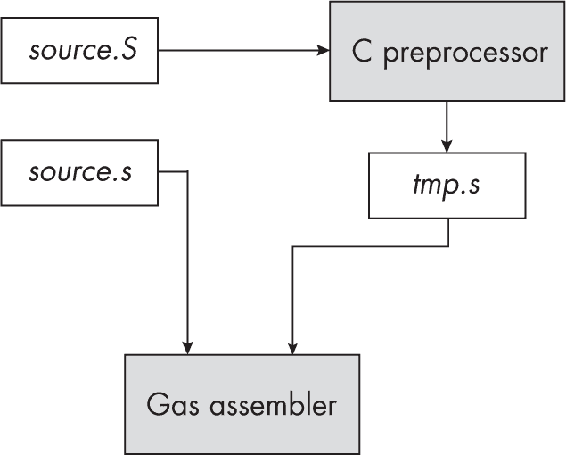

## 第十三章：13 宏和 Gas 编译时语言


本章讨论了 Gas 编译时语言（CTL），包括其宏扩展功能。*宏*，是 CTL 中等同于过程的概念，是一个标识符，汇编器将其扩展为额外的文本。这允许你通过一个标识符来缩写大量代码。Gas 的宏功能相当于计算机语言中的计算机语言；也就是说，你可以在 Gas 源文件中编写短程序，其目的是生成其他将由 Gas 汇编的源代码。

Gas CTL 包含宏、条件语句（如 if 语句）、循环以及其他语句。本章介绍了许多 Gas CTL 特性，以及如何使用它们来减少编写汇编语言代码的工作量。

### 13.1 Gas 编译时语言解释器

Gas 实际上是将两种语言合并到一个程序中。*运行时语言*是你在前几章中阅读的标准 ARM/Gas 汇编语言。之所以称之为运行时语言，是因为你编写的程序在你运行可执行文件时执行。Gas 包含一个解释器，用于解释第二种语言——*Gas CTL*。

Gas 源文件包含 Gas CTL 和运行时程序的指令，Gas 在汇编（编译）过程中执行 CTL 程序。一旦 Gas 完成汇编，CTL 程序便终止。图 13-1 显示了 Gas 汇编器和你的汇编语言源代码在编译时与运行时之间的关系。


图 13-1：编译时执行与运行时执行

CTL 应用程序并不是 Gas 发出的运行时可执行文件的一部分，尽管 CTL 应用程序可以为你编写部分运行时程序。事实上，这正是 CTL 的主要目的。通过自动代码生成，CTL 使你能够轻松且优雅地生成重复的代码。通过学习如何使用 Gas CTL 并正确应用它，你可以像开发高级语言（HLL）应用程序一样快速开发汇编语言应用程序（甚至更快，因为 Gas 的 CTL 让你能够创建非常接近 HLL 的结构，简称 VHLL）。

### 13.2 C/C++ 预处理器

Gas CTL 由两个独立的语言处理器组成：Gas 内置宏处理器和 C/C++ 预处理器（CPP）。正如在第一章中所提到的，标准的 Gas 汇编语言源文件使用 *.s* 后缀。然而，如果你指定 *.S* 作为后缀，Gas 会在处理文件之前先通过 CPP 运行该源文件（参见图 13-2）。CPP 会生成一个临时源文件（使用 *.s* 后缀），然后 Gas 汇编器将其汇编成目标代码。



图 13-2：Gas 的 C 预处理器处理过程

非常重要的一点是要记住，CPP 独立于 Gas 运行，并且在 Gas 汇编汇编语言源文件之前运行。特别是，Gas 的宏处理发生在 CPP 运行之后。因此，你不能使用 Gas 语句、符号或 Gas 宏来影响 CPP 的操作。稍后在本章中，我将指出在混合两种语言的宏功能时需要注意的地方。本节描述了 CPP 的各种特性。

#### 13.2.1 #warning 和 #error 指令

在使用 CPP 编写宏时，你有时会遇到一个问题（例如一个不正确的参数），你希望在汇编过程中将其报告为错误或诊断消息。为此，你可以使用 #warning 和 #error 诊断语句，语法如下：

```
#error `arbitrary text`
#warning `arbitrary text`
```

这些语句必须单独出现在源代码行上；在 # 字符前面，除了空白字符（空格和制表符）外，不应出现其他内容。（从技术上讲，空白字符可以出现在 # 和错误或警告标记之间，但良好的编程风格建议将它们保持在一起。）

在汇编过程中（或者更准确地说，在 CPP 处理源文件时），系统应该显示诊断消息，并打印包含 #error 或 #warning 语句的行，包括所有的 arbitrary_text，直到行的末尾。按照惯例，大多数程序员会将错误或警告消息（arbitrary_text）括在引号中，但这并不是绝对必要的。

如果 CPP 遇到任何 #error 语句，它将在 CPP 完成扫描源文件后终止汇编过程，而不会运行 Gas 汇编器来汇编该文件。在这种情况下，你需要在 Gas 处理文件之前修改源文件，以消除错误消息（例如，报告汇编语言源代码中的任何错误）。

如果 CPP 遇到任何 #warning 语句，它会在汇编过程中打印相应的消息，但会在 CPP 完成预处理源文件后继续汇编。因此，你可以使用 #warning 语句在汇编和预处理过程中显示 arbitrary_text。

#### 13.2.2 使用 CPP 定义编译时常量

你可以使用 CPP 的 #define 语句在源文件中创建常量定义：

```
#define `identifier` `arbitrary_text`
```

当 CPP 处理源文件时，它会将随后的标识符替换为 arbitrary_text。程序员通常使用此语句，例如在源文件中定义显式（命名）常量，如下例所示：

```
#define pi 3.14159
```

在汇编语言程序中，你通常会使用 .equ、.set 或 = 指令来定义命名常量，如下例所示：

```
maxCnt = 10
```

然而，Gas 中的各种错误可能会导致你无法像预期那样使用这些常量。考虑以下情况：

```
pi = 3.14159
    .
    .
    .
   .double pi
```

如果你尝试汇编这个，Gas 会抱怨 3.14159 不是一个有效的常量，pi 也不是一个有效的浮点常量。（在 macOS 下的 Clang 汇编器会接受 pi = 3.14159，但仍然会抱怨 pi 不是一个有效的浮点常量。）但是，如果你将其替换为

```
#define pi 3.14159
   .
   .
   .
   .double pi
```

然后 Gas 会正常汇编代码，因为 CPP 会预处理源文件并将每个出现的 pi 替换为 3.14159。因此，当 Gas 实际看到源文件时，它会发现

```
 .double 3.14159
```

这是完全可以接受的。这是一个很好的例子，说明为什么在 Gas 源文件中使用 CPP 会有帮助：它为你提供了一些能力，比如真实常量定义，这些是仅用 Gas 无法实现的。

因为 CPP 会在每次找到该标识符（在字符串或字符常量外部）时进行文本替换，所以你不仅限于使用 #define 来定义数字常量。你可以在 #define 后面定义字符常量、字符串常量，甚至任意文本（包括什么都不定义）：

```
#define hw "Hello, World!"
```

如果你更倾向于使用 xor 助记符而不是 eor 助记符，你甚至可以像下面这样做：

```
#define xor eor
   .
   .
   .
  xor x1, x0, x2
```

尽管像这样重新定义指令助记符通常被认为是糟糕的编程实践，但 ARM 在其“指令别名”中到处都这么做。如果 ARM 这么做没问题，那么如果它能让你的代码对你来说更易读，也没有理由你不能这么做。

#define 语句的另一个重要用途是创建 CPP 可以识别的符号。CPP 对源文件中出现的所有标识符毫无察觉，除了你用 #define 语句创建的那些标识符。正如你将在下一节中看到的那样，你有时会希望在 CPP CTL 语句中使用涉及命名常量的各种表达式。这些命名常量必须通过 #define 语句来定义，而不是 Gas 的 equate 指令之一。

#### 13.2.3 CPP 编译时表达式

某些 CPP 语句允许涉及常量的简单算术表达式。算术运算符是常见的 C 算术运算符，包括以下这些：

```
+  -  *  /  %  == != <  <=  >  >=  !  ~  && ||  &  | << >>
```

注意，CPP 仅支持（有符号的）64 位整数和字符表达式，如果你尝试使用浮点或字符串常量，它会报告错误。只要你之前用 #define 语句声明了该名称，就可以在 CPP CTL 表达式中使用命名常量。

你可以在 CPP CTL 表达式中使用以下 CPP 内建函数：

```
defined(`identifier`)
```

这个函数如果标识符之前在 #define 语句中定义过，会返回 1；如果没有此类定义，则返回 0（注意，你也可以使用 GCC 的 -D identifier=value 命令行选项来定义符号）。defined() 函数只识别在 #define 语句中定义的符号，这是前一节中提到的“重要用途”的一个好例子。如果你在这里传递一个普通的 Gas 汇编语言标识符，即使该定义在源文件的早期出现，函数也会返回 0。

#### 13.2.4 条件汇编

CPP 提供了几个语句，允许你在处理源文件时做出决策。以下是这些指令：

```
#if `expression`
 .
 .
 .
#elif `expression`  // This is optional and may appear multiple times.
 .
 .
 .
#else             // This is optional.
 .
 .
 .
#endif

#ifdef `identifier`
 .
 .
 .
#else             // This is optional.
 .
 .
 .
#endif

#ifndef `identifier`
 .
  .
 .
#else             // This is optional.
 .
 .
 .
#endif
```

在预处理期间，CPP 将评估表达式。如果它的值为非零（即 true），则 #if 或 #elif（else if）语句将处理文本，直到下一个 #elif、#else 或 #endif 语句。

如果表达式的结果为 false，CPP 将跳过接下来的文本（直到下一个 #elif、#else 或 #endif 语句），并且不会将该文本写入临时输出文件。因此，Gas 在汇编阶段不会汇编该文本。

请记住，这种条件处理发生在预处理阶段（汇编），而不是在运行时。这不是你在高级语言（HLL）中找到的通用 if/then/elseif/else/endif 语句。条件编译语句控制是否将指令实际出现在最终的目标代码中，这对于那些使用过 C/C++ 等高级语言进行条件编译的人来说应该很熟悉。

#ifdef 语句等效于以下内容：

```
#if defined(`identifier`)
 .
 .
 .
#endif
```

CPP 检查标识符是否之前已经通过 #define 语句（或 -D 命令行选项）定义。如果是，CPP 将处理 #if（或 #ifdef）后面的文本，直到 #endif（或直到遇到 #elif 或 #else 语句，如果存在的话）。

#ifndef（如果未定义）语句等效于此：

```
#if !defined(`identifier`)
 .
 .
 .
#endif
```

#ifdef 和 #ifndef 语句在为不同执行环境编写的代码中很常见。考虑以下示例：

```
#ifdef isMacOS

    `Code written for macOS`

#else

    `Assume the code was written for Linux or Pi OS.`

#endif
```

在此之前，如果出现以下语句，则前面的代码将为 macOS 编译该部分：

```
#define isMacOS
```

如果没有出现此定义，代码将编译为 Linux 或 Pi OS 代码。

另一个常见的条件汇编用途是将调试和测试代码引入你的程序中。作为一种典型的调试技术，许多 Gas 程序员会在关键位置插入打印语句，使他们能够追踪代码并在各个检查点显示重要的值。然而，这种技术的一个大问题是，他们必须在项目完成之前移除调试代码。此外，程序员经常忘记移除一些调试语句，这会导致最终程序中的缺陷。最后，在移除调试语句后，这些程序员往往会发现他们需要这些语句来调试其他问题。因此，他们必须一遍又一遍地插入和移除相同的语句。

条件汇编提供了该问题的解决方案。通过定义一个符号（比如 debug）来控制程序中的调试输出，你可以通过修改一行源代码来启用或禁用*所有*调试输出，正如下面的代码片段所示：

```
// Uncomment to activate debug output or -D debug on the command line.

// #define debug
      .
      .
      .
     #ifdef debug

        #warning *** DEBUG build

        mov  x1, [fp, #i]
        mstr x1, [sp]
        lea  x0, debugMsg
        bl   printf

     #else

        #warning *** RELEASE build

     #endif
```

只要你将所有调试输出语句用 #if 语句包围（如前面的代码所示），就不必担心调试输出会意外出现在最终应用程序中。注释掉调试符号定义将自动禁用所有此类输出（或者，更好的是，使用 -D debug 命令行选项在需要时打开输出）。同样，即使调试语句已经完成它们的即时目的，你也可以将它们保留在代码中，因为条件汇编使它们容易停用。以后，如果你决定在汇编期间查看相同的调试信息，你可以通过定义调试符号重新启用它。

#### 13.2.5 CPP 宏

之前，本章使用 #define 语句定义了编译时常量，这是*宏定义*的一个特例。本节将更深入地描述 CPP 宏定义和展开，包括宏参数、可变参数列表和其他 CPP 宏定义功能的讨论。通过使用这些信息，你将能够在 Gas 汇编语言源文件中创建并使用 CPP 宏。

##### 13.2.5.1 函数宏

宏是 CPP 用来将标识符替换为任意文本的机制。当使用 #define 定义常量时，你是在告诉 CPP 将后续每次出现该标识符的地方替换为相应的文本，也就是常量。

然而，CPP 提供了第二种类型的宏，即*函数宏*，它更像是一个（编译时）函数，支持任意数量的参数。以下示例演示了一个单参数宏：

```
#define lcl(arg1)  [fp, #arg1]
   .
   .
   .
  ldr w0, lcl(varName)
```

最后一条语句展开为

```
 ldr w0, [fp, #varName]
```

因为宏 lcl 展开为 [fp, #varName]。CPP 称这些为*函数宏*，因为它们的调用方式类似于 C 编程语言中的函数调用。

##### 13.2.5.2 CPP 宏参数

函数宏支持任意数量的参数。你可以通过以下方式指定零个参数

```
#define zeroArgs()  `text`
```

其中 zeroArgs() 将展开为指定的文本。

这是以下两种宏声明之间的区别，在调用它们时会表现出来：

```
#define noArgs  `text1`
#define zeroArgs() `text2`
```

你用 noArgs 调用第一个宏，用 zeroArgs() 调用第二个宏。如果宏声明有一个空的圆括号，宏调用也必须包含空的圆括号。你可以使用这种声明方式来区分常量声明和宏声明。

你也可以在 #define 语句中指定两个或更多参数：

```
#define twoArgs(arg1, arg2)  `text to expand`
```

以下是一个 twoArgs() 调用的示例：

```
mov w0, twoArgs(1, 2)
```

在调用 twoArgs() 时，必须提供恰好两个参数，否则 Gas 会报告错误。通常，宏调用中提供的参数数量必须与 #define 声明中的参数列表完全匹配。

当 CPP 处理宏调用时，通常通过扫描逗号来分隔实际参数。它会忽略出现在字符串或字符常量中的逗号，或出现在由圆括号或方括号括起来的表达式中的逗号：

```
 singleArg("Strings can contain commas, that's okay!")
  singleArg(',')    // Also okay
  singleArg((1,2))  // (1,2) is a single argument.
```

从 CPP 的角度来看，这些宏调用中的每一个都只有一个参数。

##### 13.2.5.3 宏参数展开问题

正如任何有经验的 C 程序员所知道的，你在指定宏参数时必须小心，以避免在展开过程中产生意外结果，尤其是当它们涉及算术表达式时。考虑以下宏：

```
#define reserve(amt)  amt + 1
```

现在考虑以下宏调用：

```
.space  reserve(Size) * 2  // Size is a constant.
```

这里的预期是保留的空间是 reserve()宏通常指定的两倍。然而，考虑一下这个宏的实际展开：

```
.space  Size + 1 * 2
```

Gas 的算术规则指定乘法的优先级高于加法，因此这将展开为 Size + 2，而不是(Size + 1) × 2，这是期望的展开。C 程序员通过总是用括号将宏展开（展开为算术表达式）括起来，并且他们总是将宏参数本身用括号括起来，从而绕过这个问题，如下例所示：

```
#define reserve(amt)  ((amt) + 1)
```

这通常解决了算术表达式中间宏展开的问题。

出于同样的原因，通常建议将你传递作为宏参数的任何表达式用括号括起来：

```
.space  reserve((Size + 5)) * 2
```

因为展开可能会根据运算符优先级产生意外的结果（例如，假设 reserve 定义为 amt * 2，如果你没有用括号将实际参数表达式括起来，它将展开为 Size + 5 * 2）。

##### 13.2.5.4 可变参数列表

CPP 提供了一种指定可变数量参数的机制：

```
#define varArgs(...)  `text to expand`
```

要引用参数，请使用预定义的 __VA_ARGS__ 符号（它以两个下划线开始和结束）。CPP 会将整个参数集替换为 __VA_ARGS__。*这包括可变参数列表中所有出现的逗号*。考虑以下宏定义和调用：

```
#define bytes(...) __VA_ARGS__
   .
   .
   .
  .byte bytes(1, 2, 3, 4)
```

.byte 语句展开为以下内容：

```
.byte 1, 2, 3, 4
```

可变参数列表允许零个实际参数，因此调用 bytes()是完全合法的（并且根据之前的定义，它会展开为空字符串）。因此

```
.byte bytes()
```

将展开为

```
.byte
```

有趣的是，这不会产生错误（Gas 不会为此语句生成任何代码）。

尽管整个参数列表的展开有时很有用，但你更常见的需求是从可变参数列表中提取单个参数，正如接下来的两节所讨论的那样。

##### 13.2.5.5 宏组合和递归宏

CPP 不支持递归宏调用。如果宏的名称出现在展开文本中，CPP 将简单地将该名称作为文本输出，以便由 Gas 汇编。这是遗憾的，因为递归在处理迭代时非常有用，而 CPP 并不提供任何循环结构。在第 13.2.5.9 节“使用宏进行迭代”中，我将在第 757 页提供一个解决方法；与此同时，我将讨论 CPP 如何处理宏展开，当一个宏调用另一个宏时。

考虑以下宏定义和调用：

```
#define inc(x) ((x)+1)
#define mult(y) ((y)*2)
   .
   .
   .
  .byte mult(inc(5))
```

当 CPP 遇到另一个宏调用的参数列表中的宏调用时，它将在将该文本传递给外层宏调用之前，先展开该参数。`.byte`语句的展开发生在两个步骤中：

```
.byte mult(((5) + 1))  // First step
```

然后

```
.byte (((5) + 1) * 2)   // Second step
```

这显然等于：

```
.byte 12
```

现在考虑以下示例：

```
#define calledMacro(x) mov w0, x
#define callingMacro(y) calledMacro(y)
   .
   .
   .
  callingMacro(5)
```

当 CPP 遇到此示例末尾的宏调用时，它会将 callingMacro(5)展开为以下文本：

```
 calledMacro(5)
```

然后 CPP 将展开此宏为以下内容：

```
 mov w0, 5
```

只要 CPP 继续在展开文本中找到宏调用（除非是递归调用），它将继续展开这些调用，无论该过程需要多少次迭代。

> 注意

*该* #define calledMacro(x) mov w0, x *宏应该真正是* #define calledMacro(x) mov w0, #x *，使用本书中迄今为止介绍的语法。然而，*#* 是一个 CPP 操作符（字符串化，稍后会描述），它将实际参数*5*转换为字符串*“5”*。幸运的是，Gas 在这个例子中接受一个普通常量来代替*#constant*，用于立即寻址模式。*

##### 13.2.5.6 宏定义的限制

CPP 宏的语法如下：

```
#define identifier(`parameters)` `text to expand` \n
```

其中（参数）是可选的，\n 表示换行符。CPP 不允许在展开的文本中包含任何换行符。因此，宏只能展开为一行文本。

CPP 确实允许如下所示的宏定义：

```
#define multipleLines(parms) `text1` \
                             `text2` \
                              .
                              .
                              .
                             `textn`
```

这将把宏定义分布到源文件中的*n*行中。除了最后一行外，每一行必须以反斜杠字符（\）结束，并紧接着一个换行符。

尽管这个宏在物理上跨越了多行源代码，但它仍然是单行文本，因为 CPP 会删除所有反斜杠后面的换行符。因此，你不能创建如下的宏：

```
#define printi(i)        \
        lea   x0, iFmtStr  \
        lea   x1, i        \
        ldr   x1, [x1]     \
        mstr  x1, [sp]     \
 bl    printf
         .
         .
         .
        printi(var)
```

这个宏定义无法工作，因为 CPP 将把所有汇编语言语句展开成一行（它们之间用空格隔开），从而产生语法错误。遗憾的是，Gas 似乎没有提供一种通用机制来在同一行上提供多个汇编语句。因此，你不能使用展开为多个汇编语言语句的 CPP 宏。（幸运的是，Gas 宏允许这样做，你将在第 13.3.4 节“Gas 宏”中了解，位于第 765 页）。

> 注意

*在某些 CPU 上，Gas 允许使用分号 (*;*) 字符将多个语句放在同一行。然而，ARM 将分号视为行注释字符；一个分号等价于两个正斜杠 (*//*)。在 Gas 中的表现可能会有所不同；例如，在 Pi OS 下，你可以使用分号作为语句分隔符。*

CPP 的单行宏定义有另一个严重的缺陷：你不能将 CPP 的条件编译语句（例如 #if）嵌入到宏中，因为条件编译语句必须出现在源代码行的开头。这很不幸，因为在宏中做决策的能力是非常有用的。幸运的是，仍然有几个解决方法。

首先，你可以将宏定义放在条件编译序列中，如下例所示：

```
#ifdef isMacOS
#define someMacro `text to expand if macOS`
#else
#define someMacro `text to expand if not macOS`
#endif
```

这个序列有两个宏，其中只有一个宏会在给定的汇编中被定义。因此，你可以将（推测是）仅限 macOS 的代码放入第一个宏定义中，将 Linux 代码放入第二个宏定义中。

使用两个单独的宏定义在某些情况下是有效的，但并不是所有情况下都行得通；有时你确实需要在宏展开中插入条件文本。我将在第 13.2.5.8 节“条件宏”中提供第二个解决方法，以解决这个问题，详见第 756 页。

##### 13.2.5.7 文本连接和字符串化操作符

CPP 提供了两个用于操作文本数据的特殊操作符：连接操作符和字符串化操作符。本节将介绍这两个操作符。

*标记*是 C/C++ 语言识别的实体，例如标识符或操作符。CPP *连接操作符* (##) 将两个标记组合成一个宏，形成一个单一的标记。例如，在宏体内，以下文本会生成单一的标识符标记：

```
ident ## ifier
```

标记和 ## 操作符之间可以有任意数量的空白字符。CPP 会删除所有空白字符，并将两个标记连接在一起——只要结果是一个合法的 C/C++ 标记。如果宏参数标识符出现在 ## 操作符的任一侧，CPP 会在进行连接之前展开该参数为实际参数的文本。可惜的是，如果你将另一个宏作为参数传递，CPP 不会正确地展开该参数：

```
#define one 1
#define _e  e
#define produceOne(x) on ## x
   .
   .
   .
  produceOne(_e)  // Expands to on_e
```

作为一个巧妙的解决方法，你可以创建一个连接宏来为后续展开创建标识符：

```
#define produceOne  1
#define concat(x, y) x ## y

    mov w0, #concat(produce, One)
```

这将生成语句

```
mov w0, #produceOne
```

然后会展开为：

```
mov w0, #1
```

第 13.8 节“更多信息”在第 792 页包含了描述 CPP 文本连接操作符的更多网站链接。

> 注意

*连接操作符仅在 CPP 宏中合法。CPP 会忽略* ## *在源文件中的其他地方，由 Gas 来处理它（这通常会产生错误，因为* ## *在 ARM 汇编语言中不是一个合法的标记）。*

第二个 CPP 操作符是 *字符串化操作符*（#），你可以在宏体内按如下方式使用它

```
# `parmID`
```

其中 parmID 是宏参数之一的名称。字符串化操作符将扩展该参数并将其转换为字符串，通过在文本周围加上引号。这就是为什么之前的 #define calledMacro(x) mov w0, #x 宏无法正常工作——它将参数字符串化了，而不是将其作为整数常量处理。

##### 13.2.5.8 条件宏

虽然你不能在宏体内包含条件编译指令（#if、#else 等），但通过一些技巧，你可以使用 CPP 创建条件宏（这也被称为 *滥用 CPP*）。以下是一个条件宏的示例，它实现了一个 if ... then 宏扩展，你可以根据源代码中的其他定义选择特定的扩展：

```
if_else(`expression`) (`true expansion`) (`false expansion`)
```

（真扩展）和（假扩展）是编译时表达式。if_else 宏将评估表达式；如果表达式评估为非零值，该语句将被（真扩展）替代。如果表达式评估为假，该语句将被（假扩展）替代。以下是一个简单示例：

```
.asciz if_else(MacOS) ("macOS") ("LinuxOS")
```

如果 MacOS 非零，这将产生字符串 "macOS"；否则，它将产生字符串 "LinuxOS"。

if_else 宏相当复杂，我不会在这里描述它是如何工作的；它是 C 语言而非汇编语言，因此超出了本书的范围。有关此主题的资源，请参见第 13.8 节，"更多信息"，见 第 792 页。以下是来自 Jonathan Heathcote 的其中一项资源中的 if_else 实现：

```
#define _secondArg_(a, b, ...) b

#define _is_probe_(...) _secondArg_(__VA_ARGS__, 0)
#define _probe_() ~, 1

#define _cat_(a, b) a ## b

#define _not_(x) _is_probe_(_cat_(_not_, x))
#define _not_0 _probe_()

#define _bool_(x) _not_(_not_(x))

#define if_else(condition) _if_else_(_bool_(condition))
#define _if_else_(condition) _cat_(_if_ , condition)

#define _if_1(...) __VA_ARGS__ _if_1_else
#define _if_0(...)             _if_0_else

#define _if_1_else(...)
#define _if_0_else(...) __VA_ARGS__
```

与条件编译指令不同，你可以将 if_else 宏嵌入到其他宏的主体中。考虑以下代码：

```
#define macStr(x) if_else(x) ("macOS")("Linux")
```

调用此宏将根据参数的编译时值产生字符串 "macOS" 或 "Linux"。

##### 13.2.5.9 使用宏进行迭代

CPP 中的 __VA_ARGS__ 特性对于将一组参数作为单个参数传递非常有用。然而，如果我们能够通过迭代列表中的参数逐个处理每个参数，而不是一次性处理所有参数，那就更好了。不幸的是，CPP 并不提供支持迭代的语句。由于 CPP 不支持递归，我们甚至不能（直接）使用递归来处理迭代。

然而，如果你稍微滥用 CPP，本节展示了一种有限形式的递归是可能的。本节的最终目标是创建一个宏，我们称之为 map，该宏将在变长参数列表中的每个参数上执行一个单参数宏。理想情况下，你会像这样调用 map

```
map(`macroName`, `arg1`, `arg2`, ..., `argn`)
```

然后 map 函数将生成 *n* 次对 macroName 的调用：

```
 `macroName`(`arg1`)
  `macroName`(`arg2`)
   .
   .
   .
  `macroName`(`argn)`
```

以下这组宏以及上一节中的 if_else 宏提供了这一功能（同样来自 Heathcote；有关实现细节，请参见第 13.8 节，"更多信息"，见 第 792 页）：

```
// Include the macro definitions for if_else from
// the previous section here.

#define _firstArg_(a, ...) a

#define _empty_()

#define eval(...) eval1024(__VA_ARGS__)
#define eval1024(...) eval512(eval512(__VA_ARGS__))
#define eval512(...) eval256(eval256(__VA_ARGS__))
#define eval256(...) eval128(eval128(__VA_ARGS__))
#define eval128(...) eval64(eval64(__VA_ARGS__))
#define eval64(...) eval32(eval32(__VA_ARGS__))
#define eval32(...) eval16(eval16(__VA_ARGS__))
#define eval16(...) eval8(eval8(__VA_ARGS__))
#define eval8(...) eval4(eval4(__VA_ARGS__))
#define eval4(...) eval2(eval2(__VA_ARGS__))
#define eval2(...) eval1(eval1(__VA_ARGS__))
#define eval1(...) __VA_ARGS__

#define _defer1(m) m _empty_()
#define _defer2(m) m _empty_ _empty_()()
#define _defer3(m) m _empty_ _empty_ _empty_()()()
#define _defer4(m) m _empty_ _empty_ _empty_ _empty_()()()()

#define _has_args(...) _bool_(_firstArg_(_end_of_args __VA_ARGS__)())
#define _end_of_args() 0

#define map(m, _firstArg_, ...)       \
  m(_firstArg_)                       \
  if_else(_has_args(__VA_ARGS__))(    \
    _defer2(_map)()(m, __VA_ARGS__) \
  )(                                    \
    /* Do nothing, just terminate */    \
  )
#define _map() map
```

eval 宏提供了对你作为参数传递的宏进行有限递归的功能（最多可递归 1,024 层，这允许列出最多 1,024 个条目的可变参数）。为了使 map 宏能够递归，必须将其封装在 eval 调用中。考虑以下示例：

```
#define inc(x) (x+1),
     .
     .
     .
    .byte eval(map(inc, 1, 2, 3, 4, 5, 6, 7)) 9
```

inc 宏末尾的逗号是必要的，因为调用 inc 时将会在同一行输出形式为(1 + 1)，(2 + 1)，...，(7 + 1)的表达式。`.byte`指令要求这些表达式之间用逗号分隔。

还需要注意，值 9 出现在 eval 调用之后。这是因为最后的表达式（7 + 1）后会有一个逗号，因此这个语句必须手动提供最后一个值。可以修改 map 宏使其对除了最后一个参数以外的所有参数都添加逗号，或者可以修改 inc 宏来检查特殊的哨兵值（例如负数），以便终止列表（而不输出值或逗号）。

##### 13.2.5.10 命令行定义

如果你回顾一下第 1.10.1 节中*build* shell 脚本的内容，标题为“在多个操作系统下组装程序”，并参考第 36 页，你会看到 GCC 有一个命令行参数指定了正在使用的操作系统：

```
-D isLinux=1    (for Linux and Pi OS)
-D isMacOS=1    (for macOS)
```

这些命令行参数大致等同于以下两个语句：

```
#define isLinux 1
#define isMacOS 1
```

在许多情况下，你可以像在文件开头放置这些#define 语句一样，直接在源文件中引用这些定义。

如前所述，这些参数是*大致*等同的——而非完全等同——于#define 语句。在宏体内，这些符号可能不会像正常的定义符号那样展开。为了在宏体内使用这些符号，通常最好通过以下代码显式地创建一些#define 符号，然后在宏中引用 myIsLinux 和 myIsMacOS：

```
#ifdef isLinux
  #define myIsLinux 1
  #define myIsMacOS 0
#else
  #define myIsLinux 0
  #define myIsMacOS 1
#endif
```

如果你是通过 gcc 直接从命令行编译 Gas 源文件，可以通过使用-D 命令行选项来定义其他符号。有关详细信息，请参阅 GCC 文档。请注意，*build*脚本不会将-D 参数传递给 GCC，但你可以轻松修改*build*，如果你想定义其他符号的话。

##### 13.2.5.11 CPP 中的#undef 语句

CPP 允许你通过使用#undef 语句忘记一个已定义的符号

```
#undef `identifier`
```

其中，identifier 是之前用#define 语句定义的符号。（如果在执行#undef 时该符号未定义，CPP 将简单地忽略该语句。）

取消符号定义可以让你重新定义它（例如，给它赋予另一个值）。如果在未先取消定义的情况下尝试重新定义符号，CPP 将报告错误。### 13.3 Gas CTL 的组成部分

Gas 的控制设施比 CPP 更接近大多数汇编语言程序员对宏扩展系统的期望。尽管 CPP 的宏功能对于某些目的很有用，但宏汇编编程通常需要一个更强大的宏系统。因此，学习 Gas 的宏功能是至关重要的。本节将介绍 Gas 控制设施的组成部分。

#### 13.3.1 汇编期间的错误和警告

Gas 的 .err 指令类似于 CPP 的 #error。汇编过程中，Gas 将显示一条错误消息（打印包含 .err 语句的源代码行）。如果 Gas 遇到 .err 指令，它将不会生成目标文件。例如，以下代码将在运行时生成错误消息：

```
.err
```

Gas 还支持 .error 指令。其语法如下所示：

```
.error "`String error message`"
```

操作数必须是一个用引号括起来的字符串常量。在汇编过程中，如果 Gas 遇到源文件中的 .error 指令，它将显示指定的错误消息，并且不会生成目标文件。

Gas 还支持一个类似于 CPP #warning 语句的 .warning 指令，其语法如下：

```
.warning "`String warning message`"
```

再次强调，操作数必须是一个用引号括起来的字符串常量。如果 Gas 在汇编过程中遇到 .warning 指令，它将显示指定的警告消息。如果源文件中没有错误，仅有警告，Gas 将生成一个目标文件。因此，你可以将 .warning 指令作为汇编时的打印语句。

请记住，CPP 的 #warning 和 #error 语句与 Gas 的 .warning 和 .error 指令之间的区别：CPP 语句在预处理阶段执行，即在汇编过程之前，而 Gas 指令在预处理阶段之后、汇编过程中执行。如果执行了任何 #error 语句，CPP 会终止汇编过程，而不会运行汇编器（因此在这种情况下 Gas 指令不会执行）。

#### 13.3.2 条件汇编

Gas 还支持一组类似于 CPP 的 #if/#endif 语句的条件汇编（或条件编译）指令。基本指令如下：

```
.if `expression1`

  `Statements to assemble if expression is nonzero`

.elseif `expression2`  // Optional, may appear multiple times

  `Statements to assemble if expression2 is nonzero`

.else  // Optional, but only one instance is legal

  `Statements to assemble if expression1, expression2, ...`
  `and so on, were all 0`

.endif
```

一般来说，你应该优先在源文件中使用 Gas 的条件汇编指令，而不是 CPP 的条件编译语句。只有在处理包含其他 CPP 语句（如 #define 语句）的源代码时，或者在测试是否在 CPP 中使用 #ifdef 或 #ifndef 语句定义了符号时，才使用 CPP 的条件编译语句。你不能通过使用 Gas 的条件汇编语句来测试 CPP 符号是否已定义，因为所有 CPP 符号在 Gas 汇编源文件时都会被扩展（并且不存在）。

紧跟 .if 或 .elseif 后的布尔表达式必须是一个绝对表达式（参见 第 176 页 的“可重定位和绝对表达式”）。在条件汇编表达式中，false 为零结果，true 为其他任何值。

Gas 支持 .if 指令的几个变体：

.ifdef symbol    如果 symbol 在源文件中该点之前已定义，则组装以下部分。CPP 符号（通过 #define 创建）在汇编之前被展开，因此在此指令中的使用可能无法按预期工作。

.ifb text    如果操作数字段为空白，则组装以下部分。通常使用此指令测试一个空白的宏参数（text 通常是一个宏参数名，可能展开为空字符串）。

.ifc text1**,** text2    比较 text1 和 text2，如果它们相等，则组装以下部分。字符串比较会忽略文本周围的任何空白字符。字符串 text1 包括从 .ifc 后第一个非空白字符到第一个逗号之间的所有字符。字符串 text2 是逗号后（忽略前导空白）到行尾（也忽略行尾空白）之间的所有文本。如果需要在字符串中包含空白字符，可以选择用撇号（单引号）将字符串括起来。通常，你会使用此语句比较两个宏参数展开结果，以检查参数是否相等。

.ifeq 表达式    如果表达式等于 0，则组装以下代码。

.ifeqs "string1"**,** "string2"    如果两个字符串相等，则组装以下代码。字符串必须用双引号括起来。

.ifge 表达式    如果表达式大于或等于 0，则组装以下代码。

.ifgt 表达式    如果表达式大于 0，则组装以下代码。

.ifle 表达式    如果表达式小于或等于 0，则组装以下代码。

.iflt 表达式    如果表达式小于 0，则组装以下代码。

.ifnb text    如果操作数字段不为空白，则组装以下部分。通常使用此指令测试一个非空白的宏参数（text 通常是一个宏参数名）。

.ifnc text1**,** text2    比较 text1 和 text2，如果它们不相等，则组装以下部分。字符串比较会忽略文本周围的任何空白字符。字符串 text1 包括从 .ifnc 后第一个非空白字符到第一个逗号之间的所有字符。字符串 text2 是逗号后（忽略前导空白）到行尾（也忽略行尾空白）之间的所有文本。如果需要在字符串中包含空白字符，可以选择用撇号（单引号）将字符串括起来。通常，你会使用此语句比较两个宏参数展开结果，以检查参数是否不相等。

.ifndef symbol**,** .ifnotdef symbol    如果 symbol 在源文件中该点之前未定义，则组装以下部分。注意，CPP 符号（通过 #define 创建）在汇编之前会展开，因此在此指令中的使用可能无法按预期工作。 .ifnotdef 指令是 .ifndef 的同义词。

.ifne expression    当表达式不等于 0 时，组装以下代码。这个指令是 .if 的同义词。

.ifnes "string1"**,** "string2"    当两个字符串不相等时，组装以下代码。这两个字符串必须用双引号括起来。

Gas 中的条件汇编语句可以出现在任何指令助记符合法的地方。通常，它们会单独占一行，尽管在同一行上出现标签也是合法的（尽管不常见）。在这种情况下，标签将与发出代码的下一条指令或指令关联。

正如你所看到的，Gas 提供了多种条件汇编语句，它们比 CPP 的条件编译语句更强大、更灵活。这也是为什么选择使用 Gas 的条件汇编语句而非 CPP 的另一个原因。

#### 13.3.3 编译时循环

与 CPP 不同，Gas 的 CTL 提供了三种循环构造，用于轻松生成数据并展开循环：.rept、.irp 和 .irpc。以下小节将描述这些指令。

##### 13.3.3.1 .rept....endr

.rept 指令会将一块语句重复指定次数。这个编译时循环的语法如下：

```
.rept `expression`

  `Statements to repeat`

.endr
```

Gas 将评估表达式，并重复 .rept 和 .endr 指令之间的语句块，重复指定的次数。如果表达式的值为 0，Gas 将忽略所有语句，直到 .endr，不生成任何代码。

以下示例将初始化一个包含 32 个元素的字节数组，值从 0 到 31：

```
.set  i, 0     // Initialize array element value.
.rept 32
.byte i
.set  i, i + 1 // Increment array element value.
.endr
```

你在 .rept 循环中不仅限于数据值，还可以使用 .rept 来展开循环：

```
// Zero out an eight-dword array:

    .set  ofs, 0
    .rept 8
    str   xzr, [x0, #ofs]
    .set  ofs, ofs + 8
    .endr
```

这相当于以下代码

```
 str xzr, [x0, #0]
    str xzr, [x0, #8]
    str xzr, [x0, #16]
    str xzr, [x0, #24]
    str xzr, [x0, #32]
    str xzr, [x0, #40]
    str xzr, [x0, #48]
    str xzr, [x0, #56]
```

它会将循环展开八次。

##### 13.3.3.2 .irp....endr

.irp（不定次重复）循环指令采用以下形式：

```
.irp `identifier`, `comma-separated-list-of-values`
 .
 .
 .
.endr
```

这个循环会对逗号分隔的值列表中的每一项重复。在循环体内，你可以通过使用 \identifier 来引用当前值；以下示例

```
.irp  i, 0, 1, 2, 3
.byte \i
.endr
```

等同于

```
.byte 0
.byte 1
.byte 2
.byte 3
```

它会为每个 .irp 参数展开循环。

##### 13.3.3.3 .irpc....endr

第三个编译时循环构造 .irpc 类似于 .irp，但它处理的是文本字符串，而不是值列表：

```
.irpc `identifier`, `text`
 .
 .
 .
.endr
```

在这里，identifier 是一个符号，它将获取指定文本字符串中每个字符的值。注意，text 是一个裸序列的字符；除非你希望 .irpc 循环将这些标点符号与字符串中的其他字符一起处理，否则不要用双引号或单引号括起来。该 .irpc 循环将对字符串中的每个字符执行一次，\identifier 会在每次迭代时扩展为该字符。例如

```
.irpc x, acde
.byte '\x'
.endr
```

扩展为如下内容：

```
.byte 'a'
.byte 'c'
.byte 'd'
.byte 'e'
```

注意，\identifier 即使在字符和字符串常量中也会展开（就像本例中的 '\x'）。在这个例子中，如果你没有把 \x 用单引号括起来，.irpc 循环会展开成

```
.byte a
.byte c
.byte d
.byte e
```

如果程序中没有定义符号 a、c、d 和 e，那么就会产生错误（我故意省略了 b，它本应展开为一个分支指令助记符）。

#### 13.3.4 Gas 宏

Gas 通过 .macro 和 .endm 指令提供宏功能。宏定义的语法如下

```
.macro `identifier` {`parameter_list`}

  `Statements to expand on macro invocation`

.endm
```

其中 {and} 字符表示参数列表是可选的（你在宏定义中不需要包含这些字符）。以下小节描述了 Gas 宏的各种组成部分，以及与宏相关的重要语义信息。

##### 13.3.4.1 宏参数

宏参数可以采用以下四种形式之一：

identifier    这种第一种形式，仅仅是一个简单的标识符，是最常见的。除非你提供其他三种选项中出现的后缀，否则这种语法告诉 Gas 参数是可选的。如果你在调用宏时没有提供适当的实际参数值，Gas 在宏体中展开参数时会用空字符串（一个空的参数）代替。

identifier=expression    与第一种形式类似，这指定了一个可以是可选的参数，只不过如果宏调用时没有提供参数值，Gas 会将标识符赋值为表达式的值，而不是空字符串。

identifier:req    指定在调用宏时必须提供宏参数；如果缺失，Gas 会返回错误信息。

identifier:vararg    允许使用一个可变参数列表（零个或多个由逗号分隔的参数）。Gas 会将这个宏参数展开为整个值列表，包括分隔这些值的逗号。

在标准 Gas 语法中，宏名称和第一个参数（如果有的话）之间用空格分隔。我发现，在 ARM 汇编器中，偷偷加个逗号也能正常工作（你的实际情况可能有所不同）。

在宏体内，使用形如 \identifier 的标记——其中 identifier 是宏声明的正式参数之一——来展开一个参数。例如，以下宏演示了值参数的展开：

```
.macro oneByte value
.byte  \value
.endm
 .
 .
 .
oneByte 1  // Expands to .byte 1
```

一个宏定义可以有零个或多个参数。如果你提供多个参数，必须用逗号分隔每个正式参数。此外，如果你指定了 vararg 参数，它必须是 .macro 语句中声明的最后一个参数。下面是一个稍复杂的宏示例：

```
.macro bytes yy:req, zz=0, tt, ss:vararg
.byte  \yy
.byte  \zz
.byte  \tt
.byte  \ss
.endm
```

当你调用这个宏时，必须至少提供一个实际参数（因为 yy 是一个必需的参数）。例如

```
bytes 5
```

展开为：

```
.byte 5
.byte 0  // Because zz expands to 0 by default
.byte    // Argument tt expands to the empty string.
.byte    // Argument ss also expands to the empty string.
```

注意，如果像 .byte 这样的数据指令没有操作数，Gas 会忽略该语句，并且不会向目标文件生成任何代码。

这是 bytes 的另一个调用，演示了完整的参数展开。

```
bytes 5, 4, 3, 2, 1, 0
```

其展开为：

```
.byte 5        // yy expansion
.byte 4        // zz expansion
.byte 3        // tt expansion
.byte 2, 1, 0  // ss expansion
```

这个例子运行得很顺利，因为 .byte 指令允许逗号分隔的操作数。然而，如果你想扩展一个不可逗号分隔的可变参数怎么办？请考虑以下宏：

```
.macro  addVals theVals:vararg
add     x0, x0, #\theVals
.endm
```

像 `addVals` 这样的调用例如

```
addVals 1, 2
```

会生成一个错误，因为

```
add x0, x0, #1, 2
```

这是语法错误。你可以通过在宏内部使用 .irp 循环来处理一个可变参数，来解决这个问题：

```
.macro  addVals theVals:vararg
.irp    valToAdd, \theVals
add     x0, x0, #\valToAdd
.endr
.endm
```

`addVals 1, 2` 的调用现在会生成以下内容：

```
add x0, x0, #1
add x0, x0, #2
```

Gas 会在宏体中的任何地方扩展宏。请考虑以下宏：

```
.macro select which
lea    x1, var\which
ldr    w1, [x1]
.endm
```

假设你已经在某个地方定义了 `var0` 和 `var1` 符号，调用 `select 0` 会生成如下内容

```
lea x1, var0
ldr w1, [x1]
```

而调用 `select 1` 会生成如下内容：

```
lea x1, var1
ldr w1, [x1]
```

假设你希望提供名称的前缀，而不是后缀，作为这个例子中的宏参数。第一次尝试将不起作用：

```
.macro select2 which
lea    x1, \whichvar
ldr    w1, [x1]
.endm
```

问题当然在于，Gas 会将 `\whichvar` 解释为名为 whichvar 的参数的展开。要将参数名与后面的文本分开，请使用 `\()` 符号：

```
.macro select2 which
lea    x1, \which\()var
ldr    w1, [x1]
.endm
```

现在，像 `select2 my` 这样的调用会正确扩展为

```
lea    x1, myvar
ldr    w1, [x1]
```

这会创建预期中的名称 `myvar`。

##### 13.3.4.2 宏参数与字符串常量

Gas 的宏有一个“特性”，如果你不小心可能会被它咬：如果你将字符串常量作为正式参数传递，Gas 会在扩展该参数时去掉字符串的引号。例如，请考虑以下宏和调用：

```
.macro myStr theStr
.asciz \theStr
.endm
 .
 .
 .
myStr "hello"
```

这会扩展为以下内容：

```
.asciz hello
```

除非你已经定义了符号 hello 并赋予了适当的值，否则这将生成一个错误。正确的做法如下：

```
.macro myStr theStr
.asciz "\theStr"
.endm
 .
 .
 .
myStr "hello"
```

这段代码正确生成了以下内容：

```
.asciz "hello"
```

其中一种可能的用途是将包含逗号和空格的参数作为单个参数传递给宏。我将留给你自己去发掘 Gas 中这种“特性”的其他滥用情况。就我个人而言，我认为它是一个 bug，我不敢使用这个功能，因为 Gas 可能会在未来的汇编器版本中移除此行为。

##### 13.3.4.3 递归宏

与 CPP 不同，Gas 完全支持递归宏。请考虑以下示例（摘自 Gas 手册）：

```
.macro  sum from=0, to=5
.long   \from
.ifgt   \to-\from
sum     "(\from+1)",\to
.endif
.endm
```

形式为 `sum 0, 5` 的宏调用会生成以下代码：

```
.long   0
.long   1
.long   2
.long   3
.long   4
.long   5
```

sum 宏使用条件汇编语句来防止无限递归。虽然你可以通过使用 .rept（或 .irp）指令更容易地遍历五个值，但有时递归比迭代更适合解决问题。

.irp 和 .rept 指令更适合简单的迭代。递归更适合处理作为宏参数传递的递归数据结构，如列表和树，或者如果你需要反转传递给宏的参数（我在下一节给出了这个例子）。

##### 13.3.4.4 .exitm 指令

.exitm 指令允许你提前终止宏的扩展。其语法如下：

```
.exitm
```

当 Gas 在宏扩展过程中遇到.exitm 时，它会立即停止扩展并忽略宏体的其余部分。当然，单纯地将 .exitm 指令放在宏体的中间（除非用于测试目的）并不特别有用——既然剩余部分会被忽略，那为什么要写宏体的其余部分呢？相反，您通常会在条件汇编块中找到 .exitm 宏，如下所示：

```
.macro reverse first, args:vararg
.ifb    \first
.exitm  // Quit recursion if no more arguments.
.endif
reverse \args
.byte   \first
.endm
```

.exitm 指令在参数列表为空时终止递归。递归调用将传递除第一个参数外的所有参数给 reverse。如您可能已经猜到，这个宏会按反向顺序生成指定为参数的字节到文件中。例如，reverse 0, 1, 2, 3 会生成

```
.byte 3
.byte 2
.byte 1
.byte 0
```

反转传递给反向宏的参数。

##### 13.3.4.5 \@ 运算符

在宏内部，Gas 会将令牌 \@ 转换为一串数字，指定它在汇编过程中扩展的宏总数。您可以将此运算符与 \() 令牌一起使用，以创建宏局部符号。以下宏提供了一个简单的例子：

```
 .macro  lclsym sym
        b       a\()\@
a\()\@:
        .endm
```

该宏的多次扩展通过在 a 的末尾附加一串数字来生成一个唯一的符号。

##### 13.3.4.6 .purgem 指令

.purgem 指令删除一个已定义的 Gas 宏。它类似于 CPP 的 #undef 语句。通常，如果您尝试重新定义一个 Gas 宏，Gas 会生成一个错误。如果您想重新定义该宏，请使用 .purgem 指令删除该宏。

请注意，如果您尝试清除一个尚未定义的宏，Gas 将会报错。不幸的是，.ifdef（和类似的）条件汇编语句无法识别宏符号；因此，在使用.purgem 指令之前无法检查一个宏是否已定义；您必须确保在使用该指令之前宏符号已经存在。

### 13.4 *aoaa.inc* 头文件

在本书中，我在示例中使用了 *aoaa.inc* 头文件，但并没有讨论它的内容。现在，您已经了解了 CPP 和 Gas 宏以及 CTL 功能，是时候兑现我在第一章中承诺的，逐节解释这个头文件是如何工作的。

我将一一讲解 *aoaa.inc* 的源代码，逐步注释并解释每个组成部分。第一部分是通常出现在包含文件开头的头部：

```
// aoaa.inc
//
// "Magic" header file for The Art of ARM Assembly
// that smooths over the differences between Linux
// and macOS
//
// Assertions:
//
// Either isMacOS or isLinux has been
// defined in the source file (using #define) prior
// to including this source file. This source file
// must be included using `#include "aoaa.inc"`
// NOT using the Gas `.include` directive.
```

首先，*aoaa.inc* 头文件假设包含 *aoaa.inc* 的源文件是通过 *build* 脚本进行汇编的。除了其他内容外，*build* 脚本会根据您运行 GCC（和 Gas）的操作系统，适当地在 gcc 命令行上包括以下选项之一来汇编源文件：

-D isMacOS=1

-D isLinux=1

由于这些符号是为 CPP 使用而定义的（而非 Gas），源文件必须具有 *.S* 后缀，并且必须对该文件运行 CPP，这意味着你需要通过运行 gcc 可执行文件来汇编该文件，而不是通过 as（Gas）可执行文件。

源文件的下一部分处理了多次包含的问题：

```
// aoaa.inc (cont.)
//
#ifndef aoaa_inc
#define aoaa_inc 0
```

这个 #ifndef 和 #define 序列是防止程序多次包含头文件时出现问题的标准方式。第一次 CPP 包含此文件时，符号 aoaa_inc 尚未定义；因此，CPP 会处理 #ifndef 语句之后的内容。紧接着的语句定义了 aoaa_inc 符号。如果包含了 *aoaa.inc* 的汇编源文件第二次包含了该文件，aoaa_inc 符号将已定义，CPP 将忽略直到匹配的 #endif（恰好位于源文件末尾）。

如前面的注释所述，你必须通过 CPP 语句 #include 来包含 *aoaa.inc* 头文件，而不是使用 Gas 的 .include 指令。因为 *aoaa.inc* 文件包含了几个 CPP 语句（包括 #ifndef），如果通过 .include 包含，CPP 永远无法看到 *aoaa.inc* 文件。记住，Gas 语句的处理是在 CPP 执行完并退出之后进行的。

接下来，*aoaa.inc* 头文件为处理 macOS 和 Linux 特定代码设置了多个符号的定义：

```
// aoaa.inc (cont.)
//
// Make sure all OS symbols are
// defined and only one of them
// is set to 1:

#ifndef isMacOS
    #define isMacOS (0)
#else
    #undef isMacOS
    #define isMacOS (1)
#endif

#ifndef isLinux
    #define isLinux (0)
#else
    #undef isLinux
 #define isLinux (1)
#endif

// Make sure exactly one of the OS symbols is set to 1:

#if (isMacOS+isLinux) != 1
    #error "Exactly one of isMacOS or isLinux," \
                       " must be 1"
#endif
```

这一块条件编译语句确保了 both isLinux 和 isMacOS 被定义，并且为操作系统赋予了适当的值。*build* 脚本提供的命令行参数只会定义这两个符号中的一个。这些语句确保了两个符号都被定义，并且赋予了适当的布尔值（0 表示假，1 表示真）。

接下来，*aoaa.inc* 头文件定义了 macOS 下所需的一些符号：

```
// aoaa.inc (cont.)
//
// Do macOS-specific stuff here:

#if isMacOS

    // Change all the C global function
    // names to include a leading underscore
    // character, as required by macOS (these
    // definitions allow you to use all the
    // same names in example programs in
    // macOS and Linux). This list includes
    // all the C stdlib functions used by
    // AoAA example code.

    #define asmMain  _asmMain
    #define acos     _acos
    #define asin     _asin
    #define atan     _atan
    #define cos      _cos
    #define exp      _exp
    #define exp2     _exp2
    #define getTitle _getTitle
    #define free     _free
    #define log      _log
    #define log2     _log2
    #define log10    _log10
    #define malloc   _malloc
    #define pow      _pow
    #define printf   _printf
    #define readLine _readLine
    #define sin      _sin
    #define sqrt     _sqrt
    #define strcat   _strcat
    #define strchr   _strchr
 #define strcmp   _strcmp
    #define strcpy   _strcpy
    #define strlen   _strlen
    #define strncat  _strncat
    #define strncpy  _strncpy
    #define strstr   _strstr
    #define strtol   _strtol
    #define tan      _tan
    #define write    _write

    #define __errno_location ___error
```

在 macOS 下，像 C 标准库函数名称这样的外部符号有一个前导下划线。而在 Linux 下，这些符号没有下划线。前面的代码片段中的 #define 语句将一些常见的 C 标准库函数名称替换成了带下划线前缀的版本。这使得本书中的函数调用在 macOS 和 Linux 下都能使用一致的名称。

这些定义仅适用于出现在此列表中的 C 标准库函数。如果你决定调用其他标准库函数（或使用其他外部符号），你需要显式地为其提供下划线前缀字符，或将额外的 #define 语句添加到此列表中。

lea 宏也有一个特定于 macOS 的实现：

```
// aoaa.inc (cont.)
//
// lea (Load Effective Address) macro.
// Correctly loads the address of
// a memory object into a register, even
// on machines that use position-independent
// executables (PIE):

.macro  lea, reg, mem
    adrp    \reg,\mem@PAGE
    add     \reg, \reg, \mem@PAGEOFF
.endm
```

如 第一章 和 第七章 中所述，lea 宏展开为两条指令，这些指令将符号的地址加载到一个 64 位寄存器中。包含这个宏（而不是在本书中每次出现 lea 时显式地写出这两条指令）的主要原因是，这两条指令略有不同，具体取决于代码是为 macOS 还是 Linux 汇编的。这个版本的 lea 宏生成了 macOS 的代码。

接下来是 mstr、mstrb 和 mstrh 宏，它们也有 macOS 特定的实现：

```
// aoaa.inc (cont.)
//
// mstr Assembles to a str instruction under macOS
// mstrb
// mstrh

.macro      mstr, operands:vararg
str         \operands
.endm

.macro      mstrb, operands:vararg
strb        \operands
.endm

.macro      mstrh, operands:vararg
strh        \operands
```

Linux 和 macOS 对变长参数列表的处理方式不同。在 Linux 下，你继续将前八个参数通过 X0 到 X7 传递，而在 macOS 下，你同时通过寄存器和堆栈传递它们。mstr、mstrb 和 mstrh 宏在 macOS 下展开为将寄存器存储到堆栈上的代码（稍后你将看到，Linux 版本展开后什么也不做）。

Clang 汇编器（macOS 版的 Gas）不支持 .dword 指令；以下宏为 macOS 实现了这一点。因此，在 macOS 下，*aoaa.inc* 头文件包含一个宏来提供这个缺失的指令，并将其映射到等效的 .quad 指令：

```
// aoaa.inc (cont.)
//
// macOS's assembler doesn't have .dword,
// define it here:

.macro  .dword, value:vararg
    .quad   \value
.endm
```

早期章节使用 vparmn 宏将变量传递给 printf() 函数。由于变长参数的 API 在 macOS 和 Linux 之间有所不同，因此对这两个操作系统有不同的定义。这是它们的 macOS 实现：

```
// aoaa.inc (cont.)
//
// Macros to load parameters 2..8 onto
// the stack for macOS when calling
// a variadic (variable parameter list)
// function, such as printf().
//
// Note that parameter 1 still goes into X0.

.macro  vparm2, mem
lea     x1, \mem
ldr     x1, [x1]
str     x1, [sp]
.endm

.macro  vparm3, mem
lea     x2, \mem
ldr     x2, [x2]
str     x2, [sp, #8]
.endm

.macro  vparm4, mem
lea     x3, \mem
ldr     x3, [x3]
str     x3, [sp, #16]
.endm

.macro  vparm5, mem
lea     x4, \mem
ldr     x4, [x4]
str     x4, [sp, #24]
.endm

.macro  vparm6, mem
lea     x5, \mem
ldr     x5, [x5]
str     x5, [sp, #32]
.endm

.macro  vparm7, mem
lea     x6, \mem
ldr     x6, [x6]
str     x6, [sp, #40]
.endm

.macro  vparm8, mem
lea     x7, \mem
ldr     x7, [x7]
str     x7, [sp, #48]
.endm        .endm
```

接下来是这些宏的 Linux 特定实现：

```
// aoaa.inc (cont.)

#elif isLinux == 1

    // Do Linux (no-PIE)-specific stuff here:

    .macro  lea, reg, mem
        adrp    \reg,\mem
        add     \reg, \reg, :lo12:\mem
    .endm

    // mstr  assembles to nothing under Linux
    // mstrb
    // mstrh

    .macro      mstr, operands:vararg
    .endm

 .macro      mstrb, operands:vararg
    .endm

    .macro      mstrh, operands:vararg
    .endm

    .macro  vparm2, mem
    lea     x1, \mem
    ldr     x1, [x1]
    .endm

    .macro  vparm3, mem
    lea     x2, \mem
    ldr     x2, [x2]
    .endm

    .macro  vparm4, mem
    lea     x3, \mem
    ldr     x3, [x3]
    .endm

    .macro  vparm5, mem
    lea     x4, \mem
    ldr     x4, [x4]
    .endm

    .macro  vparm6, mem
    lea     x5, \mem
    ldr     x5, [x5]
    .endm

    .macro  vparm7, mem
    lea     x6, \mem
    ldr     x6, [x6]
    .endm

    .macro  vparm8, mem
    lea     x7, \mem
    ldr     x7, [x7]
    .endm

#endif      #endif
```

对于 stdlib 函数没有 #define 语句，因为 Linux 不要求外部名称带下划线前缀字符。至于与参数相关的函数，Linux 仅通过寄存器传递变长参数列表的前八个参数，而不是通过堆栈。因此，mstr、mstrb 和 mstrh 宏展开后什么也不做，而 vparmn 宏则展开为不将数据存储在堆栈上的代码。

源文件的其余部分对 macOS 和 Linux 都是通用的。首先，*aoaa.inc* 头文件包含一些 .global 指令，用于为调用汇编文件的 C/C++ 程序指定公共名称：

```
// aoaa.inc (cont.)
//
// Global declarations:

.global asmMain
.global getTitle
.global readLine
.global printf
```

printf 的定义严格来说并不是必需的；它实际上只是一个外部声明，而未定义的符号默认就是外部符号。我之所以添加它，是因为本书几乎每个示例程序都会调用 printf() 函数。

Gas 实际上并不提供 .qword 指令。 .qword 宏将 .octa 重命名为 .qword，以便与 .word 和 .dword 保持一致：

```
// aoaa.inc (cont.)
//
// Generic code for all OSes:

// Gas doesn't have a .qword
// directive. Map .qword to .octa:

.macro  .qword, value:vararg
    .octa   \value
.endm
```

接下来是 *aoaa.inc* 中结构体定义宏所需的定义：

```
// aoaa.inc (cont.)
//
// Macros for structure definitions:

__inStruct          = 0
__inArgs            = 0
__inLocals          = 0
__dir               = 1
```

__inStruct、__inArgs、__inLocals 和 __dir 编译时变量维护着声明结构字段、参数和局部变量所需的信息，使用 struct、args 和 locals 宏。__in* 变量是布尔值，用于跟踪程序当前是否在定义结构、参数列表或一组局部变量。一次只能有一个字段包含 true（非零），但如果不声明这些对象的字段，则它们都可以是 0。

__dir 变量的值要么是 1，要么是 -1。它决定了这些对象中连续声明的偏移量是递增（当 __dir 为 +1 时）还是递减（当 __dir 为 -1 时）。结构体和参数的偏移量是递增的，而局部变量的偏移量是递减的。

这些编译时常量设置完毕后，接下来是实际的 struct、args 和 locals 宏：

```
// aoaa.inc (cont.)

                ❶ .macro  struct  name, initialOffset=0
__inStruct          = 1
__inLocals          = 0
__inArgs            = 0
__struct_offset     = \initialOffset
\name\().base       = \initialOffset
__dir               = 1
                    .if     \initialOffset > 0
                    .err
                    error   struct offset must be negative or 0
                    .endif
                    .endm

                ❷ .macro  args  name, initialOffset=16
__inStruct          = 0
__inLocals          = 0
__inArgs            = 1
__struct_offset     = \initialOffset
\name\().base       = \initialOffset
__dir               = 1
                    .endm
                ❸ .macro  locals  name
__inStruct          = 0
__inLocals          = 1
__inArgs            = 0
__struct_offset     = 0
__dir               = -1
                    .endm
```

struct、args 和 locals 宏允许你定义结构体（记录）、参数列表（参数）和局部变量。这些宏设置了一些编译时变量，用于跟踪对象的基地址，以及分配给对象字段的偏移量的方向（正向或负向）。

struct 宏 ❶ 通过将字段偏移与结构体的每个成员关联来创建结构体（记录）。struct 宏本身仅初始化 __inStruct、__dir 和 name.base 这三个编译时变量，它们保持声明结构体字段时所需的信息（其中 name 是用户提供的结构体名称）。__struct_offset CTL 维护结构体内的“位置计数器”。默认情况下，struct 宏将其初始化为 0。然而，调用 struct 的人可以指定一个负值，如果他们希望指定结构体的第一个字段在内存中出现在结构体基地址之前。__dir CTL 被初始化为 1，因为结构体中的连续字段在结构体内有递增的偏移量。

args 宏 ❷ 声明函数或过程的参数列表，本质上与创建结构体相同；毕竟，你是在定义激活记录的一部分。唯一的真正区别是起始偏移量为 16（这是在激活记录中第一个参数的偏移量，使用 FP 寄存器指定的基地址；保存的 FP 值和返回地址分别占用偏移量为 0 和 8 的双字）。因为参数在较高地址处，因此 __dir 字段被初始化为 1。

locals 宏 ❸ 声明在堆栈上分配的局部变量，这些变量位于 FP 寄存器所持有的地址下方。由于连续声明的变量会出现在内存中的较低地址处，因此该宏将 __dir 字段初始化为 -1。

与匹配的结束语、enda 和 endl 语句相关的宏稍后会出现在列表中。接下来的部分描述了可以出现在结构体内部的数据声明宏：

```
// aoaa.inc (cont.)

                    .macro  salign, size
__salign        = 0xFFFFFFFFFFFFFFFF - ((1 << \size)-1)
__struct_offset = (__struct_offset + (1 << \size)-1) & __salign
                    .endm
```

salign 宏只能出现在 struct、args 或 locals 声明中，它调整 __struct_offset 值（位置计数器），使其在一个是 2 的幂次方的偏移量上对齐（2 的幂次方由参数指定）。这个宏通过创建一个位掩码来实现其目的，该位掩码在低位包含 0，在剩余的高位包含 1。将 __struct_offset 与此值进行逻辑与运算，产生一个对齐到设计值的偏移量。

以下宏提供了用于结构体中的 byte、hword、word、dword、qword、oword、single 和 double 指令：

```
// aoaa.inc (cont.)

                    .macro  byte, name, elements=1
                    .if     __dir > 0
\name               =       __struct_offset
__struct_offset     =       __struct_offset + \elements
                    .else
__struct_offset     =       __struct_offset + \elements
\name               =       -__struct_offset
                    .endif
                    .endm

                    .macro  hword, name, elements=1
 .if     __dir > 0
\name               =       __struct_offset
__struct_offset     =       __struct_offset + ((\elements)*2)
                    .else
__struct_offset     =       __struct_offset + ((\elements)*2)
\name               =       -__struct_offset
                    .endif
                    .endm

                    .macro  word, name, elements=1
                    .if     __dir > 0
\name               =       __struct_offset
__struct_offset     =       __struct_offset + ((\elements)*4)
                    .else
__struct_offset     =       __struct_offset + ((\elements)*4)
\name               =       -__struct_offset
                    .endif
                    .endm

                    .macro  dword, name, elements=1
                    .if     __dir > 0
\name               =       __struct_offset
__struct_offset     =       __struct_offset + ((\elements)*8)
                    .else
__struct_offset     =       __struct_offset + ((\elements)*8)
\name               =       -__struct_offset
                    .endif
                    .endm

                    .macro  qword, name, elements=1
                    .if     __dir > 0
\name               =       __struct_offset
__struct_offset     =       __struct_offset + ((\elements)*16)
                    .else
__struct_offset     =       __struct_offset + ((\elements)*16)
\name               =       -__struct_offset
                    .endif
                    .endm

                    .macro  oword, name, elements=1
                    .if     __dir > 0
\name               =       __struct_offset
__struct_offset     =       __struct_offset + ((\elements)*32)
                    .else
__struct_offset     =       __struct_offset + ((\elements)*32)
\name               =       -__struct_offset
                    .endif
                    .endm

                    .macro  single, name, elements=1
                    .if     __dir > 0
\name               =       __struct_offset
__struct_offset     =       __struct_offset + ((\elements)*4)
                    .else
__struct_offset     =       __struct_offset + ((\elements)*4)
\name               =       -__struct_offset
                    .endif
                    .endm

                    .macro  double, name, elements=1
                    .if     __dir > 0
\name               =       __struct_offset
__struct_offset     =       __struct_offset + ((\elements)*8)
                    .else
__struct_offset     =       __struct_offset + ((\elements)*8)
\name               =       -__struct_offset
                    .endif
                    .endm
```

每个宏声明一个指定类型的单一标量或数组变量（可以通过提供第二个参数并指定元素个数来定义数组）。

这些宏会将当前位置计数器 `__struct_offset` 增加到变量的大小，并将该偏移量赋值给声明的名称。如果 `__dir` 为负（局部声明），宏会先递减位置计数器，然后将偏移量赋给名称；如果 `__dir` 为正，宏会将偏移量赋给名称，并增加位置计数器的值。

以下是 `ends`、`enda` 和 `endl` 宏：

```
// aoaa.inc (cont.)
//
// Generate name.size and name.offset constants
// specifying total structure size and the offset
// just beyond the last field.
//
// Also create a macro to be used to declare
// structure variables.

                    .macro ends, name
__inStruct          =      0
\name\().size       =      __struct_offset-\name\().base
\name\().offset = __struct_offset
                    .macro  \name, varName
                    .if     \name\().base < 0
                    .space  __struct_offset-(\name\().base)
                    .endif
\varName:
                    .if     __struct_offset > 0
                    .fill   __struct_offset
                    .endif

                    .endm
                    .endm
                    .macro enda, name
__inArgs            =      0
\name\().size       =      __struct_offset-\name\().base
                    .endm

                    .macro endl, name
__inLocal           =      0
\name\().size       =      __struct_offset
                    .endm
```

`ends`、`enda` 和 `endl` 宏完成由 `struct`、`args` 或 `locals` 开始的声明。它们将跟踪打开的结构、参数列表或局部变量声明的布尔变量设置为 `false`，然后将 `name.size` 等式设置为声明的总大小。`ends` 宏还定义了一个宏，你可以在代码中使用它来声明结构对象。

`wastr` 宏将一个字对齐的字符串输出到内存中。以下是它的实现：

```
// aoaa.inc (cont.)
//
// Macro to emit a string that is padded with bytes
// so that it consumes a multiple of 4 bytes in memory:

                    .macro   wastr, theStr
                    .asciz   "\theStr"
                    .p2align 2
                    .endm
```

这个宏主要用于 `.text` 区段，因为你必须确保所有代码和标签在这些区段内都保持字对齐。宏参数展开时必须使用引号包围，因为 Gas 会去掉你在实际参数中提供的引号（请参见第 13.3.4.2 节，“带字符串常量的宏参数”，第 768 页）。

`proc` 和 `endp` 宏为在汇编语言源文件中声明过程提供了语法糖。以下是它们的实现：

```
// aoaa.inc (cont.)
//
// Macros for declaration procedures/functions:

public              =       1
                    .macro  proc pName:req, isPublic=0

// If "public" argument is present, emit
// global statement.

                    .if     \isPublic
                    .global _\pName
                    .global \pName
                    .endif

\pName\().isOpenProcDCL = 1
\pName:
_\pName:
                    .endm

 .macro  endp pName:req
                    .ifndef \pName\().isOpenProcDCL
                    .err
                    .err    "Not an open procedure"
                    .else
                    .if     \pName\().isOpenProcDCL
                    .else
                    .err
                    .err    "endp name does not match last proc name"
                    .endif
                    .endif
\pName\().isOpenProcDCL = 0
                    .endm
```

除了输出过程名称和（如果 `isPublic` 为 1）`.global` 指令外，这个宏实际上并不做什么。

`public` 等式允许你将 `public` 作为第二个参数传递给此宏，以告诉汇编器将符号设为全局（即公共）。从技术上讲，你可以直接传递 1 作为第二个参数，但 `public` 更具可读性。

`.code` 宏简单地展开为 `.text`，并确保位置计数器对齐到字（4 字节）边界：

```
// aoaa.inc (cont.)
//
// Sanity for ARM code:

                    .macro  .code
                    .text
                    .align  2
                    .endm
```

`enter` 和 `leave` 宏提供了过程的标准入口和标准退出序列（有关更多详情，请参见第 5.4.4 节，“标准入口序列”，第 248 页，以及第 5.4.5 节，“标准退出序列”，第 250 页）：

```
// aoaa.inc (cont.)
//
// Assembly standard entry sequence:

    .macro  enter, localsSize
    stp     fp, lr, [sp, #-16]!
    mov     fp, sp
    .if     \localsSize > 0
    sub     sp, sp, #((\localsSize)+15) & 0xFFFFFFFFFFFFFFF0
    .endif
    .endm

// Assembly standard exit sequence:

    .macro  leave
    mov     sp, fp
 ldp     fp, lr, [sp], #16
    ret
    .endm
```

在极少数情况下，`b`（分支）和 `b.al`（始终分支）指令可能会在目标位置距离指令过远时生成超出范围的错误。在这种情况下，你可以使用 `goto` 宏将控制转移到 ARM CPU 64 位地址范围内的任何位置：

```
// aoaa.inc (cont.)
//
// goto
//
// Transfers control to the specified label
// anywhere in the 64-bit address space:

            .macro  goto, destination
            adr     x16, 0f
            ldr     x17, 0f
            add     x16, x16, x17
            br      x16
0:
            .dword  \destination-0b
            .endm
```

`goto` 宏修改了 `X16` 和 `X17` 寄存器中保存的值。ARM API 将这两个寄存器专门保留用于此目的，因此这是允许的。然而，你应该始终记住这个宏会修改 `X16` 和 `X17`。

C 标准库提供了魔法指针 `__errno_location`，它返回指向 C 的 `errno` 变量的指针，并将其存储在 `X0` 中。`getErrno` 宏展开为一个函数调用，该函数获取此值并将其返回在 `W0` 中：

```
// aoaa.inc (cont.)
//
// getErrno
//
// Retrieves C errno value and returns
// it in X0:

            .extern __errno_location
            .macro  getErrno
            bl      __errno_location
            ldr     w0, [x0]
            .endm
```

`ccne` 到 `ccnle` 等式定义了供 `ccmp` 指令使用的有用位模式：

```
// aoaa.inc (cont.)
//
// Constants to use in the immediate field of
// ccmp:

//          NZCV
    .equ    ccne,   0b0000          // Z = 0
    .equ    cceq,   0b0100          // Z = 1
    .equ    cchi,   0b0010          // C = 1
    .equ    cchs,   0b0110          // Z = 1, C = 1
    .equ    cclo,   0b0000          // Z = 0, C = 0
    .equ    ccls,   0b0100          // Z = 1, C = 0
    .equ    ccgt,   0b0000          // Z = 0, N = V
    .equ    ccge,   0b0100          // Z = 1, N = V
    .equ    cclt,   0b0001          // Z = 0, N! = V
    .equ    ccle,   0b0101          // Z = 1, N! = V

    .equ    cccs,   0b0010          // C = 1
    .equ    cccc,   0b0000          // C = 0
    .equ    ccvs,   0b0001          // V = 1
    .equ    ccvc,   0b0000          // V = 0
    .equ    ccmi,   0b1000          // N = 1
    .equ    ccpl,   0b0000          // N = 0

    .equ    ccnhi,  0b0100          // Not HI = LS, Z = 1, C = 0
    .equ    ccnhs,  0b0000          // Not HS = LO, Z = 0, C = 0
    .equ    ccnlo,  0b0110          // Not LO = HS, Z = 1, C = 1
    .equ    ccnls,  0b0010          // Not LS = HI, C = 1

    .equ    ccngt,  0b0101          // Not GT = LE, Z = 1, N! = V
    .equ    ccnge,  0b0001          // Not GE = LT, Z = 0, N! = V
    .equ    ccnlt,  0b0100          // Not LT = GE, Z = 1, N = V
    .equ    ccnle,  0b0000          // Not LE = GT, Z = 0, N = V
```

在编写代码模拟类似 HLL 的控制结构（例如 if/then/else 语句）时，对立分支非常有用：

```
// aoaa.inc (cont.)
//
// Opposite conditions (useful with all conditional instructions)

#define nhi ls
#define nhs lo
#define nlo hs
#define nls hi
#define ngt le
#define nge lt
#define nlt ge
#define nle gt

// Opposite branches

        .macro  bnlt, dest
        bge     \dest
        .endm

        .macro  bnle, dest
        bgt     \dest
        .endm

        .macro  bnge, dest
        blt     \dest
        .endm

        .macro  bngt, dest
        ble     \dest
        .endm

        .macro  bnlo, dest
        bhs     \dest
        .endm

        .macro  bnls, dest
        bhi     \dest
        .endm

        .macro  bnhs, dest
        blo     \dest
        .endm

        .macro  bnhi, dest
        bls     \dest
        .endm
#endif // aoaa_inc
```

#endif 语句终止了源文件开头的 #ifndef 语句。

### 13.5 通过另一个宏生成宏

你可以使用一个宏来编写另一个宏，以下代码演示了这一点：

```
// Variant of the proc macro that deals
// with procedures that have varying
// parameter lists. This macro creates
// a macro named "_`name`" (where `name` is
// the procedure name) that loads all
// but the first parameters into registers
// X1..X7 and stores those values onto
// the stack.
//
// Limitation: maximum of seven arguments

        .macro  varProc pName:req

// Create a macro specifically for this func:

        .macro  _\pName parms:vararg
reg     =       1
        .irp    parm, \parms
        .irpc   rnum, 1234567
        .if     reg==\rnum
        lea     x\rnum, \parm
        ldr     x\rnum, [x\rnum]
        mstr    x\rnum, [sp, #(reg-1)*8]
        .endif
        .endr
reg     =       reg + 1
        .endr
        bl      \pName
        .endm

// Finish off the varProc macro (just like
// the proc macro from aoaa.inc):

\pName\().isOpenProcDCL = 1
\pName:
        .endm
```

正如注释所述，这种类型的 proc 宏创建了一个新的 varProc 宏，你可以用它来通过 HLL 类语法调用过程。考虑以下对该宏的调用：

```
// Demonstrate the varProc macro
// (creates a macro name _someFunc
// that will load parameters and
// then branch to printf):

        varProc someFunc
        b       printf
        endp    someFunc
```

这将扩展为以下代码：

```
 .macro _someFunc, parms:vararg
reg     =       1
        .irp    parm, \parms
        .irpc   rnum, 1234567
        .if     reg==\rnum
        lea     x\rnum, \parm
        ldr     x\rnum, [x\rnum]
        mstr    x\rnum, [sp, #(reg-1)*8]
        .endif
        .endr
reg     =       reg + 1
        .endr
        bl      someFunc
        .endm
```

按如下方式调用 _someFunc 宏：

```
 lea x0, fmtStr
    _someFunc i, j
```

这将生成以下代码：

```
 lea x0, fmtStr

// Macro expansion:

    lea x1, i
    ldr x1, [x1]
    lea x2, j
    ldr x2, [x2]
    bl  someFunc
```

然后生成一些 func 分支到 printf，实际上将其转化为对 printf() 函数的调用。

你本可以编写一个宏直接调用 printf()（处理参数），但你需要为每个想要使用 HLL 类语法调用的函数编写这样一个宏。让 varProc 宏自动编写这个宏可以让你省去重复的工作。

varProc 宏有一个严重的限制，它的参数必须是全局内存位置（不能是寄存器、局部变量或其他类型的内存操作数）。尽管这个宏可能并不是特别有用，但它展示了一个宏如何编写另一个宏。我将把扩展这个宏以处理其他类型操作数的任务留给你作为练习。

请注意，如果一个宏创建另一个宏，它在创建新宏时必须使用未定义的名称。本节中的示例通过让调用者将新宏的名称作为参数传递给创建新宏的宏来实现这一点。也可以使用 .purgem 指令在创建新宏之前删除其名称。但是，请记住，在使用 .purgem 删除宏名称时，该宏名称必须已经存在。在第一次调用创建宏时，这可能会成为问题，因为第一次调用时要创建的宏可能不存在。可以通过在创建宏的第一次调用之前提供一个空宏来轻松解决这个问题：

```
.macro  createdMacro
  `Empty body`
.endm

.macro  createMacro

.purgem createdMacro
.macro  createdMacro

  `Macro body`

.endm // createdMacro
  .
  .
  .
.endm
```

因为 createdMacro 在第一次调用 createMacro 时已经存在，所以 .purgem 语句不会生成错误信息。在第一次调用后，未来的 createMacro 调用将删除前一次调用中创建的 createdMacro 版本。

### 13.6 选择 Gas 宏和 CPP 宏

看一眼 GNU CPP 文档（*[`<wbr>gcc<wbr>.gnu<wbr>.org<wbr>/onlinedocs<wbr>/cpp<wbr>/`](https://gcc.gnu.org/onlinedocs/cpp/)*），你会发现 GNU 的开发者建议使用 Gas 内置的宏功能，而不是 CPP。如果编写 CPP 和 Gas 的人建议使用 Gas 宏处理器而非 CPP，难道你不应该认真考虑这个建议吗？

如果你只能使用一个宏处理器，那么你可以强有力地证明选择 Gas 宏处理器而非 CPP 更为合适。CPP 不是一个非常强大的宏处理器，C/C++ 程序员滥用宏使它名声不好。在许多方面，Gas 的宏处理器明显优于 CPP。Gas 的宏功能在两者之间会是更好的选择。

然而，谁说你只能使用其中一个呢？为什么不同时使用两个呢？CPP 和 Gas 各有优缺点，通常是互补的。虽然 Gas 的宏功能比 CPP 强大，但与其他汇编器相比——例如微软的宏汇编器（MASM）或高级汇编器（HLA）——Gas 的宏功能并不特别出色。任何能够增强 Gas 宏功能的工具都是好的。CPP 也有一些 Gas 所缺乏的优点（比如函数式宏调用），而 Gas 当然也有 CPP 不具备的许多功能（比如多行宏定义）。如果你小心使用，结合使用两个宏处理器会给你带来超越任何一个宏处理器的能力。这是好事，所以我全力推荐将 CPP 和 Gas 的力量结合起来。

考虑到在编译 Gas 源文件时你有两个 CTL 可用（至少在使用 *.S* 后缀时），你应该使用哪种 CTL 结构？大多数情况下，这不太重要；如果两个 CTL 都能工作，选择取决于你，不过如果其他因素相同，坚持使用 Gas 的 CTL 可能是最安全的选择。然而，由于两者具有不同的能力，有时你可能需要选择其中一个而非另一个。

例如，CPP 的宏定义看起来像函数，并且几乎可以出现在源文件中的任何地方（除了注释之外）。它们非常适合编写地址表达式函数。以下代码演示了使用函数式 CPP 宏的方式：

```
mov x0, #cppMacro(0, x)
```

在这个例子中，Gas 宏不起作用，因为 Gas 宏不支持函数式调用。

另一方面，CPP 宏只能生成一行文本。因此，当你想要发出一系列指令时，Gas 宏是必要的：

```
lea x0, someLabel  // Expands to two instructions!
```

另外，请注意，如果你在宏展开中尝试使用 # 符号（在 CPP 中是字符串化，Gas 中是立即操作数），CPP 宏可能会给你带来问题。

Gas 还支持一组更丰富的条件汇编语句，以及 CTL 循环语句。这使得 Gas 更适合于发出大量数据或大量语句的宏。对于简单的地址表达式函数，我通常偏好使用 CPP 宏，而在需要将宏扩展为实际语句时，我会使用 Gas 宏。

在简单常量声明中，决定是使用 CPP 语句还是 Gas 的.set、.equ 和=指令并不是很明确。对于简单的整数常量，Gas 的 equate 指令工作得很好。对于非整数值，CPP 表现得更好。以下示例演示了如何使用 CPP 宏定义字符串常量：

```
#define aStr "Hello, World!"       // This works.
//      .set aStr, "Hello, World!" // This does not.

        .asciz aStr
```

对于整数表达式，Gas 的 equate 指令通常表现更好：

```
// #define a (a+1)  // Generally doesn't work as expected
    .set a, a+1     // Works fine (assuming some previous definition of a)
```

最后，始终记住，CPP 在汇编过程之前会先处理它的 CTL 语句，意味着 CPP 并不知道汇编语言源文件中特定的符号和其他标记。例如：

```
a:   .byte 0
      .
      .
      .
#ifdef a    // a is undefined to CPP; it's a Gas symbol.
 .
 .
 .
#endif

 .ifdef a  // a is defined to Gas's conditional assembly.
     .
     .
     .
    .endif
```

#ifdef 符号会认为符号 a 未定义（即使它在 Gas 源文件中已经定义）。记住，CPP 条件编译语句只知道通过#define 语句创建的符号。

### 13.7 继续前进

Gas 和 CPP 的 CTL 极大地扩展了 Gas 汇编器的功能。使用这些功能，包括常量定义、宏定义、条件编译和汇编等，可以减少你编写汇编语言源代码所需的工作量。

本章介绍了你在汇编语言源文件中使用 Gas 和 CPP CTL 所需的基本信息，首先讨论了 CPP。第二部分讨论了 Gas CTL，包括错误和警告指令、条件汇编、编译时循环指令和 Gas 宏。接下来，本章描述了你从第一章开始广泛使用的*aoaa.inc*头文件的内部源代码。最后，本章对比了 CPP CTL 和 Gas 宏功能，讨论了何时选择一个系统而不是另一个。

现在这本书已经介绍了 Gas CTL，接下来的示例代码将开始使用宏功能，从下一章开始。

### 13.8 更多信息

+   你可以查看 GNU CPP 文档，网址为*[`<wbr>gcc<wbr>.gnu<wbr>.org<wbr>/onlinedocs<wbr>/cpp<wbr>/`](https://gcc.gnu.org/onlinedocs/cpp/)。

+   你可以在*[`<wbr>ftp<wbr>.gnu<wbr>.org<wbr>/old<wbr>-gnu<wbr>/Manuals<wbr>/gas<wbr>-2<wbr>.9<wbr>.1<wbr>/html<wbr>_node<wbr>/as<wbr>_toc<wbr>.html`](https://ftp.gnu.org/old-gnu/Manuals/gas-2.9.1/html_node/as_toc.html)*找到 Gas 文档（包括宏）。如果你想了解更多关于 Gas 宏的内容，可以查看*[`<wbr>ftp<wbr>.gnu<wbr>.org<wbr>/old<wbr>-gnu<wbr>/Manuals<wbr>/gas<wbr>-2<wbr>.9<wbr>.1<wbr>/html<wbr>_node<wbr>/as<wbr>_107<wbr>.html`](https://ftp.gnu.org/old-gnu/Manuals/gas-2.9.1/html_node/as_107.html)*。

+   如果你想了解更多关于高级 CPP 宏的信息，可以查阅 Jonathan Heathcote 的《C 预处理器魔法》，网址为*[`<wbr>jhnet<wbr>.co<wbr>.uk<wbr>/articles<wbr>/cpp<wbr>_magic`](http://jhnet.co.uk/articles/cpp_magic)* 和*[`<wbr>github<wbr>.com<wbr>/18sg<wbr>/uSHET<wbr>/blob<wbr>/master<wbr>/lib<wbr>/cpp<wbr>_magic<wbr>.h`](https://github.com/18sg/uSHET/blob/master/lib/cpp_magic.h)*。

+   你可以查看 C 预处理器技巧、窍门和习语的 GitHub 网站，以找到 CPP 技巧：* [`<wbr>github<wbr>.com<wbr>/pfultz2<wbr>/Cloak<wbr>/wiki<wbr>/C<wbr>-Preprocessor<wbr>-tricks,<wbr>-tips,<wbr>-and<wbr>-idioms`](https://github.com/pfultz2/Cloak/wiki/C-Preprocessor-tricks,-tips,-and-idioms)*。

+   你可以在 Boost CPP 库中找到相关内容：* [`<wbr>www<wbr>.boost<wbr>.org<wbr>/doc<wbr>/libs<wbr>/1<wbr>_57<wbr>_0<wbr>/libs<wbr>/preprocessor<wbr>/doc<wbr>/index<wbr>.html`](https://www.boost.org/doc/libs/1_57_0/libs/preprocessor/doc/index.html)*。

+   Embedded Artistry 有一篇关于“Klemens Morgenstern 的《通过预处理器来获得乐趣和利润》”的文章：* [`<wbr>embeddedartistry<wbr>.com<wbr>/blog<wbr>/2020<wbr>/07<wbr>/27<wbr>/exploiting<wbr>-the<wbr>-preprocessor<wbr>-for<wbr>-fun<wbr>-and<wbr>-profit<wbr>/`](https://embeddedartistry.com/blog/2020/07/27/exploiting-the-preprocessor-for-fun-and-profit/)*。

+   了解更多关于宏元编程的信息，请访问 Thomas Mailund 的博客：* [`<wbr>mailund<wbr>.dk<wbr>/posts<wbr>/macro<wbr>-metaprogramming<wbr>/`](https://mailund.dk/posts/macro-metaprogramming/)*。
