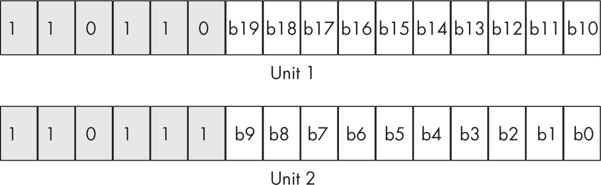

## 第十四章：14 字符串操作


*字符串*是存储在连续内存位置上的一组值。字符串通常是字节、半字、字、双字或四字的数组。一些 CISC CPU，如 Intel x86-64，支持直接操作字符串数据的指令。然而，ARM 没有提供这类指令，因为字符串操作往往很复杂，并且违反了 RISC 设计准则。不过，使用离散的 ARM 指令仍然可以操作字符串数据结构。

尽管 ARM CPU 不支持字符串特定的指令，但字符串操作仍然是 CPU 必须执行的重要功能。本章讨论了在使用 ARM 汇编语言时如何处理字符串。首先，本章介绍了如何调用 C 标准库中的函数来实现字符串操作。这些函数编写得很好（通常是用汇编语言编写），并提供了高性能的实现，只要你使用的是零终止字符串。然而，如本书中所述，零终止字符串并不是高性能字符串操作最适合的字符串数据结构。因此，本章描述了一种更好的字符串格式，使你能够编写更快速的字符串函数。

当然，采用新的字符串实现问题在于 C 标准库函数不支持它，因此本章还描述了如何实现支持新字符串格式的各种字符串函数。最后，本章通过讨论 Unicode 字符串和字符串函数来作总结。

### 14.1 零终止字符串与函数

第四章简要介绍了字符串数据类型，讨论了零终止字符串（常用于 C/C++及其衍生语言）、长度前缀字符串、字符串描述符和其他字符串形式。如前所述，零终止字符串是当前最常用的字符串形式。特别是，Linux（Pi OS）和 macOS 通常在 API 函数中使用零终止字符串来传递或接收字符串数据。因此，在这些操作系统下运行的 ARM 汇编语言程序中，你将经常使用零终止字符串。本节描述了零终止字符串的问题以及如何调用支持零终止字符串的 C 标准库函数。

零终止字符串的主要问题是性能。这些字符串通常需要扫描每个字符才能执行简单的操作，比如计算字符串的长度。例如，以下代码计算名为 longZString 的字符串的长度：

```
 lea   x1, longZString
          mov   x2, x1         // Save pointer to string.
whileLp:  ldrb  w0, [x1], #1   // Fetch next char and inc X1.
          cmp   w0, #0         // See if 0 byte.
          bne   whileLp        // Repeat while not 0.
          sub   x0, x1, x2     // X0 = X1 - X2
          sub   x0, x0, #1     // Adjust for extra increment.

// String length is now in X0.
```

如果 longZString 确实非常长，那么这段代码序列可能需要很长时间才能执行。

长度前缀字符串（参见第 4.6.2 节，“长度前缀字符串”，在 第 188 页）通过将字符串的当前长度与数据一起包含来解决这个问题。任何使用字符串长度的字符串函数将更高效地操作，因为它不必首先扫描整个字符串来确定其长度。如果你能够选择在汇编语言代码中使用的字符串格式，选择一个将长度作为字符串数据一部分的数据类型，可以显著提高字符串处理性能。

不幸的是，你并不总是能选择代码中使用的字符串格式。有时，外部数据集、应用程序或操作系统会强制你使用以零结尾的字符串格式（例如，操作系统的 API 调用通常要求使用以零结尾的字符串）。

有可能提高像之前给出的字符串长度代码这样的简单字符串函数的性能。特别是，whileLp 中的代码每次循环迭代时处理一个字节。由于 ARM64 CPU 通常能够在通用寄存器中一次处理 8 个字节（在向量寄存器中一次处理 16 个字节），你可能会想，是否可以比每次循环迭代处理一个字符做得更好。毕竟，如果你每次循环迭代处理 16 个字节（而不是 1 个字节），函数应该运行快 16 倍，对吧？

答案是有条件的肯定。第一个警告是每次迭代处理 16 字节更复杂，需要循环体中超过三条指令。因此，期望提升 16 倍是过于乐观的；4 到 8 倍的提升可能是更合理的期望，但仍然值得追求。

第二个警告是每次处理 16 个字符需要在每次迭代时从内存加载 16 个字节，这意味着对于许多字符串，你将不得不从字符串的末尾之后的内存中读取数据。因此，可能会读取超过包含字符串的 MMU 页的末尾，这可能导致内存保护错误（参见第 3.1.7 节，“内存访问和 MMU 页”，在 第 127 页）。虽然这种情况很少发生，但它仍然代表了代码中的一个缺陷，可能会导致你的应用程序崩溃。

最后一个问题，尽管它不像非法内存访问那样致命，但从内存加载 16 个字节的数据到向量寄存器中时，如果数据按照 16 字节边界对齐，则效果最佳。不幸的是，以零结尾的字符串在内存中并不能保证从这样的边界开始。

如果你完全控制字符串在内存中的位置，你可以确保字符串总是从 16 字节边界开始。同样，你也可以在字符串末尾始终添加填充，以确保至少能读取字符串数据末尾之后的 15 个字节，从而避免 MMU 页面边界的问题。不幸的是，很少有程序能够对其字符串有如此严格的控制，以确保内存中的这种安排。例如，如果操作系统返回指向字符串的指针，它可能会违反对齐和填充要求。

一般来说，如果你要操作以零结尾的（C）字符串，我建议调用 C 标准库函数。在过去，C 标准库函数是用 C 编写的，即使使用最好的优化编译器，也足够简单，好的汇编语言程序员能够编写比编译器生成的代码更快的代码。然而，现代 C 标准库的字符串代码通常是用汇编语言编写的（由*专家*程序员编写），通常比你自己写的任何代码都要好。例如，GNU C 标准库的 AARCH64 版本中，以下函数是用手写汇编语言编写的（有关更多信息，请参见第 859 页，在“更多信息”一节中）：

strcpy

strchr

strchrnul

strcmp

strcpy

strlen

strncmp

strnlen

strrchr

以下是 GNU C 标准库的*strlen.S*源文件（稍作修改以便格式化和注释）：

```
// strlen.S
//
// Copyright (C) 2012-2022 Free Software Foundation, Inc.
// This file is part of the GNU C Library. The GNU C
// Library is free software; you can redistribute it
// and/or modify it under the terms of the GNU Lesser
// General Public License as published by the Free
// Software Foundation; either version 2.1 of the License,
// or (at your option) any later version. The GNU C
// Library is distributed in the hope that it will be
// useful, but WITHOUT ANY WARRANTY; without even the
// implied warranty of MERCHANTABILITY or FITNESS FOR A
// PARTICULAR PURPOSE. See the GNU Lesser General Public
// License for more details. You should have received a
// copy of the GNU Lesser General Public License along
// with the GNU C Library. If not, see
// <https://www.gnu.org/licenses/>.

#include <sysdep.h>

// Assumptions:
//
// ARMv8-a, AArch64, Advanced SIMD
// MTE compatible

❶ #define srcin       x0
#define result      x0

#define src         x1
#define synd        x2
#define tmp         x3
#define shift       x4

#define data        q0
#define vdata       v0
#define vhas_nul    v1
#define vend        v2
#define dend        d2

// Core algorithm: For each 16-byte chunk, calculate a
// 64-bit nibble mask value with 4 bits per byte. This code
// take 4 bits of every comparison byte with shift right
// and narrow by 4 instruction. Since the bits in the
// nibble mask reflect the order in which things occur in
// the original string, counting trailing 0s identifies
// exactly which byte matched.

// On input, X0 contains a pointer to a zero-terminated string.
// On return, X0 contains the string length.

STRLEN:
      ❷ bic     src, srcin, 15
        ld1     {vdata.16b}, [src]
        cmeq    vhas_nul.16b, vdata.16b, 0
        lsl     shift, srcin, 2
        shrn    vend.8b, vhas_nul.8h, 4     /* 128 -> 64 */
        fmov    synd, dend
        lsr     synd, synd, shift
        cbz     synd, zloop

      ❸ rbit    synd, synd
        clz     result, synd
        lsr     result, result, 2
        ret

        .p2align 5
zloop:
      ❹ ldr     data, [src, 16]!
        cmeq    vhas_nul.16b, vdata.16b, 0
        umaxp   vend.16b, vhas_nul.16b, vhas_nul.16b
        fmov    synd, dend
        cbz     synd, zloop

      ❺ shrn    vend.8b, vhas_nul.8h, 4     /* 128 -> 64 */
        sub     result, src, srcin
        fmov    synd, dend
        rbit    synd, synd
        clz     tmp, synd
        add     result, result, tmp, lsr 2
        ret
```

这些宏定义❶为函数中的寄存器赋予了有意义的名称。就个人而言，我更倾向于看到带有描述寄存器内容的注释的寄存器名称，而不是重新定义的寄存器，这样可以更容易避免重复使用寄存器，但这无疑是一种可接受的风格，特别是在使用 ARM ABI 的 C 库代码中。

如前所述，处理一次 16 字节数据的代码（如该版本的 strlen()所做的）必须解决两个问题：将数据对齐到 16 字节边界，并防止数据访问超出包含字符串的 MMU 页的末尾。此代码通过使用 bic 指令❷将字符串指针的低 4 位设置为 0 来实现这两个要求。将低 4 位设置为 0 会将指针对齐到字符串起始位置之前或与 16 字节边界对齐。请注意，src（X1）现在可能会指向实际字符串开始之前最多 15 个字符（这些字符可能包含一些 0 字节；该函数稍后会处理这个问题）。因为 MMU 页总是从 4,096 字节边界开始（这些边界也是 16 字节边界），所以调整指针到 16 字节边界的起始位置永远不会产生超出包含字符串起始位置的 MMU 页的内存访问。

将指针对齐到 16 字节边界的另一个优点是，你不必担心在 MMU 页末尾发生意外的非法内存访问。由于 4096 可被 16 整除，在 16 字节边界上一次加载 16 字节永远不会导致跨越页面边界的内存访问。如果终止 0 字节位于这 16 字节中的任何位置，从 16 字节块的末尾读取数据是安全的。因此，通过清除指针的 LO 4 位，允许在 MMU 页内进行安全的内存访问。

对 src 指针进行 16 字节对齐的问题在于，进行对齐可能会导致指针指向字符串开始 *之前* 的内存。虽然这不会引起 MMU 页故障问题，但它可能导致代码错误地计算字符串的长度。至少，你不想计算字符串开始之前的任何额外字节，也不想在这些字节中出现 0 时终止字符串长度的计算。

幸运的是，代码以巧妙的方式处理了这个问题❷。首先，ld1 指令通过从对齐的地址加载 src 中的 16 字节来启动该过程。然后，cmeq 指令在这 16 字节中定位每个 0 字节，并将 0xFF 存储到 V1（vhas_null）的相应字节中，其它地方填充 0。

shrn 指令将比较掩码位右移 4 位。偶数字节现在包含两个比较掩码，分别位于 LO 和 HO 的 nibbles 中，指令的“缩小”部分提取这些偶数字节，并将它们打包到 V2 的 LO 8 字节中（总共 16 个 nibbles），然后 fmov 指令将其复制到 X2 中。

lsl 指令（在上一段中我跳过了讨论）是处理在字符串之前的 16 字节块中出现的额外字节的代码的一部分。它将原始地址乘以 4；这将是 X2 中 nibbles 的索引，实际的字符串将从那里开始（只使用移位值的 LO 6 位）。lsr 指令将 nibble 掩码右移，移动的位数是 X4（shift）的 LO 6 位中的值。这会将 X2 中位于字符串开始之前的字节的 cmeq nibble 掩码移除。这些 lsl 和 lsr 指令允许算法忽略字符串之前 16 字节块中的（可能存在的）额外字节。

最终在 X2 中的值将包含 0b1111 每当 V0（vdata）中字符串的部分出现 0 字节时，所有的其他字节则是 0b0000。特别地，如果 V0 中的字符串没有 0 字节，X2 将包含 0。如果 X2 中包含 0（意味着没有 0 字节），则字符串的终止 0 字节必须出现在字符串的后面；在这种情况下，cbz 指令将控制转移到标签 zloop。

如果 X2 不包含 0，则 0b1111 nibble 表示字符串中 0 字节的位置。rbit（反转位）指令❸会反转 X2 中的所有位，而 clz 指令会统计前导 0 的数量。由于字符串中的每个字节在 X2 中由 4 位标记，X0（结果）中的计数值是字符串长度的四倍。lsr 指令将该计数值右移 2 位，相当于将位计数除以 4，从而得到字符串的长度。

然后，函数将该长度返回给调用者，保存在 X0 中。此代码处理字符串出现在加载到 V0（vdata）的第一块字节中的情况。如果字符串足够长，以至于代码必须从内存中获取另一块 16 字节的数据，函数会将控制转移到代码❹。zloop 中的代码负责处理包含 16 个字符的块，其中从内存中读取的第一个字节是字符串的一部分（与之前的代码不同，后者的前 1–15 字节可能不是字符串的一部分）。这个循环快速扫描 16 字节的块，寻找第一个包含 0 的块。由于这个循环处理 16 字节需要五条指令（而原始的逐字节字符串长度计算例子只需要三条指令），你可以预期它会比单字节处理的代码快大约八倍。

一旦循环在 16 字节块中找到一个 0 字节❺，它就会确定该 0 字节的位置（使用与之前相同的技术❷❸），然后将从字符串起始位置到当前 16 字节块的距离加上当前 16 字节块中的非零字节数。

尽管这段代码复杂且难度较高，但计算零终止字符串的长度是一个常见的操作，因此优化是值得的。当你编写自己的代码时，几乎无法比这个算法更好。

再次强调，由于*glibc*（GNU C 库）的作者花费了大量时间优化他们的 ARM 字符串函数，我强烈推荐在合适的情况下调用 C 标准库函数。

### 14.2 面向汇编语言程序员的字符串格式

正如本书中多次提到的，如果你想编写最高效的代码，零终止字符串并不是最佳的字符串数据类型。选择一个包含长度信息的字符串格式，可能还包括其他信息，并且提供数据对齐，通常能在许多情况下提升性能。本节介绍了一种提供这些改进的示例格式。

本节讨论的字符串格式基于 HLA 字符串格式（请参见第 4.6.2 节“长度前缀字符串”，见第 188 页）。HLA 字符串由两个 32 位的长度值组成，后跟字符数据和一个零终止字节。一个字符串“变量”只是一个指向字符串第一个字符（或者如果字符串为空，指向零终止字节）的指针对象。

字符串的当前长度（字符计数，不包括零终止字节）位于地址 ptr-4，最大分配空间（字符数）值位于地址 ptr-8（其中 ptr 是指向字符数据的指针）。这两个长度值都是无符号 32 位值，支持最大长度为 4GB 的字符串。对于 HLA，字符串对象总是以 4 字节边界对齐，并且为字符串（和 0 字节）分配的存储空间总是 4 字节的倍数。

对于 64 位 CPU 上的字符串，需要做一些调整。首先，4 字节的最大长度和当前长度字段可以保留。你可能不需要能够容纳超过四十亿个字符的字符串。对齐应该在 16 字节边界上，以便使用 Neon 向量寄存器高效地一次处理 16 字节数据。最后，为字符串分配的存储空间应该始终是 16 字节的倍数（以防止读取超出字符串末尾的字节时出现问题）。以下是定义该字符串类型的结构的第一次尝试：

```
struct  string, -8
word    string.maxlen
word    string.len
byte    string.chars  // Note: up to 4GB chars
ends    string
```

使用此结构声明并且指向字符串对象的指针位于 X0，你可以按如下方式访问字符串的字段：

```
ldr  w1, [x0, #string.maxlen]  // Fetch the maxlen field.
ldr  w2, [x0, #string.len]     // Fetch the current length.
```

请注意，X0 直接指向字符串的第一个字符（如果它不是空的），因此你可以通过直接使用[x0]来引用字符数据（你不需要使用 string.chars 字段名，反正它的值为 0）。

如果你实际想为字符串数据分配存储空间，或使用字符数据初始化一些字符串存储，以下两个宏非常有用（作为初步的近似，稍后会在下一节进行小的修改）：

```
 .macro  str.buf strName, maxSize
            .align  4   // Align on 16-byte boundary.
            .word   \maxSize
            .word   0
\strName:   .space  ((\maxSize+16) & 0xFFFFFFF0), 0
            .endm

            .macro  str.literal strName, strChars
            .align  4   // Align on 16-byte boundary.
            .word   len_\strName    // string.maxlen
            .word   len_\strName    // string.len

            // Emit the string data and compute the
            // string's length:

\strName:   .ascii  "\strChars"
len_\strName=       .-\strName
 .byte   0   // Zero-terminating byte

            // Ensure object is multiple of 16 bytes:

            .align  4
            .endm
```

str.buf 宏将为一个字符串分配存储空间，该字符串最多可以容纳 maxSize 个字符（加一个零终止字节）。.align 指令确保对象从 16 字节边界开始（2⁴）。它将结构的第一个字（string.maxlen）初始化为传递的 maxSize 参数。它通过将结构的第二个 4 字节（string.len 字段）初始化为 0 来创建一个空字符串。最后，它为 maxSize + 1 个字符（包括字符串数据和一个零终止字节，且初始化为零）分配足够的存储空间，并额外分配存储空间以确保整个数据结构（包括 string.maxlen 和 string.len 字段）占用 16 字节的倍数。

这是使用 str.buf 宏的一个示例：

```
str.buf  myString, 100  // Maximum of 100 chars in string
```

str.literal 宏也会创建字符串缓冲区，但它会初始化为空字符串，而你可以在宏中指定一个字符串字面值：

```
str.literal hwStr, "Hello, World!\n"
```

请注意，str.literal 会使用你提供的字符串字面值的实际大小初始化 string.maxlen 和 string.len 字段。

这个字符串数据类型有一个小问题。虽然整个结构在 16 字节边界上对齐——并且整个结构长度是 16 字节的倍数，至少当你通过 str.buf 和 str.literal 宏创建缓冲区时——但是字符串数据的第一个字符实际上位于一个不是 16 的倍数的地址（尽管它是 8 的倍数）。为了每次处理 16 字节的字符串数据，你必须特别处理前 8 个字节，或者在结构的开头再添加 8 个字节（一些附加字段或只是 8 个填充字节）。在下一节中，你将看到这两个宏的修改，增加了一个额外的字段来解决这个问题。

#### 14.2.1 动态字符串分配

只要你仅使用 str.buf 和 str.literal 宏为字符串变量分配存储，你就不需要担心对齐和 MMU 页面问题；你的字符串数据结构将始终在 16 字节边界上分配（因为.align 4 语句）并且始终是 16 字节的倍数长度。然而，如果你想为字符串动态分配存储（例如使用 C 标准库的 malloc()函数），你必须自己处理数据对齐和填充问题。

C 标准库的 malloc()函数对于它分配的存储没有做任何承诺，除了如果函数成功，它将返回一个指向*至少*你请求的存储量的指针。特别地，C 标准库并不保证你请求的存储会有特定的对齐方式。此外，malloc()可能会分配比你请求的多一些字节，但你不能依赖这一点。如果你希望存储按某个字节边界（例如 16 字节边界）进行分配，你必须自己处理。

如果你无法保证 malloc()返回一个正确对齐的内存块，你可以创建一个 str.alloc 函数来为你处理：

在入口处，将请求的存储大小加 16，以便为任何需要的填充字节留出空间。

调用 malloc()函数并传递新的分配大小。

保存 malloc()返回的指针（你稍后将需要它来释放存储）。

将指针加 15，并清除和总和的低 4 位；然后加 16，使指针包含字符串中第一个字符位置的地址。

根据需要设置 maxlen 字段。

将 len 字段初始化为 0。

在第一个字符位置存储一个零终止字节（以创建一个空字符串）。

返回指向第一个字符位置的指针作为 str.malloc 的结果。

一个释放字符串存储的函数要简单得多：你需要做的就是获取分配的指针（在 str.alloc 调用期间保存），然后调用 C 标准库的 free()函数来释放存储。你从哪里获取已分配的指针值？最好将其保存在字符串对象的数据结构中，以下是字符串结构的修改方式：

```
struct  string, -16
dword   string.allocPtr // At offset -16
word    string.maxlen   // At offset -8
word    string.len      // At offset -4
byte    string.chars    // At offset 0

// Note: characters in string occupy offsets
// 0 ... in this structure.

ends    string
```

现在，头字段占用了 16 个字节，因此 string.chars 字段将开始于 16 字节对齐的边界上（假设整个结构体都在 16 字节对齐的边界上）。

在提供实现 str.alloc 和 str.free 的代码之前，我将介绍另一个 str.alloc 将使用的有用字符串构造函数：str.bufInit。它的目的类似于 str.buf 宏，都是用于初始化一个内存缓冲区来保存字符串对象，但当你在汇编期间使用 str.buf 来声明一个静态对象时，str.bufInit 允许你在运行时初始化一块内存。str.bufInit 函数的作用如下：

+   调整传入的指针，以确保指针中存储的地址是 16 字节对齐的（如果指针的值没有 16 字节对齐，则向指针的值添加 0 到 15）。

+   将 string.allocPtr 字段初始化为 0（NULL），以区分由 str.alloc 创建的缓冲区。

+   根据传入函数的缓冲区大小计算 string.maxlen 字段的值，减去为了实现 16 字节对齐所需的填充字节，以及头字段所需的 16 字节和确保整个结构体长度为 16 字节倍数所需的额外字节。

+   将 string.len 字段初始化为 0，并在字符缓冲区区域的开始处存储一个零终止字节。

在展示这些字符串函数的实现之前，需要稍作旁白，介绍代码将使用的 volatile_save 结构体，以便保存寄存器。这个结构体出现在*aoaa.inc*头文件中，形式如下：

```
// Structure to hold the volatile registers saved by functions
// that call C stdlib funcs
//
// Note: size of this structure must be a multiple of 16 bytes!

            struct  volatile_save
            qword   volatile_save.x0x1
 qword   volatile_save.x2x3
            qword   volatile_save.x4x5
            qword   volatile_save.x6x7
            qword   volatile_save.x8x9
            qword   volatile_save.x10x11
            qword   volatile_save.x12x13
            qword   volatile_save.x14x15
            qword   volatile_save.v0
            qword   volatile_save.v1
            qword   volatile_save.v2
            qword   volatile_save.v3
            qword   volatile_save.v4
            qword   volatile_save.v5
            qword   volatile_save.v6
            qword   volatile_save.v7
            qword   volatile_save.v8
            qword   volatile_save.v9
            qword   volatile_save.v10
            qword   volatile_save.v11
            qword   volatile_save.v12
            qword   volatile_save.v13
            qword   volatile_save.v14
            qword   volatile_save.v15
            ends    volatile_save
```

列表 14-1 包含了 str.alloc 和 str.free 函数，以及对 str.buf 和 str.literal 宏的更新（用于处理 string.allocPtr 字段）。该列表使用了我在本节前面给出的字符串结构，其中包括 string.allocPtr 字段。对于动态分配存储的字符串，此字段将包含分配指针，str.free 将在释放字符串存储时使用该指针。对于未在堆上创建的字符串对象，此字段将包含 NULL（0）。这个结构体是列表中第一个出现的重要代码部分。

```
// Listing14-1.S
//
// String initialization, allocation, and deallocation functions and macros

            #include    "aoaa.inc"

// Assembly language string data structure:

            struct  string, -16
            dword   string.allocPtr // At offset -16
            word    string.maxlen   // At offset -8
            word    string.len      // At offset -4
            byte    string.chars    // At offset 0

            // Note: characters in string occupy offsets
            // 0 ... in this structure.

            ends    string
```

str.buf 和 str.literal 宏包含一些小的修改（与本章前面给出的同名宏），这些修改包括为 allocPtr 字段分配存储空间：

```
// Listing14-1.S (cont.)
//
// str.buf
//
// Allocate storage for an empty string
// with the specified maximum size:

            .macro  str.buf strName, maxSize
            .align  4         // Align on 16-byte boundary.
            .dword  0         // NULL ptr for allocation ptr
            .word   \maxSize  // Maximum string size
            .word   0         // Current string length
\strName:   .space  ((\maxSize+16) & 0xFFFFFFF0), 0
            .endm

// str.literal
//
// Allocate storage for a string buffer and initialize
// it with a string literal:

            .macro  str.literal strName, strChars
            .align  4   // Align on 16-byte boundary.
            .dword  0   // NULL ptr for allocation ptr
            .word   len_\strName    // string.maxlen
            .word   len_\strName    // string.len

            // Emit the string data and compute the
            // string's length:

\strName:   .ascii  "\strChars"
len_\strName=       .-\strName
            .byte   0   // Zero-terminating byte

            // Ensure object is multiple of 16 bytes:

            .align  4
            .endm
```

请注意，这两个宏都会将此字段初始化为 NULL（0）。

列表的下一部分是代码部分，从常见的 getTitle 函数开始：

```
// Listing14-1.S (cont.)

            .code
            .global malloc
            .global free

ttlStr:     wastr  "Listing14-1"

// Standard getTitle function
// Returns pointer to program name in X0

            proc    getTitle, public
            lea     x0, ttlStr
            ret
            endp    getTitle
```

接下来，str.bufInit 函数初始化一个内存缓冲区，用作字符串变量：

```
// Listing14-1.S (cont.)
//
// str.bufInit
//
// Initializes a raw memory buffer for use as an assembly
// language string object
//
// On entry:
//
//  X0- Pointer to the first byte of a buffer
//  W1- Buffer length
//
// On return:
//
//  X0- Pointer to string variable object
//  X1- Maximum string length
//
//  Carry flag clear if success, set if error

            proc    str.bufInit

            locals  str_bufInit_l
            dword   str_bufInit_l.saveX2
            byte    str_bufInit_l.stkSpace, 64
            endl    str_bufInit_l

            enter   str_bufInit_l.size
            str     x2, [fp, #str_bufInit_l.saveX2]

            // Clear HO 32 bits of X1:

          ❶ and     x1, x1, #0xFFFFFFFF

            // Ensure that the pointer is aligned
            // on a 16-byte boundary:

          ❷ add     x2, x0, #15
            bic     x2, x2, #0xf

            // Point X2 at the start of the
            // character data:

 ❸ add     x2, x2, #string.chars-string.allocPtr

            // Compute the new maxlen value:

          ❹ sub     x0, x2, x0
            subs    x1, x1, x0
            bmi     str.bufInit.bad

            // Force maxlen to be a multiple of 16:

          ❺ bic     x1, x1, #0xf

            // Error if maxlen is 0:

            cbz     x1, str.bufInit.bad

            // Initialize the string struct fields:

          ❻ str     xzr, [x2, #string.allocPtr] // NULL
            str     w1,  [x2, #string.maxlen]
            str     wzr, [x2, #string.len]      // Empty str
            strb    wzr, [x2, #string.chars]    // 0 byte

            mov     x0, x2      // Return str ptr in X0.

            ldr     x2, [fp, #str_bufInit_l.saveX2]
            adds    xzr, xzr, xzr     // Clear the carry flag.
            leave

// Error return (sets the carry flag):

str.bufInit.bad:
            ldr     x2, [fp, #str_bufInit_l.saveX2]
            cmp     x2, #0  // Set the carry flag.
            leave
            endp    str.bufInit
```

该函数期望 X0 中传入一个指向缓冲区的指针，以及 W1 中的缓冲区长度。它初始化字符串对象的字段，并返回指向字符串对象的指针在 X0 中。代码首先清除 X1 的高 32 位，以便代码可以处理 64 位值❶。然后，它调整 X0 中传入的指针，使其对齐到 16 字节，通过加上 16 并清除和的低 4 位❷。如果该指针尚未对齐到 16 字节地址，这将使 X0 指向下一个较高的 16 字节对齐地址。

接下来，代码调整指针，使其包含字符串中第一个字节字符数据的地址（这样其他字段相对于该指针的偏移量为负）❸。然后，代码通过减去填充字节（用于 16 字节对齐）和字符数据之前字段的大小来计算新的 maxlen 值❹。如果这个差值为负数，函数会返回错误。

代码通过清除长度值的低 4 位❺，确保字符数据的长度是 16 字节的倍数（可能会进一步减小 maxlen 的大小）。如果 maxlen 值为 0，函数将返回错误。

最后，代码初始化字符串对象的字段（生成一个空字符串）❻。请注意

```
adds    xzr, xzr, xzr
```

清除进位标志（成功返回），因为将 0 加到任何值上永远不会产生无符号溢出（进位）。还要注意

```
cmp     x2, #0
```

总是设置进位标志，因为在比较之后如果左值大于或等于（大于或相等于）右值，进位标志将被设置。当然，对于无符号值，任何值总是大于或等于 0。

在示例 14-1 中的两个函数，str.alloc 和 str.free，将调用 C 标准库中的 malloc()和 free()函数。str.alloc 和 str.free 函数保存它们修改的所有寄存器（这些寄存器不包含显式的返回值）。然而，由于 malloc()和 free()函数遵循 ARM ABI，它们被允许覆盖 volatile 寄存器集中的值。为了保存寄存器值，str.alloc 和 str.free 函数必须通过使用 volatile_save 结构来保存 volatile 寄存器。

接下来是 str.alloc 函数：

```
// Listing14-1.S (cont.)
//
// str.alloc
//
// Allocates storage for an assembly language string
// object on the heap (C stdlib malloc heap)
//
// On entry:
//
//  W0- Maximum string length for string object
//
// On exit:
//
//  X0- Pointer to string object (NULL if error)
//
//  Carry clear if successful, set if error

            proc    str.alloc

            locals  str_alloc
            dword   str_alloc.maxlen    // Really only a word
            dword   str_alloc.saveX1
            salign  4   // 16-byte align vsave
          ❶ byte    str_alloc.vsave, volatile_save.size
            byte    str_alloc.stkSpace, 64
            endl    str_alloc

 enter   str_alloc.size

            // Preserve X1 and point it at the
            // volatile_save.x0x1 entry in str_alloc.vsave:

            str     x1, [fp, #str_alloc.saveX1]

            // Load X1 with the effective address of
            // str_alloc.vsave (which will be the
            // volatile_save.x0x1 element):

          ❷ add     x1, fp, #str_alloc.vsave

            // Preserve all the volatile registers (call to
            // malloc may change these). Note that X1 is
            // currently pointing at volatile_save.x0x1 in
            // str_alloc.vsave (volatile_save). You don't know
            // that you *have* to save all the registers (it's
            // unlikely malloc will modify them all), but just
            // to be safe ...

            // The following code stores away X2, ..., X15 and
            // V0..V15 in successive memory locations in the
            // volatile_save structure. X1 was already preserved,
            // and it returns the result in X0.

          ❸ stp     x2,  x3,  [x1, #16]!
            stp     x4,  x5,  [x1, #16]!
            stp     x6,  x7,  [x1, #16]!
            stp     x8,  x9,  [x1, #16]!
            stp     x10, x11, [x1, #16]!
            stp     x12, x13, [x1, #16]!
            stp     x14, x15, [x1, #16]!

            str     q0,  [x1, #16]!
            str     q1,  [x1, #16]!
            str     q2,  [x1, #16]!
            str     q3,  [x1, #16]!
            str     q4,  [x1, #16]!
            str     q5,  [x1, #16]!
            str     q6,  [x1, #16]!
            str     q7,  [x1, #16]!
            str     q8,  [x1, #16]!
            str     q9,  [x1, #16]!
            str     q10, [x1, #16]!
            str     q11, [x1, #16]!
            str     q12, [x1, #16]!
            str     q13, [x1, #16]!
            str     q14, [x1, #16]!
            str     q15, [x1, #16]!

            // Save maxlen value for now:

            str     w0, [fp, #str_alloc.maxlen]

 // Force maxlen to be a multiple of 16 and
            // add in 16 extra bytes so you can ensure
            // that the storage is 16-byte aligned.
            // Also add in the size of the string.struct
            // fields:

          ❹ add     x0, x0, #31 + (string.chars-string.allocPtr)
            and     x0, x0, #0xffffffff // Fix at 32 bits.
            bic     x0, x0, #0xf        // Force to multiple of 16.

            // Call C stdlib malloc function to allocate the
            // storage:

          ❺ bl      malloc
            cmp     x0, x0              // Set carry flag on error.
            cbz     x0, str.alloc.bad   // Error if NULL return.

            mov     x1, x0              // Save allocation pointer.

            // Adjust pointer to point at start of characters
            // in string struct and 16-byte align the pointer:

          ❻ add     x0, x0, #15+(string.chars-string.allocPtr)
            bic     x0, x0, #0xf

            // Initialize the string struct fields:

            str     x1,  [x0, #string.allocPtr] // Save alloc ptr.
            ldr     w2,  [fp, #str_alloc.maxlen]
            str     w2,  [x0, #string.maxlen]   // Save maxlen.
            str     wzr, [x0, #string.len]      // Empty string.
            strb    wzr, [x0, #string.chars]    // Zero terminator

            // Restore all the volatile general-
            // purpose registers:

            adds    xzr, xzr, xzr   // Clear carry for success.

str.alloc.bad:

            // Restore all the volatile registers.
            // From this point forward, the code must
            // not change the carry flag.

          ❼ add     x1, fp, #str_alloc.vsave
            ldp     x2,  x3,  [x1, #16]!
            ldp     x4,  x5,  [x1, #16]!
            ldp     x6,  x7,  [x1, #16]!
            ldp     x8,  x9,  [x1, #16]!
            ldp     x10, x11, [x1, #16]!
            ldp     x12, x13, [x1, #16]!
            ldp     x14, x15, [x1, #16]!

 ldr     q0,  [x1, #16]!
            ldr     q1,  [x1, #16]!
            ldr     q2,  [x1, #16]!
            ldr     q3,  [x1, #16]!
            ldr     q4,  [x1, #16]!
            ldr     q5,  [x1, #16]!
            ldr     q6,  [x1, #16]!
            ldr     q7,  [x1, #16]!
            ldr     q8,  [x1, #16]!
            ldr     q9,  [x1, #16]!
            ldr     q10, [x1, #16]!
            ldr     q11, [x1, #16]!
            ldr     q12, [x1, #16]!
            ldr     q13, [x1, #16]!
            ldr     q14, [x1, #16]!
            ldr     q15, [x1, #16]!

            ldr     x1, [fp, #str_alloc.saveX1]

            leave
            endp    str.alloc
```

本地变量声明 str_alloc.vsave（类型为 volatile_save ❶）将保存 volatile 寄存器的值。不幸的是，这个结构非常大，无法直接使用[FP, #offset]寻址模式访问字段。因此，代码将 volatile_save.x0x1 字段的地址计算到 X1 中，并将连续的寄存器存储到 X1 指向的块中❷。这段代码必须在将任何内容存储到 str_alloc.vsave 之前先初始化 X1，因此它首先在另一个本地变量中保存 X1。由于函数返回结果在 X0 中并且必须将 X1 保存在不同的位置，因此这段代码实际上并没有使用 str_alloc.vsave 的 volatile_save.x0x1 字段。

代码保存了除 X0 和 X1 ❸ 之外的所有易变寄存器。它使用预增寻址模式，因此在将 X2 和 X3 寄存器写入结构时，会跳过 volatile_save.x0x1 字段。

接下来，代码通过将 16 加到 maxlen 来计算字符串分配的大小（以覆盖字符串数据结构中的额外字段）❹；它还调整分配的大小，使其成为 16 的倍数（大于或等于请求的大小加 16）。这确保字符数据区域的长度是 16 字节的倍数，因此字符串处理代码可以一次操作 16 字节，而不必担心访问超出分配存储的区域。

对 malloc() ❺ 的调用为字符串对象分配存储空间。该代码检查返回结果是否为 NULL（0），如果 malloc() 失败，则返回错误。成功时，代码初始化字符串对象的字段，然后返回指向该对象的指针到 X0（在成功调用时，进位标志清除）❻。最后，代码恢复所有易变寄存器（X0 除外，因为它包含了函数结果）❼。

接下来，代码包括了 str.free 函数：

```
// Listing14-1.S (cont.)
//
// str.free
//
// Deallocates storage for an assembly language string
// object that was previously allocated via str.alloc
//
// On entry:
//
//  W0- Pointer to string object to deallocate

            proc    str.free

            locals  str_free
            dword   str_free.maxlen // Really a word
            dword   str_free.saveX1
            salign  4   // 16-byte align vsave
            byte    str_free.vsave, volatile_save.size
            byte    str_free.stkSpace,64
            endl    str_free

            enter   str_free.size

            // Preserve X1:

            str     x1, [fp, #str_free.saveX1]

            // Load X1 with the effective address of
            // str_alloc.vsave (which will be the
            // volatile_save.x0x1 element):

            add     x1, fp, #str_free.vsave

            // Preserve all the volatile registers (call to free
            // may change these):

          ❶ stp     x2,  x3,  [x1, #16]!
            stp     x4,  x5,  [x1, #16]!
            stp     x6,  x7,  [x1, #16]!
            stp     x8,  x9,  [x1, #16]!
            stp     x10, x11, [x1, #16]!
            stp     x12, x13, [x1, #16]!
            stp     x14, x15, [x1, #16]!

            str     q0,  [x1, #16]!
            str     q1,  [x1, #16]!
            str     q2,  [x1, #16]!
            str     q3,  [x1, #16]!
            str     q4,  [x1, #16]!
            str     q5,  [x1, #16]!
            str     q6,  [x1, #16]!
            str     q7,  [x1, #16]!
 str     q8,  [x1, #16]!
            str     q9,  [x1, #16]!
            str     q10, [x1, #16]!
            str     q11, [x1, #16]!
            str     q12, [x1, #16]!
            str     q13, [x1, #16]!
            str     q14, [x1, #16]!
            str     q15, [x1, #16]!

            // Fetch the allocation pointer from the
            // string struct data type:

          ❷ ldr     x1, [x0, #string.allocPtr]

            // Make sure it's not NULL (non-allocated
            // pointer):

          ❸ cbz     x1, str.free.done

            // Defensive code, set the allocPtr field to
            // NULL:

            str     xzr, [x0, #string.allocPtr]

            // Deallocate the storage:

          ❹ mov     x0, x1
            bl      free

str.free.done:

            // Restore the volatile register before
            // returning:

            add     x1, fp, #str_free.vsave
          ❺ ldp     x2,  x3,  [x1, #16]!
            ldp     x4,  x5,  [x1, #16]!
            ldp     x6,  x7,  [x1, #16]!
            ldp     x8,  x9,  [x1, #16]!
            ldp     x10, x11, [x1, #16]!
            ldp     x12, x13, [x1, #16]!
            ldp     x14, x15, [x1, #16]!

            ldr     q0,  [x1, #16]!
            ldr     q1,  [x1, #16]!
            ldr     q2,  [x1, #16]!
            ldr     q3,  [x1, #16]!
            ldr     q4,  [x1, #16]!
            ldr     q5,  [x1, #16]!
            ldr     q6,  [x1, #16]!
            ldr     q7,  [x1, #16]!
            ldr     q8,  [x1, #16]!
            ldr     q9,  [x1, #16]!
            ldr     q10, [x1, #16]!
 ldr     q11, [x1, #16]!
            ldr     q12, [x1, #16]!
            ldr     q13, [x1, #16]!
            ldr     q14, [x1, #16]!
            ldr     q15, [x1, #16]!

            ldr     x1, [fp, #str_free.saveX1]
            leave
            endp    str.free
```

str.free 函数还调用了 C 标准库函数，因此必须保留所有易变寄存器。实际上，保留寄存器的代码 ❶ ❺ 占据了该函数的大部分语句。

调用者将汇编字符串对象的地址传递到 X0 寄存器中传递给此函数。然而，这不是代码传递给 C 标准库 free() 函数的地址；相反，代码获取的是在 string.allocPtr 字段中找到的地址，并将其传递给 free() ❷。

在实际调用 free() 之前，代码首先检查该指针值是否为 NULL ❸。一个 NULL 的 string.allocPtr 值意味着字符串最初并没有通过调用 str.alloc 分配内存。如果是这种情况，str.free 直接返回（不注册错误），允许代码在动态和静态分配的对象上调用此函数。当一个任意的字符串指针被传递到一个不知道原始存储方式的函数时，这有时很方便。

最后，str.free 函数调用 free() 函数 ❹ 来将存储空间归还给堆。

这是一个主程序示例（以及一些数据），用来测试清单 14-1 中出现的函数：

```
// Listing14-1.S (cont.)
//
// Some read-only strings:

fmtStr:     wastr   "hwStr=%s"
fmtStr2:    wastr   "hwDynamic=%s"
fmtStr3:    wastr   "strBufInit error\n"

            str.literal hwLiteral, "Hello, world!\n"

///////////////////////////////////////////////////////////
//
// Main program to test the code:

            proc    asmMain, public

            locals  lcl
            qword   hwStr
            qword   hwDynamic
            byte    hwBuffer, 256
            byte    stkSpace, 64
            endl    lcl

 enter   lcl.size      // Reserve space for locals.

            // Demonstrate call to str.bufInit:

            // Initialize hwBuffer as a string object and
            // save pointer in hwStr:

            add     x0, fp, #hwBuffer
            mov     x1, #256    // Buffer size
            bl      str.bufInit
            str     x0, [fp, #hwStr]

            // Force copy of hwLiteral into hwStr:

            lea     x2, hwLiteral
            ldr     w3, [x2, #string.len]   // Get length.
            str     w3, [x0, #string.len]   // Save hwStr len.

            // Cheesy string copy. You know the length is less
            // than 16 bytes and both string objects have a
            // minimum of 16 character locations available.

            ldr     q0, [x2]    // Copy "Hello, world!\n" string.
            str     q0, [x0]

            // Now, hwStr contains a copy of hwLiteral.
            // Print hwStr (because the assembly language
            // string format always includes a zero-terminating
            // byte, you can just call printf to print the string).
            // Note that X0 still contains the hwStr pointer.

            mov     x1, x0
            lea     x0, fmtStr
            mstr    x1, [sp]
            bl      printf

            // Demonstrate call to str.alloc and str.free:

            mov     x0, #256    // String size
            bl      str.alloc
            bcs     badAlloc
            str     x0, [fp, #hwDynamic]

            // Force copy of hwLiteral into hwDynamic:

            lea     x2, hwLiteral
            ldr     w3, [x2, #string.len]   // Get length.
            str     w3, [x0, #string.len]   // Save hwDynamic len.

            // Cheesy string copy. You know the length is less
            // than 16 bytes and both string objects have a
            // minimum of 16 character locations available.

 ldr     q0, [x2]    // Copy "Hello, world!\n" string.
            str     q0, [x0]

            // Now hwDynamic contains a copy of hwLiteral.
            // Print hwDynamic (because the assembly language
            // string format always includes a zero-terminating
            // byte, you can just call printf to print the string).
            // Note that X0 still contains the hwDynamic pointer.

            mov     x1, x0
            lea     x0, fmtStr2
            mstr    x1, [sp]
            bl      printf

            // Free the string storage:

            ldr     x0, [fp, #hwDynamic]
            bl      str.free

AllDone:    leave

badAlloc:   lea     x0, fmtStr3
            bl      printf
            leave
            endp    asmMain
```

asmMain 函数提供了几个简单的示例，演示了如何调用 str.alloc、str.free 和 str.bufInit 函数。

这是清单 14-1 的构建命令和示例程序输出：

```
% ./build Listing14-1
% ./Listing14-1
Calling Listing14-1:
hwStr=Hello, world!
hwDynamic=Hello, world!
Listing14-1 terminated
```

如你所见，这段代码正确地将静态字符串复制到了动态分配的字符串中。

#### 14.2.2 字符串复制函数

清单 14-1 演示了可能最重要的字符串函数的缺失：一个将字符数据从一个字符串复制到另一个字符串的函数。本节介绍了 str.cpy，这是第二常用的字符串函数（在我看来，仅次于字符串长度函数），它将一个字符串变量中的数据复制并存储到另一个字符串变量中。

str.cpy 函数必须执行以下操作：

+   比较源字符串的长度与目标字符串的最大长度，如果源字符串无法容纳到目标字符串变量中，则返回错误。

+   将 len 字段从源字符串复制到目标字符串。

+   从源字符串复制 len + 1 个字符到目标字符串，这也会复制零终止字节。

列表 14-2 提供了该函数的实现。

```
// Listing14-2.S
//
// A str.cpy string copy function

            #include    "aoaa.inc"

// Assembly language string data structure:

            struct  string, -16
            dword   string.allocPtr // At offset -16
            word    string.maxlen   // At offset -8
            word    string.len      // At offset -4
            byte    string.chars    // At offset 0

            // Note: characters in string occupy offsets
            // 0 ... in this structure

            ends    string

// str.buf
//
// Allocate storage for an empty string
// with the specified maximum size:

            .macro  str.buf strName, maxSize
            .align  4   // Align on 16-byte boundary.
            .dword  0   // NULL ptr for allocation ptr
            .word   \maxSize
            .word   0
\strName:   .space  ((\maxSize+16) & 0xFFFFFFF0), 0
            .endm

// str.literal:
//
// Allocate storage for a string buffer and initialize
// it with a string literal:

            .macro  str.literal strName, strChars
            .align  4   // Align on 16-byte boundary.
            .dword  0   // NULL ptr for allocation ptr
            .word   len_\strName    // string.maxlen
            .word   len_\strName    // string.len

 // Emit the string data and compute the
            // string's length:

\strName:   .ascii  "\strChars"
len_\strName=       .-\strName
            .byte   0   // Zero-terminating byte

            // Ensure object is multiple of 16 bytes:

            .align  4
            .endm

///////////////////////////////////////////////////////////

            .data
            str.buf     destination, 256
            str.literal source, "String to copy"

///////////////////////////////////////////////////////////

            .code
            .global malloc
            .global free

ttlStr:     wastr  "Listing14-2"

// Standard getTitle function
// Returns pointer to program name in X0

            proc    getTitle, public
            lea     x0, ttlStr
            ret
            endp    getTitle

///////////////////////////////////////////////////////////
//
// str.cpy
//
// Copies the data from one string variable to another.
//
// On entry:
//
//  X0- Pointer to source string (string struct variable)
//  X1- Pointer to destination string
//
// On exit:
//
//  Carry flag clear if no errors; carry is set if
//  the source string will not fit in the destination.

            proc    str.cpy

            locals  str_cpy
            qword   str_cpy.saveV0
 qword   str_cpy.saveX2X3
            dword   str_cpy.saveX4
            byte    str_cpy.stkSpace,64 // Not actually needed
            endl    str_cpy

            enter   str_cpy.size

            // Preserve X2 ... X4 and V0:

            str     q0,     [fp, #str_cpy.saveV0]
            stp     x2, x3, [fp, #str_cpy.saveX2X3]
            str     x4,     [fp, #str_cpy.saveX4]

            // Ensure the source will fit in the destination
            // string object:

          ❶ ldr     w4, [x0, #string.len]
            ldr     w3, [x1, #string.maxlen]
            cmp     w4, w3
            bhi     str.cpy.done    // Note: carry is set.

            // Set the length of the destination string
            // to the length of the source string:

          ❷ str     w4, [x1, #string.len]

            // X4 contains the number of characters to copy.
            // While this is greater than 16, copy 16 bytes
            // at a time from source to dest:

          ❸ mov     x2, x0  // Preserve X0 and X1.
            mov     x3, x1
cpy16:      ldr     q0, [x2], #16
            str     q0, [x3], #16
            subs    w4, w4, #16
            bhi     cpy16

// At this point, you have fewer than 16 bytes to copy. If
// W4 is not 0, just copy 16 remaining bytes (you know,
// because of the string data structure, that if you have at
// least 1 byte left to copy, you can safely copy
// 16 bytes):

          ❹ beq     setZByte    // Skip if 0 bytes.

            ldr     q0, [x2]
            str     q0, [x3]

// Need to add a zero-terminating byte to the end of
// the string. Note that maxlen does not include the
// 0 byte, so it's always safe to append the 0
// byte to the end of the string.

setZByte:   ldr     w4,  [x0, #string.len]
          ❺ strb    wzr, [x1, w4, uxtw]

            adds    wzr, wzr, wzr   // Clears the carry

str.cpy.done:
            ldr     q0,     [fp, #str_cpy.saveV0]
            ldp     x2, x3, [fp, #str_cpy.saveX2X3]
            ldr     x4,     [fp, #str_cpy.saveX4]
            leave
            endp    str.cpy

///////////////////////////////////////////////////////////
//
// A read-only format string:

fmtStr:     wastr   "source='%s', destination='%s'\n"

///////////////////////////////////////////////////////////
//
// Main program to test the code:

            proc    asmMain, public

            locals  lcl
            byte    stkSpace, 64
            endl    lcl

            enter   lcl.size      // Reserve space for locals.

            lea     x0, source
            lea     x1, destination
            bl      str.cpy

            mov     x2, x1
            mov     x1, x0
            lea     x0, fmtStr
            mstr    x1, [sp]
            mstr    x2, [sp, #8]
            bl      printf

AllDone:    leave
            endp    asmMain
```

str.cpy 函数直截了当且高效，几乎完全得益于字符串数据类型的设计（特别是字符串的对齐和填充要求）。代码首先检查以确保源字符串的当前长度小于或等于目标字符串允许的最大长度❶。如果源字符串的长度过大，控制权将转移到函数的末尾，并返回。该比较会在源长度“大于或等于”目标最大长度时设置进位标志。因此，如果字符串.len 字段大于字符串.maxlen 字段，比较自动设置进位标志以指示*字符串溢出*错误。这是因为新的目标字符串将是源字符串的副本，因此代码接着将目标字符串.len 字段设置为源字符串的长度❷。

代码负责将字符数据从源字符串复制到目标字符串❸。这是一个重复...直到循环，因此它总是复制 16 个字节，即使字符串长度为 0 也是如此。没关系，因为字符串数据类型始终确保字符存储区是 16 字节的倍数（包括零终止字节的空间）。这个循环可能最终只会复制零终止字节和 15 个垃圾数据字节，但它不会访问超出字符串对象存储区域之外的内存。

对于每 16 个字节，循环会复制❸，代码会将长度计数器（W4）减少 16。subs 指令的作用与 cmp 指令完全相同，因此 bhi 指令会在 W4 中的值大于 16 时重复执行循环（在 subs 指令之前）。如果字符串的长度是 16 字节的倍数，这个循环会在复制完最后 16 个字节后终止（当 W4 递减到 0 时）。在这种情况下，beq 指令❹会将控制权转移到代码中，以附加零终止字节。

如果字符串的长度不是 16 的整数倍，减去 16 后会得到一个大于 0 但小于 16 的结果（意味着还有一些字符需要从源字符串复制到目标字符串）。因此，代码会继续执行到 ldr/str 指令，并复制字符串中剩余的字节（加上一些垃圾字节）。

最后，代码将把零终止字节存储到字符串的末尾❺，以防前面的 ldr/str 指令没有将该字节与字符数据一起复制过来。

> 注意

*从技术上讲，* beq *指令在清单 14-2 中是多余的。如果字符串的长度恰好是 16 字节的倍数，至少必须复制 1 个额外的字节：零终止字节。因此，数据结构保证包含至少 16 个附加字节，因此跳过到下一个加载和存储指令对程序不会造成问题。作为一个有趣的实验，你可以确定移除* beq *指令是否会改善或损害算法的性能。*

下面是清单 14-2 中代码的构建命令和示例程序输出：

```
% ./build Listing14-2
% ./Listing14-2
Calling Listing14-2:
source='String to copy', destination='String to copy'
Listing14-2 terminated
```

尽管这个字符串短于 16 个字符，并没有完全测试 str.cpy，但我已经用不同的源字符串运行了这个程序，以验证它是否适用于更长的字符串。

#### 14.2.3 字符串比较函数

在复制字符串之后，比较字符串是你可能最常用的字符串函数。要比较两个字符字符串，请使用以下步骤：

1.  从两个字符串的对应索引提取一个字符。

2.  比较这两个字符。如果它们不相等，比较完成，字符串比较的结果就是该字符比较的结果（不相等、小于或大于）。如果它们相等且不为零，重复步骤 1。

3.  如果两个字符都是 0 字节，比较结束，两个字符串相等。

这个算法适用于零终止字符串（并且由于它们也是零终止的，它适用于本章中给出的汇编语言字符串格式）。请注意，比较算法不使用字符串长度值。

这里是一个简单版本的字符串比较，使用 ARM64 汇编语言，假设 X0 和 X1 指向要比较的字符串数据：

```
cmpLp:
    ldrb w2, [x0], #1
    ldrb w3, [x1], #1
    cmp  w2, w3
    bne  strNE
    cbnz w2, cmpLp

// At this point, the strings are equal.
    .
    .
    .
strNE:
    // At this point, the strings are not equal.
```

正如你在 strlen()函数中看到的，使用 64 位或 128 位寄存器一次处理多个字节通常要快得多。你能通过使用向量寄存器来提高性能吗？这样做的一个大问题是，向量比较会检查特定的比较条件（lt, le, eq, ne, gt 或 ge）。它们不会设置条件码标志，因此你可以使用条件分支，这也是大多数程序员更倾向使用的方式。既然如此，使用 64 位通用寄存器一次比较八个字符可能是最好的解决方案。

考虑到 glibc 的 strlen()函数的效率，你可能会想知道它的 strcmp()函数是否也同样高效。清单 14-3 展示了这个函数，并在注释中解释了它的操作。

```
// Listing14-3.S
//
// GNU glibc strcmp function
//
// Copyright (C) 2013 ARM Ltd.
// Copyright (C) 2013 Linaro.
//
// This code is based on glibc cortex strings work originally
// authored by Linaro and relicensed under GPLv2 for the
// Linux kernel. The original code can be found @
//
// http://bazaar.launchpad.net/~linaro-toolchain-dev/
// cortex-strings/trunk/
//
// files/head:/src/aarch64/
//
// This program is free software; you can redistribute it
// and/or modify it under the terms of the GNU General Public
// License version 2 as published by the Free Software
// Foundation.
//
// This program is distributed in the hope that it will be
// useful, but WITHOUT ANY WARRANTY; without even the implied
// warranty of MERCHANTABILITY or FITNESS FOR A PARTICULAR
// PURPOSE. See the GNU General Public License for more
// details.
//
// You should have received a copy of the GNU General Public
// License along with this program. If not, see
// <http://www.gnu.org/licenses/>.

#include <linux/linkage.h>
#include <asm/assembler.h>

// Compare two strings
//
// Parameters:
//  X0 - Const string 1 pointer
//  X1 - Const string 2 pointer
//
// Returns:
//  X0 - An integer less than, equal to, or greater
//       than zero if S1 is found, respectively, to be
//       less than, to match, or to be greater than S2

#define REP8_01 0x0101010101010101
#define REP8_7f 0x7f7f7f7f7f7f7f7f
#define REP8_80 0x8080808080808080

// Parameters and result

src1        .req    x0
src2        .req    x1
result      .req    x0

// Internal variables

data1       .req    x2
data1w      .req    w2
data2       .req    x3
data2w      .req    w3
has_nul     .req    x4
diff        .req    x5
syndrome    .req    x6
tmp1        .req    x7
tmp2        .req    x8
tmp3        .req    x9
zeroones    .req    x10
pos         .req    x11

strcmp:
    eor tmp1, src1, src2
    mov zeroones, #REP8_01
    tst tmp1, #7
    b.ne    .Lmisaligned8
    ands    tmp1, src1, #7
    b.ne    .Lmutual_align

// NUL detection works on the principle that (X - 1) &
// (~X) & 0x80 (=> (X - 1) & ~(X | 0x7f)) is nonzero if
// a byte is 0, and can be done in parallel across the
// entire word.

.Lloop_aligned:
    ldr data1, [src1], #8
    ldr data2, [src2], #8
.Lstart_realigned:
    sub tmp1, data1, zeroones
    orr tmp2, data1, #REP8_7f
    eor diff, data1, data2  // Nonzero if differences found
    bic has_nul, tmp1, tmp2 // Nonzero if NUL terminator
    orr syndrome, diff, has_nul
    cbz syndrome, .Lloop_aligned
    b   .Lcal_cmpresult
.Lmutual_align:

// Sources are mutually aligned but are not currently at
// an alignment boundary. Round down the addresses and
// then mask off the bytes that precede the start point:

    bic src1, src1, #7
    bic src2, src2, #7
    lsl tmp1, tmp1, #3  // Bytes beyond alignment -> bits
    ldr data1, [src1], #8
    neg tmp1, tmp1      // (Bits to align) - 64
    ldr data2, [src2], #8
    mov tmp2, #~0

    lsr tmp2, tmp2, tmp1 // Shift (tmp1 & 63)
    orr data1, data1, tmp2
    orr data2, data2, tmp2
 b   .Lstart_realigned
.Lmisaligned8:

// Get the align offset length to compare per byte first.
// After this process, one string's address will be
// aligned.

    and     tmp1, src1, #7
    neg     tmp1, tmp1
    add     tmp1, tmp1, #8
    and     tmp2, src2, #7
    neg     tmp2, tmp2
    add     tmp2, tmp2, #8
    subs    tmp3, tmp1, tmp2
    csel    pos, tmp1, tmp2, hi // Choose the maximum.
.Ltinycmp:
    ldrb    data1w, [src1], #1
    ldrb    data2w, [src2], #1
    subs    pos, pos, #1
    ccmp    data1w, #1, #0, ne      // NZCV = 0b0000
    ccmp    data1w, data2w, #0, cs  // NZCV = 0b0000
    b.eq    .Ltinycmp
    cbnz    pos, 1f  // Find the null or unequal ...
    cmp     data1w, #1
    ccmp    data1w, data2w, #0, cs
    b.eq    .Lstart_align  // The last bytes are equal.
1:
    sub result, data1, data2
    ret
.Lstart_align:
    ands    xzr, src1, #7
    b.eq    .Lrecal_offset

    // Process more leading bytes to make str1 aligned:

    add src1, src1, tmp3
    add src2, src2, tmp3

    // Load 8 bytes from aligned str1 and nonaligned str2:

    ldr data1, [src1], #8
    ldr data2, [src2], #8
    sub tmp1, data1, zeroones
    orr tmp2, data1, #REP8_7f
    bic has_nul, tmp1, tmp2
    eor diff, data1, data2 // Nonzero if differences found
    orr syndrome, diff, has_nul
    cbnz    syndrome, .Lcal_cmpresult

    // How far is the current str2 from the alignment boundary?

    and tmp3, tmp3, #7
.Lrecal_offset:
    neg pos, tmp3
.Lloopcmp_proc:

// Divide the 8 bytes into two parts. First, adjust the src
// to the previous alignment boundary, load 8 bytes from
// from the SRC2 alignment boundary, then compare with the
// relative bytes from SRC1\. If all 8 bytes are equal,
// start the second part's comparison. Otherwise, finish
// the comparison. This special handle can guarantee all
// the accesses are in the thread/task space in order to
// avoid overrange access.

    ldr data1, [src1,pos]
    ldr data2, [src2,pos]
    sub tmp1, data1, zeroones
    orr tmp2, data1, #REP8_7f
    bic has_nul, tmp1, tmp2
    eor diff, data1, data2  // Nonzero if differences found
    orr syndrome, diff, has_nul
    cbnz    syndrome, .Lcal_cmpresult

    // The second part of the process:

    ldr data1, [src1], #8
    ldr data2, [src2], #8
    sub tmp1, data1, zeroones
    orr tmp2, data1, #REP8_7f
    bic has_nul, tmp1, tmp2
    eor diff, data1, data2  // Nonzero if differences found
    orr syndrome, diff, has_nul
    cbz syndrome, .Lloopcmp_proc
.Lcal_cmpresult:

// Reverse the byte order as big-endian, so CLZ can find
// the most significant 0 bits:

    rev syndrome, syndrome
    rev data1, data1
    rev data2, data2

    clz pos, syndrome

// The MS-nonzero bit of the syndrome marks either the
// first bit that is different or the top bit of the
// first 0 byte. Shifting left now will bring the
// critical information into the top bits.

    lsl data1, data1, pos
    lsl data2, data2, pos

// But you need to zero-extend (char is unsigned) the value
// and then perform a signed 32-bit subtraction:

    lsr data1, data1, #56
    sub result, data1, data2, lsr #56
    ret
```

大多数复杂性源于代码是为处理未对齐到 8 字节边界的字符串数据而编写的。如果可以假设源字符串和目标字符串始终对齐到 8 字节边界，这段字符串比较代码可以编写得更简单。由于汇编语言中的字符串对象在定义上始终对齐到 16 字节边界，因此可以为这些字符串编写更高效的比较函数。列表 14-4 提供了这样的 str.cmp 函数。

```
// Listing14-4.S
//
// A str.cmp string comparison function

            #include    "aoaa.inc"

// Assembly language string data structure:

            struct  string, -16
            dword   string.allocPtr // At offset -16
            word    string.maxlen   // At offset -8
            word    string.len      // At offset -4
            byte    string.chars    // At offset 0

            // Note: characters in string occupy offsets
            // 0 ... in this structure.

            ends    string

// str.buf
//
// Allocate storage for an empty string
// with the specified maximum size:

            .macro  str.buf strName, maxSize
            .align  4   // Align on 16-byte boundary.
            .dword  0   // NULL ptr for allocation ptr
            .word   \maxSize
            .word   0
\strName:   .space  ((\maxSize+16) & 0xFFFFFFF0), 0
            .endm

// str.literal
//
// Allocate storage for a string buffer and initialize
// it with a string literal:

            .macro  str.literal strName, strChars
            .align  4   // Align on 16-byte boundary.
            .dword  0   // NULL ptr for allocation ptr
            .word   len_\strName    // string.maxlen
            .word   len_\strName    // string.len

 // Emit the string data and compute the
            // string's length:

\strName:   .ascii  "\strChars"
len_\strName=       .-\strName
            .byte   0   // Zero-terminating byte

            // Ensure object is multiple of 16 bytes:

            .align  4
            .endm

///////////////////////////////////////////////////////////

            .data
            str.buf     destination, 256
            str.literal left,   "some string"
            str.literal right1, "some string"
            str.literal right2, "some string."
            str.literal right3, "some string"
            str.literal right4, ""
            str.literal right5, "t"
            str.literal right6, " "

            str.literal left2,  "some string 16.."
            str.literal right7, "some string 16.."
            str.literal right8, "some string 16."
            str.literal right9, "some string 16..."

///////////////////////////////////////////////////////////

            .code
            .global malloc
            .global free

ttlStr:     wastr   "Listing14-4"

// Standard getTitle function
// Returns pointer to program name in X0

            proc    getTitle, public
            lea     x0, ttlStr
            ret
            endp    getTitle

///////////////////////////////////////////////////////////
//
// str.cmp
//
// Compares two string objects
//
// On entry:
//
//  X0- Pointer to left string
//  X1- Pointer to right string
//
//      left op right
//
//  Where op is the string comparison operation
//
// On exit:
//
//  Condition code flags contain state of comparison

            proc    str.cmp

            locals  str_cmp
            qword   str_cmp.saveX2X3
            dword   str_cmp.saveX4X5
            dword   str_cmp.saveX6X7
            byte    str_cmp.stkSpace,64
            endl    str_cmp

            enter   str_cmp.size

            // Preserve X2 ... X7:

          ❶ stp     x2, x3, [fp, #str_cmp.saveX2X3]
            stp     x4, x5, [fp, #str_cmp.saveX4X5]
            stp     x6, x7, [fp, #str_cmp.saveX6X7]

            mov     x2, x0  // Preserve X0 and X1.
            mov     x3, x1

            // Compute the minimum of the string lengths:

          ❷ ldr     w6, [x2, #string.len]
            ldr     w7, [x3, #string.len]
            cmp     w6, w7
            csel    w6, w6, w7, hs
            b.al    cmpLen

cmp8:
          ❸ ldr     x4, [x2], #8
            ldr     x5, [x3], #8
            rev     x4, x4
            rev     x5, x5
            cmp     x4, x5
            bne     str.cmp.done
cmpLen:
          ❹ subs    w6, w6, #8      // Also compares W6 to 8
            bhs     cmp8

            // Fewer than eight characters left (and more
            // than zero). Cheapest to just compare them
            // one at a time:

          ❺ adds    w6, w6, #8
            beq     str.cmp.done  // If lens are equal

cmp1:
          ❻ ldrb    w4, [x2], #1
            ldrb    w5, [x3], #1
            cmp     w4, w5
            bne     str.cmp.done
            subs    w6, w6, #1
            bne     cmp1

            // At this point, the strings are equal
            // through the length of the shorter
            // string. The comparison is thus based
            // on the result of comparing the lengths
            // of the two strings.

cmpLens:
          ❼ ldr     w6, [x0, #string.len]   // Fetch left len.
            cmp     w6, w7                  // Right len

str.cmp.done:
            ldp     x2, x3, [fp, #str_cmp.saveX2X3]
            ldp     x4, x5, [fp, #str_cmp.saveX4X5]
            ldp     x6, x7, [fp, #str_cmp.saveX6X7]
            leave
            endp    str.cmp

///////////////////////////////////////////////////////////
//
// Some read-only strings:

ltFmtStr:   wastr   "Left ('%s') is less than right ('%s')\n"
gtFmtStr:   wastr   "Left ('%s') is greater than right ('%s')\n"
eqFmtStr:   wastr   "Left ('%s') is equal to right ('%s')\n"

///////////////////////////////////////////////////////////
//
// prtResult
//
// Utility function to print the result of a string
// comparison

          ❽ proc    prtResult

            mov     x2, x1
            mov     x1, x0
            mstr    x1, [sp]
            mstr    x2, [sp, #8]
            beq     strsEQ
            bhi     strGT

            // Must be LT at this point

            lea     x0, ltFmtStr
            b       printf

strsEQ:     lea     x0, eqFmtStr
            b       printf

strGT:      lea     x0, gtFmtStr
            b       printf

            endp    prtResult

///////////////////////////////////////////////////////////
//
// Main program to test the code:

            proc    asmMain, public

            locals  lcl
            byte    stkSpace, 64
            endl    lcl

            enter   lcl.size      // Reserve space for locals.

            lea     x0, left
            lea     x1, right1
            bl      str.cmp
            bl      prtResult

            lea     x0, left
            lea     x1, right2
            bl      str.cmp
            bl      prtResult

            lea     x0, left
            lea     x1, right3
            bl      str.cmp
            bl      prtResult

            lea     x0, left
            lea     x1, right4
            bl      str.cmp
            bl      prtResult

            lea     x0, left
            lea     x1, right5
            bl      str.cmp
            bl      prtResult

            lea     x0, left
            lea     x1, right6
            bl      str.cmp
            bl      prtResult

            lea     x0, left2
            lea     x1, right7
            bl      str.cmp
            bl      prtResult

 lea     x0, left2
            lea     x1, right8
            bl      str.cmp
            bl      prtResult

            lea     x0, left2
            lea     x1, right9
            bl      str.cmp
            bl      prtResult

AllDone:    leave
            endp    asmMain
```

str.cmp 函数不会修改 X0 或 X1 寄存器，但它会修改 X2 到 X7 寄存器，因此这段代码首先通过保存这些寄存器的值来保护这些寄存器 ❶。接着，它将 X0 和 X1 中的值分别复制到 X2 和 X3 中，后续的代码会使用这些值。

在比较字符串时，str.cmp 只会比较到较短字符串的长度。代码会计算两个字符串的最小长度 ❷，并将结果保存在 W6 中。如果两个字符串的长度等于较短字符串的长度，则较短的字符串被认为小于较长的字符串。

cmp8 循环每次比较 8 字节的字符 ❸。字符串本质上是*大端*数据结构，意味着字符串中的低位字节具有最高的值。因此，你不能简单地将 8 个连续的字节加载到一对 64 位寄存器中并直接比较这些寄存器；那样会产生小端比较结果。为了解决这个问题，代码在比较之前执行两条 rev 指令，将两个 64 位寄存器中的字节交换，从而实现大端比较。

在比较完两个双字后，如果这两个双字不相等，代码会跳转到返回代码的位置。此时，ARM 条件码将保存比较结果。如果两个双字相等，cmp8 循环必须重复，直到所有字符都比较完或者找到一对不相等的双字。代码从 W6 中减去 8 并重复执行，如果减法前的值大于或等于 8（记住，subs 和 cmp 会以相同方式设置标志） ❹。

因为这段代码在比较相应字符之前会从 W6 中减去 8，所以即使 W6 的值为 0，仍然会剩下八个字符进行比较。这就是为什么即使减去 8 后结果为 0，这段代码仍然会重复执行的原因。

如果代码进入到 ❺，则 W6 包含一个负数结果。代码将 8 加到这个值上，以确定它仍然需要处理的字符数。如果结果为 0，说明两个字符串长度相同，并且所有字符都相等；此时，代码退出（并且标志已经包含适当的值）。如果结果不为 0，代码会逐个字符处理这两个字符串中的剩余字符 ❻。（假设字符串长度随机，每个字符处理四条指令，对于平均每个字符串四个字符的情况，这通常比尝试清除多余字节并一次比较 8 字节要更快。）

如果代码跳转到或通过 cmpLens❼，则表示两个字符串在较短字符串的长度处相等。在此时，代码通过比较两个字符串的长度来确定比较结果。

主程序比较几个字符串来测试 str.cmp 函数。prtResult 函数❽是一个简短的实用函数，用于打印比较结果。

> 注意

*如果保留 X0 和 X1 而不是 X2 和 X3，代码会稍微高效一点，然后使用 X0 和 X1 而不是 X2 和 X3。然而，我保留了 X0 和 X1，因为在开发过程中我使用了* printf() *来打印一些调试信息。如果两个额外的指令（那些将 X0 和 X1 移动到 X2 和 X3 的指令）让你不舒服，随时可以修改这段代码，使用 X0/X1 而不是 X2/X3。*

和 glibc 的 strcmp()函数一样，str.cmp 函数期望在 X0 和 X1 中传入指向要比较的两个字符串的指针。*左侧*字符串是 X0，*右侧*字符串是 X1。左侧和右侧与它们在比较表达式中的位置相关。下面的示例演示了两个字符串在 if 语句中的位置：

```
if(leftStr <= rightStr) then ...
```

strcmp()函数返回一个结果到 X0，表示比较结果：

+   如果 X0 为负，则左侧字符串（X0）小于右侧字符串（X1）。

+   如果 X0 为 0，则两个字符串相等。

+   如果 X0 为正，则左侧字符串大于右侧字符串。

另一方面，str.cmp 函数会将比较结果返回到条件代码标志中，因此你可以在返回后使用条件分支指令来测试结果。

以下是清单 14-4 的构建命令和示例输出：

```
% ./build Listing14-4
% ./Listing14-4
Calling Listing14-4:
Left ('some string') is equal to right ('some string')
Left ('some string') is less than right ('some string.')
Left ('some string') is greater than right ('some string')
Left ('some string') is greater than right ('')
Left ('some string') is less than right ('t')
Left ('some string') is greater than right (' ')
Left ('some string 16..') is equal to right ('some string 16..')
Left ('some string 16..') is greater than right ('some string 16.')
Left ('some string 16..') is less than right ('some string 16..')
Listing14-4 terminated
```

如你所见，str.cmp 返回了正确的测试字符串结果。 #### 14.2.4 子字符串函数

本章我提供的最后一个 ASCII 示例是子字符串函数 str.substr。一个典型的子字符串函数从字符串中提取一部分字符，创建一个由子字符串组成的新字符串。它通常有四个参数：指向源字符串的指针、子字符串提取起始位置的索引、指定从源字符串中复制字符的长度以及指向目标字符串的指针。

子字符串操作有几个问题：

+   你不能假设源字符是按 16 字节边界对齐的。

+   指定的起始索引可能超出源字符串的长度。

+   指定的子字符串长度可能超出源字符串的末尾。

+   子字符串的长度可能超过目标字符串的最大长度。

第一个问题通常是无法处理的。大多数情况下，源字符或目标字符的地址将是不对齐的。本节中的 `str.substr` 代码将选择保持目标地址在 16 字节边界上对齐（默认情况下会得到这个对齐）。在复制数据时，函数必须仔细检查长度，以确保它不会读取超过源字符串数据结构末尾的数据。

你可以通过两种方式处理第二个问题：要么返回一个错误代码而不复制任何数据，要么简单地将空字符串存储到目标中。后者通常是最方便的解决方案，我在本节的代码中依赖于它。

同样，处理第三个问题有两种方法：要么返回错误代码而不复制任何数据，要么将从起始索引到源字符串末尾的所有字符复制到目标字符串中。同样，后者通常是最方便的解决方案，`str.substr` 代码依赖于它。

第四个问题稍微复杂一些。`str.substr`代码可能会截断它复制的字符串，但这种情况通常表示应用程序发生了严重错误（字符串溢出）。因此，`str.substr`将在进位标志中返回一个标志，表示成功或失败。

> 注意

*如果你更倾向于返回第二和第三个问题的错误状态，可以很容易地修改* `str.substr` *来实现这一点。*

清单 14-5 提供了 `str.substr` 函数和一个测试该函数的示例主程序。

```
// Listing14-5.S
//
// A str.substr substring function

 #include    "aoaa.inc"

// Assembly language string data structure:

            struct  string, -16
            dword   string.allocPtr // At offset -16
            word    string.maxlen   // At offset -8
            word    string.len      // At offset -4
            byte    string.chars    // At offset 0

            // Note: characters in string occupy offsets
            // 0 ... in this structure

            ends    string

// str.buf
//
// Allocate storage for an empty string
// with the specified maximum size:

            .macro  str.buf strName, maxSize
            .align  4   // Align on 16-byte boundary.
            .dword  0   // NULL ptr for allocation ptr
            .word   \maxSize
            .word   0
\strName:   .space  ((\maxSize+16) & 0xFFFFFFF0), 0
            .endm

// str.literal
//
// Allocate storage for a string buffer and initialize
// it with a string literal:

            .macro  str.literal strName, strChars
            .align  4   // Align on 16-byte boundary.
            .dword  0   // NULL ptr for allocation ptr
            .word   len_\strName    // string.maxlen
            .word   len_\strName    // string.len

            // Emit the string data and compute the
            // string's length:

\strName:   .ascii  "\strChars"
len_\strName=       .-\strName
            .byte   0   // Zero-terminating byte

            // Ensure object is multiple of 16 bytes:

            .align  4
            .endm

///////////////////////////////////////////////////////////

 .data
fmtStr:     .ascii      "Source string:\n\n"
            .ascii      "          1111111111222222222233333\n"
            .ascii      "01234567890123456789012345678901234\n"
            .asciz      "%s\n\n"

            str.buf     smallDest, 32
            str.literal dest,   "Initial destination string"

//                             1111111111222222222233333
//                   01234567890123456789012345678901234
str.literal source, "Hello there, world! How's it going?"

///////////////////////////////////////////////////////////

            .code

ttlStr:     wastr  "listing14-5"

// Standard getTitle function
// Returns pointer to program name in X0

            proc    getTitle, public
            lea     x0, ttlStr
            ret
            endp    getTitle

///////////////////////////////////////////////////////////
//
// str.substr
//
// Extracts a substring
//
// On entry:
//
//  X0- Pointer to source string
//  W1- Starting index into source string
//  W2- Length of substring
//  X3- Destination string
//
// On exit:
//
//  Carry clear on success and result stored at X3
//
//  If the substring will not fit in X3, return with
//  the carry set (and no data copied).

            proc    str.substr

            locals  str_substr
            qword   str_substr.saveV0
            qword   str_substr.saveX0X1
            qword   str_substr.saveX2X3
            qword   str_substr.saveX6X7
 byte    str_substr.stkSpace,64  // Not needed
            endl    str_substr

            enter   str_substr.size

            // Preserve X0 ... X7 and V0:

            str     q0,     [fp, #str_substr.saveV0]
            stp     x0, x1, [fp, #str_substr.saveX0X1]
            stp     x2, x3, [fp, #str_substr.saveX2X3]
            stp     x6, x7, [fp, #str_substr.saveX6X7]

            // Handle the exceptional conditions:
            //
            // 1\. Index >= source.len   (return empty string)

          ❶ ldr     w6, [x0, #string.len]
            cmp     w1, w6
            bhs     returnEmpty

            // 2\. Index + substr length > source length
            // If so, reduce the length to match the end
            // of the string:

          ❷ add     w7, w1, w2      // W7 = index + substr length
            cmp     w6, w7
            csel    w6, w6, w7, ls  // W6 = min(source len, sum)
            sub     w6, w6, w1      // W6 = actual length

            // 3\. Substr length > destination maxlen
            //    (fail):

          ❸ ldr     w7, [x3, #string.maxlen]
            cmp     w6, w7          // Carry set if
            bhi     str.sub.exit    // W6 >= W7.

            // At this point, W6 contains the actual number of
            // characters to copy from the source
            // to the destination. This could be less than the
            // length passed in W2 if the index + substr length
            // exceeded the length of the source string.

          ❹ str     w6, [x3, #string.len]   // Save as dest len.

            // Point X0 at the first character of the substring
            // to copy to the destination string (base address
            // plus starting index):

          ❺ add     x0, x0, w1, uxtw
            b.al    test16

 // Copy the substring 16 bytes at a time:

copy16:
          ❻ ldr     q0, [x0], #16   // Get bytes to copy.
            str     q0, [x3], #16   // Store into dest.

            // Decrement the number of characters to copy by
            // 16\. Quit if the result is negative (meaning
            // fewer than 16 characters were left to
            // copy). Remember, subs sets the flags the same
            // as cmp, so the following compares the value in
            // W6 against 16 and branches to copy16 if
            // 16 or more characters are left to copy:
test16:
            subs    w6, w6, #16
            bhs     copy16

            // W6 has gone negative. Need to add 16 to determine
            // the number of bytes left to copy:

          ❼ add     w6, w6, #16     // Now W6 contains 0 to 15.

            // Switch statement based on the number of characters
            // left to copy in the substring. Handle as a special
            // case each of the 0 ... 15 bytes to copy:

            and     x6, x6, #0xFFFFFFFF  // Zero-extend to 64 bits.
            adr     x7, JmpTbl
            ldr     w6, [x7, x6, lsl #2] // *4 for 32-bit entries
            add     x7, x7, w6, sxtw     // Sign-extend to 64 bits.
            br      x7

JmpTbl:     .word   str.sub.success-JmpTbl  // _0bytesToCopy
            .word   _1byteToCopy-JmpTbl
            .word   _2bytesToCopy-JmpTbl
            .word   _3bytesToCopy-JmpTbl
            .word   _4bytesToCopy-JmpTbl
            .word   _5bytesToCopy-JmpTbl
            .word   _6bytesToCopy-JmpTbl
            .word   _7bytesToCopy-JmpTbl
            .word   _8bytesToCopy-JmpTbl
            .word   _9bytesToCopy-JmpTbl
            .word   _10bytesToCopy-JmpTbl
            .word   _11bytesToCopy-JmpTbl
            .word   _12bytesToCopy-JmpTbl
            .word   _13bytesToCopy-JmpTbl
            .word   _14bytesToCopy-JmpTbl
            .word   _15bytesToCopy-JmpTbl

// Special case copying 1-15 bytes:

❽ _14bytesToCopy:
            ldr     x7, [x0], #8
            str     x7, [x3], #8
_6bytesToCopy:
            ldr     w7, [x0], #4
            str     w7, [x3], #4

_2bytesToCopy:
            ldrh    w7, [x0], #2
            strh    w7, [x3], #2
            b.al    str.sub.success

_13bytesToCopy:
            ldr     x7, [x0], #8
            str     x7, [x3], #8

_5bytesToCopy:
            ldr     w7, [x0], #4
            str     w7, [x3], #4
            ldrb    w7, [x0], #1
            strb    w7, [x3], #1
            b.al    str.sub.success

_12bytesToCopy:
            ldr     x7, [x0], #8
            str     x7, [x3], #8

_4bytesToCopy:
            ldr     w7, [x0], #4
            str     w7, [x3], #4
            b.al    str.sub.success

_11bytesToCopy:
            ldr     x7, [x0], #8
            str     x7, [x3], #8
            ldrh    w7, [x0], #2
            strh    w7, [x3], #2
            ldrb    w7, [x0], #1
            strb    w7, [x3], #1
            b.al    str.sub.success

_10bytesToCopy:
            ldr     x7, [x0], #8
            str     x7, [x3], #8
            ldrh    w7, [x0], #2
            strh    w7, [x3], #2
            b.al    str.sub.success

_9bytesToCopy:
            ldr     x7, [x0], #8
            str     x7, [x3], #8
            ldrb    w7, [x0], #1
            strb    w7, [x3], #1
            b.al    str.sub.success

_8bytesToCopy:
            ldr     x7, [x0], #8
            str     x7, [x3], #8
            b.al    str.sub.success

_15bytesToCopy:
            ldr     x7, [x0], #8
            str     x7, [x3], #8

_7bytesToCopy:
            ldr     w7, [x0], #4
            str     w7, [x3], #4

_3bytesToCopy:
            ldrh    w7, [x0], #2
            strh    w7, [x3], #2

_1byteToCopy:
            ldrb    w7, [x0], #1
            strb    w7, [x3], #1

// Branch here after copying all string data.
// Need to add a zero-terminating byte to the
// end of the destination string:

str.sub.success:
          ❾ strb    wzr, [x3]       // Zero-terminating byte
            adds    wzr, wzr, wzr   // Clear carry for success.

str.sub.exit:
            ldr     q0,     [fp, #str_substr.saveV0]
            ldp     x0, x1, [fp, #str_substr.saveX0X1]
            ldp     x2, x3, [fp, #str_substr.saveX2X3]
            ldp     x6, x7, [fp, #str_substr.saveX6X7]
            leave

// Special case where the code just returns an empty string:

returnEmpty:
          ❿ strh    wzr, [x3, #string.len]
            b.al    str.sub.success

            endp    str.substr

///////////////////////////////////////////////////////////
//
// testSubstr
//
//  Utility function to test call to str.substr
//
// On entry:
//  X0, X1, X2, X3 -- str.substr parameters

successStr: wastr   "substr('%s', %2d, %3d)= '%s'\n"
failureStr: wastr   "substr('%s', %2d, %3d) failed\n"

            proc    testSubstr

            locals  testSS
            byte    testSS.stkspace, 64
            endl    testSS

 enter   testSS.size

            lea     x5, successStr
            bl      str.substr
            bcc     success
            lea     x5, failureStr

success:
            mov     x4, x3
            mov     x3, x2
            mov     x2, x1
            mov     x1, x0
            mov     x0, x5
            mstr    x1, [sp]
            mstr    x2, [sp, #8]
            mstr    x3, [sp, #16]
            mstr    x4, [sp, #24]
            bl      printf
            leave
            endp    testSubstr

///////////////////////////////////////////////////////////
//
// Main program to test the code:

            proc    asmMain, public

            locals  lcl
            byte    stkSpace, 64
            endl    lcl

            enter   lcl.size      // Reserve space for locals.

            lea     x0, fmtStr
            lea     x1, source
            mstr    x1, [sp]
            bl      printf

            lea     x0, source
            mov     x1, #0
            mov     x2, #11
            lea     x3, dest
            bl      testSubstr

            lea     x0, source
            mov     x1, #20
            mov     x2, #15
            lea     x3, dest
            bl      testSubstr

            lea     x0, source
            mov     x1, #20
            mov     x2, #20
            lea     x3, dest
            bl      testSubstr

 lea     x0, source
            mov     x1, #40
            mov     x2, #20
            lea     x3, dest
            bl      testSubstr

            lea     x0, source
            mov     x1, #0
            mov     x2, #100
            lea     x3, smallDest
            bl      testSubstr

AllDone:    leave
            endp    asmMain
```

`str.substr`函数首先通过查找必须处理的特殊情况开始。它首先检查起始索引值是否超出了源字符串的末尾；如果是，函数将返回空字符串作为结果 ❶。接下来，代码检查起始索引加上子字符串长度是否会超出源字符串的末尾；如果是，函数会将长度调整为不超过源字符串的末尾（而不会更远） ❷。最后，如果子字符串的长度大于目标字符串的最大长度，`str.substr`会立即返回，并将进位标志设置为表示错误条件 ❸。

如果没有特殊情况，代码就可以成功地将子字符串复制到目标字符串中。`str.substr`开始此过程时，会将目标字符串的长度设置为子字符串的长度 ❹。然后，代码从索引位置开始复制子字符串数据，首先通过将索引值加到字符串指针上来开始 ❺。

循环每次复制 16 字节，使用 V0 向量寄存器（Q0） ❻，只要剩余的字节数是 16 字节或更多。剩余字节数少于 16 字节时，代码会跳到 ❼，并将剩余长度值加 16（因为循环多减了一次 16）。

在加上 16 后，W6 将包含一个 0 到 15 之间的值，即剩余需要复制的字节数。代码本可以执行一个简单的循环，将剩余字节一个一个复制到目标位置，但那样会比较慢。相反，我选择执行一个（模拟的）`switch`语句，将控制权转移到 16 个标签之一❽，在这些标签的代码中执行直接的、暴力的字节复制。（为了减少代码大小，我尽可能地交错这些部分，重用各种代码序列。）

一旦它们复制了所需的字节数，所有这些代码序列会汇聚到❾（这也是如果剩余字节为 0 时，切换代码转移的位置）。这段代码将一个零终止字节附加到字符串的末尾，清除进位标志，并返回给调用者。

这段代码处理了`str.substr`返回空字符串的特殊情况，因为索引值大于源字符串的长度❿。这段代码将目标字符串的长度设置为 0，然后转移到❾以零终止字符串并返回成功。`asmMain`函数调用了一个特殊的辅助函数（`testSubstr`）来执行各种测试并打印结果。

子字符串的起始位置极不可能位于 16 字节边界上。因此，当清单 14-5 中的函数每次从源字符串中提取 16 个字节时，它很可能会发生未对齐的内存访问（这会更慢）。在不写大量代码的情况下，你对此几乎无能为力，只能接受执行会略微变慢这一事实。因为访问可能不对齐 16 字节边界，所以这段代码只能复制指定数量的字节（绝不读取超出源字符串结尾的内容），以确保不会访问到不合适的内存页面。

下面是清单 14-5 中程序的构建命令和示例输出：

```
% ./build Listing14-5
% ./Listing14-5
Calling Listing14-5:
Source string:

          1111111111222222222233333
01234567890123456789012345678901234
Hello there, world! How's it going?

substr('Hello there, world! How's it going?',  0,  11)= 'Hello there'
substr('Hello there, world! How's it going?', 20,  15)= 'How's it going?'
substr('Hello there, world! How's it going?', 20,  20)= 'How's it going?'
substr('Hello there, world! How's it going?', 40,  20)= ''
substr('Hello there, world! How's it going?',  0, 100) failed
Listing14-5 terminated
```

尽管这不是一个详尽无遗的测试，但这份输出足以展示`str.substr`的基本操作。

#### 14.2.5 更多字符串函数

当然，任何优秀的字符串库都有许多额外的字符串函数。`str.len`函数是迄今为止最明显缺失的函数。这个函数的实现应该非常直观：只需从字符串数据结构中获取`string.len`字段。即使忽略这个疏漏，仍然有几十个你可能希望使用的其他字符串函数（例如，HLA 标准库提供了超过 200 个字符串函数）。

不幸的是，本书没有空间描述完整的字符串库函数。在阅读完本章后，你应该具备自己实现任何所需字符串函数的技能。有关更多资源，可以参见第 14.6 节“更多信息”，位于第 859 页。

### 14.3 Unicode 字符集

本书到目前为止的所有代码示例都假设汇编语言中的字符串是由 ASCII 字符组成的，主要是因为 Gas 并不直接支持 Unicode。然而，Linux 和 macOS 系统通常使用 Unicode（尽管 ASCII 是 Unicode 的一个子集）。现在你已经了解了如何为 ASCII 字符实现字符串函数，是时候扩展 第二章 对 Unicode 的简要介绍，并讨论 Unicode 字符串的字符串函数了。

#### 14.3.1 Unicode 历史

几十年前，Aldus 公司、NeXT、Sun Microsystems、Apple Computer、IBM、Microsoft、研究图书馆小组和 Xerox 的工程师们意识到，他们的新计算机系统配备了位图和用户可选择的字体，可以一次显示远超过 256 个字符。当时，*双字节字符集（DBCSs）* 是最常见的解决方案。

然而，DBCSs 有一些问题。首先，通常它们是变长编码，需要特殊的库代码；依赖于固定长度字符编码的常见字符或字符串算法无法与它们正常工作。其次，没有统一的标准；不同的 DBCSs 对不同的字符使用相同的编码。

为了避免这些兼容性问题，工程师们寻求了不同的解决方案。他们提出了 Unicode 字符集，最初使用 2 字节字符大小。像 DBCSs 一样，这种方法仍然需要特殊的库代码（现有的单字节字符串函数不总是能与 2 字节字符兼容）。然而，除了改变字符的大小之外，大多数现有的字符串算法仍然可以与 2 字节字符一起使用。Unicode 的定义包括了当时所有（已知或现存的）字符集，为每个字符分配了唯一的编码，以避免不同 DBCSs 所困扰的一致性问题。

原始的 Unicode 标准使用 16 位字来表示每个字符。因此，Unicode 支持最多 65,536 个字符编码——相比之下，8 位字节所能表示的 256 个编码是一个巨大的进步。此外，Unicode 向下兼容 ASCII。如果 Unicode 字符的二进制表示中的高 9 位为 0，则低 7 位使用标准的 ASCII 码。（ASCII 是 7 位码，因此如果 16 位 Unicode 值的高 9 位全为 0，剩余的 7 位就是字符的 ASCII 编码。）如果高 9 位包含非零值，则 16 位形成扩展字符编码，超出了 ASCII 字符集的范围。

你可能会想，为什么需要这么多字符编码。在 Unicode 最初开发时，某些亚洲字符集包含了 4,096 个字符。Unicode 字符集甚至提供了可以用来创建应用程序定义的字符集的编码。大约一半的 65,536 个可能的字符编码已经被定义，剩余的字符编码则保留用于未来的扩展。

今天，Unicode 已经成为一个通用字符集，长期以来取代了 ASCII 和较旧的 DBCS。所有现代操作系统（包括 macOS、Windows、Linux、Pi OS、Android 和 Unix）、所有网页浏览器以及大多数现代应用程序都提供对 Unicode 的支持。Unicode 联盟是一个非营利性机构，负责维护 Unicode 标准。通过维护这一标准，联盟帮助保证你在一个系统上输入的字符能够在另一个系统或应用程序中按预期显示。

#### 14.3.2 码点和码平面

可惜的是，尽管最初的 Unicode 标准设计得非常周全，其创建者不可能预见到随后字符数量的爆炸性增长。表情符号、占星符号、箭头、指示符以及为互联网、移动设备和网页浏览器引入的各种符号——加上支持历史性、过时和稀有文字的需求——大大扩展了 Unicode 符号库。

在 1996 年，系统工程师发现 65,536 个符号已不足够。为了避免每个 Unicode 字符需要 3 或 4 字节的存储空间，负责 Unicode 定义的人放弃了创建固定大小字符表示法的想法，允许 Unicode 字符使用不透明的（且可变的）编码方式。如今，Unicode 定义了 1,112,064 个码点，远超最初为 Unicode 字符保留的 2 字节容量。

Unicode 的*码点*只是与特定字符符号关联的一个整数值；你可以把它看作是字符的 Unicode 等效的 ASCII 码。Unicode 码点的约定是以十六进制值表示，并加上 U+ 前缀。例如，U+0041 是字母 A 的 Unicode 码点。

65,536 个字符块在 Unicode 中被称为*多语言平面*。第一个多语言平面 U+000000 到 U+00FFFF 大致对应于最初的 16 位 Unicode 定义；Unicode 标准将其称为*基本多语言平面（BMP）*。平面 1（U+010000 到 U+01FFFF）、平面 2（U+020000 到 U+02FFFF）和平面 14（U+0E0000 到 U+0EFFFF）是补充平面。平面 3（U+030000 到 U+03FFFF）是*第三象形文字平面*（参见 *[`<wbr>unicode<wbr>.org<wbr>/roadmaps<wbr>/tip<wbr>/`](https://unicode.org/roadmaps/tip/)*）。Unicode 保留平面 4 到 13 用于未来扩展，平面 15 和 16 则用于用户定义字符集。

Unicode 标准定义了从 U+000000 到 U+10FFFF 范围内的码点。请注意，0x10FFFF 是 1,114,111，这就是大多数 1,112,064 个 Unicode 字符来自的地方；剩余的 2,048 个值则构成了*代理码点*。

#### 14.3.3 代理码点

如前所述，Unicode 起初是作为一个 16 位（2 字节）字符集编码的。当人们意识到 16 位不足以处理当时所有可能存在的字符时，扩展变得必要。从 Unicode v2.0 开始，Unicode 联盟扩展了 Unicode 的定义，加入了多字字符。现在，Unicode 使用代理代码点（U+D800 到 U+DFFF）来编码比 U+FFFF 更大的值，如图 14-1 所示。



图 14-1：Unicode 平面 1-16 的代理代码点编码

这两个词，单元 1（高代理）和单元 2（低代理），总是一起出现。单元 1 值的高位 0b110110 指定 Unicode 标量的上 10 位（b10 到 b19），而单元 2 值的高位 0b110111 指定 Unicode 标量的下 10 位（b0 到 b9）。因此，b16 到 b19 位加 1 的值指定了 Unicode 平面 1 到 16。b0 到 b15 位指定该平面内的 Unicode 标量值。

请注意，代理代码仅出现在基本多语言平面（BMP）中。其他的多语言平面不包含代理代码。从单元 1 和单元 2 值提取的 b0 到 b19 位总是指定一个 Unicode 标量值（即使这些值落在 U+D800 到 U+DFFF 范围内）。

#### 14.3.4 字形、字符和字素簇

每个 Unicode 代码点都有一个唯一的名称。例如，U+0045 的名称是拉丁大写字母 A。符号 A *不是* 字符的名称。A 是一个*字形*，它是设备为表示该字符所绘制的一系列笔画（一个水平笔画和两个斜笔画）。

对于单一的 Unicode 字符拉丁大写字母 A，存在许多字形。例如，Times Roman A 和 Times Roman Italic A 有不同的字形，但 Unicode 并不区分它们（也不区分任意两种字体中的 A 字符）。无论你使用什么字体或样式来绘制，字符拉丁大写字母 A 的 Unicode 始终是 U+0045。

当使用 ASCII 时，*字符* 这个术语有一个简单的含义。字符代码 0x41 对应于拉丁大写字母 A，当它出现在显示屏上时有一个一致的表现；特别是，ASCII 字符代码与用户期望在屏幕上看到的符号之间存在一一对应关系。而当使用 Unicode 时，情况复杂得多。在这里，通常所说的字符和 Unicode 字符的定义（在 Unicode 术语中是*标量*）之间是有区别的。例如，考虑以下的 Swift 代码：

```
import Foundation
let eAccent  :String = "e\u{301}"
print(eAccent)
print("eAccent.count=\(eAccent.count)")
print("eAccent.utf16.count=\(eAccent.utf16.count)")
```

本节使用 Swift 编程语言作为示例，因为它是第一个尝试正确处理 Unicode 的编程语言之一（尽管这样做会导致巨大的性能损失）。另一方面，汇编语言要求程序员手动处理所有内容，并且对于许多 Unicode 示例来说并不是最佳工具。我将在第 14.4 节“汇编语言中的 Unicode”中解释如何将其转换为汇编代码，请参见第 853 页。

在字符串中指定 Unicode 标量值的 Swift 语法是“\u{hex}”，其中 hex 是一个十六进制值，例如“\u{301}”。在这个示例中，301 是*组合尖音符*字符的十六进制代码。第一个 print() 语句打印字符，输出 é，正如你所期望的那样。第二个 print() 语句打印 Swift 确定字符串中存在的字符数——在这种情况下是 1。第三个 print() 语句打印字符串中的元素数量（UTF-16 元素，本节后面会进一步讨论）。在这种情况下，该数字是 2，因为该字符串包含 2 个 UTF-16 数据单元。

在这个例子中，é 是一个字符还是两个？在内部（假设使用 UTF-16 编码），计算机为这个单一字符分配了 4 字节的内存（两个 16 位的 Unicode 标量值）。然而，在屏幕上，输出只占一个字符位置，并且对用户来说看起来像一个字符。当这个字符出现在文本编辑器中，并且光标紧挨着该字符时，用户会期望按下 BACKSPACE 删除它。因此，从用户的角度来看，这就是一个字符（正如 Swift 在你打印字符串的 count 属性时所报告的那样）。

然而，在 Unicode 中，*字符*在很大程度上等同于代码点。在 Unicode 术语中，当你谈论应用程序向最终用户显示的符号时，你将其称为*字形簇*，而不是字符。这些是一个或多个 Unicode 代码点的序列，它们组合在一起形成一个单一的语言元素（即，在显示器上以单个字符的形式呈现给用户的内容，例如 é）。

#### 14.3.5 规范形式与规范等价性

实际上，Unicode 字符 é 在 Unicode 出现之前就已经存在于个人计算机中：它是原始 IBM PC 字符集和 Latin-1 字符集的一部分（例如，在旧的 DEC 终端上使用）。Unicode 使用 Latin-1 字符集来表示 U+00A0 到 U+00FF 范围内的代码点，而 U+00E9 恰好对应于 é 字符。因此，你可以如下修改之前的程序：

```
import Foundation
let eAccent  :String = "\u{E9}"
print(eAccent)
print("eAccent.count=\(eAccent.count)")
print("eAccent.utf16.count=\(eAccent.utf16.count)")
```

这个程序的输出如下：

```
é
eAccent.count=1
eAccent.utf16.count=1
```

哎哟！你现在有几个字符串，它们都生成 é，但包含的代码点数量不同。想象一下，这会如何使得包含 Unicode 字符的字符串编程变得复杂。例如，如果你尝试比较以下三个字符串（Swift 语法），结果会是什么呢？

```
let eAccent1 :String = "\u{E9}"
let eAccent2 :String = "e\u{301}"
```

对于用户而言，这两个字符串在屏幕上看起来是一样的。然而，它们显然包含不同的值。如果你比较它们以判断它们是否相等，结果是 true 还是 false？

最终，这取决于你使用的是哪种字符串库。大多数当前的字符串库在比较这些字符串是否相等时会返回 false。许多语言的字符串库简单地报告这两个字符串不相等。

两个 Unicode/Swift 字符串 "\{E9}" 和 "e\{301}" 应该在显示器上输出相同的内容。因此，根据 Unicode 标准，它们是规范等效的。一些字符串库不会报告这些字符串是等效的。有些库，比如与 Swift 一起使用的库，会处理小的规范等价（如 "\{E9}" == "e\{301}"），但不会处理应当等价的任意序列。（这可能是正确性与效率之间的良好平衡；处理所有不常发生的奇怪情况，如 "e\{301}\{301}"，在计算上是很昂贵的。）

Unicode 为 Unicode 字符串定义了*规范形式*。规范形式的一个方面是将规范等效的序列替换为等效序列——例如，将 "e\u{309}" 替换为 "\u{E9}"，反之亦然（通常更短的形式更为优选）。某些 Unicode 序列允许多个组合字符。通常，组合字符的顺序对生成所需的字形簇无关紧要。然而，如果组合字符按照指定的顺序排列，比较两个这样的字符会更容易。规范化 Unicode 字符串也可能产生其组合字符始终以固定顺序出现的结果，从而提高字符串比较的效率。

#### 14.3.6 编码

从 Unicode 2.0 开始，标准支持一个 21 位字符空间，能够处理超过一百万个字符（尽管大多数代码点仍然保留供未来使用）。Unicode 联盟并没有使用固定大小的 3 字节（或更糟，4 字节）编码来支持更大的字符集，而是允许使用不同的编码：UTF-32、UTF-16 和 UTF-8（*UTF* 代表 *Unicode 转换格式*）。这三种编码各有优缺点。

*UTF-32* 使用 32 位整数来表示 Unicode 标量值。这种方案的优点是，32 位整数可以用 21 位表示每个 Unicode 标量值。需要对字符串中的字符进行随机访问的程序——无需查找代理对——以及其他常数时间操作，在使用 UTF-32 时通常是可能的。UTF-32 的显著缺点是每个 Unicode 标量值需要 4 字节的存储空间——是原始 Unicode 定义的两倍，也是 ASCII 字符的四倍。

使用比 ASCII 和原始 Unicode 多两到四倍的存储空间（即使用 UTF-32）似乎是一个小代价。毕竟，现代计算机的存储空间远比 Unicode 最初出现时大几个数量级。然而，这额外的存储空间对性能有巨大影响，因为这些额外的字节会迅速消耗缓存存储。此外，现代字符串处理库通常每次操作 8 字节（在 64 位计算机上）。对于 ASCII 字符，这意味着一个给定的字符串函数可以同时处理最多八个字符；而对于 UTF-32，相同的字符串函数只能同时处理两个字符。因此，UTF-32 版本的速度将是 ASCII 版本的四倍慢。最终，即便是 Unicode 标量值也不足以表示所有 Unicode 字符（即许多 Unicode 字符需要一系列 Unicode 标量值），因此使用 UTF-32 并不能解决问题。

正如其名称所示，Unicode 支持的第二种编码格式，*UTF-16*，使用 16 位（无符号）整数表示 Unicode 值。为了处理大于 0xFFFF 的标量值，UTF-16 使用代理对方案表示 0x010000 到 0x10FFFF 范围内的值。因为绝大多数有用的字符适合于 16 位表示，所以大多数 UTF-16 字符仅需要 2 字节。对于那些需要代理的少数情况，UTF-16 需要两个字（32 位）来表示字符。

最后的编码格式，也是无疑最流行的，是 *UTF-8*。UTF-8 编码向后兼容 ASCII 字符集。特别是，所有的 ASCII 字符都有单字节表示（它们的原始 ASCII 代码，其中包含该字符的字节的高位（HO）为 0）。如果 UTF-8 的高位（HO）为 1，则 UTF-8 需要 1 到 3 个附加字节来表示 Unicode 代码点。

表 14-1 提供了 UTF-8 编码方案，其中的 *x* 位是 Unicode 点位的位。

表 14-1：UTF-8 编码

| 字节数 | 代码点的位数 | 第一个代码点 | 最后一个代码点 | 字节 1 | 字节 2 | 字节 3 | 字节 4 |
| --- | --- | --- | --- | --- | --- | --- | --- |
| 1 | 7 | U+00 | U+7F | 0xxxxxxx |  |  |  |
| 2 | 11 | U+80 | U+7FF | 110xxxxx | 10xxxxxx |  |  |
| 3 | 16 | U+800 | U+FFFF | 1110xxxx | 10xxxxxx | 10xxxxxx |  |
| 4 | 21 | U+10000 | U+10FFFF | 11110xxx | 10xxxxxx | 10xxxxxx | 10xxxxxx |

对于多字节序列，字节 1 包含高位（HO）位，字节 2 包含接下来的高位（与字节 1 的低位（LO）比较），依此类推。例如，2 字节序列（0b11011111, 0b10000001）对应的 Unicode 标量值是 0b0000_0111_1100_0001（U+07C1）。

UTF-8 编码可能是最常用的编码格式，因为大多数网页都使用它。大多数 C 标准库的字符串函数会在 UTF-8 文本上无修改地运行（尽管如果程序员不小心，某些函数可能会产生格式错误的 UTF-8 字符串）。

不同的语言和操作系统默认使用不同的编码。例如，macOS 和 Windows 倾向于使用 UTF-16 编码，而大多数 Unix 系统使用 UTF-8。某些 Python 变种使用 UTF-32 作为它们的本地字符格式。总的来说，大多数编程语言使用 UTF-8，因为它们可以继续使用基于 ASCII 的旧字符处理库来处理 UTF-8 字符。

#### 14.3.7 组合字符

尽管 UTF-8 和 UTF-16 编码比 UTF-32 更加紧凑，但处理多字节（或多字）的字符集所需的 CPU 开销和算法复杂性使得它们的使用变得更加复杂，容易引入 bug 和性能问题。尽管存在浪费内存，特别是在缓存中，为什么不干脆将字符定义为 32 位实体并解决问题呢？这似乎能简化字符串处理算法，提高性能，并减少代码缺陷的可能性。

这个理论的问题在于，你不能仅凭 21 位（甚至 32 位）存储来表示所有可能的字形簇。许多字形簇由多个连接的 Unicode 代码点组成。以下是来自 Chris Eidhof 和 Ole Begemann 的《*高级 Swift*》，版本 3.0（CreateSpace，2017）中的一个示例：

```
let chars: [Character] = [
    "\u{1ECD}\u{300}",
    "\u{F2}\u{323}",
    "\u{6F}\u{323}\u{300}",
]
print(chars)
```

每个这些 Unicode 字形簇都会产生相同的输出：Ò.（来自约鲁巴字符集的一个字符）。字符序列（U+1ECD，U+300）是一个 o，后跟一个组合的尖音符。字符序列（U+F2，U+323）是一个ò，后跟一个组合的点。字符序列（U+6F，U+323，U+300）是一个 o，后跟一个组合的点，再后跟一个组合的尖音符。

Swift 字符串比较将这四个字符串视为相等：

```
print("\u{1ECD} + \u{300} = \u{1ECD}\u{300}")
print("\u{F2} + \u{323} = \u{F2}\u{323}")
print("\u{6F} + \u{323} + \u{300} = \u{6F}\u{323}\u{300}")
print("\u{6F} + \u{300} + \u{323} = \u{6F}\u{300}\u{323}")
print(chars[0] == chars[1]) // Outputs true.
Print(chars[0] == chars[2]) // Outputs true.
print(chars[0] == chars[3]) // Outputs true.
Print(chars[1] == chars[2]) // Outputs true.
print(chars[1] == chars[3]) // Outputs true.
Print(chars[2] == chars[3]) // Outputs true.
```

没有单一的 Unicode 标量值能够产生这个字符。你必须至少组合两个 Unicode 标量（或最多三个）来在输出设备上产生这个字形簇。即使是 UTF-32 编码，也仍然需要两个（32 位）标量来产生这个特定的输出。

表情符号带来了另一个挑战，无法通过 UTF-32 解决。考虑 Unicode 标量 U+1F471。它显示一个金发人的表情符号。如果你添加一个肤色修饰符，你会得到（U+1F471，U+1F3FF），这会产生一个肤色较深的金发人。在这两种情况下，屏幕上显示的是一个字符。第一个例子使用单一的 Unicode 标量值，但第二个例子需要两个。没有办法用单一的 UTF-32 值来编码这个。

最终结论是，某些 Unicode 字形簇需要多个标量，不管你为标量分配多少位（例如，可能会将 30 或 40 个标量合并成一个字形簇）。这意味着你不得不处理多个词序列来表示一个“字符”，无论你多么努力地避免这种情况。这也是为什么 UTF-32 从未真正流行起来的原因：它并没有解决对 Unicode 字符串进行随机访问的问题。在规范化和组合 Unicode 标量时，使用 UTF-8 或 UTF-16 编码会更高效。

再次强调，今天大多数语言和操作系统都以某种形式支持 Unicode（通常使用 UTF-8 或 UTF-16 编码）。尽管处理多字节字符集存在显而易见的问题，现代程序需要处理 Unicode 字符串，而不是简单的 ASCII 字符串。

### 14.4 汇编语言中的 Unicode

如第 2.17 节“Gas 对 Unicode 字符集的支持”中所述，参见 第 102 页，Gas 对 Unicode 字符串的支持并不特别好。如果你有一个支持输入 Unicode 文本的文本编辑器，你可能能够在字符串常量中输入非 ASCII 的 UTF-8 字符，并且 Gas 能够接受它们。然而，通常来说，将非 ASCII Unicode 字符插入到汇编语言源文件中最安全的方式是使用十六进制常量。本节介绍如何从控制台应用程序输出 Unicode 字符，并简要介绍 Unicode 字符串函数。

#### 14.4.1 编写支持 UTF-8 字符的控制台应用程序

为了能够打印包含 UTF-8 字符的字符串，你必须确保你的操作系统能够接受它们。通常通过使用 C 标准库中的 setlocale() 函数来实现。不幸的是，参数列表根据区域设置有所不同，因此我无法提供一个适用于所有环境的通用示例。对于美国英语，我通常使用以下函数调用：

```
setlocale(LC_ALL, "en_US.UTF-8");
```

第二个参数的具体字符串会根据国家和语言的不同而有所变化。你可以在线搜索 setlocale() 函数的描述，了解更多有关调用该函数的详细信息（或者参见第 14.6 节“更多信息”，见 第 859 页）。以下是列出你系统可用区域设置字符串的 Linux/macOS 命令：

```
locale -a
```

以下是此命令在 macOS 上（在 Mac mini M1 上）生成的一些字符串：

```
C                   en_NZ.ISO8859-1     it_IT
POSIX               en_NZ.ISO8859-15    it_IT.ISO8859-1
af_ZA               en_NZ.US-ASCII      it_IT.ISO8859-15
af_ZA.ISO8859-1     en_NZ.UTF-8         it_IT.UTF-8
af_ZA.ISO8859-15    en_US               ja_JP

`Many entries snipped ...`

zh_TW.Big5
zh_TW.UTF-8
```

有关区域设置字符串格式的解释，请参见“更多信息”部分。

你可以从你的汇编语言代码中调用 setlocale()，但我发现修改 *c.cpp* 程序更为方便，这个程序是 *build* 脚本使用的。以下展示了这个修改：

```
// c-utf8.cpp
//
// (Rename to c.cpp to use with build script.)
//
// Generic C++ driver program to demonstrate returning function
// results from assembly language to C++. Also includes a
// "readLine" function that reads a string from the user and
// passes it on to the assembly language code.
//
// Need to include stdio.h so this program can call "printf"
// and stdio.h so this program can call strlen.

#include <errno.h>
#include <stdio.h>
#include <stdlib.h>
#include <string.h>
#include <locale.h>

// extern "C" namespace prevents "name mangling" by the C++
// compiler.

extern "C"
{
    // asmMain is the assembly language code's "main program":

    void asmMain(void);

    // getTitle returns a pointer to a string of characters
    // from the assembly code that specifies the title of that
    // program (which makes this program generic and usable
    // with a large number of sample programs in "The Art of
    // ARM Assembly Language").

    char *getTitle(void);

    // C++ function that the assembly
    // language program can call:

    int readLine(char *dest, int maxLen);

};

// readLine reads a line of text from the user (from the
// console device) and stores that string into the destination
// buffer the first argument specifies. Strings are limited in
// length to the value specified by the second argument
// (minus 1).
//
// This function returns the number of characters actually
// read, or -1 if there was an error.
//
// Note that if the user enters too many characters (maxlen or
// more), this function returns only the first maxlen - 1
// characters. This is not considered an error.

int readLine(char *dest, int maxLen)
{
    // Note: fgets returns NULL if there was an error, else
    // it returns a pointer to the string data read (which
    // will be the value of the dest pointer).

    char *result = fgets(dest, maxLen, stdin);
    if(result != NULL)
    {
        // Wipe out the newline character at the
        // end of the string:

        int len = strlen(result);
        if(len > 0)
        {
            dest[len - 1] = 0;
        }
 return len;
    }
    return -1; // If there was an error
}

int main(void)
{
    // Get the assembly language program's title:

    char *title = getTitle();

    setlocale(LC_ALL, "en_US.UTF-8");
    asmMain();
    printf("%s terminated\n", title);
}
```

清单 14-6 展示了一个简单的程序，演示了包含 UTF-8 的示例文本输出，需与 *c-utf8.cpp* 编译和链接。此示例打印出 UTF-8 序列 U+65（小写字母 e）后跟 U+301（组合急性重音符号）。

```
// Listing14-6.S
//
// Simple program to demonstrate UTF-8 output

            #include    "aoaa.inc"

            .data
fmtStr:     .ascii  "Unicode='"

            // e followed by U+301 (0xCC, 0x81 in UTF-8)

            .ascii  "e"
            .byte   0xCC, 0x81

            .asciz  "'\n"

            .code
ttlStr:     wastr  "Listing14-6.S"

            proc    getTitle, public
            lea     x0, ttlStr
            ret
            endp    getTitle

            proc    asmMain, public

            locals  lcl
            qword   saveX20_X21
            byte    stkSpace, 64
            endl    lcl

            enter   lcl.size      // Reserve space for locals.

 lea     x0, fmtStr
            bl      printf

AllDone:    leave
            endp    asmMain
```

请注意，U+301 的 UTF-8 编码需要 2 个字节

```
1 1 0 b11 b10 b9 b8 b7,    1 0 b6 b5 b4 b3 b2 b1 b0
```

其中 B[11]到 B[0]是 0x301 或 0b011_0000_0001。因此，两个 UTF-8 字节是 0b1100_1100（0xCC）和 0b10000001（0x81）。

这是第 14-6 节的构建命令和示例输出（假设*c-utf8.cpp*已重命名为*c.cpp*）：

```
% ./build Listing14-6
% ./Listing14-6
Unicode='é'
Listing14-6.S terminated
```

如你所见，字符序列 e, 0xcc, 0x89 产生了带重音符号的é字符。

#### 14.4.2 使用 Unicode 字符串函数

只要你坚持使用 UTF-8 编码，操作 ASCII 字符串的字符字符串函数*大多数*能与 Unicode 字符串一起工作。不过，你应该意识到一些问题：

+   除非你将字符串保持在规范形式，否则某些字符串比较可能会报告两个字符串不相等，而实际上，它们对读者来说是相等的。

+   对于*小于*和*大于*的字符串比较，可能会产生非直观的结果，因为 ASCII 比较在面对那些值占用 2 个或更多字节的 Unicode 标量时表现不佳。

+   字符串长度计算（当使用零终止或汇编语言字符串数据类型时）将报告字符串中的*字节*数，而不是字符（标量或字形）数。除非字符串仅包含 ASCII 字符，否则长度计算会是错误的。计算 Unicode 字符串中字符的唯一合理方法是一次处理一个字形并计算字形数。

+   接受字符串索引的函数通常需要字形索引，而不是字节索引。例如，前面给出的 str.substr 函数，如果索引和长度参数选择不当，可能会提取包含字形部分的子字符串，或者在字符串的末尾切割一个字形。

由于这些问题（以及其他问题），在 Unicode 和 UTF-8 字符串上使用基于 ASCII 的字符串函数是危险的。不言而喻，基于 ASCII 的函数在 UTF-16 或 UTF-32 编码的 Unicode 字符上是无法工作的。

下一页的第 14.6 节，“更多信息”，提供了几个处理 Unicode 字符串的字符串库的链接（大多是用 C/C++编写的）。国际 Unicode 组件（UCI）库是值得考虑的重要库，因为它是由 Unicode 联盟提供的。写作时，这个库（ICU74.2）宣称支持以下内容：

+   最新版本的 Unicode 标准

+   支持超过 220 个代码页的字符集转换

+   超过 300 种区域设置的区域数据

+   基于 Unicode 排序算法（ISO 14651）的语言敏感文本排序和搜索

+   正则表达式匹配和 Unicode 集合

+   用于标准化、大写和小写转换、脚本转写（50+对）

+   用于存储和访问本地化信息的资源包

+   文化特定输入/输出格式的日期/数字/消息格式化和解析

+   日历特定的日期和时间操作

+   文本边界分析，用于查找字符、单词和句子的边界

尽管这不是典型编程语言中期望的完整字符串函数集合，但它提供了实现完整功能所需的所有基本操作。还请记住，Unicode 字符串函数并不是特别快速。不幸的是，由于 Unicode 字符集（以及一般的多字节字符集）的设计，必须处理字符串中的每个字符才能完成日常任务。只有少数函数，如 str.cpy，可以在不扫描每个字符的情况下工作。

### 14.5 继续前进

本章介绍了字符串数据结构（零终止和特殊汇编语言字符串）、从汇编语言调用 C 标准库字符串函数、编写基于汇编语言的字符串函数，以及使用 Unicode 字符集（和 Unicode 字符串函数）。

下一章将讨论如何在汇编语言中管理大型项目，特别是如何创建库模块，这对于将多个字符串函数组合成一个库模块非常有用。

### 14.6 更多信息

+   官方 Unicode 网站是关于 Unicode 标准所有相关信息的主要来源。这是最接近官方 Unicode 库的地方： *[`icu.unicode.org/home`](https://icu.unicode.org/home)*。

+   GNU 提供了一个 Unicode 字符串库，网址为 *[`www.gnu.org/software/libunistring/manual/libunistring.html`](https://www.gnu.org/software/libunistring/manual/libunistring.html)*。

+   你可以在 *[`github.com/bminor/glibc/tree/master/sysdeps/aarch64`](https://github.com/bminor/glibc/tree/master/sysdeps/aarch64)* 找到本章讨论的 GNU C 标准库中 AARCH64 相关函数的源代码。

+   有关包含用 ARM 汇编语言编写的 glibc 字符串函数源代码的 GitHub 仓库，请参见 *[`github.com/ARM-software/optimized-routines/tree/master/string/aarch64`](https://github.com/ARM-software/optimized-routines/tree/master/string/aarch64)*。你可以研究这些代码，学习汇编语言中的高级字符串处理技巧。

+   若需要帮助编写 ARM 字符串处理函数的汇编代码，可以在我设置的论坛上提问，网址为 *[`forums.randallhyde.com`](https://forums.randallhyde.com)*。

+   有关各种 Unicode 字符串库的列表，请参见 *[`unicodebook.readthedocs.io/libraries.html#libunistring`](https://unicodebook.readthedocs.io/libraries.html#libunistring)*。

+   维基百科提供了关于 Unicode 代码点的更多详细信息：*[`<wbr>en<wbr>.wikipedia<wbr>.org<wbr>/wiki<wbr>/Unicode#General<wbr>_Category<wbr>_property`](https://en.wikipedia.org/wiki/Unicode#General_Category_property)*。

+   我的网页链接到有关 HLA 字符串库（x86）的信息：*[`<wbr>www<wbr>.randallhyde<wbr>.com<wbr>/AssemblyLanguage<wbr>/HighLevelAsm<wbr>/HLADoc<wbr>/index<wbr>.html`](https://www.randallhyde.com/AssemblyLanguage/HighLevelAsm/HLADoc/index.html)*。

+   ARM 开发者汇编语言字符串库源代码可以在 *[`<wbr>developer<wbr>.arm<wbr>.com<wbr>/documentation<wbr>/102620<wbr>/0100<wbr>/Optimized<wbr>-string<wbr>-routines<wbr>-<wbr>libastring`](https://developer.arm.com/documentation/102620/0100/Optimized-string-routines---libastring)* 找到。

+   有关 setlocale() 函数的更多信息，请参见 *[`<wbr>man7<wbr>.org<wbr>/linux<wbr>/man<wbr>-pages<wbr>/man3<wbr>/setlocale<wbr>.3<wbr>.html`](https://man7.org/linux/man-pages/man3/setlocale.3.html)*。有关区域设置字符串格式的解释，请参见 *[`<wbr>docs<wbr>.oracle<wbr>.com<wbr>/javase<wbr>/8<wbr>/docs<wbr>/api<wbr>/java<wbr>/util<wbr>/Locale<wbr>.html`](https://docs.oracle.com/javase/8/docs/api/java/util/Locale.html)*（或搜索 **locale function**）。
