# 第一章. 汇编语言的“你好，世界！”


本章是一个“快速入门”章节，旨在让你尽快开始编写基本的汇编语言程序。本章内容包括：

+   介绍了 HLA（高级汇编语言）程序的基本语法

+   介绍 Intel CPU 架构

+   提供一些数据声明、机器指令和高级控制语句

+   描述了一些你可以在 HLA 标准库中调用的实用程序

+   向你展示如何编写一些简单的汇编语言程序

本章结束时，你应该理解 HLA 程序的基本语法，并且应该了解学习后续章节中新的汇编语言特性所需的前置条件。

# 1.1 HLA 程序的结构

一个典型的 HLA 程序的形式如图 1-1 所示。

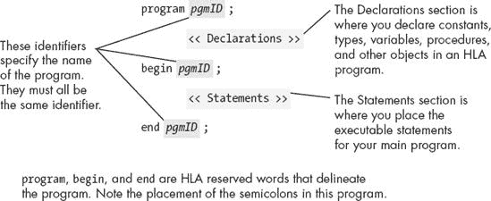

图 1-1. 基本 HLA 程序

上述模板中的*`pgmID`*是一个用户定义的程序标识符。你必须为你的程序选择一个合适的描述性名称。特别是，*`pgmID`*对于任何实际程序来说都是一个糟糕的选择。如果你是在编写课程作业，导师可能会为你提供主程序的名称。如果你是在编写自己的 HLA 程序，你将需要为你的项目选择一个合适的名称。

HLA 中的标识符与大多数高级语言中的标识符非常相似。HLA 标识符可以以下划线或字母字符开头，后面可以跟零个或多个字母数字字符或下划线字符。HLA 的标识符是*大小写不敏感*的。这意味着标识符是区分大小写的，因为你必须在程序中始终准确地拼写标识符（包括大小写）。然而，与像 C/C++等区分大小写的语言不同，你不能在程序中声明两个仅因字母大小写不同而名称不同的标识符。

人们常写的传统第一个程序，由 Kernighan 和 Ritchie 的*《C 程序设计语言》*推广，是“你好，世界！”程序。这个程序是学习新语言的一个极好的具体例子。示例 1-1 展示了 HLA 的*helloWorld*程序。

示例 1-1. *helloWorld*程序

```
program helloWorld;
#include( "stdlib.hhf" );

begin helloWorld;

    stdout.put( "Hello, World of Assembly Language", nl );

end helloWorld;
```

程序中的`#include`语句告诉 HLA 编译器包含来自*stdlib.hhf*（标准库，HLA 头文件）的一组声明。此文件包含了程序使用的`stdout.put`代码声明。

`stdout.put` 语句是 HLA 语言中的打印语句。你用它将数据写入标准输出设备（通常是控制台）。对于熟悉高级语言中 I/O 语句的人来说，这个语句显然是用来打印短语 `Hello, World of Assembly Language` 的。该语句末尾的 `nl` 是一个常量，也定义在 *stdlib.hhf* 中，表示换行序列。

请注意，分号跟在 `program`、`begin`、`stdout.put` 和 `end` 语句后面。严格来说，`#include` 语句后并不跟分号。可以创建包含错误的 include 文件，如果在 `#include` 语句后加分号，会导致错误，因此你可能要养成不在此处加分号的习惯。

`#include` 是你第一次接触 HLA 声明的地方。`#include` 本身并不是声明，但它告诉 HLA 编译器将文件 *stdlib.hhf* 替代 `#include` 指令，从而在你的程序中插入几个声明。你编写的大多数 HLA 程序都需要包含一个或多个 HLA 标准库头文件（*stdlib.hhf* 实际上将所有标准库定义包含进你的程序中）。

编译此程序将生成一个 *console* 应用程序。在命令窗口中运行此程序会打印指定的字符串，然后控制权返回到命令行解释器（在 Unix 术语中称为 *shell*）。

HLA 是一种自由格式的语言。因此，如果将语句拆分成多行有助于提高程序的可读性，你可以这样做。例如，你可以像下面这样编写 *helloWorld* 程序中的 `stdout.put` 语句：

```
stdout.put
     (
          "Hello, World of Assembly Language",
          nl
     );
```

你会在本书的示例代码中看到另一个结构，HLA 会自动连接它在源文件中发现的任何相邻的字符串常量。因此，上面的语句也等同于

```
stdout.put
     (
          "Hello, "
          "World of Assembly Language",
          nl
     );
```

事实上，`nl`（换行符）实际上不过是一个字符串常量，因此（从技术上讲）`nl` 和前一个字符串之间的逗号并不是必需的。你通常会看到上述写法是

```
stdout.put( "Hello, World of Assembly Language" nl );
```

注意字符串常量和 `nl` 之间没有逗号；这在 HLA 中是合法的，尽管它只适用于某些常量；通常情况下，你不能省略逗号。第四章 详细解释了这一点。这里提到这一点是因为你可能会在正式解释之前，看到示例代码使用了这个“技巧”。

# 1.2 运行你的第一个 HLA 程序

“Hello, world!” 程序的整个目的在于提供一个简单的示例，通过它，学习新编程语言的人可以弄清楚如何使用所需的工具来编译和运行该语言的程序。的确，1.1 HLA 程序的构成中的*helloWorld* 程序有助于演示一个简单的 HLA 程序的格式和语法，但像 *helloWorld* 这样的程序的真正目的是学习如何从头到尾创建和运行一个程序。尽管上一节介绍了 HLA 程序的布局，但并未讨论如何编辑、编译和运行该程序。本节将简要介绍这些细节。

所有需要编译和运行 HLA 程序的软件可以在 [`randallhyde.com/`](http://randallhyde.com/) 或 [`webster.cs.ucr.edu/`](http://webster.cs.ucr.edu/) 找到。在快速导航面板中选择 **High Level Assembly**，然后从该页面选择下载 HLA 链接。HLA 目前可用于 Windows、Mac OS X、Linux 和 FreeBSD。下载适合你系统的 HLA 软件版本。在 HLA 下载页面，你还可以下载与本书相关的所有软件。如果 HLA 下载包中没有包含这些内容，你可能需要下载 HLA 参考手册和 HLA 标准库参考手册，连同 HLA 和本书的软件一起下载。本书并未描述整个 HLA 语言，也没有描述整个 HLA 标准库。在学习使用 HLA 的汇编语言时，最好随时准备好这些参考手册。

本节不会描述如何安装和设置 HLA 系统，因为这些说明会随时间而变化。每个操作系统的 HLA 下载页面都会描述如何安装和使用 HLA。请查阅这些说明以获得准确的安装程序。

创建、编译和运行 HLA 程序的过程与在任何计算机语言中创建、编译或运行程序的过程非常相似。首先，由于 HLA 不是一个*集成开发环境（IDE）*，不能在同一个程序中进行编辑、编译、测试、调试和运行应用程序，你将使用文本编辑器来创建和编辑 HLA 程序。^([1])

Windows、Mac OS X、Linux 和 FreeBSD 提供了多种文本编辑器选项。你甚至可以使用其他 IDE 附带的文本编辑器来创建和编辑 HLA 程序（例如在 Visual C++、Borland 的 Delphi、Apple 的 Xcode 以及类似语言中找到的编辑器）。唯一的限制是 HLA 期望的是 ASCII 文本文件，因此你使用的编辑器必须能够处理并保存文本文件。在 Windows 下，你始终可以使用记事本来创建 HLA 程序。如果你在 Linux 或 FreeBSD 下工作，你可以使用 joe、vi 或 emacs。在 Mac OS X 下，你可以使用 XCode、Text Wrangler 或你偏好的其他编辑器。

HLA 编译器^([2])是一个传统的*命令行编译器*，这意味着你需要从 Windows 的*命令行提示符*或 Linux/FreeBSD/Mac OS X 的*Shell*中运行它。为此，你需要在命令行提示符或 Shell 窗口中输入如下命令：

```
hla hw.hla
```

此命令告诉 HLA 将*hw.hla*（*helloWorld*）程序编译成可执行文件。如果没有错误，你可以通过在命令提示符窗口（Windows）中输入以下命令来运行生成的程序：

```
hw
```

或者进入 Shell 解释器窗口（Linux/FreeBSD/Mac OS X）：

```
./hw
```

如果你在编译和运行程序时遇到问题，请参阅 HLA 下载页面上的安装说明。这些说明详细描述了如何安装、设置和使用 HLA。

* * *

^([1]) HIDE（HLA 集成开发环境）是一个适用于 Windows 用户的 IDE。有关下载 HIDE 的详细信息，请参阅高级汇编语言（HLA）网页。

^([2]) 传统上，程序员总是将汇编语言的翻译器称为*汇编器*，而不是*编译器*。然而，由于 HLA 具有高级特性，因此将 HLA 称为编译器而不是汇编器更为恰当。

# 1.3 一些基本的 HLA 数据声明

HLA 提供了各种常量、类型和数据声明语句。后续章节将更详细地讲解声明部分，但了解如何在 HLA 程序中声明一些简单的变量是很重要的。

HLA 预定义了几种不同的有符号整数类型，包括 int8、int16 和 int32，分别对应 8 位（1 字节）有符号整数、16 位（2 字节）有符号整数和 32 位（4 字节）有符号整数。^([3])典型的变量声明发生在 HLA 的*静态变量部分*。一组典型的变量声明形式如图 1-2 所示。

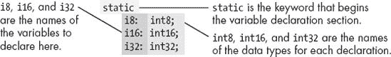

图 1-2. 静态变量声明

熟悉 Pascal 语言的人应该能轻松理解这种声明语法。此示例演示了如何声明三个独立的整数：`i8`、`i16` 和 `i32`。当然，在实际程序中，你应该使用更具描述性的变量名。像 *i8* 和 *i32* 这样的名称虽然描述了对象的类型，但没有描述其用途。变量名应当描述对象的用途。

在*静态声明部分*，你还可以为变量赋初始值，操作系统将在程序加载到内存时将该初始值赋给变量。图 1-3 提供了相关的语法。

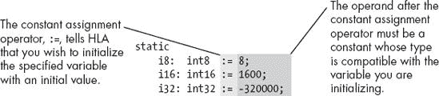

图 1-3. 静态变量初始化

重要的是要意识到，在赋值运算符（`:=`）后面的表达式必须是常量表达式。你不能在静态变量声明中为其他变量赋值。

熟悉其他高级语言（尤其是 Pascal）的人应注意，你每个语句只能声明一个变量。也就是说，HLA 不允许在一个声明中使用逗号分隔的变量名列表，后跟冒号和类型标识符。每个变量声明由一个标识符、一个冒号、一个类型标识符和一个分号组成。

示例 1-2 提供了一个简单的 HLA 程序，演示了在 HLA 程序中使用变量。

示例 1-2. 变量声明与使用

```
Program DemoVars;
#include( "stdlib.hhf" )

static
    InitDemo:       int32 := 5;
    NotInitialized: int32;

begin DemoVars;

    // Display the value of the pre-initialized variable:

    stdout.put( "InitDemo's value is ", InitDemo, nl );

    // Input an integer value from the user and display that value:

    stdout.put( "Enter an integer value: " );
    stdin.get( NotInitialized );
    stdout.put( "You entered: ", NotInitialized, nl );

end DemoVars;
```

除了静态变量声明外，此示例还引入了三个新概念。首先，`stdout.put`语句允许多个参数。如果你指定一个整数值，`stdout.put`会将该值转换为字符串表示并输出。

在示例 1-2 中引入的第二个新特性是`stdin.get`语句。此语句从标准输入设备（通常是键盘）读取一个值，将该值转换为整数，并将整数值存储到`NotInitialized`变量中。最后，示例 1-2 还介绍了（其中一种形式的）HLA 注释的语法。HLA 编译器会忽略从`//`序列到当前行末尾的所有文本。（熟悉 Java、C++和 Delphi 的人应该能识别这些注释。）

* * *

^([3]) 对于不熟悉这些术语的人，关于比特和字节的讨论将在第二章中出现。

# 1.4 布尔值

HLA 和 HLA 标准库对布尔对象提供了有限的支持。你可以声明布尔变量，使用布尔字面常量，在布尔表达式中使用布尔变量，并且可以打印布尔变量的值。

布尔字面常量由两个预定义标识符 `true` 和 `false` 组成。HLA 内部用数值 `1` 表示真，`0` 表示假。大多数程序将 `0` 视为假，将其他任何值视为真，因此 HLA 对真和假的表示应该足够。

要声明一个布尔变量，你使用 `boolean` 数据类型。HLA 使用一个字节（它能分配的最小内存）来表示布尔值。以下示例演示了一些典型的声明：

```
static
     BoolVar:     boolean;
     HasClass:    boolean := false;
     IsClear:     boolean := true;
```

正如这个示例所演示的，你可以在需要时初始化布尔变量。

因为布尔变量是字节对象，你可以使用任何直接操作 8 位值的指令来操作它们。此外，只要确保布尔变量只包含 `0` 和 `1`（分别表示假和真），你就可以使用 80x86 的 `and`、`or`、`xor` 和 `not` 指令来操作这些布尔值（这些指令在第二章中有介绍）。

你可以通过调用 `stdout.put` 例程来打印布尔值。例如：

```
stdout.put( BoolVar )
```

这个例程会根据布尔参数的值打印 `true` 或 `false`（`0` 为假，其他值为真）。请注意，HLA 标准库不允许通过 `stdin.get` 读取布尔值。

# 1.5 字符值

HLA 允许你使用 `char` 数据类型声明 1 字节的 ASCII 字符对象。你可以通过将字符值用一对撇号括起来来初始化字符变量。以下示例演示了如何在 HLA 中声明和初始化字符变量：

```
static
     c: char;
     LetterA: char := 'A';
```

你可以使用 `stdout.put` 例程打印字符变量，也可以通过调用 `stdin.get` 过程来读取字符变量。

# 1.6 英特尔 80x86 CPU 系列简介

到目前为止，你已经看过几个实际可以编译和运行的 HLA 程序。然而，到目前为止，程序中出现的所有语句都只是数据声明或对 HLA 标准库例程的调用。还没有涉及任何*真正的*汇编语言。在我们进一步学习一些真正的汇编语言之前，有必要先绕个弯；除非你了解英特尔 80x86 CPU 系列的基本结构，否则机器指令几乎没有意义。

Intel CPU 家族通常被归类为 *冯·诺依曼架构机器*。冯·诺依曼计算机系统包含三个主要组成部分：*中央处理单元（CPU）*、*内存* 和 *输入/输出（I/O）设备*。这三部分通过 *系统总线*（由地址总线、数据总线和控制总线组成）互联。图 1-4 显示了这种关系。

CPU 通过将一个数值放置在地址总线上，来与内存和 I/O 设备进行通信，从而选择一个内存位置或 I/O 设备端口位置，每个位置都有一个唯一的二进制数值 *地址*。然后，CPU、内存和 I/O 设备通过将数据放置在数据总线上相互传递数据。控制总线包含决定数据传输方向（到/从内存以及到/从 I/O 设备）的信号。

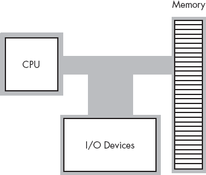

图 1-4. 冯·诺依曼计算机系统框图

80x86 CPU 寄存器可以分为四类：通用寄存器、特殊用途应用程序可访问的寄存器、段寄存器和特殊用途内核模式寄存器。由于段寄存器在现代 32 位操作系统（如 Windows、Mac OS X、FreeBSD 和 Linux）中使用较少，并且本书的内容主要针对为 32 位操作系统编写的程序，因此不需要过多讨论段寄存器。特殊用途的内核模式寄存器是用于编写操作系统、调试器及其他系统级工具的。这类软件构建超出了本书的范围。

80x86（Intel 家族）CPU 提供了多个通用寄存器供应用程序使用。其中包括八个 32 位寄存器，名称分别为：EAX、EBX、ECX、EDX、ESI、EDI、EBP 和 ESP。

每个名称前的 *E* 前缀表示 *扩展*。这个前缀将 32 位寄存器与八个 16 位寄存器区分开来，后者的名称分别为：AX、BX、CX、DX、SI、DI、BP 和 SP。

最后，80x86 CPU 提供了八个 8 位寄存器，名称分别为：AL、AH、BL、BH、CL、CH、DL 和 DH。

不幸的是，这些并不是完全独立的寄存器。也就是说，80x86 并没有提供 24 个独立的寄存器。相反，80x86 使用 32 位寄存器覆盖 16 位寄存器，并且使用 16 位寄存器覆盖 8 位寄存器。图 1-5 展示了这种关系。

关于通用寄存器，最重要的一点是它们不是独立的。修改一个寄存器可能会修改最多三个其他寄存器。例如，修改 EAX 寄存器可能会影响 AL、AH 和 AX 寄存器。这个事实在这里必须特别强调。初学汇编语言的程序员常犯的一个错误是寄存器值被破坏，因为程序员没有完全理解 图 1-5 通用寄存器") 中显示的关系。

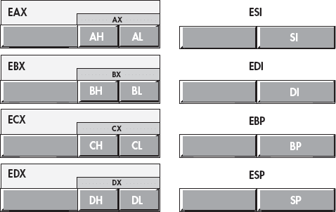

图 1-5. 80x86 (Intel CPU) 通用寄存器

EFLAGS 寄存器是一个 32 位寄存器，封装了多个单比特布尔值（真/假）。EFLAGS 寄存器中的大部分位要么是为内核模式（操作系统）功能保留的，要么对于应用程序员来说并不重要。其中特别有意义的八个比特（或称为*标志*）是应用程序员编写汇编语言程序时需要关注的。这些标志包括溢出、方向、禁止中断、符号、零、辅助进位、奇偶和进位标志。图 1-6 展示了这些标志在 EFLAGS 寄存器低 16 位中的布局。

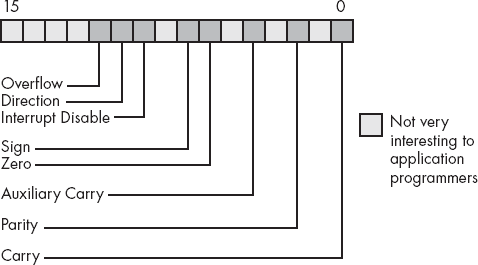

图 1-6. EFLAGS 寄存器的布局（EFLAGS 寄存器的低 16 位）

在八个对应用程序员有意义的标志中，尤其有四个标志是极为重要的：溢出、进位、符号和零标志。我们统称这四个标志为*条件码*。图 1-5 这些标志的状态可以让你测试之前计算的结果。例如，在比较两个值之后，条件码标志会告诉你第一个值是否小于、等于或大于第二个值。

对于刚学习汇编语言的人来说，有一个重要的事实可能会让人感到惊讶，那就是几乎所有在 80x86 CPU 上的计算都涉及寄存器。例如，为了将两个变量相加并将结果存储到第三个变量中，你必须将其中一个变量加载到寄存器中，将第二个操作数加到寄存器中的值，然后将寄存器的值存储到目标变量中。寄存器几乎在每个计算中都充当中介。因此，寄存器在 80x86 汇编语言程序中非常重要。

另一个需要注意的事情是，尽管寄存器被称为“通用寄存器”，但你不应推断出可以将任何寄存器用于任何目的。所有 80x86 寄存器都有自己的特殊用途，这限制了它们在某些上下文中的使用。例如，SP/ESP 寄存器对有一个非常特殊的用途，实际上阻止你将其用于其他任何事情（它是*栈指针*）。同样，BP/EBP 寄存器也有一个特殊的用途，这限制了它作为通用寄存器的有效性。目前，你应该避免在通用计算中使用 ESP 和 EBP 寄存器；另外，请记住，剩余的寄存器在程序中并不是完全可以互换的。

* * *

^([4]) 应用程序无法修改中断标志，但我们将在第二章中查看该标志；因此，这里会讨论该标志。

^([5]) 从技术上讲，奇偶标志也是一种状态码，但在本文中我们不会使用该标志。

# 1.7 内存子系统

一台运行现代 32 位操作系统的典型 80x86 处理器可以访问最多 2³²个不同的内存位置，即超过 40 亿字节。几年前，4GB 内存看起来就像是无限；然而，现代计算机已经超过了这一限制。尽管如此，由于 80x86 架构在使用像 Windows、Mac OS X、FreeBSD 或 Linux 等 32 位操作系统时支持最大 4GB 的地址空间，以下讨论将假设 4GB 的限制。

当然，你首先应该问的问题是，“什么是内存位置？”80x86 支持*字节可寻址内存*。因此，基本的内存单元是字节，足以存储单个字符或一个（非常）小的整数值（我们将在第二章中详细讨论）。

把内存想象成一个线性字节数组。第一个字节的地址是 0，最后一个字节的地址是 2³²−1。对于 80x86 处理器，以下伪 Pascal 数组声明是内存的一个良好近似：

```
Memory: array [0..4294967295] of byte;
```

C/C++和 Java 用户可能更喜欢以下语法：

```
byte Memory[4294967296];
```

要执行等同于 Pascal 语句`Memory [125] := 0;`的操作，CPU 将值 0 放到数据总线上，将地址 125 放到地址总线上，并激活写线（这通常涉及将该线路设置为 0），如图 1-7 所示。

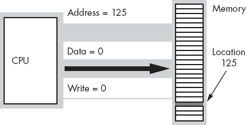

图 1-7. 内存写入操作

要执行等同于`CPU := Memory [125];`的操作，CPU 会将地址 125 放到地址总线上，激活读线（因为 CPU 正在从内存读取数据），然后从数据总线读取结果数据（见图 1-8）。

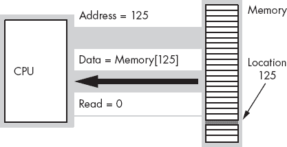

图 1-8. 内存读取操作

这个讨论*仅*适用于访问内存中的单个字节。那么当处理器访问字或双字时会发生什么呢？由于内存是由字节数组构成的，那么我们如何处理大于单字节的值呢？很简单——为了存储更大的值，80x86 使用一系列连续的内存位置。图 1-9 展示了 80x86 如何在内存中存储字节、字（2 字节）和双字（4 字节）。每个这些对象的内存地址是每个对象第一个字节的地址（即最低地址）。

现代的 80x86 处理器并不直接连接到内存。相反，CPU 上有一个特殊的内存缓冲区，称为 *缓存*（发音为“cash”），它充当 CPU 和主内存之间的高速中介。尽管缓存自动为你处理了这些细节，但你应该知道的一个事实是，如果对象的地址是该对象大小的偶数倍，访问内存中的数据对象有时会更加高效。因此，最好将 4 字节的对象（双字）对齐到 4 的倍数地址。同样，将 2 字节的对象对齐到偶数地址是最有效的。你可以在任何地址高效访问单字节对象。你将在 3.4 HLA 数据对齐支持中了解如何设置内存对象的对齐方式。

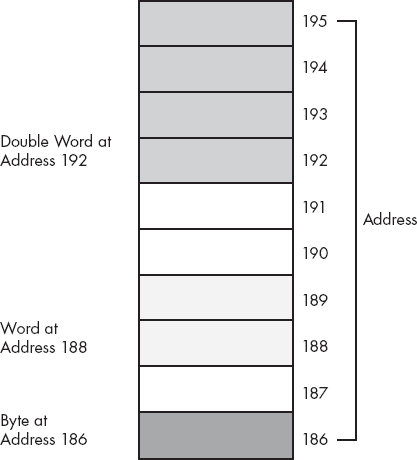

图 1-9. 内存中的字节、字和双字存储

在讨论内存对象之前，理解内存与 HLA 变量之间的对应关系非常重要。使用像 HLA 这样的汇编器/编译器的一个好处是，你不需要担心数字内存地址。你所需要做的就是在 HLA 中声明一个变量，HLA 会自动将该变量与一组唯一的内存地址关联起来。例如，如果你有以下的声明部分：

```
static
     i8          :int8;
     i16         :int16;
     i32         :int32;
```

HLA 会在内存中找到一些未使用的 8 位字节，并将其与 `i8` 变量关联；它会找到一对连续的未使用字节，并将 `i16` 与它们关联；最后，HLA 会找到 4 个连续的未使用字节，并将 `i32` 的值与这 4 个字节（32 位）关联。你将始终通过这些变量的名称来引用它们。通常，你不需要关心它们的数字地址。不过，你应该知道 HLA 在幕后为你完成了这些操作。

# 1.8 一些基本的机器指令

80x86 CPU 系列提供了从一百多条到几千条不同的机器指令，具体数量取决于你如何定义机器指令。即便是在指令数量较少的一端（大于 100），似乎也有太多指令需要在短时间内学习。幸运的是，你不需要知道所有的机器指令。事实上，大多数汇编语言程序可能只使用大约 30 条不同的机器指令。^([6]) 确实，你完全可以用几条机器指令编写几个有意义的程序。本节的目的是提供少量机器指令，让你能够立即开始编写简单的 HLA 汇编语言程序。

毋庸置疑，`mov` 指令是最常用的汇编语言语句。在一个典型的程序中，25% 到 40% 的指令都是 `mov` 指令。正如其名称所示，这条指令将数据从一个位置移动到另一个位置。^([7]) 该指令的 HLA 语法是：

```
mov( *`source_operand`*, *`destination_operand`* );
```

*`source_operand`* 可以是寄存器、内存变量或常量。*`destination_operand`* 可以是寄存器或内存变量。严格来说，80x86 指令集不允许两个操作数都为内存变量。然而，HLA 会自动将两个字或双字内存操作数的 `mov` 指令转换为一对指令，从一个位置复制数据到另一个位置。在像 Pascal 或 C/C++ 这样的高级语言中，`mov` 指令大致相当于以下赋值语句：

```
*`destination_operand`* = *`source_operand`* ;
```

或许 `mov` 指令操作数的主要限制是它们必须具有相同的大小。也就是说，你可以在一对字节（8 位）、字（16 位）或双字（32 位）对象之间移动数据；但是，你不能混合操作数的大小。表 1-1 列出了所有 `mov` 指令的合法组合。

你应该仔细研究这张表，因为大多数通用 80x86 指令都使用这种语法。

表 1-1. 合法的 80x86 `mov` 指令操作数

| 源 | 目标 |
| --- | --- |
| Reg[8]^([a]) | Reg[8] |
| Reg[8] | Mem[8] |
| Mem[8] | Reg[8] |
| 常量^([b]) | Reg[8] |
| 常量 | Mem[8] |
| Reg[16] | Reg[16] |
| Reg[16] | Mem[16] |
| Mem[16] | Reg[16] |
| 常量 | Reg[16] |
| 常量 | Mem[16] |
| Reg[32] | Reg[32] |
| Reg[32] | Mem[32] |
| Mem[32] | Reg[32] |
| 常量 | Reg[32] |
| 常量 | Mem[32] |

|

^([a]) 后缀表示寄存器或内存位置的大小。

^([b]) 常量必须足够小，以适应指定的目标操作数。

|

80x86 的`add`和`sub`指令允许你进行加法和减法操作。它们的语法与`mov`指令几乎完全相同：

```
add( *`source_operand`*, *`destination_operand`* );
     sub( *`source_operand`*, *`destination_operand`* );
```

`add`和`sub`操作数的格式与`mov`指令完全相同。^([8]) `add`指令执行以下操作：

```
*`destination_operand`* = *`destination_operand`* + *`source_operand`* ;
     *`destination_operand`* += *`source_operand`*;  // For those who prefer C syntax.
```

`sub`指令执行计算：

```
*`destination_operand`* = *`destination_operand`* - *`source_operand`* ;
     *`destination_operand`* -= *`source_operand`* ;  // For C fans.
```

仅凭这三条指令，再加上下一节讨论的 HLA 控制结构，你实际上就可以编写一些复杂的程序。示例 1-3 提供了一个 HLA 程序示例，展示了这三条指令。

示例 1-3. `mov`、`add`和`sub`指令演示

```
program DemoMOVaddSUB;

#include( "stdlib.hhf" )

static
    i8:     int8    := −8;
    i16:    int16   := −16;
    i32:    int32   := −32;

begin DemoMOVaddSUB;

    // First, print the initial values
    // of our variables.

    stdout.put
    (
        nl,
        "Initialized values: i8=", i8,
        ", i16=", i16,
        ", i32=", i32,
        nl
    );

    // Compute the absolute value of the
    // three different variables and
    // print the result.
    // Note: Because all the numbers are
    // negative, we have to negate them.
    // Using only the mov, add, and sub
    // instructions, we can negate a value
    // by subtracting it from zero.

    mov( 0, al );   // Compute i8 := -i8;
    sub( i8, al );
    mov( al, i8 );

    mov( 0, ax );   // Compute i16 := -i16;
    sub( i16, ax );
    mov( ax, i16 );

    mov( 0, eax );  // Compute i32 := -i32;
    sub( i32, eax );
    mov( eax, i32 );

    // Display the absolute values:

    stdout.put
    (
        nl,
        "After negation: i8=", i8,
        ", i16=", i16,
        ", i32=", i32,
        nl
    );

    // Demonstrate add and constant-to-memory
    // operations:

    add( 32323200, i32 );
    stdout.put( nl, "After add: i32=", i32, nl );

end DemoMOVaddSUB;
```

* * *

^([6]) 不同的程序可能会使用不同的 30 条指令，但很少有程序会使用超过 30 条不同的指令。

^([7]) 从技术上讲，`mov`实际上是将数据从一个位置复制到另一个位置。它并不会销毁源操作数中的原始数据。也许这个指令应该叫做`copy`会更好。可惜现在已经太晚了，无法更改它了。

^([8]) 但请记住，`add`和`sub`不支持内存到内存的操作。

# 1.9 一些基本的 HLA 控制结构

`mov`、`add`和`sub`指令虽然很有用，但它们不足以让你编写有意义的程序。在你能够编写复杂程序之前，你还需要具备做决策和创建循环的能力，HLA 提供了几种高级控制结构，这些控制结构与高级语言中的控制结构非常相似，包括`if..then..elseif..else..endif`、`while..endwhile`、`repeat..until`等。通过学习这些指令，你将能够准备好编写一些真正的程序。

在讨论这些高级控制结构之前，首先需要指出的是，这些并不是实际的 80x86 汇编语言指令。HLA 会将这些指令编译成一系列一个或多个真实的汇编语言指令。在第七章中，你将学习 HLA 如何编译这些指令，并且你将学习如何编写不使用这些指令的纯汇编语言代码。不过，在你学到这些之前，还有很多内容需要学习，因此我们现在将继续使用这些高级语言指令。

另一个需要提到的重要事实是，HLA 的高级控制结构*并不像它们最初看起来的那么高级*。HLA 高级控制结构的目的是让你尽可能快速地开始编写汇编语言程序，而不是让你完全避免使用汇编语言。你很快会发现，这些语句有一些严重的限制，并且你很快会超出它们的能力。这是故意的。一旦你对 HLA 的高级控制结构有了足够的了解，并且决定你需要比它们提供的更多的功能，那么是时候转向学习这些语句背后的真正 80x86 指令了。

不要让 HLA 中出现的类似高级语言的语句让你感到困惑。许多人在了解这些语句在 HLA 语言中出现后，错误地得出结论，认为 HLA 只是某种特殊的高级语言，而不是一种真正的汇编语言。这不是真的。HLA 是一种完整的低级汇编语言。HLA 支持与其他 80x86 汇编器相同的所有机器指令。不同之处在于，HLA 有一些*额外*的语句，允许你做一些比其他 80x86 汇编器更多的事情。一旦你使用 HLA 学会了 80x86 汇编语言，你可以选择忽略所有这些额外的（高级）语句，只编写低级的 80x86 汇编语言代码，如果这是你的需求。

以下章节假设你至少熟悉一种高级语言。它们从这个角度介绍 HLA 控制语句，而不去解释如何在程序中实际使用这些语句来完成任务。本文假设的一个前提条件是，你已经知道如何在高级语言中使用这些通用控制语句；你将以相同的方式在 HLA 程序中使用它们。

## 1.9.1 HLA 语句中的布尔表达式

一些 HLA 语句需要布尔（真或假）表达式来控制它们的执行。例如，`if`、`while` 和 `repeat..until` 语句。对于这些布尔表达式的语法，代表了 HLA 高级控制结构的最大限制。这是你对高级语言的熟悉度会对你不利的一个地方——你会想要使用在高级语言中常用的复杂表达式，而 HLA 只支持一些基本形式。

HLA 布尔表达式的形式如下：^([9])

```
flag_specification
!flag_specification
register
!register
Boolean_variable
!Boolean_variable
mem_reg relop mem_reg_const
register in LowConst..HiConst
register not in LowConst..HiConst
```

`flag_specification` 可能是表 1-2 中描述的符号之一。

表 1-2. `flag_specification` 符号

| 符号 | 含义 | 解释 |
| --- | --- | --- |
| `@c` | 进位 | 如果进位设置（1），则为真；如果进位清除（0），则为假。 |
| `@nc` | 无进位 | 如果进位清除（0），则为真；如果进位设置（1），则为假。 |
| `@z` | 零 | 如果零标志设置，则为真；如果零标志未设置，则为假。 |
| `@nz` | 非零 | 如果零标志未设置，则为真；如果零标志设置，则为假。 |
| `@o` | 溢出 | 如果溢出标志设置，则为真；如果溢出标志未设置，则为假。 |
| `@no` | 无溢出 | 如果溢出标志未设置，则为真；如果溢出标志设置，则为假。 |
| `@s` | 有符号 | 如果符号标志设置，则为真；如果符号标志未设置，则为假。 |
| `@ns` | 无符号 | 如果符号标志未设置，则为真；如果符号标志设置，则为假。 |

在布尔表达式中使用标志值是相对高级的内容。你将在下一章看到如何使用这些布尔表达式操作数。

寄存器操作数可以是任何 8 位、16 位或 32 位通用寄存器。如果寄存器的值为零，则表达式计算为假；如果寄存器的值为非零，则计算为真。

如果你将布尔变量指定为表达式，程序会测试它是否为零（假）或非零（真）。由于 HLA 使用零和一分别表示假和真，因此该测试直观易懂。注意，HLA 要求这样的变量类型为`boolean`。HLA 会拒绝其他数据类型。如果你想测试某个其他类型是否为零或非零，则需要使用接下来讨论的一般布尔表达式。

HLA 布尔表达式的最一般形式有两个操作数和一个关系运算符。表 1-3 列出了合法的组合。

表 1-3. 合法布尔表达式

| 左操作数 | 关系运算符 | 右操作数 |
| --- | --- | --- |
| 内存变量或寄存器 | = 或 ==<> 或 !=<<=>>= | 变量、寄存器或常量 |

请注意，两个操作数不能都是内存操作数。实际上，如果你将*右操作数*视为源操作数，将*左操作数*视为目标操作数，那么这两个操作数必须与`add`和`sub`允许的操作数相同。

同样像`add`和`sub`指令一样，两个操作数必须是相同大小的。也就是说，它们必须都是字节操作数，必须都是字操作数，或者必须都是双字操作数。如果右操作数是常量，它的值必须在与左操作数兼容的范围内。

还有一个问题：如果左操作数是一个寄存器，而右操作数是一个正数常量或另一个寄存器，HLA 会使用*无符号*比较。下一章将讨论这个问题的后果；目前，请不要将寄存器中的负值与常量或另一个寄存器进行比较。你可能得不到直观的结果。

`in` 和 `not in` 运算符允许你测试一个寄存器，查看它是否在指定的范围内。例如，表达式 `eax in 2000..2099` 如果 EAX 寄存器中的值在 2000 到 2099 之间（包含 2000 和 2099），则返回真。`not in`（两个单词）运算符检查寄存器中的值是否在指定范围之外。例如，`al not in 'a'..'z'` 如果 AL 寄存器中的字符不是小写字母字符，则返回真。

以下是 HLA 中合法布尔表达式的一些示例：

```
@c
Bool_var
al
esi
eax < ebx
ebx > 5
i32 < −2
i8 > 128
al < i8
eax in 1..100
ch not in 'a'..'z'
```

## 1.9.2 HLA 的 if..then..elseif..else..endif 语句

HLA `if` 语句使用的语法如 图 1-10 所示。

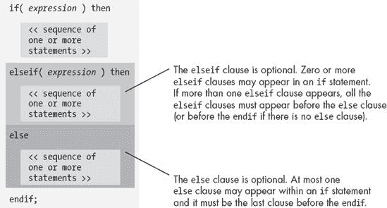

图 1-10. HLA `if` 语句语法

出现在 `if` 语句中的表达式必须符合前一节所述的形式。如果布尔表达式为真，`then` 之后的代码将执行；否则，控制权将转移到语句中的下一个 `elseif` 或 `else` 子句。

因为 `elseif` 和 `else` 子句是可选的，所以一个 `if` 语句可以只包含一个 `if..then` 子句，后面跟着一系列语句和一个结束的 `endif` 子句。以下是这样的一个语句：

```
if( eax = 0 ) then

     stdout.put( "error: NULL value", nl );

endif;
```

如果在程序执行过程中，表达式为真，则 `then` 和 `endif` 之间的代码将执行。如果表达式为假，则程序会跳过 `then` 和 `endif` 之间的代码。

另一种常见的 `if` 语句形式只有一个 `else` 子句。以下是一个带有可选 `else` 子句的 `if` 语句示例：

```
if( eax = 0 ) then

     stdout.put( "error: NULL pointer encountered", nl );

else

     stdout.put( "Pointer is valid", nl );

endif;
```

如果表达式为真，则 `then` 和 `else` 之间的代码将执行；否则，`else` 和 `endif` 之间的代码将执行。

通过将 `elseif` 子句集成到 `if` 语句中，你可以创建复杂的决策逻辑。例如，如果 CH 寄存器包含一个字符值，你可以使用如下代码从菜单中选择项目：

```
if( ch = 'a' ) then

     stdout.put( "You selected the 'a' menu item", nl );

elseif( ch = 'b' ) then

     stdout.put( "You selected the 'b' menu item", nl );

elseif( ch = 'c' ) then

     stdout.put( "You selected the 'c' menu item", nl );

else

     stdout.put( "Error: illegal menu item selection", nl );

endif;
```

尽管这个简单的例子没有展示，但 HLA 并不要求在一系列 `elseif` 子句的末尾一定要有 `else` 子句。然而，在做多路决策时，提供一个 `else` 子句总是一个好主意，以防出现错误。即使你认为 `else` 子句不可能执行，也要记住，未来对代码的修改可能会使这个假设失效，因此在代码中包含错误报告语句是个好习惯。

## 1.9.3 布尔表达式中的合取、析取与否定

在前面各节的运算符列表中，有一些明显遗漏的运算符：合取（逻辑 `and`）、析取（逻辑 `or`）和否定（逻辑 `not`）。本节描述它们在布尔表达式中的使用（讨论必须等到描述完 `if` 语句之后，才能展示实际的例子）。

HLA 使用`&&`运算符来表示运行时布尔表达式中的逻辑`与`。这是一个二元（两个操作数）运算符，两个操作数必须是合法的运行时布尔表达式。如果两个操作数都为真，则此运算符的结果为真。例如：

```
if( eax > 0 && ch = 'a' ) then

          mov( eax, ebx );
          mov( ' ', ch );

     endif;
```

上面两个`mov`语句仅在 EAX 大于零*且*CH 等于字符*a*时执行。如果这两个条件中的任何一个为假，程序执行将跳过这些`mov`指令。

请注意，`&&`运算符两侧的表达式可以是任何合法的布尔表达式；这些表达式不一定要使用关系运算符进行比较。例如，以下所有的表达式都是合法的：

```
@z && al in 5..10
     al in 'a'..'z' && ebx
     boolVar && !eax
```

HLA 在编译`&&`运算符时使用*短路求值*。如果最左边的操作数为假，则 HLA 生成的代码不会再评估第二个操作数（因为此时整个表达式必定为假）。因此，在上面的最后一个表达式中，如果`boolVar`为假，则代码不会检查 EAX 是否为零。

请注意，像`eax < 10 && ebx <> eax`这样的表达式本身就是一个合法的布尔表达式，因此可以作为`&&`运算符的左或右操作数。因此，以下类似的表达式是完全合法的：

```
eax < 0  &&  ebx <> eax    &&    !ecx
```

`&&`运算符是左结合的，因此 HLA 生成的代码会从左到右评估上述表达式。如果 EAX 小于零，CPU 将不会测试剩余的表达式。类似地，如果 EAX 不小于零但 EBX 等于 EAX，这段代码将不会评估第三个表达式，因为无论 ECX 的值如何，整个表达式都为假。

HLA 使用`||`运算符来表示析取（逻辑`或`）在运行时布尔表达式中的应用。和`&&`运算符一样，这个运算符也期望两个合法的运行时布尔表达式作为操作数。如果任一（或两个）操作数为真，则此运算符的结果为真。与`&&`运算符一样，析取运算符也使用短路求值。如果左侧操作数为真，则 HLA 生成的代码不会再测试第二个操作数的值。相反，代码将跳转到处理布尔表达式为真时的相应位置。以下是一些使用`||`运算符的合法表达式示例：

```
@z || al = 10
     al in 'a'..'z' || ebx
     !boolVar || eax
```

和`&&`运算符一样，析取运算符是左结合的，因此在同一个表达式中可以出现多个`||`运算符。如果出现这种情况，HLA 生成的代码将从左到右计算表达式。例如：

```
eax < 0  ||  ebx <> eax    ||   !ecx
```

上述代码在 EAX 小于零、EBX 不等于 EAX 或 ECX 为零时评估为真。注意，如果第一个比较为真，代码不会检查其他条件。同样，如果第一个比较为假且第二个为真，代码不会再检查 ECX 是否为零。仅当前两个比较为假时，才会检查 ECX 是否等于零。

如果合取运算符和析取运算符出现在同一表达式中，则 `&&` 运算符优先于 `||` 运算符。考虑以下表达式：

```
eax < 0 || ebx <> eax  && !ecx
```

HLA 生成的机器代码将此表达式评估为：

```
eax < 0 || (ebx <> eax  && !ecx)
```

如果 EAX 小于零，则 HLA 生成的代码不会检查表达式的其余部分，整个表达式会被判定为真。但是，如果 EAX 不小于零，则以下两个条件必须都为真，整个表达式才会为真。

如果需要调整运算符的优先级，HLA 允许你使用括号来围绕涉及 `&&` 和 `||` 的子表达式。考虑以下表达式：

```
(eax < 0 || ebx <> eax)  && !ecx
```

要使此表达式评估为真，ECX 必须为零，并且 EAX 必须小于零或 EBX 必须不等于 EAX。与没有括号时该表达式的结果相比，可以看到区别。

HLA 使用 `!` 运算符表示逻辑否定。然而，`!` 运算符只能作为寄存器或布尔变量的前缀；不能将其用作更大表达式的一部分（例如，`!eax < 0`）。要对现有的布尔表达式进行逻辑否定，必须将该表达式用括号括起来，并将 `!` 运算符放在括号前。例如：

```
!( eax < 0 )
```

如果 EAX 不小于零，则此表达式为真。

逻辑运算符`not`主要用于围绕涉及合取和析取运算符的复杂表达式。尽管它偶尔对像上面那样的简短表达式有用，但通常直接表达逻辑会更简单（且更具可读性），而不是用逻辑`not`运算符将其复杂化。

注意，HLA 还提供了 `|` 和 `&` 运算符，但它们与 `||` 和 `&&` 不同，含义完全不同。有关这些（编译时）运算符的更多细节，请参阅 HLA 参考手册。

## 1.9.4 while..endwhile 语句

`while` 语句使用的基本语法如图 1-11 所示。


图 1-11. HLA `while` 语句语法

该语句计算布尔表达式。如果为假，控制会立即转移到`endwhile`子句后面的第一条语句。如果表达式的值为真，则 CPU 执行循环体。循环体执行后，控制返回到循环顶部，此时`while`语句会重新测试循环控制表达式。这个过程会一直重复，直到表达式计算为假。

请注意，`while`循环与其高级语言对应物一样，在循环顶部测试是否终止。因此，循环体中的语句有可能不会执行（如果在代码首次执行`while`语句时，表达式为假）。还请注意，`while`循环体中的语句必须在某个时刻修改布尔表达式的值，否则将会导致无限循环。

这是一个 HLA 的`while`循环示例：

```
mov( 0, i );
while( i < 10 ) do

     stdout.put( "i=", i, nl );
     add( 1, i );

endwhile;
```

## 1.9.5 for..endfor 语句

HLA 的`for`循环具有以下通用形式：

```
for( *`Initial_Stmt`*; *`Termination_Expression`*; *`Post_Body_Statement`* ) do

     << Loop body >>

endfor;
```

这等同于以下`while`语句：

```
*`Initial_Stmt`*;
while( *`Termination_Expression`* ) do

     << Loop body >>

     *`Post_Body_Statement`*;

endwhile;
```

*`Initial_Stmt`*可以是任何单个 HLA/80x86 指令。通常该语句会将寄存器或内存位置（循环计数器）初始化为零或其他初始值。*`Termination_Expression`*是一个 HLA 布尔表达式（与`while`允许的格式相同）。该表达式决定循环体是否执行。*`Post_Body_Statement`*在循环底部执行（如上所示的`while`示例）。这是一条单一的 HLA 语句，通常像`add`这样的指令会修改循环控制变量的值。

以下是一个完整的示例：

```
for( mov( 0, i ); i < 10; add(1, i )) do

     stdout.put( "i=", i, nl );

endfor;
```

上述内容重写为`while`循环后变为：

```
mov( 0, i );
while( i < 10 ) do

     stdout.put( "i=", i, nl );

     add( 1, i );

endwhile;
```

## 1.9.6 repeat..until 语句

HLA 的`repeat..until`语句使用图 1-12 所示的语法。C/C++/C#和 Java 用户应注意，`repeat..until`语句与`do..while`语句非常相似。

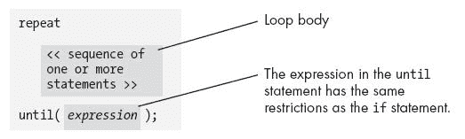

图 1-12. HLA `repeat..until`语句语法

HLA 的`repeat..until`语句在循环底部测试循环是否终止。因此，循环体中的语句总是至少执行一次。当遇到`until`子句时，程序将评估表达式，并在表达式为假时重复循环（即，当假时重复）。如果表达式计算为真，控制会转移到`until`子句后面的第一条语句。

以下简单示例演示了`repeat..until`语句：

```
mov( 10, ecx );
repeat

     stdout.put( "ecx = ", ecx, nl );
     sub( 1, ecx );

until( ecx = 0 );
```

如果循环体总是至少执行一次，那么通常使用`repeat..until`循环比使用`while`循环更高效。

## 1.9.7 break 和 breakif 语句

`break` 和 `breakif` 语句提供了提前退出循环的功能。图 1-13 显示了这两个语句的语法。

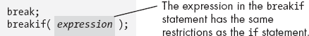

图 1-13. HLA `break` 和 `breakif` 语法

`break` 语句退出直接包含 `break` 的循环。`breakif` 语句评估布尔表达式，并在表达式为真时退出包含的循环。

注意，`break` 和 `breakif` 语句不允许你跳出多个嵌套循环。HLA 提供了其他语句来实现这一功能，包括 `begin..end` 块和 `exit`/`exitif` 语句。请参阅 HLA 参考手册了解更多细节。HLA 还提供了 `continue`/`continueif` 配对语句，允许你重复循环体。同样，请参考 HLA 参考手册以获取更多信息。

## 1.9.8 forever..endfor 语句

图 1-14 显示了 `forever` 语句的语法。

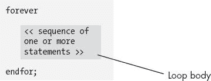

图 1-14. HLA `forever` 循环语法

该语句创建一个无限循环。你还可以将 `break` 和 `breakif` 语句与 `forever..endfor` 一起使用，在循环中间进行循环终止条件的测试。实际上，这可能是此循环最常见的使用方式，以下示例演示了这一点：

```
forever

     stdout.put( "Enter an integer less than 10: ");
     stdin.get( i );
     breakif( i < 10 );
     stdout.put( "The value needs to be less than 10!", nl );

endfor;
```

## 1.9.9 try..exception..endtry 语句

HLA `try..exception..endtry` 语句提供了非常强大的*异常处理*功能。此语句的语法如图 1-15 所示。

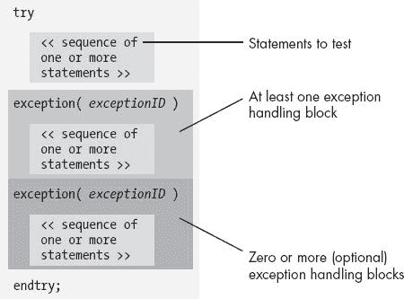

图 1-15. HLA `try..exception..endtry` 语句语法

`try..endtry`语句在执行过程中保护一组语句。如果`try`子句和第一个`exception`子句之间的语句（即*保护块*）顺利执行，控制会立即转移到`endtry`之后的第一条语句。如果发生错误（异常），程序会在异常发生的地方中断控制（即程序会*抛出*一个异常）。每个异常都有一个与之关联的无符号整数常量，称为*异常 ID*。HLA 标准库中的*excepts.hhf*头文件预定义了几个异常 ID，尽管你可以根据需要创建新的异常 ID。当异常发生时，系统会将异常 ID 与保护代码之后每个异常子句中的值进行比较。如果当前的异常 ID 与某个异常值匹配，控制会继续执行该异常后面紧接着的语句块。在异常处理代码执行完毕后，控制会转移到`endtry`之后的第一条语句。

如果发生异常且没有活动的`try..endtry`语句，或者活动的`try..endtry`语句无法处理特定的异常，程序将以错误消息终止。

以下代码片段演示了如何使用`try..endtry`语句来保护程序免受错误用户输入的影响：

```
repeat

     mov( false, GoodInteger );   // Note: GoodInteger must be a boolean var.
     try

          stdout.put( "Enter an integer: " );
          stdin.get( i );
          mov( true, GoodInteger );

     exception( ex.ConversionError );

          stdout.put( "Illegal numeric value, please re-enter", nl );

     exception( ex.ValueOutOfRange );

          stdout.put( "Value is out of range, please re-enter", nl );

     endtry;

until( GoodInteger );
```

`repeat..until`循环会在输入过程中出现错误时重复执行该代码。如果由于错误输入而发生异常，控制将转移到异常处理部分，查看是否发生了转换错误（例如，数字中的非法字符）或数字溢出。如果发生这些异常，则会打印相应的消息，控制跳出`try..endtry`语句，`repeat..until`循环将会重复，因为代码没有将`GoodInteger`设置为 true。如果发生了其他异常（代码中未处理的异常），程序将以指定的错误消息终止。^([10])

表 1-4 列出了在编写本文时，*excepts.hhf*头文件中提供的异常。请参见随 HLA 提供的*excepts.hhf*头文件，以获取最新的异常列表。

表 1-4. 在*excepts.hhf*中提供的异常

| 异常 | 描述 |
| --- | --- |
| `ex.StringOverflow` | 尝试将一个过大的字符串存入字符串变量。 |
| `ex.StringIndexError` | 尝试访问字符串中不存在的字符。 |
| `ex.StringOverlap` | 尝试将一个字符串复制到自身。 |
| `ex.StringMetaData` | 损坏的字符串值。 |
| `ex.StringAlignment` | 尝试将字符串存储在未对齐的地址上。 |
| `ex.StringUnderflow` | 尝试从字符串中提取“负”字符。 |
| `ex.IllegalStringOperation` | 字符串数据上不允许进行该操作。 |
| `ex.ValueOutOfRange` | 值对于当前操作来说过大。 |
| `ex.IllegalChar` | 操作遇到的字符代码，其 ASCII 码不在 0..127 的范围内。 |
| `ex.TooManyCmdLnParms` | 命令行包含过多的程序参数。 |
| `ex.BadObjPtr` | 类对象的指针无效。 |
| `ex.InvalidAlignment` | 参数没有在正确的内存地址对齐。 |
| `ex.InvalidArgument` | 函数调用（通常是操作系统 API 调用）包含无效的参数值。 |
| `ex.BufferOverflow` | 缓冲区或 blob 对象超出了声明的大小。 |
| `ex.BufferUnderflow` | 尝试从 blob 或缓冲区中检索不存在的数据。 |
| `ex.IllegalSize` | 参数的数据大小不正确。 |
| `ex.ConversionError` | 字符串转数字时包含非法（非数字）字符。 |
| `ex.BadFileHandle` | 程序尝试使用无效的文件句柄值访问文件。 |
| `ex.FileNotFound` | 程序尝试访问一个不存在的文件。 |
| `ex.FileOpenFailure` | 操作系统无法打开文件（文件未找到）。 |
| `ex.FileCloseError` | 操作系统无法关闭文件。 |
| `ex.FileWriteError` | 写入数据到文件时发生错误。 |
| `ex.FileReadError` | 从文件读取数据时发生错误。 |
| `ex.FileSeekError` | 尝试定位到文件中不存在的位置。 |
| `ex.DiskFullError` | 尝试写入数据到已满的磁盘。 |
| `ex.AccessDenied` | 用户没有足够的权限访问文件数据。 |
| `ex.EndOfFile` | 程序尝试读取文件末尾之后的数据。 |
| `ex.CannotCreateDir` | 尝试创建目录失败。 |
| `ex.CannotRemoveDir` | 尝试删除目录失败。 |
| `ex.CannotRemoveFile` | 尝试删除文件失败。 |
| `ex.CDFailed` | 尝试切换到新目录失败。 |
| `ex.CannotRenameFile` | 尝试重命名文件失败。 |
| `ex.MemoryAllocationFailure` | 系统内存不足，无法满足分配请求。 |
| `ex.MemoryFreeFailure` | 无法释放指定的内存块（内存管理系统损坏）。 |
| `ex.MemoryAllocationCorruption` | 内存管理系统损坏。 |
| `ex.AttemptToFreeNULL` | 调用者尝试释放一个 NULL 指针。 |
| `ex.AttemptToDerefNULL` | 程序尝试通过 NULL 指针间接访问数据。 |
| `ex.BlockAlreadyFree` | 调用者尝试释放一个已经被释放的内存块。 |
| `ex.CannotFreeMemory` | 释放内存操作失败。 |
| `ex.PointerNotInHeap` | 调用者尝试释放一个未在堆上分配的内存块。 |
| `ex.WidthTooBig` | 数字转字符串时格式宽度过大。 |
| `ex.FractionTooBig` | 浮点转字符串时，格式中小数部分的大小过大。 |
| `ex.ArrayShapeViolation` | 尝试在两个维度不匹配的数组上执行操作。 |
| `ex.ArrayBounds` | 尝试访问数组元素，但索引超出了范围。 |
| `ex.InvalidDate` | 尝试对非法日期进行日期操作。 |
| `ex.InvalidDateFormat` | 从字符串到日期的转换包含非法字符。 |
| `ex.TimeOverflow` | 时间算术运算中的溢出。 |
| `ex.InvalidTime` | 尝试对非法时间进行时间操作。 |
| `ex.InvalidTimeFormat` | 从字符串到时间的转换包含非法字符。 |
| `ex.SocketError` | 网络通信失败。 |
| `ex.ThreadError` | 通用线程（多任务）错误。 |
| `ex.AssertionFailed` | `assert`语句遇到失败的断言。 |
| `ex.ExecutedAbstract` | 尝试执行抽象类方法。 |
| `ex.AccessViolation` | 尝试访问非法内存位置。 |
| `ex.InPageError` | 操作系统内存访问错误。 |
| `ex.NoMemory` | 操作系统内存失败。 |
| `ex.InvalidHandle` | 向操作系统 API 调用传递了错误的句柄。 |
| `ex.ControlC` | 在系统控制台上按下了**ctrl**-C（此功能取决于操作系统）。 |
| `ex.Breakpoint` | 程序执行了断点指令（INT 3）。 |
| `ex.SingleStep` | 程序在追踪标志设置的情况下运行。 |
| `ex.PrivInstr` | 程序尝试执行仅限内核的指令。 |
| `ex.IllegalInstr` | 程序尝试执行非法机器指令。 |
| `ex.BoundInstr` | 使用“越界”值执行了界限指令。 |
| `ex.IntoInstr` | 在溢出标志设置的情况下执行 Into 指令。 |
| `ex.DivideError` | 程序尝试除以零或其他除法错误。 |
| `ex.fDenormal` | 浮点异常（请参阅第六章）。 |
| `ex.fDivByZero` | 浮点异常（请参阅第六章）。 |
| `ex.fInexactResult` | 浮点异常（请参阅第六章）。 |
| `ex.fInvalidOperation` | 浮点异常（请参阅第六章）。 |
| `ex.fOverflow` | 浮点异常（请参阅第六章）。 |
| `ex.fStackCheck` | 浮点异常（请参阅第六章）。 |
| `ex.fUnderflow` | 浮点异常（请参阅第六章）。 |
| `ex.InvalidHandle` | 操作系统报告某个操作的无效句柄。 |

这些异常大多数发生在超出本章范围的情况中。它们出现在这里是为了完整性。有关这些异常的更多细节，请参阅 HLA 参考手册、HLA 标准库文档以及 HLA 标准库源代码。`ex.ConversionError`、`ex.ValueOutOfRange`和`ex.StringOverflow`是您最常使用的异常。

我们将在 1.11 关于 try..endtry 的更多细节中重新讨论`try..endtry`语句。首先，然而我们需要覆盖更多的内容。

* * *

^([9]) 还有一些额外的形式我们将在第六章中讨论。

^([10]) 一位经验丰富的程序员可能会想知道，为什么这段代码使用布尔变量，而不是`breakif`语句来退出`repeat..until`循环。背后有一些技术原因，你将在 1.11 关于 try..endtry 的更多细节中了解到这些原因。

# 1.10 HLA 标准库简介

HLA 比标准汇编语言更容易学习和使用的原因有两个。第一个原因是 HLA 为声明和控制结构提供了高级语法。这利用了你对高级语言的知识，使你能更高效地学习汇编语言。方程的另一半是 HLA 标准库。HLA 标准库提供了许多常见的、易于使用的汇编语言例程，你可以调用这些例程，而不需要自己编写这些代码（更重要的是，不需要学习如何编写这些代码）。这消除了很多人在学习汇编语言时遇到的一个大障碍：编写基本语句所需的复杂 I/O 和支持代码。在没有标准化的汇编语言库之前，新手汇编程序员往往需要相当长的学习时间，才能做到打印一个字符串到显示器。而有了 HLA 标准库，这一障碍就被移除了，你可以专注于学习汇编语言的概念，而不是学习特定操作系统的底层 I/O 细节。

丰富的库例程只是 HLA 支持的一部分。毕竟，汇编语言库已经存在相当长的时间了。^([11]) HLA 的标准库通过为这些例程提供一个高级语言接口来补充 HLA。实际上，HLA 语言本身最初就是专门设计用来创建一套高级的库例程的。这个高级接口，加上库中许多例程的高级特性，带来了令人惊讶的强大功能，并且易于使用。

HLA 标准库由几个按类别组织的模块组成。表 1-5 列出了许多可用的模块。^([12])

表 1-5. HLA 标准库模块

| 名称 | 描述 |
| --- | --- |
| `args` | 命令行参数解析支持例程。 |
| `arrays` | 数组声明和操作。 |
| `bits` | 位操作函数。 |
| `blobs` | 二进制大对象——对大块二进制数据的操作。 |
| `bsd` | FreeBSD 的操作系统 API 调用（仅限 HLA FreeBSD 版本）。 |
| `chars` | 对字符数据的操作。 |
| `console` | 可移植的控制台（文本屏幕）操作（光标移动、屏幕清除等）。 |
| `conv` | 字符串与其他值之间的各种转换。 |
| `coroutines` | 支持协程（“协作式多任务”）。 |
| `cset` | 字符集函数。 |
| `DateTime` | 日历、日期和时间功能。 |
| `env` | 访问操作系统环境变量。 |
| `excepts` | 异常处理例程。 |
| `fileclass` | 面向对象的文件输入输出。 |
| `fileio` | 文件输入和输出例程。 |
| `filesys` | 访问操作系统文件系统。 |
| `hla` | 特殊的 HLA 常量和其他值。 |
| `Linux` | Linux 系统调用（仅限 HLA Linux 版本）。 |
| `lists` | HLA 类，用于操作链表。 |
| `mac` | Mac OS X 的操作系统 API 调用（仅限 HLA Mac OS X 版本）。 |
| `math` | 扩展精度算术、超越函数和其他数学函数。 |
| `memmap` | 内存映射文件操作。 |
| `memory` | 内存分配、释放和支持代码。 |
| `patterns` | HLA 模式匹配库。 |
| `random` | 伪随机数生成器和支持代码。 |
| `sockets` | 一组网络通信函数和类。 |
| `stderr` | 提供用户输出和其他几个支持函数。 |
| `stdin` | 用户输入例程。 |
| `stdio` | 支持 stderr、stdin 和 stdout 的模块。 |
| `stdout` | 提供用户输出和其他几个支持例程。 |
| `strings` | HLA 强大的字符串库。 |
| `tables` | 表（关联数组）支持例程。 |
| `threads` | 支持多线程应用程序和进程同步。 |
| `timers` | 支持应用程序中的定时事件。 |
| `win32` | 用于 Windows 调用的常量（仅限 HLA Windows 版本）。 |
| `x86` | 特定于 80x86 CPU 的常量和其他项。 |

后续部分将更详细地解释这些模块。本节将集中讨论最重要的例程（至少对于初学者 HLA 程序员来说），即`stdio`库。

## 1.10.1 stdio 模块中的预定义常量

也许首先要介绍的是`stdio`模块为你定义的一些常见常量。请考虑以下（典型）示例：

```
stdout.put( "Hello World", nl );
```

`nl`出现在此语句的末尾，代表*换行*。`nl`标识符不是 HLA 的保留关键字，也与`stdout.put`语句无关。相反，它只是一个预定义常量，对应包含标准换行符序列的字符串（在 Windows 下是回车/换行对，在 Linux、FreeBSD 和 Mac OS X 下只是换行符）。 

除了`nl`常量外，HLA 标准 I/O 库模块还定义了几个其他有用的字符常量，具体见表 1-6。

表 1-6. HLA 标准 I/O 库定义的字符常量

| 字符 | 定义 |
| --- | --- |
| `stdio.bell` | ASCII 铃声字符；打印时会发出蜂鸣声 |
| `stdio.bs` | ASCII 退格符字符 |
| `stdio.tab` | ASCII 制表符字符 |
| `stdio.lf` | ASCII 换行符字符 |
| `stdio.cr` | ASCII 回车符字符 |

除了`nl`外，这些字符出现在`stdio`命名空间中^([13])（因此需要使用`stdio`前缀）。将这些 ASCII 常量放置在`stdio`命名空间内有助于避免与您自己变量的命名冲突。`nl`名称不出现在命名空间中，因为您会非常频繁地使用它，键入`stdio.nl`会很快变得麻烦。

## 1.10.2 标准输入和标准输出

许多 HLA I/O 例程有一个`stdin`或`stdout`前缀。从技术上讲，这意味着标准库在一个命名空间中定义了这些名称。实际上，这个前缀提示了输入来源（标准输入设备）或输出目标（标准输出设备）。默认情况下，标准输入设备是系统键盘。同样，默认标准输出设备是控制台显示。因此，一般来说，带有`stdin`或`stdout`前缀的语句将在控制台设备上读写数据。

当你从命令行窗口（或 shell）运行程序时，可以选择*重定向*标准输入和/或标准输出设备。形式为`>outfile`的命令行参数将标准输出设备重定向到指定的文件（outfile）。形式为`<infile`的命令行参数将标准输入重定向，使得输入数据来自指定的输入文件（infile）。以下示例展示了如何在命令窗口运行名为*testpgm*的程序时使用这些参数：^([14])

```
testpgm <input.data
                    testpgm >output.txt
                    testpgm <in.txt >output.txt
```

## 1.10.3 `stdout.newln`例程

`stdout.newln`过程将换行符序列输出到标准输出设备。这在功能上等同于执行`stdout.put( nl );`。调用`stdout.newln`有时更加方便。例如：

```
stdout.newln();
```

## 1.10.4 `stdout.putiX`例程

`stdout.puti8`、`stdout.puti16`和`stdout.puti32`库例程将一个单一参数（分别为一个字节、两个字节或四个字节）作为有符号整数值输出。该参数可以是常量、寄存器或内存变量，只要实际参数的大小与形式参数的大小相同。

这些例程将其指定参数的值打印到标准输出设备。这些例程将使用尽可能少的打印位置打印该值。如果数字是负数，这些例程将打印一个前导负号。以下是调用这些例程的一些示例：

```
stdout.puti8( 123 );
                    stdout.puti16( dx );
                    stdout.puti32( i32Var );
```

## 1.10.5 `stdout.putiXSize`例程

`stdout.puti8Size`、`stdout.puti16Size`和`stdout.puti32Size`例程将有符号整数值输出到标准输出，类似于`stdout.puti`*`X`*例程。不同的是，这些例程提供了更多的输出控制；它们允许您指定输出时值所需的（最小）打印位置数。这些例程还允许您指定填充字符，如果打印字段大于显示值所需的最小空间时使用。调用这些例程需要以下参数：

```
stdout.puti8Size( *`Value8`*, *`width`*, *`padchar`* );
                    stdout.puti16Size( *`Value16`*, *`width`*, *`padchar`* );
                    stdout.puti32Size( *`Value32`*, *`width`*, *`padchar`* );
```

*`Value*`*参数可以是常量、寄存器或指定大小的内存位置。*`width`*参数可以是一个在−256 和+256 之间的有符号整数常量；该参数可以是常量、寄存器（32 位）或内存位置（32 位）。*`padchar`*参数应为单字符值。

与`stdout.puti`*`X`*例程类似，这些例程将指定的值作为有符号整数常量打印到标准输出设备。不同的是，这些例程允许您指定值的*字段宽度*。字段宽度是这些例程在打印值时将使用的最小打印位置数。`width`参数指定最小字段宽度。如果数字需要更多的打印位置（例如，如果您尝试以 2 的字段宽度打印`1234`），则这些例程将打印足够的字符以正确显示该值。另一方面，如果*`width`*参数大于显示该值所需的字符位置数，则这些例程将打印一些额外的填充字符，以确保输出至少有*`width`*个字符位置。如果*`width`*值为负，则数字在打印字段中左对齐；如果*`width`*值为正，则数字在打印字段中右对齐。

如果*`width`*参数的绝对值大于最小打印位置数，那么这些`stdout.puti`*`X`*`Size`例程将在数字前后打印填充字符。*`padchar`*参数指定这些例程将打印的字符。大多数情况下，您会将空格指定为填充字符；对于特殊情况，您可能会指定其他字符。请记住，*`padchar`*参数是一个字符值；在 HLA 中，字符常量用撇号括起来，而不是引号。您还可以指定一个 8 位寄存器作为该参数。

示例 1-4 提供了一个简短的 HLA 程序，演示了如何使用`stdout.puti32Size`例程以表格形式显示一系列值。

示例 1-4. 使用 `stdio.Puti32Size` 的表格输出演示

```
program NumsInColumns;

#include( "stdlib.hhf" )

var
    i32:    int32;
    ColCnt: int8;

begin NumsInColumns;

    mov( 96, i32 );
    mov( 0, ColCnt );
    while( i32 > 0 ) do

        if( ColCnt = 8 ) then

            stdout.newln();
            mov( 0, ColCnt );

        endif;
        stdout.puti32Size( i32, 5, ' ' );
        sub( 1, i32 );
        add( 1, ColCnt );

    endwhile;
    stdout.newln();

end NumsInColumns;
```

## 1.10.6 `stdout.put` 例程

`stdout.put`例程^([15])是标准输出库模块中最灵活的输出例程之一。它将大多数其他输出例程合并为一个易于使用的过程。

`stdout.put`例程的通用格式如下：

```
stdout.put( *`list_of_values_to_output`* );
```

`stdout.put`参数列表由一个或多个常量、寄存器或内存变量组成，每个项之间用逗号分隔。该例程显示与每个参数相关联的值。由于我们在本章中已经多次使用该例程，因此你已经看到了许多该例程基本形式的示例。值得指出的是，该例程有一些在本章示例中未体现的附加功能。特别是，每个参数可以采用以下两种形式之一：

```
*`value`*
*`value`*:*`width`*
```

*`value`*可以是任何合法的常量、寄存器或内存变量对象。在本章中，你已看到字符串常量和内存变量出现在`stdout.put`的参数列表中。这些参数对应于上面提到的第一种形式。上述第二种参数形式允许你指定最小字段宽度，类似于`stdout.puti`*`X`*`Size`例程。^([16]) 示例 1-5 的程序产生与示例 1-4 相同的输出；然而，示例 1-5 使用的是`stdout.put`而非`stdout.puti32Size`。

示例 1-5. `stdout.put` 字段宽度指定的演示

```
program NumsInColumns2;

#include( "stdlib.hhf" )

var
    i32:    int32;
    ColCnt: int8;

begin NumsInColumns2;

    mov( 96, i32 );
    mov( 0, ColCnt );
    while( i32 > 0 ) do

        if( ColCnt = 8 ) then

            stdout.newln();
            mov( 0, ColCnt );

        endif;
        stdout.put( i32:5 );
        sub( 1, i32 );
        add( 1, ColCnt );

    endwhile;
    stdout.put( nl );

end NumsInColumns2;
```

`stdout.put`例程的功能远不止本节描述的这些属性。本文将根据需要介绍这些附加功能。

## 1.10.7 `stdin.getc` 例程

`stdin.getc`例程从标准输入设备的输入缓冲区读取下一个可用字符。^([17]) 它将该字符返回到 CPU 的 AL 寄存器中。示例 1-6 例程演示")中的程序演示了该例程的一个简单用法。

示例 1-6. `stdin.getc()` 例程演示

```
program charInput;

#include( "stdlib.hhf" )

var
    counter: int32;

begin charInput;

    // The following repeats as long as the user
    // confirms the repetition.

    repeat

        // Print out 14 values.

        mov( 14, counter );
        while( counter > 0 ) do

            stdout.put( counter:3 );
            sub( 1, counter );

        endwhile;

        // Wait until the user enters 'y' or 'n'.

        stdout.put( nl, nl, "Do you wish to see it again? (y/n):" );
        forever

            stdin.readLn();
            stdin.getc();
            breakif( al = 'n' );
            breakif( al = 'y' );
            stdout.put( "Error, please enter only 'y' or 'n': " );

        endfor;
        stdout.newln();

    until( al = 'n' );

end charInput;
```

该程序使用`stdin.ReadLn`例程强制从用户输入一个新的行。关于`stdin.ReadLn`的描述见 1.10.9 `stdin.readLn`和`stdin.flushInput`例程。

## 1.10.8 `stdin.getiX` 例程

`stdin.geti8`、`stdin.geti16`和`stdin.geti32`例程分别从标准输入设备读取 8 位、16 位和 32 位有符号整数值。这些例程将它们的值返回到 AL、AX 或 EAX 寄存器中。它们提供了在 HLA 中从用户读取有符号整数值的标准机制。

像`stdin.getc`例程一样，这些例程从标准输入缓冲区读取一串字符。它们首先跳过任何空白字符（空格、制表符等），然后将接下来的十进制数字流（可选的前导负号）转换为相应的整数。如果输入序列不是有效的整数字符串，或者用户输入的值太大，无法适应指定的整数大小，这些例程会引发一个异常（你可以通过`try..endtry`语句来捕获该异常）。请注意，`stdin.geti8`读取的值必须在−128 到+127 之间；`stdin.geti16`读取的值必须在−32,768 到+32,767 之间；`stdin.geti32`读取的值必须在−2,147,483,648 到+2,147,483,647 之间。

在示例 1-7 中的示例程序演示了这些例程的使用。

示例 1-7. `stdin.getiX` 示例代码

```
program intInput;

#include( "stdlib.hhf" )

var
    i8:     int8;
    i16:    int16;
    i32:    int32;

begin intInput;

    // Read integers of varying sizes from the user:

    stdout.put( "Enter a small integer between −128 and +127: " );
    stdin.geti8();
    mov( al, i8 );

    stdout.put( "Enter a small integer between −32768 and +32767: " );
    stdin.geti16();
    mov( ax, i16 );

    stdout.put( "Enter an integer between +/− 2 billion: " );
    stdin.geti32();
    mov( eax, i32 );

    // Display the input values.

    stdout.put
    (
        nl,
        "Here are the numbers you entered:", nl, nl,
        "Eight-bit integer: ", i8:12, nl,
        "16-bit integer:    ", i16:12, nl,
        "32-bit integer:    ", i32:12, nl
    );

end intInput;
```

你应该编译并运行这个程序，然后测试当你输入超出范围的值或输入非法字符时会发生什么。

## 1.10.9 `stdin.readLn`和`stdin.flushInput`例程

每当你调用像`stdin.getc`或`stdin.geti32`这样的输入例程时，程序不一定会在那个时刻从用户那里读取值。相反，HLA 标准库会通过从用户那里读取整行文本来缓冲输入。调用输入例程时，会从这个输入缓冲区中获取数据，直到缓冲区为空。虽然这种缓冲机制高效且方便，但有时也可能会让人感到困惑。考虑以下代码示例：

```
stdout.put( "Enter a small integer between −128 and +127: " );
stdin.geti8();
mov( al, i8 );

stdout.put( "Enter a small integer between −32768 and +32767: " );
stdin.geti16();
mov( ax, i16 );
```

直观上，你会期望程序打印出第一个提示信息，等待用户输入，然后打印第二个提示信息，等待第二次用户输入。然而，实际情况并非如此。例如，如果你运行这段代码（来自上一节的示例程序），并在第一个提示符处输入文本**`123 456`**，程序不会在第二个提示符处等待额外的用户输入。相反，它会在执行`stdin.geti16`调用时，从输入缓冲区读取第二个整数（456）。

通常，`stdin`例程仅在输入缓冲区为空时从用户读取文本。只要输入缓冲区包含额外的字符，输入例程将尝试从缓冲区中读取数据。你可以通过编写以下代码序列来利用这种行为：

```
stdout.put( "Enter two integer values: " );
stdin.geti32();
mov( eax, intval );
stdin.geti32();
mov( eax, AnotherIntVal );
```

该序列允许用户在同一行输入两个值（由一个或多个空白字符分隔），从而节省屏幕空间。因此，输入缓冲区的行为有时是可取的。输入例程的缓冲行为在其他时候可能是反直觉的。

幸运的是，HLA 标准库提供了两个例程，`stdin.readLn`和`stdin.flushInput`，它们允许你控制标准输入缓冲区。`stdin.readLn`例程丢弃输入缓冲区中的所有内容，并立即要求用户输入新的一行文本。`stdin.flushInput`例程只是丢弃缓冲区中的所有内容。下一次输入例程执行时，系统将要求用户输入新的一行数据。你通常会在某个标准输入例程之前立即调用`stdin.readLn`；在调用标准输入例程之后，通常会立即调用`stdin.flushInput`。

### 注意

如果你正在调用`stdin.readLn`，并且发现你需要输入两次数据，这通常表明你应该调用`stdin.flushInput`而不是`stdin.readLn`。通常，你应该始终能够调用`stdin.flushInput`来刷新输入缓冲区，并在下一次输入调用时读取新的一行数据。`stdin.readLn`例程很少需要使用，因此除非你真的需要立即强制输入新的一行文本，否则应该使用`stdin.flushInput`。

## 1.10.10 `stdin.get`例程

`stdin.get`例程将许多标准输入例程合并为一个调用，就像`stdout.put`将所有输出例程合并为一个调用一样。实际上，`stdin.get`比`stdout.put`更易于使用，因为该例程的唯一参数是变量名列表。

让我们重写上一节给出的示例：

```
stdout.put( "Enter two integer values: " );
stdin.geti32();
mov( eax, intval );
stdin.geti32();
mov( eax, AnotherIntVal );
```

使用`stdin.get`例程，我们可以将此代码重写为：

```
stdout.put( "Enter two integer values: " );
stdin.get( intval, AnotherIntVal );
```

如你所见，`stdin.get`例程更方便使用。

请注意，`stdin.get`将输入值直接存储到你在参数列表中指定的内存变量中；除非你明确指定了寄存器作为参数，否则它不会将值返回到寄存器中。`stdin.get`的所有参数必须是变量或寄存器。

* * *

^([11]) 例如，请参阅针对 80x86 汇编语言程序员的 UCR 标准库。

^([12]) 由于 HLA 标准库正在扩展，这个列表可能已经过时。请参阅 HLA 文档以获取当前的标准库模块列表。

^([13]) 命名空间是第五章的主题。

^([14]) 对于 Linux、FreeBSD 和 Mac OS X 用户，根据系统的配置，可能需要在程序名称前加上 `./` 才能执行程序（例如，`./testpgm <input.data>`）。

^([15]) `stdout.put` 实际上是一个宏，而不是一个过程。两者之间的区别超出了本章的范围。第九章 描述了它们的区别。

^([16]) 请注意，使用 `stdout.put` 例程时无法指定填充字符；填充字符默认为空格字符。如果需要使用不同的填充字符，可以调用 `stdout.puti`*`X`*`Size` 例程。

^([17]) *缓冲区* 只是一个表示数组的 fancy 术语。

# 1.11 关于 try..endtry 的附加细节

如你所记得，`try..endtry` 语句将一组语句包围起来，以捕捉在执行这些语句过程中发生的任何异常。系统通过以下三种方式之一引发异常：通过硬件故障（如除零错误）、通过操作系统生成的异常，或通过执行 HLA `raise` 语句。你可以编写异常处理程序，使用 `exception` 子句来拦截特定的异常。示例 1-8 中的程序提供了使用此语句的典型示例。

示例 1-8. `try..endtry` 示例

```
program testBadInput;
#include( "stdlib.hhf" )

static
    u:      int32;

begin testBadInput;

    try

        stdout.put( "Enter a signed integer:" );
        stdin.get( u );
        stdout.put( "You entered: ", u, nl );

      exception( ex.ConversionError )

        stdout.put( "Your input contained illegal characters" nl );

      exception( ex.ValueOutOfRange )

        stdout.put( "The value was too large" nl );

    endtry;

end testBadInput;
```

HLA 将 `try` 子句与第一个 `exception` 子句之间的语句称为 *保护* 语句。如果在保护语句内发生异常，程序将扫描每个异常并将当前异常的值与每个 `exception` 子句后括号中的值进行比较。^([18]) 这个异常值只是一个 32 位值。因此，每个 `exception` 子句后括号中的值必须是一个 32 位值。HLA *excepts.hhf* 头文件预定义了几个异常常量。尽管这将是一个极其严重的风格违规，但你仍然可以用数字值来替代上述两个 `exception` 子句中的值。

## 1.11.1 嵌套 try..endtry 语句

如果程序扫描完 `try..endtry` 语句中的所有 `exception` 子句并且没有找到与当前异常值匹配的子句，则程序会在 *动态嵌套* 的 `try..endtry` 块的 `exception` 子句中继续查找，以尝试找到合适的异常处理程序。例如，考虑 示例 1-9 中的代码。

示例 1-9. 嵌套 `try..endtry` 语句

```
program testBadInput2;
#include( "stdlib.hhf" )

static
    u:      int32;

begin testBadInput2;

    try

        try

            stdout.put( "Enter a signed integer: " );
            stdin.get( u );
            stdout.put( "You entered: ", u, nl );

          exception( ex.ConversionError )

            stdout.put( "Your input contained illegal characters" nl );

        endtry;

        stdout.put( "Input did not fail due to a value out of range" nl );

      exception( ex.ValueOutOfRange )

        stdout.put( "The value was too large" nl );

    endtry;

end testBadInput2;
```

在示例 1-9 中，一个`try`语句嵌套在另一个`try`语句内。在执行`stdin.get`语句时，如果用户输入一个大于四十亿并且有些变化的值，则`stdin.get`会引发`ex.ValueOutOfRange`异常。当 HLA 运行时系统接收到此异常时，它首先会在引发异常的语句周围的`try..endtry`语句中的所有异常子句中进行搜索（在上面的示例中就是嵌套的`try..endtry`）。如果 HLA 运行时系统未能找到`ex.ValueOutOfRange`的异常处理程序，它会检查当前的`try..endtry`是否嵌套在另一个`try..endtry`内（正如示例 1-9 中的情况）。如果是这样，HLA 运行时系统会在外层`try..endtry`语句中搜索适当的异常子句。在示例 1-9 中，程序在`try..endtry`块中找到了合适的异常处理程序，因此控制权转移到`exception( ex.ValueOutOfRange )`子句后的语句。

离开`try..endtry`块后，HLA 运行时系统不再认为该块是活动的，并且在程序引发异常时不会在其异常列表中进行搜索。^([19]) 这样可以让你在程序的其他部分以不同的方式处理相同的异常。

如果两个`try..endtry`语句处理相同的异常，并且其中一个`try..endtry`块嵌套在另一个`try..endtry`语句的保护区段内，并且程序在执行最内层的`try..endtry`序列时引发异常，则 HLA 会直接将控制权转移到最内层`try..endtry`块提供的异常处理程序。HLA 不会自动将控制权转移到外层`try..endtry`序列提供的异常处理程序。

在之前的示例中（示例 1-9），第二个 `try..endtry` 语句是静态地嵌套在外部的 `try..endtry` 语句内部的。^([20]) 正如之前没有评论提到的，如果最近激活的 `try..endtry` 语句没有处理特定的异常，程序将通过任何动态嵌套的 `try..endtry` 块的 `exception` 子句进行查找。动态嵌套不要求嵌套的 `try..endtry` 块物理上出现在外部的 `try..endtry` 语句中。相反，控制权可以从外部 `try..endtry` 保护块内部转移到程序中的其他位置。在该位置执行的 `try..endtry` 语句会动态地将两个 `try` 语句嵌套在一起。虽然有很多方法可以动态嵌套代码，但有一种方法你可能已经通过高级语言的经验熟悉：过程调用。在第五章中，当你学习如何在汇编语言中编写过程（函数）时，应该记住，任何在 `try..endtry` 保护部分内对过程的调用，都可能在该过程中执行 `try..endtry` 时创建一个动态嵌套的 `try..endtry`。

## 1.11.2 `try..endtry` 语句中的未保护子句

每当程序执行 `try` 子句时，它会保存当前的异常环境，并设置系统，在发生异常时将控制权转移到该 `try..endtry` 语句中的 `exception` 子句。如果程序成功完成了 `try..endtry` 保护块的执行，程序将恢复原始的异常环境，控制权转移到 `endtry` 子句之后的第一条语句。恢复执行环境的这个最后步骤非常重要。如果程序跳过这一步，任何未来的异常都会将控制权转移到这个 `try..endtry` 语句，即使程序已经离开了 `try..endtry` 块。示例 1-10 展示了这个问题。

示例 1-10. 不当退出 `try..endtry` 语句

```
program testBadInput3;
#include( "stdlib.hhf" )

static
    input:  int32;

begin testBadInput3;

    // This forever loop repeats until the user enters
    // a good integer and the break statement below
    // exits the loop.

    forever

        try

            stdout.put( "Enter an integer value: " );
            stdin.get( input );
            stdout.put( "The first input value was: ", input, nl );
            break;

          exception( ex.ValueOutOfRange )

            stdout.put( "The value was too large, re-enter." nl );

          exception( ex.ConversionError )

            stdout.put( "The input contained illegal characters, re-enter." nl );

        endtry;

    endfor;

    // Note that the following code is outside the loop and there
    // is no try..endtry statement protecting this code.

    stdout.put( "Enter another number: " );
    stdin.get( input );
    stdout.put( "The new number is: ", input, nl );

end testBadInput3;
```

本示例试图通过将一个循环放置在 `try..endtry` 语句周围来创建一个强健的输入系统，并在 `stdin.get` 例程由于输入数据错误而抛出异常时，强制用户重新输入数据。虽然这是一个不错的想法，但该实现有一个重大问题：`break` 语句会立即退出 `forever..endfor` 循环，而没有先恢复异常环境。因此，当程序执行第二个 `stdin.get` 语句时，在程序底部，HLA 的异常处理代码仍然认为它在 `try..endtry` 块内部。如果发生异常，HLA 会将控制转回到 `try..endtry` 语句，寻找适当的异常处理程序。假设异常是 `ex.ValueOutOfRange` 或 `ex.ConversionError`，则示例 1-10 中的程序将打印一个适当的错误信息*并迫使用户重新输入第一个值*。这显然不是理想的做法。

将控制转交给错误的 `try..endtry` 异常处理程序只是问题的一部分。另一个大问题与 HLA 保存和恢复异常环境的方式有关：具体来说，HLA 将旧的执行环境信息保存在一个特殊的内存区域中，称为 *堆栈*。如果在不恢复异常环境的情况下退出 `try..endtry`，这将导致旧的执行环境信息仍然保留在堆栈上，而这部分额外的数据可能会导致程序故障。

尽管这个讨论很清楚地表明，程序不应该以 示例 1-10 中的方式退出 `try..endtry` 语句，但如果你能够在 `try..endtry` 块周围使用一个循环，强制重新输入错误数据，就像这个程序尝试做的那样，那就更好了。为了支持这种做法，HLA 的 `try..endtry` 语句提供了一个 `unprotected` 区域。请参考示例 1-11 中的代码。

示例 1-11. `try..endtry` 未保护区域

```
program testBadInput4;
#include( "stdlib.hhf" )

static
    input:  int32;

begin testBadInput4;

    // This forever loop repeats until the user enters
    // a good integer and the break statement below
    // exits the loop. Note that the break statement
    // appears in an unprotected section of the try..endtry
    // statement.

    forever

        try

            stdout.put( "Enter an integer value: " );
            stdin.get( input );
            stdout.put( "The first input value was: ", input, nl );

          unprotected

            break;

          exception( ex.ValueOutOfRange )

            stdout.put( "The value was too large, re-enter." nl );

          exception( ex.ConversionError )

            stdout.put( "The input contained illegal characters, re-enter." nl );

        endtry;

    endfor;

    // Note that the following code is outside the loop and there
    // is no try..endtry statement protecting this code.

    stdout.put( "Enter another number: " );
    stdin.get( input );
    stdout.put( "The new number is: ", input, nl );

end testBadInput4;
```

每当`try..endtry`语句遇到`unprotected`子句时，它会立即恢复异常环境。正如其名称所示，`unprotected`部分中的语句执行不再受到该`try..endtry`块的保护（然而，注意，任何动态嵌套的`try..endtry`语句仍然是活动的；`unprotected`只会关闭包含`unprotected`子句的`try..endtry`语句的异常处理）。因为示例 1-11 中的`break`语句出现在`unprotected`部分内，它可以安全地将控制转移出`try..endtry`块，而不需要“执行”`endtry`，因为程序已经恢复了之前的异常环境。

注意，`unprotected`关键字必须紧跟在`try..endtry`语句中的`protected`块之后出现。也就是说，它必须位于所有`exception`关键字之前。

如果在执行`try..endtry`序列时发生异常，HLA 会自动恢复执行环境。因此，你可以在`exception`子句中执行`break`语句（或任何其他会将控制转移出`try..endtry`块的指令）。

因为程序在遇到`unprotected`块或`exception`块时会恢复异常环境，所以在这些区域内发生的异常会立即将控制转移到之前的（动态嵌套的）活动`try..endtry`序列。如果没有嵌套的`try..endtry`序列，程序将以适当的错误信息终止。

## 1.11.3 `try..endtry`语句中的`anyexception`子句

在典型的情况下，你将使用`try..endtry`语句，并配合一组`exception`子句来处理在`try..endtry`序列的保护区域内可能发生的所有异常。通常，确保`try..endtry`语句处理所有可能的异常是很重要的，以防程序由于未处理的异常而提前终止。如果你已经编写了保护区内的所有代码，你会知道它可能抛出的异常，因此可以处理所有可能的异常。然而，如果你调用的是一个库函数（尤其是第三方库函数）、进行操作系统 API 调用，或者执行一些你无法控制的代码，那么你可能无法预测这段代码可能抛出的所有异常（尤其是在考虑过去、现在和未来的版本时）。如果这段代码抛出一个你没有`exception`子句处理的异常，这可能会导致你的程序失败。幸运的是，HLA 的`try..endtry`语句提供了`anyexception`子句，它会自动捕获所有现有的`exception`子句没有处理的异常。

`anyexception`子句类似于`exception`子句，不同之处在于它不需要异常编号参数（因为它处理任何异常）。如果`anyexception`子句出现在包含其他`exception`部分的`try..endtry`语句中，`anyexception`部分必须是`try..endtry`语句中的最后一个异常处理程序。`anyexception`部分可以是`try..endtry`语句中的唯一异常处理程序。

如果一个未处理的异常将控制转移到`anyexception`部分，EAX 寄存器将包含异常编号。你在`anyexception`块中的代码可以测试这个值，以确定异常的原因。

## 1.11.4 寄存器与 try..endtry 语句

`try..endtry`语句在你进入`try..endtry`语句时会保存几个字节的数据。离开`try..endtry`块时（或触发`unprotected`子句时），程序会恢复异常环境。只要没有发生异常，`try..endtry`语句在进入或退出时不会影响任何寄存器的值。然而，如果在执行受保护语句期间发生异常，则这一说法不成立。

进入`exception`子句时，EAX 寄存器包含异常编号，但所有其他通用寄存器的值都是未定义的。由于操作系统可能因硬件错误而引发了异常（因此，可能已修改了寄存器的值），你甚至不能假设通用寄存器在异常发生时包含它们所包含的任何值。HLA 为异常生成的底层代码在不同版本的编译器中可能会有所变化，当然在不同操作系统之间也会有所不同，因此，在异常处理程序中实验性地确定寄存器包含什么值并依赖于这些值从来不是一个好主意。

由于进入异常处理程序可能会破坏寄存器的值，因此你必须确保在`endtry`子句之后的代码中，如果假设寄存器包含某些特定值（即在受保护部分中设置的值或在执行`try..endtry`语句之前设置的值），要重新加载重要的寄存器。否则，这将引入一些严重的缺陷到你的程序中（这些缺陷可能是间歇性的并且难以检测，因为异常很少发生，且可能不会总是破坏某个特定寄存器中的值）。以下代码片段提供了这个问题及其解决方案的典型示例：

```
static
     sum: int32;
          .
          .
          .
     mov( 0, sum );
     for( mov( 0, ebx ); ebx < 8; inc( ebx )) do

          push( ebx );  // Must preserve ebx in case there is an exception.
          forever
               try

                    stdin.geti32();
                    unprotected break;

                 exception( ex.ConversionError )

                    stdout.put( "Illegal input, please re-enter value: " );

               endtry;
          endfor;
          pop( ebx );  // Restore ebx's value.
          add( ebx, eax );
          add( eax, sum );

     endfor;
```

由于 HLA 的异常处理机制会干扰寄存器，并且异常处理是一个相对低效的过程，因此您绝对不应将 `try..endtry` 语句作为通用控制结构使用（例如，通过引发一个整数异常值并使用异常处理块作为要处理的案例，来模拟 `switch/case` 语句）。这样做会对程序的性能产生非常负面的影响，并可能引入细微的缺陷，因为异常会打乱寄存器的内容。

为了正确操作，`try..endtry`语句假设您仅使用 EBP 寄存器来指向*激活记录*（第五章 讨论了激活记录）。默认情况下，HLA 程序会自动使用 EBP 来完成此目的；只要您不修改 EBP 中的值，程序将自动使用 EBP 来维护当前激活记录的指针。如果您尝试将 EBP 寄存器作为通用寄存器来保存值并进行算术计算，HLA 的异常处理功能将无法正常工作（以及其他可能的问题）。因此，您绝对不应将 EBP 寄存器用作通用寄存器。当然，这同样适用于 ESP 寄存器。

* * *

^([18]) 请注意，HLA 会将此值加载到 EAX 寄存器中。因此，当进入 `exception` 子句时，EAX 中将包含异常编号。

^([19]) 当然，除非程序通过循环或其他控制结构重新进入 `try..endtry` 块。

^([20]) *静态嵌套*意味着一个语句在源代码中物理地嵌套在另一个语句内。当我们说一个语句嵌套在另一个语句内时，通常意味着该语句是静态地嵌套在另一个语句内的。

# 1.12 高级汇编语言与低级汇编语言

在本章结束之前，重要的是要提醒你，本章出现的任何控制语句都不是“真实”的汇编语言。80x86 CPU 不支持像`if`、`while`、`repeat`、`for`、`break`、`breakif`和`try`这样的机器指令。每当 HLA 遇到这些语句时，它会将它们*编译*成一个或多个真实的机器指令，这些指令执行的操作与您使用的高级语句相同。虽然这些语句使用起来很方便，并且在许多情况下，它们与 HLA 将其转换为的低级机器指令序列一样高效，但不要忘记，它们并不是真正的机器指令。

本文的目的是教你低级汇编语言编程；这些高级控制结构只是实现这一目标的一种手段。请记住，学习 HLA 高级控制结构可以让你在教育过程中早早利用你对高级语言的了解，这样你就不必一次性学完所有关于汇编语言的内容。通过使用你已经熟悉的高级控制结构，本文可以将对通常用于控制流的实际机器指令的讨论推迟到很后面。通过这种方式，本文可以控制呈现的材料量，因此，希望你会发现学习汇编语言变得更加愉快。然而，你必须始终记住，这些高级控制语句只是一个帮助你学习汇编语言的教学工具。虽然一旦掌握了真正的控制流语句，你可以在汇编程序中自由使用它们，但如果你想学习汇编语言编程，你确实必须学习低级控制语句。既然你大概是因为这个目的在阅读本书，就不要让高级控制结构成为你的依赖。当你到达学习如何真正编写低级控制语句的阶段时，要全身心地去使用它们（仅限于低级语句）。随着你在低级控制语句方面的经验积累，了解它们的优缺点，你将能更好地判断在给定的应用中是使用高级代码序列还是低级代码序列更合适。然而，直到你获得相当的低级控制结构经验之前，你无法做出明智的决策。记住，除非你掌握了低级语句，否则你无法称自己为一个真正的汇编语言程序员。

需要记住的另一点是，HLA 标准库函数并不是汇编*语言*的一部分。它们只是一些为你预先编写的方便函数。虽然调用这些函数没有问题，但请始终记住，它们并不是机器指令，且这些例程本身并没有什么特别之处；随着你编写汇编语言代码经验的积累，你可以编写自己版本的这些例程（甚至写得更高效）。

如果你学习汇编语言是因为你想写出尽可能高效的程序（无论是最快还是最小的代码），你需要理解，如果你使用高级控制语句并且频繁调用 HLA 标准库，你将无法完全实现这一目标。HLA 的代码生成器和 HLA 标准库并不是*极其*低效的，但编写高效汇编程序的唯一真正方式是*用*汇编语言思考。HLA 的高级控制语句以及 HLA 标准库中的许多例程非常棒，因为它们让你*避免*用汇编语言思考。虽然这在你刚开始学习汇编语言时很有用，但如果你的最终目标是写出高效的代码，那么你必须学会用汇编语言思考。这篇文章将帮助你达到这个目标（并且会因为使用了 HLA 的高级特性而更迅速地做到这一点），但不要忘了，你的最终目标是放弃这些高级特性，转而使用低级编程。

# 1.13 更多信息

本章已经涵盖了很多内容！虽然你仍然有很多关于汇编语言编程需要学习，但本章结合你对高级语言的知识，提供了足够的信息，帮助你开始编写真正的汇编语言程序。

尽管本章涵盖了许多不同的主题，但主要的三个关注点是 80x86 CPU 架构、简单 HLA 程序的语法和 HLA 标准库。有关更多相关主题的信息，请参考本书的（完整版）电子版、HLA 参考手册和 HLA 标准库手册。所有这三者都可以在 [`www.artofasm.com/`](http://www.artofasm.com/) 和 [`webster.cs.ucr.edu/`](http://webster.cs.ucr.edu/) 查阅。
