# 第二章 数据表示


许多初学者在学习汇编语言时遇到的一个主要障碍是二进制和十六进制计数系统的常见使用。尽管十六进制数字有些奇怪，但它们的优点远大于缺点。理解二进制和十六进制计数系统非常重要，因为它们的使用简化了其他主题的讨论，包括位操作、有符号数表示、字符编码和打包数据。

本章讨论几个重要概念，包括：

+   二进制和十六进制计数系统

+   二进制数据组织（比特、半字节、字节、字、双字）

+   有符号和无符号计数系统

+   对二进制值进行算术、逻辑、移位和旋转操作

+   位域和打包数据

这是基础内容，本书其余部分将基于你对这些概念的理解。如果你已经在其他课程或学习中接触过这些术语，至少应该浏览一遍这些内容再继续下一章。如果你对这些内容不熟悉，或者仅有模糊了解，你应该在继续之前仔细学习它。*本章的所有内容都很重要！* 不要跳过任何内容。

# 2.1 计数系统

大多数现代计算机系统并不使用十进制（基数 10）系统来表示数值。相反，它们通常使用二进制或二的补码计数系统。

## 2.1.1 十进制系统回顾

你已经使用十进制计数系统很长时间了，以至于可能不再注意它。当你看到像*123*这样的数字时，你不会去思考数字 123 的具体数值，而是会在脑海中生成一个关于这个数值代表多少个物品的形象。然而，实际上，数字 123 表示：

| 1*10² + 2*10¹ + 3*10⁰ |
| --- |

或者

| 100 + 20 + 3 |
| --- |

在十进制位置计数系统中，小数点左侧的每个数字表示一个值，该值为 0 到 9 之间的数字乘以逐渐增加的 10 的幂次。小数点右侧的数字表示一个值，该值为 0 到 9 之间的数字乘以逐渐增加的负 10 的幂次。例如，值 123.456 表示：

| 1*10² + 2*10¹ + 3*10⁰ + 4*10^(−1) + 5*10^(−2) + 6*10^(−3) |
| --- |

或者

| 100 + 20 + 3 + 0.4 + 0.05 + 0.006 |
| --- |

## 2.1.2 二进制计数系统

大多数现代计算机系统使用二进制逻辑进行操作。计算机使用两个电压级别（通常为 0v 和+2.4..5v）表示值。两个这样的电平可以准确表示两个独特的值。这些值可以是任何两个不同的值，但通常它们表示 0 和 1。这两个值恰巧对应于二进制计数系统中的两个数字。

二进制计数系统与十进制计数系统类似，只有两个例外：二进制只允许数字 0 和 1（而不是 0..9），而且二进制使用 2 的幂而不是 10 的幂。因此，将二进制数转换为十进制非常容易。对于二进制字符串中的每个`1`，将`2`*`^n`*加上去，其中*n*是二进制数字的基于零的位置。例如，二进制值 11001010[2]表示：

| 1*2⁷ + 1*2⁶ + 0*2⁵ + 0*2⁴ + 1*2³ + 0*2² + 1*2¹ + 0*2⁰ |
| --- |
| = |
| 128 + 64 + 8 + 2 |
| = |
| 202[10] |

将十进制转换为二进制稍微困难一些。你必须找出那些 2 的幂，当它们加在一起时，能得出十进制结果。

转换十进制为二进制的一种简单方法是*奇偶-除以二*算法。该算法使用以下步骤：

1.  如果数字是偶数，输出 0。如果数字是奇数，输出 1。

1.  将数字除以 2 并舍去任何小数部分或余数。

1.  如果商为 0，算法完成。

1.  如果商不是 0 并且是奇数，则在当前字符串前插入 1；如果数字是偶数，则在二进制字符串前加 0。

1.  返回第 2 步并重复。

二进制数虽然在高级语言中不太重要，但在汇编语言程序中随处可见。所以你应该对它们有一定的熟悉度。

## 2.1.3 二进制格式

在最纯粹的意义上，每个二进制数包含无限多个数字（或*位*，即*二进制数字*的简称）。例如，我们可以通过以下任何一种方式表示数字 5：

| 101 00000101 0000000000101 ...000000000000101 |
| --- |

可以有任意数量的前导零位出现在二进制数之前，而不会改变其值。

我们将采用忽略值中任何前导零的惯例。例如，101[2]表示数字 5，但由于 80x86 通常以 8 位为一组工作，因此我们会发现将所有二进制数扩展到 4 位或 8 位的倍数要容易得多。因此，按照这一惯例，我们会将数字 5 表示为 0101[2]或 00000101[2]。

在美国，大多数人将每三个数字用逗号分开，以便更容易阅读较大的数字。例如，1,023,435,208 比 1023435208 更容易阅读和理解。我们将在本文中采用类似的惯例，使用下划线分隔每四个位的二进制数字。例如，我们将把二进制值 1010111110110010 写为 1010_1111_1011_0010。

我们将按以下方式编号每一位：

1.  二进制数中最右边的位是位位置 0。

1.  每一位向左递增一个连续的位编号。

    8 位二进制值使用位 0..7：

    | X[7] X[6] X[5] X[4] X[3] X[2] X[1] X[0] |
    | --- |

    16 位二进制值使用位位置 0..15：

    | X[15] X[14] X[13] X[12] X[11] X[10] X[9] X[8] X[7] X[6] X[5] X[4] X[3] X[2] X[1] X[0] |
    | --- |

    32 位二进制值使用位位置 0..31，以此类推。

位 0 是*低位（L.O.）*位（有些人称之为*最低有效位*）。最左边的位称为*高位（H.O.）*位（或*最高有效位*）。我们将按位号来称呼中间的位。

# 2.2 十六进制计数系统

不幸的是，二进制数很冗长。表示值 202[10]需要 8 个二进制数字。十进制版本只需要 3 个十进制数字，因此比二进制表示的数字更紧凑。这一点在设计二进制计算机系统的工程师心中早已显现出来。当处理大数值时，二进制数很快变得笨拙。不幸的是，计算机“思考”时使用的是二进制，因此大多数时候使用二进制计数系统是方便的。虽然我们可以在十进制和二进制之间转换，但转换并不是一项简单的任务。十六进制（基数 16）计数系统解决了二进制系统固有的许多问题。十六进制数字具备我们所需的两个特点：它们非常紧凑，且转换为二进制及反向转换都很简单。因此，大多数工程师使用十六进制计数系统。

由于十六进制数字的基数是 16，十六进制小数点左边的每个十六进制数字表示某个值乘以 16 的连续幂。例如，数字 1234[16]等于：

| 1*16³ + 2*16² + 3*16¹ + 4*16⁰ |
| --- |

或者

| 4096 + 512 + 48 + 4 = 4660[10] |
| --- |

每个十六进制数字可以表示介于 0 和 15[10]之间的 16 个值。由于只有 10 个十进制数字，我们需要发明 6 个附加数字来表示 10[10]到 15[10]之间的值。我们不为这些数字创造新符号，而是使用字母 A 到 F。以下都是有效的十六进制数字示例：

| 1234[16] DEAD[16] BEEF[16] 0AFB[16] FEED[16] DEAF[16] |
| --- |

因为我们经常需要将十六进制数输入计算机系统，所以我们需要一种不同的机制来表示十六进制数。毕竟，在大多数计算机系统中，你不能输入下标来表示相关值的基数。我们将采用以下约定：

+   所有十六进制值都以$字符开头；例如，$123A4。

+   所有二进制值都以百分号（%）开头。

+   十进制数字没有前缀字符。

+   如果上下文已经能明确基数，本书可能会省略前导的$或%字符。

    下面是一些有效的十六进制数字示例：

    | $1234 $DEAD $BEEF $AFB $FEED $DEAF |
    | --- |

如你所见，十六进制数字简洁且易于阅读。此外，你可以轻松地在十六进制和二进制之间进行转换。请参阅表 2-1。此表提供了将任何十六进制数转换为二进制数或反之所需的所有信息。

表 2-1. 二进制/十六进制转换

| 二进制 | 十六进制 |
| --- | --- |
| %0000 | $0 |
| %0001 | $1 |
| %0010 | $2 |
| %0011 | $3 |
| %0100 | $4 |
| %0101 | $5 |
| %0110 | $6 |
| %0111 | $7 |
| %1000 | $8 |
| %1001 | $9 |
| %1010 | $A |
| %1011 | $B |
| %1100 | $C |
| %1101 | $D |
| %1110 | $E |
| %1111 | $F |

要将十六进制数字转换为二进制数字，只需将每个十六进制数字对应的 4 位二进制数替换即可。例如，要将$ABCD 转换为二进制值，只需根据表 2-1 将每个十六进制数字转换，如下所示：

| A | B | C | D | 十六进制 |
| --- | --- | --- | --- | --- |
| 1010 | 1011 | 1100 | 1101 | 二进制 |

将二进制数转换为十六进制格式几乎同样简单。第一步是用零填充二进制数，确保数字中的位数是 4 的倍数。例如，给定二进制数 1011001010，第一步是向数字左侧添加 2 个二进制位，使其包含 12 位。转换后的二进制值为 001011001010。下一步是将二进制值分成 4 位一组，例如，0010_1100_1010。最后，在表 2-1 中查找这些二进制值，并替换为相应的十六进制数字，即$2CA。对比一下十进制和二进制或十进制和十六进制之间的转换难度！

因为在十六进制和二进制之间转换是你需要反复执行的操作，所以你应该花几分钟记住转换表。即使你有一个可以为你进行转换的计算器，你会发现手动转换在二进制和十六进制之间的转换要快得多且更方便。

# 2.3 数据组织

在纯数学中，一个值的表示可能需要任意数量的位数。而计算机通常使用特定数量的位。常见的位数集合有单个位、4 位一组（称为*nibble*）、8 位一组（*byte*）、16 位一组（*word*）、32 位一组（*double word*或*dword*）、64 位一组（*quad word*或*qword*）、128 位一组（*long word*或*lword*）等。位数不是任意的，这些特定的值有其合理的原因。本节将描述在 Intel 80x86 芯片上常用的位组。

## 2.3.1 位

二进制计算机上的最小数据单位是单个比特。通过一个比特，你可以表示任何两种不同的项目。举例来说，包括 0 或 1，true 或 false，开或关，男或女，对或错。然而，你并*不*局限于表示二进制数据类型（即那些只有两种不同值的对象）。你可以用一个比特表示数字 723 和 1,245，或者可能是值 6,254 和 5。你也可以用一个比特表示红色和蓝色。你甚至可以用一个比特表示两个不相关的对象。例如，你可以用一个比特表示红色和数字 3,256。你可以用一个比特表示*任何两个*不同的值。然而，你只能用一个比特表示*两种*不同的值。

更加混淆的是，不同的比特可以表示不同的东西。例如，你可以用一个比特表示值 0 和 1，而另一个比特可以表示值 true 和 false。你怎么通过观察这些比特来判断它们的意义呢？答案显然是，你不能。但这恰恰说明了计算机数据结构的核心思想：*数据是你定义的那样*。如果你用一个比特表示布尔值（true/false），那么这个比特（按照你的定义）就代表了 true 或 false。为了让比特具有实际意义，你必须保持一致性。如果在程序的某一部分你用一个比特表示 true 或 false，那么你就不应该在后面的部分用它来表示红色或蓝色。

因为大多数你需要建模的项目需要超过两种不同的值，单比特值并不是你最常使用的数据类型。然而，由于其他一切都是由比特组组成的，因此比特在你的程序中将发挥重要作用。当然，也有几种数据类型需要两个不同的值，所以看起来比特本身是很重要的。然而，你很快就会发现，单个比特难以操作，因此我们通常会使用其他数据类型来表示两种状态值。

## 2.3.2 Nibbles

一个*nibble*是 4 个比特的集合。它本身并不是一个特别有趣的数据结构，除非考虑到两个事实：*二进制编码十进制（BCD）*数字^([21])和十六进制数字。表示一个 BCD 或十六进制数字需要 4 个比特。通过一个 nibble，我们可以表示最多 16 个不同的值，因为 4 个比特的字符串有 16 种唯一的组合：

```
0000
0001
0010
0011
0100
0101
0110
0111
1000
1001
1010
1011
1100
1101
1110
1111
```

对于十六进制数字，值 0、1、2、3、4、5、6、7、8、9、A、B、C、D、E 和 F 用 4 个比特表示。BCD 使用 10 个不同的数字（0、1、2、3、4、5、6、7、8、9），也需要 4 个比特（因为用 3 个比特只能表示 8 个不同的值，剩下的 6 个值用 4 个比特表示，但在 BCD 表示法中这些额外的值从未被使用）。事实上，任何 16 个不同的值都可以通过 nibble 表示，虽然十六进制和 BCD 数字是我们可以用单个 nibble 表示的主要项目。

## 2.3.3 字节

毫无疑问，80x86 微处理器使用的最重要数据结构是字节，它由 8 个位组成。80x86 的主内存和 I/O 地址都是字节地址。这意味着，80x86 程序能够单独访问的最小项是 8 位值。要访问更小的数据，必须读取包含数据的字节并去除不需要的位。字节中的位通常从 0 到 7 进行编号，如图 2-1 所示。

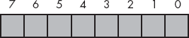

图 2-1. 位编号

位 0 是*低位*或*最低有效位*，位 7 是*高位*或*最高有效位*。我们将其他所有位按其编号来引用。

请注意，一个字节还恰好包含两个半字节（参见图 2-2）。

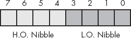

图 2-2. 一个字节中的两个半字节

位 0 到 3 组成*低位半字节*，位 4 到 7 组成*高位半字节*。由于一个字节恰好包含两个半字节，因此字节值需要两个十六进制数字。

由于一个字节包含 8 个位，它可以表示 2⁸（256）个不同的值。通常，我们使用字节表示范围为 0 到 255 的数字值、有符号数范围为−128 到+127（参见 2.8 有符号和无符号数字）、ASCII/IBM 字符代码以及其他需要不超过 256 个不同值的特殊数据类型。许多数据类型的项数少于 256，因此 8 位通常足够。

由于 80x86 是字节寻址机器，因此操作整个字节比操作单个位或半字节更高效。因此，大多数程序员使用整个字节来表示需要不超过 256 个项的数据类型，即使使用少于 8 位也足够。例如，我们通常通过 00000001[2]和 00000000[2]分别表示布尔值 true 和 false。

字节最重要的用途可能是保存字符值。键盘输入的字符、显示在屏幕上的字符以及打印在打印机上的字符都有数值。为了与外部世界进行通信，个人电脑通常使用*ASCII 字符集*的变种。ASCII 字符集中定义了 128 个代码。

由于字节是 80x86 内存空间中最小的存储单元，因此字节也恰好是你可以在 HLA 程序中创建的最小变量。如你在上一章中看到的，你可以使用`int8`数据类型声明一个 8 位有符号整数变量。由于`int8`对象是有符号的，因此你可以使用`int8`变量表示范围为−128 到+127 的值。你应该只将有符号值存储到`int8`变量中；如果你想创建一个任意字节变量，则应该使用`byte`数据类型，如下所示：

```
static
          byteVar: byte;
```

`byte`数据类型是一个部分未类型化的数据类型。与`byte`对象关联的唯一类型信息是它的大小（1 字节）。你可以将任何 8 位值（小的有符号整数、小的无符号整数、字符等）存储到字节变量中。你需要自行跟踪你存储在字节变量中的对象类型。

## 2.3.4 字

一个字是由 16 个位组成的。我们将字中的位从 0 编号到 15，如图 2-3 所示。与字节一样，位 0 是最低有效位。对于字来说，位 15 是最高有效位。在引用字中的其他位时，我们将使用它们的位位置编号。

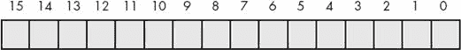

图 2-3. 字中的位数

请注意，一个字包含恰好 2 个字节。位 0..7 构成低字节，位 8..15 构成高字节（见图 2-4）。

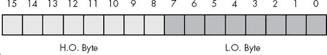

图 2-4. 字中的两个字节

当然，一个字还可以进一步分解为四个半字，如图 2-5 所示。半字 0 是字中的最低有效半字，半字 3 是字中的最高有效半字。我们将其他两个半字分别称为*nibble 1*和*nibble 2*。

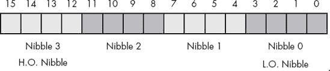

图 2-5. 字中的半字

通过 16 个位，你可以表示 2¹⁶（65,536）种不同的值。这些值可以是范围 0..65,535 内的值，或者通常的情况是有符号值−32,768..+32,767，或者是任何其他不超过 65,536 个值的数据类型。字的三大主要用途是短的有符号整数值、短的无符号整数值以及 Unicode 字符。

字可以表示 0..65,535 或−32,768..32,767 范围内的整数值。无符号数值由字中的位所对应的二进制值表示。有符号数值使用二的补码形式表示数值（参见 2.8 有符号和无符号数）。作为 Unicode 字符，字可以表示最多 65,536 个不同的字符，允许计算机程序使用非罗马字符集。Unicode 是一种国际标准，类似于 ASCII，它允许计算机处理非罗马字符，例如亚洲字符、希腊字母和俄语字符。

与字节类似，你也可以在 HLA 程序中创建字变量。当然，在上一章中你已经看到如何使用`int16`数据类型创建 16 位有符号整数变量。要创建一个任意的字变量，只需使用`word`数据类型，如下所示：

```
static
          w: word;
```

## 2.3.5 双字

双字正如其名，是一对字。因此，双字量是 32 位长，如图 2-6 所示。

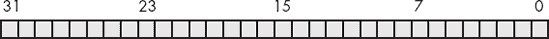

图 2-6. 双字中的比特数

自然，这个双字可以分为高位字和低位字、四个不同的字节，或者八个不同的半字节（见图 2-7）。

双字（dwords）可以表示各种不同的事物。你常用双字表示的一个项目是 32 位整数值（允许无符号数在 0..4,294,967,295 范围内，或有符号数在−2,147,483,648..2,147,483,647 范围内）。32 位浮点值也可以适应双字。双字对象的另一个常见用途是存储指针值。

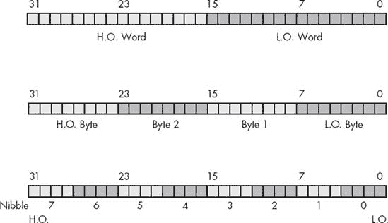

图 2-7. 双字中的字节、字和四位字节

在第一章中，你学会了如何使用`int32`数据类型创建 32 位有符号整数变量。你还可以使用`dword`数据类型创建任意双字变量，如以下示例所示：

```
static
          d: dword;
```

## 2.3.6 四字和长字

显然，我们可以继续定义越来越大的字大小。然而，80x86 只支持某些特定的原生大小，因此继续定义更大对象的术语没有太大意义。虽然字节、字和双字是你在 80x86 程序中最常见的大小，但四字（64 位）值也很重要，因为某些浮点数据类型需要 64 位。同样，现代 80x86 处理器的 SSE/MMX 指令集可以操作 64 位值。从类似的角度看，长字（128 位）值也很重要，因为后期 80x86 处理器的 SSE 指令集能够操作 128 位值。HLA 允许使用`qword`和`lword`类型声明 64 位和 128 位值，如下所示：

```
static
     q     :qword;
     l     :lword;
```

请注意，你还可以使用像以下这样的 HLA 声明来定义 64 位和 128 位的整数值：

```
static
     i64          :int64;
     i128         :int128;
```

然而，你不能直接使用标准指令如`mov`、`add`和`sub`来操作 64 位和 128 位整数对象，因为标准 80x86 整数寄存器每次只能处理 32 位。在第八章中，你将看到如何操作这些*扩展精度*值。

* * *

^([21]) 二进制编码十进制是一种数值方案，用于通过每个十进制数字 4 位来表示十进制数。

# 2.4 二进制和十六进制数的算术运算

我们可以对二进制和十六进制数字执行几种运算。例如，我们可以加法、减法、乘法、除法，以及执行其他算术运算。虽然你不必成为这一方面的专家，但在紧急情况下，你应该能够手动使用纸和笔完成这些运算。虽然刚才说过你应该能够手动执行这些算术运算，正确的做法是拥有一款可以自动完成这些运算的计算器。市场上有几款这样的计算器；以下是一些十六进制计算器制造商的列表（2010 年）：

+   卡西欧（Casio）

+   惠普（Hewlett-Packard）

+   夏普（Sharp）

+   德州仪器（Texas Instruments）

这个列表并非详尽无遗。其他计算器制造商可能也生产这些设备。惠普（Hewlett-Packard）的设备无疑是其中最好的。然而，它们比其他品牌更贵。夏普和卡西欧生产的设备价格远低于五十美元。如果你打算进行任何汇编语言编程，拥有其中一款计算器是必不可少的。

为了理解为什么你应该花钱买一台计算器，考虑以下这个算术问题：

```
$9
+ $1
----
```

你可能会想写出答案$10 作为这个问题的解答。但那是错误的！正确答案是 10，即$A，而不是 16，即$10。类似的问题也出现在以下的减法问题中：

```
$10
- $1
----
```

你可能会想回答$9，尽管正确答案是$F。记住，这个问题问的是：“16 和 1 之间的差是多少？”答案当然是 15，即$F。

即使这两个问题不困扰你，在紧张情况下，你的大脑会在你考虑其他事情时自动转换回十进制，从而得出错误的结果。故事的寓意是——如果你必须手动使用十六进制数字进行算术计算，一定要慢慢来，注意细节。或者，你可以将数字转换为十进制，进行十进制运算后再转换回十六进制。

# 2.5 数字与表示的说明

很多人会混淆数字及其表示形式。初学汇编语言的学生常问一个问题：“我有一个在 EAX 寄存器中的二进制数；我怎么将它转换为 EAX 寄存器中的十六进制数？”答案是，“你不能。”尽管可以提出有力的论据，认为内存或寄存器中的数字是以二进制表示的，但最好将内存或寄存器中的值视为*抽象的数值*。像 128、$80 或%1000_0000 这样的符号串并不是不同的数字；它们只是“128”这个抽象量的不同表示形式。在计算机内部，无论表示方式如何，数字就是数字；只有在你以人类可读的形式输入或输出值时，表示方式才重要。

人类可读的数字量形式始终是字符字符串。为了以人类可读的形式打印值 128，必须将数字值 128 转换为由字符 1、2、8 组成的三字符序列。这将提供数字量的十进制表示形式。如果你愿意，也可以将数字值 128 转换为三字符序列$80\。它是相同的数字，但我们将其转换为不同的字符序列，因为（假设）我们希望以十六进制表示该数字，而不是十进制。同样，如果我们希望以二进制形式查看该数字，则必须将该数字值转换为包含一个 1 后跟七个 0 的字符串。

默认情况下，使用`stdout.put`例程时，HLA 会以十六进制计数法显示所有`byte`、`word`、`dword`、`qword`和`lword`变量。同样，HLA 的`stdout.put`例程也会以十六进制形式显示所有寄存器的值。考虑示例 2-1 中的程序，该程序将作为十进制数字输入的值转换为其十六进制等价值。

示例 2-1. 十进制到十六进制转换程序

```
program ConvertToHex;
#include( "stdlib.hhf" )
static
    value: int32;

begin ConvertToHex;

    stdout.put( "Input a decimal value:" );
    stdin.get( value );
    mov( value, eax );
    stdout.put( "The value ", value, " converted to hex is $", eax, nl );

end ConvertToHex;
```

类似地，寄存器和`byte`、`word`、`dword`、`qword`、`lword`类型变量的默认输入基数也是十六进制。在示例 2-2 中的程序与示例 2-1 中的程序相反；它输入一个十六进制值，并将其输出为十进制。

示例 2-2. 十六进制到十进制转换程序

```
program ConvertToDecimal;
#include( "stdlib.hhf" )
static
    value: int32;

begin ConvertToDecimal;

    stdout.put( "Input a hexadecimal value: " );
    stdin.get( ebx );
    mov( ebx, value );
    stdout.put( "The value $", ebx, " converted to decimal is ", value, nl );

end ConvertToDecimal;
```

仅仅因为 HLA 的 `stdout.put` 例程选择了十进制作为 `int8`、`int16` 和 `int32` 变量的默认输出基数，并不意味着这些变量保存的是十进制数。请记住，内存和寄存器保存的是数值，而不是十六进制或十进制值。`stdout.put` 例程将这些数值转换为字符串并打印出结果。选择十六进制还是十进制输出是 HLA 语言中的设计选择，仅此而已。你可以很容易地修改 HLA，使其将寄存器和 `byte`、`word`、`dword`、`qword` 或 `lword` 变量输出为十进制值，而不是十六进制值。如果你需要将寄存器或 `byte`、`word`、`dword` 变量的值以十进制显示，只需调用其中一个 `putiX` 例程。`stdout.puti8` 例程会将其参数作为 8 位有符号整数输出。任何 8 位参数都能工作。所以你可以将一个 8 位寄存器、`int8` 变量或 `byte` 变量作为参数传递给 `stdout.puti8`，结果将始终是十进制输出。`stdout.puti16` 和 `stdout.puti32` 例程为 16 位和 32 位对象提供相同的功能。示例 2-3 程序演示了使用仅包含 EBX 寄存器的十进制转换程序（即不使用变量 `iValue`），与 示例 2-2 一起展示。

示例 2-3. 无变量的十六进制到十进制转换器

```
program ConvertToDecimal2;
#include( "stdlib.hhf" )
begin ConvertToDecimal2;

    stdout.put( "Input a hexadecimal value: " );
    stdin.get( ebx );
    stdout.put( "The value $", ebx, " converted to decimal is " );
    stdout.puti32( ebx );
    stdout.newln();

end ConvertToDecimal2;
```

注意，HLA 的 `stdin.get` 例程对于输入使用的默认基数与 `stdout.put` 例程用于输出时使用的默认基数相同。也就是说，如果你尝试读取一个 `int8`、`int16` 或 `int32` 变量，默认输入基数是十进制。如果你尝试读取一个寄存器或 `byte`、`word`、`dword`、`qword` 或 `lword` 变量，默认输入基数是十六进制。如果你希望在读取寄存器或 `byte`、`word`、`dword`、`qword` 或 `lword` 变量时将默认输入基数更改为十进制，则可以使用 `stdin.geti8`、`stdin.geti16`、`stdin.geti32`、`stdin.geti64` 或 `stdin.geti128`。

如果你想反向操作，也就是将 `int8`、`int16`、`int32`、`int64` 或 `int128` 变量作为十六进制值输入或输出，可以调用 `stdout.puth8`、`stdout.puth16`、`stdout.puth32`、`stdout.puth64`、`stdout.puth128`、`stdin.geth8`、`stdin.geth16`、`stdin.geth32`、`stdin.geth64` 或 `stdin.geth128` 函数。`stdout.puth8`、`stdout.puth16`、`stdout.puth32`、`stdout.puth64` 和 `stdout.puth128` 函数将 8 位、16 位、32 位、64 位或 128 位对象以十六进制值写入。`stdin.geth8`、`stdin.geth16`、`stdin.geth32`、`stdin.geth64` 和 `stdin.geth128` 函数分别读取 8 位、16 位、32 位、64 位和 128 位的值；它们将结果返回到 AL、AX 或 EAX 寄存器（或者对于 64 位和 128 位值返回到参数位置）。示例 2-4 中的程序展示了这些函数的一些使用方法：

示例 2-4. 演示 `stdin.geth32` 和 `stdout.puth32`

```
program HexIO;

#include( "stdlib.hhf" )

static
    i32: int32;

begin HexIO;

    stdout.put( "Enter a hexadecimal value: " );
    stdin.geth32();
    mov( eax, i32 );
    stdout.put( "The value you entered was $" );
    stdout.puth32( i32 );
    stdout.newln();

end HexIO;
```

# 2.6 位级逻辑运算

我们将进行四种主要的逻辑运算，使用十六进制和二进制数字：`and`、`or`、`xor`（异或）和 `not`。与算术运算不同，进行这些运算时不需要十六进制计算器。手动操作通常比使用电子设备计算要简单。逻辑 `and` 运算是一个二元^([22]) 运算（意味着它接受恰好两个操作数）。这些操作数是单独的二进制位。`and` 运算为：

```
0 and 0 = 0
               0 and 1 = 0
               1 and 0 = 0
               1 and 1 = 1
```

一种紧凑的方式来表示逻辑 `and` 运算是使用真值表。真值表的形式如 表 2-2 所示。

表 2-2. `and` 真值表

| **`and`** | 0 | 1 |
| --- | --- | --- |
| 0 | 0 | 0 |
| 1 | 0 | 1 |

这就像你在学校遇到的乘法表。左列的值对应 `and` 运算的左操作数。顶部行的值对应 `and` 运算的右操作数。位于行和列交点处的值（对于特定输入值对）是这两个值进行逻辑 `and` 运算后的结果。

在英语中，逻辑`and`运算是，“如果第一个操作数为 1 且第二个操作数为 1，则结果为 1；否则结果为 0。”我们也可以这样表达，“如果任一操作数或两个操作数都是 0，则结果为 0。”

关于逻辑`and`操作，有一个重要的事实需要注意，那就是你可以用它来强制得到一个 0 的结果。如果一个操作数为 0，则结果始终为 0，不管另一个操作数的值是什么。例如，在上面的真值表中，标记为 0 输入的行只有 0，标记为 0 的列结果也全是 0。相反，如果一个操作数为 1，则结果完全等于第二个操作数的值。`and`操作的这些结果非常重要，特别是当我们想强制将比特设置为 0 时。我们将在下一节中进一步探讨逻辑`and`操作的这些应用。

逻辑`or`操作也是一种二元操作。它的定义是：

```
0 or 0 = 0
               0 or 1 = 1
               1 or 0 = 1
               1 or 1 = 1
```

`or`操作的真值表呈现于表 2-3 中。

表 2-3. `or` 真值表

| **`or`** | 0 | 1 |
| --- | --- | --- |
| 0 | 0 | 1 |
| 1 | 1 | 1 |

口语中，逻辑`or`操作是，“如果第一个操作数或第二个操作数（或两者）为 1，则结果为 1；否则结果为 0。”这也被称为*包含或*操作。

如果逻辑`or`操作的一个操作数为 1，则结果始终为 1，不管第二个操作数的值是什么。如果一个操作数为 0，则结果始终是第二个操作数的值。像逻辑`and`操作一样，这是逻辑`or`操作的一个重要副作用，实际上非常有用。

请注意，这种形式的包含逻辑`or`操作与标准英语中的含义是不同的。考虑句子“我要去商店*或者*我要去公园。”这样的表述意味着说话者要么去商店，要么去公园，而不是同时去两个地方。因此，英语中的逻辑`or`略有不同于包含或操作；实际上，这就是*异或*操作的定义。

逻辑`xor`（异或）操作也是一种二元操作。它的定义如下：

```
0 xor 0 = 0
               0 xor 1 = 1
               1 xor 0 = 1
               1 xor 1 = 0
```

`xor`操作的真值表呈现于表 2-4 中。

表 2-4. `xor` 真值表

| **`xor`** | 0 | 1 |
| --- | --- | --- |
| 0 | 0 | 1 |
| 1 | 1 | 0 |

在英语中，逻辑`xor`操作是，“如果第一个操作数或第二个操作数（但不是两者），为 1，则结果为 1；否则结果为 0。”请注意，异或操作比逻辑`or`操作更接近英语中*or*这个词的含义。

如果逻辑异或操作的一个操作数为 1，则结果始终是另一个操作数的*反转*；即，如果一个操作数为 1，而另一个操作数为 1，则结果为 0；如果另一个操作数为 0，则结果为 1。如果第一个操作数为 0，则结果完全等于第二个操作数的值。这个特性让你可以在比特串中选择性地反转比特。

逻辑`not`操作是单目操作（意味着它只接受一个操作数）：

```
not 0 = 1
               not 1 = 0
```

`not`操作的真值表见于表 2-5。

表 2-5. `not` 真值表

| **`not`** | 0 | 1 |
| --- | --- | --- |
|   | 1 | 0 |

* * *

^([22]) 许多文本称之为二进制运算。术语*二元*表示相同的意思，并避免了与二进制计数系统的混淆。

# 2.7 二进制数和位串的逻辑运算

上一节定义了单比特操作数的逻辑函数。由于 80x86 使用的是 8、16 或 32 位的字长，我们需要扩展这些函数的定义，以处理超过 2 位的情况。80x86 上的逻辑函数是逐位（或按位）操作的。给定两个值，这些函数对第 0 位执行操作，生成结果的第 0 位。它们对输入值的第 1 位执行操作，生成结果的第 1 位，以此类推。例如，如果你想计算以下两个 8 位数的逻辑`and`，你将对每一列独立地执行逻辑`and`操作：

```
%1011_0101
                         %1110_1110
                         ----------
                         %1010_0100
```

你也可以将这种逐位计算应用于其他逻辑函数。

因为我们已经定义了基于二进制值的逻辑运算，所以你会发现对二进制值进行逻辑运算比其他表示形式更容易。因此，如果你想对两个十六进制数执行逻辑运算，应该先将它们转换为二进制。这适用于大多数基本的二进制逻辑运算（如`and`、`or`、`xor`等）。

使用逻辑`and`/`or`操作将比特强制为 0 或 1 的能力，以及使用逻辑`xor`操作反转比特的能力，在处理比特串（如二进制数）时非常重要。这些操作使你能够选择性地操作比特串中的某些比特，而不影响其他比特。例如，如果你有一个 8 位的二进制值*X*，并且想要保证第 4..7 位为 0，你可以将值*X*与二进制值%0000_1111 进行逻辑`and`运算。这个逐位逻辑`and`操作会将高 4 位强制为 0，而将*X*的低 4 位保持不变。同样，你可以通过将*X*与%0000_0001 进行逻辑`or`运算，将*X*的低位强制为 1，并通过将*X*与%0000_0100 进行逻辑异或（exclusive-`or`）运算来反转*X*的第 2 位。以这种方式使用逻辑`and`、`or`和`xor`操作来处理比特串被称为*掩码*比特串。我们使用*掩码*这个术语，因为我们可以使用特定的值（`and`用 1，`or`/`xor`用 0）来掩盖或掩入某些比特，从而在将比特强制为 0、1 或其反值时控制操作。

80x86 CPU 支持四条指令，将这些按位逻辑操作应用于操作数。这些指令是`and`、`or`、`xor`和`not`。`and`、`or`和`xor`指令与`add`和`sub`指令使用相同的语法：

```
and( *`source`*, *`dest`* );
 or( *`source`*, *`dest`* );
xor( *`source`*, *`dest`* );
```

这些操作数与`add`操作数具有相同的限制。具体来说，*`source`*操作数必须是常数、内存或寄存器操作数，*`dest`*操作数必须是内存或寄存器操作数。此外，操作数必须具有相同的大小，并且不能同时是内存操作数。这些指令通过以下等式计算明显的按位逻辑操作：

```
*`dest`* = *`dest operator source`*
```

80x86 逻辑`not`指令，由于只有一个操作数，因此使用稍微不同的语法。该指令的形式如下：

```
not( *`dest`* );
```

该指令计算出以下结果：

```
*`dest`* = not( *`dest`* )
```

*`dest`*操作数必须是寄存器或内存操作数。此指令会反转指定目标操作数中的所有位。

程序在示例 2-5 中从用户输入两个十六进制值，并计算它们的逻辑`and`、`or`、`xor`和`not`：

示例 2-5. `and`、`or`、`xor`和`not`示例

```
program LogicalOp;
#include( "stdlib.hhf" )
begin LogicalOp;

    stdout.put( "Input left operand: " );
    stdin.get( eax );
    stdout.put( "Input right operand: " );
    stdin.get( ebx );

    mov( eax, ecx );
    and( ebx, ecx );
    stdout.put( "$", eax, " and $", ebx, " = $", ecx, nl );

    mov( eax, ecx );
    or( ebx, ecx );
    stdout.put( "$", eax, " or $", ebx, " = $", ecx, nl );

    mov( eax, ecx );
    xor( ebx, ecx );
    stdout.put( "$", eax, " xor $", ebx, " = $", ecx, nl );

    mov( eax, ecx );
    not( ecx );
    stdout.put( "not $", eax, " = $", ecx, nl );

    mov( ebx, ecx );
    not( ecx );
    stdout.put( "not $", ebx, " = $", ecx, nl );

end LogicalOp;
```

# 2.8 带符号数和无符号数

到目前为止，我们将二进制数视为无符号值。二进制数...00000 表示 0，...00001 表示 1，...00010 表示 2，依此类推，直到无穷大。那么负数呢？带符号值在前面的章节中已经提到过，我们提到了二进制补码系统，但我们还没有讨论如何使用二进制系统表示负数。现在是时候描述二进制补码系统了。

为了使用二进制编号系统表示带符号数字，我们必须对数字施加限制：它们必须具有有限且固定的位数。为了简便起见，我们将大幅限制位数，限制为 8、16、32、64、128 或其他一些较小的位数。

使用固定的位数，我们只能表示有限数量的对象。例如，使用 8 位，我们只能表示 256 个不同的值。负值是独立的对象，就像正数和 0 一样；因此，我们必须使用 256 个不同的 8 位值中的一部分来表示负数。换句话说，我们必须使用一些位组合来表示负数。为了公平起见，我们将把一半的可能组合分配给负值，另一半分配给正值和 0。因此，我们可以用一个 8 位字节表示负值−128..−1 和非负值 0..127。使用 16 位字，我们可以表示值范围−32,768..+32,767。使用 32 位双字，我们可以表示值范围−2,147,483,648..+2,147,483,647。一般来说，使用*n*位时，我们可以表示带符号值范围为−2^(*n*−1)到+2^(*n*−1)−1。

好的，我们可以表示负数。我们究竟该怎么做呢？实际上有许多方法，但 80x86 微处理器使用的是二补码表示法，因此研究这种方法是有意义的。在二补码系统中，一个数的最高有效位（H.O. bit）是一个*符号位*。如果最高有效位是 0，则该数为正数；如果最高有效位是 1，则该数为负数。以下是一些例子。

对于 16 位数：

```
$8000 is negative because the H.O. bit is 1.
      $100 is positive because the H.O. bit is 0.
      $7FFF is positive.
      $FFFF is negative.
      $FFF ($0FFF) is positive.
```

如果最高有效位是 0，则该数为正数，并使用标准二进制格式。如果最高有效位是 1，则该数为负数，并使用二补码形式。将正数转换为负数的二补码形式，你可以使用以下算法：

1.  反转数值中的所有位；也就是说，应用逻辑`not`运算。

1.  将 1 加到反转后的结果，并忽略任何从最高有效位溢出的部分。

    例如，计算−5 的 8 位等价数：

    ```
    %0000_0101             5 (in binary).
                    %1111_1010             Invert all the bits.
                    %1111_1011             Add 1 to obtain result.
    ```

    如果我们对−5 进行二补码操作，我们会得到原始值 %0000_0101，正如我们所期望的那样：

    ```
    %1111_1011             Two's complement for −5.
                    %0000_0100             Invert all the bits.
                    %0000_0101             Add 1 to obtain result (+5).
    ```

    以下例子提供了一些正负 16 位有符号数值：

    ```
    $7FFF: +32767, the largest 16-bit positive number.
         $8000: −32768, the smallest 16-bit negative number.
         $4000: +16384.
    ```

    要将上面的数字转换为其负数（即取反），请执行以下操作：

    ```
    $7FFF:          %0111_1111_1111_1111   +32,767
                    %1000_0000_0000_0000   Invert all the bits (8000h)
                    %1000_0000_0000_0001   Add 1 (8001h or −32,767)

    4000h:          %0100_0000_0000_0000   16,384
                    %1011_1111_1111_1111   Invert all the bits ($BFFF)
                    %1100_0000_0000_0000   Add 1 ($C000 or −16,384)

    $8000:          %1000_0000_0000_0000   −32,768
                    %0111_1111_1111_1111   Invert all the bits ($7FFF)
                    %1000_0000_0000_0000   Add one (8000h or −32,768)
    ```

$8000 反转后变为 $7FFF。加 1 后，我们得到 $8000！等等，发生了什么？−(−32,768)是−32,768 吗？当然不是。但+32,768 的值无法用 16 位有符号数表示，所以我们无法取反最小的负值。

为什么要使用如此复杂的编号系统？为什么不将最高有效位作为符号标志，将数值的正数等价物存储在剩余的位中呢？（顺便说一下，这被称为*一补码编号系统*。）答案在于硬件。事实证明，取反值是唯一繁琐的操作。使用二补码系统时，大多数其他操作和二进制系统一样简单。例如，假设你要执行加法 5 + (−5)。结果是 0。考虑一下当我们在二补码系统中将这两个数相加时发生了什么：

```
%  0000_0101
                          %  1111_1011
                          ------------
                          %1_0000_0000
```

我们最终会在第九位产生进位，其他所有位都为 0。事实上，如果我们忽略从最高有效位产生的进位，使用二补码编号系统时，两个符号数的加法总是能得到正确的结果。这意味着我们可以使用相同的硬件进行有符号和无符号的加法与减法，而其他编号系统则不能做到这一点。

通常，你不需要手动执行二补码操作。80x86 微处理器提供了一条指令，`neg`（取反），可以为你执行这个操作。此外，十六进制计算器通过按下切换符号键（+/− 或 CHS）来执行这个操作。不过，手动计算二补码很简单，你应该知道怎么做。

请记住，由一组二进制位表示的数据完全取决于上下文。8 位二进制值%1100_0000 可以表示一个字符，也可以表示无符号十进制值 192，或者表示有符号十进制值−64。作为程序员，你有责任定义数据的格式，然后一致地使用这些数据。

80x86 的取反指令`neg`与`not`指令使用相同的语法；即，它接受一个目标操作数：

```
neg( *`dest`* );
```

该指令计算 *`dest`* `= -`*`dest`*`;` 操作数与`not`指令相同的限制（它必须是一个内存位置或寄存器）。`neg`指令作用于字节、字（word）和双字（dword）大小的对象。由于这是一个有符号整数操作，所以只对有符号整数值进行操作才有意义。示例 2-6 中的程序通过使用`neg`指令演示了二进制补码操作：

示例 2-6. `twosComplement` 示例

```
program twosComplement;
#include( "stdlib.hhf" )

static
    PosValue:   int8;
    NegValue:   int8;

begin twosComplement;

    stdout.put( "Enter an integer between 0 and 127: " );
    stdin.get( PosValue );

    stdout.put( nl, "Value in hexadecimal: $" );
    stdout.puth8( PosValue );

    mov( PosValue, al );
    not( al );
    stdout.put( nl, "Invert all the bits: $", al, nl );
    add( 1, al );
    stdout.put( "Add one: $", al, nl );
    mov( al, NegValue );
    stdout.put( "Result in decimal: ", NegValue, nl );

    stdout.put
    (
        nl,
        "Now do the same thing with the NEG instruction: ",
        nl
    );
    mov( PosValue, al );
    neg( al );
    mov( al, NegValue );
    stdout.put( "Hex result = $", al, nl );
    stdout.put( "Decimal result = ", NegValue, nl );

end twosComplement;
```

如你所见，使用`int8`、`int16`、`int32`、`int64`和`int128`数据类型来为有符号整数变量预留存储空间。你也看到过像`stdout.puti8`和`stdin.geti32`这样的例程，它们用于读取和写入有符号整数值。由于本节已经明确指出，你必须在程序中区分有符号和无符号计算，你可能会问自己：“如何声明和使用无符号整数变量？”

问题的第一部分，“如何声明无符号整数变量”，最容易回答。你只需在声明变量时使用`uns8`、`uns16`、`uns32`、`uns64`和`uns128`数据类型。例如：

```
static
     u8:          uns8;
     u16:         uns16;
     u32:         uns32;
     u64:         uns64;
     u128:        uns128;
```

至于如何使用这些无符号变量，HLA 标准库提供了一组补充的输入/输出例程，用于读取和显示无符号变量。你可以猜到，这些例程包括`stdout.putu8`、`stdout.putu16`、`stdout.putu32`、`stdout.putu64`、`stdout.putu128`、`stdout.putu8Size`、`stdout.putu16Size`、`stdout.putu32Size`、`stdout.putu64Size`、`stdout.putu128Size`、`stdin.getu8`、`stdin.getu16`、`stdin.getu32`、`stdin.getu64`和`stdin.getu128`。你可以像使用有符号整数对应例程一样使用这些例程，只不过你可以使用这些例程访问无符号值的全部范围。示例 2-7 的源代码演示了无符号 I/O，并展示了如果你在同一计算中混合有符号和无符号操作会发生什么。

示例 2-7. 无符号 I/O

```
program UnsExample;
#include( "stdlib.hhf" )

static
    UnsValue:   uns16;

begin UnsExample;

    stdout.put( "Enter an integer between 32,768 and 65,535: " );
    stdin.getu16();
    mov( ax, UnsValue );

    stdout.put
    (
        "You entered ",
        UnsValue,
        ".  If you treat this as a signed integer, it is "
    );
    stdout.puti16( UnsValue );
    stdout.newln();

end UnsExample;
```

# 2.9 符号扩展、零扩展、收缩和饱和

因为补码格式的整数具有固定的长度，所以会出现一个小问题。如果需要将一个 8 位补码值转换为 16 位会发生什么？这个问题及其反问题（将 16 位值转换为 8 位）可以通过*符号扩展*和*收缩*操作来完成。

考虑值 −64。这个数的 8 位补码值是$C0。该数的 16 位等效值是$FFC0。现在考虑值 +64。该值的 8 位和 16 位版本分别为$40 和$0040。8 位和 16 位数值之间的区别可以通过以下规则描述：“如果数值是负数，16 位数值的高字节包含$FF；如果数值是正数，16 位数值的高字节是 0。”

要将一个有符号值从某些位数扩展到更大的位数很容易；只需将符号位复制到新格式中的所有附加位。例如，要将 8 位数符号扩展为 16 位数，只需将 8 位数的第 7 位复制到 16 位数的第 8 到 15 位。要将 16 位数符号扩展为双字，只需将 16 位数的第 15 位复制到双字的第 16 到 31 位。

在操作不同长度的有符号值时，你必须使用符号扩展。通常你需要将一个字节量与一个字量相加。在进行操作之前，必须先将字节量符号扩展为字。其他操作（特别是乘法和除法）可能需要扩展到 32 位：

```
Sign Extension:
8 Bits      16 Bits       32 Bits

$80         $FF80         $FFFF_FF80
$28         $0028         $0000_0028
$9A         $FF9A         $FFFF_FF9A
$7F         $007F         $0000_007F
            $1020         $0000_1020
            $8086         $FFFF_8086
```

要将一个无符号值扩展为更大的值，你必须进行零扩展。零扩展非常简单——只需将 0 存储到更大操作数的高字节中。例如，要将 8 位值$82 零扩展到 16 位，你只需在高字节加上 0，得到$0082。

```
Zero Extension:
8 Bits      16 Bits       32 Bits

$80         $0080         $0000_0080
$28         $0028         $0000_0028
$9A         $009A         $0000_009A
$7F         $007F         $0000_007F
            $1020         $0000_1020
            $8086         $0000_8086
```

80x86 提供了几条指令，允许你将一个较小的数字符号扩展或零扩展到较大的数字。表 2-6 列出了能够符号扩展 AL、AX 或 EAX 寄存器的一组指令。

表 2-6. 扩展 AL, AX, 和 EAX 的指令

| 指令 | 说明 |
| --- | --- |
| `cbw();` | 通过符号扩展将 AL 中的字节转换为 AX 中的字。 |
| `cwd();` | 通过符号扩展将 AX 中的字转换为 DX:AX 中的双字。 |
| `cdq();` | 通过符号扩展将 EAX 中的双字转换为 EDX:EAX 中的四字。 |
| `cwde();` | 通过符号扩展将 AX 中的字转换为 EAX 中的双字。 |

请注意，`cwd`（将字转换为双字）指令并不会将 AX 中的字进行符号扩展到 EAX 中的双字。相反，它将符号扩展的高字节部分存储到 DX 寄存器中（符号 DX:AX 表示你有一个双字值，其中 DX 包含高 16 位，AX 包含低 16 位）。如果你希望将 AX 的符号扩展放入 EAX 中，应该使用`cwde`（将字转换为双字，扩展）指令。

上述四条指令是不同寻常的，因为这是你见过的第一组没有任何操作数的指令。这些指令的操作数是由指令本身*隐含*的。

在接下来的几章中，你将发现这些指令的重要性以及为什么`cwd`和`cdq`指令涉及 DX 和 EDX 寄存器。然而，对于简单的符号扩展操作，这些指令有一些主要缺点——你无法指定源操作数和目标操作数，并且操作数必须是寄存器。

对于一般的符号扩展操作，80x86 提供了`mov`指令的扩展——`movsx`（带符号扩展的移动指令），它在复制数据的同时进行符号扩展。`movsx`指令的语法与`mov`指令非常相似：

```
movsx( *`source`*, *`dest`* );
```

这条指令与`mov`指令的最大语法区别在于目标操作数必须比源操作数大。也就是说，如果源操作数是字节，目标操作数必须是字或双字。类似地，如果源操作数是字，目标操作数必须是双字。另一个区别是目标操作数必须是寄存器；而源操作数则可以是内存位置。^([23]) `movsx`指令不允许常量操作数。

要将一个值进行零扩展，可以使用`movzx`指令。它的语法和限制与`movsx`指令相同。零扩展某些 8 位寄存器（AL、BL、CL 和 DL）到它们对应的 16 位寄存器，可以通过将互补的高字节寄存器（AH、BH、CH 或 DH）加载为 0 来轻松实现，而无需使用`movzx`指令。显然，要将 AX 零扩展到 DX:AX 或 EAX 零扩展到 EDX:EAX，你需要做的就是将 DX 或 EDX 加载为 0。^([24])

示例 2-8 中的示例程序演示了符号扩展指令的使用。

示例 2-8. 符号扩展指令

```
program signExtension;
#include( "stdlib.hhf" )

static
    i8:     int8;
    i16:    int16;
    i32:    int32;

begin signExtension;

    stdout.put( "Enter a small negative number: " );
    stdin.get( i8 );

    stdout.put( nl, "Sign extension using CBW and CWDE:", nl, nl );

    mov( i8, al );
    stdout.put( "You entered ", i8, " ($", al, ")", nl );

    cbw();
    mov( ax, i16 );
    stdout.put( "16-bit sign extension: ", i16, " ($", ax, ")", nl );

    cwde();
    mov( eax, i32 );
    stdout.put( "32-bit sign extension: ", i32, " ($", eax, ")", nl );

    stdout.put( nl, "Sign extension using MOVSX:", nl, nl );

    movsx( i8, ax );
    mov( ax, i16 );
    stdout.put( "16-bit sign extension: ", i16, " ($", ax, ")", nl );

    movsx( i8, eax );
    mov( eax, i32 );
    stdout.put( "32-bit sign extension: ", i32, " ($", eax, ")", nl );

end signExtension;
```

符号*收缩*，将具有一定数量位的值转换为具有较少位的相同值，是稍微麻烦一点的操作。符号扩展从不失败。给定一个 *m* 位的有符号值，你总是可以将其通过符号扩展转换为 *n* 位数（其中 *n* > *m*）。不幸的是，给定一个 *n* 位数，如果 *m* < *n*，你并不总能将其转换为 *m* 位数。例如，考虑值 −448。作为一个 16 位有符号数，它的十六进制表示为 $FE40。不幸的是，这个数字的大小对于一个 8 位值来说太大了，因此你无法将其符号收缩为 8 位。这是一个在转换过程中发生溢出的例子。

要正确地对合同值进行签名，你必须查看要丢弃的 H.O. 字节。H.O. 字节必须全都包含 0 或 $FF。如果你遇到其他值，则无法在不发生溢出的情况下进行收缩。最后，结果值的 H.O. 位必须与从数字中移除的*每一个*位匹配。以下是一些示例（16 位到 8 位）：

```
$FF80 can be sign contracted to $80.
          $0040 can be sign contracted to $40.
          $FE40 cannot be sign contracted to 8 bits.
          $0100 cannot be sign contracted to 8 bits.
```

另一种减少整数大小的方法是*饱和*。饱和在需要将较大的对象转换为较小的对象，并且你愿意接受可能的精度损失时非常有用。通过饱和转换值时，如果较大的值不超出较小对象的范围，你只需将较大的值复制到较小的对象中。如果较大的值超出了较小值的范围，那么你*裁剪*该值，将其设置为较小对象范围内的最大（或最小）值。

例如，当将一个 16 位有符号整数转换为 8 位有符号整数时，如果 16 位值在 −128..+127 的范围内，你只需将 16 位对象的 L.O. 字节复制到 8 位对象中。如果 16 位有符号值大于 +127，那么你将值裁剪为 +127，并将 +127 存储到 8 位对象中。同样，如果该值小于 −128，你将最终的 8 位对象裁剪为 −128。饱和操作在将 32 位值裁剪为较小值时同样有效。如果较大的值超出了较小值的范围，那么你只需将较小值设置为可以用较小值表示的最接近溢出值。

显然，如果较大的值超出了较小值的范围，那么在转换过程中就会出现精度损失。虽然将值裁剪到较小对象所限制的范围并不是理想的做法，但有时这是可以接受的，因为另一种选择是引发异常或拒绝计算。对于许多应用场景，如音频或视频处理，裁剪后的结果仍然是可识别的，因此这是一个合理的转换方式。

* * *

^([23]) 这并不会成为太大的限制，因为符号扩展几乎总是发生在必须在寄存器中执行的算术操作之前。

^([24]) 零扩展到 DX:AX 或 EDX:EAX 和 CWD、CDQ 指令同样重要，正如你最终会看到的那样。

# 2.10 移位与旋转

另一个应用于比特串的逻辑操作是*移位*和*旋转*操作。这两类操作可以进一步细分为*左移、左旋、右移*和*右旋*。这些操作非常有用。

左移操作将比特串中的每个位向左移动一位位置（图 2-8 提供了一个 8 位移位的示例）。

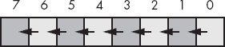

图 2-8. 左移操作

位 0 移动到位位置 1，位位置 1 中的先前值移动到位位置 2，以此类推。当然，随之而来的两个问题是：“位 0 中放入什么？”以及“最高位去哪里了？”我们将一个 0 移入位 0，先前的最高位值将成为此次操作的*进位*。

80x86 提供了一个左移指令`shl`，可以执行此有用操作。`shl`指令的语法为：

```
shl( *`count`*, *`dest`* );
```

*`count`* 操作数可以是 CL 或一个常数，范围是 0..*n*，其中 *n* 是目标操作数中比特位数减去 1（例如，8 位操作数时 *n* = 7，16 位操作数时 *n* = 15，32 位操作数时 *n* = 31）。*`dest`* 操作数是一个典型的目标操作数，可以是内存位置或寄存器。

当*`count`* 操作数为常数 1 时，`shl` 指令执行如图 2-9 所示的操作。

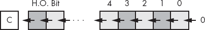

图 2-9. 左移操作

在图 2-9 中，*C* 代表进位标志。也就是说，从操作数中移出的最高位会进入进位标志。因此，你可以在执行 `shl(1, *`dest`*);` 指令后，通过立即测试进位标志来检测溢出（例如，使用 `if( @c ) then...` 或 `if( @nc ) then...`）。

英特尔的文献指出，如果移位计数是 1 以外的值，则进位标志的状态未定义。通常，进位标志包含从目标操作数中移出的最后一位，但英特尔似乎没有保证这一点。

注意，左移值等同于将其乘以基数。例如，将一个十进制数左移一位（在数字右侧加上一个 0）实际上是将其乘以 10（基数）：

```
1234 shl 1 = 12340
```

(`shl 1` 表示将一个数字位置向左移。)

由于二进制数字的基数是 2，左移操作相当于乘以 2。如果你将二进制值左移两次，你相当于将其乘以 2 两次（即乘以 4）。如果你将二进制值左移三次，你相当于将其乘以 8（2*2*2）。一般来说，如果你将一个值左移*n*次，你就将该值乘以 2^(*n*)。

右移操作的工作方式相同，只是我们将数据移向相反的方向。对于字节值，第 7 位移入第 6 位，第 6 位移入第 5 位，第 5 位移入第 4 位，依此类推。在右移过程中，我们将一个 0 移入第 7 位，第 0 位将作为操作的进位输出（见图 2-10）。

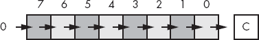

图 2-10. 右移操作

正如你可能预料的那样，80x86 提供了一个`shr`指令，可以将目标操作数的位向右移。其语法与`shl`指令相同，当然，区别在于你指定的是`shr`而不是`shl`：

```
shr( *`count`*, *`dest`* );
```

该指令将一个 0 移入目标操作数的最高有效位（H.O.），并将其他位向右移一个位置（即，从高位数字移到低位数字）。最后，位 0 被移入进位标志。如果你指定移位次数为 1，`shr`指令会执行图 2-11 中所示的操作。

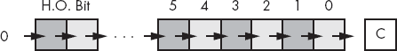

图 2-11. 右移操作

再次提醒，Intel 的文档建议，移位超过 1 位时，进位会处于未定义状态。

由于左移相当于乘以 2，因此右移大致可以看作是除以 2（或者一般而言，除以该数字的基数）。如果你执行*n*次右移，那么你将该数字除以 2^(*n*)。

关于除法，右移操作有一个问题：右移仅相当于*无符号*除以 2。例如，如果你将无符号表示的 254（$FE）右移一位，你得到 127（$7F），这正是你期望的结果。然而，如果你将-2 的二进制表示（$FE）右移一位，你得到 127（$7F），这是*不*正确的。这个问题发生是因为我们将一个 0 移入了第 7 位。如果第 7 位之前是 1，那么我们将其从负数变成了正数。在除以 2 时这样做并不好。

为了将右移用作除法运算符，我们必须定义第三种移位操作：算术右移。^([25]) 算术右移的工作原理与普通右移操作（逻辑右移）相同，唯一的例外是：算术右移操作不会将 0 移入高位，而是将高位的值保留在其自身中；也就是说，在移位操作过程中，它不会修改高位，如图 2-12 所示。

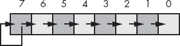

图 2-12. 算术右移操作

算术右移通常会产生你预期的结果。例如，如果对 −2 ($FE) 执行算术右移操作，结果是 −1 ($FF)。然而，有一点需要牢记关于算术右移：该操作总是将数字舍入到 *小于或等于实际结果* 的最接近整数。基于高级编程语言的经验和整数截断的标准规则，大多数人认为这意味着除法总是向 0 截断。但事实并非如此。例如，如果对 −1 ($FF) 执行算术右移操作，结果是 −1，而不是 0。因为 −1 小于 0，算术右移操作会舍入到 −1。这并不是算术右移操作的错误；它只是使用了与整数除法不同（但有效）的定义。

80x86 提供了一个算术右移指令，`sar`（算术右移）。该指令的语法几乎与 `shl` 和 `shr` 相同。其语法如下：

```
sar( *`count`*, *`dest`* );
```

通常关于计数和目标操作数的限制适用。如果计数为 1，则该指令的操作如图 2-13` 操作")所示。

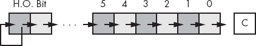

图 2-13. `sar( 1, dest )` 操作

再次提醒，Intel 的文档建议，如果移位超过 1 位，进位将处于未定义状态。

另一个有用的操作是 *左旋转* 和 *右旋转*。这些操作与左移和右移操作类似，但有一个主要区别：从一端移出的位会被旋转回另一端。图 2-14 展示了这些操作。

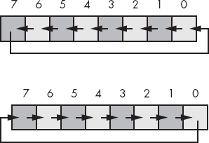

图 2-14. 左旋转和右旋转操作

80x86 提供了 `rol`（左旋转）和 `ror`（右旋转）指令，对其操作数执行这些基本操作。这两个指令的语法与移位指令类似：

```
rol( *`count`*, *`dest`* );
ror( *`count`*, *`dest`* );
```

再次强调，这些指令在移位计数为 1 时提供特殊行为。在这种情况下，这两个指令还会将从目标操作数中移出的位复制到进位标志中，正如图 2-15 操作")和图 2-16 操作")所示。

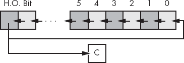

图 2-15. `rol( 1, dest )` 操作

请注意，英特尔的文档建议，超过 1 位的旋转操作会使进位处于未定义状态。


图 2-16. `ror( 1, dest )` 操作

对于旋转操作，通常更方便将输出位通过进位进行旋转，并将之前的进位值重新输入到移位操作的输入位中。80x86 的 `rcl`（进位左旋转）和 `rcr`（进位右旋转）指令为你实现了这一点。这些指令使用以下语法：

```
rcl( *`count`*, *`dest`* );
rcr( *`count`*, *`dest`* );
```

与其他移位和旋转指令一样，*`count`* 操作数要么是常数，要么是 CL 寄存器，*`dest`* 操作数则是内存位置或寄存器。*`count`* 操作数的值必须小于 *`dest`* 操作数的位数。对于移位计数值为 1 的情况，这两个指令执行的旋转操作如图 2-17 和 rcr( 1, dest ) 操作")所示。

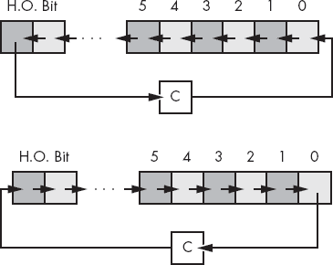

图 2-17. `rcl( 1, dest )` 和 `rcr( 1, dest )` 操作

再次提醒，英特尔的文档建议，超过 1 位的旋转操作会使进位处于未定义状态。

* * *

^([25]) 不需要算术左移。标准的左移操作适用于有符号和无符号数值，前提是没有溢出发生。

# 2.11 位域和打包数据

尽管 80x86 在处理`byte`、`word`和`dword`数据类型时效率最高，但有时你需要处理一些比 8、16 或 32 位更复杂的数据类型。例如，考虑一下格式为 04/02/01 的日期。表示这个日期需要三个数值：月份、日期和年份。月份的值当然是 1 到 12 之间的数值。因此，表示月份至少需要 4 位（二进制最大值为 16）。日期的范围是 1 到 31，因此表示日期需要 5 位（二进制最大值为 32）。假设年份在 0 到 99 之间，表示年份需要 7 位（最多可以表示 128 种不同的值）。4 + 5 + 7 = 16 位，或者 2 字节。换句话说，我们可以将日期数据打包成 2 字节，而不是使用 3 个字节（分别为月份、日期和年份各分配一个字节）。这样每存储一个日期就能节省 1 个字节的内存，如果需要存储大量日期，这将是一个显著的节省。位可以按图 2-18 中的方式进行排列。

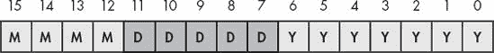

图 2-18. 短打包日期格式（2 字节）

MMMM 代表组成月份值的 4 位，DDDDD 代表组成日期的 5 位，YYYYYYY 代表组成年份的 7 位。每个数据项的位集合称为*位字段*。例如，2001 年 4 月 2 日将表示为$4101：

```
0100      00010   0000001          = %0100_0001_0000_0001 or $4101
           4          2       01
```

尽管打包的值*节省空间*（即在内存使用上非常高效），但它们在计算上是*低效*的（慢！）。原因是什么？因为需要额外的指令来解包那些打包在各个位字段中的数据。这些额外的指令需要额外的时间来执行（并且需要额外的字节来存储这些指令）；因此，必须仔细考虑打包的数据字段是否能为你节省任何东西。示例 2-9 中的示例程序展示了打包和解包这种 16 位日期格式所需的工作量。

示例 2-9. 打包和解包日期数据

```
program dateDemo;

#include( "stdlib.hhf" )

static
    day:        uns8;
    month:      uns8;
    year:       uns8;

    packedDate: word;

begin dateDemo;

    stdout.put( "Enter the current month, day, and year: " );
    stdin.get( month, day, year );

    // Pack the data into the following bits:
    //
    //  15 14 13 12 11 10  9  8  7  6  5  4  3  2  1  0
    //   m  m  m  m  d  d  d  d  d  y  y  y  y  y  y  y

    mov( 0, ax );
    mov( ax, packedDate );  // Just in case there is an error.
    if( month > 12 ) then

        stdout.put( "Month value is too large", nl );

    elseif( month = 0 ) then

        stdout.put( "Month value must be in the range 1..12", nl );

    elseif( day > 31 ) then

        stdout.put( "Day value is too large", nl );

    elseif( day = 0 ) then

        stdout.put( "Day value must be in the range 1..31", nl );

    elseif( year > 99 ) then

        stdout.put( "Year value must be in the range 0..99", nl );

    else

        mov( month, al );
        shl( 5, ax );
        or( day, al );
        shl( 7, ax );
        or( year, al );
        mov( ax, packedDate );

    endif;

    // Okay, display the packed value:

    stdout.put( "Packed data = $", packedDate, nl );

    // Unpack the date:

    mov( packedDate, ax );
    and( $7f, al );         // Retrieve the year value.
    mov( al, year );

    mov( packedDate, ax );  // Retrieve the day value.
    shr( 7, ax );
    and( %1_1111, al );
    mov( al, day );

    mov( packedDate, ax );  // Retrieve the month value.
    rol( 4, ax );
    and( %1111, al );
    mov( al, month );

    stdout.put( "The date is ", month, "/", day, "/", year, nl );

end dateDemo;
```

当然，经过了千年虫（Y2K）问题，你知道使用一个限制为 100 年（甚至 127 年）的日期格式在现在看来是非常愚蠢的。如果你担心你的软件在 100 年后仍在运行，也许使用一个 3 字节的日期格式而不是 2 字节格式会更明智。不过，正如你将在数组章节中看到的，通常你应该尽量创建长度为偶数次幂的 2 的数据对象（1 字节、2 字节、4 字节、8 字节等），否则你会遭遇性能损失。因此，可能明智的做法是直接使用 4 字节，并将这些数据打包到一个双字变量中。图 2-19 展示了一个可能的 4 字节日期数据组织方式。

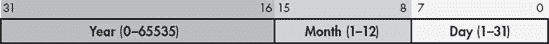

图 2-19. 长紧凑日期格式（4 字节）

在这种长格式的紧凑日期格式中，我们做了一些更改，不仅仅是简单地扩展与年份相关的位数。首先，因为在 32 位双字变量中有额外的位，所以该格式为月份和日期字段分配了额外的位。由于这两个字段现在各自包含 8 个位，它们可以很容易地作为字节对象从双字中提取。这会留下更少的位给年份，但 65,536 年可能已经足够；你可以假设，除非你的软件仍然在 63,000 年后使用，否则它不太可能在这个日期格式停止工作时仍然被使用。

当然，你可以争辩说，这不再是一个紧凑日期格式。毕竟，我们需要三个数值，其中两个正好可以各自占用 1 个字节，而另一个则可能至少需要 2 个字节。因为这个“紧凑”日期格式与非紧凑版本消耗相同的 4 个字节，那么这个格式到底有什么特别之处呢？好吧，你会注意到，在这个长格式的紧凑日期格式与出现在图 2-18 中的短日期格式之间，另一个区别是，这个长日期格式重新排列了位，使得`Year`字段位于高字节位，`Month`字段位于中间字节位，而`Day`字段位于低字节位。这一点非常重要，因为它使得你可以非常方便地比较两个日期，查看一个日期是否小于、等于或大于另一个日期。请看以下代码：

```
mov( *`Date1`*, eax );          // Assume *`Date1`* and *`Date2`* are dword variables
     if( eax > *`Date2`* ) then      // using the Long Packed Date format.

          << Do something if *`Date1`* > *`Date2`* >>

     endif;
```

如果你将不同的日期字段保存在单独的变量中，或者以不同的方式组织字段，你就无法像这样轻松地比较*`Date1`*和*`Date2`*。因此，这个例子展示了另一个打包数据的理由，即使你没有意识到任何空间节省——它可以使某些计算变得更加方便，甚至更高效（与通常打包数据时会发生的情况相反）。

实际的打包数据类型例子比比皆是。你可以将八个布尔值打包成一个字节，将两个 BCD 数字打包成一个字节，等等。当然，经典的打包数据示例是 EFLAGS 寄存器（参见图 2-20）。该寄存器将九个重要的布尔对象（以及七个重要的系统标志）打包成一个 16 位寄存器。你通常需要访问这些标志中的许多。因此，80x86 指令集提供了多种方法来操作 EFLAGS 寄存器中的各个位。当然，你可以使用 HLA 伪布尔变量（如`@c`、`@nc`、`@z`和`@nz`）在`if`语句或其他布尔表达式中测试许多条件代码标志。

除了条件代码外，80x86 还提供了直接影响某些标志的指令（表 2-7）。

表 2-7. 影响某些标志的指令

| 指令 | 说明 |
| --- | --- |
| `cld();` | 清除（设置为 0）方向标志。 |
| `std();` | 设置（为 1）方向标志。 |
| `cli();` | 清除中断禁止标志。 |
| `sti();` | 设置中断禁止标志。 |
| `clc();` | 清除进位标志。 |
| `stc();` | 设置进位标志。 |
| `cmc();` | 互补（反转）进位标志。 |
| `sahf();` | 将 AH 寄存器存储到 EFLAGS 寄存器的低 8 位。 |
| `lahf();` | 从 EFLAGS 寄存器的低 8 位加载 AH。 |

还有其他影响 EFLAGS 寄存器的指令；然而，这些指令演示了如何访问 EFLAGS 寄存器中的几个打包布尔值。特别是，`lahf`和`sahf`指令提供了一种方便的方法，可以将 EFLAGS 寄存器的低 8 位作为一个 8 位字节（而不是作为八个单独的 1 位值）进行访问。有关 EFLAGS 寄存器的布局，请参见图 2-20。

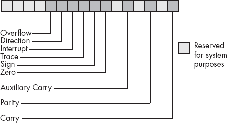

图 2-20. EFLAGS 寄存器作为打包布尔数据

`lahf`（将 AH 加载为 EFLAGS 寄存器的低 8 位）和`sahf`（将 AH 存储到 EFLAGS 寄存器的低字节）使用以下语法：

```
lahf();
          sahf();
```

# 2.12 浮点运算简介

整数运算无法表示小数值。因此，现代 CPU 支持一种*实数*运算的近似方法：浮点运算。浮点运算的一个大问题是，它不遵循代数的标准规则。然而，许多程序员在使用浮点运算时仍然应用正常的代数规则。这是许多程序中的缺陷来源。本节的主要目标之一是描述浮点运算的局限性，以便你能正确使用它。

正常的代数规则只适用于*无限精度*运算。考虑简单的语句*x* := *x* + 1，其中*x*是整数。在任何现代计算机上，只要没有发生溢出，这个语句遵循正常的代数规则。也就是说，这个语句只对某些*x*值有效（*minint* <= *x* < *maxint*）。大多数程序员对此没有问题，因为他们充分意识到程序中的整数并不遵循标准的代数规则（例如，5/2 不等于 2.5）。

整数不遵循代数标准规则，因为计算机用有限数量的位来表示它们。你无法表示大于最大整数或小于最小整数的任何整数值。浮点值也有同样的问题，而且问题更严重。毕竟，整数是实数的一个子集。因此，浮点值必须表示同样的无限整数集合。然而，在任何两个整数值之间都有无限多个实数值，所以这个问题变得更加严重。因此，除了需要将值限制在最大和最小范围之间，你也无法表示这两个范围之间的所有值。

为了表示实数，大多数浮点数格式采用科学记数法，并使用一定数量的位来表示*尾数*，以及更少数量的位来表示*指数*。最终结果是浮点数只能表示具有特定数量*有效*数字的数值。这对浮点运算的运作有很大影响。为了更清楚地看到有限精度运算的影响，我们将在示例中采用简化的十进制浮点格式。我们的浮点格式将提供一个具有三位有效数字的尾数和一个两位数字的十进制指数。尾数和指数都是带符号的值，如图 2-21 所示。


图 2-21. 浮点数格式

当对两个科学记数法表示的数字进行加减时，我们必须调整这两个值，使它们的指数相同。例如，当加 1.23e1 和 4.56e0 时，我们必须调整这两个值的指数，使它们相同。一个方法是将 4.56e0 转换为 0.456e1，然后再进行加法。这会得到 1.686e1。遗憾的是，结果无法容纳三位有效数字，因此我们必须对结果进行*四舍五入*或*截断*到三位有效数字。四舍五入通常能得到最准确的结果，因此我们将结果四舍五入得到 1.69e1。正如你所看到的，*精度*（我们在计算中保留的数字或位数）影响了结果的准确性（计算的正确性）。

在上面的例子中，我们能够四舍五入结果，因为在计算过程中我们保留了*四*位有效数字。如果我们的浮点计算在计算过程中只能保留三位有效数字，我们就必须截断较小数字的最后一位，得到 1.68e1，这是一个更不准确的值。为了提高浮点计算的准确性，有必要在计算过程中添加额外的数字。计算过程中可用的额外数字被称为*保护数字*（对于二进制格式而言，称为*保护位*）。它们在长链计算过程中能大大提高准确性。

在单次计算中，准确性损失通常不足以引起担忧，除非你对计算的准确性非常关注。然而，如果你计算的值是多个浮点运算结果的序列，那么误差可能会*累积*，并极大地影响计算本身。例如，假设我们要将 1.23e3 加到 1.00e0。通过在加法前调整这两个数的指数，使其相同，得到 1.23e3 + 0.001e3。即使经过四舍五入，这两个值的和仍然是 1.23e3。这对你来说可能完全合理；毕竟，我们只能保留三位有效数字，因此加上一个小值不应该影响结果。然而，假设我们将 1.00e0 加到 1.23e3 *十次*。第一次将 1.00e0 加到 1.23e3 时，得到 1.23e3。同样，在第二次、第三次、第四次……直到第十次加法时，我们都得到 1.23e3。另一方面，如果我们将 1.00e0 加到自己身上 10 次，再将结果（1.00e1）加到 1.23e3，我们会得到不同的结果，1.24e3。这是有限精度运算中需要注意的一个重要点：

**运算顺序会影响结果的准确性**。

如果相对大小（即指数）在加减浮点值时接近，你将得到更准确的结果。如果进行的是包含加法和减法的连锁计算，应该尽量将值适当地分组。

| 加法和减法的另一个问题是可能会导致*虚假精度*。考虑计算 1.23e0 − 1.22e0\。这会产生 0.01e0\。虽然这在数学上等同于 1.00e − 2，但后者的形式表明最后两位数字是精确为 0 的。不幸的是，我们目前只有一个有效数字。实际上，一些浮点单元（FPU）软件包可能会在低位插入随机数字（或位）。这引出了关于有限精度算术的第二条重要规则： |
| --- |

**在减去两个符号相同的数字或加两个符号不同的数字时，结果的准确性可能低于浮点格式所能提供的精度**。

乘法和除法不像加法和减法那样存在相同的问题，因为你不需要在运算前调整指数；你所需要做的只是加上指数并乘以尾数（或减去指数并除以尾数）。就其本身而言，乘法和除法不会产生特别差的结果。然而，它们倾向于放大已经存在的任何误差。例如，如果你将 1.23e0 乘以 2，而你应该将 1.24e0 乘以 2，结果会更加不准确。这引出了在进行有限精度算术运算时的第三条重要规则：

**在进行涉及加法、减法、乘法和除法的计算链时，尽量先执行乘法和除法操作**。

通常，通过应用正常的代数变换，你可以调整计算顺序，使得乘法和除法运算优先进行。例如，假设你想计算 *x* * ( *y* + *z* )。通常你会先将 *y* 和 *z* 相加，然后将它们的和乘以 *x*。然而，如果你将 *x* * ( *y* + *z* ) 转换为 *x* * *y* + *x* * *z* 并先执行乘法运算，你会获得更高的准确性。^([26])

| 乘法和除法并非没有问题。当乘以两个非常大或非常小的数字时，很可能会发生*溢出*或*下溢*。同样的情况也会出现在将一个小数字除以一个大数字，或将一个大数字除以一个小数字时。这引出了你在乘法或除法时应遵循的第四条规则： |
| --- |

**在进行乘法和除法时，尽量安排乘法顺序，使得大数和小数相乘；同样，尽量将具有相同相对大小的数字进行除法运算**。

比较浮动点数值是非常危险的。鉴于任何计算中（包括将输入字符串转换为浮动点值）都可能存在不准确性，你*绝不*应该比较两个浮动点值是否相等。在二进制浮动点格式中，不同的计算可能产生相同的（数学）结果，但它们的最低有效位可能不同。例如，1.31e0 + 1.69e0 应该得到 3.00e0。同样，1.50e0 + 1.50e0 应该得到 3.00e0。然而，如果你比较 (1.31e0 + 1.69e0) 和 (1.50e0 + 1.50e0)，你可能会发现这两个和*并不*相等。只有当两个操作数的所有位（或数字）完全相同，等式测试才会成功。因为在两次不同的浮动点计算结果应该相同的情况下，这一点不一定成立，所以直接进行相等测试可能不起作用。

| 测试浮动点数值是否相等的标准方法是确定你在比较中允许多少误差（或容差），并检查一个值是否在另一个值加减某个小误差值的范围内。通常的做法是使用类似如下的测试： |
| --- |

```
if *`Value1`* >= (*`Value2`*-*`error`*) and *`Value1`* <= (*`Value2`*+*`error`*) then ...
```

| 处理同样比较的另一种常见方式是使用类似以下形式的语句 |
| --- |

```
if abs(*`Value1`*-*`Value2`*) <= *`error`* then ...
```

| 在选择*`error`*的值时必须小心。这个值应该略大于你计算中可能出现的最大误差值。具体的值取决于你使用的浮动点格式，但稍后会详细说明。这里是我们在本节中给出的最终规则： |
| --- |

**比较两个浮动点数值时，总是比较一个值，看它是否在由另一个值加减某个小误差值的范围内**。

使用浮动点值时，可能会遇到许多其他小问题。本文仅能指出一些主要问题，并提醒你不能像对待实际算术运算那样处理浮动点算术——有限精度算术中的不准确性可能会让你陷入麻烦，如果你不小心的话。一本关于数值分析的好书，甚至是科学计算的书，可以帮助你填补本文无法涉及的细节。如果你打算使用浮动点算术，*无论是什么语言*，你应该花时间研究有限精度算术对计算结果的影响。

| HLA 的`if`语句不支持涉及浮动点操作数的布尔表达式。因此，你不能在程序中使用像`if( x < 3.141) then...`这样的语句。第六章会教你如何进行浮动点比较。 |
| --- |

## 2.12.1 IEEE 浮动点格式

当英特尔计划为其新的 8086 微处理器引入浮点单元时，它足够聪明地意识到，设计芯片的电气工程师和固态物理学家可能并不是选择最佳浮点格式的最佳人选。因此，英特尔聘请了最好的数值分析师来为其 8087 浮点处理单元设计浮点格式。这个人随后又聘请了两位领域专家，三人（Kahn、Coonan 和 Stone）共同设计了英特尔的浮点格式。他们设计的 KCS 浮点标准如此成功，以至于 IEEE 组织采纳了这一格式作为 IEEE 浮点格式。^([27])

为了处理各种性能和精度要求，英特尔实际上引入了*三*种浮点格式：单精度、双精度和扩展精度。单精度和双精度格式对应于 C 语言中的 float 和 double 类型，或者 FORTRAN 中的 real 和 double-precision 类型。英特尔计划使用扩展精度来处理长链式计算。扩展精度包含 16 个额外的位，这些位可以作为保护位，在将计算结果四舍五入到双精度值时使用。

单精度格式使用*补码 24 位尾数*和*8 位过量 127 指数*。尾数通常表示从 1.0 到接近 2.0 之间的一个值。尾数的高位（H.O.位）始终假定为 1，并表示*二进制点*左边的一个值。剩余的 23 个位则出现在二进制点的右侧。因此，尾数表示的值为

```
1.mmmmmmm mmmmmmmm mmmmmmmm
```

`mmmm`字符代表尾数的 23 位。请记住，我们在这里处理的是二进制数。因此，二进制点右侧的每个位置表示一个值（0 或 1）乘以 2 的连续负次幂。隐含的 1 位总是乘以 2⁰，也就是 1。这就是为什么尾数始终大于或等于 1 的原因。即使其他尾数位都是 0，隐含的 1 位也总是给我们带来值 1^([29])。当然，即使我们在二进制点后有几乎无限多个 1 位，它们仍然加起来不会达到 2。这就是为什么尾数可以表示从 1 到接近 2 之间的值。

尽管 1 和 2 之间存在无限多个值，但我们只能表示其中的 800 万个值，因为我们使用了 23 位尾数（第 24 位始终为 1）。这就是浮点运算不准确的原因——在涉及单精度浮点值的计算时，我们只能使用 23 位的精度。

尾数使用的是一补码格式，而不是二补码。这意味着尾数的 24 位值只是一个无符号二进制数，符号位决定该值是正数还是负数。一补码数有一个不寻常的属性，那就是 0 有两种表示方式（符号位可以是设置的或清除的）。通常，这对于设计浮点软件或硬件系统的人来说是重要的。我们假设值 0 总是符号位清除的。

为了表示 1.0 到接近 2.0 范围之外的值，浮点格式的指数部分发挥了作用。浮点格式将 2 的指数次方与尾数相乘，得到最终结果。指数为 8 位，并以*超 127*格式存储。在超 127 格式中，指数 2⁰由值 127（$7F）表示。因此，要将一个指数转换为超 127 格式，只需将 127 加到该指数值上。使用超 127 格式使得浮点数值比较更加容易。单精度浮点格式的形式如图 2-22 所示。

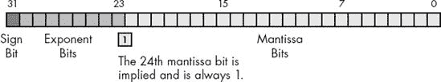

图 2-22. 单精度（32 位）浮点格式

使用 24 位尾数，你将得到大约 6 ½位的精度（½位精度意味着前六位数字可以在 0 到 9 的范围内，但第七位只能在 0 到*x*的范围内，其中*x* < 9，并且通常接近 5）。使用一个 8 位的超 127 指数，单精度浮点数的动态范围大约为 2 ± 128，或者约为 10 ± 38。

尽管单精度浮点数在许多应用中非常适用，但其动态范围有限，不适用于许多金融、科学及其他应用。此外，在长时间的计算链中，单精度格式的有限精度可能会引入严重的误差。

双精度格式有助于克服单精度浮点数的问题。使用双倍空间，双精度格式具有一个 11 位的超 1023 指数和一个 53 位的尾数（带有一个隐含的高阶位 1）以及一个符号位。这提供了大约 10^(±308)的动态范围和 14 ½位的精度，足以满足大多数应用需求。双精度浮点数的形式如图 2-23 所示。

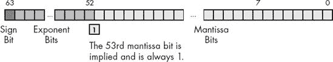

图 2-23. 64 位双精度浮点格式

为了帮助确保在涉及双精度浮点数的长链计算过程中精度的准确性，Intel 设计了扩展精度格式。扩展精度格式使用 80 位。额外的 16 位中，有 12 位附加到尾数，4 位附加到指数的末尾。与单精度和双精度值不同，扩展精度格式的尾数没有隐含的 H.O. 位（该位始终为 1）。因此，扩展精度格式提供了一个 64 位的尾数、一个 15 位的超常指数（excess-16383）和一个 1 位的符号位。扩展精度浮点值的格式如 图 2-24 所示。

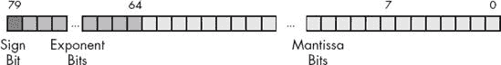

图 2-24. 80 位扩展精度浮点格式

在浮点运算单元（FPU）中，所有的计算都使用扩展精度格式进行。每当你加载一个单精度或双精度值时，FPU 会自动将其转换为扩展精度值。同样，当你将一个单精度或双精度值存储到内存时，FPU 会在存储之前自动将该值向下舍入到适当的大小。通过始终使用扩展精度格式，Intel 确保有大量的保护位，以确保计算的准确性。

为了在计算过程中保持最大的精度，大多数计算都使用*标准化*值。标准化浮点值是指其 H.O. 尾数位为 1 的值。几乎任何非标准化值都可以被标准化；将尾数位向左移动，并递减指数，直到尾数的 H.O. 位变为 1。记住，指数是二进制指数。每次递增指数时，浮点值都会乘以 2。同样，每次递减指数时，浮点值都会除以 2。因此，将尾数向左移动一位也会将浮点值乘以 2；同样，将尾数向右移动则会将浮点值除以 2。因此，将尾数向左移动一位*并*递减指数完全不会改变浮点数的值。

保持浮点数的标准化是有益的，因为它保持了计算的最大精度位数。如果尾数的 H.O. 位全为 0，则尾数的有效位数就会减少。由此，涉及标准化值的浮点计算会更精确。

有两个重要的情况，在这些情况下浮点数无法归一化。零是其中一种特殊情况。显然它无法归一化，因为 0 的浮点表示法在尾数中没有 1 位。然而，这不是问题，因为我们可以仅用一个比特精确表示值 0。

第二种情况是当尾数中有一些高阶位是 0，而偏置指数也为 0 时（并且我们不能减少它来归一化尾数）。为了不禁止某些小值，这些小值的尾数高阶位和偏置指数都是 0（这是最小的偏置指数），IEEE 标准允许使用特殊的 *非规格化* 值来表示这些较小的值。^([30]) 尽管使用非规格化值可以使 IEEE 浮点运算产生比发生下溢时更好的结果，但请记住，非规格化值提供的精度比特较少。

## 2.12.2 HLA 对浮点值的支持

HLA 提供了多种数据类型和库例程，以支持在汇编语言程序中使用浮点数据。这些包括内置类型来声明浮点变量，以及提供浮点输入、输出和转换的例程。

讨论 HLA 的浮点功能时，最好的起点可能是描述浮点字面常量。HLA 浮点常量允许以下语法：

+   一个可选的 `+` 或 `−` 符号，表示尾数的符号（如果没有此符号，HLA 默认认为尾数为正）

+   后跟一个或多个小数位数字

+   可选地跟随小数点和一个或多个小数位数字

+   可选地跟随 `e` 或 `E`，可选地跟随符号（`+` 或 `−`）和一个或多个小数位数字

请注意，必须存在小数点或 `e`/`E`，以区分该值与整数或无符号字面常量。以下是一些合法的浮点字面常量示例：

```
1.234  3.75e2  −1.0  1.1e-1  1e+4  0.1  −123.456e+789  +25e0
```

请注意，浮点字面常量不能以小数点开头；它必须以十进制数字开头，因此你必须使用 0.1 来表示 .1。

HLA 还允许在浮点字面常量中的任意两个连续十进制数字之间插入下划线字符（`_`）。你可以使用下划线字符代替逗号（或其他语言特定的分隔符）来帮助使大浮点数字更易于阅读。以下是一些示例：

```
1_234_837.25  1_000.00  789_934.99  9_999.99
```

要声明一个浮动点变量，可以使用`real32`、`real64`或`real80`数据类型。与它们的整数和无符号兄弟类似，这些数据类型声明末尾的数字指定了每种类型二进制表示中使用的位数。因此，使用`real32`声明单精度浮动点值，使用`real64`声明双精度浮动点值，使用`real80`声明扩展精度浮动点值。除了需要使用这些类型声明浮动点变量而不是整数外，它们的使用与`int8`、`int16`、`int32`等几乎完全相同。以下示例展示了这些声明及其语法：

```
static

          fltVar1:      real32;
          fltVar1a:     real32 := 2.7;
          pi:           real32 := 3.14159;
          DblVar:       real64;
          DblVar2:      real64 := 1.23456789e+10;
          XPVar:        real80;
          XPVar2:       real80 := −1.0e-104;
```

要以 ASCII 格式输出一个浮动点变量，可以使用`stdout.putr32`、`stdout.putr64`或`stdout.putr80`函数。这些程序会以十进制表示一个数字，即一串数字、可选的小数点以及结尾的一串数字。除了名称不同之外，这三个函数的调用方式完全相同。以下是每个函数的调用和参数：

```
stdout.putr80( r:real80; width:uns32; decpts:uns32 );
stdout.putr64( r:real64; width:uns32; decpts:uns32 );
stdout.putr32( r:real32; width:uns32; decpts:uns32 );
```

这些程序的第一个参数是您希望打印的浮动点值。此参数的大小必须与程序名称相匹配（例如，在调用`stdout.putr80`程序时，`r`参数必须是 80 位的扩展精度浮动点变量）。第二个参数指定输出文本的字段宽度；即当程序显示数字时，数字所需的打印位置数。请注意，这个宽度必须包括数字的符号和小数点的打印位置。第三个参数指定小数点后打印位置的数量。例如：

```
stdout.putr32( pi, 10, 4 );
```

显示值

```
_ _ _ _ 3.1416
```

（下划线表示此示例中的前导空格）。

当然，如果数字非常大或非常小，您会希望使用科学计数法而不是十进制表示来输出浮动点数字。HLA 标准库中的`stdout.pute32`、`stdout.pute64`和`stdout.pute80`函数提供了这个功能。这些函数使用以下程序原型：

```
stdout.pute80( r:real80; width:uns32 );
stdout.pute64( r:real64; width:uns32 );
stdout.pute32( r:real32; width:uns32 );
```

与十进制输出函数不同，这些科学计数法输出函数不需要第三个参数来指定显示小数点后要显示的位数。`width`参数间接地指定了这个值，因为除了一个尾数数字，所有尾数数字总是出现在小数点的右边。这些函数将它们的值以十进制表示输出，类似如下：

```
1.23456789e+10  −1.0e-104  1e+2
```

你还可以使用 HLA 标准库的`stdout.put`例程来输出浮动点值。如果你在`stdout.put`参数列表中指定了浮动点变量的名称，`stdout.put`代码将使用科学计数法输出该值。实际的字段宽度会根据浮动点变量的大小有所不同（`stdout.put`例程尽力输出尽可能多的有效数字）。以下是一个示例：

```
stdout.put( "XPVar2 = ", XPVar2 );
```

如果你指定了字段宽度，使用冒号后跟一个带符号的整数值，那么`stdout.put`例程将使用相应的`stdout.puteXX`例程来显示该值。也就是说，数字仍然以科学计数法显示，但你可以控制输出值的字段宽度。像整数和无符号值的字段宽度一样，正数字段宽度会将数字右对齐，而负数字段宽度则将数字左对齐。

下面是一个使用 10 个打印位置打印`XPVar2`变量的示例：

```
stdout.put( "XPVar2 = ", XPVar2:10 );
```

如果你希望使用`stdout.put`以十进制表示法打印浮动点值，你需要使用以下语法：

```
*`Variable_Name`* : *`Width`* : *`DecPts`*
```

请注意，*`DecPts`*字段必须是一个非负整数值。

当`stdout.put`包含这种形式的参数时，它会调用相应的`stdout.putr`*`XX`*例程来显示指定的浮动点值。例如，考虑以下调用：

```
stdout.put( "Pi = ", pi:5:3 );
```

对应的输出是：

```
3.142
```

HLA 标准库提供了几个其他有用的例程，你可以在输出浮动点值时使用。有关这些例程的更多信息，请参阅 HLA 标准库参考手册。

HLA 标准库提供了多个例程，允许你以多种格式显示浮动点值。相比之下，HLA 标准库仅提供两个例程来支持浮动点输入：`stdin.getf()`和`stdin.get()`。`stdin.getf()`例程需要使用 80x86 FPU 堆栈，这是一个本章没有涉及的硬件组件。因此，我们将在第六章中推迟对`stdin.getf()`例程的讨论。由于`stdin.get()`例程提供了`stdin.getf()`例程的所有功能，这个推迟不会成为问题。

你已经看过`stdin.get()`例程的语法；它的参数列表仅包含变量名称的列表。`stdin.get()`函数会为每个出现在参数列表中的变量读取相应的值。如果你指定了一个浮动点变量的名称，`stdin.get()`例程会自动从用户处读取一个浮动点值，并将结果存储到指定的变量中。以下示例演示了该例程的使用：

```
stdout.put( "Input a double-precision floating-point value: " );
     stdin.get( DblVar );
```

### 警告

本节讨论了如何声明浮点变量，以及如何输入和输出它们。并没有讨论算术运算。浮点算术与整数算术不同；你不能使用 80x86 的*`add`*和*`sub`*指令对浮点值进行操作。浮点算术将在第六章中进行讨论。

* * *

^([26]) 当然，缺点是你现在必须进行两次乘法运算，而不是一次，所以结果可能会更慢。

^([27]) 对某些特殊操作的处理方式做了一些小改动，但位表示基本保持不变。

^([28]) 二进制点与小数点相同，只不过它出现在二进制数中，而不是十进制数中。

^([29]) 实际上，这不一定是对的。IEEE 浮点格式支持*非规格化*值，其中 H.O.位不是 0。然而，我们在讨论中将忽略非规格化值。

^([30]) 另一种做法是将值下溢到 0。

# 2.13 二进制编码十进制表示

尽管整数和浮点格式涵盖了大多数平均程序的数字需求，但在某些特殊情况下，其他数字表示方法会更方便。在本节中，我们将讨论二进制编码十进制格式，因为 80x86 CPU 为这种数据表示提供了一小部分硬件支持。

BCD 值是一个字节序列，每个字节表示一个 0..9 范围内的值。当然，你也可以使用一个字节表示 0..15 范围内的值；然而，BCD 格式只使用了 16 个可能值中的 10 个来表示每个字节。

BCD 值中的每个字节表示一个单独的十进制数字。因此，使用一个字节（即两个数字），我们可以表示包含两个十进制数字的值，或者表示 0..99 范围内的值（见图 2-25）。使用一个字（word），我们可以表示包含四个十进制数字的值，或者表示 0..9,999 范围内的值。同样，使用一个双字（double word），我们可以表示最多包含八个十进制数字的值（因为一个双字值有八个字节）。

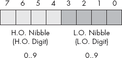

图 2-25. 内存中的 CD 数据表示

如你所见，BCD 存储并不是特别高效。例如，一个 8 位 BCD 变量可以表示 0..99 范围内的值，而同样的 8 位，当存储二进制值时，能够表示 0..255 范围内的值。同样，一个 16 位的二进制值可以表示 0..65,535 范围内的值，而一个 16 位的 BCD 值只能表示其中大约六分之一的值（0..9,999）。低效的存储并不是唯一的问题。BCD 计算往往比二进制计算更慢。

到目前为止，你可能在想，为什么有人会使用 BCD 格式。BCD 格式确实有两个优点：它可以非常容易地在内部数字表示和字符串表示之间转换 BCD 值；此外，使用 BCD 在硬件中（例如，通过旋转按钮或拨轮）编码多位十进制值也非常简单。基于这两个原因，你可能会看到在嵌入式系统中（如烤面包机、闹钟和核反应堆）使用 BCD，但在通用计算机软件中却很少见。

几十年前，人们错误地认为涉及 BCD（或十进制）算术的计算比二进制计算更准确。因此，他们常常使用基于十进制的算术进行重要的计算，如涉及美元和分（或其他货币单位）的计算。虽然某些计算在 BCD 中可能会得到更精确的结果，但这个说法并不普遍成立。事实上，对于大多数计算（即使是固定点十进制算术的计算），二进制表示更为准确。因此，大多数现代计算机程序都以二进制形式表示所有值。例如，Intel 80x86 浮点单元支持一对加载和存储 BCD 值的指令。然而，内部上，FPU 将这些 BCD 值转换为二进制并在二进制中执行所有计算。它仅将 BCD 作为外部数据格式（即外部于 FPU）使用。这通常能产生更准确的结果，并且比拥有一个支持十进制算术的独立协处理器需要的硅片要少得多。

# 2.14 字符

也许个人计算机上最重要的数据类型是字符数据类型。*字符*一词指的是一个人类或机器可读的符号，通常是一个非数字实体。一般而言，*字符*指的是任何你通常可以在键盘上输入（包括一些可能需要多次按键才能产生的符号）或在视频显示器上显示的符号。许多初学者常常混淆*字符*和*字母字符*这两个术语。这两个术语并不相同。标点符号、数字、空格、制表符、回车符（Enter）、其他控制字符以及其他特殊符号也是字符。当本文使用*字符*一词时，它指的是这些字符中的任何一个，而不仅仅是字母字符。当本文指的是字母字符时，它会使用“字母字符”、“大写字母字符”或“小写字母字符”等表述。

初学者在第一次接触字符数据类型时，另一个常见的问题是区分数字字符和数字。字符`1`与值 1 是不同的。计算机（通常）对数字字符（`0`、`1`、...、`9`）和数字值（0 到 9）使用两种不同的内部表示。你必须小心不要把这两者混淆。

大多数计算机系统使用 1 字节或 2 字节的序列以二进制形式编码各种字符。Windows、Mac OS X、FreeBSD 和 Linux 无疑都属于这一类，使用 ASCII 或 Unicode 编码表示字符。本节将讨论 ASCII 字符集和 HLA 提供的字符声明功能。

## 2.14.1 ASCII 字符编码

ASCII（美国信息交换标准代码）字符集将 128 个文本字符映射到无符号整数值 0..127（$0..$7F）。当然，计算机内部使用二进制数字表示一切，因此计算机使用二进制值来表示非数字实体（如字符）并不令人惊讶。虽然字符到数值的具体映射是任意的且不重要，但使用标准化的代码进行映射是很重要的，因为你需要与其他程序和外设通信，并且你需要与这些程序和设备使用相同的“语言”。这就是 ASCII 代码发挥作用的地方；它是一个几乎所有人都达成一致的标准化代码。因此，如果你使用 ASCII 代码 65 来表示字符 `'A'`，那么你知道，当你将数据传输到外设（如打印机）时，某个外设会正确地将此值解释为字符 `'A'`。

你不应该认为 ASCII 是计算机系统中唯一使用的字符集。IBM 在许多大型计算机系统上使用 EBCDIC 字符集系列。另一种常用的字符集是 Unicode 字符集。Unicode 是对 ASCII 字符集的扩展，它使用 16 位而不是 7 位来表示字符。这使得字符集可以包含 65,536 个不同的字符，从而将世界不同语言中的大多数符号纳入一个统一的字符集中。

因为 ASCII 字符集只提供 128 个不同的字符，而一个字节可以表示 256 个不同的值，所以就产生了一个有趣的问题：“我们应该如何处理可以存储在字节中的 128..255 的值？”一种答案是忽略这些额外的值。这将是本文的主要处理方式。另一种可能性是扩展 ASCII 字符集，向其中添加额外的 128 个字符。当然，除非你能够让每个人都同意这些扩展，否则这将违背拥有标准化字符集的初衷。这是一个艰难的任务。

当 IBM 首次推出 IBM-PC 时，它定义了这 128 个额外的字符代码，以包含各种非英语字母字符、一些绘图字符、一些数学符号以及其他一些特殊字符。因为 IBM 的 PC 是今天我们所称的 PC 的基础，所以这一字符集已经成为所有兼容 IBM-PC 的机器上的伪标准。即使是在现代机器上，这些机器并不兼容 IBM-PC，也不能运行早期的 PC 软件，IBM 扩展字符集仍然存在。然而，需要注意的是，这个 PC 字符集（ASCII 字符集的扩展）并不是通用的。大多数打印机在使用本地字体时不会打印扩展字符，许多程序（特别是在非英语国家）也不使用那些字符来表示 8 位值中的前 128 个代码。由于这些原因，本文将主要使用标准的 128 字符 ASCII 字符集。

尽管它是一个标准，但仅仅使用标准的 ASCII 字符编码你的数据并不能保证在不同系统之间的兼容性。虽然在一台机器上字符 `'A'` 很可能在另一台机器上也是 `'A'`，但在控制字符的使用上，各机器之间几乎没有标准化。实际上，在 32 个控制代码加上删除符号中，只有四个控制代码被广泛支持——退格（BS）、制表符、回车（CR）和换行（LF）。更糟糕的是，不同的机器通常以不同的方式使用这些控制代码。*行结束*是一个特别麻烦的例子。Windows、MS-DOS、CP/M 和其他系统通过两个字符的序列 CR/LF 来标记行结束。旧款 Apple Macintosh 计算机（Mac OS 9 及更早版本）和许多其他系统则通过单一的 CR 字符来标记行结束。Linux、Mac OS X、FreeBSD 和其他 Unix 系统则通过单一的 LF 字符标记行结束。不用说，在这些系统之间交换简单的文本文件时，可能会让人感到非常沮丧。即使你在这些系统中的所有文件中使用标准的 ASCII 字符，你在交换文件时仍然需要进行数据转换。幸运的是，这种转换相对简单。

尽管存在一些重大缺陷，ASCII 数据仍然是计算机系统和程序之间数据交换的*标准*。大多数程序都可以接受 ASCII 数据；同样，大多数程序也能生成 ASCII 数据。由于你在汇编语言中将处理 ASCII 字符，建议你研究字符集的布局，并记住一些关键的 ASCII 代码（例如，字符 `'0'`、`'A'`、`'a'` 等的代码）。

ASCII 字符集被分为四个 32 字符的组。前 32 个字符，ASCII 码 0..$1F（31），形成一个特殊的非打印字符集，称为*控制字符*。我们称它们为控制字符，因为它们执行各种打印机/显示控制操作，而不是显示符号。例子包括*回车符*，它将光标定位到当前行的左侧；^([31])换行符，它将光标向下移动一行；以及退格符，它将光标向左移动一个位置。不幸的是，不同的控制字符在不同的输出设备上执行不同的操作。输出设备之间的标准化程度非常低。要准确了解控制字符如何影响特定设备，你需要查阅其手册。

第二组 32 个 ASCII 字符代码包含各种标点符号、特殊字符和数字。该组中最显著的字符包括空格符（ASCII 码$20）和数字（ASCII 码$30..$39）。

第三组 32 个 ASCII 字符包含大写字母字符。字符`'A'`..`'Z'`的 ASCII 码范围是$41..$5A（65..90）。由于只有 26 个不同的字母字符，其余 6 个代码则包含各种特殊符号。

第四组，也是最后一组 32 个 ASCII 字符代码，表示小写字母符号、5 个附加的特殊符号和另一个控制字符（删除）。注意，小写字母符号使用 ASCII 码$61..$7A。如果你将大小写字母的代码转换为二进制，你会注意到大写符号和其对应的小写符号只有一个位不同。例如，考虑图 2-26 中显示的字符代码`'E'`和`'e'`。图 2-26。

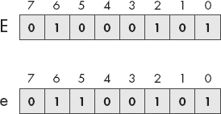

图 2-26. E 和 e 的 ASCII 码

这两个代码唯一不同的地方是在第 5 位。大写字母的第 5 位总是 0；小写字母的第 5 位总是 1。你可以利用这一点快速地进行大小写转换。如果你有一个大写字母，可以通过将第 5 位设置为 1 将其转换为小写字母。如果你有一个小写字母，并且希望将其强制转换为大写字母，你可以通过将第 5 位设置为 0 来实现。你可以通过简单地反转第 5 位来在大写字母和小写字母之间切换。

实际上，第 5 位和第 6 位决定了你所在的 ASCII 字符集中的四个组中的哪一个，正如表 2-8 所示。

表 2-8. ASCII 组

| 第 6 位 | 第 5 位 | 组 |
| --- | --- | --- |
| 0 | 0 | 控制字符 |
| 0 | 1 | 数字和标点符号 |
| 1 | 0 | 大写字母和特殊符号 |
| 1 | 1 | 小写字母和特殊字符 |

比如，你可以通过将第 5 和第 6 位设置为 0，将任何大写或小写字母（或相应的特殊字符）转换为其等效的控制字符。

试想一下，表 2-9 中出现的数字字符的 ASCII 代码。

表 2-9：数字字符的 ASCII 代码

| 字符 | 十进制 | 十六进制 |
| --- | --- | --- |
| 0 | 48 | $30 |
| 1 | 49 | $31 |
| 2 | 50 | $32 |
| 3 | 51 | $33 |
| 4 | 52 | $34 |
| 5 | 53 | $35 |
| 6 | 54 | $36 |
| 7 | 55 | $37 |
| 8 | 56 | $38 |
| 9 | 57 | $39 |

这些 ASCII 代码的十进制表示并不非常直观。然而，这些 ASCII 代码的十六进制表示揭示了一个非常重要的内容——ASCII 代码的低位字节（L.O. nibble）是所表示数字的二进制等效值。通过去除（即设置为 0）数字字符的高位字节，你可以将该字符代码转换为对应的二进制表示。相反，你也可以通过简单地将高位字节设置为 3，将 0..9 范围内的二进制值转换为其 ASCII 字符表示。请注意，你可以使用逻辑`and`操作将高位字节强制设置为 0；同样，你也可以使用逻辑`or`操作将高位字节强制设置为%0011（3）。

请注意，你*不能*通过仅仅去除字符串中每个数字的高位（H.O.）部分，将数字字符字符串转换为其等效的二进制表示。例如，按这种方式转换 123（$31 $32 $33）会得到 3 个字节：$010203；而 123 的正确值是$7B。将一串数字转换为整数比这更复杂；上面的转换方法仅适用于单个数字。

## 2.14.2 HLA 对 ASCII 字符的支持

虽然你可以轻松地将字符值存储在`byte`变量中，并在程序中使用相应的数字等效 ASCII 代码作为字符字面量，但这种麻烦其实是没有必要的。HLA 提供了对字符变量和字面量的支持，方便你在汇编语言程序中使用。

在 HLA 中，字符字面量常量有两种形式：一个被撇号包围的单个字符，或者一个井号（`#`）后跟一个在 0..127 范围内的数字常量（表示该字符的 ASCII 代码）。以下是一些示例：

```
'A'   #65    #$41    #%0100_0001
```

请注意，这些例子都表示相同的字符（`'A'`），因为`'A'`的 ASCII 代码是 65。

除一个例外外，字面量字符常量中只能包含单个字符。这个例外是撇号字符本身。如果你想创建一个撇号字面量常量，需要连续四个撇号（即在两个撇号中间重复一个撇号）：

```
''''
```

井号运算符（`#`）必须放在一个合法的 HLA 数值常量之前（无论是十进制、十六进制还是二进制，如上述示例所示）。特别地，井号并不是一个通用的字符转换函数；它不能放在寄存器或变量名之前，只能放在常量之前。

一般来说，你应该始终使用字符文字常量的撇号形式来表示图形字符（即那些可打印或可显示的字符）。对于控制字符（即那些不可见或打印时有奇怪效果的字符），或者对于可能无法在源代码中正确显示或打印的扩展 ASCII 字符，应使用井号形式。

请注意程序中字符文字常量和字符串文字常量之间的区别。字符串是由零个或多个字符组成，并用引号括起来；字符则用撇号括起来。

特别重要的是要意识到

```
'A' ≠ "A"
```

字符常量`'A'`和包含单个字符`A`的字符串有两种完全不同的内部表示。如果你尝试在 HLA 期望字符常量的地方使用包含单个字符的字符串，HLA 会报告一个错误。字符串和字符串常量的内容见第四章。

在 HLA 程序中声明字符变量时，你使用`char`数据类型。例如，以下声明演示了如何声明一个名为`UserInput`的变量：

```
static
     UserInput:          char;
```

这个声明预留了 1 字节的存储空间，你可以用来存储任何字符值（包括 8 位扩展 ASCII 字符）。你还可以像以下示例所示那样初始化字符变量：

```
static

     TheCharA:          char := 'A';
     ExtendedChar:      char := #128;
```

因为字符变量是 8 位对象，所以你可以使用 8 位寄存器来操作它们。你可以将字符变量移动到 8 位寄存器中，并可以将 8 位寄存器的值存储到字符变量中。

HLA 标准库提供了一些例程，可以用于字符输入输出和操作；其中包括`stdout.putc`、`stdout.putcSize`、`stdout.put`、`stdin.getc`和`stdin.get`。

`stdout.putc`例程使用以下调用顺序：

```
stdout.putc( *`charvar`* );
```

这个过程将传递给它的单字符参数作为字符输出到标准输出设备。该参数可以是任何`char`常量或变量，或者是`byte`变量或寄存器。^([32])

`stdout.putcSize`例程提供了输出宽度控制，用于显示字符变量。该过程的调用顺序如下：

```
stdout.putcSize( *`charvar`*, *`widthInt32`*, *`fillchar`* );
```

该例程使用至少 *`widthInt32`* 打印位置打印指定的字符（参数 `c`）。^([33]) 如果 *`widthInt32`* 的绝对值大于 1，则 `stdout.putcSize` 将打印 *`fillchar`* 字符作为填充。如果 *`widthInt32`* 的值为正，则 `stdout.putcSize` 会将字符右对齐打印在打印字段中；如果 *`widthInt32`* 为负，则 `stdout.putcSize` 会将字符左对齐打印在打印字段中。由于字符输出通常是左对齐的，通常这个调用的 *`widthInt32`* 值会是负数。空格字符是最常见的 *`fillchar`* 值。

你也可以使用通用的 `stdout.put` 例程打印字符值。如果字符变量出现在 `stdout.put` 的参数列表中，则 `stdout.put` 会自动将其作为字符值打印。例如：

```
stdout.put( "Character c = '", c, "'", nl );
```

你可以使用 `stdin.getc` 和 `stdin.get` 例程从标准输入读取字符。`stdin.getc` 例程没有任何参数。它从标准输入缓冲区读取一个字符，并将该字符返回在 AL 寄存器中。你可以将字符值存储或在 AL 寄存器中进行其他操作。示例 2-10 中的程序从用户读取一个字符，如果它是小写字母，则将其转换为大写字母，然后显示该字符。

示例 2-10. 字符输入示例

```
program charInputDemo;
#include( "stdlib.hhf" )
begin charInputDemo;

    stdout.put( "Enter a character: " );
    stdin.getc();
    if( al >= 'a' ) then

        if( al <= 'z' ) then

            and( $5f, al );

        endif;

    endif;
    stdout.put
    (
        "The character you entered, possibly ", nl,
        "converted to uppercase, was '"
    );
    stdout.putc( al );
    stdout.put( "'", nl );

end charInputDemo;
```

你还可以使用通用的 `stdin.get` 例程从用户处读取字符变量。如果 `stdin.get` 的参数是字符变量，则 `stdin.get` 例程会从用户读取一个字符，并将字符值存储到指定的变量中。示例 2-11 是使用 `stdin.get` 例程重写的 示例 2-10。

示例 2-11. `stdin.get` 字符输入示例

```
program charInputDemo2;
#include( "stdlib.hhf" )
static
    c:char;

begin charInputDemo2;

    stdout.put( "Enter a character: " );
    stdin.get(c);
    if( c >= 'a' ) then

        if( c <= 'z' ) then

            and( $5f, c );

        endif;

    endif;
    stdout.put
    (
        "The character you entered, possibly ", nl,
        "converted to uppercase, was '",
        c,
        "'", nl
    );

end charInputDemo2;
```

正如你在上一章中所回忆的，HLA 标准库会缓冲其输入。每当你使用 `stdin.getc` 或 `stdin.get` 从标准输入读取字符时，库例程会从缓冲区读取下一个可用的字符；如果缓冲区为空，程序会从用户读取一行新的文本，并返回该行的第一个字符。如果你希望程序在读取字符变量时保证从用户那里读取到一行新文本，你应该在尝试读取字符之前调用 `stdin.flushInput` 例程。这样会刷新当前的输入缓冲区，并强制在下一个输入中读取一行新文本（可能是 `stdin.getc` 或 `stdin.get` 调用）。

行尾是一个有问题的地方。不同的操作系统在输出和输入时处理行尾的方式不同。在控制台设备上，按下**回车**键表示行尾；然而，当从文件读取数据时，你会得到一个行尾序列，它是换行符或者回车符/换行符对（在 Windows 下）或仅仅是换行符（在 Linux/Mac OS X/FreeBSD 下）。为了帮助解决这个问题，HLA 标准库提供了一个“行尾”函数。这个过程在 AL 寄存器中返回 true (1)，如果当前的所有输入字符已经耗尽；否则返回 false (0)。示例 2-12 中的示例程序演示了 `stdin.eoln` 函数。

示例 2-12. 使用 `stdin.eoln` 检测行尾

```
program eolnDemo;
#include( "stdlib.hhf" )
begin eolnDemo;

    stdout.put( "Enter a short line of text: " );
    stdin.flushInput();
    repeat

        stdin.getc();
        stdout.putc( al );
        stdout.put( "=$", al, nl );

    until( stdin.eoln() );

end eolnDemo;
```

HLA 语言和 HLA 标准库提供了许多其他过程以及对字符对象的额外支持。第四章和第十一章以及 HLA 参考文档详细描述了如何使用这些功能。

* * *

^([31]) 历史上，回车指的是打字机上的*纸架*。回车指的是将纸架完全移动到右边，这样下一个输入的字符就会出现在纸的左边。

^([32]) 如果你指定了一个字节变量或字节大小的寄存器作为参数，`stdout.putc` 例程将输出该变量或寄存器中显示的 ASCII 码对应的字符。

^([33]) 只有在你指定 0 为宽度时，`stdout.putcSize` 才会使用比你指定更多的打印位置；此时此例程将使用一个打印位置。

# 2.15 Unicode 字符集

尽管 ASCII 字符集无疑是计算机中最流行的字符表示形式，但它并不是唯一的格式。例如，IBM 在许多大型主机和小型计算机系列上使用 EBCDIC 码。由于 EBCDIC 主要出现在 IBM 的大型机上，并且你在个人计算机系统中很少遇到它，我们在本文中将不考虑这个字符集。另一个在小型计算机系统（以及大型系统）中日益流行的字符表示法是 Unicode 字符集。Unicode 克服了 ASCII 两个最大的限制：有限的字符空间（即，8 位字节中最多 128/256 个字符）和缺乏国际化（美国以外的）字符。

Unicode 使用 16 位字来表示单个字符。因此，Unicode 支持多达 65,536 个不同的字符编码。这显然比我们用 8 位字节表示的 256 种可能的编码要先进得多。Unicode 是向上兼容 ASCII 的。具体来说，如果 Unicode 字符的高 9 位包含 0，则低 7 位表示与具有相同字符编码的 ASCII 字符相同的字符。如果高 9 位包含非零值，则该字符表示其他值。如果你想知道为什么需要这么多不同的字符编码，只需注意某些亚洲字符集包含 4,096 个字符（至少它们的 Unicode 子集包含）。

本文将坚持使用 ASCII 字符集，除了偶尔提到 Unicode 外。最终，由于许多新操作系统内部使用 Unicode（并根据需要转换为 ASCII），本文可能需要取消 ASCII 的讨论，转而使用 Unicode。不幸的是，许多字符串算法对 Unicode 的适应性不如对 ASCII 方便（特别是字符集函数），因此我们将尽可能长时间地坚持使用 ASCII。

# 2.16 更多信息

本书的电子版（在 Webster 网站上 [`webster.cs.ucr.edu/`](http://webster.cs.ucr.edu/) 或 [`artofasm.com/`](http://artofasm.com/)）包含一些关于数据表示的额外信息，可能对您有所帮助。关于数据表示的一般信息，您可以考虑阅读我的书 *Write Great Code, Volume 1*（No Starch Press, 2004 年出版），或者一本关于数据结构和算法的教科书（任何书店都有售）。
