# 第三章 内存访问与组织


第一章和第二章展示了如何在汇编语言程序中声明和访问简单变量。本章将全面解释 80x86 内存访问。你将学习如何高效地组织变量声明，以加速对数据的访问。本章将教授你 80x86 栈及如何在栈上操作数据。最后，本章将讲解动态内存分配和 *堆*。

本章讨论了几个重要的概念，包括：

+   80x86 内存寻址模式

+   索引寻址和缩放索引寻址模式

+   内存组织

+   程序分配内存

+   数据类型强制转换

+   80x86 栈

+   动态内存分配

本章将教你如何高效利用计算机的内存资源。

# 3.1 80x86 寻址模式

80x86 处理器允许你以多种不同方式访问内存。到目前为止，你只见过一种访问变量的方式，即所谓的 *仅位移* 寻址模式。在本节中，你将看到一些额外的方式，如何通过 80x86 *内存寻址模式* 来访问内存。80x86 内存寻址模式提供了灵活的内存访问方式，使你能够轻松访问变量、数组、记录、指针和其他复杂数据类型。掌握 80x86 寻址模式是掌握 80x86 汇编语言的第一步。

当英特尔设计最初的 8086 处理器时，它为处理器提供了灵活但有限的内存寻址模式。英特尔在推出 80386 微处理器时添加了几种新的寻址模式。然而，在 Windows、Mac OS X、FreeBSD 和 Linux 等 32 位环境中，这些早期的寻址模式并不是很有用；实际上，HLA 甚至不支持使用这些旧的、仅限 16 位的寻址模式。幸运的是，任何可以通过旧的寻址模式完成的事情，都可以通过新的寻址模式来实现。因此，在为当今高性能操作系统编写代码时，你不需要浪费时间学习旧的 16 位寻址模式。但请记住，如果你打算在 MS-DOS 或其他 16 位操作系统下工作，你仍然需要研究这些旧的寻址模式（有关详细信息，请参阅本书的 16 位版本：[`webster.cs.ucr.edu/`](http://webster.cs.ucr.edu/)）。

## 3.1.1 80x86 寄存器寻址模式

大多数 80x86 指令可以在 80x86 的通用寄存器集中操作。通过指定寄存器的名称作为操作数，你可以访问该寄存器的内容。考虑 80x86 的 `mov`（移动）指令：

```
mov( *`source`*, *`destination`* );
```

这条指令将数据从*`源`*操作数复制到*`目标`*操作数。8 位、16 位和 32 位寄存器当然是该指令有效的操作数。唯一的限制是两个操作数必须具有相同的大小。现在让我们来看一些实际的 80x86 `mov`指令：

```
mov( bx, ax );          // Copies the value from bx into ax
     mov( al, dl );          // Copies the value from al into dl
     mov( edx, esi );        // Copies the value from edx into esi
     mov( bp, sp );          // Copies the value from bp into sp
     mov( cl, dh );          // Copies the value from cl into dh
     mov( ax, ax );          // Yes, this is legal!
```

寄存器是存储变量的最佳位置。使用寄存器的指令比访问内存的指令更简短、更快速。当然，大多数计算至少需要一个寄存器操作数，因此寄存器寻址模式在 80x86 汇编代码中非常流行。

## 3.1.2 80x86 32 位内存寻址模式

80x86 提供了数百种不同的内存访问方式。刚开始看起来可能很多，但幸运的是，大多数寻址模式只是彼此简单的变体，因此它们非常容易学习。而且你确实应该学会它们！良好的汇编语言编程的关键是正确使用内存寻址模式。

80x86 系列提供的寻址模式包括仅位移、基址、位移加基址、基址加索引和位移加基址加索引。这五种形式的变体提供了 80x86 上的所有不同寻址模式。看，从数百种变成了五种。其实并不那么复杂！

### 3.1.2.1 仅位移寻址模式

最常见的寻址模式，也是最容易理解的，是*仅位移*（或*直接*）寻址模式。仅位移寻址模式由一个 32 位常量组成，指定目标位置的地址。假设变量`j`是一个出现在地址$8088 的`int8`变量，指令`mov( j, al );`将 AL 寄存器加载为位于内存地址$8088 的字节的副本。同样，如果`int8`变量`k`位于内存地址$1234，则指令`mov( dl, k );`将 DL 寄存器中的值存储到内存地址$1234（参见图 3-1）。

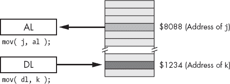

图 3-1。仅位移（直接）寻址模式

仅位移寻址模式非常适合访问简单的标量变量。之所以称其为仅位移寻址模式，是因为一个 32 位常量（位移）跟随在`mov`操作码后面存储在内存中。在 80x86 处理器中，这个位移是从内存起始地址（即地址 0）开始的偏移量。本章中的示例通常访问内存中的字节。然而，别忘了，你也可以通过指定其第一个字节的地址来访问 80x86 处理器上的字和双字（参见图 3-2）。

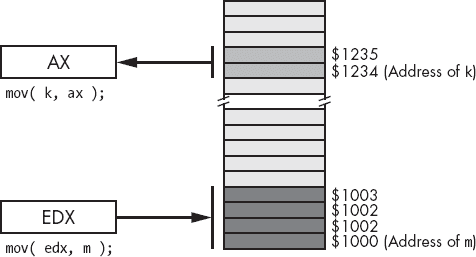

图 3-2. 使用仅位移寻址模式访问字或双字

### 3.1.2.2 寄存器间接寻址模式

80x86 CPU 让你通过寄存器间接寻址模式间接访问内存。术语*间接*意味着操作数不是实际的地址，而是操作数的值指定要使用的内存地址。在寄存器间接寻址模式的情况下，寄存器中保存的值是要访问的内存位置的地址。例如，指令`mov( eax, [ebx] );`告诉 CPU 将 EAX 的值存储到地址在 EBX 中的位置（EBX 周围的方括号告诉 HLA 使用寄存器间接寻址模式）。

在 80x86 上有八种这种寻址模式。以下指令是这八种形式的示例：

```
mov( [eax], al );
          mov( [ebx], al );
          mov( [ecx], al );
          mov( [edx], al );
          mov( [edi], al );
          mov( [esi], al );
          mov( [ebp], al );
          mov( [esp], al );
```

这八种寻址模式通过方括号中的寄存器（EAX、EBX、ECX、EDX、EDI、ESI、EBP 或 ESP）找到的偏移量引用内存位置。

请注意，寄存器间接寻址模式要求使用 32 位寄存器。使用间接寻址模式时，不能指定 16 位或 8 位寄存器。^([34]) 从技术上讲，你可以将一个 32 位寄存器加载任意数值，并使用寄存器间接寻址模式间接访问该位置：

```
mov( $1234_5678, ebx );
          mov( [ebx], al );     // Attempts to access location $1234_5678.
```

不幸的是（或者幸运的是，这取决于你如何看待它），这可能会导致操作系统生成保护错误，因为并非总是合法访问任意内存位置。事实证明，有更好的方法将某些对象的地址加载到寄存器中；你稍后会看到如何操作。

寄存器间接寻址模式有许多用途。你可以用它们来访问由指针引用的数据，也可以用它们来遍历数组数据，通常，你可以在程序运行时需要修改变量地址时使用它们。

寄存器间接寻址模式提供了一个*匿名*变量的例子。当使用寄存器间接寻址模式时，你是通过变量的数值内存地址（例如，加载到寄存器中的值）而不是变量的名称来引用变量的值——因此有了*匿名变量*这一说法。

HLA 提供了一个简单的操作符，你可以用它获取一个`static`变量的地址，并将该地址放入一个 32 位寄存器中。这就是`&`（地址操作符）操作符（注意，这与 C/C++ 中的地址操作符符号相同）。以下示例将变量 `j` 的地址加载到 EBX 中，然后使用寄存器间接寻址模式将 EAX 的当前值存储到 `j` 中：

```
mov( &j, ebx );               // Load address of j into ebx.
     mov( eax, [ebx] );            // Store eax into j.
```

当然，直接将 EAX 的值存储到`j`中比使用两条指令间接完成这项操作要简单。然而，你可以很容易地想象出一个代码序列，在该序列中，程序在执行`mov( eax, [ebx]);`语句之前，会将多个不同的地址之一加载到 EBX 中，从而根据程序的执行路径将 EAX 存储到多个不同的位置。

### 警告

`&`（取地址）操作符不像 C/C++中的`&`操作符那样是通用的取地址操作符。你只能将此操作符应用于静态变量。^([35]) 你不能将它应用于通用的地址表达式或其他类型的变量。在 3.13 获取内存对象的地址中，你将了解*加载有效地址*指令，它为获取内存中某个变量的地址提供了通用的解决方案。

### 3.1.2.3 索引寻址模式

索引寻址模式使用以下语法：

```
mov( *`VarName`*[ eax ], al );
     mov( *`VarName`*[ ebx ], al );
     mov( *`VarName`*[ ecx ], al );
     mov( *`VarName`*[ edx ], al );
     mov( *`VarName`*[ edi ], al );
     mov( *`VarName`*[ esi ], al );
     mov( *`VarName`*[ ebp ], al );
     mov( *`VarName`*[ esp ], al );
```

*`VarName`* 是你程序中某个变量的名称。

索引寻址模式通过将变量的地址加到出现在方括号内的 32 位寄存器的值上来计算有效地址^([36])。它们的和即为指令访问的实际内存地址。因此，如果*`VarName`*位于内存地址$1100，而 EBX 中包含 8，那么`mov(`*`VarName`*`[ ebx ], al);`会将地址$1108 处的字节加载到 AL 寄存器中（见图 3-3）。

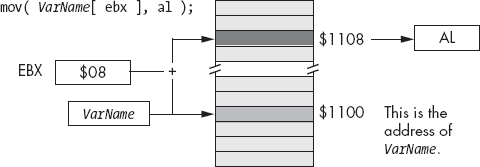

图 3-3. 索引寻址模式

索引寻址模式对于访问数组元素非常方便。你将在第四章中看到如何使用这些寻址模式来完成这一任务。

### 3.1.2.4 索引寻址模式的变体

索引寻址模式有两种重要的语法变体。两种形式生成相同的基本机器指令，但它们的语法暗示了这些变体的其他用途。

第一种变体使用以下语法：

```
mov( [ ebx + *`constant`* ], al );
     mov( [ ebx - *`constant`* ], al );
```

这些示例只使用了 EBX 寄存器。然而，你可以使用任何其他 32 位通用寄存器来代替 EBX。这种形式通过将 EBX 中的值加到指定常量上，或者将指定常量从 EBX 中减去来计算其有效地址（见图 3-4 和图 3-5）。

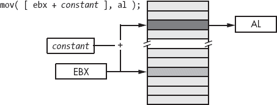

图 3-4. 使用寄存器加常量的索引寻址模式

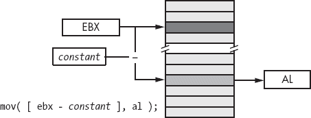

图 3-5. 使用寄存器减去常数的索引寻址模式

这种寻址模式的特定变体在 32 位寄存器包含多字节对象的基地址时非常有用，且你希望访问该位置之前或之后某个字节的内存位置。这种寻址模式的一个重要用途是在你拥有记录数据的指针时访问记录（或结构）的字段。对于访问过程中的自动（局部）变量，这种寻址模式也非常有价值（详见第五章）。

索引寻址模式的第二种变体实际上是前两种形式的结合体。这个版本的语法如下：

```
mov( *`VarName`*[ ebx + *`constant`* ], al );
     mov( *`VarName`*[ ebx - *`constant`* ], al );
```

再次说明，这个示例仅使用了 EBX 寄存器。在这两个示例中，你可以用任何 32 位通用寄存器替代 EBX。这个特定的形式在汇编语言程序中访问记录（结构）数组元素时非常有用（更多内容见第四章）。

这些指令通过将*`constant`*值从*`VarName`*的地址中加或减去，然后将 EBX 中的值加到这个结果上来计算它们的有效地址。请注意，是 HLA，而不是 CPU，计算*`VarName`*地址与*`constant`*的和或差。上述实际的机器指令包含一个常数值，在运行时将这个常数值加到 EBX 中的值上。因为 HLA 将常数替换为*`VarName`*，它可以将以下形式的指令简化为

```
mov( *`VarName`*[ ebx + *`constant`*], al );
```

变成如下形式的指令

```
mov( *`constant1`*[ ebx + *`constant2`*], al );
```

由于这些寻址模式的工作方式，它在语义上等同于

```
mov( [ebx + (*`constant1`* + *`constant2`*)], al );
```

HLA 将在编译时将这两个常数相加，有效地产生以下指令：

```
mov( [ebx + *`constant_sum`*], al );
```

当然，减法本身并没有什么特别的。你可以通过简单地取 32 位常数的二补码，再将该补码值相加（而不是减去原始值）轻松地将涉及减法的寻址模式转换为加法。

### 3.1.2.5 缩放索引寻址模式

缩放索引寻址模式与索引寻址模式类似，但有两个不同之处：(1) 缩放索引寻址模式允许你结合两个寄存器加一个位移量，(2) 缩放索引寻址模式允许你将索引寄存器乘以 1、2、4 或 8 的缩放因子。这些寻址模式的语法是

```
*`VarName`*[ *`IndexReg32`***`scale`* ]
     *`VarName`*[ *`IndexReg32`***`scale`* + *`displacement`* ]
     *`VarName`*[ *`IndexReg32`***`scale`* - *`displacement`* ]

     [ *`BaseReg32`* + *`IndexReg32`***`scale`* ]
     [ *`BaseReg32`* + *`IndexReg32`***`scale`* + *`displacement`* ]
     [ *`BaseReg32`* + *`IndexReg32`***`scale`* - *`displacement`* ]

     *`VarName`*[ *`BaseReg32`* + *`IndexReg32`***`scale`* ]
     *`VarName`*[ *`BaseReg32`* + *`IndexReg32`***`scale`* + *`displacement`* ]
     *`VarName`*[ *`BaseReg32`* + *`IndexReg32`***`scale`* - *`displacement`* ]
```

在这些示例中，*`BaseReg32`*表示任何通用 32 位寄存器，*`IndexReg32`*表示除 ESP 外的任何通用 32 位寄存器，*`scale`*必须是常数 1、2、4 或 8 之一。

缩放索引寻址模式和索引寻址模式的主要区别在于包含了*`IndexReg32`*`*`*`scale`*组件。这些模式通过将新寄存器的值乘以指定的缩放因子后加到基地址中，从而计算有效地址（有关以 EBX 作为基寄存器，ESI 作为索引寄存器的示例，请参见图 3-6）。

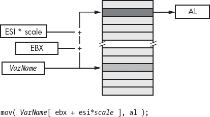

图 3-6. 缩放索引寻址模式

在图 3-6 中，假设 EBX 包含$100，ESI 包含$20，*`VarName`*位于内存中的基地址$2000；则以下指令

```
mov( *`VarName`*[ ebx + esi*4 + 4 ], al );
```

将地址$2184（$100 + $20*4 + 4）处的字节移入 AL 寄存器。

缩放索引寻址模式适用于访问每个元素为 2、4 或 8 字节的数组元素。当你有指向数组开始位置的指针时，这些寻址模式也非常有用。

### 3.1.2.6 寻址模式总结

说实话，你刚刚学会了几百种寻址模式！其实并不难，对吧？如果你在想这些模式是从哪里来的，值得注意的是，寄存器间接寻址模式并不是单一的寻址模式，而是八种不同的寻址模式（涉及到八个不同的寄存器）。寄存器、常数大小和其他因素的组合，会增加系统中可能的寻址模式的数量。实际上，你只需要记住大约二十几种形式，就能应付了。实际上，在任何给定的程序中，你会使用不到一半的可用寻址模式（而且许多寻址模式你可能永远都不会用到）。因此，学习所有这些寻址模式其实比看起来要容易得多。

* * *

^([34]) 事实上，80x86 确实支持涉及某些 16 位寄存器的寻址模式，如前所述。然而，HLA 不支持这些模式，并且在 32 位操作系统下它们并不实用。

^([35]) 这里的*static*表示一个`static`、`readonly`或`storage`对象。

^([36]) 有效地址是指令在完成所有地址计算后将要访问的内存中的最终地址。

# 3.2 运行时内存组织

类似 Mac OS X、FreeBSD、Linux 或 Windows 的操作系统倾向于将不同类型的数据放入内存的不同段（或区域）。尽管通过运行链接器并指定不同的参数，可以重新配置内存的布局，但默认情况下，Windows 使用图 3-7 中显示的内存组织加载 HLA 程序（Linux、Mac OS X 和 FreeBSD 类似，尽管它们对一些段进行了重新安排）。

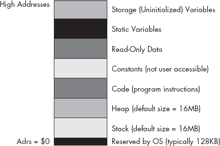

图 3-7. HLA 典型的运行时内存组织

操作系统保留了最低的内存地址。通常，你的应用程序无法访问这些低地址处的数据（或执行指令）。操作系统保留这些空间的一个原因是帮助捕捉 NULL 指针引用。如果你尝试访问内存位置 0，操作系统将生成一个通用保护错误，这意味着你访问了一个没有有效数据的内存位置。因为程序员通常将指针初始化为 NULL（0）以表示指针未指向任何位置，因此访问位置 0 通常意味着程序员犯了错误，没有正确初始化指针为合法的（非 NULL）值。

内存映射中的其余六个区域保存与你的程序相关的不同类型的数据。这些内存段包括`stack`段、`heap`段、`code`段、`readonly`段、`static`段和`storage`段。每个内存段对应你可以在 HLA 程序中创建的某种类型的数据。下面将详细讨论每个段。

## 3.2.1 代码段

`code`段包含出现在 HLA 程序中的机器指令。HLA 将你编写的每条机器指令翻译成一个或多个字节值的序列。在程序执行期间，CPU 将这些字节值解释为机器指令。

默认情况下，当 HLA 链接你的程序时，它会告诉系统你的程序可以在代码段中执行指令，并且你可以从代码段读取数据。特别注意，你不能向代码段写入数据。如果你尝试将数据存储到代码段中，操作系统将生成一个通用保护错误。

记住，机器指令不过是数据字节。从理论上讲，您可以编写一个程序，将数据值存储到内存中，然后将控制权转移到它刚写入的数据上，从而产生一个在执行时自己写自己的程序。这种可能性激发了人们对 *人工智能* 程序的浪漫幻想，这些程序能够自我修改以产生期望的结果。但在现实生活中，效果要少得多，远没有那么光彩。通常，自我修改的程序非常难以调试，因为指令在程序员的背后不断变化。由于大多数现代操作系统使得编写自我修改的程序变得非常困难，因此我们在本文中不会进一步讨论它们。

HLA 会自动将与机器代码关联的数据存储到代码区。除了机器指令之外，您还可以通过使用以下伪操作码将数据存储到代码区：^([37])

| `byte` | `int8` |
| --- | --- |
| `word` | `int16` |
| `dword` | `in32` |
| `uns8` | `boolean` |
| `uns16` | `char` |
| `uns32` |   |

以下的 `byte` 语句展示了每个伪操作码的语法：

```
byte *`comma_separated_list_of_byte_constants`* ;
```

以下是一些示例：

```
boolean     true;
     char        'A';
     byte        0, 1, 2;
     byte        "Hello", 0
     word        0, 2;
     int8        −5;
     uns32       356789, 0;
```

如果伪操作码后面的值列表中出现多个值，HLA 会将每个连续的值发送到代码流中。因此，上面的第一个 `byte` 语句会向代码流发送 3 个字节，值分别为 0、1 和 2。如果字符串出现在 `byte` 语句中，HLA 会为字符串中的每个字符发送 1 个字节的数据。因此，上面的第二个 `byte` 语句会发送 6 个字节：字符 `H`、`e`、`l`、`l` 和 `o`，然后是一个 `0` 字节。

请记住，除非特别小心以防止数据执行，否则 CPU 会尝试将您发送到代码流中的数据当作机器指令来处理。例如，如果您写下以下内容：

```
mov( 0, ax );
          byte 0,1,2,3;
          add( bx, cx );
```

执行 `mov` 指令后，您的程序会尝试将 `0`、`1`、`2` 和 `3` 字节值作为机器指令执行。除非您知道某个指令序列的机器码，否则将这样的数据值直接插入代码中通常会导致程序崩溃。通常，当您在程序中插入这样的数据时，您会执行一些代码，将控制权转移到数据所在位置。

## 3.2.2 静态区

`static` 区通常是您声明变量的地方。尽管 `static` 区在语法上看起来像是程序或过程的一部分，但请记住，HLA 会将所有静态变量移动到内存中的 `static` 区。因此，HLA 不会将您在 `static` 区声明的变量夹在 `code` 区的过程之间。

除了声明静态变量，你还可以将数据列表嵌入到`static`声明区。你可以使用与将数据嵌入到`code`区相同的技巧，将数据嵌入到`static`区：你使用`byte`、`word`、`dword`、`uns32`等伪操作码。考虑以下示例：

```
static
     b:   byte := 0;
          byte 1,2,3;

     u:   uns32 := 1;
          uns32 5,2,10;

     c:   char;
          char 'a', 'b', 'c', 'd', 'e', 'f';

     bn:  boolean;
          boolean true;
```

HLA 使用这些伪操作码写入`static`内存段的数据，会在前面变量之后写入该段。例如，字节值`1`、`2`和`3`会在`b`的`0`字节之后被写入`static`区。由于这些值没有与标签关联，你无法在程序中直接访问这些值。你可以使用索引寻址模式来访问这些额外的值（示例见第四章）。

在上述示例中，请注意`c`和`bn`变量没有（显式）初始值。然而，如果你没有提供初始值，HLA 会将`static`区中的变量初始化为全 0 位，因此 HLA 将 NUL 字符（ASCII 码 0）赋给`c`作为其初始值。同样，HLA 将`false`作为`bn`的初始值。特别需要注意的是，即使你没有为变量分配初始值，`static`区中的变量声明仍然会占用内存。

## 3.2.3 只读数据区

`readonly`数据区包含常量、表格和程序在执行过程中无法修改的其他数据。你通过在`readonly`声明区中声明它们来创建只读对象。`readonly`区与`static`区非常相似，主要有三个区别：

+   `readonly`区以保留字`readonly`开头，而不是`static`。

+   `readonly`区中的所有声明通常都有初始化值。

+   系统不允许你在程序运行时将数据存储到`readonly`对象中。

这是一个示例：

```
readonly
     pi:              real32 := 3.14159;
     e:               real32 := 2.71;
     MaxU16:          uns16 := 65_535;
     MaxI16:          int16 := 32_767;
```

所有`readonly`对象声明必须有初始化值，因为你无法在程序控制下初始化该值。^([38]) 就所有实际目的而言，你可以将`readonly`对象视为常量。然而，这些常量占用内存，除了不能写入数据到`readonly`对象外，它们的行为类似于`static`变量。因为它们的行为像`static`对象一样，你不能在常量允许的任何地方使用`readonly`对象；特别是，`readonly`对象是内存对象，因此你不能将一个`readonly`对象（你视为常量）和其他内存对象作为操作数传递给指令。

与`static`区一样，你可以使用`byte`、`word`、`dword`等数据声明将数据值嵌入到`readonly`区。例如：

```
readonly
     roArray: byte := 0;
              byte 1, 2, 3, 4, 5;
     qwVal:   qword := 1;
              qword 0;
```

## 3.2.4 存储区

`readonly`部分要求你初始化所有声明的对象。`static`部分让你选择性地初始化对象（或者将它们保持未初始化状态，在这种情况下，它们的默认初始值为 0）。`storage`部分完成了初始化的覆盖：你用它来声明在程序开始运行时始终未初始化的变量。`storage`部分以`storage`保留字开始，并包含没有初始化器的变量声明。以下是一个示例：

```
storage
     UninitUns32:     uns32;
     i:               int32;
     character:       char;
     b:               byte;
```

Linux、FreeBSD、Mac OS X 和 Windows 在将程序加载到内存时会将所有存储对象初始化为 0。然而，依赖这种隐式初始化可能不是一个好主意。如果你需要一个初始化为 0 的对象，可以在`static`部分声明它，并显式地将其设置为 0。

你在`storage`部分声明的变量可能会减少程序可执行文件中的磁盘空间占用。这是因为 HLA 会将`readonly`和`static`对象的初始值写入可执行文件，但它可能会使用紧凑的表示方式来存储你在`storage`部分声明的未初始化变量；但请注意，这种行为依赖于操作系统和对象模块格式。

因为`storage`部分不允许初始化值，所以你*不能*在`storage`部分使用`byte`、`word`、`dword`等伪操作码来放置没有标签的值。

## 3.2.5 `@nostorage`属性

`@nostorage`属性让你在静态数据声明部分（即`static`、`readonly`和`storage`）声明变量，而不实际为变量分配内存。`@nostorage`选项告诉 HLA 将当前地址分配给声明部分中的变量，但不为对象分配任何存储空间。该变量将与变量声明部分中下一个出现的对象共享相同的内存地址。以下是`@nostorage`选项的语法：

```
*`variableName`*: *`varType`*; @nostorage;
```

注意，你在类型名称后跟上`@nostorage;`，而不是一些初始值或仅仅是分号。以下代码序列提供了在`readonly`部分中使用`@nostorage`选项的示例：

```
readonly
     abcd: dword; nostorage;
           byte 'a', 'b', 'c', 'd';
```

在这个例子中，`abcd`是一个双字，其中最低字节包含 97（`'a'`），字节 1 包含 98（`'b'`），字节 2 包含 99（`'c'`），最高字节包含 100（`'d'`）。HLA 不会为`abcd`变量分配存储空间，因此 HLA 会将内存中以下 4 个字节（由`byte`指令分配）与`abcd`关联。

注意，`@nostorage`属性仅在`static`、`storage`和`readonly`部分（所谓的*静态*声明部分）合法。HLA 不允许在接下来会介绍的`var`部分中使用它。

## 3.2.6 `var`部分

HLA 提供了另一种变量声明部分，即 `var` 部分，你可以用来创建 *自动* 变量。当程序单元（即主程序或过程）开始执行时，程序将为自动变量分配存储；当该程序单元返回给调用者时，程序会释放自动变量的存储。当然，任何在主程序中声明的自动变量与所有 `static`、`readonly` 和 `storage` 对象具有相同的 *生命周期* ^([39])，因此 `var` 部分的自动分配功能在主程序中是无用的。通常，你应该只在过程（见 第五章）中使用自动对象。HLA 允许在主程序的声明部分使用它们作为一种概括。

因为你在 `var` 部分声明的变量是在运行时创建的，所以 HLA 不允许在此部分声明的变量上使用初始化器。因此，`var` 部分的语法与 `storage` 部分几乎相同；两者之间唯一的实际区别是使用了 `var` 保留字，而不是 `storage` 保留字。^([40]) 以下示例演示了这一点：

```
var
     vInt:      int32;
     vChar:     char;
```

HLA 在 `var` 部分声明的变量分配到 `stack` 内存部分。HLA 不会将 `var` 对象分配到固定位置；相反，它会将这些变量分配到与当前程序单元关联的激活记录中。第五章更详细地讨论了激活记录；目前，重要的是要意识到 HLA 程序使用 EBP 寄存器作为指向当前激活记录的指针。因此，每当你访问 `var` 对象时，HLA 会自动将变量名替换为 `[EBP±`*`位移`*`]`。位移是对象在激活记录中的偏移量。这意味着你不能使用完整的缩放索引寻址模式（基址寄存器加缩放索引寄存器）来访问 `var` 对象，因为 `var` 对象已经使用 EBP 寄存器作为基址寄存器。虽然你不会经常直接使用这两种寄存器寻址模式，但 `var` 部分的这一限制是避免在主程序中使用 `var` 部分的一个重要理由。

## 3.2.7 程序中声明部分的组织

`static`、`readonly`、`storage` 和 `var` 部分可以在 `program` 头部和相关 `begin` 之间出现零次或多次。在程序的这两个点之间，声明部分可以按任意顺序出现，以下示例演示了这一点：

```
program demoDeclarations;

static
     i_static:     int32;

var
     i_auto:       int32;

storage
     i_uninit:     int32;

readonly
     i_readonly:   int32 := 5;

static
     j:            uns32;

var
     k:            char;

readonly
     i2:           uns8 := 9;

storage
     c:            char;

storage
     d:            dword;

begin demoDeclarations;

     << Code goes here. >>

end demoDeclarations;
```

除了演示各个部分可以以任意顺序出现之外，本节还展示了在程序中给定的声明部分可能出现多次。当多个相同类型的声明部分（例如，上述的三个`storage`部分）出现在程序的声明部分时，HLA 会将它们合并成一个组。

* * *

^([37]) 这不是完整的列表。HLA 通常允许你使用任何标量数据类型名称作为语句，在代码部分保留存储空间。你将在第四章中了解更多可用的数据类型。

^([38]) 其中有一个例外，你将在第五章中看到。

^([39]) 变量的生命周期是从首次分配内存到该变量的内存被释放的时间段。

^([40]) 事实上，还有一些其他的小差异，但我们在本文中不会涉及这些差异。有关更多细节，请参阅 HLA 语言参考手册。

# 3.3 HLA 如何为变量分配内存

正如你所见，80x86 CPU 不会处理像`I`、`Profits`和`LineCnt`这样的变量名。CPU 严格处理可以放置在地址总线上的数字地址，例如$1234_5678、$0400_1000 和$8000_CC00。而 HLA 则不会强制你通过地址来引用变量对象（这很好，因为名称更容易记住）。这很好，但它确实掩盖了真正发生的情况。在本节中，我们将了解 HLA 如何将数字地址与变量关联起来，这样你就能理解（并欣赏）在你不知情的情况下发生的过程。

再看看图 3-7。如你所见，各个内存部分通常是彼此相邻的。因此，如果某一内存部分的大小发生变化，所有后续部分的起始地址也会受到影响。例如，如果你向程序中添加了一些机器指令，增大了`code`部分的大小，那么这可能会影响`static`部分在内存中的起始地址，从而改变所有静态变量的地址。通过数字地址来追踪变量（而不是通过它们的名称）已经足够困难；想象一下，如果地址在你添加或删除机器指令时不断变化，会变得多么糟糕！幸运的是，你不需要追踪变量的地址；HLA 会为你完成这个记账工作。

HLA 为每个静态声明区段（`static`、`readonly`和`storage`）关联了一个当前的*位置计数器*。这些位置计数器最初的值为 0，每当你在某个静态区段中声明一个变量时，HLA 会将该区段位置计数器的当前值与变量关联；同时，HLA 还会将该位置计数器的值增加声明对象的大小。举个例子，假设以下是程序中唯一的`static`声明区段：

```
static
     b     :byte;                    // Location counter = 0, size = 1
     w     :word;                    // Location counter = 1, size = 2
     d     :dword;                   // Location counter = 3, size = 4
     q     :qword;                   // Location counter = 7, size = 8
     l     :lword;                   // Location counter = 15, size = 16
                                     // Location counter is now 31.
```

当然，这些变量的运行时地址并不是位置计数器的值。首先，HLA 会将`static`内存区段的基地址加到这些位置计数器的每个值上（我们称之为*位移*或*偏移量*）。其次，可能还有其他静态对象存在于你链接到程序中的模块中（例如来自 HLA 标准库的对象），或者在同一源文件中可能存在额外的`static`区段，链接器必须将这些`static`区段合并在一起。因此，这些偏移量可能对这些变量在内存中的最终地址几乎没有影响。尽管如此，有一个重要的事实依然成立：HLA 会将你在单个`static`声明区段中声明的变量分配到连续的内存位置。也就是说，给定上述声明，`w`将在内存中紧跟`b`之后，`d`将在内存中紧跟`w`之后，`q`将在内存中紧跟`d`之后，以此类推。通常情况下，假设系统以这种方式分配变量并不是良好的编码风格，但有时这么做是方便的。

请注意，HLA 会将你在`readonly`、`static`和`storage`区段中声明的内存对象分配到完全不同的内存区域。因此，你不能假设以下三个内存对象会出现在相邻的内存位置（实际上，它们可能不会相邻）：

```
static
     b     :byte;
readonly
     w     :word := $1234;
storage
     d     :dword;
```

事实上，HLA 甚至不能保证你在不同的`static`（或其他）区段中声明的变量会在内存中相邻，即使你的代码中这些声明之间没有任何东西（例如，你不能假设`b`、`w`和`d`在以下声明中是相邻的内存位置，也不能假设它们*不会*在内存中相邻）：

```
static
     b     :byte;
static
     w     :word := $1234;
static
     d     :dword;
```

如果你的代码要求这些变量占用相邻的内存位置，你必须将它们声明在同一个`static`区段中。

请注意，HLA 处理你在`var`区段中声明的变量与在`static`区段中声明的变量略有不同。我们将在第五章中讨论如何为`var`对象分配偏移量。

# 3.4 HLA 对数据对齐的支持

为了编写快速的程序，你需要确保在内存中正确对齐数据对象。正确的对齐意味着对象的起始地址是某个大小的倍数，通常如果对象的大小是 2 的幂（最大为 16 字节），那么它的起始地址应该是该对象大小的倍数。对于大于 16 字节的对象，将其对齐到 8 字节或 16 字节的地址边界通常就足够了。对于小于 16 字节的对象，将其对齐到大于对象大小的下一个 2 的幂次方地址通常是可以的。访问没有对齐到合适地址的数据可能会需要额外的时间；因此，如果你想确保程序尽可能快速运行，你应该根据数据对象的大小来对齐它们。

当你为不同大小的对象分配存储空间时，如果它们被分配在相邻的内存位置，数据就会变得未对齐。例如，如果你声明了一个字节变量，它将占用 1 个字节的存储空间，而在该声明部分中你声明的下一个变量将位于该字节对象的地址加 1 的位置。如果字节变量的地址恰好是偶数地址，那么紧随其后的变量将从一个奇数地址开始。如果这个变量是一个字或双字对象，那么它的起始地址将不是最优的。在本节中，我们将探讨确保变量根据对象的大小在适当起始地址对齐的方法。

请考虑以下 HLA 变量声明：

```
static
     dw:    dword;
     b:     byte;
     w:     word;
     dw2:   dword;
     w2:    word;
     b2:    byte;
     dw3:   dword;
```

程序中的第一个`static`声明（在 Windows、Mac OS X、FreeBSD、Linux 和大多数 32 位操作系统下运行）将变量放置在一个偶数倍的 4,096 字节地址上。无论哪个变量最先出现在`static`声明中，都能保证它会对齐到一个合理的地址。每个后续变量都将分配到一个地址，该地址是前面所有变量的大小之和加上该`static`段的起始地址。因此，假设 HLA 在前面示例中分配变量的起始地址为`4096`，HLA 将把它们分配到以下地址：

```
//  Start Adrs              Length
     dw:    dword;       //     4096                    4
     b:     byte;        //     4100                    1
     w:     word;        //     4101                    2
     dw2:   dword;       //     4103                    4
     w2:    word;        //     4107                    2
     b2:    byte;        //     4109                    1
     dw3:   dword;       //     4110                    4
```

除了第一个变量（它对齐在 4KB 边界上）和字节变量（其对齐不重要）外，所有这些变量都没有对齐。`w`、`w2`和`dw2`变量从奇数地址开始，而`dw3`变量则对齐在一个不是 4 的倍数的偶数地址上。

保证变量正确对齐的一个简单方法是：在声明中先写双字变量，其次是字变量，最后是字节变量，如下所示：

```
static
     dw:    dword;
     dw2:   dword;
     dw3:   dword;
     w:     word;
     w2:    word;
     b:     byte;
     b2:    byte;
```

这种组织方式在内存中生成以下地址：

```
//  Start Adrs          Length
     dw:    dword;     //     4096                4
     dw2:   dword;     //     4100                4
     dw3:   dword;     //     4104                4
     w:     word;      //     4108                2
     w2:    word;      //     4110                2
     b:     byte;      //     4112                1
     b2:    byte;      //     4113                1
```

如你所见，这些变量都在合理的地址上进行了对齐。

不幸的是，通常很难按照这种方式安排你的变量。虽然有许多技术原因使得这种对齐变得不可能，但不这样做的一个好的实际原因是，这样做不能让你按逻辑功能组织变量声明（也就是说，你可能希望将相关的变量放在一起，而不管它们的大小）。

为了解决这个问题，HLA 提供了 `align` 指令。`align` 指令使用以下语法：

```
align( *`integer_constant`* );
```

整数常量必须是以下小的无符号整数值之一：1、2、4、8 或 16。如果 HLA 在 `static` 部分遇到 `align` 指令，它将把下一个变量对齐到一个指定对齐常量的偶数倍地址。前面的例子可以用 `align` 指令重写，如下所示：

```
static
     align( 4 );
     dw:     dword;
     b:      byte;
     align( 2 );
     w:      word;
     align( 4 );
     dw2:    dword;
     w2:     word;
     b2:     byte;
     align( 4 );
     dw3:    dword;
```

如果你在想 `align` 指令是如何工作的，其实非常简单。如果 HLA 确定当前地址（位置计数器的值）不是指定值的偶数倍，HLA 会在前一个变量声明后静默地插入额外的填充字节，直到 `static` 部分的当前地址成为指定值的偶数倍。这会使你的程序稍微变大（增加几字节），以换取更快速的数据访问。鉴于使用此功能时，程序只会增加几字节，这可能是一个值得的权衡。

一般来说，如果你想要尽可能快速的访问，你应该选择一个等于你想对齐的对象大小的对齐值。也就是说，你应该用 `align(2);` 语句将字对齐到偶数边界，用 `align(4);` 将双字对齐到 4 字节边界，用 `align(8);` 将四字对齐到 8 字节边界，依此类推。如果对象的大小不是 2 的幂，则将其对齐到下一个较大的 2 的幂（最大为 16 字节）。不过，请注意，只有 `real80`（和 `tbyte`）类型的对象需要对齐到 8 字节边界。

请注意，数据对齐并非总是必要的。现代 80x86 CPU 的缓存架构实际上可以处理大多数未对齐的数据。因此，你应该仅在需要快速访问的变量上使用对齐指令。这是一个合理的空间/速度权衡。

# 3.5 地址表达式

本章早些时候提到，寻址模式有几种通用的形式，包括以下几种：

```
*`VarName`*[ *`Reg32`* ]
*`VarName`*[ *`Reg32`* + *`offset`* ]
*`VarName`*[ *`RegNotESP32`***`scale`* ]
*`VarName`*[ *`Reg32`* + *`RegNotESP32`***`scale`* ]
*`VarName`*[ *`RegNotESP32`***`scale`* + *`offset`* ]
*`VarName`*[ *`Reg32`* + *`RegNotESP32`***`scale`* + *`offset`* ]
```

另一种合法的形式，实际上并不是一种新的寻址模式，而只是位移寻址模式的扩展，是：

```
*`VarName`*[ *`offset`* ]
```

后者的示例通过将方括号内的常量偏移量与变量的地址相加来计算其有效地址。例如，指令`mov(Address[3], al);`将 AL 寄存器加载为内存中位于`Address`对象之后 3 个字节的字节（见图 3-8）。

始终记住，这些示例中的*`offset`*值必须是常量。如果`Index`是一个`int32`变量，则`Variable[Index]`不是合法的地址表达式。如果您希望指定一个在运行时变化的索引，则必须使用某种索引寻址或缩放索引寻址模式。

另一个需要记住的重要事项是，`Address[`*`offset`*`]`中的偏移量是字节地址。尽管这种语法类似于 C/C++或 Pascal 等高级语言中的数组索引，但除非`Address`是字节数组，否则这并不会正确地对数组对象进行索引。

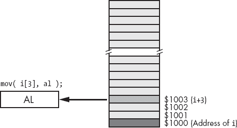

图 3-8. 使用地址表达式访问超出变量的数据

本书将*地址表达式*视为任何合法的 80x86 寻址模式，其中包括位移（即变量名）或偏移量。除了上述形式外，以下也是地址表达式：

```
[ *`Reg32`* + *`offset`* ]
[ *`Reg32`* + *`RegNotESP32`***`scale`* + *`offset`* ]
```

本书将*不*把以下内容视为地址表达式，因为它们不涉及位移或偏移量成分：

```
[ *`Reg32`* ]
[ *`Reg32`* + *`RegNotESP32`*
**`scale`* ]
```

地址表达式是特别的，因为包含地址表达式的指令总是将位移常量编码为机器指令的一部分。也就是说，机器指令包含一些位（通常是 8 位或 32 位），这些位保存一个数字常量。该常量是位移（即变量的地址或偏移量）加上偏移量的和。请注意，HLA 会自动为您将这两个值相加（如果在寻址模式中使用`−`而非`+`操作符，它会自动减去偏移量）。

到目前为止，所有寻址模式示例中的偏移量始终是一个数字常量。然而，HLA 还允许在任何合法的偏移量位置使用*常量表达式*。常量表达式由一个或多个常量项组成，这些常量项通过加法、减法、乘法、除法、取余以及其他各种运算符进行运算。然而，大多数地址表达式只涉及加法、减法、乘法，有时还会涉及除法。考虑以下示例：

```
mov( X[ 2*4+1 ], al );
```

该指令将地址`X+9`处的字节移动到 AL 寄存器中。

地址表达式的值总是在编译时计算，而不是在程序运行时计算。当 HLA 遇到上面的指令时，它会立即计算 2 * 4 + 1，并将此结果加到内存中 `X` 的基地址。HLA 将这个单一的和（`X` 的基地址加 9）作为指令的一部分进行编码；HLA 不会在运行时为你发出额外的指令来计算这个和（这是好的，因为这样做效率更高）。由于 HLA 在编译时计算地址表达式的值，因此表达式的所有组件必须是常量，因为 HLA 在编译程序时无法知道变量的运行时值。

地址表达式在访问内存中变量之外的数据时非常有用，特别是当你在 `static` 或 `readonly` 段中使用 `byte`、`word`、`dword` 等语句将附加字节添加到数据声明后时。例如，考虑 示例 3-1 中的程序。

示例 3-1. 地址表达式演示

```
program adrsExpressions;
#include( "stdlib.hhf" )
static
  i: int8; @nostorage;
     byte 0, 1, 2, 3;

begin adrsExpressions;

  stdout.put
  (
    "i[0]=", i[0], nl,
    "i[1]=", i[1], nl,
    "i[2]=", i[2], nl,
    "i[3]=", i[3], nl
  );

end adrsExpressions;
```

示例 3-1 中的程序将显示四个值 0、1、2 和 3，仿佛它们是数组元素。这是因为 `i` 地址处的值是 0（该程序使用 `@nostorage` 选项声明 `i`，因此 `i` 是 `static` 段中下一个对象的地址，恰好是作为 `byte` 语句一部分出现的值 0）。地址表达式 `i[1]` 告诉 HLA 获取位于 `i` 地址加 1 的字节。这个值是 1，因为该程序中的 `byte` 语句在值 0 后立即将值 1 写入 `static` 段。同样，对于 `i[2]` 和 `i[3]`，该程序显示值 2 和 3。

# 3.6 类型强制转换

虽然 HLA 在类型检查方面相当宽松，但 HLA 确保你为指令指定了合适的操作数大小。例如，考虑以下（错误的）程序：

```
program hasErrors;
static
     i8:     int8;
     i16:    int16;
     i32:    int32;
begin hasErrors;

     mov( i8, eax );
     mov( i16, al );
     mov( i32, ax );

end hasErrors;
```

HLA 会为这三个 `mov` 指令生成错误。这是因为操作数大小不兼容。第一条指令试图将一个字节移动到 EAX，第二条指令试图将一个字移动到 AL，第三条指令试图将一个双字移动到 AX。当然，`mov` 指令要求两个操作数的大小相同。

虽然这是 HLA 的一个好特性，^([41])，但有时它会成为障碍。考虑以下代码片段：

```
static
     byte_values: byte; @nostorage;
                  byte  0, 1;

     ...

          mov( byte_values, ax );
```

在这个例子中，假设程序员确实希望将`byte_values`地址开始的字加载到 AX 寄存器中，因为她希望通过单条指令将 0 加载到 AL 中，将 1 加载到 AH 中（注意 0 存储在低字节，1 存储在高字节）。HLA 会拒绝，声称发生了类型不匹配错误（因为`byte_values`是一个字节对象，而 AX 是一个字对象）。程序员可以将其拆分为两条指令，一条将字节值加载到 AL，另一条将字节值加载到 AH。不幸的是，这样的拆分会使程序效率稍微降低（这可能是最初使用单条`mov`指令的原因）。如果我们能告诉 HLA 我们知道自己在做什么，并且希望将`byte_values`变量视为`word`对象，那就太好了。HLA 的类型强制转换功能提供了这种能力。

*类型强制转换*^([42])是告诉 HLA 你希望将一个对象视为显式类型的过程，而不管它的实际类型是什么。要强制转换变量的类型，使用以下语法：

```
(type *`newTypeName addressExpression`*)
```

*`newTypeName`*项是你希望与*`addressExpression`*指定的内存位置关联的新类型。你可以在任何合法的内存地址上使用这个强制转换操作符。为了修正前面的例子，以便 HLA 不再抱怨类型不匹配，你可以使用以下语句：

```
mov( (type word *`byte_values`*), ax );
```

该指令告诉 HLA 从内存中*`byte_values`*地址开始加载一个字到 AX 寄存器中。假设*`byte_values`*仍然包含其初始值，这条指令将把 0 加载到 AL 中，将 1 加载到 AH 中。

当你指定一个匿名变量作为直接修改内存的指令的操作数时（例如，`neg`，`shl`，`not`等），需要使用类型强制转换。考虑以下语句：

```
not( [ebx] );
```

HLA 将在此指令上生成错误，因为它无法确定内存操作数的大小。该指令未提供足够的信息来确定程序是否应该反转由 EBX 指向的字节的位，EBX 指向的字的位，或者 EBX 指向的双字的位。你必须使用类型强制转换来显式指定这些类型的指令中的匿名引用的大小：

```
not( (type byte [ebx]) );
not( (type dword [ebx]) );
```

### 警告

除非你完全了解自己在做什么并且充分理解它对程序的影响，否则不要使用类型强制转换操作符。初学汇编语言的程序员经常使用类型强制转换作为工具来安抚编译器，避免因类型不匹配而报错，而不解决根本问题。

考虑以下语句（其中*`byteVar`*是一个 8 位变量）：

```
mov( eax, (type dword *`byteVar`*) );
```

如果没有类型强制操作符，HLA 会抱怨这个指令，因为它试图将一个 32 位寄存器存储到一个 8 位的内存位置中。一个初学编程的程序员，想让程序编译通过，可能会采取捷径，使用类型强制操作符，如该指令所示；这肯定会让编译器安静下来——它不再抱怨类型不匹配——因此初学者会感到高兴。然而，程序依然不正确；唯一的区别是 HLA 不再警告你错误。类型强制操作符并没有解决试图将 32 位值存储到 8 位内存位置的问题——它只是允许指令将 32 位值*从 8 位变量指定的地址开始存储*。程序仍然存储了 4 个字节，覆盖了内存中紧跟在*`byteVar`*后面的 3 个字节。这常常会产生意想不到的结果，包括程序中变量的“幽灵修改”。^([43]) 另一种较少见的情况是程序因一般保护错误而中止。如果*`byteVar`*后面的 3 个字节没有分配到实际内存中，或者这些字节恰好位于内存中的只读段，则可能会发生这种情况。关于类型强制操作符需要记住的一个重要点是：如果你不能准确描述该操作符的效果，请不要使用它。

还要记住，类型强制操作符不会对内存中的数据进行任何转换。它只是告诉编译器将内存中的位视为另一种类型。它不会自动将 8 位值扩展为 32 位，也不会将整数转换为浮点值。它只是告诉编译器将内存操作数的位模式视为不同的类型。

* * *

^([41]) 毕竟，如果两个操作数的大小不同，这通常表示程序中存在错误。

^([42]) 这在某些语言中也称为*类型转换*。

^([43]) 如果在这个例子中有一个变量紧跟在*`byteVar`*后面，那么`mov`指令肯定会覆盖该变量的值，无论你是否希望发生这种情况。

# 3.7 寄存器类型强制

你还可以使用类型强制操作符将寄存器转换为特定类型。默认情况下，8 位寄存器是`byte`类型，16 位寄存器是`word`类型，32 位寄存器是`dword`类型。通过类型强制，你可以将寄存器转换为另一种类型，*只要新类型的大小与寄存器的大小一致*。这是一个重要的限制，使用类型强制应用于内存变量时并不存在这个限制。

大多数时候，你不需要将寄存器强制转换为不同的类型。作为`byte`、`word`和`dword`对象，寄存器已经与所有 1 字节、2 字节和 4 字节对象兼容。然而，在一些情况下，寄存器类型强制转换是有用的，甚至是必需的。两个例子包括 HLA 高级语言语句中的布尔表达式（例如`if`和`while`）以及寄存器 I/O 操作，在`stdout.put`和`stdin.get`（及相关语句）中。

在布尔表达式中，HLA 始终将`byte`、`word`和`dword`对象视为无符号值。因此，在没有类型强制转换的情况下，以下`if`语句总是求值为假（因为没有无符号值小于 0）：

```
if( eax < 0 ) then

     stdout.put( "EAX is negative!", nl );

endif;
```

你可以通过将 EAX 强制转换为`int32`类型来克服这个限制：

```
if( (type int32 eax) < 0 ) then

     stdout.put( "EAX is negative!", nl );

endif;
```

类似地，HLA 标准库的`stdout.put`例程总是将`byte`、`word`和`dword`值作为十六进制数输出。因此，如果你尝试打印一个寄存器，`stdout.put`例程会将其打印为十六进制值。如果你想以其他类型打印该值，可以使用寄存器类型强制转换来实现：

```
stdout.put( "AL printed as a char = '", (type char al), "'", nl );
```

对于`stdin.get`例程也是如此。除非你将其类型强制转换为`byte`、`word`或`dword`以外的类型，否则它总是会读取寄存器的十六进制值。

# 3.8 堆栈段和 push 与 pop 指令

本章提到，所有在`var`段中声明的变量最终都会进入`stack`内存段。然而，`var`对象并不是`stack`内存段中唯一的内容；你的程序以多种不同的方式在`stack`段中操作数据。本节描述了堆栈，并介绍了操作`stack`段数据的`push`和`pop`指令。

内存中的`stack`段是 80x86 维护堆栈的地方。*堆栈*是一个动态数据结构，依据程序的需求增长和收缩。堆栈还存储关于程序的重要信息，包括局部变量、子例程信息和临时数据。

80x86 通过 ESP（堆栈指针）寄存器控制其堆栈。当程序开始执行时，操作系统将 ESP 初始化为`stack`内存段中最后一个内存位置的地址。数据通过“压入”（pushing）数据到堆栈和“弹出”（popping）数据从堆栈中来写入`stack`内存段。

## 3.8.1 基本的 push 指令

考虑 80x86 `push`指令的语法：

```
push( *`reg16`* );
push( *`reg32`* );
push( *`memory16`* );
push( *`memory32`* );
pushw( *`constant`* );
pushd( *`constant`* );
```

这六种形式允许你压入`word`或`dword`寄存器、内存位置和常量。你应该特别注意，不能将`byte`值压入堆栈。

`push`指令执行以下操作：

```
ESP := ESP - *`Size_of_Register_or_Memory_Operand`* (2 or 4)
[ESP] := *`Operand's_Value`*
```

`pushw`和`pushd`操作数分别始终是 2 字节和 4 字节常量。

假设 ESP 的值为 $00FF_FFE8，那么指令 `push( eax );` 会将 ESP 设置为 $00FF_FFE4，并将 EAX 的当前值存储到内存位置 $00FF_FFE4，如 图 3-9; 操作前的栈段") 和 图 3-10; 操作后的栈段") 所示。

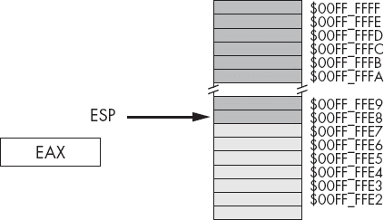

图 3-9. `push( eax );` 操作前的栈段

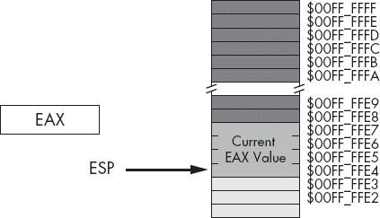

图 3-10. `push( eax );` 操作后的栈段

请注意，`push( eax );` 指令不会影响 EAX 寄存器的值。

虽然 80x86 支持 16 位的 push 操作，但它们主要用于如 MS-DOS 这样的 16 位环境。为了获得最佳性能，栈指针的值应始终是 4 的偶数倍；实际上，如果 ESP 的值不是 4 的倍数，您的程序可能在 32 位操作系统下出现故障。将小于 4 字节的数据推入栈的唯一实际原因是通过两个连续的 16 位 push 操作来构建一个双字。

## 3.8.2 基本 pop 指令

要检索您推入栈的数据，可以使用 `pop` 指令。基本的 `pop` 指令允许以下几种形式。

```
pop( *`reg16`* );
                 pop( *`reg32`* );
                 pop( *`memory16`* );
                 pop( *`memory32`* );
```

与 `push` 指令一样，`pop` 指令仅支持 16 位和 32 位操作数；您不能从栈中弹出一个 8 位的值。与 `push` 指令相同，您应该避免弹出 16 位值（除非连续做两个 16 位弹出），因为 16 位弹出可能会导致 ESP 寄存器中包含一个不是 4 的偶数倍的值。`push` 和 `pop` 之间的一个主要区别是，您不能弹出常量值（这很有意义，因为 `push` 的操作数是源操作数，而 `pop` 的操作数是目的操作数）。

正式来说，`pop` 指令的作用如下：

```
*`Operand`* := [ESP]
ESP := ESP + *`Size_of_Operand`* (2 or 4)
```

如您所见，`pop` 操作是 `push` 操作的逆操作。请注意，`pop` 指令在调整 ESP 中的值之前，会从内存位置 [ESP] 复制数据。有关此操作的详细信息，请参见 图 3-11; 操作之前的内存") 和 图 3-12; 指令执行后的内存")。

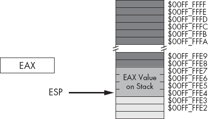

图 3-11. `pop( eax );` 操作之前的内存

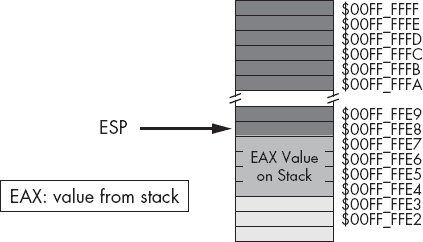

图 3-12. `pop( eax );` 指令执行后的内存

请注意，从栈中弹出的值仍然存在于内存中。弹出一个值并不会擦除内存中的该值，它只是调整栈指针，使其指向被弹出值上方的下一个值。然而，您绝不能尝试访问已从栈中弹出的值。下次将数据推送到栈中时，弹出的值将被覆盖。因为不仅仅是您的代码在使用栈（例如，操作系统和子程序也使用栈），所以在您将数据从栈中弹出后，不能依赖数据仍然保存在栈内存中。

## 3.8.3 使用 `push` 和 `pop` 指令保护寄存器

`push` 和 `pop` 指令最常见的用途可能是保存寄存器值以便进行中间计算。80x86 架构的一个问题是，它提供的通用寄存器非常少。由于寄存器是保存临时值的最佳位置，并且寄存器还需要用于各种寻址模式，因此在编写执行复杂计算的代码时，寄存器很容易用完。当发生这种情况时，`push` 和 `pop` 指令可以为您提供帮助。

请考虑以下程序框架：

```
<< Some sequence of instructions that use the eax register >>

     << Some sequence of instructions that need to use eax, for a
          different purpose than the above instructions >>

     << Some sequence of instructions that need the original value in eax >>
```

`push` 和 `pop` 指令非常适合这种情况。通过在中间指令序列之前插入一个 `push` 指令，并在中间指令序列之后插入一个 `pop` 指令，您可以在这些计算中保护 EAX 中的值：

```
<< Some sequence of instructions that use the eax register >>
     push( eax );
     << Some sequence of instructions that need to use eax, for a
          different purpose than the above instructions >>
     pop( eax );
     << Some sequence of instructions that need the original value in eax >>
```

上面的`push`指令将第一组指令计算出的数据复制到栈中。现在，中间的指令序列可以根据需要使用 EAX 寄存器。中间指令序列完成后，`pop`指令会恢复 EAX 中的值，以便最后一组指令可以使用 EAX 中的原始值。

# 3.9 栈是一个 LIFO 数据结构

您可以将多个值推送到栈中，而无需先将先前的值弹出栈。然而，栈是一个*后进先出（LIFO）*数据结构，因此在推送和弹出多个值时必须小心。例如，假设您想在一些指令块之间保护 EAX 和 EBX 寄存器的值；以下代码演示了处理这种情况的明显方法：

```
push( eax );
          push( ebx );
          << Code that uses eax and ebx goes here. >>
          pop( eax );
          pop( ebx );
```

不幸的是，这段代码无法正常工作！图 3-13 到图 3-16 展示了问题所在。因为这段代码首先推送 EAX，然后推送 EBX，所以栈指针指向栈中 EBX 的值。当执行 `pop( eax );` 指令时，它将原本在 EBX 中的值从栈中移除并放入 EAX 中！同样，`pop( ebx );` 指令将原本在 EAX 中的值弹出并放入 EBX 寄存器。最终结果是，这段代码通过以与推送顺序相同的顺序弹出寄存器的值，从而交换了寄存器中的值。

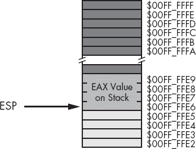

图 3-13. 推入 EAX 后的堆栈

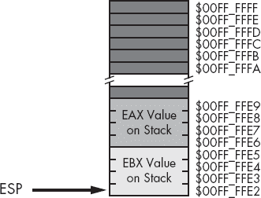

图 3-14. 推入 EBX 后的堆栈

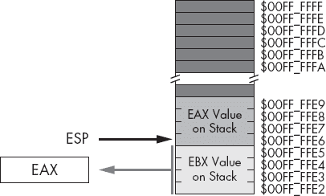

图 3-15. 弹出 EAX 后的堆栈


图 3-16. 弹出 EBX 后的堆栈

为了纠正这个问题，你必须注意到堆栈是一个后进先出（LIFO）数据结构，所以你必须先弹出最后推入堆栈的东西。因此，你必须始终遵循以下格言：

**始终以相反的顺序弹出你推入的值**。

对前面代码的修正是：

```
push( eax );
          push( ebx );
          << Code that uses eax and ebx goes here. >>
          pop( ebx );
          pop( eax );
```

另一个重要的格言是：

**始终弹出与推入相同数量的字节**。

这通常意味着推入和弹出的次数必须完全一致。如果你弹出次数太少，会导致数据留在堆栈上，可能会干扰正在运行的程序。如果你弹出次数太多，会不小心移除之前推入的数据，常常会导致灾难性的后果。

| 上述格言的推论是：“在循环中推入和弹出数据时要小心。”通常很容易将推入操作放在循环中，而将弹出操作放在循环外（或反之），这样会导致堆栈不一致。记住，重要的是 `push` 和 `pop` 指令的执行，而不是程序中出现的 `push` 和 `pop` 指令的数量。在运行时，程序执行的 `push` 指令的数量（和顺序）必须与 `pop` 指令的数量（和反顺序）相匹配。 |
| --- |

## 3.9.1 其他推入和弹出指令

80x86 除了基本的 `push`/`pop` 指令外，还提供了几条额外的 `push` 和 `pop` 指令。这些指令包括以下几条：

| `pusha` | `popa` |
| --- | --- |
| `pushad` | `popad` |
| `pushf` | `popf` |
| `pushfd` | `popfd` |

`pusha` 指令将所有通用 16 位寄存器推入堆栈。此指令主要用于旧的 16 位操作系统，如 MS-DOS。一般来说，你很少需要使用此指令。`pusha` 指令按以下顺序将寄存器推入堆栈：

```
ax
cx
dx
bx
sp
bp
si
di
```

`pushad` 指令将所有 32 位（双字）寄存器推入堆栈。它按以下顺序将寄存器推入堆栈：

```
eax
ecx
edx
ebx
esp
ebp
esi
edi
```

因为 `pusha` 和 `pushad` 指令本身会修改 SP/ESP 寄存器，你可能会想，为什么 Intel 会把这个寄存器也推入堆栈。可能在硬件层面，直接推入 SP/ESP 比特殊处理它更容易。无论如何，这些指令确实会推入 SP 或 ESP，所以不用太担心——这没什么你能做的。

`popa` 和 `popad` 指令提供了与`pusha`和`pushad`指令对应的“弹出所有”操作。这将以适当的顺序弹出`pusha`或`pushad`推送的寄存器（也就是说，`popa`和`popad`将通过以与`pusha`或`pushad`推送它们时相反的顺序弹出它们，正确恢复寄存器的值）。

尽管`pusha`/`popa`和`pushad`/`popad`序列简短且方便，但它们实际上比相应的`push`/`pop`指令序列更慢，特别是当你考虑到你很少需要推送大部分寄存器，更不用说所有寄存器了时，情况就更加明显了。^([44]) 所以，如果你追求最大速度，应该仔细考虑是否使用`pusha`(`d`)/`popa`(`d`)指令。

`pushf`、`pushfd`、`popf` 和 `popfd` 指令用于推送和弹出 EFLAGS 寄存器。这些指令允许你在执行一系列指令时保留条件码和其他标志设置。不幸的是，除非你费很大劲，否则很难保留单独的标志。在使用`pushf`(`d`)和`popf`(`d`)指令时，这是一个“全有或全无”的问题——当你推送它们时，你会保留所有标志；当你弹出它们时，你会恢复所有标志。

像`pushad`和`popad`指令一样，你应该使用`pushfd`和`popfd`指令来推送完整的 32 位 EFLAGS 寄存器版本。尽管你推送和弹出的额外 16 位在编写应用程序时基本被忽略，但你仍然希望通过仅推送和弹出双字来保持栈的对齐。

## 3.9.2 在不弹出数据的情况下从栈中移除数据

偶尔你可能会发现自己将一些不再需要的数据推入栈中。尽管你可以将这些数据弹出到未使用的寄存器或内存位置，但有一个更简单的方法可以从栈中移除不需要的数据——只需调整 ESP 寄存器中的值，跳过栈中的不需要数据。

考虑以下困境：

```
push( eax );
          push( ebx );

          << Some code that winds up computing some values we want to keep
               into eax and ebx >>

          if( *`Calculation_was_performed`* ) then

               // Whoops, we don't want to pop eax and ebx!
               // What to do here?

          else

               // No calculation, so restore eax, ebx.

               pop( ebx );
               pop( eax );

          endif;
```

在`if`语句的`then`部分，这段代码希望移除 EAX 和 EBX 的旧值，同时不影响任何其他寄存器或内存位置。我们如何做到这一点？

因为 ESP 寄存器包含栈顶项目的内存地址，我们可以通过将该项目的大小加到 ESP 寄存器中来移除栈顶的项目。在上面的例子中，我们想从栈顶移除两个双字项目。我们可以通过将 8 加到栈指针来轻松完成这一操作（有关详细信息，请参见图 3-17 之前")和图 3-18 之后")）。

```
push( eax );
          push( ebx );

          << Some code that winds up computing some values we want to keep
               into eax and ebx >>

          if( *`Calculation_was_performed`* ) then

              add( 8, ESP ); // Remove unneeded eax/ebx values from the stack.

          else

               // No calculation, so restore eax, ebx.

               pop( ebx );
               pop( eax );

          endif;
```

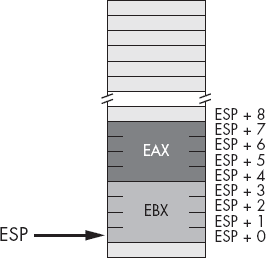

图 3-17. 从栈中移除数据，`add( 8, esp );`之前


图 3-18. 从栈中移除数据，`add( 8, esp );`之后

实际上，这段代码是在不移动数据的情况下将数据从栈中弹出。还要注意，这段代码比两条虚拟`pop`指令更快，因为它可以通过单个`add`指令从栈中移除任意数量的字节。

### 警告

记得保持栈在双字边界上对齐。因此，在从栈中移除数据时，应该始终向 ESP 添加一个 4 的倍数常量。

* * *

^([44]) 例如，你很少需要使用`pushad`/`popad`指令序列来推送和弹出 ESP 寄存器。

# 3.10 访问已推入栈但尚未弹出的数据

偶尔，你会将数据推入栈中，之后你可能需要获取该数据的副本，或者你希望在不弹出数据的情况下修改数据的值（也就是说，你希望稍后再从栈中弹出该数据）。80x86 的`[reg32 + offset]`寻址模式为此提供了机制。

考虑以下两个指令执行后的栈情况（见图 3-19）：

```
push( eax );
          push( ebx );
```

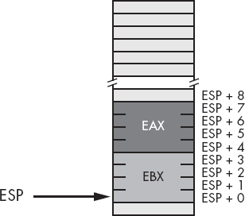

图 3-19. 将 EAX 和 EBX 推入栈后的栈情况

如果你想访问原始的 EBX 值而不从栈中移除它，你可以通过作弊，将值弹出后再立即将其推回栈中。然而，假设你希望访问 EAX 的旧值或者栈上更远的其他值。弹出所有中间值并再推回栈是最好的情况，而最坏的情况是完全不可能做到的。然而，正如你从图 3-19 中看到的那样，栈中每个推入的值都在内存中与 ESP 寄存器有一定的偏移。因此，我们可以使用`[ESP + offset]`寻址模式来直接访问我们感兴趣的值。在上面的例子中，你可以使用单条指令通过其原始值重新加载 EAX。

```
mov( [esp+4], eax );
```

这段代码将从内存地址 ESP+4 开始的 4 个字节复制到 EAX 寄存器。这个值恰好是之前推入栈中的 EAX 的值。你可以使用相同的技术来访问你推入栈的其他数据值。

### 警告

别忘了，ESP 中的值偏移量在每次压入或弹出数据时都会发生变化。滥用此特性可能会导致代码难以修改；如果你在代码中广泛使用此特性，将使得在第一次将数据压入堆栈和决定再次访问该数据时，难以在两者之间压入和弹出其他数据项，使用 *`[ESP + offset]`* 内存寻址模式。

前一节提到了如何通过向 ESP 寄存器添加常数来从堆栈中移除数据。那段代码示例可能会更安全地改写成这样：

```
push( eax );
          push( ebx );

          << Some code that winds up computing some values we want to keep
             into eax and ebx >>

          if( *`Calculation_was_performed`* ) then

             << Overwrite saved values on stack with new eax/ebx values
                (so the pops that follow won't change the values in eax/ebx). >>

               mov( eax, [esp+4] );
               mov( ebx, [esp] );

          endif;
          pop( ebx );
          pop( eax );
```

在此代码序列中，计算结果被存储在堆栈上已保存的值之上。稍后，当程序弹出这些值时，它将这些计算结果加载到 EAX 和 EBX 寄存器中。

# 3.11 动态内存分配与堆段

尽管静态变量和自动变量可能是简单程序所需的全部内容，但更复杂的程序需要能够在程序控制下动态地分配和释放存储空间（在运行时）。在 C 语言中，你会使用 `malloc` 和 `free` 函数来实现这一点。C++ 提供了 `new` 和 `delete` 运算符。Pascal 使用 `new` 和 `dispose`。其他语言也提供了类似的功能。这些内存分配例程有几个共同点：它们允许程序员指定要分配的字节数，它们返回指向新分配存储空间的*指针*，并且它们提供了一种机制，可以将存储空间返回给系统，以便系统在未来的分配调用中重新利用这些空间。正如你可能猜到的，HLA 也在 HLA 标准库中提供了一组处理内存分配和释放的例程。

HLA 标准库中的 `mem.alloc` 和 `mem.free` 例程分别处理内存分配和释放操作。`mem.alloc` 例程使用以下调用顺序：

```
mem.alloc( *`Number_of_Bytes_Requested`* );
```

唯一的参数是一个 `dword` 值，指定你需要的存储字节数。此过程在内存的 `heap` 段中分配存储空间。HLA 的 `mem.alloc` 函数会在 `heap` 段中找到一个未使用的内存块，并将该块标记为“正在使用中”，这样未来对 `mem.alloc` 的调用就不会再次分配相同的存储空间。在将该块标记为“正在使用中”后，`mem.alloc` 例程将返回指向该存储空间第一个字节的指针，该指针存储在 EAX 寄存器中。

对于许多对象，你将知道表示该对象所需的字节数。例如，如果你希望为一个 `uns32` 变量分配存储空间，可以使用以下调用来调用 `mem.alloc` 例程：

```
mem.alloc( 4 );
```

虽然你可以像本示例所示指定一个字面常量，但在为特定数据类型分配存储时，通常不建议这么做。相反，应该使用 HLA 内置的*编译时函数*^([45]) `@size` 来计算某个数据类型的大小。`@size` 函数使用以下语法：

```
@size( *`variable_or_type_name`* )
```

`@size` 函数返回一个无符号整数常量，表示其参数的字节大小。因此，你应该将之前对 `mem.alloc` 的调用重写为如下形式：

```
mem.alloc( @size( uns32 ));
```

该调用将正确分配足够的存储空间来存储指定的对象，无论其类型如何。虽然一个 `uns32` 对象所需的字节数不太可能改变，但对于其他数据类型来说，这不一定成立；因此，在这些调用中，你应该始终使用 `@size` 而不是字面常量。

从 `mem.alloc` 例程返回后，EAX 寄存器包含你请求的存储地址（参见 图 3-20）。

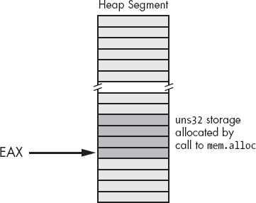

图 3-20. 调用 `mem.alloc` 返回一个指针到 EAX 寄存器。

要访问 `mem.alloc` 分配的存储，你必须使用寄存器间接寻址模式。以下代码序列演示了如何将值 1234 赋给 `mem.alloc` 创建的 `uns32` 变量：

```
mem.alloc( @size( uns32 ));
mov( 1234, (type uns32 [eax]));
```

注意使用了 `type` 强制转换运算符。在本示例中，这是必要的，因为匿名变量没有与之关联的类型，并且常量 1234 可能是 `word` 或 `dword` 类型。`type` 强制转换运算符消除了歧义。

`mem.alloc` 例程可能并不总是成功。如果堆段中没有一个足够大的连续空闲内存块来满足请求，那么 `mem.alloc` 例程将引发一个 `ex.MemoryAllocationFailure` 异常。如果你没有提供一个 `try..exception..endtry` 处理程序来处理这种情况，内存分配失败将导致程序停止。由于大多数程序不会使用 `mem.alloc` 分配大量动态存储，因此这种异常很少发生。然而，你绝不能假设内存分配总是能无错误地完成。

当你完成使用 `mem.alloc` 在堆上分配的值后，可以通过调用 `mem.free` 过程来释放存储（即标记为“不再使用”）。`mem.free` 例程需要一个参数，这个参数必须是之前调用 `mem.alloc` 返回的地址（且你尚未释放过）。以下代码片段演示了 `mem.alloc`/`mem.free` 配对的性质：

```
mem.alloc( @size( uns32));

               << Use the storage pointed at by eax. >>
               << Note: This code must not modify eax. >>

          mem.free( eax );
```

这段代码展示了一个非常重要的要点：为了正确释放`mem.alloc`分配的存储，你必须保存`mem.alloc`返回的值。如果你需要将 EAX 用于其他目的，有几种方法可以做到这一点；你可以使用`push`和`pop`指令将指针值保存在堆栈中，或者你可以将 EAX 的值保存在一个变量中，直到需要释放它。

你释放的存储可以被未来的`mem.alloc`调用重用。当你需要时分配存储，然后在完成后释放该存储供其他用途，这样可以提高程序的内存效率。通过在使用完存储后释放它，程序可以将该存储用于其他目的，从而使程序在内存使用上比静态分配单个对象的存储时更加高效。

使用指针时可能会出现几个问题。你应该意识到一些初学者在使用像`mem.alloc`和`mem.free`这样的动态存储分配例程时常犯的错误：

+   错误 1：在释放存储后继续访问它。一旦通过调用`mem.free`将存储返回给系统，就不应再访问该存储。这样做可能会导致保护故障，甚至更糟，可能会破坏程序中的其他数据而不提示错误。

+   错误 2：调用`mem.free`两次以释放一个存储块。这样做可能会不小心释放一些你不打算释放的其他存储，或者更糟糕的是，可能会破坏系统的内存管理表。

第四章讨论了你在处理动态分配存储时通常会遇到的一些其他问题。

本节至今的示例都为单个无符号 32 位对象分配了存储。显然，你可以通过调用`mem.alloc`来为任何数据类型分配存储，只需将该对象的大小作为`mem.alloc`的参数即可。在调用`mem.alloc`时，还可以为内存中的一系列连续对象分配存储。例如，以下代码将为一系列八个字符分配存储：

```
mem.alloc( @size( char ) * 8 );
```

注意使用常量表达式来计算一个八字符序列所需的字节数。因为`@size(char)`始终返回一个常量值（在此情况下为 1），所以编译器可以在不生成额外机器指令的情况下计算表达式`@size(char) * 8`的值。

对`mem.alloc`的调用总是会在连续的内存位置分配多个字节的存储。因此，前面的`mem.alloc`调用生成的序列如图 3-21 所示。

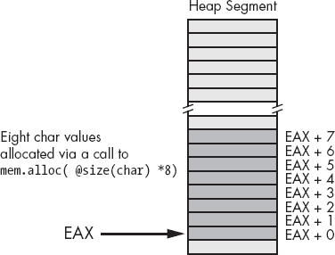

图 3-21. 使用`mem.alloc`分配一组八个字符对象

要访问这些额外的字符值，你需要使用从基地址偏移量（在`mem.alloc`返回时存储在 EAX 寄存器中）进行访问。例如，`mov( ch, [eax + 2] );`将字符 CH 存储到`mem.alloc`分配的第三个字节中。你还可以使用类似`[eax + ebx]`的寻址方式，在程序控制下逐步访问每个已分配的对象。例如，以下代码将会把 128 字节块中的所有字符设置为 NUL 字符（#0）：

```
mem.alloc( 128 );
          for( mov( 0, ebx ); ebx < 128; add( 1, ebx ) ) do

               mov( 0, (type byte [eax+ebx]) );

          endfor;
```

第四章讨论复合数据结构（包括数组），并描述了处理内存块的其他方法。

你应该注意到，调用`mem.alloc`实际上分配的内存比你请求的要多。首先，内存分配请求通常是某个最小大小（通常是 4 到 16 之间的 2 的幂次，尽管这取决于操作系统）。此外，`mem.alloc`请求每次分配还需要额外几字节的开销（通常约 16 到 32 字节），用于跟踪已分配和空闲的内存块。因此，使用单独的`mem.alloc`调用来分配大量小对象并不高效。每次分配的开销可能大于你实际使用的存储空间。通常，你会使用`mem.alloc`来为数组或大型记录（结构体）分配存储空间，而不是为小对象分配内存。

* * *

^([45]) 编译时函数是在程序编译过程中由 HLA 评估的函数，而不是在运行时评估的。

# 3.12 `inc`和`dec`指令

如前一节中的示例所示——事实上，正如迄今为止多个示例所表明的——对寄存器或内存位置加 1 或减 1 是非常常见的操作。实际上，这些操作如此常见，以至于英特尔的工程师专门设计了一对指令来执行这些特定操作：`inc`（递增）和`dec`（递减）指令。

`inc`和`dec`指令使用以下语法：

```
inc( *`mem/reg`* );
dec( *`mem/reg`* );
```

单个操作数可以是任何合法的 8 位、16 位或 32 位寄存器或内存操作数。`inc`指令会将指定的操作数加 1，而`dec`指令会将指定的操作数减 1。

这两条指令比对应的`add`或`sub`指令稍微短一些（也就是说，它们的编码使用了更少的字节）。这两条指令与对应的`add`或`sub`指令之间还有一个小小的区别：它们不会影响进位标志。

作为`inc`指令的一个例子，考虑前一节中的例子，重新编码为使用`inc`而不是`add`：

```
mem.alloc( 128 );
          for( mov( 0, ebx ); ebx < 128; inc( ebx ) ) do

               mov( 0, (type byte [eax+ebx]) );

          endfor;
```

# 3.13 获取内存对象的地址

3.1.2.2 寄存器间接寻址模式讨论了如何使用取地址运算符`&`来获取静态变量的地址。^([46]) 不幸的是，您不能使用取地址运算符来获取自动变量（即您在`var`部分声明的变量）的地址，也不能用它计算匿名变量的地址，甚至不能用它来获取使用索引或缩放索引寻址模式的内存引用的地址（即使静态变量是地址表达式的一部分）。您只能使用取地址运算符来获取简单静态对象的地址。通常，您还需要获取其他内存对象的地址；幸运的是，80x86 提供了*加载有效地址*指令`lea`，可以实现这一功能。

`lea`指令使用以下语法：

```
lea( *`reg32`*, *`Memory_operand`* );
```

第一个操作数必须是一个 32 位寄存器；第二个操作数可以是任何合法的内存引用，使用任何有效的内存寻址模式。该指令会将指定内存位置的地址加载到寄存器中。该指令不会以任何方式访问或修改内存操作数的值。

一旦您将内存位置的有效地址加载到 32 位通用寄存器中，您可以使用寄存器间接、索引或缩放索引寻址模式来访问指定内存地址的数据。考虑以下代码片段：

```
static
     b:byte; @nostorage;
       byte 7, 0, 6, 1, 5, 2, 4, 3;
               .
               .
               .
     lea( ebx, b );
     for( mov( 0, ecx ); ecx < 8; inc( ecx )) do

          stdout.put( "[ebx+ecx] = ", (type byte [ebx+ecx]), nl );

     endfor;
```

这段代码逐个处理紧跟着`b`标签后的 8 个字节，并打印它们的值。注意使用了`[ebx+ecx]`寻址模式。EBX 寄存器保存列表的基地址（即列表中第一个项目的地址），而 ECX 寄存器包含列表中的字节索引。

* * *

^([46]) 静态变量是指在程序的`static`、`readonly`或`storage`部分声明的变量。

# 3.14 更多信息

一本旧版的 16 位《*汇编语言程序设计艺术*》可以在[`webster.cs.ucr.edu/`](http://webster.cs.ucr.edu/)找到。在该书中，您将找到关于 80x86 的 16 位寻址模式和分段的信息。有关 HLA 标准库`mem.alloc`和`mem.free`函数的更多信息，请查阅 HLA 标准库参考手册，该手册也可以在 Webster 上找到，网址是[`webster.cs.ucr.edu/`](http://webster.cs.ucr.edu/)或[`artofasm.com/`](http://artofasm.com/)。当然，Intel 的 x86 文档（可以在[`www.intel.com/`](http://www.intel.com/)找到）提供了关于 80x86 寻址模式和机器指令编码的完整信息。
