# 第四章 常量、变量和数据类型


第二章讨论了内存中数据的基本格式。第三章介绍了计算机系统如何在物理上组织这些数据。本章通过将 *数据表示* 与其实际物理表示连接起来，完成了讨论。正如标题所示，本章主要涉及三个主题：常量、变量和数据结构。本章并不假设你已经接受过正式的数据结构课程，尽管这样的经验会有所帮助。

本章讨论如何声明和使用常量、标量变量、整数、数据类型、指针、数组、记录/结构体、联合体和命名空间。在进入下一章之前，必须掌握这些内容。特别是声明和访问数组似乎给初学汇编语言的程序员带来了很多问题。然而，本文的其余部分依赖于你对这些数据结构及其内存表示的理解。不要抱有以后慢慢学到这些内容的期望，试图跳过这些材料会让你感到困惑。你马上就会用到这些内容，试图与后续的内容一起学习只会增加困惑。

# 4.1 一些额外的指令：intmul、bound、into

本章介绍了数组和其他需要扩展你对 80x86 指令集知识的概念。特别是，你需要学习如何将两个值相乘；因此我们首先要介绍的是 `intmul`（整数乘法）指令。另一个在访问数组时常见的任务是检查数组索引是否在范围内。80x86 的 `bound` 指令提供了一种方便的方式，检查寄存器的值是否在某个范围内。最后，`into`（溢出时中断）指令提供了一种快速检查有符号算术溢出的方法。虽然在数组（或其他数据类型）访问中并不一定需要 `into`，但它的功能与 `bound` 非常相似，因此在这一点上介绍它。

`intmul` 指令有以下几种形式：

```
// The following compute *`destreg`* = *`destreg`* * *`constant`*

          intmul( *`constant, destreg16`* );
          intmul( *`constant, destreg32`* );

          // The following compute *`dest`* = *`src`* * *`constant`*

          intmul( *`constant`*, *`srcreg16`*, *`destreg16`* );
          intmul( *`constant`*, *`srcmem16`*, *`destreg16`* );

          intmul( *`constant`*, *`srcreg32`*, *`destreg32`* );
          intmul( *`constant`*, *`srcmem32`*, *`destreg32`* );

          // The following compute *`dest`* = *`src`* * *`constant`*

          intmul( *`srcreg16`*, *`destreg16`* );
          intmul( *`srcmem16`*, *`destreg16`* );
          intmul( *`srcreg32`*, *`destreg32`* );
          intmul( *`srcmem32`*, *`destreg32`* );
```

请注意，`intmul` 指令的语法与 `add` 和 `sub` 指令不同。特别是，目标操作数必须是寄存器（`add` 和 `sub` 都允许内存操作数作为目标）。还要注意，当第一个操作数是常量时，`intmul` 允许三个操作数。另一个重要的区别是，`intmul` 指令仅允许 16 位和 32 位操作数；它不支持 8 位操作数的乘法。

`intmul` 计算指定操作数的乘积并将结果存储到目标寄存器中。如果发生溢出（这总是一个有符号溢出，因为 `intmul` 仅乘以有符号整数值），那么此指令会设置进位标志和溢出标志。`intmul` 会使其他条件码标志未定义（例如，执行 `intmul` 后你不能有意义地检查符号标志或零标志）。

`bound` 指令检查 16 位或 32 位寄存器，查看它是否在两个值之间。如果该值超出此范围，程序会引发异常并中止。此指令特别适用于检查数组索引是否在给定范围内。`bound` 指令有以下几种形式：

```
bound( *`reg16`*, *`LBconstant`*, *`UBconstant`* );
bound( *`reg32`*, *`LBconstant`*, *`UBconstant`* );

bound( *`reg16`*, *`Mem16`*[2] );
bound( *`reg32`*, *`Mem32`*[2] );
```

`bound` 指令将其寄存器操作数与无符号下界值和无符号上界值进行比较，以确保寄存器的值在范围内：

```
*`lower_bound`* <= *`register`* <= *`upper_bound`*
```

带有三个操作数的 `bound` 指令将寄存器与第二和第三个参数（分别是下界和上界）进行比较。^([47]) 带有两个操作数的 `bound` 指令将寄存器与以下一个范围进行比较：

```
*`Mem16`*[0] <= *`register16`* <= *`Mem16`*[2]
*`Mem32`*[0] <= *`register32`* <= *`Mem32`*[4]
```

如果指定的寄存器不在给定范围内，则 80x86 会引发异常。你可以使用 HLA 的 `try..endtry` 异常处理语句捕获此异常。*excepts.hhf* 头文件为此目的定义了一个异常 `ex.BoundInstr`。示例 4-1 程序展示了如何使用 `bound` 指令检查某些用户输入。

示例 4-1. `bound` 指令的演示

```
program BoundDemo;
#include( "stdlib.hhf" );

static
    InputValue:int32;
    GoodInput:boolean;

begin BoundDemo;

    // Repeat until the user enters a good value:

    repeat

        // Assume the user enters a bad value.

        mov( false, GoodInput );

        // Catch bad numeric input via the try..endtry statement.

        try

            stdout.put( "Enter an integer between 1 and 10: " );
            stdin.flushInput();
            stdin.geti32();

            mov( eax, InputValue );

            // Use the BOUND instruction to verify that the
            // value is in the range 1..10.

            bound( eax, 1, 10 );

            // If we get to this point, the value was in the
            // range 1..10, so set the boolean GoodInput
            // flag to true so we can exit the loop.

            mov( true, GoodInput );

            // Handle inputs that are not legal integers.

          exception( ex.ConversionError )

            stdout.put( "Illegal numeric format, re-enter", nl );

            // Handle integer inputs that don't fit into an int32.

          exception( ex.ValueOutOfRange )

            stdout.put( "Value is *way* too big, re-enter", nl );

            // Handle values outside the range 1..10 (BOUND instruction).

          exception( ex.BoundInstr )

            stdout.put
            (
                "Value was ",
                InputValue,
                ", it must be between 1 and 10, re-enter",
                nl
            );

        endtry;

    until( GoodInput );
    stdout.put( "The value you entered, ", InputValue, " is valid.", nl );

end BoundDemo;
```

`into` 指令与 `bound` 指令类似，也会在某些条件下生成异常。具体而言，`into` 会在溢出标志被设置时生成异常。通常，你会在有符号算术操作（例如 `intmul`）之后立即使用 `into` 来检查是否发生溢出。如果溢出标志未设置，系统会忽略 `into`；但是，如果溢出标志被设置，则 `into` 指令会引发 `ex.IntoInstr` 异常。示例 4-2 程序演示了如何使用 `into` 指令。

示例 4-2. `into` 指令的演示

```
program INTOdemo;
#include( "stdlib.hhf" );

static
    LOperand:int8;
    ResultOp:int8;

begin INTOdemo;

    // The following try..endtry checks for bad numeric
    // input and handles the integer overflow check:

    try

        // Get the first of two operands:

        stdout.put( "Enter a small integer value (-128..+127):" );
        stdin.geti8();
        mov( al, LOperand );

        // Get the second operand:

        stdout.put( "Enter a second small integer value (-128..+127):" );
        stdin.geti8();

        // Produce their sum and check for overflow:

        add( LOperand, al );
        into();

        // Display the sum:

        stdout.put( "The eight-bit sum is ", (type int8 al), nl );

        // Handle bad input here:

      exception( ex.ConversionError )

        stdout.put( "You entered illegal characters in the number", nl );

        // Handle values that don't fit in a byte here:

      exception( ex.ValueOutOfRange )

        stdout.put( "The value must be in the range −128..+127", nl );

        // Handle integer overflow here:

      exception( ex.IntoInstr )

        stdout.put
        (
            "The sum of the two values is outside the range −128..+127",
            nl
        );

    endtry;

end INTOdemo;
```

* * *

^([47]) 这种形式并不是一个真正的 80x86 指令。HLA 会通过创建两个初始化为指定常量的 `readonly` 内存变量，将这种形式的 `bound` 指令转换为双操作数形式。

# 4.2 HLA 常量和数值声明

HLA 的 `const` 和 `val` 部分允许你声明符号常量。`const` 部分允许你声明在编译和运行时其值都恒定不变的标识符；`val` 部分允许你声明在编译时值可以变化，但在运行时值不变的符号常量（也就是说，相同的名称可以在源代码的不同地方有不同的值，但在程序运行时，`val` 符号的值在特定的程序点不能改变）。

`const` 部分出现在程序中的位置与 `static`、`readonly`、`storage` 和 `var` 部分相同。它以 `const` 保留字开始，语法几乎与 `readonly` 部分相同；也就是说，`const` 部分包含一个标识符列表，后跟类型和常量表达式。以下示例将给你一个关于 `const` 部分的基本概念：

```
const
     pi:                   real32  := 3.14159;
     MaxIndex:             uns32   := 15;
     Delimiter:            char    := '/';
     BitMask:              byte    := $F0;
     DebugActive:          boolean := true;
```

一旦以这种方式声明了这些常量，你可以在任何符号常量合法的地方使用这些符号标识符。这些常量被称为显式常量。*显式常量*是常量的符号表示，允许你在程序中的任何地方将字面值替换为符号。与 `readonly` 变量进行对比；`readonly` 变量当然是常量值，因为在运行时你不能改变这些值。然而，`readonly` 变量有一个内存位置，操作系统，而不是 HLA 编译器，强制执行只读属性。尽管在程序运行时，它肯定会导致程序崩溃，但写出像 `mov( eax, ReadOnlyVar );` 这样的指令是完全合法的。另一方面，写 `mov( eax, MaxIndex );`（使用上面的声明）和写 `mov( eax, 15 );` 是一样不合法的。实际上，这两个语句是等效的，因为编译器在遇到这个显式常量时，会用 `15` 替换 `MaxIndex`。

如果常量的类型完全没有歧义，那么你可以仅指定名称和常量值来声明常量，省略类型说明。在之前的示例中，`pi`、`Delimiter`、`MaxIndex` 和 `DebugActive` 常量可以使用以下声明：

```
const
     pi               := 3.14159;     // Default type is real80.
     MaxIndex         := 15;          // Default type is uns32.
     Delimiter        := '/';         // Default type is char.
     DebugActive      := true;        // Default type is boolean.
```

具有整数字面常量的符号常量，如果常量为零或正数，则始终使用最小的无符号类型；如果值为负数，则使用最小的整数类型（`int8`、`int16` 等）。

常量声明非常适合定义可能在程序修改过程中发生变化的“魔法”数字。示例 4-3 中的程序展示了如何使用常量来参数化程序中的“魔法”值。在这个具体案例中，程序定义了清单常量来指定为测试分配的内存量、（错误的）对齐方式，以及循环和数据重复的次数。该程序展示了在数据访问未对齐时性能的下降。如果程序运行太快或太慢，可以调整 `MainRepetitions` 常量。

示例 4-3. 使用 `const` 定义重写的数据对齐程序

```
program ConstDemo;
#include( "stdlib.hhf" );

const
    MemToAllocate   := 4_000_000;
    NumDWords       := MemToAllocate div 4;
    MisalignBy      := 62;

    MainRepetitions := 10000;
    DataRepetitions := 999_900;

    CacheLineSize   := 16;

begin ConstDemo;

    //console.cls();
    stdout.put
    (
        "Memory Alignment Exercise",nl,
        nl,
        "Using a watch (preferably a stopwatch), time the execution of", nl
        "the following code to determine how many seconds it takes to", nl
        "execute.", nl
        nl
        "Press Enter to begin timing the code:"
    );

    // Allocate enough dynamic memory to ensure that it does not
    // all fit inside the cache. Note: The machine had better have
    // at least 4 megabytes mem.free or virtual memory will kick in
    // and invalidate the timing.

    mem.alloc( MemToAllocate );

    // Zero out the memory (this loop really exists just to
    // ensure that all memory is mapped in by the OS).

    mov( NumDWords, ecx );
    repeat

        dec( ecx );
        mov( 0, (type dword [eax+ecx*4]));

    until( !ecx );  // Repeat until ecx = 0.

    // Okay, wait for the user to press the Enter key.

    stdin.readLn();

    // Note: As processors get faster and faster, you may
    // want to increase the size of the following constant.
    // Execution time for this loop should be approximately
    // 10-30 seconds.

    mov( MainRepetitions, edx );
    add( MisalignBy, eax );     // Force misalignment of data.

    repeat

        mov( DataRepetitions, ecx );
        align( CacheLineSize );
        repeat

            sub( 4, ecx );
            mov( [eax+ecx*4], ebx );
            mov( [eax+ecx*4], ebx );
            mov( [eax+ecx*4], ebx );
            mov( [eax+ecx*4], ebx );

        until( !ecx );
        dec( edx );

    until( !edx ); // Repeat until eax is zero.

    stdout.put( stdio.bell, "Stop timing and record time spent", nl, nl );

    // Okay, time the aligned access.

    stdout.put
    (
        "Press Enter again to begin timing access to aligned variable:"
    );
    stdin.readLn();

    // Note: If you change the constant above, be sure to change
    // this one, too!

    mov( MainRepetitions, edx );
    sub( MisalignBy, eax );     // Realign the data.
    repeat

        mov( DataRepetitions, ecx );
        align( CacheLineSize );
        repeat

            sub( 4, ecx );
            mov( [eax+ecx*4], ebx );
            mov( [eax+ecx*4], ebx );
            mov( [eax+ecx*4], ebx );
            mov( [eax+ecx*4], ebx );

        until( !ecx );
        dec( edx );

    until( !edx ); // Repeat until eax is zero.

    stdout.put( stdio.bell, "Stop timing and record time spent", nl, nl );
    mem.free( eax );

end ConstDemo;
```

## 4.2.1 常量类型

清单常量可以是任何 HLA 基本类型，以及本章讨论的一些复合类型。第一章, 第二章, 和 第三章 讨论了大多数基本类型；基本类型包括以下几种：^([48])

+   `boolean` 常量（true 或 false）

+   `uns8` 常量（0..255）

+   `uns16` 常量（0..65,535）

+   `uns32` 常量（0..4,294,967,295）

+   `int8` 常量（−128..+127）

+   `int16` 常量（−32,768..+32,767）

+   `int32` 常量（−2,147,483,648..+2,147,483,647）

+   `char` 常量（任何 ASCII 字符，字符代码范围为 0..255）

+   `byte` 常量（任何 8 位值，包括整数、布尔值和字符）

+   `word` 常量（任何 16 位值）

+   `dword` 常量（任何 32 位值）

+   `real32` 常量（浮点值）

+   `real64` 常量（浮点值）

+   `real80` 常量（浮点值）

除了上面出现的常量类型外，`const` 部分还支持六种额外的常量类型：

+   `string` 常量

+   `text` 常量

+   枚举常量值

+   数组常量

+   记录/联合常量

+   字符集常量

这些数据类型是本章的主题，关于它们的大部分讨论稍后会出现。然而，字符串和文本常量足够重要，值得早期讨论这些常量类型。

## 4.2.2 字符串和字符字面常量

HLA 和大多数编程语言一样，区分字符序列（*字符串*）和单个字符。这一区别在类型声明和字面字符与字符串常量的语法中都存在。到目前为止，本书尚未对字符和字符串字面常量做出精细区分；现在是时候进行区分了。

字符串字面常量由零个或多个字符组成，这些字符被 ASCII 引号字符包围。以下是合法的字面字符串常量的示例：

```
"This is a string"          // String with 16 characters.
     ""                          // Zero length string.
     "a"                         // String with a single character.
     "123"                       // String of length 3.
```

长度为 1 的字符串与字符常量并不相同。HLA 对字符和字符串值使用了两种完全不同的内部表示方式。因此，`"a"` 不是一个字符；它是一个字符串，只不过恰好包含一个字符。

字符字面量常量有几种形式，但最常见的形式是由一个字符包围在 ASCII 撇号字符中：

```
'2'               // Character constant equivalent to ASCII code $32.
     'a'               // Character constant for lowercase 'A'.
```

如本节前面所述，`"a"` 和 `'a'` 并不等价。

那些熟悉 C、C++ 或 Java 的人可能会认出这些字面常量形式，因为它们与 C/C++/Java 中的字符和字符串常量相似。事实上，到目前为止，本文已经默认假设你对 C/C++ 有一定的了解，因为到目前为止的示例中使用了字符和字符串常量，而没有明确地对它们进行定义。

C/C++ 字符串和 HLA 字符串之间的另一个相似之处是自动连接程序中的相邻字面量字符串常量。例如，HLA 会将两个字符串常量连接起来

```
"First part of string, "    "second part of string"
```

形成一个单一的字符串常量

```
"First part of string, second part of string"
```

然而，除了这些相似之处，HLA 字符串和 C/C++ 字符串还是有所不同。例如，C/C++ 字符串允许你使用转义字符序列来指定特殊字符值，该序列由反斜杠字符后跟一个或多个特殊字符组成；而 HLA 不使用这种转义字符机制。然而，HLA 提供了其他几种方法将特殊字符插入字符串或字符常量中。

因为 HLA 不允许在字面量字符串和字符常量中使用转义字符序列，你可能首先会问：“如何在字符串常量中嵌入引号字符，在字符常量中嵌入撇号字符？”为了解决这个问题，HLA 使用与 Pascal 和许多其他语言相同的技术：在字符串常量中插入两个引号以表示单个引号，或者在字符常量中插入两个撇号以表示单个撇号字符。例如：

```
"He wrote a "" Hello World"" program as an example."
```

上述内容等价于：

```
He wrote a "Hello World" program as an example.
```

正如第一章所指出的，要创建一个单一的撇号字符常量，你需要在一对撇号中放入两个相邻的撇号：

```
''''
```

HLA 提供了其他一些功能，消除了对转义字符的需求。除了将两个相邻的字符串常量连接成一个更长的字符串常量外，HLA 还可以将任何相邻的字符常量和字符串常量的组合连接成一个单一的字符串常量：

```
'1'  '2'  '3'                // Equivalent to "123"
          "He wrote a "  '"' "Hello World"  '"' " program as an example."
```

请注意，前面示例中的两个*He wrote*字符串在 HLA 中是完全相同的。

HLA 提供了第二种指定字符常量的方法，可以处理所有其他 C/C++ 转义字符序列：ASCII 码字面量字符常量。这个字面量字符常量的形式使用以下语法：

```
#integer_constant
```

该形式创建一个字符常量，其值为由`integer_constant`指定的 ASCII 码。数字常量可以是十进制、十六进制或二进制值。例如：

```
#13          #$d          #%1101    // All three are the same
                                              // character, a carriage return.
```

因为你可以将字符字面量与字符串连接，而`#constant`形式是一个字符字面量，所以下列字符串都是合法的：

```
"Hello World" #13 #10       // #13 #10 is the Windows newline sequence
                                 // (carriage return followed by line feed).

     "Error: Bad Value" #7       // #7 is the bell character.
     "He wrote a " #$22 "Hello World" #$22 " program as an example."
```

因为$22 是引号字符的 ASCII 码，所以这个最后的示例是*He wrote*字符串字面量的第三种形式。

## 4.2.3 `const`部分中的字符串和文本常量

`const`部分中的字符串和文本常量使用以下声明语法：

```
const
     AStringConst:     string := "123";
     ATextConst:       text   := "123";
```

除了这两个常量的数据类型外，它们的声明是相同的。然而，它们在 HLA 程序中的行为却完全不同。

每当 HLA 在程序中遇到符号字符串常量时，它会用字符串字面量常量替换字符串名称。所以像`stdout.put( AStringConst );`这样的语句会将字符串`123`打印到显示屏上。这里没有什么意外。

每当 HLA 在程序中遇到符号文本常量时，它会用该字符串的文本内容（而不是字符串字面量常量）替换标识符。也就是说，HLA 会将定界引号之间的字符替换为符号文本常量。因此，考虑以下语句，根据上述声明，它是完全合法的：

```
mov( ATextConst, al );            // Equivalent to mov( 123, al );
```

注意，在这个示例中，将`AStringConst`替换为`ATextConst`是非法的：

```
mov( AStringConst, al );          // Equivalent to mov( "123", al );
```

这个后续示例是非法的，因为你不能将字符串字面量常量移入 AL 寄存器。

每当 HLA 在你的程序中遇到符号文本常量时，它会立即将文本常量的字符串值替换为该文本常量，并继续编译，就像你在程序中写入的是文本常量的值而不是符号标识符一样。如果你经常在程序中输入某些文本序列，这可以节省一些输入工作，并使你的程序更具可读性。例如，考虑在 HLA *stdio.hhf*库头文件中找到的`nl`（换行）文本常量声明：

```
const
     nl: text := "#$d #$a";    // Windows version.

const
    nl:  text := " """" #$a";  // Linux, FreeBSD, and Mac OS X version.
```

每当 HLA 遇到符号`nl`时，它会立即将字符串"`#$d #$a`"的值替换为`nl`标识符。当 HLA 看到`#$d`（回车）字符常量后跟`#$a`（换行）字符常量时，它会将这两个字符连接成一个字符串，形成 Windows 换行序列（回车后跟换行）。考虑以下两个语句：

```
stdout.put( "Hello World", nl );
          stdout.put( "Hello World"  nl );
```

（请注意，上述第二个语句没有用逗号分隔字符串字面量和`nl`符号。）在第一个示例中，HLA 生成代码打印字符串`Hello World`，然后生成一些额外的代码打印换行符序列。在第二个示例中，HLA 将`nl`符号扩展如下：

```
stdout.put( "Hello World" #$d #$a );
```

现在 HLA 看到一个字符串字面常量（`Hello World`），后面跟着两个字符常量。它将这三者连接起来，形成一个单一的字符串，并通过一个调用来打印这个字符串。因此，省略字符串字面常量和 `nl` 符号之间的逗号可以生成略微更高效的代码。请记住，这仅适用于字符串字面常量。你不能通过这种技巧连接字符串变量，或将字符串变量与字符串字面常量连接起来。

Linux、FreeBSD 和 Mac OS X 用户应注意，Unix 的行尾序列仅是一个单一的换行符。因此，在这些操作系统中，`nl` 的声明略有不同（以确保 `nl` 始终展开为字符串常量，而不是字符常量）。

在常量部分，如果只指定常量标识符和字符串常量（即未提供类型），HLA 默认类型为 `string`。如果你想声明一个 `text` 常量，必须显式地提供类型。

```
const
     AStrConst := "String Constant";
     ATextConst: text := "mov( 0, eax );";
```

## 4.2.4 常量表达式

到目前为止，本章给人的印象是符号常量定义由标识符、可选类型和字面常量组成。实际上，HLA 常量声明可以比这复杂得多，因为 HLA 允许将常量表达式（而不仅仅是字面常量）赋值给符号常量。通用常量声明有以下两种形式：

```
*`Identifier`* : *`typeName`* := *`constant_expression`* ;
          *`Identifier`* := *`constant_expression`* ;
```

常量表达式采用你在 C/C++ 和 Pascal 等高级语言中常见的形式。它们可以包含字面常量值、先前声明的符号常量和各种算术运算符。表 4-1 列出了常量表达式中可能的一些运算。

常量表达式运算符遵循标准的优先级规则；如果需要，你可以使用括号来覆盖优先级。有关确切的优先级关系，请参见 HLA 参考手册 [`webster.cs.ucr.edu/`](http://webster.cs.ucr.edu/) 或 [`artofasm.com/`](http://artofasm.com/)。一般来说，如果优先级不明显，可以使用括号明确指出计算顺序。虽然 HLA 提供了比这些更多的运算符，但上述运算符是你最常用的；HLA 文档提供了常量表达式运算符的完整列表。

表 4-1. 常量表达式中允许的运算

| 算术运算符 |
| --- |
| `−`（一元取反） | 对紧随其后的表达式执行取反操作。 |
| `*` | 乘法运算，作用于星号两边的整数或实数值。 |
| `div` | 将左侧整数操作数除以右侧整数操作数，产生一个整数（截断）结果。 |
| `mod` | 用于将左侧整数操作数除以右侧整数操作数，产生一个整数余数。 |
| `/` | 将左侧数字操作数除以第二个数字操作数，返回浮点结果。 |
| `+` | 将左右两个数字操作数相加。 |
| `−` | 从左操作数中减去右操作数。 |
| 比较运算符 |
| --- |
| `=`, `==` | 比较左操作数和右操作数。如果相等，返回真。 |
| `<>`, `!=` | 比较左操作数和右操作数。如果不相等，返回真。 |
| `<` | 如果左操作数小于右操作数，则返回真。 |
| `<=` | 如果左操作数小于或等于右操作数，则返回真。 |
| `>` | 如果左操作数大于右操作数，则返回真。 |
| `>=` | 如果左操作数大于或等于右操作数，则返回真。 |
| 逻辑运算符^([a]) |
| --- |
| `&` | 对于布尔操作数，返回两个操作数的逻辑`与`。 |
| `&#124;` | 对于布尔操作数，返回两个操作数的逻辑`或`。 |
| `^` | 对于布尔操作数，返回逻辑异或。 |
| `!` | 返回紧随 `"!"` 后的单一操作数的逻辑`非`。 |

|

^([a]) 提示给 C/C++和 Java 用户：HLA 的常量表达式使用完整的布尔求值，而不是短路布尔求值。因此，HLA 的常量表达式与 C/C++/Java 表达式的行为不同。

|

| 按位逻辑运算符 |
| --- |
| `&` | 对于整数数字操作数，返回操作数的按位`与`。 |
| `&#124;` | 对于整数数字操作数，返回操作数的按位`或`。 |
| `^` | 对于整数数字操作数，返回操作数的按位`异或`。 |
| `!` | 对于整数数字操作数，返回该操作数的按位`取反`。 |
| 字符串运算符 |
| --- |
| `'+'` | 返回左侧和右侧字符串操作数的连接结果。 |

如果常量表达式中出现标识符，则该标识符必须是你在程序中的`const`或`val`部分之前定义的常量标识符。你不能在常量表达式中使用变量标识符，因为在 HLA 求值常量表达式时，变量的值在编译时并未定义。另外，请不要混淆编译时操作和运行时操作：

```
// Constant expression, computed while HLA is compiling your program:

const
          x          := 5;
          y          := 6;
          Sum        := x + y;

// Runtime calculation, computed while your program is running, long after
// HLA has compiled it:

     mov( x, al );
     add( y, al );
```

HLA 在编译期间直接解释常量表达式的值。它不会发出任何机器指令来计算上面常量表达式中的`x + y`。相反，它会直接计算这两个常量值的和。从那时起，HLA 将常量`Sum`与值 11 关联，就像程序中包含了语句`Sum := 11;`而不是`Sum := x + y;`一样。另一方面，HLA 不会在 AL 中预计算指令`mov`和`add`的值；它忠实地发出这两个指令的目标代码，80x86 将在程序运行时（编译完成后某个时刻）计算它们的和。

一般来说，常量表达式在汇编语言程序中不会非常复杂。通常，你只是对两个整数值进行加法、减法或乘法。例如，以下 `const` 区段定义了一组具有连续值的常量：

```
const
     TapeDAT               :=     0;
     Tape8mm               :=     TapeDAT + 1;
     TapeQIC80             :=     Tape8mm + 1;
     TapeTravan            :=     TapeQIC80 + 1;
     TapeDLT               :=     TapeTravan + 1;
```

上述常量具有以下值：`TapeDAT=0`、`Tape8mm=1`、`TapeQIC80=2`、`TapeTravan=3` 和 `TapeDLT=4`。

## 4.2.5 HLA 程序中的多个 `const` 区段及其顺序

尽管 `const` 区段必须出现在 HLA 程序的声明区段中（例如，在程序 *`pgmname`*`;` 头部和相应的 `begin` *`pgmname`*`;` 语句之间），但它不必出现在声明区段中的其他任何位置之前或之后。事实上，和变量声明区段一样，你可以在声明区段中放置多个 `const` 区段。HLA 常量声明的唯一限制是，必须在程序中使用任何常量符号之前先声明该符号。

一些 C/C++ 程序员，例如，更习惯于按如下方式编写常量声明（因为这更接近 C/C++ 声明常量的语法）：

```
const          TapeDAT               :=     0;
const          Tape8mm               :=     TapeDAT + 1;
const          TapeQIC80             :=     Tape8mm + 1;
const          TapeTravan            :=     TapeQIC80 + 1;
const          TapeDLT               :=     TapeTravan + 1;
```

在程序中，`const` 区段的位置似乎是程序员个人的问题。除了要求在使用常量之前定义所有常量外，你可以随意将 `const` 声明区段插入到声明区段的任何位置。

## 4.2.6 HLA `val` 区段

你不能更改在 `const` 区段中定义的常量的值。虽然这似乎是完全合理的（毕竟常量应该是常量），但我们可以通过不同的方式来定义 "*常量*" 这个术语，而 `const` 对象遵循的是一个特定定义的规则。HLA 的 `val` 区段允许你定义遵循略有不同规则的常量对象。本节讨论了 `val` 区段及 `val` 常量与 `const` 常量之间的区别。

"`const` 属性" 可以在两个不同的时刻存在：当 HLA 正在编译程序时，以及程序执行时（此时 HLA 不再运行）。所有合理的常量定义都要求常量的值在程序运行时保持不变。至于常量的值是否可以在编译时发生变化，这是一个单独的问题。HLA `const` 对象和 HLA `val` 对象的区别在于，常量的值是否可以在编译时发生变化。

一旦你在 `const` 区段中定义了常量，该常量的值从此以后将不可更改，*无论是在运行时还是在 HLA 编译程序时*。因此，像 `mov( SymbolicCONST, eax );` 这样的指令始终将相同的值移动到 EAX 寄存器中，无论该指令在 HLA 主程序中出现的位置如何。一旦你在 `const` 区段中定义了符号 `SymbolicCONST`，从那时起该符号的值就始终不变。

HLA 的`val`部分允许你声明符号常量，就像`const`部分一样。然而，HLA 的`val`常量可以在程序的整个源代码中更改其值。以下 HLA 声明是完全合法的：

```
val       InitialValue     := 0;
const     SomeVal          := InitialValue + 1;        // = 1
const     AnotherVal       := InitialValue + 2;        // = 2

val       InitialValue     := 100;
const     ALargerVal       := InitialValue;            // = 100
const     LargeValTwo      := InitialValue*2;          // = 200
```

所有出现在`const`部分的符号都使用符号值`InitialValue`作为定义的一部分。然而，请注意，`InitialValue`在这段代码序列中的不同位置有不同的值；在代码序列的开始，`InitialValue`的值为 0，而在后面它的值为 100。

请记住，在运行时，`val`对象不是变量；它仍然是一个常量，HLA 会用`val`标识符当前的值替代该标识符。^([49]) 像`mov( 25, InitialValue );`这样的语句和`mov( 25, 0 );`或`mov( 25, 100 );`一样不合法。

## 4.2.7 在程序中的任意位置修改`val`对象

如果你在声明部分声明了所有的`val`对象，看起来你就无法在程序的`begin`和`end`语句之间更改`val`对象的值。毕竟，`val`部分必须出现在程序的声明部分，而声明部分在`begin`语句之前就结束了。在第九章中，你将学到，大多数`val`对象的修改发生在`begin`和`end`语句之间；因此，HLA 必须提供某种方式来在声明部分之外更改`val`对象的值。实现这一点的机制是`?`操作符。HLA 不仅允许你在声明部分之外更改`val`对象的值，而且还允许你几乎在程序的*任何地方*更改`val`对象的值。在 HLA 程序中，凡是允许空格的位置，你都可以插入如下形式的语句

```
? *`ValIdentifier`* := *`constant_expression`*;
```

这意味着你可以编写一个像示例 4-4 中出现的简短程序。

示例 4-4：使用`?`操作符演示`val`重新定义

```
program VALdemo;
#include( "stdlib.hhf" )

val
    NotSoConstant := 0;

begin VALdemo;

    mov( NotSoConstant, eax );
    stdout.put( "EAX = ", (type uns32 eax ), nl );

    ?NotSoConstant := 10;
    mov( NotSoConstant, eax );
    stdout.put( "EAX = ", (type uns32 eax ), nl );

    ?NotSoConstant := 20;
    mov( NotSoConstant, eax );
    stdout.put( "EAX = ", (type uns32 eax ), nl );

    ?NotSoConstant := 30;
    mov( NotSoConstant, eax );
    stdout.put( "EAX = ", (type uns32 eax ), nl );

end VALdemo;
```

* * *

^([48]) 这不是一个完整的列表，HLA 还支持 64 位和 128 位数据类型。我们将在第八章中讨论这些类型。

^([49]) 在此上下文中，*当前*指的是回顾源代码时最后一次赋值给`val`对象的值。

# 4.3 HLA 类型部分

假设你就是不喜欢 HLA 用来声明`byte`、`word`、`dword`、`real`和其他变量的名称。假设你更喜欢 Pascal 的命名约定，或者可能是 C 的命名约定。你希望使用诸如`integer`、`float`、`double`等术语。如果 HLA 像 Pascal 一样，你可以在程序的`type`部分重新定义这些名称。如果是 C，你可以使用`#define`或`typedef`语句来完成这项任务。好吧，HLA 和 Pascal 一样，也有自己的`type`语句，它也允许你创建这些名称的别名。以下示例演示了如何在 HLA 程序中设置一些与 C/C++/Pascal 兼容的名称：

```
type
     integer:             int32;
     float:               real32;
     double:              real64;
     colors:              byte;
```

现在你可以用更有意义的语句声明你的变量，例如：

```
static
     i:                    integer;
     x:                    float;
     HouseColor:           colors;
```

如果你使用 Ada、C/C++或 FORTRAN（或其他任何语言），你可以选择你更习惯的类型名称。当然，这并不会改变 80x86 或 HLA 对这些变量的反应，但它确实让你创建的程序更易于阅读和理解，因为类型名称更能反映实际的底层类型。给 C/C++程序员的一个警告：不要太兴奋，去定义一个`int`数据类型。不幸的是，`int`是 80x86 的机器指令（中断），因此它在 HLA 中是一个保留字。

`type`部分不仅仅用于创建类型同构（即，为现有类型指定新名称）。以下部分演示了你可以在`type`部分执行的许多操作。

# 4.4 `enum`与 HLA 枚举数据类型

在之前讨论常量和常量表达式的部分，你看到了以下示例：

```
const          TapeDAT          :=     0;
const          Tape8mm          :=     TapeDAT + 1;
const          TapeQIC80        :=     Tape8mm + 1;
const          TapeTravan       :=     TapeQIC80 + 1;
const          TapeDLT          :=     TapeTravan + 1;
```

这个示例演示了如何使用常量表达式来开发一组包含独特、连续值的常量。然而，这种方法存在一些问题。首先，它涉及大量的输入（以及在复查该程序时额外的阅读工作）。其次，在创建长列表的独特常量时，很容易犯错，可能会重复使用或跳过某些值。HLA 的`enum`类型提供了一种更好的方法来创建具有独特值的常量列表。

`enum`是 HLA 的一种类型声明，它允许你将一系列名称与新类型关联。HLA 会将一个独特的值与每个名称关联（即，它对列表进行*枚举*）。`enum`关键字通常出现在`type`部分，你可以按照以下方式使用它：

```
type
     *`enumTypeID`*:          enum { *`comma_separated_list_of_names`* };
```

符号*`enumTypeID`*成为一个新类型，其值由名称列表指定。作为一个具体的例子，考虑数据类型`TapeDrives`及其对应的变量声明类型`TapeDrives`：

```
type
     TapeDrives: enum{ TapeDAT, Tape8mm, TapeQIC80, TapeTravan, TapeDLT};

static
     BackupUnit:        TapeDrives := TapeDAT;

     .
     .
     .

     mov( BackupUnit, al );
     if( al = Tape8mm ) then

          ...

     endif;

     // etc.
```

默认情况下，HLA 为枚举数据类型保留 1 字节的存储空间。因此，`BackupUnit` 变量将消耗 1 字节的内存，你通常会使用一个 8 位寄存器来访问它。^([50]) 至于常量，HLA 将从 0 开始依次为每个枚举标识符分配 `uns8` 常量值。在 `TapeDrives` 示例中，磁带驱动器标识符的值为 `TapeDAT=0`、`Tape8mm=1`、`TapeQIC80=2`、`TapeTravan=3` 和 `TapeDLT=4`。你可以像在 `const` 部分定义这些常量并赋值一样，直接使用这些常量。

* * *

^([50]) HLA 提供了一种机制，你可以通过它指定枚举数据类型消耗 2 或 4 字节的内存。有关更多细节，请参见 HLA 文档。

# 4.5 指针数据类型

你可能已经在 Pascal、C 或 Ada 等编程语言中亲身体验过指针，而且现在可能有些担心。几乎每个人第一次接触指针时都会有糟糕的体验。别怕！指针在汇编语言中的处理实际上比在高级语言中要*简单*。此外，你在使用指针时遇到的许多问题，可能与指针本身无关，而是你尝试用它们实现的链表和树形数据结构的问题。另一方面，指针在汇编语言中的用途非常广泛，且与链表、树和其他复杂的数据结构无关。实际上，像数组和记录这样简单的数据结构也常常涉及使用指针。所以，如果你对指针有根深蒂固的恐惧，忘掉你对它们的所有认知吧。你将会发现，指针其实是*很棒*的。

可能最好的入门方式是从指针的定义开始。指针究竟是什么呢？不幸的是，高级语言像 Pascal 常常将指针的简单性隐藏在抽象的墙后。这种额外的复杂性（顺便说一下，这是有充分理由的）往往会让程序员感到害怕，因为*他们不理解发生了什么*。

如果你害怕指针，那就暂时忽略它们，先使用数组。考虑下面这个 Pascal 数组声明：

```
M: array [0..1023] of integer;
```

即使你不知道 Pascal，理解这个概念也非常简单。`M` 是一个包含 1,024 个整数的数组，索引从 `M[0]` 到 `M[1023]`。这些数组元素中的每一个都可以保存一个整数值，并且每个值都与其他元素的值无关。换句话说，这个数组为你提供了 1,024 个不同的整数变量，每个变量都通过数字（数组索引）而非名称来访问。

如果你遇到一个程序，其中有语句 `M[0]:=100;`，你大概不需要多想就知道这条语句在做什么。它正在把值 100 存储到数组 `M` 的第一个元素中。现在考虑以下两条语句：

```
i := 0; (* Assume "i" is an integer variable. *)
          M [i] := 100;
```

你应该不太犹豫就同意，这两条语句执行的操作和`M[0]:=100`;是一样的。实际上，你可能会同意，你可以使用任何范围在 0 到 1,023 之间的整数表达式作为这个数组的索引。以下语句依然执行与我们对索引 0 的单一赋值相同的操作：

```
i := 5;               (* Assume all variables are integers.*)
          j := 10;
          k := 50;
          m [i*j-k] := 100;
```

“好了，那么重点是什么？”你可能在想。“任何生成 0 到 1,023 范围内整数的东西都是合法的，那又怎么样？”好吧，那以下的情况怎么样：

```
M [1] := 0;
          M [ M [1] ] := 100;
```

哇！这一点可能需要一点时间消化。不过，如果你慢慢来，它是有道理的，你会发现这两条指令实际上执行的是你一直在做的相同操作。第一条语句将 0 存储到数组元素`M[1]`中。第二条语句取出`M[1]`的值，这是一个整数，因此你可以将其用作数组`M`的索引，并使用该值（0）来控制它存储 100 的地方。

如果你愿意接受上述内容作为合理的，或许有些奇怪，但依然可用的情况，那么你就不会对指针有任何问题了。*因为* *`M[1]`* *就是一个指针！* 其实不完全是，但如果你将`M`看作“内存”，并将这个数组视为整个内存，那么这就是指针的确切定义。指针仅仅是一个内存位置，其值是某个其他内存位置的地址（或者说索引，如果你喜欢这样称呼的话）。在汇编语言程序中，指针的声明和使用非常简单，你甚至不必担心数组索引之类的问题。

## 4.5.1 在汇编语言中使用指针

HLA 指针是一个 32 位的值，可能包含某个其他变量的地址。如果你有一个`dword`类型的变量`p`，它的值是$1000_0000，那么`p`“指向”内存位置$1000_0000。要访问`p`所指向的`dword`，你可以使用类似以下的代码：

```
mov( p, ebx );            // Load ebx with the value of pointer p.
          mov( [ebx], eax );        // Fetch the data that p points at.
```

通过将`p`的值加载到 EBX 中，这段代码将$1000_0000 的值加载到 EBX 中（假设`p`包含$1000_0000，因此指向内存位置$1000_0000）。上面第二条指令将 EAX 寄存器加载为从 EBX 中偏移量所指向的位置开始的`dword`。因为 EBX 现在包含$1000_0000，所以这将从$1000_0000 到$1000_0003 的位置加载 EAX。

为什么不直接使用像`mov( mem, eax )`这样的指令从位置$1000_0000 加载 EAX？（假设`mem`位于地址$1000_0000）其实有很多原因。不过最主要的原因是，这条`mov`指令总是从位置`mem`加载 EAX。你无法更改它加载 EAX 的地址。然而，前面的指令总是从`p`所指向的位置加载 EAX。这在程序控制下非常容易改变。实际上，简单的指令`mov( &mem2, p );`会使得上面那两条指令在下次执行时，从`mem2`加载 EAX。考虑以下指令序列：

```
mov( &i, p );        // Assume all variables are STATIC variables.
               .
               .
               .
          if( *`some_expression`* ) then

             mov( &j, p );      // Assume the code above skips this instruction
               .                // and you get to the next instruction by
               .                // jumping to this point from somewhere else.
               .

          endif;
          mov( p, ebx );        // Assume both of the above code paths wind up
          mov( [ebx], eax );    // down here.
```

这个简单示例演示了程序的两条执行路径。第一条路径将变量 `p` 加载为变量 `i` 的地址。第二条路径通过代码将 `p` 加载为变量 `j` 的地址。这两条执行路径在最后两条 `mov` 指令处汇合，根据执行路径的不同，将 `i` 或 `j` 加载到 EAX 寄存器中。在许多方面，这就像在高级语言（如 Pascal）中的*参数*。执行相同的指令时，取决于哪个地址（`i` 或 `j`）最终存储在 `p` 中，程序访问不同的变量。

## 4.5.2 在 HLA 中声明指针

由于指针是 32 位长，您可以简单地使用 `dword` 类型为指针分配存储空间。但是，有一种更好的方法：HLA 提供了 `pointer to` 短语专门用于声明指针变量。考虑以下示例：

```
static
     b:          byte;
     d:          dword;
     pByteVar:   pointer to byte := &b;
     pDWordVar:  pointer to dword := &d;
```

这个示例演示了在 HLA 中初始化和声明指针变量是可能的。请注意，您只能使用取地址符号（address-of operator）获取静态变量（`static`、`readonly` 和 `storage` 对象）的地址，因此只能使用静态对象的地址来初始化指针变量。

您还可以在 HLA 程序的 `type` 部分定义自己的指针类型。例如，如果您经常使用指向字符的指针，您可能希望使用如下所示的 `type` 声明。

```
type
     ptrChar:     pointer to char;

static
     cString:     ptrChar;
```

## 4.5.3 指针常量与指针常量表达式

HLA 允许两种字面指针常量形式：取地址符号后跟静态变量的名称，或者常量 `NULL`。除了这两种字面指针常量外，HLA 还支持简单的指针常量表达式。

`NULL` 指针是常量 0。零是一个非法地址，如果您在现代操作系统下尝试访问它，会引发异常。程序通常用 `NULL` 初始化指针，以表示指针显式地*未*初始化为有效地址。

除了简单的地址字面量和值 0 之外，HLA 还允许在任何指针常量合法的地方使用非常简单的常量表达式。指针常量表达式有以下三种形式之一：

```
&*`StaticVarName`* [ *`PureConstantExpression`* ]
          &*`StaticVarName`* + *`PureConstantExpression`*
          &*`StaticVarName`* - *`PureConstantExpression`*
```

*`PureConstantExpression`* 术语指的是不涉及任何指针常量的数字常量表达式。这种类型的表达式生成一个内存地址，该地址是 *`StaticVarName`* 变量在内存中指定字节数之前或之后（分别为 `−` 或 `+`）。请注意，上面两种形式在语义上是等效的；它们都返回一个指针常量，其地址是静态变量和常量表达式的总和。

由于你可以创建指针常量表达式，发现 HLA 允许你在`const`部分定义指针常量并不令人惊讶。程序在示例 4-5 中演示了如何实现这一点。

示例 4-5. HLA 程序中的指针常量表达式

```
program PtrConstDemo;
#include( "stdlib.hhf" );

static
    b:  byte := 0;
        byte    1, 2, 3, 4, 5, 6, 7;

const
    pb := &b + 1;

begin PtrConstDemo;

    mov( pb, ebx );
    mov( [ebx], al );
    stdout.put( "Value at address pb = $", al, nl );

end PtrConstDemo;
```

执行时，该程序打印出位于内存中`b`之后的字节的值（该字节的值为$01）。

## 4.5.4 指针变量与动态内存分配

指针变量是存储 HLA 标准库`mem.alloc`函数返回结果的理想地方。`mem.alloc`函数返回分配的存储空间的地址，存储在 EAX 寄存器中；因此，你可以在调用`mem.alloc`后，立即使用单条`mov`指令将地址直接存储到指针变量中：

```
type
     bytePtr:     pointer to byte;

var
     bPtr: bytePtr;
          .
          .
          .
     mem.alloc( 1024 );    // Allocate a block of 1,024 bytes.
     mov( eax, bPtr );     // Store address of block in bPtr.
          .
          .
          .
     mem.free( bPtr );     // Free the allocated block when done using it.
          .
          .
          .
```

## 4.5.5 常见指针问题

程序员在使用指针时常常会遇到五个常见的问题。这些错误中的一些会导致程序立即停止，并显示诊断信息；其他问题则更加隐蔽，可能导致程序结果不正确，但不会报告错误，或者仅影响程序的性能，而不显示错误。以下是这五个问题：

+   使用未初始化的指针

+   使用包含非法值（例如，`NULL`）的指针

+   在该存储空间被释放后，继续使用通过`mem.alloc`分配的存储空间

+   在程序使用完存储空间后未调用`mem.free`释放该存储空间

+   使用错误的数据类型访问间接数据

上述第一个问题是使用指针变量时，尚未为指针分配有效的内存地址。初学者通常没有意识到，声明一个指针变量只是为指针本身保留存储空间；它并不为指针引用的数据保留存储空间。示例 4-6 中的简短程序演示了这个问题。

示例 4-6. 未初始化指针演示

```
// Program to demonstrate use of
// an uninitialized pointer. Note
// that this program should terminate
// with a Memory Access Violation exception.

program UninitPtrDemo;
#include( "stdlib.hhf" );

static

    // Note: By default, variables in the
    // static section are initialized with
    // zero (NULL) hence the following
    // is actually initialized with NULL,
    // but that will still cause our program
    // to fail because we haven't initialized
    // the pointer with a valid memory address.

    Uninitialized: pointer to byte;

begin UninitPtrDemo;

    mov( Uninitialized, ebx );
    mov( [ebx], al );
    stdout.put( "Value at address Uninitialized: = $", al, nl );

end UninitPtrDemo;
```

尽管你在`static`部分声明的变量在技术上是初始化的，但静态初始化仍然未能为该程序中的指针赋予有效地址（它们被初始化为`0`，即`NULL`）。

当然，在 80x86 中并没有真正的未初始化变量。你真正拥有的是已经显式赋予初始值的变量，以及那些恰好继承了在分配变量存储空间时内存中所存储的位模式的变量。大多数情况下，这些在内存中残留的垃圾位模式并不对应有效的内存地址。试图*解引用*这样的指针（即访问它所指向的内存中的数据）通常会引发*内存访问违规*异常。

然而，有时候，内存中的随机位恰好可能对应一个有效的内存位置，你可以访问。在这种情况下，CPU 会访问指定的内存位置，而不会终止程序。虽然对于一个天真的程序员来说，这种情况似乎比停止程序要好，但实际上这是更糟糕的，因为你的缺陷程序会继续运行，而不会提醒你发生了问题。如果你通过一个未初始化的指针存储数据，你很可能会覆盖内存中其他重要变量的值。这个缺陷可能会在你的程序中产生一些非常难以定位的问题。

程序员在使用指针时的第二个问题是将无效的地址值存储到指针中。上述第一个问题实际上是第二个问题的一个特例（内存中的垃圾位提供了无效地址，而不是由于计算错误由你自己产生的）。其影响是相同的；如果你尝试解引用一个包含无效地址的指针，要么会触发内存访问违规（Memory Access Violation）异常，要么会访问到一个意外的内存位置。

上述列出的第三个问题也被称为悬空指针问题。要理解这个问题，请考虑以下代码片段：

```
mem.alloc( 256 );   // Allocate some storage.
          mov( eax, ptr );    // Save address away in a pointer variable.
               .
               .              // Code that uses the pointer variable ptr.
               .
          mem.free( ptr );    // Free the storage associated with ptr.
               .
               .              // Code that does not change the value in ptr.
               .
          mov( ptr, ebx );
          mov( al, [ebx] );
```

在这个示例中，你会注意到程序分配了 256 字节的存储空间，并将该存储空间的地址保存在`ptr`变量中。然后代码使用这一块 256 字节的内存一段时间，释放了存储空间，将其交还给系统以供其他用途。请注意，调用`mem.free`并不会以任何方式改变`ptr`的值；`ptr`仍然指向之前通过`mem.alloc`分配的内存块。实际上，`mem.free`并不会改变这块内存中的任何数据，因此在从`mem.free`返回后，`ptr`仍然指向代码存入该内存块的数据。然而，需要注意的是，调用`mem.free`是告诉系统程序不再需要这块 256 字节的内存，系统可以将这块内存用于其他用途。`mem.free`函数并不能强制保证你将永远不会再访问这些数据；你只是承诺不会这么做。当然，上述代码片段违反了这个承诺；正如你在上面的最后两条指令中看到的，程序获取了`ptr`中的值并访问了它所指向的内存数据。

悬挂指针的最大问题是，您可以在很大一部分时间里不出问题地使用它们。只要系统没有重用您已释放的存储，使用悬挂指针对程序没有不良影响。然而，每次调用 `mem.alloc` 时，系统可能决定重用先前通过 `mem.free` 释放的内存。当发生这种情况时，任何试图解引用悬挂指针的操作可能会导致一些意外后果。问题的范围从读取已被覆盖的数据（由数据存储的合法新用途覆盖），到覆盖新数据，再到（最糟糕的情况）覆盖系统堆管理指针（这样做可能会导致程序崩溃）。解决方案很明确：*一旦释放与指针相关联的存储，就永远不要再使用该指针值*。

所有问题中，第四个问题（未释放分配的存储）对程序正常运行的影响可能最小。以下代码片段演示了这个问题：

```
mem.alloc( 256 );
          mov( eax, ptr );
               .              // Code that uses the data where ptr is pointing.
               .              // This code does not free up the storage
               .              // associated with ptr.
          mem.alloc( 512 );
          mov( eax, ptr );

          // At this point, there is no way to reference the original
          // block of 256 bytes pointed at by ptr.
```

在这个示例中，程序分配了 256 字节的存储，并通过 `ptr` 变量引用该存储。稍后，程序又分配了另一个内存块，并将 `ptr` 中的值覆盖为这个新内存块的地址。请注意，`ptr` 中的原始值丢失了。由于程序不再拥有这个地址值，因此无法调用 `mem.free` 来释放存储以供后续使用。结果，这块内存不再对程序可用。虽然使 256 字节的内存对程序不可访问看起来不算大问题，但请想象这段代码在一个不断重复的循环中。每次执行循环时，程序都会丢失另外 256 字节的内存。在足够多次的循环迭代后，程序将耗尽堆上可用的内存。这个问题通常被称为 *内存泄漏*，因为其效果就像是内存数据在程序执行过程中从计算机中“泄漏”出去（导致可用存储空间越来越少）。

内存泄漏的危害远小于悬挂指针。实际上，内存泄漏只有两个问题：一是堆空间耗尽的危险（最终可能导致程序中止，尽管这种情况很少发生），二是由于虚拟内存页面交换导致的性能问题。尽管如此，您应该养成在使用完所有存储后立即释放它们的习惯。当您的程序退出时，操作系统会回收所有存储，包括因内存泄漏而丢失的数据。因此，通过泄漏丢失的内存仅对您的程序丢失，而非整个系统。

指针的最后一个问题是缺乏类型安全的访问。这可能是因为 HLA 无法且不强制执行指针类型检查。例如，考虑 示例 4-7 中的程序。

示例 4-7. 类型不安全的指针访问示例

```
// Program to demonstrate use of
// lack of type checking in pointer
// accesses.

program BadTypePtrDemo;
#include("stdlib.hhf" );

static
    ptr:    pointer to char;
    cnt:    uns32;

begin BadTypePtrDemo;

    // Allocate sufficient characters
    // to hold a line of text input
    // by the user:

    mem.alloc( 256 );
    mov( eax, ptr );

    // Okay, read the text a character
    // at a time by the user:

    stdout.put( "Enter a line of text: " );
    stdin.flushInput();
    mov( 0, cnt );
    mov( ptr, ebx );
    repeat

        stdin.getc();       // Read a character from the user.
        mov( al, [ebx] );   // Store the character away.
        inc( cnt );         // Bump up count of characters.
        inc( ebx );         // Point at next position in memory.

    until( stdin.eoln());

    // Okay, we've read a line of text from the user,
    // now display the data:

    mov( ptr, ebx );
    for( mov( cnt, ecx ); ecx > 0; dec( ecx )) do

        mov( [ebx], eax );
        stdout.put( "Current value is $", eax, nl );
        inc( ebx );

    endfor;
    mem.free( ptr );

end BadTypePtrDemo;
```

这个程序从用户输入数据作为字符值，然后将数据显示为双字节的十六进制值。虽然汇编语言的一个强大特性是它允许你随意忽略数据类型，并且自动将数据强制转换而无需任何努力，但这种强大也是一把双刃剑。如果你犯了错误，使用错误的数据类型访问间接数据，HLA 和 80x86 可能无法捕捉到这个错误，你的程序可能会产生不准确的结果。因此，在你的程序中使用指针和间接寻址时，必须小心，确保数据类型的一致性。

# 4.6 复合数据类型

复合数据类型，也叫做*聚合*数据类型，是由其他（通常是标量）数据类型构建而成的。本章将介绍几个重要的复合数据类型——字符字符串、字符集、数组、记录和联合体。字符串就是一个很好的复合数据类型的例子；它是由一系列单独的字符和一些其他数据构成的数据结构。

# 4.7 字符字符串

在整数值之后，字符字符串可能是现代程序中使用的最常见的数据类型。80x86 确实支持一些字符串指令，但这些指令实际上是为了块内存操作而设计的，而不是针对字符字符串的特定实现。因此，本节将主要集中在 HLA 字符字符串的定义，并讨论 HLA 标准库中提供的字符串处理例程。

一般来说，字符字符串是一系列 ASCII 字符，具有两个主要属性：*长度*和一些*字符数据*。不同的语言使用不同的数据结构来表示字符串。为了更好地理解 HLA 字符串设计背后的思路，看看两种由不同高级语言推广的字符串表示方法可能是很有帮助的。

毫无疑问，*零终止字符串*可能是目前使用最广泛的字符串表示形式，因为这是 C、C++、C#、Java 以及其他语言的本地字符串格式。零终止字符串由一系列零个或多个 ASCII 字符组成，并以一个 0 字节结尾。例如，在 C/C++ 中，字符串 `"abc"` 需要 4 个字节：三个字符 `'a'`、`'b'` 和 `'c'`，后跟一个 0 字节。如你将很快看到的，HLA 字符串与零终止字符串向上兼容，但在此之前，你应该注意，在 HLA 中创建零终止字符串非常简单。最简单的方法是在 `static` 区段中使用如下代码：

```
static
     zeroTerminatedString:     char; @nostorage;
                               byte "This is the zero-terminated string", 0;
```

记住，当使用 `@nostorage` 选项时，HLA 不为变量保留任何空间，因此 `zeroTerminatedString` 变量在内存中的地址对应于以下 `byte` 指令中的第一个字符。每当字符字符串出现在 `byte` 指令中时，如同这里所示，HLA 会将字符串中的每个字符依次输出到连续的内存位置。字符串末尾的 0 值终止了这个字符串。

HLA 支持 `zstring` 数据类型。然而，这些对象是双字指针，包含一个指向 `zstring` 的地址，而不是零终止字符串本身。以下是 `zstring` 声明（和静态初始化）的示例：

```
static
     zeroTerminatedString:     char; @nostorage;
                               byte "This is the zero-terminated string", 0;
     zstrVar:                  zstring := &zeroTerminatedString;
```

零终止字符串有两个主要特点：它们非常容易实现，并且字符串长度没有限制。另一方面，零终止字符串也有一些缺点。首先，虽然通常不重要，零终止字符串不能包含 NUL 字符（其 ASCII 码为 0）。通常这不是问题，但偶尔会带来麻烦。零终止字符串的第二个问题是，许多操作相对低效。例如，为了计算零终止字符串的长度，你必须扫描整个字符串，寻找那个 0 字节（即计算字符直到遇到 0）。下面的程序片段演示了如何计算上述字符串的长度：

```
mov( &zeroTerminatedString, ebx );
          mov( 0, eax );
          while( (type byte [ebx+eax]) <> 0 ) do

               inc( eax );

          endwhile;

          // String length is now in eax.
```

如你从这段代码中看到的，计算字符串长度所需的时间与字符串的长度成正比；随着字符串变长，计算其长度所需的时间也会增加。

第二种字符串格式，*长度前缀字符串*，克服了零终止字符串的一些问题。长度前缀字符串在像 Pascal 这样的语言中很常见；它们通常由一个长度字节和零个或多个字符值组成。第一个字节指定字符串的长度，接下来的字节（直到指定的长度）是字符数据。在长度前缀方案中，字符串`abc`将由 4 个字节组成，分别是 `$03`（字符串长度）后跟 `a`、`b` 和 `c`。你可以在 HLA 中使用如下代码创建长度前缀字符串：

```
static
     lengthPrefixedString:char; @nostorage;
                          byte 3, "abc";
```

提前计算字符数并将其插入到字节声明中，如同这里所做的那样，可能看起来是一项麻烦的工作。幸运的是，有一些方法可以让 HLA 自动计算字符串的长度。

长度前缀字符串解决了与零终止字符串相关的两个主要问题。可以在长度前缀字符串中包含 NUL 字符，并且那些在零终止字符串上相对低效的操作（例如，计算字符串长度）在使用长度前缀字符串时更高效。然而，长度前缀字符串也有它们自己的缺点。主要的缺点是它们的长度最大限制为 255 个字符（假设使用 1 字节长度前缀）。

HLA 使用一种扩展的字符串方案，该方案与零终止字符串和长度前缀字符串向上兼容。HLA 字符串享有零终止字符串和长度前缀字符串的优点，而没有它们的缺点。事实上，HLA 字符串相对于这些其他格式的唯一缺点是，它比零终止或长度前缀字符串消耗了几个额外的字节（HLA 字符串的开销为 9 到 12 字节，而零终止或长度前缀字符串的开销为 1 字节，开销是指实际字符之外所需的字节数）。

HLA 字符串值由四个组件组成。第一个元素是一个双字值，指定字符串可以容纳的最大字符数。第二个元素是一个双字值，指定字符串的当前长度。第三个组件是字符串中的字符序列。最后一个组件是一个零终止字节。你可以使用以下代码在 `static` 区段创建一个兼容 HLA 的字符串：^([51])

```
static
          align(4);
          dword 11;
          dword 11;
     TheString: char; @nostorage;
          byte "Hello there";
          byte 0;
```

请注意，HLA 字符串关联的地址是第一个字符的地址，而不是最大值或当前长度值。

“那么当前字符串长度和最大字符串长度有什么区别呢？”你可能会想。在一个字面量字符串中，它们通常是相同的。然而，当你在运行时为字符串变量分配存储时，通常会指定字符串可以容纳的最大字符数。当你将实际的字符串数据存储到字符串中时，存储的字符数必须小于或等于这个最大值。如果你尝试超过这个最大长度，HLA 标准库的字符串例程将抛出异常（这是 C/C++ 和 Pascal 格式无法做到的）。

HLA 字符串末尾的终止 0 字节使得你可以将 HLA 字符串视为一个零终止字符串，如果这样做更高效或更方便。例如，大多数对 Windows、Mac OS X、FreeBSD 和 Linux 的调用都需要零终止字符串作为它们的字符串参数。在 HLA 字符串末尾放置一个 0 确保与操作系统以及使用零终止字符串的其他库模块的兼容性。

* * *

^([51]) 事实上，HLA 字符串在内存中的存放位置有一些限制。本文不涉及这些问题。有关更多详细信息，请参见 HLA 文档。

# 4.8 HLA 字符串

如前一节所述，HLA 字符串由四个组件组成：最大长度、当前字符串长度、字符数据和零终止字节。然而，HLA 从不要求你手动创建字符串数据来发出这些组件。HLA 足够智能，当它看到字符串常量时，会自动为你构建这些数据。因此，如果你使用以下字符串常量，请理解在某个地方 HLA 会在内存中为你创建这个四组件字符串：

```
stdout.put( "This gets converted to a four-component string by HLA" );
```

HLA 实际上并不直接处理前一部分描述的字符串数据。相反，当 HLA 看到一个字符串对象时，它总是处理指向该对象的*指针*，而不是直接处理对象。毫无疑问，这是关于 HLA 字符串最重要的事实，也是初学者在处理 HLA 字符串时遇到问题的最大源头：*字符串是指针！* 一个字符串变量占用的空间正好是 4 个字节，与指针相同（因为它就是一个指针！）。说完这些，我们来看一下 HLA 中一个简单的字符串变量声明：

```
static
          StrVariable:     string;
```

因为字符串变量是指针，所以你必须在使用它之前初始化它。你可以通过三种常见方式来初始化一个合法字符串地址的字符串变量：使用静态初始化器，使用 `str.alloc` 例程，或者调用其他初始化字符串或返回字符串指针的 HLA 标准库函数。

在一个允许初始化变量（`static` 和 `readonly`）的静态声明部分，你可以使用标准初始化语法来初始化一个字符串变量。例如：

```
static
     InitializedString: string := "This is my string";
```

注意，这并不会用字符串数据初始化字符串变量。相反，HLA 会在一个特殊的、隐藏的内存段中创建字符串数据结构（参见 4.7 字符串），并将 `InitializedString` 变量初始化为该字符串第一个字符的地址（`This` 中的 `T`）。*记住，字符串是指针！* HLA 编译器将实际的字符串数据放置在只读内存段中。因此，您无法在运行时修改此字符串字面量的字符。然而，由于字符串变量（记住，它是一个指针）位于 `static` 部分，因此你可以更改字符串变量，使其指向不同的字符串数据。

因为字符串变量是指针，你可以将字符串变量的值加载到一个 32 位寄存器中。指针本身指向字符串的第一个字符位置。你可以在这个地址前的双字 4 个字节中找到当前字符串的长度，并且可以在这个地址前的双字 8 个字节中找到字符串的最大长度。示例 4-8 中的程序演示了一种访问这些数据的方法。^([52])

示例 4-8：访问字符串的长度和最大长度字段

```
// Program to demonstrate accessing Length and Maxlength fields of a string.

program StrDemo;
#include( "stdlib.hhf" );

static
    theString:string := "String of length 19";

begin StrDemo;

    mov( theString, ebx );  // Get pointer to the string.

    mov( [ebx-4], eax );    // Get current length.
    mov( [ebx-8], ecx );    // Get maximum length.

    stdout.put
    (
        "theString = '", theString, "'", nl,
        "length( theString )= ", (type uns32 eax ), nl,
        "maxLength( theString )= ", (type uns32 ecx ), nl
    );

end StrDemo;
```

在访问字符串变量的各个字段时，像 Example 4-8 中那样使用固定的数字偏移量是不明智的。未来，HLA 字符串的定义可能会稍作更改，特别是最大长度和长度字段的偏移量可能会发生变化。访问字符串数据的更安全方法是通过使用`str.strRec`数据类型来强制转换你的字符串指针。`str.strRec`数据类型是一个`record`数据类型（参见 4.25 Records），它为`string`数据类型中长度和最大长度字段的偏移量定义了符号名称。如果将来 HLA 版本中长度和最大长度字段的偏移量发生变化，那么`str.strRec`中的定义也会随之变化。因此，如果使用`str.strRec`，那么重新编译程序会自动对程序进行必要的更改。

要正确使用`str.strRec`数据类型，首先必须将字符串指针加载到一个 32 位寄存器中；例如，`mov( SomeString, ebx );`。一旦字符串数据的指针被加载到寄存器中，就可以使用 HLA 构造 `(type str.strRec [ebx])` 将该寄存器强制转换为`str.strRec`数据类型。最后，要访问长度或最大长度字段，可以分别使用`(type str.strRec [ebx]).length` 或`(type str.strRec [ebx]).maxlen`。虽然这涉及更多的输入（相比于使用简单的偏移量，如−4 或−8），但这些形式比直接使用数字偏移量更加描述性且更安全。示例程序 Example 4-9 通过使用`str.strRec`数据类型，修正了 Example 4-8 中的例子。

示例 4-9。正确访问字符串的`length`和`maxlen`字段

```
// Program to demonstrate accessing length and maxlen fields of a string

program LenMaxlenDemo;
#include( "stdlib.hhf" );

static
    theString:string := "String of length 19";

begin LenMaxlenDemo;

    mov( theString, ebx );  // Get pointer to the string.

    mov( (type str.strRec [ebx]).length, eax );  // Get current length.
    mov( (type str.strRec [ebx]).maxlen, ecx );  // Get maximum length.

    stdout.put
    (
        "theString = ", theString, "'", nl,
        "length( theString )= ", (type uns32 eax ), nl,
        "maxLength( theString )= ", (type uns32 ecx ), nl
    );

end LenMaxlenDemo;
```

在 HLA 中操作字符串的第二种方法是分配堆内存来存储字符串数据。由于字符串不能直接使用`mem.alloc`返回的指针（字符串操作访问的是地址前 8 个字节），因此不应使用`mem.alloc`为字符串数据分配内存。幸运的是，HLA 标准库的内存模块提供了一个专门为字符串数据分配存储的内存分配例程：`str.alloc`。与`mem.alloc`类似，`str.alloc`也期望一个双字参数。这个值指定字符串中允许的最大字符数。`str.alloc`例程将分配指定数量的字节内存，再加上 9 到 13 个额外字节来存储额外的字符串信息。^([53])

`str.alloc`例程将为字符串分配存储空间，将最大长度初始化为作为`str.alloc`参数传入的值，将当前长度初始化为 0，并在字符串的第一个字符位置存储一个零终止字节。之后，`str.alloc`会将零终止字节的地址（即第一个字符元素的地址）返回到 EAX 寄存器中。

一旦为字符串分配了存储空间，你可以调用 HLA 标准库中的各种字符串处理例程来操作该字符串。下一部分将详细讨论一些 HLA 字符串例程；本节为了举例，介绍了几个与字符串相关的例程。第一个例程是`stdin.gets(` *`strvar`* `);`。这个例程从用户处读取一个字符串，并将字符串数据存储到由字符串参数（此例中为*`strvar`*）指向的字符串存储区。如果用户试图输入超过字符串最大允许长度的字符，`stdin.gets`会引发`ex.StringOverflow`异常。示例 4-10 中的程序演示了如何使用`str.alloc`。

示例 4-10。读取用户输入的字符串

```
// Program to demonstrate str.alloc and stdin.gets

program strallocDemo;
#include( "stdlib.hhf" );

static
    theString:string;

begin strallocDemo;

    str.alloc( 16 );         // Allocate storage for the string and store
    mov( eax, theString );   // the pointer into the string variable.

    // Prompt the user and read the string from the user:

    stdout.put( "Enter a line of text (16 chars, max): " );
    stdin.flushInput();
    stdin.gets( theString );

    // Echo the string back to the user:

    stdout.put( "The string you entered was: ", theString, nl );

end strallocDemo;
```

如果你仔细观察，你会发现上面程序有一个小缺陷。它通过调用`str.alloc`为字符串分配存储空间，但它从未释放所分配的存储空间。即使程序在最后一次使用字符串变量后立即退出，操作系统会回收该存储空间，但显式地释放你分配的存储空间始终是个好习惯。这样做可以帮助你养成释放已分配存储的习惯（避免在重要时刻忘记释放）；此外，程序总是有增长的可能，一个在当前版本中看似无害的小缺陷，可能会在明天的版本中变成致命的缺陷。

要释放通过`str.alloc`分配的存储空间，必须调用`str.free`例程，并将字符串指针作为唯一参数传入。示例 4-11 中的程序是示例 4-10 的修正版本，修正了这个缺陷。

示例 4-11。修正后的程序，从用户读取字符串

```
// Program to demonstrate str.alloc, str.free, and stdin.gets

program strfreeDemo;
#include( "stdlib.hhf" );

static
    theString:string;

begin strfreeDemo;

    str.alloc( 16 );         // Allocate storage for the string and store
    mov( eax, theString );   // the pointer into the string variable.

    // Prompt the user and read the string from the user:

    stdout.put( "Enter a line of text (16 chars, max): " );
    stdin.flushInput();
    stdin.gets( theString );

    // Echo the string back to the user:

    stdout.put( "The string you entered was: ", theString, nl );

    // Free up the storage allocated by str.alloc:

    str.free( theString );

end strfreeDemo;
```

在查看这个修正后的程序时，请注意，`stdin.gets`例程期望你传递一个指向已分配字符串对象的字符串参数。无疑，初学 HLA 的程序员常犯的一个错误就是调用`stdin.gets`并传递一个未初始化的字符串变量。虽然这可能已经听得很烦了，但请记住，*字符串是指针！* 就像指针一样，如果你没有用有效的地址初始化字符串，那么当你尝试操作这个字符串对象时，程序很可能会崩溃。上面的程序通过调用`str.alloc`和随后的`mov`指令来初始化字符串指针。如果你在程序中使用字符串变量，你必须确保在向字符串对象写入数据之前为字符串数据分配存储空间。

为字符串分配存储空间是一个非常常见的操作，因此许多 HLA 标准库例程会自动为你分配存储空间。通常，这些例程的名称中会带有`a_`前缀。例如，`stdin.a_gets`将调用`str.alloc`和`stdin.gets`合并成同一个例程。这个例程没有任何参数，它会从用户处读取一行文本，分配一个字符串对象来保存输入数据，然后将指向字符串的指针返回到 EAX 寄存器中。示例 4-12 展示了一个改编版，它结合了示例 4-10 和示例 4-11，并使用了`stdin.a_gets`。

示例 4-12. 使用`stdin.a_gets`从用户读取字符串

```
// Program to demonstrate str.free and stdin.a_gets

program strfreeDemo2;
#include( "stdlib.hhf" );

static
    theString:string;

begin strfreeDemo2;

    // Prompt the user and read the string from the user:

    stdout.put( "Enter a line of text: " );
    stdin.flushInput();
    stdin.a_gets();
    mov( eax, theString );

    // Echo the string back to the user:

    stdout.put( "The string you entered was: ", theString, nl );

    // Free up the storage allocated by stdin.a_gets:

    str.free( theString );

end strfreeDemo2;
```

请注意，与之前一样，你仍然需要通过调用`str.free`例程来释放`stdin.a_gets`分配的存储空间。这个例程与之前的两个例程的一个重要区别是，HLA 会自动为从用户读取的字符串分配刚好足够的空间。在之前的程序中，调用`str.alloc`仅分配 16 字节的空间。如果用户输入超过 16 个字符，程序会抛出异常并退出。如果用户输入少于 16 个字符，则字符串末尾的空间会被浪费。而`stdin.a_gets`例程则始终为从用户读取的字符串分配最小所需的空间。由于它会分配存储空间，因此溢出的可能性很小。^([54])

* * *

^([52]) 请注意，这种方案不推荐使用。如果你需要从字符串中提取长度信息，请使用 HLA 字符串库提供的例程来实现。

^([53]) `str.alloc`可能会为开销数据分配超过 9 字节的内存，因为分配给 HLA 字符串的内存必须始终是双字对齐的，并且数据结构的总长度必须是 4 的倍数。

^([54]) 事实上，`stdin.a_gets`分配的最大字符数是有限制的。通常这个范围在 1,024 字节到 4,096 字节之间。具体值请参考 HLA 标准库源代码和操作系统文档。

# 4.9 访问字符串中的字符

从字符串中提取单个字符是一个非常常见的任务。它非常简单，以至于 HLA 没有提供任何特定的过程或语言语法来实现这一点——你只需使用机器指令即可完成。只要你有一个指向字符串数据的指针，简单的索引寻址模式就可以完成其余的工作。

当然，最重要的是要记住，*字符串是指针*。因此，你不能直接对字符串变量应用索引寻址模式来提取字符串中的字符。也就是说，如果`s`是一个字符串变量，那么`mov( s[ebx], al )`；并不会获取字符串`s`中 EBX 位置的字符并将其放入 AL 寄存器中。记住，`s`只是一个指针变量；像`s[ebx]`这样的寻址模式只是会从`s`的地址开始，按偏移量 EBX 获取内存中的字节（见图 4-1）。

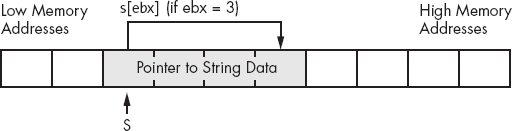

图 4-1. 错误地从字符串变量进行索引

在图 4-1 中，假设 EBX 的值为 3，`s[ebx]`并不会访问字符串`s`中的第四个字符；相反，它会获取指向字符串数据的指针的第四个字节。这很可能不是你想要的。图 4-2 展示了在假设 EBX 包含`s`的值时，如何从字符串中提取字符的必要操作。

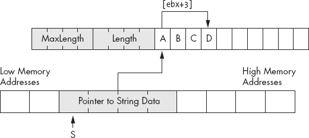

图 4-2. 正确地从字符串变量的值中进行索引

在图 4-2 中，EBX 包含字符串`s`的值。`s`的值是指向内存中实际字符串数据的指针。因此，当你将`s`的值加载到 EBX 中时，EBX 将指向字符串的第一个字符。以下代码演示了如何以这种方式访问字符串`s`的第四个字符：

```
mov( s, ebx );          // Get pointer to string data into ebx.
          mov( [ebx+3], al );     // Fetch the fourth character of the string.
```

如果你想加载字符串中位于变量而非固定偏移量处的字符，可以使用 80x86 的缩放索引寻址模式来获取该字符。例如，如果一个`uns32`变量`index`包含了字符串中的目标偏移量，你可以使用以下代码访问`s[index]`处的字符：

```
mov( s, ebx );          // Get address of string data into ebx.
          mov( index, ecx );      // Get desired offset into string.
          mov( [ebx+ecx], al );   // Get the desired character into al.
```

上面的代码只有一个问题——它没有检查偏移量`index`处的字符是否真实存在。如果`index`大于字符串当前的长度，那么这段代码将从内存中获取一个垃圾字节。除非你能事先确定`index`总是小于字符串的长度，否则像这样的代码是很危险的。一个更好的解决方案是在尝试访问字符之前，先检查索引是否在字符串当前的长度范围内。以下代码提供了实现此操作的一种方法：

```
mov( s, ebx );
          mov( index, ecx );
          if( ecx < (type str.strRec [ebx]).length ) then

               mov( [ebx+ecx], al );

          else

               << Code that handles out-of-bounds string index >>

          endif;
```

在此`if`语句的`else`部分，你可以采取纠正措施，打印错误信息，或者引发异常。如果你想明确引发异常，可以使用 HLA 的`raise`语句来实现。`raise`语句的语法是

```
raise( *`integer_constant`* );
raise( *`reg32`* );
```

*`integer_constant`*或 32 位寄存器的值必须是一个异常编号。通常，这是*excepts.hhf*头文件中的一个预定义常量。当字符串索引大于字符串长度时，应该引发的适当异常是`ex.StringIndexError`。以下代码演示了如果字符串索引越界时引发此异常：

```
mov( s, ebx );
          mov( index, ecx );
          if( ecx < (type str.strRec [ebx]).length ) then

               mov( [ebx+ecx], al );

          else

               raise( ex.StringIndexError );

          endif;
```

# 4.10 HLA 字符串模块与其他字符串相关例程

尽管 HLA 为字符串数据提供了强大的定义，但 HLA 字符串功能背后的真正强大之处在于 HLA 标准库，而不是 HLA 字符串数据的定义。HLA 提供了数百个字符串处理例程，远超标准高级语言（如 C/C++、Java 或 Pascal）中的功能；事实上，HLA 的字符串处理能力堪比字符串处理语言（如 Icon 或 SNOBOL4）。本章讨论了 HLA 标准库提供的几种字符串函数。

你可能需要的最基本字符串操作就是将一个字符串赋值给另一个字符串。HLA 中有三种不同的方法来赋值字符串：通过引用赋值、通过复制字符串赋值和通过重复字符串赋值。在这三种方法中，通过引用赋值是最快且最简单的。如果你有两个字符串，并希望将一个字符串赋给另一个字符串，一种简单且快速的方法是复制字符串指针。以下代码片段演示了这一点：

```
static
          string1:               string  := "Some String Data";
          string2:               string;
               .
               .
               .
          mov( string1, eax );
          mov( eax, string2 );
               .
               .
               .
```

通过引用进行字符串赋值非常高效，因为无论字符串长度如何，它只涉及执行两条简单的`mov`指令。如果在赋值操作之后你不再修改字符串数据，引用赋值效果很好。不过，请记住，两个字符串变量（在上述例子中为`string1`和`string2`）*最终指向相同的数据*。因此，如果你修改了一个字符串变量指向的数据，你也会修改第二个字符串对象所指向的数据，因为这两个对象指向的是相同的数据。示例 4-13 提供了一个演示该问题的程序。

示例 4-13. 通过复制指针进行字符串赋值的问题

```
// Program to demonstrate the problem with string assignment by reference

program strRefAssignDemo;
#include( "stdlib.hhf" );

static
    string1:    string;
    string2:    string;

begin strRefAssignDemo;

    // Get a value into string1.

    forever

        stdout.put( "Enter a string with at least three characters: " );
        stdin.a_gets();
        mov( eax, string1 );

        breakif( (type str.strRec [eax]).length >= 3 );

        stdout.put( "Please enter a string with at least three chars:" nl );

    endfor;

    stdout.put( "You entered: '", string1, "'" nl );

    // Do the string assignment by copying the pointer.

    mov( string1, ebx );
    mov( ebx, string2 );

    stdout.put( "String1= '", string1, "'" nl );
    stdout.put( ""String2= '", string2, "'" nl );

    // Okay, modify the data in string1 by overwriting
    // the first three characters of the string (note that
    // a string pointer always points at the first character
    // position in the string and we know we've got at least
    // three characters here).

    mov( 'a', (type char [ebx]) );
    mov( 'b', (type char [ebx+1]) );
    mov( 'c', (type char [ebx+2]) );

    // Okay, demonstrate the problem with assignment via
    // pointer copy.

    stdout.put
    (
        "After assigning 'abc' to the first three characters in string1:"
        nl
        nl
    );
    stdout.put( "String1= '", string1, "'" nl );
    stdout.put( "String2= '", string2, "'" nl );

    str.free( string1 );     // Don't free string2 as well!

end strRefAssignDemo;
```

因为在这个例子中`string1`和`string2`都指向相同的字符串数据，所以对一个字符串所做的任何修改都会反映到另一个字符串上。虽然这种情况有时是可以接受的，但大多数程序员期望赋值操作会生成字符串的不同副本；也就是说，他们期望字符串赋值的语义能够生成两个独立的字符串数据副本。

使用*引用复制*（这个术语意味着复制一个指针）时，必须记住一个重要的点，那就是你创建了字符串数据的别名。术语*别名*意味着你有两个不同的名称指向内存中的同一个对象（例如，在上述程序中，`string1`和`string2`是指向同一字符串数据的两个不同名称）。当你阅读一个程序时，合理的期望是不同的变量指向不同的内存对象。别名违反了这一规则，从而使得程序更难阅读和理解，因为你必须记住别名并不指向内存中不同的对象。如果不记住这一点，可能会导致程序中的微妙错误。例如，在上述例子中，你必须记住`string1`和`string2`是别名，以避免在程序结束时释放这两个对象。更糟糕的是，你必须记住`string1`和`string2`是别名，这样你就不会在释放`string1`后继续使用`string2`，因为此时`string2`将成为一个悬空引用。

因为通过引用复制会使你的程序更难以阅读，并增加可能引入微妙缺陷的风险，你可能会想知道为什么有人会使用引用复制。原因有两个：首先，引用复制非常高效；它只涉及执行两条`mov`指令。其次，一些算法实际上依赖于引用复制的语义。然而，在使用这种技术之前，你应该仔细考虑复制字符串指针是否是你程序中字符串赋值的合适方式。

将一个字符串赋值给另一个字符串的第二种方式是复制字符串数据。HLA 标准库的 `str.cpy` 例程提供了这个功能。调用 `str.cpy` 过程时使用以下调用语法：^([55])

```
str.cpy( *`source_string`*, *`destination_string`* );
```

源字符串和目标字符串必须是字符串变量（指针）或包含字符串数据在内存中地址的 32 位寄存器。

`str.cpy` 例程首先检查目标字符串的最大长度字段，确保它至少与源字符串当前的长度一样大。如果不是，`str.cpy` 将引发 `ex.StringOverflow` 异常。如果目标字符串的最大长度足够大，`str.cpy` 就会将源字符串的字符串长度、字符和零终止字节从源字符串复制到目标字符串。当这个过程完成时，两个字符串指向相同的数据，但它们在内存中并不指向相同的数据^([56])。示例 4-14 中的程序是使用 `str.cpy` 而不是通过引用复制的方式，对 示例 4-13 中示例的重做。

示例 4-14. 使用 `str.cpy` 复制字符串

```
// Program to demonstrate string assignment using str.cpy

program strcpyDemo;
#include( "stdlib.hhf" );

static
    string1:    string;
    string2:    string;

begin strcpyDemo;

    // Allocate storage for string2:

    str.alloc( 64 );
    mov( eax, string2 );

    // Get a value into string1.

    forever

        stdout.put( "Enter a string with at least three characters: " );
        stdin.a_gets();
        mov( eax, string1 );

        breakif( (type str.strRec [eax]).length >= 3 );

        stdout.put( "Please enter a string with at least three chars:" nl );

    endfor;

    // Do the string assignment via str.cpy.

    str.cpy( string1, string2 );

    stdout.put( "String1= '", string1, "'" nl );
    stdout.put( "String2= '", string2, "'" nl );

    // Okay, modify the data in string1 by overwriting
    // the first three characters of the string (note that
    // a string pointer always points at the first character
    // position in the string and we know we've got at least
    // three characters here).

    mov( string1, ebx );
    mov( 'a', (type char [ebx]) );
    mov( 'b', (type char [ebx+1]) );
    mov( 'c', (type char [ebx+2]) );

    // Okay, demonstrate that we have two different strings
    // because we used str.cpy to copy the data:

    stdout.put
    (
        "After assigning 'abc' to the first three characters in string1:"
        nl
        nl
    );
    stdout.put( "String1= '", string1, "'" nl );
    stdout.put( "String2= '", string2, "'" nl );

    // Note that we have to free the data associated with both
    // strings because they are not aliases of one another.

    str.free( string1 );
    str.free( string2 );

end strcpyDemo;
```

有两件重要的事情需要注意，关于 示例 4-14 中的程序。首先，注意这个程序开始时会为 `string2` 分配存储空间。请记住，`str.cpy` 例程不会为目标字符串分配存储空间；它假定目标字符串已经分配了存储空间。请注意，`str.cpy` 不会初始化 `string2`；它只会将数据复制到 `string2` 当前指向的位置。程序有责任在调用 `str.cpy` 之前分配足够的内存来初始化该字符串。第二件需要注意的事情是，程序在退出之前调用 `str.free` 来释放 `string1` 和 `string2` 的存储空间。

在调用 `str.cpy` 之前为字符串变量分配存储空间是非常常见的，以至于 HLA 标准库提供了一个分配并复制字符串的例程：`str.a_cpy`。这个例程使用以下调用语法：

```
str.a_cpy( *`source_string`* );
```

请注意，`str.cpy` 没有目标字符串。该例程查看源字符串的长度，分配足够的存储空间，复制字符串，然后返回一个指向新字符串的指针，存储在 EAX 寄存器中。示例 4-15 中的程序演示了如何使用 `str.a_cpy` 过程完成与 示例 4-14 中相同的操作。

示例 4-15. 使用 `str.a_cpy` 复制字符串

```
// Program to demonstrate string assignment using str.a_cpy

program stra_cpyDemo;
#include( "stdlib.hhf" );

static
    string1:    string;
    string2:    string;

begin stra_cpyDemo;

    // Get a value into string1.

    forever

        stdout.put( "Enter a string with at least three characters: " );
        stdin.a_gets();
        mov( eax, string1 );

        breakif( (type str.strRec [eax]).length >= 3 );

        stdout.put( "Please enter a string with at least three chars:" nl );

    endfor;

    // Do the string assignment via str.a_cpy.

    str.a_cpy( string1 );
    mov( eax, string2 );

    stdout.put( "String1= '", string1, "'" nl );
    stdout.put( "String2= '", string2, "'" nl );

    // Okay, modify the data in string1 by overwriting
    // the first three characters of the string (note that
    // a string pointer always points at the first character
    // position in the string and we know we've got at least
    // three characters here).

    mov( string1, ebx );
    mov( 'a', (type char [ebx]) );
    mov( 'b', (type char [ebx+1]) );
    mov( 'c', (type char [ebx+2]) );

    // Okay, demonstrate that we have two different strings
    // because we used str.cpy to copy the data:

    stdout.put
    (
        "After assigning 'abc' to the first three characters in string1:"
        nl
        nl
    );
    stdout.put( "String1= '", string1, "'" nl );
    stdout.put( "String2= '", string2, "'" nl );

    // Note that we have to free the data associated with both
    // strings because they are not aliases of one another.

    str.free( string1 );
    str.free( string2 );

end stra_cpyDemo;
```

### 警告

每当你使用引用传递或 `str.a_cpy` 来分配字符串时，别忘了在完全处理完字符串数据后释放与该字符串相关的存储。如果你没有其他指向先前字符串数据的指针，未能这样做可能会导致内存泄漏。

获取字符字符串的长度非常常见，以至于 HLA 标准库提供了一个专门用于此目的的 `str.length` 例程。当然，你也可以通过使用 `str.strRec` 数据类型直接访问长度字段来获取长度，但由于这种机制需要输入大量的代码，频繁使用会比较繁琐。`str.length` 例程提供了一种更紧凑、更方便的方式来获取长度信息。你可以使用以下两种格式之一调用 `str.length`：

```
str.length( *`Reg32`* );
str.length( *`string_variable`* );
```

这个例程将当前字符串的长度返回在 EAX 寄存器中。

另一个有用的字符串例程对是 `str.cat` 和 `str.a_cat` 过程。它们使用以下语法：

```
str.cat( *`srcRStr`*, *`destLStr`* );
str.a_cat( *`srcLStr`*, *`srcRStr`* );
```

这两个例程将两个字符串连接在一起（即通过将两个字符串连接创建一个新字符串）。`str.cat` 过程将源字符串连接到目标字符串的末尾。在实际进行连接之前，`str.cat` 会检查目标字符串是否足够大，能够容纳连接结果，如果目标字符串的最大长度太小，它会抛出 `ex.StringOverflow` 异常。

`str.a_cat` 例程顾名思义，在进行连接操作之前，会为结果字符串分配存储空间。这个例程将为连接结果分配足够的存储空间，然后将 `srcLStr` 复制到分配的存储空间中，接着将 `srcRStr` 指向的字符串数据附加到这个新字符串的末尾，最后它会在 EAX 寄存器中返回指向新字符串的指针。

### 警告

注意一个潜在的混淆来源。`str.cat` 过程将其第一个操作数连接到第二个操作数的末尾。因此，`str.cat` 遵循许多 HLA 语句中常见的标准 `(src, dest)` 操作数格式。而 `str.a_cat` 例程则有两个源操作数，而不是一个源操作数和一个目标操作数。`str.a_cat` 例程以直观的从左到右的方式连接这两个操作数，这与 `str.cat` 正好相反。使用这两个例程时，请记住这一点。

示例 4-16 演示了如何使用 `str.cat` 和 `str.a_cat` 例程。

示例 4-16. 演示 `str.cat` 和 `str.a_cat` 例程

```
// Program to demonstrate str.cat and str.a_cat

program strcatDemo;
#include( "stdlib.hhf" );

static
    UserName:   string;
    Hello:      string;
    a_Hello:    string;

begin strcatDemo;

    // Allocate storage for the concatenated result:

    str.alloc( 1024 );
    mov( eax, Hello );

    // Get some user input to use in this example:

    stdout.put( "Enter your name: " );
    stdin.flushInput();
    stdin.a_gets();
    mov( eax, UserName );

    // Use str.cat to combine the two strings:

    str.cpy( "Hello ", Hello );
    str.cat( UserName, Hello );

    // Use str.a_cat to combine the string strings:

    str.a_cat( "Hello ", UserName );
    mov( eax, a_Hello );

    stdout.put( "Concatenated string #1 is '", Hello, "'" nl );
    stdout.put( "Concatenated string #2 is '", a_Hello, "'" nl );

    str.free( UserName );
    str.free( a_Hello );
    str.free( Hello );

end strcatDemo;
```

`str.insert` 和 `str.a_insert` 例程与字符串连接过程类似。然而，`str.insert` 和 `str.a_insert` 例程允许你将一个字符串插入到另一个字符串的任何位置，而不仅仅是字符串的末尾。这两个例程的调用顺序如下：

```
str.insert( *`src`*, *`dest`*, *`index`* );
                    str.a_insert( *`src`*, *`dest`*, *`index`* );
```

这两个函数将源字符串（*`src`*）插入到目标字符串（*`dest`*）的指定字符位置*`index`*处。`str.insert`函数将源字符串直接插入目标字符串；如果目标字符串的长度不足以容纳两个字符串，`str.insert`会引发`ex.StringOverflow`异常。`str.a_insert`函数首先为新字符串分配内存，将目标字符串（*`src`*）复制到新字符串中，然后在指定的偏移位置插入源字符串（*`dest`*）；`str.a_insert`返回新字符串的指针，并存储在 EAX 寄存器中。

字符串的索引是从零开始的。这意味着，如果你在`str.insert`或`str.a_insert`中提供值 0 作为索引，那么这些函数会在目标字符串的第一个字符之前插入源字符串。同样地，如果*`index`*等于字符串的长度，那么这些函数会直接将源字符串连接到目标字符串的末尾。

### 警告

如果`index`大于字符串的长度，`str.insert`和`str.a_insert`过程不会引发异常；相反，它们会简单地将源字符串附加到目标字符串的末尾。

`str.delete`和`str.a_delete`函数允许你从字符串中删除字符。它们使用以下调用方式：

```
str.delete( *`strng`*, *`StartIndex`*, *`Length`* );
str.a_delete( *`strng`*, *`StartIndex`*, *`Length`* );
```

两个函数都会从字符串*`strng`*的字符位置*`StartIndex`*开始删除*`Length`*个字符。两者的区别在于，`str.delete`直接从*`strng`*中删除字符，而`str.a_delete`首先分配内存并复制*`strng`*，然后从新字符串中删除字符（不改变*`strng`*）。`str.a_delete`函数会将新字符串的指针返回在 EAX 寄存器中。

`str.delete`和`str.a_delete`函数对你传入的*`StartIndex`*和*`Length`*的值非常宽容。如果*`StartIndex`*大于字符串的当前长度，这两个函数不会从字符串中删除任何字符。如果*`StartIndex`*小于字符串的当前长度，但*`StartIndex`*+*`Length`*大于字符串的长度，那么这两个函数会删除从*`StartIndex`*到字符串末尾的所有字符。

另一个非常常见的字符串操作是需要将字符串的一部分复制到另一个字符串，而不影响源字符串。`str.substr`和`str.a_substr`函数提供了这个功能。这些函数使用以下语法：

```
str.substr( *`src`*, *`dest`*, *`StartIndex`*, *`Length`* );
str.a_substr( *`src`*, *`StartIndex`*, *`Length`* );
```

`str.substr`例程将从*`src`*字符串的*`StartIndex`*位置开始，复制*`Length`*个字符到*`dest`*字符串中。目标字符串必须有足够的存储空间来容纳新字符串，否则`str.substr`将抛出`ex.StringOverflow`异常。如果*`StartIndex`*的值大于字符串的长度，则`str.substr`将抛出`ex.StringIndexError`异常。如果*`StartIndex`*+*`Length`*大于源字符串的长度，但*`StartIndex`*小于字符串的长度，那么`str.substr`将仅提取从*`StartIndex`*到字符串末尾的字符。

`str.a_substr`过程的行为几乎与`str.substr`完全相同，唯一不同的是它会在堆上分配存储空间用于目标字符串。`str.a_substr`处理异常的方式与`str.substr`相同，唯一不同的是它永远不会抛出字符串溢出异常，因为这种情况永远不会发生。^([57]) 你现在可能已经猜到了，`str.a_substr`会返回一个指向新分配字符串的指针，该指针存储在 EAX 寄存器中。

当你开始处理字符串数据一段时间后，比较两个字符串的需求通常会不可避免地出现。第一次尝试使用标准 HLA 关系运算符进行字符串比较时，虽然会编译通过，但不一定会产生预期的结果：

```
mov( s1, eax );
     if( eax = s2 ) then

          << Code to execute if the strings are equal >>

     else

          << Code to execute if the strings are not equal >>

     endif;
```

记住，*字符串是指针*。这段代码比较两个指针，看看它们是否相等。如果它们相等，显然这两个字符串是相等的（因为`s1`和`s2`指向的是完全相同的字符串数据）。然而，两个指针不同并不一定意味着这两个字符串不相等。`s1`和`s2`可能包含不同的值（即它们指向内存中的不同地址），但这两个地址上的字符串数据可能是相同的。大多数程序员期望当两个字符串的数据相同时，字符串比较为 true。显然，指针比较并不能提供这种类型的比较。为了解决这个问题，HLA 标准库提供了一组字符串比较例程，这些例程会比较字符串数据，而不仅仅是它们的指针。使用这些例程时，调用方式如下：

```
str.eq( *`src1`*, *`src2`* );
str.ne( *`src1`*, *`src2`* );
str.lt( *`src1`*, *`src2`* );
str.le( *`src1`*, *`src2`* );
str.gt( *`src1`*, *`src2`* );
str.ge( *`src1`*, *`src2`* );
```

这些例程将*`src1`*字符串与*`src2`*字符串进行比较，并根据比较结果在 EAX 寄存器中返回 true（1）或 false（0）。例如，`str.eq( s1, s2);` 如果`s1`等于`s2`，则会在 EAX 中返回 true。HLA 提供了一个小扩展，允许你在`if`语句中使用字符串比较例程。^([58]) 以下代码演示了如何在`if`语句中使用一些比较例程：

```
stdout.put( "Enter a single word: " );
          stdin.a_gets();
          if( str.eq( eax, "Hello" )) then

               stdout.put( "You entered 'Hello'", nl );

          endif;
          str.free( eax );
```

请注意，用户在此示例中输入的字符串必须完全匹配 `Hello`，包括字符串开头的大写字母 *H*。在处理用户输入时，最好在字符串比较时忽略字母的大小写，因为不同的用户对于何时按下键盘上的 SHIFT 键有不同的理解。一种简单的解决方案是使用 HLA 的不区分大小写的字符串比较函数。这些例程比较两个字符串，忽略字母的大小写差异。这些例程使用以下调用顺序：

```
str.ieq( *`src1`*, *`src2`* );
str.ine( *`src1`*, *`src2`* );
str.ilt( *`src1`*, *`src2`* );
str.ile( *`src1`*, *`src2`* );
str.igt( *`src1`*, *`src2`* );
str.ige( *`src1`*, *`src2`* );
```

除了将大写字符与其小写等效字符视为相同外，这些例程的行为与前述例程完全相同，根据比较结果在 EAX 中返回 true 或 false。

与大多数高级语言一样，HLA 使用*字典顺序*来比较字符串。这意味着两个字符串只有在它们的长度相同且两个字符串中对应的字符完全相同的情况下才相等。在小于或大于的比较中，字典顺序对应于单词在字典中的排列方式。也就是说，`a` 小于 `b` 小于 `c`，以此类推。实际上，HLA 使用字符的 ASCII 数字代码来比较字符串，因此如果你不确定 `a` 是否小于句点，可以查阅 ASCII 字符表（顺便提一下，在 ASCII 字符集里，`a` 大于句点，以防你有这个疑问）。

如果两个字符串长度不同，字典顺序只有在两个字符串完全匹配到较短字符串的长度时才考虑长度。如果是这种情况，那么较长的字符串大于较短的字符串（反之亦然，较短的字符串小于较长的字符串）。然而，请注意，如果两个字符串中的字符完全不匹配，那么 HLA 的字符串比较例程会忽略字符串的长度；例如，`z` 总是大于 `aaaaa`，即使它较短。

`str.eq` 例程检查两个字符串是否相等。然而，有时你可能想知道一个字符串是否*包含*另一个字符串。例如，你可能想知道某个字符串是否包含子字符串 `north` 或 `south`，以决定在游戏中采取某个行动。HLA 的 `str.index` 例程允许你检查一个字符串是否作为子字符串包含在另一个字符串中。`str.index` 例程使用以下调用顺序：

```
str.index( *`StrToSearch`*, *`SubstrToSearchFor`* );
```

该函数在 EAX 中返回 *`StrToSearch`* 中 *`SubstrToSearchFor`* 出现的位置偏移量。如果 *`SubstrToSearchFor`* 不存在于 *`StrToSearch`* 中，则该例程在 EAX 中返回 −1。请注意，`str.index` 会进行区分大小写的搜索。因此，字符串必须完全匹配。没有可以使用的不区分大小写的 `str.index` 变体。^([59])

HLA `strings` 模块除了本节中列出的那些例程外，还包含数百个例程。由于空间限制和前提知识的要求，这里无法展示所有这些函数；然而，这并不意味着剩余的字符串函数不重要。你应该一定要查看 HLA 标准库文档，了解更多关于强大的 HLA 字符串库例程的知识。

* * *

^([55]) 警告 C/C++ 用户：请注意，操作数的顺序与 C 标准库的 `strcpy` 函数相反。

^([56]) 当然，除非两个字符串指针最初包含相同的地址，在这种情况下 `str.cpy` 会将字符串数据复制到自身。

^([57]) 从技术上讲，`str.a_substr` 就像所有调用 `mem.alloc` 来分配存储空间的例程一样，可能会抛出 `ex.MemoryAllocationFailure` 异常，但这种情况发生的可能性非常小。

^([58]) 这个扩展实际上比本节描述的要更通用。第七章 完整地解释了它。

^([59]) 然而，HLA 确实提供了一些例程，可以将字符串中的所有字符转换为某种大小写。因此，你可以复制字符串，将两个副本中的所有字符都转换为小写，然后使用这些转换后的字符串进行搜索。这将达到相同的效果。

# 4.11 内存中的转换

HLA 标准库的 `string` 模块包含数十个用于在字符串和其他数据格式之间转换的例程。尽管在本节中介绍这些函数还为时过早，但如果不至少讨论其中一个可用的函数——`str.put` 例程，那将有些不妥。这个例程封装了许多其他字符串转换函数的功能，因此如果你学会了如何使用这个，你将能够使用大部分其他例程的功能。

你以类似于 `stdout.put` 例程的方式使用 `str.put`。唯一的区别是，`str.put` 例程将数据“写入”一个字符串，而不是标准输出设备。调用 `str.put` 的语法如下：

```
str.put( *`destString`*, *`values_to_convert`* );
```

这是调用 `str.put` 的一个示例：

```
str.put( *`destString`*, "I =", i:4, " J= ", j, " s=", s );
```

### 警告

通常，你不会像打印字符串到标准输出设备时那样在字符串末尾加上换行符序列。

*`destString`* 参数在 `str.put` 参数列表的开头必须是一个字符串变量，并且它必须已经分配了存储空间。如果 `str.put` 尝试将超过允许字符数的内容存储到 *`destString`* 参数中，那么此函数将抛出 `ex.StringOverflow` 异常。

大多数情况下，你不知道 `str.put` 会生成的字符串长度。在这种情况下，你应该为一个非常大的字符串分配存储空间，远大于你预期的大小，并将这个字符串对象作为 `str.put` 调用的第一个参数。这将防止异常导致程序崩溃。通常，如果你预期生成大约一行屏幕文字，那么应该为目标字符串分配至少 256 个字符。如果你要生成更长的字符串，应该为字符串分配至少 1,024 个字符（如果你要生成*非常*大的字符串，可以分配更多）。

这是一个示例：

```
static
     s: string;
          .
          .
          .
     str.alloc( 256 );
     mov( eax, s );
          .
          .
          .
     str.put( s, "R: ", r:16:4, " strval: '", strval:-10, "'" );
```

你可以使用 `str.put` 例程将任何数据转换为字符串，然后使用 `stdout.put` 打印出来。你会发现这个例程对于常见的值到字符串的转换非常有用。

# 4.12 字符集

字符集是另一种复合数据类型，类似于字符串，是基于字符数据类型构建的。字符集是一个数学集合，最重要的属性是成员资格。也就是说，字符要么是集合的成员，要么不是集合的成员。序列的概念（例如，字符是否排在另一个字符之前，如同在字符串中）不适用于字符集。此外，成员资格是一种二元关系；字符要么在集合中，要么不在集合中；你不能在字符集中有多个相同字符。对字符集可以进行各种操作，包括数学集合运算，如并集、交集、差集和成员测试。

HLA 实现了一种受限形式的字符集，允许字符集成员是任何 128 个标准 ASCII 字符（即 HLA 的字符集功能不支持扩展字符编码范围 128..255）。尽管有此限制，HLA 的字符集功能仍然非常强大，并且在编写处理字符串数据的程序时非常方便。以下部分将描述 HLA 字符集功能的实现和使用，以便你可以在自己的程序中利用字符集。

# 4.13 HLA 中的字符集实现

在汇编语言程序中表示字符集有多种方式。HLA 使用一个包含 128 个布尔值的数组来实现字符集。每个布尔值决定相应字符是否是字符集的成员；也就是说，布尔值为真表示相应字符是字符集的成员，而布尔值为假表示该字符不是字符集的成员。为了节省内存，HLA 为字符集中的每个字符分配一个位，因此 HLA 字符集只消耗 16 字节的内存，因为 16 字节包含 128 位。这个包含 128 位的数组在内存中的组织方式如 图 4-3 所示。

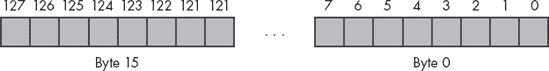

图 4-3. 字符集对象的位布局

字节 0 的位 0 对应于 ASCII 代码 0（NUL 字符）。如果该位为 1，则字符集包含 NUL 字符；如果该位为假，则字符集不包含 NUL 字符。同样，字节 1 的位 0（128 位数组中的第九位）对应退格字符（ASCII 代码为 8）。字节 8 的位 1 对应 ASCII 代码 65，大写字母 `A`。如果 `A` 是字符集的当前成员，则位 65 将为 1；如果 `A` 不是字符集的成员，则该位为 0。

尽管存在其他实现字符集的方法，但使用这种位向量实现可以非常容易地实现集合操作，如并集、交集、差集比较和成员测试。

HLA 支持使用 `cset` 数据类型的字符集变量。要声明一个字符集变量，可以使用如下声明：

```
static
     *`CharSetVar`*: cset;
```

该声明将预留 16 字节的存储空间，用于保存表示 ASCII 字符集的 128 位。

虽然可以使用如 `and`、`or`、`xor` 等指令操作字符集中的位，80x86 指令集包括几条用于测试、设置、重置和补码的指令，非常适合操作字符集。例如，`bt`（位测试）指令会将内存中的一个位复制到进位标志中。`bt` 指令支持以下语法形式。

```
bt( *`BitNumber`*, *`BitsToTest`* );

bt( *`reg16`*, *`reg16`* );
bt( *`reg32`*, *`reg32`* );
bt( *`constant`*, *`reg16`* );
bt( *`constant`*, *`reg32`* );

bt( *`reg16`*, *`mem16`* );
bt( *`reg32`*, *`mem32`* );     // HLA treats cset objects as dwords within bt.
bt( *`constant`*, *`mem16`* );
bt( *`constant`*, *`mem32`* );  // HLA treats cset objects as dwords within bt.
```

第一个操作数包含一个位数，第二个操作数指定一个寄存器或内存位置，其位应该复制到进位标志中。如果第二个操作数是一个寄存器，则第一个操作数必须包含一个在 0..*n*−1 范围内的值，其中 *n* 是第二个操作数的位数。如果第一个操作数是常量且第二个操作数是内存位置，则常量必须在 0..255 范围内。以下是这些指令的一些示例：

```
bt( 7, ax );          // Copies bit 7 of ax into the carry flag (CF).
     mov( 20, eax );
     bt( eax, ebx );       // Copies bit 20 of ebx into CF.

     // Copies bit 0 of the byte at CharSetVar+3 into CF.

     bt( 24, CharSetVar );

     // Copies bit 4 of the byte at DWmem+2 into CF.

     bt( eax, DWmem);
```

`bt` 指令对于测试集合成员资格非常有用。例如，要检查字符 `A` 是否是字符集的成员，可以使用如下代码序列：

```
bt( 'A', CharSetVar );
          if( @c ) then

               << Do something if 'A' is a member of the set. >>

          endif;
```

`bts`（位测试并设置）、`btr`（位测试并重置）和`btc`（位测试并取反）指令在操作字符集变量时也非常有用。像`bt`指令一样，这些指令将指定的位复制到进位标志中；在复制指定的位后，这些指令将设置（`bts`）、重置/清除（`btr`）或取反/翻转（`btc`）该位。因此，你可以使用`bts`指令通过集合并集将字符添加到字符集中（也就是说，如果字符不在集合中，它将被添加到集合中；否则集合不受影响）。你可以使用`btr`指令通过集合交集将字符从字符集中移除（也就是说，它只有在字符原本在集合中时才会移除字符；否则对集合没有影响）。`btc`指令让你可以将字符添加到集合中，如果字符原本不在集合中；如果字符已经在集合中，它将从集合中移除（也就是说，它会切换字符在集合中的成员身份）。

# 4.14 HLA 字符集常量与字符集表达式

HLA 支持字面字符集常量。这些`cset`常量使得在编译时初始化`cset`变量变得更加容易，并且允许你将字符集常量轻松地作为过程参数传递。HLA 字符集常量的形式如下：

```
{ *`Comma_separated_list_of_characters_and_character_ranges`* }
```

以下是一个简单的字符集示例，包含所有数字字符：

```
{ '0', '1', '2', '3', '4', '5', '6', '7', '8', '9' }
```

当指定具有多个连续值的字符集字面量时，HLA 允许你简洁地仅使用范围的起始值和结束值来指定这些值，如下所示：

```
{ '0'..'9' }
```

你可以在同一字符集常量中结合字符和各种范围。例如，以下字符集常量包含所有的字母数字字符：

```
{ '0'..'9', 'a'..'z', 'A'..'Z' }
```

你可以在`const`和`val`部分使用这些`cset`字面常量作为初始化器。以下示例演示了如何使用上面的字符集创建符号常量`AlphaNumeric`：

```
const
     AlphaNumeric: cset := {'0'..'9', 'a'..'z', 'A'..'Z' };
```

在上述声明之后，你可以在任何合法的字符集字面量使用的地方使用标识符`AlphaNumeric`。

你还可以将字符集字面量（当然也包括字符集符号常量）用作`static`或`readonly`变量的初始化字段。以下代码片段演示了这一点：

```
static
     Alphabetic: cset := { 'a'..'z', 'A'..'Z' };
```

任何可以使用字符集字面常量的地方，也可以使用字符集常量表达式。表 4-2 展示了 HLA 在字符集常量表达式中支持的操作符。

表 4-2. HLA 字符集操作符

| 操作符 | 描述 |
| --- | --- |
| `CSetConst1 + CSetConst2` | 计算两个集合的并集。集合并集是包含任一集合中所有字符的集合。 |
| `CSetConst1 * CSetConst2` | 计算两个集合的交集。交集是出现在两个操作数集合中的所有字符的集合。 |
| `CSetConst1 - CSetConst2` | 计算两个集合的差集。差集是出现在第一个集合中但不出现在第二个集合中的字符集合。 |
| `-CSetConst` | 计算集合的补集。补集是所有不在该集合中的字符的集合。 |

请注意，这些运算符仅生成编译时结果。也就是说，上面的表达式是由编译器在编译期间计算的；它们不会生成任何机器代码。如果你想在程序运行时对两个不同的字符集执行这些操作，HLA 标准库提供了可以调用的例程来实现你想要的结果。HLA 还提供了其他编译时字符集运算符。

# 4.15 HLA 标准库中的字符集支持

HLA 标准库提供了几个你可能会觉得有用的字符集例程。字符集支持例程分为四类：标准字符集函数、字符集测试、字符集转换和字符集输入/输出。本节描述了这些 HLA 标准库中的例程。

首先，让我们考虑一下帮助你构建字符集的标准库例程。这些例程包括`cs.empty`、`cs.cpy`、`cs.charToCset`、`cs.unionChar`、`cs.removeChar`、`cs.rangeChar`、`cs.strToCset`和`cs.unionStr`。这些过程允许你在运行时使用字符和字符串对象构建字符集。

`cs.empty`过程通过将字符集中的所有位设置为 0 来初始化一个字符集变量为空集。该过程调用使用以下语法（*`CSvar`*是一个字符集变量）：

```
cs.empty( *`CSvar`* );
```

`cs.cpy`过程将一个字符集复制到另一个字符集，替换目标字符集之前的任何数据。`cs.cpy`的语法如下：

```
cs.cpy( *`srcCsetValue`*, *`destCsetVar`* );
```

`cs.cpy`源字符集可以是一个字符集常量或一个字符集变量。目标字符集必须是一个字符集变量。

`cs.unionChar`过程将一个字符添加到字符集中。它使用以下调用格式：

```
cs.unionChar( *`CharVar`*, *`CSvar`* );
```

这个调用将第一个参数，一个字符，通过集合并运算添加到集合中。请注意，你可以使用`bts`指令来实现相同的结果；然而，`cs.unionChar`调用通常更方便。字符值必须在#0..#127 的范围内。

`cs.charToCset`函数创建一个单例集合（包含一个字符的集合）。该函数的调用格式为：

```
cs.charToCset( *`CharValue`*, *`CSvar`* );
```

第一个操作数，即字符值*`CharValue`*，可以是一个 8 位寄存器、一个常量，或一个存储在#0..#127 范围内的字符变量。第二个操作数（*`CSvar`*）必须是一个字符集变量。该函数将目标字符集清零，然后将指定的字符并入字符集中。

`cs.removeChar` 过程允许你从字符集中移除一个字符，而不影响集合中的其他字符。此函数的语法与 `cs.charToCset` 相同，参数也具有相同的属性。调用顺序如下：

```
cs.removeChar( *`CharValue`*, *`CSvar`* );
```

请注意，如果字符本来不在 *`CSVar`* 集合中，`cs.removeChar` 将不会影响集合。此函数大致对应 `btr` 指令。

`cs.rangeChar` 构造一个字符集，包含你传递的两个字符之间的所有字符。此函数将这些两个字符范围之外的所有位设置为 0。调用顺序如下：

```
cs.rangeChar( *`LowerBoundChar`*, *`UpperBoundChar`*, *`CSVar`* );
```

*`LowerBoundChar`* 和 *`UpperBoundChar`* 参数可以是常量、寄存器或字符变量。*`LowerBoundChar`* 和 *`UpperBoundChar`* 中的值必须在 #0..#127 范围内。`CSVar`，目标字符集，必须是一个 `cset` 变量。

`cs.strToCset` 过程创建一个新的字符集，其中包含字符串中所有字符的并集。该过程首先将目标字符集设置为空集，然后依次将字符串中的字符并入集合，直到所有字符都被处理完。调用顺序如下：

```
cs.strToCset( *`StringValue`*, *`CSVar`* );
```

从技术上讲，*`StringValue`* 参数可以是一个字符串常量，也可以是一个字符串变量；然而，以这种方式调用 `cs.strToCset` 没有任何意义，因为 `cs.cpy` 是一种更高效的方式，用常量字符集来初始化字符集。像往常一样，目标字符集必须是一个 `cset` 变量。通常，你会使用这个函数根据用户输入的字符串创建一个字符集。

`cs.unionStr` 过程会将字符串中的字符添加到现有字符集中。像 `cs.strToCset` 一样，你通常会使用此函数根据用户输入的字符串将字符联合成一个集合。调用顺序如下：

```
cs.unionStr( *`StringValue`*, *`CSVar`* );
```

标准集合操作包括并集、交集和集合差集。HLA 标准库例程 `cs.setunion`、`cs.intersection` 和 `cs.difference` 分别提供这些操作^([60])。这些例程都使用相同的调用顺序：

```
cs.setunion( *`srcCset`*, *`destCset`* );
cs.intersection( *`srcCset`*, *`destCset`* );
cs.difference( *`srcCset`*, *`destCset`* );
```

第一个参数可以是字符集常量或字符集变量。第二个参数必须是字符集变量。这些过程计算 *`destCset`* `:=` *`destCset op srcCset`*，其中 *`op`* 表示集合并集、交集或差集，具体取决于函数调用。

第三类字符集例程以各种方式测试字符集。它们通常返回一个布尔值，表示测试结果。HLA 字符集例程中的此类包括 `cs.IsEmpty`、`cs.member`、`cs.subset`、`cs.psubset`、`cs.superset`、`cs.psuperset`、`cs.eq` 和 `cs.ne`。

`cs.IsEmpty`函数用于测试一个字符集是否为空集。该函数将在 EAX 寄存器中返回 true 或 false。此函数使用的调用顺序如下：

```
cs.IsEmpty( *`CSetValue`* );
```

单个参数可以是常量或字符集变量，尽管将字符集常量传递给此过程没有多大意义（因为你在编译时就知道该集合是否为空）。

`cs.member`函数用于测试某个字符值是否是集合的成员。如果字符是集合的成员，该函数将在 EAX 寄存器中返回 true。请注意，你可以使用`bt`指令来测试相同的条件。然而，如果字符参数不是常量，`cs.member`函数可能会更方便使用。`cs.member`的调用顺序如下：

```
cs.member( *`CharValue`*, *`CsetValue`* );
```

第一个参数是一个 8 位寄存器、字符变量或常量。第二个参数可以是字符集常量或字符集变量。两个参数都是常量的情况不太常见。

`cs.subset`、`cs.psubset`（真子集）、`cs.superset`、`cs.psuperset`（真超集）函数让你检查一个字符集是否是另一个字符集的子集或超集。这四个例程的调用顺序几乎相同；它们的调用顺序如下：

```
cs.subset( *`CsetValue1`*, *`CsetValue2`* );
cs.psubset( *`CsetValue1`*, *`CsetValue2`* );
cs.superset( *`CsetValue1`*, *`CsetValue2`* );
cs.psuperset( *`CsetValue1`*, *`CsetValue2`* );
```

这些例程将第一个参数与第二个参数进行比较，并根据结果在 EAX 寄存器中返回 true 或 false。如果第一个字符集的所有成员都包含在第二个字符集中，则一个集合是另一个集合的子集。如果第二个（右边）字符集还包含在第一个（左边）字符集中不存在的字符，则它是一个真子集。同样，如果一个字符集包含第二个字符集中的所有字符（并可能包含更多字符），则它是另一个字符集的超集。真超集包含第二个集合中没有的额外字符。参数可以是字符集变量或字符集常量；然而，如果两个参数都是字符集常量就不太常见了（因为你可以在编译时确定这一点，没必要在运行时调用函数来计算）。

`cs.eq`和`cs.ne`函数用于检查两个集合是否相等或不相等。这些函数根据集合比较结果在 EAX 中返回 true 或 false。调用顺序与上面的子集/超集函数相同：

```
cs.eq( *`CsetValue1`*, *`CsetValue2`* );
cs.ne( *`CsetValue1`*, *`CsetValue2`* );
```

请注意，没有测试小于、小于等于、大于或大于等于的函数。子集和真子集函数分别等同于小于等于和小于；同样，超集和真超集函数分别等同于大于等于和大于。

`cs.extract`例程从字符集中移除一个任意字符，并将该字符返回到 EAX 寄存器中。^([61]) 调用顺序如下：

```
cs.extract( *`CsetVar`* );
```

唯一的参数必须是一个字符集变量。请注意，这个函数会通过从字符集中删除某些字符来修改字符集变量。如果在调用之前字符集为空，这个函数会在 EAX 中返回 $FFFF_FFFF（−1）。

除了在 `cset.hhf`（字符集）库模块中找到的例程外，字符串和标准输出模块还提供了允许或需要字符集参数的函数。例如，如果你将一个字符集值作为参数传递给 `stdout.put`，那么 `stdout.put` 例程将打印字符集中当前的字符。有关字符集处理过程的更多细节，请参阅 HLA 标准库文档。

* * *

^([60]) 使用了 `cs.setunion` 而不是 `cs.union`，因为 *union* 是 HLA 的保留字。

^([61]) 这个例程返回 AL 中的字符，并将 EAX 的高 3 字节清零。

# 4.16 在你的 HLA 程序中使用字符集

字符集在你的程序中有很多不同的用途。例如，字符集的一个常见用途是验证用户输入。本节还将介绍字符集的其他几个应用，帮助你开始思考如何在程序中使用它们。

请考虑以下简短的代码段，它从用户那里获取一个是/否类型的回答：

```
static
     answer: char;
          .
          .
          .
     repeat
               .
               .
               .
          stdout.put( "Would you like to play again? " );
          stdin.FlushInput();
          stdin.get( answer );

     until( answer = 'n' );
```

这个代码序列的一个主要问题是，它只有在用户输入小写的 *n* 时才会停止。如果用户输入除了 *n* 以外的任何字符（包括大写的 *N*），程序会把它当作肯定的回答，并返回到 `repeat..until` 循环的开头。更好的解决方案是在 `until` 子句之前验证用户输入，以确保用户仅输入了 *n*、*N*、*y* 或 *Y*。以下代码序列将实现这一点：

```
repeat
               .
               .
               .
          repeat

               stdout.put( "Would you like to play again? " );
               stdin.FlushInput();
               stdin.get( answer );

          until( cs.member( answer, { 'n', 'N', 'Y', 'y' } );
          if( answer = 'N' ) then

               mov( 'n', answer );

          endif;

     until( answer = 'n' );
```

# 4.17 数组

与字符串一起，数组可能是最常用的复合数据类型。然而，大多数初学者程序员并不理解数组的内部操作以及它们相关的效率权衡。令人惊讶的是，许多初学者（甚至是高级程序员！）在学习如何在机器层面处理数组后，才会从完全不同的角度看待数组。

抽象来说，数组是一种聚合数据类型，其成员（元素）都是相同的类型。从数组中选择一个成员是通过一个整数索引来完成的。^([62]) 不同的索引选择数组中的独特元素。本节假设整数索引是连续的（尽管这并非必须）。也就是说，如果数字 *x* 是数组的有效索引，而 *y* 也是有效索引，并且 *x* < *y*，那么所有满足 *x* < *i* < *y* 的 *i* 都是有效的索引。

每当你对数组应用索引操作符时，结果是该索引选择的具体数组元素。例如，*`A`*`[`*`i`*`]` 选择数组 `A` 中的第 *i* 个元素。请注意，没有正式要求元素 *`i`* 在内存中必须靠近元素 *`i+1`*。只要 *`A`*`[`*`i`*`]` 总是指向相同的内存位置，并且 *`A`*`[`*`i+1`*`]` 总是指向其对应的位置（且两者不同），那么数组的定义就满足要求。

在本节中，我们假设数组元素在内存中占据连续的位置。一个包含五个元素的数组将在内存中呈现为 图 4-4 所示。

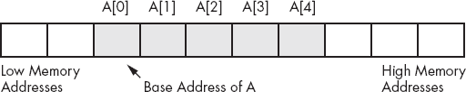

图 4-4. 数组在内存中的布局

数组的 *基地址* 是数组中第一个元素的地址，并且始终位于内存的最低位置。第二个数组元素紧跟第一个元素之后存储在内存中，第三个元素跟在第二个元素后面，以此类推。请注意，索引不一定要求从 0 开始。它们可以从任何数字开始，只要是连续的即可。然而，为了讨论的方便，本书将所有索引从 0 开始。

要访问数组中的一个元素，你需要一个将数组索引转换为索引元素地址的函数。对于一维数组，这个函数非常简单。它是：

```
*`Element_Address`* = *`Base_Address`* + ((*`Index`* - *`Initial_Index`*) * *`Element_Size`*)
```

其中 *`Initial_Index`* 是数组中第一个索引的值（如果是 0 可以忽略），*`Element_Size`* 是数组元素的大小，以字节为单位。

* * *

^([62]) 或者它可能是某个底层表示为整数的值，例如字符、枚举类型和布尔类型。

# 4.18 在 HLA 程序中声明数组

在你可以访问数组的元素之前，你需要为该数组分配存储空间。幸运的是，数组声明基于你已经看到的声明。要为数组分配 `n` 个元素，你可以在变量声明部分使用如下声明：

```
*`ArrayName`*: *`basetype`*[n];
```

*`ArrayName`* 是数组变量的名称，*`basetype`* 是该数组元素的类型。这个声明为数组分配了存储空间。要获取数组的基地址，只需使用 *`ArrayName`*。

`[n]` 后缀告诉 HLA 将对象复制 `n` 次。现在让我们看一些具体示例。

```
static

     CharArray: char[128];    // Character array with elements 0..127.
     ByteArray: byte[10];     // Array of bytes with elements 0..9.
     PtrArray:  dword[4];     // Array of double words with elements 0..3.
```

这些示例都为未初始化的数组分配了存储空间。你也可以指定使用如下声明在 `static` 和 `readonly` 部分初始化数组元素：

```
RealArray: real32[8] := [ 1.0, 1.0, 1.0, 1.0, 1.0, 1.0, 1.0, 1.0 ];
IntegerAry: int32[8] := [ 1, 1, 1, 1, 1, 1, 1, 1 ];
```

这两个定义都创建了包含八个元素的数组。第一个定义将每个 4 字节的实数值初始化为 1.0，第二个声明将每个 `int32` 元素初始化为 1。请注意，方括号内常量的数量必须与数组的大小完全匹配。

如果你希望数组的每个元素都具有相同的值，那么这种初始化机制是可以的。如果你想要初始化每个元素为（可能是）不同的值呢？不用担心，只需在上面示例中的方括号内指定一组不同的值：

```
RealArray: real32[8] := [ 1.0, 2.0, 3.0, 4.0, 5.0, 6.0, 7.0, 8.0 ];
IntegerAry: int32[8] := [ 1, 2, 3, 4, 5, 6, 7, 8 ];
```

# 4.19 HLA 数组常量

上一节的最后几个例子展示了 HLA 数组常量的使用。HLA 数组常量不过是由一对括号包围的一组值。以下都是合法的数组常量：

```
[ 1, 2, 3, 4 ]
[ 2.0, 3.14159, 1.0, 0.5 ]
[ 'a', 'b', 'c', 'd' ]
[ "Hello", "world", "of", "assembly" ]
```

（注意，最后这个数组常量包含了四个双字指针，指向内存中其他地方出现的四个 HLA 字符串。）

如同你在上一节中所看到的，你可以在`static`和`readonly`部分使用数组常量来为数组变量提供初始值。数组常量中的项数必须与变量声明中的数组元素数量完全匹配。同样，数组常量中每个元素的类型必须与数组变量声明的基础类型相匹配。

使用数组常量初始化小型数组非常方便。当然，如果你的数组有几千个元素，输入这些值会很繁琐。大多数以这种方式初始化的数组不超过几百个元素，通常远少于 100 个元素。使用数组常量来初始化这种变量是合理的。然而，到了某个时候，使用这种方式初始化数组会变得太过繁琐且容易出错。你可能不想手动用数组常量初始化一个有 1000 个不同元素的数组。然而，如果你想用相同的值初始化数组的所有元素，HLA 确实提供了一种特殊的数组常量语法来做到这一点。考虑以下声明：

```
BigArray: uns32[ 1000 ] := 1000 dup [ 1 ];
```

这个声明创建了一个包含 1000 个元素的整数数组，并将每个元素初始化为 1。`1000 dup [ 1 ]`表达式告诉 HLA 通过重复单一值`[ 1 ]`一千次来创建一个数组常量。你甚至可以使用`dup`运算符来重复一系列值（而不是单一值），如下例所示：

```
SixteenInts: int32[16] := 4 dup [1,2,3,4];
```

这个例子通过四次复制序列`1,2,3,4`来初始化`SixteenInts`，从而得到总共 16 个不同的整数（即 1, 2, 3, 4, 1, 2, 3, 4, 1, 2, 3, 4, 1, 2, 3, 4）。

当查看 4.22 多维数组时，你将看到使用`dup`运算符的更多可能性。

# 4.20 访问一维数组的元素

要访问一个基于零的数组元素，你可以使用简化公式

```
*`Element_Address`* = *`Base_Address`* + *`index`* * Element_Size
```

对于 *`Base_Address`* 项，你可以使用数组的名称（因为 HLA 将数组第一个元素的地址与该数组的名称关联）。*`Element_Size`* 项是每个数组元素的字节数。如果该对象是字节数组，*`Element_Size`* 字段为 1（结果是一个非常简单的计算）。如果数组的每个元素是一个字（或其他 2 字节类型），则 *`Element_Size`* 为 2，依此类推。要访问上一节中的 `SixteenInts` 数组的一个元素，你可以使用以下公式（大小为 4，因为每个元素是一个 *`int32`* 对象）：

```
*`Element_Address`* = *`SixteenInts`* + *`index`**4
```

80x86 代码中等价于语句 `eax :=` *`SixteenInts`*`[`*`index`*`]` 的代码是：

```
mov( index, ebx );
               shl( 2, ebx );          // Sneaky way to compute 4*ebx
               mov( SixteenInts[ ebx ], eax );
```

这里有两点需要注意。首先，这段代码使用了 `shl` 指令，而不是 `intmul` 指令来计算 `4*index`。选择 `shl` 的主要原因是它更高效。事实证明，`shl` 在许多处理器上比 `intmul` 快得多。

关于这条指令序列需要注意的第二点是，它并没有显式地计算基地址加上索引乘以 4 的和。而是依赖于索引寻址模式隐式地计算这个和。指令 `mov( SixteenInts[ ebx ], eax );` 从 `SixteenInts + ebx` 位置加载 EAX，也就是基地址加上 `index*4`（因为 EBX 中包含 `index*4`）。当然，你本可以使用

```
lea( eax, SixteenInts );
               mov( index, ebx );
               shl( 2, ebx );            // Sneaky way to compute 4*ebx
               add( eax, ebx );          // Compute base address plus index*4
               mov( [ebx], eax );
```

代替之前的指令序列，为什么要使用五条指令，而三条指令就能完成相同的任务呢？这是一个很好的例子，说明为什么你需要深入了解你的寻址模式。选择正确的寻址模式可以减少程序的大小，从而加快程序的运行速度。

当然，既然我们在讨论效率提升，值得指出的是，80x86 的缩放索引寻址模式让你能够自动将索引乘以 1、2、4 或 8。因为当前的示例将索引乘以 4，所以我们可以通过使用缩放索引寻址模式进一步简化代码：

```
mov( index, ebx );
               mov( SixteenInts[ ebx*4 ], eax );
```

但需要注意的是，如果你需要将索引乘以其他常数，而不是 1、2、4 或 8，那么你不能使用缩放索引寻址模式。同样，如果你需要将索引乘以某个不是 2 的幂的元素大小，你将不能使用 `shl` 指令来将索引乘以元素大小；相反，你需要使用 `intmul` 或其他指令序列来完成乘法运算。

80x86 上的索引寻址模式非常适合访问一维数组的元素。事实上，它的语法甚至暗示着数组访问。需要记住的重要一点是，你必须记得将索引乘以元素的大小。如果忘记这样做，会导致不正确的结果。

# 4.21 排序一个值的数组

几乎每本教科书在介绍数组时都会给出一个排序的例子。因为你可能已经在高级语言中看到过如何进行排序，所以看看在 HLA 中如何实现排序可能会更具启发性。本节中的示例代码将使用气泡排序的变种，这对于短列表数据和几乎已排序的列表非常有效，但对于其他情况几乎毫无用处。^([63])

```
const
    NumElements := 16;

static
    DataToSort: uns32[ NumElements ] :=
                    [
                        1, 2, 16, 14,
                        3, 9, 4,  10,
                        5, 7, 15, 12,
                        8, 6, 11, 13
                    ];

    NoSwap: boolean;

          .
          .
          .

    // Bubble sort for the DataToSort array:

    repeat

        mov( true, NoSwap );
        for( mov( 0, ebx ); ebx <= NumElements-2; inc( ebx )) do

            mov( DataToSort[ ebx*4], eax );
            if( eax > DataToSort[ ebx*4 + 4] ) then

                mov( DataToSort[ ebx*4 + 4 ], ecx );
                mov( ecx, DataToSort[ ebx*4 ] );
                mov( eax, DataToSort[ ebx*4 + 4 ] ); // Note: eax contains
                mov( false, NoSwap );                // DataToSort[ ebx*4 ]

            endif;

        endfor;

    until( NoSwap );
```

气泡排序通过比较数组中相邻的元素来工作。这个代码片段中有一个有趣的地方，那就是它如何比较相邻的元素。你会注意到，`if` 语句将 EAX（它包含 `DataToSort[ebx*4]`）与 `DataToSort[ebx*4 + 4]`进行比较。因为该数组的每个元素是 4 字节（`uns32`），所以索引 `[ebx*4 + 4]` 引用的是 `[ebx*4]` 之后的下一个元素。

像气泡排序算法一样，如果最内层的循环在没有交换任何数据的情况下完成，则该算法终止。如果数据已经是预排序的，那么气泡排序非常高效，仅对数据进行一次遍历。不幸的是，如果数据没有排序（最坏的情况是数据按逆序排列），那么这个算法非常低效。实际上，虽然可以修改上面的代码，使其在平均情况下运行速度提高约两倍，但对于这么一个效率低下的算法，这些优化是徒劳的。然而，气泡排序非常容易实现和理解（这也是为什么入门教材仍然在示例中使用它）。

* * *

^([63]) 不要担心，您将在第五章看到一些更好的排序算法。

# 4.22 多维数组

80x86 硬件可以轻松处理一维数组。不幸的是，没有一种神奇的寻址模式可以让你轻松访问多维数组的元素。要做到这一点需要一些工作和多条指令。

在讨论如何声明或访问多维数组之前，最好先弄清楚如何在内存中实现它们。第一个问题是弄清楚如何将一个多维对象存储到一维内存空间中。

假设你有一个 Pascal 数组，形式为 `A:array[0..3,0..3] of char;`。这个数组包含 16 个字节，组织为四行四列的字符。你需要将这个数组中的 16 个字节与主内存中的 16 个连续字节对应起来。图 4-5 展示了一种实现方式。

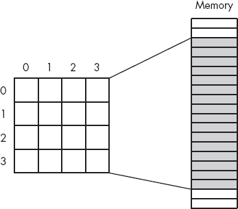

图 4-5. 将 4x4 数组映射到顺序内存位置

实际的映射并不重要，只要满足两个条件：(1) 每个元素都映射到唯一的内存位置（即，数组中的任何两个条目都不占用相同的内存位置），(2) 映射是一致的。也就是说，数组中的某个给定元素始终映射到相同的内存位置。因此，你真正需要的是一个带有两个输入参数（行和列）的函数，它可以产生一个指向 16 个内存位置的线性数组的偏移量。

现在，任何满足上述约束的函数都可以正常工作。事实上，只要映射一致，你甚至可以随意选择一个映射。然而，真正需要的是一个在运行时高效计算并且适用于任何大小数组（不仅仅是 4x4 或二维数组）的映射。虽然有很多可能的函数符合这个要求，但有两个特别的函数是大多数程序员和高级语言使用的：*行主序排列* 和 *列主序排列*。

## 4.22.1 行主序排列

行主序排列将相邻的元素按行从左到右排列，再按列向下排列，并分配到连续的内存位置。这个映射在图 4-6 中得到了展示。

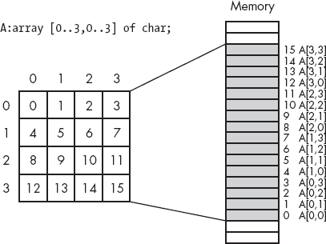

图 4-6. 行主序数组元素排列

行主序排列是大多数高级编程语言采用的方法。这种方法在机器语言中非常容易实现和使用。你从第一行（行 0）开始，然后将第二行连接到其末尾。接着将第三行连接到列表的末尾，然后是第四行，依此类推（参见图 4-7）。

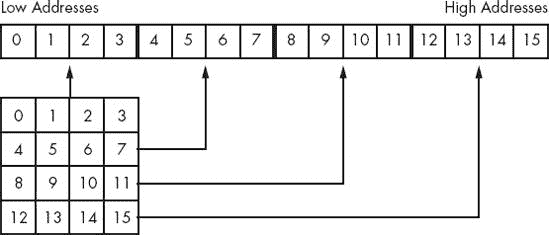

图 4-7. 4×4 数组的行主序排列的另一种视图

将索引值列表转换为偏移量的实际函数是对计算一维数组元素地址公式的轻微修改。计算二维行主序排列数组偏移量的公式如下：

```
*`Element_Address`* = *`Base_Address`* + (*`colindex`* * *`row_size`* + *`rowindex`*) *
 *`Element_Size`*
```

像往常一样，*`Base_Address`* 是数组第一个元素的地址（在本例中是`A[0][0]`），*`Element_Size`* 是数组单个元素的大小，以字节为单位。*`colindex`* 是最左边的索引，*`rowindex`* 是数组中最右边的索引。*`row_size`* 是数组中一行的元素数量（在本例中为四，因为每行有四个元素）。假设*`Element_Size`* 为 1，以下公式计算从基地址开始的偏移量：

```
Column          Row             Offset
     Index           Index           into Array
     0               0               0
     0               1               1
     0               2               2
     0               3               3
     1               0               4
     1               1               5
     1               2               6
     1               3               7
     2               0               8
     2               1               9
     2               2               10
     2               3               11
     3               0               12
     3               1               13
     3               2               14
     3               3               15
```

对于三维数组，计算内存偏移量的公式如下：

```
*`Address`* = *`Base`* + ((*`depthindex`***`col_size`*+*`colindex`*) * *`row_size`* + *`rowindex`*)
 * *`Element_Size`*
```

*`col_size`* 是列中的元素数，`row_size` 是行中的元素数。在 C/C++ 中，如果你声明数组为 *`type`* `A[i] [j] [k];`，那么 *`row_size`* 等于 `k`，*`col_size`* 等于 `j`。

对于在 C/C++ 中声明的四维数组 *`type`* `A[i] [j] [k] [m];`，计算数组元素地址的公式是：

```
*`Address`* =
*`Base`* + (((*`LeftIndex`***`depth_size`*+*`depthindex`*)**`col_size`*+*`colindex`*) * *`row_size`*
 + *`rowindex`*) * *`Element_Size`*
```

*`depth_size`* 等于 `j`，*`col_size`* 等于 `k`，*`row_size`* 等于 `m`。*`LeftIndex`* 表示最左侧索引的值。

到目前为止，你可能已经开始看到一种模式。确实存在一个通用公式，可以计算任何维度的数组在内存中的偏移量；然而，你很少会使用超过四个维度的数组。

另一种方便的思考行主序数组的方法是将其视为数组的数组。考虑以下单维 Pascal 数组定义：

```
A: array [0..3] of *`sometype`*;
```

假设 *`sometype`* 是类型 *`sometype`* `= array [0..3] of char;`。

`A` 是一个一维数组。它的单独元素恰好是数组，但暂时可以忽略这一点。计算一维数组元素地址的公式是：

```
*`Element_Address`* = *`Base`* + *`Index`* * *`Element_Size`*
```

在这种情况下，*`Element_Size`* 恰好为 4，因为 *`A`* 的每个元素都是一个包含四个字符的数组。那么这个公式计算的是什么呢？它计算的是这个 4x4 字符数组中每一行的基地址（参见 图 4-8）。

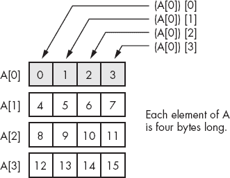

图 4-8. 查看 4x4 数组作为数组的数组

当然，一旦计算出一行的基地址，你可以重新应用一维公式来获取特定元素的地址。虽然这不会影响计算，但处理几个一维计算可能比处理复杂的多维数组计算要容易一些。

考虑一个定义为 `A:array [0..3] [0..3] [0..3] [0..3] [0..3] of char;` 的 Pascal 数组。你可以将这个五维数组视为一个数组的数组。一段 HLA 代码提供了这样的定义：

```
type
          OneD: char[4];
          TwoD: OneD[4];
          ThreeD: TwoD[4];
          FourD: ThreeD [4];
var
          A : FourD [4];
```

`OneD` 的大小是 4 字节。因为 `TwoD` 包含四个 `OneD` 数组，所以它的大小是 16 字节。同样，`ThreeD` 是四个 `TwoD`，因此它的大小是 64 字节。最后，`FourD` 是四个 `ThreeD`，所以它的大小是 256 字节。为了计算 `A [b, c, d, e, f]` 的地址，你可以使用以下步骤：

1.  通过公式计算 `A [b]` 的地址，公式为 *`Base`* `+ b *` *`size`*。其中 size 为 256 字节。将此结果作为下一步计算中的新基地址。

1.  通过公式 *`Base`* `+ c *` *`size`* 计算 `A [b, c]` 的地址，其中 *`Base`* 是上一步得到的值，*`size`* 为 64。将结果作为下一步计算中的新基地址。

1.  通过 *`Base`* `+ d *` *`size`* 计算 `A[b, c, d]` 的基地址，*`Base`* 来自前一步的计算，*`size`* 为 16。将该结果作为下一个计算的基地址。

1.  使用公式 *`Base`* `+ e *` *`size`* 计算 `A[b, c, d, e]` 的地址，其中 *`Base`* 来自前一步的计算，*`size`* 为 4。将此值作为下一步计算的基地址。

1.  最后，使用公式 *`Base`* `+ f *` *`size`* 计算 `A[b, c, d, e, f]` 的地址，其中 *`Base`* 来自之前的计算，*`size`* 为 1（显然，你可以忽略这一最后的乘法）。此时你得到的结果就是所需元素的地址。

你在汇编语言中不会找到高维数组的一个主要原因是，汇编语言强调与这种访问方式相关的低效性。像 `A[b, c, d, e, f]` 这样的内容很容易就会被输入到 Pascal 程序中，而你可能没意识到编译器在处理这些代码时的方式。汇编语言程序员可不会这么轻率——他们清楚地知道，当你使用高维数组时，会遇到的一团糟。事实上，优秀的汇编语言程序员会尽量避免使用二维数组，并且在不得已使用二维数组时，往往会采取一些技巧来访问该数组中的数据。

## 4.22.2 列主序排列

列主序排列是高阶语言中常用来计算数组元素地址的另一种方法。FORTRAN 和各种 BASIC 方言（例如，早期版本的 Microsoft BASIC）使用这种方法。

在行主序排列中，最右侧的索引随着你在连续的内存位置中移动而增长最快。在列主序排列中，最左侧的索引增长得最快。从图示上来看，列主序排列的数组结构如图 Figure 4-9 所示。

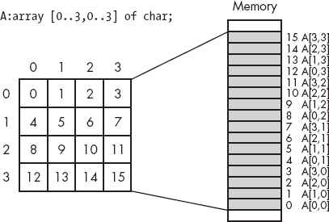

图 4-9。列主序数组元素排列

使用列主序排列时，计算数组元素地址的公式与行主序排列时非常相似。你只需要在计算中反转索引和尺寸：

```
For a two-dimension column-major array:
*`Element_Address`* = *`Base_Address`* + (*`rowindex`* * *`col_size`* + *`colindex`*) *
                  *`Element_Size`*

For a three-dimension column-major array:
*`Address`* = *`Base`* + ((*`rowindex`* * *`col_size`*+*`colindex`*) * *`depth_size`* +
 *`depthindex`*) *
          *`Element_Size`*

For a four-dimension column-major array:
*`Address`* =
     *`Base`* + (((*`rowindex`* * *`col_size`* + *`colindex`*)**`depth_size`* + *`depthindex`*) *
          *`Left_size`* + *`Leftindex`*) * *`Element_Size`*
```

# 4.23 为多维数组分配存储空间

如果你有一个 *`m`* x *`n`* 的数组，它将包含 *`m`* * *`n`* 个元素，并且需要 *`m`* * *`n`* * *`Element_Size`* 字节的存储空间。为了为数组分配存储空间，你必须预留这块内存。像往常一样，有几种不同的方式来完成这个任务。幸运的是，HLA 的数组声明语法与高阶语言的数组声明语法非常相似，因此 C/C++、Java、BASIC 和 Pascal 程序员都会觉得得心应手。要在 HLA 中声明一个多维数组，你可以使用类似以下的声明：

```
*`ArrayName`*: *`elementType`* [ *`comma_separated_list_of_dimension_bounds`* ];
```

例如，这里是一个 4x4 字符数组的声明：

```
GameGrid: char[ 4, 4 ];
```

这里是另一个示例，展示如何声明一个三维字符串数组：

```
NameItems: string[ 2, 3, 3 ];
```

请记住，字符串对象实际上是指针，因此此数组声明为 18 个双字指针（2 * 3 * 3 = 18）保留了存储空间。

就像单维数组一样，你可以通过在声明后跟上赋值操作符和数组常量来初始化数组的每个元素。数组常量会忽略维度信息；唯一重要的是数组常量中的元素数量与实际数组中的元素数量相对应。以下示例显示了带有初始化器的 `GameGrid` 声明：

```
GameGrid: char[ 4, 4 ] :=
          [
               'a', 'b', 'c', 'd',
               'e', 'f', 'g', 'h',
               'i', 'j', 'k', 'l',
               'm', 'n', 'o', 'p'
          ];
```

请注意，HLA 会忽略此声明中出现的缩进和额外的空白字符（例如换行符）。此布局是为了增强可读性（这是一个始终不错的想法）。HLA 并不会将这四行视为数组中的数据行，而是人类这样做，这也是为什么以这种方式书写数据很好的原因。唯一重要的是数组常量中有 16（4 * 4）个字符。你可能会同意，这比

```
GameGrid: char[ 4,4 ] :=
          [ 'a', 'b', 'c', 'd', 'e', 'f', 'g', 'h', 'i', 'j', 'k', 'l', 'm',
            'n', 'o', 'p' ];
```

当然，如果你有一个很大的数组，或者一个非常大的行数数组，或者一个多维数组，那么最终可能无法获得可读性高的代码。这时，精心编写的注释就派上用场了。

至于单维数组，你可以使用 `dup` 操作符来将大数组的每个元素初始化为相同的值。以下示例初始化了一个 256x64 的字节数组，使每个字节包含值 $FF：

```
StateValue: byte[ 256, 64 ] := 256*64 dup [$ff];
```

注意使用常量表达式来计算数组元素的数量，而不是简单地使用常量 16,384（256 * 64）。使用常量表达式更加清晰地表明这段代码正在初始化一个 256x64 元素的数组，而不是简单的文字常量 16,384。

另一个可以用来提高程序可读性的 HLA 技巧是使用 *嵌套数组常量*。以下是一个 HLA 嵌套数组常量的示例：

```
[ [0, 1, 2], [3, 4], [10, 11, 12, 13] ]
```

每当 HLA 遇到嵌套在另一个数组常量中的数组常量时，它会简单地移除围绕嵌套数组常量的括号，并将整个常量视为单一数组常量。例如，HLA 会将这个嵌套数组常量转换为如下所示：

```
[ 0, 1, 2, 3, 4, 10, 11, 12, 13 ]
```

你可以利用这一点来帮助使你的程序更具可读性。对于多维数组常量，你可以将每一行常量用方括号括起来，以表示每一行的数据是分组的，并与其他行分开。考虑下面的 `GameGrid` 数组声明，它与之前的 `GameGrid` 声明在 HLA 眼中是相同的：

```
GameGrid: char[ 4, 4 ] :=
          [
               [ 'a', 'b', 'c', 'd' ],
               [ 'e', 'f', 'g', 'h' ],
               [ 'i', 'j', 'k', 'l' ],
               [ 'm', 'n', 'o', 'p' ]
          ];
```

这个声明更清楚地表明该数组常量是一个 4x4 的数组，而不仅仅是一个 16 元素的一维数组，因为它的元素无法都放在一行源代码中。像这样的细微美学改进正是将普通程序员与优秀程序员区分开的因素。

# 4.24 在汇编语言中访问多维数组元素

好的，你已经看过了计算多维数组元素地址的公式。现在是时候看看如何使用汇编语言访问这些数组的元素了。

`mov`、`shl`和`intmul`指令能够快速处理计算多维数组偏移量的各种方程式。我们先来看一个二维数组的例子。

```
static
     i:          int32;
     j:          int32;
     TwoD:       int32[ 4, 8 ];

           .
           .
           .

// To perform the operation TwoD[i,j] := 5; you'd use code like the following.
// Note that the array index computation is (i*8 + j)*4.

          mov( i, ebx );
          shl( 3, ebx );    // Multiply by 8 (shl by 3 is a multiply by 8).
          add( j, ebx );
          mov( 5, TwoD[ ebx*4 ] );
```

请注意，这段代码*不*需要在 80x86 上使用双寄存器寻址模式。虽然像`TwoD[ebx][esi]`这样的寻址模式看起来应该是访问二维数组的自然方式，但这并不是该寻址模式的目的。

现在考虑第二个示例，它使用了一个三维数组：

```
static
     i:               int32;
     j:               int32;
     k:               int32;
     ThreeD:          int32[ 3, 4, 5 ];
          .
          .
          .

// To perform the operation ThreeD[i,j,k] := esi; you'd use the following code
// that computes ((i*4 + j)*5 + k )*4 as the address of ThreeD[i,j,k].

          mov( i, ebx );
          shl( 2, ebx );                     // Four elements per column.
          add( j, ebx );
          intmul( 5, ebx );                  // Five elements per row.
          add( k, ebx );
          mov( esi, ThreeD[ ebx*4 ] );
```

请注意，这段代码使用了`intmul`指令将 EBX 中的值乘以 5。记住，`shl`指令只能将寄存器的值乘以 2 的幂。虽然也有方法将寄存器中的值乘以非 2 的幂常数，但`intmul`指令更加方便。^([64])

* * *

^([64]) 关于常数乘法的完整讨论（除了 2 的幂）出现在第四章。

# 4.25 记录

另一个主要的复合数据结构是 Pascal 记录或 C/C++/C#结构。^([65]) Pascal 术语可能更好，因为它避免了与更通用的术语*数据结构*混淆。由于 HLA 使用术语*记录*，我们在这里也采用这个术语。

而数组是同质的，其元素都是相同类型的，记录中的元素可以具有不同的类型。数组允许你通过整数索引选择特定元素。对于记录，你必须通过名称选择一个元素（称为*字段*）。

记录的全部目的是让你将不同的、尽管在逻辑上相关的数据封装到一个单一的包中。Pascal 记录的学生声明是一个典型示例：

```
student =
     record
          Name:     string[64];
          Major:    integer;
          SSN:      string[11];
          Midterm1: integer;
          Midterm2: integer;
          Final:    integer;
          Homework: integer;
          Projects: integer;
     end;
```

大多数 Pascal 编译器将记录中的每个字段分配到连续的内存位置。这意味着 Pascal 将为名称保留前 65 个字节，^([66])接下来的 2 个字节保存主代码，接下来的 12 个字节保存社会安全号码，依此类推。

在 HLA 中，你也可以使用`record`/`endrecord`声明创建记录类型。你可以通过以下方式在 HLA 中编码上述记录：

```
type
     student:     record
          Name:     char[65];
          Major:    int16;
          SSN:      char[12];
          Midterm1: int16;
          Midterm2: int16;
          Final:    int16;
          Homework: int16;
          Projects: int16;
     endrecord;
```

正如你所看到的，HLA 声明与 Pascal 声明非常相似。请注意，为了忠实于 Pascal 声明，示例中使用了字符数组而不是字符串来表示`Name`和`SSN`（美国社会安全号码）字段。在实际的 HLA 记录声明中，你可能会为至少是名称字段使用字符串类型（记住，字符串变量实际上是一个 4 字节指针）。

记录中的字段名必须是唯一的。也就是说，同一个名字不能在同一个记录中出现两次或更多次。然而，所有字段名对于该记录是局部的。因此，你可以在程序的其他地方或不同的记录中重复使用这些字段名。

`record`/`endrecord`声明可以出现在变量声明部分（例如`static`或`var`）或`type`声明部分。在之前的示例中，`Student`声明出现在`type`部分，因此这并没有为`Student`变量分配任何存储空间。相反，你需要显式声明一个`Student`类型的变量。以下示例演示了如何做到这一点：

```
var
     John: Student;
```

这分配了 81 字节的存储，并在内存中按图 4-10 所示的方式布局。

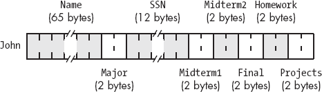

图 4-10. 学生数据结构在内存中的存储

如果标签`John`对应于该记录的*基地址*，那么`Name`字段的偏移量为`John+0`，`Major`字段的偏移量为`John+65`，`SSN`字段的偏移量为`John+67`，依此类推。

要访问结构中的元素，你需要知道从结构的起始位置到目标字段的偏移量。例如，变量`John`中的`Major`字段相对于`John`的基地址的偏移量是 65。因此，你可以使用以下指令将 AX 中的值存储到该字段中：

```
mov( ax, (type word John[65]) );
```

不幸的是，记住记录中所有字段的偏移量违背了使用记录的初衷。毕竟，如果你必须处理这些数字偏移量，为什么不直接使用字节数组而不是记录呢？

幸运的是，HLA 让你可以通过与 C/C++/C#和 Pascal 相同的机制来引用记录中的字段名：点操作符。为了将 AX 存储到`Major`字段，你可以使用`mov( ax, John.Major );`，而不是之前的指令。这种方式更加易读，且使用起来显然更为简便。

请注意，使用点操作符*并不会*引入新的寻址模式。指令`mov( ax, John.Major );`依然使用的是仅位移寻址模式。HLA 只是将`John`的基地址与`Major`字段的偏移量（65）相加，以得到实际的位移量，并将其编码到指令中。

像任何类型声明一样，HLA 要求所有记录类型声明在你使用之前出现在程序中。然而，你不必在`type`部分定义所有记录来创建记录变量。你可以直接在变量声明部分使用`record`/`endrecord`声明。如果程序中只需要一个特定记录对象的实例，这种方式非常方便。以下示例演示了这一点：

```
storage
     OriginPoint:  record
          x: uns8;
          y: uns8;
          z: uns8;
     endrecord;
```

* * *

^([65]) 它在其他语言中也有一些不同的名称，但大多数人至少认识其中一个名称。

^([66]) 字符串需要额外的一个字节，除了字符串中的所有字符外，还用于编码长度。

# 4.26 记录常量

HLA 让你定义记录常量。事实上，HLA 支持符号（显式）记录常量和字面值记录常量。记录常量作为静态记录变量的初始化器非常有用。当使用 HLA 编译时语言时，它们也作为编译时数据结构非常有用（有关 HLA 编译时语言的更多细节，请参阅 HLA 参考手册）。本节将讨论如何创建记录常量。

字面值记录常量的形式如下：

```
*`RecordTypeName`*:[ *`List_of_comma_separated_constants`* ]
```

*`RecordTypeName`* 是你在 HLA `type` 部分定义的记录数据类型的名称，必须在使用常量之前定义。

出现在括号中的常量列表是指定记录中每个字段的数据。列表中的第一个项对应记录的第一个字段，第二个项对应记录的第二个字段，以此类推。此列表中每个常量的数据类型必须与其各自字段的类型匹配。以下示例演示了如何使用字面值记录常量来初始化记录变量：

```
type
     point:     record
          x:int32;
          y:int32;
          z:int32;
     endrecord;

static
     Vector: point := point:[ 1, −2, 3 ];
```

该声明将 `Vector.x` 初始化为 1，`Vector.y` 初始化为 −2，`Vector.z` 初始化为 3。

你也可以通过在程序的 `const` 或 `val` 部分声明记录对象来创建显式记录常量。你可以像访问记录变量的字段一样访问这些符号记录常量的字段，使用点操作符。由于该对象是常量，你可以在任何该字段类型合法的常量位置指定记录常量的字段。你还可以将符号记录常量作为变量初始化器。以下示例演示了这一点：

```
type
     point:     record
          x:int32;
          y:int32;
          z:int32;
     endrecord;

const
     PointInSpace: point := point:[ 1, 2, 3 ];

static
     Vector: point := PointInSpace;
     XCoord: int32 := PointInSpace.x;
          .
          .
          .
     stdout.put( "Y Coordinate is ", PointInSpace.y, nl );
          .
          .
          .
```

# 4.27 记录的数组

创建记录数组是一个完全合理的操作。为此，你只需要创建一个记录类型，然后使用标准的数组声明语法。以下示例演示了如何做到这一点：

```
type
     *`recElement`*:
          record
               << Fields for this record >>
          endrecord;
          .
          .
          .
static
     *`recArray`*: *`recElement`*[4];
```

要访问该数组的元素，你可以使用标准的数组索引技巧。由于 *`recArray`* 是一个一维数组，你需要使用公式 *`baseAddress`* `+` *`index`*`*@size(` *`recElement`* `)` 来计算该数组元素的地址。例如，要访问 *`recArray`* 的一个元素，你可以使用如下代码：

```
// Access element i of *`recArray`*:

     intmul( @size( *`recElement`* ), i, ebx );  // ebx := i*@size( *`recElement`* )
     mov( *`recArray`*.*`someField`*[ebx], eax );
```

请注意，索引规范紧随整个变量名之后；记住，这是汇编语言，而不是高级语言（在高级语言中，你可能会使用 *`recArray`*`[i].`*`someField`*）。

自然，你也可以创建多维记录数组。你将使用行主序或列主序的函数来计算该记录中某个元素的地址。唯一真正变化的地方（与数组的讨论相比）是每个元素的大小是记录对象的大小。

```
static
     rec2D: recElement[ 4, 6 ];
          .
          .
          .
     // Access element [i,j] of rec2D and load *`someField`* into eax:

     intmul( 6, i, ebx );
     add( j, ebx );
     intmul( @size( *`recElement`* ), ebx );
     mov( rec2D.*`someField`*[ ebx ], eax );
```

# 4.28 数组/记录作为记录字段

记录可以包含其他记录或数组作为字段。考虑以下定义：

```
type
     Pixel:
          record
               Pt:        point;
               color:     dword;
          endrecord;
```

上面的定义定义了一个带有 32 位颜色组件的单一点。在初始化`Pixel`类型的对象时，第一个初始化器对应于`Pt`字段，*而不是* *`x 坐标`* *字段*。以下定义是错误的：

```
static
     ThisPt: Pixel := Pixel:[ 5, 10 ];   // Syntactically incorrect!
```

第一个字段（5）的值不是`point`类型的对象。因此，汇编程序在遇到这条语句时会生成一个错误。HLA 允许你使用如下声明来初始化`Pixel`的字段：

```
static
     ThisPt: Pixel := Pixel:[ point:[ 1, 2, 3 ], 10 ];
     ThatPt: Pixel := Pixel:[ point:[ 0, 0, 0 ], 5 ];
```

访问`Pixel`字段非常简单。就像在高级语言中一样，你使用一个句点来引用`Pt`字段，再用一个句点访问`point`的`x`、`y`和`z`字段：

```
stdout.put( "ThisPt.Pt.x = ", ThisPt.Pt.x, nl );
          stdout.put( "ThisPt.Pt.y = ", ThisPt.Pt.y, nl );
          stdout.put( "ThisPt.Pt.z = ", ThisPt.Pt.z, nl );
           .
           .
           .
     mov( eax, ThisPt.Color );
```

你还可以将数组声明为记录字段。以下记录创建了一个数据类型，能够表示一个有八个点的对象（例如，一个立方体）：

```
type
     Object8:
          record
               Pts:       point[8];
               Color:     dword;
          endrecord;
```

这个记录为八个不同的点分配存储空间。访问`Pts`数组中的一个元素要求你知道`point`类型对象的大小（记住，你必须将数组索引乘以单个元素的大小，在这个特定的例子中是 12）。假设，例如，你有一个类型为`Object8`的变量`Cube`。你可以如下访问`Pts`数组中的元素：

```
// Cube.Pts[i].x := 0;

          mov( i, ebx );
          intmul( 12, ebx );
          mov( 0, Cube.Pts.x[ebx] );
```

所有这一切的一个不幸之处在于，你必须知道`Pts`数组中每个元素的大小。幸运的是，你可以使用`@size`重写上面的代码，如下所示：

```
// Cube.Pts[i].x := 0;

          mov( i, ebx );
          intmul( @size( point ), ebx );
          mov( 0, Cube.Pts.x[ebx] );
```

注意，在这个示例中，索引规格（`[ebx]`）跟随整个对象名称，即使数组是`Pts`，而不是`x`。请记住，`[ebx]`规格是一个索引寻址模式，而不是数组索引。索引总是跟随整个名称，因此你不会像在 C/C++ 或 Pascal 等高级语言中那样将它们附加到数组组件上。这会产生正确的结果，因为加法是可交换的，点运算符（以及索引运算符）对应加法。特别是，表达式`Cube.Pts.x[ebx]`告诉 HLA 计算`Cube`（对象的基址）加上`Pts`字段的偏移，再加上`x`字段的偏移，再加上 EBX 的值。从技术上讲，我们实际上是在计算`offset(Cube)` + `offset(Pts)` + EBX + `offset(x)`，但我们可以重新排列这个顺序，因为加法是可交换的。

你还可以在记录中定义二维数组。访问此类数组的元素与访问任何其他二维数组没有不同，唯一的区别是你必须将数组的字段名称指定为数组的基地址。例如：

```
type
     RecW2DArray:
          record
               intField: int32;
               aField:   int32[4,5];
                    .
                    .
                    .
          endrecord;

static
     recVar: RecW2DArray;
          .
          .
          .
     // Access element [i,j] of the aField field using row-major ordering:

     mov( i, ebx );
     intmul( 5, ebx );
     add( j, ebx );
     mov( recVar.aField[ ebx*4 ], eax );
          .
          .
          .
```

上面的代码使用标准的行优先计算法来索引一个 4x5 的双字数组。这个示例与独立数组访问的唯一区别是基址是`recVar.aField`。

嵌套记录定义有两种常见方式。正如本节所述，你可以在`type`部分创建一个记录类型，然后将该类型名称作为记录中某个字段的数据类型（例如，上面`Pixel`数据类型中的`Pt:point`字段）。也可以在另一个记录内直接声明一个记录，而不为该记录创建单独的数据类型；以下示例演示了这一点：

```
type
     NestedRecs:
          record
               iField: int32;
               sField: string;
               rField:
                    record
                         i:int32;
                         u:uns32;
                    endrecord;
               cField:char;
          endrecord;
```

通常，创建一个单独的类型比直接将记录嵌入到其他记录中更好，但嵌套记录是完全合法的。

如果你有一个记录数组，并且其中一个字段是数组类型，你必须独立地计算每个数组的索引，然后将这些索引的和作为最终的索引。以下示例演示了如何做到这一点：

```
type
     recType:
          record
               arrayField: dword[4,5];
               << Other fields >>
          endrecord;

static
     aryOfRecs: recType[3,3];
          .
          .
          .
     // Access aryOfRecs[i,j].arrayField[k,l]:

     intmul( 5, i, ebx );               // Computes index into aryOfRecs
     add( j, ebx );                     // as (i*5 +j)*@size( recType ).
     intmul( @size( recType ), ebx );

     intmul( 3, k, eax );               // Computes index into aryOfRecs
     add( l, eax );                     // as (k*3 + j) (*4 handled later).

     mov( aryOfRecs.arrayField[ ebx + eax*4 ], eax );
```

请注意，使用基址加缩放索引寻址模式来简化此操作。

# 4.29 在记录中对齐字段

为了在程序中获得最佳性能，或者确保 HLA 的记录正确映射到某些高级语言中的记录或结构，你通常需要能够控制记录中字段的对齐。例如，你可能希望确保一个双字节字段的偏移量是 4 的偶数倍。你可以使用`align`指令来实现这一点。以下示例展示了如何将某些字段对齐到重要的边界：

```
type
     PaddedRecord:
          record
               c:  char;
               align(4);
               d:  dword;
               b:  boolean;
               align(2);
               w:  word;
          endrecord;
```

每当 HLA 在记录声明中遇到`align`指令时，它会自动调整后续字段的偏移量，以确保它是`align`指令指定值的偶数倍。如果需要，它会通过增加该字段的偏移量来实现这一点。在上面的示例中，字段的偏移量将如下：`c:0`、`d:4`、`b:8`、`w:10`。注意，HLA 在`c`和`d`之间插入了 3 个字节的填充，在`b`和`w`之间插入了 1 个字节的填充。不用说，你永远不应假设这些填充字节存在。如果你想使用这些额外的字节，那么你必须为它们声明字段。

请注意，在记录声明中指定对齐并不能保证字段在内存中会对齐到指定的边界；它只是确保字段的偏移量是你指定的值的倍数。如果一个`PaddedRecord`类型的变量在内存中从一个奇数地址开始，那么`d`字段也将从一个奇数地址开始（因为任何奇数地址加 4 仍然是奇数地址）。如果你想确保字段在内存中对齐到合适的边界，你还必须在该记录类型的变量声明之前使用`align`指令。例如：

```
static
          .
          .
          .
     align(4);
     PRvar: PaddedRecord;
```

`align`操作数的值应是一个偶数，并且可以被记录类型中最大的`align`表达式整除（在本例中，4 是最大值，且已能被 2 整除）。

如果你想确保记录的大小是某个值的倍数，那么只需在记录声明的最后加上一个 `align` 指令。HLA 会在记录的末尾填充适当数量的字节，以使其大小符合要求。以下示例演示了如何确保记录的大小是 4 字节的倍数：

```
type
     PaddedRec:
          record
               << Some field declarations >>

               align(4);
          endrecord;
```

HLA 提供了一些额外的对齐指令，用于记录类型，让你可以轻松控制记录内所有字段的对齐方式以及字段在记录中的起始偏移量。如果你对更多信息感兴趣，请查阅 HLA 参考手册。

# 4.30 指向记录的指针

在执行过程中，你的程序可能会通过指针间接引用记录对象。当你使用指针访问结构体的字段时，你必须将 80x86 的一个 32 位寄存器加载为所需记录的地址。假设你有以下变量声明（假设是前面部分提到的 `Object8` 结构）：

```
static
     Cube:          Object8;
     CubePtr:       pointer to Object8 := &Cube;
```

`CubePtr` 包含（即指向）`Cube` 对象的地址。要访问 `Cube` 对象的 `Color` 字段，你可以使用类似 `mov( Cube.Color, eax )` 的指令。通过指针访问字段时，你首先需要将对象的地址加载到如 EBX 这样的 32 位寄存器中。指令 `mov( CubePtr, ebx );` 就能完成这一步。完成后，你可以使用 `[ebx+offset]` 寻址模式来访问 `Cube` 对象的字段。唯一的问题是，“如何指定要访问哪个字段？”请简要考虑以下 *错误的* 代码：

```
mov( CubePtr, ebx );
          mov( [ebx].Color, eax );      // This does not work!
```

因为字段名是结构体内部的局部名称，且可能在两个或多个结构体中重用同一个字段名，HLA 如何确定 `Color` 表示的偏移量呢？当直接访问结构体成员时（例如，`mov( Cube.Color, eax )`；），没有歧义，因为 `Cube` 有一个特定的类型，汇编器可以进行检查。另一方面，`[ebx]` 可以指向 *任何东西*。特别是，它可以指向任何包含 `Color` 字段的结构体。因此，汇编器不能单独决定 `Color` 符号使用哪个偏移量。

HLA 通过要求你显式地提供类型来解决这个模糊性问题。为此，你必须将 `[ebx]` 强制转换为 `Cube` 类型。一旦完成这一步，你就可以使用正常的点操作符符号来访问 `Color` 字段：

```
mov( CubePtr, ebx );
mov( (type Cube [ebx]).Color, eax );
```

如果你有指向记录的指针，并且该记录的某个字段是数组，访问该字段元素最简单的方法是使用基址加索引的寻址模式。为此，你只需将指针的值加载到一个寄存器中，并在第二个寄存器中计算数组的索引。然后，你将这两个寄存器组合在地址表达式中。在上面的例子中，`Pts` 字段是一个包含八个 `point` 对象的数组。要访问 `Cube.Pts` 字段的第 `i` 个元素的 `x` 字段，你可以使用如下代码：

```
mov( CubePtr, ebx );
intmul( @size( point ), i, esi );   // Compute index into point array.
mov( (type Object8 [ebx]).Pts.x[ esi*4 ], eax );
```

如果你在程序中频繁使用指向特定记录类型的指针，像`(type Object8 [ebx])`这样的强制类型转换操作符很快就会变得很麻烦。减少强制转换 EBX 输入量的一种方法是使用`text`常量。考虑以下语句：

```
const
     O8ptr: text := "(type Object8 [ebx])";
```

在程序开始时使用此语句，你可以用`O8ptr`代替类型强制转换操作符，HLA 会自动替换为适当的文本。使用像上面这样的文本常量，前面的例子变得更具可读性和可写性：

```
mov( CubePtr, ebx );
intmul( @size( point ), i, esi );   // Compute index into point array.
mov( O8Ptr.Pts.x[ esi*4 ], eax );
```

# 4.31 联合体

记录定义根据字段的大小为记录中的每个字段分配不同的偏移量。这种行为与在`var`或`static`段中分配内存偏移量非常相似。HLA 提供了第二种结构声明类型——`union`，它不会为每个对象分配不同的地址；相反，`union`声明中的每个字段具有相同的偏移量——0。以下示例演示了`union`声明的语法：

```
type
     *`unionType`*:
          union
               << Fields (syntactically identical to record declarations) >>
          endunion;
```

你访问`union`的字段的方式与访问记录的字段完全相同：使用点符号和字段名称。以下是一个`union`类型声明及其`union`类型变量的具体示例：

```
type
     numeric:
          union
               i: int32;
               u: uns32;
               r: real64;
          endunion;
               .
               .
               .
static
     number: numeric;
               .
               .
               .
     mov( 55, number.u );
               .
               .
               .
     mov( −5, number.i );
               .
               .
               .
     stdout.put( "Real value = ", number.r, nl );
```

关于`union`对象需要注意的重要一点是，`union`的所有字段在结构中具有相同的偏移量。在上面的例子中，`number.u`、`number.i`和`number.r`字段的偏移量都是相同的：0。因此，`union`的字段在内存中是重叠的；这与 80x86 的 8 位、16 位和 32 位寄存器之间的重叠方式非常相似。通常，你一次只能访问`union`的一个字段；也就是说，你不能同时操作一个特定`union`变量的多个字段，因为写入一个字段会覆盖其他字段。在上面的例子中，任何对`number.u`的修改都会改变`number.i`和`number.r`。

程序员通常出于两种不同的原因使用联合体：节省内存或创建别名。节省内存是这种数据结构的主要用途。为了了解这如何运作，我们可以将上面的`numeric union`与相应的记录类型进行比较。

```
type
     numericRec:
          record
               i: int32;
               u: uns32;
               r: real64;
          endrecord;
```

如果你声明一个类型为`numericRec`的变量，比如`n`，你可以像访问`numeric`类型的变量一样访问其字段，分别为`n.i`、`n.u`和`n.r`。两者的区别在于，`numericRec`变量为记录的每个字段分配了独立的存储空间，而`numeric`（联合体）对象则为所有字段分配了相同的存储空间。因此，`@size(numericRec)`的大小为 16，因为记录包含了两个双字字段和一个四字字段（`real64`）。而`@size(numeric)`的大小为 8，这是因为所有`union`的字段都占用了相同的内存位置，`union`对象的大小是该对象中最大字段的大小（参见图 4-11）。

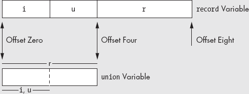

图 4-11. `union`与`record`变量的布局

除了节省内存外，程序员通常使用联合体来创建代码中的别名。你可能还记得，别名是同一内存对象的不同名称。别名通常会导致程序中的混淆，因此你应该谨慎使用；然而，有时使用别名会非常方便。例如，在程序的某些部分，你可能需要不断使用类型转换来通过不同类型引用一个对象。虽然你可以使用 HLA 的`text`常量来简化这一过程，但另一种方法是使用一个`union`变量，其字段表示你希望用于该对象的不同类型。以下是一个示例代码：

```
type
     CharOrUns:
          union
               c:char;
               u:uns32;
          endrecord;

static
     v:CharOrUns;
```

通过如上声明，你可以通过访问`v.u`来操作一个`uns32`对象。如果某个时候，你需要将这个`uns32`变量的低字节当作字符来处理，你可以通过简单地访问`v.c`变量来实现，例如，

```
mov( eax, v.u );
     stdout.put( "v, as a character, is '", v.c, "'" nl );
```

在 HLA 程序中，你可以像使用记录一样使用联合体。特别是，`union`声明可以作为记录中的字段，`record`声明可以作为联合体中的字段，数组声明可以出现在联合体内部，你还可以创建联合体数组，等等。

# 4.32 匿名联合体

在`record`声明中，你可以放置一个`union`声明，而无需为`union`对象指定字段名。以下示例演示了这种语法：

```
type
     HasAnonUnion:
          record
               r:real64;
               union
                    u:uns32;
                    i:int32;
               endunion;
               s:string;
          endrecord;

static
     v: HasAnonUnion;
```

每当匿名联合体出现在`record`中时，你可以像直接访问`record`字段一样访问`union`的字段。例如，在上面的例子中，你可以分别使用`v.u`和`v.i`的语法来访问`v`的`u`和`i`字段。`u`和`i`字段在记录中的偏移量相同（为 8，因为它们位于一个`real64`对象之后）。`v`的字段相对于`v`的基地址具有以下偏移量：

```
v.r           0
     v.u           8
     v.i           8
     v.s          12
```

`@size(v)`的大小为 16，因为`u`和`i`字段只占用 4 个字节。

HLA 还允许在联合体中使用匿名记录。有关更多详细信息，请参阅 HLA 文档，尽管语法和用法与记录中的匿名联合体相同。

# 4.33 变体类型

联合体在程序中的一个重要用途是创建*变体*类型。一个变体变量可以在程序运行时动态改变其类型。一个变体对象可以在程序中的某一时刻是一个整数，之后在程序的另一个部分切换为字符串，稍后又变为实数值。许多高级语言（VHLL）系统使用动态类型系统（即变体对象）来减少程序的整体复杂性；实际上，许多 VHLL 的支持者坚持认为，使用动态类型系统是你能用少量代码编写复杂程序的原因之一。当然，如果你能够在 VHLL 中创建变体对象，那么在汇编语言中当然也能做到。在本节中，我们将看看如何使用`union`结构来创建变体类型。

在程序执行的任何时刻，变体对象都有一个特定的类型，但在程序控制下，变量可以切换到不同的类型。因此，当程序处理变体对象时，必须使用`if`语句或`switch`语句（或类似的语句）根据对象的当前类型执行不同的指令。高级语言会透明地做到这一点。在汇编语言中，你必须提供代码来测试类型。为了实现这一点，变体类型需要比对象的值更多的附加信息。具体而言，变体对象需要一个字段来指定对象的当前类型。这个字段（通常称为`tag`字段）是一个枚举类型或整数，用于指定对象在任何给定时刻的类型。以下代码演示了如何创建变体类型：

```
type
     VariantType:
          record
               tag:uns32;  // 0-uns32, 1-int32, 2-real64
               union
                    u:uns32;
                    i:int32;
                    r:real64;
               endunion;
          endrecord;

static
     v:VariantType;
```

程序将测试`v.tag`字段以确定`v`对象的当前类型。根据此测试，程序将操作`v.i`、`v.u`或`v.r`字段。

当然，在操作变体对象时，程序的代码必须不断测试`tag`字段，并针对`uns32`、`int32`或`real64`值执行一系列独立的指令。如果你经常使用变体字段，那么编写程序来处理这些操作是非常有意义的（例如，*`vadd`*、*`vsub`*、*`vmul`*和*`vdiv`*）。

# 4.34 命名空间

记录（`record`）和联合体（`union`）的一个非常好的特点是，字段名是局部的，仅在给定的`record`或`union`声明中有效。也就是说，你可以在不同的记录或联合体中重复使用字段名。这是 HLA 的一个重要特点，因为它有助于避免*命名空间污染*。命名空间污染发生在你用尽程序中的所有“好”名字时，你不得不开始为对象创建不具描述性的名称，因为你已经把最合适的名称用在了其他东西上。我们使用*命名空间*一词来描述 HLA 如何将名称与特定对象关联。`record`的字段名有一个命名空间，该命名空间仅限于该记录类型的对象。HLA 提供了这一命名空间机制的推广，允许你创建任意命名空间。这些命名空间对象可以让你保护常量、类型、变量和其他对象的名称，使它们的名称不会干扰程序中其他声明的命名。

一个 HLA 的`namespace`部分封装了一组通用声明，方式与`record`封装一组变量声明类似。`namespace`声明的形式如下：

```
namespace *`name`*;

     << declarations >>

end *`name`*;
```

*`name`*标识符为`namespace`提供了名称。`end`语句后的标识符必须与`namespace`后的标识符完全匹配。请注意，`namespace`声明部分本身就是一个单独的部分。它不需要出现在`type`或`var`部分中。`namespace`可以出现在任何一个 HLA 声明部分合法的位置。一个程序可以包含任意数量的`namespace`声明；实际上，命名空间标识符甚至不需要唯一，正如你很快会看到的那样。

在`namespace`和`end`语句之间出现的声明都是标准的 HLA 声明部分，除了你不能在`namespace`声明中嵌套其他`namespace`声明。不过，你可以在`namespace`内放置`const`、`val`、`type`、`static`、`readonly`和`storage`部分。^([67]) 以下代码提供了 HLA 程序中典型的`namespace`声明示例：

```
namespace myNames;

     type
          integer: int32;

     static
          i:integer;
          j:uns32;

     const
          pi:real64 := 3.14159;

end myNames;
```

要访问命名空间的字段，你使用与记录和联合体相同的点符号。例如，要在命名空间外访问`myNames`的字段，你可以使用以下标识符：

```
myNames.integer       A type declaration equivalent to int32
myNames.i             An integer variable (int32)
myNames.j             An uns32 variable
myNames.pi            A real64 constant
```

这个示例还展示了一个关于`namespace`声明的重要点：在一个命名空间内，你可以引用同一命名空间声明中的其他标识符，而无需使用点符号。例如，上面的`i`字段使用了来自`myNames`命名空间的`integer`类型，而不需要使用`mynames.`前缀。

从上面的示例中看不出的一点是，`namespace`声明每次打开命名空间时都会创建一个干净的符号表。HLA 在`namespace`声明中识别的唯一外部符号是预定义的类型标识符（例如，`int32`、`uns32`和`char`）。HLA 在处理`namespace`声明时不会识别你在命名空间外部声明的任何符号。这会导致一个问题：如果你希望在声明命名空间内部的其他符号时使用命名空间外部的符号。例如，假设`integer`类型在`myNames`外部被定义如下：

```
type
     integer: int32;

namespace myNames;

     static
          i:integer;
          j:uns32;

     const
          pi:real64 := 3.14159;

end myNames;
```

如果你尝试编译这段代码，HLA 会抱怨符号`integer`未定义。显然`integer`在这个程序中已定义，但 HLA 在创建命名空间时会隐藏所有外部符号，这样你就可以在命名空间内重用（并重新定义）这些符号。当然，如果你真的想在那个命名空间内使用在`myNames`外部定义的名称，这并不会有什么帮助。HLA 提供了一个解决这个问题的方案：`@global:`运算符。如果在`namespace`声明部分中，你用`@global:`前缀加上一个名称，那么 HLA 将使用该名称的全局定义，而不是局部定义（如果局部定义存在）。为了修复上面示例中的问题，你可以使用以下代码：

```
type
     integer: int32;

namespace myNames;

     static
          i:@global:integer;
          j:uns32;

     const
          pi:real64 := 3.14159;

end myNames;
```

使用`@global:`前缀时，即使在`myNames`命名空间中出现了不同的`integer`声明，`i`变量的类型仍将是`int32`。

你不能嵌套`namespace`声明。从逻辑上看，这似乎没有必要，因此在 HLA 语言中省略了这一功能。

你可以在同一个程序中有多个使用相同命名空间标识符的`namespace`声明。例如：

```
namespace ns;

     << Declaration group #1 >>

end ns;
     .
     .
     .
namespace ns;

     << Declaration group #2 >>

end ns;
```

当 HLA 遇到一个已定义标识符的第二个`namespace`声明时，它会将第二组声明附加到为第一组创建的符号列表的末尾。因此，处理完这两个`namespace`声明后，`ns`命名空间将包含你在两个`namespace`块中声明的所有符号。

命名空间最常见的用途可能是在库模块中。如果你创建一组库例程供多个项目使用或分发给他人，你需要小心选择函数和其他对象的名称。如果你使用像`get`和`put`这样的常见名称，当你的名称与用户的名称发生冲突时，他们会抱怨。一个简单的解决方案是将所有代码放在一个`namespace`块中。这样，你唯一需要担心的名称就是`namespace`标识符本身。这是唯一可能与其他用户的标识符发生冲突的名称。虽然这种情况有可能发生，但如果你不使用命名空间，并且你的库模块将数十个，甚至数百个新名称引入全局命名空间，冲突发生的概率会大大增加。^([68]) HLA 标准库提供了许多命名空间使用的好例子。HLA 标准库定义了多个命名空间，如`stdout`、`stdin`、`str`、`cs`和`chars`。你可以通过类似`stdout.put`、`stdin.get`、`cs.intersection`、`str.eq`和`chars.toUpper`这样的名称来引用这些命名空间中的函数。HLA 标准库中命名空间的使用防止了与你自己的程序中的类似名称发生冲突。

* * *

^([67]) 过程声明，作为第五章的主题，也是`namespace`声明部分中的合法内容。

^([68]) 全局命名空间是你程序的全局部分。

# 4.35 汇编语言中的动态数组

本章所描述的数组的一个问题是它们的大小是静态的。也就是说，所有示例中的元素数量是在编写程序时选择的；而不是在程序运行时（即动态地）选择的。遗憾的是，有时你在编写程序时根本不知道一个数组需要多大；只能在程序运行时确定数组的大小。本节描述了如何动态分配数组的存储空间，以便你可以在运行时设置数组的大小。

为一维数组分配存储空间并访问该数组的元素，在运行时几乎是一个微不足道的任务。你所需要做的就是调用 HLA 标准库中的`mem.alloc`例程，并指定数组的大小（以字节为单位）。`mem.alloc`将返回一个指向新数组基地址的指针，该指针存储在 EAX 寄存器中。通常，你会将这个地址保存在一个指针变量中，并在所有后续的数组访问中使用这个地址作为数组的基地址。

要访问一维动态数组的元素，你通常需要将基地址加载到一个寄存器中，并在第二个寄存器中计算索引。然后，你可以使用基址索引寻址模式来访问该数组的元素。这与访问静态分配数组元素的工作量没有太大区别。以下代码片段演示了如何分配和访问一维动态数组的元素。

```
static
     ArySize:                    uns32;
     BaseAdrs:                   pointer to uns32;
          .
          .
          .
     stdout.put( "How many elements do you want in your array? " );
     stdin.getu32();
     mov( eax, ArySize );  // Save away the upper bounds on this array.
     shl( 2, eax );        // Multiply eax by 4 to compute the number of bytes.
     mem.alloc( eax );     // Allocate storage for the array.
     mov( eax, BaseAdrs ); // Save away the base address of the new array.
          .
          .
          .

     // Zero out each element of the array:

     mov( BaseAdrs, ebx );
     mov( 0, eax );
     for( mov(0, esi); esi < ArySize; inc( esi )) do

          mov( eax, [ebx + esi*4 ]);

     endfor;
```

为多维数组动态分配存储是相当直接的。多维数组中的元素数量是所有维度值的乘积；例如，一个 4x5 的数组有 20 个元素。所以如果你从用户那里获得每个维度的边界，你需要做的就是计算所有这些边界值的乘积，并将结果乘以单个元素的大小。这将计算出数组的总字节数，这是`mem.alloc`期望的值。

访问多维数组的元素稍微有点复杂。问题在于你需要保留维度信息（即每个维度的边界），因为在计算行主序（或列主序）索引时，这些值是必需的。^([69]) 常见的解决方案是将这些边界存储在一个静态数组中（通常在编译时你就知道*维度数*，因此可以为这个维度边界的数组分配静态存储）。这个动态数组边界数组被称为*哑向量*。下面的代码片段展示了如何使用一个简单的哑向量来为一个二维动态数组分配存储。

```
var
    ArrayPtr:   pointer to uns32;
    ArrayDims:  uns32[2];  // The dope vector
          .
          .
          .
    // Get the array bounds from the user:

    stdout.put( "Enter the bounds for dimension #1: " );
    stdin.get( ArrayDims[0] );

    stdout.put( "Enter the bounds for dimension #2: " );
    stdin.get( ArrayDims[1*4] );

    // Allocate storage for the array:

    mov( ArrayDims[0], eax );
    intmul( ArrayDims[1*4], eax );
    shl( 2, eax );        // Multiply by 4 because each element is 4 bytes.
    mem.alloc( eax );     // Allocate storage for the array and
    mov( eax, ArrayPtr ); // save away the pointer to the array.

    // Initialize the array:

    mov( 0, edx );
    mov( ArrayPtr, edi );
    for( mov( 0, ebx ); ebx < ArrayDims[0]; inc( ebx )) do

        for( mov( 0, ecx ); ecx < ArrayDims[1*4]; inc( ecx )) do

            // Compute the index into the array
            // as esi := ( ebx * ArrayDims[1*4] + ecx ) * 4
            // (Note that the final multiplication by 4 is
            //  handled by the scaled indexed addressing mode below.)

            mov( ebx, esi );
            intmul( ArrayDims[1*4], esi );
            add( ecx, esi );

            // Initialize the current array element with edx.

            mov( edx, [edi+esi*4] );
            inc( edx );

        endfor;

    endfor;
```

* * *

^([69]) 从技术上讲，你不需要最左边维度边界的值来计算数组中的索引；然而，如果你想使用`bound`指令（或其他方法）检查索引边界，你需要在运行时保留这个值。

# 4.36 更多信息

在本书的电子版中，你可以在[`webster.cs.ucr.edu/`](http://webster.cs.ucr.edu/)或[`www.artofasm.com/`](http://www.artofasm.com/)找到关于数据类型的额外信息。HLA 标准库文档描述了 HLA 数组包，提供了对动态分配（以及静态分配）数组的支持，数组索引及许多其他数组选项。你应当参考 HLA 标准库文档以获取更多关于该数组包的详细信息。关于内存中数据结构表示的更多信息，你可以考虑阅读我的书《*写出伟大的代码，第 1 卷*》（No Starch Press，2004）。关于数据类型的深入讨论，你应当查阅有关数据结构与算法的教材。
