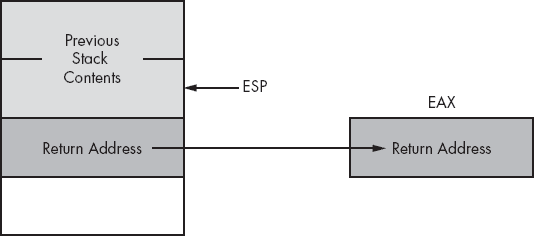
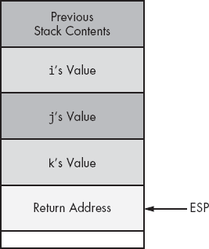
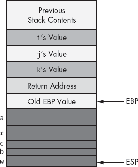
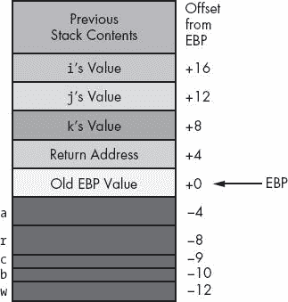
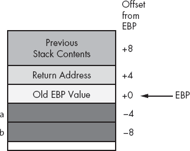
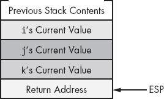
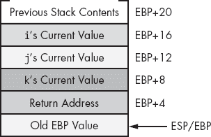
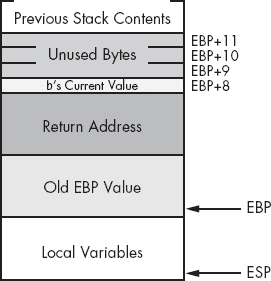
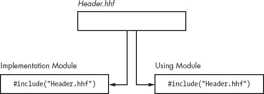

# 第五章 过程和单元


在过程式编程语言中，代码的基本单元是*过程*。过程是一组计算某个值或执行某些操作（例如打印或读取字符值）的指令。本章将讨论 HLA 如何实现过程。它首先讨论 HLA 的高层语法，用于过程声明和调用，但也描述了过程在机器级别的低层实现。此时，你应该已经对汇编语言编程感到熟悉，因此是时候开始呈现“纯”汇编语言，而不是继续依赖 HLA 的高层语法作为拐杖。

# 5.1 过程

大多数过程式编程语言通过调用/返回机制实现过程。也就是说，一些代码调用一个过程，过程执行其操作，然后返回给调用者。调用和返回指令提供了 80x86 的*过程调用机制*。调用代码通过 `call` 指令调用一个过程，而过程通过 `ret` 指令返回给调用者。例如，以下 80x86 指令调用 HLA 标准库的 `stdout.newln` 例程：^([70])

```
call stdout.newln;
```

`stdout.newln` 过程将换行符序列打印到控制台设备，并将控制权返回给紧接在 `call stdout.newln;` 指令后的指令。

唉，HLA 标准库并没有提供你可能需要的所有例程。大多数时候，你必须编写自己的过程。为此，你将使用 HLA 的过程声明功能。一个基本的 HLA 过程声明如下所示：

```
procedure *`ProcName`*;
          << Local declarations >>
     begin *`ProcName`*;
          << Procedure statements >>
     end *`ProcName`*;
```

过程声明出现在程序的声明部分。也就是说，在你可以放置 `static`、`const`、`type` 或其他声明部分的任何地方，你都可以放置过程声明。在上面的语法示例中，*`ProcName`* 代表你希望定义的过程名称。这可以是任何有效且唯一的 HLA 标识符。无论哪个标识符跟在 `procedure` 保留字后面，它也必须跟在过程中的 `begin` 和 `end` 保留字后面。正如你可能注意到的，过程声明看起来和 HLA 程序非常相似。事实上，唯一的区别（到目前为止）是使用了 `procedure` 保留字，而不是 `program` 保留字。

下面是一个具体的 HLA 过程声明示例。此过程在进入过程时将零值存储到 EBX 所指向的 256 个双字中：

```
procedure zeroBytes;
begin zeroBytes;

     mov( 0, eax );
     mov( 256, ecx );
     repeat
          mov( eax, [ebx] );
          add( 4, ebx );
          dec( ecx );

     until( @z );  // That is, until ecx=0.

end zeroBytes;
```

你可以使用 80x86 的`call`指令来调用这个过程。当程序执行到`end zeroBytes;`语句时，过程会返回给调用它的人，并开始执行`call`指令之后的第一条指令。示例 5-1 中的程序提供了调用`zeroBytes`例程的一个示例。

示例 5-1. 简单过程的示例

```
program zeroBytesDemo;
#include( "stdlib.hhf" )

    procedure zeroBytes;
    begin zeroBytes;

        mov( 0, eax );
        mov( 256, ecx );
        repeat

            mov( eax, [ebx] );  // Zero out current dword.
            add( 4, ebx );      // Point ebx at next dword.
            dec( ecx );         // Count off 256 dwords.

        until( ecx = 0 );       // Repeat for 256 dwords.

    end zeroBytes;

static
    dwArray: dword[256];

begin zeroBytesDemo;

    lea( ebx, dwArray );
    call zeroBytes;

end zeroBytesDemo;
```

正如你可能已经注意到的，当调用 HLA 标准库过程时，你不必使用`call`指令来调用 HLA 过程。HLA 标准库过程和你自己写的过程没有什么特别之处。虽然正式的 80x86 调用过程机制是使用`call`指令，但 HLA 提供了一个高级扩展，允许你通过简单地指定过程名称后跟一对空括号来调用过程。^([71]) 例如，以下任一语句都将调用 HLA 标准库中的`stdout.newln`过程：

```
call stdout.newln;
stdout.newln();
```

同样，以下任一语句都将调用示例 5-1 中的`zeroBytes`过程：

```
call zeroBytes;
zeroBytes();
```

调用机制的选择完全取决于你。然而，大多数人发现高级语法更易于阅读。

* * *

^([70]) 通常，你会使用高级语法`newln()`来调用`newln`，但是`call`指令也可以正常工作。

^([71]) 这假设过程没有任何参数。

# 5.2 保存机器的状态

查看示例 5-2 中的程序。这段代码试图打印 20 行，每行 40 个空格和一个星号。不幸的是，存在一个微妙的 bug，导致了无限循环。主程序使用`repeat..until`循环调用`PrintSpaces` 20 次。`PrintSpaces`使用 ECX 来计数它打印的 40 个空格。`PrintSpaces`返回时，ECX 的值为 0。然后主程序打印一个星号和一个换行符，递减 ECX，并重复此过程，因为 ECX 不为 0（此时它始终包含$FFFF_FFFF）。

这里的问题是`PrintSpaces`子例程没有保存 ECX 寄存器。保存寄存器意味着在进入子例程时保存它，并在离开前恢复它。如果`PrintSpaces`子例程保存了 ECX 寄存器的内容，示例 5-2 中的程序将能够正常运行。

示例 5-2. 程序存在意外的无限循环

```
program nonWorkingProgram;
#include( "stdlib.hhf" );

    procedure PrintSpaces;
    begin PrintSpaces;

        mov( 40, ecx );
        repeat

            mov( ' ', al );
            stdout.putc( al );  // Print 1 of 40 spaces.
            dec( ecx );         // Count off 40 spaces.

        until( ecx = 0 );

    end PrintSpaces;

begin nonWorkingProgram;

    mov( 20, ecx );
    repeat

        PrintSpaces();
        stdout.put( '*', nl );
        dec( ecx );

    until( ecx = 0 );

end nonWorkingProgram;
```

你可以使用 80x86 的`push`和`pop`指令来保存寄存器值，同时在需要时使用这些寄存器做其他操作。考虑以下`PrintSpaces`的代码：

```
procedure PrintSpaces;
    begin PrintSpaces;

        push( eax );
        push( ecx );
        mov( 40, ecx );
        repeat

            mov( ' ', al );
            stdout.putc( al );  // Print 1 of 40 spaces.
            dec( ecx );         // Count off 40 spaces.

        until( ecx = 0 );
        pop( ecx );
        pop( eax );

    end PrintSpaces;
```

注意，`PrintSpaces`保存并恢复了 EAX 和 ECX（因为这个过程修改了这些寄存器）。还要注意，这段代码按照反向顺序从堆栈中弹出寄存器。堆栈的先进后出操作要求了这种顺序。

可以由调用者（包含 `call` 指令的代码）或被调用者（子程序）来负责保存寄存器。在上面的示例中，被调用者负责保存寄存器。示例 5-3 中的示例展示了如果调用者保存寄存器，代码可能是什么样子：

示例 5-3. 调用者寄存器保存示范

```
program callerPreservation;
#include( "stdlib.hhf" );

    procedure PrintSpaces;
    begin PrintSpaces;

        mov( 40, ecx );
        repeat

            mov( ' ', al );
            stdout.putc( al );  // Print 1 of 40 spaces.
            dec( ecx );         // Count off 40 spaces.

        until( ecx = 0 );

    end PrintSpaces;
begin callerPreservation;

    mov( 20, ecx );
    repeat

        push( eax );
        push( ecx );
        PrintSpaces();
        pop( ecx );
        pop( eax );
        stdout.put( '*', nl );
        dec( ecx );

    until( ecx = 0 );

end callerPreservation;
```

被调用者保存寄存器有两个优点：节省空间和易于维护。如果被调用者（过程）保存了所有受影响的寄存器，那么只有一份 `push` 和 `pop` 指令，即过程本身包含的那一份。如果调用者保存寄存器中的值，程序需要在每次调用时都使用一组 `push` 和 `pop` 指令。这不仅使程序变得更长，而且也更难维护。记住每次调用过程时需要 `push` 和 `pop` 哪些寄存器并非易事。

另一方面，如果子程序保存它所修改的所有寄存器，它可能会不必要地保存某些寄存器。在上面的示例中，代码不需要保存 EAX。尽管`PrintSpaces`修改了 AL，但这不会影响程序的操作。如果调用者负责保存寄存器，那么它就不需要保存不关心的寄存器（参见示例 5-4 中的程序））。

示例 5-4. 证明调用者保存不需要保存所有寄存器

```
program callerPreservation2;
#include( "stdlib.hhf" );

    procedure PrintSpaces;
    begin PrintSpaces;

        mov( 40, ecx );
        repeat

            mov( ' ', al );
            stdout.putc( al );  // Print 1 of 40 spaces.
            dec( ecx );         // Count off 40 spaces.

        until( ecx = 0 );

    end PrintSpaces;

begin callerPreservation2;

    mov( 10, ecx );
    repeat

        push( ecx );
        PrintSpaces();
        pop( ecx );
        stdout.put( '*', nl );
        dec( ecx );

    until( ecx = 0 );

    mov( 5, ebx );
    while( ebx > 0 ) do

        PrintSpaces();

        stdout.put( ebx, nl );
        dec( ebx );

    endwhile;

    mov( 110, ecx );
    for( mov( 0, eax );  eax < 7; inc( eax )) do

        PrintSpaces();

        stdout.put( eax, " ", ecx, nl );
        dec( ecx );

    endfor;

end callerPreservation2;
```

示例 5-4 中的这个示例提供了三种不同的情况。第一个循环（`repeat..until`）只保存 ECX 寄存器。修改 AL 寄存器不会影响此循环的操作。在第一个循环之后，这段代码在 `while` 循环中再次调用 `PrintSpaces`。然而，这段代码并没有保存 EAX 或 ECX，因为它不关心 `PrintSpaces` 是否更改了它们。

让调用者保存寄存器的一个大问题是你的程序可能会随着时间的推移而发生变化。你可能会修改调用代码或过程，使用更多的寄存器。当然，这些变化可能会改变你需要保存的寄存器集。更糟糕的是，如果修改发生在子程序本身，你将需要找到*每一个*对该例程的调用，并验证子程序没有更改调用代码所使用的任何寄存器。

保留寄存器并不是保留环境的全部。你还可以推送和弹出子程序可能改变的变量和其他值。因为 80x86 允许你推送和弹出内存位置，所以你也可以轻松地保留这些值。

# 5.3 提前从过程返回

HLA 的`exit`和`exitif`语句允许你从一个过程返回，而无需落入过程中的相应`end`语句。这些语句的行为很像循环中的`break`和`breakif`语句，不同之处在于它们将控制转移到过程的底部，而不是跳出当前的循环。这些语句在许多情况下非常有用。

这两个语句的语法如下：

```
exit *`procedurename`*;
exitif( *`boolean_expression`* ) *`procedurename`*;
```

*`procedurename`*操作数是你希望退出的过程的名称。如果你指定了主程序的名称，`exit`和`exitif`语句将终止程序执行（即使你当前在过程内部而不是主程序体内）。

`exit`语句立即将控制转移出指定的过程或程序。条件`exitif`语句首先测试布尔表达式，并在结果为真时退出。它的语义等同于以下内容：

```
if( *`boolean_expression`* ) then

               exit *`procedurename`*;

          endif;
```

尽管`exit`和`exitif`语句在许多情况下非常有用，但在使用它们时应谨慎。如果一个简单的`if`语句可以让你跳过过程中的其余代码，那就使用`if`语句。包含大量`exit`和`exitif`语句的过程比没有这些语句的过程更难阅读、理解和维护（毕竟，`exit`和`exitif`语句实际上不过是`goto`语句，而你可能已经听说过关于`goto`的问题）。当你必须在一系列嵌套控制结构中从一个过程返回时，`exit`和`exitif`语句非常方便，而且用`if..endif`包围过程中的剩余代码是不切实际的。

# 5.4 局部变量

HLA 过程，就像大多数高级语言中的过程和函数一样，允许你声明*局部变量*。局部变量通常只在过程内部可访问；调用过程的代码无法访问它们。局部变量声明与在主程序中的变量声明相同，唯一的区别是你在过程的声明部分声明变量，而不是在主程序的声明部分声明。实际上，你可以在过程的声明部分声明任何在主程序声明部分合法的东西，包括常量、类型，甚至其他过程。^([72]) 在这一部分，我们将重点讨论局部变量。

局部变量具有两个重要属性，将它们与主程序中的变量（即*全局*变量）区分开来：*词法作用域*和*生命周期*。词法作用域，或简称*作用域*，决定了标识符在程序中的可用位置。生命周期决定了变量何时具有与之关联的内存并能够存储数据。因为这两个概念区分了局部变量和全局变量，所以花时间讨论它们是明智的。

讨论局部变量的作用域和生命周期时，也许最好的起点是从全局变量的作用域和生命周期开始——即你在主程序中声明的那些变量。到目前为止，你需要遵循的关于变量声明的唯一规则是“你必须声明程序中使用的所有变量。” HLA 声明部分相对于程序语句的位置自动执行了另一个主要规则，即“你必须在第一次使用变量之前声明所有变量。” 随着过程的引入，现在可以违反这个规则，因为（1）过程可以访问全局变量，且（2）过程声明可以出现在声明部分的任何位置，甚至在一些变量声明之前。示例 5-5 中的程序展示了这种源代码组织。

示例 5-5. 全局作用域演示

```
program demoGlobalScope;
#include( "stdlib.hhf" );

static
    AccessibleInProc: char;

    procedure aProc;
    begin aProc;

        mov( 'a', AccessibleInProc );

    end aProc;

static
    InaccessibleInProc: char;

begin demoGlobalScope;

    mov( 'b', InaccessibleInProc );
    aProc();
    stdout.put
    (
        "AccessibleInProc   = '", AccessibleInProc,   "'" nl
        "InaccessibleInProc = '", InaccessibleInProc, "'" nl
    );

end demoGlobalScope;
```

本示例演示了只要在过程之前声明全局变量，过程就可以访问主程序中的全局变量。在这个例子中，`aProc` 过程无法访问 `InaccessibleInProc` 变量，因为它的声明出现在过程声明之后。然而，`aProc` 可以引用 `AccessibleInProc`，因为它的声明出现在 `aProc` 过程之前。

过程可以以与主程序访问 `static`、`storage` 或 `readonly` 对象相同的方式访问这些变量——通过引用名称。尽管过程可以访问全局 `var` 对象，但需要不同的语法，并且在你理解额外语法的目的之前，还需要学些额外的内容（有关更多细节，请查阅 HLA 参考手册）。

访问全局对象既方便又简单。不幸的是，正如你在学习高级语言编程时可能已经了解到的那样，访问全局对象会使你的程序变得更难阅读、理解和维护。像大多数入门级编程教材一样，本书不鼓励在过程内使用全局变量。在某些情况下，在过程内访问全局变量可能是解决某个问题的最佳方案。然而，这种（合法的）访问通常只发生在涉及多线程执行或其他复杂系统的高级程序中。由于你目前不太可能编写这样的代码，因此也不太可能绝对需要在你的过程中访问全局变量，所以在这样做之前你应该仔细考虑自己的选择。^([73])

在你的过程内声明局部变量非常简单；你使用与主程序相同的声明部分：`static`、`readonly`、`storage`和`var`。在这些部分声明的变量的声明部分和访问规则与主程序中的规则和语法相同。示例 5-6 中的示例代码演示了局部变量的声明。

示例 5-6。过程中的局部变量示例

```
program demoLocalVars;
#include( "stdlib.hhf" );

    // Simple procedure that displays 0..9 using
    // a local variable as a loop control variable.

    procedure CntTo10;
    var
        i: int32;

    begin CntTo10;

        for( mov( 0, i ); i < 10; inc( i )) do

            stdout.put( "i=" , i, nl );

        endfor;

    end CntTo10;

begin demoLocalVars;

    CntTo10();

end demoLocalVars;
```

过程中的局部变量仅在该过程内可访问。^([74]) 因此，过程`CntTo10`中的变量`i`在主程序中是不可访问的。

对于局部变量，HLA 放宽了标识符在程序中必须唯一的规则。在 HLA 程序中，所有标识符必须在给定的*作用域*内是唯一的。因此，所有全局名称必须彼此唯一。类似地，给定过程中的所有局部变量必须具有唯一名称，*但仅对于该过程中的其他局部符号而言*。特别地，局部名称可以与全局名称相同。当这种情况发生时，HLA 会创建两个独立的变量。在过程的作用域内，任何对该公共名称的引用都会访问局部变量；在该过程之外，任何对该公共名称的引用都会引用全局标识符。尽管生成的代码质量可能存在疑问，但完全合法的是，两个或更多不同过程中的局部名称与全局标识符`MyVar`相同。每个过程都有自己的局部变体，与主程序中的`MyVar`是独立的。示例 5-7 提供了一个展示这一特性的 HLA 程序示例。

示例 5-7。局部变量不需要全局唯一的名称。

```
program demoLocalVars2;
#include( "stdlib.hhf" );

static
    i:  uns32 := 10;
    j:  uns32 := 20;

    // The following procedure declares i and j
    // as local variables, so it does not have access
    // to the global variables by the same name.

    procedure First;
    var
        i:int32;
        j:uns32;

    begin First;

        mov( 10, j );
        for( mov( 0, i ); i < 10; inc( i )) do

            stdout.put( "i=", i," j=", j, nl );
            dec( j );

        endfor;

    end First;

    // This procedure declares only an i variable.
    // It cannot access the value of the global i
    // variable but it can access the value of the
    // global j object because it does not provide
    // a local variant of j.

    procedure Second;
    var
        i:uns32;

    begin Second;

        mov( 10, j );
        for( mov( 0, i ); i < 10; inc( i )) do

            stdout.put( "i=", i," j=", j, nl );
            dec( j );

        endfor;

    end Second;

begin demoLocalVars2;

    First();
    Second();

    // Because the calls to First and Second have not
    // modified variable i, the following statement
    // should print "i=10". However, because the Second
    // procedure manipulated global variable j, this
    // code will print "j=0" rather than "j=20".

    stdout.put(  "i=", i, " j=", j, nl );

end demoLocalVars2;
```

在过程内重用全局名称有利有弊。一方面，可能会导致混淆。如果你将 `ProfitsThisYear` 用作全局符号，并在一个过程内重用该名称，阅读代码的人可能会认为该过程引用的是全局符号，而非局部符号。另一方面，像 `i`、`j` 和 `k` 这样的简单名称几乎没有实际意义（几乎每个人都预期它们用作循环控制变量或其他局部用途），因此将这些名称重用为局部对象可能是个好主意。从软件工程的角度来看，最好保持所有具有非常特定含义的变量名称（如 `ProfitsThisYear`）在程序中唯一。而那些具有模糊意义的通用名称（如 `index` 和 `counter` 以及像 `i`、`j` 或 `k` 这样的名称）可能可以作为全局变量重用。

关于 HLA 程序中标识符作用域的最后一点需要说明：即使变量在不同的过程（procedure）中有相同的名称，它们也是独立的。例如，在示例 5-7 中，`First` 和 `Second` 过程中的局部变量共享相同的名称（`i`）。然而，`First` 中的 `i` 和 `Second` 中的 `i` 是完全不同的变量。

区分局部变量和全局变量的第二个主要特性是*生命周期*。变量的生命周期从程序首次为变量分配存储空间开始，到程序为该变量释放存储空间为止。请注意，生命周期是一个动态特性（在运行时控制），而作用域是一个静态特性（在编译时控制）。特别地，如果程序反复分配然后释放该变量的存储空间，变量实际上可以拥有多个生命周期。

全局变量始终有一个单一的生命周期，从主程序首次开始执行的时刻到主程序终止时为止。同样，所有静态对象也有一个单一的生命周期，贯穿程序的执行（记住，静态对象是你在 `static`、`readonly` 或 `storage` 部分声明的对象）。即使在过程内也是如此。因此，局部静态对象的生命周期和全局静态对象的生命周期没有区别。然而，你在 `var` 部分声明的变量则是另一回事。HLA 的 `var` 对象使用 *自动存储分配*。自动存储分配意味着过程在进入过程时自动为局部变量分配存储空间。类似地，程序在过程返回给调用者时会释放自动对象的存储空间。因此，自动对象的生命周期是从过程中的第一条语句执行开始，到它返回给调用者的时刻。

也许关于自动变量最重要的一点是，你不能指望它们在调用过程之间保持其值。一旦过程返回到调用者，自动变量的存储就会丢失，因此值也会丢失。因此，*你必须始终假设局部* *`var`* *对象在进入过程时是未初始化的*，即使你知道之前已经调用过该过程，并且之前的过程调用已初始化了该变量。上一次调用存储到该变量中的任何值在过程返回给调用者时都会丢失。如果你需要在调用过程之间保持变量的值，你应该使用静态变量声明类型之一。

鉴于自动变量无法在过程调用之间保持其值，你可能会想知道为什么要使用它们。然而，自动变量有一些静态变量所没有的优点。静态变量的最大缺点是，即使引用它们的（唯一）过程未运行，它们仍然会消耗内存。另一方面，自动变量仅在其关联的过程执行时消耗存储空间。返回时，该过程会将其分配的任何自动存储归还给系统，以供其他过程重用。你将在本章稍后看到一些关于自动变量的额外优势。

* * *

^([72]) 严格来说，这不完全正确。你不能在过程内声明外部对象。外部对象的相关内容可以参考 5.24 单元和 external 指令。

^([73]) 请注意，反对访问全局变量的这个论点不适用于其他全局符号。访问程序中的全局常量、类型、过程和其他对象是完全合理的。

^([74]) 严格来说，这并不完全正确。不过，访问非局部的 `var` 对象超出了本书的讨论范围。请参阅 HLA 文档了解更多详细信息。

# 5.5 其他局部和全局符号类型

如前节所述，HLA 程序允许你在主程序的声明部分声明常量、值、类型以及几乎所有合法的内容。作用域的相同规则适用于这些标识符。因此，你可以在局部声明中重用常量名、过程名、类型名等。

引用全局常量、值和类型不会像引用全局变量那样带来软件工程问题。引用全局变量的问题在于，一个过程可能以一种不明显的方式改变全局变量的值。这会使程序变得更难阅读、理解和维护，因为仅通过查看过程调用，你通常无法判断一个过程是否在修改内存。常量、值、类型和其他非变量对象没有这个问题，因为它们在运行时不能被更改。因此，避免全局对象几乎成为必须遵循的规则，这对非变量对象不适用。

既然说了访问全局常量、类型等是可以的，那么也值得指出的是，如果程序仅在某个过程内引用这些对象，你应该在该过程内局部声明这些对象。这样做会使你的程序稍微容易阅读，因为阅读代码的人就不需要到处寻找符号的定义。

# 5.6 参数

尽管许多过程完全自包含，但大多数过程都需要一些输入数据，并将一些数据返回给调用者。参数是你传递给过程并从中返回的值。在纯汇编语言中，传递参数可能是一项繁琐的任务。幸运的是，HLA 提供了类似高级语言的语法来声明过程和涉及参数的过程调用。本节介绍了 HLA 的高级参数语法。后续章节将介绍在纯汇编代码中传递参数的低级机制。

讨论参数时，首先要考虑的是 *如何* 将它们传递给过程。如果你熟悉 Pascal 或 C/C++，你可能见过两种传递参数的方法：按值传递和按引用传递。HLA 当然支持这两种参数传递机制。然而，HLA 还支持按值/结果传递、按结果传递、按名称传递和懒惰求值传递。当然，HLA 是汇编语言，因此你可以使用任何你能想到的方案来传递参数（至少是 CPU 上能够实现的任何方案）。不过，HLA 提供了用于按值、引用、值/结果、结果、名称和懒惰求值传递的特殊高级语法。

因为按值/结果传递、结果、名称和惰性求值是比较高级的内容，本书不会讨论这些参数传递机制。如果你有兴趣了解更多关于这些参数传递方式的信息，请参阅 HLA 参考手册或查看本书的电子版，网址为[`webster.cs.ucr.edu/`](http://webster.cs.ucr.edu/) 或 [`www.artofasm.com/`](http://www.artofasm.com/)。

你在处理参数时还需要考虑一个问题，那就是*将参数传递到哪里*。有许多不同的地方可以传递参数；在本节中，我们将把过程参数传递到栈上。你不需要过多关注细节，因为 HLA 会为你抽象掉这些；不过，记住，过程调用和过程参数都涉及栈的使用。因此，任何在过程调用之前推送到栈上的内容，在进入过程时将不再位于栈顶。

## 5.6.1 按值传递

按值传递的参数就是如此——调用者将一个值传递给过程。按值传递的参数是输入参数。也就是说，你可以将它们传递给过程，但过程不能通过它们返回值。给定 HLA 过程调用

```
CallProc(I);
```

如果你按值传递`I`，那么`CallProc`不会改变`I`的值，无论`CallProc`内部发生了什么。

由于你必须将数据的副本传递给过程，因此你应该仅将小对象（如字节、字和双字）按值传递。按值传递大型数组和记录非常低效（因为你必须创建并传递对象的副本给过程）。

HLA 像 Pascal 和 C/C++一样，按值传递参数，除非你另行指定。以下是一个典型的函数，它有一个按值传递的单一参数。

```
procedure PrintNSpaces( N:uns32 );
    begin PrintNSpaces;

        push( ecx );
        mov( N, ecx );
        repeat

            stdout.put( ' ' );  // Print 1 of N spaces.
            dec( ecx );         // Count off N spaces.

        until( ecx = 0 );
        pop( ecx );

    end PrintNSpaces;
```

在`PrintNSpaces`中，参数`N`被称为*形式参数*。在过程体内任何出现`N`的地方，程序都引用调用者通过`N`传递的值。

`PrintNSpaces`的调用顺序可以是以下任意一种：

```
PrintNSpaces( *`constant`* );
PrintNSpaces( *`reg32`* );
PrintNSpaces( *`uns32_variable`* );
```

以下是一些具体的调用`PrintNSpaces`的例子：

```
PrintNSpaces( 40 );
PrintNSpaces( eax );
PrintNSpaces( SpacesToPrint );
```

在调用`PrintNSpaces`时传递的参数被称为*实际参数*。在上面的例子中，`40`、`eax`和`SpacesToPrint`就是实际参数。

请注意，按值传递的参数行为与在`var`部分声明的局部变量完全相同，唯一的例外是过程的调用者在传递控制给过程之前初始化这些局部变量。

HLA 使用位置参数符号，就像大多数高级语言一样。因此，如果需要传递多个参数，HLA 会通过参数列表中的位置将实际参数与形式参数关联起来。以下是一个简单的`PrintNChars`过程，它有两个参数：

```
procedure PrintNChars( N:uns32; c:char );
    begin PrintNChars;

        push( ecx );
        mov( N, ecx );
        repeat

            stdout.put( c );    // Print 1 of N characters.
            dec( ecx );         // Count off N characters.

        until( ecx = 0 );
        pop( ecx );

    end PrintNChars;
```

以下是对 `PrintNChars` 程序的调用，它将打印 20 个星号字符：

```
PrintNChars( 20, '*' );
```

请注意，HLA 使用分号来分隔过程声明中的形式参数，使用逗号来分隔过程调用中的实际参数（Pascal 程序员应该对这种表示法很熟悉）。还要注意，每个 HLA 形式参数声明采用以下格式：

```
*`parameter_identifier`* : *`type_identifier`*
```

特别注意，参数类型必须是标识符。以下的声明都是非法的，因为数据类型不是单一标识符：

```
PtrVar: pointer to uns32
ArrayVar: uns32[10]
recordVar: record i:int32; u:uns32; endrecord
DynArray: array.dArray( uns32, 2 )
```

然而，不要以为你不能将指针、数组、记录或动态数组变量作为参数传递。诀窍是在 `type` 部分为这些类型中的每一种声明一个数据类型。然后，你可以在参数声明中使用单一标识符作为类型。以下代码片段演示了如何使用上述四种数据类型来做到这一点：

```
type
     uPtr:        pointer to uns32;
     uArray10:    uns32[10];
     recType:     record i:int32; u:uns32; endrecord
     dType:       array.dArray( uns32, 2 );

     procedure FancyParms
     (
          PtrVar:   uPtr;
          ArrayVar: uArray10;
          recordVar:recType;
          DynArray: dType
     );
     begin FancyParms;
          .
          .
          .
     end FancyParms;
```

默认情况下，HLA 假定你打算按值传递参数。HLA 还允许你通过在形式参数声明前加上 `val` 关键字，明确指出某个参数是按值传递的。下面是一个 `PrintNSpaces` 程序的版本，明确表示 `N` 是一个按值传递的参数：

```
procedure PrintNSpaces( val N:uns32 );
    begin PrintNSpaces;

        push( ecx );
        mov( N, ecx );
        repeat

            stdout.put( ' ' );  // Print 1 of N spaces.
            dec( ecx );         // Count off N spaces.

        until( ecx = 0 );
        pop( ecx );

    end PrintNSpaces;
```

如果在同一程序声明中有多个参数使用不同的传递机制，明确指出某个参数是按值传递的参数是一个好主意。

当你按值传递参数并使用 HLA 高级语言语法调用过程时，HLA 会自动生成代码，将实际参数的值复制一份，并将该数据复制到该参数的本地存储中（即形式参数）。对于小对象，按值传递可能是最有效的传递方式。然而，对于大对象，HLA 必须生成代码，将实际参数的每一个字节都复制到形式参数中。对于大型数组和记录，这可能是一个非常昂贵的操作。^([75]) 除非你有特定的语义要求，必须按值传递大型数组或记录，否则你应该使用按引用传递或其他参数传递机制来处理数组和记录。

当将参数传递给一个过程时，HLA 会检查每个实际参数的类型，并将该类型与相应的形式参数进行比较。如果类型不匹配，HLA 会检查实际参数或形式参数是否为字节、字（word）或双字（double-word）对象，并且另一个参数的长度分别为 1、2 或 4 字节。如果实际参数不满足这些条件，HLA 会报告参数类型不匹配的错误。如果出于某种原因，你需要以与程序要求的类型不同的类型传递参数，可以使用 HLA 类型强制转换操作符来覆盖实际参数的类型。

## 5.6.2 按引用传递

要通过引用传递参数，你必须传递一个变量的地址，而不是它的值。换句话说，你必须传递一个指向数据的指针。该过程必须取消引用该指针才能访问数据。当你需要修改实际参数或在过程之间传递大型数据结构时，通过引用传递参数非常有用。

要声明一个按引用传递的参数，你必须在形式参数声明前加上`var`关键字。以下代码片段演示了这一点：

```
procedure UsePassByReference( var PBRvar: int32 );
     begin UsePassByReference;
          .
          .
          .
     end UsePassByReference;
```

调用带有按引用传递参数的过程使用的语法与按值传递相同，只是参数必须是一个内存位置；它不能是常量或寄存器。此外，内存位置的类型必须与形式参数的类型完全匹配。以下是对上述过程的合法调用（假设`i32`是一个`int32`变量）：

```
UsePassByReference( i32 );
UsePassByReference( (type int32 [ebx] ) );
```

以下是所有非法的`UsePassbyReference`调用（假设`charVar`是`char`类型）：

```
UsePassByReference( 40 );           // Constants are illegal.
UsePassByReference( EAX );          // Bare registers are illegal.
UsePassByReference( charVar );      // Actual parameter type must match
                                    // the formal parameter type.
```

与高级语言 Pascal 和 C++不同，HLA 并没有完全隐藏你传递的是指针而不是值这一事实。在过程调用中，HLA 会自动计算一个变量的地址并将该地址传递给过程。然而，在过程内部，你不能像处理值参数那样处理变量（如同在大多数高级语言中）。相反，你需要将该参数视为一个包含指向指定数据的指针的双字变量。你必须显式地取消引用这个指针以访问参数的值。示例 5-8 中的示例提供了一个简单的演示。

示例 5-8：访问按引用传递的参数

```
program PassByRefDemo;
#include( "stdlib.hhf" );

var
    i:  int32;
    j:  int32;

    procedure pbr( var a:int32; var b:int32 );
    const
        aa: text := "(type int32 [ebx])";
        bb: text := "(type int32 [ebx])";

    begin pbr;

        push( eax );
        push( ebx );        // Need to use ebx to dereference a and b.

        // a = −1;

        mov( a, ebx );      // Get ptr to the "a" variable.
        mov( −1, aa );      // Store −1 into the "a" parameter.

        // b = −2;

        mov( b, ebx );      // Get ptr to the "b" variable.
        mov( −2, bb );      // Store −2 into the "b" parameter.

        // Print the sum of a+b.
        // Note that ebx currently contains a pointer to "b".

        mov( bb, eax );
        mov( a, ebx );      // Get ptr to "a" variable.
        add( aa, eax );
        stdout.put( "a+b=", (type int32 eax), nl );

    end pbr;

begin PassByRefDemo;

    // Give i and j some initial values so
    // we can see that pass by reference will
    // overwrite these values.

    mov( 50, i );
    mov( 25, j );

    // Call pbr passing i and j by reference

    pbr( i, j );

    // Display the results returned by pbr.

    stdout.put
    (
        "i=  ", i, nl,
        "j=  ", j, nl
    );

end PassByRefDemo;
```

在某些罕见的情况下，通过引用传递参数可能会产生一些奇怪的结果。考虑示例 5-8 中的`pbr`过程。如果你修改主程序中的调用为`pbr(i,i)`而不是`pbr(i,j)`，程序将输出以下非直观的结果：

```
a+b=−4
i=  −2;
j=  25;
```

这段代码显示`a+b=−4`而不是预期的`a+b=−3`，是因为`pbr(i,i);`调用将相同的实际参数传递给`a`和`b`。结果，`a`和`b`的引用参数都包含指向相同内存位置的指针——即变量`i`的位置。在这种情况下，`a`和`b`是相互的*别名*。因此，当代码将−2 存储在`b`指向的位置时，它会覆盖之前存储在`a`指向位置的−1。当程序获取`a`和`b`指向的值并计算它们的和时，`a`和`b`都指向相同的值，即−2。将−2 + −2 相加，得到程序显示的−4 结果。这种非直观的行为在程序中遇到别名时是可能的。将同一个变量作为两个不同的引用参数传递，可能并不常见。但如果一个过程引用了全局变量，并且你通过引用将这个全局变量传递给该过程，你也可以创建一个别名（这是另一个你应该避免在过程中引用全局变量的好例子）。

通过引用传递通常比通过值传递效率低。你必须在每次访问时取消引用所有通过引用传递的参数；这比直接使用值要慢，因为通常至少需要两条指令。然而，在传递大型数据结构时，通过引用传递更快，因为你不需要在调用过程之前复制整个数据结构。当然，你可能需要使用指针来访问这个大型数据结构（例如数组）的元素，因此，当你通过引用传递大型数组时，效率几乎没有损失。

* * *

^([75]) 给 C/C++程序员的提示：HLA 不会自动按引用传递数组。如果你将数组类型指定为形式参数，HLA 将在调用相关过程时生成代码，复制数组的每一个字节。

# 5.7 函数和函数结果

函数是返回某些结果给调用者的过程。在汇编语言中，过程和函数之间的语法差异很小，这就是为什么 HLA 没有为函数提供特定声明的原因。尽管汇编过程和函数在语法上几乎没有区别，但在*语义*上是有一些不同的。也就是说，尽管你可以在 HLA 中以相同的方式声明它们，但它们的使用方式是不同的。

过程是一系列机器指令，用来完成某项任务。执行过程的最终结果是完成该任务。而函数则执行一系列机器指令，专门用于计算某个值并返回给调用者。当然，函数也可以执行一些活动，过程也能计算一些值，但主要的区别在于，函数的目的是返回某个计算结果；而过程没有这个要求。

一个好例子是`stdout.puti32`过程。这个过程只需要一个`int32`类型的参数。这个过程的目的是将该整数值的十进制转换结果打印到标准输出设备上。需要注意的是，`stdout.puti32`不会返回任何调用程序可以使用的值。

一个函数的好例子是`cs.member`函数。这个函数需要两个参数：第一个是字符值，第二个是字符集值。如果字符是指定字符集的成员，它会在 EAX 中返回真（1）。如果字符参数不是字符集的成员，则返回假。

从逻辑上讲，`cs.member`返回一个可用值给调用代码（在 EAX 中），而`stdout.puti32`则没有返回，这很好地说明了函数和过程之间的主要区别。所以，通常情况下，一个过程通过你明确决定在返回时返回一个值而成为函数。声明和使用一个函数并不需要特别的语法，你依然像写过程一样编写代码。

## 5.7.1 返回函数结果

80x86 的寄存器是返回函数结果最常见的地方。HLA 标准库中的`cs.member`例程就是一个很好的函数例子，它将值返回到 CPU 的某个寄存器中。它在 EAX 寄存器中返回真（1）或假（0）。根据约定，程序员通常会在 AL、AX 和 EAX 寄存器中返回 8 位、16 位和 32 位（非实数）结果。这是大多数高级语言返回这些类型结果的地方。

当然，AL/AX/EAX 寄存器并没有什么特别神圣的地方。如果用其他寄存器返回函数结果更方便，也是可以的。然而，如果没有充分的理由不使用 AL/AX/EAX 寄存器，那么你应该遵循这个约定。这样做将帮助他人更好地理解你的代码，因为他们通常会假设你的函数在 AL/AX/EAX 寄存器中返回较小的结果。

如果你需要返回一个大于 32 位的函数结果，显然你必须将其返回到 EAX 以外的地方（因为 EAX 只能容纳 32 位的值）。对于稍大于 32 位的值（例如 64 位，或者甚至可能是 128 位），你可以将结果拆分成多个部分，并将这些部分分别返回到两个或更多的寄存器中。常见的做法是将 64 位的值通过 EDX:EAX 寄存器对返回（例如，HLA 标准库中的`stdin.geti64`函数会在 EDX:EAX 寄存器对中返回一个 64 位整数）。

如果你需要将一个大对象作为函数结果返回，比如一个包含 1,000 个元素的数组，显然你不可能将函数结果返回到寄存器中。有两种常见的方法来处理大型函数返回结果：要么将返回值作为引用参数传递，要么在堆上分配存储空间（使用`mem.alloc`）来存储该对象，并将其指针返回到 32 位寄存器中。当然，如果你返回了一个指向堆上分配的存储的指针，调用程序必须在完成后释放这块存储。

## 5.7.2 HLA 中的指令组合

几个 HLA 标准库函数允许你将它们作为其他指令的操作数来调用。例如，考虑以下代码片段：

```
if( cs.member( al, {'a'..'z'}) ) then
     .
     .
     .
endif;
```

正如你的高级语言经验（和 HLA 经验）应该能暗示的那样，这段代码调用了`cs.member`函数来检查 AL 中的字符是否是小写字母。如果`cs.member`函数返回 true，那么这段代码将执行`if`语句的`then`部分；然而，如果`cs.member`返回 false，这段代码将跳过`if..then`体。这里没有什么特别之处，唯一需要注意的是，HLA 不支持在`if`语句中将函数调用作为布尔表达式（可以回顾一下第一章，查看完整的可用表达式集）。那么，这段程序是如何编译并运行的，并得出直观的结果呢？

下一节将介绍如何让 HLA 知道你希望在布尔表达式中使用函数调用。然而，要理解这一点，你需要先了解 HLA 中的*指令组合*。

指令组合允许你将一个指令作为另一个指令的操作数。例如，考虑`mov`指令。它有两个操作数：一个源操作数和一个目标操作数。指令组合允许你将一个有效的 80x86 机器指令替换为任一（或两个）操作数。以下是一个简单的例子：

```
mov( mov( 0, eax ), ebx );
```

当然，直接的问题是，“这是什么意思？”要理解发生了什么，你首先需要意识到，大多数指令在编译时都会“返回”一个值给编译器。对于大多数指令，它们“返回”的值是它们的目标操作数。因此，`mov( 0, eax );` 在编译过程中返回字符串 `eax` 给编译器，因为 EAX 是目标操作数。大多数情况下，特别是当一条指令单独出现在一行时，编译器会忽略返回的字符串结果。然而，当你将指令作为某些操作数的替代时，HLA 会使用这个字符串结果；具体来说，HLA 将这个字符串作为操作数代替原来的指令。因此，上面的 `mov` 指令等价于以下两条指令序列：

```
mov( 0, eax );     // HLA compiles interior instructions first.
     mov( eax, ebx );   // HLA substituted "eax" for "mov( 0, eax )"
```

在处理组合指令（即作为操作数包含其他指令的指令序列）时，HLA 总是以“从左到右然后深度优先（内向外）”的方式工作。为了理解这一点，请考虑以下指令：

```
add( sub( mov( i, eax ), mov( j, ebx )), mov( k, ecx ));
```

要解释这里发生的事情，从源操作数开始。它包含以下内容：

```
sub( mov( i, eax ), mov( j, ebx ))
```

该指令的源操作数是 `mov( i, eax )`，并且这条指令没有任何组合，因此 HLA 发出此指令并返回其目标操作数（`eax`），作为 `sub` 指令的源操作数。这实际上给我们带来了以下结果：

```
sub( eax, mov( j, ebx ))
```

现在，HLA 编译了作为目标操作数出现的指令（`mov( j, ebx )`），并返回其目标操作数（`ebx`），以替代 `sub` 指令中的 `mov`。这将产生以下结果：

```
sub( eax, ebx )
```

这是一个完整的指令，没有组合，HLA 可以编译它。因此，它编译了这条指令，并将其目标操作数（`ebx`）作为字符串结果返回，替代原始 `add` 指令中的 `sub`。所以，原始的 `add` 指令现在变成了：

```
add( ebx, mov( k, ecx ));
```

HLA 接下来编译了目标操作数中出现的 `mov` 指令。它将其目标操作数作为字符串返回，HLA 用该字符串替代 `mov`，最终生成简单的指令：

```
add( ebx, ecx );
```

因此，原始 `add` 指令的编译结果是以下指令序列：

```
mov( i, eax );
     mov( j, ebx );
     sub( eax, ebx );
     mov( k, ecx );
     add( ebx, ecx );
```

哇！从原始指令来看，很难轻易看出这个序列是结果。正如这个例子所示，*过度使用指令组合可能会导致程序几乎无法阅读*。你在编写程序时应非常小心使用指令组合。除少数例外，编写组合指令序列会使你的程序更难以理解。

请注意，过度使用指令组合可能会使程序中的错误难以解读。请看以下 HLA 语句：

```
add( mov( eax, i ), mov( ebx, j ) );
```

这个指令组合生成了以下 80x86 指令序列：

```
mov( eax, i );
          mov( ebx, j );
          add( i, j );
```

当然，编译器会抱怨你试图将一个内存位置加到另一个内存位置上。然而，指令组合有效地掩盖了这一事实，使得理解错误信息的原因变得困难。这个故事的寓意是：除非真的能使程序更易读，否则避免使用指令组合。本节中的几个示例演示了*不应该*如何使用指令组合。

在两个主要的领域中，使用指令组合可以帮助使程序更易读。第一个是 HLA 的高级语言控制结构。另一个是在过程参数中。尽管指令组合在这两种情况下（以及可能的其他几种情况）是有用的，但这并不意味着你可以使用像之前示例中的`add`指令那样复杂的指令。相反，大多数时候，你将使用单个指令或函数调用来替代高级语言布尔表达式中的单个操作数，或在过程/函数参数中使用。

既然我们在讨论这个话题，那么过程调用作为 HLA 在指令组合中替代调用的字符串返回的到底是什么呢？此外，像`if..endif`这样的语句返回什么？没有目标操作数的指令又返回什么呢？嗯，函数返回结果是下一节的内容，你将在几分钟内阅读到它。至于所有其他语句和指令，你应该查阅 HLA 参考手册。手册列出了每条指令及其返回值。返回值是 HLA 在指令作为另一个指令的操作数时替代指令的字符串。请注意，许多 HLA 语句和指令默认返回空字符串作为返回值（过程调用也是如此）。如果指令返回空字符串作为其组合值，那么如果你试图将其作为另一条指令的操作数使用，HLA 会报告错误。例如，`if..then..endif`语句返回空字符串作为返回值，因此你不能将`if..then..endif`嵌套在另一条指令中。

## 5.7.3 HLA 过程中的`@returns`选项

HLA 过程声明允许一个特殊选项，指定当过程调用作为另一条指令的操作数时使用的字符串：`@returns`选项。带有`@returns`选项的过程声明语法如下：

```
procedure *`ProcName`* ( *`optional_parameters`* );  @returns( *`string_constant`* );
      << Local declarations >>
 begin *`ProcName`*;
      << Procedure statements >>
 end *`ProcName`*;
```

如果没有`@returns`选项，HLA 会将空字符串赋值给过程的`@returns`值。这实际上使得将该过程调用作为另一个指令操作数成为非法。

`@returns` 选项要求一个被括号包围的单字符串表达式。如果这个字符串常量出现在另一个指令的操作数中，HLA 会将其替换为过程调用。通常，这个字符串常量是一个寄存器名称；不过，任何作为指令操作数合法的文本也可以使用。例如，你可以指定内存地址或常量。为了清晰起见，你应该始终在 `@returns` 参数中指定函数返回值的位置。

举个例子，考虑下面的布尔函数，它会在 EAX 寄存器中返回真或假，前提是单字符参数是字母字符：^([77])

```
procedure IsAlphabeticChar( c:char ); @returns( "EAX" );
begin IsAlphabeticChar;

     // Note that cs.member returns true/false in eax.

     cs.member( c, {'a'..'z', 'A'..'Z'} );

end IsAlphabeticChar;
```

一旦你在这个过程声明的末尾加上 `@returns` 选项，就可以合法地将对 `IsAlphabeticChar` 的调用用作其他 HLA 语句和指令的操作数：

```
mov( IsAlphabeticChar( al ), ebx );
          .
          .
          .
     if( IsAlphabeticChar( ch ) ) then
          .
          .
          .
     endif;
```

上面的最后一个例子展示了通过 `@returns` 选项，你可以在各种 HLA 语句的布尔表达式字段中嵌入对自定义函数的调用。请注意，以上代码等同于：

```
IsAlphabeticChar( ch );
     if( eax ) then
          .
          .
          .
     endif;
```

并不是所有的 HLA 高级语言语句都会在语句前展开组合指令。例如，考虑下面的 `while` 语句：

```
while( IsAlphabeticChar( ch ) ) do
          .
          .
          .
     endwhile;
```

这段代码并不会展开成以下内容：

```
IsAlphabeticChar( ch );
     while( eax ) do
          .
          .
          .
     endwhile;
```

相反，`IsAlphabeticChar` 的调用会在 `while` 的布尔表达式内展开，这样程序会在每次循环迭代时调用该函数。

输入 `@returns` 参数时需要小心。HLA 在编译过程声明时不会检查字符串参数的语法（除了验证它是一个字符串常量）。HLA 只会在用 `@returns` 字符串替换函数调用时检查语法。因此，如果你在前面的示例中为 `IsAlphabeticChar` 指定了 `eaz` 而不是 `eax` 作为 `@returns` 参数，HLA 直到你实际使用 `IsAlphabeticChar` 作为操作数时才会报告错误。到那时，HLA 会抱怨非法的操作数，但通过查看 `IsAlphabeticChar` 的调用是无法明确知道问题所在的。因此，要特别小心不要在 `@returns` 字符串中引入排版错误；稍后发现这些错误可能会非常困难。

* * *

^([76]) 在第六章中，你会看到大多数程序员返回实际的结果。

^([77]) 在你实际使用这个函数到自己的程序中之前，注意 HLA 标准库提供了 `char.isAlpha` 函数来进行此测试。更多详情请参阅 HLA 文档。

# 5.8 递归

*递归* 是指过程调用自身。例如，下面就是一个递归过程：

```
procedure Recursive;
begin Recursive;

     Recursive();

end Recursive;
```

当然，CPU 永远不会从这个过程返回。进入`Recursive`时，这个过程会立即再次调用自己，控制永远不会传递到过程的结束部分。在这个特定情况下，失控的递归会导致无限循环。^([78])

类似于循环结构，递归需要一个终止条件来防止无限递归。`Recursive`可以用终止条件重写，如下所示：

```
procedure Recursive;
begin Recursive;

     dec( eax );
     if( @nz ) then

         Recursive();

     endif;

end Recursive;
```

对该例程的修改使得`Recursive`根据 EAX 寄存器中出现的次数自我调用。在每次调用时，`Recursive` 会将 EAX 寄存器减 1，然后再次调用自己。最终，`Recursive` 将 EAX 减至 0，并从每次调用中返回，直到它返回到最初的调用者。

迄今为止，递归并没有真正的必要。毕竟，你可以高效地像这样编写这个过程：

```
procedure Recursive;
begin Recursive;

     repeat
          dec( eax );
     until( @z );

end Recursive;
```

这两个示例都会根据传入 EAX 寄存器的次数重复执行程序的主体。^([79]) 事实证明，只有少数递归算法无法以迭代方式实现。然而，许多递归实现的算法比它们的迭代版本更高效，而且大多数情况下，算法的递归形式更容易理解。

快速排序算法可能是最著名的通常以递归形式出现的算法。该算法的 HLA 实现出现在示例 5-9 中。

示例 5-9. 递归快速排序程序

```
program QSDemo;
#include( "stdlib.hhf" );

type
    ArrayType:  uns32[ 10 ];

static
    theArray:   ArrayType := [1,10,2,9,3,8,4,7,5,6];

    procedure quicksort( var a:ArrayType; Low:int32; High:int32 );
    const
        i:      text := "(type int32 edi)";
        j:      text := "(type int32 esi)";
        Middle: text := "(type uns32 edx)";
        ary:    text := "[ebx]";

    begin quicksort;

        push( eax );
        push( ebx );
        push( ecx );
        push( edx );
        push( esi );
        push( edi );

        mov( a, ebx );      // Load BASE address of "a" into ebx.

        mov( Low, edi);     // i := Low;
        mov( High, esi );   // j := High;

        // Compute a pivotal element by selecting the
        // physical middle element of the array.

        mov( i, eax );
        add( j, eax );
        shr( 1, eax );
        mov( ary[eax*4], Middle );  // Put middle value in edx.

        // Repeat until the edi and esi indexes cross one
        // another (edi works from the start towards the end
        // of the array, esi works from the end towards the
        // start of the array).

        repeat

            // Scan from the start of the array forward
            // looking for the first element greater or equal
            // to the middle element).

            while( Middle > ary[i*4] ) do

                inc( i );

            endwhile;

            // Scan from the end of the array backwards looking
            // for the first element that is less than or equal
            // to the middle element.

            while( Middle < ary[j*4] ) do

                dec( j );

            endwhile;

            // If we've stopped before the two pointers have
            // passed over one another, then we've got two
            // elements that are out of order with respect
            // to the middle element, so swap these two elements.

            if( i <= j ) then

                mov( ary[i*4], eax );
                mov( ary[j*4], ecx );
                mov( eax, ary[j*4] );
                mov( ecx, ary[i*4] );
                inc( i );
                dec( j );

            endif;

        until( i > j );

        // We have just placed all elements in the array in
        // their correct positions with respect to the middle
        // element of the array. So all elements at indexes
        // greater than the middle element are also numerically
        // greater than this element. Likewise, elements at
        // indexes less than the middle (pivotal) element are
        // now less than that element. Unfortunately, the
        // two halves of the array on either side of the pivotal
        // element are not yet sorted. Call quicksort recursively
        // to sort these two halves if they have more than one
        // element in them (if they have zero or one elements, then
        // they are already sorted).

        if( Low < j ) then

            quicksort( a, Low, j );

        endif;
        if( i < High ) then

quicksort( a, i, High );

        endif;

        pop( edi );
        pop( esi );
        pop( edx );
        pop( ecx );
        pop( ebx );
        pop( eax );

    end quicksort;

begin QSDemo;

    stdout.put( "Data before sorting: " nl );
    for( mov( 0, ebx ); ebx < 10; inc( ebx )) do

        stdout.put( theArray[ebx*4]:5 );

    endfor;
    stdout.newln();

    quicksort( theArray, 0, 9 );

    stdout.put( "Data after sorting: " nl );
    for( mov( 0, ebx ); ebx < 10; inc( ebx )) do

        stdout.put( theArray[ebx*4]:5 );

    endfor;
    stdout.newln();

end QSDemo;
```

注意，这个快速排序过程使用寄存器来存储所有非参数的局部变量。还要注意快速排序如何使用`text`常量定义为寄存器提供更具可读性的名称。这种技巧常常能使算法更易于阅读；然而，使用这种技巧时，必须小心不要忘记这些寄存器已经被使用。

* * *

^([78]) 嗯，实际上并不是无限的。栈会溢出，Windows、Mac OS X、FreeBSD 或 Linux 会在那时抛出异常。

^([79]) 后者版本会大大加快速度，因为它没有`call`/`ret`指令的开销。

# 5.9 前向过程

通常情况下，HLA 要求在程序中第一次使用符号之前声明所有符号。^([80]) 因此，你必须在第一次调用之前定义所有过程。之所以不总是可行，有两个原因：互递归（两个过程互相调用）和源代码组织（你可能希望将过程放在首次调用它的代码之后）。幸运的是，HLA 允许你使用*前向过程定义*来声明过程*原型*。前向声明使你能够在实际提供过程代码之前定义该过程。

前向过程声明是一种常见的过程声明，它使用保留字`forward`代替过程的声明部分和主体。以下是上一节中快速排序过程的前向声明：

```
procedure quicksort( var a:ArrayType; Low:int32; High:int32 ); forward;
```

在 HLA 程序中，前向声明是向编译器保证，实际的过程声明会在源代码的后续部分以与前向声明完全相同的形式出现。^([81]) 前向声明必须有相同的参数，它们必须以相同的方式传递，并且它们的类型必须与过程中的正式参数类型一致。

互递归的过程（即过程`A`调用过程`B`，而过程`B`又调用过程`A`）至少需要一个前向声明，因为你只能在另一个之前声明过程`A`或`B`中的一个。然而，实际上，互递归（无论是直接递归还是间接递归）并不常见，因此你很少会为了这个目的使用前向声明。

在没有互递归的情况下，总是可以组织你的源代码，使得每个过程声明出现在其第一次调用之前。然而，什么是可能的，什么是期望的，是两回事。你可能希望将一组相关的过程放在源代码的开头，而将另一组过程放在源代码的末尾。这种逻辑分组按功能而非调用进行，可能会使你的程序更容易阅读和理解。然而，这种组织方式也可能导致代码在声明之前尝试调用一个过程。没关系；只需使用前向过程定义来解决这个问题。

前向定义和实际过程声明之间的一个主要区别与过程选项有关。有些选项，如`@returns`，可能只出现在前向声明中（如果有`forward`声明）。其他选项可能只出现在实际的过程声明中（我们还没有涉及其他过程选项，所以暂时不用担心它们）。如果你的过程需要`@returns`选项，`@returns`选项必须出现在`forward`保留字之前。例如：

```
procedure IsItReady( valueToTest: dword ); @returns( "eax" ); forward;
```

`@returns`选项不得在源代码中的实际过程声明中再次出现。

* * *

^([80]) 这个规则有一些小例外，但对于过程调用来说，这一规则是确实成立的。

^([81]) 事实上，`exactly`是一个太强的词。稍后你会看到一些例外情况。

# 5.10 HLA v2.0 过程声明

HLA v2.0 及更高版本支持一种类似于常量、类型和变量声明的替代过程声明语法。尽管本书倾向于使用原始的过程声明语法（HLA v2.0 及更高版本仍然支持该语法），但你将在现实世界中的代码示例中看到新语法；因此，本节简要讨论了新过程声明语法。

新的 HLA v2.0 过程声明语法使用 `proc` 关键字开始一个过程声明部分（类似于 `var` 或 `static` 开始一个变量声明部分）。在 `proc` 部分内，过程声明有以下几种形式：

```
*`procname`*:procedure( *`parameters`* );
begin *`procname`*;
    << body >>
end *`procname`*;
*`procname`*:procedure( *`parameters`* ) {*`options`*};
begin *`procname`*;
    << body >>
end *`procname`*;
*`procname`*:procedure( *`parameters`* ); *`external`*;
*`procname`*:procedure( *`parameters`* ) { *`options`* }; *`external`*;
```

有关此替代过程声明语法的更多详细信息，请参阅 HLA v2.0（或更高版本）参考手册。只需知道它的存在，以防你在阅读从其他来源获得的示例 HLA 代码时遇到它。

# 5.11 低级过程和 `call` 指令

80x86 的 `call` 指令做两件事。首先，它将紧跟在 `call` 指令之后的指令地址压入堆栈；然后，它将控制权转移到指定过程的地址。`call` 指令压入堆栈的值称为*返回地址*。当过程想要返回调用者并继续执行紧跟在 `call` 指令之后的第一条语句时，过程只需从堆栈中弹出返回地址，并间接跳转到该地址。大多数过程通过执行 `ret`（返回）指令来返回调用者。`ret` 指令将返回地址从堆栈中弹出，并将控制权间接转移到它从堆栈中弹出的地址。

默认情况下，HLA 编译器会自动在你编写的每个 HLA 过程的末尾添加一条 `ret` 指令（以及其他几条指令）。这就是为什么到目前为止你无需显式使用 `ret` 指令的原因。要禁用 HLA 过程中的默认代码生成，请在声明过程时指定以下选项：

```
procedure *`ProcName`*; @noframe; @nodisplay;
begin *`ProcName`*;
     .
     .
     .
end *`ProcName`*;
```

`@noframe` 和 `@nodisplay` 子句是过程*选项*的例子。HLA 过程支持几个这样的选项，包括 `@returns`、`@noframe`、`@nodisplay` 和 `@noalignstack`。你将在 5.14 节看到 `@noalignstack` 和其他几个过程选项的用途。这些过程选项可以按照任意顺序出现在过程名称（及其参数，如果有的话）之后。注意，`@noframe` 和 `@nodisplay`（以及 `@noalignstack`）只能出现在实际的过程声明中。你不能在前向声明中指定这些选项。

`@noframe` 选项告诉 HLA 编译器，你不希望编译器为过程自动生成入口和退出代码。这告诉 HLA 不要自动生成 `ret` 指令（以及其他几条指令）。

`@nodisplay` 选项告诉 HLA 不需要在过程的局部变量区域为 *显示* 分配存储空间。显示是一种机制，用于访问过程中的非局部 `var` 对象。因此，只有在程序中嵌套过程时，才需要显示。本书不会讨论显示或嵌套过程；有关显示和嵌套过程的更多细节，请参见电子版的相关章节，网址为 [`www.artofasm.com/`](http://www.artofasm.com/) 或 [`webster.cs.ucr.edu/`](http://webster.cs.ucr.edu/)，或者查阅 HLA 参考手册。在此之前，你可以安全地在所有过程上指定 `@nodisplay` 选项。事实上，对于本章到目前为止出现的所有过程，指定 `@nodisplay` 选项是很有意义的，因为这些过程并不实际使用显示。使用 `@nodisplay` 选项的过程比未指定此选项的过程要稍微快一点，且稍微短一点。

以下是最小化过程的示例：

```
procedure minimal; @nodisplay; @noframe; @noalignstack;
begin minimal;

     ret();

end minimal;
```

如果你使用 `call` 指令调用此过程，`minimal` 将简单地从栈中弹出返回地址并返回给调用者。你应该注意，在指定 `@noframe` 过程选项时，`ret` 指令是绝对必要的。^([82]) 如果在过程内未放置 `ret` 指令，程序在遇到 `end minimal;` 语句时将不会返回给调用者。相反，程序会直接跳转到内存中跟随过程的任何代码。示例程序 Example 5-10 演示了这个问题。

示例 5-10. 缺少 `ret` 指令在过程中的影响

```
program missingRET;
#include( "stdlib.hhf" );

    // This first procedure has the @noframe
    // option but does not have a ret instruction.

    procedure firstProc; @noframe; @nodisplay;
    begin firstProc;

        stdout.put( "Inside firstProc" nl );

    end firstProc;

    // Because the procedure above does not have a
    // ret instruction, it will "fall through" to
    // the following instruction. Note that there
    // is no call to this procedure anywhere in
    // this program.

    procedure secondProc; @noframe; @nodisplay;
    begin secondProc;

        stdout.put( "Inside secondProc" nl );
        ret();

end secondProc;

begin missingRET;

    // Call the procedure that doesn't have
    // a ret instruction.

    call firstProc;

end missingRET;
```

尽管在某些罕见情况下，这种行为可能是期望的，但在大多数程序中，它通常代表着一个缺陷。因此，如果指定了 `@noframe` 选项，务必记得使用 `ret` 指令显式地从过程返回。

* * *

^([82]) 严格来说，这并不完全正确。但在过程体内，某种机制必须从栈中弹出返回地址并跳转到返回地址。

# 5.12 过程与栈

由于过程使用栈来保存返回地址，因此在过程内推送和弹出数据时必须小心。考虑以下简单（且有缺陷的）过程：

```
procedure MessedUp; @noframe; @nodisplay;
begin MessedUp;

     push( eax );
     ret();

end MessedUp;
```

当程序遇到 `ret` 指令时，80x86 栈的状态如图 5-1 所示。


图 5-1. `MessedUp` 过程中的 `ret` 前栈内容

`ret` 指令并不知道栈顶的值不是有效地址。它只是弹出栈顶的值，并跳转到该位置。在这个示例中，栈顶包含保存的 EAX 值。因为 EAX 很不可能包含正确的返回地址（实际上，EAX 正确的几率大约是四十亿分之一），这个程序很可能会崩溃或表现出其他未定义的行为。因此，在向栈中推送数据时，必须小心，确保在从过程返回之前妥善地弹出这些数据。

### 注意

如果在编写过程时没有指定 `@noframe` 选项，HLA 会在过程开始时自动生成代码，将一些数据推送到栈上。因此，除非你完全理解发生了什么并且已经妥善处理了 HLA 推送到栈上的数据，否则不应在没有 `@noframe` 选项的过程内部执行裸 `ret` 指令。这样做会尝试返回到由这些数据指定的位置（而不是返回地址），而不是正确地返回到调用者。在没有 `@noframe` 选项的过程里，应使用 `exit` 或 `exitif` 语句来从过程返回。

在执行 `ret` 语句之前从栈中弹出多余的数据，也会在程序中引发严重问题。考虑以下有缺陷的过程：

```
procedure messedUpToo; @noframe; @nodisplay;
begin messedUpToo;

     pop( eax );
     ret();

end messedUpToo;
```

当程序执行到该过程中的 `ret` 指令时，80x86 的栈大致如下所示，参见图 5-2。



图 5-2：`messedUpToo` 中 `ret` 执行前的栈内容

再次说明，`ret` 指令盲目地从栈顶弹出任何数据，并尝试返回到该地址。与前一个示例不同，前一个示例中栈顶很不可能包含有效的返回地址（因为它包含的是 EAX 的值），而在这个示例中，栈顶有小概率*确实*包含返回地址。然而，这个地址并不是 `messedUpToo` 过程的正确返回地址；相反，它将是调用 `messedUpToo` 过程的那个过程的返回地址。为了理解这段代码的影响，请参考示例 5-11 中的程序。

示例 5-11：从栈中弹出过多数据的影响

```
program extraPop;
#include( "stdlib.hhf" );

    // Note that the following procedure pops
    // excess data off the stack (in this case,
    // it pops messedUpToo's return address).

    procedure messedUpToo; @noframe; @nodisplay;
    begin messedUpToo;

        stdout.put( "Entered messedUpToo" nl );
        pop( eax );
        ret();

    end messedUpToo;

    procedure callsMU2; @noframe; @nodisplay;
    begin callsMU2;

        stdout.put( "calling messedUpToo" nl );
        messedUpToo();

        // Because messedUpToo pops extra data
        // off the stack, the following code
        // never executes (because the data popped
        // off the stack is the return address that
        // points at the following code).

        stdout.put( "Returned from messedUpToo" nl );
        ret();

    end callsMU2;

begin extraPop;

    stdout.put( "Calling callsMU2" nl );
    callsMU2();
    stdout.put( "Returned from callsMU2" nl );

end extraPop;
```

因为有效的返回地址位于堆栈的顶部，你可能认为这个程序会正常工作（正确）。然而，注意到当从 `messedUpToo` 过程返回时，这段代码直接返回到主程序，而不是返回到 `callsMU2` 过程中的正确返回地址。因此，`callsMU2` 过程中的所有代码在调用 `messedUpToo` 之后不会执行。在阅读源代码时，可能很难理解为什么那些语句没有执行，因为它们紧跟在调用 `messedUpToo` 过程之后。除非你非常仔细地查看，否则不会很明显，程序正在从堆栈中弹出一个额外的返回地址，因此没有返回到 `callsMU2`，而是直接返回到调用 `callsMU2` 的地方。当然，在这个示例中，问题很容易看出来（因为这个示例正是为了演示这个问题）。然而，在真实的程序中，确定一个过程是否不小心从堆栈中弹出了太多数据可能会更加困难。因此，你应该始终小心在过程中的数据推入和弹出操作。你应当始终验证程序中的推入操作与对应的弹出操作之间是否存在一对一的关系。

# 5.13 激活记录

每当你调用一个过程时，程序会为该过程调用关联某些信息。返回地址就是程序为特定过程调用维护的一类信息。参数和自动局部变量（即在 `var` 部分声明的变量）是程序为每个过程调用维护的其他信息的例子。*激活记录*是我们用来描述程序为特定过程调用关联的这些信息的术语。^([83])

激活记录是这个数据结构的恰当名称。程序在调用（激活）过程时创建一个激活记录，并且该结构中的数据按记录的方式组织。激活记录（与标准记录相比）唯一不同的地方可能就是记录的基地址位于数据结构的中间，因此你必须在记录的正负偏移量处访问记录的字段。

激活记录的构建始于调用过程的代码。调用者将参数数据（如果有的话）推入堆栈。然后，`call` 指令的执行将返回地址推入堆栈。此时，激活记录的构建将在过程内部继续。过程将寄存器和其他重要的状态信息推入堆栈，然后在激活记录中为局部变量腾出空间。过程还必须更新 EBP 寄存器，使其指向激活记录的基址。

要查看典型的激活记录是什么样的，可以考虑以下 HLA 程序声明：

```
procedure ARDemo( i:uns32; j:int32; k:dword ); @nodisplay;
var
     a:int32;
     r:real32;
     c:char;
     b:boolean;
     w:word;
begin ARDemo;
     .
     .
     .
end ARDemo;
```

每当 HLA 程序调用 `ARDemo` 过程时，它首先会将参数的数据压入栈中。调用代码会按照参数列表中从左到右的顺序将参数压入栈中。因此，调用代码首先压入 `i` 参数的值，然后压入 `j` 参数的值，最后压入 `k` 参数的数据。在压入参数后，程序调用 `ARDemo` 过程。进入 `ARDemo` 过程时，栈中包含这四个项，排列如图 5-3 所示。

`ARDemo` 中的前几条指令（注意它没有使用 `@noframe` 选项）将当前的 EBP 值压入栈中，然后将 ESP 的值复制到 EBP 中。接下来，代码将栈指针在内存中向下移动，为局部变量腾出空间。这会产生如图 5-4 所示的栈组织。



图 5-3. 进入 `ARDemo` 时的栈组织



图 5-4. `ARDemo` 的激活记录

要访问激活记录中的对象，必须使用从 EBP 寄存器到目标对象的偏移量。你当前最关注的两个项目是参数和局部变量。你可以通过从 EBP 寄存器的正偏移量访问参数；你可以通过从 EBP 寄存器的负偏移量访问局部变量，如图 5-5 所示。

英特尔专门将 EBP（扩展基指针）寄存器保留用于作为激活记录基址的指针。这就是为什么你不应该将 EBP 寄存器用于一般计算的原因。如果你随意改变 EBP 寄存器中的值，你将无法访问当前过程的参数和局部变量。



图 5-5. `ARDemo` 激活记录中的对象偏移量

* * *

^([83]) *栈帧*是许多人用来描述激活记录的另一个术语。

# 5.14 标准入口序列

过程的调用者负责将参数压入堆栈。自然，`call` 指令会将返回地址压入堆栈。构建其余的激活记录是过程的责任。你可以通过以下“标准入口序列”代码来实现这一点：

```
push( ebp );         // Save a copy of the old ebp value.
 mov( esp, ebp );     // Get pointer to base of activation record into ebp.
 sub( *`NumVars`*, esp ); // Allocate storage for local variables.
```

如果该过程没有任何局部变量，则上述第三条指令 `sub(` *`NumVars`*`, esp );` 是不必要的。 *`NumVars`* 代表过程所需的局部变量的 *字节数*。这是一个常量，应该是 4 的倍数（以确保 ESP 寄存器保持在双字对齐边界）。如果过程中的局部变量字节数不是 4 的倍数，则在从 ESP 中减去此常量之前，应该将值四舍五入到下一个更高的 4 的倍数。这样做会稍微增加过程为局部变量分配的存储空间，但不会对过程的操作产生其他影响。

### 警告

如果 `NumVars` 常量不是 4 的倍数，从 ESP 中减去该值（假设 ESP 存储的是一个双字对齐的指针）几乎可以确保所有后续的堆栈访问都会发生堆栈对齐错误，因为程序几乎总是会推送和弹出双字值。这将对程序的性能产生非常负面的影响。更糟的是，如果堆栈在进入操作系统时没有双字对齐，许多操作系统 API 调用将会失败。因此，必须始终确保局部变量分配值是 4 的倍数。

由于堆栈对齐的问题，默认情况下，HLA 编译器还会在标准入口序列中发出第四条指令。HLA 编译器实际上会为之前定义的 `ARDemo` 程序发出如下标准入口序列：

```
push( ebp );
          mov( esp, ebp );
          sub( 12, esp );          // Make room for ARDemo's local variables.
          and( $FFFF_FFFC, esp );  // Force dword stack alignment.
```

该序列末尾的 `and` 指令强制将堆栈对齐到 4 字节边界（如果 ESP 的值不是 4 的倍数，它会将堆栈指针的值减少 1、2 或 3）。尽管 `ARDemo` 的入口代码正确地从 ESP 中减去了 12 以为局部变量分配空间（12 是 4 的倍数，并且是局部变量的字节数），但这仅在 ESP 在进入过程时已是双字对齐时，才能保持 ESP 的双字对齐。如果调用者修改了堆栈并将 ESP 设置为非 4 的倍数的值，从 ESP 中减去 12 将导致 ESP 保持一个未对齐的值。然而，上述序列中的 `and` 指令可以确保无论 ESP 进入过程时的值如何，ESP 都会保持双字对齐。如果 ESP 没有双字对齐，这条指令所需的少量字节和 CPU 周期将会带来巨大的收益。

尽管在标准入口序列中执行`and`指令总是安全的，但它可能并非必要。如果你始终确保 ESP 包含一个双字对齐的值，那么上述标准入口序列中的`and`指令就没有必要。因此，如果你指定了`@noframe`过程选项，就不必将该指令包含在入口序列中。

如果你没有指定`@noframe`选项（也就是说，允许 HLA 为你发出构建标准入口序列的指令），你仍然可以告诉 HLA 在你确定堆栈每次调用过程时都会是双字对齐的情况下，不发出额外的`and`指令。为此，可以使用`@noalignstack`过程选项。例如：

```
procedure NASDemo( i:uns32; j:int32; k:dword ); @noalignstack;
var
     LocalVar:int32;
begin NASDemo;
     .
     .
     .
end NASDemo;
```

HLA 为上述过程发出了以下入口序列：

```
push( ebp );
          mov( esp, ebp );
          sub( 4, esp );
```

# 5.15 标准退出序列

在过程返回给调用者之前，它需要清理激活记录。尽管可以在过程和过程调用者之间共享清理任务，但 Intel 在指令集中包含了一些功能，使得过程能够高效地自行处理所有清理工作。因此，标准的 HLA 过程和过程调用假设，过程负责在返回调用者时清理激活记录（包括参数）。

如果一个过程没有任何参数，则退出序列非常简单。它只需要三条指令：

```
mov( ebp, esp );    // Deallocate locals and clean up stack.
pop( ebp );         // Restore pointer to caller's activation record.
ret();              // Return to the caller.
```

如果过程有一些参数，则需要对标准退出序列进行稍微修改，以便从堆栈中移除参数数据。具有参数的过程使用以下标准退出序列：

```
mov( ebp, esp );    // Deallocate locals and clean up stack.
pop( ebp );         // Restore pointer to caller's activation record.
ret( *`ParmBytes`* );   // Return to the caller and pop the parameters.
```

`ret`指令的*`ParmBytes`*操作数是一个常量，指定返回指令弹出返回地址后，从堆栈中移除的参数数据字节数。例如，前面章节中的`ARDemo`示例代码有三个双字参数。因此，标准退出序列将采用以下形式：

```
mov( ebp, esp );
pop( ebp );
ret( 12 );
```

如果你使用 HLA 语法声明了参数（也就是说，参数列表紧跟在过程声明之后），则 HLA 会在过程内自动创建一个本地常量`_parms_`，其值等于该过程中的参数字节数。因此，代替自己计算参数字节数，你可以使用以下标准退出序列，适用于任何具有参数的过程：

```
mov( ebp, esp );
pop( ebp );
ret( _parms_ );
```

请注意，如果你没有为`ret`指令指定字节常量操作数，80x86 在返回时不会从栈中弹出参数。那些参数仍然会保留在栈上，当你执行`call`调用后的第一条指令时，它们仍然存在于栈中。同样，如果你指定的值太小，一些参数在从过程返回时仍然会留在栈上。如果你指定的`ret`操作数过大，`ret`指令实际上会从栈中弹出一些调用者的数据，通常会导致灾难性的后果。

如果你希望从一个没有`@noframe`选项的过程提前返回，并且你不特别想使用`exit`或`exitif`语句，你必须执行标准的退出序列以返回到调用者。一个简单的`ret`指令是不够的，因为局部变量和旧的 EBP 值可能仍然保留在栈顶。

# 5.16 自动（局部）变量的低级实现

你的程序通过从激活记录基地址（EBP）使用负偏移量来访问过程中的局部变量。考虑以下 HLA 过程（虽然它实际上除了演示局部变量的使用外并没有做什么）：

```
procedure LocalVars; @nodisplay;
var
     a:int32;
     b:int32;
begin LocalVars;

     mov( 0, a );
     mov( a, eax );
     mov( eax, b );

end LocalVars;
```

`LocalVars`的激活记录出现在图 5-6 中。



图 5-6. `LocalVars`过程的激活记录

HLA 编译器为这个过程的主体生成的代码大致等同于以下内容：^([84])

```
mov( 0, (type dword [ebp-4]));
          mov( [ebp-4], eax );
          mov( eax, [ebp-8] );
```

你实际上可以将这些语句自己输入到过程中并使其工作。当然，使用像`[ebp-4]`和`[ebp-8]`这样的内存引用，而不是`a`或`b`，会使你的程序非常难以阅读和理解。因此，你应该始终声明并使用 HLA 符号名称，而不是 EBP 的偏移量。

这个`LocalVars`过程的标准入口序列将是：^([85])

```
push( ebp );
          mov( esp, ebp );
          sub( 8, esp );
```

这段代码从栈指针中减去 8，因为这个过程有 8 个字节的局部变量（两个双字对象）。不幸的是，随着局部变量数量的增加，特别是当这些变量具有不同类型时，计算局部变量的字节数变得相当繁琐。幸运的是，对于那些希望自己编写标准入口序列的人，HLA 会自动为你计算这个值，并创建一个常量`_vars_`，指定局部变量的字节数。^([86]) 因此，如果你打算自己编写标准入口序列，应该在为局部变量分配存储时使用`sub`指令中的`_vars_`常量：

```
push( ebp );
          mov( esp, ebp );
          sub( _vars_, esp );
```

现在你已经了解了汇编语言如何为局部变量分配和回收存储空间，理解为什么自动（`var`）变量在两次调用相同过程之间不保持其值就容易多了。因为与这些自动变量相关的内存位于栈上，当一个过程返回给调用者时，调用者可以将其他数据压入栈中，从而覆盖栈上之前存储的值。此外，调用其他过程（它们有自己的局部变量）也可能会清除栈上的值。而且，在重新进入过程时，过程的局部变量可能会对应于不同的物理内存位置；因此，局部变量的值将不再处于它们正确的位置。

自动存储的一个大优势是，它能高效地在多个过程之间共享固定的内存池。例如，如果你依次调用三个过程，像这样：

```
ProcA();
          ProcB();
          ProcC();
```

第一个过程（上面代码中的 `ProcA`）在栈上分配它的局部变量。返回时，`ProcA` 释放该栈存储空间。进入 `ProcB` 时，程序为 `ProcB` 的局部变量分配存储空间，*使用的是刚被 `ProcA` 释放的相同内存位置*。同样，当 `ProcB` 返回并且程序调用 `ProcC` 时，`ProcC` 使用的也是 `ProcB` 最近释放的栈空间。这种内存重用高效利用了系统资源，也是使用自动（`var`）变量的最大优势。

* * *

^([84]) 这忽略了与标准入口和退出序列相关的代码。

^([85]) 这段代码假设在入口时 ESP 已经按双字对齐，因此`and( $FFFF_FFFC, esp );`指令是多余的。

^([86]) HLA 甚至将这个常量向上取整到下一个 4 的倍数，这样你就不必担心栈对齐问题。

# 5.17 低级参数实现

之前，在讨论 HLA 的高级参数传递机制时，曾有几个关于参数的问题。以下是一些重要的问题：

+   数据从哪里来？

+   你使用什么机制来传递和返回数据？

+   你传递了多少数据？

在这一部分，我们将重新审视两种最常见的参数传递机制：按值传递和按引用传递。我们将讨论三个常见的参数传递位置：寄存器、栈以及代码流。参数数据的大小直接影响数据的传递方式和传递位置。以下几节将详细讨论这些问题。

## 5.17.1 在寄存器中传递参数

在第 5.6 节中已讲解了*如何*将参数传递给过程，接下来要讨论的是*在哪里*传递参数。你传递参数的位置取决于这些参数的大小和数量。如果你要传递少量字节的参数，那么寄存器是传递参数的绝佳选择。如果你要传递单个参数到过程，你应该使用以下寄存器来传递对应的数据类型。

```
Data Size          Pass in this Register
Byte:                     al
Word:                     ax
Double Word:              eax
Quad Word:                edx:eax
```

这不是一条硬性规定。如果你觉得在 SI 或 BX 寄存器中传递 16 位值更方便，那就这么做。然而，大多数程序员还是会使用上述寄存器来传递参数。

如果你要通过 80x86 的寄存器传递多个参数，应该按照以下顺序使用寄存器：

```
First                                      Last
          eax, edx, ecx, esi, edi, ebx
```

一般来说，你应该避免使用 EBP 寄存器。如果你需要超过六个双字，也许应该将值传递到其他地方。这种优先级选择并非完全任意。许多高级语言会尝试在 EAX、EDX 和 ECX 寄存器中传递参数（通常是按这个顺序）。此外，Intel ABI（应用二进制接口）允许高级语言过程使用 EAX、EDX 和 ECX，而不需要保留它们的值。因此，这三个寄存器是传递参数的理想位置，因为很多代码假设它们的值会在过程调用之间发生变化。

作为一个例子，考虑以下`strfill( s,c )`过程，它将字符`c`（通过值传递，存储在 AL 寄存器中）复制到`s`（通过引用传递，存储在 EDI 寄存器中）中的每个字符位置，直到遇到零终止字节：

```
// strfill-  Overwrites the data in a string with a character.
//
//     EDI-  Pointer to zero-terminated string (e.g., an HLA string)
//      AL-  Character to store into the string

procedure strfill; @nodisplay;
begin strfill;

     push( edi );  // Preserve this because it will be modified.
     while( (type char [edi] ) <> #0 ) do

          mov( al, [edi] );
          inc( edi );

     endwhile;
     pop( edi );

end strfill;
```

在调用`strfill`过程之前，你需要将字符串数据的地址加载到 EDI 寄存器中，并将字符值加载到 AL 寄存器中。以下代码片段演示了一个典型的`strfill`调用。

```
mov( s, edi );  // Get ptr to string data into edi (assumes s:string).
mov( ' ', al );
strfill();
```

别忘了，HLA 字符串变量是指针。这个例子假设`s`是一个 HLA 字符串变量，因此它包含指向一个零终止字符串的指针。因此，`mov( s, edi );`指令将零终止字符串的地址加载到 EDI 寄存器中（因此这段代码将字符串数据的地址传递给`strfill`，即按引用传递字符串）。

通过寄存器传递参数的一种方法是在调用之前将寄存器加载上适当的值，然后在过程内引用这些寄存器。这是汇编语言程序中传递寄存器参数的传统机制。HLA（高级汇编语言）比传统汇编语言更高层次，提供了一种正式的参数声明语法，让你告诉 HLA 你正在通过通用寄存器传递某些参数。这种声明语法如下：

```
*`parmName`*: *`parmType`* in *`reg`*
```

其中，*`parmName`* 是参数的名称，*`parmType`* 是对象的类型，而 *`reg`* 是 80x86 的通用 8 位、16 位或 32 位寄存器之一。参数类型的大小必须与寄存器的大小相等，否则 HLA 会报告错误。以下是一个具体的示例：

```
procedure HasRegParms( count: uns32 in ecx; charVal:char in al );
```

这种语法的一个优点是，你可以像调用任何其他程序一样，使用高级语法调用具有寄存器参数的过程。例如：

```
HasRegParms( ecx, bl );
```

如果你为实际参数指定了与正式参数相同的寄存器，HLA 不会生成额外的代码；它会假定该参数的值已经在相应的寄存器中。例如，在上面的调用中，第一个实际参数是 ECX 中的值；由于过程的声明指定第一个参数在 ECX 中，因此 HLA 不会生成任何代码。另一方面，第二个实际参数在 BL 中，但过程将期望该参数值在 AL 中。因此，HLA 会在调用该过程之前发出 `mov( bl, al );` 指令，以便该值在进入过程时已经放入正确的寄存器。

你还可以通过寄存器按引用传递参数。考虑以下声明：

```
procedure HasRefRegParm( var myPtr:uns32 in edi );
```

调用此过程总是需要某个内存操作数作为实际参数。HLA 会生成代码，将该内存对象的地址加载到参数的寄存器中（此处为 EDI）。请注意，在传递引用参数时，寄存器必须是 32 位通用寄存器，因为地址是 32 位长的。以下是调用 `HasRefRegParm` 的示例：

```
HasRefRegParm( x );
```

HLA 会发出 `mov( &x, edi);` 或 `lea( edi, x);` 指令，在 `call` 指令之前将 `x` 的地址加载到 EDI 寄存器中。^([87])

如果你将匿名内存对象（例如 `[edi]` 或 `[ecx]`）作为参数传递给 `HasRefRegParm`，并且内存引用使用了你为参数声明的相同寄存器（即 `[edi]`），则 HLA 不会生成任何代码。如果你使用除 EDI 以外的寄存器（例如 `[ecx]`）指定间接寻址模式，它将使用简单的 `mov` 指令将实际地址复制到 EDI 中。如果你使用像 `[edi+ecx*4+2]` 这样的更复杂的寻址模式，它将使用 `lea` 指令计算匿名内存操作数的有效地址。

在程序的代码中，HLA 为那些映射其名称到适当寄存器的寄存器参数创建文本等式。在`HasRegParms`示例中，每当你引用`count`参数时，HLA 会用`ecx`替代`count`。同样，HLA 会在整个程序体内用`al`替代`charVal`。由于这些名称是寄存器的别名，你应该始终记住，不能独立使用 ECX 和 AL。最好在每次使用这些参数时，旁边加上注释，提醒读者`count`等价于 ECX，`charVal`等价于 AL。

## 5.17.2 在代码流中传递参数

另一个可以传递参数的地方是在`call`指令后立即的代码流中。考虑以下`print`例程，它将字面字符串常量打印到标准输出设备：

```
call print;
          byte "This parameter is in the code stream.",0;
```

通常，子程序会将控制权立即返回给紧跟在`call`指令后的第一条指令。如果这里发生这种情况，80x86 将尝试将“这。。。。”的 ASCII 代码解释为一条指令。这将产生不良后果。幸运的是，你可以在从子程序返回时跳过这个字符串。

那么，如何访问这些参数呢？很简单。栈上的返回地址指向它们。考虑一下在示例 5-12 中出现的`print`实现。

示例 5-12。打印过程实现（使用代码流参数）

```
program printDemo;
#include( "stdlib.hhf" );

    // print-
    //
    //  This procedure writes the literal string
    //  immediately following the call to the
    //  standard output device. The literal string
    //  must be a sequence of characters ending with
    //  a zero byte (i.e., a C string, not an HLA
    //  string).

    procedure print; @noframe; @nodisplay;
    const

        // RtnAdrs is the offset of this procedure's
        // return address in the activation record.

        RtnAdrs:text := "(type dword [ebp+4])";

    begin print;

        // Build the activation record (note the
        // @noframe option above).

        push( ebp );
        mov( esp, ebp );

        // Preserve the registers this function uses.

        push( eax );
        push( ebx );

        // Copy the return address into the ebx
        // register. Because the return address points
        // at the start of the string to print, this
        // instruction loads ebx with the address of
        // the string to print.

        mov( RtnAdrs, ebx );

        // Until we encounter a zero byte, print the
        // characters in the string.

        forever

            mov( [ebx], al );   // Get the next character.
            breakif( !al );     // Quit if it's zero.
            stdout.putc( al );  // Print it.
            inc( ebx );         // Move on to the next char.

        endfor;

        // Skip past the zero byte and store the resulting
        // address over the top of the return address so
        // we'll return to the location that is one byte
        // beyond the zero-terminating byte of the string.

        inc( ebx );
        mov( ebx, RtnAdrs );

        // Restore eax and ebx.

        pop( ebx );
        pop( eax );

        // Clean up the activation record and return.

        pop( ebp );
        ret();

    end print;

begin printDemo;

    // Simple test of the print procedure

    call print;
    byte "Hello World!", 13, 10, 0 ;

end printDemo;
```

除了展示如何在代码流中传递参数外，`print`例程还展示了另一个概念：*可变长度参数*。`call`后的字符串可以是任何实际长度。零终止字节标志着参数列表的结束。有两种简单的方法来处理可变长度参数：要么使用某个特殊的终止值（比如 0），要么传递一个特殊的长度值，告诉子程序你传递了多少个参数。这两种方法各有优缺点。使用特殊值来终止参数列表要求你选择一个在列表中永远不会出现的值。例如，`print`使用 0 作为终止值，因此它不能打印 NUL 字符（其 ASCII 码为 0）。有时候这并不是限制。指定一个特殊长度参数是另一种可以用来传递可变长度参数列表的机制。虽然这不需要任何特殊的代码，也不会限制可以传递给子程序的值的范围，但设置长度参数并维护由此产生的代码可能会变得非常麻烦。^([88])

尽管通过代码流传递参数带来了方便，但这种方式也有一些缺点。首先，如果你没有提供子程序所需的确切数量的参数，子程序会感到困惑。考虑 `print` 示例。它打印一个以零字节终止的字符字符串，然后将控制权返回到零字节后的第一条指令。如果你遗漏了零字节，`print` 例程会高兴地将接下来的操作码字节当作 ASCII 字符打印，直到它找到一个零字节。因为零字节通常出现在指令的中间，`print` 例程可能会将控制权返回到其他指令的中间部分。这很可能会导致机器崩溃。插入额外的 0 字节，这种情况比你想象的更常见，也是程序员在使用 `print` 例程时遇到的另一个问题。在这种情况下，`print` 例程会在遇到第一个零字节时返回，并试图将后续的 ASCII 字符当作机器代码执行。同样，这通常会导致机器崩溃。这些就是为什么 HLA 的 `stdout.put` 代码 *不会* 在代码流中传递其参数的一些原因。尽管如此，代码流仍然是传递那些值不变的参数的高效方式。

## 5.17.3 通过栈传递参数

大多数高级语言使用栈来传递参数，因为这种方法相当高效。默认情况下，HLA 也将参数通过栈传递。虽然通过栈传递参数的效率略低于通过寄存器传递参数，但寄存器的数量非常有限，你只能通过寄存器传递少量的值或引用参数。另一方面，栈允许你传递大量的参数数据而不出现困难。这就是大多数程序将参数通过栈传递的主要原因。

HLA 通常会使用高级过程调用语法将你指定的参数压入栈中。例如，假设你按以下方式定义了前面提到的 `strfill`：

```
procedure strfill( s:string; chr:char );
```

形式为 `strfill( s, ' ' );` 的调用将把 `s`（它是一个地址）和一个空格字符压入 80x86 栈中。当你以这种方式指定调用 `strfill` 时，HLA 会自动为你压入参数，因此你不需要自己将它们压入栈中。当然，如果你选择手动操作，HLA 会允许你在调用之前手动将参数压入栈中。

要手动将参数压入栈中，请在调用子程序之前立即将它们压入栈中。然后，子程序从栈内存中读取这些数据并适当处理它。考虑以下 HLA 子程序调用：

```
CallProc(i,j,k);
```

HLA 将参数按照它们在参数列表中出现的顺序压入栈中。^([89]) 因此，HLA 为这个子程序调用生成的 80x86 代码（假设你是按值传递参数）如下所示：

```
push( i );
          push( j );
          push( k );
          call CallProc;
```

进入`CallProc`时，80x86 的栈看起来像图 5-7 中所示的那样。



图 5-7. 进入`CallProc`时的栈布局

你可以通过从栈中移除数据来访问传递在栈上的参数，正如以下代码片段所示：

```
// Note: To extract parameters off the stack by popping, it is very important
// to specify both the @nodisplay and @noframe procedure options.

static
     RtnAdrs: dword;
     p1Parm: dword;
     p2Parm: dword;
     p3Parm: dword;

procedure CallProc( p1:dword; p2:dword; p3:dword ); @nodisplay; @noframe;
begin CallProc;

     pop( RtnAdrs );
     pop( p3Parm );
     pop( p2Parm );
     pop( p1Parm );
     push( RtnAdrs );
          .
          .
          .
     ret();

end CallProc;
```

正如你从这段代码中看到的，它首先将返回地址从栈中弹出并存入`RtnAdrs`变量；然后它按逆序弹出`p1`、`p2`和`p3`参数的值；最后，它将返回地址推回栈中（以便`ret`指令能够正确执行）。在`CallProc`过程内，你可以访问`p1Parm`、`p2Parm`和`p3Parm`变量来使用`p1`、`p2`和`p3`参数值。

然而，有一种更好的方式来访问过程参数。如果你的过程包含标准的入口和退出序列，那么你可以通过索引 EBP 寄存器直接访问激活记录中的参数值。考虑使用以下声明的`CallProc`激活记录布局：

```
procedure CallProc( p1:dword; p2:dword; p3:dword ); @nodisplay; @noframe;
begin CallProc;

     push( ebp );     // This is the standard entry sequence.
     mov( esp, ebp ); // Get base address of A.R. into ebp.
          .
          .
          .
```

看一下在`CallProc`中执行`mov( esp, ebp );`之后的栈布局。如果你已经将三个双字参数压入栈中，它应该看起来像图 5-8 中所示的那样。



图 5-8. 执行标准入口序列后的`CallProc`激活记录

现在，你可以通过从 EBP 寄存器索引来访问参数：

```
mov( [ebp+16], eax );   // Accesses the first parameter.
          mov( [ebp+12], ebx );   // Accesses the second parameter.
          mov( [ebp+8], ecx );    // Accesses the third parameter.
```

当然，和局部变量一样，你实际上并不会以这种方式访问参数。你可以使用正式的参数名称（`p1`、`p2`和`p3`），HLA 将替换为适当的`[ebp+位移量]`内存地址。即使你不应该实际使用类似`[ebp+12]`的地址表达式来访问参数，但理解它们与过程中的参数之间的关系是很重要的。

激活记录中经常出现的其他项目是你的过程保留的寄存器值。在过程中的最合理的位置来保存寄存器是标准入口序列之后的代码中。在标准的 HLA 过程中（即没有指定`@noframe`选项的过程），这意味着保存寄存器的代码应该出现在过程体的最前面。同样，恢复这些寄存器值的代码应该出现在`end`语句之前。^([90])

### 5.17.3.1 栈中访问值参数

访问按值传递的参数与访问本地`var`对象没有区别。只要你在正式参数列表中声明了该参数，并且过程在进入程序时执行标准入口序列，那么你只需指定参数的名称即可引用该参数的值。示例 5-13 提供了一个示例程序，程序中的过程访问了主程序按值传递给它的参数。

示例 5-13. 值参数的演示

```
program AccessingValueParameters;
#include( "stdlib.hhf" )

    procedure ValueParm( theParameter: uns32 ); @nodisplay;
    begin ValueParm;

        mov( theParameter, eax );
        add( 2, eax );
        stdout.put
        (
            "theParameter + 2 = ",
            (type uns32 eax),
            nl
        );

    end ValueParm;

begin AccessingValueParameters;

    ValueParm( 10 );
    ValueParm( 135 );

end AccessingValueParameters;
```

尽管你可以通过匿名地址`[EBP+8]`在代码中访问`theParameter`的值，但实际上没有任何理由这么做。如果你使用 HLA 高级语言语法声明参数列表，你可以通过在过程内指定参数的名称来访问其值。

### 5.17.3.2 将值参数传递到栈上

如示例 5-13 所示，将值参数传递给过程非常简单。只需像调用高级语言函数时那样，在实际参数列表中指定值即可。实际上，情况比这稍微复杂一点。如果你传递的是常量、寄存器或变量值，传递值参数很简单。如果需要传递某个表达式的结果，情况会稍微复杂一些。本节将介绍将参数按值传递给过程的不同方法。

当然，你不必使用 HLA 高级语法将值参数传递给过程。你也可以手动将这些值压入栈中。因为在许多情况下，手动传递参数更方便或更高效，所以描述如何做到这一点是一个不错的起点。

如本章前面所述，在将参数传递到栈上时，你需要按照正式参数列表中的顺序（从左到右）将对象压栈。在按值传递参数时，你应将实际参数的值压入栈中。示例 5-14 演示了如何做到这一点。

示例 5-14. 手动将参数传递到栈上

```
program ManuallyPassingValueParameters;
#include( "stdlib.hhf" )

    procedure ThreeValueParms( p1:uns32; p2:uns32; p3:uns32 ); @nodisplay;
    begin ThreeValueParms;

        mov( p1, eax );
        add( p2, eax );
        add( p3, eax );
        stdout.put
        (
            "p1 + p2 + p3 = ",
            (type uns32 eax),
            nl
        );

    end ThreeValueParms;

static
    SecondParmValue:uns32 := 25;

begin ManuallyPassingValueParameters;

    pushd( 10 );                // Value associated with p1
    pushd( SecondParmValue);    // Value associated with p2
    pushd( 15 );                // Value associated with p3
    call ThreeValueParms;

end ManuallyPassingValueParameters;
```

注意，如果你像本示例那样手动将参数压入栈中，你必须使用`call`指令来调用过程。如果你尝试使用`ThreeValueParms();`这种形式的过程调用，那么 HLA 会因参数列表不匹配而报错。HLA 无法意识到你已经手动将参数压入栈中（就 HLA 而言，这些压栈操作似乎是为了保存其他数据）。

通常，如果实际参数是常量、寄存器值或变量，手动将参数推送到栈上没有太大必要。HLA 的高级语法会为你处理大部分这类参数。然而，有几种情况，HLA 的高级语法无法工作。第一个例子是将算术表达式的结果作为值参数传递。因为在 HLA 中没有运行时算术表达式，你必须手动计算表达式的结果并将该值传递给过程。有两种可能的方式来实现这一点：计算表达式的结果并手动将该结果推送到栈上，或者将表达式的结果计算到寄存器中，并将寄存器作为参数传递给过程。示例 5-15 中的程序演示了这两种机制。

示例 5-15. 将某些算术表达式的结果作为参数传递

```
program PassingExpressions;
#include( "stdlib.hhf" )

    procedure ExprParm( exprValue:uns32 ); @nodisplay;
    begin ExprParm;

        stdout.put( "exprValue = ", exprValue, nl );

    end ExprParm;

static
    Operand1: uns32 := 5;
    Operand2: uns32 := 20;

begin PassingExpressions;

    // ExprParm( Operand1 + Operand2 );
    //
    //  Method one: Compute the sum and manually
    //  push the sum onto the stack.

    mov( Operand1, eax );
    add( Operand2, eax );
    push( eax );
    call ExprParm;

    //  Method two: Compute the sum in a register and
    //  pass the register using the HLA high-level
    //  language syntax.

    mov( Operand1, eax );
    add( Operand2, eax );
    ExprParm( eax );

end PassingExpressions;
```

到目前为止，本节中的例子做了一个重要假设：你传递的参数是一个双字值。如果你传递的参数不是 4 字节对象，则调用顺序会有所变化。因为 HLA 在传递不是 4 字节长的对象时可能生成相对低效的代码，所以如果你想要生成最快的代码，手动传递这类对象是个好主意。

HLA 要求所有值参数的长度必须是 4 字节的倍数。^([91]) 如果你传递的对象少于 4 字节，HLA 要求你*填充*参数数据，添加额外的字节，确保你始终传递至少 4 字节长的对象。对于大于 4 字节的参数，必须确保你传递的参数值是 4 字节的倍数，必要时，在对象的高位端添加额外的字节来填充。

考虑以下过程原型：

```
procedure OneByteParm( b:byte );
```

该过程的激活记录在图 5-9 中显示。



图 5-9. `OneByteParm` 激活记录

如你所见，栈上与 `b` 参数相关联的有 4 字节，但其中只有 4 字节中的 1 个字节包含有效数据（低位字节）。其余的 3 个字节仅为填充，过程应忽略这些字节。特别地，你永远不应假设这些额外的字节包含 0 或其他一致的值。根据你传递的参数类型，HLA 的自动代码生成可能会或可能不会将 0 字节作为额外数据推送到栈上。

当将一个字节参数传递给过程时，HLA 会自动生成代码，将 4 个字节推送到堆栈上。由于 HLA 的参数传递机制保证不会干扰任何寄存器或其他值，因此 HLA 有时会生成比实际需要的更多的代码来传递字节参数。例如，如果你决定将 AL 寄存器作为字节参数传递，HLA 将生成将 EAX 寄存器推送到堆栈上的代码。这个单一的推送指令是一种非常高效的方式来将 AL 作为 4 字节参数对象传递。另一方面，如果你决定将 AH 寄存器作为字节参数传递，推送 EAX 就不奏效了，因为这会将 AH 中的值留在激活记录中偏移量为 EBP+9 的位置，如图 5-9 所示。不幸的是，该过程期望该值位于 EBP+8 的偏移量位置，因此仅仅推送 EAX 是无法完成任务的。如果你传递的是 AH、BH、CH 或 DH 作为字节参数，HLA 将生成类似以下的代码：

```
sub( 4, esp );    // Make room for the parameter on the stack.
mov( ah, [esp] ); // Store ah into the L.O. byte of the parameter.
```

如你所见，将 H 寄存器之一作为字节参数传递的效率不如将 L 寄存器之一传递。因此，如果可能的话，传递 8 位寄存器作为参数时，应该尽量使用 L 寄存器。^([92]) 顺便提一下，关于效率问题，即使你手动传递参数，也几乎无法做什么。

如果你决定传递的字节参数是一个变量而不是寄存器，HLA 将生成明显更差的代码。例如，假设你如下调用`OneByteParm`：

```
OneByteParm( *`uns8Var`* );
```

对于这个调用，HLA 将生成类似以下的代码来推送这个单字节参数：

```
push( eax );
push( eax );
mov( *`uns8Var`*, al );
mov( al, [esp+4] );
pop( eax );
```

如你所见，要将单个字节传递到堆栈上，这需要大量的代码！HLA 生成这么多代码是因为（1）它保证不会干扰任何寄存器，并且（2）它不知道*`uns8Var`*是否是分配内存中的最后一个变量。如果你不必强制执行这两个约束条件，那么你可以生成更好的代码。

如果你有一个空闲的 32 位寄存器（尤其是 EAX、EBX、ECX 或 EDX 中的一个），那么你可以只用两条指令将字节参数推送到堆栈上。将字节值移动（或带符号/零扩展移动）到寄存器中，然后将该寄存器推送到堆栈上。对于当前的`OneByteParm`调用，如果 EAX 可用，调用序列将如下所示：

```
mov( *`uns8Var`*, al );
push( eax );
call OneByteParm;
```

如果只有 ESI 或 EDI 可用，你可以使用如下代码：

```
movzx( *`uns8Var`*, esi );
push( esi );
call OneByteParm;
```

你可以使用的另一种技巧是将字节变量强制转换为双字对象，然后仅使用单条`push`指令传递参数。例如：

```
push( (type dword *`uns8Var`*));
call OneByteParm;
```

最后这个例子非常高效。注意，它会将紧跟在*`uns8Var`*后面的任意值的前 3 个字节作为填充字节推送。HLA 不会使用这种技术，因为使用这种方案有（非常微小的）可能性会导致程序失败。如果结果是*`uns8Var`*对象是内存中某个页面的最后一个字节，而下一个内存页面是不可读的，那么`push`指令将会引发内存访问异常。为了安全起见，HLA 编译器没有使用这种方案。然而，如果你始终确保以这种方式传递的实际参数不是你在`static`区域声明的最后一个变量，那么你就可以使用这种技术的代码。因为字节对象几乎不可能出现在堆栈上最后一个可访问地址，所以使用这种技术对`var`对象来说可能是安全的。

在栈上传递字参数时，你还必须确保包含填充字节，以便每个参数消耗的是 4 字节的倍数。你可以使用我们传递字节时所使用的相同技巧，当然，传递的是两个有效字节数据，而不是一个。例如，你可以使用以下两种方案中的任何一种来传递一个字对象`w`给`OneWordParm`过程：

```
mov( w, ax );
push( eax );
call OneWordParm;

push( (type dword w) );
call OneWordParm;
```

当通过栈传递大型对象的值时（例如记录和数组），你不需要确保对象的每个元素或字段消耗的是 4 字节的倍数；你只需要确保整个数据结构在栈上消耗的是 4 字节的倍数。例如，如果你有一个包含十个 3 字节元素的数组，则整个数组将需要 2 字节的填充（10 * 3 是 30 字节，不是 4 的倍数，但 10 * 3 + 2 是 32，能被 4 整除）。HLA 在通过值传递大型数据对象到过程时做得相当好。对于更大的对象，除非你有一些特殊要求，否则你应该使用 HLA 的高级语言过程调用语法。当然，如果你想要高效操作，你应该尽量避免通过值传递大型数据结构。

默认情况下，HLA 保证在发出传递参数给过程的代码时，不会干扰任何寄存器的值。有时候，这个保证并不是必须的。例如，如果你在 EAX 中返回一个函数结果，并且你没有在 EAX 中传递参数给过程，那么实际上没有理由在进入过程时保留 EAX 的值。与其生成如下的疯狂代码来传递一个字节参数，

```
push( eax );
          push( eax );
          mov( *`uns8Var`*, al );
          mov( al, [esp+4] );
          pop( eax );
```

如果 HLA 知道它可以像这样使用 EAX（或其他寄存器），它就能生成更好的代码。

```
mov( *`uns8Var`*, al );
          push( eax );
```

你可以使用`@use`过程选项来告诉 HLA，如果这样做可以提高生成的代码质量，它可以修改寄存器的值。当传递参数时，这个选项的语法是：

```
@use *`reg32`*;
```

*`reg32`*操作数可以是 EAX、EBX、ECX、EDX、ESI 或 EDI。如果该寄存器是 EAX、EBX、ECX 或 EDX 之一，你将获得最佳结果。需要注意的是，这里不能指定 EBP 或 ESP（因为过程已经使用了这些寄存器）。

`@use`过程选项告诉 HLA，指定为操作数的寄存器的值可以被修改。因此，如果 HLA 通过不保留该寄存器的值能够生成更好的代码，它将这样做。例如，当为之前给出的`OneByteParm`过程提供`@use eax;`选项时，HLA 将仅生成上述的两条指令，而不是保留 EAX 的五条指令序列。

在指定`@use`过程选项时，必须小心。特别是，你不应该在与`@use`选项中指定的寄存器相同的寄存器中传递任何参数（因为如果这样做，HLA 可能会不小心扰乱参数的值）。同样，你必须确保过程能够修改该寄存器的值。如上所述，当过程将函数结果返回到 EAX 时，EAX 是`@use`寄存器的最佳选择（因为显然，调用者不会期望过程保留 EAX）。

如果你的过程有`forward`或`external`声明（见 5.24 单元和 external 指令），那么`@use`选项只能出现在`forward`或`external`定义中，而不能出现在实际的过程声明中。如果没有这样的过程原型出现，那么你必须将`@use`选项附加到过程声明中。

这是一个示例：

```
procedure OneByteParm( b:byte ); @nodisplay; @use EAX;
begin OneByteParm;

     << Do something with b. >>

end OneByteParm;
     .
     .
     .
static
     byteVar:byte;
          .
          .
          .
     OneByteParm( byteVar );
```

对`OneByteParm`的调用生成以下指令：

```
mov( *`uns8Var`*, al );
push( eax );
call OneByteParm;
```

### 5.17.3.3 在堆栈上访问引用参数

因为 HLA 传递的是引用参数的地址，所以在过程内访问引用参数比访问值参数稍微复杂一些，因为你必须对引用参数的指针进行解引用。不幸的是，HLA 的高级语法在过程声明和调用中并没有（也不能）为你抽象掉这一细节。你需要自己手动解引用这些指针。本节将回顾如何操作。

在示例 5-16 中，`RefParm`过程有一个通过引用传递的参数。通过引用传递的参数始终是指向由参数声明指定类型的对象的指针。因此，`theParameter`实际上是一个`pointer to uns32`类型的对象，而不是一个`uns32`值。为了访问与`theParameter`关联的值，这段代码必须将该双字地址加载到 32 位寄存器中，并通过间接方式访问数据。示例 5-16 中的`mov( theParameter, eax );`指令将此指针取出，存入 EAX 寄存器，然后`RefParm`过程使用`[eax]`寻址模式访问`theParameter`的实际值。

示例 5-16. 访问引用参数

```
program AccessingReferenceParameters;
#include( "stdlib.hhf" )

    procedure RefParm( var theParameter: uns32 ); @nodisplay;
    begin RefParm;

        // Add 2 directly to the parameter passed by
        // reference to this procedure.

        mov( theParameter, eax );
        add( 2, (type uns32 [eax]) );

        // Fetch the value of the reference parameter
        // and print its value.

        mov( [eax], eax );
        stdout.put
        (
            "theParameter now equals ",
            (type uns32 eax),
            nl
        );

    end RefParm;

static
    p1: uns32 := 10;
    p2: uns32 := 15;

begin AccessingReferenceParameters;

    RefParm( p1 );
    RefParm( p2 );

    stdout.put( "On return, p1=", p1, " and p2=", p2, nl );

end AccessingReferenceParameters;
```

因为这个过程访问了实际参数的数据，所以将 2 加到这些数据会影响从主程序传递到`RefParm`过程的变量的值。当然，这并不令人惊讶，因为这是按引用传递参数的标准语义。

正如你所看到的，访问（小的）通过引用传递的参数比访问值参数稍微低效一些，因为你需要额外的指令将地址加载到 32 位指针寄存器中（更不用说你还需要为此目的预留一个 32 位寄存器）。如果频繁访问引用参数，这些额外的指令会开始累计，降低程序的效率。此外，很容易忘记取消引用引用参数，并在计算中使用值的地址（尤其是在将双字参数，例如上面示例中的`uns32`参数，传递给过程时）。因此，除非你确实需要影响实际参数的值，否则应该使用按值传递将小对象传递给过程。

传递大型对象，如数组和记录，是使用引用参数变得高效的地方。当按值传递这些对象时，调用代码必须创建实际参数的副本；如果实际参数是一个大型对象，复制过程可能非常低效。因为计算大型对象的地址和计算小型标量对象的地址一样高效，因此按引用传递大型对象时不会有效率损失。在过程内，你仍然必须取消引用指针以访问对象，但与复制大型对象的成本相比，由间接访问造成的效率损失是微不足道的。示例 5-17 中的程序演示了如何使用按引用传递初始化记录数组。

示例 5-17. 按引用传递记录数组

```
program accessingRefArrayParameters;
#include( "stdlib.hhf" )

const
    NumElements := 64;

type
    Pt: record

            x:uns8;
            y:uns8;

        endrecord;

    Pts: Pt[NumElements];

    procedure RefArrayParm( var ptArray: Pts ); @nodisplay;
    begin RefArrayParm;

        push( eax );
        push( ecx );
        push( edx );

        mov( ptArray, edx );    // Get address of parameter into edx.

        for( mov( 0, ecx ); ecx < NumElements; inc( ecx )) do

            // For each element of the array, set the x field
            // to (ecx div 8) and set the y field to (ecx mod 8).

            mov( cl, al );
            shr( 3, al );     // ecx div 8.
            mov( al, (type Pt [edx+ecx*2]).x );

            mov( cl, al );
            and( %111, al );  // ecx mod 8.
            mov( al, (type Pt [edx+ecx*2]).y );

        endfor;
        pop( edx );
        pop( ecx );
        pop( eax );

    end RefArrayParm;

static
    MyPts: Pts;

begin accessingRefArrayParameters;

    // Initialize the elements of the array.

    RefArrayParm( MyPts );

    // Display the elements of the array.

    for( mov( 0, ebx ); ebx < NumElements; inc( ebx )) do

        stdout.put
        (
            "RefArrayParm[",
            (type uns32 ebx):2,
            "].x=",
            MyPts.x[ ebx*2 ],

            "   RefArrayParm[",
            (type uns32 ebx):2,
            "].y=",
            MyPts.y[ ebx*2 ],
            nl
        );

    endfor;

end accessingRefArrayParameters;
```

从这个例子中可以看出，通过引用传递大对象是相对高效的。除了在整个 `RefArrayParm` 过程中占用 EDX 寄存器，并且通过一条指令将 EDX 加载为引用参数的地址外，`RefArrayParm` 过程所需的指令并不会比通过值传递相同参数时的指令多。

### 5.17.3.4 通过栈传递引用参数

HLA 的高层次语法通常使得传递引用参数变得非常简单。你所需要做的只是指定你希望传递的实际参数的名称，HLA 会自动生成代码来计算指定实际参数的地址，并将该地址推入栈中。然而，像 HLA 为值参数生成的代码一样，HLA 为通过栈传递实际参数地址所生成的代码可能不是最有效的。因此，如果你想编写更快的代码，可能需要手动编写代码来将引用参数传递给过程。本节将讨论如何做到这一点。

每当你将静态对象作为引用参数传递时，HLA 会生成非常高效的代码来将该参数的地址传递给过程。举个例子，考虑以下代码片段：

```
procedure HasRefParm( var d:dword );
          .
          .
          .
     static
          FourBytes:dword;

     var
          v: dword[2];
          .
          .
          .
     HasRefParm( FourBytes );
          .
          .
          .
```

对于对 `HasRefParm` 过程的调用，HLA 会生成以下指令序列：

```
pushd( &FourBytes );
call HasRefParm;
```

如果你通过栈传递引用参数，你实际上不太可能做得比这更好。因此，如果你通过栈传递静态对象作为引用参数，HLA 会生成相当不错的代码，你应该坚持使用高层次的语法来调用过程。

不幸的是，当将自动 (`var`) 对象或索引变量作为引用参数传递时，HLA 需要在运行时计算对象的地址。这可能需要使用 `lea` 指令。不幸的是，`lea` 指令需要一个 32 位寄存器，而 HLA 承诺在为你自动生成代码时不会干扰任何寄存器中的值。^([93])因此，HLA 需要保留它在通过 `lea` 计算地址时所使用的寄存器中的值，以便通过引用传递参数。下面的示例展示了 HLA 实际生成的代码：

```
// Call to the HasRefParm procedure:

          HasRefParm( v[ebx*4] );

// HLA actually emits the following code for the above call:

          push( eax );
          push( eax );
          lea( eax, v[ebx*4] );
          mov( eax, [esp+4] );
          pop( eax );
          call HasRefParm;
```

如你所见，这段代码相当长，尤其是当你有一个 32 位寄存器并且不需要保留该寄存器的值时。考虑到 EAX 的可用性，下面是一个更好的代码序列。

```
lea( eax, v[ebx*4] );
          push( eax );
          call HasRefParm;
```

记住，当通过引用传递实际参数时，你必须计算该对象的地址，并将地址压入栈中。对于简单的静态对象，你可以使用取地址符号（`&`）轻松计算对象的地址并将其压入栈中；然而，对于索引对象和自动对象，你可能需要使用`lea`指令来计算对象的地址。以下是一些示例，展示了如何使用前面示例中的`HasRefParm`过程来实现这一点：

```
static
     i:    int32;
     Ary:  int32[16];
     iptr: pointer to int32 := &i;

var
     v:    int32;
     AV:   int32[10];
     vptr: pointer to int32;
      .
      .
      .
     lea( eax, v );
     mov( eax, vptr );
      .
      .
      .
// HasRefParm( i );

     push( &i );               // Simple static object, so just use &.
     call HasRefParm;

// HasRefParm( Ary[ebx] );     // Pass element of Ary by reference.

     lea( eax, Ary[ ebx*4 ]);  // Must use lea for indexed addresses.
     push( eax );
     call HasRefParm;

// HasRefParm( *iptr );  -- Pass object pointed at by iptr

     push( iptr );             // Pass address (iptr's value) on stack.
     call HasRefParm;

// HasRefParm( v );

     lea( eax, v );            // Must use lea to compute the address
     push( eax );              // of automatic vars passed on stack.
     call HasRefParm;

// HasRefParm( AV[ esi ] );  -- Pass element of AV by reference.

     lea( eax, AV[ esi*4] );   // Must use lea to compute address of the
     push( eax );              // desired element.
     call HasRefParm;

// HasRefParm( *vptr );  -- Pass address held by vptr...

     push( vptr );             // Just pass vptr's value as the specified
     call HasRefParm;          // address.
```

如果你有一个额外的寄存器可供使用，你可以告诉 HLA 在计算引用参数的地址时使用该寄存器（而不生成保留该寄存器值的代码）。`@use`选项将告诉 HLA 可以使用指定的寄存器而无需保留其值。如在值参数部分所述，该过程选项的语法为：

```
@use *`reg32`*;
```

其中，*`reg32`*可以是任何一个 EAX、EBX、ECX、EDX、ESI 或 EDI。因为引用参数总是传递 32 位值，所以在 HLA 看来，这些寄存器都是等效的（与值参数不同，值参数可能更偏好 EAX、EBX、ECX 或 EDX 寄存器）。如果过程没有在 EAX 寄存器中传递参数且过程返回值在 EAX 寄存器中，最好的选择是 EAX；否则，任何当前未使用的寄存器也可以正常工作。

使用`@use eax`选项时，HLA 会生成前面示例中更简短的代码。它不会生成所有额外的指令来保留 EAX 的值。这使得代码更加高效，尤其是在通过引用传递多个参数或多次调用带有引用参数的过程时。

### 5.17.3.5 通过值或引用传递形式参数作为实际参数

前面两节的示例展示了如何通过值或引用将静态和自动变量作为参数传递给过程。还有一种情况这些示例没有正确处理：即在一个过程中的形式参数作为实际参数传递给另一个过程的情况。下面这个简单示例展示了通过值传递和通过引用传递参数时可能发生的不同情况：

```
procedure p1( val v:dword;  var r:dword );
     begin p1;
           .
           .
           .
     end p1;

     procedure p2( val v2:dword; var r2:dword );
     begin p2;

          p1( v2, r2 );    // (1) First call to p1
          p1( r2, v2 );    // (2) Second call to p1

     end p2;
```

在上面的标记为`(1)`的语句中，过程`p2`调用过程`p1`并将它的两个形式参数作为参数传递给`p1`。请注意，这段代码将两个过程的第一个参数以值传递，而将两个过程的第二个参数以引用传递。因此，在`(1)`语句中，程序将`v2`参数以值传递给`p2`，并再以值传递给`p1`；同样，程序将`r2`以引用传递，并以引用传递其值给`p1`。

因为`p2`的调用者以值传递`v2`，且`p2`又将此参数以值传递给`p1`，所以代码所需做的仅是复制`v2`的值并将其传递给`p1`。实现这一点的代码仅需一条`push`指令。例如：

```
push( v2 );
     << Code to handle r2 >>
     call p1;
```

正如你所看到的，这段代码与按值传递自动变量是相同的。实际上，传递值参数给另一个过程所需编写的代码与传递本地自动变量给另一个过程所需的代码是相同的。

在上面的语句 `(1)` 中传递 `r2` 需要更多的思考。你不能像传递值参数或自动变量时那样，使用 `lea` 指令获取 `r2` 的地址。当将 `r2` 传递给 `p1` 时，编写此代码的作者可能期望 `r` 形式参数包含传递给 `p2` 的变量地址。用通俗的语言来说，这意味着 `p2` 必须将 `r2` 实际参数的地址传递给 `p1`。因为 `r2` 参数是一个双字值，包含对应实际参数的地址，这意味着代码必须将 `r2` 的双字值传递给 `p1`。上面语句 `(1)` 的完整代码如下：

```
push( v2 );   // Pass the value passed in through v2 to p1.
     push( r2 );   // Pass the address passed in through r2 to p1.
     call p1;
```

在这个示例中需要注意的一个重要点是，将正式引用参数（`r2`）作为实际引用参数（`r`）传递，并不涉及获取正式参数（`r2`）的地址。`p2` 的调用者已经完成了这一步；`p2` 只是将该地址传递给 `p1`。

在上面的示例中第二次调用 `p1`（`2`），代码交换了实际参数，使得对 `p1` 的调用按值传递 `r2`，按引用传递 `v2`。具体来说，`p1` 期望 `p2` 传递给它与 `r2` 关联的双字对象的值；同样，它期望 `p2` 传递给它与 `v2` 关联的值的地址。

为了传递与 `r2` 关联的对象的值，你的代码必须解引用与 `r2` 关联的指针，并直接传递值。以下是 HLA 自动生成的代码，用于在语句 `(2)` 中将 `r2` 作为第一个参数传递给 `p1`：

```
sub( 4, esp );      // Make room on stack for parameter.
     push( eax );        // Preserve eax's value.
     mov( r2, eax );     // Get address-of object passed in to p2.
     mov( [eax], eax );  // Dereference to get the value of this object.
     mov( eax, [esp+4]); // Put value-of parameter into its location on stack.
     pop( eax );         // Restore original eax value.
```

如常，HLA 生成的代码比实际所需的稍多，因为它不会破坏 EAX 寄存器中的值（你可以使用 `@use` 程序选项告诉 HLA 可以使用 EAX 的值，从而减少生成的代码）。如果有可用的寄存器，你可以在此序列中编写更高效的代码。如果 EAX 未被使用，你可以将其精简为以下形式：

```
mov( r2, eax );     // Get the pointer to the actual object.
     pushd( [eax] );     // Push the value of the object onto the stack.
```

因为你可以像对待本地（自动）变量一样处理值参数，所以你使用相同的代码将 `v2` 按引用传递给 `p1`，就像将 `p2` 中的本地变量传递给 `p1` 一样。具体来说，你使用 `lea` 指令来计算 `v2` 中值的地址。HLA 自动生成的用于语句 `(2)` 的代码会保留所有寄存器，并且呈现以下形式（与按引用传递自动变量相同）：

```
push( eax );        // Make room for the parameter.
     push( eax );        // Preserve eax's value.
     lea( eax, v2 );     // Compute address of v2's value.
     mov( eax, [esp+4]); // Store away address as parameter value.
     pop( eax );         // Restore eax's value.
```

当然，如果你有一个可用的寄存器，你可以改进这段代码。以下是与上面语句 `(2)` 对应的完整代码：

```
mov( r2, eax );     // Get the pointer to the actual object.
     pushd( [eax] );     // Push the value of the object onto the stack.
     lea( eax, v2 );     // Push the address of v2 onto the stack.
     push( eax );
     call p1;
```

### 5.17.3.6 HLA 混合参数传递功能

像控制结构一样，HLA 提供了一种方便且易于阅读的高级语言语法来进行过程调用。然而，这种高级语言语法有时效率较低，可能无法提供你所需要的功能（例如，你不能像在高级语言中那样指定一个算术表达式作为值参数）。HLA 通过允许你编写低级（“纯”）汇编语言代码来帮助你克服这些限制。不幸的是，低级代码比使用高级语法的过程调用更难以阅读和维护。此外，HLA 可能为某些参数生成完美的代码，而只有一个或两个参数会出现问题。幸运的是，HLA 为过程调用提供了一种混合语法，允许你根据实际参数的需要在合适的地方使用高级和低级语法。这使你可以在合适的地方使用高级语法，然后切换到纯汇编语言来传递那些 HLA 的高级语法无法高效处理的特殊参数（如果能处理的话）。

在实际参数列表中（使用高级语言语法），如果 HLA 遇到`#{`后跟一系列语句和一个关闭的`}#`，HLA 会用大括号中的指令替代它通常会为该参数生成的代码。例如，考虑以下代码片段：

```
procedure HybridCall( i:uns32; j:uns32 );
begin HybridCall;
     .
     .
     .
end HybridCall;
      .
      .
      .

     // Equivalent to HybridCall( 5, i+j );

     HybridCall
     (
          5,
          #{
               mov( i, eax );
               add( j, eax );
               push( eax );
          }#
     );
```

上面对`HybridCall`的调用等同于以下“纯”汇编语言代码。

```
pushd( 5 );
     mov( i, eax );
     add( j, eax );
     push( eax );
     call HybridCall;
```

作为第二个示例，考虑上一节中的示例：

```
procedure p2( val v2:dword; var r2:dword );
     begin p2;

          p1( v2, r2 );    // (1) First call to p1
          p1( r2, v2 );    // (2) Second call to p1

     end p2;
```

HLA 为这个示例中对`p1`的第二次调用生成了极其平庸的代码。如果在这个过程调用的上下文中效率很重要，并且你有一个空闲的寄存器可用，那么你可能希望将代码重写如下：^([94])

```
procedure p2( val v2:dword; var r2:dword );
     begin p2;

          p1( v2, r2 );    // (1) First call to p1
          p1               // (2) Second call to p1
          (                //     This code assumes eax is free.
               #{
                    mov( r2, eax );
                    pushd( [eax] );
               }#,

               #{
                    lea( eax, v2 );
                    push( eax );
               }#
          );

     end p2;
```

请注意，指定`@use reg;`选项告诉 HLA，寄存器在调用过程时始终可用。如果有一种情况要求过程调用必须保留指定的寄存器，那么你不能使用`@use`选项来生成更优的代码。然而，你可以根据具体情况使用混合参数传递机制，以提高那些特定调用的性能。

### 5.17.3.7 混合寄存器和基于栈的参数

你可以在同一个高级过程声明中混合使用寄存器参数和标准（基于栈的）参数。例如：

```
procedure HasBothRegAndStack( var dest:dword in edi; count:un32 );
```

在构建激活记录时，HLA 会忽略你通过寄存器传递的参数，只处理你通过栈传递的参数。因此，调用`HasBothRegAndStack`过程时，只有一个参数会被压入栈中（`count`）。`dest`参数会通过 EDI 寄存器传递。当该过程返回调用者时，它只会从栈中移除 4 字节的参数数据。

注意，当你在寄存器中传递参数时，应避免在`@use`过程选项中指定相同的寄存器。在上面的示例中，HLA 可能根本不会为`dest`参数生成任何代码（因为该值已经在 EDI 中）。如果你指定了`@use edi;`，并且 HLA 决定可以修改 EDI 的值，这将销毁 EDI 中的参数值；在这个特定示例中（因为 HLA 从不使用寄存器传递像`count`这样的双字值参数），这实际上不会发生，但请牢记这个问题。

* * *

^([87]) 指令的选择取决于`x`是否是静态变量（静态对象使用`mov`，其他对象使用`lea`）。

^([88]) 如果参数列表频繁变化，尤其如此。

^([89]) 当然，这假设你没有指示 HLA 做其他操作。你可以告诉 HLA 反转栈上参数的顺序。有关更多详情，请参阅电子版。  

^([90]) 注意，如果你使用`exit`语句退出过程，必须复制代码以弹出寄存器值，并将此代码放置在`exit`语句之前。这是维护上的噩梦，也是为什么程序中应该只有一个退出点的一个很好的理由。

^([91]) 这仅适用于使用 HLA 高级语言语法声明和访问过程中的参数。当然，如果你手动将参数压栈并使用类似`[ebp+8]`的寻址模式在过程内访问参数，则可以传递任意大小的对象。当然，请记住，大多数操作系统期望栈是按双字对齐的，因此你压入的参数应该是 4 字节的倍数。

^([92]) 更好的是，如果你自己编写过程，直接通过寄存器传递参数。

^([93]) 这并不完全正确。你将在第十二章看到例外。此外，使用`@use`过程选项告诉 HLA 可以修改寄存器中的值。

^([94]) 当然，你也可以使用`@use eax`;过程选项在这个示例中实现相同的效果。

# 5.18 过程指针

80x86 的`call`指令支持三种基本形式：直接调用（通过过程名）、通过 32 位通用寄存器的间接调用以及通过双字指针变量的间接调用。`call`指令支持以下（低级）语法：

```
call Procname;     // Direct call to procedure Procname (or Stmt label).
call( Reg32 );     // Indirect call to procedure whose address appears
                   // in the Reg32 general-purpose 32-bit register.
call( dwordVar );  // Indirect call to the procedure whose address
                   // appears in the dwordVar double word variable.
```

我们在本章中一直使用的第一种形式，因此这里无需多谈。第二种形式，即寄存器间接调用，调用由指定的 32 位寄存器存储的过程地址。过程的地址是该过程内要执行的第一条指令的字节地址。请记住，在冯·诺依曼架构的机器（如 80x86）上，系统将机器指令与其他数据一起存储在内存中。CPU 在执行指令之前会从内存中获取指令操作码。当你执行寄存器间接 `call` 指令时，80x86 首先将返回地址压入栈中，然后从寄存器值指定的地址开始提取下一个操作码字节（指令）。

上述调用指令的第三种形式从内存中的双字变量中提取某个过程第一条指令的地址。虽然这条指令表明调用使用的是仅位移寻址模式，但你应该意识到，这里任何合法的内存寻址模式都是合法的；例如，`call( procPtrTable[ebx*4] );` 完全合法；这条语句从双字数组（`procPtrTable`）中获取双字，并调用该双字中包含的地址对应的过程。

HLA 将过程名称视为静态对象。因此，你可以通过使用取地址符号（`&`）操作符结合过程名称，或使用 `lea` 指令来计算过程的地址。例如，`&Procname` 是 `Procname` 过程的第一条指令的地址。因此，以下三种代码序列都会调用 `Procname` 过程：

```
call Procname;
      .
      .
      .
     mov( &Procname, eax );
     call( eax );
      .
      .
      .
     lea( eax, Procname );
     call( eax );
```

由于过程的地址适合存储在一个 32 位对象中，你可以将该地址存储到双字变量中；实际上，你可以通过类似以下的代码使用过程的地址来初始化一个双字变量：

```
procedure p;
     begin p;
     end p;
      .
      .
      .
static
     ptrToP: dword := &p;
      .
      .
      .
     call( ptrToP );  // Calls the p procedure if ptrToP has not changed.
```

由于过程指针在汇编语言程序中使用频繁，HLA 提供了声明过程指针变量以及通过这些指针变量间接调用过程的特殊语法。要在 HLA 程序中声明过程指针，你可以使用以下形式的变量声明：

```
static
     *`procPtr`*: procedure;
```

请注意，这种语法使用 `procedure` 作为数据类型。它位于变量名称之后，并跟一个冒号，位于变量声明部分中的其中一节（`static`、`readonly`、`storage` 或 `var`）。这为 *`procPtr`* 变量预留了恰好 4 字节的存储空间。要调用由 *`procPtr`* 存储的过程地址，你可以使用以下两种形式之一：

```
call( *`procPtr`* );    // Low-level syntax
     *`procPtr`*();          // High-level language syntax
```

请注意，间接过程调用的高级语法与直接过程调用的高级语法相同。HLA 可以根据标识符的类型判断是使用直接调用还是间接调用。如果你指定了变量名，HLA 会假设需要使用间接调用；如果你指定了过程名，HLA 则会使用直接调用。

像所有指针对象一样，除非你已经使用适当的地址初始化该变量，否则不应尝试通过指针变量间接调用过程。有两种方式可以初始化过程指针变量：`static`和`readonly`对象允许初始化器，或者你可以计算一个例程的地址（作为一个 32 位值），并在运行时将该 32 位地址直接存储到过程指针中。以下代码片段演示了两种初始化过程指针的方法：

```
static
     ProcPointer: procedure := &p;    // Initialize ProcPointer with
                                      // the address of p.
      .
      .
      .
     ProcPointer();            // First invocation calls p.

     mov( &q, ProcPointer );   // Reload ProcPointer with the address of q.
      .
      .
      .
     ProcPointer();            // This invocation calls the q procedure.
```

过程指针变量声明也允许声明参数。要声明一个带参数的过程指针，你必须使用如下声明：

```
static
     p:procedure( i:int32; c:char );
```

这个声明表明 `p` 是一个 32 位指针，包含一个需要两个参数的过程的地址。如果需要，你还可以通过使用静态初始化器来初始化变量 `p` 为某个过程的地址。例如：

```
static
     p:procedure( i:int32; c:char ) := &*`SomeProcedure`*;
```

请注意，*`SomeProcedure`* 必须是一个其参数列表与 `p` 的参数列表完全匹配的过程（即两个值参数，第一个是`int32`类型，第二个是`char`类型）。要间接调用这个过程，你可以使用以下任一序列：

```
push( *`Value_for_i`* );
     push( *`Value_for_c`* );
     call( p );
```

或

```
p( *`Value_for_i`*, *`Value_for_c`* );
```

高级语言语法具有与直接过程调用的高级语法相同的特性和限制。唯一的区别是调用序列结束时，HLA 发出的实际`call`指令。

尽管本节中的所有示例都使用了`static`变量声明，但不要认为你只能在`static`或其他变量声明部分声明简单的过程指针。你还可以在`type`部分声明过程指针类型，或者将过程指针声明为`record`或`union`的字段。假设你在`type`部分为过程指针创建了一个类型名称，你甚至可以创建过程指针的数组。以下代码片段展示了其中的一些可能性：

```
type
     pptr:     procedure;
     prec:     record
                    p:pptr;
                    << Other fields >>
               endrecord;
static
     p1:pptr;
     p2:pptr[2]
     p3:prec;
      .
      .
      .
     p1();
     p2[ebx*4]();
     p3.p();
```

使用过程指针时，需要牢记一件非常重要的事，那就是 HLA 并不会（也不能）对你赋给过程指针变量的指针值进行严格的类型检查。特别是，如果指针变量的声明和你赋给指针变量的过程的地址之间的参数列表不匹配，那么当你尝试通过指针使用高级语法间接调用不匹配的过程时，程序可能会崩溃。就像低级“纯”过程调用一样，你有责任确保在调用之前，堆栈上有正确数量和类型的参数。

# 5.19 过程参数

过程指针在参数列表中的一个非常有价值的用途是选择多个过程中的一个进行调用，方法是传递某个过程的地址。因此，HLA 允许你将过程指针声明为参数。

过程参数声明没有什么特别的。它看起来与过程变量声明完全相同，只不过它出现在参数列表中，而不是变量声明部分。以下是一些典型的过程原型，展示了如何声明这样的参数：

```
procedure p1( procparm: procedure ); forward;
     procedure p2( procparm: procedure( i:int32 ) ); forward;
     procedure p3( val procparm: procedure ); forward;
```

上面的最后一个例子与第一个是相同的。不过，它指出了你通常通过值传递过程参数。这可能看起来有些反直觉，因为过程指针是地址，你需要传递一个地址作为实际参数；然而，通过引用传递过程参数是完全不同的意思。考虑以下（合法的！）声明：

```
procedure p4( var procPtr:procedure ); forward;
```

这个声明告诉 HLA，你正在通过引用将一个*变量*传递给`p4`。HLA 期望的地址必须是一个过程指针变量的地址，而不是一个过程的地址。

当通过值传递过程指针时，你可以指定一个过程变量（其值会被 HLA 传递给实际的过程）或者一个过程指针常量。过程指针常量由取地址运算符（`&`）紧接着一个过程名称组成。传递过程常量可能是传递过程参数的最方便方法。例如，以下对`Plot`例程的调用可能会绘制从−2 到+2 的函数。

```
Plot( &sineFunc );
     Plot( &cosFunc  );
     Plot( &tanFunc  );
```

请注意，你不能仅仅通过指定过程的名称来将过程作为参数传递。也就是说，`Plot( sineFunc )`是行不通的。仅仅指定过程名称不起作用，因为 HLA 会尝试直接调用你指定的过程（记住，参数列表中的过程名称会调用指令组合）。如果你没有在参数/过程的名称后指定参数列表——或者至少是一个空的圆括号——HLA 会生成一个语法错误信息。故事的寓意是：不要忘记在过程参数常量名称前加上取地址运算符（`&`）。

# 5.20 无类型引用参数

有时，您可能希望编写一个过程，通过引用传递一个通用内存对象，而不考虑该内存对象的类型。一个经典的例子是一个将某些数据结构清零的过程。这样的过程可能有以下原型：

```
procedure ZeroMem( var mem:byte; count:uns32 );
```

该过程将从第一个参数指定的地址开始，清零`count`字节。这个过程原型的问题在于，如果您尝试将除字节对象以外的任何内容作为第一个参数传递，HLA 会报错。当然，您可以使用类型强制来克服这个问题，如下所示，但如果您多次调用此过程并且涉及许多不同的数据类型，那么以下的强制转换操作就显得非常繁琐：

```
ZeroMem( (type byte MyDataObject), @size( MyDataObject ));
```

当然，您始终可以使用混合参数传递或手动将参数推送到堆栈中，但这些解决方案比使用类型强制操作更繁琐。幸运的是，HLA 提供了一个方便的解决方案：无类型引用参数。

无类型引用参数就是那种—按引用传递的参数，HLA 不会去比较实际参数的类型和形式参数的类型。使用无类型引用参数时，上述`ZeroMem`调用的形式如下：

```
ZeroMem( MyDataObject, @size( MyDataObject ));
```

`MyDataObject`可以是任何类型，并且多次调用`ZeroMem`时，可以传递不同类型的对象，而 HLA 不会提出异议。

要声明一个无类型引用参数，您使用常规语法来指定参数，唯一不同的是使用保留字`var`代替参数的类型。这个`var`关键字告诉 HLA，任何变量对象都可以作为该参数。请注意，您必须通过引用传递无类型引用参数，因此`var`关键字也必须出现在参数声明之前。以下是使用无类型引用参数的`ZeroMem`过程的正确声明：

```
procedure ZeroMem( var mem:var; count:uns32 );
```

使用这个声明，HLA 会计算您作为实际参数传递给`ZeroMem`的任何内存对象的地址，并将其传递到堆栈中。

# 5.21 管理大型程序

大多数汇编语言源文件并不是独立的程序。通常，您会调用各种标准库或其他例程，这些例程并没有在您的主程序中定义。例如，您可能已经注意到，80x86 并没有提供像`read`、`write`或`put`这样的机器指令来进行 I/O 操作。当然，您可以编写自己的过程来完成这些操作。不幸的是，编写这些例程是一个复杂的任务，而初学汇编语言的程序员还没有准备好处理这样的任务。这就是 HLA 标准库的作用所在。它是一组您可以调用的过程，用于执行像`stdout.put`这样的简单 I/O 操作。

HLA 标准库包含了成千上万行源代码。试想一下，如果你不得不将这成千上万行的代码合并到你的简单程序中，编程会有多困难！再想象一下，如果每次写程序都必须编译这些成千上万行的代码，编译速度会有多慢。幸运的是，你不需要这么做。

对于小型程序，使用单个源文件是完全可以的。对于大型程序，这样做会变得非常繁琐（考虑上面提到的例子：你必须将整个 HLA 标准库包含到每个程序中）。此外，一旦你调试并测试了代码的一个大部分，当你对程序的其他部分进行小修改时，继续重新编译那部分已经调试通过的代码就是浪费时间。以 HLA 标准库为例，即使是在一台快速的机器上，编译也需要几分钟时间。试想一下，如果你在一台快速的 PC 上进行编译，而你只改动了代码的一行，居然需要等待 20 或 30 分钟！

对于高级语言来说，解决方案是 *分离编译*。首先，你将大型源文件拆分为可管理的块。然后，将这些独立的文件编译成目标代码模块。最后，你将目标模块链接在一起，形成一个完整的程序。如果你需要对其中一个模块做小修改，只需要重新编译那个模块；无需重新编译整个程序。

HLA 标准库正是这样工作的。标准库已经编译好并准备使用。你只需调用标准库中的例程，并使用 *链接器* 程序将你的代码与标准库链接起来。这在开发使用标准库代码的程序时节省了大量时间。当然，你也可以轻松地创建自己的目标模块，并将它们与你的代码链接在一起。你甚至可以向标准库中添加新的例程，以便在你编写未来程序时使用这些例程。

“大规模编程”是软件工程师用来描述处理大型软件项目开发的过程、方法论和工具的术语。虽然每个人对于什么是“大规模”有不同的看法，但分离编译是支持“大规模编程”的常见技术之一。以下部分将描述 HLA 提供的分离编译工具，以及如何有效地在你的程序中使用这些工具。

# 5.22 `#include` 指令

`#include` 指令在源文件中遇到时，会将程序的输入从当前文件切换到 `#include` 指令参数列表中指定的文件。这使得你可以构建包含常量、类型、源代码以及其他 HLA 项目的文本文件，并将这些文件包含到多个独立程序的编译过程中。`#include` 指令的语法是：

```
#include( "*`Filename`*" )
```

*`文件名`* 必须是一个有效的文件名。HLA 会在 `#include` 指令处将指定的文件合并到编译中。请注意，你可以在所包含的文件中嵌套 `#include` 语句。也就是说，一个文件在汇编时被包含到另一个文件中时，可能还会包含第三个文件。事实上，您在大多数示例程序中看到的 *stdlib.hhf* 头文件，实际上不过是一堆 `#include` 语句（参见 示例 5-18 查看原始的 *stdlib.hhf* 源代码；请注意，这个文件今天已经有了很大的不同，但概念依然相同）。

示例 5-18. 原始的 *stdlib.hhf* 头文件

```
#include( "hla.hhf" )
#include( "x86.hhf" )
#include( "misctypes.hhf" )
#include( "hll.hhf" )

#include( "excepts.hhf" )
#include( "memory.hhf" )

#include( "args.hhf" )
#include( "conv.hhf" )
#include( "strings.hhf" )
#include( "cset.hhf" )
#include( "patterns.hhf" )
#include( "tables.hhf" )
#include( "arrays.hhf" )
#include( "chars.hhf" )

#include( "math.hhf" )
#include( "rand.hhf" )

#include( "stdio.hhf" )
#include( "stdin.hhf" )
#include( "stdout.hhf" )
```

通过在源代码中包含 *stdlib.hhf*，你自动包含了所有 HLA 库模块。在编译时间和生成的代码大小方面，通常只包含程序中实际需要的 `#include` 语句会更高效。然而，包含 *stdlib.hhf* 是非常方便的，而且在本文中占用的空间更少，这也是为什么本文中的大多数程序都使用 *stdlib.hhf* 的原因。

请注意，`#include` 指令后不需要分号。如果在 `#include` 后加上分号，该分号将成为源文件的一部分，并且会在编译时作为第一个字符出现在包含的源代码之后。HLA 通常允许在程序的各个部分有多余的分号，因此你有时会看到以分号结尾的 `#include` 语句。然而，总的来说，你不应养成在 `#include` 语句后加分号的习惯，因为在某些情况下，这可能会导致语法错误。

单独使用 `#include` 指令并不会提供独立编译。你*可以*使用 `#include` 指令将一个大型源文件分割成多个模块，然后在编译时将这些模块连接在一起。以下示例将在程序编译时包含 `printf.hla` 和 `putc.hla` 文件：

```
#include( "printf.hla" )
     #include( "putc.hla" )
```

现在，你的程序 `将` 受益于这种方法带来的模块化。然而，可惜的是，你并不会节省任何开发时间。`#include` 指令在编译时将源文件插入到 `#include` 位置，完全就像你自己输入了那些代码一样。HLA 仍然需要编译这些代码，这会花费时间。如果你以这种方式包含所有标准库例程的文件，编译时间将会*永远*延长。

通常，你*不应该*像上面那样使用 `#include` 指令来包含源代码。^([95]) 相反，你应该使用 `#include` 指令将常见的常量、类型、外部过程声明以及其他类似的项目插入到程序中。通常，汇编语言包含文件*不包含*任何机器代码（宏除外；有关详细信息，请参见第九章）。以这种方式使用 `#include` 文件的目的，在你了解外部声明如何工作后会更加清晰。

* * *

^([95]) 这没什么问题，唯一的问题是它没有利用分离编译的优势。

# 5.23 忽略重复的 `#include` 操作

当你开始开发复杂的模块和库时，你最终会发现一个大问题：某些头文件需要包含其他头文件（例如，*stdlib.hhf* 头文件包含了所有其他标准库头文件）。嗯，这实际上不是个大问题，但当一个头文件包含另一个头文件，而那个第二个头文件又包含第三个，第三个头文件又包含第四个，直到最后一个头文件又包含第一个头文件时，问题就来了。现在，这可就是个大问题了。

一个头文件间接包含自身有两个问题。首先，这会在编译器中创建一个无限循环。编译器会毫不犹豫地不断重复包含这些文件，直到内存耗尽或发生其他错误。显然，这不是好事。第二个问题（通常发生在第一个问题之前）是，当 HLA 第二次包含头文件时，它开始抱怨重复的符号定义。毕竟，第一次读取头文件时，它会处理该文件中的所有声明；第二次读取时，它将这些符号视为重复符号。

HLA 提供了一种特殊的包含指令，消除了这个问题：`#includeonce`。你可以像使用 `#include` 指令一样使用这个指令。例如：

```
#includeonce( "myHeaderFile.hhf" )
```

如果 *myHeaderFile.hhf* 直接或间接地包含自身（使用 `#includeonce` 指令），那么 HLA 会忽略新的包含请求。然而，值得注意的是，如果你使用的是 `#include` 指令，而不是 `#includeonce`，HLA 将第二次包含该文件。这是为了防止你真的需要两次包含一个头文件的情况。

底线是：你应该始终使用 `#includeonce` 指令来包含你自己创建的头文件。事实上，你应该养成习惯，总是使用 `#includeonce`，即使是对于别人创建的头文件（HLA 标准库已经有防止递归包含的机制，所以你不必担心在标准库头文件中使用 `#includeonce`）。

还有一种技术可以防止递归包含——使用条件编译。第九章，关于宏和 HLA 编译时语言的章节，讨论了这种选项。

# 5.24 单元与外部指令

从技术上讲，`#include`指令为你提供了创建模块化程序所需的所有设施。你可以创建几个模块，每个模块包含一些特定的例程，并根据需要使用`#include`将这些模块包含到你的汇编语言程序中。然而，HLA 提供了一种更好的方式：外部和公共符号。

`#include`机制的一个主要问题是，一旦调试了一个例程，将其包含到编译中仍然浪费时间，因为每次组装主程序时，HLA 都必须重新编译无错误的代码。一个更好的解决方案是，预先汇编调试过的模块，并将目标代码模块链接在一起。这就是`external`指令允许你做的事情。

要使用`external`设施，必须至少创建两个源文件。一个文件包含第二个文件使用的一组变量和过程。第二个文件使用这些变量和过程，但不知道它们是如何实现的。唯一的问题是，如果创建了两个独立的 HLA 程序，链接器在尝试将它们组合时会混淆。因为这两个 HLA 程序都有各自的主程序。当操作系统将程序加载到内存中时，应该运行哪个主程序？为了解决这个问题，HLA 使用一种不同类型的编译模块——`unit`，来编译没有主程序的程序。HLA `unit`的语法实际上比 HLA 程序的语法更简单，格式如下：

```
unit *`unitname`*;

     << declarations >>

end *`unitname`*;
```

除了`var`部分外，任何可以放入 HLA `program`声明部分的内容，都可以放入 HLA `unit`的声明部分。请注意，`unit`没有`begin`子句，并且单元中没有程序语句；^([96]) 单元只包含声明。

除了单元不包含主程序部分外，单元和程序之间还有一个区别。单元不能有`var`部分。这是因为`var`部分声明的是自动变量，这些变量是主程序源代码的局部变量。由于单元没有与之关联的“主程序”，因此`var`部分是非法的。^([97])

为了演示，考虑示例 5-19 和示例 5-20 中的两个模块。

示例 5-19。简单 HLA 单元的示例

```
unit Number1;

static
    Var1:   uns32;
    Var2:   uns32;

    procedure Add1and2;
    begin Add1and2;

        push( eax );
        mov( Var2, eax );
        add( eax, Var1 );

    end Add1and2;

end Number1;
```

示例 5-20。引用外部对象的主程序

```
program main;
#include( "stdlib.hhf" );

begin main;

    mov( 2, Var2 );
    mov( 3, Var1 );
    Add1and2();
    stdout.put( "Var1=", Var1, nl );

end main;
```

主程序引用了 `Var1`、`Var2` 和 `Add1and2`，然而这些符号对于该程序来说是外部的（它们出现在 `Number1` 单元中）。如果你尝试按原样编译主程序，HLA 会提示这三个符号未定义。

因此，你必须使用 `external` 选项将它们声明为外部声明。外部过程声明与前向声明类似，唯一的区别是你使用保留字 `external` 而不是 `forward`。要声明外部静态变量，只需在这些变量的声明后加上保留字 `external`。示例 5-21 中的程序是对 示例 5-20 中程序的修改，包含了外部声明。

示例 5-21. 修改后的主程序与外部声明

```
program main;
#include( "stdlib.hhf" );

    procedure Add1and2; external;

static
    Var1: uns32; external;
    Var2: uns32; external;

begin main;

    mov( 2, Var2 );
    mov( 3, Var1 );
    Add1and2();
    stdout.put( "Var1=", Var1, nl );

end main;
```

如果你尝试使用典型的 HLA 编译命令 `HLA main2.hla` 编译这个第二版的 `main` 程序，你可能会感到有些失望。这个程序实际上会编译通过，不会报错。然而，当 HLA 尝试链接这段代码时，它会报告符号 `Var1`、`Var2` 和 `Add1and2` 未定义。这是因为你没有将相关单元与主程序一起编译和链接。在你尝试后并发现它仍然无法正常工作之前，你需要知道，默认情况下，单元中的所有符号对于该单元来说都是 *私有* 的。这意味着这些符号在该单元之外的代码中无法访问，除非你显式声明这些符号为 *公共* 符号。要将符号声明为公共符号，只需在单元中的实际符号声明之前为这些符号添加外部声明。如果外部声明出现在与符号实际声明同一源文件中，HLA 会认为该符号在外部需要使用，并将其视为公共（而非私有）符号。示例 5-22 中的单元是对 `Number1` 单元的修正，正确声明了外部对象。

示例 5-22. 正确的 `Number1` 单元与外部声明

```
unit Number1;

static
    Var1:   uns32; external;
    Var2:   uns32; external;

    procedure Add1and2; external;

static
    Var1:   uns32;
    Var2:   uns32;

    procedure Add1and2;
    begin Add1and2;

        push( eax );
        mov( Var2, eax );
        add( eax, Var1 );

    end Add1and2;

end Number1;
```

可能会觉得在 示例 5-21 和 示例 5-22 中对这些符号进行两次声明有些冗余，但你很快会发现，实际上你不会以这种方式编写代码。

如果你尝试使用典型的 HLA 语句编译 `main` 程序或 `Number1` 单元，也就是，

```
HLA main2.hla
HLA unit2.hla
```

你会很快发现，链接器仍然返回错误。它在编译*main2.hla*时返回错误，因为你还没有告诉 HLA 将与*unit2.hla*关联的目标代码链接进来。同样，如果你试图单独编译`unit2.hla`，链接器会报错，因为它找不到主程序。解决这个问题的简单方法是将这两个模块一起编译，使用以下单个命令：

```
HLA main2.hla unit2.hla
```

此命令将正确地编译两个模块并将它们的目标代码链接在一起。

不幸的是，上述命令破坏了独立编译的一个主要优势。当你执行该命令时，它会先编译`main2`和`unit2`，然后再将它们链接在一起。记住，独立编译的一个主要原因是减少大型项目的编译时间。虽然上述命令很方便，但它并没有达到这个目标。

要独立编译这两个模块，必须分别在它们上运行 HLA。当然，你在之前已经看到，尝试独立编译这些模块会产生链接器错误。为了解决这个问题，你需要先编译模块，但不进行链接。`-c`（仅编译）HLA 命令行选项可以实现这一点。要在不运行链接器的情况下编译这两个源文件，你可以使用以下命令：

```
HLA -c main2.hla
HLA -c unit2.hla
```

这将生成两个目标代码文件，`main2.obj`和`unit2.obj`，你可以将它们链接在一起生成一个单一的可执行文件。你可以直接运行链接器程序，但更简单的方法是使用 HLA 编译器将目标模块链接在一起：

```
HLA main2.obj unit2.obj
```

在 Windows 下，此命令会生成一个名为*main2.exe*的可执行文件；在 Linux、Mac OS X 和 FreeBSD 下，此命令会生成一个名为*main2*的文件。你也可以输入以下命令，编译主程序并将其与之前编译的*unit2*目标模块链接：

```
HLA main2.hla unit2.obj
```

通常，HLA 会查看 HLA 命令后面的文件名后缀。如果文件名没有后缀，HLA 默认认为它是*.HLA*文件。如果文件名有后缀，HLA 将按以下方式处理该文件：

+   如果文件后缀是*.HLA*，HLA 将使用 HLA 编译器编译该文件。

+   如果文件后缀是*.ASM*，HLA 将使用 MASM（或在 Windows 下的其他默认汇编器，如 FASM、NASM 或 TASM）或 Gas（Linux/Mac OS X/FreeBSD）来汇编该文件。

+   如果文件后缀是.*OBJ*或.*LIB*（Windows），或.*o*或.*a*（Linux/Mac OS X/FreeBSD），HLA 将链接该模块与其余编译部分。

## 5.24.1 外部指令的行为

每当你使用`external`指令声明符号时，请记住几个关于`external`对象的限制：

+   一个源文件中只能出现一个`external`对象声明。也就是说，你不能将相同的符号两次声明为`external`对象。

+   只有`procedure`、`static`、`readonly`和`storage`变量对象可以是外部的。`var`、`type`、`const`和参数对象不能是外部的。

+   `external`对象必须出现在全局声明级别。你不能在过程或其他嵌套结构中声明`external`对象。^([99])

+   `external`对象会将其名称发布为全局。因此，你必须小心选择`external`对象的名称，确保它们与其他符号不冲突。

最后一点尤其需要注意。HLA 通过链接器将你的模块链接在一起。在这个过程中，每一步都可能因为你选择的外部名称而给你带来问题。

考虑以下 HLA 外部/公共声明：

```
static
          extObj:          uns32; external;
          extObj:          uns32;
          localObject:     uns32;
```

当你编译包含这些声明的程序时，HLA 会自动为`localObject`变量生成一个“混合”的名称，这个名称通常不会与系统全局外部符号发生冲突。^([100])然而，每当你声明外部符号时，HLA 会默认使用对象的名称作为外部名称。如果你不小心使用了某个全局名称作为变量名，这可能会引发问题。

为了解决外部名称冲突的问题，HLA 支持一种额外的语法，使你能够明确指定外部名称。以下示例演示了这种扩展语法：

```
static
     c: char; external( "var_c" );
     c: char;
```

如果你在`external`关键字后面跟着一个由括号括起来的字符串常量，HLA 将在你的 HLA 源代码中继续使用声明的名称（例如示例中的`c`）作为标识符。在外部（即汇编代码中），HLA 每次引用`c`时会用名称`var_c`来替代。这一特性帮助你避免在 HLA 程序中误用汇编语言的保留字或其他全局符号的问题。

你还应该注意到，`external`选项的这一特性允许你创建*别名*。例如，你可能希望在一个模块中将某个对象称为`StudentCount`，而在另一个模块中将该对象称为`PersonCount`（你可能这么做是因为你有一个处理人数统计的通用库模块，而你想在一个只处理学生的程序中使用这个对象）。使用如下声明可以让你做到这一点：

```
static
     StudentCount: uns32; external( "PersonCount" );
```

当然，你已经看到了在开始创建别名时可能遇到的一些问题。所以，你应该在程序中谨慎使用这个功能。或许更合理的使用方式是简化某些操作系统 API。例如，Win32 API 为某些过程调用使用了一些非常长的名称。你可以使用`external`指令提供一个比操作系统指定的标准名称更具意义的名称。

## 5.24.2 HLA 中的头文件

HLA 使用相同的 `external` 声明来定义公共符号和外部符号的技巧，可能看起来有些违反直觉。为什么不为公共符号使用 `public` 保留字，为外部定义使用 `external` 关键字呢？虽然 HLA 的外部声明看起来有些违反直觉，但它们是建立在数十年与 C/C++ 编程语言的经验基础上的，C/C++ 语言也使用类似的方法来处理公共和外部符号。^([101]) 结合 *头文件*，HLA 的外部声明使得大程序的维护变得轻松。

`external` 指令（与分别使用 `public` 和 `external` 指令相比）的一个重要优点是，它可以让你在源文件中最大限度地减少重复工作。例如，假设你想创建一个模块，其中包含一些支持例程和变量，供多个不同的程序使用（例如，HLA 标准库）。除了共享一些例程和变量之外，假设你还希望共享常量、类型和其他项。

`#include` 文件机制提供了一个完美的解决方案。你只需创建一个 `#include` 文件，包含常量、宏和 `external` 定义，然后在实现例程的模块以及使用这些例程的模块中包含该文件（见 图 5-10）。



图 5-10. 在 HLA 程序中使用头文件

一个典型的头文件只包含 `const`、`val`、`type`、`static`、`readonly`、`storage` 和过程原型（以及我们尚未看到的一些其他内容，如宏）。`static`、`readonly` 和 `storage` 部分中的对象，以及所有过程声明，始终是 `external` 对象。特别是，你不应该在头文件中放置任何 `var` 对象，也不应该在头文件中放置任何非外部变量或过程体。如果你这样做，HLA 会在包含该头文件的不同源文件中创建这些对象的重复副本。这不仅会使你的程序变得更大，还会在某些情况下导致程序失败。例如，通常你会把一个变量放在头文件中，以便在多个模块之间共享该变量的值。然而，如果你没有在头文件中将该符号声明为外部符号，而只是放置了一个标准的变量声明，那么每个包含该源文件的模块都会得到自己独立的变量——模块之间将无法共享同一个变量。

如果你创建一个标准头文件，包含`const`、`val`和`type`声明以及外部对象，你应该始终确保在所有需要这些定义的模块的声明部分中包含该文件。通常，HLA 程序会在`program`或`unit`头文件后的前几行中包含所有的头文件。

本文采用 HLA 标准库的约定，使用*.hhf*作为 HLA 头文件的后缀（*hhf* 代表 *HLA 头文件*）。

* * *

^([96]) 当然，单元可以包含过程，这些过程可能有语句，但该单元本身并不包含任何可执行指令。

^([97]) 单元中的过程可以有自己的`var`部分，但过程的声明部分与单元的声明部分是分开的。

^([98]) 如果你想显式指定输出文件的名称，HLA 提供了一个命令行选项来实现这一点。你可以通过输入命令`HLA -?`来获取所有合法命令行选项的菜单。

^([99]) 有一些例外情况，但你不能在全局级别以外声明外部过程或变量。

^([100]) 通常，HLA 会将*localObject*变成类似*001A_localObject*的名称。这是一个合法的 MASM 标识符，但在使用 MASM 编译程序时，它不太可能与其他全局符号发生冲突。

^([101]) 事实上，C/C++ 稍有不同。一个模块中的所有全局符号默认假定为公共的，除非明确声明为私有。HLA 的方法（通过`external`强制声明公共项目）稍微更安全一些。

# 5.25 命名空间污染

创建包含多个不同模块的库时，一个问题是命名空间污染。一个典型的库模块会有一个与之关联的`#include`文件，该文件提供了库中所有例程、常量、变量和其他符号的外部定义。每当你想使用库中的某些例程或其他对象时，你通常会在项目中`#include`该库的头文件。随着库的增大，并且你在头文件中添加声明，库中标识符的名称很可能会与当前项目中你想使用的名称发生冲突。这被称为*命名空间污染*：库的头文件用你通常不需要的名称污染了命名空间，以便你可以轻松访问库中你实际使用的少数几个例程。大多数情况下，这些名称不会造成任何问题——除非你也想将这些名称用于自己的目的。

HLA 要求你在全局（`program/unit`）级别声明所有外部符号。因此，你不能在过程内部包含包含外部声明的头文件。这样，外部库符号和你在过程内局部声明的符号之间就不会发生命名冲突；冲突只会发生在外部符号和你的全局符号之间。虽然这是避免在程序中使用全局符号的一个好理由，但事实是大多数汇编语言程序中的符号将具有全局作用域。因此，另一个解决方案是必要的。

HLA 的解决方案是将大多数库名称放入`namespace`声明部分。`namespace`声明将所有声明封装起来，并仅在全局级别暴露一个名称（即`namespace`标识符）。你可以通过使用熟悉的点符号来访问`namespace`中的名称（参见 4.34 Namespaces 中的命名空间讨论）。这将多个几十个或上百个名称的命名空间污染效果减少到仅一个名称。

当然，使用`namespace`声明的一个缺点是，你必须输入更长的名称才能引用该命名空间中的特定标识符（即，你必须输入`namespace`标识符、一个句点，然后是你希望使用的特定标识符）。对于一些你经常使用的标识符，你可以选择将这些标识符放在任何`namespace`声明之外。例如，HLA 标准库并未在命名空间中定义符号`nl`。但是，你希望在库中尽量减少这种声明，以避免与自己程序中的名称发生冲突。通常，你可以选择一个`namespace`标识符来补充你的例程名称。例如，HLA 标准库的字符串复制例程命名借鉴了等效的 C 标准库函数`strcpy`。HLA 版本为`str.cpy`。实际的函数名是`cpy`；它恰好是`str namespace`的成员，因此完整名称为`str.cpy`，与对应的 C 函数非常相似。HLA 标准库中包含了多个遵循这一命名约定的示例。`arg.c`和`arg.v`函数就是另一对此类标识符（对应于 C 语言中的标识符`argc`和`argv`）。

在头文件中使用`namespace`与在`program`或`unit`中使用`namespace`没有什么不同，尽管通常不会在`namespace`中放置实际的过程体。以下是一个包含`namespace`声明的典型头文件示例：

```
// myHeader.hhf -
//
// Routines supported in the myLibrary.lib file

namespace myLib;

     procedure func1; external;
     procedure func2; external;
     procedure func3; external;

end myLib;
```

通常，你会将每个函数（`func1..func3`）编译成单独的单元（因此每个函数都有自己的目标文件，并且在一个函数中进行链接不会链接到所有其他函数）。以下是其中一个函数的`unit`声明示例：

```
unit func1Unit;
#includeonce( "myHeader.hhf" )

procedure myLib.func1;
begin func1;

     << Code for func1 >>

end func1;

end func1Unit;
```

你应该注意到这个单元中的两个重要事项。首先，你并没有把实际的`func1`过程代码放在`namespace`声明块内。通过使用标识符`myLib.func1`作为过程的名称，HLA 自动识别到这个过程声明属于一个命名空间。第二点需要注意的是，在过程的`begin`和`end`语句后，你并没有再用`myLib.`作为`func1`的前缀。HLA 会自动将`begin`和`end`标识符与`procedure`声明关联起来，因此它知道这些标识符是`myLib`命名空间的一部分，而且你不需要再次输入整个名称。

重要提示：当你在命名空间内声明外部名称时，正如之前在`func1Unit`中所做的那样，HLA 只使用函数名（在这个例子中是`func1`）作为外部名称。这会导致外部命名空间中出现命名空间污染的问题。例如，如果你有两个不同的命名空间`myLib`和`yourLib`，并且它们都定义了`func1`过程，那么如果你尝试同时使用这两个库模块中的函数，链接器会因为`func1`的重复定义而报错。解决这个问题有一个简单的变通方法：使用`external`指令的扩展形式，明确为`namespace`声明中的所有外部标识符提供外部名称。例如，你可以通过以下简单的修改来解决这个问题，修改`myHeader.hhf`文件：

```
// myHeader.hhf -
//
// Routines supported in the myLibrary.lib file

namespace myLib;

     procedure func1; external( "myLib_func1" );
     procedure func2; external( "myLib_func2" );
     procedure func3; external( "myLib_func3" );

end myLib;
```

这个例子展示了你应该采用的一个优秀规范：当从命名空间导出名称时，始终提供一个明确的外部名称，并通过将`namespace`标识符与下划线以及对象的内部名称连接起来构造这个名称。

使用`namespace`声明并不能完全消除命名空间污染的问题（毕竟，命名空间标识符仍然是一个全局对象，任何包含了*stdlib.hhf*并尝试定义`cs`变量的人都能证明这一点），但`namespace`声明在消除这个问题上已经相当接近了。因此，在创建自己的库时，尽量在实际可行的地方使用`namespace`。

# 5.26 获取更多信息

本书的电子版可以在[`www.artofasm.com/`](http://www.artofasm.com/) 或 [`webster.cs.ucr.edu/`](http://webster.cs.ucr.edu/)找到，包含了一整本关于高级和中级过程的内容。本章中的信息取自电子版中的入门和中级章节。尽管本章涉及的内容涵盖了汇编程序员通常使用的 99%的材料，但其中还有一些关于过程和参数的附加信息，你可能会感兴趣。特别是，电子版涵盖了额外的参数传递机制（按值/结果传递、按结果传递、按名称传递和按惰性求值传递），并详细介绍了你可以传递参数的地方。该电子版还涵盖了迭代器、thunks 以及其他高级过程类型。你还应该查看 HLA 文档，了解更多关于 HLA 的过程功能的细节。最后，一本好的编译器构造教材将详细介绍关于运行时支持过程的更多细节。

本章仅讨论了 32 位近过程（适用于如 Windows、Mac OS X、FreeBSD 和 Linux 等操作系统）。有关 16 位代码中的过程（包括近过程和远过程）的信息，请查看本书的 16 位版，该版也可以在 [`webster.cs.ucr.edu/`](http://webster.cs.ucr.edu/) 或 [`www.artofasm.com/`](http://www.artofasm.com/) 找到。

HLA 支持嵌套过程的能力；也就是说，你可以在某个过程的声明部分声明另一个过程，并使用*显示*和*静态链接*来访问封闭过程中的自动变量。HLA 还支持高级的参数指针功能。本书没有讨论这些特性，因为它们有点高级，而且很少有汇编语言程序员在其程序中利用这些功能。然而，这些功能在某些情况下非常有用。一旦你对过程和汇编语言编程有了足够的了解，你应该阅读 HLA 文档中关于嵌套过程的相关内容，以及在电子版书中的中级和高级过程章节，这些内容可以在 [`webster.cs.ucr.edu/`](http://webster.cs.ucr.edu/) 或 [`www.artofasm.com/`](http://www.artofasm.com/) 找到。

最后，HLA 生成的代码示例在传递参数时使用高级语法是不完整的。随着时间的推移，HLA 已经改进了其在栈上传递参数时生成的代码质量。如果你希望查看 HLA 为某个特定参数调用序列生成的代码类型，你应该向 HLA 提供 `-sourcemode`、`-h` 和 `-s` 命令行参数，并查看 HLA 输出的相应汇编语言文件（该文件将是一个伪 HLA 源文件，展示 HLA 生成的低级代码）。
