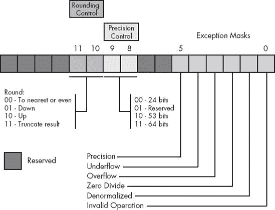
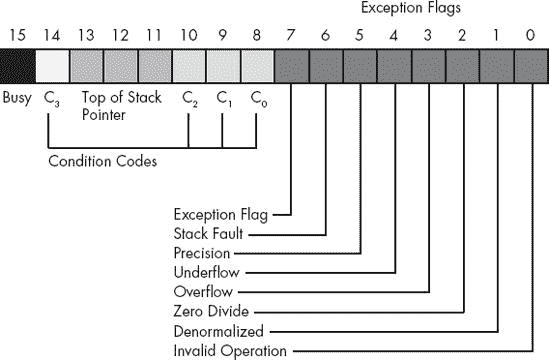
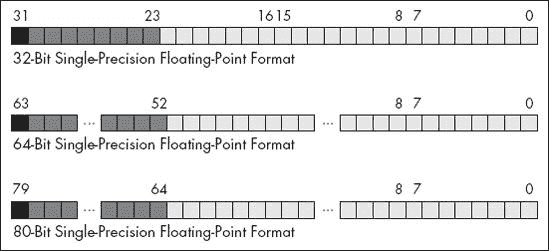
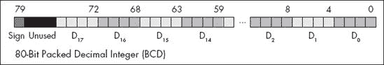

# 第六章 算术


本章讨论在汇编语言中的算术运算。到本章结束时，你应该能够将高级语言（如 Pascal 和 C/C++）中的算术表达式和赋值语句翻译为 80x86 汇编语言。

# 6.1 80x86 整数算术指令

在描述如何在汇编语言中编码算术表达式之前，最好先讨论 80x86 指令集中剩余的算术指令。前几章已经介绍了大部分算术和逻辑指令，因此本节将介绍你所需要的少数剩余指令。

## 6.1.1 `mul`和`imul`指令

乘法指令为你提供了 80x86 指令集中的另一种不规则性。像`add`、`sub`等许多指令都支持两个操作数，就像`mov`指令一样。不幸的是，80x86 的操作码字节没有足够的位数来支持所有指令，因此 80x86 将`mul`（无符号乘法）和`imul`（有符号整数乘法）指令视为单操作数指令，就像`inc`、`dec`和`neg`指令一样。

当然，乘法*是*一个双操作数的函数。为了绕过这一点，80x86 总是假设累加器（AL、AX 或 EAX）是目标操作数。这一不规则性使得在 80x86 上使用乘法比其他指令稍微困难，因为一个操作数必须在累加器中。英特尔采用了这种非正交的方法，因为他们认为程序员使用乘法的频率远低于`add`和`sub`等指令。

`mul`和`imul`指令的另一个问题是，你不能使用这些指令将累加器与常量相乘。英特尔很快发现了支持常量乘法的需求，并添加了`intmul`指令来解决这个问题。然而，你必须意识到，基本的`mul`和`imul`指令不支持与`intmul`一样的所有操作数范围。

乘法指令有两种形式：无符号乘法（`mul`）和有符号乘法（`imul`）。与加法和减法不同，你需要为有符号和无符号操作分别使用不同的指令。

乘法指令有以下几种形式：

无符号乘法：

```
mul( *`reg8`* );        // returns "ax"
          mul( *`reg16`* );       // returns "dx:ax"
          mul( *`reg32`* );       // returns "edx:eax"

          mul( *`mem8`* );        // returns "ax"
          mul( *`mem16`* );       // returns "dx:ax"

          mul( *`mem32`* );       // returns "edx:eax"
```

有符号（整数）乘法：

```
imul( *`reg8`* );       // returns "ax"
          imul( *`reg16`* );      // returns "dx:ax"
          imul( *`reg32`* );      // returns "edx:eax"

          imul( *`mem8`* );       // returns "ax"
          imul( *`mem16`* );      // returns "dx:ax"

          imul( *`mem32`* );      // returns "edx:eax"
```

上面返回的值是这些指令在 HLA 中用于指令组合的字符串。(`i`)`mul`，适用于所有 80x86 处理器，用于乘法 8 位、16 位或 32 位操作数。

在乘以两个*n*位值时，结果可能需要多达 2 * *n*位。因此，如果操作数是 8 位的，结果可能需要 16 位。同样，16 位操作数会产生 32 位结果，32 位操作数则需要 64 位来存储结果。

(`i`)`mul` 指令，使用 8 位操作数时，会将 AL 与操作数相乘，并将 16 位乘积保存在 AX 中。因此

```
mul( *`operand8`* );
```

或者

```
imul( *`operand8`* );
```

计算

```
ax := al * *`operand8`*
```

`*` 表示 `mul` 的无符号乘法和 `imul` 的有符号乘法。

如果你指定 16 位操作数，则 `mul` 和 `imul` 计算如下：

```
dx:ax := ax * *`operand16`*
```

`*` 的含义与上述相同，`dx:ax` 表示 DX 包含 32 位结果的高字（H.O.），AX 包含 32 位结果的低字（L.O.）。如果你在疑惑为何英特尔没有将 32 位结果放入 EAX 中，请注意，英特尔在最早期的 80x86 处理器中引入了 `mul` 和 `imul` 指令，在 80386 CPU 引入 32 位寄存器之前。

如果你指定 32 位操作数，则 `mul` 和 `imul` 计算如下：

```
edx:eax := eax * *`operand32`*
```

`*` 的含义与上述相同，`edx:eax` 表示 EDX 包含 64 位结果的高字（H.O.），EAX 包含 64 位结果的低字（L.O.）。

如果 8×8 位、16×16 位或 32×32 位的乘积需要超过 8、16 或 32 位（分别），则 `mul` 和 `imul` 指令会设置进位标志和溢出标志。`mul` 和 `imul` 会扰乱符号标志和零标志。

### 注意

特别需要注意的是，在执行这两条指令后，符号标志和零标志不包含有意义的值。

为了减少使用 `mul` 和 `imul` 指令时的一些语法不规范，HLA 提供了一种扩展语法，允许使用以下两操作数形式：

无符号乘法：

```
mul( *`reg8`*, al );
          mul( *`reg16`*, ax );
          mul( *`reg32`*, eax );

          mul( *`mem8`*, al );
          mul( *`mem16`*, ax );
          mul( *`mem32`*, eax );

          mul( *`constant8`*, al );
          mul( *`constant16`*, ax );

          mul( *`constant32`*, eax );
```

有符号（整数）乘法：

```
imul( *`reg8`*, al );
          imul( *`reg16`*, ax );
          imul( *`reg32`*, eax );

          imul( *`mem8`*, al );
          imul( *`mem16`*, ax );
          imul( *`mem32`*, eax );

          imul( *`constant8`*, al );
          imul( *`constant16`*, ax );

          imul( *`constant32`*, eax );
```

两操作数形式让你可以指定（低字）目标寄存器作为第二操作数。通过指定目标寄存器，你可以使程序更易读。请注意，尽管 HLA 允许在这里使用两个操作数，但你不能指定任意寄存器。目标操作数必须始终是 AL、AX 或 EAX，具体取决于源操作数。

HLA 提供了一种形式，可以让你指定常量。80x86 实际上不支持带有常量操作数的 `mul` 或 `imul` 指令。HLA 会将你指定的常量存储在内存的只读段中，并用该值初始化该变量。然后 HLA 将指令转换为 (`i`)`mul`（*`memory`*）；指令。请注意，当你指定常量作为源操作数时，指令需要两个操作数（因为 HLA 使用第二个操作数来确定乘法是 8 位、16 位还是 32 位）。

当你学习扩展精度算术时，你会经常使用 `mul` 和 `imul` 指令，详见 第八章。不过，除非你在进行多精度运算，否则你可能更倾向于用 `intmul` 指令来替代 `mul` 或 `imul`，因为它更为通用。然而，`intmul` 并不能完全替代这两条指令。除了操作数的数量外，`intmul` 和 `mul`/`imul` 指令之间还有几个差异。以下规则专门适用于 `intmul` 指令：

+   并没有可用的 8×8 位 `intmul` 指令。

+   `intmul` 指令不会产生 2*×n* 位的结果。也就是说，16×16 位的乘法会产生 16 位的结果。同样，32×32 位的乘法会产生 32 位的结果。如果结果不能适配目标寄存器，这些指令会设置进位标志和溢出标志。

## 6.1.2 div 和 idiv 指令

80x86 除法指令执行 64/32 位除法、32/16 位除法或 16/8 位除法。这些指令有以下几种形式：

```
div( *`reg8`* );                  // returns "al"
          div( *`reg16`* );                 // returns "ax"
          div( *`reg32`* );                 // returns "eax"

          div( *`reg8`*, ax );              // returns "al"
          div( *`reg16`*, dx:ax );          // returns "ax"
          div( *`reg32`*, edx:eax );        // returns "eax"

          div( *`mem8`* );                  // returns "al"
          div( *`mem16`* );                 // returns "ax"
          div( *`mem32`* );                 // returns "eax"

          div( *`mem8`*, ax );              // returns "al"
          div( *`mem16`*, dx:ax );          // returns "ax"
          div( *`mem32`*, edx:eax );        // returns "eax"

          div( *`constant8`*, ax );         // returns "al"
          div( *`constant16`*, dx:ax );     // returns "ax"
          div( *`constant32`*, edx:eax );   // returns "eax"

          idiv( *`reg8`* );                 // returns "al"
          idiv( *`reg16`* );                // returns "ax"
          idiv( *`reg32`* );                // returns "eax"

          idiv( *`reg8`*, ax );             // returns "al"
          idiv( *`reg16`*, dx:ax );         // returns "ax"
          idiv( *`reg32`*, edx:eax );       // returns "eax"

          idiv( *`mem8`* );                 // returns "al"
          idiv( *`mem16`* );                // returns "ax"
          idiv( *`mem32`* );                // returns "eax"

          idiv( *`mem8`*, ax );             // returns "al"
          idiv( *`mem16`*, dx:ax );         // returns "ax"
          idiv( *`mem32`*, edx:eax );       // returns "eax"

          idiv( *`constant8`*, ax );        // returns "al"
          idiv( *`constant16`*, dx:ax );    // returns "ax"
          idiv( *`constant32`*, edx:eax );  // returns "eax"
```

`div` 指令是无符号除法操作。如果操作数是 8 位操作数，`div` 将 AX 寄存器除以该操作数，商存储在 AL 寄存器中，余数（模）存储在 AH 寄存器中。如果操作数是 16 位数，则 `div` 指令将 `dx:ax` 中的 32 位数除以操作数，商存储在 AX 中，余数存储在 DX 中。对于 32 位操作数，`div` 将 `edx:eax` 中的 64 位值除以操作数，商存储在 EAX 中，余数存储在 EDX 中。

像 `mul` 和 `imul` 一样，HLA 提供了特殊语法，允许使用常量操作数，即使底层机器指令实际上不支持它们。有关这些扩展的更多信息，请参阅之前列出的 `div` 指令。

`idiv` 指令计算有符号商和余数。`idiv` 指令的语法与 `div` 相同（除了使用了 `idiv` 作为助记符），尽管为 `idiv` 创建有符号操作数可能需要在执行 `idiv` 之前使用不同的指令序列，而不是 `div`。

在 80x86 架构上，你不能简单地将一个无符号 8 位值除以另一个。如果除数是一个 8 位值，分子必须是一个 16 位值。如果你需要将一个无符号 8 位值除以另一个，你必须将分子扩展为 16 位。你可以通过将分子加载到 AL 寄存器中，然后将 0 移入 AH 寄存器来实现这一点。然后，你可以将 AX 除以除数操作数，得到正确的结果。*在执行* *`div`* *之前没有将 AL 扩展为 0 可能导致 80x86 产生错误的结果！* 当你需要除以两个 16 位无符号值时，你必须将包含分子的 AX 寄存器零扩展到 DX 寄存器。为此，只需将 0 加载到 DX 寄存器中。如果你需要将一个 32 位值除以另一个，你必须在除法操作之前将 EAX 寄存器零扩展到 EDX（通过将 0 加载到 EDX）。

在处理有符号整数值时，你需要在执行 `idiv` 之前，将 AL 扩展到 AX，AX 扩展到 DX，或 EAX 扩展到 EDX。为此，可以使用 `cbw`、`cwd`、`cdq` 或 `movsx` 指令。如果高位字节、字或双字中没有包含有效位，则必须在执行 `idiv` 操作之前对累加器（AL/AX/EAX）中的值进行符号扩展。未能执行此操作可能会导致错误的结果。

还有一个 80x86 除法指令的问题：你可能会遇到致命错误。首先，当然，你可以尝试将一个值除以 0。另一个问题是，商可能太大，无法适应 EAX、AX 或 AL 寄存器。例如，16/8 位除法 $8000/2 产生商 $4000，余数为 0。$4000 无法适应 8 位。如果发生这种情况，或者你尝试除以 0，80x86 将生成 `ex.DivisionError` 异常或整数溢出错误（`ex.IntoInstr`）。这通常意味着你的程序会显示适当的对话框并中止。如果发生这种情况，可能是你在执行除法操作之前没有对分子进行符号扩展或零扩展。由于此错误可能导致程序崩溃，因此在使用除法时应非常小心选择值。当然，你可以使用 `try..endtry` 块与 `ex.DivisionError` 和 `ex.IntoInstr` 来捕获程序中的这个问题。

80x86 在执行除法操作后，会使进位标志、溢出标志、符号标志和零标志未定义。因此，你不能通过检查标志位来检测除法操作后的问题。

80x86 并没有提供一个独立的指令来计算一个数除以另一个数的余数。`div` 和 `idiv` 指令在计算商的同时也会自动计算余数。然而，HLA 提供了 `mod` 和 `imod` 指令的助记符（指令）。这些特殊的 HLA 指令编译成与 `div` 和 `idiv` 相同的代码。唯一的区别是返回值的位置不同（因为这些指令将余数返回到与商不同的位置）。HLA 支持的 `mod` 和 `imod` 指令如下：

```
mod( *`reg8`* );                  // returns "ah"
          mod( *`reg16`* );                 // returns "dx"
          mod( *`reg32`* );                 // returns "edx"

          mod( *`reg8`*, ax );              // returns "ah"
          mod( *`reg16`*, dx:ax );          // returns "dx"
          mod( *`reg32`*, edx:eax );        // returns "edx"

          mod( *`mem8`* );                  // returns "ah"
          mod( *`mem16`* );                 // returns "dx"
          mod( *`mem32`* );                 // returns "edx"

          mod( *`mem8`*, ax );              // returns "ah"
          mod( *`mem16`*, dx:ax );          // returns "dx"
          mod( *`mem32`*, edx:eax );        // returns "edx"

          mod( *`constant8`*, ax );         // returns "ah"
          mod( *`constant16`*, dx:ax );     // returns "dx"
          mod( *`constant32`*, edx:eax );   // returns "edx"

          imod( *`reg8`* );                 // returns "ah"
          imod( *`reg16`* );                // returns "dx"
          imod( *`reg32`* );                // returns "edx"

          imod( *`reg8`*, ax );             // returns "ah"
          imod( *`reg16`*, dx:ax );         // returns "dx"
          imod( *`reg32`*, edx:eax );       // returns "edx"

          imod( *`mem8`* );                 // returns "ah"
          imod( *`mem16`* );                // returns "dx"
          imod( *`mem32`* );                // returns "edx"

          imod( *`mem8`*, ax );             // returns "ah"
          imod( *`mem16`*, dx:ax );         // returns "dx"
          imod( *`mem32`*, edx:eax );       // returns "edx"

          imod( *`constant8`*, ax );        // returns "ah"
          imod( *`constant16`*, dx:ax );    // returns "dx"
          imod( *`constant32`*, edx:eax );  // returns "edx"
```

## 6.1.3 cmp 指令

`cmp`（比较）指令与 `sub` 指令基本相同，唯一的语义区别是：它不会保留计算出的差值，而只是设置标志寄存器中的条件码位。`cmp` 指令的语法与 `sub` 指令相似（虽然操作数的顺序被调整过，以便更易理解）；其通用形式如下：

```
cmp( *`LeftOperand`*, *`RightOperand`* );
```

该指令计算 *`LeftOperand`* `-` *`RightOperand`*（注意与 `sub` 的区别）。具体形式如下：

```
cmp( *`reg`*, *`reg`* );       // Registers must be the same size.
          cmp( *`reg`*, *`mem`* );       // Sizes must match.
          cmp( *`reg`*, *`constant`* );
          cmp( *`mem`*, *`constant`* );
```

`cmp` 指令根据减法操作 (*`LeftOperand`* `-` *`RightOperand`*) 的结果更新 80x86 的标志位。80x86 会以适当的方式设置标志位，以便我们可以将此指令理解为“将 *`LeftOperand`* 与 *`RightOperand`* 进行比较。”你可以通过检查标志寄存器中的相关标志位，使用条件设置指令（见 6.1.4 setcc 指令）或条件跳转指令（见 第七章）来测试比较的结果。

在探索 `cmp` 指令时，最好的起点可能是查看 `cmp` 指令如何具体影响标志位。考虑以下 `cmp` 指令：

```
cmp( ax, bx );
```

该指令执行 AX - BX 的计算，并根据计算结果设置标志位。标志位设置如下（另见 表 6-1）：

**`Z`**

只有当 AX = BX 时，零标志才会被设置。这是 AX - BX 结果为零的唯一情况。因此，你可以通过零标志来测试相等或不相等。

**`S`**

如果结果为负数，则设置符号标志为 1。乍一看，你可能认为当 AX 小于 BX 时会设置该标志，但实际上并非总是如此。如果 AX = $7FFF，BX = −1 ($FFFF)，那么从 BX 减去 AX 的结果是$8000，负数（因此符号标志会被设置）。所以对于有符号比较来说，符号标志并没有提供正确的状态。对于无符号操作数，考虑 AX = $FFFF 和 BX = 1。AX 大于 BX，但它们的差值是$FFFE，仍然是负数。事实证明，符号标志和溢出标志可以一起用于比较两个有符号值。

**`O`**

如果 AX 和 BX 的差值产生了溢出或下溢，则在`cmp`操作后设置溢出标志。如上所述，符号标志和溢出标志在进行有符号比较时都被使用。

**`C`**

如果从 AX 中减去 BX 需要借位，则在`cmp`操作后设置进位标志。这仅在 AX 小于 BX 且 AX 和 BX 都是无符号值时发生。

由于`cmp`指令以这种方式设置标志，你可以通过以下标志来测试两个操作数的比较：

```
cmp( *`Left`*, *`Right`* );
```

表 6-1. `cmp`后的条件码设置

| 无符号操作数 | 有符号操作数 |
| --- | --- |
| Z: 相等/不相等 | Z: 相等/不相等 |
| C: 左边 < 右边 (C = 1) 左边 >= 右边 (C = 0) | C: 无意义 |
| S: 无意义 | S: 请参阅本节讨论 |
| O: 无意义 | O: 请参阅本节讨论 |

对于有符号比较，S（符号）和 O（溢出）标志一起有以下含义：

+   如果[(S = 0)且(O = 1)]或[(S = 1)且(O = 0)]，则在有符号比较中左边 < 右边。

+   如果[(S = 0)且(O = 0)]或[(S = 1)且(O = 1)]，则在有符号比较中左边 >= 右边。

请注意，当左操作数小于右操作数时，（S `xor` O）为 1。相反，当左操作数大于或等于右操作数时，（S `xor` O）为 0。

为了理解这些标志为什么以这种方式设置，请考虑以下示例：

```
Left          minus     Right           S    O
     ------                  ------          -    -

     $FFFF (-1)      -       $FFFE (-2)      0    0
     $8000           -       $0001           0    1
     $FFFE (-2)      -       $FFFF (-1)      1    0
     $7FFF (32767)   -       $FFFF (-1)      1    1
```

请记住，`cmp`操作实际上是减法；因此，上面的第一个例子计算（−1）-（−2），结果是（+1）。结果为正且没有发生溢出，因此 S 和 O 标志均为 0。因为（S `xor` O）为 0，所以`Left`大于或等于`Right`。

在第二个例子中，`cmp`指令将计算（−32,768）-（+1），结果是（−32,769）。由于 16 位有符号整数无法表示该值，因此该值会环绕到$7FFF（+32,767）并设置溢出标志。结果是正数（至少作为 16 位值），所以 CPU 会清除符号标志。这里（S `xor` O）为 1，因此`Left`小于`Right`。

在上面的第三个例子中，`cmp`计算（−2）-（−1），结果是（−1）。没有发生溢出，因此 O 标志为 0，结果为负数，因此符号标志为 1。因为（S `xor` O）为 1，所以`Left`小于`Right`。

在第四个（也是最后一个）示例中，`cmp`计算（+32,767）-（−1）。这产生了（+32,768），设置了溢出标志。此外，值会环绕回$8000（−32,768），因此符号标志也被设置。因为（S `xor` O）等于 0，所以`Left`大于或等于`Right`。

你可以在`cmp`指令后使用 HLA 高级控制语句和布尔标志表达式（例如`@c`，`@nc`，`@z`，`@nz`，`@o`，`@no`，`@s`，`@ns`等）测试标志。表 6-2 列出了 HLA 支持的布尔表达式，允许你在比较指令后检查各种条件。

表 6-2. HLA 条件码布尔表达式

| HLA 语法 | 条件 | 注释 |
| --- | --- | --- |
| `@c` | 进位设置 | 如果第一个操作数小于第二个操作数（无符号），则进位标志设置。与`@b`和`@nae`相同条件。 |
| `@nc` | 进位清除（无进位） | 如果第一个操作数大于或等于第二个操作数（使用无符号比较），则进位标志清除。与`@nb`和`@ae`相同条件。 |
| `@z` | 零标志设置 | 如果第一个操作数等于第二个操作数，则零标志设置。与`@e`相同条件。 |
| `@nz` | 零标志清除（无零） | 如果第一个操作数不等于第二个操作数，则零标志清除。与`@ne`相同条件。 |
| `@o` | 溢出标志设置 | 如果比较操作导致符号算术溢出，则此标志设置。 |
| `@no` | 溢出标志清除（无溢出） | 如果在比较操作过程中没有发生符号算术溢出，则溢出标志清除。 |
| `@s` | 符号标志设置 | 如果比较（减法）结果为负，则符号标志被设置。 |
| `@ns` | 符号标志清除（无符号） | 如果比较操作产生非负（零或正）结果，则符号标志清除。 |
| `@a` | 大于（无符号大于） | `@a`条件检查进位和零标志，查看`@c` = 0 且`@z` = 0。此条件存在于第一个（无符号）操作数大于第二个（无符号）操作数时。这与`@nbe`相同。 |
| `@na` | 不大于 | `@na`条件检查进位标志是否被设置（`@c`）或零标志是否被设置（`@z`）。这等同于无符号的“非大于”条件。请注意，这个条件与`@be`相同。 |
| `@ae` | 大于或等于（无符号大于等于） | 如果第一个操作数使用无符号比较大于或等于第二个操作数，则`@ae`条件为真。这等同于`@nb`和`@nc`条件。 |
| `@nae` | 非大于或等于 | 如果第一个操作数使用无符号比较不大于或等于第二个操作数，则`@nae`条件为真。这等同于`@b`和`@c`条件。 |
| `@b` | 小于（无符号小于） | 如果第一个操作数使用无符号比较小于第二个操作数，则`@b`条件为真。这相当于`@nae`和`@c`条件。 |
| `@nb` | 不小于 | 如果第一个操作数使用无符号比较不小于第二个操作数，则此条件为真。此条件等同于`@nc`和`@ae`条件。 |
| `@be` | 小于或等于（无符号小于或等于） | 如果第一个操作数使用无符号比较小于或等于第二个操作数，则`@be`条件为真。此条件等同于`@na`。 |
| `@nbe` | 不小于或等于 | 如果第一个操作数使用无符号比较不小于或等于第二个操作数，则`@be`条件为真。此条件等同于`@a`。 |
| `@g` | 大于（有符号大于） | 如果第一个操作数使用有符号比较大于第二个操作数，则`@g`条件为真。这相当于`@nle`条件。 |
| `@ng` | 不大于 | 如果第一个操作数使用有符号比较不大于第二个操作数，则`@ng`条件为真。这相当于`@le`条件。 |
| `@ge` | 大于或等于（有符号大于或等于） | 如果第一个操作数使用有符号比较大于或等于第二个操作数，则`@ge`条件为真。这相当于`@nl`条件。 |
| `@nge` | 不大于或等于 | 如果第一个操作数使用有符号比较不大于或等于第二个操作数，则`@nge`条件为真。这相当于`@l`条件。 |
| `@l` | 小于（有符号小于） | 如果第一个操作数使用有符号比较小于第二个操作数，则`@l`条件为真。这相当于`@nge`条件。 |
| `@nl` | 不小于 | 如果第一个操作数使用有符号比较不小于第二个操作数，则`@ng`条件为真。这相当于`@ge`条件。 |
| `@le` | 小于或等于（有符号） | 如果第一个操作数使用有符号比较小于或等于第二个操作数，则`@le`条件为真。这相当于`@ng`条件。 |
| `@nle` | 不小于或等于 | 如果第一个操作数使用有符号比较不小于或等于第二个操作数，则`@nle`条件为真。这相当于`@g`条件。 |
| `@e` | 等于（有符号或无符号） | 如果第一个操作数等于第二个操作数，则此条件为真。`@e`条件等同于`@z`条件。 |
| `@ne` | 不等于（有符号或无符号） | 如果第一个操作数不等于第二个操作数，则`@ne`为真。此条件等同于`@nz`。 |

你可以在`if`语句、`while`语句或任何其他允许布尔表达式的 HLA 高级控制语句中使用出现在表 6-2 中的布尔条件。在执行完`cmp`指令后，通常会在`if`语句中使用这些条件。例如：

```
cmp( eax, ebx );
          if( @e ) then

              << Do something if eax = ebx. >>

          endif;
```

请注意，上面的示例等同于以下内容：

```
if( eax = ebx ) then

              << Do something if eax = ebx. >>

          endif;
```

## 6.1.4 `set*cc*` 指令

*条件设置*（或`set`*`cc`*）指令根据标志寄存器中的值，将一个字节的操作数（寄存器或内存）设置为 0 或 1。`set`*`cc`*指令的一般格式如下：

```
set*`cc`*( *`reg8`* );
          set*`cc`*( *`mem8`* );
```

`set`*`cc`*表示一个助记符，出现在表 6-3、表 6-4 和表 6-5 中。这些指令在条件为假时将 0 存入相应的操作数，如果条件为真，则将 1 存入 8 位操作数中。

表 6-3。`set`*`cc`* 指令测试标志

| 指令 | 描述 | 条件 | 注释 |
| --- | --- | --- | --- |
| `setc` | 如果进位，则设置 | 进位 = 1 | 与`setb`、`setnae`相同 |
| `setnc` | 如果没有进位，则设置 | 进位 = 0 | 与`setnb`、`setae`相同 |
| `setz` | 如果为零，则设置 | 零 = 1 | 与`sete`相同 |
| `setnz` | 如果不为零，则设置 | 零 = 0 | 与`setne`相同 |
| `sets` | 如果为符号，则设置 | 符号 = 1 |   |
| `setns` | 如果没有符号，则设置 | 符号 = 0 |   |
| `seto` | 如果溢出，则设置 | 溢出 = 1 |   |
| `setno` | 如果没有溢出，则设置 | 溢出 = 0 |   |
| `setp` | 如果为奇偶性，则设置 | 奇偶性 = 1 | 与`setpe`相同 |
| `setpe` | 如果为偶数奇偶性，则设置 | 奇偶性 = 1 | 与`setp`相同 |
| `setnp` | 如果没有奇偶性，则设置 | 奇偶性 = 0 | 与`setpo`相同 |
| `setpo` | 如果奇偶性为奇数，则设置 | 奇偶性 = 0 | 与`setnp`相同 |

上面的`set`*`cc`*指令仅仅测试标志，而没有附加其他含义。例如，你可以在执行移位、旋转、位测试或算术操作后使用`setc`来检查进位标志。你可能注意到上面有`setp`、`setpe`和`setnp`指令。它们检查奇偶性标志。这些指令在此列出以完整性为目的，但本文不会花太多时间讨论奇偶性标志（它的使用有些过时）。

`cmp`指令与 setcc 指令协同工作。在执行`cmp`操作后，处理器的标志会提供关于操作数相对值的信息。它们可以帮助你判断一个操作数是否小于、等于或大于另一个操作数。

两组额外的 `set`*`cc`* 指令在 `cmp` 操作后非常有用。第一组处理无符号比较的结果；第二组处理有符号比较的结果。

表 6-4. `set`*`cc`* 无符号比较指令

| 指令 | 描述 | 条件 | 注释 |
| --- | --- | --- | --- |
| `seta` | 如果高于（>）则设置 | Carry = 0，Zero = 0 | 与`setnbe`相同 |
| `setnbe` | 如果不低于或等于（不 <=）则设置 | Carry = 0，Zero = 0 | 与`seta`相同 |
| `setae` | 如果高于或等于（>=）则设置 | Carry = 0 | 与`setnc`、`setnb`相同 |
| `setnb` | 如果不低于（不 <）则设置 | Carry = 0 | 与`setnc`、`setae`相同 |
| `setb` | 如果低于（<）则设置 | Carry = 1 | 与`setc`、`setna`相同 |
| `setnae` | 如果不高于或等于（不 >=）则设置 | Carry = 1 | 与`setc`、`setb`相同 |
| `setbe` | 如果低于或等于（<=）则设置 | Carry = 1 或 Zero = 1 | 与`setna`相同 |
| `setna` | 如果不高于（不 >）则设置 | Carry = 1 或 Zero = 1 | 与`setbe`相同 |
| `sete` | 如果相等则设置（=） | Zero = 1 | 与`setz`相同 |
| `setne` | 如果不相等则设置（¦） | Zero = 0 | 与`setnz`相同 |

表 6-5 列出了相应的有符号比较。

表 6-5. `set`*`cc`* 有符号比较指令

| 指令 | 描述 | 条件 | 注释 |
| --- | --- | --- | --- |
| `setg` | 如果大于（>）则设置 | Sign = Overflow 且 Zero = 0 | 与`setnle`相同 |
| `setnle` | 如果不小于或等于（不 <=）则设置 | Sign = Overflow 或 Zero = 0 | 与`setg`相同 |
| `setge` | 如果大于或等于（>=）则设置 | Sign = Overflow | 与`setnl`相同 |
| `setnl` | 如果不小于（不 <）则设置 | Sign = Overflow | 与`setge`相同 |
| `setl` | 如果小于（<）则设置 | Sign ¦ Overflow | 与`setnge`相同 |
| `setnge` | 如果不大于或等于（不 >=）则设置 | Sign ¦ Overflow | 与`setl`相同 |
| `setl` | 如果小于或等于（<=）则设置 | Sign ¦ Overflow 或 Zero = 1 | 与`setng`相同 |
| `setng` | 如果不大于（不 >）则设置 | Sign ¦ Overflow 或 Zero = 1 | 与`setle`相同 |
| `sete` | 如果相等则设置（=） | Zero = 1 | 与`setz`相同 |
| `setne` | 如果不相等则设置（¦） | Zero = 0 | 与`setnz`相同 |

注意 `set`*`cc`* 指令与可能出现在布尔指令中的 HLA 标志条件之间的对应关系。

`set`*`cc`* 指令特别有价值，因为它们可以将比较结果转换为布尔值（假/真或 0/1）。这在将高级语言如 Pascal 或 C/C++ 转换为汇编语言时尤其重要。以下示例展示了如何以这种方式使用这些指令：

```
// bool := a <= b

          mov( a, eax );
          cmp( eax, b );
          setle( bool );            // bool is a boolean or byte variable.
```

因为 `set`*`cc`* 指令总是产生 0 或 1，你可以使用 `and` 和 `or` 指令与这些结果一起计算复杂的布尔值：

```
// bool := ((a <= b) and (d = e))

          mov( a, eax );
          cmp( eax, b );
          setle( bl );
          mov( d, eax );
          cmp( eax, e );
          sete( bh );
          and( bl, bh );
          mov( bh, bool );
```

## 6.1.5 测试指令

80x86 的 `test` 指令就像 `cmp` 指令之于 `sub` 指令。也就是说，`test` 指令计算其两个操作数的逻辑 `and`，并根据结果设置条件码标志；然而，它不会将逻辑 `and` 的结果存储回目标操作数。`test` 指令的语法类似于 `and`：

```
test( *`operand1`*, *`operand2`* );
```

`test` 指令在逻辑 `and` 运算结果为 0 时会设置零标志。如果结果的高位比特为 1，则会设置符号标志。`test` 指令始终清除进位标志和溢出标志。

`test` 指令的主要用途是检查单个比特是否为 0 或 1。考虑指令 `test( 1, al);`。这条指令将 AL 与值 1 进行逻辑 `and` 运算；如果 AL 的第 0 位为 0，则结果为 0（设置零标志），因为常数 1 中的其他比特都是 0。相反，如果 AL 的第 1 位为 1，则结果不为 0，因此 `test` 会清除零标志。因此，你可以在这条 `test` 指令之后测试零标志，查看第 0 位是 0 还是 1（例如，使用 `setz` 或 `setnz` 指令）。

`test` 指令还可以检查指定的比特集中的所有比特是否为 0。指令 `test( $F, al);` 仅在 AL 的最低 4 位都为 0 时，才会设置零标志。

`test` 指令的一个非常重要的用途是检查一个寄存器是否包含 0。指令 `test(` *`reg`*`,` *`reg`* `);`，其中两个操作数是相同的寄存器，将该寄存器与自身做逻辑 `and` 运算。如果寄存器的值为 0，则结果为 0，CPU 将设置零标志。但是，如果寄存器包含非零值，将该值与自身做逻辑 `and` 运算将得到相同的非零值，CPU 会清除零标志。因此，你可以在执行此指令后立即检查零标志（例如，使用 `setz` 或 `setnz` 指令，或者使用 `@z` 和 `@nz` 布尔条件）来判断寄存器是否为 0。以下是一些示例：

```
test( eax, eax );
          setz( bl );          // bl is set to 1 if eax contains 0.
               .
               .
               .
          test( bx, bx );
          if( @nz ) then

               << Do something if bx <> 0\. >>

          endif;
```

# 6.2 算术表达式

对于第一次接触汇编语言的初学者来说，最大的震惊可能是缺乏熟悉的算术表达式。在大多数高级语言中，算术表达式看起来与它们的代数等价物类似。例如：

```
x := y * z;
```

在汇编语言中，你需要几个语句来完成相同的任务：

```
mov( y, eax );
          intmul( z, eax );
          mov( eax, x );
```

显然，高级语言版本要输入、阅读和理解起来都要容易得多。这个事实，胜过其他任何原因，导致了人们远离汇编语言。尽管涉及很多输入，但将一个算术表达式转换成汇编语言并不难。通过分步解决问题，就像你手动解题一样，你可以轻松地将任何算术表达式分解为等效的汇编语言指令。通过学习如何将这种表达式分三步转换成汇编语言，你会发现这个任务几乎没有难度。

## 6.2.1 简单赋值

转换为汇编语言最简单的表达式是简单赋值。简单赋值将一个单一的值复制到变量中，具有两种形式之一：

```
*`variable`* := *`constant`*
```

或者

```
*`var1`* := *`var2`*
```

将第一种形式转换为汇编语言很简单——只需使用汇编语言指令：

```
mov( *`constant`*, *`variable`* );
```

这个`mov`指令将常量复制到变量中。

上述第二个赋值稍微复杂一些，因为 80x86 并没有提供内存到内存的`mov`指令。因此，要将一个内存变量复制到另一个内存变量，必须通过寄存器传递数据。根据惯例（并出于轻微的效率考虑），大多数程序员倾向于使用 AL/AX/EAX 作为这个目的。例如：

```
*`var1`* := *`var2`*;
```

变为

```
mov( *`var2`*, eax );
          mov( eax, *`var1`* );
```

当然，这是假设*`var1`*和*`var2`*是 32 位变量。如果它们是 8 位变量，使用 AL；如果是 16 位变量，使用 AX。

当然，如果你已经用 AL、AX 或 EAX 做了其他事情，使用其他寄存器也可以。无论如何，通常会使用寄存器将一个内存位置转移到另一个内存位置。

## 6.2.2 简单表达式

下一层复杂性是一个简单表达式。一个简单的表达式具有以下形式：

```
*`var1`* := *`term1 op term2`*;
```

*`var1`*是一个变量，*`term1`*和*`term2`*是变量或常量，*`op`*是某个算术运算符（加法、减法、乘法等等）。大多数表达式都采用这种形式。由此看来，80x86 架构是为这种类型的表达式优化的，这一点应该不足为奇。

这种类型表达式的典型转换形式如下：

```
mov( *`term1`*, eax );
          *`op`*( *`term2`*, eax );
          mov( eax, *`var1`* )
```

*`op`*是与指定操作相对应的助记符（例如，+是`add`，−是`sub`，等等）。

请注意，简单的表达式*`var1`* `:=` *`const1 op const2`*`;`可以通过编译时表达式和单个`mov`指令轻松处理。例如，要计算*`var1`* `:= 5+3;`，只需使用单条指令`mov( 5+3`, *`var1`* `);`。

有一些不一致之处需要注意。当处理 80x86 上的（`i`）`mul`、（`i`）`div` 和（`i`）`mod` 指令时，你必须使用 AL/AX/EAX 和 DX/EDX 寄存器。你不能像其他操作那样使用任意寄存器。此外，如果你正在执行除法操作，并且是在将一个 16/32 位数字除以另一个时，别忘了使用符号扩展指令。最后，别忘了某些指令可能会引发溢出。你可能需要在算术操作之后检查是否发生溢出（或下溢）。

这里是一些常见简单表达式的例子：

```
x := y + z;

          mov( y, eax );
          add( z, eax );
          mov( eax, x );

x := y - z;

          mov( y, eax );
          sub( z, eax );
          mov( eax, x );

x := y * z; {unsigned}

          mov( y, eax );
          mul( z, eax );     // Don't forget this wipes out edx.
          mov( eax, x );

x := y * z; {signed}

          mov( y, eax );
          intmul( z, eax );  // Does not affect edx!
          mov( eax, x );

x := y div z; {unsigned div}

          mov( y, eax );
          mov( 0, edx );       // Zero extend eax into edx.
          div( z, edx:eax );
          mov( eax, x );

x := y idiv z; {signed div}

          mov( y, eax );
          cdq();               // Sign extend eax into edx.
          idiv( z, edx:eax );
          mov( eax, z );

x := y mod z; {unsigned remainder}

          mov( y, eax );
          mov( 0, edx );       // Zero extend eax into edx.
          mod( z, edx:eax );
          mov( edx, x );       // Note that remainder is in edx.

x := y imod z; {signed remainder}

          mov( y, eax );
          cdq();               // Sign extend eax into edx.
          imod( z, edx:eax );
          mov( edx, x );       // Remainder is in edx.
```

某些一元运算也可以作为简单表达式，导致一般规则中的额外不一致性。一个好的例子是一元运算是取反。在高级语言中，取反有两种可能的形式：

```
*`var`* := -*`var`*
```

或者

```
*`var1`* := -*`var2`*
```

请注意，*`var`* `:= -`*`constant`* 实际上是一个简单的赋值，而不是简单表达式。你可以将负常量作为操作数传递给 `mov` 指令：

```
mov( −14, *`var`* );
```

要处理 *`var1`* `= -`*`var1`*`；`，使用以下单条汇编语言语句：

```
// *`var1`* = -*`var1`*;

          neg( *`var1`* );
```

如果涉及两个不同的变量，则使用以下方式。

```
// *`var1`* = -*`var2`*;

          mov( *`var2`*, eax );
          neg( eax );
          mov( eax, *`var1`* );
```

## 6.2.3 复杂表达式

复杂表达式是指涉及多个项和一个运算符的任何算术表达式。这类表达式通常出现在用高级语言编写的程序中。复杂表达式可能包含括号，用于覆盖运算符优先级，函数调用，数组访问等等。虽然许多复杂表达式转换为汇编语言相对直接，但其他转换则需要一些努力。本节概述了将这类表达式转换的规则。

一个容易转换为汇编语言的复杂表达式是涉及三个项和两个运算符的表达式。例如：

```
w := w - y - z;
```

显然，直接将这个语句转换为汇编语言将需要两个 `sub` 指令。然而，即使是像这样的简单表达式，转换也不是小事。实际上，从上面的语句转换到汇编语言有*两种方法*：

```
mov( w, eax );
          sub( y, eax );
          sub( z, eax );
          mov( eax, w );
```

和

```
mov( y, eax );
          sub( z, eax );
          sub( eax, w );
```

第二种转换方法由于较短，看起来更好。然而，它会产生一个错误的结果（假设原语句采用类似 Pascal 的语义）。*结合性*是问题所在。上述第二个表达式计算的是 `w := w - (y - z)`，这与 `w := (w - y) - z` 不相同。我们如何在子表达式周围放置括号会影响结果。请注意，如果你更关注简洁的形式，可以使用以下序列：

```
mov( y, eax );
          add( z, eax );
          sub( eax, w );
```

这会计算 `w := w - (y + z)`。这等同于 `w := (w - y) - z`。

*优先级*是另一个问题。考虑这个 Pascal 表达式：

```
x := w * y + z;
```

再次，我们可以通过两种方式来计算这个表达式：

```
x := (w * y) + z;
```

或者

```
x := w * (y + z);
```

到现在，你可能会觉得这段文字有点疯狂。大家都知道，正确的求值方式是第二种形式。然而，你认为那样是错误的。比如 APL 编程语言，它是从右到左进行表达式求值的，并且不会让某个运算符优先于另一个运算符。到底哪种方式是“正确”的，完全取决于你如何在你的算术系统中定义优先级。

大多数高级语言使用一组固定的优先级规则来描述涉及两个或多个不同运算符的表达式中的求值顺序。这类编程语言通常会在加法和减法之前计算乘法和除法。那些支持指数运算的语言（例如 FORTRAN 和 BASIC）通常会在乘法和除法之前计算指数运算。这些规则是直观的，因为几乎每个人在上高中之前就学过它们。考虑以下表达式

```
x *`op1`* y *`op2`* z
```

如果*`op1`*的优先级高于*`op2`*，那么这将计算为`(x` *`op1`* `y)` *`op2`* `z`；否则，如果*`op2`*的优先级高于*`op1`*，则将计算为`x` *`op1`* `(y` *`op2`* `z)`。根据涉及的运算符和操作数，这两种计算可能会产生不同的结果。当将这种形式的表达式转换为汇编语言时，必须确保首先计算优先级最高的子表达式。以下示例演示了这一技术：

```
// w := x + y * z;

          mov( x, ebx );
          mov( y, eax );      // Must compute y * z first because "*"
          intmul( z, eax );   // has higher precedence than "+".
          add( ebx, eax );
          mov( eax, w );
```

如果在表达式中出现的两个运算符具有相同的优先级，那么你需要使用*结合性*规则来确定求值顺序。大多数运算符是左结合的，意味着它们从左到右进行求值。加法、减法、乘法和除法都是左结合的。一个*右结合*运算符则从右到左进行求值。例如，FORTRAN 和 BASIC 中的指数运算符就是一个典型的右结合运算符：

```
2²³ is equal to 2^(2³) *`not`* (2²)³
```

优先级和结合性规则决定了求值顺序。间接地，这些规则告诉你在表达式中放置括号的位置，以确定求值顺序。当然，你可以始终使用括号来覆盖默认的优先级和结合性。然而，最重要的是，你的汇编代码必须在正确的顺序中完成某些操作，才能正确计算给定表达式的值。以下示例演示了这一原则：

```
// w := x - y - z

          mov( x, eax );      // All the same operator, so we need
          sub( y, eax );      // to evaluate from left to right
          sub( z, eax );      // because they all have the same
          mov( eax, w );      // precedence and are left associative.

// w := x + y * z

          mov( y, eax );      // Must compute y * z first because
          intmul( z, eax );   // multiplication has a higher
          add( x, eax );      // precedence than addition.
          mov( eax, w );

// w := x / y - z

          mov( x, eax );      // Here we need to compute division
          cdq();              // first because it has the highest
          idiv( y, edx:eax ); // precedence.
          sub( z, eax );
          mov( eax, w );

// w := x * y * z

          mov( y, eax );      // Addition and multiplication are
          intmul( z, eax );   // commutative; therefore the order
          intmul( x, eax );   // of evaluation does not matter.
          mov( eax, w );
```

对于结合性规则，有一个例外。如果一个表达式涉及乘法和除法，通常最好先进行乘法。例如，给定一个类似以下形式的表达式

```
w := x / y * z      // Note: This is (x * z) / y, not x / (y * z).
```

通常，最好先计算`x * z`，然后将结果除以`y`，而不是先将`x`除以`y`，再将商乘以`z`。这种方法更好的原因有两个。首先，记住`imul`指令总是生成一个 64 位的结果（假设操作数是 32 位）。通过先进行乘法，你会自动将乘积*符号扩展*到 EDX 寄存器中，这样就不需要在除法前对 EAX 进行符号扩展。第二个理由是先进行乘法可以提高计算的精确度。记住，（整数）除法往往会产生不准确的结果。例如，如果你计算 5/2，你会得到值 2，而不是 2.5。计算(5 / 2) * 3 得到 6。但如果你计算`(5 * 3) / 2`，你会得到值 7，这更接近真实的商（7.5）。因此，如果你遇到以下形式的表达式：

```
w := x / y * z;
```

你通常可以将其转换为以下汇编代码：

```
mov( x, eax );
          imul( z, eax );          // Note the use of imul, not intmul!
          idiv( y, edx:eax );
          mov( eax, w );
```

当然，如果你正在编码的算法依赖于除法操作的截断效应，你就不能使用这种技巧来改善算法。这个故事的寓意是：在将任何表达式转换为汇编语言之前，一定要完全理解它的含义。显然，如果语义要求你必须先进行除法操作，那就按照要求做。

考虑以下的 Pascal 语句：

```
w := x - y * x;
```

这与之前的例子类似，只不过它使用了减法而不是加法。由于减法不是交换律的，你不能先计算`y * x`然后从这个结果中减去`x`。这会稍微增加转换的复杂度。你需要先将`x`加载到寄存器中，计算`y`与`x`的乘积，并将它们的乘积保存在另一个寄存器中，然后从`x`中减去这个乘积。例如：

```
mov( x, ebx );
          mov( y, eax );
          intmul( x, eax );
          sub( eax, ebx );
          mov( ebx, w );
```

这是一个简单的例子，演示了在表达式中使用*临时变量*的必要性。这段代码使用了 EBX 寄存器暂时保存`x`的副本，直到计算出`y`和`x`的乘积。随着表达式复杂度的增加，临时变量的需求也会增加。考虑以下的 Pascal 语句：

```
w := (a + b) * (y + z);
```

根据代数求值的正常规则，你首先计算括号内的子表达式（即具有最高优先级的两个子表达式），并将它们的值暂存。当你计算出两个子表达式的值后，你可以计算它们的和。处理像这样的复杂表达式的一种方式是将其简化为一系列简单的表达式，这些简单表达式的结果最终存储在临时变量中。例如，你可以将上面的单一表达式转换为以下的序列：

```
*`temp1`* := a + b;
          *`temp2`* := y + z;
          w := *`temp1`* * *`temp2`*;
```

因为将简单的表达式转换为汇编语言相对容易，现在你可以轻松地将之前复杂的表达式转换为汇编代码。代码如下：

```
mov( a, eax );
          add( b, eax );
          mov( eax, *`temp1`* );
          mov( y, eax );
          add( z, eax );
          mov( eax, *`temp2`* );
          mov( *`temp1`*, eax );
          intmul( *`temp2`*, eax );
          mov( eax, w );
```

当然，这段代码极为低效，并且要求你在数据段中声明几个临时变量。然而，通过尽量将临时变量保存在 80x86 寄存器中，这段代码是非常容易优化的。使用 80x86 寄存器来存储临时结果后，这段代码变成了：

```
mov( a, eax );
          add( b, eax );
          mov( y, ebx );
          add( z, ebx );
          intmul( ebx, eax );
          mov( eax, w );
```

这是另一个例子：

```
x := (y + z) * (a - b) / 10;
```

这可以转换为四个简单的表达式：

```
*`temp1`* := (y + z)
          *`temp2`* := (a - b)
          *`temp1`* := *`temp1`* * *`temp2`*
          X := *`temp1`* / 10
```

你可以将这四个简单的表达式转换为以下汇编语言语句：

```
mov( y, eax );            // Compute eax = y + z
          add( z, eax );
          mov( a, ebx );            // Compute ebx = a - b
          sub( b, ebx );
          imul( ebx, eax );         // This also sign extends eax into edx.
          idiv( 10, edx:eax );
          mov( eax, x );
```

最重要的是，你应该尽量将临时值保存在寄存器中。记住，访问 80x86 寄存器比访问内存位置高效得多。只有在寄存器用完的情况下，才使用内存位置来保存临时变量。

最终，将复杂的表达式转换为汇编语言与手动求解表达式没什么不同。你不是在每个计算阶段实际计算结果，而是编写计算结果的汇编代码。因为你可能被教导一次只计算一个操作，这意味着手动计算是在复杂表达式中处理“简单表达式”。当然，将这些简单表达式转换成汇编语言是相当简单的。因此，任何能够手动求解复杂表达式的人，都可以按照简单表达式的规则将其转换为汇编语言。

## 6.2.4 交换律运算符

如果 *`op`* 表示某个运算符，且该运算符是 *交换律* 的话，那么以下关系总是成立：

```
(A *`op`* B) = (B *`op`* A)
```

如你在上一节中看到的，交换律运算符很有用，因为其操作数的顺序无关紧要，这使得你可以重新排列计算步骤，通常可以使计算更简单或更高效。通常，重新排列计算步骤能让你使用更少的临时变量。每当你在表达式中遇到交换律运算符时，应该始终检查是否有更好的顺序能提高代码的大小或速度。表 6-6 和 表 6-7 列出了你在高级语言中通常遇到的交换律和非交换律运算符。

表 6-6. 一些常见的交换律二元运算符

| Pascal | C/C++ | 描述 |
| --- | --- | --- |
| `+` | `+` | 加法 |
| `*` | `*` | 乘法 |
| `and` | `&&` 或 `&` | 逻辑与与按位与 |
| `or` | `&#124;&#124;` 或 `&#124;` | 逻辑或与按位或 |
| `xor` | `^` | （逻辑或）按位异或 |
| `=` | `==` | 等式 |
| `<>` | `!=` | 不等式 |

表 6-7. 一些常见的非交换律二元运算符

| Pascal | C/C++ | 描述 |
| --- | --- | --- |
| `-` | `-` | 减法 |
| `/` 或 `div` | `/` | 除法 |
| `mod` | `%` | 取模或余数 |
| `<` | `<` | 小于 |
| `<=` | `<=` | 小于或等于 |
| `>` | `>` | 大于 |
| `>=` | `>=` | 大于或等于 |

# 6.3 逻辑（布尔）表达式

考虑下面一个来自 Pascal 程序的表达式：

```
b := ((x = y) and (a <= c)) or ((z - a) <> 5);
```

`b`是一个布尔变量，其他变量都是整数。

我们如何在汇编语言中表示布尔变量？尽管表示一个布尔值只需要一个位，但大多数汇编语言程序员会为此分配一个完整的字节或字（因此，HLA 也为布尔变量分配了一个完整的字节）。有了一个字节，我们可以使用 256 个可能的值来表示两个布尔值：真和假。那么我们用哪两个值（或哪两组值）来表示这些布尔值呢？由于机器的架构，测试像零或非零、正数或负数这样的条件比测试两个特定布尔值要容易得多。大多数程序员（事实上，一些编程语言，如 C 语言）选择用 0 表示假，其他任何值表示真。也有人更倾向于用 1 和 0（分别表示真和假）来表示布尔值，并且不允许其他值。还有些人选择将所有 1 位（$FFFF_FFFF, $FFFF 或 $FF）表示真，0 表示假。你也可以用正值表示真，负值表示假。这些机制各有其优缺点。

仅使用 0 和 1 来表示假和真有两个非常大的优点：（1）setcc 指令会产生这些结果，因此这个方案与这些指令兼容；（2）80x86 的逻辑指令（`and`、`or`、`xor`，以及在较小程度上，`not`）对这些值的操作完全符合预期。也就是说，如果你有两个布尔变量`A`和`B`，那么以下指令会对这两个变量执行基本的逻辑操作：

```
// c = a AND b;

     mov( a, al );
     and( b, al );
     mov( al, c );

// c = a OR b;

     mov( a, al );
     or( b, al );
     mov( al, c );

// c = a XOR b;

     mov( a, al );
     xor( b, al );
     mov( al, c );

// b = NOT a;

     mov( a, al );     // Note that the NOT instruction does not
     not( al );        // properly compute al = NOT al by itself.
     and( 1, al );     // I.e., (NOT 0) does not equal one. The AND
     mov( al, b );     // instruction corrects this problem.

     mov( a, al );     // Another way to do b = NOT a;
     xor( 1, al );     // Inverts bit 0.
     mov( al, b );
```

注意，如上所述，`not`指令不能正确地计算逻辑非运算。0 的按位`not`是$FF，而 1 的按位`not`是$FE。两者的结果都不是 0 或 1。然而，通过将结果与 1 进行`and`操作，你可以得到正确的结果。注意，你可以通过使用`xor( 1, ax );`指令更高效地实现`not`操作，因为它只影响最低有效位（L.O. bit）。

事实证明，使用 0 表示假，其他任何值表示真有许多微妙的优势。具体来说，真或假的测试通常在执行任何逻辑指令时是隐式的。然而，这种机制有一个很大的缺点：你无法使用 80x86 的`and`、`or`、`xor`和`not`指令来实现同名的布尔操作。考虑两个值$55 和$AA。它们都是非零的，因此它们都表示真值。然而，如果你使用 80x86 的`and`指令对$55 和$AA 进行逻辑与操作，结果是 0。真`and`真应该得到真，而不是假。尽管你可以处理这种情况，但通常需要额外的几条指令，并且在计算布尔操作时效率较低。

使用非零值表示真，0 表示假，是一种*算术逻辑系统*。使用 0 和 1 这两个不同值来表示假和真的是一种*布尔逻辑系统*，或者简称布尔系统。你可以根据需要选择任何一个系统。再考虑一下布尔表达式

```
b := ((x = y) and (a <= d)) or ((z - a) <> 5);
```

从这个表达式得到的简单表达式可能是：

```
mov( x, eax );
          cmp( y, eax );
          sete( al );       // al := x = y;

          mov( a, ebx );
          cmp( ebx, d );
          setle( bl );     // bl := a <= d;
          and( al, bl );   // bl := (x = y) and (a <= d);

          mov( z, eax );
          sub( a, eax );
          cmp( eax, 5 );
          setne( al );
          or( bl, al );     // al := ((x = y) and (a <= d)) or ((z - a) <> 5);
          mov( al, b );
```

在处理布尔表达式时，别忘了你可能可以通过简化这些布尔表达式来优化你的代码。你可以使用代数变换来帮助简化表达式的复杂性。在控制结构章节中，你还将看到如何使用控制流来计算布尔结果。与本节中的例子所教的*完全布尔运算*相比，这通常要高效得多。

# 6.4 机器和算术成语

成语是一种特有的表达方式。几种算术操作和 80x86 指令都有其特有之处，在编写汇编语言代码时，你可以利用这些特性。有些人称使用机器和算术成语为“技巧性编程”，并认为在编写优良程序时应当避免。然而，虽然为了避免单纯的技巧使用是明智的，但许多机器和算术成语是广为人知且在汇编语言程序中常见的。它们中的一些只是技巧而已，但有相当一部分则是简单的“行业技巧”。这篇文本甚至无法开始列举当前常用的所有成语，它们太多了，且列表不断变化。尽管如此，还是有一些非常重要的成语你将经常看到，因此讨论这些是很有意义的。

## 6.4.1 不使用 mul、imul 或 intmul 进行乘法运算

在乘以常数时，你有时可以通过使用移位、加法和减法来代替乘法指令，从而编写更快的代码。

记住，`shl`指令计算的结果与将指定操作数乘以 2 相同。将操作数左移两位乘以 4。将操作数左移三位乘以 8。通常，将操作数左移*n*位将其乘以 2 的*n*次方。您可以使用一系列移位和加法或移位和减法将任意值乘以某个常数。例如，要将 AX 寄存器乘以 10，您只需将其乘以 8，然后加上两倍的原始值。也就是说，`10 * ax = 8 * ax + 2 * ax`。执行此操作的代码如下：

```
shl( 1, ax );          // Multiply ax by two.
          mov( ax, bx);          // Save 2*ax for later.
          shl( 2, ax );          // Multiply ax by eight (*4 really,
                                 // but ax contains *2).
          add( bx, ax );         // Add in ax*2 to ax*8 to get ax*10.
```

许多 x86 处理器可以通过使用`shl`比使用`mul`指令快得多来更快地将 AX 寄存器（或几乎任何寄存器）乘以各种常数值。这可能难以置信，因为仅需一条指令即可计算此乘积：

```
intmul( 10, ax );
```

但是，如果您查看指令时序，上面的移位加法示例在许多 80x86 系列处理器上需要的时钟周期比`mul`指令少。当然，代码稍微大一些（多出几个字节），但性能改进通常是值得的。

您还可以使用移位结合减法来执行乘法操作。考虑以下乘以 7 的乘法运算：

```
mov( eax, ebx );             // Save eax * 1
          shl( 3, eax );               // eax = eax * 8
          sub( ebx, eax );             // eax * 8 - eax * 1 is eax * 7
```

初学汇编语言程序员常犯的一个错误是减去或加上 1 或 2，而不是`eax * 1`或`eax * 2`。以下内容不计算`eax * 7`：

```
shl( 3, eax );
          sub( 1, eax );
```

它计算的是`(8 * eax) - 1`，完全不同的东西（当然，如果 EAX = 1 除外）。在使用移位、加法和减法执行乘法操作时要注意此陷阱。

您还可以使用`lea`指令来计算某些乘积。诀窍是使用缩放索引寻址模式。以下示例演示了一些简单的情况：

```
lea( eax, [ecx][ecx] );       // eax := ecx * 2
          lea( eax, [eax][eax*2] );     // eax := eax * 3
          lea( eax, [eax*4] );          // eax := eax * 4
          lea( eax, [ebx][ebx*4] );     // eax := ebx * 5
          lea( eax, [eax*8] );          // eax := eax * 8
          lea( eax, [edx][edx*8] );     // eax := edx * 9
```

## 6.4.2 无需使用 div 或 idiv 进行除法

就像`shl`指令对模拟乘以 2 的幂非常有用一样，`shr`和`sar`指令可以模拟除以 2 的幂。不幸的是，您不能轻松地使用移位、加法和减法来执行任意常数的除法。因此，请记住，此技巧仅在除以 2 的幂时才有用。此外，请不要忘记，`sar`指令向负无穷方向舍入，而不是向 0 舍入；这与`idiv`指令的操作方式不同（它向 0 舍入）。

另一种进行除法的方法是使用乘法指令。通过乘以其倒数，您可以除以某个值。由于乘法指令比除法指令快，乘以倒数通常比除法快。

现在你可能会想，“当我们处理的值都是整数时，怎么通过倒数来进行乘法运算？”当然，答案是我们必须作弊来实现这一点。如果你想乘以 1/10，事先将 1/10 加载到 80x86 整数寄存器中是不可能的。然而，我们可以将 1/10 乘以 10，进行乘法运算，然后将结果除以 10 得到最终结果。当然，这并不会带来任何好处；实际上，这样做反而会更糟，因为你现在不仅要做乘以 10 的运算，还要做除以 10 的运算。然而，假设你将 1/10 乘以 65,536（6,553），进行乘法运算，然后再除以 65,536，这仍然能完成正确的操作，实际上，如果你正确地设置问题，除法操作是免费的。考虑以下将 AX 除以 10 的代码：

```
mov( 6554, dx );          // 6,554 = round( 65,536/10 )
          mul( dx, ax );
```

这段代码将 AX/10 的结果保存在 DX 寄存器中。

要理解这一点，考虑当你将 AX 乘以 65,536（$1_0000）时会发生什么。这实际上将 AX 移动到 DX 并将 AX 设置为 0（乘以$1_0000 相当于左移 16 位）。将 AX 乘以 6,554（65,536 除以 10）将 AX 除以 10 的结果存储在 DX 寄存器中。因为`mul`比`div`更快，所以这种技术比使用除法稍微快一点。

当你需要除以常数时，乘以倒数的方式非常有效。你甚至可以用它来除以一个变量，但计算倒数的开销只有在你进行多次相同值的除法时才会得到回报。

## 6.4.3 使用与实现模 N 计数器

如果你想实现一个计数器变量，使其计数直到 2^(*n*) - 1，然后重置为 0，只需使用以下代码：

```
inc( CounterVar );
          and( nBits, CounterVar );
```

其中 `nBits` 是一个二进制值，包含* n *个右对齐的 1 位。例如，要创建一个在 0 和 15 之间循环的计数器（2⁴ - 1），你可以使用以下代码：

```
inc( CounterVar );
          and( %00001111, CounterVar );
```

# 6.5 浮点运算

当 8086 CPU 在 1970 年代末期首次亮相时，半导体技术还没有发展到 Intel 可以直接在 8086 CPU 上放置浮点指令的地步。因此，Intel 设计了一种方案，使用第二颗芯片来执行浮点运算——即浮点单元（FPU）。^([102]) 随着 Intel Pentium 芯片的发布，半导体技术已经发展到 FPU 完全集成到 80x86 CPU 中的程度。因此，几乎所有现代的 80x86 CPU 设备都完全支持在 CPU 上直接进行浮点运算。

## 6.5.1 FPU 寄存器

80x86 FPU 为 80x86 添加了 13 个寄存器：八个浮点数据寄存器，一个控制寄存器，一个状态寄存器，一个标签寄存器，一个指令指针和一个数据指针。数据寄存器类似于 80x86 的通用寄存器集，因为所有浮点计算都在这些寄存器中进行。控制寄存器包含位，用于决定 FPU 如何处理某些退化情况，如不准确计算的舍入；它还包含控制精度等的位。状态寄存器类似于 80x86 的标志寄存器；它包含条件码位和描述 FPU 状态的其他几个浮点标志。标签寄存器包含几组位，用于确定每个浮点数据寄存器中值的状态。指令指针和数据指针寄存器包含关于上次执行的浮点指令的某些状态信息。我们在此不讨论最后三个寄存器；有关详细信息，请参阅英特尔文档。

### 6.5.1.1 FPU 数据寄存器

FPU 提供了八个 80 位的数据寄存器，组织成一个堆栈。这与 80x86 CPU 上通用寄存器的组织方式有显著不同。HLA 将这些寄存器称为 ST0、ST1、……ST7。

FPU 寄存器集与 80x86 寄存器集之间最大的区别是堆栈结构。在 80x86 CPU 上，AX 寄存器始终是 AX 寄存器，无论发生什么。然而，在 FPU 上，寄存器集是一个包含 8 个元素的堆栈，存储的是 80 位浮点值（见图 6-1））。


图 6-1. FPU 浮点寄存器堆栈

ST0 表示堆栈顶部的项，ST1 表示堆栈中的下一项，以此类推。许多浮点指令会在堆栈上推入和弹出项；因此，在将某个项推入堆栈后，ST1 将表示 ST0 的先前内容。习惯于寄存器编号会变化这一事实需要一些思考和练习，但这并不难克服。

### 6.5.1.2 FPU 控制寄存器

当英特尔设计 80x87（以及本质上是 IEEE 浮点标准）时，浮点硬件没有标准化。不同的（大型机和小型机）计算机制造商都有不同且不兼容的浮点格式。不幸的是，许多应用程序已经根据这些不同浮点格式的特殊性进行了编写。英特尔希望设计一个能够与大多数现有软件兼容的 FPU（请记住，英特尔开始设计 8087 时，IBM-PC 还差三到四年才问世，所以英特尔无法依赖那个“山一样”的 PC 软件来让其芯片流行）。不幸的是，这些较老浮点格式中的许多特性是互不兼容的。例如，在某些浮点系统中，当精度不足时会发生舍入；而在其他系统中则会发生截断。有些应用程序可以与一种浮点系统兼容，但与另一种不兼容。英特尔希望尽可能多的应用程序能够在尽可能少的修改下与其 80x87 FPU 兼容，因此它添加了一个特殊寄存器，即 FPU *控制寄存器*，让用户可以选择 FPU 的几种操作模式之一。

80x87 控制寄存器包含 16 位，组织方式如图 6-2 所示。



图 6-2. FPU 控制寄存器

FPU 控制寄存器的第 10 位和第 11 位提供了舍入控制，具体取决于表 6-8 中显示的值。

表 6-8. 舍入控制

| 第 10 位和第 11 位 | 功能 |
| --- | --- |
| 00 | 舍入到最近的或偶数 |
| 01 | 向下舍入 |
| 10 | 向上舍入 |
| 11 | 截断 |

00 设置是默认设置。FPU 会将大于最小有效位一半的值舍入到上面，低于最小有效位一半的值则舍入到下面。如果最小有效位下面的值恰好是最小有效位的一半，则 FPU 会将该值舍入到最接近的、最小有效位为 0 的值。对于长字符串的计算，这提供了一种合理的、自动的方式来保持最大的精度。

向上舍入和向下舍入选项适用于那些在计算过程中需要跟踪精度的计算。通过将舍入控制设置为向下舍入并执行操作，然后重复执行该操作，将舍入控制设置为向上舍入，你可以确定真实结果将落入的最小和最大范围之间。

截断选项强制所有计算在过程中截断任何多余的位。如果精度对你来说很重要，你很少会使用此选项。然而，如果你正在将旧软件移植到 FPU 上，可能会使用此选项来帮助软件移植。此选项在将浮点值转换为整数时非常有用。因为大多数软件期望浮点到整数的转换会截断结果，你需要使用截断/舍入模式来实现这一点。

控制寄存器的第 8 位和第 9 位指定计算过程中的精度。此功能提供了与旧软件兼容的能力，以符合 IEEE 754 标准的要求。精度控制位使用表 6-9 中的值。

表 6-9. 尾数精度控制位

| 位 8 和 9 | 精度控制 |
| --- | --- |
| 00 | 24 位 |
| 01 | 保留 |
| 10 | 53 位 |
| 11 | 64 位 |

一些 CPU 在处理精度为 53 位（即 64 位浮点格式）的浮点值时，可能比处理 64 位（即 80 位浮点格式）更快。有关详细信息，请参见特定处理器的文档。通常，CPU 默认将这些位设置为 %11，以选择 64 位尾数精度。

位 0..5 是*异常屏蔽位*。这些位类似于 80x86 的标志寄存器中的中断使能位。如果这些位为 1，则相应的条件会被 FPU 忽略。然而，如果任一位为 0，并且相应条件发生，则 FPU 会立即生成中断，程序可以处理这种退化条件（通常这会引发 HLA 异常；异常值见 *excepts.hhf* 头文件）。

位 0 对应无效操作错误。这通常是由于编程错误引起的。引发无效操作异常（`ex.fInvalidOperation`）的情况包括将超过八个项压入栈中，或者尝试从空栈中弹出项，取负数的平方根，或加载非空寄存器。

位 1 屏蔽*非规范化*中断，每当你尝试操作非规范化的值时都会触发。非规范化异常发生在你将任意扩展精度的值加载到 FPU 或者处理非常小的超出 FPU 能力范围的数值时。通常情况下，你可能*不会*启用此异常。如果启用了此异常且 FPU 生成了此中断，则 HLA 运行时系统会触发 `ex.fDenormal` 异常。

位 2 屏蔽*零除*异常。如果此位为 0，当你尝试将非零值除以 0 时，FPU 会生成中断。如果你不启用零除异常，FPU 会在执行零除时产生 `NaN`（不是一个数）。通过将 0 编程到此位，启用此异常可能是个好主意。请注意，如果你的程序生成此中断，HLA 运行时系统会引发`ex.fDivByZero`异常。

位 3 屏蔽*溢出*异常。如果计算发生溢出，或者你试图将一个太大的值存入目标操作数（例如，将一个大的扩展精度值存入单精度变量），FPU 将引发溢出异常。如果你启用此异常并且 FPU 生成此中断，HLA 运行时系统会引发`ex.fOverflow`异常。

位 4，如果设置，会屏蔽*下溢*异常。下溢发生在结果太*小*，无法适应目标操作数时。像溢出一样，这个异常可以在你将一个小的扩展精度值存入一个较小的变量（单精度或双精度）时发生，或者当计算结果对扩展精度来说太小时。如果你启用此异常并且 FPU 生成此中断，HLA 运行时系统会引发`ex.fUnderflow`异常。

位 5 控制是否可以发生*精度*异常。精度异常发生在 FPU 产生不精确的结果时，通常是内部四舍五入操作的结果。虽然许多操作会产生精确的结果，但更多操作不会。例如，将 1 除以 10 会产生不精确的结果。因此，这个位通常为 1，因为不精确的结果非常常见。如果你启用此异常并且 FPU 生成此中断，HLA 运行时系统会引发`ex.InexactResult`异常。

控制寄存器中的位 6..7 和 12..15 目前是未定义的，并保留用于未来使用（位 7 和 12 在旧的 FPU 上有效，但现在不再使用）。

FPU 提供了两条指令，`fldcw`（加载控制字）和 `fstcw`（存储控制字），让你可以加载和存储控制寄存器的内容。这些指令的单操作数必须是一个 16 位内存位置。`fldcw` 指令从指定的内存位置加载控制寄存器。`fstcw` 将控制寄存器存储到指定的内存位置。这些指令的语法是：

```
fldcw( *`mem16`* );
fstcw( *`mem16`* );
```

这是一些示例代码，设置四舍五入控制为“截断结果”，并将四舍五入精度设置为 24 位：

```
static
     fcw16: word;
          .
          .
          .
          fstcw( fcw16 );
          mov( fcw16, ax );
          and( $f0ff, ax );      // Clears bits 8-11.
          or( $0c00, ax );       // Rounding control=%11, Precision = %00.
          mov( ax, fcw16 );
          fldcw( fcw16 );
```

### 6.5.1.3 FPU 状态寄存器

FPU 状态寄存器提供了读取时刻 FPU 的状态。`fstsw` 指令将 16 位浮点状态寄存器存储到一个字变量中。状态寄存器是一个 16 位寄存器；其布局见图 6-3。



图 6-3. FPU 状态寄存器

位 0 到位 5 是异常标志。这些位的顺序与控制寄存器中的异常掩码相同。如果存在相应的条件，则该位被设置。这些位独立于控制寄存器中的异常掩码设置。FPU 无论对应的掩码设置如何，都会设置和清除这些位。

位 6 表示*堆栈故障*。堆栈故障发生在堆栈溢出或下溢时。当该位被设置时，C[1] 状态码位确定是堆栈溢出（C[1] = 1）还是堆栈下溢（C[1] = 0）。

如果设置了*任何*错误条件位，状态寄存器的第 7 位将被设置。它是位 0 到位 5 的逻辑 `或` 运算结果。程序可以测试这个位，以快速判断是否存在错误条件。

位 8、9、10 和 14 是协处理器状态码位。不同的指令设置状态码位，如 表 6-10") 和 表 6-11") 所示。

表 6-10. FPU 状态码位 (X = "不关心")

| 指令 | 状态码位 | 条件 |
| --- | --- | --- |
|   | C[3] | C[2] | C[1] | C[0] |   |
| --- | --- | --- | --- | --- | --- |
| `fcom``fcomp``fcompp``ficom``ficomp` | 0011 | 0001 | XXXX | 0101 | ST > 源 ST < 源 ST = 源 ST 或源未定义 |
| `ftst` | 0011 | 0001 | XXXX | 0101 | ST 为正 ST 为负 ST 为 0（+ 或 −）ST 无法比较 |
| `fxam` | 0000111100001 | 001100110011X | 010101010101X | 000000011111 | + 非规范化− 非规范化+ 规范化− 规范化+ 0− 0+ 非正规化− 非正规化+ NaN− NaN+ 无穷大− 无穷大空寄存器 |
| `fucom``fucomp``fucompp` | 0011 | 0001 | XXXX | 0101 | ST > 源 ST < 源 ST = 源无序 |

表 6-11. 状态码解释 (X = "不关心")

| **指令** | **状态码位** |
| --- | --- |
|  | C[0] | C[3] | C[2] | C[1] |
| --- | --- | --- | --- | --- |
| `fcom, fcomp, fcmpp, ftst, fucom, fucomp, fucompp, ficom, ficomp` | 比较结果。请参见前表。 | 比较结果。请参见前表。 | 操作数不可比较 | 比较结果。请参见前表。如果设置了堆栈异常位，还表示堆栈溢出/下溢。 |
| `fxam` | 请参见前表。 | 请参见前表。 | 请参见前表。 | 结果符号，或堆栈溢出/下溢（如果堆栈异常位被设置）。 |
| `fprem, fprem1` | 余数的第 2 位 | 余数的第 0 位 | 0 – 减法已完成。1 – 减法未完成。 | 余数的第 1 位或堆栈溢出/下溢（如果堆栈异常位被设置）。 |
| `fist, fbstp, frndint, fst, fstp, fadd, fmul, fdiv, fdivr, fsub, fsubr, fscale, fsqrt, fpatan, f2xm1, fyl2x, fyl2xp1` | 未定义 | 未定义 | 未定义 | 上舍入发生或栈溢出/下溢（如果栈异常位被置位）。 |
| `fptan, fsin, fcos, fsincos` | 未定义 | 未定义 | 0 – 减少完成。 1 – 减少未完成。 | 上舍入发生或栈溢出/下溢（如果栈异常位被置位）。 |
| `fchs, fabs, fxch, fincstp, fdecstp, ``constant``加载, fxtract, fld, fild, fbld, fstp (80 位)` | 未定义 | 未定义 | 未定义 | 零结果或栈溢出/下溢（如果栈异常位被置位）。 |
| `fldenv, fstor` | 从内存操作数恢复。 | 从内存操作数恢复。 | 从内存操作数恢复。 | 从内存操作数恢复。 |
| `fldcw, fstenv, fstcw, fstsw, fclex` | 未定义 | 未定义 | 未定义 | 未定义 |
| `finit, fsave` | 清除为零。 | 清除为零。 | 清除为零。 | 清除为零。 |

FPU 状态寄存器的位 11–13 提供了栈顶的寄存器编号。在计算过程中，FPU 将程序员提供的*逻辑*寄存器编号与这三个位进行加法（模-8 运算），以确定运行时的*物理*寄存器编号。

状态寄存器的位 15 是*忙碌*位。当 FPU 忙碌时，此位被置为 1。这一位是 FPU 曾作为独立芯片时的历史遗留物；大多数程序几乎没有理由访问此位。

## 6.5.2 FPU 数据类型

FPU 支持七种不同的数据类型：三种整数类型，一种打包十进制类型，三种浮点类型。整数类型支持 64 位整数，尽管通常使用 CPU 的整数单元进行 64 位算术运算更为高效（参见第八章）。当然，使用标准整数寄存器进行 16 位和 32 位整数算术运算更为快速。打包十进制类型提供一个 17 位的有符号十进制（BCD）整数。BCD 格式的主要用途是进行字符串与浮点值之间的转换。其余三种数据类型是 32 位、64 位和 80 位的浮点数据类型。80x87 数据类型出现在图 6-4、图 6-5 和图 6-6 中。



图 6-4. FPU 浮点格式


图 6-5. FPU 整数格式



图 6-6. FPU 打包十进制格式

FPU 通常以*归一化*格式存储值。当浮点数被归一化时，尾数的最高有效位总是 1。在 32 位和 64 位浮点格式中，FPU 实际上并不存储这一位；FPU 总是假设它为 1。因此，32 位和 64 位浮点数总是归一化的。在扩展精度 80 位浮点格式中，FPU *不*假设尾数的最高有效位为 1；尾数的最高有效位作为位串的一部分出现。

归一化值在给定位数下提供最大的精度。然而，有大量的非归一化值是我们*无法*使用 80 位格式表示的。这些值非常接近 0，表示那些尾数最高有效位（H.O. bit）不是 0 的值。FPU 支持一种特殊的 80 位形式，称为*非归一化*值。非归一化值允许 FPU 编码它无法通过归一化值编码的非常小的值，但非归一化值的精度比归一化值低。因此，在计算中使用非归一化值可能会引入一些轻微的不准确性。当然，这总比将非归一化值下溢为 0（这可能会使计算更加不准确）要好，但你必须记住，如果你处理的是非常小的值，可能会在计算中丢失一些精度。请注意，FPU 状态寄存器包含一个位，你可以用来检测 FPU 在计算中何时使用非归一化值。

## 6.5.3 FPU 指令集

FPU 在 80x86 指令集中添加了许多指令。我们可以将这些指令分类为数据传输指令、转换指令、算术指令、比较指令、常量指令、超越指令和其他指令。以下章节将描述这些类别中的每一条指令。

## 6.5.4 FPU 数据传输指令

数据传输指令在内部 FPU 寄存器和内存之间传输数据。该类别的指令有`fld`、`fst`、`fstp`和`fxch`。`fld`指令总是将操作数压入浮点栈。`fstp`指令总是在存储栈顶元素（TOS）后弹出栈顶元素。其余指令不会影响栈中的元素个数。

### 6.5.4.1 `fld` 指令

`fld`指令将一个 32 位、64 位或 80 位浮点值加载到栈中。此指令在将值压入浮点栈之前，会将 32 位和 64 位操作数转换为 80 位扩展精度值。

`fld` 指令首先递减 TOS 指针（状态寄存器的第 11–13 位），然后将 80 位值存储到新 TOS 指针指定的物理寄存器中。如果 FLD 指令的源操作数是一个浮点数据寄存器，`st`*`i`*，那么 FPU 用于加载操作的实际寄存器是递减 TOS 指针之前的寄存器。因此，`fld( st0 );` 会复制堆栈顶部的值。

如果发生堆栈溢出，`fld` 指令会设置堆栈故障位。如果您加载的是 80 位的非正规值，它会设置非正规异常位。如果您尝试将空的浮点寄存器加载到堆栈顶部（或执行其他无效操作），它会设置无效操作位。

下面是一些示例：

```
fld( st1 );
          fld( *`real32_variable`* );
          fld( *`real64_variable`* );
          fld( *`real80_variable`* );
          fld( (type real64 [ebx]) );
          fld( *`real_constant`* );
```

请注意，没有直接将 32 位整数寄存器加载到浮点堆栈中的方法，即使该寄存器包含 `real32` 值。为了实现这一点，您必须首先将整数寄存器存储到内存位置；然后您可以使用 `fld` 指令将该内存位置压入 FPU 堆栈。例如：

```
mov( eax, *`tempReal32`* );    // Save real32 value in eax to memory.
    fld( *`tempReal32`* );         // Push that real value onto the FPU stack.
```

请注意，通过 `fld` 加载常量实际上是 HLA 扩展。FPU 不支持这种指令类型。HLA 会在常量段创建一个 `real80` 对象，并使用该内存对象的地址作为 `fld` 的实际操作数。

### 6.5.4.2 fst 和 fstp 指令

`fst` 和 `fstp` 指令将浮点堆栈顶部的值复制到另一个浮点寄存器或 32 位、64 位或 80 位的内存变量中。当将数据复制到 32 位或 64 位内存变量时，FPU 会根据 FPU 控制寄存器中的舍入控制位，将堆栈顶部的 80 位扩展精度值舍入到较小的格式。

`fstp` 指令在将值移动到目标位置时会将其从堆栈顶部弹出。它通过在访问 ST0 中的数据后递增状态寄存器中的 TOS 指针来完成这一操作。如果目标操作数是一个浮点寄存器，FPU 会在弹出堆栈顶部数据之前，将值存储到指定的寄存器号中。

执行 `fstp( st0 );` 指令有效地将堆栈顶部的数据弹出，但没有数据传输。以下是一些示例：

```
fst( *`real32_variable`* );
          fst( *`real64_variable`* );
          fst( *`realArray`*[ ebx*8 ] );
          fst( st2 );
          fstp( st1 );
```

上面的最后一个示例有效地弹出了 ST1，同时将 ST0 保留在堆栈顶部。

`fst` 和 `fstp` 指令将在发生栈下溢时设置栈异常标志位（即尝试从空的寄存器栈存储值）。如果在存储操作过程中发生精度丢失，它们将设置精度位（例如，当将一个 80 位扩展精度值存储到 32 位或 64 位内存变量时，部分位会在转换过程中丢失）。当将一个 80 位的值存储到 32 位或 64 位内存变量时，如果该值太小而无法适配目标操作数，它们将设置下溢异常位。同样，如果栈顶的值太大，无法适配到 32 位或 64 位内存变量，它们会设置溢出异常位。`fst` 和 `fstp` 指令在你试图将一个非规范值存储到 80 位寄存器或变量时，会设置非规范标志位^([103)]。如果发生无效操作（例如存储到空寄存器中），它们会设置无效操作标志位。最后，如果在存储操作过程中发生舍入，它们会设置 C[1] 条件位（这种情况仅在存储到 32 位或 64 位内存变量时发生，并且需要将尾数舍入以适应目标）。

### 注意

由于与指令编码相关的 FPU 指令集中的特殊性，不能使用 `fst` 指令将数据存储到 `real80` 内存变量中。但是，你可以使用 `fstp` 指令存储 80 位数据。

### 6.5.4.3 `fxch` 指令

`fxch` 指令交换栈顶的值与其他 FPU 寄存器中的值。该指令有两种形式：一种是操作数为单个 FPU 寄存器，另一种是不带操作数。第一种形式交换栈顶与指定寄存器的值；第二种形式的 `fxch` 会将栈顶与 ST1 交换。

许多 FPU 指令，例如 `fsqrt`，仅对寄存器栈的栈顶进行操作。如果你想对栈顶以外的值执行这样的操作，可以使用 `fxch` 指令交换该寄存器与栈顶寄存器（TOS），执行所需的操作，然后再使用 `fxch` 指令将栈顶寄存器与原寄存器交换。以下示例演示了如何对 ST2 取平方根：

```
fxch( st2 );
          fsqrt();
          fxch( st2 );
```

`fxch` 指令在栈为空时设置栈异常位。如果你指定一个空寄存器作为操作数，它会设置无效操作位。该指令始终清除 C[1] 条件码位。

## 6.5.5 转换

FPU 对 80 位实数进行所有算术操作。从某种意义上说，`fld` 和 `fst`/`fstp` 指令是转换指令，因为它们在 80 位实数格式与 32 位和 64 位内存格式之间自动转换。然而，我们会将它们简单归类为数据移动操作，而不是转换操作，因为它们是将实数值从内存中移入或移出。FPU 提供了其他六条指令，在移动数据时可以在整数或二进制编码十进制（BCD）格式之间转换。这些指令包括 `fild`、`fist`、`fistp`、`fisttp`、`fbld` 和 `fbstp`。

### 6.5.5.1 fild 指令

`fild`（整数加载）指令将 16 位、32 位或 64 位的补码整数转换为 80 位扩展精度格式，并将结果推送到堆栈中。此指令总是期望一个操作数。该操作数必须是字、双字或四字整数变量的地址。你不能指定 80x86 的 16 位或 32 位通用寄存器。如果你想将 80x86 通用寄存器的值推送到 FPU 堆栈中，必须先将其存储到内存变量中，然后使用 `fild` 指令将该内存变量推送到堆栈。

如果在推送转换后的值时发生堆栈溢出，fild 指令会设置堆栈异常位并相应地设置 C[1]。来看一些示例：

```
fild( *`word_variable`* );
          fild( *`dword_val`*[ ecx*4 ] );
          fild( *`qword_variable`* );
          fild( (type int64 [ebx]) );
```

### 6.5.5.2 fist、fistp 和 fisttp 指令

`fist`、`fistp` 和 `fisttp` 指令将堆栈顶部的 80 位扩展精度变量转换为 16 位、32 位或 64 位整数，并将结果存储到由单一操作数指定的内存变量中。`fist` 和 `fistp` 指令根据 FPU 控制寄存器中的舍入设置（第 10 位和第 11 位）将堆栈顶部的值转换为整数。`fisttp` 指令始终使用截断模式进行转换。与 `fild` 指令类似，`fist`、`fistp` 和 `fisttp` 指令不允许你指定 80x86 的 16 位或 32 位通用寄存器作为目标操作数。

`fist` 指令将堆栈顶部的值转换为整数，并存储结果；它不会对浮点寄存器堆栈产生其他影响。`fistp` 和 `fisttp` 指令在存储转换后的值后，会将值从浮点寄存器堆栈中弹出。

如果浮点寄存器堆栈为空，这些指令会设置堆栈异常位（这也会清除 C[1]）。如果发生四舍五入（即，如果 ST0 中的值有任何小数部分），它们会设置精度（不精确操作）和 C[1] 位。如果结果太小（即小于 1 但大于 0，或小于 0 但大于 −1），这些指令会设置下溢异常位。以下是一些示例：

```
fist( *`word_var`*[ ebx*2 ] );
          fist( *`qword_var`* );
          fisttp( *`dword_var`* );
          fistp( *`dword_var`* );
```

别忘了，`fist` 和 `fistp` 指令使用舍入控制设置来决定它们如何在存储操作期间将浮点数据转换为整数。默认情况下，舍入控制通常设置为“舍入”模式；然而，大多数程序员希望 `fist`/`fistp` 在转换时截断小数部分。如果你希望 `fist`/`fistp` 在将浮点值转换为整数时截断，你需要在浮点控制寄存器中适当地设置舍入控制位（或者使用 `fisttp` 指令，不论舍入控制位如何，都将结果截断）。这是一个例子：

```
static
     fcw16:         word;
     fcw16_2:       word;
     IntResult:     int32;
          .
          .
          .
          fstcw( fcw16 );
          mov( fcw16, ax );
          or( $0c00, ax );        // Rounding control=%11 (truncate).
          mov( ax, fcw16_2 );     // Store into memory and reload the ctrl word.
          fldcw( fcw16_2 );

          fistp( IntResult );     // Truncate ST0 and store as int32 object.

          fldcw( fcw16 );         // Restore original rounding control.
```

### 6.5.5.3 `fbld` 和 `fbstp` 指令

`fbld` 和 `fbstp` 指令加载和存储 80 位 BCD 值。`fbld` 指令将 BCD 值转换为其 80 位扩展精度等效值，并将结果压入堆栈。`fbstp` 指令弹出堆栈顶部的扩展精度实数值，将其转换为 80 位 BCD 值（根据浮点控制寄存器中的位进行舍入），并将转换后的结果存储在目标内存操作数指定的地址中。注意，`fbst` 指令并不存在。

`fbld` 指令在堆栈溢出时设置堆栈异常位和 C[1]。如果尝试加载无效的 BCD 值，它会设置无效操作位。`fbstp` 指令在堆栈下溢（堆栈为空）时设置堆栈异常位并清除 C[1]。它在与 `fist` 和 `fistp` 相同的条件下设置下溢标志。看看这些例子：

```
// Assuming fewer than 8 items on the stack, the following
// code sequence is equivalent to an fbst instruction:

          fld( st0 );
          fbstp( *`tbyte_var`* );

// The following example easily converts an 80-bit BCD value to
// a 64-bit integer:

          fbld( *`tbyte_var`* );
          fist( *`qword_var`* );
```

这两条指令特别适用于在字符串格式和浮点格式之间转换。有关更多细节，请参见 HLA 标准库中的浮点到字符串和字符串到浮点转换例程。

## 6.5.6 算术指令

算术指令构成了 FPU 指令集中的一小部分，但却是重要的子集。这些指令大致分为两类：一类作用于实数值，另一类作用于实数和整数值。

### 6.5.6.1 `fadd` 和 `faddp` 指令

这两条指令有以下几种形式：

```
fadd()
          faddp()
          fadd( st0, st*`i`* );
          fadd( st*`i`*, st0 );
          faddp( st0, st*`i`* );
          fadd( *`mem_32_64`* );
          fadd( *`real_constant`* );
```

`fadd` 指令没有操作数时，将 ST0 中的值加到 ST1 中的值，并将结果存储到 ST1 中。`faddp` 指令（没有操作数）弹出堆栈顶部的两个值，将它们相加，并将它们的和重新压入堆栈。

`fadd` 指令的接下来的两种形式，具有两个 FPU 寄存器操作数，行为类似于 80x86 的 `add` 指令。它们将源寄存器操作数中的值加到目标寄存器操作数中的值。注意，其中一个寄存器操作数必须是 ST0。

`faddp` 指令带有两个操作数，它将 ST0（必须始终是源操作数）加到目标操作数中，然后弹出 ST0。目标操作数必须是其他 FPU 寄存器之一。

上面最后的形式，带内存操作数的 `fadd`，将一个 32 位或 64 位浮点变量加到 ST0 中的值。这条指令在执行加法之前会将 32 位或 64 位操作数转换为 80 位扩展精度值。请注意，这条指令不允许 80 位内存操作数。

这些指令可以根据需要触发堆栈、精度、下溢、上溢、非标准化和非法操作异常。如果发生堆栈故障异常，C[1] 表示堆栈溢出或下溢。

类似于 `fld(` *`real_constant`* `)`，`fadd(` *`real_constant`* `)` 指令是 HLA 扩展。注意，它创建一个 64 位变量来保存常数值，并发出 `fadd(` *`mem64`* `)` 指令，指定它在常数段中创建的只读对象。

### 6.5.6.2 `fsub`、`fsubp`、`fsubr` 和 `fsurpb` 指令

这四条指令采取以下形式：

```
fsub()
          fsubp()
          fsubr()
          fsubrp()

          fsub( st0, st*`i`* )
          fsub( st*`i`*, st0 );
          fsubp( st0, st*`i`* );
          fsub( *`mem_32_64`* );
          fsub( *`real_constant`* );

          fsubr( st0, st*`i`* )
          fsubr( st*`i`*, st0 );
          fsubrp( st0, st*`i`* );
          fsubr( *`mem_32_64`* );
          fsubr( *`real_constant`* );
```

`fsub` 指令在没有操作数的情况下将 ST0 从 ST1 中减去，并将结果保留在 ST1 中。没有操作数时，`fsubp` 指令从寄存器堆栈中弹出 ST0 和 ST1，计算 `st1 - st0`，然后将差值推回堆栈。`fsubr` 和 `fsubrp` 指令（反向减法）几乎以相同的方式工作，唯一的区别是它们计算 `st0 - st1`。

当有两个寄存器操作数（*`source`*，*`destination`*）时，`fsub` 指令计算 *`destination`* `:=` *`destination`* `-` *`source`*。这两个寄存器之一必须是 ST0。对于有两个寄存器作为操作数的 `fsubp`，它也计算 *`destination`* `:=` *`destination`* `-` *`source`*，并在计算差值后将 ST0 从堆栈中弹出。对于 `fsubp` 指令，源操作数必须是 ST0。

当有两个寄存器操作数时，`fsubr` 和 `fsubrp` 指令的工作方式与 `fsub` 和 `fsubp` 类似，唯一的区别是它们计算 *`destination`* `:=` *`source`* `-` *`destination`*。

`fsub(` *`mem`* `)` 和 `fsubr(` *`mem`* `)` 指令接受 32 位或 64 位内存操作数。它们将内存操作数转换为 80 位扩展精度值，并将其从 ST0 中减去（`fsub`），或者将 ST0 从该值中减去（`fsubr`），并将结果存储回 ST0 中。

这些指令可以根据需要触发堆栈、精度、下溢、上溢、非标准化和非法操作异常。如果发生堆栈故障异常，C[1] 表示堆栈溢出或下溢。

### 注意

具有真实常数作为操作数的指令不是严格的 FPU 指令。这些是 HLA 提供的扩展。HLA 生成一个常数段内存对象，并用常数的值初始化它。

### 6.5.6.3 `fmul` 和 `fmulp` 指令

`fmul` 和 `fmulp` 指令用于相乘两个浮点值。这些指令允许以下形式：

```
fmul()
          fmulp()

          fmul( st*`i`*, st0 );
          fmul( st0, st*`i`* );
          fmul( *`mem_32_64`* );
          fmul( *`real_constant`* );

          fmulp( st0, st*`i`* );
```

如果没有操作数，`fmul` 将计算 `st0 * st1` 并将乘积存储到 ST1 中。没有操作数的 `fmulp` 指令会弹出 ST0 和 ST1，将这两个值相乘，并将乘积重新压入栈中。带有两个寄存器操作数的 `fmul` 指令会计算 *`destination`* `:=` *`destination`* `*` *`source`*。其中一个寄存器（源寄存器或目标寄存器）必须是 ST0。

`fmulp( st0, st`*`i`* `)` 指令计算 `st`*`i`* `:= st`*`i`* `* st0`，然后弹出 ST0。该指令在弹出 ST0 之前使用 ST*i* 的值。`fmul(` *`mem`* `)` 指令需要一个 32 位或 64 位的内存操作数。它将指定的内存变量转换为 80 位扩展精度值，然后将 ST0 与该值相乘。

这些指令可以根据情况引发栈、精度、下溢、上溢、非正规、以及非法操作异常。如果在计算过程中发生了四舍五入，这些指令会设置 C[1] 条件码位。如果发生栈故障异常，C[1] 表示栈溢出或下溢。

### 注释

操作数为实常数的指令不是严格意义上的 FPU 指令。它是由 HLA 提供的扩展（有关详细信息，请参阅 6.5.6.2 fsub, fsubp, fsubr 和 fsurpb 指令 末尾的注释）。

### 6.5.6.4 fdiv, fdivp, fdivr 和 fdivrp 指令

这四条指令支持以下形式：

```
fdiv()
          fdivp()
          fdivr()
          fdivrp()

          fdiv( st*`i`*, st0 );
          fdiv( st0, st*`i`* );
          fdivp( st0, st*`i`* );

          fdivr( st*`i`*, st0 );
          fdivr( st0, st*`i`* );
          fdivrp( st0, st*`i`* );

          fdiv( *`mem_32_64`* );
          fdivr( *`mem_32_64`* );
          fdiv( *`real_constant`* );
          fdivr( *`real_constant`* );
```

如果没有操作数，`fdivp` 指令会弹出 ST0 和 ST1，计算 `st1/st0`，并将结果重新压入栈中。没有操作数的 `fdiv` 指令会计算 `st1 := st1/st0`。`fdivr` 和 `fdivrp` 指令与 `fdiv` 和 `fdivp` 的工作方式相似，只是它们计算的是 `st0/st1`，而不是 `st1/st0`。

如果有两个寄存器操作数，这些指令会计算以下商：

```
fdiv( st*`i`*, st0 );          // st0 := st0/st*`i`*
          fdiv( st0, st*`i`* );          // st*`i`* := st*`i`*/st0
          fdivp( st0, st*`i`* );         // st*`i`* := st*`i`*/st0 then pop st0
          fdivr( st0, st*`i`* );         // st0 := st0/st*`i`*
          fdivrp( st0, st*`i`* );        // st*`i`* := st0/st*`i`* then pop st0
```

`fdivp` 和 `fdivrp` 指令在执行除法操作后也会弹出 ST0。这两个指令中的 *`i`* 的值在弹出 ST0 之前就已计算完毕。

这些指令可以根据情况引发栈、精度、下溢、上溢、非正规、零除以及非法操作异常。如果在计算过程中发生了四舍五入，这些指令会设置 C[1] 条件码位。如果发生栈故障异常，C[1] 表示栈溢出或下溢。

请注意，操作数为实常数的指令不是严格意义上的 FPU 指令。这些是由 HLA 提供的扩展。

### 6.5.6.5 fsqrt 指令

`fsqrt` 例程不允许任何操作数。它计算栈顶值（TOS）的平方根，并用该结果替换 ST0。TOS 上的值必须为 0 或正数；否则，`fsqrt` 会生成非法操作异常。

此指令可以根据需要触发堆栈、精度、非规范化和无效操作异常。如果在计算过程中发生舍入，`fsqrt` 会设置 C[1] 条件码位。如果发生堆栈故障异常，C[1] 表示堆栈溢出或下溢。

以下是一个示例：

```
// Compute z := sqrt(x**2 + y**2);

          fld( x );                  // Load x.
          fld( st0 );                // Duplicate x on TOS.
          fmulp();                   // Compute x**2.

          fld( y );                  // Load y.
          fld( st0 );                // Duplicate y.
          fmul();                    // Compute y**2.

          faddp();                   // Compute x**2 + y**2.
          fsqrt();                   // Compute sqrt( x**2 + y**2 ).
          fstp( z );                 // Store result away into z.
```

### 6.5.6.6 fprem 和 fprem1 指令

`fprem` 和 `fprem1` 指令计算 *部分余数*。英特尔在 IEEE 最终确定浮点标准之前设计了 `fprem` 指令。在 IEEE 浮点标准的最终草案中，`fprem` 的定义与英特尔原始设计略有不同。不幸的是，英特尔需要与现有使用 `fprem` 指令的软件保持兼容，因此设计了一个新版本来处理 IEEE 部分余数操作，即 `fprem1`。在新的软件中，您应始终使用 `fprem1`；因此，我们这里只讨论 `fprem1`，尽管您以相同的方式使用 `fprem`。

`fprem1` 计算 `st0/st1` 的 *部分* 余数。如果 ST0 和 ST1 的指数差小于 64，`fprem1` 可以在一次操作中计算出精确的余数。否则，您将需要执行两次或更多次 `fprem1` 来获取正确的余数值。C[2] 条件码位决定了计算何时完成。请注意，`fprem1` 并不会将两个操作数从堆栈中弹出；它将部分余数保留在 ST0 中，原始除数保留在 ST1 中，以防您需要计算另一个部分积来完成结果。

`fprem1` 指令如果堆栈顶部没有两个值，则会设置堆栈异常标志。如果结果太小，它会设置下溢和非规范化异常位。如果 TOS 上的值不适合该操作，它会设置无效操作位。如果部分余数操作未完成，它会设置 C[2] 条件码位。最后，它会将 C[3]、C[1] 和 C[0] 分别加载为商的第 0、1 和 2 位。

以下是一个示例：

```
// Compute z := x mod y

          fld( y );
          fld( x );
          repeat

               fprem1();
               fstsw( ax );   // Get condition code bits into ax.
               and( 1, ah );  // See if C2 is set.

          until( @z );        // Repeat until C2 is clear.
          fstp( z );          // Store away the remainder.
          fstp( st0 );        // Pop old y value.
```

### 6.5.6.7 frndint 指令

`frndint` 指令使用控制寄存器中指定的舍入算法，将堆栈顶部（TOS）值舍入到最接近的整数。

如果 TOS 上没有值，此指令将设置堆栈异常标志（此时它还会清除 C[1]）。如果出现精度丧失，它会设置精度和非规范化异常位。如果 TOS 上的值不是有效数字，它会设置无效操作标志。请注意，TOS 上的结果仍然是浮点值；它只是没有小数部分。

### 6.5.6.8 fabs 指令

`fabs` 通过清除 ST0 的尾数符号位来计算 ST0 的绝对值。如果堆栈为空，它会设置堆栈异常位和无效操作位。

以下是一个示例：

```
// Compute x := sqrt(abs(x));

          fld( x );
          fabs();
          fsqrt();
          fstp( x );
```

### 6.5.6.9 fchs 指令

`fchs` 通过反转 ST0 值的尾数符号位（即这是浮点数取反指令）来改变 ST0 值的符号。如果堆栈为空，它将设置堆栈异常位和无效操作位。

看这个例子：

```
// Compute x := -x if x is positive, x := x if x is negative.
// That is, force x to be a negative value.

          fld( x );
          fabs();
          fchs();
          fstp( x );
```

## 6.5.7 比较指令

FPU 提供了几条指令用于比较实数值。`fcom`、`fcomp` 和 `fcompp` 指令比较堆栈顶端的两个值，并相应地设置条件码。`ftst` 指令将堆栈顶端的值与 0 进行比较。

通常，大多数程序在比较后立即测试条件码位。不幸的是，没有 FPU 指令可以测试 FPU 条件码。相反，你需要使用 `fstsw` 指令将浮点状态寄存器复制到 AX 寄存器；然后可以使用 `sahf` 指令将 AH 寄存器复制到 80x86 的条件码位。完成此操作后，你可以测试标准的 80x86 标志以检查某些条件。此技巧将 C[0] 复制到进位标志，将 C[2] 复制到奇偶标志，将 C[3] 复制到零标志。`sahf` 指令不会将 C[1] 复制到任何 80x86 标志位。

由于 `sahf` 指令不会将任何 FPU 状态位复制到符号标志或溢出标志，因此不能使用带符号比较指令。相反，在测试浮点比较结果时，应使用无符号操作（例如 `seta`、`setb`）。*是的，这些指令通常测试无符号值，而浮点数是带符号值*。然而，仍然应使用无符号操作；`fstsw` 和 `sahf` 指令将 80x86 标志寄存器设置为仿佛你已经使用 `cmp` 指令比较了无符号值。

Pentium II 及其兼容的处理器提供了一组额外的浮点比较指令，直接影响 80x86 的条件码标志。这些指令避免了使用 `fstsw` 和 `sahf` 将 FPU 状态复制到 80x86 条件码的过程。这些指令包括 `fcomi` 和 `fcomip`。使用它们的方法与 `fcom` 和 `fcomp` 指令相同，当然，不需要手动将状态位复制到 FLAGS 寄存器。

### 6.5.7.1 `fcom`、`fcomp` 和 `fcompp` 指令

`fcom`、`fcomp` 和 `fcompp` 指令将 ST0 与指定的操作数进行比较，并根据比较结果设置相应的 FPU 状态码位。这些指令的合法形式如下：

```
fcom()
          fcomp()
          fcompp()

          fcom( st*`i`* )
          fcomp( st*`i`* )

          fcom( *`mem_32_64`* )
          fcomp( *`mem_32_64`* )
          fcom( *`real_constant`* )
          fcomp( *`real_constant`* )
```

在没有操作数的情况下，`fcom`、`fcomp` 和 `fcompp` 将 ST0 与 ST1 进行比较，并相应地设置 FPU 标志。此外，`fcomp` 会将 ST0 弹出堆栈，而 `fcompp` 会将 ST0 和 ST1 都从堆栈中弹出。

在单寄存器操作数的情况下，`fcom` 和 `fcomp` 将 `ST0` 与指定的寄存器进行比较。`fcomp` 在比较后也会弹出 ST0。

对于 32 位或 64 位内存操作数，`fcom`和`fcomp`指令将内存变量转换为 80 位扩展精度值，然后将 ST0 与此值进行比较，并相应地设置条件码位。`fcomp`在比较后还会弹出 ST0。

如果两个操作数不可比较（例如，`NaN`），这些指令会设置 C[2]（它最终会影响到奇偶标志）。如果在比较中可能出现非法的浮点值，应该在检查期望条件之前，先检查奇偶标志以确认是否有错误（例如，使用 HLA 的`@p`和`@np`条件，或者使用`setp`/`setnp`指令）。

如果寄存器栈顶部没有两个项，这些指令会设置堆栈故障位。如果操作数之一或两者是非正规化数，它们会设置非正规化异常位。如果操作数之一或两者是安静的`NaN`，它们会设置无效操作标志。这些指令总是清除 C[1]条件码。

注意，具有实数常量作为操作数的指令并不是真正的 FPU 指令。这些是 HLA 提供的扩展。当 HLA 遇到这样的指令时，它会在常量段创建一个`real64`只读变量，并将此变量初始化为指定的常量。然后，HLA 将指令翻译为指定`real64`内存操作数的指令。

### 注意

由于精度差异（64 位与 80 位），如果在浮点指令中使用常量操作数，你可能不会得到与预期相符的精确结果。

让我们来看一个浮点比较的示例：

```
fcompp();
          fstsw( ax );
          sahf();
          setb( al );   // al = true if st1 < st0.
               .
               .
               .
```

注意，你不能在 HLA 运行时的布尔表达式中比较浮点值（例如，在`if`语句中）。然而，在浮点比较之后，你可以在这些语句中测试条件，就像上面的序列一样。例如：

```
fcompp();
          fstsw( ax );
          sahf();
          if( @b ) then

               << Code that executes if st1 < st0 >>

          endif;
```

### 6.5.7.2 `fcomi`和`fcomip`指令

`fcomi`和`fcomip`指令将 ST0 与指定的操作数进行比较，并根据比较结果设置相应的 EFLAG 条件码位。你可以像使用`fcom`和`fcomp`一样使用这些指令，只是执行这些指令后，你可以直接测试 CPU 的标志位，而无需先将 FPU 状态位移动到 EFLAGS 寄存器。这些指令的合法形式如下：

```
fcomi()
          fcomip()
          fcomi( st*`i`* )
          fcomip( st*`i`* )

          fcomi( *`mem_32_64`* )
          fcomip( *`mem_32_64`* )
          fcomi( *`real_constant`* )
          fcomip( *`real_constant`* )
```

### 6.5.7.3 `ftst` 指令

`ftst`指令将 ST0 中的值与 0.0 进行比较。它的行为就像`fcom`指令，如果 ST1 中包含 0.0。注意，这个指令不会区分−0.0 和+0.0。如果 ST0 中的值是这两个值之一，`ftst`将设置 C[3]来表示相等。这个指令*不会*弹出 ST0。

这是一个示例：

```
ftst();
          fstsw( ax );
          sahf();
          sete( al );                         // Set al to 1 if TOS = 0.0
```

## 6.5.8 常量指令

FPU 提供了几个指令，允许你将常用的常数加载到 FPU 的寄存器堆栈中。如果发生堆栈溢出，这些指令会设置堆栈故障、无效操作和 C[1] 标志；否则，它们不会影响 FPU 标志。此类别中的特定指令包括以下内容：

```
fldz()               // Pushes +0.0.
          fld1()               // Pushes +1.0.
          fldpi()              // Pushes pi.
          fldl2t()             // Pushes log2(10).
          fldl2e()             // Pushes log2(e).
          fldlg2()             // Pushes log10(2).
          fldln2()             // Pushes ln(2).
```

## 6.5.9 超越函数指令

FPU 提供了八个超越函数（对数和三角函数）指令，用于计算正弦、余弦、部分正切、部分反正切、2*x* - 1、*y* * log2 和 *y* * log2。通过使用各种代数恒等式，可以方便地使用这些指令计算其他常见的超越函数。

### 6.5.9.1 f2xm1 指令

`f2xm1` 计算 2^(ST0) - 1。ST0 中的值必须在 −1.0 到 ST0 到 +1.0 的范围内。如果 ST0 超出此范围，`f2xm1` 会生成未定义的结果，但不会引发异常。计算得到的值会替换 ST0 中的值。

这是一个示例，使用恒等式 10^(*x*) = 2^(*x* *log2(10)) 来计算 10^(*x*)。这仅对 *x* 在一个小范围内有效，避免 ST0 超出前述有效范围。

```
fld( x );
          fldl2t();
          fmul();
          f2xm1();
          fld1();
          fadd();
```

请注意，`f2xm1` 计算的是 2*x* - 1，这就是为什么上述代码在计算结束时要加 1.0。

### 6.5.9.2 fsin、fcos 和 fsincos 指令

这些指令将栈顶的值弹出，计算正弦、余弦或两者，然后将结果推回栈中。`fsincos` 指令首先推送原操作数的正弦值，然后推送余弦值；因此，它将 cos(ST0) 保存在 ST0 中，并将 sin(ST0) 保存在 ST1 中。

这些指令假定 ST0 指定的是弧度角度，并且该角度必须在 −2⁶³ < ST0 < +2⁶³ 的范围内。如果原操作数超出此范围，这些指令会设置 C[2] 标志，并保持 ST0 不变。你可以使用 `fprem1` 指令，将除数设为 2π，来将操作数限制在合理的范围内。

这些指令会根据计算结果设置堆栈故障/C[1]、精度、下溢、非标准化和无效操作标志。

### 6.5.9.3 fptan 指令

`fptan` 计算 ST0 的正切并将该值推送到栈上，然后将 1.0 推送到栈上。与 `fsin` 和 `fcos` 指令类似，ST0 的值必须为弧度，并且在 −2⁶³ < ST0 < +2⁶³ 的范围内。如果值超出此范围，`fptan` 会设置 C[2] 标志，表示转换未发生。与 `fsin`、`fcos` 和 `fsincos` 指令一样，你可以使用 `fprem1` 指令，使用 2π 作为除数，将操作数限制在合理范围内。

如果参数无效（即为零或 π 弧度，导致除以 0），则结果是未定义的，并且该指令不会引发异常。`fptan` 会根据操作要求设置堆栈故障、精度、下溢、非标准化、无效操作、C[2] 和 C[1] 位。

### 6.5.9.4 fpatan 指令

此指令期望栈顶有两个值。它将它们弹出并计算 ST0 = tan^(−1)(ST1/ST0)。

结果值是栈上比值的反正切，单位为弧度。如果你有一个值需要计算其正切，可以使用 `fld1` 创建适当的比值，然后执行 `fpatan` 指令。

此指令会影响栈故障/C[1]、精度、下溢、非正规化和无效操作位，如果计算过程中出现问题。如果必须对结果进行舍入，它会设置 C[1] 条件码位。

### 6.5.9.5 fyl2x 指令

此指令期望 FPU 栈中有两个操作数：`y` 位于 ST1，`x` 位于 ST0。此函数计算 ST0 = ST1 * log2。

此指令没有操作数（对指令本身而言）。此指令使用以下语法：

```
fyl2x();
```

注意，此指令计算的是以 2 为底的对数。当然，通过乘以适当的常数，计算其他底数的对数是非常简单的。

### 6.5.9.6 fyl2xp1 指令

此指令期望 FPU 栈中有两个操作数：`y` 位于 ST1，`x` 位于 ST0。此函数计算 ST0 = ST1 * log2。

此指令的语法如下：

```
fyl2xp1();
```

否则，此指令与 `fyl2x` 相同。

## 6.5.10 杂项指令

FPU 包含若干额外的指令，用于控制 FPU、同步操作，并让你测试或设置各种状态位。这些指令包括 `finit`/`fninit`、`fldcw`、`fstcw`、`fclex`/`fnclex` 和 `fstsw`。

### 6.5.10.1 finit 和 fninit 指令

`finit` 指令初始化 FPU 以确保正确操作。您的应用程序应该在执行其他任何 FPU 指令之前执行此指令。此指令将控制寄存器初始化为 $37F，状态寄存器初始化为 0，标签字初始化为 $FFFF。其他寄存器不受影响。

这里有一些示例：

```
finit();
         fninit();
```

`finit` 和 `fninit` 的区别在于，`finit` 在初始化 FPU 之前会检查是否有任何待处理的浮点异常；而 `fninit` 不会。

### 6.5.10.2 fldcw 和 fstcw 指令

`fldcw` 和 `fstcw` 指令需要一个 16 位内存操作数：

```
fldcw( *`mem16`* );
          fstcw( *`mem16`* );
```

这两个指令分别从内存位置加载控制寄存器（`fldcw`）或将控制字存储到 16 位内存位置（`fstcw`）。

当使用 `fldcw` 指令开启某个异常时，如果在启用该异常时相应的异常标志已设置，FPU 会在 CPU 执行下一个指令之前生成一个即时中断。因此，在更改 FPU 异常使能位之前，应该使用 `fclex` 指令清除任何待处理的中断。

### 6.5.10.3 fclex 和 fnclex 指令

`fclex` 和 `fnclex` 指令清除所有异常位、栈故障位以及 FPU 状态寄存器中的忙碌标志。

这里有一些示例：

```
fclex();
     fnclex();
```

这些指令之间的区别与 `finit` 和 `fninit` 之间的区别相同。

### 6.5.10.4 `fstsw` 和 `fnstsw` 指令

这些指令将 FPU 状态寄存器存储到一个 16 位内存位置或 AX 寄存器中。

```
fstsw( ax );
          fnstsw( ax );
          fstsw( *`mem16`* );
          fnstsw( *`mem16`* );
```

这些指令不同寻常，因为它们可以将 FPU 值复制到其中一个 80x86 通用寄存器（具体是 AX）。当然，允许将状态寄存器传输到 AX 的整个目的，是为了让 CPU 能够轻松通过 `sahf` 指令测试条件码寄存器。`fstsw` 和 `fnstsw` 之间的区别与 `fclex` 和 `fnclex` 之间的区别相同。

## 6.5.11 整数操作

FPU 提供了特殊指令，结合了整数到扩展精度转换以及各种算术和比较操作。以下是这些指令：

```
fiadd( *`int_16_32`* );
          fisub( *`int_16_32`* );
          fisubr( *`int_16_32`* );
          fimul( *`int_16_32`* );
          fidiv( *`int_16_32`* );
          fidivr( *`int_16_32`* );

          ficom( *`int_16_32`* );
          ficomp( *`int_16_32`* );
```

这些指令将它们的 16 位或 32 位整数操作数转换为 80 位扩展精度浮点值，然后将该值作为指定操作的源操作数。这些指令使用 ST0 作为目标操作数。

* * *

^([102]) 英特尔还将该设备称为数字数据处理器（NDP）、数字处理器扩展（NPX）以及数学协处理器。

^([103]) 将一个非标准化值存储到 32 位或 64 位内存变量中将始终设置下溢异常位。

# 6.6 将浮点表达式转换为汇编语言

由于 FPU 寄存器组织与 80x86 整数寄存器集不同，涉及浮点操作数的算术表达式翻译与整数表达式的翻译技巧有所不同。因此，花一些时间讨论如何手动将浮点表达式翻译为汇编语言是很有意义的。

从某个方面来说，将浮点表达式翻译成汇编语言其实更容易。英特尔 FPU 的堆栈架构简化了将算术表达式翻译为汇编语言的过程。如果你曾使用过惠普计算器，你会发现自己很容易上手 FPU，因为像惠普计算器一样，FPU 使用*后缀表示法*（也叫做*逆波兰表示法*，或 *RPN*）进行算术操作。一旦习惯了使用后缀表示法，翻译表达式实际上更方便，因为你无需担心分配临时变量——它们总是会出现在 FPU 堆栈上。

后缀表示法与标准的 *中缀表示法* 相对，将操作数放在运算符之前。以下示例展示了中缀表示法和对应的后缀表示法的一些简单例子：

```
infix notation                     postfix notation
          5 + 6                              5  6  +
          7 − 2                              7  2  −
          x * y                              x  y  *
          a / b                              a  b  /
```

像 `5 6 +` 这样的后缀表达式表示：“将 5 推送到堆栈，将 6 推送到堆栈，然后从堆栈顶部弹出值（6），并将其加到新的堆栈顶部。”听起来熟悉吗？这正是 `fld` 和 `fadd` 指令所做的。事实上，你可以使用以下代码来计算这个：

```
fld( 5.0 );
          fld( 6.0 );
          fadd();                    // 11.0 is now on the top of the FPU stack.
```

如你所见，后缀表示法是一种方便的符号，因为它非常容易将此代码转换为 FPU 指令。

后缀表示法的一个优点是它不需要括号。以下示例演示了几个稍微复杂的中缀到后缀的转换：

```
infix notation                    postfix notation
          (x + y) * 2                       x  y + 2 *
          x * 2 − (a + b)                   x 2 * a b + −
          (a + b) * (c + d)                 a b + c d + *
```

后缀表达式`x y + 2 *`的意思是：“先推送`x`，然后推送`y`；接下来，将栈中的这两个值相加（生成`x + y`）。接着，推送 2，并将栈中的两个值（2 和`x + y`）相乘，得到`2 * (x + y)`。”同样，我们可以直接将这些后缀表达式转换为汇编语言。以下代码展示了上述每个表达式的转换：

```
//          x y + 2 *

          fld( x );
          fld( y );
          fadd();
          fld( 2.0 );
          fmul();

//          x 2 * a b + −

          fld( x );
          fld( 2.0 );
          fmul();
          fld( a );
          fld( b );
          fadd();
          fsub();

//          a b + c d + *

          fld( a );
          fld( b );
          fadd();
          fld( c );
          fld( d );
          fadd();
          fmul();
```

## 6.6.1 将算术表达式转换为后缀表示法

由于将算术表达式转换为汇编语言涉及后缀表示法（RPN），将算术表达式转换为后缀表示法似乎是我们讨论浮动点表达式转换的一个不错的起点。本节将集中讨论后缀转换。

对于简单的表达式，涉及两个操作数和一个单一操作符的转换是很简单的。只需将操作符从中缀位置移到后缀位置（即，将操作符从两个操作数之间移到第二个操作数之后）。例如，`5 + 6`变为`5 6 +`。除了将操作数分开以避免混淆（即，它是 5 和 6 还是 56？），将简单的中缀表达式转换为后缀表示法是直接的。

对于复杂表达式，思路是将简单的子表达式转换为后缀表示法，然后将每个转换后的子表达式视为剩余表达式中的一个单独操作数。以下讨论围绕已完成的转换，并使用方括号使得很容易看出哪些文本需要作为单一操作数进行转换。

至于整数表达式转换，最好的做法是从最内层的括号子表达式开始，然后向外处理，考虑优先级、结合性以及其他括号子表达式。作为一个具体的示例，考虑以下表达式：

```
x = ((y - z) * a) - ( a + b * c ) / 3.14159
```

一个可能的首次转换是将子表达式`(y - z)`转换为后缀表示法：

```
x = ([y z -] * a) - ( a + b * c ) / 3.14159
```

方括号包围着转换后的后缀代码，以将其与中缀代码区分开。这些方括号仅用于使部分转换更易于阅读。请记住，在转换过程中，我们将方括号内的文本视为单一的操作数。因此，您应将`[y z -]`视为一个单独的变量名或常量。

下一步是将子表达式`([y z -] * a )`转换为后缀形式。结果如下：

```
x = [y z - a *] - ( a + b * c ) / 3.14159
```

接下来，我们处理括号表达式`(a + b * c)`。由于乘法的优先级高于加法，我们首先转换`b * c`：

```
x = [y z - a *] - ( a + [b c *]) / 3.14159
```

在转换`b * c`后，我们完成了括号表达式：

```
x = [y z - a *] - [a b c * +] / 3.14159
```

这只剩下两个中缀运算符：减法和除法。因为除法优先级更高，我们首先转换除法：

```
x = [y z - a *] - [a b c * + 3.14159 /]
```

最后，我们通过处理最后一个中缀运算（减法）将整个表达式转换为后缀表示法：

```
x = [y z - a *] [a b c * + 3.14159 /] -
```

去掉方括号，得到真正的后缀表示法，得到如下后缀表达式：

```
x = y z - a * a b c * + 3.14159 / -
```

以下步骤展示了另一个中缀到后缀的转换过程：

```
a = (x * y - z + t) / 2.0
```

1.  在括号内进行操作。由于乘法具有最高优先级，先转换乘法：

    ```
    a = ( [x y *] - z + t) / 2.0
    ```

1.  仍然在括号内工作，我们注意到加法和减法具有相同的优先级，因此我们依赖结合性来决定下一步该做什么。这些运算符是左结合的，因此我们必须按照从左到右的顺序翻译表达式。这意味着首先翻译减法运算符：

    ```
    a = ( [x y * z -] + t) / 2.0
    ```

1.  现在翻译括号内的加法运算符。因为这完成了括号内的运算符，我们可以去掉括号：

    ```
    a = [x y * z - t +] / 2.0
    ```

1.  转换最后的中缀运算符（除法）。得到如下结果：

    ```
    a = [x y * z - t + 2.0 / ]
    ```

1.  去掉方括号，完成：

    ```
    a = x y * z - t + 2.0 /
    ```

## 6.6.2 后缀表示法转换为汇编语言

一旦你将算术表达式转换为后缀表示法，完成到汇编语言的转换就变得很容易。你所要做的就是每次遇到操作数时发出 `fld` 指令，每次遇到运算符时发出相应的算术指令。本节使用上一节的完整示例来展示这个过程是多么简单。

```
x = y z - a * a b c * + 3.14159 / -
```

1.  将 `y` 转换为 `fld(y)`。

1.  将 `z` 转换为 `fld(z)`。

1.  将 `-` 转换为 `fsub()`。

1.  将 `a` 转换为 `fld(a)`。

1.  将 `*` 转换为 `fmul()`。

1.  按照从左到右的顺序继续，生成以下表达式的代码：

    ```
    fld( y );
              fld( z );
              fsub();
              fld( a );
              fmul();
              fld( a );
              fld( b );
              fld( c );
              fmul();
              fadd();
              fldpi();       // Loads pi (3.14159)
              fdiv();
              fsub();

              fstp( x );     // Store result away into x.
    ```

    这是上一节中第二个示例的翻译：

    ```
    a = x y * z - t + 2.0 /
              fld( x );
              fld( y );
              fmul();
              fld( z );
              fsub();
              fld( t );
              fadd();
              fld( 2.0 );
              fdiv();

              fstp( a );     // Store result away into a.
    ```

正如你所看到的，一旦你将中缀表示法转换为后缀表示法，翻译过程就相当简单了。还要注意，与整数表达式转换不同，浮点表达式不需要显式的临时变量。事实证明，FPU 栈为你提供了临时变量。^([104]) 基于这些原因，浮点表达式转换为汇编语言实际上比整数表达式更简单。

* * *

^([104]) 当然，这假设你的计算并不复杂到超出了 FPU 栈的八元素限制。

# 6.7 HLA 标准库对浮点算术的支持

第二章简要提到了`stdin.getf`函数。该讨论中遗漏的是，`stdin.getf`函数从标准输入读取浮点值并返回。现在你已经了解了 80x86 的浮点扩展，接下来可以完成对该标准库函数的讨论。`stdin.getf`函数从标准输入读取一串字符，将这些字符转换为一个 80 位的浮点数，并将结果放置在 FPU 堆栈上（在 ST0 寄存器中）。

HLA 标准库还提供了`math.hhf`模块，其中包括多个 FPU 不直接支持的数学函数，以及对 FPU 部分支持的各种函数（如正弦和余弦）的支持。`math.hhf`模块提供的一些函数包括`acos`、`acot`、`acsc`、`asec`、`asin`、`cot`、`csc`、`sec`、`2^x`、`10^x`、`y^x`、`e^x`、`log`和`ln`。有关这些函数和 HLA 标准库支持的其他数学函数的更多信息，请参阅 HLA 标准库文档。

# 6.8 更多信息

Intel/AMD 处理器手册全面描述了每个整数和浮点算术指令的操作，包括这些指令如何影响 EFLAGS 和 FPU 状态寄存器中的条件码位和其他标志的详细描述。为了编写最优的汇编语言代码，你需要深入了解算术指令如何影响执行环境，因此花时间研究 Intel/AMD 手册是一个不错的选择。

HLA 标准库提供了大量的浮点函数，这些函数没有单独的机器指令。HLA 标准库还提供了像`math.sin`和`math.cos`这样的函数，克服了本机机器指令的局限性。有关更多细节，请参见 HLA 标准库参考手册。此外，HLA 标准库也以源代码形式提供，因此你可以查看这些数学函数的实现，获得更多浮点编码的示例。

第八章讨论了高精度整数算术。有关处理大于 32 位大小的整数操作数的详细信息，请参见该章节。

80x86 SSE 指令集出现在后期的 CPU 型号中，支持使用 SSE 寄存器集进行浮点运算。有关 SSE 浮点指令集的详细信息，请参考[`webster.cs.ucr.edu/`](http://webster.cs.ucr.edu/)或 Intel/AMD 的文档。
