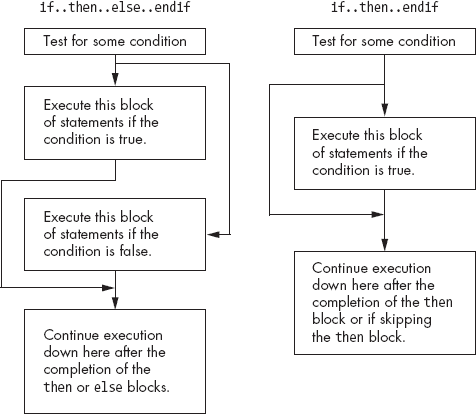
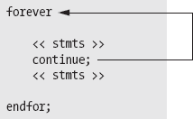
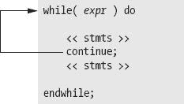
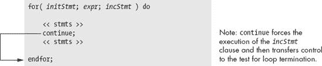
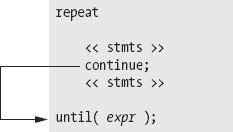

# 第七章 低级控制结构


本章讨论“纯”汇编语言控制语句。在你声称自己是汇编语言程序员之前，你需要掌握这些低级控制结构。完成本章后，你应该能够停止使用 HLA 的高级控制语句，并使用低级 80x86 机器指令来合成这些语句。

本章最后部分讨论了*混合*控制结构，它结合了 HLA 的高级控制语句和 80x86 控制指令的特点。这些控制结构将低级控制语句的力量和效率与高级控制语句的可读性结合起来。高级汇编程序员可能希望使用这些混合语句，在不牺牲效率的前提下提高程序的可读性。

# 7.1 低级控制结构

直到现在，你在程序中看到和使用的大多数控制结构都类似于高级语言（如 Pascal、C++和 Ada）中的控制结构。虽然这些控制结构使得学习汇编语言变得容易，但它们并不是实际的汇编语言语句。相反，HLA 编译器将这些控制结构转换为一系列“纯”机器指令，从而实现与高级控制结构相同的结果。本文通过使用高级控制结构，让你在不需要一次性学习所有内容的情况下学习汇编语言。然而，现在是时候放下这些高级控制结构，学习如何使用低级控制结构编写真正的汇编语言程序了。

# 7.2 语句标签

汇编语言的低级控制结构广泛使用*标签*来标识源代码中的位置。低级控制结构通常会在程序的两个点之间转移控制。你通常通过语句标签来指定这样的转移目标。语句标签由一个有效（唯一的）HLA 标识符和一个冒号组成。例如：

```
aLabel:
```

当然，对于过程、变量和常量标识符，你应该尽量选择描述性和有意义的名称作为标签。上面示例中的标识符`aLabel`几乎没有描述性或意义。

语句标签有一个重要的特点，使其区别于 HLA 中大多数其他标识符：你不需要在使用标签之前声明它。这一点很重要，因为低级控制结构通常需要将控制转移到代码中的某个位置；因此，当你引用标签时，它可能尚未被定义。

你可以对标签执行三种操作：通过跳转（`goto`）指令转移控制权到标签，使用 `call` 指令调用标签，并获取标签的地址。对于标签，你几乎不能做其他操作（当然，你也不会希望对标签做太多其他操作，所以这并不算限制）。示例 7-1 演示了在程序中获取标签地址并打印地址的两种方法（使用 `lea` 指令和使用 `&` 地址操作符）：

示例 7-1. 在程序中显示语句标签的地址

```
program labelDemo;
#include( "stdlib.hhf" );

begin labelDemo;

    lbl1:

        lea( ebx, lbl1 );
        mov( &lbl2, eax );
        stdout.put( "&lbl1=$", ebx, " &lbl2=", eax, nl );
     lbl2:

end labelDemo;
```

HLA 还允许你使用语句标签的地址初始化双字变量。然而，变量声明中的初始化部分对标签有一些限制。最重要的限制是，你必须在与变量声明相同的词法级别上定义语句标签。也就是说，如果你在主程序中引用变量声明的初始化器中的语句标签，则该语句标签也必须位于主程序中。相反，如果你在局部变量声明中获取语句标签的地址，则该符号必须出现在与局部变量相同的过程内。示例 7-2 演示了语句标签在变量初始化中的使用：

示例 7-2. 使用语句标签的地址初始化 dword 变量

```
program labelArrays;
#include( "stdlib.hhf" );

static
    labels:dword[2] := [ &lbl1, &lbl2 ];

    procedure hasLabels;
    static
        stmtLbls: dword[2] := [ &label1, &label2 ];

    begin hasLabels;

        label1:

            stdout.put
            (
                "stmtLbls[0]= $", stmtLbls[0], nl,
                "stmtLbls[1]= $", stmtLbls[4], nl
            );

        label2:

    end hasLabels;

begin labelArrays;

    hasLabels();
    lbl1:

        stdout.put( "labels[0]= $", labels[0], " labels[1]=", labels[4], nl );

    lbl2:

end labelArrays;
```

有时，你需要引用当前过程外的标签。由于这种需求相对较少，本文不会描述所有细节。如果你需要做这种操作，请参考 HLA 文档了解更多细节。

# 7.3 无条件转移控制（jmp）

`jmp`（跳转）指令无条件地将控制权转移到程序中的另一个位置。该指令有三种形式：直接跳转和两种间接跳转。这些指令的形式如下：

```
jmp *`label`*;
     jmp( *`reg32`* );
     jmp( *`mem32`* );
```

第一条指令是一个直接跳转。对于直接跳转，你通常通过语句标签来指定目标地址。该标签要么与可执行机器指令在同一行，要么单独出现在可执行机器指令前的一行。直接跳转完全等同于高级语言中的 `goto` 语句。^([105])

下面是一个例子：

```
<< statements >>
          jmp laterInPgm;
               .
               .
               .
laterInPgm:
          << statements >>
```

前面提到的第二种 `jmp` 指令形式——`jmp(` *`reg32`* `);`——是寄存器间接跳转指令。该指令将控制转移到指定的 32 位通用寄存器中出现的指令地址。要使用这种形式的 `jmp` 指令，必须在执行 `jmp` 之前将 32 位寄存器加载为某个机器指令的地址。你可以使用此指令通过在程序的不同位置将寄存器加载为某个标签的地址，并在一个公共点使用单一的间接跳转来实现 *状态机*。示例 7-3 演示了如何以这种方式使用 `jmp` 指令。

示例 7-3. 使用寄存器间接 `jmp` 指令

```
program regIndJmp;
#include( "stdlib.hhf" );

static
    i:int32;

begin regIndJmp;

    // Read an integer from the user and set ebx to
    // denote the success or failure of the input.

    try

        stdout.put( "Enter an integer value between 1 and 10: " );
        stdin.get( i );
        mov( i, eax );
        if( eax in 1..10 ) then

            mov( &GoodInput, ebx );

        else

            mov( &valRange, ebx );

        endif;

      exception( ex.ConversionError )

        mov( &convError, ebx );

      exception( ex.ValueOutOfRange )

        mov( &valRange, ebx );

    endtry;

    // Okay, transfer control to the appropriate
    // section of the program that deals with
    // the input.

    jmp( ebx );

    valRange:
        stdout.put( "You entered a value outside the range 1..10" nl );
        jmp Done;

    convError:
        stdout.put( "Your input contained illegal characters" nl );
        jmp Done;

    GoodInput:
        stdout.put( "You entered the value ", i, nl );

    Done:

end regIndJmp;
```

前面提到的第三种 `jmp` 指令形式是内存间接 `jmp`。这种形式的 `jmp` 指令从内存位置获取双字值并跳转到该地址。这类似于寄存器间接 `jmp`，只不过地址出现在内存位置，而不是寄存器中。示例 7-4 演示了这种 `jmp` 指令形式的一个相当简单的用法。

示例 7-4. 使用内存间接 `jmp` 指令

```
program memIndJmp;
#include( "stdlib.hhf" );

static
    LabelPtr:dword := &stmtLabel;

begin memIndJmp;

    stdout.put( "Before the JMP instruction" nl );
    jmp( LabelPtr );

        stdout.put( "This should not execute" nl );

    stmtLabel:

        stdout.put( "After the LabelPtr label in the program" nl );

end memIndJmp;
```

### 警告

与 HLA 高级控制结构不同，低级的`jmp`指令可能会给你带来很多麻烦。特别是，如果你没有用有效指令的地址初始化一个寄存器，并且通过该寄存器间接跳转，那么结果是未定义的（虽然这通常会导致一般保护故障）。类似地，如果你没有用合法指令的地址初始化一个双字变量，通过该内存位置间接跳转可能会导致程序崩溃。

* * *

^([105]) 与高级语言不同，在高级语言中，教师通常会禁止使用 `goto` 语句，而你会发现，在汇编语言中使用 `jmp` 指令是必不可少的。

# 7.4 条件跳转指令

尽管 `jmp` 指令提供了控制转移，但在做出决策时使用它并不方便，例如你需要实现 `if` 和 `while` 语句的场景。80x86 的条件跳转指令可以处理这一任务。

条件跳转会测试一个或多个 CPU 标志，查看它们是否匹配某个特定的模式。如果标志设置匹配条件，条件跳转指令会将控制转移到目标位置。如果匹配失败，CPU 会忽略条件跳转，并继续执行紧接着条件跳转之后的指令。一些条件跳转指令仅仅测试符号、进位、溢出和零标志的设置。例如，在执行 `shl` 指令后，你可以测试进位标志，以确定 `shl` 是否将一个 1 从操作数的高位移出。同样，执行 `test` 指令后，你可以测试零标志来检查结果是否为 0。然而，大多数时候，你可能会在执行 `cmp` 指令后执行条件跳转。`cmp` 指令会设置标志，从而让你可以测试小于、大于、相等等情况。

条件 `jmp` 指令的形式如下：

```
j*`cc label`*;
```

*`cc`* 在 `j`*`cc`* 中表示你必须替换为某个字符序列，指定要测试的条件类型。这些字符与 `set`*`cc`* 指令使用的字符相同。例如，`js` 表示如果符号标志被设置则 *跳转*。一个典型的 `js` 指令是：

```
js ValueIsNegative;
```

在这个例子中，如果符号标志当前被设置，`js` 指令将控制转移到 `ValueIsNegative` 标签；如果符号标志未设置，控制则跳转到 `js` 指令之后的下一条指令。

与无条件的 `jmp` 指令不同，条件跳转指令不提供间接形式。它们只允许跳转到程序中的一个标签。

### 注意

英特尔的文档为许多条件跳转指令定义了各种同义词或指令别名。

表 7-1, 表 7-2, 和 表 7-3 列出了特定指令的所有别名。这些表还列出了相反的跳转。你将很快看到相反跳转的用途。

表 7-1. `j`*`cc`* 指令，测试标志

| 指令 | 描述 | 条件 | 别名 | 相反 |
| --- | --- | --- | --- | --- |
| `jc` | 如果进位则跳转 | 进位 = 1 | `jb`, `jnae` | `jnc` |
| `jnc` | 如果没有进位则跳转 | 进位 = 0 | `jnb`, `jae` | `jc` |
| `jz` | 如果为零则跳转 | 零 = 1 | `je` | `jnz` |
| `jnz` | 如果不为零则跳转 | 零 = 0 | `jne` | `jz` |
| `js` | 如果符号则跳转 | 符号 = 1 |   | `jns` |
| `jns` | 如果没有符号则跳转 | 符号 = 0 |   | `js` |
| `jo` | 如果溢出则跳转 | 溢出 = 1 |   | `jno` |
| `jno` | 如果没有溢出则跳转 | 溢出 = 0 |   | `jo` |
| `jp` | 如果奇偶校验则跳转 | 奇偶校验 = 1 | `jpe` | `jnp` |
| `jpe` | 如果奇偶校验为偶 | 奇偶校验 = 1 | `jp` | `jpo` |
| `jnp` | 如果没有奇偶校验跳转 | 奇偶校验 = 0 | `jpo` | `jp` |
| `jpo` | 如果奇偶校验为奇数跳转 | 奇偶校验 = 0 | `jnp` | `jpe` |

| 表 7-2. 用于无符号比较的`j`*`cc`*指令

| 指令 | 描述 | 条件 | 别名 | 相反 |
| --- | --- | --- | --- | --- |
| `ja` | 如果大于跳转 (`>`) | 进位 = 0, 零 = 0 | `jnbe` | `jna` |
| `jnbe` | 如果不小于或等于跳转 (`not <=`) | 进位 = 0, 零 = 0 | `ja` | `jbe` |
| `jae` | 如果大于或等于跳转 (`>=`) | 进位 = 0 | `jnc`, `jnb` | `jnae` |
| `jnb` | 如果不小于跳转 (`not <`) | 进位 = 0 | `jnc`, `jae` | `jb` |
| `jb` | 如果小于跳转 (`<`) | 进位 = 1 | `jc`, `jnae` | `jnb` |
| `jnae` | 如果不大于或等于跳转 (`not >=`) | 进位 = 1 | `jc`, `jb` | `jae` |
| `jbe` | 如果小于或等于跳转 (`<=`) | 进位 = 1 或零 = 1 | `jna` | `jnbe` |
| `jna` | 如果不大于跳转 (`not >`) | 进位 = 1 或零 = 1 | `jbe` | `ja` |
| `je` | 如果相等跳转 (`=`) | 零 = 1 | `jz` | `jne` |
| `jne` | 如果不相等跳转 (`¦`) | 零 = 0 | `jnz` | `je` |

| 表 7-3. 用于有符号比较的`j`*`cc`*指令

| 指令 | 描述 | 条件 | 别名 | 相反 |
| --- | --- | --- | --- | --- |
| `jg` | 如果大于跳转 (`>`) | 符号 = 溢出或零 = 0 | `jnle` | `jng` |
| `jnle` | 如果不小于或等于跳转 (`not <=`) | 符号 = 溢出或零 = 0 | `jg` | `jle` |
| `jge` | 如果大于或等于跳转 (`>=`) | 符号 = 溢出 | `jnl` | `jge` |
| `jnl` | 如果不小于跳转 (`not <`) | 符号 = 溢出 | `jge` | `jl` |
| `jl` | 如果小于跳转 (`<`) | 符号 <> 溢出 | `jnge` | `jnl` |
| `jnge` | 如果不大于或等于跳转 (`not >=`) | 符号 <> 溢出 | `jl` | `jge` |
| `jle` | 如果小于或等于跳转 (`<=`) | 符号 <> 溢出或零 = 1 | `jng` | `jnle` |
| `jng` | 如果不大于跳转 (`not >`) | 符号 <> 溢出或零 = 1 | `jle` | `jg` |
| `je` | 如果相等跳转 (`=`) | 零 = 1 | `jz` | `jne` |
| `jne` | 如果不相等跳转 (`¦`) | 零 = 0 | `jnz` | `je` |

| 关于“相反”列，有必要做一个简短的说明。在许多情况下，你需要能够生成特定分支指令的相反指令（后面会有示例）。除了两个例外外，一个非常简单的规则可以完全描述如何生成相反分支：

+   | 如果`jcc`指令的第二个字母不是`n`，则在`j`后插入`n`。例如，`je`变为`jne`，`jl`变为`jnl`。

+   | 如果`j`*`cc`*指令的第二个字母是`n`，则从指令中删除该`n`。例如，`jng`变为`jg`，`jne`变为`je`。

| 这两个例外是`jpe`（如果奇偶校验为偶数跳转）和`jpo`（如果奇偶校验为奇数跳转）。这两个例外几乎不会引起问题，因为（1）你几乎不需要测试奇偶校验标志，且（2）你可以使用别名`jp`和`jnp`作为`jpe`和`jpo`的同义词。“N/No N”规则适用于`jp`和`jnp`。

虽然你*知道*`jge`是`jl`的反操作，但养成使用`jnl`而不是`jge`作为`jl`的对立跳转指令的习惯。在关键情况下，容易误认为“更大是小的对立面”，并错误地替换为`jg`。你可以通过始终使用“有/没有 N”规则来避免这种混淆。

80x86 条件跳转指令使你能够根据某个条件将程序流分成两条路径。假设你想在 BX 等于 CX 时递增 AX 寄存器。你可以通过以下代码实现这一目标：

```
cmp( bx, cx );
          jne SkipStmts;
          inc( ax );
SkipStmts:
```

诀窍是使用*对立*分支来跳过你希望在条件为真时执行的指令。始终使用之前给出的“对立分支（有/没有 N）”规则来选择对立分支。

你还可以使用条件跳转指令来合成循环。例如，以下代码序列从用户那里读取一系列字符，并将每个字符存储在数组的连续元素中，直到用户按下**回车**键（换行符）：

```
mov( 0, edi );
RdLnLoop:
          stdin.getc();              // Read a character into the al register.
          mov( al, Input[ edi ] );   // Store away the character.
          inc( edi );                // Move on to the next character.
          cmp( al, stdio.cr );       // See if the user pressed Enter.
          jne RdLnLoop;
```

像`set`*`cc`*指令一样，条件跳转指令分为两大类：一种是测试特定处理器标志的指令（例如`jz`，`jc`，`jno`），另一种是测试某些条件（小于、大于等）。在测试条件时，条件跳转指令几乎总是跟随`cmp`指令。`cmp`指令设置标志，以便你可以使用`ja`，`jae`，`jb`，`jbe`，`je`或`jne`指令来测试无符号小于、小于等于、等于、不等于、大于或大于等于。与此同时，`cmp`指令也设置标志，以便你可以使用`jl`，`jle`，`je`，`jne`，`jg`和`jge`指令进行带符号的比较。

条件跳转指令只测试 80x86 标志；它们不会影响任何标志。

# 7.5 "中级" 控制结构：jt 和 jf

HLA 提供了两条特殊的条件跳转指令：`jt`（如果为真则跳转）和`jf`（如果为假则跳转）。这些指令的语法如下：

```
jt( *`boolean_expression`* ) *`target_label`*;
jf( *`boolean_expression`* ) *`target_label`*;
```

*`boolean_expression`* 是标准的 HLA 布尔表达式，允许在`if..endif`和其他 HLA 高级语言语句中使用。这些指令计算布尔表达式，如果表达式为真，则跳转到指定标签（`jt`），如果为假，则跳转到指定标签（`jf`）。

这些不是实际的 80x86 指令。HLA 将它们编译成一个或多个 80x86 机器指令，以实现相同的结果。通常，你不应在主代码中使用这两条指令；它们相较于使用`if..endif`语句没有什么好处，并且它们的可读性不比它们编译成的纯汇编语言序列更强。HLA 提供这些“中级”指令，以便你可以使用宏创建自己的高级控制结构（更多详情请参见第九章和 HLA 参考手册）。

# 7.6 在汇编语言中实现常见的控制结构

由于本章的主要目标是教你如何使用低级机器指令实现决策、循环和其他控制结构，因此明智之举是向你展示如何使用纯汇编语言实现这些高级语句。以下章节提供了这些信息。

# 7.7 决策介绍

在其最基本的形式中，*决策* 是代码中的某种分支，根据某些条件在两个可能的执行路径之间切换。通常（尽管并非总是如此），条件指令序列是通过条件跳转指令实现的。条件指令对应于 HLA 中的 `if..then..endif` 语句：

```
if( *`expression`* ) then
          << statements >>
     endif;
```

与往常一样，汇编语言在处理条件语句时提供了更多的灵活性。考虑以下 C/C++ 语句：

```
if( (( x < y ) && ( z > t )) || ( a != b ) )
          stmt1;
```

将此语句转为汇编语言的“暴力”方法可能会产生以下代码：

```
mov( x, eax );
          cmp( eax, y );
          setl( bl );       // Store x<y in bl.
          mov( z, eax );
          cmp( eax, t );
          setg( bh );       // Store z>t in bh.
          and( bh, bl );    // Put (x<y) && (z>t) into bl.
          mov( a, eax );
          cmp( eax, b );
          setne( bh );      // Store a != b into bh.
          or( bh, bl );     // Put (x<y) && (z>t) || (a!=b) into bl
          je SkipStmt1;     // Branch if result is false.

     << Code for Stmt1 goes here. >>

SkipStmt1:
```

正如你所看到的，仅仅处理上面示例中的表达式就需要相当多的条件语句。这大致对应于（等效的）C/C++ 语句：

```
bl = x < y;
          bh = z > t;
          bl = bl && bh;
          bh = a != b;
          bl = bl || bh;
          if( bl )
               << Stmt1 >>;
```

现在将其与以下“改进版”代码进行比较：

```
mov( a, eax );
          cmp( eax, b );
          jne DoStmt;
          mov( x, eax );
          cmp( eax, y );
          jnl SkipStmt;
          mov( z, eax );
          cmp( eax, t );
          jng SkipStmt;
DoStmt:
          << Place code for Stmt1 here. >>
SkipStmt:
```

从上述代码序列中应该能看出两点：首先，在 C/C++（或其他高级语言）中，一个单一的条件语句可能需要在汇编语言中使用多个条件跳转；其次，条件序列中的复杂表达式的组织方式可能会影响代码的效率。因此，在处理汇编语言中的条件序列时，应小心谨慎。

条件语句可以分为三大类：`if` 语句、`switch`/`case` 语句和间接跳转。以下章节描述了这些程序结构，如何使用它们，以及如何用汇编语言编写它们。

## 7.7.1 if..then..else 序列

最常见的条件语句是 `if..then..endif` 和 `if..then..else..endif` 语句。这两种语句的形式如 图 7-1 所示。



图 7-1. `if..then..else..endif` 和 `if..then..endif` 语句流程

`if..then..endif` 语句只是 `if..then..else..endif` 语句的一种特殊情况（其 `else` 块为空）。因此，我们将只考虑更通用的 `if..then..else..endif` 形式。80x86 汇编语言中 `if..then..else..endif` 语句的基本实现大致如下所示：

```
<< Sequence of statements to test some condition >>
          j*`cc`* ElseCode;
    << Sequence of statements corresponding to the THEN block >>

          jmp EndOfIf;

ElseCode:
    << Sequence of statements corresponding to the ELSE block >>

EndOfIf:
```

请注意，jcc 表示某种条件跳转指令。例如，要转换 C/C++ 语句

```
if( a == b )
          c = d;
     else
          b = b + 1;
```

要转为汇编语言，你可以使用以下 80x86 代码：

```
mov( a, eax );
          cmp( eax, b );
          jne ElsePart;
          mov( d, c );
          jmp EndOfIf;

ElseBlk:
          inc( b );

EndOfIf:
```

对于像 `( a == b )` 这样的简单表达式，生成一个正确的 `if..then..else..endif` 语句几乎是微不足道的。若表达式变得更加复杂，代码的复杂度也会随之增加。考虑之前提到的 C/C++ `if` 语句：

```
if( (( x > y ) && ( z < t )) || ( a != b ) )
          c = d;
```

在处理像这样的复杂 `if` 语句时，如果将 `if` 语句分解成三个不同的 `if` 语句，你会发现转换任务更容易，示例如下：

```
if( a != b ) c = d;
     else if( x > y)
          if( z < t )
               c = d;
```

该转换源自以下 C/C++ 等价物：

```
if( *`expr1`* && *`expr2`* ) *`stmt`*;
```

等价于

```
if( *`expr1`* ) if( *`expr2`* ) *`stmt`*;
```

和

```
if( *`expr1`* || *`expr2`* ) *`stmt`*;
```

等价于

```
if( *`expr1`* ) *`stmt`*;
else if( *`expr2`* ) *`stmt`*;
```

在汇编语言中，前面的 `if` 语句变成

```
// if( (( x > y ) && ( z < t )) || ( a != b ) )
//      c = d;

          mov( a, eax );
          cmp( eax, b );
          jne DoIF;
          mov( x, eax );
          cmp( eax, y );
          jng EndOfIF;
          mov( z, eax );
          cmp( eax, t );
          jnl EndOfIf;
DoIf:
          mov( d, eax );
          mov( eax, c );
EndOfIf:
```

如你所见，测试一个条件可能比 `else` 和 `then` 块中的语句更加复杂。尽管似乎有些矛盾的是，测试一个条件可能比对条件结果进行操作更加费力，但这确实时常发生。因此，你应该做好接受这一点的准备。

在汇编语言中，复杂的条件语句最头疼的问题可能是当你写完代码后，试图理解自己做了什么。高级语言相较于汇编语言的一个大优势是，表达式更易于阅读和理解。高级语言的版本（更）具自文档性，而汇编语言则往往掩盖了代码的真正含义。因此，编写良好的注释是汇编语言实现 `if..then..else..endif` 语句的一个必要组成部分。上述示例的优雅实现如下：

```
// if ((x > y) && (z < t)) or (a != b)  c = d;
// Implemented as:
// if (a != b) then goto DoIf;

          mov( a, eax );
          cmp( eax, b );
          jne DoIf;

// if not (x > t) then goto EndOfIf;

          mov( x, eax );
          cmp( eax, y );
          jng EndOfIf;

// if not (z < t) then goto EndOfIf;

          mov( z, eax );
          cmp( eax, t );
          jnl EndOfIf;

// then block:

DoIf:
          mov( d, eax );
          mov( eax, c );

// End of if statement

EndOfIf:
```

诚然，对于如此简单的示例来说，这看起来有些过于复杂。以下内容可能就足够了：

```
// if ( (( x > y ) && ( z < t )) || ( a != b ) )  c = d;
// Test the boolean expression:

          mov( a, eax );
          cmp( eax, b );
          jne DoIf;
          mov( x, eax );
          cmp( eax, y );
          jng EndOfIf;
          mov( z, eax );
          cmp( eax, t );
          jnl EndOfIf;

// then block:

DoIf:
          mov( d, eax );
          mov( eax, c );

// End of if statement

EndOfIf:
```

然而，随着 `if` 语句变得越来越复杂，注释的密度（和质量）变得越来越重要。

## 7.7.2 将 HLA `if` 语句转换成纯汇编语言

将 HLA `if` 语句转换成纯汇编语言非常容易。HLA `if` 语句所支持的布尔表达式是特别选择的，以便可以展开成几条简单的机器指令。以下段落讨论了将每个支持的布尔表达式转换为纯机器代码的过程。

### if( *flag_specification* ) then *stmts* endif;

这种形式，或许是最容易转换的 HLA `if` 语句。为了在特定标志位被设置（或清除）时立即执行 `then` 关键字后的代码，你只需要在标志位清除（设置）时跳过代码。这仅需要一条条件跳转指令来实现，以下示例展示了这一过程：

```
// if( @c ) then inc( eax );  endif;

          jnc SkipTheInc;

               inc( eax );

          SkipTheInc:

// if( @ns ) then neg( eax ); endif;

          js SkipTheNeg;

               neg( eax );

          SkipTheNeg:
```

### if( *register* ) then *stmts* endif;

这种形式使用 `test` 指令来检查指定的寄存器是否为 0。如果寄存器中包含 0（假），那么程序会通过 `jz` 指令跳过 `then` 子句后的语句。将此语句转换为汇编语言需要 `test` 指令和 `jz` 指令，以下示例展示了这一过程：

```
// if( eax ) then mov( false, eax );  endif;

          test( eax, eax );
          jz DontSetFalse;

               mov( false, eax );

          DontSetFalse:

// if( al ) then mov( bl, cl );  endif;

          test( al, al );
          jz noMove;

               mov( bl, cl );

          noMove:
```

### if( *!register* ) then *stmts* endif;

这种形式的`if`语句使用`test`指令检查指定的寄存器是否为 0。如果寄存器不为 0（即为真），程序则使用`jnz`指令跳过`then`子句后的语句。将此语句转换为汇编语言时，需使用`test`指令和`jnz`指令，方法与前面的示例相同。

### if( *boolean_variable* ) then *stmts* endif;

这种形式的`if`语句将布尔变量与 0（假）进行比较，如果变量为假，则跳过后面的语句。HLA 通过使用`cmp`指令将布尔变量与 0 进行比较，然后使用`jz`（`je`）指令在变量为假时跳过语句。以下示例展示了转换过程：

```
// if( bool ) then mov( 0, al );  endif;

          cmp( bool, false );
          je SkipZeroAL;

               mov( 0, al );

          SkipZeroAL:
```

### if( !*boolean_variable* ) then *stmts* endif;

这种形式的`if`语句将布尔变量与 0（假）进行比较，如果变量为真（即与前一个示例相反的条件），则跳过后面的语句。HLA 通过使用`cmp`指令将布尔变量与 0 进行比较，然后使用`jnz`（`jne`）指令在变量为真时跳过语句。以下示例展示了转换过程：

```
// if( !bool ) then mov( 0, al );  endif;

          cmp( bool, false );
          jne SkipZeroAL;

               mov( 0, al );

          SkipZeroAL:
```

### if( *mem_reg relop mem_reg_const* ) then *stmts* endif;

HLA 将这种形式的`if`语句转换为`cmp`指令和一个条件跳转，跳过由`relop`运算符指定的相反条件下的语句。表 7-4 列出了操作符和条件跳转指令之间的对应关系。

表 7-4. `if`语句条件跳转指令

| 关系运算 | 如果两个操作数都是无符号的，条件跳转指令 | 如果任一操作数为有符号的，条件跳转指令 |
| --- | --- | --- |
| `=` 或 `==` | `jne` | `jne` |
| `<>` 或 `!=` | `je` | `je` |
| `<` | `jnb` | `jnl` |
| `<=` | `jnbe` | `jnle` |
| `>` | `jna` | `jng` |
| `>=` | `jnae` | `jnge` |

以下是几个使用涉及关系运算符的表达式转换成纯汇编语言的`if`语句示例：

```
// if( al == ch ) then inc( cl ); endif;

          cmp( al, ch );
          jne SkipIncCL;

               inc( cl );

          SkipIncCL:

// if( ch >= 'a' ) then and( $5f, ch ); endif;

          cmp( ch, 'a' );
          jnae NotLowerCase

               and( $5f, ch );

          NotLowerCase:

// if( (type int32 eax ) < −5 ) then mov( −5, eax );  endif;

          cmp( eax, −5 );
          jnl DontClipEAX;

               mov( −5, eax );

          DontClipEAX:

// if( si <> di ) then inc( si );  endif;

          cmp( si, di );
          je DontIncSI;

               inc( si );

          DontIncSI:
```

### if( *reg/mem* 在 *LowConst..HiConst* 范围内 ) then *stmts* endif;

HLA 将此`if`语句转换为一对`cmp`指令和一对条件跳转指令。它将寄存器或内存位置与较小的常量进行比较，如果小于（有符号）或低于（无符号）该常量，则跳过`then`子句后的语句。如果寄存器或内存位置的值大于或等于*`LowConst`*，则代码执行第二对`cmp`和条件跳转指令，将寄存器或内存位置与较高的常量进行比较。如果值大于（高于）该常量，则条件跳转指令跳过`then`子句中的语句。

这是一个示例：

```
// if( eax in 1000..125_000 ) then sub( 1000, eax );  endif;

          cmp( eax, 1000 );
          jb DontSub1000;
          cmp( eax, 125_000 );
          ja DontSub1000;

               sub( 1000, eax );

          DontSub1000:

// if( i32 in −5..5 ) then add( 5, i32 ); endif;

          cmp( i32, −5 );
          jl NoAdd5;
          cmp( i32, 5 );
          jg NoAdd5;

               add(5, i32 );

          NoAdd5:
```

### if( *reg*/*mem* 不在 *LowConst..HiConst* 范围内 ) then *stmts* endif;

这种形式的 HLA `if` 语句测试一个寄存器或内存位置，查看其值是否在指定范围之外。该实现与前面的代码非常相似，只是如果值小于 *`LowConst`* 或大于 *`HiConst`*，则跳转到 `then` 子句；如果值在两个常数指定的范围内，则跳过 `then` 子句中的代码。以下示例演示了如何进行此转换：

```
// if( eax not in 1000..125_000 ) then add( 1000, eax );  endif;

          cmp( eax, 1000 );
          jb Add1000;
          cmp( eax, 125_000 );
          jbe SkipAdd1000;

               Add1000:
               add( 1000, eax );

          SkipAdd1000:

// if( i32 not in −5..5 ) then mov( 0, i32 );  endif;

          cmp( i32, −5 );
          jl Zeroi32;
          cmp( i32, 5 );
          jle SkipZero;

               Zeroi32:
               mov( 0, i32 );

          SkipZero:
```

## 7.7.3 使用完整布尔运算实现复杂的 if 语句

许多布尔表达式涉及合取（`and`）或析取（`or`）操作。本节描述了如何将布尔表达式转换为汇编语言。对于涉及合取和析取的复杂布尔表达式，有两种不同的转换方法：使用完整布尔运算或使用短路布尔运算。本节讨论完整布尔运算，下一节讨论短路布尔运算。

通过完整布尔运算进行转换几乎与将算术表达式转换为汇编语言相同。事实上，前一章关于算术的内容涵盖了这个转换过程。值得注意的唯一一点是，你不需要将结果存储在某个变量中；一旦表达式的计算完成，你只需检查是否得到 `false`（0）或 `true`（1 或非零）结果，并根据布尔表达式的指示采取相应的操作。正如你在前面章节的示例中看到的，你通常可以利用最后的逻辑指令（`and` / `or`）在结果为 `false` 时设置零标志，在结果为 `true` 时清除零标志。这让你避免了显式测试结果。考虑以下 `if` 语句及其使用完整布尔运算转换为汇编语言的过程：

```
//     if( (( x < y ) && ( z > t )) || ( a != b ) )
//         << Stmt1 >>;

          mov( x, eax );
          cmp( eax, y );
          setl( bl );     // Store x<y in bl.
          mov( z, eax );
          cmp( eax, t );
          setg( bh );     // Store z>t in bh.
          and( bh, bl );  // Put (x<y) && (z>t) into bl.
          mov( a, eax );
          cmp( eax, b );
          setne( bh );    // Store a != b into bh.
          or( bh, bl );   // Put (x<y) && (z>t) || (a != b) into bl.
          je SkipStmt1;   // Branch if result is false.

     << Code for Stmt1 goes here. >>

SkipStmt1:
```

这段代码计算 BL 寄存器中的布尔结果，然后在计算结束时测试这个值，看看它是 `true` 还是 `false`。如果结果为 `false`，则该序列跳过与 `Stmt1` 相关的代码。这个例子中需要注意的重点是，程序将执行每一条计算布尔结果的指令（直到 `je` 指令）。

## 7.7.4 短路布尔运算

如果你愿意多花一点力气，通常可以通过使用*短路布尔求值*将布尔表达式转换成更短且更快速的汇编语言指令序列。短路布尔求值通过执行部分指令来判断表达式是“真”还是“假”，从而避免执行计算完整表达式所需的所有指令。出于这个原因，以及短路布尔求值不需要使用任何临时寄存器的事实，HLA 在将复杂布尔表达式翻译成汇编语言时使用了短路求值。

考虑表达式`a && b`。一旦我们确定`a`为假，就不需要再评估`b`，因为无论`b`的值是什么，表达式都不可能为真。如果`a`和`b`是子表达式而非简单变量，短路布尔求值所带来的节省就更为明显。举个具体的例子，考虑上一节中的子表达式`((x<y) && (z>t))`。一旦你确定`x`不小于`y`，就不需要再检查`z`是否大于`t`，因为无论`z`和`t`的值如何，整个表达式都会为假。以下代码片段展示了如何对这个表达式实现短路布尔求值：

```
// if( (x<y) && (z>t) ) then ...

          mov( x, eax );
          cmp( eax, y );
          jnl TestFails;
          mov( z, eax );
          cmp( eax, t );
          jng TestFails;

               << Code for THEN clause of IF statement >>

          TestFails:
```

注意一旦代码确定`x`不小于`y`，它会跳过进一步的测试。当然，如果`x`小于`y`，程序就必须测试`z`是否大于`t`；如果不是，程序会跳过`then`语句。只有当程序满足两个条件时，代码才会执行`then`语句。

对于逻辑“或”操作，技巧类似。如果第一个子表达式评估为真，那么就不需要再测试第二个操作数。无论第二个操作数的值是什么，整个表达式仍然为真。以下示例展示了如何使用短路求值与析取（`or`）操作：

```
// if( ch < 'A' || ch > 'Z' )
//     then stdout.put( "Not an uppercase char" );
// endif;

          cmp( ch, 'A' );
          jb ItsNotUC
          cmp( ch, 'Z' );
          jna ItWasUC;

               ItsNotUC:
               stdout.put( "Not an uppercase char" );

          ItWasUC:
```

由于连接词和析取词运算符是可交换的，因此如果更方便的话，你可以先计算左边或右边的操作数。^([106]) 作为本节的最后一个例子，考虑上一节中的完整布尔表达式：

```
// if( (( x < y ) && ( z > t )) || ( a != b ) ) << Stmt1 >>;

          mov( a, eax );
          cmp( eax, b );
          jne DoStmt1;
          mov( x, eax );
          cmp( eax, y );
          jnl SkipStmt1;
          mov( z, eax );
          cmp( eax, t );
jng SkipStmt1;

               DoStmt1:
               << Code for Stmt1 goes here. >>

          SkipStmt1:
```

注意这个示例中的代码选择先评估`a != b`，然后再评估剩余的子表达式。这是汇编语言程序员常用的技巧，用来编写更高效的代码。

## 7.7.5 短路与完整布尔求值

在使用完全布尔评估时，该表达式序列中的每个语句都会执行；另一方面，短路布尔评估可能不需要执行与布尔表达式相关的每个语句。正如您在前两节中所看到的，基于短路评估的代码通常更简短且更快。因此，似乎短路评估是将复杂布尔表达式转换为汇编语言时的首选技巧。

不幸的是，有时短路布尔评估可能不会产生正确的结果。在表达式中存在*副作用*时，短路布尔评估会产生与完全布尔评估不同的结果。考虑以下 C/C++示例：

```
if( ( x == y ) && ( ++z != 0 )) << Stmt >>;
```

使用完全布尔评估，您可能会生成如下代码：

```
mov( x, eax );      // See if x == y.
          cmp( eax, y );
          sete( bl );
          inc( z );           // ++z
          cmp( z, 0 );        // See if incremented z is 0.
          setne( bh );
          and( bh, bl );      // Test x == y && ++z != 0.
          jz SkipStmt;

          << Code for Stmt goes here. >>

SkipStmt:
```

使用短路布尔评估，您可能会生成如下代码：

```
mov( x, eax );      // See if x == y.
          cmp( eax, y );
          jne SkipStmt;
          inc( z );           // ++z
          cmp( z, 0 );        // See if incremented z is 0.
          je SkipStmt;

          << Code for Stmt goes here. >>

SkipStmt:
```

请注意这两个转换之间一个非常微妙但重要的区别：如果`x`等于`y`，那么上面第一版本*仍然会递增 z*并在执行与`Stmt`相关的代码之前将其与 0 进行比较；另一方面，短路版本如果`x`等于`y`，则跳过递增`z`的代码。因此，如果`x`等于`y`，这两段代码的行为是不同的。没有哪种实现特别错误；根据具体情况，您可能希望或者不希望在`x`等于`y`时递增`z`。然而，重要的是要意识到这两种方案会产生不同的结果，因此，如果`z`的变化对程序有影响，您可以选择合适的实现。

许多程序利用短路布尔评估，并依赖于程序可能不会评估表达式中的某些组件这一事实。以下的 C/C++代码片段演示了可能最常见的需要短路布尔评估的例子：

```
if( Ptr != NULL && *Ptr == 'a' ) << Stmt >>;
```

如果结果是`Ptr`为`NULL`，那么表达式为假，并且无需计算表达式的其余部分（因此，使用短路布尔评估的代码将不会计算该表达式的其余部分）。这个语句依赖于短路布尔评估的语义才能正确操作。如果 C/C++使用完全布尔评估，并且变量`Ptr`包含`NULL`，那么表达式的后半部分将尝试解引用一个`NULL`指针（这通常会导致大多数程序崩溃）。考虑使用完全布尔评估和短路布尔评估翻译此语句：

```
// Complete boolean evaluation:

          mov( Ptr, eax );
          test( eax, eax );    // Check to see if eax is 0 (NULL is 0).
          setne( bl );
          mov( [eax], al );    // Get *Ptr into al.
          cmp( al, 'a' );
          sete( bh );
          and( bh, bl );
          jz SkipStmt;

          << Code for Stmt goes here. >>

SkipStmt:
```

请注意，在这个例子中，如果`Ptr`包含`NULL`（0），则程序将通过`mov( [eax], al );`指令尝试访问内存位置 0 的数据。在大多数操作系统下，这将导致内存访问故障（一般保护故障）。

现在考虑短路布尔转换：

```
// Short-circuit boolean evaluation

          mov( Ptr, eax );     // See if Ptr contains NULL (0) and
          test( eax, eax );    // immediately skip past Stmt if this
          jz SkipStmt;         // is the case.

          mov( [eax], al );    // If we get to this point, Ptr contains
          cmp( al, 'a' );      // a non-NULL value, so see if it points
          jne SkipStmt;        // at the character 'a'.

          << Code for Stmt goes here. >>

SkipStmt:
```

如您在此示例中所见，解引用`NULL`指针的问题不存在。如果`Ptr`包含`NULL`，那么这段代码会跳过尝试访问`Ptr`所包含的内存地址的语句。

## 7.7.6 汇编语言中`if`语句的高效实现

在汇编语言中高效编码`if`语句需要比仅仅选择短路求值而不是完整布尔求值更多的思考。为了在汇编语言中编写执行速度尽可能快的代码，你必须仔细分析情况，并适当地生成代码。以下段落提供了一些建议，你可以将其应用到你的程序中，以提高性能。

### 7.7.6.1 了解你的数据！

程序员常犯的一个错误是假设数据是随机的。实际上，数据很少是随机的，如果你知道程序常用的值类型，你可以利用这一知识编写更好的代码。看看如何做，考虑以下 C/C++语句：

```
if(( a == b ) && ( c < d )) ++i;
```

由于 C/C++使用短路求值，这段代码会首先检查`a`是否等于`b`。如果是，它将检查`c`是否小于`d`。如果你预计`a`大多数时候等于`b`，但不预计`c`大多数时候小于`d`，这条语句的执行速度将比预期的要慢。考虑以下 HLA 实现的这段代码：

```
mov( a, eax );
          cmp( eax, b );
          jne DontIncI;

          mov( c, eax );
          cmp( eax, d );
          jnl DontIncI;

               inc( i );

          DontIncI:
```

如你在这段代码中所见，如果`a`大多数时候等于`b`且`c`大多数时候不小于`d`，你将几乎每次都必须执行所有六条指令，以确定表达式的结果是错误的。现在，考虑一下利用这个知识，并且利用`&&`运算符交换律的事实对上述 C/C++语句的实现：

```
mov( c, eax );
          cmp( eax, d );
          jnl DontIncI;

          mov( a, eax );
          cmp( eax, b );
          jne DontIncI;

               inc( i );

          DontIncI:
```

在这个例子中，代码首先检查`c`是否小于`d`。如果大多数情况下`c`小于`d`，那么这段代码会确定它只需执行三条指令（与前一个例子中的六条指令相比），然后跳到标签`DontIncI`。在汇编语言中，这一点比在高级语言中更为明显；这也是汇编程序通常比其高级语言对应程序更快的主要原因之一：优化在汇编语言中比在高级语言中更为直观。当然，关键是要理解你的数据行为，这样你才能做出像上面那样的智能决策。

### 7.7.6.2 重新排列表达式

即使你的数据是随机的（或者你无法确定输入值如何影响你的决策），重新排列表达式中的项可能仍然会带来一些好处。一些计算比其他计算花费的时间要长得多。例如，`div`指令比简单的`cmp`指令要慢得多。因此，如果你有如下的语句，你可能希望重新排列表达式，使得`cmp`优先执行：

```
if( (x % 10 = 0 ) && (x != y ) ++x;
```

转换为汇编代码后，这个`if`语句变成了：

```
mov( x, eax );            // Compute X % 10.
          cdq();                    // Must sign extend eax -> edx:eax.
          imod( 10, edx:eax );      // Remember, remainder goes into edx.
          test( edx, edx );         // See if edx is 0.
          jnz SkipIf;

          mov( x, eax );
          cmp( eax, y );
          je SkipIf;

               inc( x );

          SkipIf:
```

`imod`指令非常昂贵（在这个例子中通常比大多数其他指令慢 50 到 100 倍）。除非余数为 0 的可能性比`x`等于`y`的可能性大 50 到 100 倍，否则最好先进行比较，然后再进行余数计算：

```
mov( x, eax );
          cmp( eax, y );
          je SkipIf;

          mov( x, eax );            // Compute X % 10.
          cdq();                    // Must sign extend eax -> edx:eax.
          imod( 10, edx:eax );      // Remember, remainder goes into edx.
          test( edx, edx );         // See if edx is 0.
          jnz SkipIf;

               inc( x );

          SkipIf:
```

当然，为了以这种方式重新排列表达式，代码不能假定使用短路求值语义（因为`&&`和`||`运算符在必须先计算一个子表达式然后计算另一个子表达式时不具有交换律）。

### 7.7.6.3 重构你的代码

尽管结构化编程技术有很多优点，但编写结构化代码也有一些缺点。具体而言，结构化代码有时比非结构化代码效率低。大多数情况下这是可以接受的，因为非结构化代码难以阅读和维护；通常可以牺牲一些性能以换取可维护的代码。然而，在某些情况下，你可能需要尽可能地提升性能。在这些罕见的情况下，你可能会选择为了获得额外的性能而牺牲代码的可读性。

一个经典的做法是使用代码移动将程序中很少使用的代码移到大部分时间执行的代码之外。例如，考虑以下伪 C/C++ 语句：

```
if( See_If_an_Error_Has_Occurred )
     {
          << Statements to execute if no error >>
     }
     else
     {
          << Error handling statements >>
     }
```

在正常的代码中，人们并不期望错误经常发生。因此，你通常会期望上述`if`语句的`then`部分执行的次数远远超过`else`分支。上面的代码可以转换为以下汇编代码：

```
cmp( See_If_an_Error_Has_Occurred, true );
     je HandleTheError;

          << Statements to execute if no error >>
          jmp EndOfIF;

     HandleTheError:
          << Error handling statements >>
     EndOfIf:
```

请注意，如果表达式为假，此代码会继续执行正常的语句，然后跳过错误处理语句。控制从程序的一个点转移到另一个点的指令（例如`jmp`指令）通常速度较慢。执行顺序一致的一组指令要比在程序中到处跳转快得多。不幸的是，上面的代码不允许这样做。解决这个问题的一种方法是将代码的`else`分支移动到程序的其他位置。也就是说，你可以将代码重写为以下形式：

```
cmp( See_If_an_Error_Has_Occurred, true );
     je HandleTheError;

          << Statements to execute if no error >>

     EndOfIf:
```

在程序的某个其他位置（通常在`jmp`指令之后），你会插入以下代码：

```
HandleTheError:
          << Error handling statements >>
          jmp EndOfIf;
```

请注意，程序的长度没有任何变化。你从原序列中移除的`jmp`最终会出现在`else`分支的末尾。然而，由于`else`分支很少执行，将`jmp`指令从频繁执行的`then`分支移到`else`分支中是一个重大的性能优化，因为`then`分支只使用直线代码。这种技术在许多时间关键的代码段中效果惊人。

写*非结构化*代码和写*结构化*代码是有区别的。非结构化代码一开始就以非结构化方式编写。它通常难以阅读、难以维护，并且经常包含缺陷。另一方面，非结构化代码从结构化代码开始，您做出有意识的决定来消除结构，以获得小幅度的性能提升。通常，在将其非结构化之前，您已经测试了结构化形式的代码。因此，非结构化代码通常比非结构化代码更易于处理。

### 7.7.6.4 计算而非分支

在许多 80x86 系列处理器中，分支（跳转）与许多其他指令相比非常昂贵。因此，有时在序列中执行更多的指令比执行涉及分支的较少指令更好。例如，考虑简单的赋值语句`eax = abs( eax );`。不幸的是，80x86 指令集中没有计算整数绝对值的指令。处理这个问题的明显方法是使用以下指令序列：

```
test( eax, eax );
          jns ItsPositive;

               neg( eax );

          ItsPositive:
```

然而，正如您在此示例中明显看到的，它使用条件跳转来跳过`neg`指令（如果 EAX 为负则会创建一个正数值）。现在考虑以下也能完成任务的序列：

```
// Set edx to $FFFF_FFFF if eax is negative, $0000_0000 if eax is
// 0 or positive:

          cdq();

// If eax was negative, the following code inverts all the bits in eax;
// otherwise it has no effect on eax.

          xor( edx, eax );

// If eax was negative, the following code adds 1 to eax; otherwise
// it doesn't modify eax's value.

          and( 1, edx );      // edx = 0 or 1 (1 if eax was negative).
          add( edx, eax );
```

如果 EAX 在序列之前是负数，则此代码将反转 EAX 中的所有位，然后向 EAX 添加 1；也就是说，它否定了 EAX 中的值。如果 EAX 为 0 或正数，则此代码不会更改 EAX 中的值。

请注意，此序列需要四条指令，而不是前面示例中所需的三条指令。但是，由于此序列中没有控制传输指令，因此在 80x86 系列的许多 CPU 上可能执行速度更快。

## 7.7.7 switch/case 语句

HLA `switch`语句的形式如下：

```
switch( *`reg32`* )
          case( *`const1`* )
               << Stmts1: code to execute if *`reg32`* equals *`const1`* >>

          case( *`const2`* )
               << Stmts2: code to execute if *`reg32`* equals *`const2`* >>
            .
            .
            .
          case( *`constn`* )
               << Stmtsn: code to execute if *`reg32`* equals *`constn`* >>

          default      // Note that the default section is optional.
               << Stmts_default: code to execute if *`reg32`*
                  does not equal any of the case values >>

     endswitch;
```

当此语句执行时，它检查寄存器的值是否与常量*`const1`*`..`*`constn`*匹配。如果找到匹配项，则执行相应的语句。HLA 对`switch`语句有一些限制。首先，HLA `switch`语句只允许 32 位寄存器作为`switch`表达式。其次，在`case`子句中的所有常量必须是唯一的。这些限制的原因将很快明了。

大多数入门编程教材通过将`switch/case`语句解释为一系列`if..then..elseif..else..endif`语句来介绍它。他们可能会声称以下两段 HLA 代码是等效的：

```
switch( eax )
          case(0) stdout.put("i=0");
          case(1) stdout.put("i=1");
          case(2) stdout.put("i=2");
     endswitch;

     if( eax = 0 ) then
          stdout.put("i=0")
     elseif( eax = 1 ) then
          stdout.put("i=1")
     elseif( eax = 2 ) then
          stdout.put("i=2");
     endif;
```

尽管从语义上讲，这两段代码可能是相同的，但它们的实现通常是不同的。`if..then..elseif..else..endif` 链会对序列中的每个条件语句进行比较，而 `switch` 语句通常使用间接跳转，通过一次计算将控制转移到多个语句中的任何一个。考虑上述给出的两个示例；它们可以通过以下代码用汇编语言编写：

```
// if..then..else..endif form:

          mov( i, eax );
          test( eax, eax );   // Check for 0.
          jnz Not0;
               stdout.put( "i=0" );
               jmp EndCase;

          Not0:
          cmp( eax, 1 );
          jne Not1;
               stdou.put( "i=1" );
               jmp EndCase;

          Not1:
          cmp( eax, 2 );
          jne EndCase;
               stdout.put( "i=2" );
     EndCase:

// Indirect Jump Version

readonly
     JmpTbl:dword[3] := [ &Stmt0, &Stmt1, &Stmt2 ];
           .
           .
           .
     mov( i, eax );
     jmp( JmpTbl[ eax*4 ] );

          Stmt0:
               stdout.put( "i=0" );
               jmp EndCase;

          Stmt1:
               stdout.put( "I=1" );
               jmp EndCase;

          Stmt2:
               stdout.put( "I=2" );

     EndCase:
```

`if..then..elseif..else..endif` 版本的实现非常明显，几乎不需要什么解释。然而，间接跳转版本可能对你来说相当神秘，因此让我们考虑一下这个特定的 `switch` 语句实现是如何工作的。

请记住，`jmp` 指令有三种常见形式。标准的无条件 `jmp` 指令，如前面的 `jmp EndCase` 指令，会直接将控制转移到 `jmp` 操作数指定的语句标签。第二种 `jmp` 指令形式是 `jmp(` *`reg32`* `);`，它将控制转移到由 32 位寄存器中找到的地址指定的内存位置。第三种 `jmp` 指令形式是前面示例中使用的，它将控制转移到由双字内存位置内容指定的指令。正如这个示例清楚地展示的那样，那个内存位置可以使用任何寻址方式。你不局限于仅使用位移寻址方式。现在让我们仔细考虑一下 `switch` 语句第二种实现方式是如何工作的。

首先，`switch` 语句要求你创建一个指针数组，每个元素包含代码中某个语句标签的地址（这些标签必须附加到每个 `switch` 语句中的执行语句序列）。在上面的示例中，`JmpTbl` 数组就起到了这个作用。请注意，这段代码用语句标签 `Stmt0`、`Stmt1` 和 `Stmt2` 的地址初始化了 `JmpTbl`。程序将这个数组放置在 `readonly` 区段中，因为程序在执行过程中不应改变这些值。

### 警告

每当你用一组语句标签的地址初始化数组时，就像这个示例中一样，你声明数组的部分（例如此例中的 `readonly`）必须与包含语句标签的同一个过程在一起。^([107])

在执行此代码序列时，程序将`i`的值加载到 EAX 寄存器中。然后程序使用该值作为`JmpTbl`数组的索引，并将控制权转移到指定位置的 4 字节地址。例如，如果 EAX 中包含 0，`jmp( JmpTbl[eax*4] );`指令将获取地址`JmpTbl+0 ( eax*4=0 )`处的双字数据。因为表中的第一个双字包含`Stmt0`的地址，所以`jmp`指令将控制权转移到`Stmt0`标签后的第一条指令。同样，如果`i`（因此 EAX）包含 1，那么间接`jmp`指令将获取表中偏移量为 4 的双字，并将控制权转移到`Stmt1`标签后的第一条指令（因为`Stmt1`的地址出现在表的偏移量 4 处）。最后，如果`i`/EAX 包含 2，那么这段代码将控制权转移到`JmpTbl`表中偏移量为 8 处的`Stmt2`标签后的语句。

你应该注意，当你添加更多（连续的）`case`时，跳转表实现比`if/elseif`形式更高效（无论在空间还是速度方面）。除非是简单的情况，`switch`语句几乎总是更快，而且通常差距较大。只要`case`值是连续的，`switch`语句版本通常也更小。

如果需要包含不连续的`case`标签，或者你不能确保`switch`值不会超出范围，会发生什么情况？对于 HLA 的`switch`语句，出现这种情况时会将控制转移到`endswitch`语句后的第一条语句（或者转移到`default`语句，如果`switch`中存在`default`）。然而，在上面的例子中并没有发生这种情况。如果变量`i`不包含 0、1 或 2，执行上面的代码将产生未定义的结果。例如，如果在执行上面代码时，`i`的值为 5，那么间接`jmp`指令将获取`JmpTbl`中偏移量为 20（5 * 4）处的双字，并将控制权转移到该地址。不幸的是，`JmpTbl`中没有六个条目；因此，程序将最终获取`JmpTbl`后第三个双字的值，并将其作为目标地址。这通常会导致程序崩溃，或者将控制转移到一个意外的位置。

解决方案是在间接`jmp`指令之前放置几条指令，以验证`switch`选择值是否在合理范围内。在之前的例子中，我们可能希望在执行`jmp`指令之前验证`i`的值是否在 0..2 的范围内。如果`i`的值超出此范围，程序应该直接跳转到`endcase`标签（这对应于跳到`endswitch`语句后的第一条语句）。以下代码实现了这一修改：

```
readonly
     JmpTbl:dword[3] := [ &Stmt0, &Stmt1, &Stmt2 ];
      .
      .
      .
     mov( i, eax );
     cmp( eax, 2 );          // Verify that i is in the range
     ja EndCase;             // 0..2 before the indirect jmp.
     jmp( JmpTbl[ eax*4 ] );

          Stmt0:
               stdout.put( "i=0" );
               jmp EndCase;

          Stmt1:
               stdout.put( "i=1" );
               jmp EndCase;

          Stmt2:
               stdout.put( "i=2" );

     EndCase:
```

尽管上面的例子处理了选择值超出 0..2 范围的问题，但它仍然存在几个严重的限制：

+   各个`case`必须从值 0 开始。也就是说，在这个示例中，最小的`case`常量必须是 0。

+   `case`值必须是连续的。

解决第一个问题很简单，且你可以通过两步来处理。首先，必须将`case`选择值与下限和上限进行比较，以确定该`case`值是否合法。例如：

```
// SWITCH statement specifying cases 5, 6, and 7:
// WARNING: This code does *NOT* work. Keep reading to find out why.

     mov( i, eax );
     cmp( eax, 5 );
     jb EndCase
     cmp( eax, 7 );              // Verify that i is in the range
     ja EndCase;                 // 5..7 before the indirect jmp.
     jmp( JmpTbl[ eax*4 ] );

          Stmt5:
               stdout.put( "i=5" );
               jmp EndCase;

          Stmt6:
               stdout.put( "i=6" );
               jmp EndCase;

          Stmt7:
               stdout.put( "i=7" );

     EndCase:
```

如你所见，这段代码增加了一对额外的指令`cmp`和`jb`，用于测试选择值是否在 5 到 7 的范围内。如果不在范围内，控制会跳转到`EndCase`标签；否则，控制通过间接的`jmp`指令转移。遗憾的是，正如评论所指出的，这段代码存在问题。考虑如果变量`i`包含值 5 时会发生什么：代码会验证 5 是否在 5 到 7 的范围内，然后它会取偏移量为 20 的 dword（`5*@size(dword)`）并跳转到该地址。然而，和之前一样，这会加载超出表格边界的 4 个字节，并不会将控制转移到已定义的位置。一种解决方案是在执行`jmp`指令之前，从 EAX 中减去最小的`case`选择值，如下面的示例所示。

```
// SWITCH statement specifying cases 5, 6, and 7:
// WARNING: There is a better way to do this. Keep reading.

readonly
     JmpTbl:dword[3] := [ &Stmt5, &Stmt6, &Stmt7 ];
           .
           .
           .
     mov( i, eax );
     cmp( eax, 5 );
     jb EndCase
     cmp( eax, 7 );              // Verify that i is in the range
     ja EndCase;                 // 5..7 before the indirect jmp.
     sub( 5, eax );              // 5->0, 6->1, 7->2.
     jmp( JmpTbl[ eax*4 ] );

          Stmt5:
               stdout.put( "i=5" );
               jmp EndCase;

          Stmt6:
               stdout.put( "i=6" );
               jmp EndCase;

          Stmt7:
               stdout.put( "i=7" );

     EndCase:
```

通过从 EAX 中的值减去 5，这段代码强制 EAX 的值为 0、1 或 2，紧接着是`jmp`指令。因此，`case`选择值为 5 时跳转到`Stmt5`，`case`选择值为 6 时跳转到`Stmt6`，`case`选择值为 7 时跳转到`Stmt7`。

有一种巧妙的方法可以改进上述代码。你可以通过将这个减法合并到`jmp`指令的地址表达式中，从而消除`sub`指令。考虑下面的代码，它实现了这一点：

```
// SWITCH statement specifying cases 5, 6, and 7:

readonly
     JmpTbl:dword[3] := [ &Stmt5, &Stmt6, &Stmt7 ];
           .
           .
           .
     mov( i, eax );
     cmp( eax, 5 );
     jb EndCase
     cmp( eax, 7 );              // Verify that i is in the range
     ja EndCase;                 // 5..7 before the indirect jmp.
     jmp( JmpTbl[ eax*4 - 5*@size(dword)] );

          Stmt5:
               stdout.put( "i=5" );
               jmp EndCase;

          Stmt6:
               stdout.put( "i=6" );
               jmp EndCase;

          Stmt7:
               stdout.put( "i=7" );

     EndCase:
```

HLA `switch`语句提供了一个`default`子句，如果`case`选择值与任何`case`值不匹配，则执行该子句。例如：

```
switch( ebx )

          case( 5 )  stdout.put( "ebx=5" );
          case( 6 )  stdout.put( "ebx=6" );
          case( 7 )  stdout.put( "ebx=7" );
          default
               stdout.put( "ebx does not equal 5, 6, or 7" );

     endswitch;
```

在纯汇编语言中实现`default`子句的等效功能非常简单。只需在代码开头的`jb`和`ja`指令中使用不同的目标标签。以下示例实现了一个类似于上面那个的 HLA `switch`语句：

```
// SWITCH statement specifying cases 5, 6, and 7 with a DEFAULT clause:

readonly
     JmpTbl:dword[3] := [ &Stmt5, &Stmt6, &Stmt7 ];
           .
           .
           .
     mov( i, eax );
     cmp( eax, 5 );
     jb DefaultCase;
     cmp( eax, 7 );              // Verify that i is in the range
     ja DefaultCase;             // 5..7 before the indirect jmp.
     jmp( JmpTbl[ eax*4 - 5*@size(dword)] );

          Stmt5:
               stdout.put( "i=5" );
               jmp EndCase;

          Stmt6:
               stdout.put( "i=6" );
               jmp EndCase;

          Stmt7:
               stdout.put( "i=7" );
               jmp EndCase;

          DefaultCase:
               stdout.put( "i does not equal 5, 6, or 7" );
     EndCase:
```

之前提到的第二个限制，即`case`值需要是连续的，可以通过在跳转表中插入额外的条目来轻松处理。考虑以下 HLA `switch`语句：

```
switch( ebx )

          case( 1 ) stdout.put( "ebx = 1" );
          case( 2 ) stdout.put( "ebx = 2" );
          case( 4 ) stdout.put( "ebx = 4" );
          case( 8 ) stdout.put( "ebx = 8" );
          default
               stdout.put( "ebx is not 1, 2, 4, or 8" );

     endswitch;
```

最小的`switch`值是 1，最大值是 8。因此，在间接`jmp`指令之前的代码需要将 EBX 中的值与 1 和 8 进行比较。如果该值在 1 和 8 之间，仍然可能 EBX 不包含一个合法的`case`选择值。然而，因为`jmp`指令使用`case`选择表索引到双字表，所以表必须包含八个双字条目。为了处理介于 1 和 8 之间但不是`case`选择值的值，只需将`default`子句的语句标签（或者如果没有`default`子句，则是指定`endswitch`后第一条指令的标签）放入每个没有对应`case`子句的跳转表条目中。以下代码演示了这一技术：

```
readonly
     JmpTbl2: dword :=
                    [
                         &Case1, &Case2, &dfltCase, &Case4,
                         &dfltCase, &dfltCase, &dfltCase, &Case8
                    ];
          .
          .
          .
     cmp( ebx, 1 );
     jb dfltCase;
     cmp( ebx, 8 );
     ja dfltCase;
     jmp( JmpTbl2[ ebx*4 - 1*@size(dword) ] );

          Case1:
               stdout.put( "ebx = 1" );
               jmp EndOfSwitch;

          Case2:
               stdout.put( "ebx = 2" );
               jmp EndOfSwitch;

          Case4:
               stdout.put( "ebx = 4" );
               jmp EndOfSwitch;

          Case8:
               stdout.put( "ebx = 8" );
               jmp EndOfSwitch;

          dfltCase:
               stdout.put( "ebx is not 1, 2, 4, or 8" );

     EndOfSwitch:
```

这种`switch`语句的实现存在一个问题。如果`case`值包含不连续的条目且间隔较大，跳转表可能会变得非常大。以下`switch`语句会生成一个极其庞大的代码文件：

```
switch( ebx )

          case( 1      ) << Stmt1 >>;
          case( 100    ) << Stmt2 >>;
          case( 1_000  ) << Stmt3 >>;
          case( 10_000 ) << Stmt4 >>;
          default << Stmt5 >>;

     endswitch;
```

在这种情况下，如果你用一系列的`if`语句来实现`switch`语句，而不是使用间接跳转语句，那么你的程序将会更小。然而，要记住一点——跳转表的大小通常不会影响程序的执行速度。如果跳转表包含两个条目或两千个条目，`switch`语句将在恒定的时间内执行多重分支。`if`语句的实现则要求随着每个`case`标签的出现，所需的时间按线性方式增加。

使用汇编语言而不是像 Pascal 或 C/C++这样的高级语言最大的优势之一就是你可以选择语句（如`switch`）的实际实现方式。在某些情况下，你可以将`switch`语句实现为一系列的`if..then..elseif`语句，或者实现为一个跳转表，或者两者结合使用：

```
switch( eax )

          case( 0   ) << Stmt0 >>;
          case( 1   ) << Stmt1 >>;
          case( 2   ) << Stmt2 >>;
          case( 100 ) << Stmt3 >>;
          default << Stmt4 >>;

     endswitch;
```

这可能变成

```
cmp( eax, 100 );
          je DoStmt3;
          cmp( eax, 2 );
          ja TheDefaultCase;
          jmp( JmpTbl[ eax*4 ]);
          ...
```

当然，HLA 支持以下代码高级控制结构：

```
if( ebx = 100 ) then
         << Stmt3 >>;
     else
          switch( eax )
               case(0) << Stmt0 >>;
               case(1) << Stmt1 >>;
               case(2) << Stmt2 >>;
               Otherwise << Stmt4 >>;
          endswitch;
     endif;
```

但这往往会破坏程序的可读性。另一方面，汇编语言代码中用于测试 100 的额外代码不会对程序的可读性产生不利影响（也许是因为它本身就已经很难读了）。因此，大多数人会添加额外的代码，以提高程序的效率。

C/C++的`switch`语句与 HLA 的`switch`语句非常相似。唯一的主要语义区别是：程序员必须在每个`case`子句中显式地放置一个`break`语句，将控制转移到`switch`语句之外的第一条语句。这个`break`对应于上述汇编代码中每个`case`序列末尾的`jmp`指令。如果没有相应的`break`，C/C++会将控制转移到下一个`case`的代码中。这相当于在`case`序列末尾省略`jmp`指令：

```
switch (i)
     {
          case 0: << Stmt1 >>;
          case 1: << Stmt2 >>;
          case 2: << Stmt3 >>;
               break;
          case 3: << Stmt4 >>;
               break;
          default: << Stmt5 >>;
     }
```

这段代码转换成了以下 80x86 代码：

```
readonly
     JmpTbl: dword[4] := [ &case0, &case1, &case2, &case3 ];
          .
          .
          .
          mov( i, ebx );
          cmp( ebx, 3 );
          ja DefaultCase;
          jmp( JmpTbl[ ebx*4 ]);

               case0:
                    Stmt1;

               case1:
                    Stmt2;

               case2:
                    Stmt3;
                    jmp EndCase;    // Emitted for the break stmt.

               case3:
                    Stmt4;
                    jmp EndCase;    // Emitted for the break stmt.

               DefaultCase:
                    Stmt5;

          EndCase:
```

* * *

^([106]) 然而，要注意某些表达式依赖于最左边的子表达式以某种方式求值，以便最右边的子表达式有效；例如，C/C++ 中常见的测试是 `if( x != NULL && x->y )...`

^([107]) 如果 `switch` 语句出现在你的主程序中，你必须在主程序的声明部分声明数组。

# 7.8 状态机和间接跳转

另一种在汇编语言程序中常见的控制结构是 *状态机*。状态机使用 *状态变量* 来控制程序流程。FORTRAN 编程语言通过赋值的 `goto` 语句提供了这一功能。某些 C 语言的变种（例如，GNU 的 GCC 编译器）也提供了类似的功能。在汇编语言中，间接跳转可以实现状态机。

那么，什么是状态机呢？用最基本的话来说，它是一段通过进入和离开某些“状态”来跟踪其执行历史的代码。对于本章的目的，我们假设状态机是一个能够（以某种方式）记住其执行历史（其 *状态*）并根据该历史执行代码段的程序。

从某种意义上讲，所有程序都是状态机。CPU 寄存器和内存中的值构成了该机器的状态。然而，我们将采用更为受限的视角。实际上，在大多数情况下，只有一个变量（或 EIP 寄存器中的值）会表示当前状态。

现在让我们考虑一个具体的例子。假设你有一个过程，第一次调用时执行一个操作，第二次调用时执行不同的操作，第三次调用时执行另一个操作，然后在第四次调用时执行一个新的操作。在第四次调用之后，它会按顺序重复这四个不同的操作。例如，假设你希望过程在第一次时将 EAX 和 EBX 相加，第二次时进行减法，第三次时进行乘法，第四次时进行除法。你可以通过以下方式实现这个过程：

```
procedure StateMachine;
static
     State:byte := 0;
begin StateMachine;

     cmp( State, 0 );
     jne TryState1;

          // State 0: Add ebx to eax and switch to State 1:

          add( ebx, eax );
          inc( State );
          exit StateMachine;

     TryState1:
     cmp( State, 1 );
     jne TryState2;

          // State 1: Subtract ebx from eax and switch to State 2:

          sub( ebx, eax );
          inc( State );       // State 1 becomes State 2.
          exit StateMachine;

     TryState2:
     cmp( State, 2 );
     jne MustBeState3;

          // If this is State 2, multiply ebx by eax and switch to State 3:

          intmul( ebx, eax );
          inc( State );       // State 2 becomes State 3.
          exit StateMachine;

     // If it isn't one of the above states, we must be in State 3,
     // so divide eax by ebx and switch back to State 0.

     MustBeState3:
     push( edx );         // Preserve this 'cause it gets whacked by div.
     xor( edx, edx );     // Zero extend eax into edx.
     div( ebx, edx:eax);
     pop( edx );          // Restore edx's value preserved above.
     mov( 0, State );     // Reset the state back to 0.

end StateMachine;
```

从技术上讲，这个过程并不是状态机。实际上，正是变量 `State` 和 `cmp`/`jne` 指令构成了状态机。

这段代码没有什么特别之处。它不过是通过 `if..then..elseif` 结构实现的 `switch` 语句。这个过程唯一不同之处在于它记住了它被调用的次数^([108])，并根据调用的次数表现出不同的行为。虽然这是一个*正确的*状态机实现，但它的效率并不高。聪明的读者当然会认识到，使用实际的 `switch` 语句而非 `if..then..elseif` 实现，可以使这段代码运行得更快。然而，还有一个更好的解决方案。

在汇编语言中，状态机的一种常见实现方式是使用间接跳转。我们可以将状态变量加载为代码执行入口时的*地址*，而不是让状态变量包含像 0、1、2 或 3 这样的值。通过简单地跳转到该地址，状态机可以省略选择合适代码片段所需的测试。考虑以下使用间接跳转的实现：

```
procedure StateMachine;
static
     State:dword := &State0;
begin StateMachine;

     jmp( State );

          // State 0: Add ebx to eax and switch to State 1:

     State0:
          add( ebx, eax );
          mov( &State1, State );
          exit StateMachine;

     State1:

          // State 1: Subtract ebx from eax and switch to State 2:

          sub( ebx, eax );
          mov( &State2, State );    // State 1 becomes State 2.
          exit StateMachine;

     State2:

          // If this is State 2, multiply ebx by eax and switch to State 3:

          intmul( ebx, eax );
          mov( &State3, State );    // State 2 becomes State 3.
          exit StateMachine;

     // State 3: Divide eax by ebx and switch back to State 0.

     State3:
          push( edx );         // Preserve this 'cause it gets whacked by div.
          xor( edx, edx );     // Zero extend eax into edx.
          div( ebx, edx:eax);
          pop( edx );            // Restore edx's value preserved above.
          mov( &State0, State ); // Reset the state back to 0.

end StateMachine;
```

`StateMachine`过程开始时的`jmp`指令将控制转移到`State`变量所指向的位置。第一次调用`StateMachine`时，它指向`State0`标签。此后，每个代码子段都将`State`变量设置为指向相应的后续代码。

* * *

^([108]) 实际上，它记住了被调用的次数，并取模 4。

# 7.9 意大利面代码

汇编语言的一个主要问题是，它需要多个语句才能实现一个高级语言中用单个语句封装的简单思想。汇编语言程序员常常会注意到，通过跳转到程序结构的中间某处，可以节省几个字节或时钟周期。经过几次这样的观察（并做出相应修改），代码中就包含了一系列跳转进出代码的操作。如果你画出每个跳转到其目标位置的线，最终得到的代码列表就像有人把一碗意大利面撒在你的代码上一样，因此这个术语叫做*意大利面代码*。

意大利面代码有一个主要的缺点——阅读这样的程序并弄清楚它的功能非常困难（即使勉强能读懂）。大多数程序起初是“结构化”的，但在追求效率的过程中往往变成意大利面代码。遗憾的是，意大利面代码很少高效。由于很难准确弄清楚程序在做什么，因此很难判断是否可以使用更好的算法来改进系统。因此，意大利面代码可能最终比结构化代码更低效。

虽然在程序中写出一些意大利面代码可能会提高效率，但这应该始终是最后的手段，前提是你已经尝试过所有其他方法，并且仍然没有达到所需的效果。编写程序时，始终从简单的`if`和`switch`语句开始。当一切正常并且已经理解时，再开始通过`jmp`指令组合代码段。当然，除非收益足够大，否则你绝不应该破坏代码的结构。

在结构化编程圈子里有一句名言：“在 `goto` 之后，指针是编程语言中最危险的元素。”另一句类似的名言是：“指针对数据结构的作用，就像 `goto` 对控制结构的作用。”换句话说，要避免过度使用指针。如果 `goto` 和指针都不好，那么间接跳转肯定是最糟糕的构造，因为它涉及到 `goto` 和指针！不过，说正经的，间接跳转指令应该避免随意使用。它的使用往往会使程序更难以阅读。毕竟，间接跳转（理论上）可以将控制转移到程序中的任何位置。想象一下，如果你不知道指针包含什么，而你遇到了一个使用该指针的间接跳转，那么要跟踪程序的执行流程会有多困难。因此，在使用间接跳转指令时，应该始终小心谨慎。

# 7.10 循环

循环是典型程序的最后一种基本控制结构（顺序、决策和循环）。像汇编语言中的许多其他结构一样，你会发现自己在从未想过使用循环的地方使用循环。大多数高级语言都有隐藏的隐式循环结构。例如，考虑 BASIC 语句 `if A$ = B$ then 100`。此 `if` 语句比较两个字符串，如果它们相等，则跳转到语句 100。在汇编语言中，你需要编写一个循环来比较 `A$` 中的每个字符与 `B$ 中对应的字符，然后仅当所有字符匹配时，才跳转到语句 100。在 BASIC 中，程序中看不见任何循环。汇编语言要求编写一个循环来比较字符串中的每个字符。^([109]) 这只是一个小例子，展示了循环如何似乎无处不在。

程序循环由三个部分组成：一个可选的初始化部分，一个可选的循环终止测试，以及循环体。你组合这些部分的顺序会显著影响循环的操作。这些部分的三种排列方式在程序中非常常见。由于它们的频繁出现，这些循环结构在高级语言中有了特定的名称：`while` 循环、`repeat..until` 循环（在 C/C++ 中是 `do..while`），以及无限循环（例如，在 HLA 中是 `forever..endfor`）。

## 7.10.1 `while` 循环

最通用的循环是 `while` 循环。在 HLA 的高级语法中，它采用以下形式：

```
while( *`expression`* ) do *`statements`* endwhile;
```

关于 `while` 循环，有两点需要注意。首先，终止测试出现在循环的开始处。其次，由于终止测试的位置，循环体可能永远不会执行，如果布尔表达式始终为假。

请考虑以下 HLA 的`while`循环：

```
mov( 0, i );
     while( i < 100 ) do

          inc( i );

     endwhile;
```

`mov( 0, i );`指令是该循环的初始化代码。`i`是循环控制变量，因为它控制着循环体的执行。`i < 100`是循环的终止条件。也就是说，只要`i`小于 100，循环就不会终止。单个指令`inc( i );`是每次循环迭代时执行的循环体。

请注意，HLA 的`while`循环可以通过`if`和`jmp`语句轻松合成。例如，你可以将之前的 HLA `while`循环替换为以下 HLA 代码：

```
mov( 0, i );
     WhileLp:
     if( i < 100 ) then

          inc( i );
          jmp WhileLp;

     endif;
```

更一般地，你可以像下面这样构造任何`while`循环：

```
<< Optional initialization code >>

     UniqueLabel:
     if( *`not_termination_condition`* ) then

          << Loop body >>
          jmp UniqueLabel;

     endif;
```

因此，你可以使用本章前面介绍的技术，将`if`语句转换为汇编语言，并添加一个`jmp`指令来生成`while`循环。我们在这一节中看到的例子可以转换为以下纯 80x86 汇编代码：^([110])

```
mov( 0, i );
     WhileLp:
          cmp( i, 100 );
          jnl WhileDone;
          inc( i );
          jmp WhileLp;

     WhileDone:
```

## 7.10.2 repeat..until 循环

`repeat..until`（`do..while`）循环在循环的末尾测试终止条件，而不是在开始时。在 HLA 的高级语法中，`repeat..until`循环采用以下形式：

```
<< Optional initialization code >>
     repeat

          << Loop body >>

     until( *`termination_condition`* );
```

该序列先执行初始化代码，然后执行循环体，最后测试某个条件来判断循环是否应该重复。如果布尔表达式为假，循环会重复；否则循环终止。你应该注意`repeat..until`循环的两点：一是终止测试出现在循环的末尾，二是由于这一点，循环体总是至少执行一次。

与`while`循环类似，`repeat..until`循环可以通过`if`语句和`jmp`指令来合成。你可以使用以下方式：

```
<< Initialization code >>
     *`SomeUniqueLabel`*:

          << Loop body >>

     if( *`not_the_termination_condition`* ) then jmp *`SomeUniqueLabel`*; endif;
```

根据前面章节介绍的内容，你可以轻松地在汇编语言中合成`repeat..until`循环。以下是一个简单的例子：

```
repeat

          stdout.put( "Enter a number greater than 100: " );
          stdin.get( i );

     until( i > 100 );

// This translates to the following if/jmp code:

     RepeatLabel:

          stdout.put( "Enter a number greater than 100: " );
          stdin.get( i );

     if( i <= 100 ) then jmp RepeatLabel; endif;

// It also translates into the following "pure" assembly code:

     RepeatLabel:

          stdout.put( "Enter a number greater than 100: " );
          stdin.get( i );

     cmp( i, 100 );
     jng RepeatLabel;
```

## 7.10.3 forever..endfor 循环

如果`while`循环在循环开始时测试终止条件，而`repeat..until`循环在循环结束时检查终止条件，那么唯一可以测试终止的地方就是循环的中间。HLA 高级`forever..endfor`循环结合`break`和`breakif`语句，提供了这种能力。`forever..endfor`循环采用以下形式：

```
forever

          << Loop body >>

     endfor;
```

请注意，`forever..endfor`构造没有显式的终止条件。除非另有规定，`forever..endfor`构造会形成一个无限循环。通常使用`breakif`语句来处理循环的终止。考虑以下使用`forever..endfor`构造的 HLA 代码：

```
forever

          stdin.get( *`character`* );
          breakif( *`character`* = '.' );
          stdout.put( *`character`* );

     endfor;
```

将`forever`循环转换为纯汇编语言很简单。你需要的只是一个标签和一个`jmp`指令。这个例子中的`breakif`语句实际上不过是一个`if`语句和一个`jmp`指令。上述代码的纯汇编语言版本看起来大概是这样的：

```
foreverLabel:

          stdin.get( *`character`* );
          cmp( *`character`*, '.' );
          je ForIsDone;
          stdout.put( *`character`* );
          jmp foreverLabel;

     ForIsDone:
```

## 7.10.4 for 循环

`for` 循环是 `while` 循环的一种特殊形式，它会重复执行循环体指定次数。在 HLA 中，`for` 循环的形式如下：

```
for( *`Initialization_Stmt`*; *`Termination_Expression`*; *`inc_Stmt`* ) do

          << statements >>

     endfor;
```

这完全等效于以下代码：

```
*`Initialization_Stmt`*;
     while( *`Termination_Expression`* ) do

          << statements >>

          *`inc_Stmt`*;

     endwhile;
```

传统上，程序使用 `for` 循环来处理按顺序访问的数组和其他对象。通常，首先通过初始化语句初始化循环控制变量，然后使用该循环控制变量作为数组（或其他数据类型）的索引。例如：

```
for( mov( 0, esi ); esi < 7; inc( esi )) do

     stdout.put( "Array Element = ", SomeArray[ esi*4 ], nl );

endfor;
```

要将其转换为纯汇编语言，首先将 `for` 循环转换为等效的 `while` 循环：

```
mov( 0, esi );
          while( esi < 7 ) do

               stdout.put( "Array Element = ", SomeArray[ esi*4 ], nl );

               inc( esi );
          endwhile;
```

现在，使用 `while` 循环部分中的技巧，将代码翻译成纯汇编语言：

```
mov( 0, esi );
          WhileLp:
          cmp( esi, 7 );
          jnl EndWhileLp;

               stdout.put( "Array Element = ", SomeArray[ esi*4 ], nl );

               inc( esi );
               jmp WhileLp;

          EndWhileLp:
```

## 7.10.5 `break` 和 `continue` 语句

HLA 的 `break` 和 `continue` 语句都被翻译为单个 `jmp` 指令。`break` 指令会退出立即包含 `break` 语句的循环；`continue` 语句会重新启动立即包含 `continue` 语句的循环。

将 `break` 语句转换为纯汇编语言非常简单。只需发出一个 `jmp` 指令，将控制权转移到循环的 `end`*`xxxx`*（或 `until`）子句之后的第一条语句，以退出循环。可以通过在关联的 `end`*`xxxx`* 子句后面放置一个标签并跳转到该标签来实现这一点。以下代码片段展示了这种技术在不同循环中的应用。

```
// Breaking out of a FOREVER loop:

forever
     << stmts >>
          // break;
          jmp BreakFromForever;
     << stmts >>
endfor;
BreakFromForever:

// Breaking out of a FOR loop;
for( *`initStmt`*; *`expr`*; *`incStmt`* ) do
     << stmts >>
          // break;
          jmp BrkFromFor;
     << stmts >>
endfor;
BrkFromFor:

// Breaking out of a WHILE loop:

while( *`expr`* ) do
     << stmts >>
          // break;
          jmp BrkFromWhile;
     << stmts >>
endwhile;
BrkFromWhile:

// Breaking out of a REPEAT..UNTIL loop:

repeat
     << stmts >>
          // 20break;
          jmp BrkFromRpt;
     << stmts >>
until( *`expr`* );
BrkFromRpt:
```

`continue` 语句比 `break` 语句稍微复杂一些。实现仍然是单个 `jmp` 指令；但是，目标标签并不是每个不同的循环都指向相同的位置。图 7-2, 图 7-3, 图 7-4, 和 图 7-5 显示了 `continue` 语句在每个 HLA 循环中如何转移控制。



图 7-2. `continue` 目标用于 `forever` 循环



图 7-3. `continue` 目标和 `while` 循环



图 7-4. `continue` 目标和 `for` 循环



图 7-5. `continue` 目标和 `repeat..until` 循环

以下代码片段演示了如何将`continue`语句转换为每种循环类型的适当`jmp`指令。

### forever..continue..endfor

```
// Conversion of forever loop with continue
// to pure assembly:
forever
     << stmts >>
     continue;
     << stmts >>
endfor;

// Converted code:

foreverLbl:
     << stmts >>
          // continue;
          jmp foreverLbl;
     << stmts >>
     jmp foreverLbl;
```

### while..continue..endwhile

```
// Conversion of while loop with continue
// into pure assembly:

while( *`expr`* ) do
     << stmts >>
     continue;
     << stmts >>
endwhile;

// Converted code:

whlLabel:
<< Code to evaluate *`expr`* >>
j*`cc`* EndOfWhile;         // Skip loop on *`expr`* failure.
     << stmts >>
          // continue;
          jmp whlLabel; // Jump to start of loop on continue.
     << stmts >>
     jmp whlLabel;      // Repeat the code.
EndOfwhile:
```

### for..continue..endfor

```
// Conversion for a for loop with continue
// into pure assembly:

for( *`initStmt`*; *`expr`*; *`incStmt`* ) do
     << stmts >>
     continue;
     << stmts >>
endfor;

// Converted code:

*`initStmt`*
ForLpLbl:
<< Code to evaluate *`expr`* >>
j*`cc`* EndOfFor;           // Branch if expression fails.
     << stmts >>
          // continue;
          jmp ContFor;  // Branch to *`incStmt`* on continue.
     << stmts >>

     ContFor:
     *`incStmt`*
     jmp ForLpLbl;
EndOfFor:
```

### repeat..continue..until

```
repeat
     << stmts >>
     continue;
     << stmts >>
until( *`expr`* );

// Converted code:

RptLpLbl:
     << stmts >>
          // continue;
          jmp ContRpt;  // Continue branches to loop termination test.
          << stmts >>
     ContRpt:
     << Code to test *`expr`* >>
     j*`cc`* RptLpLbl;      // Jumps if expression evaluates false.
```

## 7.10.6 寄存器使用与循环

考虑到 80x86 比内存位置更有效地访问寄存器，寄存器是放置循环控制变量的理想位置（特别是对于小循环）。然而，在循环中使用寄存器会遇到一些问题。使用寄存器作为循环控制变量的主要问题是寄存器是有限资源。以下代码由于尝试重用已经在使用的寄存器（CX）而无法正常工作：

```
mov( 8, cx );
          loop1:
               mov( 4, cx );
               loop2:
                    << stmts >>
                    dec( cx );
                    jnz loop2;
               dec( cx );
           jnz loop1;
```

这里的目的是创建一组嵌套的循环，即一个循环嵌套在另一个循环中。内层循环（`loop2`）应在外层循环（`loop1`）执行八次的过程中重复四次。不幸的是，两个循环都使用了相同的寄存器作为循环控制变量。因此，这将形成一个无限循环，因为在第一次循环结束时，CX 的值会变为 0。由于在遇到第二个`dec`指令时，CX 总是为 0，控制会一直跳转到`loop1`标签（因为递减 0 会产生非零结果）。解决方案是保存并恢复 CX 寄存器，或者在外层循环中使用不同的寄存器替代 CX：

```
mov( 8, cx );
          loop1:
               push( cx );
               mov( 4, cx );
               loop2:
                    << stmts >>
                    dec( cx );
                    jnz loop2;

               pop( cx );
               dec( cx );
               jnz loop1;
```

或者

```
mov( 8, dx );
          loop1:
               mov( 4, cx );
               loop2:
                    << stmts >>
                    dec( cx );
                    jnz loop2;

               dec( dx );
               jnz loop1;
```

寄存器损坏是汇编语言程序中循环出现错误的主要来源之一，因此要时刻注意这个问题。

* * *

^([109]) 当然，HLA 标准库提供了`str.eq`例程，用于比较字符串，从而有效地隐藏了循环，即使在汇编语言程序中也是如此。

^([110]) 请注意，HLA 实际上会将大多数`while`语句转换为与本节所示不同的 80x86 代码。差异的原因出现在 7.11 性能优化中，当我们探索如何编写更高效的循环代码时。

# 7.11 性能优化

80x86 微处理器以惊人的速度执行指令序列。因此，你很少会遇到不包含循环的慢程序。因为循环是程序性能问题的主要来源，它们是你在尝试加速软件时需要重点关注的地方。虽然关于如何编写高效程序的论文超出了本章的范围，但在设计程序中的循环时，有一些事情你需要注意。这些都是为了从循环中去除不必要的指令，以减少执行一次循环所需的时间。

## 7.11.1 将终止条件移到循环末尾

请考虑以下为前三种类型的循环展示的流程图：

```
repeat..until loop:
     Initialization code
          Loop body
     Test for termination
     Code following the loop

while loop:
     Initialization code
     Loop termination test
          Loop body
          Jump back to test
     Code following the loop

forever..endfor loop:
     Initialization code
          Loop body part one
          Loop termination test
          Loop body part two
          Jump back to Loop body part one
     Code following the loop
```

如你所见，`repeat..until`循环是其中最简单的一种。这在这些循环的汇编语言实现中得到了体现。考虑以下语义完全相同的`repeat..until`和`while`循环：

```
// Example involving a WHILE loop:

     mov( edi, esi );
     sub( 20, esi );
     while( esi <= edi ) do

          << stmts >>
          inc( esi );

     endwhile;

// Conversion of the code above into pure assembly language:

     mov( edi, esi );
     sub( 20, esi );
     whlLbl:
     cmp( esi, edi );
     jnle EndOfWhile;

          << stmts >>
          inc( esi );
          << stmts >>
          jmp whlLbl;

     EndOfWhile:

// Example involving a REPEAT..UNTIL loop:

     mov( edi, esi );
     sub( 20, esi );
     repeat

          << stmts >>
          inc( esi );

     until( esi > edi );

// Conversion of the REPEAT..UNTIL loop into pure assembly:

     rptLabel:
          << stmts >>
          inc( esi );
          cmp( esi, edi );
          jng rptLabel;
```

正如通过仔细研究转换为纯汇编语言所看到的，在循环末尾测试终止条件使我们能够从循环中移除一个`jmp`指令。如果这个循环嵌套在其他循环中，这可能会很重要。在前面的例子中，执行循环体至少一次没有问题。根据循环的定义，你可以轻松看到该循环将被执行恰好 20 次。这表明转换为`repeat..until`循环是微不足道的，并且总是可能的。不幸的是，事情并不总是如此简单。考虑以下 HLA 代码：

```
while( esi <= edi ) do
          << stmts >>
          inc( esi );
     endwhile;
```

在这个特定的例子中，我们根本不知道 ESI 在进入循环时包含什么内容。因此，我们不能假设循环体至少会执行一次。因此，我们必须在执行循环体之前测试循环是否终止。测试可以放在循环的末尾，并包括一个`jmp`指令：

```
jmp WhlTest;
     TopOfLoop:
          << stmts >>
          inc( esi );
     WhlTest:
          cmp( esi, edi );
          jle TopOfLoop;
```

尽管代码的长度与原始的`while`循环一样，`jmp`指令只执行一次，而不是每次循环时都执行。请注意，通过这种微小的效率提升，换来了可读性的小损失。上述第二段代码比原始实现更接近“意大利面条代码”。这往往是为了小幅性能提升所付出的代价。因此，你应该仔细分析代码，以确保性能提升是值得的，且不会失去清晰度。通常，汇编语言程序员为了可疑的性能提升而牺牲可读性，编写出难以理解的程序。

顺便提一下，HLA 将其高级的`while`语句转换为一系列指令，这些指令使用本节所描述的技术，在循环的底部测试循环终止条件。

## 7.11.2 反向执行循环

由于 80x86 标志的特点，从某个数字递减到（或递增到）0 的循环比从 0 执行到其他值的循环更高效。比较以下 HLA 的`for`循环及其生成的代码：

```
for( mov( 1, j ); j <= 8; inc( j ) ) do
     << stmts >>
endfor;

// Conversion to pure assembly (as well as using a REPEAT..UNTIL form):

mov( 1, j );
ForLp:
     << stmts >>
     inc( j );
     cmp( j, 8 );
     jnge ForLp;
```

现在考虑另一个循环，它也有八次迭代，但它的循环控制变量是从 8 递减到 1，而不是从 1 递增到 8：

```
mov( 8, j );
LoopLbl:
     << stmts >>
     dec( j );
     jnz LoopLbl;
```

请注意，通过从 8 递减到 1 运行循环，我们节省了每次循环时的比较操作。

不幸的是，你不能强制所有循环都向后运行。然而，稍加努力并做一些调整，你应该能够编写许多`for`循环，使它们反向运行。在每次循环迭代中节省`cmp`指令的执行时间，可能会导致更快的代码。

上面的示例效果很好，因为循环从 8 执行到 1。当循环控制变量变为 0 时，循环终止。如果你需要在循环控制变量变为 0 时执行循环会发生什么呢？例如，假设上面的循环需要从 7 执行到 0。只要上限是正数，你可以用 `jns` 指令替换之前代码中的 `jnz` 指令：

```
mov( 7, j );
LoopLbl:
     << stmts >>
     dec( j );
     jns LoopLbl;
```

这个循环将重复八次，`j` 依次取值 7..0。当它将 0 减少到 -1 时，会设置符号标志，循环终止。

请记住，一些值看起来是正数，但实际上是负数。如果循环控制变量是字节，那么在二进制补码系统中，范围在 128..255 之间的值是负数。因此，初始化循环控制变量为范围 129..255 之间的任何 8 位值（或者当然是 0）会在一次执行后终止循环。如果不小心，这可能会导致问题。

## 7.11.3 循环不变计算

*循环不变计算*是指在循环中出现的、始终返回相同结果的计算。你不必在循环内执行这样的计算。你可以在循环外进行计算，然后在循环内引用计算结果。以下 HLA 代码展示了一个不变计算的示例：

```
for( mov( 0, eax ); eax < n; inc( eax )) do

          mov( eax, edx );
          add( j, edx );
          sub( 2, edx );
          add( edx, k );

     endfor;
```

因为 `j` 在整个循环执行过程中都不变，所以子表达式 `j-2` 可以在循环外计算：

```
mov( j, ecx );
     sub( 2, ecx );
     for( mov( 0, eax ); eax < n; inc( eax )) do

          mov( eax, edx );
          add( ecx, edx );
          add( edx, k );

     endfor;
```

虽然通过将子表达式 `j-2` 移出循环外计算，我们消除了一个指令，但该计算仍然有一个不变成分。注意，这个不变成分在循环中执行 *n* 次；这意味着我们可以将之前的代码转换为如下：

```
mov( j, ecx );
     sub( 2, ecx );
     intmul( n, ecx );   // Compute n*(j-2) and add this into k outside
     add( ecx, k );      // the loop.
     for( mov( 0, eax ); eax < n; inc( eax )) do

          add( eax, k );

     endfor;
```

如你所见，我们已将循环体从四条指令减少到一条。当然，如果你真的想提高这个特定循环的效率，你可以完全不使用循环来计算结果（有一个与上述迭代计算对应的公式）。不过，这个简单的示例展示了如何从循环中消除循环不变计算。

## 7.11.4 展开循环

对于小型循环，即那些循环体只有几条语句的情况，处理循环所需的开销可能会占总处理时间的一个显著比例。例如，看看以下 Pascal 代码及其相关的 80x86 汇编语言代码：

```
for i := 3 downto 0 do A[i] := 0;

     mov( 3, i );
     LoopLbl:
          mov( i, ebx );
          mov( 0, A[ ebx*4 ] );
          dec( i );
          jns LoopLbl;
```

每次循环重复时会执行四条指令。只有一条指令在执行所需的操作（将 0 移动到 `A` 的一个元素中）。其余的三条指令则控制循环。因此，要执行逻辑上需要 4 次的操作，总共需要 16 条指令。

虽然我们可以基于目前提供的信息对这个循环做出许多改进，但请仔细考虑一下这个循环到底在做什么——它正在将四个 0 存储到`A[0]`到`A[3]`。一个更高效的方法是使用四条`mov`指令来完成相同的任务。例如，如果`A`是一个双字数组，那么下面的代码比上面的代码初始化`A`要快得多：

```
mov( 0, A[0] );
     mov( 0, A[4] );
     mov( 0, A[8] );
     mov( 0, A[12] );
```

虽然这是一个简单的例子，但它展示了*循环展开*（也称为*循环展开*）的好处。如果这个简单的循环出现在一组嵌套循环中，4:1 的指令减少可能会使该部分程序的性能翻倍。

当然，并不是所有的循环都能展开。执行可变次数的循环很难展开，因为很少有方法可以在汇编时确定循环的迭代次数。因此，展开循环是一个最适用于已知迭代次数的循环的过程（并且这个次数在汇编时是已知的）。

即使你重复执行一个固定次数的循环，这也未必是循环展开的好选择。当控制循环（以及处理其他开销操作）的指令数量占循环总指令数的显著比例时，循环展开能够显著提升性能。如果前面的循环体包含 36 条指令（不包括 4 条开销指令），那么性能提升最多也不过是 10%（相比于现在的 300–400%提升）。因此，展开一个循环的成本，即必须插入程序中的所有额外代码，随着循环体变大或迭代次数增多，很快就会达到收益递减的临界点。此外，将这些代码插入程序也会变得非常麻烦。因此，循环展开是一个最佳应用于小型循环的技术。

注意，超标量的 80x86 处理器（Pentium 及之后的版本）具有*分支预测硬件*，并使用其他技术来提高性能。在这些系统上进行循环展开实际上可能*会使代码变慢*，因为这些处理器被优化为执行短小的循环。

## 7.11.5 归纳变量

考虑以下循环：

```
for i := 0 to 255 do csetVar[i] := {};
```

这里程序正在初始化一个字符集数组的每个元素为空集。实现这一目标的直接代码如下：

```
mov( 0, i );
FLp:

     // Compute the index into the array (note that each element
     // of a CSET array contains 16 bytes).

     mov( i, ebx );
     shl( 4, ebx );

     // Set this element to the empty set (all 0 bits).

     mov( 0, csetVar[ ebx ] );
     mov( 0, csetVar[ ebx+4 ] );
     mov( 0, csetVar[ ebx+8 ] );
     mov( 0, csetVar[ ebx+12 ] );

     inc( i );
     cmp( i, 256 );
     jb FLp;
```

尽管解开这段代码仍然会提高性能，但要完成这项任务需要 1,024 条指令，对于除最关键的时间应用外，数量过多。然而，你可以通过使用*归纳变量*来减少循环体的执行时间。归纳变量是指其值完全依赖于其他变量的值。在上面的示例中，数组 `csetVar` 中的索引跟踪循环控制变量（它始终等于循环控制变量的值乘以 16）。由于 `i` 在循环中没有其他用途，因此在 `i` 上执行计算没有意义。为什么不直接操作数组索引值呢？下面的代码演示了这一技巧：

```
mov( 0, ebx );
FLp:
     mov( 0, csetVar[ ebx ]);
     mov( 0, csetVar[ ebx+4 ] );
     mov( 0, csetVar[ ebx+8 ] );
     mov( 0, csetVar[ ebx+12 ] );

     add( 16, ebx );
     cmp( ebx, 256*16 );
     jb FLp;
```

在此示例中发生的归纳操作是在每次循环迭代时通过将循环控制变量（出于效率原因已移入 EBX）增加 16 来进行，而不是增加 1。通过将循环控制变量乘以 16（以及最终的循环终止常量值），代码可以消除在每次循环迭代时将循环控制变量乘以 16 的操作（即，这使得我们可以去除先前代码中的 `shl` 指令）。此外，由于这段代码不再引用原始的循环控制变量（`i`），代码可以将循环控制变量严格保持在 EBX 寄存器中。

# 7.12 HLA 中的混合控制结构

HLA 高级语言控制结构有一些缺点：（1）它们不是纯粹的汇编语言指令，（2）复杂的布尔表达式仅支持短路求值，（3）它们通常会将低效的编码实践引入到一种大多数人仅在需要编写高性能代码时使用的语言中。另一方面，虽然 80x86 低级控制结构允许你编写高效的代码，但生成的代码非常难以阅读和维护。HLA 提供了一组混合控制结构，允许你使用纯汇编语言语句来求值布尔表达式，同时使用高级控制结构来划定由布尔表达式控制的语句。结果是，代码比纯汇编语言更具可读性，而效率损失不大。

HLA 提供了混合形式的`if..elseif..else..endif`、`while..endwhile`、`repeat..until`、`breakif`、`exitif`和`continueif`语句（即涉及布尔表达式的语句）。例如，混合形式的 `if` 语句如下所示：

```
if( #{ *`instructions`* }# ) then *`statements`* endif;
```

注意 `#{` 和 `}#` 操作符的使用，它们将一系列指令包围在该语句中。这就是混合控制结构与标准高级语言控制结构的区别所在。其余的混合控制结构的形式如下：

```
while( #{ *`statements`* }# ) *`statements`* endwhile;
repeat *`statements`* until( #{ *`statements`* }# );
breakif( #{ *`statements`* }# );
exitif( #{ *`statements`* }# );
continueif( #{ *`statements`* }# );
```

大括号中的语句替代了 HLA 高级控制结构中的普通布尔表达式。这些语句之所以特殊，是因为 HLA 在其上下文中定义了两个伪标签，`true`和`false`。HLA 将标签`true`与通常会执行的代码关联起来，该代码会在布尔表达式存在且其结果为真时执行。同样，HLA 将标签`false`与在这些语句中布尔表达式评估为假时会执行的代码关联起来。作为一个简单的例子，请考虑以下两个（等效的）`if`语句：

```
if( eax < ebx ) then inc( eax ); endif;

if
( #{
     cmp( eax, ebx );
     jnb false;
}# ) then
     inc( eax );

endif;
```

在这个后续示例中，`jnb`将控制转移到`false`标签，如果 EAX 不小于 EBX，则会跳过`inc`指令。请注意，如果 EAX 小于 EBX，则控制会继续执行`inc`指令。这大致等价于以下纯汇编代码：

```
cmp( eax, ebx );
jnb falseLabel;
     inc( eax );
falseLabel:
```

作为一个稍微复杂一点的例子，请考虑以下语句：

```
if( eax >= j && eax <= k ) then sub( j, eax ); endif;
```

以下混合型`if`语句实现了上述功能：

```
if
( #{
     cmp( eax, j );
     jnae false;
     cmp( eax, k );
     jnae false;
}# ) then
     sub( j, eax );

endif;
```

作为混合型`if`语句的最后一个例子，请考虑以下内容：

```
// if( ((eax > ebx) && (eax < ecx)) || (eax = edx)) then
//     mov( ebx, eax );
// endif;

if
( #{
     cmp( eax, edx );
     je true;
     cmp( eax, ebx );
     jng false;
     cmp( eax, ecx );
     jnb false;
}# ) then
     mov( ebx, eax );

endif;
```

由于这些例子相当简单，它们并没有真正展示使用混合语句而非纯汇编代码时，代码可读性提升的程度。然而，有一点你应该注意到的是，使用混合语句可以消除在代码中插入标签的需求。这可以使你的程序更易于阅读和理解。

对于`if`语句，`true`标签对应语句的`then`部分；`false`标签对应`elseif`、`else`或`endif`部分（即紧随`then`部分之后的部分）。对于`while`循环，`true`标签对应循环体，而`false`标签则附加到紧随`endwhile`之后的第一条语句。对于`repeat..until`语句，`true`标签附加到`until`子句之后的代码，而`false`标签附加到循环体的第一条语句。`breakif`、`exitif`和`continueif`语句将`false`标签与这些语句之后的第一条语句关联，将`true`标签与通常与`break`、`exit`或`continue`语句相关联的代码关联。

# 7.13 获取更多信息

HLA 包含了一些本章未描述的其他高级控制结构。例如，`try..endtry`块和`foreach`语句。没有在本章讨论这些语句，因为它们是高级控制结构，它们的实现太复杂，无法在本文的早期阶段进行描述。有关其实现的更多信息，请参阅电子版 [`www.artofasm.com/`](http://www.artofasm.com/)（或 [`webster.cs.ucr.edu/`](http://webster.cs.ucr.edu/)）或 HLA 参考手册。
