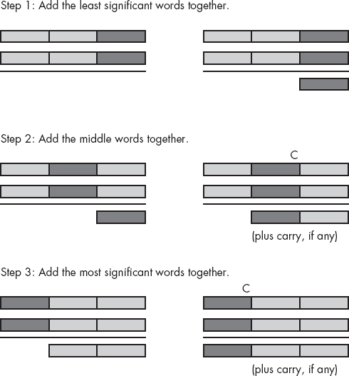
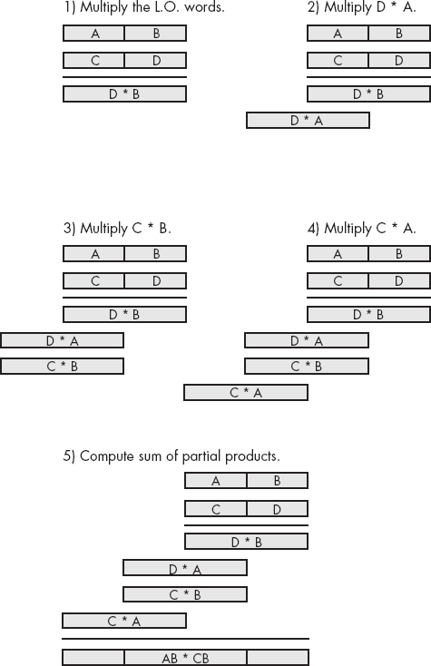
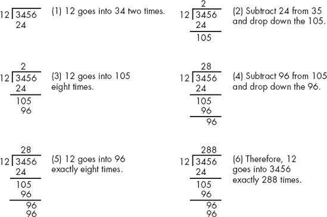
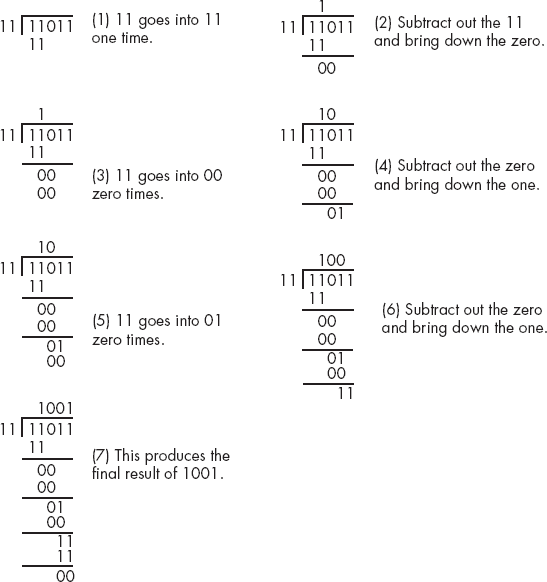
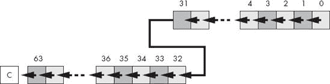
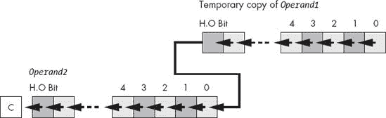
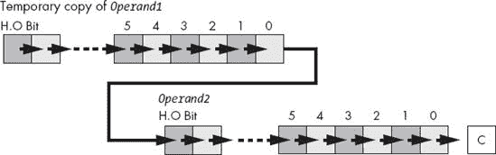
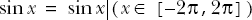
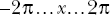
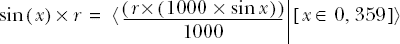

# 第八章 高级算术


本章讨论了汇编语言特别适合的那些算术操作。它涵盖了四个主要主题：扩展精度算术、不同大小操作数的算术、十进制算术以及通过表查找进行计算。

到目前为止，本章涉及的最广泛的主题是多精度算术。到本章结束时，你将知道如何对任何大小的整数操作数进行算术和逻辑运算。如果你需要处理超出±20 亿范围的整数值（或无符号值超过 40 亿），不用担心；本章将向你展示如何完成这项工作。

不同大小的操作数也会带来一些特殊的问题。例如，你可能想要将一个 64 位无符号整数与一个 128 位有符号整数相加。本章讨论如何将这两个操作数转换为兼容的格式。

本章还讨论了使用 80x86 BCD（十进制编码二进制）指令和 FPU（浮点单元）进行十进制算术。这使你能够在那些绝对需要十进制操作的少数应用中使用十进制算术。

最后，本章通过讨论如何使用表查找加速复杂计算来结束。

# 8.1 多精度操作

汇编语言相较于高级语言的一个大优势是，它不限制整数操作的大小。例如，标准 C 编程语言定义了三种不同的整数大小：`short int`、`int`和`long int`。^([111]) 在 PC 上，这些通常是 16 位和 32 位整数。尽管 80x86 机器指令限制你使用单一指令处理 8 位、16 位或 32 位整数，但你总是可以使用多条指令处理任何大小的整数。如果你想将 256 位整数相加，没问题；在汇编语言中做到这一点相对容易。接下来的部分将描述如何将各种算术和逻辑操作从 16 位或 32 位扩展到任何你想要的位数。

## 8.1.1 HLA 标准库对扩展精度操作的支持

虽然了解如何自己进行扩展精度算术非常重要，但你应该注意，HLA 标准库提供了一整套 64 位和 128 位算术和逻辑函数，你可以使用这些函数。这些例程是通用的，且非常方便使用。本节简要介绍了 HLA 标准库对扩展精度算术的支持。

如前几章所述，HLA 编译器支持几种不同的 64 位和 128 位数据类型。这些扩展的数据类型包括：

+   `uns64`: 64 位无符号整数

+   `int64`: 64 位有符号整数

+   `qword`: 64 位无类型值

+   `uns128`: 128 位无符号整数

+   `int128`: 128 位有符号整数

+   `lword`: 128 位无类型值

HLA 还提供了一个`tbyte`类型，但我们在此不予考虑（请参见 8.2 操作不同大小的操作数）。

HLA 完全支持 64 位和 128 位字面常量以及常量运算。这使您可以使用标准的十进制、十六进制或二进制表示法初始化 64 位和 128 位的静态对象。例如：

```
static
    u128    :uns128 := 123456789012345678901233567890;
    i64     :int64  := −12345678901234567890;
    lw      :lword  := $1234_5678_90ab_cdef_0000_ffff;
```

为了便于操作 64 位和 128 位的值，HLA 标准库的`math.hhf`模块提供了一组处理大多数标准算术和逻辑操作的函数。您可以像使用 32 位算术和逻辑指令一样使用这些函数。例如，考虑`math.addq`（`qword`）和`math.addl`（`lword`）函数：

```
math.addq( *`left64`*, *`right64`*, *`dest64`* );
    math.addl( *`left128`*, *`right128`*, *`dest128`* );
```

这些函数计算以下内容：

```
*`dest64`* := *`left64`* + *`right64`*;    // *`dest64`*, *`left64`*, and *`right64`*
                               // must be 8-byte operands
*`dest128`* := *`left128`* + *`right128`*; // *`dest128`*, *`left128`*, and *`right128`*
                               // must be 16-byte operands
```

这些函数设置 80x86 标志的方式与执行 `add` 指令后的预期结果相同。具体来说，这些函数会在（完整的）结果为 0 时设置零标志，如果有进位，则设置进位标志，如果出现符号溢出，则设置溢出标志，如果结果的高位字节（H.O.）包含 1，则设置符号标志。

其余的大多数算术和逻辑例程使用与 `math.addq` 和 `math.addl` 相同的调用序列。简要介绍如下：

```
math.andq( *`left64`*, *`right64`*, *`dest64`* );
    math.andl( *`left128`*, *`right128`*, *`dest128`* );
    math.divq( *`left64`*, *`right64`*, *`dest64`* );
    math.divl( *`left128`*, *`right128`*, *`dest128`* );
    math.idivq( *`left64`*, *`right64`*, *`dest64`* );
    math.idivl( *`left128`*, *`right128`*, *`dest128`* );
    math.modq( *`left64`*, *`right64`*, *`dest64`* );
    math.modl( *`left128`*, *`right128`*, *`dest128`* );
    math.imodq( *`left64`*, *`right64`*, *`dest64`* );
    math.imodl( *`left128`*, *`right128`*, *`dest128`* );
    math.mulq( *`left64`*, *`right64`*, *`dest64`* );
    math.mull( *`left128`*, *`right128`*, *`dest128`* );
    math.imulq( *`left64`*, *`right64`*, *`dest64`* );
    math.imull( *`left128`*, *`right128`*, *`dest128`* );
    math.orq( *`left64`*, *`right64`*, *`dest64`* );
    math.orl( *`left128`*, *`right128`*, *`dest128`* );
    math.subq( *`left64`*, *`right64`*, *`dest64`* );
    math.subl( *`left128`*, *`right128`*, *`dest128`* );
    math.xorq( *`left64`*, *`right64`*, *`dest64`* );
    math.xorl( *`left128`*, *`right128`*, *`dest128`* );
```

这些函数设置标志的方式与相应的 32 位机器指令相同，并且在除法和余数（取模）函数的情况下，会触发相同的异常。请注意，乘法函数不会产生扩展精度的结果。目标值与源操作数的大小相同。如果结果无法适应目标操作数，这些函数会设置溢出和进位标志。所有这些函数计算以下内容：

```
*`dest64`* := *`left64 op right64`*;
*`dest128`* := *`left128 op right128`*;
```

其中 *`op`* 表示特定的操作。

除了这些函数，HLA 标准库的数学模块还提供了一些额外的函数，其语法与`math.addq`和`math.addl`略有不同。这些函数包括`math.negq`、`math.negl`、`math.notq`、`math.notl`、`math.shlq`、`math.shll`、`math.shrq`和`math.shrl`。请注意，没有旋转或算术右移函数。然而，您很快会发现，使用标准指令可以轻松合成这些操作。以下是这些附加函数的原型：

```
math.negq( source:qword; var dest:qword );
math.negl( source:lword; var dest:lword );
math.notq( source:qword; var dest:qword );
math.notl( source:lword; var dest:lword );
math.shlq( count:uns32; source:qword; var dest:qword );
math.shll( count:uns32; source:lword; var dest:lword );
math.shrq( count:uns32; source:qword; var dest:qword );
math.shrl( count:uns32; source:lword; var dest:lword );
```

再次强调，所有这些函数设置标志的方式与相应的机器指令在支持 64 位或 128 位操作数时所设置的标志完全相同。

HLA 标准库还提供了完整的 64 位和 128 位值的输入/输出和转换例程。例如，你可以使用 `stdout.put` 显示 64 位和 128 位的值，也可以使用 `stdin.get` 读取这些值，HLA 转换模块中还有一组例程可以在这些值和它们的字符串表示之间进行转换。一般来说，任何你可以对 32 位值执行的操作，也可以对 64 位或 128 位值执行。详细信息请参见 HLA 标准库文档。

## 8.1.2 多精度加法操作

80x86 `add` 指令用于将两个 8 位、16 位或 32 位的数字相加。在执行完 `add` 指令后，如果和的高位有溢出，80x86 的进位标志会被设置。你可以使用这些信息进行多精度加法操作。考虑你手动进行多位数（多精度）加法操作的方法：

```
Step 1: Add the least significant digits together:

             289                      289
            +456    produces         +456
            ----                     ----
                                        5 with carry 1.

    Step 2: Add the next significant digits plus the carry:

               1 (previous carry)
             289                         289
            +456        produces        +456
            ----                        ----
               5                          45 with carry 1.

    Step 3: Add the most significant digits plus the carry:

                                       1 (previous carry)
             289                     289
            +456        produces    +456
            ----                    ----
              45                     745
```

80x86 以相同的方式处理扩展精度算术，只不过它不是一次加一个数字，而是一次加一个字节、一个字或一个双字。考虑图 8-1 中的三个双字（96 位）加法操作。



图 8-1. 将两个 96 位对象相加

正如你从这张图中看到的，核心思想是将一个较大的操作分解成一系列更小的操作。由于 x86 处理器家族每次最多只能加 32 位数字，所以操作必须分块进行，每块最多 32 位。因此，第一步是将两个 L.O. 双字加在一起，就像你在手动算法中将两个 L.O. 位加在一起一样。这项操作没有什么特别的；你可以使用 `add` 指令来完成。

第二步是将两个 96 位值中的第二对双字加在一起。注意，在步骤 2 中，计算还必须加上前一次加法的进位（如果有的话）。如果 L.O. 加法有进位，`add` 指令会将进位标志设置为 1；相反，如果 L.O. 加法没有进位，之前的 `add` 指令会清除进位标志。因此，在第二次加法中，我们实际上需要计算两个双字的和，再加上第一次指令的进位。幸运的是，x86 CPU 提供了一条可以完成此操作的指令：`adc`（带进位加法）指令。`adc` 指令与 `add` 指令使用相同的语法，执行的操作几乎相同：

```
adc( *`source`*, *`dest`* );  // *`dest`* := *`dest`* + *`source`* + C
```

如你所见，`add`和`adc`指令之间的唯一区别是，`adc`指令在源操作数和目标操作数相加的同时，还会将进位标志的值加进来。它还会像`add`指令一样设置标志（包括在发生无符号溢出时设置进位标志）。这正是我们需要将 96 位和数的中间两个双字加在一起的方式。

在图 8-1 的第 3 步中，算法将 96 位值的高位双字相加。这个加法操作还必须将中间两个双字相加的进位考虑进去；因此，这里也需要使用`adc`指令。总的来说，`add`指令将低位双字相加。`adc`（带进位加法）指令将其他双字对相加。在扩展精度加法序列结束时，进位标志指示无符号溢出（如果设置），溢出标志指示有符号溢出，符号标志指示结果的符号。零标志在扩展精度加法结束时没有实际意义（它仅表示两个高位双字的和为 0，并不表示整个结果为 0）。如果你想查看如何检查扩展精度零结果，请参阅 HLA 标准库中`math.addq`或`math.addl`函数的源代码。

例如，假设你有两个 64 位的值希望相加，它们定义如下：

```
static
    X: qword;
    Y: qword;
```

假设你还想将和存储在第三个变量`Z`中，该变量也是`qword`。以下 80x86 代码将完成此任务：

```
mov( (type dword X), eax );          // Add together the L.O. 32 bits
    add( (type dword Y), eax );          // of the numbers and store the
    mov( eax, (type dword Z) );          // result into the L.O. dword of Z.

    mov( (type dword X[4]), eax );       // Add together (with carry) the
    adc( (type dword Y[4]), eax );       // H.O. 32 bits and store the result
    mov( eax, (type dword Z[4]) );       // into the H.O. dword of Z.
```

记住，这些变量是`qword`对象。因此，编译器不会接受`mov( X, eax );`这种形式的指令，因为该指令会尝试将 64 位的值加载到 32 位寄存器中。此代码使用强制转换操作符将符号`X`、`Y`和`Z`强制转换为 32 位。前三条指令将`X`和`Y`的低位双字相加，并将结果存储在`Z`的低位双字中。最后三条指令将`X`和`Y`的高位双字相加，并加上低位字的进位，将结果存储在`Z`的高位双字中。记住，形式为`X[4]`的地址表达式访问的是 64 位实体的高位双字。这是因为 x86 内存空间按字节寻址，4 个连续字节组成一个双字。

你可以通过使用`adc`指令加上高位值，将其扩展到任意位数。例如，若要将两个 128 位值相加，你可以使用如下代码：

```
type
    tBig: dword[4];           // Storage for four dwords is 128 bits.

static
    BigVal1: tBig;
    BigVal2: tBig;
    BigVal3: tBig;
     .
     .
     .
    mov( BigVal1[0], eax );   // Note there is no need for (type dword BigValx)
    add( BigVal2[0], eax );   // because the base type of BitValx is dword.
    mov( eax, BigVal3[0] );

    mov( BigVal1[4], eax );
    adc( BigVal2[4], eax );
    mov( eax, BigVal3[4] );

    mov( BigVal1[8], eax );
    adc( BigVal2[8], eax );
    mov( eax, BigVal3[8] );

    mov( BigVal1[12], eax );
    adc( BigVal2[12], eax );
    mov( eax, BigVal3[12] );
```

## 8.1.3 多精度减法操作

80x86 执行多字节减法，就像它执行加法一样，方式与手动操作相同，只不过它一次减去的是整个字节、字或双字，而不是十进制数字。这个机制与`add`操作的机制类似。你在低阶字节/字/双字上使用`sub`指令，而在高阶值上使用`sub`（带借位）指令。

以下示例演示了使用 80x86 的 32 位寄存器进行的 64 位减法：

```
static
    Left:        qword;
    Right:       qword;
    Diff:        qword;
         .
         .
         .
    mov( (type dword Left), eax );
    sub( (type dword Right), eax );
    mov( eax, (type dword Diff) );

    mov( (type dword Left[4]), eax );
    sbb( (type dword Right[4]), eax );
    mov( (type dword Diff[4]), eax );
```

以下示例演示了一个 128 位减法：

```
type
    tBig: dword[4];  // Storage for four dwords is 128 bits.

static
    BigVal1: tBig;
    BigVal2: tBig;
    BigVal3: tBig;
     .
     .
     .

    // Compute BigVal3 := BigVal1 - BigVal2

    mov( BigVal1[0], eax ); // Note there is no need for (type dword BigValx)
    sub( BigVal2[0], eax ); // because the base type of BitValx is dword.
    mov( eax, BigVal3[0] );

    mov( BigVal1[4], eax );
    sbb( BigVal2[4], eax );
    mov( eax, BigVal3[4] );

    mov( BigVal1[8], eax );
    sbb( BigVal2[8], eax );
    mov( eax, BigVal3[8] );

    mov( BigVal1[12], eax );
    sbb( BigVal2[12], eax );
    mov( eax, BigVal3[12] );
```

## 8.1.4 扩展精度比较

不幸的是，没有“带借位比较”指令可以用于执行扩展精度比较。由于`cmp`和`sub`指令执行相同的操作，至少就标志位而言，你可能会猜测可以使用`sub`指令来合成扩展精度比较；然而，这种方法并不总是有效。幸运的是，存在更好的解决方案。

考虑两个无符号值$2157 和$1293。这两个值的低阶字节不影响比较结果。只需比较高阶字节，$21 与$12，就能判断第一个值大于第二个值。事实上，只有在高阶字节相等时，你才需要查看这两个字节。在所有其他情况下，比较高阶字节就能告诉你所有你需要了解的值。当然，这对于任意字节数都是成立的，不仅仅是 2 个字节。以下代码通过先比较高阶双字，再在高阶双字相等时才比较低阶双字，来比较两个有符号的 64 位整数：

```
// This sequence transfers control to location "IsGreater" if
// QwordValue > QwordValue2\. It transfers control to "IsLess" if
// QwordValue < QwordValue2\. It falls through to the instruction
// following this sequence if QwordValue = QwordValue2\. To test for
// inequality, change the "IsGreater" and "IsLess" operands to "NotEqual"
// in this code.

        mov( (type dword QWordValue[4]), eax );  // Get H.O. dword.
        cmp( eax, (type dword QWordValue2[4]));
        jg IsGreater;
        jl IsLess;

        mov( (type dword QWordValue[0]), eax );  // If H.O. dwords were equal,
        cmp( eax, (type dword QWordValue2[0]));  // then we must compare the
        jg IsGreater;                            // L.O. dwords.
        jl IsLess;

// Fall through to this point if the two values were equal.
```

要比较无符号值，只需将`jg`和`jl`指令分别替换为`ja`和`jb`。

你可以轻松地从前面的序列中合成任何可能的比较。以下示例展示了如何做到这一点。这些示例演示了有符号比较；如果你需要无符号比较，只需将`jg`、`jge`、`jl`、`jle`分别替换为`ja`、`jae`、`jb`、`jbe`。每个示例假设以下声明：

```
static
    QW1: qword;
    QW2: qword;

const
    QW1d: text := "(type dword QW1)";
    QW2d: text := "(type dword QW2)";
```

以下代码实现了一个 64 位测试，检查`QW1 < QW2`（有符号）。如果`QW1 < QW2`，控制流转移到`IsLess`标签。如果不成立，控制流将继续到下一条语句。

```
mov( QW1d[4], eax );   // Get H.O. dword.
    cmp( eax, QW2d[4] );
    jg NotLess;
    jl IsLess;

    mov( QW1d[0], eax );   // Fall through to here if the H.O. dwords are equal.
    cmp( eax, QW2d[0] );
    jl IsLess;
NotLess:
```

这是一个 64 位测试，检查`QW1 <= QW2`（有符号）。如果条件成立，这段代码会跳转到`IsLessEq`。

```
mov( QW1d[4], eax );   // Get H.O. dword.
    cmp( eax, QW2d[4] );
    jg NotLessEQ;
    jl IsLessEQ;

    mov( QW1d[0], eax );   // Fall through to here if the H.O. dwords are equal.
    cmp( eax, QW2d[0] );
    jle IsLessEQ;
NotLessEQ:
```

这是一个 64 位测试，检查`QW1 > QW2`（有符号）。如果条件成立，它会跳转到`IsGtr`。

```
mov( QW1d[4], eax );   // Get H.O. dword.
    cmp( eax, QW2d[4] );
    jg IsGtr;
    jl NotGtr;

    mov( QW1d[0], eax );   // Fall through to here if the H.O. dwords are equal.
    cmp( eax, QW2d[0] );
    jg IsGtr;
NotGtr:
```

以下是一个 64 位测试，检查`QW1 >= QW2`（有符号）。如果条件成立，这段代码会跳转到标签`IsGtrEQ`。

```
mov( QW1d[4], eax );   // Get H.O. dword.
    cmp( eax, QW2d[4] );
    jg IsGtrEQ;
    jl NotGtrEQ;

    mov( QW1d[0], eax );   // Fall through to here if the H.O. dwords are equal.
    cmp( eax, QW2d[0] );
    jge IsGtrEQ;
NotGtrEQ:
```

这是一个 64 位测试，检查`QW1 = QW2`（有符号或无符号）。如果`QW1 = QW2`，这段代码会跳转到`IsEqual`标签。如果不相等，则继续执行下一条指令。

```
mov( QW1d[4], eax );   // Get H.O. dword.
    cmp( eax, QW2d[4] );
    jne NotEqual;

    mov( QW1d[0], eax );   // Fall through to here if the H.O. dwords are equal.
    cmp( eax, QW2d[0] );
    je IsEqual;
NotEqual:
```

以下是一个 64 位测试，用于检查 `QW1 <> QW2`（有符号或无符号）。如果 `QW1 <> QW2`，这段代码会跳转到标签 `NotEqual`。如果它们相等，则会继续执行下一条指令。

```
mov( QW1d[4], eax );   // Get H.O. dword.
    cmp( eax, QW2d[4] );
    jne IsNotEqual;

    mov( QW1d[0], eax );   // Fall through to here if the H.O. dwords are equal.
    cmp( eax, QW2d[0] );
    jne IsNotEqual;

// Fall through to this point if they are equal.
```

如果需要进行扩展精度比较，则无法直接使用 HLA 高级控制结构。然而，你可以使用 HLA 混合控制结构，并将适当的比较嵌入到布尔表达式中。这样做可能会使代码更易于阅读。例如，下面的`if..then..else..endif`语句使用 64 位扩展精度无符号比较来检查 `QW1 > QW2`：

```
if
( #{
    mov( QW1d[4], eax );
    cmp( eax, QW2d[4] );
    jg true;

    mov( QW1d[0], eax );
    cmp( eax, QW2d[0] );
    jng false;
}# ) then

    << Code to execute if QW1 > QW2 >>

else

    << Code to execute if QW1 <= QW2 >>

endif;
```

如果需要比较大于 64 位的对象，可以很容易地将上面给出的 64 位操作数的代码进行泛化。总是从对象的高阶双字开始比较，并一直向下比较到对象的低阶双字，只要相应的双字相等。以下示例比较两个 128 位值，以检查第一个值是否小于或等于（无符号）第二个值：

```
static
    Big1: uns128;
    Big2: uns128;
     .
     .
     .
    if
    ( #{
        mov( Big1[12], eax );
        cmp( eax, Big2[12] );
        jb true;
        ja false;
        mov( Big1[8], eax );
        cmp( eax, Big2[8] );
        jb true;
        ja false;
        mov( Big1[4], eax );
        cmp( eax, Big2[4] );
        jb true;
        ja false;
        mov( Big1[0], eax );
        cmp( eax, Big2[0] );
        jnbe false;
    }# ) then

        << Code to execute if Big1 <= Big2 >>

    else

        << Code to execute if Big1 > Big2 >>

    endif;
```

## 8.1.5 扩展精度乘法

尽管 8×8 位、16×16 位或 32×32 位的乘法通常足够，但有时你可能需要乘以更大的值。你将使用 x86 单操作数的 `mul` 和 `imul` 指令进行扩展精度乘法操作。

毫不奇怪（考虑到我们如何通过 `adc` 和 `sbb` 实现扩展精度加法），你使用相同的技术在 80x86 上执行扩展精度乘法，就像手动乘两个值时所采用的方法一样。考虑一种简化形式的手工多位数乘法方式：

```
1) Multiply the first two              2) Multiply 5*2:
           digits together (5*3):

            123                                      123
             45                                       45
            ---                                      ---
             15                                       15
                                                      10

         3) Multiply 5*1:                       4) Multiply 4*3:

            123                                      123
             45                                       45
            ---                                      ---
             15                                       15
             10                                       10
              5                                        5
                                                      12

         5) Multiply 4*2:                       6) Multiply 4*1:

             123                                     123
              45                                      45
             ---                                     ---
              15                                      15
              10                                      10
               5                                       5
              12                                      12
               8                                       8
                                                       4

         7) Add all the partial products together:

             123
              45
             ---
              15
              10
               5
              12
               8
               4
          ------
            5535
```

80x86 以相同的方式执行扩展精度乘法，唯一不同的是它操作的是字节、字和双字，而不是数字。图 8-2 展示了这种工作方式。



图 8-2. 扩展精度乘法

在进行扩展精度乘法时，可能最重要的是记住，必须同时执行多重精度加法。将所有部分积相加需要进行几次加法运算，最终产生结果。示例 8-1 展示了在 32 位处理器上乘以两个 64 位值的正确方法。

示例 8-1. 扩展精度乘法

```
program testMUL64;
#include( "stdlib.hhf" )

procedure MUL64( Multiplier:qword; Multiplicand:qword; var Product:lword );
const
    mp: text := "(type dword Multiplier)";
    mc: text := "(type dword Multiplicand)";
    prd:text := "(type dword [edi])";

begin MUL64;

    mov( Product, edi );

    // Multiply the L.O. dword of Multiplier times Multiplicand.

    mov( mp, eax );
    mul( mc, eax );     // Multiply L.O. dwords.
    mov( eax, prd );    // Save L.O. dword of product.
    mov( edx, ecx );    // Save H.O. dword of partial product result.

    mov( mp, eax );
    mul( mc[4], eax );  // Multiply mp(L.O.) * mc(H.O.)
    add( ecx, eax );    // Add to the partial product.
    adc( 0, edx );      // Don't forget the carry!
    mov( eax, ebx );    // Save partial product for now.
    mov( edx, ecx );

    // Multiply the H.O. word of Multiplier with Multiplicand.

    mov( mp[4], eax );  // Get H.O. dword of Multiplier.
    mul( mc, eax );     // Multiply by L.O. word of Multiplicand.
    add( ebx, eax );    // Add to the partial product.
    mov( eax, prd[4] ); // Save the partial product.
    adc( edx, ecx );    // Add in the carry!

    mov( mp[4], eax );  // Multiply the two H.O. dwords together.
    mul( mc[4], eax );
    add( ecx, eax );    // Add in partial product.
    adc( 0, edx );      // Don't forget the carry!
    mov( eax, prd[8] ); // Save the partial product.
    mov( edx, prd[12] );

end MUL64;

static
    op1: qword;
    op2: qword;
    rslt: lword;

begin testMUL64;

    // Initialize the qword values (note that static objects
    // are initialized with 0 bits).

    mov( 1234, (type dword op1 ));
    mov( 5678, (type dword op2 ));
    MUL64( op1, op2, rslt );

    // The following only prints the L.O. qword, but
    // we know the H.O. qword is 0 so this is okay.

    stdout.put( "rslt=" );
    stdout.putu64( (type qword rslt));

end testMUL64;
```

你需要记住的一件事是，这段代码仅适用于无符号操作数。要将两个有符号值相乘，必须在乘法之前注意操作数的符号，取两个操作数的绝对值，进行无符号乘法，然后根据原操作数的符号调整结果积的符号。有符号操作数的乘法留给读者自己做（或者你可以查看 HLA 标准库中的源代码）。

示例 8-1 中的例子相当直接，因为可以将部分积保存在不同的寄存器中。如果你需要将更大的值相乘，就需要将部分积保存在临时（内存）变量中。除此之外，示例 8-1 使用的算法可以推广到任意数量的双字。

## 8.1.6 扩展精度除法

你不能通过`div`和`idiv`指令合成一个通用的*n*位/*m*位除法操作。扩展精度除法需要一系列的移位和减法指令，过程非常复杂。然而，除去一般的操作，将*n*位数除以 32 位数是可以通过`div`指令轻松合成的。本节介绍了两种扩展精度除法的方法。

在我们描述如何执行多精度除法操作之前，你需要注意，尽管某些操作看起来可以用单一的`div`或`idiv`指令进行计算，但仍然需要扩展精度除法。将一个 64 位数除以一个 32 位数很简单，只要结果商可以适应 32 位。`div`和`idiv`指令会直接处理这个问题。然而，如果商不能适应 32 位，那么你必须将这个问题作为扩展精度除法来处理。这里的技巧是，将被除数的高字（H.O.）双字（无符号扩展或符号扩展）除以除数，然后用余数和被除数的低字（L.O.）再次进行相同操作。以下的步骤展示了这一过程。

```
static
    dividend: dword[2] := [$1234, 4];  // = $4_0000_1234.
    divisor:  dword := 2;              // dividend/divisor = $2_0000_091A
    quotient: dword[2];
    remainder:dword;
     .
     .
     .
    mov( divisor, ebx );
    mov( dividend[4], eax );
    xor( edx, edx );            // Zero extend for unsigned division.
    div( ebx, edx:eax );
    mov( eax, quotient[4] );    // Save H.O. dword of the quotient (2).
    mov( dividend[0], eax );    // Note that this code does *NOT* zero extend
    div( ebx, edx:eax );        // eax into edx before this div instr.
    mov( eax, quotient[0] );    // Save L.O. dword of the quotient ($91a).
    mov( edx, remainder );      // Save away the remainder.
```

由于除以 1 是完全合法的，因此结果商可能需要与被除数一样多的位数。这就是为什么在这个例子中，`quotient`变量和`dividend`变量的大小相同（64 位）（注意使用两个双字数组而非`qword`类型；这样可以避免代码中将操作数强制转换为双字）。无论被除数和除数操作数的大小如何，余数的大小总是不会超过除法操作的大小（此例中为 32 位）。因此，例子中的`remainder`变量仅为一个双字。

在分析这段代码如何工作之前，让我们简要了解一下为什么单一的 64/32 除法对于这个特定的例子不起作用，尽管`div`指令确实能够计算 64/32 除法的结果。假设 x86 能够执行这种操作的天真方法大致如下：

```
// This code does *NOT* work!

    mov( dividend[0], eax );    // Get dividend into edx:eax
    mov( dividend[4], edx );
    div( divisor, edx:eax );    // Divide edx:eax by divisor.
```

虽然这段代码在语法上是正确的并且能够编译，但是如果你尝试运行这段代码，它将引发一个`ex.DivideError`^([112])异常。原因是商必须能够适配 32 位，因为商的值是$2_0000_091A，它无法适配 EAX 寄存器，因此会引发异常。

现在我们再看一下之前那段能够正确计算 64/32 商的代码。该代码首先计算`dividend[4]`与除数的 32/32 商。这个除法的商（2）成为最终商的高位双字。这个除法的余数（0）成为除法操作第二部分的 EDX 扩展。代码的第二部分将`edx:dividend[0]`除以除数，以产生商的低位双字和除法的余数。注意，代码在第二个`div`指令之前没有将 EAX 零扩展到 EDX。EDX 已经包含有效位，这段代码不能打乱这些位。

上面的 64/32 除法操作实际上只是通用除法操作的一种特殊情况，它允许你将一个任意大小的值除以一个 32 位的除数。为了实现这一点，你首先将被除数的高位双字移入 EAX 寄存器，并将其零扩展到 EDX 寄存器。接着，你将这个值除以除数。然后，在不修改 EDX 的情况下，存储部分商，将 EAX 加载为被除数的下一个低位双字，并用除数除以它。你重复这个操作，直到处理完被除数中的所有双字。这时，EDX 寄存器将包含余数。示例 8-2 中的程序演示了如何将一个 128 位的数除以一个 32 位的除数，得到一个 128 位的商和一个 32 位的余数。

示例 8-2. 无符号 128/32 位扩展精度除法

```
program testDiv128;
#include( "stdlib.hhf" )

procedure div128
(
        Dividend:   lword;
        Divisor:    dword;
    var QuotAdrs:   lword;
    var Remainder:  dword
);  @nodisplay;

const
    Quotient: text := "(type dword [edi])";

begin div128;

    push( eax );
    push( edx );
    push( edi );

    mov( QuotAdrs, edi );       // Pointer to quotient storage.

    mov( (type dword Dividend[12]), eax ); // Begin division with the H.O. dword.
    xor( edx, edx );            // Zero extend into edx.
    div( Divisor, edx:eax );    // Divide H.O. dword.
    mov( eax, Quotient[12] );   // Store away H.O. dword of quotient.

    mov( (type dword Dividend[8]), eax ); // Get dword #2 from the dividend.
    div( Divisor, edx:eax );    // Continue the division.
    mov( eax, Quotient[8] );    // Store away dword #2 of the quotient.

    mov( (type dword Dividend[4]), eax ); // Get dword #1 from the dividend.
    div( Divisor, edx:eax );    // Continue the division.
    mov( eax, Quotient[4] );    // Store away dword #1 of the quotient.

    mov( (type dword Dividend[0]), eax );    // Get the L.O. dword of the
                                             // dividend.
    div( Divisor, edx:eax );    // Finish the division.
    mov( eax, Quotient[0] );    // Store away the L.O. dword of the quotient.

    mov( Remainder, edi );      // Get the pointer to the remainder's value.
    mov( edx, [edi] );          // Store away the remainder value.

    pop( edi );
    pop( edx );
    pop( eax );

end div128;

static
    op1:    lword   := $8888_8888_6666_6666_4444_4444_2222_2221;
    op2:    dword   := 2;
    quo:    lword;
    rmndr:  dword;

begin testDiv128;

    div128( op1, op2, quo, rmndr );

    stdout.put
    (
        nl
        nl
        "After the division: " nl
        nl
        "Quotient = $",
        quo[12], "_",
        quo[8], "_",
        quo[4], "_",
        quo[0], nl

        "Remainder = ", (type uns32 rmndr )
    );

end testDiv128;
```

你可以通过简单地向指令序列中添加额外的`mov`/`div`/`mov`指令来扩展这段代码，支持任意位数的操作。像上一节所介绍的扩展精度乘法一样，这种扩展精度除法算法仅适用于无符号操作数。如果你需要除以两个有符号数，你必须注意它们的符号，取其绝对值，进行无符号除法，然后根据操作数的符号设置结果的符号。

如果你需要使用大于 32 位的除数，你将不得不使用移位和减法策略来实现除法。不幸的是，这种算法非常慢。在本节中，我们将开发两种能在任意位数上进行除法的算法。第一种算法较慢，但更容易理解；第二种算法要快得多（在平均情况下）。

就像乘法一样，理解计算机如何进行除法的最佳方法是研究你如何被教导手工进行长除法。考虑操作 3,456/12，以及你手动执行此操作时所采取的步骤，如 图 8-3 所示。



图 8-3. 手动逐位除法操作

这个算法在二进制下实际上更容易，因为在每一步中，你不需要猜测 12 能除尽余数多少次，也不需要将 12 乘以你的猜测来获得需要减去的数。在二进制算法的每一步中，除数对余数的除法结果恰好是零次或一次。例如，考虑将 27 (11011) 除以 3 (11)，如 图 8-4 所示。

有一种新颖的方法来实现这个二进制除法算法，它可以同时计算商和余数。该算法如下：

```
Quotient := Dividend;
Remainder := 0;
for i := 1 to NumberBits do

    Remainder:Quotient := Remainder:Quotient SHL 1;
    if Remainder >= Divisor then

        Remainder := Remainder - Divisor;
        Quotient := Quotient + 1;

    endif
endfor
```



图 8-4. 二进制手动除法

`NumberBits` 是 `Remainder`、`Quotient`、`Divisor` 和 `Dividend` 变量的位数。注意，`Quotient := Quotient + 1;` 语句将 `Quotient` 的最低有效位设置为 1，因为该算法之前将 `Quotient` 左移了 1 位。示例 8-3 中的程序实现了这个算法。

示例 8-3. 扩展精度除法

```
program testDiv128b;
#include( "stdlib.hhf" )

// div128-
//
// This procedure does a general 128/128 division operation using the
// following algorithm (all variables are assumed to be 128-bit objects):
//
// Quotient := Dividend;
// Remainder := 0;
// for i := 1 to NumberBits do
//
//  Remainder:Quotient := Remainder:Quotient SHL 1;
//  if Remainder >= Divisor then
//
//      Remainder := Remainder - Divisor;
//      Quotient := Quotient + 1;
//
//  endif
// endfor
//

procedure div128
(
        Dividend:   lword;
        Divisor:    lword;
    var QuotAdrs:   lword;
    var RmndrAdrs:  lword
);  @nodisplay;

const
    Quotient: text := "Dividend";   // Use the Dividend as the Quotient.

var
    Remainder: lword;

begin div128;

    push( eax );
    push( ecx );
    push( edi );

    mov( 0, eax );                  // Set the remainder to 0.
    mov( eax, (type dword Remainder[0]) );
    mov( eax, (type dword Remainder[4]) );
    mov( eax, (type dword Remainder[8]) );
    mov( eax, (type dword Remainder[12]));

    mov( 128, ecx );                // Count off 128 bits in ecx.
    repeat

        // Compute Remainder:Quotient := Remainder:Quotient SHL 1:

        shl( 1, (type dword Dividend[0]) );  // See Section 8.1.12 to see
        rcl( 1, (type dword Dividend[4]) );  // how this code shifts 256
        rcl( 1, (type dword Dividend[8]) );  // bits to the left by 1 bit.
        rcl( 1, (type dword Dividend[12]));
        rcl( 1, (type dword Remainder[0]) );
        rcl( 1, (type dword Remainder[4]) );
        rcl( 1, (type dword Remainder[8]) );
        rcl( 1, (type dword Remainder[12]));

        // Do a 128-bit comparison to see if the remainder
        // is greater than or equal to the divisor.

        if
        ( #{
            mov( (type dword Remainder[12]), eax );
            cmp( eax, (type dword Divisor[12]) );
            ja true;
            jb false;

            mov( (type dword Remainder[8]), eax );
            cmp( eax, (type dword Divisor[8]) );
            ja true;
            jb false;

            mov( (type dword Remainder[4]), eax );
            cmp( eax, (type dword Divisor[4]) );
            ja true;
            jb false;

            mov( (type dword Remainder[0]), eax );
            cmp( eax, (type dword Divisor[0]) );
            jb false;
        }# ) then

            // Remainder := Remainder - Divisor

            mov( (type dword Divisor[0]), eax );
            sub( eax, (type dword Remainder[0]) );

            mov( (type dword Divisor[4]), eax );
            sbb( eax, (type dword Remainder[4]) );

            mov( (type dword Divisor[8]), eax );
            sbb( eax, (type dword Remainder[8]) );

            mov( (type dword Divisor[12]), eax );
            sbb( eax, (type dword Remainder[12]) );

            // Quotient := Quotient + 1;

            add( 1, (type dword Quotient[0]) );
            adc( 0, (type dword Quotient[4]) );
            adc( 0, (type dword Quotient[8]) );
            adc( 0, (type dword Quotient[12]) );

        endif;
        dec( ecx );

    until( @z );

    // Okay, copy the quotient (left in the Dividend variable)
    // and the remainder to their return locations.

    mov( QuotAdrs, edi );
    mov( (type dword Quotient[0]), eax );
    mov( eax, [edi] );
    mov( (type dword Quotient[4]), eax );
    mov( eax, [edi+4] );
    mov( (type dword Quotient[8]), eax );
    mov( eax, [edi+8] );
    mov( (type dword Quotient[12]), eax );
    mov( eax, [edi+12] );

    mov( RmndrAdrs, edi );
    mov( (type dword Remainder[0]), eax );
    mov( eax, [edi] );
    mov( (type dword Remainder[4]), eax );
    mov( eax, [edi+4] );
    mov( (type dword Remainder[8]), eax );
    mov( eax, [edi+8] );
    mov( (type dword Remainder[12]), eax );
    mov( eax, [edi+12] );

    pop( edi );
    pop( ecx );
    pop( eax );

end div128;

// Some simple code to test out the division operation:

static
    op1:    lword    := $8888_8888_6666_6666_4444_4444_2222_2221;
    op2:    lword    := 2;
    quo:    lword;
    rmndr:  lword;

begin testDiv128b;

    div128( op1, op2, quo, rmndr );

    stdout.put
    (
        nl
        nl
        "After the division: " nl
        nl
        "Quotient = $",
        (type dword quo[12]), "_",
        (type dword quo[8]), "_",
        (type dword quo[4]), "_",
        (type dword quo[0]), nl

        "Remainder = ", (type uns32 rmndr )
    );

end testDiv128b;
```

这段代码看起来很简单，但存在一些问题：它没有检查除以 0 的情况（如果你尝试除以 0，它会产生值 $FFFF_FFFF_FFFF_FFFF），它仅处理无符号值，而且非常慢。处理除以 0 的情况非常简单；只需在运行此代码之前检查除数是否为 0，并在除数为 0 时返回适当的错误代码（或引发 `ex.DivisionError` 异常）。处理有符号值与之前的除法算法相同：注意符号，取操作数的绝对值，进行无符号除法，然后修正符号。然而，这个算法的性能远远不如理想。它的性能大约比 80x86 上的 `div`/`idiv` 指令慢一个数量级甚至两个，而这些指令本身就是 CPU 上最慢的指令之一。

有一种技术可以显著提升除法性能：检查除数变量是否只使用 32 位。通常，尽管除数是一个 128 位变量，但其值本身完全可以适应 32 位（即，`Divisor`的高双字是 0）。在这种特殊情况下，这种情况发生得非常频繁，你可以使用`div`指令，它要快得多。算法稍微复杂一些，因为你必须首先比较高双字是否为 0，但通常它的执行速度更快，并且能够除以任意两个值的对。

## 8.1.7 扩展精度取反操作

虽然有多种方法可以对扩展精度值进行取反，但对于较小的值（96 位或更小），最简便的方法是结合使用`neg`和`sbb`指令。这种技术利用了`neg`指令将其操作数从 0 中减去的事实。特别是，它设置了与`sub`指令相同的标志，如果你从 0 中减去目标值的话。这段代码的形式如下（假设你要取反 EDX:EAX 中的 64 位值）：

```
neg( edx );
    neg( eax );
    sbb( 0, edx );
```

如果取反操作的低字（L.O. word）有借位，`sbb`指令会将 EDX 递减（除非 EAX 为 0，借位操作总是会发生）。

将此操作扩展到更多字节、字或双字非常简单；你只需从要取反对象的高字节内存位置开始，向低字节方向工作。以下代码计算一个 128 位的取反操作。

```
static
    Value: dword[4];
     .
     .
     .
    neg( Value[12] );      // Negate the H.O. double word.
    neg( Value[8] );       // Neg previous dword in memory.
    sbb( 0, Value[12] );   // Adjust H.O. dword.

    neg( Value[4] );       // Negate the second dword in the object.
    sbb( 0, Value[8] );    // Adjust third dword in object.
    sbb( 0, Value[12] );   // Adjust the H.O. dword.

    neg( Value );          // Negate the L.O. dword.
    sbb( 0, Value[4] );    // Adjust second dword in object.
    sbb( 0, Value[8] );    // Adjust third dword in object.
    sbb( 0, Value[12] );   // Adjust the H.O. dword.
```

不幸的是，这段代码往往变得非常庞大且缓慢，因为你需要在每次取反操作后将进位传播到所有高字（H.O. words）。对于较大的值，取反的一个更简单方法是直接将该值从 0 中减去：

```
static
    Value: dword[5];   // 160-bit value.
     .
     .
     .
    mov( 0, eax );
    sub( Value, eax );
    mov( eax, Value );

    mov( 0, eax );
    sbb( Value[4], eax );
    mov( eax, Value[4] );

    mov( 0, eax );
    sbb( Value[8], eax );
    mov( eax, Value[8] );

    mov( 0, eax );
    sbb( Value[12], eax );
    mov( eax, Value[12] );

    mov( 0, eax );
    sbb( Value[16], eax );
    mov( eax, Value[16] );
```

## 8.1.8 扩展精度和操作

执行*n*字节`and`操作非常简单：只需将两个操作数中对应的字节进行`and`操作，保存结果。例如，要执行一个所有操作数为 64 位长的`and`操作，可以使用以下代码：

```
mov( (type dword *`source1`*), eax );
    and( (type dword *`source2`*), eax );
    mov( eax, (type dword *`dest`*) );

    mov( (type dword *`source1`*[4]), eax );
    and( (type dword *`source2`*[4]), eax );
    mov( eax, (type dword *`dest`*[4]) );
```

这个技术可以轻松扩展到任意数量的字；你只需要在操作数中按位逻辑`and`相应的字节、字或双字即可。注意，这个序列会根据最后一次`and`操作的结果设置标志。如果最后进行的是高双字（H.O. double words）的`and`操作，这将正确设置除了零标志外的所有标志。如果你需要在此序列之后检查零标志，你需要将得到的两个双字按位逻辑`or`（或其他方式比较它们是否为 0）。

## 8.1.9 扩展精度或操作

多字节逻辑`or`操作与多字节`and`操作的执行方式相同。你只需将两个操作数中对应的字节进行`or`操作。例如，要对两个 96 位值进行逻辑`or`操作，可以使用以下代码：

```
mov( (type dword *`source1`*), eax );
    or( (type dword *`source2`*), eax );
    mov( eax, (type dword *`dest`*) );

    mov( (type dword *`source1`*[4]), eax );
    or( (type dword *`source2`*[4]), eax );
    mov( eax, (type dword *`dest`*[4]) );

    mov( (type dword *`source1`*[8]), eax );
    or( (type dword *`source2`*[8]), eax );
    mov( eax, (type dword *`dest`*[8]) );
```

与前面的例子一样，这样做不能正确设置整个操作的零标志。如果你在执行多精度的`or`后需要测试零标志，必须将所有结果的双字进行逻辑`or`运算。

## 8.1.10 扩展精度的`xor`操作

扩展精度的`xor`操作与`and`/`or`操作相同——只需对两个操作数的相应字节执行`xor`，即可得到扩展精度的结果。以下代码序列对两个 64 位操作数进行`xor`运算，并将结果存储到 64 位变量中：

```
mov( (type dword *`source1`*), eax );
    xor( (type dword *`source2`*), eax );
    mov( eax, (type dword *`dest`*) );

    mov( (type dword *`source1`*[4]), eax );
    xor( (type dword *`source2`*[4]), eax );
    mov( eax, (type dword *`dest`*[4]) );
```

前两个部分提到的零标志的评论也适用于这里。

## 8.1.11 扩展精度的非操作

`not`指令会反转指定操作数中的所有位。扩展精度的`not`操作通过对所有受影响的操作数执行`not`指令来完成。例如，要对(EDX:EAX)中的 64 位值执行`not`操作，你只需执行以下指令：

```
not( eax );
    not( edx );
```

请记住，如果你执行两次`not`指令，最终会得到`or`iginal 值。还要注意，与所有 1（$FF、$FFFF 或$FFFF_FFFF）进行异或运算，与执行`not`指令的效果相同。

## 8.1.12 扩展精度移位操作

扩展精度的移位操作需要一个移位指令和一个旋转指令。考虑如何使用 32 位操作实现 64 位的`shl`（参见图 8-5）：

1.  必须将 0 移到位 0。

1.  位 0 到 30 被移到下一个更高的位。

1.  位 31 被移到位 32。

1.  位 32 到 62 必须移到下一个更高的位。

1.  位 63 被移到进位标志。



图 8-5. 64 位左移操作

你可以使用的两条指令来实现 64 位移位是`shl`和`rcl`。例如，要将(EDX:EAX)中的 64 位数值左移一位，可以使用以下指令：

```
shl( 1, eax );
    rcl( 1, eax );
```

请注意，使用这种技术，你一次只能移位一个扩展精度的值。不能使用 CL 寄存器将扩展精度操作数移位多个位。也不能使用这种技术指定大于 1 的常数值。

要理解这一指令序列是如何工作的，可以考虑每条指令的操作。`shl`指令将 0 移到 64 位操作数的位 0，并将位 31 移到进位标志。然后，`rcl`指令将进位标志移到位 32，再将位 63 移到进位标志。结果正是我们想要的。

要对超过 64 位的操作数进行左移操作，只需使用额外的`rcl`指令。扩展精度左移操作总是从最低有效双字开始，每个随后的`rcl`指令都作用于下一个更高有效双字。例如，要对一个 96 位的内存位置进行左移操作，可以使用以下指令：

```
shl( 1, (type dword *`Operand`*[0]) );
    rcl( 1, (type dword *`Operand`*[4])  );
    rcl( 1, (type dword *`Operand`*[8])  );
```

如果你需要将数据移位 2 位或更多位，你可以重复上述序列所需的次数（对于固定次数的移位），或者将指令放入循环中，重复执行若干次。例如，以下代码将 96 位的*`Operand`*值向左移位，移位的位数由 ECX 指定：

```
ShiftLoop:
    shl( 1, (type dword *`Operand`*[0]) );
    rcl( 1, (type dword *`Operand`*[4]) );
    rcl( 1, (type dword *`Operand`*[8]) );
    dec( ecx );
    jnz ShiftLoop;
```

实现`shr`和`sar`的方式类似，只不过你必须从操作数的高位字开始，然后逐步移到低位字：

```
// Extended-precision SAR:

    sar( 1, (type dword *`Operand`*[8]) );
    rcr( 1, (type dword *`Operand`*[4]) );
    rcr( 1, (type dword *`Operand`*[0]) );

// Double-precision SHR:

    shr( 1, (type dword *`Operand`*[8]) );
    rcr( 1, (type dword *`Operand`*[4]) );
    rcr( 1, (type dword *`Operand`*[0]) );
```

这里描述的扩展精度移位操作与它们的 8/16/32 位对应操作有一个主要的区别——扩展精度移位设置标志位的方式不同于单精度操作。这是因为旋转指令对标志位的影响与移位指令不同。幸运的是，进位标志是你在移位操作后最常测试的标志，而扩展精度移位操作（即旋转指令）会正确地设置该标志。

`shld`和`shrd`指令允许你高效地实现多个比特位的多精度移位。这些指令的语法如下：

```
shld( *`constant`*, *`Operand1`*, *`Operand2`* );
    shld( cl, *`Operand1`*, *`Operand2`* );
    shrd( *`constant`*, *`Operand1`*, *`Operand2`* );
    shrd( cl, *`Operand1`*, *`Operand2`* );
```

`shld`指令的工作方式如图 8-6 所示。



图 8-6. `shld`操作

*`Operand1`*必须是 16 位或 32 位寄存器。*`Operand2`*可以是寄存器或内存位置。两个操作数的大小必须相同。立即数操作数可以是 0 到*n*−1 之间的值，其中*n*是两个操作数的位数；此操作数指定移位的位数。

`shld`指令将*`Operand2`*中的位向左移。高位的位移入进位标志，而*`Operand1`*的高位则移入*`Operand2`*的低位。请注意，该指令不会修改*`Operand1`*的值；它在移位过程中使用*`Operand1`*的临时副本。立即数操作数指定移位的位数。如果计数为*n*，则`shld`将第*n*−1 位移入进位标志。它还将*`Operand1`*的高位*n*位移入*`Operand2`*的低位*n*位。`shld`指令按如下方式设置标志位：

1.  如果移位计数为 0，`shld`指令不会影响任何标志位。

1.  进位标志包含从*`Operand2`*的高位移出的最后一位。

1.  如果移位计数为 1，溢出标志将包含 1，如果*`Operand2`*的符号位在移位过程中发生变化。如果计数不为 1，则溢出标志未定义。

1.  如果移位操作产生结果为 0，零标志将为 1。

1.  符号标志将包含结果的高位（H.O.）位。

`shrd`指令与`shld`类似，当然，它是将位向右移而不是向左移。为了更清晰地了解`shrd`指令，请参考图 8-7。



图 8-7. `shrd`操作

`shrd`指令会按如下方式设置标志位：

1.  如果移位计数为 0，`shrd`指令不会影响任何标志位。

1.  进位标志包含从*`Operand2`*的低位（L.O.）移出最后一位。

1.  如果移位计数为 1，溢出标志将在`Operand2`的高位（H.O.）位发生变化时为 1。如果计数不为 1，则溢出标志未定义。

1.  如果移位操作产生结果为 0，零标志将为 1。

1.  符号标志将包含结果的高位（H.O.）位。

请考虑以下代码序列：

```
static
    ShiftMe: dword[3] := [ $1234, $5678, $9012 ];
     .
     .
     .
    mov( ShiftMe[4], eax )
    shld( 6, eax, ShiftMe[8] );
    mov( ShiftMe[0], eax );
    shld( 6, eax, ShiftMe[4] );
    shl( 6, ShiftMe[0] );
```

上面的第一个`shld`指令将`ShiftMe[4]`中的位移到`ShiftMe[8]`中，而不会影响`ShiftMe[4]`中的值。第二个`shld`指令将`ShiftMe`中的位移到`ShiftMe[4]`。最后，`shl`指令将低位双字（L.O.）按适当的数量进行移位。关于这段代码，有两点需要注意。首先，与其他扩展精度左移操作不同，这一序列从高位双字（H.O.）向低位双字（L.O.）进行操作。其次，进位标志不包含来自高位移位操作的进位。如果你需要保留此时的进位标志，你需要在第一个`shld`指令后推送标志，并在`shl`指令后弹出标志。

你可以使用`shrd`指令进行扩展精度的右移操作。它的工作方式几乎与上面的代码序列相同，不同之处在于你是从低位双字（L.O.）向高位双字（H.O.）进行操作。这个解答留给读者作为练习。

## 8.1.13 扩展精度旋转操作

`rcl`和`rcr`操作的扩展方式几乎与`shl`和`shr`相同。例如，要执行 96 位的`rcl`和`rcr`操作，可以使用以下指令：

```
rcl( 1, (type dword *`Operand`*[0]) );
    rcl( 1, (type dword *`Operand`*[4])  );
    rcl( 1, (type dword *`Operand`*[8])  );

    rcr( 1, (type dword *`Operand`*[8]) );
    rcr( 1, (type dword *`Operand`*[4])  );
    rcr( 1, (type dword *`Operand`*[0])  );
```

这段代码与扩展精度移位操作的代码唯一的区别是，第一个指令是`rcl`或`rcr`，而不是`shl`或`shr`指令。

执行扩展精度的`rol`或`ror`操作并不像想象的那么简单。你可以使用`bt`、`shld`和`shrd`指令来实现扩展精度的`rol`或`ror`指令。以下代码展示了如何使用`shld`指令执行扩展精度的`rol`操作：

```
// Compute rol( 4, edx:eax );

        mov( edx, ebx );
        shld, 4, eax, edx );
        shld( 4, ebx, eax );
        bt( 0, eax );        // Set carry flag, if desired.
```

扩展精度的`ror`指令类似；只需要记住，你首先在对象的低位（L.O.）进行操作，最后在高位（H.O.）进行操作。

## 8.1.14 扩展精度输入/输出

一旦你可以进行扩展精度运算，下一个问题就是如何将这些扩展精度值引入程序并如何向用户显示它们的值。HLA 的标准库提供了处理 8、16、32、64 或 128 位长度值的无符号十进制、带符号十进制和十六进制输入/输出例程。因此，只要你处理的值大小不超过 128 位，你就可以使用标准库的代码。如果需要输入或输出大于 128 位的值，你需要编写自己的例程来处理这些操作。本节讨论了编写此类例程所需的策略。

本节中的示例专门处理 128 位值。这些算法是完全通用的，适用于任何位数（事实上，本节中的 128 位算法实际上与 HLA 标准库用于 128 位值的算法没有太大区别）。当然，如果你需要一组 128 位无符号输入/输出例程，你可以直接使用标准库的代码。如果需要处理更大的值，对以下代码进行简单的修改就足够了。

以下各节使用一组常见的 128 位数据类型，以避免在每条指令中强制转换`lword`/`uns128`/`int128`值。以下是这些数据类型：

```
type
    h128        :dword[4];
    u128        :dword[4];
    i128        :dword[4];
```

### 8.1.14.1 扩展精度十六进制输出

扩展精度十六进制输出非常简单。你只需要使用调用`stdout.puth32`例程，从高位双字到低位双字输出扩展精度值的每个双字组件。以下过程正是这样做的，用来输出一个`lword`值：

```
procedure puth128( b128: h128 ); @nodisplay;
begin puth128;

    stdout.puth32( b128[12] );
    stdout.puth32( b128[8] );
    stdout.puth32( b128[4] );
    stdout.puth32( b128[0] );

end puth128;
```

当然，HLA 标准库提供了一个`stdout.puth128`过程，直接写入`lword`值，因此你可以在输出更大值（例如 256 位值）时多次调用`stdout.puth128`。事实证明，HLA `stdlib.puth128`过程的实现与上述的`puth128`非常相似。

### 8.1.14.2 扩展精度无符号十进制输出

十进制输出比十六进制输出稍微复杂一些，因为二进制数的高位会影响十进制表示中的低位数字（这对于十六进制值来说并不成立，这也是十六进制输出如此简单的原因）。因此，我们需要通过一次提取一个十进制数字来创建二进制数的十进制表示。

对于无符号十进制输出，最常见的解决方案是反复将值除以 10，直到结果变为 0。第一次除法后的余数是 0 到 9 之间的一个值，该值对应于十进制数的低位数字。连续的除以 10（及其相应的余数）提取数字的各个位。

解决该问题的迭代方法通常为字符字符串分配足够大的存储空间来容纳整个数字。然后，代码在循环中逐个提取十进制数字，并将它们依次放入字符串中。在转换过程结束时，例程按相反顺序打印字符串中的字符（记住，除法算法先提取最低位数字，最后提取最高位数字，这与需要打印的顺序相反）。

在本节中，我们采用递归解法，因为它稍显优雅。递归解法通过将值除以 10 并将余数保存在局部变量中开始。如果商不为 0，程序会递归调用自身，先打印所有前导数字。递归调用返回后（此时所有前导数字已打印），递归算法会打印与余数关联的数字以完成操作。以下是打印十进制值 789 时操作的工作方式：

1.  将 789 除以 10。商为 78，余数为 9。

1.  将余数（9）保存在局部变量中，并递归调用该例程，传入商作为参数。

1.  [递归入口 1] 将 78 除以 10。商为 7，余数为 8。

1.  将余数（8）保存在局部变量中，并递归调用该例程，传入商作为参数。

1.  [递归入口 2] 将 7 除以 10。商为 0，余数为 7。

1.  将余数（7）保存在局部变量中。由于商为 0，不需要递归调用该例程。

1.  输出保存在局部变量中的余数值（7）。返回给调用者（递归入口 1）。

1.  [返回递归入口 1](https://example.org/return_recursive_entry_1) 输出保存在递归入口 1（8）中的局部变量的余数值。返回给调用者（原始调用过程）。

1.  [原始调用] 输出保存在局部变量中的余数值（9）。返回给输出例程的原始调用者。

整个算法中唯一需要扩展精度计算的操作是“除以 10”语句。其他的操作都简单直接。幸运的是，我们的算法是将一个扩展精度值除以一个轻松适应双字的值，因此我们可以使用快速（且简单的）扩展精度除法算法，该算法使用 `div` 指令。示例 8-4 中实现了一个利用该技术的 128 位十进制输出例程。

示例 8-4。128 位扩展精度十进制输出例程

```
program out128;

#include( "stdlib.hhf" );

// 128-bit unsigned integer data type:

type
    u128: dword[4];

// DivideBy10-
//
//  Divides "divisor" by 10 using fast
//  extended-precision division algorithm
//  that employs the div instruction.
//
//  Returns quotient in "quotient".
//  Returns remainder in eax.
//  Trashes ebx, edx, and edi.

procedure DivideBy10( dividend:u128; var quotient:u128 ); @nodisplay;
begin DivideBy10;

    mov( quotient, edi );
    xor( edx, edx );
    mov( dividend[12], eax );
    mov( 10, ebx );
    div( ebx, edx:eax );
    mov( eax, [edi+12] );

    mov( dividend[8], eax );
    div( ebx, edx:eax );
    mov( eax, [edi+8] );

    mov( dividend[4], eax );
    div( ebx, edx:eax );
    mov( eax, [edi+4] );

    mov( dividend[0], eax );
    div( ebx, edx:eax );
    mov( eax, [edi+0] );
    mov( edx, eax );

end DivideBy10;

// Recursive version of putu128.
// A separate "shell" procedure calls this so that
// this code does not have to preserve all the registers
// it uses (and DivideBy10 uses) on each recursive call.

procedure recursivePutu128( b128:u128 ); @nodisplay;
var
    remainder: byte;

begin recursivePutu128;

    // Divide by 10 and get the remainder (the char to print).

    DivideBy10( b128, b128 );
    mov( al, remainder );       // Save away the remainder (0..9).

    // If the quotient (left in b128) is not 0, recursively
    // call this routine to print the H.O. digits.

    mov( b128[0], eax );    // If we logically OR all the dwords
    or( b128[4], eax );     // together, the result is 0 if and
    or( b128[8], eax );     // only if the entire number is 0.
    or( b128[12], eax );
    if( @nz ) then

        recursivePutu128( b128 );

    endif;

    // Okay, now print the current digit.

    mov( remainder, al );
    or( '0', al );          // Converts 0..9 -> '0'..'9'.
    stdout.putc( al );

end recursivePutu128;

// Nonrecursive shell to the above routine so we don't bother
// saving all the registers on each recursive call.

procedure putu128( b128:u128 ); @nodisplay;
begin putu128;

    push( eax );
    push( ebx );
    push( edx );
    push( edi );

    recursivePutu128( b128 );

    pop( edi );
    pop( edx );
    pop( ebx );
    pop( eax );

end putu128;

// Code to test the routines above:

static
    b0: u128 := [0, 0, 0, 0];             // decimal = 0
    b1: u128 := [1234567890, 0, 0, 0];    // decimal = 1234567890
    b2: u128 := [$8000_0000, 0, 0, 0];    // decimal = 2147483648
    b3: u128 := [0, 1, 0, 0 ];            // decimal = 4294967296

    // Largest uns128 value
    // (decimal=340,282,366,920,938,463,463,374,607,431,768,211,455):

    b4: u128 := [$FFFF_FFFF, $FFFF_FFFF, $FFFF_FFFF, $FFFF_FFFF ];

begin out128;

    stdout.put( "b0 = " );
    putu128( b0 );
    stdout.newln();

    stdout.put( "b1 = " );
    putu128( b1 );
    stdout.newln();

    stdout.put( "b2 = " );
    putu128( b2 );
    stdout.newln();

    stdout.put( "b3 = " );
    putu128( b3 );
    stdout.newln();

    stdout.put( "b4 = " );
    putu128( b4 );
    stdout.newln();

end out128;
```

### 8.1.14.3 扩展精度有符号十进制输出

一旦你有了扩展精度的无符号十进制输出例程，编写扩展精度的有符号十进制输出例程就非常简单了。基本算法的形式如下：

1.  检查数字的符号。

1.  如果是正数，调用无符号输出例程打印它。如果数字是负数，打印负号。然后将数字取反并调用无符号输出例程打印它。

要检查扩展精度整数的符号，当然，你只需测试该数字的最高有效位（H.O.位）。要取反一个大值，最好的解决方法可能是将该值从 0 中减去。下面是一个快速版本的`puti128`，它使用了前一部分中的`putu128`例程：

```
procedure puti128( i128: u128 ); @nodisplay;
begin puti128;

    if( (type int32 i128[12]) < 0 ) then

        stdout.put( '-' );

        // Extended-precision Negation:

        push( eax );
        mov( 0, eax );
        sub( i128[0], eax );
        mov( eax, i128[0] );

        mov( 0, eax );
        sbb( i128[4], eax );
        mov( eax, i128[4] );

        mov( 0, eax );
        sbb( i128[8], eax );
        mov( eax, i128[8] );

        mov( 0, eax );
        sbb( i128[12], eax );
        mov( eax, i128[12] );
        pop( eax );

    endif;
    putu128( i128 );

end puti128;
```

### 8.1.14.4 扩展精度格式化输出

前两部分的代码使用最少的打印位置打印有符号和无符号整数。为了创建格式化良好的值表，你将需要等同于`puti128Size`或`putu128Size`例程的内容。一旦你拥有了这些例程的“未格式化”版本，实现格式化版本就非常容易了。

第一步是编写`i128Size`和`u128Size`例程，这些例程计算显示该值所需的最小数字位数。实现这一算法的方法与数值输出例程非常相似。事实上，唯一的区别是在进入例程时初始化一个计数器为 0（例如，非递归的外壳例程），然后在每次递归调用时递增该计数器，而不是输出一个数字。（如果数字为负，别忘了在`i128Size`中递增计数器；你必须考虑输出负号。）计算完成后，这些例程应返回操作数在 EAX 寄存器中的大小。

一旦你拥有了`i128Size`和`u128Size`例程，编写格式化输出例程就很容易了。在初次进入`puti128Size`或`putu128Size`时，这些例程会调用相应的`size`例程来确定显示数字所需的打印位置数量。如果`size`例程返回的值大于最小大小参数的绝对值（传递给`puti128Size`或`putu128Size`），那么你只需调用`put`例程打印该值；无需其他格式化操作。如果参数大小的绝对值大于`i128Size`或`u128Size`返回的值，则程序必须计算这两个值之间的差异，并在打印数字之前（如果参数大小值为正）或打印数字之后（如果参数大小值为负）打印相应数量的空格（或其他填充字符）。这两个例程的实际实现留给读者自己去完成（或者直接查看 HLA 标准库中的`stdout.putiSize128`和`stdout.putuSize128`源代码）。

HLA 标准库通过执行一系列连续的扩展精度比较来实现`i128Size`和`u128Size`，以确定数值中的数字个数。有兴趣的读者可以查看这些例程的源代码，以及`stdout.puti128`和`stdout.putu128`过程的源代码（这些源代码可以在 Webster 网站上找到：[`webster.cs.ucr.edu/`](http://webster.cs.ucr.edu/) 或 [`www.artofasm.com/`](http://www.artofasm.com/)）。

### 8.1.14.5 扩展精度输入例程

扩展精度输出例程和扩展精度输入例程之间有几个根本性的区别。首先，数字输出通常不会发生错误；^([113])而数字输入则必须处理非常现实的输入错误可能性，例如非法字符和数字溢出。此外，HLA 的标准库和运行时系统鼓励采用稍微不同的输入转换方法。本节讨论了那些将输入转换与输出转换区分开来的问题。

输入和输出转换之间最大的区别之一，可能就是输出转换不被括起来。也就是说，当将一个数字值转换为字符串以进行输出时，输出例程并不关心输出字符串前面的字符，也不关心输出流中数字值后面的字符。数字输出例程将数据转换为字符串，并打印该字符串，而不考虑上下文（即，数字值的字符串表示之前和之后的字符）。而数字输入例程不能如此轻率；数字字符串周围的上下文信息非常重要。

一个典型的数字输入操作包括从用户读取一串字符，然后将这串字符转换为内部的数字表示。例如，像`stdin.get(i32)`这样的语句通常会从用户那里读取一行文本，并将该行文本开头的数字序列转换为一个 32 位有符号整数（假设`i32`是一个`int32`对象）。然而需要注意的是，`stdin.get`例程会跳过字符串中某些可能出现在实际数字字符之前的字符。例如，`stdin.get`会自动跳过字符串中的任何前导空格。同样，输入字符串可能包含数字输入结束后的额外数据（例如，有可能从同一输入行中读取两个整数值），因此输入转换例程必须以某种方式确定数字数据在输入流中的结束位置。幸运的是，HLA 提供了一个简单的机制，让你轻松地确定输入数据的开始和结束：`Delimiters`字符集。

`Delimiters` 字符集是 HLA 标准库内部的一个变量，包含可以出现在合法数值之前或之后的合法字符集。默认情况下，该字符集包括字符串结尾标记（一个 0 字节）、制表符、换行符、回车符、空格、逗号、冒号和分号。因此，HLA 的数值输入例程会自动忽略输入中的任何该字符集中的字符，这些字符出现在数值字符串之前。同样，该字符集中的字符也可以合法地跟在数值字符串后面（相反，如果任何非分隔符字符跟在数值字符串后面，HLA 将抛出 `ex.ConversionError` 异常）。

`Delimiters` 字符集是 HLA 标准库中的一个私有变量。虽然你不能直接访问这个对象，但 HLA 标准库提供了两个访问函数，`conv.setDelimiters` 和 `conv.getDelimiters`，允许你访问和修改该字符集的值。这两个函数的原型如下（可以在 *conv.hhf* 头文件中找到）：

```
procedure conv.setDelimiters( Delims:cset );
procedure conv.getDelimiters( var Delims:cset );
```

`conv.setDelimiters` 程序将 `Delims` 参数的值复制到内部的 `Delimiters` 字符集。因此，你可以使用此程序更改字符集，如果你想为数值输入使用不同的分隔符集。`conv.getDelimiters` 调用将返回一个你作为参数传递给 `conv.getDelimiters` 程序的变量中的 `Delimiters` 字符集的副本。我们将使用 `conv.getDelimiters` 返回的值来确定数值输入的结束标志，编写我们自己的扩展精度数值输入例程。

当从用户读取一个数值时，第一步是获取 `Delimiters` 字符集的副本。第二步是读取并丢弃用户输入的字符，只要这些字符属于 `Delimiters` 字符集中的成员。一旦找到一个不属于 `Delimiters` 集合的字符，输入例程必须检查该字符并验证它是否是合法的数字字符。如果不是，并且该字符的值超出了范围 $00..$7F，则程序应该抛出 `ex.IllegalChar` 异常；如果该字符不是合法的数字字符，则应该抛出 `ex.ConversionError` 异常。一旦例程遇到一个数字字符，它应该继续读取字符，只要这些字符是有效的数字字符；在读取字符时，转换例程应将其转换为数值数据的内部表示。如果在转换过程中发生溢出，程序应抛出 `ex.ValueOutOfRange` 异常。

数值转换应该在程序遇到字符串末尾的第一个分隔符字符时结束。然而，非常重要的是，程序不能消耗掉结束字符串的分隔符字符。也就是说，下面的做法是错误的：

```
static
    Delimiters: cset;
         .
         .
         .
    conv.getDelimiters( Delimiters );

    // Skip over leading delimiters in the string:

    while( stdin.getc() in Delimiters ) do  /* getc did the work */ endwhile;
    while( al in '0'..'9') do

        // Convert character in al to numeric representation and
        // accumulate result...

        stdin.getc();

    endwhile;
    if( al not in Delimiters ) then

        raise( ex.ConversionError );

    endif;
```

第一个`while`循环读取一串分隔符字符。当第一个`while`循环结束时，AL 中的字符不再是分隔符字符。第二个`while`循环处理一串十进制数字。首先，它检查前一个`while`循环中读取的字符，看看它是否是十进制数字；如果是，它会处理该数字并读取下一个字符。这个过程一直持续，直到调用`stdin.getc`（位于循环底部）读取到一个非数字字符。第二个`while`循环结束后，程序会检查最后一个读取的字符，以确保它是一个合法的分隔符字符，用于数值输入。

这个算法的问题在于它会消耗掉数字字符串后面的分隔符字符。例如，冒号符号在默认的`Delimiters`字符集中是一个合法的分隔符。如果用户输入**`123:456`**并执行上面的代码，这段代码会正确地将`123`转换为数值 123。然而，从输入流中读取的下一个字符将是字符 4，而不是冒号字符（:）。虽然在某些情况下这是可以接受的，但大多数程序员期望数字输入例程只消耗前导分隔符字符和数字字符。他们不希望输入例程消耗任何后续的分隔符字符（例如，许多程序会读取下一个字符，并期望看到冒号作为输入，如果输入字符串是`123:456`）。因为`stdin.getc`会消耗一个输入字符，而且没有办法将字符重新放回输入流，所以需要一种不会消耗字符的方式来读取用户输入的字符。^([114])

HLA 标准库通过提供 `stdin.peekc` 函数来提供帮助。像 `stdin.getc` 一样，`stdin.peekc` 例程从 HLA 的内部缓冲区读取下一个输入字符。`stdin.peekc` 和 `stdin.getc` 之间有两个主要区别。首先，如果当前输入行为空（或者你已经读取了输入行中的所有文本），`stdin.peekc` 不会强制用户输入新的一行文本。相反，`stdin.peekc` 会简单地返回 0 到 AL 寄存器，表示输入行中没有更多的字符。因为 #0（NUL 字符）通常是合法的数字值分隔符字符，并且行尾肯定是合法的数字输入终止方式，所以这种行为相当合适。`stdin.getc` 和 `stdin.peekc` 的第二个区别是 `stdin.peekc` 不会消耗从输入缓冲区读取的字符。如果你连续调用 `stdin.peekc` 多次，它将始终返回相同的字符；同样，如果在 `stdin.peekc` 之后立即调用 `stdin.getc`，`stdin.getc` 通常会返回与 `stdin.peekc` 返回的字符相同的字符（唯一的例外是行尾条件）。因此，虽然我们在使用 `stdin.getc` 读取字符后不能将字符放回输入流，但我们可以查看输入流中的下一个字符，并根据该字符的值调整我们的逻辑。下面是一个修正后的版本：

```
static
    Delimiters: cset;
         .
         .
         .
        conv.getDelimiters( Delimiters );

    // Skip over leading delimiters in the string:

    while( stdin.peekc() in Delimiters ) do

        // If at the end of the input buffer, we must explicitly read a
        // new line of text from the user. stdin.peekc does not do this
        // for us.

        if( al = #0 ) then

            stdin.ReadLn();

        else

            stdin.getc();  // Remove delimiter from the input stream.

        endif;

    endwhile;
    while( stdin.peekc in '0'..'9') do

        stdin.getc();     // Remove the input character from the input stream.

        // Convert character in al to numeric representation and
        // accumulate result...

    endwhile;
    if( al not in Delimiters ) then

        raise( ex.ConversionError );

    endif;
```

注意，第二个 `while` 中对 `stdin.peekc` 的调用不会在表达式为假时消耗分隔符字符。因此，分隔符字符将在算法完成后作为下一个字符被读取。

对于数字输入，唯一需要补充的评论是指出 HLA 标准库的输入例程允许在数字字符串中插入任意下划线。输入例程会忽略这些下划线字符。这使得用户可以输入类似 `FFFF_F012` 和 `1_023_596` 的字符串，这比 `FFFFF012` 和 `1023596` 更易读。在数字输入例程中允许下划线（或你选择的任何其他符号）是非常简单的；只需像下面这样修改第二个 `while` 循环：

```
while( stdin.peekc in {'0'..'9', '_'}) do

        stdin.getc();  // Read the character from the input stream.

        // Ignore underscores while processing numeric input.

        if( al <> '_' ) then

            // Convert character in al to numeric representation and
            // accumulate result...

        endif;

    endwhile;
```

### 8.1.14.6 扩展精度十六进制输入

和数字输出一样，十六进制输入是最简单的数字输入例程。十六进制字符串到数字的基本转换算法如下：

1.  初始化扩展精度值为 0。

1.  对于每个有效的十六进制数字输入字符，执行以下操作：

    1.  将十六进制字符转换为 0 到 15 范围内的值（$0..$F）。

    1.  如果扩展精度值的高 4 位非零，则抛出异常。

    1.  将当前的扩展精度值乘以 16（即左移 4 位）。

    1.  将转换后的十六进制数字值加到累加器中。

    1.  检查最后一个输入字符，以确保它是一个有效的分隔符。如果不是，则抛出异常。

示例 8-5 中的程序实现了一个用于 128 位值的扩展精度十六进制输入例程。

示例 8-5. 扩展精度十六进制输入

```
program Xin128;

#include( "stdlib.hhf" );

// 128-bit unsigned integer data type:

type
    b128: dword[4];

procedure getb128( var inValue:b128 ); @nodisplay;
const
    HexChars  := {'0'..'9', 'a'..'f', 'A'..'F', '_'};
var
    Delimiters: cset;
    LocalValue: b128;

begin getb128;

    push( eax );
    push( ebx );

    // Get a copy of the HLA standard numeric input delimiters:

    conv.getDelimiters( Delimiters );

    // Initialize the numeric input value to 0:

    xor( eax, eax );
    mov( eax, LocalValue[0] );
    mov( eax, LocalValue[4] );
    mov( eax, LocalValue[8] );
    mov( eax, LocalValue[12] );

    // By default, #0 is a member of the HLA Delimiters
    // character set. However, someone may have called
    // conv.setDelimiters and removed this character
    // from the internal Delimiters character set. This
    // algorithm depends upon #0 being in the Delimiters
    // character set, so let's add that character in
    // at this point just to be sure.

    cs.unionChar( #0, Delimiters );

    // If we're at the end of the current input
    // line (or the program has yet to read any input),
    // for the input of an actual character.

    if( stdin.peekc() = #0 ) then

        stdin.readLn();

    endif;

    // Skip the delimiters found on input. This code is
    // somewhat convoluted because stdin.peekc does not
    // force the input of a new line of text if the current
    // input buffer is empty. We have to force that input
    // ourselves in the event the input buffer is empty.

    while( stdin.peekc() in Delimiters ) do

        // If we're at the end of the line, read a new line
        // of text from the user; otherwise, remove the
        // delimiter character from the input stream.

        if( al = #0 ) then

            stdin.readLn(); // Force a new input line.

        else

            stdin.getc();   // Remove the delimiter from the input buffer.

        endif;

    endwhile;

    // Read the hexadecimal input characters and convert
    // them to the internal representation:

    while( stdin.peekc() in HexChars ) do

        // Actually read the character to remove it from the
        // input buffer.

        stdin.getc();

        // Ignore underscores, process everything else.

        if( al <> '_' ) then

            if( al in '0'..'9' ) then

                and( $f, al );  // '0'..'9' -> 0..9

            else

                and( $f, al );  // 'a'/'A'..'f'/'F' -> 1..6
                add( 9, al );   // 1..6 -> 10..15

            endif;

            // Conversion algorithm is the following:
            //
            // (1) LocalValue := LocalValue * 16.
            // (2) LocalValue := LocalValue + al
            //
            // Note that "* 16" is easily accomplished by
            // shifting LocalValue to the left 4 bits.
            //
            // Overflow occurs if the H.O. 4 bits of LocalValue
            // contain a nonzero value prior to this operation.

            // First, check for overflow:

            test( $F0, (type byte LocalValue[15]));
            if( @nz ) then

                raise( ex.ValueOutOfRange );

            endif;

            // Now multiply LocalValue by 16 and add in
            // the current hexadecimal digit (in eax).

            mov( LocalValue[8], ebx );
            shld( 4, ebx, LocalValue[12] );
            mov( LocalValue[4], ebx );
            shld( 4, ebx, LocalValue[8] );
            mov( LocalValue[0], ebx );
            shld( 4, ebx, LocalValue[4] );
            shl( 4, ebx );
            add( eax, ebx );
            mov( ebx, LocalValue[0] );

        endif;

    endwhile;

    // Okay, we've encountered a non-hexadecimal character.
    // Let's make sure it's a valid delimiter character.
    // Raise the ex.ConversionError exception if it's invalid.

    if( al not in Delimiters ) then

        raise( ex.ConversionError );

    endif;

    // Okay, this conversion has been a success. Let's store
    // away the converted value into the output parameter.

    mov( inValue, ebx );
    mov( LocalValue[0], eax );
    mov( eax, [ebx] );

    mov( LocalValue[4], eax );
    mov( eax, [ebx+4] );

    mov( LocalValue[8], eax );
    mov( eax, [ebx+8] );

    mov( LocalValue[12], eax );
    mov( eax, [ebx+12] );

    pop( ebx );
    pop( eax );

end getb128;

// Code to test the routines above:

static
    b1:b128;

begin Xin128;

    stdout.put( "Input a 128-bit hexadecimal value: " );
    getb128( b1 );
    stdout.put
    (
        "The value is: $",
        b1[12], '_',
        b1[8],  '_',
        b1[4],  '_',
        b1[0],
        nl
    );

end Xin128;
```

将此代码扩展到处理大于 128 位的对象非常简单。只需要三个更改：你必须在 `getb128` 例程的开头将整个对象置为零；在检查溢出时（`test( $F, (type byte LocalValue[15]) );` 指令），你必须测试你正在处理的新对象的高 4 位；你必须修改乘法代码，该代码通过 `shld` 将 `LocalValue` 乘以 16，使其乘以你的对象 16（即，将其向左移动 4 位）。

### 8.1.14.7 扩展精度无符号十进制输入

扩展精度无符号十进制输入的算法与十六进制输入几乎相同。实际上，唯一的区别（除了只接受十进制数字之外）是你将扩展精度值乘以 10 而不是 16，针对每个输入字符（一般来说，任何进制的算法都是相同的；只是将累积值乘以输入的基数）。示例 8-6 中的代码展示了如何编写一个 128 位无符号十进制输入例程。

示例 8-6. 扩展精度无符号十进制输入

```
program Uin128;

#include( "stdlib.hhf" );

// 128-bit unsigned integer data type:

type
    u128: dword[4];

procedure getu128( var inValue:u128 ); @nodisplay;
var
    Delimiters: cset;
    LocalValue: u128;
    PartialSum: u128;

begin getu128;

    push( eax );
    push( ebx );
    push( ecx );
    push( edx );

    // Get a copy of the HLA standard numeric input delimiters:

    conv.getDelimiters( Delimiters );

    // Initialize the numeric input value to 0:

    xor( eax, eax );
    mov( eax, LocalValue[0] );
    mov( eax, LocalValue[4] );
    mov( eax, LocalValue[8] );
    mov( eax, LocalValue[12] );

    // By default, #0 is a member of the HLA Delimiters
    // character set. However, someone may have called
    // conv.setDelimiters and removed this character
    // from the internal Delimiters character set. This
    // algorithm depends upon #0 being in the Delimiters
    // character set, so let's add that character in
    // at this point just to be sure.

    cs.unionChar( #0, Delimiters );

    // If we're at the end of the current input
    // line (or the program has yet to read any input),
    // wait for the input of an actual character.

    if( stdin.peekc() = #0 ) then

        stdin.readLn();

    endif;

    // Skip the delimiters found on input. This code is
    // somewhat convoluted because stdin.peekc does not
    // force the input of a new line of text if the current
    // input buffer is empty. We have to force that input
    // ourselves in the event the input buffer is empty.

    while( stdin.peekc() in Delimiters ) do

        // If we're at the end of the line, read a new line
        // of text from the user; otherwise, remove the
        // delimiter character from the input stream.

        if( al = #0 ) then

            stdin.readLn(); // Force a new input line.

        else

            stdin.getc();   // Remove the delimiter from the input buffer.

        endif;

    endwhile;

    // Read the decimal input characters and convert
    // them to the internal representation:

    while( stdin.peekc() in '0'..'9' ) do

        // Actually read the character to remove it from the
        // input buffer.

        stdin.getc();

        // Ignore underscores, process everything else.

        if( al <> '_' ) then

            and( $f, al );              // '0'..'9' -> 0..9
            mov( eax, PartialSum[0] );  // Save to add in later.

            // Conversion algorithm is the following:
            //
            // (1) LocalValue := LocalValue * 10.
            // (2) LocalValue := LocalValue + al
            //
            // First, multiply LocalValue by 10:

            mov( 10, eax );
            mul( LocalValue[0], eax );
            mov( eax, LocalValue[0] );
            mov( edx, PartialSum[4] );

            mov( 10, eax );
            mul( LocalValue[4], eax );
            mov( eax, LocalValue[4] );
            mov( edx, PartialSum[8] );

            mov( 10, eax );
            mul( LocalValue[8], eax );
            mov( eax, LocalValue[8] );
            mov( edx, PartialSum[12] );

            mov( 10, eax );
            mul( LocalValue[12], eax );
            mov( eax, LocalValue[12] );

            // Check for overflow. This occurs if edx
            // contains a nonzero value.

            if( edx /* <> 0 */ ) then

                raise( ex.ValueOutOfRange );

            endif;

            // Add in the partial sums (including the
            // most recently converted character).

            mov( PartialSum[0], eax );
            add( eax, LocalValue[0] );

            mov( PartialSum[4], eax );
            adc( eax, LocalValue[4] );

            mov( PartialSum[8], eax );
            adc( eax, LocalValue[8] );

            mov( PartialSum[12], eax );
            adc( eax, LocalValue[12] );

            // Another check for overflow. If there
            // was a carry out of the extended-precision
            // addition above, we've got overflow.

            if( @c ) then

                raise( ex.ValueOutOfRange );

            endif;

        endif;

    endwhile;

    // Okay, we've encountered a non-decimal character.
    // Let's make sure it's a valid delimiter character.
    // Raise the ex.ConversionError exception if it's invalid.

    if( al not in Delimiters ) then

        raise( ex.ConversionError );

    endif;

    // Okay, this conversion has been a success. Let's store
    // away the converted value into the output parameter.

    mov( inValue, ebx );
    mov( LocalValue[0], eax );
    mov( eax, [ebx] );

    mov( LocalValue[4], eax );
    mov( eax, [ebx+4] );

    mov( LocalValue[8], eax );
    mov( eax, [ebx+8] );

    mov( LocalValue[12], eax );
    mov( eax, [ebx+12] );

    pop( edx );
    pop( ecx );
    pop( ebx );
    pop( eax );

end getu128;

// Code to test the routines above:

static
    b1:u128;

begin Uin128;

    stdout.put( "Input a 128-bit decimal value: " );
    getu128( b1 );
    stdout.put
    (
        "The value is: $",
        b1[12], '_',
        b1[8],  '_',
        b1[4],  '_',
        b1[0],
        nl
    );

end Uin128;
```

与十六进制输入类似，将此十进制输入扩展到超过 128 位的数量也非常简单。你只需要修改将 `LocalValue` 变量置为零的代码和将 `LocalValue` 乘以 10 的代码（溢出检查已在此代码中完成，因此这段代码中只有两个位置需要修改）。

### 8.1.14.8 扩展精度有符号十进制输入

一旦你有了一个无符号十进制输入例程，编写一个有符号十进制输入例程就变得很容易。以下算法描述了如何实现这一点：

1.  在输入流的开头消耗任何分隔符字符。

1.  如果下一个输入字符是负号，消耗该字符并设置一个标志，表示该数字为负数。

1.  调用无符号十进制输入例程将字符串的其余部分转换为整数。

1.  检查返回结果，确保其高位（H.O.）位清除。如果结果的高位（H.O.）位被设置，则抛出 `ex.ValueOutOfRange` 异常。

1.  如果代码在步骤 2 中遇到了负号，则取结果的负值。

实际代码留给读者作为编程练习（或者参见 HLA 标准库中的转换例程，查看具体示例）。

* * *

^([111]) 更新的 C 标准还提供了 `long long int` 类型，通常是一个 64 位的整数。

^([112]) Windows 可能会将此转换为 `ex.IntoInstr` 异常。

^([113]) 从技术上讲，这并不完全正确。设备错误（例如磁盘已满）是可能发生的。虽然这种可能性非常低，我们可以有效地忽略这种可能性。

^([114]) HLA 标准库例程实际上会将输入行缓冲在一个字符串中，并从字符串中处理字符。这使得在寻找分隔符以结束输入值时，可以轻松地“预读”一个字符。你的代码也可以这样做；然而，本章中的代码采用了不同的方法。

# 8.2 对不同大小操作数的运算

有时你可能需要对一对不同大小的操作数进行运算。例如，你可能需要将一个字和一个双字加在一起，或者从一个字值中减去一个字节值。解决方法很简单：只需将较小的操作数扩展到较大操作数的大小，然后对两个相同大小的操作数进行运算。对于有符号操作数，你将较小的操作数符号扩展到与较大操作数相同的大小；对于无符号值，你将较小的操作数零扩展。这适用于任何操作，尽管以下示例展示了加法操作。

为了将较小的操作数扩展到较大操作数的大小，可以使用符号扩展或零扩展操作（取决于你是加法有符号值还是无符号值）。一旦将较小的值扩展到较大的大小，运算就可以继续进行。考虑以下将字节值加到字值上的代码：

```
static
    var1: byte;
    var2: word;
         .
         .
         .
// Unsigned addition:

    movzx( var1, ax );
    add( var2, ax );

// Signed addition:

    movsx( var1, ax );
    add( var2, ax );
```

在这两种情况下，字节变量被加载到 AL 寄存器中，扩展到 16 位，然后加到字操作数上。如果你能选择操作的顺序（例如，将 8 位值加到 16 位值上），这段代码会非常有效。有时候，你无法指定操作的顺序。也许 16 位值已经在 AX 寄存器中，你想加一个 8 位值。对于无符号加法，可以使用以下代码：

```
mov( var2, ax );    // Load 16-bit value into ax.
    .                   // Do some other operations leaving
    .                   // a 16-bit quantity in ax.
    add( var1, al );    // Add in the 8-bit value.
    adc( 0, ah );       // Add carry into the H.O. word.
```

这个示例中的第一个`add`指令将`var1`中的字节加到累加器中低字节的值上。上面的`adc`指令将低字节相加的进位加到累加器的高字节中。你必须确保这个`adc`指令存在。如果省略它，可能得不到正确的结果。

将 8 位有符号操作数加到 16 位有符号值上稍微复杂一些。不幸的是，你不能将立即数（如上所示）加到 AX 的高字节。这是因为高字节扩展字节可以是$00 或$FF。如果有可用的寄存器，最好的做法是如下：

```
mov( ax, bx );           // bx is the available register.
    movsx( var1, ax );
    add( bx, ax );
```

如果没有可用的额外寄存器，你可以尝试以下代码：

```
push( ax );          // Save word value.
    movsx( var1, ax );   // Sign extend 8-bit operand to 16 bits.
    add( [esp], ax );    // Add in previous word value.
    add( 2, esp );       // Pop junk from stack.
```

另一种选择是将 16 位值从累加器存储到内存位置，然后像之前一样继续操作：

```
mov( ax, temp );
    movsx( var1, ax );
    add( temp, ax );
```

上述所有例子都将字节值加到了字值上。通过将较小的操作数通过零扩展或符号扩展到较大操作数的大小，您可以轻松地将任何两个不同大小的变量相加。

最后的一个例子，考虑将一个 8 位带符号值加到一个四字（64 位）值上：

```
static
    QVal:qword;
    BVal:int8;
     .
     .
     .
    movsx( BVal, eax );
    cdq();
    add( (type dword QVal), eax );
    adc( (type dword QVal[4]), edx );
```

# 8.3 十进制算术

80x86 CPU 使用二进制数字系统作为其本地内部表示。二进制数字系统是当今计算机系统中最常见的数字系统。然而，在早期，确实有一些计算机系统是基于十进制（基数 10）数字系统，而不是二进制数字系统。因此，它们的算术系统是基于十进制的，而不是二进制的。这类计算机系统在面向商业/商业系统的系统中曾非常流行。^([115]) 尽管系统设计师已经发现，二进制算术在一般计算中几乎总是优于十进制算术，但仍然存在这样的误解：十进制算术在货币计算方面比二进制算术更好。因此，许多软件系统仍然在其计算中指定使用十进制算术（更不用说，很多遗留代码的算法只有在使用十进制算术时才稳定）。因此，尽管十进制算术通常不如二进制算术，但对十进制算术的需求依然存在。

当然，80x86 并不是一个十进制计算机；因此，我们必须采用一些技巧来使用本地二进制格式表示十进制数。最常见的技巧，甚至是大多数所谓的十进制计算机所采用的技巧，是使用二进制编码的十进制（BCD）表示法。BCD 表示法使用 4 位来表示 10 个可能的十进制数字（见 表 8-1）。这 4 位的二进制值等于对应的十进制值，范围是 0 到 9。当然，使用 4 位实际上可以表示 16 个不同的值；BCD 格式忽略了其余六种位组合。

由于每个 BCD 数字需要 4 位，因此我们可以用一个字节表示一个 2 位的 BCD 值。这意味着我们可以用一个字节表示范围在 0 到 99 之间的十进制值（如果将值当作无符号二进制数来处理，则范围是 0 到 255）。显然，用 BCD 表示相同的值需要比用二进制表示更多的内存。例如，使用 32 位值时，您可以表示范围为 0 到 99,999,999（八位有效数字）的 BCD 值。然而，使用二进制表示时，您可以表示范围为 0 到 4,294,967,295（超过九位有效数字）的值。

BCD 格式不仅在二进制计算机上浪费内存（因为它使用更多的位来表示给定的整数值），而且十进制算术也较慢。由于这些原因，除非某个特定应用强烈要求，否则你应避免使用十进制算术。

二进制编码的十进制表示法相比二进制表示法有一个很大的优势：它非常简单地将十进制数字的字符串表示转换为 BCD 表示。这一特性在处理分数值时特别有用，因为定点和浮点二进制表示无法精确表示许多常用的 0 到 1 之间的值（例如，1/10）。因此，BCD 运算在从 BCD 设备读取数据、进行简单的算术操作（例如，单次加法）后，再将 BCD 值写入其他设备时，可以提高效率。

表 8-1. 二进制编码十进制（BCD）表示法

| BCD 表示 | 十进制等价 |
| --- | --- |
| 0000 | 0 |
| 0001 | 1 |
| 0010 | 2 |
| 0011 | 3 |
| 0100 | 4 |
| 0101 | 5 |
| 0110 | 6 |
| 0111 | 7 |
| 1000 | 8 |
| 1001 | 9 |
| 1010 | 非法 |
| 1011 | 非法 |
| 1100 | 非法 |
| 1101 | 非法 |
| 1110 | 非法 |
| 1111 | 非法 |

## 8.3.1 字面 BCD 常量

HLA 并不提供，也不需要，特殊的字面 BCD 常量。因为 BCD 只是十六进制表示的一种特殊形式，它不允许使用$A..$F 的值，所以你可以轻松地使用 HLA 的十六进制表示法来创建 BCD 常量。当然，你必须注意不要在 BCD 常量中包含 A..F 符号，因为它们是非法的 BCD 值。举个例子，考虑以下`mov`指令，它将 BCD 值 99 复制到 AL 寄存器中：

```
mov( $99, al );
```

需要记住的重要一点是，你不能使用 HLA 字面十进制常量来表示 BCD 值。也就是说，`mov( 95, al );`并不会将 95 的 BCD 表示加载到 AL 寄存器中。相反，它会将$5F 加载到 AL 中，而这就是一个非法的 BCD 值。你尝试用非法 BCD 值进行任何计算都会得到垃圾结果。请始终记住，尽管这似乎违反直觉，但你应该使用十六进制字面常量来表示字面 BCD 值。

## 8.3.2 80x86 的 daa 和 das 指令

80x86 的整数单元并不直接支持 BCD 算术。相反，80x86 要求你使用二进制算术进行计算，并使用一些辅助指令将二进制结果转换为 BCD。为了支持每字节两个数字的压缩 BCD 加法和减法，80x86 提供了两个指令：加法后的十进制调整（`daa`）和减法后的十进制调整（`das`）。你需要在执行完`add`/`adc`或`sub`/`sbb`指令后立即执行这两个指令，以修正 AL 寄存器中的二进制结果。

为了将一对两位数（即单字节）BCD 值相加，你需要使用以下序列：

```
mov( bcd_1, al );    // Assume that bcd_1 and bcd_2 both contain
    add( bcd_2, al );    // valid BCD values.
    daa();
```

上述前两条指令通过标准二进制算术将两个字节的值相加。这可能不会产生正确的 BCD 结果。例如，如果`bcd_1`包含$9 而`bcd_2`包含$1，那么上述前两条指令将产生二进制和$A，而不是正确的 BCD 结果$10。`daa`指令会纠正这个无效的结果。它检查是否有低位 BCD 数字的进位，如果有溢出，就通过加 6 来调整值。调整完低位溢出后，`daa`指令会对高位 BCD 数字重复这个过程。如果高位 BCD 数字发生了（十进制）进位，`daa`会设置进位标志。

`daa`指令仅对 AL 寄存器操作。如果尝试将值加到 AX、EAX 或任何其他寄存器，它将不会正确调整十进制加法。特别需要注意的是，`daa`限制你每次只能加两个十进制数字（一字节）。这意味着，在计算十进制和时，你必须将 80x86 视为 8 位处理器，每次只能加 8 位。如果你希望将超过两个数字相加，必须将其视为多精度运算。例如，要将四个十进制数字相加（使用`daa`），你必须执行如下的操作序列：

```
// Assume "bcd_1:byte[2];", "bcd_2:byte[2];", and "bcd_3:byte[2];"

    mov( bcd_1[0], al );
    add( bcd_2[0], al );
    daa();
    mov( al, bcd_3[0] );
    mov( bcd_1[1], al );
    adc( bcd_2[1], al );
    daa();
    mov( al, bcd_3[1], al );

// Carry is set at this point if there was unsigned overflow.
```

因为两个字的二进制加法（产生一个字的结果）只需要三条指令，所以可以看出十进制算术是昂贵的。^([116])

`das`（减法后调整十进制）指令会在执行二进制`sub`或`sbb`指令后调整十进制结果。使用它的方式与使用`daa`指令相同。以下是一些例子：

```
// Two-digit (1-byte) decimal subtraction:

    mov( bcd_1, al );    // Assume that bcd_1 and bcd_2 both contain
    sub( bcd_2, al );    // valid BCD values.
    das();

// Four-digit (2-byte) decimal subtraction.
// Assume "bcd_1:byte[2];", "bcd_2:byte[2];", and "bcd_3:byte[2];"

    mov( bcd_1[0], al );
    sub( bcd_2[0], al );
    das();
    mov( al, bcd_3[0] );
    mov( bcd_1[1], al );
    sbb( bcd_2[1], al );
    das();
    mov( al, bcd_3[1], al );

// Carry is set at this point if there was unsigned overflow.
```

不幸的是，80x86 仅支持使用`daa`和`das`指令对压缩 BCD 值进行加法和减法。它不支持乘法、除法或任何其他算术运算。由于使用这些指令进行十进制算术的功能如此有限，因此你很少会看到程序使用这些指令。

## 8.3.3 80x86 的 aaa、aas、aam 和 aad 指令

除了压缩十进制指令（`daa`和`das`）外，80x86 CPU 还支持四个非压缩十进制调整指令。非压缩十进制数每个 8 位字节仅存储一个数字。如你所见，这种数据表示方式会浪费相当多的内存。然而，非压缩十进制调整指令支持乘法和除法操作，因此它们稍微更有用一些。

指令助记符`aaa`、`aas`、`aam`和`aad`分别代表“ASCII 加法、减法、乘法和除法调整”（即“ASCII adjust for Addition, Subtraction, Multiplication, and Division”）。尽管它们的名字如此，这些指令并不处理 ASCII 字符。相反，它们支持 AL 寄存器中的非打包十进制值，其中低 4 位包含十进制数字，高 4 位包含 0。需要注意的是，你可以通过将 AL 与$0F 进行`and`操作，轻松地将 ASCII 十进制数字字符转换为非打包十进制数。

`aaa`指令用于调整两个非打包十进制数字相加后的二进制结果。如果这两个值相加超过了 10，`aaa`会将 10 从 AL 中减去，并将 AH 加 1（同时设置进位标志）。`aaa`假设你加在一起的两个值是合法的非打包十进制值。除了`aaa`一次只处理一个十进制数字（而不是两个）外，你使用它的方式与使用`daa`指令的方式相同。当然，如果你需要将一串十进制数字相加，使用非打包十进制算术将需要更多的操作次数，从而需要更多的执行时间。

使用`aas`指令的方式与使用`das`指令的方式相同，当然，它是作用于非打包十进制值，而不是打包十进制值。与`aaa`一样，`aas`在加相同数量的十进制数字时，将需要两倍的操作次数。如果你在想为什么有人会使用`aaa`或`aas`指令，请记住，非打包格式支持乘法和除法，而打包格式则不支持。由于数据的打包和解包通常比逐个数字操作数据要昂贵，所以如果你需要处理非打包数据（因为需要乘法和除法），`aaa`和`aas`指令将更高效。

`aam`指令修改 AX 寄存器中的结果，以在使用`mul`指令将两个非打包十进制数字相乘后，生成正确的非打包十进制结果。因为你得到的最大乘积是 81（9 * 9 是两个单一数字的最大乘积），结果将适合存储在 AL 寄存器中。`aam`通过将结果除以 10 来解包二进制结果，将商（高位数字）存放在 AH 寄存器中，余数（低位数字）存放在 AL 寄存器中。需要注意的是，`aam`将商和余数存放在不同的寄存器中，而标准的 8 位`div`操作则不会这样。

从技术上讲，进行 BCD 乘法操作时，你不一定需要使用`aam`指令。`aam`指令只是将 AL 寄存器中的值除以 10，并将商和余数分别存储在 AH 和 AL 中。如果你需要执行这个特定操作，可以使用`aam`指令（事实上，现在大多数程序中，`aam`的用途几乎仅限于此）。

如果你需要使用`mul`和`aam`将两个以上的解包十进制数字相乘，你需要设计一种多精度乘法，使用本章前面介绍的手动算法。由于这需要大量的工作，本节将不会介绍该算法。如果你需要多精度十进制乘法，请参阅 8.3.4 使用 FPU 的打包十进制算术；它提供了一个更好的解决方案。

`aad` 指令，正如你可能预期的那样，调整解包十进制除法的值。这个指令的不同之处在于，你必须在执行 `div` 操作之前先执行它。它假定 AL 包含一个两位值的最低有效数字，而 AH 包含一个两位解包十进制值的最高有效数字。它将这两个数字转换为二进制，以便标准的 `div` 指令能够产生正确的解包十进制结果。像 `aam` 一样，这条指令几乎对它的预期用途没什么作用，因为扩展精度操作（例如，超过一位或两位数字的除法）极为低效。然而，这条指令本身实际上非常有用。它计算 AX = AH * 10 + AL（假设 AH 和 AL 包含单个十进制数字）。你可以使用这条指令将包含值的 ASCII 表示的两字符字符串（范围为 0..99）转换为二进制值。例如：

```
mov( '9', al );
    mov( '9', ah );    // "99" is in ah:al.
    and( $0F0F, ax );  // Convert from ASCII to unpacked decimal.
    aad();             // After this, ax contains 99.
```

十进制和 ASCII 调整指令提供的十进制算术实现非常差。为了更好地支持 80x86 系统上的十进制算术，Intel 将十进制操作集成到 FPU 中。下一节将讨论如何使用 FPU 来实现这一目的。然而，即使有 FPU 支持，十进制算术依然效率低下，且精度不如二进制算术。因此，在将其集成到程序中之前，你应该仔细考虑是否真的需要使用十进制算术。

## 8.3.4 使用 FPU 的打包十进制算术

为了提高依赖十进制算术的应用程序性能，Intel 将十进制算术直接集成到 FPU 中。与前面章节中的打包和解包十进制格式不同，FPU 可以轻松支持最多 18 位十进制精度的值，且全部以 FPU 的速度进行运算。此外，FPU 的所有算术功能（例如，超越运算）都可以使用，除了加法、减法、乘法和除法之外。假设你能够接受只有 18 位精度和一些其他限制，FPU 上的十进制算术是你在程序中必须使用十进制算术时的正确选择。

使用 FPU 时，必须注意的第一个事实是它并不真正支持十进制算术。相反，FPU 提供了两条指令，`fbld`和`fbstp`，用于在将数据传输进出 FPU 时，在打包十进制和二进制浮点格式之间进行转换。`fbld`（浮点/BCD 加载）指令在将 BCD 值转换为 IEEE 二进制浮点格式后，将一个 80 位的打包 BCD 值加载到 FPU 栈的顶部。同样，`fbstp`（浮点/BCD 存储并弹出）指令将浮点值从栈顶弹出，转换为打包 BCD 值，并将该 BCD 值存储到目标内存位置。

一旦你将一个打包的 BCD 值加载到 FPU 中，它就不再是 BCD 格式了，而仅仅是一个浮点值。这就对 FPU 作为十进制整数处理器的使用提出了第一个限制：计算是通过二进制算术来进行的。如果你有一个完全依赖于十进制算术的算法，使用 FPU 来实现可能会导致失败。^([117])

第二个限制是 FPU 仅支持一种 BCD 数据类型：一个 10 字节的 18 位打包十进制值。它不支持更小或更大的值。由于 18 位通常已足够，且内存便宜，这并不是一个大限制。

第三个需要考虑的问题是，打包 BCD 和浮点格式之间的转换不是一个廉价的操作。`fbld`和`fbstp`指令的速度可能相当慢（例如，比`fld`和`fstp`慢两个数量级以上）。因此，如果你只是进行简单的加法或减法，这些指令会很耗时；转换的成本远超过了使用`daa`和`das`指令按字节逐一加法的时间（然而，乘法和除法在 FPU 上会更快）。

你可能会想，为什么 FPU 的打包十进制格式只支持 18 位数字。毕竟，使用 10 个字节应该能表示 20 位 BCD 数字。实际上，FPU 的打包十进制格式使用前 9 个字节来存储打包 BCD 值，采用标准的打包十进制格式（第一个字节包含两个低位数字，第九个字节包含两个高位数字）。第十个字节的高位存储符号位，FPU 会忽略第十个字节中的剩余位。如果你在想，为什么 Intel 没有再压缩进一个数字（即，使用第十个字节的低 4 位来支持 19 位精度），请记住，这么做会导致一些 BCD 值，FPU 无法在原生浮点格式中准确表示。因此，你只能使用 18 位的限制。

FPU 使用反码表示法来表示负的 BCD 值。也就是说，符号位如果数字是负数，则包含 1，如果数字是正数或 0，则包含 0（类似于二进制反码格式，对于 0 有两种不同的表示）。

HLA 的 `tbyte` 类型是你用来定义打包 BCD 变量的标准数据类型。`fbld` 和 `fbstp` 指令需要一个 `tbyte` 操作数（你可以用十六进制/BCD 值来初始化它）。

因为 FPU 将打包的十进制值转换为内部浮点格式，所以你可以在同一个计算中混合使用打包十进制、浮点和（二进制）整数格式。 示例 8-7 中的程序演示了你如何实现这一点。

示例 8-7. 混合模式 FPU 算术

```
program MixedArithmetic;
#include( "stdlib.hhf" )

static
    tb: tbyte := $654321;

begin MixedArithmetic;

    fbld( tb );
    fmul( 2.0 );
    fiadd( 1 );
    fbstp( tb );
    stdout.put( "bcd value is " );
    stdout.puth80( tb );
    stdout.newln();

end MixedArithmetic;
```

FPU 将打包十进制值视为整数值。因此，如果你的计算产生了小数结果，`fbstp` 指令将根据当前的 FPU 舍入模式四舍五入结果。如果你需要处理小数值，你需要坚持使用浮点结果。

* * *

^([115]) 事实上，直到 1960 年代中期 IBM 360 发布之前，大多数科学计算机系统都是基于二进制的，而大多数商业/业务系统则是基于十进制的。IBM 推出了其系统\360，作为一个适用于商业和科学应用的单一用途解决方案。实际上，型号名称（360）来源于罗盘上的 360 度，以此暗示系统\360 适用于“罗盘上所有的方向”（即商业和科学）。

^([116]) 你也很快会发现，以这种方式进行十进制运算是很少见的。所以几乎无关紧要。

^([117]) 这样的算法的一个例子可能是通过将数字左移一位来乘以 10。然而，这种操作在 FPU 内部是不可能的，因此在 FPU 内部行为不当的算法实际上是非常罕见的。

# 8.4 表格

对不同的程序员来说，*表格* 这个术语有不同的含义。对于大多数汇编语言程序员来说，表格不过是一个初始化了某些数据的数组。汇编语言程序员通常使用表格来计算复杂或其他较慢的函数。许多高级语言（例如 SNOBOL4 和 Icon）直接支持 `table` 数据类型。这些语言中的表格本质上是关联数组，其元素可以通过非整数索引访问（例如，`浮点数`、`字符串` 或任何其他数据类型）。HLA 提供了一个 `table` 模块，让你可以使用字符串作为索引来访问数组。然而，在本章中，我们将采用汇编语言程序员对表格的理解。

表格是一个包含初始化值的数组，这些值在程序执行过程中不会改变。在汇编语言中，你可以使用表格来实现多种用途：计算函数、控制程序流程，或简单地查找数据。通常，表格提供了一种快速的机制来执行某些操作，代价是程序中的一些空间（额外的空间存放了表格数据）。在接下来的章节中，我们将探讨表格在汇编语言程序中的一些可能用途。

请注意，由于表格通常包含在程序执行过程中不会改变的初始化数据，`readonly` 区段是放置表格对象的一个好地方。

## 8.4.1 通过表格查找进行函数计算

在汇编语言中，表格可以实现各种功能。在像 Pascal 这样的高级语言中，创建一个计算某个值的公式很容易。看似简单的高级语言算术表达式，可能相当于大量的 80x86 汇编语言代码，因此可能计算起来非常昂贵。汇编语言程序员通常会预先计算许多值，并使用表格查找这些值来加速程序的运行。这种方法的优点是更简单，而且通常也更高效。考虑以下 Pascal 语句：

```
if (*`character`* >= 'a') and (*`character`* <= 'z') then *`character`* :=
chr(ord(*`character`*) - 32);
```

这个 Pascal `if` 语句将 `character` 变量的值从小写字母转换为大写字母，前提是 *`character`* 在 `a..z` 范围内。实现相同功能的 HLA 代码如下：

```
mov( *`character`*, al );
        if( al in 'a'..'z' ) then

            and( $5f, al );        // Same as sub( 32, al ) in this code.

        endif;
        mov( al, *`character`* );
```

请注意，HLA 的高级 `if` 语句在这个特定的例子中会转换成四条机器指令。因此，这段代码总共需要七条机器指令。

如果你把这段代码嵌套在一个循环中，除非使用表格查找，否则很难减少这段代码的大小。然而，使用表格查找可以将这段指令序列减少到仅四条指令：

```
mov( *`character`*, al );
    lea( ebx, CnvrtLower );
    xlat
    mov( al, *`character`* );
```

你可能在想这段代码是如何工作的，并且在问，“这个新的指令 `xlat` 是什么？”`xlat`，或者叫转换指令，执行以下操作：

```
mov( [ebx+al*1], al );
```

也就是说，它使用 AL 寄存器的当前值作为索引，索引到存储在 EBX 中的数组的基地址。它会在该索引位置获取数组中的字节，并将该字节复制到 AL 寄存器中。英特尔将这个指令称为 *translate*，因为程序员通常使用它通过查找表将字符从一种形式转换为另一种形式。我们就是以这种方式来使用它的。

在之前的例子中，`CnvrtLower`是一个 256 字节的表，包含从 0 到$60 的值，索引范围是 0 到$60，$41 到$5A 的值位于索引$61 到$7A，$7B 到$FF 的值位于索引$7Bh 到 0FF。因此，如果 AL 寄存器包含$0 到$60 范围内的值，`xlat`指令会返回$0 到$60 的值，实际上不改变 AL 的值。然而，如果 AL 包含$61 到$7A 范围内的值（即 a..z 的 ASCII 码），那么`xlat`指令会用$41 到$5A 范围内的值替换 AL 中的值。$41 到$5A 恰好是 A..Z 的 ASCII 码。因此，如果 AL 原本包含一个小写字符（$61..$7A），`xlat`指令会将 AL 中的值替换为$41..$5A 范围内的对应值，实际上将原来的小写字符（$61..$7A）转换为大写字符（$41..$5A）。表格中的其他条目，比如$0 到$60 中的条目，仅仅包含其特定元素在表中的索引。因此，如果 AL 最初包含$7A 到$FF 范围内的值，`xlat`指令将返回相应的表条目，该条目也包含$7A 到$FF 的值。

随着函数复杂性的增加，表查找方法的性能优势显著增加。虽然你几乎不会使用查找表来将小写字母转换为大写字母，但考虑一下如果你想通过计算交换大小写会发生什么：

```
mov( *`character`*, al );
        if( al in 'a'..'z' ) then

            and( $5f, al );

        elseif( al in 'A'..'Z' ) then

            or( $20, al );

        endif;
        mov( al, *`character`* ):
```

`if`和`elseif`语句分别生成 4 条和 5 条实际的机器指令，因此这段代码等价于 13 条实际的机器指令。

计算这个相同函数的表查找代码是：

```
mov( *`character`*, al );
        lea( ebx, SwapUL );
        xlat();
        mov( al, *`character`* );
```

正如你所看到的，当使用表查找计算函数时，只有表格发生变化；代码保持不变。

表查找方法有一个主要问题——通过表查找计算的函数具有有限的定义域。函数的定义域是它可以接受的可能输入值（参数）的集合。例如，上述的大小写转换函数的定义域是 256 个字符的 ASCII 字符集。

像`SIN`或`COS`这样的函数接受实数集合作为可能的输入值。显然，`SIN`和`COS`的定义域远大于大小写转换函数。如果你打算通过表查找进行计算，你必须将函数的定义域限制为一个较小的集合。这是因为函数定义域中的每个元素都需要在查找表中有一个条目。如果一个函数的定义域是实数集，利用表查找来实现该函数会变得非常不实际。

大多数查找表都很小，通常只有 10 到 256 个条目。查找表很少超过 1,000 个条目。大多数程序员没有耐心去创建（并验证其正确性）一个包含 1,000 个条目的表。

基于查找表的函数的另一个限制是，函数的定义域中的元素必须相对连续。表查找会取函数的输入值，使用该输入值作为索引查找表，并返回该位置的值。如果你只传递给函数 0、100、1,000 和 10,000 这些值，那么它似乎是实现表查找的理想候选；它的定义域仅包含四个元素。然而，由于输入值的值域，查找表实际上需要 10,001 个不同的元素。因此，不能通过表查找有效地创建这样的函数。在本节关于表的内容中，我们将假设函数的定义域是一个相对连续的值集。

你可以通过表查找实现的最佳函数是那些其定义域和值域始终在 0..255 范围内（或该范围的某个子集）。你可以通过 80x86 的 `xlat` 指令高效地实现这些函数。前面介绍的大小写转换例程就是这种函数的良好示例。任何属于这一类的函数（其定义域和值域取值范围为 0..255）都可以使用同样的两条指令计算：`lea( table, ebx );` 和 `xlat();`。唯一变化的只是查找表。

一旦函数的值域或定义域超出了 0..255，你就不能（方便地）使用 `xlat` 指令来计算函数值。需要考虑三种情况：

+   定义域超出了 0..255，但值域在 0..255 之间。

+   定义域在 0..255 内，但值域超出了 0..255。

+   函数的定义域和值域取值范围超出了 0..255。

我们将分别考虑这些情况。

如果一个函数的定义域超出了 0..255，但其值域在这个范围内，我们的查找表将需要超过 256 个条目，但我们可以用一个字节表示每个条目。因此，查找表可以是一个字节数组。除那些可以使用 `xlat` 指令进行查找的情况外，属于这一类的函数是最有效率的。以下是 Pascal 函数调用：

```
B := Func(X);
```

其中 `Func` 是

```
function Func(X:dword):byte;
```

它可以很容易地转换为以下 HLA 代码：

```
mov( X, ebx );
        mov( FuncTable[ ebx ], al );
        mov( al, B );
```

这段代码将函数参数加载到 `ebx` 中，使用该值（范围为 0..??）作为索引查找 `FuncTable` 表，获取该位置的字节，并将结果存储到 `B` 中。显然，表必须包含每个可能的 `X` 值的有效条目。例如，假设你想将视频屏幕上范围为 0..1,999 的光标位置（80×25 视频显示器上有 2,000 个字符位置）映射到屏幕上的 `X` 或 `Y` 坐标。你可以通过函数轻松计算 `X` 坐标：

```
X := Posn mod 80
```

并且 `Y` 坐标与公式

```
Y := Posn div 80
```

（其中 `Posn` 是屏幕上的光标位置）。这可以通过 80x86 代码轻松计算：

```
mov( Posn, ax );
        div( 80, ax );

// X is now in ah, Y is now in al
```

然而，在 80x86 上，`div` 指令非常慢。如果你需要为每个写入屏幕的字符进行此计算，那么将严重降低视频显示代码的速度。以下代码通过表格查找实现这两个函数，可能会显著提升代码的性能：

```
movzx( Posn, ebx );            // Use a plain mov instr if Posn is
        mov( YCoord[ebx], al );        // uns32 rather than an uns16 value.
        mov( XCoord[ebx], ah );
```

如果一个函数的域在 0..255 之间，但其范围超出了这个集合，则查找表将包含 256 或更少的条目，但每个条目将需要 2 个或更多字节。如果函数的范围和域都超出了 0..255，则每个条目将需要 2 个或更多字节，且表格将包含超过 256 个条目。

回忆一下数组章节中，索引单维数组的公式（`table` 是其特殊情况）是：

```
Address := Base + index * size
```

如果函数的范围中的元素需要 2 字节，那么在索引表之前，必须将索引值乘以 2。同样，如果每个条目需要 3、4 或更多字节，那么在作为索引使用之前，必须将索引值乘以每个表项的大小。例如，假设你有一个函数 `F(x)`，其定义如下（伪 Pascal 声明）：

```
function F(x:dword):word;
```

你可以使用以下 80x86 代码轻松创建这个函数（当然，前提是有一个名为 `F` 的适当表格）：

```
mov( X, ebx );
        mov( F[ebx*2], ax );
```

任何域小且大部分连续的函数都是通过表格查找进行计算的好候选。在某些情况下，非连续域也是可以接受的，只要可以将该域转化为一组适当的值。这样的操作称为*条件化*，并将在下一节中讨论。

## 8.4.2 域条件化

域条件化是指通过对函数域中的一组值进行调整，使其更适合作为该函数的输入。考虑以下函数：



这表示（计算机）函数 `sin(x)` 等同于（数学）函数 sin *x*，其中



正如我们所知，正弦是一个循环函数，可以接受任何实数输入。然而，用于计算正弦的公式仅接受这组值中的一小部分。

这个范围限制并不会带来实际问题；通过简单地计算 `sin(X mod (2*pi))`，我们就能计算任意输入值的正弦值。修改输入值以便能够轻松计算函数值的过程称为*输入条件化*。在上面的例子中，我们计算了 `X mod 2*pi` 并将结果作为 `sin` 函数的输入。这样可以将 `X` 截断到 `sin` 所需的域，而不会影响结果。我们同样可以将输入条件化应用于表格查找。事实上，将索引进行缩放以处理字长条目就是一种输入条件化。考虑以下 Pascal 函数：

```
function val(x:word):word; begin
    case x of
        0: val := 1;
        1: val := 1;
        2: val := 4;
        3: val := 27;
        4: val := 256;
        otherwise val := 0;
    end;
end;
```

这个函数计算`x`在 0 到 4 范围内的某个值，如果`x`超出这个范围，则返回 0。由于`x`可以取 65,536 个不同的值（作为 16 位字），创建一个包含 65,536 个单词的表格，其中只有前五个条目非零，似乎非常浪费。然而，如果我们使用输入条件处理，仍然可以通过表格查找来计算这个函数。以下汇编语言代码展示了这一原理：

```
mov( 0, ax );            // ax = 0, assume x > 4.
        movzx( x, ebx );         // Note that H.O. bits of ebx must be 0!
        if( bx <= 4 ) then

            mov( val[ ebx*2 ], ax );

        endif;
```

这段代码检查`x`是否超出了 0 到 4 的范围。如果是，它手动将`AX`设置为 0；否则，它通过`val`表查找函数值。通过输入条件处理，你可以实现许多通过表格查找本来无法实现的函数。

## 8.4.3 生成表格

使用表格查找的一个大问题是首先创建表格。如果表格中有大量条目，这个问题尤为突出。确定要放入表格中的数据，然后费力地输入数据，最后检查数据以确保其有效性是一个非常耗时且枯燥的过程。对于许多表格，这个过程是无法避免的。而对于其他表格，有一种更好的方法——使用计算机为你生成表格。一个示例可能是最好的描述方式。考虑以下对正弦函数的修改：



这表示*x*是 0 到 359 之间的整数，*r*必须是一个整数。计算机可以通过以下代码轻松计算这一点：

```
movzx( x, ebx );
        mov( Sines[ ebx*2], eax );  // Get sin(X) * 1000
        imul( r, eax );             // Note that this extends eax into edx.
        idiv( 1000, edx:eax );      // Compute (r*(sin(X)*1000)) / 1000
```

注意，整数的乘法和除法不是可交换的。你不能因为乘以 1,000 和除以 1,000 看起来互相抵消而省略这两步。此外，这段代码必须严格按照这个顺序来计算函数。我们需要的仅仅是一个包含 360 个不同值的表格，这些值对应于角度（以度为单位）的正弦乘以 1,000。将这样的表格输入到包含这些值的汇编语言程序中是非常枯燥的，而且你很可能在输入和验证这些数据时犯几个错误。然而，你可以让程序为你生成这个表格。可以参考示例 8-8 来理解这个过程。

示例 8-8。一个生成正弦表格的 HLA 程序

```
program GenerateSines;
#include( "stdlib.hhf" );

var
    outFile: dword;
    angle:   int32;
    r:       int32;

readonly
    RoundMode: uns16 := $23f;

begin GenerateSines;

    // Open the file:

    mov( fileio.openNew( "sines.hla" ), outFile );

    // Emit the initial part of the declaration to the output file:

    fileio.put
    (
        outFile,
        stdio.tab,
        "sines: int32[360] := " nl,
        stdio.tab, stdio.tab, stdio.tab, "[" nl );

    // Enable rounding control (round to the nearest integer).

    fldcw( RoundMode );

    // Emit the sines table:

    for( mov( 0, angle); angle < 359; inc( angle )) do

        // Convert angle in degrees to an angle in radians using
        // radians := angle * 2.0 * pi / 360.0;

        fild( angle );
        fld( 2.0 );
        fmulp();
        fldpi();
        fmulp();
        fld( 360.0 );
        fdivp();

        // Okay, compute the sine of st0.

        fsin();

        // Multiply by 1000 and store the rounded result into
        // the integer variable r.

        fld( 1000.0 );
        fmulp();
        fistp( r );

        // Write out the integers eight per line to the source file.
        // Note: If (angle AND %111) is 0, then angle is evenly
        // divisible by 8 and we should output a newline first.

        test( %111, angle );
        if( @z ) then

            fileio.put
            (
                outFile,
                nl,
                stdio.tab,
                stdio.tab,
                stdio.tab,
                stdio.tab,
                r:5,
                ','
            );

        else

            fileio.put( outFile, r:5, ',' );

        endif;

    endfor;

    // Output sine(359) as a special case (no comma following it).
    // Note: This value was computed manually with a calculator.

    fileio.put
    (
        outFile,
        "  −17",
        nl,
        stdio.tab,
        stdio.tab,
        stdio.tab,
        "];",
        nl
    );
    fileio.close( outFile );

end GenerateSines;
```

上述程序产生了以下输出（为了简洁起见进行了截断）：

```
sines: int32[360] :=
            [

                    0,   17,   35,   52,   70,   87,  105,  122,
                  139,  156,  174,  191,  208,  225,  242,  259,
                  276,  292,  309,  326,  342,  358,  375,  391,
                  407,  423,  438,  454,  469,  485,  500,  515,
                  530,  545,  559,  574,  588,  602,  616,  629,
                  643,  656,  669,  682,  695,  707,  719,  731,
                                                               .
                                                               .
                                                               .
                 −643, −629, −616, −602, −588, −574, −559, −545,
                 −530, −515, −500, −485, −469, −454, −438, −423,
                 −407, −391, −375, −358, −342, −326, −309, −292,
                 −276, −259, −242, −225, −208, −191, −174, −156,
                 −139, −122, −105,  −87,  −70,  −52,  −35,  −17
            ];
```

很明显，编写生成此数据的 HLA 程序要比手动输入（和验证）这些数据容易得多。当然，您甚至不必用 HLA 编写表生成程序。如果愿意，您可能会发现在 Pascal/Delphi、C/C++ 或其他高级语言中编写程序更容易。因为该程序只会执行一次，所以表生成程序的性能不是问题。如果在高级语言中编写表生成程序更容易，请务必这样做。还请注意，HLA 具有内置解释器，允许您轻松创建表格，而无需使用外部程序。有关详细信息，请参阅 第九章。

运行表生成程序后，唯一剩下的任务就是从文件（例如 *sines.hla*）中复制并粘贴表格到实际使用表格的程序中。

## 8.4.4 表查找性能

在个人计算机早期，表查找是进行高性能计算的首选方式。然而，随着新 CPU 速度远远超过存储器速度，查找表的优势正在减弱。如今，CPU 的速度往往比主存储器快 10 到 100 倍。因此，使用表查找可能不比使用机器指令进行相同计算更快。因此，值得简要讨论表查找在何时提供显著优势。

尽管 CPU 比主存储器快得多，但芯片上的 CPU 缓存存储子系统以接近 CPU 速度运行。因此，如果您的表驻留在 CPU 的缓存存储器中，则表查找可以是一种成本效益较高的方法。这意味着要获得良好的性能，使用小表格（因为缓存存储器上只有有限空间）并使用频繁引用其条目的表格（以便这些表格保留在缓存中）。有关缓存存储器操作及如何优化缓存存储器使用的详细信息，请参阅《*编写优秀代码，第 1 卷*》（No Starch Press）或《*汇编语言的艺术*》的电子版，网址分别为 [`webster.cs.ucr.edu/`](http://webster.cs.ucr.edu/) 或 [`www.artofasm.com/`](http://www.artofasm.com/)。

# 8.5 获取更多信息

HLA 标准库参考手册包含大量关于 HLA 标准库扩展精度算术功能的信息。您还需要查看几个 HLA 标准库例程的源代码，了解如何执行各种扩展精度操作（在计算完成后正确设置标志）。HLA 标准库源代码还涵盖了本章未提及的扩展精度 I/O 操作。

唐纳德·克努斯的*计算机程序设计的艺术*，*第二卷：半数值算法*包含了很多关于十进制算术和扩展精度算术的有用信息，尽管该文本是通用的，并没有描述如何在 x86 汇编语言中实现这些内容。
