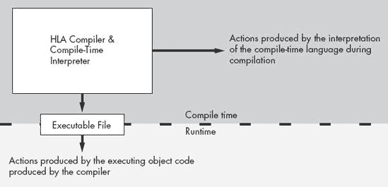
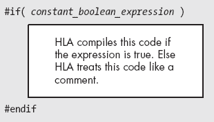

# 第九章. 宏与 HLA 编译时语言


本章讨论了 HLA 编译时语言。讨论的内容包括 HLA 编译时语言中最重要的组成部分之一——*宏*。许多人通过汇编器的宏处理能力来判断其强大程度。如果你恰好是这些人之一，那么在阅读完本章之后，你可能会同意 HLA 是地球上最强大的汇编器之一，因为 HLA 拥有任何计算机语言处理系统中最强大的宏处理功能之一。

# 9.1 编译时语言（CTL）简介

HLA 实际上是将两种语言合并到一个程序中。*运行时语言*是你在前面所有章节中阅读过的标准 80x86/HLA 汇编语言。这被称为运行时语言，因为你编写的程序在你运行可执行文件时执行。HLA 包含了第二种语言的解释器——HLA 编译时语言（CTL），它在 HLA 编译程序时执行程序。CTL 程序的源代码嵌入在 HLA 汇编语言源文件中；也就是说，HLA 源文件包含了 HLA CTL 和运行时程序的指令。HLA 在编译过程中执行 CTL 程序。HLA 完成编译后，CTL 程序终止；CTL 应用程序不是 HLA 生成的运行时可执行文件的一部分，尽管 CTL 应用程序可以*为你写*部分运行时程序，实际上，CTL 的主要目的就是这个（见图 9-1）。



图 9-1. 编译时执行与运行时执行

在同一个编译器中内置两个独立的语言可能会让人感到困惑。也许你甚至在质疑，为什么需要编译时语言。为了理解编译时语言的好处，请考虑以下你现在应该非常熟悉的陈述：

```
stdout.put("i32=",i32," strVar=",strVar," charVar=",charVar,nl);
```

这条陈述既不是 HLA 语言中的一条语句，也不是对某个 HLA 标准库过程的调用。实际上，`stdout.put`是 HLA 标准库提供的 CTL 应用程序中的一条语句。`stdout.put` "应用程序"处理参数列表，并生成对其他标准库过程的调用；它根据当前处理的参数类型选择要调用的过程。例如，上述`stdout.put` "应用程序"将向运行时可执行文件输出以下语句：

```
stdout.puts( "i32=" );
stdout.puti32( i32 );
stdout.puts( " strVar=" );
stdout.puts( strVar );
stdout.puts( " charVar=" );
stdout.putc( charVar );
stdout.newln();
```

显然，`stdout.put` 语句比 `stdout.put` 为其参数列表发出的语句序列更容易阅读和编写。这是 HLA 编程语言更强大的功能之一：能够修改语言以简化常见的编程任务。按顺序打印不同数据对象是一个常见任务；`stdout.put` “应用”极大简化了这一过程。

HLA 标准库中*充满了*许多 HLA CTL 示例。除了标准库的使用，HLA CTL 在处理“一次性”应用程序时也非常擅长。一个经典的例子是填充查找表的数据。第八章提到，使用 HLA CTL 构建查找表是可行的。不仅如此，使用 HLA CTL 构建这些表往往比其他方法省时省力。

尽管 CTL 本身相对低效，通常不用于编写最终用户应用程序，但它最大化了你时间的使用。通过学习如何使用 HLA CTL 并正确应用它，你可以像开发高级语言应用程序一样快速开发汇编语言应用程序（甚至更快，因为 HLA 的 CTL 允许你创建非常高级语言的构造）。

# 9.2 `#print` 和 `#error` 语句

你可能还记得，第一章以大多数人在学习新语言时编写的典型第一个程序——“Hello, world!”程序开始。当讨论本书的第二种语言时，呈现这个程序是非常合适的。示例 9-1 提供了用 HLA 编译时语言编写的基本“Hello, world!”程序。

示例 9-1. CTL “Hello, world!”程序

```
program ctlHelloWorld;
begin ctlHelloWorld;

    #print( "Hello, World of HLA/CTL" )

end ctlHelloWorld;
```

该程序中的唯一 CTL 语句是 `#print` 语句。其余的行仅仅是为了让编译器正常工作（尽管我们可以通过使用 `unit` 声明而非 `program` 声明，将开销减少到两行）。

`#print` 语句在编译 HLA 程序时会显示其参数列表的文本表示。因此，如果你使用命令 `hla ctlHW.hla` 编译上面的程序，HLA 编译器将立即打印出以下文本：

```
Hello, World of HLA/CTL
```

请注意，在 HLA 源文件中，以下两个语句之间有很大的区别：

```
#print( "Hello World" )
stdout.puts( "Hello World" nl );
```

第一个语句在编译过程中打印出 `Hello World`（并添加一个换行符）。这个第一个语句对可执行程序没有任何影响。第二行则不影响编译过程（除了向可执行文件发出代码）。然而，当你运行可执行文件时，第二个语句会打印出字符串 `Hello World`，后跟一个换行符。

HLA/CTL `#print` 语句使用以下基本语法：

```
#print( *`list_of_comma_separated_constants`* )
```

注意，分号并不会终止此语句。分号终止的是运行时语句；通常不会终止编译时语句（有一个例外，稍后你会看到）。

`#print`语句必须至少有一个操作数；如果参数列表中有多个操作数，你必须用逗号分隔每个操作数（就像`stdout.put`一样）。如果某个操作数不是字符串常量，HLA 会将该常量转换为相应的字符串表示并打印该字符串。下面是一个示例：

```
#print( "A string Constant ", 45, ' ', 54.9, ' ', true )
```

你可以指定命名的符号常量和常量表达式。然而，所有的`#print`操作数必须是常量（无论是字面常量还是你在`const`或`val`部分定义的常量），这些常量必须在你使用它们的`#print`语句之前定义。例如：

```
const
    pi := 3.14159;
    charConst := 'c';

#print( "PI = ", pi, "  CharVal=", charConst )
```

HLA 的`#print`语句对于调试 CTL 程序特别有价值。这个语句还用于显示编译进度，展示编译过程中发生的假设和默认操作。除了显示与`#print`参数列表相关的文本外，`#print`语句对程序的编译没有其他影响。

`#error`语句允许一个单一的字符串常量操作数。和`#print`一样，这个语句会在编译时将字符串显示到控制台。然而，`#error`语句将该字符串视为错误信息，并作为 HLA 错误诊断的一部分显示该字符串。此外，`#error`语句会增加错误计数，这将导致 HLA 在处理完当前源文件后停止编译（不会汇编或链接）。通常，当你的 CTL 代码发现某些问题，无法生成有效代码时，你会使用`#error`语句在编译期间显示错误信息。例如：

```
#error( "Statement must have exactly one operand" )
```

和`#print`语句一样，`#error`语句也不以分号结尾。虽然`#error`只允许一个单一的字符串操作数，但通过使用编译时字符串连接操作符和几个 HLA 内建的编译时函数，你可以很容易地打印其他值。你将在本章稍后部分了解这些内容。

# 9.3 编译时常量和变量

就像运行时语言一样，编译时语言也支持常量和变量。你可以像在运行时语言中一样在`const`部分声明编译时常量。在`val`部分声明编译时变量。你在`val`部分声明的对象对运行时语言来说是常量，但记住，你可以在整个源文件中改变你在`val`部分声明的对象的值。因此，称之为“编译时变量”。有关详细信息，请参见第四章。

CTL 赋值语句（`?`）计算赋值运算符（`:=`）右侧常量表达式的值，并将结果存储到赋值运算符左侧紧接的 `val` 对象名中。^([118]) 这个示例代码可以出现在 HLA 源文件的任何位置，而不仅仅是程序的 `val` 部分。

```
?ConstToPrint := 25;
     #print( "ConstToPrint = ", ConstToPrint )
     ?ConstToPrint := ConstToPrint + 5;
     #print( "Now ConstToPrint = ", ConstToPrint )
```

* * *

^([118]) 如果赋值运算符左侧的标识符未定义，HLA 将自动在当前作用域级别声明该对象。

# 9.4 编译时表达式和运算符

HLA CTL 支持在 CTL 赋值语句中使用常量表达式。与运行时语言不同（在运行时，你需要将代数符号转换为一系列机器指令），HLA CTL 允许使用熟悉的表达式语法进行完整的算术运算。这使得 HLA CTL 在编译时表达式中具有相当大的能力，尤其是当与下一节讨论的内置编译时函数结合使用时。

表 9-1 和 表 9-2 列出了 HLA CTL 在编译时表达式中支持的运算符。

表 9-1. 编译时运算符

| 运算符 | 操作数类型^([a]) | 描述 |
| --- | --- | --- |
| `-`（一元运算符） | numeric | 对特定的数值（int, uns, real）进行取负运算。 |
|   | cset | 返回指定字符集的补集。 |
| `!`（一元运算符） | integer | 反转操作数中的所有位（按位 `not`）。 |
|   | boolean | 操作数的布尔 `not`。 |
| `*` | numericL * numericR | 计算两个操作数的乘积。 |
|   | csetL * csetR | 计算两个集合的交集。 |
| `div` | integerL divintegerR | 计算两个整数（int/uns/dword）操作数的整数商。 |
| `mod` | integerL modintegerR | 计算两个整数（int/uns/dword）操作数的除法余数。 |
| `/` | numericL / numericR | 计算两个数值操作数的实数商。即使两个操作数都是整数，也返回实数结果。 |
| `<<` | integerL << integerR | 将 integerL 操作数向左移动由 integerR 操作数指定的位数。 |
| `>>` | integerL >> integerR | 将 integerL 操作数向右移动由 integerR 操作数指定的位数。 |
| `+` | numericL + numericR | 将两个数值操作数相加。 |
|   | csetL + csetR | 计算两个集合的并集。 |
|   | strL + strR | 连接两个字符串。 |
| `-` | numericL numericR | 计算 numericL 和 numericR 之间的差。 |
|   | csetL - csetR | 计算 csetL - csetR 的集合差。 |
| `=` 或 `==` | numericL = numericR | 如果两个操作数具有相同的值，则返回真。 |
|   | csetL = csetR | 如果两个集合相等，则返回真。 |
|   | strL = strR | 如果两个字符串/字符相等，则返回真。 |
|   | typeL = typeR | 如果两个值相等，则返回 true。它们必须是相同类型。 |
| `<>` 或 `!=` | typeL <> typeR（与 != 相同） | 如果两个（兼容的）操作数不相等（数值、字符集或字符串），则返回 false。 |
| `<` | numericL < numericR | 如果 numericL 小于 numericR，则返回 true。 |
|   | csetL < csetR | 如果 csetL 是 csetR 的适当子集，则返回 true。 |
|   | strL < strR | 如果 strL 小于 strR，则返回 true。 |
|   | booleanL < booleanR | 如果左操作数小于右操作数，则返回 true（注意：false < true）。 |
|   | enumL < enumR | 如果 enumL 出现在与 enumR 相同的枚举列表中，并且 enumL 出现得更早，则返回 true。 |
| `<=` | 与 < 相同 | 如果左操作数小于或等于右操作数，则返回 true。对于字符集，意味着左操作数是右操作数的子集。 |
| `>` | 与 < 相同 | 如果左操作数大于右操作数，则返回 true。对于字符集，意味着左操作数是右操作数的一个适当超集。 |
| `>=` | 与 <= 相同 | 如果左操作数大于或等于右操作数，则返回 true。对于字符集，意味着左操作数是右操作数的超集。 |
| `&` | integerL & integerR | 计算两个操作数的按位 `and`。 |
|   | booleanL & booleanR | 计算两个操作数的逻辑 `and`。 |
| `&#124;` | integerL &#124; integerR | 计算两个操作数的按位 `or`。 |
|   | booleanL &#124; booleanR | 计算两个操作数的逻辑 `or`。 |
| `^` | integerL ^ integerR | 计算两个操作数的按位 `xor`。 |
|   | booleanL ^ booleanR | 计算两个操作数的逻辑 `xor`。注意，这等同于 `booleanL <> booleanR`。 |
| `in` | charL 在 csetR 中 | 如果 charL 是 csetR 的成员，则返回 true。 |

|

^([a]) 类型 numeric 是 {int*XX*, uns*XX*, byte, word, dword 和 real*XX*} 值。类型 cset 是字符集操作数。类型 integer 是 {int*XX*, uns*XX*, byte, word, dword}。类型 str 是任何字符串或字符值。类型表示任意 HLA 类型。其他类型指定一个显式的 HLA 数据类型。 |

|

表 9-2. 运算符优先级和结合性 |

| 结合性 | 优先级（从高到低） | 运算符 |
| --- | --- | --- |
| 从右到左 | 6 | `!`（一元操作符） |
|   |   | `-`（一元操作符） |
| 从左到右 | 5 | `*` |
|   |   | `div` |
|   |   | `mod` |
|   |   | `/` |
|   |   | `>>` |
|   |   | `<<` |
| 从左到右 | 4 | `+` |
|   |   | `-` |
| 从左到右 | 3 | `=` 或 `==` |
|   |   | `<>` 或 `!=` |
|   |   | `<` |
|   |   | `<=` |
|   |   | `>` |
|   |   | `>=` |
| 从左到右 | 2 | `&` |
|   |   | `&#124;` |
|   |   | `^` |
| 非结合性 | 1 | `in` |

当然，你可以通过在表达式中使用括号来覆盖运算符的默认优先级和结合性。 |

# 9.5 编译时函数 |

HLA 提供了丰富的编译时函数供你使用。这些函数在编译期间计算值，方式与高级语言函数在运行时计算值类似。HLA 的编译时语言包括各种数值、字符串和符号表函数，帮助你编写复杂的编译时程序。

大多数内建的编译时函数名称以特殊符号`@`开头，名称类似于`@sin`或`@length`。使用这些特殊标识符可以避免与程序中可能使用的常见名称（例如`length`）发生冲突。剩余的编译时函数（那些不以`@`开头的）通常是数据转换函数，使用类型名称如`int8`和`real64`。你甚至可以通过宏来创建自己的编译时函数（宏的使用在 9.8 宏（编译时过程）")中讨论）。

HLA 根据操作类型将编译时函数组织成不同的类别。例如，有一些函数将常量从一种形式转换为另一种形式（例如字符串到整数的转换），还有许多有用的字符串函数，HLA 提供了一整套编译时数值函数。

HLA 编译时函数的完整列表过于庞大，无法在此呈现。相反，关于每个编译时对象和函数的完整描述可以在 HLA 参考手册中找到（可在[`webster.cs.ucr.edu/`](http://webster.cs.ucr.edu/)或[`www.artofasm.com/`](http://www.artofasm.com/)查阅）；本节将突出介绍一些函数，以展示它们的使用方法。本章后续章节以及未来章节将广泛使用各种编译时函数。

也许理解编译时函数最重要的概念是，它们在你的汇编语言代码（即运行时程序）中等同于常量。例如，编译时函数调用`@sin(3.1415265358979328)`大致相当于在程序中指定 0.0。^([119])像`@sin(x)`这样的函数调用，只有在`x`是一个在函数调用点之前已声明的常量时才是合法的。特别是，`x`不能是运行时变量或其他在运行时而非编译时存在的对象。因为 HLA 将编译时函数调用替换为其常量结果，你可能会问为什么还要使用编译时函数。毕竟，在程序中输入*0.0*可能比输入`@sin(3.1415265358979328)`更方便。然而，编译时函数对于生成查找表和其他可能在你改变程序中的`const`值时发生变化的数学结果非常有用。9.9 编写编译时“程序”将进一步探讨这个想法。

## 9.5.1 类型转换编译时函数

最常用的编译时函数可能是类型转换函数。这些函数接受一个类型的单一参数，并将该信息转换为指定的类型。这些函数使用多个 HLA 内建数据类型名称作为函数名。该类别中的函数包括：

+   `boolean`

+   `int8`、`int16`、`int32`、`int64`和`int128`

+   `uns8`、`uns16`、`uns32`、`uns64`和`uns128`

+   `byte`、`word`、`dword`、`qword`和`lword`（它们实际上等同于`uns8`、`uns16`、`uns32`、`uns64`和`uns128`）

+   `real32`、`real64`和`real80`

+   `char`

+   `string`

+   `cset`

+   `text`

这些函数接受一个常量表达式参数，并且如果合理的话，将该表达式的值转换为指定类型的值。例如，以下函数调用返回值−128，因为它将字符串常量转换为对应的整数值：

```
int8( "-128" )
```

某些转换是没有意义的，或者有相关的限制。例如，`boolean`函数会接受一个字符串参数，但该字符串必须是“true”或“false”，否则函数会生成编译时错误。同样，数字转换函数（例如，`int8`）允许一个字符串操作数，但该字符串操作数必须表示一个合法的数字值。某些转换（例如，带有字符集参数的`int8`）根本没有意义，并且始终是非法的。

这个类别中最有用的函数之一是`string`函数。该函数接受几乎所有常量表达式类型，并生成一个表示参数数据的字符串。例如，调用`string(128)`会生成字符串`128`作为返回结果。当你有一个值需要在 HLA 中作为字符串使用时，这个函数非常方便。例如，`#error`编译时语句只允许一个字符串操作数。你可以使用`string`函数和字符串连接运算符（`+`）轻松绕过这个限制。例如：

```
#error( "theValue (" + string( theValue ) + ") is out of range" )
```

请注意，这些类型函数实际上执行的是转换。这意味着这些函数返回的位模式可能与传递的参数的位模式有很大不同。例如，考虑以下对`real32`函数的调用：

```
real32( $3F80_0000 )
```

现在事实证明，$3F80_0000 是`real32`值 1.0 的十六进制等价物。然而，前面的函数调用并不会返回 1.0；相反，它试图将整数值$3F80_0000（1,065,353,216）转换为`real32`值，但失败了，因为该值太大，无法使用`real32`对象精确表示。与此相对比，以下常量函数：

```
char( 65 )
```

这个 CTL 函数调用返回字符 `A`（因为 65 是 `A` 的 ASCII 码）。请注意，`char` 函数只是简单地使用你传递给它的整数参数的位模式作为 ASCII 码，而 `real32` 函数试图将整数参数转换为浮点值。尽管这两个函数的语义差别很大，但归根结底，它们倾向于执行直观的操作，即使这牺牲了一定的统一性。

然而，有时你可能不希望这些函数做“直观”的操作。例如，你可能希望 `real32` 函数仅仅将你传入的位模式作为 `real32` 值来处理。为了处理这种情况，HLA 提供了第二组类型函数，它们只是类型名称前加上 `@` 前缀，并将参数视为最终类型的位模式。因此，如果你真的希望从 `$3F80_0000` 生成 1.0，你可以使用以下函数调用：

```
@real32( $3F80_0000 )
```

一般来说，这种类型强制转换在编译时语言中是比较高级的，所以你可能不会经常使用它。然而，当它需要时，能够使用它还是很方便的。

## 9.5.2 数值编译时函数

本类函数在编译时执行标准的数学操作。这些函数非常适合生成查找表，并通过在程序开始时重新计算已定义常量的函数来“参数化”源代码。本类函数包括以下内容：

|

+   `@abs(` *`n`* `)`

| 数值参数的绝对值 |
| --- |

|

+   `@ceil(` *`r`* `), @floor(` *`r`* `)`

| 提取浮点值的整数部分 |
| --- |

|

+   `@sin(` *`r`* `)`, `@cos(` *`r`* `)`, `@tan(` *`r`* `)`

| 标准三角函数 |
| --- |

|

+   `@exp(` *`r`* `)`, `@log(` *`r`* `)`, `@log10(` *`r`* `)`

| 标准对数/指数函数 |
| --- |

|

+   `@min(` *`list`* `)`, `@max(` *`list`* `)`

| 从值列表中返回最小/最大值 |
| --- |

|

+   `@random`, `@randomize`

| 返回伪随机的 `int32` 值 |
| --- |

|

+   `@sqrt(` *`n`* `)`

| 计算数值参数的平方根（实数结果） |
| --- |

详情请参见 HLA 参考手册 [`webster.cs.ucr.edu/`](http://webster.cs.ucr.edu/) 或 [`www.artofasm.com/`](http://www.artofasm.com/)。

## 9.5.3 字符分类编译时函数

本组函数均返回布尔结果。它们测试一个字符（或字符串中的所有字符），查看其是否属于某一类字符。该类别的函数包括以下内容：

+   `@isAlpha(` *`c`* `)`, `@isAlphanum(` *`c`* `)`

+   `@isDigit(` *`c`* `)`, `@isxDigit(` *`c`* `)`

+   `@isLower(` *`c`* `)`, `@isUpper(` *`c`* `)`

+   `@isSpace(` *`c`* `)`

除了这些字符分类函数，HLA 语言还提供了一组模式匹配函数，你也可以用来分类字符和字符串数据。有关这些例程的讨论，请参见 HLA 参考手册。

## 9.5.4 编译时字符串函数

本类别中的函数操作字符串参数。大多数返回字符串结果，尽管有一些（例如 `@length` 和 `@index`）返回整数结果。这些函数不会直接影响它们参数的值；相反，它们返回一个合适的结果，如果你愿意，可以将其赋值回参数。

+   `@delete`, `@insert`

+   `@index`, `@rindex`

+   `@length`

+   `@lowercase`, `@uppercase`

+   `@strbrk`, `@strspan`

+   `@strset`

+   `@substr`, `@tokenize`, `@trim`

关于这些函数、它们的参数以及类型的具体细节，请参见 HLA 参考手册。请注意，这些是 HLA 标准库中许多字符串函数的编译时等效函数。

`@length` 函数值得特别讨论，因为它可能是这个类别中最常用的函数。它返回一个 `uns32` 常量，指定其字符串参数中包含的字符数。语法如下：

```
@length( *`string_expression`* )
```

其中 *`string_expression`* 代表任何编译时字符串表达式。如前所述，这个函数返回指定表达式的字符长度。

## 9.5.5 编译时符号信息

在编译过程中，HLA 维护一个内部数据库，称为 *符号表*。符号表包含了关于你在程序中的某个点之前定义的所有标识符的许多有用信息。为了生成机器代码输出，HLA 需要查询这个数据库以确定如何处理某些符号。在你的编译时程序中，通常需要查询符号表来决定如何处理代码中的标识符或表达式。HLA 编译时符号信息函数负责执行这一任务。

许多编译时符号信息函数超出了本书的范围。本章将介绍其中的一些函数。有关编译时符号表函数的完整列表，请参见 HLA 参考手册。本章将讨论的函数包括以下内容：

+   `@size`

+   `@defined`

+   `@typeName`

+   `@elements`

+   `@elementSize`

毫无疑问，`@size` 函数可能是这一组中最重要的函数。事实上，前面的章节已经使用过这个函数。`@size` 函数需要一个单一的 HLA 标识符或常量表达式作为参数。它返回该对象（或表达式）数据类型的字节大小。如果你提供一个标识符，它可以是常量、类型或变量标识符。正如你在前面的章节中看到的，这个函数在通过 `mem.alloc` 分配存储和为数组分配存储时非常有用。

这个组中另一个非常有用的函数是 `@defined` 函数。这个函数接受一个单一的 HLA 标识符作为参数。例如：

```
@defined( *`MyIdentifier`* )
```

这个函数在程序的某个点上返回 `true`，如果标识符在该点已定义；否则返回 `false`。

`@typeName` 函数返回一个字符串，指定你作为参数提供的标识符或表达式的类型名称。例如，如果 `i32` 是一个 `int32` 对象，那么 `@typeName( i32 )` 将返回字符串 `int32`。这个函数对于测试你在编译时程序中处理的对象类型非常有用。

`@elements` 函数需要一个数组标识符或表达式。它返回数组元素的总数作为函数结果。需要注意的是，对于多维数组，这个函数返回所有数组维度的乘积。^([120])

`@elementSize` 函数返回你作为参数传递的数组元素的大小（以字节为单位）。这个函数对于计算数组的索引非常有价值（也就是说，这个函数计算数组索引计算中的 `element_size` 组件；更多细节请参见第四章）。

## 9.5.6 杂项编译时函数

HLA 编译时语言包含一些不属于上述类别的额外函数。一些比较有用的杂项函数包括以下内容：

+   `@odd`

+   `@lineNumber`

+   `@text`

`@odd` 函数接受一个序数值（即非实数的数字或字符）作为参数，如果该值是奇数，则返回 `true`，如果是偶数，则返回 `false`。`@lineNumber` 函数不需要参数；它返回源文件中的当前行号。这个函数对于调试编译时（和运行时！）程序非常有用。

`@text` 函数可能是这个组中最有用的函数。它需要一个单字符串参数，并将该字符串在 `@text` 函数调用处扩展为文本。这个函数与编译时字符串处理函数结合使用时非常有用。你可以使用字符串操作函数构建指令（或指令的一部分），然后通过 `@text` 函数将该字符串转换为程序源代码。以下是这个函数在操作中的一个简单示例：

```
?id1:string := "eax";
?id2:string := "i32";
@text( "mov( " + id1 + ", " + id2 + ");" )
```

上述序列编译为

```
mov( eax, i32 );
```

## 9.5.7 编译时文本对象的类型转换

一旦你在程序中创建了一个文本常量，就很难对该对象进行操作。以下示例展示了程序员希望在程序中更改文本符号定义的场景：

```
val
     t:text := "stdout.put";
          .
          .
          .
     ?t:text := "fileio.put";
```

这个示例中的基本思路是，符号 `t` 在代码的前半部分展开为 `stdout.put`，而在程序的后半部分则展开为 `fileio.put`。不幸的是，这个简单的示例不会生效。问题在于 HLA 会在几乎任何地方扩展文本符号。包括在 `?` 语句中的 `t`。因此，之前的代码扩展成了以下（不正确的）文本：

```
val
     t:text := "stdout.put";
          .
          .
          .
     ?stdout.put:text := "fileio.put";
```

HLA 不知道如何处理这个 `?` 语句，所以它会生成语法错误。

有时你可能不希望 HLA 展开文本对象。你的代码可能需要处理文本对象中持有的字符串数据。HLA 提供了几种方法来处理这两个问题：

+   `@string(` *`identifier`* `)`

+   `@toString:`*`identifier`*

对于`@string(` *`identifier`* `)`，HLA 返回与文本对象关联的字符串常量。换句话说，这个运算符允许你在表达式中将文本对象当作字符串常量来处理。

不幸的是，`@string`函数将文本对象转换为字符串常量，而不是字符串标识符。因此，你不能像这样写

```
?@string(t) := "Hello"
```

这不起作用，因为`@string(t)`将其自身替换为与文本对象`t`关联的字符串常量。根据之前对`t`的赋值，这个语句展开为

```
?"stdout.put" := "Hello";
```

这个语句仍然是非法的。

在这种情况下，`@toString:`*`identifier`*运算符来帮忙。`@toString:`运算符要求一个文本对象作为关联标识符。它将这个文本对象转换为一个字符串对象（仍然保持相同的字符串数据），然后返回该标识符。因为标识符现在是一个字符串对象，你可以给它赋值（并将其类型更改为其他类型，例如`text`，如果需要的话）。因此，为了实现原始目标，你可以使用如下代码：

```
val
     t:text := "stdout.put";
          .
          .
          .
     ?@toString:t : text := "fileio.put";
```

* * *

^([119]) 实际上，因为在这个例子中，`@sin`的参数并不完全是 pi，所以你会得到一个小的正数而不是零作为函数结果，但理论上应该得到零。

^([120]) 有一个`@dim`函数，返回一个数组，指定多维数组每个维度的边界。如果你对这个函数感兴趣，可以查看[`webster.cs.ucr.edu/`](http://webster.cs.ucr.edu/)或[`www.artofasm.com/`](http://www.artofasm.com/)的文档获取更多详情。

# 9.6 条件编译（编译时决策）

HLA 的编译时语言提供了一个`#if`语句，可以让你在编译时做出决策。`#if`语句有两个主要目的：传统用途是支持*条件编译*（或*条件汇编*），根据程序中各种符号或常量值的状态在编译过程中包含或排除代码。该语句的第二个用途是支持 HLA 编译时语言中的标准 if 语句决策过程。本节讨论了`#if`语句的这两种用途。

HLA 编译时`#if`语句的最简单形式使用以下语法：

```
#if( *`constant_boolean_expression`* )
     << text >>
#endif
```

请注意，`#endif`语句后面不应放置分号。如果在`#endif`后加上分号，它将成为源代码的一部分，这等同于在程序中的下一个项之前插入该分号。

在编译时，HLA 会评估 `#if` 后括号中的表达式。这个表达式必须是常量表达式，并且其类型必须是布尔类型。如果表达式求值为 true，HLA 会继续处理源文件中的文本，仿佛 `#if` 语句不存在一样。然而，如果表达式求值为 false，HLA 会将 `#if` 和相应的 `#endif` 之间的所有文本视为注释（即忽略这些文本），如图 Figure 9-2 所示。



图 9-2. HLA 编译时 `#if` 语句的操作

请记住，HLA 的常量表达式支持完整的表达式语法，就像在 C 或 Pascal 等高级语言中找到的那样。`#if` 表达式的语法不限于 HLA `if` 语句中允许的表达式语法。因此，编写如下复杂的表达式是完全合理的：

```
#if( @length( someStrConst ) < 10*i & ( (MaxItems*2 + 2) < 100 | MinItems-5 < 10 ))
     << text >>
#endif
```

还需要记住，编译时表达式中的标识符必须是 `const` 或 `val` 标识符，或是 HLA 编译时函数调用（并带有适当的参数）。特别需要注意的是，HLA 在编译时评估这些表达式，因此它们不能包含运行时变量。^([121]) HLA 的编译时语言使用完整的布尔评估，因此表达式中出现的任何副作用可能会产生不期望的结果。

HLA 的 `#if` 语句支持可选的 `#elseif` 和 `#else` 子句，这些子句按直观的方式进行操作。`#if` 语句的完整语法如下所示：

```
#if( *`constant_boolean_expression_1`* )
     << text >>
#elseif( *`constant_boolean_expression_2`* )
     << text >>
#else
     << text >>
#endif
```

如果第一个布尔表达式求值为 true，那么 HLA 会处理直到 `#elseif` 子句的文本。然后，它会跳过所有文本（即将其视为注释），直到遇到 `#endif` 子句。HLA 会继续按正常方式处理 `#endif` 子句之后的文本。

如果上面的第一个布尔表达式求值为 false，那么 HLA 会跳过所有文本，直到遇到 `#elseif`、`#else` 或 `#endif` 子句。如果遇到 `#elseif` 子句（如上所示），HLA 会评估与该子句相关联的布尔表达式。如果它求值为 true，HLA 会处理 `#elseif` 和 `#else` 子句之间的文本（如果没有 `#else` 子句，则处理到 `#endif` 子句）。如果在处理这些文本时，HLA 遇到另一个 `#elseif` 或像上面那样的 `#else` 子句，HLA 会忽略所有后续文本，直到找到相应的 `#endif`。

如果前面示例中的第一个和第二个布尔表达式都为假，HLA 会跳过它们相关的文本并开始处理`#else`子句中的文本。如你所见，一旦理解了 HLA 如何“执行”这些语句的主体，`#if`语句的行为就变得相对直观；`#if`语句会根据布尔表达式的状态来处理文本或将其视为注释。当然，你可以通过包含零个或多个`#elseif`子句，并可选择性地提供`#else`子句，来创建几乎无限种不同的`#if`语句序列。由于这种构造与 HLA 的`if..then..elseif..else..endif`语句完全相同，因此此处无需进一步详细说明。

条件编译的一个非常传统的应用是开发可以轻松配置为多个不同环境的软件。例如，`fcomip`指令使得浮点比较变得非常容易，但该指令仅在 Pentium Pro 及更高版本的处理器上可用。如果你希望在支持此指令的处理器上使用它，并在较旧的处理器上回退到标准的浮点比较，你通常需要编写两个版本的程序——一个使用`fcomip`指令，另一个使用传统的浮点比较序列。不幸的是，维护两个不同的源文件（一个针对较新的处理器，一个针对较旧的处理器）非常困难。大多数工程师更倾向于使用条件编译将不同的序列嵌入同一个源文件中。以下示例演示了如何实现这一点：

```
const
    // Set true to use FCOMIxx instrs.
    PentProOrLater: boolean := false;
          .
          .
          .
    #if( PentProOrLater )

          fcomip();      // Compare st1 to st0 and set flags.
     #else
          fcomp();       // Compare st1 to st0.
          fstsw( ax );   // Move the FPU condition code bits
          sahf();        // into the flags register.

     #endif
```

如当前编写的代码片段所示，它会在`#else`子句中编译三条指令序列，并忽略`#if`和`#else`子句之间的代码（因为常量`PentProOrLater`为假）。通过将`PentProOrLater`的值更改为真，你可以告诉 HLA 编译单个`fcomip`指令，而不是三条指令的序列。当然，你可以在程序中的其他`#if`语句中使用`PentProOrLater`常量，以控制 HLA 如何编译你的代码。

请注意，条件编译并不能让你创建一个能在所有处理器上高效运行的*可执行文件*。使用这种技术时，你仍然需要创建两个可执行程序（一个用于 Pentium Pro 及更高版本的处理器，一个用于较早版本的处理器），通过编译源文件两次：第一次编译时必须将`PentProOrLater`常量设置为假；第二次编译时必须将该常量设置为真。尽管你需要创建两个独立的可执行文件，但只需维护一个源文件。

如果你熟悉其他语言中的条件编译，例如 C/C++语言，你可能会想知道 HLA 是否支持类似 C 语言中的`#ifdef`语句。答案是否定的，HLA 不支持。但你可以使用 HLA 的编译时函数`@defined`轻松测试符号是否已在源文件中定义。考虑以下对前面代码的修改，使用了这种技巧：

```
const
     // Note: Uncomment the following line if you are compiling this
     // code for a Pentium Pro or later CPU.

     // PentProOrLater :=0;  // Value and type are irrelevant.
          .
          .
          .
#if( @defined( PentProOrLater ) )

     fcomip();    // Compare st1 to st0 and set flags.

#else

     fcomp();     // Compare st1 to st0.
     fstsw( ax ); // Move the FPU condition code bits
     sahf();      // into the flags register.

#endif
```

条件编译的另一个常见用途是将调试和测试代码引入程序中。许多 HLA 程序员使用的典型调试技巧是在代码中的关键位置插入“print”语句；这使得他们能够在代码中跟踪并显示在不同检查点的关键值。然而，这种技巧的一个大问题是，在项目完成之前，他们必须删除调试代码。软件的客户（或学生的导师）可能不希望在程序生成的报告中看到调试输出。因此，使用这种技巧的程序员往往会暂时插入代码，然后在运行程序并确定问题所在后将代码移除。使用这种技巧至少有两个问题：

+   程序员常常忘记删除一些调试语句，这会导致最终程序中出现缺陷。

+   在移除调试语句后，这些程序员常常发现他们需要该语句来调试稍后出现的不同问题。因此，他们不断地插入和移除相同的语句。

条件编译可以提供解决这个问题的方法。通过定义一个符号（例如`debug`）来控制程序中的调试输出，你可以通过简单地修改一行源代码，轻松地激活或停用*所有*调试输出。以下代码片段演示了这一点：

```
const
     // Set to true to activate debug output.
     debug: boolean := false;
          .
          .
          .
     #if( debug )

          stdout.put( "At line ", @lineNumber, " i=", i, nl );

     #endif
```

只要你像前面那样，用`#if`语句将所有调试输出语句包裹起来，就不必担心调试输出会意外出现在最终的应用程序中。通过将`debug`符号设置为`false`，你可以自动禁用所有此类输出。同样，你也不必在调试语句完成其即时功能后将其从程序中移除。通过使用条件编译，你可以将这些语句保留在代码中，因为它们很容易被停用。以后，如果你决定在编译过程中需要查看相同的调试信息，你不必重新输入调试语句；只需通过将`debug`符号设置为`true`来重新启用它。

尽管程序配置和调试控制是条件编译的两种更常见、传统的用途，但不要忘记，`#if` 语句提供了 HLA 编译时语言中的基本条件语句。你将像在 HLA 或其他语言中使用 `if` 语句一样，在编译时程序中使用 `#if` 语句。本书后续部分将提供许多关于如何在这方面使用 `#if` 语句的示例。

* * *

^([121]) 当然，除非作为某些 HLA 编译时函数的参数，如 `@size` 或 `@typeName`。

# 9.7 重复编译（编译时循环）

HLA 的 `#while..#endwhile` 和 `#for..#endfor` 语句提供了编译时循环结构。`#while` 语句告诉 HLA 在编译期间反复处理相同的语句序列。这对于构建数据表以及为编译时程序提供传统的循环结构非常有用。尽管你不会像使用 `#if` 语句那样频繁使用 `#while` 语句，但当你编写高级 HLA 程序时，这个编译时控制结构非常重要。

`#while` 语句的语法如下：

```
#while( *`constant_boolean_expression`* )
     << text >>
#endwhile
```

当 HLA 在编译时遇到 `#while` 语句时，它将评估常量布尔表达式。如果表达式的值为假，HLA 将跳过 `#while` 和 `#endwhile` 语句之间的文本（此行为类似于 `#if` 语句在表达式为假时的行为）。如果表达式的值为真，HLA 将处理 `#while` 和 `#endwhile` 语句之间的内容，然后“跳回”源文件中的 `#while` 语句开始处，并重复这一过程，如 图 9-3 所示。


图 9-3. HLA 编译时 `#while` 语句操作

为了理解这个过程是如何工作的，请参阅 示例 9-2 中的程序。

示例 9-2. `#while..#endwhile` 演示

```
program ctWhile;
#include( "stdlib.hhf" )

static
ary: uns32[5] := [ 2, 3, 5, 8, 13 ];

begin ctWhile;

     ?i := 0;
     #while( i < 5 )

          stdout.put( "array[ ", i, " ] = ", ary[i*4], nl );
          ?i := i + 1;

     #endwhile

end ctWhile;
```

正如你可能猜到的，来自该程序的输出如下：

```
array[ 0 ] = 2
array[ 1 ] = 3
array[ 2 ] = 4
array[ 3 ] = 5
array[ 4 ] = 13
```

不太明显的是，这个程序是如何生成输出的。请记住，`#while..#endwhile` 结构是一个编译时语言特性，而不是运行时控制结构。因此，之前的 `#while` 循环在 *编译* 时重复执行五次。在每次循环重复时，HLA 编译器都会处理 `#while` 和 `#endwhile` 语句之间的内容。因此，前面的程序实际上等同于 示例 9-3 中显示的代码。

示例 9-3. 与示例 9-2 中的代码等效的程序

```
program ctWhile;
#include( "stdlib.hhf" )

static
     ary: uns32[5] := [ 2, 3, 5, 8, 13 ];

begin ctWhile;

     stdout.put( "array[ ", 0, " ] = ", ary[0*4], nl );
     stdout.put( "array[ ", 1, " ] = ", ary[1*4], nl );
     stdout.put( "array[ ", 2, " ] = ", ary[2*4], nl );
     stdout.put( "array[ ", 3, " ] = ", ary[3*4], nl );
     stdout.put( "array[ ", 4, " ] = ", ary[4*4], nl );

end ctWhile;
```

如此示例所示，`#while`语句非常方便用于构建重复代码序列。这对于展开循环尤其宝贵。

HLA 提供了三种形式的`#for..#endfor`循环。这三种循环具有以下通用形式：

示例 9-4. HLA `#for`循环

```
#for( *`valObject`* := *`startExpr`* to *`endExpr`* )

          .
          .
     #endfor

     #for( *`valObject`* := *`startExpr`* downto *`endExpr`* )
          .
          .
          .
     #endfor

     #for( *`valObject`* in *`composite_expr`* )
          .
          .
          .
     #endfor
```

正如其名称所示，*`valObject`*必须是你在`val`声明中定义的对象。

对于上述两种形式的`#for`循环，*`startExpr`*和*`endExpr`*组件可以是任何返回整数值的 HLA 常量表达式。这两种`#for`循环中的第一个语义上等同于以下`#while`代码：

```
?*`valObject`* := *`startExpr`*;
     #while( *`valObject`* <= *`endExpr`* )
               .
               .
               .
          ?*`valObject`* := *`valObject`* + 1;
  #endwhile
```

这三种`#for`循环中的第二种语义上等同于`#while`循环：

```
?*`valObject`* := *`startExpr`*;
     #while( *`valObject`* >= *`endExpr`* )
               .
               .
               .
     ?*`valObject`* := *`valObject`* - 1;
  #endwhile
```

这三种`#for`循环中的第三种（使用`in`关键字的循环）对于处理某些复合数据类型中的单个项特别有用。该循环会针对你为*`composite_expr`*指定的复合值中的每个元素、字段、字符等重复一次。这可以是数组、字符串、记录或字符集表达式。对于数组，该`#for`循环会针对数组的每个元素重复一次，并且在每次迭代时，循环控制变量包含当前元素的值。例如，以下编译时循环会显示值 1、10、100 和 1,000：

```
#for( i in [1, 10, 100, 1000])
          #print( i )
 #endfor
```

如果*`composite_expr`*常量是字符串常量，`#for`循环会针对字符串中的每个字符重复一次，并将循环控制变量的值设置为当前字符。如果*`composite_expr`*常量表达式是记录常量，则循环会针对记录的每个字段重复一次，并且在每次迭代时，循环控制变量将采用当前字段的*类型和值*。如果*`composite_expr`*表达式是字符集，则循环会针对集合中的每个字符重复一次，并将循环控制变量赋值为该字符。

`#for`循环实际上比`#while`循环更有用，因为你遇到的大多数编译时循环会重复固定次数（例如，处理固定数量的数组元素、宏参数等）。

# 9.8 宏（编译时过程）

宏是语言处理器在编译期间用其他文本替换的对象。宏是替换长而重复的文本序列为较短文本序列的极好工具。除了宏在传统作用下的功能（例如 C/C++中的`#define`），HLA 的宏还充当编译时语言过程或函数的等效体。因此，宏在 HLA 的编译时语言中非常重要——就像其他高级语言中的函数和过程一样重要。

虽然宏并不新鲜，但 HLA 对宏的实现远超大多数其他编程语言（无论是高级语言还是低级语言）的宏处理能力。以下各节将探讨 HLA 的宏处理功能以及宏与其他 HLA CTL 控制结构之间的关系。

## 9.8.1 标准宏

HLA 支持一个简单直接的宏功能，允许你以类似声明过程的方式定义宏。一个典型的简单宏声明形式如下：

```
#macro *`macroname`*;
     << Macro body >>
#endmacro
```

尽管宏和过程声明相似，但从这个例子中可以明显看出两者之间有几个直接的区别。首先，当然，宏声明使用保留字`#macro`而不是`procedure`。其次，你不会以`begin *`macroname`*`;`语句开始宏的主体。最后，你会注意到宏以`#endmacro`语句结束，而不是`end *`macroname`*`;`。以下代码是一个宏声明的具体示例：

```
#macro neg64;

     neg( edx );
     neg( eax );
     sbb( 0, edx );

#endmacro
```

执行此宏的代码将计算 EDX:EAX 中的 64 位值的二补数（详见 8.1.7 扩展精度 neg 操作的描述）。

要执行与`neg64`相关的代码，只需在你想执行这些指令的地方指定宏的名称。例如：

```
mov( (type dword i64), eax );
     mov( (type dword i64[4]), edx );
     neg64;
```

请注意，你*不*需要像调用过程那样，在宏的名称后跟一对空括号（稍后这个原因会变得很清楚）。

除了`neg64`调用后没有括号外，^([122])这看起来就像一个过程调用。你可以使用以下过程声明来实现这个简单的宏：

```
procedure neg64p;
begin neg64p;

     neg( edx );
     neg( eax );
     sbb( 0, edx );

end neg64p;
```

请注意，以下两条语句都会对 EDX:EAX 中的值取反：

```
neg64;          neg64p();
```

这两者之间的区别（宏调用与过程调用）在于，宏会将其文本内联展开，而过程调用会发出一个调用，去调用文本中其它地方的相应过程。也就是说，HLA 会将`neg64;`调用直接替换为以下文本：

```
neg( edx );
     neg( eax );
     sbb( 0, edx );
```

另一方面，HLA 用单一的调用指令替代了过程调用`neg64p();`：

```
call neg64p;
```

假设你在程序中已经定义了`neg64p`过程。

你应该根据效率来决定使用宏还是过程调用。宏比过程调用稍微快一些，因为你不需要执行`call`和相应的`ret`指令。另一方面，使用宏可能会使你的程序变大，因为每次调用宏时，宏的正文文本会被展开。过程调用则跳转到过程正文的单一实例。因此，如果宏的正文很大，并且你在程序中多次调用该宏，它会使最终的可执行文件变得更大。此外，如果宏的正文执行的指令超过几个简单的指令，`call/ret`序列的开销对总体执行时间几乎没有影响，因此执行时间的节省几乎可以忽略不计。另一方面，如果过程的正文非常短（像上面提到的`neg64`示例），你会发现宏实现更快，并且不会显著增加程序的大小。一个好的经验法则是：

### 注意

使用宏处理短小且时间敏感的程序单元。使用过程处理更长的代码块，且在执行时间不那么关键时使用过程。

宏相对于过程还有许多其他缺点。宏不能有局部（自动）变量，宏参数与过程参数的工作方式不同，宏不支持（运行时）递归，而且宏比过程更难调试（仅举几项缺点）。因此，除非在性能至关重要的情况下，否则你不应将宏作为过程的替代品。

## 9.8.2 宏参数

与过程类似，宏允许你定义参数，使你可以在每次调用宏时提供不同的数据。这使得你可以编写通用的宏，宏的行为可以根据你提供的参数而有所不同。通过在编译时处理这些宏参数，你可以编写非常复杂的宏。

宏参数声明语法非常简单。在宏声明中，你只需在括号内提供参数名称的列表：

```
#macro neg64( reg32HO, reg32LO );

     neg( reg32HO );
     neg( reg32LO );
     sbb( 0, reg32HO );

#endmacro;
```

请注意，宏参数不像过程参数那样与数据类型相关联。这是因为 HLA 宏通常是`text`类型对象。

当你调用宏时，你只需像调用过程一样提供实际的参数：

```
neg64( edx, eax );
```

请注意，要求参数的宏调用期望你将参数列表包含在括号内。

### 9.8.2.1 标准宏参数展开

正如前一节所解释的，HLA 会自动将`text`类型与宏参数关联。这意味着，在宏展开过程中，HLA 会在每次出现正式参数名称的地方，替换为你提供的实际参数。所谓的“通过文本替换传递”与“按值传递”或“按引用传递”的语义有所不同，因此在此探讨这些差异是有价值的。

考虑以下宏调用，使用上一节中的 `neg64` 宏：

```
neg64( edx, eax );
     neg64( ebx, ecx );
```

这两个调用会扩展为以下代码：

```
// neg64(edx, eax );

     neg( edx );
     neg( eax );
     sbb( 0, edx );

// neg64( ebx, ecx );

     neg( ebx );
     neg( ecx );
     sbb( 0, ebx );
```

请注意，宏调用并不会创建参数的局部副本（就像“按值传递”那样），也不会将实际参数的地址传递给宏。相反，`neg64( edx, eax );` 这种形式的宏调用相当于以下内容：

```
?reg32HO: text := "edx";
  ?reg32LO: text := "eax";

  neg( reg32HO );
  neg( reg32LO );
  sbb( 0, reg32HO );
```

当然，文本对象会立即展开其字符串值，在线扩展 `neg64( edx, eax );` 的前一个扩展。

请注意，宏参数不限于内存、寄存器或常量操作数，就像指令或过程操作数一样。只要其扩展在使用正式参数的地方是合法的，任何文本都可以。类似地，正式参数可以出现在宏体中的任何位置，而不仅仅是在内存、寄存器或常量操作数合法的地方。考虑以下宏声明和示例调用：

```
#macro chkError( instr, jump, target );

     instr;
     jump target;

#endmacro;

     chkError( cmp( eax, 0 ), jnl, RangeError );       // Example 1
          ...
     chkError( test( 1, bl ), jnz, ParityError );      // Example 2

// Example 1 expands to

     cmp( eax, 0 );
     jnl RangeError;

// Example 2 expands to

     test( 1, bl );
     jnz ParityError;
```

一般来说，HLA 假定所有逗号之间的文本构成一个单一的宏参数。如果 HLA 遇到任何左括号、左大括号或左中括号符号，它会包括所有文本，直到遇到相应的闭合符号，忽略括号符号内可能出现的任何逗号。这就是为什么上面的 `chkError` 调用将 `cmp( eax, 0 )` 和 `test( 1, bl )` 视为单个参数，而不是一对参数。当然，HLA 不会将字符串常量中的逗号（和括号符号）视为实际参数的结束。所以以下宏和调用是完全合法的：

```
#macro print( strToPrint );

     stdout.out( strToPrint );

#endmacro;
     .
     .
     .
     print( "Hello, world!" );
```

HLA 将字符串 `Hello, world!` 视为单个参数，因为逗号出现在一个字面字符串常量内，就像你的直觉所建议的那样。

如果你不熟悉其他语言中的文本宏参数扩展，应该注意到，当 HLA 扩展你的实际宏参数时，可能会遇到一些问题。考虑以下宏声明和调用：

```
#macro Echo2nTimes( n, theStr );
     #for( echoCnt := 1 to n*2 )
          #print( theStr )
     #endfor
#endmacro;

     .
     .
     .
Echo2nTimes( 3+1, "Hello" );
```

这个例子在编译时会显示 `Hello` 五次，而不是你直觉上可能期待的八次。这是因为上面的 `#for` 语句扩展为：

```
#for( echoCnt := 1 to 3+1*2 )
```

*n* 的实际参数是 `3+1`；因为 HLA 会将此文本直接替换为 *n*，所以你会得到一个错误的文本扩展。当然，在编译时，HLA 会将 `3+1*2` 计算为值 5，而不是值 8（如果 HLA 是通过值传递而不是文本替换传递这个参数，你将得到值 8）。

传递可能包含编译时表达式的数值参数时，解决此问题的常见方法是将宏中的正式参数括起来；例如，你可以将上面的宏重写如下：

```
#macro Echo2nTimes( n, theStr );

    #for( echoCnt := 1 to  (n)*2 )

        #print( theStr )

    #endfor

#endmacro;
```

之前的调用将扩展为以下代码：

```
#for( echoCnt := 1 to (3+1)*2 )
         #print( theStr )
    #endfor
```

这个版本的宏会产生直观的结果。

如果实际参数的数量与形式参数的数量不匹配，HLA 会在编译期间生成诊断消息。与过程一样，实际参数的数量必须与形式参数的数量一致。如果你想要有可选的宏参数，请继续阅读。

### 9.8.2.2 参数个数可变的宏

你可能已经注意到，一些 HLA 宏不需要固定数量的参数。例如，HLA 标准库中的 `stdout.put` 宏允许一个或多个实际参数。HLA 使用一种特殊的数组语法来告诉编译器，你希望在宏参数列表中允许一个可变数量的参数。如果你在形式参数列表中的最后一个宏参数后加上 `[ ]`，那么 HLA 将允许用零个或多个实际参数代替该形式参数。例如：

```
#macro varParms( varying[] );

     << Macro body >>

#endmacro;
     .
     .
     .
     varParms( 1 );
     varParms( 1, 2 );
     varParms( 1, 2, 3 );
     varParms();
```

特别注意最后一次调用。如果一个宏有任何形式参数，在宏调用后，你必须为宏列表提供圆括号。即使你给一个具有变化参数列表的宏提供零个实际参数，这也是成立的。请记住，没有参数的宏与具有变化参数列表但没有实际参数的宏之间的这个重要区别。

当 HLA 遇到一个带有 `[ ]` 后缀的形式宏参数时（该参数必须是形式参数列表中的最后一个参数），HLA 会创建一个常量字符串数组，并用宏调用中剩余实际参数关联的文本初始化该数组。你可以使用 `@elements` 编译时函数来确定分配给该数组的实际参数数量。例如，`@elements( varying )` 将返回一个值，0 或更大，指定与该参数关联的总参数数量。以下对 `varParms` 的声明演示了如何使用这一点：

```
#macro varParms( varying[] );

     #for( vpCnt := 0 to @elements( varying ) - 1 )

          #print( varying[ vpCnt ] )

     #endfor

#endmacro;
     .
     .
     .
 varParms( 1 );        // Prints "1" during compilation.
 varParms( 1, 2 );     // Prints "1" and "2" on separate lines.
 varParms( 1, 2, 3 );  // Prints "1", "2", and "3" on separate lines.
 varParms();           // Doesn't print anything.
```

由于 HLA 不允许 `text` 对象的数组，变化参数必须是一个字符串数组。不幸的是，这意味着你必须将变化参数与标准宏参数区分开来。如果你希望变化的字符串数组中的某个元素在宏体内展开为文本，你可以始终使用 `@text` 函数来实现这一点。相反，如果你希望使用一个非变化的形式参数作为字符串对象，你可以始终使用 `@string` (*`name`*) 函数。以下示例演示了这一点：

```
#macro ReqAndOpt( Required, optional[] );
     ?@text( optional[0] ) := @string( ReqAndOpt );
     #print( @text( optional[0] ))

     #endmacro;
     .
     .
     .
     ReqAndOpt( i, j );

// The macro invocation above expands to

     ?@text( "j" ) := @string( i );
     #print( "j" )

// The above further expands to

     j := "i";
     #print( j )

// The above simply prints "i" during compilation.
```

当然，在像上面这样的宏中，最好先验证是否至少有两个参数，然后再尝试引用 `optional` 参数的零元素。你可以如下简单实现这一点：

```
#macro ReqAndOpt( Required, optional[] );

     #if( @elements( optional ) > 0 )

          ?@text( optional[0] ) := @string( ReqAndOpt );
          #print( @text( optional[0] ))

     #else

          #error( "ReqAndOpt must have at least two parameters" )

     #endif

#endmacro;
```

### 9.8.2.3 必需与可选宏参数

如前一节所述，HLA 要求每个非变化的正式宏参数必须有一个实际参数。如果没有变化的宏参数（最多只能有一个），那么实际参数的数量必须完全匹配正式参数的数量。如果存在变化的正式参数，那么必须至少有与非变化（或必需）正式宏参数一样多的实际宏参数。如果有一个单一的变化实际参数，那么宏调用可以有零个或多个实际参数。

调用一个没有参数的宏和调用一个带有单个、变化参数且没有实际参数的宏之间有一个很大的区别：带有变化参数列表的宏后面必须有一对空的括号，而调用没有任何参数的宏时不允许这样做。如果你希望编写一个没有任何参数的宏，但又想让宏调用后跟着 `( )`，以使其与没有参数的过程调用语法匹配，你可以利用这个事实。考虑以下宏：

```
#macro neg64( JustForTheParens[] );

     #if( @elements( JustForTheParens ) = 0 )

          neg( edx );
          neg( eax );
          sbb( 0, edx );

     #else

          #error( "Unexpected operand(s)" )

     #endif

#endmacro;
```

前面的宏要求调用形式为`neg64();`，以使用与过程调用相同的语法。如果你希望无参数宏调用的语法与无参数过程调用的语法匹配，这个特性非常有用。如果将来某个时候你需要将宏转换为过程（或者反过来），这么做也不失为一个好主意。

## 9.8.3 宏中的局部符号

考虑以下宏声明：

```
macro JZC( target );

         jnz NotTarget;
         jc target;
     NotTarget:

endmacro;
```

这个宏的目的是模拟一个指令，当零标志被设置`and`进位标志被设置时，跳转到指定的目标位置。相反，如果零标志或进位标志之一被清除，则此宏将控制转移到宏调用后面的指令。

这个宏有一个严重的问题。考虑一下如果在程序中多次使用这个宏会发生什么：

```
JZC( *`Dest1`* );
          .
          .
          .
     JZC( *`Dest2`* );
          .
          .
          .
```

前面的宏调用展开为以下代码：

```
jnz NotTarget;
    jc *`Dest1`*;
NotTarget:
         .
         .
         .
    jnz NotTarget;
    jc *`Dest2`*;
NotTarget:
         .
         .
         .
```

这两个宏调用展开的问题是它们在宏展开时都会发出相同的标签`NotTarget`。当 HLA 处理这段代码时，它会抱怨重复的符号定义。因此，在宏内部定义符号时必须小心，因为该宏的多次调用可能会导致该符号的多重定义。

HLA 解决这个问题的方法是允许在宏内使用*局部符号*。局部宏符号是特定宏调用的唯一标识符。例如，如果`NotTarget`在前面的`JZC`宏调用中是一个局部符号，程序会正常编译，因为 HLA 将每个`NotTarget`实例视为一个唯一的符号。

HLA 并不会自动使内部宏符号定义仅限于该宏^([123])。相反，你必须显式地告诉 HLA 哪些符号必须是局部的。你可以在宏声明中使用以下通用语法来实现这一点：

```
#macro *`macroname`*( *`optional_parameters`* ):*`optional_list_of_local_names`* ;
     << Macro body >>
#endmacro;
```

局部名称列表是由一个或多个 HLA 标识符组成的序列，这些标识符通过逗号分隔。每当 HLA 在特定的宏调用中遇到这个名称时，它会自动为该标识符替换为一个唯一的名称。对于每个宏调用，HLA 会为局部符号替换为一个不同的名称。

你可以通过以下宏代码修正 `JZC` 宏的问题：

```
#macro JZC( target ):NotTarget;

         jnz NotTarget;
         jc target;
     NotTarget:

#endmacro;
```

现在，每当 HLA 处理这个宏时，它将自动为每个 `NotTarget` 的出现关联一个唯一符号。这将防止如果你没有将 `NotTarget` 声明为局部符号时发生重复符号错误。

HLA 通过在宏调用中出现局部符号的地方替换为类似 `_`*`nnnn`*`_`（其中 *`nnnn`* 是一个四位十六进制数字）的符号来实现局部符号。例如，形如 `JZC(` *`SomeLabel`* `);` 的宏调用可能展开为：

```
jnz _010A_;
      jc *`SomeLabel`*;
_010A_:
```

对于每个在宏扩展中出现的局部符号，HLA 将通过简单地为每个新局部符号递增数字值来生成一个唯一的临时标识符。只要你不显式地创建形如 `_`*`nnnn`*`_`*`Text`*`_`（其中 *`nnnn`* 是一个十六进制值）的标签，就不会在你的程序中发生冲突。HLA 明确保留所有以单个下划线开头和结尾的符号供其私用（并供 HLA 标准库使用）。只要你遵守这个限制，HLA 局部符号生成和你自己程序中的标签之间就不会发生冲突，因为所有 HLA 生成的符号都以单个下划线开头和结尾。

HLA 通过有效地将局部符号转换为文本常量来实现局部符号，这个文本常量扩展为 HLA 为局部标签生成的唯一符号。也就是说，HLA 实际上将局部符号声明当作以下示例所示的那样处理：

```
#macro JZC( target );
     ?NotTarget:text := "_010A_*`Text`*_";

         jnz NotTarget;
         jc target;

     NotTarget:

#endmacro;
```

每当 HLA 扩展这个宏时，它将用 `_010A_`*`Text`*`_` 来替换扩展过程中遇到的每个 `NotTarget`。这个类比并不完美，因为在这个例子中，文本符号 `NotTarget` 在宏扩展后仍然可访问，而在宏内定义局部符号时则不是这种情况。但这给你一个关于 HLA 如何实现局部符号的概念。

## 9.8.4 宏作为编译时过程

尽管程序员通常使用宏来扩展为一系列机器指令，但宏体中绝对没有要求必须包含任何可执行指令。实际上，许多宏仅包含编译时语言语句（例如，`#if`、`#while`、`#for`、`?`赋值语句等）。通过仅在宏体中放置编译时语言语句，您可以有效地使用宏编写编译时的过程和函数。

以下`unique`宏是一个很好的示例，它是一个返回字符串结果的编译时函数。考虑以下宏的定义：

```
#macro unique:theSym;
     @string(theSym)
#endmacro;
```

每当您的代码引用此宏时，HLA 会将宏调用替换为文本`@string(theSym)`，这当然会展开为类似于`_021F_`*`Text`*`_`这样的字符串。因此，您可以将这个宏视为一个返回字符串结果的编译时函数。

注意不要把函数类比推得太远。请记住，宏总是在调用点展开为其宏体文本。某些扩展可能在程序的任何任意位置都是不合法的。幸运的是，大多数编译时语句在程序中任何合法的空白位置都是合法的。因此，宏的行为与您在编译时程序执行过程中对函数或过程的预期行为一致。

当然，过程和函数之间的唯一区别是，函数返回某个显式值，而过程仅执行某些活动。对于编译时函数的返回值，没有特殊的语法来指定。如上面的示例所示，只需将希望返回的值作为宏体中的一条语句指定即可。另一方面，编译时过程将不包含任何非编译时语言语句，这些语句在宏调用时会展开成某种数据。

## 9.8.5 使用宏模拟函数重载

C++语言支持一个巧妙的特性，称为*函数重载*。函数重载允许您编写多个具有相同名称的不同函数或过程。这些函数的区别在于其参数的类型或参数的数量。如果一个过程声明与其他同名函数的参数数量不同，或者其参数类型与其他同名函数不同，那么它就是 C++中的独特声明。HLA 并不直接支持过程重载，但您可以使用宏来实现相同的结果。本节将解释如何使用 HLA 的宏和编译时语言来实现函数/过程重载。

程序重载的一个好处是可以减少你需要记住的标准库例程的数量。例如，HLA 标准库提供了五个不同的“puti”例程来输出整数值：`stdout.puti128`、`stdout.puti64`、`stdout.puti32`、`stdout.puti16` 和 `stdout.puti8`。这些不同的例程，正如它们的名称所示，根据整数参数的大小输出整数值。在 C++语言（或其他支持过程/函数重载的语言）中，设计输入例程的工程师可能会选择将它们都命名为`stdout.puti`，并让编译器根据操作数的大小选择合适的例程。^([124]) 在示例 9-5 中，宏演示了如何在 HLA 中使用编译时语言来确定参数操作数的大小。

示例 9-5. 基于操作数大小的简单过程重载

```
// Puti.hla
//
// This program demonstrates procedure overloading via macros.
//
// It defines a "puti" macro that calls stdout.puti8, stdout.puti16,
// stdout.puti32, or stdout.puti64, depending on the size of
// the operand.

program putiDemo;
#include( "stdlib.hhf" )

// puti-
//
// Automatically decides whether we have a 64-, 32-, 16-, or 8-bit
// operand and calls the appropriate stdout.putiX routine to
// output this value.

#macro puti( operand );

     // If we have an 8-byte operand, call puti64:

     #if( @size( operand ) = 8 )

          stdout.puti64( operand );

     // If we have a 5-byte operand, call puti32:

     #elseif( @size( operand ) = 4 )

          stdout.puti32( operand );

     // If we have a 2-byte operand, call puti16:

     #elseif( @size( operand ) = 2 )

          stdout.puti16( operand );

     // If we have a 1-byte operand, call puti8:

     #elseif( @size( operand ) = 1 )

          stdout.puti8( operand );

     // If it's not an 8-, 4-, 2-, or 1-byte operand,
     // then print an error message:

     #else

          #error( "Expected a 64-, 32-, 16-, or 8-bit operand" )

     #endif

#endmacro;

// Some sample variable declarations so we can test the macro above:

static
     i8:  int8    := −8;
     i16: int16   := −16;
     i32: int32   := −32;
     i64: qword;

begin putiDemo;

     // Initialize i64 because we can't do this in the static section.

     mov( −64, (type dword i64 ));
     mov( $FFFF_FFFF, (type dword i64[4]));

     // Demo the puti macro:

     puti( i8  ); stdout.newln();
     puti( i16 ); stdout.newln();
     puti( i32 ); stdout.newln();
     puti( i64 ); stdout.newln();

end putiDemo;
```

上面的例子只是通过测试操作数的大小来确定使用哪个输出例程。你还可以使用其他 HLA 编译时函数，如`@typename`，进行更复杂的处理。考虑示例 9-6 中的程序，该程序演示了一个宏，它根据操作数的类型重载`stdout.puti32`、`stdout.putu32`和`stdout.putd`。

示例 9-6. 基于操作数类型的过程重载

```
// put32.hla
//
// This program demonstrates procedure overloading via macros.
//
// It defines a put32 macro that calls stdout.puti32, stdout.putu32,
// or stdout.putdw depending on the type of the operand.

program put32Demo;
#include( "stdlib.hhf" )

// put32-
//
// Automatically decides whether we have an int32, uns32, or dword
// operand and calls the appropriate stdout.putX routine to
// output this value.

#macro put32( operand );

// If we have an int32 operand, call puti32:

     #if( @typename( operand ) = "int32" )

          stdout.puti32( operand );

     // If we have an uns32 operand, call putu32:

     #elseif( @typename( operand ) = "uns32" )

          stdout.putu32( operand );

     // If we have a dword operand, call puth32:

     #elseif( @typename( operand ) = "dword" )

          stdout.puth32( operand );

     // If it's not a 32-bit integer value, report an error:

     #else

          #error( "Expected an int32, uns32, or dword operand" )

     #endif

#endmacro;

// Some sample variable declarations so we can test the macro above:

static
     i32: int32   := −32;
     u32: uns32   := 32;
     d32: dword   := $32;

begin put32Demo;

     // Demo the put32 macro:

     put32( d32 );  stdout.newln();
     put32( u32 );  stdout.newln();
     put32( i32 );  stdout.newln();

end put32Demo;
```

你可以轻松扩展这个宏，以输出 8 位和 16 位的操作数以及 32 位的操作数。这个作为练习留给读者。

实际参数的数量是解决调用哪个重载过程的另一种方式。如果你指定了一个可变数量的宏参数（使用`[ ]`语法；详见 9.8.2.2 可变参数宏），你可以使用`@elements`编译时函数来确定到底有多少个参数，并调用适当的例程。示例 9-7 中的示例使用了这个技巧来确定是否应该调用`stdout.puti32`或`stdout.puti32Size`。

示例 9-7. 使用参数数量解决重载过程

```
// puti32.hla
//
// This program demonstrates procedure overloading via macros.
//
// It defines a puti32 macro that calls
// stdout.puti32 or stdout.puti32size
// depending on the number of parameters present.

program puti32Demo;
#include( "stdlib.hhf" )

// puti32-
//
// Automatically decides whether we have an int32, uns32, or dword
// operand and calls the appropriate stdout.putX routine to
// output this value.

#macro puti32( operand[] );

     // If we have a single operand, call stdout.puti32:

     #if( @elements( operand ) = 1 )

          stdout.puti32( @text(operand[0]) );

     // If we have two operands, call stdout.puti32size and
     // supply a default value of ' ' for the padding character:

     #elseif( @elements( operand ) = 2 )

          stdout.puti32Size
          (
              @text(operand[0]),
              @text(operand[1]),
              ' '
           );

     // If we have three parameters, then pass all three of them
     // along to puti32size:

     #elseif( @elements( operand ) = 3 )

          stdout.puti32Size
           (
               @text(operand[0]),
               @text(operand[1]),
               @text(operand[2])
          );

     // If we don't have one, two, or three operands, report an error:

     #else

          #error( "Expected one, two, or three operands" )

     #endif

#endmacro;

// A sample variable declaration so we can test the macro above:

Static
     i32: int32 := −32;

begin puti32Demo;

          // Demo the put32 macro:

     puti32( i32 );  stdout.newln();
     puti32( i32, 5 );  stdout.newln();
     puti32( i32, 5, '*' );  stdout.newln();

end puti32Demo;
```

到目前为止的所有示例都提供了标准库例程的过程重载（特别是整数输出例程）。当然，你并不限于在 HLA 标准库中进行过程重载，你也可以创建自己的重载过程。你需要做的就是编写一组具有唯一名称的过程，然后使用一个宏来根据宏的参数决定实际调用哪个例程。与其调用各个例程，不如调用公共宏，让它决定实际调用哪个过程。

* * *

^([122]) 为了区分宏和过程，本书将在描述宏的使用时使用*调用*（invocation）一词，而描述过程的使用时则使用*调用*（call）一词。

^([123]) 有时你实际上希望这些符号是全局的。

^([124]) 顺便说一句，HLA 标准库也这样做。尽管它没有提供 `stdout.puti`，但它提供了 `stdout.put`，该例程会根据参数的类型选择适当的输出例程。这比 `puti` 例程更灵活。

# 9.9 编写编译时“程序”

HLA 编译时语言提供了一个强大的功能，可以在 HLA 编译汇编语言程序时编写执行的“程序”。虽然使用 HLA 编译时语言编写一些通用程序是可能的，但 HLA 编译时语言的真正目的是允许你编写短小的程序，*这些程序用于编写其他程序*。特别地，HLA 编译时语言的主要目的是自动化生成大型或复杂的汇编语言序列。以下小节提供了一些简单的编译时程序示例。

## 9.9.1 在编译时构建数据表

本书之前建议你可以编写程序为你的汇编语言程序生成大型、复杂的查找表（见 8.4.3 生成表格的讨论）。第八章提供了 HLA 中的示例，但也建议编写一个独立程序并非必要。这是对的；你可以仅使用 HLA 编译时语言功能生成大多数所需的查找表。事实上，填充表格条目是 HLA 编译时语言的主要用途之一。本节将介绍如何在编译过程中使用 HLA 编译时语言构建数据表。

在 8.4.3 生成表格中，你看到过一个 HLA 程序的示例，该程序生成一个包含三角正弦函数查找表的文本文件。该表包含 360 个条目，表中的索引指定一个角度（以度为单位）。表中的每个`int32`条目包含值 sin(*angle*)*1,000，其中*angle*等于表中的索引。8.4.3 生成表格建议运行该程序，然后将程序生成的文本输出包含到实际使用该表的程序中。你可以通过使用编译时语言避免大部分这项工作。示例 9-8 中的 HLA 程序包含了一段简短的编译时代码，直接构造了这个正弦表。

示例 9-8。使用编译时语言生成正弦查找表

```
// demoSines.hla
//
// This program demonstrates how to create a lookup table
// of sine values using the HLA compile-time language.

program demoSines;
#include( "stdlib.hhf" )

const
     pi :real80 := 3.1415926535897;

readonly
     sines:  int32[ 360 ] :=
             [
               // The following compile-time program generates
               // 359 entries (out of 360). For each entry
               // it computes the sine of the index into the
               // table and multiplies this result by 1000
               // in order to get a reasonable integer value.

               ?angle := 0;
               #while( angle < 359 )

                    // Note: HLA's @sin function expects angles
                    // in radians. radians = degrees*pi/180.
                    // The int32 function truncates its result,
                    // so this function adds 1/2 as a weak attempt
                    // to round the value up.

                    int32( @sin( angle * pi / 180.0 ) * 1000 + 0.5 ),
                    ?angle := angle + 1;

               #endwhile

               // Here's the 360th entry in the table. This code
               // handles the last entry specially because a comma
               // does not follow this entry in the table.

               int32( @sin( 359 * pi / 180.0 ) * 1000 + 0.5 )
          ];
begin demoSines;

     // Simple demo program that displays all the values in the table:

     for( mov( 0, ebx); ebx<360; inc( ebx )) do

          mov( sines[ ebx*4 ], eax );
          stdout.put
           (
               "sin( ",
               (type uns32 ebx ),
               " )*1000 = ",
               (type int32 eax ),
               nl
           );

     endfor;

end demoSines;
```

编译时语言的另一个常见用途是为`xlat`指令在运行时生成 ASCII 字符查找表。常见的例子包括用于字母大小写转换的查找表。示例 9-9 中的程序展示了如何构造大写转换表和小写转换表。^([125]) 注意这里使用宏作为编译时过程来简化表生成代码的复杂度：

示例 9-9。使用编译时语言生成大小写转换表

```
// demoCase.hla
//
// This program demonstrates how to create a lookup table
// of alphabetic case conversion values using the HLA
// compile-time language.

program demoCase;
#include( "stdlib.hhf" )

const

     // emitCharRange
     //
     // This macro emits a set of character entries
     // for an array of characters. It emits a list
     // of values (with a comma suffix on each value)
     // from the starting value up to, but not including,
     // the ending value.

     #macro emitCharRange( start, last ): index;

          ?index:uns8 := start;
          #while( index < last )

               char( index ),
               ?index := index + 1;

          #endwhile

     #endmacro;

     readonly

    // toUC:
    // The entries in this table contain the value of the index
    // into the table except for indices #$61..#$7A (those entries
    // whose indices are the ASCII codes for the lowercase
    // characters). Those particular table entries contain the
    // codes for the corresponding uppercase alphabetic characters.
    // If you use an ASCII character as an index into this table and
    // fetch the specified byte at that location, you will effectively
    // translate lowercase characters to uppercase characters and
    // leave all other characters unaffected.

    toUC: char[ 256 ] :=
          [
              // The following compile-time program generates
              // 255 entries (out of 256). For each entry
              // it computes toupper( *`index`* ) where *`index`* is
              // the character whose ASCII code is an index
              // into the table.

              emitCharRange( 0, uns8('a') )

              // Okay, we've generated all the entries up to
              // the start of the lowercase characters. Output
              // uppercase characters in place of the lowercase
              // characters here.

              emitCharRange( uns8('A'), uns8('Z') + 1 )

              // Okay, emit the nonalphabetic characters
              // through to byte code #$FE:

              emitCharRange( uns8('z') + 1, $FF )

              // Here's the last entry in the table. This code
              // handles the last entry specially because a comma
              // does not follow this entry in the table.

              #$FF

         ];

     // The following table is very similar to the one above.
     // You would use this one, however, to translate uppercase
     // characters to lowercase while leaving everything else alone.
     // See the comments in the previous table for more details.

     TOlc: char[ 256 ] :=
           [

               emitCharRange( 0, uns8('A') )
               emitCharRange( uns8('a'), uns8('z') + 1 )
               emitCharRange( uns8('Z') + 1, $FF )

               #$FF
          ];

begin demoCase;
     for( mov( uns32( ' ' ), eax ); eax <= $FF; inc( eax )) do

          mov( toUC[ eax ], bl );
          mov( TOlc[ eax ], bh );
          stdout.put
          (
               "toupper( '",
                (type char al),
                "' ) = '",
                (type char bl),
                "'  tolower( '",
                (type char al),
                "' ) = '",
                (type char bh),
                "'",
                nl
          );

     endfor;

end demoCase;
```

这个例子中需要注意的一点是，`emitCharRange`宏调用后并没有跟随分号。宏调用不需要闭合的分号。通常情况下，往宏调用的末尾加一个分号是合法的，因为 HLA 通常对于代码中多余的分号是比较宽容的。然而，在这个例子中，多余的分号是非法的，因为它们会出现在`TOlc`和`toUC`表的相邻条目之间。请记住，宏调用不需要分号，尤其是在将宏调用用作编译时过程时。

## 9.9.2 展开循环

在低级控制结构章节中，本文指出你可以通过展开循环来提高某些汇编语言程序的性能。展开循环的问题之一是，你可能需要做很多额外的输入，尤其是当循环迭代次数很多时。幸运的是，HLA 的编译时语言功能，特别是`#while`和`#for`循环，能够提供帮助。只需稍加输入并加上一份循环体，你就可以根据需要展开循环多次。

如果你只是想将相同的代码序列重复执行若干次，展开代码尤其简单。你只需将一个 HLA `#for..#endfor` 循环包裹在序列周围，并计数 `val` 对象指定的次数。例如，如果你想打印`Hello World` 10 次，可以按如下方式编码：

```
#for( count := 1 to 10 )
     stdout.put( "Hello World", nl );
#endfor
```

尽管上面的代码看起来和你在程序中编写的 HLA `for` 循环非常相似，但请记住其根本区别：前面的代码只是由 10 个直接的 `stdout.put` 调用组成。如果你用 HLA `for` 循环来编码，这里只会有一个 `stdout.put` 调用，而会有很多额外的逻辑来循环回去并执行该调用 10 次。

如果循环中的任何指令引用了循环控制变量的值或其他随着每次迭代而变化的值，展开循环将变得稍微复杂一些。一个典型的例子是将整数数组元素置零的循环：

```
mov( 0, eax );
for( mov( 0, ebx ); ebx < 20; inc( ebx )) do

   mov( eax, array[ ebx*4 ] );

endfor;
```

在这个代码片段中，循环使用了循环控制变量（在 EBX 中）的值来索引数组。简单地将 `mov( eax, array[ ebx*4 ]);` 复制 20 次并不是展开这个循环的正确方式。你必须将一个合适的常量索引（范围为 0..76，即对应的循环索引，乘以 4）代替示例中的 `ebx*4`。正确展开该循环应该生成以下代码序列：

```
mov( eax, array[ 0*4 ] );
          mov( eax, array[ 1*4 ] );
          mov( eax, array[ 2*4 ] );
          mov( eax, array[ 3*4 ] );
          mov( eax, array[ 4*4 ] );
          mov( eax, array[ 5*4 ] );
          mov( eax, array[ 6*4 ] );
          mov( eax, array[ 7*4 ] );
          mov( eax, array[ 8*4 ] );
          mov( eax, array[ 9*4 ] );
          mov( eax, array[ 10*4 ] );
          mov( eax, array[ 11*4 ] );
          mov( eax, array[ 12*4 ] );
          mov( eax, array[ 13*4 ] );
          mov( eax, array[ 14*4 ] );
          mov( eax, array[ 15*4 ] );
          mov( eax, array[ 16*4 ] );
          mov( eax, array[ 17*4 ] );
          mov( eax, array[ 18*4 ] );
          mov( eax, array[ 19*4 ] );
```

你可以使用以下编译时代码序列轻松实现这一点：

```
#for( iteration := 0 to 19 )
     mov( eax, array[ iteration*4 ] );
#endfor
```

如果循环中的语句利用了循环控制变量的值，那么只有在这些值在编译时已知的情况下，才有可能展开这样的循环。当用户输入（或其他运行时信息）控制循环迭代次数时，无法展开循环。

* * *

^([125]) 请注意，在现代处理器上，使用查找表可能不是将字母大小写转换的最有效方式。不过，这只是一个使用编译时语言填充表格的示例。即使代码不是最优的，原理依然是正确的。

# 9.10 在不同源文件中使用宏

与过程不同，宏在内存中的某个地址没有固定的代码片段。因此，你不能创建外部宏并将其与程序中的其他模块链接。然而，分享宏与不同源文件之间非常容易：只需将你希望重用的宏放在一个头文件中，并使用 `#include` 指令包含该文件。你可以通过这个简单的方法将宏提供给你选择的任何源文件。

# 9.11 更多信息

尽管本章花费了相当多的时间描述 HLA 的宏支持和编译时语言特性，事实上，本章几乎没有描述 HLA 的所有可能性。实际上，本章声称 HLA 的宏功能比其他汇编器提供的要强大得多；然而，本章并没有充分展现 HLA 的宏能力。如果你曾经使用过具有良好宏功能的语言，你可能会想：“这有什么大不了的？”其实，真正复杂的内容超出了本章的范围。如果你有兴趣了解更多 HLA 强大的宏功能，请查阅 HLA 参考手册以及《*汇编语言的艺术*》的电子版，网址是[`webster.cs.ucr.edu/`](http://webster.cs.ucr.edu/)或[`www.artofasm.com/`](http://www.artofasm.com/)。你会发现，实际上可以使用 HLA 的宏功能创建你自己的高级语言。然而，本章并没有假设读者具备进行这类编程的先决知识（至少目前还没有！），因此本章将这部分内容留待在网站上找到的相关资料中讨论。
