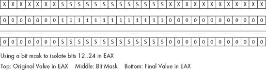
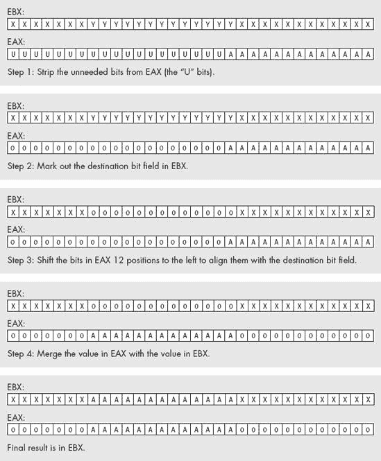
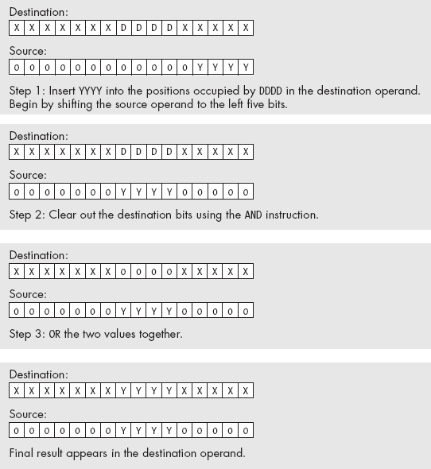

# 第十章 位操作


操作内存中的位或许是汇编语言最著名的特性之一。确实，人们宣称 C 语言是一种中级语言而不是高级语言的原因之一，是因为 C 语言提供了大量的位操作符。即便有了这如此广泛的位操作功能，C 语言提供的位操作集合仍不如汇编语言完整。

本章讨论如何使用 80x86 汇编语言操作内存和寄存器中的位字符串。它从回顾到目前为止涉及的位操作指令开始，并介绍了一些新的指令。本章回顾了在内存中打包和解包位字符串的信息，因为这是许多位操作的基础。最后，本章讨论了几个以位为中心的算法及其在汇编语言中的实现。

# 10.1 什么是位数据？

在描述如何操作位之前，最好先明确一下本书中*位数据*的具体含义。大多数读者可能会认为位操作程序是修改内存中的单个位。虽然这样的程序无疑是位操作程序，但我们不会将定义仅限于这些程序。就我们的目的而言，*位操作*是指处理由非连续位字符串或长度不是 8 位的倍数的位数据类型。通常，这样的位对象不会表示数值整数，尽管我们并不会对我们的位字符串做出这一限制。

*位字符串*是一个连续的由一个或多个比特组成的序列。请注意，位字符串不必从任何特定位置开始或结束。例如，位字符串可以从内存中一个字节的第 7 个位开始，继续到下一个字节的第 6 个位。同样，位字符串可以从 EAX 的第 30 个位开始，消耗 EAX 的上 2 个位，然后从 EBX 的第 0 个位到第 17 个位继续。在内存中，位必须是物理连续的（即，位编号总是递增，除非跨越字节边界，而在字节边界时，内存地址增加 1 字节）。在寄存器中，如果位字符串跨越了寄存器边界，应用程序定义继续的寄存器，但位字符串总是从第二个寄存器的第 0 个位开始继续。

*位集合*是一个位的集合，这些位不一定是连续的，位于某个较大的数据结构内。例如，某个双字中的位 0..3、7、12、24 和 31 构成一个位集合。通常，我们会将位集合限制为某个合理大小的*容器对象*（封装位集合的数据结构），但该定义并没有特别限制其大小。通常，我们会处理大小不超过 32 或 64 位的位集合，尽管这个限制是完全人为设定的。请注意，位串是位集合的特例。

*位串*是一个所有位值相同的位序列。*零串*是一个只包含零的位串，*一串*是一个只包含一的位串。*第一个置位*是指在位串中第一个包含 1 的位的位置，也就是可能在零串后的第一个 1 位。*第一个清除位*也有类似的定义。*最后一个置位*是指在位串中最后一个包含 1 的位位置；位串的其余部分形成一个不间断的零串。*最后一个清除位*也有类似的定义。

*位偏移*是指从某个边界位置（通常是字节边界）到指定位的位数。如第二章所述，我们从边界位置的 0 开始编号每一位。

*掩码*是一个位的序列，我们将用它来操作另一个值中的某些位。例如，位串%0000_1111_0000，当与`and`指令一起使用时，可以屏蔽掉（清除）所有位，只留下位 4 到 7 的位。类似地，如果你使用相同的值与`or`指令一起使用，它可以将目标操作数中的位 4 到 7 强制为 1。术语*掩码*来源于这些位串与`and`指令的结合使用；在这种情况下，1 和 0 的位像遮蔽胶带一样使用；它们通过某些位而不改变这些位，同时遮蔽（清除）其他位。

了解了这些定义后，我们已经准备好开始操作一些位了！

# 10.2 操作位的指令

位操作通常包括六个活动：设置位、清除位、反转位、测试和比较位、从位串中提取位、以及将位插入位串。到目前为止，你应该已经熟悉了我们用来执行这些操作的大部分指令；这些指令的介绍可以追溯到本书最早的章节。然而，回顾一下旧的指令并介绍我们尚未考虑的几条位操作指令，仍然是值得的。

最基本的位操作指令是`and`、`or`、`xor`、`not`、`test`以及移位和旋转指令。事实上，在最早的 80x86 处理器上，这些是唯一可用于位操作的指令。以下段落回顾了这些指令，重点介绍了如何使用它们来操作内存或寄存器中的位。

`and`指令提供了从某些位序列中剥离不需要的位的功能，将不需要的位替换为零。此指令特别适用于隔离与其他无关数据（或者至少是与位字符串或位集无关的数据）合并的位字符串或位集。例如，假设一个位字符串占用了 EAX 寄存器的 12 到 24 位；我们可以通过使用以下指令将 EAX 中的所有其他位清零，从而隔离这个位字符串：

```
and( %1_1111_1111_1111_0000_0000_0000, eax );
```

大多数程序使用`and`指令来清除不属于所需位字符串的位。从理论上讲，你可以使用`or`指令将所有不需要的位掩码设置为 1 而不是 0，但如果不需要的位位置包含 0，那么后续的比较和操作通常会更容易（见图 10-1）。



图 10-1. 使用`and`指令隔离位字符串

一旦你清除了位集中不需要的位，你通常可以直接对位集进行操作。例如，要检查 EAX 中 12 到 24 位的位字符串是否包含$12F3，你可以使用以下代码：

```
and( %1_1111_1111_1111_0000_0000_0000, eax );
  cmp( eax, %1_0010_1111_0011_0000_0000_0000 );
```

这是另一种解决方案，使用常量表达式，稍微容易理解一些：

```
and( %1_1111_1111_1111_0000_0000_0000, eax );
  cmp( eax, $12F3 << 12 );  // "<<12" shifts $12F3 to the left 12 bits.
```

然而，大多数时候，你会希望（或者需要）在执行任何操作之前，将位字符串对齐到 EAX 的位 0。当然，在你掩码之后，你可以使用`shr`指令来正确对齐该值，如下所示：

```
and( %1_1111_1111_1111_0000_0000_0000, eax );
     shr( 12, eax );
     cmp( eax, $12F3 );
     << Other operations that require the bit string at bit #0 >>
```

现在，位字符串已经对齐到位 0，与该值一起使用的常量和其他值更容易处理。

你也可以使用`or`指令来掩码不需要的位。然而，`or`指令并不能让你清除位，它允许你将位设置为 1。在某些情况下，可能需要将位集周围的所有位设置为 1；然而，大多数软件更容易编写的是将周围的位清除，而不是设置它们。

`or`指令对于将一组位插入到另一个位字符串中特别有用。为了做到这一点，你需要经过几个步骤：

+   清除源操作数中围绕位集的所有位。

+   清除目标操作数中你希望插入位集的所有位。

+   将位集和目标操作数使用`or`指令结合。

例如，假设你希望将 EAX 的位 0..12 中的值插入到 EBX 的位 12..24 中，而不影响 EBX 中的其他位。你将首先从 EAX 中去除位 13 及以上的位；然后从 EBX 中去除位 12..24 的位。接下来，你将位移 EAX 中的位，使得位串占据 EAX 的位 12..24。最后，你将 EAX 中的值通过`or`操作插入到 EBX 中（参见图 10-2），如下所示：

```
and( $1FFF, eax );      // Strip all but bits 0..12 from eax.
     and( $FE00_0FFF, ebx ); // Clear bits 12..24 in ebx.
     shl( 12, eax );         // Move bits 0..12 to 12..24 in eax.
     or( eax, ebx );         // Merge the bits into ebx.
```



图 10-2. 将 EAX 的位 0..12 插入 EBX 的位 12..24

在这个图中，期望的位（AAAAAAAAAAAAA）形成了一个位串。然而，即使你正在操作一个非连续的位集合，这个算法仍然能够正常工作。你只需创建一个适当的位掩码，用于`and`操作，并在适当的位置填充 1 即可。

在使用位掩码时，像前面几个例子那样使用字面数值常量是非常不好的编程风格。你应该始终在 HLA 的`const`（或`val`）部分为你的位掩码创建符号常量。结合一些常量表达式，你可以编写出更易读和更易维护的代码。当前的示例代码更恰当的写法如下：

```
const
     StartPosn := 12;
     BitMask: dword := $1FFF << StartPosn; // Mask occupies bits 12..24.
          .
          .
          .
          shl( StartPosn, eax );  // Move into position.
          and( BitMask, eax );    // Strip all but bits 12..24 from eax.
          and( !BitMask, ebx );   // Clear bits 12..24 in ebx.
          or( eax, ebx );         // Merge the bits into ebx.
```

注意使用编译时的`not`运算符（`!`）来反转位掩码，以便清除 EBX 中代码插入 EAX 中的位的位位置。这样就不需要在程序中创建另一个常量，并且每次修改`BitMask`常量时都需要更新它。程序中维护两个相互依赖的符号并不是一个好习惯。

当然，除了将一个位集合与另一个合并外，`or`指令也非常适用于强制将位设置为 1。在源操作数中将不同的位设置为 1 后，你可以通过使用`or`指令将目标操作数中的相应位强制设置为 1。

`xor`指令允许你反转位集合中的选定位。虽然反转位不像设置或清除位那么常见，但`xor`指令在位操作程序中经常出现。当然，如果你想反转某个目标操作数中的所有位，`not`指令可能比`xor`指令更合适；然而，要反转选定的位而不影响其他位时，`xor`是更合适的选择。

`xor` 操作的一个有趣事实是，它让你能够以几乎任何可想象的方式操作已知数据。例如，如果你知道某个字段包含 %1010，你可以通过与 %1010 进行 `xor` 操作将该字段强制为 0。同样，你也可以通过与 %0101 进行 `xor` 操作将其强制为 %1111。虽然这看起来可能是一种浪费，因为你可以很容易地通过 `and`/`or` 将这个 4 位字符串强制为 0 或全部为 1，但 `xor` 指令有两个优点：（1）你不仅仅局限于将字段强制为全零或全一；你实际上可以通过 `xor` 将这些位设置为 16 种有效组合中的任何一种；（2）如果你需要同时操作目标操作数中的其他位，`and`/`or` 可能无法满足你的需求。例如，假设你知道一个字段包含 %1010，你想将其强制为 0，另一个字段包含 %1000，你希望将该字段加 1（即将字段设置为 %1001）。你无法通过单个 `and` 或 `or` 指令完成这两个操作，但你可以通过单个 `xor` 指令做到；只需将第一个字段与 %1010 进行 `xor`，将第二个字段与 `%0001` 进行 `xor`。然而，请记住，这个技巧仅在你知道目标操作数中某个位的当前值时才有效。当然，在你调整包含已知值的位字段时，你还可以同时翻转其他字段中的位。

除了在某些目标操作数中设置、清除和翻转位外，`and`、`or` 和 `xor` 指令还会影响标志寄存器中的各种条件码。这些指令会按以下方式影响标志：

+   这些指令始终会清除进位标志和溢出标志。

+   如果结果的最高有效位是 1，这些指令会设置符号标志；否则，它们会清除符号标志。也就是说，这些指令将结果的最高有效位复制到符号标志中。

+   如果结果为 0，这些指令会设置/清除零标志。

+   如果目标操作数的低字节中有偶数个已设置的位，这些指令会设置奇偶标志；如果目标操作数的低字节中有奇数个 1 位，这些指令会清除奇偶标志。

首先要注意的是，这些指令始终会清除进位标志和溢出标志。这意味着你不能期望系统在执行这些指令后保留这两个标志的状态。许多汇编语言程序中一个非常常见的错误是假设这些指令不会影响进位标志。很多人会执行一个设置/清除进位标志的指令，然后执行 `and`/`or`/`xor` 指令，再尝试测试之前指令的进位标志状态。这显然是行不通的。

这些指令的一个有趣的方面是，它们将结果的最高有效位（H.O.位）复制到符号标志中。这意味着你可以通过测试符号标志（使用`sets/setns`或`js`/`jns`指令，或者在布尔表达式中使用`@s`/`@ns`标志）轻松测试结果的 H.O.位的设置。因此，许多汇编语言程序员常常将一个重要的布尔变量放置在某个操作数的 H.O.位中，这样他们就可以在进行逻辑操作后，通过符号标志轻松测试该位的状态。

在这篇文章中，我们没有太多讨论奇偶标志。我们不会深入讨论这个标志及其用途，因为该标志的主要用途已经被硬件所接管。^([126]) 然而，因为这是关于位操作的章节，而奇偶计算是一个位操作，所以现在简要讨论奇偶标志似乎是合适的。

奇偶是一个非常简单的错误检测方案，最早由电报和其他串行通信协议使用。其原理是计算字符中设置位的数量，并在传输中添加一个额外的位，以指示该字符包含偶数或奇数个设置位。接收端也会计算位并验证额外的“奇偶”位是否表示传输成功。我们此时不会深入探讨这种错误检查方案的信息理论方面，只是指出奇偶标志的目的是帮助计算这个额外位的值。

80x86 的`and`、`or`和`xor`指令会在其操作数的最低有效字节（L.O.字节）中包含偶数个设置位时设置奇偶位。这里有一个重要的事实需要重申：奇偶标志仅反映目标操作数的 L.O.字节中设置位的数量；它不包括字、双字或其他大小操作数中的 H.O.字节。指令集仅使用 L.O.字节来计算奇偶性，因为使用奇偶性的通信程序通常是面向字符的传输系统（如果一次传输超过 8 位，通常有更好的错误检查方案）。

零标志的设置是`and`/`or`/`xor`指令产生的更重要的结果之一。实际上，程序在`and`指令之后如此频繁地引用这个标志，以至于英特尔添加了一个单独的指令`test`，其主要目的是对两个结果进行逻辑`and`操作并设置标志，而不会对任何指令操作数产生其他影响。

在执行 `and` 或 `test` 指令后，零标志有三种主要用途：（1）检查操作数中的某一特定位是否为 1，（2）检查位集中的多个位中是否有至少一个为 1，以及（3）检查操作数是否为 0。使用（1）实际上是（2）的特例，其中位集仅包含一个位。我们将在接下来的段落中探讨这些用途。

`and` 指令的一个常见用途，也是 80x86 指令集中包含 `test` 指令的初衷，是测试给定操作数中某一特定位是否被置为 1。要执行这种类型的测试，通常会将包含一个单独置位的常数值与你想要测试的操作数进行 `and`/`test` 操作。这样可以清除第二个操作数中的所有其他位，如果该操作数在该位置上是 0，则在 `test` 下的该位置会留 0。使用 1 进行 `and` 操作时，如果原来该位置是 1，则会留下 1。由于结果中的其他位都是 0，因此如果该特定位是 0，整个结果将为 0；如果该位置是 1，整个结果则为非零值。80x86 通过零标志（Z = 1 表示该位为 0；Z = 0 表示该位为 1）反映这一状态。以下指令序列演示了如何测试 EAX 寄存器的第 4 位是否被置位：

```
test( %1_0000, eax ); // Check bit #4 to see if it is 0/1.
     if( @nz ) then

          << Do this if the bit is set. >>

     else

          << Do this if the bit is clear. >>

     endif;
```

你也可以使用 `and`/`test` 指令来检查多个位中是否有至少一个位被置为 1。只需提供一个常数，其中你想测试的位置上为 1，其余位置为 0。将此值与待测操作数进行 `and` 操作，如果待测操作数中的一个或多个位包含 1，则会产生非零值。以下示例测试 EAX 中第 1 位、第 2 位、第 4 位和第 7 位是否为 1：

```
test( %1001_0110, eax );
     if( @nz ) then // At least one of the bits is set.

          << Do whatever needs to be done if one of the bits is set. >>

     endif;
```

请注意，你不能仅使用单个 `and` 或 `test` 指令来检查位集中的所有相应位是否都为 1。要实现这一点，必须首先屏蔽掉不在位集中的位，然后将结果与掩码本身进行比较。如果结果等于掩码，则位集中的所有位都包含 1。必须使用 `and` 指令来执行此操作，因为 `test` 指令不会屏蔽任何位。以下示例检查位集（`bitMask`）中的所有位是否都为 1：

```
and( bitMask, eax );
     cmp( eax, bitMask );
     if( @e ) then

          // All the bit positions in eax corresponding to the set
          // bits in bitMask are equal to 1 if we get here.

          << Do whatever needs to be done if the bits match. >>

     endif;
```

当然，一旦我们在其中使用了 `cmp` 指令，就不再需要检查位集中的所有位是否都为 1。我们可以通过将适当的值作为操作数传递给 `cmp` 指令，来检查任意组合的值。

请注意，`test`/`and`指令只有在 EAX（或其他目标操作数）中的所有位在常量操作数的相应位置为 1 时，才会设置零标志。这表明另一种检查位集中是否全为 1 的方法：在使用`and`或`test`指令之前，将 EAX 中的值取反。然后，如果零标志被设置，你就知道（原始的）位集中全为 1。例如：

```
not( eax );
 test( bitMask, eax );
 if( @z ) then
   // At this point, eax contained all ones in the bit positions
   // occupied by ones in the bitMask constant.

   << Do whatever needs to be done at this point. >>

 endif;
```

之前的段落都表明`bitMask`（源操作数）是一个常量。这只是为了举例说明。事实上，如果你愿意，你可以在这里使用变量或其他寄存器。在执行上面例子中的`test`、`and`或`cmp`指令之前，简单地将该变量或寄存器加载上适当的位掩码。

我们已经看到的另一组可以用来操作位的指令是位测试指令。这些指令包括`bt`（位测试）、`bts`（位测试并设置）、`btc`（位测试并取反）和`btr`（位测试并重置）。我们曾用这些指令操作 HLA 字符集变量中的位；同样，我们也可以使用它们来操作一般的位。这些`bt`*`x`*指令允许以下语法形式：

```
bt*`x`*( *`BitNumber`*, *`BitsToTest`* );
bt*`x`*( *`reg16`*, *`reg16`* );
bt*`x`*( *`reg32`*, *`reg32`* );
bt*`x`*( *`constant`*, *`reg16`* );
bt*`x`*( *`constant`*, *`reg32`* );
bt*`x`*( *`reg16`*, *`mem16`* );
bt*`x`*( *`reg32`*, *`mem32`* );
bt*`x`*( *`constant`*, *`mem16`* );
bt*`x`*( *`constant`*, *`mem32`* );
```

`btx`指令的第一个操作数是一个位号，指定要检查第二个操作数中的哪一位。如果第二个操作数是寄存器，那么第一个操作数必须包含一个介于 0 和寄存器大小（以位为单位）减 1 之间的值；因为 80x86 架构的最大寄存器是 32 位，所以该值的最大值为 31（对于 32 位寄存器）。如果第二个操作数是内存位置，那么位计数不限制在 0..31 的范围内。如果第一个操作数是常量，它可以是 0..255 范围内的任何 8 位值。如果第一个操作数是寄存器，则没有限制。

`bt`指令将指定的位从第二个操作数复制到进位标志中。例如，`bt( 8, eax );`指令将 EAX 寄存器的第 8 位复制到进位标志中。你可以在此指令之后测试进位标志，以确定 EAX 中的第 8 位是设置为 1 还是清零。

`bts`、`btc`和`btr`指令在测试位的同时，也会操作它们所测试的位。这些指令可能会较慢（取决于你使用的处理器），如果性能是你的主要关注点，并且你使用的是较老的 CPU，应该避免使用它们。如果性能（与便捷性相对）是一个问题，你应该始终尝试两种不同的算法——一种使用这些指令，另一种使用`and`/`or`指令——并测量它们的性能差异；然后选择最优的方案。

移位和旋转指令是另一类可以用于操作和测试位的指令。这些指令将高位（左移/旋转）或低位（右移/旋转）位移动到进位标志中。因此，在执行这些指令之后，你可以测试进位标志，以确定操作数的高位或低位的原始设置。移位和旋转指令对于对齐位串以及打包和解包数据非常有价值。第二章中有几个示例，且本章前面的部分也使用移位指令进行此类操作。

* * *

^([126]) 使用奇偶校验进行错误检查的串行通信芯片和其他通信硬件通常会在硬件中计算奇偶校验；你不需要使用软件来完成这个任务。

# 10.3 进位标志作为位累加器

`bt`*`x`*、移位和旋转指令会根据操作和选定的位设置或清除进位标志。因为这些指令将其“位结果”放入进位标志中，所以通常可以将进位标志视为一个 1 位的寄存器或累加器来进行位操作。在本节中，我们将探讨一些使用进位标志中位结果的操作。

有用的指令是那些将进位标志作为输入值的指令。以下是这类指令的一些示例：

+   `adc`、`sbb`

+   `rcl`, `rcr`

+   `cmc`（虽然`clc`和`stc`不使用进位作为输入，我们也一并提到它们。）

+   `jc`、`jnc`

+   `setc`、`setnc`

`adc`和`sbb`指令会将操作数与进位标志一起加或减。因此，如果你已经计算出一些位结果并存入进位标志中，你可以使用这些指令将结果纳入加法或减法操作中。

要将位结果合并到进位标志中，通常使用旋转通过进位指令（`rcl`和`rcr`）。这些指令将进位标志移动到其目标操作数的低位（L.O.）或高位（H.O.）中。这些指令对于将一组位结果打包成字节、字或双字值非常有用。

`cmc`（补码进位）指令可以轻松地反转某些位操作的结果。你也可以使用`clc`和`stc`指令，在进行一系列涉及进位标志的位操作之前初始化进位标志。

用于测试进位标志的指令在计算后，如果进位标志中有位结果时，会非常常见。`jc`、`jnc`、`setc`和`setnc`指令在这种情况下非常有用。你也可以在布尔表达式中使用 HLA 的`@c`和`@nc`操作数来测试进位标志中的结果。

如果你有一系列比特计算，并希望测试这些计算是否产生特定的 1 比特结果，最简单的方法是清空一个寄存器或内存位置，并使用`rcl`或`rcr`指令将每个结果移入该位置。比特操作完成后，你可以将存储结果的寄存器或内存位置与常数值进行比较。如果你想测试涉及合取与析取（即涉及`and`和`or`的结果字符串）的结果序列，那么你可以使用`setc`和`setnc`指令将寄存器设置为 0 或 1，然后使用`and`/`or`指令合并结果。

# 10.4 打包与解包比特字符串

常见的比特操作是将比特字符串插入操作数或从操作数中提取比特字符串。第二章提供了打包和解包此类数据的简单示例；现在是时候正式描述如何执行此操作了。

对于我们的目的，我们将假设正在处理比特字符串——即一串连续的比特。在 10.11 提取比特字符串中，我们将探讨如何提取和插入比特集合。我们做的另一个简化假设是，比特字符串完全适配于一个字节、字或双字操作数。跨越对象边界的大型比特字符串需要额外的处理；关于跨双字边界的比特字符串的讨论将在本节后面出现。

比特字符串有两个我们在打包和解包时必须考虑的属性：起始比特位置和长度。起始比特位置是该字符串在较大操作数中最低有效比特的位置。长度是操作数中的比特数。为了将数据插入（打包）到目标操作数中，首先需要有一个适当长度的比特字符串，该字符串右对齐（即从比特位置 0 开始），并被零扩展至 8、16 或 32 位。任务是将这些数据插入到另一个宽度为 8、16 或 32 位的操作数中，从适当的起始位置开始。目标比特位置的值没有任何保证。

前两步（可以按任意顺序发生）是清除目标操作数中相应的比特，并将（比特字符串的副本）移位，使最低有效比特开始于适当的比特位置。第三步是将移位后的结果与目标操作数进行`or`操作。这样就将比特字符串插入到了目标操作数中（参见图 10-3）。



图 10-3. 将比特字符串插入目标操作数

只需要三条指令就能将已知长度的位串插入目标操作数。以下三条指令演示了如何在图 10-3 中处理插入操作。这些指令假设源操作数在 BX 中，目标操作数在 AX 中：

```
shl( 5, bx );
     and( %111111000011111, ax );
     or( bx, ax );
```

如果在编写程序时无法知道长度和起始位置（即你必须在运行时计算它们），那么位串插入就会稍微困难一些。然而，通过使用查找表，这仍然是一个可以轻松完成的操作。假设我们有两个 8 位值：用于插入字段的起始位置和一个非零的 8 位长度值。还假设源操作数在 EBX 中，目标操作数在 EAX 中。将一个操作数插入到另一个操作数中的代码可以采用以下形式：

```
readonly
     // The index into the following table specifies the length
     // of the bit string at each position:

     MaskByLen: dword[ 33 ] :=
           [
               0,  $1,  $3,  $7, $f, $1f, $3f, $7f,
               $ff, $1ff, $3ff, $7ff, $fff, $1fff, $3fff, $7fff, $ffff,
               $1_ffff, $3_ffff, $7_ffff, $f_ffff,
               $1f_ffff, $3f_ffff, $7f_ffff, $ff_ffff,
               $1ff_ffff, $3ff_ffff, $7ff_ffff, $fff_ffff,
               $1fff_ffff, $3fff_ffff, $7fff_ffff, $ffff_ffff
          ];
               .
               .
               .
     movzx( *`Length`*, edx );
     mov( MaskByLen[ edx*4 ], edx );
     mov( *`StartingPosition`*, cl );
     shl( cl, edx );
     not( edx );
     shl( cl, ebx );
     and( edx, eax );
     or( ebx, eax );
```

`MaskByLen`表中的每个条目包含由表的索引指定的 1 位的数量。使用*`Length`*值作为索引从该表中获取一个值，该值具有与*`Length`*值相同数量的 1 位。上面的代码获取了一个适当的掩码，将其向左移动，以便该组 1 位的最低有效位与我们想要插入数据的字段的起始位置对齐，然后反转掩码并使用反转后的值清除目标操作数中适当的位。

从一个较大的操作数中提取位串与将位串插入某个较大的操作数一样简单。你所需要做的就是屏蔽掉不需要的位，然后将结果移动，直到位串的最低有效位（L.O. bit）位于目标操作数的第 0 位。例如，要从 EBX 中提取从第 5 位开始的 4 位字段并将结果保存在 EAX 中，你可以使用以下代码：

```
mov( ebx, eax );            // Copy data to destination.
     and( %1_1110_0000, eax );   // Strip unwanted bits.
     shr( 5, eax );              // Right justify to bit position 0.
```

如果在编写程序时，你不知道位串的长度和起始位置，你仍然可以提取所需的位串。代码与插入操作非常相似（尽管稍微简单一些）。假设你拥有我们在插入位串时使用的*`Length`*和*`StartingPosition`*值，你可以使用以下代码提取相应的位串（假设源操作数为 EBX，目标操作数为 EAX）：

```
movzx( *`Length`*, edx );
     mov( MaskByLen[ edx*4 ], edx );
     mov( *`StartingPosition`*, cl );
     mov( ebx, eax );
     shr( cl, eax );
     and( edx, eax );
```

到目前为止的示例都假设比特串完全出现在一个双字（或更小）对象中。如果比特串的长度小于或等于 32 位，这种情况总是成立。然而，如果比特串的长度加上其在对象中起始位置（模 8 运算）大于 32，那么比特串就会跨越对象中的双字边界。提取这样的比特串需要最多三个操作：一个操作提取比特串的起始部分（直到第一个双字边界），一个操作复制整个双字（假设比特串很长，跨越多个双字），以及最后一个操作，复制位于比特串末尾的最后一个双字中的剩余比特。这个操作的具体实现留给读者作为练习。

# 10.5 合并比特集与分配比特串

插入和提取比特集与插入和提取比特串的不同之处在于，如果你插入的比特集（或提取出的结果比特集）与主对象中的比特集形状相同，那么操作就没什么不同。比特集的“形状”是指比特集内比特位的分布，而忽略比特集的起始比特位置。因此，包含比特位 0、4、5、6 和 7 的比特集，其形状与包含比特位 12、16、17、18 和 19 的比特集相同，因为这些比特的分布是一样的。插入或提取这个比特集的代码几乎与上一节相同，唯一的区别是你使用的掩码值。例如，要将这个以 EAX 寄存器的比特位 0 开始的比特集插入到 EBX 寄存器的比特位 12 的位置，你可以使用以下代码：

```
and( !%1111_0001_0000_0000_0000, ebx );// Mask out destination bits.
 shl( 12, eax );                        // Move source bits into position.
 or( eax, ebx );                        // Merge the bit set into ebx.
```

但是，假设你在 EAX 寄存器的比特位置 0 到 4 之间有 5 个位，且你想将它们合并到 EBX 寄存器中的比特位 12、16、17、18 和 19 上。你必须以某种方式在将值通过逻辑`or`操作合并到 EBX 之前，分配 EAX 中的比特位。考虑到这个特定的比特集只有两段 1 比特，过程会相对简化。以下代码以一种有点“狡猾”的方式实现了这一点：

```
and( !%1111_0001_0000_0000_0000, ebx );
 shl( 3, eax );   // Spread out the bits: 1-4 goes to 4-7 and 0 to 3.
 btr( 3, eax );   // Bit 3->carry and then clear bit 3.
 rcl( 12, eax );  // Shift in carry and put bits into final position.
 or( eax, ebx );  // Merge the bit set into ebx.
```

这个使用`btr`（位测试与重置）指令的技巧效果很好，因为我们在原始源操作数中只有 1 个比特位位置错误。可惜，如果比特位相对彼此的位置完全错乱，那么这个方案可能就不太有效了。我们稍后会看到一个更通用的解决方案。

提取这个比特集并将比特位“合并”成一个比特串并不容易。然而，我们依然可以利用一些巧妙的技巧。考虑以下代码，它从 EBX 中提取比特集，并将结果放入 EAX 的比特位 0 到 4 中：

```
mov( ebx, eax );
 and( %1111_0001_0000_0000_0000, eax );  // Strip unwanted bits.
 shr( 5, eax );                          // Put bit 12 into bit 7, etc.
 shr( 3, ah );                           // Move bits 11..14 to 8..11.
 shr( 7, eax );                          // Move down to bit 0.
```

这段代码将（原始的）第 12 位移到第 7 位位置，即 AL 的高位。同时，它将第 16 到第 19 位移到第 11 到第 14 位（即 AH 的第 3 到第 6 位）。然后，代码将 AH 中第 3 到第 6 位向下移到第 0 位。这将高位的位集合放置在 AL 中剩余的位旁边。最后，代码将所有位向下移到第 0 位。这不是一种通用的解决方案，但它展示了如果仔细思考，这种问题可以用一种巧妙的方法来解决。

上面提到的合并和分配算法的问题在于它们不是通用的。它们仅适用于特定的位集合。通常，特定的解决方案会提供最有效的解决方案。一个通用的解决方案（也许是让你指定一个掩码，然后代码根据掩码分配或合并位）将会更加复杂。以下代码演示了如何根据位掩码中的值分配位：

```
// eax- Originally contains some value into which we
//        insert bits from ebx.
// ebx- L.O. bits contain the values to insert into eax.
// edx- Bitmap with ones indicating the bit positions in eax to insert.
// cl-  Scratchpad register.

          mov( 32, cl );   // Count number of bits we rotate.
          jmp DistLoop;

CopyToEAX:rcr( 1, ebx );   // Don't use SHR here, must preserve Z-flag.
          rcr( 1, eax );
          jz  Done;
DistLoop: dec( cl );
          shr( 1, edx );
          jc CopyToEAX;
          ror( 1, eax );   // Keep current bit in eax.
          jnz DistLoop;

Done:     ror( cl, eax );  // Reposition remaining bits.
```

在上面的代码中，如果我们用 %1100_1001 加载 EDX，那么这段代码将会把 EDX 中的第 0 到第 3 位复制到 EAX 中的第 0、3、6 和 7 位。注意到有一个短路测试，它检查 EDX 中的值是否已经用尽（通过检查 EDX 中是否有 0）。注意，旋转指令不会影响零标志位，而移位指令会。因此，上面的 `shr` 指令在没有更多位可以分配时（当 EDX 变为 0 时）将设置零标志。

合并位的通用算法比分配算法稍微高效一些。以下是将通过 EDX 中的位掩码从 EBX 中提取位，并将结果保留在 EAX 中的代码：

```
// eax- Destination register.
// ebx- Source register.
// edx- Bitmap with ones representing bits to copy to eax.
// ebx and edx are not preserved.
     sub( eax, eax );  // Clear destination register.
     jmp ShiftLoop;

ShiftInEAX:
     rcl( 1, ebx );   // Up here we need to copy a bit from
     rcl( 1, eax );   // ebx to eax.
ShiftLoop:
     shl( 1, edx );   // Check mask to see if we need to copy a bit.
     jc ShiftInEAX;   // If carry set, go copy the bit.
     rcl( 1, ebx );   // Current bit is uninteresting, skip it.
     jnz ShiftLoop;   // Repeat as long as there are bits in edx.
```

这个序列利用了移位和旋转指令的一个巧妙特性：移位指令会影响零标志，而旋转指令则不会。因此，`shl( 1, edx );` 指令在 EDX 变为 0（移位后）时会设置零标志。如果进位标志也被设置，代码将会额外通过循环一次，将一个位移入 EAX，但下次代码将 EDX 向左移 1 位时，EDX 依然是 0，因此进位标志会被清除。在这次迭代中，代码会跳出循环。

另一种合并位的方法是通过查表。通过一次抓取一个字节的数据（这样你的表格不会变得太大），你可以使用该字节的值作为查找表的索引，将所有位合并到第 0 位。最后，你可以将每个字节低位的位合并在一起。在某些情况下，这可能会产生一个更高效的合并算法。具体实现留给读者。

# 10.6 位串的打包数组

尽管创建元素大小为整数字节数的数组要高效得多，但完全可以创建元素大小不是 8 位倍数的数组。缺点是，计算数组元素的“地址”并操作该数组元素需要额外的工作。在本节中，我们将看几个示例，展示如何在元素大小为任意位数的数组中打包和解包数组元素。

在继续之前，值得讨论一下为什么你会想要使用位对象数组。答案很简单：空间。如果一个对象仅消耗 3 个位，使用数据打包的方式，你可以在相同的空间内存放 2.67 倍数量的元素，而不是为每个对象分配一个完整的字节。对于非常大的数组，这可以节省大量空间。当然，这种空间节省的代价是速度：你需要执行额外的指令来打包和解包数据，从而减慢了数据访问速度。

计算在一大块位中定位数组元素的位偏移量与标准数组访问几乎相同；其公式为：

```
*`Element_Address_in_bits`* =
        *`Base_address_in_bits`* + *`index`* * *`element_size_in_bits`*
```

一旦你计算出元素的位地址，你需要将其转换为字节地址（因为在访问内存时必须使用字节地址），并提取指定的元素。由于数组元素的基地址（几乎）总是从字节边界开始，我们可以使用以下公式来简化这个任务：

```
*`Byte_of_1st_bit`* =
    *`Base_Address`* + (*`index`* * *`element_size_in_bits`* )/8

*`Offset_to_1st_bit`* =
    (*`index`* * *`element_size_in_bits`*) % 8 (note "%" = MOD)
```

例如，假设我们有一个包含 200 个 3 位对象的数组，声明如下：

```
static
     AO3Bobjects: byte[ int32((200*3)/8 + 2) ];  // "+2" handles
                                                 // truncation.
```

上面维度中的常量表达式为足够容纳 600 位（200 个元素，每个元素 3 个位）预留了空间。如注释所示，该表达式在末尾添加了 2 个额外的字节，以确保我们不会丢失任何奇数位（在本示例中不会发生这种情况，因为 600 可以被 8 整除，但通常不能依赖这一点；通常添加一个额外字节不会造成问题），同时允许我们在数组的末尾访问 1 个字节（当向数组存储数据时）。

现在假设你想访问该数组的第*i*个 3 位元素。你可以使用以下代码提取这些位：

```
// Extract the ith group of 3 bits in AO3Bobjects
// and leave this value in eax.

    sub( ecx, ecx );         // Put i/8 remainder here.
    mov( i, eax );           // Get the index into the array.
    lea( eax, [eax+eax*2] ); // eax := eax * 3 (3 bits/element).
    shrd( 3, eax, ecx );     // eax/8 -> eax and eax mod 8 -> ecx
                             // (H.O. bits).
    shr( 3, eax );           // Remember, shrd doesn't modify eax.
    rol( 3, ecx );           // Put remainder into L.O. 3
                             // bits of ecx.

    // Okay, fetch the word containing the 3 bits we want to
    // extract. We have to fetch a word because the last bit or two
    // could wind up crossing the byte boundary (i.e., bit offset 6
    // and 7 in the byte).

    mov( (type word AO3Bobjects[eax]), ax );
    shr( cl, ax );           // Move bits down to bit 0.
    and( %111, eax );        // Remove the other bits.
```

向数组插入一个元素要稍微复杂一些。除了计算数组元素的基地址和位偏移量外，还必须创建一个掩码，以清除目标位置的位，供插入新数据使用。以下代码将 EAX 的低 3 位插入到`AO3Bobjects`数组的*i*元素中。

```
// Insert the L.O. 3 bits of ax into the ith element
// of AO3Bobjects:

readonly
     Masks:
        word[8] :=
        [
            !%0111,             !%0011_1000,
            !%0001_1100_0000,   !%1110,
            !%0111_0000,        !%0011_1000_0000,
            !%0001_1100,        !%1110_0000
        ];
                    .
                    .
                    .

        mov( i, ebx );              // Get the index into the array.
        mov( ebx, ecx );            // Use L.O. 3 bits as index
        and( %111, ecx );           // into Masks table.
        mov( Masks[ecx*2], dx );    // Get bit mask.

        // Convert index into the array into a bit index.
        // To do this, multiply the index by 3:

        lea( ebx, [ebx+ebx*2]);

        // Divide by 8 to get the byte index into ebx
        // and the bit index (the remainder) into ecx:

        shrd( 3,ebx, ecx );
        shr( 3, ebx );
        rol( 3, ecx );

        // Grab the bits and clear those we're inserting.

        and( (type word AO3Bobjects[ ebx ]), dx );

        // Put our 3 bits in their proper location.

        shl( cl, ax );

        // Merge bits into destination.

        or( ax, dx );

        // Store back into memory.

        mov( dx, (type word AO3Bobjects[ ebx ]) );
```

注意使用查找表来生成所需的掩码，以清除数组中适当位置的位。该数组的每个元素都包含全 1，除了我们需要清除的给定位偏移位置的三个零（注意使用`!`操作符来反转表中的常量）。

# 10.7 查找位

一个非常常见的位操作是定位一段位的结束。这个操作的一个特殊情况是定位 16 位或 32 位值中第一个（或最后一个）设置或清除的位。在本节中，我们将探讨实现这一目标的方法。

在描述如何搜索给定值的第一个或最后一个位之前，也许先讨论一下在这个上下文中*第一个*和*最后一个*的确切含义是明智的。术语*第一个设置位*是指从位 0 开始扫描，直到扫描到包含 1 的高位。*第一个清除位*有类似的定义。*最后一个设置位*是指从高位开始扫描，直到扫描到包含 1 的位 0。*最后一个清除位*也有类似的定义。

扫描第一个或最后一个位的一个明显方法是使用移位指令在循环中，并计算在将 1（或 0）移入进位标志之前的迭代次数。迭代次数指定了位的位置。下面是一些示例代码，它检查 EAX 中第一个设置的位，并将该位位置返回到 ECX 中：

```
mov( −32, ecx );  // Count off the bit positions in ecx.
TstLp:    shr( 1, eax );    // Check to see if current bit
                            // position contains a 1.
          jc Done;          // Exit loop if it does.
          inc( ecx );       // Bump up our bit counter by 1.
          jnz TstLp;        // Exit if we execute this loop 32 times.

Done:     add( 32, cl );    // Adjust loop counter so it holds
                            // the bit position.

// At this point, ecx contains the bit position of the first set bit.
// ecx contains 32 if eax originally contained 0 (no set bits).
```

这段代码唯一的复杂之处在于它将循环计数器从−32 运行到 0，而不是从 32 倒数到 0。这样一来，一旦循环终止，计算位位置就稍微容易些。

这个特定循环的缺点是它比较昂贵。这个循环最多会重复 32 次，具体取决于 EAX 中的原始值。如果你检查的值在 EAX 的低位中有很多零，这段代码就会运行得比较慢。

搜索第一个（或最后一个）设置位是一个非常常见的操作，因此英特尔在 80386 处理器上专门增加了一些指令来加速这个过程。这些指令是`bsf`（位扫描向前）和`bsr`（位扫描向后）。它们的语法如下：

```
bsr( *`source`*, *`destReg`* );
          bsf( *`source`*, *`destReg`* );
```

源操作数和目标操作数必须具有相同的大小，并且它们必须都是 16 位或 32 位对象。目标操作数必须是寄存器。源操作数可以是寄存器或内存位置。

`bsf`指令从源操作数的第 0 位开始扫描第一个设置位。`bsr`指令通过从高位向低位扫描来扫描源操作数中的最后一个设置位。如果这些指令在源操作数中找到了一个已设置的位，它们将清除零标志并将该位位置存入目标寄存器。如果源寄存器包含 0（即没有设置的位），这些指令将设置零标志，并将目标寄存器的值置为不确定。请注意，你应该在这些指令执行后立即测试零标志，以验证目标寄存器的值。下面是一个示例：

```
mov( *`SomeValue`*, ebx );  // Value whose bits we want to check.
      bsf( ebx, eax );        // Put position of first set bit in eax.
      jz *`NoBitsSet`*;           // Branch if *`SomeValue`* contains 0.
      mov( eax, *`FirstBit`* );   // Save location of first set bit.
                .
                .
                .
```

你以相同的方式使用`bsr`指令，不同之处在于它计算操作数中最后一个设置位的位位置（即，它从高位向低位扫描时找到的第一个设置位）。

80x86 CPU 没有提供定位第一个包含 0 的比特的指令。然而，你可以通过首先反转源操作数（如果必须保留源操作数的值，可以反转其副本），然后搜索第一个 1 比特来轻松扫描 0 比特；这对应于原始操作数值中的第一个 0 比特。

`bsf`和`bsr`指令是非常复杂的 80x86 指令。因此，这些指令可能比其他指令慢。实际上，在某些情况下，使用离散指令定位第一个已设置的比特可能更快。然而，由于这些指令的执行时间因 CPU 而异，因此你应该在将它们用于时间关键型代码之前测试这些指令的性能。

请注意，`bsf`和`bsr`指令不会影响源操作数。一个常见的操作是提取你在某个操作数中找到的第一个（或最后一个）已设置的比特。也就是说，你可能希望在找到比特后将其清除。如果源操作数是一个寄存器（或者你可以轻松地将其移入一个寄存器），那么你可以在找到比特后使用`btr`（或`btc`）指令清除该比特。下面是实现这一结果的代码：

```
bsf( eax, ecx );       // Locate first set bit in eax.
          if( @nz ) then         // If we found a bit, clear it.

               btr( ecx, eax );  // Clear the bit we just found.

          endif;
```

在此序列的末尾，零标志指示我们是否找到一个比特（请注意，`btr`不会影响零标志）。或者，你可以在上面的`if`语句中添加一个`else`部分，处理源操作数（EAX）在此指令序列开始时为 0 的情况。

因为`bsf`和`bsr`指令仅支持 16 位和 32 位操作数，所以你需要稍微不同的方法来计算 8 位操作数的第一个比特位置。有几种合理的方式。首先，当然，你通常可以将 8 位操作数零扩展到 16 位或 32 位，然后在这个操作数上使用`bsf`或`bsr`指令。另一种选择是创建一个查找表，每个表项包含作为索引的值中比特的数量；然后你可以使用`xlat`指令来“计算”值中的第一个比特位置（注意，你需要将值为 0 的情况作为特殊情况处理）。另一种解决方案是使用本节开始时出现的移位算法；对于 8 位操作数，这并不是一个完全低效的解决方案。

`bsf`和`bsr`指令的一个有趣应用是用它们来填充一个字符集，将该集中的所有字符按从最低值到最高值的顺序排列。例如，假设一个字符集包含值`{'A', 'M', 'a'..'n', 'z'}`；如果我们填补这个字符集中的空白，就会得到`{'A'..'z'}`这些值。为了计算这个新集，我们可以使用`bsf`来确定集中的第一个字符的 ASCII 码，再使用`bsr`来确定集中的最后一个字符的 ASCII 码。完成这一步后，我们可以将这两个 ASCII 码传递给 HLA 标准库的`cs.rangeChar`函数来计算新的字符集。

你还可以使用`bsf`和`bsr`指令来确定位段的大小，前提是操作数中有一个连续的位段。只需定位位段中的第一个和最后一个位（如上所述），然后计算这两个值的差（加 1）。当然，这种方案仅在第一个和最后一个设置位之间没有中间零时有效。

# 10.8 计数位

前一节的最后一个示例展示了一个非常通用问题的特定案例：计数位。不幸的是，那个示例有一个严重的限制：它仅计数源操作数中出现的一个连续的 1 位段。本节讨论了该问题的更通用解决方案。

几乎每周都会有人在某个互联网新闻组上问如何计算寄存器操作数中的位数。这是一个常见的请求，无疑是因为许多汇编语言课程的讲师将这个任务作为项目布置给学生，以此来教授移位和旋转指令。无疑，讲师们期望的解决方案大致如下：

```
// BitCount1:
//
// Counts the bits in the eax register, returning the count in ebx.

          mov( 32, cl );   // Count the 32 bits in eax.
          sub( ebx, ebx ); // Accumulate the count here.
CntLoop:  shr( 1, eax );   // Shift next bit out of eax and into Carry.
          adc( 0, bl );    // Add the carry into the ebx register.
          dec( cl );       // Repeat 32 times.
          jnz CntLoop;
```

这里值得注意的“技巧”是，这段代码使用了`adc`指令将进位标志的值加到 BL 寄存器中。因为计数将小于 32，结果将很适合存储在 BL 中。

不管代码是否复杂，这个指令序列的速度并不特别快。通过简单分析就能看出，上面的循环总是执行 32 次，因此该代码序列执行了 130 条指令（每次迭代 4 条指令，再加 2 条额外指令）。你可能会问是否有更高效的解决方案；答案是肯定的。下面的代码，来自 AMD Athlon 优化指南，提供了一个更快的解决方案（请参阅注释以了解算法描述）：

```
// bitCount
     //
     //  Counts the number of "1" bits in a dword value.
     //  This function returns the dword count value in eax.

     procedure bitCount( BitsToCnt:dword ); @nodisplay;

     const
          EveryOtherBit        := $5555_5555;
          EveryAlternatePair   := $3333_3333;
          EvenNibbles          := $0f0f_0f0f;

     begin bitCount;

          push( edx );
          mov( BitsToCnt, eax );
          mov( eax, edx );

          // Compute sum of each pair of bits
          // in eax. The algorithm treats
          // each pair of bits in eax as a
          // 2-bit number and calculates the
          // number of bits as follows (description
          // is for bits 0 and 1, it generalizes
          // to each pair):
          //
          // edx =   Bit1 Bit0
          // eax = 0 Bit1
          //
          // edx-eax =   00 if both bits were 0.
          // 01 if Bit0=1 and Bit1=0.
          // 01 if Bit0=0 and Bit1=1.
          // 10 if Bit0=1 and Bit1=1.
          //
          // Note that the result is left in edx.

          shr( 1, eax );
          and( EveryOtherBit, eax );
          sub( eax, edx );

          // Now sum up the groups of 2 bits to
          // produces sums of 4 bits. This works
          // as follows:
          //
          // edx = bits 2,3, 6,7, 10,11, 14,15, ..., 30,31
          // in bit positions 0,1, 4,5, ..., 28,29 with
          // zeros in the other positions.
          //
          // eax = bits 0,1, 4,5, 8,9, ... 28,29 with zeros
          // in the other positions.
          //
          // edx+eax produces the sums of these pairs of bits.

          // The sums consume bits 0,1,2, 4,5,6, 8,9,10, ... 28,29,30
          // in eax with the remaining bits all containing 0.

          mov( edx, eax );
          shr( 2, edx );
          and( EveryAlternatePair, eax );
          and( EveryAlternatePair, edx );
          add( edx, eax );

          // Now compute the sums of the even and odd nibbles in the
          // number. Because bits 3, 7, 11, etc. in eax all contain
          // 0 from the above calculation, we don't need to AND
          // anything first, just shift and add the two values.
          // This computes the sum of the bits in the 4 bytes
          // as four separate values in eax (al contains number of
          // bits in original al, ah contains number of bits in
          // original ah, etc.)

          mov( eax, edx );
          shr( 4, eax );
          add( edx, eax );
          and( EvenNibbles, eax );

          // Now for the tricky part.
          // We want to compute the sum of the 4 bytes
          // and return the result in eax. The following
          // multiplication achieves this. It works
          // as follows:
          // (1) the $01 component leaves bits 24..31
          //     in bits 24..31.
          //
          // (2) the $100 component adds bits 17..23
          //     into bits 24..31.
          //
          // (3) the $1_0000 component adds bits 8..15
          //     into bits 24..31.
          //
          // (4) the $1000_0000 component adds bits 0..7
          //     into bits 24..31.
          //
          // Bits 0..23 are filled with garbage, but bits
          // 24..31 contain the actual sum of the bits
          // in eax's original value. The shr instruction
          // moves this value into bits 0..7 and zeros
          // out the H.O. bits of eax.

          intmul( $0101_0101, eax );
          shr( 24, eax );

          pop( edx );

     end bitCount;
```

# 10.9 反转位串

另一个常见的编程项目，通常由讲师布置，并且本身是一个有用的函数，是一个反转操作数中位的程序。也就是说，它将最低有效位（L.O. bit）与最高有效位（H.O. bit）交换，位 1 与次高有效位交换，以此类推。讲师可能期望的典型解决方案如下：

```
// Reverse the 32-bits in eax, leaving the result in ebx:

               mov( 32, cl );
RvsLoop:       shr( 1, eax );  // Move current bit in eax to
                               // the carry flag.
               rcl( 1, ebx );  // Shift the bit back into
                               // ebx, backwards.
               dec( cl );
               jnz RvsLoop;
```

与前面的示例一样，这段代码的缺点是它重复执行 32 次循环，总共需要 129 条指令。通过展开循环，你可以将指令数减少到 64 条，但这仍然算是比较昂贵的。

和往常一样，优化问题的最佳解决方案往往是选择更好的算法，而不是试图通过选择更快的指令来调整代码以加速某些操作。然而，在操作位时，一点小聪明可以带来很大效果。例如，在上一节中，我们通过替换一个更复杂的算法，成功地加速了字符串中位的计数，替代了简单的“移位计数”算法。在上面的示例中，我们再次面临一个非常简单的算法，它的循环会针对每个数字的 1 个位重复执行。问题是：“我们能否发现一个不需要执行 129 条指令来反转 32 位寄存器中的位的算法？”答案是可以的，诀窍是尽可能并行地处理工作。

假设我们想做的只是交换一个 32 位值中的偶数位和奇数位。我们可以使用以下代码轻松地交换 EAX 寄存器中的偶数位和奇数位：

```
mov( eax, edx );         // Make a copy of the odd bits.
     shr( 1, eax );           // Move even bits to the odd positions.
     and( $5555_5555, edx );  // Isolate the odd bits.
     and( $5555_5555, eax );  // Isolate the even bits.
     shl( 1, edx );           // Move odd bits to even positions.
     or( edx, eax );          // Merge the bits and complete the swap.
```

当然，交换偶数位和奇数位虽然有点有趣，但并没有解决我们更大的问题——反转数字中的所有位。不过，它确实将我们带到了一定的进展。例如，如果在执行上述代码序列之后你交换了相邻的位对，你就成功地交换了 32 位值中所有半字节的位。交换相邻位对的方式与上述类似，代码如下：

```
mov( eax, edx );  // Make a copy of the odd-numbered bit pairs.
     shr( 2, eax );    // Move the even bit pairs to the odd position.
     and( $3333_3333, edx ); // Isolate the odd pairs.
     and( $3333_3333, eax ); // Isolate the even pairs.
     shl( 2, edx );    // Move the odd pairs to the even positions.
     or( edx, eax );   // Merge the bits and complete the swap.
```

完成上述序列后，你可以交换 32 位寄存器中的相邻半字节。再一次，唯一的区别是位掩码和移位的长度。代码如下：

```
mov( eax, edx );  // Make a copy of the odd-numbered nibbles.
     shr( 4, eax );    // Move the even nibbles to the odd position.
     and( $0f0f_0f0f, edx );  // Isolate the odd nibbles.
     and( $0f0f_0f0f, eax );  // Isolate the even nibbles.
     shl( 4, edx );    // Move the odd pairs to the even positions.
     or( edx, eax );   // Merge the bits and complete the swap.
```

你可能已经看到这个模式，并且可以推断出，在接下来的两个步骤中，你需要交换这个对象中的字节和字。你可以像上面那样使用代码，但有一种更好的方法：使用`bswap`指令。`bswap`（字节交换）指令的语法如下：

```
bswap( *`reg32`* );
```

该指令交换了指定 32 位寄存器中的字节 0 和 3，并交换了字节 1 和 2。该指令的主要用途是将数据在所谓的小端和大端数据格式之间进行转换。^([127]) 虽然在这里你并没有专门使用这条指令来做这个，但`bswap`指令确实按照你反转位时所需的方式交换了 32 位对象中的字节和字。你可以简单地在上述指令后面使用`bswap( eax );`指令来完成任务，而不必插入额外的 12 条指令来交换字节和字。最终代码序列如下：

```
mov( eax, edx );    // Make a copy of the odd bits in the data.
 shr( 1, eax );      // Move the even bits to the odd positions.
 and( $5555_5555, edx ); // Isolate the odd bits.
 and( $5555_5555, eax ); // Isolate the even bits.
 shl( 1, edx );      // Move the odd bits to the even positions.
 or( edx, eax );     // Merge the bits and complete the swap.

 mov( eax, edx );    // Make a copy of the odd numbered bit pairs.
 shr( 2, eax );      // Move the even bit pairs to the odd position.
 and( $3333_3333, edx ); // Isolate the odd pairs.
 and( $3333_3333, eax ); // Isolate the even pairs.
 shl( 2, edx );      // Move the odd pairs to the even positions.
 or( edx, eax );     // Merge the bits and complete the swap.

 mov( eax, edx );   // Make a copy of the odd numbered nibbles.
 shr( 4, eax );     // Move the even nibbles to the odd position.
 and( $0f0f_0f0f, edx ); // Isolate the odd nibbles.
 and( $0f0f_0f0f, eax ); // Isolate the even nibbles.
 shl( 4, edx );     // Move the odd pairs to the even positions.
 or( edx, eax );    // Merge the bits and complete the swap.

 bswap( eax );      // Swap the bytes and words.
```

该算法只需要 19 条指令，而且比前面提到的位移循环执行得更快。当然，这个序列确实消耗了稍多的内存。如果你想节省内存而不是时钟周期，那么循环可能是一个更好的解决方案。

* * *

^([127]) 在小端系统中，即原生的 80x86 格式，对象的低字节（L.O. byte）出现在内存中的最低地址。而在大端系统中，许多 RISC 处理器使用这种系统，对象的高字节（H.O. byte）出现在内存中的最低地址。`bswap`指令用于在这两种数据格式之间进行转换。

# 10.10 合并位串

另一个常见的位串操作是通过合并或交错来自两个不同来源的位来生成一个单一的位串。以下示例代码序列通过交替合并两个 16 位位串的位，创建一个 32 位的位串：

```
// Merge two 16-bit strings into a single 32-bit string.
// ax - Source for even numbered bits.
// bx - Source for odd numbered bits.
// cl - Scratch register.
// edx- Destination register.

          mov( 16, cl );
MergeLp:  shrd( 1, eax, edx );     // Shift a bit from eax into edx.
          shrd( 1, ebx, edx );     // Shift a bit from ebx into edx.
          dec( cl );
          jne MergeLp;
```

这个特定的例子将两个 16 位值合并，交替它们的位在结果值中。为了更快地实现这段代码，展开循环可能是最佳选择，因为这可以消除一半的指令。

通过稍微修改一下，我们也可以将四个 8 位值合并在一起，或者使用其他位序列生成结果。例如，以下代码将 EAX 中的位 0..5 复制，然后将 EBX 中的位 0..4 复制，然后将 EAX 中的位 6..11 复制，再将 EBX 中的位 5..15 复制，最后将 EAX 中的位 12..15 复制：

```
shrd( 6, eax, edx );
          shrd( 5, ebx, edx );
          shrd( 6, eax, edx );
          shrd( 11, ebx, edx );
          shrd( 4, eax, edx );
```

# 10.11 提取位串

当然，我们也可以轻松实现合并两个位流的逆操作；也就是说，我们可以从位串中提取并分发位到多个目标。以下代码将 EAX 中的 32 位值并将交替位分配到 BX 和 DX 寄存器：

```
mov( 16, cl );   // Count the loop iterations.
ExtractLp: shr( 1, eax );   // Extract even bits to (e)bx.
           rcr( 1, ebx );
           shr( 1, eax );   // Extract odd bits to (e)dx.
           rcr( 1, edx );
           dec( cl );       // Repeat 16 times.
           jnz ExtractLp;
           shr( 16, ebx );  // Need to move the results from the H.O.
           shr( 16, edx );  // bytes of ebx/edx to the L.O. bytes.
```

该序列执行了 99 条指令。这虽然不算太糟，但我们或许能通过使用一个并行提取位的算法来做得更好。采用我们用来反转寄存器中位的技术，我们可以想出以下算法，将所有偶数位移到 EAX 的低字（L.O. word），将所有奇数位移到 EAX 的高字（H.O. word）。

```
// Swap bits at positions (1,2), (5,6), (9,10), (13,14), (17,18),
// (21,22), (25,26), and (29, 30).

     mov( eax, edx );
     and( $9999_9999, eax );  // Mask out the bits we'll keep for now.
     mov( edx, ecx );
     shr( 1, edx );           // Move 1st bits in tuple above to the
     and( $2222_2222, ecx );  // correct position and mask out the
     and( $2222_2222, edx );  // unneeded bits.
     shl( 1, ecx );           // Move 2nd bits in tuples above.
     or( edx, ecx );          // Merge all the bits back together.
     or( ecx, eax );

// Swap bit pairs at positions ((2,3), (4,5)),
// ((10,11), (12,13)), etc.

     mov( eax, edx );
     and( $c3c3_c3c3, eax ); // The bits we'll leave alone.
     mov( edx, ecx );
     shr( 2, edx );
     and( $0c0c_0c0c, ecx );
     and( $0c0c_0c0c, edx );
     shl( 2, ecx );
     or( edx, ecx );
     or( ecx, eax );

// Swap nibbles at nibble positions (1,2), (5,6), (9,10), etc.

     mov( eax, edx );
     and( $f00f_f00f, eax );
     mov( edx, ecx );
     shr(4, edx );
     and( $0f0f_0f0f, ecx );
     and( $0f0f_0f0f, ecx );
     shl( 4, ecx );
     or( edx, ecx );
     or( ecx, eax );

// Swap bits at positions 1 and 2.

     ror( 8, eax );
     xchg( al, ah );
     rol( 8, eax );
```

该序列需要 30 条指令。乍一看，它似乎是一个赢家，因为原始的循环执行了 64 条指令。然而，这段代码并不像看起来那么好。毕竟，如果我们愿意写这么多代码，为什么不将上面的循环展开 16 次呢？那样的序列只需要 64 条指令。所以，之前的算法在指令数量上可能没有太大优势。至于哪个序列更快，嗯，你得实际测量一下才能得出结论。不过，`shrd`指令并不是在所有处理器上都特别快，其他序列中的指令也是如此。这个例子在这里展示并不是要给你一个更好的算法，而是为了证明编写复杂代码并不总能带来巨大的性能提升。

提取其他位组合的任务留给读者作为练习。

# 10.12 搜索位模式

另一个可能需要的与位相关的操作是能够在位字符串中搜索特定的位模式。例如，你可能希望从某个特定位置开始，在位字符串中找到第一次出现的%1011 的位索引。在本节中，我们将探讨一些简单的算法来完成这个任务。

要搜索特定的位模式，我们需要知道四个事项：（1）要搜索的模式（*pattern*），（2）要搜索的模式的长度，（3）我们要搜索的位字符串（*source*），以及（4）要搜索的位字符串的长度。搜索的基本思路是基于模式的长度创建一个掩码，并用该值对源字符串的副本进行掩码处理。然后，我们可以直接将模式与掩码后的源字符串进行比较。如果它们相等，搜索结束；如果不相等，则递增位位置计数器，将源字符串右移一位，并重试。这个操作将重复`length(`*`source`*`) - length(`*`pattern`*`)`次。如果在这些尝试后仍未找到位模式，则算法失败（因为我们已经耗尽了源操作数中所有可能与模式长度匹配的位）。以下是一个简单的算法，用于在 EBX 寄存器中搜索一个 4 位模式：

```
mov( 28, cl );      // 28 attempts because 32−4 = 28
                              // (len(src) - len(pat)).
          mov( %1111, ch );   // Mask for the comparison.
          mov( *`pattern`*, al ); // Pattern to search for.
          and( ch, al );      // Mask unnecessary bits in al.
          mov( *`source`*, ebx ); // Get the source value.
ScanLp:   mov( bl, dl );      // Copy the L.O. 4 bits of ebx
          and( ch, dl );      // Mask unwanted bits.
          cmp( dl, al );      // See if we match the pattern.
          jz Matched;
          dec( cl );          // Repeat the specified number of times.
          shl( 1, ebx );
          jnz ScanLp;

// Do whatever needs to be done if we failed to match the bit string.

          jmp Done;

Matched:

// If we get to this point, we matched the bit string. We can compute
// the position in the original source as 28-cl.

Done:
```

位字符串扫描是字符串匹配的特殊情况。字符串匹配是计算机科学中研究得较为深入的问题，许多用于字符串匹配的算法同样适用于位字符串匹配。这类算法超出了本章的范围，但为了让你预览其工作原理，你可以计算模式和当前源位之间的一些函数（如`xor`或`sub`），并使用结果作为查找表的索引，来确定可以跳过多少位。这类算法允许你跳过多个位，而不是像前面的算法那样每次扫描循环只右移一次。

# 10.13 HLA 标准库位模块

HLA 标准库提供了`bits.hhf`模块，该模块提供了多个与位操作相关的函数，包括本章所研究的许多算法的内置函数。本节将介绍 HLA 标准库中一些可用的函数。

```
procedure bits.cnt( b:dword ); @returns( "eax" );
```

该过程返回`b`参数中 1 位的数量。它将结果存储在 EAX 寄存器中。要统计参数值中 0 位的数量，可以在将参数传递给`bits.cnt`之前，先对参数的值取反。如果你想统计 16 位操作数中的位数，只需在调用此函数之前将其零扩展到 32 位。以下是几个示例：

```
// Compute the number of bits in a 16-bit register:

     pushw( 0 );
     push( ax );
     call bits.cnt;

// If you prefer to use a higher-level syntax, try the following:

     bits.cnt( #{ pushw(0); push(ax); }# );

// Compute the number of bits in a 16-bit memory location:

     pushw( 0 );
     push( *`mem16`* );
     call bits.cnt;
```

如果你想计算一个 8 位操作数的位数，可能更快的方法是编写一个简单的循环，旋转源操作数中的所有位并将进位加到累积和中。当然，如果性能不是问题，你可以将字节零扩展到 32 位并调用 `bits.cnt` 过程。

```
procedure bits.distribute( source:dword; mask:dword; dest:dword );
     @returns( "eax" );
```

该函数提取 `source` 的最低 *n* 位，其中 *n* 是 `mask` 中 1 位的数量，并将这些位插入到 `dest` 中，位置由 `mask` 中的 1 位指定（即，与本章前面出现的分发算法相同）。该函数不会更改 `dest` 中对应于 `mask` 中零的位。该函数不会影响实际的 `dest` 参数值；它将在 EAX 寄存器中返回新值。

```
procedure bits.coalesce( source:dword; mask:dword );
     @returns( "eax" );
```

该函数是 `bits.distribute` 的反向操作。它提取 `source` 中所有在 `mask` 中对应位置为 1 的位。该函数将这些位合并（右对齐）到结果的最低有效位位置，并将结果返回在 EAX 寄存器中。

```
procedure bits.extract( var d:dword );
     @returns( "eax" ); // Really a macro.
```

该函数从第 0 位开始搜索 `d` 中的第一个设置位，并在 EAX 寄存器中返回该位的索引；此时，函数还会清除零标志。该函数还会清除该操作数中的该位。如果 `d` 为 0，则该函数返回零标志设置，并且 EAX 将包含 -1。

请注意，HLA 实际上是将此功能实现为宏，而不是过程。这意味着你可以将任何双字操作数作为参数（内存或寄存器操作数）。然而，如果将 EAX 作为参数传递，结果将是未定义的（因为此函数计算的是 EAX 中的位数）。

```
procedure bits.reverse32( d:dword ); @returns( "eax" );
procedure bits.reverse16( w:word ); @returns( "ax" );
procedure bits.reverse8( b:byte ); @returns( "al" );
```

这三种例程返回其参数值，并在累加器寄存器（AL/AX/EAX）中反转其位。根据数据大小调用适合的例程。

```
procedure bits.merge32( even:dword; odd:dword ); @returns( "edx:eax" );
procedure bits.merge16( even:word; odd:word ); @returns( "eax" );
procedure bits.merge8( even:byte; odd:byte ); @returns( "ax" );
```

这些例程将两个位流合并，生成一个其大小为两个参数合并后的值。`even` 参数的位占据结果中的偶数位，`odd` 参数的位占据结果中的奇数位。请注意，这些函数根据字节、字和双字参数值返回 16、32 或 64 位。

```
procedure bits.nibbles32( d:dword ); @returns( "edx:eax" );
procedure bits.nibbles16( w:word ); @returns( "eax" );
procedure bits.nibbles8( b:byte ); @returns( "ax" );
```

这些例程从参数中提取每个半字节，并将这些半字节放入单独的字节中。`bits.nibbles8` 函数从 `b` 参数中提取两个半字节，并将最低有效半字节放入 AL，将最高有效半字节放入 AH。`bits.nibbles16` 函数提取 `w` 中的四个半字节，并将它们放入 EAX 的四个字节中。你可以使用 `bswap` 或旋转指令访问 EAX 中高字的半字节。`bits.nibbles32` 函数从 EAX 中提取八个半字节，并将它们分布到 EDX:EAX 中的 8 个字节。半字节 0 会出现在 AL 中，半字节 7 会出现在 EDX 的最高字节中。同样，你可以使用 `bswap` 或旋转指令访问 EAX 和 EDX 的上半部分字节。

# 10.14 更多信息

《汇编语言艺术》的电子版可在[`webster.cs.ucr.edu/`](http://webster.cs.ucr.edu/)和[`www.artofasm.com/`](http://www.artofasm.com/)找到，里面包含了一些在开发位操作算法时可能会用到的附加信息。特别是关于数字设计的章节讨论了布尔代数，这是你在处理位操作时必须掌握的一个重要内容。HLA 标准库参考手册包含了更多关于 HLA 标准库位操作例程的信息。有关这些函数的更多信息，请查阅网站上的文档。正如在位计数章节中所提到的，AMD Athlon 优化指南中包含了一些用于位运算的有用算法。最后，为了了解更多关于位搜索算法的内容，你应该阅读一本数据结构与算法的教材，并深入学习其中的字符串匹配算法部分。
