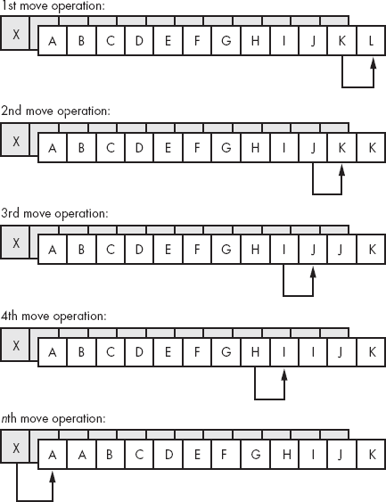

# 第十一章 字符串指令


*字符串*是存储在连续内存位置中的一组值。字符串通常是字节、字或（在 80386 及更高处理器上）双字的数组。80x86 微处理器家族支持几种专门设计用来处理字符串的指令。本章将探讨这些字符串指令的一些用途。

80x86 CPU 可以处理三种类型的字符串：字节字符串、字字符串和双字字符串。它们可以移动字符串、比较字符串、在字符串中查找特定值、将字符串初始化为固定值，并执行其他字符串基础操作。80x86 的字符串指令对于操作数组、表格和记录也非常有用。你可以使用字符串指令轻松地分配或比较这些数据结构。使用字符串指令可以显著加速数组操作代码。

# 11.1 80x86 字符串指令

80x86 系列的所有成员都支持五种不同的字符串指令：`movs`*`x`*、`cmps`*`x`*、`scas`*`x`*、`lods`*`x`* 和 `stosx`。^([128])（*`x`* = `b`、`w` 或 `d`，分别表示字节、字或双字；在一般讨论这些字符串指令时，通常会省略 *`x`* 后缀。）这些是构建其他大多数字符串操作的基础指令。如何使用这五条指令是接下来各节的主题。

```
For MOVS:
     movsb();
     movsw();
     movsd();

For CMPS:
     cmpsb();
     cmpsw();
     cmpsd();

For SCAS:
     scasb();
     scasw();
     scasd();

For STOS:
     stosb();
     stosw();
     stosd();

For LODS:
     lodsb();
     lodsw();
     lodsd();
```

## 11.1.1 字符串指令的操作方式

字符串指令作用于内存的块（连续线性数组）。例如，`movs` 指令将一串字节从一个内存位置移动到另一个位置。`cmps` 指令比较两个内存块。`scas` 指令扫描内存块以查找特定值。这些字符串指令通常需要三个操作数：目标块地址、源块地址和（可选的）元素计数。例如，在使用 `movs` 指令复制字符串时，你需要源地址、目标地址和计数（要移动的字符串元素数量）。

与其他操作内存的指令不同，字符串指令没有显式操作数。字符串指令的操作数如下：

+   ESI（源索引）寄存器

+   EDI（目标索引）寄存器

+   ECX（计数）寄存器

+   AL/AX/EAX 寄存器

+   FLAGS 寄存器中的方向标志

例如，`movs`（移动字符串）指令的一个变体将 ECX 个元素从由 ESI 指定的源地址复制到由 EDI 指定的目标地址。同样，`cmps` 指令将 ESI 指向的字符串（长度为 ECX）与 EDI 指向的字符串进行比较。

并不是所有的字符串指令都有源操作数和目的操作数（只有 `movs` 和 `cmps` 支持）。例如，`scas` 指令（扫描字符串）会将累加器中的值（AL、AX 或 EAX）与内存中的值进行比较。  

## 11.1.2 `rep`/`repe`/`repz` 和 `repnz`/`repne` 前缀  

字符串指令本身并不会对数据字符串进行操作。例如，`movs` 指令只会复制一个字节、字或双字。当执行 `movs` 指令时，它会忽略 ECX 寄存器中的值。重复前缀告诉 80x86 执行多字节的字符串操作。重复前缀的语法如下：  

```
For MOVS:
     rep.movsb();
     rep.movsw();
     rep.movsd();

For CMPS:
     repe.cmpsb();     // Note: repz is a synonym for repe.
     repe.cmpsw();
     repe.cmpsd();

     repne.cmpsb();    // Note: repnz is a synonym for repne.
     repne.cmpsw();
     repne.cmpsd();

For SCAS:
     repe.scasb();     // Note: repz is a synonym for repe.
     repe.scasw();
     repe.scasd();

     repne.scasb();    // Note: repnz is a synonym for repne.
     repne.scasw();
     repne.scasd();

For STOS:
     rep.stosb();
     rep.stosw();
     rep.stosd();
```

通常情况下，你不会将重复前缀与 `lods` 指令一起使用。  

当在字符串指令前加上重复前缀时，字符串指令会重复执行 ECX 次操作。^([129]) 没有重复前缀时，指令仅作用于单一元素（字节、字或双字）。  

你可以使用重复前缀通过单一指令处理整个字符串。你也可以在没有重复前缀的情况下使用字符串指令作为字符串的基本操作，进而合成更强大的字符串操作。  

## 11.1.3 方向标志  

除了 ESI、EDI、ECX 和 AL/AX/EAX 寄存器之外，还有一个寄存器控制 80x86 字符串指令的操作——EFLAG 寄存器。具体来说，标志寄存器中的 *方向标志* 控制 CPU 如何处理字符串。  

如果方向标志被清除，CPU 在操作每个字符串元素后会递增 ESI 和 EDI。例如，执行 `movs` 会将 ESI 处的字节、字或双字移动到 EDI，然后将 ESI 和 EDI 分别递增 1、2 或 4。当在此指令前加上 `rep` 前缀时，CPU 会根据 ECX 中指定的元素数量递增 ESI 和 EDI。执行完后，ESI 和 EDI 寄存器会指向字符串之外的第一个元素。  

如果方向标志被设置，80x86 在处理每个字符串元素后会递减 ESI 和 EDI（同样，ECX 指定字符串元素的数量）。在重复的字符串操作后，如果方向标志被设置，ESI 和 EDI 寄存器将指向字符串之前的第一个字节、字或双字。  

你可以使用 `cld`（清除方向标志）和 `std`（设置方向标志）指令来更改方向标志的值。当在过程内使用这些指令时，请记住它们会修改机器状态。因此，你可能需要在执行该过程时保存方向标志。以下示例展示了你可能遇到的问题。

```
procedure Str2; @nodisplay;
begin Str2;

          std();
     << Do some string operations. >>
          .
          .
          .
end Str2;
          .
          .
          .
          cld();
     << Do some operations. >>
          Str2();
     << Do some string operations requiring D=0\. >>
```

这段代码不会正常工作。调用代码假设 `Str2` 返回后方向标志已经清除，但实际上并非如此。因此，在调用 `Str2` 后执行的字符串操作将无法正常工作。  

解决这个问题有几种方法。第一个，也是最明显的方法，是在执行一个或多个字符串指令的序列之前，总是插入`cld`或`std`指令。这确保了你的代码中的方向标志始终被正确设置。另一种选择是使用`pushfd`和`popfd`指令来保存和恢复方向标志。使用这两种技巧，以上代码可以变成以下示例。

在字符串指令之前始终发出`cld`或`std`指令：

```
procedure Str2; @nodisplay;
begin Str2;

          std();
     << Do some string operations. >>
          .
          .
          .

end Str2;
          .
          .
          .
          cld();
     << Do some operations. >>
          Str2();
          cld();
     << Do some string operations requiring D=0\. >>
```

保存和恢复标志寄存器：

```
procedure Str2; @nodisplay;
begin Str2;

          pushfd();
          std();
     << Do some string operations. >>
          .
          .
          .
          popfd();
end Str2;
          .

          .
          cld();
     << Do some operations. >>
          Str2();
     << Do some string operations requiring D=0\. >>
```

如果你使用`pushfd`和`popfd`指令来保存和恢复标志寄存器，请记住，你是在保存和恢复所有的标志。这会让返回其他标志位的信息变得有些困难。例如，如果你使用`pushfd`和`popfd`来保留方向标志，那么在程序中返回进位标志的错误条件就需要一些额外的工作。

第三种解决方案是始终确保方向标志在特定需要设置它的指令序列之外是清除的。例如，许多库函数和一些操作系统总是假设在调用它们时，方向标志是清除的。例如，大多数标准 C 库函数就是这样工作的。你可以遵循这一约定，始终假设方向标志已被清除，并在需要使用`std`的序列后立即确保将其清除。

## 11.1.4 `movs`指令

`movs`指令使用以下语法：

```
movsb()
     movsw()
     movsd()
     rep.movsb()
     rep.movsw()
     rep.movsd()
```

`movsb`（移动字符串，字节）指令从地址 ESI 取出一个字节并存储到地址 EDI，然后将 ESI 和 EDI 寄存器递增或递减 1。如果存在`rep`前缀，CPU 会检查 ECX，看看它是否为 0。如果不是，CPU 就会将字节从 ESI 移动到 EDI，并将 ECX 寄存器递减。这个过程会重复，直到 ECX 变为 0。如果 ECX 在初次执行时就为 0，`movs`指令将不会复制任何数据字节。

`movsw`（移动字符串，字）指令从地址 ESI 取出一个字并存储到地址 EDI，然后将 ESI 和 EDI 分别递增或递减 2。如果存在`rep`前缀，则 CPU 会重复这个过程 ECX 次。

`movsd`指令在双字数据上以类似方式工作。每次数据移动后，它会将 ESI 和 EDI 递增或递减 4。

当你使用`rep`前缀时，`movsb`指令会移动你在 ECX 寄存器中指定的字节数。以下代码段将 384 个字节从`CharArray1`复制到`CharArray2`：

```
CharArray1: byte[ 384 ];
     CharArray2: byte[ 384 ];
          .
          .
          .
          cld();
          lea( esi, CharArray1 );
          lea( edi, CharArray2 );
          mov( 384, ecx );
          rep.movsb();
```

如果你将`movsw`替换为`movsb`，那么前面的代码将移动 384 个字（768 字节），而不是 384 个字节：

```
WordArray1: word[ 384 ];
     WordArray2: word[ 384 ];
          .
          .
          .
          cld();
          lea( esi, WordArray1 );
          lea( edi, WordArray2 );
          mov( 384, ecx );
          rep.movsw();
```

记住，ECX 寄存器包含的是元素计数，而不是字节计数。使用`movsw`指令时，CPU 会移动 ECX 寄存器指定数量的字。同样，`movsd`指令移动的是 ECX 寄存器指定的双字数，而不是字节数。

如果在执行 `movsb/movsw/movsd` 指令之前设置了方向标志，CPU 会在移动每个字符串元素后递减 ESI 和 EDI 寄存器。这意味着，在执行 `movsb`、`movsw` 或 `movsd` 指令之前，ESI 和 EDI 寄存器必须指向它们各自字符串的最后一个元素。例如：

```
CharArray1: byte[ 384 ];
     CharArray2: byte[ 384 ];
          .
          .
          .
          cld();
          lea( esi, CharArray1[383] );
          lea( edi, CharArray2[383] );
          mov( 384, ecx );
          rep.movsb();
```

尽管在某些情况下，从尾到头处理字符串是有用的（参见 11.1.5 cmps 指令 中的描述），但通常你会按正向方向处理字符串，因为这样更直接。有一类字符串操作，必须能够支持双向处理：当源和目标块重叠时，移动字符串。考虑以下代码中会发生什么：

```
CharArray1: byte;
     CharArray2: byte[ 384 ];
          .
          .
          .
          cld();
          lea( esi, CharArray1 );
          lea( edi, CharArray2 );
          mov( 384, ecx );
          rep.movsb();
```

这一指令序列将 `CharArray1` 和 `CharArray2` 视为一对 384 字节的字符串。然而，`CharArray1` 数组中的最后 383 个字节与 `CharArray2` 数组中的前 383 个字节重叠。我们来逐字节跟踪这段代码的操作。

当 CPU 执行 `movsb` 指令时，它会将 ESI 指向的字节（`CharArray1`）复制到 EDI 指向的字节（`CharArray2`）。然后，ESI 和 EDI 会递增，ECX 会减少 1，并重复这个过程。此时，ESI 寄存器指向 `CharArray1+1`（即 `CharArray2` 的地址），而 EDI 寄存器指向 `CharArray2+1`。`movsb` 指令将 ESI 指向的字节复制到 EDI 指向的字节。然而，这个字节原本是从 `CharArray1` 位置复制过来的。因此，`movsb` 指令将原本位于 `CharArray1` 位置的值同时复制到 `CharArray2` 和 `CharArray2+1`。再次，CPU 递增 ESI 和 EDI，递减 ECX，并重复这个操作。此时，`movsb` 指令将来自 `CharArray1+2`（即 `CharArray2+1`）的位置的字节复制到 `CharArray2+2` 的位置。但这依然是原本出现在 `CharArray1` 位置的值。每次循环的重复都会将 `CharArray1[0]` 中的下一个元素复制到 `CharArray2` 数组中下一个可用的位置。从图示来看，大致如下所示：图 11-1。

最终结果是，`movsb` 指令会在整个字符串中复制 `X`。`movsb` 指令将源操作数复制到内存位置，这个内存位置将成为下一次移动操作的源操作数，从而导致复制的发生。


图 11-1. 在两个重叠数组之间复制数据（正向方向）

如果你确实想在两个数组重叠的情况下将一个数组移动到另一个数组中，你应该从两个字符串的末尾开始，将源字符串的每个元素移动到目标字符串中，正如图 11-2 所示。

设置方向标志，并将 ESI 和 EDI 指向字符串的末尾，将允许你在两个字符串重叠且源字符串位于目标字符串较低地址处时（正确地）将一个字符串移动到另一个字符串。如果两个字符串重叠，且源字符串位于目标字符串的较高地址处，那么清除方向标志并将 ESI 和 EDI 指向两个字符串的开始处。

如果两个字符串没有重叠，那么你可以使用任一技术将字符串移动到内存中。通常，清除方向标志进行操作是最简单的，因此最有意义。



图 11-2. 使用向后复制复制重叠数组中的数据

你不应该使用`movs`*`x`*指令来用单一字节、字或双字值填充数组。另一个字符串指令，`stos`，在这方面要更合适。然而，对于元素为 1、2 或 4 字节的数组，你可以使用`movs`指令将整个数组初始化为第一个元素的内容。

`movs`指令在复制双字时有时比复制字节或字更高效。在某些系统中，使用`movsb`复制一个字节所需的时间通常与使用`movsd`复制一个双字所需的时间相同。因此，如果你要将大量字节从一个数组移动到另一个数组，如果你能使用`movsd`指令而不是`movsb`指令，复制操作会更快。如果你要移动的字节数是 4 的偶数倍，这就是一个微不足道的变化；只需将要复制的字节数除以 4，将此值加载到 ECX 中，然后使用`movsb`指令。如果字节数不能被 4 整除，则可以使用`movsd`指令复制数组中除了最后 1、2 或 3 字节之外的所有字节（即，将字节计数除以 4 后的余数）。例如，如果你想高效地移动 4,099 个字节，你可以通过以下指令序列来完成。

```
lea( esi, Source );
     lea( edi, Destination );
     mov( 1024, ecx );    // Copy 1024 dwords = 4096 bytes.
     rep.movsd();
     movsw();             // Copy bytes 4097 and 4098.
     movsb();             // Copy the last byte.
```

使用此技术复制数据时，从不需要超过三个`movs`*`x`*指令，因为你可以通过不超过两个`movsb`和`movsw`指令复制 1、2 或 3 字节。如果两个数组在双字边界上对齐，上述方案效率最高。如果没有对齐，你可能需要将`movsb`或`movsw`指令（或两者）移到`movsd`之前，这样`movsd`指令就可以与双字对齐的数据一起工作。

如果你在程序执行之前无法知道你正在复制的块的大小，你仍然可以使用类似以下代码来提高字节块移动的性能：

```
lea( esi, Source );
     lea( edi, Dest );
     mov( Length, ecx );
     shr( 2, ecx );     // Divide by 4.
     if( @nz ) then     // Only execute movsd if 4 or more bytes.

          rep.movsd();  // Copy the dwords.

     endif;
     mov( Length, ecx );
     and( %11, ecx );   // Compute (Length mod 4).
     if( @nz ) then     // Only execute movsb if #bytes/4 <> 0.

          rep.movsb();  // Copy the remaining 1, 2, or 3 bytes.

     endif;
```

在许多计算机系统中，`movsd` 指令提供了一种复制大量数据从一个位置到另一个位置的最快方法。虽然在某些 CPU 上，可能有更快的方式来复制数据，但最终内存总线的性能才是限制因素，而 CPU 通常比内存总线要快得多。因此，除非你有一个特殊的系统，否则编写复杂的代码来优化内存到内存的传输可能是浪费时间。另外请注意，英特尔在后续处理器上改善了 `movs`*`x`* 指令的性能，使得 `movsb` 在复制相同字节数时几乎和 `movsw` 及 `movsd` 一样高效。因此，在后期的 80x86 处理器上，直接使用 `movsb` 复制指定字节数可能比执行上述所有复杂的操作更高效。最重要的一点是：如果你对块移动的速度有要求，尝试几种不同的方式，并选择最快的方法（或者，如果它们的速度相同，选择最简单的方法，这种情况可能性很大）。

## 11.1.5 cmps 指令

`cmps` 指令用于比较两个字符串。CPU 将 EDI 引用的字符串与 ESI 指向的字符串进行比较。ECX 包含两个字符串的长度（当使用 `repe` 或 `repne` 前缀时）。与 `movs` 指令类似，HLA 允许此指令的几种不同形式：

```
cmpsb();
     cmpsw();
     cmpsd();

     repe.cmpsb();
     repe.cmpsw();
     repe.cmpsd();

     repne.cmpsb();
     repne.cmpsw();
     repne.cmpsd();
```

与 `movs` 指令类似，你在 ESI 和 EDI 寄存器中指定实际的操作数地址。

如果没有重复前缀，`cmps` 指令会将 EDI 位置的值与 ESI 位置的值进行相减，并更新标志位。除了更新标志位之外，CPU 不会使用这次相减得到的差值。比较两个位置后，`cmps` 会根据需要将 ESI 和 EDI 寄存器分别加 1、2 或 4（分别对应 `cmpsb/cmpsw/cmpsd`）。如果方向标志清除，`cmps` 会增加 ESI 和 EDI 寄存器的值，否则会减少它们。

当然，使用 `cmps` 指令来比较内存中的单个字节、字或双字时，你不会真正发挥它的强大功能。当你用它来比较整个字符串时，这条指令才会发挥真正的优势。使用 `cmps`，你可以比较字符串中的连续元素，直到找到匹配项或直到连续元素不匹配。

为了比较两个字符串是否相等或不相等，你必须比较字符串中的对应元素，直到它们不匹配。考虑以下字符串：

```
"String1"
"String1"
```

确定这两个字符串是否相等的唯一方法是将第一个字符串中的每个字符与第二个字符串中对应的字符进行比较。毕竟，第二个字符串可能是`String2`，而这显然与`String1`不相等。一旦你遇到目标字符串中的一个字符，它与源字符串中的对应字符不相等，比较就可以停止。你不需要再比较两个字符串中的其他字符。

`repe`前缀完成了此操作。它将比较字符串中的连续元素，只要它们相等且 ECX 大于 0。我们可以使用以下 80x86 汇编语言代码来比较上述两个字符串：

```
cld();
     mov( AdrsString1, esi );
     mov( AdrsString2, edi );
     mov( 7, ecx );
     repe.cmpsb();
```

在执行`cmpsb`指令之后，你可以使用标准的（无符号）条件跳转指令来测试标志位。这样，你可以检查相等、不相等、小于、大于等情况。

字符字符串通常使用*字典顺序*进行比较。在字典顺序中，字符串的最低有效元素权重最大。这与标准整数比较直接对立，在整数比较中，数字的最高有效部分权重最大。此外，只有当两个字符串在短字符串的长度范围内完全相同时，字符串的长度才会影响比较。例如，`Zebra`小于`Zebras`，因为它是两个字符串中较短的一个；然而，尽管`Zebra`较短，它仍然大于`AAAAAAAAAAH!`。字典顺序比较会逐个比较对应的字符，直到遇到不匹配的字符或到达较短字符串的末尾。如果一对对应的字符不匹配，则此算法根据该单个字符比较两个字符串。如果两个字符串在较短字符串的长度范围内匹配，我们必须比较它们的长度。只有当两个字符串的长度相等，并且两个字符串中的每一对对应字符都相同时，两个字符串才相等。字典顺序就是你从小到大习惯的标准字母排序。

对于字符字符串，请按以下方式使用`cmps`指令：

+   在比较字符串之前，必须清除方向标志。

+   使用`cmpsb`指令按字节逐个比较字符串。即使字符串包含偶数个字符，也不能使用`cmpsw`或`cmpsd`指令。它们不会按照字典顺序比较字符串。

+   你必须将 ECX 寄存器加载为较短字符串的长度。

+   使用`repe`前缀。

+   ESI 和 EDI 寄存器必须指向你想要比较的两个字符串中的第一个字符。

在执行`cmps`指令之后，如果两个字符串相等，它们的长度必须进行比较，以完成比较。以下代码比较了一对字符字符串：

```
mov( AdrsStr1, esi );
     mov( AdrsStr2, edi );
     mov( LengthSrc, ecx );
     if( ecx > LengthDest ) then  // Put the length of the
                                  // shorter string in ecx.
          mov( LengthDest, ecx );

     endif;
     repe.cmpsb();
     if( @z ) then                // If equal to the length of the
                                  // shorter string, cmp lengths.
          mov( LengthSrc, ecx );
          cmp( ecx, LengthDest );

     endif;
```

如果你使用字节来存储字符串的长度，你应该适当地调整这段代码（即，使用`movzx`指令将长度加载到 ECX 寄存器）。HLA 字符串使用双字来存储当前的长度值，因此在使用 HLA 字符串时并不会遇到这个问题。

你还可以使用`cmps`指令来比较多字整型值（即扩展精度的整型值）。由于字符串比较需要大量的准备工作，因此对于长度小于六或八个双字的整型值，使用这种方法并不实际，但对于大整型值，它是一个极好的比较方式。与字符字符串不同，我们不能使用字典序比较整数字符串。在比较字符串时，我们从最不重要的字节开始比较到最重要的字节。而在比较整数时，我们必须从最重要的字节（或字/双字）开始比较，直到最不重要的字节、字或双字。因此，要比较两个 32 字节（256 位）的整型值，可以在 80x86 上使用以下代码：

```
std();
     lea( esi, SourceInteger[28] );
     lea( edi, DestInteger[28] );
     mov( 8, ecx );
     rep.cmpsd();
```

这段代码从整型值的最重要的双字开始比较，直到最不重要的双字。`cmpsd`指令在两个值不相等或 ECX 递减为 0 时结束（表示两个值相等）。再次强调，标志提供了比较的结果。

`repne`前缀将指示`cmps`指令比较连续的字符串元素，只要它们不匹配。执行此指令后，80x86 标志几乎没有用。要么 ECX 寄存器为 0（表示两个字符串完全不同），要么它包含在两个字符串中比较的元素数量，直到找到匹配项为止。虽然这种形式的`cmps`指令在比较字符串时不太有用，但它对于在字节、字或双字数组中定位第一对匹配项很有用。一般来说，你很少会在`cmps`中使用`repne`前缀。

使用`cmps`指令时需要记住的一件事是：ECX 寄存器中的值决定了要处理的元素数量，而不是字节数。因此，当使用`cmpsw`时，ECX 指定要比较的字数。同样，对于`cmpsd`，ECX 包含要处理的双字数。

## 11.1.6 `scas`指令

`cmps`指令用于比较两个字符串。你不能使用它来查找字符串中的特定元素。例如，你不能使用`cmps`指令快速扫描另一个字符串中的 0。你可以使用`scas`（扫描字符串）指令来完成这个任务。

与`movs`和`cmps`指令不同，`scas`指令只需要一个目标字符串（由 EDI 指向），而不是源字符串和目标字符串。源操作数是 AL 寄存器中的值（`scasb`）、AX 寄存器中的值（`scasw`）或 EAX 寄存器中的值（`scasd`）。`scas`指令将累加器中的值（AL、AX 或 EAX）与 EDI 指向的值进行比较，然后根据比较结果将 EDI 增加或减少 1、2 或 4。CPU 根据比较结果设置标志。虽然这种操作偶尔会有用，但当使用`repe`和`repne`前缀时，`scas`指令要更加有用。

使用`repe`前缀（等值时重复），`scas`扫描字符串，寻找第一个不匹配累加器中值的元素。使用`repne`前缀（不等时重复），`scas`扫描字符串，寻找第一个与累加器中值匹配的字符串元素。

你可能会想，“为什么这些前缀做的完全是它们应该做的反方向？”前面的段落并没有完全正确地描述`scas`指令的操作。使用`repe`前缀与`scas`指令时，80x86 会在累加器中的值等于字符串操作数时扫描字符串。这相当于在字符串中搜索第一个不匹配累加器中值的元素。使用`scas`指令与`repne`前缀时，CPU 会在累加器中的值不等于字符串操作数时扫描字符串。显然，这种方式是在寻找字符串中第一个与累加器寄存器中的值匹配的值。`scas`指令有以下几种形式：

```
scasb()
     scasw()
     scasd()

     repe.scasb()
     repe.scasw()
     repe.scasd()

     repne.scasb()
     repne.scasw()
     repne.scasd()
```

像`cmps`和`movs`指令一样，ECX 寄存器中的值指定了要处理的元素数，而不是字节数，特别是在使用重复前缀时。

## 11.1.7 `stos`指令

`stos`指令将累加器中的值存储到由 EDI 指定的位置。存储完值后，CPU 根据方向标志的状态增加或减少 EDI。尽管`stos`指令有许多用途，但它的主要用途是将数组和字符串初始化为常量值。例如，如果你有一个 256 字节的数组并且想用零清空它，可以使用以下代码：

```
cld();
     lea( edi, DestArray );
     mov( 64, ecx );          // 64 double words = 256 bytes.
     xor( eax, eax );         // Zero out eax.
     rep.stosd();
```

这段代码写入的是 64 个双字，而不是 256 个字节，因为单次`stosd`操作比四次`stosb`操作更快。

`stos`指令有六种形式，它们是：

```
stosb();
     stosw();
     stosd();

     rep.stosb();
     rep.stosw();
     rep.stosd();
```

`stosb`指令将 AL 寄存器中的值存储到指定的内存位置，`stosw`指令将 AX 寄存器中的值存储到指定的内存位置，`stosd`指令将 EAX 寄存器中的值存储到指定的内存位置。

请记住，`stos`指令仅用于将字节、字或双字数组初始化为常量值。如果你需要初始化一个包含不同值的数组，不能使用`stos`指令。

## 11.1.8 `lods`指令

`lods`指令在所有字符串指令中是独特的。你可能永远不会在此指令中使用重复前缀。`lods`指令将 ESI 指针指向的字节、字或双字复制到 AL、AX 或 EAX 寄存器中，然后将 ESI 寄存器递增或递减 1、2 或 4。通过重复前缀来重复此指令几乎没有任何意义，因为每次`lods`指令重复时，累加器寄存器都会被覆盖。在重复操作结束时，累加器将包含最后一个从内存读取的值。

代替重复使用`rep`前缀，使用`lods`指令从内存中提取字节（`lodsb`）、字（`lodsw`）或双字（`lodsd`）进行进一步处理。通过使用`lods`和`stos`指令，你可以合成强大的字符串操作。

和`stos`指令一样，`lods`指令有六种形式：

```
lodsb();
     lodsw();
     lodsd();

     rep.lodsb();
     rep.lodsw();
     rep.lodsd();
```

如前所述，你几乎不会使用`rep`前缀与这些指令一起使用。^([130]) 80x86 会根据方向标志以及你使用`lodsb`、`lodsw`或`lodsd`指令的不同，分别以 1、2 或 4 的步长递增或递减 ESI 寄存器。

## 11.1.9 基于 lods 和 stos 构建复杂字符串函数

80x86 只支持五条不同的字符串指令：`movs`、`cmps`、`scas`、`lods`和`stos`。^([131]) 这些当然不是你永远会使用的唯一字符串操作。然而，你可以利用`lods`和`stos`指令轻松生成任何你想要的特定字符串操作。例如，假设你想要一个字符串操作，将字符串中的所有大写字母转换为小写字母。你可以使用以下代码：

```
mov( StringAddress, esi );  // Load string address into esi.
     mov( esi, edi );            // Also point edi here.
     mov( (type str.strRec [esi]).length, ecx );

     repeat

          lodsb();               // Get the next character in the string.
          if( al in 'A'..'Z' ) then

               or( $20, al );    // Convert uppercase to lowercase.

          endif;
          stosb();               // Store converted char into string.
          dec( ecx );

     until( @z );                // Zero flag is set when ecx is 0.
```

因为`lods`和`stos`指令使用累加器作为中介位置，你可以利用任何累加器操作来快速操作字符串元素。

* * *

^([128]) 80x86 处理器支持两条额外的字符串指令，`ins`和`outs`，它们分别从输入端口输入字符串数据或将字符串数据输出到输出端口。我们不会考虑这些指令，因为它们是特权指令，你不能在标准 32 位操作系统应用程序中执行它们。

^([129]) 除了`cmps`指令，它最多重复 ECX 寄存器中指定的次数。

^([130]) 它们之所以出现在这里，仅仅是因为它们是允许的。它们并不是很有用，但确实被允许。此类指令的唯一用途大概是“触碰”缓存中的项，以便它们被预加载到缓存中。然而，还有更好的方法可以实现这一点。

^([131]) 不包括`ins`和`outs`，我们在这里忽略它们。

# 11.2 80x86 字符串指令的性能

在早期的 80x86 处理器中，字符串指令提供了操作字符串和数据块的最有效方式。然而，这些指令并不是 Intel 的 RISC Core 指令集的一部分，因此，它们可能比使用离散指令执行相同操作要慢。Intel 在后来的处理器上优化了 `movs` 指令，使其尽可能快速运行，但其他字符串指令可能会相对较慢。像往常一样，建议使用不同的算法（包括和不包括字符串指令的版本）来实现性能关键的算法，并比较它们的性能，以确定使用哪种解决方案。

请记住，字符串指令的执行速度相对于其他指令会根据所使用的处理器而有所不同。因此，最好在你期望代码运行的处理器上进行实验。请注意，在大多数处理器上，`movs` 指令比对应的离散指令要快。Intel 努力优化 `movs`，因为许多对性能敏感的代码都在使用它。

尽管字符串指令可能比离散指令更慢，但毫无疑问，字符串指令通常比实现相同结果的离散代码更加紧凑。

# 11.3 更多信息

HLA 标准库包含数百个你可能会觉得有用的字符串和模式匹配函数。所有这些都以源代码形式出现在 [`www.artofasm.com/`](http://www.artofasm.com/) 或 [`webster.cs.ucr.edu/`](http://webster.cs.ucr.edu/) 上；如果你想查看一些字符串指令的实际例子，应该查阅一些源代码。还要注意，HLA 标准库中的某些例程使用离散指令来实现某些高性能算法。你可能会想查看这些代码作为此类代码的例子。本书的 16 位版本（出现在网站上）讨论了使用 80x86 字符串指令实现多个字符字符串函数的问题。查阅该版本以获得更多示例（这些示例由于字符串指令的性能问题未出现在这里）。最后，关于字符串函数的更多一般信息，请查阅 HLA 标准库参考手册，它解释了 HLA 标准库中字符串和模式匹配函数的操作。
