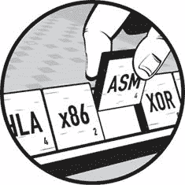
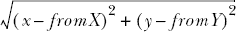
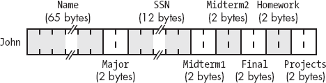
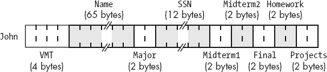
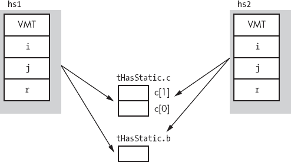
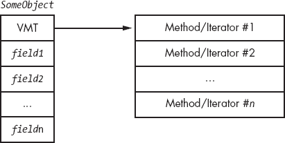
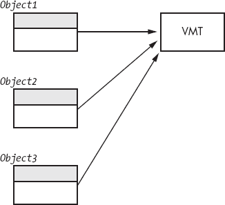
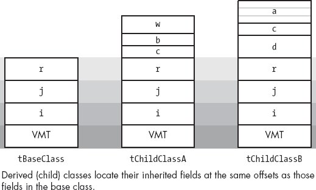
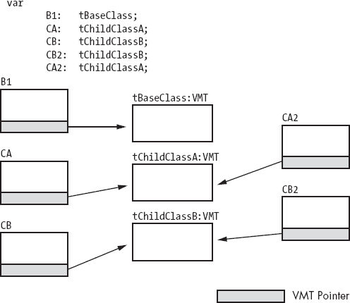
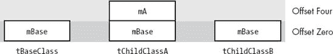

# 第十二章 类和对象



许多现代高级语言支持类和对象的概念。C++（C 语言的面向对象版本）、Java 和 Delphi（Pascal 的面向对象版本）就是很好的例子。当然，这些高级语言编译器将源代码转换成低级机器代码，所以应该很明显，机器代码中存在某种机制来实现类和对象。

尽管在机器代码中实现类和对象一直是可能的，但大多数汇编器在编写面向对象的汇编语言程序时提供的支持较差。HLA 不会受到这个缺点的影响，因为它为编写面向对象的汇编语言程序提供了良好的支持。本章将讨论面向对象编程（OOP）的基本原则以及 HLA 如何支持 OOP。

# 12.1 一般原则

在讨论 OOP 背后的机制之前，最好先退一步，探讨一下使用 OOP 的好处（尤其是在汇编语言程序中）。大多数描述 OOP 好处的书籍会使用一些流行词汇，如*代码重用*、*抽象数据类型*、*提高开发效率*等。尽管这些特性都很不错，是编程范式的优点，但一个好的软件工程师会质疑在“提高开发效率”是重要目标的环境中使用汇编语言。毕竟，使用高级语言（即使不是 OOP 方式）比在汇编语言中使用对象可能更能获得更好的效率。如果 OOP 的声称特性似乎不适用于汇编语言编程，那么为什么还要在汇编中使用 OOP 呢？本节将探讨一些这些原因。

你首先需要意识到的是，使用汇编语言并不会否定上述的 OOP 好处。汇编语言中的 OOP 确实促进了代码重用。它提供了一种实现抽象数据类型的好方法，而且它能够*提高汇编语言中的开发效率*。换句话说，如果你坚定地想使用汇编语言，那么使用 OOP 是有好处的。

为了理解面向对象编程（OOP）的主要好处之一，可以考虑全局变量的概念。大多数编程书籍强烈建议不要在程序中使用全局变量（本书也是如此）。通过全局变量进行跨过程通信是危险的，因为在大型程序中，很难追踪到所有可能修改给定全局对象的地方。更糟的是，在进行增强时，意外地重新使用全局对象来做原本不打算做的事情是非常容易的；这往往会导致系统出现缺陷。

尽管全局变量存在众所周知的问题，全局对象的语义（延长的生命周期和来自不同过程的可访问性）在各种情况下绝对是必要的。对象通过让程序员确定对象的生命周期^([132])以及允许从不同过程访问数据字段来解决这个问题。在许多方面，对象比简单的全局变量有几个优势，因为对象可以控制对它们的数据字段的访问（使得过程无意中访问数据变得困难），而且你还可以创建对象的多个实例，允许程序的不同部分使用自己独特的“全局”对象而不受其他部分的干扰。

当然，对象还具有许多其他宝贵的特性。关于对象和面向对象编程的好处，可以写下几卷书来讨论；这一章节无法全面展示这个主题。本章以在 HLA/汇编程序中使用对象为目标。然而，如果你对面向对象编程是新手或者希望获取更多关于面向对象范式的信息，你应该参考其他关于这一主题的文献。

类和对象的一个重要用途是创建*抽象数据类型（ADT）*。抽象数据类型是数据对象的集合，以及操作这些数据的函数（我们称之为*方法*）。在纯粹的抽象数据类型中，ADT 的方法是唯一能够访问 ADT 数据字段的代码；外部代码只能通过函数调用来获取或设置数据字段的值（这些是 ADT 的*访问器*方法）。在现实生活中，出于效率的原因，大多数支持 ADT 的语言允许外部代码至少有限地访问 ADT 的数据字段。

汇编语言并不是大多数人与 ADT 关联的语言。尽管如此，HLA 提供了几个功能来允许创建基本的 ADT。虽然有些人可能会认为 HLA 的功能不如像 C++或 Java 这样的语言完整，但要记住，这些差异存在是因为 HLA 是一种汇编语言。

真正的 ADT 应该支持*信息隐藏*。这意味着 ADT 不允许 ADT 的用户访问内部数据结构和操作这些结构的例程。实质上，信息隐藏将 ADT 的访问限制为 ADT 的访问器方法。当然，汇编语言提供的限制非常少。如果你坚决要直接访问一个对象，HLA 几乎无法阻止你这样做。然而，HLA 提供了一些设施，可以提供一种有限形式的信息隐藏。结合你的一些注意，你将能够在你的程序中享受信息隐藏的许多好处。

HLA 提供的主要支持信息隐藏的功能包括单独编译、可链接模块和`#include/#includeonce`指令。为了我们的目的，抽象数据类型定义将由两个部分组成：*接口*部分和*实现*部分。

接口部分包含必须对应用程序可见的定义。通常，它不应包含任何允许应用程序违反信息隐藏原则的特定信息，但考虑到汇编语言的性质，这通常是不可能的。尽管如此，你应尽量仅在接口部分公开绝对必要的信息。

实现部分包含实际实现 ADT 的代码、数据结构等。虽然实现部分中出现的一些方法和数据类型可能是公共的（由于出现在接口部分），但许多子程序、数据项等将是实现代码私有的。实现部分是你隐藏所有细节的地方，避免暴露给应用程序。

如果你希望在未来某个时间修改抽象数据类型，你只需要更改接口和实现部分。除非你删除一些应用程序正在使用的以前可见的对象，否则完全不需要修改应用程序。

尽管你可以将接口和实现部分直接放入应用程序中，但这不会促进信息隐藏或可维护性，特别是当你需要在多个不同的应用程序中包含这段代码时。最好的方法是将实现部分放入一个包含文件中，任何需要的应用程序可以使用 HLA 的`#include`指令读取该文件，并将实现部分放入一个单独的模块中，与你的应用程序链接。

包含文件将包含`external`指令、任何必要的宏以及你希望公开的其他定义。通常，它不会包含 80x86 代码，除非在某些宏中。应用程序如果需要使用 ADT，它会包含这个文件。

包含实现部分的单独汇编文件将包含所有的过程、函数、数据对象等，用于实际实现抽象数据类型（ADT）。那些你希望公开的名称应该出现在接口包含文件中，并具有`external`属性。你还应该在实现文件中包含接口包含文件，这样就不需要维护两组`external`指令。

使用过程作为数据访问方法的一个问题是，许多访问方法特别简单（例如，仅一个 `mov` 指令），而调用和返回指令的开销对于这种简单的操作来说是昂贵的。例如，假设你有一个抽象数据类型（ADT），其数据对象是一个结构，但你不希望将字段名称暴露给应用程序，并且你真的不希望允许应用程序直接访问数据结构的字段（因为数据结构可能会在未来发生变化）。处理这种情况的常见方法是提供一个 `GetField` 方法，该方法返回所需字段的值。然而，如上所述，这可能非常慢。对于简单的访问方法，替代方案是使用宏来生成访问所需字段的代码。尽管直接访问数据对象的代码会出现在应用程序中（通过宏展开），但如果你在接口部分更改宏，重新编译将自动更新它。

尽管完全可以仅通过单独编译和可能的记录来创建抽象数据类型，但 HLA 提供了更好的解决方案：类。继续阅读，了解 HLA 对类和对象的支持以及如何使用它们来创建抽象数据类型。

* * *

^([132]) 生命周期指的是系统为对象分配内存的时间。

# 12.2 HLA 中的类

从根本上说，*类* 是一种记录声明，它允许定义非数据字段（例如，过程、常量和宏）。将其他对象包含在类定义中极大地扩展了类的功能。例如，通过类现在可以轻松定义抽象数据类型（ADT），因为类可以包含数据和对数据进行操作的方法（过程）。

在 HLA 中创建抽象数据类型的主要方式是声明一个类数据类型。HLA 中的类总是出现在 `type` 部分，并使用以下语法：

```
classname : class

               << Class declaration section >>

          endclass;
```

类声明部分与过程的局部声明部分非常相似，它允许声明`const`、`val`、`var`、`storage`、`readonly`、`static` 和 `proc` 变量。类还允许你定义宏，并指定过程、迭代器、^([133]) 以及 *方法* 原型（方法声明仅在类中合法）。这一列表中显著缺少的是类型声明部分。你不能在类中声明新类型。

*方法* 是一种特殊类型的过程，只出现在类内部。稍后你将看到过程和方法之间的区别；现在你可以将它们视为相同。除了关于类初始化和使用指向类的指针的几个微妙细节外，它们的语义是相同的。^([134]) 通常，如果你不确定在类中是使用过程还是方法，最安全的选择是使用方法。

你不需要将过程/迭代器/方法代码放在类中。相反，你只需提供这些例程的*原型*。一个例程原型由`procedure`、`iterator`或`method`保留字、例程名称、任何参数以及一些可选的过程属性（`@use`、`@returns`和`external`）组成。实际的例程定义（例程的主体及其所需的任何局部声明）出现在类外部。

以下示例演示了一个典型的类声明，出现在`type`部分：

```
TYPE
     TypicalClass:  class

          Const
               TCconst := 5;

          Val
               TCval := 6;

          var
               TCvar : uns32; // Private field used only by TCproc.

          static
               TCstatic : int32;

          procedure TCproc( u:uns32 ); @returns( "eax" );
          iterator TCiter( i:int32 ); external;

          method TCmethod( c:char );

     endclass;
```

如你所见，类与 HLA 中的记录非常相似。事实上，你可以把记录看作是只允许`var`声明的类。HLA 实现类的方式与记录非常相似，因为它将顺序数据字段分配到顺序的内存位置。事实上，除了一个小例外之外，`record`声明和只有`var`声明部分的`class`声明之间几乎没有区别。稍后你将看到 HLA 是如何实现类的，但现在你可以假设 HLA 的实现方式与记录相同，这样你就不会偏离主题太远。

你可以像访问记录的字段一样访问`TCvar`和`TCstatic`字段（如上面的类）。你也可以以类似的方式访问`const`和`val`字段。如果一个`TypicalClass`类型的变量名为`obj`，你可以如下访问`obj`的字段：

```
mov ( obj.TCconst, eax );
    mov( obj.TCval, ebx );
    add( obj.TCvar, eax );
    add( obj.TCstatic, ebx );
    obj.TCproc( 20 );  // Calls the TCproc procedure in TypicalClass.
    etc.
```

如果一个应用程序包含上述类声明，它可以使用`TypicalClass`类型创建变量，并使用提到的方法执行操作。不幸的是，应用程序也可以肆意访问该 ADT 的字段。例如，如果程序创建了一个`TypicalClass`类型的变量`MyClass`，则它可以轻松执行像`mov( MyClass.TCvar, eax );`这样的指令，即使该字段可能是实现部分的私有字段。不幸的是，如果你打算允许应用程序声明一个`TypicalClass`类型的变量，字段名称就必须是可见的。虽然我们可以通过一些技巧来隐藏 HLA 类定义中的私有字段，但最好的解决方案是彻底注释私有字段，并在访问该类的字段时保持一定的克制。具体来说，这意味着你使用 HLA 的类创建的 ADT 不能是“纯”ADT，因为 HLA 允许直接访问数据字段。然而，只要有一些自律，你可以通过简单地选择不在类的方法、过程和迭代器之外访问这些字段来模拟一个纯 ADT。

类中的原型实际上是前向声明。像普通的前向声明一样，你在类中定义的所有过程、迭代器和方法必须在代码的后面有实际实现。或者，你可以在类中的过程、迭代器或方法声明的末尾附加`external`选项，以通知 HLA 实际的代码出现在一个单独的模块中。通常，类声明出现在头文件中，并表示 ADT 的接口部分。过程、迭代器和方法的主体出现在实现部分，通常是一个单独的源文件，你将其单独编译并与使用该类的模块进行链接。

以下是一个示例类过程实现的例子：

```
procedure TypicalClass.TCproc( u:uns32 ); @nodisplay;
     << Local declarations for this procedure >>
begin TCproc;

     << Code to implement whatever this procedure does >>

end TCProc;
```

标准过程声明和类过程声明之间有几个区别。首先，也是最明显的，过程名称包括类名（例如，`TypicalClass.TCproc`）。这将类过程定义与一个仅恰好叫做`TCproc`的常规过程区分开来。然而请注意，你不需要在过程的`begin`和`end`子句中重复类名（这与在 HLA 命名空间中定义的过程类似）。

类过程和非类过程之间的第二个区别不那么明显。某些过程属性（`@use`、`external`、`@returns`、`@cdecl`、`@pascal`和`@stdcall`）仅在类中的原型声明中合法，而其他属性（`@noframe`、`@nodisplay`、`@noalignstack`和`@align`）仅在过程定义中合法，而不能出现在类中。幸运的是，如果你将选项放在错误的位置，HLA 会提供有用的错误消息，因此你不需要记住这个规则。

如果类例程的原型没有`external`选项，则包含类声明的编译单元（即程序或单元）必须同时包含该例程的定义，否则 HLA 会在编译结束时生成错误。对于小型的本地类（即当你将类声明和例程定义嵌入到同一个编译单元中时），惯例是将类的过程、迭代器和方法定义放在类声明之后不久的源文件中。对于较大的系统（即在单独编译类的例程时），惯例是将类声明单独放在头文件中，将所有过程、迭代器和方法定义放在一个单独的 HLA 单元中并单独编译。

* * *

^([133]) 本文不讨论迭代器。有关这种类型的函数，请参阅 HLA 参考手册。

^([134]) 然而，请注意，过程与方法之间的差异对于面向对象编程范式至关重要，因此 HLA 的类定义中包括了方法。

# 12.3 对象

记住，类定义只是一个类型。因此，当你声明一个类类型时，你并没有创建一个可以操作其字段的变量。一个 *对象* 是一个 *实例*；也就是说，对象是一个类型为某个类的变量。你声明对象（即类变量）与声明其他变量的方式相同：在 `var`、`static` 或 `storage` 部分。^([135]) 这里是一个示例对象声明对：

```
var
     T1: TypicalClass;
     T2: TypicalClass;
```

对于给定的类对象，HLA 为类声明的 `var` 部分中出现的每个变量分配存储空间。如果你有两个 `TypicalClass` 类型的对象 `T1` 和 `T2`，那么 `T1.TCvar` 是唯一的，`T2.TCvar` 也是唯一的。这是直观的结果（类似于 `record` 声明）；你在类中定义的大多数数据字段会出现在类的 `var` 声明部分。

静态数据对象（例如，你在类声明的 `static` 或 `storage` 部分声明的对象）在该类的对象中不是唯一的；也就是说，HLA 只分配一个静态变量，所有该类的变量共享该变量。例如，考虑以下（部分）类声明和对象声明：

```
type
     sc: class

          var
               i:int32;

          static
               s:int32;
               .
               .
               .
     endclass;

var
     s1: sc;
     s2: sc;
```

在这个例子中，`s1.i` 和 `s2.i` 是不同的变量。然而，`s1.s` 和 `s2.s` 是彼此的别名。因此，像 `mov(5, s1.s);` 这样的指令也会将 5 存储到 `s2.s` 中。通常，你使用静态类变量来保持关于整个类的信息，而使用类 `var` 对象来保持关于特定对象的信息。由于追踪类信息相对较少见，因此你可能会将大多数类数据字段声明在 `var` 部分。

你还可以创建类的动态实例，并通过指针引用这些动态对象。事实上，这可能是对象存储和访问中最常见的形式。以下代码演示了如何创建指向对象的指针，以及如何动态分配对象的存储：

```
var
     pSC: pointer to sc;
          .
          .
          .
     mem.alloc( @size( sc ) );
     mov( eax, pSC );
          .
          .
          .
     mov( pSC, ebx );
     mov( (type sc [ebx]).i, eax );
```

请注意使用类型转换将 EBX 中的指针强制转换为 `sc` 类型。

* * *

^([135]) 从技术上讲，你也可以在 `readonly` 部分声明一个对象，但 HLA 不允许你定义类常量，因此在 `readonly` 部分声明类对象的实用性不大。

# 12.4 继承

继承是面向对象编程中最基本的概念之一。基本思想是一个类继承或复制某个类的所有字段，然后可能会扩展新数据类型的字段数量。例如，假设你创建了一个描述平面（二维）空间中的点的数据类型 `point`。该 `point` 类可能如下所示：

```
type
     point: class

          var
               x:int32;
               y:int32;

          method distance;

     endclass;
```

假设你想在 3D 空间中创建一个 `point`，而不是在 2D 空间中。你可以像下面这样轻松地构建一个数据类型：

```
type
     point3D: class inherits( point )

          var
               z:int32;

     endclass;
```

`class` 声明中的 `inherits` 选项告诉 HLA 将 `point` 的字段插入到类的开头。在这种情况下，`point3D` 继承了 `point` 的字段。HLA 总是将继承的字段放在类对象的开头。稍后你会明白为什么这样做。如果你有一个 `point3D` 的实例，叫做 `P3`，那么以下 80x86 指令都是合法的：

```
mov( P3.x, eax );
     add( P3.y, eax );
     mov( eax, P3.z );
     P3.distance();
```

请注意，在此示例中调用的 `p3.distance` 方法调用的是 `point.distance` 方法。除非你真的想这么做（参见下一节的详细信息），否则你不必为 `point3D` 类编写一个单独的 `distance` 方法。就像 `x` 和 `y` 字段一样，`point3D` 对象继承了 `point` 的方法。

# 12.5 重写

*重写* 是将继承类中现有的方法替换为更适合新类的方法的过程。在前一节中出现的 `point` 和 `point3D` 示例中，`distance` 方法（推测）计算的是从原点到指定点的距离。对于一个位于二维平面上的点，你可以使用以下函数来计算距离：

| *d = √ x² + y²* |
| --- |

然而，3D 空间中一个点的距离是通过这个公式给出的：

| *d = √ x² + y² + z²* |
| --- |

很明显，如果你对一个 `point3D` 对象调用 `point` 的 `distance` 函数，你将得到一个错误的结果。然而，在前一节中，你看到 `P3` 对象调用了从 `point` 类继承来的 `distance` 函数。因此，这将产生一个不正确的结果。

在这种情况下，`point3D` 数据类型必须用一个计算正确值的方法重写 `distance` 方法。你不能仅仅通过添加 `distance` 方法原型来重新定义 `point3D` 类：

```
type
     point3D:     class inherits( point )

          var
               z:int32;
          method distance; // This doesn't work!
     endclass;
```

上面 `distance` 方法声明的问题在于，`point3D` 已经有一个 `distance` 方法——它是从 `point` 类继承过来的。HLA 会抱怨，因为它不喜欢在一个类中有两个同名的方法。

为了解决这个问题，我们需要某种机制，能够重写 `point.distance` 的声明，并将其替换为 `point3D.distance` 的声明。为此，你在方法声明之前使用 `override` 关键字：

```
type
     point3D: class inherits( point )

          var
               z:int32;

          override method distance; // This will work!

     endclass;
```

`override` 前缀告诉 HLA 忽略 `point3D` 从 `point` 类继承了一个名为 `distance` 的方法。现在，任何通过 `point3D` 对象调用 `distance` 方法都会调用 `point3D.distance` 方法，而不是 `point.distance`。当然，一旦你使用 `override` 前缀重写了一个方法，你必须在代码的实现部分提供该方法。例如：

```
method point3D.distance; @nodisplay;

     << Local declarations for the distance function >>

begin distance;

     << Code to implement the distance function >>

end distance;
```

# 12.6 虚方法与静态过程

稍早些时候，本章建议你可以将类方法和类过程视为相同。事实上，这两者之间有一些重大区别（毕竟，如果它们相同，为什么还要有方法呢？）。实际上，方法和过程之间的区别在你想开发面向对象程序时至关重要。方法提供了支持真正多态所需的第二个特性：虚拟过程调用。^([136]) 虚拟过程调用只不过是间接过程调用（使用与对象关联的指针）的一个花哨名称。虚拟过程的关键好处是，当使用指向通用对象的指针时，系统会自动调用正确的方法。

考虑以下使用前面章节中`point`类的声明：

```
var
     P2: point;
     P:  pointer to point;
```

根据上述声明，以下汇编语句都是合法的：

```
mov( P2.x, eax );
     mov( P2.y, ecx );
     P2.distance();       // Calls point3D.distance.

     lea( ebx, P2 );      // Store address of P2 into P.
     mov( ebx, P );
     P.distance();        // Calls point.distance.
```

请注意，HLA 允许你通过指向对象的指针而不是通过对象变量直接调用方法。这是 HLA 中对象的一个关键特性，也是实现*虚拟方法调用*的关键。

多态和继承背后的魔力在于对象指针是*通用的*。通常，当你的程序通过指针间接引用数据时，指针的值应该是与该指针相关联的基础数据类型的某个值的地址。例如，如果你有一个指向 16 位无符号整数的指针，通常你不会用这个指针访问一个 32 位有符号整数值。类似地，如果你有一个指向某个记录的指针，通常你不会将该指针强制转换为其他记录类型并访问该类型的字段。^([137]) 然而，对于指向类对象的指针，我们可以稍微放宽这一限制。指向对象的指针可以合法地包含该对象类型的地址*或包含该类型字段的任何继承对象的地址*。考虑以下使用前面示例中的`point`和`point3D`类型的声明：

```
var
     P2: point;
     P3: point3D;
     p:  pointer to point;
          .
          .
          .

     lea( ebx, P2 );
     mov( ebx, p );
     p.distance();         // Calls the point.distance method.
          .
          .
          .
     lea( ebx, P3 );
     mov( ebx, p );        // Yes, this is semantically legal.
     p.distance();         // Surprise, this calls point3D.distance.
```

因为`p`是指向`point`对象的指针，所以直觉上看，`p.distance`应该调用`point.distance`方法。然而，方法是*多态的*。如果你有一个指向某个对象的指针，并且调用与该对象关联的方法，系统会调用与该对象关联的实际（重写的）方法，而不是与指针的类类型专门关联的方法。

类过程与方法在重写过程中行为有所不同。当通过对象指针间接调用类过程时，系统将始终调用与底层类相关联的过程。因此，如果在之前的示例中`distance`是一个过程而非方法，那么`p.distance()`的调用将始终调用`point.distance`，即使`p`指向的是`point3D`对象。12.9 构造函数和对象初始化解释了为什么方法和过程是不同的。

* * *

^([136]) *多态性*字面意思是“多面性”。在面向对象编程中，多态性意味着相同的方法名称，例如`distance`，可以指代多个不同的方法。

^([137]) 当然，汇编语言程序员经常违反这种规则。暂时假设我们遵守规则，仅通过与指针相关的数据类型访问数据。

# 12.7 编写类方法和过程

对于类定义中出现的每个类过程和方法原型，程序中必须有一个对应的过程或方法（为了简洁起见，本节将使用*例程*来指代过程或方法）。如果原型中没有包含`external`选项，则代码必须出现在与类声明相同的编译单元中。如果原型包含`external`选项，那么代码可以出现在相同的编译单元中，或者是不同的编译单元中（只要将生成的目标文件与包含类声明的代码链接起来）。像外部（非类）过程一样，如果未提供代码，链接器将在你尝试创建可执行文件时报错。为了减少以下示例的大小，它们将把例程定义在与类声明相同的源文件中。

HLA 类例程必须始终在编译单元中的类声明之后。如果你在一个单独的单元中编译你的例程，类声明仍然必须出现在类例程实现之前（通常通过`#include`文件）。如果在定义像`point.distance`这样的例程时尚未定义类，HLA 将无法知道`point`是一个类，因此也不知道如何处理该例程的定义。

请考虑以下`point2D`类的声明：

```
type
     point2D: class
         const
              UnitDistance: real32 := 1.0;

         var
              x: real32;
              y: real32;

         static
              LastDistance: real32;

         method distance
         (
             fromX: real32;
             fromY: real32
         ); @returns( "st0" );
         procedure InitLastDistance;

     endclass;
```

该类的`distance`函数应计算对象的点到`(fromX,fromY)`的距离。以下公式描述了该计算：



编写`distance`方法的第一次尝试可能会产生如下代码：

```
method point2D.distance( fromX:real32; fromY:real32 ); @nodisplay;
begin distance;

     fld( x );       // Note: this doesn't work!
     fld( fromX );   // Compute (x-fromX)
     fsubp();
     fld( st0 );     // Duplicate value on TOS.
     fmulp();        // Compute square of difference.

     fld( y );       // This doesn't work either.
     fld( fromY );   // Compute (y-fromY)
     fsubp();
     fld( st0 );     // Compute the square of the difference.
     fmulp();
     faddp();
     fsqrt();

end distance;
```

这段代码看起来应该能够正常工作，对于熟悉面向对象编程语言（如 C++或 Delphi）的人来说。然而，正如注释所指出的，推送`x`和`y`变量到 FPU 堆栈的指令不起作用；HLA 不会自动在类的例程中定义与类的数据字段相关的符号。

要学习如何在类的例程中访问类的数据字段，我们需要稍微回顾一下，并讨论一些关于 HLA 类的非常重要的实现细节。为此，请考虑以下变量声明：

```
var
     Origin:    point2D;
     PtInSpace: point2D;
```

记住，每当你创建像`Origin`和`PtInSpace`这样的两个对象时，HLA 会为这两个对象的`x`和`y`数据字段保留存储空间。然而，内存中只有一个`point2D.distance`方法的副本。因此，如果你调用`Origin.distance`和`PtInSpace.distance`，系统会为这两个方法调用调用相同的例程。一旦进入该方法，我们不得不想知道像`fld( x );`这样的指令会做什么。它如何将`x`与`Origin.x`或`PtInSpace.x`关联起来？更糟糕的是，这段代码如何区分数据字段`x`和全局对象`x`？在 HLA 中，答案是，它不会。你不能仅仅像使用普通变量一样通过名字来指定类例程中的数据字段名称。

为了在类的例程中区分`Origin.x`和`PtInSpace.x`，HLA 会自动在调用类例程时传递一个指向对象数据字段的指针。因此，你可以通过这个指针间接引用数据字段。HLA 将此对象指针传递给 ESI 寄存器。这是 HLA 生成的代码会在你不注意的情况下修改 80x86 寄存器的少数几个地方之一：*每当你调用一个类例程时，HLA 会自动加载 ESI 寄存器，指向对象的地址*。显然，你不能指望 ESI 的值在类例程调用之间被保留，也不能通过 ESI 寄存器向类例程传递参数（尽管指定`@use esi;`来允许 HLA 在设置其他参数时使用 ESI 寄存器是完全合理的）。对于类方法（但不是过程），HLA 还会将 EDI 寄存器加载为类的*虚拟方法表*的地址。虽然虚拟方法表地址不像对象地址那样重要，但请记住，*HLA 生成的代码在你调用类方法或迭代器时会覆盖 EDI 寄存器中的任何值*。同样，"EDI"是类方法的`@use`操作数的一个好选择，因为无论如何 HLA 都会清除 EDI 中的值。

当进入类例程时，ESI 包含一个指向与类相关的（非静态）数据字段的指针。因此，要访问像`x`和`y`这样的字段（在我们的`point2D`示例中），你可以使用如下的地址表达式：

```
(type point2D [esi]).x
```

因为你使用 ESI 作为对象数据字段的基地址，所以最好不要在类例程中更改 ESI 的值（或者，至少在你必须使用 ESI 进行其他操作的代码段中保留 ESI 的值）。请注意，在方法内部你不必保留 EDI（除非出于某种原因需要访问虚拟方法表，这种情况不太可能）。

在类的例程中访问数据对象的字段是非常常见的操作，HLA 为此提供了简写符号，用于将 ESI 转换为指向类对象的指针：`this`。在 HLA 中的类内，保留字`this`会自动扩展为类似`(type` *`classname`* `[esi])`的字符串，当然会将适当的类名替换为*`classname`*。使用`this`关键字后，我们可以（正确地）将前面的 distance 方法重写如下：

```
method point2D.distance( fromX:real32; fromY:real32 ); @nodisplay;
begin distance;

          fld( this.x );
          fld( fromX );     // Compute (x-fromX).
          fsubp();
          fld( st0 );       // Duplicate value on TOS.
          fmulp();          // Compute square of difference.

          fld( this.y );
          fld( fromY );     // Compute (y-fromY).
          fsubp();
          fld( st0 );       // Compute the square of the difference.
          fmulp();
          faddp();
          fsqrt();

end distance;
```

别忘了，调用类例程会清除 ESI 寄存器中的值。这一点从例程调用的语法中并不明显。特别是在从另一个类例程内部调用某个类例程时，很容易忘记这一点；记住，如果你这样做，内部调用会清除 ESI 中的值，并且从该调用返回时，ESI 将不再指向原始对象。在这种情况下，始终推送和弹出 ESI（或以其他方式保留 ESI 的值）。例如：

```
.
      .
      .
      fld( this.x );         // esi points at current object.
      .
      .
      .
      push( esi );           // Preserve esi across this method call.
      *`SomeObject`*.*`SomeMethod`*();
      pop( esi );
      .
      .
      .
      lea( ebx, this.x );    // esi points at original object here.
```

`this`关键字提供了对你在类的`var`部分声明的类变量的访问。你也可以使用`this`来调用与当前对象相关的其他类例程。例如：

```
this.distance( 5.0, 6.0 );
```

要访问类常量和`static`数据字段，通常不使用`this`指针。HLA 将常量和静态数据字段与整个类关联，而不是与特定对象关联（就像类中的`static`字段一样）。要访问这些类成员，请使用类名代替对象名。例如，要访问`point2d`类中的`UnitDistance`常量，可以使用如下语句：

```
fld( point2D.UnitDistance );
```

另一个例子是，如果你想在每次计算距离时更新`point2D`类中的`LastDistance`字段，可以将`point2D.distance`方法重写如下：

```
method point2D.distance( fromX:real32; fromY:real32 ); @nodisplay;
begin distance;

      fld( this.x );
      fld( fromX );        // Compute (x-fromX).
      fsubp();
      fld( st0 );          // Duplicate value on TOS.
      fmulp();             // Compute square of difference.

      fld( this.y );
      fld( fromY );        // Compute (y-fromY).
      fsubp();
      fld( st0 );          // Compute the square of the difference.
      fmulp();
      faddp();
      fsqrt();

      fst( point2D.LastDistance ); // Update shared (STATIC) field.

end distance;
```

下一节将解释为什么在引用常量和静态对象时使用类名，而在访问`var`对象时使用`this`。

类方法也是静态对象，因此可以通过指定类名而不是对象名来调用类方法；例如，以下两种写法都是合法的：

```
Origin.InitLastDistance();
      point2D.InitLastDistance();
```

然而，这两个类过程调用之间有一个微妙的区别。上面的第一个调用会在实际调用 `InitLastDistance` 过程之前，先将 `origin` 对象的地址加载到 ESI 寄存器中。第二个调用则是直接调用类过程，而不引用任何对象；因此，HLA 不知道要加载哪个对象地址到 ESI 寄存器中。在这种情况下，HLA 会在调用 `InitLastDistance` 过程之前，将 NULL（0）加载到 ESI 中。由于可以以这种方式调用类过程，通常最好在你的类过程内部检查 ESI 的值，以验证 HLA 是否包含有效的对象地址。检查 ESI 中的值是确定使用哪种调用机制的好方法。12.9 构造函数和对象初始化讨论了构造函数和对象初始化；接下来，你将看到静态过程和直接调用这些过程（而不是通过对象调用）的好处。

# 12.8 对象实现

在像 C++ 或 Delphi 这样的高级面向对象语言中，完全有可能掌握对象的使用，而不真正理解机器是如何实现这些对象的。学习汇编语言编程的原因之一是为了完全理解低级实现细节，这样你可以在使用诸如对象之类的编程构造时做出有根据的决策。此外，汇编语言允许你在非常低级别操作数据结构，了解 HLA 如何实现对象可以帮助你创建某些算法，而没有对对象实现的详细了解是无法实现这些算法的。因此，本节及其相应的小节将解释你需要了解的低级实现细节，以便编写面向对象的 HLA 程序。

HLA 实现对象的方式与记录类型非常相似。特别是，HLA 按顺序为类中的所有 `var` 对象分配存储空间，就像记录类型一样。实际上，如果一个类只包含 `var` 数据字段，那么该类的内存表示与对应的 `record` 声明几乎完全相同。考虑从第四章中提取的 `student` 记录声明和相应的类（参见图 12-1 和图 12-2，分别）。

```
type
     student: record
          Name:     char[65];
          Major:    int16;
          SSN:      char[12];
          Midterm1: int16;
          Midterm2: int16;
          Final:    int16;
          Homework: int16;
          Projects: int16;
     endrecord;
     student2: class
          var
               Name:     char[65];
               Major:    int16;
               SSN:      char[12];
               Midterm1: int16;
               Midterm2: int16;
               Final:    int16;
               Homework: int16;
               Projects: int16;
     endclass;
```



图 12-1. `student` 记录在内存中的实现



图 12-2. `student` 类在内存中的实现

如果你仔细观察图 12-1 和图 12-2，你会发现类和记录实现之间的唯一区别是类对象开头包含了`VMT`（虚拟方法表）指针字段。这个字段在类中始终存在，包含了指向类虚拟方法表的地址，而虚拟方法表又包含了类的所有方法和迭代器的地址。顺便说一下，`VMT`字段即使类中没有任何方法或迭代器，仍然存在。

正如前面各节所指出的，HLA 不会为对象中的 `static` 对象分配存储空间。相反，HLA 为每个 `static` 数据字段分配一个单一实例，所有对象共享该实例。举个例子，考虑以下类和对象声明：

```
type
     tHasStatic: class

          var
               i:int32;
               j:int32;
               r:real32;

          static
               c:char[2];
               b:byte;

     endclass;

var
     hs1: tHasStatic;
     hs2: tHasStatic;
```

图 12-3 展示了这两个对象在内存中的存储分配情况。



图 12-3. 带有 `static` 数据字段的对象分配

当然，`const`、`val` 和 `#macro` 对象在运行时没有内存要求，因此 HLA 不会为这些字段分配存储空间。像 `static` 数据字段一样，你可以使用类名或对象名来访问 `const`、`val` 和 `#macro` 字段。因此，即使 `tHasStatic` 包含这些类型的字段，其内存组织结构仍然与图 12-3 中显示的相同。

除了虚拟方法表（`VMT`）指针的存在外，方法和过程的存在对对象的存储分配没有影响。当然，与这些例程相关的机器指令确实会出现在内存的某个位置。所以在某种意义上，例程的代码与 `static` 数据字段非常相似，因为所有对象共享一个例程的单一实例。

## 12.8.1 虚拟方法表

当 HLA 调用类过程时，它会直接使用 `call` 指令调用该过程，就像任何正常的过程调用一样。方法则完全不同。系统中的每个对象都携带指向虚拟方法表的指针，虚拟方法表是指向该对象类中所有方法和迭代器的指针数组（见图 12-4）。



图 12-4. 虚拟方法表组织结构

你在类中声明的每个迭代器或方法在虚方法表中都有一个对应的条目。这个双字条目包含了该迭代器或方法的第一条指令的地址。调用类方法或迭代器比调用类过程稍微复杂一些（它需要额外的一条指令并且使用 EDI 寄存器）。下面是一个典型的方法调用序列：

```
mov( *`ObjectAdrs`*, ESI );       // All class routines do this.
mov( [esi], edi );            // Get the address of the VMT into edi
call( (type dword [edi+n]));  // "n" is the offset of the method's
                              // entry in the VMT.
```

对于一个给定的类，内存中只有一份虚方法表。这是一个静态对象，因此所有该类类型的对象共享同一份虚方法表。这是合理的，因为同一类类型的所有对象拥有完全相同的方法和迭代器（参见图 12-5）。

尽管 HLA 在遇到类中的方法和迭代器时会构建`VMT`记录结构，HLA 并不会自动为你创建虚方法表。你必须在程序中显式声明这个表。为此，你需要在程序的`static`或`readonly`声明部分中包括如下语句。例如：

```
readonly
     VMT( *`classname`* );
```



图 12-5. 所有相同类类型的对象共享同一份 VMT。

因为虚方法表中的地址在程序执行期间不应该发生变化，所以`readonly`部分可能是声明虚方法表的最佳选择。毫无疑问，修改虚方法表中的指针通常是一个非常糟糕的主意。因此，将`VMT`放入`static`部分通常不是一个好主意。

如上所示的声明定义了变量*`classname`*`._VMT_`。在 12.9 构造函数与对象初始化中，你将看到在初始化对象变量时需要这个名称。类声明自动将*`classname`*`._VMT_`符号定义为外部静态变量。上面的声明只是为这个外部符号提供了实际的定义。

`VMT`的声明使用了一种有些奇怪的语法，因为你实际上并不是在声明一个新的符号；你只是为一个你之前通过定义类隐式声明的符号提供数据。也就是说，类声明定义了静态表变量*`classname`*`._VMT_`；你在`VMT`声明中所做的，仅仅是告诉 HLA 生成该表的实际数据。如果出于某种原因，你想用除了*`classname`*`._VMT_`以外的名称来引用这个表，HLA 确实允许你在上面的声明前添加一个变量名。例如：

```
readonly
     myVMT: VMT( *`classname`* );
```

在此声明中，`myVMT`是*`classname`*`._VMT_`的别名。一般来说，你应该避免在程序中使用别名，因为它们使程序更难阅读和理解。因此，你不太可能需要使用这种类型的声明。

与任何其他全局静态变量一样，程序中对于给定类的虚拟方法表应该只有一个实例。最佳的`VMT`声明位置是在与该类的方法、迭代器和过程代码相同的源文件中（假设它们都出现在同一文件中）。这样，每当你链接该类的例程时，你就会自动链接虚拟方法表。

## 12.8.2 具有继承的对象表示

到目前为止，关于类对象实现的讨论忽略了继承的可能性。继承仅通过添加类声明中未明确声明的字段，影响对象的内存表示。

将从*基类*继承的字段添加到另一个类时必须小心。记住，继承自基类字段的类的一个重要属性是，你可以使用指向基类的指针来访问基类的继承字段，即使该指针指向的是其他类的地址（该类继承了基类的字段）。例如，考虑以下类：

```
type
     tBaseClass: class
          var
               i:uns32;
               j:uns32;
               r:real32;

          method mBase;
     endclass;

     tChildClassA: class inherits( tBaseClass )
          var
               c:char;
               b:boolean;
               w:word;

          method mA;
     endclass;

     tChildClassB: class inherits( tBaseClass )
          var
               d:dword;
               c:char;
               a:byte[3];

     endclass;
```

因为` tChildClassA`和` tChildClassB`都继承了` tBaseClass`的字段，这两个子类包含了`i`、`j`和`r`字段以及它们各自的特定字段。此外，每当你有一个基本类型为` tBaseClass`的指针变量时，合法地将该指针加载为任何` tBaseClass`子类的地址是合理的；因此，将该指针加载为` tChildClassA`或` tChildClassB`变量的地址是完全合理的。例如：

```
var
     B1:  tBaseClass;
     CA:  tChildClassA;
     CB:  tChildClassB;
     ptr: pointer to tBaseClass;
          .
          .
          .
     lea( ebx, B1 );
     mov( ebx, ptr );
     << Use ptr >>
          .
          .
          .
     lea( eax, CA );
     mov( ebx, ptr );
     << Use ptr >>
          .
          .
          .
     lea( eax, CB );
     mov( eax, ptr );
     << Use ptr >>
```

因为`ptr`指向的是`tBaseClass`类型的对象，你可以合法地（从语义上讲）访问`ptr`所指向对象的`i`、`j`和`r`字段。但访问`tChildClassA`或`tChildClassB`对象的`c`、`b`、`w`或`d`字段是不合法的，因为在任何时刻，程序可能无法确切知道`ptr`引用的是哪种类型的对象。

为了使继承正常工作，`i`、`j`和`r`字段在所有子类中的偏移量必须与在` tBaseClass`中相同。这样，即使 EBX 指向的是`tChildClassA`或`tChildClassB`类型的对象，指令`mov((type tBaseClass [ebx]).i, eax)`仍能正确访问`i`字段。图 12-6 显示了子类和基类的布局。

注意，即使两个子类中的新字段名称相同，它们也没有关系（例如，两个子类中的 `c` 字段并不位于相同的偏移量）。虽然两个子类共享它们从共同的基类继承的字段，但它们添加的任何新字段都是独立且唯一的。如果两个不同类中的字段共享相同的偏移量，那也只是巧合，前提是这些字段不是从共同的基类继承的。



图 12-6. 基类和子类对象在内存中的布局

所有类（即使它们彼此之间没有关系）都会在对象的偏移量 0 处放置指向虚拟方法表的指针。程序中每个类都有一个唯一的虚拟方法表；即使是继承了某个基类字段的类，它们的虚拟方法表通常也与基类的表不同。图 12-7 展示了 `tBaseClass`、`tChildClassA` 和 `tChildClassB` 类型的对象如何指向它们各自的虚拟方法表。



图 12-7. 从对象中引用虚拟方法表

虚拟方法表不过是一个指向与类相关的各种方法和迭代器的指针数组。类中第一个方法或迭代器的地址位于偏移量 0，第二个方法的地址位于偏移量 4，依此类推。你可以使用 `@offset` 函数来确定给定迭代器或方法的偏移值。如果你想直接调用一个方法（使用 80x86 语法，而不是 HLA 的高级语法），可以使用类似以下的代码：

```
var
     sc: tBaseClass;
          .
          .
          .
     lea( esi, sc );     // Get the address of the object (& VMT).
     mov( [esi], edi );  // Put address of VMT into edi.
     call( (type dword [edi+@offset( tBaseClass.mBase )] );
```

当然，如果方法有任何参数，你必须在执行上述代码之前将它们推入栈中。直接调用方法时，别忘了必须用对象的地址加载 ESI。方法中的任何字段引用可能都依赖于 ESI 包含该地址。选择使用 EDI 来保存 `VMT` 地址几乎是任意的。除非你在做一些复杂的操作（比如使用 EDI 获取运行时类型信息），否则可以在这里使用任何你喜欢的寄存器。作为一般规则，当模拟类方法调用时，应该使用 EDI，因为这是 HLA 使用的约定，大多数程序员会预期这种用法。

每当子类从某个基类继承字段时，子类的虚拟方法表也会继承基类表中的条目。例如，类`tBaseClass`的虚拟方法表只包含一个条目——指向方法`tBaseClass.mBase`的指针。类`tChildClassA`的虚拟方法表包含两个条目：指向`tBaseClass.mBase`和`tChildClassA.mA`的指针。由于`tChildClassB`没有定义任何新方法或迭代器，`tChildClassB`的虚拟方法表只包含一个条目，即指向`tBaseClass.mBase`方法的指针。请注意，`tChildClassB`的虚拟方法表与`tBaseClass`的表是相同的。然而，HLA 会生成两个不同的虚拟方法表。这是一个至关重要的事实，我们稍后会用到它。图 12-8 显示了这些虚拟方法表之间的关系。



图 12-8. 继承类的虚拟方法表

尽管虚拟方法表指针总是出现在对象的偏移量 0 处（因此，如果 ESI 指向一个对象，你可以使用地址表达式 `[ESI]` 来访问指针），HLA 实际上会在符号表中插入一个符号，这样你就可以象征性地引用虚拟方法表指针。符号`_pVMT_`（指向虚拟方法表的指针）提供了这个能力。因此，更具可读性的一种访问指针的方式（如前面的代码示例所示）是：

```
lea( esi, sc );
     mov( (type tBaseClass [esi])._pVMT_, edi );
     call( (type dword [edi+@offset( tBaseClass.mBase )] );
```

如果你需要直接访问虚拟方法表，有几种方法可以做到这一点。每当你声明一个类对象时，HLA 会自动在该类中包含一个名为`_VMT_`的字段。`_VMT_`是一个静态的双字对象数组。因此，你可以通过类似 *`classname`*`._VMT_` 的标识符来引用虚拟方法表。通常，你不应该直接访问虚拟方法表，但正如你将很快看到的，确实有一些合理的理由需要知道此对象在内存中的地址。

# 12.9 构造函数和对象初始化

如果你试图提前写一个使用对象的程序，你可能已经发现，每当你尝试运行它时，程序会莫名其妙地崩溃。到目前为止，我们已经涵盖了本章的大量内容，但你仍然缺少一个关键的信息——如何在使用之前正确初始化对象。本节将为你解开最后一个谜题，并允许你开始编写使用类的程序。

考虑以下对象声明和代码片段：

```
var
     bc: tBaseClass;
          .
          .
          .
     bc.mBase();
```

请记住，你在 `var` 部分声明的变量在运行时是未初始化的。因此，当包含这些语句的程序执行到 `bc.mBase` 时，它会执行你已经多次看到的三条语句：

```
lea( esi, bc);
     mov( [esi], edi );
     call( (type dword [edi+@offset( tBaseClass.mBase )] );
```

这个序列的问题在于它将一个未定义的值加载到 EDI 中，假设你没有先前初始化 `bc` 对象。因为 EDI 包含一个垃圾值，尝试在地址 `[EDI+@offset(tBaseClass.mBase)]` 调用一个子程序，很可能会导致系统崩溃。因此，在使用对象之前，你必须初始化 `_pVMT_` 字段，将该对象的虚拟方法表地址赋值给它。实现这一点的一个简单方法是通过以下语句：

```
mov( &tBaseClass._VMT_, bc._pVMT_ );
```

始终记住，在使用对象之前，务必初始化该对象的虚拟方法表指针。

尽管你必须初始化所有使用的对象的虚拟方法表指针，但这可能不是你需要初始化的对象中的唯一字段。每个特定的类可能有其特定的应用程序初始化。虽然初始化可能因类而异，但你需要对每个你使用的特定类的对象执行相同的初始化。如果你创建了一个类的多个对象，那么创建一个程序来为你执行这个初始化可能是个好主意。这是一个非常常见的操作，以至于面向对象的程序员给这些初始化过程起了个特殊的名字：*构造函数*。

一些面向对象的语言（例如 C++）使用特殊语法来声明构造函数。其他语言（例如 Delphi）则直接使用现有的过程声明来定义构造函数。使用特殊语法的一个优点是语言可以知道何时定义构造函数，并能自动生成代码，在你声明对象时调用该构造函数。像 Delphi 这样的语言要求你显式地调用构造函数；这可能是一个小小的不便，并且可能成为程序缺陷的来源。HLA 不使用特殊语法来声明构造函数：你通过标准的类过程来定义构造函数。因此，你需要在程序中显式地调用构造函数；然而，你将在 12.11 HLA 的 _initialize_ 和 _finalize_ 字符串中看到一种自动化此操作的简单方法。

也许你必须记住的最重要的事实是，*构造函数必须是类过程*。你不能将构造函数定义为方法。原因非常简单：构造函数的一个任务是初始化指向虚拟方法表的指针，而你不能在初始化 `VMT` 指针之前调用类方法或迭代器。因为类过程不使用虚拟方法表，所以你可以在初始化对象的 `VMT` 指针之前调用类过程。

按惯例，HLA 程序员使用 `create` 作为类构造函数的名称。虽然没有要求你必须使用这个名称，但这样做可以使你的程序更易于阅读，并且其他程序员也能更轻松地理解。

如你所记得，你可以通过对象引用或类引用调用类过程。例如，如果 `clsProc` 是 `tClass` 类的类过程，而 `Obj` 是 `tClass` 类型的对象，那么以下两个类过程调用都是合法的。

```
tClass.clsProc();
     Obj.clsProc();
```

这两个调用之间有很大区别。第一个调用时，`clsProc` 的 ESI 中包含 0（NULL），而第二个调用会在调用之前将 `Obj` 的地址加载到 ESI 中。我们可以利用这一点来确定方法内部的具体调用机制。

## 12.9.1 构造函数中的动态对象分配

事实证明，大多数程序都使用 `mem.alloc` 动态分配对象，并通过指针间接引用这些对象。这增加了初始化过程中的一步——为对象分配存储。构造函数是分配存储的最佳位置。因为你可能不需要动态分配所有对象，所以你需要两种类型的构造函数：一种是分配存储并初始化对象，另一种则是初始化已经有存储的对象。

另一种构造函数的惯例是将这两种构造函数合并为一个，并通过 ESI 中的值来区分构造函数调用的类型。在进入类的 `create` 过程时，程序检查 ESI 中的值，看看它是否包含 NULL（0）。如果是，构造函数会调用 `mem.alloc` 来为对象分配存储并将指针返回到 ESI。如果进入过程时 ESI 不包含 NULL，那么构造函数就认为 ESI 指向一个有效的对象，并跳过内存分配的语句。最起码，构造函数会初始化指向虚拟方法表的指针；因此，最简单的构造函数看起来像下面这样：

```
procedure tBaseClass.create; @nodisplay;
begin create;

  if( ESI = 0 ) then

      push( eax );      // mem.alloc returns its result here, so save it.
      mem.alloc( @size( tBaseClass ));
      mov( eax, esi );  // Put pointer into esi.
      pop( eax );

  endif;

  // Initialize the pointer to the VMT:
  // Remember, "this" is shorthand for "(type tBaseClass [esi])".

  mov( &tBaseClass._VMT_, this._pVMT_ );

  // Other class initialization would go here.

end create;
```

在编写像上面这样的构造函数后，你可以根据对象存储是否已经分配来选择合适的调用机制。对于预分配的对象（比如在 `var`、`static` 或 `storage` 部分声明的对象^([138])，或那些你通过 `mem.alloc` 预先分配存储的对象），你只需将对象的地址加载到 ESI 中并调用构造函数。对于你声明为变量的对象，这很简单；只需调用合适的 `create` 构造函数：

```
var
     bc0: tBaseClass;
     bcp: pointer to tBaseClass;
          .
          .
          .
     bc0.create();  // Initializes preallocated bc0 object.
          .
          .
          .
     // Allocate storage for bcp object.

     mem.alloc( @size( tBaseClass ));
     mov( eax, bcp );
          .
          .
          .
     bcp.create();  // Initializes preallocated bcp object.
```

请注意，虽然`bcp`是一个指向`tBaseClass`对象的指针，但`create`方法并不会自动为此对象分配存储空间。程序已经在之前分配了存储空间。因此，当程序调用`bcp.create`时，它会加载 ESI，其中包含在`bcp`内的地址；因为这不是 NULL，所以`tBaseClass.create`过程不会为新对象分配存储空间。顺便说一句，对`bcp.create`的调用会发出以下一系列机器指令：

```
mov( bcp, esi );
     call tBaseClass.create;
```

到目前为止，关于类过程调用的代码示例总是以`lea`指令开始。这是因为到目前为止的所有示例都使用了对象变量，而不是对象变量的指针。请记住，类过程（方法）调用会将对象的地址传递给 ESI 寄存器。对于对象变量，HLA 会发出`lea`指令以获取此地址。然而，对于对象的指针，实际的对象地址是指针变量的*值*；因此，为了将对象的地址加载到 ESI 中，HLA 会发出一个`mov`指令，将指针的值复制到 ESI 寄存器中。

在前面的示例中，程序在调用对象构造函数之前预先分配了对象的存储空间。虽然有多种预分配对象存储空间的原因（例如，创建对象的动态数组），但您可以通过调用标准的`create`过程（例如，如果 ESI 包含`NULL`，则分配对象存储空间的过程）来实现大多数简单的对象分配，就像上面的示例一样。以下示例演示了这一点：

```
var
     bcp2: pointer to tBaseClass;
          .
          .
          .
   tBaseClass.create(); // Calls create with esi=NULL.
   mov( esi, bcp2 );    // Save pointer to new class object in bcp2.
```

请记住，对于`tBaseClass.create`构造函数的调用会将新对象的指针存储在 ESI 寄存器中。调用者有责任将此函数返回的指针保存到适当的指针变量中；构造函数不会自动完成此操作。同样，当应用程序结束使用对象时，调用者有责任释放与该对象关联的存储空间（请参阅 12.10 析构函数中对析构函数的讨论）。

## 12.9.2 构造函数与继承

继承自基类的派生（子）类构造函数代表了一种特殊情况。每个类必须有自己的构造函数，但需要调用基类的构造函数。本节解释了这一点的原因以及如何实现。

派生类会继承其基类的`create`过程。但是，在派生类中必须重写此过程，因为派生类可能需要比基类更多的存储空间，因此可能需要使用不同的调用来为动态对象分配存储空间。因此，派生类不重写`create`过程是非常不寻常的。

然而，重写基类的`create`过程本身有一些问题。当你重写基类的`create`过程时，你就承担了初始化（整个）对象的全部责任，包括基类所需的所有初始化。至少，这涉及将重复的代码放入重写的过程，以处理通常由基类构造函数完成的初始化。除了使程序变大（通过重复基类构造函数中已经存在的代码）外，这还违反了信息隐藏原则，因为派生类必须了解基类中的所有字段（包括那些逻辑上属于基类的私有字段）。我们在这里需要的是能够从派生类的构造函数中调用基类的构造函数，并让这个调用来完成基类字段的底层初始化。幸运的是，这在 HLA 中是一个容易实现的操作。

考虑以下类声明（这些做法比较繁琐）：

```
type
     tBase: class
          var
               i:uns32;
               j:int32;

          procedure create(); @returns( "esi" );
     endclass;

     tDerived: class inherits( tBase );
          var
               r: real64;
          override procedure create(); @returns( "esi" );
     endclass;

     procedure tBase.create; @nodisplay;
     begin create;

          if( esi = 0 ) then

               push( eax );
               mov( mem.alloc( @size( tBase )), esi );
               pop( eax );

          endif;
          mov( &tBase._VMT_, this._pVMT_ );
          mov( 0, this.i );
          mov( −1, this.j );

     end create;

     procedure tDerived.create; @nodisplay;
     begin create;

          if( esi = 0 ) then

               push( eax );
               mov( mem.alloc( @size( tDerived )), esi );
               pop( eax );

          endif;

          // Initialize the VMT pointer for this object:

          mov( &tDerived._VMT_, this._pVMT_ );

          // Initialize the "r" field of this particular object:

     fldz();
     fstp( this.r );

     // Duplicate the initialization required by tBase.create:

     mov( 0, this.i );
     mov( −1, this.j );

     end create;
```

让我们仔细看看上面的`tDerived.create`过程。像常规构造函数一样，它首先检查 ESI，并在 ESI 为 NULL 时分配新对象的存储空间。注意，`tDerived`对象的大小包括继承字段所需的大小，因此这为` tDerived`对象中的所有字段正确地分配了必要的存储空间。

接下来，`tDerived.create`过程初始化对象的`VMT`指针字段。记住，每个类都有自己的`虚方法表`，特别是派生类不会使用基类的`虚方法表`。因此，这个构造函数必须使用`tDerived 虚方法表`的地址来初始化`_pVMT_`字段。

在初始化`虚方法表`指针后，`tDerived`构造函数将`r`字段的值初始化为 0.0（记住，`fldz`会将 0 加载到 FPU 堆栈中）。这就完成了`tDerived`特有的初始化。

`tDerived.create`中的其余指令是问题所在。这些语句重复了`tBase.create`过程中的一些代码。代码重复的问题在你决定修改这些字段的初始值时变得明显；如果你在派生类中重复了初始化代码，你需要在多个`create`过程中修改初始化代码。然而，这通常会导致派生类`create`过程中的缺陷，尤其是当这些派生类出现在与基类不同的源文件中时。

将基类初始化隐藏在派生类构造函数中的另一个问题是违反了信息隐藏原则。基类的一些字段可能是*逻辑上私有*的。尽管 HLA 并不显式支持类中的公有和私有字段概念（比如 C++那样），但是严谨的程序员仍然会将字段划分为私有或公有，并且仅在属于该类的类例程中使用私有字段。在派生类中初始化这些私有字段是这些程序员不能接受的。这样做会使得日后更改基类的定义和实现变得非常困难。

幸运的是，HLA 提供了一个简单的机制来在派生类的构造函数中调用继承的构造函数。你只需使用类名语法调用基类构造函数；例如，你可以直接从` tDerived.create`中调用`tBase.create`。通过调用基类构造函数，你的派生类构造函数可以在不关心基类的确切实现（或初始值）的情况下初始化基类字段。

不幸的是，每个（传统的）构造函数都有两种初始化方式会影响你调用基类构造函数的方式：所有传统的构造函数都会在 ESI 为 0 时为类分配内存，所有传统的构造函数都会初始化`VMT`指针。幸运的是，处理这两个问题非常简单。

基类对象所需的内存通常比你从基类派生出的类对象所需的内存要少（因为派生类通常会增加更多的字段）。因此，当你从派生类的构造函数内部调用基类构造函数时，你不能允许基类构造函数分配存储空间。你可以通过在派生类构造函数内检查 ESI 并在*调用基类构造函数之前*分配所需的存储空间来轻松解决这个问题。

第二个问题是`VMT`指针的初始化。当你调用基类的构造函数时，它会用基类虚拟方法表的地址初始化`VMT`指针。然而，派生类对象的`_pVMT_`字段必须指向派生类的虚拟方法表。调用基类构造函数将始终使用错误的指针初始化`_pVMT_`字段。为了正确地将适当的值初始化到`_pVMT_`字段，派生类构造函数必须在调用基类构造函数*之后*将派生类虚拟方法表的地址存储到`_pVMT_`字段中（这样它会覆盖基类构造函数写入的值）。

`tDerived.create`构造函数，重写为调用`tBase.create`构造函数，如下所示：

```
procedure tDerived.create; @nodisplay;
     begin create;

        if( esi = 0 ) then

             push( eax );
             mov( mem.alloc( @size( tDerived )), esi );
             pop( eax );

        endif;

        // Call the base class constructor to do any initialization
        // needed by the base class. Note that this call must follow
        // the object allocation code above (so esi will always contain
        // a pointer to an object at this point and tBase.create will
        // never allocate storage).

        (type tBase [esi]).create();

        // Initialize the VMT pointer for this object. This code
        // must always follow the call to the base class constructor
        // because the base class constructor also initializes this
        // field and we don't want the initial value supplied by
        // tBase.create.

        mov( &tDerived._VMT_, this._pVMT_ );

        // Initialize the "r" field of this particular object:

        fldz();
        fstp( this.r );

     end create;
```

此解决方案解决了所有关于派生类构造函数的上述问题。请注意，调用基类构造函数使用的语法是`(type tBase [esi]).create();`而不是`tBase.create();`。直接调用`tBase.create`的问题在于它会将`NULL`加载到 ESI 中，并覆盖在`tDerived.create`中分配的存储的指针。上述方案在调用`tBase.create`时使用了 ESI 中现有的值。

## 12.9.3 构造函数参数和过程重载

到目前为止，所有的构造函数示例都没有任何参数。然而，构造函数没有任何特殊之处，不妨碍使用参数。构造函数是过程，因此您可以指定任意数量和任意类型的参数。您可以使用这些参数值来初始化特定字段或控制构造函数如何初始化字段。当然，您可以将构造函数参数用于任何您在任何其他过程中使用参数的目的。事实上，唯一需要关注的问题就是在有派生类时使用参数的情况。本节就是处理这些问题的。

派生类构造函数中参数的第一个，可能也是最重要的问题实际上适用于所有被重写的过程和方法：重写的例程的参数列表必须完全匹配基类中相应例程的参数列表。事实上，HLA 甚至不允许你违反这个规则，因为`override`例程的原型不允许参数列表声明：它们自动继承基例程的参数列表。因此，你不能在一个类的构造函数原型中使用特殊的参数列表，而在基类或派生类中出现的构造函数中使用不同的参数列表。有时候如果情况不是这样会更好，但 HLA 不支持这种做法是有一些合理和逻辑上的原因的。^([139])

HLA 支持特殊的`overloads`声明，允许您使用单个标识符调用多个不同的过程、方法或迭代器（参数类型的数量决定调用哪个函数）。例如，这允许您为给定类（或派生类）创建多个构造函数，并使用匹配该构造函数的参数列表调用所需的构造函数。感兴趣的读者应查阅 HLA 文档中有关过程章节的详细信息以了解`overloads`声明。

* * *

^([138]) 通常不会在`readonly`部分声明对象，因为无法初始化它们。

^([139]) 调用虚拟方法和迭代器将是一个真正的问题，因为你无法确切知道一个指针引用的是哪个例程。因此，你无法知道正确的参数列表。虽然过程的问题并不像构造函数那样严重，但如果基类或派生类允许重写具有不同参数列表的过程，可能会有一些微妙的问题出现在你的代码中。

# 12.10 析构函数

*析构函数*是一个类例程，在程序使用完对象后负责清理该对象。与构造函数类似，HLA 没有提供用于创建析构函数的特殊语法，也不会自动调用析构函数。与构造函数不同，析构函数通常是方法而不是过程（因为虚拟析构函数是有意义的，而虚拟构造函数则没有）。

一个典型的析构函数可能会关闭对象打开的任何文件，释放在使用该对象过程中分配的内存，最后，如果对象是动态创建的，还会释放对象本身。析构函数还会处理对象在停止存在之前所需的任何其他清理工作。

按照惯例，大多数 HLA 程序员将他们的析构函数命名为`destroy`。大多数析构函数通常有的代码就是释放与对象相关联的存储空间。以下析构函数演示了如何做到这一点：

```
procedure tBase.destroy; @nodisplay;
begin destroy;

     push( eax );   // isInHeap uses this.

     // Place any other cleanup code here.
     // The code to free dynamic objects should always appear last
     // in the destructor.

          /*************/

     // The following code assumes that esi still contains the address
     // of the object.

     if( mem.isInHeap( esi )) then

          free( esi);

     endif;
     pop( eax );

end destroy;
```

HLA 标准库例程`mem.isInHeap`如果其参数是`mem.alloc`返回的地址，则返回 true。因此，如果程序最初通过调用`mem.alloc`为对象分配了存储空间，则此代码会自动释放与对象相关联的存储空间。显然，从此方法调用返回后，如果你动态分配了对象，ESI 将不再指向内存中一个合法的对象。请注意，如果对象不是你之前通过调用`mem.alloc`分配的，这段代码将不会影响 ESI 中的值，也不会修改对象。

# 12.11 HLA 的`_initialize_`和`_finalize_`字符串

尽管 HLA 不会自动调用与你的类相关的构造函数和析构函数，但 HLA 提供了一种机制，你可以强制 HLA 自动发出这些调用：通过使用`_initialize_`和`_finalize_`这两个编译时字符串变量（即`val`常量），HLA 会在每个过程的自动声明中使用它们。

每当你编写一个过程、迭代器或方法时，HLA 会在该例程中自动声明多个本地符号。其中两个符号是`_initialize_`和`_finalize_`。HLA 会如下声明这些符号：

```
val
     _initialize_: string := "";
     _finalize_: string := "";
```

HLA 会在例程主体的最开始位置发出`_initialize_`字符串，即在例程的`begin`子句之后。^([140]) 同样，HLA 会在例程主体的最后发出`_finalize_`字符串，紧接着`end`子句之前。这与以下内容类似：

```
procedure *`SomeProc`*;
     << declarations >>
begin *`SomeProc`*;

     @text( _initialize_ );

          << Procedure body >>

     @text( _finalize_ );

end *`SomeProc`*;
```

由于 `_initialize_` 和 `_finalize_` 最初包含空字符串，除非你在 `begin` 子句之前显式修改 `_initialize_` 的值，或者在过程的 `end` 子句之前修改 `_finalize_`，否则这些扩展对 HLA 生成的代码没有影响。所以，如果你修改这些字符串对象之一以包含机器指令，HLA 将会在过程的开始或结束时编译该指令。以下示例演示了如何使用这种技术：

```
procedure *`SomeProc`*;
     ?_initialize_ := "mov( 0, eax );";
     ?_finalize_ := "stdout.put( eax );";
begin *`SomeProc`*;

     // HLA emits "mov( 0, eax );" here in response to the _initialize_
     // string constant.

     add( 5, eax );

     // HLA emits "stdout.put( eax );" here.

end *`SomeProc`*;
```

当然，这些示例并不会为你节省太多时间。与其将包含这些语句的字符串分配给 `_initialize_` 和 `_finalize_` 编译时变量，不如直接在过程的开始和结束时输入实际的语句。然而，如果我们能够自动化将某些字符串分配给这些变量，这样我们就不需要在每个过程里显式地分配它们，那么这个功能可能会变得有用。稍后你将看到我们如何自动化将值分配给 `_initialize_` 和 `_finalize_` 字符串。暂时考虑这样一种情况：我们将构造函数的名称加载到 `_initialize_` 字符串中，并将析构函数的名称加载到 `_finalize_` 字符串中。这样，例程将“自动”调用该特定对象的构造函数和析构函数。

上一个示例有一个小问题。如果我们能够自动化地将某些值分配给 `_initialize_` 或 `_finalize_`，那么如果这些变量已经包含一些值会发生什么呢？例如，假设我们在一个例程中使用了两个对象，第一个对象将其构造函数的名称加载到 `_initialize_` 字符串中；当第二个对象尝试做同样的事情时会发生什么？解决方案很简单：不要直接将任何字符串分配给 `_initialize_` 或 `_finalize_` 编译时变量；相反，总是将你的字符串连接到这些变量中现有字符串的末尾。以下是对上述示例的修改，演示了如何做到这一点：

```
procedure *`SomeProc`*;
     ?_initialize_ := _initialize_  + "mov( 0, eax );";
     ?_finalize_ := _finalize_ + "stdout.put( eax );";
begin *`SomeProc`*;

     // HLA emits "mov( 0, eax );" here in response to the _initialize_
     // string constant.

     add( 5, eax );

     // HLA emits "stdout.put( eax );" here.

end *`SomeProc`*;
```

当你将值赋给`_initialize_`和`_finalize_`字符串时，HLA 保证`_initialize_`序列会在进入例程时执行。遗憾的是，`_finalize_`字符串在退出时并没有相同的保证。HLA 仅在例程的末尾发出`_finalize_`字符串的代码，在清理激活记录并返回代码之前。遗憾的是，“从例程的末尾退出”并不是你从该例程返回的唯一方式。你也可以通过执行`ret`指令在代码的中间某个地方显式返回。由于 HLA 仅在例程的末尾发出`_finalize_`字符串，因此通过这种方式从例程返回会绕过`_finalize_`代码。遗憾的是，除了手动发出`_finalize_`代码外，你别无他法。^([141]) 幸运的是，这种退出例程的机制完全由你掌控。如果你从不通过除“从例程末尾退出”以外的方式退出例程，那么你就无需担心这个问题（请注意，如果你确实想在代码的中间某处返回，你可以使用`exit`控制结构将控制转移到例程的末尾）。

另一种不幸的是你无法控制的提前退出例程的方式是通过引发异常。你的例程可能会调用其他例程（例如，标准库中的某个例程），该例程会引发异常并立即将控制转移到调用你例程的地方。幸运的是，你可以通过在你的过程里放置`try..endtry`块来轻松捕获并处理异常。以下是一个演示的示例：

```
procedure *`SomeProc`*;
     << Declarations that modify _initialize_ and _finalize_ >>
begin *`SomeProc`*;

     << HLA emits the code for the _initialize_ string here. >>

     try   // Catch any exceptions that occur:

          << Procedure body goes here. >>

     anyexception

          push( eax );             // Save the exception #.
          @text( _finalize_ );     // Execute the _finalize_ code here.
          pop( eax );              // Restore the exception #.
          raise( eax );            // Reraise the exception.

     endtry;

     << HLA automatically emits the _finalize_ code here. >>

end *`SomeProc`*;
```

尽管前面的代码处理了与`_finalize_`相关的一些问题，但它并不能处理所有可能的情况。你应该始终留意程序是否可能在未执行`_finalize_`字符串中的代码的情况下意外退出某个例程。如果遇到这种情况，你应当明确地扩展`_finalize_`。

有一个重要的地方你可能会遇到异常问题：在常规为`_initialize_`字符串生成的代码中。如果你修改`_initialize_`字符串，使它包含一个构造函数调用，并且该构造函数的执行引发了异常，这可能会导致该常规提前退出，而没有执行相应的`_finalize_`代码。你可以把`try..endtry`语句直接嵌入到`_initialize_`和`_finalize_`字符串中，但这种方法存在几个问题，其中一个最严重的问题是你调用的第一个构造函数可能引发异常，将控制权转交给异常处理程序，该程序会调用该常规中所有对象的析构函数（包括那些你还未调用构造函数的对象）。尽管没有一个单一的解决方案可以处理所有问题，但最好的方法可能是在每个构造函数调用中加入`try..endtry`块，前提是该构造函数可能引发某些可以处理的异常（即，不需要立即终止程序的异常）。

到目前为止，关于`_initialize_`和`_finalize_`的讨论并没有涉及一个重要问题：为什么要使用这个功能来实现“自动”调用构造函数和析构函数，因为它显然涉及比直接调用构造函数和析构函数更多的工作？显然，必须有一种方法可以自动化分配`_initialize_`和`_finalize_`字符串，否则这一部分就不会存在。实现这一点的方法是使用宏来定义类类型。所以，现在是时候看看另一个使这种活动自动化的 HLA 特性：`forward`关键字。

你已经看到如何使用`forward`保留字来创建过程原型（参见 5.9 Forward Procedures 的讨论）；事实上，你还可以声明前向的`const`、`val`、`type`和变量声明。这些声明的语法如下：

```
*`ForwardSymbolName`*: forward( *`undefinedID`* );
```

这个声明完全等同于以下内容：

```
?*`undefinedID`*: text := "*`ForwardSymbolName`*";
```

特别注意，这个扩展并没有真正定义符号*`ForwardSymbolName`*。它只是将该符号转换为一个字符串，并将这个字符串赋值给指定的`text`对象 *`undefinedID`*。

现在你可能在想，像上面这样怎么能等同于前向声明呢？事实上，它并不是。不过，前向声明允许你创建宏，通过延迟对象类型的实际声明，直到代码中的某个后续位置，从而模拟类型名称。考虑下面的例子：

```
type
     myClass: class
          var
               i:int32;

          procedure create; @returns( "esi" );
               procedure destroy;
          endclass;

#macro _myClass: varID;
     forward( varID );
     ?_initialize_ := _initialize_ + @string:varID + ".create(); ";
     ?_finalize_ := _finalize_ + @string:varID + ".destroy(); ";
     varID: myClass
#endmacro;
```

注意，这一点非常重要，在这个宏的末尾，`varID: myClass`声明后并没有分号。稍后你会明白为什么没有这个分号。

如果你的程序中有上述类和宏声明，你现在可以声明类型为 `_myClass` 的变量，这些变量会在常规进入和退出时自动调用构造函数和析构函数。要了解具体如何操作，请查看以下过程外壳：

```
procedure HasmyClassObject;
var
     mco: _myClass;
begin HasmyClassObject;

     << Do stuff with mco here. >>

end HasmyClassObject;
```

因为 `_myClass` 是一个宏，上面的过程在编译时会扩展为以下文本：

```
procedure HasmyClassObject;
var
     mco:                 // Expansion of the _myClass macro:
       forward( _0103_ ); // _0103_ symbol is an HLA-supplied text
                          // symbol that expands to "mco".

     ?_initialize_ := _initialize_ + "mco" + ".create(); ";
     ?_finalize_ := _finalize_ + "mco" + ".destroy(); ";
     mco: myClass;

begin HasmyClassObject;

     mco.create();  // Expansion of the _initialize_ string.

     << Do stuff with mco here. >>

     mco.destroy(); // Expansion of the _finalize_ string.

end HasmyClassObject;
```

你可能会注意到，在上面的例子中，`mco: myClass` 声明后面出现了一个分号。这个分号实际上并不是宏的一部分，而是原始代码中的 `mco: _myClass;` 声明后面的分号。

如果你想创建一个对象数组，你可以合法地将该数组声明如下：

```
var
     mcoArray: _myClass[10];
```

由于 `_myClass` 宏中的最后一条语句没有以分号结尾，所以上面的声明会扩展为类似以下的（几乎正确的）代码：

```
mcoArray:              // Expansion of the _myClass macro:
         forward( _0103_ ); // _0103_ symbol is an HLA-supplied text
                            // symbol that expands to "mcoArray".

     ?_initialize_ := _initialize_ + "mcoArray" + ".create(); ";
     ?_finalize_ := _finalize_ + "mcoArray" + ".Destroy(); ";
     mcoArray: myClass[10];
```

这个扩展的唯一问题是它仅对数组的第一个对象调用构造函数。解决这个问题有几种方法；一种方法是在 `_initialize_` 和 `_finalize_` 的末尾附加一个宏名称，而不是构造函数名称。这个宏将检查对象的名称（例如本例中的 `mcoArray`），以确定它是否是一个数组。如果是，宏可以扩展为一个循环，依次调用数组中每个元素的构造函数。

解决这个问题的另一个方法是使用宏参数来指定 `myClass` 数组的维度。这种方案比上面的方案更容易实现，但它的缺点是需要为对象数组声明使用不同的语法（你必须使用圆括号而不是方括号来表示数组维度）。

`forward` 指令非常强大，可以让你实现各种技巧。然而，也有一些问题需要注意。首先，由于 HLA 会透明地生成 `_initialize_` 和 `_finalize_` 代码，如果这些字符串中的代码出现错误，你可能会很容易感到困惑。如果你开始收到与常规 `begin` 或 `end` 语句相关的错误消息，你可能需要查看该常规中的 `_initialize_` 和 `_finalize_` 字符串。最好的防御措施是始终在这些字符串后追加非常简单的语句，这样可以减少出现错误的可能性。

从根本上说，HLA 不支持自动调用构造函数和析构函数。本节介绍了几种技巧，尝试自动化调用这些常规。然而，这种自动化并不完美，实际上，之前提到的 `_finalize_` 字符串问题限制了这种方法的适用性。本节介绍的机制可能适用于简单的类和程序。一条建议值得遵循：如果你的代码复杂或对正确性要求很高，最好手动显式地调用构造函数和析构函数。

* * *

^([140])如果例程自动发出代码来构建激活记录，HLA 会在构建激活记录的代码之后发出`_initialize_`的文本。

^([141])注意，你可以使用语句`@text( _finalize_ );`手动发出`_finalize_`代码。

# 12.12 抽象方法

*抽象基类*是一个仅存在于为其派生类提供一组公共字段的类。你永远不会声明类型为抽象基类的变量；你总是使用派生类中的一个。抽象基类的目的是为创建其他类提供模板，仅此而已。事实证明，标准基类和抽象基类之间的语法唯一的区别就是至少有一个*抽象方法*声明。抽象方法是一种特殊的方法，在抽象基类中没有实际的实现。任何调用该方法的尝试都会引发异常。如果你想知道抽象方法有什么好处，继续阅读。

假设你想创建一组类来保存数字值。一类可以表示无符号整数，另一类可以表示有符号整数，第三类可以实现 BCD 值，第四类可以支持`real64`值。虽然你可以创建四个独立的类，它们相互之间不依赖，但这样做错失了让这组类更方便使用的机会。要理解为什么，考虑以下可能的类声明：

```
type
     uint: class
          var
               TheValue: dword;

          method put;
          << Other methods for this class >>
     endclass;

     sint: class
          var
               TheValue: dword;

          method put;
          << Other methods for this class >>
     endclass;

     r64: class
          var
               TheValue: real64;

          method put;
          << Other methods for this class >>
     endclass;
```

这些类的实现并不不合理。它们有用于数据的字段，并且有一个`put`方法（可以推测，该方法将数据写入标准输出设备）。它们可能还有其他方法和过程来实现对数据的各种操作。然而，这些类存在两个问题，一个是小问题，一个是大问题，两个问题都发生在这些类没有从公共基类继承任何字段的情况下。

第一个问题，相对较小，是你必须在这些类中重复声明几个公共字段。例如，`put`方法的声明出现在每个类中。^([142])这种重复的工作导致程序更难维护，因为它没有鼓励你为公共函数使用一个共同的名称，因为在每个类中使用不同的名称很容易。

这种方法的一个更大问题是它不具有通用性。也就是说，你不能创建指向“数字”对象的通用指针，并对该值执行加法、减法和输出等操作（无论底层的数字表示如何）。

我们可以通过将之前的类声明转换为一组派生类来轻松解决这两个问题。以下代码演示了一种简单的方法：

```
type
     numeric: class
          method put;
          << Other common methods shared by all the classes >>
     endclass;

     uint: class inherits( numeric )
          var
               TheValue: dword;

          override method put;
          << Other methods for this class >>
     endclass;

     sint: class inherits( numeric )
          var
               TheValue: dword;

          override method put;
          << Other methods for this class >>
     endclass;

     r64: class inherits( numeric )
          var
               TheValue: real64;

          override method put;
          << Other methods for this class >>
endclass;
```

该方案解决了这两个问题。首先，通过继承 `put` 方法于 numeric 类，这段代码鼓励派生类始终使用 *`put`* 这个名称，从而使得程序更易于维护。其次，由于这个示例使用了派生类，因此可以创建指向 `numeric` 类型的指针，并将该指针加载到 `uint`、`sint` 或 `r64` 对象的地址中。该指针可以调用 `numeric` 类中的方法执行加法、减法或数字输出等功能。因此，使用此指针的应用程序不需要知道具体的数据类型，只需以通用方式处理数值。

这个方案的一个问题是，可能声明并使用 `numeric` 类型的变量。不幸的是，这种 numeric 变量无法表示任何类型的数字（请注意，numeric 字段的实际数据存储实际上出现在派生类中）。更糟的是，由于你在 `numeric` 类中声明了 `put` 方法，实际上你必须编写代码来实现这个方法，即使你根本不应该调用它；实际的实现应该仅发生在派生类中。虽然你可以编写一个虚拟方法来打印错误消息（或者更好的是，抛出异常），但实际上不应该需要编写像这样的“虚拟”过程。幸运的是，不需要这样做——如果你使用 *abstract* 方法的话。

`abstract` 关键字，当它跟在方法声明后面时，告诉 HLA 你不会为该类提供方法的实现。相反，所有派生类有责任为抽象方法提供具体实现。如果你尝试直接调用一个抽象方法，HLA 会抛出异常。以下是将 `put` 转为抽象方法的 `numeric` 类的修改：

```
type
     numeric: class
          method put; abstract;
          << Other common methods shared by all the classes >>
     endclass;
```

抽象基类是指至少有一个抽象方法的类。请注意，你不需要将所有方法都声明为抽象方法，在抽象基类中声明一些标准方法（当然，提供它们的实现）是完全合法的。

抽象方法声明提供了一种机制，通过该机制，基类可以指定一些派生类必须实现的通用方法。从理论上讲，所有派生类必须提供所有抽象方法的具体实现，否则这些派生类本身也将是抽象基类。实际上，可以稍微打破规则，将抽象方法用于略有不同的目的。

稍早前，你已经阅读到，不应该创建类型为抽象基类的变量。如果你尝试执行一个抽象方法，程序会立即抛出异常，抱怨这是一个非法的方法调用。实际上，实际上你是可以声明抽象基类类型的变量，并且如果不调用该类中的任何抽象方法，程序也不会出问题。

* * *

^([142]) 顺便提一下，`TheValue` 不是一个常见字段，因为这个字段在 `r64` 类中有不同的类型。

# 12.13 运行时类型信息

在使用对象变量时（与指向对象的指针不同），该对象的类型是显而易见的：它是变量声明的类型。因此，在编译时和运行时，程序都知道对象的类型。使用指向对象的指针时，一般情况下无法确定指针引用的对象类型。然而，在运行时，可以确定对象的实际类型。本节讨论如何检测底层对象的类型以及如何使用这些信息。

如果你有一个指向对象的指针，并且该指针的类型是某个基类类型，那么在运行时该指针可能指向基类对象或任何派生类对象。在编译时，无法确定某一时刻对象的确切类型。为了理解这一点，考虑以下简短示例：

```
*`ReturnSomeObject`*(); // Returns a pointer to some class in esi.
     mov( esi, *`ptrToObject`* );
```

例程 *`ReturnSomeObject`* 返回指向 ESI 中某个对象的指针。这可能是某个基类对象的地址，也可能是某个派生类对象的地址。在编译时，程序无法知道该函数返回的对象类型。例如，*`ReturnSomeObject`* 可能会询问用户返回什么值，因此直到程序实际运行并且用户做出选择后，确切的类型才能确定。

在一个设计完善的程序中，可能不需要知道一个通用对象的实际类型。毕竟，面向对象编程和继承的整个目的就是制作通用程序，能够与许多不同类型的对象一起工作，而无需对程序做出重大修改。然而，在现实世界中，程序可能没有完美的设计，有时知道指针引用的对象的确切类型会很有帮助。运行时类型信息（RTTI）使你能够在运行时确定对象的类型，即使你是通过指向该对象基类的指针来引用该对象的。

也许你需要的最基本的 RTTI 操作是能够判断一个指针是否包含某种特定对象类型的地址。许多面向对象语言（例如 Delphi）提供了一个`is`运算符来实现这一功能。`is`是一个布尔运算符，当其左操作数（一个指针）指向一个类型与右操作数（必须是类型标识符）匹配的对象时，它返回 true。典型的语法通常如下所示：

```
*`ObjectPointerOrVar`* is *`ClassType`*
```

如果变量属于指定的类，则该运算符返回 true；否则返回 false。以下是该运算符的典型使用示例（在 Delphi 语言中）：

```
if( *`ptrToNumeric`* is uint ) then begin
     .
     .
     .
     end;
```

在 HLA 中实现这个功能实际上非常简单。如你所记得，每个类都会有自己的虚方法表。每当你创建一个对象时，必须将指向虚方法表的指针初始化为该类虚方法表的地址。因此，给定类类型的所有对象的`VMT`指针字段都包含相同的指针值，而这个指针值与其他所有类的`VMT`指针字段不同。我们可以利用这一点来判断一个对象是否是某个特定类型。下面的代码演示了如何在 HLA 中实现上述 Delphi 语句：

```
mov( *`ptrToNumeric`*, esi );
     if( (type uint [esi])._pVMT_ = &uint._VMT_  ) then
          .
          .
          .
     endif;
```

这个`if`语句只是将对象的`_pVMT_`字段（指向虚方法表的指针）与所需类的虚方法表地址进行比较。如果它们相等，则*`ptrToNumeric`*变量指向类型为`uint`的对象。

在类方法或迭代器的主体内，有一种稍微简单的方法来判断对象是否属于某个特定类。记住，在进入方法或迭代器时，EDI 寄存器包含虚方法表的地址。因此，假设你没有修改 EDI 的值，你可以通过使用如下的`if`语句轻松测试方法或迭代器是否属于某个特定类类型：

```
if( edi = &uint._VMT_  ) then
          .
          .
          .
     endif;
```

然而，请记住，EDI 只会在你调用类方法时包含虚方法表的指针。在调用类过程时，情况并非如此。

# 12.14 调用基类方法

在构造函数部分，你看到可以在派生类的重写过程内调用祖先类的过程。要做到这一点，你只需使用调用`(type` *`classname`* `[esi]).`*`procedureName`*`(` *`parameters`* `);`来调用该过程。有时，你可能希望对类的方法和过程进行相同的操作（即，让重写的方法调用相应的基类方法，以执行一些你不想在派生类方法中重复的计算）。不幸的是，HLA 不允许你像调用过程那样直接调用方法。你需要使用间接机制来实现这一点；具体来说，你必须使用基类虚方法表中的地址来调用该方法。本节描述了如何做到这一点。

每当你的程序调用一个方法时，它是通过间接方式实现的，使用虚拟方法表中该方法所属类的地址。虚拟方法表不过是一个 32 位指针数组，每个条目包含该类某个方法的地址。所以，要调用一个方法，你所需要的只是这个数组的索引（或者更准确地说，是数组中的偏移量）来获取你希望调用的方法的地址。HLA 编译时函数`@offset`可以帮忙：它将返回你提供的方法名称在虚拟方法表中的偏移量。结合`call`指令，你可以轻松调用任何与类相关的方法。下面是如何操作的示例：

```
type
     *`myCls`*: class
          .
          .
          .
          method m;
          .
          .
          .
     endclass;
          .
          .
          .
     call( *`myCls`*._VMT_[ @offset( *`myCls`*.m )]);
```

上面的`call`指令调用的是虚拟方法表中指定条目处的*`myCls`*的方法地址。`@offset`函数调用返回的是`myCls.m`在虚拟方法表中的偏移量（即索引乘以 4）。因此，这段代码通过使用虚拟方法表中`m`的方法条目，间接调用了`m`方法。

使用这种方式调用方法有一个主要的缺点：你无法使用高层次的过程/方法调用语法。相反，你必须使用低级的`call`指令。在上面的示例中，这并不是什么大问题，因为`m`过程没有任何参数。如果它有参数，你就必须手动将这些参数推入栈中。幸运的是，你通常不需要从派生类调用祖先类的方法，所以在实际程序中，这个问题不会太大。

# 12.15 更多信息

HLA 参考手册可以在[`webster.cs.ucr.edu/`](http://webster.cs.ucr.edu/)或[`www.artofasm.com/`](http://www.artofasm.com/)找到，里面有关于 HLA 类实现的更多信息。查阅这份文档可以了解更多底层实现特性。本章并没有真正试图教授面向对象编程范式。欲了解更多关于该主题的细节，请参阅关于面向对象设计的通用教材。
