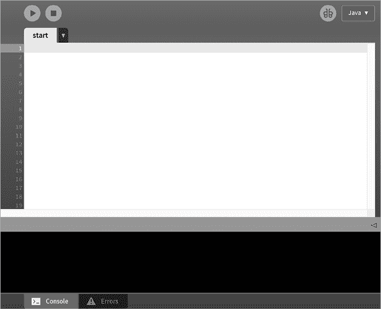
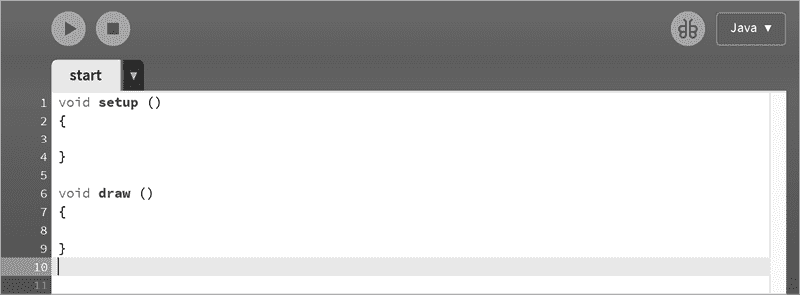
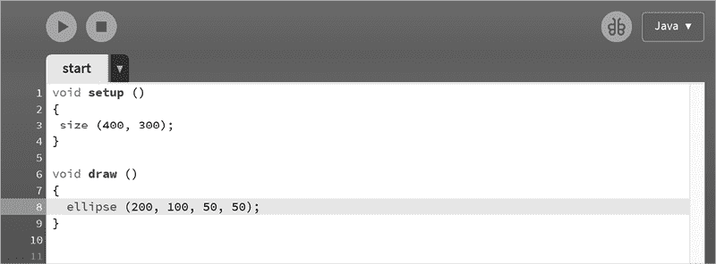
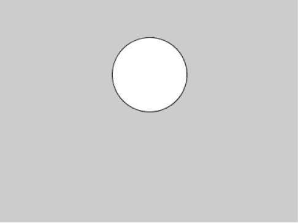

# 介绍


## 编程语言基础：Processing

当有人编写计算机程序时，他们实际上是在与计算机沟通。这是一种命令式且精准的沟通。命令式是因为计算机没有选择权；它被告诉该做什么，它就会准确地执行。而精准是因为计算机不会对它被告知的内容进行任何解释。计算机不会思考，因此无法对“给病人暴露于致命剂量的辐射”这种指令产生任何怀疑。所以，我们作为程序员，必须小心且精准地指示计算机做什么。

当人类相互沟通时，我们使用语言。同样地，人类也使用语言与计算机沟通，但这些语言是人工的（人类为此目的发明的）、简洁的（几乎没有修饰词——无法表达情感或任何感觉的细微差别）、精准的（语言中的每个元素都有一个明确的含义）和书面的（我们目前还不能用编程语言与计算机对话）。

编程过程始于一个需要解决的问题，第一步是尽可能清晰地表述问题。接着，我们分析问题并确定可以解决问题的方法。计算机只能直接处理数字，因此在这一阶段讨论的解决方案通常是数值或数学的。解决方案的草图，可能是用人类语言和数学表示的，首先被创建出来。然后，这些内容会被翻译成计算机语言并通过键盘输入计算机。生成的文本文件被称为脚本、源代码，或更常见的计算机程序。接下来，另一个程序叫做编译器，它会将程序转换成计算机可以执行的形式。基本上，所有程序都被转换成机器码，它由数字组成，计算机能够执行这些数字。

你将学习一种名为 Processing 的编程语言。它是为艺术家设计的，但它对许多其他用途也很有效，尤其适合教学，因为它让许多事情变得简单，并且始终有图形化的输出。它的结构（语法）与当今许多其他编程语言相似。事实上，它是 Java 语言的一个特殊易用版本。Processing 程序被称为“草图”，以此致敬其艺术起源。

为了使用一种编程语言，你需要理解一些基本的概念和结构，至少在基本层面上。这些概念将在本介绍中介绍。本书的其余部分将通过示例教你编程：当你随意翻开书时，左页几乎总是概述一个问题或 Processing 语言的概念，右页几乎总是显示说明该概念的代码，并附有该程序的输出屏幕图像。目的是在任何一页上只引入一到两个新知识点。代码将在安装了免费的 Processing 语言下载的计算机上执行，支持任何主流操作系统。访问 [`processing.org/download`](https://processing.org/download) 下载适用于你操作系统的最新稳定版本。

要开始编程，你需要理解语言有语法或结构，对于计算机语言来说，这种结构是不能改变的。计算机将始终决定什么是正确的，如果任何程序存在语法错误或产生错误结果，责任在于程序，而不是计算机。

接下来，你需要理解语法是任意的。它是由一个具有个人观点、偏见和新想法的人设计的，尽管语法可能看起来很丑或难以记忆，但它就是这样。你可能一开始不理解它的某些部分，但过一段时间，读完并执行本书前 50 或 60 个草图后，大部分内容会变得有意义。

程序由符号组成，这些符号的顺序很重要。有些符号是具有特定含义的特殊字符。例如，`+` 通常表示 *加法*，`−` 通常表示 *减法*。有些符号是单词，且这些单词由语言定义，比如 `if`、`while` 和 `true`，这些不能被程序员重新定义——它们的含义是语言规定的，它们被称为保留字。有些名字由系统定义，但如果需要，程序员可以重新使用。这些被称为预定义名字或系统变量。然而，某些单词可以由程序员定义，作为程序员想要在程序中使用的事物的名称：变量和函数就是例子。

## 开始

所有草图都有相同的基本结构。这里有一个叫做 `setup()`（预定义名字）的东西，它只会执行一次，在程序开始时。这里是我们进行初始化的地方，比如定义输出窗口的大小。如果我们需要从文件中读取一堆图像或声音，通常会在这里进行。

`setup()` 的语法如下：

```
void setup ()
{
    `your code goes here`
}
```

这就是我们在 Processing 中所称的函数（见草图 24）。它是一段被大括号（`{`和`}`）包围的代码，并且有一个名称。当我们在后续代码中使用该名称时，它会被执行（我们称之为调用）。在这个例子中，函数名为`setup()`，它由 Processing 自动调用一次，程序开始执行时调用。`void`（一个保留字）现在并不重要，但它意味着该函数不会返回一个值。

在`setup()`完成后，屏幕上会打开一个窗口，程序将在其中绘制。这被称为草图窗口，它的大小是`setup()`中初始化的内容之一。

## 中间部分

草图的第二部分是另一个函数，名为`draw()`。该函数每秒被调用多次（默认是 60 次，但可以更改），它的目的是更新程序正在绘制的图像。Processing 假设程序员正在编写一个绘制某种图像的程序。

每 1/60 秒，Processing 系统会调用`draw()`函数。每次出现的代码都会被执行，目的是让程序员能够在用户观看时更新正在绘制的图像。例如，如果一系列动物移动的图像按顺序逐个显示，结果将是动物的动画图像。程序员可以绘制形状、显示文本和图像、更改颜色并在屏幕上移动形状，用户可以看到这些变化。

`draw`（一个预定义的名称）的语法如下：

```
void draw ()
{
  `your code goes here`
}
```

## 其余部分

程序员编写的代码位于`setup()`和`draw()`中的某个函数内，或者由这两个函数执行。任何无法从`setup()`或`draw()`访问的程序部分都不会被执行（除了某些鼠标和键盘函数）。

程序员可以为其他函数命名并提供代码，这些函数可以通过`draw()`或`setup()`调用执行。通常，这些函数会放在程序中的`draw()`函数之后。例如，如果程序员想要定义一个名为`doSomething()`的函数，它可能看起来是这样的：

```
void doSomething ()
{
  `your code goes here`
}
```

当使用其名称进行调用时，这将被执行：

```
void draw ()
{
  doSomething();
}
```

分号用于结束语句，让 Processing 知道程序员认为语句已经结束。它被用来检测错误：如果程序员认为语句已经完成，而 Processing 编译器没有，编译器会发出错误消息。毕竟，编译器总是正确的。

## 变量

变量的概念是大多数初学者感到困难的内容。本质上，变量是用来存放结果的地方，通常是一个数字。在编程语言中，变量通过一个名称来表示，名称与值之间的连接通过一种叫做赋值语句的语言语句来建立：它将一个值赋给变量。以下是一个示例：

```
count = 0;
```

这表明名为`count`的变量的值是`0`。我们怎么知道`count`是一个变量呢？它必须出现在声明中：我们“声明”`count`是一个变量，并指定类型。类型定义了可以赋给该变量的值的集合。对于数值变量，常见的类型有`integer`（整数）和`float`（小数）。如果`count`是一个整数，那么声明应该是这样的：

```
int count;
```

预定义的名称`int`表示整数，这个声明表明名为`count`的变量将存储一个整数。如果它应该是一个带小数的数字（实数或浮点数），声明应该如下：

```
float count;
```

变量只有在声明后才能使用。尝试使用未声明的变量是错误的，部分原因是它的类型未知。

现在你可以定义变量了，你可以进行复杂的计算。对于算术运算，常见的操作有：`+`（加），`−`（减），`*`（乘），和`/`（除）。在数学表达式中，变量和常量都可以使用，就像代数中一样。以下是一个合法的赋值语句（假设`radius`已被声明）：

```
count = 2 * 3.1419926 * radius;
```

它将计算给定半径的圆的周长。

## 如何编写程序

当启动 Processing 时，无论是点击*processing.exe*还是点击一个 Processing 源文件，集成开发环境（IDE）都会在屏幕上打开一个窗口。它的样子类似于 Figure 1，尽管根据操作系统和所使用的 Processing 版本，界面可能略有不同。



Figure 1：Processing 集成开发环境中的新窗口

这个特定的草图被称为*start*，并且存储在一个名为*start.pde*的文件中（*pde*代表*Processing 开发环境*）。*start.pde*文件也必须位于一个名为*start*的目录中。这就是规则。

现在你可以开始输入代码，它会出现在窗口中的白色矩形内。点击启动图标时，代码将执行，点击停止图标时，正在运行的代码将停止。

让我们尝试一个简单的程序：一个绘制圆形的程序。首先，输入刚才描述的基本空程序，如 Figure 2 所示。



Figure 2：Processing 程序的基本结构

现在我们可以编写代码了。我们希望绘制一个圆形，Processing 将为我们打开一个绘图窗口。我们应该指定它的大小，以免太小。在`setup()`中，我们可以使用预定义的`size()`函数来指定一个宽度为 400 像素、高度为 300 像素的草图窗口。

我们希望`draw()`函数每次被调用时都能绘制一个圆形，默认情况下每秒调用 60 次。在 Processing 中，圆形是椭圆的一种特殊情况，其宽度和高度相等。`ellipse()`函数绘制一个以指定坐标为中心的椭圆（函数名后括号中的前两个值），并根据第二对值设置宽度和高度。括号中函数名后面的这些值称为参数。背景色默认设置为中等灰色，填充圆形的颜色为白色，圆形周围有一条黑色的轮廓线。

调用`ellipse(200, 100, 50, 50)`将绘制一个以(200, 100)为中心、宽高均为 50 像素的椭圆。一旦输入此代码，窗口将呈现出图 3 的样子。



图 3：绘制圆形的代码

现在点击开始图标。一个新窗口会打开，显示我们的绘图，如图 4 所示。



图 4：绘图窗口

你已经学到了一些东西。椭圆中的值 200 是 x 或水平方向的位置，100 是 y 或垂直方向的位置。值 50 是椭圆的大小，在这种情况下是一个圆形，因为水平和垂直的大小相同。圆形填充了一种颜色，在此案例中为白色，圆形周围有一条黑色的线。

本书的其余部分基本上涉及通过实践来学习。书中有大量代码，而解释相对较少。你可以尝试运行代码，改变参数，看看会发生什么。这就是整个重点。你将通过示例和实际操作来学习语法。
