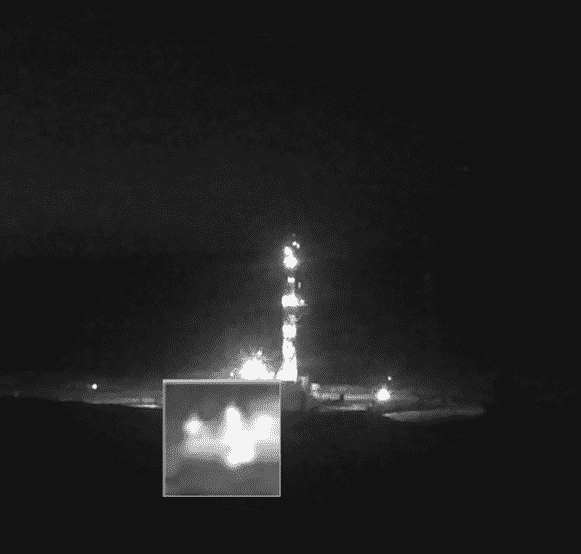
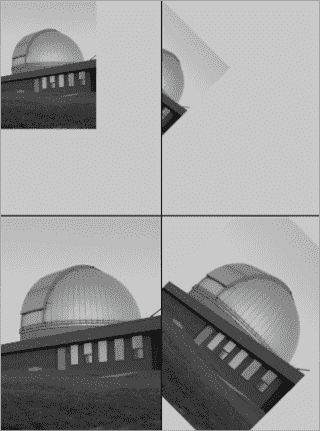
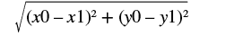

# 第二章：使用已有的图像


## 草图 13：加载并显示图像

图像在网络空间无处不在，即使是没有显式计算机技能的人，也知道图像格式的名称，或者至少知道文件后缀：GIF、JPEG、BMP、PNG 等等。这些字母组合象征着不同的方式来以计算机形式存储图像，每种格式都有其特定的优缺点，适用于不同的目的。GIF 图像是为早期互联网使用而开发的，它们支持透明颜色，并且能够存储动画。JPEG（或 JPG）格式被几乎所有数码相机使用，并且能够将图片压缩成相对较少的字节。

你应该认识到图像的重要性以及从这些文件格式中读取数据的复杂性。一个用来读取大多数 GIF 文件的程序可能需要超过一千行代码。Processing 提供了一个易于使用的功能来读取、显示和写入图像，这是它相较于其他编程语言的许多优势之一。

Processing 中有一个类型表示图像，就像整数用 `int` 类型表示一样，系统可以通过调用一个函数将图像文件读取到变量中。这个类型是 `PImage`（*Processing 图像* 的缩写），而函数是 `loadImage()`。为了加载图像，图像应该保存在与草图文件相同的文件夹中，或保存在名为 *data* 的子文件夹中。

### 示例 A

假设有一个名为 *image.jpg* 的图像文件，我们想读取该图像并将其显示在草图窗口中。首先要做的是声明一个 `PImage` 变量 `im`，并将图像放入其中。然后，在 `setup()` 函数内，我们将创建一个草图窗口（使用 `size()`）并读取图像。以下语句读取图像并将其分配给变量 `im`：

```
2 im = loadImage ("image.jpg");
```

现在，图像数据以某种内部形式存储在变量 `im` 中。

显示图像是在 `draw()` 函数中完成的，尽管在这个例子中也可以从 `setup()` 中完成。Processing 系统提供了一个名为 `image()` 的函数，该函数将在草图窗口的特定 (*x*, *y*) 位置绘制一个 `PImage`（指定图像的左上角位置）。以下调用会将图像绘制，使其左上角与窗口的左上角对齐：

```
3 image (im, 0, 0);
```

### 示例 B

这个程序与示例 A 相同，但它将图像绘制在位置 `(150, 30)` 1。现在图像在可用空间中更加整齐地显示。

## 草图 14：图像——理论与实践

图像在视觉艺术中被广泛使用，Processing 是为艺术家设计的，所以图像在程序中使用起来非常简单也不意外。不过，还是有一些基本的内容需要了解。

其中之一是，要在计算机上使用图像，必须将其数字化；也就是说，必须将其转化为数字。如果图像最初不是由计算机创建的，那么它必须经过扫描或拍照处理，每个原始图像上的位置都必须赋予一个数字，表示该位置的颜色。结果是一个二维的数字数组，每个数字表示特定位置的颜色。图像中的每个小区域被认为是颜色统一的，即使实际上并非如此，因此选取最突出的颜色来代表整个区域。这个颜色被存储在内部表示中的对应(*x*, *y*)位置，它被称为图像元素，简称为像素。所有这些像素的完整集合是对原始图像的近似。将图像绘制到屏幕上意味着将计算机屏幕上一部分的像素设置为与图像中的像素匹配。这正是`image()`函数在 Processing 中的作用。

图像通常被认为是*N*×*M*像素大小，其中*N*是行数，*M*是列数。这样的图像的总像素数是*N*×*M*。

`PImage`数据类型为程序员提供了多种访问图像像素并操作它们的方式。可以使用“.”（点）符号来访问图像的属性。例如，对于一个名为`myImage`的`PImage`变量，我们有以下属性：

```
myImage.width   // Width of the image, in pixels
myImage.height  // Height of the image, in pixels
```

我们常常希望创建一个与特定图像大小相同的图形区域，但`setup()`中的`size()`函数只能使用常量来设置窗口大小。为了解决这个问题，我们可以在`setup()`中添加`surface.setResizable(true)`。它允许我们在草图运行时通过调用`surface.setSize()`来调整图形区域的大小，该函数可以使用诸如`myImage.width`这样的非常量。

可以使用返回或设置基于(*x, y*)坐标的颜色的函数来访问单个像素的值：

```
myImage.get(x,y);                  // Returns the color of the pixel at column x and row y
myImage.set(x,y, color(255,0,0))   // Sets the pixel at (x,y) to red
```

如果我们仅仅调用`get()`或`set()`而没有指定图像，Processing 会假设所引用的图像就是当前在草图窗口中显示的图像。

### 示例 A

这个草图读取一个图像文件，并检查是否成功读取 1；如果没有，程序会通过调用名为`exit()`的函数来结束。`loadImage()`函数如果无法读取图像，会返回一个名为`null`的特殊值，作为图像文件未找到的指示符。例如，图像文件未找到。如果图像正常，程序会使用图像的`width`和`height`属性 2，将草图窗口的大小设置为与图像相同。当`setup()`函数显示图像时，它会填满整个窗口。

### 示例 B

第二个草图如果无法打开图像文件，不会调用`exit()`。相反，它会在图形窗口中显示一个错误信息 1。

## 草图 15：图像操作 I——纵横比

在之前的草图中，我们使用图像的大小来定义草图窗口的大小。也可以改变图像的大小，使其适应已有的空间。`resize()` 函数是 `PImage` 数据类型的一部分，可以用来指定图像的新大小。它不会创建副本，而是直接调整 `PImage` 本身的大小。以下是对该函数的示例调用：

```
1 img.resize (w, h);
```

这个调用会导致存储在 `img` 变量中的图像被扩展或收缩，使其宽度为 `w` 像素，高度为 `h` 像素。

### 示例 A

在第一个示例中，我们将图像缩放到窗口的大小，即 240×480。注意，图像已经发生了失真，从两侧压缩并被拉伸得更高。还要注意，所有工作都在 `setup()` 中完成，`draw()` 中没有代码。

任何图像都有一个长宽比，这是图像宽度和高度之间的关系。它通常表示为 *w*:*h*。例如，16:9 就是一个图像的长宽比，表示每 9 个像素的 y 方向（高度）对应 16 个像素的 x 方向（宽度）。长宽比有时也会以分数的形式表示，将高度除以宽度，这样 16:9 的比率就可以写成 1.8。示例 A 中的图像看起来奇怪的原因是长宽比被改变了，强行将图像适配到了一个任意的矩形框中。

### 示例 B

这个草图将图像绘制到一个窗口中，并进行缩放，以确保长宽比保持不变。首先要做的是计算原始图像的长宽比：

```
1 aspect = (float)w/(float)h;
```

我们在这里使用 `float` 变量，因为长宽比将是一个分数。当我们将图像放入固定的空间时，图像的最大维度（高度或宽度）决定了图像在窗口中的整体大小。我们将调整图像的最大边以精确适应窗口的对应边，无论这意味着将图像放大还是缩小。图像的另一维度将保持与这个新缩放值成比例。因此，如果图像比宽度高，我们将把图像的高度映射到窗口的高度：

```
h = height;
```

宽度将与原始长宽比成比例（转换为整数）：

```
w = (int)(h*aspect);
```

现在可以调整图像大小进行显示：

```
img.resize (w, h);
```

## 草图 16：图像操作 II—裁剪

裁剪图像是指去除图像的一些外部部分。你可以更一般地认为它是选择一个任意的矩形子图像。我们裁剪图像是为了使图像更具吸引力或去除不必要的部分。在画图或 Photoshop 中，我们使用鼠标，首先点击裁剪图像的左上角，然后拖动鼠标到新的右下角，松开按钮。所有选定矩形框外的部分都会被丢弃。这个草图会裁剪图像，并可以选择将裁剪后的区域扩展以填充整个图像窗口。

首先读取图像并将草图窗口的大小调整为适应图像。`draw()`函数使用以下代码 2 将图像（命名为`img`）居中显示在窗口中：

```
image (img, (width-img.width)/2, (height-img.height)/2);
```

如果图像尚未被裁剪，则`width-img.width`为 0，调用将是`image(img, 0, 0)`。否则，图像将小于窗口，并且`(width-img.width)/2`将是需要在左边放置的像素数，以便将裁剪后的图像居中。高度也是如此，将图像放置在窗口的中心。

当鼠标按钮被按下时（`mousePressed()`），裁剪过程开始，使用鼠标光标所在的位置，该位置被保存为`x0`和`y0`。然后从这个位置绘制一个矩形到当前的鼠标坐标，实现一个橡皮筋矩形 3。

当鼠标按钮释放时，会评估鼠标坐标，以确保当前的`mouseX`和`mouseY`表示裁剪框的右下角；换句话说，确保`mouseX`比鼠标按钮按下时的值大，`mouseY`也是如此。如果不是，则交换`x0`和`y0`的值与`mouseX`和`mouseY`的值。然后我们使用`get()`函数创建一个裁剪后的图像，使用左上角和右下角的坐标 4：

```
sub = get(x0, y0, (mouseX-x0), (mouseY-y0));
```

`get()`函数返回由坐标对、宽度和高度指定的图像的矩形区域。在前面的调用中，`(x0, y0)`是左上角的坐标，宽度是`mouseX`值与左上角的*x*值之间的距离，高度是`mouseY`与左上角的*y*值之间的距离。在这种情况下，`get()`使用的是显示在草图窗口中的图像作为原始图像。

`get()`函数返回的子图像成为当前需要在`draw()`中显示的图像（变量`img`），并居中显示在窗口 5 中。

这个草图中的一个新想法是测试按下了哪个鼠标按钮。在`mouseReleased()`函数中，以下语句用来测试右键鼠标按钮：

```
if (mouseButton == RIGHT) sub.resize (width, height);
```

如果释放的是该按钮，子图像会被重新缩放以适应窗口。

在第 1 步，我们将图形窗口的大小调整为与图像大小相同，正如我们之前所做的那样。

## 草图 17：图像操作 III——放大镜

一些电脑有一个由鼠标控制的“放大镜”对象，显示屏幕一部分的放大视图。它帮助有轻度视力障碍的人看得更清楚，同时也让每个人都能更好地查看菜单和其他基于屏幕的对象。

放大是通过增加原始图像中每个像素的大小来实现的。如果原始图像中的每个像素变成四个像素（以正方形排列），那么新图像的大小将是原始图像的两倍，从而呈现出放大效果，如图 17-1 所示。图像的细节不会比原始图像更多，只是看起来更容易看清楚。



图 17-1：放大图像

实现放大镜是使用 Processing 提供的函数来完成的。首先，我们显示目标图像，并使用之前讨论的技巧在草图窗口中选择一个矩形区域进行放大。按下鼠标按钮时，用户从鼠标坐标开始选择一个 50×50 大小的正方形 1。按下和释放按钮时会调用 Processing 函数`mousePressed()`和`mouseReleased()` 3，我们使用这些函数来设置一个名为`mag`的标志变量。如果`mag`被设置，我们使用`get()`函数将选定的原始图像部分复制到另一个名为`sub`的`PImage`中。然后，通过`resize()`函数将复制的图像调整为 100×100 像素 2：

```
sub.resize (100,100);
```

将一张 50×50 的图像调整为 100×100，实际上是将其大小翻倍。现在，调整大小后的图像将大致在原来被复制的地方显示。新图像比原始图像大，因此新的位置是近似的，一些原图中的像素将被新图像覆盖。

## 草图 18：旋转

旋转某物时，我们始终需要指定旋转轴，在二维情况下就是一个*点*和一个角度。旋转是通过调用`rotate()`函数来指定的，

```
rotate(angle);
```

其中`angle`以弧度为单位指定。一个圆包含 2π弧度，也包含 360 度，所以从度数转换为弧度的方法是将度数乘以 3.14159/180.0，或者使用 Processing 的`radians(x)`函数。旋转将围绕窗口坐标系的原点(0, 0)进行，默认情况下原点位于窗口的左上角，旋转将是围绕这个点*顺时针*进行的。

当指定旋转时，从该点开始绘制的所有物体都会被旋转。再次调用`rotate()`函数将会进行进一步的旋转。旋转本身无法直接关闭，但通过调用`rotate(-angle)`可以撤销`rotate(angle)`的效果。

### 示例 A

第一个示例绘制了一个表示旋转的图形。先绘制一条水平线并标记为 1，接着是旋转了 10 度的线 2，再旋转了 20 度的线 3。为了避免文本被旋转，旋转会在绘制文本标签之前被“撤销”（以负角度进行旋转）。

### 示例 B

从原点画出一条线，线的末端有一个小球。线从 0 度旋转到 90 度，按小步长旋转，每次 `draw()` 被调用时都会显示每一步的结果，因为线和小球都会在其中被绘制。当线顺时针旋转时，每次调用 `draw()` 时，角度会增加 0.01 弧度 1。当线变为垂直时，进一步旋转会使其超出视野，之后每帧的角度变化（变量 `d`）会改为 `-d` 2。现在，线开始旋转回原始位置，在 0 度时，`d` 的值再次变为正数。这个看起来像秋千摆动的物体在 90 度和 0 度之间来回摆动。

每次调用 `draw()` 时，旋转角度都会重置为 0。

## 草图 19：围绕任意点旋转—平移

能够旋转物体是至关重要的，但仅仅能围绕屏幕的左上角旋转物体是很不方便的。通常我们希望围绕物体的中心旋转，但这需要了解物体的具体情况。物体在图形中可能是复杂的；一个物体可能只是一个圆或方块，或者它可能是一个建筑物或一辆车。我们不能期望 Processing 知道一个物体是什么，或者它的中心在哪里。然而，Processing 使得我们可以使用 `translate()` 函数将旋转中心移动到我们选择的任何坐标。

`translate()` 接受 x 和 y 坐标，并将原点移动到该位置，用于所有未来的绘制。以下示例将原点移动到窗口中的 (100, 200) 位置，现在这个位置变成了坐标 (0, 0)：

```
translate (100, 200);
```

在数学术语中，`translate` 这个词意味着*重新定位*，因此平移涉及到改变物体的位置。如果我们将原点平移到 (50, 50)，然后在 (0, 0) 画一个圆，这个圆将出现在屏幕的窗口坐标 (50, 50) 处。进一步的圆将相对于窗口坐标 (50, 50) 被绘制。

因为旋转总是以 (0, 0) 作为轴心，这意味着我们可以将轴心设置为我们喜欢的任何坐标，并围绕任何点旋转物体。

### 示例 A

作为一个基本示例，我们将使用 `ellipse()` 函数 1 在 (0, 0) 画一个圆，然后调用 `translate()` 将原点移到 (50, 50)。第二次调用与第一次完全相同的 `ellipse()` 会在屏幕坐标 (50, 50) 画出圆。进一步的 `ellipse()` 调用，在 (30, 40) 画一个圆，最终会在屏幕坐标 (80, 90) 画出圆；也就是说，(30, 40) 是相对于新原点 (50, 50) 的位置。

### 示例 B

在这个草图中，我们将一条线绕其中心旋转。过程是：`translate()` 到线的中心，这里是（150，100）1；按当前角度旋转 2；然后绘制这条线。线的坐标必须反映原点是线的中心而非一端的事实。由于线的中心在（150，100），因此线应当从 x 方向的 −50 绘制到 +50，长度为 100 像素。起始点的平移坐标将是（150 − 50，200 − 100 − 0），即（100，100）。端点的坐标将在 x 方向上再向前 100 像素，即（200，100）。在中点（原点）处绘制一个小圆圈，以便能够看到它。

每次调用 `draw()` 时，旋转角度都会增加 3。由于每次调用 `draw()` 时都会绘制这条线，图像就会呈现出缓慢旋转的效果。

## Sketch 20: 旋转图像

旋转和平移不仅适用于简单的线条和圆形，也适用于复杂的对象。特别是，我们可以绕任意点按任意角度旋转图像。

在确定如何放置图像以确保其完全位于屏幕上时，可能会遇到问题。图像是矩形的，旋转它们会增加它们的宽度或高度。如果我们没有将图像正确地放置在窗口中，图像的一个或多个角落可能会旋转到窗口的边界之外，如图 20-1 所示。



图 20-1: 图像旋转出窗口边界

上方的两幅图像展示了将图像旋转的结果，图像原本显示在窗口的左上角。旋转 45 度会使图像的一半超出屏幕。下方的两幅图像展示了当图像围绕其中心旋转时，若窗口大小不足会发生什么：图像的角落被裁剪掉。

这个草图展示了一个持续旋转的图像。图像被读取后，窗口大小设置为图像每个维度的*两倍*1。`draw()` 函数将原点平移到图像的中心，然后旋转图像 `angle` 角度并显示，从而使图像围绕其自身的中心旋转 2。然后，`angle` 的值会增加一个微小的量，以便下次调用 `draw()` 时使用 3。图像出现在窗口的中心，并且看起来在旋转。

## Sketch 21: 获取像素值

在开发 Sketch 14 时，我们讨论了如何使用 `get()` 函数从 `PImage` 中获取像素值。我们可以按如下方式获取名为 `im` 的 `PImage` 中坐标为（`x`，`y`）的像素的颜色值：

```
color c;
PImage im;
c = im.get (x, y);
```

当前显示在草图窗口中的图片处于优先位置，因为它可以在不使用变量的情况下访问。通过调用 `get()`，我们可以直接获取屏幕上的像素值：

```
c = get (x, y);
```

因此，我们可以通过以下方式获取当前鼠标位置处像素的颜色：

```
c = get (mouseX, mouseY);
```

该草图加载一张图像，并允许用户点击任何像素查看其颜色，颜色将以彩条的形式显示在屏幕右侧，并以文本形式显示 RGB 值。首先，草图加载一张图像并调整窗口大小以适应它，右侧有额外区域。在`draw()`中，它用背景色（200，200，200）1 显示图像；当按下鼠标按钮时，它将`mouseX`、`mouseY`坐标处的像素值（颜色）赋值给颜色变量`c`3；然后，它将在图像右侧显示颜色，并在屏幕的右上角以文本形式显示 RGB 值 2。每当点击鼠标按钮时，显示的颜色值将发生变化。

## 草图 22：设置和更改像素的值

图像中的像素值，包括绘图区域，可以使用`set()`函数进行更改。我们使用坐标指定像素位置，并确定要在该点绘制的颜色。例如，

```
set (i,j, color(255, 255, 0));
```

这将把图形区域中位置（`i`，`j`）的像素设置为黄色，或 RGB（255，255，0）。如果坐标超出了窗口范围，像素将被绘制，但不可见。

我们可以使用`background()`函数为窗口中的*所有*像素设置颜色：

```
background (255, 100, 40) 
```

该调用将草图窗口填充为橙色。

### 示例 A

如果不使用`background()`函数而要设置窗口中的所有像素，需要使用一个循环*—*实际上是两个嵌套的循环。第一个循环检查水平方向上的所有像素；也就是说，检查指定行中的所有像素。第二个循环查看`i`的所有可能值，也就是所有行。第一个循环嵌套在第二个循环中，以便修改所有行中的所有像素：

```
1 for (i=0; i<width; i++)
  for (j=0; j<height; j++)
    set(i,j, color(255, 100, 40));
```

这将把草图窗口中的所有像素设置为橙色。

### 示例 B

在图像显示在草图窗口之前，可以修改图像的像素值。我们不仅可以替换颜色，还可以对现有像素值进行更细微的变化，得到与原有值不同的变化。例如，该示例首先加载并显示图像。当程序检测到通过`mousePressed()`按下按钮时，它设置标志`grey`为 2，这表示要按像前一个示例中那样逐个像素修改屏幕上的图像。在这种情况下，我们用每个像素的亮度值 1 替换屏幕上每个像素的 RGB 值，结果是显示没有颜色的灰色图像。当鼠标按钮释放时（`mouseReleased()`），程序清除该标志（将其设置为`false`），图像将重新显示为彩色 3。

## 草图 23：更改像素的值—阈值处理

对图像进行阈值处理会将每个像素的颜色值改为黑色或白色，具体取决于原始的颜色或亮度。阈值处理会生成一张二值图像：每个像素可以被视为是*开启*还是*关闭*。为什么要这样做？有些图像的内容本质上是二值的：例如，一张文本页的扫描图像上有黑色字符和白色背景。在其他情况下，这是一种简化图像的方式，以便我们可以进行其他操作，比如检测边缘或人脸。例如，对红细胞图像进行阈值处理可能有助于对其进行计数。

阈值处理图像是一个两步过程。首先，我们确定一个阈值——这个值保留了图像的必要特征。我们通常通过检查图像中的所有像素并使用某些统计公式计算出一个值来实现这一点。阈值值是一个介于 0 到 255 之间的数字；所有小于阈值的像素亮度值将被设置为黑色 (0)，而大于阈值的则会被设置为白色 (255)。第二步是查看所有像素并实际应用该阈值。

为了先解决第二步，应用阈值其实很简单：只需查看每个像素并判断它是否小于或大于 `threshold`。我们将像素值赋给变量 `g`，提取亮度，然后进行测试：

```
2 if (g<threshold) g = black;
  else g = white;
```

`black` 的值是颜色 (0, 0, 0)，而 `white` 的值是 (255, 255, 255)。

在这个示例中，我们将手动确定阈值，使用鼠标的位置。这是鼠标的水平位置，表示为窗口宽度的百分比：

```
mouseX/width
```

如果我们将这个分数乘以 255，就会得到一个介于 0 到 255 之间的值，这个值与鼠标的位置远离窗口左侧的程度成正比。我们将使用这个值作为阈值。当鼠标在窗口的左侧时，阈值会很小，大部分图像会是白色；当鼠标在右侧时，阈值会很大，图像大部分会是黑色。

如果 `draw()` 函数计算并应用了阈值，它将变得动态，我们可以在鼠标移动时观察图像的变化。

## 示例 24：用户自定义函数

到目前为止，我们一直在使用 Processing 系统提供的绘图函数：`ellipse()`、`line()`、`mousePressed()` 等等。我们还没有深入分析函数的概念，部分原因是函数的作用看起来比较明显。然而，如果我们想要创建自己的函数，有一些内容是我们需要理解的。

函数是给一段代码集合起的名字。当函数的名字在语句中被使用时，称该函数被调用，函数内部的代码将被执行。这意味着，函数可以从许多不同的地方执行，而无需重复编写代码，只需调用它即可。

函数可以返回一个值：我们以前使用过这样的函数。例如，`color()` 和 `get()` 返回颜色和像素值。没有返回值的函数被称为返回 `void`，这也是 `setup()` 和 `draw()` 前面有 `void` 关键字的原因。它们是没有返回值的函数。

要创建一个新函数，我们必须遵循与 `setup()` 和 `draw()` 相同的语法：我们先写返回类型，再写函数名、括号，然后是花括号中的函数体。例如：

```
void newFunctionA ()            int newFunctionB ()
{                               {
  `code                            code`
                                  return `value`;
}                               }
```

上面，`newFunctionA()` 不返回值，它是通过函数调用 `newFunctionA();` 来调用的。`newFunctionB()` 返回一个整数值，必须有一个 `return` 语句来指示要返回的值。这种类型的函数像是表达式的一部分被调用：

```
a = newFunctionB();
x = newFunctionB()*2 + 1;
```

一个函数可以有多个 `return` 语句，但只有一个会被执行，因为一旦函数返回，函数中的其他代码就无法再执行。

函数可以有参数或实参，即在调用函数时传递给函数的值。当调用函数 `color()` 时，我们在括号中列出三个值：红色、绿色和蓝色。这些变量专门传递给函数使用，并且它们的值可用于在函数内部进行计算。

让我们创建一个函数，计算两点之间的距离，(x0, y0) 和 (x1, y1)：

```
float distance (int x0, int y0, int x1, int y1)
```

传递给函数的参数分别命名为 `x0`、`y0`、`x1` 和 `y1`，并且它们有类型，在本例中为整数类型（`int`）。这些参数用于计算两点 (x0, y0) 和 (x1, y1) 之间的距离，计算公式如下：



这个草图使用两次鼠标点击来确定两个点：(x0, y0) 2 和 (x1, y1) 3。它在每个点上绘制一个标记，并在窗口底部显示它们之间的距离作为文本信息 1。

## 草图 25：编程风格的元素

程序中的风格指的是代码的一些方面，这些方面通常不会影响程序的执行，但会影响其他人在阅读、修改或修复代码时的体验。

例如，有一种方法可以在程序中插入人类可读的文本供其他程序员阅读。任何在一对斜杠后面的文本被称为注释，Processing 会忽略它们，像 `/*` 和 `*/` 之间的文本也会被忽略，它们标示了可以跨越多行的注释。程序应在代码中嵌入相关的注释，以便让任何查看代码的人理解发生了什么。注释应该清晰、提供解释，而不是简单地重复代码本身。程序中的注释性质是我们所说的编程风格的一部分。

风格的另一个方面是使用缩进来传达结构。没有一种单一的正确缩进方式，但本书中的草图所示标准有一些一致的特征。例如，用于包围代码块的“{”和“}”字符始终垂直对齐，以便容易识别代码块。唯一的例外是它们在同一行时：

```
if (x0 < 0) 
{
  x0 = mouseX; 
  y0 = mouseY;
}
```

在其他书籍中，你可能会看到另一种风格：

```
if (x0 < 0)  {
  x0 = mouseX; 
  y0 = mouseY;
}
```

括号的位置对编程语言的编译器来说并不重要，但程序员应该保持一致性。

变量应该有有意义的名称。上面`x0`和`y0`代表 x 和 y 坐标，因此这些名称是合适的。一个名为`pixelCount`的变量应该包含像素的计数。给变量起个好名字是很容易的，而且这么做不会影响代码的执行速度或占用的内存量。

数字常量应该像变量一样命名，以便从名称中推断出常量的用途。一个完美的例子是`PI`而不是 3.1415。一个程序应该尽量避免使用数字常量，而应该使用名称。考虑以下代码：

```
r = d*0.01745;
```

数字 0.01745 对大多数人来说没有意义。现在考虑以下内容：

```
r = d *2*PI/360.0;
```

这更好。两倍的 PI/360 是弧度和角度之间的转换。最好的做法是：

```
radians = degrees * degrees_to_radians;
```

其中`degrees_to_radians`等于`0.01745`。现在任何阅读代码的人都能轻松看出发生了什么。

这个草图中的代码与前一个草图做的是一样的，但它展示了更好的风格。不过，请注意，它占用了更多的屏幕空间——这是典型的情况，也正是这些规则并非总是被遵循的原因，即便在本书中（因为文本需要适应一页纸）。

## 草图 26：复制图像—更多的函数

这个草图的目的是给你一些关于如何将代码组织成函数的想法。这个程序将读取一张图像，创建其副本，并增加副本的亮度。当鼠标按钮按下时，亮度增强的版本将被显示出来。

第一个函数被命名为`brighten()`。它接收一个图像（命名为`img`）和一个整数值（命名为`val`）作为参数。它的作用是通过指定的数量增加图像的亮度值。它通过嵌套循环逐个提取每个像素的 HSB 值，将`val`值加到亮度部分，并将像素保存回图像中。这是关键代码：

```
// Extract the HSB values from the pixel at (i,j)
c = img.get(i,j);
// Add val to the brightness and save again.
img.set (i,j, color(hue(c), saturation(c), brightness(c)+val));
```

我们将在`draw()`中使用一个新特性。Processing 提供了一个名为`mousePressed`的变量，若鼠标按钮被按下，它的值为`true`，否则为`false`，在非常简单的情况下，可以用它替代`mousePressed()`回调函数。在这种情况下，当鼠标按钮被按下时，我们显示亮度增强后的图像，否则显示原始图像。

```
if (mousePressed) image (img2, 0, 0);
  else image (img1, 0, 0);
```

这个草图中的第二个函数创建了原始图像的副本。我们定义复制函数如下：

```
PImage duplicate (PImage from)
```

根据这个函数的定义，函数接受一张图像作为参数并返回一张图像。事实上，它返回的是一张新的图像，作为传入图像的副本。Processing 提供的创建新图像的函数名为`createImage()` 4，它的形式如下：

```
createImage (width, height, RGB);
```

宽度和高度应该不言自明；常量`RGB`指定了图像的形式，在这里是 RGB 颜色。`CreateImage`返回的图像是未初始化的，像素值未知，因此，在创建一张与传入图像相同大小的图像后，我们的`duplicate()`函数使用标准的嵌套循环将新图像中的每个像素设置为原始图像中对应像素的值。
