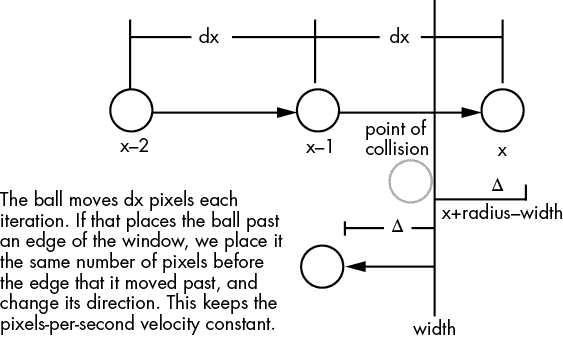
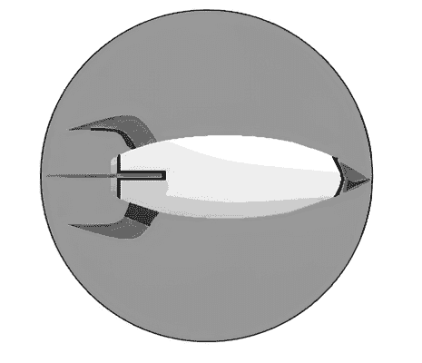
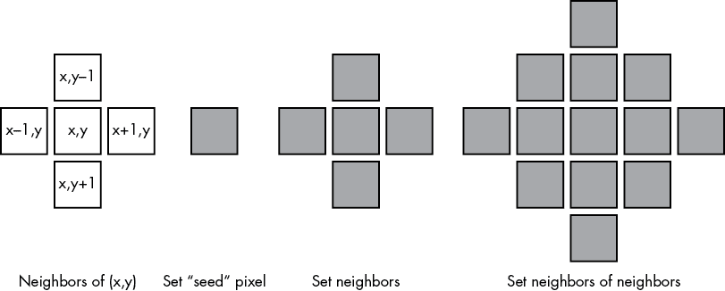

# 第三章：2D 图形与动画


## 草图 27：保存图像并调整透明度

我们将编写一个草图，让用户选择图像中的一个颜色使其变为透明，然后将图像保存为 GIF 格式。我们可以将任何`PImage`保存为文件，就像大多数图像文件可以被读入`PImage`一样。如果`img`是一个`PImage`变量，我们可以通过以下函数调用将其保存为文件：

```
img.save ("image.jpg");
```

参数是要创建的文件名。在上面的情况下，它将创建一个名为*image.jpg*的文件，并将`PImage`的像素以 JPEG 格式保存。文件格式由文件名的最后三个字母方便地确定：*.jpg*表示 JPEG 文件，*.gif*表示 GIF 文件，*.png*表示 PNG 文件，等等。如果没有给定`PImage`变量，Processing 将保存出现在草图窗口中的图像。

对于这个草图，第一步是读取并显示图像。接下来，我们将鼠标放置在一个我们希望透明的像素上，然后点击按钮。最后，我们将图像保存为支持透明的格式（GIF）。

在草图 2 中，我提到了透明颜色。我们可以设置第四个颜色分量，称为 alpha，它的值在 0（完全透明）和 255（完全不透明）之间，只要`PImage`颜色格式允许透明；支持透明的格式是`ARGB`。在这个草图中，当图像被读取时，我们像之前的草图那样制作一个副本，但使用`ARGB`作为颜色格式。当我们点击鼠标按钮时，程序查看光标坐标处的像素，并将透明度值 0 添加到颜色坐标中。然后，`PImage`中的颜色会更新为新的透明度值。

我们从文件中读取的原始图像是一个名为`img1`的变量；包括 alpha 值的副本是`img2`。Processing 使用以下语句制作图像的副本，正如我们在步骤 2 中所做的那样：

```
img2 = createImage (img1.width, img1.height, ARGB);
```

这将创建一个正确大小的空图像，现在我们必须将所有像素从`img1`复制到`img2`。当我们这样做时，`img2`中的像素会带有 alpha 组件，因为它是在`createImage()`调用中指定的。当鼠标点击指定了背景颜色时，所有该颜色的像素都会被赋予 alpha 值 0 1。然后，`img2`会保存为一个名为*out.gif*的文件。

程序以调用`exit()`结束，因为否则它会不断地保存同一个文件。

为什么为图像设置透明背景很重要？计算机游戏！

## 草图 28：在窗口中反弹一个对象

这个草图展示了检查一个对象是否在草图窗口内的一个好方法（尽管只有当对象是圆形时，它才完全准确）。这里的对象是一个圆形，或者如果你喜欢，可以是一个球。程序移动这个球，当球到达窗口边界（“墙”）时，它会反弹或改变方向。

一个简单的测试可以确定球是否超过了边界。例如，在右边界的情况，测试条件是`x + radius > width` 2，其中`x`是球的中心位置，`radius`是球的半径，`width`是窗口的宽度。如果球移动得足够慢，我们可以在球通过这个测试时通过将`dx`（球每帧水平移动的距离）改为`-dx`来简单地反转运动方向。然而，这种方法并不完全准确，当球以高速移动时情况会变得更糟。为什么？因为球会在程序判断它是否到达边界之前越过边界。请参考图 28-1 中的情况。



图 28-1：一个快速移动的球可能会在你告诉它反弹之前越过边界。

如果选择的`dx`值使得球每帧移动多个直径，它可能在一帧内越过墙壁的左侧，而在下一帧越过墙壁的右侧。在这个过程中，球必须与墙壁发生碰撞。此时，应该找出球越过墙壁的距离，并将球放置在墙壁左侧的相应距离位置，以模拟反弹。我们计算这个距离为`delta`（Δ），对于一个圆形，它等于`(x + radius) - width` 1。根据这个距离，球的新反弹后的 x 位置是`width - delta - radius` 3，如图 28-1 底部所示。

在窗口的左侧，当`x < radius` 4 时，我们知道球已经越过了边界。在这种情况下，我们通过将`x`设置为`(2 * radius) - x` 5 来重新定位球，并反转球的运动方向。

垂直（*y*）方向是对称的 6。

## 草图 29：基本精灵图形

我们可以将之前的两个草图结合起来，展示程序员如何在计算机游戏中移动精灵。精灵是表示游戏中物体的低分辨率图形。精灵通常是原始形状或导入的图像。如果是后者，精灵图像必须具有透明颜色，这样我们才能看到精灵背后的背景；否则，精灵看起来就像是一个实心颜色的矩形，里面有一张图像。

这个草图使用了草图 27 中的火箭作为精灵，并使用草图 28 中的代码来在窗口中移动它。火箭将在星空背景图像上移动，以完成类似游戏的外观。

判断火箭是否到达边界的测试与圆形示例不同，因为精灵是从左上角绘制的矩形图像，左右和上下边界之间的距离不同。左边缘的测试几乎与之前相同，但由于 x 坐标位于精灵的左侧，而不是在其中心，因此缺少半径的偏移量 2：

```
if (px < 0) // left side
{
  px = -px;
  dx = -dx;         // Reverse x-direction
}
```

右侧的测试有所不同，因为精灵的整个宽度也位于坐标`px`的右侧 1：

```
delta = (px+sprite.width) - width;
if (delta > 0) // right side
{
  px = width-delta-sprite.width;
  dx = -dx;
}
```

所以`px+sprite.width`是精灵右侧的坐标。

对于 y 坐标的检查是对称的 3。

## 草图 30：检测精灵与精灵的碰撞

判断一个精灵是否仍在窗口内是相对简单的，因为窗口的大小保持固定且窗口不会移动。但是，如果有多个精灵同时移动呢？我们如何确定两个精灵在同时移动的情况下是否发生了碰撞？圆形物体的情况是最简单的，也是一个通用的解决方案，因此本草图将处理任意数量的圆形物体（球），这些球会在边界和彼此之间反弹。

每个球的坐标将存储在`xpos[]`和`ypos[]`数组中 1。绘制对象`i`是简单的 2：

```
ellipse (xpos[i], ypos[i], 10, 10);
```

如果两个物体的距离小于两倍半径（在此情况下为 10 像素），它们就会发生碰撞。这是草图中的步骤：

1.  为每个`nballs`对象定义位置和速度（`dx`，`dy`）。

1.  每一步（帧）由调用`draw()`来定义。首先，在每个位置`xpos[i]`，`ypos[i]`绘制一个圆 2。

1.  改变位置：`xpos[i] = xpos[i] + dx[i]`，`y`同理 3。

1.  检查是否与边界发生碰撞（反弹），如果有碰撞，则实现碰撞反应。反弹？爆炸？ 4。

    对于每个球，检查它与其他每个球之间的距离。如果距离小于两倍半径，则改变两个球的方向（将碰撞实现为反弹） 5。

就这样。`bounce()`函数 6 与之前的有所不同，但它基本上完成了相同的事情。`distance()`函数计算两个球之间的欧几里得距离，就像你在草图 24 中看到的那样。如果两个球在反弹后重叠，它们可能会粘在一起，直到碰到另一个球。



图 30-1：矩形物体的包围圆

## 草图 31：动画—生成电视噪声

我们之前在草图 8 和 30 中使用了随机数。随机数在游戏、模拟和其他软件中有几个重要功能：

+   大自然使用不可预测的形式和形状。在二维网格中布置森林中的树木，显然是有人为种植的迹象。这在自然界中是不会发生的。相反，森林中的树木彼此之间有一个平均距离，并且看起来是随机分布的。

+   智能生物的行为并不完全可预测。在高速公路上，如果所有的汽车行为相同，看起来会非常奇怪。汽车之间有随机的距离，随机的速度，以及可能范围内的随机行为。

+   玩扑克或掷骰子时，牌和骰子应该显示随机值，否则游戏就没有趣味了。

这个草图绘制了一个电视机，看起来好像调到了一频道没有信号。屏幕上看到的图像曾被称为*雪花*，实际上是由随机电压信号产生的像素，这些信号来自太空和各种本地电子电气设备。我们无法预测电视在任何特定时刻会收到什么信号，因此我们绘制了一组 2D 随机灰色像素值。这些值每次屏幕更新时都会变化，给人一种随机运动的印象，快速闪烁的点在屏幕上，但没有组织的图像。

首先，我们显示一个电视机背景图像 1，然后在每次调用`draw()`时，将屏幕部分的像素设置为随机的黑白值 3：

```
if (random(3)<1) set (i, j, BLACK);
  else set (i, j, WHITE);
```

为了让频道显示得像是调节不当，我们可以在静态画面上淡淡地显示一张图像，将图像的 alpha 值设置为较低的值，或许是 30 左右。图像后面的静态将可见。`tint()`函数会改变从此之后绘制的内容的颜色和透明度，所以我们可以用它来改变频道图像的透明度，代码如下：

```
tint (255, 255, 255, 127);
image (back, 49, 49);
```

`tint()`的参数是颜色坐标，前三个是 RGB 值，第四个是透明度（alpha）。在前面的例子中，颜色是白色（没有实际的色调），但透明度是 127，即半透明。

在此草图的代码中，`tint`和电视图像被注释掉。要查看图像，请去掉这两行代码前的注释符号 2。

## 草图 32：帧动画

动画涉及在屏幕上以一定的速率显示一系列静态图像，人的视觉系统通过插值图像中位置的变化，感知到运动。这是一种错觉，就像任何电影都是一种错觉。之前的草图通过代码生成随机电视图像，以非常基础的方式创建了动画，呈现了图像的错觉。大多数动画需要由艺术家创建一组图像序列，然后按顺序显示它们。

要让 Processing 草图显示动画，程序必须读取要显示的图像（帧），然后将它们依次显示。图像帧可以存储在一个`PImage`类型的数组中，每帧一个元素。

这个草图中的两个示例使用了一个表示人类步态的图像序列；这 11 张图像组成了一个完整的步伐周期，重复这些图像就能让人物看起来像是在走路。

### 示例 A

十一张图像，从*a000.bmp*到*a010.bmp*，代表动画。程序将这些图像读取到`frames`数组的连续元素中 1。每次调用`draw()`函数时，它会显示下一个图像，依次增加索引变量`n`从 0 到 10，然后再次减小到 0，循环往复 2。

### 示例 B

在示例 A 中，我们需要提前知道动画中包含多少个图像。在示例 B 中，我们只要求文件名以*a000.bmp*开头，并且连续图像的编号递增。当程序无法读取图像文件时（通过`loadImage()`返回`null`来指示），程序假设所有图像已加载完毕 1。程序会在读取图像时进行计数，并像之前一样显示它们。

加载图像的循环中有一个`break`2 语句，当检测到`null`时退出循环。

## 草图 33：洪水填充——填充复杂形状

在 Processing 中，绘制一个填充特定颜色的矩形或椭圆是很简单的。你只需使用`fill()`函数指定填充颜色，然后绘制形状。然而，没有用于填充任意形状或区域的函数，因此我们自己来实现一个。这不仅可以展示如何在一般情况下进行填充，还有其他优点。

这个草图读取了一张具有白色背景的图像，图像中包含用黑色（当然也可以用其他颜色）勾画的区域。这些区域不需要是规则的多边形，但它们应该是封闭的，即有内部和外部，且边缘没有间隙。当用户点击一个像素时，该像素周围的区域会被填充为随机颜色。

被点击的像素有一个颜色，即背景颜色（草图中的`bgcolor`）。系统将选择一个随机颜色作为填充颜色（变量`fillColor`）。目标是将所有当前具有背景颜色值的像素设置为填充颜色。第一步是将选定的像素设置为填充颜色，然后重复设置所有相邻像素，直到没有更多候选像素。

在第一个像素被改变后，所有与之相邻的背景色像素也会被设置为填充颜色 1。相邻像素被定义为与其垂直或水平相邻的像素。然后，所有像素会再次被扫描，任何与填充色像素相邻的背景像素都会被设置为填充色。该过程如图 33-1 所示。



图 33-1：填充相邻像素

该过程会一直重复，直到没有变化为止。过程会在边界处停止，因为边界像素没有背景颜色且不会改变。这不是实现填充的唯一方法，也不是最快的方法，但可能是最容易理解的方法。

`mouseReleased()`函数设置`bgColor`和`fillColor`变量的值，并将第一个（种子）像素设置为填充颜色 3。`nay()`函数如果参数所指示的像素是填充色像素的邻居，则返回`true`2。每次调用`draw()`函数（每帧调用一次）时，它都会显示填充过程的一个迭代，因此过程看起来像是动画。
