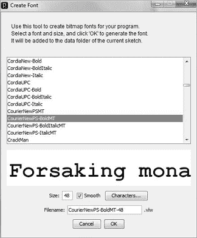

# 4

处理文本和文件


## 草图 34：字体、大小、字符属性

当文本在屏幕上绘制时，有许多方法可以绘制每个字符。大小、粗细、方向和样式可以有很大的变化。字体指定了特定大小、粗细和样式的字体。字体作为文件保存，其中包含绘制每个字符的指令。粗体、斜体、正常体和每种重要大小都是独立的文件。字体名称、样式和大小通常是文件名的一部分。

Processing 支持多种字体，但每种字体都必须事先通过工具菜单作为文件进行设置。选择**工具**▶**创建字体**以打开一个字体创建窗口，在该窗口中你可以选择字体名称、样式和大小，如图 34-1 所示。



图 34-1：设置字体

选择 CourierNewPS-BoldMT，大小为 48，并点击**确定**，在名为*data*的本地目录中创建一个名为*CourierNewPS-BoldMT-48.vlw*的文件。你可以根据需要重复此过程，创建多个字体文件。你需要字体文件才能在 Processing 中加载和使用字体。

使用字体是一个相对复杂的过程。你需要首先为每个想要使用的字体创建一个`PFont`（Processing 字体）类型的变量，然后使用`loadFont()`函数 1 加载字体：

```
PFont font1;
font1 = loadFont ("CourierNewPS-BoldMT-48.vlw");
```

要设定一个字体为使用的字体，调用`textFont()`并传入字体变量和所需的大小：`textFont(font1, 48)` 2.大小是以像素为单位，而不是字体标准的磅（points）。最后，你可以通过调用`textSize(size)` 3 来随时更改字体大小。

这个草图加载了 Courier Bold 48 字体并将其设定。然后，它以从 2 像素到 55 像素变化的大小绘制字符串“Hello”，每次调用`draw()`时，字体大小都会增加 1 像素。

## 草图 35：滚动文本

新闻滚动条是电视新闻和天气频道的常见功能。它是一个故事摘要，会从屏幕的右侧向左侧滚动，其他内容则继续显示在屏幕的其他部分。股票价格通常也以这种方式显示。那么，我们如何在 Processing 的草图窗口中做到这一点呢？

首先，特定项目的文本有一个 x 坐标，它将在该坐标处绘制，使用`text()`函数进行绘制。y 坐标是恒定的，通常接近屏幕底部。在这个草图中，屏幕的尺寸是 400×200，文本的 y 坐标是 190\。x 坐标会变化。

要显示的文本应该从屏幕的右侧开始，例如，从`width-10`像素 2 开始。每次绘制时，文本会向左移动，因此`draw()`每次调用时会将 x 值减去 1：

```
text (s1, x, y);
x = x - 1;
```

通常，滚动中会有不止一条消息。第一条消息可能在第二条消息显示之前消失，但这种情况对于文本滚动来说并不常见。另一种想法是让多个滚动字符串彼此紧挨着绘制，并同步移动。因此，这些字符串本身保存在一个名为`headlines`的数组中 1。

假设我们只有两个字符串。每个字符串都有一个索引访问数组中的字符串（`i1`和`i2`）以及 x 坐标（`x1`，`x2`）。如果第一个字符串`headlines[i1]`绘制在位置`x1`，第二个字符串应该绘制在位置`x1`加上字符串`i1`的像素数再加上一个小空格。用 Processing 术语表示如下：

```
x2 = x1 + (int)textWidth(headlines[i1])+ 10;
```

`textWidth()`是一个接受字符串作为参数的函数，利用当前的字体大小，返回该字符串绘制时的宽度（单位：像素）。值 10 是小空格。当第一个字符串从屏幕左侧消失时，它的绘制位置加上它的长度将小于 0 3：

```
x1+textWidth(headlines[i1]) < 0
```

此时，应该获取一个新的字符串（即下一个索引），并将其定位在第二个字符串的右侧：

```
i1 = (i2+1)%5;
x1 = x2 + (int)textWidth(headlines[i2])+ 10;
```

当第二个字符串从左侧消失时，情况也会一样。

## 草图 36：文本动画

动画化文本可以创造出有趣的效果。它曾被用于广告和艺术创作中，但现在做起来比以前容易得多。一个字符串可以沿着曲线路径绘制，甚至是沿着移动的曲线路径；字符串中的字符可以在方向、大小、颜色，甚至字体上发生变化。运动甚至可以根据用户输入变化，可能是跟随鼠标，或者因音频或视频输入而移动。

动画化文本的关键是通过`charAt()`函数访问字符串中的每个字符。字符串`str`中的第一个字符可以通过`str.charAt(0)`访问，第二个字符是`str.charAt(1)`，依此类推。通过这种方式，可以单独访问每个字符，并使其与其他字符以不同的方式表现。

这个草图使得单词*Processing*发生爆炸，组成的字母以不同的速度向四面八方飞散；字符大小也会变化。每个字符都有一个独特的位置（数组`x`和`y`）、速度（数组`dx`和`dy`）以及大小（数组`size`） 1。

最初，我们将单词*Processing*整齐地绘制在屏幕中心，作为一组独立的字符 2：

```
for (int i = 0; i<10; i++)
  text (s1.charAt(i), x[i], y[i]);
```

几秒钟后（60 帧）3，我们每一帧都改变每个字符的位置 4，从而使它们移动，并且我们还会调整各个字符的大小。字符会朝着随机方向移动，最终从屏幕上消失。

## 草图 37：输入文件名

到目前为止，本书中所有的草图在读取图像时都使用了文件名常量。为了更灵活，大多数程序允许用户从键盘输入一个命令、文件名，甚至一个数字，并且这些用户输入会指示代码使用特定的数据。这就是我们接下来的任务——要求用户从键盘输入一个图像文件名，并在草图窗口中显示该图像。

我们已经知道，每当用户按下一个键时，`keyPressed()`函数都会被调用，变量`key`包含表示所按键的字符，至少对于字母和数字是这样。其他键，比如方向键，使用键码值，比如`ENTER`或`BACKSPACE`，来告诉我们按下的是哪个键。基于这些事实，读取用户提供的文件名的一种方法是将用户输入的字符附加到一个字符串中，当我们看到回车键时，就使用之前的字符串作为文件名。这应该没问题，但我们需要处理一些约定。

首先，用户需要看到他们正在输入的内容。用户输入的字符串必须显示在屏幕上的某个地方，以便用户看到实际输入的内容。

接下来，必须能够进行更正。传统上，按下退格键可以向后移动并删除字符，以便输入新的正确字符，所以我们将使用退格键实现更正。最后，如果输入了错误的名称，可能找不到对应的图像文件，需要通知用户。

当用户输入一个字母或数字时，`key`变量指示该字符，我们将该字符添加到一个名为`s`的字符串中，使用连接操作 3：

```
s = s + key;
```

如果该字符是退格键，并且字符串中有字符，我们将删除最后一个输入的字符 1：

```
if (s.length()>0 && key==BACKSPACE)   
s = s.substring (0, s.length()-1);
```

`draw()`函数将每次更新屏幕时显示这个字符串，允许用户看到当前的字符串。最后，如果按下的键是回车键，那么字符串就完成了，我们应该打开并显示该文件。如果`loadImage()`返回`null`，则表示没有这样的图像，并且在文件名 2 的位置显示`Error`。

```
if(key==ENTER || key==RETURN)
{
  img = loadImage (s);
  if (img == null) s = "Error";
}
```

## 草图 38：输入整数

在之前的草图中，我们让用户从键盘输入一个字符串，并将这个字符串作为文件名。这是字符串的基本用法——使用字符序列与计算机交换数据。如果我们想输入一些数字而不是文件名怎么办？这就意味着输入一个整数。然而，当在键盘上输入数字时，字符串*不是*数字，而是数字的文本表示。为了得到实际的数字，必须将组成它的字符转换为数字形式。

字符串“184”是一个字符串形式的整数，显然代表数字一百八十四（184）。这就是一百加上八个十加上四，或者 10² + 8×10¹ + 4×10⁰。为了将字符串形式转换为数字形式，我们需要一次剥离一个数字并乘以正确的 10 的幂。

我们可以先取第一个数字 1，并将其加到总和中。然后取下一个数字并加到总和中，*乘以 10*；一直重复，直到接收到的字符不是数字。10 的幂随着第一位数字代表最高幂次，最后一位数字代表 10⁰，即 1。

这是核心代码部分 1：

```
val = val * 10 + (key-'0');
```

表达式`key-'0'`，其中`key`是一个数字，表示数字字符的数值（即从 0 到 9）。假设`val`最初为 0，当用户输入`'1'`时，我们得到以下结果：

```
val = 0*10 + ('1'-'0') = 0 + 1 = 1
```

现在用户输入`'8'`，我们得到以下结果：

```
val = 1 * 10 + ('8'-'0') = 10 + 8 = 18
```

最后，用户输入`'4'`：

```
val = 18*10 + ('4'-'0') = 180 + 4 = 184
```

为了让这个示例稍微有些实用，它允许我们输入两个值，一个是*x*值，另一个是*y*值，并在这些坐标上绘制一个圆形。输入错误时，坐标会被设置为 0。

## 示例 39：从文件中读取参数

许多计算机程序将值保存在文件中，以便程序启动或重新启动时使用。初始值、按钮和其他界面对象的位置、游戏的高分：这些都可以在程序开始时从文件中读取。大多数人都有过玩电脑游戏并保存游戏状态，以便稍后继续玩耍的经验；这也涉及将数据保存在文件中，并在以后读取。这个示例从一个文本文件中检索游戏状态，虽然是一个简单的游戏——跳棋——但文件中包含了游戏中所有棋子的位置信息。

跳棋使用一个 8×8 的格子，上面放置两种颜色的棋子，通常称为黑色和白色。实际上，只有一半的格子被使用，而且这些格子也有两种颜色。跳棋只能放置在其中一种颜色的格子上，因此这个示例的简单部分就是绘制这些格子，并在已知位置时将棋子放置在这些格子上。新的部分是读取数据并将这些数据解释为棋子的位置。

作为表示跳棋棋盘的方案，可以想象一个包含八行八列的方格集合。一个方格可以通过(*i*, *j*)索引，其中*i*是行号，*j*是列号。棋子在方格上的颜色可以用 0 表示一种颜色，1 表示另一种颜色——实际颜色并不重要，重要的是颜色为 0 的棋子属于一个玩家，而颜色为 1 的棋子属于另一个玩家。方格位置是固定的，但棋子的位置是从文件中读取的，文件包含每个棋子的位置和颜色，格式如下：

```
row col color   (e.g. 1 2 1)
row col color   (e.g. 1 4 1)
...
```

文件包含由单个空格分隔的一位整数，每行三个数字。结构化的格式易于读取，事实上，它是计算机生成数据的典型格式。

在 Processing 中读取文件，我们将使用内置函数`loadStrings()`，它从文件中读取一组字符串（传入一个字符串参数作为文件名），每个字符串对应文件中的一行。`loadStrings()`返回一个字符串数组，我们将其赋值给变量`dlines`2。为了找出数组中的项目数（即文件中数据行数），我们使用`dlines`的`length`属性：`dlines`**.**`length`。

当一行被读取时，我们使用它来在方格上放置一个棋子，当所有棋子都读取完后，我们将在屏幕上绘制它们。为了放置棋子，我们从`dlines`中的每个字符串中提取三个整数，然后使用行和列的整数将正确的棋子放置到正确的位置。

我们将字符串数据转换为数字，具体方法如下 3：

```
y[i] = dlines[i].charAt(1) - '0';
```

每个棋子有两种颜色之一，由变量`k[i]`表示。一个棋子宽度为 20 像素，所以我们会在位置（`x[i]`，`y[i]`）处绘制一个棋子，代码如下：

```
if (k[i]==0) fill (200,0,0); else fill (200,2000,0);  // Color?
  ellipse (x[i]*40+20, y[i]*40+20, 20, 20);
```

水平位置从左侧偏移 20 像素，每个后续位置向右偏移 40 像素。表达式`x[i]*40+20`给出了绘制棋子编号`i`的*X*位置。垂直的*Y*位置也是对称的。

方格为 40×40 像素，颜色交替，所以当我们绘制一个红色方格时，我们会切换填充颜色为下一个方格的颜色。绘制 8 个方格后，会额外切换一次，使得颜色在垂直方向上也交替变化。如果`i`和`j`是方格的坐标，我们按以下方式绘制：

```
1 rect (i*40, j*40, 40, 40)
```

在草图中，棋子是红色或绿色，方格是红色或黄色。

## 草图 40：将文本写入文件

计算机程序使用文本向用户说明发生了什么。有时，像在前面的草图中，程序使用文本保存程序的状态，通常是游戏的状态；有时程序会写出数字结果或记录程序的进度。文本是计算机与人类沟通的典型且自然的方式。

这是需要解决的问题：我们想在屏幕上模拟一个以恒定速度移动的小球，正如在草图 28 中所做的那样；在每一帧中将小球的位置写入文件；并记录小球与屏幕边缘碰撞的情况。

与`loadStrings()`对应的输出方法是`saveStrings()`函数。我们将声明一个字符串数组，每个字符串作为文件中的一行文本被写入。当要保存小球位置时，会创建一个代表位置的字符串，并将其存储在数组的一个位置中。然后，数组索引加 1，以便下一个字符串存放在下一个位置 2。

```
data[index] = "(X0,Y0)= ("+x0+","+y0+")";
index = index+1;
```

当小球与屏幕的边缘发生碰撞时，我们会在数组中放入类似“左侧碰撞”之类的消息，然后将索引加 1。

当数组填满时（即索引大于 499 时），`saveStrings()`会将所有字符串写入文件并结束程序 3：

```
saveStrings("save.txt", data);
```

使用`saveStrings()`保存文件后，无法再向文件添加内容；如果使用相同的文件名再次调用，它将覆盖该文件。因此，必须先保存所有内容，然后一次性写入。对于 500 个字符串，你可以记录大约 7 秒的内容。

## 草图 41：模拟计算机屏幕上的文本

想象一下，正在制作一部为电视而拍的电影。它讲述的是计算机、黑客和程序员的故事，而扮演黑客角色的演员们，嗯，都是*演员*。他们对编程一无所知。他们不会打字，当然也不能输入代码。所以，在镜头从主角肩膀上方俯视她打字的场景中，我们需要一种特效——让它看起来像是在编程。我们会用计算机动画吗？那可能会很贵。不，通常的技巧是使用一个简单的程序，显示特定的文本，无论按下什么键。这样，演员们就只需要知道如何按下一个键。

在 Processing 中制作这个程序很简单，基于我们目前所知道的。程序打开一个窗口，并初始化一个字符串`message`，将其设置为要在屏幕上打出的文本 1，可以从文件中读取。一个变量`N`初始值为`0`，它用来索引字符串：每个到达`N`的字符都已经被打出，并应该显示在屏幕上。`draw()`函数每次调用时，都会绘制到`N`为止的所有字符，每次绘制一个字符，水平间隔（在这个例子中）九个像素。

为了将文本组织成行，我们使用“!”字符来表示行的结束。当程序在字符串中看到这个字符时，它不会显示它，而是将*x*位置重置为起始值，并将*y*位置增加 15 像素（即一行的高度）。

`draw()`函数从语句 2 开始输出文本：

```
for (int i=0; i<N; i++) // display the next character
```

然后，它会显示字符串中的某个字符 4：

```
text (""+message.charAt(i), x, y);
x = x + 10;
```

或者字符串中的字符是“!”并开始新的一行 3：

```
if (message.charAt(i) == '!') 
{
  y = y + 15;    // Move vertically down to next line
  x = 15;        // and start over at pixel 15.
}
```

最后，当按下某个键时，如 Processing 调用`keyPressed()`函数所示，计数值`N`增加 1，以便屏幕上显示一个新的字符 6。无论按下什么字符，`message`字符串中的预定义字符都会显示出来。如果`N`超过了字符串的长度，程序可以将`N`重置为`0`，从而重新开始并显示一个新的屏幕，或者进一步的按键操作可以被忽略。
