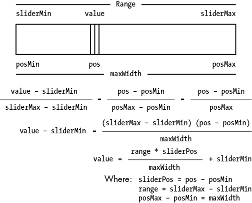
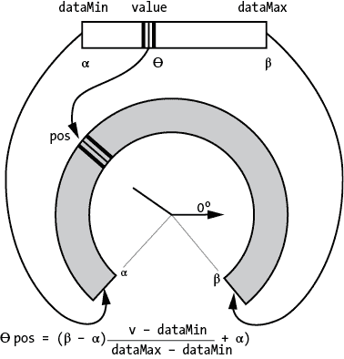

# 第五章：创建用户界面和小部件


## 草图 42：一个按钮

在控制台或文件中的文本和基本鼠标手势之后，简单的按钮是第三大最常见的用户输入方式。它在网页、游戏屏幕以及任何需要用户做出开/关或是/否选择的系统中无处不在。它当然是基于传统的按键，作为一种电气设备已经存在很久了，而且它的工作方式非常自然：按下按钮后，某些事情就会发生。

从图形上看，按钮其实就是一个矩形。它通常会填充一种颜色，并且有一个文本标签或图像来表示它的功能。当用户点击鼠标按钮并且光标位于按钮内部时，按钮分配的任务会被执行，通常是通过调用某个函数来实现。按钮的属性包括它的*位置*（按钮左上角的 x 和 y 坐标）、*大小*（按钮的宽度和高度）、*标签*（按钮中写的文本字符串），以及一个*颜色*或*图像*，该颜色或图像会出现在按钮上。

当鼠标光标位于按钮内时，按钮被称为被激活。激活时，点击鼠标会执行按钮的功能。有时，按钮在激活时会用不同的颜色或字体来绘制，以向用户指示激活状态。

本草图中实现的按钮会导致草图窗口的背景颜色发生变化。当鼠标进入矩形区域 3 时，按钮被激活。

```
if ( (mouseX>=bx) && (mouseX<bx+bw) && (mouseY>=by) && (mouseY<by+bh) )
```

其中（`bx`，`by`）是按钮的位置，(`bw`，`bh`) 是按钮的大小。

`buttonArmed()`函数在`if`条件为真时返回 true。`drawButton()`函数绘制并填充矩形，并绘制文本 1。当按钮被激活时，`drawButton()`还会将填充颜色从红色更改为绿色。当然，`mousePressed()`函数确定在鼠标按下时按钮是否被激活，如果是，它会改变背景颜色 4。

因为本草图只实现了一个按钮，所以它使用的代码并不多。通常，一个应用会有很多按钮，正如你在下一个草图中将看到的那样。

## 草图 43：类对象——多个按钮

本草图将创建并显示三个按钮，每个按钮代表一个颜色组件：红色、绿色和蓝色。当按钮被点击时，相应的背景颜色组件将随机变化。

如果一个应用需要很多按钮，那么在草图 42 中呈现的方案就会显得笨拙。我们想要的是一种类型，像`PImage`或`PFont`那样，代表一个按钮，这样我们就可以声明按钮变量或按钮数组。新的`button`类型应该包含按钮的所有属性以及执行合法按钮操作的代码，这些代码作为函数来编写。

使用名为类（class）的特性来创建带有关联函数的自定义类型。类是一种封装某些变量和函数并给它们命名的方式。`button`类应如下所示：

```
class button
{
  `your code here`
}
```

在大括号内，我们声明按钮使用的变量：`x`、`y`、`width`、`height`、`label`等。`drawButton()`和`buttonArmed()`函数也在类内定义，还有一个叫做构造函数的东西：每次创建新按钮（或者一般来说，类对象）时，构造函数会自动被调用。`class`语句及其后面的大括号内的内容将类声明为自定义类型，当你声明该类的变量时，你就创建了一个实例，即一个具体的对象，它包含类中的变量和函数。

`button`类的变量声明方式与`PImage`变量相同：

```
button b1, b2, b3;
```

下一步，和`PImage`或`PFont`一样，是使用`new`创建`button`类的实例并将其赋值给一个变量：

```
b1 = new  button (100, 150, 90, 30, "Button");
```

当你使用`new`时，Processing 会调用类的构造函数。构造函数接受参数，如位置或大小，并将这些参数保存起来，供之后绘制按钮时使用。构造函数的名称与类名相同（在这里是`button`），并且没有返回类型——它前面不会有`void`或类型名称。构造函数本身没有返回值，但`new`操作符会返回该类的新实例。如果你定义了多个构造函数，Processing 会调用与`new`语句中提供的参数类型和数量匹配的那个构造函数。构造函数随后会返回该类的新实例。你可以创建尽可能多的实例，只要你的计算机内存允许。

你可以通过点符号（dot notation）来访问类变量和函数。对于`button`类的实例`bred` 1，*x* 位置是`bred.bx`，要绘制它，你需要调用`bred.draw()`。主绘制函数必须为每个按钮调用`draw()`，否则它们不会显示，而主程序中的`mousePressed()`函数必须检查每个按钮，看它是否被点击（即鼠标光标是否在按钮内部），这可以通过每个按钮中的`armed()`函数来完成。

## 草图 44: 滑块

滑块是一个用户界面控件，允许用户沿着线性路径（水平或垂直）移动一个小物体（光标）。光标在路径上的相对位置代表一个数字。光标在一端的位置对应最小值，而在另一端的位置代表最大值。如果光标位于最小值和最大值之间的中点，那么与滑块相关联的值就是最小值和最大值之间的中间值。

这种控件可以用于在小窗口中定位大图像或在较小区域内定位大量文本，我们在这些情况下称其为滚动条。更一般来说，滑块的目的是让用户通过在两个限制之间滑动光标来几何地选择一个数字，而不是通过输入它。这是一个自然的想法：选择一个作为总数的分数或作为一个值范围的一部分。如果我们将`sliderPos`定义为光标从滑块起始位置开始的像素位置，将`sliderWidth`定义为滑块的宽度（以像素为单位），将`sliderMax`和`sliderMin`定义为与最小和最大光标位置相关联的数值，那么这是所选的值 3：

```
`value = (int)(((float)sliderPos/sliderWidth)*sliderMax + sliderMin);`
```

这个表达式基于滑块位置是总可选位置集的一个分数的事实，这代表了从`sliderMin`到`sliderMax`值之间范围的相同分数（见图 44-1）。



图 44-1：一个滑块

滑块可以通过多种方式图形化表示。在这张草图中，控件是一个水平矩形，带有一个圆形光标，当前的数值显示在右侧。然而，光标可以是矩形的、椭圆形的、三角形的、指针形的或其他形状。

`drawSlider()`函数 1 绘制矩形并使用`sliderPos`变量定位光标，当用户通过鼠标选择光标并将其移动（滑动）到矩形的两端时，该变量会被设置。要构建一个滑块类，你需要为位置、大小、当前光标位置和值创建类变量，并为绘制滑块和定位光标创建类函数（然后你可以像`slider.drawSlider()`或`slider.draw()`这样调用它们）。

滑块的常见用途之一是作为显示图像的一种方式。通常，图像可能无法适应某个特定窗口，或者根本无法适应任何窗口；有些图像非常大。与其调整图像大小，通常会在窗口的底部和右侧设置一个滑块，使用光标将窗口定位在图像上，这样就能看到图像的不同部分。通过滑块选择的值代表窗口在更大图像上方的(*x*, *y*)位置。

## 草图 45：仪表显示

计算机显示数值结果的显而易见方式是直接显示数字，但有时更类比的方式更容易为人们所接受。有些人喜欢数字时钟，而有些人则偏爱带指针的旧款时钟。类比显示可以让人类更快地处理信息。一种常见的显示方式是仪表，其中某种指针旋转并指向一个数字。比如，大多数老式的车速计就是这种类型的显示。图 45-1 以图形方式展示了一个仪表，并简要抽象了这种情况。


图 45-1：一个显示接近 0 值的仪表（左），以及显示涉及的角度（右）

仪表可以显示介于最小值和最大值之间的数值。最小值对应指针能达到的最小角度（图中标记为α），最大值对应指针能达到的最大角度（图中标记为β）。在这个草图中，角度直接映射到数值，因此每一个度数的变化始终代表相同的变化量。为了显示一个值，我们计算出与该值对应的角度，草图中将其命名为`theta` 1，并在该角度绘制指针。

一种看待这个问题的方法是将其视为一个形状像曲线的*滑块*。虽然*仪表*仅仅是一个显示工具，但确定指针位置的数学原理与滑块相同，只是我们使用的是角度而不是直线距离，并且它经过重新组织以提供位置值。图 45-2 展示了滑块情况如何转换为我们需要的仪表，并展示了用于确定绘制指针位置的公式。这个公式实际上与我们为滑块使用的公式相同。



图 45-2：仪表就像一个弯曲的滑块。这里展示的方程根据数值确定一个位置值（角度），但它与我们为滑块使用的方程基本相同。

我们确实需要理解 0 度是水平的，并且我们将起始角度（α）和结束角度（β）转换为相对于 0 的角度。从α开始，当数值增加到最大值时，指针的角度逐渐减小。如果α是 140 度，那么β应该是−45 度，而不是等效的角度 315 度，这样β < α。

`gauge()`函数根据图 45-2 中的方程，在给定数据值`v`的情况下，绘制出指针的位置。别忘了，Processing 中的角度需要以弧度表示，因此`pos`必须从度数转换过来。

## 草图 46：Likert 量表

Likert 量表是一种用于回答问题的评分量表，通常用于问卷调查中。被问者从一组选项中选择一个答案（通常是五个选项），这些选项从“强烈不同意”到“强烈同意”不等。其目的是收集标准答案，以便进行统计计算。

这个草图通过将问题绘制在屏幕顶部附近提出问题 2。可能的答案从 1（强烈不同意）到 5（强烈同意）编号，每个答案对应一个圆圈。用户通过点击一个圆圈来选择答案，圆圈会被填充 3。当用户对自己的回答满意后，按下任意键，草图会提问下一个问题。

问题存储在名为*questions.txt*的文本文件中，该文件在`setup()`中打开。我们假设文件中有多个问题，每个问题占一行。`loadStrings()`函数将它们全部读取到一个名为`question`的数组中，数组的长度就是问题的数量。每个问题根据其索引变量`questionNo`被逐一显示，`questionNo`从 0 开始，直到问题数量。用户通过点击五个圆圈中的一个来选择答案。所选的答案会作为当前选择（使用名为`select`的变量）保存在`mouseReleased()`函数中。

当用户按下一个键时，`keyPressed()`函数会被调用，所选答案将被写入一个名为*save.txt*的文件中。然后，`questionNo`变量会增加，显示下一个问题。当所有问题都被问完（即当`questionNo > question.length`时），文件将被关闭，程序结束。用户选择的所有问题答案现在都存储在*save.txt*文件中。

## 草图 47：一个温度计

原始的温度计，由玻璃制成，内部有彩色液体，设计上受到功能的限制，但它也是展示数字数据的一个绝佳方式。它通过彩色线条或矩形的高度来表示一个数字。很容易看出一个矩形有多高，并且容易与其他矩形进行比较。这个理念已被广泛应用，最显著的是在音响设备上用来显示音量。

在计算机上进行表示非常直接。一个彩色矩形的大小根据数字变量的大小变化。这样的变量有最小值和最大值，而矩形也有最小（通常为 0）和最大高度。数字与高度之间的映射可以像在滑块（草图 44）和指针仪表（草图 45）中一样进行。在这个草图中，它的实现方式稍有不同，但计算方式是相同的。

这个草图计算了每次变量 1 增加时，矩形高度增加的量。如果矩形的高度可以从`ystart`变化到`yend`，而数据值的范围是从`dataMin`到`dataMax`，那么每次数据增加时，矩形高度的变化如下：

```
delta = (float)(ystart-yend)/(float)(dataMax-dataMin);
```

然后，对于任何数据值`data`，矩形相对于`ystart`的高度如下：

```
val = ystart-(int)(data*delta);
```

这个过程只绘制一个矩形，虽然不算太有趣，但我们会添加一张背景图像（专门为这个程序制作），其中包含一个玻璃温度计的图像以及刻度线，允许用户将矩形的高度解读为数字。矩形的坐标必须特别映射到图像上，以便矩形与温度计柱对齐，使用的过程与草图 45 中类似。

这个例子生成一个随机数字进行展示。从`data = 15`开始，这个值在每一帧中会按一个小的随机量变化。
