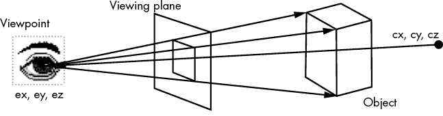
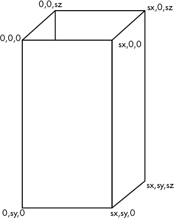
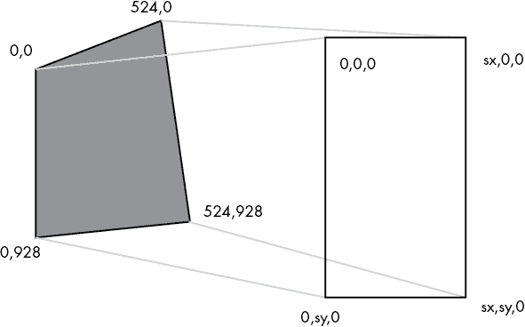
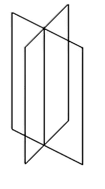
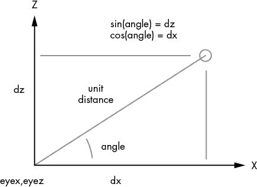
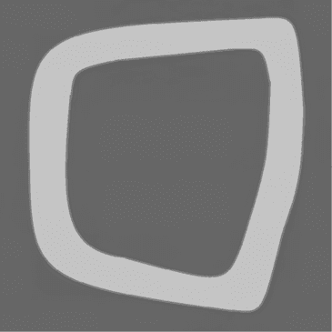

# 7

3D 图形与动画


## 51 号草图：基本的 3D 物体

到目前为止，我们一直在绘制二维（2D）物体：线条、圆形、三角形、矩形和图像。Processing 也可以绘制三维（3D）物体，尽管我们在计算机屏幕上能显示的只是它们的视图，即投影到平面上的二维图像。这种投影特性使得 3D 更加复杂。x 维度是水平的，y 维度是垂直的，在二维屏幕上显示这些坐标是显而易见的。第三个维度，称为 z，应该垂直于屏幕表面。为了可视化它，必须将三个坐标压缩为两个坐标，这正是投影所做的。

Processing 提供了一个 3D 立方体和一个球体。在这个草图中，我们将绘制这些标准物体，以展示 3D 的效果。

为了渲染 3D 物体，Processing 需要使用执行 3D 绘图操作的软件，称为 3D 渲染器。默认的渲染器叫做 `P2D`，它只处理二维图形。要指定三维度，我们需要在 `setup` 函数中的 `size` 函数里提供 `P3D` 渲染器作为参数：

```
size (300, 400, P3D);
```

现在所有的 3D 操作都可以使用了。立方体和球体通过函数提供，就像二维中的矩形和椭圆一样。`sphere(R)` 3 函数绘制一个半径为 `R` 的球体，位于原点处。

球体是通过一组三角形绘制的，每个顶点都有 x、y 和 z 坐标，这些三角形沿球体表面方向排列并连接边缘。可以将其视为使用许多短直线绘制圆形的 3D 版本；它并不完全平滑，但如果三角形足够小，视觉效果就能达到理想的效果。除非通过调用 `noStroke()` 关闭轮廓显示，否则这些三角形将是可见的。

`box(s)` 函数绘制一个立方体，其中每个边长为 `s` 像素 4。为了指定每个方向的大小，我们可以使用 `box` 的第二种形式：`box(w, h, d)`。

要在原点以外的位置绘制任何形状，我们必须先调用 `translate()` 2 函数，将原点移动到要绘制球体的位置。在 3D 中，坐标有三个值：x、y 和 z，`translate()` 函数有三个对应的参数。

最后，在绘制三维图形时，我们需要照明来创建深度感。为了启用照明，我们在 `draw()` 函数中调用 `lights()`。如果没有调用 `lights()`，示例 A 输出中的左侧球体将看起来只是一个圆形。

### 示例 A

我们绘制了两个球体：一个显示球体组成的三角形（右侧），另一个将它们隐藏起来（使用`noStroke()`，左侧）。球体从视角处移开然后再回来，比静止状态更清楚地展示了第三维度。

### 示例 B

我们绘制了两个立方体，再次右侧显示立方体的轮廓，左侧则不显示。立方体也从相机处移开然后再回来（沿着 z 轴）。

## 52 号草图：3D 几何—视点与投影

3D 物体实际上是在虚拟空间中具有三维坐标的边缘和面部的模拟。由于计算机屏幕是二维的，视觉化这些物体意味着将它们投影到一个平面上，以便它们能够在屏幕上绘制出来。

这个平面位于物体与观察物体的视点之间。视点是三维空间中的一个位置，由图 52-1 中的眼睛标示。（二维场景实际上没有视点；整个图像本身就是一个平面。）



图 52-1：查看一个 3D 物体

定义 3D 视图外观的第二个关键点是观察者（摄像机）*看向*的地方。这是场景的中心，用`(cx, cy, cz)`表示。3D 场景投影的平面与`(ex, ey, ez)`和`(cx, cy, cz)`之间的连线垂直，能够看到的内容完全取决于视野，或者说是可见场域的角度，决定了在不移动摄像机的情况下能看到什么。

在 Processing 中，我们使用调用`camera()` 1 来设置基本的 3D 配置：

```
camera(ex, ey, ez, cx, cy, cz, 0, 1, 0);
```

前三个参数是视点，接下来的三个是场景的中心。最后三个表示一个向量，用来定义方向*上*，以确保场景正确地定向。在这个示例中，*上*是正 y 方向。这是程序员做出的选择。

这个草图使用`camera()`函数，根据用户的按键操作，改变一对 3D 物体的视角。我们通过在`keyPressed()`函数中增加或减少`ex`和`ez`的值来移动视点的位置，当按下相应的键时：a 减小 x（向左移动），d 增加 x（向右移动），w 减小 z，s 增加 z（物体的距离）。这等同于在视频游戏中移动玩家。球体绘制在`(cx, cy, cz)`位置，确保它一开始就可见。为了将场景的中心从球体移开，我们可以使用上下箭头键改变`cy`的值。你可以通过使用键盘来实验这些改变视点和场景中心的效果。

## 草图 53：3D 照明

照明可以深刻地改变场景的外观。光源的位置会使物体或场景的特定部分可见，而其他部分则不可见。彩色光源可以改变物体的外观颜色。定向光可以照亮物体的某些部分而不照亮其他部分。Processing 提供了所有这些选项。

在这个示例中，我们将绘制一个球体，并允许用户通过输入数字来选择所使用的光照类型。光照可以是环境光（1）、定向光（2）、点光源（3）、聚光灯（4）或三者的组合：定向光、点光源和聚光灯（5）。默认光照为代码 0。当用户改变光照类型时，颜色也会随之改变：环境光是青色，定向光是紫色，点光源是黄色，聚光灯是绿色。

之前的示例使用了对`lights()`的调用来提供默认的照明。或者，我们可以调用`ambientLight()`函数 1 来指定环境光的颜色，并且可以选择性地指定环境光的位置，环境光是照亮整个场景的光源。

```
ambientLight (r, g, b, x, y, z);
```

前三个参数指定光的 RGB 颜色值。接下来的三个是可选的，用来指定光源的三维位置。从该点发出的光在各个方向上扩散。

`directionalLight()`函数 2 指定来自特定方向的光线，因此当光线垂直照射到表面时会显得更亮，而角度改变时亮度会减小。

```
directionalLight (r, g, b, dx, dy, dz);
```

同样，前面的三个参数表示光的颜色。接下来的三个参数表示光的方向。例如，如果`dy=1`而`dx=0`和`dz=0`，则物体将从上方照射。

`pointLight()`函数 3 创建一个光源位置，类似于灯泡。此调用会在指定的（`x`，`y`，`z`）位置放置一个 RGB 值的光源：

```
pointLight (r, g, b, x, y, z);
```

最后，`spotlight()` 4 是一种集中的定向光源，它是最复杂的光源之一。此调用指定一个在位置（`x`，`y`，`z`）上，朝着方向（`dx`，`dy`，`dz`）照射的 RGB 颜色光源：

```
spotlight (r,g,b, x,y,z, dx,dy,dz, angle, concentration);
```

`angle`的值是光的散射角度；角度越小，光圈越小。该角度以弧度为单位。`concentration`指定光在横截面上的变化，中心较亮，边缘较暗。值的范围从 1 到 10,000 不等。

## 示例 54：3D 弹球

示例 28 是一个弹球的模拟。一个圆形（球体）在窗口中移动，当它碰到边界时会反弹。将其扩展到三维，球体在立方体内反弹。当球体（弹球）撞到立方体的某一面时，它会反弹。这个问题在概念上与二维情况相同，但需要更多的代码，因为需要检查更多的条件并绘制更多的内容。

场景由一个立方体和一个球体组成。立方体占据了大部分视野，由坐标轴界定。我们将用特定的颜色绘制坐标轴，以显示三种主要方向：x 轴为绿色，y 轴为蓝色，z 轴为红色。我们将不调用`box()`，而是绘制组成边缘的 12 条线，以便我们可以看到里面的球体。

我们将从左上角的原点开始绘制立方体，接着绘制剩下的九条边，使用 `mycube()` 函数 1。为了判断球体是否与某个面发生碰撞，我们将测试球体的坐标与边界平面的 x、y 和 z 值，这些平面与坐标轴对齐。

我们仍然可以使用 `sphere()` 函数绘制在位置 (`x`, `y`, `z`) 处反弹的球体，通过将原点平移到该点再进行绘制。每绘制完一帧后，我们将球体移动一定的量 (`dx`, `dy`, `dz`)。如果球体的坐标使得球体超出了任何一个立方体面的边界，则球体会发生反弹——它会反转运动方向，远离该面。这通过 `moveSphere()` 函数实现。例如，在 x 方向上，这是特定的反弹测试 2：

```
if (x<=6 || x>=194) dx = -dx;
```

这个测试特定于半径为 12 的球体，因为它是与 6 像素的半径进行比较的。如果球体的半径 *r* 使得球体的中心距离某个面不超过 *r* 像素，则球体与立方体接触，而 *r* 是指定球体大小的一半。由于立方体从 (0, 0, 0) 开始，且每个方向的尺寸为 200 单位，因此球体在 x 坐标为 6 和 194 附近发生碰撞\。

立方体的中心位于 (100, 100, 100) 3。这个点是场景的中心。我们从视点的 (`x`, `y`) 中心（即 (100, 100)）凝视立方体，但沿 z 轴偏移 400 个单位。

## 草图 55：使用平面构造 3D 对象

Processing 仅提供球体和立方体作为基本的 3D 对象，但这并不意味着我们不能做更复杂的物体。我们可以从多边形构造任意对象。这意味着我们需要先设计对象，无论是在纸上还是使用像 Blender 或 Maya 这样的 3D 建模程序。设计过程会得到多边形顶点（角点）的三维坐标。然后我们可以使用 Processing 绘制这些多边形，从而显示该对象。

由于棱柱是最容易构建的对象，这个草图将绘制一个棱柱，并用不同的颜色表示不同的面，这样我们就可以分辨各个面。视角将沿着一定的模式移动，从而使物体的 3D 特性变得清晰。

长方体由沿边缘连接的矩形组成。例如，立方体就是一种长方体。第一步是确定组成棱柱的每个矩形的角点坐标。画一些方格纸来帮助理解非常有用：在纸上画出棱柱，并定义 x、y、z 坐标系（x 为水平轴）。然后，从原点 (0, 0, 0) 开始，将坐标按位置放置在图纸上，如 图 55-1 所示。现在你可以随意读取每个矩形的坐标。例如，图中棱柱的前面是由以下坐标定义的：(0, 0, 0)、(sx, 0, 0)、(sx, sy, 0)、和 (0, sy, 0)。



图 55-1：棱柱的 3D 坐标

要绘制作为一个对象连接的多边形，我们将绘制代码包裹在对`beginShape()`和`endShape()`函数的调用之间。在这种情况下，由于使用的多边形是矩形，`beginShape()`传入参数`QUAD` 1；另一种选择是`TRIANGLES`。这个参数告诉 Processing 每个多边形所需的顶点数量（在本例中为四个）。在开始和结束的调用之间，我们调用一个名为`vertex()`的函数 2。每次调用都指定了 3D 空间中的一个点，在此实例中代表矩形的一个角。例如，棱镜的前面是通过这些调用来定义的：

```
vertex (0., 0., 0.);
vertex (sx, 0., 0.);
vertex (sx, sy, 0.);
vertex (0., sy, 0.); 
```

草图绘制了四个连接在一起的矩形，沿垂直边缘形成一个没有顶部和底部的矩形棱镜。每个矩形通过在指定矩形的四个顶点之前立即调用`fill()`，并使用不同的颜色填充。

视点在每一帧中根据`dz`的量发生变化，z 的最小值为-200，最大值为 300 4，从而展示棱镜的各种视图。

## 草图 56：纹理映射

在草图 55 中，我们给棱镜的每一面赋予了不同的颜色，以便轻松识别每一面。这样做是作为一个练习，但在大多数实际应用中，棱镜通常是单一颜色，或者会有纹理被应用到它上面。纹理是一种图案，通常只是一个图像，我们像贴花一样将其应用到多边形上。通过这种方式，我们可以使一个简单的棱镜看起来像许多东西：建筑物、书籍、椅子——几乎任何有角的物体。这个草图将纹理（地毯）应用于多边形（矩形），并移动视点，以便可以看到 3D 效果。

将图像应用于多边形作为纹理的过程叫做纹理映射。算法的细节很复杂，但这个概念足够简单，而且它在 Processing 中的实现很自然地融入了之前为绘制对象所解释的方案中。英文过程如下：

1.  读取将作为纹理的图像 1。这将是一个`PImage`。

1.  定义一个 3D 多边形的坐标，可能是更大对象的一部分。

1.  将纹理图像的每个四个角映射到多边形的一个顶点；也就是说，如果多边形是矩形，决定纹理图像的哪些角将被覆盖在矩形的哪些角上。

1.  将坐标映射转换为对`vertex()`函数的调用 4。

1.  将`vertex()`的调用包裹在`beginShape()` 2 和`endShape()` 5 之间。

1.  在`beginShape()`之后，立即通过调用内置的`texture()`函数 3 来告诉 Processing 使用哪个纹理图像。

在这个例子中，我们使用的是地毯纹理的图像。作为方位标记，一个红色矩形放置在左上角，一个绿色矩形放置在右上角。纹理图像的尺寸为 524 乘 928 像素。这是从纹理到顶点的坐标映射，如图 56-1 所示：

+   纹理（0, 0）映射到多边形（0, 0, 0）。

+   纹理（524, 0）映射到多边形（sx, 0, 0）。

+   纹理(524, 928)映射到多边形(sx, sy, 0)。

+   纹理(0, 928)映射到多边形(0, sy, 0)。



图 56-1：将纹理坐标映射到多边形

`vertex()`函数允许我们使用两个可选参数来指定纹理坐标的映射。以下是之前顶点的映射：

```
vertex (0., 0., 0.,   0.,  0.);    vertex (sx, 0., 0.,   524, 0.);
vertex (sx, sy, 0.,   524, 928);   vertex (0., sy, 0.,   0.,  928);
```

因为 Processing 知道纹理图像（`timage`）的大小，前面映射中的数值常量 524 可以替换为`timage.width` 4。同样，我们可以用`timage.height`代替 928。

## 草图 57：广告牌——模拟一棵树

让我们在三维空间中画一棵树。棱柱是一个简单的物体，但树呢？树有很多部分：叶子、树枝、树皮以及各种细节。图形专家已经设计出了非常复杂的方法来创建像树、山脉和生物等复杂的东西，但在大多数情况下，我们不需要那么麻烦。对于艺术作品、动画和游戏，有一些方法可以简化事物（即“作弊”），使它们看起来相当不错，同时仍然容易实现。将树构建为广告牌就是其中之一。

在最简单的形式下，广告牌是一个矩形，上面绘制有纹理。它类似于你在旅游公路上驾驶时看到的广告牌，而在计算机图形学中，广告牌通常只出现在距离观察者较远的位置。为了做一棵树，我们将使用两个垂直的广告牌，它们在各自的垂直中心连接。每个广告牌都是一个矩形，上面贴有树的纹理图像。这个想法是，从任何角度看都能看到完整的树，并且通过移动视角，似乎能够改变树的视图。近距离观察时，很容易看出其中的原理，但从中等距离或在观察者移动时，这种幻象效果非常逼真。

图 57-1 展示了我们如何在三维空间中排列两个垂直的矩形。放置在它们上的纹理需要具有透明背景，否则白色矩形将会显现出来。这意味着需要使用 GIF 或 PNG 格式的图像文件，因为它们支持透明度。



图 57-1：两个垂直的矩形

草图首先读取我们将用作纹理的树的图像，并像往常一样打开窗口。`draw()`函数设置摄像机 1，并在原点绘制两个矩形，都使用树作为纹理，并将纹理映射到矩形 2 上，这与草图 56 中所做的类似。我们将第二个纹理映射的矩形旋转 90 度 3，并将其在 x 和 z 方向上平移 13 个单位，使其与第一个矩形的中心对齐。（矩形宽度为 26 单位，13 单位是其中的一半。）

我们还会在每一帧中稍微改变视角，以便在草图执行时，三维效果更为明显。

## 草图 58：在三维中移动视角

在第一人称电脑游戏中，玩家在游戏中的表现是一个头像，由玩家控制。按 w 键让头像前进，按 s 键让它后退，按 a 键让它左移，按 d 键让它右移。这种方案对于玩家来说容易理解，但比我们一直使用的方案更难实现。

到目前为止展示的草图中，运动是自动的或基于简单的假设——a 和 d 沿 x 轴移动，w 和 s 沿 z 轴移动——但人类的运动并不是这样。a 和 d 键应该使玩家围绕自己的轴旋转，w 和 s 键应该让玩家沿着由角度定义的方向前进或后退。作为头像运动控制的演示，这个草图绘制了九个立方体，并允许用户通过这种技术在它们之间移动。

头像有一个面向的方向，由变量`angle`（以度为单位）定义。按下 a 和 d 键可以让用户每按一次键改变一个角度。改变角度不会修改相机的位置，但会通过围绕头像旋转改变场景的中心。因为垂直轴是 y 轴，我们可以在 x-z 平面内通过简单的三角函数关系来计算这一点 4：

```
cx = cos(radians(angle))*20000.0;
cz = sin(radians(angle))*20000.0;
```

值 20,000 代表一个大距离，实际上是无限的，提供一个遥远的焦点。

按下 w 键让头像沿其面向的方向移动一个单位，这个方向由变量`angle`定义。每移动一个单位，`x`位置会改变`dx`，`z`位置会改变`dz`，如图 58-1 所定义。



图 58-1：将（x，z）运动转换为（角度，距离）

头像的位置是（`eyex`，`eyez`），并且对于任何给定的前进 1 或后退 2 动作，这两个值可能都会变化。按一次键将移动头像 5 个单位，或`dx*5`。

## 草图 59：聚光灯

如果环境光照关闭且背景较暗，任何绘制在 Processing 图形世界的 3D 空间中的物体都将不可见。这个草图以一种新的方式模拟了光照——作为一个在黑暗空间中的小聚光灯源。聚光灯照射在场景中心坐标上，其余的场景则没有光照。这个草图在场景中放置了三个不同颜色的立方体，用户可以通过旋转并观察立方体的亮起情况来探索这个空间。

这个草图与之前的草图使用相同的`keyPressed()`代码，因此头像可以旋转并前后移动 3。一个 Processing 聚光灯被放置在相机坐标 1：

```
spotLight(255,255,20, eyex,eyey,eyez, cx,cy,cz, PI/4, 300);
```

聚光灯的前三个参数（`255`，`255`，`20`）代表光线的 RGB 值，接下来的三个参数（`eyex`，`eyey`，`eyez`）是光线的 3D 坐标，接下来的三个参数（`cx`，`cy`，`cz`）是光线指向的坐标。这意味着无论相机/化身如何移动，聚光灯始终照射到场景的中心。光线的角度，`PI/4`（45 度），是第 10 个参数，我们可以增加或减少它，以查看场景发生的变化。数值`300`表示光线在聚光点中心附近的集中程度，较大的数值表示光线更为集中。

我们可以为其他类型的局部照明定义光源。例如，汽车的车头灯实际上就是两个相隔较小距离的聚光灯。代码中有一个被注释掉的语句，用来为草图中的光源添加第二个光源：

```
spotLight(255,255,20, eyex+3*dz,eyey,eyez+3*dx, cx,cy,cz, PI/4, 300);
```

聚光灯只能通过照射在物体上的光线反射来看见，不能作为发光物体被直接看到。点光源和其他光源也是如此。从这个意义上讲，光源并不是物体。围绕光源放置物体会照亮周围的物体，但不会使光源本身可见。

我们可以通过交替调用`spotLight()`函数或不调用它，来使光源闪烁或改变颜色，取决于一个标志（`flash`），它的值为真或假。只需在每一帧后改变计数器，并在固定的帧数（此处为 20 帧）后改变标志。以下代码交替地用红色或蓝色照亮两个球体，就像警车的闪烁灯一样。

```
if (count % 20 == 0) flash = !flash;  // If flash is true, make it false
if (flash)   spotLight(255,0,0,  0,  335,  0, 0,  -1, 0, PI/4, 300);
else   spotLight(0,0,255,  50,  335,  0, 0,  -1, 0, PI/4, 300);
sphere(20);
translate (50, 0, 0); sphere(20); translate (50, 0, 0);
```

## 草图 60：驾驶模拟

驾驶模拟和游戏具有特定的标准界面和视觉呈现。与之前的草图不同，在那些草图中用户可以在空间中移动但自己不可见，驾驶模拟显示的是化身为一辆车，摄像头（视角）通常位于车后方且偏上方，以便车的视角始终朝向前方。汽车行驶在道路上，因此背景非常重要；没有背景，用户就无法判断自己是否在道路上，也无法准确知道自己的行驶速度。这一草图将允许用户驾驶一辆车（实际上是一个长方体）沿着轨道行驶，使用与之前相同的方式来移动化身。

首先需要创建一个轨道。它将只是一个图像，因此我们可以使用画图工具或其他绘图程序。图像的大小应足够大，以提供一些娱乐性（多样性），并且在显示时不会严重失真。图中显示的示例（图 60-1）是 1,000×1,000 像素。



图 60-1：简单的驾驶轨道

草图读取这张图像，并将其用作绘制在 x-z 平面上的 1,000×1,000 方形纹理：

```
beginShape(QUADS);
  texture (track);
  vertex (0, 0, 0, 0, 0);   vertex (1000, 0, 0, 1000, 0);
  vertex (1000, 0, 1000, 1000, 1000);
  vertex (0, 0, 1000, 0, 1000);
endShape();
```

视角需要位于汽车的上方和后方。如果变量 `dx` 和 `dz` 代表给定 `angle`（汽车当前的朝向角度）下 x 和 z 方向的单位变化，而 `carX` 和 `carZ` 是汽车的水平和垂直位置，那么视角应该是这样设置的 3：

```
eyex = carX - dx*50;  eyez = carZ - dz*50;
```

它应该有一个固定的高度 `eyey=20`。值 `50` 是一个与图像大小相关的缩放因子。

我们在坐标 `(carX, 0, carZ)` 处绘制汽车。每次移动后，这些坐标会随着汽车速度（变量 `velocity`）的变化而变化；`velocity` 的值会随着用户按下 w 和 s 键而增加或减少（与之前的草图不同，在之前的草图中我们使用这些键来向前和向后移动）。w 键是油门踏板，s 键是刹车。汽车在用户按下任意一个键后会保持当前速度，用户可以专注于通过 a 和 d 键进行转向。

我们通过以下方式计算汽车的运动：

```
carX = carX + velocity*dx 
carZ = carZ + velocity*dz 
```

然后我们使用 `translate()` 函数使汽车朝向运动方向 2。汽车应该始终背对相机，因此为了让汽车朝向正确的方向，我们将其旋转 `–angle`。

效果是，汽车（一辆红色的棱柱体）可以加速（w）和减速（s），并可以向左转（a）或向右转（d），以保持在灰色的圆形路径上，同时相机保持在适当的距离跟随汽车。
