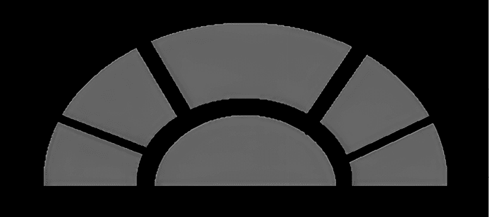
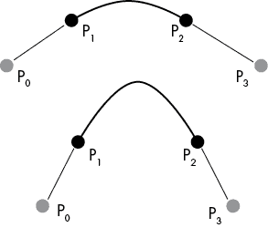
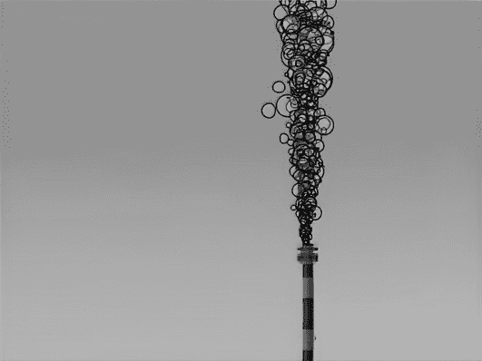
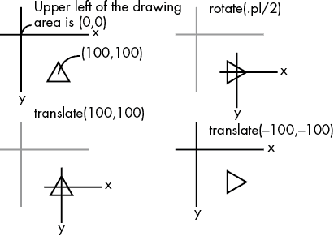
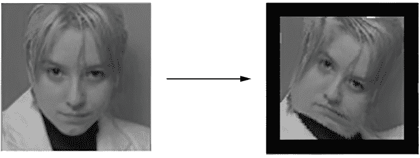

# 第八章：高级图形与动画


## 草图 61：图层叠加

现代图形程序（如 Photoshop）的一个关键特性是图层的概念。这是创建一组图形对象（图像），将它们叠加以实现复杂效果。透明度使得可以看到下层的物体。这个草图使用了三层：月亮的图像、环绕陨石坑的圆圈和一个目标显示（准星）。通过键盘，用户可以重新定位月亮图像。界面的目标是让用户将准星与目标圆圈对齐。

在草图窗口中绘制涉及使用一种名为`PGraphics`的图形对象类。`background()`、`line()`和`ellipse()`等函数，许多其他函数，都是`PGraphics`类的一部分，尽管我们可以在没有`PGraphics`对象的情况下使用它们。或者，我们的绘图可以发生在这些对象之一中，然后通过调用`image()`将其显示在屏幕上。这个草图将在`PGraphics`实例中绘制月亮图像，并用椭圆突出显示陨石坑，然后我们会在草图窗口中显示它。

用于`PGraphics`对象的变量名为`pg`，创建该对象的函数被称为（合乎情理地）`createGraphics()` 1：

```
PGraphics pg;
pg = createGraphics(moon.width, moon.height);
```

这里，`moon`是`PImage`变量，保存了月亮的背景图像。

要在`PGraphics`对象中绘制，我们使用之前使用过的图形函数，但指定`pg`变量作为目标 2：

```
pg.beginDraw(); 
pg.image(moon, 0, 0);
pg.stroke (0, 200, 0); 
pg.noFill(); 
pg.ellipse (393, 233, 12, 12);
pg.endDraw();
```

绘制之前会调用`beginDraw()`，这是一个类似于括号的函数；对应的结束括号是调用`endDraw()`。如果不使用这些调用，Processing 将无法初始化对象，绘制将无法进行（尽管 Processing 可能不会生成错误）。前面的代码在`PGraphics`对象中绘制月亮图像，并在目标周围绘制一个圆圈。

`draw()`函数通过调用`image(pg, xoff, yoff)`来显示`PGraphics`对象，其中`xoff`和`yoff`是位置偏移量，使用传统的 W、A、S 和 D 键来控制 3。（`PGraphics`对象具有`PImage`的许多属性，因为`image()`可以显示两者。）`xoff`和`yoff`的值通常为负数，以便将底层图形向左和向上移动，保持窗口稳定，从其在左上角的起始点开始。`draw()`函数还绘制了一个准星，作为指向窗口中心的小线条集 4。

## 草图 62：通过窗口看世界

许多游戏、动画和仿真（例如驾驶或太空旅行）将通过窗口的视图作为界面的一部分。这个草图实现了一个可以看到 3D 场景的窗口，并允许用户在场景中移动，同时透过窗口查看。

这是一个更高级的`PGraphics`应用。我们将渲染一个简单的 3D 场景到一个名为 `pg` 的 `PGraphics` 实例中，将一个具有透明部分的 2D 图像（窗户）读取到一个名为 `g2` 的 `PGraphics` 实例中，并通过调用 `image()` 将两个图形对象绘制到屏幕上。

我们将用于绘制 3D 场景的 3D 基本图形原语都属于 `PGraphics`。我们将通过 `createGraphics()` 的参数启用 3D 渲染引擎，1 而不是像草图 51 中那样通过 `size()` 来启用，然后通过调用 `camera()` 2 和 `ambientLight()` 来设置 3D 参数。基本的 `size()` 调用设置图形窗口；每个 `PGraphics` 实例就像是一个单独的绘图窗口，可以通过点符号来使用所有常见的图形方法：`pg.line()`、`pg.ellipse()` 等等。直到被绘制在图形窗口中，`PGraphics` 对象才会显示。因此，我们可以在 `pg` 对象内部创建一个模拟的 3D 空间，在那里绘制四个立方体，作为通过窗户查看的目标。

2D 部分涉及显示一个 2D 图像（一个名为 `back` 的 `PImage` 变量），它表示窗户（图 62-1）。该 GIF 图像具有透明部分，通过使用图像编辑器（如 Photoshop）将某个颜色（在这种情况下是绿色）定义为透明来创建。我们称这种类型的图像为模板。



图 62-1：窗户的模板

草图首先绘制 `pg`（3D 渲染）3，再绘制 `g2`（模板）4。`g2` 的透明部分允许通过窗户部分看到 3D 场景。

用户可以使用键盘按常规方式控制 3D 场景的视角。5 3D 场景会根据视角变化而变化，但 2D 场景则不会。结果是窗户保持在原地，但透过窗户看到的画面（透明部分）会随着视角的变化而变化，就像用户在移动的车辆内看到外面场景一样。

## 草图 63：PShape 对象——一个旋转的行星

这个草图将展示一个旋转的行星（一个球体），并允许用户在 3D 空间中环绕它移动。这个草图中新加入的部分是将行星表面纹理映射到球体上，而球体本质上是由多边形组成的。实现这种效果的一种方法是用多边形构建一个球体模型，并在 `beginShape()` 和 `endShape()` 块内进行纹理映射。更简单的方法是使用 `PShape` 对象，它是一种用于存储任意形状的数据类型。

为了实现旋转的行星，我们将通过调用`createShape()`来创建一个`PShape`对象，这使我们能够利用`PShape`类提供的大量绘图操作构建任意复杂的形状。使用`PShape`几乎可以创建任何东西，而在线文档对于复杂的创作是必不可少的。我们的例子很简单，因为球体是已提供的形状之一。这是创建行星的调用，其中`globe`是一个`PShape`对象 1：

```
globe = createShape(SPHERE, 100);  // 100 is the size of the sphere
```

纹理，作为一个名为`timg`的`PImage`变量，应用于`globe`对象，使用`globe.setTexture(timg)` 2。

然后我们在`draw()`函数中通过调用`shape()`函数 3 来显示行星。

```
translate (x, y, z);
globe.rotateY(radians(0.5));  // rotateY function is a part of PShape
shape(globe);                 // This displays the shape in the window
```

这段代码将球体放置在视野中心，并绕其自身轴旋转，随后进行显示。常用的按键允许用户改变视角。

## 草图 64：样条—绘制曲线

到目前为止，我们已经使用预定义的 Processing 函数渲染了简单的几何物体，如线条、椭圆、矩形和球体。但许多现实世界中的物体并非线性或椭圆形的；它们有复杂的形状。比如汽车、风扇叶片、珠宝、衣物以及生物体，甚至数据图表等，都是复杂形状的例子。在 Processing 中，复杂形状通过曲线来渲染。为了演示，这个草图允许用户通过一系列鼠标点击来绘制曲线，并观察所选的“控制点”如何影响曲线。

Processing 使用*splines*来渲染曲线。在早期的绘图时代，当人们使用铅笔和 T 型直尺时，曾使用一种叫做样条的工具来绘制平滑的、不规则的曲线。它是一条长而灵活的金属条，可以保持形状，和纸上的点对齐，并允许绘图人员用铅笔将这些点连接起来。从数学上讲，样条是一种多项式函数，通过使用一组点来逼近曲线。具体细节可能很复杂，但基本思想是使用许多连接在一起的多项式来构建曲线。Processing 隐藏了这些复杂性。

Processing 提供了一个名为`curve()`的函数，来实现一种叫做 Catmull-Rom 样条的多项式类型。该函数使用四个点来定义曲线的每一部分。前两个点定义曲线开始时的方向，后两个点定义曲线结束时的方向。曲线本身由中间两个点之间的一组点（像素）组成。如图 64-1 所示，前两个点定义的角度确定了曲线在 P[1]点的方向，从而定义了 P[1]和 P[2]之间多边形的形状；通过 P[2]和 P[3]之间的方向来确定曲线在 P[2]的方向。在图中，两个示例中的 P[1]和 P[2]是相同的，但由于 P[0]和 P[3]的位置不同，曲线的形状也有所不同。



图 64-1：样条曲线的控制点

这是在 Processing 中用来绘制 P[1]=(x1,y1)和 P[2]=(x2,y2)之间曲线段的函数调用：

```
curve (x0,y0,  x1,y1,  x2,y2,  x3,y3);
```

起始点和结束点（`x0`，`y0`）和（`x3`，`y3`）控制曲线的形状 1。为了绘制更长的曲线，我们需要多次调用`curve()`，每次的结束点是下一个曲线的起始点。

这个草图允许用户选择点，这些点通过鼠标点击绘制为小红圈 2，并观察随着鼠标移动，下一个点的位置如何影响曲线形状。四个点定义了一条曲线，因此当用户选择第四个点时，将使用指定的点绘制一条红色曲线，然后从最后一个点到鼠标位置（`mouseX`，`mouseY`）绘制一条蓝色曲线，随着鼠标移动而变化。再次点击将向曲线添加一个新点，将红色部分扩展以包含新点，并显示一个新的蓝色部分。按下 BACKSPACE 键将删除曲线中的最后一个点 3，按下空格键将打开或关闭最后一段（蓝色）曲线的绘制 4。

这个草图将点坐标保存在数组`x`和`y`中，并将连续的四个坐标组传递给`curve()`函数。

## 草图 65：带有路标的驾驶模拟

草图 60 允许用户在 3D 赛道上驾驶，草图 64 展示了如何创建曲线，比如模拟汽车可以驾驶的赛道。计算机驾驶游戏通常有自动化的车辆与玩家竞争，给人一种真实对手的印象。这个草图将实现一个类似于那些计算机游戏中使用的方法的计算机控制汽车系统。

重要的是要意识到，游戏和模拟不一定像人类一样做事情。人类驾驶员会根据他们看到的下一个转弯来调整汽车的方向，并不断地转动方向盘以保持在车道上。我们也可以编写一个计算机程序来实现这一点，但这会相当复杂。另一种选择是使用关于赛道的预设知识来控制车辆。在这种情况下，程序员必须在一开始就为程序提供更多信息，但代码的简洁性弥补了这一努力。

具体来说，程序员将赛道分解成线性段。线性段应该尽可能长，并在称为路标的顶点处连接，路标是线的方向发生变化的地方，也是汽车改变方向的地方。（我们可以以这种方式分解任何曲线。）每个路标都有一个编号或标签，由程序员分配。当汽车到达路标 1 时，程序将改变其运动方向，朝向路标 2 移动。当它到达路标 2 时，它将转向路标 3。由于这些段是直线的，因此我们不需要在路标之间转向。

本草图将路径点实现为一个数组集合，每个数组包含路径点的一个维度。路径点 `i` 的位置存储在数组 `wpx[i]` 和 `wpy[i]` 中。在更精确的模拟中，路径点会关联更多信息：速度和加速度的变化、转弯的变化率，甚至可能包括一些图形信息，比如刹车灯的亮起。在当前草图中，唯一需要的其他信息是当前路径点和下一个路径点之间的角度，这样我们就能旋转车辆，使其朝向新的方向。我们本可以计算这个角度，但这会需要更多的代码，而路径点的位置和它们之间的角度可以预先确定。我们声明了数组 `wpx`、`wpy` 和 `wpa`，并用位置和角度数据初始化它们，这也隐含地定义了数组的大小。（不能同时使用数字指定数组大小并通过数据初始化它。）

使用车辆的指定 `speed`（通过 W 和 S 键更改），我们计算其每帧的位移变化为 `dx = speed * ( wpx(i+1) - wpx(i) )/d(i,i+1)`，其中 `d(i,i+1)` 是路径点 `i` 和 `i+1` 之间的距离。我们说车辆到达路径点 `i` 时，它距离该点的像素数在 `speed` 范围内，此时它会改变方向，瞄准下一个路径点 `i+1`。`wayPoint` 变量表示最后到达的路径点，意味着车辆正在瞄准 `wayPoint+1`。路径点计数会在末尾环绕，因此我们按模 *N* 递增，其中 *N* 是路径点的数量：路径点 *N* 之后的路径点是 0。

按下空格键可以让用户查看路径点和路径的位置。

## 草图 66：许多小物体——一场雪暴

一个 Processing 程序每秒钟会重绘多次屏幕。每一帧中，屏幕上的可见物体都需要被重新绘制，为了做到这一点，程序必须保存所有物体的图形参数（大小、位置、形状和颜色）。绘制每个物体需要时间，那么如果物体很多，是否仍然能够足够快地重绘它们？在许多情况下，如果物体本身不复杂，是完全可能的。本草图将绘制雪花飘落，每一片雪花都是一个物体，它在每一帧之间会真实地移动。

雪花实际上是非常复杂的形状，但从远处看，它们只是白色的斑块。我们将它们绘制为小矩形，每一帧的宽度和高度都会略微随机变化，以模拟雪花在下落过程中轻微飘动的效果。我们通过公式 `width = size + random(3)-1.5` 来设置尺寸。

`size` 是一个常量，设置为 `3`，而 `random(3)` 的值是介于 0 和 3 之间的一个数字，因此 `random(3)-1.5` 的值将介于 −1.5 和 +1.5 之间，从而导致大小在 1.5 和 4.5 之间变化。每个雪花的下落速度也略有不同。这种差异造成了深度的假象，因为下落更快的雪花看起来离观察者更近，而下落较慢的雪花则更远。速度是随机选择的，但它达到了预期的效果。

程序会在屏幕顶部生成雪花，并给它们设置一个向下（+y）速度，这样它们看起来就会下落。为了追踪每片雪花的位置信息、大小和速度（在 x 和 y 方向上），我们使用数组：例如，数组 `x` 存储 x 位置，`x[i]` 是第 `i` 个雪花的 x 位置。数组大小由常量 `SIZE` 给出，表示最大雪花数量。（这个值是 5,000，是通过试验和误差，根据观察到的背景和最大降雪速率确定的。）

雪花通常不会垂直下落；我们看到它们随着气流飘动和漂浮。雪花下落的速度保持不变，但每片雪花的 x 位置会在下落过程中随机变化一些，以模拟真实的雪花效果。如果我们将 `dx` 设置为非零值，它就模拟了风的作用，雪花将会在指定的方向上吹动。

每一帧，我们生成最多 30 片新的雪花，随机设置它们的横向位置和 y 坐标为 0 4（位于窗口顶部，以保持假象）。每帧生成的雪花数量是随机的，但它与鼠标的 y 位置有关。鼠标越接近屏幕顶部，看到的雪花就越少。以下是生成的雪花数量：

```
N = (int)random (((float)mouseY/height)*30);
```

这意味着，对于小的 `mouseY` 值，几乎没有雪花会落下，而当 `mouseY/height` 达到最大值 1.0 时，每帧会最多生成 30 片新的雪花。

全局变量 `SIZE` 的值为 5,000，这是屏幕上可以同时显示的最大雪花数量。最初只有几个雪花，但数组会迅速填满。当所有 5,000 个数组元素被占用时，我们会从 0 开始重新计数，假设数组开始位置的雪花已经掉过屏幕底部并且不可见。这个技术被称为循环数组。

## 草图 67：粒子图形—烟雾

有些东西用多边形建模很困难，例如水、火、云和烟雾等柔软且无定形的物体。这些物体的运动方式不可预测，并且可以扩展以填充任意形状。这个草图将绘制从烟囱中冒出的烟雾，并展示现代计算机图形学中的一个关键方法：粒子系统。

粒子系统将大量小物体组合起来，形成复杂的形状。这些物体通常很简单，比如球体或圆形，并具有一组控制其显示的参数。圆形的基本参数包括位置、速度、颜色和大小。初始参数通常包含随机元素，例如速度加上或减去一个随机数。发射器是系统创建新粒子（圆形）的地方，通常带有一个小的随机位移，这样粒子就不会完全位于发射器位置。

这个草图中的粒子系统生成了大量重叠的圆形，这些圆形可能是半透明的，以略微不同的速度移动（与之前的草图相比，唯一不同的是密度）。之前的草图绘制了大量小物体，仍然可以看作是单独的雪花。而在这个草图中，如果粒子的数量足够多，我们就无法区分它们的个体，它们会组合成一个物体。随着数量的增加和物体的重叠，结果看起来像雾气或烟雾。

该草图定义了要创建的大量圆形（`SIZE`），并声明了数组来保存每个圆形的位置、速度和大小。例如，`x[121]`的值表示第 121 个圆形的 x 位置。初始时没有圆形，变量`last`保存最后一个定义的圆形的索引。每一帧我们创建新的圆形时都会增加`last`的值，当圆形的数量超过`SIZE`时，我们会将其重置为零。

`draw()`函数首先遍历数组，绘制每一个存在的圆形（意味着`x[i] > 0`）1。它会将圆形的位置稍微改变，可能会略微改变大小，并赋予它一个围绕 RGB = (205, 205, 150)变化的颜色。然后，它会创建一个随机数量的新圆形，赋予它们靠近发射器的位置、垂直的速度和一个较小的大小 2。

效果非常引人注目。通过多达 800 个圆形，系统能极好地模拟烟雾向上升腾的效果。该草图展示并呈现了一个烟囱的背景图，以增强视觉效果。

圆形的轮廓已经通过`noStroke()`关闭，但将该语句删除并运行程序，可以看到粒子的形态。这样，粒子的移动和重叠变得更加清晰，如图 67-1 所示。



图 67-1：粒子显示圆形的轮廓

## 草图 68：保存状态——旋转螺旋桨

这个草图将绘制一个旋转的螺旋桨。我们可以用多种方式编写代码，有些方式比这个草图中的方法更简单，但这里的目的是通过一个简单的例子来解释如何以及为什么要保存（和恢复）草图的几何状态。

几何状态是所有平移、旋转和缩放的结果组合，这些操作在绘制过程中的某一特定时刻累积。围绕物体的中心旋转意味着首先将原点平移到物体的中心，进行旋转，然后再将原点平移回原位置。如果不通过撤销平移来恢复状态，那么从此时起绘制的所有物体都会平移到该物体的位置。

当前状态，无论是什么，包括所有的旋转、平移和缩放，都是通过调用函数`pushMatrix()`来保存的，并通过调用`popMatrix()`来恢复。这些调用必须始终成对出现，就像括号一样；调用`pushMatrix()`总是有一个对应的`popMatrix()`调用。例如，您可以在围绕(100, 100)的中心旋转一个三角形时，保存并恢复状态，如图 68-1 所示，代码如下：

```
pushMatrix();
translate (100, 100);
rotate(angle);
triangle (0.-20, 20, -20, -20, 20);
popMatrix();
```

此时，原点和旋转角度已恢复到原始值，接下来可以从一个干净的状态绘制下一个物体。

这个草图绘制了一个四部分的螺旋桨，每个部分是一片刀片，即一张图片。我们绘制这片刀片四次：一次是原始方向，然后是围绕螺旋桨中心点每次旋转 90 度，共三次。每个部分的绘制都使用了保存和恢复状态：

```
pushMatrix();            // Save 
rotate(PI);              // Rotate 
image (prop, 0, 0);      // Draw 
popMatrix();             // Restore
```

这个四部分的螺旋桨绘制在一个`drawProp(x, y)`函数中，该函数在进入时保存状态，然后平移到(`x`, `y`)，缩放图像，旋转图像，更新角度，以便下次调用`drawProp()`时绘制出不同角度的螺旋桨，并绘制四个部分。我们通过多次调用`drawProp()`函数，在多个位置绘制旋转中的螺旋桨。



图 68-1：围绕物体中心旋转所需的变换

## 草图 69：L 系统——绘制植物

绘制逼真的植物是困难的。生物体通常没有直线，而直线是计算机最擅长绘制的形状。此外，生命形式有一种人类能够识别的随机性，因此我们对渲染的结果会产生批判。1968 年，一位名叫阿里斯蒂德·林登梅耶的植物学家开发了一种描述真菌和藻类生长的方案，后来将其扩展到处理更高级的植物生命。此方案随后被计算机图形学从业者改编成一种绘制植物的方案。我们称这种方案为 L 系统。

L 系统在技术上是一种语法，是一组用于生成字符串的规则。如果语法有两条规则，X -> Xf 和 X -> z，那么它就展示了如何将一个符号 X 转换成一个字符序列。对于每个 X，我们选择遵循哪个替换规则，并继续替换大写 X（称为非终结符号），直到没有更多可以替换的 X。以下是该语法的一个扩展示例：X -> Xf -> Xff -> Xfff -> zfff。

在 L 系统中，一种可以定义植物的文法，最终的字符串代表着绘制某物的配方。它使用以下符号：

1.  f 绘制一条直线段。

1.  [ 保存当前状态（`pushMatrix()`）。

1.  ] 返回到先前的状态（`popMatrix()`）。

1.  + 按固定的正角度旋转。

1.  - 按固定的负角度旋转。

该文法使用两个规则来生成这些符号的字符串：

1.  X -> ff

1.  X -> f–[[X]+X]+f[+fX]–X

除非植物只包含两条直线（ff），否则第一步将是 X –> f–[[X]+X]+f[+fX]–X。然后，每个 X 将被替换为产生式的右侧，因此第二步可能是 f–[[X]+X]+f[+fX]–X –> f–[[ f–[[X]+X]+f[+fX]–X]+ff]+f[+ff]–ff，接下来可能是 f–[[ f–[[ff]+ff]+f[+fff]–ff]+ff]+f[+ff]–ff，现在可以绘制了。

`makeString()`函数 1 会调用自身，将非终结符号 X 展开为字符串，并将这些字符串附加到正在构建的字符串上。它只会根据第一个参数`levels`指定的深度调用自身，然后返回，从而保证程序最终会结束。文法生成的字符串传递给`drawPlant()`函数 2，后者将每个字符作为图形操作执行，从而绘制植物。在`void drawPlant(float length, float angle, String s, int drawLevel)`函数中，第一个参数`length`是绘制直线段的长度（对于符号 f）；`angle`是+和-字符的旋转角度；`s`是由`makeString()`生成的字符串；`drawLevel`表示绘制线条的深度级别。本质上，`makeString()`创建了一个绘制植物的程序字符串，而`drawPlant()`执行这个程序。

## 示例图 70：图像的变形

1991 年，公众首次见到了形态变换效果，这是一种利用计算机平滑地将一幅图像转换成另一幅图像的效果。计算机生成一小段图像序列，当这些图像以视频序列回放时，一个物体似乎会不断地改变形状，直到变成另一个物体。电影《终结者 2》使用了这一效果，最具代表性的是迈克尔·杰克逊的《黑白》音乐视频，其中人物的面孔相互变形。这段示意图执行的是图像的弯曲或变形，但并没有进行完全的形态变换。

形态变换方法的原理是所谓的多项式变形。假设我们将图像放置在一个常规网格上，然后使用数学函数弯曲网格并将图像一同弯曲。结果是图像以特定的方式发生变化——变形。两个图像之间的形态变换要求我们建立图像之间的对应关系，通常由人工完成。一个函数将（映射）一幅图像变形为另一幅图像（变形），而像素的颜色值会系统性地从源值变到目标值。

如果图像是一张人脸，并且扭曲基于正弦曲线，那么我们会得到一种像是镜厅效果的视觉效果，如图 70-1 所示。原始人脸的几何形状会根据函数变形（映射）到新的人脸几何形状。



图 70-1：扭曲人脸

这个草图实现了图像的扭曲。我们读取一张图像，并根据正弦函数变换坐标来显示像素。原始图像是`source`，这是原始和新像素坐标之间的映射：

```
newX = (int)(x + size*sin(radians(3*y)));
newY = (int)(y + size*cos(radians(4*x)));
```

这个映射是任意选择的，目的是为了创造有趣的效果。执行映射的循环 2 必须将目标像素值映射回源像素，而不是反过来。如果我们反向映射，源图像中的每个像素确实对应目标图像中的一个像素，但结果中可能会出现未映射的像素。因此，对于目标图像中的每个像素`(x,y)`，我们使用所需的函数将其转换为`(newX, newY)`值，然后找到源图像中对应的像素。接着，我们将目标图像中的`(x,y)`像素设置为源图像中的`(newX, newY)`。

在这个草图中，`ds`和`size`的值是变换函数的参数，它们每一帧都会略微变化 1，从而在图像中创造出一个周期性的变化，这种变化会被人眼感知为弯曲或扭曲的动画效果。
