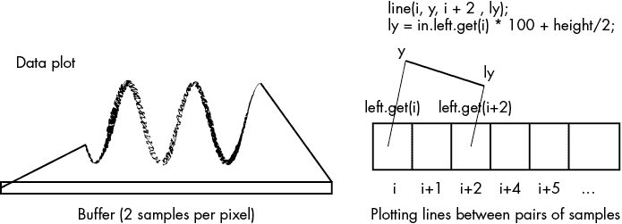
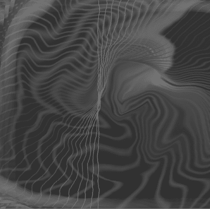
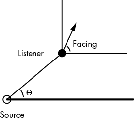

# 第九章：处理声音


## 草图 71：播放声音文件

一方面*显示*的是图像，但*播放*的是声音；这是为什么呢？无论原因是什么，Processing 并没有标准的音频显示功能。不过，它确实有一些库可以实现这一目的，最重要的就是 Minim。（我们在草图 50 中使用了一个库。）

使用 Minim，这个草图将通过标准的 PC 音频接口播放一个 MP3 或 WAV 格式的声音文件。除此之外，如果用户按下 A 键，声音将会朝左扬声器移动；如果他们按下 D 键（在 A 键的右边），声音将会朝右扬声器移动。

程序中的第一条语句 1 表示我们想要访问 Minim 库：

```
`import ddf.minim.*;`
```

然后我们需要创建一个 Minim 库的单一实例。Minim 库是一个类，包含了能够加载和播放声音文件的函数。定义一个名为 `minim` 的 `Minim` 类型的变量，并在 `setup()` 函数 3 中初始化它，如下所示：

```
minim = new Minim(this);
```

现在声明一个声音播放器变量 2：

```
AudioPlayer player;
```

使用 `Minim` 函数 `loadFile()` 4 将其分配为从 MP3 文件读取的声音文件：

```
player = minim.loadFile ("song.mp3");
```

我们可以使用 `play()` 函数 5，通过计算机的音频硬件播放该文件，这是 `AudioPlayer` 的一部分：

```
player.play();
```

为了改变立体声扬声器中声音的平衡（声道），用户按下 A（左）和 D（右）键。每按一次键，就会向 `pan` 变量添加一个小值，或从中减去一个小值，然后用这个变量来设置平衡 6：

```
player.setPan (pan)
```

对于其他效果，控制声音显示的函数种类繁多，包括获取和设置平衡/声道、增益和音量的函数：`getBalance()`、`getVolume()`、`getGain()`。Minim 的文档可能会在网上有所变动，但在 2022 年可以在 [`code.compartmental.net/2007/03/27/minim-an-audio-library-for-processing/`](http://code.compartmental.net/2007/03/27/minim-an-audio-library-for-processing/) 找到。

## 草图 72：显示声音的音量

草图 71 的显示效果并不特别引人注目。它的显示是听觉上的，虽然这与其主要功能相符，但 Processing 语言通常会生成更多图形输出。一种显而易见的方法是通过视觉方式显示声音的音量，像是通过表盘上的数字，或者像本草图一样，通过垂直条形的高度。

为了让这个草图正常工作，我们必须获取从文件中读取的声音的数值。`Minim` 的 `AudioInput` 组件类允许与计算机当前的录音源设备建立连接。为了让这个草图正常运行，用户需要将源设备设置为监控正在播放的声音。例如，如果声音输入来自一个文件，我们可以使用如下代码：

```
3 player = minim.loadFile ("song.mp3");
```

假设这一点成立，草图使用 `AudioInput` 类型的变量（命名为 `in` 1），并通过 `getLineIn()` 2 来初始化它：

```
in = minim.getLineIn(Minim.STEREO);
```

现在，变量`in`可以访问属于`AudioInput`的函数，包括获取单个数据值的功能。计算机中的声音由采样电压组成，这些电压被重新缩放到一个便于使用的范围。因此，音频值是一个数字，通常在 −1 和 +1 之间，代表音量。我们可以访问每个立体声通道：左通道是`in.left`，右通道是`in.right`（这些是`AudioBuffer`类型，也就是一个实数数组）。`get()`函数允许访问数值：

```
ly = in.left.get(128);
```

这会获取缓冲区中的第一个值，它可能是正数或负数，因此为了显示目的，最好使用值`abs(in.left.get(128))*2` 4，它仅仅是将值的大小移动到 0 到 2 的范围内。现在这个数字可以表示矩形 6 的高度，与声音的音量成比例：

```
rect (100, 200, 20, -ly*100);
```

同样的过程适用于左通道和右通道。

加载到变量 player 中的声音的总时长是`player.duration()`；假设正在播放，则当前的播放位置是`player.position()`。当声音播放完毕时，`player.length() <= player.position()`，`Minim`的规范要求在结束时关闭并停止`Minim`，以确保资源被归还给系统（通过`in.close(); minim.stop();`）。在草图中，`stop()`函数 7 做了这一点。

该草图还显示了声音数据的数值。一个实数可能包含很多位数，其中大多数实际上并不重要。为了像草图中那样只显示两位小数，将数值乘以 100，然后将其转换为整数。这会去掉剩余的小数部分（所有右侧的数字）。然后再将其转换回实数并除以 100 5：

```
(int)(ly*100)/100.0
```

## 草图 73：带有音效的弹跳球

在电影、动画、戏剧和电脑游戏中，音效通常是一个短小的音频片段，用来表示某个事件的发生。电话铃声、球棒击打棒球的声音、石头落入湖中的水花声都是音效的例子。这个草图将展示如何在简单的模拟中使用音效。

草图 28 模拟了一个弹跳球。看起来不错，但如果每次弹跳都伴有声音效果，会更像一个动画。声音是人类的重要提示，音效为图形增添了真实感。它不需要非常精准，只要是与事件对应的一些点击或碰撞声就可以。从草图 28 的代码开始，我们将添加来自 Minim 库的 `AudioPlayer` 对象，在球与窗口的边缘碰撞时播放一个短的 MP3 文件。

为了创建声音效果，我们将使用 PC 麦克风和免费提供的声音编辑/捕捉工具（例如 Audacity ([`www.audacityteam.org/`](https://www.audacityteam.org/)) 或 GoldWave ([`www.goldwave.ca/`](http://www.goldwave.ca/))）保存一个重击声（例如，球弹到地板上或杯子放在桌子上的声音）。这个示例假设声音已经保存为 *click.mp3*。

在 `Minim` 初始化后 1，`AudioPlayer`（变量 `player`）读取 MP3 文件。当球击中窗口的某一侧时，`xbounce()`2 和 `ybounce()`5 函数检测到这一点，球改变方向，然后通过调用 `player.play()` 3 播放声音。

每次播放声音文件之前，我们必须倒带文件，确保它从头开始播放。`AudioPlayer` 内的 `rewind()` 函数完成了这个操作。

## 示例 74：混合两种声音

在声音混音的过程中，我们将多个声音源分配到不同的输出级别或音量。在现场音乐会中，这可以使每个乐器的声音以适当的音量级别听到。我们在录制多个声音源时也会这么做，例如麦克风、吉他和其他乐器，这些音源的音量需要调整，以确保没有一个元素的音量压过整体的声音。混音器已经存在很长时间了，大多数混音器都有滑动控制来调整多个声音信号的音量。这个示例将使用在示例 43 中开发的滑动控制来调整两个不同声音文件的音量。

示例首先声明了两个 `AudioPlayer` 变量 1，一个用于每个声音，加载声音文件 2，并开始播放它们 3。接下来，我们创建两个滑动控制；一个是控制 A，具有以“a”开头的位置和控制变量（`asliderX`，`asliderY`，`avalue`），另一个是控制 B（`bsliderX`，`bsliderY` 等）。滑动控制 A 的值用于设置第一个声音文件（由 `playera` 播放）的音量，滑动控制 B 控制另一个文件（由 `playerb` 播放）的音量。

我们通过调用 `Minim` 函数 `setGain()` 来设置输出级别。这个函数有一个参数表示增益的值（与音量成正比）。增益的单位是分贝（dB），范围从 −80 到 +14，总共 94 dB 的范围。滑动控制的总范围是 1,000。因此，`playera` 的增益通过以下调用 4 设置：

```
playera.setGain(avalue/1000.0 * 94 - 80);
```

如果滑动控制的值为最小值 0，增益将为 0/1,000 * 94 − 80 = 0 − 80 = −80。若滑动控制的值为最大值 1,000，增益将为 1,000/1,000 * 94 − 80 = 94 − 80 = 14。增益值在极值下正确输出，这支持了映射是正确的观点。不过，dB（分贝）刻度是对数的，因此这是对真实值的近似。

当草图执行时，两个声音文件将播放。将上方滑块向右滑动将增加*sounda.mp3*文件的音量，而滑动下方滑块将控制*soundb.mp3*文件的音量。其目的是找到听起来合适的相对音量。

## 草图 75：显示音频波形

大多数基于计算机的声音编辑器显示音频信号的图形渲染，并允许用户用鼠标“抓取”其中的部分并移动或删除它们。这个图形显示实际上是音频音量与时间的关系图。一些音乐播放器实时显示这种图表，在音乐播放时展示。这正是这个草图将要做的。它绘制计算机播放的任何声音的图表。

绘制这一点需要能够实时获取声音数据作为数字。稍微的误差并不重要，因为这不是一个科学工具，所以可以使用草图 72 中的部分代码，该代码也显示了音频可视化。在这里，我们将填充一个声音缓冲区，然后将其作为声音数据播放，直到数据播放完毕。

音频以一组连续的数值表示，这些数值可以合理地存储在数组（缓冲区）中。通常有两个通道（立体声），并且可以通过`in.left_get()`或`in.right_get()`函数检索缓冲区中的任何值，指定所需的样本。例如，程序通过调用`left_get()` 3 获取左通道的数据点，并使用此值表示当前缓冲区中的所有级别。这只是*一个*数据点，来自许多样本，并且在调用`getLineIn()`时可以指定缓冲区的大小。系统从这个缓冲区播放声音，并在需要更多数据时重新填充它。我们指定每个缓冲区 1 包含 1,024 个样本：

```
in = minim.getLineIn(Minim.STEREO, 1024);
```

如果窗口宽度为 512 像素，则每 2 个样本对应 1 个像素，其高度是通过调用`get()`获取的值。假设数据元素的值在-1 到+1 之间，我们将 1,024 个数据点绘制为从（`i, datai`）到（`i+1, datai+1`）的线条，其中所有`i`在 0 到 1,023 之间，每次跳 2 个 2。这在图 75-1 中进行了说明。



图 75-1：缩放样本并将其绘制为线条

换句话说，我们得到如下内容：

```
for (int i=0; i<1024; i=i+2)
{
  ly = in.left.get(i)*100+height/2;
  if (i!=0) line (i, y, i+2, ly);
  y = ly;
}
```

我们在`draw()`函数中执行此操作，这样它每秒刷新 10 次并显示音频的动画版本。我们通过乘以 100 来缩放数据，使总高度为 200 像素，然后通过将该值加到数据点上将其平移到窗口的垂直中心。

## 草图 76：通过声音控制图形

基于 PC 的音乐播放器通常会提供一组可视化工具，展示与音乐同步变化的抽象动态图像，如图 76-1 所示。草图 75 是一个显示实际信号的可视化工具，这对于信号分析和编辑非常有用，但音乐播放器可视化的目的是通过呈现有趣的图像来娱乐用户。这个草图展示了实现这样一个可视化工具的尝试。



图 76-1：一个示例可视化工具

使用音乐控制图像有很多方式，但其基本思路是从声音数据中提取数字，并将其作为参数应用于某个图形模型，从而使显示响应实际的声音。除了前面草图中描述的原始声音数据点，我们还希望测量能够表示声音变化的数值，这样显示效果才会动态变化。两个连续值之间的差异是一种衡量标准。这些数字通常会相似，因此两个固定时间间隔内的数值可能会提供更好的数值范围。另一个思路是使用左右声道之间的差异。更复杂的测量包括数据值与短时间内平均值之间的差异，或者一段时间内最大值与最小值之间的差异。

一旦我们决定使用哪些测量值，我们将如何使用这些数值？这取决于我们想要的视觉效果。它们可以表示 x、y 位置、颜色、速度，甚至是形状参数。

本草图将使用椭圆作为显示的基础。当前缓冲区左右声道的数据将定义在屏幕中央绘制椭圆的宽度和高度参数。椭圆的大小将在每一帧增加五个像素，因此它将从中心向外增长 2。椭圆的颜色将与当前左声道数据值与前一个缓冲区相应的左声道数据值之间的差异 4 相关联；这意味着颜色是时间变化的函数。通过为每个椭圆绘制一个透明度（alpha）值为 30 的颜色，我们可以让这些颜色相互融合。由于使用了透明度，我们应该先绘制最大的椭圆，然后再绘制较小的椭圆，否则较小的椭圆可能会被上面的椭圆遮挡。我们必须为这些椭圆维护一组参数，以便每次迭代都能正确显示它们，我们通过将它们保存在一组数组中来做到这一点：`colors`、`hsize` 和 `vsize` 用于椭圆的颜色和大小。

启动程序后，再用 PC 上的另一个程序播放一个声音文件。该草图从声音 3 中提取数值参数，并在每一帧 1 中显示相应的椭圆。考虑到方法的简单性，视觉效果出奇地有趣。

## 草图 77：位置声音

因为人类有两只耳朵，我们大致可以识别声音的位置。我们部分是通过声音到达每只耳朵的时间差和声音的音量来实现的。声音在靠近源头的耳朵中会更响，我们可以利用这一事实，通过计算机模拟位置音效。在这个示例中，我们将播放一个声音，并让用户在窗口中央选择一个听音位置。用户可以移动，使用 A 和 D 键改变朝向，使用 W 和 S 键向前或向后移动。

当用户正对着或背对着声音源时，两只耳朵的音量应该差不多。用户面对声音源时，如果左耳朝向源，左耳的音量最大，右耳的音量最小；反之亦然，如果右耳朝向声音源时。考虑到这一点，我们可以根据用户的朝向来调整左右耳音量的大小，从最响的左耳到最响的右耳。

假设有一个由听者的位置、声音源的位置和 x 轴之间形成的角度，如图 77-1 所示。听者的朝向角度与听者与物体之间的角度结合，决定了每只耳朵听到的声音有多大，从而决定了我们应该如何调节每只扬声器播放的音量，以模拟位置音效。



图 77-1：位置音频的几何图形

角度θ是通过三角函数计算的，它是 x 差与 y 差的反正切，或者以下公式，`atan2`函数处理角度为垂直时的情况：

```
θ = atan2(y1-y0, x1-x0)
```

朝向角度与θ（theta）之间的差值定义了一个角度，这个角度控制通过`setPan()`函数在两个立体声通道间的音量。参数−1 表示全左声道，0 表示平衡，+1 表示全右声道。稍微在纸上推算一下，可以得出：与声音源的角度为 0 度时，对应的 pan 值为 0，90 度时 pan 值为−1，180 度时 pan 值为 0，270 度时 pan 值为+1。这些是`-sin(facing-theta)`函数的极值点，因此这个值将传递给`setPan()`。

总结来说，声音文件（一个简单的音调）开始播放 1；声音源初始位置在(200, 200) 2，用户初始位置在(300, 200)，但可以旋转和移动。每只扬声器播放的音量通过确定角度θ，计算`delta = facing-theta`，并将平衡设置为`–sin(delta)` 4 来设置。

## 示例 78：合成声音

这个示例将实现一个小型的声音合成器。它只有八个键，更像是一个儿童玩具钢琴，但它是功能性的，并且可以作为更复杂的声音合成项目的基础。

`Minim`提供了一种类型（类），名为`AudioOutput`，它允许我们在 PC 硬件上显示信号，而不仅仅是声音文件。它允许播放一个音符，尽管这些音符不完全是通常理解的音乐音符。在这个上下文中，音符是具有特定频率的数字音频信号。

草图中`AudioOutput`变量的名称是`out`，它初始化为如下所示：

```
out = minim.getLineOut(Minim.STEREO);
```

此调用分配了一个新的`AudioOut`实例，可以通过变量`out`访问。要播放一个音符，调用`playNote()`函数：

```
out.playNote(440.0);
```

这会将频率为 440 Hz（音符 A）的正弦波发送到声卡。`playNote()` 可以用几乎任何频率调用，因为“音符”只是正弦波的片段。

不幸的是，`AudioOutput`对象倾向于为音符指定一个持续时间，所以音符会播放系统认为的一个单位时间。为了模仿人类演奏的乐器，可以变化持续时间，我们需要使用更多参数来调用`playNote()`：

```
out.playNote(0, 1000, 493.9);
```

在这个示例中，0 是音符播放的时间（立即），1,000 是持续时间，最后一个参数是频率；1,000 单位是一个很长的时间。

草图显示一个简单的钢琴图像，并标注了钢琴键。当用户点击图形钢琴键之一时，程序播放该音符；鼠标的 x 位置值告诉我们音符是什么（在`mousePressed()`中）。当鼠标按钮释放时，程序创建一个新的`AudioOutput`，以便停止播放旧的音符并开始播放新的音符（在`mouseReleased()`中）。

## 草图 79：录制和保存声音

这个草图捕获当前在计算机上播放的音频，并将其保存为*.wav*格式的文件。这允许录制来自 Skype 通话、网站和播客的声音，仅举几例。

在草图 75 和 76 中，我们使用了`Minim`和`AudioInput`对象来访问当前播放的声音进行可视化。在这种情况下，下一步是创建一个`AudioRecorder`，它接受一个输入作为参数，我们可以从中收集声音；也就是说，连接到当前播放声音的`AudioInput`对象。

`AudioInput` 有三个重要的功能（方法）：

1.  `beginRecord()` 开始保存音频样本。

1.  `endRecord()` 停止保存音频样本。

1.  `save()` 将保存的样本作为音频文件存储。

我们可以保存的音频数据量取决于计算机上的可用内存。

草图打开一个窗口，并显示播放的声音信号，类似于草图 75。如果用户按下 R 字符（由`keyReleased()`处理），我们调用`beginRecord()`并开始保存数据。当用户按下 Q 时，我们调用`endRecord()`，录音停止。如果用户按下 S，我们调用`save()`。

我们在创建`AudioRecorder`时将用于保存数据的文件指定为一个参数：

```
recorder = minim.createRecorder(input, "processing.wav", true);
```

这里，`input`是已经存在的`AudioInput`对象，*processing.wav*是我们将保存声音数据的文件，最后一个参数表示录音是否被缓冲，也就是说，数据是保存在内存中，还是直接写入文件。如果没有缓冲，系统会在录音开始时打开文件。否则，系统会在写入数据时打开文件。

对这段代码稍作修改，就能让用户在每次开始和停止录音时保存到不同的文件中。这对于语音录音可能很有用，比如读脚本或读书籍到磁带中。
