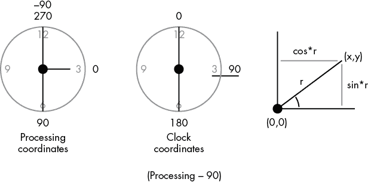

# 第十一章：测量和模拟时间


## 草图 86：显示时钟

在计算机程序中，时间可以有很多含义。有执行时间，即程序在某一特定点上所消耗的 CPU 周期数；有进程时间，即程序已经运行的时间；还有实际时间，就是你手表上的时间。我们也可以称之为时钟时间。本草图将从计算机系统获取时钟时间，并将其显示为传统时钟的指针。

从 Processing 获取时间非常简单。这些是基本的功能：

1.  `hour()`: 返回当前的小时，使用 24 小时制。

1.  `minute()`: 返回已经过去的分钟数。

1.  `second()`: 返回当前分钟内经过的秒数。

时钟将是一个圆形，并且将有三根指针（时针、分针、秒针）。由于一分钟有 60 秒，秒针每秒钟将围绕其中心点旋转 360/60，即 6 度。分针也一样；由于每分钟有 60 秒，每小时有 60 分钟，因此它每分钟旋转 6 度。绘制秒针的原点是时钟的中心，但另一个端点是未知的，只有角度。如果秒针的长度是*r*，那么第二个点可以通过三角函数确定，如图 86-1 所示。



图 86-1：确定时钟指针的位置

Processing 中定义的角度与时钟上的角度不同。在时钟上，垂直表示 0 度，而在 Processing 中是−90 度。绘制秒针时，以(`cx`, `cy`)为中心点，长度为`r`，可以按如下方式绘制，其中变量`s`表示秒数 1：

```
s = radians(second()*6 - 90.0);
line (cx, cy, cx + cos(s)*sr, cy+sin(s)*sr);
```

同样的原理适用于较短的分钟针。小时针应该更短，如果`hour()`值超过 12，则将其除以 2。此外，360 度的周期中只有 12 个小时，而不是 60 个，所以每个小时对应 30 度。小时针是连续旋转的，而不会在每小时变化时跳跃，所以每经过一分钟，小时针会稍微转动一点；30 度（1 小时）等于 60 分钟，因此每分钟使小时针转动 0.5 度 2。以下是代码：

```
h = radians(hour()*30.0-90.0) + radians(minute()*0.5);
```

## 草图 87：时间差异——测量反应时间

测量两个事件之间的时间是本草图的主题：特别是计算机的提示和用户的反应之间的时间，即反应时间。一个典型的（平均）人类反应时间大约是 0.215 秒。也就是说，从灯光亮起到某人按下按钮作出反应之间，平均会过去 215 毫秒。

这个示例通过让用户尽可能快速地点击鼠标来测量反应时间，当背景从灰色变为绿色时。背景随后变回灰色，循环重复五次。程序使用`millis()`函数测量背景变为绿色和鼠标点击之间的时间，并通过对五次试验求平均来得到更精确的测量结果。

我们使用`millis()`函数，因为在之前的示例中用来移动秒针的函数`second()`只返回整数秒数。`millis()`返回自示例开始执行以来的毫秒数（1/1000 秒）。表面上看，这个值似乎没有太大意义，但它的确意味着可以相当准确地测量两个事件之间的时间差。只需在第一个事件发生时调用`millis()`，保存该值，在第二个事件发生时再次调用，并将两者相减。

`millis()`函数可以用于其他目的，其中之一是确定特定循环或函数执行所需的时间。这种测量对于程序运行时间过长，需要找到加速方法的程序员来说非常重要。测量一个函数的调用可能不太有效，因为大多数函数执行得太快，即使是慢函数也是如此。相反，我们将需要测试的函数放入循环中并执行多次。然后我们将执行循环所需的时间除以迭代次数，以确定单次执行所需的时间。以下是如何为函数`get(12,100)`计时：

```
t1 = millis();
for (int i=0; i<100000000; i++)   y = get(12,100);
t2 = millis();
println ("Time was "+(t2-t1)+" or "+((t2-t1)/100000000.0));
```

获得的时间会有所不同，因此对多个试验进行平均可以获得更准确的结果。执行时间可能会因为其他程序同时执行或虚拟内存页错误的发生次数而发生变化。

## 示例 88：M/M/1 排队—仿真中的时间

单服务器排队系统，或称 M/M/1 排队系统，类似于银行柜员。顾客在随机时间到达柜台接受服务。服务需要一定的随机时间，之后顾客离开。如果柜员正在为一位顾客服务时，另一位顾客到达，新的顾客将排队等待。当有顾客离开时，队列中的下一个顾客将被服务；如果队列中没有人，柜员（服务器）就变为空闲状态。这个系统类似于我们在现实生活中看到的许多场景：超市结账、加油站、等公交，甚至是航空交通和船只在港口的到达。

这个示例模拟了一个服务器和一个排队队列，但可以适应更多的情况，并计算平均排队长度。进行此类系统仿真模拟的意义在于找出队列的长度、客户在队列中花费的时间、服务器的忙碌时间百分比等。这些都与成本和浪费的时间有关。

在现实世界中，时间是连续的，但在计算机中，这是不可能的。因此，模拟中的时间采用离散值：时间 = 0，时间 = 1.5，时间 = 3.99，依此类推。当模拟开始时，我们将变量`time`设置为第一次到达事件的时间 1，之后的时间将是处理事件时的时间。这被称为下一事件模拟：模拟中的当前时间不断跳跃到下一个发生的事件（到达或离开）的时间。

到达事件发生在随机时间，符合特定的概率分布。当一个到达事件发生时，它（客户）进入服务队列（柜台）。如果队列为空，它将立即接受服务；否则，它必须等待。当它到达服务器（柜台）时，它将需要一些随机时间来接受服务，然后离开。以下是处理每个事件的步骤：

| **到达** | **离开** |
| --- | --- |
| 1\. 将到达事件放入队列 2. | 1\. 从队列中移除工作任务 3. |
| 2\. 服务器忙碌吗？ | 2\. 队列为空？ |
| 3\. 如果不是，启动服务器。 | 3\. 如果是，服务器变为空闲状态。 |
| 4\. 安排下一个到达事件。 | 4\. 如果不是，安排离开事件。 |

队列是一个存储数字的数组。加入队列意味着将一个新的值（工作任务的随机生成服务时间）放到队列的末尾。当一个值离开队列时，意味着移除队列中的第一个元素，并将每个后续的值向前移动一个位置。函数`into(t)` 5 将时间`t`插入队列，而`out()` 6 则移除队列中的第一个元素。如果队列为空（或系统空闲），则表示队列中没有任何内容 4。

到达和离开之间的时间统计分布遵循负指数分布。如果到达的平均时间间隔是μ，则在模拟中下一个到达事件的时间将是：

–μ * log(`random(1)`)

离开事件也有类似的情况。
