# 12

创建模拟和游戏


## 草图 89：捕食者-猎物模拟

想象一下兔子和土狼共同生活在它们的自然环境中。它们在传统意义上并不和睦：土狼会在有机会时捕食兔子。兔子繁殖速度非常快，而土狼却不行。当然，如果兔子是唯一的猎物，那么一旦兔子全部死去，土狼也会很快灭绝。这是一种捕食者-猎物关系，当每组中只有一个物种时，它可以被简单建模。

从数学角度看，捕食者-猎物关系通过一对微分方程表示（别担心，这里没有复杂的数学），其形式如下：

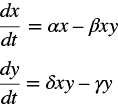

这里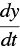表示土狼种群增长的速度，而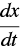表示兔子种群增长的速度。这些方程的解，即 Lotka-Volterra 方程，并不重要。程序将模拟它们。在这些方程中，变量如下：

1.  *x*：兔子数量（猎物）

1.  *y*：土狼的数量（捕食者物种）

1.  α：兔子种群在不受约束的情况下增长的速率

1.  β：猎物和捕食者相遇的速率，以及兔子因相遇而死亡的速率

1.  γ：捕食者因自然原因或远离而死亡的速率

1.  δ：捕食者种群增长的速率

模拟将从四个变量α、β、γ和δ的指定值（`alpha`、`beta`、`gamma`和`delta`）开始，并有已知的初始种群规模。然后，每次执行`draw()`时，它都会根据前述方程计算新的种群。这是兔子 3 的关键代码：

```
dr = alpha*Nrabbits - beta*Nrabbits*Ncoyotes;        
Nrabbits = (int)(Nrabbits + dr);
```

而对于土狼 4 的代码是：

```
dc= delta*Nrabbits*Ncoyotes - gamma*Ncoyotes;
Ncoyotes = (int)(Ncoyotes + dc);
```

然后，种群数量会在窗口中以图形方式呈现。我们将每只兔子画成一个绿色圆圈，位于屏幕的某个地方（位置无关紧要）1，而每只土狼画成一个红色圆圈 2。我们可以观察到，当捕食者种群和猎物种群变化时，它们的相对数量增减。如果所有猎物都死了，捕食者也会死；如果所有捕食者都死了，猎物则会无限增长。

## 草图 90：群体行为

克雷格·雷诺兹（Craig Reynolds）在 1986 年创建了一个名为 Boids 的系统。它是模拟鸟群飞行或鱼群游动时的行为。鸟群是同类物体的集合，它们会一起移动，并希望最终停在同一地方。它们也不希望相互碰撞。这个模拟需要知道每个物体的位置、速度和运动方向，然后迭代地更新每个物体的位置。三条规则使得这些物体形成一个鸟群：

1.  分离对象尝试保持与邻居之间的距离尽可能小。在每次迭代中，若某个对象与邻居的距离小于*d*，它将尽可能远离该邻居。

1.  对齐力：物体会尝试与附近的物体匹配速度，这样它们会朝相似的方向移动，并防止它们之间的间距过大。我们计算一个局部速度，视角为物体自身，然后将这个速度的一部分添加到物体的速度中，以便下一次迭代使用。

1.  聚合力：物体会尝试朝着邻居的质心移动，这样它们会保持在一起。我们找到质心（不包括当前物体本身），然后将物体移动一小部分（1%到 3%）朝向那个点。

每个位置都被存储为一个向量（`PVector`对象），该向量有 x 和 y 分量。向量数组`FlockV`存储每个物体的速度。`draw()`函数调用移动然后绘制群体的函数。`match()`计算一个新的速度，尝试匹配邻居 2；`toCenter()`将每个物体朝着质心 3 移动；而`away()`则试图保持物体之间的间距 4。在每次迭代中，我们会对每个物体调用这三个函数中的每一个。每个函数都会返回一个值，我们将其添加到物体的位置 1。物体是小圆圈，当我们移动鼠标时，它们会跟随鼠标。

## 草图 91：模拟极光

在计算机上难以呈现的物体中，北极光或极光位列其中。它们闪烁并翻滚，颜色变化，形状以不同速度变化，且通常没有固定的形状。曾经有过不少努力来绘制极光，虽然成功与否不一，但这幅草图就是其中的一次尝试。

极光可以呈现出多种形状，我们在这幅草图中只尝试绘制其中的一种：典型的窗帘型，类似的一个例子见于图 91-1。

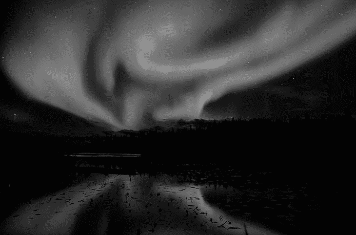

图 91-1：红色和绿色的极光

这个草图会使颜色随 y 位置变化缓慢地变化。从极光窗帘底部的红色值开始，色调会随着上方像素的增加而变换。初始色调值`h`=15，色调根据以下公式 2 增加：

```
h = h + random(.87);
```

因此，色调以随机的速度增加，但它始终随着 y 坐标的变化而增加。在窗帘的最顶部，亮度会降低，颜色逐渐褪去。

接下来，注意到极光似乎由垂直的笔触组成，并且在水平方向上呈带状。这可以通过在程序中定期改变像素的饱和度来实现，饱和度是 x 坐标 1 的函数。下面是代码，其中`i`是水平方向的位置，`s`是饱和度：

```
if (i%3 == 0) s = 220+random(20)-10;
else if (i%2 == 0) s = 210+random(20)-10;
else s = 200+random(20)-10;
```

`i%3`是`i`除以 3 后的余数，因此饱和度会有一些随机变化，形成较暗的带状区域。

窗帘效果通过使用正弦函数来定位像素的垂直位置实现。对于基本坐标（`i`，`j`），实际的像素位置会是`(i,j-bb*sin(a*i))`，其中参数`a`和`bb`在每次迭代中会发生微小且随机的变化 3。这使得窗帘效果看起来在移动。

视觉效果通过一对图像得到增强。我们使用了一张星星的背景图像，模拟夜空。接着我们在其上绘制极光，然后再叠加一张前景图像，展示树木和灌木。这张图像是一个模板，黑色物体位于透明背景上。结果是对极光的一个令人愉悦的演绎，虽然远非完美，仍然有很多工作可以做来提高其现实感。

## 草图 92：动态广告

在全球的视频屏幕上，我们看到公共广告。在机场、购物中心，甚至学校中，各种推广材料都呈现给了被动观众。视频是一种便捷的媒介，因为大屏幕等离子和 LCD 屏幕的价格已经降到每英寸不到 10 美元。视频也是一种更具动态感的媒介，可以展示移动的广告和连续展示的多种内容，这是印刷海报和广告牌无法做到的。

与视频广告相关的技术也非常成熟（如 Biteable Ad Maker、InVideo，甚至 Adobe Premiere），并且这些工具可以在计算机桌面上使用。这个草图是一个简单广告的例子——为一家德州-墨西哥餐厅做的广告。它大致基于在北美机场看到的一些实际视频展示。

首先，我们需要一张关于主题（产品）的好图：一个墨西哥卷饼。这里使用的图像是公开可用的（[`commons.wikimedia.org/wiki/File:Carne-asada-burrito.jpg`](https://commons.wikimedia.org/wiki/File:Carne-asada-burrito.jpg)），但通常这种图像是以高分辨率拍摄的专业照片。在草图中，这张图像的尺寸为 800×431 像素。我们将其缩小为更小的尺寸，770×401，或每个维度小了 30 像素。这样做是为了让图像能够缓慢移动，呈现更具动态感的效果。我们使用语句 1 来显示该图像，其中 `xoff` 和 `yoff` 是显示前的图像定位像素偏移量：

```
image (ad1, xoff, yoff);
```

这些偏移量在每一帧中会发生小的变化，最大变化为 30 像素，届时位移方向会发生反转 2：

```
xoff += dx; yoff += dy;
if (xoff <= -30 || xoff > 0) dx = -dx;
if (yoff <= -30 || yoff > 0) dy = -dy;
```

`dx` 和 `dy` 的值非常小，分别为 0.05 和 0.03。它们的值不同，使得图像以模糊的椭圆形方式移动。

文字显示在图像上一个固定的位置，增强了图像的运动感。底部的文字保持不变，而顶部的文字会变化。实现分为两个阶段：如果变量 `stage = 0`，我们显示第一段文字（“我们花了几个小时制作它”）3。在 850 帧（约 28 秒）后，变量 `stage` 增加，因此我们显示第二段文字（“你花五分钟就能吃掉它”）4。再过 900 帧后，`stage` 重新变为 1，循环重复。

我们可以允许任意数量的阶段，以便展示多个不同的消息和图像，并且以随机顺序播放。

## 草图 93：尼姆

Nim 是一款历史悠久的游戏，其起源已无从考证。它可能是在中国发明的，是已知最古老的游戏之一。它也是最早实现计算机或电子版本的游戏之一，且一直是计算机编程课程中的常见作业题目。游戏开始时有三行物品，如火柴或硬币，每一行的物品数量不同。玩家可以从任意一行中移除任意数量的物品，但必须至少移除一个，并且只能从一行中移除物品。玩家轮流移除物品，最后移除物品的玩家获胜。

这个草图将使用 9、7 和 5 枚硬币实现游戏，并且它将执行一方的操作。

设置游戏玩法的前提是读取对象的图像，在本例中是一个便士，并在窗口中绘制正确数量的它们。当玩家点击其中一枚硬币时，这枚硬币以及其左侧的所有硬币将被移除，剩余的硬币将向左移动。然后，计算机会移除一些硬币。

三行之间相隔 100 像素，所以当玩家点击鼠标时，行索引就是 `i = (mouseY/100)-1`。移除的硬币数量是左侧硬币的数量，在这个草图中，`j = (mouseX-10)/45+1`，这是因为我们绘制时的方式（每个硬币间隔 45 像素，距离左侧 10 像素）。一个名为`val`的数组包含每一行中的硬币数量，因此当用户点击鼠标时，这就是相应的操作：

```
val[i] = val[i] - j;
```

这将减少第`(mouseY/100)-1`行中的硬币数量，减少的数量为`(mouseX-10)/45+1`。

然后轮到计算机的回合。有一种策略可以让计算机几乎总是获胜，只要用户先走一步。该策略涉及计算奇偶性值，并做出移动以确保维持该奇偶性值。考虑初始状态和从第 1 行取走两枚硬币后的状态：

|  | **之前** | **之后** |
| --- | --- | --- |
| **第 1 行** | `5 = 0 1 0 1` | `3 = 0 0 1 1` |
| **第 2 行** | `7 = 0 1 1 1` | `7 = 0 1 1 1` |
| **第 3 行** | `9 = 1 0 0 1` | `9 = 1 0 0 1` |
| **奇偶性** | `1 0 1 1` | `1 1 0 1` |

奇偶性是通过查看每个值的二进制表示中的每一位来确定的。在每一列中，如果该列中 1 的数量为奇数，则该列的奇偶性位为 1；如果为偶数，则为 0。我们可以通过使用异或运算符来计算这一点，在 Processing 中是“`^`”，像这样：`val[0]^val[1]^val[2]`。

Nim 游戏中的策略是做出一个使奇偶性值为 0 的移动。事实证明，这始终是可能的；在前面的情况中，计算机可能从第 3 行移除 5 个硬币，得到如下状态：

| **第 1 行** | `3 = 0 0 1 1` |
| --- | --- |
| **第 2 行** | `7 = 0 1 1 1` |
| **第 3 行** | `4 = 0 1 0 0` |
| **奇偶性** | `0 0 0 0` |

这是草图在玩家每次移动后所做的操作：计算所有可能的移动的奇偶性，直到找到一个奇偶性为 0 的移动。

## 草图 94：路径寻找

寻路就是在二维或三维空间中找到一条从一个地方到另一个地方的路线。潜在的路径可能会被墙壁、河流、电线或其他障碍物阻挡。当然，我们希望找到*最佳*路径，“最佳”可以基于许多因素，比如物理距离、时间或成本。在电路设计中，我们使用寻路来创建电路元件之间的连接。在计算机游戏中，它用于找到将游戏对象从一个地方移动到另一个地方的路径。这个示例将实现一种二维的基本寻路方法。

该方法从某个初始点（*x*，*y*）开始，并有一个目标点（*x*[t]，*y*[t]）要到达。每个邻居（*x*[*n*]，*y*[*n*]）的距离被*标记*为从（*x*，*y*）到（*x*[*n*]，*y*[*n*]）的距离。然后我们查看这些位置（*x*[*n*]，*y*[*n*]）的邻居，并通过将邻居（*x*[*n*]，*y*[*n*]）到（*x*，*y*）的距离加到（*x*[*n*]，*y*[*n*]）的距离上来标记这些位置。我们不断重复这个过程，直到我们到达目标像素（*x*[t]，*y*[t]）。现在我们知道了从起始像素的距离，可以通过追溯标记值最小的连接位置来追踪最佳路径。一个邻居必须是开放空间，而不是障碍物，才能被标记，因此路径永远不会穿过障碍物。

程序开始时读取一张图像，图像中的障碍物为黑色，背景为白色。路径的起点和终点在程序中通过 x，y 坐标指定：`startx`，`starty`，和`endx`，`endy`（你可以更改这些值来找到不同的路径）。

从起始坐标开始，我们检查直接相邻的像素 1。任何像素的邻居是它左边、右边、上边或下边的像素。因此，像素（*x*[0]，*y*[0]）和（*x*[1]，*y*[1]）之间的距离为|*x*[0] – *x*[1]| + |*y*[0] – *y*[1]|，是一个整数。起始像素与其邻居之间的距离为 1。这种测量距离的方式叫做曼哈顿距离；你也可以将寻路方法适配为使用其他距离度量方式。

如果其中一个邻居是路径的终点，则搜索完成 2；否则，我们将像素涂上与其距离起始点成比例的青色。我们使用 RGB 颜色中的红色分量作为距离，因此随着红色的增加，颜色会变得更亮。我们也可以使用一个单独的二维数组来存储距离，特别是当需要浮动距离时，比如计算欧几里得距离时。

接下来，我们以相同的方式检查所有红色值为 1 的像素（那些与起始位置距离为 1 的像素），并将它们的邻居设置为 2。然后我们将它们的邻居设置为 3，以此类推，直到到达终点位置。

此时，距离起点的距离是*N*。为了追踪回起点的路线，我们寻找终点位置的一个邻居，邻居的值为*N* − 1；任何一个邻居都可以。将该位置标记为路径上的点，然后寻找该位置的一个邻居，邻居的值为*N* − 2；标记它并重复。任何时刻都会有许多像素具有特定值，但只有与路径连接的像素才是有趣的。当我们到达起点位置时，路径就完成了。`drawRoute()`函数会搜索终点像素的邻居，寻找一个值为*N*的邻居，标记该像素并递归地寻找该像素的邻居，再标记它，依此类推 3：

```
set (i,j,color(0,100,200)); 
drawRoute (i,j,n-1); 
```

结果是在显示的图像上绘制了一条路径。

## 草图 95：元球—一盏熔岩灯

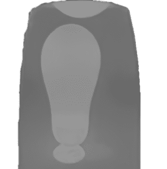

图 95-1：一盏熔岩灯（在线动态展示：[`en.wikipedia.org/wiki/File:Lava_lamp_(oT)_07_ies.ogv`](https://en.wikipedia.org/wiki/File:Lava_lamp_(oT)_07_ies.ogv)）

这个草图代表了尝试创建一个动态图形模拟的熔岩灯，这是 1960 年代的一个流行物品（见图 95-1）。大多数北美人都能认出它，因为熔岩灯已经重新流行起来，也许是因为人们对复古家具的兴趣。这个灯是一个充满油的玻璃容器。底部有一个白炽灯和一些彩色蜡。当灯加热时，蜡熔化，蜡球慢慢上升到顶部，形状发生变化。冷却的蜡球会掉到底部，创造出动态的视觉效果，因为光滑的蜡形相互作用。

每个蜡块在灯中似乎都在独立移动，因此我们将使用一组具有 x、y 坐标的点来表示每个蜡块的中心，这些点可以在 2D 区域中移动。我们将以有趣的方式创建实际的蜡块：每个蜡块都是一个 3D 函数，我们将渲染一个俯视图，看到的部分是具有大于阈值的 z（高度）值的 3D 蜡块，就像俯瞰从水面冒出的岛屿一样（见图 95-2）。这些 3D 函数被称为等值面或元球。

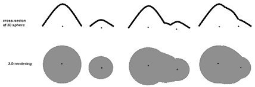

图 95-2：阈值如何切割 3D 函数

当两个元球接近时，它们交汇的区域的高度是两个物体的总和，随着它们靠得更近，这个区域将超过 z 阈值，因此会出现在 2D 渲染中（见图 95-3）。这就产生了蜡块相互作用的错觉。

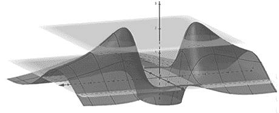

图 95-3：元球如何相加形成一个蜡块

我们将使用一个简单的函数来表示元球：一个球体，正如通过名为`equation()`的函数定义的那样。它定义了在任意点`x`、`y`处相对于另一个点的球体`k`的像素值，如下所示：

```
radius[k] / sqrt( (xx-x[k])*(xx-x[k]) + (yy-y[k])*(yy-y[k]) ) );
```

这个示例中有六个球体，由数组`x`和`y`定义，并且它们根据数组`dx`和`dy`的定义移动。`setup()`函数初始化这六个球体。第一个球体相当大，不会移动，位于区域的底部，用来模拟大多数灯具底部的大蜡油储存器 1。

`draw()`函数计算绘图区域内任何一点的所有球体的总和 2。在许多情况下，这个总和为零，但随着球体逐渐靠近，总和增加，并且如果超过阈值`MINT`，则会变得可见。可见的像素会被绘制为绿色，背景会是黄色。球体每次迭代时会移动 3，并且大小可以随机变化 4。

## 示例 96：机器人手臂

机器人一词通常与类人形机械装置相关联，但迄今为止，最常见的机器人通常是功能单一、运动范围较小的设备。例如，焊接接头或涂装汽车的机器人。这些机器人通常看起来像一只手臂，包含多个关节，并且在手臂的末端装有某种工具。这个示例允许用户通过按键移动一个二维仿真机器人手臂。

仿真中的机器人是典型的此类机器人的代表，比如市面上可购买的 PUMA 机器人。它由三个连接的部分组成，每个部分都可以在关节处旋转，如图 96-1 所示。关节分别是肩部（jangle1），由肱二头肌连接到肘部（jangle2），由前臂连接到手腕（jangle3），手腕再连接到手部。用户通过按键控制关节所形成的角度：jangle1 由 Q 和 E 控制，jangle2 由 A 和 D 控制，jangle3 由 Z 和 C 控制。

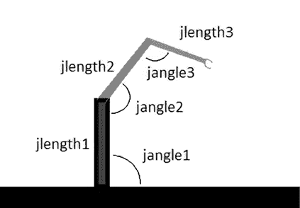

图 96-1：三部分连接形成的机器人手臂

我们将通过图像表示每个手臂部分。旋转轴不是图像的左上角或中心，而是图像中关节与前一个部分连接的点。任何关节的角度可以通过按一个按键增加，通过按另一个按键减少，但由于它们是相互连接的，因此旋转必须相对于前一个部分进行计算。旋转从肩部开始，一直到手部。然后，手部会在最终旋转的位置绘制出来（所有三个旋转），前臂绘制在之前的位置（两个旋转），最后绘制旋转后的肱二头肌。这是通过使用 Processing 函数`pushMatrix()`和`popMatrix()`来实现的：首先旋转肩部关节，然后将状态推送 1；接着旋转肘部并推送 2；然后旋转手腕并绘制。接下来恢复之前的状态，绘制肱二头肌 3，然后再进行一次恢复。

必须分析代表手臂部分的图像，并将结果编码到程序中作为坐标。例如，考虑肘部：这是肱二头肌（代码中的 `armA`）与前臂（代码中的 `armB`）相接触的地方。它们相接触的点分别与不同图像有不同的偏移量，如 图 96-2 所示。对于肱二头肌，接触点是从其左上角开始的 (167, 37)。与前臂的连接是相对于前臂图像的 (31, 25)，这也是其旋转轴。因此，为了旋转前臂，我们首先将其平移 -31, -25，使其看起来围绕正确的位置旋转。当绘制前臂时，必须将其平移到肱二头肌上的连接点 (167, 37) 与前臂上 (31, 25) 的连接点对齐，因此下一个平移是 (167 - 31, -(37 - 25))，即 (136, -12)。我们反转 y 坐标的符号，因为 y 的方向与数学中的通常 y 轴相反。每个连接点的坐标都来自图像，如果它们改变了，那么这些点将需要重新测量。

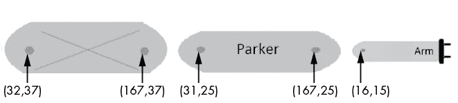

图 96-2：手臂段之间的连接点

## Sketch 97：闪电

闪电迅速、随机且明亮。从计算机图形的角度来看，捕捉它似乎是一件困难的事情，然而因为每个人都有相关经验，所以在某些情况下，能够绘制闪电是很重要的。这个 Sketch 是对此的基本尝试。

就像在 Sketch 91 的极光模拟中一样，关于绘制闪电的主题有其历史和文献，其中很多是基于模拟闪电在真实世界中发生的物理过程。这个过程太复杂了，无法在一个小程序中重现，但其中一些成果可能是有用的。例如，研究人员测量了闪电条与分支之间的角度（大约 16 度），以及分支的可能性。

这个 Sketch 将生成随机的闪电形状，作为小的、连接的线段。每个段落的长度和与上一个段落的角度将是随机的。一个二维数组将保存主部分和分支部分的各种段落。主部分是数组的第一部分中的一系列线段：以起点 `x[0][i]` 和 `y[0][i]` 连接到段落终点 `x[0][i+1]`, `y[0][i+1]` 1。分支将随机发生，概率为 0.11 2，并占据数组的另一行，第一个分支从 `x[1][0]`, `y[1][0]` 开始，第二个从 `x[2][0]`, `y[2][0]` 开始，依此类推。

一个分支也可能会终止，概率为 0.23，但主分支不能。它会继续直到达到大于 205 的 y 值，然后终止。新的闪电击发将在稍后的随机时间和 x 位置发生。

每次调用`draw()`时，都会创建并绘制每个笔画的新部分，因此闪电是一个动态展示。它似乎从图像顶部降到地面，或者在这个案例中，降到水面：显示了一个海上风暴的背景图像，闪电似乎从云层中开始并击中水面。

这个方案存在一些缺陷。有时，笔画会以人类认为不现实的方式随机出现。分支可能会互相交叉，有时甚至是多次交叉。*这*在现实生活中可能发生，但并不常见。闪电路径通常会有周围的光晕，但在这幅草图中缺失了这一效果。闪电也是光源，并会改变场景中的环境光。虽然有可能再现这种效果，但使用静态图像作为背景使得改变光照变得困难。最后，我们是迭代地添加闪电笔画，并且一旦它们被确定到某个特定点，就不再改变。闪电路径已被观察到沿着它们的长度移动，而不仅仅是在下端，但这一效果是微妙的。

代码提供了实验的机会。我们可以改变新分支创建的概率，或者现有分支被删除的概率。每段的长度现在在 0 到 12 之间随机，角度也在−30 到+30 度之间随机，这些变化会对结果产生显著的视觉影响。

## 草图 98：计算机游戏《打砖块》

原始的《打砖块》游戏由传奇的早期游戏开发者诺兰·布什内尔、史蒂夫·沃兹尼亚克（后来成为苹果公司名人）和史蒂夫·布里斯托在 1975 年于雅达利设计和构建。从基本概念上看，它是一个单人版的乒乓球变种，玩家用挡板将球弹向砖块，砖块被击中后消失。原版游戏有八排矩形砖块，每两排砖块颜色相同。球会从屏幕的左右和顶部反弹，在砖块消失后也会反弹，但可以自由穿过底部。玩家必须移动挡板以击中向下移动的球，防止它消失。玩家有三次机会（也就是可以错过三次球），以清除屏幕上的砖块，不同颜色的砖块得分不同。

这幅草图将实现一个简化版本的游戏。游戏中有三排红色砖块，所有砖块的得分相同。没有声音，也没有高分。砖块是填充矩形，尺寸为 30 像素×15 像素，球则是一个简单的小圆圈，直径 3 像素。一个 2D 数组`exists[][]`用于跟踪哪些砖块已被消除，如果`exists[i][j]`为真，那么行`i`列`j`的砖块将被绘制。因此，绘制砖块非常简单。

```
for (int i=0; i<Ncols; i++)  // Draw all bricks
  for (int j=0; j<Nrows; j++)
    if (exists[i][j]) rect (i*30+20, j*15+30, 30, 15);
```

球的位置为`(x, y)`，并在每一帧中按`(dx, dy)`的量移动。球板只是画在`(px, py)`位置的水平线。按 A 键可以将球板向左移动 10 像素（`px=px-10`），按 D 键可以将其向右移动相同的距离。如果球越过底部坐标`py`（=300），并且其`x`值位于`px`−30 和`px`+30 之间，那么球的 y 方向会改变（`dy=-dy`），看起来就像是反弹。球还会从屏幕顶部（`y==0`）和两侧（`x<0`或`x>width`）反弹。

我们在每一帧中测试球与每个砖块的碰撞；这是通过使用每个砖块的绝对坐标来完成的。如果(i, j)位置的砖块存在，则该砖块的边界为：

| **维度** | **坐标值** | **边界** | **坐标值** | **边界** |
| --- | --- | --- | --- | --- |
| X | i*30+20 | 左边缘 | i*30+50 | 右边缘 |
| Y | j*15+30 | 上边缘 | j*15+45 | 下边缘 |

只需检查球的位置与每个砖块的坐标值，如果球位于砖块 3 内，则反弹，同时将`exists[i][j]`设置为`false`，并增加`score`。

在球掉到底部之后，我们将`life`减一，并将球重新绘制在`y`值为 150 的随机`x`位置。当`life`值为 0 或者`score`达到最大值 36 时，游戏结束。

这个简单版本有缺陷。砖块的反弹不依赖于击中的砖块侧面；球的 y 方向始终会发生变化。无论撞击点在哪里，球从球板反弹的方式总是相同的。

## 示例 99：中点偏移法——模拟地形

这个示例将生成一个伪随机的地形轮廓，伴随着逐渐变暗的天空和闪烁的星星。这个示例的核心是使用中点偏移方法生成地形，虽然这个例子是二维的，但它很好地展示了更一般的算法。

该方法从一条线开始，在这个示例中是整张图像的水平线。接下来，我们选择该线的中点，将其按`dy`和`–dy`之间的随机值偏移，并像图 99-1 那样创建两条线。

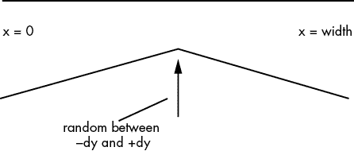

图 99-1：分割一条线

然后，我们对刚创建的两条线做相同的操作，除了减少`dy`的值。结果是四条线。每次我们生成一对新线段时，生成的段可以使用更小的`dy`值再次分割，直到达到某个终止标准。在这个示例中，`dy`的初始值是 75，当其小于 2 时，分割过程停止。

分割过程通过递归过程`md()`完成：

```
void md (float x0, float y0, float x1, float y1, float dy)
```

在这里，(`x0`, `y0`) 和 (`x1`, `y1`) 是线段的端点，`dy` 是随机高度变化的最大值。该过程找到中点并调用自身两次，传递线段的左右两半以及更小的 `dy`。这个过程会继续，如图 99-2 所示，直到达到最小的 `dy` 值。

然后，线段的端点会保存在一对数组中，`lx[]` 和 `ly[]`。我们实际上并不绘制线段，而是通过从每个端点绘制一条到窗口底部的线来创建一个填充区域，这条线的宽度是线段 x 宽度的一半 3。结果是一个具有令人信服随机特性的地平线。

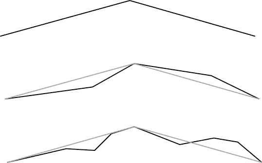

图 99-2：多次递归分割创建了一个逼真的地平线。

天空是一组水平线，起始颜色为（50, 50, 240），每绘制两条线，蓝色值减少 1。这在天空中产生了美丽的深蓝色渐变效果。

星星只是绘制在随机位置的小圆圈，但它们必须在每一帧中出现在相同的位置，因此数组 `starx[]` 和 `stary[]` 存储了它们的位置。它们并不真正闪烁，但我们以 99%的概率绘制它们，这样偶尔某颗星星在某一帧中没有被绘制出来 2。在任何一帧中，至少有一颗星星是暗的。整体效果呈现出傍晚的天空和乡村景观。
