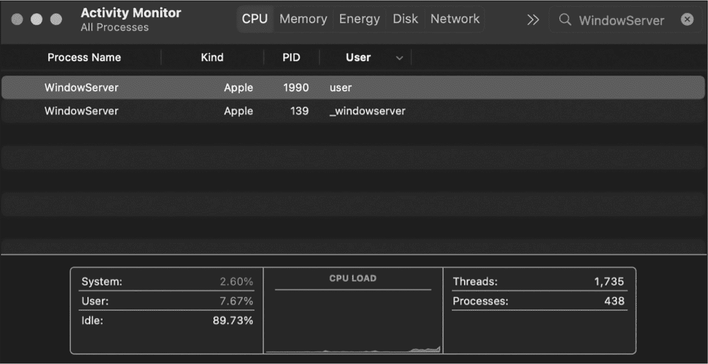

## 第二章：2 解析二进制文件


在上一章中，我们枚举了正在运行的进程，并提取了可以帮助我们启发式地检测恶意软件的信息。然而，我们并未讨论如何检查每个进程背后的实际二进制文件。本章将介绍如何以编程方式解析和分析通用二进制文件和 Mach-O 文件，后者是 macOS 的本地可执行二进制文件格式。

你将学习如何提取二进制文件的依赖关系和符号信息，以及检测二进制文件是否包含异常，例如加密数据或指令。这些信息将提高你对二进制文件进行恶意或良性分类的能力。

### 通用二进制文件

大多数 Mach-O 二进制文件以通用二进制文件的形式分发。在 Apple 的术语中，这些被称为*fat 二进制文件*，它们是多个特定架构（但通常逻辑上等价）的 Mach-O 二进制文件的容器，称为*slices*。在运行时，macOS 的动态加载器（*dyld*）会加载并执行最适合主机本地架构（例如 Intel 或 ARM）的嵌入式 Mach-O 二进制文件。由于这些嵌入式二进制文件包含你需要提取的信息，例如依赖关系，你必须首先了解如何以编程方式解析通用二进制文件。

#### 检查

Apple 的文件工具可以检查通用二进制文件。例如，CloudMensis 恶意软件作为名为*WindowServer*的通用二进制文件分发，包含两个 Mach-O 二进制文件：一个为 Intel x86_64 编译，另一个为 Apple Silicon ARM64 系统编译。让我们对 CloudMensis 执行 file 命令。正如你所看到的，该工具将其识别为通用二进制文件，并显示其包含的两个嵌入式 Mach-O 文件：

```
% **file CloudMensis/WindowServer**
CloudMensis/WindowServer: Mach-O universal binary with 2 architectures:
[x86_64:Mach-O 64-bit executable x86_64] [arm64:Mach-O 64-bit executable arm64]

CloudMensis/WindowServer (for architecture x86_64): Mach-O 64-bit executable x86_64
CloudMensis/WindowServer (for architecture arm64):  Mach-O 64-bit executable arm64 
```

要以编程方式访问这些嵌入式二进制文件，我们必须解析通用二进制文件的头部，其中包含每个 Mach-O 文件的偏移量。幸运的是，解析头部是直接的。通用二进制文件以 fat_header 结构开头。我们可以在 Apple 的 SDK *mach-o/fat.h*头文件中找到相关的通用结构和常量：

```
struct fat_header {
    uint32_t    magic;        /* FAT_MAGIC or FAT_MAGIC_64 */
    uint32_t    nfat_arch;    /* number of structs that follow */
}; 
```

Apple 在此头文件中的注释表明，fat_header 结构的第一个成员 magic（一个无符号 32 位整数）将包含常量 FAT_MAGIC 或 FAT_MAGIC_64。使用 FAT_MAGIC_64 意味着接下来的结构是 fat_arch_64 类型，当随后的切片或偏移量大于 4GB 时使用该类型。^(1) Apple 的*fat.h*头文件中的注释指出，扩展格式的支持仍在进行中，通用二进制文件通常不那么庞大，因此本章将重点讨论传统的 fat_arch 结构。

在 fat_header 结构的注释中没有提到的一点是，该结构中的值假定为大端字节序，这是 OSX PPC 时代的遗留物。因此，在 Intel 和 Apple Silicon 等小端系统上，当你将通用二进制文件读取到内存中时，像 magic 的 4 个字节这样的值将以反字节顺序出现。

苹果通过提供“交换”后的魔术常量 FAT_CIGAM 来考虑这一事实。（是的，CIGAM 只是反向的魔术。）该常量的十六进制值为 0xbebafeca。^(2) 我们可以通过使用 xxd 命令来转储 CloudMensis 通用二进制文件开头的字节。对于小端主机，我们使用 -e 标志来显示小端格式的十六进制值：

```
% **xxd -e -c 4 -g 0 CloudMensis/WindowServer**
00000000: bebafeca ...
... 
```

当将输出解释为 4 字节值时，主机的字节序会被应用，这解释了为什么我们看到交换后的通用魔术值 FAT_CIGAM（0xbebafeca）。

在 fat_header 结构中的魔术字段之后，我们找到了 nfat_arch 字段，该字段指定了 fat_arch 结构的数量。对于每个嵌入在通用二进制文件中的特定架构的 Mach-O 二进制文件，我们会找到一个 fat_arch 结构。如图 2-1 所示，这些结构紧随 fat_header 之后。


图 2-1：通用二进制文件的布局

由于文件显示 CloudMensis 包含了两个嵌入的 Mach-O 文件，我们预计会看到 nfat_arch 设置为 2。我们通过再次使用 xxd 来确认这一点。不过这次，我们跳过了 -e 标志，以保持大端格式的值：

```
% **xxd -c 4 -g 0 CloudMensis/WindowServer**
...
00000004: 00000002 ... 
```

你可以在 *fat.h* 头文件中找到 fat_arch 结构的定义：

```
struct fat_arch {
    cpu_type_t       cputype;       /* cpu specifier (int) */
    cpu_subtype_t    cpusubtype;    /* machine specifier (int) */
    uint32_t         offset;        /* file offset to this object file */
 uint32_t    size;     /* size of this object file */
    uint32_t    align;    /* alignment as a power of 2 */
}; 
```

fat_arch 结构的前两个成员指定了 Mach-O 二进制文件的 CPU 类型和子类型，而接下来的两个成员指定了该切片的偏移量和大小。

#### 解析

让我们通过编程解析一个通用二进制文件并定位每个嵌入的 Mach-O 二进制文件。我们将展示两种方法：使用兼容旧版本 macOS 的老旧 NX* APIs 和适用于 macOS 13 及更高版本的新 Macho* APIs。

> 注意

*你可以在本章提到的代码中找到* parseBinary *项目，该项目位于本书 GitHub 仓库的* [`github.com/Objective-see/TAOMM*.*`](https://github.com/Objective-see/TAOMM)

##### NX* APIs

我们将首先检查文件是否确实是一个通用二进制文件。然后我们将遍历所有的 fat_arch 结构，打印出它们的值，并利用 NXFindBestFatArch API 查找与主机架构最兼容的嵌入式二进制文件。当启动通用二进制文件时，系统将加载并执行这个二进制文件，因此我们会将其作为分析的重点。

你的代码可能会希望检查每个嵌入的 Mach-O 二进制文件，尤其是没有什么能阻止开发者将这些二进制文件完全不同。虽然这种情况很少见，但 2023 年的 3CX 供应链攻击就是一个显著的例外。为了对 3CX 应用程序进行木马化，攻击者破坏了一个合法的通用二进制文件，该文件同时包含了 Intel 和 ARM 二进制文件，攻击者在前者中加入了恶意代码，而保持 ARM 二进制文件不变。

让我们从加载一个文件并执行一些初步检查开始（Listing 2-1）。

```
#import <mach-o/fat.h>
#import <mach-o/arch.h>
#import <mach-o/swap.h>
#import <mach-o/loader.h>

int main(int argc, const char* argv[]) {

    NSData* data = [NSData dataWithContentsOfFile:[NSString stringWithUTF8String:argv[1]]]; ❶
    struct fat_header* fatHeader = (struct fat_header*)data.bytes; ❷

    if((FAT_MAGIC == fatHeader->magic) || ❸
        (FAT_CIGAM == fatHeader->magic)) {
        printf("\nBinary is universal (fat)\n");
        struct fat_arch* bestArch = parseFat(argv[1], fatHeader);
 ...
    }
    ...
} 
```

列表 2-1：加载、验证并找到通用二进制文件的“最佳”切片

在将文件内容读取到内存 ❶ 并将初始字节类型转换为 struct fat_header * ❷ 后，代码会检查它是否确实是一个通用二进制文件 ❸。注意，它会检查大端（FAT_MAGIC）和小端（FAT_CIGAM）版本的魔数值。

为了简化起见，这段代码不支持大型 fat 文件格式。此外，对于生产环境代码，你还应该执行其他合理性检查，比如确保文件已成功加载，并且文件大于 fat_header 结构的大小。

解析逻辑在一个名为 parseFat 的辅助函数中，你可以在 列表 2-1 中看到该函数的调用。打印出 fat 头部后，该函数将迭代每个 fat_arch 结构并返回最兼容的 Mach-O 切片。

不过，首先我们必须处理字节序的差异。fat_header 和 fat_arch 结构中的值总是以大端顺序存储，因此在 Intel 和 Apple Silicon 等小端系统上，我们必须交换它们。为此，我们首先调用 NXGetLocalArchInfo API 来确定主机的底层字节顺序（列表 2-2）。我们将使用返回的值，即指向 NXArchInfo 结构的指针，来交换字节序（以及稍后，用于确定最兼容的 Mach-O）。

```
struct fat_arch* parseFat(const char* file, NSData* data) {
    const NXArchInfo* localArch = NXGetLocalArchInfo(); 
```

列表 2-2：确定本地机器的架构

你可能注意到 NXGetLocalArchInfo 和 swap_* APIs 被标记为已弃用，尽管它们在发布时仍然可用且完全正常工作。你可以在 macOS 13 及更新版本中使用替代的 macho_* APIs，这些 API 可以在 *mach-o/utils.h* 中找到，下一节将介绍这些内容。然而，直到 macOS 15，其中一个新的 API 存在问题，因此你可能仍然需要坚持使用旧的 API。

接下来，我们使用 swap_fat_header 和 swap_fat_arch 函数进行交换（列表 2-3）。

```
struct fat_header* header = (struct fat_header*)data.bytes;

if(FAT_CIGAM == header->magic) { ❶
    swap_fat_header(header, localArch->byteorder); ❷
    swap_fat_arch((struct fat_arch*)((unsigned char*)header + sizeof(struct fat_header)),
    header->nfat_arch, localArch->byteorder); ❸
}

printf("Fat header\n");
printf("fat_magic %#x\n", header->magic);
printf("nfat_arch %d\n",  header->nfat_arch); 
```

列表 2-3：交换 fat 头部和 fat 架构结构，以匹配主机的字节序

代码首先检查是否需要交换 ❶。回想一下，如果 fat 头部的魔数常量是 FAT_CIGAM，说明代码在小端主机上执行，因此我们应该执行交换。通过调用辅助 API swap_fat_header ❷ 和 swap_fat_arch ❸，代码将头部和所有 fat_arch 值转换为与主机字节序匹配，这一字节序是通过 NXGetLocalArchInfo 返回的。后者 API 接受要交换的 fat_arch 结构的数量，代码通过已交换的 fat 头部的 nfat_arch 字段提供这个数量。

一旦头部和所有 fat_arch 结构符合主机的字节序，代码就可以打印出每个嵌入的 Mach-O 二进制文件的详细信息，这些信息由 fat_arch 结构描述（列表 2-4）。

```
struct fat_arch* arch = (struct fat_arch*)((unsigned char*)header + sizeof(struct fat_header));

for(uint32_t i = 0; i < header->nfat_arch; i++) { ❶
    printf("architecture %d\n", i);
    printFatArch(&arch[i]);
}

void printFatArch(struct fat_arch* arch) { ❷
    int32_t cpusubtype = 0;
    cpusubtype = arch->cpusubtype & ~CPU_SUBTYPE_MASK; ❸

    printf(" cputype %u (%#x)\n", arch->cputype, arch->cputype);
    printf(" cpusubtype %u (%#x)\n", cpusubtype, cpusubtype);
    printf(" capabilities 0x%#x\n", (arch->cpusubtype & CPU_SUBTYPE_MASK) >> 24);
    printf(" offset %u (%#x)\n", arch->offset, arch->offset);
    printf(" size %u (%#x)\n", arch->size, arch->size);
    printf(" align 2^%u (%d)\n", arch->align, (int)pow(2, arch->align));
} 
```

列表 2-4：打印出每个 fat_arch 结构

代码首先初始化一个指向第一个 fat_arch 结构的指针，该结构紧跟在 fat_header 之后。然后，它遍历每个结构，这些结构由 fat_header 中的 nfat_arch 成员界定❶。为了打印出每个 fat_arch 结构的值，代码调用了一个我们命名为 printFatArch 的辅助函数❷，该函数首先分离出 CPU 子类型及其能力，因为这两者都位于 cpusubtype 成员中。Apple 提供了 CPU_SUBTYPE_MASK 常量来提取描述子类型的位❸。

让我们在 CloudMensis 上运行此代码。它输出以下内容：

```
% **./parseBinary CloudMensis/WindowServer**
Binary is universal (fat)
Fat header
fat_magic 0xcafebabe
nfat_arch 2
architecture 0
    cputype 16777223 (0x1000007)
    cpusubtype 3 (0x3)
    capabilities 0x0
    offset 16384 (0x4000)
    size 708560 (0xacfd0)
    align 2¹⁴ (16384)
architecture 1
    cputype 16777228 (0x100000c)
    cpusubtype 0 (0)
    capabilities 0x0
    offset 737280 (0xb4000)
    size 688176 (0xa8030)
    align 2¹⁴ (16384) 
```

从输出中，我们可以看到恶意软件的两个嵌入式 Mach-O 二进制文件：

+   在偏移量 16384 处，一个与 CPU_TYPE_X86_64（0x1000007）兼容的二进制文件，大小为 708,560 字节

+   在偏移量 737280 处，一个与 CPU_TYPE_ARM64（0x100000c）兼容的二进制文件，大小为 688,176 字节

为了确认此代码的准确性，我们可以将此输出与 macOS 的 otool 命令进行比较，-f 标志可以解析并显示 fat 头：

```
% **otool -f CloudMensis/WindowServer**
Fat headers
fat_magic 0xcafebabe
nfat_arch 2
architecture 0
    cputype 16777223
    cpusubtype 3
    capabilities 0x0
    offset 16384
    size 708560
    align 2¹⁴ (16384)
architecture 1
    cputype 16777228
    cpusubtype 0
    capabilities 0x0
    offset 737280
    size 688176
    align 2¹⁴ (16384) 
```

在工具的输出中，我们看到有关恶意软件两个嵌入式二进制文件的相同信息。

接下来，我们添加一些代码来确定哪个嵌入式 Mach-O 二进制文件与主机的原生架构匹配。回想一下，我们已经调用了 NXGetLocalArchInfo API 来获取主机架构。此外，我们还展示了如何计算到第一个 fat_arch 结构的偏移量，该结构紧随 fat 头之后。为了找到原生兼容的 Mach-O，现在我们可以调用 NXFindBestFatArch API（列表 2-5）。

```
bestArchitecture = NXFindBestFatArch(localArch->cputype, localArch->
cpusubtype, arch, header->nfat_arch); 
```

列表 2-5：确定通用二进制文件的最佳架构

我们将主机架构、指向 fat_arch 结构开始的指针以及这些结构的数量传递给 API。NXFindBestFatArch API 将确定在通用二进制文件中最与主机原生架构兼容的 Mach-O 二进制文件。回想一下，parseFat 辅助函数返回此值并打印出来。

如果我们将此代码添加到二进制解析器中，然后再次在 CloudMensis 上运行，它输出以下内容：

```
% **./parseBinary CloudMensis/WindowServer**
...
best architecture match
    cputype 16777228 (0x100000c)
    cpusubtype 0 (0)
    capabilities 0x0
    offset 737280 (0xb4000)
    size 688176 (0xa8030)
    align 2¹⁴ (16384) 
```

在 Apple Silicon（ARM64）系统上，代码已正确确定第二个嵌入式 Mach-O 二进制文件，其 CPU 类型为 16777228/0x100000c（CPU_TYPE_ARM64），是通用 CloudMensis 二进制文件中最兼容的 Mach-O。当启动此通用二进制文件时，我们可以使用活动监视器中的“类型”栏来确认 macOS 确实选择并运行了 Apple Silicon Mach-O（图 2-2）。



图 2-2：CloudMensis 二进制文件 WindowServer 作为原生 Apple Silicon 二进制文件运行

另一种确认 CloudMensis 作为原生 Apple Silicon 二进制运行的方法是使用在第一章中介绍的*enumerateProcesses*项目。回想一下，它提取了每个正在运行的进程的架构：

```
% **./enumerateProcesses**
...
(1990):/Library/WebServer/share/httpd/manual/WindowServer
...
architecture: Apple Silicon 
```

我们得到相同的结果。

##### Macho* API

在 macOS 13 中，Apple 引入了`macho_*` API。这些 API 位于`mach-o/utils.h`中，提供了一种简化的方式来遍历通用二进制文件中的 Mach-O 二进制文件，并选择最兼容的一个。已经弃用的 NX* API 仍然可以用于这个目的，但如果你在 macOS 13 或更高版本上开发工具，建议使用更新的函数。

`macho_for_each_slice` API 让我们无需手动解析通用头文件或处理字节顺序的细节，就能提取出通用二进制文件中的 Mach-O 文件。我们通过文件路径和回调块来调用此函数，对每个 Mach-O 切片执行回调。如果对独立的 Mach-O 文件调用此函数，回调将只运行一次。如果文件不是格式正确的通用二进制文件或 Mach-O 文件，函数会优雅地失败，这意味着我们不必手动验证文件类型。`mach-o/utils.h`头文件包含了可能的返回值及其含义：

```
ENOENT - path does not exist
EACCES - path exists but caller does not have permission to access it
EFTYPE - path exists but it is not a Mach-o or fat file
EBADMACHO - path is a Mach-o file, but it is malformed 
```

对每个嵌入的 Mach-O 调用的回调块具有以下类型：

```
void (^ _Nullable callback)(const struct mach_header* _Nonnull slice,
uint64_t offset, size_t size, bool* _Nonnull stop) 
```

这种类型乍一看可能有点令人困惑，但如果我们仅仅关注参数，就会发现回调函数将会被调用，并传递包含切片信息的各种数据，包括指向`mach_header`结构的指针、切片的偏移量以及其大小。

示例 2-6 中的代码，作为`parseFat`辅助函数的一部分，调用了`macho_for_each_slice`来打印出每个嵌入 Mach-O 的信息。它还包含了一些基本的错误处理，我们可以用它来过滤掉那些既不是通用文件也不是 Mach-O 文件的文件。

```
struct fat_arch* parseFat(const char* file, struct fat_header* header) {
    ...
    if(@available(macOS 13.0, *)) {
        __block int count = 0;

        int result = macho_for_each_slice(file,
        ^(const struct mach_header* slice, uint64_t offset, size_t size, bool* stop) { ❶
            printf("architecture %d\n", count++); ❷
            printf("offset %llu (%#llx)\n", offset, offset);
            printf("size %zu (%#zx)\n", size, size);
            printf("name %s\n\n", macho_arch_name_for_mach_header(slice)); ❸
        });
        if(0 != result) {
            printf("ERROR: macho_for_each_slice failed\n");

            switch(result) { ❹
                case EFTYPE:
                    printf("EFTYPE: path exists but it is not a Mach-o or fat file\n\n");
                    break;

                case EBADMACHO:
                    printf("EBADMACHO: path is a Mach-o file, but it is malformed\n\n");
                    break;

                ...
            }
        }
    }
    ...
} 
```

示例 2-6：遍历所有嵌入的 Mach-O

这段代码调用了`macho_for_each_slice`函数❶。在回调块中，我们打印出一个计数器变量，后跟切片的偏移量和大小❷。我们还利用了`macho_arch_name_for_mach_header`函数来打印出每个切片架构的名称❸。

如果用户指定的文件不是格式正确的通用或 Mach-O 二进制文件，函数将失败。代码会处理这个情况，打印出一个通用的错误消息，以及常见错误的额外信息❹。

如果我们将这段代码添加到`parseBinary`项目中，并运行它来处理 CloudMensis 的通用二进制文件，它应该输出与利用 NX* API 的代码相同的偏移量和大小值，用于恶意软件的两个嵌入式 Mach-O：

```
% **./parseBinary CloudMensis/WindowServer**
...
architecture 0
    offset 16384 (0x4000)
    size 708560 (0xacfd0)
    name x86_64

architecture 1
    offset 737280 (0xb4000)
    size 688176 (0xa8030)
    name arm64 
```

那么，如何找到最兼容的切片，或者说，如果执行通用二进制文件时，主机会加载并运行哪个切片呢？`macho_best_slice`函数旨在准确返回这个切片。它接受一个文件路径用于检查，并且在找到最佳切片时会调用一个回调块。将示例 2-7 中的函数添加到之前的代码中。

```
result = macho_best_slice(argv[1],
^(const struct mach_header* _Nonnull slice, uint64_t offset, size_t sliceSize) {
    printf("best architecture\n");
    printf("offset %llu (%#llx)\n", offset, offset);
    printf("size %zu (%#zx)\n", sliceSize, sliceSize);
    printf("name %s\n\n", macho_arch_name_for_mach_header(slice));
});
if(0 != result) {
    printf("ERROR: macho_best_slice failed with %d\n", result);
} 
```

示例 2-7：调用`macho_best_slice`来寻找最佳切片

然而，如果我们在 CloudMensis（macOS 版本低于 15）上运行这段代码，它会失败并返回值 86：

```
% **./parseBinary CloudMensis/WindowServer**
...
ERROR: macho_best_slice failed with 86 
```

根据 *mach-o/utils.h* 头文件，这个错误值映射到 EBADARCH，意味着没有任何切片可以加载。这很奇怪，因为 NXFindBestFatArch 函数识别出嵌入的 ARM64 Mach-O 二进制文件与我的 Apple Silicon 分析机兼容。此外，这个 ARM64 Mach-O 绝对可以运行，正如你在 图 2-2 中看到的那样。事实证明，正如苹果新 API 经常发生的情况一样，macho_best_slice 函数在 macOS 15 之前是有问题的。在旧版本的 macOS 上，对于任何在 Apple Silicon 系统上的第三方通用二进制文件，该函数返回 EBADARCH。

逆向工程以及研究 *dyld* 的代码，^(3) 揭示了错误的根本原因：代码没有传递一个兼容的 CPU 类型列表（例如 arm64 或 x86_64）给切片选择函数，而是错误地只传递了操作系统编译时所用的 CPU 类型。在 Apple Silicon 上，这个 CPU 类型是 arm64e（CPU_SUBTYPE_ARM64E），仅被苹果使用。这就解释了为什么选择逻辑从未选择第三方通用二进制文件中的切片，因为这些文件是以 arm64 或 x86_64 编译的（但从不包含 arm64e），而是直接返回了 EBADARCH 错误。

你可以在我的文章《苹果因切割苹果而得到‘F’评价》中阅读更多关于这个 bug 的内容。^(4) 我的分析提出了一个简单的修复方法：苹果不应该调用 GradedArchs::forCurrentOS 方法，而应该调用 GradedArchs::launchCurrentOS 来获取正确的兼容 CPU 类型列表。好消息是，苹果最终采纳了这个建议，这意味着在 macOS 15 及更高版本上，macho_best_slice 按预期工作。

既然你已经知道如何解析通用二进制文件，接下来让我们将注意力转向嵌入其中的 Mach-O 二进制文件。^(5)

### Mach-O 头部

Mach-O 二进制文件包含我们需要的信息，比如依赖关系和符号。为了程序化地提取这些信息，我们必须解析 Mach-O 的头部。在一个通用二进制文件中，我们可以通过分析 fat 头和架构结构来定位这个头部，就像你在上一节中看到的那样。在一个单架构的独立 Mach-O 文件中，找到头部非常简单，因为它位于文件的开头。

列表 2-8 跟随代码，识别通用二进制文件中的最佳 Mach-O。它确认该切片确实是一个 Mach-O，然后处理文件是独立 Mach-O 的情况。

```
NSData* data = [NSData dataWithContentsOfFile:[NSString stringWithUTF8String:argv[1]]];

struct mach_header_64* machoHeader = (struct mach_header_64*)data.bytes; ❶

if((FAT_MAGIC == fatHeader->magic) ||
    (FAT_CIGAM == fatHeader->magic)) {
    // Removed the code that finds the best architecture, for brevity
    ...
    machoHeader = (struct mach_header_64*)(data.bytes + bestArch->offset); ❷
}

if((MH_MAGIC_64 == machoHeader->magic) || ❸
    (MH_CIGAM_64 == machoHeader->magic)) {
    printf("binary is Mach-O\n");
    // Add code here to parse the Mach-O.
} 
```

列表 2-8：找到相关的 Mach-O 头部

加载文件到内存后，我们将文件开头的字节转换为 mach_header_64 结构体 ❶。如果是通用二进制文件，我们会找到描述最兼容的嵌入式 Mach-O 的 fat_arch 结构体。使用该结构体的偏移量成员，我们更新指针以指向嵌入的二进制文件 ❷。

在解析二进制文件之前，我们必须验证指针确实指向 Mach-O 的开始部分。我们采用一种简单的验证方法：检查 Mach-O 魔术值的存在 ❸。由于二进制文件的头部和主机架构可能具有不同的字节序，代码会检查 Apple 的 `*mach-o/loader.h*` 头文件中定义的 `MH_MAGIC_64` 和 `MH_CIGAM_64` 常量：

```
#define MH_MAGIC_64 0xfeedfacf
#define MH_CIGAM_64 0xcffaedfe 
```

为了简化代码，示例跳过了推荐的健全性和错误检查。例如，生产环境代码应该至少确保读取的字节大小大于 `sizeof(struct mach_header_64)`，才能在头部解引用偏移量。

> 注意

*Mach-O 头部的类型为 `mach_header` 或 `mach_header_64`。由于最新版本的 macOS 仅支持 64 位代码，因此本节聚焦于* `mach_header_64`，*它在* `mach-o/loader.h` *中定义。*

现在我们确定正在查看 Mach-O 文件，我们可以对其进行解析。清单 2-9 定义了一个名为 `parseMachO` 的辅助函数来实现这一目的。它接收指向 `mach_header_64` 结构体的指针。

```
void parseMachO(struct mach_header_64* header) {
    if(MH_CIGAM_64 == machoHeader->magic) {
        swap_mach_header_64(machoHeader, ((NXArchInfo*)NXGetLocalArchInfo())->byteorder);
    }
    ...
} 
```

清单 2-9：交换 Mach-O 头部以匹配主机的字节顺序

由于二进制文件的头部和主机机器可能具有不同的字节序，代码首先检查交换过的 Mach-O 魔术值。如果遇到它，则通过 `swap_mach_header_64` API 交换头部。请注意，这段代码使用了 macOS 的 `NXGetLocalArchInfo` 函数，但如果你为 macOS 13 或更高版本编写代码，应该使用更新的 macho* API（再次注意，`macho_best_slice` 函数在 macOS 15 之前是有问题的）。

为了打印出 Mach-O 头部，我们编写了一个辅助函数 `printMachOHeader`（清单 2-10）。

```
void printMachOHeader(struct mach_header_64* header) {
    int32_t cpusubtype = 0;
    cpusubtype = header->cpusubtype & ~CPU_SUBTYPE_MASK;

    printf("Mach-O header\n");
    printf(" magic %#x\n", header->magic);
    printf(" cputype %u (%#x)\n", header->cputype, header->cputype);
    printf(" cpusubtype %u (%#x)\n", cpusubtype, cpusubtype);
    printf(" capabilities %#x\n", (header->cpusubtype & CPU_SUBTYPE_MASK) >> 24);

    printf(" filetype %u (%#x)\n", header->filetype, header->filetype);

    printf(" ncmds %u\n", header->ncmds);
    printf(" sizeofcmds %u\n", header->sizeofcmds);

    printf(" flags %#x\n", header->flags);
} 
```

清单 2-10：打印出 Mach-O 头部

你可以在 `mach_header_64` 结构体定义的注释中找到每个头部成员的概述。例如，在魔术值字段后面是描述二进制文件兼容的 CPU 类型和子类型的两个字段。`cpusubtype` 成员还包含二进制文件的能力，这些能力可以提取到它们自己的字段中。

文件类型表示二进制文件是独立可执行文件还是可加载的库。接下来的字段描述了二进制文件的加载命令的数量和大小，我们稍后将广泛使用这些字段。最后，结构体的 flags 成员表示附加的可选功能，例如二进制文件是否与地址空间布局随机化兼容。

让我们运行 Mach-O 解析代码来处理 CloudMensis。在搜索通用头部之后，工具找到了兼容的 Mach-O 头部并将其打印出来：

```
% **./parseBinary CloudMensis/WindowServer**
Mach-O header:
    magic 0xfeedfacf
    cputype 16777228 (0x100000c)
    cpusubtype 0 (0)
    capabilities 0
    filetype 2 (0x2)
    ncmds 28
    sizeofcmds 4192
    flags 0x200085 
```

这个输出与 Apple 的 `otool` 相匹配，后者的 `-h` 标志指示其打印出 Mach-O 头部：

```
% **otool -h CloudMensis/WindowServer**
...
CloudMensis/WindowServer (architecture arm64):
Mach header
 magic       cputype    cpusubtype   caps   filetype  ncmds  sizeofcmds  flags
 0xfeedfacf  16777228   0            0x00   2         28     4192        0x00200085 
```

运行带有 `-v` 标志的 `otool` 会将返回的数字值转换为符号：

```
% **otool -hv CloudMensis/WindowServer**
...
CloudMensis/WindowServer (architecture arm64):
Mach header
magic        cputype cpusubtype caps filetype ncmds sizeofcmds flags
MH_MAGIC_64  ARM64   ALL        0x00 EXECUTE  28    4192       NOUNDEFS DYLDLINK
                                                               TWOLEVEL PIE 
```

这些值确认了我们的工具按预期工作。  ### 加载命令

加载命令是*dyld*的指令，紧随 Mach-O 头部之后。一个名为 ncmds 的头部字段指定了加载命令的数量，每个命令都是一个 load_command 类型的结构，包含命令类型(cmd)和大小(cmdsize)，如下所示：

```
struct load_command {
   uint32_t cmd;        /* type of load command */
   uint32_t cmdsize;    /* total size of command in bytes */
}; 
```

一些加载命令描述了二进制文件中的段，例如包含二进制代码的 __TEXT 段，而其他命令则描述了依赖关系、符号表的位置等。因此，旨在提取 Mach-O 文件中信息的代码通常会从解析加载命令开始。

Listing 2-11 定义了一个名为 findLoadCommand 的辅助函数。该函数接受指向 Mach-O 头部的指针和要查找的加载命令类型。找到加载命令的起始位置后，它会遍历每个命令，创建一个包含匹配指定类型命令的数组。

```
NSMutableArray* findLoadCommand(struct mach_header_64* header, uint32_t type) {
    NSMutableArray* commands = [NSMutableArray array];
    struct load_command* command = NULL;

    command = (struct load_command*)((unsigned char*)header + sizeof(struct mach_header_64)); ❶

    for(uint32_t i = 0; i < header->ncmds; i++) { ❷
        if(type == command->cmd) { ❸
            [commands addObject:[NSValue valueWithPointer:command]]; ❹
        }
        command = (struct load_command*)((unsigned char*)command + command->cmdsize); ❺
    }

    return commands;
} 
```

Listing 2-11：遍历所有加载命令，并收集匹配指定类型的命令

我们首先计算指向第一个加载命令的指针，该命令紧随 Mach-O 头部❶之后。然后，我们遍历所有加载命令，它们一个接一个地出现❷，并检查每个命令的 cmd 成员，看看它是否匹配指定的类型❸。由于我们不能直接将指针存储在 Objective-C 数组中，因此我们首先创建一个 NSValue 对象来存储加载命令的地址❹。最后，我们前进到下一个加载命令。加载命令的大小可能不同，因此我们使用当前命令的 cmdsize 字段❺来找到下一个命令。

通过理解加载命令和返回感兴趣命令的辅助函数，我们现在可以考虑一些可以提取的相关信息示例，从依赖关系开始。 ### 提取依赖关系

解析 Mach-O 文件的原因之一是为了提取其*依赖关系*：*dyld*会自动加载的动态库。理解二进制文件的依赖关系可以帮助我们了解它可能的功能，甚至揭示恶意的依赖关系。例如，CloudMensis 链接了*DiskArbitration*框架，该框架提供了与外部磁盘交互的 API。通过使用该框架的 API，恶意软件监视可移动 USB 驱动器的插入，以便它可以窃取外部文件。

在编写代码时，我们通常可以通过多种方式实现相同的结果。例如，在第一章中，我们通过利用 vmmap 提取了运行中的进程中加载的所有库和框架。在这一章中，我们将通过手动解析 Mach-O 来执行类似的任务。这种静态方法只会提取直接依赖关系，排除递归；也就是说，我们不会提取依赖项的依赖项。此外，二进制文件在运行时直接加载的库本身不是依赖项，因此也不会被提取。虽然这种方法简单，但它有助于我们理解 Mach-O 的能力，而且不需要像 vmmap 那样执行外部二进制文件。此外，该代码可以在任何 Mach-O 二进制文件上运行，而不要求其当前正在执行。

#### 查找依赖路径

为了提取一个二进制文件的依赖关系，我们可以枚举它的 LC_LOAD_DYLIB 加载命令，每个命令都包含一个指向 Mach-O 所依赖的库或框架的路径。dylib_command 结构体描述了这些加载命令：

```
struct dylib_command {
    uint32_t       cmd;          /* LC_ID_DYLIB, LC_LOAD_{,WEAK_}DYLIB, LC_REEXPORT_DYLIB */
    uint32_t       cmdsize;      /* includes pathname string */
    struct dylib   dylib;        /* the library identification */
}; 
```

我们将在一个名为 extractDependencies 的函数中提取这些依赖关系，该函数接受一个指向 Mach-O 头部的指针，并返回一个包含依赖项名称的数组。

> 注意

*为了简化起见，我们不会考虑 LC_LOAD_WEAK_DYLIB 加载命令，它描述的是可选的依赖关系。*

在清单 2-12 中，代码首先调用 findLoadCommand 辅助函数，找到类型为 LC_LOAD_DYLIB 的加载命令。然后，它遍历这些加载命令中的每一个，提取依赖项的路径。

```
NSMutableArray* extractDependencies(struct mach_header_64* header) {
    ...
    NSMutableArray* commands = findLoadCommand(header, LC_LOAD_DYLIB);

    for(NSValue* command in commands) {
        // Add code here to extract each dependency.
    } 
```

清单 2-12：查找所有 LC_LOAD_DYLIB 加载命令

现在，让我们提取每个依赖项的名称。要理解我们如何做到这一点，请看一下描述依赖项的 dylib 结构体。这个结构体是 dylib_command 结构体的最后一个成员，用于描述 LC_LOAD_DYLIB 加载命令：

```
struct dylib {
    union lc_str  name;                  /* library's path name */
    uint32_t timestamp;                  /* library's build time stamp */
    uint32_t current_version;            /* library's current version number */
    uint32_t compatibility_version;      /* library's compatibility vers number*/
}; 
```

我们关心的是该结构体中的 name 字段，其类型为 lc_str。Apple 的*loader.h*文件中的注释解释了我们必须首先提取依赖路径的偏移量，然后使用它来计算路径的字节和长度（清单 2-13）。

```
NSMutableArray* dependencies = [NSMutableArray array];

for(NSValue* command in commands) {
    struct dylib_command* dependency = command.pointerValue; ❶

    uint32_t offset = dependency->dylib.name.offset; ❷
    char* bytes = (char*)dependency + offset;
    NSUInteger length = dependency->cmdsize-offset;

    NSString* path = [[NSString alloc] initWithBytes:bytes length:length encoding:NSUTF8     StringEncoding]; ❸

    [dependencies addObject:path];
} 
```

清单 2-13：从 LC_LOAD_DYLIB 加载命令中提取依赖项

我们之前将每个匹配的加载命令的指针存储为 NSValue 对象，因此我们首先需要提取这些❶。然后，我们提取依赖路径的偏移量，并用它来计算路径的字节和长度❷。现在我们可以轻松地将路径提取为字符串对象，并将其保存到数组中❸。一旦枚举完成，我们就返回包含所有依赖项的数组。

当我们编译并运行这段代码并将其应用于 CloudMensis 时，它输出以下内容：

```
% **./parseBinary CloudMensis/WindowServer**
...
Dependencies: (count: 12): (
    ...
    "/usr/lib/libobjc.A.dylib",
    "/usr/lib/libSystem.B.dylib",
    ...
    "/System/Library/Frameworks/DiskArbitration.framework/Versions/A/DiskArbitration",
    "/System/Library/Frameworks/SystemConfiguration.framework/Versions/A/SystemConfiguration"
) 
```

请注意，我们之前提到的*DiskArbitration*框架的包含。我们可以再次使用 otool，这次加上-L 标志，来确认我们代码的准确性：

```
% **otool -L CloudMensis/WindowServer**
...
"/usr/lib/libobjc.A.dylib",
"/usr/lib/libSystem.B.dylib",
...
"/System/Library/Frameworks/DiskArbitration.framework/Versions/A/DiskArbitration",
"/System/Library/Frameworks/SystemConfiguration.framework/Versions/A/SystemConfiguration" 
```

从 CloudMensis 提取的依赖关系与我们的代码提取的依赖关系相符，因此我们可以继续分析它们。

#### 分析依赖关系

CloudMensis 的大多数依赖关系是系统库和框架，例如 *libobjc.A.dylib* 和 *libSystem.B.dylib*。几乎所有的 Mach-O 二进制文件都与这些库链接，从恶意软件检测的角度来看，这些库本身并不引人注意。然而，*DiskArbitration* 依赖关系是值得注意的，因为它提供了 DA* API 用于与外部磁盘进行交互。以下是 CloudMensis 反编译后的二进制代码片段，展示了它与 *DiskArbitration* API 的交互：

```
-(void)loop_usb {
    rax = DASessionCreate(**_kCFAllocatorDefault);
  ❶ DARegisterDiskAppearedCallback(rax, 0x0, OnDiskAppeared, 0x0);
    ...
}

int OnDiskAppeared() {
    ...
  ❷ r13 = DADiskCopyDescription(rdi);
    rax = CFDictionaryGetValue(r13, **_kDADiskDescriptionVolumeNameKey);
    r14 = [NSString stringWithFormat:@"/Volumes/%@", rax];
    ...

    rax = [functions alloc];
    r15 = [rax randPathWithPrefix:0x64 isZip:0x0];

 rax = [FileTreeXML alloc];
    [rax startFileTree:r14 dropPath:r15];
    ...
    [rax MoveToFileStore:r15 Copy:0x0];
    rax = [NSURL fileURLWithPath:r14];
    r14 = [NSMutableArray arrayWithObject:rax];

    rax = [functions alloc];
    [rax SearchAndMoveFS:r14 removable:0x1];
    ...
} 
```

首先，在一个名为 loop_usb 的函数中，恶意软件调用了多个 DiskArbitration API 来注册一个回调，操作系统在新磁盘出现时会自动调用该回调❶。当这个 OnDiskAppeared 回调被触发时——例如，当外部 USB 驱动器插入时——它调用其他 DA* API，如 DADiskCopyDescription❷，以访问新磁盘的信息。OnDiskAppeared 回调中的其余代码负责生成文件列表，然后将文件从驱动器复制到自定义文件存储中。这些文件最终会被外泄到攻击者的远程命令与控制服务器。

让我们针对另一个恶意软件样本运行依赖代码，该样本利用更多的框架来实现广泛的攻击能力。Mokes 是一个跨平台的网络间谍植入程序，已经在利用浏览器零日漏洞的攻击中感染了 macOS 用户。^(6) 运行依赖提取器代码分析恶意软件的二进制文件，名为 *storeuserd*，生成了以下输出：

```
% **./parseBinary Mokes/storeuserd**
...
Dependencies: (count: 25): (
    "/System/Library/Frameworks/DiskArbitration.framework/Versions/A/DiskArbitration",
    "/System/Library/Frameworks/IOKit.framework/Versions/A/IOKit",
    "/System/Library/Frameworks/ApplicationServices.framework/Versions/A/ApplicationServices",
    "/System/Library/Frameworks/CoreServices.framework/Versions/A/CoreServices",
    "/System/Library/Frameworks/CoreFoundation.framework/Versions/A/CoreFoundation",
    "/System/Library/Frameworks/Foundation.framework/Versions/C/Foundation",
    "/System/Library/Frameworks/Security.framework/Versions/A/Security",
    "/System/Library/Frameworks/SystemConfiguration.framework/Versions/A/SystemConfiguration",
    "/System/Library/Frameworks/Cocoa.framework/Versions/A/Cocoa",
    "/System/Library/Frameworks/Carbon.framework/Versions/A/Carbon",
    "/System/Library/Frameworks/AudioToolbox.framework/Versions/A/AudioToolbox",
    "/System/Library/Frameworks/CoreAudio.framework/Versions/A/CoreAudio",
    "/System/Library/Frameworks/QuartzCore.framework/Versions/A/QuartzCore",
    "/System/Library/Frameworks/AVFoundation.framework/Versions/A/AVFoundation",
    "/System/Library/Frameworks/CoreMedia.framework/Versions/A/CoreMedia",
    "/System/Library/Frameworks/AppKit.framework/Versions/C/AppKit",
    "/System/Library/Frameworks/AudioUnit.framework/Versions/A/AudioUnit",
    "/System/Library/Frameworks/CoreWLAN.framework/Versions/A/CoreWLAN",
    ...
) 
```

其中一些依赖关系揭示了恶意软件的功能，并可能为未来的分析提供指导。例如，恶意软件利用 *AVFoundation* 框架从受感染主机的麦克风和摄像头录制音频和视频。它还使用 CoreWLAN 枚举和监控网络接口，使用 DiskArbitration 监控外部存储驱动器，以查找并外泄感兴趣的文件。

当然，单独依赖关系无法证明代码是恶意的。例如，链接到 AVFoundation 的二进制文件不一定是在监视用户；它可能是一个合法的视频会议应用程序，或者只是将该框架用于无害的多媒体相关任务。然而，查看以下来自 Mokes 的反汇编片段确认它确实以恶意方式利用了 AVFoundation API：

```
rax = AVFAudioInputSelectorControl::createCaptureDevice();
...
rax = [AVCaptureDeviceInput deviceInputWithDevice:rax error:&var_28];
...
QMetaObject::tr(..., "Could not connect the video recorder"); 
```

这段摘录展示了代码如何与摄像头交互，监视受害者。

从 Mach-O 二进制文件中提取依赖关系的另一个原因是为了检测恶意的篡改版本。ZuRu 就是一个这样的例子。其恶意软件作者通过添加恶意依赖项悄悄地木马化了 iTerm 等流行应用程序，然后通过赞助广告将这些应用程序分发出去，广告会出现在用户在线搜索这些应用程序时的首位。

该篡改非常隐蔽，因为它完全保留了原始应用程序的功能。然而，快速提取依赖项能够迅速揭示出恶意依赖项。为了演示这一点，我们首先从一个合法的 iTerm2 副本中提取依赖项：

```
% **./parseBinary /Applications/iTerm.app/Contents/MacOS/iTerm2**
...
Dependencies: (count: 33):
    "/usr/lib/libaprutil-1.0.dylib",
    "/usr/lib/libicucore.A.dylib",
    "/usr/lib/libc++.1.dylib",
    "@rpath/BetterFontPicker.framework/Versions/A/BetterFontPicker",
    "@rpath/SearchableComboListView.framework/Versions/A/SearchableComboListView",
    "/System/Library/Frameworks/OpenDirectory.framework/Versions/A/OpenDirectory",
    ...
    "/System/Library/Frameworks/QuartzCore.framework/Versions/A/QuartzCore",
    "/System/Library/Frameworks/WebKit.framework/Versions/A/WebKit",
    "/usr/lib/libsqlite3.dylib",
    "/usr/lib/libz.1.dylib"
) 
```

这里没有什么异常。不过，如果我们从一个被木马化的 iTerm 实例中提取依赖项，就会发现一个新的依赖项，*libcrypto.2.dylib*，它位于应用包中。这个依赖项很突出，不仅因为它在合法的应用程序中并不存在，还因为它是唯一一个使用 @executable_path 变量的依赖项：

```
% **./parseBinary ZuRu/iTerm.app/Contents/MacOS/iTerm2**
...
Dependencies: (count: 34):
    "/usr/lib/libaprutil-1.0.dylib",
    "/usr/lib/libicucore.A.dylib",
    "/usr/lib/libc++.1.dylib",
    "@rpath/BetterFontPicker.framework/Versions/A/BetterFontPicker",
    "@rpath/SearchableComboListView.framework/Versions/A/SearchableComboListView",
    "/System/Library/Frameworks/OpenDirectory.framework/Versions/A/OpenDirectory",
    ...
    "/System/Library/Frameworks/QuartzCore.framework/Versions/A/QuartzCore",
    "/System/Library/Frameworks/WebKit.framework/Versions/A/WebKit",
    "/usr/lib/libsqlite3.dylib",
    "/usr/lib/libz.1.dylib",
    "@executable_path/../Frameworks/libcrypto.2.dylib"
) 
```

@executable_path 变量本身并没有恶意，它仅仅是告诉加载器如何相对解析库的路径（意味着库可能和可执行文件嵌入在同一个包中）。然而，添加一个新依赖，它引用了新加入的库，显然需要进行额外的分析，而这种分析揭示出该依赖包含了所有恶意逻辑。^(7)

### 提取符号

二进制文件的符号包含了该二进制文件的函数或方法名称，以及它所引入的 API 名称。这些函数名可以揭示文件的功能，甚至提供它是恶意的指示。例如，使用 macOS 的 nm 工具从名为 DazzleSpy 的恶意软件中提取符号：

```
% **nm DazzleSpy/softwareupdate**
...
"+[Exec doShellInCmd:]",
"-[ShellClassObject startPty]",
"-[MethodClass getIPAddress]",
"-[MouseClassObject PostMouseEvent::::]",
"-[KeychainClassObject getPasswordFromSecKeychainItemRef:]"
... 
```

从这些符号的格式来看，我们可以判断该恶意软件是用 Objective-C 编写的。Objective-C 运行时要求方法名在编译后的二进制文件中保持不变，因此了解二进制文件的功能通常比较容易。例如，嵌入在 DazzleSpy 中的符号揭示出一些方法，看似执行了 shell 命令、调查系统、发布鼠标事件以及从钥匙串窃取密码。

值得注意的是，恶意软件作者并没有什么阻碍去使用误导性的函数名，因此你永远不应仅仅通过提取的符号就得出结论。你还可能会遇到被混淆的符号（这通常表明二进制文件可能有隐瞒的内容）。最后，作者可能已经剥离了二进制文件，去除那些对程序执行不必要的符号。

在 DazzleSpy 的 nm 符号输出中，我们还发现了恶意软件从系统库和框架中导入的 API：

```
_bind
_connect
_AVMediaTypeVideo
_AVCaptureSessionRuntimeErrorNotification
_NSFullUserName
_SecKeychainItemCopyContent 
```

这些包括与恶意软件后门功能相关的网络 API，如 bind 和 connect，涉及远程桌面功能的 AVFoundation 导入，以及用于调查系统和从受害者钥匙串中抓取项目的 API。

如何程序化提取 Mach-O 二进制文件的符号？正如你将看到的，这再次需要解析二进制文件的加载命令。我们将专注于 LC_SYMTAB 加载命令，它包含有关二进制文件符号的信息，这些符号位于符号表中（因此加载命令的后缀为 SYMTAB）。该加载命令由一个 symtab_command 结构体组成，定义在 *loader.h* 中：

```
struct symtab_command {
    uint32_t        cmd;            /* LC_SYMTAB */
    uint32_t        cmdsize;        /* sizeof(struct symtab_command) */
    uint32_t        symoff;         /* symbol table offset */
    uint32_t        nsyms;          /* number of symbol table entries */
    uint32_t        stroff;         /* string table offset */
    uint32_t        strsize;        /* string table size in bytes */
}; 
```

symoff 成员包含符号表的偏移量，而 nsyms 则包含符号表中的条目数量。符号表由 nlist_64 结构体组成，定义在 *nlist.h* 中：

```
struct nlist_64 {
    union {
        uint32_t  n_strx;  /* index into the string table */
    } n_un;
    uint8_t n_type;        /* type flag, see below */
    uint8_t n_sect;        /* section number or NO_SECT */
    uint16_t n_desc;       /* see <mach-o/stab.h> */
    uint64_t n_value;      /* value of this symbol (or stab offset) */
}; 
```

符号表中的每个 nlist_64 结构体都包含指向字符串表的索引，存储在 n_strx 字段中。我们可以在 symtab_command 结构体的 stroff 字段中找到字符串表的偏移量。通过将 n_strx 中指定的索引加到此偏移量上，我们可以检索符号的 NULL 终止字符串。因此，为了提取二进制文件的符号，我们必须执行以下步骤：

1.  查找包含 symtab_command 结构体的 LC_SYMTAB 加载命令。

2.  使用 symtab_command 结构体的 symoff 成员来查找符号表的偏移量。

3.  使用 symtab_command 结构体的 stroff 成员来查找字符串表的偏移量。

4.  遍历符号表中的所有 nlist_64 结构体，以提取每个符号的索引（n_strx），并将其添加到字符串表中。

5.  将此索引应用于字符串表，以查找符号的名称。

示例 2-14 中的函数实现了这些步骤。给定指向 Mach-O 头部的指针，它将所有符号保存到一个数组中，并返回给调用者。

```
NSMutableArray* extractSymbols(struct mach_header_64* header) {
    NSMutableArray* symbols = [NSMutableArray array];

    NSMutableArray* commands = findLoadCommand(header, LC_SYMTAB);
    struct symtab_command* symTableCmd = ((NSValue*)commands.firstObject).pointerValue; ❶

    void* symbolTable = (((void*)header) + symTableCmd->symoff); ❷
    void* stringTable = (((void*)header) + symTableCmd->stroff); ❸
    struct nlist_64* nlist = (struct nlist_64*)symbolTable; ❹
    for(uint32_t j = 0; j < symTableCmd->nsyms; j++) { ❺
        char* symbol = (char*)stringTable + nlist->n_un.n_strx; ❻
        if(0 != symbol[0]) {
            [symbols addObject:[NSString stringWithUTF8String:symbol]];
        }
        nlist++;
    }
    return symbols;
} 
```

示例 2-14：提取二进制文件的符号

由于此功能相对复杂，我们将详细讲解它。首先，它通过 `findLoadCommand` 辅助函数 ❶ 查找 LC_SYMTAB 加载命令。然后，它使用加载命令中的 symtab _command 结构体中的字段，计算符号表 ❷ 和字符串表 ❸ 的内存地址。在初始化指向符号表开始处的第一个 nlist_64 结构体的指针 ❹ 后，代码对其以及所有后续的 nlist_64 结构体进行迭代 ❺。对于这些结构体中的每一个，它将索引添加到字符串表中，以计算符号的字符串表示地址 ❻。如果符号不为 NULL，代码将其添加到数组中，并返回给调用者。

让我们编译并运行这段代码，以检测 DazzleSpy。正如我们所看到的，代码能够提取恶意软件的方法名称以及它调用的 API 导入：

```
% **./parseBinary DazzleSpy/softwareupdate**
...
Symbols (count: 3101): (

"-[ShellClassObject startPty]",
"-[ShellClassObject startTask]",

"-[MethodClass getDiskSize]",
"-[MethodClass getDiskFreeSize]",
"-[MethodClass getDiskSystemSize]",
"-[MethodClass getAllhardwareports]",
"-[MethodClass getIPAddress]",

"-[MouseClassObject PostMouseEvent::::]",
"-[MouseClassObject postScrollEvent:]",

"-[KeychainClassObject getPass:cmdTo:]",
"-[KeychainClassObject getPasswordFromSecKeychainItemRef:]",

"_bind",
"_connect",
...
"_AVMediaTypeVideo",
"_AVCaptureSessionRuntimeErrorNotification",
) 
```

提取任何 Mach-O 二进制文件的符号的能力，将提高我们的启发式恶意软件检测。接下来，我们将程序化地检测那些通常表示二进制文件存在恶意活动的异常特征。

> 注意

*更新版的二进制文件可能包含 LC_DYLD_CHAINED_FIXUPS 加载命令，优化了如何在最新版本的 macOS 上处理符号和导入。在这种情况下，需要采用不同的方法来提取嵌入的符号。有关更多细节和此类提取的编程实现，请参阅* extractChainedSymbols *函数，位于* parseBinary *项目中。*

### 检测打包二进制文件

一个 *可执行压缩器* 是一种将二进制代码压缩以减小分发大小的工具。压缩器会在二进制文件的入口点插入一个小的解包器存根，当打包程序运行时，这个存根会自动执行，将原始代码恢复到内存中。

恶意软件作者非常喜欢使用压缩器，因为压缩后的代码更难以分析。此外，某些压缩器会加密或进一步混淆二进制文件，以试图阻止基于签名的检测并复杂化分析。合法的软件在 macOS 上很少被打包，因此，检测混淆的能力可以成为一个强有力的启发式方法，用于标记那些需要更仔细检查的二进制文件。

我将通过展示如何通过检查缺少依赖和符号、异常的节和段名称以及高熵，来检测打包和加密的 Mach-O 二进制文件，来结束本章。

#### 依赖和符号

检测压缩器的一个简单方法，尽管有些天真，就是枚举二进制文件的依赖和符号——或者说，缺少这些内容。未打包的二进制文件通常会依赖于各种系统框架和库，如 *libSystem.B.dylib*，以及这些依赖的导入。另一方面，打包的二进制文件可能缺少任何依赖或符号，因为解包器存根会动态解析并加载任何所需的库。

一个没有依赖或符号的二进制文件，至少可以认为是异常的，我们的工具应该标记它以供分析。例如，运行依赖和符号提取代码对 oRAT 恶意软件进行分析时，发现没有任何依赖或符号：

```
% **./parseBinary oRat/darwinx64**
...
Dependencies: (count: 0): ()
Symbols: (count: 0): () 
```

Apple 的 otool 和 nm 也证实了这种缺失：

```
% **otool -L oRat/darwinx64**
oRat/darwinx64:

% **nm oRat/darwinx64**
oRat/darwinx64: no symbols 
```

事实证明，oRAT 是通过 UPX 压缩的，UPX 是 Mac 恶意软件作者青睐的跨平台压缩器。其他使用 UPX 压缩的 macOS 恶意软件示例包括 IPStorm、ZuRu 和 Coldroot。

#### 节和段名称

使用 UPX 压缩的二进制文件可能包含 UPX 特有的节或段名称，如 __XHDR、UPX_DATA 或 upxTEXT。如果我们在解析 Mach-O 二进制文件的段时发现这些名称，我们可以推断该二进制文件已经被打包。其他压缩器，如 MPress，会添加自己的段名称，如 __MPRESS__。

以下代码片段来自 UPX 的 *p_mach.cpp* 文件，^(8) 展示了对非标准段名称的引用：

```
if (!strcmp("__XHDR", segptr->segname)) {
    // PackHeader precedes __LINKEDIT
    style = 391;  // UPX 3.91
}
if (!strcmp("__TEXT", segptr->segname)) {
    ptrTEXT = segptr;
    style = 391;  // UPX 3.91
}
if (!strcmp("UPX_DATA", segptr->segname)) {
    // PackHeader follows loader at __LINKEDIT
    style = 392;  // UPX 3.92
} 
```

为了获取二进制文件的节（section）和段（segment）名称，我们可以遍历其加载命令，查找类型为 LC_SEGMENT_64 的命令。这些加载命令由 segment_command_64 结构组成，结构中包含一个名为 segname 的成员，表示段的名称。以下是 segment_command_64 结构：

```
struct segment_command_64 {/* for 64-bit architectures */
    uint32_t        cmd;            /* LC_SEGMENT_64 */
    uint32_t        cmdsize;        /* includes sizeof section_64 structs */
    char            segname[16];    /* segment name */
    ...
    uint32_t        nsects;         /* number of sections in segment */
    uint32_t        flags;          /* flags */
}; 
```

段中的任何 section 应该紧随 segment_command_64 结构之后，该结构的 nsects 成员指定了 section 的数量。下面展示的 section_64 结构描述了这些 section：

```
struct section_64 {/* for 64-bit architectures */
    char            sectname[16];   /* name of this section */
    char            segname[16];    /* segment this section goes in */
    ...
}; 
```

由于段名称可以从 segment_command_64 结构中提取出来，因此我们这里只关心 section 名称 sectname。为了检测像 UPX 这样的打包器，我们的代码可以遍历每个段及其各个 section，比较这些名称是否与常见打包器的名称相匹配。然而，首先我们需要一个接受 Mach-O 头部的函数，然后提取二进制文件的段和 section。部分展示的 extractSegmentsAndSections 函数在 Listing 2-15 中正是执行这个操作。

```
NSMutableArray* extractSegmentsAndSections(struct mach_header_64* header) {

    NSMutableArray* names = [NSMutableArray array];
    NSCharacterSet* nullCharacterSet = [NSCharacterSet
    characterSetWithCharactersInString:@"\0"];

    NSMutableArray* commands = findLoadCommand(header, LC_SEGMENT_64);
    for(NSValue* command in commands) {
        // Add code here to iterate over each segment and its sections.
    }
 return names;
} 
```

Listing 2-15: 检索 LC_SEGMENT_64 加载命令的列表

这段代码声明了一些变量，然后调用了现在熟悉的 findLoadCommand 助手函数，并传入 LC_SEGMENT_64 的值。现在我们拥有了描述二进制文件中每个段的加载命令列表，可以遍历每个段，保存它们的名称及其所有 section 的名称（见 Listing 2-16）。

```
NSMutableArray* extractSegmentsAndSections(struct mach_header_64* header) {
    NSMutableArray* names = [NSMutableArray array];
    ...

    for(NSValue* command in commands) {
        struct segment_command_64* segment = command.pointerValue; ❶

        NSString* name = [[NSString alloc] initWithBytes:segment->segname
        length:sizeof(segment->segname) encoding:NSASCIIStringEncoding]; ❷

        name = [name stringByTrimmingCharactersInSet:nullCharacterSet];
        [names addObject:name];

        struct section_64* section = (struct section_64*)((unsigned char*)segment +
        sizeof(struct segment_command_64)); ❸

        for(uint32_t i = 0; i < segment->nsects; i++) { ❹
            name = [[NSString alloc] initWithBytes:section->sectname
            length:sizeof(section->sectname) encoding:NSASCIIStringEncoding]; ❺

            name = [name stringByTrimmingCharactersInSet:nullCharacterSet];
            [names addObject:name];

            section++;
        }
    }
    return names;
} 
```

Listing 2-16: 遍历每个段及其 section 以提取其名称

提取指向每个 LC_SEGMENT_64 的指针并将其保存到 struct segment_command_64* ❶中后，代码从 segment_command_64 结构的 segname 成员提取段的名称，存储在一个相当笨重（且不一定是以 NULL 结尾的）char 数组中。代码将其转换为字符串对象，修剪掉任何 NULL 字符，然后将其保存到一个数组中，返回给调用者❷。

接下来，我们遍历在 LC_SEGMENT_64 命令中找到的 section_64 结构。每个段中都有一个结构。由于它们紧接在 segment_command_64 结构之后，因此我们初始化一个指向第一个 section_64 结构的指针，将 segment_command_64 结构的起始位置加上该结构的大小❸。现在我们可以遍历每个 section 结构，其边界由 segment 结构的 nsects 成员定义❹。与每个段名称一样，我们提取、转换、修剪并保存 section 名称❺。

一旦我们提取了所有段和 section 名称，我们将这个列表传递给一个简单的助手函数 isPacked。该函数在 Listing 2-17 中展示，它检查是否有任何名称与知名打包器（如 UPX 和 MPress）匹配。

```
NSMutableSet* isPacked(NSMutableArray* segsAndSects) {
    NSSet* packers = [NSSet setWithObjects:@"__XHDR", @"upxTEXT", @"__MPRESS__", nil]; ❶

    NSMutableSet* packedNames = [NSMutableSet setWithArray:segsAndSects]; ❷
    [packedNames intersectSet:packers]; ❸

    return packedNames;
} 
```

Listing 2-17: 检查段和 section 名称是否与已知打包器匹配

首先，我们初始化一个集合，其中包含一些知名的与打包器相关的段和 section 名称❶。然后，我们将段和 section 的列表转换为一个可变集合❷，因为可变集合对象支持 intersectSet:方法，该方法会删除第一个集合中不在第二个集合中的任何项。一旦我们调用此方法❸，集合中剩下的唯一名称将与打包器相关的名称匹配。

在将这段代码添加到*parseBinary*项目后，我们可以将其应用于 macOS 版本的 IPStorm 恶意软件进行测试：

```
% **./parseBinary IPStorm/IPStorm**
binary is Mach-O
...
segments and sections: (
    "__PAGEZERO",
    "__TEXT",
    "upxTEXT",
    "__LINKEDIT"
)

binary appears to be packed
packer-related section or segment {(upxTEXT)} detected 
```

因为 IPStorm 的二进制文件包含一个名为 upxTEXT 的部分，表明它是使用 UPX 压缩的，我们的代码能够正确判断该二进制文件被打包。

这种基于名称的打包检测方法具有较低的误报率。然而，它无法检测自定义打包程序或已修改的已知打包程序。例如，如果攻击者修改了 UPX 以去除自定义的段名称（因为 UPX 是开源的，这很容易做到），我们就会遇到漏报情况，打包后的二进制文件无法被检测到。

我们在恶意软件 Ocean-Lotus 中发现了这种行为的例子。在*H*版本中，其作者使用了定制版本的 UPX 对二进制文件*flashlightd*进行了打包。我们的当前打包程序检测器未能判断该恶意软件是否被打包：

```
% **./parseBinary OceanLotus.H/flashlightd**
binary is Mach-O
...
segments and sections: (
    "__PAGEZERO",
    "__TEXT",
    "__cfstring",
    "__LINKEDIT"
)

binary does not appear to be packed
no packer-related sections or segments detected 
```

然而，如果我们手动检查恶意软件，就很明显可以看出该二进制文件被打包。在反汇编器中，二进制文件的大块部分看起来是模糊的。我们还可以看到该二进制文件不包含符号或依赖项：

```
% **./parseBinary OceanLotus.H/flashlightd**
binary is Mach-O
...
Dependencies: (count: 0): ()
Symbols: (count: 0): () 
```

显然，我们的打包程序检测方法需要一些改进。接下来，你将看到如何通过熵值检测打包的二进制文件。

#### 熵值计算

当二进制文件被打包时，它的随机性会大幅增加。这主要是因为打包程序会压缩或加密二进制文件的原始指令。如果我们能够计算一个二进制文件中唯一字节的数量，并将其归类为异常高，我们可以相当准确地推断该二进制文件是被打包的。

让我们解析一个 Mach-O 二进制文件并计算其可执行段的熵值。Listing 2-18 中的代码基于 isPackedByEntropy 函数中的段解析代码。在枚举所有 LC_SEGMENT_64 加载命令后，函数会调用一个名为 calcEntropy 的辅助函数来计算每个段数据的熵值。

```
float calcEntropy(unsigned char* data, NSUInteger length) {
    float pX = 0.0f;
    float entropy = 0.0f;
    unsigned int occurrences[256] = {0};

    for(NSUInteger i = 0; i < length; i++) {
      ❶ occurrences[0xFF & (int)data[i]]++;
    }

    for(NSUInteger i = 0; i < sizeof(occurrences)/sizeof(occurrences[0]); i++) {
 ❷ if(0 == occurrences[i]) {
            continue;
        }

      ❸ pX = occurrences[i]/(float)length;
        entropy -= pX*log2(pX);
    }
    return entropy;
} 
```

Listing 2-18：计算香农熵

该函数首先计算每个字节值的出现次数，从 0 到 0xFF ❶。跳过不出现的值 ❷ 后，它使用标准公式 ❸ 来计算香农熵。^(9) 该函数应返回一个介于 0.0 到 8.0 之间的值，范围从没有熵（即所有值都相同）到最高熵值。^(10)

该代码使用熵值来判断二进制文件是否可能被打包（Listing 2-19）。它的灵感来源于流行的以 Windows 为中心的 AnalyzePE 和 pefile Python 库。^(11)

```
BOOL isPackedByEntropy(struct mach_header_64* header, NSUInteger size) {
    ...
    BOOL isPacked = NO;
    float compressedData = 0.0f;

    NSMutableArray* commands = findLoadCommand(header, LC_SEGMENT_64);
    for(NSValue* command in commands) {
        ...
        struct segment_command_64* segment = command.pointerValue;

        float segmentEntropy = calcEntropy(((unsigned char*)header +
        segment->fileoff), segment->filesize);

      ❶ if(segmentEntropy > 7.0f) {
            compressedData += segment->filesize;
        }
    }

  ❷ if((compressedData/size) > .2) {
        isPacked = YES;
    }
    ...
    return isPacked;
} 
```

Listing 2-19：通过熵分析检测打包程序

测试表明，如果一个中等大小段的熵值超过 7.0，我们可以自信地得出结论，该段包含压缩数据，意味着它被打包或加密。在这种情况下，我们将该段的大小追加到一个变量中，以跟踪压缩数据的总量 ❶。

一旦我们计算了每个段的熵值，我们就会通过将压缩数据的量除以 Mach-O 的大小，来检查二进制文件的总数据中有多少是被打包的。研究表明，Mach-O 二进制文件中压缩数据与整体长度的比例大于 20%的通常是被打包的（尽管比例通常更高）❷。

让我们针对打包的 IPStorm 样本测试这段代码：

```
% **./parseBinary IPStorm/IPStorm**
binary is Mach-O
...
segment (size: 0) __PAGEZERO's entropy: 0.000000
segment (size: 8216576) __TEXT's entropy: 7.884009
segment (size: 16) __LINKEDIT's entropy: 0.000000

total compressed data: 8216576.000000
total compressed data vs. size: 0.999998

binary appears to be packed
significant amount of high-entropy data detected 
```

太好了！代码正确地检测到恶意软件是被打包的。这是因为 __TEXT 段具有非常高的熵（7.884 满分 8），并且它是唯一包含任何数据的段，因此压缩数据与整体二进制文件长度的比例非常高。同样重要的是，代码正确地判断出恶意软件的未打包版本确实已经不再被打包：

```
% **./parseBinary IPStorm/IPStorm_unpacked**
binary is Mach-O
...
segment (size: 0) __PAGEZERO's entropy: 0.000000
segment (size: 17190912) __TEXT's entropy: 6.185554
segment (size: 1265664) __DATA's entropy: 5.337738
segment (size: 1716348) __LINKEDIT's entropy: 5.618924

total compressed data: 0.000000
total compressed data vs. size: 0.000000

binary does *not* appear to be packed
no significant amount of high-entropy data detected 
```

在这个未打包的二进制文件中，工具检测到更多的段，但所有段的熵值大约在 6 或以下。因此，它没有将任何段分类为包含压缩数据，所以压缩数据与二进制文件大小的比例为零。

如你所见，这种基于熵的方法可以通用地检测几乎所有被打包的二进制文件，无论使用了哪种打包工具。即使在 OceanLotus 的情况下也是如此，其作者使用了一个定制版本的 UPX 试图避免检测：

```
% **./parseBinary OceanLotus.H/flashlightd**
...
segment (size: 0) __PAGEZERO's entropy: 0.000000
segment (size: 45056) __TEXT's entropy: 7.527715
segment (size: 2888) __LINKEDIT's entropy: 6.201859

total compressed data: 45056.000000
total compressed data vs. size: 0.939763

binary appears to be packed
significant amount of high-entropy data detected 
```

尽管打包后的恶意软件不包含任何与已知打包工具匹配的段或部分，但较大的 __TEXT 段包含非常高的熵（7.5+）。因此，代码正确地判断出 OceanLotus 样本是被打包的。

### 检测加密的二进制文件

虽然 Apple 加密了各种系统二进制文件的 Intel 版本，但加密的第三方二进制文件很少是合法的，你应该标记这些文件以便进一步分析。*二进制加密器*在二进制级别加密原始恶意软件代码。为了在运行时自动解密恶意软件，加密器通常会在二进制文件的开头插入解密存根和密钥信息，除非操作系统原生支持加密二进制文件，而 macOS 是支持的。

与打包的二进制文件一样，我们可以通过熵计算来检测加密的二进制文件，因为任何经过良好加密的文件都会具有非常高的随机性。因此，上一节提供的代码应该能够识别它们。然而，你可能觉得编写专门检测使用本地 macOS 加密方案加密的二进制文件的代码是值得的。加密方案未公开，并且是专有的，因此任何使用该加密方案的第三方二进制文件都应该被视为可疑。

我们可以在开源的 macOS Mach-O 加载器中看到如何检测此类二进制文件^(12)。在加载器的代码中，我们发现提到了一个名为 SG_PROTECTED_VERSION_1 的 LC_SEGMENT_64 标志，其值为 0x8。正如 Apple 的*mach-o/loader.h*文件中所解释的，这意味着该段是使用 Apple 的专有加密方案加密的：

```
#define SG_PROTECTED_VERSION_1  0x8 /* This segment is protected.  If the
                                       segment starts at file offset 0, the
                                       first page of the segment is not
                                       protected.  All other pages of the
                                       segment are protected. */ 
```

通常，恶意软件只会加密 __TEXT 段，它包含二进制文件的可执行代码。

尽管发现恶意软件利用这种专有加密方案的情况较为罕见，但我们在 HackingTeam 植入式安装程序中发现了一个例子。使用 otool，我们来转储这个二进制文件的加载命令。果然，__TEXT 段的 flags 被设置为 SG_PROTECTED_VERSION_1（0x8）：

```
% **otool -l HackingTeam/installer**
...
Load command 1
      cmd LC_SEGMENT
 cmdsize 328
  segname __TEXT
   vmaddr 0x00001000
   vmsize 0x00004000
  fileoff 0
 filesize 16384
  maxprot 0x00000007
 initprot 0x00000005
   nsects 4
    **flags 0x8** 
```

要检测一个二进制文件是否使用这种本地加密方案加密，我们只需遍历它的 LC_SEGMENT_64 加载命令，寻找那些在 segment_command_64 结构的 flags 成员中设置了 SG_PROTECTED_VERSION_1 位的命令（Listing 2-20）。

```
if(SG_PROTECTED_VERSION_1 == (segment->flags & SG_PROTECTED_VERSION_1)) {
    // Segment is encrypted.
    // Add code here to report this or to perform further processing.
} 
```

Listing 2-20：检查一个段是否使用本地 macOS 加密方案进行加密

本章重点讨论了 64 位 Mach-O 文件，但 HackingTeam 安装程序几乎已有 10 年历史，并且是以 32 位 Intel 二进制文件的形式发布的，这与最新版本的 macOS 不兼容。为了编写能够检测 HackingTeam 32 位安装程序的代码，我们需要确保它使用 32 位版本的 Mach-O 结构，如 mach_header 和 LC_SEGMENT。^(13) 如果我们做出这些修改并对安装程序运行代码，它会正确标记该二进制文件为利用苹果专有加密方案：

```
% **./parseBinary HackingTeam/installer**
...
segment __TEXT's flags: 'SG_PROTECTED_VERSION_1'

binary is encrypted 
```

我们注意到，虽然 macOS 确实支持加密的二进制文件，但由于这未被文档化，任何以这种方式加密的第三方二进制文件都应当被仔细检查，因为它可能是带有隐藏内容的恶意软件。^(14)

### 结论

在本章中，你学会了如何确认一个文件是否为 Mach-O 文件或包含 Mach-O 的通用二进制文件。接着，你提取了依赖关系和名称，并检测了该二进制文件是否被打包或加密。

当然，你还可以对 Mach-O 二进制文件做许多其他有趣的事情，以将其分类为良性或恶意。参考 Kimo Bumanglag 的《Objective by the Sea》演讲，获取更多灵感。^(15)

最后的思考：我注意到，本章中讨论的任何单一数据点都无法明确表示一个二进制文件是恶意的。例如，合法的开发者也可以打包他们的二进制文件。幸运的是，我们还有另一个强大的机制可以用来检测恶意软件：代码签名。第三章专门讨论了这个主题。继续阅读吧！

### 备注

1.    1.  UniqMartin，在“FatArch64”评论中，Homebrew，2018 年 7 月 7 日，[*https://<wbr>github<wbr>.com<wbr>/Homebrew<wbr>/ruby<wbr>-macho<wbr>/issues<wbr>/101#issuecomment<wbr>-403202114*](https://github.com/Homebrew/ruby-macho/issues/101#issuecomment-403202114)。

1.    2.  “magic”，Apple 开发者文档，[*https://<wbr>developer<wbr>.apple<wbr>.com<wbr>/documentation<wbr>/kernel<wbr>/fat<wbr>_header<wbr>/1558632<wbr>-magic*](https://developer.apple.com/documentation/kernel/fat_header/1558632-magic)。

1.    3.  请参阅*utils.cpp*，链接：[ *https://<wbr>github<wbr>.com<wbr>/apple<wbr>-oss<wbr>-distributions<wbr>/dyld<wbr>/blob<wbr>/d1a0f6869ece370913a3f749617e457f3b4cd7c4<wbr>/libdyld<wbr>/utils<wbr>.cpp*](https://github.com/apple-oss-distributions/dyld/blob/d1a0f6869ece370913a3f749617e457f3b4cd7c4/libdyld/utils.cpp)。

1.    4.  帕特里克·沃德尔（Patrick Wardle），“苹果公司因切割苹果而得‘F’分”，Objective-See，2024 年 2 月 22 日，[*https://<wbr>objective<wbr>-see<wbr>.org<wbr>/blog<wbr>/blog<wbr>_0x80<wbr>.html*](https://objective-see.org/blog/blog_0x80.html)。

1.    5.  关于通用二进制文件的更多内容，请参阅霍华德·奥克利（Howard Oakley），“通用二进制文件：深入分析 Fat Headers”，*The Eclectic Light Company*，2020 年 7 月 28 日，[*https://<wbr>eclecticlight<wbr>.co<wbr>/2020<wbr>/07<wbr>/28<wbr>/universal<wbr>-binaries<wbr>-inside<wbr>-fat<wbr>-headers<wbr>/*](https://eclecticlight.co/2020/07/28/universal-binaries-inside-fat-headers/)。

1.    6.  帕特里克·沃德尔（Patrick Wardle），“被火狐（Firefox）烧伤”，Objective-See，2019 年 6 月 23 日，[*https://<wbr>objective<wbr>-see<wbr>.org<wbr>/blog<wbr>/blog<wbr>_0x45<wbr>.html*](https://objective-see.org/blog/blog_0x45.html)。

1.    7.  有关 ZuRu 的更多详细信息，请参阅帕特里克·沃德尔（Patrick Wardle），“中国制造：OSX.ZuRu”，Objective-See，2021 年 9 月 14 日，[*https://<wbr>objective<wbr>-see<wbr>.org<wbr>/blog<wbr>/blog<wbr>_0x66<wbr>.html*](https://objective-see.org/blog/blog_0x66.html)。

1.    8.  请参阅[*https://<wbr>upx<wbr>.github<wbr>.io*](https://upx.github.io)。

1.    9.  “熵（信息论）”，维基百科，[*https://<wbr>en<wbr>.wikipedia<wbr>.org<wbr>/wiki<wbr>/Entropy<wbr>_(information<wbr>_theory)*](https://en.wikipedia.org/wiki/Entropy_(information_theory))。

1.  10.  要深入理解熵的概念，请参阅 Aerin 女士，“香农熵背后的直觉”，Towards Data Science，2018 年 9 月 30 日，[*https://<wbr>towardsdatascience<wbr>.com<wbr>/the<wbr>-intuition<wbr>-behind<wbr>-shannons<wbr>-entropy<wbr>-e74820fe9800*](https://towardsdatascience.com/the-intuition-behind-shannons-entropy-e74820fe9800)。

1.  11.  请参阅[*https://<wbr>github<wbr>.com<wbr>/hiddenillusion<wbr>/AnalyzePE<wbr>/blob<wbr>/master<wbr>/peutils<wbr>.py*](https://github.com/hiddenillusion/AnalyzePE/blob/master/peutils.py) 和 [*https://<wbr>github<wbr>.com<wbr>/erocarrera<wbr>/pefile<wbr>/blob<wbr>/master<wbr>/pefile<wbr>.py*](https://github.com/erocarrera/pefile/blob/master/pefile.py)。

1.  12.  请参阅[*https://<wbr>opensource<wbr>.apple<wbr>.com<wbr>/source<wbr>/xnu<wbr>/xnu<wbr>-7195<wbr>.81<wbr>.3<wbr>/EXTERNAL<wbr>_HEADERS<wbr>/mach<wbr>-o<wbr>/loader<wbr>.h*](https://opensource.apple.com/source/xnu/xnu-7195.81.3/EXTERNAL_HEADERS/mach-o/loader.h)。

1.  13.  有关 HackingTeam 加密安装程序的更多详情，请参见 Patrick Wardle 的“*HackingTeam 重生；RCS 植入安装程序简要分析*”，Objective-See，2016 年 2 月 26 日，详见[*https://<wbr>objective<wbr>-see<wbr>.org<wbr>/blog<wbr>/blog<wbr>_0x0D<wbr>.html*](https://objective-see.org/blog/blog_0x0D.html)。

1.  14.  你可以在 Patrick Wardle 的《*Mac 恶意软件的艺术：分析恶意软件指南*》第一卷（旧金山：No Starch Press，2022 年），第 187–218 页，或在 Amit Singh 的“‘TPM DRM’在 Mac OS X 中：一个不会消失的神话”中，了解更多关于 macOS 对加密二进制文件的支持以及如何解密它们，详见[*https://<wbr>web<wbr>.archive<wbr>.org<wbr>/web<wbr>/20200603015401<wbr>/http:<wbr>/<wbr>/osxbook<wbr>.com<wbr>/book<wbr>/bonus<wbr>/chapter7<wbr>/tpmdrmmyth<wbr>/*](https://web.archive.org/web/20200603015401/http://osxbook.com/book/bonus/chapter7/tpmdrmmyth/)。

1.  15.  Kimo Bumanglag 在 2022 年 10 月 6 日于西班牙举办的 Objective by the Sea v5 大会上发表了题为“学习如何进行机器学习”的论文，详见[*https://<wbr>objectivebythesea<wbr>.org<wbr>/v5<wbr>/talks<wbr>/OBTS<wbr>_v5<wbr>_kBumanglag<wbr>.pdf*](https://objectivebythesea.org/v5/talks/OBTS_v5_kBumanglag.pdf)。要了解更多关于 Mach-O 格式的信息，请参考 Wardle 的《*Mac 恶意软件的艺术*》第一卷，第 99–123 页；Bartosz Olszanowski 的“Mach-O Reader - 解析 Mach-O 头部”(*Olszanowski Blog*，2020 年 5 月 8 日)，详见[*https://<wbr>olszanowski<wbr>.blog<wbr>/posts<wbr>/macho<wbr>-reader<wbr>-parsing<wbr>-headers<wbr>/*](https://olszanowski.blog/posts/macho-reader-parsing-headers/)；以及 Alex Denisov 的“解析 Mach-O 文件”(*Low Level Bits*，2015 年 8 月 20 日)，详见[*https://<wbr>lowlevelbits<wbr>.org<wbr>/parsing<wbr>-mach<wbr>-o<wbr>-files<wbr>/*](https://lowlevelbits.org/parsing-mach-o-files/)。
