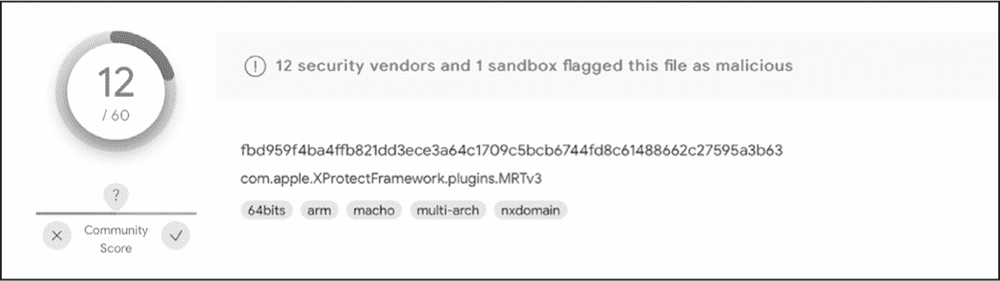
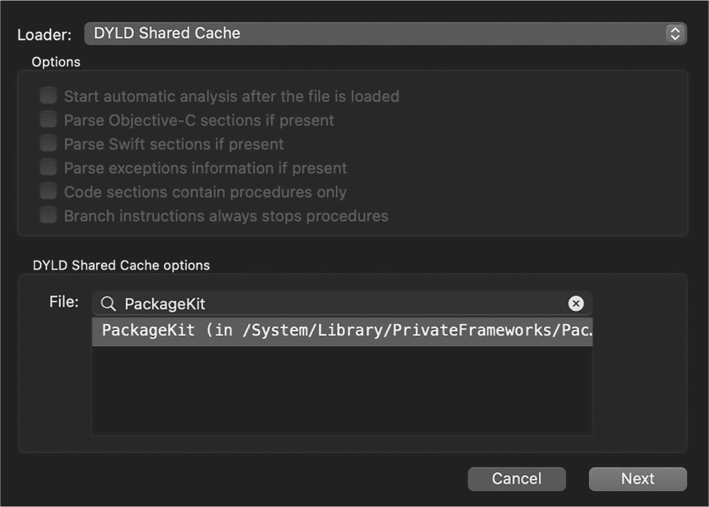

## 第三章：3 代码签名


在本章中，我们将编写代码，提取恶意软件常常滥用的分发文件格式（如磁盘镜像和软件包）中的代码签名信息。然后我们将把注意力转向磁盘上 Mach-O 二进制文件和正在运行的进程的代码签名信息。对于每一种情况，我将向你展示如何以编程方式验证代码签名信息，并检测任何撤销。

本书中覆盖的基于行为的启发式方法是检测恶意软件的强大工具。但这种方法也有一个缺点：*误报*，即当代码错误地将某个内容标记为可疑时发生的情况。

减少误报的一种方法是检查项目的代码签名信息。苹果对加密代码签名的支持无与伦比，作为恶意软件检测者，我们可以以多种方式利用这一点，最显著的是确认项目来自已知的、可信的来源，并且这些项目未被篡改。

另一方面，我们应该密切审查任何未签名或未经过公证的项目。例如，恶意软件通常完全未签名，或者是以临时的方式签署，即使用自签名或不受信任的证书。虽然威胁行为者偶尔会使用欺诈获得或盗用的开发者证书签署其恶意软件，但苹果通常不会对恶意软件进行公证。此外，当苹果犯错时，通常会迅速撤销签名证书或公证票证。

本章中展示的大部分代码片段都可以在*checkSignature*项目中找到，该项目可以在本书的 GitHub 仓库中获取。

### 代码签名在恶意软件检测中的重要性

作为代码签名在恶意软件检测中的有用性示例，假设你开发了一个启发式方法，用于监控文件系统中的持久性项目（这是检测恶意软件的合理方法，因为绝大多数 Mac 恶意软件会在受感染的主机上保持持久性）。假设你的启发式方法在*com.microsoft.update.agent.plist*属性列表作为启动代理保存时触发。这个属性列表引用了一个名为*MicrosoftAutoUpdate.app*的应用程序，操作系统将在每次用户登录时自动启动它。

如果你的检测能力没有考虑到持久化项目的代码签名信息，你可能会对一个实际上完全无害的持久化事件发出警报。因此，问题变成了：这真的是一个微软更新程序，还是恶意软件伪装成它？通过检查应用程序的代码签名，你应该能够明确回答这个问题；如果微软确实签署了该项目，你可以忽略持久化事件，但如果没有签署，那么这个项目就需要更仔细地检查。

不幸的是，现有的恶意软件检测产品可能未能充分考虑代码签名信息。例如，考虑一下苹果的恶意软件移除工具（MRT），这是某些版本 macOS 中内建的恶意软件检测工具。这个平台二进制文件自然是由苹果签名的。然而，许多杀毒引擎曾在某些时刻将 MRT 二进制文件*com.apple.XProtectFramework.plugins.MRTv3*标记为恶意软件，因为它们的杀毒签名天真地匹配了 MRT 自身嵌入的病毒签名（图 3-1）。



图 3-1：苹果的恶意软件移除工具被标记为恶意软件

这确实是一个相当好笑的误报。开个玩笑，错误地将合法项目归类为恶意软件的产品可能会触发用户警报，引发恐慌，或者更糟糕的是，可能通过将项目隔离而破坏其正常功能。幸运的是，第三方安全产品无法删除像 MRT 这样的系统组件，但苹果曾因操作失误，阻止了自己的一些组件，从而中断了系统的操作。^(1) 在这两种情况下，检测逻辑本来可以简单地检查项目的代码签名信息，确认它是否来自可信来源。

代码签名信息不仅仅能减少误报。例如，安全工具应该允许受信任或用户批准的项目执行那些可能会触发警报的操作。考虑一个简单的防火墙，每当一个不受信任的项目尝试访问网络时，它会生成一个通知。为了区分受信任和不受信任的项目，防火墙可以检查项目的代码签名信息。基于代码签名信息创建防火墙规则有以下几个好处：

+   如果恶意软件试图通过修改一个合法项目来绕过防火墙，代码签名检查将能检测到这种篡改行为。

+   如果一个已批准的项目移动到文件系统的其他位置，规则依然适用，因为它并未绑定到项目的路径或特定位置。

希望这些简短的示例已经向你展示了检查代码签名信息的价值。为了更全面一些，下面列举一些代码签名信息如何帮助我们以编程方式检测恶意代码的其他方式：

> **检测公证** 近期版本的 macOS 要求所有下载的软件必须签名才能运行。因此，现在大多数恶意软件都有签名，通常使用临时证书或伪造的开发者 ID。然而，恶意软件很少会被公证，因为公证需要将项目提交给 Apple，Apple 会对其进行扫描，并在确认项目不含恶意后发放公证票证。^(2) 如果 Apple 不小心公证了恶意软件，它通常会迅速发现这一失误并撤销公证。^(3) 这些失误非常罕见，因此被公证的项目大多数是无害的。通过代码签名，您可以快速判断项目是否已公证，这为您提供了 Apple 不认为其为恶意软件的可靠指示。
> 
> **检测撤销** 如果 Apple 撤销了项目的代码签名证书或公证票证，意味着他们已确定该项目不应再被分发和运行。虽然撤销有时是由于无害原因，但通常是因为 Apple 认为该项目是恶意的。本章将解释如何以编程方式检测撤销情况。^(4)
> 
> **将项目与已知对手关联** 研究人员将恶意对手所拥有的代码签名信息（如团队标识符）与其他由同一作者创建的恶意软件样本进行关联。

在检测恶意软件时，通常需要关注以下项目的代码签名信息：

+   信息、签名证书和公证票证的总体状态。该项目是否完全签名并已公证，签名证书和公证票证是否仍然有效？

+   描述签名链的代码签名授权机构，因为它们可以提供有关签名项目来源和可信度的洞见。

+   项目的可选团队标识符，指定了创建已签名项目的团队或公司。如果该团队标识符属于一家信誉良好的公司，通常可以信任该签名项目。

本章不会讨论代码签名的内部细节，而是专注于更高层次的概念，以及用于提取代码签名信息的 API。^(5)

然而，请记住，并非 macOS 上的所有内容都已签名，也不是所有的签名方式都相同。最显著的是，开发者无法签名独立脚本（这是 Apple 急于弃用它们的原因之一）。此外，macOS 内核本身并没有签名。相反，启动过程使用加密哈希来验证内核保持完整。

虽然开发者可以并且应该对分发介质（如磁盘映像、软件包、zip 压缩文件）以及应用程序和独立二进制文件进行签名，但提取代码签名信息的工具和 API 通常特定于文件类型。例如，苹果的 codesign 工具和代码签名服务 API 适用于磁盘映像、应用程序和二进制文件，但不适用于软件包，您可以使用 pkgutil 工具或私有的 PackageKit API 来检查软件包信息。

让我们考虑如何手动和程序化地提取和验证代码签名信息，从分发介质开始。

### 磁盘映像

合法的开发者和恶意软件作者经常以磁盘映像的形式分发他们的代码，这些磁盘映像通常具有 *.dmg* 扩展名。大多数包含恶意软件的磁盘映像没有签名，如果您遇到未签名的 *.dmg* 文件，至少应该检查其包含的项目是否已签名并经过公证。然而，代码签名信息的存在并不意味着磁盘映像是良性的；没有任何东西能阻止恶意软件作者利用加密签名。当您遇到已签名的磁盘映像时，请使用其代码签名信息来识别创建者。

#### 手动验证签名

您可以使用 macOS 内置的 codesign 工具手动验证磁盘映像的签名。使用 --verify 命令行选项（或简写为 -v）和 *.dmg* 文件的路径来执行它。

在以下示例中，codesign 识别出包含 LuLu 的有效签名磁盘映像，LuLu 是来自 Objective-See 的合法软件。当它遇到有效签名的映像时，工具默认不会输出任何内容；因此，我们使用 -dvv 选项来显示详细输出：

```
% **codesign –-verify LuLu_2.6.0.dmg**

% **codesign --verify -dvv LuLu_2.6.0.dmg**
Executable=/Users/Patrick/Downloads/LuLu_2.6.0.dmg
Identifier=LuLu
Format=disk image
...
Authority=Developer ID Application: Objective-See, LLC (VBG97UB4TA)
Authority=Developer ID Certification Authority
Authority=Apple Root CA 
```

详细输出显示磁盘映像的信息，如其路径、标识符、格式以及代码签名状态，包括证书颁发机构链。从证书颁发机构链中，您可以看到该软件包已经使用属于 Objective-See 的 Apple Developer ID 进行了签名。

如果磁盘映像未签名，工具将显示“代码对象未签名”消息。许多软件项目，包括大多数通过磁盘映像分发的恶意软件，都属于这一类别；作者可能已签名了软件或恶意软件，但未签名其分发介质。例如，看看 EvilQuest 恶意软件。它通过磁盘映像分发，包含了带有木马的应用程序包：

```
% **codesign --verify "EvilQuest/Mixed In Key 8.dmg"**
EvilQuest/Mixed In Key 8.dmg: code object is not signed at all 
```

最后，如果苹果撤销了磁盘映像的签名，codesign 将显示 CSSMERR_TP_CERT_REVOKED。您可以在分发 CreativeUpdate 恶意软件的磁盘映像中看到这个例子：

```
% **codesign --verify "CreativeUpdate/Firefox 58.0.2.dmg"**
CreativeUpdate/Firefox 58.0.2.dmg: CSSMERR_TP_CERT_REVOKED 
```

恶意软件的签名不再有效。

#### 提取代码签名信息

让我们通过编程方式使用苹果的代码签名服务 (Sec*) API 提取并验证磁盘映像的代码签名信息。^(6) 在本章的 *checkSignature* 项目中，你会找到一个名为 checkItem 的函数，它接受要验证的项目路径（例如磁盘映像），并返回一个包含验证结果的字典。对于有效签名的项目，它还会返回签名机构等信息（如果有的话）。

为了简洁起见，我在本书中的大部分代码片段中省略了基本的健全性和错误检查。然而，涉及到代码签名时，它提供了一种方式来做出关于项目可信度的关键决策，这时必须确保代码能够适当处理错误。如果没有强健的错误处理机制，代码可能会不小心信任一个伪装成无害项的恶意项目！因此，在本章中，代码片段没有省略这些重要的错误检查。

提取任何项目的代码签名信息的第一步是获取所谓的 *代码对象* 引用，随后你可以将其传递给所有后续的代码签名 API 调用。对于磁盘上的项目，比如磁盘映像，你将获得一个类型为 SecStaticCodeRef 的静态代码对象。^(7) 对于正在运行的进程，你将获得一个类型为 SecCodeRef 的动态代码对象。^(8)

要从磁盘映像中获取静态代码引用，请调用 SecStaticCodeCreateWithPath API，传入指定磁盘映像的路径、可选的标志和一个输出指针。函数返回后，输出指针将包含一个 SecStaticCode 对象，用于后续的 API 调用 (Listing 3-1)。^(9) 请注意，使用完毕后，应该使用 CFRelease 来释放这个指针。

```
NSMutableDictionary* checkImage(NSString* item) {
    SecStaticCodeRef codeRef = NULL;
    NSMutableDictionary* signingInfo = [NSMutableDictionary dictionary];

  ❶ CFURLRef itemURL = (__bridge CFURLRef)([NSURL fileURLWithPath:item]);

  ❷ OSStatus status = SecStaticCodeCreateWithPath(itemURL, kSecCSDefaultFlags, &codeRef);
  ❸ if(errSecSuccess != status) {
        goto bail;
    }
    ...

bail:
    if(nil != codeRef) {
        CFRelease(codeRef);
    }
    return signingInfo;
} 
```

Listing 3-1：获取磁盘映像的静态代码对象

在初始化包含我们要检查的磁盘映像路径的 URL 对象 ❶ 后，我们调用 SecStaticCodeCreateWithPath API ❷。如果此函数失败，它将返回非零值 ❸。如果 Sec* API 成功，它们返回零，映射到首选的 errSecSuccess 常量。我在《代码签名错误代码》一节中讨论了 Sec* API 可能返回的错误代码，详见 第 97 页。这些代码也在苹果的《代码签名服务结果代码》文档中有详细说明。^(10) 另外，注意，当我们完成代码引用后，必须通过 CFRelease 来释放它。

在这段代码和随后的代码片段中，你会看到使用了*桥接*，这是一种将 Objective-C 对象无缝转换为（或从）Apple 代码签名 API 使用的 Core Foundation 对象的机制。例如，在 Listing 3-1 中，SecStaticCodeCreateWithPath API 期望其第一个参数是 CFURLRef 类型。在将磁盘映像的路径转换为 NSURL 对象之后，我们使用(__bridge CFURLRef)将其桥接为 CFURLRef。你可以在 Apple 的“Core Foundation 设计概念”中了解更多关于桥接的内容。^(11)

一旦我们为磁盘映像创建了一个静态代码对象，就可以调用 SecStaticCodeCheckValidity API，使用刚创建的 SecStaticCode 对象来检查其有效性，并保存调用结果以便返回给调用者（Listing 3-2）。

```
...
#define KEY_SIGNATURE_STATUS @"signatureStatus"

status = SecStaticCodeCheckValidity(codeRef, kSecCSEnforceRevocationChecks, NULL);
signingInfo[KEY_SIGNATURE_STATUS] = [NSNumber numberWithInt:status];
if(errSecSuccess != status) {
    goto bail;
} 
```

Listing 3-2: 检查磁盘映像的代码签名有效性

通常，你会看到这个 API 调用时使用 kSecCSDefaultFlags 常量，该常量包含默认的标志集，但为了在验证过程中执行证书撤销检查，你需要传递 kSecCSEnforceRevocationChecks。

接下来，我们检查调用是否成功。如果我们未能执行此验证，恶意代码可能会绕过代码签名检查。^(12) 如果 API 失败，例如，返回 errSecCSUnsigned 错误，你可能希望中止提取任何进一步的代码签名信息，因为它要么不存在（在未签名的情况下），要么不可信。

一旦我们确定了磁盘映像的代码签名状态的有效性，就可以通过 SecCodeCopySigningInformation API 提取其代码签名信息。我们将 SecStaticCode 对象、kSecCSSigningInformation 标志以及一个输出指针传递给此 API，用于填充磁盘映像的代码签名详细信息（Listing 3-3）。

```
CFDictionaryRef signingDetails = NULL;

status = SecCodeCopySigningInformation(codeRef,
kSecCSSigningInformation, &signingDetails);
if(errSecSuccess != status) {
    goto bail;
} 
```

Listing 3-3: 提取代码签名信息

现在，我们可以从字典中提取存储的详细信息，例如证书授权链，使用键 kSecCodeInfoCertificates（Listing 3-4）。

```
#define KEY_SIGNING_AUTHORITIES @"signatureAuthorities"

signingInfo[KEY_SIGNING_AUTHORITIES] = ((__bridge NSDictionary*)signingDetails)
[(__bridge NSString*)kSecCodeInfoCertificates]; 
```

Listing 3-4: 提取证书授权链

如果该项具有临时签名，它的代码签名字典中就不会在 kSecCodeInfoCertificates 键下有条目。识别临时签名的另一种方法是检查 kSecCodeInfoFlags 键，该键包含该项的代码签名标志。对于临时签名，我们会在标志中发现第二个最低有效位（2）被设置，经过查阅 Apple 的*cs_blobs.h*头文件后，我们看到它对应于常量 CS_ADHOC。

很少看到以临时方式签名的磁盘映像，因为它们本身不需要签名，但由于应用程序和二进制文件必须签名才能运行，因此你常常会看到恶意软件以这种方式签名。我们可以按照 Listing 3-5 中显示的方式提取代码签名标志。

```
#define KEY_SIGNING_FLAGS @"flags"

signingInfo[KEY_SIGNING_FLAGS] = [(__bridge NSDictionary*)signingDetails
objectForKey:(__bridge NSString*)kSecCodeInfoFlags]; 
```

Listing 3-5: 提取项目的代码签名标志

然后我们可以检查这些提取的标志，查看是否有指示临时签名的值（列表 3-6）。

```
if([results[KEY_SIGNING_FLAGS] intValue] & CS_ADHOC) {
    // Code here will run only if item is signed in an ad hoc manner.
} 
```

列表 3-6：验证代码签名标志

字典将这些标志存储在一个数字对象中，因此我们必须首先将其转换为整数，然后执行按位与操作（&）来检查由 CS_ADHOC 指定的位。

当我们完成 CFDictionaryRef 字典的使用后，必须通过 CFRelease 释放它。

#### 提取公证信息

为了提取磁盘映像的公证状态，我们可以使用 SecRequirementCreateWithString API，该 API 允许我们创建一个要求，项目必须符合该要求。在列表 3-7 中，我们使用字符串“notarized”创建了一个要求。

```
static SecRequirementRef requirement = NULL;
SecRequirementCreateWithString(CFSTR("notarized"), kSecCSDefaultFlags, &requirement); 
```

列表 3-7：初始化要求引用字符串

API 通过编译我们传递给它的代码要求字符串生成一个对象，使我们能够多次使用该要求。^(13) 如果你只进行一次要求检查，可以跳过编译步骤，改用 SecTaskValidateForRequirement API，该 API 将字符串形式的要求作为第二个参数进行验证。

现在我们可以调用 SecStaticCodeCheckValidity API，传递给它 SecStaticCode 对象，以及要求引用（列表 3-8）。

```
if(errSecSuccess == SecStaticCodeCheckValidity(codeRef, kSecCSDefaultFlags, requirement)) {
    // Code placed here will run only if the item is notarized.
} 
```

列表 3-8：检查公证要求

如果 API 返回 errSecSuccess，我们就知道该项目符合我们传入的要求。在我们的例子中，这意味着磁盘映像确实已进行公证。你可以在苹果的《代码签名要求语言》文档中阅读更多关于要求的内容，包括有用的要求字符串。^(14)

如果公证验证失败，我们应该检查苹果是否已撤销该项目的公证票据，即使该项目已有效签名。这个细致的情况提出了一个巨大的警示；例如，请参见“磁盘应用程序和可执行文件”中关于 3CX 供应链攻击的讨论，详见第 93 页。

尽管我已经要求过了，^(15) 苹果并未批准任何确定项目的公证票据是否已被撤销的方法。然而，有两个未公开的 API，SecAssessmentCreate 和 SecAssessmentTicketLookup，可以提供这些信息。在列表 3-9 中，我们调用 SecAssessmentCreate 来检查一个已通过其他代码签名检查的项目是否已被撤销其公证票据。

```
❶ SecAssessmentRef secAssessment = SecAssessmentCreate(itemURL,
kSecAssessmentDefaultFlags, (__bridge CFDictionaryRef)(@{}), &error);
❷ if(NULL == secAssessment) {
    if((CSSMERR_TP_CERT_REVOKED == CFErrorGetCode(error)) ||
        (errSecCSRevokedNotarization == CFErrorGetCode(error))) {
        signingInfo[KEY_SIGNING_NOTARIZED] =
        [NSNumber numberWithInteger:errSecCSRevokedNotarization];
    }
}
❸ if(NULL != secAssessment) {
    CFRelease(secAssessment);
} 
```

列表 3-9：检查公证票据是否已被撤销

我们将路径传递给该函数，路径指向项目（如磁盘映像）；默认评估标志；一个空的但非 NULL 的字典；以及指向错误变量的输出指针 ❶。

如果 Apple 撤销了公证票证或证书，函数将设置错误为 CSSMERR_TP_CERT_REVOKED 或 errSecCSRevokedNotarization。第一个错误的名称有些微妙，因为它可以返回有效证书但已撤销公证票证的项目，而这正是我们在此关心的内容。

如果我们收到 NULL 评估结果并且出现以下错误代码❷，我们知道某些内容已被撤销。此外，由于我们已经验证了代码签名证书，我们知道撤销指的是公证票证。一旦评估完成，如果评估结果不是 NULL ❸，我们会确保释放它。#### 运行工具

让我们编译*checkSignature*项目，并针对本节前面提到的磁盘映像运行它：

```
% **./checkSignature LuLu_2.6.0.dmg**
Checking: LuLu_2.6.0.dmg
Status: signed
Is notarized: no

Signing auths: (
    "<cert(0x11100a800) s: Developer ID Application: Objective-See, LLC (VBG97UB4TA)
    i: Developer ID Certification Authority>",
    "<cert(0x111808200) s: Developer ID Certification Authority i: Apple Root CA>",
    "<cert(0x111808a00) s: Apple Root CA i: Apple Root CA>"
) 
```

正如预期的那样，代码报告 LuLu 的磁盘映像已签名，但未经过公证。代码还提取了其代码签名的证书链，包括其开发者 ID 应用程序和开发者 ID 证书颁发机构。（在检测恶意软件时，除非你对检测供应链攻击感兴趣，否则可能希望忽略通过受信任开发者 ID 签名的磁盘映像。）

现在让我们对 EvilQuest 恶意软件运行代码。正如你所见，代码与 Apple 的 codesign 工具的结果一致，表明磁盘映像未签名：

```
% **./checkSignature "EvilQuest/Mixed In Key 8.dmg"**
Checking: Mixed In Key 8.dmg
Status: unsigned 
```

最后，我们对 CreativeUpdate 恶意软件运行代码，其代码签名证书已被撤销：

```
% **./checkSignature "CreativeUpdate/Firefox 58.0.2.dmg"**
Checking: Firefox 58.0.2.dmg
Status: revoked 
```

现在我们可以通过编程方式从磁盘映像中提取和验证代码签名信息，接下来让我们对包进行相同的操作，尽管这需要完全不同的方法。

### 包

你可以使用内置的 pkgutil 工具手动验证包（*.pkg*）的签名。使用--check-signature 命令行选项执行该工具，然后指定你想验证的*.pkg*文件路径。该工具应在以“Status:”为前缀的行中显示检查结果：

```
% **pkgutil --check-signature GoogleChrome.pkg**
Package "GoogleChrome.pkg":
   Status: signed by a developer certificate issued by Apple for distribution
   Notarization: trusted by the Apple notary service
   Signed with a trusted timestamp on: 05-15 20:46:50 +0000
   Certificate Chain:
    1\. Developer ID Installer: Google LLC (EQHXZ8M8AV)
       Expires: 2027-02-01 22:12:15 +0000
       SHA256 Fingerprint:
           40 02 6A 12 12 38 F4 E0 3F 7B CE 86 FA 5A 22 2B DA 7A 3A 20 70 FF
           28 0D 86 AA 4E 02 56 C5 B2 B4
       -----------------------------------------------------------------------
    2\. Developer ID Certification Authority
       Expires: 2027-02-01 22:12:15 +0000
       SHA256 Fingerprint:
           7A FC 9D 01 A6 2F 03 A2 DE 96 37 93 6D 4A FE 68 09 0D 2D E1 8D 03
           F2 9C 88 CF B0 B1 BA 63 58 7F
       -----------------------------------------------------------------------
    3\. Apple Root CA
       Expires: 2035-02-09 21:40:36 +0000
       SHA256 Fingerprint:
           B0 B1 73 0E CB C7 FF 45 05 14 2C 49 F1 29 5E 6E DA 6B CA ED 7E 2C
           68 C5 BE 91 B5 A1 10 01 F0 24 
```

结果显示，pkgutil 已经验证该包（一个 Google Chrome 安装程序）已签名并经过公证。该工具还显示了证书颁发机构链，表明该包是通过属于 Google 的 Apple Developer ID 进行签名的。

请注意，你不能使用 codesign 工具来检查包的代码签名，因为*.pkg*文件使用与 codesign 无法理解的不同机制存储代码签名信息。例如，当针对同一包运行时，它检测不到签名：

```
% **codesign –-verify -dvv GoogleChrome.pkg**
GoogleChrome.pkg: code object is not signed at all 
```

如果一个包没有签名，pkgutil 将显示“Status: no signature”消息。大多数通过包分发的恶意软件，包括 EvilQuest，都属于这一类。这些磁盘映像包含一个恶意包，一旦磁盘映像被挂载，我们可以使用 pkgutil 显示该包未签名：

```
% **pkgutil --check-signature "EvilQuest/Mixed In Key 8.pkg"**
Package "Mixed In Key 8.pkg":
   Status: no signature 
```

最后，如果一个包已签名，但苹果撤销了它的代码签名证书，pkgutil 将显示状态：撤销的签名，但仍然会显示证书链。我们在一个用于分发 KeySteal 恶意软件的包中发现了这种行为的例子：

```
% **pkgutil --check-signature KeySteal/archive.pkg**
Package "archive.pkg":
   Status: revoked signature
   Signed with a trusted timestamp on: 10-18 12:58:45 +0000
   Certificate Chain:
    1\. Developer ID Installer: fenghua he (32W7BZNTSV)
       Expires: 2027-02-01 22:12:15 +0000
       SHA256 Fingerprint:
           EC 7C 85 1D B0 A0 8C ED 45 31 6B 8E 9D 7D 34 0F 45 B8 4E CE 9D 9C
           97 DB 2F 63 57 C2 D9 71 0C 4E
       -----------------------------------------------------------------------
    2\. Developer ID Certification Authority
       Expires: 2027-02-01 22:12:15 +0000
       SHA256 Fingerprint:
           7A FC 9D 01 A6 2F 03 A2 DE 96 37 93 6D 4A FE 68 09 0D 2D E1 8D 03
           F2 9C 88 CF B0 B1 BA 63 58 7F
       -----------------------------------------------------------------------
    3\. Apple Root CA
       Expires: 2035-02-09 21:40:36 +0000
       SHA256 Fingerprint:
           B0 B1 73 0E CB C7 FF 45 05 14 2C 49 F1 29 5E 6E DA 6B CA ED 7E 2C
           68 C5 BE 91 B5 A1 10 01 F0 24 
```

苹果已撤销签名。此外，被撤销的代码签名标识符 fenghua he (32W7BZNTSV) 可能帮助你找到其他由同一恶意软件作者签署的恶意软件。

#### 反向工程 pkgutil

现在，你可能会想知道如何以编程方式检查包的签名。这是一个很好的问题，因为目前没有公开的 API 用于验证包！谢谢你，库比提诺。

幸运的是，对 pkgutil 二进制文件进行快速的反向工程分析，可以揭示它如何检查包的签名。首先，我们可以看到 pkgutil 链接了私有的 *PackageKit* 框架：

```
% **otool -L /usr/sbin/pkgutil**
/usr/sbin/pkgutil:
...
/System/Library/PrivateFrameworks/PackageKit.framework/Versions/A/PackageKit
... 
```

这个框架的名字表明它可能包含相关的 API。通常，它位于 */System/Library/PrivateFrameworks/* 目录中，且在最近版本的 macOS 中存在于共享的 *dyld 缓存* 中，dyld 缓存是一个预先链接的共享文件，包含常用的库。^(16) 它的名字和位置取决于 macOS 的版本和系统架构，但可能类似于 *dyld_shared_cache_arm64e* 和 */System/Volumes/Preboot/Cryptexes/OS/System/Library/dyld/*。

我们必须先从 *dyld* 缓存中提取 *PackageKit* 框架，然后才能对其进行反向工程。像 Hopper 这样的工具，如 图 3-2 所示，可以从缓存中提取框架。



图 3-2：从 dyld 缓存中提取 PackageKit 框架

如果你更倾向于使用命令行工具来提取库，一个不错的选择是 *dyld-shared-cache-extractor*。^(17) 安装此工具后，你可以通过指定 *dyld* 缓存路径和输出目录来执行它，这里我们指定输出目录为 */tmp/libraries*：

```
% **dyld-shared-cache-extractor /System/Volumes/Preboot/Cryptexes/OS/System/**
**Library/dyld/dyld_shared_cache_arm64e /tmp/libraries** 
```

一旦工具从缓存中提取了所有库，你会在 */tmp/libraries/System/Library/Private Frameworks/PackageKit.framework* 找到 *PackageKit* 框架。

现在我们可以将框架加载到反汇编器中，以深入了解其 API 和内部结构。例如，我们发现了一个名为 PKArchive 的类，它包含了一些有用的方法，如 archiveWithPath: 和 verifyReturningError: 等：

```
@interface PKArchive : NSObject
    +(id)archiveWithPath:(id)arg1;
    +(id)_allArchiveClasses;
    -(BOOL)closeArchive;
    -(BOOL)fileExistsAtPath:(id)arg1;
    -(BOOL)verifyReturningError:(id*)arg1;
    ...
@end 
```

我不会在这里详细介绍反向工程 *PackageKit* 框架的全过程，但你可以在线了解更多相关过程。^(18) 你也可以在我的 What’s Your Sign 工具的 *Package.h/Package.m* 文件中找到完整的包验证源代码。^(19)

#### 访问框架函数

要在我们的*checkSignature*项目中使用已发现的方法，我们需要一个包含*PackageKit*框架的私有类定义的头文件。这将允许我们直接从代码中调用它们。过去，像 class-dump 这样的工具可以轻松地创建此类头文件，^(20) 但这种方法与较新的 Apple Silicon 二进制文件不完全兼容。相反，你可以通过反汇编器或使用 otool 手动提取这些类定义。列表 3-10 展示了提取的定义。

```
@interface PKArchive : NSObject
    +(id)archiveWithPath:(id)arg1;
    +(id)_allArchiveClasses;
    -(BOOL)closeArchive;
    -(BOOL)fileExistsAtPath:(id)arg1;
    -(BOOL)verifyReturningError:(id*)arg1;
    ...

    @property(readonly) NSString* archiveDigest;
    @property(readonly) NSString* archivePath;
    @property(readonly) NSDate* archiveSignatureDate;
    @property(readonly) NSArray* archiveSignatures;
@end

@interface PKArchiveSignature : NSObject
{
    struct __SecTrust* _verifyTrustRef;
}

    -(struct __SecTrust*)verificationTrustRef;
    -(BOOL)verifySignedDataReturningError:(id *)arg1;
    -(BOOL)verifySignedData;
    ...

    @property(readonly) NSString* algorithmType;
    @property(readonly) NSArray* certificateRefs;
@end
... 
```

列表 3-10：PackageKit 框架的提取类和方法定义

现在我们可以编写代码来使用这些类，调用它们的方法以编程方式验证我们选择的包。我们将在一个名为 checkPackage 的函数中完成这一过程。它的唯一参数是需要验证的包的路径，并返回一个包含验证结果的字典，以及其他代码签名信息，如包的代码签名权限。该函数首先加载所需的*PackageKit*框架（列表 3-11）。

```
#define PACKAGE_KIT @"/System/Library/PrivateFrameworks/PackageKit.framework" ❶

NSMutableDictionary* checkPackage(NSString* package) {
    NSBundle* packageKit = [NSBundle bundleWithPath:PACKAGE_KIT]; ❷
    [packageKit load];

    ...
} 
```

列表 3-11：加载 PackageKit 框架

首先，我们定义*PackageKit*框架的路径 ❶。然后，我们使用 NSBundle 类的 bundleWithPath: 和 load 方法加载框架，以便我们可以动态解析和调用该框架的方法 ❷。

由于其自省特性，Objective-C 编程语言使得使用私有类并调用私有方法变得容易。要访问私有类，可以使用 NSClassFromString 函数。例如，列表 3-12 展示了如何动态地获取 PKArchive 类的类对象。

```
Class PKArchiveCls = NSClassFromString(@"PKArchive");
```

列表 3-12：获取 PKArchive 类对象

通过逆向工程 pkgutil，发现它通过使用 PKArchive 类的 archiveWithPath: 方法来实例化一个归档对象（PKXARArchive），并传入要验证的包的路径。在列表 3-13 中，我们的代码执行了相同的操作。

```
PKXARArchive* archive = [PKArchiveCls archiveWithPath:package];
```

列表 3-13：实例化归档对象

在处理像 PKArchive 这样的私有类时，请注意，在调用其方法之前调用 respondsToSelector: 方法是明智的。respondsToSelector: 方法将返回一个布尔值，告诉你是否可以安全地在类或类实例上调用该方法。^(21) 如果跳过此步骤且对象未响应某个方法，程序将因发送未识别的选择器给类而崩溃。

以下代码检查确保 PKArchive 类实现了 archiveWithPath: 方法（列表 3-14）。

```
if(YES != [PKArchiveCls respondsToSelector:@selector(archiveWithPath:)]) {
    goto bail;
} 
```

列表 3-14：检查方法

现在我们准备进行一些基本的包验证。 #### 验证包

同样，我们通过使用 PKXARArchive 类的 verifyReturningError: 方法（列表 3-15）来模仿 pkgutil。

```
NSError* error = nil;
if(YES != [archive verifyReturningError:&error]) {
    goto bail;
} 
```

列表 3-15：执行基本的包验证

一旦软件包通过了基本的验证检查，我们可以检查它的签名，该签名位于归档文件的 archiveSignatures 实例变量中。这个变量是一个数组，包含指向 PKArchiveSignature 对象的指针。一个签名的软件包至少会有一个签名（列表 3-16）。

```
❶ NSArray* signatures = archive.archiveSignatures;
if(0 == signatures.count) {
    goto bail;
}

PKArchiveSignature* signature = signatures.firstObject;
❷ if(YES != [signature verifySignedDataReturningError:&error]) {
    goto bail;
} 
```

列表 3-16：验证软件包的叶子签名

在确保软件包至少有一个签名 ❶ 后，我们验证第一个或 *叶子* 签名，使用 PKArchiveSignature 类的 verifySignedDataReturningError: 方法 ❷。此外，我们还会评估该签名的信任度（列表 3-17）。

```
Class PKTrustCls = NSClassFromString(@"PKTrust");

struct __SecTrust* trustRef = [signature verificationTrustRef];

❶ PKTrust* pkTrust = [[PKTrustCls alloc] initWithSecTrust:trustRef
usingAppleRoot:YES signatureDate:archive.archiveSignatureDate];

❷ if(YES != [pkTrust evaluateTrustReturningError:&error]) {
    goto bail;
} 
```

列表 3-17：评估签名的信任度

我们使用签名实例化一个 PKTrust 对象 ❶，然后调用 PKTrust 类的 evaluateTrustReturningError: 方法 ❷。如果 verificationTrustRef 返回 nil，我们可以通过使用 PKTrust 类的 initWithCertificates:usingAppleRoot:signatureDate: 方法来验证软件包的证书。有关更多详细信息，请参阅本章的 *checkSignature* 项目代码。如果签名和签名信任验证通过，我们就有一个有效的签名软件包。

你还可以提取签名的证书，这样就能执行一些操作，比如检查每个签署机构的名称。你可以通过 PKArchiveSignature 对象的 certificateRefs 实例变量访问这些证书，它是一个 SecCertificateRef 对象数组，并可以使用 SecCertificate* API 提取它们的信息。

#### 检查软件包公证

本节的最后，我将展示如何判断 Apple 是否已公证一个软件包。回想一下，pkgutil 利用了私有的 *PackageKit* 框架来验证软件包。然而，逆向工程表明，软件包公证检查并未在该框架中的其他检查一起实现，而是直接在 pkgutil 可执行文件中实现。

要检查一个软件包的公证状态，pkgutil 会调用 SecAssessmentTicketLookup API。虽然这个 API 没有文档说明，但我们可以在 Apple 的 *SecAssessment.h* 头文件中找到它的声明。列表 3-18 模拟了 pkgutil 的方法。给定一个经过验证的 PKArchiveSignature 对象，它会判断该软件包是否已通过公证。

```
#import <CommonCrypto/CommonDigest.h>

typedef uint64_t SecAssessmentTicketFlags;
enum {
    kSecAssessmentTicketFlagDefault = 0,
    kSecAssessmentTicketFlagForceOnlineCheck = 1 << 0,
    kSecAssessmentTicketFlagLegacyListCheck = 1 << 1,
};

Boolean SecAssessmentTicketLookup(CFDataRef hash, SecCSDigestAlgorithm
hashType, SecAssessmentTicketFlags flags, double* date, CFErrorRef* errors);

BOOL isPackageNotarized(PKArchiveSignature* signature) {
    CFErrorRef error = NULL;
    BOOL isItemNotarized = NO;
    double notarizationDate = 0;

    SecCSDigestAlgorithm hashType = kSecCodeSignatureHashSHA1;

  ❶ NSData* hash = [signature signedDataReturningAlgorithm:0x0];
    if(CC_SHA1_DIGEST_LENGTH == hash.length) {
        hashType = kSecCodeSignatureHashSHA1;
    } else if(CC_SHA256_DIGEST_LENGTH == hash.length) {
        hashType = kSecCodeSignatureHashSHA256;
    }

  ❷ if(YES == SecAssessmentTicketLookup((__bridge CFDataRef)(hash), hashType,
    kSecAssessmentTicketFlagDefault, &notarizationDate, &error)) {
        isItemNotarized = YES;
  ❸} else if(YES == SecAssessmentTicketLookup((__bridge CFDataRef)(hash),
    hashType, kSecAssessmentTicketFlagForceOnlineCheck, &notarizationDate,
    &error)) {
        isItemNotarized = YES;
 }

    return isItemNotarized;
} 
```

列表 3-18：软件包公证检查

我们声明了多个变量，其中大多数将在 SecAssessmentTicketLookup API 调用中使用。然后我们调用签名的 signedDataReturningAlgorithm: 方法，该方法返回一个包含哈希值的 data 对象 ❶。

接下来，我们第一次调用 SecAssessmentTicketLookup ❷，传入哈希值和哈希类型，哈希类型可以是 SHA-1 或 SHA-256，分别由 kSecCodeSignatureHashSHA1 和 kSecCodeSignatureHashSHA256 常量表示。我们还传入评估标志和一个输出指针，如果软件包已通过公证，该指针将接收到公证日期。最后一个参数是一个可选的输出指针，指向错误变量。

模拟 pkgutil 二进制文件，我们首先使用设置为 kSecAssessmentTicketFlagDefault 的评估标志调用 API。如果此调用未能确定包是否已公证，我们将再次调用该 API，这次设置标志为 kSecAssessmentTicketFlagForceOnlineCheck ❸。你可以在 *SecAssessment.h* 头文件中找到这些及其他标志值。

如果任一 API 调用返回非零值，则包已公证，且 Apple 公证服务信任它。然而，由于我们模拟了 pkgutil，我们的代码并未指定非公证包是否已撤销其公证票证。通过项目的代码签名哈希和哈希类型，我们可以按照 清单 3-19 所示的方式实现此检查。

```
CFErrorRef error = NULL;

if(YES != SecAssessmentTicketLookup(hash, hashType,
kSecAssessmentTicketFlagForceOnlineCheck, NULL, &error)) {
    if(EACCES == CFErrorGetCode(error)) {
        // Code placed here will run if the item's notarization ticket has been revoked.
    }
} 
```

清单 3-19：检查撤销的公证票证

如果项目的公证票证已被撤销，SecAssessmentTicketLookup API 将把其错误变量设置为 EACCES 的值。^(22)

#### 运行工具

让我们运行 *checkSignature* 工具，检查本章前面提到的包：

```
% **./checkSignature GoogleChrome.pkg**
Checking: GoogleChrome.pkg

Status: signed
Notarized: yes
Signing authorities (
    "<cert(0x11ee0ac30) s: Developer ID Installer: Google LLC (EQHXZ8M8AV)
    i: Developer ID Certification Authority>",
    "<cert(0x11ee08360) s: Developer ID Certification Authority i: Apple Root CA>",
    "<cert(0x11ee07820) s: Apple Root CA i: Apple Root CA>"
)

% **./checkSignature "EvilQuest/Mixed In Key 8.pkg"**
Checking: Mixed In Key 8.pkg

Status: unsigned

% **./checkSignature KeySteal/archive.pkg**
Checking: archive.pkg

Status: certificate revoked

Signing authorities: (
    "<cert(0x151406100) s: Developer ID Installer: fenghua he (32W7BZNTSV)
    i: Developer ID Certification Authority>",
    "<cert(0x151406380) s: Developer ID Certification Authority i: Apple Root CA>",
    "<cert(0x1514082b0) s: Apple Root CA i: Apple Root CA>"
) 
```

输出结果与 Apple 的 pkgutil 工具的结果匹配。我们的代码准确地识别出第一个包已正确签名并经过公证；第二个包，包含 EvilQuest 恶意软件，则未签名；最后一个包，包含 KeySteal 恶意软件，则已被撤销。

### 磁盘上的应用程序和可执行文件

大多数 macOS 恶意软件以应用程序或独立的 Mach-O 二进制文件形式分发。我们可以以与磁盘映像相同的方式，从磁盘上的应用程序包或可执行二进制文件中提取代码签名信息：手动通过 codesign 工具，或通过 Apple 的代码签名服务 API 编程实现。然而，这种情况存在一些重要的不同点。

第一个涉及 SecStaticCodeCheckValidity API，该 API 用于验证项目的签名。当项目不是磁盘映像时，我们必须使用 kSecCSCheckAllArchitectures 标志调用此函数（清单 3-20）。

```
SecCSFlags flags = kSecCSEnforceRevocationChecks;
if(NSOrderedSame != [item.pathExtension caseInsensitiveCompare:@"dmg"]) {
    flags |= kSecCSCheckAllArchitectures;
}
status = SecStaticCodeCheckValidity(staticCode, flags, NULL);
... 
```

清单 3-20：检查项目的签名

此标志处理多架构项目，如通用二进制文件，这些文件可能包含多个嵌入的 Mach-O 二进制文件，可能具有不同的代码签名者。有关攻击者利用通用二进制文件绕过不充分的代码签名检查的实际示例，请参见 CVE-2021-30773。^(23) 此标志值还强制执行撤销检查，因为它包含了 kSecCSEnforceRevocationChecks 的值。

在本章前面，我向你展示了如何检查指定项目是否符合某些要求，例如是否进行了公证。你可能还想检查其他要求，比如项目是否由苹果公司正式签名（*anchor apple*要求），或者是否由苹果公司和第三方开发者 ID 共同签名（*anchor apple generic*要求）。在这些情况下，你的代码可以调用 SecRequirementCreateWithString 函数，传入你希望检查的要求，然后将该要求传递给 SecStaticCodeCheckValidity API。为了考虑到通用二进制文件，可以使用包含 kSecCSCheckAllArchitectures 标志值的函数调用。

你还应该调用 SecAssessmentCreate API，以处理那些拥有有效签名但已撤销公证票据的项目。以与应用程序相关的实际示例来说明这一情况，请参见之前提到的 3CX 供应链攻击。在此次攻击中，朝鲜黑客入侵了 3CX 公司的网络和构建服务器，通过恶意软件篡改了 3CX 应用程序，并用 3CX 代码签名证书签名，接着诱使苹果公司进行公证。苹果公司不愿撤销 3CX 的代码签名证书，因为那样会导致许多其他合法的 3CX 应用程序无法运行，最终只是撤销了被篡改应用程序的公证票据。

让我们对合法应用程序以及恶意软件运行*checkSignature*项目，包括 3CX 样本：

```
% **./checkSignature /Applications/LuLu.app**
Checking: LuLu.app

Status: signed
Notarized: yes
Signing authorities: : (
    "<cert(0x13b814800) s: Developer ID Application: Objective-See, LLC (VBG97UB4TA)
    i: Developer ID Certification Authority>",
    "<cert(0x13b81c800) s: Developer ID Certification Authority i: Apple Root CA>",
    "<cert(0x13b81d000) s: Apple Root CA i: Apple Root CA>"
)

% **./checkSignature WindTail/Final_Presentation.app**
Checking: Final_Presentation.app

Status: certificate revoked

% **./checkSignature "SmoothOperator/3CX Desktop App.app"**
Checking: 3CX Desktop App.app

Status: signed
Notarized: revoked

% ./**checkSignature MacMa/client**
Checking: client

Status: unsigned 
```

我们首先检查 Objective-See 签名和公证过的 LuLu 应用程序，然后是一个带有撤销证书的 WindTail 恶意软件样本。接下来，我们测试一个被木马化的 3CX 应用程序实例；我们的代码正确检测到它的公证状态已被撤销。最后，我们演示 MacMa 恶意软件是未签名的。

### 运行中的进程

到目前为止，我们通过获取静态代码对象引用检查了磁盘上的项目。在这一部分，我们将通过使用动态代码对象引用（SecCodeRef）来检查正在运行进程的代码签名信息。

在适用的情况下，你应该使用动态代码对象引用，原因有两个。第一个是效率；操作系统已经为动态实例的项目验证了大部分代码签名信息，以确保符合运行时要求。对我们而言，这意味着我们可以避免与静态代码检查相关的昂贵文件 I/O 操作，并跳过某些计算。

动态代码引用优于静态代码引用的另一个原因与项目的磁盘图像和内存图像之间可能的差异有关。例如，恶意软件几乎不受任何限制地将其磁盘上项目的代码签名信息更改为无害值。（当然，这种异常行为本身就应该引发一个巨大的警告。）另一方面，正在运行的项目不能更改其动态代码签名信息。

要检查一个正在运行的进程是否已签名并提取其代码签名信息，首先我们必须通过 SecCodeCopyGuestWithAttributes API 获取一个代码引用。通过进程的 ID 调用它，或者更安全的做法是通过进程的审计令牌（Listing 3-21）。

```
SecCodeRef dynamicCode = NULL;

NSData* data = [NSData dataWithBytes:token length:sizeof(audit_token_t)]; ❶
NSDictionary* attributes = @{(__bridge NSString*)kSecGuestAttributeAudit:data}; ❷

status = SecCodeCopyGuestWithAttributes(NULL,
(__bridge CFDictionaryRef _Nullable)(attributes), kSecCSDefaultFlags, &dynamicCode); ❸
if(errSecSuccess != status) {
    goto bail;
} 
```

Listing 3-21: 通过进程的审计令牌获取代码对象引用

我们首先将审计令牌转换为数据对象 ❶。我们需要进行此转换，以便可以将审计令牌放入字典中，字典的键是字符串 kSecGuestAttributeAudit ❷。然后，我们将此字典传递给 SecCodeCopyGuestWithAttributes API，并附上一个输出指针，用于填充代码对象引用 ❸。

拿到代码对象引用后，您可以使用 SecCodeCheckValidity 或 SecCodeCheckValidityWithErrors 验证进程的代码签名信息。请记住，对于磁盘上的项目，比如通用二进制文件，我们使用 kSecCSCheckAllArchitectures 标志值来验证所有嵌入的 Mach-O 文件；而对于正在运行的进程，动态加载器只会加载并执行一个嵌入的 Mach-O 文件，因此该标志值不相关，也不需要使用。

在提取或操作任何代码签名信息之前，验证进程的代码签名信息至关重要。如果没有进行验证，或者验证失败，您将无法信任这些信息。如果代码签名信息有效，您可以通过之前讨论的 SecCodeCopySigningInformation 函数提取它。

拥有一个进程的代码引用后，您还可以以简单而安全的方式执行其他日常但重要的任务。例如，使用 SecCodeCopyPath API，您可以检索进程的路径（Listing 3-22）。

```
CFURLRef path = NULL;
SecCodeCopyPath(dynamicCode, kSecCSDefaultFlags, &path); 
```

Listing 3-22: 从动态代码对象引用中获取进程路径

您还可以使用要求执行特定验证，就像我们在静态代码对象引用中讨论的那样。使用动态代码对象引用时，方法基本相同，唯一不同的是您需要使用 SecCodeCheckValidity API 来执行验证。需要注意的是，当您完成动态代码引用的使用后，应通过 CFRelease 释放它。

由于 macOS 不允许执行任何证书或公证票已被撤销的进程，因此您无需对正在运行的进程进行此检查。

### 检测误报

在本章开始时，我提到过一些杀毒引擎错误地将苹果的 MRT 组件标记为恶意软件。如果这些引擎考虑到该项的代码签名信息，它们会将 MRT 及其组件识别为仅由苹果签名的 macOS 内置部分，并安全地忽略它。

我将向您展示如何使用本章介绍的 API 执行此类检查。具体来说，您将使用 *anchor apple* 要求字符串，只有在没有其他人签名该项时，它才会在加密学上为真。

假设我们已经获得了一个错误标记为恶意软件的二进制文件的静态代码引用。在示例 3-23 中，我们首先编译要求字符串，然后将其和代码引用一起传递给 SecStaticCodeCheckValidity API。

```
static SecRequirementRef requirement = NULL;
SecRequirementCreateWithString(CFSTR("anchor apple"), kSecCSDefaultFlags, &requirement);

if(errSecSuccess ==
SecStaticCodeCheckValidity(staticCodeRef, kSecCSCheckAllArchitectures, requirement)) {
    // Code placed here will run only if the item is signed by Apple alone.
} 
```

示例 3-23：检查项目是否符合 anchor apple 要求的有效性

如果 SecStaticCodeCheckValidity 返回 errSecSuccess，我们就知道只有苹果公司本身签署了该项目，意味着它属于 macOS，因此肯定不是恶意软件。

### 代码签名错误代码

如本章所述，适当地处理验证项目的加密签名时遇到的任何错误非常重要。你可以在苹果的《代码签名服务结果代码》开发者文档^(24)中找到代码签名服务 API 的错误代码，或者在*CSCommon.h*文件中找到，位置在*Security.framework/Versions/A/Headers/*。这些资源指出，例如，错误代码-66992 对应于 errSecCSRevokedNotarization，表示该代码已被撤销。

如果查看头文件不是你的兴趣所在，可以参考 OSStatus 网站。该网站提供了一种简单的方式，将任何苹果 API 错误代码映射到其易读的名称。

### 结论

代码签名让我们能够确定一个项目来自哪里，以及该项目是否已经被修改。在本章中，你深入探讨了可以验证、提取和验证诸如磁盘映像、安装包、磁盘上的二进制文件和运行中的进程等项目的代码签名信息的 API。

理解这些 API 在检测恶意软件时至关重要，尤其是当基于启发式的检测方法可能会产生大量误报时。代码签名提供的信息可以显著减少你的检测错误。在构建反恶意软件工具时，你可以通过多种方式使用代码签名，包括识别可以信任的核心操作系统组件、检测那些证书或公证票据已被撤销的项目，以及认证客户端，例如尝试连接 XPC 接口的工具模块（该主题在第十一章中讲解）。

### 注意事项

1.    1.  Rich Trouton，“苹果安全更新阻止了 OS X El Capitan 上的苹果以太网驱动程序，” *Der Flounder*，2016 年 2 月 28 日，[*https://<wbr>derflounder<wbr>.wordpress<wbr>.com<wbr>/2016<wbr>/02<wbr>/28<wbr>/apple<wbr>-security<wbr>-update<wbr>-blocks<wbr>-apple<wbr>-ethernet<wbr>-drivers<wbr>-on<wbr>-el<wbr>-capitan<wbr>/*](https://derflounder.wordpress.com/2016/02/28/apple-security-update-blocks-apple-ethernet-drivers-on-el-capitan/)。

1.    2.  “在分发前对 macOS 软件进行公证，”苹果开发者文档，[*https://<wbr>developer<wbr>.apple<wbr>.com<wbr>/documentation<wbr>/security<wbr>/notarizing<wbr>_macos<wbr>_software<wbr>_before<wbr>_distribution*](https://developer.apple.com/documentation/security/notarizing_macos_software_before_distribution)。

1.    3.  Patrick Wardle，“Apple 批准的恶意软件，” Objective-See，2020 年 8 月 30 日，[*https://<wbr>objective<wbr>-see<wbr>.com<wbr>/blog<wbr>/blog<wbr>_0x4E<wbr>.html*](https://objective-see.com/blog/blog_0x4E.html)。

1.    4.  你可以在 Jeff Johnson 的文章中了解更多关于开发者证书撤销的内容，“开发者 ID 证书撤销，” *Lapcat 软件*，2020 年 10 月 29 日，[*https://<wbr>lapcatsoftware<wbr>.com<wbr>/articles<wbr>/revocation<wbr>.html*](https://lapcatsoftware.com/articles/revocation.html)。

1.    5.  如果你对代码签名的技术细节感兴趣，可以参考 Jonathan Levin 的文章，“代码签名——深入解析”，*NewOSXBook*，2015 年 4 月 20 日，[*http://<wbr>www<wbr>.newosxbook<wbr>.com<wbr>/articles<wbr>/CodeSigning<wbr>.pdf*](http://www.newosxbook.com/articles/CodeSigning.pdf)，或“macOS 代码签名深度解析，” Apple 开发者文档，[*https://<wbr>developer<wbr>.apple<wbr>.com<wbr>/library<wbr>/archive<wbr>/technotes<wbr>/tn2206<wbr>/<wbr>_index<wbr>.html*](https://developer.apple.com/library/archive/technotes/tn2206/_index.html)。

1.    6.  “代码签名服务，” Apple 开发者文档，[*https://<wbr>developer<wbr>.apple<wbr>.com<wbr>/documentation<wbr>/security<wbr>/code<wbr>_signing<wbr>_services*](https://developer.apple.com/documentation/security/code_signing_services)。

1.    7.  “SecStaticCodeRef，” Apple 开发者文档，[*https://<wbr>developer<wbr>.apple<wbr>.com<wbr>/documentation<wbr>/security<wbr>/secstaticcoderef<wbr>?language<wbr>=objc*](https://developer.apple.com/documentation/security/secstaticcoderef?language=objc)。

1.    8.  “SecCodeRef，” Apple 开发者文档，[*https://<wbr>developer<wbr>.apple<wbr>.com<wbr>/documentation<wbr>/security<wbr>/seccoderef<wbr>?language<wbr>=objc*](https://developer.apple.com/documentation/security/seccoderef?language=objc)。

1.    9.  “SecStaticCodeCreateWithPath，” Apple 开发者文档，[*https://<wbr>developer<wbr>.apple<wbr>.com<wbr>/documentation<wbr>/security<wbr>/1396899<wbr>-secstaticcodecreatewithpath*](https://developer.apple.com/documentation/security/1396899-secstaticcodecreatewithpath)。

1.  10.  “代码签名服务结果代码，” Apple 开发者文档，[*https://<wbr>developer<wbr>.apple<wbr>.com<wbr>/documentation<wbr>/security<wbr>/1574088<wbr>-code<wbr>_signing<wbr>_services<wbr>_result<wbr>_cod*](https://developer.apple.com/documentation/security/1574088-code_signing_services_result_cod)。

1.  11.  “Core Foundation 设计概念，” Apple 开发者文档，[*https://<wbr>developer<wbr>.apple<wbr>.com<wbr>/library<wbr>/archive<wbr>/documentation<wbr>/CoreFoundation<wbr>/Conceptual<wbr>/CFDesignConcepts<wbr>/Articles<wbr>/tollFreeBridgedTypes<wbr>.html*](https://developer.apple.com/library/archive/documentation/CoreFoundation/Conceptual/CFDesignConcepts/Articles/tollFreeBridgedTypes.html)。

1.  12.  有关真实世界的示例，请参见 Ilias Morad，“CVE-2020–9854: ‘Unauthd’， ”Objective-See，2020 年 8 月 1 日，[*https://<wbr>objective<wbr>-see<wbr>.org<wbr>/blog<wbr>/blog<wbr>_0x4D<wbr>.html*](https://objective-see.org/blog/blog_0x4D.html)，该文突出介绍了 macOS 的 authd 问题。

1.  13.  “SecRequirementCreateWithString”，Apple 开发者文档，[*https://<wbr>developer<wbr>.apple<wbr>.com<wbr>/documentation<wbr>/security<wbr>/1394522<wbr>-secrequirementcreatewithstring*](https://developer.apple.com/documentation/security/1394522-secrequirementcreatewithstring)。

1.  14.  “代码签名需求语言”，Apple 开发者文档，[*https://<wbr>developer<wbr>.apple<wbr>.com<wbr>/library<wbr>/archive<wbr>/documentation<wbr>/Security<wbr>/Conceptual<wbr>/CodeSigningGuide<wbr>/RequirementLang<wbr>/RequirementLang<wbr>.html*](https://developer.apple.com/library/archive/documentation/Security/Conceptual/CodeSigningGuide/RequirementLang/RequirementLang.html)。

1.  15.  Asfdadsfasdfasdfsasdafads，“编程检测是否撤销了公证票”，Apple 开发者论坛，2023 年 6 月，[*https://<wbr>developer<wbr>.apple<wbr>.com<wbr>/forums<wbr>/thread<wbr>/731675<wbr>.*](https://developer.apple.com/forums/thread/731675)。

1.  16.  “dyld 共享缓存信息”，Apple 开发者文档，[*https://<wbr>developer<wbr>.apple<wbr>.com<wbr>/forums<wbr>/thread<wbr>/692383*](https://developer.apple.com/forums/thread/692383)。

1.  17.  请参见[*https://<wbr>github<wbr>.com<wbr>/keith<wbr>/dyld<wbr>-shared<wbr>-cache<wbr>-extractor*](https://github.com/keith/dyld-shared-cache-extractor)。

1.  18.  例如，请参见 Patrick Wardle， “反向工程‘pkgutil’以验证 PKG”， *Jamf*，2019 年 1 月 22 日，[*https://<wbr>www<wbr>.jamf<wbr>.com<wbr>/blog<wbr>/reversing<wbr>-pkgutil<wbr>-to<wbr>-verify<wbr>-pkgs<wbr>/*](https://www.jamf.com/blog/reversing-pkgutil-to-verify-pkgs/)。

1.  19.  请参见[*https://<wbr>github<wbr>.com<wbr>/objective<wbr>-see<wbr>/WhatsYourSign<wbr>/blob<wbr>/master<wbr>/WhatsYourSignExt<wbr>/FinderSync<wbr>/Packages<wbr>.m*](https://github.com/objective-see/WhatsYourSign/blob/master/WhatsYourSignExt/FinderSync/Packages.m)。

1.  20.  Steve Nygard，“Class-dump”，[*http://<wbr>stevenygard<wbr>.com<wbr>/projects<wbr>/class<wbr>-dump<wbr>/*](http://stevenygard.com/projects/class-dump/)。

1.  21.  “respondsToSelector:”，Apple 开发者文档，[*https://<wbr>developer<wbr>.apple<wbr>.com<wbr>/documentation<wbr>/objectivec<wbr>/1418956<wbr>-nsobject<wbr>/1418583<wbr>-respondstoselector*](https://developer.apple.com/documentation/objectivec/1418956-nsobject/1418583-respondstoselector)。

1.  22.  “公证”，苹果开发者文档，[*https://<wbr>opensource<wbr>.apple<wbr>.com<wbr>/source<wbr>/Security<wbr>/Security<wbr>-59306<wbr>.120<wbr>.7<wbr>/OSX<wbr>/libsecurity<wbr>_codesigning<wbr>/lib<wbr>/notarization<wbr>.cpp*](https://opensource.apple.com/source/Security/Security-59306.120.7/OSX/libsecurity_codesigning/lib/notarization.cpp)。

1.  23.  Linus Henze，“Fugu15：越狱 iOS 15.4.1 的旅程”，论文发表于西班牙 Objective by the Sea v5，2022 年 10 月 6 日，[*https://<wbr>objectivebythesea<wbr>.org<wbr>/v5<wbr>/talks<wbr>/OBTS<wbr>_v5<wbr>_lHenze<wbr>.pdf*](https://objectivebythesea.org/v5/talks/OBTS_v5_lHenze.pdf)。

1.  24.  “代码签名服务结果代码”，苹果开发者文档，[*https://<wbr>developer<wbr>.apple<wbr>.com<wbr>/documentation<wbr>/security<wbr>/1574088<wbr>-code<wbr>_signing<wbr>_services<wbr>_result<wbr>_cod*](https://developer.apple.com/documentation/security/1574088-code_signing_services_result_cod)。
